**The international ecosystem for accelerating the transition to Safeand-Sustainable-by-design materials, products and processes**

# **Analysis of the value chains, their stakeholders and initiatives**

| Project acronym          | IRISS                                                       |
|--------------------------|-------------------------------------------------------------|
| Work Package             | WP4                                                         |
| Deliverable n° and title | D4.1 Analysis of the value chains, their stakeholders and   |
| Deliverable Leader       | Cefic                                                       |
| Type                     | R - Report                                                  |
| Dissemination Level      | Public                                                      |
| Submission Date          | 05/03/2024                                                  |
| Author(s)                | Lya G. Soeteman-Hernández (RIVM), Anne Chloe Devic (Cefic), |
|                          | Dantec (IPC), Marcel Meeus (EMIRI), Beatriz Ildefonso       |
|                          | (ETP). Phillippe Jacques (EMIRI)                            |

# **Revision History**

| Version | Modifications                 | Date       | Authors                            |
|---------|-------------------------------|------------|------------------------------------|
| 0.1     | Initial document creation     | 27-06-2022 | A.C. Devic (Cefic), L.G. Soeteman |
| 0.2     | First Draft                   | 22-08-2022 | Catherine Colin (IPC), Maudez Le   |
|         |                               |            | Storer (CLEPA), Dmitri Petrovykh   |
| 0.3     | Draft sent for review WP4 and |            |                                    |
|         |                               | 12-09-2022 | Reviewer: Bernd Nowack (EMPA)      |
| 0.4     | Revision of comments and      |            |                                    |
|         |                               | 26-09-2022 | L.G. Soeteman-Hernández (RIVM),    |
| 1.0     | Final version submitted to EC | 30-09-2022 | Carolina Landerdahl, IVL           |
|         | Updated EU emblem and         |            |                                    |
|         |                               | 10-10-2022 | Carolina Landerdahl, IVL           |
|         |                               | 03/03/2024 | Anne Chloe Devic, SSbD-CE          |
|         |                               | 05/03/2024 | Sofia Mc Conell, IVL               |

# **Disclaimer**

Funded by the European Union. Views and opinions expressed are however those of the author(s) only and do not necessarily reflect those of the European Union or the European Health and Digital Executive Agency (HADEA). Neither the European Union nor the granting authority can be held responsible for them.

# Contents

| 1. 2.         |                                                                                                                                                         |
|---------------|---------------------------------------------------------------------------------------------------------------------------------------------------------|
| 3. Objectives | ........................................................................................................................................11              |
| 4.            | Strategy/methodology.....................................................................................................................12             |
| 5.            | Results..............................................................................................................................................14 |
| 5.1.1         | Sub-value chain: Plastic packaging value chain ............................................................15                                           |
| 5.2           | The Textile Value Chain.....................................................................................................23                          |
| 5.2.1         | Environmental footprint ...................................................................................................24                           |
| 5.3           | Value chain Construction..................................................................................................28                            |
| 5.3.1         | Introduction ..................................................................................................................28                       |
| 5.3.2.        | Concrete Admixtures Sub-Value Chain.........................................................................29                                          |
| 5.3.3         | Super Plasticizer Sub-value Chain .................................................................................30                                   |
| 5.3.5         | Evaluation of the SSbD principles .................................................................................32                                   |
| 5.3.6         | Superplasticisers Sub-value chain actors......................................................................33                                        |
| 5.4           | Value chain Automotive....................................................................................................36                            |
| 5.4.1         | Steps within the VC covered .........................................................................................36                                 |
|               | 5.4.2 State of play on SSbD per VC and VC actors (existing methodologies) ...............................38                                             |
| 5.4.3         | Life cycle analysis and supply chain traceability ...........................................................40                                         |
| 5.5           | Value Chain Energy Materials...........................................................................................45                               |
|               | 5.5.2 State of play on SSbD per VC and VC actors (existing methodologies) ...............................55                                             |
| 5.5.3         | Main SSbD challenges foreseen (priorities on product Safety + Climate neutrality+                                                                       |
| 5.6           | Value Chain Electronics.....................................................................................................62                          |
|               | 5.6.1 Sub-value chains ..................................................................................................................62             |
| 6.            | Conclusions......................................................................................................................................69     |

| 7.  |                              |                        | References.......................................................................................................................................70   |
|-----|------------------------------|------------------------|-------------------------------------------------------------------------------------------------------------------------------------------------------|
| 7.1 |                              |                        | References for introduction, Strategy/methodology and Results: Plastics Value Chain                                                                   |
|     | 7.2 References for Results – | Textiles               | 71                                                                                                                                                    |
|     | 7.3 References for Results – | Construction           | 71                                                                                                                                                    |
|     | 7.4 References for Results – | Value Chain Automotive | .................................................................71                                                                                   |
| 7.5 | References for Results       | –                      | Value Chain Energy Materials...................................................74                                                                     |
| 7.6 | References for Results       | –                      | Value Chain Electronics.............................................................74                                                                |
| 8.  |                              |                        | Annexes............................................................................................................................................76 |

# **Abbreviations and Acronyms**

| Abbreviation | Definition                                                   |
|--------------|--------------------------------------------------------------|
| CLEPA        | European Association of Automotive Suppliers                 |
| EFCC         | European Federation for Construction Chemicals               |
| EMIRI        | Energy Materials Industrial Research Initiative              |
| ETP          | EU Technology Platform for the Future of Textiles & Clothing |
| EU-CSS       | EU Chemical Strategy for Sustainability                      |
| INL          | International Iberian Nanotechnology Laboratory              |
| IPC          | Industrial Technical Centre for Plastics and Composites      |
| SSbD         | Safe-and-Sustainable-by-Design                               |
| VC           | Value chain                                                  |

# **1. Executive Summary**

The EU is committed to highly competitive, technologically fast developing industries that build on an economically independent, climate-neutral and resource-efficient circular economy. The EU Green Deal (GD), with sustainability and United Nations Sustainable Development Goals (UN SDGs) as overarching principles, emphasizes three foundational aspects: i) climate neutrality, ii) zero pollution and iii) circular economy. Via the Chemicals Strategy for Sustainability (CSS), the EU also recognizes that boosting investment and innovation capacity for safe-and-sustainable-by-design (SSbD) chemicals and products throughout their lifecycle is key to achieving GD goals. To fulfil the abovementioned policy ambitions, there is an urgent need to progress with the transition to SSbD and apply the concept to chemicals and materials, and to processes and products at research, industrial and societal level. The transition must be based on a lifecycle- and systems-thinking framework to increase the cost effectiveness of innovation and enable faster time -to-market for products while anticipating future regulatory challenges, addressing safer and sustainable processes, resulting in more functional and durable products, and increasing consumer acceptance. The IRISS project aims to connect, synergize and transform the SSbD materials community in the EU and globally towards a lifecycle approach with a holistic integration of safety, climate neutrality, circularity and functionality of materials, products and processes throughout their lifecycle to meet the GD, CSS, and UN SDGs.

As a first step towards the development of a state-of-the-art SSbD ecosystem that supports the uptake and utilization of SSbD strategies by industry, especially SMEs, this deliverable is one of an iterative series (M4, M15 and M30) to analyse the value chains in a cradle-to-cradle approach and map the relevant stakeholders to support mainly the WPs 1-3 in developing methodologies and outputs that reflect the particularities of the industries. This assessment is being conducted in specific value chains (VC): packaging (ICP; Industrial Technical Centre for Plastics and Composites), textiles (ETP; EU Technology Platform for the Future of Textiles & Clothing), construction chemicals (EFCC; European Federation for Construction Chemicals), automotive (CLEPA; European Association of Automotive), energy materials (EMIRI; Energy Materials Industrial Research Initiative), and electronics (INL; International Iberian Nanotechnology Laboratory), supported by partners Cefic and EMPA together with the SusChem NTPs which will represent the upstream steps of chemical products.

For the plastic packaging value chain, the major safety and sustainability challenges are the reduction of harmful additives, and to promote recyclability through capability the production of monomaterial packaging. Another important safety challenge is the dispersion of microplastics, which can be addressed by reducing or avoiding the production of microparticles. Effectively sorting different polymers to optimize their recycling is a significant sustainability challenge, which can be addressed by producing monomaterial packaging to facilitate recycling and treatment of contaminated packaging for reuse and recycling. The majority of these challenges are being studied to derive effective solutions. Others sub-value chains will be studied in the next version of this deliverable in M15.

For the textile value chain, the major safety and sustainability challenges are the environmental impacts associated with the production of natural and man-made fibres and their subsequent processing and manufacturing to produce textiles. Examples of these challenges include, the depletion of soil and water resources in the production of natural fibres (especially cotton), the human health and ecological impacts of processing chemicals and effluents and the lack of occupational health and basic labour rights in textile and garment factories (mainly in lower cost manufacturing locations outside Europe); and the human and environmental health impacts of dying natural fibres. Marketrelated challenges include the assurance of reliability, traceability and transparency of SSbD-related

data and information along complex global textile value chains and capacity building among small-tomedium enterprises making up most of the textile and clothing value chain.

For the construction value chain, the major safety and sustainability challenges are related to the use of concrete, which has a significant environmental CO2 and water footprint and is difficult to recycle and reuse. Such challenges are typically addressed by using concrete admixtures, which reduce CO2 emissions and water use by up to 20% and facilitates the recyclability and reuse of concrete waste.

For the automotive value chain, the major safety and sustainability challenges relate to strict requirements of end products (i.e. vehicles) supported by complex supply chains (traceability). While the sector has managed to quickly adapt to challenges such as CO2 emission standards, by increasing powertrain efficiencies (i.e. through electrification or lightweight materials) increasing regulatory pressures might require trade-offs. Materials or substances that enable the higher durability of automotive parts, may not be optimum for recyclability, life cycle emissions, final cost or natural availability. As a result, the automotive sector must simultaneously adapt to the electrification of the powertrain, while accounting for material restrictions. Substituting substances can require months to years of testing to meet performance and safety requirements. This increases pressures on suppliers to select the best materials available in the market.

For energy materials value chains, the major safety and sustainability challenges are related to the development and massive roll-out of low carbon energy technologies (renewable energy technologies, electro-mobility, energy storage, energy efficiency, low GHS emissions technologies technology options and integration of climate neutral energy in the energy-intensive sectors) which are key to energy security and crucial to promoting growth and jobs in this high-tech manufacturing sector. Clean and sustainable energy and mobility solutions need to make the energy and transport sectors carbonneutral and durable in a resource efficient and circular economy approach. Challenges include safer, healthier, smarter, more flexible, more inclusive and more affordable solutions for an improved wellbeing to all citizens. European energy and transport sectors need to further strengthen global competitiveness and autonomy in their value chains. In line with the European Green Deal longer lasting products are pursued that can be repaired, recycled and re-used prioritising energy efficiency, eco-design, reduction of critical raw materials, reduction of hazardous materials in a resources efficient manufacturing environment for water, energy, chemicals and waste. Challenges further include efficient manufacturing process with lowest CO2 footprint and sustainable sourcing of raw materials by both securing access from resource-rich countries outside the EU and facilitating the creation of European sources. A major activity is to secure access to secondary raw materials through recycling in a circular economy and hence to optimise the recycling processes. Safety needs to be seen from the whole value chain perspective and adaptation of existing standards to encompass the whole value chain is to be considered. Along with technology, innovation and investment capacity, one major challenge is to ensure the provision of a skilled workforce.

For electronics values chains, the major safety and sustainability challenges are its resource-intensive production processes and difficulties in recycling end-of-life products. The production of electronic components requires a broad range of primary materials, including many precious and critical raw materials. The production processes also are energy-intensive and require large volumes of water and specialized (often toxic) gases, solvents, and solutions. The production processes typically combine the highly purified raw materials in very complex structures, including at nanoscale or even molecular levels, making them extremely difficult to separate at the end of life. The majority of e-waste produced in high-income countries is currently exported to low-income countries for dismantling and processing, where only a small fraction of the materials can be recovered: mainly precious metals and to some extent rare-earth metals as well as copper and aluminium. For high-performance electronics

demanded by consumers and industrial users, there are currently no alternative manufacturing approaches, making circularity nearly impossible to achieve by design. Nevertheless, improving electronic product designs and processes can support the sustainability of its value chain in a number of ways such as by enabling renewable energy use, manufacturing waste treatment and proper endof-life disposal.

This first deliverable forms the baseline for further work on the VC-specific roadmap development (WP3/WP4) supporting the practical operationalisation of SSbD by the different VCs. The industrial partners will update and expand existing value chain-specific overviews in M15 and M30 following a standard procedure developed by Cefic for better comparability.

# **2. Introduction**

The deliverable D4.1 is to be developed along task T4.1, as a first overview of value chains which will be further deepened in M15 and M30:

## *Task 4.1 Value chain analysis (Cefic (L), EMIRI, EMPA, INL, EFCC, CLEPA, ICP, ETP, BNN), M1-M30*.

The goal of this task is to analyze the value chains in a cradle-to-cradle approach and map the relevant stakeholders to support mainly the WPs 1-3 in developing methodologies and outputs that reflect the particularities of the different value chains. This assessment will be conducted by each value chain represented by partners EMIRI, INL, EFCC, CLEPA, ICP and ETP (see "Who is IRISS") supported by partners Cefic and EMPA together with the SusChem NTPs which will represent the upstream steps of chemical products. The partners will update and expand existing value chain-specific overviews following a standard procedure developed by Cefic for better comparability. Furthermore, publicly (e.g., Horizon2020, HE, Interreg, etc.) and privately funded initiatives related to the research on or uptake of SSbD criteria within the networks will be identified through questionnaires to subsequently create open communication channels with said initiatives and relevant organisations which feed the developments in T4.2-T4.5.

*Safe-and-sustainable-by-design (SSbD)*

The SSbD concept allows for identifying sustainability (safety (risks concerning humans and the environment), environmental, social and/or economic impacts) hotspots at the early stages of product innovation and development processes to minimize potential hazard(s) and/or exposure [1], and to maximize sustainability. A description of the SSbD concept can be found in the EU Chemical Strategy for Sustainability (EU-CSS): "safe and sustainable-by-design can be defined as a pre-market approach to chemicals that focuses on providing a function (or service), while avoiding volumes and chemical properties that may be harmful to human health or the environment, in particular groups of chemicals likely to be (eco) toxic, persistent, bio-accumulative or mobile. Overall sustainability should be ensured by minimizing the environmental footprint of chemicals, in particular on climate change, resource use, ecosystems and biodiversity from a life cycle perspective"[2].

For the human and environmental safety dimensions, the EC Joint Research Center (JRC) has developed the framework for SSbD criteria where a two-phase approach is recommended: a (re) design phase in which guiding principles are proposed to support the design of chemicals and materials and a step-wise hierarchical approach to address chemical safety, direct toxicological/ecotoxicological impact, and aspects of environmental sustainability [3] [\(Figure 1\)](#page-9-0).

## 2. Safety and Sustainability Assessment Phase

1. 1. (Re)design Phase in which design guiding principles and indicators are proposed to support the design of chemicals and materials

1. 1. (Re)design Phase in which design guiding principles and indicators are proposed to support the design of chemicals and materials

| SSbD Principle                                          |
|---------------------------------------------------------|
| SSbD1 Material efficiency                               |
| SSbD2 Minimise the use of Hazardous chemicals/materials |
| SSbD3 Design for energy efficiency                      |
| SSbD4 Use renewable sources                             |
| SSbD5 Prevent and avoid hazardous emissions             |
| SSbD6 Reduce exposure to hazardous substances           |
| SSbD7 Design for end-of-life                            |
| SSbD8 Consider the whole life cycle                     |

The project receives funding from the European Union's HORIZON EUROPE research and innovation programme under grant agreement n° 101058245

*Figure 1 Two-phase process in the JRC framework for the definition of criteria and evaluation procedure for chemicals and materials (adapted from JRC Report, 2022 [3]*

#### *'by-design' phase*

In the (re)design phase, SSbD principles have been identified by the EC JRC including:

- 1. *SSbD1 Material efficiency,*
- *2. SSbD2 Minimise the use of hazardous chemicals/materials,*
- *3. SSbD3 Design for energy efficiency,*
- *4. SSbD4 Use renewable sources,*
- *5. SSbD5 Prevent and avoid hazardous emissions*
- *6. SSbD6 Reduce exposure to hazardous substances*
- *7. SSbD7 Design for end-of-life,*
- *8. SSbD8 Consider the whole life cycle* [4].

In the context of the framework of SSbD criteria definition for chemicals and materials, the JRC report [3] defines the term 'by-design' in 3 levels:

- 1. Molecular design: this is the design of new chemicals and materials based on the atomic level description of the molecular system. This type of design effectively delivers new substances, whose properties may, in principle, be tuned to be safe(r) and (more) sustainable.
- 2. Process design: this is the design of new or improved processes to produce chemicals and materials. Process design does not change the intrinsic properties (e.g. hazard properties) of the chemical or material, but it can make the production of the substance safer and more sustainable (e.g. more energy or resource efficient production process, minimising the use of hazardous substances in the process). The process design includes upstream steps, such as the selection of feedstocks.
- 3. Product design: this is the design of the product in which the chemical/material might be used with a specific function that will eventually be used by industrial workers, professionals or consumers.

The development of a new chemical/material is often brought on through an innovation process that can be structured in a stage-gate approach. The process development can be monitored using the Technology Readiness Level (TRL) and at each stage quantitative and qualitative new information may be available for the assessment. The safety and sustainability assessment (green box, [Figure 2\)](#page-10-0) should be performed as early as possible (to the extent possible) in the TRL monitoring to ensure that applying the principles gives good performance [\(Figure 2\)](#page-10-0).

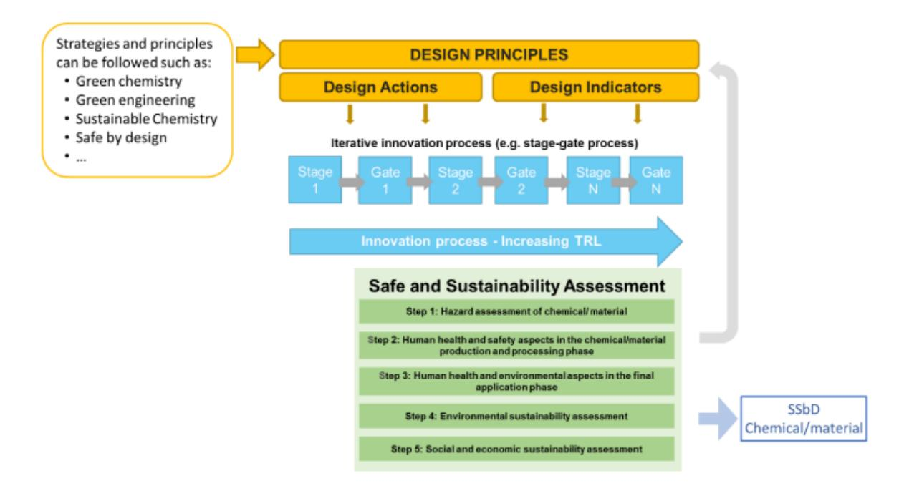

*Figure 2 Integration of SSbD in the innovation cycle including principles to be considered in the design phase of SSbD chemicals and materials, whose safety and sustainability performance is verified with the assessment allowing the classification of the chemical/material as SSbD. TRL, Technology Readiness Level [3]*

## *Sustainability assessment*

Sustainability covers and integrates safety, economic, environmental, and social aspects to avoid harm to humans and the environment [5]. Sustainability also supports the EU Green Deal [6] whose ambitions include becoming climate neutral; protecting human life, animals and plants by cutting pollution; helping companies become world leaders in clean products and technologies; and helping

ensure a just and inclusive transition [7]. 'In the context of chemicals, sustainability can be seen as the ability of a chemical, material, product or service to deliver its function without exceeding environmental and ecological boundaries along its entire life cycle, while providing welfare and socioeconomic benefits [4, 5]'.

In the sustainability assessment phase, five steps were provided for defining criteria for SSbD chemicals and materials. The first step is based on the intrinsic hazards (based on the hazard classes in the CLP Regulation). The second and third steps are based on risk considerations (occupational safety and health aspects and health and environmental impacts from the use phase (direct exposure)) based on the CLP Regulation and USEtoxModel. The fourth step is environmental sustainability and is based on the impact categories that constitute the Product Environmental Footprint (PEF) and its support from the Ecodesign for Sustainable Products Regulation (SPI) [8-10]. The fifth step would cover socio-economic aspects. Additional information on the description of environmental, social and environmental sustainability can be found in Annex I while additional information on the components of the proposed SSbD criteria definition framework can be found in Annex II.

#### *A new understanding of safety*

The safety concept relates to the absence of unacceptable risks for humans and the environment by avoiding the use of hazardous chemicals [4]. In the EU-CSS, the ambitions towards a toxic-free environment and protection against the most harmful chemicals are evident. An important development is the extension of the generic approach to risk management to ensure that chemicals that cause cancers, gene mutations, affect the reproductive or the endocrine system, or are persistent and bioaccumulative are not present in consumer products. This generic approach will be extended to other harmful chemicals including those affecting the immune, neurological or respiratory systems and chemicals toxic to specific organs [2]. The scope of this EU-CSS is also to protect vulnerable groups which typically include pregnant and nursing women, the unborn, infants and children, the elderly people as well as workers and residents subject to high and/or long-term chemical exposure [2].

# **3. Objectives**

The goal of this task is to analyze the value chains using a cradle-to-cradle approach and map the relevant stakeholders to support mainly the WPs 1-3 in developing methodologies and outputs that reflect the particularities of the value chains examined. This assessment will be conducted by each value chain represented by partners IPC (packaging), ETP (textiles), EFCC (construction), CLEPA (automotive), EMIRI (energy), and INL (electronics) (see "Who is IRISS") supported by partners Cefic, RIVM and IVL together with the SusChem NTPs which will represent the upstream steps of chemical products. The partners will update and expand existing value chain-specific overviews following a standard procedure developed by Cefic for better comparability. Furthermore, publicly (e.g., Horizon2020, HE, Interreg, etc.) and privately funded initiatives related to the research on or uptake of framework for SSbD criteria within the networks will be identified through questionnaires to subsequently create open communication channels feeding into T4.2-T4.5.

# **4. Strategy/methodology**

The value chain partners IPC (packaging), ETP (textiles), EFCC (construction), CLEPA (automotive), EMIRI (energy), and INL (electronics) carried out a mapping of defined, prioritized sub-value chains that have the greatest technological challenges and barriers in applying SSbD along their full life cycle.

The scope of the JRC framework for SSbD criteria:

*The framework foresees the assessment of the entire life cycle of a chemical or material, including the design phase and considering among others its functionality and end-use(s). Therefore, even if the evaluation of products is outside the scope of this framework, the use of the chemicals/materials in products is considered.*

The scope of this analysis is for the chemicals/materials used in the different IRISS VC (life cycle thinking approach) covers:

**Raw materials** – using primary fossil or bio-based or secondary resources (e.g. waste) in the production of chemicals

**Chemicals** – those chemicals, including polymers that are used in the IRISS VC

**Use** – those applications where chemicals are applied or used in the IRISS VC

**End of life** – the end of the life(time) of the application of the IRISS VC where chemicals have been applied.

For each value chain, the following information was gathered:

- Steps within the VC covered (upstream & downstream steps) including
  - infographic describing the flows
  - types of stakeholders and company names
- State of play on SSbD per VC and VC actors (existing methodologies):
  - what has been done with regards with SSbD?
  - sharing of best practices in place per value chain? (if any)
  - known funding initiatives
- Main SSbD challenges foreseen
  - priorities on product Safety
  - climate neutrality and circularity
  - description of known safety and sustainability issues in the specified value chain
  - any specific non technological barriers for implementing SSbD across the value chain

For exposing the challenges along the value chain, a table was drawn listing in columns, the different life cycle steps: Raw materials extraction, raw materials, Production and Processing (of materials or chemicals), processing (downstream type step, like e.g. formulation), transport, use and end of life. For each of those steps, the SSbD steps (in big lines and as per the JRC framework) where listed in different lines allowing a systematic life cycle thinking approach (as exhaustively as possible) and examined:

*Raw materials Criticality – are critical materials used? Which ones?*

*Toxicity (human and environmental safety); Which toxicity endpoints of concern?*

*Environmental sustainability; which sustainability issues of concern?*

*Social (if known)*

*Circularity (Recyclability, reusability)*

*Other (economic, functionality?)*

The first example of this table can be found under table 4 , page 21 ( Packaging value chain) .

In general, this exercise of going through all different life cycle steps of a product and looking at the different SSbD dimensions (Toxicity, environmental impact, circularity etc) was found to be difficult. However, this process has allowed to highlight the different hotspots of a given (sub) value chain.

A different level of detail/maturity in describing the actors of the different value chains is allowed, in case the information is not available. However, showing the full set of steps in each Value Chain is indispensable in order to adequately list the different SSbD challenges along the life cycle.

# **5. Results**

#### *Table 1 Value Chain Information*

| Table 1         | Value Chain Information                                                      |
|-----------------|------------------------------------------------------------------------------|
| 5.1             | Packaging (IPC; Industrial Technical Centre for Plastics and Composites)     |
| 5.2             | Textiles (ETP; EU Technology Platform for the Future of Textiles & Clothing) |
| 5.3             | Construction (EFCC; European Federation for Construction Chemicals)          |
| 5.4             | Automotive (CLEPA; European Association of Automotive Suppliers)             |
| 5.5             | Energy materials (EMIRI; Energy Materials Industrial Research Initiative)    |
| 5.6 Electronics | (INL; International Iberian Nanotechnology Laboratory)                       |

# 5.1 The Packaging Value Chain

The packaging value chain is extensive when examining packaging derived from all materials and used in diverse markets. Consequently, identifying sub-values chains to be prioritized is a challenge that can be informed by key packaging industries and the materials they use. As a place to start, Eurostat provides information on packaging waste generated in the EU in 2019 in [Figure 3](#page-15-1) below (Eurostat; online data code: env\_waspac; [11]):

**Packaging waste generated by packaging material, EU, 2019**

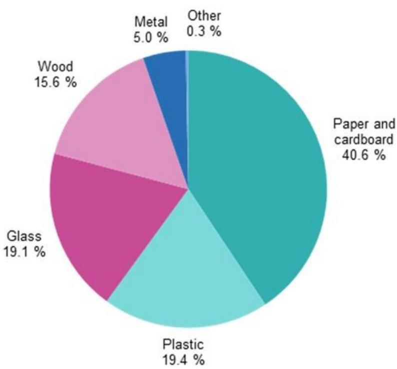

The project receives funding from the European Union's HORIZON EUROPE research and innovation programme under grant agreement n° 101058245

*Figure 3 Eurostat pit diagram showing packaging waste generated by packaging materials (2019) (Adapted from [11])*

Based on packaging waste generated in EU the three main sub-value chains are:

- 1. Paper and cardboard,
- 2. Plastics and
- 3. Glass.

For this first version of D4.1, data on plastics packaging will be more accessible since IPC is specialised in plastics industry, the focus will be the plastic packaging industry which will be used as a reference case for the rest of the project. The updated M15 version will cover all main packaging areas (paper and glass) and the M30 version might also cover wood and metal.

## 5.1.1 Sub-value chain: Plastic packaging value chain

Packaging is the main area for plastics conversion (39.5%) and consumption (33.5%). Based on the Plastics Europe report: "The circular economy for plastics: A European Overview" (2022) the majority of the 17 946 kt of plastic waste generated in the EU 63,5% originates from household packaging (11 396kt) and 37.5% comes commercial and industrial packaging (6 549kt) [12].

The plastic packaging value chain covers all industries using plastic packaging, with a significant presence in the food industry. The various plastic materials used in packaging in the EU according to

the Plastics Recyclers Europe report. For example, for HDPE, 62% of consumption is for packaging [13], 37% of PP consumption, 81% of PE flexible films [14], 96% of PET [15].

#### *5.1.1.1 Steps within the VC covered (upstream & downstream steps): infographic describing the flows + types of stakeholders + company names*

The plastics packaging value chain is described in the figure below:

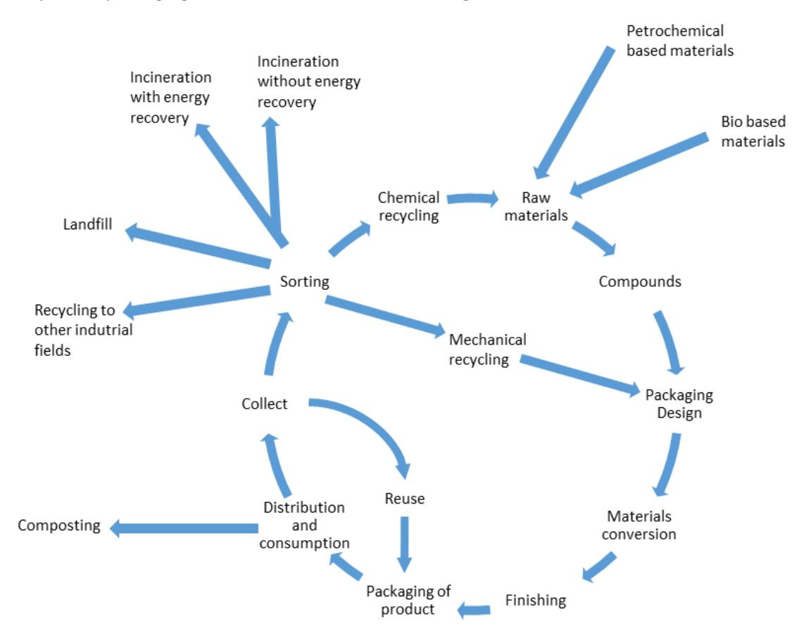

*Figure 4 Life cycle diagram for the plastics packaging value chain*

The different steps are:

- Raw materials are virgin polymeric materials and other additives needed to process plastics parts, which can be derived from petrochemical-based or bio-based materials (with several sources as starch, organic waste, microorganisms…).
- The compounder steps process these raw materials into adapted plastic materials to produce parts. Although not compulsory, it is a common step in the plastics industry.
- Packaging design is then needed, defining its purpose, shape and properties, which will determine the materials and processes that will be used. Raw plastic materials are converted into plastics parts. Several processes are used depending on the materials processed as well as the shape of the plastic packaging (i.e. films, bags, trays, boxes, caps and all other packaging parts). The materials conversion step can be done by specialized companies but also directly by companies needing the packaging. For example, several food industry firms produce in-house packaging to immediately pack the product.

- Finishing is a generic step associating with several processes, to provide final packaging parts to customers. It can be produced in-house by packaging producers or by specialized companies. These processes can be linked to printing, assembly and surface treatment.
- Product packaging is typically undertaken by the producer of the product to be packaged. Several packaging can be used to pack a product. This step can combine Materials conversion and Finishing as mentioned above.
- Distribution and consumption consist of several actors. Plastic packaging distribution actors include transportation used between each step of the value chain, warehouses and distribution through various entities such as specialized retailers, large retailers and wholesalers. Plastic packaging consumers can be categorized into households and non-households (which includes industrial, but also all other organisation, which consume packed products). Both consumers generate waste which are not always managed in the same way. Composting is also possible at this step, thanks to biodegradable plastics, which make up a very low fraction of all plastics consumed.
- The collection of plastic packaging waste is the first step in its end-of-life. This step is required for the sorting of plastics to take place.
- Sorting allows to sort the plastic packaging and transfer it through the vest valorisation chain, but also to recycle materials, which can require washing, disassembling, and grinding as well as resorting after disassembly. This step is crucial to add value to plastic packaging waste.
- Plastic packaging recycling is possible thanks to three options:
  - Reuse of old packaging
  - Chemical recycling which allows for recovering monomers used to produce virgin plastic materials
  - Mechanical recycling which mainly consists of grinding clean and sorted material to reuse in material conversion processes directly or to be granulated.
- Beyond recycling, other end-of-life trajectories for plastic packaging includes incineration with and without energy generation (heat or electricity) and landfill. Packaging waste by other industries such as the textiles or building sectors and landfill.

## *5.1.1.2 State of play on SSbD per VC and VC actors (existing methodologies):*

#### Mapping of VC actors

*Figure 5 The processes used in the value chain are listed this the chart below, to illustrate value chain stakeholders (part A)*

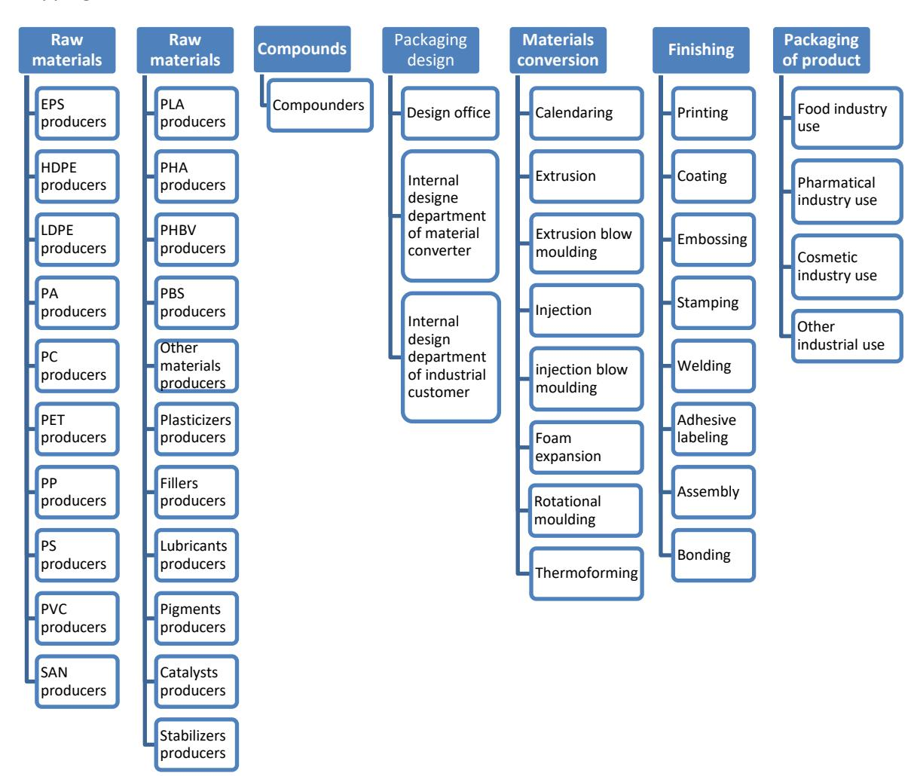

| Distribution and comsuption                                                                                                                                           | Collection                                                                                                                            | Sorting                                                                                            | Recycling                                                                                                                                                                                                                                                                                                                  | Incineration                                                                                                                                        | Landfill                                                                                                                                                                                                                      | To other industrial fields                                      |
|-----------------------------------------------------------------------------------------------------------------------------------------------------------------------|---------------------------------------------------------------------------------------------------------------------------------------|----------------------------------------------------------------------------------------------------|----------------------------------------------------------------------------------------------------------------------------------------------------------------------------------------------------------------------------------------------------------------------------------------------------------------------------|-----------------------------------------------------------------------------------------------------------------------------------------------------|-------------------------------------------------------------------------------------------------------------------------------------------------------------------------------------------------------------------------------|-----------------------------------------------------------------|
| <ul> <li>Carrefour (LG)</li> <li>Decathlon (LG)</li> <li>McDonald's (LG)</li> <li>Lidl (LG)</li> <li>Sephora (LG)</li> <li>XPO logistics (LG)</li> </ul>              | <ul> <li>Paprec (LG)</li> <li>Suez (LG)</li> <li>Veolia (LG)</li> <li>Local authorities</li> </ul>                                    | <ul> <li>Paprec (LG)</li> <li>Suez (LG)</li> <li>Veolia (LG)</li> <li>Triveo (SME)</li> </ul>      | <ul> <li>Chemical recycling               <ul> <li>TotalEnergies (LG)</li> <li>LyondellBasell (LG)</li> <li>Eastman (LG)</li> <li>Sabic (LG)</li> </ul> </li> <li>Mechanical recycling               <ul> <li>Paprec (LG)</li> <li>Suez (LG)</li> <li>Triveo (SME)</li> </ul> </li> </ul>                                  | <ul> <li>With energy recovery               <ul> <li>Lafarge (LG)</li> <li>Local authorities</li> <li>Witout energy recovery</li> </ul> </li> </ul> | <ul> <li>Local authorities</li> </ul>                                                                                                                                                                                         | <ul> <li>Textile industry</li> <li>Building industry</li> </ul> |
| <ul> <li>BASF (LG)</li> <li>Solvay (LG)</li> <li>Arkema (LG)</li> <li>LyondellBasell (LG)</li> <li>Corbion (LG)</li> <li>Lactips (SME)</li> <li>Sabic (LG)</li> </ul> | <ul> <li>PolyOne (LG)</li> <li>Polytechs (LG)</li> <li>A. Schulman (LG)</li> <li>Addiplast (SME)</li> <li>Carbiolice (SME)</li> </ul> | <ul> <li>Danone (LG)</li> <li>Nestlé (LG)</li> <li>Mondelez (LG)</li> <li>Publicis (LG)</li> </ul> | <ul> <li>AMCOR (LG)</li> <li>VERICAP (LG)</li> <li>ALBEA (LG)</li> <li>Plastipak (LG)</li> <li>Berry Bramlage (LG)</li> <li>Groupe Guillin (SME)</li> <li>Herplast (SME)</li> <li>Leygatech (SME)</li> <li>Barbier Group (LG)</li> <li>Ozembal (LG)</li> <li>Knauf industries (LG)</li> <li>PSB industries (LG)</li> </ul> | <ul> <li>Legatech (SME)</li> <li>Ionisos (SME)</li> <li>Codecor (SME)</li> </ul>                                                                    | <ul> <li>Nestlé (LG)</li> <li>Danone (LG)</li> <li>Mondelez (LG)</li> <li>Sanofi (LG)</li> <li>LVMH (LG)</li> <li>Pernod (LG)</li> <li>L'Oréal (LG)</li> <li>Inditex (LG)</li> <li>Sony (LG)</li> <li>Philips (LG)</li> </ul> |                                                                 |

*Figure 6 The type of stakeholders or processes used in the value chain are listed in the chart below in order to illustrate value chain stakeholders (Part B)*

*Table 2 Example of stakeholders in the plastics packaging value chain*

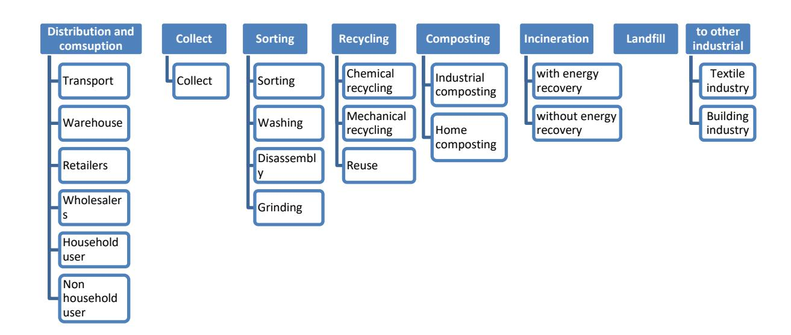

What has been done with regards to SSbD?

*Table 3 Mapping of VC actors active in SSbD initiatives development*

|    |               |             | Transport | Use | End-of-life |
|----|---------------|-------------|-----------|-----|-------------|
|    | ADEME (French |             |           |     |             |
|    |               | ADEME       | ADEME     |     | ADEME       |
| EC | EC            | EC          | EC        | EC  | EC          |
|    | EU Ecolabel   | EU Ecolabel |           |     | EU Ecolabel |

### Known funded initiatives already known (for further development in M15 and M30):

- SURPASS: Safe-, sUstainable- and Recyclable-by design Polymeric systems A guidance towardS next generation of plasticS, grant 101057901, started on 01/06/2022 for 42 months. Call: HORIZON-CL4-2021-RESILIENCE-01
- Flex Function to Sustain: Open Innovation Ecosystem for Sustainable Nano-functionalized Flexible Plastic and Paper Surfaces and Membranes, grant 862156, started on 01/04/2020 for 48 months. Call: H2020-NMBP-TO-IND-2018-2020
- Sealive: Strategies of circular Economy and Advanced bio-based solutions to keep our Lands and seas alIVE from plastics contamination, grant 862910, started on 01/10/2019 for 48 months. Call: H2020-BG-2019-1
- CIMPA: A CIrcular Multilayer Plastic Approach for value retention of end-of-life multilayer films, grant 101003864, started on 01/06/2021 for 36 months. Call: H2020-SC5-2020-2
- RMT Actia Propack Food is a French initiative creating a Mix Technological Network, gathering 17 partners. This network aims to support food and packaging industries and public authorities in R&D, set-up of tools and trainings development. Actions are focused on Food safety and ecotoxicity, process and functionalities and users and consumers (website only in French: [https://rmt-propackfood.actia-asso.eu/index.php\)](https://rmt-propackfood.actia-asso.eu/index.php)

The main challenges foreseen to the adoption of SSbD in the packaging value chain are described in which are evolving and mainly focused on plastics packaging (priorities on product Safety + Climate neutrality+ Circularity). The challenges identified provide a preliminary account and will be compared with challenges in other packaging value chains.

*Table 4 Description of known safety and sustainability issues in the plastics packaging value chain*

| Life cycle    | Raw |        |           |     |             |
|---------------|-----|--------|-----------|-----|-------------|
|               |     |        | Transport | Use | End-of-life |
| Criticality – |     |        |           |     |             |
|               |     |        |           |     | Figure 7 )  |
|               |     | [16] + |           |     |             |

| <i>Social (if known)</i>                        | Reduce use of petro-chemical material        |  |  |                                       | Reduce energy consumption of vehicles                                     |  |                                                                                                   |
|-------------------------------------------------|----------------------------------------------|--|--|---------------------------------------|---------------------------------------------------------------------------|--|---------------------------------------------------------------------------------------------------|
| <i>Circularity (Recyclability, reusability)</i> |                                              |  |  |                                       | Increase of packaging use due to consumer returns (Charte ADEME + amazon) |  |                                                                                                   |
| <i>Other (economic, functionality ?)</i>        | Possibility to produce compostable packaging |  |  | Facilitate recyclability of packaging |                                                                           |  | Improve identification of polymers waste which can be recycled and increase closed loop recycling |

[Criticality](https://single-market-economy.ec.europa.eu/sectors/raw-materials/areas-specific-interest/critical-raw-materials_en) (critical raw materials; Toxicity and Environmental sustainability: See [Table 29](#page-77-0) for indicators).

PET provides a clear example of sorting challenges as illustrated in [Figure 7](#page-22-0) .

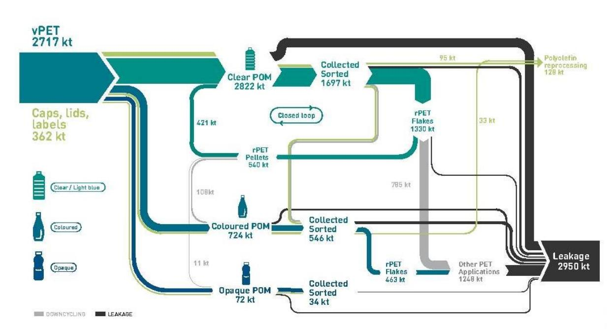

*Figure 7 Circularity of PET bottles (adapted from Zero Waste Europe, 2022, [19])*

# 5.2 The Textile Value Chain

The textile value chain is comprised of several industrial activities. Starting from the processing of fibres (extracted natural fibres such as cotton, wool, silk, flax, hemp etc. or extrusion of fossil or biobased polymers) to the fabrication of filament-like (yarns, threads, ropes...) or fabric-like (woven, knitted, embroidered, braided, tufted, nonwoven … structures) fibre-based materials and their processing (dyeing, printing, finishing, coating...) and assembly into final products. Textiles are used across a wide range of consumer and industrial end markets. The biggest end markets for textile-based products are clothing and fashion, home and interior decoration incl. furniture, automotive and other transport systems, construction, personal protection, healthcare, sports, agriculture, environmental protection and packaging.

Many end markets for fibres and textiles are undergoing significant changes and are expected to see a massive shift in terms of product types, materials used and volumes in the coming years. Textiles and clothing are a diverse sector that plays an important role in the European manufacturing industry, employing 1.7 million people and generating a turnover of €166 billion. While low added value commodity products have been outsourced, high added value products are still largely made in Europe, with broadly stable added value and steadily growing exports. The sector is undergoing a radical transformation to maintain its competitiveness within this move towards products with higher value added, and a significantly improved sustainability profile.

The textile manufacturing value chain is a complex, globally interconnected ecosystem with over 150,000 manufacturing companies in the EU alone, almost all of which are SMEs.

## THE TEXTILE MANUFACTURING PROCESS

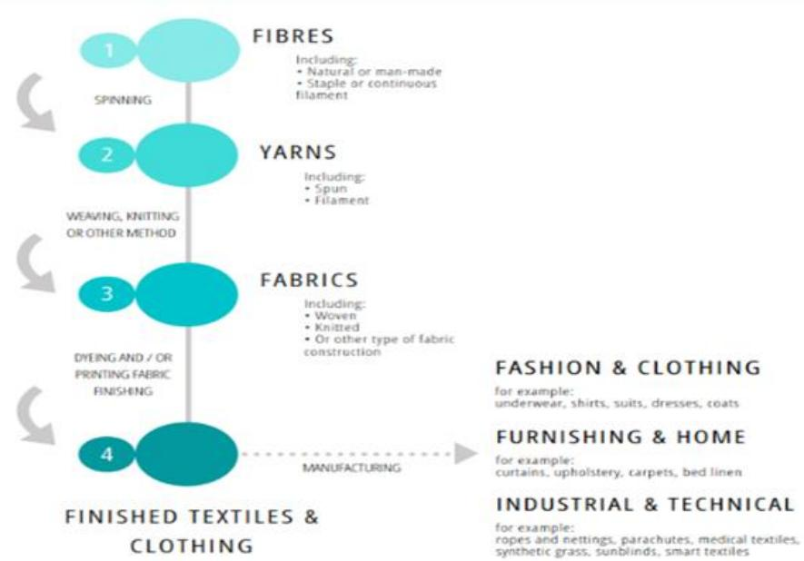

*Figure 8 The textile manufacturing process. Figure source: [Euratex](https://www.google.com/url?sa=t&rct=j&q=&esrc=s&source=web&cd=&cad=rja&uact=8&ved=2ahUKEwiF9_SnwqX6AhVKKuwKHWuxBkcQFnoECAQQAQ&url=https%3A%2F%2Feuratex.eu%2F&usg=AOvVaw0DU02gv-R6CnwRYSnudKP4)*

The EU textile and clothing industry has shifted its focus to high value added products for the most demanding consumers and industrial end markets such as premium and luxury fashion and interiors, medical textiles and nonwovens, high quality workwear, personal protective equipment and materials and components for the transport, construction, environmental protection, agriculture, and fishery markets. EU producers not only serve EU end markets with their innovative products but also export an increasing share of EU production to global markets. The annual export value of the EU textile and clothing industry is more than €50 billion.

# 5.2.1 Environmental footprint

Today approximately 70% of all global textile fibre-based products are made of fossil-based feedstocks. While collection and re-use rates of end of (first) life clothing is relatively significant (20- 30% depending on EU country), ultimately the vast majority of European post-use textile waste is still incinerated or landfilled (in the EU or elsewhere in the world). While not all synthetic fibres are likely to be replaced in the short term for performance or cost reasons, significant research and technology advances are needed to enable future large-scale replacement of virgin fossil-based fibres by biobased or renewable materials, preferably from EU agricultural, forestry and waste resources.

# 5.2.2 Sub-value chain selection

The largest textile sub-value chains or end-markets by volume are clothing and fashion products, home and interior textiles and nonwovens. A significant volume share of the manufacturing of clothing and home textiles sold on the EU market takes place outside Europe, especially in lower labour cost countries in Asia. While there is significant production of nonwovens in Europe, it is debatable if they are technically part of the textile value chain or represent a separate value with similarities both with the textile and the paper processing sectors.

For these reasons we suggest for this first deliverable to focus the analysis on two sub-value chains for which significant parts of manufacturing and value creation takes place in the EU today or is expected to take place in EU in the near future. The sub-value chains are:

- 1. Workwear and protective textiles and clothing
- 2. Electronic or smart textiles

Although a first focus is in EU today, it would also be interesting to have one sub-value chain with production in Asia and see which challenges to the SSbD concept arise in this situation.

## *5.2.2.1 Workwear and protective textiles and clothing*

## 5.2.2.1.1 State of play on SSbD per VC and VC actors (existing methodologies):

*Table 5 Mapping of VC actors*

| Life cycle | Raw Material |             |     |             |
|------------|--------------|-------------|-----|-------------|
|            |              | Transport & |     |             |
|            |              |             | Use | End-of-life |

| Sheep breeders | Pulp & |     |
|----------------|--------|-----|
| Oil production | Yarn   |     |
|                | Makers | of  |
|                | trims  | and |

A consideration might be to focus on synthetic fiber production and textile chemicals (of which there are many). To list all those chemicals and the issues that companies have would be the task of a company providing textiles chemicals.

*Table 6 What has been done with regards to SSbD?*

| Life cycle | Raw |      |           |                 |      |
|------------|-----|------|-----------|-----------------|------|
|            |     |      | Transport | Use             | End |
|            |     | PFAS |           | Decontamination |      |

### 5.2.2.1.2 Main SSbD challenges foreseen (priorities on product Safety + Climate neutrality+ Circularity):

*Table 7 Description of known safety and sustainability issues in the specified value chain*

| Life cycle    | Raw Material |          |           |     |      |
|---------------|--------------|----------|-----------|-----|------|
|               |              |          | Transport | Use | End |
| Criticality – |              |          |           |     |      |
|               | Not relevant | Antimony |           |     |      |

|                                                          |  |                                       |  |  |  |
|-----------------------------------------------------------------------|---------------|----------------------------------------------------|---------------|---------------|---------------|
| waste, use of waste wool from meat/dairy production Use of wood waste |               | Recovery of processing chemicals, water and energy |               |               |               |
| <i>Other (economic, functionality?)</i>                               |               |                                                    |               |               |               |

[Criticality](https://single-market-economy.ec.europa.eu/sectors/raw-materials/areas-specific-interest/critical-raw-materials_en) (critical raw materials; Toxicity: See [Table 29](#page-77-0) for indicators of toxicity and environmental sustainability).

## *5.2.2.2 Electronic or smart textiles*

Electronic textiles (e-textiles or smart textiles) such as filaments, fabrics and textile end products that have electronics and interconnections integrated into them, are seeing rapid growth in the current decade. These are driven by many added value niche markets across healthcare, sports and gaming, personal protection and smart interiors. Market analysts believe next generation wearables will provide significant opportunities to newcomers and well-established textile companies for creating value. Europe has a good head start thanks to a strong technical position of the textiles industry.

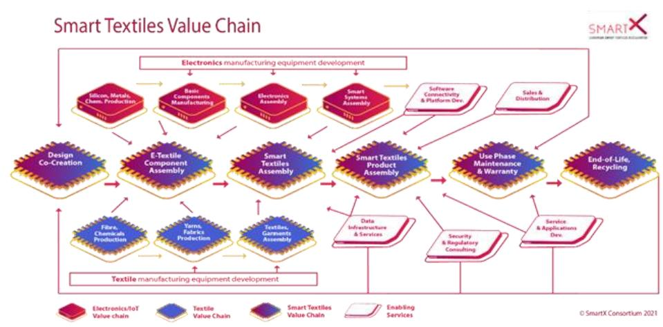

*Figure 9 Smart Textiles Value Chain description*

E-textiles are an emerging value chain which is currently not subject to any SSbD initiatives. For this reason, the early development of this value chain based on SSbD principles would make for an interesting study case, particularly because requires examining two complex and interlinked value chains – electronic and textiles – with different actors, procedures, legislation and standards poses a special challenge.

# 5.3 Value chain Construction

# 5.3.1 Introduction

The Construction Value Chain (CVC) is one of the largest and most complex value chains in the EU [1], representing around 8.2% of the EUs' GDP and employing around 23.2 million people (around 10% of EU's total employment). Concrete is the most used material in construction, it is a composite made of several materials one of which is cement. Concrete (and cement) contributes to about 8% of global CO2 emissions.

Despite its complexity, the CVC can be deconstructed and effectively analysed, with clear linkages and individual characteristics of different sectors (cf[. Figure 10\)](#page-28-2) [1].

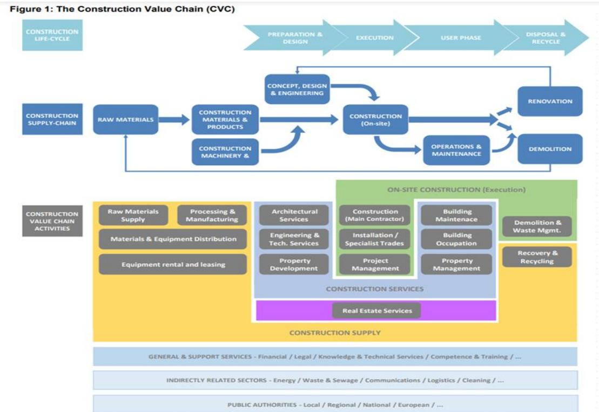

*Figure 10 The Construction Value Chain (CVC) in the European Union*

[Figure 10](#page-28-2) conveys three core sets of activities within the CVC:

- 1. **Construction Life Cycle** covering preparation & design, execution, use-phase and disposal & recycling
- 2. **Construction Supply Chain**  covering raw materials, construction materials and products, down to demolition and/or renovation
- 3. **Construction Value Chain activities** including construction supply, where most of the construction chemicals are used: in raw materials supply, processing & manufacturing, demolition & waste management and recovery & recycling.

Within the Construction Value Chain, construction chemicals fall largely in the category of additives to raw materials to manufacture construction products and materials. Most construction chemicals are used in the '*processing and manufacturing industries that turn raw materials into building products*' (cf. [Figure 10\)](#page-28-2). Only a small proportion of such raw materials are chemicals, non-metallic mineral products have the highest share of intermediate inputs: 13.1% (of a total of 48.3%) into the construction sector.1

*Construction chemicals* are used in a number of CVCs: Concrete admixtures and Cement grinding aids, Surface treatment, Repair and rehabilitation, Protective coatings, Industrial flooring, Waterproofing, Adhesive and sealants, and Grouts and anchors. The largest class of construction chemicals is that of *Concrete Admixtures*, which can be used to improve the properties of concrete such as its workability, durability or strength. They can also significantly reduce the carbon footprint of concrete and lower global CO2 emissions [2].

Among the five different classes of concrete admixtures, the class of '*super-plasticizers'* was selected to apply and test the validity of the framework for SSbD criteria.

# 5.3.2. Concrete Admixtures Sub-Value Chain

The key construction material is *concrete*, which is a composite made from several materials, one of which is cement. Concrete has numerous end-uses in the building and construction industries such as residential buildings (e.g. affordable housing), commercial and industrial buildings (e.g. factories) and infrastructure (e.g. roads, bridges, etc.).

To improve the functionality of concrete, concrete admixtures can be used. There are basically two types of admixtures: (i) mineral admixtures and (ii) chemical admixtures. Chemical admixtures can be divided into five classes of admixtures, i.e.:

- 1. *Accelerating admixture* A chemical that increases the rate of hydration of hydraulic cement, reduces the setting time or increases the rate of strength development.
- 2. *Retarding admixture* A substance that delays the setting time of cement paste.
- 3. *Water – reducing admixture* A chemical that either increases the workability of freshly mixed mortar or concrete without increasing water-cement ratio or maintains workability with reduced water-cement ratio.
- 4. *Air – entraining admixture*  A chemical that causes air to entrap in the form of tiny bubbles in mortar or concrete during mixing to increase its workability and resistance to freezing and thawing.
- 5. *Super plasticizing admixture –* A chemical that has very high workability with a large decrease in water content (at least) for a given workability. It is a *high range water reducing admixture*, also referred to as a superplasticizer.

# 5.3.3 Super Plasticizer Sub-value Chain

From the five classes of concrete admixtures, the sub-value chain of superplasticizers1 has been selected for this deliverable to assess the application of SSbD principles, as they are commonly used and have been subject to further (product) development to improve their overall sustainability, for example, with respect to energy efficiency, GHG emission reductions, raw material use, water use, durability, etc.

The main four classes of super-plasticizers are (Na, Ca and/or Mg salts of)2 :

- Lignosulphonates (**LS**) Biobased: wood or agricultural by-products
- Naphthalene (**NSF**) sulphonates Naphthalene Sulphonate Formaldehyde poly condensate
- Polycarboxylate(s)/-ether Poly Carboxylate Ether (**PCE**) based
- Melamine sulphonate (**MS**) Sulphonated Melamine Formaldehyde condensate

Superplasticizers, like plasticizers, improve the dispersion of cement particles, resulting in a high workability. As a result of ongoing innovation, the performance of concrete has improved enormously over the past years and superplasticizers are used in all major construction projects in Europe (and elsewhere).

Four distinct classes of super-plasticizers allow further assessment and comparison of the application and applicability of the framework for SSbD criteria.

Producers of superplasticizers have been working to either (1) reduce the content of carcinogens in the superplasticizers, and/or (2) develop alternative superplasticizers such as Polycarboxylate(s)/- Ether (PCE) and Lignosulphonates (LS). Keeping in mind that most superplasticizers will not contain levels that are hazardous and therefore should not attract a classification & labelling for carcinogenicity. PCE and LS are already ''alternatives'' to the other two classes of superplasticizers (NSF and MS) because they typically do NOT contain ''highly toxic chemicals".

## 5.3.4 Application of SSbD principles to Superplasticizers

In many cases it will be very difficult (or even not desirable) to apply all these principles at the same time as several can be contradictory (trade-offs issues which is one of the challenges of applying SSbD concept). For example combining *2. Designing materials with less hazardous chemicals and 3. Designing efficiently to be more sustainable*, a very reactive (hazardous) chemical may lead to an overall more sustainable design from a full life cycle perspective yet not meet the first step of the safety and sustainability assessment of the JRC framework for SSbD criteria.

1 A super plasticizer is defined as 'an admixture that allows the water content of a specific concrete mixture to be considerably reduced without impairing its consistence or to considerably increase its slump/flow without changing the water content or to achieve both effects at the same time' (EN 934-2).

*Table 8 Main SSbD principles incorporated by Lignosulphonates (LS), Naphthalene sulphonate formaldehyde (NSF) superplasticizers, Polycarboxylate(s)/-Ether (PCE) and Melamine sulphonates (MS)*

|     | JRC Suggested Safe and Sustainable by Design (SSbD) principles: | LS | NSF | PCE | MS |
|-----|-----------------------------------------------------------------|----|-----|-----|----|
| 1.  | Atom economy                                                    |    |     |     |    |
| 2.  | Design with less hazardous chemicals                            |    | R   |     | R  |
| 3.  | Design efficiently to be more sustainable                       | R  | R   | R   | R  |
| 4.  | Use renewable sources                                           | R  |     |     |    |
| 5.  | Prevent and avoid hazardous emissions                           |    | R   |     | R  |
| 6.  | Reduce exposure to hazardous substances                         |    | R   |     | R  |
| 7.  | Design for commercial after-life                                |    |     |     |    |
| 8.  | Prevent the use of Natural Resources by Reduction, Reuse        |    |     |     |    |
|     |                                                                 | R  | R   | R   | R  |
| 9.  | Dematerialisation: sell service, not product                    |    |     |     |    |
| 10. | Design and promote new process strategies                       |    |     |     |    |
| 11. | Supportive policy framework                                     | R  | R   | R   | R  |
| 12. | Reduce production                                               |    |     |     |    |
| 13. | Consider the whole life-cycle                                   | R  | R   | R   | R  |

*R* in the Table above conveys the *Relevance* of SSbD principles when evaluating particular superplasticizers.

## *5.3.4.1 Lignosulphonates (LS)*

A major source of lignin-based biopolymers in Europe is provided by the Norwegian company Borregaard. They produce renewable, wood-based biopolymers, that are used as raw materials by companies manufacturing LS as superplasticizers in Europe.

As LS are high molecular weight materials and deemed safe from a toxicological and eco-toxicological perspective (DBC\_229-SB-E-2017\_01.pdf). This has been confirmed for acute, oral toxicity. Moreover, irritating effects have not been observed and finally LS are inherently biodegradable. This is a raw material with a very low carbon footprint, based on natural, renewable resources (4). However, here the use of natural resources is therefore not prevented or reduced (8), a demonstration that the SSbD principle of reduction of use of natural resource cannot be met, while the others are met.

## *5.3.4.2 Naphthalene sulphonate formaldehyde (NSF) superplasticizers*

Naphthalene (one of the raw materials used to produce NSF) is manufactured via a dry distillation of bituminous coal via a decomposition reaction. NSF superplasticizers are manufactured by sulphonating naphthalene and conversion with formaldehyde. Medium and high molecular weight NSFs are used as superplasticizers.

According to CLP criteria, classification or labelling of products with a free formaldehyde content below 0.1 w/w% is not required. Products that contain free formaldehyde above 0.1 w/w%, need to be labelled with the hazard statement H350 ''may cause cancer'' as well as EUH 208 ''may cause allergic reactions''. No skin irritation has been observed and also their aquatic toxicity is very low.

NSF superplasticizers do not meet the criteria for being readily biodegradable, so they cannot be discharged directly into the aquatic environment. NSFs are soluble in water.

## *5.3.4.3 Polycarboxylate(s)/-Ether (PCE)*

Typically (water soluble) polycarboxylate(s)/polycarboxylic ethers are used as a sodium salt raw material for superplasticizers. They are derived from unsaturated organic carboxylic acids. Polymerisation products from acrylates and maleinates as well as different derivatives of these with polyalkylene-glycol-ethers are used in concrete admixtures (cf. DBC publication).

TPCEs are not acutely toxic. Acrylates can cause skin irritation while maleinates and polycarboxylic ether are non-irritant. Classification or labelling of these raw materials is not required under CLP criteria.

The biodegradability of PCEs ranges from not readily biodegradable to poorly biodegradable. PCE is classified as Water Hazard Class 1, low hazard for waste. They may not be discharged directly or indirectly into sewage waters or to aquatic environments.

## *5.3.4.4 Melamine sulphonates (MS)*

Melamine sulphonates are sulphite-modified, melamine-formaldehyde condensation products. These raw materials are especially suitable for flowing concrete and have a good compatibility with cement (cf. Deutsche Bauchemie publication).

According to CLP criteria, classification or labelling of products with a free formaldehyde content below 0.1 w/w% is not required. Products that contain free formaldehyde above 0.1 w/w%, need to be labelled with the hazard statement H350 ''may cause cancer'' as well as EUH 208 ''may cause allergic reactions''.

MS are classified as Water Hazard Class 1: low hazard for waters. MS do not fulfil the criteria for persistent, bioaccumulative and toxic (PBT) or very persistent and very bioaccumulative (vPvB).

## 5.3.5 Evaluation of the SSbD principles

Producers of superplasticizers have been working to either (1) reduce the content of carcinogens in the superplasticizers, and/or (2) develop alternative superplasticizers such as PCE and LS.

Description of the health, safety and environmental properties of Superplasticizers.

## *5.3.5.1 Hazards and risks of raw materials*

| Lignosulphonates (LS)           | lignin-based biopolymers, sulphonic acid                 |
|---------------------------------|----------------------------------------------------------|
| NSF superplasticizers (NSF)     | naphthalene, sulphonic acid, formaldehyde                |
| Polycarboxylate(s)/-Ether (PCE) | carboxylic acids, maleinates, polyalkylene- glycolethers |
| Melamine sulphonates (MS)       | melamine, formaldehyde, sulphonic acid                   |

The most hazardous materials used in the superplasticizers listed above are formaldehyde, melamine and naphthalene, which are classified in the EU as follows: formaldehyde (CAS 50-00-0) as a category 1B carcinogen, and melamine (CAS 108-78-1) and naphthalene (CAS 202-049-5) as category 2 carcinogens.

## *5.3.5.2 Hazards & risks related to the production of superplasticizers*

The production of superplasticizers is associated with the hazards as indicated on the Safety Data Sheets of the raw materials used. Formaldehyde, melamine and naphthalene require specific measures to reduce the manufacturing risks associated with these chemicals.

The risks are typically managed through in-company health, safety, security and environmental management systems. Larger manufacturers may also be certified for Occupational Health and Safety Systems, such as ISO 45001, and Environmental Management Systems, such as ISO 14001.

## *5.3.5.3 Hazards & risks related to the use of superplasticizers*

During the use phase, concrete admixtures are firmly bound into the cement matrix in hardened concrete. No relevant risks are known for water, air and soil if the products are used as designated.

In the case of NSF and Melanin sulfonates, the free formaldehyde content will typically be below 0.1 w/w% and according to CLP criteria, classification or labelling of such products is NOT required. However, where these products contain free formaldehyde above 0.1 w/w%, they need to be labelled with the hazard statement H350 ''may cause cancer'' as well as EUH 208 ''may cause allergic reactions''.

Application of the SSbD principles should result either in a free formaldehyde content that is (well) below the 0.1 w/w% or in substitution of these by other superplasticizers.

## *5.3.5.4 Environmental impacts along the full life cycle of raw materials, chemicals, use and end-of-life of the superplasticizers value chains.*

The key environmental benefits of the use of superplasticizers include (i) the reduction of water use, (ii) the reduction of energy used and (iii) the reduction of CO2 emissions. The addition of 1.0 w/w% superplasticizer typically leads to a water reduction of 20% or more. Moreover, superplasticizers typically improve the quality of concrete (e.g. vis-à-vis adverse climatic conditions), improve the durability of concrete (leading to a longer service life), improve the performance of concrete (e.g. energy required during the casting of concrete is reduced), and allow the use of e.g. recycled aggregates.

Environmental Product Declarations (EPDs) are available for all classes of superplasticizers, they enable a user to carry out a Life Cycle Assessment to determine the potential impact of the use of superplasticizers in a building or construction.

## *5.3.5.5 End-of-Life*

Superplasticizers applied to the construction or building and dismantled at the end of the product service life cannot be separated anymore from concrete. For this reason, this admixture must be sent directly to landfill or re-cycling / re-use along with the concrete it is part of.

# 5.3.6 Superplasticisers Sub-value chain actors

The key sub-value chain actors include:

- Manufacturers / suppliers of raw materials
- Producers of superplasticizers
- Users of superplasticizers
- Demolition companies (for disposal or re-use)

One of the key activities of the producers of superplasticizers is the publication of Environmental Product Declarations (EPDs), that allow users to conduct full Life Cycle Assessments of the construction of buildings.

In addition, producers of superplasticizers have been innovating to either (1) reduce the content of carcinogens in the superplasticizers, and/or (2) develop alternative superplasticizers. Examples of the latter are PCE or LS superplasticizers.

The users of superplasticizers have reaped the benefits of improved concrete workability, performance and sustainability.

## *5.3.6.1 Main SSbD challenges foreseen (priorities on Product Safety + Climate neutrality + Circularity):*

*Table 9 Description of known safety and sustainability issues in the Super Plasticizer (SP) value chain*

| Life cycle  | Raw                    |
|-------------|------------------------|
|             | site with concrete     |
| Criticality | –                      |
|             | No No N.A. No          |
|             | ( Climate Neutrality ) |
|             | ( Circularity )        |

[Criticality](https://single-market-economy.ec.europa.eu/sectors/raw-materials/areas-specific-interest/critical-raw-materials_en) (critical raw materials; Toxicity: See [Table 29](#page-77-0) for indicators of toxicity and environmental sustainability).

#### *Table 10 What has been done with regards to SSbD?*

| Life cycle | Raw |           |           |
|------------|-----|-----------|-----------|
|            |     | Transport | Use       |
|            |     |           | site with |

#### *Table 11 Mapping of VC actors*

| Life cycle | Raw |      |           |              |             |
|------------|-----|------|-----------|--------------|-------------|
|            |     |      | Transport | Use          | End-of-life |
|            |     | n.A. | n.A.      | Construction |             |

# 5.4 Value chain Automotive

The automotive supply chain is a complex one, composed of hundreds of parts and components, which are made out of thousands of different materials. This relationship is shown i[n Figure 11.](#page-36-2) Beyond that, each part or even material and substance comes from a different supplier, enlarging even the supply chain of vehicles. A limited number of vehicle components were selected for this analysis, to cover a representative range of materials and substances to examine the applicability of safety and sustainability concepts.

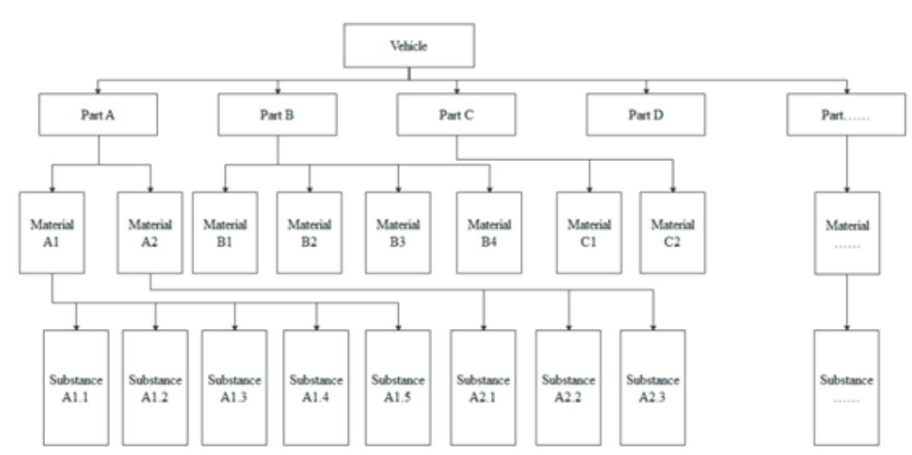

*Figure 11 Diagram of a material composition relationship of various parts of vehicles. Figure source: He et al., 2021.* 

# 5.4.1 Steps within the VC covered

## *5.4.1.1 Raw materials*

Automobiles require a number of raw materials for their production, including aluminium, glass and the iron ore to make steel, as well as petroleum products used to make plastics, rubber and polymer composites.

Metals represent the biggest share of the materials used as they are used to make the automotive body sheet metal components, which are assembled together into the body-in-white (BIW).

The average automotive vehicle on the market contains about 150 kilograms of plastics and composite materials, accounting for around 10% of the vehicle's weight and 50% of the volume materials. The use of plastics brings multiple advantages, such as a vehicle mass reduction, which leads to lower fuel consumption and a decrease in emissions of Green House Gasses (GHG). Some examples of car parts made from plastic are door handles, air vents, the dashboard and airbags. According to the European Recycling Industries' Confederation, there are currently about 39 different types of basic plastics and polymers used to make an automobile, being the most common ones: polypropylene (e.g., bumpers, cable insulation carpet fibres, etc.), polyurethane (e.g., foam seating, insulation panels, suspension bushings, cushions, electrical compounds, etc.) and polyvinyl chloride (PVC) (16%) (e.g., instrument panels, electrical cables, pipes, doors, etc.). A variety of other plastics and polymers, including engineering plastics, are also used and combined for other automotive parts (e.g., acrylonitrile

butadiene styrene, polyamides, polystyrene, polyethylene, polyoxymethylene, polycarbonate, acrylic, etc.).

In the case of polymer composites, reinforcing agents like fibres are added within a polymer matrix – these are often called fibre-reinforced polymers. Conventional fibre-reinforced composites typically incorporate synthetic fibres, such as glass or carbon fibres (e.g. carbon fibre reinforced polymer). The polymer matrix is usually of a thermoset resin, such as epoxy or polyester resin. This class of polymers will be further addressed on a future report.

Rubber is mostly used in vehicles for the tyres, which are made out of natural rubber, synthetic rubber, carbon black and oil. The share of rubber compounds in the total weight of a tyre is more than 80%. The rest consists of various kinds of reinforcing materials. Approximately half of the rubber is natural rubber from a rubber tree.

Automotive chemicals are used in various parts and components of vehicles in automotive industry, often with the purpose of improving performance and durability of the materials, driven in part by the need to reduce emissions. Some of the main automotive chemical categories are:

- Coatings;
- Lubricants;
- Adhesives;
- Maintenance Chemicals.

### *5.4.1.2 Processing of materials*

After the BiW is assembled, one of the final steps in the vehicle manufacturing process is to apply a serious of coating layers, normally including:

- Primer coating for corrosion resistance (e.g. electrophoretic primers);
- Floating coating for impact resistance, insulating characteristics for extreme exterior temperatures and filling to the electrophoretic surface (e.g. hydroxyl polyester or polyurethane hydrate as base material)
- Finish coating, including monochrome paint or metallic paint, applied for resistance to UV radiation. The metallic paint also brings ensures colour and has a decorative effect.

Another application of coatings is for wheel rims and other exterior metals (decorative or not). For wheel rims, those are often painted or polished and lacquered with a clear coat after a chemical conversion surface treatment (European Aluminium Association, 2011)[\[22\]](https://euc-word-edit.officeapps.live.com/we/wordeditorframe.aspx?ui=pt%2DPT&rs=sv%2DSE&wopisrc=https%3A%2F%2Fivlse.sharepoint.com%2Fsites%2Firiss%2F_vti_bin%2Fwopi.ashx%2Ffiles%2F66aed7b6e71d459abd6ccde8a4dd2288&wdenableroaming=1&mscc=1&hid=808A5DA0-E039-4000-F122-15BF64F8C813&wdorigin=AuthPrompt&jsapi=1&jsapiver=v1&newsession=1&corrid=c8965692-cc39-4037-81bd-c6b54b9ce822&usid=c8965692-cc39-4037-81bd-c6b54b9ce822&sftc=1&cac=1&mtf=1&sfp=1&instantedit=1&wopicomplete=1&wdredirectionreason=Unified_SingleFlush&rct=Medium&ctp=LeastProtected#_ftn22). Examples of specific surface finishes are:

- Dura-Bright® technology;
- chrome plating;
- polished clear coat wheel finish.

Silicon coatings are also commonly used as they ensure important properties for safety sensitive parts such as airbags, notably gas-retention and flame retardance. Most often, these properties are achieved by applying a first layer of gas-retaining polymer (such as a silicone-containing polymer) to the fabric surface and by applying a second, protective layer over the first layer, with incorporated flame-retardant additives.

Automotive chemicals, including innovative examples such as bio-based automotive chemicals shall be addressed further on a future report.

Polypropylene (PP), probably the most common plastics used in vehicles, is made from the polymerization of propylene gas in the presence of a catalyst system. A selection of automotive plastics will be further analysed in a future report.

Polyamides, or nylon 6, a commonly used engineering plastic, also plays an important role in safety sensitive applications such as airbags as it ensures high strength, heat stability, good aging characteristics, energy absorption, coating adhesion, and functionality in extreme hot and cold conditions. A selection of automotive engineering plastics will be further analysed in a future report.

## *5.4.1.3 End-of-life*

An EoL vehicles are collected and separated into parts before shredding. Ferrous metals (steel) that are not removed for spare parts, are separated from the non ferrous metals and other materials through magnetic separation after shredding (Duranceau and Spangenberger, 2011). [\[7\]](https://euc-word-edit.officeapps.live.com/we/wordeditorframe.aspx?ui=pt%2DPT&rs=sv%2DSE&wopisrc=https%3A%2F%2Fivlse.sharepoint.com%2Fsites%2Firiss%2F_vti_bin%2Fwopi.ashx%2Ffiles%2F66aed7b6e71d459abd6ccde8a4dd2288&wdenableroaming=1&mscc=1&hid=808A5DA0-E039-4000-F122-15BF64F8C813&wdorigin=AuthPrompt&jsapi=1&jsapiver=v1&newsession=1&corrid=c8965692-cc39-4037-81bd-c6b54b9ce822&usid=c8965692-cc39-4037-81bd-c6b54b9ce822&sftc=1&cac=1&mtf=1&sfp=1&instantedit=1&wopicomplete=1&wdredirectionreason=Unified_SingleFlush&rct=Medium&ctp=LeastProtected#_ftn7)

Pure steel can be recycled repeatedly without loss of quality or strength. Recycling one tonne of steel conserves 1.15 tonnes of iron ore, 570kg of coal and 48kg of limestone. However, metals are often utilized in mechanically and/or physically (i.e., alloyed) combined forms. Not only alloyed metals, but also mechanically combined metals become practically inseparable during the remelting stage in the recycling process, unless they are separated in advance. Consequently, closed-loop recycling of metals maintaining required quality tends to be infeasible. Currently open-loop recycling is the mainstream recycling strategy (Ohno et al., 2017). [8]

End of life vehicle plastics which cannot be recycled are mostly shredded mainly for use in energy recovery.

# 5.4.2 State of play on SSbD per VC and VC actors (existing methodologies)

The automotive industry is evolving to include more sustainable designs and products. The literature shows that to effectively analyze a product, the original and new improved design must be compared. In addition, customer opinion is key to introducing a successful product.

When choosing materials, designers and engineers must consider many factors, that are at times conflicting in terms of economic and environmental impacts. For the design team to handle conflicting objectives (e.g., cost vs. lightweight; functionality vs. recyclability, etc.) it must have well-defined and acceptable limits for each design requirement. The figure below exemplifies a proposed model for sustainable material selection study for BIW, in the context of a lightweight design.

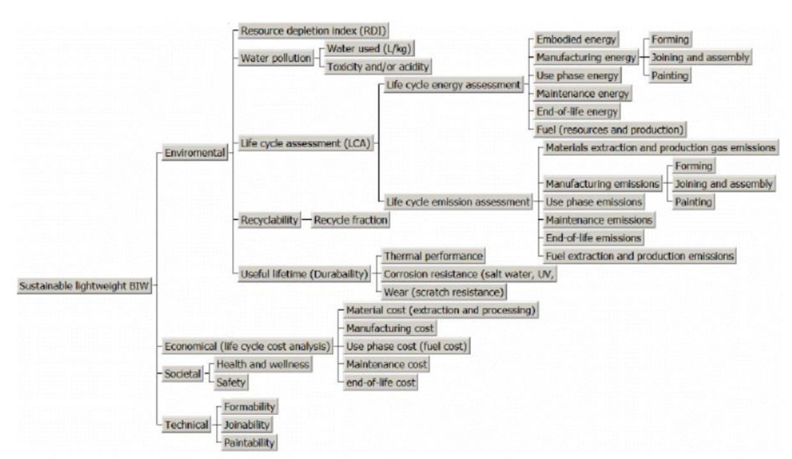

*Figure 12 Factors of sustainable material selection for BIW. Figure source: Mayyas et al., 2012.*

*Table 12 What has been done with regards to SSbD? (non-exhaustive)*

| Life cycle | Raw |               |            |           |     |         |
|------------|-----|---------------|------------|-----------|-----|---------|
|            |     | Raw materials | Processing |           |     |         |
|            |     |               |            | Transport | Use | End-of |

## *5.4.2.1 Ecodesign and Recycling*

The EU enforced the End of Life (ELV) Directive (2000/53/EC). It aims to reduce the waste generated by ELVs and also to protect the environment by promoting the reuse and recycling of ELV components. According to the ELV Directive, from January 1, 2015, recovery requirements should achieve the target

of at least 95% (with a maximum energy recovery of 10%) and a minimum of 85% of the total material has to be reusable and recyclable. Common vehicles currently have recyclability rates higher than 85% for any equipment version. The design for recyclability of a vehicle usually begins with the design and selection of materials. After a vehicle is scrapped, whether the components as well as parts and materials can be recycled depends largely on the retention of the original properties of the materials and the performance of the material itself. The connection between components and parts also directly affects the recyclability of vehicles after they are scrapped. Some materials that can be recycled will become difficult to recycle or will become non-recyclable because the connection with other materials was bonding and welding, which are difficult to separate or dismantle.

# 5.4.3 Life cycle analysis and supply chain traceability

## *5.4.3.1 Life Cycle Assessment (LCA)*

The automotive industry has been using Life Cycle Assessment and related tools since the early 1990s. Manufacturers have since used the LCA methodology mainly internally for the following applications: as 1) hot spot analysis/improvements, 2)research to inform technical developments, 3) calculation of scope 3 emissions, and 4) internal steering to reduced GHG emissions. [\[1\]](https://euc-word-edit.officeapps.live.com/we/wordeditorframe.aspx?ui=pt%2DPT&rs=sv%2DSE&wopisrc=https%3A%2F%2Fivlse.sharepoint.com%2Fsites%2Firiss%2F_vti_bin%2Fwopi.ashx%2Ffiles%2F66aed7b6e71d459abd6ccde8a4dd2288&wdenableroaming=1&mscc=1&hid=D51E5EA0-B08C-4000-F122-190977569DDB&wdorigin=AuthPrompt&jsapi=1&jsapiver=v1&newsession=1&corrid=5145aabb-7741-46a2-816e-35dd550d0d5a&usid=5145aabb-7741-46a2-816e-35dd550d0d5a&sftc=1&cac=1&mtf=1&sfp=1&instantedit=1&wopicomplete=1&wdredirectionreason=Unified_SingleFlush&rct=Medium&ctp=LeastProtected#_ftn1) For LCAs to determine the global warming potential of vehicles – with an Internal Combustion Engine, (ICE) – the average use phase accounts for around 80% for passenger cars and even more for heavy-duty vehicles due to their range of applications. Within the production phase, a major share is determined by the materials of the supply chain. End-of-life emissions, including recycling, are only about 1% of the entire life cycle emissions. For BEVs, around 50% of CO2 emissions are generated in the production phase, and the other half comes from the use phase, considering the mix of electricity generation systems in Europe used to for charging (acea, 2021). Due to the complexity of the automotive supply chain, the sector manufacturers and suppliers do not rely on a single LCA final result to compare different vehicles. This can be observed in a comparative study done recently that compared the environmental impacts of a gasoline turbocharged ICEV and a Lithium-ion BEV by means of using the LCA methodology based on a wide range of impact categories to human and ecosystem health including acidification, human toxicity, particulate matter, photochemical ozone formation and resource depletion. The results revealed different performance levels between the two types of vehicles depending on the parameter examined, demonstrating that sustainability in the automotive sector is often about trade-offs (Del Pero et al., 2018).

The prospects for developing a vehicle LCA has been recently increasing with the establishment of the UNECE GRPE initiative and the EU funded TranSensus LCA project.

[\[1\]](https://euc-word-edit.officeapps.live.com/we/wordeditorframe.aspx?ui=pt%2DPT&rs=sv%2DSE&wopisrc=https%3A%2F%2Fivlse.sharepoint.com%2Fsites%2Firiss%2F_vti_bin%2Fwopi.ashx%2Ffiles%2F66aed7b6e71d459abd6ccde8a4dd2288&wdenableroaming=1&mscc=1&hid=D51E5EA0-B08C-4000-F122-190977569DDB&wdorigin=AuthPrompt&jsapi=1&jsapiver=v1&newsession=1&corrid=5145aabb-7741-46a2-816e-35dd550d0d5a&usid=5145aabb-7741-46a2-816e-35dd550d0d5a&sftc=1&cac=1&mtf=1&sfp=1&instantedit=1&wopicomplete=1&wdredirectionreason=Unified_SingleFlush&rct=Medium&ctp=LeastProtected#_ftnref1)[https://unece.org/sites/default/files/2022-](https://unece.org/sites/default/files/2022-05/13_OICA_20220531_OICA%20presentation_UNECE%20GRPE%20LCA_v4.pdf)

[05/13\\_OICA\\_20220531\\_OICA%20presentation\\_UNECE%20GRPE%20LCA\\_v4.pdf](https://unece.org/sites/default/files/2022-05/13_OICA_20220531_OICA%20presentation_UNECE%20GRPE%20LCA_v4.pdf)

## *5.4.3.2 International Material Data System (IMDS)*

A group of automotive manufacturers developed a common system to be used throughout the supply chain called the IMDS (International Material Data System) to facilitate the reporting of materials used in vehicles around the world and to better cope with increasing standards, laws and regulations in the field of substances and recycling targets (AIAG, n.d.). The IMDS is an online database where all materials used for manufacturing automobiles are collected, maintained, analyzed and archived. Its primary aim was to simplify the recycling and reutilization of end-of-life vehicles and their parts. The IMDS database was created through a joint venture between DXC Technology, and a consortium

composed of Audi, BMW, Daimler, Ford, Opel, Porsche, VW, and Volvo. Other companies have since joined the consortium and almost all OEMs with a global presence now use the IMDS. The IMDS has become the international standard for the sector (IMDS Professionals, n.d.). According to the ELV Directive, vehicles manufactured after July 1, 2003, may not contain lead, hexavalent chromium (chromium VI), cadmium or mercury, apart from in exceptional cases, as listed in Annex II. These exceptions are being gradually revoked. The IMDS provides a record of substances that have been approved as exceptions and ensures they are being used in the correct quantities. It was later developed so that reports could be generated in accordance with other regulations such as REACH and the Biocidal Product Directive. In the context of REACH, there are several actors involved in material and substance reporting, including producers and importers of articles (e.g. screw, fastener) or complex objects (e.g. car, engine, bumper), importers of mixtures (e.g. engine oil from USA) and importers of substances (e.g. elemental magnesium from Australia). Article producers and article importers have specific obligations under REACH, in particular the registration of substances intended to be released from articles and the communication/notification to downstream users and ECHA of CL substances present in the article under certain conditions. Under REACH it is not required to register or to notify ECHA of substances in articles if they are already registered for that use. However, the presence of CL substances must be communicated to downstream users in this case (Acea, 2018). The manufacturer also needs to check the Material Data Sheets against the Global Automotive Declarable Substance List (GADSL) before they can be approved.

## *5.4.3.3 GADSL*

The GADSL – Global Automotive Declarable Substance List – is a list of materials used in the automotive sector which must be declared. As of 2021, the GADSL consists of 4,008 materials. The deidentification options in the International Material Data System (IMDS) (for example, for confidential corporate information) may not be used for materials which have to be declared. This may be for different reasons: either because the law states that Substances of Very High Concern (SVHCs) must be registered or for other technical reasons. Materials can also be completely prohibited. based on careful checks to justify the prohibition. For example, a substance may be prohibited as a biocide but allowed as a vulcanizing material. It is also possible for materials to be prohibited but still have to be declared, which are designated as "must be declared/prohibited". In practice, this means the material is prohibited with exceptions. For example, lead is completely prohibited in automotive components but there are precisely defined exceptions for specific vehicle components.

## *5.4.3.4 Drive Sustainability and Drive +*

Drive Sustainability (DS) is an Automotive Partnership between several automotive manufacturers, facilitated by CSR Europe, that seeks to positively influence the automotive supply chain by promoting a common approach within the industry and by supporting the integration of sustainability into procurement processes. DS has a set of common guidelines - the Guiding Principles – that outline expectations for suppliers on key responsibility issues including, but not limited to, business ethics, working conditions, human rights and environmental matters. Based on these guidelines, DS has developed several tools and resources, including a self-assessment questionnaire, training services, and local networks.

Drive Sustainability aims to set-up and promote the use of common principles, methods and tools in the automotive supply chain and to cascade those beyond Tier 1. This can only be achieved through close collaboration of automotive companies, suppliers, and other stakeholders. Drive+ is a service offered by Drive Sustainability to automotive suppliers and supplier associations to foster the dialogue

between its members and the OEMs in Drive Sustainability. It also provides learning opportunities on key sustainability topics in the automotive supply chains.[\[1-5\]](https://euc-word-edit.officeapps.live.com/we/wordeditorframe.aspx?ui=pt%2DPT&rs=sv%2DSE&wopisrc=https%3A%2F%2Fivlse.sharepoint.com%2Fsites%2Firiss%2F_vti_bin%2Fwopi.ashx%2Ffiles%2F66aed7b6e71d459abd6ccde8a4dd2288&wdenableroaming=1&mscc=1&hid=D51E5EA0-B08C-4000-F122-190977569DDB&wdorigin=AuthPrompt&jsapi=1&jsapiver=v1&newsession=1&corrid=5145aabb-7741-46a2-816e-35dd550d0d5a&usid=5145aabb-7741-46a2-816e-35dd550d0d5a&sftc=1&cac=1&mtf=1&sfp=1&instantedit=1&wopicomplete=1&wdredirectionreason=Unified_SingleFlush&rct=Medium&ctp=LeastProtected#_ftn1)

#### *Table 13 Mapping of VC actors*

| Life cycle | Raw |             |           |     |             |
|------------|-----|-------------|-----------|-----|-------------|
|            |     |             | Transport | Use | End-of-life |
|            |     | -Tier 1 – n |           |     |             |

# 5.4.4 Main SSbD challenges foreseen (priorities on product Safety + Climate neutrality+ Circularity)

The automotive industry is under increased pressure to find alternatives for substances with certain hazardous properties due to different material regulations, mostly related to the REACH restrictions, but also ELV Annex II and others.

Due to its complexity, the substitution of substances within the automotive value chain takes between 3 to 5 years on average, and that is if a feasible substitute already exists. Acceptable substitutes are those that allow the product, service or article to achieve all technical criteria across the lifecycle of the substance for use in a dedicated product, service or article. Demonstrating availability of alternatives based on environment and health is not sufficient for applicability at an industrial level. Needed and available quantities, quality, performance and functionality, consistency and price competitiveness must also be considered.

There are specific challenges associated with the identification of alternative substances in the automotive industry, often leading to necessary trade-offs. For example, a substance or material that confers more durability and resistance to a product for the lifetime of a vehicle is not necessarily one that is easier to recycle, repair, or that fulfills the strict performance and safety requirements of vehicles, while still being aesthetically pleasant or economically viable. Though the use of LCA calculations might cover some of these aspects, it is still unclear who defines the acceptable levels (e.g. under the framework for SSbD context) depending on the different uses of a single substance even within the same value chain.

The specific use of a substance or material in a vehicle is of high importance for safety reasons. There are high safety standards and requirements that need to be followed by vehicles on the market and the specific properties of certain chemicals and substances are key to ensure needed resistance, durability, protection, etc.

The framework for SSbD criteria is to be applied on a chemical level, but considerations needed for certain evaluations will probably extend to a specific product. For instance, safety aspects that define a chemical as safe must consider intended use and exposure, taking a LCA of a substance within a certain product.

Considering the long-life cycle of most automotive vehicle (10-20 years) and the eventual need for repair or repurpose of certain parts or components, concepts such as (re)design can be relevant, particularly if the criteria and thresholds for safety and sustainability evolve over time.

*Table 14 Description of known safety and sustainability issues in the specified value chain*

| Life cycle    | Production |           |     |             |
|---------------|------------|-----------|-----|-------------|
|               |            | Transport | Use | End-of-life |
| Criticality – |            |           |     |             |

|                                                 |  |  |  |  | tread consumption |                                                                  |
|-------------------------------------------------|--|--|--|--|-------------------|------------------------------------------------------------------|
| <i>Social (if known)</i>                        |  |  |  |  |                   |                                                                  |
| <i>Circularity (Recyclability, reusability)</i> |  |  |  |  |                   | Accumulation of legacy hazardous substances on recycled material |
| <i>Other (economic, functionality?)</i>         |  |  |  |  |                   |                                                                  |

[Criticality](https://single-market-economy.ec.europa.eu/sectors/raw-materials/areas-specific-interest/critical-raw-materials_en) (critical raw materials; Toxicity: See [Table 29](#page-77-0) for indicators of toxicity and environmental sustainability).

# 5.5 Value Chain Energy Materials

# 5.5.1 Steps within the VC covered (upstream & downstream steps): infographic describing the flows + types of stakeholders + company names

*Figure 13 Scope of the Energy Materials Sub-Value chains*

The value chains of the Energy Materials have been extensively developed in "The EMIRI technology roadmap of low carbon energy materials" in 2019. Further up-date is possible towards the next deliverable in M15 (Lerides et al., 2019). See also specific infographics under each sub value chains Most figures in this chapter, therefore, can be found in the following link:

<https://emiri.eu/project/emiri-technology-roadmap/>

#### *5.5.1.1 Overview*

In a context of resource scarcity, societies in the energy value chain are aiming to transition towards sustainable circular economy business models that maintain the value of products, materials and resources in the economy for as long as possible, while minimising waste generation.

Safety is examined from the perspective of the whole energy value chain. Improving safety at any level in the energy value chain (i.e. at the material level) should benefit all others, implying that safety considerations are important along the entire energy value chain.

#### Specific sustainability challenges for Energy Materials:

| Challenges                                                                                                                                                                                                                                                                                                                                                                                                                                                                                                                                                                                                                                                    | Challenges                                                                                                                                                                                                                                                                                                                                                                                                                                                                                                                                                                                                                              | Challenges                                                                                                                                                                                                                                                                                                                                                                                                                                                                                                                                                                                  | Challenges                                                                                                                                                                                                                                                                                                                                                                                                                                                                                                                               | Challenges |
|---------------------------------------------------------------------------------------------------------------------------------------------------------------------------------------------------------------------------------------------------------------------------------------------------------------------------------------------------------------------------------------------------------------------------------------------------------------------------------------------------------------------------------------------------------------------------------------------------------------------------------------------------------------|-----------------------------------------------------------------------------------------------------------------------------------------------------------------------------------------------------------------------------------------------------------------------------------------------------------------------------------------------------------------------------------------------------------------------------------------------------------------------------------------------------------------------------------------------------------------------------------------------------------------------------------------|---------------------------------------------------------------------------------------------------------------------------------------------------------------------------------------------------------------------------------------------------------------------------------------------------------------------------------------------------------------------------------------------------------------------------------------------------------------------------------------------------------------------------------------------------------------------------------------------|------------------------------------------------------------------------------------------------------------------------------------------------------------------------------------------------------------------------------------------------------------------------------------------------------------------------------------------------------------------------------------------------------------------------------------------------------------------------------------------------------------------------------------------|------------|
| Cost Reduce the purchasing and operating costs of battery systems Performance Improve energy, power density and time-scaling (for stationary), reduce self-discharge effects, and decrease charging times to improve competitiveness of stationary and mobility systems Durability and safety Increase calendar life, cyclability and operating temperatures to improve lifetime and safety Sustainability Enhance recyclability and circular design of components to improve sustainability | Cost Reduce the cost of systems by developing new advanced materials and components Performance Improve efficiency and conversion yield, multifunctionality of components, and H 2 purity and pressure at the outlet Durability and safety Enhance the durability of equipment by increasing lifetime of stack, gas path components, membranes, catalyst and sorbents Sustainability Increase environmental impact, recyclability and reduce the use of CRM | Cost Reduce the purchasing and operating costs of H 2 systems by optimizing components materials and manufacturing. Performance Improve performance and efficiency while decreasing weight of components. Durability Increase lifetime, cyclability and corrosion resistance to improve durability of systems. Sustainability Enhance recyclability and circular design of components to improve sustainability | Cost Reduce the cost of PV modules and overall cost of electricity generation. Performance Improve efficiency and performance ratio of solar modules, and further develop performance of individual components. Durability Increase reliability and expected lifetime of modules, and achieve higher operating temperatures. Sustainability Increase environmental foot |            |

**Figure 14 Energy materials in different sub value chains** *<https://emiri.eu/project/emiri-technology-roadmap/>*

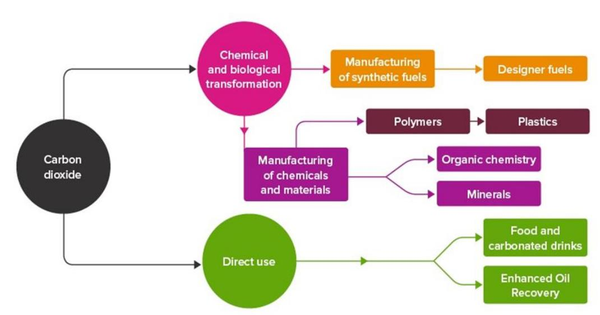

*Figure 15 Carbon Capture Utilization: Captured CO2 can be transformed into a series of chemicals. <https://emiri.eu/project/emiri-technology-roadmap/>*

The different sub value chains assessed include:

- Hydrogen for Mobility (Fuel Cells)
- Hydrogen for stationary applications
- Hydrogen storage/distribution
- Solar Energy harvesting: photovoltaics, PV; CSP concentrated solar power
- Wind energy harvesting
- Building energy performance (Light weighting technologies)

#### *5.5.1.2 Battery Energy Storage*

Different battery energy storage systems are discussed particularly the hydrogen sub value chain.

*Table 15 Examples of the cross-cutting sustainability matrix and lifecycle diagram for batteries. Source for the left table: BEDA, 2022. Source for the right figure: Porzio and Scrown, 2021.*

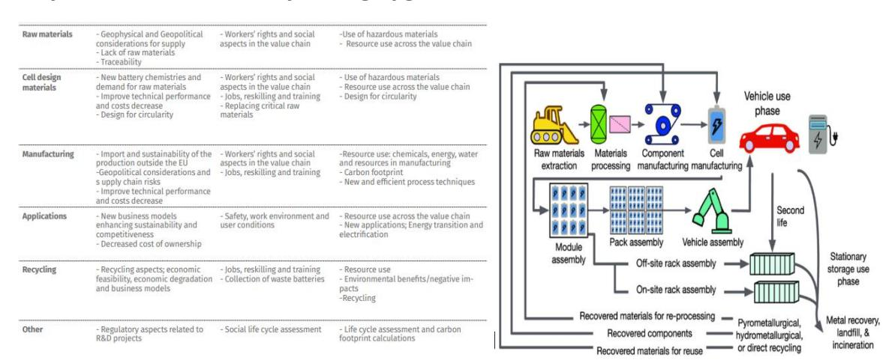

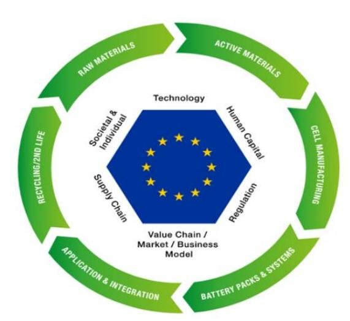

*Figure 16 Overview of battery energy storage in Europe*

The battery value chain includes multiple steps, and presents opportunities for several stakeholders, from material suppliers, to manufacturers, to a multitude of sectors benefitting from electrification.

The Figure below shows the various steps of the battery value chain, along with its main stakeholders. European organisations are marked with a star as they are strong in research, manufacturing of active materials, applications and recycling.

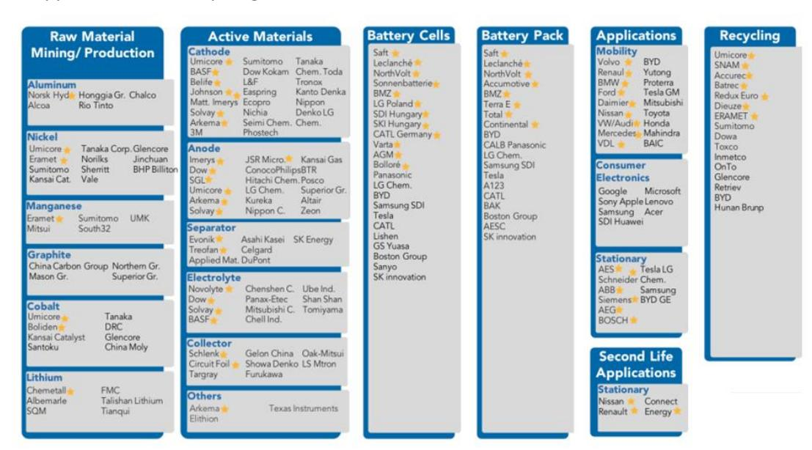

*Figure 17 Battery value chain with respective stakeholders from material suppliers to manufactures, and end-of-life https://emiri.eu/project/emiri-technology-roadmap/*

But EU is lacking capacity in cell and pack manufacturing – although more European organisations are increasingly upscaling pack manufacturing capacity - see next figure.

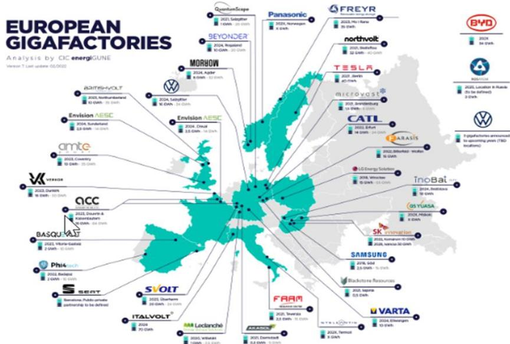

**Figure 18 European Gigafactories for energy storage ( source :** *[https://cicenergigune.com/en/blog/gigafactories](https://cicenergigune.com/en/blog/gigafactories-europe-commitment-economic-recovery-battery-factories)[europe-commitment-economic-recovery-battery-factories](https://cicenergigune.com/en/blog/gigafactories-europe-commitment-economic-recovery-battery-factories) )*

#### *5.5.1.3 Hydrogen sub-value chain*

There are various Hydrogen technologies (production and storage) as well as different applications:

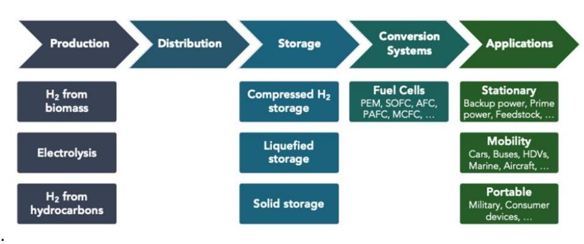

*Figure 19 Hydrogen life cycle from production, distribution, storage, conversion system and application*

#### 5.5.1.3.1 Hydrogen for Mobility (Fuel Cells)

Materials flow between the different steps from the raw materials extraction up to the final product and recycling.

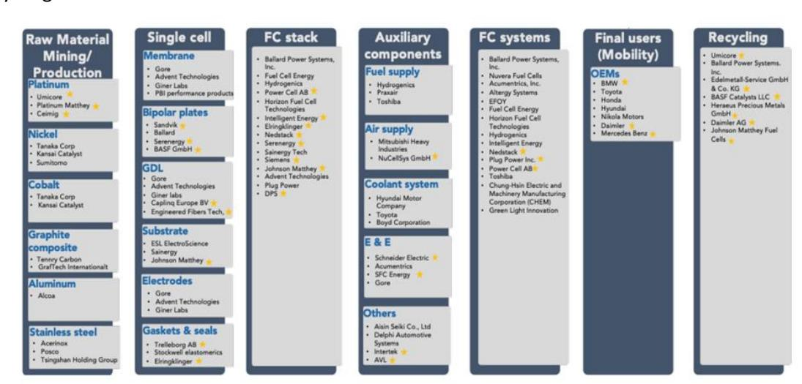

*Figure 20 Stakeholders in the hydrogen for mobility value chain https://emiri.eu/project/emiri-technologyroadmap*

#### 5.5.1.3.2 Hydrogen for stationary applications (electrolysers)

| Raw Material Mining/ Production | Electrolysers                                                                                                                                                                                                                                                                                                                                                                                                                                                                                                                                                            | SOFC stack | Auxiliary components                                                                                                                                                                                                                                                                                                                                                                                                                                                                                                                                                                                                                                                                                    | FC systems                                                                                                                                                                                                                                                          | CHP systems                                                                                                                                                                                                                                                               | Recycling                                                                                                                                                                                                                                                                                                                                                                                                     |
|---------------------------------|--------------------------------------------------------------------------------------------------------------------------------------------------------------------------------------------------------------------------------------------------------------------------------------------------------------------------------------------------------------------------------------------------------------------------------------------------------------------------------------------------------------------------------------------------------------------------|------------|---------------------------------------------------------------------------------------------------------------------------------------------------------------------------------------------------------------------------------------------------------------------------------------------------------------------------------------------------------------------------------------------------------------------------------------------------------------------------------------------------------------------------------------------------------------------------------------------------------------------------------------------------------------------------------------------------------|---------------------------------------------------------------------------------------------------------------------------------------------------------------------------------------------------------------------------------------------------------------------|---------------------------------------------------------------------------------------------------------------------------------------------------------------------------------------------------------------------------------------------------------------------------|---------------------------------------------------------------------------------------------------------------------------------------------------------------------------------------------------------------------------------------------------------------------------------------------------------------------------------------------------------------------------------------------------------------|
| <b>Platinum</b>                 | <ul> <li>Acta *</li> <li>Air Liquide *</li> <li>Air products *</li> <li>AREVA H2Oen *</li> <li>CETH2 *</li> <li>ELT Elektrolyse Technik *</li> <li>Equinor *</li> <li>Erredue s.r.l. *</li> <li>H2 Nitidor *</li> <li>H-TEC SYSTEMS *</li> <li>Hydrogenics *</li> <li>Idroenergy *</li> <li>IHT Industrie Haute Tech. *</li> <li>ITM Power *</li> <li>Linde *</li> <li>NEL Hydrogen *</li> <li>McPhy *</li> <li>Proton OnSite *</li> <li>Siemens *</li> <li>Sunfire *</li> <li>Teledyne Energy Systems *</li> <li>Wasserelectrolyse *</li> <li>Hydrotechnik *</li> </ul> |            | <ul> <li>Acumentics *</li> <li>Adelan *</li> <li>Atrex Energy *</li> <li>Bloom Energy *</li> <li>CERES Power *</li> <li>Ceramic Fuel Cells *</li> <li>Convion *</li> <li>Delphi Automotive PLC *</li> <li>Doosan Fuel Cell America *</li> <li>Elcogen *</li> <li>Fuel/Cell Energy *</li> <li>Hexis AG *</li> <li>Huaqing New Energy *</li> <li>ITM Power *</li> <li>LG Fuel Cell Systems *</li> <li>Nexceris LLC *</li> <li>Plug Power *</li> <li>Posco Energy *</li> <li>PowerCell AB *</li> <li>Protonex Technology *</li> <li>SOFCMAN *</li> <li>Solid power *</li> <li>Sunfire *</li> <li>TOTO *</li> <li>Ultra Electronics *</li> <li>Versa Power Systems *</li> <li>ZTEK Corporation *</li> </ul> | <ul> <li>TOTO *</li> <li>Kyocera *</li> <li>CERES Power *</li> <li>Protonex *</li> <li>Elcogen *</li> <li>AVL *</li> <li>General Electric *</li> <li>Udomi *</li> <li>Ensol systems *</li> <li>Watt Fuel Cell *</li> <li>Redox *</li> <li>NZtelligence *</li> </ul> | <ul> <li>Siemens *</li> <li>Clarke Energy *</li> <li>Bosch *</li> <li>Schmitt Enertec *</li> <li>Flex Energy *</li> <li>Mosaic Energy *</li> <li>AVL *</li> <li>Elcogen *</li> <li>Kyocera *</li> <li>AISIN Group *</li> <li>Solid Power *</li> <li>Vaillant *</li> </ul> | <ul> <li>Unicore *</li> <li>Bailard Power Systems, Inc. *</li> <li>Edelmetall-Service GmbH *</li> <li>&amp; Co. KG *</li> <li>BASF Catalysts LLC *</li> <li>Heraeus Precious Metals GmbH *</li> <li>Johnson Matthew Fuel Cells *</li> <li>EcoTitanium *</li> <li>Gold Metal Recyclers *</li> <li>Monico Alloys *</li> <li>Globe Metal *</li> <li>Specialized Metal Processors *</li> <li>Exotech *</li> </ul> |
| <b>Nickel</b>                   | <ul> <li>Tanaka Corp *</li> <li>Kansai Catalyst *</li> <li>Sumitomo *</li> </ul>                                                                                                                                                                                                                                                                                                                                                                                                                                                                                         |            |                                                                                                                                                                                                                                                                                                                                                                                                                                                                                                                                                                                                                                                                                                         |                                                                                                                                                                                                                                                                     |                                                                                                                                                                                                                                                                           | <ul> <li>Unicore *</li> <li>Bailard Power Systems, Inc. *</li> <li>Edelmetall-Service GmbH *</li> <li>BASF Catalysts LLC *</li> <li>Heraeus Pr</li></ul>                                                                                                                                                                                                                                                      |

*Figure 21 Stakeholder mapping in the hydrogen for stationary applications value chain https://emiri.eu/project/emiri-technology-roadmap*

#### 5.5.1.3.3 Hydrogen storage/distribution

#### The [EMIRI Focus Group Hydrogen](https://www.google.com/url?sa=t&rct=j&q=&esrc=s&source=web&cd=&cad=rja&uact=8&ved=2ahUKEwiW79CEvqX6AhUV7aQKHTf-DwEQFnoECAgQAQ&url=https%3A%2F%2Femiri.eu%2F2021%2F10%2F08%2Fthe-emiri-focus-group-on-hydrogen-has-kicked-off%2F&usg=AOvVaw3tk3Qwbozi_qjER7SzoQs-) has elaborated a draft of the different actors in the materials for H2 storage - still to be published:

| Supply materials to tanks | Composites Type IV Carbon Fibers Reinforced Polymers ( CFRP) OUTER | Plastic Liner       | Metal |
|---------------------------|--------------------------------------------------------------------|---------------------|-------|
| Compressed (on board)     |                                                                    | Solvay              | none  |
|                           |                                                                    | Arkema              |       |
|                           | Umoe Advanced Composites                                           | Knauf               |       |
|                           | 2C-Composites                                                      | DSM (polyamide)     |       |
|                           | Roth Composite                                                     | Mitsubishi Chemical |       |
|                           | Voith Composites                                                   | AMS                 |       |
|                           | V-Carbon                                                           | BASF                |       |
|                           | Cevotec                                                            |                     |       |
|                           | Lucintel                                                           |                     |       |

*Figure 22 Stakeholder mapping in the storage on board in type IV vessels*

| Supply materials to tanks            | Composites Carbon Fibers Reinforced Polymers ( CFRP) OUTER | Metal Liner: Aluminium |                                                                                                                                                                     |
|--------------------------------------|------------------------------------------------------------|------------------------|---------------------------------------------------------------------------------------------------------------------------------------------------------------------|
| <b>Compressed (tube trailers...)</b> | 2C-Composites                                              | Hydro                  |                                                                                                                                                                     |
|                                      | Roth Composite                                             | Luxfer                 |                                                                                                                                                                     |
|                                      | Voith Composites                                           |                        |                                                                                                                                                                     |
|                                      | V-Carbon                                                   |                        |                                                                                                                                                                     |
|                                      | Cevotec                                                    |                        | <a href="https://www.compositesworld.com/articles/the-markets-pressure-vessels-2022">https://www.compositesworld.com/articles/the-markets-pressure-vessels-2022</a> |
|                                      | Lucintel                                                   |                        |                                                                                                                                                                     |
|                                      |                                                            |                        |                                                                                                                                                                     |

*Figure 23 Stakeholder mapping in storage in trailers or contains type I, II and III vessels*

| MOFs             | Hydrides e.g. LaNi5H6, NaAlH4... | LOHC e.g. BN-methyl cyclopentane, benzyl toluenes... | Amine metal borohydrides NH3 BH3 | NH3           |
|------------------|----------------------------------|------------------------------------------------------|----------------------------------|---------------|
| novoMOF          | GKN                              | Hydrogenius                                          | Sigma Aldrich                    | Yara          |
| MOF Technologies | Ergenics                         | H2-Industries                                        | Albemarle                        | Haldor Topsoe |
| Merck            | Hystorsis AS                     | Umicore (catalysts)                                  | Dow Chemical                     | NEOM          |
|                  | GRZ                              | Anglo American (catalysts)                           | Asensus Specialties              | ENEOS         |
|                  | Nippon Denko                     |                                                      |                                  |               |
|                  | Sigma Aldrich                    |                                                      |                                  |               |
|                  | GfE                              |                                                      |                                  |               |

*Figure 24 Stakeholder in storage in sorbents and chemical compounds*

| Tanks Compressed H2      | Tanks Liquid hydrogen    | Others: hydrides, LOHC... | Ammonia             |
|--------------------------|--------------------------|---------------------------|---------------------|
| Air Liquide              | See list HYDROGEN EUROPE | Pragma Industries         | Yara                |
| Linde                    | Linde                    | McPhy                     | Aker Clean Hydrogen |
| Praxair                  | Idroenergy               | Hydrogenious              | Statkraft           |
| McPhy                    | August Cryogenics        | GKN (D)                   | Iberdrola           |
| Universal Hydrogen       | SAG Cryo                 |                           | Fertiberia          |
| Luxfer Holdings Plc (UK) | Hexagon                  |                           | RWE                 |
| VRV Daikin               |                          |                           | HES                 |
| Messer                   |                          |                           | Vopak               |
| Covess                   |                          |                           |                     |
| Plastic Omnium           |                          |                           |                     |
| Mahytec (Fr)             |                          |                           |                     |
| Siemens                  |                          |                           |                     |
| Ilika (UK)               |                          |                           |                     |
| Faber                    |                          |                           |                     |
| NPROXX                   |                          |                           |                     |

*Figure 25 Main European actors/producers of storage systems*

| Pipelines | Maritime                            | Road tube trailors(C and L)    | Train    |
|-----------|-------------------------------------|--------------------------------|----------|
| Gasunie   | C-Job Naval Architects (NI)         | Linde AG                       | Alstom   |
| Fluxys    | CMB                                 | Air Liquide                    | NPROXX   |
| Creos     | Equinor                             | Air Products                   | DB Netze |
| GRDF      |                                     | <u>Hexagon Composites (Nw)</u> |          |
| E.ON (D)  | <b>Developers moving to ammonia</b> | Calvera                        |          |
| RWE       | DFDS                                | FIBA Technologies              |          |
|           | CMB                                 | Matar srl                      |          |
| ENI       | Trafigura                           |                                |          |
| Snam      |                                     |                                |          |

*Figure 26 Main European actors for distribution of Hydrogen*

#### 5.5.1.3.4 Solar Energy harvesting, PV, CSP (photovoltaics, concentrated solar power)

| Manufacturing Equipment                                                                                                                                                                                                                                                                                                                                                   |                           |                                               |                                                                                                                                                                                                                                                                                                                                                                                                      |                                                                              |                                                                                                                                                                                                                                                                                                                                                                                           |
|---------------------------------------------------------------------------------------------------------------------------------------------------------------------------------------------------------------------------------------------------------------------------------------------------------------------------------------------------------------------------|---------------------------|-----------------------------------------------|------------------------------------------------------------------------------------------------------------------------------------------------------------------------------------------------------------------------------------------------------------------------------------------------------------------------------------------------------------------------------------------------------|------------------------------------------------------------------------------|-------------------------------------------------------------------------------------------------------------------------------------------------------------------------------------------------------------------------------------------------------------------------------------------------------------------------------------------------------------------------------------------|
| <b>Production tools</b> <ul> <li>Applied Materials</li> <li>ECM GreenTech</li> </ul>                                                                                                                                                                                                                                                                                      |                           |                                               |                                                                                                                                                                                                                                                                                                                                                                                                      |                                                                              |                                                                                                                                                                                                                                                                                                                                                                                           |
| <b>Raw Material Production</b>                                                                                                                                                                                                                                                                                                                                            | <b>Advanced Materials</b> | <ul> <li>ISRA Vision</li> <li>Manz</li> </ul> | <ul> <li>Meyer Burger</li> <li>Midsummer</li> </ul>                                                                                                                                                                                                                                                                                                                                                  | <ul> <li>Mondragon Assembly</li> <li>Von Andenne</li> <li>Semilab</li> </ul> |                                                                                                                                                                                                                                                                                                                                                                                           |
|                                                                                                                                                                                                                                                                                                                                                                           |                           |                                               |                                                                                                                                                                                                                                                                                                                                                                                                      |                                                                              | <ul> <li>Meyer Burger</li> <li>Midsummer</li> </ul>                                                                                                                                                                                                                                                                                                                                       |
| <b>Polysilicon</b> <ul> <li>GCL-Poly Energy</li> <li>Wacker Polysilicon</li> <li>OCI Company Ltd.</li> <li>TBEA Silicon Co. Ltd.</li> <li>Hemicok</li> <li>Semiconductor Corporation</li> <li>China Silicon Corporation Ltd.</li> <li>Sichuan Yonxiang Co. Ltd.</li> <li>Diago New Energy Co. Ltd.</li> <li>REC Silicon ASA Ltd.</li> <li>Tokuyama Corporation</li> </ul> |                           |                                               | <b>Solar cells and modules</b> <ul> <li>AnemaQCILLS</li> <li>2CA</li> <li>ARMOC</li> <li>Trina Solar Ltd.</li> <li>JinkoSolar</li> <li>Holding Co. Ltd.</li> <li>GE</li> <li>ENEL</li> <li>First Solar LLC</li> <li>Motsch Solar</li> <li>Anur Space</li> <li>Tongwei Solar</li> <li>RameSola</li> <li>JA Solar</li> <li>LDK Solar</li> <li>NorSun</li> </ul>                                        |                                                                              | <ul> <li>Onyx Solar</li> <li>Oxford PV</li> <li>Romag</li> <li>Sharp</li> <li>Saule</li> <li>Technologies</li> <li>Solbro</li> <li>IDEEMATEC</li> <li>Pidbull</li> <li>REFU</li> <li>Schneider Electric</li> <li>Seniors</li> <li>SMA Solar Technology</li> <li>Solitgua</li> <li>Stikubi Electrical Connectors</li> <li>Sungrow Power</li> <li>Solar Edge</li> <li>Wechschler</li> </ul> |
| <b>Heat transfer fluids</b> <ul> <li>BASF</li> <li>Wacker</li> <li>Dow</li> <li>Salvay</li> </ul>                                                                                                                                                                                                                                                                         |                           |                                               | <b>BoS™</b> <ul> <li>ABB</li> <li>Advanced Energy</li> <li>Delta</li> <li>Eaton</li> <li>Erphase Energy</li> <li>Frontia</li> <li>GE</li> <li>IDEEMATEC</li> <li>Pidbull</li> <li>REFU</li> <li>Schneider Electric</li> <li>Seniors</li> <li>SMA Solar Technology</li> <li>Solitgua</li> <li>Stikubi Electrical Connectors</li> <li>Sungrow Power</li> <li>Solar Edge</li> <li>Wechschler</li> </ul> |                                                                              |                                                                                                                                                                                                                                                                                                                                                                                           |
| <b>Heat storage</b> <ul> <li>BASF</li> <li>Fertiberla</li> <li>SOM</li> </ul>                                                                                                                                                                                                                                                                                             |                           |                                               | <b>CPS</b> <ul> <li>Archimedes Solar Energy</li> <li>BASF</li> <li>Castron</li> <li>Cevital</li> <li>SOM</li> <li>Flabbg</li> <li>Senior Berghofer</li> <li>VONVDE</li> <li>Concorio Solare</li> <li>Soluta</li> <li>Rioglass</li> <li>St. Gobain</li> <li>Guardian</li> <li>Senior Flexonics</li> <li>Alta Leval</li> <li>Salzer</li> <li>Batz</li> <li>Aarbong CSP</li> <li>Solitgua</li> </ul>    |                                                                              |                                                                                                                                                                                                                                                                                                                                                                                           |
| <b>Other components</b> <ul> <li>AGC</li> <li>Arkema</li> <li>DOW Dupont</li> <li>DSM</li> <li>Henkel</li> <li>Heraeus</li> <li>Luvata</li> <li>Merck</li> <li>Norsun</li> <li>Pikkington</li> <li>Saint Gobain</li> <li>Solaxess</li> </ul>                                                                                                                              |                           |                                               | <b>BoS™</b> <ul> <li>Solar</li> <li>Solarworld</li> <li>Inventor Solar</li> <li>Energy Corporation</li> <li>Aiko Solar</li> <li>Energy Co.</li> <li>Technology Co., Ltd.</li> <li>Photowatt</li> <li>Hancon Solar</li> <li>Tech Co.</li> <li>Crystalol</li> <li>Eight19</li> <li>EnergyGlass</li> <li>Erte</li></ul>                                                                                 |                                                                              |                                                                                                                                                                                                                                                                                                                                                                                           |

*Figure 27 Overview of actors along the value chain for solar energy harvesting*

#### **https://emiri.eu/project/emiri-technology-roadmap**

#### 5.5.1.3.5 Wind energy harvesting

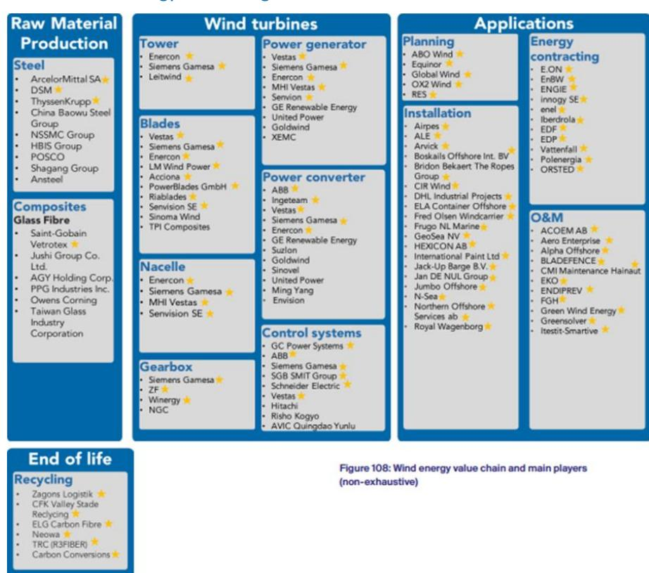

*Figure 28 Overview of actors along the wind energy harvesting value chain*

**https://emiri.eu/project/emiri-technology-roadmap**

#### 5.5.1.3.6 Building energy performance

Various materials: insulation, thermal energy storage, glazing, lighting.

| Raw Material                                                                                                                            | Window Technologies                                                                                                                                                                                                                                                            | Insulators                                                                                                                                                                                                                                                                                                                                                                                                                                                                                                                                                                                                                                                                                                                                                                     | TES                                                                                                                                                                                                                                                                                                                                                        | LEDs                                                                                                                                                                                                                                                                                                                                                                                                                                                                                                                                                                                                                                                                                                           | OLEDs                                                                                                                                                                                                                                                                                       | Recycling                                                                                                                                                                                                                                       |
|-----------------------------------------------------------------------------------------------------------------------------------------|--------------------------------------------------------------------------------------------------------------------------------------------------------------------------------------------------------------------------------------------------------------------------------|--------------------------------------------------------------------------------------------------------------------------------------------------------------------------------------------------------------------------------------------------------------------------------------------------------------------------------------------------------------------------------------------------------------------------------------------------------------------------------------------------------------------------------------------------------------------------------------------------------------------------------------------------------------------------------------------------------------------------------------------------------------------------------|------------------------------------------------------------------------------------------------------------------------------------------------------------------------------------------------------------------------------------------------------------------------------------------------------------------------------------------------------------|----------------------------------------------------------------------------------------------------------------------------------------------------------------------------------------------------------------------------------------------------------------------------------------------------------------------------------------------------------------------------------------------------------------------------------------------------------------------------------------------------------------------------------------------------------------------------------------------------------------------------------------------------------------------------------------------------------------|---------------------------------------------------------------------------------------------------------------------------------------------------------------------------------------------------------------------------------------------------------------------------------------------|-------------------------------------------------------------------------------------------------------------------------------------------------------------------------------------------------------------------------------------------------|
| <b>Silver Targets</b> <ul> <li>Krassvettener</li> <li>PMT Refinery</li> <li>Tanaka Europe</li> <li>Bühler</li> <li>Limitcore</li> </ul> | <b>Low-e glass</b> <ul> <li>AGC</li> <li>Arcon Glass</li> <li>Asahi Glass</li> <li>Baker Silver Glass</li> <li>Saint-Gobain</li> <li>SCHOTT</li> <li>Noval Glass</li> <li>Euroview Architectural</li> <li>Guardian Glass</li> <li>Pikingsone</li> <li>Glaz-Tech Ind</li> </ul> | <ul> <li>Fibralco</li> <li>Sitherm</li> <li>Armacell GmbH</li> <li>Gleed Christian GmbH</li> <li>Comfortur</li> <li>Stifente S.P.A</li> <li>Mappy Italia S.P.A</li> <li>Geolab</li> <li>Steccati</li> <li>Warren S.P.A</li> <li>Lachmeier-Isomar</li> <li>Innovacatica</li> <li>Borga Design</li> <li>AD Lyon</li> <li>HLM International</li> <li>Fireprotect Ltd</li> <li>Bilket</li> <li>Beco Products Ltd</li> <li>Spar</li> <li>Akterm Ltc</li> <li>Technonicol</li> <li>Siderise</li> <li>AK Construction</li> <li>Nolina Ltd</li> <li>Acent Industry &amp; Trade</li> <li>Sovetsek</li> <li>YBS</li> <li>Regenasa</li> <li>AGK GmbH</li> <li>K. Hoffmann GmbH</li> <li>Italpannelli S.R.L</li> <li>Karl Schupp AG</li> <li>Klein Isoliertenstein</li> <li>DOW</li> </ul> | <b>PCMs</b> <ul> <li>PCM Products Ltd</li> <li>Teapson</li> <li>PCM Technology</li> <li>BASF</li> <li>Rubitherm</li> <li>RGEES</li> <li>Entropy Solutions Inc</li> <li>Salica</li> <li>Climator Sweden AB</li> <li>PCM Energy Ltd</li> <li>Microtek Laboratories</li> <li>Dupont</li> <li>Neural</li> <li>Phasechange energy</li> <li>SOL Group</li> </ul> | <ul> <li>TREVOS</li> <li>CoeLux S.R.L</li> <li>Delta Tiger</li> <li>ProcelED Ltd</li> <li>SOSEN</li> <li>XAL GmbH</li> <li>AC/OC LED Ltd</li> <li>Grapo Novolux</li> <li>Insta Elektro GmbH</li> <li>Labsphere</li> <li>Silver</li> <li>Planlicht</li> <li>Norlys</li> <li>Nordlux</li> <li>New Luce</li> <li>Modo Luce</li> <li>Luxent Lighting UK Ltd</li> <li>LEDORA GmbH</li> <li>TULLUX AG</li> <li>3F Filippi</li> <li>Aczialm Lighting HQ</li> <li>Almeco</li> <li>AlphaLED</li> <li>Acuity Brands</li> <li>Copper Industries</li> <li>Endo Lighting</li> <li>General Electric</li> <li>Hubbell Incorporated</li> <li>OPPLE Lighting</li> <li>OSRAM</li> <li>Philips</li> <li>Zumbotte Group</li> </ul> | <ul> <li>Samsung</li> <li>Apple</li> <li>Sony</li> <li>Nokia</li> <li>Panasonic</li> <li>Raystar</li> <li>Mbraun</li> <li>LG Electronics</li> <li>AU Optronics</li> <li>Kyocora Display</li> <li>Pioneer</li> <li>OLIGHTEX</li> <li>Novaled</li> <li>Merck</li> <li>Nippon Seiki</li> </ul> | <ul> <li>Umicore</li> <li>CMK Ltd.</li> <li>Greystone Alloys</li> <li>Tungo Inc.</li> <li>Sandvik</li> <li>Sumitson</li> <li>Vetropak</li> <li>Dlubak Glass</li> <li>Recoliger</li> <li>CMA Ecocycle</li> <li>Green Lights Recycling</li> </ul> |

*Figure 29 Overview of actors along the building energy performance value chain*

#### 5.5.1.3.7 Flow thermal insulation materials as example

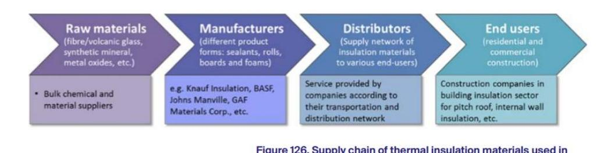

*Figure 30 Flow thermal insulation materials as example*

Light weighting technologies: light metals, glass and carbon fibres, composites, polymers, ceramics.

|                |      |                       | Performance              |                      |               |                   |                        |      | Main Applications |               |            |         |          |          |
|----------------|------|-----------------------|--------------------------|----------------------|---------------|-------------------|------------------------|------|-------------------|---------------|------------|---------|----------|----------|
| Material       | Type | Technical Performance | Lightweighting Potential | Environmental Impact | Recyclability | Manufacturability | Material Compatibility | Cost | Powertrain        | Body-in-White | Suspension | Chassis | Closures | Interior |
| Steel          |      | +++                   | ++                       | +                    | +++           | ++++              | +++                    | ++++ | •                 | •             | •          | •       | •        |          |
| Aluminum       |      | ++                    | +++                      | ++                   | ++++          | ++++              | +++                    | +++  | •                 | •             | •          | •       | •        |          |
| Magnesium      |      | ++                    | +++                      | -                    | ++++          | +++               | ++                     | ++   | •                 | •             | •          | •       | •        |          |
| FRP            | CFRP | ++++                  | ++++                     | -                    | +             | ++                | +                      | -    | •                 | •             | •          | •       | •        |          |
|                | GFRP | +++                   | +++                      | +                    | -             | ++                | +                      | ++   |                   |               |            |         |          |          |
| Multimaterials |      | ++++                  | ++++                     | +++                  | -             | -                 | -                      | +    | •                 | •             | •          | •       | •        |          |
| Ceramics       |      | ++                    | +++                      | ++                   | ++            | ++                | -                      | +    | •                 | •             |            |         |          |          |
| Polymers       |      | +                     | ++                       | +                    | +++           | ++                | ++                     | ++++ |                   |               |            |         | •        |          |
| Glass          |      | -                     | ++                       |                      | +++           | ++                | -                      |      |                   |               |            |         | •        |          |

*Figure 31 Overview of materials, Performance and Main applications*

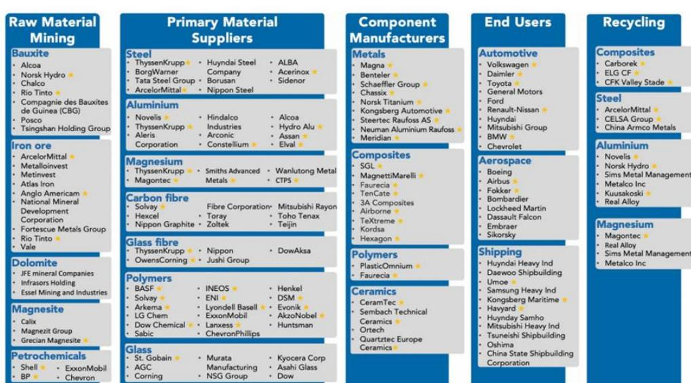

| Raw Material Mining                                                                                                                                                                                                                                              | Primary Material Suppliers                                                                                                                                                                                                                                            | Component Manufacturers                                                                                                                                                                                                                                  | End Users                                                                                                                                                                                                                            | Recycling                                                                                           |
|------------------------------------------------------------------------------------------------------------------------------------------------------------------------------------------------------------------------------------------------------------------|-----------------------------------------------------------------------------------------------------------------------------------------------------------------------------------------------------------------------------------------------------------------------|----------------------------------------------------------------------------------------------------------------------------------------------------------------------------------------------------------------------------------------------------------|--------------------------------------------------------------------------------------------------------------------------------------------------------------------------------------------------------------------------------------|-----------------------------------------------------------------------------------------------------|
| <b>Bauxite</b> <ul> <li>Alcoa</li> <li>Norsk Hydro</li> <li>Chevron</li> <li>Rio Tinto</li> <li>Compagnie des Bauxites de Guinea (CBG)</li> <li>Posco</li> <li>Tsingshan Holding Group</li> </ul>                                                                | <b>Steel</b> <ul> <li>TropsenKrupp • Huyndai Steel</li> <li>BorgWarner Company • Acerinox • Sidenor</li> <li>Tatra Steel Group • Nippon Steel</li> <li>ArcelorMittal •</li> </ul>                                                                                     | <b>Metals</b> <ul> <li>Magna •</li> <li>Bentleer •</li> <li>Schaeffer Group •</li> <li>Chassix</li> <li>Norsk Titanium •</li> <li>Kongsberg Automotive •</li> <li>Steertec Raufoss AS •</li> <li>Neuman Aluminium Raufoss •</li> <li>Meridian</li> </ul> | <b>Automotive</b> <ul> <li>Volkswagen •</li> <li>Daimler •</li> <li>Teyota •</li> <li>General Motors</li> <li>Ford</li> <li>Renault-Nissan •</li> <li>Huyndai</li> <li>Mitsubishi Group</li> <li>BMW •</li> <li>Chevrolet</li> </ul> | <b>Composites</b> <ul> <li>Carborek •</li> <li>ELG CF</li> <li>CFK Valley Stade •</li> </ul>        |
| <b>Iron ore</b> <ul> <li>ArcelorMittal •</li> <li>Metalloinvest</li> <li>Metinvest</li> <li>Atlas Iron</li> <li>Anglo Americam •</li> <li>National Mineral Development Corporation</li> <li>Fortescue Metals Group</li> <li>Rio Tinto •</li> <li>Vale</li> </ul> | <b>Aluminium</b> <ul> <li>Novelis •</li> <li>Industries •</li> <li>Aleris</li> <li>Corporation</li> <li>Hindalco •</li> <li>Industries •</li> <li>Arconic •</li> <li>Constellium •</li> <li>Alcoa •</li> <li>Hydro Alu •</li> <li>Assan •</li> <li>Elval •</li> </ul> | <b>Composites</b> <ul> <li>SGL •</li> <li>MagnettiMarelli •</li> <li>Faurecia •</li> <li>TenCate •</li> <li>Composites •</li> <li>Airborne •</li> <li>TeXtreme •</li> <li>Kordsa •</li> <li>Hexagon •</li> </ul>                                         | <b>Aerospace</b> <ul> <li>Boeing</li> <li>Airbus •</li> <li>Folker •</li> <li>Bombardier</li> <li>Lockheed Martin</li> <li>Dassault Falcon</li> <li>Embraer</li> <li>Sikorsky</li> </ul>                                             | <b>Steel</b> <ul> <li>ArcelorMittal •</li> <li>CELSA Group •</li> <li>China Armco Metals</li> </ul> |
| <b>Dolomite</b> <ul> <li>JE mineral Companies</li> <li>Infrasors Holding</li> <li>Essel Mining and Industries</li> </ul>                                                                                                                                         | <b>Magnesium</b> <ul> <li>ThyssenKrupp •</li> <li>Magontec •</li> <li>Smiths Advanced •</li> <li>Wanlutong Metal •</li> <li>CTPS</li> </ul>                                                                                                                           | <b>Composites</b> <ul> <li>SGL •</li> <li>MagnettiMarelli •</li> <li>Faurecia •</li> <li>TenCate •</li> <li>Composites •</li> <li>Airborne •</li> <li>TeXtreme •</li> <li>Kordsa •</li> <li>Hexagon •</li> </ul>                                         | <b>Aerospace</b> <ul> <li>Boeing</li> <li>Airbus •</li> <li>Folker •</li> <li>Bombardier</li> <li>Lockheed Martin</li> <li>Dassault Falcon</li> <li>Embraer</li></ul>                                                                |                                                                                                     |

*Figure 32 Overview of actors along the light weight technology value chain*

https://emiri.eu/project/emiri-technology-roadmap

# 5.5.2 State of play on SSbD per VC and VC actors (existing methodologies)

An example is given in the table below on Battery Energy Storage, which shows a few SSbD issues. The work is this area is in progress and more details for battery energy storage and other energy sub value chains will be given in the next deliverable in M15.

*Table 16 What has been done with regards to SSbD for battery energy storage?*

| Battery energy storage          | Raw Material Extraction                                                                        | Raw materials                                     | Processing (material or chemical)                         | Processing (product)                                                                                      | Transport                                                       | Use                                                              | End-of-life                        |
|---------------------------------|------------------------------------------------------------------------------------------------|---------------------------------------------------|-----------------------------------------------------------|-----------------------------------------------------------------------------------------------------------|-----------------------------------------------------------------|------------------------------------------------------------------|------------------------------------|
| <i>SSbD ongoing initiatives</i> | Secure access to raw materials from resource-rich countries outside the EU.                    | Sustainable sourcing of raw materials (Co, Ni...) | efficient manufacturing process with lowest CO2 footprint | cell manufacturing industry, with the smallest environmental footprint possible e.g., NMP free processing | Short and reliable access to products in proximity to customers | Increase the demand for e-mobility solutions                     | Recycling: hydro, pyro, mechanical |
|                                 | Facilitate the expansion/creation of European sources of raw materials                         | Decrease critical raw materials content           | renewable energy                                          | Create and sustain a cross-value chain ecosystem for batteries.                                           |                                                                 | Plurifunctional applications                                     | Direct recycling                   |
|                                 | Secure access to secondary raw materials through recycling in a circular economy of batteries. |                                                   | upstream integration                                      | encouraging cross-sectoral initiatives                                                                    |                                                                 | Make storage an alternative to conventional grid reinforcement   | Design for recycling               |
|                                 |                                                                                                |                                                   | higher energy density materials                           | IPCEI (Important Projects of Common European Interest)                                                    |                                                                 | ESS at all levels of the power system including behind the meter | Design for sustainability          |
|                                 |                                                                                                |                                                   | innovative calcination technologies                       | Make Europe attractive for world-class experts and                                                        |                                                                 | Create a competitive advantage                                   | Automated disassembly              |

| Battery energy storage | Raw Material Extraction | Raw materials | Processing (material or chemical) | Processing (product)                              | Transport | Use                                                                                                                      | End-of-life |
|------------------------|-------------------------|---------------|-----------------------------------|---------------------------------------------------|-----------|--------------------------------------------------------------------------------------------------------------------------|-------------|
|                        |                         |               |                                   | create a competent workforce.                     |           | with constant incremental (e.g., lithium-ion) and disruptive (e.g., solid state) R&I linked to the industrial ecosystem. |             |
|                        |                         |               |                                   | investments in the general population's awareness |           | Standardize storage-related installations and safety rules                                                               | Second life |
|                        |                         |               |                                   |                                                   |           | Battery passport                                                                                                         |             |

AEM FC, anion exchange membrane (AEM) fuel cell; CRM, Critical Raw Materials; FC, fuel cell; PEM FC, Proton exchange membrane (PEM) fuel cells; PFAS, Per- and polyfluoroalkyl substances. PGM, Platinum Group Metals; SOFC, solid oxide fuel cell.

*Table 17 What has been done with regards to SSbD for hydrogen for mobility fuel cells?*

| Hydrogen for Mobility Fuel cells | Raw Material Extraction (if relevant) | Raw materials                                | Processing (material or chemical) | Processing (product)                         | Transport                                                                                        | Use                                                                                              | End-of-life                         |
|----------------------------------|---------------------------------------|----------------------------------------------|-----------------------------------|----------------------------------------------|--------------------------------------------------------------------------------------------------|--------------------------------------------------------------------------------------------------|-------------------------------------|
| <i>SSbD ongoing initiatives</i>  |                                       | Reduction of PGM loading in PEM FC catalysts |                                   | Increase of PEM FC conversion efficiency     | Reduce GHS emission from heavy duty mobility applications (trucks, buses, maritime, trains, ...) | decrease cost of FC through materials development and better understanding of material behaviour | Recycling PGMs from PEM FC          |
|                                  |                                       | Move away from PFAS                          |                                   | Improvement of PEM FC ageing and degradation |                                                                                                  | Development of hydrogen refueling infrastructure                                                 | Recycling friendly materials design |

| Hydrogen for Mobility Fuel cells | Raw Material Extraction (if relevant) | Raw materials                  | Processing (material or chemical) | Processing (product)                                                                                                                        | Transport | Use | End-of-life                                             |
|----------------------------------|---------------------------------------|--------------------------------|-----------------------------------|---------------------------------------------------------------------------------------------------------------------------------------------|-----------|-----|---------------------------------------------------------|
|                                  |                                       | Reduce CRM content in AEM FCs  |                                   | Improve corrosion of bipolar plates                                                                                                         |           |     | Reusable ionomers                                       |
|                                  |                                       | Reduction of CRMs (Co) in SOFC |                                   | Europe has committed to supporting research, technological development and demonstration activities in FC and hydrogen energy technologies. |           |     | circular design of components to improve sustainability |

*Table 18 What has been done with regards to SSbD for hydrogen in for stationary applications (including* 

*CCU)?*

| Transport  | Use      | End-of-life |
|------------|----------|-------------|
| from heavy |          |             |
|            | from the |             |

|   |   |   | technologies 
.
                                                                                                  |   |   |
|----------------|----------------|----------------|------------------------------------------------------------------------------------------------------------------------|----------------|----------------|
|   |   |   | Enhance durability of equipment by increasing lifetime of stack, gas path components, membranes, catalyst and sorbents |   |   |

#### *Table 19 What has been done with regards to SSbD for solar energy harvesting?*

| Solar energy harvesting  | Raw Material Extraction (if relevant) | Raw materials | Processing (material or chemical) | Processing (product)                                                                | Transport | Use                               | End-of-life |
|--------------------------|---------------------------------------|---------------|-----------------------------------|-------------------------------------------------------------------------------------|-----------|-----------------------------------|-------------|
| SSbD ongoing initiatives |                                       |               |                                   | Improve the efficiency of modules                                                   |           | Zero-Energy Buildings             |             |
|                          |                                       |               |                                   | Reduce the ecological footprint and increase the recyclability of module components |           | Plus Energy Buildings             |             |
|                          |                                       |               |                                   | low lifecycle GHG emissions                                                         |           | building integrated photovoltaics |             |
|                          |                                       |               |                                   |                                                                                     |           | Renewable energy                  |             |
|                          |                                       |               |                                   |                                                                                     |           | Energy storage                    |             |
|                          |                                       |               |                                   |                                                                                     |           | Eco-design                        |             |
|                          |                                       |               |                                   |                                                                                     |           | Energy Label policy               |             |

#### *Table 20 What has been done with regards to SSbD for wind energy harvesting?*

| Wind energy harvesting          | Raw Material Extraction (if relevant) | Raw materials                    | Processing (material or chemical) | Processing (product)                      | Transport | Use | End-of-life                            |
|---------------------------------|---------------------------------------|----------------------------------|-----------------------------------|-------------------------------------------|-----------|-----|----------------------------------------|
| <i>SSbD ongoing initiatives</i> |                                       | Life cycle assessment composites | Reduction of CRMs (magnets)       | Improve recyclability of blade composites |           |     | 85% of wind turbine mass is recyclable |

|                                                                    |  |  |  |  |                                                  |
|---------------------------------------------------------------------------------|---------------|---------------|---------------|---------------|---------------------------------------------------------------|
| Improve lifetime of the turbines                                                |               |               |               |               | New processes required to improve recyclability of the blades |
| Increase the performance of turbines to achieve high power and lighter turbines |               |               |               |               | Decrease noise                                                |

*Table 21 What has been done with regards to SSbD for building energy performance?*

| Building energy performance | Raw Material Extraction (if relevant) | Raw materials | Processing (material or chemical)                                | Processing (product)                      | Transport | Use                            | End-of-life |
|-----------------------------|---------------------------------------|---------------|------------------------------------------------------------------|-------------------------------------------|-----------|--------------------------------|-------------|
| SSbD ongoing initiatives    |                                       |               | Insulation materials: Inorganic, organic, innovative new ones... | Low emissivity (low-e) glass              |           |                                |             |
|                             |                                       |               | Thermal energy storage materials                                 | Dynamic glazing                           |           |                                |             |
|                             |                                       |               |                                                                  | <i>Thermochromic glazing</i>              |           |                                |             |
|                             |                                       |               |                                                                  | Photochromic glazing                      |           |                                |             |
|                             |                                       |               |                                                                  | Novel lighting technologies and materials |           | Lighting-emitting diode (LEDs) |             |
|                             |                                       |               |                                                                  |                                           |           | Organic LEDs (OLEDs)           |             |

#### EV, electric vehicle; GHG, greenhouse gas emissions

*Table 22 What has been done with regards to SSbD for hydrogen for light weighting technologies?*

| <i>Light weighting technologies</i> | <i>Raw Material Extraction (if relevant)</i> | <i>Raw materials</i>            | <i>Processing (material or chemical)</i> | <i>Processing (product)</i>     | <i>Transport</i> | <i>Use</i> | <i>End-of-life</i>          |
|-------------------------------------|----------------------------------------------|---------------------------------|------------------------------------------|---------------------------------|------------------|------------|-----------------------------|
|                                     |                                              |                                 |                                          |                                 |                  |            |                             |
| <i>SSbD ongoing initiatives</i>     |                                              | Substitute hazardous and scarce |                                          | Resources (energy, consumables) |                  |            | Recycling alloys and fibers |

|  |  | raw materials |  | efficient product & manufacturing |  |  |                             |                    |                                      |  |  |
|--|--|---------------|--|-----------------------------------|--|--|-----------------------------|--------------------|--------------------------------------|--|--|
|  |  |               |  | Multi-functionality               |  |  | Reduction EV battery weight |                    | Cradle to cradle performance studies |  |  |
|  |  |               |  |                                   |  |  |                             | Less GHG emissions |                                      |  |  |

## What are the SSbD initiatives?

In this table, organizations and/or legislation/action plans have SSbD related initiatives concerning battery storage.

*Table 23 (SSbD) initiatives for Battery Energy Storage*

|  | <i>Initiative</i>                                                                     |
|---------------|---------------------------------------------------------------------------------------|
|  | EC                                                                                    |
|  | National and European industrial association/federation                               |
|  | EIT InnoEnergy                                                                        |
|  | <a href="https://setis.ec.europa.eu/index_en">https://setis.ec.europa.eu/index_en</a> |
|  | Batteries Europe platform                                                             |
|  | <a href="https://bepassociation.eu/">https://bepassociation.eu/</a>                   |
|  | Circular Economy Action Plan                                                          |
|  | Batteries Directive (2006/66/EC)                                                      |

*I*

Concerning the funding, the following projects and calls contain SSbD related approaches:

### <https://battery2030.eu/>

- [E-MobiLity LifE CyCLE AssEssMEnt RECoMMEndAtions](http://elcar-project.eu/uploads/media/eLCAR_Flyer.pdf) o [http://elcar-project.eu](http://elcar-project.eu/)
- [Sustainable batteries: an ongoing challenge to circular thinking](https://www.helios-h2020project.eu/news/sustainable-batteries-ongoing-challenge-circular-thinking) o https://www.helios-h2020project.eu › ...
- [Sustainable, safe and efficient recycling processes \(Batteries ...](https://www.euro-access.eu/calls/manufacturing_technology_development_for_solid-state_batteries_ssb_generations_4a_-_4b_batteries_batteries_partnership_1) o https://www.euro-access.eu › calls

# 5.5.3 Main SSbD challenges foreseen (priorities on product Safety + Climate neutrality+ Circularity):

### Example: Battery Energy Storage (work in progress)

*Table 24 Description of known safety and sustainability issues in the specified value chain*

| Life cycle  | Raw Material              |
|-------------|---------------------------|
|             | Transport Use End-of-life |
| Criticality | –                         |
|             | (NMP : N                 |

[Criticality](https://single-market-economy.ec.europa.eu/sectors/raw-materials/areas-specific-interest/critical-raw-materials_en) (critical raw materials; Toxicity: See [Table 29](#page-77-0) for indicators of toxicity and environmental sustainability).

# 5.6 Value Chain Electronics

The Electronics value chain contributes to the broader electrical and electronic equipment (EEE) category, which can be generally defined as "products with circuitry or electrical components with a power or battery supply" (UNU, 2014). A closely related concept, particularly within the regulatory context, is the e-waste or waste electrical and electronic equipment (WEEE), which in the EU is regulated since 2012 under the WEEE Directive (EU, 2012). Among the six categories that should be reported under the WEEE Directive as of 2018 (Forti et al., 2018), the electronics value chain most directly encompasses the following two:

- Screens and monitors—includes televisions, computer monitors, laptops, notebooks and tablets
- Small IT and telecommunication equipment—includes mobile phones, global positioning systems (GPS), pocket calculators, personal computers, printers, and telephones

In other categories of electrical equipment, electronic components are typically integrated as printed circuit boards (PCBs) and screens (or other types of user interfaces), which from a sustainability perspective can be considered similar to such components originating from the two categories described above.

The two categories described above are useful for estimating the total weight of the end-of-life ewaste generated in the electronics value chain as electronic components represent the bulk of their weight. In contrast, the electronic components in household or commercial equipment categories account for a very small fraction of their weight. With this in mind, the total e-waste generated in the electronics value chain worldwide in 2019 can be estimated as the sum of 6.7 Mt of screens and monitors and 4.7 Mt of small IT and telecommunication equipment (Forti et al., 2020). These rough estimates are important for evaluating the feasibility of circular economic activities, such as urban mining (Murthy and Ramakrishna, 2022).

In addition to end-of-life considerations, raw materials, their processing, and the use of products are significant for SSbD implementation in the Electronics value chain.

# 5.6.1 Sub-value chains

## *5.6.1.2 High-performance Chips Sub-value-chain*

The design, production, and operation/applications of high-performance chips are the core drivers of the advanced semiconductor industry in Europe and worldwide. The high societal and economic value of this industry has been highlighted by the recent support from The European Chips Act (European Commission, n.d.) and CHIPS and Science Act (The White House, 2022) in the USA. The magnitude of the funding involved (tens of billions of EUR) and the multi-year timelines of these acts, however, also underscore that the progress in this sector is expected to be driven by continuous improvement and scaling of the existing fabrication paradigms, where the improved performance of the chips is the primary objective. Resources used for their production are determined by requirements inherent in achieving performance, rather than sustainability considerations. In the following illustration, the high-performance chips, such as processors and memory, correspond to the first two levels of integration ("Structures on a chip" and "Device").

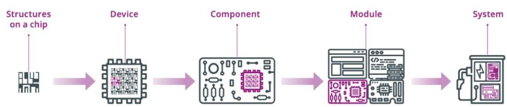

*Figure 33 Different integration levels in electronics illustrated by an example of a charging infrastructure for electrical vehicles. Adapted from ECS SRIA 2021 (The White House, 2022).*

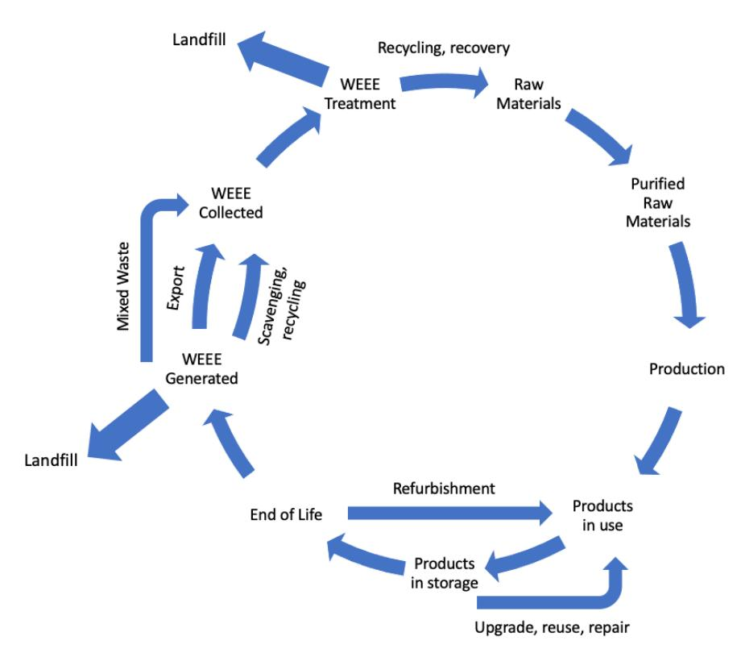

*Figure 34 Lifecycle in the electronics value chain.*

## *5.6.1.3 Standard Electronic Components Sub-value-chain*

The standard electronic components (simple integrated circuits, transistors, resistors, capacitors, etc.) are typically assembled on PCBs and may be used on their own (e.g., PCBs inside simple electrical equipment) or accompany the high-performance chips ("Component" level in the preceding illustration). These components are typically manufactured at existing facilities and do not require advanced techniques, such as nanofabrication, to be produced. They are also typically inexpensive but may include small amounts of valuable materials (particularly metals). The manufacturing processes are well established for these components and are often optimized for cost and production volumes, rather than for sustainability considerations.

## *5.6.1.4 Printed, Flexible, and Wearable Electronics Sub-value-chain*

In recent decades, alternative fabrication methods have emerged to serve applications where the required functionality is simple (e.g., sensing temperature or producing a radio-frequency response), but very low cost and simplicity of the manufacturing process are critical. Different variants of printing methods are commonly used for such purposes. In many cases, these fabrication methods can be applied to or otherwise implemented on/in flexible materials, whether on flexible polymer substrates or even integrated with textiles.

Continued innovation regarding the materials that can be used in these types of electronics makes them the most open to modifications that target sustainability. Flexible and wearable electronics may be also integrated into packaging and textile products, meaning that the sustainability considerations for such devices need to be coordinated with the corresponding value chains.

### *5.6.1.5 Steps within the VC covered (upstream & downstream steps): infographic describing the flows + types of stakeholders + company names*

Electronics value chain spans across multiple market sectors in Europe and worldwide.

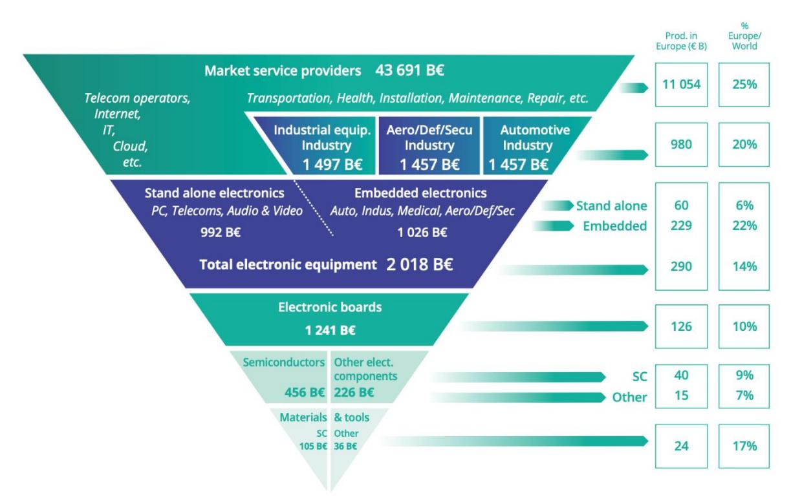

*Figure 35 Market sectors in the electronics value chain. Adapted from ECS SRIA 2021 (The White House, 2022).*

As the above illustration shows, the market size increases dramatically with each level of processing and integration in the electronics value chain. The number of stakeholders and the complexity of products correspondingly increases with each level as well. The electronics value chain also spans a broad range of application areas and in many casesthe increased introduction of electronics promotes both digital and green transitions.

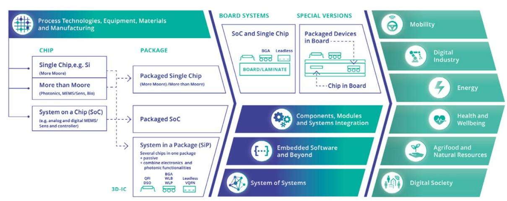

*Figure 36 Integration in the electronics value chain from chips to applications. Adapted from ECS SRIA 2021 (The White House, 2022).* 

The design and fabrication of high-performance chips requires immense financial resources and complex logistics and supply chains. Consequently, the high-performance chip sub-value-chain in Europe is dominated by a small number of multinational corporations, such as Applied Materials, ASML, Bosch, Infineon and ST Microelectronics. In contrast, the diversity of the application areas supports a broad range of companies at higher integration levels, from start-ups and SMEs to national and multinational enterprises(semi, 2022), represented in Europe by multiple clusters(Silicon Europe, n.d.).

In many cases, the simplified use and/or logistics in the final applications (e.g., smart, Internet-of-Things, or low-power devices) of the electronics value chain is commonly achieved via increased complexity of individual chip and system-on-chip (SoC) designs and fabrication. When such chips and SoCs can be produced at the scale of millions of units, their individual cost drops to the point of being affordable even for cost-sensitive applications.

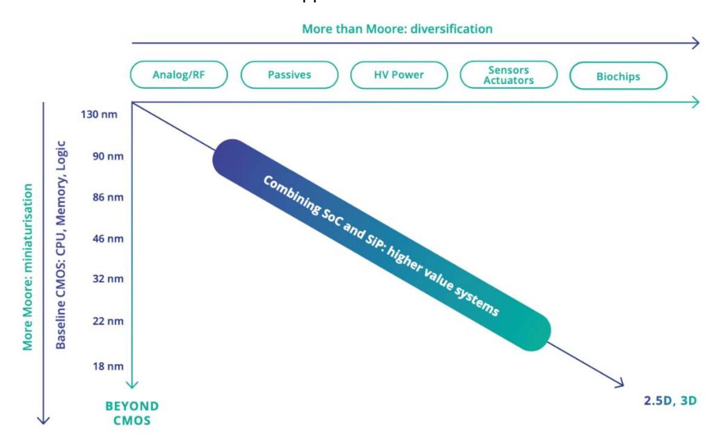

*Figure 37 Diversification of applications, continued miniaturisation and integration on chips and in package leads to higher value systems. Adapted from ECS SRIA 2021 (The White House, 2022).*

## *5.6.1.6 State of play on SSbD per VC and VC actors (existing methodologies):*

#### *Table 25 What has been done with regards to SSbD?*

|                         | Transport | Use          | End-of-life |
|-------------------------|-----------|--------------|-------------|
| Initiative (RMI, 2022). |           |              |             |
|                         |           | use (Upta et |             |

[Designing mobile phones and tablets to be sustainable](https://ec.europa.eu/info/law/better-regulation/have-your-say/initiatives/12797-Designing-mobile-phones-and-tablets-to-be-sustainable-ecodesign_en) – Ecodesign (europa.eu)

### *Table 26 Mapping of different SSbD initiatives*

| Life cycle Raw |                             |
|----------------|-----------------------------|
|                | Transport Use End-of-life   |
|                | 7.6% at TSMC (Coan,         |
| imec, Apple    | Sustainable                 |
|                | design (Liu,                |
| Apple          | robot                       |
|                | Awasthi ,                   |
| EC             | EC initiative on “Designing |
| Researchers    | Green electronics for less  |

## *5.6.1.7 Main SSbD challenges foreseen (priorities on product Safety + Climate neutrality+ Circularity):*

- Most consumers (64.5% UK, 56.7% Germany) find it difficult to find out if a device has been produced sustainably before purchasing (Royal Society of Chemistry, 2022).
- More than 40% of consumers in Germany and the UK do not know what to do with unused electronics that they have at home (Royal Society of Chemistry, 2022).
- Most of the e-waste from Europe is shipped for processing to low-income countries, where the level of available technology for recycling is limited and environmental regulations are often less strict than in Europe (Abalansa et al., 2021).

*Table 27 Description of known safety and sustainability issues in the specified value chain*

| Life cycle    | Raw |           |     |             |
|---------------|-----|-----------|-----|-------------|
|               |     | Transport | Use | End-of-life |
| Criticality – |     |           |     |             |

|                                                 |  |  |                                                                                             |  | be harmful to local workers |                                                                                                               |
|-------------------------------------------------|--|--|---------------------------------------------------------------------------------------------|--|-----------------------------|---------------------------------------------------------------------------------------------------------------|
| <i>Circularity (Recyclability, reusability)</i> |  |  | Recycled materials are insufficiently pure for use as secondary raw materials in production |  |                             | Chips combine materials at nanoscale, so recovery is resource intensive and feasible only for precious metals |
| <i>Other (economic, functionality?)</i>         |  |  |                                                                                             |  |                             |                                                                                                               |

[Criticality](https://single-market-economy.ec.europa.eu/sectors/raw-materials/areas-specific-interest/critical-raw-materials_en) (critical raw materials; Toxicity: See [Table 29](#page-77-0) for indicators of toxicity and environmental sustainability.

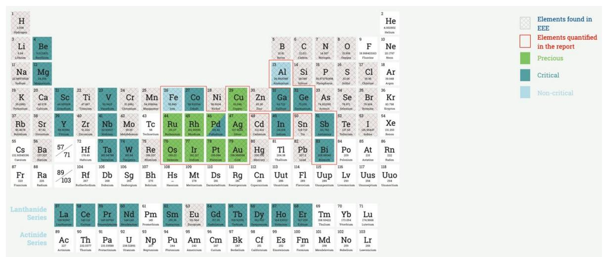

*Figure 38 Elements found in electronics. Adapted from Ref. 4.*

# **6. Conclusions**

D4.1 provides a preliminary step towards the development of a state-of-the-art SSbD ecosystem that supports the uptake and utilization of SSbD strategies by industry, especially SMEs. This deliverable is one of an iterative series (M4, M15 and M30) to analyze the value chains in a cradle-to-cradle approach and map the relevant value chain stakeholders to support mainly the WPs 1-3 in developing methodologies and outputs that reflect the particularities of the value chains examined. In this particular deliverable, it was intended to give a first overview of the today knowledge for each value chain. Some value chains have made some focus on specific sub value chains, and others have given a different level of details. It is intended for the next deliverable in M15 to progress in a more exhaustive identification of the different SSbD challenges relevant to each sub value chains.

This assessment is conducted by value chain (VC): packaging (ICP; Industrial Technical Centre for Plastics and Composites), textiles (ETP; EU Technology Platform for the Future of Textiles & Clothing), construction chemicals (EFCC; European Federation for Construction Chemicals), automotive (CLEPA; European Association of Automotive Suppliers), energy materials (EMIRI; Energy Materials Industrial Research Initiative), and electronics (INL; International Iberian Nanotechnology Laboratory). The assessment is supported by partners Cefic and EMPA together with the SusChem NTPs, which will represent the upstream steps of chemical products.

The industrial partners will update and expand existing value chain-specific overviews in M15 and M30 following a standard procedure developed by Cefic for better comparability (comparative analysis will be developed in D4.11 in M30.

# **7. References**

# 7.1 References for introduction, Strategy/methodology and Results: Plastics Value Chain

- 1. OECD, *Moving Towards a Safe(r) Innovation Approach (SIA) for More Sustainable Nanomaterials and Nano-enabled Products.* Series on the Safety of Manufactured Nanomaterials, 2020. **96**  [\(http://www.oecd.org/officialdocuments/publicdisplaydocumentpdf/?cote=env/jm/mono\(2](http://www.oecd.org/officialdocuments/publicdisplaydocumentpdf/?cote=env/jm/mono(2020)36/REV1&doclanguage=en) [020\)36/REV1&doclanguage=en\)](http://www.oecd.org/officialdocuments/publicdisplaydocumentpdf/?cote=env/jm/mono(2020)36/REV1&doclanguage=en).
- 2. EC, *Chemical Strategy for Sustainability, Towards a toxic-free environment.* EC COM, 2020. **67**[\(https://ec.europa.eu/environment/pdf/chemicals/2020/10/Strategy.pdf\)](https://ec.europa.eu/environment/pdf/chemicals/2020/10/Strategy.pdf).
- 3. Caldeira, C.F., L., Tosches D., Amelio, A., Rasmussen, K., Rauscher, H., Riego Sintes, J., Sala, S., *Safe and Sustainable by Design chemicals and materials, Framework for the definition of criteria and evaluation procedure for chemicals and materials. Draft Report for Consultation.* JRC Technical Report, 2022. **JRC128591**.
- 4. Caldeira, C., et al., *Safe and Sustainable by Design chemicals and materials: Framework for the definition of criteria and evaluation procedure for chemicals and materials (Draft Report for Consultation).* JRC Technical Report, 2022.
- 5. Caldeira C., F.L., Moretti C., Mancini L., Rasmussen K., Rauscher H., Sintes J.R., Sala S., *Safe and sustainable by design: Review of safety and sustainability dimensions, indicators and tools - Identification of safety and sustainability dimensions, aspects, methods, indicators and tools EUR 30991, Luxembourg (Luxembourg): .* Publications Office of the European Union, ISBN 978-92-76-47560- 6, doi:10.2760/879069, 2022[\(https://publications.jrc.ec.europa.eu/repository/handle/JRC127109\)](https://publications.jrc.ec.europa.eu/repository/handle/JRC127109).
- 6. EC, *European Green Deal: Commission aims for zero pollution in air, water and soil.* 2021[\(https://ec.europa.eu/commission/presscorner/detail/en/ip\\_21\\_2345\)](https://ec.europa.eu/commission/presscorner/detail/en/ip_21_2345).
- 7. EC, *A European Green Deal Striving to be the first climate-neutral continent.* 2009: p. [https://ec.europa.eu/info/strategy/priorities-2019-2024/european-green-deal\\_en.](https://ec.europa.eu/info/strategy/priorities-2019-2024/european-green-deal_en)
- 8. Zampori, L.a.P., R., *Suggestions for updating the Product Environmental Footprint (PEF) method, EUR 29682 EN, Publications Office of the European Union, Luxembourg, 2019, ISBN 978-92-76-00654-1, doi:10.2760/424613.* JRC115959. , 2019[\(https://eplca.jrc.ec.europa.eu/permalink/PEF\\_method.pdf\)](https://eplca.jrc.ec.europa.eu/permalink/PEF_method.pdf).
- 9. EC, *Commission Recommendation of 9 April 2013 on the use of common methods to measure and communicate the life cycle environmental performance of products and organisations.* 2013/179/EU, 2013[\(https://eur-lex.europa.eu/legal](https://eur-lex.europa.eu/legal-content/EN/TXT/?uri=CELEX%3A32013H0179)[content/EN/TXT/?uri=CELEX%3A32013H0179\)](https://eur-lex.europa.eu/legal-content/EN/TXT/?uri=CELEX%3A32013H0179).
- 10. EC, *The Environmental Footprint Pilots.* 2016 [\(https://ec.europa.eu/environment/eussd/smgp/ef\\_pilots.htm\)](https://ec.europa.eu/environment/eussd/smgp/ef_pilots.htm).

- 11. EUROSTAT, *Eurostat figures: [https://ec.europa.eu/eurostat/statistics](https://ec.europa.eu/eurostat/statistics-explained/index.php?title=File:Packaging_waste_generated_by_packaging_material,_EU,_2019_(%25)_V2.png)[explained/index.php?title=File:Packaging\\_waste\\_generated\\_by\\_packaging\\_material,\\_EU,\\_](https://ec.europa.eu/eurostat/statistics-explained/index.php?title=File:Packaging_waste_generated_by_packaging_material,_EU,_2019_(%25)_V2.png) [2019\\_\(%25\)\\_V2.png](https://ec.europa.eu/eurostat/statistics-explained/index.php?title=File:Packaging_waste_generated_by_packaging_material,_EU,_2019_(%25)_V2.png)* 2019.
- 12. Plastics-Europe, *The circulare economiy for plastics : A European Overview, [https://plasticseurope.org/wp-content/uploads/2022/06/PlasticsEurope-CircularityReport-](https://plasticseurope.org/wp-content/uploads/2022/06/PlasticsEurope-CircularityReport-2022_2804-Light.pdf)[2022\\_2804-Light.pdf](https://plasticseurope.org/wp-content/uploads/2022/06/PlasticsEurope-CircularityReport-2022_2804-Light.pdf)* 2022.
- 13. Plastics-Recyclers-Europe, *HDPE & PP market in Europe: state of play, [https://www.plasticsrecyclers.eu/wp-content/uploads/2022/10/hdpe-pp-market-in](https://www.plasticsrecyclers.eu/wp-content/uploads/2022/10/hdpe-pp-market-in-europe.pdf)[europe.pdf](https://www.plasticsrecyclers.eu/wp-content/uploads/2022/10/hdpe-pp-market-in-europe.pdf)* 2022.
- 14. Plastics-Recyclers-Europe, *Flexible films market in Europe: state of play 2020, <https://www.plasticsrecyclers.eu/wp-content/uploads/2022/10/flexible-films-market.pdf>* 2022.
- 15. Plastics-Recyclers-Europe, *PET market in Europe: state of play 2022, [https://www.plasticsrecyclers.eu/wp](https://www.plasticsrecyclers.eu/wp-content/uploads/2023/06/PET_REPORT2022_June2023.pdf)[content/uploads/2023/06/PET\\_REPORT2022\\_June2023.pdf](https://www.plasticsrecyclers.eu/wp-content/uploads/2023/06/PET_REPORT2022_June2023.pdf)* 2022.
- 16. Groh, K.J., et al., *Overview of known plastic packaging-associated chemicals and their hazards.* Science of The Total Environment, 2019. **651**: p. 3253-3268.
- 17. Food-Packaging-Forum, *Food Pacakging Forum: <https://www.foodpackagingforum.org/fccmigex>* 2022.
- 18. Sobhani, Z., et al., *Microplastics generated when opening plastic packaging.* Scientific Reports, 2020. **10**(1): p. 4841.
- 19. Zero-Waste-Europe, *How circular is PET: A report on the circularity of PET bottles, using Europe as a case study, [https://zerowasteeurope.eu/library/how-circular-is-pet/.](https://zerowasteeurope.eu/library/how-circular-is-pet/)* 2022.

# 7.2 References for Results – Textiles

Euratex, The European Apparel and Textile Confederation, [Homepage -](https://euratex.eu/) EURATEX

# 7.3 References for Results – Construction

- 1. The European Construction Value Chain: performance, challenges and role in the GVC. Final Report, Brussels, 25th of August 2015. Ecorys, prepared for the European Commission, DG Grow.
- 2. ''Concrete Admixtures and the Environment'', 6th edition (2016), Deutsche Bauchemie e.V.

# 7.4 References for Results – Value Chain Automotive

ACEA, 2018. *Automotive Industry Guideline on Reach.* 

Available at[: https://www.acea.auto/files/AIG-4.0\\_English.pdf](https://www.acea.auto/files/AIG-4.0_English.pdf)

ACEA, 2021. *ACEA Position Paper – Life Cycle Assessment in the automotive industry.* Available at: https://www.acea.auto/files/ACEA\_position\_paper-Life\_Cycle\_Assessment.pdf AIAG, n.d. *(IMDS) International Material Data System.* Available at: [https://www.aiag.org/corporate-responsibility/chemical-management/international](https://www.aiag.org/corporate-responsibility/chemical-management/international-material-data-system)[material-data-system](https://www.aiag.org/corporate-responsibility/chemical-management/international-material-data-system) Del Pero, F., Delogu, M. and Pierini, M., 2018. *Life Cycle Assessment in the automotive sector: a comparative case study of Internal Combustion Engine (ICE) and electric car.* Procedia Structural Integrity 12:521-537. DOI:10.1016/j.prostr.2018.11.066 Duranceau, C. and Spangenberger, J., 2011. *All Auto Shredding: Evaluation of Automotive Shredder Residue Generated by Shredding Only Vehicles.* Available at: [https://dtsc.ca.gov/wp](https://dtsc.ca.gov/wp-content/uploads/sites/31/2018/05/Auto-Only_ASR-Evaluation_Report_JPM_8_2_13.pdf)[content/uploads/sites/31/2018/05/Auto-Only\\_ASR-Evaluation\\_Report\\_JPM\\_8\\_2\\_13.pdf](https://dtsc.ca.gov/wp-content/uploads/sites/31/2018/05/Auto-Only_ASR-Evaluation_Report_JPM_8_2_13.pdf) European Aluminium Association, 2011. *Applications – Chassis & Suspension – Wheels.* Available at: [https://www.european-aluminium.eu/media/1563/aam-applications-chassis-suspension-3](https://www.european-aluminium.eu/media/1563/aam-applications-chassis-suspension-3-wheels.pdf) [wheels.pdf](https://www.european-aluminium.eu/media/1563/aam-applications-chassis-suspension-3-wheels.pdf) He, X., Su, D., Cai, W., Pehlken, A., Zhang, G., Wang, A. and Xiao, J*. Influence of Material Selection and Product Design on Automotive Vehicle Recyclability.* Sustainability 2021. Available at: https://doi.org/10.3390/su13063407 IMDS Professional, n.d. *The IMDS.* Available at[: https://www.imds-professional.com/en/imds](https://www.imds-professional.com/en/imds-)database-information/ Mayyas, A., Mayyas R.A., Qattawi, A. and Omar, M.A., 2012. *Sustainable lightweight vehicle design: A case study of eco-material selection for body-in-white.* International Journal of Sustainable Manufacturing. DOI:10.1504/IJSM.2012.048586 Ohno, H., Matsubae, K., Nakajima, K., Kondo, Y., Nakamura, S., Fukushima, Y. and Nagasaka T., 2017. *Alloying Elements: Input-Output based Linear Programming Method with Its Application to End-of-Life Vehicles in Japan.* Environmental Science & Technology. <https://doi.org/10.1021/acs.est.7b04477> [\[1\]](https://euc-word-edit.officeapps.live.com/we/wordeditorframe.aspx?ui=pt%2DPT&rs=sv%2DSE&wopisrc=https%3A%2F%2Fivlse.sharepoint.com%2Fsites%2Firiss%2F_vti_bin%2Fwopi.ashx%2Ffiles%2F66aed7b6e71d459abd6ccde8a4dd2288&wdenableroaming=1&mscc=1&hid=808A5DA0-E039-4000-F122-15BF64F8C813&wdorigin=AuthPrompt&jsapi=1&jsapiver=v1&newsession=1&corrid=c8965692-cc39-4037-81bd-c6b54b9ce822&usid=c8965692-cc39-4037-81bd-c6b54b9ce822&sftc=1&cac=1&mtf=1&sfp=1&instantedit=1&wopicomplete=1&wdredirectionreason=Unified_SingleFlush&rct=Medium&ctp=LeastProtected#_ftnref1) [https://www.usgs.gov/centers/national-minerals-information-center/iron-ore-statistics-and](https://www.usgs.gov/centers/national-minerals-information-center/iron-ore-statistics-and-information)[information](https://www.usgs.gov/centers/national-minerals-information-center/iron-ore-statistics-and-information) [\[2\]](https://euc-word-edit.officeapps.live.com/we/wordeditorframe.aspx?ui=pt%2DPT&rs=sv%2DSE&wopisrc=https%3A%2F%2Fivlse.sharepoint.com%2Fsites%2Firiss%2F_vti_bin%2Fwopi.ashx%2Ffiles%2F66aed7b6e71d459abd6ccde8a4dd2288&wdenableroaming=1&mscc=1&hid=808A5DA0-E039-4000-F122-15BF64F8C813&wdorigin=AuthPrompt&jsapi=1&jsapiver=v1&newsession=1&corrid=c8965692-cc39-4037-81bd-c6b54b9ce822&usid=c8965692-cc39-4037-81bd-c6b54b9ce822&sftc=1&cac=1&mtf=1&sfp=1&instantedit=1&wopicomplete=1&wdredirectionreason=Unified_SingleFlush&rct=Medium&ctp=LeastProtected#_ftnref2) No clear information found on production process of typical coating materials [\[3\]](https://euc-word-edit.officeapps.live.com/we/wordeditorframe.aspx?ui=pt%2DPT&rs=sv%2DSE&wopisrc=https%3A%2F%2Fivlse.sharepoint.com%2Fsites%2Firiss%2F_vti_bin%2Fwopi.ashx%2Ffiles%2F66aed7b6e71d459abd6ccde8a4dd2288&wdenableroaming=1&mscc=1&hid=808A5DA0-E039-4000-F122-15BF64F8C813&wdorigin=AuthPrompt&jsapi=1&jsapiver=v1&newsession=1&corrid=c8965692-cc39-4037-81bd-c6b54b9ce822&usid=c8965692-cc39-4037-81bd-c6b54b9ce822&sftc=1&cac=1&mtf=1&sfp=1&instantedit=1&wopicomplete=1&wdredirectionreason=Unified_SingleFlush&rct=Medium&ctp=LeastProtected#_ftnref3) jfe-steel.co.jp/works/west/process.html [\[4\]](https://euc-word-edit.officeapps.live.com/we/wordeditorframe.aspx?ui=pt%2DPT&rs=sv%2DSE&wopisrc=https%3A%2F%2Fivlse.sharepoint.com%2Fsites%2Firiss%2F_vti_bin%2Fwopi.ashx%2Ffiles%2F66aed7b6e71d459abd6ccde8a4dd2288&wdenableroaming=1&mscc=1&hid=808A5DA0-E039-4000-F122-15BF64F8C813&wdorigin=AuthPrompt&jsapi=1&jsapiver=v1&newsession=1&corrid=c8965692-cc39-4037-81bd-c6b54b9ce822&usid=c8965692-cc39-4037-81bd-c6b54b9ce822&sftc=1&cac=1&mtf=1&sfp=1&instantedit=1&wopicomplete=1&wdredirectionreason=Unified_SingleFlush&rct=Medium&ctp=LeastProtected#_ftnref4) [https://www.rocheindustry.com/guide-to-sheet-metal](https://www.rocheindustry.com/guide-to-sheet-metal-fabrication/#Metal_Sheet_Fabrication_Step_By_Step_Procedure)[fabrication/#Metal\\_Sheet\\_Fabrication\\_Step\\_By\\_Step\\_Procedure](https://www.rocheindustry.com/guide-to-sheet-metal-fabrication/#Metal_Sheet_Fabrication_Step_By_Step_Procedure) [\[5\]](https://euc-word-edit.officeapps.live.com/we/wordeditorframe.aspx?ui=pt%2DPT&rs=sv%2DSE&wopisrc=https%3A%2F%2Fivlse.sharepoint.com%2Fsites%2Firiss%2F_vti_bin%2Fwopi.ashx%2Ffiles%2F66aed7b6e71d459abd6ccde8a4dd2288&wdenableroaming=1&mscc=1&hid=808A5DA0-E039-4000-F122-15BF64F8C813&wdorigin=AuthPrompt&jsapi=1&jsapiver=v1&newsession=1&corrid=c8965692-cc39-4037-81bd-c6b54b9ce822&usid=c8965692-cc39-4037-81bd-c6b54b9ce822&sftc=1&cac=1&mtf=1&sfp=1&instantedit=1&wopicomplete=1&wdredirectionreason=Unified_SingleFlush&rct=Medium&ctp=LeastProtected#_ftnref5) <https://www.sciencedirect.com/topics/engineering/automotive-steel> [\[6\]](https://euc-word-edit.officeapps.live.com/we/wordeditorframe.aspx?ui=pt%2DPT&rs=sv%2DSE&wopisrc=https%3A%2F%2Fivlse.sharepoint.com%2Fsites%2Firiss%2F_vti_bin%2Fwopi.ashx%2Ffiles%2F66aed7b6e71d459abd6ccde8a4dd2288&wdenableroaming=1&mscc=1&hid=808A5DA0-E039-4000-F122-15BF64F8C813&wdorigin=AuthPrompt&jsapi=1&jsapiver=v1&newsession=1&corrid=c8965692-cc39-4037-81bd-c6b54b9ce822&usid=c8965692-cc39-4037-81bd-c6b54b9ce822&sftc=1&cac=1&mtf=1&sfp=1&instantedit=1&wopicomplete=1&wdredirectionreason=Unified_SingleFlush&rct=Medium&ctp=LeastProtected#_ftnref6) [https://www.mdpi.com/2079-6412/6/2/24/htm#fig\\_body\\_display\\_coatings-06-00024-f002](https://www.mdpi.com/2079-6412/6/2/24/htm#fig_body_display_coatings-06-00024-f002)

[\[7\]](https://euc-word-edit.officeapps.live.com/we/wordeditorframe.aspx?ui=pt%2DPT&rs=sv%2DSE&wopisrc=https%3A%2F%2Fivlse.sharepoint.com%2Fsites%2Firiss%2F_vti_bin%2Fwopi.ashx%2Ffiles%2F66aed7b6e71d459abd6ccde8a4dd2288&wdenableroaming=1&mscc=1&hid=808A5DA0-E039-4000-F122-15BF64F8C813&wdorigin=AuthPrompt&jsapi=1&jsapiver=v1&newsession=1&corrid=c8965692-cc39-4037-81bd-c6b54b9ce822&usid=c8965692-cc39-4037-81bd-c6b54b9ce822&sftc=1&cac=1&mtf=1&sfp=1&instantedit=1&wopicomplete=1&wdredirectionreason=Unified_SingleFlush&rct=Medium&ctp=LeastProtected#_ftnref7) [\[8\]](https://euc-word-edit.officeapps.live.com/we/wordeditorframe.aspx?ui=pt%2DPT&rs=sv%2DSE&wopisrc=https%3A%2F%2Fivlse.sharepoint.com%2Fsites%2Firiss%2F_vti_bin%2Fwopi.ashx%2Ffiles%2F66aed7b6e71d459abd6ccde8a4dd2288&wdenableroaming=1&mscc=1&hid=808A5DA0-E039-4000-F122-15BF64F8C813&wdorigin=AuthPrompt&jsapi=1&jsapiver=v1&newsession=1&corrid=c8965692-cc39-4037-81bd-c6b54b9ce822&usid=c8965692-cc39-4037-81bd-c6b54b9ce822&sftc=1&cac=1&mtf=1&sfp=1&instantedit=1&wopicomplete=1&wdredirectionreason=Unified_SingleFlush&rct=Medium&ctp=LeastProtected#_ftnref8)

[\[9\]](https://euc-word-edit.officeapps.live.com/we/wordeditorframe.aspx?ui=pt%2DPT&rs=sv%2DSE&wopisrc=https%3A%2F%2Fivlse.sharepoint.com%2Fsites%2Firiss%2F_vti_bin%2Fwopi.ashx%2Ffiles%2F66aed7b6e71d459abd6ccde8a4dd2288&wdenableroaming=1&mscc=1&hid=808A5DA0-E039-4000-F122-15BF64F8C813&wdorigin=AuthPrompt&jsapi=1&jsapiver=v1&newsession=1&corrid=c8965692-cc39-4037-81bd-c6b54b9ce822&usid=c8965692-cc39-4037-81bd-c6b54b9ce822&sftc=1&cac=1&mtf=1&sfp=1&instantedit=1&wopicomplete=1&wdredirectionreason=Unified_SingleFlush&rct=Medium&ctp=LeastProtected#_ftnref9) JRC Visualization of raw material supply chains using the EU criticality datasets Technical Report ·

June 2018 [\[10\]](https://euc-word-edit.officeapps.live.com/we/wordeditorframe.aspx?ui=pt%2DPT&rs=sv%2DSE&wopisrc=https%3A%2F%2Fivlse.sharepoint.com%2Fsites%2Firiss%2F_vti_bin%2Fwopi.ashx%2Ffiles%2F66aed7b6e71d459abd6ccde8a4dd2288&wdenableroaming=1&mscc=1&hid=808A5DA0-E039-4000-F122-15BF64F8C813&wdorigin=AuthPrompt&jsapi=1&jsapiver=v1&newsession=1&corrid=c8965692-cc39-4037-81bd-c6b54b9ce822&usid=c8965692-cc39-4037-81bd-c6b54b9ce822&sftc=1&cac=1&mtf=1&sfp=1&instantedit=1&wopicomplete=1&wdredirectionreason=Unified_SingleFlush&rct=Medium&ctp=LeastProtected#_ftnref10) [https://www.valcogroup-valves.com/faq-2/pp-polypropylene-manufacturing-process-of-pp](https://www.valcogroup-valves.com/faq-2/pp-polypropylene-manufacturing-process-of-pp-polypropylene/)[polypropylene/](https://www.valcogroup-valves.com/faq-2/pp-polypropylene-manufacturing-process-of-pp-polypropylene/) [\[11\]](https://euc-word-edit.officeapps.live.com/we/wordeditorframe.aspx?ui=pt%2DPT&rs=sv%2DSE&wopisrc=https%3A%2F%2Fivlse.sharepoint.com%2Fsites%2Firiss%2F_vti_bin%2Fwopi.ashx%2Ffiles%2F66aed7b6e71d459abd6ccde8a4dd2288&wdenableroaming=1&mscc=1&hid=808A5DA0-E039-4000-F122-15BF64F8C813&wdorigin=AuthPrompt&jsapi=1&jsapiver=v1&newsession=1&corrid=c8965692-cc39-4037-81bd-c6b54b9ce822&usid=c8965692-cc39-4037-81bd-c6b54b9ce822&sftc=1&cac=1&mtf=1&sfp=1&instantedit=1&wopicomplete=1&wdredirectionreason=Unified_SingleFlush&rct=Medium&ctp=LeastProtected#_ftnref11) [https://www.internationaltin.org/wp-content/uploads/2018/03/ITRI-Report-Tin-in-Lead-Acid-](https://www.internationaltin.org/wp-content/uploads/2018/03/ITRI-Report-Tin-in-Lead-Acid-Batteries-260318.pdf)[Batteries-260318.pdf](https://www.internationaltin.org/wp-content/uploads/2018/03/ITRI-Report-Tin-in-Lead-Acid-Batteries-260318.pdf) [\[12\]](https://euc-word-edit.officeapps.live.com/we/wordeditorframe.aspx?ui=pt%2DPT&rs=sv%2DSE&wopisrc=https%3A%2F%2Fivlse.sharepoint.com%2Fsites%2Firiss%2F_vti_bin%2Fwopi.ashx%2Ffiles%2F66aed7b6e71d459abd6ccde8a4dd2288&wdenableroaming=1&mscc=1&hid=808A5DA0-E039-4000-F122-15BF64F8C813&wdorigin=AuthPrompt&jsapi=1&jsapiver=v1&newsession=1&corrid=c8965692-cc39-4037-81bd-c6b54b9ce822&usid=c8965692-cc39-4037-81bd-c6b54b9ce822&sftc=1&cac=1&mtf=1&sfp=1&instantedit=1&wopicomplete=1&wdredirectionreason=Unified_SingleFlush&rct=Medium&ctp=LeastProtected#_ftnref12) [https://www.iloencyclopaedia.org/part-xiii-12343/electrical-appliances-and](https://www.iloencyclopaedia.org/part-xiii-12343/electrical-appliances-and-equipment/item/661-lead-acid-battery-manufacture)[equipment/item/661-lead-acid-battery-manufacture](https://www.iloencyclopaedia.org/part-xiii-12343/electrical-appliances-and-equipment/item/661-lead-acid-battery-manufacture) [\[13\]](https://euc-word-edit.officeapps.live.com/we/wordeditorframe.aspx?ui=pt%2DPT&rs=sv%2DSE&wopisrc=https%3A%2F%2Fivlse.sharepoint.com%2Fsites%2Firiss%2F_vti_bin%2Fwopi.ashx%2Ffiles%2F66aed7b6e71d459abd6ccde8a4dd2288&wdenableroaming=1&mscc=1&hid=808A5DA0-E039-4000-F122-15BF64F8C813&wdorigin=AuthPrompt&jsapi=1&jsapiver=v1&newsession=1&corrid=c8965692-cc39-4037-81bd-c6b54b9ce822&usid=c8965692-cc39-4037-81bd-c6b54b9ce822&sftc=1&cac=1&mtf=1&sfp=1&instantedit=1&wopicomplete=1&wdredirectionreason=Unified_SingleFlush&rct=Medium&ctp=LeastProtected#_ftnref13) <https://www.chemeurope.com/en/encyclopedia/Sulfation.html> [\[14\]](https://euc-word-edit.officeapps.live.com/we/wordeditorframe.aspx?ui=pt%2DPT&rs=sv%2DSE&wopisrc=https%3A%2F%2Fivlse.sharepoint.com%2Fsites%2Firiss%2F_vti_bin%2Fwopi.ashx%2Ffiles%2F66aed7b6e71d459abd6ccde8a4dd2288&wdenableroaming=1&mscc=1&hid=808A5DA0-E039-4000-F122-15BF64F8C813&wdorigin=AuthPrompt&jsapi=1&jsapiver=v1&newsession=1&corrid=c8965692-cc39-4037-81bd-c6b54b9ce822&usid=c8965692-cc39-4037-81bd-c6b54b9ce822&sftc=1&cac=1&mtf=1&sfp=1&instantedit=1&wopicomplete=1&wdredirectionreason=Unified_SingleFlush&rct=Medium&ctp=LeastProtected#_ftnref14) [https://elv.biois.eu/ACEA\\_5\(b\).pdf](https://elv.biois.eu/ACEA_5(b).pdf) [\[15\]](https://euc-word-edit.officeapps.live.com/we/wordeditorframe.aspx?ui=pt%2DPT&rs=sv%2DSE&wopisrc=https%3A%2F%2Fivlse.sharepoint.com%2Fsites%2Firiss%2F_vti_bin%2Fwopi.ashx%2Ffiles%2F66aed7b6e71d459abd6ccde8a4dd2288&wdenableroaming=1&mscc=1&hid=808A5DA0-E039-4000-F122-15BF64F8C813&wdorigin=AuthPrompt&jsapi=1&jsapiver=v1&newsession=1&corrid=c8965692-cc39-4037-81bd-c6b54b9ce822&usid=c8965692-cc39-4037-81bd-c6b54b9ce822&sftc=1&cac=1&mtf=1&sfp=1&instantedit=1&wopicomplete=1&wdredirectionreason=Unified_SingleFlush&rct=Medium&ctp=LeastProtected#_ftnref15) [https://www.spaceflightpower.com/lead-acid-battery-repair](https://www.spaceflightpower.com/lead-acid-battery-repair-method/#:~:text=The%20specific%20method%20is%20to,%E2%80%93%20release%20%E2%80%93%20charge%20it%20repeatedly)[method/#:~:text=The%20specific%20method%20is%20to,%E2%80%93%20release%20%E2%8](https://www.spaceflightpower.com/lead-acid-battery-repair-method/#:~:text=The%20specific%20method%20is%20to,%E2%80%93%20release%20%E2%80%93%20charge%20it%20repeatedly) [0%93%20charge%20it%20repeatedly.](https://www.spaceflightpower.com/lead-acid-battery-repair-method/#:~:text=The%20specific%20method%20is%20to,%E2%80%93%20release%20%E2%80%93%20charge%20it%20repeatedly) [\[16\]](https://euc-word-edit.officeapps.live.com/we/wordeditorframe.aspx?ui=pt%2DPT&rs=sv%2DSE&wopisrc=https%3A%2F%2Fivlse.sharepoint.com%2Fsites%2Firiss%2F_vti_bin%2Fwopi.ashx%2Ffiles%2F66aed7b6e71d459abd6ccde8a4dd2288&wdenableroaming=1&mscc=1&hid=808A5DA0-E039-4000-F122-15BF64F8C813&wdorigin=AuthPrompt&jsapi=1&jsapiver=v1&newsession=1&corrid=c8965692-cc39-4037-81bd-c6b54b9ce822&usid=c8965692-cc39-4037-81bd-c6b54b9ce822&sftc=1&cac=1&mtf=1&sfp=1&instantedit=1&wopicomplete=1&wdredirectionreason=Unified_SingleFlush&rct=Medium&ctp=LeastProtected#_ftnref16) Eurostat [\[17\]](https://euc-word-edit.officeapps.live.com/we/wordeditorframe.aspx?ui=pt%2DPT&rs=sv%2DSE&wopisrc=https%3A%2F%2Fivlse.sharepoint.com%2Fsites%2Firiss%2F_vti_bin%2Fwopi.ashx%2Ffiles%2F66aed7b6e71d459abd6ccde8a4dd2288&wdenableroaming=1&mscc=1&hid=808A5DA0-E039-4000-F122-15BF64F8C813&wdorigin=AuthPrompt&jsapi=1&jsapiver=v1&newsession=1&corrid=c8965692-cc39-4037-81bd-c6b54b9ce822&usid=c8965692-cc39-4037-81bd-c6b54b9ce822&sftc=1&cac=1&mtf=1&sfp=1&instantedit=1&wopicomplete=1&wdredirectionreason=Unified_SingleFlush&rct=Medium&ctp=LeastProtected#_ftnref17) <https://www.amekon.gr/en/recycling-process.html> [\[18\]](https://euc-word-edit.officeapps.live.com/we/wordeditorframe.aspx?ui=pt%2DPT&rs=sv%2DSE&wopisrc=https%3A%2F%2Fivlse.sharepoint.com%2Fsites%2Firiss%2F_vti_bin%2Fwopi.ashx%2Ffiles%2F66aed7b6e71d459abd6ccde8a4dd2288&wdenableroaming=1&mscc=1&hid=808A5DA0-E039-4000-F122-15BF64F8C813&wdorigin=AuthPrompt&jsapi=1&jsapiver=v1&newsession=1&corrid=c8965692-cc39-4037-81bd-c6b54b9ce822&usid=c8965692-cc39-4037-81bd-c6b54b9ce822&sftc=1&cac=1&mtf=1&sfp=1&instantedit=1&wopicomplete=1&wdredirectionreason=Unified_SingleFlush&rct=Medium&ctp=LeastProtected#_ftnref18) [https://www.nokiantyres.com/innovation/facts-about-tyres/production](https://www.nokiantyres.com/innovation/facts-about-tyres/production-process/#:~:text=The%20main%20raw%20materials%20of,rubber%20from%20a%20rubber%20tree)[process/#:~:text=The%20main%20raw%20materials%20of,rubber%20from%20a%20rubber%2](https://www.nokiantyres.com/innovation/facts-about-tyres/production-process/#:~:text=The%20main%20raw%20materials%20of,rubber%20from%20a%20rubber%20tree) [0tree.](https://www.nokiantyres.com/innovation/facts-about-tyres/production-process/#:~:text=The%20main%20raw%20materials%20of,rubber%20from%20a%20rubber%20tree) [\[19\]](https://euc-word-edit.officeapps.live.com/we/wordeditorframe.aspx?ui=pt%2DPT&rs=sv%2DSE&wopisrc=https%3A%2F%2Fivlse.sharepoint.com%2Fsites%2Firiss%2F_vti_bin%2Fwopi.ashx%2Ffiles%2F66aed7b6e71d459abd6ccde8a4dd2288&wdenableroaming=1&mscc=1&hid=808A5DA0-E039-4000-F122-15BF64F8C813&wdorigin=AuthPrompt&jsapi=1&jsapiver=v1&newsession=1&corrid=c8965692-cc39-4037-81bd-c6b54b9ce822&usid=c8965692-cc39-4037-81bd-c6b54b9ce822&sftc=1&cac=1&mtf=1&sfp=1&instantedit=1&wopicomplete=1&wdredirectionreason=Unified_SingleFlush&rct=Medium&ctp=LeastProtected#_ftnref19) [https://www.european-aluminium.eu/media/1563/aam-applications-chassis-suspension-3](https://www.european-aluminium.eu/media/1563/aam-applications-chassis-suspension-3-wheels.pdf) [wheels.pdf](https://www.european-aluminium.eu/media/1563/aam-applications-chassis-suspension-3-wheels.pdf) [\[20\]](https://ivlse.sharepoint.com/sites/iriss/Delade%20dokument/30%20Work%20packages/WP4/Task%204_1/%5b20%5d) <https://matmatch.com/resources/blog/aluminium-car-wheels/> [\[21\]](https://euc-word-edit.officeapps.live.com/we/wordeditorframe.aspx?ui=pt%2DPT&rs=sv%2DSE&wopisrc=https%3A%2F%2Fivlse.sharepoint.com%2Fsites%2Firiss%2F_vti_bin%2Fwopi.ashx%2Ffiles%2F66aed7b6e71d459abd6ccde8a4dd2288&wdenableroaming=1&mscc=1&hid=808A5DA0-E039-4000-F122-15BF64F8C813&wdorigin=AuthPrompt&jsapi=1&jsapiver=v1&newsession=1&corrid=c8965692-cc39-4037-81bd-c6b54b9ce822&usid=c8965692-cc39-4037-81bd-c6b54b9ce822&sftc=1&cac=1&mtf=1&sfp=1&instantedit=1&wopicomplete=1&wdredirectionreason=Unified_SingleFlush&rct=Medium&ctp=LeastProtected#_ftnref21) <https://www.continental-tyres.com/car/tyre-knowledge/tyre-basics/tyre-production> [\[22\]](https://euc-word-edit.officeapps.live.com/we/wordeditorframe.aspx?ui=pt%2DPT&rs=sv%2DSE&wopisrc=https%3A%2F%2Fivlse.sharepoint.com%2Fsites%2Firiss%2F_vti_bin%2Fwopi.ashx%2Ffiles%2F66aed7b6e71d459abd6ccde8a4dd2288&wdenableroaming=1&mscc=1&hid=808A5DA0-E039-4000-F122-15BF64F8C813&wdorigin=AuthPrompt&jsapi=1&jsapiver=v1&newsession=1&corrid=c8965692-cc39-4037-81bd-c6b54b9ce822&usid=c8965692-cc39-4037-81bd-c6b54b9ce822&sftc=1&cac=1&mtf=1&sfp=1&instantedit=1&wopicomplete=1&wdredirectionreason=Unified_SingleFlush&rct=Medium&ctp=LeastProtected#_ftnref22) [\[23\]](https://euc-word-edit.officeapps.live.com/we/wordeditorframe.aspx?ui=pt%2DPT&rs=sv%2DSE&wopisrc=https%3A%2F%2Fivlse.sharepoint.com%2Fsites%2Firiss%2F_vti_bin%2Fwopi.ashx%2Ffiles%2F66aed7b6e71d459abd6ccde8a4dd2288&wdenableroaming=1&mscc=1&hid=808A5DA0-E039-4000-F122-15BF64F8C813&wdorigin=AuthPrompt&jsapi=1&jsapiver=v1&newsession=1&corrid=c8965692-cc39-4037-81bd-c6b54b9ce822&usid=c8965692-cc39-4037-81bd-c6b54b9ce822&sftc=1&cac=1&mtf=1&sfp=1&instantedit=1&wopicomplete=1&wdredirectionreason=Unified_SingleFlush&rct=Medium&ctp=LeastProtected#_ftnref23) <https://www.etrma.org/key-topics/tyre-and-road-wear-particles/> [\[24\]](https://euc-word-edit.officeapps.live.com/we/wordeditorframe.aspx?ui=pt%2DPT&rs=sv%2DSE&wopisrc=https%3A%2F%2Fivlse.sharepoint.com%2Fsites%2Firiss%2F_vti_bin%2Fwopi.ashx%2Ffiles%2F66aed7b6e71d459abd6ccde8a4dd2288&wdenableroaming=1&mscc=1&hid=808A5DA0-E039-4000-F122-15BF64F8C813&wdorigin=AuthPrompt&jsapi=1&jsapiver=v1&newsession=1&corrid=c8965692-cc39-4037-81bd-c6b54b9ce822&usid=c8965692-cc39-4037-81bd-c6b54b9ce822&sftc=1&cac=1&mtf=1&sfp=1&instantedit=1&wopicomplete=1&wdredirectionreason=Unified_SingleFlush&rct=Medium&ctp=LeastProtected#_ftnref24) <https://wheelcollision.co.za/wheel-repair-explained/types-of-rim-repair/> [\[25\]](https://euc-word-edit.officeapps.live.com/we/wordeditorframe.aspx?ui=pt%2DPT&rs=sv%2DSE&wopisrc=https%3A%2F%2Fivlse.sharepoint.com%2Fsites%2Firiss%2F_vti_bin%2Fwopi.ashx%2Ffiles%2F66aed7b6e71d459abd6ccde8a4dd2288&wdenableroaming=1&mscc=1&hid=808A5DA0-E039-4000-F122-15BF64F8C813&wdorigin=AuthPrompt&jsapi=1&jsapiver=v1&newsession=1&corrid=c8965692-cc39-4037-81bd-c6b54b9ce822&usid=c8965692-cc39-4037-81bd-c6b54b9ce822&sftc=1&cac=1&mtf=1&sfp=1&instantedit=1&wopicomplete=1&wdredirectionreason=Unified_SingleFlush&rct=Medium&ctp=LeastProtected#_ftnref25) [https://mid-mountain.com/specialty-airbag-fabrics-military](https://mid-mountain.com/specialty-airbag-fabrics-military-applications/#:~:text=Airbags%20are%20typically%20made%20from,general%20manufacturing%20and%20automotive%20applications)[applications/#:~:text=Airbags%20are%20typically%20made%20from,general%20manufacturing](https://mid-mountain.com/specialty-airbag-fabrics-military-applications/#:~:text=Airbags%20are%20typically%20made%20from,general%20manufacturing%20and%20automotive%20applications) [%20and%20automotive%20applications.](https://mid-mountain.com/specialty-airbag-fabrics-military-applications/#:~:text=Airbags%20are%20typically%20made%20from,general%20manufacturing%20and%20automotive%20applications) [\[26\]](https://euc-word-edit.officeapps.live.com/we/wordeditorframe.aspx?ui=pt%2DPT&rs=sv%2DSE&wopisrc=https%3A%2F%2Fivlse.sharepoint.com%2Fsites%2Firiss%2F_vti_bin%2Fwopi.ashx%2Ffiles%2F66aed7b6e71d459abd6ccde8a4dd2288&wdenableroaming=1&mscc=1&hid=808A5DA0-E039-4000-F122-15BF64F8C813&wdorigin=AuthPrompt&jsapi=1&jsapiver=v1&newsession=1&corrid=c8965692-cc39-4037-81bd-c6b54b9ce822&usid=c8965692-cc39-4037-81bd-c6b54b9ce822&sftc=1&cac=1&mtf=1&sfp=1&instantedit=1&wopicomplete=1&wdredirectionreason=Unified_SingleFlush&rct=Medium&ctp=LeastProtected#_ftnref26) <http://www.madehow.com/Volume-1/Air-Bag.html> [\[27\]](https://euc-word-edit.officeapps.live.com/we/wordeditorframe.aspx?ui=pt%2DPT&rs=sv%2DSE&wopisrc=https%3A%2F%2Fivlse.sharepoint.com%2Fsites%2Firiss%2F_vti_bin%2Fwopi.ashx%2Ffiles%2F66aed7b6e71d459abd6ccde8a4dd2288&wdenableroaming=1&mscc=1&hid=808A5DA0-E039-4000-F122-15BF64F8C813&wdorigin=AuthPrompt&jsapi=1&jsapiver=v1&newsession=1&corrid=c8965692-cc39-4037-81bd-c6b54b9ce822&usid=c8965692-cc39-4037-81bd-c6b54b9ce822&sftc=1&cac=1&mtf=1&sfp=1&instantedit=1&wopicomplete=1&wdredirectionreason=Unified_SingleFlush&rct=Medium&ctp=LeastProtected#_ftnref27) [https://www.textileschool.com/7814/manufacturing-process-of-automobile-air](https://www.textileschool.com/7814/manufacturing-process-of-automobile-air-bags/#:~:text=functions%20and%20applications.-,Airbag%20Production%20Process,must%20be%20cut%20and%20sewn)[bags/#:~:text=functions%20and%20applications.-](https://www.textileschool.com/7814/manufacturing-process-of-automobile-air-bags/#:~:text=functions%20and%20applications.-,Airbag%20Production%20Process,must%20be%20cut%20and%20sewn) [,Airbag%20Production%20Process,must%20be%20cut%20and%20sewn.](https://www.textileschool.com/7814/manufacturing-process-of-automobile-air-bags/#:~:text=functions%20and%20applications.-,Airbag%20Production%20Process,must%20be%20cut%20and%20sewn) [\[28\]](https://euc-word-edit.officeapps.live.com/we/wordeditorframe.aspx?ui=pt%2DPT&rs=sv%2DSE&wopisrc=https%3A%2F%2Fivlse.sharepoint.com%2Fsites%2Firiss%2F_vti_bin%2Fwopi.ashx%2Ffiles%2F66aed7b6e71d459abd6ccde8a4dd2288&wdenableroaming=1&mscc=1&hid=808A5DA0-E039-4000-F122-15BF64F8C813&wdorigin=AuthPrompt&jsapi=1&jsapiver=v1&newsession=1&corrid=c8965692-cc39-4037-81bd-c6b54b9ce822&usid=c8965692-cc39-4037-81bd-c6b54b9ce822&sftc=1&cac=1&mtf=1&sfp=1&instantedit=1&wopicomplete=1&wdredirectionreason=Unified_SingleFlush&rct=Medium&ctp=LeastProtected#_ftnref28) <https://www.textileschool.com/7601/air-bag-woven-fabrics-for-automobiles/> [\[29\]](https://euc-word-edit.officeapps.live.com/we/wordeditorframe.aspx?ui=pt%2DPT&rs=sv%2DSE&wopisrc=https%3A%2F%2Fivlse.sharepoint.com%2Fsites%2Firiss%2F_vti_bin%2Fwopi.ashx%2Ffiles%2F66aed7b6e71d459abd6ccde8a4dd2288&wdenableroaming=1&mscc=1&hid=808A5DA0-E039-4000-F122-15BF64F8C813&wdorigin=AuthPrompt&jsapi=1&jsapiver=v1&newsession=1&corrid=c8965692-cc39-4037-81bd-c6b54b9ce822&usid=c8965692-cc39-4037-81bd-c6b54b9ce822&sftc=1&cac=1&mtf=1&sfp=1&instantedit=1&wopicomplete=1&wdredirectionreason=Unified_SingleFlush&rct=Medium&ctp=LeastProtected#_ftnref29) <https://patents.google.com/patent/US20100040792> [\[30\]](https://euc-word-edit.officeapps.live.com/we/wordeditorframe.aspx?ui=pt%2DPT&rs=sv%2DSE&wopisrc=https%3A%2F%2Fivlse.sharepoint.com%2Fsites%2Firiss%2F_vti_bin%2Fwopi.ashx%2Ffiles%2F66aed7b6e71d459abd6ccde8a4dd2288&wdenableroaming=1&mscc=1&hid=808A5DA0-E039-4000-F122-15BF64F8C813&wdorigin=AuthPrompt&jsapi=1&jsapiver=v1&newsession=1&corrid=c8965692-cc39-4037-81bd-c6b54b9ce822&usid=c8965692-cc39-4037-81bd-c6b54b9ce822&sftc=1&cac=1&mtf=1&sfp=1&instantedit=1&wopicomplete=1&wdredirectionreason=Unified_SingleFlush&rct=Medium&ctp=LeastProtected#_ftnref30) <https://www.textileschool.com/7601/air-bag-woven-fabrics-for-automobiles/> [\[31\]](https://euc-word-edit.officeapps.live.com/we/wordeditorframe.aspx?ui=pt%2DPT&rs=sv%2DSE&wopisrc=https%3A%2F%2Fivlse.sharepoint.com%2Fsites%2Firiss%2F_vti_bin%2Fwopi.ashx%2Ffiles%2F66aed7b6e71d459abd6ccde8a4dd2288&wdenableroaming=1&mscc=1&hid=808A5DA0-E039-4000-F122-15BF64F8C813&wdorigin=AuthPrompt&jsapi=1&jsapiver=v1&newsession=1&corrid=c8965692-cc39-4037-81bd-c6b54b9ce822&usid=c8965692-cc39-4037-81bd-c6b54b9ce822&sftc=1&cac=1&mtf=1&sfp=1&instantedit=1&wopicomplete=1&wdredirectionreason=Unified_SingleFlush&rct=Medium&ctp=LeastProtected#_ftnref31) <https://www.innovationintextiles.com/airbag-fabrics-consolidation-is-the-key/> [\[32\]](https://euc-word-edit.officeapps.live.com/we/wordeditorframe.aspx?ui=pt%2DPT&rs=sv%2DSE&wopisrc=https%3A%2F%2Fivlse.sharepoint.com%2Fsites%2Firiss%2F_vti_bin%2Fwopi.ashx%2Ffiles%2F66aed7b6e71d459abd6ccde8a4dd2288&wdenableroaming=1&mscc=1&hid=808A5DA0-E039-4000-F122-15BF64F8C813&wdorigin=AuthPrompt&jsapi=1&jsapiver=v1&newsession=1&corrid=c8965692-cc39-4037-81bd-c6b54b9ce822&usid=c8965692-cc39-4037-81bd-c6b54b9ce822&sftc=1&cac=1&mtf=1&sfp=1&instantedit=1&wopicomplete=1&wdredirectionreason=Unified_SingleFlush&rct=Medium&ctp=LeastProtected#_ftnref32) <http://www.madehow.com/Volume-1/Air-Bag.html> [\[33\]](https://euc-word-edit.officeapps.live.com/we/wordeditorframe.aspx?ui=pt%2DPT&rs=sv%2DSE&wopisrc=https%3A%2F%2Fivlse.sharepoint.com%2Fsites%2Firiss%2F_vti_bin%2Fwopi.ashx%2Ffiles%2F66aed7b6e71d459abd6ccde8a4dd2288&wdenableroaming=1&mscc=1&hid=808A5DA0-E039-4000-F122-15BF64F8C813&wdorigin=AuthPrompt&jsapi=1&jsapiver=v1&newsession=1&corrid=c8965692-cc39-4037-81bd-c6b54b9ce822&usid=c8965692-cc39-4037-81bd-c6b54b9ce822&sftc=1&cac=1&mtf=1&sfp=1&instantedit=1&wopicomplete=1&wdredirectionreason=Unified_SingleFlush&rct=Medium&ctp=LeastProtected#_ftnref33) <http://www.madehow.com/Volume-1/Air-Bag.html> [\[34\]](https://euc-word-edit.officeapps.live.com/we/wordeditorframe.aspx?ui=pt%2DPT&rs=sv%2DSE&wopisrc=https%3A%2F%2Fivlse.sharepoint.com%2Fsites%2Firiss%2F_vti_bin%2Fwopi.ashx%2Ffiles%2F66aed7b6e71d459abd6ccde8a4dd2288&wdenableroaming=1&mscc=1&hid=808A5DA0-E039-4000-F122-15BF64F8C813&wdorigin=AuthPrompt&jsapi=1&jsapiver=v1&newsession=1&corrid=c8965692-cc39-4037-81bd-c6b54b9ce822&usid=c8965692-cc39-4037-81bd-c6b54b9ce822&sftc=1&cac=1&mtf=1&sfp=1&instantedit=1&wopicomplete=1&wdredirectionreason=Unified_SingleFlush&rct=Medium&ctp=LeastProtected#_ftnref34) <https://www.dubizzle.com/blog/cars/car-airbag-repair/> [\[35\]](https://euc-word-edit.officeapps.live.com/we/wordeditorframe.aspx?ui=pt%2DPT&rs=sv%2DSE&wopisrc=https%3A%2F%2Fivlse.sharepoint.com%2Fsites%2Firiss%2F_vti_bin%2Fwopi.ashx%2Ffiles%2F66aed7b6e71d459abd6ccde8a4dd2288&wdenableroaming=1&mscc=1&hid=808A5DA0-E039-4000-F122-15BF64F8C813&wdorigin=AuthPrompt&jsapi=1&jsapiver=v1&newsession=1&corrid=c8965692-cc39-4037-81bd-c6b54b9ce822&usid=c8965692-cc39-4037-81bd-c6b54b9ce822&sftc=1&cac=1&mtf=1&sfp=1&instantedit=1&wopicomplete=1&wdredirectionreason=Unified_SingleFlush&rct=Medium&ctp=LeastProtected#_ftnref35) [https://webgate.ec.europa.eu/life/publicWebsite/index.cfm?fuseaction=search.dspPage&n\\_proj\\_id](https://webgate.ec.europa.eu/life/publicWebsite/index.cfm?fuseaction=search.dspPage&n_proj_id=4414) [=4414](https://webgate.ec.europa.eu/life/publicWebsite/index.cfm?fuseaction=search.dspPage&n_proj_id=4414) [\[36\]](https://euc-word-edit.officeapps.live.com/we/wordeditorframe.aspx?ui=pt%2DPT&rs=sv%2DSE&wopisrc=https%3A%2F%2Fivlse.sharepoint.com%2Fsites%2Firiss%2F_vti_bin%2Fwopi.ashx%2Ffiles%2F66aed7b6e71d459abd6ccde8a4dd2288&wdenableroaming=1&mscc=1&hid=808A5DA0-E039-4000-F122-15BF64F8C813&wdorigin=AuthPrompt&jsapi=1&jsapiver=v1&newsession=1&corrid=c8965692-cc39-4037-81bd-c6b54b9ce822&usid=c8965692-cc39-4037-81bd-c6b54b9ce822&sftc=1&cac=1&mtf=1&sfp=1&instantedit=1&wopicomplete=1&wdredirectionreason=Unified_SingleFlush&rct=Medium&ctp=LeastProtected#_ftnref36) [https://www.plasticstoday.com/sustainability/new-polyamide-66-grade-based-recycled-airbag](https://www.plasticstoday.com/sustainability/new-polyamide-66-grade-based-recycled-airbag-material)[material](https://www.plasticstoday.com/sustainability/new-polyamide-66-grade-based-recycled-airbag-material)

For Section 5.4.3.4 Drive Sustainability and Drive+

[\[1\]](https://euc-word-edit.officeapps.live.com/we/wordeditorframe.aspx?ui=pt%2DPT&rs=sv%2DSE&wopisrc=https%3A%2F%2Fivlse.sharepoint.com%2Fsites%2Firiss%2F_vti_bin%2Fwopi.ashx%2Ffiles%2F66aed7b6e71d459abd6ccde8a4dd2288&wdenableroaming=1&mscc=1&hid=808A5DA0-E039-4000-F122-15BF64F8C813&wdorigin=AuthPrompt&jsapi=1&jsapiver=v1&newsession=1&corrid=c8965692-cc39-4037-81bd-c6b54b9ce822&usid=c8965692-cc39-4037-81bd-c6b54b9ce822&sftc=1&cac=1&mtf=1&sfp=1&instantedit=1&wopicomplete=1&wdredirectionreason=Unified_SingleFlush&rct=Medium&ctp=LeastProtected#_ftnref1) [https://www.acea.auto/files/ACEA\\_position\\_paper-Life\\_Cycle\\_Assessment.pdf](https://www.acea.auto/files/ACEA_position_paper-Life_Cycle_Assessment.pdf)

[\[2\]](https://euc-word-edit.officeapps.live.com/we/wordeditorframe.aspx?ui=pt%2DPT&rs=sv%2DSE&wopisrc=https%3A%2F%2Fivlse.sharepoint.com%2Fsites%2Firiss%2F_vti_bin%2Fwopi.ashx%2Ffiles%2F66aed7b6e71d459abd6ccde8a4dd2288&wdenableroaming=1&mscc=1&hid=808A5DA0-E039-4000-F122-15BF64F8C813&wdorigin=AuthPrompt&jsapi=1&jsapiver=v1&newsession=1&corrid=c8965692-cc39-4037-81bd-c6b54b9ce822&usid=c8965692-cc39-4037-81bd-c6b54b9ce822&sftc=1&cac=1&mtf=1&sfp=1&instantedit=1&wopicomplete=1&wdredirectionreason=Unified_SingleFlush&rct=Medium&ctp=LeastProtected#_ftnref2)

[https://www.researchgate.net/publication/329408315\\_Life\\_Cycle\\_Assessment\\_in\\_the\\_automotive](https://www.researchgate.net/publication/329408315_Life_Cycle_Assessment_in_the_automotive_sector_a_comparative_case_study_of_Internal_Combustion_Engine_ICE_and_electric_car) [\\_sector\\_a\\_comparative\\_case\\_study\\_of\\_Internal\\_Combustion\\_Engine\\_ICE\\_and\\_electric\\_car](https://www.researchgate.net/publication/329408315_Life_Cycle_Assessment_in_the_automotive_sector_a_comparative_case_study_of_Internal_Combustion_Engine_ICE_and_electric_car) [\[3\]](https://euc-word-edit.officeapps.live.com/we/wordeditorframe.aspx?ui=pt%2DPT&rs=sv%2DSE&wopisrc=https%3A%2F%2Fivlse.sharepoint.com%2Fsites%2Firiss%2F_vti_bin%2Fwopi.ashx%2Ffiles%2F66aed7b6e71d459abd6ccde8a4dd2288&wdenableroaming=1&mscc=1&hid=808A5DA0-E039-4000-F122-15BF64F8C813&wdorigin=AuthPrompt&jsapi=1&jsapiver=v1&newsession=1&corrid=c8965692-cc39-4037-81bd-c6b54b9ce822&usid=c8965692-cc39-4037-81bd-c6b54b9ce822&sftc=1&cac=1&mtf=1&sfp=1&instantedit=1&wopicomplete=1&wdredirectionreason=Unified_SingleFlush&rct=Medium&ctp=LeastProtected#_ftnref3) [https://www.aiag.org/corporate-responsibility/chemical-management/international-material](https://www.aiag.org/corporate-responsibility/chemical-management/international-material-data-system)[data-system](https://www.aiag.org/corporate-responsibility/chemical-management/international-material-data-system) [\[4\]](https://euc-word-edit.officeapps.live.com/we/wordeditorframe.aspx?ui=pt%2DPT&rs=sv%2DSE&wopisrc=https%3A%2F%2Fivlse.sharepoint.com%2Fsites%2Firiss%2F_vti_bin%2Fwopi.ashx%2Ffiles%2F66aed7b6e71d459abd6ccde8a4dd2288&wdenableroaming=1&mscc=1&hid=808A5DA0-E039-4000-F122-15BF64F8C813&wdorigin=AuthPrompt&jsapi=1&jsapiver=v1&newsession=1&corrid=c8965692-cc39-4037-81bd-c6b54b9ce822&usid=c8965692-cc39-4037-81bd-c6b54b9ce822&sftc=1&cac=1&mtf=1&sfp=1&instantedit=1&wopicomplete=1&wdredirectionreason=Unified_SingleFlush&rct=Medium&ctp=LeastProtected#_ftnref4) <https://www.imds-professional.com/en/imds-database-information/> [\[5\]](https://euc-word-edit.officeapps.live.com/we/wordeditorframe.aspx?ui=pt%2DPT&rs=sv%2DSE&wopisrc=https%3A%2F%2Fivlse.sharepoint.com%2Fsites%2Firiss%2F_vti_bin%2Fwopi.ashx%2Ffiles%2F66aed7b6e71d459abd6ccde8a4dd2288&wdenableroaming=1&mscc=1&hid=808A5DA0-E039-4000-F122-15BF64F8C813&wdorigin=AuthPrompt&jsapi=1&jsapiver=v1&newsession=1&corrid=c8965692-cc39-4037-81bd-c6b54b9ce822&usid=c8965692-cc39-4037-81bd-c6b54b9ce822&sftc=1&cac=1&mtf=1&sfp=1&instantedit=1&wopicomplete=1&wdredirectionreason=Unified_SingleFlush&rct=Medium&ctp=LeastProtected#_ftnref5) <https://www.drivesustainability.org/wp-content/uploads/2021/07/Drive-FAQ.pdf>

# 7.5 References for Results – Value Chain Energy Materials

BEDA, 2022. Available at:<https://bepassociation.eu/>

Lerides, M., del Valle, R., Fernandez, D., Bax, L., Jacques, P., Stassin, F. and Meeus M., 2019. *Advanced Materials for Clean and Sustinable Energy and Mobility.* Emiri. Available at: https://emiri.eu/wpcontent/uploads/2021/07/EMIRI-Technology-Roadmap-September-2019-cond-1.pdf Porzio, J. and Scrown, C.D., 2021. *Life-Cycle Assessment Considerations for Batteries and Battery Materials.* Published: Advanced Energy Materials. DOI: https://doi.org/10.1002/aenm.

# 7.6 References for Results – Value Chain Electronics

Abalansa,S.; El Mahrad,B.; Icely, J.; *Newton, A. Electronic Waste, an Environmental Problem Exported to Developing Countries: The GOOD, the BAD and the UGLY.* Sustainability 2021. DOI: 10.3390/su13095302 Coan, K.E.D., 2022. *Can semiconductor makers meet surging demands sustainably?* Available at: [https://arstechnica.com/science/2022/04/can-semiconductor-makers-meet-surging](https://arstechnica.com/science/2022/04/can-semiconductor-makers-meet-surging-demands-sustainably/)[demands-sustainably/](https://arstechnica.com/science/2022/04/can-semiconductor-makers-meet-surging-demands-sustainably/) European Commission, n.d. *European Chips Act.* Available at: [https://ec.europa.eu/info/strategy/priorities-2019-2024/europe-fit-digital-age/european](https://ec.europa.eu/info/strategy/priorities-2019-2024/europe-fit-digital-age/european-)chips-act\_en EU, 2012. *Directive 2012/19/EU of the European Parliament and of the Council of 4 July 2012 on Waste Electrical and Electronic Equipment (WEEE) Text with EEA relevance*. Available at: lex.europa.eu/legal-content/EN/TXT/PDF/?uri=CELEX:32012L0019 Forti, V., Baldé, C.P., Kuehr, R. and Bel, G. 2020. *The Global E-Waste Monitor 2020: Quantities, Flows and the Circular Economy Potential*; United Nations University (UNU): Bonn, Germany; United Nations Institute for Training and Research (UNITAR): Bonn, Germany; International Telecommunication Union (ITU): Geneva, Switzerland; International Solid Waste Association (ISWA): Rotterdam, The Netherlands; p. 120. Available at: [https://www.itu.int/en/ITU-D/Environment/Documents/Toolbox/GEM\\_20 20\\_def.pdf](https://www.itu.int/en/ITU-D/Environment/Documents/Toolbox/GEM_20%2020_def.pdf) Forti, V.; Baldé, C.; Kuehr, R.*,* 2018*. E-Waste Statistics Guidelines on Classification, Reporting and Indicators,* 2nd ed.; United Nations University: Bonn, Germany, ISBN 978-92-808-9067-9. Gao, M., Shih, C-C., Pan, S-Y., Chueh, C-C. and Chen, W-C, 2018. *Advances and challenges of green materials for electronics and energy storage applications: from design to end-of-life recovery.* Journal of Materials Chemistry A. DOI: 10.1039/c8ta07246a Gupta, U., Geun Kim, Y., Lee, S., Tse, J., Lee, S.H-H., Wei, G-Y., Brooks, D. and Wu, C-J., *Chasing Carbon: The Elusive Environmental Footprint of Computing*. DOI: 10.48550/arXiv.2011.02839 Habib, H., Wagner, M., Baldé, C.B., Herreras Martínez, L., Huisman, J. and Dewulf, J., *What gets* 

*measured gets managed – does it? Uncovering the waste electrical and electronic equipment flows in the European Union*. Resources, Conservation & Recycling. Available at: https://doi.org/10.1016/j.resconrec.2022.106222 Liu, J., 2021 *Apple joins as first public partner in new imec research program that helps entire semiconductor value chain reduce its ecological footprint.* Available at: [https://www.imec](https://www.imec-/)int.com/en/press/apple-joins-first-public-partner-new-imec-research-program-helps-entiresemiconductor-value Murthy, V. and Ramakrishna, S., 2022. *A Review on Global E-Waste Management: Urban Mining towards a Sustainable Future and Circular Economy*. Sustainability 2022. DOI: 10.3390/su14020647 RMI, 2022. *Members.* Available at: [https://www.responsiblemineralsinitiative.org/about/members](https://www.responsiblemineralsinitiative.org/about/members-)and-collaborations/ Royal Society of Chemistry, 2022. Available at: <https://sustainability.rsc.org/data-deep-dive/> Semi, 2022. *Member Directory.* https://www.semi.org/en/resources/member-directory Silicon Europe, n.d. Available at: <https://www.silicon-europe.eu/partners/> The White House, 2022. *FACT SHEET: CHIPS and Science Act Will Lower Costs, Create Jobs, Strengthen Supply Chains, and Counter China.* Available at: [https://www.whitehouse.gov/briefing-r](https://www.whitehouse.gov/briefing-)oom/statements-releases/2022/08/09/fact-sheetchips-and-science-act-will-lower-costs-create-jobs-strengthen-supply-chains-and-counterchina/ UNU, 2014. *Solving the E-Waste Problem (Step) White Paper: One Global Definition of E-Waste*; Step Initiative; United Nations University: Bonn, Germany. Available at: https://collections.unu.edu/view/UNU:6120#viewAttachments

# **8. Annexes**

# Annex I

According to the JRC report [3], *Environmental Sustainability* refers to the ability to conserve natural resources and protect global ecosystems to support human health and wellbeing, within the limits of our Planet. Assessing environmental sustainability implies to assess the environmental impacts generated by chemicals/materials along the entire life cycle to move towards:

- A toxic-free environment as stated in the CSS (i.e. minimising the total toxicity footprint in terms of ecotoxicity and human toxicity - at each stage of the production and consumption life cycle, originated not only by the assessed chemical or material, but also by all the chemicals that are emitted along the life cycle;
- A climate-neutral economy (i.e. minimising the emission of greenhouse gases along the life cycle);
- A resource efficient economy and a regenerative economy (i.e. using natural resources in a sustainable manner, minimising inputs and waste generation, and providing more benefits than burdens);
- The reduction of biodiversity loss and the conservation of ecosystem functioning, addressing the main drivers of structural and functional biodiversity loss (e.g. land use, climate change).

According to the JRC report [3], *Social Sustainability* is well reflected in the SDGs framework which comprises a globally agreed list of objectives and targets to be pursued for achieving sustainable development. In the SDGs framework several Goals focus on social aspects, e.g. poverty eradication (SDG 1), food security (SDG 2), health (SDG 3), education (SDG 4), gender equality (SDG 5), decent work (SDG 8), reduce inequalities (SDG 10), peace and justice (SDG 16). Other SDGs, while referring to environmental or technological aspects, have a clear link with social aspects, like those related to water and sanitation (Goal 6) and access to energy (Goal 7).

According to the JRC report [3], *Economic Sustainability* refers to multiple aspects related to technoeconomic feasibility, to operational costs, etc. Moreover, there are important considerations to be made in the context of SSbD such as the 'availability' of raw materials, as chemicals/materials cannot be declared SSbD if the raw materials to produce them are not renewable or are (very) scarce and extracted and processed in an unsustainable manner. Economic aspects play a role when there is a need to rank chemicals and materials based on SSbD criteria (even if they are not SSbD). However, mainly externalities consideration is at stake in a sustainability framework like the SSbD one.

# Annex II

*Table 28* **Components of the proposed SSbD criteria definition framework (adapted from JRC Report, 2022** *[3]*)

| Step | Assessment Dimension                                                          | Assessment aspects                                                                                                                                                                                                                                                                                                     | System Scope                                                                                                                             | Aspect/Indicator          | Criteria                                                                                                                                                         |
|------|-------------------------------------------------------------------------------|------------------------------------------------------------------------------------------------------------------------------------------------------------------------------------------------------------------------------------------------------------------------------------------------------------------------|------------------------------------------------------------------------------------------------------------------------------------------|---------------------------|------------------------------------------------------------------------------------------------------------------------------------------------------------------|
| 1    | <b>Hazard assessment</b>                                                      | The assessment focuses on the hazard properties (human health, environmental and physical hazards) of the manufactured chemicals and materials                                                                                                                                                                         | Chemical/Material intrinsic properties                                                                                                   | See Table 3               | See Section 4.4.1 and Table 4                                                                                                                                    |
| 2    | <b>Human health and safety aspects in the production and processing phase</b> | Assessment of the human health and safety aspects during the production phase of the chemical/material from the used raw materials (production) and the manufactured chemical/material (processing, waste stage).                                                                                                      | Chemical/material production and processing                                                                                              | See Section 4.2.2         | See Section 4.2.2                                                                                                                                                |
| 3    | <b>Human health and environmental aspects in the final application phase</b>  | This step evaluates the human health and environmental impacts during the chemical/material final application phase.                                                                                                                                                                                                   | Chemical/material application                                                                                                            | See section 4.2.3         | The indicator values should be below the safe levels. For details see section 4.2.3.                                                                             |
| 4    | <b>Environmental sustainability (Life Cycle Assessment)</b>                   | Assess life cycle environmental impact categories for: Toxicity and Eco-toxicity Climate Change Ozone Depletion, Particulate Matter, Ionising radiation, Photochemical Ozone Formation, Acidification, Eutrophication Resources, Land Use, Water Use                                                       | Chemical/Material entire life cycle                                                                                                      | See Table 7               | Reduction by X% compared to the current state of the art for intended use. The 'X' might differ depending on the impact category. For details see section 4.2.4. |
| 5    | <b>Social Sustainability, Economic Sustainability</b>                         | This step is at an exploratory phase. It present an overview of social aspects that could be considered in the future.  For the economic pillar, the step focuses on non-financial aspects, i.e. the identification and monetization of externalities arising during the life cycle of a chemical or a material. | Chemical/Material entire life cycle (for the economic part) Chemical/Material production and relevant suppliers (for the social part) | See Table 10 for examples | To de define                                                                                                                                                     |

*Table 29 List of aspects and indicators (hazard properties) relevant for Step 1 [3])*

| Group definition                                                                                                                                                                                                                                             | Human health hazards                                                                                                                                                                                                                                                                                                                                                                         | Environmental hazards                                                                                                                                                                                                                            | Physical hazards |
|--------------------------------------------------------------------------------------------------------------------------------------------------------------------------------------------------------------------------------------------------------------|----------------------------------------------------------------------------------------------------------------------------------------------------------------------------------------------------------------------------------------------------------------------------------------------------------------------------------------------------------------------------------------------|--------------------------------------------------------------------------------------------------------------------------------------------------------------------------------------------------------------------------------------------------|------------------|
| 
Includes the <u>most harmful substances</u> (according to CSS (EC, 2020a)), including the <u>substances of very high concern</u> (SVHC) according to REACH Art. 57(a-f)20,21 (EU, 2006). These hazard properties form <u>Criterion H1</u>.
 | <ul> <li>Carcinogenicity Cat. 1A and 1B</li> <li>Germ cell mutagenicity Cat. 1A and 1B</li> <li>Reproductive / developmental toxicity Cat. 1A and 1B</li> <li>Endocrine disruption Cat. 1 (human health)</li> <li>Respiratory sensitisation Cat. 1</li> <li>Specific target organ toxicity - repeated exposure (STOT-RE) Cat. 1, including immunotoxicity and neurotoxicity</li> </ul>       | <ul> <li>Persistent, bioaccumulative and toxic / very persistent and very bioaccumulative (PBT/vPvB)</li> <li>Persistent, mobile and toxic / very persistent and mobile (PMT/vPvM)</li> <li>Endocrine disruption Cat. 1 (environment)</li> </ul> |                  |
| 
Includes <u>substances of concern</u>, as described in CSS (EC, 2020a), defined in the Article 2(28) of SPI proposal (EC, 2022b)22 and that are not already included in Criterion H1. These hazard properties form <u>Criterion H2</u>.
    | <ul> <li>Skin sensitisation Cat. 1</li> <li>Carcinogenicity Cat. 2</li> <li>Germ cell mutagenicity Cat. 2</li> <li>Reproductive / developmental toxicity Cat. 2</li> <li>Specific target organ toxicity - repeated exposure (STOT-RE) Cat. 2</li> <li>Specific target organ toxicity - single exposure (STOT-SE) Cat. 1 and 2</li> <li>Endocrine disruption Cat. 2 (human health)</li> </ul> | <ul> <li>Hazardous for the ozone layer</li> <li>Chronic environmental toxicity (chronic aquatic toxicity)</li> <li>Endocrine disruption Cat. 2 (environment)</li> </ul>                                                                          |                  |
| 
Includes the <u>other hazard classes</u> not part already in Criteria H1 and H2. These hazard properties form <u>Criterion H3</u>.
                                                                                                                    | <ul> <li>Acute toxicity</li> <li>Skin corrosion</li> <li>Skin irritation</li> <li>Serious eye damage/eye irritation</li> <li>Aspiration hazard (Cat. 1)</li> <li>Specific target organ toxicity - single exposure (STOT-SE) Cat. 3</li> </ul>                                                                                                                                                | <ul> <li>Acute environmental toxicity (acute aquatic toxicity)</li></ul>                                                                                                                                                                         |                  |

*Table 30 Criteria levels, descriptions and observations*

| Criteria     | Description                                                                                                                                                                                                                                                                                                                                                                                                                                                                                                                                                                                                                                                                                                                                       | Observations (in alignment with CSS)                                                                                                                                                                                                                                                                                                                                                                                                                                                                                                                                                                                                                                                                                                                                                                            |
|--------------|---------------------------------------------------------------------------------------------------------------------------------------------------------------------------------------------------------------------------------------------------------------------------------------------------------------------------------------------------------------------------------------------------------------------------------------------------------------------------------------------------------------------------------------------------------------------------------------------------------------------------------------------------------------------------------------------------------------------------------------------------|-----------------------------------------------------------------------------------------------------------------------------------------------------------------------------------------------------------------------------------------------------------------------------------------------------------------------------------------------------------------------------------------------------------------------------------------------------------------------------------------------------------------------------------------------------------------------------------------------------------------------------------------------------------------------------------------------------------------------------------------------------------------------------------------------------------------|
| Criterion H1 | 
The criterion refers to the <b>most harmful substances</b>, according to CSS, including the substances of very high concern (SVHC) according to REACH Art. 57(a-f) and additional hazard properties, as defined in Table 3.
 
This is a cut-off criterion, establishing a minimum set of hazard requirements that need to be fulfilled by a chemical or material in order to be considered eventually SSbD after the other assessments are performed.
 
Therefore, the assessment of the other aspects can be performed in order to understand the overall SSbD performance (e.g. safety during the use assessed in Step 3, other environmental sustainability aspects assessed in Step 4) if this helps the innovation process.
 | 
The chemicals and materials which do not pass this criterion should be:
 <ul style="list-style-type: none;"> <li>- Prioritised for substitution</li> <li>- Re-designed in order to reduce their adverse effects</li> <li>- Only allowed in uses proven essential for society (e.g. if their use is necessary for health, safety or is critical for the functioning of society and if there are no alternatives that are acceptable from the standpoint of environment and health)24</li> <li>- Safely used and emissions/exposure be controlled along the whole life cycle while activities are undertaken to develop alternatives as soon as possible and their use is phased out as soon as less hazardous alternatives are available</li> <li>- Tracked through their life cycle</li> </ul> |
| Criterion H2 | 
The criterion refers to the hazard class categories and hazardous substances which are part of the <b>substances of concern</b> described in CSS and not included already in criterion H1, as defined in Table 3.
 
For the chemicals or materials with hazard properties a safety level or score will be assigned, while the SSbD assessment will continue with the evaluation of the other safety and sustainability aspects, in order to assess their overall SSbD performance.
                                                                                                                                                                                                                                                    | 
The chemicals and materials that do not pass this criterion should be:
 <ul style="list-style-type: none;"> <li>- Substituted as far as possib</li></ul>                                                                                                                                                                                                                                                                                                                                                                                                                                                                                                                                                                                                                                                  |

*Table 31 Recommended models for the Environmental Footprint method including indicator, units and models (adapted from [3])*

| LCA Assessment level               | Impact category                                               | Indicator                                                          | Unit                                                               | Recommended default LCIA model                                                                                                        |
|------------------------------------|---------------------------------------------------------------|--------------------------------------------------------------------|--------------------------------------------------------------------|---------------------------------------------------------------------------------------------------------------------------------------|
| Toxicity                           | Human toxicity, cancer effects                                | Comparative Toxic Unit for humans (CTU c )              | CTUh                                                               | based on USEtox2.1 model (Fantke et al., 2017) adapted as in (Saouter et al., 2018)                                                   |
|                                    | Human toxicity, non-cancer effects                            | Comparative Toxic Unit for humans (CTU c )              | CTUh                                                               | based on USEtox2.1 model (Fantke et al. 2017), adapted as in Saouter et al., 2018)                                                    |
|                                    |                                                               |                                                                    |                                                                    |                                                                                                                                       |
|                                    | <b>Ecotoxicity freshwater</b>                                 | Comparative Toxic Unit for ecosystems (CTU e )          | CTUe                                                               | based on USEtox2.1 model (Fantke et al. 2017), adapted as in Saouter et al., 2018)                                                    |
| <b>Climate Change</b>              | <b>Climate change</b>                                         | Global warming potential (GWP100)                                  | kg CO 2 eq                                              | Bern model - Global warming potentials (GWP) over a 100-year time horizon (based on (IPCC, 2013)                                      |
| Pollution                          | <b>Ozone depletion</b>                                        | Ozone Depletion Potential (ODP)                                    | kg CFC-11eq                                                        | EDIP model based on the ODPs of the World Meteorological Organisation (WMO) over an infinite time horizon ((WMO, 2014)+ integrations) |
|                                    | <b>Particulate matter/Respiratory inorganics</b>              | Human health effects associated with exposure to PM 2.5 | Disease incidences 37                                   | PM model (Fantke et al. 2016) in (UNEP, 2016)                                                                                         |
|                                    | <b>Ionising radiation, human health</b>                       | Human exposure to 235 U                                 | kBq 235 U                                               | Human health effect model as developed by Dreicer et al., 1995 (Frischknecht et al., 2000)                                            |
|                                    | <b>Photochemical ozone formation</b>                          | Tropospheric ozone concentration increase                          | kg NMVOC eq                                                        | LOTOS-EUROS (Van Zelm et al., 2008) as applied in ReCiPe 2008                                                                         |
|                                    | <b>Acidification</b>                                          | Accumulated Exceedance (AE)                                        | mol H + eq                                              | Accumulated Exceedance (Posch et al., 2008; Seppälä, et al., 2006)                                                                    |
|                                    | <b>Eutrophication, terrestrial</b>                            | Accumulated Exceedance (AE)                                        | mol N eq                                                           | Accumulated Exceedance (Seppälä et al. 2006, Posch et al. 2008)                                                                       |
| Eutrophication, aquatic freshwater | Fraction of nutrients reaching freshwater end compartment (P) | kg P eq                                                            | EUTREND model (Struijs, et al. 2009) as implemented in ReCiPe 2008 |                                                                                                                                       |
|                                    | Fraction of nutrients reaching marine end compartment (N)     | kg N eq                                                            | EUTREND model (Struijs et al., 2009) as implemen                   |                                                                                                                                       |

| Resources | <b>Land use</b>                          | Soil quality index 35 aggregating: Biotic production, Erosion resistance, Mechanical filtration and Groundwater replenishment | Dimensionless*                            | Soil quality index based on LANCA model (De Laurentis et al., 2019) and on the LANCA CF version 2.5 (Horn and Maier, 2018) |
|-----------|------------------------------------------|------------------------------------------------------------------------------------------------------------------------------------------|-------------------------------------------|----------------------------------------------------------------------------------------------------------------------------|
|           | <b>Water use</b>                         | User deprivation potential (deprivation weighted water consumption)                                                                      | m 3 water eq of deprived water | Available Water REmaining (AWARE) model (Boulay et al., 2018; UNEP, 2016)                                                  |
|           | <b>Resource use, minerals and metals</b> | Abiotic resource depletion (ADP ultimate reserves)                                                                                       | kg Sb eq                                  | CML (Guinée et al., 2002) and (Van Oers et al. 2002)                                                                       |
|           | <b>Resource use, energy carriers</b>     | Abiotic resource depletion – fossil fuels (ADP-fossil) 39                                                                     | MJ                                        | CML (Guinée et al., 2002) and (Van Oers et al. 2002)                                                                       |

\*dimensionless index40 resulting from the aggregation of the individual indicators for soil covering: biotic production (kg biotic production/ (m2\*a)); Erosion resistance (kg soil/ (m2\*a)); mechanical filtration (m3 water/ (m2\*a)); and groundwater replenishment (m3 groundwater/ (m2\*a)).

*Table 32. List of SSbD design principles and associated definition, and examples of actions and indicators that can be used in the design phase [3]*

| SSbD principle (based on)                                                                             | Definition                                                                                                                                                                                                     | Examples of Actions                                                                                                                                                                                                                                                                                                                                                                                                                                                                                                                                                                     | Examples of indicators related to the SSbD principle (see Annex 2 for definition)                                                                                                                                                                                                                                                                                                                                                                                                                                                                                       |
|-------------------------------------------------------------------------------------------------------|----------------------------------------------------------------------------------------------------------------------------------------------------------------------------------------------------------------|-----------------------------------------------------------------------------------------------------------------------------------------------------------------------------------------------------------------------------------------------------------------------------------------------------------------------------------------------------------------------------------------------------------------------------------------------------------------------------------------------------------------------------------------------------------------------------------------|-------------------------------------------------------------------------------------------------------------------------------------------------------------------------------------------------------------------------------------------------------------------------------------------------------------------------------------------------------------------------------------------------------------------------------------------------------------------------------------------------------------------------------------------------------------------------|
| <b>SSbD1 Material efficiency</b> (GC2, CC2, GC8, GC9, GC5, CC5, GC1, SC2)                          | Pursuing the incorporation of all the chemicals/materials used in a process into the final product or full recovery inside the process, thereby reducing the use of raw materials and the generation of waste. | <ul style="list-style-type: none;"> <li>- Maximise yield during reaction to reduce chemical/material consumption</li> <li>- Improve recovery of unreacted chemicals/materials</li> <li>- Optimise solvent for purpose (amount, typology and recovery rate)</li> <li>- Select materials and processes that minimise the generation of waste</li> <li>- Minimise the number of chemicals used the production process</li> <li>- Minimize waste generation</li> <li>- Identify occurrence of use of Critical Raw Material17, towards minimizing or substituting them</li> </ul> | <ul style="list-style-type: none;"> <li>- Net mass of materials consumed (kg/kg)</li> <li>- Reaction Yield</li> <li>- Atom Economy</li> <li>- Material Intensity index</li> <li>- E-factor (%)</li> <li>- Purity of recovered solvent (%)</li> <li>- Solvent selectivity [-]</li> <li>- Yield of extraction (%)</li> <li>- Water consumption (m3/kg)</li> <li>- Recycling efficiency/recovery rate (%)</li> <li>- Total amount of waste (kg/kg)</li> <li>- Amount of waste to landfill (kg/kg)</li> <li>- Critical Raw Material presence (yes/no)</li> </ul> |
| <b>SSbD2 Minimise the use of hazardous chemicals/materials</b> (GC3, SC1, GR1, GC4, GE1, GR3, GC5) | Preserve functionality of products while reducing or completely avoid using hazardous chemicals/materials where possible.                                                                                      | <ul style="list-style-type: none;"> <li>- Reduce and/or eliminate hazardous chemicals/materials in manufacturing processes</li> <li>- Verify possibility of using hazardous chemicals/materials in close loops when they cannot be reduced or eliminated</li> <li>- Eliminate hazardous chemical/materials in final products</li> </ul>                                                                                                                                                                                                                                                 | <ul style="list-style-type: none;"> <li>- Biodegradability of manufactured chemical/material</li> <li>- Classification of raw chemicals/materials as SVHC (yes/no)</li> </ul>                                                                                                                                                                                                                                                                                                                                                                                           |
| <b>SSbD3 Design for energy efficiency</b> (GC6, CC4, GE4, GE5, CC8, GE8, G                         |                                                                                                                                                                                                                |                                                                                                                                                                                                                                                                                                                                                                                                                                                                                                                                                                                         |                                                                                                                                                                                                                                                                                                                                                                                                                                                                                                                                                                         |

| SSbD principle (based on)                                                   | Definition                                                                                                                                           | Examples of Actions                                                                                                                                                                                                                                                                                                                                                                                                                                         | Examples of indicators related to the SSbD principle (see Annex 2 for definition)                                                                                                                                                                                                                              |
|-----------------------------------------------------------------------------|------------------------------------------------------------------------------------------------------------------------------------------------------|-------------------------------------------------------------------------------------------------------------------------------------------------------------------------------------------------------------------------------------------------------------------------------------------------------------------------------------------------------------------------------------------------------------------------------------------------------------|----------------------------------------------------------------------------------------------------------------------------------------------------------------------------------------------------------------------------------------------------------------------------------------------------------------|
| <b>SSbD8 Consider the whole life cycle</b>  (GE6, GR2, SC3, GR6, GR8) | Apply the other design principles thinking through the entire life cycle, from supply-chain of raw materials to the end-of-life in the final product | 
Consider for example:
 <ul> <li>- Using reusable packaging for the chemical/material under assessment and for chemicals/materials in its supply-chain</li> <li>- Consider the most likely use of chemical/material and if there is the possibility to recycle it</li> <li>- Energy-efficient logistics (i.e. reduction of transported quantities, change in mean of transport)</li> <li>- Reducing transport distances in the supply-chain</li> </ul> | <ul> <li>- Recyclable? (yes/no)</li> <li>- Disassembly/reparability design (yes/no)</li> <li>- Durability (years)</li> <li>- Value-based resource efficiency indicator (VRE)</li> <li>- Material Circularity Indicator (MCI)</li> <li>- Biodegradability of manufactured chemical/material (yes/no)</li> </ul> |

|                                                                                                                                                                                                                                                                                                                   | Application | Sourcing of Information |  |  |
|-------------------------------------------------------------------------------------------------------------------------------------------------------------------------------------------------------------------------------------------------------------------------------------------------------------------|-------------|-------------------------|--|--|
| C.G. Green Chemistry Principle (Anastas et Warner, 1998), GE: Green Engineering Principles (Anastas and Warner,2003), SC: Sustainability Chemistry Criteria (UBA, 2009), GR: UBA Golden Rule (UBA, 2016), CC: Curriculum Chemistry Principles (Keijer et al. 2019). See Annex 2 for information on the principles |             |                         |  |  |