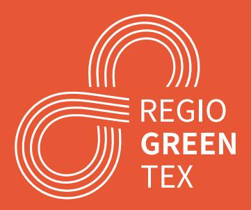

# **From Rags to Regulations**

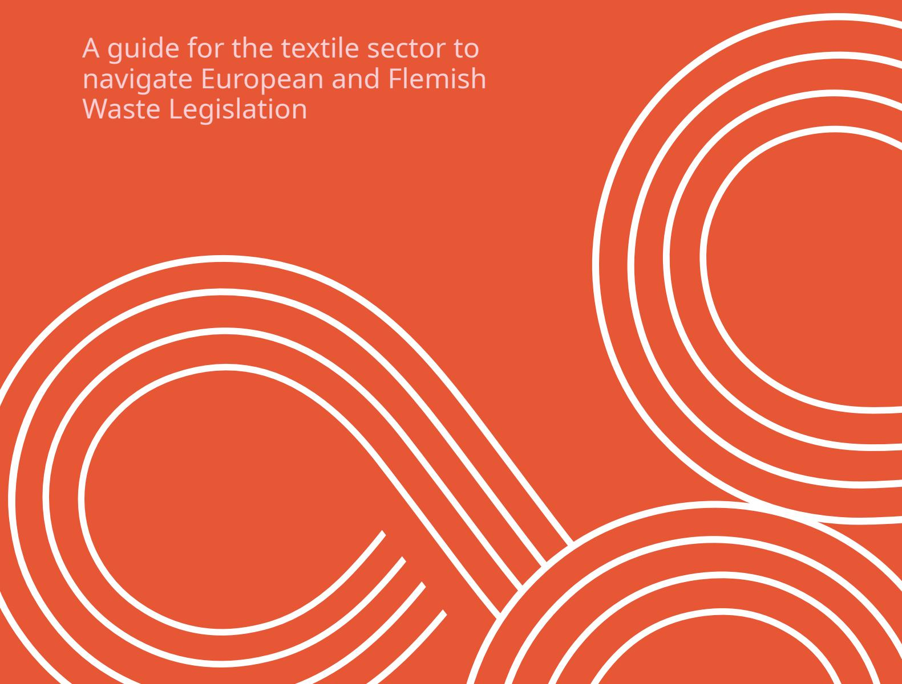

# **DOCUMENT DESCRIPTION**

| <b>1. Title of publication:</b> From Rags to Regulations                                                                                                                                                                                                                                                                                                              | <b>2. Responsible Publisher:</b> OVAM                                                                                                    |
|--------------------------------------------------------------------------------------------------------------------------------------------------------------------------------------------------------------------------------------------------------------------------------------------------------------------------------------------------------------------------|---------------------------------------------------------------------------------------------------------------------------------------------|
| <b>3. Legal deposit number:</b> D/2025/5024/28                                                                                                                                                                                                                                                                                                                        | <b>4. Key words:</b> textile, waste legislation, waste framework directive, waste shipment regulation, end-of-waste, circular economy |
| 
<b>5. Summary:</b> The goal of this document is to help textile companies navigate waste legislation on the EU-level and, where applicable, also on the Flemish level. It provides practical steps on how to comply with various pieces of legislation and explains concepts such as end-of-waste, environmental permits, registrations and waste transports.
 |                                                                                                                                             |
| <b>6. Number of pages:</b> 37                                                                                                                                                                                                                                                                                                                                            | <b>7. Date of publication:</b> July 2025                                                                                                    |
| <b>8. Author:</b> Wouter Dujardin (OVAM)                                                                                                                                                                                                                                                                                                                                 | <b>9. Contact person:</b> Wouter Dujardin (OVAM)                                                                                            |
| 
Information from this document may be reproduced with due acknowledgement of the source. Most OVAM publications can be consulted or downloaded on OVAM's website: <a href="http://ovam.vlaanderen.be">ovam.vlaanderen.be</a>
                                                                                                                                      |                                                                                                                                             |

This guide was developed by OVAM, the competent authority for waste legislation in Flanders, with the support of the RegioGreenTex Project 101083731 – I3-2021-INV1.

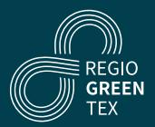

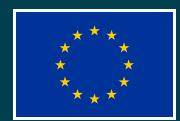

# **Disclaimer**

This guide offers insights into how waste legislation operates at both the Flemish and European level, with a focus on textiles. Our goal is to keep this information timely and accurate, however, please note that legislation is bound to change. In addition, this information is:

- of a general nature only and is not intended to address the specific circumstances of any particular individual or entity;
- not necessarily comprehensive, complete, accurate or up-to-date;
- references were provided to the relevant sources, which are sometimes linked to external websites, over which we have no control and for which we assume no responsibility;
- not professional or legal advice.

The OVAM accepts no responsibility or liability whatsoever with regard to the information in this guide. It's the reader's responsibility to verify all relevant legislation.

# **CONTENTS**

| DOCUMENT DESCRIPTION                                           | 02 |
|----------------------------------------------------------------|----|
| 1. A GUIDE ON WASTE TO SUPPORT TEXTILE COMPANIES               | 05 |
| 2. WASTE LEGISLATION                                           | 06 |
| 2.1. Key EU waste legislations                                 | 06 |
| Waste Framework Directive (WFD)                                | 06 |
| Waste Shipment Regulation (WSR)                                | 06 |
| 2.2. Key Flemish waste legislations                            | 07 |
| Materialendecreet (‘Materials Decree’)                         | 07 |
| VLAREMA                                                        | 07 |
| VLAREM II                                                      | 07 |
| 3. WASTE AND ITS IMPLICATIONS                                  | 08 |
| 3.1. Understanding when textiles are waste                     | 08 |
| 3.2. MANAGING WASTE IN THE EU                                  | 10 |
| 3.3. MANAGING WASTE IN THE FLEMISH REGION                      | 10 |
| 4. APPLICATION OF END-OF-WASTE LEGISLATION                     | 11 |
| 4.1. The concepts ‘end-of-waste’, ‘byproduct’ and ‘used goods’ | 11 |
| 4.3. Proving conformity with EoW in the Flemish Region         | 15 |
| 5. TRANSPORT OF WASTE AND EOW TEXTILES                         | 16 |
| 5.1. Transport of waste                                        | 16 |
| 5.1.1. National waste transport                                | 16 |
| 5.1.2. International waste transport                           | 19 |
| 5.2. Transport of EoW textiles                                 | 25 |
| 5.2.1. Transport within a member state                         | 25 |
| 5.2.2. Transport between member states                         | 25 |
| 5.2.3. Export from the EU                                      | 25 |
| 6. CASE EXAMPLES                                               | 26 |
| 6.1. Recycling off-cuts and using the recycled fibers          | 26 |
| 6.2. Using cloth for packaging                                 | 27 |
| Using dead stock cloth                                         | 27 |
| Using cutting waste                                            | 28 |
| 6.3. Leasing of workwear                                       | 29 |
| 6.4. Designer repurposing waste                                | 31 |
| 6.5. Recycling company importing textile waste                 | 31 |
| 6.6. Recycling of post-consumer clothes                        | 32 |
| ANNEXES                                                        | 33 |
| 7.1. Overview of competent authorities                         | 33 |
| 7.2. Decision tree for the future WSR (2024/1157)              | 35 |

# **1. A GUIDE ON WASTE TO SUPPORT TEXTILE COMPANIES**

Many textile companies want to focus on circular and sustainable entrepreneurship. For this purpose they themselves start pilot projects for discarded textiles or textile residues. They start activities such as collection, sorting, reusing, repairing, dismantling and recycling. However, often they don't realize they are dealing with waste and fall under the waste legislation. This guide was created to help companies on a European and regional level.

As this guide was created by OVAM, the competent authority for waste legislation in Flemish Region, the regional level highlighted in this guide focuses on the Flemish Region with its regional Flemish legislation. If you are operating in another region or member state, procedures might be similar and a list of the competent authorities in all member states is provided in Annex 7.1.

Finally, as the reader will notice, an important part of this guide will discuss waste transports. The underlying regulation was revised in 2024 and will come into effect in May 2026. Where possible and relevant, this guide already includes references to this future regulation. However, an update on this topic in this guide will be necessary when approaching May 2026.

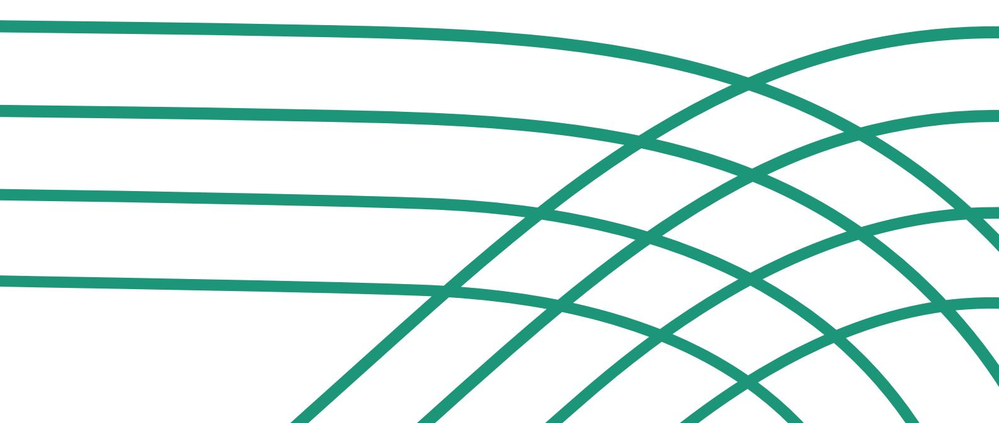

# **2. WASTE LEGISLATION**

# **2.1. KEY EU WASTE LEGISLATIONS**

The EU has various directives and regulations targeting waste. The difference between a directive and a regulation is that a directive needs to be embedded ('transposed') into the legislation of the member states. A directive is binding for all member states regarding the outcome. However the member states have freedom to choose how to achieve this outcome. Finally, a directive is only directly legally binding to member states, not to companies or individuals.

A regulation is directly legally binding to individuals and companies. Therefore it is not transposed in the legislation of member states resulting in homogenous application in all member states. For textiles the two key EU waste legislations are summarized below. It is advisable to take the time to read these legislations in order to have a deeper understanding of waste legislation in all EU member states.

# **Waste Framework Directive (WFD)**

[Directive 2008/98/EC of the European Parliament and](https://eur-lex.europa.eu/legal-content/EN/TXT/?uri=CELEX%3A32008L0098)  [of the Council of 19 November 2008 on waste](https://eur-lex.europa.eu/legal-content/EN/TXT/?uri=CELEX%3A32008L0098)

The WFD establishes the legislative framework for handling waste in the EU and is therefore the central piece of waste legislation. Since it is a directive, its content are transposed in the legislation of all member states. The WFD defines important concepts such as waste, recovery, recycling, disposal. It also puts in place essential requirements for the management of waste such as permit or registration requirements. It also establishes major principles such as the waste hierarchy, extended producer responsibility (EPR) and that waste should be handled in a way that does not have a negative impact on the environment or human health.

The WFD was in 2024 under revision and is foreseen to be updated in 2025 focusing on textile waste and EPR for textiles. Therefore all member states will have to update their legislation as well.

**Waste Shipment Regulation (WSR)** In force: [Regulation \(EC\) No 1013/2006 of the](https://eur-lex.europa.eu/legal-content/EN/TXT/?uri=CELEX%3A02006R1013-20210111)  [European parliament and of the council of 14 June](https://eur-lex.europa.eu/legal-content/EN/TXT/?uri=CELEX%3A02006R1013-20210111)  [2006 on shipments of waste](https://eur-lex.europa.eu/legal-content/EN/TXT/?uri=CELEX%3A02006R1013-20210111)

Future WSR replacing the current WSR from 2006: [Regulation \(EU\) 2024/1157 of the European parliament](https://eur-lex.europa.eu/legal-content/EN/TXT/?uri=CELEX%3A32024R1157)  [and of the council of 11 April 2024 on shipments of](https://eur-lex.europa.eu/legal-content/EN/TXT/?uri=CELEX%3A32024R1157)  [waste](https://eur-lex.europa.eu/legal-content/EN/TXT/?uri=CELEX%3A32024R1157) (referred to as 'future WSR' in this guide, most articles are in force from 21.05.2026)

The WSR is a regulation and, as mentioned before, all member states need to follow the same rules. There is no transposition of a regulation in local regulation as is the case with a directive. The WSR establishes procedures and control regimes for the transboundary shipment of waste:

⸰ Between member states, within the EU or with transit through third countries ⸰ Imports into the EU ⸰ Exports from the EU ⸰ Transit through the EU, coming from and going to third countries

These procedures and control regimes are necessary to protect the environment and human health against the possible adverse effects of shipping waste.

The WSR provides two procedures for shipping waste across borders:

⸰ General information requirements ⸰ Procedure of prior notification and consent

# **2.2. KEY FLEMISH WASTE LEGISLATIONS**

In Belgium the waste legislation is a responsibility of the three regions: the Flemish, the Brussels and the Walloon region. Therefore the EU directives on waste were transposed in the legislation of each region.

In addition to transposing EU waste legislation, such as the WFD, the member states have the freedom to add additional legislation, as long as it does not conflict with EU legislation. In the Flemish Region we have Decrees ('Decreten') and Orders ('Besluiten') amongst other types of legislative types. A Decree describes general rules and principles which are more detailed in one or multiple Orders.

In the Flemish Region there are three key pieces of waste legislation relevant to textile waste.

# **Materialendecreet ('Materials Decree')**

[Decree on the sustainable management of material](https://navigator.emis.vito.be/detail?woId=41707&woLang=nl)  [cycles and waste of 23 December 2011](https://navigator.emis.vito.be/detail?woId=41707&woLang=nl) (Partially available in [English](https://navigator.emis.vito.be/detail?woId=41707&woLang=en)).

The Materials Decree is the central piece of waste legislation for the Flemish Region. It contains the transposition of the WFD as well as of other EU directives.

### **VLAREMA**

[Order of the Government of Flanders adopting the](https://navigator.emis.vito.be/detail?woId=43991&woLang=nl)  [Flemish regulation on the sustainable management](https://navigator.emis.vito.be/detail?woId=43991&woLang=nl)  [of material cycles and waste of 17 February 2012](https://navigator.emis.vito.be/detail?woId=43991&woLang=nl) (Partially available in [English](https://navigator.emis.vito.be/detail?woId=43991&woLang=en)).

VLAREMA is an Order of the Materials Decree. Whereas the Materials Decree translates the major principles and rules of the EU directives, the VLAREMA defines in detail how these principles and rules should be applied in practice. For example, it defines the procedures to achieve end-of-waste status or to collect and transport waste. It also holds the key rules of EPR systems.

# **VLAREM II**

[Order of the Flemish Government of 1 June 1995](https://navigator.emis.vito.be/detail?woId=263&woLang=nl)  [concerning General and Sectoral provisions relating to](https://navigator.emis.vito.be/detail?woId=263&woLang=nl)  [Environmental Safety](https://navigator.emis.vito.be/detail?woId=263&woLang=nl) (Partially available in [English](https://navigator.emis.vito.be/detail?woId=263)).

VLAREM II is an order targeted at preventing and limiting nuisance, environmental pollution and safety risks of companies. VLAREM II therefore deals with all aspects of environmental permits, e.g. sound, soil, air, water, waste. [Annex 1 of VLAREM II](https://navigator.emis.vito.be/detail?woId=69985&woLang=nl) is of central importance. It contains the classification list that defines the category of a company. A company is a waste processor when one of its processes falls under section 2 'Waste Materials' of the classification list.

# **3. WASTE AND ITS IMPLICATIONS**

# **3.1. UNDERSTANDING WHEN TEXTILES ARE WASTE**

According to the waste legislation defined in the WFD and transposed in the legislation of all member states, a material can only be a waste or not a waste (e.g. a product or substance). Textiles are waste when they comply with the definition of waste. This definition is formulated in the WFD, article 3:

"'**Waste**' means any substance or object which the holder discards or intends to or is required to discard." This definition hinges on what 'discarding' means. Therefore a few examples are given below:

# ⸰ **Action: 'The holder discards'**

- A person throws a t-shirt in a waste bin.
- A person throws a t-shirt in a textile collection container.
- A company sends its off-cuts to a waste collector or sends it directly to a licensed waste treatment facility.
- A company sends its (unused) work clothes or overstock back to the producer for recycling.

# ⸰ **Intention: 'The holder intends to discard'**

- A company plans to send its off-cuts to a waste collector.
- A company transports textiles in such a way that they are not protected against damage during transport (e.g. water damage).

# ⸰ **Requirement: 'The holder is required to discard'**

- A company holds textiles which do not comply with product regulation and therefore cannot enter the market.
- A company is required to destroy its textile products due to intellectual property infringement or counterfeit.

Currently, in some EU member states, there are collection containers specifically for reusable items. These member states regard the textiles in these containers not as waste. It is expected that the new WFD will require that also these items are seen as waste because they are discarded.

Note that the commercial value of the material is not important. Also, the decision on whether a certain material is a waste or not should be based on the specific circumstances. For example, a t-shirt is not waste if it is handed over to another person or company with the goal to be reused as a t-shirt. The same t-shirt is waste if it is handed over to another person or company with the goal to be recovered, even if the that company paid to have that t-shirt.

Building on the above, it is useful to understand the definitions of the waste operations, see Figure 1. If a company has such a waste operation, it should check if it complies with EU and local waste legislation in terms of, for example, environmental permits and transport. In short, a waste material goes either to recovery or disposal. While disposal covers operations such as incineration without energy recovery or landfilling, recovery covers operations where the material still serves a useful purpose. Preparing for re-use, recycling, backfilling and use as a fuel are all recovery operations. This clarifies that even checking, cleaning or repairing operations are indeed waste operations if they are done on a waste material, which is in turn a material that the holder disposed of.

# **OVERVIEW OF KEY WASTE DEFINITIONS IN THE WFD AND THEIR RELATIONSHIP**

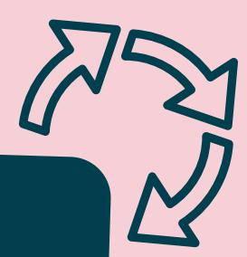

#### RECOVERY

"Any operation the principal result of which is waste serving a useful purpose by replacing other materials which would otherwise have been used to fulfil a particular function, or waste being prepared to fulfil that function, in the plant or in the wider economy. Annex Il sets out a non-exhaustive list of recovery operations;" (WFD, article 3, 15)

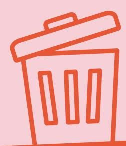

Recovery includes preparing for re-use, recycling, backfilling and use as fuel

#### Preparing for re-use

"Checking, cleaning or repairing recovery operations, by which products or components of products that have become waste are prepared so that they can be re-used without any other pre-processing;" (WFD, article 3, 16)

#### Recycling

"Any recovery operation by which waste materials are reprocessed into products, materials or substances whether for the original or other purposes. It includes the reprocessing of organic material but does not include energy recovery and the reprocessing into materials that are to be used as fuels or for backfilling operations;" (WFD, article 3, 17)

#### Backfilling

"Any recovery operation where suitable non-hazardous waste is used for purposes of reclamation in excavated areas or for engineering purposes in landscaping. Waste used for backfilling must substitute non-waste materials, be suitable for the aforementioned purposes, and be limited to the amount strictly necessary to achieve those purposes; (WFD, article 3, 17a)

#### DISPOSAL

"Any operation which is not recovery even where the operation has as a secondary consequence the reclamation of substances or

energy. Annex I sets out a non-exhaustive list of disposal operations;"

Referring to Annex I of the WFD, this includes for example landfilling or incineration without energy recovery.

# **3.2. MANAGING WASTE IN THE EU**

The WFD defines the essential requirements for the management of waste. All member states need to comply with these common rules but the procedure and details may differ between them. In summary, each member state will have at least the following in place:

⸰ The waste hierarchy needs to be followed (Article 4 and 15) ⸰ A company intending to carry out waste treatment needs to have a permit (Article 23) ⸰ A register is required for companies collecting or transporting waste, for dealers or brokers and for companies who are exempt from permitting obligations (Article 26)

Therefore, each company managing waste will also need to comply with these local procedures.

# **3.3. MANAGING WASTE IN THE FLEMISH REGION**

The WFD states in article 23 that member states shall require any establishment or undertaking intending to carry out waste treatment to obtain a permit from the competent authority. In the Flemish Region, this article was transposed in [Materials Decree article 11](https://navigator.emis.vito.be/detail?woId=41777).

Typically, a Flemish company needs a waste section in its environmental permit in order to manage or store (textile) waste. There are a [few exceptions](https://navigator.emis.vito.be/detail?woId=69987). For textile waste, it is relevant to know that a company does not need a waste section in its environmental permit if it concerns own company waste, i.e. not waste collected from other parties, and if the waste is removed regularly and if:

⸰ The company reduces the size of its waste on the place of production by dismantling, splitting, cleaving, cutting, pressing or sawing in order to remove the waste; or ⸰ The company sorts and stores their waste; or ⸰ The company centralizes their waste from multiple exploitation sites to a centralized site where the waste is sorted and stored. This is not applicable to licensed waste treatment companies or waste collector/traders/brokers.

A waste section in the environmental permit is required if these exceptions are not applicable, e.g. in the case a company collects used textiles from its clients for recycling or in case a company uses waste textiles to produce new textiles.

The procedure for obtaining environmental permits is explained on the website of the Flemish Government [\(EN](https://www.vlaanderen.be/en/integrated-environment-permit-to-operate-classified-establishments-or-activities), [NL](https://www.vlaanderen.be/omgevingsvergunning/exploitatie-ingedeelde-inrichtingen)).

# **4. APPLICATION OF END-OF-WASTE LEGISLATION**

A waste material can lose its waste status or a production residue can be seen as a byproduct according to the EoW legislation, relieving the holders of needing to comply with waste legislation. Therefore, it might seem attractive to willingly misinterpret EoW legislation to state that the waste material is not waste. The following sections explain the basics of correctly using EoW legislation in general, with a deep dive in Flemish procedures and guidance. More information on local procedures and interpretations can be obtained from the local competent authority, see Annex 7.1.

# **4.1. THE CONCEPTS 'END-OF-WASTE', 'BYPRODUCT' AND 'USED GOODS'**

End-of-waste (EoW) legislation is defined in the WFD articles 5 and 6 and the future WSR article 29. Therefore each member state will have a reference to the WFD articles 5 and 6 in their own legislation.

Waste or production residues are only considered a non-waste if the holder can prove that they are in accordance with the local EoW legislation.

Consequently, these substances or objects can be transported as non-waste and can be used by companies without waste permits.

Note: End-of-waste or EoW is often used as a group name including the terms 'end-of-waste', 'byproducts' and 'used goods'.

There are three sets of EoW conditions, visually represented in Figure 2. Figure 3 shows the articles as defined in the WFD and WSR.

### **Current EoW conditions (WFD articles 5 and 6)**

# **New aditional EoW condition (entry into force 21 May 2026 in future WSR article 29)**

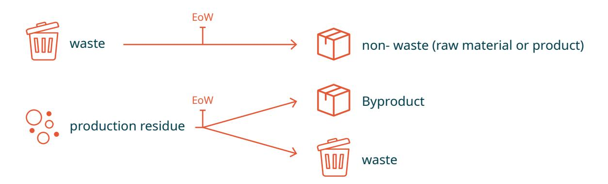

Object, substance

EoW

used good (or 'secondhand' good)

#### **End-of-waste conditions** WFD article 6

Member States shall take appropriate measures to ensure that waste which has undergone a recycling or other recovery operation is considered to have ceased to be waste if it complies with the following conditions:

the substance or object is to be used for specific purposes;

- a. a market or demand exists for such a substance or object;
- b. the substance or object fulfils the technical requirements for the specific purposes and meets the existing legislation and standards applicable to products; and
- c. the use of the substance or object will not lead to overall adverse environmental or human health impacts.

#### **Byproduct conditions** WFD article 5

Member States shall take appropriate measures to ensure that a substance or object resulting from a production process the primary aim of which is not the production of that substance or object is considered not to be waste, but to be a by-product if the following conditions are met:

- a. further use of the substance or object is certain;
- b. the substance or object can be used directly without any further processing other than normal industrial practice;
- c. the substance or object is produced as an integral part of a production process;
- d. further use is lawful, i.e. the substance or object fulfils all relevant product, environmental and health protection requirements for the specific use and will not lead to overall adverse environmental or human health impacts.

**Used good conditions** Future WSR, article 29 ([2024/1157\)](https://eur-lex.europa.eu/legal-content/EN/TXT/?uri=CELEX%3A32024R1157), applicable from 21 May 2026

When deciding whether an object or substance is to be considered as a used good and not as waste, Member States shall ensure that at least the following conditions are fulfilled:

- a. further use or reuse of the object or substance is certain;
- b. the object or substance can fulfil its intended function without significant preprocessing;
- c. where relevant, the object or substance is tested to ensure its full functionality;
- d. further use is lawful, that is to say that the object or substance fulfils all relevant product, environmental and health protection requirements for the specific use and will not lead to overall adverse environmental or human health impacts;
- e. the object or substance is properly preserved and protected against damage during transport, loading and unloading.

All three sets of conditions have evident similarities between them: they require evidence for existing demand, for knowing where the material will be used, for meeting all required technical and legislative requirements and for ensuring that there is no harm to the environment or human health.

Still, each set of EoW conditions is designed for a specific situation:

⸰ The end-of-waste conditions (WFD article 6) apply in the situation of recycling or recovery: waste is recovered or recycled into recycled materials. ⸰ The byproduct conditions (WFD article 5) apply in the situation of industrial symbiosis: production residues from one production process can be directly used in another production (not recovery) process. ⸰ And, as of May 2026, the used good conditions (future WSR article 29) apply in the situation where objects or substances are considered used goods (or 'secondhand' goods) and the situation of end-of-waste and byproduct objects doesn't apply.

The end-of-waste and byproducts conditions were established in 2008 in the [WFD](https://eur-lex.europa.eu/legal-content/EN/TXT/?uri=CELEX%3A02008L0098-20180705) in, respectively, articles 6 and 5. These conditions were established to clarify the difference between a waste and a non-waste. The Commission has published two guidance documents, the most recent one was in [2012,](https://ec.europa.eu/environment/pdf/waste/framework/guidance_doc.pdf) to help interpret the conditions.

The future [WSR](https://eur-lex.europa.eu/legal-content/EN/TXT/?uri=CELEX%3A32024R1157) introduces a third condition for objects or substances that were not a waste or a production residue but are considered a used good. This third condition was added to prevent waste being shipped under the guise of 'used goods' or 'secondhand goods', a well-known problem for textiles. For example, these used good conditions are applicable to secondhand clothing that never reached the waste status and therefore the end-of-waste conditions were not applicable.

# **4.2. EOW LEGISLATION ACROSS BORDERS**

As mentioned before, because the end-of-waste and byproduct conditions were defined in a directive, the overall principle is homogenously applied across the member states. However, each member state had to transpose the articles in their own national or regional legislation. In addition, each member state had to develop the related procedure to prove conformity with these conditions. Finally, despite the guidance documents, there are still differences in interpretation and application across member states.

This resulted in no mutual recognition of EoW status between member states or even regions within a member state: if a material has an end-of-waste status in member state A, that status is only valid within member state A. Member state B will probably use different rules and procedures and require these procedures to be followed to achieve end-of-waste in member state B. More information on how this affects transport across borders is given in the next chapter of this guide.

In the near future, it is possible that [the Commission](https://environment.ec.europa.eu/news/commission-starts-develop-end-waste-criteria-plastic-waste-2022-04-05_en#:~:text=Textiles%3A&text=The%20Commission%20and%20its%20Joint,waste%20will%20commence%20in%202023.)  [set of end-of-waste conditions for textiles](https://environment.ec.europa.eu/news/commission-starts-develop-end-waste-criteria-plastic-waste-2022-04-05_en#:~:text=Textiles%3A&text=The%20Commission%20and%20its%20Joint,waste%20will%20commence%20in%202023.). These EU-wide conditions are expected to ensure that the procedure of proving conformity with the EoW conditions is the same in all member states. In other words, a company would only need to prove once inside the EU that its textile waste or production residue meets the specific criteria.

Even though the used good conditions are formulated in a regulation, [article 29](https://eur-lex.europa.eu/legal-content/EN/TXT/?uri=CELEX%3A32024R1157) states that member states are responsible for ensuring that the conditions are fulfilled. This means that member states will have to develop procedures in order to do so, similar to the end-of-waste and byproduct conditions. However, the Commission may formulate detailed rules for specific used goods such as used textiles. This would finetune the current general used good conditions to the problems concerning textile waste shipped as used goods and potentially partially harmonize the related procedure across the member states.

# **4.3. PROVING CONFORMITY WITH EOW IN THE FLEMISH REGION**

As mentioned before, waste legislation is regionalized in Belgium. Therefore, the WFD was transposed differently in the Flemish, Brussels Capital and Walloon Regions. Each region has, therefore, also a different system of proving conformity with the endof-waste or byproduct conditions. In this guide we focus on proving conformity for textiles in the Flemish Region.

In the Flemish Region the end-of-waste conditions from the WFD are transposed in [article 36](https://navigator.emis.vito.be/detail?woId=41871&woLang=nl&woVersion=2024-08-06) of the Materials decree and the byproduct conditions

in [article 37](https://navigator.emis.vito.be/detail?woId=41871&woLang=nl&woVersion=2024-08-06). The procedures related to proving conformity with these articles are established in [VLAREMA chapter 2](https://navigator.emis.vito.be/detail?woId=44093).

The Flemish Region has opted for two systems of proving conformity: the raw material declaration ('grondstofverklaring' in Dutch) and the selfassessment ('zelfbeoordeling' in Dutch). A company in the Flemish Region or abroad can choose either system to achieve end-of-waste or byproduct status in the Flemish Region. Only in the case where the textile waste would be used as fuel or if it is recyclate from diaper waste, a self-assessment is not possible and a raw material declaration needs to be obtained from the OVAM.

#### OPTION 1: SELF-ASSESSMENT

#### **Procedure**

- 1. Read the [self-assessment manual](https://ovam.vlaanderen.be/zelfbeoordeling) (available in Dutch and English).
- 2. Create a self-assessment answering the questions of the manual in detail.
- 3. Potential check by the enforcement agency.

#### **(Dis)advantages**

Flexible: easy to update information (e.g. referral to internal databases) No wait time Not checked by OVAM

#### OPTION 2: RAW MATERIAL DECLARATION

#### **Procedure**

- 1. Use the webform of the OVAM to provide all information. We encourage companies to use the [self-assessment manual](https://ovam.vlaanderen.be/zelfbeoordeling) to prepare the information because this manual is also used by the OVAM to check if all information is present.
- 2. OVAM will check the information.
- 3. OVAM will give judgement in a raw material declaration.

#### **(Dis)advantages**

Not flexible: all information needs to be present in the request and the user cannot change the declaration. If information changes, a new declaration is required. Throughput time ± 60 days Checked by OVAM so certain that end-of-waste or byproduct status is valid

Each system has its procedure and advantages, as shown below. Companies usually choose to do a selfassessment when they are sure that they comply with EoW legislation. When they are not sure or simply want to have an opinion from the government, they request a raw material declaration. If a company conducts a selfassessment and the enforcement agency deems it incorrect or incomplete, the enforcement agency will classify the material as waste. Consequently, the enforcement agency may demand a raw material declaration and could take administrative action.

# **5. TRANSPORT OF WASTE AND EOW TEXTILES**

In the previous chapter, the guide explained the key parts of waste legislation. It became clear that when a material is wasted, other requirements apply than when the material was still a product. This is especially true for transporting and storing waste. Therefore, in this chapter, the guide will explain how waste can be transported within the Flemish Region, as well as across borders. It will also explain how waste can be stored in the Flemish Region. Finally, the guide will also clarify what rules apply to materials with an endof-waste or byproduct status for transport and storing.

# **5.1. TRANSPORT OF WASTE**

Many companies have the perception that waste cannot be shipped across borders. This is generally not true, but other rules and procedures apply than for non-waste materials. Only in some cases there are import or export bans. These rules and procedures are necessary to protect the environment and human health against the adverse impacts resulting from the potential mishandling during shipment and storage of waste.

# **5.1.1. National waste transport**

Each member state has a system of supervision of waste shipments and registrations, following the articles of the WFD regarding waste management, see. However, this system varies between each

member state and sometimes even between regions, as is the case for Belgium. For more detail, please consult the website of the relevant competent authority, see Annex 7.1.

What follows is an explanation of how waste transports are regulated inside the Flemish Region and between the Flemish Region and the other Belgian regions.

### **Waste transport within the Flemish Region**

In the Flemish Region, each waste transport needs to be organized by a registered waste collector/ trader/broker and transported by a registered waste transporter. Finally, the waste transport should go to a licensed waste treatment facility.

The original waste producer can choose to act as the waste collector/trader/broker and as the registered waste transporter and thereby also accepting the related responsibilities and duties, listed in the [general](https://ovam.vlaanderen.be/transportvoorwaarden)  [transport requirements.](https://ovam.vlaanderen.be/transportvoorwaarden) The original waste producer [does not need to register](https://ovam.vlaanderen.be/registratie-als-inzamelaar-afvalstoffenhandelaar-makelaar) as a waste collector/trader/ broker if it exclusively organizes the transport of its own waste.

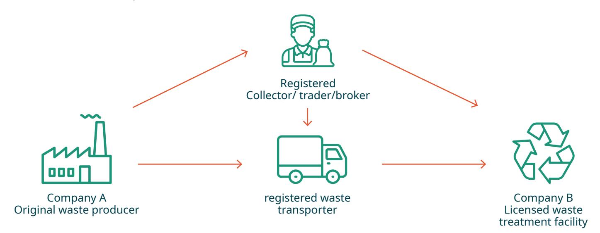

#### **5 steps towards organizing a waste transport within the Flemish Region.**

Below are the 5 steps that an original waste producer ('Company A') needs to do in order to organize a waste transport to a licensed waste treatment facility ('Company B') within the Flemish Region. The explanation does not include all possible exceptions listed on the [OVAM-website.](https://ovam.vlaanderen.be/ik-produceer-afval)

- **1.** Company A needs to ensure that Company B is a licensed waste treatment facility.
  - **a.** Note: A licensed waste treatment facility is a company who is licensed in its environmental permit to accept textile waste. [The list of licensed](https://services.ovam.be/LijstenVerwerkersEnLabos/s/lijst/61)  [waste treatment facilities for textile recycling](https://services.ovam.be/LijstenVerwerkersEnLabos/s/lijst/61) in Flanders is published on the OVAM website.
- **2.** Company A finds a provider of identification forms and creates an [identification form](https://ovam.vlaanderen.be/identificatieformulier).
  - **a.** This identification form needs to be digital. A list of providers for identification form is published on the OVAM website. Pay attention that the cost of creating an identification form at one provider can cost a multiple of what it costs with another provider.
  - **b.** Before the transport starts, the identification form needs to be completed and signed by company A. The driver of company A needs to receive access to the application for visualizing the identification form. Only then can the driver start the waste shipment.
- **3.** The driver of company A registers the start of the waste transport in the application of the identification form and transports the waste to the licensed waste facility. During the transport the driver makes sure to follow the [instructions](https://ovam.vlaanderen.be/transportvoorwaarden)  [for transportation of waste.](https://ovam.vlaanderen.be/transportvoorwaarden)
- **4.** The driver of company A registers the disposal of the waste at the waste treatment facility in the application of the identification form. A copy of the identification form is sent to the waste treatment facility who needs to keep it for at least 5 years. Also company A needs to keep the identification form for at least 5 years, but this can be done in the application of the identification form.
- **5.** Company A needs to add this waste in their [waste register.](https://ovam.vlaanderen.be/register-van-geproduceerde-afvalstoffen) This register contains data on the produced waste such as date of discarding, amount, composition, foreseen treatment and details on the company responsible for the waste treatment. There are multiple way of keeping a waste register. Company A may use [this example](https://ovam.vlaanderen.be/documents/177281/0/Standaardsjabloon+afvalstoffenregister+voor+afvalproducenten.xlsx/5569166e-187c-4b21-18ca-79f442090993?t=1716993778350&download=true) of a waste register. Companies can also use the [online tool of the OVAM](https://sso.ovam.be/pages/login.xhtml) to keep track of their waste register. Also the receipts or transport documents of the waste collector can be used to feed the waste register.

Alternatively, Company A can search for a [registered waste collector/trader/broker](https://registratie.ovam.be/pages/publicOrganisatieList.xhtml?dossierType=IHM_AFVAL&showGeschorste=true) ('geregistreerde inzamelaar, afvalstoffenhandelaar of -makelaar' or 'IHM' in Dutch, see Figure 6. The list of registered waste collector/trader/ brokers published on the OVAM website. Filter the list for 'Textiel' as shown in the figure) and [a registered waste](https://registratie.ovam.be/pages/publicOrganisatieList.xhtml?dossierType=VERVOERDER_AFVAL&showGeschorste=false)  [transporter.](https://registratie.ovam.be/pages/publicOrganisatieList.xhtml?dossierType=VERVOERDER_AFVAL&showGeschorste=false)

| Geregistreerde bedrijven         |                                | Bedrijfsnaam:      | Minstens geregistreerd tot: |          |                     |      |            |            |
|----------------------------------|--------------------------------|--------------------|-----------------------------|----------|---------------------|------|------------|------------|
| OVAM-nr. (Registratienummer):    |                                |                    |                             |          |                     |      |            |            |
| Land:                            | België                         | Gemeente:          |                             |          |                     |      |            |            |
| Afvalomschrijving of Eural code: |                                | Afval categorieën: | Textiel                     |          |                     |      |            |            |
| Zoek                             | Zoekvelden wissen              |                    |                             |          |                     |      |            |            |
| <b>490 resultaten</b>            |                                |                    |                             |          |                     |      |            |            |
| Ondernemingsnr.                  | Naam                           | OVAM nr.           | Adres                       | Postcode | Gemeente            | Land | Vanaf      | Tot        |
| BE-0206684863                    | Intergemeentelijke Maatschappi | 335                | Grote Markt ZN              | 8500     | KORTRIJK            | BE   | 1-6-2012   | 31-12-9999 |
| BE-020750992*                    | Gemeente Sint-Katelijne-Waver  | 250                | Lemanstraat 63              | 2860     | SINT-KATELIJNE-WAVI | BE   | 1-6-2012   | 31-12-9999 |
| BE-021338406:                    | Intercommunale voor Huisvuilv  | 331                | Schaarbeekstraat 27         | 9120     | BEVEREN             | BE   | 1-6-2012   | 31-12-9999 |
| BE-0214015751                    | INTERGEMEENTELIJK SAMENWER     | 323                | Pathoekeweg 41              | 8000     | BRUGGE              | BE   | 1-6-2012   | 31-12-9999 |
| BE-040019131€                    | Alsico                         | 11334              | Zonnestraat 223/229         | 9600     | RONSE               | BE   | 12-10-2021 | 11-10-2021 |

#### **Waste transport between the Flemish Region and another Belgian region**

Organizing a waste transport within the Flemish Region or between the Flemish Region and another Belgian region is rather similar. If the waste transport starts in Flanders and goes to the Brussels or Walloon region, the same requirements explained in 5.1.1 apply: a waste register needs to be held, the organizer of the waste transport (unless it is the original waste producer) and the transporter needs to be registered in the Flemish Region, identification forms need to accompany the waste transport. The differences are:

⸰ Identification forms are called 'traceerbaarheidsdocument' or 'document de traçabilité' in the Brussels and Walloon regions. ⸰ The [Brussels](https://leefmilieu.brussels/pro/diensten-en-aanvragen/erkenningen-en-registraties/vervoerders-van-afvalstoffen-en-dierlijke-bijproducten-uw-verplichten) and [Walloon regions](https://sol.environnement.wallonie.be/home/formulaires-dechets/collecteurs---transporteurs.html) have a few cases where the use of an identification form is exempted. These exemptions are not the same. Therefore the stricter rule applies.

⸰ In the Brussels and Walloon regions the choice for the identification form is given between paper and digital format. In the Flemish Region the identification form (or the equivalent document from the other region) needs to be digital. Therefore, the form needs to be digital for a transport between the Flemish Region and another Belgian region or if the transport between the Walloon and Brussels regions passes through the Flemish Region.

If the waste transport starts in the Brussels or Walloon region, the regional rules regarding registration and other administrative requirements apply. Please consult the websites of the competent authorities of the [Brussels](https://leefmilieu.brussels/pro/diensten-en-aanvragen/erkenningen-en-registraties/vervoerders-van-afvalstoffen-en-dierlijke-bijproducten-uw-verplichten) and [Walloon regions.](https://sol.environnement.wallonie.be/home/formulaires-dechets/collecteurs---transporteurs.html)

*Figure 6. The list of registered waste collector/trader/brokers published on the OVAM website. Filter the list for 'Textiel' as shown in the figure*

# **5.1.2. INTERNATIONAL WASTE TRANSPORT**

Depending on the type of waste and the countries involved, organizing an international waste transport can vary between having little procedural checks to not be possible at all. Inside the EU, all EU-countries need to adhere to the Waste Shipment Regulation, discussed on page 5. This ensured a homogenized approach to waste shipments inside the EU. However, if a non-EU country is involved, moving waste will be more challenging. This section aims to provide an overview of what steps to take in the most frequent cases.

### **Organizing an international waste transport**

A company shipping waste across national borders needs to take the following steps:

#### **1. Find the appropriate partners**

⸰ Waste can only be shipped to a facility that is licensed to treat this waste. Check if the receiving party is able and licensed to treat the textile waste in an environmentally sound manner. ⸰ Waste can only be transported by the original waste producer or by a company registered as a carrier of waste. A waste carrier registered in another member state does not need to register again in the Flemish Region because the Flemish Region accepts this registration. ⸰ Consult local regulation in the country of dispatch regarding requirements for third companies organizing a waste transport. For example, if the waste transport starts in the Flemish Region, the waste transport can only be organized by the original waste producer or by a third party who is registered in the Flemish Region as [a waste](https://ovam.vlaanderen.be/registratie-als-inzamelaar-afvalstoffenhandelaar-makelaar)  [collector/trader/broker](https://ovam.vlaanderen.be/registratie-als-inzamelaar-afvalstoffenhandelaar-makelaar). Annex 7.1 has a draft overview of the competent authorities for waste legislation.

#### **2. Determine the right procedure**

The procedures of the Waste Shipment Regulation (WSR), shortly introduced in 2.1., need to be followed. The WSR provides two procedures for shipping waste depending on the waste properties, the foreseen treatment and the destination:

# ⸰ General information requirements

- also known as 'Annex VII' procedure
- see article 18 of the current or future WSR ⸰ Prior written notification and consent
  - Also known as 'PIC' procedure
  - see article 4 of WSR or, in the future WSR, article 5-9

The decision tree in the next section 'Determining the correct transport procedure of the WSR' gives guidance as to which procedure needs to be used.

#### **3A. Procedure 1: General information requirements ('Annex VII'):**

- ⸰ Complete Annex VII
  - Download the Annex VII document. The language on the document does not matter because the format is determined in the WSR. A [Dutch](https://ovam.vlaanderen.be/documents/177281/8731060/Bijlage+VII-document.doc/08027993-f617-89f8-7f39-4728273544b6?t=1724238681308) and [English](https://ovam.vlaanderen.be/documents/177281/8731060/Annex+VII+form.doc/4ca0f150-17a0-6ea9-5a58-05011ba8a43c?t=1724238680763&download=true) version are provided.
- Complete box 1 to 12 except box 5 of the Annex VII document by following the [guidelines](https://environment.ec.europa.eu/system/files/2021-03/Correspondents). The OVAM also published detailed [guidelines](https://ovam.vlaanderen.be/documents/177281/8731060/Handleiding+invullen+Bijlage+VII-document.pdf/2d700a16-9f3a-1001-ffe2-65aa71ff346b?t=1725353094599) in Dutch. Box 5 is completed by the waste transporter. Note that typically for Box 10 the code B3030 or B3035 need to be added after (i) Basel Annex IX . ⸰ Conclude a binding contract with the receiver
  - Ensure that a binding contract is concluded with the receiver. The contents of this contract need to match the contents of the completed annex VII document. An example contract is provided in [Dutch](https://ovam.vlaanderen.be/documents/177281/8731060/Contract+overbrenging+van+groene-lijst+afvalstoffen.doc/0a61548d-7ba8-11e9-de61-00da663b94d8?t=1724238681604&download=true) and [English \(see appendix 2\).](https://environment.ec.europa.eu/system/files/2021-03/Correspondents)
- In the future WSR, this contract will also need to detail which party is responsible for the take-back when the shipment cannot be completed as intended. ⸰ Finalize the transport
  - Add the completed annex VII document to the waste transport physically or digitally (e.g. on tablet).

#### **3B. Procedure 2: Prior written notification and consent (PIC):**

⸰ The company making arrangements for shipping the waste informs once a year the competent authority (CA) of the country of dispatch. This CA informs the CA of destination/transit. Agreement from CA's from countries of dispatch and destination is required. In some countries of transit the CA need to agree as well, while in other countries of transit the CA only needs to be informed in order to have the option to object. ⸰ Consult the local CA in the country of dispatch for instructions on how to start this procedure. ⸰ For the Flemish Region, the information can be found on the [OVAM-website](https://ovam.vlaanderen.be/kennisgevingsprocedure). ⸰ In general, [regulation 669/2008](https://eur-lex.europa.eu/legal-content/EN/TXT/PDF/?uri=CELEX:32008R0669&from=NL) explains how to complete the notification documents.

#### **Determining the correct transport procedure of the WSR**

This section provides a decision tree that guides the reader towards the applicable procedure depending on the situation of the waste transport. It is important to realize that this decision tree does not include all exceptions detailed in the WSR itself.

#### **Decision tree for international waste shipment procedures**

For full details, please consult Waste Shipment Regulation (WSR, 1013/2006) or your local competent authority.

#### **Is the waste hazardous?**

Hazardous waste is:

⸰ Waste which displays one or more of the hazardous properties listed in Annex III of the Waste Framework Directive (WFD, 2008/98/EC). ⸰ Waste listed in WSR Annex IV (only for intra-OECD shipments) ⸰ Waste listed in WSR Annex V, part 1 list A or if it is listed with an asterisk '\*' in Annex V, part 2. (only for not intra-OECD shipments)

#### **Is the waste going to disposal, recovery or laboratory analysis?**

See the WFD article 3, 15° and 19° for the definitions. Annex I and Annex II of the WFD set out non-exhaustive lists of disposal and recovery operations.

#### **Is the waste listed in Annex III under one single entry?**

For textile waste codes B3030 and B3035 are most relevant.(4) Only mixtures specifically listed in Annex IIIA are allowed. For textiles mixtures of wastes listed under B3030 are therefore allowed (e.g. wool and cotton waste, mixed worn clothing).

#### **In which column of regulation 1418/2007 is the waste listed?**

While the EU has decided this type of waste may be transported using the procedure of general information requirements, the country of destination outside the EU and not part of the OECD Decision may not agree with this approach. Regulation 1418/2007 lists the required procedure to transport this type of waste to that specific country. The column where the waste code is listed decides which procedure to follow.

#### **Is the destination the EU or OECD country?**

What is the destination?

What is the destination?

or in case of import to the EU

What is the destination?

**YES**

**NO**

**Yes**

**NO**

**NO**

**Recovery**

**Yes**

EU or OECD country

EU

Column B Column A

Max 25kg

EFTA country

Column C

EU or OECD country

Other countries

Column D & local procedure

Non-OECD country

Import to the EU

Country is not listed

Import to the EU

Non-OECD countries

#### **ANALYSIS**

#### **DISPOSAL**

Procedure of general information requirements ('Annex VII')

Procedure of written notification and consent

Prohibited transport

#### **Footnotes**

- **1.** A fast track procedure for pre-consented facilities is available shortening the decision making period for CA's from 30 to 7 days, see article 14.
- **2.** Prohibition if EFTA country banned import of this waste or if competent authority in country of dispatch has reason to believe that the waste will be managed in an environmentally sound manner.
- **3.** Exceptions apply, see WSR Article 41. The procedure is explained in Article 42.
- **4.** Note that WSR Annex III includes waste listed in Annex IX to the Basel convention. This list is shown in WSR Annex V, part 1, list B. Therefore check this list for codes B3030 and B3035.
- **5.** Prohibition if the waste is not listed in Annex III, IIIA, IIIB but is listed in Annex V, part 3. Otherwise the procedure of prior written notification and consent applies.
- **6.** Prohibition if the waste is imported from a country not part of the OECD Decision and not a Party to the Basel Convention. Other exceptions apply, see WSR Article 43. The procedure is explained in Article 44.

As mentioned in the decision tree, waste codes B3030 and B3035 are usually the most relevant for textile waste. Figure 8 gives an overview of the textile waste streams included in these codes. This shows that some textile wastes, e.g. worn clothing, have a specific waste code, but other waste streams, e.g. mattresses, are not specifically mentioned. As such, waste mattresses cannot be transported using the procedure of general information requirements. Depending on the source, mattresses fall under code Y46 ('Waste collected from households') or are an 'unnamed' waste. Depending on the destination, this results in an export ban for or the procedure of prior written notification and consent.

| B3030 | 
Textile wastes
 
The following materials, provided they are not mixed with other wastes and are prepared to a specification:
 <ul> <li>— Silk waste (including cocoons unsuitable for reeling, yarn waste and garnetted stock) <ul> <li>— not carded or combed</li> <li>— other</li> </ul> </li> <li>— Waste of wool or of fine or coarse animal hair, including yarn waste but excluding garnetted stock <ul> <li>— noils of wool or of fine animal hair</li> <li>— other waste of wool or of fine animal hair</li> <li>— waste of coarse animal hair</li> </ul> </li> <li>— Cotton waste (including yarn waste and garnetted stock) <ul> <li>— yarn waste (including thread waste)</li> <li>— garnetted stock</li> <li>— other</li> </ul> </li> <li>— Flax tow and waste</li> <li>— Tow and waste (including yarn waste and garnetted stock) of true hemp (<i>Cannabis sativa</i> L.)</li> <li>— Tow and waste (including yarn waste and garnetted stock) of jute and other textile bast fibres (excluding flax, true hemp and ramie)</li> <li>— Tow and waste (including yarn waste and garnetted stock) of sisal and other textile fibres of the genus <i>Agave</i></li> <li>— Tow, noils and waste (including yarn waste and garnetted stock) of coconut</li> <li>— Tow, noils and waste (including yarn waste and garnetted stock) of abaca (Manila hemp or <i>Musa textilis Nee</i>)</li> <li>— Tow, noils and waste (including yarn waste and garnetted stock) of ramie and other vegetable textile fib</li></ul> |
|-------|--------------------------------------------------------------------------------------------------------------------------------------------------------------------------------------------------------------------------------------------------------------------------------------------------------------------------------------------------------------------------------------------------------------------------------------------------------------------------------------------------------------------------------------------------------------------------------------------------------------------------------------------------------------------------------------------------------------------------------------------------------------------------------------------------------------------------------------------------------------------------------------------------------------------------------------------------------------------------------------------------------------------------------------------------------------------------------------------------------------------------------------------------------------------------------------------------------------------------------------------------------------------------------------------------------------------------------------------------------------------------------------------------------------------------------------------------------------------------------------------------------------------------------------|
|-------|--------------------------------------------------------------------------------------------------------------------------------------------------------------------------------------------------------------------------------------------------------------------------------------------------------------------------------------------------------------------------------------------------------------------------------------------------------------------------------------------------------------------------------------------------------------------------------------------------------------------------------------------------------------------------------------------------------------------------------------------------------------------------------------------------------------------------------------------------------------------------------------------------------------------------------------------------------------------------------------------------------------------------------------------------------------------------------------------------------------------------------------------------------------------------------------------------------------------------------------------------------------------------------------------------------------------------------------------------------------------------------------------------------------------------------------------------------------------------------------------------------------------------------------|

If the textile waste falls under code B3030 or B3035 and the destination is a non-OECD Decision country, then regulation 1418/2007 applies, as explained in the decision tree. As an example, Figure 9 shows what procedures apply if the destination is Indonesia. Indonesia has split the code B3030 'Textile wastes' into two columns (a) and (d). Worn clothing and other worn textile items are included in column (a) and are therefore not allowed to be imported. All other textile waste falling under code B3030 is included in column (d) and can therefore potentially enter Indonesia, but local laws need to be adhered to, and Annex VII needs to be added to the transport.

|                                                            |  | (b) | (c)                                                         | (d) |
|------------------------------------------------------------|--|-----|-------------------------------------------------------------|-----|
| <b>(a)</b>                                                 |  |     |                                                             |     |
| Single wastes entries                                      |  |     |                                                             |     |
| B1010                                                      |  |     | All wastes in B1010, except — Thorium Scrap                 |     |
| Thorium Scrap                                              |  |     |                                                             |     |
| B1020                                                      |  |     | From B1020: — Antimony scrap, beryllium, cadmium scrap      |     |
| B1030 — B1250                                              |  |     |                                                             |     |
| B2010                                                      |  |     |                                                             |     |
|                                                            |  |     | B2020                                                       |     |
| B2030 — B2130                                              |  |     |                                                             |     |
|                                                            |  |     | B3011                                                       |     |
| From B3020: — laminated paperboard                         |  |     | B3020 except laminated paperboard                           |     |
| B3026; B3027                                               |  |     |                                                             |     |
| From B3030: Worn clothing and other worn textiles articles |  |     | B3030 except worn clothing and other worn textiles articles |     |
| B3035                                                      |  |     |                                                             |     |
|                                                            |  |     | B3040                                                       |     |
| B3050 — B3070                                              |  |     |                                                             |     |
|                                                            |  |     | B3080                                                       |     |
| B3090 — B3140                                              |  |     |                                                             |     |
| GB040 — GC050                                              |  |     |                                                             |     |
| GE020                                                      |  |     |                                                             |     |
| Mixtures of waste                                          |  |     |                                                             |     |
| All waste in this category                                 |  |     |                                                             |     |

*Figure 9. Overview of which procedure to follow when importing green listed waste into Indonesia. See Regulation 1418/2007 for the overview of each non-OECD country.*

As of 21 May 2027 regulation 1418/2007 will be replaced by a new procedure where non-OECD countries need to indicate their willingness to import the waste in question and demonstrate being able to manage this waste in an ESM manner. Also waste treatment plants in these countries will be audited. In Annex 7.2, the decision tree for the future WSR is provided.

# **5.2. TRANSPORT OF EOW TEXTILES**

Textiles with an EoW or byproduct status are only no longer waste in the region/country where that EoW status is applicable. However, in the case of crossborder transport, the transport can only be a nonwaste transport if both competent authorities of the country or region of departure and arrival agree with the EoW status. Each competent authority has the right to have a different opinion. In case competent authorities cannot agree, the more strict opinion needs to be followed, and the transport needs to be organised as a waste transport. If only one opinion is known, the transport should be organised a waste transport.

! Some countries have regionalized (parts) of their waste legislation. This means that sometimes an EoW status is only valid in certain region of a country. For example, in Belgium, waste legislation is a regional competency of Flanders, Brussels and Wallonia. This implies that the EoW procedures in each Belgian region differ and that the regions do not mutually recognize each other's EoW decisions. Contact the competent authority (see Annex 7.1) to verify if EoW legislation is regionalized.

# **5.2.1. Transport within a member state**

A company shipping a material with EoW status within a member state should first check if the competent authority is nationally recognized or only regionally. Then the company should ensure that the textiles have an EoW status in both region of dispatch and in the region of destination. Finally, the company should check if it should add specific documents to the shipment as proof of this EoW status in both regions. OVAM is the competent authority in waste legislation in the Flemish Region and requires that companies add proof of their EoW status in the Flemish Region and of the other region or country to the

shipment. Adding proof of the EoW status in the Flemish Region can be done by referring to their raw material declaration in a separate statement or on their transport documents or, in the case of a self-assessment, by adding a declaration of selfassessment.

### **5.2.2. Transport between member states**

A company shipping textiles with EoW status between member states should first check if the textiles have EoW status in both region or country of dispatch and in region or country of destination. Countries of transit do not need to be informed or consulted on a shipment of EoW materials. However, all involved countries can check a transport to verify that it isn't an illegal waste transport. It is therefore recommended to always have proof of EoW status of both countries of dispatch and destination added to the transport documents. Annex 7.1 provides an overview of the competent authorities in each member state. The OVAM, with support from IMPEL, is also working on an overview of all EoW legislation in all member states. This will be published as soon as possible on the OVAM and IMPEL website.

# **5.2.3. Export from the EU**

EoW legislation is legislation from the EU. This means that even if a material has a EoW status in (a region of) a member state, the material can still be seen as waste in the country of destination. The company should check with the competent authority in the country of dispatch and of destination if they agree that the material can be shipped as non-waste. This should be done before the shipment takes place. It is prudent to include with the transport documents both proof of EoW status and the written agreement of the country of destination on this status.

# **6. CASE EXAMPLES**

# **6.1. RECYCLING OFF-CUTS AND USING THE RECYCLED FIBERS**

#### **Focus point**

The difference between using by-product and end-ofwaste conditions and how to prove conformity.

#### **The situation**

A towel manufacturer wants to use its production residues by selling it as a byproduct to another manufacturer or by using the fibers as recycled input in its own process.

- **1.** A manufacturer uses cotton fibers to produce cotton towels as its product. During that production process, off-cuts are produced as well. The manufacturer had not the primary aim to produce these off-cuts, therefore these off-cuts are considered a production residue.
- **2.** A production residue is a byproduct if it is conform the byproduct criteria (Materials decree article 37 transposed from WFD article 5). For byproducts, it is especially important that the byproduct is directly used by another manufacturer in its production process, e.g. cushion filling. If this is the case (and all other conditions are met as well), the cotton off-cuts are a byproduct and not a waste.

The manufacturer therefore proves that the cotton off-cuts are a byproduct in Flanders by having a self-assessment (following the manual) or by having a raw material declaration from OVAM.

- **3.** If the manufacturer cannot prove conformity with the byproduct criteria or if the manufacturer doesn't have a self-assessment or raw material declaration, then the production residue is waste. This implicates that the textile waste need to be transported to a licensed waste treatment facility. This transport needs to be done according to waste shipment legislation.
- **4.** The recycler of the cotton off-cuts needs to have a licensed waste treatment facility. The recycler recycles the off-cuts into, for example, cotton fibers. The recycler wants to sell the recycled cotton fibers back the same or another manufacturer. However, the recycler cannot ship waste to these manufacturers because they are not licensed to accept or treat waste.
- **5.** Therefore, the recycler needs to prove first that these cotton fibers are no longer waste but a secondary raw material. The recycler therefore creates a self-assessment (following the manual) or requests a raw material declaration from OVAM. Only then the cotton fibers are no longer waste.

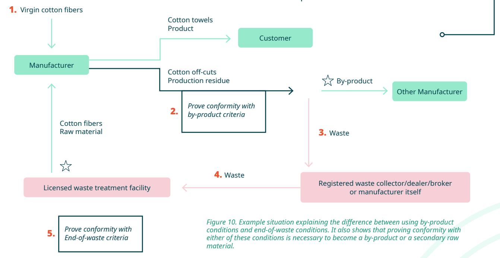

The towel manufacturer must prove conformity with by-product or end-of-waste conditions, depending on the situation. The main steps are true for all member states. However, the explanation on how to prove conformity (self-assessment or raw material declaration) is only relevant for the Flemish Region.

Non-waste actor

Waste actor

Non-waste transport

Waste transport

EoW point

# **6.2. USING CLOTH FOR PACKAGING**

3/ inzetten van 'afvalstromen' voor een nieuwe toepassing > Producent 1 heeft een grote hoeveelheid aan oude stoffen, Merk 2 kan die rest stoffen gebruiken voor de verpakking van hun product (verzending naar consumenten). Mag dit zomaar? Zaken om mee rekening te houden?

#### **Focus point**

The difference between (secondhand) product, byproduct and waste.

# **Using dead stock cloth**

#### **The situation**

Company A is a weaver who has a large stock of woven cloth to make, for example, curtains. Some of this stock is so called 'dead stock', i.e. it doesn't sell anymore. Company B wants to buy some of this dead stock cloth to use as wrapping for packages.

#### **The explanation**

Whether the dead stock cloth remains a product or becomes a waste depends on what the holder, Company A (the weaver) in this case, intends to do with it.

⸰ If Company A sells the cloth for the purpose it was produced for, e.g. curtains, then the cloth remains a product. ⸰ If Company A would discard the cloth by selling it to a waste collector/trader/broker or directly to a licensed waste treatment company for recycling or removal (e.g. incineration), then the cloth would become waste, see 3.1.

⸰ If Company A sells it to a company who does not need to do any recycling step in order to use the cloth, then the cloth remains a product. ⸰ If Company A doesn't know if the cloth will be recycled or used, then it is waste.

In this case the third option applies: Company A sells it to Company B who will use it for making packaging. This would probably only involve cutting the cloth into smaller pieces. This cutting is probably not a recycling step because it is probably similar to the cutting process in the case Company B had bought cloth specifically produced for packaging. Therefore the cloth does not need a waste treatment in order to be used and therefore stays a product. Company B is therefore also not a waste treatment company.

However, if the cloth contains materials that need to be removed, e.g. metal eyelets, then Company B need to cut these out. This is a treatment to remove waste, a sort of purification treatment, which is not necessary with cloth specifically designed for packaging. Therefore the cloth is waste, the treatment is a waste treatment, Company B needs to be licensed as a waste treatment company and the transport from Company A to Company B is a waste transport, see 5.1.

Finally, important to note is that Company B needs to verify that the cloth complies with product regulations because the purpose of the cloth has changed. In this case specifically, it would be appropriate if Company B would check what additives or coatings, e.g. flame retardants, were used in the cloth designed for being used as a curtain and if they pose a risk to the user when used as packaging.

#### **Using cutting waste**

#### **The situation**

Company A, a clothing manufacturer, cuts cloth into separate pieces and then sews the pieces to make a piece of clothing. While cutting the cloth, there is usually a part that cannot be used called 'cuttings'.

Company B wants to use these cuttings to use as packaging.

#### **The explanation**

It is clear that the cuttings are not a product: it was not the primary intention of the production process to produce these cuttings. Therefore the cuttings is a production residue. As seen in 4.1, a production residue is either a byproduct or a waste. Company A checks how it can prove conformity with the byproduct criteria according to the procedures of the local competent authority.

In the Flemish Region, Company A (or Company B in name of Company A) consults the manual for selfassessment. It creates a self-assessment based on

the manual or uses the template from OVAM. In this self-assessment, Company A answers the questions arguing that the cuttings are indeed a byproduct.

Company A summarizes this argumentation in the declaration of self-assessment for which there is also a template on the OVAM website and adds this declaration to the non-waste transport to Company B. Company B has no additional obligations in terms of waste legislation because the cuttings are a byproduct and not a waste.

If the transportation crosses border with another Belgian region or with another country, Company A also needs to verify the rules on how to prove conformity with the byproduct rules in that region or country. If Company A does not do this and therefore has no proof that the cuttings are indeed seen as byproduct in that other region or country, then the transport needs to happen as waste, see 5.1 and 5.2.

# **6.3. LEASING OF WORKWEAR**

#### **Focus point**

The difference between an owner and a holder and the effect on leasing.

#### **Situation**

A producer of workwear leases his workwear to multiple companies in the EU and EFTA countries. These companies have the option to send the workwear back because, for example, defects, use case stopped or brand name changes. The user does not wish to have the same clothing returned after alterations or repairs. There is no certainty that (almost) all returned clothing can immediately be reused without any further significant treatment.

The producer of the workwear receives the used workwear and sorts them in four fractions:

⸰ For reuse ⸰ For repair ⸰ For recycling ⸰ For incineration

#### **The explanation**

In the case of leasing, it is important to note that ownership does not influence whether someone can discard something or not. As seen in the definition of waste, it is the holder who discards, not the owner. In this case we need to look at the company using the workwear as the holder.

When the company using the workwear decides it no longer needs the workwear and there is no certainty that all workwear can and will be reused,

then the company discards the workwear as waste. The discarded workwear can be unused, in shreds, it can be a mix of these two extremes and everything in between. This implicates that the shipment of the discarded workwear is a waste transport where local and EU waste legislation needs to be followed. The only situation where this workwear would not be discarded as waste, is when the holder knows for certain that the all workwear will be reused as workwear when returning it to the manufacturer, potentially after being repaired.

The workwear producer receives the discarded workwear and sorts it in the abovementioned fractions. This sorting is a waste operation for which it needs to have the appropriate environmental license. The workwear which is sorted for reuse and for repair will undergo the waste operation 'preparation for reuse'. This term is defined in the WFD: "'preparing for re-use' means checking, cleaning or repairing recovery operations, by which products or components of products that have become waste are prepared so that they can be re-used without any other preprocessing;"

This implicates that all the processes needed to prepare the workwear back to a state that it can be reused directly are considered waste operations under the term 'preparing for reuse'.

The workwear sorted for recycling, incineration or landfilling is also waste. After all the recycling steps are complete, the holder of the resulting material, usually fibers, can apply for an EoW status of this material, see 4.1. In the case of incineration, it is important to note that incineration of waste requires specific waste permits.

It is possible that the workwear producer wants to give its used workwear to a charity organization. The handed over workwear are no longer waste if the charity organization can use all the handed-over workwear for reuse as workwear and therefore does not need to further sort the handed over workwear. If the charity organization will still sort the used workwear into a reusable and a non-reusable fraction, then the handed-over workwear is waste. This implies that the shipment of the handed over workwear is a waste shipment and that the charity organization (or any other company for that matter) needs to have the relevant waste permits.

A laundry service also leases workwear but embodies a substantial difference. The user who wants to have his workwear laundered does not discard it because the user wants to reuse the same workwear. The used workwear is in this case therefore not waste. Therefore any sorting, repair or cleaning process is also a non-waste process even though some laundered items will become waste because of damage.

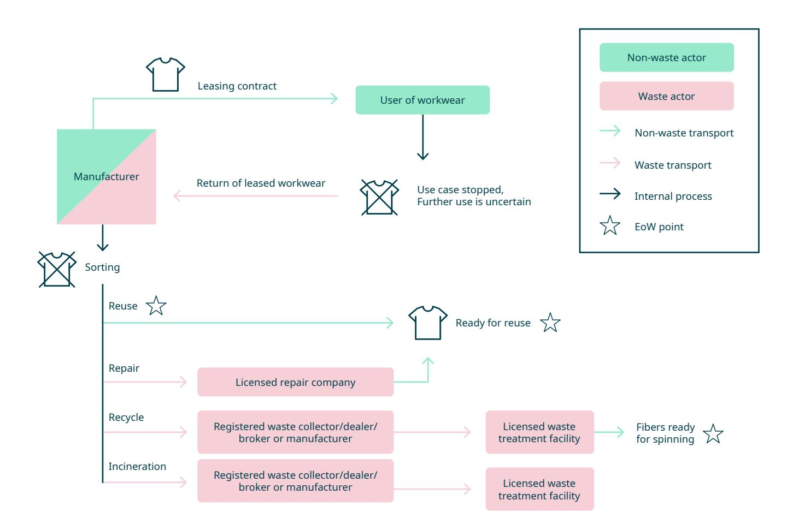

# **6.4. DESIGNER REPURPOSING WASTE**

#### **Focus point**

Complying with waste legislation while not being licensed to handle waste.

#### **The situation**

A designer uses clothing waste as raw material for creating new clothes. The designer gets this clothing waste from a post-consumer sorting centre. The designer doesn't have a licensed waste treatment facility for storage, sorting and treating waste.

#### **The explanation**

The designer can't take anything home that is waste because the designer doesn't have a waste treatment facility. However, the designer can take home materials that comply with EoW legislation, see 4.1, because these materials aren't waste anymore but raw materials. In this case, applying EoW legislation implicates that the designer need to do any sorting and pretreatment (e.g. removal of buttons and other unusable materials) at a location that is licensed for this activity. The sorting centre is licensed for this activity. This means that the designer cannot take home unsorted bags of textiles to sort at home to see what is usable.

# **6.5. RECYCLING COMPANY IMPORTING TEXTILE WASTE**

#### **Focus point**

Shipping waste across borders

#### **The situation**

A textile recycler searches for new textile waste streams in multiple countries. The recycler has found multiple sources in the EU and the waste can be transported using the general information requirements, see 5.1.2.

#### **The explanation**

In order to comply with laws regarding shipping of waste, the recycler needs to comply with:

⸰ The Waste Shipment regulation, explained in detail in 5.1.2. ⸰ Local laws regarding registration or notification requirements for waste collector/trader/broker and waste transporters.

The more practical choice would be to find a local waste collector/trader/broker who is already registered for organising textile waste transports and can transport it as well or knows a registered waste transporter.

Otherwise the textile recycler will need to comply with local registration or notification requirements for each region/country where it wants to source textile waste from. For example, if the textile recycler wants to source textile waste from Germany, the registration can be done using the [verwaltung.bund.de](https://verwaltung.bund.de/leistungsverzeichnis/EN/leistung/99001040008001/herausgeber/TH-1084561/region/160510000000) site. Annex 7.1 has an overview of the competent authorities for waste legislation.

# **6.6. RECYCLING OF POST-CONSUMER CLOTHES**

#### **Focus point**

Responsibilities in the value chain of recycling post-consumer clothes in the Flemish Region.

#### **The situation**

In the Flemish Region, currently Company A collects and sorts post-consumer waste textile for reuse. Now, they want to collaborate with Company B for preparing the non-reusable textiles. This is a new activity for Company B. After preparation, the textile is sent for recycling at Company C. Does Company A need to organize the transport to Company C or can Company B do this as well? The situation is visualized in Figure 12.

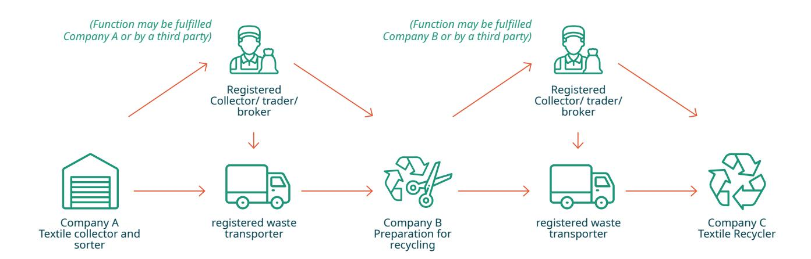

*Figure 12. Schematic overview of the transport options in the value chain of collecting and sorting post-consumer textiles to a recycler.*

#### **The explanation**

It is clear that the textiles are waste in every step of this case because the recycling is not yet complete, see 4.1. Therefore every company involved needs to have an environmental permit mentioning the relevant waste operations, see VLAREM II on page 6.

As explained in 5.1.1, Company A has two options. Company A can organize the transport and transport the waste to Company B or Company A can use third parties to fulfill these functions. Even without its registration as collector/trader/broker and as waste transporter, Company A would have been allowed to fulfill these functions as long as it exclusively transports its company waste and accepts the related responsibilities and duties listed in the [general](https://ovam.vlaanderen.be/transportvoorwaarden)  [transport requirements.](https://ovam.vlaanderen.be/transportvoorwaarden) Note that if Company B would be a registered collector/trader/broker, Company B would also be allowed to organize this waste transport.

Company B prepares the textile waste for recycling and need to transport it afterwards to Company C, the textile recycler. Company B has similar options as Company A had. Company B can fulfill the function of collector/trader/broker and waste transporter without needing to register as it uniquely transports its company waste and accepts the related responsibilities and duties listed in the [general](https://ovam.vlaanderen.be/transportvoorwaarden)  [transport requirements.](https://ovam.vlaanderen.be/transportvoorwaarden) Note that if Company C would be a registered collector/trader/broker, Company C would also be allowed to organize this waste transport.

# **ANNEXES**

# **7.1. OVERVIEW OF COMPETENT AUTHORITIES**

Table 1 contains an overview of the competent authorities for waste legislation in all EU-member states. Please take caution when using this table because it was not checked with the mentioned member states. Therefore, it can contain mistakes or be incomplete regarding regional competencies.

| COUNTRY  | COMPETENT AUTHORITY FOR WASTE LEGISLATION            | WEBSITE          |
|----------|------------------------------------------------------|------------------|
| Austria  | Bundesministerium für Klimaschutz, Umwelt,           |                  |
| Belgium  | Flemish region: Openbare Vlaamse                     |                  |
|          | Brussels Capital-Region: Bruxelles Environnement     |                  |
|          | Walloon Region: Service public de Wallonie           |                  |
| Bulgaria | Министерство на околната среда и водите              |                  |
| Croatia  | Ministarstvo gospodarstva i održivog razvoja         |                  |
| Cyprus   | Τμήμα Περιβάλλοντος (Department of Environment)      | moa.gov.cy       |
| Czechia  | Ministerstvo životního prostředí (Ministry of the    |                  |
| Denmark  | Miljøstyrelsen (Environmental Protection Agency)     | mst.dk           |
| Estonia  | Keskkonnaministeerium (Ministry of the               |                  |
| Finland  | Suomen ympäristökeskus (SYKE)                        | ym.fi            |
| France   | Ministère de la Transition écologique                | ecologie.gouv.fr |
| Germany  | Bundesministerium für Umwelt, Naturschutz und        |                  |
| Greece   | Υπουργείο Περιβάλλοντος και Ενέργειας (Ministry of   |                  |
| Hungary  | Innovációs és Technológiai Minisztérium (Ministry of |                  |

| Ireland     | Environmental Protection Agency (EPA)                  | epa.ie                                           |
|-------------|--------------------------------------------------------|--------------------------------------------------|
| Italy       | Ministero dell’Ambiente e della Sicurezza Energetica   | mase.gov.it                                      |
| Latvia      | Vides aizsardzības un reģionālās attīstības ministrija |                                                  |
| Lithuania   | Aplinkos ministerija (Ministry of Environment)         | am.lt/en/                                        |
| Luxembourg  | Ministère de l’Environnement, du Climat et de la       |                                                  |
| Malta       | Environment and Resources Authority (ERA)              | era.org.mt                                       |
| Netherlands | Rijkswaterstaat                                        | rijkswaterstaat.nl, also use: afvalcirculair.nl/ |
| Poland      | Ministerstwo Klimatu i Środowiska (Ministry of         |                                                  |
| Portugal    | Agência Portuguesa do Ambiente (APA)                   | apambiente.pt/residuos                           |
| Romania     | Ministerul Mediului, Apelor și Pădurilor (Ministry of  |                                                  |
| Slovakia    | Ministerstvo životného prostredia (Ministry of the     |                                                  |
| Slovenia    | Ministrstvo za okolje in prostor (Ministry of the      |                                                  |
| Spain       | Ministerio para la Transición Ecológica y el Reto      |                                                  |
| Sweden      | Naturvårdsverket (Environmental Protection Agency)     | naturvardsverket.se/en                           |

# **7.2. DECISION TREE FOR THE FUTURE WSR (2024/1157)**

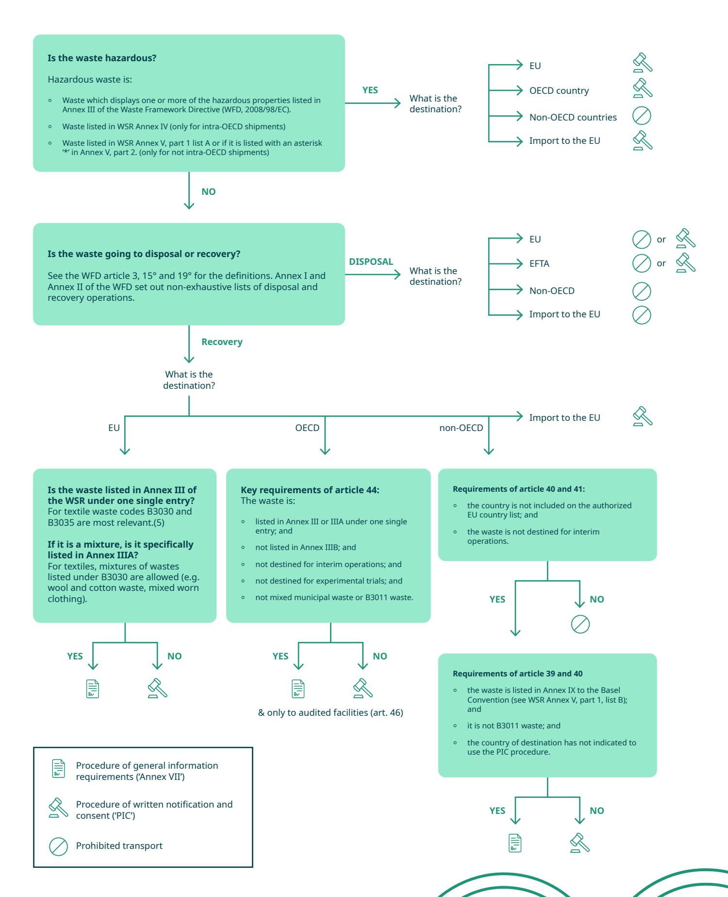

#### **Footnotes**

- **1.** A fast track procedure for pre-consented facilities is available shortening the decision making period for CA's from 30 to 7 days, see WSR article 14.
- **2.** The procedure of prior notification and consent is only possible if recovery is not possible and disposal in country of origination is not possible, along with other requirements (WSR article 4.1 & 11).
- **3.** See footnote (2) and prohibition if EFTA country banned import of this waste or if competent authority in country of dispatch has reason to believe that the waste will be managed in an environmentally sound manner (art. 37)
- **4.** Exceptions apply, see WSR article 50.
- **5.** Note that WSR Annex III includes waste listed in Annex IX to the Basel convention. This list is shown in WSR Annex V, part 1, list B. Therefore check this list for codes B3030 and B3035.
- **6.** Prohibition if the waste is imported from a country not part of the OECD Decision and not a Party to the Basel Convention. Other exceptions apply, see WSR Article 43. The procedure is explained in WSR article 44.
- **7.** A note on shipments destined for laboratory analysis: Shipments destined within the EU are limited to 250 kg. Higher quantities are possible if the competent authorities of both countries of dispatch and destination agree (WSR article 4.5). Shipments destined for laboratory analysis exported to or imported from an OECD country is subject to the Annex VII procedure if the shipment does not exceed 25 kg. (WSR articles 44 and 53)

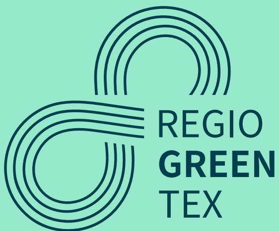

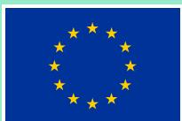

## Co-funded by the European Union

*Co-funded by the European Union. Views and opinions expressed are however those of the authors) only and do not necessarily reflect those of the European Union or EISMEA. Neither the European Union nor EISMEA can be held responsible for them.*

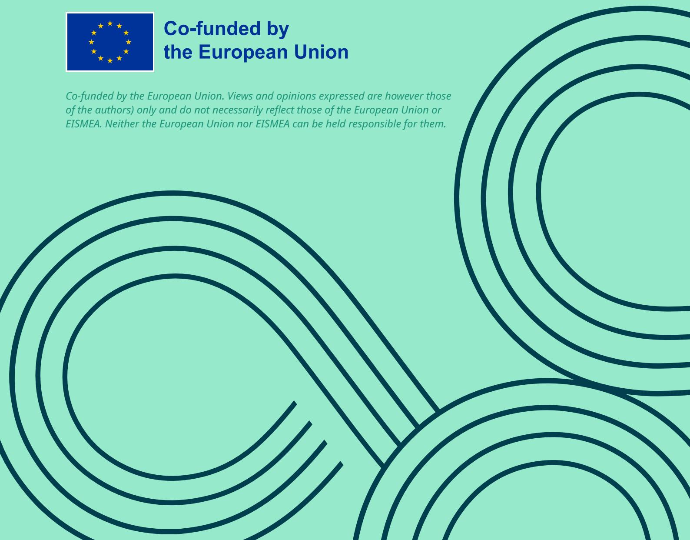