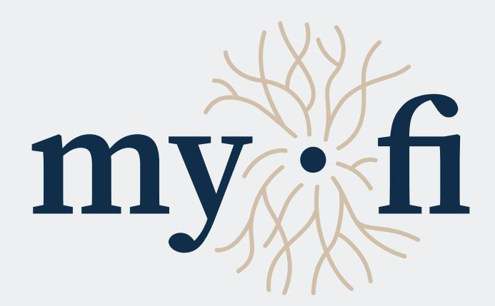

# **D8.7: Public Summary of the main project results and achievements**

**Version 1**

September 2023

## **Content index**

| 1 Introduction                           | 4  |
|------------------------------------------|----|
| 1.1. Project goal and scope              | 4  |
| 1.2. Consortium presentation             | 5  |
| 2 Biofabrication                         | 8  |
| 3 Post processing                        | 11 |
| 4 Scale up                               | 13 |
| 5 Prototyping for fashion                | 15 |
| sector                                   | 18 |
| 7 Sustainability                         | 20 |
| 7.1. LCA and LCC                         | 20 |
| 7.2. Biodegradability and Compostability | 22 |
| 7.3. Ecolabelling                        | 23 |
| 8 Gear-up-to market                      | 24 |
| 9 Communication                          | 27 |

### DISCLAIMER

The present document refl ects only the author's view and that the Agency is not responsible for any use that may be made of the information it contains.

## Introduction

## **1.1. Project goal and scope**

The aim of MY-FI is to provide the textile industry with a new non-woven material made of mycelium fi bres, with improved performances and reduced environmental impact in comparison with current commercially available fi bers. Mycelium-based materials are obtained by fungal fermentation, starting from the residues of the textile industry, using a mild process, and can be used to produce sustainable and performing non-woven fabrics.

Mycelium-based materials indeed can extend the fi eld of use of non-woven fabrics to demanding or luxury applications. In virtue of their properties and aesthetics, mycelium fi bres can be applied, for example, in automotive or footwear.

In MY-FI, new bio-fabrication protocols are optimized and upscaled together with wet processing and material fi nishing to provide a set of innovative solutions to help the textile industry in facing the challenges posed by the complex megatrends that are quickly changing markets and customers' lifestyles globally.

1 The mission of MY-FI is to develop a biobased textile, with advanced functionalities, sustainability, and performance, achieving four high level goals:

- Empowering the textile industry to successfully face the challenges posed by the emerging global trends.
- Meet the consumer demand for new functional and sustai nable textile products.
- Relief the environmental pressure related to the textile in dustry, developing a circular and biobased textile that does not generate microplastics.
- Engage textile stakeholders and provide guidance to policy makers.

## **1.2. Consortium presentation**

The H2020 project gathers 14 partners across Europe, contributing to its success. All private companies, research centers, and universities listed below collaborate for the fulfi llment of the activities tackled in the following chapters of this document.

> Leader partner and responsible for the MY-FI project management. Establishment of a surface liquid fermentation protocol and a dynamic liquid fermentation protocol for the production of mycelium fabrics. Scale up of SLF protocol. Development of the ethics requirements for the project.

> Take care of the knowledge and IPR management in order to ensure the Freedom-to-Operate, effectively protect the Intellectual Property generated. Comparison of the solutions developed within MY-FI with the updated state-of -art. Implementation of solutions already available, also in different sectors (technology transfer). Avoid confi dentiality confl icts with dissemination and communication activities. Competitive landscape analysis and exploitation plan.

Country: Germany

Type: Consulting Company

### Country: Italy

Type: Manufacturing Company

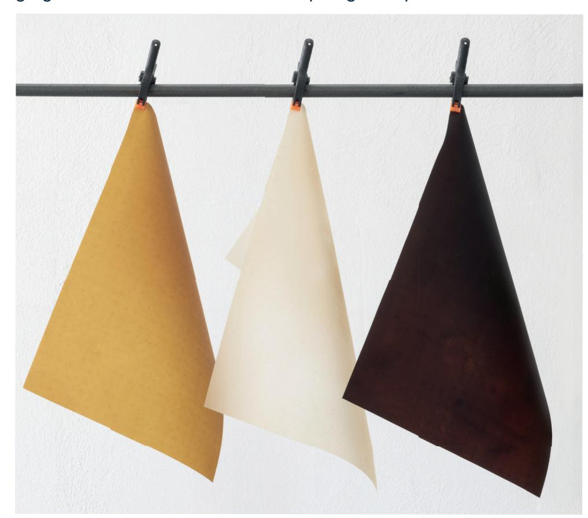

**Figure 1** First prototypes of DLF mycelium materials

This project has received funding from the European Union's Horizon 2020 research and innovation programme under the Grant Agreement No. 101000719

This project has received funding from the European Union's Horizon 2020 research and innovation programme under the Grant Agreement No. 101000719

Characterization of raw and fi nished mycelium materials. Material functionalization for fi re reactivity, natural dyeing and surface activation with plasma technology. Assess the compliance of the mycelium fabric with the EU Ecolabel certifi cation.

Defi nition of requirements and benchmarking for the automotive sector. With Volkswagen, design, production, testing, and validation of prototypes for the automotive sector.

Development of a Performance Index of mycelium fi ber for the luxury application. Production of a set of technical sheets illustrating the application methods of mycelium-based materials. Prototyping for the fashion industry.

### Country: Italy Type: Research centre

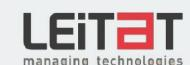

### Country: Spain Type: Research Centre

### Country: Italy Type: Manufacturing Company

Evaluation of biodegradation and organic recyclability of mycelium fabrics, in different stages of the production and post-processing processes.

### Country: Belgium Type: Testing Lab

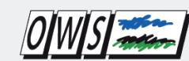

Development of technological solutions to improve the mycelium fabrics properties such as mechanical and chemical performances.

### Country: Germany Type: Research Centre

Optimization and scale up of DLF protocol.

Country: Belgium Type: Research centre

Development of protocols for the valorization of the residues deriving from the manufacturing of mycelium fabric-based materials. Lamination of mycelium-based materials.

### Country: Spain Type: Non-profi t association

Development of the wet processing for the enhancement of mycelium fabrics. Research and application of dyes, fi nishing and coatings, in order to deliver performing, aesthetically pleasing and environmentally responsible materials.

### Country: France Type: University

Defi nition of requirements and benchmarking for the automotive sector. Together with CRF, design, production, testing, and validation of prototypes for the automotive sector.

### Country: Germany Type: Manufacturing Company

Development and optimization of DLF and SLF protocols. Test and analysis of the raw material produced.

### Country: Netherlands Type: University

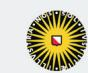

Scale-up and industrialization of the wet-processing and fi nishing applied to mycelium materials.

### Country: France Type: Manufacturing Company

LCA and LCC of the most promising mycelium materials. Development of an LCA/LCC based Decision Support System tool in order to improve and optimize production processes. Project communication.

### Country: Italy Type: Consulting Company

## 2 Biofabrication

In the MY-FI project, raw mycelium fabrics are produced using two different types of fungal fermentation carried out by means of dynamic liquid fermentation (DLF) and in surface liquid fermentation (SLF). By applying the proper growing conditions, the growth of the mycelium can be highly promoted, and a dense continuous network of hyphae is obtained.

The biofabrication represents the starting point of the project, setting the ground for the following activities, therefore providing the unique, natural, and disruptive raw material to post-processing activities.

The improvement of the fungal fermentation processes intended to the production of raw mycelium-based materials is included as one of the objectives of the project.

The target of the MY-FI project is also to scale up biofabrication processes therefore moving from laboratory to pilot scale, with the goal of obtaining high-quality and fully functional prototypes to be employed in the fashion and automotive industries; therefore, the initial methods in place must be optimized to move from TRL 4-5 to 7. MOGU has taken care of the SLF process: the main process parameters involved in the fungal development have been identified and optimized in order to improve the material productivity and its final performances. Such parameters impact the type and design of the tray bioreactor, but also on the process mass flows of sub-

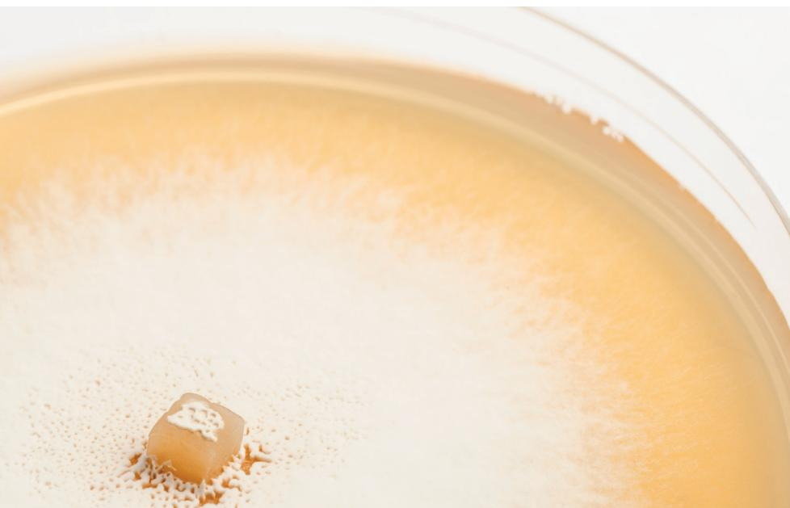

Figure 2 Biofermentation process, lab-scale

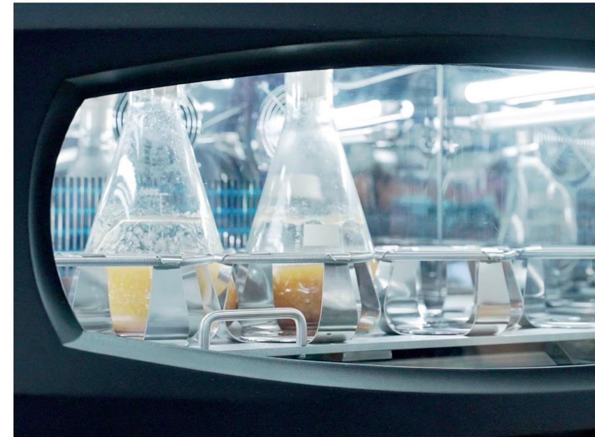

Figure 3 Lab-scale biofermentation process

strates and reagents, and on the main growing conditions such as temperature. The optimization of the selected parameters led to an improved material in terms of its thickness density, homogeneity, process repeatability and material reactivity for the subsequent post-treatment. Therefore, the initial protocol developed for the creation of mycelium fibers was improved to obtain higher quality raw SLF materials.

Moreover, the main by-product generated during the SLF process was analysed based on its potential valorisation, experimenting different pathways and applications. Its high organic matter content allows to further exploit it as nutrient source for other secondary fermentation processes to produce a protein-rich ingredient for feed or to produce a new mycelium-based material through the application of a dynamic liquid fermentation (DLF) process.

In cooperation with OWS, the residual stream has also been evaluated as waste-to-energy through anaerobic digestion for the production of an energy vector (biogas) that could be integrated into the future SLF upscaled production line, providing the heat and/or the energy necessary for the biofabrication process. Instead, AITEX tested the waste stream as structural component for the fabrication of non-woven fabrics by wet-laid technology in combination with lyocell and PLA.

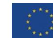

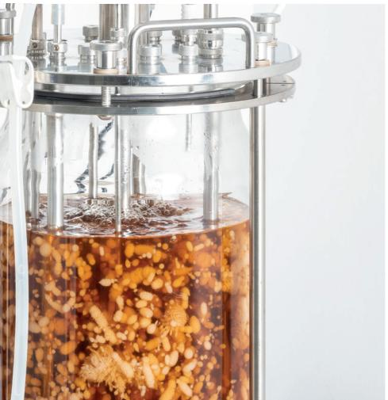

**Figure 4** DLF lab scale bioreactor

Likewise, the DLF process for the biofabrication of different mycelium materials was optimized by UU and MOGU. In this case, different fungal strains have been grown in different carbon sources to find the best combination of strain and nutrients that could produce the most promising material. The research performed by UU was based on the screening among six different fungal strains grown in four different media. Several analyses based on the strain growth performance, carbon consumption efficiency and final material performance led to the selection of one basidiomycetes strain grown in a glucose minimal medium as the selected protocol for the DLF development at higher scale. In parallel, the research carried out at MOGU delivered a mucoromycetes strain grown in a complex medium as another interesting method to produce mycomaterials with great potential. Both protocols were detailed described and transferred for its study at higher production scales.

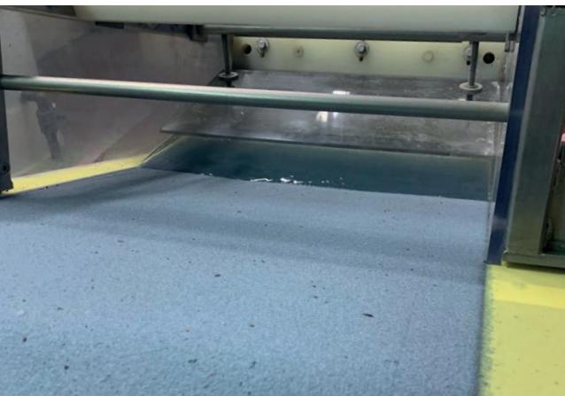

**Figure 5** Non-woven textiles produced by AITEX recycling textile fibers

The partners also focused on the development of hybrid materials that combine the fungal biomass with textile fibers. AITEX deployed different strategies to recycle textiles fibres as process residues from the industry or at post-consumer level. Such fibres have been transformed into non-woven textiles with different thicknesses, composition and consolidation levels by wet-laid and carding technologies optimized by AITEX. The further valorisation of these textile waste was tested by MOGU through mycelium fermentation in order to close the loop of textile value chain obtaining novel materials.

### 3 Post processing

Processing of the grown mycelium fabrics is intended to increase the aesthetical, functional, and mechanical properties of the mycelium. Wet-processing steps can include washing, crosslinking, plasticizing, and dyeing. Post-wet-processing steps include coating and special functionalization. Fig. 6 gives an overview of the post-processes investigated so far.

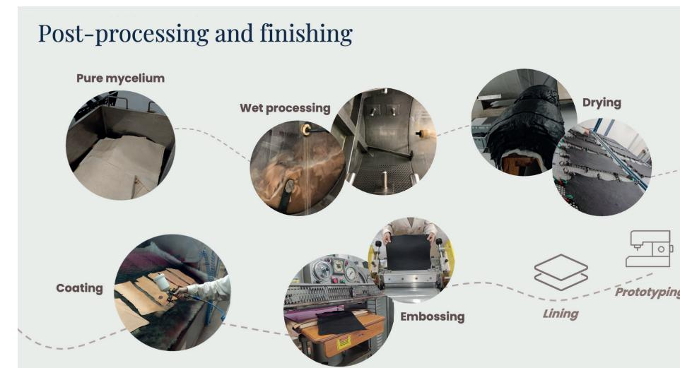

**Figure 6** Post-processes overview diagram

The fungal cell wall is a multilayer structure with great plasticity that is vital to maintaining cellular integrity. It is composed of different layers and components. Mycelium fabrics grown under static liquid fermentation conditions exhibit a soft and silky touch. These unique properties would get lost during wet treatment processes and subsequent drying procedures if mycelium fibers were glued together. In order to prevent the fibers from sticking together, they need to be separated. A suitable and effective treatment process is therefore vital for further development of the alternative mycelium material.

By treating the mycelium with different plant-based crosslinkers and fattiquors in the wet stage it was possible to vary mechanical properties. Thickness and softness of the material could be enhanced and maintained, respectively, by crosslinking. The tensile strengths of mycelium fabrics are only slightly affected by the crosslinkers. Plasticising was necessary because of the brittleness of the initial material when dried. After several trials, a modified vegetable oil was successfully selected for increasing softness and elongation performance. Dyeing was possible both with commercial dyes and with vegetable dyes.

The wet process has been tested for standard tanning drums and machinery. The first protocols allowed for the production of prototypes with different colors. However, the mechanical properties of the final mycelium material are not yet comparable to existing materials employed in the same applications: lamination on another material is still necessary.

The final surface coating of the material increases fastness and serves aesthetic requirements. Coating methods were developed based on fully renewable wax compositions and on biobased polyurethane dispersions thus the final material can reach a high biobased content, up to 97% biobased content for the wax-based coatings, and up to 85 % biobased content for the PU coatings. The coatings increase abrasion resistance and fastness. A lot of designs could be envisaged by embossing and tipping operations.

The protocols developed allowed for the production of materials with different colors, aspects, and performances (see Fig. 7). The upscaling allowed to provide industrial partners enough materials for prototyping.

Ongoing research is focused on enhancing properties, such as flame retardancy, and testing additional plant-based dyeing.

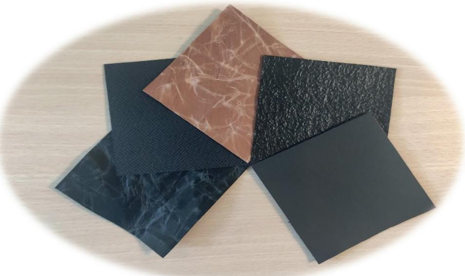

**Figure 7** Protocols developed for materials with different colors, textures, and performances

## 4 Scale up

One of the major goals of the MY-FI project is to successfully scale up the biofabrication of mycelial biomass via dynamic and surface liquid fermentations (DLF and SLF, respectively). Taking advantage of the expertise and pilot-scale equipment available at the Bioprocess Pilot Facility B.V. first, and then at the Bio-Based Europe Pilot Plant, the bottlenecks related to the DLF of mycelial biomass have been identified and addressed. The aim is to develop a systematic approach for enhanced growth in stirred tank reactors (STRs), while obtaining an optimized process that can deliver consistent results, easily translatable from bench to commercial scale. In the same way, SLF scale-up is being addressed by MOGU. The idiosyncrasy and particularities of the SLF process developed by MOGU limit its direct standardization using currently known facilities as in the case of the DLF. Instead, equipment and processes already used in different industries must be identified and adapted to create a larger-scale SLF.

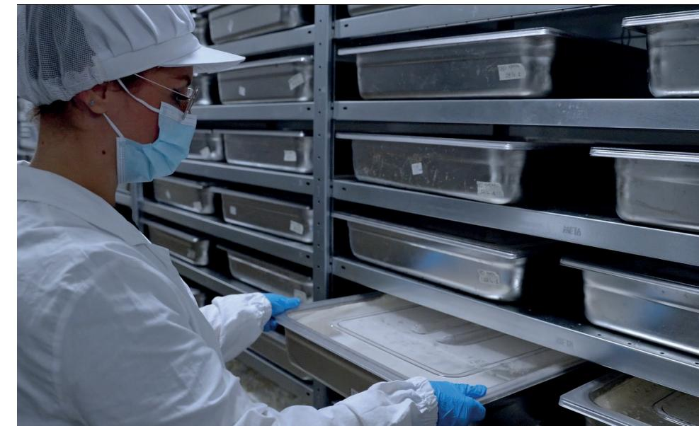

**Figure 8** SLF bioreactor at MOGU

Optimal conditions for the main physical factors as well as biochemical factors influencing the DLF process have been partially defined using shake-flasks and further expanded into stirred bioreactors, in which the optimal stirring and aeration rates, influencing both shear stress and KLa, have been defined. The outcome of several bench-scale experiments in 20L STRs has been used to determine the stirrer speed and aeration rates at large-scale, namely in a 300L STR. According to the scale-up guidelines, geometric similarity has been maintained across scales, and empirical correlations have been used to determine the impeller speed, by using analogous KLa, power input per unit volume, and impeller tip speed.

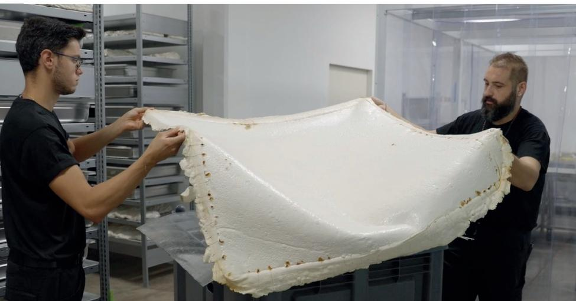

**Figure 9** Harvested 1 sqm SLF panels, ready for drying

Using such a strategy, the MY-FI project has been able to substantially improve the biomass titers at large scale when compared to bench-scale, specifically up to a factor of 4 times.

Likewise, MOGU has been working on the improvement of the SLF process by optimizing the main operational and biochemical factors that rule the mycelium growth. Bioreactor size was initially doubled and afterwards quadrupled, adjusting the main operational conditions consequently for each size increase. The number of bioreactors operated simultaneously was also increased by 10 times. New and bigger growing rooms were built and properly furnished to allow the optimal incubation of the increased number of bioreactor trays simultaneously. Moreover, several pieces of equipment were identified, acquired, and set-up, such as a 50L homogenizer, a big-size air-dryer, and a clean room for the preparation of the materials. The protocols used at lab scale were also adapted to the new scale and new procedures were established to ensure product quality and performance.

The mycelium fibers post-treatment process is being upscaled by FRANCE CROCO by adapting the preliminary Downstream Processing (DSP) protocols developed inside WP2 in an industrial reality. The type of reactor applied for these downstream steps was carefully studied to allow a proper material treatment while keeping its physical integrity. Further tests were performed for the optimization of the water and chemical consumption as well. The first trials allowed the production of promising prototypes, with different colors and finishings. Further improvements are expected to deliver a wide range of finished mycelium fibers, characterized by high-quality, competitive performances and innovative functionalities.

## 5 Prototyping for fashion

The race to develop new materials and processes is gaining momentum thanks to fast-maturing technology and more substantial, profound partnerships between brands and innovators. The partner Bond Factory has focused its work on creating a procedure for making prototypes in line with the European standards, which require the use of less toxic chemicals and more sustainable materials in addition to a completely waste-free production.

The prototyping and validation activities of the mycelium fabric developed in the context of the MY-FI project were carried out using all the techniques and technologies that are normally employed for the development of samples and of finished products in the Luxury Fashion sector.

In the following table are listed the main traditional or innovative manufacturing techniques that have been tested on MY-FI materials.

### Traditional technologies

#### Stitching

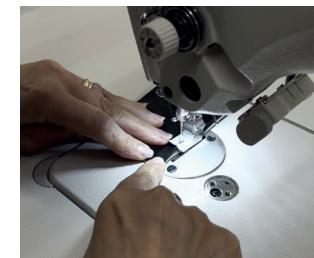

#### Issues

The tightness of the seams is low, due to the low thickness. The stitching is slow, runs little and tends to cut itself during the stitching phase.

#### Solutions

The material was reinforced by lamination with a support fabric: silk ggt, linen canvas, denim cotton.

#### Thermowelding (bonding)

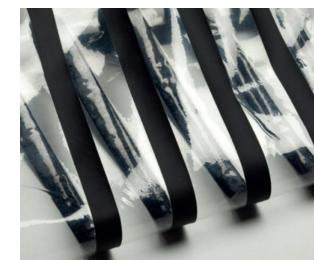

#### Issues

Standard lamination temperatures (140-160°C) dull and stiffen the mycelium material, compromising the effect given by the finishing process.

#### Solutions

Water-based adhesives activated at 60-70°C, have been employed as alternatives to traditional glues. Lamination at such temperatures fully preserves the material aesthetics.

#### Taping

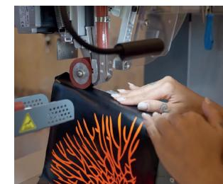

#### Issues

Taping on the coated side does not adhere due to the finishing applied, specifically intended to make the material non-absorbent. As a consequence, glue leaks out from the edges of the tape, soiling the fabric.

#### Solutions

Taping can be applied on the material back that preserves its absorbency, due to the lack of finishing. Although the tape is not visible, it fulfils the intended functionality.

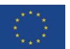

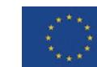

## Advanced technologies

### Laser technologies

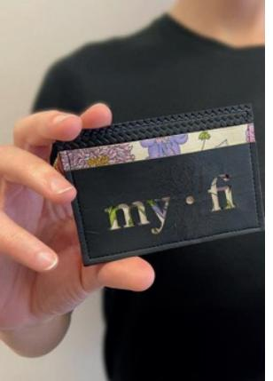

### Description

Laser cutting is a highly versatile technology. It has opened up new possibilities for creativity, guaranteeing excellent results even for the most complex processes. The technique allows to obtain a cleaner result and an important saving in terms of production times. It is in fact possible to obtain perfectly sealed edges, especially in the cutting of synthetic fabrics without the need for finishing, avoiding waste, and other processes.

Laser engraving allows customization thanks to the creation of drawings and graphic patterns. It is mainly based on the removal, through engraving, of a surface layer of fabric, thus creating even the most complex designs. This technique allows not to use printing chemicals normally used in traditional printing processes.

### Printing

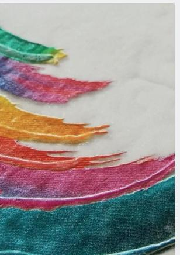

### Description

The innovative digital printing technologies currently used in productions use water-based inks and allow on-demand production to be carried out avoiding overproduction and reducing water consumption by 96%, energy consumption by 95%, and CO2 emissions by 17%.

### Thermoshaping

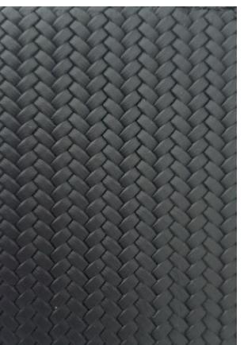

### Description

Thermoforming is a hot working technique of thermoformable fabrics, which are shaped thanks to peculiar temperature and vacuum conditions. In this way the fabrics adhere to the mold assuming the desired shape, that is impressed without the need to add additional materials or adhesives.

## Advanced technologies

### Digital Embroidery

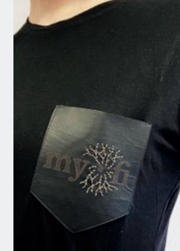

### Description

Embroidery was and continues to be, a technique used in the fashion industry to embellish, customize, and enhance the craftsmanship of a garment, albeit obtained with modern techniques.

Digital: An innovative embroidery technology has been introduced, allowing high-quality coloring of the thread based on the input deriving from the previously designed graphic system. This technique allows you to create embroidery, starting from a single reel of recycled polyester thread, avoiding stock of different color threads.

### Embossing

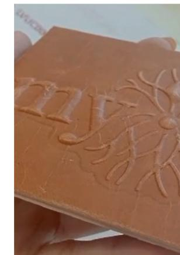

### Description

Embossing is a technique that allows to realize three-dimensional effects or a relief finishing directly on the fabric by using a forming process. The forming is obtained through a material providing the thickness, specifically made and based on the design to be replicated on the mycelium fabric.

Among the many technologies tested, some of them performed better. Among them we can list:

- • Laser cutting and engraving have been applied for both wax and PU finished samples, and no issue has been observed.
- • UV digital printing works because of the fixing process which takes place by catalysing the ink using UV lamps, therefore welding directly on the base, assuring more resistance.
- • Digital embroidery worked best on less dense embroidery stitch graphics, otherwise slightly damaging the material surface. The lamination strengthens the material resistance to stitching
- • Thermoshaping worked perfectly on the material with bio PU. Different patterns have been applied to better enhance the characteristics of the different finishings.

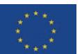

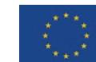

# 6 Prototyping and validation in the automotive sector

In the path of sustainability, thanks to project MY-FI, the automotive sector represented by Stellantis and Volkswagen, is evaluating potential application of mycelium-based fabrics on interior trimming. Indeed, the main goals in this work package are the definition of specific requirements for automotive applications, design and realization of automotive interior prototypes, and extensive prototype testing according to automotive specifications like e.g. abrasion, color fastness, tensile strength, and tearing strength. For all demonstrators general properties fundamental for homologation and safety are evaluated.

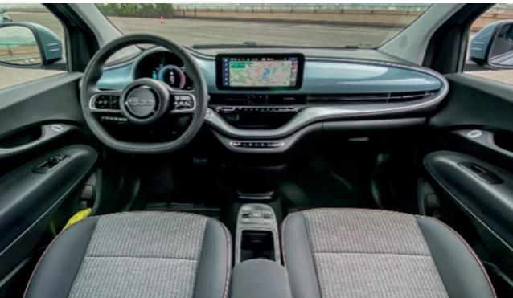

**Figure 10** Cars interior: examples of possible mycelium-materials application

Textile, leather and leather-like materials characterize most of the automotive interior finishing in both rigid and soft trims, often combined on complex components. The use of a soft coating, as well as the use of real and imitation leather, is considered distinctive of high-end trim levels and highly characterizing on customer based approach. Trims, as all materials and components that enter automotive composition need to contribute to product sustainability at whole scale (recyclability, substances management, sustainable content) and overall carbon footprint reduction for the industrial sector. Automotive partners of MY-FI project (CRF/Stellantis and Volkswagen) received from the partnership some sample of mycelium-based materials with different surface finishing. On those sam-

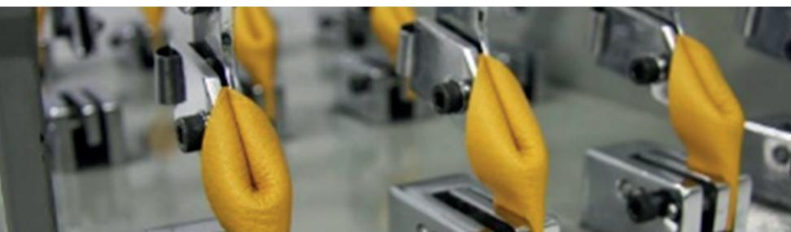

**Figure 11** Mycelium-materials performances are tested for ensuring their suitability for automotive application

ples, both OEMs performed a cycle of characterization and validation tests – accordingly to performances, parameters, and methods previously shared – to evaluate mechanical, thermal, ageing behavior of the innovative materials under severe environmental conditions to determine the applicability to the automotive sector. Although the mechanical, ageing and functional performance do not reach the requirements in all aspects by now, several promising results were found e.g. regarding wear resistance and colour fastness. Other material properties that do not yet have satisfactory parameters can be improved by modifying the post-processing steps or by material coupling and reinforcement. For the implementation of the prototypes, initial applications have been identified. Emphasis is deliberately placed on using the material on series components in order to have good comparability with series materials and to consider realistic possible applications. One challenge in the application is the adaptation of the design to the current size of the mycelium panels. Materials for the applications were selected from the material samples produced by the partners. The selection was not made exclusively on the basis of the material properties, but also took into account haptic and visual requirements of the design, because vehicle interior materials are perceived permanently and consciously. Several different textures were proposed and evaluated in collaboration with Style departments. A three-dimensional effect was chosen to emphasize the aesthetic performance and workability of the material and underline components shapes and geometries in applications designed for sports and high-end cars.

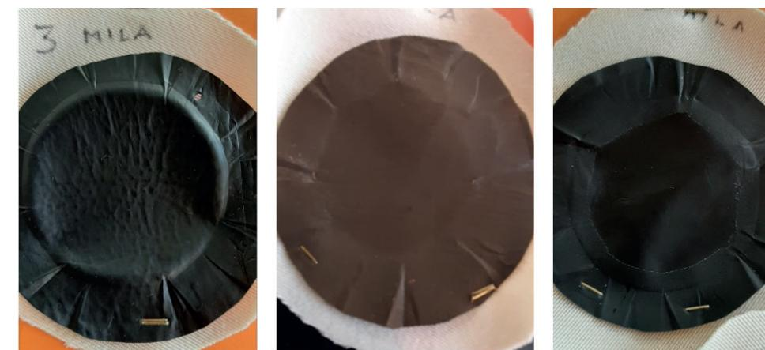

**Figure 12** Mycelium-materials tests for ensuring their suitability for application in car interiors

As a consequence, components design has been optimized on reference prototypes aiming to promote the sustainable content developed into MY-FI project. In parallel, to achieve the requested complexity of the automotive trims, a sustainable fabric backing is under finalization. After the consolidation of the material, CRF/Stellantis and VW will produce a 3D prototype of an interior component in collaboration with relevant Tier one suppliers (for example a wrapped door panel and headrest).

# 7 Sustainability

## 7.1. LCA and LCC

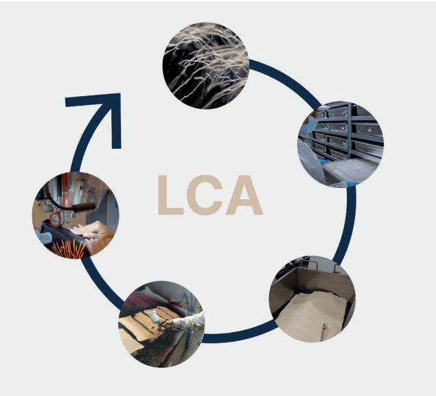

**Figure 13** For the MY-FI project, SPIN is assessing the impact of both SLF and DLF materials, from the biofabrication stage, until the finishing one.

As part of the MY-FI project, SPIN 360, in collaboration with project partners, measures and evaluates the environmental impacts of the most promising mycelium-based materials produced by MY-FI partners.

Among the different possible methods, SPIN 360 employs the Life Cycle Assessment, following the standard ISO 14044, which is one of the most acknowledged and recognized sustainability assessment tools for the European Union. The methodology adopted for the cal-

culation is EF 3.1, taking into account 16 impact categories, published by the Joint Research Center and the European Commission.

The LCA study does not constitute a point of arrival, but rather a science-based approach that can promote a better knowledge of processes and performances, to kickstart an improvement plan.

For materials still in the research and development phase, the LCA provides an opportunity to refine and optimize processes from a sustainability perspective, providing insights for an efficient scale-up. For example, the assessment delivers information on resource use efficiency and the interconnection between production options and final product impact.

For the time being, SPIN 360 was able to carry out the LCA of mycelium raw material, produced using the Surface liquid fermentation protocol. The early results on hotspots are now being used to evaluate potential alternatives of substrates, energy sources, and supply chain configurations. Indeed, the main hotspots resides in the “spawn colonization” process, thermal energy and substrates being the most critical inputs. Thermal energy could be optimized in the scale-up process, by organizing the space and carefully insulating the structure. The substrate impact could be optimized employing byproducts, and choosing local the inputs. In the following months, the LCA will be also applied to the Dynamic liquid fermentation protocol and in the prototyping phase.

In addition to LCA, SPIN is also conducting the Life Cycle Costing (LCC) analysis, assessing the economic cost related to the whole life Cycle of the mycelium-based material. This analysis will help optimize production costs and resource use. The LCA and LCC system boundaries for the MY-FI materials are from raw materials to the gate of the post-processing facility.

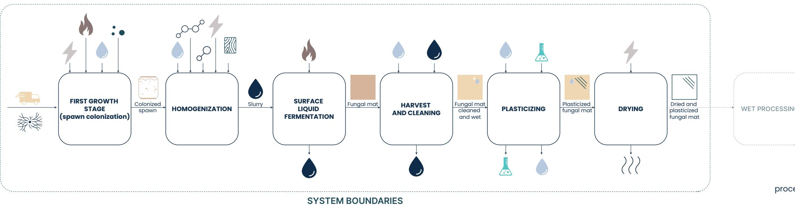

**Figure 14** SLF protocol processes analyzed until now

## 7.2. Biodegradability and Compostability

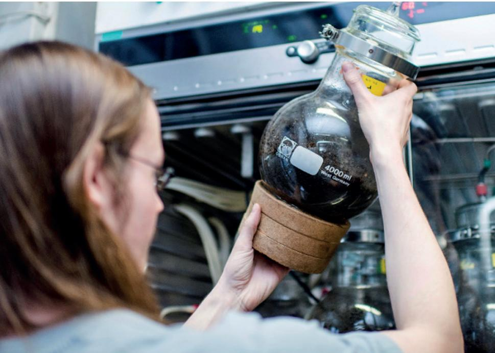

**Figure 15** Biodegradability tests performed on mycelium-materials at OWS

Besides being produced from waste resources, it is the ambition of the MY-FI project to develop a mycelium-based fabric that is biodegradable and does not release micro-plastics, to drive the textile industry to lower its environmental impact. Therefore, within the MY-FI project, Normec OWS investigates the biodegradation behavior and the suitability for treatment by organic recycling such as industrial compostability and anaerobic digestion. The first results look promising. The basic mycelium produced by MOGU via surface liquid fermentation showed complete biodegradation as defined by the European norm EN 13432 Requirements for packaging recoverable through composting and biodegradation – Test scheme and evaluation criteria for the final acceptance of packaging (2000). The disintegration trials of the MY-FI textiles under pilot-scale composting conditions indicated that the different treatment steps impact the disintegration rate. Indeed, several processing steps and coatings are needed for high-end applications in the automotive and fashion industries. The impact of these treatments on biodegradation is currently carefully examined to result in a sustainable, biodegradable commercial fabric. The project is investigating the possibility of employing bio-based additives in order to improve the biodegradability of the final material.

## 7.3. Ecolabelling

Within the MY-FI project among other tasks, LEITAT has the objective of identifying potential compliance of the mycelium fabric with the EU Ecolabel criteria for textiles (Commission Decision EU 2014/350)1, as well as to formulate recommendations to support a potential future certification. Other recommendations will be aimed at a revision of the EU Ecolabel and Green Public Procurement criteria for textiles, to promote recognition of mycelium products as sustainable textile solutions.

So far, it has been found that the EU Ecolabel, in its current state, does not seem to allow certification of predominantly mycelium-based fiber products (>20% by weight mycelium fiber content). This issue arises since the existing EU Ecolabel definitions of textile fiber categories (e.g. various natural cellulosic seed, bast, keratin, or synthetic fibers), and corresponding criteria, do not cover novel materials, such as mycelium, and therefore cannot be applied. The reasons for that may lie in the EU Ecolabel focus on more common materials with relevant market shares and environmental impact implications, but may, in part, also be traced back to the fundamental labeling requirement and fiber names regulation (EU 1007/2011, which does not yet list the relatively novel material and subsequently complicates its recognition in other textile-related EU legislation. Contrastingly, other EU Ecolabel criteria relating to the use of chemicals in later production stages (fabric formation, pre-treatment, dyeing, etc.) and fitness for use criteria (e.g. dimensional changes and color fastness during washing), could be applied to the mycelium-based at its final production stage.

Following this conclusion, the partner has started to also investigate other Type I ecolabels for textiles, such as OEKO-TEX or GOTS, to determine the potential for alternative certifications with EU relevance. The investigation also extends to potential labeling implications that may result from the newly proposed EU Green Claims Directive. Entirely new fibre-specific categories and criteria may need to be defined, for example, based on insights from sustainability impact assessments such as LCA, and integrated into existing ecolabeling frameworks, to recognize and support novel and more sustainable material solutions, such as those offered by mycelium-based fabrics.

# 8 Gear-up-to market

One of the major goals of the MY-FI project is to successfully scale. The gear-up-to-market phase is a critical stage in introducing an innovative product or service to the market. It involves thorough planning, strategizing, and execution to ensure a successful market entry. This phase encompasses a comprehensive analysis of target markets, competitor research, and identification of key customer segments. In the MY-FI project, collaboration with project partners plays a crucial role in coordinating the various actors involved in the production of the final product.

AXIA's role in the MY-FI project is to develop an exploitation strategy that assists partners in commercializing their products. The methodology employed involves analyzing the external environment, including market and competitor analysis. This includes qualitative and quantitative assessments to determine market volume, size, customer segments, and key actors. Additionally, individual business plans are created for the main collaborating companies. These plans encompass defining the company's value proposition, designing a business model canvas, conducting SWOT and PEST-LE analyses, assessing risks, and performing economic projections with the estimation of CAPEX and OPEX. The creation of individual business plans is essential for strategic clarity, market analysis, resource allocation, risk mitigation, and performance evaluation as shown in Figure 16.

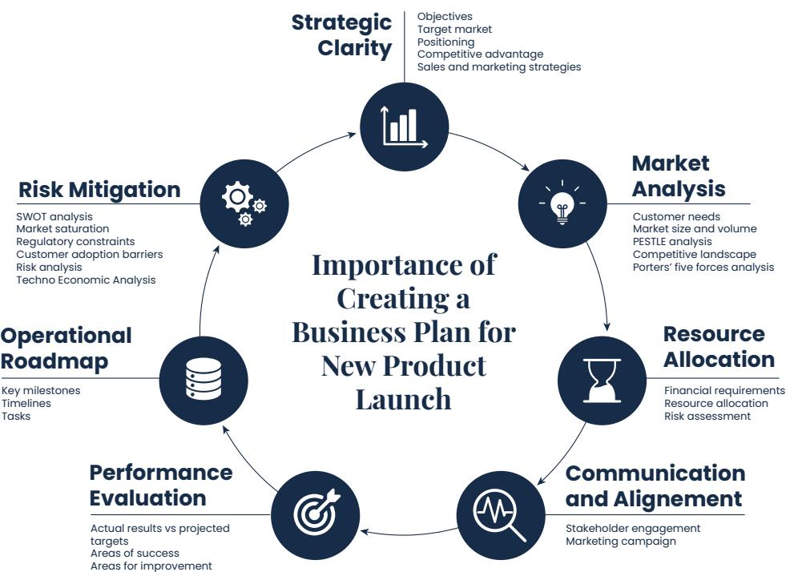

Figure 16 The importance of the creation of individual Business Plan

Materials market size is estimated to be worth €24.8 million in 2022 and is forecast to a readjusted size of € 233.72 million by 2028 with a CAGR of 45.33% during the forecast period 2022-2028 . This estimation shows that there are big margins for new mycelium products commercialization. Moreover, there is high competitiveness in the textile production field using mycelium and alternative materials. Competitor benchmarking was conducted, identifying direct competitors for MY-FI. These competitors are addressing the same market as MY-FI and have established collaborations with relevant companies in the fashion and automotive sectors. Nevertheless, none of their products have reached a level of maturity sufficient for significant market penetration. A Porter's Five Forces analysis was also performed (Figure 17), highlighting competitive rivalry, bargaining power of buyers, and threats of substitutes as the main forces driving the market. Understanding these forces helps shape MY-FI's strategy, considering factors like competitors' pricing, marketing campaigns, number of buyers, and the conditions for the customers to switch to alternative products.

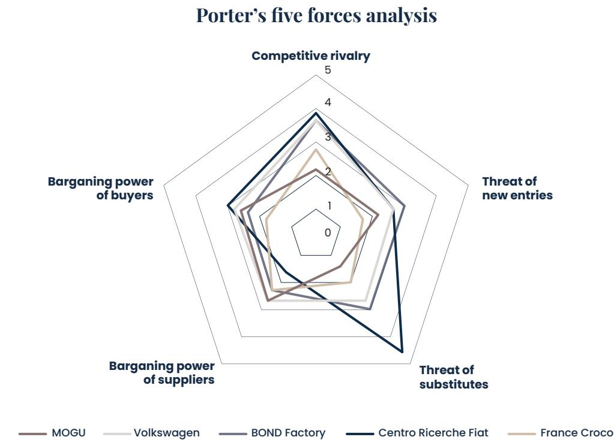

Figure 17 Porter's five forces analysis for MY-FI partners

In parallel with the exploitation activities, AXIA implemented an intellectual property rights (IPR) strategy. With the increasing demand for mycelium-based products, it is crucial to develop effi cient and cost-effective production methods. To address this challenge, a patent mapping assessment was adopted, providing systematic and strategic insights into the intellectual property landscape related to mycelium technologies. Following the examination of approximately 5,000 patents, 25 have been identifi ed as the most pertinent. The analysis of patent data suggests that the mycelium-based material sector is experiencing growth, with an increasing number of patent applications from experts in this fi eld. Notably, the United States, the European Union, and China have been prominent in the protection of inventions, and this trend is expected to persist.

Analyzing patents and their related information allows researchers and industry professionals to gain a deeper understanding of the existing knowledge base, identify key players, evaluate the novelty and uniqueness of innovations, and identify potential areas for research and development.

Overall, the gear-up-to-market activities in the MY-FI project contribute to strategic decision-making and risk management, maximizing the potential of introducing mycelium-based products to the market successfully.

## Communication 9

The activities related to the communication of project progress and outcomes are led by SPIN 360, but all partners are involved. The main objectives of this set of activities are to:

- Establish an awareness of mycelium fabrics among relevant stakeholders (TCLF - Textile Clothing Leather Footwear in dustry, automotive sector, Consumers) as well as among national and European regulatory authorities.
- Gather, produce, and disseminate information about the project's objectives and results, primarily targeted at opi nion leaders, educators, and other stakeholders.
- Engage stakeholders in disseminating results of the project: opinion leaders/regulators, relevant industries, scientifi c community, and consumer organizations.
- Deliver guidelines for policymakers to support the market gain of a biobased textile industry in Europe.

Dissemination activities have been undertaken by all project participants at both an internal and external level. The main target audiences to reach for creating awareness and promoting market demand for mycelium fabrics are industry and consumers.

A comprehensive dissemination and communication campaign has been designed and implemented to actively share MY-FI objectives, activities, and results to the target audiences in accordance with the dissemination and communication strategy agreed by the Consortium.

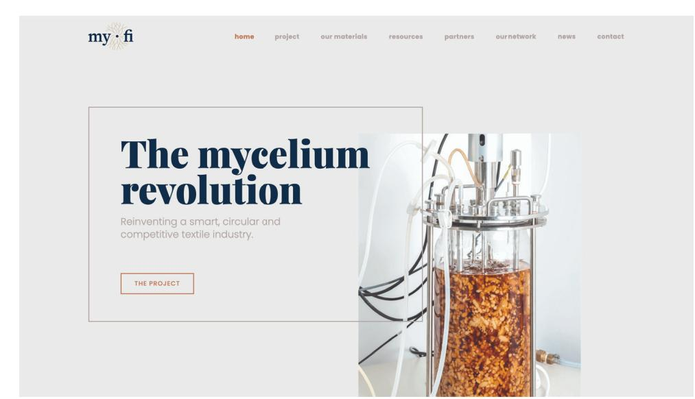

**Figure 18** MY-FI website in english

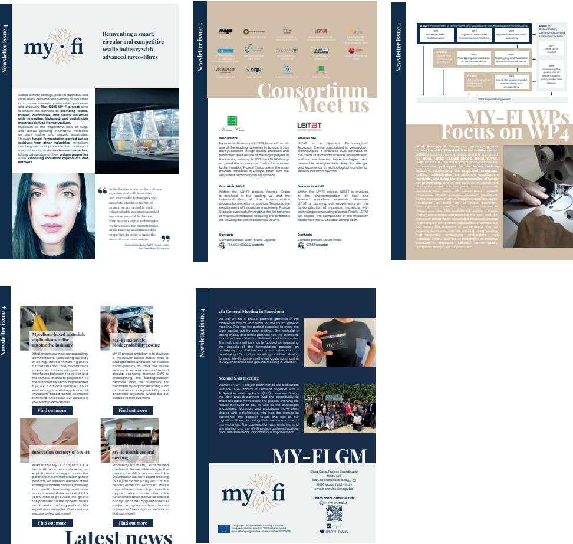

**Figure 19** MY-FI newsletter issue 4

The strategy includes:

- • Active presence on socials (Linkedin and X) and on other digital media channels (a project website in English and a newsletter published three times a year).
- • Publishing of scientific articles in journals and conferences.
- • Targeted placement of articles and features in relevant trade and industry-focused media outlets.
- • Networking with other projects initiatives and networks.
- • Participation in relevant conferences with high impact, trade fairs (Lineapelle and Future Fabrics Expo 2023), exhibitions, workshops, seminars, conferences, and round tables (Lineapelle).

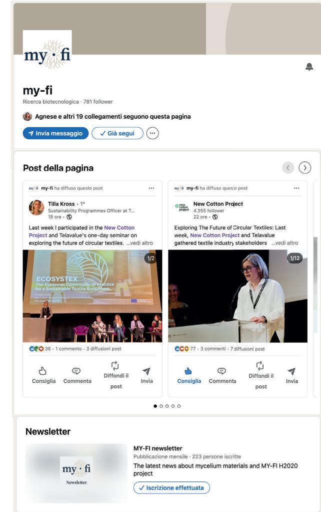

A Stakeholder Advisory Board (SAB) has been established to ensure the active engagement of key stakeholders in the project. The SAB has already met twice, serving as a consultation body.

Considering feedback obtained from the interactions with stakeholders, the consortium is defining a structured document to be disseminated to policymakers and aiming at supporting the development and market gain of a biobased textile industry in Europe. Once developed, the guidelines will be disseminated to target stakeholders such as EU policymakers, National public authorities, Industrial Associations at the EU and National level, and Trade Unions.

To stay updated about MY-FI project latest news, please visit our [MY-FI website](#) suscribe to our [MY-FI Newsletter](#) and follow us on [Linkedin](#) and [X](#)

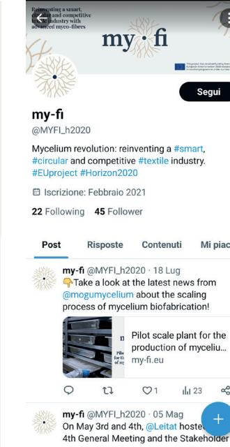

**Figure 20** MY-FI Linkedin and X profiles

