**1Project acronym:** RegioGreenTex **Project number:** 101083731

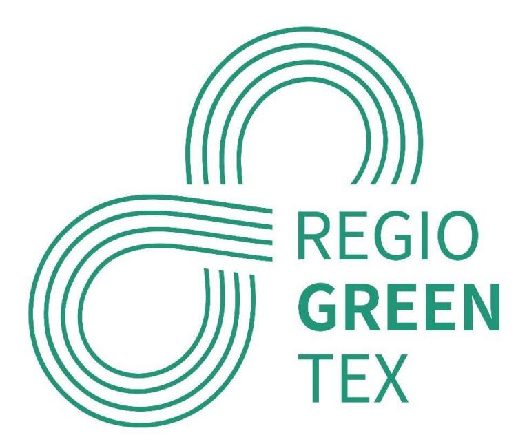

# **D1.3 - Mapping and gap analysis of value chains for sustainable and circular textiles**

# **Interregional Innovation Investments Instrument (I3)**

**Deliverable due date: 30/04/2024**

**AUTHOR REVIEWERS**

## Co-funded by the European Union

CENTEXBEL ATEVAL WUR

Dissemination level: PU - Public

Co-funded by the European Union. Views and opinions expressed are however those of the author(s) only and do not necessarily reflect those of the European Union or EISMEA. Neither the European Union nor EISMEA can be held responsible for them.

#### **EXECUTIVE SUMMARY**

#### **In work package 1 (WP1), D1.3** focuses on **mapping and gap analysis of value chains for sustainable and circular textiles**.

While linear value chains are fairly straightforward, the move towards circularity opens up a wide range of new options for building value chains, for example by considering reuse, upcycling or all recycling options. This adds complexity and creates new types of obstacles. In addition, the introduction of innovation components, which by their very nature can be ahead of the game, also presents specific challenges.

Proceeding to a precise mapping and a thorough gap analysis becomes a key element in the preparation and development of value chains to:

- **visualise** the proposed set-up and show the inter-connections
- to **identify** and **prioritise** the gaps
- to **define action plans** to address the gaps

Before analysing actual value chains involving RegioGreenTex partners, a series of elements were collected and analysed through the following activities:

- **data collection** on circular value chains
- **survey on gaps** directed to RegioGreenTex partners and STEP 2030 supporters The main objective of this survey was to understand what different stakeholders involved in various existing value chains see as the main gaps.
- **1 quadruple helix workshop on gap analysis** organised in the frame of the ECOSYSTEX Conference, in Barcelona, in October 2023 During this workshop, the participants, divided in 3 randomly formed groups, were asked to highlight the main gaps they face in real life, to discuss them and to prioritise them.
- **1 workshop on mapping of value chains** organised during the RegioGreenTex Consortium Meeting, in CITEVE (Vila Nova de Famalicão, Portugal) in March 2024 During this workshop, only involving RegioGreenTex partners, the participants were asked to develop 3 different value chains

This preparatory and analytical work was crucial in designing a flexible **Mapping and Gap Analysis Tool** that would not only facilitate data collection, but also guide reflection on the gap analysis, help prioritise and initiate action plans.

For instance, 3 main categories of gaps emerged:

- gaps related to the **core functions** of the value chain (key activities in the value chain)
- gaps linked to **support functions** (e.g. testing laboratories, machinery providers)
- gaps associated to **policy instruments** (e.g. standards and norms, customs administration)

For the mapping, it was obvious that the main input and output for each process step had to be described.

All these elements were used to start analysing existing or potential value chains within the RegioGreenTex context, with a focus on **3 value chains**:

- **Chemical recycling of cotton** developed during workshop (Consortium Meeting)

- **Mechanical recycling of wool and long fibres** developed during workshop (Consortium Meeting) and through the Mapping and Gap Analysis Tool
- **Recycling of synthetic fibres used for technical applications** developed during workshop (Consortium Meeting)

The Mapping and Gap Analysis Tool was first used by the **NTT (NEXT TECHNOLOGY TECNOTESSILE) Team**, with a focus on the regional mechanical recycling of the wool. The **3 main objectives of the tool were met**. It guided the **reflection work** of the team, it helped **visualising the value chain** with its strengths and weaknesses, and it supported a **thorough gap analysis**.

After completing this analysis, the NTT Team considered the broader picture, at regional level, for the entire wool recycling business. This reflection enabled to highlight several areas of concern, and to suggest finetuned categories of gaps, such as:

- **System oganisation gaps**, that impact the entire value chain organisation
- **Cultural/skills gaps in circular practices and products**, linked to a lack of knowledge
- **Skills gaps in digital solutions**, leading for example to difficulties in data sharing/analysis

These possible (sub-)categories will be taken into consideration to improve the tool.

As specific value chains face specific challenges, the list of possible gaps is extensive. But we see some trends in the nature of the gaps that prevent smooth operation or development of circular textile value chains. Here are some of the main ones:

- **Core functions gaps**: lack of large scale precise sorting process, no efficient industrial process for the removal of hard parts, difficulty to identify partners at local level, scarcity of raw materials, lack of skilled workers
- **Support functions gaps**: difficulties to share data related to material and production, lack of knowledge about eco-design and circular business models
- **Policy instruments**: no standards for recycled products, lack of certification schemes, policies applied consistently across the EU (e.g. waste management)

In total, in WP1 T1.3 'Value Chain Mapping', More than 100 experts from a wide range of technical and non-technical backgrounds, as well as business owners, whether RegioGreenTex partners or not, contributed to numerous open discussions and workshops that helped to better understand how circular textile value chains work or can be developed, to identify the main gaps and to start the search for solutions.

#### Contents

| 1     |                                                                                                                                         |
|-------|-----------------------------------------------------------------------------------------------------------------------------------------|
| 1.1   | Deliverable D1.3: Value chain map and gap analysis ...............................................5                                     |
| 1.2   | Main steps and activities ..............................................................................................5               |
| 2     | Textile Value Chain................................................................................................................6    |
| 2.1   | Definition.........................................................................................................................6    |
| 2.2   | Linear Textile Value Chain............................................................................................7                 |
| 2.3   | Circular Textile Value Chain .........................................................................................7                 |
| 2.3.1 | R-Strategies ............................................................................................................8              |
| 2.3.2 | Products sorting......................................................................................................9                 |
| 2.3.3 | Material sorting.....................................................................................................10                 |
| 3     | Mapping of a Value Chain ..................................................................................................11           |
| 4     | Gaps Analysis .......................................................................................................................13 |
| 4.1   | Main Types of Gaps.....................................................................................................13               |
| 4.2   | Analysis of Gaps...........................................................................................................15           |
| 4.3   | Gaps Survey ..................................................................................................................16        |
| 4.4   | ECOSYSTEX Conference Workshop..........................................................................20                               |
| 5     | Mapping and Gaps Analysis Tool ......................................................................................21                 |
| 5.1   | Value Chain Mapping Tool..........................................................................................21                    |
| 5.2   | Gaps Analysis Tool.......................................................................................................22             |
| 5.2.1 | Activities within the value chain.........................................................................22                            |
| 5.2.2 | Gaps description and analysis............................................................................23                             |
| 5.2.3 | User’s guide ...........................................................................................................24              |
| 5.2.4 | Evaluation of the tool ...........................................................................................25                    |
| 6     | Mapping and gaps analysis in RegioGreenTex Value Chains .......................................26                                       |
| 6.1   | Value Chain Workshop – RegioGreenTex Consortium Meeting – 12/03/2024....26                                                              |
| 6.1.1 | Workshop objectives and methodology.............................................................26                                      |
| 6.1.2 | 1                                                                                                                                       |
|       | st step: company forms.......................................................................................27                         |
| 6.1.3 | 2                                                                                                                                       |
|       | nd step: “creating” the value chains ..................................................................28                               |

| 6.1.4 | VC#1: Recycling of synthetic fibres used for technical applications ............30                                                  |
|-------|-------------------------------------------------------------------------------------------------------------------------------------|
| 6.1.5 | VC#2: Chemical recycling of cotton ...................................................................30                            |
| 6.1.6 | VC#3: Mechanical recycling of wool and long fibres.......................................31                                         |
| 6.1.7 | Workshop conclusion...........................................................................................33                    |
| 6.2   | Value Chain: Mechanical Recycling of Wool – Tuscany Region - NTT.................33                                                 |
| 6.2.1 | Using the Mapping and Gap analysis Tool .......................................................33                                   |
| 6.2.2 | Mapping .................................................................................................................34         |
| 6.2.3 | Gap analysis ..........................................................................................................35           |
| 6.2.4 | Gaps related to Core Functions..........................................................................37                          |
| 6.2.5 | Gaps related to Support Functions ....................................................................37                            |
| 6.2.6 | Gaps related to Policy Instruments....................................................................38                            |
| 6.2.7 | Reflection on the gap analysis............................................................................38                        |
| 6.3   | Value Chain: Mechanical Recycling of Long Fibres - Piedmont Region PO.IN.TEX                                                        |
| 6.4   | Conclusion.....................................................................................................................39   |
| 7     | Overall Conclusion...............................................................................................................40 |
| 8     | List of ANNEXES..................................................................................................................41 |

#### **1 INTRODUCTION**

#### **1.1 Deliverable D1.3: Value chain map and gap analysis**

This deliverable is part of WP1 - Value chain mapping and gaps analysis.

According to the Annex 1 (Description of the Action) of the Grant Agreement, the main objective is to prepare a value chain mapping and gap analysis to better address the progress of innovation and investments during the project implementation. As the landscape is evolving fast in relation to the implementation of the EU textile strategy, the intention is to update the gap analysis each year (to be continued possibly after the end of the project), to provide a context for investment decisions inside and outside/beyond this project. For this work, we need to consider circular textile value chains in generic terms, and to analyse the situation in the RegioGreenTex context.

To shift the value chain from a linear to a circular model, a proper analysis of the gaps and bottlenecks needs to be carried out.

The main objective of D1.3 was to provide a value chain map for circular textiles & clothing and gap analysis, with a focus on (inter) regional aspects, including a global analysis to make EU circular textile value chains more competitive towards international competitors.

This report covers the different steps and activities considered to complete this deliverable.

#### **1.2 Main steps and activities**

The main activities that contributed to collect data, to listen to RegioGreenTex partners or other organisations about gaps, and to analyse value chains, are shown in the diagram below. The development and testing of the mapping and gap analysis tool are other key activities.

These activities are all described later in this report.

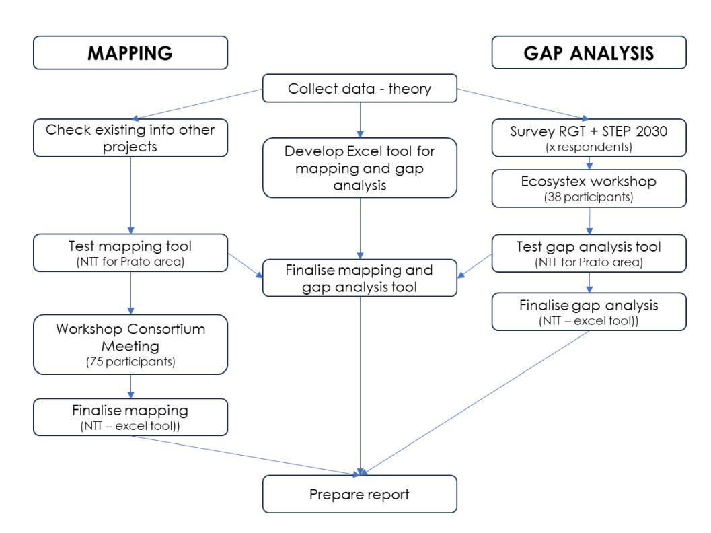

#### **2 TEXTILE VALUE CHAIN**

#### **2.1 Definition**

UNEP (United Nations Environment Programme) proposes a clear definition of a Value Chain (ref: Sustainability and Circularity in the Textile Value Chain - A Global Roadmap): the textile value chain comprises all activities and stakeholders that provide or receive value from designing, developing, making, distributing, retailing, and consuming a textile product (or providing the service that a textile product renders), including the extraction and supply of raw materials, as well as activities involving the textile after its useful service life has ended. The value chain covers all stages in a textile product's life, from supply of raw materials through to disposal after use, and includes the activities linked to value creation such as business models, consumption patterns, investments, and regulation.

The value chain also comprises the actors undertaking the activities, and the stakeholders that can influence those activities.

The textile value chain is thus considered as a whole system that goes beyond the supply chain and the life cycle of products.

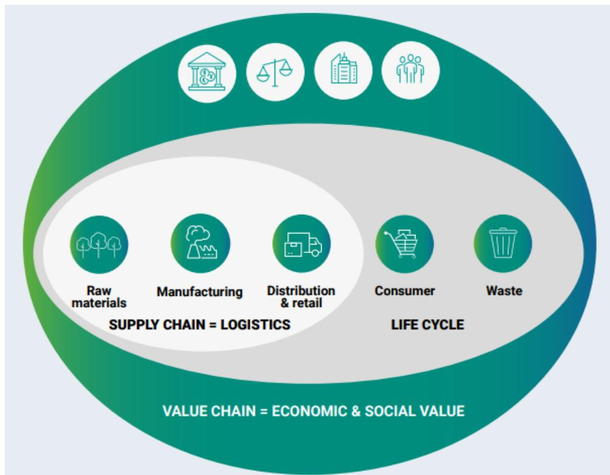

In the context of circular economy, the different activities will be designed and organised to minimise waste and maximise the efficient use of resources throughout the lifecycle of textile products. Unlike a linear model, where products are made, used, and disposed of, often leading to significant environmental impact and resource depletion, a circular textile value chain aims to create a closed-loop system where materials are reused, recycled, or regenerated, thus reducing the need for new resource extraction, and minimising the negative environmental impact.

As a result, circular value chains tend to be more complex than linear ones because they allow for more options and activities. For example, the development of R-strategies (see 2.3.1) significantly increases the number of processes and actors to be considered in the value chain.

#### **2.2 Linear Textile Value Chain**

A **linear value chain** operates according to the "take-make-waste" principle. In a nutshell, this onedirection type of organisation is based on the sole use of virgin resources produced by the agriculture or the industry to make intermediary and final products that will be disposed of and destroyed after use. It involves various stakeholders such as suppliers, manufacturers, distributors, and consumers, each playing a role in the extraction, manufacturing, distribution, and disposal of textiles within the supply chain.

Beside the relatively straightforward structure of the supply chain for one product – a retailer can produce thousands of different styles every year with a network of hundreds of suppliers -, this way to operate has enabled to optimise processes, ensure very short lead-times, and maximise profit.

The following diagram illustrates a basic linear value chain.

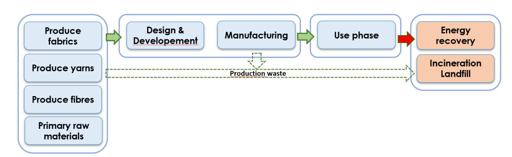

It is worth mentioning that some companies have developed intermediary solutions to reduce the negative impact of such a model long before the circular economy came to the fore. For example, by optimising the consumption of energy, by developing limited recycling solutions for their waste, they were able to reduce their costs and improve the sustainability of their products. Some of these evolutions were also imposed by regional regulations related to waste management, etc.

#### **2.3 Circular Textile Value Chain**

The transition from a linear to a circular textile value chain for the production of textile products requires significant adaptations. While the linear value chain is relatively straightforward and wellknown, the many additional options that can make up a circular value chain add significantly to the complexity.

In a circular model, every step in the value chain can be developed to reduce the use of fresh/virgin resources, to optimise the use and life duration of products, and eventually to recycle the waste and enter a new circle**.** Additionally, new business models will also require adaptations of the value chain.

Said differently, circular textile value chains will involve new types of markets, innovation in technology or business models, new types of materials, new skills, new types of collaborations, etc., and a different mindset.

Therefore, the types of and the number of gaps to analyse will also increase considerably. In WP1 "mapping and gap analysis", to integrate this complexity, there is a need to be very specific in terms of processes and process steps.

When digging into actual or potential value chains within the RegioGreenTex context, we will face the constraints of reality, a situation that will make the gap analysis even more important.

From this definition, we can draw an overall circular textile value chain picture.

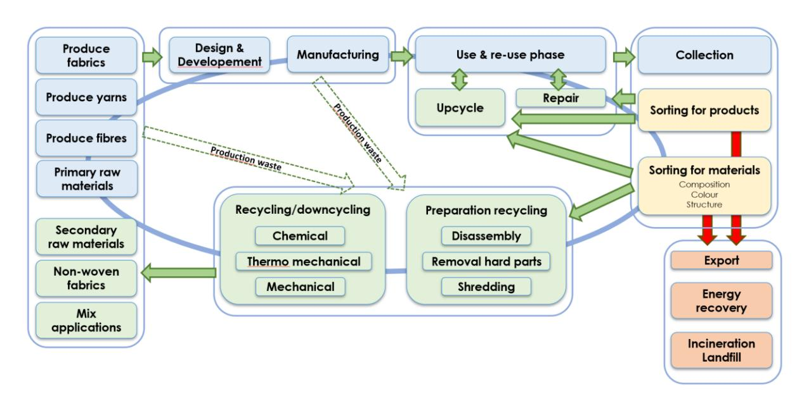

#### **2.3.1 R-Strategies**

Improving the circularity can be achieved by applying or enabling one or more of the following 9 circular economy 'R' strategies or principles described in the following table.

| R# | Strategy | Description                                                              |
|----|----------|--------------------------------------------------------------------------|
| R1 | Refuse   | Make product redundant by abandoning its function or by offering the     |
|    |          | same function by a radically different (e.g. digital) product or service |
| R2 | Rethink  | Make product use more intensive (e.g. through product-as-a-service,      |
|    |          | reuse and sharing models or by putting multi-functional products on      |
| R3 | Reduce   | Increase efficiency in product manufacture or use by consuming           |
| R4 | Re-use   | Re-use of a product which is still in good condition and fulfils its     |
|    |          | original function (and is not waste) for the same purpose for which it   |
| R5 | Repair   | Repair and maintenance of defective product so it can be used with       |

| R6 | Refurbish     | Restore an old product and bring it up to date (to specified quality    |
|----|---------------|-------------------------------------------------------------------------|
| R7 | Remanufacture | Use parts of a discarded product in a new product with the same         |
| R8 | Repurpose     | Use a redundant product or its parts in a new product with different    |
| R9 | Recycle       | Recover materials from waste to be reprocessed into new products,       |
|    |               | materials, or substances whether for the original or other purposes. It |

Ref: https://circulareconomy.europa.eu/platform/sites/default/files/categorisation\_system\_for\_the\_ce.pdf

When developing a circular textile value chain, All R-strategies will be at the centre of the reflection. There will potentially be many more actors involved to develop all the possible processes and solutions. Some companies could be for example interested in using the waste out of one process as a new raw material whereas it would have ended up in incineration in the linear process. This is a major evolution. This means also that some tiny companies will end up cooperating with major industrial partners.

Very different scenarios will emerge from the development of circular textiles processes. For example, a well-established large company that adapts its processes to one or more R-strategies will face different obstacles than a start-up that would start from scratch to develop similar options.

### **2.3.2 Products sorting**

By sorting end-of-life textile products, it is possible to maximise their value, minimise waste, and contribute to a more sustainable and circular textile economy. The sorting should target in the first place the extension of the product life/use. The 3 strategies to prioritise are the R4 (re-use), R5 (repair) and R6 (refurbish/upcycle).

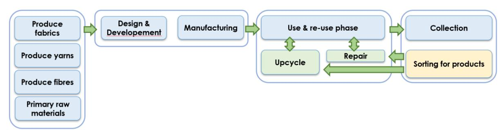

Consumers may be inclined to engage with these options because they can manage them themselves, possibly through third-party applications. Some brands also encourage practices such as reuse, for example by accepting used garments from consumers to sell as second-hand. Social enterprises are also active in this area.

#### **2.3.3 Material sorting**

Where options at the product level are not possible, the focus is on the material contained in the collected waste, whether from industry or from consumers. The aim is to exploit as much material as possible, mainly through recycling activities.

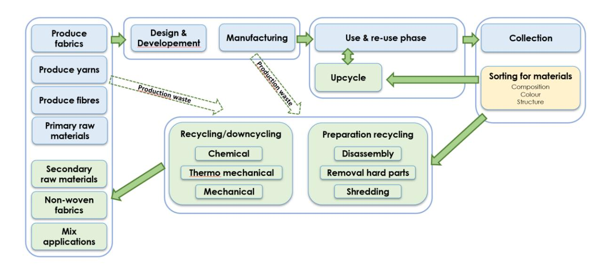

When it comes to sorting, the post-consumer products pose several problems. The very wide variety of materials and fibre mixes, the complexity of the garments (e.g. multi-layer, prints, embellishments, coating), and the absence of highly efficient industrial solutions, make an accurate sorting (e.g. based on fibre content and colour range) a tedious, time-consuming, and costly process. Another challenge can be to reach the minimum quantities of accurately sorted material to reliantly feed industrial scale processes.

This explains why large quantities are processed in low labour cost countries, meaning large quantities will have to be moved around the world before reaching the recycler. Some social organisations are able to propose viable solutions, at a bearable cost.

It also explains why companies transforming fabrics into fibres generally prefer production waste that comes free of any hard parts such as buttons, labels, etc. This is also due to the absence of automatic removal options, or their lack of efficiency.

When recycling is considered, a series of processes are based on new technologies. Therefore, some situations that work on paper will be extremely difficult to translate into efficient processes. In some cases, the economic reality, meaning an excessive cost, will prevent from bringing some options to life.

#### **3 MAPPING OF A VALUE CHAIN**

Mapping textile value chains involves a comprehensive analysis and visualisation of the different stages, processes and actors involved in production, distribution, consumption/use, and end-oflife management. It aims to provide a clear understanding of the interconnected relationships and flows, from the sourcing of raw materials to the consumption and disposal of the end product. Depending on the objectives of a study, of a project, the depth of the analysis and the list of the parameters that will be investigated and reported can vary considerably.

Here are the key elements that are taken into consideration.

#### • **Identification of Stakeholders**

One of the first elements is the identification and categorisation of the key stakeholders involved in the considered textile value chain. This includes for example raw material suppliers, recyclers, manufacturers, distributors, retailers, consumers, waste management companies, etc.

For the work in WP1, the focus was set on actors involved in the production process (e.g. from waste collection to production of slivers for the spinning).

#### • **Mapping of Supply Chain Stages**

The value chain is broken down into different stages such as raw material sourcing, fibre production, textile manufacturing, garment production, distribution, retailing and end-of-life management. If necessary, the analysis can go down to the level of process steps. For example, some facilities that convert pieces of fabric into fibres may end their process with the baling of fibres, while others may go as far as preparing slivers for spinning.

Each stage is analysed to understand the activities, processes and interactions involved.

#### • **Mapping of Flows and Interactions**

As much as possible, the mapping process visualises the flow of materials throughout the value chain. This includes tracing the movement of raw materials from source to production facilities, intermediate products between different stages, finished goods to consumers, etc.

The way the materials, the products components, etc, move from one step to the next, from one company to the other, can have a significant influence on the environmental impact of the whole value chain, on the cost related to transportation, and by extension, on the viability of the value chain.

#### • **Clarification of Inputs and Outputs**

For each stage of the value chain, inputs (e.g., raw materials) and outputs (e.g., components, products) are identified and possibly quantified. This helps to evaluate resource gaps and opportunities on an offer/demand mode.

For the work in WP1, the focus was set on the material inputs and outputs. Other elements such as water, energy, chemicals, etc., are out of scope.

#### • **Identification of Critical Obstacles and Bottlenecks**

The mapping process helps to highlight critical obstacles and bottlenecks within the value chain, firstly for elements related to the actual production processes (e.g. missing local partner for a specific operation).

#### • **Visualisation and communication**:

Presenting a value chain, ideally in the form of a diagram or map, enables to get a good indication of the interactions and dynamics immediately.

With the information collected and highlighted in the mapping for a specific value chain, all stakeholders will be able to identify opportunities for optimisation and innovation, the bottlenecks, and the gaps.

#### **4 GAPS ANALYSIS**

In the context of circular textile value chains, a 'gap' refers to anything that hinders the achievement of a fully circular and viable model. These gaps can be highlighted at different stages of the value chain; they can be technical, material, economic, regulatory, or behavioural. Several examples are described in section 4.1.

Identifying and addressing these gaps is essential to advance the transition to more circular and sustainable textile value chains. This requires collaboration between stakeholders across the industry, including policy makers, businesses, consumers, and research institutions, as is the case in the frame of RegioGreenTex. Beyond the direct negative impact, there are situations where finding and implementing solutions may represent an opportunity to develop a new business option.

#### **4.1 Main Types of Gaps**

When analysing a value chain, many types of gaps should be considered.

In addition to material gaps specific to a process or plant (e.g. lack of properly conditioned feedstock), other gaps may be more widespread and affect an entire value chain (e.g. lack of skilled labour, lack of training) or an entire type of business (e.g. waste management regulations).

Because each gap has its own characteristics, each gap can have a different impact on the activities of a value chain. And there will be a different level of difficulty in finding the solutions or improvements to close it.

The following diagram provides key elements for a basic gap analysis by listing different options for the nature of a gap, its impact level, and the level of difficulty to fix it.

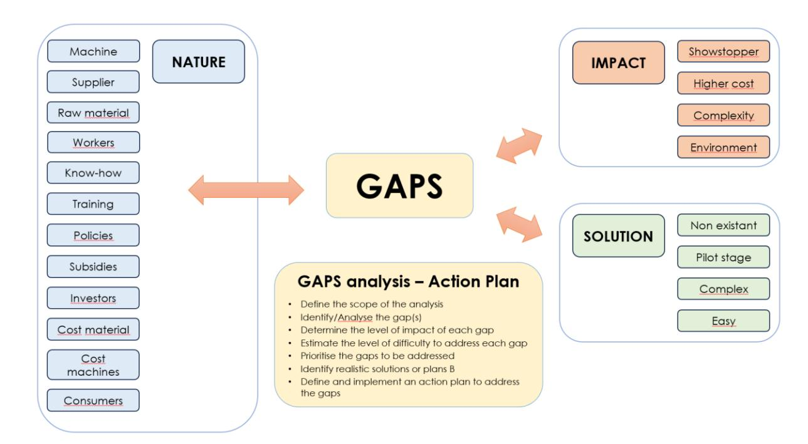

The following table provides further information on common categories and types of gaps; it is by no means exhaustive.

| GAPS CATEGORY                             | GAPS DESCRIPTION                                                                                                                                                                                                                                                                           |
|-------------------------------------------|--------------------------------------------------------------------------------------------------------------------------------------------------------------------------------------------------------------------------------------------------------------------------------------------|
| <b>Material Supply Chain Gaps</b>         | <ul style="list-style-type: none;"> <li>. Poor availability of recycled or sustainable raw materials</li> <li>. Poor consistency and reliability of recycled material supply</li> <li>. Low/no traceability and transparency in the material sourcing process</li> </ul>                   |
| <b>Production Process Gaps</b>            | <ul style="list-style-type: none;"> <li>. Lack of integration between different stages of production</li> <li>. Inefficient or outdated machinery and technology</li> <li>. Energy and resource inefficiencies during manufacturing</li> </ul>                                             |
| <b>Quality and Standards Gaps</b>         | <ul style="list-style-type: none;"> <li>. High variability in the quality of recycled materials</li> <li>. Non-compliance with industry standards and regulation</li> <li>. Poor quality control measures throughout the production process</li> </ul>                                     |
| <b>Market and Demand Gaps</b>             | <ul style="list-style-type: none;"> <li>. Limited consumer awareness and demand for sustainable products</li> <li>. Market access barriers for circular products</li> <li>. Pricing differentials between circular and non-circular products</li> </ul>                                    |
| <b>Technological Gaps</b>                 | <ul style="list-style-type: none;"> <li>. Insufficient innovation in recycling and upcycling technologies</li> <li>. Lack of scalable and cost-effective circular solutions</li> <li>. Low integration of digital technologies for tracing materials</li> </ul>                            |
| <b>Policy and Regulatory Gaps</b>         | <ul style="list-style-type: none;"> <li>. Inadequate policies supporting circular economy initiatives</li> <li>. Lack of enforcement mechanisms for sustainable practices</li> <li>. Regulatory barriers to recycling and reuse</li> </ul>                                                 |
| <b>Collaboration and Partnership Gaps</b> | <ul style="list-style-type: none;"> <li>. Limited collaboration across different stakeholders in the value chain</li> <li>. Lack of communication and knowledge sharing between companies</li> <li>. Challenges in establishing partnerships for closed loop systems</li> </ul>            |
| <b>Consumer Engagement Gaps</b>           | <ul style="list-style-type: none;"> <li>. Limited consumer education on the benefits of circular products</li> <li>. Behaviour changes challenges in adopting sustainable consumption patterns</li> <li>. Poor accessibility and availability of circular products to consumers</li> </ul> |
|                                           |                                                                                                                                                                                                                                                                                            |

#### **4.2 Analysis of Gaps**

Obviously, not all gaps have an impact on all value chain activities. Furthermore, there are different levels of impact, ranging from areas for improvement to showstoppers, which means that the search for a solution will vary considerably.

For a thorough analysis, it is recommended to use a systematic and consistent approach that will enable to prioritise the actions to be taken, as suggested in the list here-under. The level of impact of each gap and the estimated level of difficulty to address them should be evaluated; these 2 elements will be used as drivers for the prioritisation of the action plans.

#### • **Definition of the scope of the analysis**

Clearly define the boundaries of the analysis, by describing the value chain that needs to be analysed.

#### • **Identification of the gaps**

Identify all potential or actual gaps across all process stages of the selected value chain. All gaps' categories (e.g. inputs, outputs, technologies, human resources, policies) should be considered. At this stage, it is fine to only list the gaps, possibly through a brainstorm session. The relevance of the selection will be considered in the following steps of the analysis work.

#### • **Determination of the level of impact of each gap**

This is a key step in the analysis' process. It is essential to consider different types of impacts.

#### • **Estimation of the level of difficulty to address each gap**

Estimating the level of difficulty of closing a gap can be a tricky exercise, as the data needed to make an accurate assessment is not always available.

The experience, discussions with different stakeholders (e.g. for topics related to policies), existing data (e.g. planning for the transition from a pilot to an industrial scale stage) are valid elements to take into consideration.

#### • **Prioritisation of the gaps to be addressed**

Based on the level of impact of the identified gaps and on the difficulty to address them, priorities can be defined.

As different stakeholders will be working on very different topics, it is possible to consider several lists for different gaps categories, for instance:

- gaps related to core production functions of the value chain
- gaps related to support functions
- gaps related to policy instruments

#### • **Identification of realistic solutions or plans B**

The main objective of gap analysis is to drive improvements in the overall performance of the entire value chain by eliminating the gaps or reducing their negative impact.

This may involve redesigning processes, investing in new technologies, optimising resource allocation, improving skills and capabilities, or other initiatives.

Plan B should be understood as a possibility, most likely temporary, to fill a gap and enable an activity to start or continue. In recycling value chains, a typical Plan B at the preparation stage may be to outsource the sorting and removal of hard parts to a distant location, for example in Asia.

#### • **Definition and implementation of an action plan to address the gaps**

An action plan to address the gaps should be defined, in line with the priorities' lists. Depending on the complexity, an in-depth analysis of the root causes, a specific data collection might be required (e.g. use of problem-solving techniques).

**Note**: a tool was developed in EXCEL to support and guide this approach (cf. section 5).

#### **4.3 Gaps Survey**

It is important to compare theory with practice in the field.

In the frame of WP1 activities, the ECOSYSTEX Conference in Barcelona (18-20/10/2023) came out as a perfect occasion, given the timing and the mix of participants, to organize a Quadruple Helix Workshop focusing on gap analysis. Centexbel and EURATEX co-organised it.

To make this workshop even more meaningful, a survey was organized before the event to collect info on actual gaps (as perceived or faced by responders) in existing value chains. To broaden the scope, the survey was sent to all RegioGreenTex partners and the STEP 2030 supporters.

The response rate was positive (28), and all results have been sorted and consolidated in an excel document.

For this survey, we asked to receive feedback related to gaps encountered at each step of a generic circular textile value chain. The diversity in the companies and organisations that responded ensured that all value chain activities were covered.

These 28 respondents represented a very diverse group of companies involved at different stages of circular textiles value chains, with different recycling technologies owners/users, etc. There were also several organisations/universities involved in research, policies, or in cluster management. The following list summarises the results of the survey. Note that as long as it is, it is by no means exhaustive.

| GAPS CATEGORY     | GAPS DESCRIPTION                                                         |
|-------------------|--------------------------------------------------------------------------|
|                   | . Lack of suppliers (EU), too low volumes, not all fibre types available |
| Product design    | . Customers still focus on price                                         |
| development       | +                                                                        |
|                   | . Lack of hardware/software for 3D prototyping and of competencies       |
| Fibre preparation | . Technical limitations of machinery and compatibility of existing       |
|                   | . Lack of long enough fibres for the mechanical recycling                |

| . Lack of know-how                                                                                   | and of trained workers . Lack of partners for removal of hard parts                                                                                     |
|------------------------------------------------------------------------------------------------------|---------------------------------------------------------------------------------------------------------------------------------------------------------|
| Spinning . Ready to spin raw material scarcity . High energy cost                                    | . Lack of investment in innovation                                                                                                                      |
| . Lack of qualitative (purity/length) cotton/wool fibres for mechanical recycling Weaving + knitting | . Lack of trained workers . Lack of trained workforce                                                                                                   |
| . Minimum + non-wovens                                                                               | quantities per order too high                                                                                                                           |
| . Strength of yarns with recycled fibres                                                             | on the low side . Higher costs than competition (energy) . Regulations in EU tougher than outside EU                                                    |
| . Important financial investment . Long lead-times Bleaching + dyeing + finishing                    | required . Lack of collaboration between companies . Lack of a strong commercial network                                                                |
| . Minimum                                                                                            | quantities per order too high . Presence of alien fibres = defects                                                                                      |
| . High cost of energy                                                                                | and logistics                                                                                                                                           |
| . Lack of trained workforce Manufacturing +                                                          | and of equipment                                                                                                                                        |
| . Cost of energy assembly                                                                            | and recycled materials                                                                                                                                  |
| . Lack of data to compare circular                                                                   | approach to ‘old’ way                                                                                                                                   |
| Distribution . Lack of cooperation to drive cost down . High competition                             | . Costly administration                                                                                                                                 |
| Retail + Sale . Limited clients/customers base Repair of textile goods . Cost of repairs             | . Low visibility for new sales pipelines . Higher prices for products with recycled content . Lack of space to display products . Lack of trained staff |
| . Poor repairability                                                                                 | of the products . Lack of promotion of the sector                                                                                                       |

| Collection of pre consumer products                                                                        | . Collected quantities too low, no massification . Too few companies interested . No mapping of regional production waste . Lack of storage space                                                   |
|-------------------------------------------------------------------------------------------------------------|-----------------------------------------------------------------------------------------------------------------------------------------------------------------------------------------------------|
| . Lack of sorting based on composition Sorting of pre                                                      | and/or colour                                                                                                                                                                                       |
| . Volumes consumer products Collection of post consumer EoL products garments                              | too low . High cost of equipment . Mixed waste, lack of training for sorting methods . Lack of space to store items . Volumes collected too low (workwear) . Not enough investment in communication |
| . Low quality products (fast fashion) = less possibilities prolongation Sorting post consumer EoL products | for life/use . Low capacity in fibre content based sorting . Lack of partners for the removal of hard parts . Cost of NIR equipment . Cost of auto-sorting lines                                    |
| Upcycling . Several issues directly linked to gaps in collecting/sorting stages goods                       | . Limited market for upcycled products                                                                                                                                                              |
| loop - fibre to                                                                                             |                                                                                                                                                                                                     |
| . lack of data - Recycling (closed fibre)                                                                   | no test reports for quality of feedstock . Lack of properly sorted feedstock                                                                                                                        |
| . lack of data - Recycling (open loop)                                                                      | no test reports for quality of feedstock . Lack of partners in very specific recycling channels . Difficulty to form a complete value chain                                                         |
| . Lack of composition-based                                                                                 | sorting capacity                                                                                                                                                                                    |
| Down-cycling . Lack of investment                                                                           | . Low volumes and low profitability                                                                                                                                                                 |
| Research . Lack of funding for research                                                                     | . Limited capacity of internal researchers materials are subsidised                                                                                                                                 |

| Policies            | . Lack of long-term strategy: too high targets on too short term > should |
|---------------------|---------------------------------------------------------------------------|
| Training            | . Relation between agricultural activities and textiles not enough        |
| Support to industry | . Lack of incentives for research, development and scaling up             |
| Match-making        | . Lack of digital tools for offer/demand matchmaking                      |
| Circularity         | . Lack of broad life-cycle approach, including eco-design phase           |
| Knowledge/data      | . Lack of knowledge on hazardous substances and substances of             |
| (customers          | +                                                                         |

The long list of activities, 29 in total, shows the complexity of circular textile value chains and somehow the level of risk involved to develop new types of businesses.

Some gaps are very specific, some cover entire value chains. It shows how important it is to map value chains, highlight gaps and analyse them thoroughly to be able to prioritise actions and activate them. Very different fields of expertise will be involved in this work (e.g. recycling processes, waste management regulations, chemicals, traceability).

In this survey, all categories of gaps are covered. This shows the extent of the progress that is needed/expected to be able to build viable value chains.

A key learning is that the material side of a value chain (e.g. from waste collection to the spinning of recycled fibres) is key but it requires lots of other elements that support the creation and management of a business. What if competition is out of EU, are policies adapted to new circular options, is there enough support for innovation, can collaboration overcome the barrier of competition, etc.

#### **4.4 ECOSYSTEX Conference Workshop**

CENTEXBEL organized a quadruple-helix workshop, in collaboration with EURATEX (STEP 2030) during the ECOSYSTEX Conference held in Barcelona, in October 2023.

38 participants contributed to the discussions. They represented a very diverse group, in terms of activities, knowledge, country, organisation, etc. This made it possible to get a highly valuable input, both through the discussions and in terms of results.

The approach for this workshop was to ask the participants to highlight possible gaps, to prioritise them, and to start thinking about possible solutions.

The complete report is available in annex….

For the first discussion, the 3 randomly composed groups came up with the following top 3 gap types:

|   | A        | B                  | C                    |
|----------------|----------|--------------------|----------------------|
|   | Data     | Policies           | Sorting              |
|   | Policies | Collecting Sorting | Consumers' behaviour |
|   | Sorting  | Design             | Design               |

We end up with gaps of different natures: technical (production), policies, eco-design.

All three groups highlighted the difficulties related to the sorting for recycling. This is no surprise, as we know there are numerous projects and activities working on this usual bottleneck.

The "policies" category covers different aspects related to rules, or absence of, harmonization of standards, etc.

The design was also a priority for 2 groups. Planning to improve the circularity at development stage is seen as a best practice.

While data was seen as a priority by only one of the groups, it is worth mentioning this is an ongoing issue. The lack of data, or the lack of accuracy, of traceability, can make it very difficult and tricky to define strategies, to anticipate volumes, etc.

#### **5 MAPPING AND GAPS ANALYSIS TOOL**

A tool was developed in Excel to facilitate the actual mapping and gap analysis within the RegioGreenTex context. This tool consists mainly of 2 sheets, one to highlight the different components of the value chain under review, the other to record the different gaps, obstacles, or disruptive factors.

It should be stressed that the intention was to develop a tool that supports the visualisation of a value chain and the description of the gaps, but more importantly that stimulates the reflection on these elements to initiate action plans where appropriate. The key functions of this tool are briefly described in the following sections.

In practice, the tool was used - and tested - to help carrying out a mapping and gap analysis for an existing value chain. The partial data shown in the visuals, in the following sections, is taken out of that exercise. The focus was on a value chain covering the mechanical recycling of wool in the Prato region.

Note: the figures in section 5 are partial elements taken from large excel sheets. For a proper review, refer to ANNEXES 4, 5, and 6 and zoom in.

#### **5.1 Value Chain Mapping Tool**

In a first attempt, the idea was to fill in data in blocks that would represent each a company and a process step. In that version, the pilot and industrial stages were always represented. With the RegioGreenTex SMEs activities being at pilot stage, this distinction can be relevant as a different scale can call for different partners.

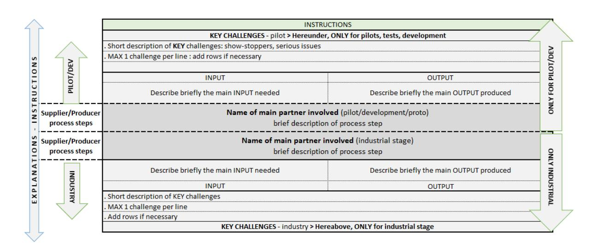

Eventually, this visual approach proved too complex in practice and was abandoned. The key elements were retained in either the Gaps Analysis sheet or in a workable version of the mapping that focuses on the situation at the time of the mapping (pilot, industrial, or intermediary stage). In the final version of the mapping tool, the focus is set on the partners involved in each key process step of a specific value chain. The input required for the process step and the output it delivers are also mentioned. The top gaps should also be listed, for quick reference.

One of the interests of this representation is to quickly see the strengths and weaknesses within the value chain.

In the example shown hereunder (limited section of the value chain, incomplete data), there are 2 different sources for textile waste, and one operation cannot be completed within the regional setup of the chain.

**MAPPING VALUE CHAIN - KEY DATA**

| Process Step      |           | Textile waste collection (Production and post-consumer)                                                                                  | Pre-sorting                                                                                                                                                                                          | Sorting                                                                                                                                                                                                                                                        |
|-------------------|-----------|------------------------------------------------------------------------------------------------------------------------------------------|------------------------------------------------------------------------------------------------------------------------------------------------------------------------------------------------------|----------------------------------------------------------------------------------------------------------------------------------------------------------------------------------------------------------------------------------------------------------------|
| Supplier/Producer | Company 7 | INPUT Various production waste OUTPUT Waste packed in bales TOP 3 CHALLENGES ----- ----- -----                      | Operation outside Italy INPUT Mixed products packed in bales OUTPUT Material sorted by category + packed in bales TOP 3 CHALLENGES Find a company based in Italy ----- ----- | Company 5 INPUT Bales of products sorted by colour OUTPUT Bales of products better sorted by colour and composition TOP 3 CHALLENGES No large scale activity Data sharing between companies Categorisation of companies by authorities |
|                   | Company 8 | INPUT Mixed post-consumer waste (clothing) OUTPUT Mixed products packed in bales TOP 3 CHALLENGES ----- ----- ----- |                                                                                                                                                                                                      |                                                                                                                                                                                                                                                                |

Instructions on how to fill in the document are provided in the excel sheet.

#### **5.2 Gaps Analysis Tool**

While the mapping tool is designed to provide basic information at a glance, the gap analysis tool is intended to provide more detailed information about the gaps that may be holding back the potential of a particular value chain.

The construction of the sheet is based on the main findings of the theory, the results of the survey, and the results of the ECOSYSTEX workshop.

The information is organised in different blocks, as briefly explained hereunder.

#### **5.2.1 Activities within the value chain**

The process steps and all companies involved in the value chain are listed, as shown in the table here-under (table incomplete). RegioGreenTex partners are identified.

Each identified partner is listed and a 'X' shows what operations they can complete.

This enables to quickly get an idea of how the operations are spread, how many companies, meaning options, are available for each process step.

| ACTIVITIES - PROCESS STEPS                                                            |  |  |  |  |  |  |  |  |  |                                                                                                                                                                                                                                                                                                                           |                |
|---------------------------------------------------------------------------------------|--|--|--|--|--|--|--|--|--|---------------------------------------------------------------------------------------------------------------------------------------------------------------------------------------------------------------------------------------------------------------------------------------------------------------------------|----------------|
| <b>Contributors to the VC + activities</b> Add identified partners (insert column) |  |  |  |  |  |  |  |  |  | <b>RGT Company 1</b>  <b>RGT Company 2</b>  <b>Company 3</b>  <b>Company 4</b>  <b>Company 5</b>  <b>Company 6</b>  <b>Company 7</b>  <b>Company 8</b>  <b>Consortium/Asso- ciation 1</b>  <b>Consortium/Asso- ciation 2</b>  <b>Outside of Italy</b> | <b>Missing</b> |
| <b>RGT partner</b>                                                                    |  |  |  |  |  |  |  |  |  |                                                                                                                                                                                                                                                                                                                           |                |
| <b>VC starts... Process steps</b>                                                     |  |  |  |  |  |  |  |  |  |                                                                                                                                                                                                                                                                                                                           |                |
| Collecting pre-consumer waste                                                         |  |  |  |  |  |  |  |  |  |                                                                                                                                                                                                                                                                                                                           |                |
| Collecting post-consumer waste                                                        |  |  |  |  |  |  |  |  |  |                                                                                                                                                                                                                                                                                                                           |                |
| Pre-Sorting                                                                           |  |  |  |  |  |  |  |  |  |                                                                                                                                                                                                                                                                                                                           |                |
| Sorting                                                                               |  |  |  |  |  |  |  |  |  |                                                                                                                                                                                                                                                                                                                           |                |
| Carbonization                                                                         |  |  |  |  |  |  |  |  |  |                                                                                                                                                                                                                                                                                                                           |                |
| Removal of hard parts and non-textile elements                                        |  |  |  |  |  |  |  |  |  |                                                                                                                                                                                                                                                                                                                           |                |
| Fibre preparation (shredding)                                                         |  |  |  |  |  |  |  |  |  |                                                                                                                                                                                                                                                                                                                           |                |
| Product design of semi-finished products                                              |  |  |  |  |  |  |  |  |  |                                                                                                                                                                                                                                                                                                                           |                |
| Product development and prototyping                                                   |  |  |  |  |  |  |  |  |  |                                                                                                                                                                                                                                                                                                                           |                |
| Fibre preparation                                                                     |  |  |  |  |  |  |  |  |  |                                                                                                                                                                                                                                                                                                                           |                |

The process steps are listed in logical order, from the start to the end of the value chain. For each process step, a description of the input and the output are also given. Comments can be added.

| CORE FUNCTIONS - Input - Output - Gaps   |                                                                                       |   |               |               |           |           |           |                                                                                                                                    |                                                               |                                           |                                                                     |       |        |          |
|------------------------------------------|---------------------------------------------------------------------------------------|---|---------------|---------------|-----------|-----------|-----------|------------------------------------------------------------------------------------------------------------------------------------|---------------------------------------------------------------|-------------------------------------------|---------------------------------------------------------------------|-------|--------|----------|
| ACTIVITIES - PROCESS STEPS               | <b>Contributors to the VC + activities</b> Add identified partners (insert column) |   | RGT Company 1 | RGT Company 2 | Company 3 | Company 4 | Company 5 | Company 6                                                                                                                          | Company 7                                                     | Company 8                                 | Constitution 1 deletion 1 selection 2 deletion 2                    | Input | Output | Comments |
|                                          | RGT partner                                                                           | x | x             |               |           |           |           |                                                                                                                                    |                                                               |                                           |                                                                     |       |        |          |
|                                          | <b>VC starts... Process steps</b>                                                     |   |               |               |           |           |           |                                                                                                                                    |                                                               |                                           |                                                                     |       |        |          |
|                                          | Collecting pre-consumer waste                                                         |   |               |               |           |           |           |                                                                                                                                    | Yarns, Wool Fortresses, Combing waste (short and small fiber) |                                           | Collection of the material in bales                                 |       |        |          |
|                                          | Collecting post-consumer waste                                                        |   |               |               |           |           |           |                                                                                                                                    | Clothing (T-shirt, pants, socks, ...)                         |                                           | Collection of the material in bales with mix of clothing            |       |        |          |
|                                          | Pre-Sorting                                                                           |   |               |               |           |           |           |                                                                                                                                    | Bales of mixed clothing (T-shirt, pants, socks, ...)          |                                           | Division of material in bales by category: fiber, color,            |       |        |          |
|                                          | Sorting                                                                               |   |               |               |           |           |           |                                                                                                                                    | Bales of waste textile sorted by color                        |                                           | Bales of textile waste with a greater refinement of color and fiber |       |        |          |
|                                          | Carbonization                                                                         |   |               |               |           |           |           |                                                                                                                                    | Bales of waste wool                                           |                                           | Wool without impurity of grass, wood, cotton or material remains    |       |        |          |
|                                          | Removal of hard parts and non-textile elements                                        |   |               |               |           |           |           |                                                                                                                                    | Products with hard part as buttons, zippers and labels        |                                           | Products free from non-textile elements                             |       |        |          |
|                                          | Fiber preparation (shredding)                                                         |   |               |               |           |           |           |                                                                                                                                    | Bales of waste textile with hard parts                        |                                           | Textile shredded                                                    |       |        |          |
| Product design of semi-finished products |                                                                                       |   |               |               |           |           |           | Information about starting fibers of textile waste already shredded + idea/objectives about the outputs and the market destination |                                                               | Design, specs of the new circular product |                                                                     |       |        |          |
| Product development and prototyping      |                                                                                       |   |               |               |           |           |           | Project about textile waste-based products o                                                                                       |                                                               |                                           |                                                                     |       |        |          |

### **5.2.2 Gaps description and analysis**

Based on the gaps highlighted during the different workshops and the survey, a separation in 3 different groups enables an easier reading of the data:

- Gaps related to **CORE FUNCTIONS** mainly the process steps
- Gaps related to **SUPPORT FUNCTIONS** e.g. laboratories, machine manufacturers
- Gaps related to **POLICY INSTRUMENTS** e.g. policy makers, regional institutions

| GAPS - Core Functions | GAP = an element missing (company, material, money, ...), or only available in limited quantities, lack of or problematic regulations, etc. | RGT Company 1 | RGT Company 2 | Company 3 | Company 4 | Company 5 | Company 6 | Company 7 | Company 8 | Consortium/Association 1 | Consortium/Association 2 | Outside of Italy | Missing | GAP description                                                                                                                                                                                                                                                                                                   |
|-----------------------|---------------------------------------------------------------------------------------------------------------------------------------------|---------------|---------------|-----------|-----------|-----------|-----------|-----------|-----------|--------------------------|--------------------------|------------------|---------|-------------------------------------------------------------------------------------------------------------------------------------------------------------------------------------------------------------------------------------------------------------------------------------------------------------------|
|                       | Large scale-sorting process                                                                                                                 |               |               |           |           |           |           |           |           |                          | x                        |                  |         | There is not a company/organisation that offers a large scale service for the sorting phase of waste material. At the moment only humanitarian associations as Caritas and Humana. They keep only the good clothes for second hand. The rest of the material is sent in Africa or China or burned to make energy. |
|                       | Hard-to-remove components from textiles                                                                                                     |               |               |           | x         |           |           |           |           |                          |                          |                  |         | Removing hard parts from textiles isn't always straightforward. This phase has the potential to slow down the entire value chain and/or results in generate new textile waste.                                                                                                                                    |
|                       | Hard-to-remove components from textiles                                                                                                     |               |               |           |           | x         |           |           |           |                          |                          |                  |         | Removing hard parts from textiles isn't always straightforward. This phase has the potential to slow down the entire value chain and/or results in generate new textile waste.                                                                                                                                    |
|                       | Mapping of the all recycling value chains: mapping of the different companies that could contribute in the long recycling process           | x             | x             | x         | x         | x         | x         | x         | x         | x                        | x                        | x                | x       | Companies of Prato district have the capability to cover the entire value chain for recycling wool. However, it is still a disconnected system, that lacks of awareness regarding the processes that the companies are capable of undertaking.                                                                    |
|                       | Lacking of competencies and effort spent for the products circular design phase                                                             | x             | x             | x         | x         | x         | x         | x         | x         | x                        | x                        |                  |         | Circular design methodologies and techniques are not clear for most of the SMEs                                                                                                                                                                                                                                   |

As said before, a key function for the tool is to stimulate the reflection about the gaps. Listing them is simply not enough to move towards a solution, or to prioritise necessary actions.

For each gap, the following parameters must be estimated:

- Impact at pilot and/or industrial stage
- Timing: is it already impacting the process?
- Impact level: scale of 1 (low) to 5 (showstopper)
- Fixing difficulty: estimate of how difficult it will be to fix the gap

Finally, it is requested to add information about what could be seen as elements of solutions, and if possible, to provide indications about an action plan. In case these elements would not be available because further analysis is required, it is advisable to provide indications on what those involved in the first place think will be helpful when moving towards a prioritisation and a more detailed action plan.

## **5.2.3 User's guide**

A series of instructions are provided on the excel sheet to ensure consistency between groups working on different value chains.

The following table, for example, provides indications on the different categories of gaps, and some values that need to be reported.

| Pilot | Industrial stage | (# months) Timing | Impact level (1 to 5) | Fixing difficulty (1 to 5) |
|-------|------------------|-------------------|-----------------------|----------------------------|
|       | x                | 0                 | 4                     | 5                          |
| x     |                  | 0                 | 3                     | 5                          |
|       | x                | 0                 | 4                     | 3                          |

#### **5.2.4 Evaluation of the tool**

Both the mapping and gaps analysis parts of the tool were tested based on an actual value chain data (wool fibres – Prato area). The final evaluation took place during an on-line discussion with the NTT Team and CENTEXBEL, on March 29, 2024.

The overall feeling was that the tool is useful and enables a thorough analysis of the value chain.

The following modifications and improvements were requested to improve the efficiency:

- Remove the pilot stage from the mapping: the pilot and industrial stages were first separated ➔ the layout was modified accordingly
- For the gaps analysis tool, merge the boxes for the possible solutions and action plans, and remove the cells related to the timing for the impact of the gaps ➔ modifications completed The data collected by the NTT Team is described in section 6.2 of this report.

We anticipate that further fine-tuning will be required to ensure that the tool remains practical, based on further feedback at a later stage.

|                                                           | Criteria - Data description                                                                    |                                                                                |
|-----------------------------------------------------------|------------------------------------------------------------------------------------------------|--------------------------------------------------------------------------------|
|                                                           | Support functions = validation of the process, of the output,                                  |                                                                                |
| Core functions = tangible actions to make process deliver | certification services, etc                                                                    | Regulations = external players with an influencial role on the entire business |
| Raw material providers                                    | Testing laboratories                                                                           | Financial institutions                                                         |
| Fibres producers                                          | 3rd party certification bodies                                                                 | NGOs                                                                           |
| Yarn producers                                            | Auditors/Inspectors                                                                            | Consumer associations                                                          |
| Fabric weaving/knitting/NW                                | Sourcing agents                                                                                | Customs administrations                                                        |
| Accessories and trims supplier                            | Freight and shipping                                                                           | National government bodies                                                     |
| Assembly                                                  | Chemical suppliers                                                                             | Independent experts                                                            |
| Retailers and brands                                      | Technology providers                                                                           |                                                                                |
| Consumers/market?                                         | Machinery providers                                                                            |                                                                                |
| Category                                                  | Possible values                                                                                |                                                                                |
| Pilot                                                     | X if the case, empty otherwise                                                                 |                                                                                |
| Industrial Timing                                         | X if the case, empty otherwise Effects of the gap felt as of X months from now 0 = now already |                                                                                |
| Impact level                                              | 1 = low, to 4 = high - 5 = SHOW-STOPPER                                                        |                                                                                |
| Fixing difficulty level                                   | 1 = easy, to 5 = very difficult                                                                |                                                                                |

#### **6 MAPPING AND GAPS ANALYSIS IN REGIOGREENTEX VALUE CHAINS**

For the mapping within the RegioGreenTex project, it was decided to first focus on 3 value chains.

#### • **Recycling of synthetic fibres used for technical applications (e.g. aramids)**

In this value chain, the original idea was to consider primarily the aramids, a high value type of fibres that was already handled by SMEs such a Peignage Dumortier or Textiles de la Thiérache, both in Hauts-de-France Region, or Hilaturas Arnau in Catalonia. It was extended to synthetic fibres used for technical applications.

Recyc'Elit, based in the Auvergne-Rhône-Alpes Region, has developed a process for the chemical recycling of textiles containing polyester.

#### • **Mechanical recycling of wool and long fibres**

Tuscany and Piedmont regions are specialised in the mechanical recycling of wool (Prato area) and other types of long fibres. A whole textile ecosystem is organised around that focus.

#### • **Chemical recycling of cotton**

SaXcell, located in Eastern Netherlands, is a SME that developed a process for the chemical recycling of cotton. Two key elements for this value chain are the availability of cotton products (no mix) and the sorting of textile waste to ensure a qualitative feedstock, in necessary quantities.

Two different approaches were used to conduct the analysis:

- **Workshop on value chains mapping** during the RegioGreenTex Consortium Meeting in Citeve (March 2024) – for the 3 described value chains
- **Mapping and Gap Analysis Excel tool** for the recycling of wool in the Prato area

In addition, various discussions took place in several meetings, allowing information to be added.

## **6.1 Value Chain Workshop – RegioGreenTex Consortium Meeting – 12/03/2024**

The Consortium meeting hosted by Citeve in Vila Nova de Famalicão, near Porto, was a great opportunity to meet with all partners and SMEs involved in the project.

CENTEXBEL and Oost NL organised a workshop that was meant to explore and promote business opportunities and hubs creation in concrete terms, based on RegioGreenTex SMEs. The presence of all stakeholders and partners under one roof made it possible to take an in-depth look at the 3 selected value chains. It was decided to run 3 concurrent workshops, after a plenary introduction and before a joint wrap-up.

While bringing a circular value chain to life by linking activities to each other is somehow easy on paper, the numerous gaps that were listed through different RegioGreenTex activities suggest that moving to reality faces several hurdles. It was therefore particularly interesting to evaluate the possibilities within the RegioGreenTex context. All participants were open to think about different channels and be transparent about their situation, initiatives, perspectives, solutions, etc.

Even though the focus was on value chains' development, some important gaps were highlighted.

## **6.1.1 Workshop objectives and methodology**

The main objectives of the workshop were to:

- describe and visualise the different elements considered for each value chain
- organise the highlighted partners in a (interregional) recycling hub

- highlight key processes and optional services/functions
- identify bottlenecks and highlight possible solutions and investments needs
- provide useful data for the completion of RegioGreenTex project's objectives
- fuel an open discussion between potential partners In terms of methodology, the available time was divided into 3 phases:
  - fill in individual forms to be shared with the group (10')
  - build a value chain through an open discussion (60')
  - conclusion (10')

#### **6.1.2 1 st step: company forms**

Each participant was requested to fill in a form for their company/organisation. This warm-up exercise was meant to stimulate the self-reflection on the possible contribution and expectations or needs from every company/organisation to the value chain. It was also possible to use the filled in form to express an interest for a contact.

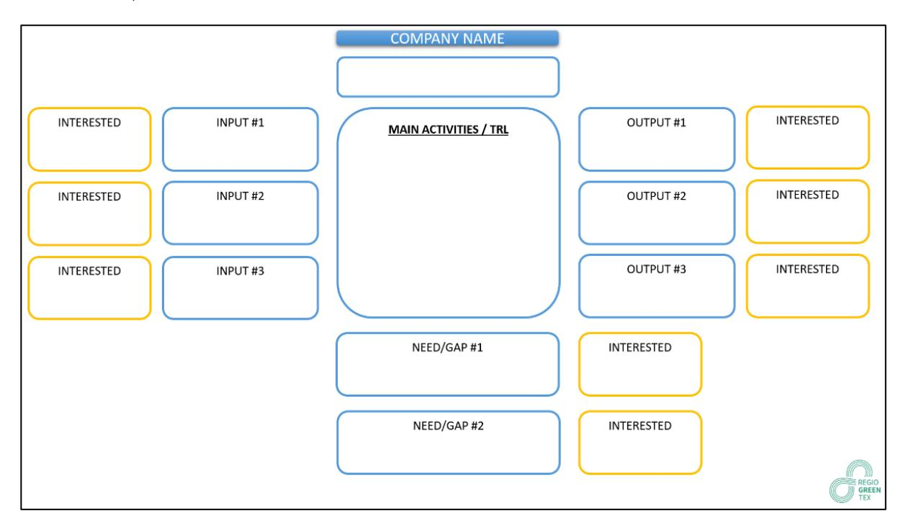

The participants from SMEs were asked to describe or highlight the following elements:

- **INPUT 1-3**: a description of the main input type(s) to feed their main process, if possible with an indication of quality and quantity.
- **OUTPUT 1-3**: a description of the main output type(s) coming out of their main process, if possible with an indication of quality and quantity.
- **NEED/GAP 1-2**: a description of the most important gaps slowing down their activities.
- **INTERESTED**: the descriptions of inputs, outputs and gaps were visible to all participants, who could indicate their interest (to learn, to support, to provide solutions) and initiate a contact and discussion.

A specific form was also available for the organisations that could provide support for the development of these value chains.

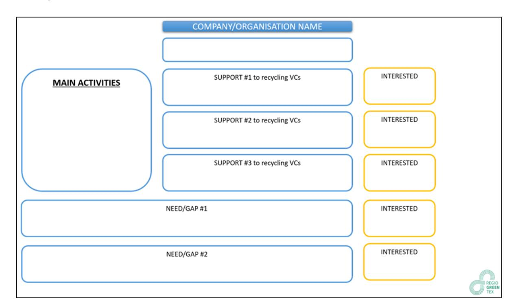

The participants from the supporting organisations were requested to describe or highlight the following elements:

- **MAIN ACTIVITIES**: description of their main activities or field(s) of expertise.
- **SUPPORT TO RECYCLING VALUE CHAINS 1-3**: a description of the different types of support they can propose to the SMEs involved in the selected value chains.
- **NEED/GAP 1-2**: a description of the main gaps they identified
- **INTERESTED**: the descriptions of activities, possible support and gaps were visible to all participants who could indicate their interest (to learn, to support, to provide solutions) to initiate a contact and a discussion..

In total, for the 2 categories, 42 documents were completed, the content of which was summarised in an Excel file (not available in this report for confidentiality reasons).

#### **6.1.3 2 nd step: "creating" the value chains**

The biggest part of the workshop was dedicated to a group's exercise for the creation of a recycling hub, of a value chain. For this part, an overall value chain poster was used as a basis to be completed with post-it's. A series of comments were also reported on a flipchart.

The representatives of the SMEs attended the workshop session for the value chain closest to their activity. Some could have been active in other value chains too, or not fit exactly in any. As a result, some of the highlighted scenarios were not necessarily realistic (e.g. geographical spread of activities), but were pertinent to fuel the process, the discussions, and to generate the learning. The organisations, research centres, etc. were spread across the 3 sessions and explained how they could best support and contribute to the creation of each value chain. Obviously, most of the

'supporting' organisations are in a position to contribute to any of the 3 value chains, even if this is not reflected in the visuals extracted from the workshop.

In the following visuals, the yellow stickers correspond to SMEs, and the green ones to supporting organisations.

At this stage, it is interesting to clarify what the main activities of each SME are.

| Region             | SME             | Expertise and area of intervention                                                                                    |
|--------------------|-----------------|-----------------------------------------------------------------------------------------------------------------------|
| East-NL            | Saxcell         | chemical recycling of cotton into cellulose fibres                                                                    |
|                    | RTT (NGO)       | collection & sorting of textiles, validation of taxonomy that will be made (in WP1)                                   |
| Flanders           | Ariadne         | digital platform for a community/ecosystem of circular textiles actors and wider stakeholders (incl. policy level) |
|                    | Quest Studio    | design of circular value chains for clothing                                                                          |
|                    | Ecoso (NGO)     | group of charity working on collection & sorting                                                                      |
| Hauts-de-France    | Thierache       | demo & scaling up of a recycled yam portfolio for apparel (mainly cotton & polycotton)                                |
|                    | Dumortier       | Fraying and carding process of recycled/rejuvenated fibres for the production of slivers (for subsequent yam making)  |
| Norte              | Tintex          | development of sustainable knitted fabrics and their dyeing & finishing using recycled content                        |
|                    | Sasia           | mechanical recycling of textiles towards recycled content for spinning high quality yams                              |
| Tuscany            | Marini          | Plasma treatment for zero waste & enabling recycled fibres use                                                        |
|                    | Trafi           | creation of elaborate products based on a non-woven modified technology using only textile waste and scraps           |
| Valencia           | Technocolor     | developing natural dye processes for recycled natural fibres                                                          |
|                    | Synthelast      | chemical recycling of PU/PET coated fabrics                                                                           |
|                    | H. Mar+ Ubitech | dref spinning of hybrid yams (recycled carbon fibre) + embroidery for preforms                                        |
| North-East Romania | Maibine (NGO)   | zero waste design for clothing patterns, collection of End-of-Life clothing                                           |
|                    | Kattv Fashion   | digital design services for zero pre-consumer waste production, thus minimising waste                                 |
| Catalonia          | H. Arnau        | demo and scaling-up of a novel portfolio of recycled yams for technical applications                                  |
|                    | Polisilk        | chemical recycling of polypropylene towards a new compound for yam extrusion                                          |
| Piemonte           | DBT             | worsted yam & long fibre recycling                                                                                    |
|                    | Casalegno       | sheer curtain fabrics from recycled polyester fibres for the 'northern market'                                        |

### **6.1.4 VC#1: Recycling of synthetic fibres used for technical applications**

**Facilitators:** OOST-NL, TEXTILE DE LA THIERACHE, AEI TEXTILS

The focus for this value chain is the recycling of synthetic fibres used in technical applications. This includes for example the aramids used in protective equipment.

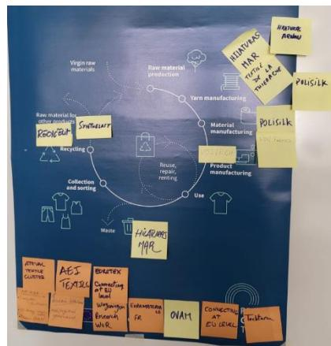

With the SMEs present in the room, we see an obvious concentration of activities in the recycling and the spinning of fibres from different composition (e.g. aramids, polypropylene). Others were active in the production of fabrics or worked with composites materials.

The following diagram shows where these activities are taking place in an overall circular textile value chain.

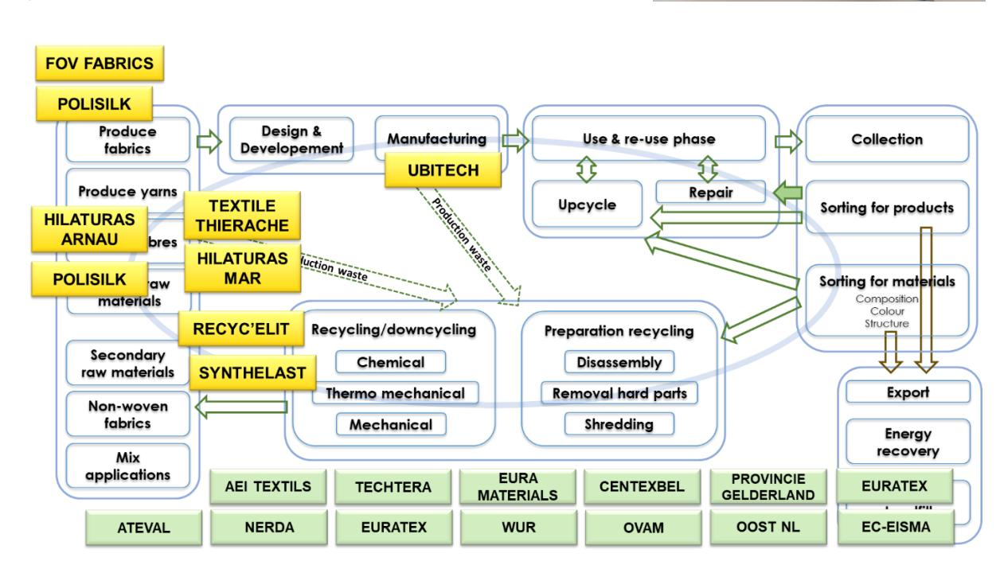

#### **6.1.5 VC#2: Chemical recycling of cotton**

**Facilitators:** OOST-NL, SAXCELL, CITEVE

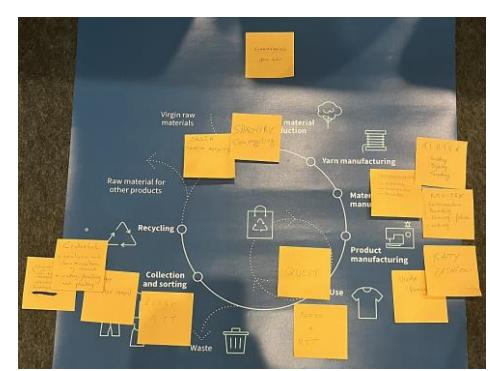

The starting point for the creation of this value chain is the chemical recycling process developed by SaXcell. Eventually, different possibilities related to different Rstrategies for cotton products were taken into consideration.

For the recycling, SASIA, a SME active in the mechanical recycling of cotton (and other types of fibres), was added as a second option for recycling. For the feedstock supply, a sensitive element given the demanding criteria to ensure a good recyclability (e.g. composition, colour, absence of hard parts), RTT and ECOSO, both active in the sorting, could play a role.

If considering re-use or up-cycling starting from post-consumer goods, sorted at ECOSO or RTT, QUEST and ECOSO would be the SMEs available with different proposals.

Several SMEs can also offer a series of treatments or support for the knitting, dyeing, printing, zerowaste prototyping, etc.

It is worth mentioning that, even if it is not a surprise, that value chain is missing 2 important steps:

- the cellulosic pulp generated by the chemical recycling must be processed to be transformed into filaments/fibres, with usual partners from SaXcell
- there is no spinning capability, a necessary step between the recycling and the weaving/knitting steps

The following diagram shows where these activities are taking place in an overall circular textile value chain.

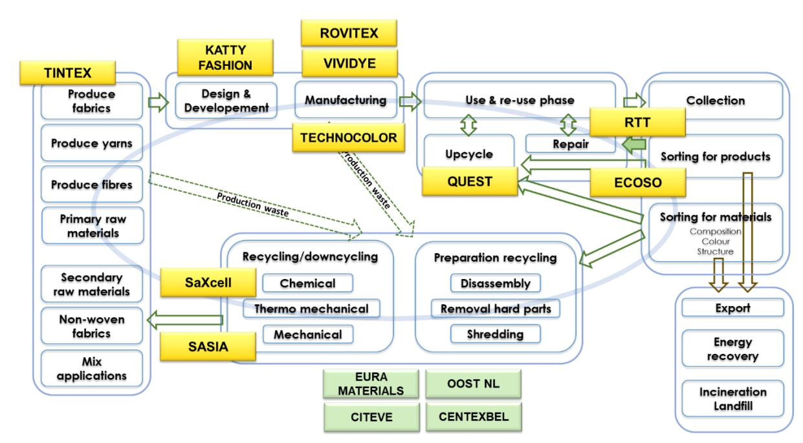

### **6.1.6 VC#3: Mechanical recycling of wool and long fibres**

**Facilitators:** CENTEXBEL, PEIGNAGE DUMORTIER, NTT, PO.IN.TEX

The regions of Tuscany (Prato) and Piedmont have a strong position in the recycling of wool and other types of long fibres. During this workshop, we considered the activities in these regions and added other RegioGreenTex SMEs in the picture, such as Peignage Dumortier (production of combed slivers), DBT Fibres (production of carded slivers), etc.

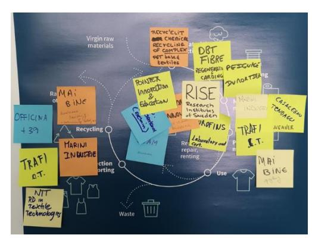

Based on the partners involved in the discussion, we developed different scenarios, all somehow incomplete.

All recycling activities start with a proper sorting to deliver the necessary feedstock. This is the type of activities RTT and ECOSO can manage. Based on that sorting, MAI BINE and ECOSO could work on some upcycling activities.

But the sorted products require further preparation to be integrated into the recycling stage, for instance, the removal of hard parts and the shredding. There were no SMEs to cover these operations. RECYC'ELIT manages the chemical recycling of polyester-based products. Peignage Dumortier can produce combed/carded slivers in a wide variety of fibres (e.g. wool or aramids). DBT Fibres is producing carded slivers in different long/short fibre types.

There was no SME to cover the spinning. TRAFI could use slivers in some products made with the punching needle technique or produce some wool "fur" for carpets.

For the production of fabrics (different techniques), 3 SMEs would be involved.

OFFICINA 39 can be considered at different stages of the value chain. They develop dyestuff out of cotton waste, meaning they recycle. Their dyestuff can then be used for the dyeing (or to get special effects) of fabrics or garments.

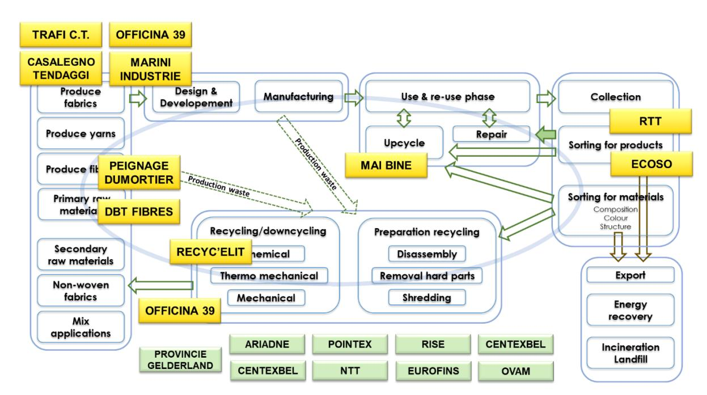

As a complement to the mapping exercise, the group discussed about the existing gaps and about investments that could drive a positive evolution.

#### • **Gaps**

. Difficulty to get permits for production . LCA for wool not favourable in comparison with synthetic fibres . Lack of innovation in recycling value chains (no breakthrough or important evolution for too long) . Separation of fibres requires improvement to improve the quality . Need for uniform legislation . Clarification of specs (Input/Output) needed . Local > cost of transport + impact LCA

#### • **Investments**

. Support for sorting in finer categories . Develop/optimise reverse logistics options . Develop/optimise traceability (before/after) . Develop consumer education (sorting options) . Develop technology for chemicals' detection

#### **6.1.7 Workshop conclusion**

One of the objectives for these 3 concurrent workshops was to collect data that could be used for the Mapping and Gap Analysis work. Objective met!

We knew beforehand that it would not be possible to create three complete value chains in this exercise, but it was important to have an open discussion about how the different SMEs can link their activities and possibly think of new options.

It also gave us the opportunity to better understand what kind of support is needed to make the value chain activities possible.

### **6.2 Value Chain: Mechanical Recycling of Wool – Tuscany Region - NTT**

NTT worked on a thorough mapping and gap analysis for a major value chain in the Tuscany Region: mechanical recycling of wool fibres.

The 2 main objectives of their work were the following:

- Analyse that value chain to highlight the main gaps that hinder the development of a scalable recycling system in the region
- Use and test the Mapping and Gap Analysis Tool

The work was organised in 2 phases. In the first one, the tool was used to analyse the value chain and systematically describe the functions and the gaps within the value chain. In a second phase, a reflection work took place to think about the bigger picture and highlight gaps at a higher and broader level.

### **6.2.1 Using the Mapping and Gap analysis Tool**

The excel tool developed for the mapping and gap analysis is described in the section 5 of this report. NTT trialled the tool in an actual scenario related to the mechanical recycling of wool-based products. One of the main functions of the tool is to guide the reflection around the mapping and the gap analysis, and to ensure a good consistency in the way to analyse and report these elements between the value chains that will be analysed.

It has lived up to expectations.

For this work, NTT considered 2 SMEs from RegioGreenTex, named 'RGT Company 1' and 'RGT Company 2' in this report. Other companies, referred to as Company 3 to 8, and Consortium/Association 1 and 2 were added to form a complete value chain.

The analysis shared in the following paragraphs is a summary of the findings. All necessary details to push the analysis further and orientate action plans is available in the excel file.

**Important note:** the exercise was not meant to define and activate solutions to gaps or issues that would be highlighted. The focus was on the identification and analysis of the gaps.

#### **6.2.2 Mapping**

As said in the description of the tool, the first version of the tool was too complex. It took both the pilot and industrial stages into consideration, an approach that made the tool too cumbersome to use. A simplified version was reworked, and the mapping will be done on that basis.

|  <h2 style="text-align: center;">MAPPING VALUE CHAIN - KEY DATA</h2> 
Detailed challenges and GAPS in separate form
 |                             | Process Step                                                                                                                       |                                                     | Textile waste production (Production and post-consumer)                                            |                                              | Textile waste collection (Production and post-consumer)                                                       |                                                          | Pre-sorting                                          |                                                      | Sorting                             |  |
|-----------------------------------------------------------------------------------------------------------------------------------------------------------------------------------------------------------------|-----------------------------|------------------------------------------------------------------------------------------------------------------------------------|-----------------------------------------------------|-------------------------------------------------------------------------------------------------------|----------------------------------------------|------------------------------------------------------------------------------------------------------------------|----------------------------------------------------------|------------------------------------------------------|------------------------------------------------------|-------------------------------------|--|
|                                                                                                                                                                                                                 |                             | Consumers                                                                                                                          |                                                     | Company 8, Consortium/Association 2                                                                   |                                              | Company 5, Consortium/Association 2                                                                              |                                                          | Outside of Italy                                     |                                                      | Company 5, Consortium/Association 2 |  |
| Supplier/Producer                                                                                                                                                                                               | INPUT                       |                                                                                                                                    | OUTPUT                                              |                                                                                                       | INPUT                                        |                                                                                                                  | OUTPUT                                                   |                                                      | INPUT                                                |                                     |  |
|                                                                                                                                                                                                                 | Mix of garments from market |                                                                                                                                    | EOL product for collection = post-consumer textiles |                                                                                                       | Textile gaments (T-shirt, pants, socks, ...) |                                                                                                                  | Collection of the material in bales with mix of clothing |                                                      | Bales of mixed clothing (T-shirt, pants, socks, ...) |                                     |  |
| TOP 3 CHALLENGES                                                                                                                                                                                                |                             | Consumer awareness about textiles - based waste management                                                                         |                                                     | Definition of Regulations and laws governing the post-consumer collection phase                       |                                              | Integrate this phase of the value chain in Italy (or at regional level)                                          |                                                          | Improve the technologies for the sorting phase       |                                                      |                                     |  |
|                                                                                                                                                                                                                 |                             |                                                                                                                                    |                                                     | Definition of a point of reference for the textile waste collection (company or similar organization) |                                              | Improve the technologies for the sorting phase to remove the pre-sorting one that is implemented manually at now |                                                          | Industrialise the technologies for the sorting phase |                                                      |                                     |  |
| Pre-consumers                                                                                                                                                                                                   |                             | Mix of yarns, wool fortresses, combing waste, ...                                                                                  |                                                     | EOL product for collection = pre-consumer textiles                                                    |                                              | Mix of yarns, wool fortresses, combing waste, ...                                                                |                                                          | Collection of the material in bales                  |                                                      |                                     |  |
| TOP 3 CHALLENGES                                                                                                                                                                                                |                             | Perform an initial sorting to separate the different types of textiles at the level of the company that produces the textile waste |                                                     | Definition of Regulations and laws governing the post-consumer collection phase                       |                                              | Definition of a point of reference for the textile waste collection (company                                     |                                                          |                                                      |                                                      |                                     |  |

Hereunder an extract of the Mapping Excel sheet.

The data shows a clear path through the value chain, using the output of one process step as an input for the following stage. As previously said, outside companies were added and a complete VC was formed, starting with the collection of textile waste, both out of production and from postconsumer sources. The value chain ends with the sale, on a B2B mode, of the dyed/finished fabrics and non-woven's made with the recycled materials. This set-up shows a good level of flexibility in terms of what waste categories can be used, and in the final product range. The main gaps are also listed without details under each company/process step.

The diagram below is not part of the tool. It provides a good indication of the level of complexity that can arise when working on all operations to develop a circular value chain.

This value chain comprises 12 distinct stages on top of the activities related to the product design and development, and the prototyping. The numbers correspond to how many companies are involved at each process step. Several of them are covered by one company only.

A specific aspect of this value chain lies in the fact that 5 companies work on the design/development and the sale of products that are mostly manufactured by other companies of the value chain.

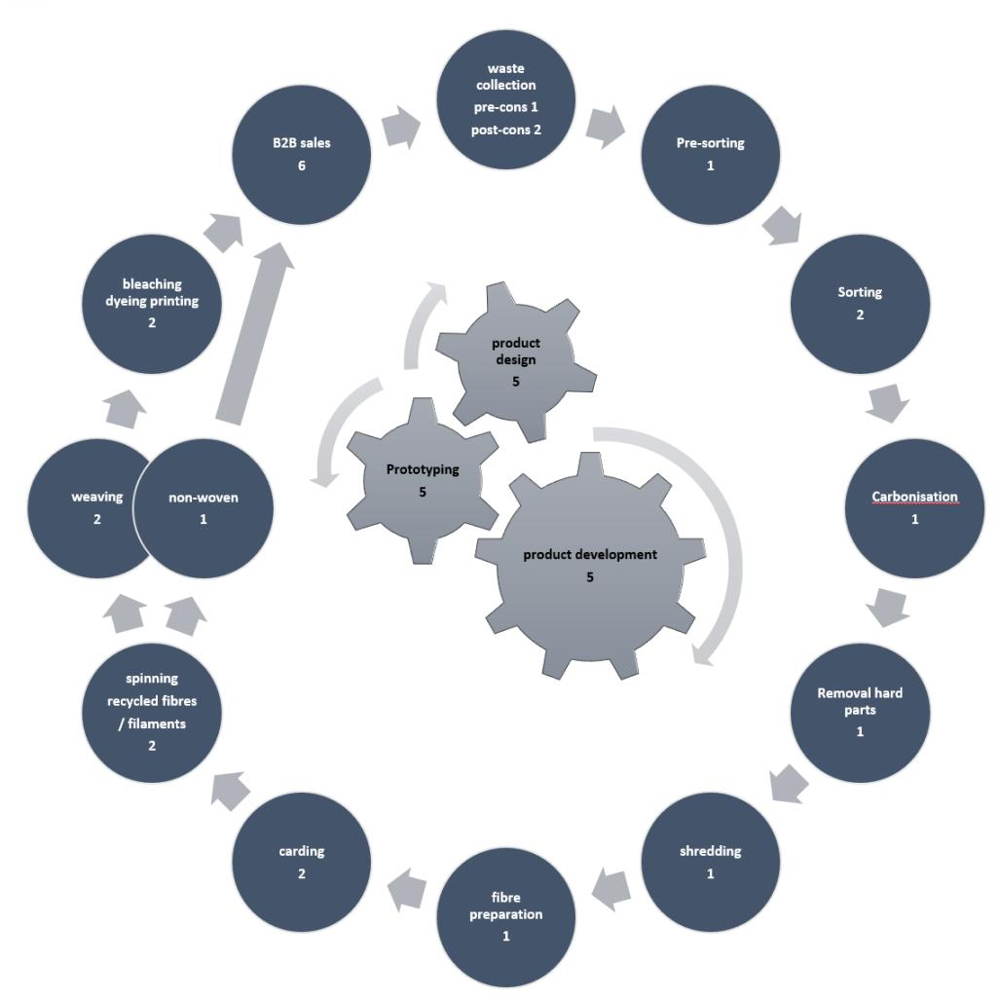

#### **6.2.3 Gap analysis**

The NTT Team realised the most advanced mapping and gap analysis, based on actual data.

They used the draft Mapping and Gap Analysis Tool (Excel file). The latter was slightly modified based on their initial feedback.

The gap analysis covers the following elements:

- all process steps from the value chain
- all stakeholders
- the main categories of gaps (core functions, support functions, policy instruments)
- the impact level for each highlighted gap
- an estimate of the difficulty to address each gap
- an indication of the possible actions to initiate in order to close the gaps

Note: the data presented below is best reviewed in the Excel file. The screenshots are only partial and for indication.

The first step after the mapping consists in listing the companies involved at each process step. The input and output are described for each operation. In the present case, the set-up is straightforward, and the Input/Output types are standard.

| <b>CORE FUNCTIONS - Input - Output - Gaps</b>  |                                            |   |                                                |  |  |  |  |  |  |  |  |  |              |                                                              |                                                                     |  |
|------------------------------------------------|--------------------------------------------|---|------------------------------------------------|--|--|--|--|--|--|--|--|--|--------------|--------------------------------------------------------------|---------------------------------------------------------------------|--|
| <b>ACTIVITIES - PROCESS STEPS</b>              | <b>Contributors to the VC + activities</b> |   | <b>Add identified partners (insert column)</b> |  |  |  |  |  |  |  |  |  | <b>Input</b> |                                                              | <b>Output</b>                                                       |  |
|                                                | RGT Company 1                              | X | X                                              |  |  |  |  |  |  |  |  |  |              |                                                              |                                                                     |  |
|                                                | RGT Company 2                              |   |                                                |  |  |  |  |  |  |  |  |  |              |                                                              |                                                                     |  |
|                                                | RGT Company 3                              |   |                                                |  |  |  |  |  |  |  |  |  |              |                                                              |                                                                     |  |
|                                                | RGT Company 4                              |   |                                                |  |  |  |  |  |  |  |  |  |              |                                                              |                                                                     |  |
|                                                | RGT Company 5                              |   |                                                |  |  |  |  |  |  |  |  |  |              |                                                              |                                                                     |  |
|                                                | RGT Company 6                              |   |                                                |  |  |  |  |  |  |  |  |  |              |                                                              |                                                                     |  |
|                                                | RGT Company 7                              |   |                                                |  |  |  |  |  |  |  |  |  |              |                                                              |                                                                     |  |
|                                                | RGT Company 8                              |   |                                                |  |  |  |  |  |  |  |  |  |              |                                                              |                                                                     |  |
| Consortium/Association 1                       |                                            |   |                                                |  |  |  |  |  |  |  |  |  |              |                                                              |                                                                     |  |
| Consortium/Association 2                       |                                            |   |                                                |  |  |  |  |  |  |  |  |  |              |                                                              |                                                                     |  |
| Outside of intel                               |                                            |   |                                                |  |  |  |  |  |  |  |  |  |              |                                                              |                                                                     |  |
|                                                |                                            |   |                                                |  |  |  |  |  |  |  |  |  |              |                                                              |                                                                     |  |
| RGT partner                                    | X                                          |   |                                                |  |  |  |  |  |  |  |  |  |              |                                                              |                                                                     |  |
| <b>VC starts... Process steps</b>              |                                            |   |                                                |  |  |  |  |  |  |  |  |  |              |                                                              |                                                                     |  |
| Collecting pre-consumer waste                  |                                            |   |                                                |  |  |  |  |  |  |  |  |  |              | Yarn: Wool Fortresses, Combing waste (short and small fiber) | Collection of the material in bales                                 |  |
| Collecting post-consumer waste                 |                                            |   |                                                |  |  |  |  |  |  |  |  |  |              | Clothing (T-shirt, pants, socks, ...)                        | Collection of the material in bales with mix of clothing            |  |
| Pre-Sorting                                    |                                            |   |                                                |  |  |  |  |  |  |  |  |  |              | Bales of mixed clothing (T-shirt, pants, socks, ...)         | Division of material in bales by category: fiber, colors            |  |
| Sorting                                        |                                            |   |                                                |  |  |  |  |  |  |  |  |  |              | Bales of waste textile sorted by color                       | Bales of waste textile with a greater refinement of color and fiber |  |
| Carbonization                                  |                                            |   |                                                |  |  |  |  |  |  |  |  |  |              | Bales of waste wool                                          | Wool without impurity of grass, wood, cotton or similar remains     |  |
| Removal of hard parts and non-textile elements |                                            |   |                                                |  |  |  |  |  |  |  |  |  |              | Products free from non-textile elements                      |                                                                     |  |
| Fibre preparation (shredding)                  |                                            |   |                                                |  |  |  |  |  |  |  |  |  |              | Bales of waste textile without hard parts                    | Textile shredded                                                    |  |
| Product design of semi-finished products       |                                            |   |                                                |  |  |  |  |  |  |  |  |  |              | Infor                                                        |                                                                     |  |

It is possible to add comments for clarification to each process step. For this value chain, the following are worth mentioning.

**Sorting:** the sorting phase involves separating and categorising textile waste based on various criteria such as material type, color, condition, and potential for reuse or recycling. This phase is crucial for efficient waste management

**Removal of hard parts:** although much of this phase is carried out manually, there are instances where an automatic machine is employed to assist and enhance the recycling process

**Non-woven production:** the nonwoven applications are cross-sectorial, and go beyond the Fashion sector

The gaps are listed and described for each category (core and support functions, policy instruments), with the necessary details on the impact level and the expected level of difficulty to address the gap.

| GAPS-Core functions                                                                                                               |   | KGT Company 1 | KGT Company 2 | Company 3 | Company 4 | Company 5 | Company 6 | Company 7 | Company 8 | Consortium/Association 1 | Consortium/Association 2 | Outside of Italy | Missing | GAP description                                                                                                                                                                                                                                | Pilot                                                                                                                                                                                                                                                                                                             | Industrial stage | Timing (# months) | Impact level (1 to 5) | Fining difficulty (1 to 5) |
|-----------------------------------------------------------------------------------------------------------------------------------|---|---------------|---------------|-----------|-----------|-----------|-----------|-----------|-----------|--------------------------|--------------------------|------------------|---------|------------------------------------------------------------------------------------------------------------------------------------------------------------------------------------------------------------------------------------------------|-------------------------------------------------------------------------------------------------------------------------------------------------------------------------------------------------------------------------------------------------------------------------------------------------------------------|------------------|-------------------|-----------------------|----------------------------|
| Large scale-sorting process                                                                                                       |   |               |               |           |           |           |           |           |           | x                        |                          |                  |         |                                                                                                                                                                                                                                                | There is not a company/organisation that offers a large-scale service for the sorting phase of waste material. At the moment only humanitarian associations as Caritas and Humana. They keep only the good clothes for second hand. The rest of the material is sent in Africa or China or burned to make energy. | x                | 0                 | 4                     | 5                          |
| Hard-to-remove components from textiles                                                                                           |   |               |               |           |           |           |           |           |           |                          |                          |                  |         | Removing hard parts from textiles isn't always straightforward. This phase has the potential to slow down the entire value chain and/or results in generate new textile waste.                                                                 | x                                                                                                                                                                                                                                                                                                                 | 0                | 3                 | 5                     |                            |
| Hard-to-remove components from textiles                                                                                           |   |               |               |           |           |           |           |           |           | x                        |                          |                  |         | Removing hard parts from textiles isn't always straightforward. This phase has the potential to slow down the entire value chain and/or results in generate new textile waste.                                                                 | x                                                                                                                                                                                                                                                                                                                 | 0                | 4                 | 3                     |                            |
| Mapping of the all recycling value chains: mapping of the different companies that could contribute in the long recycling process | x | x             | x             | x         | x         | x         | x         | x         | x         | x                        | x                        | x                | x       | Companies of Prato district have the capability to cover the entire value chain for recycling wool. However, it is still a disconnected system, that lacks of awareness regarding the processes that the companies are capable of undertaking. | x                                                                                                                                                                                                                                                                                                                 | 0                | 4                 | 4                     |                            |
| Lacking of competencies and effort spent for the products circular design phase                                                   | x | x             | x             | x         | x         | x         | x         | x         | x         |                          |                          |                  |         | Circular design methodologies and techniques are not clear for most of the SMEs                                                                                                                                                                | x                                                                                                                                                                                                                                                                                                                 | 0                | 4                 | 3                     |                            |

There is also an indicative action plan described for each gap. In future versions of the tool, the elements of solution and the proposed action plans will be merged.

This data is of key importance as it highlights the elements that make the functioning of the value chain more difficult or more complex. As such, they also highlight opportunities for improvement at various levels.

### **6.2.4 Gaps related to Core Functions**

5 gaps were highlighted, all very relevant.

4 have an impact level (IL) of 4, 1 is at level 3. The 'fixing difficulty' (FD) ranges from 3 to 5.

The tables from the tool highlight an interesting additional element. If 3 gaps have mainly an impact on 1 company, the other 2 impact 9 or 10 companies. This could also influence the decision to tackle some gaps first.

Let's analyse 3 of them.

- **Large scale-sorting process** IL4, FD5

Currently, there is no large-scale sorting activities for the recycling. The work is mostly done by hand to obtain optimal results and would benefit from the introduction of automated processes.

- **Removal of hard parts** IL3, FD5

No exception for this region, this activity is challenging and can be a bottleneck. The use of new machinery and a thorough work of eco-design could help improve the situation.

#### • **Mapping of regional companies** – IL4, FD4

Companies of Prato district have the capability to cover the entire value chain for recycling wool. However, it is still a disconnected system, that lacks awareness regarding the processes that the companies are capable of undertaking.

This issue potentially affects the whole regional textile ecosystem.

#### **6.2.5 Gaps related to Support Functions**

2 gaps were highlighted, both impacting 9 or 10 companies. Both have an impact level of 4.

- **Difficulties to share data related to production/manufacturing** IL4, FD5

Companies struggle with the sharing of info and evolve at different digitalisation levels. An interesting element is that the solutions would be both technical and cultural.

| GAP description Industrial stage rows! Pilot | (# months) Timing | Impact level (1 to 5) | Elements of solution(s) Action(s) What - Who - When Fixing difficulty (1 to 5)                                |
|----------------------------------------------|-------------------|-----------------------|---------------------------------------------------------------------------------------------------------------|
| x burned to make energy.                     | 0                 | 4                     | 5                                                                                                             |
| x                                            | 0                 | 3                     | 5                                                                                                             |
| new textile waste.                           |                   |                       | Design clothing with hard parts easy to remove. Designer must improve skills to make fashion products easy to |
| x new textile waste.                         | 0                 | 4                     | 3                                                                                                             |
| x of undertaking.                            | 0                 | 4                     | 4                                                                                                             |
| clear for most of the SMEs x                 | 0                 | 4                     | 3                                                                                                             |

#### • **Lack of knowledge about eco-design, circular business models** – IL4, FD 3

This type of gap slows down the progress that can be done in terms of transition towards circular economy. The positive is that it is possible to address it relatively easily, for example by organising webinars or training sessions.

#### **6.2.6 Gaps related to Policy Instruments**

4 gaps were highlighted, with impact levels 3 or 4; the fixing difficulty is either 4 or 5.

The difficulties can be linked to the application of existing regulations (e.g. at local level) or the absence of relevant standards or directives, mostly at EU level.

#### • **Standards and certification** - IL4, FD5

2 gaps relate to either the lack of standards for sustainable products or the absence of a reliable certification process for products containing recycled (waste) material.

## **6.2.7 Reflection on the gap analysis**

After completing the analysis with the Excel tool, NTT went through a broader reflection on the gaps categories that can possibly impact the entire wool recycling business of the region, and not just a specific value chain.

They consolidated the gaps into 5 different categories:

#### • **Technical/Technological gaps**

The value chain misses industrial scale solutions to process the wool in larger quantities, at the right quality and standard level. Some companies develop their own innovative solutions that can be worth scaling up. It would be useful to have a system that promotes such innovations, and that also enables newcomers in the recycled wool business to have directly access to the right technology.

#### • **System/Organisation gaps**

Such gaps are linked to the lack of a unique control "room" that can be a point of reference for the whole value chain. For example, it would be useful to have an organization that maps and knows all the companies that have technological solutions/phases for the wool recycling.

In addition, at system level, transparency and traceability in the recycled wool supply chain is lacking. Without clear information about the origin and processing of recycled wool products, it is difficult for businesses to make informed decisions about their re-worked.

On the consumer side, supply chain transparency gaps can undermine trust and confidence in recycled wool - based products.

#### • **Cultural/skills gaps in circular practices and products**

There is a cultural gap that makes it difficult to shift mindsets away from traditional linear models of production and consumption towards circular thinking, adopting new economy concepts and sustainable practices.

The skills Gap involves the absence of specialized skills and expertise required to design, produce, and manage circular products and processes. While companies often invest in high-level plant and machinery, these efforts necessitate support through collaborations between companies, as well as the enhancement of workers' knowledge through workshops and training activities.

The enhancement of the value chain and the resolution of its gaps require greater synergy among industrial actors.

#### • **Skills gaps in digital solutions (and in general in Industry 4.0 framework)**

In order to create a robust recycling system, data is crucial. Data is the most important element of the Industry 4.0 framework, and in the textile sector, its collection is still a serious deficiency due to a lack of skills in integrating digital solutions into existing processes and in data analysis, both at company and value chain level.

#### • **Regulatory gaps**

Regulatory challenges, including environmental regulations, trade policies and waste management laws, create barriers to the efficient operation of the recycled wool value chain. Inconsistent or burdensome regulations increase the administrative costs of properly implementing recycling processes that prove uncompetitive with non-recycled alternatives.

There is a high level of complexity in certification schemes as there is no single reference at European/international level to demonstrate commitment to sustainability and quality standards. This input will be considered for possible adaptations in the structure of the Mapping and Gap analysis Tool, especially in the way gaps are split into categories.

## **6.3 Value Chain: Mechanical Recycling of Long Fibres - Piedmont Region PO.IN.TEX**

At the time of writing, po.in.tex is working on the mapping and gap analysis using the Excel tool. Initial indications are that their overall findings are quite similar to those highlighted by NTT. The full report should be available shortly.

This data will be used in the next phases of the project.

#### **6.4 Conclusion**

The mapping and gap analysis should be seen as a necessary step to provide key information about the situation for specific value chains. It is an eye-opener and a basis for action. The use of the Mapping and Gap Analysis Tool proves useful to guide the reflection, collect the data and enable a shared view on value chains, in a consistent way.

The quality of the analysis, in terms of relevance, transparency, and openness is crucial! If carried out by the right panel of people and organisations, as was the case for the work led by NTT, it can deliver an objective perspective on the existing gaps, help prioritise the issues to be addressed, and provide hints on what solutions could be developed, activated, and implemented.

This data should therefore be used as one of the key elements to drive further improvements and investments to reduce the negative impact of the most important gaps.

#### **7 OVERALL CONCLUSION**

The different elements collected since the beginning of the RegioGreenTex project, through the specific activities of WP1 and several other opportunities, have shown how difficult it is to establish efficient and viable circular textile value chains.

WP1 T1.3 focuses on the Mapping and Gap Analysis. Several steps enabled to drive a proper mapping and gap analysis in 3 value chains, for example:

- Survey on gaps (RegioGreenTex and STEP 2030)
- Ecosystex workshop on value chains gaps
- Value Chain Workshop during the Consortium meeting in Porto

The preparation of the Mapping and Gap Analysis Tool enabled to finetune the gap analysis. Major gaps' categories (core functions, support functions and policy instruments) were defined, the evaluation of the impact level and the degree of difficulty to fix each gap were taken into consideration to enable a prioritisation and highlight elements of solutions.

The use of the tool by the NTT Team for the value chain "Mechanical recycling of wool in Tuscany Region" demonstrated the interest of structuring the mapping and the gap analysis: a thorough analysis, led by the right mix of experts, can serve as a robust basis to define action plans, and to raise awareness among all stakeholders, based on facts, based on the actual situation. They extended their analysis to a broader level and identified structural gaps or issues that are slowing down the development of wool recycling activity.

If specific value chains are facing specific challenges, we see some trends in the nature of the gaps that prevent smooth operation or development of circular textile value chains. Here are some of the main ones:

- Core functions gaps: lack of large scale precise sorting process, no efficient industrial process for the removal of hard parts, difficulty to identify partners at local level, scarcity of raw materials, lack of skilled workers
- Support functions gaps: difficulties to share data related to material and production, lack of knowledge about eco-design and circular business models
- Policy instruments: no standards for recycled products, lack of certification schemes, policies applied consistently across the EU (e.g. waste management)

This analysis will also be used to further improve the tool.

All this opens up interesting perspectives for analysing more value chains in the context of RegioGreenTex and hopefully identifying opportunities to eliminate or reduce gaps.

It would therefore be advisable to build on this work and experience, and continue the mapping and gap analysis of other value chains, using the mapping and gap analysis tool and the data collected and analysed so far.

#### **8 LIST OF ANNEXES**

- **ANNEX 1: Extracts from the Grant Agreement (WP1 and D1.3)**
- **ANNEX 2: Survey on gaps in circular textile value chains (preparation ECOSYSTEX workshop)**
- **ANNEX 3: Report Quadruple Helix ECOSYSTEX workshop**
- **ANNEX 4: Mapping tool – Tuscany (Prato) Region**
- **ANNEX5: Gap Analysis Tool - empty**
- **ANNEX 6: Gap Analysis Tool – Tuscany (Prato) Region**

# **LIST OF WORK PACKAGES**

| Work Grant Work Package No WP1 | packages Preparation (Work Packages screen) — Enter the info. Work Package name Gap analysis and value chain mapping | Lead Beneficiary 8 - CTB | Effort Start (Person Month Months) 82.32 | End Month 1 | 36 | Deliverables D1.1 – Taxonomy D1.2 – Waste stream analysis and recycled textile classification D1.3 – Value chain map and gap analysis                                                                              |
|--------------------------------|----------------------------------------------------------------------------------------------------------------------|--------------------------|-------------------------------------------|-------------|----|--------------------------------------------------------------------------------------------------------------------------------------------------------------------------------------------------------------------|
| WP2                            | Building ecosystem for transition to a green textile                                                                 |                          |                                           |             |    |                                                                                                                                                                                                                    |
|                                | sector                                                                                                               | 4 - NE RDA               | 122.06                                    | 1           | 36 | D2.1 – Ellie Connect upscaled with new functions to be a fully functional digital ecosystem                                                                                                                        |
|                                |                                                                                                                      |                          |                                           |             |    | D2.2 – Digital Self-Assessment Tool D2.3 – REGIOGREEN- TEX Course Curricula D2.4 – Ecosystem activities report                                                                                                     |
| WP3                            | Implementation portfolio of investment projects                                                                      | 3 - CITEVE               | 850.44                                    | 1           | 36 | D3.1 – Pilot Report D3.2 – Products/Services Demonstrators                                                                                                                                                         |
| WP4                            | “Advisory” - Services and support to the portfolio                                                                   |                          |                                           |             |    |                                                                                                                                                                                                                    |
|                                | of the SME projects                                                                                                  | 14 - NTT                 | 196.35                                    | 1           | 36 | D4.1 – Coaching strategy D4.2 – Report on the result achieved through the delivery of coaching actions and green advisory services provided D4.3 – Repository of business plans developed D4.4 – Exploitation Plan |
| WP5                            | Regional Hubs                                                                                                        | 15 - OOST NV             | 311.06                                    | 1           | 36 | D5.1 – Hub Inception Plan D5.2 – Pilot Actions D5.3 – Hub Investment plan D5.4 – Business and Investment Plans                                                                                                     |

### **Work package WP1 – Gap analysis and value chain mapping**

| Work Package Number | WP1 Lead Beneficiary                 | 8. CTB |    |
|---------------------|--------------------------------------|--------|----|
| Work Package Name   | Gap analysis and value chain mapping |        |    |
| Start Month         | 1 End Month                          |        | 36 |

#### **Objectives**

Define a Taxonomy & Nomenclature: to establish a common language for the novel building blocks of the textile

recycling value chain from collection to reprocessing Setup a waste channelling structure: decision tree on how to sort, separate and aggregate the various EoL waste streams into streams that enable recycled materials to use, e.g. in streams for dedicated re-use, disassembly or recycling technologies

Gap analysis and value chain mapping to better address the progress of innovation and investments during the project implementation. Asthe landscape is evolving fast in relation to the implementation of the EU textile strategy, the progress towards the 2025 deadline and the introduction of EPR schemes, the gap analysis is updated each year (to be continued possibly after the end of the project), to provide a context for investment decisions inside and outside/beyond this project

#### **Description**

REGIOGREENTEX has targeted 6 main steps along the main streams of the value chain, identified in the scheme above (figure 1), referring to both material strategies (sorting, shredding, disassembly and separation, channelling waste streams, using recycled contents) and product strategies (design and manufacturing). To shift the value chain from a linear to a circular model, we will further investigate gaps and bottlenecks of those steps (WP1),

## **Work package WP2 – Building ecosystem for transition to a green textile sector**

| Work Package Number | WP2 Lead Beneficiary                                        | 4. NE RDA |    |
|---------------------|-------------------------------------------------------------|-----------|----|
| Work Package Name   | Building ecosystem for transition to a green textile sector |           |    |
| Start Month         | 1 End Month                                                 |           | 36 |

#### **Objectives**

The main objective of this WP is to build a dynamic recycling textile ecosystem at the European level. The ecosystem set up and nurturing will be achieved thanks to the support of a digital platform already in place called Ellie Connect, which will be scaled up and finetuned to host and support multiple tools, contents, functions and training material functional to match SMEs at EU level and to disclose new path for the sustainability and resilience of textile production and market.

The specific objectives of the WP are:

Build up a European recycling textile ecosystem on a digital platform

To assess and profile each SME joining the ecosystem (Self-assessment tool) to provide specific coaching/training as

well as effective matchmaking

Raise awareness and upskill SMEs on textile recycling and circular design

Encourage the interregional debate on the future of the sector, its sustainability and green transition (policy dimension

of the ecosystem)

#### **Description**

. A digital platform will be built under the RegioGreenTex project, where SMEs and other relevant actors come together and cooperate along the value chain to optimize the eco-effectiveness of the entire ecosystem and create shared value. The SMEs will undergo a self-assessment exercise to evaluate their recycling potential regarding processes and products. Based on the results, the companies will receive feedback on how to achieve the following steps on textile circularity and offered coaching or training to improve their business models, as well as other inputs regarding ecodesign, waste management and recycling. The SMEs present in the ecosystem will be offered the opportunity to match with other companies in the platform and through EEN. These actors will also be able to connect and seize upon market

## **LIST OF DELIVERABLES**

#### **Deliverables**

*Grant Preparation (Deliverables screen) — Enter the info.*

*The labels used mean:*

*Public — fully open ( automatically posted online)*

*Sensitive — limited under the conditions of the Grant Agreement*

*EU classified —RESTREINT-UE/EU-RESTRICTED, CONFIDENTIEL-UE/EU-CONFIDENTIAL, SECRET-UE/EU-SECRET under Decision [2015/444](https://eur-lex.europa.eu/legal-content/EN/ALL/?uri=CELEX:32015D0444&qid=1586092489803)*

|      | Deliverable Name                           | Work |                  |                       |                     |          |
|------|--------------------------------------------|------|------------------|-----------------------|---------------------|----------|
|      |                                            |      | Lead Beneficiary | Type                  | Dissemination Level | Due Date |
| D1.1 | Taxonomy                                   | WP1  | 8 - CTB          | R — Document, report  | PU - Public         | 6        |
| D1.2 | Waste stream analysis and recycled textile |      |                  |                       |                     |          |
|      |                                            | WP1  | 12 - RISE        | R — Document, report  | PU - Public         | 15       |
| D1.3 | Value chain map and gap analysis           | WP1  | 8 - CTB          | R — Document, report  | PU - Public         | 33       |
| D2.1 | Ellie Connect upscaled with new functions  |      |                  |                       |                     |          |
|      |                                            | WP2  | 18 - Ariadne     | DEC —Websites, patent |                     |          |
|      |                                            |      |                  |                       | PU - Public         | 12       |
| D2.2 | Digital Self-Assessment Tool               | WP2  | 2 EURAMATERIALS  | DEC —Websites, patent |                     |          |
|      |                                            |      |                  |                       | PU - Public         | 18       |
| D2.3 | REGIOGREEN- TEX Course Curricula           | WP2  | 13 - WR          | DEC —Websites, patent |                     |          |
|      |                                            |      |                  |                       | PU - Public         | 24       |
| D2.4 | Ecosystem activities report                | WP2  | 1 EURATEX        | R — Document, report  | SEN - Sensitive     | 36       |
| D3.1 | Pilot Report                               | WP3  | 3 - CITEVE       | R — Document, report  | SEN - Sensitive     | 12       |
| D3.2 | Products/Services Demonstrators            | WP3  | 5 ATEVAL         | R — Document, report  | PU - Public         | 36       |
| D4.1 | Coaching strategy                          | WP4  | 14 - NTT         | R — Document, report  | PU - Public         | 18       |
| D4.2 | Report on the result achieved through the  |      |                  |                       |                     |          |
|      |                                            | WP4  | 12 - RISE        | R — Document, report  | PU - Public         | 36       |

### **Deliverable D1.1 – Taxonomy**

| Deliverable Number | D1.1                 |   | Lead Beneficiary    | 8. CTB      |
|--------------------|----------------------|---|---------------------|-------------|
| Deliverable Name   | Taxonomy             |   |                     |             |
| Type               | R — Document, report |   | Dissemination Level | PU - Public |
| Due Date (month)   |                      | 6 | Work Package No     | WP1         |

| Description                                                                                            |
|--------------------------------------------------------------------------------------------------------|
| Taxonomy for recycled materials usable in the textile sector, focus on circularising materials streams |

## **Deliverable D1.2 – Waste stream analysis and recycled textile classification**

| Deliverable Number | D1.2 Lead Beneficiary                                     | 12. RISE    |
|--------------------|-----------------------------------------------------------|-------------|
| Deliverable Name   | Waste stream analysis and recycled textile classification |             |
| Type               | R — Document, report Dissemination Level                  | PU - Public |
| Due Date (month)   | 15 Work Package No                                        | WP1         |

**Description**

Mapping and analysis of textile waste streams with large scale focus, draft framework for classification of textile for

recycling based on waste channelling decision tree.

## **Deliverable D1.3 – Value chain map and gap analysis**

| Deliverable Number | D1.3 Lead Beneficiary                    | 8. CTB      |
|--------------------|------------------------------------------|-------------|
| Deliverable Name   | Value chain map and gap analysis         |             |
| Type               | R — Document, report Dissemination Level | PU - Public |
| Due Date (month)   | 33 Work Package No                       | WP1         |

**Description**

Value chain map for circular textiles & clothing and gap analysis, focus on (inter) regional aspects, including a global analysis to make EU circular textile value chains more competitive towards international competitors. Updated twice.

#### **Deliverable D2.1 – Ellie Connect upscaled with new functions to be a fully functional digital ecosystem**

| Deliverable Number | D2.1 Lead Beneficiary 18. Ariadne                                                    |
|--------------------|--------------------------------------------------------------------------------------|
| Deliverable Name   | Ellie Connect upscaled with new functions to be a fully functional digital ecosystem |
| Type               | DEC —Websites, patent                                                                |
|                    | Dissemination Level PU - Public                                                      |
| Due Date (month)   | 12 Work Package No WP2                                                               |

| Description                                                                                                                   |
|-------------------------------------------------------------------------------------------------------------------------------|
| 
A fully functional digital environment with all the embedded functions to host SMEs and enable matchmaking, as well as
 |

# REGIOGREENTEX

WP1/Flanders – **Quadruple Helix Workshop**

**Workable mapping and gap analysis of value chains for sustainable and circular textiles**

# Report

CENTEXBEL – 15 November 2023

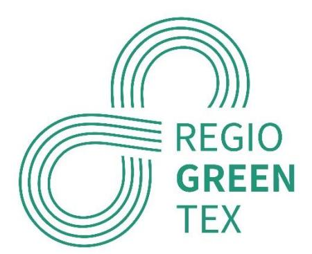

# Content

## Contents

| 1. | Introduction                                                                                                                                      | .......................................................................................................................................3 |
|----|---------------------------------------------------------------------------------------------------------------------------------------------------|------------------------------------------------------------------------------------------------------------------------------------------|
| 2. | Workshop organiser...........................................................................................................................3    |                                                                                                                                          |
| 3. | Workshop location, date and context                                                                                                               | ...............................................................................................3                                         |
| 4. | Structure, Speakers and Participants.................................................................................................4            |                                                                                                                                          |
| 5. | Objectives of the workshop                                                                                                                        | ...............................................................................................................5                         |
| 6. | Preparation activities.........................................................................................................................6  |                                                                                                                                          |
| 7. | Workshop results...............................................................................................................................7  |                                                                                                                                          |
|    | Group A                                                                                                                                           | – Gaps and Solutions ...........................................................................................................8        |
|    | Group B                                                                                                                                           | – Gaps and Solutions............................................................................................................8        |
|    | Group C                                                                                                                                           | – Gaps and Solutions............................................................................................................9        |
| 8. | Follow-up actions...............................................................................................................................9 |                                                                                                                                          |

## 1. Introduction

The ECOSYSTEX Conference in Barcelona (18-20/10/2023) came out as a perfect occasion, given the timing and the mix of participants, to organize the Quadruple Helix Workshop for the Region Flanders, in the frame of the WP1 (Mapping and gap analysis).

It represented an opportunity to learn from the broad experience and knowledge of all participants in terms of value chains mapping and more specifically about the gaps analysis.

## 2. Workshop organiser

CENTEXBEL organized this workshop, in collaboration with EURATEX (STEP 2030).

Given the number of participants (38), 3 break-out discussions were organized.

CENTEXBEL and EURATEX (STEP 2030) prepared the structure of the workshop and facilitated the 3 sessions.

# 3. Workshop location, date and context

The workshop took place in the frame of the **ECOSYSTEX Conference: From EU Research to Sustainable Textile Business**

Location: Barcelona, Spain

Date: 19 October 2023

# 4. Structure, Speakers and Participants

The workshop was structured as follows:

- Introduction + background (update WP1 activities) CENTEXBEL
- Introduction to STEP2030 EURATEX (STEP 2030)
- Instructions for the discussions CANTEXBEL
- Facilitation break-out discussions (part 1 25 min) EURATEX, CENTEXBEL
- Instructions for second discussion CENTEXBEL
- Facilitation break-out discussions (part 2 25 min) EURATEX, CENTEXBEL
- Feedback discussions 1 participant/group
- Conclusion CENTEXBEL

#### 38 participants contributed to the discussions.

They represented a very diverse group of participants, in terms of activities, knowledge, country, organisation, etc. This made it possible to get a highly valuable input, both through the discussions and in terms of results.

## 5. Objectives of the workshop

The WP1 is about mapping and gap analysis. The work will move from a more theoretical approach to the analysis of actual value chains, or value chains to be created in 3 different RGT Regions.

The main objectives of this workshop were:

▪ to understand from a very diverse group of experts what their experience was in terms of gaps in circular textile value chains ▪ to highlight top gaps' types (top 3 per group) ▪to collect ideas about possible solutions for the most important gaps

A key element was to be able to pull out key info from the animated discussions so these data could be integrated into the WP1 work.

The leading directions were the following:

- **What is your experience with GAPS?**
- **What is on your way to integrate circular textile value chains?**
- **Do you see possible solutions?**

The following diagram was used to set the scene and help the participants to place themselves in a complete value chain.

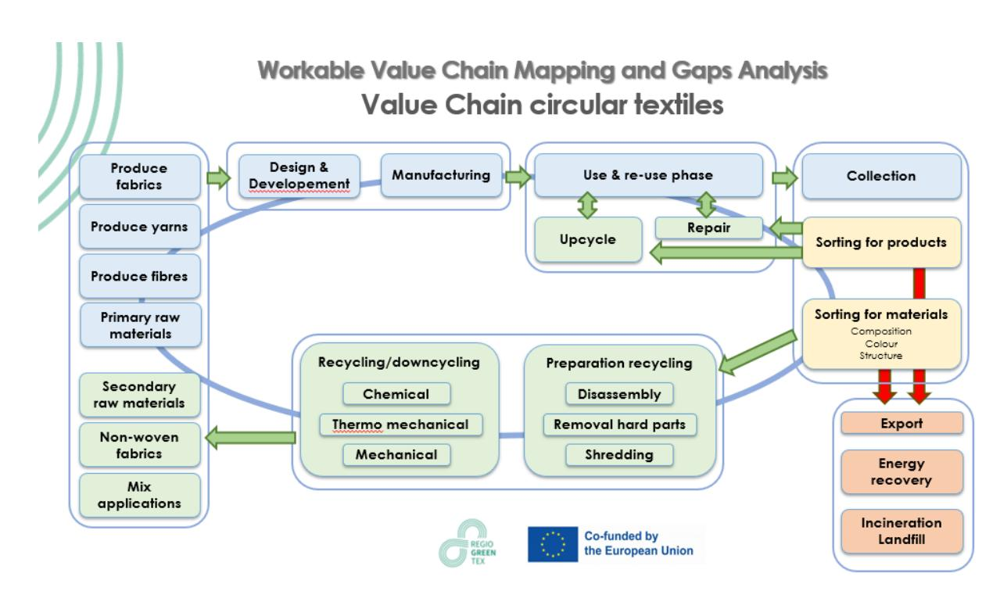

# 6. Preparation activities

To make this workshop even more meaningful, a survey was organized before the event so we could collect info on actual gaps (as perceived or faced by responders) the RGT partners and SMEs are facing. To broaden the scope, the same survey was sent to all STEP 2030 supporters.

The response rate has been positive (28), and all results have been sorted and consolidated in an excel document.

The initial analysis was used as a background information for the workshop. An in-depth review will be completed to feed the work in WP1. Some interviews might be necessary to collect more details.

For this survey, we asked to receive feedback related to gaps encountered at each step of a generic circular textile value chain. The diversity in the companies and organisations that responded ensured that all value chain activities were covered. This will represent a key input for the next steps in the WP1 work.

Here is a list of the companies/organisations that sent their feedback:

A proper report will be issued later, after a thorough analysis has been completed. Additional contacts will be made in case a clarification is required or some ideas are worth developing further. Hereunder an extract of the consolidated data, with the first highlights.

| ATEVAL                       | Home textiles and technical textiles                                          |
|------------------------------|-------------------------------------------------------------------------------|
| HILATURAS ARNAU SL           | CARDING SPINNING MILL -INDUSTRIAL APPLICATIONS                                |
| CILAB                        | Fashion                                                                       |
| Coisne & Lambert             | Workwear and PPE                                                              |
| DBT FIBRE SPA                | Fashion                                                                       |
| Dickson-Constant             | Outdoor                                                                       |
| Edel Carpets BV              | consumer products                                                             |
| Gomate                       | Industrial/Textil/Fashion                                                     |
| ROVITEX                      | building - protective workwear - clothing - lingerie -                        |
| SaXcell BV                   | aeronotical - automotive- etc Recycling of cotton - cellulose pulp production |
| Associated Weavers Europe NV | Floor covering - Tufted broadloom carpets & carpet                            |
| Copaco Screenweavers         | tiles contruction - sun protective fabrics                                    |
| Dollfus-Muller               | Technical textiles -Net Dryer belts and endless felts                         |
| ERION TEXTILES               | Extended Producer Resposability Organization                                  |
| EZIO GHIRINGHELLI SPA        | Fashion                                                                       |
| Maes Mattress Ticking        | Weaving/knitting mattress ticking                                             |
| Mai Bine NGO                 | Fashion clothes and accessories                                               |
| MARCHI & FILDI SPA           | Yarn production                                                               |
| Mitwill Textiles Europe      | Textile fabrics and garments                                                  |
| Rubelli S.p.a.               | Textile fabrics for furniture                                                 |
| STAM                         | Engineering and technology consulting                                         |
| Utexbel                      | Spinning - Weaving -Dyeing - Finishing : fashion,                             |
| TECHTERA                     | workwear All textiles                                                         |
| Textil Olius SA              | Technical textiles for a wide range of applications in                        |
| Tintex                       | Fashion - fabric finishing                                                    |
| Ubitech                      | Mold and Machine manufacturing. Composites                                    |
| OVAM                         | Production. Waste management - Flanders (Belgium)                             |
| WUR                          | Research                                                                      |

| Your name                                                                                                                                                                                                                                                                                                                            |                                                       |                                                           |                                                                                                                                  |                                    |                                         |  |  |
|--------------------------------------------------------------------------------------------------------------------------------------------------------------------------------------------------------------------------------------------------------------------------------------------------------------------------------------|-------------------------------------------------------|-----------------------------------------------------------|----------------------------------------------------------------------------------------------------------------------------------|------------------------------------|-----------------------------------------|--|--|
| Your company/organisation                                                                                                                                                                                                                                                                                                            | <b>CONSOLIDATION</b> - list respondants at the bottom |                                                           |                                                                                                                                  |                                    |                                         |  |  |
| Main activity sector                                                                                                                                                                                                                                                                                                                 |                                                       |                                                           | E.g. fashion, workwear, medical, outdoor, industrial applications, agriculture, construction, etc.                               |                                    |                                         |  |  |
| Main product category (if production)                                                                                                                                                                                                                                                                                                |                                                       |                                                           | E.g. Fabric, dyestuff, non-woven fabric, fibres, etc.                                                                            |                                    |                                         |  |  |
| 
Gap = an element missing, an element preventing you from completing or integrating a value chain, something slowing considerable costs or limiting consumption
 
Examples (list not exhaustive): company/sub-contractor to complete your process, material, machines, money, know-how, human resources, your input = low
 |                                                       |                                                           |                                                                                                                                  |                                    |                                         |  |  |
| What are your main activities ?                                                                                                                                                                                                                                                                                                      | X (one or more)                                       | More precisely                                            | Most impactful GAP description                                                                                                   | GAP (some clarifications required) | GAP description #2                      |  |  |
| Material sourcing                                                                                                                                                                                                                                                                                                                    | HILATURAS ARNAU SL                                    | We have good partners of fibers                           | Lack of suppliers too low and limited                                                                                            | Lack of suppliers                  | Limited partners with regional partners |  |  |
| Material sourcing                                                                                                                                                                                                                                                                                                                    | ROVITEX                                               | we supply all kind of fabric , foam membrane etc..        | nothing to say excepted price sometime                                                                                           | High price                         |                                         |  |  |
| Material sourcing                                                                                                                                                                                                                                                                                                                    | <b>Associated Weavers Europe NV</b>                   | Sourcing of yarns, primay/secundary backing and additives | Eco-friendly materials still significantly higher priced compared to current fossil-based products                               | High price                         |                                         |  |  |
| Material sourcing                                                                                                                                                                                                                                                                                                                    | <b>Copaco Screenweavers</b>                           | mainly buying glass fiber, PVC, plasticiter & additives   | dependant on raw materials available, limited amount of materials are useable for our application to achieve high level products | Limited                            |                                         |  |  |
| Material sourcing                                                                                                                                                                                                                                                                                                                    | Mitwill Textiles Europe                               | buying yarns for knitting at partners                     | costly logistics                                                                                                                 | Costly logistics                   |                                         |  |  |
| Material sourcing                                                                                                                                                                                                                                                                                                                    | <b>STAM</b>                                           | Nature based materials                                    | Development of new materials from vegetable scraps to increase performance of textile product                                    | Development of new materials       |                                         |  |  |
| Material sourcing                                                                                                                                                                                                                                                                                                                    | <b>WUR (PH)</b>                                       | overview of carbon sources for materials                  |                                                                                                                                  |                                    |                                         |  |  |

# 7. Workshop results

The approach for this workshop was to ask the participants to start thinking about possible solutions for the gaps they would highlight and prioritise.

For the first discussion, the 3 randomly composed groups came up with the following top 3 gap types:

|   | A        | B                  | C                    |
|----------------|----------|--------------------|----------------------|
|   | Data     | Policies           | Sorting              |
|   | Policies | Collecting Sorting | Consumers' behaviour |
|   | Sorting  | Design             | Design               |

Interesting! We end up with gaps from various natures: technical (production), policies, eco-design.

All three groups highlighted the difficulties related to the sorting for recycling. This is no surprise, as we know there are numerous projects and activities working on this usual bottleneck.

The "policies" category covers different aspects related to different rules, or absence of, harmonization of standards, etc.

The design was also a priority for 2 groups. Planning to improve the circularity at development stage is seen as a best practice.

The proposed solutions are listed hereunder. They will be considered in the WP1 gap analysis.

## Group A – Gaps and Solutions

#### **#1 - Data**

▪ Need for data about materials, waste streams, etc. ▪Data necessary to measure progress, to make decisions.

#### **Solutions?**

▪ Structured, transparent and safe sharing of data and best practices between stakeholders. e.g. platform for academia, companies, etc. to upload their data and collect the data they need. ▪ Possible extensions with matchmaking tool between service providers/seekers, materials produced/used.

#### **#2 - Policies/consumers engagement**

▪Need for a major move at consumers' level.

#### **Solutions?**

▪ Economic incentives to become more circular: the consumer's behaviour is oriented towards overconsumption, this cannot change without a shift, and economic incentives, towards circularity.

#### **#2 - Sorting for materials**

▪Need to progress to provide abundant specific feedstock to recycle.

## Group B – Gaps and Solutions

#### **#1 – Regulatory framework**

▪ Clarity of rules, global level playing field, standardization, funding, prioritized and SME friendly implementation, realistic approach.

#### **Solutions?**

▪Improve on these areas.

#### **#2 – Collecting/Sorting Infrastructure and technologies**

▪Limited capacity to deliver specific feedstock

#### **Solutions?**

▪ Widespread digitalization, consistent dataflow to match material flow (Traceability, statistics), funding, etc.

#### **#3 – Design**

▪Need to move towards more eco-design

#### **Solutions?**

▪Virtual sampling, material knowledge, Open Source Material Database

## Group C – Gaps and Solutions

#### **#1 – Sorting**

▪Unavoidable priority, difficulties to reach high quantities of 'pure' feedstock.

#### **Solutions?**

▪Many projects working on this!

#### **#2 – Consumers' willingness to buy more sustainable**

▪Consumers/buyers focus on price more than on circularity priority.

#### **Solutions?**

▪ Create a circularity/sustainability score for all products to guide consumers ▪ Provide 'green' incentives to boost interest ▪ Bring transparency on cost structure, on manufacturing process ▪Provide 'good' (understandable, objective) info on properties of the products

#### **#3 – Design for circularity, sustainability, etc.**

▪Integrate circular characteristics right from conception stage.

#### **Solutions?**

▪ Educate designers on requirements ▪ Design for circularity, sustainability, etc ▪ Develop AI to support designers ▪ Develop strategy for different types of textiles (non-wovens, technical, floor…) ▪Adapt some requirement to reality of recycling (e.g. shade inconsistency)

# 8. Follow-up actions

As mentioned above, the intention with this workshop was to lead the discussions so that the input of this large group could be used in the frame of the project (WP1).

These data will be used in the Gap Analysis phase.

| Your company/organisation                 | CONSOLIDATION - list respondants at the bottom         |                 |                                                                 |                                                                                                    |                                                 |                                                        |                                                        |                                                       |                                                       |
|-------------------------------------------|--------------------------------------------------------|-----------------|-----------------------------------------------------------------|----------------------------------------------------------------------------------------------------|-------------------------------------------------|--------------------------------------------------------|--------------------------------------------------------|-------------------------------------------------------|-------------------------------------------------------|
| Main activity sector                      |                                                        |                 |                                                                 | E.g. fashion, workwear, medical, outdoor, industrial applications, agriculture, construction, etc. |                                                 |                                                        |                                                        |                                                       |                                                       |
| Main product category (if production)     |                                                        |                 |                                                                 | E.g. Fabric, dyestuff, non-woven fabric, fibres, etc.                                              |                                                 |                                                        |                                                        |                                                       |                                                       |
| What are your main activities ?           |                                                        | X (one or more) |                                                                 |                                                                                                    |                                                 |                                                        |                                                        |                                                       |                                                       |
|                                           |                                                        |                 | More precisely                                                  | Most impactful GAP description                                                                     | GAP (some clarifications required)              | GAP description #2                                     | GAP (some clarifications required)                     | GAP description #3                                    | GAP (some clarifications required)                    |
| Material sourcing                         |                                                        |                 | We have good partners of fibers                                 | lack of suppliers too low and limited                                                              | Lack of suppliers                               | Limited partners with regular quality                  | Lack of partners with regular quality                  |                                                       |                                                       |
| Material sourcing                         |                                                        |                 | we supply all kind of fabric , foam membrane etc..              | nothing to say excepted price sometime                                                             | High price                                      |                                                        |                                                        |                                                       |                                                       |
| Material sourcing                         |                                                        |                 | Sourcing of yarns, primay/secundary backing and aditives        | Eco-friendly materials still significantly higher priced                                           |                                                 |                                                        |                                                        |                                                       |                                                       |
|                                           |                                                        |                 |                                                                 |                                                                                                    | High price vs. non-recycled                     | Not always clear what origin/source is of input        |                                                        |                                                       |                                                       |
|                                           |                                                        |                 |                                                                 |                                                                                                    |                                                 |                                                        | Traceability of input materials for recycling          | No clarity on definition of what is "recycled"        |                                                       |
| Material sourcing                         |                                                        |                 | mainly buying glass fiber, PVC, plasticizer & additives         | dependant on raw materials available, limited amount                                               |                                                 |                                                        |                                                        |                                                       |                                                       |
|                                           |                                                        |                 |                                                                 |                                                                                                    | Limited amount for high level products          | no raw materials from recycled origin                  | No recycled raw material                               | Limited amount of bio-based origin                    | Too low mount of material of bio-based origin         |
| Material sourcing                         |                                                        |                 | buying yarns for knitting at partners                           | costly logistics                                                                                   | Costly logistics                                | lead time/immediate availability of certain yarns      | Lead-times to get certain yarns                        |                                                       |                                                       |
| Material sourcing                         |                                                        |                 | Nature based materials                                          | Development of new materials from vegetable scraps                                                 |                                                 |                                                        |                                                        |                                                       |                                                       |
| Material sourcing                         |                                                        |                 | overview of carbon sources for materials                        |                                                                                                    |                                                 |                                                        |                                                        |                                                       |                                                       |
| Material sourcing                         |                                                        |                 |                                                                 | Recycled raw material is available only in polyester                                               | Only recycled polyester availble                | Lack of modern producers of artificial filament fibers | Lack of modern producers of artificial filament fibres |                                                       |                                                       |
| Material sourcing                         |                                                        |                 |                                                                 | Availability of fabrics with recycled fiber content                                                | Lack of fabrics with recycled content           | lack of ability and capacity of spinning recovered     |                                                        |                                                       |                                                       |
| Raw material production                   |                                                        |                 | recycled fibres (mechanical)                                    | sorting before processing                                                                          | Lack of sorting based on composition            | higher price for a higher quality not always           |                                                        |                                                       |                                                       |
| Raw material production                   |                                                        |                 | Bio-based renewable fiber                                       | Developing bio-coatings and bio-chemistries that                                                   |                                                 |                                                        |                                                        |                                                       |                                                       |
| Raw material production                   |                                                        |                 | raw materials from agricultural (waste) streams                 | food vs material discussion. No dedicated crops for                                                |                                                 |                                                        |                                                        |                                                       |                                                       |
|                                           |                                                        |                 |                                                                 |                                                                                                    |                                                 | low availability                                       | Low availability                                       | Low quality                                           | Low quality                                           |
| Raw material production                   |                                                        |                 |                                                                 | Missing companies in Europe                                                                        | Missing companies in Europe                     | Search for long-distance suppliers                     | Search for long-distance suppliers                     | Unsustainable process for the planet                  | Unsustainable process for the planet                  |
| Product design                            |                                                        |                 | Development of new look & feel according to                     |                                                                                                    |                                                 |                                                        |                                                        |                                                       |                                                       |
| Product design                            |                                                        |                 | We design products specifically for small sizes of fabrics that |                                                                                                    |                                                 |                                                        |                                                        |                                                       |                                                       |
| Product design                            |                                                        |                 | Trend research, moodboards, print designs, collections          | time intense                                                                                       | Highly time consuming                           |                                                        |                                                        |                                                       |                                                       |
| Product design                            |                                                        |                 | Development of fabrics according to the intended garment        |                                                                                                    |                                                 |                                                        |                                                        |                                                       |                                                       |
| Product design                            |                                                        |                 | Defining product composition and technical specifications to    |                                                                                                    |                                                 |                                                        |                                                        |                                                       |                                                       |
| Product design                            |                                                        |                 |                                                                 | design for recycling guidelines                                                                    | Recycling guidelines                            | Common understanding on recyclability                  | Common understanding on recyclability                  |                                                       |                                                       |
| Product design                            |                                                        |                 | Consumer- and hospitality market                                | no European standard which facilitates recyclability                                               | No EU standard for recyclability                |                                                        |                                                        |                                                       |                                                       |
| Product development and prototyping       |                                                        |                 | We develop new qualities and uses of yarns (pbo,                |                                                                                                    |                                                 |                                                        |                                                        |                                                       |                                                       |
|                                           |                                                        |                 |                                                                 | Internal quimic and mechanical analysis (Test reports)                                             | Internal chemical and mechanical analysis (Test |                                                        |                                                        |                                                       |                                                       |
|                                           |                                                        |                 |                                                                 |                                                                                                    |                                                 | Cost of equipment for analysis                         | Cost of equipment for analysis                         | trained workers                                       | Trained workers                                       |
| Product development and prototyping       |                                                        |                 | we laminate all the material we have supply                     | cost of material                                                                                   | cost of material                                | cost of material - change of mentaly by using other    |                                                        |                                                       |                                                       |
|                                           |                                                        |                 |                                                                 |                                                                                                    |                                                 |                                                        | Change of mentality by using other kind of material    | company that dont want to purchase at higher cost     |                                                       |
| Product development and prototyping       |                                                        |                 | R&D on new (eg. better recyclable) carpets                      | Our customers (residential market) are still more                                                  |                                                 |                                                        |                                                        |                                                       |                                                       |
| Product development and prototyping       |                                                        |                 | I will just copy paste what I wrote for Product design. We      |                                                                                                    |                                                 |                                                        |                                                        |                                                       |                                                       |
|                                           |                                                        |                 |                                                                 |                                                                                                    |                                                 |                                                        |                                                        | lack of hardware and software for 3D prototyping etc. | Lack of hardware and software for 3D prototyping etc. |
| Product development and prototyping       |                                                        |                 | Production of small series of fabric aiming to assess market    |                                                                                                    |                                                 |                                                        |                                                        |                                                       |                                                       |
|                                           |                                                        |                 |                                                                 | High costs of prototyping                                                                          | High costs of prototyping                       | Lack of knowledge of the costumers regarding the       |                                                        |                                                       |                                                       |
| Product development and prototyping       |                                                        |                 |                                                                 | Too many prototypes for a single final product                                                     | Too many prototypes for a single final product  | Demand from the main global players                    | Demand from the main global players                    | Unsustainable process for the planet                  | Unsustainable process for the planet                  |
| Fibre preparation (fraying, carding, etc) |                                                        |                 | We sort different technical fibers                              | technical limitation due to machinery.                                                             | Technical limitations of machinery              | Desired machinery to produce recycled non wovens       | Suitable machinery to produce recycled non wovens      | trained workers                                       | Trained workers                                       |
| Fibre preparation (fraying, carding, etc) |                                                        |                 | carding                                                         | know how                                                                                           | Know-how                                        |                                                        |                                                        |                                                       |                                                       |
| Fibre preparation (fraying, carding, etc) |                                                        |                 | Fraying of cotton and wool. Preparation of cotton, poliester,   |                                                                                                    |                                                 |                                                        |                                                        |                                                       |                                                       |
|                                           |                                                        |                 |                                                                 | Cotton Post-consumer not available in the market                                                   | Lack of post-consumer cotton products           | Presence of chemicals forbidden in the recycled        |                                                        |                                                       |                                                       |
| Fibre preparation (fraying, carding, etc) |                                                        |                 | Natural fibers                                                  | Scale up of process to transform different type of                                                 |                                                 |                                                        |                                                        |                                                       |                                                       |
| Fibre preparation (fraying, carding, etc) |                                                        |                 |                                                                 | Knowledge about properties of recycled fibers. It can                                              |                                                 |                                                        |                                                        |                                                       |                                                       |
|                                           |                                                        |                 |                                                                 |                                                                                                    | Knowledge about properties of recycled fibers   | Are the current machines compatible with recycled      |                                                        |                                                       |                                                       |
| Fibre preparation (fraying, carding, etc) |                                                        |                 | Opening and blending of fibers, carding of such fibers to       |                                                                                                    |                                                 |                                                        |                                                        |                                                       |                                                       |
|                                           |                                                        |                 |                                                                 | Lack of qualitative (long enough) fibres                                                           | Lack of qualitative (long enough) fibres        |                                                        |                                                        |                                                       |                                                       |
| Fibre preparation (fraying, carding, etc) |                                                        |                 | preparing spinnable recoverd fibres by sophisticated            |                                                                                                    |                                                 |                                                        |                                                        |                                                       |                                                       |
| Spinning (virgin fibres/filaments)        |                                                        |                 | Circular economy and greener less consuming process,            |                                                                                                    |                                                 |                                                        |                                                        |                                                       |                                                       |
|                                           |                                                        |                 |                                                                 | raw material scarcity                                                                              | Raw material scarcity                           | lack of investment in innovation                       |                                                        |                                                       |                                                       |
| Spinning (virgin fibres/filaments)        |                                                        |                 | Open End yarn cotton, poliester, acrilic, nylon, wool and       |                                                                                                    |                                                 |                                                        |                                                        |                                                       |                                                       |
| Spinning (virgin fibres/filaments)        |                                                        |                 |                                                                 | Lack of research for new materials with a low                                                      |                                                 |                                                        |                                                        |                                                       |                                                       |
| Spinning (virgin fibres/filaments)        |                                                        |                 | Extrusion PA + PES                                              |                                                                                                    |                                                 |                                                        |                                                        |                                                       |                                                       |
| Spinning (recycled fibres/filaments)      |                                                        |                 |                                                                 | The high energy costs have direct consequences on                                                  |                                                 |                                                        |                                                        |                                                       |                                                       |
|                                           |                                                        |                 |                                                                 |                                                                                                    | High energy cost                                | raw material scarcity                                  | raw material scarcity                                  |                                                       |                                                       |
| Spinning (recycled fibres/filaments)      |                                                        |                 | Crushed fibres (recycled aramids) of mechanical recycling       | Lack of qualitative (pure enough) fibres                                                           | Lack of qualitative (pure enough) fibres        | Chemical process to remove the non pure flamable       |                                                        |                                                       |                                                       |
| Spinning (recycled fibres/filaments)      |                                                        |                 | Short fibres (cotton type) out of mechanical recycling          | Lack of qualitative (long enough) fibres                                                           | Lack of qualitative (long enough) fibres        | No partner for removal of hard parts (clothing)        | No partner for removal of hard parts (clothing)        | Trained workers                                       | Trained workers                                       |
| Spinning (recycled fibres/filaments)      |                                                        |                 | Open End yarn cotton, poliester, acrilic, nylon, wool and       |                                                                                                    |                                                 |                                                        |                                                        |                                                       |                                                       |
|                                           |                                                        |                 |                                                                 | RegioGreenTex - GAP ANALYSIS - indicative survey                                                   |                                                 | Please return by 11 October 2023                       |                                                        |                                                       |                                                       |
|                                           | . Costly logistics                                     |                 |                                                                 |                                                                                                    |                                                 |                                                        |                                                        |                                                       |                                                       |
|                                           | . Limitations due to lack of some fibres               |                 |                                                                 |                                                                                                    |                                                 |                                                        |                                                        |                                                       |                                                       |
|                                           | . Too many prototypes for a single product             |                 |                                                                 |                                                                                                    |                                                 |                                                        |                                                        |                                                       |                                                       |
|                                           | . Resistance to change by using other kind of material |                 |                                                                 |                                                                                                    |                                                 |                                                        |                                                        |                                                       |                                                       |
|                                           | . Lack of investment in innovation                     |                 |                                                                 |                                                                                                    |                                                 |                                                        |                                                        |                                                       |                                                       |
|                                           | . Lack of qualitative (purity) fibres -                | cotton, wool    |                                                                 |                                                                                                    |                                                 |                                                        |                                                        |                                                       |                                                       |
|                                           | . Lack of qualitative (length) fibres -                | cotton, wool    |                                                                 |                                                                                                    |                                                 |                                                        |                                                        |                                                       |                                                       |

. Lack of partners for removal of hard parts

| . Lack of partners for removal of hard parts                                                                                                                                                                                  |                                                                                                                                                                                                                                                                                                                                                                                                                                                                                                                                                                                                                                                                                                                                                                                                                                                   |
|-------------------------------------------------------------------------------------------------------------------------------------------------------------------------------------------------------------------------------|---------------------------------------------------------------------------------------------------------------------------------------------------------------------------------------------------------------------------------------------------------------------------------------------------------------------------------------------------------------------------------------------------------------------------------------------------------------------------------------------------------------------------------------------------------------------------------------------------------------------------------------------------------------------------------------------------------------------------------------------------------------------------------------------------------------------------------------------------|
| Spinning (recycled fibres/filaments) . Lack of modern producers of artificial filaments                                                                                                                                       | Lack of partners able to spin synthetic (chemically) Lack of partners able to spin chemically recycled . Consistency of quality of the recycled fibres (length, strength,...) recycled synthetic fibers at large scale. (Recyc'Elit) synthetic fibres at large scale. (Recyc'Elit)                                                                                                                                                                                                                                                                                                                                                                                                                                                                                                                                                                |
| Spinning (recycled fibres/filaments) . Lack of trained workers                                                                                                                                                                | Recycled raw material is available only in polyester Recycled raw material is available only in polyester Lack of modern producers of artificial filament fibers Lack of modern producers of artificial filament fibers Lack of modern producers of artificial filament fibres                                                                                                                                                                                                                                                                                                                                                                                                                                                                                                                                                                    |
| Spinning (recycled fibres/filaments)                                                                                                                                                                                          | Short fibres (cotton type) out of mechanical recycling Lack of qualitative (long enough) fibres Lack of qualitative (long enough) fibres                                                                                                                                                                                                                                                                                                                                                                                                                                                                                                                                                                                                                                                                                                          |
| Weaving                                                                                                                                                                                                                       | Lack innovation and lack of cooperation in textile Lack innovation and lack of cooperation in textile lack of performance on the processes such as lack of performance on the processes such as lack of qualified staff and recruitment textile Lack of qualified staff and recruitment textile manufacturing manufacturing automatization, traceability, optimization, and automatization, traceability, optimization, and personnel issues personnel issues monitoring monitoring                                                                                                                                                                                                                                                                                                                                                               |
| Weaving                                                                                                                                                                                                                       | Done on manufacture by third partner companies Done by our own Managed externally increase the company structure Modification company structure Financial investment Investment                                                                                                                                                                                                                                                                                                                                                                                                                                                                                                                                                                                                                                                                   |
| Weaving                                                                                                                                                                                                                       | jacquard weaving mattress ticking skilled labor forces with textile knowledge Skilled labor forces with textile knowledge higher costs then competitors (people and energy) higher costs then competitors (people and energy) unequal competition because of unequal regulations Regulations EU vs. world from outside Europe (Eg. Turkey)                                                                                                                                                                                                                                                                                                                                                                                                                                                                                                        |
| Weaving                                                                                                                                                                                                                       | buying from suppliers minimum production quantity high Minimum production quantity high costly logistics costly logistics lead time Long lead-times                                                                                                                                                                                                                                                                                                                                                                                                                                                                                                                                                                                                                                                                                               |
| Weaving                                                                                                                                                                                                                       | Production of fabrics for furniture (curtains, wall covering,                                                                                                                                                                                                                                                                                                                                                                                                                                                                                                                                                                                                                                                                                                                                                                                     |
|                                                                                                                                                                                                                               | Lack of sorting/recycling hubs Difficulty to separate different types of fibers,                                                                                                                                                                                                                                                                                                                                                                                                                                                                                                                                                                                                                                                                                                                                                                  |
|                                                                                                                                                                                                                               | Lack of knowledge in recycling practices Lack of knowledge in recycling practices Lack of hubs with the capability to collect and recycle Difficulty to separate different types of fibres, upholstered furniture) fabrics waste especially in fabrics with a mix content. especially in fabrics with a mix content.                                                                                                                                                                                                                                                                                                                                                                                                                                                                                                                              |
| Weaving                                                                                                                                                                                                                       | sufficient strong yarns with recycled content Strength of yarns with recycled fibres                                                                                                                                                                                                                                                                                                                                                                                                                                                                                                                                                                                                                                                                                                                                                              |
| Weaving                                                                                                                                                                                                                       | Mainly Solution Died Acrylic we need a recycling channel to manage our textile                                                                                                                                                                                                                                                                                                                                                                                                                                                                                                                                                                                                                                                                                                                                                                    |
|                                                                                                                                                                                                                               | Lack of sorting/recycling hubs We are implementing a closed loop process to get wastes recycled yarns from our wastes, but also need an Weaving + knitting + non-wovens open loop channel as a complement                                                                                                                                                                                                                                                                                                                                                                                                                                                                                                                                                                                                                                         |
| Knitting                                                                                                                                                                                                                      | Done on manufacture by third partner companies Done by our own Managed externally increase the company structure Modification company structure Financial investment Investment                                                                                                                                                                                                                                                                                                                                                                                                                                                                                                                                                                                                                                                                   |
| Knitting                                                                                                                                                                                                                      | jacquard circular kniting mattress ticking skilled labor forces with textile knowledge Skilled labor forces with textile knowledge higher costs then competitors (people and energy) Higher costs than competitors (people and energy) unequal competition because of unequal regulations                                                                                                                                                                                                                                                                                                                                                                                                                                                                                                                                                         |
| Knitting                                                                                                                                                                                                                      | buying from suppliers OR make with partners minimum production quantity may be high Minimum production quantity high costly logistics costly logistics lead time Lead-times                                                                                                                                                                                                                                                                                                                                                                                                                                                                                                                                                                                                                                                                       |
| Non-woven                                                                                                                                                                                                                     | Done on manufacture by third partner companies Done by our own Managed externally increase the company structure Modification company structure Financial investment Investment                                                                                                                                                                                                                                                                                                                                                                                                                                                                                                                                                                                                                                                                   |
| Non-woven                                                                                                                                                                                                                     | New types of non woven Developement of new non-woven with recycled fibres                                                                                                                                                                                                                                                                                                                                                                                                                                                                                                                                                                                                                                                                                                                                                                         |
| Non-woven                                                                                                                                                                                                                     | Felting and fulling of wool felts (for which wool with good                                                                                                                                                                                                                                                                                                                                                                                                                                                                                                                                                                                                                                                                                                                                                                                       |
|                                                                                                                                                                                                                               | Degraded nature of recycled wool fibers Low quality of recycled wool fibres                                                                                                                                                                                                                                                                                                                                                                                                                                                                                                                                                                                                                                                                                                                                                                       |
| Tufting                                                                                                                                                                                                                       | Tufting of broadloom carpets                                                                                                                                                                                                                                                                                                                                                                                                                                                                                                                                                                                                                                                                                                                                                                                                                      |
| Bleaching/dyeing/printing/finishing                                                                                                                                                                                           | the lack of collaboration between companies and as                                                                                                                                                                                                                                                                                                                                                                                                                                                                                                                                                                                                                                                                                                                                                                                                |
|                                                                                                                                                                                                                               | High cost of energy and raw materials lack of qualified staff and insufficient adaptation of                                                                                                                                                                                                                                                                                                                                                                                                                                                                                                                                                                                                                                                                                                                                                      |
| Bleaching/dyeing/printing/finishing                                                                                                                                                                                           | Ecological dyeing Lack of skills and infrastructure Lack of skills and infrastructure Overprint capabalities Overprint capabalities                                                                                                                                                                                                                                                                                                                                                                                                                                                                                                                                                                                                                                                                                                               |
| Bleaching/dyeing/printing/finishing                                                                                                                                                                                           | Backing, printing & dyeing of carpets Lack of technologies using renewable energy for                                                                                                                                                                                                                                                                                                                                                                                                                                                                                                                                                                                                                                                                                                                                                             |
| Bleaching/dyeing/printing/finishing                                                                                                                                                                                           | digital/conventional printing and finishing production errors (file, print, inspection, fabric…) ? color management/communication ? costly logistics Costly logistics                                                                                                                                                                                                                                                                                                                                                                                                                                                                                                                                                                                                                                                                             |
| Bleaching/dyeing/printing/finishing                                                                                                                                                                                           | Natural and bio-based dyes Scaling up processes Scaling up processes                                                                                                                                                                                                                                                                                                                                                                                                                                                                                                                                                                                                                                                                                                                                                                              |
| Bleaching/dyeing/printing/finishing                                                                                                                                                                                           | Lack of knowledge about the behaviour of recycled                                                                                                                                                                                                                                                                                                                                                                                                                                                                                                                                                                                                                                                                                                                                                                                                 |
| Bleaching/dyeing/printing/finishing                                                                                                                                                                                           | Dyeing, finished and coating of, mostly, knitted fabrics.                                                                                                                                                                                                                                                                                                                                                                                                                                                                                                                                                                                                                                                                                                                                                                                         |
| Bleaching/dyeing/printing/finishing                                                                                                                                                                                           | Dyeing and finishing of felts Presence of alien fibers (e.g. non-wool) causing colour                                                                                                                                                                                                                                                                                                                                                                                                                                                                                                                                                                                                                                                                                                                                                             |
| Bleaching/dyeing/printing/finishing                                                                                                                                                                                           | New dyeing equipment with lower water consumption New dyeing equipment with lower water consumption                                                                                                                                                                                                                                                                                                                                                                                                                                                                                                                                                                                                                                                                                                                                               |
| Bleaching/dyeing/printing/finishing                                                                                                                                                                                           | Mainly Solution Dyed Acrylic we need a recycling channel to manage our textile                                                                                                                                                                                                                                                                                                                                                                                                                                                                                                                                                                                                                                                                                                                                                                    |
|                                                                                                                                                                                                                               | Recycling hub for production waste (acrylic?) We are implementing a closed loop process to get                                                                                                                                                                                                                                                                                                                                                                                                                                                                                                                                                                                                                                                                                                                                                    |
| Manufacturing/assembly                                                                                                                                                                                                        | high energy costs, raw material costs High energy and raw material cost lack of investment for the innovation industry and lack                                                                                                                                                                                                                                                                                                                                                                                                                                                                                                                                                                                                                                                                                                                   |
| Manufacturing/assembly                                                                                                                                                                                                        | ultrasonic welding update our process to have more possibility Process upgrade to develop new possibilities cost of the material Cost of raw material time and cost for training Time and cost for training                                                                                                                                                                                                                                                                                                                                                                                                                                                                                                                                                                                                                                       |
| Manufacturing/assembly                                                                                                                                                                                                        | Manufacturing of net dryer belt and enless felts Lack of bio-based fibres Lack of bio-based fibres No possibility yet of recycling anything Lack of recycling possibilities Lack of trained workers Lack of trained workers                                                                                                                                                                                                                                                                                                                                                                                                                                                                                                                                                                                                                       |
| Manufacturing/assembly                                                                                                                                                                                                        | As mentioned above, we are a small workshop and we do                                                                                                                                                                                                                                                                                                                                                                                                                                                                                                                                                                                                                                                                                                                                                                                             |
|                                                                                                                                                                                                                               | Small team = higher production times = higher prices Lack of human resources lack of specific equipment for better finnishes Lack of equipment                                                                                                                                                                                                                                                                                                                                                                                                                                                                                                                                                                                                                                                                                                    |
| Manufacturing/assembly                                                                                                                                                                                                        | CMT with partners delays/errors in prototyping Delays/errors in prototyping done by a partner miscommunication                                                                                                                                                                                                                                                                                                                                                                                                                                                                                                                                                                                                                                                                                                                                    |
| Manufacturing/assembly                                                                                                                                                                                                        | Lamination by ultra-sound (Rovitex) Find other business markets. Lack of new markets Get data to prove how better it is compared with                                                                                                                                                                                                                                                                                                                                                                                                                                                                                                                                                                                                                                                                                                             |
| Manufacturing/assembly                                                                                                                                                                                                        | Heatset , Carpet cabling, tufting recycling capacity EOL PES carpet Lack of recycling capacity EOL PES carpet recycling capacity woolen carpet Lack of recycling capacity woolen carpet                                                                                                                                                                                                                                                                                                                                                                                                                                                                                                                                                                                                                                                           |
| Distribution                                                                                                                                                                                                                  | high competition (highly exploited market) but also                                                                                                                                                                                                                                                                                                                                                                                                                                                                                                                                                                                                                                                                                                                                                                                               |
|                                                                                                                                                                                                                               | Lack of cooperation + tough competition a lack of adopting green technologies in polluting                                                                                                                                                                                                                                                                                                                                                                                                                                                                                                                                                                                                                                                                                                                                                        |
| Distribution                                                                                                                                                                                                                  | Distribution of finished products to wholesellers, shops,                                                                                                                                                                                                                                                                                                                                                                                                                                                                                                                                                                                                                                                                                                                                                                                         |
| Distribution                                                                                                                                                                                                                  | B2B                                                                                                                                                                                                                                                                                                                                                                                                                                                                                                                                                                                                                                                                                                                                                                                                                                               |
| Distribution                                                                                                                                                                                                                  | sales and distribution of goods new sales pipelines (weak visibility) Lack of new sales pipelines (visibility) costly administration Costly administration                                                                                                                                                                                                                                                                                                                                                                                                                                                                                                                                                                                                                                                                                        |
| Retail/sale (stores/online)                                                                                                                                                                                                   | A phisycal store, located in our second social enterprise,                                                                                                                                                                                                                                                                                                                                                                                                                                                                                                                                                                                                                                                                                                                                                                                        |
|                                                                                                                                                                                                                               | Small client base lack of space to showcase more products. Lack of retail space                                                                                                                                                                                                                                                                                                                                                                                                                                                                                                                                                                                                                                                                                                                                                                   |
| Retail/sale (stores/online)                                                                                                                                                                                                   | on-demand webshob printed fabrics (upload design) new sales pipelines (weak visibility) Lack of new sales pipelines (weak visibility)                                                                                                                                                                                                                                                                                                                                                                                                                                                                                                                                                                                                                                                                                                             |
| Retail/sale (stores/online)                                                                                                                                                                                                   | uncertain consumer response higher prices for textiles with recycled content Higher prices for textiles with recycled content                                                                                                                                                                                                                                                                                                                                                                                                                                                                                                                                                                                                                                                                                                                     |
| Repair of textile goods                                                                                                                                                                                                       | Repair Business2Business Skilled workforce Skilled workforce                                                                                                                                                                                                                                                                                                                                                                                                                                                                                                                                                                                                                                                                                                                                                                                      |
| Repair of textile goods                                                                                                                                                                                                       | At our workshop we offer repairing services for the clothes                                                                                                                                                                                                                                                                                                                                                                                                                                                                                                                                                                                                                                                                                                                                                                                       |
|                                                                                                                                                                                                                               | Skilled dedicated workforce not enough promotion, online and offline. lack of promotion, online and offline.                                                                                                                                                                                                                                                                                                                                                                                                                                                                                                                                                                                                                                                                                                                                      |
| Repair of textile goods                                                                                                                                                                                                       | End life and rejected goods Processes to manage the rejected / returned textile                                                                                                                                                                                                                                                                                                                                                                                                                                                                                                                                                                                                                                                                                                                                                                   |
| Repair of textile goods                                                                                                                                                                                                       | repairability and costs Lack of repairability Cost of repairs                                                                                                                                                                                                                                                                                                                                                                                                                                                                                                                                                                                                                                                                                                                                                                                     |
| Collecting pre-consumerEoL products                                                                                                                                                                                           | Production waste from regional foreign companies number of interested companies too low Number of interested companies too low investing in communication of this possibility Lack of investment in communication                                                                                                                                                                                                                                                                                                                                                                                                                                                                                                                                                                                                                                 |
| Collecting pre-consumerEoL products                                                                                                                                                                                           | Production waste from regional companies Collected quantities too low Collected quantities too low                                                                                                                                                                                                                                                                                                                                                                                                                                                                                                                                                                                                                                                                                                                                                |
| Collecting pre-consumerEoL products                                                                                                                                                                                           | We have a few number of factories from our region where                                                                                                                                                                                                                                                                                                                                                                                                                                                                                                                                                                                                                                                                                                                                                                                           |
| Collecting pre-consumerEoL products                                                                                                                                                                                           | Mapping of the Production waste from regional                                                                                                                                                                                                                                                                                                                                                                                                                                                                                                                                                                                                                                                                                                                                                                                                     |
|                                                                                                                                                                                                                               | No massification No massification Industrials are not trained to know how to sort their                                                                                                                                                                                                                                                                                                                                                                                                                                                                                                                                                                                                                                                                                                                                                           |
| . Lack of trained workforce . Min quantities per order . Strength of yarns with recycled fibres . Higher costs than competition (energy) . Regulations in EU tougher than outside eu . Financial investment . Long lead-times | Regulations EU vs. world from outside Europe (Eg. Turkey)                                                                                                                                                                                                                                                                                                                                                                                                                                                                                                                                                                                                                                                                                                                                                                                         |
| . Lack of innovation with recycled materials (N-W)                                                                                                                                                                            | Developement of new non-woven with recycled fibres using textile technics using textile technics felting ability is required) Lack of collaboration between companies and as well The common risk cost is identified for the energy and Lack of qualified staff well difficulties to find a solid commercial network difficulties to find a solid commercial network because raw materials as well high costs for renewing the the education/training with the needs of textile Lack of adequate training/education Bleaching/dyeing...                                                                                                                                                                                                                                                                                                           |
| . Lack of collaboration between companies . Lack of a strong commercial network . Min quantities per order . Presence of alien fibres = defects . Lack of scale-up . Cost of energy                                           | Lack of technologies using renewable energy for drying wide products (up to 5m width) drying wide products (up to 5m width) Lack of knowledge about the behaviour of recycled fibers to be dyed. fibres to be dyed. Presence of alien fibers (e.g. non-wool) causing colour defects in final product defects in final product Open loop recycling process for production waste wastes recycled yarns from our wastes, but also need an (acrylic?) open loop channel as a complement Lack of investment for the innovation industry and lack of qualified staff specially for textile industry and Lack of qualified staff of investments in the branding lack of investments in the branding lack of adaptation of the education/training with the Lack of adequate training/education needs of industry for the personnel Manufacturing/Assembly |
| . Lack of trained workforce Cost of energy . Cost of materials . Lack of data to compare circular and old way . Lack of equipment                                                                                             | all the manufacturing of our products Lack of elements proving benefits of new coating traditionnal method. method a lack of adopting green technologies in polluting high energy costs moreover, fluctuation of energy High energy cost + fluctuation (political situation) lack of cooperation and price competition operations operations costs for the unstable political situation Distribution                                                                                                                                                                                                                                                                                                                                                                                                                                              |
| . Lack of trained workforce . Lack of cooperation to drive cost down . High competition . Costly administration                                                                                                               | retail relativelly small number of clients, most of the times Cuib, where we sell our products and other self-care and they are the same, we call it a sustainability bubble. Retail/Sale                                                                                                                                                                                                                                                                                                                                                                                                                                                                                                                                                                                                                                                         |
| . Limited clients/customers base . Low visibility for new sales pipelines . Higher prices for products with recycled content . Lack of space to display products                                                              | house-care products which support a Zero-Waste lifestyle. lack of personell dedicated to this specific action.                                                                                                                                                                                                                                                                                                                                                                                                                                                                                                                                                                                                                                                                                                                                    |
| Repair . Lack of trained staff . Cost of repairs . Poor repairability . Lack of promotion                                                                                                                                     | of textile goods & accessories that we make & sell, but not limiting to. Same team that does the manufacturing deals with the repairs. Processes to manage the rejected / returned textile goods and / or goods at the end of life in a circular goods and / or goods at the end of life in a circular perspective perspective                                                                                                                                                                                                                                                                                                                                                                                                                                                                                                                    |
| Collecting                                                                                                                                                                                                                    | pre-consumer products                                                                                                                                                                                                                                                                                                                                                                                                                                                                                                                                                                                                                                                                                                                                                                                                                             |
| . Collected quantities too low . Too few companies interested . No mapping of regional production waste . Mixed waste . Lack of storage space . No massification                                                              | Not enough human and space capacity to collect more Lack of workforce Not enough time to come up with specific designs for Not enough time to come up with specific designs for we collect post-industrial waste(cut-offs) that we use for fabrics. Lack of storage space specific types of fabrics. Too much waste from the specific types of fabrics creating up-cycled products. factories. Mapping of the Production waste from regional Lack of training on sorting of production scraps (to companies companies production scraps to make them recyclable more enable recycling)                                                                                                                                                                                                                                                            |

| . No massification                                                                                                                                                                             |                                                                                                                                                                                                                                                                                                                                                                                                                                                                                                                                                                                                                                                                                                                                                                                                                                                                                                                                                                                                                                                                                                                                                                                                                                                                                                                                                                                                                                                                                                                              |
|------------------------------------------------------------------------------------------------------------------------------------------------------------------------------------------------|------------------------------------------------------------------------------------------------------------------------------------------------------------------------------------------------------------------------------------------------------------------------------------------------------------------------------------------------------------------------------------------------------------------------------------------------------------------------------------------------------------------------------------------------------------------------------------------------------------------------------------------------------------------------------------------------------------------------------------------------------------------------------------------------------------------------------------------------------------------------------------------------------------------------------------------------------------------------------------------------------------------------------------------------------------------------------------------------------------------------------------------------------------------------------------------------------------------------------------------------------------------------------------------------------------------------------------------------------------------------------------------------------------------------------------------------------------------------------------------------------------------------------|
| Collecting pre-consumerEoL products                                                                                                                                                            | higher seperate collecting rate Too much mix in waste and quality: less polluted with other household waste Too much mix in waste                                                                                                                                                                                                                                                                                                                                                                                                                                                                                                                                                                                                                                                                                                                                                                                                                                                                                                                                                                                                                                                                                                                                                                                                                                                                                                                                                                                            |
| Collecting pre-consumerEoL products                                                                                                                                                            | waste collection and treatment services to Consortium                                                                                                                                                                                                                                                                                                                                                                                                                                                                                                                                                                                                                                                                                                                                                                                                                                                                                                                                                                                                                                                                                                                                                                                                                                                                                                                                                                                                                                                                        |
|                                                                                                                                                                                                | lack of information Lack of information Members                                                                                                                                                                                                                                                                                                                                                                                                                                                                                                                                                                                                                                                                                                                                                                                                                                                                                                                                                                                                                                                                                                                                                                                                                                                                                                                                                                                                                                                                              |
| Sorting pre-consumer EoL products                                                                                                                                                              | sorting based on solid solours composition based sorting Lack of sorting based on composition colour composition sorting Lack of sorting based on colour Cost of equipment Cost of equipment Sorting pre-consumer products                                                                                                                                                                                                                                                                                                                                                                                                                                                                                                                                                                                                                                                                                                                                                                                                                                                                                                                                                                                                                                                                                                                                                                                                                                                                                                   |
| Sorting pre-consumer EoL products . Lack of sorting based on colour                                                                                                                            | Sorting based on colour Lack of sorting bsed on colour Missing sorting based on composition Lack of sorting based on composition Cost of equipment for NIR Cost of equipment for NIR . Lack of sorting based on composition                                                                                                                                                                                                                                                                                                                                                                                                                                                                                                                                                                                                                                                                                                                                                                                                                                                                                                                                                                                                                                                                                                                                                                                                                                                                                                  |
| Sorting pre-consumer EoL products . Lack of volumes . High cost of equipment                                                                                                                   | Missing sorting based on composition Missing sorting based on composition High cost of equipment (ex : NIR) High cost of equipment (ex : NIR)                                                                                                                                                                                                                                                                                                                                                                                                                                                                                                                                                                                                                                                                                                                                                                                                                                                                                                                                                                                                                                                                                                                                                                                                                                                                                                                                                                                |
| Sorting pre-consumer EoL products . Too low volumes                                                                                                                                            | sorting of feedstock for recycling Lack of sorting for feedstock for recycling                                                                                                                                                                                                                                                                                                                                                                                                                                                                                                                                                                                                                                                                                                                                                                                                                                                                                                                                                                                                                                                                                                                                                                                                                                                                                                                                                                                                                                               |
| Sorting pre-consumer EoL products                                                                                                                                                              | waste collection and treatment services to Consortium                                                                                                                                                                                                                                                                                                                                                                                                                                                                                                                                                                                                                                                                                                                                                                                                                                                                                                                                                                                                                                                                                                                                                                                                                                                                                                                                                                                                                                                                        |
|                                                                                                                                                                                                | lack of volumes Lack of volumes low technologies for sorting Lack of technologies for sorting Members                                                                                                                                                                                                                                                                                                                                                                                                                                                                                                                                                                                                                                                                                                                                                                                                                                                                                                                                                                                                                                                                                                                                                                                                                                                                                                                                                                                                                        |
| Collecting post-consumerEoL products                                                                                                                                                           | Production waste from regional foreign companies number of interested companies too low number of interested companies too low investing in communication of this possibility Lack of investment in communication                                                                                                                                                                                                                                                                                                                                                                                                                                                                                                                                                                                                                                                                                                                                                                                                                                                                                                                                                                                                                                                                                                                                                                                                                                                                                                            |
| Collecting post-consumerEoL products                                                                                                                                                           | We collect specific items from the community by making                                                                                                                                                                                                                                                                                                                                                                                                                                                                                                                                                                                                                                                                                                                                                                                                                                                                                                                                                                                                                                                                                                                                                                                                                                                                                                                                                                                                                                                                       |
| . Lack of space to store items                                                                                                                                                                 | Lack of space to store more items. Lack of storage space Lack of place to collect more items. Lack of storage space Low quality products (fast fashion) = little possibilites Collecting post-consumer products calls on social media. At the moment we collect mainly used for life prolongation . Number of interested/relevant companies too low (technical textiles) Men's shirts and up-cycle them in bags. . Not enough processes to manage a sustainable EoL for all textile products                                                                                                                                                                                                                                                                                                                                                                                                                                                                                                                                                                                                                                                                                                                                                                                                                                                                                                                                                                                                                                 |
| Collecting post-consumerEoL products                                                                                                                                                           | End of life management Processes to manage the end of life of textile or Lack of processes for sustainable management of EoL . Volumes collected too low (workwear) wearable products ensuring environmental textiles . Consumers not properly informed of how to manage their EoL products . Not enough investment in communication sustainability, safety and logistic efficiency . Need a legislative support to speed up the compulsory recycling for EoL garments                                                                                                                                                                                                                                                                                                                                                                                                                                                                                                                                                                                                                                                                                                                                                                                                                                                                                                                                                                                                                                                       |
| Collecting post-consumerEoL products Collecting post-consumerEoL products                                                                                                                      | EoL workwear garments Collected quantities too low Collected quantities too low Need a legislative support to speed up the compulsory Need a legislative support to speed up the compulsory . Low quality products (fast fashion) = little possibilites for life prolongation recycling for EoL garment recycling for EoL garment                                                                                                                                                                                                                                                                                                                                                                                                                                                                                                                                                                                                                                                                                                                                                                                                                                                                                                                                                                                                                                                                                                                                                                                            |
| Collecting post-consumerEoL products                                                                                                                                                           | textile waste collection and sorting b2c lack of information by citizens Lack of information to citizens lack of volumes Lack of volumes                                                                                                                                                                                                                                                                                                                                                                                                                                                                                                                                                                                                                                                                                                                                                                                                                                                                                                                                                                                                                                                                                                                                                                                                                                                                                                                                                                                     |
| Sorting post-consumer EoL products                                                                                                                                                             | sorting based on mixed colours composition based sorting and remove non textile                                                                                                                                                                                                                                                                                                                                                                                                                                                                                                                                                                                                                                                                                                                                                                                                                                                                                                                                                                                                                                                                                                                                                                                                                                                                                                                                                                                                                                              |
|                                                                                                                                                                                                | colour composition sorting Lack of sorting based on composition and colour Cost of equipment Cost of equipment Lack of sorting based on composition elements Lack of process for removal of non textile elements                                                                                                                                                                                                                                                                                                                                                                                                                                                                                                                                                                                                                                                                                                                                                                                                                                                                                                                                                                                                                                                                                                                                                                                                                                                                                                             |
| Sorting post-consumer EoL products                                                                                                                                                             | Sorting based on colour and woven/knit No partner for removal of hard parts (clothing) No partner for removal of hard parts (clothing) Missing sorting based on composition Lack of sorting based on composition Cost of equipment for NIR Cost of equipment for NIR Sorting post-consumer products                                                                                                                                                                                                                                                                                                                                                                                                                                                                                                                                                                                                                                                                                                                                                                                                                                                                                                                                                                                                                                                                                                                                                                                                                          |
| Sorting post-consumer EoL products                                                                                                                                                             | New materials from recycling of waste/urban biowaste Integration of advanced robotic sorting technologies                                                                                                                                                                                                                                                                                                                                                                                                                                                                                                                                                                                                                                                                                                                                                                                                                                                                                                                                                                                                                                                                                                                                                                                                                                                                                                                                                                                                                    |
|                                                                                                                                                                                                | Upcycling technology for new raw materials Upcycling technology for new raw materials                                                                                                                                                                                                                                                                                                                                                                                                                                                                                                                                                                                                                                                                                                                                                                                                                                                                                                                                                                                                                                                                                                                                                                                                                                                                                                                                                                                                                                        |
| Sorting post-consumer EoL products                                                                                                                                                             | Sorting precisely by composition can be difficult.                                                                                                                                                                                                                                                                                                                                                                                                                                                                                                                                                                                                                                                                                                                                                                                                                                                                                                                                                                                                                                                                                                                                                                                                                                                                                                                                                                                                                                                                           |
|                                                                                                                                                                                                | Lack of efficient sorting based on composition Lack of partners to prepare the material before                                                                                                                                                                                                                                                                                                                                                                                                                                                                                                                                                                                                                                                                                                                                                                                                                                                                                                                                                                                                                                                                                                                                                                                                                                                                                                                                                                                                                               |
|                                                                                                                                                                                                | Cost of equipment for NIR Cost of equipment for NIR                                                                                                                                                                                                                                                                                                                                                                                                                                                                                                                                                                                                                                                                                                                                                                                                                                                                                                                                                                                                                                                                                                                                                                                                                                                                                                                                                                                                                                                                          |
| Sorting post-consumer EoL products                                                                                                                                                             | experience with single use plastics                                                                                                                                                                                                                                                                                                                                                                                                                                                                                                                                                                                                                                                                                                                                                                                                                                                                                                                                                                                                                                                                                                                                                                                                                                                                                                                                                                                                                                                                                          |
| Sorting post-consumer EoL products                                                                                                                                                             | Sorting based on colors and composition + empty pockets +                                                                                                                                                                                                                                                                                                                                                                                                                                                                                                                                                                                                                                                                                                                                                                                                                                                                                                                                                                                                                                                                                                                                                                                                                                                                                                                                                                                                                                                                    |
|                                                                                                                                                                                                | Lack of sorting based on composition and colour Need to educate the market to send EoL garments                                                                                                                                                                                                                                                                                                                                                                                                                                                                                                                                                                                                                                                                                                                                                                                                                                                                                                                                                                                                                                                                                                                                                                                                                                                                                                                                                                                                                              |
| Sorting post-consumer EoL products                                                                                                                                                             | textile waste collection and sorting b2c lack of volumes Too low volumes low technologies for sorting Lack of efficient technologies for sorting                                                                                                                                                                                                                                                                                                                                                                                                                                                                                                                                                                                                                                                                                                                                                                                                                                                                                                                                                                                                                                                                                                                                                                                                                                                                                                                                                                             |
| Upcycling                                                                                                                                                                                      | This is our main activity, up-cycling. Out of pre-consumer,                                                                                                                                                                                                                                                                                                                                                                                                                                                                                                                                                                                                                                                                                                                                                                                                                                                                                                                                                                                                                                                                                                                                                                                                                                                                                                                                                                                                                                                                  |
|                                                                                                                                                                                                | All of the above mentioned All of the above mentioned                                                                                                                                                                                                                                                                                                                                                                                                                                                                                                                                                                                                                                                                                                                                                                                                                                                                                                                                                                                                                                                                                                                                                                                                                                                                                                                                                                                                                                                                        |
| Upcycling                                                                                                                                                                                      | waste management Production scrap management to produce high added                                                                                                                                                                                                                                                                                                                                                                                                                                                                                                                                                                                                                                                                                                                                                                                                                                                                                                                                                                                                                                                                                                                                                                                                                                                                                                                                                                                                                                                          |
| Upcycling                                                                                                                                                                                      | limited market volume of upcycled products limited market volume of upcycled products                                                                                                                                                                                                                                                                                                                                                                                                                                                                                                                                                                                                                                                                                                                                                                                                                                                                                                                                                                                                                                                                                                                                                                                                                                                                                                                                                                                                                                        |
| Recycling (closed loop - fibre to fibre)                                                                                                                                                       | We offer the service to make new product with tech waste                                                                                                                                                                                                                                                                                                                                                                                                                                                                                                                                                                                                                                                                                                                                                                                                                                                                                                                                                                                                                                                                                                                                                                                                                                                                                                                                                                                                                                                                     |
|                                                                                                                                                                                                | mechanical analysis (Test reports) Test reports limited company structure to communicate this                                                                                                                                                                                                                                                                                                                                                                                                                                                                                                                                                                                                                                                                                                                                                                                                                                                                                                                                                                                                                                                                                                                                                                                                                                                                                                                                                                                                                                |
|                                                                                                                                                                                                | Broder communication, for the business trained workers Trained workers                                                                                                                                                                                                                                                                                                                                                                                                                                                                                                                                                                                                                                                                                                                                                                                                                                                                                                                                                                                                                                                                                                                                                                                                                                                                                                                                                                                                                                                       |
| Recycling (closed loop - fibre to fibre)                                                                                                                                                       | PET chemical recycling (Recyc'Elit) Have a demonstrator at (pre) industrial scale to assess                                                                                                                                                                                                                                                                                                                                                                                                                                                                                                                                                                                                                                                                                                                                                                                                                                                                                                                                                                                                                                                                                                                                                                                                                                                                                                                                                                                                                                  |
|                                                                                                                                                                                                | Demonstrator at pre-industrial scale Find an industrial able to go from the DMT to PET                                                                                                                                                                                                                                                                                                                                                                                                                                                                                                                                                                                                                                                                                                                                                                                                                                                                                                                                                                                                                                                                                                                                                                                                                                                                                                                                                                                                                                       |
| Recycling (closed loop - fibre to fibre)                                                                                                                                                       | spinnable fibres                                                                                                                                                                                                                                                                                                                                                                                                                                                                                                                                                                                                                                                                                                                                                                                                                                                                                                                                                                                                                                                                                                                                                                                                                                                                                                                                                                                                                                                                                                             |
| Recycling (closed loop - fibre to fibre)                                                                                                                                                       | Difficult when using mixed fibers Lack of properly sorted material                                                                                                                                                                                                                                                                                                                                                                                                                                                                                                                                                                                                                                                                                                                                                                                                                                                                                                                                                                                                                                                                                                                                                                                                                                                                                                                                                                                                                                                           |
| Recycling (open loop)                                                                                                                                                                          | We offer the service to make new product with tech waste mechanical analysis (Test reports) Lack of data (tests reports) limited company structure to communicate this                                                                                                                                                                                                                                                                                                                                                                                                                                                                                                                                                                                                                                                                                                                                                                                                                                                                                                                                                                                                                                                                                                                                                                                                                                                                                                                                                       |
|                                                                                                                                                                                                | Broder communication, for the business trained workers Trained workers                                                                                                                                                                                                                                                                                                                                                                                                                                                                                                                                                                                                                                                                                                                                                                                                                                                                                                                                                                                                                                                                                                                                                                                                                                                                                                                                                                                                                                                       |
| Recycling (open loop)                                                                                                                                                                          | in collaboration with partners difficult to recycle glass fiber with PVC Recycling technology for fibre-glass with PVC depending on other companies for reuse of our                                                                                                                                                                                                                                                                                                                                                                                                                                                                                                                                                                                                                                                                                                                                                                                                                                                                                                                                                                                                                                                                                                                                                                                                                                                                                                                                                         |
| Recycling (open loop)                                                                                                                                                                          | does not replace virgin fibre consumption                                                                                                                                                                                                                                                                                                                                                                                                                                                                                                                                                                                                                                                                                                                                                                                                                                                                                                                                                                                                                                                                                                                                                                                                                                                                                                                                                                                                                                                                                    |
| Recycling (open loop)                                                                                                                                                                          | Waste - cotton mixed with polyamide and elastane Recycling operator missing Lack of sorting based on composition Unknown or expensive process Unknown or expensive process                                                                                                                                                                                                                                                                                                                                                                                                                                                                                                                                                                                                                                                                                                                                                                                                                                                                                                                                                                                                                                                                                                                                                                                                                                                                                                                                                   |
| Downcycling                                                                                                                                                                                    | mechanical recycling of left-overs Low cost infrastructure mechanical recycling Lack of investment in mechanical recycling Procedures for manual recycling Procedures for manual recycling                                                                                                                                                                                                                                                                                                                                                                                                                                                                                                                                                                                                                                                                                                                                                                                                                                                                                                                                                                                                                                                                                                                                                                                                                                                                                                                                   |
| Downcycling                                                                                                                                                                                    | in collaboration with partners previously done in small scale projects - low volumes,                                                                                                                                                                                                                                                                                                                                                                                                                                                                                                                                                                                                                                                                                                                                                                                                                                                                                                                                                                                                                                                                                                                                                                                                                                                                                                                                                                                                                                        |
| Downcycling                                                                                                                                                                                    | waste management Production scrap management to produce ancullary                                                                                                                                                                                                                                                                                                                                                                                                                                                                                                                                                                                                                                                                                                                                                                                                                                                                                                                                                                                                                                                                                                                                                                                                                                                                                                                                                                                                                                                            |
| Downcycling                                                                                                                                                                                    | market demand/volume irt textile waste volume ?                                                                                                                                                                                                                                                                                                                                                                                                                                                                                                                                                                                                                                                                                                                                                                                                                                                                                                                                                                                                                                                                                                                                                                                                                                                                                                                                                                                                                                                                              |
| Research                                                                                                                                                                                       | As part of the Horizon 2020 projects that we are partners in                                                                                                                                                                                                                                                                                                                                                                                                                                                                                                                                                                                                                                                                                                                                                                                                                                                                                                                                                                                                                                                                                                                                                                                                                                                                                                                                                                                                                                                                 |
|                                                                                                                                                                                                | lack of funding for further research Lack of funding for further research                                                                                                                                                                                                                                                                                                                                                                                                                                                                                                                                                                                                                                                                                                                                                                                                                                                                                                                                                                                                                                                                                                                                                                                                                                                                                                                                                                                                                                                    |
| Research                                                                                                                                                                                       | private, industrial partners, institutes, universities limited capacity of internal researchers Limited capacity of internal researchers                                                                                                                                                                                                                                                                                                                                                                                                                                                                                                                                                                                                                                                                                                                                                                                                                                                                                                                                                                                                                                                                                                                                                                                                                                                                                                                                                                                     |
| Research                                                                                                                                                                                       | Work developed on the research of novel dyeing methods -                                                                                                                                                                                                                                                                                                                                                                                                                                                                                                                                                                                                                                                                                                                                                                                                                                                                                                                                                                                                                                                                                                                                                                                                                                                                                                                                                                                                                                                                     |
| Research                                                                                                                                                                                       | applied research biobased materials in general interest for biobased/fossil free textiles is limited as                                                                                                                                                                                                                                                                                                                                                                                                                                                                                                                                                                                                                                                                                                                                                                                                                                                                                                                                                                                                                                                                                                                                                                                                                                                                                                                                                                                                                      |
| Research                                                                                                                                                                                       | innovative f2f recycling technologies                                                                                                                                                                                                                                                                                                                                                                                                                                                                                                                                                                                                                                                                                                                                                                                                                                                                                                                                                                                                                                                                                                                                                                                                                                                                                                                                                                                                                                                                                        |
| Research                                                                                                                                                                                       | participation in EU projects                                                                                                                                                                                                                                                                                                                                                                                                                                                                                                                                                                                                                                                                                                                                                                                                                                                                                                                                                                                                                                                                                                                                                                                                                                                                                                                                                                                                                                                                                                 |
| Training                                                                                                                                                                                       | students and professionals Relation between agricultural activities and textiles is                                                                                                                                                                                                                                                                                                                                                                                                                                                                                                                                                                                                                                                                                                                                                                                                                                                                                                                                                                                                                                                                                                                                                                                                                                                                                                                                                                                                                                          |
| Policies                                                                                                                                                                                       | longer term transition strategy Long term strategy too high targets on too short term Too high targets on too short term circular transition is a matter of decades (2040?) Circular transition to last for decades (2040?)                                                                                                                                                                                                                                                                                                                                                                                                                                                                                                                                                                                                                                                                                                                                                                                                                                                                                                                                                                                                                                                                                                                                                                                                                                                                                                  |
| Support to industry                                                                                                                                                                            | in the form of contract research                                                                                                                                                                                                                                                                                                                                                                                                                                                                                                                                                                                                                                                                                                                                                                                                                                                                                                                                                                                                                                                                                                                                                                                                                                                                                                                                                                                                                                                                                             |
| Support to industry                                                                                                                                                                            | ibidem research, development and scaling incentives Incentives for research, development and scaling early & high risk financing support Financing support for early and high risk activities                                                                                                                                                                                                                                                                                                                                                                                                                                                                                                                                                                                                                                                                                                                                                                                                                                                                                                                                                                                                                                                                                                                                                                                                                                                                                                                                |
| Administrative burden                                                                                                                                                                          | Enormous administrative procedures to achieve Blocks every circular development Administrative burden Administration has to be simplified and levelled at                                                                                                                                                                                                                                                                                                                                                                                                                                                                                                                                                                                                                                                                                                                                                                                                                                                                                                                                                                                                                                                                                                                                                                                                                                                                                                                                                                    |
| Certifications                                                                                                                                                                                 | Oekotex certification for post consumer products Difficult to achieve Oeko-tex standards difficult to achieve with post                                                                                                                                                                                                                                                                                                                                                                                                                                                                                                                                                                                                                                                                                                                                                                                                                                                                                                                                                                                                                                                                                                                                                                                                                                                                                                                                                                                                     |
| . Low capacity                                                                                                                                                                                 | in fibre content based sorting                                                                                                                                                                                                                                                                                                                                                                                                                                                                                                                                                                                                                                                                                                                                                                                                                                                                                                                                                                                                                                                                                                                                                                                                                                                                                                                                                                                                                                                                                               |
| . Lack of partners for the removal . Cost of NIR equipment . Cost of auto-sorting lines Sorting post-consumer EoL products                                                                     | of hard parts Lack of advanced robotic sorting technologies for . Missing capacity for automated sorting based on color & composition for material selection. material selection. . Consumers not properly informed of how to manage their EoL products Lack of partners for shredding and removal of hard Sourcing for Recyc'Elit recycling : removal of hard parts (clothing), shredding parts Missing capacity for automated sorting based on color Lack of education for consumers to only send EoL cleaned garments & composition with empty pockets and clean garments clean and with empty pockets post- industrial waste (cut-offs and deadstock Upcycling . Several issues directly linked to gaps in collectiong/sorting stages                                                                                                                                                                                                                                                                                                                                                                                                                                                                                                                                                                                                                                                                                                                                                                                    |
| . No efficient                                                                                                                                                                                 | production scrap management to produce high added-value goods Production scrap management to produce high added                                                                                                                                                                                                                                                                                                                                                                                                                                                                                                                                                                                                                                                                                                                                                                                                                                                                                                                                                                                                                                                                                                                                                                                                                                                                                                                                                                                                             |
| . Limited . Test reports for quality of feedstock . Lack of feedstock . Test reports for quality of feedstock                                                                                  | market for upcycled products value goods value goods same customer possibility Lack of partner (very specific) Closed loop recycling the performances of the process at large scale. (fiber grade) = PET manufacturer. Understand their needs. . Lack of communication due to smallstructures involved possibility Open loop recycling Lack of partners (very specific)                                                                                                                                                                                                                                                                                                                                                                                                                                                                                                                                                                                                                                                                                                                                                                                                                                                                                                                                                                                                                                                                                                                                                      |
| . Lack of partners . Lack of investment . Low volumes and low profitability . Lack of funding for research (2040) member states and regions Training Support to industry Administrative burden | in very specific recycling channels glass/PVC waste . Difficulty to form a complete value chain Downcycling Lack of volumes not very profitable Production process (very specific) items for production or packaging we have done research on developing lifecycle extension Research . Limited capacity of internal researchers . Low interest for biobased/fossil-free textiles as long as fossilbased materials are natural dyeing for example. Development of novel coatings using biopolymers and incorporating waste from other industries. Collaboration with research centers and universities aiming to innovate in all areas of business. Low interest for biobased/fossil free textiles as long as long as fossilbased materials are subsidised. fossilbased materials are subsidised. Policies . Lack of long term strategy: too high targets on too short term > shoud be decades . Lack of common language (taxonomy gap), different interpretations between . Lack of understanding of waste policy (waste framework directive elements of end of ? waste criteria, transboundary transport of waste) by industry often not recognised Miscellaneous . Relation between agricultural activities and textiles not enough recorgnised . Lack of properly trained operators for manual sorting Harmonisation and simplification of administration at European level EU level . Lack of incentives for research, development and scaling up . Lack of financing for early higher risk actvities consumer products |

**Administrative burden**

| Definitions and elements of EU/national/regional policy | Administrative burden . Enormous administrative procedures to achieve . No proper EU regulations (national/regional) . Oeko-tex difficult to achieve with recycled material Matchmaking | Lack of common language (taxonomy gap), different Lack of common language (taxonomy gap) between Lack of understanding of waste policy (waste Lack of understanding of waste policy (waste interpretations between member states and regions member states and regions framework directive elements of end of waste criteria, framework directive elements of end of waste criteria, transboundary transport of waste) by industry transboundary transport of waste) by industry                                                                                                          |
|---------------------------------------------------------|-----------------------------------------------------------------------------------------------------------------------------------------------------------------------------------------|-------------------------------------------------------------------------------------------------------------------------------------------------------------------------------------------------------------------------------------------------------------------------------------------------------------------------------------------------------------------------------------------------------------------------------------------------------------------------------------------------------------------------------------------------------------------------------------------|
| Matchmaking                                             | . Lack of digital tools for offer/demand matchmaking Circularity                                                                                                                        | Lack of digital tool to match supply and demand Lack of digital tool to match supply and demand                                                                                                                                                                                                                                                                                                                                                                                                                                                                                           |
| Training                                                | . Lack of broad life-cycle approach, including ecodesign phase . Lack of info on circular business models                                                                               | Need for trained workers for manual sorting Lack of trained workers for manual sorting                                                                                                                                                                                                                                                                                                                                                                                                                                                                                                    |
| Circularity                                             | Knowledge/data . Lack of knowledge on hazardous substances and substances of concern in sourcing-recycling: issues of transparency, traceability, labelling                             | Need for broad life cycle approach, including Lack of broad life cycle approach, including ecodesign Need for circular business models Lack of circular business models Sourcing barriers due to small scale: for designers who Sourcing barriers due to small scale: need to group ecodesign phase phase (e.g. cost of repair vs. cost of new textile) (e.g. cost of repair vs. cost of new textile) want to work in a circular way - Need to join forces actors                                                                                                                         |
| Circularity                                             | . Lack of data collection at European level (waste flows from producer to recycling plant) Waste management                                                                             | circular business models Lack of info on circular business models revenu model for circular products Lack of proper revenue model for circular products                                                                                                                                                                                                                                                                                                                                                                                                                                   |
| Knowledge                                               |                                                                                                                                                                                         | Lack of knowledge on composition of textile feedstock                                                                                                                                                                                                                                                                                                                                                                                                                                                                                                                                     |
|                                                         | . Lack of waste management and recycling capacity in EU . Lack of production of recycled yarn from textile quantities under 5 tons Communication + Customers/Consumers                  | Lack of sorting based on composition Lack of knowledge on hazardous substances and Lack of knowledge on hazardous substances and Lack of data collection at European level (waste flows Lack of data collection at European level (waste flows for recycling - Need for (better) identification of substances of concern in sourcing-recycling: issues of substances of concern in sourcing-recycling: issues of from producer to recycling plant) from producer to recycling plant) feedstock specifications transparency, traceability, labelling transparency, traceability, labelling |
| Waste management                                        |                                                                                                                                                                                         | Need for technological developments in sorting                                                                                                                                                                                                                                                                                                                                                                                                                                                                                                                                           |
|                                                         | . Higher price for higher sustainability/quality not understood                                                                                                                         | Lack of technology for sorting/recycling Lack of waste management and recycling capacity in Lack of waste management and recycling capacity in Lack of production of recycled yarn from textile Lack of production of recycled yarn from textile recycling EU EU quantities under 5 tons quantities under 5 tons                                                                                                                                                                                                                                                                          |
| Company/Organisation                                    | ATEVAL                                                                                                                                                                                  | Home textiles and technical textiles                                                                                                                                                                                                                                                                                                                                                                                                                                                                                                                                                      |
| Company/Organisation                                    | HILATURAS ARNAU SL                                                                                                                                                                      | CARDING SPINNING MILL -INDUSTRIAL APPLICATIONS 28 respondents                                                                                                                                                                                                                                                                                                                                                                                                                                                                                                                             |
| Company/Organisation                                    | CILAB                                                                                                                                                                                   | Fashion                                                                                                                                                                                                                                                                                                                                                                                                                                                                                                                                                                                   |
| Company/Organisation                                    | Coisne & Lambert                                                                                                                                                                        | Workwear and PPE . Entire value chain represented                                                                                                                                                                                                                                                                                                                                                                                                                                                                                                                                         |
| Company/Organisation                                    | DBT FIBRE SPA                                                                                                                                                                           | Fashion . Different recycling technologies owners/users . Mix of RGT and outsiders                                                                                                                                                                                                                                                                                                                                                                                                                                                                                                        |
| Company/Organisation                                    | Dickson-Constant                                                                                                                                                                        | Outdoor                                                                                                                                                                                                                                                                                                                                                                                                                                                                                                                                                                                   |
| Company/Organisation                                    | Edel Carpets BV                                                                                                                                                                         | consumer products                                                                                                                                                                                                                                                                                                                                                                                                                                                                                                                                                                         |
| Company/Organisation                                    | Gomate                                                                                                                                                                                  | Industrial/Textil/Fashion                                                                                                                                                                                                                                                                                                                                                                                                                                                                                                                                                                 |
| Company/Organisation                                    | ROVITEX                                                                                                                                                                                 | building - protective workwear - clothing - lingerie -                                                                                                                                                                                                                                                                                                                                                                                                                                                                                                                                    |
| Company/Organisation                                    | SaXcell BV                                                                                                                                                                              | aeronotical - automotive- etc Recycling of cotton - cellulose pulp production                                                                                                                                                                                                                                                                                                                                                                                                                                                                                                             |
| Company/Organisation                                    | Associated Weavers Europe NV                                                                                                                                                            | Floor covering - Tufted broadloom carpets & carpet tiles                                                                                                                                                                                                                                                                                                                                                                                                                                                                                                                                  |
| Company/Organisation                                    | Copaco Screenweavers                                                                                                                                                                    | construction - sun protective fabrics                                                                                                                                                                                                                                                                                                                                                                                                                                                                                                                                                     |
| Company/Organisation                                    | Dollfus-Muller                                                                                                                                                                          | Technical textiles -Net Dryer belts and endless felts                                                                                                                                                                                                                                                                                                                                                                                                                                                                                                                                     |
| Company/Organisation                                    | ERION TEXTILES                                                                                                                                                                          | Extended Producer Resposability Organization                                                                                                                                                                                                                                                                                                                                                                                                                                                                                                                                              |
| Company/Organisation                                    | EZIO GHIRINGHELLI SPA                                                                                                                                                                   | Fashion                                                                                                                                                                                                                                                                                                                                                                                                                                                                                                                                                                                   |
| Company/Organisation                                    | Maes Mattress Ticking                                                                                                                                                                   | Weaving/knitting mattress ticking                                                                                                                                                                                                                                                                                                                                                                                                                                                                                                                                                         |
| Company/Organisation                                    | Mai Bine NGO                                                                                                                                                                            | Fashion clothes and accessories                                                                                                                                                                                                                                                                                                                                                                                                                                                                                                                                                           |
| Company/Organisation                                    | MARCHI & FILDI SPA                                                                                                                                                                      | Yarn production                                                                                                                                                                                                                                                                                                                                                                                                                                                                                                                                                                           |
| Company/Organisation                                    | Mitwill Textiles Europe                                                                                                                                                                 | Textile fabrics and garments                                                                                                                                                                                                                                                                                                                                                                                                                                                                                                                                                              |
| Company/Organisation                                    | Rubelli S.p.a.                                                                                                                                                                          | Textile fabrics for furniture                                                                                                                                                                                                                                                                                                                                                                                                                                                                                                                                                             |
| Company/Organisation                                    | STAM                                                                                                                                                                                    | Engineering and technology consulting                                                                                                                                                                                                                                                                                                                                                                                                                                                                                                                                                     |
| Company/Organisation                                    | Utexbel                                                                                                                                                                                 | Spinning - Weaving -Dyeing - Finishing : fashion, workwear                                                                                                                                                                                                                                                                                                                                                                                                                                                                                                                                |
| Company/Organisation                                    | TECHTERA                                                                                                                                                                                | All textiles                                                                                                                                                                                                                                                                                                                                                                                                                                                                                                                                                                              |
| Company/Organisation                                    | Textil Olius SA                                                                                                                                                                         | Technical textiles for a wide range of applications in industry                                                                                                                                                                                                                                                                                                                                                                                                                                                                                                                           |
| Company/Organisation                                    | Tintex                                                                                                                                                                                  | Fashion - fabric finishing                                                                                                                                                                                                                                                                                                                                                                                                                                                                                                                                                                |
| Company/Organisation                                    | Ubitech                                                                                                                                                                                 | Mold and Machine manufacturing. Composites Production.                                                                                                                                                                                                                                                                                                                                                                                                                                                                                                                                    |
| Company/Organisation                                    | OVAM                                                                                                                                                                                    | Waste management - Flanders (Belgium)                                                                                                                                                                                                                                                                                                                                                                                                                                                                                                                                                     |
| Company/Organisation                                    | WUR                                                                                                                                                                                     | Research                                                                                                                                                                                                                                                                                                                                                                                                                                                                                                                                                                                  |
|                                                         |                                                                                                                                                                                         | . Organisations/universities involved in research, policies, etc . Organisations involved in cluster management Lack of productio and consumer goods No indication on gaps, only on activities Special molds for special manufacturing procedures                                                                                                                                                                                                                                                                                                                                         |

| INPUT OUTPUT            | INPUT OUTPUT                        | INPUT OUTPUT     | INPUT OUTPUT                                         | INPUT OUTPUT                                          | INPUT | OUTPUT                                | INPUT | OUTPUT                        | INPUT OUTPUT                             | INPUT OUTPUT                        | INPUT OUTPUT      | INPUT OUTPUT        | INPUT OUTPUT                         | INPUT |                  | OUTPUT | INPUT OUTPUT                        | INPUT OUTPUT                                      | INPUT OUTPUT                             |
|-------------------------|-------------------------------------|------------------|------------------------------------------------------|-------------------------------------------------------|-------|---------------------------------------|-------|-------------------------------|------------------------------------------|-------------------------------------|-------------------|---------------------|--------------------------------------|-------|------------------|--------|-------------------------------------|---------------------------------------------------|------------------------------------------|
|                         |                                     |                  |                                                      | Bales of wool waste Wool without impurity of          |       |                                       |       |                               |                                          |                                     |                   |                     |                                      |       |                  |        |                                     |                                                   |                                          |
|                         |                                     |                  |                                                      |                                                       |       |                                       |       | shredded textile              | Information about                        |                                     |                   |                     |                                      |       |                  |        |                                     |                                                   |                                          |
|                         |                                     |                  |                                                      |                                                       |       |                                       |       |                               |                                          |                                     | New fiber         | Shredded fiber Spun | Spun Yarn                            | Yarn  |                  | Fabric | Spun Yarn or Fabric treated by      |                                                   |                                          |
|                         |                                     |                  |                                                      |                                                       |       |                                       |       |                               |                                          |                                     |                   |                     |                                      |       |                  |        |                                     | Semi-finished products Finished products          |                                          |
| INPUT OUTPUT            | INPUT OUTPUT                        |                  |                                                      |                                                       |       |                                       |       |                               | INPUT OUTPUT                             | INPUT OUTPUT                        |                   | INPUT OUTPUT        | INPUT OUTPUT                         |       |                  |        | INPUT OUTPUT                        | INPUT OUTPUT                                      |                                          |
|                         |                                     |                  |                                                      |                                                       |       |                                       |       |                               |                                          |                                     |                   | Shredded fiber Spun | Spun Yarn                            |       |                  |        | Spun Yarn or Fabric treated by      |                                                   |                                          |
|                         |                                     |                  |                                                      |                                                       |       |                                       |       |                               |                                          |                                     |                   |                     |                                      |       |                  |        |                                     | Semi-finished products Finished products          |                                          |
| Raw material production |                                     |                  |                                                      |                                                       |       |                                       |       |                               |                                          |                                     |                   |                     |                                      |       |                  |        | INPUT                               | OUTPUT                                            |                                          |
|                         |                                     | Pre-sorting      | Sorting                                              | Carbonization                                         |       | Removal of hard parts and non-textile |       |                               |                                          |                                     |                   |                     |                                      |       |                  |        |                                     |                                                   |                                          |
|                         |                                     |                  |                                                      |                                                       |       |                                       |       | Fibre preparation (Shredding) |                                          |                                     |                   |                     |                                      |       |                  |        | Bleaching/dyeing/printing/finishing | Selling B2B                                       | Recycling (closed loop - fibre to fibre) |
| Consumers               | Company 8, Consortium/Association 2 | Outside of Italy | Company 5, Consortium/Association 2                  | Company 5                                             |       | Company 5                             |       | Company 5                     |                                          |                                     |                   |                     |                                      |       |                  |        |                                     |                                                   |                                          |
|                         |                                     |                  |                                                      |                                                       |       |                                       |       |                               | Product design of semi-finished products | Product development and prototyping | Fibre preparation | Carding             | Spinning (recycled fibres/filaments) |       | Weaving          |        |                                     |                                                   |                                          |
|                         |                                     |                  |                                                      |                                                       |       |                                       |       |                               |                                          |                                     |                   |                     |                                      |       |                  |        | RGT Company 1                       | RGT Company 1, 2                                  | Company 4, 6                             |
| TOP 3 CHALLENGES        | TOP 3 CHALLENGES                    | TOP 3 CHALLENGES | TOP 3 CHALLENGES                                     | TOP 3 CHALLENGES                                      |       | TOP 3 CHALLENGES                      |       | TOP 3 CHALLENGES              |                                          |                                     |                   |                     |                                      |       |                  |        |                                     |                                                   |                                          |
|                         |                                     |                  |                                                      |                                                       |       |                                       |       |                               | RGT Company 1                            | RGT Company 1                       | Company 3         | RGT Company 2       | RGT Company 2                        |       | Company 3, 6     |        |                                     |                                                   |                                          |
|                         |                                     |                  |                                                      |                                                       |       |                                       |       |                               |                                          |                                     |                   |                     |                                      |       |                  |        | TOP 3 CHALLENGES                    | TOP 3 CHALLENGES                                  | TOP 3 CHALLENGES                         |
|                         |                                     |                  | Improve the technologies for the sorting phase       | New solutions to manage the environmental impact      |       |                                       |       |                               |                                          |                                     |                   |                     |                                      |       |                  |        |                                     |                                                   |                                          |
|                         |                                     |                  |                                                      |                                                       |       |                                       |       |                               | TOP 3 CHALLENGES                         | TOP 3 CHALLENGES                    | TOP 3 CHALLENGES  | TOP 3 CHALLENGES    | TOP 3 CHALLENGES                     |       | TOP 3 CHALLENGES |        |                                     |                                                   |                                          |
|                         |                                     |                  |                                                      |                                                       |       |                                       |       |                               |                                          |                                     |                   |                     |                                      |       |                  |        | Reduce the using of chemicals       | Individuate/Creating new markets and applications |                                          |
|                         |                                     |                  | Industrialise the technologies for the sorting phase | Optimizing the energy efficiency of the carbonization |       |                                       |       |                               |                                          |                                     |                   |                     |                                      |       |                  |        |                                     |                                                   |                                          |
| Pre-consumers           | Company 7                           |                  |                                                      |                                                       |       |                                       |       |                               | Companies 3, 4, 5, 6                     | Companies 3, 4, 5, 6                |                   | Company 3           | Company 3                            |       |                  |        | Company 3                           | Company 3, 4, 5, 6                                |                                          |
| TOP 3 CHALLENGES        | TOP 3 CHALLENGES                    |                  |                                                      |                                                       |       |                                       |       |                               |                                          |                                     |                   |                     |                                      |       |                  |        |                                     |                                                   |                                          |
|                         |                                     |                  |                                                      |                                                       |       |                                       |       |                               | TOP 3 CHALLENGES                         | TOP 3 CHALLENGES                    |                   | TOP 3 CHALLENGES    | TOP 3 CHALLENGES                     |       |                  |        | TOP 3 CHALLENGES                    |                                                   |                                          |
|                         |                                     |                  |                                                      |                                                       |       |                                       |       |                               |                                          |                                     |                   |                     |                                      |       |                  |        | Reduce the using of chemicals       | Individuate/Creating new market and applications  |                                          |
|                         | MAPPING VALUE CHAIN - KEY DATA      |                  |                                                      |                                                       |       |                                       |       |                               |                                          |                                     |                   |                     |                                      |       |                  |        |                                     |                                                   |                                          |

Support to industry

**Companies/organisations (RGT) Date: Description Value Chain Completed by (name/company):** 

**Contributors to the VC + activities** Add identified partners (insert column)

**Missing**

**Input Comments**

**RGT partner ?** Describe input/feedstock for each process step

**VC starts… Process steps**

**VC ends...**

**GAP** = an element missing (company, material, money, …), or only available in limited quantities, lack of or problematic regulations, etc.

**Missing**

**GAP description**

For GAPS that require a different response (e.g. pilot stage vs. industrial state), use 2 or more different

rows!

**Pilot**

**Industrial stage**

**Timing**(# months)**Impact level**(1 to 5)**Fixing difficulty** (1 to 5) **Elements of solution(s) Action(s)** What - Who - When **Comments**

**SUPPORT FUNCTIONS - Gaps**

**Contributors to the VC + activities**

**Pilot**

**Industrial stage**

**Timing**(# months)**Impact level**(1 to 5)**Fixing difficulty** (1 to 5)

**RGT partner GAP description Elements of solution Action(s)** What - Who - When **Comments**

**POLICY INSTRUMENTS - Gaps**

**Contributors to the VC + activities**

**Pilotc stage**

**Industrial stage**

**Timing**(# months)**Impact level**(1 to 5)**Fixing difficulty** (1 to 5)

**RGT partner GAP description Elements of solution Action(s)** What - Who - When **Comments**

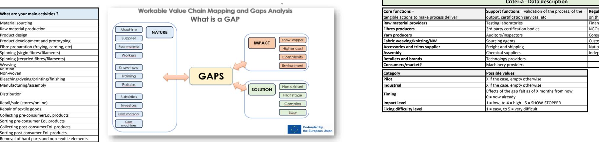

|                                           | ,,                                       | Criteria - Data description                                                                                        |
|-------------------------------------------|------------------------------------------|--------------------------------------------------------------------------------------------------------------------|
| What are your main activities ?           | Core functions =                         |                                                                                                                    |
|                                           |                                          | Support functions = validation of the process, of the                                                              |
|                                           | tangible actions to make process deliver | Regulations = external players with an influencial role output, certification services, etc on the entire business |
| Material sourcing                         | Raw material providers                   | Testing laboratories Financial institutions                                                                        |
| Raw material production                   | Fibres producers                         | 3rd party certification bodies NGOs                                                                                |
| Product design                            | Yarn producers                           | Auditors/Inspectors Consumer associations                                                                          |
| Product development and prototyping       | Fabric weaving/knitting/NW               | Sourcing agents Customs administrations                                                                            |
| Fibre preparation (fraying, carding, etc) | Accessories and trims supplier           | Freight and shipping National government bodies                                                                    |
| Spinning (virgin fibres/filaments)        | Assembly                                 | Chemical suppliers Independent experts                                                                             |
| Spinning (recycled fibres/filaments)      | Retailers and brands                     | Technology providers                                                                                               |
| Weaving Knitting                          | Consumers/market?                        | Machinery providers                                                                                                |
| Non-woven                                 | Category                                 | Possible values                                                                                                    |
| Bleaching/dyeing/printing/finishing       | Pilot                                    | X if the case, empty otherwise                                                                                     |
| Manufacturing/assembly                    | Industrial                               | X if the case, empty otherwise                                                                                     |
| Distribution                              | Timing                                   | Effects of the gap felt as of X months from now 0 = now already                                                    |
| Retail/sale (stores/online)               | Impact level                             | 1 = low, to 4 = high - 5 = SHOW-STOPPER                                                                            |
| Repair of textile goods                   | Fixing difficulty level                  | 1 = easy, to 5 = very difficult                                                                                    |

| What are your main activities ?                   |
|---------------------------------------------------|
|                                                   |
| Material sourcing                                 |
| Raw material production                           |
| Product design                                    |
| Product development and prototyping               |
| Fibre preparation (fraying, carding, etc)         |
| Spinning (virgin fibres/filaments)                |
| Spinning (recycled fibres/filaments)              |
| Weaving                                           |
| <b>xxxxxxxx</b>                                   |
| Non-woven                                         |
| Bleaching/dyeing/printing/finishing               |
| Manufacturing/assembly                            |
| Distribution                                      |
| Retail/sale (stores/online)                       |
| Repair of textile goods                           |
| Collecting pre-consumerEoL products               |
| Sorting pre-consumer EoL products                 |
| Collecting post-consumerEoL products              |
| Sorting post-consumer EoL products                |
| Removal of hard parts and non-textile elements    |
| Upcycling                                         |
| Recycling (closed loop - fibre to fibre)          |
| Recycling (open loop)                             |
| Downcycling                                       |
| Research                                          |
| Training                                          |
| Policies                                          |
| Support to industry                               |
| <b>Other (please add as many lines as needed)</b> |

**CORE FUNCTIONS - Input - Output - Gaps**

**Output**

**GAPS - Regulations**

**GAPS - Core Functions**

**GAPS - Support Functions**

**ACTIVITIES - PROCESS STEPS**

Describe output for each process step

**Notes**

. Check GAPS highlighted in survey . Finetune description of different types of functions

**Instructions** . MAX one GAP per row

If same GAP for pilot and industry stages, repeat in different rows as characteristics are different

. Brief descriptions

. Insert row for more process steps or gaps:

left click on row number under which you want to insert a new row,

right click and select 'insert'

. Insert column for more companies and partners:

left click on the letter of the column before which you want to add a new column

right click and select insert

| RegioGreenTex - V A L U E C H A I N M A P P I N G & G A P A N A L Y S I S T O O L Next Technology Tecnotessile                                                                                                                                                                                                                                                                                                                                                                                                                                                                                                                                                                                                                                                                                                                                                                                                                                                                                                                                                                                                                                                                                                                                                                                                                                                                                                                                                                                                                                                                                                                                                                                                                                                                                                                                                                                                                                                                                                                                                                                                                        |                                                                                                                                                                                                                                                                                                                                                                                                                                                                                                                                                                                                                                                                                                                                                                                                                                                                                                                                                                                                                                                                                                                                                                                                                                                                                                                                                                                                                                                                                                                                                                                                                                                                                                                                                                                                                                                                                                                                                                                                                                                                                                                                                                                                                                                                                                                                                                                                                                                                                                                                                                                                                                                                                                                                                                                                                                                                                                                                                                                                                                                                                                                                                                                                                                                                      |                                                                                                                                                                                                                                                                                                                                                                                                                                                                                                                                                                                                                                                                                                                                                                                                                                                                                                                                                                                                                                                                                                                                                                                                                                                                                                                                                                                                                                                                                                                                                                                                                                                                                                                                                                                                                                                                                                                                                                                                                                                  |                                                                                                                                                                                                                                                                                                                                                                                                                                                                                                                                                                                                                                                                                                                                                                               |
|---------------------------------------------------------------------------------------------------------------------------------------------------------------------------------------------------------------------------------------------------------------------------------------------------------------------------------------------------------------------------------------------------------------------------------------------------------------------------------------------------------------------------------------------------------------------------------------------------------------------------------------------------------------------------------------------------------------------------------------------------------------------------------------------------------------------------------------------------------------------------------------------------------------------------------------------------------------------------------------------------------------------------------------------------------------------------------------------------------------------------------------------------------------------------------------------------------------------------------------------------------------------------------------------------------------------------------------------------------------------------------------------------------------------------------------------------------------------------------------------------------------------------------------------------------------------------------------------------------------------------------------------------------------------------------------------------------------------------------------------------------------------------------------------------------------------------------------------------------------------------------------------------------------------------------------------------------------------------------------------------------------------------------------------------------------------------------------------------------------------------------------|----------------------------------------------------------------------------------------------------------------------------------------------------------------------------------------------------------------------------------------------------------------------------------------------------------------------------------------------------------------------------------------------------------------------------------------------------------------------------------------------------------------------------------------------------------------------------------------------------------------------------------------------------------------------------------------------------------------------------------------------------------------------------------------------------------------------------------------------------------------------------------------------------------------------------------------------------------------------------------------------------------------------------------------------------------------------------------------------------------------------------------------------------------------------------------------------------------------------------------------------------------------------------------------------------------------------------------------------------------------------------------------------------------------------------------------------------------------------------------------------------------------------------------------------------------------------------------------------------------------------------------------------------------------------------------------------------------------------------------------------------------------------------------------------------------------------------------------------------------------------------------------------------------------------------------------------------------------------------------------------------------------------------------------------------------------------------------------------------------------------------------------------------------------------------------------------------------------------------------------------------------------------------------------------------------------------------------------------------------------------------------------------------------------------------------------------------------------------------------------------------------------------------------------------------------------------------------------------------------------------------------------------------------------------------------------------------------------------------------------------------------------------------------------------------------------------------------------------------------------------------------------------------------------------------------------------------------------------------------------------------------------------------------------------------------------------------------------------------------------------------------------------------------------------------------------------------------------------------------------------------------------------|--------------------------------------------------------------------------------------------------------------------------------------------------------------------------------------------------------------------------------------------------------------------------------------------------------------------------------------------------------------------------------------------------------------------------------------------------------------------------------------------------------------------------------------------------------------------------------------------------------------------------------------------------------------------------------------------------------------------------------------------------------------------------------------------------------------------------------------------------------------------------------------------------------------------------------------------------------------------------------------------------------------------------------------------------------------------------------------------------------------------------------------------------------------------------------------------------------------------------------------------------------------------------------------------------------------------------------------------------------------------------------------------------------------------------------------------------------------------------------------------------------------------------------------------------------------------------------------------------------------------------------------------------------------------------------------------------------------------------------------------------------------------------------------------------------------------------------------------------------------------------------------------------------------------------------------------------------------------------------------------------------------------------------------------------|-------------------------------------------------------------------------------------------------------------------------------------------------------------------------------------------------------------------------------------------------------------------------------------------------------------------------------------------------------------------------------------------------------------------------------------------------------------------------------------------------------------------------------------------------------------------------------------------------------------------------------------------------------------------------------------------------------------------------------------------------------------------------------|
| Companies/organisations (RGT)                                                                                                                                                                                                                                                                                                                                                                                                                                                                                                                                                                                                                                                                                                                                                                                                                                                                                                                                                                                                                                                                                                                                                                                                                                                                                                                                                                                                                                                                                                                                                                                                                                                                                                                                                                                                                                                                                                                                                                                                                                                                                                         |                                                                                                                                                                                                                                                                                                                                                                                                                                                                                                                                                                                                                                                                                                                                                                                                                                                                                                                                                                                                                                                                                                                                                                                                                                                                                                                                                                                                                                                                                                                                                                                                                                                                                                                                                                                                                                                                                                                                                                                                                                                                                                                                                                                                                                                                                                                                                                                                                                                                                                                                                                                                                                                                                                                                                                                                                                                                                                                                                                                                                                                                                                                                                                                                                                                                      |                                                                                                                                                                                                                                                                                                                                                                                                                                                                                                                                                                                                                                                                                                                                                                                                                                                                                                                                                                                                                                                                                                                                                                                                                                                                                                                                                                                                                                                                                                                                                                                                                                                                                                                                                                                                                                                                                                                                                                                                                                                  | Date: 22/03/2024                                                                                                                                                                                                                                                                                                                                                                                                                                                                                                                                                                                                                                                                                                                                                              |
| Description Value Chain CORE FUNCTIONS - Input - Output - Gaps RGT Company 2 RGT Company 1 Contributors to the VC + activities Company 3 Company 4 Company 5                                                                                                                                                                                                                                                                                                                                                                                                                                                                                                                                                                                                                                                                                                                                                                                                                                                                                                                                                                                                                                                                                                                                                                                                                                                                                                                                                                                                                                                                                                                                                                                                                                                                                                                                                                                                                                                                                                                                                                          | Consortium/Asso Consortium/Asso Outside of Italy Company 6 Company 7 Company 8                                                                                                                                                                                                                                                                                                                                                                                                                                                                                                                                                                                                                                                                                                                                                                                                                                                                                                                                                                                                                                                                                                                                                                                                                                                                                                                                                                                                                                                                                                                                                                                                                                                                                                                                                                                                                                                                                                                                                                                                                                                                                                                                                                                                                                                                                                                                                                                                                                                                                                                                                                                                                                                                                                                                                                                                                                                                                                                                                                                                                                                                                                                                                                                       | Output                                                                                                                                                                                                                                                                                                                                                                                                                                                                                                                                                                                                                                                                                                                                                                                                                                                                                                                                                                                                                                                                                                                                                                                                                                                                                                                                                                                                                                                                                                                                                                                                                                                                                                                                                                                                                                                                                                                                                                                                                                           | Completed by (name/company): Next Technology Tecnotessile                                                                                                                                                                                                                                                                                                                                                                                                                                                                                                                                                                                                                                                                                                                     |
| Add identified partners (insert column)                                                                                                                                                                                                                                                                                                                                                                                                                                                                                                                                                                                                                                                                                                                                                                                                                                                                                                                                                                                                                                                                                                                                                                                                                                                                                                                                                                                                                                                                                                                                                                                                                                                                                                                                                                                                                                                                                                                                                                                                                                                                                               | Input ciation 1 ciation 2 Missing                                                                                                                                                                                                                                                                                                                                                                                                                                                                                                                                                                                                                                                                                                                                                                                                                                                                                                                                                                                                                                                                                                                                                                                                                                                                                                                                                                                                                                                                                                                                                                                                                                                                                                                                                                                                                                                                                                                                                                                                                                                                                                                                                                                                                                                                                                                                                                                                                                                                                                                                                                                                                                                                                                                                                                                                                                                                                                                                                                                                                                                                                                                                                                                                                                    | Comments                                                                                                                                                                                                                                                                                                                                                                                                                                                                                                                                                                                                                                                                                                                                                                                                                                                                                                                                                                                                                                                                                                                                                                                                                                                                                                                                                                                                                                                                                                                                                                                                                                                                                                                                                                                                                                                                                                                                                                                                                                         | Questions                                                                                                                                                                                                                                                                                                                                                                                                                                                                                                                                                                                                                                                                                                                                                                     |
| x RGT partner x VC starts… Process steps Collecting pre-consumer waste Collecting post-consumer waste                                                                                                                                                                                                                                                                                                                                                                                                                                                                                                                                                                                                                                                                                                                                                                                                                                                                                                                                                                                                                                                                                                                                                                                                                                                                                                                                                                                                                                                                                                                                                                                                                                                                                                                                                                                                                                                                                                                                                                                                                                 | Describe input/feedstock for each process step Yarns, Wool Fortresses, Combing waste (short and small Collection of the material in bales x fiber) Clothing (T-shirt, pants, socks, ...) x x                                                                                                                                                                                                                                                                                                                                                                                                                                                                                                                                                                                                                                                                                                                                                                                                                                                                                                                                                                                                                                                                                                                                                                                                                                                                                                                                                                                                                                                                                                                                                                                                                                                                                                                                                                                                                                                                                                                                                                                                                                                                                                                                                                                                                                                                                                                                                                                                                                                                                                                                                                                                                                                                                                                                                                                                                                                                                                                                                                                                                                                                         | Describe output for each process step Collection of the material in bales with mix of clothing                                                                                                                                                                                                                                                                                                                                                                                                                                                                                                                                                                                                                                                                                                                                                                                                                                                                                                                                                                                                                                                                                                                                                                                                                                                                                                                                                                                                                                                                                                                                                                                                                                                                                                                                                                                                                                                                                                                                                   |                                                                                                                                                                                                                                                                                                                                                                                                                                                                                                                                                                                                                                                                                                                                                                               |
| Pre-Sorting                                                                                                                                                                                                                                                                                                                                                                                                                                                                                                                                                                                                                                                                                                                                                                                                                                                                                                                                                                                                                                                                                                                                                                                                                                                                                                                                                                                                                                                                                                                                                                                                                                                                                                                                                                                                                                                                                                                                                                                                                                                                                                                           | x Bales of mixed clothing (T-shirt, pants, socks, ...)                                                                                                                                                                                                                                                                                                                                                                                                                                                                                                                                                                                                                                                                                                                                                                                                                                                                                                                                                                                                                                                                                                                                                                                                                                                                                                                                                                                                                                                                                                                                                                                                                                                                                                                                                                                                                                                                                                                                                                                                                                                                                                                                                                                                                                                                                                                                                                                                                                                                                                                                                                                                                                                                                                                                                                                                                                                                                                                                                                                                                                                                                                                                                                                                               | Often this phase is implemented outside of Italy Division of material in bales by category: fiber, colors, ...                                                                                                                                                                                                                                                                                                                                                                                                                                                                                                                                                                                                                                                                                                                                                                                                                                                                                                                                                                                                                                                                                                                                                                                                                                                                                                                                                                                                                                                                                                                                                                                                                                                                                                                                                                                                                                                                                                                                   |                                                                                                                                                                                                                                                                                                                                                                                                                                                                                                                                                                                                                                                                                                                                                                               |
| Sorting x                                                                                                                                                                                                                                                                                                                                                                                                                                                                                                                                                                                                                                                                                                                                                                                                                                                                                                                                                                                                                                                                                                                                                                                                                                                                                                                                                                                                                                                                                                                                                                                                                                                                                                                                                                                                                                                                                                                                                                                                                                                                                                                             | Bales of waste textile sorted by color and fiber x                                                                                                                                                                                                                                                                                                                                                                                                                                                                                                                                                                                                                                                                                                                                                                                                                                                                                                                                                                                                                                                                                                                                                                                                                                                                                                                                                                                                                                                                                                                                                                                                                                                                                                                                                                                                                                                                                                                                                                                                                                                                                                                                                                                                                                                                                                                                                                                                                                                                                                                                                                                                                                                                                                                                                                                                                                                                                                                                                                                                                                                                                                                                                                                                                   | The sorting phase involves separating and categorizing textile waste Bales of textile waste with a greater refinement of color based on various criteria such as material type, color, condition, and                                                                                                                                                                                                                                                                                                                                                                                                                                                                                                                                                                                                                                                                                                                                                                                                                                                                                                                                                                                                                                                                                                                                                                                                                                                                                                                                                                                                                                                                                                                                                                                                                                                                                                                                                                                                                                            |                                                                                                                                                                                                                                                                                                                                                                                                                                                                                                                                                                                                                                                                                                                                                                               |
|                                                                                                                                                                                                                                                                                                                                                                                                                                                                                                                                                                                                                                                                                                                                                                                                                                                                                                                                                                                                                                                                                                                                                                                                                                                                                                                                                                                                                                                                                                                                                                                                                                                                                                                                                                                                                                                                                                                                                                                                                                                                                                                                       | Bales of waste wool                                                                                                                                                                                                                                                                                                                                                                                                                                                                                                                                                                                                                                                                                                                                                                                                                                                                                                                                                                                                                                                                                                                                                                                                                                                                                                                                                                                                                                                                                                                                                                                                                                                                                                                                                                                                                                                                                                                                                                                                                                                                                                                                                                                                                                                                                                                                                                                                                                                                                                                                                                                                                                                                                                                                                                                                                                                                                                                                                                                                                                                                                                                                                                                                                                                  | Carbonization is used to remove impurity from wool waste.                                                                                                                                                                                                                                                                                                                                                                                                                                                                                                                                                                                                                                                                                                                                                                                                                                                                                                                                                                                                                                                                                                                                                                                                                                                                                                                                                                                                                                                                                                                                                                                                                                                                                                                                                                                                                                                                                                                                                                                        |                                                                                                                                                                                                                                                                                                                                                                                                                                                                                                                                                                                                                                                                                                                                                                               |
|                                                                                                                                                                                                                                                                                                                                                                                                                                                                                                                                                                                                                                                                                                                                                                                                                                                                                                                                                                                                                                                                                                                                                                                                                                                                                                                                                                                                                                                                                                                                                                                                                                                                                                                                                                                                                                                                                                                                                                                                                                                                                                                                       | Products with hard part as buttons, zippers and labels                                                                                                                                                                                                                                                                                                                                                                                                                                                                                                                                                                                                                                                                                                                                                                                                                                                                                                                                                                                                                                                                                                                                                                                                                                                                                                                                                                                                                                                                                                                                                                                                                                                                                                                                                                                                                                                                                                                                                                                                                                                                                                                                                                                                                                                                                                                                                                                                                                                                                                                                                                                                                                                                                                                                                                                                                                                                                                                                                                                                                                                                                                                                                                                                               | Although much of this phase is carried out manually, there are instances                                                                                                                                                                                                                                                                                                                                                                                                                                                                                                                                                                                                                                                                                                                                                                                                                                                                                                                                                                                                                                                                                                                                                                                                                                                                                                                                                                                                                                                                                                                                                                                                                                                                                                                                                                                                                                                                                                                                                                         |                                                                                                                                                                                                                                                                                                                                                                                                                                                                                                                                                                                                                                                                                                                                                                               |
| x                                                                                                                                                                                                                                                                                                                                                                                                                                                                                                                                                                                                                                                                                                                                                                                                                                                                                                                                                                                                                                                                                                                                                                                                                                                                                                                                                                                                                                                                                                                                                                                                                                                                                                                                                                                                                                                                                                                                                                                                                                                                                                                                     | Bales of waste textile without hard parts                                                                                                                                                                                                                                                                                                                                                                                                                                                                                                                                                                                                                                                                                                                                                                                                                                                                                                                                                                                                                                                                                                                                                                                                                                                                                                                                                                                                                                                                                                                                                                                                                                                                                                                                                                                                                                                                                                                                                                                                                                                                                                                                                                                                                                                                                                                                                                                                                                                                                                                                                                                                                                                                                                                                                                                                                                                                                                                                                                                                                                                                                                                                                                                                                            | This process is used to pulled back the fabric into small fibers                                                                                                                                                                                                                                                                                                                                                                                                                                                                                                                                                                                                                                                                                                                                                                                                                                                                                                                                                                                                                                                                                                                                                                                                                                                                                                                                                                                                                                                                                                                                                                                                                                                                                                                                                                                                                                                                                                                                                                                 |                                                                                                                                                                                                                                                                                                                                                                                                                                                                                                                                                                                                                                                                                                                                                                               |
|                                                                                                                                                                                                                                                                                                                                                                                                                                                                                                                                                                                                                                                                                                                                                                                                                                                                                                                                                                                                                                                                                                                                                                                                                                                                                                                                                                                                                                                                                                                                                                                                                                                                                                                                                                                                                                                                                                                                                                                                                                                                                                                                       | Bales of shredded fiber sorted by color                                                                                                                                                                                                                                                                                                                                                                                                                                                                                                                                                                                                                                                                                                                                                                                                                                                                                                                                                                                                                                                                                                                                                                                                                                                                                                                                                                                                                                                                                                                                                                                                                                                                                                                                                                                                                                                                                                                                                                                                                                                                                                                                                                                                                                                                                                                                                                                                                                                                                                                                                                                                                                                                                                                                                                                                                                                                                                                                                                                                                                                                                                                                                                                                                              | The phase of fiber preparation involves several key steps to process raw                                                                                                                                                                                                                                                                                                                                                                                                                                                                                                                                                                                                                                                                                                                                                                                                                                                                                                                                                                                                                                                                                                                                                                                                                                                                                                                                                                                                                                                                                                                                                                                                                                                                                                                                                                                                                                                                                                                                                                         |                                                                                                                                                                                                                                                                                                                                                                                                                                                                                                                                                                                                                                                                                                                                                                               |
| x                                                                                                                                                                                                                                                                                                                                                                                                                                                                                                                                                                                                                                                                                                                                                                                                                                                                                                                                                                                                                                                                                                                                                                                                                                                                                                                                                                                                                                                                                                                                                                                                                                                                                                                                                                                                                                                                                                                                                                                                                                                                                                                                     | Shredded fiber                                                                                                                                                                                                                                                                                                                                                                                                                                                                                                                                                                                                                                                                                                                                                                                                                                                                                                                                                                                                                                                                                                                                                                                                                                                                                                                                                                                                                                                                                                                                                                                                                                                                                                                                                                                                                                                                                                                                                                                                                                                                                                                                                                                                                                                                                                                                                                                                                                                                                                                                                                                                                                                                                                                                                                                                                                                                                                                                                                                                                                                                                                                                                                                                                                                       |                                                                                                                                                                                                                                                                                                                                                                                                                                                                                                                                                                                                                                                                                                                                                                                                                                                                                                                                                                                                                                                                                                                                                                                                                                                                                                                                                                                                                                                                                                                                                                                                                                                                                                                                                                                                                                                                                                                                                                                                                                                  |                                                                                                                                                                                                                                                                                                                                                                                                                                                                                                                                                                                                                                                                                                                                                                               |
| x                                                                                                                                                                                                                                                                                                                                                                                                                                                                                                                                                                                                                                                                                                                                                                                                                                                                                                                                                                                                                                                                                                                                                                                                                                                                                                                                                                                                                                                                                                                                                                                                                                                                                                                                                                                                                                                                                                                                                                                                                                                                                                                                     | Spun                                                                                                                                                                                                                                                                                                                                                                                                                                                                                                                                                                                                                                                                                                                                                                                                                                                                                                                                                                                                                                                                                                                                                                                                                                                                                                                                                                                                                                                                                                                                                                                                                                                                                                                                                                                                                                                                                                                                                                                                                                                                                                                                                                                                                                                                                                                                                                                                                                                                                                                                                                                                                                                                                                                                                                                                                                                                                                                                                                                                                                                                                                                                                                                                                                                                 |                                                                                                                                                                                                                                                                                                                                                                                                                                                                                                                                                                                                                                                                                                                                                                                                                                                                                                                                                                                                                                                                                                                                                                                                                                                                                                                                                                                                                                                                                                                                                                                                                                                                                                                                                                                                                                                                                                                                                                                                                                                  |                                                                                                                                                                                                                                                                                                                                                                                                                                                                                                                                                                                                                                                                                                                                                                               |
|                                                                                                                                                                                                                                                                                                                                                                                                                                                                                                                                                                                                                                                                                                                                                                                                                                                                                                                                                                                                                                                                                                                                                                                                                                                                                                                                                                                                                                                                                                                                                                                                                                                                                                                                                                                                                                                                                                                                                                                                                                                                                                                                       | x Yarn                                                                                                                                                                                                                                                                                                                                                                                                                                                                                                                                                                                                                                                                                                                                                                                                                                                                                                                                                                                                                                                                                                                                                                                                                                                                                                                                                                                                                                                                                                                                                                                                                                                                                                                                                                                                                                                                                                                                                                                                                                                                                                                                                                                                                                                                                                                                                                                                                                                                                                                                                                                                                                                                                                                                                                                                                                                                                                                                                                                                                                                                                                                                                                                                                                                               |                                                                                                                                                                                                                                                                                                                                                                                                                                                                                                                                                                                                                                                                                                                                                                                                                                                                                                                                                                                                                                                                                                                                                                                                                                                                                                                                                                                                                                                                                                                                                                                                                                                                                                                                                                                                                                                                                                                                                                                                                                                  |                                                                                                                                                                                                                                                                                                                                                                                                                                                                                                                                                                                                                                                                                                                                                                               |
|                                                                                                                                                                                                                                                                                                                                                                                                                                                                                                                                                                                                                                                                                                                                                                                                                                                                                                                                                                                                                                                                                                                                                                                                                                                                                                                                                                                                                                                                                                                                                                                                                                                                                                                                                                                                                                                                                                                                                                                                                                                                                                                                       | ² Yarn or Fabric                                                                                                                                                                                                                                                                                                                                                                                                                                                                                                                                                                                                                                                                                                                                                                                                                                                                                                                                                                                                                                                                                                                                                                                                                                                                                                                                                                                                                                                                                                                                                                                                                                                                                                                                                                                                                                                                                                                                                                                                                                                                                                                                                                                                                                                                                                                                                                                                                                                                                                                                                                                                                                                                                                                                                                                                                                                                                                                                                                                                                                                                                                                                                                                                                                                     | Different colors and patterns                                                                                                                                                                                                                                                                                                                                                                                                                                                                                                                                                                                                                                                                                                                                                                                                                                                                                                                                                                                                                                                                                                                                                                                                                                                                                                                                                                                                                                                                                                                                                                                                                                                                                                                                                                                                                                                                                                                                                                                                                    |                                                                                                                                                                                                                                                                                                                                                                                                                                                                                                                                                                                                                                                                                                                                                                               |
|                                                                                                                                                                                                                                                                                                                                                                                                                                                                                                                                                                                                                                                                                                                                                                                                                                                                                                                                                                                                                                                                                                                                                                                                                                                                                                                                                                                                                                                                                                                                                                                                                                                                                                                                                                                                                                                                                                                                                                                                                                                                                                                                       | Shredded fiber, too short for carding                                                                                                                                                                                                                                                                                                                                                                                                                                                                                                                                                                                                                                                                                                                                                                                                                                                                                                                                                                                                                                                                                                                                                                                                                                                                                                                                                                                                                                                                                                                                                                                                                                                                                                                                                                                                                                                                                                                                                                                                                                                                                                                                                                                                                                                                                                                                                                                                                                                                                                                                                                                                                                                                                                                                                                                                                                                                                                                                                                                                                                                                                                                                                                                                                                | The nonwoven applications are cross-sectorials, and go beyond the                                                                                                                                                                                                                                                                                                                                                                                                                                                                                                                                                                                                                                                                                                                                                                                                                                                                                                                                                                                                                                                                                                                                                                                                                                                                                                                                                                                                                                                                                                                                                                                                                                                                                                                                                                                                                                                                                                                                                                                |                                                                                                                                                                                                                                                                                                                                                                                                                                                                                                                                                                                                                                                                                                                                                                               |
|                                                                                                                                                                                                                                                                                                                                                                                                                                                                                                                                                                                                                                                                                                                                                                                                                                                                                                                                                                                                                                                                                                                                                                                                                                                                                                                                                                                                                                                                                                                                                                                                                                                                                                                                                                                                                                                                                                                                                                                                                                                                                                                                       | x semi-finished products                                                                                                                                                                                                                                                                                                                                                                                                                                                                                                                                                                                                                                                                                                                                                                                                                                                                                                                                                                                                                                                                                                                                                                                                                                                                                                                                                                                                                                                                                                                                                                                                                                                                                                                                                                                                                                                                                                                                                                                                                                                                                                                                                                                                                                                                                                                                                                                                                                                                                                                                                                                                                                                                                                                                                                                                                                                                                                                                                                                                                                                                                                                                                                                                                                             |                                                                                                                                                                                                                                                                                                                                                                                                                                                                                                                                                                                                                                                                                                                                                                                                                                                                                                                                                                                                                                                                                                                                                                                                                                                                                                                                                                                                                                                                                                                                                                                                                                                                                                                                                                                                                                                                                                                                                                                                                                                  |                                                                                                                                                                                                                                                                                                                                                                                                                                                                                                                                                                                                                                                                                                                                                                               |
| GAP = an element missing (company, material,                                                                                                                                                                                                                                                                                                                                                                                                                                                                                                                                                                                                                                                                                                                                                                                                                                                                                                                                                                                                                                                                                                                                                                                                                                                                                                                                                                                                                                                                                                                                                                                                                                                                                                                                                                                                                                                                                                                                                                                                                                                                                          |                                                                                                                                                                                                                                                                                                                                                                                                                                                                                                                                                                                                                                                                                                                                                                                                                                                                                                                                                                                                                                                                                                                                                                                                                                                                                                                                                                                                                                                                                                                                                                                                                                                                                                                                                                                                                                                                                                                                                                                                                                                                                                                                                                                                                                                                                                                                                                                                                                                                                                                                                                                                                                                                                                                                                                                                                                                                                                                                                                                                                                                                                                                                                                                                                                                                      |                                                                                                                                                                                                                                                                                                                                                                                                                                                                                                                                                                                                                                                                                                                                                                                                                                                                                                                                                                                                                                                                                                                                                                                                                                                                                                                                                                                                                                                                                                                                                                                                                                                                                                                                                                                                                                                                                                                                                                                                                                                  |                                                                                                                                                                                                                                                                                                                                                                                                                                                                                                                                                                                                                                                                                                                                                                               |
|                                                                                                                                                                                                                                                                                                                                                                                                                                                                                                                                                                                                                                                                                                                                                                                                                                                                                                                                                                                                                                                                                                                                                                                                                                                                                                                                                                                                                                                                                                                                                                                                                                                                                                                                                                                                                                                                                                                                                                                                                                                                                                                                       |                                                                                                                                                                                                                                                                                                                                                                                                                                                                                                                                                                                                                                                                                                                                                                                                                                                                                                                                                                                                                                                                                                                                                                                                                                                                                                                                                                                                                                                                                                                                                                                                                                                                                                                                                                                                                                                                                                                                                                                                                                                                                                                                                                                                                                                                                                                                                                                                                                                                                                                                                                                                                                                                                                                                                                                                                                                                                                                                                                                                                                                                                                                                                                                                                                                                      | Elements of solution(s)                                                                                                                                                                                                                                                                                                                                                                                                                                                                                                                                                                                                                                                                                                                                                                                                                                                                                                                                                                                                                                                                                                                                                                                                                                                                                                                                                                                                                                                                                                                                                                                                                                                                                                                                                                                                                                                                                                                                                                                                                          | Action(s) What - Who - When Comments Questions                                                                                                                                                                                                                                                                                                                                                                                                                                                                                                                                                                                                                                                                                                                                |
|                                                                                                                                                                                                                                                                                                                                                                                                                                                                                                                                                                                                                                                                                                                                                                                                                                                                                                                                                                                                                                                                                                                                                                                                                                                                                                                                                                                                                                                                                                                                                                                                                                                                                                                                                                                                                                                                                                                                                                                                                                                                                                                                       |                                                                                                                                                                                                                                                                                                                                                                                                                                                                                                                                                                                                                                                                                                                                                                                                                                                                                                                                                                                                                                                                                                                                                                                                                                                                                                                                                                                                                                                                                                                                                                                                                                                                                                                                                                                                                                                                                                                                                                                                                                                                                                                                                                                                                                                                                                                                                                                                                                                                                                                                                                                                                                                                                                                                                                                                                                                                                                                                                                                                                                                                                                                                                                                                                                                                      | Design clothing with hard parts easy to remove.                                                                                                                                                                                                                                                                                                                                                                                                                                                                                                                                                                                                                                                                                                                                                                                                                                                                                                                                                                                                                                                                                                                                                                                                                                                                                                                                                                                                                                                                                                                                                                                                                                                                                                                                                                                                                                                                                                                                                                                                  | Designer must improve skills to make fashion products easy to recycle There is no a practical solution, but a change of mind                                                                                                                                                                                                                                                                                                                                                                                                                                                                                                                                                                                                                                                  |
| SUPPORT FUNCTIONS - Gaps                                                                                                                                                                                                                                                                                                                                                                                                                                                                                                                                                                                                                                                                                                                                                                                                                                                                                                                                                                                                                                                                                                                                                                                                                                                                                                                                                                                                                                                                                                                                                                                                                                                                                                                                                                                                                                                                                                                                                                                                                                                                                                              | SUPPORT FUNCTIONS - Gaps                                                                                                                                                                                                                                                                                                                                                                                                                                                                                                                                                                                                                                                                                                                                                                                                                                                                                                                                                                                                                                                                                                                                                                                                                                                                                                                                                                                                                                                                                                                                                                                                                                                                                                                                                                                                                                                                                                                                                                                                                                                                                                                                                                                                                                                                                                                                                                                                                                                                                                                                                                                                                                                                                                                                                                                                                                                                                                                                                                                                                                                                                                                                                                                                                                             |                                                                                                                                                                                                                                                                                                                                                                                                                                                                                                                                                                                                                                                                                                                                                                                                                                                                                                                                                                                                                                                                                                                                                                                                                                                                                                                                                                                                                                                                                                                                                                                                                                                                                                                                                                                                                                                                                                                                                                                                                                                  |                                                                                                                                                                                                                                                                                                                                                                                                                                                                                                                                                                                                                                                                                                                                                                               |
| RGT partner                                                                                                                                                                                                                                                                                                                                                                                                                                                                                                                                                                                                                                                                                                                                                                                                                                                                                                                                                                                                                                                                                                                                                                                                                                                                                                                                                                                                                                                                                                                                                                                                                                                                                                                                                                                                                                                                                                                                                                                                                                                                                                                           | GAP description                                                                                                                                                                                                                                                                                                                                                                                                                                                                                                                                                                                                                                                                                                                                                                                                                                                                                                                                                                                                                                                                                                                                                                                                                                                                                                                                                                                                                                                                                                                                                                                                                                                                                                                                                                                                                                                                                                                                                                                                                                                                                                                                                                                                                                                                                                                                                                                                                                                                                                                                                                                                                                                                                                                                                                                                                                                                                                                                                                                                                                                                                                                                                                                                                                                      | Elements of solution                                                                                                                                                                                                                                                                                                                                                                                                                                                                                                                                                                                                                                                                                                                                                                                                                                                                                                                                                                                                                                                                                                                                                                                                                                                                                                                                                                                                                                                                                                                                                                                                                                                                                                                                                                                                                                                                                                                                                                                                                             | Action(s) What - Who - When Comments                                                                                                                                                                                                                                                                                                                                                                                                                                                                                                                                                                                                                                                                                                                                          |
| RGT partner                                                                                                                                                                                                                                                                                                                                                                                                                                                                                                                                                                                                                                                                                                                                                                                                                                                                                                                                                                                                                                                                                                                                                                                                                                                                                                                                                                                                                                                                                                                                                                                                                                                                                                                                                                                                                                                                                                                                                                                                                                                                                                                           | GAP description                                                                                                                                                                                                                                                                                                                                                                                                                                                                                                                                                                                                                                                                                                                                                                                                                                                                                                                                                                                                                                                                                                                                                                                                                                                                                                                                                                                                                                                                                                                                                                                                                                                                                                                                                                                                                                                                                                                                                                                                                                                                                                                                                                                                                                                                                                                                                                                                                                                                                                                                                                                                                                                                                                                                                                                                                                                                                                                                                                                                                                                                                                                                                                                                                                                      | Elements of solution                                                                                                                                                                                                                                                                                                                                                                                                                                                                                                                                                                                                                                                                                                                                                                                                                                                                                                                                                                                                                                                                                                                                                                                                                                                                                                                                                                                                                                                                                                                                                                                                                                                                                                                                                                                                                                                                                                                                                                                                                             | Action(s) What - Who - When Comments                                                                                                                                                                                                                                                                                                                                                                                                                                                                                                                                                                                                                                                                                                                                          |
|                                                                                                                                                                                                                                                                                                                                                                                                                                                                                                                                                                                                                                                                                                                                                                                                                                                                                                                                                                                                                                                                                                                                                                                                                                                                                                                                                                                                                                                                                                                                                                                                                                                                                                                                                                                                                                                                                                                                                                                                                                                                                                                                       |                                                                                                                                                                                                                                                                                                                                                                                                                                                                                                                                                                                                                                                                                                                                                                                                                                                                                                                                                                                                                                                                                                                                                                                                                                                                                                                                                                                                                                                                                                                                                                                                                                                                                                                                                                                                                                                                                                                                                                                                                                                                                                                                                                                                                                                                                                                                                                                                                                                                                                                                                                                                                                                                                                                                                                                                                                                                                                                                                                                                                                                                                                                                                                                                                                                                      | Discussions going on at EU level                                                                                                                                                                                                                                                                                                                                                                                                                                                                                                                                                                                                                                                                                                                                                                                                                                                                                                                                                                                                                                                                                                                                                                                                                                                                                                                                                                                                                                                                                                                                                                                                                                                                                                                                                                                                                                                                                                                                                                                                                 | Follow up on progress discussions with textile federations and different                                                                                                                                                                                                                                                                                                                                                                                                                                                                                                                                                                                                                                                                                                      |
|                                                                                                                                                                                                                                                                                                                                                                                                                                                                                                                                                                                                                                                                                                                                                                                                                                                                                                                                                                                                                                                                                                                                                                                                                                                                                                                                                                                                                                                                                                                                                                                                                                                                                                                                                                                                                                                                                                                                                                                                                                                                                                                                       |                                                                                                                                                                                                                                                                                                                                                                                                                                                                                                                                                                                                                                                                                                                                                                                                                                                                                                                                                                                                                                                                                                                                                                                                                                                                                                                                                                                                                                                                                                                                                                                                                                                                                                                                                                                                                                                                                                                                                                                                                                                                                                                                                                                                                                                                                                                                                                                                                                                                                                                                                                                                                                                                                                                                                                                                                                                                                                                                                                                                                                                                                                                                                                                                                                                                      | Discussions going on at EU level                                                                                                                                                                                                                                                                                                                                                                                                                                                                                                                                                                                                                                                                                                                                                                                                                                                                                                                                                                                                                                                                                                                                                                                                                                                                                                                                                                                                                                                                                                                                                                                                                                                                                                                                                                                                                                                                                                                                                                                                                 | Follow up on progress discussions with textile federations and different                                                                                                                                                                                                                                                                                                                                                                                                                                                                                                                                                                                                                                                                                                      |
|                                                                                                                                                                                                                                                                                                                                                                                                                                                                                                                                                                                                                                                                                                                                                                                                                                                                                                                                                                                                                                                                                                                                                                                                                                                                                                                                                                                                                                                                                                                                                                                                                                                                                                                                                                                                                                                                                                                                                                                                                                                                                                                                       |                                                                                                                                                                                                                                                                                                                                                                                                                                                                                                                                                                                                                                                                                                                                                                                                                                                                                                                                                                                                                                                                                                                                                                                                                                                                                                                                                                                                                                                                                                                                                                                                                                                                                                                                                                                                                                                                                                                                                                                                                                                                                                                                                                                                                                                                                                                                                                                                                                                                                                                                                                                                                                                                                                                                                                                                                                                                                                                                                                                                                                                                                                                                                                                                                                                                      | Discussions going on at EU level                                                                                                                                                                                                                                                                                                                                                                                                                                                                                                                                                                                                                                                                                                                                                                                                                                                                                                                                                                                                                                                                                                                                                                                                                                                                                                                                                                                                                                                                                                                                                                                                                                                                                                                                                                                                                                                                                                                                                                                                                 | Follow up on progress discussions with textile federations and different                                                                                                                                                                                                                                                                                                                                                                                                                                                                                                                                                                                                                                                                                                      |
| What are your main activities ?                                                                                                                                                                                                                                                                                                                                                                                                                                                                                                                                                                                                                                                                                                                                                                                                                                                                                                                                                                                                                                                                                                                                                                                                                                                                                                                                                                                                                                                                                                                                                                                                                                                                                                                                                                                                                                                                                                                                                                                                                                                                                                       |                                                                                                                                                                                                                                                                                                                                                                                                                                                                                                                                                                                                                                                                                                                                                                                                                                                                                                                                                                                                                                                                                                                                                                                                                                                                                                                                                                                                                                                                                                                                                                                                                                                                                                                                                                                                                                                                                                                                                                                                                                                                                                                                                                                                                                                                                                                                                                                                                                                                                                                                                                                                                                                                                                                                                                                                                                                                                                                                                                                                                                                                                                                                                                                                                                                                      | Core functions =                                                                                                                                                                                                                                                                                                                                                                                                                                                                                                                                                                                                                                                                                                                                                                                                                                                                                                                                                                                                                                                                                                                                                                                                                                                                                                                                                                                                                                                                                                                                                                                                                                                                                                                                                                                                                                                                                                                                                                                                                                 |                                                                                                                                                                                                                                                                                                                                                                                                                                                                                                                                                                                                                                                                                                                                                                               |
|                                                                                                                                                                                                                                                                                                                                                                                                                                                                                                                                                                                                                                                                                                                                                                                                                                                                                                                                                                                                                                                                                                                                                                                                                                                                                                                                                                                                                                                                                                                                                                                                                                                                                                                                                                                                                                                                                                                                                                                                                                                                                                                                       |                                                                                                                                                                                                                                                                                                                                                                                                                                                                                                                                                                                                                                                                                                                                                                                                                                                                                                                                                                                                                                                                                                                                                                                                                                                                                                                                                                                                                                                                                                                                                                                                                                                                                                                                                                                                                                                                                                                                                                                                                                                                                                                                                                                                                                                                                                                                                                                                                                                                                                                                                                                                                                                                                                                                                                                                                                                                                                                                                                                                                                                                                                                                                                                                                                                                      |                                                                                                                                                                                                                                                                                                                                                                                                                                                                                                                                                                                                                                                                                                                                                                                                                                                                                                                                                                                                                                                                                                                                                                                                                                                                                                                                                                                                                                                                                                                                                                                                                                                                                                                                                                                                                                                                                                                                                                                                                                                  | Support functions = validation of the process, of the output,                                                                                                                                                                                                                                                                                                                                                                                                                                                                                                                                                                                                                                                                                                                 |
|                                                                                                                                                                                                                                                                                                                                                                                                                                                                                                                                                                                                                                                                                                                                                                                                                                                                                                                                                                                                                                                                                                                                                                                                                                                                                                                                                                                                                                                                                                                                                                                                                                                                                                                                                                                                                                                                                                                                                                                                                                                                                                                                       |                                                                                                                                                                                                                                                                                                                                                                                                                                                                                                                                                                                                                                                                                                                                                                                                                                                                                                                                                                                                                                                                                                                                                                                                                                                                                                                                                                                                                                                                                                                                                                                                                                                                                                                                                                                                                                                                                                                                                                                                                                                                                                                                                                                                                                                                                                                                                                                                                                                                                                                                                                                                                                                                                                                                                                                                                                                                                                                                                                                                                                                                                                                                                                                                                                                                      |                                                                                                                                                                                                                                                                                                                                                                                                                                                                                                                                                                                                                                                                                                                                                                                                                                                                                                                                                                                                                                                                                                                                                                                                                                                                                                                                                                                                                                                                                                                                                                                                                                                                                                                                                                                                                                                                                                                                                                                                                                                  | Regulations = external players with an influencial role                                                                                                                                                                                                                                                                                                                                                                                                                                                                                                                                                                                                                                                                                                                       |
| Material sourcing                                                                                                                                                                                                                                                                                                                                                                                                                                                                                                                                                                                                                                                                                                                                                                                                                                                                                                                                                                                                                                                                                                                                                                                                                                                                                                                                                                                                                                                                                                                                                                                                                                                                                                                                                                                                                                                                                                                                                                                                                                                                                                                     |                                                                                                                                                                                                                                                                                                                                                                                                                                                                                                                                                                                                                                                                                                                                                                                                                                                                                                                                                                                                                                                                                                                                                                                                                                                                                                                                                                                                                                                                                                                                                                                                                                                                                                                                                                                                                                                                                                                                                                                                                                                                                                                                                                                                                                                                                                                                                                                                                                                                                                                                                                                                                                                                                                                                                                                                                                                                                                                                                                                                                                                                                                                                                                                                                                                                      | Raw material providers                                                                                                                                                                                                                                                                                                                                                                                                                                                                                                                                                                                                                                                                                                                                                                                                                                                                                                                                                                                                                                                                                                                                                                                                                                                                                                                                                                                                                                                                                                                                                                                                                                                                                                                                                                                                                                                                                                                                                                                                                           | Testing laboratories Financial institutions                                                                                                                                                                                                                                                                                                                                                                                                                                                                                                                                                                                                                                                                                                                                   |
| Raw material production                                                                                                                                                                                                                                                                                                                                                                                                                                                                                                                                                                                                                                                                                                                                                                                                                                                                                                                                                                                                                                                                                                                                                                                                                                                                                                                                                                                                                                                                                                                                                                                                                                                                                                                                                                                                                                                                                                                                                                                                                                                                                                               |                                                                                                                                                                                                                                                                                                                                                                                                                                                                                                                                                                                                                                                                                                                                                                                                                                                                                                                                                                                                                                                                                                                                                                                                                                                                                                                                                                                                                                                                                                                                                                                                                                                                                                                                                                                                                                                                                                                                                                                                                                                                                                                                                                                                                                                                                                                                                                                                                                                                                                                                                                                                                                                                                                                                                                                                                                                                                                                                                                                                                                                                                                                                                                                                                                                                      | Fibres producers                                                                                                                                                                                                                                                                                                                                                                                                                                                                                                                                                                                                                                                                                                                                                                                                                                                                                                                                                                                                                                                                                                                                                                                                                                                                                                                                                                                                                                                                                                                                                                                                                                                                                                                                                                                                                                                                                                                                                                                                                                 | 3rd party certification bodies NGOs                                                                                                                                                                                                                                                                                                                                                                                                                                                                                                                                                                                                                                                                                                                                           |
| Product design                                                                                                                                                                                                                                                                                                                                                                                                                                                                                                                                                                                                                                                                                                                                                                                                                                                                                                                                                                                                                                                                                                                                                                                                                                                                                                                                                                                                                                                                                                                                                                                                                                                                                                                                                                                                                                                                                                                                                                                                                                                                                                                        |                                                                                                                                                                                                                                                                                                                                                                                                                                                                                                                                                                                                                                                                                                                                                                                                                                                                                                                                                                                                                                                                                                                                                                                                                                                                                                                                                                                                                                                                                                                                                                                                                                                                                                                                                                                                                                                                                                                                                                                                                                                                                                                                                                                                                                                                                                                                                                                                                                                                                                                                                                                                                                                                                                                                                                                                                                                                                                                                                                                                                                                                                                                                                                                                                                                                      | Yarn producers                                                                                                                                                                                                                                                                                                                                                                                                                                                                                                                                                                                                                                                                                                                                                                                                                                                                                                                                                                                                                                                                                                                                                                                                                                                                                                                                                                                                                                                                                                                                                                                                                                                                                                                                                                                                                                                                                                                                                                                                                                   | Auditors/Inspectors Consumer associations                                                                                                                                                                                                                                                                                                                                                                                                                                                                                                                                                                                                                                                                                                                                     |
| Product development and prototyping                                                                                                                                                                                                                                                                                                                                                                                                                                                                                                                                                                                                                                                                                                                                                                                                                                                                                                                                                                                                                                                                                                                                                                                                                                                                                                                                                                                                                                                                                                                                                                                                                                                                                                                                                                                                                                                                                                                                                                                                                                                                                                   |                                                                                                                                                                                                                                                                                                                                                                                                                                                                                                                                                                                                                                                                                                                                                                                                                                                                                                                                                                                                                                                                                                                                                                                                                                                                                                                                                                                                                                                                                                                                                                                                                                                                                                                                                                                                                                                                                                                                                                                                                                                                                                                                                                                                                                                                                                                                                                                                                                                                                                                                                                                                                                                                                                                                                                                                                                                                                                                                                                                                                                                                                                                                                                                                                                                                      | Fabric weaving/knitting/NW                                                                                                                                                                                                                                                                                                                                                                                                                                                                                                                                                                                                                                                                                                                                                                                                                                                                                                                                                                                                                                                                                                                                                                                                                                                                                                                                                                                                                                                                                                                                                                                                                                                                                                                                                                                                                                                                                                                                                                                                                       | Sourcing agents Customs administrations                                                                                                                                                                                                                                                                                                                                                                                                                                                                                                                                                                                                                                                                                                                                       |
| Fibre preparation (fraying, carding, etc)                                                                                                                                                                                                                                                                                                                                                                                                                                                                                                                                                                                                                                                                                                                                                                                                                                                                                                                                                                                                                                                                                                                                                                                                                                                                                                                                                                                                                                                                                                                                                                                                                                                                                                                                                                                                                                                                                                                                                                                                                                                                                             |                                                                                                                                                                                                                                                                                                                                                                                                                                                                                                                                                                                                                                                                                                                                                                                                                                                                                                                                                                                                                                                                                                                                                                                                                                                                                                                                                                                                                                                                                                                                                                                                                                                                                                                                                                                                                                                                                                                                                                                                                                                                                                                                                                                                                                                                                                                                                                                                                                                                                                                                                                                                                                                                                                                                                                                                                                                                                                                                                                                                                                                                                                                                                                                                                                                                      | Accessories and trims supplier                                                                                                                                                                                                                                                                                                                                                                                                                                                                                                                                                                                                                                                                                                                                                                                                                                                                                                                                                                                                                                                                                                                                                                                                                                                                                                                                                                                                                                                                                                                                                                                                                                                                                                                                                                                                                                                                                                                                                                                                                   | Freight and shipping National government bodies                                                                                                                                                                                                                                                                                                                                                                                                                                                                                                                                                                                                                                                                                                                               |
| Spinning (virgin fibres/filaments)                                                                                                                                                                                                                                                                                                                                                                                                                                                                                                                                                                                                                                                                                                                                                                                                                                                                                                                                                                                                                                                                                                                                                                                                                                                                                                                                                                                                                                                                                                                                                                                                                                                                                                                                                                                                                                                                                                                                                                                                                                                                                                    |                                                                                                                                                                                                                                                                                                                                                                                                                                                                                                                                                                                                                                                                                                                                                                                                                                                                                                                                                                                                                                                                                                                                                                                                                                                                                                                                                                                                                                                                                                                                                                                                                                                                                                                                                                                                                                                                                                                                                                                                                                                                                                                                                                                                                                                                                                                                                                                                                                                                                                                                                                                                                                                                                                                                                                                                                                                                                                                                                                                                                                                                                                                                                                                                                                                                      | Assembly                                                                                                                                                                                                                                                                                                                                                                                                                                                                                                                                                                                                                                                                                                                                                                                                                                                                                                                                                                                                                                                                                                                                                                                                                                                                                                                                                                                                                                                                                                                                                                                                                                                                                                                                                                                                                                                                                                                                                                                                                                         | Chemical suppliers Independent experts                                                                                                                                                                                                                                                                                                                                                                                                                                                                                                                                                                                                                                                                                                                                        |
| Spinning (recycled fibres/filaments)                                                                                                                                                                                                                                                                                                                                                                                                                                                                                                                                                                                                                                                                                                                                                                                                                                                                                                                                                                                                                                                                                                                                                                                                                                                                                                                                                                                                                                                                                                                                                                                                                                                                                                                                                                                                                                                                                                                                                                                                                                                                                                  |                                                                                                                                                                                                                                                                                                                                                                                                                                                                                                                                                                                                                                                                                                                                                                                                                                                                                                                                                                                                                                                                                                                                                                                                                                                                                                                                                                                                                                                                                                                                                                                                                                                                                                                                                                                                                                                                                                                                                                                                                                                                                                                                                                                                                                                                                                                                                                                                                                                                                                                                                                                                                                                                                                                                                                                                                                                                                                                                                                                                                                                                                                                                                                                                                                                                      | Retailers and brands                                                                                                                                                                                                                                                                                                                                                                                                                                                                                                                                                                                                                                                                                                                                                                                                                                                                                                                                                                                                                                                                                                                                                                                                                                                                                                                                                                                                                                                                                                                                                                                                                                                                                                                                                                                                                                                                                                                                                                                                                             | Technology providers                                                                                                                                                                                                                                                                                                                                                                                                                                                                                                                                                                                                                                                                                                                                                          |
| Weaving                                                                                                                                                                                                                                                                                                                                                                                                                                                                                                                                                                                                                                                                                                                                                                                                                                                                                                                                                                                                                                                                                                                                                                                                                                                                                                                                                                                                                                                                                                                                                                                                                                                                                                                                                                                                                                                                                                                                                                                                                                                                                                                               |                                                                                                                                                                                                                                                                                                                                                                                                                                                                                                                                                                                                                                                                                                                                                                                                                                                                                                                                                                                                                                                                                                                                                                                                                                                                                                                                                                                                                                                                                                                                                                                                                                                                                                                                                                                                                                                                                                                                                                                                                                                                                                                                                                                                                                                                                                                                                                                                                                                                                                                                                                                                                                                                                                                                                                                                                                                                                                                                                                                                                                                                                                                                                                                                                                                                      | Consumers/market?                                                                                                                                                                                                                                                                                                                                                                                                                                                                                                                                                                                                                                                                                                                                                                                                                                                                                                                                                                                                                                                                                                                                                                                                                                                                                                                                                                                                                                                                                                                                                                                                                                                                                                                                                                                                                                                                                                                                                                                                                                | Machinery providers                                                                                                                                                                                                                                                                                                                                                                                                                                                                                                                                                                                                                                                                                                                                                           |
| Non-woven                                                                                                                                                                                                                                                                                                                                                                                                                                                                                                                                                                                                                                                                                                                                                                                                                                                                                                                                                                                                                                                                                                                                                                                                                                                                                                                                                                                                                                                                                                                                                                                                                                                                                                                                                                                                                                                                                                                                                                                                                                                                                                                             |                                                                                                                                                                                                                                                                                                                                                                                                                                                                                                                                                                                                                                                                                                                                                                                                                                                                                                                                                                                                                                                                                                                                                                                                                                                                                                                                                                                                                                                                                                                                                                                                                                                                                                                                                                                                                                                                                                                                                                                                                                                                                                                                                                                                                                                                                                                                                                                                                                                                                                                                                                                                                                                                                                                                                                                                                                                                                                                                                                                                                                                                                                                                                                                                                                                                      | Category                                                                                                                                                                                                                                                                                                                                                                                                                                                                                                                                                                                                                                                                                                                                                                                                                                                                                                                                                                                                                                                                                                                                                                                                                                                                                                                                                                                                                                                                                                                                                                                                                                                                                                                                                                                                                                                                                                                                                                                                                                         | Possible values                                                                                                                                                                                                                                                                                                                                                                                                                                                                                                                                                                                                                                                                                                                                                               |
| Bleaching/dyeing/printing/finishing                                                                                                                                                                                                                                                                                                                                                                                                                                                                                                                                                                                                                                                                                                                                                                                                                                                                                                                                                                                                                                                                                                                                                                                                                                                                                                                                                                                                                                                                                                                                                                                                                                                                                                                                                                                                                                                                                                                                                                                                                                                                                                   |                                                                                                                                                                                                                                                                                                                                                                                                                                                                                                                                                                                                                                                                                                                                                                                                                                                                                                                                                                                                                                                                                                                                                                                                                                                                                                                                                                                                                                                                                                                                                                                                                                                                                                                                                                                                                                                                                                                                                                                                                                                                                                                                                                                                                                                                                                                                                                                                                                                                                                                                                                                                                                                                                                                                                                                                                                                                                                                                                                                                                                                                                                                                                                                                                                                                      | Pilot                                                                                                                                                                                                                                                                                                                                                                                                                                                                                                                                                                                                                                                                                                                                                                                                                                                                                                                                                                                                                                                                                                                                                                                                                                                                                                                                                                                                                                                                                                                                                                                                                                                                                                                                                                                                                                                                                                                                                                                                                                            | X if the case, empty otherwise                                                                                                                                                                                                                                                                                                                                                                                                                                                                                                                                                                                                                                                                                                                                                |
| Manufacturing/assembly                                                                                                                                                                                                                                                                                                                                                                                                                                                                                                                                                                                                                                                                                                                                                                                                                                                                                                                                                                                                                                                                                                                                                                                                                                                                                                                                                                                                                                                                                                                                                                                                                                                                                                                                                                                                                                                                                                                                                                                                                                                                                                                |                                                                                                                                                                                                                                                                                                                                                                                                                                                                                                                                                                                                                                                                                                                                                                                                                                                                                                                                                                                                                                                                                                                                                                                                                                                                                                                                                                                                                                                                                                                                                                                                                                                                                                                                                                                                                                                                                                                                                                                                                                                                                                                                                                                                                                                                                                                                                                                                                                                                                                                                                                                                                                                                                                                                                                                                                                                                                                                                                                                                                                                                                                                                                                                                                                                                      | Industrial                                                                                                                                                                                                                                                                                                                                                                                                                                                                                                                                                                                                                                                                                                                                                                                                                                                                                                                                                                                                                                                                                                                                                                                                                                                                                                                                                                                                                                                                                                                                                                                                                                                                                                                                                                                                                                                                                                                                                                                                                                       | X if the case, empty otherwise                                                                                                                                                                                                                                                                                                                                                                                                                                                                                                                                                                                                                                                                                                                                                |
| Distribution                                                                                                                                                                                                                                                                                                                                                                                                                                                                                                                                                                                                                                                                                                                                                                                                                                                                                                                                                                                                                                                                                                                                                                                                                                                                                                                                                                                                                                                                                                                                                                                                                                                                                                                                                                                                                                                                                                                                                                                                                                                                                                                          |                                                                                                                                                                                                                                                                                                                                                                                                                                                                                                                                                                                                                                                                                                                                                                                                                                                                                                                                                                                                                                                                                                                                                                                                                                                                                                                                                                                                                                                                                                                                                                                                                                                                                                                                                                                                                                                                                                                                                                                                                                                                                                                                                                                                                                                                                                                                                                                                                                                                                                                                                                                                                                                                                                                                                                                                                                                                                                                                                                                                                                                                                                                                                                                                                                                                      | Timing                                                                                                                                                                                                                                                                                                                                                                                                                                                                                                                                                                                                                                                                                                                                                                                                                                                                                                                                                                                                                                                                                                                                                                                                                                                                                                                                                                                                                                                                                                                                                                                                                                                                                                                                                                                                                                                                                                                                                                                                                                           |                                                                                                                                                                                                                                                                                                                                                                                                                                                                                                                                                                                                                                                                                                                                                                               |
| Retail/sale (stores/online)                                                                                                                                                                                                                                                                                                                                                                                                                                                                                                                                                                                                                                                                                                                                                                                                                                                                                                                                                                                                                                                                                                                                                                                                                                                                                                                                                                                                                                                                                                                                                                                                                                                                                                                                                                                                                                                                                                                                                                                                                                                                                                           |                                                                                                                                                                                                                                                                                                                                                                                                                                                                                                                                                                                                                                                                                                                                                                                                                                                                                                                                                                                                                                                                                                                                                                                                                                                                                                                                                                                                                                                                                                                                                                                                                                                                                                                                                                                                                                                                                                                                                                                                                                                                                                                                                                                                                                                                                                                                                                                                                                                                                                                                                                                                                                                                                                                                                                                                                                                                                                                                                                                                                                                                                                                                                                                                                                                                      | Impact level                                                                                                                                                                                                                                                                                                                                                                                                                                                                                                                                                                                                                                                                                                                                                                                                                                                                                                                                                                                                                                                                                                                                                                                                                                                                                                                                                                                                                                                                                                                                                                                                                                                                                                                                                                                                                                                                                                                                                                                                                                     | 1 = low, to 4 = high - 5 = SHOW-STOPPER                                                                                                                                                                                                                                                                                                                                                                                                                                                                                                                                                                                                                                                                                                                                       |
| Repair of textile goods                                                                                                                                                                                                                                                                                                                                                                                                                                                                                                                                                                                                                                                                                                                                                                                                                                                                                                                                                                                                                                                                                                                                                                                                                                                                                                                                                                                                                                                                                                                                                                                                                                                                                                                                                                                                                                                                                                                                                                                                                                                                                                               |                                                                                                                                                                                                                                                                                                                                                                                                                                                                                                                                                                                                                                                                                                                                                                                                                                                                                                                                                                                                                                                                                                                                                                                                                                                                                                                                                                                                                                                                                                                                                                                                                                                                                                                                                                                                                                                                                                                                                                                                                                                                                                                                                                                                                                                                                                                                                                                                                                                                                                                                                                                                                                                                                                                                                                                                                                                                                                                                                                                                                                                                                                                                                                                                                                                                      | Fixing difficulty level                                                                                                                                                                                                                                                                                                                                                                                                                                                                                                                                                                                                                                                                                                                                                                                                                                                                                                                                                                                                                                                                                                                                                                                                                                                                                                                                                                                                                                                                                                                                                                                                                                                                                                                                                                                                                                                                                                                                                                                                                          | 1 = easy, to 5 = very difficult                                                                                                                                                                                                                                                                                                                                                                                                                                                                                                                                                                                                                                                                                                                                               |
| GAPS - Regulations                                                                                                                                                                                                                                                                                                                                                                                                                                                                                                                                                                                                                                                                                                                                                                                                                                                                                                                                                                                                                                                                                                                                                                                                                                                                                                                                                                                                                                                                                                                                                                                                                                                                                                                                                                                                                                                                                                                                                                                                                                                                                                                    |                                                                                                                                                                                                                                                                                                                                                                                                                                                                                                                                                                                                                                                                                                                                                                                                                                                                                                                                                                                                                                                                                                                                                                                                                                                                                                                                                                                                                                                                                                                                                                                                                                                                                                                                                                                                                                                                                                                                                                                                                                                                                                                                                                                                                                                                                                                                                                                                                                                                                                                                                                                                                                                                                                                                                                                                                                                                                                                                                                                                                                                                                                                                                                                                                                                                      |                                                                                                                                                                                                                                                                                                                                                                                                                                                                                                                                                                                                                                                                                                                                                                                                                                                                                                                                                                                                                                                                                                                                                                                                                                                                                                                                                                                                                                                                                                                                                                                                                                                                                                                                                                                                                                                                                                                                                                                                                                                  |                                                                                                                                                                                                                                                                                                                                                                                                                                                                                                                                                                                                                                                                                                                                                                               |
| GAPS - Core Functions                                                                                                                                                                                                                                                                                                                                                                                                                                                                                                                                                                                                                                                                                                                                                                                                                                                                                                                                                                                                                                                                                                                                                                                                                                                                                                                                                                                                                                                                                                                                                                                                                                                                                                                                                                                                                                                                                                                                                                                                                                                                                                                 |                                                                                                                                                                                                                                                                                                                                                                                                                                                                                                                                                                                                                                                                                                                                                                                                                                                                                                                                                                                                                                                                                                                                                                                                                                                                                                                                                                                                                                                                                                                                                                                                                                                                                                                                                                                                                                                                                                                                                                                                                                                                                                                                                                                                                                                                                                                                                                                                                                                                                                                                                                                                                                                                                                                                                                                                                                                                                                                                                                                                                                                                                                                                                                                                                                                                      |                                                                                                                                                                                                                                                                                                                                                                                                                                                                                                                                                                                                                                                                                                                                                                                                                                                                                                                                                                                                                                                                                                                                                                                                                                                                                                                                                                                                                                                                                                                                                                                                                                                                                                                                                                                                                                                                                                                                                                                                                                                  |                                                                                                                                                                                                                                                                                                                                                                                                                                                                                                                                                                                                                                                                                                                                                                               |
| GAPS - Support Functions                                                                                                                                                                                                                                                                                                                                                                                                                                                                                                                                                                                                                                                                                                                                                                                                                                                                                                                                                                                                                                                                                                                                                                                                                                                                                                                                                                                                                                                                                                                                                                                                                                                                                                                                                                                                                                                                                                                                                                                                                                                                                                              |                                                                                                                                                                                                                                                                                                                                                                                                                                                                                                                                                                                                                                                                                                                                                                                                                                                                                                                                                                                                                                                                                                                                                                                                                                                                                                                                                                                                                                                                                                                                                                                                                                                                                                                                                                                                                                                                                                                                                                                                                                                                                                                                                                                                                                                                                                                                                                                                                                                                                                                                                                                                                                                                                                                                                                                                                                                                                                                                                                                                                                                                                                                                                                                                                                                                      |                                                                                                                                                                                                                                                                                                                                                                                                                                                                                                                                                                                                                                                                                                                                                                                                                                                                                                                                                                                                                                                                                                                                                                                                                                                                                                                                                                                                                                                                                                                                                                                                                                                                                                                                                                                                                                                                                                                                                                                                                                                  |                                                                                                                                                                                                                                                                                                                                                                                                                                                                                                                                                                                                                                                                                                                                                                               |
| ACTIVITIES - PROCESS STEPS Carbonization x Removal of hard parts and non-textile elements x Fibre preparation (shredding) Product design of semi-finished products x x x x Product development and prototyping x x x x Fibre preparation x x Carding x Spinning (recycled fibres/filaments) x Weaving x x Bleaching/dyeing/printing/finishing Non woven production x x x x x x Selling B2B x Recycling (closed loop - fibre to fibre) VC ends... RGT Company 1 RGT Company 2 money, …), or only available in limited quantities, lack of or problematic regulations, etc. Company 4 Company 3 Company 5 Large scale-sorting process Hard-to-remove components from textiles x Hard-to-remove components from textiles x Mapping of the all recycling value chains: mapping of the different companies that could contribute in the long recycling process x x x x x Lacking of competencies and effort spent for the x x x x x products circular design phase RGT Company 1 RGT Company 2 Company 3 Company 4 Company 5 Contributors to the VC + activities Difficulties to share production/manufacturing data among companies x x x x x Necessity of training for producers and awareness for x x x x x consumers with reference to the circular practices and products POLICY INSTRUMENTS - Gaps RGT Company 1 RGT Company 2 Company 4 Company 3 Company 5 Contributors to the VC + activities Unclear legal and economic position of collecting and/or sorting factory x Italian organizations for waste textile collection Lacking of an homogeneus standards for sustainability x x x x x measure of products Certification, Labeling for new circular products. There is a lack of unique standard for identify the waste textile in input and circular products in output x x x x x Knitting Collecting pre-consumerEoL products Sorting pre-consumer EoL products Collecting post-consumerEoL products Sorting post-consumer EoL products Removal of hard parts and non-textile elements Upcycling Recycling (closed loop - fibre to fibre) Recycling (open loop) Downcycling Research Training Policies Support to industry | remains Textile shredded Information about starting fibers of textile waste already x shredded + idea/objectives about the outputs and the market destination Project about textile waste-based products or semi-finished x products product New fiber Spun Yarn Fabric market segments) finished products x Consortium/Asso Consortium/Asso GAP description Outside of Italy Industrial stage For GAPS that require a different response (e.g. pilot stage vs. industrial state), use 2 or more different rows! Company 6 Company 8 Company 7 ciation 1 ciation 2 Missing Pilot There is not a company/organisation that offers a large scale service for the sorting phase of waste material. At the moment only humanitarian associations as Caritas and x x Humana. They keep only the good clothes for second-hand. The rest of the material is sent in Africa or China or burned to make energy. Removing hard parts from textiles isn't always straightforward. This phase has the potential to slow down x the entire value chain and/or results in generate new textile waste. Removing hard parts from textiles isn't always straightforward. This phase has the potential to slow down x the entire value chain and/or results in generate new textile waste. Companies of Prato district have the capability to cover the entire value chain for recycling wool. However, it is still a disconnected system, that lacks of awareness regarding the x x x x x x processes that the companies are capable of undertaking. Circular design methodologies and techniques are not clear x x x x x for most of the SMEs Consortium/Asso Consortium/Asso Outside of Italy Industrial stage Company 6 Company 7 Company 8 ciation 1 ciation 2 Missing Pilot The companies in the district struggle significantly with sharing data and information across the entire supply chain. x x x x x In addition, there are lots of differences in the levels of digitalisation of the interested companies Lack of knowledge about circular design, opportunities for x x x x x recycling and new circular business models x Consortium/Asso Consortium/Asso Outside of Italy Industrial stage Pilotc stage Company 6 Company 8 Company 7 ciation 2 ciation 1 Missing Italian legislation lacks a clear definition of the economic classification of enterprises/associations that are responsible of the phase of textile collecting and sorting. While some fall under the category of craftsmanship, others x are considered industrial entities. This ambiguity leads to confusion and inconsistent actions. Italy applied in advance the "Waste framework directive" for the textile collecting by D.Lgs. n° 116/2020. The results are not concrete after two years.There are strong x x x x differences in the level of advancement among different regions or districts regarding this matter Lacking of an homogeneus standards for sustainability x x x x measure of products. x Certifying and labeling semi-finished/finished products containing waste textiles proves challenging due to regulatory gaps. Existing laws lack clarity regarding the x x x x x classification of new products derived from waste textiles, limiting their market viability. | potential for reuse or recycling. This phase is crucial for efficient waste management Wool without impurity of grass, wood, cotton or similar Products free from non-textile elements where an automatic machine is employed to assist and enhance the recycling process Usually this phase is implemented by companies that produce semi Design, specs of the new circular product finished products/finished products Prototype of product/semifinished product/finieshed wool or used wool products into fibers suitable for further manufacturing or reuse Yarn or Fabric treated by finishing processes Fiber panels (and other semi-finished products for different Fashion sector Fixing difficulty Impact level (# months) (1 to 5) (1 to 5) Timing In Italy, sorting is frequently implemented manually to ensure optimal results, although certain companies opt for new automated sorting processes. The integration of automated sorting technology could significantly enhance the separation of textile materials. Consequently, there is a growing demand for new investments in sorting technologies Encourage and spread the use of automated processes already available in the Tuscan district Some territorial organisations are developing the map to contribute to the Hub project implementation Organize design and creative workshops to explain circular design. Create new vertical figures specialised in eco-design Fixing difficulty Impact level (# months) (1 to 5) (1 to 5) Timing Encouraging the digitalization of companies of district. There are new available digital solutions for the horizontal integration. Webinars, workshops, case studies of success, Companies with a profitable model in circular economy Fixing difficulty Impact level (# months) (1 to 5) (1 to 5) Timing Promote projects and private actions to generate Hub for recycling. Coordinate project and initiatives involving districts and enterprises for the construction of Hub. tangible actions to make process deliver | Research centers could collaborate with technology producers inolved in the development of sorting machine technologies Create and implement diffusion and exploitation processes for spreading the technology opportunites Organize new public and private courses dedicated to the new needs of the entire recycling wool value chain Training: technical training and/or for cultural shift Organize new public and private courses dedicated to the new needs of the entire recycling wool value chain stakeholders Follow up the progress of projects and initiatives that are already started. stakeholders stakeholders Criteria - Data description certification services, etc on the entire business Effects of the gap felt as of X months from now 0 = now already |

**Other (please add as many lines as needed)**