# The international ecosystem for accelerating the transition to Safe-and-Sustainable-by-design materials, products and processes.

Update 1: Analysis of lifecycle steps, the value chains, their stakeholders and initiatives

*Anne Chloe Devic (Cefic), Lya G. Soeteman-Hernández (RIVM), Eva-Katherin Schillinger (Cefic), Catherine Colin, Maudez Le Dantec (IPC), Phillippe Jacques, Marcel Meeus (EMIRI), Beatriz Ildefonso, David M. Storer (CLEPA), Dmitri Petrovykh (INL), Johan Breukelaar (EFCC), Lutz Walter, Kamilla Drubina (ETP), Chaima Elyahmadi (IFRA)*

The project receives funding from the European Union's HORIZON EUROPE research and innovation programme under grant agreement n° 101058425. UK participants in Project IRISS are supported by UKRI grant 10038816. CH participants in Project IRISS receive funding from the Swiss State Secretariat for Education, Research and Innovation (SERI).

# **Disclaimer**

Funded by the European Union. Views and opinions expressed are however those of the author(s) only and do not necessarily reflect those of the European Union or the European Health and Digital Executive Agency (HADEA). Neither the European Union nor the granting authority can be held responsible for them.

The project receives funding from the European Union's HORIZON EUROPE research and innovation programme under grant agreement n° 101058425. UK participants in Project IRISS are supported by UKRI grant 10038816. CH participants in Project IRISS receive funding from the Swiss State Secretariat for Education, Research and Innovation (SERI).

| Project acronym          | IRISS                                                                |
|--------------------------|----------------------------------------------------------------------|
| Work Package             | WP 4                                                                 |
| Deliverable n° and title | D4.8 Update 1: Analysis of lifecycle steps, the value chains, their  |
| Deliverable Leader       | Cefic                                                                |
| Type                     | R - Report                                                           |
| Dissemination Level      | Public                                                               |
| Submission Date          | 05/03/2024                                                           |
| Author(s)                | Anne Chloe Devic (Cefic), Lya G. Soeteman-Hernández (RIVM), Eva     |
|                          | Phillippe Jacques, Marcel Meeus (EMIRI), Beatriz Ildefonso, David M. |
|                          | Walter, Kamilla Drubina (ETP), Chaima Elyahmadi (IFRA)               |

# **Revision History**

| Version | Modifications                 | Date       | Author(s)                            |
|---------|-------------------------------|------------|--------------------------------------|
| 0.1     | Initial draft                 | 14/07/2023 | Anne Chloé Devic (Cefic)             |
| 0.2     | Revision within WP4 team      | 01/09/2023 | Catherine Colin, Maudez Le Dantec    |
|         |                               |            | (IPC), Marcel Meeus, Phillippe       |
|         |                               |            | (EFCC), Lutz Walter, Kamilla Drubina |
|         |                               |            | (ETP), Chaima Elyahmadi (IFRA), Anne |
| 0.3     | Revision final draft          | 20/10/2023 | Anne Chloé Devic (Cefic), Lya        |
| 0.4     | Editorial revision            | 23/10/2023 | Lya Hernandez (RIVM), Christina Apel |
| 1.0     | Final version submitted to EC | 31/10/2023 | Carolina Landerdahl (IVL)            |
| 1.1     | Revision according to         |            |                                      |
|         | reviewer comments             |            |                                      |
|         |                               | 05/02/2024 | Anne Chloe Devic (SSbD-CE)           |
| 2.0     | Updated version submitted     |            |                                      |
|         |                               | 05/03/2024 | Sofia Mc Conell (IVL)                |

# **Table of Contents**

| 1     | Executive summary                                                                                                                        | 10                                                                                                         |
|-------|------------------------------------------------------------------------------------------------------------------------------------------|------------------------------------------------------------------------------------------------------------|
| 1.1   | Packaging.................................................................................................................               | 10                                                                                                         |
| 1.2   | The Textiles value chain                                                                                                                 | 11                                                                                                         |
| 1.2.1 | Smart textiles sub-value                                                                                                                 | chain................................................................................ 11                   |
| 1.3   | Construction value chain.........................................................................................                        | 12                                                                                                         |
| 1.3.1 | Insulation materials sub-value chain                                                                                                     | 12                                                                                                         |
| 1.4   | Automotive value chain                                                                                                                   | 13                                                                                                         |
| 1.4.1 | Car seats sub-value chain (PU moulded foams).....................................................                                        | 13                                                                                                         |
| 1.5   | The Energy value chain                                                                                                                   | 14                                                                                                         |
| 1.5.1 | The sub-value chain: Solar                                                                                                               | 14                                                                                                         |
| 1.5.2 | The sub-value chain: Wind......................................................................................                          | 15                                                                                                         |
| 1.6   | Power-control semi-conductors sub-value chain (electronics)                                                                              | 16                                                                                                         |
| 1.6.1 | The sub-value chain: Semiconductor for power control........................................                                             | 16                                                                                                         |
| 1.7   | Fragrances                                                                                                                               | value chain............................................................................................ 16 |
| 1.8   | Conclusion                                                                                                                               | 17                                                                                                         |
| 2     | Introduction                                                                                                                             | 18                                                                                                         |
| 3     | Objectives............................................................................................................................   | 18                                                                                                         |
| 4     | Strategy/Methodology........................................................................................................             | 18                                                                                                         |
| 5     | Results................................................................................................................................. | 20                                                                                                         |
| 5.1   | The Packaging value chain                                                                                                                | 20                                                                                                         |
| 5.1.1 | The sub-value chain: Plastics                                                                                                            | 21                                                                                                         |
| 5.1.2 | The sub-value chain: Glass......................................................................................                         | 27                                                                                                         |
| 5.1.3 | Steps within the VC covered (upstream & downstream steps):............................                                                   | 30                                                                                                         |
| 5.1.4 | Main SSbD                                                                                                                                | challenges foreseen.............................................................................. 32       |
| 5.2   | The Textiles value chain                                                                                                                 | 33                                                                                                         |
| 5.2.1 | The sub-value chain: Smart textiles........................................................................                              | 33                                                                                                         |
| 5.2.2 | Steps within the VC covered (upstream & downstream steps): infographic                                                                   |                                                                                                            |
|       | describing the flows + types of stakeholders + company names                                                                             | 34                                                                                                         |
| 5.2.3 | Main SSbD                                                                                                                                | challenges foreseen.............................................................................. 37       |
| 5.3   | The Construction value chain..................................................................................                           | 38                                                                                                         |
| 5.3.1 | Insulation Materials                                                                                                                     | sub-value chain...................................................................... 39                   |
| 5.3.2 | Polystyrene or Polyurethane foams sub-value chains...........................................                                            | 39                                                                                                         |
| 5.3.3 | Polyurethane (PU) foams –                                                                                                                | State of Play................................................................ 40                           |

| 5.3.4 | Key SSbD Challenges and Opportunities                                                                                                 | 40                                                                                                   |
|-------|---------------------------------------------------------------------------------------------------------------------------------------|------------------------------------------------------------------------------------------------------|
| 5.4   | The Automotive value chain                                                                                                            | 42                                                                                                   |
| 5.4.1 | Sub-value chain covered: Moulded PU foams for car seats                                                                               | 42                                                                                                   |
| 5.5   | The Energy value chain                                                                                                                | 50                                                                                                   |
| 5.5.1 | The Energy sub-value chain: Solar..........................................................................                           | 50                                                                                                   |
| 5.5.2 | The Energy sub-value chain: Wind..........................................................................                            | 59                                                                                                   |
| 5.6   | The Electronics value chain.....................................................................................                      | 66                                                                                                   |
| 5.6.1 | Update on life cycle stages (from D4.1)..................................................................                             | 66                                                                                                   |
| 5.6.2 | SSbD in sub-value chain: Semiconductors for power control                                                                             | 68                                                                                                   |
| 5.7   | The Fragrances value chain.....................................................................................                       | 74                                                                                                   |
| 5.7.1 | The sub-value chains: Cosmetic product and detergent........................................                                          | 76                                                                                                   |
| 5.7.2 | Main SSbD                                                                                                                             | challenges foreseen.............................................................................. 78 |
| 6     | Conclusions                                                                                                                           | 80                                                                                                   |
| 7     | References........................................................................................................................... | 81                                                                                                   |

# **List of Tables**

| Table 1 Updated mapping of VC actors active in SSbD initiatives development                                                           | 23 |
|---------------------------------------------------------------------------------------------------------------------------------------|----|
| Table 2 Main foreseen SSbD challenges in glass container value chain................................                                  | 32 |
| Table 3 Environmental, Health & Social criteria for PU foams for insulation                                                           | 42 |
| Table 4 Photovoltaics (PV) technologies                                                                                               | 52 |
| Table 5 SSbD ongoing initiatives Solar Energy                                                                                         | 54 |
| Table 6 SSbD Solar................................................................................................................... | 54 |
| Table 7 SSbD Wind Energy ongoing activities                                                                                           | 62 |
| Table 8 Wind                                                                                                                          | 62 |
| Table 9 Description of known safety and sustainability issues in the specified value chain                                            | 72 |

# **List of Figures**

| materials (2019)                                                                                                               | 20                                                                                          |
|--------------------------------------------------------------------------------------------------------------------------------|---------------------------------------------------------------------------------------------|
| Figure 2 Life cycle diagram for the plastics packaging Value Chain (updated)                                                   | 21                                                                                          |
| Figure 3 Circularity of PET bottles                                                                                            | 27                                                                                          |
| Figure 4 Glass container value chain                                                                                           | 30                                                                                          |
| Figure 5 Lifecycle view of glass container value chain...........................................................              | 32                                                                                          |
| Figure 6 Full SmartX Value Chain [16]                                                                                          | 34                                                                                          |
| Figure 7 Formation of polyurethane in moulds (reactor)                                                                         | 43                                                                                          |
| Figure 8 Production line of flexible moulded PU foams                                                                          | 44                                                                                          |
| Figure 9 Main stakeholders in the PU foam for automotive seats ecosystem                                                       | 45                                                                                          |
| Figure 10: Structure of a solar cell.......................................................................................... | 51                                                                                          |
| Figure 11 Photovoltaics                                                                                                        | (PV)/ Concentrated Solar Power (CSP) value chain and main                                   |
| players (non-exhaustive) (adapted by Bax & Company; [34, 35])                                                                  | 53                                                                                          |
| Figure 12 PV module production by region[35].....................................................................              | 54                                                                                          |
| Figure 13 Main components of a wind turbine [34                                                                                | ] 60                                                                                        |
| Figure 14                                                                                                                      | Structure of Blades (Source: Gamesa & Sandia National Labs.)............................ 60 |
| Figure 15 Growth in size of wind turbines since 1980 and prospects ([47], Figure 14)........                                   | 61                                                                                          |
| Figure 16 Value Chain Wind Energy                                                                                              | 61                                                                                          |
| Figure 17 Life cycle diagram for the electronics value chain                                                                   | 67                                                                                          |
| Figure 18 The landscape of semiconductors that are used for power management.                                                  | 69                                                                                          |
| Figure 19 Elements found in electronics (adapted from [82], p. 58).....................................                        | 73                                                                                          |
| Figure 20 Global Fragrance Value Chain.................................................................................        | 74                                                                                          |
| report 2019)                                                                                                                   | 75                                                                                          |
| Figure 22 Methyl salicylate value chain                                                                                        | 76                                                                                          |
| Figure 23 Cosmetics sub value chain steps                                                                                      | 77                                                                                          |
| Figure 24 Detergents sub value chain                                                                                           | 78                                                                                          |

# **Abbreviations and Acronyms**

| Abbreviation | Definition                                      |
|--------------|-------------------------------------------------|
| ADEME        | French Environment and Energy Management Agency |
| ASR          | Automotive shredder residue                     |
| BPA          | Bisphenol A                                     |
| CdTe         | Cadmium telluride                               |
| CLP          | Classification, Labelling, and Packaging        |
| CRM          | Critical Raw Material                           |
| CSP          | Concentrated Solar Power                        |
| D            | Deliverable                                     |
| DfD          | Design for disassembly                          |
| DfR          | Design for recycling                            |
| DG RTD       | Directorate-General for Research and Innovation |
| DoT          | Department of Transportation                    |
| EC           | European Commission                             |
| EFSA         | European Food Safety Authority                  |
| ELV          | End of Life Vehicle                             |
| EPS          | Expanded Polystyrene                            |
| ERP          | Extended Producers Responsibility               |
| FEVE         | The European Container Glass Federation         |
| FOG          | Semi-Volatile Organic Compounds                 |
| FRP          | Fiber-Reinforced Polymers                       |
| GADSL        | Global Automotive Declarable Substance List     |
| GaN          | Gallium Nitride                                 |
| GHG          | Green House Gases                               |
| GRAS         | Generally Recognized As Safe                    |
| HFC          | HydroFluoro-Carbon                              |
| HFO          | HydroFluoro-Olefins                             |
| HPC          | High-performance computing                      |
| ICT          | Information and Communications Technology       |

| Abbreviation | Definition                                                 |
|--------------|------------------------------------------------------------|
| IEA          | International Energy Agency                                |
| IFRA         | The International Fragrance Association                    |
| IMDS         | International Material Data System                         |
| JAMA         | Japanese Automobile Manufacturers Association              |
| JRC          | Joint Research Center                                      |
| LCA          | Life Cycle Assessment                                      |
| LCC          | Life Cycle Cost                                            |
| MDI          | Diphenylmethane diisocyanate                               |
| NAMs         | New Approach Methodologies                                 |
| NEC          | National Electrical Code                                   |
| NIAS         | Non-intentionally added substances                         |
| OEM          | Original Equipment Manufacturer                            |
| OPV          | Organic Solar Cells                                        |
| OSHA         | US Occupational Safety and Health Administration           |
| PCF          | Product Carbon Footprint                                   |
| PEDR         | Plan for Dissemination and Exploitation of Results         |
| PEF          | Product Environmental Footprint                            |
| PET          | Polyethylene terephthalate                                 |
| PRO          | Producers Responsibility Organisations                     |
| PSC          | Perovskite Solar Cells                                     |
| PU           | Polyurethane                                               |
| PV           | Photovoltaics                                              |
| R&D          | Research and Development                                   |
| REACH        | Registration, Evaluation, Authorisation and Restriction of |
| SiC          | Silicon Carbide                                            |
| SMEs         | Small and Medium-sized Enterprises                         |
| SSbD         | Safe and Sustainable by Design                             |
| SVHC         | Substances of Very High Concern                            |
| SW           | Stone Wool                                                 |
| TCA          | Trifluoroacetic acid                                       |

| Abbreviation | Definition                     |
|--------------|--------------------------------|
| TDI          | Toluene diisocyanate           |
| TRL          | Technology Readiness Level     |
| TWA          | Time Weighted Average          |
| VC           | Value chain                    |
| VDA          | Verband der Automobilindustrie |
| VOCs         | Volatile Organic Compounds     |
| WP           | Work Package                   |

# **1 Executive summary**

Since the last deliverable on analysis of value chains in September 2022 (update of D4.1), a new value chain was added to the project as associate partner (Fragrances represented by IFRA, The International Fragrance Association) and this deliverable describes different subvalue chains of the different value chains and associated SSbD challenges, as well as an update of some of the sub-value chains from D4.1 when it was considered necessary (Plastics Packaging, wind energy and electronics).

# **1.1 Packaging**

The update on plastics packaging is summarized below and covers both Product Safety Priorities from the SSbD perspective:

#### Safety Priorities:

For raw materials in packaging, regulations tend to prioritize declarations over certifications. This approach can inadvertently open the door for potential false claims. When considering production and processing, the prevailing regulations are rooted in the most recent scientific knowledge. However, this can pose challenges: for example, when different materials are mixed, the resulting product could be hazardous. Additionally, the influx of recycled material in production heightens the intricacy of ensuring safety. In the product processing phase, there's potential for the misuse of hazardous substances, and clear communication between design and production teams is often lacking, especially when it comes to safety concerns associated with non-EU imports. During transport, any significant loss, especially during maritime shipments, introduces both safety and sustainability challenges. In terms of product use, the implications and potential dangers of micro-plastics, particularly in the food industry, remain an area of concern. Finally, when these products reach their end-of-life, there is a palpable risk of contamination from improperly sorted waste, and some materials, while approved for certain uses, might conflict with other established regulations.

In the search for moving away from raw material extraction, there's a noticeable trend towards the use of bio-based materials. Life Cycle Assessments (LCA) sometimes might not fully account for substances that are present in only minor quantities. As we transition into production and processing, there's a concerted effort to reduce the use of certain substances and to promote the adoption of mono-material packaging. Transport considerations include a push to reduce the weight and volume of packaging, coupled with rising concerns about CO2 emissions stemming from sourcing outside of Europe. The effects of micro-plastics on both humans and the broader ecosystem are still under thorough investigation. When considering the end-of-life phase for these materials, there is a clear need for enhanced sorting techniques and more effective decontamination processes in recycling. However, it's also important to note that economic interests often dictate the extent and direction of recycling initiatives.

A first description and associated SSbD challenges was given to the glass packaging sub-value chain:

In 2022, the total production of glass exceeded 39.5 million tonnes. The biggest sector in this production was container glass, which is also known as packaging glass. The European Container Glass Federation, or FEVE, produces glass containers that serve a variety of sectors, including food, beverage, cosmetics, and pharmaceuticals.

Glass is both recyclable and reusable, operating within a closed loop. Most of the raw materials utilized in its production are naturally occurring. The industry has set ambitious environmental goals: it aims to offer fully climate-neutral packaging by the year 2050 and has a target of achieving a 61% reduction in CO2 emissions by 2030, using 2005 as a benchmark. To meet these goals, substantial investments are essential, especially for transitioning production processes to rely on renewable energies.

#### Value Chain Steps:

The production of glass is a complex process involving a combination of both raw materials and recycled glass. Once produced, these glass containers are filled with various products either by brands themselves or by bottling plants. Subsequently, retailers market these products to consumers, simultaneously encouraging them to recycle after use. When collected, this glass undergoes a series of sorting and recycling processes. Post this, it either gets repurposed for production or is used for other applications.

#### Safe and Sustainable by Design (SSbD) Challenges:

Producing glass poses several challenges. Environmentally, the production process has an inherently high energy demand and results in the emission of various gases. One of the significant challenges faced by the industry is the transition from relying on fossil fuels to adopting renewable energy sources. Furthermore, transportation of glass products contributes to CO2 emissions. From a circular economy perspective, not all glass gets collected separately, which can impact both the quality and quantity of the secondary raw material. Economically, transitioning to renewable energy sources requires high investments, particularly in building the necessary infrastructures for production.

# **1.2 The Textiles value chain**

# **1.2.1 Smart textiles sub-value chain**

Smart textiles, also known as e-textiles, are textile materials integrated with electronic components that offer unique functionalities, ranging from heat absorption and color change to controlled substance release. Although there are materials called functional or multifunctional textiles that achieve these functionalities without electronics, smart textiles have a distinct place in the market. This category extends beyond just wearables and flexible electronics, encompassing non-wearable applications like building structures, tents, and interiors.

For almost 25 years, smart textile products have targeted sectors like medical, sports, and smart interiors, marking an intersection of the textile and microelectronics sectors. The complexity of their value chain is evident as it draws from the electronics, textiles, and ICT (Information Communications Technology) sectors, emphasizing the importance and challenges of cross-sectoral collaborations.

There's a pressing need for innovative equipment and chemical supplies tailored for smart textiles. Knowledge gaps, especially in electronics and new processes, hinder production.

In the software realm, connectivity, platform building, and data management emerge as crucial facets of smart textiles. As these textiles connect and form networks, security, analytics, and data processing come to the forefront. The current retail landscape leans towards niche segments, with the entire sub-value chain being predominantly technologydriven.

Environmental considerations could lead to waste which is difficult to recycle, making ecodesign and life-cycle important for sustainable development. From a regulatory perspective, gaps and fragmentation in testing, assessment, and labeling exist. There's a growing demand for international regulatory control and standardization, which is essential for stakeholder interactions, fair competition, and intended usage scenarios.

In terms of Safety and Sustainability challenges, there's a noticeable mismatch between the textile and electronics sectors when it comes to assessing safety and sustainability. Some of the major safety concerns include potential skin irritations from the product, the potential toxicity from metals like silver and copper (coming from the electronic components), and a heightened risk of fire due to electronic components. On the sustainability front, these textiles present challenges such as generating higher waste, difficulties in recycling, and the absence of specific collection systems designed for smart textiles. Additionally, organizing cross-sectoral supply chains can be difficult due to the inherent complexities of both sectors. Standardizing processes becomes a significant challenge because of the wide range of standards that each sector follows. Furthermore, developers, particularly those operating on a smaller scale, often find it challenging to strictly adhere to comprehensive safety and sustainability guidelines, especially as the development of smart textiles often involves still a lot of trial-and-error, prototyping, and user testing.

# **1.3 Construction value chain**

# **1.3.1 Insulation materials sub-value chain**

Buildings account for 40% of the EU's primary energy demand and produce about 35% of greenhouse gas emissions (GHG). There's significant potential for energy-saving through building renovation and upgrading. Insulation materials, particularly those made of wool minerals and polymer foams like Polystyrene and Polyurethane (PU), are key to enhancing energy efficiency.

The focus here, in this deliverable, was chosen to be on the PU foams sub-value chain which is primarily utilized in building insulation and have specific SSbD challenges.

PU foams are a popular choice for insulation because of their lightweight and efficient insulating properties. The production chain for PU foams involves several stages, from the manufacture of raw materials (such as diisocyanates and polyols) to their application and eventual recycling or reuse. Large chemical companies typically handle the manufacturing of raw materials, while small and medium-sized enterprises (SMEs) often deal with the application at the construction site.

The primary ingredients of PU are derived from crude oil and require di-isocyanates, which are the main safety concern in their use, because they are classified as Substances of Very High Concern (SVHC). The industry is shifting towards safer chemical alternatives and processes. For instance, instead of using ozone-depleting HydroFluoro-Carbon (HFC) as a blowing agent, the industry has transitioned to HydroFluoro-Olefins (HFO), which are more environmentally friendly. Additionally, research projects like ['Circular Foam'](https://circular-foam.eu/) 1 aim to enhance the circularity of PU foams and develop communication systems for production process data.

However, the PU foams play a crucial role in reducing GHG emissions, given their insulating properties. They can reduce global CO2 emissions significantly, aligning with the goals of the European Green Deal [20]. Another advantage is their durability, offering longer lifetimes than other insulation materials. On the sustainability side, a LCA conducted by PU Europe highlighted the significantly reduced environmental burden of insulation products compared to the benefits they offer during the building use phase.

# **1.4 Automotive value chain**

# **1.4.1 Car seats sub-value chain (PU moulded foams)**

Moulded PU (polyurethane) foams play a significant role in car manufacturing, particularly in car seats. In fact, PU is the second-most popular plastic/polymer in vehicles, with over 20% of plastic used in this capacity. Approximately 60% of this foam is utilized for car seats, predominantly through a moulding process.

As for other applications (as previously described in Construction insulation materials), it involves specific raw materials like di-isocyanates and polyols, mostly derived from crude oil. However, some are derived from renewable resources. Specifically, vehicle seating primarily uses di-isocyanate types Diphenylmethane diisocyanate (MDI) (60-70%), methylene diphenyl diisocyanate and Toluene diisocyanate (TDI) (30-40%) production involves injecting a specific amount of reactant blend into a heated mould. These components are reacting in the mould with the pre-addition of other substances like additives, catalysts, and colorants through a blender, which lead to the PU foam.

Automotive foams are ensured to meet comfort and safety standards. Some of these foams are naturally fire-resistant, while others are treated to attain this property. When used in vehicles, flexible PU foam is noted for its durability. It retains its original properties throughout the car's lifetime, barring significant damage. Notably, it can also withstand the rigorous tests in alignment with OEM (original equipment manufacturer) specifications.

However, when it comes to recycling, automotive moulded foams present challenges. While they can be recycled, current practices don't usually include automotive foams, unlike

1 <https://circular-foam.eu/>

mattresses in some European Member States. This discrepancy arises from the complexity of foam usage in cars – it's scattered, combined with other materials, and often mixed with other substances/materials, making recycling tricky. Yet, promising research is ongoing to chemically recycle automotive foams, potentially offering a more efficient method than the current mechanical processes.

Regarding SSbD and its application in various value chains, several advancements and practices have been implemented. The International Material Data System (IMDS) has emerged as a vital digital tool in the automotive supply chain. It facilitates the reporting of materials used in vehicle production worldwide. With rising regulations around substances and recycling, the IMDS helps streamlining this process. As of May 2023, the IMDS now includes enhanced features that allow users to specify chemical recycling and portions derived from bio-based sources. Additionally, it can also indicate adherence to specific standards such as ISCC+ and Redcert, along with details on the content of bio-based and chemically recycled materials.

Specifically for the PU foam production, producers have used uses bio-based raw materials like soybean, castor, and rapeseed oil for several years. The option of CO2 based polyols also exists . Such sustainable approaches point towards the growing incorporation of renewable or recycled content with mass-balanced raw materials in the industry.

There are several relevant funding initiatives, which stand out and show the concerted efforts across different stakeholders in the automotive industry to prioritize sustainability and adapt SSbD principles.

# **1.5 The Energy value chain**

# **1.5.1 The sub-value chain: Solar**

Photovoltaic Systems (PV) encompass a range of technologies. These include crystalline silicon cells divided into single crystalline silicon (often called monocrystalline), multi crystalline silicon (often referred to as polycrystalline) and thin film technologies. Multi Junction solar cells combine various materials, such as crystalline silicon with thin films.

As of 2017, crystalline silicon technologies dominated the global market, holding 95% of the total production, of which multi crystalline technology constituted 62%. Thin film technologies accounted for 5% of the market in that year. While the European PV market has grown rapidly, still, the European industry's market share declined from 35% in 2009 to around 5% due to intense competition, especially from China.

Silicon-based PV panels are largely safe with minimal toxicity concerns, primarily from small amounts of lead, which remains sealed during the panel's operational lifespan. However, thin film PV cells and modules' manufacturing involves numerous hazardous materials and toxic gases. Despite these challenges, the industry emphasizes safety, minimizing waste, and adopting safer technologies. Future prospects include prioritizing recycling to lower environmental impacts and recover metals, with active research into recycling methods.

There are several design principles to bolster solar PV sustainability. Recommendations include consuming minimal energy during manufacturing, utilizing low carbon electricity, enhancing module efficiency, reducing waste, focusing on locations that offer the highest emission reductions, maximizing recycled content, extending product life, and evaluating non-module components for their carbon footprints.

Cadmium in Cadmium telluride (CdTe) Thin Film systems is noted as a concern, but the market share of CdTe remains low. Even though 95% of a PV module can be recycled, the economics of end-of-life (EOL) handling currently don't favor recycling.

References to safety standards and LCAs are also given for PV panels in this deliverable.

## **1.5.2 The sub-value chain: Wind**

The wind energy value chain comprises several stages, offering opportunities for various stakeholders ranging from material suppliers to manufacturers and sectors benefiting from a cleaner energy mix. As of 2019, Europe stands as a global leader in wind turbine manufacturing and applications. In recent times, lightweight materials, especially Fiber-Reinforced Polymers (FRP), have seen substantial advancements. Innovations in material formulations and designs, have led to improved mechanical performance and reliability, like enhanced strength-to-weight ratios and corrosion resistance. Larger wind turbine blades are made, capturing more wind energy due to their increased size and heightened reliability. The current focus is on ensuring these materials remain safe, durable and recyclable.

Wind energy is making progress in areas like life cycle assessment of composites, reducing the use of Critical Raw Materials (CRMs) especially in magnets, and improving the recyclability of blade composites.

Currently, 85% of a wind turbine's mass is recyclable. There is a push to improve the longevity of turbines and reduce noise levels. Moreover, efforts are being made to enhance turbine performance, making them more powerful yet lighter.

Despite steel constituting 80% of the turbine's mass, blade recycling remains a challenge, and multiple systems are under development.

The wind industry is pivoting to innovative materials, such as polyurethane, offering benefits in cost and the production process. The sector aims to minimize production costs, enhance energy efficiency, reduce CO2 footprints, and design turbines that are more sustainable at the end of their life cycle.

There are identified occupational risks like falls, electrocutions, fires. Furthermore, comprehensive LCA have been carried out to gauge the environmental footprint of wind energy installations.

Social evaluations note the benefits of wind energy as a clean, cost-effective electricity source. However, concerns remain about noise, aesthetic appeal, and potential environmental impacts.

The design phase is marked by exploring new materials and chemicals, with an emphasis on safety and recyclability. One significant concern is the inhalation risks posed by certain compounds used in the blade manufacturing process.

In essence, the wind energy sector is rapidly advancing in design, efficiency, and sustainability. While challenges persist, ongoing research and innovations promise a more sustainable (including recyclability) and efficient future for wind energy.

# **1.6 Power-control semi-conductors sub-value chain (electronics)**

As an update, the electronics value chain has seen major advancements since the last report D4.1 (2022), particularly in the upgrade, repair, and refurbishment stages. In 2023, the European Commission introduced "right to repair" regulations2 to promote the durability and recyclability of mobile devices. Notably, Fairphone and Framework lead in design for repairability, with the former emphasizing sustainable materials. Furthermore, in 2022 and 2023, several leading manufacturers like Lenovo, Samsung, Apple, and Google shifted towards the adoption and promotion of renewable or recycled materials in their products.

## **1.6.1 The sub-value chain: Semiconductor for power control**

Semiconductor designed for power control are a significant subset of the electronics value chain, having unique SSbD requirements. Central to sustainability objectives in sectors like Energy and Automotive, these chips enable the shift from fossil fuels to renewable energy sources. This energy transition is essential for long-term sustainability, allowing the adoption of electrified systems with smart features such as adaptive lighting and temperature control. Efficient power management, spanning generation to consumption, is a fundamental challenge met by these chips. The lifecycle of this sub-value chain is similar to the one of the broader electronics value chain, but given their introduction after 2020, many haven't reached their end-of-life phase.

Predominant raw materials for these semiconductors are silicon carbide (SiC) and gallium nitride (GaN). Their sourcing is key, especially in light of recent gallium export restrictions by China. The production process for SiC and GaN wafers, currently more expensive than silicon wafers due to their energy-intensive nature, expects to see reducing costs with volume growth. These chips, when integrated into devices, contribute significantly to system energy efficiency and present minimal user safety concerns.

However, challenges lie in the resource and energy-intensive nature of both the material purification and chip production processes. Optimizations are expected, but major sustainability improvements will come from the adoption of renewable energy and enhanced resource recycling in production. the main SSbD challenges are the use of critical and toxic materials, the high energy intensity of chip production, and the hazardous processing of e-waste in economically challenged regions. The complex nature of these chips also raises issues about the recovery of materials, particularly at the nano-scale.

# **1.7 Fragrances value chain**

Fragrances are blends of natural and synthetic elements used in various products, perfumes, including cosmetics and cleaning items. Brands often rely on innovative fragrances to stand

2 [Right to repair: Making repair easier for consumers \(europa.eu\)](https://ec.europa.eu/commission/presscorner/detail/en/ip_23_1794)

out and create value. The fragrance industry combines science and creativity, sourcing materials globally and conducting research, innovation and manufacturing to serve downstream customers in fine fragrances and consumer goods. These customers are supported by upstream suppliers providing ingredients, machinery, logistics, and packaging. Fragrance sector sells both natural and synthetic components, serving downstream applications like fine fragrance, personal care, home care, industrial, and specialized essential oils, all distributed through diverse retail channels. Mostly, even synthetically produced fragrance ingredients are identical to naturally occurring substances.

A case study was chosen which covers the entire value chain: the methyl salicylate which consider both natural and synthetic sources, and its two distinct applications: cosmetic products and detergents.

The SSbD challenges account for different chemical applications and potential mitigation measures. Balancing safety and sustainability is a complex task, as substances can have varying hazard and environmental profiles. The Product Environmental Footprint (PEF) methodology needs further development to assess toxicity and circularity, and various standards and methods should be considered. Data transparency, harmonization, and availability are crucial across all value chains, but challenges remain in gathering and verifying data. New Approach Methodologies (NAMs) are still evolving and may not cover all aspects, leading to questions about their acceptance and the need for animal testing. Hazard versus risk assessment is a central concern, as safer chemicals can still pose risks depending on their usage and management options.

# **1.8 Conclusion**

This update of D4.1 has allowed to deepen the plastics packaging value chain analysis to the light of the last year's evolution and look at the glass packaging SSbD related challenges, to describe the smart textiles sub-value chain with its associated SSbD challenges. Construction and Automotive have looked in Polyurethane foam (insulation panel for construction (PU rigid foam) and PU moulded flexible foam for car seating in automotive. The energy value chain presented an extensive description of solar and wind sub-value chain. Lastly Electronics showed the necessary and positive impact of semiconductors for power control, although they do contain hazardous materials and are energy intensive to produce. Fragrances has developed the steps in the cosmetics and detergents, case studying an example (methyl salicylate) which can be both natural or of synthetic source and pointed out the lack of data, need for transparency as well as the hazard versus risk assessment concern.

# **2 Introduction**

This deliverable on analysis of value chains (VC), stakeholders, and identification of main safety and sustainability challenges, is an update of the deliverable D4.1. This "update" deliverable brings together the complexity of the value chains, the further description of sub-value chains, and integrating the evolution of EU SSbD concept/framework. This deliverable also takes into account the dialogue between the partners of the project (through mainly WP1, WP2 and WP3) and the policy makers, especially JRC and DG RTD from the EC, which have been further developing (e.g., see [1, 2]). Also, in this deliverable, a new value chain has been added: Fragrances for personal care and home care products. They have joined the project as associated partner and are provide a first description of their value chain and relevant SSbD challenges. As there were not part of D.4.1, the level of details can therefore be different as for the other value chains.

# **3 Objectives**

In this update of D4.1, the value chains will focus on one or two sub-value chains covering the life cycle of a family of products in a defined application (for example solar sub-value chain within the energy value chain), and which have not been covered in the previous report. Some value chains have seen their sector evolve in the last year and therefore this deliverable reflects this evolution.

# **4 Strategy/Methodology**

For maximising the homogeneity in between the updates in the analysis of sub-value chains, it was chosen to use the same format in this report as for D4.1 with three main aspects:

- i. an analysis of stakeholders and flows through the value chain,
- ii. what is the SSbD state of play in the specific sub-value chain (including existing relevant funded projects ), and
- iii. what are the main foreseen SSbD challenges.

Also, the same table for the life cycle steps versus SSbD dimensions was used.

Depending on the specificities of the value chains and data availability, in some cases, not all aspects below were covered, but the description of the (sub) value chain structure and the main SSbD challenges have indeed been described with the following format:

Steps within the Sub-Value Chains (upstream & downstream steps) including:

- infographic describing the flows,
- types of stakeholders and company names,
- state of play on SSbD per VC and VC actors and what has been done with regards with SSbD?,
- sharing of best practices in place per value chain, if any,
- known funded projects,

- main foreseen SSbD challenges,
- priorities on product safety,
- climate neutrality and circularity challenges,
- description of known safety and sustainability issues in the specified (sub)-value chain, and/or
- any specific non technological barriers for implementing SSbD across the value chain.

The format as proposed, in D4.1 and here in D4.8 is considered reflecting the objective to be reached in the Task 4.1 (Value chain analysis) of WP4 (Value chains SSbD ecosystem) of the project. It is clear from this deliverable that each (sub)-value chain is unique with common relevant points with regards to the SSbD challenges. This significant content will allow further use in other tasks, like the supportive roadmap in WP3 (task 3.1), VCs criteria gaps analysis in task 4.2 and specific value chain roadmaps in task 4.3.

# **5 Results**

# **5.1 The Packaging value chain**

The packaging value chain is extensive when examining packaging derived from all materials and used in diverse markets. Consequently, identifying sub-values chains to be prioritized is a challenge that can be informed by key packaging industries and the materials they use. As a place to start, Eurostat provides information on packaging waste generated in the EU in 2019 in [Figure 1.](#page-19-2)

Packaging waste generated by packaging material, EU, 2019

Packaging waste generated by packaging material, EU, 2019

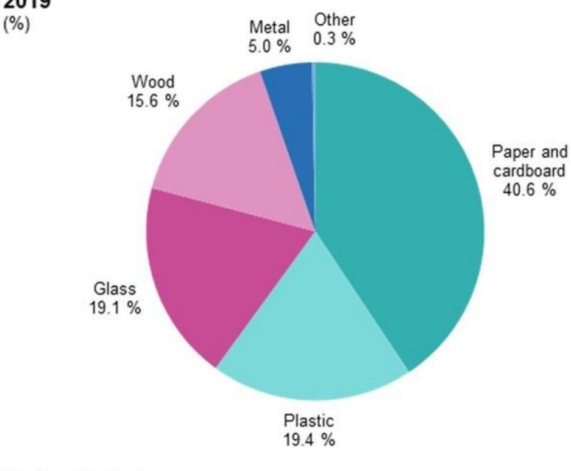

*Figure 1 Eurostat pie diagram showing packaging waste generated by packaging materials (2019) (adapted from [3])*

Based on packaging waste generated in EU the three main sub-value chains are:

- 1. Paper and cardboard,
- 2. Plastics and
- 3. Glass.

Following D4.1 deliverable, updates are provided for the Plastics packaging sub-value chain and thanks to the support of the FEVE (the Federation of European manufacturers of glass containers for food and beverage and flacons for perfumery, cosmetics and pharmacy markets), analysis of the Glass packaging sub-value chain is provided.

One point to mention is that, even if different materials can answer to same purpose in packaging and some applications are restricted to specific material, the different materials can be complementary.

## **5.1.1 The sub-value chain: Plastics**

This sub-value chain section on plastics packaging is an update of D4.1 containing an updated value chain description and an updated description of the safety and sustainability challenges.

#### **5.1.1.1 Steps within the Sub-value Chain covered (upstream & downstream steps) including infographic**

A refined plastic packaging Value Chain is described in [Figure 2.](#page-20-1)

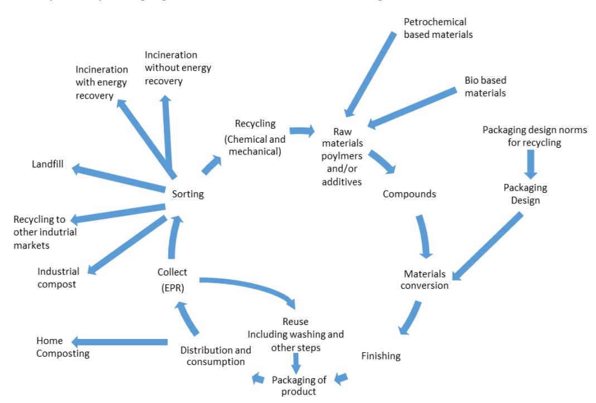

*Figure 2 Life cycle diagram for the plastics packaging Value Chain (updated)*

The different steps are:

o Raw materials are virgin polymeric materials and additives or substances for additional functionalities needed to process plastics parts which can be derived from petrochemical-based or bio-based materials (with several sources as starch, organic waste, microorganisms).

o The compounder steps processes these raw materials into adapted plastic materials= mixture or article, to produce parts. Although not compulsory, it is a common step in the plastics industry. o Packaging design standards for recycling are developed in the frame of European or national policies and will rule the choices in term of design, material and other parameters linked to packaging in order to ensure the recycling of packaging. The current or forthcoming regulations are: PPWR replacing PPWD 2008, Regulation 10/2011 and 1935/2004. Packaging design applies rules and standards, define packaging purpose, shape and properties. This design work will determine used materials and processes. o Raw plastic materials are converted into plastics parts. Several processes are used depending on the materials processed as well as the shape of the plastic packaging (i.e. films, bags, trays, boxes, caps and all other packaging parts). The materials conversion step can be done by specialized companies but also directly by companies needing the packaging. For example, several food industry firms produce in-house packaging to immediately pack the product. o Finishing is a generic step associated with several processes to provide final packaging parts to customers. It can be produced in-house by packaging producers or by specialized companies. These processes can be linked to printing, assembly and surface treatment. o Product packaging is typically undertaken by the producer of the product to be packaged. Several packaging can be used to pack a product. This step can combine Materials conversion and Finishing as mentioned above. o Distribution and consumption comprises of several actors [\(Table 1\)](#page-22-0). Plastic packaging distribution actors include transportation used between each step of the value chain, warehouses and distribution through various entities such as specialized retailers, large retailers and wholesalers. Plastic packaging consumers can be categorized into households and non-households (which includes industrial, but also all other organisation, which consume packed products). Both consumers generate waste which are not always managed in the same way. Composting is also possible at this step, thanks to biodegradable plastics, which make up a very low fraction of all plastics consumed. o The collection of plastic packaging waste is the first step in its end-of-life. This step is required for the sorting of plastics to take place. This step is manage by the Producers Responsibility Organisations (PRO) which are collective nationally operating bodies that provide compliance with the legislative requirements and Extended Producers Responsibility (ERP) policy of producers on their behalf and against a financial contribution on their part. o Sorting allows to sort the plastic packaging and transfer it through the vest valorisation chain, but also to recycle materials, which can require washing, disassembling and grinding as well as resorting after disassembly. This step is crucial to add value to plastic packaging waste. o Reuse and recycling options exist for plastic packaging:

▪ Reuse of packaging which includes a specific process for the collection, the washing of packaging, storage and distribution to the product producer. ▪ Chemical recycling which allows for recovering monomers used to produce virgin plastic materials. ▪ Mechanical recycling which mainly consists of grinding clean and sorted material to use it as raw material. o Beyond reuse and recycling, other end-of-life trajectories for plastic packaging include, incineration with and without energy generation (heat or electricity) and landfill. Packaging waste can also be used by other industries such as the textiles or building markets. o Composting is the last end of life trajectory, including home compost and industrial compost.

### **5.1.1.2 State of play on SSbD per VC and VC actors (existing methodologies)**

*Table 1 Updated mapping of VC actors active in SSbD initiatives development*

|      |             |             | Transport | Use  | End-of-life |
|------|-------------|-------------|-----------|------|-------------|
|      | ADEME       | ADEME       | ADEME     |      | ADEME       |
| EFSA | EFSA        | EFSA        |           | EFSA | EFSA        |
|      | EU Ecolabel | EU Ecolabel |           |      | EU Ecolabel |

ADEME: French Environment and Energy Management Agency; EFSA: European Food Safety Authority

Known funded initiatives (for further development in November 2024):

- SURPASS: Safe-, sUstainable- and Recyclable-by design Polymeric systems A guidance towardS next generation of plasticS, grant 101057901, started on 01/06/2022 for 42 months. Call: HORIZON-CL4-2021-RESILIENCE-01
- Flex Function to Sustain: Open Innovation Ecosystem for Sustainable Nano-functionalized Flexible Plastic and Paper Surfaces and Membranes, grant 862156, started on 01/04/2020 for 48 months. Call: H2020-NMBP-TO-IND-2018-2020
- Sealive: Strategies of circular Economy and Advanced bio-based solutions to keep our Lands and seas alIVE from plastics contamination, grant 862910, started on 01/10/2019 for 48 months. Call: H2020-BG-2019-1
- CIMPA: A CIrcular Multilayer Plastic Approach for value retention of end-of-life multilayer films, grant 101003864, started on 01/06/2021 for 36 months. Call: H2020-SC5-2020-2
- RMT Actia Propack Food is a French initiative creating a Mix Technological Network, gathering 17 partners. This network aims to support food and packaging industries and public authorities in R&D, set-up of tools and trainings development. Actions are focused on Food safety and ecotoxicity, process and functionalities and users and consumers (website only in French: [https://rmt-propackfood.actia-asso.eu/index.php\)](https://rmt-propackfood.actia-asso.eu/index.php)
- CEFLEX: CEFLEX brings the entire value chain together to tackle the complex technical and business barriers to a circular economy.
- Circular Plastics Alliance: The Circular Plastics Alliance aims to boost the EU market for recycled plastics to 10 million tonnes by 2025. The alliance covers the full plastics value chains and includes over 300 organisations representing industry, academia and public authorities.
- Recyclass : It is a non-profit, comprehensive, cross-industry initiative that advances plastic packaging recyclability while promoting the traceability of plastic waste and recycled plastic content in Europe
- FCCMigex Database, which show all food contact chemical extracted from peer reviewed scientific article

#### **5.1.1.3 Main SSbD challenges foreseen**

In this part, challenges have been updated or added, and rearranged among safety, sustainability/circularity and other type of priorities.

#### *5.1.1.3.1 Priorities on product safety*

- Raw materials: o Food contact materials regulation for packaging application only requires statement and not certification. It implies possible false declaration. In addition, REACH relies on the responsibility and confidence with industrials.
- Production and Processing (material or chemical): No real issue in Europe regarding raw materials, but several points need to be monitored: o The current regulation is linked to the current scientific knowledge. For example, Bisphenol A (BPA) was not considered as hazardous material up to scientific

- knowledge provided this information. A material is considered as non-hazardous as long as the toxicity is not established. o Non-intentionally added substances (NIAS) formation due to a wrong use of compliant material can produce a non-compliant article. o Cocktail effect: the materials mix can create a hazardous article, and it is difficult to know all interactions between materials. Zero risk doesn't exist. o New safety issues can appear in material production due to the increase of recycled materials. This increases the number of players in the value chain and therefore the complexity of safety management.
- Processing (product): o Use of hazardous material or substances can happen to improve product performance. o NIAS and cocktail effect: in the same way as for materials and chemicals processing o Issues with material sourcing: safety matters and composition uncertainties for articles from none EU countries. o Knowledge dissemination shortage: it is important to develop facilitator role in order to create a link between REACH and industrials. This is especially true with the high dynamic on substances regulations and associated tremendous communication. o Communication gaps can occur between design team and production team on safety assessment: ▪ introduction of substances by production teams to facilitate the production of the product; ▪ focus of the design team on product performance and safety compared to production safety.
- Transport: o Loss of material or product during logistic phase (e.g. sea transportation) which imply issues on safety and sustainability.
- Use: o Micro-plastics: release of microplastics during use is not totally known but studies have to confirm if there can be migration from micro-plastics to content or human skin, especially for food products.
- End-of-life: o During waste collection, food contact materials are associated with none food contact materials or none authorised materials (ink for example). It can create contamination issues during the recycling phase with a lot of non-authorized materials detected. o Heterogeneous regulation: some materials of the positive list in the food materials regulation 10/2011 are substances of very high concern for REACH.

### *5.1.1.3.2 Priorities on environmental sustainability and circularity*

- Raw Material Extraction o Use and production of bio-based material in Europe o Possibility to produce compostable packaging

- o Sourcing of petrochemical based materials Consideration of substances of concern in LCA: variable due to LCA mass cut-off rules and frequent few percentage of substances inside a product.
- Production and Processing (material or chemical) o Reduction of Substances use for additional functionalities in the o Introduction of substances above limits defined in the different rules (e.g. Classification, Labelling and Packaging, CLP)
- Processing (product) o Increase production of mono-material packaging o Recyclability of the product: currently there is no limitation regarding accepted materials but in the future, limitations will be developed for non-recyclable materials (e.g. polystyrene).
- Transport o Reduction of packaging weight or volume o CO2 emission coming from out-of Europe sourcing o Increased volume of packaging due to consumer returns (*[Figure 3](#page-26-1)*)
- Use o Micro-plastics and their effects on human being and ecosystems
- End-of-life o Better sorting of materials: o Sorting technologies are performing: material detection is possible but issues can appear due to the product and its characteristics (e.g.: expanded polystyrene trays for meat have bad ballistic properties. They are often ejected from the sorting process due to air jet sorters). o Consumer sorting is not enough significant especially on plastic packaging (e.g. all PET bottle can be recycled but currently nearly 50% are out of the recycling loop as shown i[n Figure 3\)](#page-26-1) o Development of recycling is limited by economical interest. Recyclers will develop recycling for materials with high volumes demand and possible investment in multiple recycling facilities.

#### *5.1.1.3.3 Recycled materials valid for food contact are limited. New recycling technologies are required for decontamination of recycled materials. Priorities on non-technological barriers (social, economy...)*

- Social: o Raw Material Extraction: ▪ Reduce use of petro-chemical material ▪ Find economic levers for packaging innovation. The expected low cost of the packaging compared to the total product cost limits the innovation. E.g. for reusable packaging consumer expects less expensive product. ▪ Avoid misleading consumers perception. Customers have frequently prefences for certain packaging materials. The associated opinion on safety and sustainability can be misleading. Economic perception can also be distorted: for example, plastic packaging can be perceived as cheap

material whereas plastic is available in limited quantities and requires several transformation processes to become a product.

o Transport: ▪ Reduce energy consumption of vehicles o End-of-life ▪ Facilitate recyclability of packaging ▪ Profitability of recycling is complex and need a densification of wastes deposit.

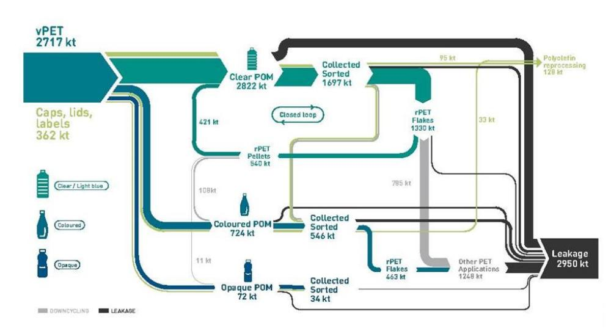

*Figure 3 Circularity of PET bottles (adapted from [4])*

## **5.1.2 The sub-value chain: Glass**

Glass sub-value chain analysis is provided by Mr Fabrice Rivet and Vanessa Chesnot from FEVE (the [European Container Glass Federation\)](https://feve.org/).

#### **5.1.2.1 The container glass industry**

The total glass production (excluding mineral glass wool) in 2022 stood at more than 39.5 million tonnes in 2022. The breakdown of the glass sector in 2022 was as follows: container glass 24,500,000 tonnes; flat glass 11,000,000 tonnes; reinforcing fibre glass 910,000 tonnes; domestic glass 1,161,000 tonnes, special glass 962,000 tonnes.

Container glass (also called packaging glass) represents thus by far the biggest sector of the glass industry. In Europe, it is represented by FEVE.

FEVE members produce glass containers for strategic value chains like food and beverage, perfumery, cosmetics and pharma markets. The industry serves these sectors in domestic markets and is an enabler for the export of high-end products across the world, which in turn delivers wealth to our economies through trade.

FEVE represents more than 90% of the container glass industry, with 60 corporate members belonging to approximately 20 independent industry groups. Their 160+ manufacturing plants are located across 23 European countries. As the whole glass value chain is located in the EU (extraction of most of the raw materials, glass production and glass recycling), the sector maintains an estimated 125,000 direct and indirect jobs along the value chain. Members produce over 80 billion glass containers per year.

The container glass industry produces innovative, stylish and sustainable products, which are present in every aspect of our daily lives. Glass is fully reusable and infinitely recyclable [5], as stated by environmental product footprint [6] in a closed loop as well as inert to keep products safe and secure.

Glass articles are transformed via a mineralogical process into the final article within single, integrated plants: there is no external transport of any glass in an intermediate state, for example to a converting industry. The main raw materials used in glass production are naturally occurring (sand, carbonates) and are not listed as critical [7].

Within the manufacturing process, prior to becoming articles, glass is produced in molten form and contained in tanks or channels which are entirely or largely closed, so that any risk of exposure to humans is minimized, if not avoided altogether.

By 2050 the glass packaging industry aims to transform glass production to offer fully climate-neutral packaging solutions in addition to being fully circular. As an energy-intensive sector, the industry continuously invests in reducing and optimising energy use and switching to green and renewable energies – to reduce the overall environmental impacts and costs linked to glass manufacturing.

Transitioning to climate-neutral glass production represents a long way in decarbonising production to meet the decarbonisation targets set by the Paris Climate Agreement: a -61% CO2 reduction by 2030 compared to 2005 and net carbon neutrality by 2050. Today, glass containers are 30% lighter, 70% less energy-intensive and emits 50% less CO2 than fifty years ago. Nonetheless, significant change are needed to achieve the goal of zero carbon emissions. A large sum of capital and operational expenditure is required. Public sector support and funding is, therefore, important to help industries deploy the technologies needed.

#### **5.1.2.2 Glass as a safe packaging material for food contact**

Made entirely of raw materials found in nature, glass is both uncomplicated and virtually inert and does no significant harm to the environment. Glass always maintains its inherent virgin like properties no matter how many times it is recycled. In addition:

- Glass is the only packaging material that does not need a plastic barrier, layer or liner and always remains healthy and safe for food contact packaging, no matter how many times it is recycled or reused.
- Because of its inherent inertness and protective properties, glass acts as a safe barrier to external agents, meaning products are preserved for longer in glass, even once opened. This makes glass the natural choice for preserving not only the quality of the product, but also for the health of the people who use it. The industry is partnering with customers to

introduce the [Glass Hallmark](https://glasshallmark.com/) onto packaging, serving, in part, to symbolise the commitment made to health and quality when choosing glass.

- Most common used additives in glass containers industry are colouring and decolouring agents for specific production runs: Iron chromite, iron oxide, iron sulphide, cobalt oxide, cerium oxide, selenium or zinc selenite.
- Glass is non-combustible and displays high chemical resistance to attack by water, acids and bases.
- It is considered inert in EU landfill legislation [8].
- It is exempted from registration requirements under REACH [9].
- It is recognized as safe for use in food contact [10], pharmaceutical and cosmetics applications.
- The minimal migration of impurities from glass has been recognized in derogations from EU legislation on packaging [11, 12] and on electrical and electronic equipment [13];
- Toxicological and eco-toxicological testing standards require the use of glass vessels for '*in vitro'* testing; glass waste can be transported across borders without requiring special permission [14].
- Vitrification (encapsulation in glass) of radioactive waste is a long-recognized practice for its long term storage and disposal.
- In the US, glass packaging has also received its seal of approval from the Food and Drug Administration, as it is "generally recognized as safe" (GRAS) by the agency [15].

### **5.1.2.3 Glass as a sustainable packaging material**

The European Container Glass manufacturing is a genuine circular model. Glass is fully reusable and infinitely recyclable in a closed loop as well as inert to keep products safe and secure, offering a Safe and Sustainable solution environmentally friendly alternative for a lot of packaging applications:

- Reusable glass has been a reality in Europe for decades, if not centuries. Glass dominates the refillable beverage containers market, where it accounts for 22% of packaging placed on the market in the key segments of beer, soft drinks and water (representing 96% of refillable beverage containers) in 2017.
- Glass is one of the most recycled packaging materials, with 80.1 % of all glass packaging put on the EU market in 2021 being collected for recycling. Using recycled glass saves energy and avoids CO2 emissions. Recycled glass is today the most important raw material in glass containers: on average 52% of recycled content in Europe in 2012[. Close the Glass](http://www.closetheglassloop.eu/)  [Loop](http://www.closetheglassloop.eu/) is a stewardship platform that FEVE launched with his value chain partners: municipalities, brand owners, Extended Producer Responsibility Schemes, recyclers, and container glass manufacturers. Its target is to achieve a 90% glass packaging collection for recycling rate in the EU by 2030.

### Social aspects on glass value chain materials:

It is important to underline that sand found on beaches or riverbanks can never be used in glass making because not only is it illegal, but it contains far too many impurities. Sand extraction is strictly regulated by EU, national and local legislation and by no means can the sand used in glass making be the object of illicit trafficking. Extraction permits guarantee its sustainable sourcing as well as the rehabilitation of the quarries at the end of the extraction period.

# **5.1.3 Steps within the VC covered (upstream & downstream steps):**

The container glass value chain is illustrated in [Figure 4](#page-29-1) and [Figure 5.](#page-31-2)

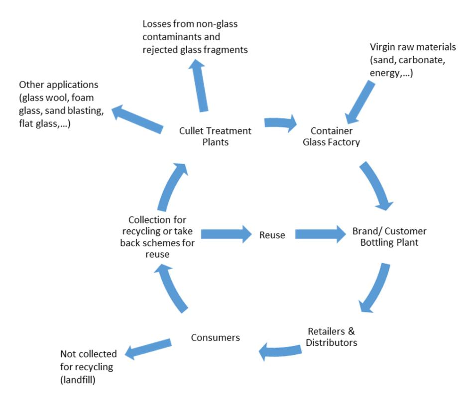

*Figure 4* **G***lass* **container** *value chain*

- • The container glass factory uses a mix of virgin raw materials (mainly sand and carbonates) and recycled glass (on average 52%) to produce new glass containers, which are sent to the customers' bottling plants. Raw materials used in glass making are locally sourced and do not travel a lot. The industrial sand used for glass production must comply with very strict technical specifications in terms of chemical purity and dimension. The glass industry value chain is more simple compare to other industries where several intermediates are necessary to convert the raw materials into a container (like plastic). In the glass industry, all manufacturing operations take place under the same roof: the raw materials are melted in a glass furnace, the molten glass is shaped using moulds into a container, which is then cooled down and packed in the same factory.

- The Brand or Customer bottling plant fills the glass containers with their products (beers, wines, soft drinks, food, perfumes, cosmetics, pharmaceutical products) and sends them to retailers, wholesalers or distributers.
- Retailers sell the products to the consumers, which are encouraged to recycle them.
- The collection method is essential to separate glass at source from other materials and avoid unnecessary handling which, by repeated breaking, can lead to small glass pieces difficult to treat and recycle. There is no single model for the collection of glass packaging waste in the European Union. Collection methods vary from street containers (also called "bottle banks") to kerbside collection (also called "door-to-door") to Deposit Return Schemes, from mono-material to comingled with other materials, or from colourseparated to mixed colours. The characteristics of the collection method will largely influence the total amount of glass packaging waste collected for recycling and the levels of purity with regard to the quality of the collected glass packaging waste. In 2021, 80.1% of glass packaging put on the EU market was collected for recycling. The industry initiated [Close the Glass Loop](https://closetheglassloop.eu/) stakeholder platform to achieve 90% collection in the EU by 2030.
- If the glass is reusable, once collected, it can be sent back to the fillers, where it will first undergo a quality check be cleaned to be refilled.
- Once collected, glass is sent to a glass recycling plant to produce furnace-ready cullet (the glass material that is recovered and used to replace raw materials in glass making is known as "cullet"). The sorting process within a Glass Recycling Facility is essential to remove the contaminants (as paper and plastics) from the glass packaging waste to meet industrial specifications for re-melt into new glass packaging products. Sorting happens in different steps (crushing, drying, air blowing for light pieces such as paper and plastics, magnetic separator for ferromagnetic metals, eddy currents separator for non-ferromagnetic metals such as aluminium and finally an optical sorting machine able to separate glass from ceramics and even sort glass by colour).
- After the glass recycling plant, the furnace-ready cullet can be either sent back to a container glass furnace (closed-loop recycling), to another sector of the glass industry (open-loop recycling) or be used in other applications (sand blasting, water filtering, etc).

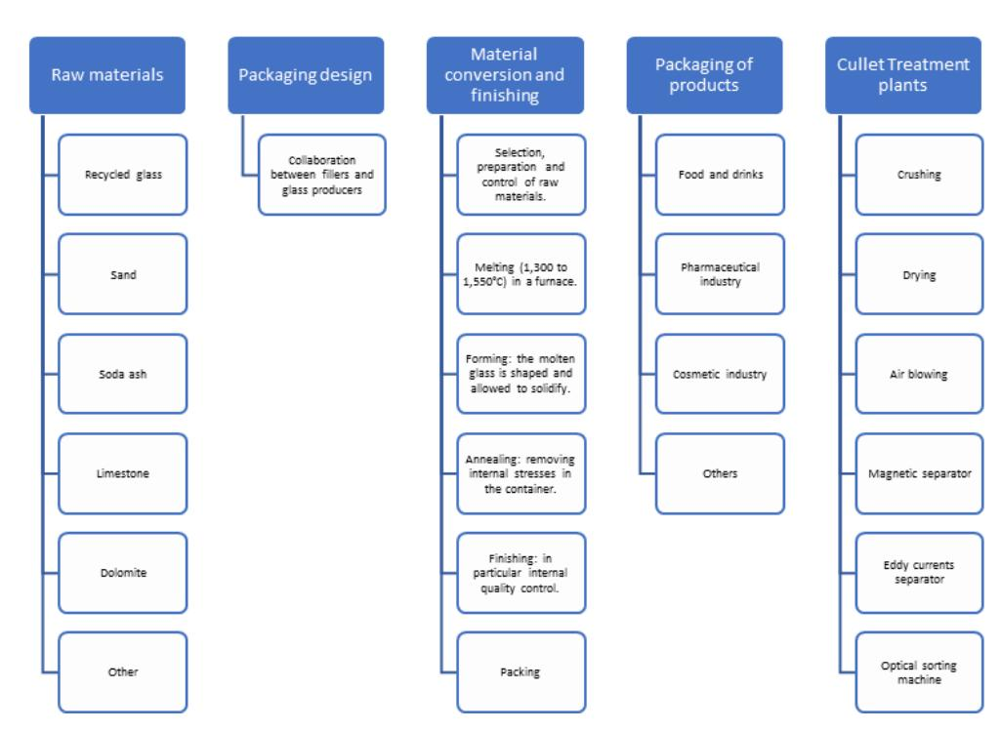

*Figure 5 Lifecycle view of glass container value chain*

# **5.1.4 Main SSbD challenges foreseen**

*Table 2 Main foreseen SSbD challenges in glass container value chain*

| material | Glass Production Transport Use |
|----------|--------------------------------|
|          | phase End-of-life              |
| High     | temperature                    |
| carbon   | dioxide,                       |
| dust     | and traces of                  |
|          | CO 2                           |

| material Glass Production Transport Use |        |
|-----------------------------------------|--------|
| phase End-of-life                       |        |
| This                                    | should |
| change                                  | to     |
| quality                                 | of     |
| High investments                        |        |

# **5.2 The Textiles value chain**

# **5.2.1 The sub-value chain: Smart textiles**

While no 100% accepted definition exists, smart textiles or e-textiles are most commonly understood as textile fibre based materials or products with integrated electronic components or devices providing a smart functionality which textile materials or products without such components cannot achieve.

Smart functionalities such as heat absorption or release, physical deformation, colour change or controlled substance release among many others can also be achieved by nonelectronic means such as nanomaterials, microcapsules, functional coatings etc. But these cases are more broadly referred to as functional or multifunctional textile materials. Other commonly used terms are flexible electronics or smart wearables. In these cases the overlap with smart textiles is only partial, because these materials or products can also be made of non-textile materials such as films, paper, plastics, rubber, leather etc. And the case of wearables by definition excludes many non-wearable smart textile applications such as smart interiors or structural parts of buildings, cars, airplanes, tents, greenhouses and many more.

For the purpose of following value chain discussion only textile materials/products with integrated electric or electronic components.

Demonstrators and small series smart textile products have been on the market for almost 25 years, but most have remained niche products mostly targeted at medical, personal protection, sports and outdoor or smart interior products. In this sense the smart textiles value chain can be considered as an emerging value chain and an interesting case where 2 IRISS value chains, textile and microelectronics intersect.

### **5.2.2 Steps within the VC covered (upstream & downstream steps): infographic describing the flows + types of stakeholders + company names**

The smart textiles value chain comprises multiple actors from three distinctive industries, namely electronics, textile, and ICT (Information and Communications Technology). This underlines both the need for cross-sectoral partnerships and how challenging it is to bring together competencies, energies and strategies based on three very different industries, viewpoints, and mindsets.

Currently, product development is predominantly driven by a technology push. Many products only reach the prototype stage because of the absence of (large-scale) manufacturing capabilities and the challenges related to the difficulty of finding the right long-lasting partnerships.

[Figure 6](#page-33-1) shows the full value chain map of smart textiles. The cross-sectoral value chain covers the hardware, software, and the textile part, and the end-product. Each part of this map is described in detail in the following pages.

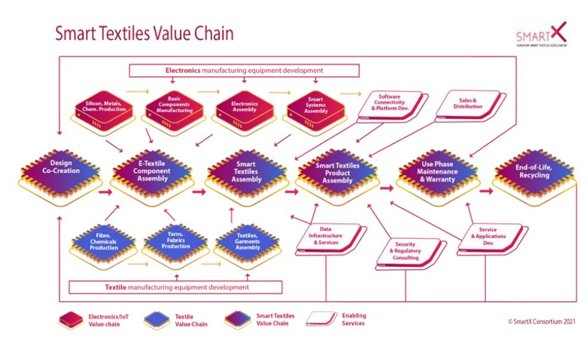

*Figure 6 Full SmartX Value Chain [16]*

This analytical map has been developed by the [SmartX](https://www.smartx-europe.eu/) Europe project, putting together the different stages, nodes, and components of this smart textiles value chain. It aims to give a clear vision of the whole interactive pattern, but more specifically to identify the current gaps that slow down or jeopardise the successful development of the European industry of smart textiles.

#### **Current challenges facing European smart textiles**

In short, one can say that there is no clear absence of any specific element, but rather a weakness in many of them that comes from **little collaborative history between the three industries concerned**. Furthermore, the still insufficient development of volume markets prevents most of the large businesses that predominantly supply equipment machinery, chemical, and electronics components from dedicating much effort and investment to smart textiles production.

Starting with **textile equipment manufacturers**, one can observe that the possibilities for simply adapting the equipment to smart textile production are clearly running out. It is up to traditional textile businesses to sensitise their suppliers on the need for fully novel machinery. A closer collaboration with EU research centres could greatly foster the industrialisation of lab innovations to develop such necessary new machinery.

Another gap can be observed in terms of **chemical supplies,** which are key to the functionalisation of smart textiles. Of course, such inputs are mostly outside of the scope of the smart textile value chain (e.g. metals, pigments etc.). They are produced by large players who are used to - and keen on - producing and supplying very large quantities for traditional textiles, whereas smart textile businesses usually need very specific materials in limited quantities, necessitating the involvement of dedicated formulating intermediaries.

On the skills front, one can observe that in order to develop innovative yarns, fabrics, coatings or embroideries, most traditional textile manufacturers are lacking in some **key competencies** to use new processes and new materials, or design new commercial strategies to develop, manufacture, and bring products to the market. In particular, textile companies usually lack specific knowledge of electronics, which prevents them from being actively involved in scaling up the smart textile manufacturing.

Another crucial challenge for the industry lies at the **assembly stage** of functionalised items or garments. The latest design and CAD software, enabling the creation and alignment of cutting patterns for the textile articles assembly can be used, but very few examples of an automated, larger-scale production can yet be seen in the industry.

To meet the existing challenges, several highly promising fields are opening up to the industry. The most important one is the development of **flexible electronics**, which allow for efficient connections between soft material substrates and hard metal components. However, the manufacturing of flexible and stretchable electronics requires processes totally different from the traditional methods used to manufacture conventional rigid integrated circuits, like pattern transfer, solution printing, roll-to-roll capabilities and additive manufacturing.

Another recent promising development lies in **chip platforms** using hybrid architecture, combining a system-on-chip with a low-power coprocessor. This translates into significantly better performance and user experience, faster memory and launching of apps, richer graphics and user interfaces, and improved photo and video functionality.

Currently, aside from the technological developments, the main challenge in the area of silicon chip manufacturing, is their **availability**. The huge demand for chips has created a shortage that could be a threat to the development of smart textiles applications.

Another development would positively impact the very cost structure of smart textiles. The current high cost of traditional electronics manufacturing process prevents the development of significantly large markets for smart textiles and the successful marketing of many applications. Very promising are the lower costs and attractive new properties of organic electronics, constructed from organic (carbon-based) molecules or polymers using synthetic strategies developed in the context of organic chemistry and polymer chemistry.

Further down the manufacturing chain, **assembling textile electronics** objects requires the efficient integration of electronics into textiles at different stages (i.e. at the level of yarn or fabric) and the use of coating or encapsulation techniques to avoid removal of the electronics prior to washing or cleaning. Assembly techniques can be manifold, but presently they largely rely on manual processes.

Most challenging is the need for a robust **integration and contacting technologies** that can resist normal usage of clothing and the miniaturisation of power supply and storage devices. In addition, fully automated manufacturing capabilities are still missing and machine development that covers the entire process chain of the integration of electronic components in textiles clearly needs to be intensified.

The **integration of electronics** or textile electronic objects into garments or other articles (upholstery, bedding, carpets etc.) is made by 'system integrators', essentially SMEs that bridge textile and electronics companies by providing electronics-related expertise to textile companies and textile-related expertise to electronics companies. However, their limited production capacity implies high costs and restricts consumer markets to high-end ones. Two other barriers currently slowing down the development of smart textile assemblies are the lack of specific design software and of guidelines or even standardisation of components specifically dedicated to smart textiles.

In the area of **software components,** connectivity and platform building are two key elements of the successful development of any smart textile. Players relating to this node in the value chain are experts in building interfaces to connect different materials, processes and systems, establishing platforms and the respective interfaces, software and hardware, in order to collect data for the development of additional functionalities.

**Data collection, management and analysis** should not at all be considered outside of the smart textile value-chain. The smart textile community needs to work more closely with those dedicated players that can transform sensor data and processing data into data that is ready for use in software applications to implement the "smart" functionality of textiles.

At the next stage of the chain, one finds the **Smart Devices or Smart Systems** resulting from the smart textile product assembly, which heavily rely on the additional use of software. Each device is part of a network of Smart Devices, the so-called Smart Network. This activity

represents a necessary strong link in the value chain, as data that is used in this Smart Network is in the cloud and is therefore linked to security issues, data analytics, data processing, etc.

**Retailing** currently represents a weak point in the value chain, as design and production costs tend to limit the market to a niche caring to the need of professional performers of various kinds. More generally, a related key issue that limits smart textile success is that the whole value-chain is driven by technology more than by market demand and does not rely enough either on **market research or promotional activities**. From the earliest research and development stages of any project, it is particularly crucial to ensure that the unique properties of textiles are indeed essential for the desired use case and cannot be more competitively supplied by alternative solutions (e.g. wearables, external monitoring etc.). This condition would often need to be more carefully validated.

Should the markets expand rapidly, smart textiles might result in a new kind of waste that could be difficult to recycle and would have to comply with European waste regulations. Therefore, a major challenge for the industry, and increasingly so, is the need to implement **eco-design** in the technological development process and minimise future waste. For the time being, one must admit the existing design for recycling principles for textiles or electronics rarely match with the properties of the combined products. Therefore, life-cycle thinking needs to be implemented *together* with the technological development process.

Throughout the smart textile value chain, businesses suffer from a regulatory gap in terms of guidance when it comes to compliance (e.g. testing, assessment, labelling), since parts of the **regulation** are either missing or are too highly fragmented. At the same time, stakeholders demand more regulatory control at the international level to ensure fair competition, especially between Asian and Western businesses.

More standardisation is also required to facilitate stakeholder interactions, e.g. creating interfaces between electronics and textiles, contacting, data standards, testing standards etc. Both regulations and legislation are needed to support the intended usage scenarios and prevent misuse.

# **5.2.3 Main SSbD challenges foreseen**

The main SSbD challenges in the smart textiles value chain stem from the fact that the textile and electronics sectors have different approaches to assessing safety and sustainability in the chemicals, materials and processes they use. In addition, textile products that contain electronic components such as wires, connectors, sensors, LEDs, batteries etc. create user comfort and safety issues as well as end of life challenges that differ from conventional textile products.

Specific safety challenges include:

- Potential toxicity of metals (silver, copper) and chemicals used in the electronic components that get integrated into a smart textile product.

- Skin irritations or burns from hard, rough, heat or radiation-emitting components in close contact with the skin.
- Damage or degradation of electronic components during production or use such as washing liquids and detergents, sweat, weather/UV exposure or excessive physical wear and tear.
- Alteration of typical textile material behaviours such as heat and flame resistance through presence of electronic components leading to heightened fire risk especially for smart interior textiles.
- Higher risks for children/infants due to presence of cables or detachable small parts.

Specific sustainability challenges include:

- Higher waste generation in production due to complexity and delicacy of electronics integration into textiles.
- Higher post-consumer waste generation due to higher damage in use or faster technical obsolescence of smart textile products compared to conventional textile products.
- Greater difficulty in reuse and recycling of end-of-life smart textile products compared to conventional ones (electronic components represent disruptors for mechanical and chemical textile recycling processes).
- Lack of established separate end-of-life collection systems for smart textiles.

#### Cross-cutting challenges:

- Cross-sectoral supply chains are more difficult to organize and SSbD data generation and exchange can be more challenging due to differing taxonomies, data standards, test methods, respective process know-how.
- Standardization challenges due to differing standards, standardization bodies and processes for textile products and electronic components and devices.
- Inability of typically SME-sized developers and marketers of smart textile products to practice and finance comprehensive SSbD design principles and processes. Smart textiles development involves a lot of trial-and-error prototyping and user testing.

# **5.3 The Construction value chain**

In addition to an assessment of SSbD challenges for the highest volume construction chemicals value chain, i.e. a class of concrete admixtures called super-plasticizers, another key construction (chemicals) value chain, that of insulation materials has been analysed.

### **5.3.1 Insulation Materials sub-value chain**

According to the JRC report of 2018, buildings consume 40% of the EU's primary energy demand and produce about 35% of all greenhouse gas emissions. Buildings have a large energy-savings potential through renovation and upgrading. Under the existing Energy Performance of Buildings Directive, the EU countries must set minimum energy performance requirements for new buildings and for the major renovation of buildings. Therefore, insulation materials contribute significantly to improving the overall energy efficiency and sustainability of buildings, especially by reducing the energy losses through the building envelope (walls, roofs, floors, etc.) [17].

There is a wide range of insulation materials currently available: cellulose, fiberglass, HempCrete (blocks), mineral wool (glass and stone wool), Polystyrene, Polyurethane (PU) foams (with or without blowing agents), straw (panels) and wood (fibre, board). The most used materials for building insulation are *wool minerals* (glass and stone wool) and *polymeric materials* (Expanded PolyStyrene (EPS), Extruded Polystyrene (XPS) and Polyurethane (PUR)) (see figure 7 below) [17].

The focus of this SSbD evaluation will be on the *construction chemicals* sub-value chains (referred to 'organic fossil fuel derived' in the JRC Report) of PU based insulation materials.

## **5.3.2 Polystyrene or Polyurethane foams sub-value chains**

Polystyrene or Polyurethane foams can be used in combination with structural materials, such as concrete. They are lightweight materials and excellent *insulators*. Foams can be used as part of an insulated panel, where the foam is sandwiched between cement or insulating concrete forms. As the application of the SSbD framework offers more challenges and opportunities for polyurethane foams than polystyrene foams, it's application will be reviewed for PU foams only.

The PU foams sub-value chain comprises four subsequent or overlapping stages:

- 1. **Manufacture of raw materials**, such as diisocyanates and polyols.
- 2. **Manufacture of PU foams** is often done on-site at the building itself.
- 3. **Application / Use of PU foams** in buildings at the building itself.
- **4. Recycling / Reuse of PU Foams**

The manufacture of raw materials is done by (very) large chemical companies with experience and in-depth knowledge of the raw materials and done, where required, under strictly controlled conditions. The manufacture and use of PU foams is typically done at the building site itself, often by SMEs with expert knowledge and experience.

In Europe, there are more than 7,000 companies involved directly in the production and use of polyurethane raw materials, elements and finished goods. If the complete chain of value for these products and their final market uses is considered, the number of companies (largely SMEs) impacted increases tenfold, for a total of 70,250 companies. In addition to the wealth creation of €59.34 billion, this value chain creates close to 3.8 million jobs in the European economy. The largest share of polyurethane products in Europe is used for construction in all types of infrastructure projects. However, its most significant role within this sector is building insulation [18].

## **5.3.3 Polyurethane (PU) foams – State of Play**

Polyurethane (PU) is essentially made of two raw materials, a (di-)isocyanate and a polyol, both of which are derived from crude oil. After mixing those two process-ready liquid components of the system and various auxiliary materials, such as catalysts, foaming agents, and stabilizers, a chemical reaction starts resulting in the polyurethane. In addition, a blowing agent is required.

As an element of their Research & Innovation efforts, industry has been developing low isocyanate and isocyanate-free foams, to foster safer use of such chemicals. The main challenge for such low-isocyanate and isocyanate-free foams, however, is their performance, as the absence of di-isocyanates results in a significant loss in performance.

The potential of polyurethane foams to be reused, offers clear opportunities for advancing circularity.

## **5.3.4 Key SSbD Challenges and Opportunities**

An overview of all relevant environmental and social aspects in the life cycle stages of PU based insulation is provided in [Table 3.](#page-41-2)

Probably, the most challenging SSbD criterion of PU Foams is related to the manufacture of PU foams and the use of di-isocyanates as raw materials. PolyUrethane (PU) foams themselves typically do not attract an EU classification or label but are manufactured using di-isocyanates as raw materials, which are classified as a Substances of Very High Concern (SVHC) and their use is **restricted** under the REACH Regulation (the Restriction was published on the 4th of August 2020 and will apply from the 24th of August 2023, after a transition period of three years).

To meet the requirements of the REACH restriction, raw material and polyurethane manufacturers have, together with the downstream users of polyurethanes, developed training materials and courses for professional users, in the official language(s) of the EU Member State(s) where the substance(s) or mixture(s) are applied [19]. The training covers a wide range of different applications and takes into consideration the specificity of the products supplied, including composition, packaging and design.

Another aspect of PU foams is that they require a **blowing agent**. Traditionally HFC (HydroFluoroCarbon) was used as a blowing agent, but this is an ozone depleting substance with a high global warming potential. The industry has developed an alternative blowing agent: HFO (HydroFluoroOlefin), which is not ozone depleting and has a low global warming potential. Decomposition of HFO in the atmosphere, however, may lead to depositions of trifluoroacetic acid (TCA) in groundwater and soil. Further advances have been reported for water-induced self-blown non-isocyanate polyurethane foams [20].

Recently, a very relevant project has been initiated called '[Circular Foam](https://circular-foam.eu/)' 3 , which is a multistakeholder research project that has been initiated by an SME called 'Circularise' and is focusing on improving the circularity of rigid PU foams. The project runs from October 2021 until September 2025 and the project partners include Research Institutes, raw materials producers, foam producers, municipalities, and other entities. The main goal of the project is to develop a system for communicating production process data.

#### **Energy costs/Green House Gases (GHG) emissions**

Probably the main advantage of polyurethanes is that they lead to reduced energy costs and therefore, make buildings eco-friendlier. 40% of the global energy demand, correlating with one third of greenhouse gas emissions are linked to infrastructures like houses and buildings. Experts estimate that worldwide insulation of buildings to optimal standards could reduce global CO2 emissions by 20%. Therefore, PU Foams are essential in meeting the GHG goal of the European-Green Deal [21].

#### **Durability**

Another positive SSbD criterion of PU based foams is their durability as they offer a much longer lifetime than other insulation materials.

#### **Life Cycle Assessment**

PU Europe, the industry association representing PU manufacturers in Europe, commissioned PwC to write a comprehensive report on an Environmental and Economic Analysis of insulation materials in low energy buildings [22]. The goal was to provide evidence that the methods developed at European level, provide accurate results with regards to the environmental and cost performance of a building (element) based on specific product choices. Three different insulation materials have been evaluated: Polyurethane (PU), Expanded Polystyrene (EPS), and Stone Wool (SW).

A comprehensive Life Cycle Assessment (LCA) as well as a Life Cycle Cost (LCC) analysis was conducted for all scenarios. The highest costs over the lifetime are energy costs (31%), construction costs (except insulation) (21%), and maintenance (15%), where the costs of insulation were low (5%). The overall costs of construction differ less than 4.3% for the four different scenarios, showing that costs are not a deciding factor in the choice of insulation material.

Finally, the project stressed the importance of building design solutions and demonstrates that the impact of insulation products on the overall environmental burden of a building is negligible compared to their benefits in the **building use phase**.

3 <https://circular-foam.eu/>

*Table 3 Environmental, Health & Social criteria for PU foams for insulation*

| CONSTRUCTION - POLYURETHANES                     | ENVIRONMENTAL CRITERIA                          | SAFETY CRITERIA                                  | SOCIAL CRITERIA              |
|--------------------------------------------------|-------------------------------------------------|--------------------------------------------------|------------------------------|
| <b>RAW MATERIALS</b>                             | Sustainable sourcing of raw materials - natural |                                                  | Social responsibility        |
| <i><b>Raw materials</b></i>                      | Environmental hazards                           | Health & Safety hazards                          |                              |
|                                                  | Energy consumption                              |                                                  |                              |
| <b>PRODUCTION STAGE</b>                          | Emissions (air, water, soil)                    |                                                  |                              |
| <i><b>Polyurethane (PU) based insulation</b></i> | Energy consumption                              |                                                  |                              |
|                                                  | Water consumption                               |                                                  |                              |
|                                                  | Waste generation                                | Safe handling of raw materials and products      | Workers training on safe use |
|                                                  | Restricted substances related to environmental  | Restricted substances related to health & safety |                              |
| <b>USE STAGE</b>                                 | Emissions (air, water, soil)                    |                                                  | Social responsibility        |
| <i><b>Buildings</b></i>                          | Energy consumption                              |                                                  |                              |
|                                                  | Reduced carbon footprint in use                 |                                                  |                              |
|                                                  | Water consumption                               | Physical safety hazards                          |                              |
|                                                  | Restricted substances related to environmental  | Restricted substances related to health & safety |                              |
|                                                  | Functionality (fitness for use)                 |                                                  | Workers training on safe use |
|                                                  | Durability                                      |                                                  |                              |
|                                                  | Emissions of ODP substances                     |                                                  |                              |
| <b>END_of_LIFE</b>                               | Recyclability                                   |                                                  | Social responsibility        |
| <b>PU insulation waste</b>                       | Waste                                           |                                                  |                              |

# **5.4 The Automotive value chain**

# **5.4.1 Sub-value chain covered: Moulded PU foams for car seats**

Polyurethanes (PU) are the second-most used plastic in passenger vehicles, accounting for more than 20% of plastic used (22-28 kg). Out of all polyurethane foam usage in the car, the majority, around 60%, is used in seating including cushions and backrest (10-15 kg). It is almost exclusively produced through moulding [23].

## **5.4.1.1 Steps within the Sub-value Chain covered (upstream & downstream steps)**

## *5.4.1.1.1 Infographic describing the flows*

The formation process of PU foam parts in moulds is demonstrated below in simplified version in Figure 7 [Formation of polyurethane in moulds \(reactor\).](#page-42-0)

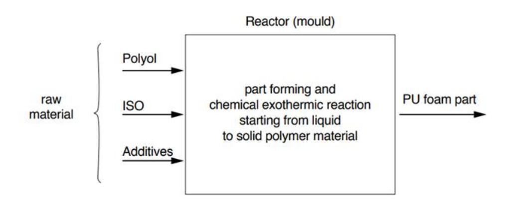

*Figure 7 Formation of polyurethane in moulds (reactor) (adapted from [23], Figure 2)*

#### **Raw Materials**

Similar to other PU foams such as those used for mattresses and upholstered furniture, automotive moulded foams are made by reacting di‐isocyanates and polyols. Both products are typically derived from crude oil. Polyols however can also be made of natural oils from renewable sources and since recently so-called "mass-balance" polyols and diisocyanates made from (bio-) circular sources are also available on the market and start being used. Di-isocyanate can be either toluene diisocyanate (TDI) or diphenylmethane diisocyanate (MDI), and both are used in vehicle seating (60-70% MDI and 30-40% TDI). When these ingredients are mixed, they react and foam. Depending on the end product, the chemical formulations may contain other ingredients such as additives, catalysts, colorants, water/carbon dioxide [23].

#### **Production & Transformation (including design)**

Moulded flexible foam is made by injecting pre-determined amount of reactant blend (isocyanate and premix) into a pre-heated mould coated with a release agent into the preheated mould (55°C). When the mixture rises and expands, it occupies the whole space in the mold and solidifies. At the end of the production line, the mould opens and the moulded foam part may be removed from the mould ('demoulded') [24]. After demoulding, the quality control determines the further flow of the parts (e.g. sent to packing and storage area, rework, post-treatment, assembly or scrapping). The detailed process can be observed in Figure 8 [Production line of flexible moulded PU foams](#page-43-0)

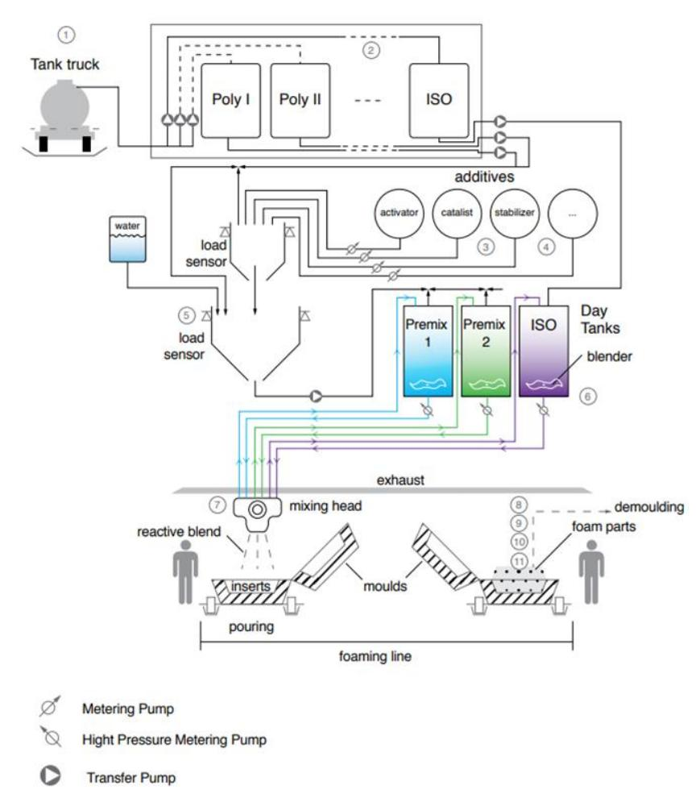

*Figure 8 Production line of flexible moulded PU foams ([23], Figure 29)*

Part of the transformation process is tied to the specific automotive OEM design specifications, including comfort and safety aspects [25]. This is explained in more detail below.

Certain automotive foams possess inherent fire-resistant properties, while others undergo treatment with flame retardants [26].

#### **Use Phase**

Flexible PU foam is a durable material, with the ability to recover its properties. This insures that during normal day-to-day use the product will perform at essentially the same level as when produced over the lifetime of the vehicle [27].

After complying with the stringent tests on mechanical and physical properties in conformity with OEM specifications, the moulded foam stays in the car seat for the lifetime of the car unless there is a major damage.

#### **End-of-life**

Flexible polyurethane foam can be recycled via mechanical recycling and depolymerization. While this can apply to moulded foams, recycling of automotive moulded foams is not common today, contrary to what is happening for mattresses in some countries in Europe. The main reasons for this are: 1) A double mattress can have nearly as much PU foam as an entire car but unlike in a mattress, PU foam in automobiles is often scattered in different places of the vehicles and not always easily accessible 2) Car seats are designed to last for the whole lifetime of the car and therefore include other materials embedded in the foam such as metal inserts or sensors for safety features, which would need to be removed (manually) before recycling, 3) Typically, seats are not removed from cars before an end-oflife vehicle is shredded, meaning PU foams end up being contaminated with oil or other liquids and thus not be clean enough for recycling. There is some promising research ongoing to recycle PU-containing automotive shredder residue (ASR) via chemical recycling. This would have the advantage of allowing to overcome many of the above-mentioned challenges as it would not require expensive manual dismantling or introducing new steps in ELV (End of Life Vehicle) treatment processes. But this is still at the initial R&D stage at the moment [27].

### *5.4.1.1.2 Types of stakeholders and company names*

There are several stakeholders involved in the production of PU moulded foams for automotive seating, as shown i[n Figure 9.](#page-44-0) Upstream, there are the raw material stakeholders (e.g. Polyol and Diisocyanates Producers such as for example Shell, Repsol, PCC Rokita, MOL, BASF, Dow, Covestro and additives producers such as Evonik, Momentive or other specialty chemicals producers), followed by the Tier 2 suppliers which manufacture the foam and Tier 1 suppliers produce the car seats (e.g. Adient, Forvia, Lear, Magna, Toyota Boshoku, Fehrer, Proseat) [23]. The car seats are sold to OEMs and handled at the end of life by Authorised Treatment Facilities.

*Figure 9 Main stakeholders in the PU foam for automotive seats ecosystem (source: own, based on [23])*

#### **5.4.1.2 State of play on SSbD per VC and VC actors (existing methodologies): - what has been done with regards with SSbD?**

### *5.4.1.2.1 Sharing of best practices in place per value chain? (if any)*

- IMDS: IMDS (International Material Data System) is a digital tool used across the entire automotive supply chain for the reporting of materials used in vehicles around the world and to better cope with increasing standards, laws and regulations in the field of substances and recycling targets. It is an online database where all materials used for

manufacturing automobiles are collected, maintained, analysed and archived. With upcoming obligation from ELV Regulation on minimum quotas of recycled content of products, it is important to achieve harmonization on calculation methodology, terminology and methods of communicating information on the recycled content of vehicles. This is why in May 2023 the IMDS has been enhanced to offer the option to specify chemical recycling and portions of bio-based. This includes options to declare a certification to a certain standard (e.g. ISCC+, Redcert) and mass-balanced content for biobased and chemically recycled materials (e.g. portion vs inorganic content within the material; portion of mechanical or chemical recycling; portion of pre-consumer and postconsumer recyclate) [28].

- Alternative sustainable materials: Making foams with renewable polyols (soybean, castor or rapeseed oil) has been possible for many years and all foam producers can offer such foams with various renewable content if OEMs so require. Making foams with CO2 polyols is another possibility [29].

#### *5.4.1.2.2 Known funding initiatives*

- The DECORE project dedicated to automotive, aims to design cockpits including PU recycling. [DECORE consortium](https://www.faurecia.com/en/newsroom/sustainable-industry-awards-seat-planet-wins-eco-design-trophy)4 : Forvia, Renault, CEA (French Alternative Energies and Atomic Energy Commission) and MTB Recycling. Its objective is to design cockpits using 40% recycled materials, with a CO2 impact reduced by 85% by 2030.
- The EU-funde[d FIBIOSEAT](https://cordis.europa.eu/project/id/298171/reporting/fr)5 (Fire resistant biobased polyurethane foam for aircraft seating cushions) project set out to develop seat cushions using petroleum-based and natural oil polyols and non-halogenated flame retardants that provide comfort and durability. Comfort, support and durability were assessed, and mechanical properties and fire behaviour were tested. Scientists also studied the PU foaming machine and selected melamine for use as a fire retardant. Several foaming moulds for seat cushions were designed. Based on this, project partners manufactured a green PU seat cover solution with computer-aided optimisation software. It contains 30 % bio-based polyol that fulfils all aircraft requirements for fire resistance, comfort and durability. Two versions were manufactured and made available with and without expandable graphite, a fire-retardant additive for the foam. It is easily recyclable through mechanical or chemical processes. Successful production of innovative and green foams from petroleum and renewable resources and treating them with increased concentrations of non-toxic fire retardants should provide the PU foam processing sector in Europe with a clear competitive edge.
- PURESMART, an EU funded project on recycling of polyurethanes (not from cars), aims to transform PU into a circular material. The project targets the recovery of over 90 % of end-of-life PU with the goal of converting it into valuable inputs for new and known products. The project consortium will develop smart sorting technologies to separate a

4 https://www.faurecia.com/en/newsroom/sustainable-industry-awards-seat-planet-wins-eco-design-trophy

5 https://cordis.europa.eu/project/id/298171/reporting/fr

diverse range of PU materials into dedicated feedstocks, which will be broken down into their basic components.

#### **5.4.1.3 Main SSbD challenges foreseen**

#### *5.4.1.3.1 Priorities on product Safety*

#### **Mechanical properties**

Foams have to undergo very stringent mechanical properties testing (varying from one OEM to the other) to ensure the foams can last the whole lifetime of the car or even longer. The automotive OEM design specifications are linked with aspects as comfort and safety. For instance, the design of seats has implications on safety, to prevent spinal and head injuries, in case of collisions. Every seat element is significant, beginning with head rests, which stabilize the cervical section of the spine, through seats and a back rests, which are supposed to stabilize the lumbar spine and to prevent leaning of the passenger body sideways on curves, ending with safety belts [30]. There are car seat safety standards which guide the design of car seats, meaning that also changes to designs must be carefully assessed including through a series of demanding tests in prototype workshops, in order to ensure that e.g. use of new materials do not affect safety or functionality. The whole process can take several years and varies from vehicle to vehicle. For example, there are differences in seat design between internal combustion engine cars and electric cars due to the differently located centre of gravity in these two types of vehicles.

#### **Emissions**

Automotive OEM requirements for indoor air quality are very relevant for the polyurethane industry. Automotive suppliers need to validate the compliance of their components to certain OEM specifications for emission behaviour prior to their use in the vehicle interior. Below is an overview of the most relevant emissions associated with PU foams in car interior:

- **Volatile Organic Compounds emissions:** In recent years governmental regulation has pushed for the reduction in Volatile Organic Compounds (VOCs) emissions. VOCs can have adverse effects on the human health and can negatively impact the environment. This concern has encouraged the development of new analysis methods and the introduction of emission standards by car manufacturers. The requirement for foam products according to the Verband der Automobilindustrie (VDA) 278 standard is ≤100 μg/g for VOC and ≤250 μg/g for Semi-Volatile Organic Compounds (FOG). The Global Automotive Declarable Substance List (GADSL) includes volatile substances, and its presence in the products must be indicated according to industry standards. Most currently used standards specify the volatile content of products for a given compound (e.g., acetone, toluene), so it is often difficult to determine exactly which component is responsible for the emission. It is thought that the catalysts (e.g. triethylenediamine) and surfactant (e.g. siloxanes) used in the formulation of PU foams are responsible for most of the VOC content. German car manufacturers have set VOC specifications using VDA (Verband der Automobilindustrie) and chamber test methods to measure emissions from materials in the interior of the automobile. The Japanese Automobile Manufacturers Association

(JAMA) set voluntary VOC specifications for the cabin of new models of passenger cars manufactured and sold starting in 2007. The Chinese government introduced regulations beginning in 2007 with the VOC test method HJ-T400-2007 for Cabin of Vehicles. Starting in March 2012, the GB/T 27630-2011 "Guidelines for air quality assessment of passenger car" which are based on the Chinese "Indoor air quality standards" GB/T 18883-2002 were formally implemented [31, 32, 33].

- **Semi-volatile organic compounds**: Besides volatile organic compounds (VOC), plastics and other non-metallic materials release semi-volatile organic compounds (FOG). Such compounds can condense on colder surfaces (e.g. windshields) and lead to a layer that impairs visibility. This effect is also known as window fogging [31].

#### **Flammability**

The criteria for burn resistance standards can vary, meaning that automotive engineers need to consider precise national, international, or industry-specific prerequisites when selecting materials. Moreover, engineers may seek flame retardant foams that align with Original Equipment Manufacturer (OEM) demands for reduced emissions, improved aging characteristics, and enhanced toxicity profiles. As material suppliers introduce innovative products into the market, vehicle designs have the opportunity to integrate flame retardant automotive foams that not only meet safety standards but also contribute to reducing noise, dampening vibration, and mitigating harshness. In Europe, Canada, and Japan ISO 3795:1989 specifies a method for determining the horizontal burning rate of materials used in the occupant compartment of vehicles, after exposure to a small flame. In the United States, the fire performance of automotive foams is tested according to [FMVSS 302.](https://www.nhtsa.gov/sites/nhtsa.dot.gov/files/documents/2017saebhennessey.pdf) China (GB 8410), Britain (BS AU 169a), and many other countries also maintain flammability standards for motor vehicles. Flammability requirements are lower for automotive parts than for trains or planes, which has an impact on the use of flame retardant. Halogenated flame retardants are not used anymore in automotive parts [26].

### *5.4.1.3.2 Climate neutrality and circularity*

Since the automotive sector is a large consumer of resources, it is of fundamental importance to maximise material efficiency through simplified product design. Design choices associated with complexity (e.g., multilayer materials), the nature of materials, the presence of additives and/or specific substances impact the durability but also recyclability of products and materials.

With the recently proposed End-of-Life Vehicles Regulation, the European Commission lays down circularity requirements on vehicle design and production related to reusability, recyclability and recoverability and the use of recycled content, which are to be verified at type-approval of vehicles, and on information and labelling requirements on parts, components and materials in vehicles. Among other things, some of the main objectives are to 1) facilitate and increase the removal, reuse, remanufacturing and recycling of materials, parts and components; 2) increase the use of recycled materials in the production of vehicles, thereby incentivising recycling [27].

The integration of recycled content in plastics, as proposed in the Regulation, has sparked increased dialogue in the automotive supply chain, to reach a common understanding of what can be achieved within the next few years on plastic circularity and what other solutions are existing to increase plastics sustainability profile including in terms of its carbon footprint. Below are a few items which are relevant in this context:

- **Light-weighting:** Similarly to other plastics used in vehicles, PU moulded foams are relatively light-weight materials which allow decreasing fuel consumption. Notwithstanding the fact that seating systems represent almost 40 percent of the weight of a vehicle's main interior components, seating foams have one of the lowest densities of any plastic material used in a car. Continuous investments in R&I are made to further reduce the material density while maintaining performance.
- **CO2 footprint/raw materials:** The overall impact of PU in the lifecycle of a car is relatively small (< 1% of the car lifecycle GHG emissions) and the biggest share of its impact is due to the raw materials used in its production are responsible for 90% of the total climate impacts from the production of polyurethane foam. While the raw materials used for flexible PU foam production are often derived from crude oil, there is an increased use of bio-polyols, recycled polyols and CO2-based polyols. The first one is by using biomaterials (e.g. castor, rapeseed or soybean oils) as feedstock. More recently, recycled polyols from depolymerisation of end-of-life mattresses are also available on the market. The main way of integrating recycled content in PU for automotive applications is via the mass-balance approach. An increasing number of such raw materials and PU parts made with these materials are already on the market. Both alternatives have been tested and tried in various applications in the automotive sector [27, 29].
- **Design for lifetime maximisation:** Circular vehicles should be designed for longevity and durability, while enabling product life extension features such as maintenance, repair, remanufacturing and updates. This has a positive impact on the environment as materials are kept in use for longer, reducing the need for additional material consumption. Longevity and durability go hand in hand with the ability to easily detect and anticipate possible failures or malfunctioning. Also, maintaining vehicle attractiveness over time is crucial to keep the perceived quality level and the possible residual value for the end customer. Foams are designed to last the entire vehicle lifetime, meaning that need for remanufacturing or repair. The current challenge is around reconsidering the design of car seats so that they can be dismantled more easily and parts can be reused or changed if needed (e.g seat covers)
- **Design for Recyclability:** Recyclability of PU foams from ELVs is strongly linked with the ability to remove and dismantle the car seats from the vehicle structure, for instance to avoid contamination. The dismantling of ELV parts is heavily related to market demands for such parts. Specific models (depending on their brand, style, and age) utilise different parts and therefore rely on what the contemporary car fleet requirements are. This can limit the incentive to recover car seats from ELVs, considering the costs and little economic value, and hence implement changes on the design to improve removability [27].

#### *5.4.1.3.3 Description of known safety and sustainability issues in the specified VC*

- **Limitations of alternative materials:** Automotive vehicles are safety sensitive products, which means that they must comply with strict standards on technical properties. The incorporation of recycled materials into vehicles' supply chain depends on their performance e.g., in terms of impact resistance or deformation, or even emission limits for volatile organic compounds. Currently, secondary polyols can only be used in relatively small fractions in foam formulations without losing quality. Similarly, the issue of availability must be considered. Chemical recycling allows the use of plastic waste, especially feedstock not suitable for mechanical recycling and it can deliver additional material for automotive applications that require high-quality recycled plastics for safety, regulatory and performance reasons. Currently, this process takes place without plastic waste but rather other waste sources. EU harmonised rules for calculating chemically recycled content will need to be in place [27, 29].
- **Accessing and recycling end of life moulded foams**: The primary obstacle to achieving circularity in car moulded foams lies in the challenge of dismantling before contamination, which involves the extraction of foam components before shredding. A significant portion of post-consumer plastics from vehicles is currently directed towards energy recovery (41%) and disposal (40%), while only a mere 19% undergoes recycling. Furthermore, an even smaller fraction (ranging from 5% to 15%) of the recycled plastics is reintegrated into the automotive sector. This situation mirrors the difficulties of recovering materials once they are integrated into complex car components, particularly when the materials have a low economic value (on average, the total value of all plastics used in typical vehicles is estimated at EUR 467 per vehicle). Unlike the case of mattresses, where there is relatively easy access to the PU foam, in car seats there will be other materials glued to the foam or inserted in the foams making it economically unviable to dismantle. This presents a significant challenge to achieving circularity because the cost of material recovery can be high, while the intrinsic economic worth of these materials remains low. Otherwise, if the car seat can be removed from the car before the shredder in a clean and dry state it can in theory be recycled [27].

# **5.5 The Energy value chain**

# **5.5.1 The Energy sub-value chain: Solar**

**Technology description**: The different Photovoltaic Systems can be summarized as follows [\(Figure 10\)](#page-50-0) [34]:

- 1. **Crystalline silicon** cells are classified into two main types depending on how the Si wafers are produced:

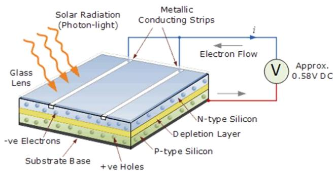

*Figure 10: Structure of a solar cell (adapted from [34], Figure 74)*

- − single crystalline silicon (sc-Si), sometimes also called monocrystalline (mono c-Si) − multi crystalline silicon (mc-Si), sometimes referred to as polycrystalline (poly c-Si)
- 2. **Thin-film** solar cells which have reached mass production are: − thin film silicon: amorphous silicon (a-Si) and microcrystalline silicon (μ-Si) − Cu (In, Ga) (Se, S)2 (CIGS), − Cadmium telluride (CdTe).

Other promising thin-film technologies include organic solar cells (OPV), perovskite solar cells (PSC), Cu2 Zn Sn (Se, S)4 (CZTS), and III-V epitaxial thin films.

- 3. **Multi Junction** solar cells can be built by combining crystalline silicon with thin films (crystalline silicon/perovskite tandem, crystalline silicon/CZTS tandem, etc.), or by combining thin films with different materials and/or bandgaps (thin-film silicon, OPV, perovskites, etc.).

Crystalline silicon-based technologies continue to dominate the world market share with about 95% of the total production in 2017. The share of multi crystalline technology is now about 62% of total production. In 2017, the market share of all thin film technologies counted for about 5%.

All are summarized for their performance and main applications are depicted in

[Table 4.](#page-51-1)

*Table 4 Photovoltaics (PV) technologies [34]*

| Type Technology |      |             |                   |
|-----------------|------|-------------|-------------------|
|                 |      | Performance | Main Applications |
| sc-Si           | +++  | +++         | +                 |
| mc-Si           | ++   | ++          | +                 |
| CdTe            | ++   | ++          | +                 |
| CIGS            | ++   | ++          | +                 |
| CZTS            | +    | N/A         | N/A               |
| OPV             | +    | N/A         | N/A               |
| Perovskite      | ++   | N/A         | N/A               |
| III-V MJ        | ++++ | +++         |                   |
| Thin-film Si MJ | +    | +           |                   |
|                 | +++  | N/A         | N/A               |
| tandem          | ++   | N/A         | N/A               |

[Figure 11](#page-52-0) illustrates the steps of the value chain, along with the main players. European organisations are marked with a star. As can be seen, Europe is quite strong in advanced materials, novel technology cell and module production, as well as manufacturing equipment, but is lacking capacity in silicon cell and module manufacturing.

| Manifacturing Equipment                                                                                                                                                                                                                                                                                                                                                                                                                                                                                                                                                                                                                                                   |  |
|---------------------------------------------------------------------------------------------------------------------------------------------------------------------------------------------------------------------------------------------------------------------------------------------------------------------------------------------------------------------------------------------------------------------------------------------------------------------------------------------------------------------------------------------------------------------------------------------------------------------------------------------------------------------------|--|
| <b>Production tools</b> <ul> <li>Applied Materials *</li> <li>ECM GreenTech *</li> </ul>                                                                                                                                                                                                                                                                                                                                                                                                                                                                                                                                                                                  |  |
| <ul> <li>ISRA Vision *</li> <li>Meyer Burger *</li> <li>Missur Burger *</li> <li>Mondragon Assembly *</li> <li>Von Ardenne *</li> <li>Semilab *</li> </ul>                                                                                                                                                                                                                                                                                                                                                                                                                                                                                                                |  |
| <b>Raw Material Production</b>                                                                                                                                                                                                                                                                                                                                                                                                                                                                                                                                                                                                                                            |  |
| <b>Polysilicon</b> <ul> <li>GCL-Poly Energy</li> <li>Wacker Polysilicon *</li> <li>OCI Company Ltd.</li> <li>TBEA Silicon Co. Ltd.</li> <li>Hemlock Semiconductor Corporation</li> <li>China Silicon Corporation Ltd.</li> <li>Sichuan Yonxiang Co. Ltd.</li> <li>Daqo New Energy Co. Ltd.</li> <li>REC Silicon ASA *</li> <li>Tokuyama Corporation</li> </ul>                                                                                                                                                                                                                                                                                                            |  |
| <b>Advanced Materials</b>                                                                                                                                                                                                                                                                                                                                                                                                                                                                                                                                                                                                                                                 |  |
| <b>Silicon wafers</b> <ul> <li>Photowatt</li> <li>GCL-Poly Energy</li> <li>Xi'an Longi Silicon</li> <li>Inner Mongolia</li> <li>Zhonghuan PV Material</li> <li>Avena Solar PV Material</li> <li>Green Energy Technology</li> <li>REC Group *</li> <li>Yingli Green Energy</li> <li>ReneSola</li> <li>JA Solar</li> <li>LDK Solar</li> <li>NorSun *</li> </ul>                                                                                                                                                                                                                                                                                                             |  |
| <b>Heat transfer fluids</b> <ul> <li>BASF *</li> <li>Wacker *</li> <li>Dow *</li> <li>Solvay *</li> </ul>                                                                                                                                                                                                                                                                                                                                                                                                                                                                                                                                                                 |  |
| <b>Heat storage</b> <ul> <li>BASF *</li> <li>Fertiberia *</li> <li>SQM</li> </ul>                                                                                                                                                                                                                                                                                                                                                                                                                                                                                                                                                                                         |  |
| <b>Other components*</b> <ul> <li>AGC *</li> <li>Arkema</li> <li>DOW Dupont</li> <li>DSM *</li> <li>Henkel *</li> <li>Heraeus *</li> <li>Luvata *</li> <li>Merck *</li> <li>Norsun *</li> <li>Pilkington *</li> <li>Saint Gobain *</li> <li>Solaxess *</li> </ul>                                                                                                                                                                                                                                                                                                                                                                                                         |  |
| <ul> <li>ISRA Vision *</li> <li>Meyer Burger *</li> <li>Missur Burger *</li> <li>Mondragon Assembly *</li> <li>Von Ardenne *</li> <li>Semilab *</li> </ul>                                                                                                                                                                                                                                                                                                                                                                                                                                                                                                                |  |
| <b>Components</b>                                                                                                                                                                                                                                                                                                                                                                                                                                                                                                                                                                                                                                                         |  |
| <b>Solar cells and modules **</b> <ul> <li>Harwa QCELLS *</li> <li>2CA *</li> <li>ARMOR *</li> <li>Trina Solar Ltd.</li> <li>JinkoSolar</li> <li>Holding Co. Ltd.</li> <li>Avena Solar PV Material</li> <li>ENEL *</li> <li>First Solar LLC</li> <li>Motech Solar</li> <li>Azur Space *</li> <li>Tech Solar Co.</li> <li>Risen Energy Co. *</li> <li>Canadian Solar PV Material</li> <li>Yingli Green Energy Holding *</li> <li>Solarwatt</li> <li>Solland *</li> <li>Solsonica *</li> <li>Longi Solar Neo Solar Power *</li> <li>Corporation</li> <li>Gintech Energy Corporation</li> <li>Guardian *</li> <li>OC3 AG *</li> <li>OET *</li> <li>Suzhou Talesun</li> </ul> |  |
| <b>Reflectors</b> <ul> <li>Rioglass *</li> <li>St Gobain *</li> <li>Fenzi Group *</li> <li>Alanod GmbH *</li> <li>Almeco Hydro *</li> <li>Valspar</li> </ul>                                                                                                                                                                                                                                                                                                                                                                                                                                                                                                              |  |
| <b>Absorbers</b> <ul> <li>Rioglass *</li> <li>Abengoa Solar *</li> <li>Sener *</li> <li>Areva Solar *</li> <li>Ferrostal *</li> </ul>                                                                                                                                                                                                                                                                                                                                                                                                                                                                                                                                     |  |
| <b>Structural elements</b> <ul> <li>Abbra *</li> <li>Flabeg *</li> <li>Acciona *</li> </ul>                                                                                                                                                                                                                                                                                                                                                                                                                                                                                                                                                                               |  |
| <ul> <li>Sener *</li> <li>Novatec *</li> <li>Biosol *</li></ul>                                                                                                                                                                                                                                                                                                                                                                                                                                                                                                                                                                                                           |  |

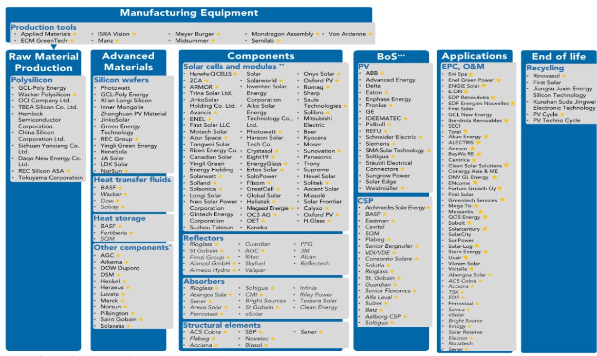

*Figure 11 Photovoltaics (***PV***)***/** *Concentrated Solar Power (***CSP***)* **value chain and main players (non-exhaustive) (adapted by Bax & Company;** *[34, 35])*

The Photovoltaics (PV) industry has changed dramatically over the last few years. In Europe, the rapid growth of the PV market has not resulted in a similar growth in the production capacity of solar cells and modules. Following an initial globally strong position, the EU PV industry market share shrunk from approximately 35% in 2009 to around 5% of the total MWp produced due to strong competition (see [Figure 12\)](#page-53-2). **China** has become the major manufacturing country for solar cells and modules, followed by Taiwan. Amongst the 20 biggest cell manufacturers in 2016, only one had solar cell production facilities in Europe.

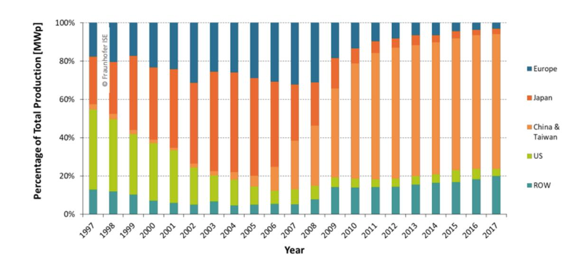

### **5.5.1.1 Main SSbD challenges foreseen - ongoing activities**

The main SSbD challenges for solar energy and ongoing activities are highlighted in [Table 5.](#page-53-0)

*Table 5 SSbD ongoing initiatives Solar Energy*

| Solar energy harvesting  | Raw Material Extraction (if relevant) | Raw materials | Processing (material or chemical) | Processing (product)                                                                | Transport | Use                               | End-of-life            |
|--------------------------|---------------------------------------|---------------|-----------------------------------|-------------------------------------------------------------------------------------|-----------|-----------------------------------|------------------------|
| SSbD ongoing initiatives |                                       |               |                                   | Improve the efficiency of modules                                                   |           | Zero-Energy Buildings             | recycling technologies |
|                          |                                       |               |                                   | Reduce the ecological footprint and increase the recyclability of module components |           | Plus Energy Buildings             | Design for recycling   |
|                          |                                       |               |                                   | low lifecycle GHG emissions                                                         |           | building integrated photovoltaics |                        |
|                          |                                       |               |                                   |                                                                                     |           | Renewable energy                  |                        |
|                          |                                       |               |                                   |                                                                                     |           | Energy storage                    |                        |
|                          |                                       |               |                                   |                                                                                     |           | Eco-design                        |                        |
|                          |                                       |               |                                   |                                                                                     |           | Energy Label policy               |                        |

#### **5.5.1.2 SSbD approach**

*Table 6 SSbD Solar*

|              |  |                                                                                                                                                                                                                                        |
|---------------------------|--|-----------------------------------------------------------------------------------------------------------------------------------------------------------------------------------------------------------------------------------------------------|
| 
Design Actions
 |  | 
Silicon-based PV panels do not pose a material threat to public health and safety. The only aspect of the panels with potential toxicity concerns are the very small amount of lead in some panels. However, any lead in a panel is well
 |

| sealed from environmental exposure for the operating lifetime | of the solar                                            |
|---------------------------------------------------------------|---------------------------------------------------------|
| Source [36]                                                   |                                                         |
| the manufacturing processes of                                | thin film PV cells and modules [37].                    |
| systems to marketing                                          | . Accidental releases of toxic gases and vapours can be |

| 
Design Principles (as proposed by JRC)
 | 
<b>Reduce solar PV carbon emissions by:</b>
 <ul style="list-style-type: none;"> <li>- Consume as little energy as possible in the polysilicon manufacturing process</li> <li>- Use low carbon electricity in the manufacturing process</li> <li>- <b>Increasing module efficiency</b> to reduce specific consumption per Watt, reducing solar wafer thickness and promoting internal recycling of materials such as silicon.</li> <li>- Minimise emissions from transportation</li> <li>- Prioritise PV system locations where it enables the highest emission reductions</li> <li>- <b>Maximise recycled content.</b> PV products contain energy intensive materials like silicon, glass and aluminium. High quality recycling of solar glass, aluminium frames and silicon from end-of-life modules enables the recovery of these materials.</li> <li>- <b>Extend product lifetime and increase energy yield</b></li> </ul> 
Consider carbon emissions from non-module components. Even though modules are responsible for the largest share of Solar's carbon footprint, necessary to look at the performance of PV elements such as inverters and other balance-of-system.
 
<b>Sources [38, 39]</b>
 
<b>Design for recycling (DfR)</b> applied to PV industry: IEA approach [40]
 |
|---------------------------------------------------------------|---------------------------------------------------------------------------------------------------------------------------------------------------------------------------------------------------------------------------------------------------------------------------------------------------------------------------------------------------------------------------------------------------------------------------------------------------------------------------------------------------------------------------------------------------------------------------------------------------------------------------------------------------------------------------------------------------------------------------------------------------------------------------------------------------------------------------------------------------------------------------------------------------------------------------------------------------------------------------------------------------------------------------------------------------------------------------------------------------------------------------------------------------------------------------------------------------------------------------------------------------------------------------------------------------------------|
|---------------------------------------------------------------|---------------------------------------------------------------------------------------------------------------------------------------------------------------------------------------------------------------------------------------------------------------------------------------------------------------------------------------------------------------------------------------------------------------------------------------------------------------------------------------------------------------------------------------------------------------------------------------------------------------------------------------------------------------------------------------------------------------------------------------------------------------------------------------------------------------------------------------------------------------------------------------------------------------------------------------------------------------------------------------------------------------------------------------------------------------------------------------------------------------------------------------------------------------------------------------------------------------------------------------------------------------------------------------------------------------|

|  |  | <ul style="list-style-type: none; padding-left: 0;"> <li>5. Minimizing non-reversible adhesives or similar bonds, especially over whole surfaces and for dissimilar materials, can facilitate disassembly and material liberation.</li> </ul> 
6. Design for disassembly <b>(DfD)</b> can improve recyclability.
 <ul style="list-style-type: none; padding-left: 0;"> <li>7. Estimating recyclability improvements and economic and environmental impacts due to DfR is important for continuous improvement, identification, and weighing of trade-offs and communicating value.</li> </ul> <ul style="list-style-type: none; padding-left: 0;"> <li>8. Using labels to identify recyclable and non-recyclable materials helps recyclers classify feedstocks; labelling standardization is important for uptake and utilization.</li> </ul> <ul style="list-style-type: none; padding-left: 0;"> <li>9. Designing products to use recycled materials promotes circular manufacturing.</li> </ul> |
|--|--|---------------------------------------------------------------------------------------------------------------------------------------------------------------------------------------------------------------------------------------------------------------------------------------------------------------------------------------------------------------------------------------------------------------------------------------------------------------------------------------------------------------------------------------------------------------------------------------------------------------------------------------------------------------------------------------------------------------------------------------------------------------------------------------------------------------------------------------------------------------------------------------------------------------------------------------------------------------------------------------------------------|
|--|--|---------------------------------------------------------------------------------------------------------------------------------------------------------------------------------------------------------------------------------------------------------------------------------------------------------------------------------------------------------------------------------------------------------------------------------------------------------------------------------------------------------------------------------------------------------------------------------------------------------------------------------------------------------------------------------------------------------------------------------------------------------------------------------------------------------------------------------------------------------------------------------------------------------------------------------------------------------------------------------------------------------|

| Safe and Sustainable Development                              | Safe by Design                                                                                                                                                                                                                                                                                                                                                                                                                                                                                                                                                                                                                                                                                                                                                                                                                                                                                                                                                                                                                                                                                                                                                                                                                                                                | 
For <b>Cadmium</b> in CdTe Thin Film systems: [41]
 
However, market share of CdTe is very low.
 
Although 95% of a PV module is recyclable, the current economics of End-of-Life handling are unfavourable to recycling. U.S. Department of Energy 's Photovoltaics End-Of-Life Action Plan [42] outlines a five-year strategy to establish safe, responsible, and economic end-of-life practices.
                                                                                            |                                                                                                                        |                 |                                      |                                      |                      |                                                |                                   |                               |                       |                        |       |              |                               |        |                            |                     |                      |                                                |                                   |                 |                  |                |                     |       |                                      |                                      |                   |                        |                               |                               |                        |       |  |                                                                                                                        |  |
|---------------------------------------------------------------|-------------------------------------------------------------------------------------------------------------------------------------------------------------------------------------------------------------------------------------------------------------------------------------------------------------------------------------------------------------------------------------------------------------------------------------------------------------------------------------------------------------------------------------------------------------------------------------------------------------------------------------------------------------------------------------------------------------------------------------------------------------------------------------------------------------------------------------------------------------------------------------------------------------------------------------------------------------------------------------------------------------------------------------------------------------------------------------------------------------------------------------------------------------------------------------------------------------------------------------------------------------------------------|-----------------------------------------------------------------------------------------------------------------------------------------------------------------------------------------------------------------------------------------------------------------------------------------------------------------------------------------------------------------------------------------------------------------------------------------------------------------------------------------------------------------|------------------------------------------------------------------------------------------------------------------------|-----------------|--------------------------------------|--------------------------------------|----------------------|------------------------------------------------|-----------------------------------|-------------------------------|-----------------------|------------------------|-------|--------------|-------------------------------|--------|----------------------------|---------------------|----------------------|------------------------------------------------|-----------------------------------|-----------------|------------------|----------------|---------------------|-------|--------------------------------------|--------------------------------------|-------------------|------------------------|-------------------------------|-------------------------------|------------------------|-------|--|------------------------------------------------------------------------------------------------------------------------|--|
|                                                               | Silicon                                                                                                                                                                                                                                                                                                                                                                                                                                                                                                                                                                                                                                                                                                                                                                                                                                                                                                                                                                                                                                                                                                                                                                                                                                                                       | 
Sifting eddy current removes metals → Mechanical separation of glass and silicon
 
Cut and grind → CdTe Thin Film
 
Remove frame, cables, and junction box → Chemical film removal, Glass and polymers → Ion exchange, Precipitate Cd and Te
                                                                                                                                                                                                                                                   |                                                                                                                        |                 |                                      |                                      |                      |                                                |                                   |                               |                       |                        |       |              |                               |        |                            |                     |                      |                                                |                                   |                 |                  |                |                     |       |                                      |                                      |                   |                        |                               |                               |                        |       |  |                                                                                                                        |  |
| Occupational, Health, Safety and Environmental Risks          | Working with PV panels is regulated by OSHA and NEC (National Electrical Code) [43]                                                                                                                                                                                                                                                                                                                                                                                                                                                                                                                                                                                                                                                                                                                                                                                                                                                                                                                                                                                                                                                                                                                                                                                           | 
A summary of Environmental, Health and Safety issues associated with some thin film technologies like copper indium gallium diselenide (CIS/CIGS), cadmium telluride (CdTe) and amorphous silicon (a-Si) is done, in order to investigate potential infections induced by the environmental release of trace elements, usually coming from chemical vapor inhalation and eventually accidental spills during the manufacturing processes, on the health of humans and animals.
 
<b>Source [37]</b>
 |                                                                                                                        |                 |                                      |                                      |                      |                                                |                                   |                               |                       |                        |       |              |                               |        |                            |                     |                      |                                                |                                   |                 |                  |                |                     |       |                                      |                                      |                   |                        |                               |                               |                        |       |  |                                                                                                                        |  |
| Environmental sustainability (including Lifecycle Assessment) | 
LCA First generation (Si panels)
 <table border="1"> <thead> <tr> <th>Study</th> <th>Panel Type</th> <th>PV System</th> <th>Module Size</th> <th>Geogr. Location</th> <th>Efficiency</th> <th>PV</th> <th>System Boundaries</th> <th>LCIA Methodology</th> <th>Environmental Indices</th> </tr> </thead> <tbody> <tr> <td>Fukumuzaki et al. [24]</td> <td>ne/Si</td> <td>Roof-mounted</td> <td>9.575 m2 (framed)</td> <td>Brazil</td> <td>13.3% (avg) 14% (panel)</td> <td>1.2 kWp</td> <td>Coalite to use (BOS)</td> <td>• CML 2001 • CIS/CIG minimism rate • CID</td> <td>• EPBT • CIS/CIG minimism rate</td> </tr> <tr> <td>Kim et al. [27]</td> <td>• ne/Si me/Si</td> <td>Ground mounted</td> <td>1.59 m2</td> <td>Korea</td> <td>Base: • ne/Si 15.96% me/Si 14.91%</td> <td>Base: • ne/Si 27.60% me/Si 20.40%</td> <td>1 kWp</td> <td>Coalite to grave (BOS)</td> <td>• GWP • EPBT • CIS/EPBT</td> <td>• GWP • EPBT • CIS/EPBT</td> </tr> <tr> <td>Stylon &amp; Konnenes [23]</td> <td>me/Si</td> <td></td> <td>• 0.60 m2 • 0.60 m2 • 0.60 m2 • 1 m2 • 0.60 m2</td> <td></td></tr></tbody></table> | Study                                                                                                                                                                                                                                                                                                                                                                                                                                                                                                           | Panel Type                                                                                                             | PV System       | Module Size                          | Geogr. Location                      | Efficiency           | PV                                             | System Boundaries                 | LCIA Methodology              | Environmental Indices | Fukumuzaki et al. [24] | ne/Si | Roof-mounted | 9.575 m 2 (framed) | Brazil | 13.3% (avg) 14% (panel) | 1.2 kW p | Coalite to use (BOS) | • CML 2001 • CIS/CIG minimism rate • CID | • EPBT • CIS/CIG minimism rate | Kim et al. [27] | • ne/Si me/Si | Ground mounted | 1.59 m 2 | Korea | Base: • ne/Si 15.96% me/Si 14.91% | Base: • ne/Si 27.60% me/Si 20.40% | 1 kW p | Coalite to grave (BOS) | • GWP • EPBT • CIS/EPBT | • GWP • EPBT • CIS/EPBT | Stylon & Konnenes [23] | me/Si |  | • 0.60 m 2 • 0.60 m 2 • 0.60 m 2 • 1 m 2 • 0.60 m 2 |  |
| Study                                                         | Panel Type                                                                                                                                                                                                                                                                                                                                                                                                                                                                                                                                                                                                                                                                                                                                                                                                                                                                                                                                                                                                                                                                                                                                                                                                                                                                    | PV System                                                                                                                                                                                                                                                                                                                                                                                                                                                                                                       | Module Size                                                                                                            | Geogr. Location | Efficiency                           | PV                                   | System Boundaries    | LCIA Methodology                               | Environmental Indices             |                               |                       |                        |       |              |                               |        |                            |                     |                      |                                                |                                   |                 |                  |                |                     |       |                                      |                                      |                   |                        |                               |                               |                        |       |  |                                                                                                                        |  |
| Fukumuzaki et al. [24]                                        | ne/Si                                                                                                                                                                                                                                                                                                                                                                                                                                                                                                                                                                                                                                                                                                                                                                                                                                                                                                                                                                                                                                                                                                                                                                                                                                                                         | Roof-mounted                                                                                                                                                                                                                                                                                                                                                                                                                                                                                                    | 9.575 m 2 (framed)                                                                                          | Brazil          | 13.3% (avg) 14% (panel)           | 1.2 kW p                  | Coalite to use (BOS) | • CML 2001 • CIS/CIG minimism rate • CID | • EPBT • CIS/CIG minimism rate |                               |                       |                        |       |              |                               |        |                            |                     |                      |                                                |                                   |                 |                  |                |                     |       |                                      |                                      |                   |                        |                               |                               |                        |       |  |                                                                                                                        |  |
| Kim et al. [27]                                               | • ne/Si me/Si                                                                                                                                                                                                                                                                                                                                                                                                                                                                                                                                                                                                                                                                                                                                                                                                                                                                                                                                                                                                                                                                                                                                                                                                                                                              | Ground mounted                                                                                                                                                                                                                                                                                                                                                                                                                                                                                                  | 1.59 m 2                                                                                                    | Korea           | Base: • ne/Si 15.96% me/Si 14.91% | Base: • ne/Si 27.60% me/Si 20.40% | 1 kW p    | Coalite to grave (BOS)                         | • GWP • EPBT • CIS/EPBT     | • GWP • EPBT • CIS/EPBT |                       |                        |       |              |                               |        |                            |                     |                      |                                                |                                   |                 |                  |                |                     |       |                                      |                                      |                   |                        |                               |                               |                        |       |  |                                                                                                                        |  |
| Stylon & Konnenes [23]                                        | me/Si                                                                                                                                                                                                                                                                                                                                                                                                                                                                                                                                                                                                                                                                                                                                                                                                                                                                                                                                                                                                                                                                                                                                                                                                                                                                         |                                                                                                                                                                                                                                                                                                                                                                                                                                                                                                                 | • 0.60 m 2 • 0.60 m 2 • 0.60 m 2 • 1 m 2 • 0.60 m 2 |                 |                                      |                                      |                      |                                                |                                   |                               |                       |                        |       |              |                               |        |                            |                     |                      |                                                |                                   |                 |                  |                |                     |       |                                      |                                      |                   |                        |                               |                               |                        |       |  |                                                                                                                        |  |

| Study                        | Panel Type                           | PV System                          | Module Size        | Geographical Location            | Modular Efficiency                                 | FU               | System Boundaries                                                     | LCIA Methodology                                                                                                                                                 | Environmental Indices                                                                                                      |
|------------------------------|--------------------------------------|------------------------------------|--------------------|----------------------------------|----------------------------------------------------|------------------|-----------------------------------------------------------------------|------------------------------------------------------------------------------------------------------------------------------------------------------------------|----------------------------------------------------------------------------------------------------------------------------|
| Mohr et al. [10]             | • GalapPCiaA tandem meSi          | Mounting system included           | Not available      | Wintern European                 | • 6.7% • 98%                                    | 1 kWp            |                                                                       | • ALDP • AF • EF • GWP • OGP                                                                                                                         | • PO, • HTP • AE • ME • TE                                                                                     |
| Kim dor Madhen & Alamua [11] | • neSi • aSi                      | Rooftop mounted                    | 1.4 m 2 | Southern Europe                  | • 6.7% • 8 • 95%                             | 1 m 2 |                                                                       | • IFCC 2001 • GWP 100                                                                                                                                         | GRG                                                                                                                        |
| Kim & Fibernakis [11]        | • Multi-junction a-ScGe re-Si/aSi |                                    | Not available      |                                  | • 6.5% (Optimistic: 8%)                         | 1 m 2 | Cradle to gate                                                        | • EPHF • Energy required                                                                                                                                      | EPHF                                                                                                                       |
| Hold & Big [10]              | Caffe                                | Ground mounted                     | Not available      | Europe                           | 10.9%                                              | 1 m 2 | • CML2001 • Distropy overturnmand • Est.                        | • CML2001 • CED • GRG • OGP • POCP                                                                                                                   | • EPHF • PE • AF • EF • EP                                                                                     |
| Mohr et al. [12]             | Tandem a-Si/neSi                     | Roof-integrated                    | Not available      | Netherlands                      | 10%                                                | 1 kWh            | • Manufacturing Use • Disposal (pooling and transport included) | • ReCiPv • IR • IR • IR • ID • ID • ID • damage to IRF • damage to environment • damage due to resource depletion • EPHF • EPHF | • CC • CED • National tandem IR translocation (NLT) • IR • IR • ID • ID • ID • ID • ID |
| Kritger et al. [14]          | • a-Si/4 • aSi/ELuc-Si/ELundem    |                                    | Not available      | Ingred data from US and European |                                                    | 1 kg of ultime   | • Cradle-to-gate • Comparison between recycling and no recycling   | • IFCC 2002 • GWP 100 • Energy consumption                                                                                                                 | • GWP 100                                                                                                                  |
| Gaschetta et al. [10]        | Caffe                                |                                    | Not available      |                                  |                                                    | 1 m 2 | Est.                                                                  | • Impact 2022                                                                                                                                                    | • CED                                                                                                                      |
| Coffier et al. [14]          | • neSi • neSi-Si • aSi         | • Caffe • CED • CED • CED |                    | Not available                    | United States                                      | 10.0%            | 1 kWh                                                                 | Cradle to gate                                                                                                                                                   | TRACI 21                                                                                                                   |
| Bergstrom et al. [14]        | • CED • CED                       | • Ground mounted • Roof-mounted | Not available      | United States                    | (2010 - 2020) • 12% - - 20.8% • 11.8% - - 1% | 1 kWh            | • Manufacturing Use • International Cost of Disposal               | • TRACI 11 • MD • LG • CNG • PW                                                                                                                      | • Emissions (CEDs) (ARU) • MD • LG • CNG • EF • PW                                                          |
| Lansadi et al. [47]          | Chologorode/Si tandem                |                                    | Not ava            |                                  |                                                    |                  |                                                                       |                                                                                                                                                                  |                                                                                                                            |

# **5.5.2 The Energy sub-value chain: Wind**

**Technology description**: The different Wind technologies systems can be summarized as follows [34]:

The following [Figure 13](#page-59-0) shows the components and sub-components of the wind turbine:

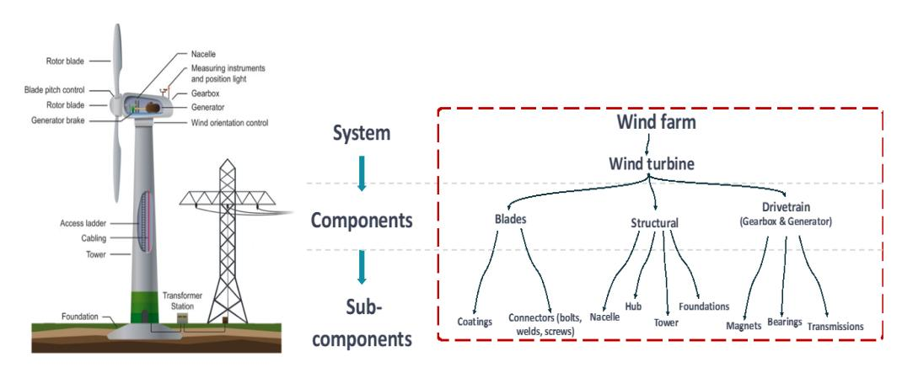

*Figure 13 Main components of a wind turbine [34]*

The structure of blades usually consists of a spar composed of materials formed of fibreglass and carbon pre-coated with epoxy resin acting as the inner part of the blade. The spar is then covered by outer laminated shells of fibreglass, moulded and cured in halves, then joined using an epoxy adhesive (Figure 14).

The material compositions vary between blade types and blade manufacturers, but blades are generally made of

- 1) Reinforced fibres (glass, carbon, aramid or basalt)
- 2) A polymer matrix (thermosets such as epoxies, polyesters, vinyl esters, polyurethane, or thermoplastics)
- 3) A sandwich core (balsa wood or foams such as polyvinyl PVC, PET)
- 4) Coatings (PE, PUR) 5) Metals (copper wiring, steel bolts, etc.).

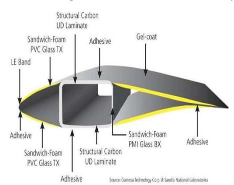

*Figure 14 Structure of Blades (Source: Gamesa & Sandia National Labs.)*

As rotor sizes are increasing, advanced materials and/or multi material solutions and designs for blades are required to improve costeffectiveness, while reducing fatigue loading, and sustainability.

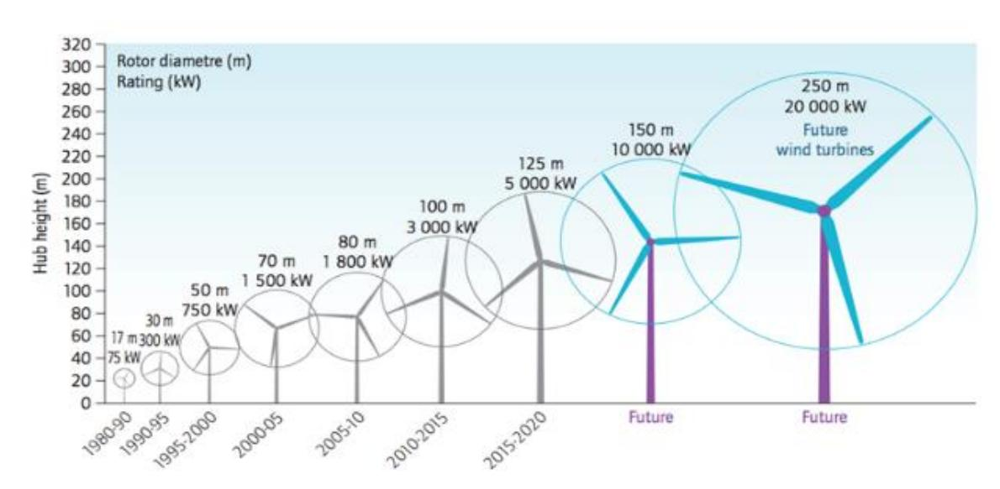

*Figure 15 Growth in size of wind turbines since 1980 and prospects ([47], Figure 14)*

The wind energy value chain includes multiple steps, and presents opportunities for several stakeholders, from material suppliers, to manufacturers, to a multitude of sectors benefiting from the decarbonization of the energy mix. Figure 16 illustrates the steps of the value chain, along with the main players (status 2019). European organisations are marked with a star. As can be seen, Europe is global leader in wind turbine manufacturing and applications.

| Raw Material Production                                                                                                                                                                                                                                  | Wind turbines                                                                                                                                                                                                                                            | Applications                                                                                                                                                                                                                                                                   | End of life                                                                                                                                                                                                                                                                                                                                                                                                                                                                                                                                                                              |                                                                                                                                                                                                                                                                                               |
|----------------------------------------------------------------------------------------------------------------------------------------------------------------------------------------------------------------------------------------------------------|----------------------------------------------------------------------------------------------------------------------------------------------------------------------------------------------------------------------------------------------------------|--------------------------------------------------------------------------------------------------------------------------------------------------------------------------------------------------------------------------------------------------------------------------------|------------------------------------------------------------------------------------------------------------------------------------------------------------------------------------------------------------------------------------------------------------------------------------------------------------------------------------------------------------------------------------------------------------------------------------------------------------------------------------------------------------------------------------------------------------------------------------------|-----------------------------------------------------------------------------------------------------------------------------------------------------------------------------------------------------------------------------------------------------------------------------------------------|
| <b>Steel</b> <ul> <li>ArcelorMittal SA ★</li> <li>DSM ★</li> <li>ThyssenKrupp ★</li> <li>China Baowu Steel Group</li> <li>NSSMC Group</li> <li>HBIS Group</li> <li>POSCO</li> <li>Shagang Group</li> <li>Ansteel</li> </ul>                              | <b>Tower</b> <ul> <li>Enercon ★</li> <li>Siemens Gamesa ★</li> <li>Leitwind ★</li> </ul>                                                                                                                                                                 | <b>Power generator</b> <ul> <li>Vestas ★</li> <li>Siemens Gamesa ★</li> <li>Enercon ★</li> <li>MHI Vestas ★</li> <li>Senvion ★</li> <li>GE Renewable Energy</li> <li>United Power</li> <li>Goldwind</li> <li>XEMC</li> </ul>                                                   | <b>Planning</b> <ul> <li>ABO Wind ★</li> <li>Equinor ★</li> <li>Global Wind ★</li> <li>OX2 Wind ★</li> <li>RES ★</li> </ul>                                                                                                                                                                                                                                                                                                                                                                                                                                                              | <b>Recycling</b> <ul> <li>Zagons Logistik ★</li> <li>CFK Valley Stade</li> <li>Recycling ★</li> <li>ELG Carbon Fibre ★</li> <li>Neowa ★</li> <li>TRC (R3FIBER) ★</li> <li>Carbon Conversions ★</li> </ul>                                                                                     |
| <b>Composites</b> 
<b>Glass Fibre</b>
 <ul> <li>Saint-Gobain</li> <li>Vetrotex ★</li> <li>Jushi Group Co. Ltd.</li> <li>AGY Holding Corp.</li> <li>PPG Industries Inc.</li> <li>Owens Corning</li> <li>Taiwan Glass Industry Corporation</li> </ul> | <b>Blades</b> <ul> <li>Vestas ★</li> <li>Siemens Gamesa ★</li> <li>Enercon ★</li> <li>LM Wind Power ★</li> <li>Acciona ★</li> <li>PowerBlades GmbH</li> <li>Rialblades ★</li> <li>Senvision SE ★</li> <li>Sinoma Wind</li> <li>TPI Composites</li> </ul> | <b>Power converter</b> <ul> <li>ABB ★</li> <li>Ingeteam ★</li> <li>Vestas ★</li> <li>Siemens Gamesa ★</li> <li>Enercon ★</li> <li>GE Renewable Energy</li> <li>Suzion</li> <li>Goldwind</li> <li>Sinovel</li> <li>United Power</li> <li>Ming Yang</li> <li>Envision</li> </ul> | <b>Installation</b> <ul> <li>Airpes ★</li> <li>ALE ★</li> <li>Arvick ★</li> <li>Boskails Offshore Int. BV ★</li> <li>Bridon Bekaert The Ropes Group ★</li> <li>CIR Wind ★</li> <li>DHL Industrial Projects ★</li> <li>ELA Container Offshore ★</li> <li>Fred Olsen Windcarrier ★</li> <li>Frugo NL Marine ★</li> <li>GeoSea NV ★</li> <li>HEXICON AB ★</li> <li>International Paint Ltd ★</li> <li>Jack-Up Barge B.V. ★</li> <li>Jan DE NUL Group ★</li> <li>Jumbo Offshore ★</li> <li>N-Sea ★</li> <li>Northern Offshore ★</li> <li>Services ab ★</li> <li>Royal Wagenborg ★</li> </ul> | <b>O&amp;M</b> <ul> <li>ACOEM AB ★</li> <li>Aero Enterprise ★</li> <li>Alpha Offshore ★</li> <li>BLADEFENCE ★</li> <li>CMI Maintenance Hainaut ★</li> <li>EKO ★</li> <li>ENDIPREV ★</li> <li>FGH ★</li> <li>Green Wind Energy ★</li> <li>Greensolver ★</li> <li>Itestit-Smartive ★</li> </ul> |
| <b>Gearbox</b> <ul> <li>Siemens Gamesa ★</li> <li>ZF ★</li> <li>Winergy ★</li> <li>NGC</li> </ul>                                                                                                                                                        | <b>Gearbox</b> <ul> <li>GC Power Systems ★</li> <li>ABB ★</li> <li>Siemens G</li></ul>                                                                                                                                                                   |                                                                                                                                                                                                                                                                                |                                                                                                                                                                                                                                                                                                                                                                                                                                                                                                                                                                                          |                                                                                                                                                                                                                                                                                               |

*Figure 16 Value Chain Wind Energy (adapted by Bax & Company [33])*

Over the last few years, lightweight materials – and particularly Fiber-Reinforced Polymers (FRP) – have undergone significant improvements. New material formulations, material combinations, and design – e.g., sandwich blade shell structures with PET foam cores – have enabled increased mechanical performance, such as strength-to-weight and stiffness-toweight ratios, as well as higher reliability (e.g., better corrosion resistance). The advancements in such materials have allowed the construction of higher and larger wind turbine blades, which are able to harvest more energy from the wind – due to larger rotor diameters, higher towers – and remain operational longer, due to the high reliability of such materials. The next challenge that is currently being tackled is how to ensure that such materials have a minimal impact on the environment, especially after they have reached their end of life.

### **5.5.2.1 Main SSbD challenges foreseen - ongoing activities**

The main SSbD challenges for wind energy and ongoing activities are highlighted in [Table 7.](#page-61-0)

*Table 7 SSbD Wind Energy ongoing activities* 

| Raw Wind Material                          | Raw        |    | Processing (material | Processing                         |           |          |                                              |
|--------------------------------------------|------------|----|----------------------|------------------------------------|-----------|----------|----------------------------------------------|
| energy Extraction harvesting (if relevant) | materials  |    | or chemical)         | (product)                          | Transport | Use      | End-of-life                                  |
| Life                                       | cycle      |    |                      |                                    |           |          |                                              |
|                                            |            | of | CRMs                 |                                    |           |          |                                              |
| SSbD ongoing                               | assessment |    | Reduction            | Improve recyclability of the blade |           |          | 85% of wind turbine                          |
| initiatives                                | composites |    | (magnets)            | composites Improve                 |           |          | mass is recyclable New processes required to |
|                                            |            |    |                      | lifetime of the turbines           |           |          | improve recyclability                        |
|                                            |            |    |                      | Increase the performance           |           |          | of the blades                                |
|                                            |            |    |                      | of turbines                        |           | Decrease |                                              |
|                                            |            |    |                      | to achieve                         |           | noise    |                                              |
|                                            |            |    |                      | high power                         |           |          |                                              |
|                                            |            |    |                      | and lighter turbines               |           |          |                                              |

#### **5.5.2.2 SSbD approach**

*Table 8 Wind*

|      |                                             |  |
|-------------------|----------------------------------------------------------|---------------|
| 
Design
 | 
Wind Energy: See Roadmap Wind Technology [47]
 |               |

| Issues:             |                                                                                                                                              |
|---------------------|----------------------------------------------------------------------------------------------------------------------------------------------|
| −                   | Trade-off, replacement Neodymium/Praseodymium with same performance); no conclusive solution.                                                |
| −                   | Recycling of Rare Earths – Solvay, Rhodia; ERMA roadmap covering RE issue [48].                                                              |
| −                   | 80% of mass is Steel – Blades recycling is still an issue- different systems are                                                             |
|                     | in development: see figure below and the different Technology Readiness                                                                      |
|                     | Levels (TRLs) of recycling technologies                                                                                                      |
| −                   | Source: ETIP Wind                                                                                                                            |
| −                   | Innovative material, polyurethane, compared to epoxy resin, has advantages in costs and in the production process.                           |
| −                   | Minimize levelized production cost (ratio between energy production cost and economic lifetime).                                             |
| − Efficie ncy [49]. | Public acceptance. Following principles are applied:                                                                                         |
| −                   | Minimise the use of hazardous chemicals or materials.                                                                                        |
| −                   | Design for energy efficiency: new production processes with low CO 2 footprint.                                                              |
| −                   | Use renewable sources: renewable energy in production and application.                                                                       |
| −                   | Design for end of life: Selection of materials that are: a) more durable (longer after being used SET Plan Wind is currently under revision: |

| Gaps identified                                              | :                                                              |
|--------------------------------------------------------------|----------------------------------------------------------------|
| For Wind Energy:                                             | [50]                                                           |
| The Wind Harmony                                             | project has provided some important material for this          |
| Again, treated in the                                        | Wind Harmony project: [50]                                     |
| −                                                            | falling, confined spaces, electrocution, fires, moving parts   |
| On the social acceptance of wind turbines: On the pros side, | wind is a clean,                                               |
| electricity                                                  | . On the cons side, wind turbines can be noisy and unappealing |

| mic assess around them. ment Other: Trade-offs: Trade                                     |                                                                                                       |
|--------------------------------------------------------------------------------------------|-------------------------------------------------------------------------------------------------------|
| − Substitution of CRMs in wind energy: For many of the materials the local offs and Challe | restrictions.                                                                                         |
| the European wind supply chain and ensure it can deliver nges goals.                       | cost-competitively the                                                                                |
| Gaps identified: Design proced On safety: [53] ures Turbine Systems                        | studies are ongoing to resolve the trade-offs Development of a new chemical/material                  |
| − Concern over future constraints that may be imposed by recyclability                     | the needed composite material properties.                                                             |
| − Simulations using high-performance computing (HPC) are accompanied by                    |                                                                                                       |
| safety                                                                                     | factors to account for modelling, operational, and physical uncertainties.                            |
| On Occupational Health and Safety:                                                         | Wind turbine blades are manufactured from                                                             |
| approximately 36%                                                                          | – 42% styrene, which evaporates as a fugitive emission during                                         |
| Gaps identified: design phase:                                                             | the wind energy sector is relatively new and the long-term occupational health remain partly unknown. |
| Using a Life Cycle Assessment                                                              | [54]                                                                                                  |

# **5.6 The Electronics value chain**

# **5.6.1 Update on life cycle stages (from D4.1)**

Since the fall of 2022, there have been developments on regulations as well as announcements and actions by major manufacturers of electronics targeting the improvements in the upgrade/repair and refurbishment loops of the life cycle [\(Figure 17\)](#page-66-0), with additional ramifications for the end-of-life processing of electronics and reduction in the use of raw materials by the value chain.

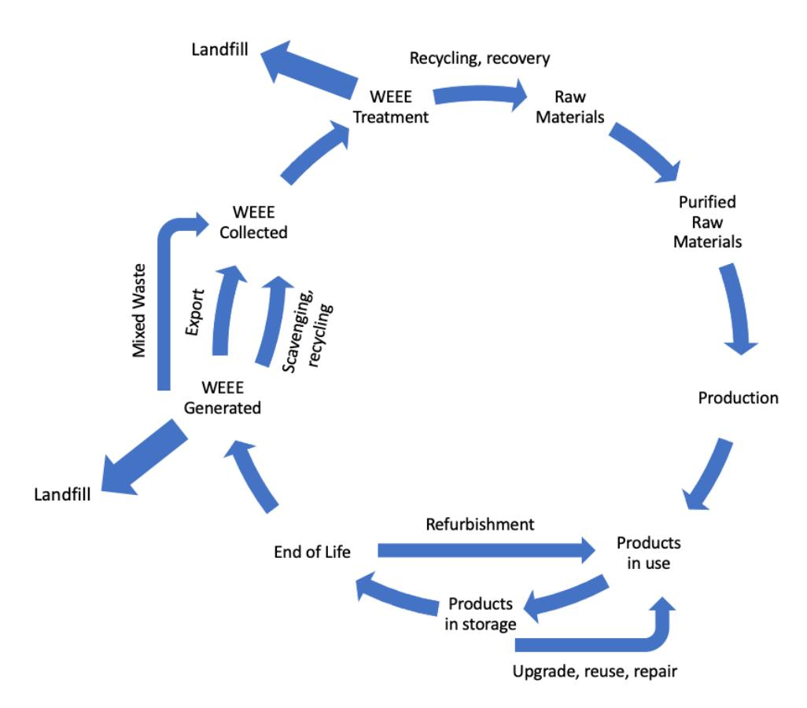

*Figure 17 Life cycle diagram for the electronics value chain*

#### **5.6.1.1 Regulation**

In 2023, the EC adopted new regulations on common rules promoting the repair of goods [55], also commonly known as *right to repair* regulation. Provisions specific to mobile phones and tablets direct the design of these devices to be energy efficient and durable, provide for consumers to be able to easily repair, upgrade and maintain them, and for possibilities to reuse and recycle the devices [56]. These regulations are part of a broader process of regulatory involvement in the SSbD aspects of electronics, particularly for devices sold to individual consumers in the EU. Two examples of more specific initiatives include the agreement with Nintendo to provide free repairs for Switch controllers [57] and the adoption of a common charging solution for all electronic devices [58].

Other jurisdictions are in the process of implementing their versions of *right to repair* regulations, including Canada, New York state (US)[59], India [60], and Minnesota (US) [61]. An important jurisdiction of California, where many technology companies are headquartered, is preparing a strong *right to repair* legislation, which recently gained support from *Apple* [62].

Regulation is also expected to be a major driver for increasing the use of refurbished electronics in commercial and public/government installations [63].

#### **5.6.1.2 Design for repairability**

There are companies making significant design efforts to ensure that their devices are easy to repair, upgrade, and operate for many years. Such companies offer modular-design laptops and mobile phones, with a proven history of introducing new models and upgrades. This includes long-term support for operating systems, with 8 years for Fairphone 5 [64], produced by *Fairphone*. Modular laptops produced by *Framework* are designed for easy service and repairs, making it easier (and economically viable) to offer refurbished devices for sale [65].

While companies such as *Fairphone* and *Framework* demonstrate that products designed for improved repairability are economically viable and sustainable, similar designs are considered [66] by but have not yet been adopted by major manufacturers of electronics [67]. Nevertheless, design changes introduced by major manufacturers to enable their own *right to repair* and sustainability programs [68], make it easier for professional facilities to repair and refurbish them. In particular, refurbishing of used mobile phones is now economically viable in high-income countries, such as Japan [69] and the UK [70], lowering the amount of e-waste exported for processing in low-income countries.

#### **5.6.1.3 Use of renewable and recycled materials**

Because of *Fairphone*'s emphasis on sustainability and fair-sourced materials, Fairphone 5 serves, perhaps, as the best example of including these considerations for every stage of the life cycle [64]. In 2022 and 2023, many major manufacturers of electronics introduced products that include significant amounts of renewable or recycled materials. For example, *Lenovo* introduced laptop cases made out of woven strands of, plant-derived, Flax Fiber and 75% recycled aluminum [71]. *Samsung* launched devices made using eco-friendly materials, such as repurposed fishing nets [72]. Both *Apple* [73] and *Google* [74] have announced ambitious targets for sustainability and use of recycled materials and are investing significant resources into programs designed to achieve those targets.

# **5.6.2 SSbD in sub-value chain: Semiconductors for power control**

Semiconductor chips for power control are an excellent example of an Electronics sub-value chain that both has its own SSbD considerations and plays a critical enabling role in sustainability efforts of other value chains, e.g., both Energy and Automotive value chains in IRISS.

Electrification is considered to be one of the critical approaches for reaching long-term sustainability in many activities, whether performed by individuals or at industrial scales. For example, in transport, switching from engines powered by fossil fuels to electric motors will dramatically reduce the associated carbon footprint as the economies switch to renewable energy sources. In many cases, electrified systems and devices are also able to support additional sustainable practices, by taking advantage of "smart" functionalities, such as adaptive lighting, heating, and cooling systems in buildings.

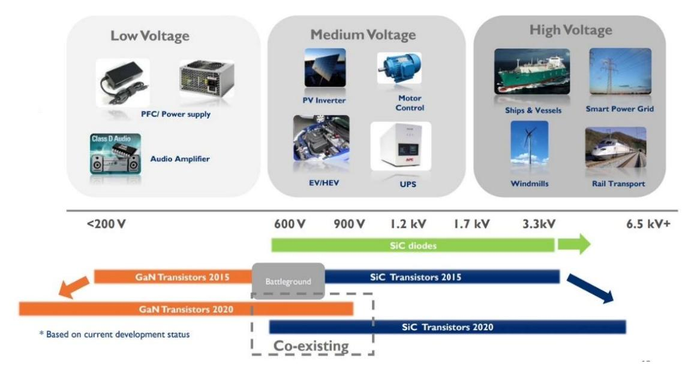

*Figure 18 The landscape of semiconductors that are used for power management. Adapted from Yole Group and M. Östling (ICOS Workshop, 2023).*

Fundamental to all the electrified systems is the challenge of power management. More specifically, the challenge of efficiently controlling and transforming electrical power from generation, to transmission, to storage, to its final use. Along this chain, electrical power often needs to be transformed between alternating and direct current (AC and DC) and/or to control the voltage and current. In modern systems, these control and transformation functions are typically performed by specialized semiconductor chips.

The overall life cycle for this sub-value chain is analogous to that for the full electronics value chain [\(Figure 17\)](#page-66-0), but because the products in current use have been introduced into the market starting in 2020, the majority of them have not yet reached the end of life and the following steps, which, accordingly, have not been extensively considered specifically for power electronics, but rather are expected to follow the same pathways that are under development for the full value chain of electronics. The steps covered in this report include:

- Raw materials / purified raw materials
- Production
- Products in use

### **5.6.2.1 Materials for power-control semiconductors**

The two main semiconductor materials used in advanced power-control electronics are silicon carbide (SiC) and gallium nitride (GaN), as illustrated in [Figure 18.](#page-68-0) The chips also include small amounts of additional metals (e.g., used as contacts), some of which are from the list of the critical raw materials (CRM). The total absolute amounts of such CRMs used in power electronics is relatively minor compared to the amounts used in other value chains (e.g., Power or Automotive), fractions of a gram per individual chip, so the semiconductor industry expects to be able to obtain the necessary raw materials from fair sources [75].

Of the four primary elements in SiC and GaN, gallium is currently the only element for which there is a concern about availability in the short term. On 3 July 2023, China announced restrictions on export of gallium, for which it controls approximately 30% of the worldwide export market [76]. While there are other suppliers and additional capacity to produce both unrefined and refined gallium can be developed elsewhere, the cost of gallium has increased after the announcement of these restrictions [77].

#### **5.6.2.2 Production of semiconductors for power control**

The production of SiC and GaN wafers (or layers of these materials supported on wafers made of materials more common in electronics industry) requires comparable energy inputs to those used for production of the silicon wafers. Details of growing and handling these materials make them more difficult to produce, especially on the larger wafer sizes that are required for large-scale production, leading to higher production costs than those for Sibased chips of comparable size and complexity. As the demand and production volumes continue to increase, however, the cost of producing the materials will be reduced. For example, a major GaN producer aiming to become an automotive-qualified GaN supplier, *BelGaN* [78], is located in the region of Belgium where recently a *GaN Valley*™ has been established [79] to promote the scale-up of producing GaN wafers and devices.

Similarly to the production of other chips for electronics, the production of SiC and GaN chips requires the use of cleanrooms. Accordingly, the safety concerns in the production facilities are handled using technologies that have been developed for the broader semiconductor industry, including the protocols and equipment for safe handling and abatement/disposal of various toxic/dangerous fluids and gases that are involved in production of chips. The use of similar protocols also means that the safe handling and abatement procedures are very intensive in terms of resource consumption and CO2 emissions, which will need to be addressed following approaches under development in the semiconductor sector [80].

#### **5.6.2.3 Power-control electronics in use**

In another analogy to the other types of chips, power-control chips are encapsulated before being incorporated into devices, meaning that they are protected from the contact with environment during the use phase and thus do not raise safety concerns related to exposure of the users to the materials inside the chips.

Impact of SiC and GaN chips on sustainability of the value chains where they are used, including Power and Transportation, are overwhelmingly positive, stemming from the increased efficiency of the power conversion that they enable. Because the increased efficiency applies to the full flow of energy during the operation, e.g., of an electric vehicle, reducing energy losses even by a few % results in significant energy savings over the lifetime of the power-control chips, exceeding the energy used for their production.

An additional factor for many applications is the small size and weight of power-control devices enabled by SiC or GaN chips, which can be incorporated directly into the components where the energy is consumed. For example, motors for high-performance electric vehicles, e.g., produced by *Tesla* or *Koenigsegg*, use SiC chips in inverters that control the power delivered to their motors [81]. Some of the applications of electrical power in the

transportation sector would not be possible without the use of the SiC or GaN chips, which support very high power density and fast switching times.

#### **5.6.2.4 Power semiconductors sub-value chain stakeholders**

As a growing and developing sub-value chain of the semiconductor industry, the power semiconductors sector is working to establish the ecosystem and supply chains analogous to those established for the traditional semiconductors. Important stages of the supply chain are:

- Source materials
- Production of wafers
- Production of power-control devices

**Source materials.** The main compound semiconductors currently used to make powercontrol devices are SiC and GaN. All four primary elements in these semiconductors are considered commodity materials and can be obtained through the traditional supply chain of the semiconductor industry. The only element for which there is a concern about supplies in the short term is gallium, due to the restrictions on export of gallium imposed by China. Japan stands to increase its role as a supplier of refined gallium because it has capability to produce refined gallium starting from both imported and domestically produced primary gallium. *Ingal Stade GmbH* produced primary gallium in Germany until 2016 and has announced plans to restart the production when gallium prices increased. So while the export restrictions from China have raised the prices of gallium, the supply chains are expected to be able to adjust to this disruption in the medium-to-long term.

**Production of wafers.** The production of SiC and GaN wafers, which are the starting materials for fabrication of semiconductor-based electronic devices, is conceptually similar to that of the Si wafers. Intrinsic properties of SiC and GaN, e.g., the hardness of SiC that is well-known from its applications in the tools, however, make new developments necessary in the basic technologies used to process the wafers, including cutting and polishing.

In particular, the development challenges are being addressed in increasing the diameter of the wafers from 150 mm (6 inches) to 200 mm (8 inches), which will lower the costs per individual device produced on such wafers. Similarly, technologies are being developed for deposition of SiC and GaN layers having sufficient quality for device production. The quality of the wafers is particularly important because most of the producers are aiming to qualify as suppliers for automotive industry.

For SiC, the major RTO supporting the R&D efforts in Europe is Fraunhofer. SiC wafers are produced by several companies in Europe, including *Soitec* and *STMicroelectronics*. *Wolfspeed* announced in February 2023 plans to construct a 200-mm SiC wafer fab and R&D facility in Saarland, Germany.

For GaN, the major RTO supporting the R&D efforts in Europe is IMEC. A recently established in Belgium *GaN Valley*™ includes as stakeholders many companies working to scale-up and improve the production of GaN wafers, such as *BelGaN*, *Aixtron*, *Soitec*, and *Siltronic*.

**Production of power-control devices.** Power-control devices are sold to individual consumers (e.g., as power adapters and chargers for consumer electronics), but also to value chains, such as Energy and Automotive, that impose stringent qualification requirements. Accordingly, the large-volume production of power-control devices based on SiC and GaN is performed in Europe by major semiconductor manufacturers, including *Bosch*, *Infineon*, and *STMicroelectronics*.

#### **5.6.2.5 Main SSbD challenges foreseen**

The known safety and sustainability issues in the sub-value chain are summarized in [Table](#page-71-0)  [9.](#page-71-0)

- The purification and transformation of the materials [\(Figure 19\)](#page-72-0) that are used for productions of SiC and GaN chips is very energy- and resource-intensive. While some improved efficiencies are achievable in the future, in many cases the use of energy and resources is unavoidable.
- The processes for producing the SiC and GaN chips, including the safety and abatement measures, are also very energy- and resource-intensive. As for the materials, some improved efficiencies will be achieved in the future, but the major impacts on sustainability will come from switching to renewable energy sources and improved recycling of water and other fluids/gases used in the process.

*Table 9 Description of known safety and sustainability issues in the specified value chain*

|             | (material or                |
|-------------|-----------------------------|
|             | Transport Use End-of-life   |
| Criticality | –                           |
| used?       | Which                       |
|             | Yes, multiple ones ( Figure |
|             | 19 )                        |
| (human      | and                         |
| endpoints   | of                          |
|             | Many toxic materials        |
| issues      | of                          |
|             | Production of               |

|        |     | (material or |           |     |             |
|--------|-----|--------------|-----------|-----|-------------|
|        |     |              | Transport | Use | End-of-life |
| Social | (if |              |           |     |             |
|        |     |              |           |     | in low     |
|        |     |              |           |     | can be      |
|        |     | pure for     |           |     |             |
|        |     |              |           |     | only for    |

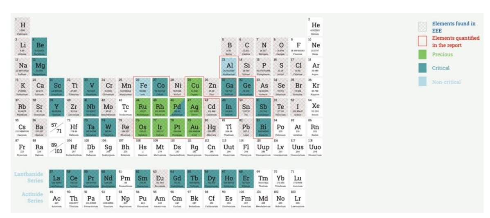

*Figure 19 Elements found in electronics (adapted from [82], p. 58).*

# **5.7 The Fragrances value chain**

Fragrances are unique and complex combinations of natural and synthetic ingredients that are added to products to give them a distinctive smell. Fragrances are not only used in perfumes, but also in many other consumer products, such as cosmetics, personal care and household cleaning products. They satisfy valued emotional needs and solve important functional problems, such as masking bad smells.

Fragrance can be a key driver for consumer choice and consumer brands often rely on innovation with fragrances to differentiate their products and drive value. Fragrances are considered to be a combination of science and creativity. The fragrance industry relies on its suppliers to deliver natural and synthetic raw materials sourced from over 50 countries. It then carries out research and development (R&D) and manufacturing activities using a highly skilled workforce to deliver fragrances to its downstream customers. These customers are manufacturers and retailers of fine fragrance and consumer products. The global fragrance value chain is shown in Figure 20.The [Figure 21](#page-74-0) shows the different suppliers and downstream customers of the fragrance sector.

## GLOBAL FRAGRANCE VALUE CHAIN

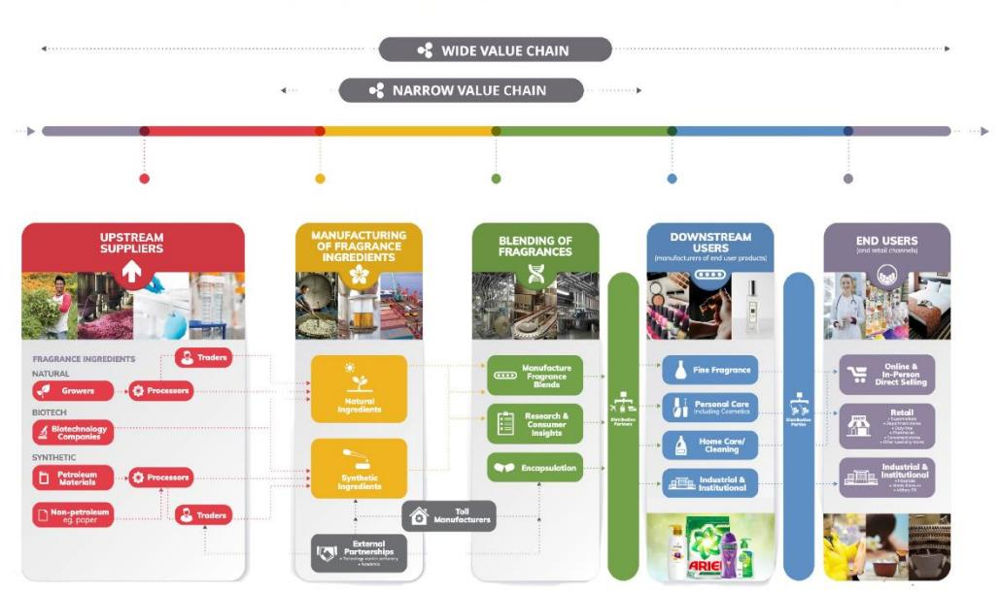

*Figure 20 Global Fragrance Value Chain*

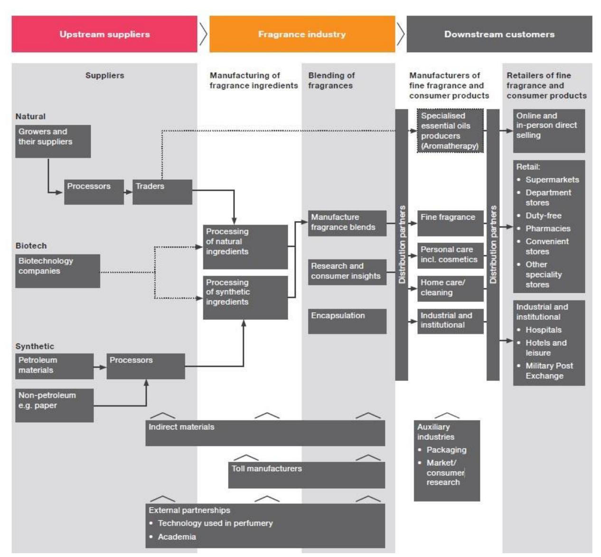

*Figure 21 Upstream suppliers and downstream customers (PwC Value of Fragrance report 2019)*

**Upstream suppliers:** These are the companies that supply products and services to the fragrance industry. The suppliers include providers of natural ingredients and bio-chemicals, synthetic manufacturers and companies that provide goods and services that aid the production process, such as providers of machinery and equipment, logistics and packaging.

**Fragrance industry:** This includes a diverse range of companies that use latest technology and academic research to manufacture fragrance ingredients, and create and supply proprietary fragrance blends. Naturals and synthetics are used for manufacturing and blending of natural fragrance ingredients and synthetic fragrance ingredients. Fragrance manufacturers also manufacture compounds (i.e. mixtures of individual chemicals) using synthetics and biotech processes.

**Downstream customers:** These refer to the manufacturers and retailers of consumer products that contain fragrances. The downstream markets can be divided into:

- fine fragrance,
- personal care, including cosmetics,
- home care/cleaning,
- industrial and institutional (non-residential and professional-strength applications) and
- specialised essential oils.

These are supported by a variety of auxiliary industries who provide packaging, logistics, marketing and other goods and services. The products are then distributed from the product manufacturers and retailers to the consumers through various retail channels, such as online selling, in-store selling and industry trades.

# **5.7.1 The sub-value chains: Cosmetic product and detergent**

#### **5.7.1.1 Steps within the VC covered (upstream & downstream steps): infographic describing the flows + types of stakeholders + company names**

In order to ensure that the whole value chain is covered from upstream to downstream by the case study, two different sources (natural and synthetic origin) and two different final uses (cosmetic product and detergent) of methyl salicylate will be considered. Figure 22 shows the overall value chain for methyl salicylate (whether natural or synthetic).

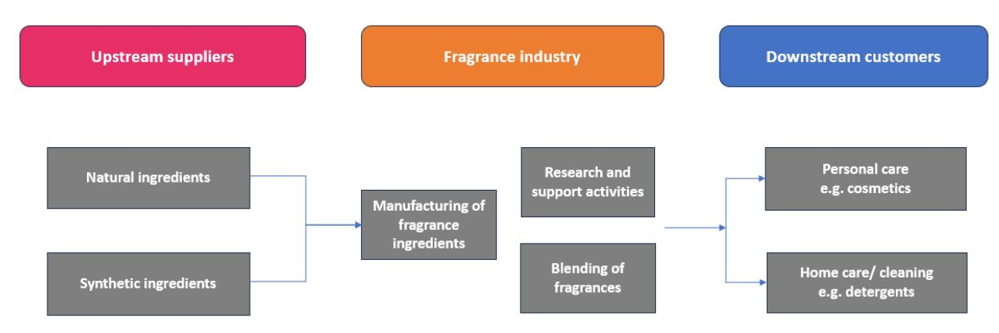

*Figure 22 Methyl salicylate value chain*

#### **The sub-value chain: Cosmetics**

Figure 23 shows the different steps in the Cosmetics sub value chain

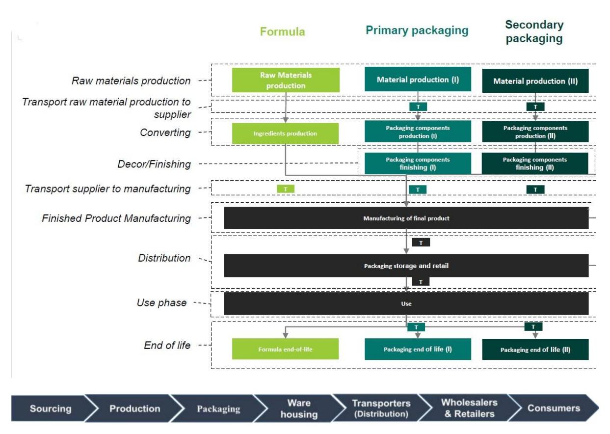

*Figure 23 Cosmetics sub value chain steps* 

#### **The sub-value chain: Detergents**

Figure 24 shows the different steps in the Detergents sub-value chain

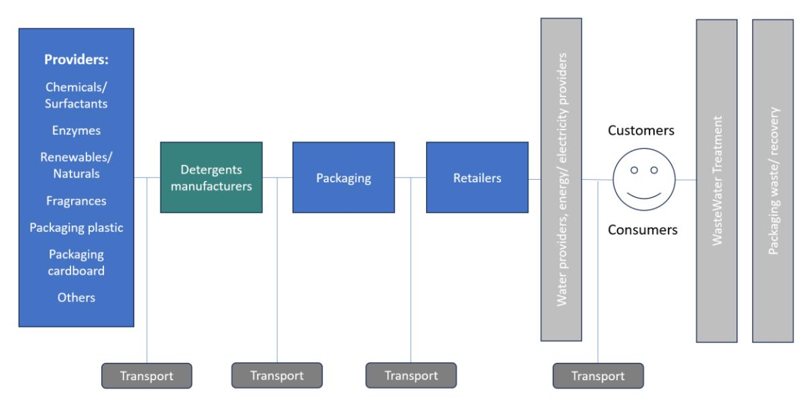

*Figure 24 Detergents sub value chain* 

# **5.7.2 Main SSbD challenges foreseen**

The current framework is a common framework for SSbD that would apply to substances/ materials irrespective of their applications (given that the same chemical could be used in different applications). The SSbD framework needs to take into consideration the different final uses of each chemical and potential mitigation measures that could help make a chemical and the respective product safer.

There are no trade-offs between safety and sustainability, how to rate safety against sustainability? A substance can have a hazardous profile but can be used safely and can have a very good environmental profile. Comparing this to a potential substitute molecule with a better hazard profile, but a weaker Product Environmental Footprint (PEF) / Product Carbon Footprint (PCF) than the first molecule. How can this realistic case be incorporated into the assessment process to avoid such molecules being abandoned at Step 1 of the SSbD assessment?

Substantial work remains to be done on the PEF methodology in order to fill gaps for the assessment of toxicity or of circularity of feedstocks. Other internationally recognised standards could also be validly considered to advance on sustainable approaches, based on a lifecycle approach to the products across the value chains, in order to use the already existing data on life cycle assessment and to feed in the datasets. To illustrate, the uptake of biogenic carbon/ incineration use and biomass balance approach shall be accepted by the PEF methodology. Other standards and validated methods should also be allowed, in order to use the already existing data on LCA and to feed in the datasets.

In general, data transparency and harmonized methods as well as data availability and information flow will be critical for every value chain. Gathering available and reliable data across the whole value chain including smaller stakeholders will be a very complex and a critical step. Standardized processes to gather data and the decision which data is actually reliable and relevant for analysis is not yet established, common tools and practices still need to be aligned.

The capabilities of New Approach Methodologies (NAMs) to address complex endpoints are still under discussion. NAMs are still under development, thus will not cover all aspects and are also not yet validated to fully testing on e.g. adversity or reprotoxicity via NAMs. Furthermore, there will be differences between the acceptance under REACH/CLP and SSbD, does 'no indication' from NAMs, read across or in silico data lead to 'no classification' under SSbD? Or will animal testing be necessary as under REACH requirements?

The overall question of hazard versus risk assessment is a key concern for the safety analysis. A hazardous chemical can be handled and used in a very safe manner, while a less hazardous substance can result in a very similar risk as a hazardous substance. Key concerns here are the acceptance of risk management options and risk management analysis.

# **6 Conclusions**

This update of D4.1 has allowed the value chains team to develop the analysis of steps in chosen sub-value chains: Glass packaging, Smart textiles, Insulation panels, Car seats, Solar panels, Wind turbines/blades, Semiconductors for power control. The Cosmetics and Detergents sub-value chains of fragrances have been also described, with fragrances as a new associated partner. Major updates were mainly provided for Plastics packaging, Wind energy and Electronics.

The value chains have many SSbD related challenges in common, like the sourcing of critical raw materials and their necessary recyclability, the energy intensive manufacturing processes, the use of hazardous substances and their treatment in the design process, the need for sharing data along value chains, and many more. They also showed in their analysis how the chosen application/sub-value chain and their resulting products are necessary for the society, and even essential in the short term when it comes to the impact on climate neutrality.

These numerous SSbD challenges have to be transformed to proposed solutions, which will be developed in the specific value chains roadmaps (D4.5) and associated case studies to be developed in the second testing phase of the SSbD framework in collaboration with JRC and DG RTD in 2024. This work, done in collaboration with WP2 and WP3, on challenges and solutions along life cycles, will be proposed to integrate the Horizon Europe work programmes.

# **7 References**

[1] European Commission, *Commission Recommendation of 8.12.2022 establishing a European assessment framework for 'safe and sustainable by design' chemicals and materials*, Brussels, 8.12.2022, C(2022) 8854 [2] Caldeira, C., Garmendia Aguirre, I., Tosches, D., Mancini, L., Abbate, E., Farcal, R., Lipsa, D., Rasmussen, K., Rauscher, H., Riego Sintes, J. and Sala, S., *Safe and Sustainable by Design chemicals and materials - Application of the SSbD framework to case studies*, Publications Office of the European Union, Luxembourg, 2023, doi:10.2760/769211 [3] Eurostat (online data code: env\_waspac). [https://ec.europa.eu/eurostat/statistics](https://ec.europa.eu/eurostat/statistics-explained/index.php?title=File:Packaging_waste_generated_by_packaging_material,_EU,_2019_(%25)_V2.png)[explained/index.php?title=File:Packaging\\_waste\\_generated\\_by\\_packaging\\_material,\\_EU,\\_](https://ec.europa.eu/eurostat/statistics-explained/index.php?title=File:Packaging_waste_generated_by_packaging_material,_EU,_2019_(%25)_V2.png) [2019\\_\(%25\)\\_V2.png](https://ec.europa.eu/eurostat/statistics-explained/index.php?title=File:Packaging_waste_generated_by_packaging_material,_EU,_2019_(%25)_V2.png) (accessed October 2023) [4] Zero-Waste-Europe, *How circular is PET: A report on the circularity of PET bottles, using Europe as a case study*, February 2022. [https://zerowasteeurope.eu/library/how-circular](https://zerowasteeurope.eu/library/how-circular-is-pet/)[is-pet/](https://zerowasteeurope.eu/library/how-circular-is-pet/) [5] Tiozzo, S. and Favaro, N., *Permanent Materials in the framework of the Circular Economy concept: review of existing literature and definitions, and classification of glass as a Permanent Material*, SSV Report N. 136480, June 2016. [https://feve.org/wp](https://feve.org/wp-content/uploads/2016/09/SSV-Report-on-Glass-as-Permanent-Material.pdf)[content/uploads/2016/09/SSV-Report-on-Glass-as-Permanent-Material.pdf](https://feve.org/wp-content/uploads/2016/09/SSV-Report-on-Glass-as-Permanent-Material.pdf) [6] European Commission, *European Platform on LCA | EPLCA*, Annex C. <https://eplca.jrc.ec.europa.eu/LCDN/developerEF.xhtml> (accessed October 2023) [7] European Commission, *Report on critical raw materials for the EU - Report of the Ad hoc Working Group on defining critical raw materials*, May 2014. [https://rmis.jrc.ec.europa.eu/uploads/crm-report-on-critical-raw-materials\\_en.pdf](https://rmis.jrc.ec.europa.eu/uploads/crm-report-on-critical-raw-materials_en.pdf) [8] European Council, *Council decision of 19 December 2002 establishing criteria and procedures for the acceptance of waste at landfills pursuant to Article 16 of and Annex II to Directive 1999/31/EC classifies glass as inert waste and allows glass to be accepted without testing*, Official Journal of the European Communities, 2003/33/EC. [https://eur](https://eur-lex.europa.eu/legal-content/EN/TXT/PDF/?uri=CELEX:32003D0033)[lex.europa.eu/legal-content/EN/TXT/PDF/?uri=CELEX:32003D0033](https://eur-lex.europa.eu/legal-content/EN/TXT/PDF/?uri=CELEX:32003D0033) [9] European Commission, *Commission Regulation (EC) No 987/2008 of 8 October 2008 amending Regulation (EC) No 1907/2006 of the European Parliament and of the Council on the Registration, Evaluation, Authorisation and Restriction of Chemicals (REACH) as regards Annexes IV and V*, Official Journal of the European Union. [https://eur](https://eur-lex.europa.eu/LexUriServ/LexUriServ.do?uri=OJ:L:2008:268:0014:0019:EN:PDF)[lex.europa.eu/LexUriServ/LexUriServ.do?uri=OJ:L:2008:268:0014:0019:EN:PDF](https://eur-lex.europa.eu/LexUriServ/LexUriServ.do?uri=OJ:L:2008:268:0014:0019:EN:PDF) [10]European Parliament, *Regulation (EC) No 1935/2004 of the European Parliament and of the Council of 27 October 2004 on materials and articles intended to come into contact with food and repealing Directives 80/590/EEC and 89/109/EEC*, Official Journal of the European Union. [https://eur-lex.europa.eu/legal](https://eur-lex.europa.eu/legal-content/EN/TXT/PDF/?uri=CELEX:32004R1935)[content/EN/TXT/PDF/?uri=CELEX:32004R1935](https://eur-lex.europa.eu/legal-content/EN/TXT/PDF/?uri=CELEX:32004R1935) [11] European Commission, *Commission Decision 2001/171/EC of 19 February 2001 establishing the conditions for a derogation for glass packaging in relation to the heavy* 

*metal concentration levels established in Directive 94/62/EC on packaging and packaging waste*, Official Journal of the European Communities. [https://eur](https://eur-lex.europa.eu/legal-content/EN/TXT/PDF/?uri=CELEX:32001D0171)[lex.europa.eu/legal-content/EN/TXT/PDF/?uri=CELEX:32001D0171](https://eur-lex.europa.eu/legal-content/EN/TXT/PDF/?uri=CELEX:32001D0171)

[12] European Commission, *Commission Decision 2006/340/EC of 8 May 2006 amending Decision 2001/171/EC of the European Parliament and of the Council for the purpose of prolonging the validity of the conditions for a derogation for glass packaging in relation to the heavy metal concentration levels established in Directive 94/62/EC*, Official Journal of the European Union. [https://eur-lex.europa.eu/legal](https://eur-lex.europa.eu/legal-content/EN/TXT/PDF/?uri=CELEX:32006D0340)[content/EN/TXT/PDF/?uri=CELEX:32006D0340](https://eur-lex.europa.eu/legal-content/EN/TXT/PDF/?uri=CELEX:32006D0340) [13]European Parliament, *Directive 2002/95/EC of the European Parliament and of the Council of 27 January 2003 on the restriction of the use of certain hazardous substances in electrical and electronic equipment*, Official Journal of the European Union. <https://eur-lex.europa.eu/LexUriServ/LexUriServ.do?uri=OJ:L:2003:037:0019:0023:EN:PDF> [14]European Council, *Council Regulation (EEC) No 259/93 of 1 February 1993 on the supervision and control of shipments of waste within, into and out of the European Community*, Annex II "Green list of wastes", Official Journal of the European Communities. [https://eur-lex.europa.eu/legal](https://eur-lex.europa.eu/legal-content/EN/TXT/PDF/?uri=CELEX:31993R0259)[content/EN/TXT/PDF/?uri=CELEX:31993R0259](https://eur-lex.europa.eu/legal-content/EN/TXT/PDF/?uri=CELEX:31993R0259) [15]Glass Packaging Institute, *Glass Basics*.<http://www.gpi.org/learn-about-glass> (accessed October 2023) [16]SmartX, *Smart Textiles Value Chain: A Roadmap*. [https://www.smartx-europe.eu/the](https://www.smartx-europe.eu/the-smart-textiles-value-chain-map/)[smart-textiles-value-chain-map/](https://www.smartx-europe.eu/the-smart-textiles-value-chain-map/) (accessed October 2023) [17] Pavel, C., and Blagoeva, D., *Competitive landscape of the EU's insulation materials industry for energy-efficient buildings – Revised edition*, Publications Office, 2018, <https://data.europa.eu/doi/10.2760/750646> [18] ISOPA, *Recycling and Recovery of Polyurethanes*, January 2017. [https://www.isopa.org/wp-content/uploads/2022/09/recycling-and-recovery-of-comfort](https://www.isopa.org/wp-content/uploads/2022/09/recycling-and-recovery-of-comfort-pu-foam_revised-verison_january-2017.pdf)[pu-foam\\_revised-verison\\_january-2017.pdf](https://www.isopa.org/wp-content/uploads/2022/09/recycling-and-recovery-of-comfort-pu-foam_revised-verison_january-2017.pdf) (accessed October 2023) [19]Safe use of Diisocyanates, *Safe Use and Handling of Diisocyanates Trainings*. <https://www.safeusediisocyanates.eu/> (accessed October 2023) [20]Bourguignon, M., Grignard, B., and Detrembleur, C., *Water-Induced Self-Blown Non-Isocyanate Polyurethane Foams*, Angewandte Chemie International Edition, 2022. <https://doi.org/10.1002/anie.202213422> [21]European Commission, *European Green Deal - Striving to be the first climate-neutral continent*. [https://commission.europa.eu/strategy-and-policy/priorities-2019-](https://commission.europa.eu/strategy-and-policy/priorities-2019-2024/european-green-deal_en) [2024/european-green-deal\\_en](https://commission.europa.eu/strategy-and-policy/priorities-2019-2024/european-green-deal_en) (accessed October 2023) [22]PU Europe, *Environmental and economic analysis of insulation products in low energy buildings*, PricewaterhouseCoopers Advisory, May 2013. [23] EURO MOULDERS, *Getting to understand moulded polyurethane foam for automotive seating*, June 2016. [https://euromoulders.org/wp](https://euromoulders.org/wp-content/uploads/2022/11/SeatingZGuideZ02_06_16_web-1.pdf)[content/uploads/2022/11/SeatingZGuideZ02\\_06\\_16\\_web-1.pdf](https://euromoulders.org/wp-content/uploads/2022/11/SeatingZGuideZ02_06_16_web-1.pdf)

[24]Bourguignon, M., Grignard, B., and Detrembleur, C., *Water-Induced Self-Blown Non-Isocyanate Polyurethane Foams*, Angewandte Chemie International Edition, October 2022.<https://doi.org/10.1002/anie.202213422> [25]Knauf Industries Automotive, *Automotive Injection Molded Parts*. [https://knaufautomotive.com/products/injection-molded-components/#exterior-injection-moulded](https://knaufautomotive.com/products/injection-molded-components/#exterior-injection-moulded-components)[components](https://knaufautomotive.com/products/injection-molded-components/#exterior-injection-moulded-components) (accessed October 2023) [26]Swanson, M., *Flame Retardant Automotive Foams*, JBC Blocks, [https://www.jbc](https://www.jbc-tech.com/blog/posts/flame-retardant-automotive-foams/)[tech.com/blog/posts/flame-retardant-automotive-foams/](https://www.jbc-tech.com/blog/posts/flame-retardant-automotive-foams/) (accessed October 2023) [27] EURO MOULDERS, *Sustainable Polyurethanes in Automobiles: Addressing the whole lifecycle of PU parts*, July 2023. [https://euromoulders.org/2023/07/sustainable-polyurethanes](https://euromoulders.org/2023/07/sustainable-polyurethanes-in-automobiles-addressing-the-whole-lifecycle-of-pu-parts/)[in-automobiles-addressing-the-whole-lifecycle-of-pu-parts/](https://euromoulders.org/2023/07/sustainable-polyurethanes-in-automobiles-addressing-the-whole-lifecycle-of-pu-parts/) [28]International Material Data System, *IMDS Release 14.0 Information*, May 2023. [https://public.mdsystem.com/documents/10906/16820/release](https://public.mdsystem.com/documents/10906/16820/release-information_14.0_en.pdf/51667728-e90d-3a0a-6b33-6535714fdee2?t=1673357798350)[information\\_14.0\\_en.pdf/51667728-e90d-3a0a-6b33-6535714fdee2?t=1673357798350](https://public.mdsystem.com/documents/10906/16820/release-information_14.0_en.pdf/51667728-e90d-3a0a-6b33-6535714fdee2?t=1673357798350) [29]Ziebold, S., *Sustainable foams for the mobility of tomorrow*, Press Release, August 2020. [https://www.foampartner.com/fileadmin/user\\_upload/editor/Downloads/PR/2020-08-31-](https://www.foampartner.com/fileadmin/user_upload/editor/Downloads/PR/2020-08-31-FoamPartner-Press-Release-OBoNature-en.pdf) [FoamPartner-Press-Release-OBoNature-en.pdf](https://www.foampartner.com/fileadmin/user_upload/editor/Downloads/PR/2020-08-31-FoamPartner-Press-Release-OBoNature-en.pdf) [30]Neal, B., Blair, G.R., McEvoy, J., Pask, R., and Weierstall, M., *Molded Polyurethane Foam Durability Testing as a Response to Applied Work*. [https://www.moldedfoam](https://www.moldedfoam-ip.com/linkedpdf/Technical%20Info%20-%20Molded%20Polyurethane%20Foam%20Durability%20as%20a%20Response%20to%20Applied%20Work%20(Final).pdf)[ip.com/linkedpdf/Technical%20Info%20-](https://www.moldedfoam-ip.com/linkedpdf/Technical%20Info%20-%20Molded%20Polyurethane%20Foam%20Durability%20as%20a%20Response%20to%20Applied%20Work%20(Final).pdf) [%20Molded%20Polyurethane%20Foam%20Durability%20as%20a%20Response%20to%20A](https://www.moldedfoam-ip.com/linkedpdf/Technical%20Info%20-%20Molded%20Polyurethane%20Foam%20Durability%20as%20a%20Response%20to%20Applied%20Work%20(Final).pdf) [pplied%20Work%20\(Final\).pdf](https://www.moldedfoam-ip.com/linkedpdf/Technical%20Info%20-%20Molded%20Polyurethane%20Foam%20Durability%20as%20a%20Response%20to%20Applied%20Work%20(Final).pdf) (accessed October 2023) [31] Hornyák-Mester, E., Mentes, D., Farkas, L., Ferencz Hatvani-Nagy, A., Varga, M., Viskolcz, B., Muránszky, G., and Fiser, B., *Volatile emissions of flexible polyurethane foams as a function of time*, Polymer Degradation and Stability, 216(110507), 2023. [https://doi.org/10.1016/j.polymdegradstab.2023.110507.](https://doi.org/10.1016/j.polymdegradstab.2023.110507) [32]WIPO, 1. WO2016201615 - ALDEHYDE SCAVENGERS FOR POLYURETHANE FOAMS. <https://patentscope.wipo.int/search/en/detail.jsf?docId=WO2016201615> (accessed October 2023) [33] Al-Rashid, J., Adamcyk, A., Panitzsch, T., Sankar Lal, G., Arnold, A., and Su, J., *Aldehyde Emissions from Flexible Molded Foam*, American Chemistry Council Center for the Polyurethanes Industry (CPI) Technical Conference, October 2015. [https://www.researchgate.net/publication/291152715\\_Aldehyde\\_Emissions\\_from\\_Flexible](https://www.researchgate.net/publication/291152715_Aldehyde_Emissions_from_Flexible_Molded_Foam) [\\_Molded\\_Foam](https://www.researchgate.net/publication/291152715_Aldehyde_Emissions_from_Flexible_Molded_Foam) [34]EMIRI, *Advanced Materials for Clean and Sustainable Energy and Mobility*, EMIRI Technology Roadmap, Sept. 2019. [https://emiri.eu/wp-content/uploads/2021/07/EMIRI-](https://emiri.eu/wp-content/uploads/2021/07/EMIRI-Technology-Roadmap-September-2019-cond-1.pdf)[Technology-Roadmap-September-2019-cond-1.pdf](https://emiri.eu/wp-content/uploads/2021/07/EMIRI-Technology-Roadmap-September-2019-cond-1.pdf) [35]Jaeger-Waldau, A., *PV Status Report 2017*, EUR 28817 EN, Publications Office of the European Union, Luxembourg, 2017, ISBN 978-92-79-74071-8. <https://dx.doi.org/10.2760/452611>

[36] NC Clean Energy Technology Center, *Health and Safety Impacts of Solar Photovoltaics*, N.C. State University, May 2017. [https://nccleantech.ncsu.edu/wp](https://nccleantech.ncsu.edu/wp-content/uploads/2018/10/Health-and-Safety-Impacts-of-Solar-Photovoltaics-2017_white-paper.pdf)[content/uploads/2018/10/Health-and-Safety-Impacts-of-Solar-Photovoltaics-2017\\_white](https://nccleantech.ncsu.edu/wp-content/uploads/2018/10/Health-and-Safety-Impacts-of-Solar-Photovoltaics-2017_white-paper.pdf)[paper.pdf](https://nccleantech.ncsu.edu/wp-content/uploads/2018/10/Health-and-Safety-Impacts-of-Solar-Photovoltaics-2017_white-paper.pdf) [37] Tchognia Nkuissi, H. J., Kouadio Konan, F., Hartiti, B., and Ndjaka, J.-M., *Toxic Materials Used in Thin Film Photovoltaics and Their Impacts on Environment*, In: Gok, A., *Reliability and Ecological Aspects of Photovoltaic Modules*, January 2020. <https://www.intechopen.com/chapters/68288> [38] SolarPower Europe, *Solar Sustainability: Best Practices Benchmark*, May 2021, ISBN: 9789464073485. [https://api.solarpowereurope.org/uploads/2121\\_SPE\\_PV\\_Sustainability\\_Best\\_Practices\\_Be](https://api.solarpowereurope.org/uploads/2121_SPE_PV_Sustainability_Best_Practices_Benchmark_10_mr_4217f294fe.pdf) [nchmark\\_10\\_mr\\_4217f294fe.pdf](https://api.solarpowereurope.org/uploads/2121_SPE_PV_Sustainability_Best_Practices_Benchmark_10_mr_4217f294fe.pdf) [39] International Energy Agency (IEA), *Designing New Materials for Photovoltaics: Opportunities for Lowering Cost and Increasing Performance through Advanced Material Innovations*, 2021, Report IEA-PVPS T13-13:2021. [https://iea-pvps.org/wp](https://iea-pvps.org/wp-content/uploads/2021/04/IEA-PVPS-T13-13_2021_Designing-new-materials-for-photovoltaics-report.pdf)[content/uploads/2021/04/IEA-PVPS-T13-13\\_2021\\_Designing-new-materials-for](https://iea-pvps.org/wp-content/uploads/2021/04/IEA-PVPS-T13-13_2021_Designing-new-materials-for-photovoltaics-report.pdf)[photovoltaics-report.pdf](https://iea-pvps.org/wp-content/uploads/2021/04/IEA-PVPS-T13-13_2021_Designing-new-materials-for-photovoltaics-report.pdf) [40] International Energy Agency (IEA), *PV Module Design for Recycling Guidelines*, 2021, Report IEA-PVPS T12-23:2020. [https://iea-pvps.org/wp-content/uploads/2021/10/T12\\_2021\\_PV-](https://iea-pvps.org/wp-content/uploads/2021/10/T12_2021_PV-Design-for-Recycling-Guidelines_Report.pdf)[Design-for-Recycling-Guidelines\\_Report.pdf](https://iea-pvps.org/wp-content/uploads/2021/10/T12_2021_PV-Design-for-Recycling-Guidelines_Report.pdf) [41] EU Monitor, *COMMISSION STAFF WORKING DOCUMENT IMPACT ASSESSMENT Accompanying the document Proposal for a Directive of the European Parliament and of the Council amending Directive 2004/37 on the protection of workers from the risk related to exposure to carcinogens or mutagens at work*. <https://www.eumonitor.eu/9353000/1/j9vvik7m1c3gyxp/vkne7cn17szv> (accessed October 2023) [42] U.S. Department of Energy, *Solar Energy Technologies Office Photovoltaics End-of-Life Action Plan*, March 2022. [https://www.energy.gov/sites/default/files/2022-03/Solar-Energy-](https://www.energy.gov/sites/default/files/2022-03/Solar-Energy-Technologies-Office-PV-End-of-Life-Action-Plan_0.pdf)[Technologies-Office-PV-End-of-Life-Action-Plan\\_0.pdf](https://www.energy.gov/sites/default/files/2022-03/Solar-Energy-Technologies-Office-PV-End-of-Life-Action-Plan_0.pdf) [43] Jones & Bartlett Learning, LLC, *Chapter 2: Essential Safety Practices for Designing and Installing PV Systems*. [https://samples.jbpub.com/9781449624712/24712\\_Install2\\_CH02.pdf](https://samples.jbpub.com/9781449624712/24712_Install2_CH02.pdf) (accessed October 2023) [44] Muteri, V., Cellura, M., Curto, D., Franzitta, V., Longo, S., Mistretta, M., and Parisi, M.L., *Review on Life Cycle Assessment of Solar Photovoltaic Panels*, Energies 2020, 13(1), 252; <https://doi.org/10.3390/en13010252> [45]International Energy Agency (IEA), Life Cycle Inventories and Life Cycle Assessments of Photovoltaic Systems, 2020, Report IEA-PVPS T12-19:2020. [https://iea-pvps.org/wp](https://iea-pvps.org/wp-content/uploads/2020/12/IEA-PVPS-LCI-report-2020.pdf)[content/uploads/2020/12/IEA-PVPS-LCI-report-2020.pdf](https://iea-pvps.org/wp-content/uploads/2020/12/IEA-PVPS-LCI-report-2020.pdf)

[46]Bonilla-Alicea, R.J., and Fu, K., *Social life-cycle assessment (S-LCA) of residential rooftop solar panels using challenge-derived framework*, Energy, Sustainability and Society 2022 (12). <https://energsustainsoc.biomedcentral.com/articles/10.1186/s13705-022-00332-w> [47]International Energy Agency (IEA), *Technology Roadmap - Wind Energy 2013*, IEA, Paris [https://www.iea.org/reports/technology-roadmap-wind-energy-2013](https://www/) [48]Pegorin, F., Anderhuber, F., Bounsaythip, C., Bureau, G., Chevillard, N., Della Rosa, F., Escudero, C., Forriere, B., Gauß, R., Gautier, P.-A., Gervais, E., Grivel, F., Lamm, L., Lorenz, V., Mosdale, R., Nadoll, P., Salmi, O., Stassin, F., Tremolada, A., and Gasparon, M., *Materials for Energy Storage and Conversion: A European Call for Action*. A report by the Materials for Energy Storage and Conversion Cluster of the European Raw Materials Alliance, Berlin 2023.<https://erma.eu/app/uploads/2023/07/e33fa4d1.pdf> [49] WindEurope, *Wind energy and the environment*. [https://windeurope.org/about](https://windeurope.org/about-wind/wind-energy-and-the-environment/)[wind/wind-energy-and-the-environment/#](https://windeurope.org/about-wind/wind-energy-and-the-environment/) (accessed October 2023) [50] WindEurope, *Search Results for Safety*.<https://windeurope.org/search/safety/> (accessed October 2023) [51]IFC, *Environmental, Health and Safety Guidelines for Wind Energy*, Manual and Guideline, August 2015. [https://www.ifc.org/en/insights-reports/2015/publications-policy](https://www.ifc.org/en/insights-reports/2015/publications-policy-ehs-wind-energy)[ehs-wind-energy](https://www.ifc.org/en/insights-reports/2015/publications-policy-ehs-wind-energy) [52]Wind Energy The Facts, *LCA in Wind Energy: Environmental Impacts through the Whole Chain*.<https://www.wind-energy-the-facts.org/lca-in-wind-energy.html> (accessed October 2023) [53]Veers, P., Bottasso, C. L., Manuel, L., Naughton, J., Pao, L., Paquette, J., Robertson, A., Robinson, M., Ananthan, S., Barlas, A., Bianchini, A., Bredmose, H., González Horcas, S., Keller, J., Aagaard Madsen, H., Manwell, J., Moriarty, P., Nolet, S., and Rinker, J., *Grand Challenges in the Design, Manufacture, and Operation of Future Wind Turbine Systems*, Wind, Energy, Science Discussions, April 2022.<https://doi.org/10.5194/wes-2022-32> [54]Verma, S., Paul, A. R., and Haque, N., *Selected Environmental Impact Indicators Assessment of Wind Energy in India Using a Life Cycle Assessment*, Energies 2022, 15, 3944.<https://doi.org/10.3390/en15113944> [55] European Commission, *Right to repair: Commission introduces new consumer rights for easy and attractive repairs*, Press Release, March 2023. [https://ec.europa.eu/commission/presscorner/detail/en/ip\\_23\\_1794](https://ec.europa.eu/commission/presscorner/detail/en/ip_23_1794) [56]European Commission*, Designing mobile phones and tablets to be sustainable – ecodesign*. [https://ec.europa.eu/info/law/better-regulation/have-your](https://ec.europa.eu/info/law/better-regulation/have-your-say/initiatives/12797-Designing-mobile-phones-and-tablets-to-be-sustainable-ecodesign_en)[say/initiatives/12797-Designing-mobile-phones-and-tablets-to-be-sustainable](https://ec.europa.eu/info/law/better-regulation/have-your-say/initiatives/12797-Designing-mobile-phones-and-tablets-to-be-sustainable-ecodesign_en)[ecodesign\\_en](https://ec.europa.eu/info/law/better-regulation/have-your-say/initiatives/12797-Designing-mobile-phones-and-tablets-to-be-sustainable-ecodesign_en) (accessed October 2023) [57]European Commission, *Consumer protection: Nintendo agrees to offer free repairs of irresponsive Nintendo Switch controllers*, Press release, April 2023. [https://ec.europa.eu/commission/presscorner/detail/en/ip\\_23\\_2106](https://ec.europa.eu/commission/presscorner/detail/en/ip_23_2106) [58]European Commission, *Internal Market, Industry, Entrepreneurship and SMEs: One common charging solution for all*. [https://single-market-](https://single-market-economy.ec.europa.eu/sectors/electrical-and-electronic-engineering-industries-eei/radio-equipment-directive-red/one-common-charging-solution-all_en) [economy.ec.europa.eu/sectors/electrical-and-electronic-engineering-industries-eei/radio](https://single-market-economy.ec.europa.eu/sectors/electrical-and-electronic-engineering-industries-eei/radio-equipment-directive-red/one-common-charging-solution-all_en)[equipment-directive-red/one-common-charging-solution-all\\_en](https://single-market-economy.ec.europa.eu/sectors/electrical-and-electronic-engineering-industries-eei/radio-equipment-directive-red/one-common-charging-solution-all_en) (accessed October 2023)

[59]Harding, S., *Right to repair, universal charging port mandates eyed to save Canadians money*, Ars Technica, March 2023. [https://arstechnica.com/gadgets/2023/03/right-to](https://arstechnica.com/gadgets/2023/03/right-to-repair-rules-for-electronics-appliances-targeted-for-2024-canada-says/)[repair-rules-for-electronics-appliances-targeted-for-2024-canada-says/](https://arstechnica.com/gadgets/2023/03/right-to-repair-rules-for-electronics-appliances-targeted-for-2024-canada-says/) [60]Ray, T., *India's embrace of 'right to repair' can transform the electronics sector*, New Atlanticist, August 2023. [https://www.atlanticcouncil.org/blogs/new-atlanticist/indias](https://www.atlanticcouncil.org/blogs/new-atlanticist/indias-embrace-of-right-to-repair-can-transform-the-electronics-sector/)[embrace-of-right-to-repair-can-transform-the-electronics-sector/](https://www.atlanticcouncil.org/blogs/new-atlanticist/indias-embrace-of-right-to-repair-can-transform-the-electronics-sector/) [61]Minnesota Legislature, *SF 1598 Status in the Senate for the 93rd Legislature (2023 - 2024)*. <https://www.revisor.mn.gov/bills/bill.php?b=senate&f=SF1598&ssn=0&y=2023> (accessed October 2023) [62]Harding, S., *Hell freezes over as Apple supports right-to-repair bill*, Ars Technica, August 2023. [https://arstechnica.com/gadgets/2023/08/hell-freezes-over-as-apple-supports-right](https://arstechnica.com/gadgets/2023/08/hell-freezes-over-as-apple-supports-right-to-repair-bill/)[to-repair-bill/](https://arstechnica.com/gadgets/2023/08/hell-freezes-over-as-apple-supports-right-to-repair-bill/) [63]Kunert, P., *Hardware makers criticized for eco double standards*, The Register, October 2022. [https://www.theregister.com/2022/10/20/sustainability/](https://www/) [64] Fairphone, *Is the Fairphone 5 the most sustainable phone in the world?*, August 2023. [https://www.fairphone.com/en/2023/08/30/is-the-fairphone-5-the-most-sustainable](https://www/)[phone-in-the-world/](https://www/) [65]Buyck, M., *Closing the loop with Refurbished Framework products*, Framework, October 2022. [https://frame.work/de/de/blog/closing-the-loop-with-refurbished-framework](https://frame/)[products](https://frame/) [66]Robson, G., *Pushing the Boundaries of Sustainable PC Design: Concept Luna*, Dell Blog, December 2021. [https://www.dell.com/en-us/blog/pushing-the-boundaries-of](https://www/)[sustainable-pc-design-concept-luna/](https://www/) [67]Fairephone, *Apple thinks modularity hinders device longevity. We don't.*, September 2023[. https://www.fairphone.com/en/2023/09/13/apple-thinks-modularity-hinders-device](https://www/)[longevity/](https://www/) [68]Meegan, A*.*, *A look at how we're building more sustainable hardware*, Google Devices & Services, April 2023. [https://blog.google/products/devices-services/a-look-at-how-were](https://blog.google/products/devices-services/a-look-at-how-were-building-more-sustainable-hardware/)[building-more-sustainable-hardware/](https://blog.google/products/devices-services/a-look-at-how-were-building-more-sustainable-hardware/) [69]Uranaka, M., *As yen tumbles, gadget-loving Japan goes for secondhand iPhones*, Reuters Technology, November 2022. [https://www.reuters.com/technology/yen-tumbles-gadget](https://www/)[loving-japan-goes-secondhand-iphones-2022-11-08/](https://www/) [70]BBC News, *What happens to your old phone when recycled?*. <https://www.bbc.com/news/av/uk-england-norfolk-66618397> (accessed October 2023) [71]Pritchard, T., *Lenovo's new flaxseed laptop is a big step forward for sustainability*, Tom's Guide, February 2023. [https://www.tomsguide.com/news/lenovos-sustainability-push](https://www/)[features-plant-based-laptop-shells-compostable-packaging](https://www/)

[72] Samsung, *Samsung Repurposes Discarded Fishing Nets For New Galaxy Devices*, Samsung Newsroom U.S., June 2022. [https://news.samsung.com/us/samsung-repurposes](https://news.samsung.com/us/samsung-repurposes-discarded-fishing-nets-new-galaxy-devices-unpacked-2022/)[discarded-fishing-nets-new-galaxy-devices-unpacked-2022/](https://news.samsung.com/us/samsung-repurposes-discarded-fishing-nets-new-galaxy-devices-unpacked-2022/) [73] Apple, *Apple will use 100 percent recycled cobalt in batteries by 2025*, Press Release, April 2023. [https://www.apple.com/newsroom/2023/04/apple-will-use-100-percent](https://www.apple.com/newsroom/2023/04/apple-will-use-100-percent-recycled-cobalt-in-batteries-by-2025/)[recycled-cobalt-in-batteries-by-2025/](https://www.apple.com/newsroom/2023/04/apple-will-use-100-percent-recycled-cobalt-in-batteries-by-2025/) [74] Google Sustainability, *The alchemy of aluminum: Pioneering a new recycled alloy for our products*, Google Stories, January 2021. [https://sustainability.google/operating](https://sustainability/)[sustainably/stories/recycled-aluminum/](https://sustainability/) [75] RMI, *Members*. [https://www.responsiblemineralsinitiative.org/about/members-and](https://www.responsiblemineralsinitiative.org/about/members-and-collaborations/)[collaborations/](https://www.responsiblemineralsinitiative.org/about/members-and-collaborations/) (accessed October 2023) [76]Holderness, A., Velazquez, N., Carroll, H. H., and Cook, C., *Understanding China's Gallium Sanctions*, Critical Questions, Center for Strategic and International Studies (CSIS), July 2023.<https://www.csis.org/analysis/understanding-chinas-gallium-sanctions> [77]Robinson, D., *Cost of gallium goes up after Chinese export restrictions land*, The Register, August 2023. [https://www.theregister.com/2023/08/17/cost\\_of\\_gallium\\_peaks\\_china\\_ban/](https://www.theregister.com/2023/08/17/cost_of_gallium_peaks_china_ban/) [78]BelGaN Website:<https://www.belgan.com/> (accessed October 2023) [79] GaN Valley Website:<https://www.ganvalley.org/> (accessed October 2023) [80] Györvary, E., Dallemagne, P., Schüttauf, J.-W., Rzepka, S., Nissen, N., Collin, D., Quinn, A., Niskala, P., Salo, T., …, *ECS Sustainability and Environmental Footprint*, White Paper authored by a joint EPoSS working group, July 2023. [https://www.smart-systems](https://www.smart-systems-integration.org/system/files/document/EPoSS_White%20Paper%20Green%20ECS_July%202023_for%20consultation.pdf)[integration.org/system/files/document/EPoSS\\_White%20Paper%20Green%20ECS\\_July%20](https://www.smart-systems-integration.org/system/files/document/EPoSS_White%20Paper%20Green%20ECS_July%202023_for%20consultation.pdf) [2023\\_for%20consultation.pdf](https://www.smart-systems-integration.org/system/files/document/EPoSS_White%20Paper%20Green%20ECS_July%202023_for%20consultation.pdf) [81] Koenigsegg, *Inverters*.<https://www.koenigsegg.com/inverters> (accessed October 2023) [82]Forti, V., Baldé, C.P., Kuehr, R., and Bel, G., *The Global E-Waste Monitor 2020: Quantities, Flows and the Circular Economy Potential*, United Nations University (UNU)/United Nations Institute for Training and Research (UNITAR) – co-hosted SCYCLE Programme, International Telecommunication Union (ITU) & International Solid Waste Association (ISWA), Bonn/Geneva/Rotterdam, 2020. [https://www.itu.int/en/ITU-](https://www/)[D/Environment/Documents/Toolbox/GEM\\_2020\\_def.pdf](https://www/)