1 º The project receives funding from the European Union's HORIZON EUROPE research and innovation programme under grant agreement n° 101058245. UK participants in Project IRISS are supported by UKRI grant 10038816. CH participants in Project IRISS receive funding from the Swiss State Secretariat for Education, Research, and Innovation (SERI).

# **The international ecosystem for accelerating the transition to Safe-and-Sustainable-by-design materials, products and processes.**

Design for circular economy

*Richard Lihammar, Kristin Geidenmark Olofsson, Tomas Rydberg, Arvin Ghasemi, Siri Willskytt, Maja Häggström, Gemma Mendoza, Jon Anders Sarasua, Christina Apel, Klaus Kümmerer, Akshat Sudheshwar, Barbora Pinlova*

2 º The project receives funding from the European Union's HORIZON EUROPE research and innovation programme under grant agreement n° 101058245. UK participants in Project IRISS are supported by UKRI grant 10038816. CH participants in Project IRISS receive funding from the Swiss State Secretariat for Education, Research, and Innovation (SERI).

# **Disclaimer**

Funded by the European Union. Views and opinions expressed are however those of the author(s) only and do not necessarily reflect those of the European Union or the European Health and Digital Executive Agency (HADEA). Neither the European Union nor the granting authority can be held responsible for them.

| Project acronym          | IRISS                                                              |
|--------------------------|--------------------------------------------------------------------|
| Work Package             | WP1                                                                |
| Deliverable n° and title | D1.4 Design for circular economy                                   |
| Deliverable Leader       | IVL                                                                |
| Type                     | R – Report                                                         |
| Dissemination Level      | Public                                                             |
| Submission Date          | 01/03/2024                                                         |
| Author(s)                | Richard Lihammar, Kristin Geidenmark Olofsson, Arvin Ghasemi, Siri |
|                          | Willskytt, Maja Häggström (IVL), Gemma Mendoza, Jon Ander Sarasua  |
|                          | (Tekniker), Christina Apel, Klaus Kümmerer (Leuphana), Akshat      |

# **Our partners:**

# **Revision History**

| Version | Modifications                  | Date       | Author(s)                         |
|---------|--------------------------------|------------|-----------------------------------|
| 0.1     | Initial draft                  | 01/05/2023 | Richard Lihammar, Kristin         |
|         |                                |            | Jon Ander Sarasua (Tekniker),     |
| 0.2     | Revision within WP1 team       | 07/05/2023 | Amaya Igartua (TEKNIKER)          |
| 0.3     | Revision                       | 29/05/2023 | Emma Strömberg (IVL), Eva         |
|         |                                |            | Valsami-Jones (UoB)               |
| 0.4     | Editorial revision             | 31/05/2023 | Kristin Geidenmark Olofsson, Siri |
| 1.0     | Final version submitted to EC  | 31/05/2023 | Carolina Landerdahl (IVL)         |
| 1.1     | Revision according to reviewer |            |                                   |
|         |                                | 22/01/2024 | Richard Lihammar, Siri Willskytt  |
| 2.0     | Updated version submitted to   |            |                                   |
|         |                                | 01/03/2024 | Sofia Mc Conell (IVL)             |

# **Table of Content**

| 2.1    | Circular economy .........................................................................................................11 |
|--------|------------------------------------------------------------------------------------------------------------------------------|
| 2.2    | Background of the Safe-and-Sustainable-by-Design framework (SSbD) .....................13                                    |
| 2.3    | CE in the design phase .................................................................................................15   |
| 2.4    | Work of the IRISS project.............................................................................................16     |
| 4.1    | Categorization of circular economy strategies ............................................................20                 |
| 5.1    | Existing and upcoming legislation................................................................................23          |
| 5.1.1  | European Green Deal..............................................................................................24          |
| 5.1.2  | Ecodesign Directive (Directive 2009/125/EC).........................................................24                       |
| 5.1.3  | Sustainable products initiative................................................................................26            |
| 5.1.4  | Other initiatives within CEAP ..................................................................................27           |
| 5.1.5  | Energy Label Directive.............................................................................................27        |
| 5.1.6  | Packaging and packaging waste regulation ............................................................29                      |
| 5.1.7  | End-of-Life Vehicle (ELV) Directive 2000/53/EC .....................................................30                       |
| 5.1.8  | Global Plastic Treaty................................................................................................31      |
| 5.1.9  | Policy Measures and Legislation connected to biological sphere of Circular                                                   |
| 5.1.10 | Overview legislation................................................................................................34       |
| 6.1    | Existing sustainability criteria initiatives......................................................................36         |
| 6.2    | Ecolabel mapping .........................................................................................................38 |
| 6.2.1  | Selection of product categories..............................................................................38              |
| 7.1    | About Standardisation .................................................................................................47    |
| 7.2    | Inclusion of circular economy in standardisation ........................................................48                  |

| 7.2.1  |                                                                                                                               |
|--------|-------------------------------------------------------------------------------------------------------------------------------|
| 7.2.2  | ISO/TC 323 Circular economy .................................................................................50               |
| 7.2.3  | ISO TC 308 Chain of custody ...................................................................................50             |
| 8.1    | Non-value chain specific circular design principles......................................................51                   |
| 8.1.1  | Smarter product use and manufacture...................................................................52                      |
| 8.1.2  | Extend life span of products and its parts...............................................................54                   |
| 8.1.3  | Useful application of materials...............................................................................58              |
| 8.1.4  | Regenerative processes ..........................................................................................59           |
| 8.2    | Applicability of design principles to durables and consumables.................................62                             |
| 8.3    | Value chain specific circular design principles.............................................................63                |
| 8.3.1  | Packaging design guidelines....................................................................................63             |
| 8.3.2  | Textile design guidelines.........................................................................................67          |
| 8.3.3  | Construction design guidelines...............................................................................72               |
| 8.3.4  | Automotive design guidelines.................................................................................77               |
| 8.3.5  | Energy materials design guidelines.........................................................................81                 |
| 8.3.6  | Electronics design guidelines..................................................................................86             |
| 8.3.7  | Fragrance products design guidelines ....................................................................89                   |
| 9.1    | Green Chemistry ..........................................................................................................92  |
| 9.2    | Circular Chemistry ........................................................................................................94 |
| 9.3    | Sustainable Chemistry..................................................................................................95     |
| 10.1   | Design of open application products for degradation .................................................97                       |
| 10.2   | The thermodynamic impossibility................................................................................99             |
| 10.3   | Further challenges to the circular economy ..............................................................100                  |
| 11.1   | Stakeholder survey.....................................................................................................102    |
| 11.1.1 | Introduction to the Survey on the mapping of Safe and Sustainable by Design                                                   |
|        | (SSbD) initiatives ...................................................................................................102     |

| 11.1.2 11.1.3 11.2 11.2.1 14.1 |                                                                                                                                  |                                                                                                                           |
|--------------------------------|----------------------------------------------------------------------------------------------------------------------------------|---------------------------------------------------------------------------------------------------------------------------|
| 14.2                           | Nordic Swan                                                                                                                      | ...............................................................................................................143        |
| 14.3                           | Blue Angel...................................................................................................................144 |                                                                                                                           |
| 14.4                           | NaturePlus Ecolabel                                                                                                              | ...................................................................................................151                    |
| 14.5                           | OEKO-TEX                                                                                                                         | ...................................................................................................................152    |
| 14.6                           | Bluesign                                                                                                                         | ......................................................................................................................153 |
| 14.7                           | Cradle to Cradle Certified®.........................................................................................153          |                                                                                                                           |
| 14.8                           | Construction Products Regulation (Regulation (EU) No 305/2011)...........................154                                     |                                                                                                                           |
| 14.8.1                         | About CPD/CPR                                                                                                                    | .....................................................................................................154                  |
| 14.8.2                         | Inclusion of circular economy                                                                                                    | ...............................................................................155                                        |
| 14.9                           | References..................................................................................................................155  |                                                                                                                           |

# **Abbreviations and Acronyms**

| Abbreviation | Definition                                     |
|--------------|------------------------------------------------|
| ABS          | Acrylonitrile butadiene styrene                |
| CCI          | Circular Car Initiative                        |
| CCS          | Chemicals Strategy for Sustainability          |
| C2C          | Cradle to Cradle certification                 |
| CE           | Circular Economy                               |
| CEAP         | Circular economy action plan                   |
| CLEPA        | European Association of Automotive Suppliers   |
| CPR          | Construction product regulation                |
| CRM          | Critical raw materials                         |
| CSA          | Coordination and Support Action                |
| DG           | Directorate Generals                           |
| DG RTD       | Directorate-General Research & Innovation      |
| EFCC         | European Federation for Construction Chemicals |
| ELV          | End of life vehicle                            |
| EMF          | Ellen MacArthur foundation                     |
| EMIRI        | Energy Materials Research Initiative           |
| ESPR         | Ecodesign for Sustainable Products Regulation  |
| EC           | European Commission                            |
| ECOS         | Environmental Coalition on Standards           |
| EU           | European Union                                 |
| EURATEX      | European Apparel and Textile Confederation     |
| EV           | Electric vehicles                              |
| ICE          | Internal combustion engines                    |
| ICT          | Information and communication technologies     |
| IDIS         | International Dismantling Information System   |

| Abbreviation | Definition                                                               |
|--------------|--------------------------------------------------------------------------|
| IFRA         | International Fragrance Association                                      |
| INL          | Institut des Nanotechnologies de Lyon                                    |
| IoT          | Internet of Things                                                       |
| IPC          | International Packaging Company                                          |
| IRISS        | The International ecosystem for accelerating the transition to Safe-and |
| HE           | Horizon Europe                                                           |
| H2020        | Horizon 2020                                                             |
| HIPS         | High Impact Polystyrene                                                  |
| LCA          | Life Cycle Assessment                                                    |
| LIB          | Lithium-ion batteries                                                    |
| JRC          | Joint Research Centre                                                    |
| MABS         | Methyl methacrylate-acrylonitrile-butadiene-styrene                      |
| NMs          | Nanomaterials                                                            |
| DG RTD       | Directorate-General for Research and Innovation (DG RTD)                 |
| PA           | Polyacrylic                                                              |
| PC           | Polycarbonate                                                            |
| PCBA         | Printed circuit board assemblies                                         |
| PE           | Polyethylene                                                             |
| PET          | Polyethylene terephthalate                                               |
| PP           | Polypropylene                                                            |
| PSS          | Product service system                                                   |
| PV           | Photovoltaics                                                            |
| QSAR         | Q uantitative structure−property relationship                            |
| R&D          | Research and development                                                 |
| SoC          | Substances of concern                                                    |
| SPI          | Sustainable product initiative                                           |

| Abbreviation | Definition                                                                    |
|--------------|-------------------------------------------------------------------------------|
| SPIF         | Svensk Plastindustriförening                                                  |
| SRIP         | Strategic Research and Innovation Plan for safe and sustainable Chemicals and |
| SSbD         | Safe and Sustainable by Design                                                |
| SVHC         | Substances of Very High Concern                                               |
| TC           | Technical Committee                                                           |
| VC           | Value chain                                                                   |
| WEEE         | Waste from Electrical and Electronic Equipment                                |

# **Executive Summary**

Deliverable 1.4 "Design for circular economy", summarises the activity carried out in task 1.4 of the WP1 "Mapping activities in Safe and Sustainable by Design" of Project IRISS.

The report includes a detailed bibliographicalstudy on circular economy and ecodesign perspective and analyses the 9S strategy considering generic aspects affecting different sectors, showing also, examples on how different value chains have applied the strategy and criteria on specific products. The report also includes a study on regulations, normative and Ecolabels, that often depend on the sector or type of material. Elaboration of this information has been carried out in close cooperation with the different value chain representatives in Project IRISS (WP4).

The mapping also includes results concerning circular economy implementation by materials stakeholders and companies, and the perspective of EU Projects, that answered the questionnaire. In this mapping the use of raw materials (e.g., renewable, % recyclable and critical raw material) is typically considered in the studies. Lifecycle assessment studies are normally used to analyse the viability of end of use scenario (e.g., biodegradability, recyclability), and methodologies to quantify the % recyclable material are also mentioned.

The report also analyses the barriers and system limits of the circular economy concept, and the scenario of biological degradation vs recyclability.

The concept of ecolabeling has also been analysed in the report. It can be described as multiple product labels (EU Ecolabel, Nordic Swan, Blue Angel, and Cradle to Cradle) that cover a wide range of products or single product labels (TCO, NaturePlus, Oeko-Tex and Bluesign) for sectors such as textiles or electronics. Detailed descriptions can be found in Annex A.

The information of the deliverable is shared to facilitate implementation of circular economy in different products and sectors, establishing synergies.

# **Introduction**

This report maps the state-of-the-art knowledge regarding inclusion of circular economy (CE) principles in the design of materials, products, and chemicals. This knowledge is relevant to understand how CE can be implemented in the Safe-and-Sustainable-by-Design (SSbD) framework launched by the European Commission (EC) in 2022 (Caldeira, Farcal, Garmendia Aguirre, et al., 2022).

# **2.1 Circular economy**

Circular Economy is a concept that has been introduced as a response to the limitations of the linear economy (i.e., the take-make-use-dispose of products in society) and aims to harmonize the ambitions of economic growth with the needs for environmental protection (Lieder & Rashid, 2016). This concept is commonly understood as a process which recirculates products, components, and the materials they contain in different circular loops denoting different measures, such as reducing, reusing, remanufacturing and recycling (Reike et al., 2018). One of the most adapted definitions is from the Ellen MacArthur foundation (EMF) (Kirchherr et al., 2017). EMF is one of the leading advocates of CE and describes a circular economy as *"an industrial system that is restorative or regenerative by intention and design. It replaces the 'end-of-life' concept with restoration, shifts towards the use of renewable energy, eliminates the use of toxic chemicals, which impair reuse, and aims for the elimination of waste through the superior design of materials, products, systems, and, within this, business models"* (EMF, 2013).

The idea of product circularity is not a new or recent concept. For instance, before the industrial revolution, craftmanship and hand-made production were the conventional practices, and any type of scrap or waste was used for other purposes, i.e., there was no unusable waste ((Strasser, 2000), referred to in (Lieder & Rashid, 2016)). The CE idea builds on concepts such as waste management and environmental sciences (see e.g. Allwood et al. 2011), reverse logistics and closed-loop supply chain management (see e.g. Fleischmann et al., 1997), product design and cleaner production (see e.g. Jawahir et al. (2006)), the spaceship economy (Boulding, 1966), industrial ecology (Frosch & Gallopoulos, 1989), the performance economy (Stahel, 2010), the cradle-to-cradle design approach (McDonough & Braungart, 2002), and the European Commission's (EC) waste hierarchy (EC, 2008).

CE is not only about the protection of longer-lasting products, but also an idea of how the economy can be sustained through changes in companies' business models and how the industry and society is designed (EMF, 2013) (see [Figure 1](#page-11-0) for overview of EMF's CE framework). European commission describes it as "a model of production and consumption, which involves sharing, leasing, reusing, repairing, refurbishing, and recycling existing materials and products as long as possible. In this way, the life cycle of products is extended" (European Parliament, 2015).

Central to the concept of CE, in both frameworks in academic literature and policies, is presenting a hierarchy of strategies for CE. For instance, the Chines policy promotesthe 3R imperatives *reducereuse-recycle* (Reike et al., 2018), the European Commission's waste hierarchy (EC, 2008) includes five strategies (reduce, reuse, recycle, recover, landfill), and Potting et al. (2017) presented a 9R framework of strategies for CE (ranking order: refuse, rethink, reduce, reuse, repair, refurbish, remanufacture, repurpose, recycle, and recover) (see [Figure 2\)](#page-12-0). In the Potting et al.'s framework the nine Rs are grouped into the three overarching categories "Smarter product use and manufacture", "Extend life span of products and its parts" and "Useful application of materials".

These ranking CE strategies can be seen as guiding frameworks for an idealization of how a CE should be (EMF, 2013; den Hollander et al., 2017).

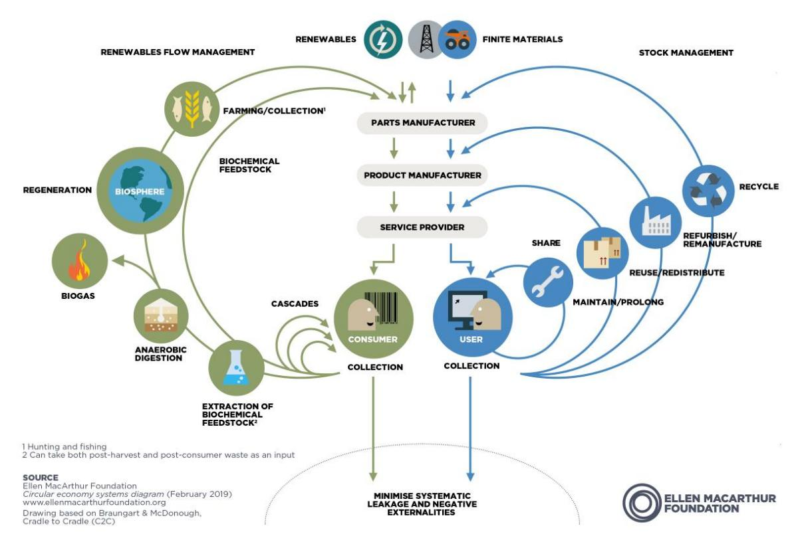

*Figure 1 Ellen MacArthur foundations circular economy diagram (EMF, 2023a)*

| Circular economy | Linear economy | Smarter product use and manufacture | Extend lifespan of products and its parts | Useful application of materials |
|------------------|----------------|-------------------------------------|-------------------------------------------|---------------------------------|
|                  |                | R0 Refuse                           | R1 Rethink                                | R2 Reduce                       |
|                  |                | R3 Reuse                            | R4 Repair                                 | R5 Refurbish                    |
|                  |                | R6 Remanufacture                    | R7 Repurpose                              | R8 Recycle                      |
|                  |                | R8 Recycle                          | R9 Recover                                | R9 Recover                      |

*Figure 2 Overview of the 9R framework (Potting et al., 2017).*

# **2.2 Background of the Safe-and-Sustainable-by-Design framework (SSbD)**

As part of the European Green Deal, that aims to transform the EU's economy for a sustainable future (EC, 2019) the European commission in October 2020 launched its "Chemicals Strategy for Sustainability" (CSS) (EC, 2020a). The vision of the strategy is a toxic-free environment where "chemicals are produced and used in a way that maximises their contribution to society […], while avoiding harm to the planet and to current and future generations" (EC, 2020a). The CSS calls for a transition to chemicals and materials that are safer and more sustainable and also gives a first proposal on the definition of Safe-and-Sustainable-by-Design (SSbD) "as a pre-market approach to chemicals that focuses on providing a function (or service), while avoiding volumes and chemical properties that may be harmful to human health or the environment, in particular groups of chemicals likely to be (eco) toxic, persistent, bio-accumulative or mobile. Overall sustainability should be ensured by minimising the environmental footprint of chemicals in climate change, resource use, ecosystems and biodiversity from a life cycle perspective" (EC, 2020a). The strategy sees the transition to SSbD chemicals as both a social urgency and a great economic opportunity for the EU chemical industry (EC, 2020a).

After the launch of the CSS, work started on defining the SSbD principles and how to include these principles into the design process of chemicals, materials, and products. In 2022, the EC's Joint Research Centre (JRC) published a review of safety and sustainability dimensions, aspects, methods, indicators, and tools (Caldeira, Farcal, Moretti, et al., 2022) followed by a framework for the

definition of criteria and evaluation procedure for SSbD (Caldeira, Farcal, Garmendia Aguirre, et al., 2022) along with an EC recommendation promoting this framework (EC, 2022a). The JRC framework recommends a two-phase SSbD approach [\(Figure 3\)](#page-13-0). The first phase isthe (re)design phase in which eight SSbD guiding principles are proposed. The second phase is the assessment phase consisting of five steps covering both safety and sustainability (environmental, social, and economic) aspects. The framework is still in a testing phase and the engagement of industry and member states is encouraged (EC, 2022a). After the launch of the CSS, work started on defining the SSbD principles and how to include these principles into the design process of chemicals, materials and products. In 2022, the EC's Joint Research Centre (JRC) published a review of safety and sustainability dimensions, aspects, methods, indicators, and tools (Caldeira, Farcal, Moretti, et al., 2022) followed by a framework for the definition of criteria and evaluation procedure for SSbD (Caldeira, Farcal, Garmendia Aguirre, et al., 2022) along with an EC recommendation promoting this framework (EC, 2022a). The JRC framework recommends a two-phase SSbD approach [\(Figure 3\)](#page-13-0). The first phase is the (re)design phase in which eight SSbD guiding principles are proposed. The second phase is the assessment phase consisting of five steps covering both safety and sustainability (environmental, social, and economic) aspects. The framework is still in a testing phase and the engagement of industry and member states is encouraged (EC, 2022a).

*Figure 3 SSbD assessment workflow proposed in the framework developed by JRC (Caldeira, Farcal, Garmendia Aguirre, et al., 2022)*

The SSbD concept takes a holistic approach by integrating safety, circularity, energy efficiency and functionality of chemicals, materials, products, and processes throughout their life cycle and minimising the environmental footprint. It aims to facilitate the transition to a safe, carbon-neutral and resource-efficient industrial ecosystem. As highlighted in the proposed design principles of the SSbD framework several important features of circular economy are listed such as: SSbD1-Material efficiency, SSbD2-Minimize the use of hazardous chemicals/materials, SSbD3-Design for energy efficiency, SSbD4-Use renewable sources, SSbD6-Reduce exposure to hazardous substances, SSbD7-Design for end of life and SSbD8-Consider the whole Life Cycle

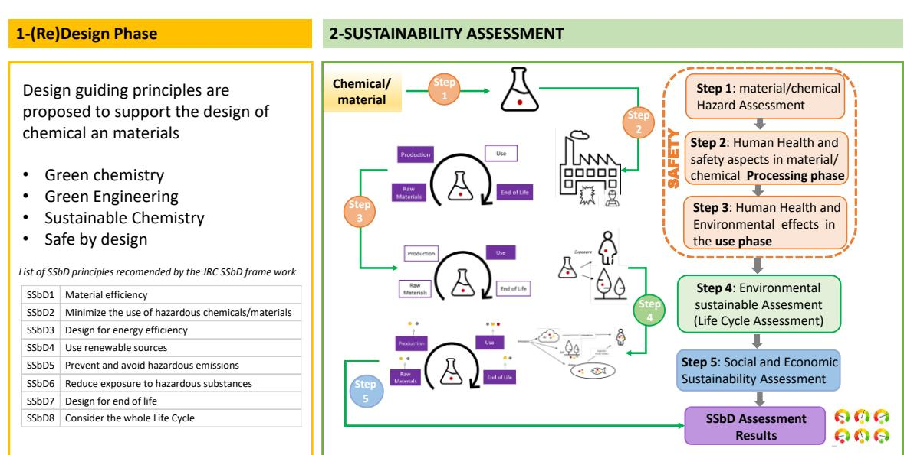

# **2.3 CE in the design phase**

As stated above (Chapter [2.1\)](#page-10-0), CE builds on earlier concept and methods, and evaluation of how to include CE principles (or principles of similar concepts) in the design phase; both aspects have been researched intensively.

To start with, product design that considers the environmental aspects is often called ecodesign (Ceschin & Gaziulusoy, 2016; Pigosso et al., 2015), and thus aims to minimize environmental impacts over the whole product life cycle without compromising other essential criteria, such as functionality, aesthetics, quality and cost (Pigosso et al., 2015). Other used terms for such design are lifecycle design (Vezzoli, 2018), or design for environment (Hauschild et al., 2004). Much of the design principles in ecodesign, come from learnings in life cycle assessments of different products (Ceschin & Gaziulusoy, 2016). The design field emerged during 1990 and since then, numerous ecodesign methods and tools have been put forwards (Pigosso et al., 2015). Ecodesign principles and methods can be used during all parts of the product development phases, but most focus on the early stages of product design since this is the stage where the possibility to influence the environmental impact of the product is the greatest. It has been estimated that about 80 % of a product's environmental impacts are already determined during the design stage (EC, 2012). Integration of environmental considerations at an early phase of a product development process, thus, appears as an essential approach for enhancing the environmental performance across a product life cycle, and for designing sustainable products.

Since the introduction of the concept of circular economy, some consider that ecodesign (design for low energy consumption and greenhouse emissions) is not enough for a CE and suggest that specific design methods for CE are needed. For example, den Hollander et al. (2017) argue that since there is a fundamental distinction between ecodesign and circular product design, circular product design requires new or adapted strategies and methods. Ecodesign, they argue, builds on the linear way of producing and using products and on the waste hierarchy which aims at reducing waste but acknowledges that waste does exist, whereas, in a circular economy, waste no longer exists (products and materials are, in principle, reused and cycled indefinitely) (ibid). Others considered that some CE design literature is limited since it does not consider the broad and valuable literature in the field of ecodesign (Moreno et al., 2016). Likewise, Bovea & Perez-Belis (2018) acknowledge that design guidelines within ecodesign and Design for X (where X stands for environment, disassembly, reuse, or recycling) can be applied and integrated into frameworks for the design of products in CE.

Due to the increasing interest of including circularity principles in product design a growing number of frameworks, typologies, and methods have been proposed (Bakker et al., 2014; Pozo Arcos et al., 2018; Sassanelli et al., 2020; Willskytt and Brambila-Macias, 2020). The definition of circular product design differs between different authors' views in the same way that there is no agreed definition of the CE (Kirchherr et al., 2017). For instance, Bakker et al. (2014) state that it "Elevates design to a system level (1), Strives to maintain product integrity (2), Is about cycling at a different pace (3), Explores new relationships and experiences with products (4) and is driven by different business models (5)". Yet, central to most circular product design literature is the aim to increase the lifespan of products; the circulation of products through reuse, repair, and remanufacture; and the recycling of materials (Bovea & Perez-Belis, 2018).

One widely cited circular design framework is the one by Bocken et al. (2016), which builds on the work by Stahel (2010) and McDonough & Braungart (2002) and introduces two fundamental and preferable strategies for cycling of materials. Slowing resource loops through the design of durable goods and prolongment of product use (e.g., through reuse and remanufacturing) and closing resource loops through recycling. These two strategies are separated from narrowing resource loops, which aims at resource efficiency by using fewer resources over the product life cycle. A design framework presented by Mestre and Cooper (2017) also includes strategies for slowing and closing the loops but adds two strategies for the design of bio-inspired loops (biomimetic) and biobased loops.

Other circular product design frameworks do not focus so much on the technical and biological sphere and instead on the users and their obstacles to continue using the product. den Hollander et al. (2017) presented a typology for circular product design that contains two main principles, design for product integrity (to avoid obsolescence of products) and design for recycling. A product becomes obsolete if it is no longer considered useful or significant by its user (due to aesthetic, functional, or technical reasons), which leads to the product becoming unused or discharged by the user (den Hollander, 2018).

Another relevant design concept to enable a circular economy is the design that focuses on how the product design can influence the user and their behaviour during the use-phase to minimize environmental impacts (Boks et al., 2015; Ceschin & Gaziulusoy, 2016). Design for Sustainable Behaviour (see e.g., Mugge (2007)) and Emotionally Durable Design products (see e.g., Niedderer et al., (2014)) are, therefore, two additional design concepts that aim to influence the use-phase of a product. Moreover, product design together with business model design is considered important when designing for a circular economy (Bocken et al., 2016; Wastling et al., 2018). For instance, when designing for product life extension (e.g., remanufacturing), it has been suggested that adjusting the offer from selling the ownership of a product to a product service system (PSS) could facilitate the collection of products and the application of circular strategies (Mont & Tukker, 2006; Tukker, 2015). PSS can be defined as "a mix of tangible products and intangible services designed and combined so that they are jointly capable of fulfilling final customer needs" (Tukker & Tischner, 2006). For example, instead of a car, the function of the car, i.e., mobility, can be offered as a service. With a product-oriented business model, companies have the incentives to sell as many products as possible. However, with service-oriented business models, at least in theory, this incentive shifts to produce and sell fewer physical products (Tukker, 2015).

# **2.4 Work of the IRISS project**

IRISS is a Horizon Europe CSA-project (Coordination and Support Action) that aims to connect, synergize, and transform the Safe-and-Sustainable-by-Design community in Europe and globally towards a lifecycle approach, with a holistic integration of safety, climate neutrality, circularity and functionality already in an early stage of designing and manufacturing materials, products and processes.

The project is split in several work packages. In work package 1, the results of which are partly described in this report, mapping of existing methods and criteria relevant to SSbD are made. Apart from circular economy also methods for hazard assessment, sustainability, life cycle analysis and skills required to implement SSbD are mapped. After this mapping has been performed, a gap analysis will be made to identify what further development is needed to operationalize SSbD (WP2). Based on this gap analysis a roadmap to overcome gaps is carried out in the third work package, WP3, which will translate this into research questions, knowledge and information requirements and activities that are needed to enable the use and spread of SSbD.

Linked to IRISS are also seven value chains for which the adaptation of SSbD will be assessed. In part of this report directed mapping of circular economy consideration for these value chains are made.

- Automotive (represented by European Association of Automotive Suppliers (CLEPA))
- Construction chemicals (represented by European Federation for Construction Chemicals (EFCC))
- Electronics (represented by Institut des Nanotechnologies de Lyon (INL))
- Energy materials (represented by Energy Materials Research Initiative (EMIRI))
- Fragrances (represented by International Fragrance Association (IFRA))
- Packaging (represented by International Packaging Company (IPC))
- Textiles (represented by European Apparel and Textile Confederation (Textile ETP))

# **Objective**

In WP1 of the IRISS project five tasks (1.1 – 1.5) have been planned that aim to obtain a complete overview of the SSbD methods and criteria available today. Project deliverable from task 1.4 is presented in this report and focuses on circular economy. The other four reports (tasks 1.1 – 1.3 and 1.5) focus on safety, sustainability, LCA and skills needed for SSbD.

The goal of task 1.4 is to map and highlight possible ways that circular economy today is and, in the future can be, included in the design process of materials or products. The approach should facilitate products to be produced from recycled materials and/or with a plan for reuse or recycling after the end of life. It should also review other aspects of CE, such as the need for traceability, analysis for separation of materials or components, ways to achieve resource minimization and reuse, and optimal use of secondary materials from recycling processes.

# **Strategy/Methodology**

In this report an extensive mapping of the state-of-the-art knowledge around inclusion of circular economy considerations in the design phase of products and materials is performed. The mapping presents current requirements and solutions for increased circularity of products as well as ideas and concept that further can increase the inclusion of CE in the design phase. However, the report does not intend to give a fully comprehensive analysis of all the possible obstacles associated with including these principles and requirements in the product design. Instead, the examples listed should serve primarily as a source of inspiration and forward-looking vision of what is possible.

The result of the mapping is presented in Chapters 5-9.

First, a mapping of some of the factors that today put requirements on circular aspects of materials and products is made. A review of existing (and soon to be existing) legislations, product labels and standardisations are made. Mapping of examples of inclusion of CE requirements is made and the type of CE aspects that are considered are arranged according to how they relate to R0-R9 as well as part of biological sphere that is considered (see 4.1 below).

This is done both for generic circular design principles (non-value chain specific) and for specific circular design principles (for one type of product/value chain).

- The **generic circular design principles** aim to show overarching considerations that are to be taken when making a product increasingly circular. From these, various methods and criteria can be abstracted that could be applicable to most products that should be covered by the SSbD framework.
- For the **specific circular design principles** each of the seven value chains in IRISS are mapped to better understand how value chain specific requirements for inclusion of circularity can be set up. By focusing on one value chain at a time, a more detailed picture of CE in the design is given. Apart from making possible to clearly show how these value chains can increase their circularity, the results can act as inspiration and guidance for other value chains or product types.

Second, a review of the connection between circular economy and of some of the chemical principles that make up the foundation of the SSbD framework is made. This to show how circularity until today relates to safe and sustainable chemistry.

Third, an analysis of challenges associated with circular economy is made, highlighting some of the ongoing discussions concerning the limits and challenges of CE.

Fourth, a summary of results from two surveys performed within IRISS WP1 is made. The surveys were made to collected information about stakeholder experiences of SSbD related aspects from all WP1 fields (safety, sustainability, LCA, circularity and skills needed). In this report the answers related to circular economy are analysed:

- The first survey aimed to collect information from IRISS partners and SSbD stakeholders (companies, research organizations, academic researchers etc.) on their knowledge of SSbD and which principle they are knowledgeable in and apply.

- The second survey covered ongoing Horizon2020 and Horizon Europe projects with research questions related to SSbD aspects. The project coordinators were contacted and asked to summarize the research they made on SSbD related topics.

# **4.1 Categorization of circular economy strategies**

Since the field of circular economy is wide, taking all the steps into consideration (e.g., reducing the amount of raw material needed and waste generated, making a product last longer, analyse the possibility to reuse, repair and recycle a product) requires a broad approach. Therefore, in the mapping in chapters 5 and 6 (product requirements and design guidelines)subcategories of CE were established based on the principles set out in the 9R framework by Potting et al. (2017) [\(Figure 2a](#page-12-0)nd the Ellen MacArthur Foundation's circular economy diagram [\(Figure 1\)](#page-11-0) (EMF, 2023a).

For the technical sphere of products *i.e.,* products that cannot go through biodegradation the mapping is made according to the 9R's:

- **Refuse** is about finding solutions for making products redundant by abandoning their function or replacing them by radically different product. For instance, by finding new innovative solutions that eliminates the need for a physical product.
- **Rethink** entails reconsidering the way products are designed and used and aims to use a product more intensively and making it a better fit for its purpose.
- **Reduce** is about consuming fewer natural resources over the whole product life cycle. This can be done by reducing the quantity of materials, transport, water and energy needed to manufacture products, and removing waste from production.
- **Reuse** means to use a product or component, which is still in good condition and fulfils its original function for the same purpose for which it was conceived, by a new user. It can also entail redesign of a consumable that is disposable (single-use), into a multiple-use (durable product).
- **Repair** and maintenance of defective products is important so they can continue to be used with their original function. Maintenance involves activities where products are inspected, maintained and protected before breakdown or other problems occur. Repair takes place after wear, malfunction or failure.
- **Refurbish** means to restore an old product and bring it up to date (to specified quality level). By refurbishing a product, efforts are made to return the product to a good working order. This may include replacement of parts, updating specifications and improving aesthetic appearance.
- **Remanufacturing** is about using (parts of) discarded product in a new product with the same function (and-as-new-condition). This means that a used part or a part assembly is processed and brought back to a functional level of as good as new.
- **Repurposing** refers to when discarded products or parts are adapted for a different purpose than that for which they were originally designed. Repurposing can occur at different levels - entire products can be repurposed and used in new contexts or

components of products can be harvested and used to serve a new purpose in a different product.

- **Recycling** recovers and returns materials to use. In recycling without quality loss, the properties and function of a material are maintained, why the recycled material can replace virgin raw materials and be used for the same function. However, recycling usually leads to quality loss, in which the material properties (and hence also function) deteriorate.
- **(Energy) recovery** converts the energy stored in materials into usable energy carriers such as heat and electricity.

To be able to map the biological sphere requirements and criteria for products that can go through biotransformation, it is necessary to analyse the green, renewable flow management in the EMF butterfly diagram, shown in [Figure 1.](#page-11-0) To make it possible to also cover this part of circular economy, columns are added focussing on the biosphere.

- **Regeneration** is, in this work, the process by which bio-based materials can be degraded in nature. In that way, nutrients within bio-based products can be returned to the soil and products become a part of nature's biological cycles.
- **Biochemical feedstock** is the process by which bio-based products can be degraded industrially. In that way, the substances can be brought back into new products.

A summary of all categories is found in [Figure 4.](#page-21-0) Together, these requirements make up the categories for the mapping in chapter 5 and 6.

| Smarter product use and manufacture       | R0 Refuse             | Make product redundant by abandoning its function or by offering the same function with a radically different product |
|-------------------------------------------|-----------------------|-----------------------------------------------------------------------------------------------------------------------|
|                                           | R1 Rethink            | Make product use more intensive (e.g., by sharing product)                                                            |
|                                           | R2 Reduce             | Increase efficiency in product manufacture or use by consuming fewer natural resources                                |
| Extend lifespan of products and its parts | R3 Reuse              | Reuse by another consumer of discarded product which is still in good condition and fulfils its original function     |
|                                           | R4 Repair             | Repair and maintenance of defective products so it can be used with its original function                             |
|                                           | R5 Refurbish          | Restore an old product and bring it back to use                                                                       |
|                                           | R6 Remanufacture      | Use parts of discarded product in a new product with the same function                                                |
| Useful application of materials           | R7 Repurpose          | Use discarded product or its parts in a new product with a different function                                         |
|                                           | R8 Recycle            | Process materials to obtain the same (high grade) or lower (low grade) quality                                        |
| Biological processes                      | R9 Recover            | Incineration of materials with energy recovery                                                                        |
|                                           | Regeneration          | Process by which bio-based materials can be degraded in nature                                                        |
|                                           | Biochemical feedstock | Process by which bio-based products can be degraded industrially                                                      |

*Figure 4 Overview of circular strategies and their definition used in the mapping in the report.*

# **Mapping of CE requirements in current and upcoming legislation**

To gain understanding of the types of considerations that need to be taken in material or product development today, this part of the mapping aims to review current **legalisation**, **product labels** and **standardisation** (summarized in [Table 1](#page-22-0)). Worth noticing is that this part of the mapping does not intent to show how the CE could be included in the design, but to compile some of the existing requirements put on products. By doing so, an understanding of the issues already in the mind of product developers and product owners is gained. This could aid in knowing what aspects are addressed in the design phase already today. Possible ways to include these aspects in the product design are mapped in the chapter 6.

*Table 1 Summary of the requirements reviewed in this report*

| Chapters Requirements reviewed | Type of control           |
|--------------------------------|---------------------------|
| Energy label                   | directive                 |
|                                | on product and product ’s |
| (Building                      | products)                 |
|                                | and product ’s groups     |

# **5.1 Existing and upcoming legislation**

Legislation related to CE can be seen as a minimum level of "circularity consideration" that needs to be taken when designing a product. The requirements are often very product and sectorspecific, for example controlling the exact amount of recycled material contained in a plastic product or the number of use cycles a light bulb should last through. Still the examples can give inspiration across product fields on how CE requirements can be placed on products. Various directives and regulations are presented in text format and in the end of the section 5.1.10, a table summarizes the examples [\(Table 2](#page-33-0)).

# **5.1.1 European Green Deal**

To face the threats of climate change and environmental degradation, the European Commission adopted a set of policy initiatives and proposals to transform the EU to a resource-efficient and competitive economy, with no net emissions of greenhouse gases by 2050 and economic growth decoupled from resource use. The European Green Deal was approved in 2020 and its initiatives cover many sectors such as energy, agriculture, housing, mobility, industry, and climate, with action plans or formulated strategies within the different sectors that specify measures and policy improvements. One of these measures is to create a Circular Economy Action Plan (CEAP), that establishes policy initiatives that aim at making products, services, and business models more sustainable and transform consumption patterns to reduce the production of waste (EC COM (2020)).

# **5.1.2 Ecodesign Directive (Directive 2009/125/EC)**

The Ecodesign Directive sets up mandatory ecological requirements for energy use in products sold within the European union. The original directive from 2005 has been revised in several rounds, with the 2009 revision extending the number of product groups that were covered and the 2019 revision introducing more ecodesign aspects. It currently covers 31 products groups1 , such as lighting products, white goods, computers, and heating/cooling products. The aim of the directive is to ensure already at the design phase that the products have a reduced energy consumption, but it also covers other environmental aspects such as water consumption, durability, waste processing, and recyclability. All these aspects are relevant to circular economy; hence, it is of interest for the topic of this report to analyse in which way these design requirements are constructed and what they require. The ecodesign directive is a framework directive, meaning that it does not specify product specific requirements, and this is instead done through implementing separate measures (regulations) within the different product categories.

One of the first regulations that stems from the ecodesign directive from 2009 was aimed at household dishwashers (EC No 1016/2010) and set basic requirements for energy, cleaning, and drying efficiency, focusing on the efficacy and efficiency of the products. The Regulation on nondirectional household lamps ((EC) No. 244/2009) set requirements for household lighting involving several ways of measuring the functional lifespan of the products such as a factor for minimum lamp survival after 6.000 hours of operation, that it must maintain a lumen output of over 85% after a specified timeframe and the number of switching cycles (on-off) before failure. These demands are related to durability and aim to increase the functional lifetime of the products regulated. In general, lighting products was the category that had the most focus on CE elements and aspects during the early years of the ecodesign directive (Bundgaard et al., 2017).

(EU) 2019/2019 on household refrigerating appliances goes beyond energy efficiency and specifies requirements for the availability of some key spare parts, the timeframe of this availability, and that

1 [https://commission.europa.eu/energy-climate-change-environment/standards-tools-and-labels/products-labelling-rules-and](https://commission.europa.eu/energy-climate-change-environment/standards-tools-and-labels/products-labelling-rules-and-requirements/energy-label-and-ecodesign/energy-efficient-products_en)[requirements/energy-label-and-ecodesign/energy-efficient-products\\_en](https://commission.europa.eu/energy-climate-change-environment/standards-tools-and-labels/products-labelling-rules-and-requirements/energy-label-and-ecodesign/energy-efficient-products_en)

the parts can be replaced with commonly available tools and without permanent damage to the appliance. It also sets requirements for the authorised representative of the product to provide access to clearly defined repair and maintenance information to professional repairers. The regulation on electronic displays and televisions ((EU) 2019/2021) contains energy efficiency requirements (e. g. regarding the standby mode power workload). The products must be designed for easy dismantling by using appropriate fastening and sealing techniques and providing disassembly information that ensure this. It also specifies that plastic components heavier than 50 grams are to be marked with the type of polymer. This marking and the requirement for the design of a dismantlable product aims to increase the possibility for recycling and recovery. Another requirement which falls into the refurbish (R5) category is that software and firmware updates must be available and free for costumers for a minimum period of eight years after placing the product on the market. The Regulation (EU) 2019/2020 on light sources specifies that energy consumption or any other declared specifications cannot decrease following a software or firmware update. Requirements regarding software and firmware updates help ensure that the product can survive a longer use phase and is not receiving reductions to performance that might steer consumers to upgrading the product.

In an analysis of the ecodesign directive and the following implementing measures, Barkhausen et al. (2022) found that household tumble driers, domestic ovens and range hoods, professional refrigerated storage cabinets, set-top boxes (complex) and external power supplies for electronic and ICT products had the least amount of CE requirements. Product categories that also were found to be lacking, with just a few CE requirements were heating and cooling products and industrial equipment. There are however initiatives for several of these product categories aimed at increasing the ecodesign requirements, one of which being the ecodesign and energy labelling requirements for household tumble dryers' initiative. There is an ecodesign regulation for household tumble driers ((EU) No 932/2012) but it does not set any CE requirements beyond energy and condensation efficiency. More initiatives are described below. Generally, a product requirement of minimum product lifetime (durability) has not been widely extended to several product categories and is mostly present within the lighting group. Reasons for this can be that the simple function of a lighting source (on-off operation) simplifies testing standards, or because of the difficulty of repairing lighting products.

Other product groups without specific ecodesign requirements are drying cabinets, electric kettles, microwave ovens and humidifiers/dehumidifiers, which also lack energy labelling (see section on the Energy Label Directive). Some of these products are however covered by the more general regulation on the standby and power off modes that are relevant to many product groups ((EC) No 1275/2008).

In summary, the ecodesign directive has implemented several different CE requirements which have had a large impact on the energy efficiency of the products. The CE requirements have mostly focussed on reusability, repairability and recyclability, and for light sources, durability has been a key component. No requirements concerning degradability or refeeding of materials into the biochemical feedstock have been found, showing the strong focus on the technical sphere of the circular economy in this legislation.

# **5.1.3 Sustainable products initiative**

# **5.1.3.1 About Sustainable products initiative (SPI)**

The Sustainable Products Initiative (SPI) is an initiative based on the Circular Economy Action Plan (CEAP) promoted by the EC with the aim of revising the ecodesign directive and propose additional legislative measures to make products placed on the EU market more sustainable. The proposal will widen the scope of the ecodesign directive both in terms of products and in new kinds of requirements and will take the shape of a regulation instead of a new directive. It is therefore said that the current ecodesign directive should be repealed for legal clarity (Com 2022, 142). The approach of the regulation is that it will set sustainability requirements where existing, and more product-specific legislation does not. The core of the initiative is to extend the scope beyond energy-related products so that it covers the broadest possible range of products and helps to achieve a circular economy. The regulation is set to apply to any physical goods that are placed on the market or put into service, including components and intermediate products, and only a few sectors are excluded, such as food, feed, medicinal products, and veterinary medicinal products.

# **Sustainability principles of the CEAP:**

- improving product durability, reusability, upgradability and reparability, addressing the presence of hazardous chemicals in products, and increasing their energy and resource efficiency;
- increasing recycled content in products, while ensuring their performance and safety;
- enabling remanufacturing and high-quality recycling;
- reducing carbon and environmental footprints;
- restricting single-use and countering premature obsolescence;
- introducing a ban on the destruction of unsold durable goods;
- incentivising product-as-a-service or other models where producers keep the ownership of the product or the responsibility for its performance throughout its lifecycle;
- mobilising the potential of digitalisation of product information, including solutions such as digital passports, tagging and watermarks;
- rewarding products based on their different sustainability performance, including by linking high performance levels to incentives.

# **5.1.3.2 Inclusion of circular economy in SPI**

The Ecodesign for Sustainable Products Regulation (ESPR) is based on the sustainability and circularity aspects listed in the CEAP. The ecodesign requirements in the regulation will be further elaborated by the commission in delegated acts, but in the current proposal relate to:

- product durability and reliability;
- product reusability;
- product upgradability, reparability, maintenance and refurbishment;
- the presence of substances of concern in products;
- product energy and resource efficiency;
- recycled content in products;
- product remanufacturing and recycling;
- products' carbon and environmental footprints;
- products' expected generation of waste materials

Specific requirements based on these aspects will be established for the separate product groups. When the product groups display technical similarities that allow for a common requirement, these can be established horizontally.

The ESPR also includes the creation of a digital product passport aimed at registering, processing, and sharing product-related information digitally among supply chain businesses, authorities, and consumers. Regarding circularity, this requirement can help consumers and businesses make informed choices when purchasing products, facilitate repairs and recycling and improve transparency about products' life cycle impacts on the environment.

# **5.1.3.3 Timeline for implementation of SPI**

This new legislation is currently being administered through the EU legislative process and does not yet have a set date for implementation. However, there are still measures2 that will be adopted under the current ecodesign directive, and by 2030, 30 new delegated acts are expected to be developed.

# **5.1.4 Other initiatives within CEAP**

Apart from SPI, the CEAP includes several other initiatives that are relevant to mention in relation to a CE perspective. The proposal for a directive on empowering consumers for the green transition (2022/0092) focuses on providing consumers with better information on the sustainability of certain products before the purchase. It specifies several measures within this area, such as providing information on the repairability of products, through a repairability score, ensuring that traders do not mislead consumers on the sustainability of the products, and ban false and misleading green claims. The directive proposal was published in March of 2022.

Another initiative under the CEAP is designing mobile phone and tablets to be sustainable – ecodesign (initiative)3 , which will be pursuant to the current ecodesign directive. This directive draft lays out a multitude of ecodesign requirements that are pertinent to smartphones, mobile phones, tablets, and other cordless phones. Regarding batteries in smartphones the draft sets a minimum requirement for amount of full charge cycles to ensure the durability of the battery, a common problem with smartphones. These requirements are similar to those of the Regulation on nondirectional household lamps discussed previously. Concerning batteries, it also sets requirements for instructions on battery maintenance, but also the products' resistance to impact damage (e.g., dropping a phone to the ground), and resistance to exposure to dust and water. Additionally, it contains comparable requirements seen in the directives of other product groups, concerning repairability, recycling and dismantling.

# **5.1.5 Energy Label Directive**

Since the EU directive (92/75/EC) on energy labelling was implemented during the 90s, there has been a scheme for the labelling of energy consumption on several household appliances. It has since then been revised in 2010 (2010/30/EU) and 2017 (EU 2017/1369), to include more product

2 One of these measures is the *designing mobile phone and tablets to be sustainable - ecodesign* initiative described in section 5.4.3.

3 Also known as the Consumer electronic initiative.

groups and to clarify and digitize the information presented on the label. Now, 15 of the product groups that have ecodesign requirements, require an energy label. The main feature of the energy label is an energy efficiency rating that can be seen in th[e Figure 5](#page-27-0) below.

The original scheme rated the energy efficiency of the appliance on a scale from A (most efficient) to G (least efficient), but to keep up with advances in energy efficiency, A+, A++, and A+++ grades were added. During recent years it was however noted that most modern appliances would be rated in the top three grades (A+, A++, and A+++) making the scheme unintuitive to consumers. An updated scheme entered into force in 2021 and uses a stricter scale from A to G, where fewer products will reach ratings of A or B. The new scheme is currently being rolled out among product groups. Washing machines, dishwashers, fridges, and freezers are some of the product groups that have gone through this rescaling process. The European Commission is working on updating the labelling for other product groups including tumble dryers, local space heaters, air conditioners, cooking appliances and ventilation units. Some product groups that currently lack energy labelling requirements but still can be considered high consumption appliances are drying cabinets, electric kettles, microwave ovens and humidifiers/dehumidifiers.

Along with this efficiency scale, and energy consumption (often per year or 1000 h), it also, depending on the type of product, shows non-energy related information such as water consumption, storage volume, performance, and noise level. Additionally, it contains a QR-code which leads to the European Product Registry for Energy Labelling, where more detailed information on the product can be found. Overall, the Energy Label Directive is focused on informing the consumer, before the purchase, and assisting the comparison of multiple products, motivating towards the most efficient product. The directive does not contain requirements of labelling any other aspects that pertain to CE, such as repairability or recyclability.

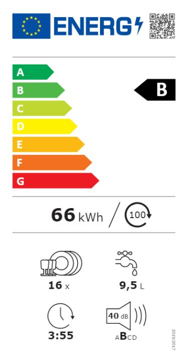

*Figure 5 Energy efficiency rating* 

# **5.1.6 Packaging and packaging waste regulation**

# **5.1.6.1 About packaging and packaging waste regulation**

The Packaging and Packaging Waste Directive was introduced 1994 (94/62/EC) with the intention to harmonise national measures on packaging and the management of packaging waste and to provide a high level of environmental protection. Due to the format, as a directive, it was elective and therefore enacted by Member States in different ways, which led to a market with a high level of fragmentation.

After the last amendment 2018 ((EU) 2018/852), which states a change in recycling rate calculation, a new Packaging and Packaging Waste Regulation was proposed late 2022, with the aim to be ratified during 2023.

The proposed Regulation has increased the level of requirements in all areas, which, with the new format, will need to be ratified by all Member States, as stated.

The main elements of the Regulation are:

- Quantified waste reduction targets
- Overpackaging measurements
- Clarification of usage of biodegradable plastics in packaging
- Banning of additional packaging formats as complement and addition to the Single Use Plastic Directive
- All packaging to be fully recyclable, including demand on Design for Recycling by 2030 and Recycled at Scale by 2035.
- Design for Recycling will include definition of "At scale" and "Recyclability"
- Harmonized Eco-modulation fees based on packaging recyclability and recycled content
- Minimum recycled content for plastic packaging for 2030 and 2040
- Reusable packaging to be available with specific targets for 2030 and 2040
- Harmonized labelling
- Mandatory Deposit Return Scheme for plastic bottles by 2029

Several of the requirements will be defined in a later stage before implementation in delegated or implemented acts. This includes:

- Design for Recycling and Recyclability Evaluation Criteria related to Recycled at scale of plastic packaging
- Concentration level of heavy metals
- Recycled content calculation and verification criteria based on post-consumer waste for plastic packaging
- List of packaging that can be made compostable
- Packaging formats and purpose that shall not be placed on the market
- Re-use targets
- Criteria for green public procurement
- Eco-design criteria for packaging

**5.1.6.2 Inclusion of circular economy in packaging and packaging waste regulation**  The new Packaging and Packaging Waste Regulation aimsto contribute to the European Green Deal (EC, 2019) and the new Circular Economy Action Plan set by the European Commission that ensures that "all packaging on the EU market is reusable or recyclable in an economically viable way by 2030". It will also contribute to the commitment in the Plastic Strategy of 2018 that states that all plastic packaging placed on the European market can be re-used or recycled in a cost-effective manner (EC, 2018).

Parts of the regulation are not fully defined yet, as it is stated that there will be additional definitions and clarifications in delegated and implementing acts in time for the implementations. The background is the extended discussions mainly within plastic sector about recycling technologies, the availability of these and how to verify and calculate recycled content from non-mechanical recycling technology.

# **5.1.6.3 Timeline for implementation of Packaging and Packaging Waste Regulation**

Due to the complexity of the regulation the examination in the European Parliament and the Council is expected to be lengthy. The unofficial aim now is to have a decision by the third quarter of 2023.

After adoption, the regulation will come into force on the 20th day after its publication in the Official Journal of the European Union. Its provisions will apply 12 months from the date of entry into force.

# **5.1.7 End-of-Life Vehicle (ELV) Directive 2000/53/EC**

# **5.1.7.1 About ELV**

The European Union's End-of-Life Vehicle (ELV) Directive 2000/53/EC sets recovery targets for recycling of vehicles and components, encourages manufacturers to design their vehicles with reuse of parts and recycling in mind, and restricts the use of certain heavy metals in new vehicle manufacturing processes.

The directive covers aspects along the life cycle of a vehicle as well as aspects related to treatment operations and aims, among other priorities, to:

- prevent the use of certain heavy metals such as cadmium, lead, mercury, and hexavalent chromium,
- ensure collection of vehicles at suitable treatment facilities,
- enable de-pollution of fluids and specific components,
- set reuse, recycling, and recovery performance targets

In 2020 a process was initiated to revise the ELV directive. This to address the shortcomings identified in the directive during the 20 years since its implementation.

#### **5.1.7.2 Inclusion of circular economy in ELV**

As part of the directive, manufacturers of vehicle and equipment must consider the dismantling, reuse and recovery process of the vehicles when designing and producing their products. In doing this they must live up to the following targets

- Reusable and/or recyclable to a minimum of 85% by weight per vehicle
- Reusable and/or recoverable to a minimum of 95% by weight per vehicle

The targets are calculated based on the average weight of a single vehicle per year. While recycling is primarily defined as material processing with the aim of using the material for the same or for a similar purpose, recovery is defined as incineration to generate energy. To meet the quotas above, the ELV directive enables the setting of targets for reuse, recycling, and recovery (Despeisse et al., 2015). Also refuse is considered due to the banning of hazardous compounds.

# **5.1.7.3 Timeline for implementation of ELV**

The process of revising the ELV-directive have taken longer time than first anticipated. As of early 2023, the proposal is being prepared based on an evaluation published in spring 2021 followed by a public consultation round in mid-2022. The revised directive is scheduled to be released in 2023 (postponed from previously announced 2022).

# **5.1.8 Global Plastic Treaty**

# **5.1.8.1 About Global Plastic Treaty**

Plastic pollution is a global problem. This fact has been addressed by most of the United Nations (UN) member states, which initiated United Nations Environmental Programme (UNEP) to form a global legally binding agreement to End Plastic Pollution4 .

The agreement aims to cover the whole plastic value chain, including reduction targets. This includes

- the full lifecycle of plastics
- the design of reusable and recyclable products and materials
- the need for enhanced international collaboration to facilitate access to technology

The Member States are proposed to commit to:

- Promote sustainable production and consumption of plastics through product design and environmentally sound waste management, including resource efficiency and circular economy approaches
- Promote national and international cooperative measures to reduce plastic pollution in the marine environment, including existing plastic pollution
- Develop, implement, and update national action plans reflecting country-driven approaches to contribute to the objectives of the instrument

31 º The project receives funding from the European Union's HORIZON EUROPE research and innovation programme under grant agreement n° 101058245. UK participants in Project IRISS are supported by UKRI grant 10038816. CH participants in Project IRISS receive funding from the Swiss State Secretariat for Education, Research, and Innovation (SERI).

4 <https://wedocs.unep.org/20.500.11822/40597>

- Promote national action plans to work towards the prevention, reduction, and elimination of plastic pollution, and to support regional and international cooperation
- Specify national reporting
- Periodically assess the progress of implementation of the instrument
- Periodically assess the effectiveness of the instrument in achieving its objectives
- Provide scientific and socioeconomic assessments related to plastic pollution
- Increase knowledge through awareness-raising, education, and the exchange of information
- Promote cooperation and coordination with relevant regional and international conventions, instruments, and organizations, while recognizing their respective mandates, avoiding duplication, and promoting complementarity of action
- Encourage action by all stakeholders, including the private sector, and to promote cooperation at the local, national, regional, and global levels
- Initiate a multi-stakeholder action agenda
- Specify arrangements for capacity-building and technical assistance, technology transfer on mutually agreed terms, and financial assistance, recognizing that the effective implementation of some legal obligations under the instrument will depend on the availability of capacity-building and adequate financial and technical assistance
- Promote research into and development of sustainable, affordable, innovative, and costefficient approaches

The negotiations on the Treaty are ongoing, why the full details of the content and engagement are not fully clear.

# **5.1.8.2 Inclusion of circular economy in the Global Plastic Treaty**

The ambition of the treaty is to fully comply with the circular economy concept. This should not only include circularity of materials, but also reduction of usage, re-usability targets, chemical content control and pollution elimination.

This is the first initiative taking in reduction of plastics put on the market, which is seen as needed to get effect of all other actions in the scope of the treaty.

As cited by the Executive Secretary of the Intergovernmental Negotiating Committee (INC) Secretariat, Jyoti Mathur-Filipp (JMF):

*"The circular economy is a resource efficient economy where waste and pollution are eliminated, products and materials are kept in use at their highest value for the longest time possible, and natural systems are regenerated."*

A potential directly related to circular economy:

- A shift to a circular economy can reduce the volume of plastics entering oceans by over 80 % by 2040; reduce virgin plastic production by 55 %; save governments US\$70 billion by 2040; reduce greenhouse gas emissions by 25 %; and create 700,000 additional jobs – mainly in the global south (UNEP, 2022a).

Inger Andersen, UNEP Executive Director have said clearly:

*"We will not recycle our way out of the plastic pollution crisis: we need a systemic transformation to achieve the transition to a circular economy"* (UNEP, 2022b).

# **5.1.8.3 Timeline for implementation of Global Plastic Treaty**

Negotiations are planned to be finalized shortly to have a proposed agreement in place by the end of 2024. After this it will take some time for implementation in all respective states that have signed the commitment.

# **5.1.9 Policy Measures and Legislation connected to biological sphere of Circular Economy**

Most of the mapped legislations in this chapter focus on the technical sphere where products should be repaired, remanufactured or recycled. Few mentions are given to legislative requirements connected to biobased circular economy. Still, the EU identifies the potential of biobased/biodegradable/compostable plastics as well as the need for regulations for the materials from clear labelling, and new standards, to waste handling as important. However, at this stage many of the documents are repetitive, focusing on defining the terminology and supporting investment into the field of bio-based plastics rather than explaining how bio-based plastics fit in the context of a circular economy. The promotion of bio-based plastics is often linked to the potential of their circular production, i.e., from waste and by-products. However, the bio-based plastics that are currently on the market are mainly produced from first generation feedstock5 due to the complexity and cost of the production from other types of feedstock.

The use of bio-based plastics is supported with products, where it is reasonable, such as compost bags, fruit stickers, or mulch films. It is highlighted that bio-based plastics are not a solution to littering. Moreover, reusable, and no-packaging solutions are preferred over the use of bio-based plastics. However, considering the promotion of bio-based plastics and materials through policies such as the EU Green Deal, the persistence of incentives gaps is concerning.

EU targets to recycle 65 % of municipal waste by 2035 including biowaste. Biowaste may be collected with waste having similar biodegradability and compostability properties that comply with relevant European standards or any equivalent national standards for packaging recoverable through composting and biodegradation. In addition, the quality of the compost should not be reduced. However, biodegradable plastics are not directly mentioned. At this point, there is neither a direct recommendation on how to handle bio-based plastic waste aside from following the waste hierarchy from Directive 2008/98/EC nor explicit mention of their recycling targets. Currently, the waste stream of bio-based plastics is too low to introduce selective collecting and recycling systems. Moreover, products made from bio-based/biodegradable plastics should not contaminate other waste streams and affect their recyclability.

5 First generation – feedstock from crops and plants that are rich in carbohydrate and can be consumed by humans and animals (such as sugar canes, potatoes and corn)

# **5.1.10 Overview legislation**

The currently active legislations are mapped based on their inclusion of either "Smarter product use and manufacture" (R0-R2), "Extended life span of product and its parts" (R3-R7) and "Useful application of materials" (R8-R9). Overview of the mapping is found in [Table 2](#page-33-1).

*Table 2 Summary of legislation covered in section 5.1 and individual examples of regulations control regarding R0-R9*

|                                                                           | Smarter product use and manufacture                                                             | Extend life span of products and its parts                                                                                                                                  | Useful application of materials                                                                                                                                        |
|---------------------------------------------------------------------------|-------------------------------------------------------------------------------------------------|-----------------------------------------------------------------------------------------------------------------------------------------------------------------------------|------------------------------------------------------------------------------------------------------------------------------------------------------------------------|
| <i>Regulation on non-directional household lamps ((EC) No. 244/2009)</i>  | <b>R2 Reduce</b> Lamp survival factor, lamp lifetime, the minimum number of switching cycles |                                                                                                                                                                             |                                                                                                                                                                        |
| <i>Regulation (EU) 2019/2020 on light sources</i>                         |                                                                                                 | <b>R5 Refurbish</b> No reduced performance after updates                                                                                                                 |                                                                                                                                                                        |
| <i>Regulation on household refrigerating appliances ((EU) 2019/2019)</i>  | <b>R2 reduce</b> Energy efficiency                                                           | <b>R4 Repair</b> Requirements for spare parts availability Repair and maintenance information Easy to replace spare parts                                          |                                                                                                                                                                        |
| <i>Regulation on electronic displays and televisions ((EU) 2019/2021)</i> | <b>R2 Reduce</b> Energy efficiency                                                           | <b>R4 Repair</b> Requirements for spare parts availability Repair and maintenance information <b>R5 Refurbish</b> Availability of software and firmware updates | <b>R8 Recycling</b> Fastening or sealing techniques do not prevent the removal, using commonly available tools Labelling polymer type of plastic components >50g |
| <i>Regulation on household dishwashers ((EU) No 1016/2010)</i>            | <b>R2 Reduce</b> Energy, cleaning, and drying efficiency                                     |                                                                                                                                                                             |                                                                                                                                                                        |
| <i>Regulation on welding equipment ((EU) 2019/1784)</i>                   |                                                                                                 | <b>R3 Reuse</b> Information of dangerous substances that prepares for reuse <b>R4 Repair</b> Requirements for spare parts availability                             | <b>R8 Recycling</b> Ease of disassembly and removal of hazardous materials                                                                                          |

|                             | Smarter product use and manufacture | Extend life span of products and its parts | Useful application of materials |
|-----------------------------|-------------------------------------|--------------------------------------------|---------------------------------|
| tablets to be sustainable – |                                     |                                            |                                 |
|                             | Ban of hazardous chemicals          |                                            |                                 |

# **Mapping of CE requirements in product labels**

In this chapter, a review of inclusion of CE in products label is made. The product labels cover a wide range of product types, with varying rules for different products. To showcase how CE requirements are placed on products or product groups, examples are taken from the value chains in IRISS.

# **6.1 Existing sustainability criteria initiatives**

There is a plethora of initiatives in the EU that define environmental and/or suitability criteria[. Table](#page-35-0)  [3](#page-35-0) shows a non-exhaustive list of existing EU and international eco-labels.

*Table 3 List of existing EU eco-labels reviewed in the mapping of CE requirements in product labels* 

| EU Ecolabel:                     |                              |                                                                     |                                                                 |
|----------------------------------|------------------------------|---------------------------------------------------------------------|-----------------------------------------------------------------|
|                                  | Product groups and criteria: |                                                                     | https://ec.europa.eu/environment/ecolabel/products-groups      |
|                                  | Product                      | catalogue:                                                          | http://ec.europa.eu/ecat/                                       |
| EU Organic                       | Label                        | http://ec.europa.eu/agriculture/organic/downloads/logo/index_en.htm |                                                                 |
| Nordic                           | Swan                         | – Nordic                                                            | countries http://www.nordic-ecolabel.org/                       |
| Blue Angel                       | –                            | Germany                                                             | https://www.blauer-engel.de/                                    |
| RAL –                            | Germany                      | http://www.ral-guetezeichen.de                                      |                                                                 |
| Bra Miljöval                     |                              | – Sweden                                                            | http://www.naturskyddsforeningen.se/bra-miljoval/               |
| Millieukeur                      | –                            | Netherlands                                                         | http://www.milieukeur.nl                                        |
| Umweltzeichen                    |                              | – Austria                                                           | http://www.umweltzeichen.at/cms/de/home/content.html            |
| NF Environnement                 |                              |                                                                     | – France http://www.marque-nf.com                               |
| Környezetbarát                   |                              | Termék                                                              | – Hungary http://www.kornyezetbarat-termek.hu/                  |
| Ekologicky                       | šetrné                       |                                                                     | výrobky – Czech Republic http://www.ekoznacka.cz                |
| Prijatel                         | Okoliša                      | – Croatia                                                           | http://www.mzoip.hr/                                            |
| Environmentálne vhodný produkt - |                              |                                                                     | Slovakia-https://www.sazp.sk/public/index/go.php?id=151         |
| Energy                           | Star –                       | EU http://www.eu-energystar.org/                                    | and US https://www.energystar.gov/                              |
| Ok-power                         | –                            | Germany                                                             | http://www.ok-power.de                                          |
| Österreichisches                 |                              | Institut                                                            | für Baubiologie und Bauökologie IBO – Austria http://www.ibo.at |
| ÖkoControl                       | –                            | Germany                                                             | http://www.oekocontrol.com                                      |
| BFRC                             | – Windows                    | UK                                                                  | http://www.bfrc.org/                                            |

- Wers Windows Australi[a http://www.wers.net/](http://www.wers.net/)
- TCO Certified A global sustainability certification for IT products in offices and datacentres <https://tcocertified.com/>
- OEKO-TEX international Textiles Association https://www.oeko-tex.com/en/

The mapping made in this report focuses on the analysis of the most relevant European initiatives related to the development of sustainability criteria listed in [Table 4.](#page-36-0) These were identified in a study performed in 2021 by the Directorate-General Research & Innovation (DG RTD) (EC, 2021).

The analysis is categorised into 2 groups: European Commission initiatives (EC) and European initiatives (E), and includes their scope, information about the criteria areas covered (Environmental, Social and Safety) the Life Cycle Stages considered as well as their nature (if they are mandatory of voluntary tools). Background of the product labels and the types of products they control can be found in Appendix A to this report.

*Table 4 Summary of main ecolabels reviewed for inclusion of circular economy aspects in this study*

| Title                  | Scope                  | Life Cycle stage  | Type of initiative* |
|------------------------|------------------------|-------------------|---------------------|
| 66/2010) 6             |                        |                   |                     |
|                        | services               | Entire Life Cycle | ECs                 |
| TCO certified 7        |                        |                   |                     |
|                        | IT products            | Entire Life Cycle | E                   |
| Nordic Swan 8          |                        |                   |                     |
|                        |                        | Entire Life Cycle | E                   |
| Blue Angel 9           | Consumer products      | Entire Life Cycle | E                   |
| NaturePlus Ecolabel 10 | Building and           |                   |                     |
|                        | accommodation products | Entire Life Cycle | E                   |
| OEKO-TEX 11            | Textiles and leather   | Entire Life Cycle | E                   |
| Bluesign 12            | Textiles               | Entire Life Cycle | E                   |
| certified 13           | Materials and products | Entire Life Cycle | E                   |

\* EC (European Commission initiatives), E (European initiatives)

6 <https://ec.europa.eu/environment/ecolabel/products-groups-and-criteria.html>

7 <https://tcocertified.com/>

8 [www.nordic-ecolabel.org](http://www.nordic-ecolabel.org/)

9 [www.blauer-engel.de/en](http://www.blauer-engel.de/en)

10 [www.natureplus.org/](http://www.natureplus.org/)

11 [www.oeko-tex.com/en/](http://www.oeko-tex.com/en/)

12 <https://www.bluesign.com/en>

13 https://c2ccertified.org/the-standard

# **6.2 Ecolabel mapping**

# **6.2.1 Selection of product categories**

Some of the ecolabels analysed include a vast amount of product categories. With the aim of matching the ecolabels with the IRISS value chains, a list of representative products has been elaborated according to the value chains of the IRISS project (se[e Table](#page-38-0) 5) ecolabels can be classified as multiple product labels (EU Ecolabel, Nordic Swan, Blue Angel, and Cradle to Cradle) that cover a wide range of products and single product labels (TCO, NaturePlus, Oeko-Tex and Bluesign) that focus only on certain product families such as textiles or electronics. The main difference is that the multiple product labels include several documents describing different criteria for different product families, while the single product labels usually only include a single document. Some of the single product ecolabels might regulate products that have cross sectorial applications. For instance, textiles are a value chain where the products are also part of the automotive value chain (upholstery). The same thing applies to the electronic devices that include batteries (energy materials), and packaging is part of almost all sectors. In this way, the study matches each label [\(Table 6](#page-39-0) and [Table 7\)](#page-44-0) and vale chain (Table 8 [-Summary of value chains](#page-45-0) and mapped R strategies) with the targeted R.

#### *Table 5 List of representative products from each value chain in IRISS, considered in this analysis*

| Label name       | Textiles (T)          | Construction        |                      |                    |                     |                      |
|------------------|-----------------------|---------------------|----------------------|--------------------|---------------------|----------------------|
|                  |                       | chemicals (C)       |                      |                    |                     |                      |
|                  |                       |                     | Automotive (A)       | Energy materials   |                     |                      |
|                  |                       |                     |                      |                    | Electronics (E)     | Packaging (P)        |
| EU Ecolabel      | Textiles              | Paint and varnishes | Lubricants           |                    | Electronic displays | Dishwashers          |
| Nordic Swan      | Products of textiles, |                     |                      |                    |                     |                      |
|                  |                       |                     |                      | Primary batteries  | Imaging equipment   | Packaging for liquid |
| Blue Angel       | Home textiles         | Floor coverings     | Electric bus         | Electric Cycles    |                     |                      |
|                  |                       |                     |                      |                    | Printers            | Returnable transport |
| Cradle to Cradle | Textiles Apparel and  |                     |                      |                    |                     |                      |
|                  |                       |                     |                      | Others (Batteries) | Others              |                      |
|                  |                       |                     | Displays             | Batteries          | General             | Packaging            |
|                  | Textiles and leather  |                     | Textiles and leather |                    |                     | Textiles including   |
|                  | Textiles              |                     | Textiles             |                    |                     | Textiles including   |

The mapping study categorizes the inclusion of circular aspects from the 9R circular strategies point of view for the technical sphere, and from either regeneration or biochemical feedstock for the biological sphere.

#### *Table 6 -Mapping of each label with the corresponding R strategies*

| Stock management - Technical sphere | Renewable flow - Biosphere |
|-------------------------------------|----------------------------|
| LABEL Smarter product use and       |                            |
|                                     | Regeneration Biochem.      |
| A- non-biodegradable,               |                            |
| E-                                  | Product reparability       |
| chemicals, and packaging.           |                            |
| C-Abrasion, corrosion,              | and                        |
| M-                                  | long lifetime for the      |

41 º The project receives funding from the European Union's HORIZON EUROPE research and innovation programme under grant agreement n° 101058245. UK participants in Project IRISS are supported by UKRI grant 10038816. CH participants in Project IRISS receive funding from the Swiss State Secretariat for Education, Research, and Innovation (SERI).

| Stock management - Technical sphere LABEL Smarter product use and manufacture A-emissions and hazardous substances. M- PVC, mercury, cadmium, and lead. E-Energy consumption, noise, pollutants packaging materials | Renewable flow - Biosphere Extend life span of products Useful application of Regeneration Biochem. and its parts materials feedstock E-Spare parts must be P-Easy to recycle guaranteed for at least five materials. 80% of years the weight. R6 Remanufacture E-use of remanufactured tonners                        |
|---------------------------------------------------------------------------------------------------------------------------------------------------------------------------------------------------------------------|------------------------------------------------------------------------------------------------------------------------------------------------------------------------------------------------------------------------------------------------------------------------------------------------------------------------|
| P-emissions CO 2, 90% sustainability sourced renewable material                                                                                                                                                     |                                                                                                                                                                                                                                                                                                                        |
| T- harmful chemicals,                                                                                                                                                                                               |                                                                                                                                                                                                                                                                                                                        |
| biocides, and heavy metals                                                                                                                                                                                          |                                                                                                                                                                                                                                                                                                                        |
| C-harmful and long- lasting                                                                                                                                                                                         |                                                                                                                                                                                                                                                                                                                        |
| A-CO 2 , pollution, and noise                                                                                                                                                                                       |                                                                                                                                                                                                                                                                                                                        |
| E-                                                                                                                                                                                                                  | Increased lifespan                                                                                                                                                                                                                                                                                                     |
| P-                                                                                                                                                                                                                  | 500 times reusable                                                                                                                                                                                                                                                                                                     |
|                                                                                                                                                                                                                     | T- Regenerated                                                                                                                                                                                                                                                                                                         |
| R0 Refuse substances A-Heavy metals E-Cancerogenic and toxic substances Blue Angel P-packaging waste R2 Reduce T-Waste and air emissions C-Emissions E-Natural resources, hazardous substances, electric power      | T- 100 % organic cotton R3 Reuse R8 Recycle T-Good usability A-long lasting batteries 200 cellulose fibres 000 km C-Recycled materials M-Increased lifespan R4 Repair A-Battery repair M-Battery replacement E-5 years reparability, easy to repair R5 Refurbishment E-Reintroduction in the market after refurbishing |

| Stock management - Technical sphere                                            | Renewable flow - Biosphere            |
|--------------------------------------------------------------------------------|---------------------------------------|
| LABEL Smarter product use and                                                  |                                       |
|                                                                                | Regeneration Biochem.                 |
| ≥ 99% of materials by weight are compatible with the intended cycling pathway. | The processing of                     |
| pathway that includes at least one of the following:                           | reuse, remanufacturing, refurbishing, |
| recycling, nutrient extraction/anaerobic digestion,                            | composting, or biodegradation         |

|       | Stock management - Technical sphere | Renewable flow - Biosphere |
|-------|-------------------------------------|----------------------------|
| LABEL | Smarter product use and             |                            |
|       |                                     | Regeneration Biochem.      |

|       | Stock management - Technical sphere | Renewable flow - Biosphere |
|-------|-------------------------------------|----------------------------|
| LABEL | Smarter product use and             |                            |
|       |                                     | Regeneration Biochem.      |
|       | Use of water CO 2 and               |                            |

*T-Textiles; C-construction; A-Automotive; M-Energy materials; E-Electronics; P-Packaging*

45 º The project receives funding from the European Union's HORIZON EUROPE research and innovation programme under grant agreement n° 101058245. UK participants in Project IRISS are supported by UKRI grant 10038816. CH participants in Project IRISS receive funding from the Swiss State Secretariat for Education, Research, and Innovation (SERI).

#### *Table 7 Summary of the labels and mapped R strategies*

| Label      | R0  |     |     |       |          |
|------------|-----|-----|-----|-------|----------|
|            |     |     |     | Regen | Bio chem |
|            | ✔ ✔ | ✔ ✔ |     | ✔ ✔   |          |
|            | ✔ ✔ | ✔ ✔ | ✔   | ✔ ✔   |          |
| Blue Angel | ✔ ✔ | ✔ ✔ | ✔ ✔ | ✔ ✔   |          |
| C2C        | ✔ ✔ | ✔ ✔ | ✔ ✔ | ✔ ✔   | ✔        |
|            | ✔ ✔ | ✔ ✔ | ✔ ✔ | ✔     |          |
|            | ✔ ✔ | ✔   | ✔   | ✔ ✔   |          |
| OEKO-TEX   | ✔ ✔ | ✔   |     | ✔ ✔   |          |
| Bluesign   | ✔ ✔ | ✔   |     | ✔     |          |

\*Including the packaging elements

#### *Table 8 -Summary of value chains and mapped R strategies*

| Label       | R0  |     |   |     |       |          |
|-------------|-----|-----|---|-----|-------|----------|
|             |     |     |   |     | Regen | Bio chem |
| Textiles    | ✔ ✔ | ✔   |   | ✔   | ✔     |          |
|             | ✔ ✔ | ✔   |   | ✔   | ✔     |          |
| Automotive  | ✔ ✔ | ✔ ✔ |   | ✔ ✔ | ✔     |          |
|             | ✔ ✔ | ✔ ✔ |   | ✔ ✔ |       |          |
| Electronics | ✔ ✔ | ✔ ✔ | ✔ | ✔ ✔ |       |          |
| Packaging   | ✔ ✔ | ✔   |   | ✔   | ✔     |          |

\*the lifespan of many products is linked to their battery lifespan

\*\*Including the packaging elements

# **Standardisation**

Standardisations is another field that setsrequirements on products with circular economy in focus. To gain understanding on how the requirements might look and how circular economy is included, a mapping is made also for this field.

# **7.1 About Standardisation**

The transfer from linear to circular economy that is necessary to decrease climate change depends heavily on a common understanding and mutual agreed definitions.

The need for standards has been addressed in numerous sources, such asthe European Commission (EC, 2022b), UN (UNEP, 2021), OECD (2021), WTO (2022) and a number of Non-Governmental Organisations (NGO's), such as ECOS (2023), WWF (2023), and the Ellen McArthur Foundation (EMF, 2021a).

In Europe the European Commission has developed a Standardisation Strategy (EC, 2022b) that outlines a proposed future approach to both European and global standardisation from a European perspective, with increased connection to regulatory development. In the strategy, it is stated that the "*ambitions towards a climate neutral, resilient and circular economy cannot be delivered without European standards on testing methods, management systems or interoperability solutions*." Standards are crucial in policy objectives related to climate-neutrality, resilience, and circular economy. In the strategy, the ambition for Europe to enhance its leadership in global standardisation is also outlined.

The architecture of standardisation is traditional and based on linear standardisation where each Technical Committee (TC) only works within its own scope. However, in order for standardisation to better relate to circular economy it is absolutely essential that there is a creation of a horizontal communication and collaboration structure between TCs with overlapping tasks. As of now, the TCs need to identify, create, and uphold this type of horizontal communication and collaboration themselves. In some cases, the rules within a standardisation organisation can even go against that type of communication and collaboration.

- The structure of standardisation starts with countries. Most countries have their own standardisation body, which mirrors a TC's relevant areas and regions. The TCs are divided into sectorial, material or management systems topics (Figure 6).

*Figure 6 Structure of standardisation*

- The formation of TCs is based on identified needs from various sources and stakeholders on various levels. Historically the TCs have been based on industrial needs and the experts in the TCs have originated from the industry or related associations. Today this is undergoing a change. Both the reason for formation of TCs, as for example need for circularity criteria clarifications, and the experts background, being complemented with Non-Governmental Associations (NGO's), academia and legislators. There is also an increased need of fact and science-based standards, specifically related to circular economy to prevent standards that potentially would promote/ legitimate greenwashing.

# **7.2 Inclusion of circular economy in standardisation**

Circular economy increasingly impregnates standardisation on any level, sector and region. It is important within any circular standardisation that all relevant input gets collected to create robust, reliable, credible, fact based, and applicable standards. This means engaging experts within all relevant TCs. It is also important to place standardisation projects where they fit best, in relation to a TC's scope and expertise, while also enabling input from experts outside the TC, mainly through liaisons.

Today there is an increase of interest in standardisation from regulators. This is especially visible in Europe, where the Standardisation Strategy is one part. Also, the participation of the European Commission's (EC) Directorate Generals (DG) and Joint Research Centre (JRC) in TCs' Working Groups and actual projects has been increasing, both in CEN/ CENELEC and in ISO. The European Commission participates actively, for example, in TCs related to the newly launched Standardisation

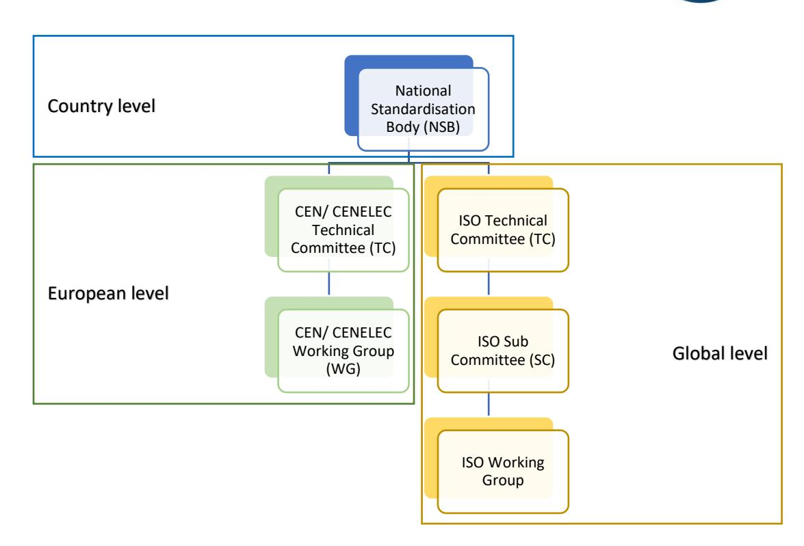

Request M/ 384 Plastics recycling and recycled plastics, which concerns more than 10 CEN TCs over 5 sectors. EC also participates in ISO TC 61 Plastics/ SC 14 Environmental Aspects in the development of standards related to circular plastics 14 . This is in addition to extensive focus on standardisation in relation to European Legislation either through Standardisation Requests, directly related to legislation or not, or as potential delegated acts.

Traditionally standardisation has been driven by industrial needs and the development has been executed by experts from industry. However, the future standardisation landscape might be driven by other needs. Examples of this are regulations that aim to achieve climate related goals or market needs and that are based in new circular business models. This changes the standardisation climate completely since the need for standardisation then will be driven from regulatory forces, instead of the industry. However, the industry still needs to put in resources in the development of circular standards. The industry cannot see a clear connection between requested standardisation and its market needs, leading to lack of motivation to put in the time and resources to develop robust market applicable standards. This creates a misbalance in addressing the need for resources, funding, independent experts and need for science-based data.

There are structures within standardisation created to handle Circular Economy exclusively.

In CEN/ CENELEC the Strategic Advisory Body on Environment (SABE) has been created as horizontal body within the standardisation community. SABE have the following main tasks:

- Providing strategic advice for the CEN and CENELEC Technical Boards (BTs) on environmental matters and identifying future relevant topics
- Promoting standardisation within the European Environmental Policy Framework
- Facilitating Information exchange among key stakeholders
- Supporting Technical Committees in addressing environmental related issues in the standardisation works

In ISO there are technology and material neutral Technical Committees established to cover general questions related to circular economy and its enablers.

# **7.2.1 ISO/ TC 207 Environmental management**

TC 207 develops standardisation in the field of environmental management to address environmental and climate impacts, including related social and economic aspects, in support of sustainable development. TC 207 is focused on environmental management systems, auditing, verification/validation and related investigations, environmental labelling, environmental performance evaluation, life cycle assessment, climate change and its mitigation and adaptation, eco-design, material efficiency, environmental economics, and environmental and climate finance.

This TC is material, product and technology neutral and covers all aspects related to environment.

The TC is built on 7 sub-committees (SC) and several Working Groups (WG) (not exhaustive):

- SC 1: Environmental management systems
- SC 2: Environmental auditing and related environmental investigations
- SC 3: Environmental labelling

14 https://www.iso.org/committee/6578018.html

- SC 4: Environmental performance evaluation
- SC 5: Life cycle assessment
- SC 7: Greenhouse gas and climate change management and related activities
- TCG: Terminology Coordination Group
- TG 1: Sustainable Finance Coordination
- TG 2: Circular economy coordination

# **7.2.2 ISO/TC 323 Circular economy**

TC 323 develops standardisation in the field of Circular Economy to develop frameworks, guidance, supporting tools and requirements for the implementation of activities of all involved organizations, to maximize the contribution to Sustainable Development. Excluded are aspects of circular economy already covered by existing committees.

The TC is built on five working groups (WG) and one Chair's Advisory Group (CAG):

- WG 1: Terminology, principles, frameworks, and management system standard
- WG 2: Practical approaches to develop and implement Circular Economy
- WG 3: Measuring and assessing circularity
- WG 4: Circular Economy in practice: experience feedback
- WG 5: Product circularity data sheet

# **7.2.3 ISO TC 308 Chain of custody**

TC 308 develops standardisation in the field of chain of custody (CoC) for products and associated processes with specified characteristics, with the aim of ensuring that associated claims are reliable.

The TC is built on one active working group:

- WG 2: Mass balance and book and claim

# **Circular product design principles**

There are many types of methods for product design, such as guidelines, checklists, software tools, and matrices (Rossi et al., 2016). The term "guideline" is generally used to indicate a procedure or a method for orienting a decision-making process towards given goals (Vezzoli & Sciama, 2006). General guidelines, i.e., those that aim to be applicable to all types of products, can be useful at a conceptual level and for educational purposes but work less well for specific product design applications (Vezzoli & Sciama, 2006). To be effective, design guidelines need to be specific or adaptable to certain product groups (Luttropp & Lagerstedt, 2006; Vezzoli & Sciama, 2006). Design guidelines for specific product groups instruct on specific considerations related to the products and the contexts where they are used and thereby filter irrelevant concerns and enrich contextspecific information.

The mapping in this report is made both for general and specific guidelines, presented in different chapters. The general guidelines (i.e., the non-value chain specific) should be seen as possible ways to create an overarching requirement for inclusion of CE in a SSbD context and are thus general considerations which could be evaluated for all types of products. The specific guidelines (i.e., value chain specific) are adapted to a certain material or product type, and a full covering of all products is not possible in this type of report but should (and must) instead be made by each responsible value chain or product owner(s). However, to showcase how this can be done and perhaps give inspiration for how guidelines can be set up, in depth analysis of products from the seven value chains in IRISS is made in this report.

The mapping was done by identifying design considerations in the selected design literature and then mapping those against the different R strategies in the 9R framework (strategies for the technical sphere) and the strategies for regeneration and biochemical feedstock (for the biological sphere). Some of the design considerations were deemed relevant (and prerequisites) for several R strategies and were therefore highlighted as their own category (see Durability etc. in [8.1.2](#page-53-0) Extend life span of products and parts).

# **8.1 Non-value chain specific circular design principles**

In this chapter, general circular product design principles are analysed and mapped. Both design guidelines and principles from ecodesign and circular product design are compiled. Due to the large numbers of papers within the field, no complete screening of all published material in this field was possible. Instead a selection was made initially based on the literature review Willskytt (2021), where the relevant key words had been used in the literature screening (Design guideline, product design, Ecodesign, Resource efficiency, environmental, circular, green, and sustainable). To cover the articles published since 2021 an updated search was made with the same criteria as in the review article. From these, a final selection a group of relevant papers were selected based on being as broad as possible, i.e., including design principles for sustainable and circular products over the whole product life cycle, covering both the physical and biological sphere (see [Table 9\)](#page-51-0)

*Table 9 References assessed in the following chapter.* 

| Author         | Title                                        | Journal/publisher    | Year |
|----------------|----------------------------------------------|----------------------|------|
| Bocken et al.  | Product design and business model strategies |                      |      |
|                | for a circular economy                       |                      |      |
|                |                                              | J. Ind. Prod. Eng.   | 2016 |
| Bovea, M.D.    |                                              |                      |      |
| and Perez     |                                              |                      |      |
| Belis, V.      |                                              |                      |      |
|                | Identifying design guidelines to meet the    |                      |      |
|                | circular economy principles: A case study on |                      |      |
|                | electric and electronic equipment.           |                      |      |
|                |                                              | J. Environ. Manag.   | 2018 |
| Go et al.      | Multiple generation lifecycles for product   |                      |      |
|                | sustainability: The way forward              | J. Clean. Prod.      | 2015 |
|                |                                              | BIS Publishers       | 2018 |
| Moreno et al.  | A Conceptual Framework for Circular Design   | Sustainability       | 2016 |
|                | Design Guidelines to Develop Circular        |                      |      |
|                | Products: Action Research on Nordic Industry | Sustainability       | 2020 |
| Telenko et al. | A Compilation of Design for Environment      |                      |      |
|                | Guidelines                                   | J. Mech. Des         | 2016 |
| Van den Berg   |                                              |                      |      |
| Vezzoli        | Design for Environmental Sustainability      | Springer: London, UK | 2018 |
|                | Design Guidelines Developed from             |                      |      |
|                | Environmental Assessments: A Design Tool for |                      |      |
|                | Resource-Efficient Products                  |                      |      |
|                |                                              | Sustainability       | 2020 |

# **8.1.1 Smarter product use and manufacture**

The first category of strategies (R0 Refuse, R1 Rethink and R2 Reduce) entails more efficient use of products and resources over the whole life cycle (see [Figure 7\)](#page-52-0).

| Smarter product use and manufacture | R0 Refuse  | Make product redundant by abandoning its function or by offering the same function with a radically different product |
|-------------------------------------|------------|-----------------------------------------------------------------------------------------------------------------------|
|                                     | R1 Rethink | Make product use more intensive (e.g., by sharing product)                                                            |
|                                     | R2 Reduce  | Increase efficiency in product manufacture or use by consuming fewer natural resources                                |

*Figure 7 Overview of R strategies for smarter product use and manufacture (adapted from Potting et al. (2017)).*

#### **Refuse**

Refuse means to make a physical product redundant or offer the product's function with a radically different product. One example of design for refuse includes replacing a material with a nonmaterial substitute that fulfils the same function (Go et al., 2015), i.e., dematerialization. Shahbazi and Jörbrink (2020) suggest using digitalization, ICT and IoT solutions to enable dematerialization and remove the need for the physical product. Other examples of refusing at least parts of products are to design out the need for packaging (Willskytt and Brambilia-Macias, 2020) and eliminate unused and unnecessary functions and components (Haffmans et al., 2018).

## **Rethink**

Rethink could be enabled in various ways. For instance, designing product services systems that enable products to be used to their full capacity through sharing. Several authors recommend sharing of products. Few, however, provide concrete design consideration to enable it. Vezzoli (2018) propose that products can be designed for shared use by making multifunctional products equipped with replaceable common components and with integrated functions. Willskytt and Brambila-Macias(2020) present other considerations: the product may need to be more robust and easier to use and have more uniform design. Error proof design can aid in reducing the wear and tear (which otherwise is more common with shared products due to less care when a user does not own the product) and such design hinders the user from misuse the product. The need for maintenance may increase of shared items, the design should therefore enable maintenance by adopting modular design and design for disassembly strategies (Willskytt and Brambila-Macias, 2020).

Using the product more intensively can also be done by making sure that the product's delivered function and the user needs are matched or by making sure that user behaviour is changed/improved to reduce losses during use. One approach is to ensure that product functionality and product use are matched and optimized (Willskytt and Brambila-Macias, 2020). Calibration marks on the product, IT-supported feedback mechanisms and sensors are also suggested to help the user consume only the needed product quantity (Telenko et al., 2016). For products kept in packaging, such as dissipative consumable products, the packaging design can enable efficient use. For instance, adapting the packaging shape to increase the possibility to fully empty the packaging or design smart dispensing systems (for example soap that comes out as a foam).

#### **Reduce**

Reducing resource use and environmental impact in production is suggested by several authors, see e.g., by Shahbazi and Jönbrink (2020), Moreno et al (2016) and Go et al (2015). More concretely, this can be done by technology optimization such as improved process control, reducing production steps and redesigning the production processes (Telenko et al. (2016), e.g., close material loops for solvents (Willskytt and Brambila-Macias, 2020). A solution that operates on a larger scale is industrial symbiosis and, in that way, one company's waste can become another company's resource (Willskytt and Brambila-Macias, 2020). For a real life example, readers are advised to see Kalundborg Eco-Industrial Park15 . Using renewable energy is a suggestion that requires less system changes, as suggested by Vezzoli (2018). Product design changes are also suggested to reduce production losses, e.g., avoiding complex product structure (Telenko et al., 2016).

Several different ways are mentioned for reducing the material quantity in products during design phase. For example, structural product changes such as reinforcement, rails, frames, or folds(Bovea & Perez-Belis, 2018). Reducing the material quantity in products can also be achieved by making products smaller or reducing their weight (Moreno et al., 2016).

For energy using productssuch as vehicles, machines, or electronics, Willskytt and Brambila-Macias (2020) recommend they should be designed to decrease their energy consumption during use. For electric and electronic products efficiency usually entails technology development for reduced electricity usage. That can also be the case for vehicles and machines, in addition to that, design for light weight is mentioned as especially for those products for which fuel consumption increases with increased weight. Light-weighting is suggested to be accomplished using lighter materials or a hollow product structure (Willskytt and Brambila-Macias, 2020). Houses and buildings can also be considered energy using products, however for them, more insulation material may be need, to keep or keep out heat of the building.

Reducing impacts from transport are also suggested by some authors. On a product level it is suggested to design space saving product shapes or structures, e.g., foldable or concentrate products (Haffmans et al., 2018), nest components (Vezzoli, 2018), or design lightweight products (Telenko et al., 2016). Using local materials and energy efficient transport modes are also mentioned to reduce the impact from transport.

# **8.1.2 Extend life span of products and its parts**

To extend the use of products and parts means to prolong their lifetime [\(Figure 8\)](#page-54-0). This can be done by using more of the technical lifespan of the product, by the same user or a new one (R3 Reuse). The product may also be redesigned for increased technical lifetime by extending the use phase through restorative interventions such as, repair (R4) and refurbish (R5). The product parts can also be used again to make similar products (R6 Remanufacture) or to make a completely different product (R7 Repurpose). Other product properties and design strategies, not fully covered by R3-7

15 See https://www.symbiosis.dk/en/

but enablers to extending the life span of a product are; durability, ease in disassembly, modular design, standardized product design and design for upgradability and adaptability (Mesa et al., 2022; Bocken et al. 2016).

| Extend lifespan of products and its parts | R3 Reuse         | Reuse by another consumer of discarded product which is still in good condition and fulfils its original function |
|-------------------------------------------|------------------|-------------------------------------------------------------------------------------------------------------------|
|                                           | R4 Repair        | Repair and maintenance of defective products so it can be used with its original function                         |
|                                           | R5 Refurbish     | Restore an old product and bring it back to use                                                                   |
|                                           | R6 Remanufacture | Use parts of discarded product in a new product with the same function                                            |
|                                           | R7 Repurpose     | Use discarded product or its parts in a new product with a different function                                     |

*Figure 8 Overview of R strategies for extending lifespan of products and its parts (adapted from Potting et al. (2017)).*

# **Durability**

Durability is both linked to that the product is *physically durable, i.e.,* can handle wear and tear (Bocken et al., 2016), is *reliable*, *i.e.,* the product should function as specified without any issues occurring (Vezzoli, 2018), and is *emotionally durable*, *i.e.,* the product is wanted to be used by the user (Bocken et al., 2016). For physical durability, material selection for durability is mentioned as an important part of the design process (Bocken et al., 2016). To enhance the reliability of the product, it is suggested to reduce the overall number of components, simplify products, and eliminate weak links (Vezzoli, 2018). Design considerations for *emotional durability* are time-less design (van den Berg and Bakker, 2015; Willskytt and Brambila-Macias, 2020; Shahbazi & Jönbrink, 2020), and design for attachment and trust (Moreno et al. (2016). The latter involves developing products that can be personalized, select materials that age well/with dignity (Vezzoli, 2018) and design for a pleasurable experience when using the product (Bocken et al., 2016).

Closely linked to design for durability is design for appropriate lifespan, mentioned by Vezzoli (2018). Design considerations include selecting the most appropriate materials and shapes to preserve performances in relation to the usage conditions. For instance, use durable materials where necessary and avoid selecting durable materials for components that have a short lifespan and are replaced frequently. It is also suggested to design assembly of components with equal lifespans and to facilitate the separation of components that have different lifespans in products (Vezzoli, 2018).

### **Disassembly**

Design for disassembly on a general level is mentioned by several authors (Bocken et al., 2016; Willskytt and Brambila-Macias, 2018; Moreno et al., 2016) to enable that products and parts can be separated and reassembled easily. More specific considerations include (Telenko et al., 2016; van den Berg and Bakker, 2015; Bovea & Perez-Belis, 2018; Vezzoli, 2018):

- facilitate the accessibility of essential components (for their potential reuse/recycling)
- enable quick and easy disconnect of components
- ensure that joints and fasteners are easily accessible
- simplify product architecture, engage modular structure
- allow for repetitive dis- and re-assembly and simple sequence of those activities
- avoid the disassembly of parts in opposite directions
- design to make disassembly automatic
- limit use of diversity of fasteners and tools to enable simple disassembly

## **Modular design**

Creating a modular product design is suggested by several authors (Shahbazi & Jörbrink, 2020; Willskytt & Brambila-Macias, 2020; Bocken et al., 2016). Motivation to create a modular product structure is to enable replacement of components instead of the replacing the whole product if the component becomes outdated or not functioning (van den Berg and Bakker, 2015).

Suggestions on how to create modular units include (van den Berg and Bakker, 2015; Vezzoli, 2018):

- create modular and replaceable components
- do not mix components that have different physical life or different intervals for maintenance and upgrade
- design modular and dynamically configured products to facilitate their adaptability for changing environments.

For example, grouping components in sub-assemblies according to reuse, reconditioning or remanufacturing potential (van den Berg and Bakker, 2015). Organize in hierarchical modules by aesthetic, repair, and end-of-life protocol (Telenko et al., 2016). Also, design structural parts that can be easily separated from external/visible ones (Vezzoli, 2018).

# **Standardized products and parts**

Standardisation is put forward as important enabler for circular products. It is suggested to facilitate reuse of products' components by using standardized components (Bovea & Pérez-Belis, 2018). Standardisation is suggested to be carried out from platforms and modules to components, parts, interfaces, joints and materials. Hence, a product's different components can be used and be compatible across different products and models (Bocken et al., 2016; Shahbazi & Jörbrink 2020).

#### **Design for upgradability and adaptability**

Design for upgradability and adaptability includes design considerations to prepare for current and future product and component updates. Upgradability - the ability of a product to continue being useful under changing conditions by improving the quality, value, and effectiveness or performance. For instance, upgrade function or performance or adapt the design or functions during the products lifespan (Willskytt and Brambila-Macias, 2020). In that way making sure that the product does not become obsolete and instead only relevant components that are outdated can be replaced. It can therefore involve both physical components and hardware, as well as software (Vezzoli, 2018). Facilitate upgrading and reuse of components is especially important for products that experience rapid technology development (Telenko et al., 2016; Willskytt and Brambila-Macias, 2020). Adopting modular design, use standardized components and simplify the product structure is suggested to enable both adaptability and upgradability (Bovea & Pérez-Belis, 2018).

#### **Reuse**

When designing consumables into multiple-use products, it is recommended to design a more durable product that can handle maintenance (Willskytt and Brambila-Macias, 2020), use superhydrophobic or self-cleaning surfaces (Blanco, 2023). To make sure the user wants to reuse the product, it is also suggested to ensure the multiple-use product is hygienic to reuse.

Bovea & Pérez-Belis (2018) suggests facilitating maintenance or cleaning tasks to enable reuse. Design strategies include design to avoid dirt from accumulating, use materials that overcome cleaning processes. It is also recommended to minimize the use of parts that require frequent repairs/replacements, use components with a similar life span and incorporate systems to monitor failing components (Bovea & Pérez-Belis, 2018). Moreover, to avoid potential environmental tradeoffs connected to reuse, it is also suggested to design the maintenance system to ensure energy and resource efficiency (Willskytt and Brambila-Macias, 2020).

Other suggestions to facilitate reuse of products include design products for secondary use, design refillable and reusable packaging and auxiliary parts, design modular and replaceable components and arrange and facilitate access to and removal of retrievable components (Vezzoli, 2018).

#### **Repair**

Design for easy maintainability is mentioned by all selected guidelines. More concretely, it is suggested to design the product to reduce the need for maintenance (Telenko et al., 2016; Go et al 2015), *e.g.,* have surfaces that avoid dirt accumulation (Bovea & Perez-Belis, 2018). Another design strategy can be to design "out" the need for maintenance by identifying possible failures and create error proof designs (user cannot make mistakes) to reduce wear and tear (Willskytt and Brambila-Macias, 2020). Also, energy-efficient maintenance and only using clean energy while performing maintenance is mentioned by several authors (Telenko et al., 2016; Vezzoli, 2018; Willskytt and Brambila-Macias, 2020; Shahbazi & Jönbrink, 2020).

Design suggestions to enable repair are closely linked to design for disassembly (Willskytt and Brambila-Macias, 2020), with the aim of enabling access to easily damageable components (Vezzoli, 2018; van den Berg and Bakker,2015). Other suggestions include, make wear detectable for repair by equipping products with automatic damage diagnostics system, design complementary repair tools, materials and documentation and ensure availability of spare parts (Shahbazi & Jönbrink, 2020; Vezzoli, 2018; Telenko et al., 2016).

# **Refurbish**

To enable refurbishment of products, it is recommended to use joining methods that allow disassembly at least to the point that internal components and subsystems requiring refurbishment can be accessed for testing before and after refurbishment.

#### **Remanufacture**

Design for disassembly is mentioned by several authors to be of importance to enable remanufacturing (Willskytt and Brambila-Macias, 2020; Bocken et al, 2016). However, few guidelines present specific design considerations for remanufacturing. One exception is Vezzoli (2018) who suggests designing and facilitating removal and substitution of easily expendable components; design structural parts that can be easily separated from external/visible ones, provide easier access to components to be remanufactured and design for excessive use of material for easily deteriorating surfaces. For more remanufacture related design guidelines see Sundin (2004).

#### **Repurpose**

As for the other R strategies within "Extending the life span of products and parts", design for disassembly is an important precondition for repurpose. Few guidelines mention other specific design considerations. However, design for cascades, i.e., plan for second life use of product/component is suggested by Willskytt and Brambila-Macias(2020) and Moreno et al (2016). In addition, providing information about the health of the product and its components, evaluating the remaining life, as well as the material content is recommended to enable repurposing (Willskytt and Brambila-Macias, 2020).

# **8.1.3 Useful application of materials**

Useful application of materials [\(Figure 9\)](#page-57-0) is the third category of strategies, which aim to close the material loops, thus removing the concept of waste. The product's materials and parts should therefore be recovered as secondary materials through recycling at the end of life.

| Useful application of materials | R8 Recycle | Process materials to obtain the same (high grade) or lower (low grade) quality |
|---------------------------------|------------|--------------------------------------------------------------------------------|
|                                 | R9 Recover | Incineration of materials with energy recovery                                 |

*Figure 9 Overview of R strategies for useful applications of materials (adapted from Potting et al. (2017)).*

# **Material selection**

Changing the material, or the share of material, reducing the environmental impact is suggested by several authors (Telenko et al., 2016; Shahbazi & Jönbrink, 2020; Go et al., 2015). It is commonly recommended to avoid hazardous, scarce and critical materials (Bocken et al., 2016) and instead recommended to use bio-based materials and/or biodegradable materials (Haffmans et al., 2018). It is suggested to use durable and energy efficient materials (Igartua et al., 2019). Also, it is suggested to use materials with efficient recycling technologies or recyclable materials (Vezzoli, 2018) and use recycled material in new products (Moreno et al., 2016).

#### **Recycle**

Design for recycling is suggested by all selected guidelines. The practical recyclability of materials is related to the choice of materials used in the products. To enable recycling, it is recommended to use preferably only one or a few materials in products (Willskytt and Brambila-Macias, 2020), to use materials compatible with recycling (Bovea & Perez-Belis, 2018) and to avoid hazardous materials and additives (Go et al., 2015). The product design and structure of the product can also influence the recyclability. For instance, it is recommended to avoid materials that are difficult to separate, such as laminates and composites (Vezzoli, 2018), avoid moulding and fusing incompatible materials and instead use easily liberated materials, e.g., use snap fits instead of adhesives (Willskytt and Brambila-Macias, 2020).

In addition, it is advised to facilitate collection of products and identification of their materials at end of life to enable recycling. For example, marking and coding the components and materials can help identify the material compositions and traceability (Haffmans et al., 2018). Cleaning of the products may also be necessary at end of life to enable recycling. To do so, it is advised to avoid unnecessary coating procedures (Vezzoli, 2018).

## **Recovery**

For products that cannot be recycled, it is suggested as a last resort to design them for energy recovery, *i.e.,* incineration (Vezzoli, 2018)). This includes choice of materials with a high energy content and avoidance of materials and additives that emit dangerous substances during incineration (Willskytt and Brambila-Macias, 2020; Vezzoli, 2018).

# **8.1.4 Regenerative processes**

In the following, design considerations covering regenerative processes are mapped which thus include strategies within the biological sphere, namely regeneration and biochemical feedstock (see [Figure 10](#page-58-0) for the description of the respective strategy).

| Biological processes | Regeneration          | Process by which bio-based materials can be degraded in nature   |
|----------------------|-----------------------|------------------------------------------------------------------|
|                      | Biochemical feedstock | Process by which bio-based products can be degraded industrially |

*Figure 10 Overview of regenerative strategies covering the biological processes in a circular economy.*

# **Regeneration**

For products being biodegradable by material choice, anaerobic digestion and/or composting can be suitable post-use treatments [\(Figure 10\)](#page-58-0) . Biodegradation of plastics, however, is by the market seen as a biological recycling technology. To facilitate biological degradation, it is suggested to select materials that do not bio-deteriorate during use and degrade at the expected end-of-life environment and avoid combinations with non-degradable materials. Haffmans et al. (2018) suggests that biodegradable materials are particularly useful when the degradation contributes to functionality, such as food packaging on inflight meals where the packaging and the leftovers could be degraded together. Other suggestions to enable renewability and biocompatibility are to use renewable energy resources, engage a cascade approach, design regenerative systems and/or biomimicry (Moreno et al, 2016; Vezzoli, 2018). Cascade approach could be that a pair of cotton jeans are turned into furniture stuffing at their end of use, then insulation material before being anaerobically digested so the nutrients can be returned to the soil (EMF, 2023b). Biomimicry entails finding design solutions inspired by or from nature. The idea at the core of [biomimicry](https://biomimicry.org/) is that nature has already solved most of the problems that humans are currently struggling with (see more at the Biomimicry Institute16).

# **Biochemical feedstock**

None of the selected guidelines covered specific product design considerations to enable the use of biochemical feedstocks.

As a complement, the paper "Circular Product Design - A Multiple Loops Life Cycle Design Approach for the Circular Economy" by Mestre and Cooper (2017) was added to the mapping. The paper presents a framework for life cycle design strategies for the biological sphere, see [Table 10.](#page-60-0) They distinguish two types of design approaches. 'Design for a Biological Cycle' which represents biological design solutions occurring in (or inspired by) natural ecosystems, in which materials are cycled in nature over time. In such scenario, "*Its biological nature represents a level of efficiency close to the intrinsic perfection of the efficiency of nature's closed loop ecosystem*" (Mestre and Copper, 2017).

'Design for a Biological Cycle' consists of 'bio-inspired loop strategies' and 'bio-based loop strategies'. 'Bio-inspired loop strategies' adopt a biomimetic approach (e.g., Leonardo da Vinci's study of the wing structure of birds for the design of flying machines) and draw upon the science of bionics (i.e., the study of natural systems in addressing human engineering problems). The second type of design, 'Bio-based loop strategies' aim to utilize biological materials that, at the end of their life cycles, can be returned safely to the biosphere to provide nutrients to (micro) biological life (Mestre & Copper, 2017).

16 <https://biomimicry.org/>

*Table 10 Life cycle design strategies for bio-inspired loop and for bio-based loop – Biological Cycle (Mestre & Cooper, 2017).*

| Life cycle design strategies              | Bio inspired loop                                                                                                                                                             | Bio based loop                                                                                                                                                                                                                                                                                                                                           |
|-------------------------------------------|-------------------------------------------------------------------------------------------------------------------------------------------------------------------------------|----------------------------------------------------------------------------------------------------------------------------------------------------------------------------------------------------------------------------------------------------------------------------------------------------------------------------------------------------------|
| 1 – Selection of low impact materials     | a. Bio materials b. Recyclable materials c. Clean materials d. Biodegradable materials e. Photodegradable materials                                               | a. Renewable materials b. Biodegradable materials c. Compostable materials d. Clean materials e. Bio materials f. Photodegradable materials                                                                                                                                                                                               |
| 2 – Reduction of material use             | a. Biomimicry & bionics (biological structures) b. Reduction in weight c. Reduction in volume                                                                           | a. Reduction in weight (less material = less pressure on biological life) b. Reduction in volume (transport)                                                                                                                                                                                                                                          |
| 3 – Optimisation of production techniques | a. Alternative production techniques b. Lower/cleaner energy consumption c. Less production waste d. Fewer/cleaner production consumables e. Industrial symbiosis | a. Alternative production techniques b. Lower/cleaner energy consumption c. Cultivation d. Fewer/cleaner production consumables                                                                                                                                                                                                                 |
| 4 – Optimisation of Distribution System   | a. Less/cleaner/reusable packaging b. Energy-efficient transport mode                                                                                                      | a. Bio material packaging b. Energy-efficient transport mode c. Efficient distribution logistics – “grow it yourself” (e.g. mycelium - grow organism at home) d. Elimination of logistics – “do it yourself” (e.g. 3D print in house with starch-based polymers; cultivate material over structure in house; moulding bio waste materials etc.) |
| 5 – Reduction of impact during use        | a. Lower energy consumption b. Clean energy source c. Cleaner consumables                                                                                               | a. Clean energy source b. Clean consumables c. Fewer consumables needed d. No waste of energy/consumables                                                                                                                                                                                                                                       |
| 6 – Optimisation of initial lifetime      | a. Biomimicry & bionics b. Dis- and reassembly c. Modular product structure (cell-like) d. Self-repair (e.g. self-sealing containers)                                | a. Reliability & durability (e.g. resistance to biodegradation before desired time) b. Easy maintenance & repair – e.g. self-repair & sustained growth (living materials)                                                                                                                                                                             |
| 7 – Optimisation of end-of-life system    | a. Biodegradability b. Reuse of product c. Repurpose of product function                                                                                                |                                                                                                                                                                                                                                                                                                                                                          |

# **8.2 Applicability of design principles to durables and consumables**

Different products require different design strategies due to their characteristics, purpose, and use. This is especially true for durable products and consumable products, where the above presented guidelines are not applicable or relevant for both product groups.

A **durable product** is defined as a product that can be used for a long time and whose function does not deteriorate rapidly during use (e.g., cars, furniture, tools) (Willskytt and Brambilia-Macias, 2020). In contrast, a **consumable product** is short-lived. Consumables can be divided into three types (Willskytt, 2021)

- **dissipative products,** that are consumed immediately or gradually during use (e.g., food, energy, cleaning agents);
- **disposable products**, that are typically used once and thereafter disposed (e.g., packaging, single-use products, and hygiene products);
- **short-lived components in durable products**, that have a relatively short lifespan in relation to the whole product and must be replaced when product function has deteriorated (e.g., filters in vehicles or an AA battery in a remote control)

Since durables are products with a long lifespan, generally all the circular strategies are applicable. Especially, strategies to extend the lifespan of durables are suitable. Consumables, on the other hand, have more limited applicability due to the nature of those products. Some consumables such as short-lived components could be made more durable and thus extending their lifespan. Similarly, some packaging and other disposable products could be redesigned into multiple-use products and by doing so more of the R strategies become applicable.

A useful overview of circular strategies suitability to different product types was developed in a paper by Böckin et al. (2020). In their work, more than 50 life-cycled based assessment studies were analysed to investigate what resource efficiency measures/circular strategies are suitable to what product type (product characteristics). [Table 11](#page-62-0) shows the conclusions from their work and as can be seen the suitability of circular strategies (i.e., resource efficiency measures in their work). I.e., far more strategies are suitable for durable products than for consumables.

Another important aspect to consider when designing products and choosing design strategies are potential environmental trade-offs connected to the design strategies. The work by Böckin et al. (2020) also identified several potential environmental trade-offs connected to the different circular strategies, see [Table 11](#page-62-0) and the article.

*Table 11 The product characteristics for resource efficient measure is suitable (coloured areas(yellow, blue and green) in the centre of the table), as well as potential associated trade-offs (indexed alphabetically to the right). (From Böckin et al. (2020)).*

| Typology of RE measures                     | Key product characteristics                                       | Consumable                 |                                               | Durable |                                                                 |                                                               |                                                                               | Potential trade-offs |
|---------------------------------------------|-------------------------------------------------------------------|----------------------------|-----------------------------------------------|---------|-----------------------------------------------------------------|---------------------------------------------------------------|-------------------------------------------------------------------------------|----------------------|
|                                             |                                                                   | Used in dissipative manner | Disposable                                    | Active  | Typically used for full technical life-time, active and passive | Typically discarded before being worn out, active and passive | Infrequently used and typically discarded before worn out, active and passive |                      |
| Extraction and production                   | Reduce losses in production                                       |                            |                                               |         |                                                                 |                                                               |                                                                               | a)                   |
|                                             | Reduce material quantity in product without material substitution |                            | All products can be produced more efficiently |         |                                                                 |                                                               | b)                                                                            |                      |
|                                             | Change material in product                                        |                            |                                               |         |                                                                 |                                                               |                                                                               | c)                   |
| Use phase - use effectively and efficiently | Use effectively                                                   |                            |                                               |         |                                                                 |                                                               |                                                                               | d) + e)              |
|                                             | Reduce use of auxiliary materials and energy (use efficiently)    |                            |                                               |         |                                                                 |                                                               |                                                                               | f)                   |
|                                             | Share                                                             |                            |                                               |         |                                                                 |                                                               |                                                                               | g)                   |
| Use phase - extend use                      | Use more of technical lifetime (incl reuse)                       |                            |                                               |         |                                                                 |                                                               |                                                                               | h) + i)              |
|                                             | Increase technical lifetime by design                             |                            |                                               |         |                                                                 |                                                               |                                                                               | h) + i) + j)         |
|                                             | Shift to multiple use                                             |                            |                                               |         |                                                                 |                                                               |                                                                               | h) + i) + k)         |
|                                             | Maintain                                                          |                            |                                               |         |                                                                 |                                                               |                                                                               | h) + i) + l) + m)    |
|                                             | Repair                                                            |                            |                                               |         |                                                                 |                                                               |                                                                               | h) + i) + l) + m)    |
|                                             | Remanufacture                                                     |                            |                                               |         |                                                                 |                                                               | h) + i) + l) + m)                                                             |                      |
|                                             | Repurpose                                                         |                            |                                               |         |                                                                 |                                                               | h) + i)                                                                       |                      |
| Post use                                    | Recycle material                                                  |                            |                                               |         |                                                                 |                                                               |                                                                               | i) + n)              |
|                                             | Digest anaerobically or compost                                   |                            |                                               |         |                                                                 |                                                               |                                                                               |                      |
|                                             | Recover energy                                                    |                            | Not analysed in present study                 |         |                                                                 |                                                               |                                                                               |                      |
|                                             | Treat waste water (and fill and control)                          |                            |                                               |         |                                                                 |                                                               |                                                                               |                      |

# **8.3 Value chain specific circular design principles**

To get more clear examples of how circular design principles can be applied on various products and materials, a mapping for value chain specific guidelines is made. Here the value chains that are part of the IRISS project (Sectio[n 2.4\)](#page-15-0) are analysed and mapped against the adapted 9R framework including regenerative processes. By narrowing the study clearer examples of how CE can and should be included in the design phase is obtained. Moreover, the value chains represent both durable (automotive, electronic devices, construction, textiles, energy materials) and consumable products (packaging, fragrances).

# **8.3.1 Packaging design guidelines**

Several relevant reports and papers could be found for the packaging value chain, showing the huge focus set on circular considerations for packaging. To make the mapping possible a selection of the most relevant ones was made, and these were then used to map design considerations and principles for packaging.

Initially it can be noted that packages can have several functions and are classified into three categories (Directive 94/62/EC: Article 3).

- **primary packaging** is the packaging that envelops and holds the product
- **secondary packaging** is an outer packaging layer of the primary packaging and could be used to bundle primary packages together, and
- **tertiary packaging** is used for bulk handling, warehouse storage, and transportation purposes

The relevant design principles depend further on what type of product the packaging holds. For instance, packing for food products such as dairy, canned food are rather different than packaging for protecting an electronic device. In the following mainly primary packaging will be assessed.

# **8.3.1.1 Smarter product use and manufacture - packaging**

## **Refuse**

Designing out the need for a packaging can be considered as a refuse strategy and is mentioned by Lewis (2012) and EMF (2020). For instance, designing a bar soup instead of liquid or removing unnecessary packaging material around vegetables (in those cases the material around the food to not contribute to the avoidance of food waste). Other suggestions are to make the product redundant and eliminate unnecessary components and void space (EMF, 2020; van Sluisveld and Worrell, 2013).

# **Rethink**

Several design considerations for making sure packaging products are used in an efficient way are identified in the collected literature. One example is to analyse the users,to understand their needs, and is mentioned to improve the use of products (Lewis, 2012). Another example is to match the product functionality with the user, such as optimize product quantity and user, and packaging size (Lewis, 2012; EMF 2020). To provide information and clear instructions about preferable behaviour is also mentioned by several authors (González-García et al., 2016; van Sluisveld and Worrell, 2013; SPIF, 2019).

Redesign of the packaging as well as the product it holds is also mentioned for more efficient use. For instance, the product shape can be improved to reduce waste (e.g.- dispensing all of the product) and enable consumption of correct/only needed amount (Lofthouse & Bhamra, 2006; EMF, 2019). For packaging holding liquids, modifying the rheological properties to enable correct dispense is suggested (SPIF, 2019). Information and feedback mechanisms or sensors on the packaging for consumption reduction and calibration marks for correct supply, is also suggested to reduce losses during use (Lewis, 2012). For food products, increased shelf life may also reduce losses during use (e.g., modify atmosphere, aseptic packaging) (van Sluisveld and Worrell, 2013) or using sensors to monitor food shelf life (Igartua & Diez, 2020). This may also be relevant for cosmetic products with limited shelf life (Willskytt, 2020).

Lastly, change to edible coating or packaging can be an example to rethink the packaging as a concept and reduce waste generation (EMF, 2020).

#### **Reduce**

Several design suggestions for reducing material quantity in packaging are mentioned in the literature. For instance, carry out structural product changes such as down-gaging, and strengthening or weakening components (van Sluisveld and Worrell, 2013). Design concentrate involves redesign of a dissipative product as well as the packaging, which could both lead to reduced losses during use and reduced material use in the packaging (Lofthouse & Bhamra, 2006).

During manufacturing, reduction of losses is also mentioned. Example of design considerations include cleaner production, increased material and energy efficiency, the use of renewable energy, technology, and production optimization as well as internal recycling/industrial symbiosis (Lewis, 2012; González-García et al., 2016).

Reducing the impact from transport as well as the need for transport are mentioned by several authors (Zhu et al., 2022; van Sluisveld and Worrell 2013). The packaging design is recommended to enable this by, e.g., developing lightweight products, concentrates of products, or flat packaging (González-García et al., 2016; Lewis, 2012). Zhu et al. (2022) further mention that the reduction of transportation could be achieved by modularity of packaging and standardisation of sizes and practices. The transportation of goods is suggested to be improved by also selecting vehicles with better fuel efficiency and lower emissions (Lewis, 2012).

# **8.3.1.2 Extend life span of products and its parts - packaging**

General design guidelines and principles aiming for extending the life span of packaging includes considerations such as modular design (Zhu et al., 2022).

## **Reuse**

In general, reusable packaging can be grouped into the following categories: refillable by bulk dispenser (reusable), refillable parent packaging (bottle and container), returnable packaging (container, bottle, cup and plate), and transit packaging (boxes and soft packages) (Zhu et al, 2022). Redesign single use-packaging to multiple use packaging is mentioned by several authors. Specific design considerations include that the reusable packaging needs to be durable (González-García et al., 2016) with good quality (Lofthouse et al., 2017), make it refillable, either refilled by customer or producer and make the reusable option preferable, easy to store, engage user in reuse (Youhanan et al. 2019). It is also suggested to design the packaging in relation to optimal lifetime and provide labels of use cycles left (van Sluisveld and Worrell, 2013). Several authors also highlight the importance to consider all actors (manufacturer, distributor, and user) and the system changes/setup (e.g., introducing a maintenance and take-back system) to enabling a reusable/ refillable product (Lewis, 2012; Youhanan et al., 2019; EMF, 2019).

Maintenance is mentioned by some authors to enable a reusable and refillable packaging. Suggestions include design of the product according to their maintenance needs (van Sluisveld and Worrell, 2013), provide information about cleaning (EMF, 2020) and design for easy and energyefficient maintenance (Youhanan et al., 2019).

Both Zhu et al. (2022) and Willskytt and Brambila-Macias (2020) mention the risk of trade-offs for reusable packaging. The reusable packaging may require more material and energy embedded production than disposables, as well as require more transportation and maintenance and therefore their need to be systemically assessed. Additionally, there can also be hygiene requirements that hinder reusable packaging of the same product type. This is especially relevant for plastic packaging used in food applications (e.g. lactose products, fish, meat, and chicken products) due to the migration (lipids or colour) from the first packaged products into the packaging material that cannot be removed by washing.

# **8.3.1.3 Useful application of materials - packaging**

Changing the material content in products to more environmentally benign materials is suggested by the design guidelines, for example

- avoid hazardous and scarce materials (González-García et al., 2016),
- use low impact materials (Thrane & Flysjö, 2019),
- use bio-based materials (Lewis, 2012), use responsible sourced materials (EMF, 2020),
- use biodegradable materials (Urbinati et al., 2019) and
- use recycled material (Svensk Plastindustriförening (SPIF), 2019).

Use of recycled materials is however not always advised. Zhu et al. (2022) inform that designers need to be well informed of potential risks of using these materials in specific applications such as food packaging and packaging for children's toys. For some products the use of recycled plastics and/ or chemical content is regulated to ensure that the products are safe. This is the case for food contact materials (EC10/2011) and children's toys (2009/48/EC).

# **Recycle**

To enable recycling of packaging, several guidelines mention the importance to inform user about correct disposal (Lofthouse & Bhamra, 2006; EMF, 2020; SPIF, 2019). It is also recommended to facilitate collection and cleaning of packaging (Lewis, 2012) and enable separation of materials and components (van Sluisveld and Worrell, 2013).

In general, it is recommended to keep the number of materials at minimal to enable recycling. Zhu et al. (2022) highlight that it is particularly important for plastic packaging of household products, since their waste is usually heterogeneous and can contain contaminations, which lead to those recycled plastics being of lower quality. Having only one material in the packaging facilitates closed-loop recycling . For packaging products that consist of several materials, modular design and locate same materials together is suggested to facilitate recycling (Zhu et al., 2022). Further, clearly labelling the recyclability for each component could reduce sorting and recycling complexity in waste management. Regardless of whether having one or several materials, enable identification of the materials is important to facilitate recycling (González-García et al., 2016).

The recyclability can be hindered by several factors, and it is therefore recommended to avoid different colours (SPIF, 2019), avoid moulding or fusing incompatible materials (Lewis, 2012) and avoid hazardous materials and contamination (EMF, 2020).

# **8.3.1.4 Regenerative processes - packaging**

Design considerations for regenerative processes cover mainly material selection suggestions. Examples include the use of biodegradable materials (Lewis, 2012; EMF, 2020; Urbinati et al., 2019), the use of a biodegradable material certified to a relevant standard (Lewis, 2012; EMF, 2020) and to select materials that degrade in the expected end-of-life environment (SPIF, 2019). Some national standards have been established for home compostability, for example, Standard AS 5810 (Biodegradable plastics suitable for home composting) in Australia (Standards Australia, 2010) and French standard NF T 51-800:2015 (Specifications for plastics suitable for home composting), (French Standards, 2015). Packaging designers are obliged to conform to these established standards if the designed packaging products are to be sold in these countries (Zhu et al, 2022). There are standards such as SS- 13432:2022:Packaging – that analyse the requirements for packaging recoverable through composting and biodegradation. This is important since, even though 'biodegradable' means the polymer molecules can eventually break down under the continued microbial action, biodegradation can only take place during certain conditions rather than naturally decompose at a home setting such as a waste bin or garden. These conditions are more often met at industrial composting facilities, such as high temperature and humidity (Zhu et al, 2022).

Design suggestions to avoid litter are mentioned by some. Particularly for specific food products is it is suggested to create dissolvable packaging as way to reduce litter and waste ending up in unwanted places (EMF, 2020). However, water-soluble polymers do not degrade but create microplastics (if the water containing the soluble polymer is evaporated, the polymer forms a solid state again). Additionally, it is suggested to minimize the number of separable components that can be littered (SPIF, 2019). Also, appropriate water management is necessary to avoid sea contamination (IVL, 2014).

# **8.3.2 Textile design guidelines**

Several reports and papers could be found for the textile value chain. For this reason, the most relevant ones where selected and used to map design considerations and principles for textiles. In addition, circular guidelines in the "Circular Material Guidelines 1.0" from the initiative Fashion positive (Fashion Positive, 2020) were compiled for the textile value chain. These guidelines are connected to existing and globally used verifications standards (including Cradle to Cradle Certification), to demonstrate how standards fit into the vision of a circular fashion industry.

# **8.3.2.1 Smarter product use and manufacture - textile**

# **Rethink**

Rethinking the design of clothes are suggested by EMF (2017) to be done by creating garments that can adapt to changing user needs. This can be done by designing for multi-function/purpose, adaptability, and upgradability of garments. This could increase the frequency the garment is in use and lead to less items needed. Modular garments could enable adaptability over time and for many users, and the garment could be designed to be used inside-out (EMF, 2017).

It is also suggested to rethink the ways products are being produced to fulfil a certain function. For instance, stretch, such as elastane, is added in garments to add comfort. However, elastane hinders recyclability since it cannot be recycled in today's system. An alternative could instead be to add mechanical stretch to non-woven (Goldsworthy et al., 2019).

Other rethink strategies mentioned in literature are leasing and renting of garments. Examples include workwear leasing, clothing library, and tent rentals (Duhoux et al., 2022). Sharing or reusing of babies' and children's clothes are highlighted as especially relevant, since these garments are usually used for a short period and seldomly worn down.

## **Reduce**

Reducing resource use, emissions to air and water, preventing the presence of hazardous chemicals and microplastic release over the textile product's life cycle is mentioned as important and should be enabled by product design (Duhoux et al., 2022). It is also advised to use internal production of waste fibres for trims in the garment (Roos et al., 2019).

One specific suggestion to reduce the impact of garments (and especially fast fashion) is to significantly lower the impacts during production with the motivation to avoid the barriers to recycle conventional garments (Goldsworthy et al, 2019). However, how this could be achieved is not suggested. TED´s ten design strategies suggest design should minimize waste – both pre- and post-consumer. "Pre-consumer waste is created in the cultivation and production of fibres, and manufacture of garments, even though most waste is created at the garment production stage. On average, clothes that are created by cutting and sewing fabric use approximately 85 % of the fabric produced to make them, meaning that 15 % of it is wasted." One suggested strategy to address this issue is to integrate pattern cutting in a way that no fabric is wasted in the making of a garment, so called "Zero-waste fashion design".

Using nonwovens, such as spunlace Tencel rather than a woven fabric, eliminates many costly processes and reduces impacts through a vastly reduced production phase. There is potential for these, often overlooked, materials to be developed for wider use in the future (Goldsworthy et al, 2019).

# **8.3.2.2 Extend life span of products and its parts - textile**

Duhoux et al. (2022) recommend that life-extending strategies such as design for durability, ease of reuse, repair and remanufacturing should be prioritized. "Circular product design strategies must enable clothes to last longer and favour product value retention." Similarly, ECOS (2021) advocate that essential parts of textile products should be easily replaceable, repairable, and upgradable. One suggested way of doing so is focusing on extending the useful life of textiles beyond the first user. For this to be possible, business models built around the collection and resale of textiles are needed to collect discarded products and preparing them for reuse (Duhoux et al., 2022). Moreover, product design principles related to design for durability are mentioned as necessary to enable reuse and resell of textiles.

ECOS (2021) recommend requiring all textile products to comply with a minimum lifetime requirement and ensure minimum product durability. This could be done by define the desired lifespan of products in absolute terms. The lifespan of clothes is a decisive variable to reduce their environmental impacts. Also, define testing methods that are representative of lifetime wear (in terms of hours of wear and number of washes) to achieve longer-lasting garments. However, the Product Environmental Footprint Category Rules developed by the European Commission define the expected lifetime of a T-shirt at 52 washes – that would be approximately one year if washed once a year - which cannot be considered very long-lasting (ECOS, 2021).

Design suggestions by Duhoux et al. (2022) for durability is to ensure limited changes of fabric during washing and drying, as well as from rubbing, and from light. The material is recommended to be durable and high-quality material, and the garment should ensure easy disassembly. To assure durable and high-quality textiles, ECOS (2021) suggest setting requirements for fabrics to be more resistant to pilling, improve colour-fastness properties, tear strength, and dimension stability; and define durability requirements on specific parts (especially targeting weak parts, such as seams, zippers, etc.) (ECOS, 2021). The way of spinning and weaving can also influence the durability of the textile, for this reason it is suggested to ensure that optimal technique is used to assure durability (ECOS, 2021). Emotional durability (e.g., timelessness, rarity, history, and meaning) and physical extension of product lifecycle should be considered during design, either though classical design (Goldsworthy et al, 2019) or enable adaptation during use such as "garment restyling or consulting, advice on upgrades, customisation, and mending at home" (Duhoux et al., 2022).

Clear information about clothes durability is suggested to enable customers to make more informed purchase (EMF, 2017). Transparency could be increased by providing clear and aligned quality labelling or durability guarantees. Likewise, ECOS (2021) suggest labels not only should include wash and care information on all textile products, but also provide their minimum lifetime requirements, in a standardized form. As for now, there is no Europe-wide legislation on the use of symbols for washing instructions and other care aspects of textile articles (ECOS, 2021).

Moreover, not all garments for all user segments are necessary to made as durable as possible, instead EMF suggests that segments such as wardrobe staples, non-seasonal styles, functional clothing, and intimate wear, should be produced with high quality. This segment includes coats, jumpers, jeans, socks, hosiery, and underwear, which represents 64% of garments produced globally for both women and men (EMF, 2017).

In addition to durability of the physical garment, the useful lifespan of the garment is also related to the user behaviour. For instance, cloth care, washing and repair of garment. Clear labels and guides could increase utilisation by making it easier for users to care for their clothes. Labels could provide maintenance information, such as repair instruction or washing and storing tips to reduce wear and tear. For instance, easy-to-follow repair guides could also be made available online to support mending activities (EMF, 2017).

Repair could also be provided by the manufacturer by offer accessible repair service in e.g., retail store another option could be to ensure availability of spare parts/provide repair kits along with the garments (Duhoux et al., 2022).

Duhoux et al. (2022) also mention that garments could be made dirt-repellent and consist of selfcleaning textiles as way to reduce impact from cleaning and extend the products lifespan. However, the environmental impact of such new technologies is not clear and there could be environmental trade-off, e.g., higher impact from production, hinder recycling, disperse of nanoparticles and impact on human health.

# **8.3.2.3 Useful application of materials – textile**

## **Material selection**

In general, it is recommended to use low impacting materials, bio-based materials, responsible sourced materials, mono materials, bio-degradable material, use recycled material and wasted raw material and avoid hazardous chemicals (Duhoux et al., 2022; Goldsworthy et al., 2019). More concretely, the initiative Fashion Positive (2020), states that for a material to be considered circular, materials must, to some degree, have contents from existing recycled sources, such as preconsumer or post-consumer textile waste and packaging and or reclaimed materials, such as industrial by-products (e.g., food crops waste). Similarly, Goldsworthy et al, (2019) suggest using wasted raw material(s) beyond their own value chain – e.g., natural dyeing from discarded fruit and vegetable waste. It is also recommended to us recycled polyester since it uses a waste stream from single-use plastics like PET bottles instead of primary produced crude oil. Not only does this cut impacts at the material production stage, but it also reduces the amount of plastic in landfills and potentially the oceans (Goldsworthy et al, 2019).

EPEA (2023) recommend synthetic materials like polyester or polyamide garments to be optimised for reuse and to assure maximum regeneration. Make use of recycled material is highlighted by several authors. Roos et al. (2019) mention that it is important to make use of certified recycled content (e.g., GRS) to avoid greenwashing. Mechanical recycled materials are recommended for cotton and nylon 6.6 fibres. Whereas both chemical or mechanical recycling are suggested for polyester fibres and nylon 6.

When selecting materials, it is recommended to select those that limit the microplastics release. ECOS (2021) suggest to:

- set maximum levels of microplastic release allowed during production, use phase, and endof-life
- set minimum biodegradability requirements for microfibres
- ensure that products are less prone to wear through design, choice yarns and the way of spinning and weaving (e.g., high twist yarns are to be preferred for shed reduction)
- reduce the amount of wear emitted per wash (through design and filters in domestic and industrial washing machines, tumble dryers, washer dryers, dryers, and washer, etc.) and showcase this information to consumers

In addition, wastewater management can aid in preventing microplastics to reach the sea, see e.g., Magnusson & Norén (2014) and Baresel et al. (2020).

Other recommendations regarding material choices are to have dialog with suppliers regarding (Roos et al., 2019):

- the rationale behind choosing the specific quality, is it a suitable material for the application?
- the chemicals content, compliance, and suitability for the application

#### **Recycle**

Many design principles are presented for design for recycling for textiles. Goldsworthy et al. (2019) suggests that textiles should be designed with the end of life in mind, to decide right from the start whether the product should be part of the technical or biological cycle. Thereafter make sure everything in that design is compatible with the chosen cycle. Products must be intentionally designed for material recovery, value retention, and meaningful next use (ECOS, 2021).

In general, it is suggested to limit the types of combination of different materials, material mix, chemicals, dyes and finishes that are not compatible with recycling (ECOS, 2021). Short fibres, blended fibres, and high content of elastane are major barriers for recycling. Mono-materiality is an important factor for easy end-of-life recycling, but fibre blends and finishing are often necessary for aesthetic and comfort. To tackle this problem, it is suggested to develop recycling technologies for blends and design solutions that match (Goldsworthy et al, 2019). ECOS (2021) on the other hand, recommend only allowing textile products for which there are available, mature, and largescale recycling technology.

Use of safe chemicals for dyes and finishes is highlighted to avoid toxic chemicals being circulated through the recycling process. In addition, chemicals like dye stuff and finishes can cannot be removed before recycling which makes it more difficult to spin yarns in mechanical recycling. Roos et al. (2019) especially advice to avoid finishing with e.g., water repellent coatings and anti-bacterial treatment. For these reasons it is recommended to declare chemical and material content (bill of materials and bill of chemicals) (ECOS, 2021; Duhoux et al., 2022). For example, the concentration of chemicals needed in a chemical recycling process are highly dependent on the precise fibre mix and are also sensitive to the presence of other materials. Hence this information can inform recyclers of appropriate end-of-life treatment methods of specific waste streams. RFID tags are suggested to be used for storing information on material and chemical composition since it is already used by several clothing manufacturers to track stock levels. However, the tags could contaminate recycling if not removed (Duhoux et al., 2022).

Design for easy disassembly is also recommended to enable removal of logos, buttons, zips and trims before recycling (ECOS, 2021; Duhoux et al., 2022). There are also specific sewing technologies that can enable easy disassembly, e.g., disintegrating stitching/sewing yarn that melts in specialized ovens (e.g., Resortecs) or disintegrates via microwave technology (e.g., Wear2Go). For jeans it is recommended to eliminate the use of metal rivets and instead use bar tracks, reinforced stitching, or embroidery techniques to enable recycling (Duhoux et al., 2022).

Duhoux et al. (2022) also mention that garments designed to be recyclable may be in conflict with longevity and durability. For textiles, which lifetime is determined by durability and not by style or fit, using materials blends such as polycotton could increase durability than a mono-material (cotton).

Consumer behaviour also affects the quality of collected textile products. For instance, excessive washing or tumble drying at high temperature, risks damaging the fibres and thus affecting the quality of the fibres to be mechanically recycled. For this reason, it is recommended to advise the consumer through care labels on e.g., frequency of washing or recommended washing temperature to enable higher quality at recycling (Duhoux et al., 2022).

## **8.3.2.4 Regenerative processes - textile**

Goldsworthy et al. (2019) suggests that textiles should be designed with the end-of-life in mind, to initially decide whether the product should be part of the technical or biological cycle. Thereafter make sure everything in that design is compatible with the chosen cycle. Examples of how textiles should be designed in line with the biological cycle is however not mentioned.

The circular material guidelines states biodegradability is left outside of the scope of their guidelines and motivates that with that, there current is no viable end of use pathway for the biodegradation of textiles. EPEA (2023) on the other hand, suggest that textiles made from natural raw materials, such as silk, linen, cotton, and viscose should be introduced to the biological cycle as nutrients after use. However, to achieve this, not only it is necessary to select bio-based materials, but all chemicals used for producing textiles and garments (e.g., in dying and process chemicals) need to be defined for the biological processes. Similarly, EMF (2017) states that even though cellulose-based fibres are naturally biodegradable, the garments using such textiles consists of labels, buttons and stitching which are often not made from the same material, which hinders biodegradability. However, even if garments are made fully biodegradable, producing garments are both energy and resource intensive, which means that a lot of value are lost when composted instead of recycled. In addition, the level of nutrients in textiles that can be brought back to the soil is rather low, e.g., cotton has very low, phosphorus, nitrogen, and potassium content (EMF, 2017).

Another important aspect when choosing bio-based materials is mentioned by ECOS (2021), which is to holistically assess the interest of replacing fossil raw materials with sustainably sourced biobased feedstock. It might be necessary to "prioritise between the use of the same biological resource and piece of land (for food, materials or energy) to maximise the environmental and social values; and the fact that the overuse of biological resources needs to be tackled, before considering the potential of biomass to mitigate resource depletion, it is important to define how much can be produced without going beyond the Earth's carrying capacity" (ECOS, 2021).

# **8.3.3 Construction design guidelines**

For the construction chemicals value chain, no product specific design guidelines could be found. Circular design guidelines for buildings and concrete were however identified and will therefore be included for this value chain. For additional useful information about circular buildings, see the CC Build webpage17 .

During design and development of building systems and components, it is generally recommended to consider the below circularity aspects (EC, 2020b). These aspects are presented here:

- the size/volume/weight of materials to manage in the demolition process
- functional decomposition, hierarchical relations between elements
- base element specifications, assembly sequences,
- Geometry and type of connections
- life cycle co-ordination in assembly/disassembly and the recyclability of materials and reusability of products
- how material choice can influence the quality of waste management

17[https:/ccbuild.se/kunskapsbank/rapporter/](https://ccbuild.se/kunskapsbank/rapporter/)

## **8.3.3.1 Smarter product use and manufacture - construction**

#### **Rethink**

Malabi Eberhardt et al. (2021) presents several design guidelines that aims to rethink the conventional way of designing buildings. For instance, to consider not only the present production but also, to consider all future cycles and thus enable the possibility to intensify the use of the construction product. Another suggestion is to study all circular design parameters in interrelation with each other (e.g., material amount, material type, lifespan, lifecycles, and R-strategies). This is motivated by that merely changing to more circular materials (e.g., reused or recycled) does not automatically result in a more circular building component. For this reason, Malabi Eberhardt et al. (2021) suggest the design should facilitate multiple R-strategies, as well as a complete redesign of a building component, by also integrating the business model is preferable compared to optimising a linear variant.

Sharing of buildings is also mentioned as a design strategy in the literature (Zaman et al., 2023). It could involve a reduction in floor area, incorporation of shared economy/functions, designing for multi‑functionality and adaptability, in order to use the building more efficiently.

#### **Reduce**

In general, it is recommended to minimise the use of natural resources of construction products wherever feasible (EC, 2020b). For instance, use standard dimensions to reduce off-cuts to reduce waste generation.

Reducing material use in buildings can be achieved through several strategies. Marsh et al. (2022) provides insight on how concrete can be reduced. The usage can be reduced on product level through reduced volumes in structures, or at material level by reducing the cement content in concrete or clinker content in the cement paste (Marsh et al., 2022). Another approach is to optimize the design and material use by using the minimum necessary volume of material for the wanted structural function of a component/structure. One example is to only apply reasonable safety margins and not design excessive use of the material in structures or geometrical optimisation of structures. Material efficiency is also suggested to be achieved by using the concrete more innovatively, e.g., by using steel-concrete composites in prefabricated orlightweight flooring modules. Reduced material use can also be achieved through compact buildings that enable natural ventilation, and lower wall/floor ratio (Zaman et al., 2023).

On a material level, reduced impacts can be achieved by reducing the amount of cement in concrete. For instance, by optimising the mix design of concrete with strategies such as reducing the water content and improving particle packaging (Marsh et al., 2022). However, it is highlighted to not solely focus on materials but also on product level when reducing impacts. "Depending on the structural context, it can be more beneficial to use a higher cement content, higher strength concrete mix, so that less overall volume of material is required. As a result of this complexity, selecting a material on the basis of lowest impact per unit mass of material does not necessarily result in the lowest overall impact for a structure" (Marsh et al., 2022). Finally, the reduction of clinker content is suggested by using [supplementary cementitious materials](https://www.sciencedirect.com/topics/engineering/supplementary-cementitious-material) and limestone, and are also strategies considered important for the decarbonisation of the cement industry (Marsh et al., 2022).

At the construction site, waste reduction could be achieved through prefabrication of components, pre-casting of structural elements and design for off-site construction (see Zaman et al. (2023) for more examples). Reducing impacts from transportation is also suggested to reduce the overall impact from building activities. For instance, when components are bulky or heavy it is proposed to find another less burdensome means of transportation, optimise the transportation route or minimise transport through local reuse (Malabi Eberhardt et al., 2021).

# **8.3.3.2 Extend life span of products and its parts - construction**

# **Durability**

Design and develop durable and long-lasting buildings are suggested by several authors as important (e.g., Malabi Eberhardt et al. (2021), EC (2020b), and Marsh et al. (2022)). On a general level, EC (2020b) suggest considering the potential durability level for the whole life cycle of the building based on evidence from life cycle costing of the building. In addition, it is asked for product standards for buildings to include durability and verification system to confirm such durability (EC, 2020b). Malabi Eberhardt et al., (2021)suggest durability and long-lasting buildings can be achieved by using durable materials with a very long lifespan while keeping the design as lean as possible. They also advocate durability of building components and materials can be enabled by facilitating adaptations and adjustments over time.

Increased durability often means more material, however, Marsh et al., (2022) justify that this material increase is only a small environmental burden in comparison with the longer life together with reduced spillage and material use over time that durability brings. For concrete, this can be achieved through strategies that ensures concrete is durable and effectively protected against the relevant [degradation mechanisms](https://www.sciencedirect.com/topics/engineering/degradation-mechanism) for a given service environment, by e.g. specifying correct cement and concrete mix design for a certain environment (Marsh et al., 2022). In addition, the durability performance of new developed low carbon concrete is especially important to not suboptimize over the building's life cycle (ibid). Thus, lifecycle perspective is necessary when viewing durability.

# **Disassembly/ deconstruction**

Deconstruction is the careful, piece‑by‑piece disassembly of buildings (also known as selective demolition) (Zaman et al., 2023). The aim is to maximise the potential reuse and recovery of a building's components and materials through different R strategies and to prevent demolition at the end-of-life. Design for deconstruction therefore focus on ease of disassembly and easier handling of the disassembled parts. This is suggested to be enabled by providing access to all parts of the building to be disassembled, arrange components in a hierarchy of access related to life spans, as well as by reduce, simplify, and standardize connections. Examples for ease of handling include to adapt the size of components to suit the proposed means of handling and use lightweight materials. Other deconstruction considerations are to have a modular design, avoid the use of chemical connections such as adhesives and coatings, provide assembly instructions and enable identification of components (Zaman et al., 2023).

#### **Modularity**

Modular design is suggested by several authors (EC, 2020b; Malabi Eberhardt et al., 2021; Zaman et al., 2023). It is motivated to create modular systems to enable greater adaptation in the future (EC, 2020b) and to enable disassembly at all levels, from materials to whole buildings (Zaman et al, 2023). Modularity of buildings can enable handling building components with and multiple materials, use- and life cycles (Malabi Eberhardt et al., 2021). To enable modularity, it is recommended to use a modular system that is compatible with existing standards. (Zaman et al., 2023).

# **Adaptability**

Adaptability of buildings is mentioned by several authors as an important circularity strategy (EC, 2020b; Marsh et al., 2022; Malabi Eberhardt et al, 2021). Design for Adaptability is an approach that emphasises the design of products which can be modified to meet changing requirements (Marsh et al., 2022). EC (2020b) states that it is fundamental to design a building with different use scenarios in mind to enable adaptation in the future. For example, use prefabrication, modular systems or design the interior layouts to be adaptable without requiring major structural alterations (Marsh et al., 2022). By designing structures to be adaptable to different functional requirements in the future, the functional lifetime can be extended (Malabi Eberhardt et al, 2021), and hence premature obsolescence can be avoided (Marsh et al., 2022). Design suggestions for concrete include to use standard, simple construction tools and technologies, to avoid special solutions and complex building geometries as well as to increase the convertibility by allowing more than one use or modifications in window size and spacing (Zaman et al., 2023).

# **Reuse/ Repair/ Remanufacturing**

Reuse of building components (from [deconstruction](https://www.sciencedirect.com/topics/engineering/deconstruction) of a structure at end-of-use) in new construction can remove the need for production of the equivalent amount of new material (Marsh et al., 2022). For reuse of building components to be possible, Marsh et al. (2022) suggest three generic conditions are in place: reversible, modular, and transformable.

The main barrier for reuse of buildings (their structures, components, or materials), are that they are not designed for reuse (Zaman et al., 2023). In addition, to enable either reuse, repair or remanufacturing of a building, both the material properties need to meet special requirements, such as sufficient strength and durability, as well as the construction need to meet requirements on how easy it is to dismantle connections between construction elements (Marsh et al., 2022). For instance, Marsh et al. (2022) suggests prefabricated concrete elements designed to be disassembled, and their reuse could result in substantial savings in embodied carbon over the construction cycle.

Another mentioned enabler for reuse and other R-strategies is the use of harmonised material passports and building passports (EC, 2020b). By such, information about the intended purpose of the product (e.g., repair, reuse, remanufacturing) is available as well as information about the technical characteristics of materials and products, which could enable reuse and recycling. Product passports can also promote traceability of the changes and uses of the product during its life cycle.

# **8.3.3.3 Useful application of materials – construction**

# **Material selection**

As aforementioned, material selection influencesthe properties of the building and its components, and selecting durable materials is usually necessary to enable a long-lasting and circular building (Marsh et al., 2022). EC (2020b) states "it is best to choose reused or recycled materials that provide durability, technical and environmental performance, and that meet the same maintenance requirements and standards of the primary material". In addition, it is suggested to use quality materials and with intrinsic finishing (EC, 2020b).

Zaman et al. (2023) provides several recommendations to minimize the carbon footprint of the materials used in buildings. The first approach is to use bio‑based materials which can reduce the embodied carbon of a building, such as replacing cement by sustainably sourced timber. Other approaches are to use reused or recycled materials, preferably locally sourced (fewer transport emissions) (e.g., reused bricks or locally recycled aggregates), or use high‑durability and low‑maintenance materials (e.g., components with same lifespans as the building).

Malabi Eberhardt et al. (2021) suggest prioritizing secondary materials or low-impact biomaterials for short-lived building components.

Lastly, it is recommended to avoid the use of hazardous materials and compounds and cast‑in‑place composite systems unless they are recyclable and reusable and do not cause negative environmental impacts (Zaman et al., 2023).

## **Recycle**

Design products and system that easily can be recycled is recommended on a general level (EC, 2020b; Malabi Eberhardt et al., 2021; Zaman et al., 2023). However, few design for recycling considerations are mentioned in the collected literature. EC (2020b) provides some insight and suggests making use of easy to dismount elements and products, prescribe in procurement contracts that waste should be separated on site to facilitate recycling and use simple and recyclable products. More concrete examples are instead provided on how to reduce waste during construction (see Zaman et al., 2023).

In the context of recycling cement, the process typically involves crushing demolished concrete structures and using the coarse material to replace natural aggregate in fresh concrete. This is considered downcycling since the recycled material have lower quality and function than primary produced concrete (Zaman et al., 2023).

Avoidance of hazardous substances (e.g., Substances of Very High Concern (SVHC)) is mentioned as important for circular building design as its use can hinder reuse or recycling. Therefore, information to the relevant actors about the presence of hazardous substances in the building's components and materials is recommended. One suggested way of enabling this information sharing is harmonised material passports and building passports. In that way, the information is available about the technical characteristics of materials and products, and it can enable traceability of the changes and uses of the product during its life cycle. Content declarations is mentioned as very important for recycling, for instance to avoid contamination of an identified material stream

with an unidentified one (EC, 2020b). (See for instance, BASTA18 which is a system for making conscious product selections with the aim of phasing out substances of concern – for example building owners, contractors, architects, structural engineers, or individuals.)

# **8.3.3.4 Regenerative processes – construction**

No specific design considerations are mentioned for the biological sphere in the selected guidelines except for using bio-based materials.

# **8.3.4 Automotive design guidelines**

Environmental issues related to automotives differ from other value chains (packaging, textiles, electronics, energy materials, construction chemicals, fragrances) in (at least) three aspects. Firstly, they are both active and durable. This means they are intended to be used for a longer time, made from high performance materials, while also having many dynamic features. Secondly, the environmental impact is centred around the use phase, both for electric vehicles (EV) and internal combustion engines (ICE). Finally, they are not used efficiently during its lifetime, especially compared to technology advancements in the field. The latter means that new technology (e.g., of fuel economy and catalyst design) is released before the previous version has reach its technical end of life. As a result, ecodesign has historically been much centred around improving fuel economy during the use phase. The willingness to design for longevity has to some extent also been constrained by technology advancements. Overall, the automotive industry has centred around design strategies to improve the efficiency during the use phase such as lightweight design, aerodynamic design, and efficient powertrains. (e.g., Aguilar Esteva et al., 2020).

With increased attention to circular economy lately, more focus areas for circular automotive design have emerged. The Circular Car Initiative (CCI) (WEF, 2020) highlights four strategies they believe are necessary to move the automotive industry from a linear to a circular economy.

- *Product decarbonization*, i.e., achieving net-zero carbon emissions. Design solutions mentioned are low-carbon materials and assembly, renewable energy in the supply chain and use phase (e.g., EV), as well as integration with the energy grid (often referred to as V2G)
- *Materials circularity*, with special attention to design for recycling, reverse logistics (i.e., design for reverse engineering needs to be considered) and product passports
- *Lifetime optimization* with enabling solutions such as modular vehicle design, reuse, and remanufacturing at scale (i.e., design for such needs to be considered)
- *Utilization improvement* with solutions such as purpose-built vehicles, fleets, and vehicle/mobility on demand solutions (i.e., design for other use cases and user behaviour need to be considered)

77 º The project receives funding from the European Union's HORIZON EUROPE research and innovation programme under grant agreement n° 101058245. UK participants in Project IRISS are supported by UKRI grant 10038816. CH participants in Project IRISS receive funding from the Swiss State Secretariat for Education, Research, and Innovation (SERI).

18 <https://www.bastaonline.se/about-basta/about-basta/?lang=en>

Development of design guidelines that will enable fulfilment of the above has not yet been developed by the CCI. Therefore, there is generally a gap between goals and strategies for circular automotive design and how that should be carried out.

An initial attempt to set the challenges into a life cycle context is done by Aguilar Esteva et al. (2020), who proposes a schematic of automobiles based on the Ellen MacArthur framework. Still, many of the proposed strategies within the framework needs to be elaborated into practical guidelines.

# **8.3.4.1 Smarter product use and manufacture - automotive**

### **Refuse**

As with many material groups, there is a need to eliminate or reducing the use of scarce/finite, nonrenewable and toxic elements in the product design. Especially important for automotives is to eliminate the use of cobalt, neodymium, and platinum in products. Where this is not possible, design for closed-loop recycling of these components shall be considered (Aguilar Esteva et al., 2020).

# **Rethink**

Rethink strategies for automotives centre around mobility as a service, e.g., carpools, carsharing etc. The root problem addressed is to increase the use rate of the car during its lifetime and reduce the time a car is parked, e.g., what WEF (2020) refer to as utilisation improvement. This put pressure on both material and technical durability but also on the user perspective. General design guidelines with the user perspective in mind have been developed by Selvefors et al. (2019), and specific design considerations for shared cars by Kuikka and Swenne (2017).

Kuikka and Swenne (2017) propose 15 guidelines for shared cars, for example

- The HMI (Human-machine interface) panel in shared cars should be designed to be easily cleaned. This is due to the high utilization rate, where reduced time spent on cleaning is seen as an important user preference.
- The HMI in shared cars should be designed to facilitate first time users. This is due to that users will have different experiences of the sharing service, where first time users are more likely to return if the HMI provides a favourable impression.
- The user experience in shared cars to be easily customized. This is due to the different ergonomic needs and preferences of users, where time and ease for customized settings are important for user satisfaction.

Other factors to consider when designing automotives to be used by several users is that mechanical properties of functions might be under a different user scenario or be under more mechanical stress (e.g., seat adjustment mechanics or electronics). Another example is that automatic mirror adjustments will be a baseline requirement for cars designed for multiple users.

#### **Reduce**

Reducing materials and energy for automotive products are centred around two main goals.

- Reduce overall material content, enabled by reduced complexity of the design (Staniszewska et al., 2020)
- Reduce energy during use, enabled by lightweight design, aerodynamic design and motor energy efficiency (e.g., Aguilar Esteva et al., 2020 and WEF, 2020)

Lightweight design often focuses on lightweight materials such as replacing steel with aluminium or magnesium (Mayyas et al., 2012), but also how composites or plastics could enable more lightweight design.

# **8.3.4.2 Extend life span of products and its parts – automotive**

## **Remanufacture and durability**

Automotive remanufacturing is not a new concept and many of the current design strategies within automotive fall under the circular umbrella concept. For example, robust design, durability and design for service and maintenance.

Yan et al. (2017) proposes six evaluation aspects to consider for automotive remanufacturing:

- Durability, fulfilled through e.g., choosing materials with corrosion, wear, and fatigue resistance
- Reducing energy consume e.g., choosing materials with controlled friction (e.g., low friction for transmission components (bearings, gears, seals) and high friction from brakes, tyres)
- Cleanability, fulfilled through e.g., ease of removing components for cleaning
- Restorability/upgradeability, which can be fulfilled through e.g., choosing materials with properties for reconditioning processes/technology
- Environmental Health and Safety (EHS), where he suggests considering recyclability, toxicity, and scarcity of raw materials
- Cost, e.g., striving for a low material cost to also reduce the reconditioning/replacement process cost
- Density, e.g., consider low material density for ease of transportation

As vehicle design is complex and consists of many different components, these design guidelines for remanufacturing are more of a general character. To be useful, they need to be broken down by the design team and prioritized together with both technical and user requirements. This needs to be done for each component, subsystem, as well as on system level.

## **Disassembly and modular design**

Modular design and design for disassembly as a design rule is one of the core enablers to extend the life span of products and its parts (e.g., WEF, 2020; Mayyas et al., 2012). Easy access of components, material identification and parts consolidation need to be considered for ease of enabling remanufacturing, recycling, and repair (Aguilar Esteva et al., 2020). The International Dismantling Information System (IDIS) is an example of software tools for the aftermarket, intended to provide dismantlers with information for end-of-life treatment of vehicles. This system provides dismantling information, material information, disassembly times etc. In that the software information highlights the current status of design for disassembly for vehicles but does not highlight any design guidelines to consider in the R&D phase.

# **8.3.4.3 Useful application of materials - automotive**

# **Recycle and material selection**

From a recycling point of view, material selection is important both in terms of choosing recycled material (i.e., replacing virgin materials with recyclates) and choosing materials that can be recycled (i.e., consider end-of-life handling).

Materials in vehicles today composes mainly of steel, plastics, and aluminium where the majority are virgin materials (Aguilar Esteva et al., 2020). The share of recycled content for each material depends on many things, such as technical properties and aesthetics, the manufacturing method applied and the value of the material (virgin vs recycled). Cast iron aluminium have higher potential of incorporating recyclates compared to e.g., wrought aluminium (Aguilar Esteva et al., 2020). Aluminium can also be recycled and remanufactured in an open-loop recycling process (Mayyas et al., 2012). It is therefore suggested to consider choosing a manufacturing process that enables high amount or recyclates by Aguilar Esteva et al. (2020). Other design strategies suggested for recycling is to consider mono-material design and avoid mixing of materials (Mayyas et al., 2012), as well as eliminating hazardous materials and for example replace toxic paint with eco and natural paint (Staniszewska et al., 2020).

When considering end-of-life treatment of vehicles, it is crucial to consider the location of final usage or final dismantling. Some thoughts on this are highlighted by a report by the EMF (2021b), when discussing the export/import of automotives to Africa with a circular perspective. Of the exported automobiles, 60% are expected to reach their end-of-life within the first year. Design for recycling therefore not only need to consider current available technology but also preconditions found where in the world the vehicle ends up.

# **8.3.4.4 Regenerative processes - automotive**

Since the schematic proposed by Aguilar Esteva et al. (2020) are based on the Ellen MacArthur framework, it includes aspects not only from the technical cycle, but also from the biological cycles. They suggest incorporating a greater share of bio-based alternatives to retain benefits of lightweight design, to promote renewable feedstock and eliminate the use of finite resources (e.g., cellulose, kenaf and soy). However, it is noted that many of the existing bio-based materials often requires some share of non-renewable feedstock. It is therefore important to stay updated of technology improvements for using fully bio-based materials for automotive design components.

# **8.3.5 Energy materials design guidelines**

In the following, mainly batteries will be assessed with special consideration to lithium-ion batteries (LIB). However, many products under the energy materials umbrella also face similar challenges within a future circular economy, as many constitute of valuable materials with expectations on long service time. For example, the design of solar PVs and wind turbines face similar challenges regarding remanufacturing, design for disassembly, recycling, and material scarcity, to name a few.

Most papers found on LIB generally centres around value retention of product and materials (see e.g., Ahuja et al., 2020, Wrålsen et al., 2020, Mossali et al., 2020, Lunde, 2021, Olsson et al., 2018, Tan et al., 2020, Picatoste et al., 2022 and EMF, 2021c). The reason is due to the high economic value of the battery constituents (e.g., cobalt and lithium) and that a LIB performance could still serve a function after it has served its first for purpose. Two main views of value retention are identified:

- *Value retention of materials* with circular design guidelines focusing on material recycling. The aim is to keep the economic value of the materials within a closed loop system. Circular strategies mentioned are design for disassembly, information, and standardisation of parts.
- *Value retention of product* with circular design guidelines focusing on extending lifetime of product. The aim is to keep the economic value of the product within both an open and a closed loop system (i.e., repurpose is a possibility). Strategies mentioned are new business models, design for second use and modular design. The latter also request standardisation for enable both repurposing of products but also upgradeability and reparability.

# **8.3.5.1 Smarter product use and manufacture - energy materials**

# **Refuse**

Design guidelines on making energy materials redundant or designing out of the need for energy materials is not to be found. The concept of refuse could however be manifested through the overall aim of minimizing or refusing critical raw materials (CRM), Substances of concern (SoC), conflict materials (3TG) etc.

## **Rethink**

Rethink strategies for batteries are mainly on system level, with most focus on circular business models. Servitisation or rental models (sometimes also referred to as Product-as-a-Service) are mentioned for electric vehicle LIB, where manufacturers are suggested to retain ownership of the battery with the purpose of keeping the control of the materials and products in use. From a circular perspective, one goal is to shift incentives to extend the lifetime and retain the quality of the battery from the user to the manufacturers. This is expected to generate products of higher quality and function over time. (See e.g., Wrålsen et al., 2020, Ahuja et al., 2020, Olsson et al., 2018).

## **Reduce**

There is generally a great focus on the EVs potential to reduce the environmental impact compared to previous generations of combustion engines (e.g., Ahuja et al., 2020, Mossali et al., 2020, Lunde, 2021, Olsson et al., 2018). However, only Picatoste et al. (2022) and Wrålsen et al. (2020) are found

mentioning the reduce principle, namely reducing fewer natural resources, materials, and energy. Picatoste et al. (2022) suggest designing for reduced energy consumption. Wrålsen et al. (2020) on the other hand suggest applying reuse strategies for batteries to reduce the production of new batteries, leading to a reduction of natural resource use and waste generation. The battery manufacturing stage has a high circular implementation potential (Picatoste et al., 2022), and the materials used have a high environmental impact (e.g., Olsson et al., 2018). Therefore, directly applying the reduce principle could be beneficial for improving the circular performance of energy materials and batteries. All in all, the reduction principle is mostly indirectly discussed as an "end" through "means" such as reuse, remanufacturing, and refurbishing.

# **8.3.5.2 Extend life span of products and its parts - energy materials**

Mossali et al. (2020) has developed a House of Quality (HoQ) framework for redesign of EV LIB. This framework addresses circular design principles in relation to the battery constituents and requirements (see [Figure 11\)](#page-82-0). Three circular design principles are addressed, ease of reuse, remanufacturing, and recycling, each with specific design recommendations mapped to different parts of the battery. These will be addressed under respective sections.

# **Reuse and remanufacturing**

Design guidelines provided by Mossali et al. (2020) for design for reuse and design for remanufacturing is as follows. Note that each guideline is relevant for engineering specifications of the battery. For example, avoid welding should e.g., be prioritized for cell geometry parameters, as well as the junction between modules and/or cells [\(Figure 11\)](#page-82-0).

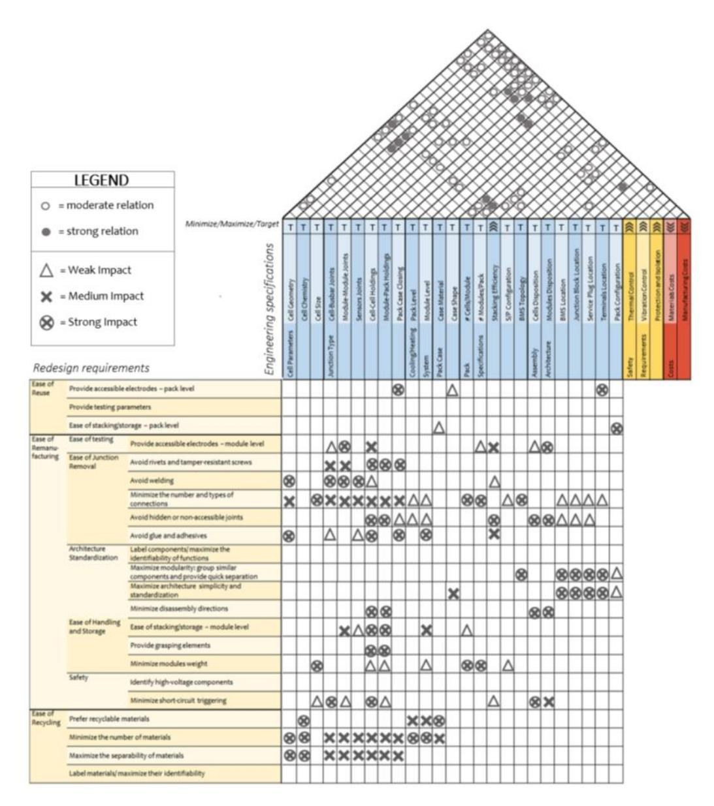

83 º The project receives funding from the European Union's HORIZON EUROPE research and innovation programme under grant agreement n° 101058245. UK participants in Project IRISS are supported by UKRI grant 10038816. CH participants in Project IRISS receive funding from the Swiss State Secretariat for Education, Research, and Innovation (SERI).

*Figure 11. House of Quality (HoQ) framework for redesign of EV LIB packs (Mossali et al., 2020).*

- Ease of reuse
  - Provide accessible electrodes
  - Provide testing parameters
  - Ease of stacking/storage
- Ease of remanufacturing
  - Provide accessible electrodes
  - Avoid rivets and tamper resistant screws
  - Avoid welding
  - Avoid hidden or non-accessible joints
  - Avoid glue
  - Label components/maximize the identifiability of functions

- Maximize modularity: group similar components and provide quick separation
- Maximize architecture simplicity and standardisation
- Minimize disassembly directions
- Ease of stacking/storage
- Provide grasping elements
- Minimize module weight
- Identify high voltage components
- Minimize short-circuit triggering

#### **Repurpose**

Reusing LIB is mentioned most in terms of reusing it in another context, i.e., redesign for a new purpose, sometimes also referred to as design for second use. Design for repurpose requires knowledge and understanding of where and how it will be used in its second life. Currently, battery packs need to be dismantled to their component cell level, tested, and rebuilt for the new application. This is a process that requires both time, cost, and knowledge about the design of the battery. Standardisation of battery design is therefore viewed as one of the enablers for battery reuse and repurpose (Olsson et al., 2018). This is due to the current variations of batteries placed on the market today in terms of design, material content and performance. In lack of standardisation, clear information, and markings of e.g., cell chemistry, battery compounds and discharge procedures are crucial to enable safe and streamlined handling of batteries by external actors (Lunde, 2021).

# **Disassembly and Modular design**

There are several reasons to apply Design for disassembly principles for batteries, one of them being recyclability. Another is to replace or upgrade parts due to e.g., malfunctioning or a product's dissipative character. Talens Peiró et al. (2017) propose criterion for rechargeable battery replacement for lifetime extension as follows:

- The rechargeable battery shall be easy to extract by one person
- The rechargeable battery is not to be glued or soldered into a product
- There shall be no metal tapes, adhesive strips, or cables that prevent access to extract the battery
- Simple instructions on how the rechargeable battery packs are to be removed shall be provided in a repair manual or through the manufacturer's website

Talens Peiró et al. (2017) also suggest criteria related to tools required for disassembly for specific product groups

- For notebooks and portable all-in-one computers, it shall be possible to extract the rechargeable battery manually without tools
- For subnotebooks it shall be possible to extract the rechargeable battery in a maximum of three steps using a screwdriver

- For tablets and two-in-one notebooks, it shall be possible to extract the rechargeable battery in a maximum of four steps using a screwdriver and spudger

For EV LIB batteries, the design for disassembly has somewhat different purpose compared to household batteries. This is due to the uneven degradation of different parts of the battery (Aceleron Energy, 2021) and that replacement of only a few modules might be necessary. This is both relevant for lifetime extension of an LIB battery in the current setting (e.g., as an EV battery) or when repurposed, for e.g., stationary applications.

### **Repair**

Many of the above-mentioned circular principles to extend the life span also applies to repair. Additionally, integrating advanced analytics/sensors in the battery are mentioned as a design feature to detect components that needs service or maintenance (e.g., Picatoste et al., 2022, EMF, 2021c).

# **8.3.5.3 Useful application of materials - energy materials**

## **Recycle**

Traditional lead-acid automotive batteries have an average recycling efficiency of over 90% (Ahuja et al., 2020). In contrast, the recycling technologies for the current LIB on the market are still under development (Tan et al., 2020). The focus for recycling of LIB batteries is on value retention of the most (valuable) materials, keeping them in the loop and reduce the need for raw material extraction. Similarly, as for extending lifetime of products and its parts, standardisation, information for safe and streamlined dismantling is key for recycling of batteries (e.g., Mossali et al., 2020 and Lunde, 2021). Mossali et al. (2020) highlights the need for accessibility and identification of the most valuable materials as a starting point, and with the HoQ framework [\(Figure 11\)](#page-82-0) suggests the following for ease of recycling

- ease of recycling
  - prefer recyclable materials
  - minimize the number of materials
  - maximize the separability of materials
  - label materials/maximize their identifiability

Tan et al., (2020) highlights the need to explore new design possibilities for fabrication and recycling of new batteries before they enter the market. In that case, the development of recycling technology does not need to adapt to current battery design. Both manufacturers, designers and end-of-life handlers will instead profit by developing the recycling technology and battery design in parallel. He proposes a five-step recycling process which need to be considered during the design phase, and suggests the following circular design criteria

- selection of cell chemistries that allow for efficient component separation with minimal steps
- elimination of toxic, expensive, and low vapor pressure organic solvents
- cost-effective recovery of components in the cell beyond just the cathode
- processes should be applicable to a variety of cell chemistries

#### **8.3.5.4 Regenerative processes - energy materials**

No specific design considerations are mentioned for the biological sphere in the selected guidelines except for using bio-based materials.

# **8.3.6 Electronics design guidelines**

In this section, design guidelines for circular electronic devises are assessed. Electronic devices usually consist of durable materials but are in general used for a relatively short period of time before they are considered not useful anymore/outdated (Meloni, 2019). Electronic devices constitute of several different components. A printed Circuit Board (PCB) is an essential component of any electronic equipment as it electrically connects and mechanically supports the other electronic components. The basic structure of the PCBs is the copper-clad laminate containing glassreinforced epoxy resin and several metallic materials including precious metals(Ghosh et al., 2015). The concentration of precious metals such as Au, Ag, Pd and Pt is much higher than their respective primary resources. Additionally, PCBs also contain different hazardous elements including heavy metals, flame-retardants that makes them more difficult to handle at the end-of-life treatment (Ghosh et al., 2015). Moreover, the PCBs require a high degree of purity of the constituent metals, which hinders the use of recycled content in them and thus their circularity.

Meloni (2019) presents a vision for circular consumer electronics which entails that the products are kept in use for a longer time (by the same or another user), when they are not fit for use anymore, they can be refurbished, repaired, and reused, and the components and their materials can be separated and recycled. The cloud can enable computer power and storage to be optimized and not delimited to the device itself.

# **8.3.6.1 Smarter product use and manufacture - electronics**

## **Rethink**

One example of rethink for electronic devices is to "Design in the cloud" (EMF, 2018). Meloni (2019) suggest that the cloud could have an important role in prolonging the use of electronic devices but also as a strategy for dematerialisation. By transferring capabilities from consumer hardware to the cloud, the risk of hardware to become obsolete and outdated can be reduced. EMF (2018) also referred to a study that informed that cloud computing could reduce power consumption by 60% for some tasks. Such shift addresses issues with battery performance which are one of the key aspects limiting lifetimes of smartphones. Examples include integration of cloud computing such as Google's Chromebook, or product virtualization such as HBO MAX. The Service-as-a-Service is a concept usually related to rethink strategies for cloud- or web-based solutions.

Another example of rethink is to offer products as a service, such as leasing, subscribing, or sharing which gives the opportunity for the customer to get a combination of products and services instead of buying a single product (Wu et al., 2021). This concept is often referred to as Product-as-a-Service or Product-Service-System. In that way, the ownership is retained by the producer, which gives incentives to design the product to match the type of user and service. It can also involve designing a logistic system to make sure the products can be returned to service supplier (Wu et al., 2021).

#### **Reduce**

Dematerialization is also recommended to reduce the resource amount in electronics (Wu et al., 2021). For instance, by optimizing the design to use only the smallest amount of material needed during manufacturing. It can be achieved though for instance lightweight structures and foam-able engineering plastics. Also, it is recommended to choose a manufacturing process that minimizes energy and resource waste.

# **8.3.6.2 Extend life span of products and its parts - electronics**

## **Durability**

Physical durability is mentioned as a prerequisite for extending the lifespan of electronic products. It is therefore suggested to work with quality that enables products to resist wear and tear (e.g., connections between components, shell integrity, reliability). The components within the product should also strive to last for the lifetime of the product (e.g., robustness), or even multiple devices lifetimes (Meloni, 2019). In addition, emotional durability is suggested to be important to consider during design. Meaning the product should be wanted to be used throughout the lifecycle and thus stands the test of time. This is suggested to be enabled by for instance, timeless design and emotional connection to the product (EMF, 2018).

# **Adaptability and upgradability**

Adaptability and upgradability are mentioned to enable extending the use and the lifespan of electronic devices (EMF, 2018). For instance, it is recommended to design for easy access and replacement of components that are outdated in a cost and time effective manner. It is also recommended to assure that components are compatible across product generations.

For electronics, the software and hardware compatibility are central for the lifespan of the devices. For instance, ensure the device can keep its core functions through time with operating system stability and enable functionality upgradability through e.g., software upgrades that improves the functionality of hardware (e.g., accessing memory through the cloud, leaner applications) (Meloni, 2019). The software can also aid in informing users about product performance and provide advice according to functional needs to keep the device in good state.

Modularity is a recommended design strategy as it enables flexibility of products. For example, one part can be used in many configurations, either cross-brand or cross-product-line part replacement, which could increase the utilization rate of parts in the overall market (Wu et al., 2021). Moreover, modularity it is also promoted to enable easy upgrade, repair, and remanufacture as it allows broken parts to be easily replaced, instead of replacing a complete product (Feenstra et al., 2021).

# **Repair/ Refurbishment/ Remanufacturing**

For the strategy repair and maintenance several design considerations are mentioned by Meloni (2019). Design for ease of product inspection is one suggestion which aims at facilitating inspection of the condition of components and tasks required to maintain product performance (e.g., using IoT, visual clues). Meloni (2019) identify that different design aspects are relevant whether the restorative activities are carried out by a service technician or by the user. For instance, design for ease of replacing components that wear and break – components that break during normal use can be replaced and calibrated in a cost and time effective manner (by the technician). Whereas, for the user, components that break during normal use can be assessed and replaced without special equipment. Moreover, it is recommended to make sure spare components are available and affordable to the user and can be replaced fast and easy by a technician. (See also Right to repair and the French repair index for practical examples.)

To enable refurbishment and remanufacturing it is also recommended to make reusable components easily identifiable, assessed and maintained (e.g., detection system visual clues, accessibility) (Meloni, 2019). For parts and surfaces that are worn down effecting the aesthetics, such as casing, keyboards, and exposed elements, it is suggested to enable restoring through cost effective methods.

# **8.3.6.3 Useful application of materials - electronics**

# **Material selection**

Wu et al. (2021) suggest that that the goal of circular material selection is to make sure materials are harmless to nature and humans (i.e., non-hazardous) and at the same time are kept in use in the value chains for as long time as possible. The materials should therefore enable repair and refurbish of the product as well as be easily recyclable. Feenstra et al. (2021) recommends using recyclable materials that can be recycled by WEEE recyclers. For instance, avoid thermosets and composites, avoid use coatings on plastics (and especially avoid metal coatings since it cannot be separated in recycling), and minimise the use of thermoplastic elastomers. It is also advised to avoid foam and minimize the use of magnets as well as maximize the percentage of materials that are responsibly sourced (e.g., conflict-mineral free, renewable materials) (Feenstra et al., 2021).

Select recycled materials and recyclable materials that can be cycled several times without losing quality is also recommended (Feenstra et al., 2021). Also, it is suggested to consider more textured surfaces for injection moulding plastic parts and avoid uniform high-gloss surfaces. This is because traces of elastomers and glass reduce the quality of large high-gloss surfaces.

The Poly-CE report by Feenstra et al. (2021) also highlight that there is a need to understand plastic moulding during the product development process. The reason is that it is common to blame the material (if not performing as desired) when issues in production occur – especially for recycled materials. Instead, knowing how to deal with materials in moulding and willingness to execute tests can overcome these issues. For this reason, it is especially important to partner up with experienced moulders when using recycled plastic materials (ibid).

## **Recycling**

To enable recycling of electronic and electrical products it is recommended to design for ease of product disassembly. This is especially important for main components such as battery, screen, motherboard, etc.) for separation in a time and cost-efficient manner (EMF, 2017). One example is to use snap solutions to fix batteries in a product (Feenstra et al., 2021).

The materials in the components are also necessary to be separable. For this reason, it is recommended to limit complexity of material combinations and ensure materials can be separated at end-of-life (EMF, 2018). More specifically, it is recommended to use few or uniform or compatible materials (locate materialsthat can be recycled together) and only use common plastics

(such as ABS, MABS, PE, PP, PA, PC, PC/ABS, HIPS) (Feenstra et al., 2021). It is also advised to use material combinations that allow easy liberation. For instance, avoid moulding different material types together such as injecting different plastics into the same mould, avoid connections that enclose a material permanently (Berwald et al., 2021) and avoid composites and glass fibre blended plastics.

Obtaining a food-contact approved treatment process is very difficult for mechanical recyclers of both WEEE and other waste sources. A big effort has been made in what is needed to obtain food contact approval for recycled High Impact Polystyrene (rHIPS) from WEEE. But this seems to be impossible at this moment due to unharmonized pieces of legislation. If legislation were harmonized soon and recycling processes being approved, it could create a giant boost in recycling and the uptake of recycled materials. (Poly-CE).

To enable recycling of electronic devices, it is also recommended to avoid hazardous materials and contamination. More specifically, avoid the use of substances of very high concern (SVHC) according to REACH and substances classified as carcinogenic (Carc. 1A or 1B), mutagenic (Muta 1A or 1), or reprotoxic (Repr. 1A or 1B) by the Classification, Labelling and Packaging (CLP) Regulation in housing/housing parts (Berwald et al., 2021). Feenstra et al. (2021) recommends also avoiding future restricted ones from the SIN list. When avoiding hazardous substances is not possible, it is recommended to enable easy access and removal of hazardous or polluting parts. For instance, use detachment possibilities for hazardous and polluting parts/materials such as dust bags, lamps, cord sets, cord winders, wood, foams, glass, and ceramics. Another solution can be to design one module that contain the hazardous parts in the product structure to enable taking out one nonrecyclable module instead of several parts (Feenstra et al., 2021).

Other suggestions include to fix valuable parts such as printed circuit board assemblies (PCBAs) cables, wires, and motors with metal screws, use drains for operating liquids and gasses and enable easy removal of parts such as oil tanks, compressors, and hoses, and avoid permanent fixing such as glue, tapes, welded and enclosed solutions (Feenstra et al., 2021).

Lastly, to enable material recycling, using material passports is suggested to inform about location and composition of materials to ensure material traceability and maximum value recovery.

# **8.3.7 Fragrance products design guidelines**

Fragrances are (mainly) used in products with dissipative character, many to be found within the beauty industry, but some also for hygienic and cleaning purposes. In the following, mainly products within the beauty industry such as perfumes are considered.

A product with dissipative character normally requires some sort of container and outer packaging. When applying circular design for fragrances, it istherefore important to both consider the content (e.g., the liquid perfume/solid soap/gaseous spray products) as well as its container and outer packaging. However, not many papers solely address circular design principles for fragrances. Therefore, the non-value chain guidelines for dissipative products as well as the guidelines for packaging design are of most relevance for this product category. Two relevant references were found, Lofthouse et al. (2017) and L'Haridon et al (2018) both presenting circular design principles related to fragrances, with Lofthouse et al. (2017) focusing on the container/packaging perspective and L'Haridon et al. (2018) on the formulae/content perspective.

## **8.3.7.1 Smarter product use and manufacture - fragrances**

# **Refuse and Rethink**

Refuse and rethinking fragrances as a circular design topic is not specifically found in papers. However, Tillotson (2009) has developed an electronic scent device suggested to be integrated in textiles or as an accessory which therefore eliminate the need of a physical bottle. A physical product is still produced, requiring electronical components and enclosure materials. Yet, this is one example of how a rethink and refuse design strategy can be applied for fragrance design development.

### **Reduce**

Lofthouse et al. (2017) suggests addressing the container design to reduce the environmental impact, the waste generated as well as the material required. The shape of the container can be designed to make sure only the amount needed is dispensed, which will reduce waste during use and encourage an efficient use of product. A thoughtful container design can also ensure that a container is fully emptied before discarded. Providing information and clear instructions is also suggested to enable preferred behaviour and reduce waste during use. Furthermore, Lofthouse et al. (2017) also suggest developing concentrates for reducing the amount water needed. Doing so could reduce the impacts from transport as well as the amount of container or packaging material required.

# **8.3.7.2 Extend life span of products and its parts - fragrances**

#### **Reuse**

Due to its dissipative character, design considerations aiming to reusing fragranced products are focused on the container and packaging rather than the content. Developing a reusable and refillable packaging is suggested for by Lofthouse et al. (2017) who proposes several design guidelines. Many of the guidelines are centred around the user perspective, for example

- The consumer must be able to drain all the content of the refill container
- The experience must be clean and hygienic (e.g., design of the interface between the reusable and refillable container shall enable smooth refill process)
- Design for minimal or no maintenance. This design guideline can be applied to multiple users, (e.g., the service personnel, distributor, retailer, and end user) and are suggested to also include considerations through a system perspective.
- The reusable container shall be durable for repeated use, both in terms of physical durability but also information shall not become outdated. (This is often also referred to as *Design for Durability* and *Design for upgradeability and adaptability,* i.e., making sure backward compatibility when new design is released)
- The refill process must be intuitive and easy for different users (e.g., no external tools required, suitable for arthritic hands etc.)
- Access to a variety of fragrances shall be considered (e.g., the design of the refill container shall enable changing fragrances)

## **8.3.7.3 Useful application of materials - fragrances**

# **Material selection and recycle**

Hygienic and beauty consumables are bought under social influence, and sometimes users make purchasing choices unconsciously. Carvalho (2020) investigates challenges and opportunities of refillable perfume systems. Findings reveal that glass containers have the potential of being employed in refill systems/multiple-use, due to both good content preservation qualities and glass being a physically durable material. Additionally, glass can be recycled many times (Carvalho, 2020), with no trade-off of high energy demand during the recycling process. It is also a material that is preferred by companies and consumers (Carvalho, 2020). Material selection for multiple-use cycles is thus one key guideline to enable container reuse.

In contrast to the reusable container, a refill container does not have to be as durable. Lofthouse et al., (2017) suggest choosing a material of the refill container that could dissolve. In that way, the refill container does not have to be responsibly disposed by the user.

For all types of containers and outer packaging materials, whether refill, reuse or single-use, recycling shall be considered.

Material selection is also relevant for the ingredients of the formulae of the fragrance (e.g., a perfume, soap, cleaning detergent). L'Haridon et al., (2018) suggest a method for analysing a cosmetic formulae's hazardousness, aiming to reduce and refuse hazardous formulae content, and can thus be seen as one key design guideline for fragrances.

# **8.3.7.4 Regenerative processes - fragrances**

# **Regeneration and biochemical feedstock**

According to L'Haridon et al. (2018), readily biodegradability is one key component for reducing environmental impact from fragranced products and suggest a calculation method to analyse to what extent a formula is biodegradable. A first step is to replace any synthetic content with natural content which would reduce the release of hazardous substances, and fossil content of the formulae.

Another suggested principle is to analyse the grey water footprint of the cosmetic formulae. Two essential parameters shall be analysed during the development of new fragranced products with respect to impact to water quality, biodegradability and ecotoxicity (L'Haridon et al., 2018).

# **Mapping of Green, Circular, and Sustainable Chemistry and link to Circular Economy**

This chapter aims to show how the (organic) chemistry frameworks of Green Chemistry, Circular Chemistry and Sustainable Chemistry relate to the Circular Economy.

Chemistry as a science is non-normative and independent of human value propositions (nature does not tell us what is greener or more sustainable) whereas the concepts of Green Chemistry, Circular Chemistry and Sustainable Chemistry are all normative frameworks based on different social values: greener is better, circular is better, or more sustainable is better [\(Figure 12\)](#page-91-0).

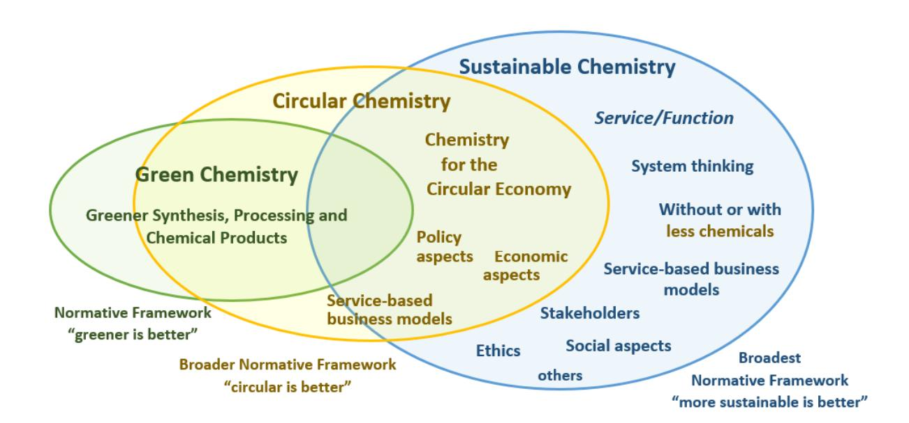

*Figure 12 Frameworks of Green, Circular and Sustainable Chemistry (from Kümmerer, unpublished, modified).*

# **9.1 Green Chemistry**

The concept of Green Chemistry (Anastas & Warner, 1998) is based on twelve principles [\(Table 12\)](#page-92-0) for a more environment-friendly (greener) manufacture of chemicals (see Figure 13). It is a design concept that aims for safer chemicals and less chemical pollution and lower energy consumption linked to chemical processes and reduction of toxicity.

#### *Table 12 The 12 Principles of Green Chemistry from Anastas & Warner (1998)*

| The 12 principles | of Green Chemistry                |     |                                             |
|-------------------|-----------------------------------|-----|---------------------------------------------|
| 1.                | Prevent waste                     | 7.  | Use of renewable feedstocks                 |
| 2.                | Atom economy                      | 8.  | Reduce derivatives                          |
| 3.                | Less hazardous chemical syntheses | 9.  | Catalysis                                   |
| 4.                | Designing safer chemicals         | 10. | Design for degradation                      |
| 5.                | Safer solvents and auxiliaries    | 11. | Real-time analysis for pollution prevention |
| 6.                | Design for energy efficiency      | 12. | Inherently safer chemistry for accident     |

As Green Chemistry is a comparative approach (get a product in a greener manner related to certain aspects) it does not consider "green" in an absolute sense, the concept is more accurately referred to as "green**er**" chemistry. Greener chemistry addresses a linear economy model (Keijer et al., 2019; Mutlu & Barner, 2022) and does not include the aspect of circularity itself. Nevertheless, it is a feasible tool to contribute to the transition to circularity and to the circular economy (Loste et al., 2020). A framework for the implementation of Green Chemistry principles into the circular economy has been proposed by Chen et al. (2020) and is shown in [Figure 13.](#page-92-1) Based on the 10th principle "Design for degradation",the Benign by Design concept has been developed to make open application products circular to the best currently feasible extent (Chapter 8.1).

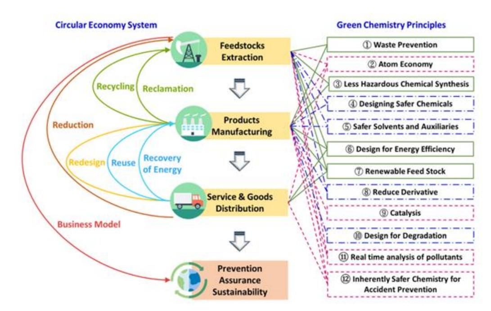

*Figure 13 Structure framework of Green Chemistry principles and circular economy in the entire life cycle. Source: Chen et al. (2020), Fig. 2*

# **9.2 Circular Chemistry**

The concept of Circular Chemistry was proposed by Keijer et al. in 2019 as a framework analogous to Green Chemistry that has been adapted to enable the transition of chemistry to a circular economy. It is a more holistic approach compared to Green Chemistry that is also based on twelve principles (Table 13)

[Table 13](#page-93-0) that are in part identical or similar to Green Chemistry. It covers not only aspects of chemistry, but also aspects of economy, policy, and environmental science (see Figure 13) and thus underlines the interconnectivity between these areas (Mutlu & Barner, 2022). In comparison to Green Chemistry, aspects like reuse of waste, the ladder of circularity, environmental life cycle assessments (LCA) and service-based business models are promoted.

*Table 13 The 12 principles of circular chemistry from Keijer et al. (2019)*

| The 12 principles                 | of Circular Chemistry                            |
|-----------------------------------|--------------------------------------------------|
| 1. Collect and use waste.         | Waste is a valuable                              |
|                                   | 7. Target optimal design. Design should be based |
| 2. Maximize atom circulation.     | Circular processes                               |
|                                   | 8. Assess sustainability. Environmental          |
| 3. Optimize resource efficiency.  | Resource                                         |
|                                   | 9. Apply ladder of circularity. The end-of-life  |
| 4. Strive for energy persistence. | Energy efficiency                                |
|                                   | 10. Sell service, not product. Producers should  |
| 5. Enhance process efficiency.    | Innovations should                               |
| continuously improve in-          | and post-process reuse                           |
|                                   | 11. Reject lock-in. Business and regulatory      |
| 6. No out-of-plant toxicity.      | Chemical processes                               |
|                                   | framework. The industry and policy should be     |

Focusing on the role of chemistry in a circular economy, Kümmerer et al. (2020), identified fifteen chemistry keystones for the circular economy that highlight the need for simplifying complexity [\(Figure 14\)](#page-94-0). Chemical products should be designed as simple in composition as possible, with a minimized use of additives and without toxic compounds that are not easily separated for recovery. Furthermore, product flows should be kept as separate as possible at all life cycle stages to avoid mixing of varying constituents.

*Figure 14 Chemistry keystones for a circular economy from Kümmerer et al. (2020).*

# **9.3 Sustainable Chemistry**

Sustainable Chemistry (Blum et al., 2017, Elschami &Kümmerer, 2018; Kümmerer, 2017; Kümmerer et al., 2021) is the broadest of these three normative frameworks covered in this report (see Figure 13). It is a holistic approach that considers the entire lifecycle of a chemical product including all stakeholders along the life cycle chain (Blum et al., 2017). Its focus lies on delivering a certain service or function in the most sustainable way, taking all sustainability dimensions into account. It includes also non-chemical alternatives or service-based business models that need fewer chemical products (both number and volume) to achieve the desired service or function. In comparison to Green or Circular Chemistry, Sustainable Chemistry is more service- and function-oriented and less product-centred (Elschami & Kümmerer, 2018). Circularity is one of the key characteristics or criteria categories of Sustainable Chemistry (ECOSChem, 2023; Kümmerer et al., 2021) and takes both the opportunities and the limitations of a circular economy into account.

Both Green Chemistry and Circular Chemistry are tools to move chemistry (as a sector) and its products towards increased sustainability. But to make a product "greener" does not necessarily imply it is more sustainable (Keijer et al., 2019; Kümmerer, 2017; Kümmerer et al., 2021). For example, the substitution of an organic solvent with water makes a process greener, but if this results in extracting too much water from natural sources, it might not be more sustainable (Mutlu & Barner, 2022). Also extorting follow up products from an aqueous solution may be highly energy intensive because of water's high polarity and heat of evaporation. Similarly, resource renewability (Green Chemistry principle 7) alone is not a measure of sustainability as these resources are often created in linear production processes without sustainable end-of-life options (Keijer et al., 2019). Bio-based products may come along with additional consumption of water and fertiliser, pesticides etc. and may be in completion with farmland and result in pollution of the environment. Metals are often used as catalysts to save energy. Metals are not renewable, however. Furthermore, bio-

based, and fossil-based materials often have similar building blocks and properties (e.g., PET and bio-PET). This arises the question: *what is the difference between a fossil-based or bio-based plastic soup in our oceans?* (Keijer et al., 2019). And more generally: *what about a material or chemical product that was manufactured in compliance with the Green Chemistry principles but is simply not needed*? (Kümmerer, 2017). The same holds for circularity. To make a material or product circular does not necessarily imply it is "greener" or more sustainable – that must be assessed carefully in each case. Neither greener nor more circular chemistry consider ethics, social aspects or broader systems thinking, which are important features of sustainability.

# **Limits to the circular economy**

There are several challenges, barriers, and limitations associated with the enabling of a truly circular economy. Some of these have been examined in this work and are presented in the following sections.

# **10.1 Design of open application products for degradation**

The circular economy strives to be system of closed loops with zero waste. This is a very idealized vision and will remain an unattainable goal, as there will always be unintentional losses, e.g., dissipative losses (Huether et al., 2023, Kümmerer, 2016, 2017). Perfectly closed loops are not feasible in reality, for example, because of the laws of thermodynamics (discussed more in depth below). In addition to unintentional losses, there are also many types of products where the circular economy concept is not working and will never work, because the materials or products cannot be circulated in a closed system and are "lost by intent" (Ciacci et al., 2015; Michaux & Butcher, 2023). Some examples are consumable surfaces like brake pads and rubber tyres, (marine) paints, (leadbased) ammunition for hunting, cleaning agents, disinfectants, pharmaceuticals (human and veterinary drugs), and personal care products (Ciacci et al., 2015, Kümmerer et al., 2018, Wang & Hellweg, 2021). All these products end up in the environment (either directly or indirectly e.g., through wastewater treatment plants or because of their open application) and cannot be recycled as their uses are dissipative themselves. The same is true for several further products like pesticides, fertilizers, sacrificial anodes, fire-fighting foams, fireworks or additives in mining, and oil and gas production that even must be dispersed into the environment to fulfil their function (Ciacci et al., 2015, Kümmerer et al., 2018, Wang & Hellweg, 2021).

Organic materials and products that enter the environment are not always degraded to harmless follow-up products. Ideally, they are completely mineralized to carbon dioxide, water and inorganic salts within a few days or weeks. If not, they can show adverse environmental effects (e.g., Wang et al., 2017; Islam et al., 2022). They can also form unknown transformation products, which is often the case for existing chemicals. These transformation products sometimes show toxic properties (e.g., Fatta-Kassinos et al., 2011; Herrmann et al., 2015; Illés et al., 2014; Isidori et al., 2005; Li et al., 2011; Michael-Kordatou et al., 2017, Puhlmann et al., 2022; Rastogi et al., 2014a; Suk & Kümmerer, 2023). To avoid adverse environmental impacts, open application products must be designed for complete environmental mineralisation after a suitable lifetime. According to the Circular Economy Action Plan (EC, 2020c), up to 80% of products' environmental impacts are determined at the design phase. This underlines on the one hand, the importance of including environmental-friendly properties right from the beginning into the product design, and on the other hand, the opportunities.

The benign by design concept (Boethling et al., 2007, Kümmerer, 2007, 2010) is a chemical product design approach that aims to design products according to the requirements of both application and environment, and thus taking the full life cycle into account. The (improved) environmental (bio)degradability, in the best-case, full mineralisation is added to the product as a further value without impairing its application-specific functionality. The concept is based on the tenth principle of Green Chemistry, which is "design for degradation" ([Table 12\)](#page-92-0). Relating to this principle, "chemical products should be designed so that at the end of their function they do not persist in the environment and break down into innocuous products" (Anastas & Warner, 1998, p.51). The benign by design concept can be regarded as a tool for both green and sustainable chemistry, that can be used to design chemical products for a full biodegradation or even better full mineralization in the environment at their end-of-life. These degradation products can re-enter natural nutrient cycles and, in principle, can be used as renewable resources for further production processes and thereby "closing the loop" (Puhlmann et al., 2021). The concept works with the fundamental connection between structure and properties of chemicals (Kümmerer, 2007). *In silico* tools like (quantitative) structure-activity relationships ((Q)SAR) models or quantitative structure−property relationship (QSPR) models can be utilized for the design of new chemical entities (Lorenz et al., 2021). The concept can be applied for the design of new chemical products from the scratch or for the re-design of existing ones (Leder et al., 2015, Lorenz et al., 2021). Four benign by design approaches have been identified (Lorenz et al., 2021) and are summarized in [Figure 15.](#page-97-0)

|                 | Nontargeted                                                                                                                         | Targeted                                                                                                                                                                       |
|-----------------|-------------------------------------------------------------------------------------------------------------------------------------|--------------------------------------------------------------------------------------------------------------------------------------------------------------------------------|
| <b>De novo</b>  | Scanning a large amount of structures in databases for functionality, degradability and (eco)toxicity                               | Combination of molecular fragments which are known to favor a desired property or activity either <i>in silico</i> or by drawing                                               |
| <b>Redesign</b> | Either nontargeted synthesis or <i>in silico</i> prediction of TPs and screening for functionality, degradability and (eco)toxicity | Either <i>in silico</i> or by synthesis: Integration of structural fragments in a known molecule that possibly improve functionality, degradability and decrease (eco)toxicity |

*Figure 15 Different approaches in the context of benign by design (Lorenz et al. 2021).*

In the field of sustainable pharmacy, the feasibility of the benign by design concept has already been demonstrated several times (Espinosa et al., 2022; Kümmerer, 2019; Leder et al., 2021; Lorenz et al., 2022; Rastogi et al., 2014b, 2015a,b; Zumstein and Fenner, 2021) and could be something that the safe and sustainable by design for chemicals and materials framework could adapt from when setting up its adherence for circularity be design. The concept is a key element to design pharmaceuticals with a functionality that not only includes the properties required for its specific application as a pharmaceutical, but also the properties for a fast and complete degradation of the unmetabolized pharmaceutical after excretion into the environment (Leder et al., 2015).

Besides pharmaceuticals, the benign by design concept has also been applied to other product groups, such as musk fragrances (Boethling, 2011), ionic liquids (Beil et al., 2021, Haiß et al., 2016, Suk et al., 2020) and pesticides (Schnarr et al., 2022). Transferring the benign by design concept also to other open application products would support not only the vision of a toxic-free environment (EC, 2020a), but also make these kinds of products circular to the best currently feasible extent.

Benign by design thinking can also be applied beyond individual molecules and materials to address design of products for circulation, adapted lifetime, recycling, design for repair etc. up to the design of total substance, material and product flows for circularity and sustainability.

# **10.2 The thermodynamic impossibility**

The idealised vision of a 'circular economy' refers to the principle that materials and products can be recycled, repurposed, or reused indefinitely, while keeping a high value. This vision refers to natural cycles. However, compared to the technical sphere, nature cycles are very limited to a few elemental cycles such as carbon, nitrogen, chlorine, sulphur, and phosphorus (including related inorganic compounds). All the other material cycles are rather local and limited in time. For example, wood is produced and used locally in nature, the same is true at an even lower level for compounds being toxic to other organisms (e.g., predators, info-chemicals etc.). Metals and other elements are accumulated in ores, i.e., as non-volatile under the surface and only rarely dissipated, i.e., distributed over big space, albeit they may be present everywhere such as iron, sodium or potassium, calcium. They are locally used and reused, not linked to regional or even global material and substance flows. Organic chemicals are synthesised, used and later on, after they fulfilled their purpose, degraded, *i.e.,* mineralised or used for metabolism and catabolism on local, often microscopic scale. There are no persistent organic chemicals in nature. Furthermore, the mass materials such as fat, proteins, sugar, starch, hydrocarbons consist of only very few and very similar building blocks not of a diversity up the several hundred thousand chemicals as is the case in the Technosphere. The usage and life cycle of the naturally occurring compounds and materials has been chemically adapted in coevolution with the organisms which again is not the case with synthetic chemicals and materials. And again, the associated material flows and stacks, although in some cases very large in total, are only local and on a much smaller scale in terms of quantity and turnover.

Furthermore, this idealised vision assumes that any resource loss and downgrading can be avoided; even worse, that a so called up-cycling is possible.

From a thermodynamic perspective, this "endless recycling" or "full circularity" is not possible and is therefore called a "thermodynamic impossibility" (de Man & Friege, 2016). The basic argument is straightforward: along the life cycle, the entropy of a material or product increases, e.g., due to the addition of additives or the mixing of materials, resulting in highly entropic and "downgraded" waste. This high entropy needs to be reduced to gain low entropic secondary raw materials for a further material cycle (Cullen, 2017; Friege & Kümmerer, 2023). Therefore, designing products and processes for lower complexity is an important issue (Kümmerer et al., 2020).

A recent publication connects this argument with the concept of availability: "*In an isolated system, the amount of energy remains constant (the First Law [of Thermodynamics]), while the available* 

*energy continuously and irrevocably degrades into unavailable states (the Second Law [of Thermodynamics]). Similarly, highly available materials (low entropy) irreversibly degrade into less available materials (high entropy)*" (de Man, 2023, p.4). Following this concept, highly concentrated and pure (secondary) raw materials represent a high availability (low entropy), while waste streams are characterised by low availability (high entropy) (de Man, 2023). In 100addition, one could assume with renewable energy there would be endless energy available to overcome the second law of thermodynamics. However, to harvest this energy matter and additional energy needed is resulting in even more entropy and less available materials of a certain quality. In other words, it is impossible to overcome the laws of thermodynamics. We cannot win, we can only try in the long run to lose as little as possible. In a short-sighted view and approach, we might be successful against the laws of thermodynamics.

Every recycling process is a form of purification and therefore associated with energy requirements – the material must be transferred from high to low entropy (de Man, 2023; Friege & Kümmerer, 2023). The amount of energy (and time) required to achieve endless material cycles would be infinite and therefore a "thermodynamic impossibility" (de Man & Friege, 2016; de Man, 2023). It would end up in endless entropy too.

# **10.3 Further challenges to the circular economy**

Besides the conflict of the circular economy concept with physical realities, especially the laws of thermodynamics, further "stumbling blocks" or barriers have been identified in the literature (e.g., Friege & Kümmerer, 2023; Haas, 2023; Vahle et al., 2023; Zink & Geyer 2017).

Examples for technological and economic barriers:

- Dissipative losses refer to the loss of materials or products, that cannot be regained due to economical or technical barriers (Huether et al., 2023; Kümmerer, 2016). One example is the presence of metals in waste and in the environment at low concentrations, which makes a recovery technically or economically unfeasible (Kümmerer, 2017; Zimmermann and Gößling-Reisemann, 2013). Dissipative losses occur along the entire life cycle of the material or product from primary production to waste management.
- Complexity of today's chemical products (from atomic to building-block levels) and of material flows hinders easy separation and recycling processes and complicates manufacturing sustainability in general (Kümmerer, 2016; Kümmerer et al., 2020; Kümmerer & Zuin-Zeidler, 2022). Plastic products, for example, often consist of more than one polymer type and contain many additives (e.g., plasticizers, flame retardants, antioxidants, acid scavengers, light and heat stabilizers, lubricants, colorants, and fillers to name a few) which often show hazardous properties and are difficult to separate in recycling (Kümmerer et al., 2020). Same holds for, e.g., electronics that contain countless chemicals and metals. Recovering value from such complex products (and, thus, complex waste) requires considerable investments in terms of funding and energy (Kümmerer, 2016, Kümmerer et al., 2020). Generally, the higher the product complexity, the more energy- and material-intensive is the recovery process. To

overcome this barrier, both products and processes must be designed as simple as possible.

- Missing information on a products previous service life and functionality, product and chemical composition or suitable dismantling processes are a hindrance for an efficient recycling or the re-use of a product (Friege & Kümmerer, 2023).
- Remanufactured or reused products must be competitive to "new" products on the market, both in quality and functionality. The same holds for secondary raw materials that compete with primary raw materials in quality and price. High recycling costs are a major economic challenge (Friege & Kümmerer, 2023; Haas, 2023).
- Rebound effects happen when an increased production efficiency (and resulting lower monetary costs per unit) causes an increased overall production and consumption, and thereby offsets the achieved environmental benefits (Kümmerer, 2016; Vahle et al., 2023; Zink and Geyer 2017). One example are rare metals that are used in a wide range of products but only have limited availability. To compensate, they are used more and more efficiently, meaning in ever lower concentration and quantity, in products. This increased efficiency results in lower monetary costs (both in production and on the market) and a higher overall product flow and thus, does not necessarily support the conservation of feedstocks but can even accelerate their depletion (Kümmerer, 2016).

Besides technological and economic barriers, there are also cultural and regulatory barriers (Barneveld et al., 2016; Haas, 2023; Kirchherr et al., 2018) to the circular economy, e.g., the lack of consumer interest and awareness or hesitant company culture (Kirchherr et al., 2018).

# **Surveys of CE inclusion by SSbD stakeholders and ongoing EU projects**

# **11.1 Stakeholder survey**

Within WP1, an online survey was designed to collect information from IRISS partners and stakeholders. A transcript of the survey is included in Annex A of D1.5. The partners and stakeholders were contacted via email and asked to participate in this survey. Included in this email was also a document giving background information on SSbD. The questionnaire could be filled out online via FORMS and included questions for 12 thematic blocks. The questions every participant was asked to answer varied in relation to the given answers, for example, only companies were asked for the company size and company policy and only representatives of a research and innovation project were asked for the project name and acronym. The survey was online between October 2022 and March 2023.

# **11.1.1 Introduction to the Survey on the mapping of Safe and Sustainable by Design (SSbD) initiatives**

This chapter maps industrial practice, research and education based on the survey replies. In total, **87 valid responses** were recorded.

The background of the responding organisations is shown in [Figure 16,](#page-102-0) [Figure 17](#page-102-1) and [Figure 18.](#page-103-0) Organisations from 19 countries responded to the survey, including companies (n=37; 43%), research and technology organisations (n=22; 25%), academic institutions such as universities (n=13; 15%), business or industry association (n=4, 5%), public authority individual citizens (n=2; 2%), clusters/platforms/networks (n=2; 2%), other non-governmental organizations (NGOs) (n=2; 2%) and other organisation types that were not further specified (n = 5; 6%). The responding companies were mostly large companies (n=25; 67%), followed by small and medium enterprises (SMEs) (n=11; 30%) and start-ups (n=1; 3%). The responders are working in a wide range of sectors with the chemical sector (n=37; 43%) being the most represented in this survey.

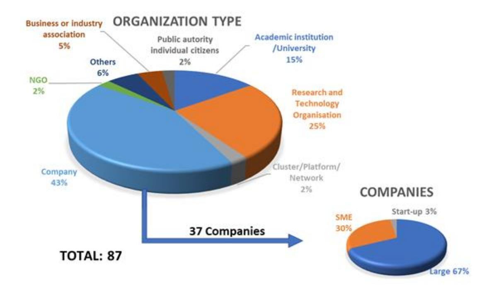

*Figure 16- Background of the respondents by organization type* 

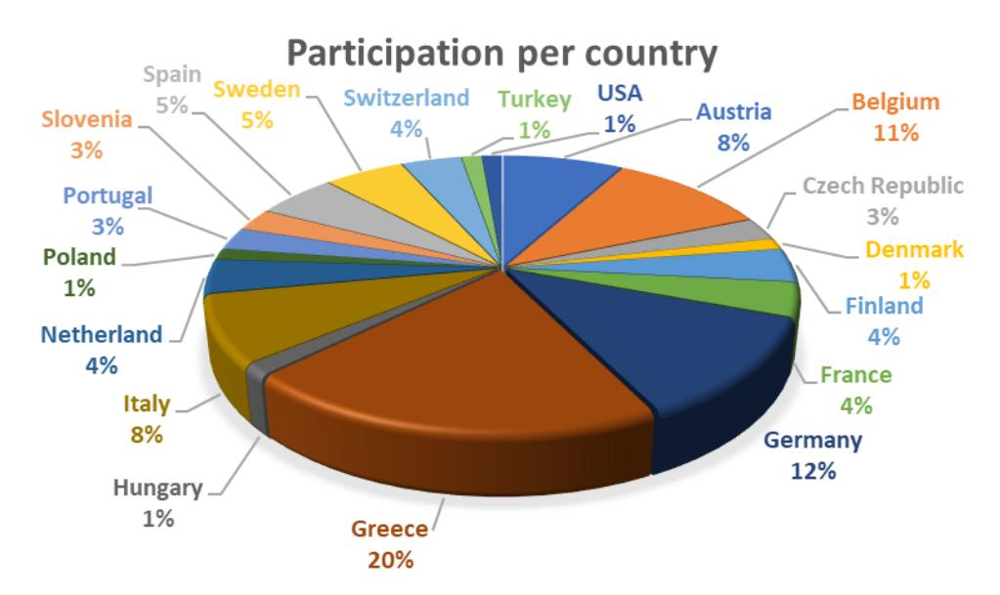

*Figure 17 -Background of the respondents by country.*

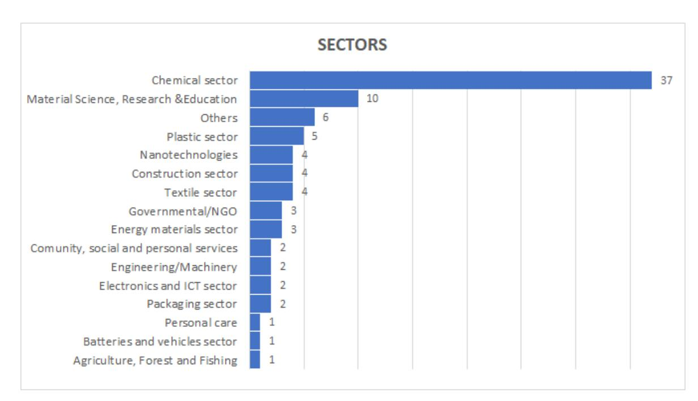

*Figure 18 Background of the respondents – Sectors.*

# **11.1.2 Survey results on circular economy aspects**

The survey results in the thematic block of "circular economy" are reported in this section. The overarching goal of this part of the study was to give an indication of to which extent circular methods and criteria are considered in product design today and which criteria are most frequently addressed.

It should be noted that the selection of companies and organizations questioned in this survey is necessarily not a full representation of all stakeholders and product owners that will be affected by SSbD in the future but can still give a good indication of how circularity is perceived and handled today.

The questions asked associated to circular economy are presented in [Table 14](#page-104-0)

*Table 14 Summary of responses in the circularity section. Both total number of responses and number of these being companies.*

| Question number | SURVEY SECTION -sustainability Social Dimension Question                                                                                                                                     | Total | Number of respondents Companies |
|-----------------|----------------------------------------------------------------------------------------------------------------------------------------------------------------------------------------------|-------|---------------------------------|
| 48              | Does your company/institution/R&I project consider or intend to                                                                                                                              |       |                                 |
|                 | consider circular economy aspects in the design or development                                                                                                                               |       |                                 |
|                 | phase of a material, product, process, or R&D activity?                                                                                                                                      |       |                                 |
|                 |                                                                                                                                                                                              | 87    | 37                              |
| 49              | End of life                                                                                                                                                                                  |       |                                 |
|                 | If use extension and end of life of your material, product or R&D prototype is considered in the design phase, please indicate if you considered or intend to consider any of these aspects: | 57    | 28                              |
| 50              | Raw material used                                                                                                                                                                            |       |                                 |
|                 | Indicate the circular economy considerations taken in the design of the production phase:                                                                                                    | 56    | 27                              |
| 51              | Use of Methods for ensuring circularity                                                                                                                                                      |       |                                 |
|                 | Do you use methods to measure and/or quantify the circularity of the product?                                                                                                                | 60    | 29                              |
| 52              | If yes, please comment your answer                                                                                                                                                           | 18    | 11                              |

# **11.1.3 Consideration of circular economy aspects and end of life consideration**

A majority, 73% (n=63), of the responding organizations do consider circular aspects in the design and development phase [\(Figure 19\)](#page-105-0). Looking at only the company responses an even higher amount, 78% (n=29), answer positively. The large proportion of respondents that claim to include it indicates that circularity is something that is considered important.

*Figure 19 Circular economy aspects in the design phase.*

# **11.1.3.1 End of life**

With the knowledge from those that considered circularity somehow the next question, number 49, was asked to get more details about which aspects gets the largest focus. Respondents could choose from 13 choices for different end-of-life options, linked to the 9R principles mapped elsewhere in this report [\(Figure 20\)](#page-106-0). From the results it was clear that recyclability, reduction of waste and biodegradability are the most considered aspects in the questionnaire (14). Strategies associated with "extension of the products life span", e.g., repurpose, refurbish and repair was found to be the least considered aspects in this survey.

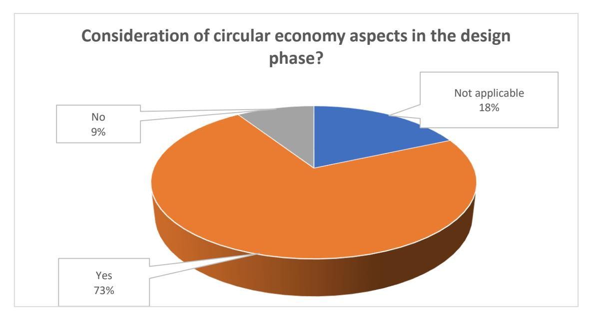

*Figure 20 End of life and extension of life considerations indicated to be taken*

# **11.1.3.2 Raw material used**

The inclusion of circular economy aspects in the raw material selection are summarized in [Figure 21.](#page-106-1)The use of renewable feedstock was most common consideration (n=42) followed by % of recycled content (n=38), while the presence of critical raw material is considered in this study by the 59% of the respondents (n=33).

*Figure 21 Circularity aspects in raw material selection*

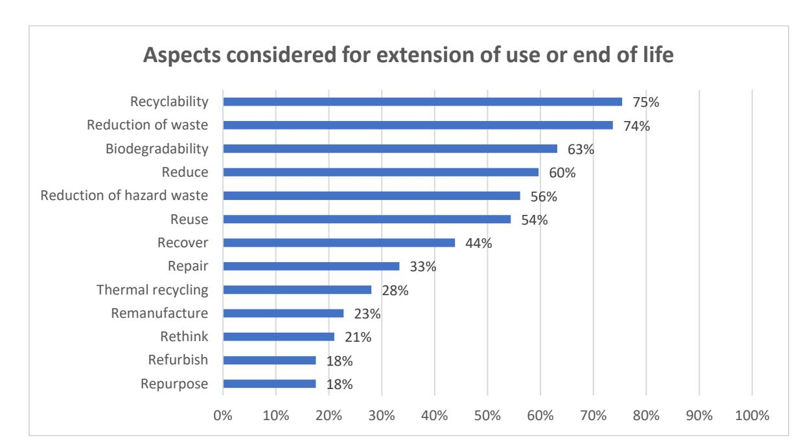

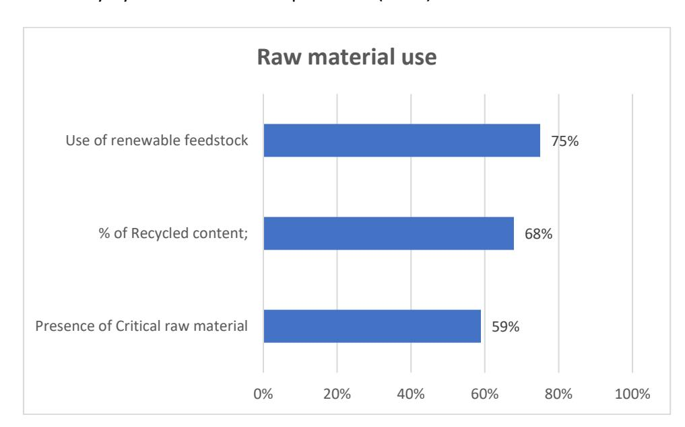

# **11.1.3.3 Use of methods to measure and quantify circularity**

To assess and ensure that circularity is included and how it impacts, the respondents were asked to fill out if any methods are used to measure and/or quantify the circularity. The results are shown in Half of the organization's answering this question assessed this point (n=26) as shown in [\(Figure 22\)](#page-107-0).

*Figure 22 Are methods used to quantify the circularity?*

Since CE is not fully defined and can be applied to several parts of the product design, the respondents could also give examples of which methods were used.

The most common answers, especially for the companies answering the survey, wasthat measuring was made by LCA analysis (n=4) followed by use of mass balance (n=3). Also, in-house methods, aiming to assess closed loop recyclability was mentioned. One responding organization mentioned that they intend to use chain of custody models, such as segregation for mechanical recycling and mass balance for chemical recycling that intended to quantify recycled content of products. This could then be used in a certification model approach, certified by a third party.

# **11.1.3.4 Use of Ecolabels**

To assess the use of Ecolabels, the respondents were asked if their material/product follow or intend to follow any of the sustainable initiatives listed in [Table 15.](#page-108-0) 64% (n=56) of the respondents, consider one or more of the mentioned Ecolabels.

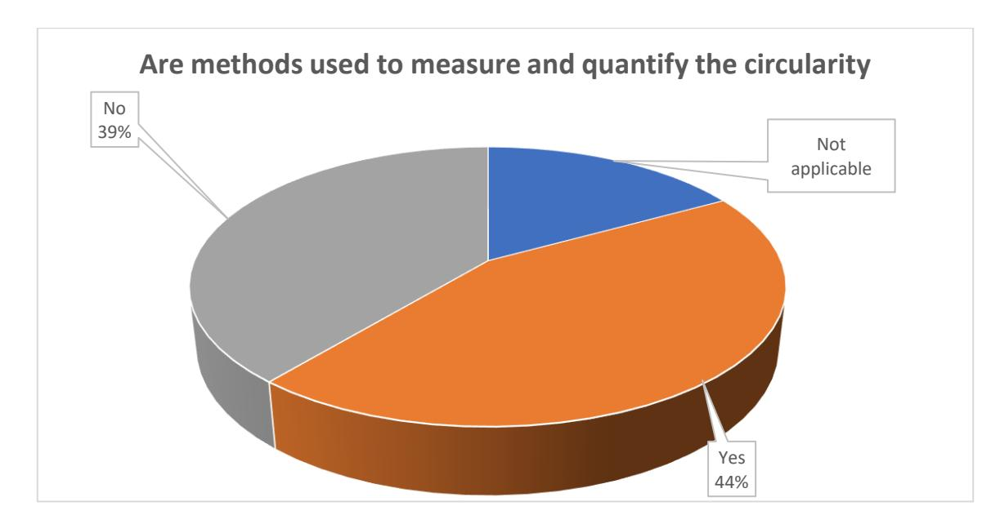

*Table 15 List of the Ecolabels and number of respondents*

| Ecolabel EU GPP criteria                                                                                | Number | Respondants % |
|---------------------------------------------------------------------------------------------------------|--------|---------------|
| (Scope: Products and services in public procurement) Sustainable Products Initiative                    | 56     | 100%          |
| (Scope: All type of products) Ecodesign Directive (2009/125/EC)                                         | 37     | 66%           |
| (Scope: Energy-related products minimum requirements on energy) EU Ecolabel Regulation (EC) No 66/2010) | 28     | 50%           |
| (Scope: Consumer products and services) Sustainable finance (EU 2020/852)                               | 26     | 46%           |
| (Scope: Financial products) Blue Angel                                                                  | 20     | 36%           |
| (Scope: Consumer products) OEKO-TEX                                                                     | 18     | 32%           |
| (Scope: Textiles and leather) Green Seal                                                                | 16     | 29%           |
| ( Scope: Consumer products and services) Nordic Swan Ecolabel                                           | 16     | 29%           |
| (Scope: Consumer products or products for professional use) Energy Label (EU) No 2017/136913            | 14     | 25%           |
| (Scope Energy-related products Sustainable) GreenScreen For Safer Chemicals                             | 13     | 23%           |
| (Scope: Consumer products) Sustainable Batteries                                                        | 13     | 23%           |
| (Scope: All batteries)                                                                                  | 11     | 20%           |
| Bluesign (Scope: Textiles)                                                                              | 9      | 16%           |
| Natureplus Ecolabel (Scope: Building and accommodation products) TCO Certified                          | 6      | 11%           |
| (Scope: IT products)                                                                                    | 2      | 4%            |
| TOTAL NUMBER OF RESPONSES                                                                               | 56     |               |

*Figure 23 Use of Ecolabels*

All the respondents of this question, use the EU GPP criteria, the Sustainable Product and Initiative are also widely used (66%, n=37) as well as the Ecodesign Directive (50%, n=28) and the EU Ecolabel Regulation (46%, n=26), see [Figure 23](#page-109-0).

# **11.2 Circular economy aspects in ongoing EU projects**

# **11.2.1 Methodology**

In addition to the WP1 survey, information from EU-funded projects related to SSbD was collected. For this, the project coordinators of the most relevant identified H2020 projects and HE projects related to SSbD aspects were contacted and asked to complete a template with a content similar to the survey filled out by the stakeholders. The EU project leaders were contacted in January and February 2023. The deadline for collecting project information was the end of March 2023. Efforts were focused on H2020 projects, as the HE projects have only recently started. The analysis of HE projects will be continued in IRISS WP2.

This part maps project information in terms of circular economy aspects considered in ongoing EUfunded projects (Horizon 2020 project). As part of the IRISS WP1 mapping, **fifteen** projects in total provided information on SSbD related tools. The projects that indicated that circular economy aspects are important, are presented i[n Table 16.](#page-110-0) Short description of how CE is considered is given in the last column. In most cases the survey only got answers on a high level of how CE is included. For a more detailed understanding, the reader is encouraged to follow the link to the project's website for further information.

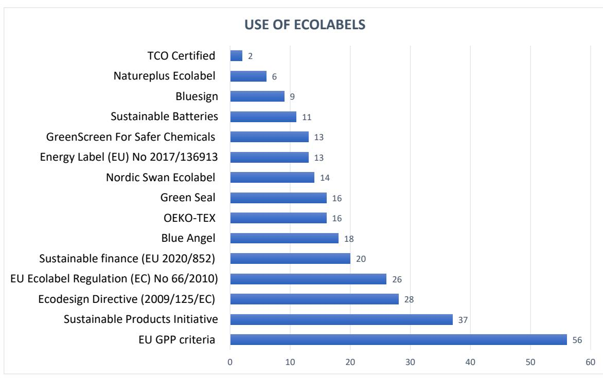

*Table 16 Summary of Horizon 2020 with a SSbD connection that that includes CE aspects in their research*

| Project acronym and logo | Project detail and description     | Circular economy aspects        |
|--------------------------|------------------------------------|---------------------------------|
| ASINA                    | Title: Antimicrobial and self     |                                 |
|                          | Brief description : Variations of  |                                 |
|                          | (TiO 2 ) for coated photocatalytic |                                 |
|                          |                                    | ASINA indicates that material   |
|                          |                                    | to the user, quantitative       |
| DIAGONAL                 | Title: Development and scaled      |                                 |
|                          | Brief description: DIAGONAL aims   |                                 |
|                          | analys e the materials’            |                                 |
|                          |                                    | The project will cover circular |

| Project acronym and logo Project detail and description | Circular economy aspects        |
|---------------------------------------------------------|---------------------------------|
| nano-enabled products design,                           | and                             |
| i-TRIBOMAT Title: Intelligent Open Test Bed for         |                                 |
| Brief description                                       | : i-TRIBOMAT aims               |
|                                                         | The major focus is the lifetime |
| ReSOLUTE Title: Research empowerment on                 |                                 |
| Brief description                                       | : The ReSolute                  |

| Project acronym and logo Project detail and description | Circular economy aspects      |
|---------------------------------------------------------|-------------------------------|
| derivative Cyrene                                       | ™ , a safe and high           |
| building block                                          | – levoglugosenone             |
| (LGO) – and the                                         | high performing               |
| solvent Cyrene                                          | ™ with a capacity of          |
| -To valorise Cyrene                                     | ™ production                  |
| residues –                                              | bio-char – by converting      |
|                                                         | CyreneTM production           |
| SAbyNA Title : Simple, robust,                          | and cost                     |
| Brief description                                       | : The main                    |
| “The SAbyNA SbD Guidance                                |                               |
|                                                         | included in the objectives of |

# **Conclusions**

Circular economy aspects such as material efficiency, use of renewable resources and design for end of life are important parameters in the design principles of SSbD. Hence the circular economy principles must be an integrated part of a SSbD assessment of a product or material. This report shows that design for circular economy is a very broad field where change and impact can be considered using several methods. These methods can be of a technical nature where innovative solutions enable recycling of the materials or minimization of waste. They can also be a change in design that affects how a product is handled by the user to increase the lifespan or functionality of the product.

In the mapping done in this report, a multitude of methods to increase the circularity of materials and methods have been investigated. The vast numbers of examples show the complexity of the concept and clearly shows that there is no obvious choice in how to make a product circular. This is due precisely to the fact that there is no such approach, but that each product must have its own method of circularity. However, this methodology can and should be based on or inspired by already existing solutions, which is why the examples collected in this report can provide an overview of what is possible.

In the last decades, the aspect of circularity has gained more and more importance in the chemical sector. While the concept of Green Chemistry, first published in 1998, addresses a linear economy, more recent concepts such as Circular Chemistry and Sustainable Chemistry include and promote also circular economy aspects. The Circular Chemistry concept focuses on how chemistry can contribute to the development of a circular economy and aims for closed-loops and a waste-free chemical industry. Since the introduction of the concept of circular economy, some consider that ecodesign (design for low energy consumption and greenhouse emissions) is not enough and suggest that specific design methods for CE are needed. This is done both for generic circular design principles (non-value chain specific) and for specific circular design principles (for one type of product/value chain).

# **Regulations and authority intentions**

Europe have decided to take the lead in the green transition and have launched numerous related initiatives. All initiatives are connected to each other and have resulted in both regulations but also financed research, standardisation, and targeted projects, all with the purpose to lead to a green transition.

In this report the mapping of legislation has focused on circular economy (CE) in general and the emerging sectorial legislation. The baseline in the European Union strategy is the Green Deal followed by the Circular Economy Action Plan which sets the path going forward.

The expansion of the regulatory coverage is very clear in the progress in this area. For example, criteria valid for packaging, such as design for recycling and recyclability criteria, will also be implemented for other sectors. The revised ecodesign directive will not only relate to energy related products but cover all products with a few exceptions.

Design for recycling and recycled content in products are demands that are now implemented in legislations under revision. Criteria of recyclability for different type of products in different sectors need to be setup.

Looking at circular economy principles, not all parts are mirrored in legislations. Some parts are in conflict with the European Union law, for example acts that could impose a hinder for the free inner market, like a limitation in amount of materials or products placed on the market. This gives an uneven distribution of regulatory coverage to promote a harmonised circular economy, including for example the 9 R's. This report maps some of the current and proposed regulations related to CE. It is predicted that much more will happen in this area the coming years.

## **Standardisation**

The future for standardisation related to Circular Economy is in expansion and will need relevant resources to create robust, trustworthy, and reliable standards. These standards will most likely form the future for many industries. This needs to be communicated to attract the right experts that get the mandate and time needed to provide their respective expertise.

We expect that the European revisions of regulatory framework for Ecodesign, ELV, CPR together with the creation of the Global Plastic Treaty will increase the need for standardisation.

The European Commission have clearly identified standards as important tools to implement and achieve a circular economy. It is communicated through the circular economy channels and aligned with the work plan together with CEN/ CENELEC, but in some cases also with ISO.

This leads to a new way on how to provide and develop standards from the standardisation organisations, with a higher level of authority engagement in the standardisation initiation and development.

As the requested or needed standards are developed, the alignment in definitions and change to circularity comes in parallel, as standards are required to be developed by relevant experts in consensus based on actual facts.

For the coming years there will be an increase of development of standards, in line with updated legislations.

What is still to be clarified is how to fund this increase, as it is not initiated from the industry but from the legislators, requiring input from the industry.

# **Categorization of circular economy strategy and product labels**

From the 9R circular economy **general strategy** point of view it can be concluded that the **Rethink** strategy focuses on the company's business model, not on the product. Also, no label considers the option converting the product or its parts into a different product with a different function. The label focuses on the characteristics of a single product and not its potential reconversions. The most common strategies (refuse, reduce, reuse, and recycle) consider very similar aspects for most labels. The use of hazardous or conflicting substances is **Refused**. In this sense, Refuse accomplishes with the safety dimension. **Reduce** considers the decrease of raw materials and energy

consumption during the manufacturing and the use phases. Extend the product life and inform the consumer for **Reuse** as well as the use of **Recycled** and recyclable raw materials are also part of the most common strategies consider by the labels. In the biological cycle, the labels focus on use of renewable raw materials, on decomposing organic matter (with the possibility of generating biogas) generating residues that serve as nutrients for the soil (**Regeneration**), and the generation of **Biochemical feedstocks** such as biogas.

Regarding the **value chain perspective,** some aspects can be highlighted:

Apart from **Reuse** strategy, which is transversal for any value chain, only automotive, batteries (energy materials) and electronics consider the other lifespan extension strategies (**Repair, Refurbish or Remanufacture**). The products related to other value chains are mainly substances or materials and therefore, said strategies generally do not apply. Textiles are reparable, but no label considers this fact. In those cases where repair, refurbish or remanufacture is not feasible, **technical recycling or biological regeneration** strategies are considered. The energy materials analysed for ecolabels are materials for batteries. This product family have common challenges and synergies with electronic value chain.

### **Design guidelines for circular economy**

In overall, more design considerations are mentioned in the general guidelines for the technical sphere than for the biological sphere. There are also far more circular design considerations that can be considered applicable for durable and long-lived products (including reuse, remanufacturing and repurpose) than for consumables, since due to their nature is difficult to extend their lifespan.

Regarding applicability of CE strategies from the value chain perspective, some aspects can be highlighted. Regardless value chain some design aspects are always relevant:

**Reduce** – reduce environmental impacts over the whole life cycle of the product (raw material extraction and production, product manufacturing, use-phase and at end of life).

**Material selection** – in general avoid hazardous and scarce materials and use low impact materials. In applications suitable: use bio-based materials, use responsible sourced materials, use biodegradable materials, and use recycled material.

Plan and design for **suitable end of life treatment**, meaning **design for recycling** (with maintained material quality). For bio-based materials, **biological regeneration** (biodegradation) can be interesting in cases of dissipative use, when the material or chemical is lost during use, or in case of food packaging where both the food and the packaging can be composted or converted to energy. In general, material recycling is currently a better option also for bio-based feedstock.

**For consumable products**(e.g., packaging, cleaning products, fragrances) the following conclusions can be made:

**Refuse**, avoiding hazardous substances is mainly considered and designing out the need of the primary packaging. Several **Rethink** design suggestions can be found for packaging to reduce the environmental impact from the product it holds, and to reduce losses during use, making sure to supply just the necessary amount. On a life cycle perspective – this can have a greater impact on the product system than reducing the amount of material in the packaging. Many packaging can be designed into **reusable** packaging. Shifting from disposable packaging into reusable packings not only require redesign of the packaging (e.g., more durable construction) but design of the system around the product packaging.

A conclusion to design for circular solutions regardless of product and value chain is that redesign of a circular solution not only entails redesign of the product, but the whole system surrounding the circular product. For instance, take-back systems, maintenance /cleaning, remanufacturing facilities and processes, end of life treatment etc. In addition to these systems, improved and clear information to the user and the different stakeholders are needed to make sure the product is used and handled as intended.

The mapping made on legislation and product labels indicated that there currently is a large focus on the aspect related to the technosphere (technical cycle) of circular economy, e.g., how the product can be recycled and reused. Measures are taken to increase the life span and ensure that life can be prolonged by durable materials together with design and repair imbedded in the product. Also end of life treatment to dismantle product and ensure that they can be reused are starting to appear more frequently. However, few findings were made on product control that set targets or measures for the regenerative processes such as biodegradation and conversion of biochemical feedstock. In legislation, a lack of realistic implementable solutions is obvious, as how to handle product passports in the industry. But also neglecting the issues with bio-based and biodegradable materials instead of identifying solutions that is applicable without sacrifice the limited resources in this segment needs to be changed. Value chains identify challenges on assuring a products life and use phase, providing a truly circular product. To provide an overview [Table 17](#page-117-0) includes the mapping of circularity strategies for the different value chains.

*Table 17 Mapping of circularity strategies inclusion in legal (L), standards (S), product labels (P) and design guidelines (D) for respective value chain.* 

| Strategies | Packaging | Textile | Construction |            |        |             |            |
|------------|-----------|---------|--------------|------------|--------|-------------|------------|
|            |           |         |              | Automotive | Energy |             |            |
|            |           |         |              |            |        | Electronics | Fragrances |
| Refuse     | P, D      | P       | P            | P, D       | P, D   | P           | D          |
| Rethink    | D         | D       | D*           | D          | D      | D           | D          |
| Reduce     | P, D      | P, D    | P, D*        | P, D       | P      | P, D        | D          |
| Reuse      | P, D      | P, D    | P, D*        | P          | P, D   | P, D        | D          |
| Repair     | D         | D       | D*           | P, D       | P, D   | P, D        |            |
| Refurbish  |           |         |              |            |        | P, D        |            |
|            |           |         | P, D*        | D          | D      | P, D        |            |
| Repurpose  |           |         |              |            | D      |             |            |
| Recycle    | P, D      | P, D    | P, D*        | P, D       | P, D   | P, D        | D          |
|            | P, D      | P, D    | P            | P, D       |        |             | D          |

# **Survey and Project Mapping results**

**73% of the entities** that answer the questionnaire consider **end of life options**. From the 9R options, recyclability, reduction of waste and biodegradability are the more relevant aspects. **CE Strategies** associated with extension of the products life span, repurpose, refurbish, and repair, were the least considered aspects in the survey. The circular economy aspects were considered in the raw material selection, where the use of renewable feedstock was the most important factor, followed by % of recycled content and the presence of critical raw material.

44% of the respondent to the questionnaire, use **methods to quantify circularity**. The most popular method was applying LCA, followed by use of mass balance or segregation. It was suggested to use segregation for mechanical recycling and mass balance for chemical recycling to quantify the recycling content of the products. This could then be used in a certification model approach, by a third party. In general, it was mentioned, that many possible metrics are possible and that circularity itself is not always the goal, but rather a tool to reduce the environmental impact. 64% of the respondents, consider one or more **Ecolabels,** being the EU GPP criteria, the Sustainable Product Initiative, the Ecodesign Directive and the EU Ecolabel Regulation, the most important

ones. From the 17 EU projects that answer the questionnaire, 5 consider circular economy aspects in their project design.

#### **Hinders and barriers**

Due to a vast amount of literature published on the topic of circular economy field, a complete review has not been possible within the limits of this report. Instead, a selection of published work has been reviewed and this report point in directions of important areas for circularity of different selected products and within certain value chains.

Not all circular strategies are suitable or even possible to apply for all products and all value chains. The 9R framework and other circularity frameworks often put forward a hierarchy of strategies. For instance, Kirchherr et al. (2017), who reviewed 114 definitions of CE, emphasized the need for clear prioritization between measures to provide ample guidance and avoid greenwashing. However, research has shown that these hierarchies are not always valid. For instance, Ljunggren Söderman & André (2019) advocated that the ranking of strategies rests on idealized descriptions of those strategies, without accounting for real-world conditions like insufficiently exploited life-times, low collection rates, and losses in remanufacturing, repair, and recycling. For this reason, it is difficult to say that it is always better to reuse than recycle, and that it depends on the product and the product system the product is used and produced in. Another important aspect when it comes to prioritization of CE strategies is that they can be interdependent, meaning that several measures work in sequence or in parallel, which decreases the meaningfulness of their ranking. Instead, the characteristics of products, such as lifespan, material content, and whether the product requires energy during use, have instead been argued to determine the suitability and outcome of a strategy (see e.g., Böckin et al., (2020) and Willskytt and Brambila-Macias (2020)). This means that not all measures are applicable to all product types.

It is also worth noting that a circular solution does not necessarily mean that it is a sustainable solution. For example, refusing a physical product and replacing it with a digital one may lead to increased environmental impact and resource use from a system perspective, since the cloud/digital solution may depend on computers and server halls that are constructed of components with a lot of high impact on materials availability and that also use a lot of energy. Another example can be that the energy use required to create returning the material into the loop can exceed the profit of taking virgin material and the circular process then becomes an environmental burden.

Thus, environmental trade-offs are common, and exist for many solutions and products. And to assess these trade-offs, life cycle assessments are needed to analyse the circular solutions at a life cycle perspective. LCA is part of the proposed SSbD framework, and these analyses will need to be done already at the design stage. The mapping of the LCA tools have been described in Deliverable D1.3.

The circular economy concept strives to solve many global challenges and opens possibilities, but at the same time there are also limits to circularity that must be acknowledged. Besides the conflict of the circular economy concept with physical realities, especially the laws of thermodynamics, it also faces various "stumbling blocks" or barriers at the technological, economic, cultural, and regulatory levels. Some examples are dissipative losses, the complexity of today's chemical products and material flows, lack of information, and rebound effects. Remanufactured or reused

products must also be competitive with "new" products on the market, both in terms of quality and functionality.

Another challenge of today's circular economy is the inclusion of open application products such as pesticides, pharmaceuticals, cleaning products, or personal care products. These products are characterized by their **dissipative uses and cannot be collected at their end-of-life.** Therefore, **biodegradation** of these products **needs**to be incorporated into the product design as an additional functionality. One approach to achieve this is Benign by Design. Benign by Design thinking can also be applied beyond individual molecules and materials to address design of products for circulation, **adapted lifetime, recycling, design for repair etc. up to the design of total substance, material and product flows for circularity and sustainability.**

A general conclusion in this report is that **legislation, standards, product labels, and design considerations** seldom mention and place **little focus on circular strategies** that aim to recycle biological materials and substances (both when it comes to the strategies regeneration and biochemical feedstock). This mostly applies to Biochemical feedstock. One reason for this may be the difficulty in successfully collecting and restoring substances from these products, for example, soap ingredients in sewage systems.

As final remarks it can be mentioned that the existing systems towards circular economy, considering the lifecycle perspective, can be used and transformed to sharpen the requirements by using the SSbD framework. Policies can be adjusted to focus on preservation of resources, for example, instead of regulating that 85% of a car should be recycled, the focus should be on recovering 85% of all of the used materials, leaving no material uncirculated. Exchange of knowledge must be enabled and encouraged. A transfer to CE for isolated stakeholders is not possible, and even competitors need to share knowledge with each other to achieve momentum.

# **References**

Aceleron Energy (2021). Batteries Designed For The Circular Economy. [Advertisement]. Youtube. [https://youtu.be/kSS\\_5vidrXE](https://youtu.be/kSS_5vidrXE) Aguilar Esteva, L. C., Kasliwal, A., Kinzler, M. S., Kim, H. C., & Keoleian, G. A. (2020). Circular economy framework for automobiles: Closing energy and material loops. *Journal of Industrial Ecology,* 25(4), 877–889[. https://doi.org/10.1111/jiec.13088](https://doi.org/10.1111/jiec.13088) Ahuja, J., Dawson, L., & Lee, R. (2020). A circular economy for electric vehicle batteries: driving the change. *Journal of Property, Planning and Environmental Law*, 12(3) 235–250. <https://doi.org/10.1108/jppel-02-2020-0011> Allwood, J. M., Ashby, M. F., Gutowski, T.G. & Worrell, E. (2011). Material efficiency: a white paper resources. *Conserv. Recycl.* 55(3), 362–381. [http://dx.doi.org/10.1016/j](http://dx.doi.org/10.1016/).resconrec.2010.11.002 Anastas, P. T. & Warner, J. C. (1998). Green Chemistry. Theory and Practice. *Oxford University Press*, Oxford, New York. Bakker, C., Wang, F., Huisman, J., & den Hollander, M. (2014). Products that go round: exploring product life extension through design. *J. Clean. Prod.*, 69, 10-16. <http://dx.doi.org/10.1016/j.jclepro.2014.01.028> Baresel, C., Ekengren, Ö., Filipsson, S., Karlsson, J., & Friesen, L. W. V. (2020). The municipal wastewater treatment plant of the future – A water reuse facility. [https://www.ivl.se/download/18.694ca0617a1de98f473b9a/1628417790069/FULLTEXT01.pd](https://www.ivl.se/download/18.694ca0617a1de98f473b9a/1628417790069/FULLTEXT01.pdf) [f](https://www.ivl.se/download/18.694ca0617a1de98f473b9a/1628417790069/FULLTEXT01.pdf) Barkhausen, R., Durand, A., & Fick, K. (2022). Review and Analysis of Ecodesign Directive Implementing Measures: Product Regulations Shifting from Energy Efficiency towards a Circular Economy. *Sustainability*, 14(16), 10318. Barneveld, J. v., der Veen, G. v., Enenkel, K., Mooren, C., Talman-Gross, L., Eckartz, K., Ostertag, K., Duque-Ciceri, N., Fischer, T., Gama, M., Scheidt, L., Wilts, H., Schäfer, L. & Fischer, S. (2016). Regulatory barriers for the Circular Economy: Lessons from ten case studies. technopolis |group| The Netherlands. [https://circulareconomy.europa.eu/platform/sites/default/files/](https://circulareconomy.europa.eu/platform/sites/default/files/%202288_160713_regulary_barriers_for_the_circular_economy_accepted_hires_1.compressed.pdf)  [2288\\_160713\\_regulary\\_barriers\\_for\\_the\\_circular\\_economy\\_accepted\\_hires\\_1.compressed.p](https://circulareconomy.europa.eu/platform/sites/default/files/%202288_160713_regulary_barriers_for_the_circular_economy_accepted_hires_1.compressed.pdf) [df](https://circulareconomy.europa.eu/platform/sites/default/files/%202288_160713_regulary_barriers_for_the_circular_economy_accepted_hires_1.compressed.pdf) Beil, S. Markiewicz, M., Pereira, C. S., Stepnowski, Thöming, J. & Stolte, S. (2021). Toward the Proactive Design of Sustainable Chemicals: Ionic Liquids as a Prime Example. *Chem. Rev.*, 121, 21, 13132–13173[. https://doi.org/10.1021/acs.chemrev.0c01265](https://doi.org/10.1021/acs.chemrev.0c01265) Blanco, M. (2023). Superhydrophobic and self-cleaning surfaces. A case study from Tekniker. <https://www.tekniker.es/en/superhydrophobic-and-self-cleaning-surfaces> Blum, C., Bunke, D., Hungsberg, M., Roelofs, E., Joas, A., Joas, R., Blepp, M. & Stolzenberg, H.-C. (2017). The concept of sustainable chemistry: Key drivers for the transition towards sustainable development. *Sustainable Chemistry and Pharmacy*, 5 (June 2017), 94–104. <https://doi.org/10.1016/j.scp.2017.01.001>

Bocken, N. M. P., de Pauw, I., Bakker, C., & van der Grinten, B. (2016). Product design and business model strategies for a circular economy. *J. Ind. Prod. Eng.*, 33(5), 308-320. <https://doi.org/10.1080/21681015.2016.1172124> Böckin, D., Willskytt, S., André, H., Tillman, A.-M., & Ljunggren Söderman, M. (2020). How product characteristics can guide measures for resource efficiency – A synthesis of assessment studies. *Resources, Conservation and Recycling*, 154C, 104582. <https://doi.org/10.1016/j.resconrec.2019.104582> Boethling, R. S., Sommer, E., DiFiore, D. (2007). Designing small molecules for biodegradability. *Chem Rev*, 107(6), 2207-2227[. https://doi.org/10.1021/cr050952t](https://doi.org/10.1021/cr050952t) Boethling, R. S. (2011). Incorporating environmental attributes into musk design. *Green Chemistry*, 13(12), 3386–3396[. https://doi.org/10.1039/c1gc15782e](https://doi.org/10.1039/c1gc15782e) Boulding, K. E. (1966). The economics of the coming spaceship earth. In H. Jarrett (Ed.) *Environmental Quality Issues in a Growing Economy*, pp. 1-8. doi:10.4324/9781315064147 Bovea, M.D., & Perez-Belis, V. (2018) Identifying design guidelines to meet the circular economy principles: A case study on electric and electronic equipment. *J. Environ. Manag.*, 228, 483–494, [https://doi.org/10.1016/j.jenvman.2018.08.014.](https://doi.org/10.1016/j.jenvman.2018.08.014) Bundgaard, A. M., Mosgaard, M. A., & Remmen, A. (2017) From energy efficiency towards resource efficiency within the Ecodesign Directive. *J. Clean. Prod.* 144, 358–374. <https://doi.org/10.1016/j.jclepro.2016.12.144> Caldeira, C., Farcal, R., Garmendia Aguirre, I., Mancini, L., Tosches, D., Amelio, A., Rasmussen, K., Rauscher, H., Riego Sintes, J., & Sala, S. (2022). Safe and Sustainable chemicals by design chemicals and materials: Framework for the definition of criteria and evaluation procedure for chemicals and materials. *Publications Office of the European Union*. <https://doi.org/doi:10.2760/487955> (pdf) Caldeira, C., Farcal, R., Moretti, C., Mancini, L., Rauscher, H., Rasmussen, K., Riego, J., & Sala, S. (2022). Safe and Sustainable chemicals by design chemicals and materials: Review of safety and sustainability dimensions, aspects, methods, indicators, and tools. *Publications Office of the European Union*[. https://doi.org/10.2760/68587](https://doi.org/10.2760/68587) Carvalho, A. S. F (2020). Challenges and opportunities of the circular economy of refillable perfume systems. The case of the UK. Master Thesis, Universidade Católica Portuguesa. <https://repositorio.ucp.pt/handle/10400.14/33940> Ceschin, F., & Gaziulusoy, I. (2016). Evolution of design for sustainability: From product design to design for system innovations and transitions. *Des. Stud.*, 47, 118-163. <http://dx.doi.org/10.1016/j.destud.2016.09.002> Chen, T. L., Kim, H., Pan, S. Y., Tseng, P. C., Lin, Y. P. & Chiang, P. C. (2020). Implementation of green chemistry principles in circular economy system towards sustainable development goals: Challenges and perspectives. *Science of the Total Environment*, 716(1), 136998. <https://doi.org/10.1016/j.scitotenv.2020.136998>

Ciacci, L., Reck, B. K., Nassar, N. T. & Graedel, T. E. (2015). Lost by Design. *Environmental Science & Technology*, 49, 16, 9443–9451.<https://doi.org/10.1021/es505515z> Cullen, J. M. (2017). Circular economy: Theoretical benchmark or perpetual motion machine? *Journal of Industrial Ecology*, 21(3), 483–486[. https://doi.org/10.1111/jiec.12599](https://doi.org/10.1111/jiec.12599) de Man, R. & Friege, H. (2016). Circular economy: European policy on shaky ground. *Waste Management and Research*, 34(2), 1–9[. https://doi.org/10.1177/0734242X15626015](https://doi.org/10.1177/0734242X15626015) de Man, R. (2023). Circularity dreams: Denying physical realities. In H. Lehmann, C. Hinske, V. de Margerie, & Nikolova, A. S. (Eds.). *The Impossibilities of the Circular Economy* (pp. 3-10). Oxon, New York: Routledge. DOI: 10.4324/9781003244196 den Hollander, M. C., Bakker, C. A., & Hultink, E. J. (2017). Product Design in a Circular Economy: Development of a Typology of Key Concepts and Terms. *J. Ind. Ecol.*, 21(3), 517-525. <https://doi.org/10.1111/jiec.12610> den Hollander, M. (2018). Design for managing obsolescence: A design methodology for preserving product integrity in a circular economy. Doctoral tesis, Delft University of Technology, Delft. ISBN: 9789082873603[. https://doi.org/10.4233/uuid:3f2b2c52-7774-4384-a2fd-7201688237af](https://doi.org/10.4233/uuid:3f2b2c52-7774-4384-a2fd-7201688237af) Despeisse, M., Kishita, Y., Nakano M., & Barwood, M. (2015). Towards a Circular Economy for Endof-Life Vehicles: A Comparative Study UK – Japan, *Procedia CIRP*, 29, 668-673 <https://doi.org/10.1016/j.procir.2015.02.122> Duhoux, T., Le Blévennec, K., Manshoven, S., Grossi, F. & Arnold, M. (2022). Textiles and the Environment: The role of design in Europe's circular economy. *Eionet Report*. ETC/CE 2022/2. EC (2008). Directive 2008/98/EC of the European Parliament and of the Council of 19 November 2008 on waste and repealing certain directives. *Official Journal of European Union* (L 312(3)). EC (2012). Ecodesign your future: How ecodesign can help the environment by making products smarter.<https://data.europa.eu/doi/10.2769/38512> EC (2018) A European Strategy for Plastics in a Circular Economy. COM(2018) 28 final. EC (2019). The European Green Deal. COM(2019) 640 Final. EC (2020a). The EU chemicals strategy for sustainability towards a toxic-free environment. COM(2020) 667 Final. EC (2020b). Circular Economy - Principles for Building Design. Ref. Ares(2020)1107793 - 21/02/2020 EC (2020c). Circular Economy Action Plan: For a cleaner and more competitive Europe. *Publications Office of the European Union*. Doi:10.2779/05068 (pdf) EC (2021). Mapping study for the development of sustainable-by-design criteria, *Publications Office of the European Union*[. https://data.europa.eu/doi/10.2777/109081](https://data.europa.eu/doi/10.2777/109081)

EC (2022a). Commission Recommendation of 8.12.2022 establishing a European assessment framework for safe and sustainable by design chemicals and materials. Brussels, 8.12.2022, C(2022) 8854 final. EC (2022b). An EU Strategy on Standardisation: Setting global standards in support of a resilient, green and digital EU single market. Brussels, 2.2.2022, COM(2022) 31 final. [https://eur](https://eur-lex.europa.eu/legal-content/EN/TXT/?uri=CELEX%3A52022DC0031)[lex.europa.eu/legal-content/EN/TXT/?uri=CELEX%3A52022DC0031](https://eur-lex.europa.eu/legal-content/EN/TXT/?uri=CELEX%3A52022DC0031) ECOS (2021). Durable, repairable and mainstream: How ecodesign can make our textiles circular. [https://ecostandard.org/wp-content/uploads/2021/04/ECOS-REPORT-HOW-ECODESIGN-CAN-](https://ecostandard.org/wp-content/uploads/2021/04/ECOS-REPORT-HOW-ECODESIGN-CAN-MAKE-OUR-TEXTILES-CIRCULAR.pdf)[MAKE-OUR-TEXTILES-CIRCULAR.pdf](https://ecostandard.org/wp-content/uploads/2021/04/ECOS-REPORT-HOW-ECODESIGN-CAN-MAKE-OUR-TEXTILES-CIRCULAR.pdf) (accessed 2023-12-04) (accessed 2023-12-04) ECOS (2023). The Green Line to Standards.<https://ecostandard.org/> ECOSChem (2023). Definition and criteria for Sustainable Chemistry. Created by the Expert Committee on Sustainable Chemistry (ECOSChem). [https://static1.squarespace.com/static/633b3dd6649ed62926ed7271/t/63ed54f40173a2714](https://static1.squarespace.com/static/633b3dd6649ed62926ed7271/t/63ed54f40173a27145be7f74/1676498167281/Defining-Sustainable-Chemistry-Report-Feb-2023.pdf) [5be7f74/1676498167281/Defining-Sustainable-Chemistry-Report-Feb-](https://static1.squarespace.com/static/633b3dd6649ed62926ed7271/t/63ed54f40173a27145be7f74/1676498167281/Defining-Sustainable-Chemistry-Report-Feb-2023.pdf)[2023.pdfh](https://static1.squarespace.com/static/633b3dd6649ed62926ed7271/t/63ed54f40173a27145be7f74/1676498167281/Defining-Sustainable-Chemistry-Report-Feb-2023.pdf)ttps://static1.squarespace.com/static/633b3dd6649ed62926ed7271/t/63ed54f401 73a27145be7f74/1676498167281/Defining-Sustainable-Chemistry-Report-Feb-2023.pdf Elschami, M. & Kümmerer, K. (2018). Sustainable chemistry and the international sustainable chemistry collaborative centre ISC 3. *GAIA - Ecological Perspectives for Science and Society*, 27(2), 247‑249.<https://doi.org/10.14512/gaia.27.2.13> EMF (2013). Towards the Circular Economy: Economic and Business Rationale for an Accelerated Transition, Volume 1, Ellen MacArthur Foundation. [https://ellenmacarthurfoundation.org/towards-the-circular-economy-vol-1-an-economic-and](https://ellenmacarthurfoundation.org/towards-the-circular-economy-vol-1-an-economic-and-business-rationale-for-an)[business-rationale-for-an](https://ellenmacarthurfoundation.org/towards-the-circular-economy-vol-1-an-economic-and-business-rationale-for-an) EMF (2017). A new textiles economy: Redesigning fashion's future, Ellen MacArthur Foundation. <https://ellenmacarthurfoundation.org/a-new-textiles-economy> (accessed 2023-03-20) EMF (2018). Circular consumer electronics: An initial exploration, Ellen MacArthur Foundation. <https://ellenmacarthurfoundation.org/circular-consumer-electronics-an-initial-exploration> EMF (2020). Upstream Innovation: A guide to packaging solutions, Ellen MacArthur Foundation. <https://ellenmacarthurfoundation.org/upstream-innovation/overview> EMF (2021a). How circular design guidelines unlock organisations' potential for change, Ellen MacArthur Foundation. [https://ellenmacarthurfoundation.org/articles/how-circular-design](https://ellenmacarthurfoundation.org/articles/how-circular-design-guidelines-unlock-organisations-potential-for-change)[guidelines-unlock-organisations-potential-for-change](https://ellenmacarthurfoundation.org/articles/how-circular-design-guidelines-unlock-organisations-potential-for-change) EMF (2021b). Circular economy in Africa: examples and opportunities. Automotives, Ellen MacArthur Foundation. [https://ellenmacarthurfoundation.org/circular-economy-in-africa](https://ellenmacarthurfoundation.org/circular-economy-in-africa-automotives)[automotives](https://ellenmacarthurfoundation.org/circular-economy-in-africa-automotives) EMF (2021c). A circular economy for batteries to underpin renewable energy growth, Ellen MacArthur Foundation. [https://ellenmacarthurfoundation.org/articles/a-circular-economy](https://ellenmacarthurfoundation.org/articles/a-circular-economy-for-batteries-to-underpin-renewable-energy-growth)[for-batteries-to-underpin-renewable-energy-growth](https://ellenmacarthurfoundation.org/articles/a-circular-economy-for-batteries-to-underpin-renewable-energy-growth)

EMF (2023a). The butterfly diagram: visualising the circular economy, Ellen MacArthur Foundation. <https://ellenmacarthurfoundation.org/circular-economy-diagram> (accessed 2023-04-13). EMF (2023b). The circular economy in detail: Deep dive, Ellen MacArthur Foundation. <https://ellenmacarthurfoundation.org/the-circular-economy-in-detail-deep-dive> (accessed 2023-04-05) Espinosa, A., Rascol, E., Abellán Flos, M., Skarbek, C., Lieben, P., Bannerman, E., Martinez, A. D., Pethe, S., Benoit, P., Nélieu, S. & Labruère, R. (2022). Re-designing environmentally persistent pharmaceutical pollutant through programmed inactivation: The case of methotrexate. *Chemosphere*, 306, 135616[. https://doi.org/10.1016/j.chemosphere.2022.135616](https://doi.org/10.1016/j.chemosphere.2022.135616) European Parliament (2015). Circular economy: definition, importance and benefits. Ref.: 20151201STO05603. [https://www.europarl.europa.eu/news/en/headlines/economy/20151201STO05603/circular](https://www.europarl.europa.eu/news/en/headlines/economy/20151201STO05603/circular-economy-definition-importance-and-benefits)[economy-definition-importance-and-benefits](https://www.europarl.europa.eu/news/en/headlines/economy/20151201STO05603/circular-economy-definition-importance-and-benefits) Fashion Positive (2020). The Circular Material Guidelines 1.0. [https://fashionpositive.org/wp](https://fashionpositive.org/wp-content/uploads/2020/10/Circular-Materials-Guidelines-v1.0-Final-08202020.pdf)[content/uploads/2020/10/Circular-Materials-Guidelines-v1.0-Final-08202020.pdf](https://fashionpositive.org/wp-content/uploads/2020/10/Circular-Materials-Guidelines-v1.0-Final-08202020.pdf) (accessed 2023-04-12) (accessed 2023-04-12) Fatta-Kassinos, D., Vasquez, M. I., & Kümmerer, K. (2011). Transformation products of pharmaceuticals in surface waters and wastewater formed during photolysis and advanced oxidation processes - Degradation, elucidation of byproducts and assessment of their biological potency. *Chemosphere*, 85(5), 693–709.<https://doi.org/10.1016/j.chemosphere.2011.06.082> Feenstra, T., Onnekink, J., Peters, H., Wolters, A., Berwald, A., Dimitrova, G., ... & Höggerl, G. (2021). Design for and from recycling: practical guidelines for designers. A PolyCE publication. [https://www.polyce-project.eu/wp-content/uploads/2021/04/PolyCE-E-book-Circular-Design-](https://www.polyce-project.eu/wp-content/uploads/2021/04/PolyCE-E-book-Circular-Design-Guidelines-2.pdf)[Guidelines-2.pdf](https://www.polyce-project.eu/wp-content/uploads/2021/04/PolyCE-E-book-Circular-Design-Guidelines-2.pdf) Fleischmann, M., Bloemhof-Ruwaard, J. M., Dekker, R., van der Laan, E., van Nunen, J.a.E.E., Van Wassenhove, L. N. (1997). Quantitative models for reverse logistics: a review. *Eur. J. Oper. Res.*, 103(1), 1–17[. http://dx.doi.org/10.1016/S0377-2217\(97\)0](http://dx.doi.org/10.1016/S0377-2217(97))0230-0. Friege, H. & Kümmerer, K. (2023). Practising circular economy: Stumbling blocks for circulation and recycling. In H. Lehmann, C. Hinske, V. de Margerie, and A. S. Nikolova (Eds.). *The Impossibilities of the Circular Economy* (pp. 261-271). Oxon, New York: Routledge. DOI: 10.4324/9781003244196 Frosch, R. A., & Gallopoulos, N. E. (1989). Strategies for manufacturing. *Scientific American*, 261(3), 144-153.<https://doi.org/10.1038/scientificamerican0989-144> Ghosh, B., Ghosh, M. K., Parhi, P., Mukherjee, P. S., & Mishra, B. K. (2015). Waste printed circuit boards recycling: an extensive assessment of current status. *J. Clean. Prod.*, 94, 5-19. <https://doi.org/10.1016/j.jclepro.2015.02.024> Go, T. F., Wahab, D. A., & Hishamuddin, H. (2015). Multiple generation life-cycles for product sustainability: The way forward. *J. Clean. Prod.*, 95, 16–29, <https://doi.org/10.1016/j.jclepro.2015.02.065>

- Goldsworthy, K., Earley, R., & Politowicz, K. (2019). Circular Design Speeds: Prototyping Fast and Slow Sustainable Fashion Concepts Through Interdisciplinary Design Research (2015-2018). *Mistra Future Fashion*. Mistra Future Fashion report number: 2019:20. ISBN: 978-91-89049-53-
- 6. González-García, S., Sanye-Mengual, E., Llorach-Masana, P., Feijoo, G., Gabarrell, X., Rieradevall, J., & Moreira, M.T. (2016). Sustainable Design of Packaging Materials. In S. S. Muthu (Ed.). *Environmental Footprints of Packaging* (pp. 23–46). Springer Singapore. <https://doi.org/10.1007/978-981-287-913-4> Haas, W. (2023). Circularity's stumbling blocks: How stuttering implementation and socio-metabolic root causes adversely interact. In H. Lehmann, C. Hinske, V. de Margerie, & A. S. Nikolova (Eds.). *The Impossibilities of the Circular Economy* (pp. 203-214). Oxon, New York: Routledge. DOI: 10.4324/9781003244196 Haffmans, S., van Gelder, M., Van Hinte, E., & Zijlstra, Y. (2018). Products that Flow: Circular Business Models and Design Strategies for Fast-Moving Consumer Goods. BIS Publishers: Amsterdam, Netherlands. ISBN: 978-9063694982. Haiß, A., Jordan, A., Westphal, J., Logunova, E., Gathergood, N., & Kümmerer, K. (2016). On the way to greener ionic liquids: Identification of a fully mineralizable phenylalanine-based ionic liquid. *Green Chemistry*, 18(16), 4361–4373[. https://doi.org/10.1039/c6gc00417b](https://doi.org/10.1039/c6gc00417b) Hauschild, M. Z., Jeswiet, J., & Alting, L. (2004). Design for Environment - Do We Get the Focus Right? *CIRP Annals - Manufacturing Technology*, 53(1), 1-4. [https://doi.org/10.1016/S0007-](https://doi.org/10.1016/S0007-8506(07)60631-3) [8506\(07\)60631-3](https://doi.org/10.1016/S0007-8506(07)60631-3) Herrmann, M., Menz, J., Olsson, O., & Kümmerer, K. (2015). Identification of phototransformation products of the antiepileptic drug gabapentin: Biodegradability and initial assessment of toxicity. *Water Research*, 85, 11–21[. https://doi.org/10.1016/j.watres.2015.08.004](https://doi.org/10.1016/j.watres.2015.08.004) Huether, J., Joachimsthaler, C., & Faulstich, M. (2023). The impossibility of circular recycling. In H. Lehmann, C. Hinske, V. de Margerie, & A. S. Nikolova (Eds.). *The Impossibilities of the Circular Economy* (pp. 49-58). Oxon, New York: Routledge. DOI: 10.4324/9781003244196 Igartua, A., Bayon, R., Aranzabe, A., & Laucirica, J. (2019). Tribology the tool to develop Design Materials for Energy-Efficient and Durable Products and Process. *Intech Open,* DOI: 10.5772/intechopen.85616 Igartua, A., & Diez, R. (2020). Bio-based smart packaging for enhanced preservation of food quality. *Open Access Government*, [https://www.openaccessgovernment.org/bio-based-smart](https://www.openaccessgovernment.org/bio-based-smart-packaging-for-enhanced-preservation-of-food-quality/99432/)[packaging-for-enhanced-preservation-of-food-quality/99432/](https://www.openaccessgovernment.org/bio-based-smart-packaging-for-enhanced-preservation-of-food-quality/99432/) Illés, E., Szabó, E., Takács, E., Wojnárovits, L., Dombi, A., & Gajda-Schrantz, K. (2014). Ketoprofen removal by O3 and O3/UV processes: Kinetics, transformation products and ecotoxicity. *Science of the Total Environment*, 472, 178–184.<https://doi.org/10.1016/j.scitotenv.2013.10.119> Isidori, M., Lavorgna, M., Nardelli, A., Parrella, A., Previtera, L., & Rubino, M. (2005). Ecotoxicity of naproxen and its phototransformation products. *Science of the Total Environment*, 348(1–3), 93–101[. https://doi.org/10.1016/j.scitotenv.2004.12.068](https://doi.org/10.1016/j.scitotenv.2004.12.068)

- Islam, Md. A., Amin, S. M. N., Rahman, M., A., Juraimi, A.S., Uddin, Md. K., Brown, C. L., & Arshad,
- A. (2022). Chronic effects of organic pesticides on the aquatic environment and human health: A review. *Environmental Nanotechnology, Monitoring & Management*, 18, 100740. <https://doi.org/10.1016/j.enmm.2022.100740> Jawahir, I. S., Dillon, O. W., Rouch, K. E., Joshi, K. J., & Jaafar, I. H. (2006). Total life-Cycle considerations in product design for sustainability: a framework for comprehensive evaluation. *10th International Research/Expert Conference Trends in the Development of Machinery and Associated Technology*. University of Kentucky, pp. 11–15. Keijer, T., Bakker, V., & Slootweg, J. C. (2019). Circular chemistry to enable a circular economy. *Nature Chemistry*, 11(3), 190–195.<https://doi.org/10.1038/s41557-019-0226-9> Kirchherr, J., Reike, D., & Hekkert, M. (2017). Conceptualizing the circular economy: An analysis of 114 definitions. *Resources, Conservation and Recycling*, 127, 221-232. <https://doi.org/10.1016/j.resconrec.2017.09.005> Kirchherr, J., Piscicelli, L., Bour, R., Kostense-Smit, E., Muller, J., Huibrechtse-Truijens, A., & Hekkert,
- M. (2018). Barriers to the Circular Economy: Evidence From the European Union (EU). *Ecological Economics*, 150, 264-272.<https://doi.org/10.1016/j.ecolecon.2018.04.028> Kuikka, F. & Swenne L. (2017). Design Guidelines for Shared Cars: Development of design guidelines for Human Machine Interfaces and User Experiences in cars designed for carsharing. Master thesis, Chalmers University of Technology. [https://odr.chalmers.se/server/api/core/bitstreams/e574ec92-1df7-4eaa-94a4](https://odr.chalmers.se/server/api/core/bitstreams/e574ec92-1df7-4eaa-94a4-df921318eb1e/content) [df921318eb1e/content](https://odr.chalmers.se/server/api/core/bitstreams/e574ec92-1df7-4eaa-94a4-df921318eb1e/content) Kümmerer, K. (2007). Sustainable from the very beginning: rational design of molecules by life cycle engineering as an important approach for green pharmacy and green chemistry. *Green Chem*., 9(8), 899–907. [https://doi.org/10.1039/b618298b.](https://doi.org/10.1039/b618298b) Kümmerer, K. (2010). Rational Design of Molecules by Life Cycle Engineering. In: Kümmerer, K., & Hempel, M. (Eds.), *Green and Sustainable Pharmacy* (pp. 135–146), Springer, Berlin, Heidelberg. Kümmerer, K. (2016). Konzentration, Funktionalität und Dissipation – Grundkategorien zum Verständnis der Verfügbarkeit metallischer Rohstoffe. In: Exner, A., Held, M., & Kümmerer, K. (Eds.) *Kritische Metalle in der Großen Transformation* (pp. 53–86). Springer Spektrum, Berlin, Heidelberg. [https://doi.org/10.1007/978-3-662-44839-7\\_4](https://doi.org/10.1007/978-3-662-44839-7_4) Kümmerer, K. (2017). Sustainable Chemistry: A Future Guiding Principle. *Angew. Chem. Int. Ed.*, 56, 16420 – 16421[. https://doi.org/10.1002/anie.201709949](https://doi.org/10.1002/anie.201709949) Kümmerer, K., Dionysiou, D. D., Olsson, O., & Fatta-Kassinos, D. (2018). A path to clean water. *Science*, 361(6399), 222–224.<https://doi.org/10.1126/science.aau2405> Kümmerer, K. (2019) From a problem to a business opportunity-design of pharmaceuticals for environmental biodegradability. *Sustainable Chemistry and Pharmacy*, 12, 100136. <https://doi.org/10.1016/j.scp.2019.100136>

- Kümmerer, K., Clark, J. H., & Zuin, V. G. (2020). Rethinking chemistry for a circular economy. *Science*, 367(6476), 369–370.<https://doi.org/10.1126/science.aba4979> Kümmerer, K., Amsel, A.-K., Bartkowiak, D., Bazzanella, A., Blum, C., & Cinquemani, C. (2021). Key Characteristics of Sustainable Chemistry: Towards a Common Understanding of Sustainable Chemistry. Dialogue Paper by the International Sustainable Chemistry Collaborative Centre (ISC3), Bonn, Germany.<https://isc3.org/page/key-characteristics-of-sustainable-chemistry> Kümmerer, K., & Zuin-Zeidler, V. G. (2022). Not just Good Chemistry. *Chemistry International*, 44(3), 14–18.<https://doi.org/10.1515/ci-2022-0305> Leder, C., Rastogi, T., & Kümmerer, K. (2015). Putting benign by design into practice-novel concepts for green and sustainable pharmacy: Designing green drug derivatives by non-targeted synthesis and screening for biodegradability. *Sustainable Chemistry and Pharmacy*, 2, 31–36. <http://dx.doi.org/10.1016/j.scp.2015.07.001> Leder, C., Suk, M., Lorenz, S., Rastogi, T., Peifer, C., Kietzmann, M., Jonas, D., Buck, M., Pahl, A., & Kümmerer, K. (2021). Reducing Environmental Pollution by Antibiotics through Design for Environmental Degradation. *ACS Sustainable Chemistry and Engineering*, 9(28), 9358–9368. <https://doi.org/10.1021/acssuschemeng.1c02243> Lewis, H. (2012). Designing for Sustainability. In: Verghese, K., Lewis, H., & Fitzpatrick, L. (Eds.). *Packaging for Sustainability* (pp. 41–106), Springer London. [https://doi.org/10.1007/978-0-](https://doi.org/10.1007/978-0-85729-988-8) [85729-988-8](https://doi.org/10.1007/978-0-85729-988-8) L'Haridon, J., Martz, P., Chenéble, J.-C., Campion, J.-F., & Colombe, L. (2018). Ecodesign of cosmetic formulae: methodology and application*. International Journal of Cosmetic Science*, 40(2), 165–
- 177.<https://doi.org/10.1111/ics.12448> Li, Y., Niu, J., & Wang, W. (2011). Photolysis of Enrofloxacin in aqueous systems under simulated sunlight irradiation: Kinetics, mechanism and toxicity of photolysis products. *Chemosphere*, 85(5), 892-897[. https://doi.org/10.1016/j.chemosphere.2011.07.008](https://doi.org/10.1016/j.chemosphere.2011.07.008) Lieder, M., & Rashid, A. (2016). Towards circular economy implementation: a comprehensive review in context of manufacturing industry. *Journal of Cleaner Production*, 115, 36-51. <https://doi.org/10.1016/j.jclepro.2015.12.042> Lofthouse, V.A., & Bhamra, T.A. (2006). Refillable packaging systems: Design considerations. *Proceedings DESIGN 2006, the 9th International Design Conference, Dubrovnik, Croatia*, 1391- 1398. Lofthouse, V., Trimingham, R., & Bhamra, T. (2017). Reinventing refills: guidelines for design. *Packaging Technology and Science*, 30(12), 809–818[. https://doi.org/10.1002/pts.2337](https://doi.org/10.1002/pts.2337) Lorenz, S., Amsel, A. K., Puhlmann, N., Reich, M., Olsson, O., & Kümmerer, K. (2021). Toward Application and Implementation of in Silico Tools and Workflows within Benign by Design Approaches. *ACS Sustainable Chemistry and Engineering*, 9(37), 12461-12475. <https://doi.org/10.1021/acssuschemeng.1c03070>

- Lorenz, S., Suaifan, G., & Kümmerer, K. (2022). Designing benign molecules: The influence of Oacetylated glucosamine-substituents on the environmental biodegradability of fluoroquinolones. *Chemosphere*, 309(P2), 136724. <https://doi.org/10.1016/j.chemosphere.2022.136724> Loste, N., Roldán, E., & Giner, B. (2020). Is Green Chemistry a feasible tool for the implementation of a circular economy? *Environmental Science and Pollution Research*, 27(6), 6215–6227. <https://doi.org/10.1007/s11356-019-07177-5> Lunde, P. (2021). Facilitating Circularity in the Lithium-ion Battery Value Chain by Designing for Recycling. Master thesis, Chalmers University of Technology. [https://odr.chalmers.se/server/api/core/bitstreams/45d28383-aaec-4346-b605-](https://odr.chalmers.se/server/api/core/bitstreams/45d28383-aaec-4346-b605-3fab394b43df/content) [3fab394b43df/content](https://odr.chalmers.se/server/api/core/bitstreams/45d28383-aaec-4346-b605-3fab394b43df/content) Luttropp, C., & Lagerstedt, J. (2006). EcoDesign and The Ten Golden Rules: generic advice for merging environmental aspects into product development. *J. Clean. Prod.*, 14(15-16), 1396- 1408[. https://doi.org/10.1016/j.jclepro.2005.11.022](https://doi.org/10.1016/j.jclepro.2005.11.022) Magnusson, K., & Norén, F. (2014). Screening of microplastic particles in and down-stream a wastewater treatment plant. IVL Swedish Environmental Research Institute, Report Number C
- 55.<https://ivl.diva-portal.org/smash/get/diva2:1549880/FULLTEXT01.pdf> Malabi Eberhardt, L.C., van Stijn, A., Kristensen Stranddorf, L., Birkved, M., & Birgisdottir, H. (2021). Environmental Design Guidelines for Circular Building Components: The Case of the Circular Building Structure. *Sustainability*, 13, 5621[. https://doi.org/10.3390/su13105621](https://doi.org/10.3390/su13105621) Marsh, A. T. M., Velenturf, A. P. M., & Bernal, S. A. (2022). Circular Economy strategies for concrete: implementation and integration. *Journal of Cleaner Production*, 362, 132486. <https://doi.org/10.1016/j.jclepro.2022.132486> Mayyas, A., Qattawi, A., Omar, M., & Shan, D. (2012). Design for sustainability in automotive industry: A comprehensive review. *Renewable and Sustainable Energy Reviews*, 16(4), 1845– 1862[. https://doi.org/10.1016/j.rser.2012.01.012](https://doi.org/10.1016/j.rser.2012.01.012) McDonough, W., & Braungart, M. (2002). Cradle to Cradle: Remaking the Way We Make Things. New York, NY: North Point Press. Meloni, M. (2019). Chapter 3: A Circular Economy for Consumer Electronics. In Eduljee, G. H. & Harrison, R. M. (Eds.). *Electronic Waste Management* (pp. 66-100). <https://doi.org/10.1039/9781788018784-00066> Mesa, J. A., Gonzalez-Quiroga, A., Aguiar, M. F., & Jugend, D. (2022). Linking product design and durability: A review and research agenda. *Heliyon*, 8(9), e10734. <https://doi.org/10.1016/j.heliyon.2022.e10734> Mestre, A., & Cooper, T. (2017). Circular product design. A multiple loops life cycle design approach for the circular economy. *The Design Journal*, 20(sup1), S1620-S1635. <https://doi.org/10.1080/14606925.2017.1352686>

Michael-Kordatou, I., Andreou, R., Iacovou, M., Frontistis, Z., Hapeshi, E., Michael, C., & Fatta-Kassinos, D. (2017). On the capacity of ozonation to remove antimicrobial compounds, resistant bacteria and toxicity from urban wastewater effluents. *Journal of Hazardous Materials*, 323, 414–425.<https://doi.org/10.1016/j.jhazmat.2016.02.023> Michaux, S. P., & Butcher, A. R. (2023). Some observations on the current Circular Economy model: In particular, the mineral-metal-material stream blind spots. In Lehmann, H., Hinske, C., de Margerie, V., & Nikolova, A. S. (Eds.). *The Impossibilities of the Circular Economy* (pp. 91-102). Oxon, New York: Routledge.<https://doi.org/10.4324/9781003244196> Mont, O., & Tukker, A. (2006). Product-Service Systems: reviewing achievements and refining the research agenda. *Journal of Cleaner Production*, 14(17), 1451-1454. <https://doi.org/10.1016/j.jclepro.2006.01.017> Moreno, M., De los Rios, C., Rowe, Z., & Charnley, F. A (2016). Conceptual Framework for Circular Design. *Sustainability*, 8, 937.<https://doi.org/10.3390/su8090937> Mossali, E., Gentilini, L., Merati, G., & Colledani, M. (2020). Methodology and Application of Electric Vehicles Battery Packs Redesign for Circular Economy. *Procedia CIRP*, 91, 747–751. <https://doi.org/10.1016/j.procir.2020.01.139> Mutlu, H., & L. Barner (2022). Getting the Terms Right: Green, Sustainable, or Circular Chemistry? *Macromolecular Chemistry and Physics*, 223(13), 1–7. <https://doi.org/10.1002/macp.202200111> Niedderer, K., Cain, R., Clune, S., Lockton, D., Ludden, G., Mackrill, J., & Morris, A. (2014). Creating Sustainable Innovation through Design for Behaviour Change: Full Project Report. University of Wolverhampton. ISBN: 978-0-9560204-9-9. [https://wlv.openrepository.com/bitstream/handle/2436/336632/Niedderer-et-al-2014-AHRC-](https://wlv.openrepository.com/bitstream/handle/2436/336632/Niedderer-et-al-2014-AHRC-Design-for-Behaviour-Change-Full-Report.pdf?sequence=1&isAllowed=y)[Design-for-Behaviour-Change-Full-Report.pdf?sequence=1&isAllowed=y](https://wlv.openrepository.com/bitstream/handle/2436/336632/Niedderer-et-al-2014-AHRC-Design-for-Behaviour-Change-Full-Report.pdf?sequence=1&isAllowed=y) OECD (2021). International trade and circular economy - Policy alignment. [https://www.oecd](https://www.oecd-ilibrary.org/environment/international-trade-and-circular-economy-policy-alignment_ae4a2176-en)[ilibrary.org/environment/international-trade-and-circular-economy-policy](https://www.oecd-ilibrary.org/environment/international-trade-and-circular-economy-policy-alignment_ae4a2176-en)[alignment\\_ae4a2176-en](https://www.oecd-ilibrary.org/environment/international-trade-and-circular-economy-policy-alignment_ae4a2176-en) Olsson, L., Fallahi, S., Schnurr, M., Diener, D., & van Loon, P. (2018). Circular Business Models for Extended EV Battery Life. *Batteries*, 4(4), 57.<https://doi.org/10.3390/batteries4040057> Picatoste, A., Justel, D., & Mendoza, J. M. F. (2022). Exploring the applicability of circular design criteria for electric vehicle batteries. Procedia CIRP, 109, 107–112. <https://doi.org/10.1016/j.procir.2022.05.222> Pigosso, D. C. A., McAloone, T. C., & Rozenfeld, H. (2015). Characterization of the State-of-the-art and Identification of Main Trends for Ecodeisgn Tools and Methods: Classifying Three Decades of Research and Implementation. *Journal of Indian Institute of Science*, 95(4), 405- 427.

- Potting, J., Hekkert, M. P., Worrell, E., & Hanemaaijer, A. (2017). Circular economy: measuring innovation in the product chain. Policy Report, PBL publication number: 2544, Planbureau voor de Leefomgeving. Pozo Arcos, B., Balkenende, A. R., Bakker, C. A., & Sundin, E. (2018). Product Design for a Circular Economy: Functional Recovery on Focus. *Proceedings of the DESIGN 2018 15th International Design Conference*.<https://doi.org/10.21278/idc.2018.0214> Puhlmann, N., Mols, R., Olsson, O., Slootweg, J. C., & Kümmerer, K. (2021). Towards the design of active pharmaceutical ingredients mineralizing readily in the environment. *Green Chemistry*, 23(14), 5006–5023[. https://doi.org/10.1039/d1gc01048d](https://doi.org/10.1039/d1gc01048d) Puhlmann, N., Olsson, O., & Kümmerer, K. (2022). Transformation products of sulfonamides in aquatic systems: Lessons learned from available environmental fate and behaviour data. *Science of the Total Environment*, 830, 154744. <https://doi.org/10.1016/j.scitotenv.2022.154744> Rastogi, T., Leder, C., & Kümmerer, K. (2014a). Qualitative environmental risk assessment of photolytic transformation products of iodinated X-ray contrast agent diatrizoic acid. *Science of the Total Environment*, 482-483, 378-388[. https://doi.org/10.1016/j.scitotenv.2014.02.139](https://doi.org/10.1016/j.scitotenv.2014.02.139) Rastogi, T., Leder, C., & Kümmerer, K. (2014b). Designing green derivatives of β-blocker Metoprolol: A tiered approach for green and sustainable pharmacy and chemistry. *Chemosphere*, 111, 493-
- 499.<https://doi.org/10.1016/j.chemosphere.2014.03.119> Rastogi, T., Leder, C., & Kümmerer, K. (2015a). Re-Designing of Existing Pharmaceuticals for Environmental Biodegradability: A Tiered Approach with β‑Blocker Propranolol as an Example. *Environ. Sci. Technol.*, 49, 11756−11763. DOI: 10.1021/acs.est.5b03051 Rastogi, T., Leder, C., & Kümmerer, K. (2015b). A sustainable chemistry solution to the presence of pharmaceuticals and chemicals in the aquatic environment-the example of re-designing β‑blocker Atenolol. *RSC Advances*, 5(1), 27-32.<https://doi.org/10.1039/C4RA10294K> Reike, D., Vermeulen, W. J. V., & Witjes, S. (2018). The circular economy: New or Refurbished as CE 3.0? — Exploring Controversies in the Conceptualization of the Circular Economy through a Focus on History and Resource Value Retention Options. *Resources, Conservation and Recycling*, 135, 246-264[. https://doi.org/10.1016/j.resconrec.2017.08.027](https://doi.org/10.1016/j.resconrec.2017.08.027) Roos, S., Sandin, G., Peters, G., Spak, B., Bour, L., Perzon, E., & Jönsson, C. (2019). Guidance for fashion companies on design for recycling. A Mistra Future Fashion Report. Rossi, M., Germani, M., & Zamagni, A. (2016). Review of ecodesign methods and tools. Barriers and strategies for an effective implementation in industrial companies. *J. Clean. Prod.*, 129, 361-
- 373.<http://dx.doi.org/10.1016/j.jclepro.2016.04.051> Sassanelli, C., Urbinati, A., Rosa, P., Chiaroni, D., & Terzi, S. (2020). Addressing circular economy through design for X approaches: A systematic literature review. *Computers in industry*, 120, 103245[. https://doi.org/10.1016/j.compind.2020.103245](https://doi.org/10.1016/j.compind.2020.103245)

- Schnarr, L., Segatto, M. L., Olsson, O., Zuin, V. G., & Kümmerer, K. (2022). Flavonoids as biopesticides
- Systematic assessment of sources, structures, activities and environmental fate. *Science of the Total Environment*, 824, 153781.<https://doi.org/10.1016/j.scitotenv.2022.153781> Selvefors, A., Rexfelt, O., Renström, S., & Strömberg, H. (2019). Use to use – A user perspective on product circularity. *Journal of Cleaner Production*, 223, 1014–1028. <https://doi.org/10.1016/j.jclepro.2019.03.117> Shahbazi, S., & Jönbrink, A.K. (2020). Design Guidelines to Develop Circular Products: Action Research on Nordic Industry. *Sustainability*, 12, 3679[. https://doi.org/10.3390/su12093679](https://doi.org/10.3390/su12093679) SPIF (2019). Bra Plastförpackningar—Manual för hur bra Plastförpackningar blir Återvinningsbara Till ny råvara och kan ingå i en Cirkulär Ekonomi. Svensk Plastindustriförening: Sweden. [https://accongreentech.se/wp-content/uploads/2020/11/Bra-plastforpackningar-ver-2.5-](https://accongreentech.se/wp-content/uploads/2020/11/Bra-plastforpackningar-ver-2.5-2019-11-18-1.pdf) [2019-11-18-1.pdf](https://accongreentech.se/wp-content/uploads/2020/11/Bra-plastforpackningar-ver-2.5-2019-11-18-1.pdf) (accessed 2023-04-12). Stahel, W. R. (2010). The Performance Economy. Second Edition. Palgrave Macmillan London. <https://doi.org/10.1057/9780230274907> Staniszewska, E., Klimecka-Tatar, D., & Obrecht, M. (2020). Eco-design processes in the automotive industry. *Production Engineering Archives*, 26(4), 131–137. <https://doi.org/10.30657/pea.2020.26.25> Strasser, S. (2000). Waste and Want: A Social History of Trash. New York: Metropolitan Books, Henry Holt. Suk, M., Haiß, A., Westphal, J., Jordan, A., Kellett, A., Kapitanov, I. V., Karpichev, Y., Gathergood, N., & Kümmerer, K. (2020). Design rules for environmental biodegradability of phenylalanine alkyl ester linked ionic liquids. *Green Chem.*, 22, 4498-4508.<https://doi.org/10.1039/D0GC00918K> Suk, M., & Kümmerer, K. (2023). Environmental degradation of human metabolites of cyclophosphamide leads to toxic and non-biodegradable transformation products. *Science of the Total Environment*, 857(3), 159454.<https://doi.org/10.1016/j.scitotenv.2022.159454> Sundin, E. (2004). Product and process design for successful remanufacturing. Doctoral thesis, Linkoping University Linkoping, Sweden. [http://liu.diva](http://liu.diva-portal.org/smash/get/diva2:20932/FULLTEXT01.pdf)[portal.org/smash/get/diva2:20932/FULLTEXT01.pdf](http://liu.diva-portal.org/smash/get/diva2:20932/FULLTEXT01.pdf) Talens Peiró, L., Ardente, F., & Mathieux, F. (2017). Design for Disassembly Criteria in EU Product Policies for a More Circular Economy: A Method for Analyzing Battery Packs in PC-Tablets and Subnotebooks. *Journal of Industrial Ecology*, 21(3), 731–741. <https://doi.org/10.1111/jiec.12608> Tan, D. H. S., Xu, P., Yang, H., Kim, M., Nguyen, H., Wu, E. A., Doux, J.-M., Banerjee, A., Meng, Y. S., & Chen, Z. (2020). Sustainable design of fully recyclable all solid-state batteries. *MRS Energy & Sustainability: A Review Journal*, 7(1), 1-10[. https://doi.org/10.1557/mre.2020.25](https://doi.org/10.1557/mre.2020.25)

Telenko, C., O'Rourke, J. M., Conner Seepersad, C., & Webber, M.E. (2016). A Compilation of Design for Environment Guidelines. *Journal of Mechanical. Design*, 138(3), 031102. <https://doi.org/10.1115/1.4032095> Thrane, M., & Flysjö, A. (2010). Ecodesign of food products. In Sonesson, U., Berlin, J., & Ziegle, F. (Eds) *Environmental Assessment and Management in the Food Industry* (pp. 234–254); Elsevier: Amsterdam, The Netherlands. Tillotson, J. (2009). Scentsory Design: A "Holistic" Approach to Fashion as a Vehicle to Deliver Emotional Well-being. *Fashion Practice*, 1(1), 33–61. <https://doi.org/10.2752/175693809x418694> Tukker, A., & Tischner, U. (2006). Product-services as a research field: past, present and future. Reflections from a decade of research. *Journal of Cleaner Production*, 14(17), 1552-1556. doi:10.1016/j.jclepro.2006.01.022 Tukker, A. (2015). Product services for a resource-efficient and circular economy – a review. *Journal of Cleaner Production*, 97, 76-91. doi:10.1016/j.jclepro.2013.11.049 UNEP (2021). Guidance for banks: Resource Efficiency and Circular Economy Target Setting. UNEP Finance Initiative. [https://www.unepfi.org/wordpress/wp-content/uploads/2021/12/PRB-](https://www.unepfi.org/wordpress/wp-content/uploads/2021/12/PRB-Guidance-Resource-Efficiency-Summary.pdf)[Guidance-Resource-Efficiency-Summary.pdf](https://www.unepfi.org/wordpress/wp-content/uploads/2021/12/PRB-Guidance-Resource-Efficiency-Summary.pdf) UNEP (2022a). Historic day in the campaign to beat plastic pollution: Nations commit to develop a legally binding agreement. [https://www.unep.org/news-and-stories/press-release/historic](https://www.unep.org/news-and-stories/press-release/historic-day-campaign-beat-plastic-pollution-nations-commit-develop)[day-campaign-beat-plastic-pollution-nations-commit-develop](https://www.unep.org/news-and-stories/press-release/historic-day-campaign-beat-plastic-pollution-nations-commit-develop) UNEP (2022b). Eleven additional governments commit to New Plastics Economy. [https://www.unep.org/news-and-stories/story/eleven-additional-governments-commit-new](https://www.unep.org/news-and-stories/story/eleven-additional-governments-commit-new-plastics-economy)[plastics-economy](https://www.unep.org/news-and-stories/story/eleven-additional-governments-commit-new-plastics-economy) Urbinati, A., Chiaroni, D., & Toletti, G. (2019). Managing the Introduction of Circular Products: Evidence from the Beverage Industry. *Sustainability*, 11, 3650. Vahle, T., Potocnik, J., & Stuchtey, M. (2023). Circular Economy through a system change lens. In Lehmann, H., Hinske, C., de Margerie, V., & Nikolova, A. S. (Eds.). *The Impossibilities of the Circular Economy* (pp. 245-258). Oxon, New York: Routledge. <https://doi.org/10.4324/9781003244196> Van den Berg, M. R., & Bakker, C. (2015). A Product Design Framework for a Circular Economy. *Proceedings of the Product Lifetimes and the Environment (PLATE) Conference, Nottingham Trent University, UK, 17–19 June 2015*, 365–379. Van Sluisveld, M. A. E., & Worrell, E. (2013). The paradox of packaging optimization - a characterization of packaging source reduction in the Netherlands. *Resour. Conserv. Recycl.*, 73, 133–142.<https://doi.org/10.1016/j.resconrec.2013.01.016>

Vezzoli, C., & Sciama, D. (2006). Life Cycle Design: from general methods to product type specific guidelines and checklists: a method adopted to develop a set of guidelines/checklist handbook for the eco-efficient design of NECTA vending machines. *Journal of Cleaner Production*, 14(15- 16), 1319-1325[. https://doi.org/10.1016/j.jclepro.2005.11.011](https://doi.org/10.1016/j.jclepro.2005.11.011) Vezzoli, C. (2018). Design for Environmental Sustainability: Life Cycle Design of Products. *Second Edition. Springer London.* <https://doi.org/10.1007/978-1-4471-7364-9> Wang, Z., Dewitt, J. C., Higgins, C. P., & Cousins, I. T. (2017). A Never-Ending Story of Per- and Polyfluoroalkyl Substances (PFASs)? *Environmental Science and Technology*, 51(5), 2508–2518. <https://doi.org/10.1021/acs.est.6b04806> Wang, Z., & Hellweg, S. (2021). First Steps Toward Sustainable Circular Uses of Chemicals: Advancing the Assessment and Management Paradigm. *ACS Sustainable Chem. Eng*., 9(20), 6939−6951. Wastling, T., Charnley, F., & Moreno, M. (2018). Design for Circular Behaviour: Considering Users in a Circular Economy. *Sustainability*, 10(6), 1743.<https://doi.org/10.3390/su10061743> WEF (2020). Raising Ambitions: A new roadmap for the automotive circular economy. [https://www3.weforum.org/docs/WEF\\_Raising\\_Ambitions\\_2020.pdf](https://www3.weforum.org/docs/WEF_Raising_Ambitions_2020.pdf) Willskytt, S., & Brambila-Macias, S.A. (2020). Design Guidelines Developed from Environmental Assessments: A Design Tool for Resource-Efficient Products. *Sustainability*, 12(12), 4953. <https://doi.org/10.3390/su12124953> Willskytt, S. (2021). Design of Consumables in a Resource-Efficient Economy—A Literature Review. *Sustainability*, 13(3), 1036.<https://doi.org/10.3390/su13031036> Wrålsen, B., Prieto-Sandoval, V., Mejia-Villa, A., O'Born, R., Hellström, M., & Faessler, B. (2021). Circular business models for lithium-ion batteries - Stakeholders, barriers, and drivers. *Journal of Cleaner Production*, 317, 128393.<https://doi.org/10.1016/j.jclepro.2021.128393> WTO (2022). Trade and environmental sustainability structured discussions: Summary Report 2022. INF/TE/SSD/R/14. [https://docs.wto.org/dol2fe/Pages/SS/directdoc.aspx?filename=q:/INF/TESSD/R14.pdf&Open](https://docs.wto.org/dol2fe/Pages/SS/directdoc.aspx?filename=q:/INF/TESSD/R14.pdf&Open=True) [=True](https://docs.wto.org/dol2fe/Pages/SS/directdoc.aspx?filename=q:/INF/TESSD/R14.pdf&Open=True) Wu, K., Kuo, B., Meng, J., Qian, Y., Cheung, R., Zhu, A., & Zhang, G. (2021). Circular Design Guidebook: A material selection method for Electronic, Electrical and Appliance industries. Received through private communication with the authors. WWF (2023). The Circular Economy Plastics Economy. [https://www.wwf.org.za/our\\_work/initiatives/the\\_circular\\_plastics\\_economy/](https://www.wwf.org.za/our_work/initiatives/the_circular_plastics_economy/) Youhanan, L., Stenmarck, Å., Persson, S., Ayata, K. (2019). Take-Away Engångsartiklar. *IVL Svenska Miljöinsitutet: Stockholm*. [https://www.diva](https://www.diva-portal.org/smash/get/diva2:1549576/FULLTEXT01.pdf)[portal.org/smash/get/diva2:1549576/FULLTEXT01.pdf](https://www.diva-portal.org/smash/get/diva2:1549576/FULLTEXT01.pdf)

Zaman, A., Caceres Ruiz, A. M., Shooshtarian, S., Ryley, T., Caldera, S., & Maqsood, T. (2023). Development of the Circular Economy Design Guidelines for the Australian Built Environment Sector. *Sustainability*, 15, 2500[. https://doi.org/10.3390/su15032500](https://doi.org/10.3390/su15032500) Zhu, Z., Liu, W., Ye, S., & Batista, L. (2022). Packaging design for the circular economy: A systematic review. *Sustainable Production and Consumption*, 32, 817-832. <https://doi.org/10.1016/j.spc.2022.06.005> Zimmermann, T., & Gößling-Reisemann, S. (2013). Critical materials and dissipative losses: A screening study. Science of the Total Environment, 461–462, 774–780. <https://doi.org/10.1016/j.scitotenv.2013.05.040> Zink, T., & Geyer, R. (2017). Circular Economy Rebound: Circular Economy Rebound. *Journal of Industrial Ecology*, 20(4), 719– 729. https:// doi.org/ 10.1111/ jiec.12545 Zumstein, M.T., & Fenner, K. (2021). Towards more sustainable peptide-based antibiotics: stable in human blood, enzymatically hydrolyzed in wastewater? *Chimia,* 75(4), 267–271. <https://doi.org/10.2533/chimia.2021.267>

# **Appendix A**

Information and background on product labels reviewed in Section [6](#page-35-1) [Mapping of CE requirements](#page-35-1)  [in product labels.](#page-35-1)

# **14.1 EU Ecolabel Regulation (EC) No 66/2010)**

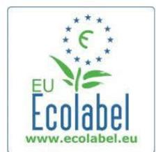

<https://ec.europa.eu/environment/ecolabel/products-groups-and-criteria.html>

The EU Ecolabel covers a wide range of products that we use in our day-today home and work life, products for professionals, as well as tourist accommodation.

The EU Ecolabel sets criteria for these products to minimize their main environmental impacts over their entire life cycle [\(Table 18\)](#page-136-0).

## *Table 18 Classification of the Ecolabels (groups, products and criteria[\)\[1\]](#page-154-0)*

| Group          | Products                         | Criteria                        |
|----------------|----------------------------------|---------------------------------|
|                | Wood-, cork-                     | and bamboo-based floor          |
| Do it yourself | Paint and varnishes              |                                 |
| equipment      | Electronic Displays              | Energy efficient screens and    |
| Gardening      | Growing media and soil improvers | Provide the best conditions for |
| accommodation  | Tourist accommodation            | Find your next eco-friendly     |
| Lubricants     | Lubricants                       | Care for biodiversity and avoid |
| 11 categories  | 24 products                      |                                 |

### **Licences and products per product group**

Out of the 2 270 licences in September 2022, the majority of them belong to the following product groups: **Tourist accommodation services** (22%), **Hard surface cleaning products** (15%) and **Tissue paper and tissue products** (9%) see [Figure 24.](#page-137-0)

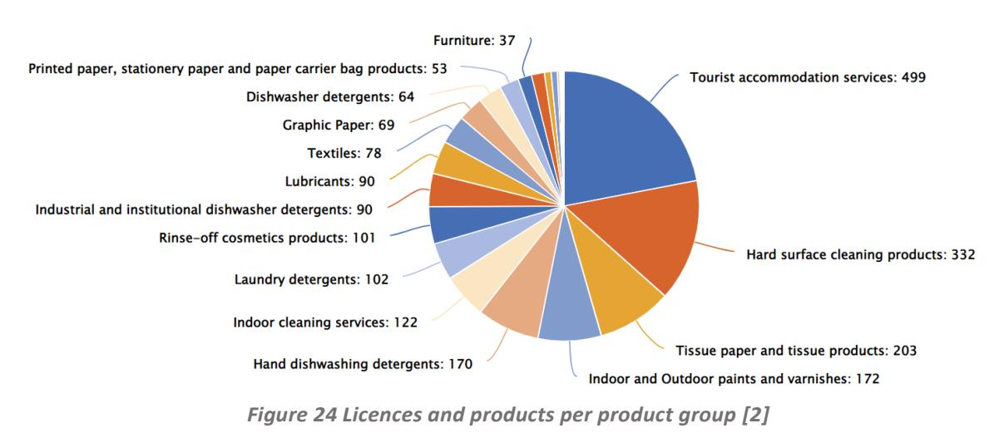

The most popular product groups in terms of number of products are: **Indoor and outdoor paints and varnishes (41%), Tissue paper and tissue products** (17%), **Textiles** (9%) **and Hard surface cleaning products** (7%) see [Figure 25.](#page-137-1)

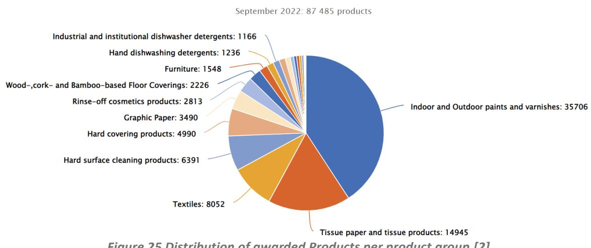

*Figure 25 Distribution of awarded Products per product group [\[2\]](#page-154-1)*

[Table 19](#page-138-0) shows the figures of licences and products per product group available in September 2022 and in a similar way and [Table 20](#page-139-0) summarises the licences and products per product group distribution of awarded products per product group.

#### *Table 19 Licenses and products per product group (September 2022) [\[2\]](#page-154-1)*

| Category                                                       | Products |
|----------------------------------------------------------------|----------|
| Tourist accommodation services                                 | 499      |
| Hard surface cleaning products                                 | 332      |
| Tissue paper and tissue products                               | 203      |
| Indoor and Outdoor paints and varnishes                        | 172      |
| Hand dishwashing detergents                                    | 170      |
| Indoor cleaning services                                       | 122      |
| Laundry detergents                                             | 102      |
| Rinse-off cosmetics products                                   | 101      |
| Industrial and institutional dishwasher detergents             | 90       |
| Lubricants                                                     | 90       |
| Textiles                                                       | 78       |
| Graphic Paper                                                  | 69       |
| Dishwasher detergents                                          | 64       |
| Printed paper, stationery paper and paper carrier bag products | 53       |
| Furniture                                                      | 37       |
| Industrial and Institutional laundry detergents                | 35       |
| Absorbent hygiene products                                     | 18       |
| Growing media, soil improvers and mulch                        | 17       |
| Cosmetic products                                              | 6        |
| Wood, cork and Bamboo-based Floor Coverings                    | 4        |
| Hard covering products                                         | 3        |
| Footwear                                                       | 2        |
| Bed mattresses                                                 | 2        |
| Electronic displays                                            | 1        |
| Animal care products                                           | 0        |

*Table 20 Licences and products per product group Distribution of awarded Products per product group (September 2022: 87 485 products) [\[2\]](#page-154-1)*

| Category                                                       | Licences |
|----------------------------------------------------------------|----------|
| Indoor and Outdoor paints and varnishes                        | 35706    |
| Tissue paper and tissue products                               | 14945    |
| Textiles                                                       | 8052     |
| Hard surface cleaning products                                 | 6391     |
| Hard covering products                                         | 4990     |
| Graphic Paper                                                  | 3490     |
| Rinse-off cosmetics products                                   | 2813     |
| Wood, cork- and Bamboo-based Floor Coverings                   | 2226     |
| Furniture                                                      | 1548     |
| Hand dishwashing detergents                                    | 1236     |
| Industrial and institutional dishwasher detergents             | 1166     |
| Printed paper, stationery paper and paper carrier bag products | 1113     |
| Laundry detergents                                             | 932      |
| Industrial and Institutional laundry detergents                | 634      |
| Tourist accommodation services                                 | 520      |
| Lubricants                                                     | 510      |
| Absorbent hygiene products                                     | 445      |
| Dishwasher detergents                                          | 341      |
| Growing media, soil improvers and mulch                        | 160      |
| Indoor cleaning services                                       | 122      |
| Footwear                                                       | 95       |
| Cosmetic products                                              | 24       |
| Bed mattresses                                                 | 23       |
| Electronic displays                                            | 3        |
| Animal care products                                           | 0        |
| Growing media and soil improvers                               | 0        |
| Total                                                          | 87485    |
| Average                                                        | 3365     |
| Total                                                          | 178335   |

The summary of the criteria for each product group is included in the following web:

# EU Ecolabel: Ecolabel Products - [European Commission \(europa.eu\)](https://ec.europa.eu/ecat/products/en) [\[3\]](#page-154-2)

The EU Ecolabel for Textiles

"The official EU mark for Greener Products"

Choose the Flower for your Textiles

If you want to show your commitment to a better environment.

Once it's on your products, the Flower guarantees:

- A limited use of substances harmful to the environment
- Limited substances harmful to health
- Reduced water and air pollution
- Textile shrink resistance during washing and drying
- Colour resistance to perspiration, washing, wet and dry rubbing and light exposure

It can be awarded to all kind of textile clothing and accessories, interior textiles, and fibres, yarn and fabric.

Meet your customers' demand

Consumers are today more sensitive to the protection of the environment. Four out of five European consumers would like to buy more environmentally friendly products, provided they are properly certified by an independent organisation.

With the Flower on your products you offer them a reliable guide to easily identify the good environmental performers available on the market .

Give your textile a credible sign of Environmental Excellence...

Apply for the EU Ecolabel!  
For a quick test use the check list overleaf.

They said it!

"As Europe's leading manufacturer of image workwear, protective wear and casual apparel fabrics, we see Ecolabel accreditation as an important recognition and logical extension of our continuing and long-term commitment to the environment. Thanks to the EU Ecolabel, we can differentiate our product and propose high value products to our consumers. We find it is also a good way to show our respect for workers."

*Judith Emslie, marketing services manager at Klopman International Srl*

"We have decided to certify our product with the EU Ecolabel because it is the ultimate guarantee that customers are acquiring products which are 100% ecological and have been tested and inspected at all levels by an independent authority within the European Union."

*Christine Araújo, sales manager at Naturapura Iberica*

For more information...

... on the scheme, its feature, the actors involved, the application process...  
[www.ecolabel.eu](http://www.ecolabel.eu)

... on the "textiles" product group: detailed criteria, date of revision...  
[www.ecolabel.eu](http://www.ecolabel.eu)

Choose "Ecolabelled products" on the menu on the left

Figure 26 -Example factsheet for textiles: Textiles\_recto\_CMJN\_nonvecto\_EN.PDF (europa.eu)[3][3]

| Life Cycle Step                         | Criterion                                                                                                              | Expectations                                                                                                                                                                                                                                                                                                                                                                                           | Commission Decision 2009/567/EC of 9 July 2009 |
|-----------------------------------------|------------------------------------------------------------------------------------------------------------------------|--------------------------------------------------------------------------------------------------------------------------------------------------------------------------------------------------------------------------------------------------------------------------------------------------------------------------------------------------------------------------------------------------------|------------------------------------------------|
| Manufacturing (fibres)                  | Type of fibres                                                                                                         | <ul> <li>All types of fibres can be used, with the exception of mineral fibres, glass fibres, metal fibres, carbon fibres and other inorganic fibres.</li> <li>The criteria for a given-fibre type need not be met if that fibre contributes to less than 5% of the total weight of the textile fibres in the product, or if the fibres are of recycled origin.</li> </ul>                             |                                                |
| Manufacturing (fibres)                  | Limitation of toxic residues in fibres                                                                                 | <ul> <li>Acrylic: Acrylonitrile &lt; 1.5mg/kg</li> <li>Cotton: residues of certain pesticides &lt; 0.05ppm</li> <li>Elastane and polyurethane: no organotin compounds</li> <li>Greasy wool and other keratin fibres: limitations of certain pesticides</li> <li>Man-made cellulose: AOX &lt; 250ppm</li> <li>Polyester: Antinomy &lt; 260ppm</li> <li>Polypropylene: no lead based pigments</li> </ul> |                                                |
| Manufacturing (fibres)                  | Reduction of air pollution during fibre process                                                                        | <ul> <li>Acrylic: acrylonitrile &lt; 1g/kg</li> <li>Elastane and polyurethane: aromatic diisocyanates &lt; 5mg/kg</li> <li>Man-made cellulose: S &lt; 120g/kg (filament) and 30g/kg (staple)</li> <li>Polyamide: N2O &lt; 10g/kg polyamide 6 and &lt; 50g/kg polyamide 6.6</li> <li>Polyester: VOCs &lt; 1.2g/kg</li> </ul>                                                                 |                                                |
| Manufacturing (fibres)                  | Reduction of water pollution during fibre process                                                                      | <ul> <li>Flax and other bast fibres: COD/TOC from water retting reduced by at least 75% (hemp) and 95% (flax, other)</li> <li>Viscose: Zn &lt; 0.3g/kg</li> <li>Cupro: Cu &lt; 0.1ppm</li> <li>Greasy wool and other keratin fibres: COD &lt; 60 g/kg, 75% reduction of COD, off-site treatment. If on-site treatment, COD &lt; 5 g/kg, 6 &lt; pH &lt; 9 and T &lt; 40 °C</li> </ul>                   |                                                |
| Manufacturing (processes and chemicals) | Limitation of the use of substances harmful for the environment (in particular aquatic environment) and health process | <ul> <li>90% of carding and spinning oil, lubricants and finishes for primary spin</li></ul>                                                                                                                                                                                                                                                                                                           |                                                |

**Your Competent Body will inform you which assessment and verification documents are required (e.g. declarations of compliance, MSDS of ingredients), which test results must be provided and how the testing should be carried out (external test laboratories).**

**To market your ecolabel products use our free Green Store:** Go to [www.ecolabel.eu](http://www.ecolabel.eu) and click on the 'Green Store' at the top right of the page.

142 º The project receives funding from the European Union's HORIZON EUROPE research and innovation programme under grant agreement n° 101058245. UK participants in Project IRISS are supported by UKRI grant 10038816. CH participants in Project IRISS receive funding from the Swiss State Secretariat for Education, Research, and Innovation (SERI).

*Figure 27 -Example factsheet for textile: List of criterion and expectations [\[3\]](#page-154-2)*

# **14.2 Nordic Swan**

<https://www.nordic-ecolabel.org/> [\[4\]](#page-154-3)

The Nordic Ecolabel or Nordic swan is the official sustainability ecolabel for products from the Nordic countries. It was introduced by the Nordic Council of Ministers in 1989. It is a voluntary license system in which the applicant

agrees to follow criteria set outlined by the Nordic Ecolabelling. These criteria include environmental, quality and health arguments. The criteria levels promote products and services belonging to the most environmentally sound and take into account factors such as free trade and proportionality (cost vs. benefits). Companies using the Nordic Swan label for their products must verify compliance, using samples from independent laboratories, certificates and control visits. The label is usually valid for three years, after which the criteria are revised, and the company must reapply for a license.

The Nordic Swan Ecolabel is a Type 1 Ecolabel according to the standard ISO 14024. Hence, the criteria are product-specific and are based on a life cycle assessment. Type 1 Ecolabels cover the whole life cycle and all relevant environmental aspects and has absolute requirements. All stages from raw materials to production, use, disposal and recycling are included in the assessment when the requirements are established. In this way, Nordic Swan Ecolabel reduces the overall environmental impact.

Development of criteria for new areas is based on preliminary studies that highlight areas of particular focus, meaning areas where the need for requirements is greatest. Revision of existing criteria is based on an evaluation of environmental concerns to decide whether there are possibilities for tightening and implementing new requirements. There is also a study of how the existing criteria have worked for businesses up to now. [Table 21](#page-142-0) list the set of criteria considered in the ecolabel.

#### *Table 21- Set of Criteria considered in the Nordic Ecolabelling [\[4\]](#page-154-3)*

| Alternative dry cleaning                     | Industrial cleaning and degreasing agents          |
|----------------------------------------------|----------------------------------------------------|
| Baby products with textiles                  | Investment funds and investment products           |
| Candles                                      | Laundry detergents and stain removers              |
| Care products for vehicles                   | Laundry detergents for professional use            |
| Chemical building products                   | Liquid and gaseous fuels                           |
| Cleaning agents for use in the food industry | Manufacturing of textiles, hides/skins and leather |
| Cleaning of liquid damaged electronics       | Office and hobby supplies                          |
| Cleaning products                            | Outdoor furniture, playground and park             |
| Cleaning services                            | Packaging for liquid foods                         |
| Coffee service                               | Primary batteries                                  |

| Compost bins                               | Printing companies and printed matter        |
|--------------------------------------------|----------------------------------------------|
| Construction and facade                    | panels, and                                  |
| Copy and printing paper                    | Rechargeable batteries and portable chargers |
| Cosmetic products                          | Remanufactured OEM Toner Cartridges          |
| De-icers                                   | Renovation                                   |
| Dishwasher detergents and rinse aids       | Sanitary Products                            |
| Dishwasher detergents for professional use | Ski wax                                      |
| Disposables for food                       | Solid fuels and firelighting products        |
| Durable/resistant wood for outdoor use     | Stoves                                       |
| Floor coverings                            | Supplies for microfibre based cleaning       |
| Food services and conference               | facilities                                   |
| Furniture and fitments                     | Tissue paper                                 |
| Grease-proof Paper                         | Toys                                         |
| Grocery Stores                             | Transport wash installations                 |
| Hand Dishwashing Detergents                | TV and Projectors                            |
| Hotels and other accommodation             | Windows and exterior doors                   |
| Imaging equipment                          | Industrial cleaning and degreasing agents    |

# **14.3 Blue Angel**

# <https://www.blauer-engel.de/en> [\[5\]](#page-154-4)

The Blue Angel is an environmental label in Germany that has been awarded to particularly environmentally friendly products and services since 1978.[2] The owner of the label is the Federal Ministry for the Environment, Nature Conservation, Building and Nuclear Safety.

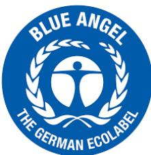

The Blue Angel is not a label that certifies that a product is completely harmless. The products labelled with the Blue Angel are more environmentally friendly and healthier than other products that have the same fitness for use and quality in the respective product group.

Specific requirements are defined for each product group. This means that those criteria that are relevant for the respective product group / service are selected from a broad range of possible criteria. (For example, the criterion "noise" is relevant for municipal vehicles but not for laundry detergents, while the opposite is true when it comes to the biodegradability of the ingredients.) The criteria and methods used to verify compliance with them are continually examined and updated. The aim is to define criteria in such a way that the best products on the market are able to fulfil them and companies within the sector are thus encouraged to further develop their products.

The following aspects are analysed during the development of the criteria:

- Resource-conserving production (water, energy, (recycled) materials)
- Sustainable production of raw materials
- Avoidance of pollutants in products
- Reduced emissions of harmful substances into the soil, air, water and indoor spaces
- Reduction of noise and electromagnetic radiation
- Efficient use and products that use a low level of energy or water
- Durability, repairability and recyclability
- Good fitness for use
- Observance of international standards for occupational safety
- Return systems and services that enable the common use of products such as car sharing

The ecolabel can currently be awarded to around 100 product groups / services across the following sectors [\(Figure 28\)](#page-144-0). The ecolabel is only awarded to non-food products. More than 20,000 products and services from more than 1,600 companies have now been awarded the Blue Angel. (see [Table](#page-145-0)  [22\)](#page-145-0)

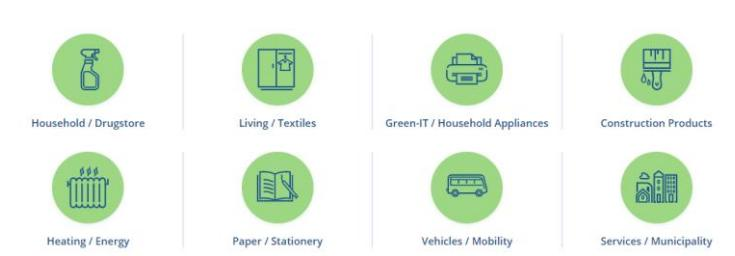

*Figure 28-Product categories considered by the blue Angel [\[5\]](#page-154-4)*

## *Table 22 -List of the products awarded by the blue Angel [\[5\]](#page-154-4)*

| Acrylate-based joint sealants (26)                     | Labels (4)                                       |
|--------------------------------------------------------|--------------------------------------------------|
| Air Conditioner (1)                                    | Laser-/LED Devices (Toner) (938)                 |
| Application: Insulating materials for marine           |                                                  |
| Application: Insulating materials for technical        |                                                  |
| Application: Suspended ceilings as a system (11)       | laminates (138)                                  |
| Application: Thermal insulation materials for          |                                                  |
| Armchair (21)                                          | living room furniture (11)                       |
| abrasives (5)                                          | Masking paper (8)                                |
| adhesive tapes/films (14)                              | Material: Cellulose (2)                          |
| advertising inserts/newspaper supplements (194)        | Material: Expanded clay / glass (2)              |
| advertising inserts/newspaper supplements (38)         | Material: Flax, Hemp (2)                         |
| all-purpose cleaner (12)                               | Material: Foam glass / foam glass (2)            |
| assembly and operating instructions (34)               | Material: Lightweight concrete (1)               |
| assembly and operating instructions (6)                | Material: Mineral wool (33)                      |
| Base foil, recycled plastics (29)                      | Material: PE (1)                                 |
| Binders (such as e.g., loose-leaf binders) (10)        | Material: PES (1)                                |
| Binding Primer for walls (18)                          | Material: Perlite (6)                            |
| baby monitors (1)                                      | Material: Seaweed, Reed or Straw (1)             |
| bags for organic waste (1)                             | Material: Wood wool (6)                          |
| bags used to transport unpacked fresh food (1)         | Mattresses (Edition January 2018) (1)            |
| ballpoint pen (1)                                      | Mechanical frame fasteners (2)                   |
| bathroom furniture (3)                                 | Memo pads (2)                                    |
| bedroom furniture (13)                                 | Monochrome Devices (476)                         |
| books (58)                                             | Multifunction Devices (736)                      |
| books (3)                                              | Municipal vehicle (1)                            |
| brochures (326)                                        | magazines/journals (174)                         |
| brochures (48)                                         | magazines/journals (32)                          |
| Calculator (20)                                        | mailing bag, recycled plastics (27)              |
| Cardboard index dividers (8)                           | mailing bags, unprinted from recycled paper (20) |
| Characteristics: Loose insulation materials (bulk) (7) | mineral foam (1)                                 |
| Clear paint and varnish (22)                           | mobile partition wall (1)                        |

| Climate-friendly Co-Location Data Center (1)        | movement area de-icers for airfields (3)             |
|-----------------------------------------------------|------------------------------------------------------|
| Coloured paint and varnish (33)                     | Nappies (23)                                         |
| Coloured wall paints (emulsion paints) (21)         | Notebooks (6)                                        |
| Coloured wall paints (silicate emulsion paints) (1) | Notepads and college blocks (53)                     |
| Colour Devices (504)                                | napkin (7)                                           |
| Colour mixing system (external mixing at POS) (10)  | newspapers (23)                                      |
| Coloured drawing papers, construction papers (21)   | newspapers (4)                                       |
| Colouring books (1)                                 | OSB-boards (4)                                       |
| Construction machinery (23)                         | Office calendars, recycled paper (6)                 |
| Containers, recycled plastics (20)                  | Office equipment made from recycled plastics (26)    |
| Cordless phones (7)                                 | Other construction paper and paperboard (1)          |
| Corrugated paper (2)                                | Other traps (8)                                      |
| car sharing (13)                                    | office furniture (41)                                |
| cardboard for crafts and paper (8)                  | office paper (copy paper and multipurpose paper)     |
| cardboard for processing: other (2)                 | open carrier boxes for customers in the retail trade |
| carrier bag, recycled plastics (63)                 | Paints and varnishes, water-thinnable (72)           |
| carrier bags for customers in the retail trade (4)  | Paper indices (15)                                   |
| carrier bags, textile (2)                           | Pest control (83)                                    |
| catalogues/annual reports (14)                      | Plaster, solvent-free, paste-like (15)               |
| catalogues/annual reports (132)                     | Presentation cards (6)                               |
| chain lubricants for motor saws (26)                | Primer (14)                                          |
| children´s-/ youth furniture (18)                   | Printer (250)                                        |
| chipboards (2)                                      | Products for outdoor use, recycled plastics (11)     |
| cleaning rags (1)                                   | panels (11)                                          |
| clothing (5)                                        | paper towels (113)                                   |
| coated chipboards (10)                              | parquets (66)                                        |
| colour-safe detergent (4)                           | pipe cleaners (16)                                   |
| composter, recycled plastics (2)                    | plant containers and other moulded parts (17)        |
| concrete goods (4)                                  | playground equipment for outdoor use, recycled       |
| continuous paper (8)                                | plywood (1)                                          |
| cosmetic tissues (28)                               | postcards, unprinted (1)                             |
| cover foil, recycled plastics (19)                  | posters/billboards (74)                              |
| DECT phone (7)                                      | posters/billboards (11)                              |
| Data Center Operation (3)                           | primers/coats (31)                                   |
| Data Shredders (25)                                 | print house (14)                                     |
| Desk pads (3)                                       | print house (58)                                     |
| Desktop Devices (545)                               | printed book covers (8)                              |
| Digital cordless phone (7)                          | printed envelopes and padded envelopes (16)          |

| Dividers and dividing strips (19)             | printed envelopes and padded envelopes (2)           |
|-----------------------------------------------|------------------------------------------------------|
| Drawing and painting pads (9)                 | printed matters (579)                                |
| Dry mortar for masonry (25)                   | printed matters (56)                                 |
| decorative calenders (49)                     | printed postcards (25)                               |
| decorative calenders (2)                      | printed postcards (3)                                |
| digital printing paper (37)                   | printing paper/publication paper (100% recycling)    |
| dishwasher detergents, multifunctional (4)    | printing paper/publication paper (mainly recycling)  |
| dispersion adhesives (79)                     | Radiator paint and varnish (12)                      |
| doors (6)                                     | Replacement Catalytic Converters (8)                 |
| duvets and pillows (6)                        | Reusable transport packaging approved for            |
| Electric bus (1)                              | Ring binder filler paper (4)                         |
| Exercise book cover, unprinted (1)            | Road sweeper (2)                                     |
| Exercise books (17)                           | Rodent traps (4)                                     |
| Exterior paint and varnish (5)                | Room Air Conditioner (1)                             |
| envelopes, unprinted from recycled paper (28) | reusable container systems (4)                       |
| Feminine hygiene products (5)                 | reusable cup systems (6)                             |
| File Folders (3)                              | rubbish dustbin, garbage can, recycled plastics (11) |
| File covers (1)                               | SC-paper (6)                                         |
| Flip chart pads (17)                          | Sanitary installation, recycled plastics (2)         |
| Floor Coverings (112)                         | Shoes (24)                                           |
| Floor-mounted Devices (464)                   | Silane modified polymer-based joint sealants (2)     |
| Flooring Underlays (76)                       | Stoves (5)                                           |
| Form books (1)                                | sanitary additives (4)                               |
| Full-tone and tinting paints (4)              | sanitary cleaner (24)                                |
| Furniture paint and varnish (5)               | saunas (5)                                           |
| fabric towel rolls (3)                        | scarifier (2)                                        |
| fibre pen (1)                                 | self-stick notes (22)                                |
| fineliner (3)                                 | server and data storage products (2)                 |
| fixing materials (6)                          | skirting boards (2)                                  |
| floor coverings (74)                          | skirting boards, flexible (9)                        |

| floor-covering adhesive (118)                    | solid wood panels (1)                             |
|--------------------------------------------------|---------------------------------------------------|
| floor-coverings, flexible (69)                   | surfacers, calcium sulfate-based (16)             |
| floor-coverings, flexible (67)                   | surfacers, cement-based (54)                      |
| flushing boxes (4)                               | Telephone (7)                                     |
| flyers (112)                                     | Testliner brown (1)                               |
| flyers (23)                                      | Textbooks and puzzle books (1)                    |
| forming oils (2)                                 | Textile Floor Coverings (135)                     |
| fountain pen (1)                                 | Thin-build glaze (8)                              |
| furniture for outdoor use, recycled plastics (3) | Three-Piece Suite (22)                            |
| Glaze (22)                                       | Titrators (1)                                     |
| Grocery Stores in the Food Retail Sector (1)     | Toys (3)                                          |
| Ground sealing product (16)                      | take back schemes for mobile phones (2)           |
| grouts, mineral (1)                              | textile precursors (1)                            |
| HWC-paper (15)                                   | toilet paper (216)                                |
| Household Energy Meters (2)                      | total loss lubricants (3)                         |
| Household equipment, recycled plastics (17)      | Unbleached Paper Filters (33)                     |
| hand dishwashing detergent (15)                  | Undercoat (2)                                     |
| handkerchief, paper (25)                         | Upholstered office swivel chairs (68)             |
| heavy-duty laundry detergent (7)                 | Upholstered stacking chairs (27)                  |
| high pressure laminates (HPL) (6)                | Upholstery Furniture, other (32)                  |
| highlighter (2)                                  | Voice over IP (1)                                 |
| home textiles (7)                                | Wet strength paper (1)                            |
| hydraulic fluids (1)                             | White / other recycled packaging paper (3)        |
| IP-Phones (7)                                    | White paint and varnish (27)                      |
| Index cards, recycling paper (8)                 | White wall paints (emulsion paints) (143)         |
| Indoor pest control (2)                          | White wall paints (silicate emulsion paints) (11) |
| InkJet Devices (Ink, Gel or Wax) (42)            | Window and door paint and varnish (11)            |
| Insect fabrics (117)                             | Wireless phones (7)                               |
| Internal Plasters (32)                           | Wood oil (12)                                     |
| incontinence products (3)                        | Wrapping paper (20)                               |
| ink pen (2)                                      | wallpapers and woodchip wall coverings (92)       |
| Kraft paper (7)                                  | waste sack, recycled plastics (105)               |
| keyboards (11)                                   | waste-glass containers (19)                       |
| kitchen cleaner (2)                              | window cleaner (4)                                |
| kitchen furniture (3)                            | wood conservative agents (2)                      |
| kitchenroll (50)                                 | woodchip wallpapers (92)                          |

# **TCO certified**

<https://tcocertified.com/> [\[6\]](#page-154-5)

TCO Certified is the world-leading sustainability certification for **IT products.** It includes a comprehensive system of up-to-date criteria, independent verification and a structured system for continuous improvement to drive real and lasting change.

Criteria are comprehensive and cover both **environmental and social responsibility** in the supply chain and throughout the IT product life cycle.

Criteria areas include hazardous substances, circularity, socially responsible manufacturing, environmentally responsible manufacturing, and much more.

TCO Certified is classified as a Type 1 Ecolabel and our processes and verification meet [the](https://tcocertified.com/iso-14024/)  [requirements in ISO 14024.](https://tcocertified.com/iso-14024/) TCO Development is impartial during the verification process.

# **[Complete criteria included in TCO Certified -](https://tcocertified.com/criteria-documents/) TCO Certified**

Here you will find complete criteria documents for all 12 product categories in TCO Certified. Each criteria document includes eight criteria areas. Most criteria are the same for all product categories, with the addition of product-specific criteria where relevant.

- Displays
- Notebooks
- Tablets
- Smartphones
- Desktops
- All-in-One PCs
- Projectors
- Headsets
- Imaging equipment
- Network equipment
- Data storage
- Servers

# **14.4 NaturePlus Ecolabel**

[www.natureplus.org](http://www.natureplus.org/) [\[7\]](#page-154-6)

The natureplus eco-label is an independent environmental label for building products which is fully compliant to ISO 14024. It demonstrates compliance with high standards of quality for all areas relevant to sustainability. The assessments to verify conformity with these requirements are conducted in line with international standards by accredited laboratories and assessors.

The natureplus eco-label that is based on strict scientific criteria in the following key areas:

-Sustainability of resources: Only building products made from renewable resources or mineral raw materials that are available in abundance or secondary raw materials are permissible for a natureplus certification. The use of fossil raw materials must be avoided whenever possible. The raw materials must stem from sustainable sources.

- Clean and efficient production: On-site inspections of the manufacturing facilities are conducted to verify that the manufacture of the building products is energy efficient, that the least possible burden is placed on the global climate and the environment and that social responsibility standards are met. The products must be functional and recyclable.

- Protection of the environment and people's health: Building products with the natureplus label do not adversely affect the environment or human health through harmful substances and ensure healthy indoor living spaces. Regular laboratory testing, conducted in line with recognized international standards and strict threshold values, are proof of this.

The label currently covers 13 product families [\(Table 23\)](#page-150-0):

*Table 23 Product families covered by natureplus [\[7\]](#page-154-6)*

# **14.5 OEKO-TEX**

#### <https://www.oeko-tex.com/en/> [\[8\]](#page-154-7)

Oeko-Tex is a registered trademark, representing the product labels and company certifications issued and other services provided by the International Association for Research and Testing in the Field of Textile and Leather Ecology. The Oeko-Tex Association issues the product-related labels Standard 100 by Oeko-Tex (formerly Oeko-Tex Standard 100), Made in Green by Oeko-Tex (formerly Oeko-Tex Standard 100plus) and Leather Standard by Oeko-Tex, the label Eco Passport by Oeko-Tex for chemicals to be used in textile production, and the STeP by Oeko-Tex label (formerly Oeko-Tex Standard 1000) and the Detox to Zero status report for production facilities. Oeko-Tex labels and certificates confirm the human-ecological safety of textile products and leather articles from all stages of production (raw materials and fibres, yarns, fabrics, ready-touse end products) along the textile value chain. Some also attest to socially and environmentally sound conditions in production facilities.

## **Standard 100 by Oeko-Tex**

The Standard 100 by Oeko-Tex product label, introduced (as Oeko-Tex Standard 100) in 1992, certifies adherence to the specifications of the standard by the same name, a document of testing methods and limit values for potentially harmful chemicals. This independent testing and certification system may be applied to textile materials, intermediate products at all stages of production and ready-made textile articles. Examples of eligible items for certification are raw and dyed finished yarns, raw and dyed finished fabrics and knits, and consumer goods (all types of clothing, home and household textiles, bed linen, terry cloth items, textile toys and more).

#### **Leather Standard by Oeko-Tex**

The Leather Standard by Oeko-Tex (introduced 2017) is a system of testing methods, test criteria and limit values for harmful substances used by the Oeko-Tex member institutes to globally certify the human-ecological safety of leather products: semi-finished leather materials ("Wet blue" chrome-tanned hides, "Wet white" - vegetable tanned hides), leather, bonded leather, and readymade leather articles. When certifying leather products that contain non-leather (e.g., textile or metallic) components, the requirements of the Leather Standard are combined with those of the Standard 100. Certification according to the Leather Standard is valid for one year.

# **Made in Green by Oeko-Tex**

Made in Green by Oeko-Tex is a label for textile products that are sustainably produced and have been tested for harmful substances according to the Oeko-Tex criteria. Specifically, the textile product must have undergone successful testing for compliance with the requirements of the Standard 100 by Oeko-Tex, and the product as well as the majority of its components and predecessors are produced by companies that have been audited and STeP certified by Oeko-Tex. The Made in Green label has replaced the former Oeko-Tex Standard 100plus label in 2015.

## **Eco Passport by Oeko-Tex**

Eco Passport by Oeko-Tex is a certification system for textile chemicals (e.g., colourants, optical brighteners, antistatic agents, adhesives, cleaning agents). It was introduced in 2016. Chemicals awarded the Eco Passport label meet the requirements for sustainable textile production.

# **14.6 Bluesign**

# <https://www.bluesign.com/en> [\[9\]](#page-154-8)

Bluesign is a sustainability standard for the production of textiles, which takes particular account of aspects of chemical safety and at the same time a textile seal. The holder of the standard is bluesign technologies AG, a stock corporation based in Switzerland. It was founded by chemical and textile experts in 2000.

Products that are processed at least 90% in bluesign-certified

factories may bear the "bluesign product" seal. The "bluesign approved" seal is awarded to chemicals and components used if they meet bluesign's requirements. The development and compliance with the standards is monitored and supervised by an advisory board consisting of scientists and sustainability experts.

Clothing that has been manufactured to the standard may be provided with a sewn-in seal or otherwise indicate the application of the bluesign standard. The assessment covers the entire manufacturing process of textile products and also establishes criteria with regard to the chemicals used.

The standard is mainly used in Europe, North America, and Asia. Brands that at least partially use or have used the standard include adidas, asics, Brooks, Deuter, Edelrid, Gore, Jack Wolfskin, Mammut, Marmot, Nike, Patagonia and Vaude.

# **14.7 Cradle to Cradle Certified®**

## <https://c2ccertified.org/the-standard> [\[10\]](#page-154-9)

The vision of C2CPII is a world where safe materials and products are designed and manufactured in a prosperous, circular economy to maximize health and well-being for people and planet. C2CPII's mission is to lead, inspire, and enable all stakeholders across the global economy to create and use innovative products and materials that positively impact people and planet.

The standard requirements are based on the Cradle to Cradle® design principles outlined in William McDonough and Michael Braungart's 2002 book, Cradle to Cradle: Remaking the Way We Make Things,and provide guidance in five key categories. These requirement categories and their intended outcomes are listed below.

-Material Health – Chemicals and materials used in the product are selected to prioritize the protection of human health and the environment, generating a positive impact on the quality of materials available for future use and cycling.

-Product Circularity – Products are intentionally designed for their next use and are actively cycled in their intended cycling pathway(s).

-Clean Air & Climate Protection – Product manufacturing results in a positive impact on air quality, the renewable energy supply, and the balance of climate changing greenhouse gases.

-Water & Soil Stewardship – Water and soil are treated as precious and shared resources. Watersheds and soil ecosystems are protected, and clean water and healthy soils are available to people and all other organisms.

-Social Fairness – Companies are committed to upholding human rights and applying fair and equitable business practices.

The requirement categories are transversal for any of the 1009 certified references. They can be categorized as the following product families:

- Built Environment and Furnishings
- Textiles Apparel and Footwear
- Packaging
- Cleaning Products
- Print & Paper
- Beauty and Personal Care
- Chemicals and Basic Materials
- Consumer Products
- Personal Care
- Others

# **14.8 Construction Products Regulation (Regulation (EU) No 305/2011)**

# **14.8.1 About CPD/CPR**

The Construction Products Regulation (CPR) applies in full since mid-2013 and aims to ensure the free movement of construction products, such as products such as thermal insulation foams, chimneys and wood-based panels produced for permanent incorporation in construction works, in the EU by laying down harmonised conditions for their marketing

In 2022, the Commission put forward a proposal to revise the CPR and is in line with other activities linked to the Green Deal and CEAP aiming to making sustainable products the norm in the EU and boosting circular business models. The revised CPR aims to modernise the existing rules.

- Ensure a smooth functioning of the Single Market and free movement of construction products.
- Address the sustainability performances of construction products.
- Enable the construction ecosystem's contribution to meeting climate and sustainability goals and embrace the digital transformation, because its competitiveness depends on this.
- Ensure that harmonised standards contribute to the competitiveness of the ecosystem and reduce market barriers.

# **14.8.2Inclusion of circular economy**

The last action plan on this topic address construction with the following actions:

- Address the sustainability of construction products through the Construction Product Regulation revision, potentially including introduction of recycled content requirements
- Promote the durability and adaptability of buildings and develop digital building logbooks.
- Use Level(s) to integrate life cycle assessment in public procurement and the Sustainable finance taxonomy and exploring the appropriateness of setting of carbon reduction targets and the potential of carbon storage.
- Consider a revision of material recovery targets for construction and demolition waste.
- Increase the use of excavated soils.
- Launch the Renovation Wave to significantly improve energy efficiency.
- When it comes to construction, the EC indicated that they address high impact intermediary products such as steel, cement, and chemicals. Other product groups will be identified based on their environmental impact and circularity potential.

# **14.9 References**

[1] <https://ec.europa.eu/environment/ecolabel/products-groups-and-criteria.html> [2] [https://environment.ec.europa.eu/topics/circular-economy/eu-ecolabel](https://environment.ec.europa.eu/topics/circular-economy/eu-ecolabel-home/business/ecolabel-facts-and-figures_en)[home/business/ecolabel-facts-and-figures\\_en](https://environment.ec.europa.eu/topics/circular-economy/eu-ecolabel-home/business/ecolabel-facts-and-figures_en) [3] <https://ec.europa.eu/ecat/products/en> [4] [https://www.nordic-ecolabel.org](https://www.nordic-ecolabel.org/) [5] https://www.blauer-engel.de/en [6] <https://tcocertified.com/> [7] [www.natureplus.org](http://www.natureplus.org/) [8] <https://www.oeko-tex.com/en/> [9] https://www.bluesign.com/en [10] https://c2ccertified.org/the-standard