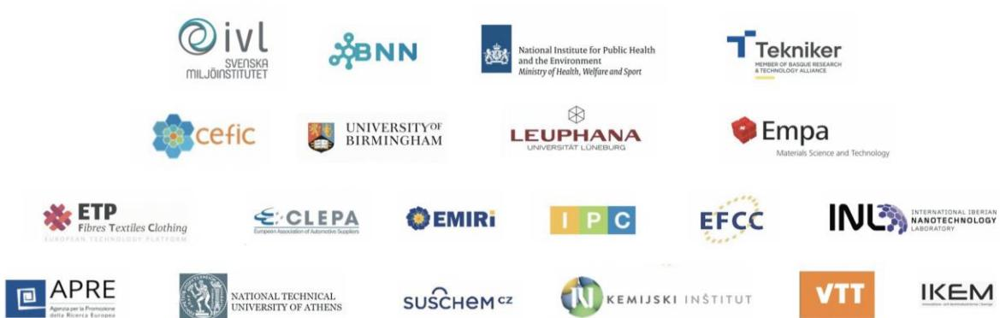
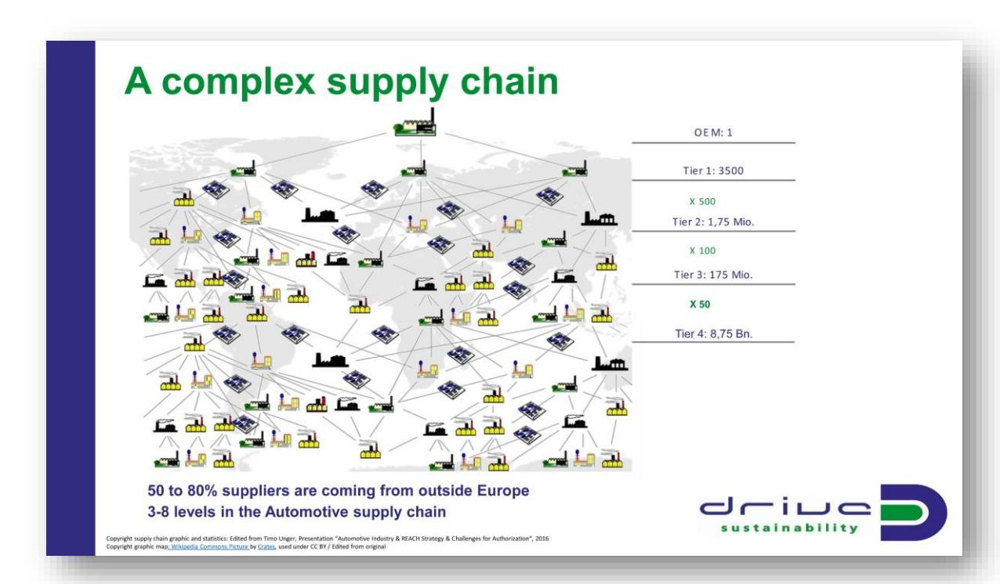
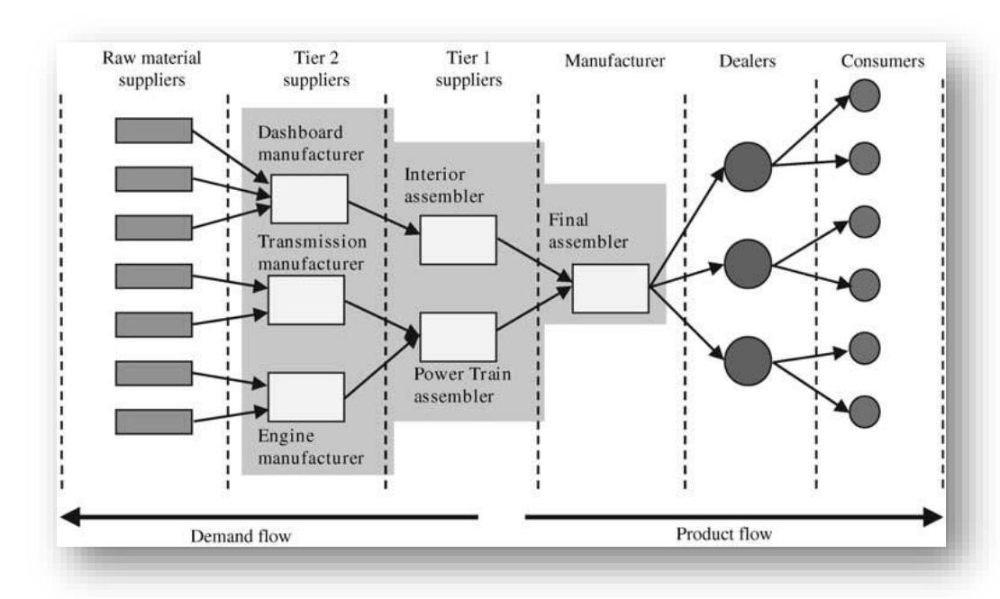
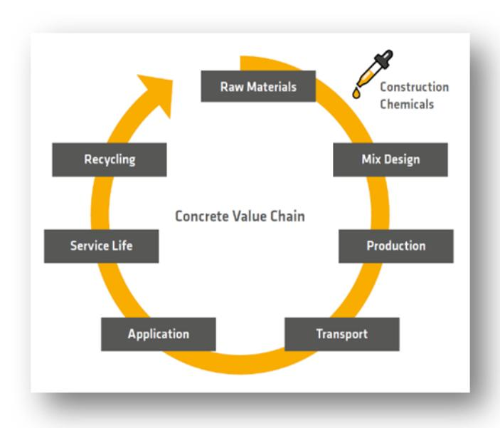
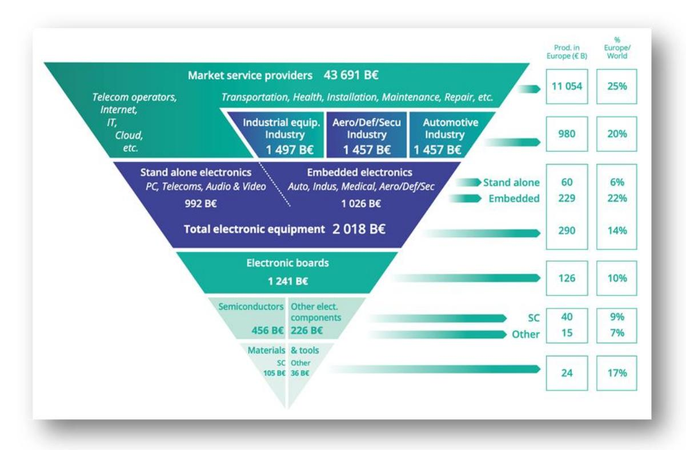
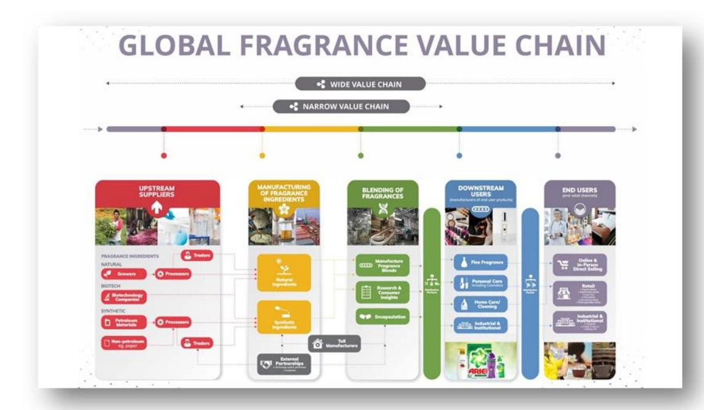
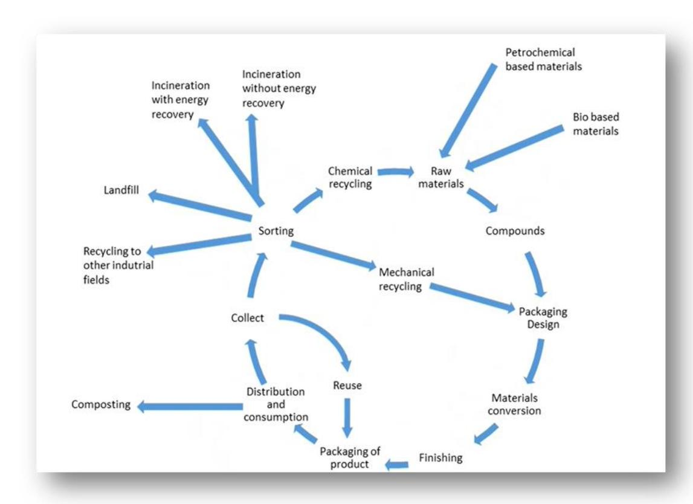
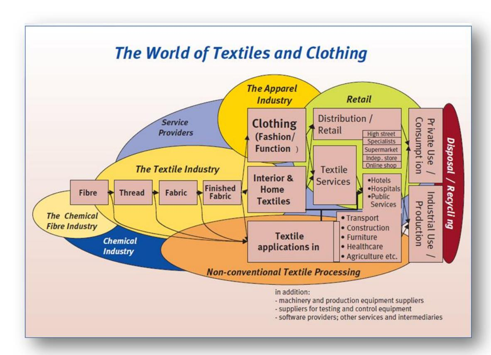

# **The international ecosystem for accelerating the transition to Safe-and-Sustainable-by-design materials, products and processes.**

Skills, knowledge and education needs and gaps and mismatches for the uptake of SSbD

*Lutz Walter, Kamilla Drubina*

The project receives funding from the European Union's HORIZON EUROPE research and innovation programme under grant agreement n° 101058245. UK participants in Project IRISS are supported by UKRI grant 10038816. CH participants in Project IRISS receive funding from the Swiss State Secretariat for Education, Research, and Innovation (SERI).

| Project acronym          | IRISS                                                                                     |
|--------------------------|-------------------------------------------------------------------------------------------|
| Work Package             | WP4                                                                                       |
| Deliverable n° and title | D4.4 Skills, knowledge and education needs and gaps and mismatches for the uptake of SSbD |
| Deliverable Leader       | Textile ETP                                                                               |
| Type                     | R – Report                                                                                |
| Dissemination Level      | Public                                                                                    |
| Submission Date          | 01/03/2024                                                                                |
| Author(s)                | Lutz Walter, Kamilla Drubina                                                              |

### Our partners:

The project receives funding from the European Union’s HORIZON EUROPE research and innovation programme under grant agreement n° 101058245. UK participants in Project IRISS are supported by UKRI grant 10038816. CH participants in Project IRISS receive funding from the Swiss State Secretariat for Education, Research, and Innovation (SERI).

## **Revision History**

### **Disclaimer**

Funded by the European Union. Views and opinions expressed are however those of the author(s) only and do not necessarily reflect those of the European Union or the European Health and Digital Executive Agency (HADEA). Neither the European Union nor the granting authority can be held responsible for them.

| Version | Modifications                 | Date       | Author(s)                      |
|---------|-------------------------------|------------|--------------------------------|
| 0.1     | Initial draft                 | 17/03/2023 | Lutz Walter & Kamilla Drubina, |
| 0.2     | Revision                      | 28/03/2023 | Eva Valsami-Jones, UoB         |
| 0.3     | Final draft                   | 30/03/2023 | Lutz Walter & Kamilla Drubina, |
| 1.0     | Final version submitted to EC | 31/03/2023 | Carolina Landerdahl, IVL       |
| 1.1     | Revised version in response   |            |                                |
|         |                               | 26/01/2024 | Lutz Walter, Textile ETP       |
| 2.0     | Updated version submitted     |            |                                |
|         |                               | 01/03/2024 | Sofia Mc Conell, IVL           |

### **Table of Content**

| 1.   | Executive summary.................................................................................................................     | 4  |
|------|----------------------------------------------------------------------------------------------------------------------------------------|----|
| 2.   | Introduction                                                                                                                           | 5  |
| 3.   | Methodology                                                                                                                            | 6  |
| 4.   | General findings and conclusions...........................................................................................            | 6  |
| 5.   | Findings per value chain                                                                                                               | 8  |
| 5.1. | Automotive sector..................................................................................................................    | 8  |
| 5.2. | Construction chemicals sector                                                                                                          | 11 |
| 5.3. | Electronics sector..................................................................................................................   | 14 |
| 5.4. | Energy materials sector........................................................................................................        | 18 |
| 5.5. | Fragrance sector                                                                                                                       | 21 |
| 5.6. | Packaging sector...................................................................................................................    | 24 |
| 5.7. | Textiles sector....................................................................................................................... | 27 |
| 6.   | Next steps                                                                                                                             | 31 |

### **List of figures**

| Figure 1 Supply chain complexity in the automotive sector.................................................................                   | 8  |
|----------------------------------------------------------------------------------------------------------------------------------------------|----|
| Figure 2 The automotive sector’s supply chain and Tiers                                                                                      | 9  |
| Figure 3 Construction chemicals’ supply chain                                                                                                | 12 |
| Figure 4 The supply chain of the electronics sector............................................................................              | 14 |
| Figure 5 Energy materials’ supply chain                                                                                                      | 18 |
| Figure 6 Fragrances supply chain.........................................................................................................    | 21 |
| Figure 7 (Plastic) packaging supply chain                                                                                                    | 24 |
| Figure 8 Textiles supply chain.............................................................................................................. | 28 |

### **1. Executive summary**

Based on interviews conducted with representatives of seven value chains, this Deliverable provides a first impression on the status quo of the relevance, as well as the knowledge and training gaps of the SSbD concept.

We identified a clear distinction between safety and sustainability, in terms of how well established these concepts are in the value chains and how much knowledge and clarity professionals have about them.

Safety clearly is well established and an integral part of the processes in these industries. The focus of safety, however, largely varies between value chains and production stages (worker safety, user safety, environmental safety, etc.)

Sustainability, on the other hand, is a more recent concept, which is much less established or integrated. The lack of regulation creates confusion and a difficulty in establishing general knowledge on the topic. For the time being, market demand remains the major driver of sustainability efforts in most of the interviewed sectors.

Functions within companies which would need (thorough) SSbD knowledge vary depending on the sector and can be found in different departments based on the organisational structure and the size of companies in the value chain.

Existing training practices on safety and / or sustainability have been difficult to identify at this stage as they differ not only from value chain to value chain, but also from company to company within value chains. As a general rule, larger companies and those where strict safety rules have been in application for a long time, have well-established internal and sometimes externally supported training practices for safety procedures and practices. Smaller companies rely more heavily on information and training provided by suppliers of chemicals, materials and processing technologies or specialised external training providers. For sustainability, skills acquisition is even less formalised both in terms of subjects and delivery and in addition to regulation also heavily depends on individual company strategies or market-driven demand for sustainable products and services.

The skill and training needs will be investigated further in the follow-up survey with individual companies in preparation of deliverable D4.10.

### **2. Introduction**

Linked to Task 4.4: *Uptake of the SSbD approach by the value chains*, this Deliverable aims to map the SSbD training and knowledge gaps and needs in the value chains. The outcome of this Deliverable will be integrated with Tasks 1.5 and 2.5 to identify the value chain specific skill gaps, mismatches and the potential interactions needed within and across value chains to overcome those.

This Deliverable provides a first impression on the status quo of the relevance of SSbD and identifies knowledge gaps and training needs based on interviews conducted with representatives of seven value chains.

The interviewed value chains were as follows:

- Automotive (represented by [CLEPA\)](https://clepa.eu/)
- Construction chemicals (represented by [EFCC\)](https://www.efcc.eu/)
- Electronics (represented by [INL\)](https://inl.int/)
- Energy materials (represented by [EMIRI\)](http://emiri.eu/)
- Fragrances (represented by [IFRA\)](https://eur01.safelinks.protection.outlook.com/?url=http%3A%2F%2Fwww.ifrafragrance.org%2F&data=05%7C01%7Ccelyahmadi%40ifrafragrance.org%7Cbbabb9223f9d4736124e08da933cb402%7Ca12c13c7d53e449790c7e21d20828597%7C0%7C0%7C637984186202836606%7CUnknown%7CTWFpbGZsb3d8eyJWIjoiMC4wLjAwMDAiLCJQIjoiV2luMzIiLCJBTiI6Ik1haWwiLCJXVCI6Mn0%3D%7C3000%7C%7C%7C&sdata=8Izsr898PXVAPUn1RteT5FJBT4nh8GWMHvQLtskSqWw%3D&reserved=0)
- Packaging (represented by [IPC\)](https://ct-ipc.com/)
- Textiles (represented by [EURATEX\)](https://euratex.eu/)

For a better understanding, we also looked at the value chain of each of these sectors, to identify the stages where the SSbD concept would be relevant.

**Value chains** across the sectors show some common or similar elements, while some differences can also be pinpointed, such as the very linear value chain of the fragrance sector (where little is left to be recycled at the end, therefore biodegradability is of utmost importance), or the value chain of the packaging sector which integrates circular elements (reuse, recycling, etc.) already.

Key stakeholders / steps in the value chain **where the SSbD concept is most relevant** also varied among value chains, however the *innovation process*, the *material design step,* as well as *production / manufacturing* have all been mentioned multiple times.

We also tried to understand the different levels of evolution, when separating the two aspects of SSbD, and looking at safety and sustainability one by one.

We further tried to understand which functions/departments/roles within typical companies at the various stages of the 7 value chains are likely the most involved in SSbD-related processes and therefore are most in need of SSbD-related expertise, tools, and training provision.

Finally, we inquired how training for SSbD-specific skills would be organised and what type of internal and external competence/training providers are involved or would be needed, if not readily available.

### **3. Methodology**

Task 4.4 is completed in two stages, resulting in the current Deliverable 4.4 in month 10, and an updated, second Deliverable (D4.10) in month 20.

In the first (current) stage, interviews have been conducted with the respective value chain representatives in the IRISS consortium (as mentioned above), while the second stage will involve a number of companies from each value chain for a more profound understanding and experiencebased information regarding the training gaps & needs, which will result in D4.10.

To complete D4.4, the following steps have been taken:

- Design of a questionnaire to prepare for structured interviews across all value chains
- A first, test interview conducted with CEFIC for further insights regarding key points to address and general feedback on the questionnaire
- Seven individual online interviews conducted with representatives of the 7 value chain (duration: 1 hour each)

### **4. General findings and conclusions**

As a general conclusion, **safety** as a concept has been around for far longer than sustainability in all analysed sectors, therefore it is much better established, embedded in regular procedures and is clearly and well regulated.

Differences, however, can be noticed regarding the focus of safety in the supply chains, which often prioritizes human safety, but in different aspects (e.g., workers, end users, etc.), in other instances, environmental safety (e.g., raw material sourcing, byproducts polluting natural waters, end-of-life treatment) or sometimes even the safety of the product itself, from pollution generated by human presence (in the electronics sector).

**Sustainability**, as a much less mature concept is less regulated and therefore more ambiguously present in the various sectors – at this time, often more present on a strategic level than in operations.

Several value chains, however, mentioned a high demand from the customers' side to ensure more transparency regarding sustainability measures, providing clear sustainability-data, using green energy, etc, which certainly accelerates investment towards more sustainable practices.

We tried to identify **key roles and functions** within companies, which would **need (deep) SSbD knowledge**. Once again, several, sector-specific roles were mentioned, however some functions stood out, as these were mentioned in several interviews:

- Design professionals

- Product stewardship
- Quality managers
- Sustainability experts
- Technical sales professionals
- Research & Development experts
- Procurement
- Material engineers

Existing **training practices on safety or sustainability** proved to be difficult to identify and should be addressed again, in the second step of this process, where industry actors will be interviewed.

As a general conclusion, however, we can mention that larger companies usually find the resources and also have preference to provide trainings in-house, while smaller organizations would rely on external experts / consultants to acquire specific knowledge on SSbD.

### **5. Findings per value chain**

### **5.1. Automotive sector**

#### **Supply chain in the automotive sector**

The automotive industry's complex supply chain (see Figure 1) is composed of different tiers of suppliers, namely:

- **Tier 1** Building and supplying finished components, ready for vehicle assembly
- **Tier 2** Supplying parts and components, e.g., electronics and semiconductors, not only for the automotive industry
- **Tier 3** Suppliers of raw or unfinished materials, e.g., minerals, metals, and plastics

These tiers ultimately supply to **OEMs** (original equipment manufacturers), i.e., carmakers.

See Figure 2 for the procedural depiction of the value chain, and its relation to product flow and demand flow.

*Figure 1 Supply chain complexity in the automotive sector*

*Figure 2 The automotive sector's supply chain and Tiers*

#### **SSbD relevance in the automotive supply chain**

The SSbD concept can touch two aspects of the automotive industry: the chemical substances and materials used throughout the supply chain.

#### Chemical substances

Tier 1,2,3 suppliers have little visibility on the type of chemical substances used during the manufacturing of parts and components. Certain requirements, however, did escalate down the supply chain from the OEMs, concerning thermomechanical performance, safety, aesthetics, and durability of chemical substances.

#### Materials

The choice of materials to be used in manufacturing is decided across the tiers, strongly depending on the type of automotive product in question. Certain specifications must also be followed, in addition to customer requirements related to performance, durability and aesthetics, and these include legal requirements.

#### **The approach on safety and sustainability in the sector**

**Safety** is a well understood and well-established concept in the sector, with a clear definition and requirements – it is, however, better understood by the engineers on the operational safety side and less on safety related to chemicals, which is not a key competence of eco-design experts but rather of chemists producing the materials. The presence of chemicals associated with hazardous properties as established in applicable regulation is however tracked and reported as a precondition of selling parts to OEMs.

**Sustainability**, on the other hand, is a fairly broad and evolving concept in the automotive industry. For decades the focus was on improving the powertrain and reducing tailpipe emissions. The recent rush towards electrification is promising in terms of reducing tailpipe emissions but brings a whole new set of sustainability and ethics hurdles, notably on the materials and energy side. OEMs and Tier 1s are dynamically developing capacities and building dedicated teams to work on several aspects of sustainability, such as circularity, LCA or sustainable material choices.

Circularity is historically an important requirement for the automotive industry, in which domain sector-specific legislation has been in place for several years. The *End of Life Vehicle Directive* has requirements on circularity: at least 80% of a vehicle's weight has to be repaired or recycled, which is easily achieved, considering the metal parts of a car can be easily recycled. It does not mean, however, that the possible maximum has been reached – the *Directive* is currently under revision, and it is expected to include additional circularity criteria in the future (e.g. mandatory proportion of recycled plastic content). Furthermore, efforts towards circularity are often perceived as tools to achieve carbon neutrality for companies, which by itself is an important incentive for a more circular automotive industry.

#### **Functions within automotive companies in need of thorough SSbD knowledge**

- Eco-design engineers
- Other engineering roles working on materials
- R&D functions
- Technical sales
- Sustainability professionals

Additionally, the growing importance of the Automotive Aftermarket business in Europe creates other roles and functions, which need up-to-date information on the SSbD concept. These roles focus especially on product lifetime maximization and can vary between quality functions and professionals estimating the state of materials.

#### **Training gaps & needs**

The current disruption regarding automotive electrification has created a skill gap in the industry, with no available training to bridge this gap at the moment.

We are equally unaware of any existing automotive sector-specific SSbD trainings, while the need for such programs is potentially increasing to support the above listed functions.

Other trainings are provided by the [Automotive Skills Alliance](https://automotive-skills-alliance.eu/) (ASA), a Europe and stakeholder-wide partnership for collaboration on the skills agenda in the automotive-mobility ecosystem. ASA's activities are focused on the re-skilling and up-skilling of workers in the sector, as well as supporting the elaboration of specific plans for re-skilling, up-skilling, and training of workers in the European automotive sector.

### **5.2. Construction chemicals sector**

#### **Supply chain in the construction chemicals sector**

Construction chemicals are used to make construction materials (such as concrete) for buildings, bridges, and other structures, to increase productivity and performance, boost functionality and to safeguard the construction materials used in buildings or constructions.

They are essentially used to speed up and facilitate the construction process and enhance the sustainability and durability of buildings and structures. Thus, they facilitate climate change mitigation, reduction of water use, recyclability, circularity as well as the (re)use of construction waste and demolition materials. The largest application of construction chemicals is as enhancer to concrete.

The construction chemicals' supply chain (focusing on concrete) is visualized on Figure 3:

*Figure 3 Construction chemicals' supply chain*

#### **SSbD relevance in the construction chemicals supply chain**

The main value chain that starts with construction chemicals is the one involving concrete, which is by far the most used material in construction. Concrete is a composite made of several materials, including cement and concrete admixtures (the latter are construction chemicals). Concrete admixtures facilitate climate change mitigation, as their presence in concrete contributes towards reduction of water use, increasing durability, recyclability, circularity as well as the (re)use of construction waste and demolition materials.

#### **The approach on safety and sustainability in the sector**

Safety is an inherent part of the sector and should rather be referred to as *chemical* safety. For example, concrete admixtures are typically manufactured in such a way where they do not attract a label concerning severe health hazards and can be considered as safe. However, the sector has made considerable advances in developing alternatives to such concrete admixtures that are either based on natural materials (lignin) and/or concrete admixtures that are even safer.

Sustainability in construction chemicals covers the entire value chain: from the raw materials used to manufacture construction chemicals, the products and materials made of construction chemicals, the use of such materials in construction or buildings, the construction or building as such, the demolition of the construction or building, the construction waste resulting from demolition and the recycling or reuse of construction waste.

#### **Functions within construction chemical companies in need of thorough SSbD knowledge**

- R&D
- Innovation departments
- Product stewardship (e.g. covering product safety)
- (Eco)toxicological functions
- Manufacturing
- Marketing
- Technical sales

The above functions apply mainly to mid-size and large companies, where small companies would typically not have specific expertise in all these fields but make use of external service providers such as (eco)toxicological consultancies.

#### **Training gaps & needs**

Mid-size and larger companies typically have the resources to keep up to date regarding new tendencies, such as trends in chemicals regulations, sustainability, and circularity in-house. On the final material level of the supply chain (e.g. concrete), it may be possible to identify knowledge gaps, where end users do not necessarily have sufficient knowledge regarding the safety of a material, depending on how it is used.

### **5.3. Electronics sector**

#### **Supply chain in the electronics sector**

*Figure 4 The supply chain of the electronics sector*

The electronics value chain can be represented by an inverted-pyramid diagram (see Figure 4), in terms of its market size, which was presented in the Strategic Research and Innovation Agenda for Electronic Components and Systems (ECS-SRIA) for 20231 , and is based on pre-pandemic data.

At the apex of the pyramid are the materials and tools which are used to produce the semiconductors (chips) and other electronic components. Each higher level corresponds to increased levels of integration, from electronic boards to all the market sectors where the electronic boards and components are used. The pyramid thus spans over 100-fold increase of the market value from <150 B€ in materials and tools to >40000 B€ in the major markets that use and service

1 Strategic Research and Innovation Agenda for Electronic Components and Systems (ECS-SRIA) for 2023, https://ecssria.eu/

electronics. A mix of large multinational companies and SMEs are typically involved at every level of the value chain.

#### **SSbD relevance in the electronics supply chain**

Material-related decisions are mostly taken at the apex of the above shown value chain represented as a pyramid, so at the level of producing semiconductors and electronic components, and their integration into packages and electronic boards.

#### **The approach on safety and sustainability in the sector**

Safety is important and well-established in the sector, however, unlike in other sectors, in this case safety measures are heavily focused on protecting products from environmental contamination (including from human operators): the industry relies on cleanrooms as production environments. The protection of human operators from exposure to dangerous substances is typically a positive side-effect of operating in a cleanroom environment. The equipment tends to be highly automated, with protection measures in place for operators and service technicians that interact with electrical or mechanical subsystems.

#### **Sustainability**

There are no direct regulations that push the sector towards sustainability, but it is expected that in the (relatively close) future some will be put in place, including in association with various "Chips Act" legislation and programs.

Indirect effects are experienced from the emerging "right to repair" regulations, whereby certain aspects of electronic devices have to become serviceable by consumers. Apple, for example, now makes Self Service Repair kits available in selected countries.2 More significantly, there are indications from third-party evaluations that compliance with right-to-repair resulted in design changes, making devices easier to disassemble, which will improve the end-of-life options for such devices, irrespective of whether consumers will attempt to perform self-repairs.

There is market pressure from both enterprise customers and consumers to increase the power efficiency of electronics. Accordingly, for high-performance electronics, the lifetime energyconsumption due to their operation is estimated to be lower than the energy consumption associated with their manufacturing. 3,4

2 https://www.apple.com/newsroom/2022/04/apples-self-service-repair-now-available/

3 Life Cycle Aware Computing: Reusing Silicon Technology, Oliver et al., *Computer* 40:56 (2007); DOI 10.1109/MC.2007.433

4 Chasing Carbon: The Elusive Environmental Footprint of Computing, Gupta et al., *2021 IEEE International Symposium on High-Performance Computer Architecture (HPCA)*, p. 854 (2021); DOI 10.1109/HPCA51647.2021.00076; preprint DOI 10.48550/arXiv.2011.02839

Two recent initiatives, however, are aiming to address sustainability issues of the sector for the first time. SEMI, a global association representing the electronics manufacturing and design industry, in November of 2022 created the Semiconductor Climate Consortium,5 presented during the 2022 United Nations Climate Change Conference (COP27). In Europe, the Electronic Components and Systems (ECS) included sustainability goals in the 2023 update of the Strategic Research and Innovation Agenda (ECS-SRIA).

Specifically, ECS-SRIA identified "World-leading and sustainable semiconductor manufacturing equipment and technologies" as one of the four major challenges in the "Process Technology, Equipment, Materials And Manufacturing" category, stating, in part *"It is imperative that the equipment and manufacturing sector enables highly flexible, cost-competitive, 'green' manufacturing of semiconductor products within the European environment that enables European manufacturers to lead the evolution toward sustainable electronics. (*…*) The developed solutions should include innovations for resource-saving and energy-efficiency improvement, with further enhancement of productivity, cycle time, quality, and yield performance, at competitive production costs."*

The corresponding Key Focus Area in the ECS-SRIA expanded on the above statements by identifying several specific technologies and processes for improving sustainability: *"Future innovations should also address new environmentally friendly solutions for manufacturing (e.g., in terms of energy consumption, chemical usage) and environmentally friendly new materials (e.g., in terms of quality, functionality, defects) in parallel with addressing the continued cost of ownership challenges. This will entail, for example, new precursors, chemicals for deposition and other wafer-processing materials, as well as gas delivery, gas handling, pumps, and abatement systems."*

The following timelines have been proposed in the ECS-SRIA for major sustainability milestones:

- 2023–2027: reduction of greenhouse gas emissions and energy consumption; use of recycled and reclaimed water
- 2028–2032: better abatement and reduced use of greenhouse gases; use of 100% renewable energy
- 2033 and beyond: no greenhouse gas emissions (replacement by alternative chemistries); use of recycled materials; use of 100% recycled and reclaimed water

#### **Functions within electronics companies in need of thorough SSbD knowledge**

- R&D departments, which are involved in development of new processes or optimization of existing ones, including the introduction or substitution of new materials and chemistries
- Regulatory compliance departments
- Suppliers that are involved in design of the equipment related to the implementation of the sustainability goals

5 https://www.semi.org/en/industry-groups/semiconductor-climate-consortium

A representative snapshot of roles within companies that are currently involved in addressing sustainability concerns has been provided during the SEMI Smart and Green Manufacturing Summit (November 2022):

- Vice President Europe and Africa and Director IBM Research
- Managing Attorney, Business, Regulatory and Sustainability Legal (Europe, Middle East, and Africa), Intel Germany
- Environmental Solutions Business Development Manager, Edwards Vacuum
- Director Environmental Services, Applied Materials
- Director of R&D, Chemical Product Technology Manager, Diversified Fluid Solutions

#### **Training gaps & needs**

Historically, as mentioned above, sustainability has not been a strategic priority in the sector, therefore targeted training is not available.

If a strategic decision towards more sustainable design and production was taken, larger companies' R&D teams would most probably aim to set up inhouse trainings.

On the production side, external consultants would be the source of training.

Presentations at the aforementioned SEMI Smart and Green Manufacturing Summit6 provide insight into novel topics that are considered important across the electronics value chain and thus would be relevant for training:

- Net-Zero: A Call to Action for the Semiconductor Industry
- A Holistic Approach to Building a Sustainable Semiconductor Business
- Collaboration The Challenge to Reduce Emissions during a Period of Growth
- The Road To A Zero-Emission Subfab
- The Environmental Footprint of Si Chip Manufacturing
- Green ICT Plasma Process Alternatives to Substitute PFCs, SF6 and NF3
- Sustainability Improvements in Semiconductor Manufacturing Using Smart Manufacturing Technologies
- Effect of Gas Abatement Selection and Destruction Efficiency on Carbon Neutrality Goals
- Smarter, Sustainable and More Resilient Supply of Ultra High Purity NH4OH with Reduced Environmental Impact

These presentations indicate that a significant part of SSbD-related training would be specific to the details of the technologies in which a particular company is involved. Cross-cutting topics would involve SSbD implications on operations and facility management as well as on business and financial aspects.

6 https://www.semi.org/eu/resource-item/event-presentation/smart-and-green-manufacturing-summit

### **5.4. Energy materials sector**

#### **Supply chain in the energy materials sector**

Within the IRISS project, the energy materials sector's focus is on renewable energy solutions: photovoltaics, windmills, batteries, which is the domain of most ongoing innovations. In this interview we mostly focused on batteries.

The battery value chain and its key players are depicted on Figure 5:

*Figure 5 Energy materials' supply chain*

#### **SSbD relevance in the energy materials supply chain**

Material-related decisions are mostly taken by two actors in the supply chain:

- Advanced materials suppliers
- Battery cells manufacturers

Recycling of materials becomes more and more mandatory.

#### **The approach on safety and sustainability in the sector**

The typical **safety** concerns when it comes to batteries are the following:

- Up to battery cell manufacturing: Hazardous chemicals (environmental & human health risks)
- During use: Fires (environmental & human health risks)
- End-of-life: discharging treatment, dismantling and recycling: electric shocks and hazardous black mass (mostly human health risks - workers)

These risks are, however, well managed and the safety concept of the sector is well established.

#### **Sustainability**

Typical sustainability concerns around batteries:

- Sourcing methods of raw materials (metals eg. cobalt) used in batteries (Human rights violations – child labour, environmental damages due to mining)
- Materials efficiency
- End-of-life treatment / Recycling

End-of-life treatment and recycling of batteries is already a high priority in the sector, event though not fully established at scale yet.

Since 2006, batteries and waste batteries have been regulated at EU level under the EU Battery Directive. In December 2020, the Commission proposed to revise this Directive due to new socioeconomic conditions, technological developments, markets, and battery uses. A provisional political agreement was reached in December 2022 between the European Parliament and the Council aiming to make all batteries placed on the EU market more sustainable, circular, and safe. The agreement addresses the social, economic, and environmental matters related to all types of batteries. The new law brings forward both the circular economy and zero pollution ambitions of the EU by making batteries sustainable throughout their lifecycle – from the sourcing of materials to their collection, recycling, and repurposing. Once the new law enters into force, sustainability requirements on carbon footprint, recycled content and performance and durability will be introduced gradually from 2024 onwards. A more comprehensive regulatory framework on Extended Producer Responsibility will start applying by mid-2025, with higher collection targets being introduced over time. All collected batteries must be recycled and high levels of recovery have to be achieved, in particular of valuable materials such as copper, cobalt, lithium, nickel and lead. This will guarantee that valuable materials are recovered at the end of their useful life and brought back in the economy by adopting stricter targets for recycling efficiency and material recovery over time. Companies placing batteries on the EU internal market will have to demonstrate that the materials used for their manufacturing were sourced responsibly. This means that social and environmental risks associated with the extraction, processing and trading of the raw materials used for the battery manufacturing will have to be identified and mitigated.

The European Parliament and the Council will now formally have to adopt the new Regulation before it can enter into force. The new Regulation will replace the existing Batteries Directive from 2006. This new cradle-to-grave regulatory framework for batteries will require a lot of more detailed rules (secondary legislation) to be adopted from 2024 to 2028 to be fully operational.

The Global Battery Alliance's "Battery Passport" concept has been developed to increase transparency across the battery value chain, by establishing a digital twin of each physical battery and through this, collecting data on material provenance, chemical contents, manufacturing history and sustainability performance. The Battery Passport's proof of concept has been launched in January 2023.

Besides the mentioned directives and regulatory efforts, customers also accelerate and demand sustainability efforts from the sector, by imposing specific requests regarding products (e.g., use of green energy during production, transparency on the level of sustainability, etc.)

Given their versatile use, rechargeable batteries are subject to a series of different legal frameworks, reaching from (raw) materials handling, manufacturing, and design, to transport, use and end-of-life management. An overview of other relevant batteries regulations, such as the UN Transport Regulation, REACH or WEEE is listed on RECHARGE website, the industry association for advanced rechargeable and lithium batteries.

#### **Functions within battery companies in need of thorough SSbD knowledge**

- Health, Safety and Environment (HSE) officers
- Sustainability experts
- Supply chain
- R&I

#### **Training gaps & needs**

Safety and sustainability-related new knowledge in larger companies is often acquired via in-house trainings.

### **5.5. Fragrance sector**

#### **Supply chain in the fragrance sector**

The fragrance value chain, unlike other supply chains tackled in this report, is linear (non-recyclable, since down-the-drain), and consists of the following suppliers (see also Figure 6):

- 1. Upstream suppliers
- 2. Manufacturing of fragrances
- 3. Blending of fragrances
- 4. Downstream users
- 5. End users

*Figure 6 Fragrances supply chain*

#### **SSbD relevance in the fragrance supply chain**

The question of sustainability is involved in the innovation process, mostly on a strategic level, focusing on questions such as:

- Possibilities of sourcing ingredients from renewables and upcycled materials
- Energy efficiency
- Reducing carbon footprint
- Biodegradation of products
- Improved performance and functionality of new fragrance molecules leading to lower use level requirement

#### **The fragrance industry recommends a sector specific SSbD assessment, with focus on**

- relevant safety factors (including exposure and risk assessments)
- relevant sustainability factors (going beyond circularity and durability)
- solutions for data sharing along a complex value chain

#### **The approach on safety and sustainability in the sector**

Safety is well established within the sector thanks to a long history of regulations. Besides the European Union's REACH regulation (aiming to improve the protection of human health and the environment from the risks that can be posed by chemicals), several other cosmetics and flavor regulations are in place. Safe-by-design principles have been applied and have been evolving in the fragrance industry for the past 20 years.

Furthermore, members of the International Fragrance Association (IFRA) must comply with a code of practice as well as the IFRA Standards, which focus on the safe use of fragrance ingredients. IFRA members represent about 80% of the global fragrance production.

Sustainability, on the other hand, is much less regulated in the sector, and is largely dependent on the market demand, since the market itself is indeed very focused on sustainability efforts. Typically, larger companies have sustainability ambitions and analysis, documents of carbon footprint, water use or land use available.

IFRA and the International Organization of the Flavor Industry (IOFI) also developed the IFRA-IOFI Sustainability Charter, that which identifies five focus areas for a collective effort to achieve higher sustainability standards in both sectors – even though these focus areas do not strictly/solely focus on the chemicals involved and the document is not legally binding, nor does it apply to the whole industry.

#### **Functions within companies in need of thorough SSbD knowledge**

- Safety experts (toxicologists)
- Regulatory stewardship team
- Sustainability team
- Quality team
- Sales team
- R&I team
- Procurement

#### **Training gaps & needs**

IFRA plays a pivotal role in skills acquisition and training in the sector, providing regular info sessions, coordinating working groups and distributing information through its national association members, which then reach local stakeholders and companies in their respective countries.

Typically, large companies also have in-house training possibilities, while smaller companies often struggle with the overwhelming information that is available publicly, which they have no resources to process.

Expertise on recent developments is often provided by recent graduate employees, so current university programmes seem to provide apt knowledge when it comes to safety / sustainability.

### **5.6. Packaging sector**

#### **Supply chain in the packaging sector**

The complex value chain of the packaging sector, specifically focusing on plastic packaging is visualized in Figure 7.

*Figure 7 (Plastic) packaging supply chain* 

#### The supply chain explained:

- **Raw materials** represent virgin polymeric materials and other raw materials needed to process plastics parts, which can be defined by additives. These raw materials can be produced from petrochemical-based materials or bio-based materials (with several sources as starch, organic waste, microorganisms…)
- In the **packaging design** step, the purpose, shape, and properties of the product are defined, and consequently a decision is made regarding the materials and processes to be used

- **Material conversion into plastic parts** is the main step in the procedure. Various processes can be used depending on materials, part shape and the purpose of packaging. Several large companies (e.g. in the food industry) have in-house packaging production, while smaller players acquire packaging from specialised producers.
- **Finishing** is a generic step that covers several processes, in order to provide finished parts to the customer.
- The actual **packaging of products** is performed by the customer.
- **Distribution and consumption** involve several actors. o We can differentiate between **household and non-household consumption** (this latter includes industrial and also other types of institutional consumption). Both types of consumers generate waste, which might be managed differently. Composting is possible thanks to biodegradable plastics (even though it represents a very low percentage of end-of-life treatment.)
- **Waste collection** is the first step in packaging end-of-life treatment and allows for sorting as a next step.
- **Sorting** allows for transferring packaging waste through the waste valorisation chain. It is also a crucial process to prepare for recycling, since after sorting, plastic waste is cleaned, disassembled or grinded. Sorting is essential to valorize plastic waste.
- Besides recycling, further **end-of-life treatment** of packaging can be: o Incineration - generating energy (heat or electricity) o Reuse by other industries (e.g. textile or building) o Landfill
- 3 ways of plastic packaging **recycling**: o Reuse of old packaging o Chemical recycling o Mechanical recycling

### **SSbD relevance in the packaging supply chain**

Packaging material choice (list of ingredients) is made in the packaging design step of the supply chain, therefore this should be the SSbD focus point in the sector. Following this step, in the downstream value chain, several actors may add additives to the packaging material, therefore the precise ingredient list of a consumer-ready product is difficult to track.

The type organization providing packaging design can vary depending on brands and types of products, from small companies specialized in packaging design as a service to large brands designing and producing their own packaging for their products.

#### **The approach on safety and sustainability in the sector**

Today, about 80% of new design needs are safety or sustainability focused.

Safety in the packaging sector is considered a number one priority in food, pharmaceutical and children's products. It is also well established, with clear and well-known regulations, which are easy to comply with today. However, when considering the safety of packaging containing recycled content, the current regulations prove to be insufficient.

Sustainability in the sector, on the other hand, lacks regulation and precise definition. It is not rare that companies, claiming the use of e.g. "green packaging", face a lawsuit for greenwashing, since the lack of definitions leave space for diverse interpretation.

A way ahead might be life cycle assessment (LCA), which is more and more often requested by customers, therefore it is often included in the product development phase. Conducting a profound and precise LCA, however, requires not only specific expertise, but also credible and clear data, which is often unavailable.

#### **Functions within packaging companies in need of thorough SSbD knowledge**

- Product Stewardship teams
- LCA expert
- Packaging Design team
- Executive management

#### **Training gaps & needs**

- Training on LCA and LCC
- Training or better awareness on safety and sustainability regulation
- Data collection support for safety and LCA data

### **5.7. Textiles sector**

#### **Supply chain in the textiles sector**

The textiles value chain is today still largely linear starting with the production of either natural or man-made fibres and finishing with final products that are mostly/entirely made of textile materials such as clothing or home/household textiles or that contain textile material components to various degrees (sports, outdoor and personal protective equipment, medical devices and supplies, transport systems or building, civil engineering, agricultural and maritime installations). After the end of their use cycle which can range from single use (most hygiene and medical products) to many decades (geotextiles, construction, or aircraft components) most textile materials are disposed through incineration or landfill, while efforts are underway to make more of the textile value chain circular in the coming years and decades.

The textiles manufacturing supply chains consist of the following principal stages (also see Figure 8 depicting hierarchy and relational complexity):

- 1. Fibre production
- 2. Yarn production (extrusion, spinning, texturing)
- 3. Fabric formation (weaving, knitting, embroidery, tufting etc.)
- 4. Fabric dyeing, printing, and finishing
- 5. Assembly (cut, join and trim operations for clothing and other textile-based products)
- 6. The following service activities complete the product life cycle:
- 7. Distribution, retail, rental/leasing, collection, and resale
- 8. Professional care & maintenance operations (laundry, repair, reconditioning)
- 9. End of life services (sorting, separation, recycling, disposal)
- 10. The most important related industries impacting the textile manufacturing value chain are:
- 11. Specialty chemistry suppliers (processing and performance chemicals such as dyestuffs & inks, auxiliaries, finishing agents etc.)
- 12. Providers of textile manufacturing technology

*Figure 8 Textiles supply chain* 

#### **SSbD relevance in the textiles supply chain**

The question of sustainability is increasingly considered in the design, product development and manufacturing process of textiles, both on a strategic as well as on the operational level, focusing on questions such as:

- Possibilities of sourcing fibres, chemicals, and other related materials from biobased or renewable sources,
- Material selection and composition at design stage,
- Energy, water, material, and other resource utilisation efficiency in production,
- Avoidance or minimisation of utilisation and/or exposure to hazardous chemicals or chemicals of high concern both in the product process and the final product,
- Reducing overall carbon footprint throughout the manufacturing value chain through low C02 energy sources, reduced transportation etc.,
- Better design, material, and production quality management for more functional and durable products,

- Exploration of new business models to reduce overproduction or waste generation such as on-demand production, customisation, rental, resale, and reuse models,
- New approaches to repair, refurbishments, and recycling of textile products,
- Secure and reliable traceability of all sustainability-related data and information throughout the complex value chain,
- Establishment and enforcement of best practices in social, ethical, health and safety performance in the global textile value chain.

The textile industry recommends a sector specific SSbD assessment, with focus on

- relevant safety factors (including exposure and risk assessments)
- relevant sustainability factors (going beyond circularity and durability)
- solutions for data sharing along a complex value chain
- special measures for small and medium-sized companies that dominate the European textiles supply chain

#### **The approach on safety and sustainability in the sector**

Safety is well established within the sector both in terms of occupational health and safety in textile and clothing manufacturing operations as well as in terms of reduction of human health hazards inherent in final textile products. Besides the European Union's REACH regulation (aiming to improve the protection of human health and the environment from the risks that can be posed by chemicals), several other regulations and industry standards and certifications for textile products are in place concerning the presence of harmful substances or components in textile products, especially those targeting the consumer market.

When it comes to safety of chemicals and materials used in the textile supply chain, manufacturers rely to a large degree on information and best practices provided by the suppliers of these chemicals and materials.

Sustainability, on the other hand, is up to now much less regulated in the sector but important regulatory initiatives such as the EU strategy for sustainable and circular textiles are underway and will create a more stringent regulatory framework for sustainability in this industry. So far, most sustainability strategies and efforts by textile companies are driven by market demand, since the end market itself has become more focused on sustainability in recent years. Typically, larger companies such as major materials and chemicals suppliers as well as larger clothing, fashion and sportswear brands have elaborate sustainability strategies targeting reduction of carbon footprint and overall resource utilisation, circularity of materials and various social and ethical best practices. Smaller companies may have less structured and documented practices but are often obliged to also adopt more sustainable operations and related data generation and information provision when supplying larger customers.

Industry associations at European and national level as well as many specialised consulting, testing and certification providers support companies in their sustainability efforts, but lack of human, knowledge, and financial resources especially in smaller companies represent a significant barrier to faster adoption of general sustainability practices and holistic SSbD approach in particular.

#### **Functions within companies in need of thorough SSbD knowledge**

- Designer and product developers
- R&D specialists especially in textile material manufacturers
- Sustainability experts

#### **Functions within companies in need of basic SSbD knowledge**

- Production & quality management
- Technical sales
- Procurement
- General management

#### **Skills gaps & training needs**

Industry associations and specialised consulting, testing and certification providers play an important role in SSbD-related skills acquisition and training in the sector, providing information materials, dedicated information and training sessions or customised safety and sustainability project implementations in companies.

Typically, larger companies also have in-house training possibilities, while smaller companies often struggle with the overwhelming information that is available publicly, which they have limited resources to process.

Expertise on recent developments and more up-to-date product design, manufacturing or marketing approaches may also be provided by recently graduated new employees, although professional and higher education programmes typically struggle to promptly integrate complex and rapidly changing SSbD-related expertise into their curricula.

### **6. Next steps**

The follow-up work of this deliverable will focus on identifying multiple companies in each value chain to be interviewed, in order create D4.10, an updated version of D4.4.

Building on the learnings of the first round of interviews we conducted, the company interviews should aim to:

- Represent a variety of companies per value chain (SMEs as well as large companies)
- Receive input from a variety of positions that have been identified in D4.4 as functions in (high) need of SSbD knowledge
- Succeed to identify current training techniques and providers in each value chain
- Succeed to identify specific knowledge gaps & needs
- Learn about the experience of already practicing SSbD consultants