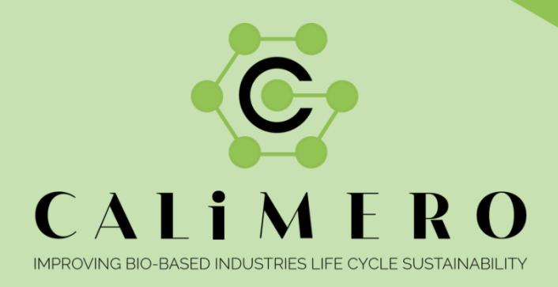
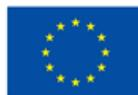
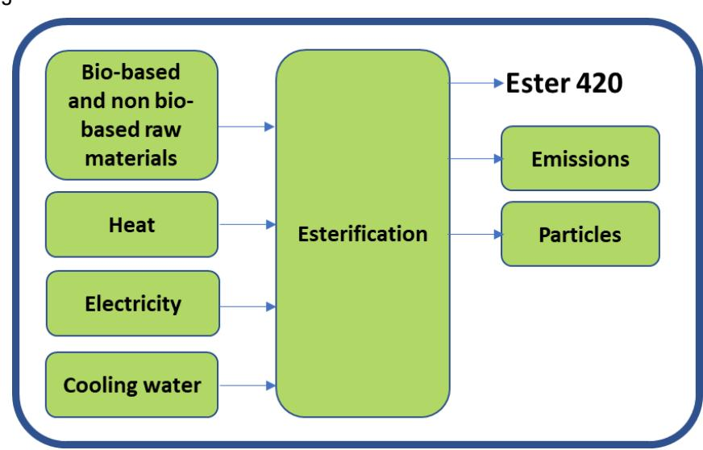
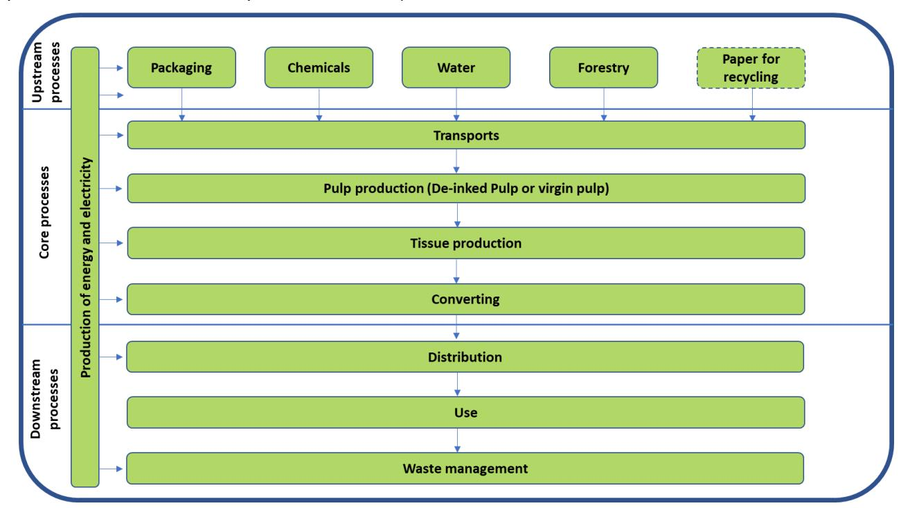
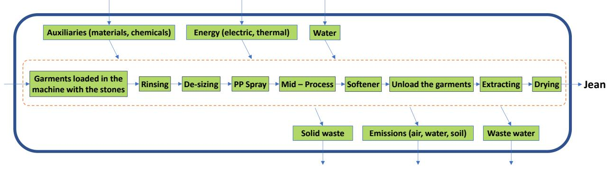
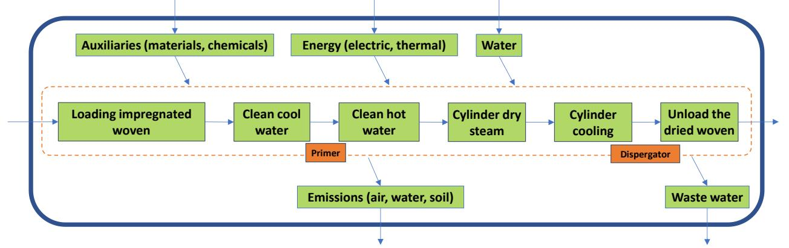
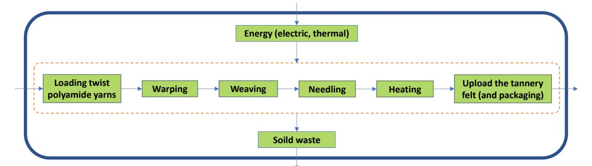
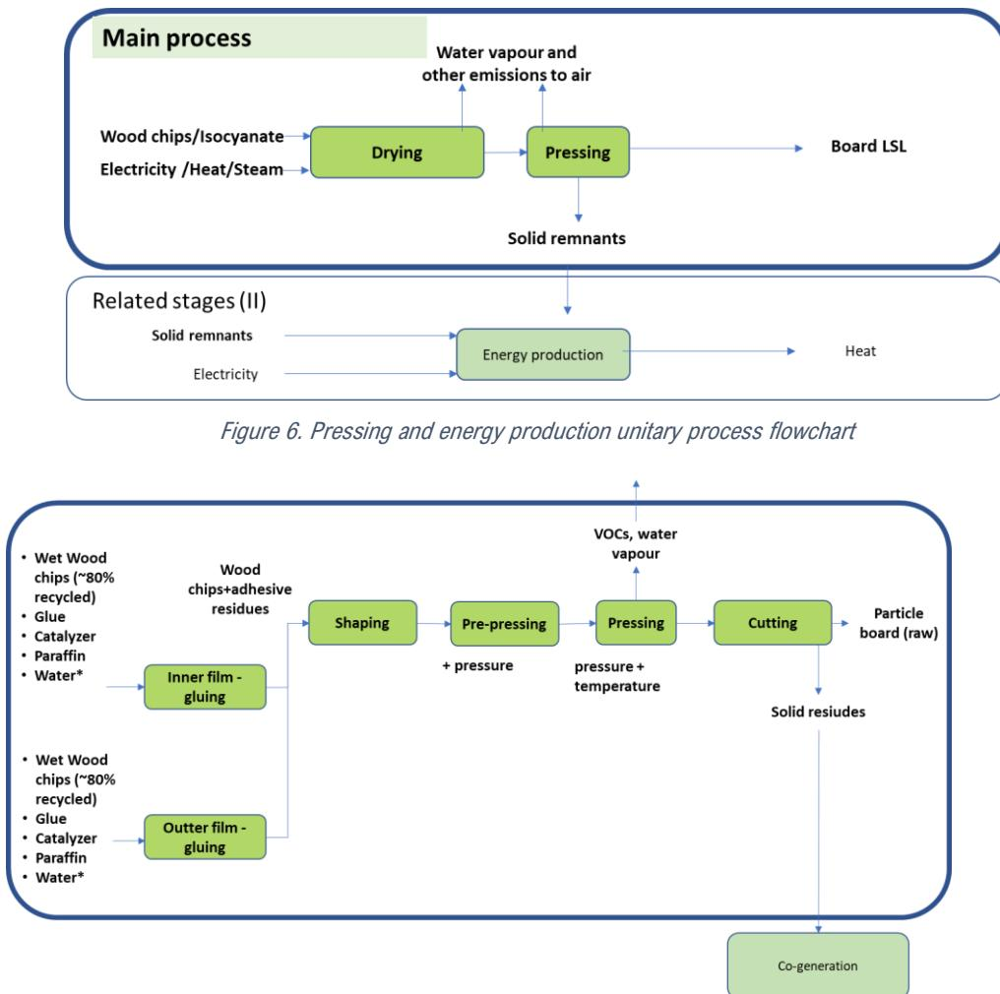
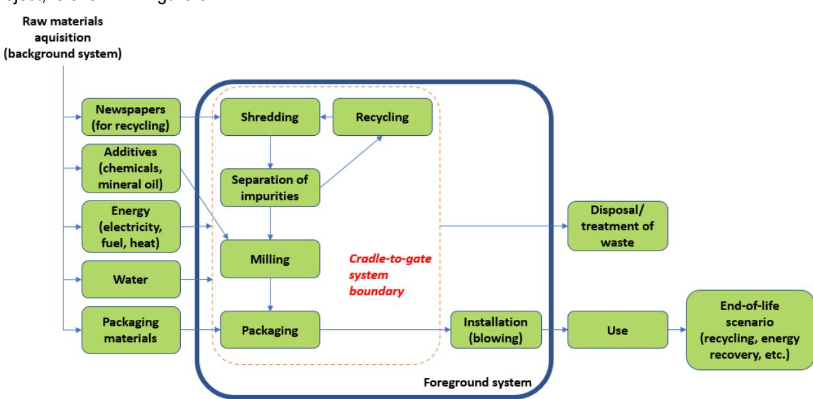

## Data collection from industry current practices: state-of-the-art and identification of gaps

## Data collection from industry current practices: state-of-the-art and identification of gaps

Due date of submission: 28/02/2023

Actual submission date: 27/02/2023

## Funded by the European Union

# **TABLE OF CONTENTS**

|     | Table of contents................................................................................................................................................ List of figures List of acronyms Project information............................................................................................................................................. Deliverable details | 2 3 3 4 5                                                                                                                                             |
|-----|-----------------------------------------------------------------------------------------------------------------------------------------------------------------------------------------------------------------------------------------------------------------------------------------------------------------------------------------------------------------------------------------|-------------------------------------------------------------------------------------------------------------------------------------------------------|
| 1   | Introduction................................................................................................................................................                                                                                                                                                                                                                            | 6                                                                                                                                                     |
| 1.1 |                                                                                                                                                                                                                                                                                                                                                                                         | Aim and objective............................................................................................................................... 6    |
| 1.2 | Structure of report                                                                                                                                                                                                                                                                                                                                                                     | 6                                                                                                                                                     |
| 2   | Background                                                                                                                                                                                                                                                                                                                                                                              | 7                                                                                                                                                     |
| 2.1 | Bio-chemicals industry                                                                                                                                                                                                                                                                                                                                                                  | 7                                                                                                                                                     |
| 2.2 | Pulp and paper industry                                                                                                                                                                                                                                                                                                                                                                 | 7                                                                                                                                                     |
| 2.3 |                                                                                                                                                                                                                                                                                                                                                                                         | Textile industry................................................................................................................................... 8 |
| 2.4 | Woodworking industry                                                                                                                                                                                                                                                                                                                                                                    | 9                                                                                                                                                     |
| 2.5 | Construction industry                                                                                                                                                                                                                                                                                                                                                                   | 9                                                                                                                                                     |
| 3   | Material and methods...............................................................................................................................                                                                                                                                                                                                                                     | 10                                                                                                                                                    |
| 3.1 | Protocol and template for data collection.........................................................................................                                                                                                                                                                                                                                                      | 10                                                                                                                                                    |
| 3.2 | Social LCA                                                                                                                                                                                                                                                                                                                                                                              | 11                                                                                                                                                    |
| 3.3 | Contact with companies                                                                                                                                                                                                                                                                                                                                                                  | 12                                                                                                                                                    |
|     | 3.3.1 Bio-chemicals industry                                                                                                                                                                                                                                                                                                                                                            | 12                                                                                                                                                    |
|     | 3.3.2                                                                                                                                                                                                                                                                                                                                                                                   | Pulp and paper industries......................................................................................................... 12                 |
|     | 3.3.3                                                                                                                                                                                                                                                                                                                                                                                   | Textile industry......................................................................................................................... 12          |
|     | 3.3.4 Woodworking industry                                                                                                                                                                                                                                                                                                                                                              | 13                                                                                                                                                    |
|     | 3.3.5 Construction industry                                                                                                                                                                                                                                                                                                                                                             | 13                                                                                                                                                    |
| 4   | Results and discussion.............................................................................................................................                                                                                                                                                                                                                                     | 13                                                                                                                                                    |
| 4.1 | Bio-chemicals industry                                                                                                                                                                                                                                                                                                                                                                  | 13                                                                                                                                                    |
| 4.2 | Pulp and paper industries                                                                                                                                                                                                                                                                                                                                                               | 15                                                                                                                                                    |
| 4.3 | Textile industry.................................................................................................................................                                                                                                                                                                                                                                       | 16                                                                                                                                                    |
| 4.4 | Woodworking industry                                                                                                                                                                                                                                                                                                                                                                    | 20                                                                                                                                                    |
| 4.5 | Construction industry                                                                                                                                                                                                                                                                                                                                                                   | 21                                                                                                                                                    |
| 5   | Conclusions..............................................................................................................................................                                                                                                                                                                                                                               | 23                                                                                                                                                    |
| 6   | References                                                                                                                                                                                                                                                                                                                                                                              | 23                                                                                                                                                    |
| 6.1 | Literature..........................................................................................................................................                                                                                                                                                                                                                                    | 23                                                                                                                                                    |
| 6.2 | Personal communication..................................................................................................................                                                                                                                                                                                                                                                | 25                                                                                                                                                    |
| 7   | Appendix                                                                                                                                                                                                                                                                                                                                                                                | 25                                                                                                                                                    |

# **LIST OF FIGURES**

| Figure 1. Flowchart of the production process of Ester 420                                                                                                           | 14 |
|----------------------------------------------------------------------------------------------------------------------------------------------------------------------|----|
| Figure 2. Flowchart of the process for pulp and paper that has been collected...............................................                                         | 16 |
| Figure 3. Aggregated flowchart of processes belonging to the selected Pumice Stone Case of EREKS..........                                                           | 19 |
| Figure 4. Aggregated flowchart of processes belonging to the selected energy generation of Techtera / TIL                                                            | 19 |
| D&M................................................................................................................................................................. | 19 |
| Figure 6. Pressing and energy production unitary process flowchart..............................................................                                     | 20 |
| Figure 7. Particle board production flowchart                                                                                                                        | 20 |
| Figure 8. Process flow chart for loose fill cellulose insulation                                                                                                     | 22 |

# **LIST OF ACRONYMS**

| CO 2   | Carbon dioxide                                         |
|--------|--------------------------------------------------------|
| ECIA   | European Cellulose Insulation Association              |
| EU     | European Union                                         |
| GHG    | Greenhouse gas                                         |
| LCA    | Life Cycle Assessment                                  |
| LCC    | Life Cycle Costing                                     |
| PEF    | Product Environmental Footprint                        |
| PsiLCA | Product Social Impact Life Cycle Assessment [database] |
| SHDB   | Social Hotspots Database                               |
| S-LCA  | Social Life Cycle Assessment                           |
| UN     | United Nations                                         |
| UNEP   | UN Environment Programme                               |

# **PROJECT INFORMATION**

**Project full title**: Industry CAse Studies AnaLysis To IMprove EnviROnmental Performance And Sustainability Of Bio-Based Industrial Processes

**Acronym**: CALIMERO

**Call**: HORIZON-CL6-2021-ZEROPOLLUTION-01

**Topic**: HORIZON-CL6-2021-ZEROPOLLUTION-01-06 - Increasing the environmental performance of industrial processes in bio-based sectors: construction, woodworking, textiles, pulp and paper and bio-chemicals

**Start date**: 1st July 2022

**Duration**: 36 months

List of participants:

| Partner No. | PARTICIPANT ORGANIZATION   ACRONYM                           |
|-------------|--------------------------------------------------------------|
| 1 (Coord.)  | Contactica   CTA                                             |
| 2           | WeLOOP   <b>WELOOP</b>                                       |
| 3           | European Cellulose Insulation Association   <b>ECIA</b>      |
| 4           | Swedish Environmental Research Institute   <b>IVL</b>        |
| 5           | Neovili   <b>NEOVILI</b>                                     |
| 6           | Cesefor   <b>CESEFOR</b>                                     |
| 7           | Luxembourg Institute of Science and Technology   <b>LIST</b> |
| 8           | Technical University of Denmark   <b>DTU</b>                 |
| 9           | Techtera   <b>TECHTERA</b>                                   |
| 10          | Essity   <b>ESSITY</b>                                       |
| 11          | BIM Kemi AB   <b>BIMKEMI</b>                                 |
| 12          | Ereks garment  <b>EREKS</b>                                  |

# **DELIVERABLE DETAILS**

| Document Number: D1.1                                                |                                                                  |
|----------------------------------------------------------------------|------------------------------------------------------------------|
| Document Title: Data                                                 | collection from industry current practices: state-of-the-art and |
| Dissemination level PU –                                             | Public, fully open                                               |
| Period: PR1                                                          |                                                                  |
| WP: WP1                                                              |                                                                  |
| Task: T1.1                                                           |                                                                  |
| WeLOOP:                                                              | Alexandre Charpentier Poncelet, Carolina Szablewski, Naeem Adibi |
| Contactica:                                                          | Ricardo Méndez                                                   |
| Neovili:                                                             | Milena Amaral                                                    |
| LIST, Luxembourg Institute of Science and Technology:                | Benedetto Rugani                                                 |
| biological                                                           | resources for renewable products, thus reducing the EU's         |
| aspects. Furthermore,                                                | data was collected for environmental and economic                |
| costs, and to highlight gaps within the sectors accounting for these | sources.                                                         |

| Version    | Date       | Description                  |
|------------|------------|------------------------------|
| <b>1.0</b> | 2023-02-27 | Deliverable 1.1, version 1.0 |
|            |            |                              |

# **1 INTRODUCTION**

The EU Bioeconomy Strategy (European Commission, n.d.-a) was established in 2012. The strategy has five goals with the overall aim to accelerate the deployment of a sustainable European bioeconomy, including:

- ensure food and nutrition security
- manage natural resources sustainably
- reduce dependence on non-renewable, unsustainable resources
- limit and adapt to climate change
- strengthen European competitiveness and create jobs

The strategy is a part of, and contributes to, the European Green Deal. The strategy contributes to a circular economy and clean energy innovation strategies in industry and society.

The EU supports the bioeconomy development with research and innovation funding. Significant funding has been made available in Horizon 2020 and further in Horizon Europe. Research and Innovation in this area are expected to contribute to the UN's Sustainable Development Goals and accelerate the ecological transition required by the European Green Deal, such as climate neutrality by 2050. Furthermore, the research outlined is intended to support the objectives of several EU policy areas, also beyond the EU Bioeconomy Strategy, including the Circular Economy Action Plan, the EU Industrial Strategy, the Biodiversity Strategy for 2030, the EU Forest Strategy, the Blue Growth Strategy, the Chemicals Strategy for Sustainability, the EU Plastics Strategy, as well as the EU climate policy.

Among the ambitions in the Bioeconomy Strategy, the CALIMERO project is positioned in an area where activities are meant to foster innovation to develop the circular economy and exploit the potential of biological resources for renewable products, thus reducing the EU's dependence on non-renewable resources. In addition, the activities aim to help reduce emissions and waste from industrial processes by using more sustainable bio-based systems, while avoiding trade-offs for damage on biodiversity.

# **1.1 Aim and objective**

The aim of Task 1.1 within the CALIMERO project was to collect data on the environmental and economic performance of sectors within the European bio-based industries to identify the current sources of pollution and resource use, as well as their overall costs, and to highlight gaps within the sectors accounting for these sources. The sectors chosen for data collection include bio-chemicals, pulp and paper, textile, woodworking and construction.

# **1.2 Structure of report**

The remainder of this report is structured as follows: Chapter 2 covers background on the sectors of biochemicals, pulp and paper, textile, woodworking and construction. The chapter also includes a brief presentation of the project partners involved in each sector. Chapter 3 presents the materials and methods used within the project. In Chapter 4, the findings from the data collection for the project partners in each sector are presented and discussed, with a highlight of findings on data gaps. Finally, Chapter 5 concludes the report.

# **2 BACKGROUND**

# **2.1 Bio-chemicals industry**

The chemical industry converts various raw materials, such as fossil sources, water, minerals and metals, into chemical products. In 2012, the revenue of the global chemical industry amounted to 4 732 billion USD (Statista, 2022). Bio-based chemicals include chemicals produced from materials of biological sources. The global production of chemicals and polymers from petrochemical and bio-based sources amounts to 330 million tons and 90 million tons, respectively (IEA Bioenergy, 2022, Burns et al., 2016). The global bio-based chemicals sector is expected to grow twice its size from 2021 to 2028, reaching a revenue of 142 billion USD. The main driving forces of the growing market has been bio-based lubricants, alcohols, and bio-plastics (Polaris, 2020).

The European (excluding the UK) bio-based chemical industry revenue was 48 billion EUR in 2019 (Porc et al., 2019). The main biogenic feedstocks used for producing bio-based chemicals are crops such as wheat, corn, beet, cane, palm, oilseed rape, perennial grasses, aquatic biomass, andforest residues and organic waste (IEA Bioenergy, 2022).

Regarding policies related to the bio-chemicals sector in the European Union, the REACH Directive 1907/2006 (European Union, 2006) was introduced by the European Commission with the aim to safeguard human and environmental health against risks of chemical agents. The Directive outlines requirements for registering and testing chemical substances within the European Union, before being introduced to the market. Furthermore, the Directive includes requirements of users of the chemicals.

BIM Kemi is a Swedish, privately-owned chemical company participating in the CALIMERO project as part of the bio-chemicals industry. The company develops chemicals aiming to be innovative and with a minimal impact on people and the environment, to be delivered primarily to the pulp and paper industry, and to business within construction, paint and coatings (BIM Kemi, 2022). Products supplying the pulp industry include e.g. antifoam and anti-pitch, while products to be delivered to the paper industry include e.g. cleaning agents, deaeration and foam control. Among specific examples of bio-based products developed by BIM Kemi, these include recyclable and compostable barriers for paper bags, barriers for fish packaging boxes, technology for easy washable label paper for bottles as well as talc free pitch control concepts (Nyhlén, F., pers. comm., 2023).

BIM Kemi has 220 employees and a yearly turnover of 68 M€ (600 MSEK). The company's headquarter is located in Stenkullen outside of Gothenburg in Sweden, together with one of the production facilities. The other four production sites are scattered around Europe as well as in South Africa. Largest production volumes are produced in Stenkullen, amounting to around 17 000 ton per year, while other production facilities in Europe produce between 11 500 and 13 000 ton per year (Nyhlén, F., pers. comm., 2023; BIM Kemi, 2022).

# **2.2 Pulp and paper industry**

The pulp and paper industry is one of the world's biggest industrial sectors and Europe accounts for approximately 25% of the paper and paperboard produced annually. The paper exported from Europe represents half of the global value, where Germany was the largest exporter of paper and paperboard in 2021. Other large exporting countries include the United States and Sweden. In addition, Europe holds some of the largest paper companies in the world, with a large share in Scandinavia, including companies such as Svenska Cellulosa, UPM Kymmene and Stora Enso. The most produced global paper and paperboard product are packaging materials, accounting for approximately 44% of the sector, followed by printing and writing papers. For global pulp production, chemical pulp accounted for 79% while mechanical and semi-chemical pulp accounted for 15% in 2021. For the past three decades, the consumption of softwood (pine and spruce) has been persistently higher than hardwood consumption (Tiseo, 2022). In 2021, the industry accounted for 2% of global industrial CO2 emissions. Since paper consumption is assumed to increase until 2030, more actions need to be taken to reduce the emissions intensity set by the Net Zero Emissions by 2050 scenario. Thus, energy efficiency needs to be improved. This can be achieved by moving away from fossil fuels to renewable energies and increasing the proportion of recycled resources (IEA, 2022).

There are several policies within the European Union affecting the European pulp and paper industry such as the New EU Forest Strategy for 2030, the EU Biodiversity Strategy for 2030, the EU Timber Regulation as well as the LULUCF Regulation (European Commission, n.d.-b). The New EU Forest Strategy for 2030 aims to improve the quantity and quality of EU forests and strengthen their protection, restoration and resilience. With regards to the EU Biodiversity Strategy, it includes several measures related to forests such as protecting EU primary and old-growth forests, which are large carbon sinks and host a rich biodiversity. Furthermore, the EU Timber Regulation targets the trade in illegally harvested timber and timber products. In contrast, the regulation towards LULUCF focus on incentivising member states of the European Union to decrease GHG emissions and increase removals in the sector of land-use, land-use change and forestry.

Essity is a leading global hygiene and health company, dedicated to improve well-being through their products and services. Sales are conducted in approximately 150 countries under the leading global brands TENA and Tork, and other strong brands such as Actimove, JOBST, Leukoplast, Libero, Libresse, Lotus and Zewa. Products include e.g. incontinence products, baby diapers, feminine care products (e.g. pads) and hand hygiene solutions (e.g. dispensers and paper products). Essity has about 46,000 employees. Net sales in 2021 amounted to approximately SEK 122bn (€12bn). The company's headquarter is located in Stockholm, Sweden. Essity is listed on the Swedish stock exchange Nasdaq Stockholm (Essity, 2023).

# **2.3 Textile industry**

As reported by the European Commission (n.d.-c), the textile and clothing industry is a leader in world markets and covers a wide range of activities, from the transformation of natural (cotton, flax, wool, etc.) or synthetic (polyester, polyamide, etc.) fibres into yarns and fabrics, to the production of a great variety of products such as hi-tech synthetic yarns, bed-linens, industrial filters and clothing.

More than 30% of all exports from the EU go to other countries in the globe. According to figures from 2019, there are approximately 160,000 businesses in the EU's textile and clothing sector, which employs 1.5 million people and generates annual revenues of €162 billion (European Commission, n.d.-c). The economic structure of the sector is primarily characterised by small enterprises, which employ more than 90% of the workers and generate about 60% of the value added. The top five European producers include Italy, France, Germany, Spain, and Portugal, making up around three-quarters of all EU production. More clothing is produced overall in southern EU nations. On the other hand, northern nations like Germany, Belgium, the Netherlands, and Austria contribute more to the production of textiles, and more particularly technical textiles.

The textile and clothing sector has experienced a significant transformation in the most recent years to maintain its competitiveness by shifting toward high value-added products, marketed by the high-end, premium and luxury industry, providing value addition as well as chances for investments and innovation. This shift was primarily brought on by a confluence of technological advancements, changing production costs, the rise of powerful competitors at an international scale, and the removal of import quotas in 2004. Still, as reported by the European Commission, competitiveness strengths in the textile and clothing sector, among which are high quality of production, design, creativity, strong brand names, but also competitiveness challenges such as increased competition from emerging players and low-profit margins, especially for small and medium-sized enterprises, all these forces represent a fertile ground to test and stress the CALIMERO's objectives while promoting additional resilience to the European textile sector.

The European Commission published a series of suggestions in 2022 that collectively outline the standards that textile organisations must adhere to enter or continue to compete in the EU market by 2025. According to the EU Strategy for textiles (European Commission, 2021b), there is a clear push to make the sector more competitive by applying circular economy principles to production, products, consumption, waste management and secondary raw materials, and directing investment, research and innovation. Furthermore, a set of regulatory proposals is coming into effect in the next few years (2023/2024), which will likely have a strong impact on the industry as a whole and, consequently, on the expectations for the industrial partners in the context of CALIMERO. According to the vision of the EU strategy, the textile sector will build on the following principles and targets by 2030:

Funded by the European Union. Views and opinions expressed are however those of the author(s) only and do not necessarily reflect those of the European Union or [name of the granting authority]. Neither the European Union nor the granting authority can be held responsible for them.

- the production of textile products will adhere to socially and environmentally responsible standards, with producers taking responsibility for their products throughout the value chain, including when they become waste;
- textile products sold in the EU will be designed to be long-lasting, recyclable, and mostly made of recycled fibres;
- incineration and landfilling of textile goods will be minimised, making the sector strongly based on circular economy principles and innovation pathways;
- there will be an abundance of high-quality, reasonably priced textile products available, as well as reuse and repair services, which will increase the lifetime of the products.

Partners in the textile sector of CALIMERO include TECHTERA and EREKS, which will be players facing these challenges. Through the project, they will have the possibility to accelerate the achievement of such sustainability targets. TECHTERA is a competitiveness cluster dedicated to the French textile industry, placed in one of the leading textile manufacturer countries in Europe. The Turkish EREKS is the third largest textile supplier to the EU.

# **2.4 Woodworking industry**

According to the European Commission, woodworking industries had a turnover of €122 billion in 2010-11. 1.093 million people were employed in 184,000 companies, most of them being SMEs. However, large enterprises have a significant role in the wood-based panel and sawmilling sub-sectors. The average wood production has increased by 25% in Europe from 2000 to 2021. The main uses of primary wood in Europe are distributed into energy (~25%) and industrial products (~75%) sectors (Vis M. et al., 2016). The main industrial products are wood-based panels, pulp and paper, printing, and furniture. The importance of each sub-sector depends on the target parameter. According to the number of enterprises, the manufacture of wood and wood products presents the greatest share (~40 %). At the same time, regarding the gross value added at factor cost, the pulp and paper sector leads with a 35% of total value added. However, the sector with the greatest number of persons employed is the manufacture of furniture, followed very closely by the manufacture of other wood and wood products (30% and 29% share of total employees) (Eurostat, 2022).

Although most of the processed wood in Europe comes from certified sustainable managed forests, some sustainability challenges exist. Ensuring wood supply, engaging younger workers via skilling, using energy during processing of wood products and using newer technology and the harmful effects of volatile organic compounds like the formaldehyde used as adhesive are still important challenges that need more sustainable alternatives.

In CALIMERO, the woodworking sector is represented by Cesefor. Cesefor is a private non-profit Foundation dedicated to providing services for promoting forestry and forest-based industries with a national and international remit. Cesefor will be the contact point with industrial players, collecting primary data and testing the solutions identified, with high expertise in innovation with sustainability potential. The main focus will be optimising the production of particle and laminated boards, which present some of the identified sustainability challenges: i) use of formaldehyde, ii) use of energy and iii) potential to store carbon.

# **2.5 Construction industry**

The construction industry is vital to the European economy. It provides 18 million direct jobs and contributes to about 9% of the EU's GDP (European Commission, 2016). Buildings and infrastructure are also crucial for the quality of life. However, the sector consumes a large share of the material flows in Europe (approximately 50% of the total), and contributes importantly to environmental issues such as waste generation (over 35% of the EU's total waste generation – half of which is recycled) and greenhouse gas (GHG) emissions (5-12% of national GHG emissions within EU countries) (European Construction Sector Observatory [ECSO], 2018; European Commission, 2020). While the latter statistics reflect only the construction and end-of-life of buildings and infrastructure, they also consume about 40% of the primary energy in Europe during their lifetime (for e.g.,

Funded by the European Union. Views and opinions expressed are however those of the author(s) only and do not necessarily reflect those of the European Union or [name of the granting authority]. Neither the European Union nor the granting authority can be held responsible for them. Environmental data was collected following the PEF methodology (European Commission, 2021a). A template document was shared to industrial partners to this end. With regards to the LCC, expenses associated to the different data collected for the environmental LCA were collected with that same document. Operational costs of the product system were collected for the time being, and fixed costs may be considered in subsequent tasks of the project. Additionally, revenues from products and co-products were included, as well as the actual

heating), and are overall responsible for approximately 35% of total GHG emissions (ECSO, 2018).

Consequently, the European Union aims to improve the sector's sustainability, focusing on resource and energy efficiency through a range of policies. The European policies for energy efficiency mainly follow two Directives: the Energy Performance of Buildings Directive 2010/31/EU (European Union, 2010) and the Energy Efficiency Directive 2012/27/EU (European Union, 2012), and their amendment of 2018 as part of the Clean energy for all Europeans package (European Union, 2018). Furthermore, the Roadmap to a Resource Efficient Europe sets practical steps towards a more efficient and circular use of resources, including recycling a minimum of 70% of non-hazardous construction waste by weight (European Commission, 2011). Regarding the communication of environmental profiles of construction products, the Environmental Product Declarations (EPD) should follow the European Standard EN 15804:2019 "Sustainability of construction works – Environmental product declarations – Core rules for the product category of construction products".

The insulation materials industry has a crucial role in reducing the environmental impact of the construction sector and buildings by maximising their energy efficiency (Pavel and Blagoeva, 2018). Currently, the European insulation market is dominated by non-renewable materials: glass wool represents 36% of the market by volume, followed by expanded polystyrene (27%), stone wool (22%), polyurethanes (8%), and extruded polystyrene foam (6%) (Pavel and Blagoeva, 2018). On the other hand, bio-based insulation products such as wood wool, hemp fibres, and cellulose from recycled newspapers represent only around 1% of the market share by volume.

The European Cellulose Insulation Association (ECIA, n.d.) is participating in the CALIMERO project as part of the construction value chain. Cellulose insulation is made of end-of-life journal paper processed to allow its use as insulation product. ECIA is actively cooperating with European and international industry associations, European and national institutions, authorities, regulatory bodies, and research institutes. ECIA's and its members' ambition is to provide greener, more sustainable and energy-efficient homes to the European building stock through cellulose fibre insulation in new building and renovation projects. The cellulose insulation is typically loose fill blown in attics, pitched roofs, and walls or sprayed with glue. There are currently 13 company members with sales covering the European market, Canada, and the United Sates. The Association's headquarters are in Brussels, Belgium.

# **3 MATERIAL AND METHODS**

# **3.1 Protocol and template for data collection**

A protocol and a template were established for data collection on the environmental, economic, and social performance of companies within the European bio-based industries (available in Appendix 1 and 2, respectively). The protocol outlines the procedure for data collection, while the template was used for the actual data collection.

For the environmental Life Cycle Assessment (LCA), the protocol follows the ISO 14040/ISO 14044 (ISO, 2006a, ISO, 2006b) and Product Environmental Footprint (PEF) methodology according to the European Commission (2021a). With regards to Life Cycle Costing (LCC), the method follows the same principles as the ISO 14040 standard (2006a). The procedure for data collection for Social LCA (S-LCA) is described separately in Section 3.2.

Life cycle stages from cradle to grave were considered in the data collection from the project partners, including raw material extraction, primary production, processing, packaging, and transportation (for relevant processes, pre-gate). Data was collected to represent the production of the project partners within the last three years (2020 to 2022).

financial cost for carbon dioxide (CO2) emissions based on the EU Emissions Trading System where relevant.

Regarding the template for data collection, industrial project partners were asked to provide information concerning their production and the in- and outflows related to the production. Companies were asked to specify the amount and origin of inflows (raw materials, water, as well as energy and energy carriers) going into the production. For outflows, this included information about the amount of products and co-products produced, and the associated emissions, wastewater, waste and scrap. Companies were also asked whether specific data were not available or not collected internally. Additionally, companies were asked to describe current practice for data collection, such as environmental or socioeconomic accounting reporting.

## **3.2 Social LCA**

Given the extensive list of social issues or indicators to evaluate in a full S-LCA, the first step is to identify the most relevant categories of stakeholders (i.e., stakeholders that are most affected by the supply chains activities, both positively or negatively) and sub-categories (i.e., the aspects affecting the different stakeholder categories) for different bio-based supply chains. The stakeholder categories and sub-categories were chosen according to the UNEP guidelines for S-LCA (Benoît Norris et al., 2020). The identification of stakeholders and social hotspots will be performed using two different methods, whose results will be combined to identify all potentially relevant social hotspots in the value chain.

The first method relies on a questionnaire sent to industry members and other knowledgeable experts in the value chains of bio-based sectors. The data for S-LCA will be collected through a qualitative survey. An explicative video will be provided with the survey to introduce the S-LCA methodology. The surveys will include the name of organisations and region of origin of all inputs collected and will be carried out to collect data among partners and different actors of their value chains (employees, clients, suppliers, sub-contractors etc.). The collected data consist of a qualitative scoring of the relevance of stakeholder categories and sub-categories (i.e., very relevant, relevant, slightly relevant, not relevant), and the collection of complementary qualitative information (optional). The questionnaire for S-LCA is available in the protocol for data collection (Appendix 1).

In subsequent task 1.2, a quantitative weighting method will be applied to the collected answers, and a quantitative threshold will be defined. All social impact sub-categories with scores above this defined threshold will be identified as potential hotspots linked to a specific group of stakeholders. The use of this method will ensure that all social issues relevant for the industry and their supply chains are considered from primary sources. However, it may introduce some subjectivity in the assessment. The quality of the results will also depend on the number of contributions to the survey and the knowledge of participants on the life cycle social impacts of their organisations.

The second method is based on data from S-LCA databases. Hotspots will be identified using SHDB and PSILCA datasets that represent the bio-based products delivered by the processes within the system boundaries of CALIMERO. Using the SHDB terminology, hotspots refer to most relevant damage categories, impact categories, and = social issues. The outcomes of this approach will consist in the identification of hotspots along supply chain, as well as sector- and country-specific hotspots.

In subsequent task 1.2, the hotspots will be identified following a similar approach to the one recommended by the PEF method for the identification of hotspots in environmental LCA. The cut-off of selecting the 80% greatest impacts will be used for each case. Only in the selection of most relevant social issues, an additional cut-off to select social issues with >1% share of impacts is performed, before applying the 80% cut-off to limit the number of relevant social issues. Then, a comparison of the hotspots found using SHDB or PSILCA databases with UNEP stakeholders, categories and social themes is performed to identify which social topics from the UNEP are considered as social hotspot for the bio-based sectors under study. In this way, social hotspots can be identified along the value chain avoiding the subjectivity of the method based on a questionnaire but losing representativeness by obtaining results from general databases.

Finally, it should be noted that, within Task 1.2, these two methods will be complemented by a literature review covering information from various fields such as risk assessments, regulatory and legislative contexts, etc. For example, information displayed by companies following the Due diligence directive (European Commission, 2022) may provide relevant insights on potential social impacts for a range of supply chains including biobased sectors.

## **3.3 Contact with companies**

## 3.3.1 Bio-chemicals industry

Within the CALIMERO project, the contact with BIM Kemi was carried out through a combination of mail exchanges and meetings (both in physical and online form). Contact persons from BIM Kemi were Maria Dahlbeck; environmental, product safety, and compliance manager, as well as Fredrik Nyhlén; product and application developer.

The meetings are summarised below:

- 1. Physical Meeting (09-20-2022). Purpose: Presentation of project members from both sides, and the objectives of the CALIMERO project.
- 2. Online Meeting (10-13-2022). Purpose: Discuss the procedure for data collection
- 3. Online Meeting (10-26-2022). Purpose: Decide on case study for data collection
- 4. Online Meeting (11-28-2022). Purpose: Discuss progress of data collection, questions and potential difficulties
- 5. Online Meeting (12-19-2022). Purpose: Discuss progress of data collection, questions and potential difficulties.

#### 3.3.2 Pulp and paper industries

The contact with Essity was carried out through a combination of mail exchanges and meetings (both in physical and online form). Contact persons from Essity were Pernilla Cederstrand; senior environmental specialist, Ellen Riise; senior sustainability specialist, as well as Axel Thegerström Edh; director of sustainability.

The meetings are summarised below:

- 1. Physical Meeting (09-20-2022). Purpose: Presentation of project members from both sides, and the objectives of the CALIMERO project.
- 2. Online Meeting (10-19-2022). Purpose: Discuss the procedure for data collection
- 3. Online Meeting (11-22-2022). Purpose: Discuss progress of data collection, questions and potential difficulties
- 4. Online Meeting (01-12-2023). Purpose: Discuss progress of data collection, questions and potential difficulties.

### 3.3.3 Textile industry

Several meetings have been conducted among NEOVILI, LIST and EREKS to discuss the system boundary of the textile production system life cycle model and the processes and scenarios to be considered for the data collection. The exchanges with Ereks and Techtera was carried out through a combination of virtual collaboration (shared documents), email exchanges and video conferences. The contact persons from Ereks were Pelin Birsen (Operations & Sustainability Director), Bilgesu Altunkan (Communication Specialist) and Romain Narcy (Partner). Our contact persons with Techtera were Bruno Mougin (Innovation Projects Manager, Senior Expert), Juliette Jaupitre (Innovation Projects Officer), Jean Michel Bertrand (CEO at Teintures et Impressions de Lyon / Deveaux Group) and Hugues Schellenberg (Managing Director at Dollfus & Muller). These working sessions led to a document justifying the selection of case studies where four life cycle processes were identified.

The meetings are summarised below:

- 1. Online Meeting (10-06-2022 & 10-12-2022) Purpose: use cases definition and data collection
- 2. Online Meeting (10-13-2022 & 10-17-2022) Purpose: presentation of project, objectives, use case and data collection in the presence of adjacent industrial partners
- 3. Online Meeting (12-05-2022, 01-30-23, 02-01-23) Purpose: clarification on the data collection, indicators and measurement, discussing progress to design the flowcharts, answering questions and proposing alternative to mitigate the difficulties

#### 3.3.4 Woodworking industry

Contactica has been in contact with Cesefor since 2019, and started working together since 2020 in projects related to sustainability of the wood sector. With regards to communication within the CALIMERO project, the following meetings have been taking place:

- 1. Physical meeting (14-07-2022): define collaboration, case studies, companies to contact and objectives to achieve during the project.
- 2. Physical meeting (03-09-2022). In the KOM of CALIMERO project, Cesefor and Contactica had the opportunity to discuss on data availability, unitary process simulation.
- 3. Online meeting (15-11-2022): Contactica and Cesefor met the first Spanish wood industrial partner to describe the goal and scope of CALIMERO and organise the exchange of information procedure.

Apart from the meetings, several mails and telephone calls have taken place exchanging process descriptions, life cycle inventory, product factsheets and general sector information. Two case studies were defined: production of laminated boards (including; drying of raw wood, pressing, curing, energy and solid waste recovery) and production of particle board.

# 3.3.5 Construction industry

WeLOOP has been collaborating with ECIA for over 6 years. Within the CALIMERO project, members of ECIA were solicited to provide environmental, social and economic data for the process using the data collection document, to answer the survey for social LCA set-up for CALIMERO, among other things. A combination of mail exchanges and online meetings with ECIA's chairman, Mr Pasi Typpö and a range of collaborators from ECIA members, allowed setting the objectives for the CALIMERO project. The specific actions and meetings are summarised below:

Physical Meeting (08-30/31-2022). Purpose: Present CALIMERO project objectives to all ECIA members and explain data collection

- 1. Online Meeting (09-23-2022). Purpose: Explain data collection
- 2. Online Meeting (10-25-2022). Purpose: Discuss data collected, ask for missing data
- 3. Online Meeting (11-02-2022). Purpose: Discuss ECIA case studies, present a timetable for the CALIMERO project. Set-up a Work Group on materials R&D for CALIMERO.
- 4. Online Meeting (11-17-2022). Purpose: Gather feedback from ECIA members on previous R&D technical tests for different materials. Select a range of materials for testing in CALIMERO.

# **4 RESULTS AND DISCUSSION**

# **4.1 Bio-chemicals industry**

As for today, BIM Kemi reports progress on sustainability impacts according to the standard of Global Reporting Initiative (GRI). The sustainability reporting complies with the ten principles of the United Nations Global Compact, within areas of environment, human rights, labour and anti-corruption (BIM Kemi, 2022).

Within the CALIMERO project, the data collection for BIM Kemi covered the production of 'Ester 420' which is an ester constituting of bio-based and non bio-based raw materials. The ester is a surfactant and is used as an internal raw material, for example in anti-pitch products. The product disperses extractive components from wood in the pulp manufacturing process. The Ester 420 is a yellow to light brown transparent liquid with a viscosity around 100 mPa and an acid value of around 15 mg KOH/g which implies that the reaction conversion is about 80%. The data collected for the production of ester 420 is representative for 2021 year's production. The production of the ester does not result in any co-products, why no consideration will have to be taken for allocation (Dahlbeck, M., pers. comm. 2023; Nyhlén, F., pers. comm. 2023).

Production at the facility of BIM Kemi covers the following processes, inputs and outputs and is illustrated in the flow chart in [Figure 1.](#page-13-0) **¡Error! No se encuentra el origen de la referencia.**

- Esterification, where water is chemically decomposed, a process which requires heating and cooling
- Input of raw materials feeding the esterification, their way of production, amount and origin
- Energy carriers and energy use (e.g. electricity, fuel oil, district heat etc.), their amount and origin
- Water use (described under gaps, further down)
- Cooling water, as process aid (described under gaps, further down)
- Emissions of GHGs, other gases and particles from the esterification, type and amount
- Wastewater
- Waste and scrap
- Packaging

Figure 1. Flowchart of the production process of Ester 420

Identified gaps in data collection include environmental data. In the Ester 420 production process, cooling water is used, and the amount of cooling water loss has not been collected. The material inputs arrive to the facility with tanks and the product is delivered to customers with tanks; therefore, there is no waste package generation during production.

Regarding economic data, although BIM Kemi does not collect data with an intention to conduct LCC, the economic data they already have is applicable for LCC. The economic analysis could also be extended to include externalities to conduct environmental LCC. For instance, the EPS system (Environmental Priority Strategies in product design) can be used as a methodology to calculate environmental damage costs which uses life cycle inventory and cost data as input.

Related to S-LCA, it can be conducted in two levels; the assessment level defines the data need. In the hotspot level of analysis using available sector and country-based databases like SHDB (Social Hotspot Database, n.d.) and PSILCA (PSILCA, n.d.), the life cycle inventory, cost and country of origin data is needed. Based on the communication with BIM Kemi, it is seen that the country-of-origin data is not straightforward to be collected since the producers are buying chemicals and other materials from distributors. Indeed, it is not often the concern of the producer to follow the primary origin of the material. On the other hand, there is no specific dataset in SHDB related to bio-based chemicals; the related dataset is "Chemical, rubber, plastic products". Although this dataset can be used as a proxy since the bio-based chemicals have an important amount of nonbiobased chemical inputs, the results will be limited. The site-specific S-LCA needs data directly collected from the facility.

Materiality analysis is central in sustainability reporting and is done on organisational level. BIM Kemi's materiality analysis, conducted in 2021/2022, resulted in several material topics related to social responsibility. Data for these aspects can be found in BIM Kemi's sustainability report (BIM Kemi, 2022). BIM Kemi also has a Code of conduct for their suppliers based on the UN Global Compact, UN Guiding Principles for Business and Human Rights and the Sustainable Development Goals, and a Code of conduct for their internal business ethics. The Communication on Progress (COP) is a description of the company's progress and activities according to UN Global Compact but doesn't contain any data. According to the Sustainability report, supplier audits will be conducted for selected suppliers from 2022.

The applicability of LCA databases in bio-based chemical production is also limited. For the assessment of BIM Kemi process that is explained above, the Ecoinvent database (Wernet et al., 2016) is considered sufficient since there are related datasets for all inputs and outputs, but it might not be the case for all bio-based processes since there are around 20 datasets related to bio-based chemical production. The available biobased chemicals production datasets in the Ecoinvent database are mainly fatty acid, fatty alcohol, fatty alcohol sulfate, ethanol, glycerine, vegetable oil methyl ester, potassium sulfate and citric acid production processes from different bio-based materials (corn, coconut oil, rape oil, palm oil, tall oil, whey etc.).

# **4.2 Pulp and paper industries**

Within the CALIMERO project, the data collection for Essity covered the production of an average finished goods tissue paper. The weight of the tissue product is 1 ton of paper with an average 5% of moisture. Tissue paper is converted from mother reels into different articles that differ for function, grammage and dimensions, shape, packaging, colors, raw materials. As a result, the wide variety of finished products can be produced with fewer grades of intermediate paper. The four most important grades of intermediate tissue paper include:

- Bathroom tissue
- Towels (including kitchen towel, hand towels, big rolls, etc.)
- Hankies (including facial tissues)
- Napkins

The tissue market in Europe constitutes of approximately 9% of the total paper and board production in Europe. The consumption is about the same compared to total paper and board consumption.

The variables that differentiate a tissue product and can have an influence on a study and consequently on the data collection:

- Paper Grades
- Raw Materials (fibrous raw material, chemicals for pulp production and tissue manufacturing).
- Energy use and energy mix for pulp production and tissue manufacturing (Cederstrand, P., pers. comm., 2023, Riise, E., pers. comm., 2023).

Funded by the European Union. Views and opinions expressed are however those of the author(s) only and do not necessarily reflect those of the European Union or [name of the granting authority]. Neither the European Union nor the granting authority can be held responsible for them.

recovered paper. The processes necessary for transforming fibres into tissue paper are different depending on the fibrous raw material used, i.e., if it is fresh wood fibre or recycled fibres from recovered paper grades. The fresh wood fibre pulp allows a high yield of transformation since it is made only by cellulose fibres. When the raw material is mainly recovered paper, the process delivers a lower yield. To achieve high absorbency and softness, the fibres must be free from ash and fines. The content of fines and ash of paper for recycling can be up to 35–45%. These components are washed out. Consequently, the yield during processing paper for recycling goes down to 53 – 58% and sludge from the de-inking process is handled and treated in these mills (JRC, 2015). Chemicals are used for both pulp production and tissue paper manufacturing. For the tissue paper manufacturing, the chemicals are divided in two categories: functional chemicals and process aid chemicals (Cederstrand, P., pers. comm., 2023, Riise, E., pers. comm., 2023).

The system boundaries for a full finished good of a tissue product are shown in **¡Error! No se encuentra el origen de la referencia.** below. The data collection for the tissue process that are collected as part of the CALIMERO project is the upstream and core processes. Data is collected for forestry, packaging, chemicals, and water for the upstream processes as well as for the used electricity and energy and transports with all inputs and outputs. For the core process the specification of the used mother reels will specify which pulps are used and should be included in the processes, however in this case an average/representative tissue paper will be made, both as regards to pulps used and paper technologies for the paper making (Cederstrand, P., pers. comm., 2023, Riise, E., pers. comm., 2023).

Figure 2. Flowchart of the process for pulp and paper that has been collected

The tissue making process is well covered with in principle no data gaps when it comes to technical data for processes in pulp and paper mills. However, data is missing, especially from forestry activities where there currently are difficulties in providing data related to land use related to soil quality and biodiversity. For this purpose, Essity aims to work further with data established as a part of the Swedish BioInnovation Program's special project on LCA and forestry data (2018) (Cederstrand, P., pers. comm., 2023, Riise, E., pers. comm., 2023).

### **4.3 Textile industry**

In the upcoming months, both textile industrial partners within the CALIMERO project must comply with the forthcoming European regulations, namely the Corporate Sustainability Due Diligence Directive, Corporate Sustainability Reporting Directive and the Ecodesign for Sustainable Products Regulation. It would imply a fast forward effort in processes mapping, data collection and management to report waste, toxicity, emissions, energy efficiency and social responsibility that is not yet a current practice across the industry, despite the good willingness.

Leveraging in the scope of the CALIMERO project, the interactions with the industrial partners were motivated by the processes improvement and understanding the crucial "pain points". Therefore, several criteria were used to select those processes for improvement based on objectives of i) preconditions, ii) complementarity of representative cases, to avoid overlaps; and iii) Impact. Based on this, the defined use cases within the CALIMERO project were chosen according to the following:

- 1. Jeans washing process with pumice stone (EREKS)
- 2. Jeans production with benchmarking (EREKS)
- 3. Energy generation using steam for the dying and printing process (TECHTERA)
- 4. Production of tannery felt (TECHTERA)

Data has been collected for basic and qualitative information regarding the system processes, as well as their input and output for the selected case studies. For the Pumice Stone Case (both low and medium impact cases), data for the following processes (in stepwise order of occurrence) are under collection or have been partially collected:

- Garments loaded in the machine with the stones
- Rinsing
- De-sizing
- PP Spray
- Mid Process
- Softener
- Unload the garments
- Extracting
- Drying

For the energy processes using steam (washing after desizing using the M50 and M30 star wash machinery and the reactive washing), data for the following steps (in stepwise order of occurrence) have been collected partially:

M50:

- Raw impregnated woven loading in the machine
- Clean cool water input
- Clean hot water input supplied by heat exchanger
- Steam input flow
- Cylinder dry steam
- Cylinder cooling
- Unload the dried desized woven
- Process water output

Funded by the European Union. Views and opinions expressed are however those of the author(s) only and do not necessarily reflect those of the European Union or [name of the granting authority]. Neither the European Union nor the granting authority can be held responsible for them. [Figure 3](#page-18-0) summarises the steps that will be necessary to model for the Pumice Stone Case (both low and medium impact cases), for which life cycle inventory data will be collected and elaborated. [Figure 4](#page-18-1) shows a streamlined version of the flowchart representing the washing processes using steam as an energy source

## M30:

- Raw or desized woven loading in the machine
- Clean cool water input
- Primer input
- Clean hot water supplied by the heat exchanger
- Steam input flow
- Cylinder dry steam
- Cylinder cooling
- Unload the woven whitened dried
- Process water output

#### Reactive washing:

- Printed and vaporised woven and loading in the machine
- Clean cool water input
- Clean hot water supplied by the heat exchanger
- Steam input flow
- Dispergator primer
- Unload the woven printed wet and go to the 2nd pass, or the 3rd pass, or W18, or dryer or dryer UNITECH
- Process water output

For the non-woven felt carpet used in consumer goods production line data for the following processes (in stepwise order of occurrence) have been collected partially:

- Twist polyamide loading
- Warping
- Solid waste treatment
- Weaving
- Carding
- Needling
- Heating
- Unload the tannery felt and packaging

For the Pumice Stone Case (both low and medium impact cases), some preliminary quantitative data (from 2022) about the consumption of auxiliary materials, energy and water have been collected. For the washing process using steam as energy source, the industrial partner provided some primary data (from 2022) concerning the material, the water and energy flows as well as the primer inputs. And finally, for the felt carpet production processes, the industrial partner shared qualitative knowledge on existing raw materials, intermediate products, electricity consumption, solid waste, and pollution emissions.

(Techtera / TIL), whereas [Figure 5](#page-18-2) illustrates the carpet belt production (Techtera / D&M).

Figure 3. Aggregated flowchart of processes belonging to the selected Pumice Stone Case of EREKS

Figure 4. Aggregated flowchart of processes belonging to the selected energy generation of Techtera / TIL

Figure 5. Aggregated flowchart of processes belonging to the selected tannery felt production of Techtera / D&M

For both processes, the industrial partners are not measuring emissions and resources use systematically. Regarding social impacts due to the processes, there will probably be challenges in data collection. Also, the full impact of the processes is not yet known in detail. For example, the toxicity implications of pumice use and treatment are still under investigation. Current work includes a definition of the system boundary for the case studies, which will allow selecting comparable cases from the scientific and grey literature. In parallel with the data collection activity, scientific literature will be reviewed to cover possible information gaps. The Ecoinvent database (Wernet et al., 2016) will also be used to cover data gaps, and is taken as reference database for the collection of background data on the upstream production of energy, water, auxiliary products, among others.

# **4.4 Woodworking industry**

CESEFOR and Contactica have collected data for the production of laminated strand lumber and particle board produced in Spain. The focus has been put in the description of critical production stages and collecting data for all the inputs and outputs.

The contact company producing the laminated strand lumber provided the quantities entering and coming out the processes of drying, pressing and the associated process of heat production using the solid remnants from the pressing. Data regarding emissions to air has been collected from measurements taken for occupational health and safety risks evaluation purposes. [Figure 6](#page-19-1) and [Figure 7](#page-19-2) illustrate production data collected within the project.

Figure 7. Particle board production flowchart

Data representing the mass balance was provided, as well as characteristics of feedstock used and quality parameters of the product.

Most usual databases can be used to find background data for the LCA (e.g. Ecoinvent, (Wernet et al., 2016) and the SHDB (Social Hotspot Database, n.d.) can be used as background data to perform the S-LCA.

Woodworking companies under study collect data concerning their inputs, outputs from the plant, including the processes to be assessed. Also, regular measurements on emissions of volatile organic compounds are performed to ensure occupational health risks are below legal limits.

used). The python library Brightway2, using the biosphere from Ecoinvent version 2, does not present those elementary flows thus they have to be added manually. However, in Simapro and OpenLCA latest versions (as of February 2023), they do have those elementary flows registered in their substances database. The most usual methods like ReCiPe, EF, TRACI, ILCD or USEtox, present characterisation factors for the substances targeted for emissions to different compartments as well as human and eco-toxicity. Also, measurements of adhesive emissions during energy production process from plant remnants was missing but could be calculated based on mass balances. Mass balances and simulation tools can be used to obtain missing data. The use of chemical engineering software allows obtaining data based on specific process conditions with more accuracy than calculations based on mass balances, but requires high levels of knowledge and expertise of chemical engineering in the wood sector and use of specific software.

# **4.5 Construction industry**

Given the range of bio-based construction products and the coverage of wood products in a dedicated sector, the focus in the CALIMERO project is on the processes required to transform bio-based materials into insulation products. The industrial partners for the construction sector within the CALIMERO project transform end-oflife newspapers into cellulose insulation products with given properties. Among other quality criteria, insulation products must comply with local regulatory requirements regarding fire resistance, therefore requiring the addition of flame retardants to cellulose. Additives such as flame retardants and anti-molding chemicals are known to have an impact on the environmental profile of cellulose insulation.

The use of some different bio-based fibres may help improve the fire resistance as well as resistance to mold of the product while retaining or improving its thermal conductivity. Thus, it was decided to further investigate the use of other bio-based fibres than cellulose in the formulation of the insulation product. Using other materials may also help to reduce the provisioning risk for newspapers, which is decreasingly available due to the transition to online media. The selected approach allows evaluating the environmental performance of different bio-based materials. The materials are split in recycled (e.g. newspapers, cardboard, cotton textiles) and non-recycled sources (e.g. hemp fibers). The materials are also evaluated regarding its recyclability and criticality. In addition, the necessity of maintaining fundamental physicochemical material properties will be considered along the road. Finally, social and economic evaluations are also accounted for. Such concerns are similar for the construction sector, where materials must meet strict quality criteria aside from environmental and cost profiles. This way, learnings from the case study of cellulose insulation in CALIMERO will be translatable into broader recommendations for the bio-based share of the construction sector.

Environmental data was collected for the existing main product from organisations part of ECIA: loose-fill cellulose insulation. Data are mainly based on companies' total production in 2021. These foreground data include:

- the total weight of produced insulation,
- the nature, country of origin and weight of all process inputs (recycled newspapers, additives),
- the insulation-making process efficiencies,
- the total energy consumption (electricity for process and electricity or other for in-house manutention, e.g., for propane lifts),
- the electricity mix at the plant (e.g., solar, wind and coal)
- the packaging for transport (wooden pallets, PE film, PP bags),
- origin and transport distances for all process inputs (including packaging) as well as means of transport (e.g., trucks and boats),
- the generation of newspapers waste and treatment during the process (e.g., landfilling),
- the distance for transportation of loose-fill insulation to the client,

- the energy consumption for blowing,
- the end-of-life of loose-fill cellulose.

The flow chart presenting the loose-fill insulation life cycle from cradle to grave, as studied in the CALIMERO project, is shown in Figure 8.

Figure 8. Process flow chart for loose fill cellulose insulation

Foreground data for economic and environmental assessments are listed above. In addition, background data for environmental LCA is obtained from the Ecoinvent database (Wernet et al., 2016). There are no identified data gaps for the environmental data linked with the production of loose-fill cellulose insulation using mainstream materials and technology. There is a similar process included in the Ecoinvent 3.8 database for cellulose fibre insulation, fabricated from sorted waste paper and using boric acid and aluminium hydroxide as additives. However, data is missing to model alternative chemical additives and/or other potential material inputs that could be used for insulation production, such as hemp fibres, waste from textiles, cardboard waste, alternative flame retardants, etc. Moreover, some chemical additives are confidential, leading to a lack of information for the modelling.

Furthermore, the modifications in the production process in terms of energy consumption to produce these alternative insulation materials and install them will necessitate to collect data from lab-scale or pilot-scale testing in collaboration with ECIA partners during the CALIMERO project (if possible), and building life cycle inventories relying on those data as well as assumptions and proxies. The Ecoinvent 3 (Wernet et al., 2016) and Agribalyse (Asselin-Balençon A., 2020) databases may be used as a starting point for additional background data.

Economic data is also collected from companies within ECIA. Aside from collected data through ECIA partners, it is possible to derive and estimate various costs from the collected environmental data. For instance, the cost of electricity can be estimated based on its origin (linked to the localisation of production units and electricity mix, available from the collected environmental data). Furthermore, the cost of different sources of electricity in each country can be estimated based on European or national statistics, among other literature sources. Complementary data will be collected for task 2.1 through a literature review aiming to address environmental, social and economic gaps. The focus will be put on the hotspots identified during task 1.2.

# **5 CONCLUSIONS**

The CALIMERO project is positioned in an area where activities are meant to foster innovation to develop the circular economy and exploit the potential of biological resources for renewable products, thus reducing the EU's dependence on non-renewable resources. In addition, the activities aim to help reduce emissions and waste from industrial processes by the use of more sustainable bio-based systems, while avoiding trade-offs for damage of biodiversity. The sectors chosen for data collection include bio-chemicals, pulp and paper, textile, woodworking and construction. In task 1.1, the data collection process for the CALIMERO project was set-up by identifying relevant systems for each sector and by preparing a data collection protocol and template for environmental, social and economic aspects. Data for the environmental and economic performance of sectors within the European bio-based industries were collected in order to later identify the sources of pollution and resource use within bio-based sectors, as well as their hotspots in terms of social impacts and costs, and to highlight gaps in current data and methodologies. The experience and data gathered in Task 1.1 will be used further on in the CALIMERO project.

## **6 REFERENCES**

# **6.1 Literature**

ASSELIN-BALENÇON A., B. R., TEULON H., GASTALDI G., HOUSSIER J., MOUTIA A., ROUSSEAU, V., WERMEILLE A., COLOMB V. 2020. AGRIBALYSE v3.0: the French agricultural and food LCI database. Methodology for the food products.

BENOÎT NORRIS, C., TRAVERZO, M., NEUGEBAUER, S., EKENER, E., SCHAUBROECK, T. & RUSSO GARRIDO, S. 2020. Guidelines for Social Life Cycle Assessment of Products and Organizations 2020. United Nations Environment Programme.

BIM KEMI 2022. SUSTAINABILITY REPORT 2021. COMMUNICATION ON PROGRESS.

BURNS, C., HIGSON, A., HODGSON, E. 2016. FIVE RECOMMENDATIONS TO KICK-START BIOECONOMY INNOVATION IN THE UK. BIOFUELS BIOPROD. BIOREF. 10:12-16.

ECIA. n.d. . EUROPEAN CELLULOSE INSULATION ASSOCIATION [Online]. Available: https://www.ecia.eu/aboutecia/ [Accessed January 2023].

ECSO, 2018. Analytical Report – Improving energy and resource efficiency.

ESSITY 2023. Essity. [Online]. Available:<https://www.essity.se/> [Accessed January 2023].

EUROPEAN COMMISSION, 2022. Proposal for a Directive of the European Parliament and the Council on Corporate Sustainability Due Diligence and amending Directive (EU) 2019/1937.

EUROPEAN COMMISSION, 2021a. Commission Recommendation on the Use of the Environmental Footprint Methods to Measure and Communicate the Life Cycle Environmental Performance of Products and Organisations. Brussels, Belgium.

EUROPEAN COMMISSION, 2021b. EU strategy for sustainable textiles [Online]. Available: https://ec.europa.eu/info/law/better-regulation/have-your-say/initiatives/12822-EU-strategy-for-sustainabletextiles\_en [Accessed January 2023].

EUROPEAN COMMISSION, n.d.-a. Bioeconomy strategy [Online]. Available: https://research-andinnovation.ec.europa.eu/research-area/environment/bioeconomy/bioeconomy-strategy\_en [Accessed January 2023].

EUROPEAN COMMISSION, n.d.-b. EU Forest Policy [Online]. Available: https://ec.europa.eu/environment/forests/policy\_en.htm [Accessed January 2023].

EUROPEAN COMMISSION, n.d.-c. Textiles and clothing industries [Online]. Available: https://single-marketeconomy.ec.europa.eu/sectors/fashion/textiles-and-clothing-industries\_en [Accessed January 2023].

Funded by the European Union. Views and opinions expressed are however those of the author(s) only and do not necessarily reflect those of the European Union or [name of the granting authority]. Neither the European Union nor the granting authority can be held responsible for them.

EUROPEAN COMMISSION, 2020. Communication from the Commission to the European Parliament, the Council, the European Economic and Social Committee and the Committee of the Regions. A new Circular Economy Action Plan For a cleaner and more competitive Europe. Brussels, Belgium.

EUROPEAN COMMISSION, 2016. The European construction sector: A global partner.

EUROPEAN COMMISSION, 2011. Communication from the Commission to the European Parliament, the Council, the European economic and social Committee and the Committee of the regions. Roadmap to a Resource Efficient Europe.

EUROSTAT, 2022. Statistical Database. [Online]. Available: [https://ec.europa.eu/eurostat/statistics](https://ec.europa.eu/eurostat/statistics-explained/index.php?title=Wood_products_-_production_and_trade)[explained/index.php?title=Wood\\_products\\_-\\_production\\_and\\_trade](https://ec.europa.eu/eurostat/statistics-explained/index.php?title=Wood_products_-_production_and_trade) [Accessed January 2023].

EUROPEAN UNION, 2018. Directive (EU) 2018/844 of the European Parliament and of the Council of 30 May 2018 amending Directive 2010/31/EU on the energy performance of buildings and Directive 2012/27/EU on energy efficiency. Official Journal of the European Union 75–91.

EUROPEAN UNION, 2012. Directive 2012/27/EU of the European Parliament and of the Council of 25 October 2012 on energy efficiency. Official Journal of the European Union 1–56.

EUROPEAN UNION, 2010. Directive 2010/31/EU of the European Parliament and of the Council of 19 May 2010 on the energy performance of buildings. Official Journal of the European Union 13–35.

EUROPEAN UNION 2006. REGULATION (EC) No 1907/2006 OF THE EUROPEAN PARLIAMENT AND OF THE COUNCIL of 18 December 2006 concerning the Registration, Evaluation, Authorisation and restriction of Chemicals (REACH), establishing a European Chemicals Agency, amending Directive 1999/45/EC and repealing Council Regulation (EEC) No 793/93 and Commission Regulation (EC) No 1488/94 as well as Council Directive 76/769/EEC and Commission Directives 91/155/EEC, 93/67/EEC, 93/105/EC and 2000/21/EC. Official Journal of the European Union.

IEA, 2022. Pulp and Paper. [Online]. Available:<https://www.iea.org/reports/pulp-and-paper> [Accessed January 2023].

IEA BIOENERGY, 2022. BIOBASED CHEMICALS A 2020 UPDATE.

ISO 2006a. ISO 14040:2006. Environmental management. Life cycle assessment – Principle and Framework. Geneva, Switzerland: International Organization for Standardization.

ISO 2006b. ISO 14044:2006. Environmental management - Life cycle assessment - Requirements and guidelines. . Geneva, Switzerland: International Organization for Standardization.

JRC, 2015. Best Available Techniques (BAT) Reference Document for the Production of Pulp, Paper and Board.

ŁEBKOWSKA, M., ZALESKA-RADZIWILL, M., TABERNACKA, A. 2017. Adhesives based on formaldehyde – environmental problems. BioTechnologia. 1. 53-65.

POLARIS, 2020. BIO-BASED CHEMICALS MARKET SHARE, SIZE, TRENDS, INDUSTRY ANALYSIS REPORT, BY

TYPE (BIO-LUBRICANTS, BIO-SOLVENTS, BIOPLASTICS, BIO-ALCOHOLS, BIO-SURFACTANTS, BIO-BASED ACIDS); BY END-USE; BY REGION; SEGMENT FORECAST, 2021 – 2028

PORC O., HARK N., CARUS M., CARREZ D., 2022. EUROPEAN BIOECONOMY IN FIGURES 2008–2019. BIO-

BASED INDUSTRIES CONSORTIUM.

PSILCA n.d. PSILCA - Understanding social impacts. [Online]. Available: <https://psilca.net/> [Accessed February 2023].

SOCIAL HOTSPOT DATABASE, n.d. SOCIAL HOTSPOTS DATABASE. [Online]. Available: <http://www.socialhotspot.org/> [Accessed February 2023].

#### [HTTPS://WWW.STATISTA.COM/MARKETS/410/TOPIC/445/CHEMICAL-INDUSTRY/#OVERVIEW](https://www.statista.com/MARKETS/410/TOPIC/445/CHEMICAL-INDUSTRY/#OVERVIEW) [Accessed February 2023].

TISEO, I. 2022. European paper industry - statistics and facts. Statista.

WERNET, G., BAUER, C., STEUBING, B., REINHARD, J., MORENO-RUIZ, E., WEIDEMA, B., 2016. The Ecoinvent database version 3 (part I): overview and methodology. Int. J. Life Cycle Assess. 21, 1218–1230.

#### **6.2 Personal communication**

CEDERSTRAND, P. 2023. Senior environmental specialist, Essity

DAHLBECK, M. 2023. Environmental, product safety, and compliance manager, BIM Kemi

NYHLÉN, F. 2023. Product and application developer, BIM Kemi

RIISE, E. 2023. Senior sustainability specialist, Essity

# **7 APPENDIX**

Appendix 1: Protocol for data collection

Appendix 2: Template for data collection