## CALIMERO

# **D1.2**

# **Hotspot analysis of most impactful industrial processes**

Due date of submission: 30/06/2023

Actual submission date: 17/07/2023

## Funded by the European Union

# **TABLE OF CONTENTS**

| List of figures List of acronyms Deliverable details | Table of contents................................................................................................................................................ List of tables....................................................................................................................................................... Project information............................................................................................................................................. | 2 3 4 5 7 8                                                                                                                                          |
|------------------------------------------------------|----------------------------------------------------------------------------------------------------------------------------------------------------------------------------------------------------------------------------------------------------------------------------------------------------------------------------------------------------------------------------------------------------------------------------------------------------------------------------------------------------------|------------------------------------------------------------------------------------------------------------------------------------------------------|
| 1                                                    | Introduction................................................................................................................................................                                                                                                                                                                                                                                                                                                                                             | 9                                                                                                                                                    |
| 1.1                                                  | Context....................................................................................................................................................9                                                                                                                                                                                                                                                                                                                                             |                                                                                                                                                      |
| 1.2                                                  | Aim and objectives                                                                                                                                                                                                                                                                                                                                                                                                                                                                                       | ..................................................................................................................................9                  |
| 1.3                                                  | Structure of the report                                                                                                                                                                                                                                                                                                                                                                                                                                                                                  | ............................................................................................................................9                        |
| 2                                                    | Materials and methods.............................................................................................................................                                                                                                                                                                                                                                                                                                                                                       | 10                                                                                                                                                   |
| 2.1                                                  | Materials................................................................................................................................................10                                                                                                                                                                                                                                                                                                                                              |                                                                                                                                                      |
| 2.1.1                                                | Databases for environmental, social and economic data                                                                                                                                                                                                                                                                                                                                                                                                                                                    | 10                                                                                                                                                   |
| 2.1.2                                                | Impact assessment methods                                                                                                                                                                                                                                                                                                                                                                                                                                                                                | 11                                                                                                                                                   |
| 2.1.3                                                | Survey for the identification of social hotspots                                                                                                                                                                                                                                                                                                                                                                                                                                                         | 14                                                                                                                                                   |
| 2.1.4                                                | Literature sources                                                                                                                                                                                                                                                                                                                                                                                                                                                                                       | 14                                                                                                                                                   |
| 2.2                                                  | Methods                                                                                                                                                                                                                                                                                                                                                                                                                                                                                                  | ................................................................................................................................................14   |
| 2.2.1                                                | Coverage of environmental data in environmental databases                                                                                                                                                                                                                                                                                                                                                                                                                                                | 14                                                                                                                                                   |
| 2.2.2                                                | Environmental hotspot analysis................................................................................................                                                                                                                                                                                                                                                                                                                                                                           | 15                                                                                                                                                   |
| 2.2.3                                                | Social hotspot analysis.............................................................................................................                                                                                                                                                                                                                                                                                                                                                                     | 16                                                                                                                                                   |
| 2.2.4                                                | Economic hotspots identification..............................................................................................                                                                                                                                                                                                                                                                                                                                                                           | 18                                                                                                                                                   |
| 3                                                    | Results and discussions...........................................................................................................................                                                                                                                                                                                                                                                                                                                                                       | 19                                                                                                                                                   |
| 3.1                                                  | Coverage of most relevant bio-based materials and processes in databases.......................................19                                                                                                                                                                                                                                                                                                                                                                                        |                                                                                                                                                      |
| 3.1.1                                                | Bio-chemicals industry                                                                                                                                                                                                                                                                                                                                                                                                                                                                                   | 19                                                                                                                                                   |
| 3.1.2                                                | Pulp and paper industry                                                                                                                                                                                                                                                                                                                                                                                                                                                                                  | 26                                                                                                                                                   |
| 3.1.3                                                | Textile industry.........................................................................................................................                                                                                                                                                                                                                                                                                                                                                                | 29                                                                                                                                                   |
| 3.1.4                                                | Woodworking industry                                                                                                                                                                                                                                                                                                                                                                                                                                                                                     | 32                                                                                                                                                   |
| 3.1.5                                                | Construction industry                                                                                                                                                                                                                                                                                                                                                                                                                                                                                    | 36                                                                                                                                                   |
| 3.2                                                  | Known environmental, social, economic assessments hotspots (based on literature).........................39                                                                                                                                                                                                                                                                                                                                                                                              |                                                                                                                                                      |
| 3.2.1                                                | Bio-chemicals industry                                                                                                                                                                                                                                                                                                                                                                                                                                                                                   | 39                                                                                                                                                   |
| 3.2.2                                                | Pulp and paper industry                                                                                                                                                                                                                                                                                                                                                                                                                                                                                  | 41                                                                                                                                                   |
| 3.2.3                                                | Textile industry.........................................................................................................................                                                                                                                                                                                                                                                                                                                                                                | 43                                                                                                                                                   |
| 3.2.4                                                | Woodworking industry                                                                                                                                                                                                                                                                                                                                                                                                                                                                                     | 45                                                                                                                                                   |
| 3.2.5                                                | Construction industry                                                                                                                                                                                                                                                                                                                                                                                                                                                                                    | 47                                                                                                                                                   |
| 3.3                                                  | Identification of sectorial environmental, social, and economic hotspots (database and survey                                                                                                                                                                                                                                                                                                                                                                                                            |                                                                                                                                                      |
| approaches)                                          |                                                                                                                                                                                                                                                                                                                                                                                                                                                                                                          | ..................................................................................................................................................48 |
| 3.3.1                                                | Environmental hotspots............................................................................................................                                                                                                                                                                                                                                                                                                                                                                       | 48                                                                                                                                                   |

| Agency  |           |                       | can be held responsible for          |                                                    |                                                      | them. Page 3                                                                                                                           |
|---------|-----------|-----------------------|--------------------------------------|----------------------------------------------------|------------------------------------------------------|----------------------------------------------------------------------------------------------------------------------------------------|
| F IGURE | 1. O      |                       |                                      |                                                    | VERVIEW OF THE MATERIALS AND METHODS FOR             | D1.2 AND RELATIONSHIPS TO THE OBJECTIVES OF THE REPORT ......................10                                                        |
| F IGURE | 2. S      | OCIAL THEMES FROM     |                                      |                                                    | UNEP                                                 | (2020 A ).......................................................................................................................17     |
| F IGURE | 3. O      |                       |                                      |                                                    |                                                      | VERVIEW FROM DIFFERENT BIOMASS TO VARIOUS CHEMICALS (D E J ONG ET AL ., 2020) ......................................................21 |
| F IGURE | 4. S      |                       |                                      |                                                    | IMPLIFIED OVERVIEW OF THE PULP AND PAPER INDUSTRY IN | E UROPE ................................................................................27                                             |
| F IGURE | 5. P      | ULP PRODUCTION IN     |                                      | E                                                  | UROPE IN                                             | 2021. T HE PRODUCTION VOLUMES ARE BASED ON C EPI STATISTICS (2022). M ECHANICAL AND                                                    |
|         | SEMI      |                       | CHEMICAL PULP INCLUDES               |                                                    | TMP,                                                 | CMP, CTMP, AND OTHER MECHANICAL PULP T HE AMOUNT OF DISSOLVING PULP GENERATED IS                                                       |
|         |           | NOT SPECIFIED IN THE  | C                                    |                                                    |                                                      | EPI STATISTICS BUT IS MOST LIKELY PART OF THE PRODUCTION VOLUMES FOR SULPHATE AND SULPHITE PULP ....28                                 |
| F IGURE | 6. P      |                       | APER AND CARTON PRODUCED IN          |                                                    |                                                      | E UROPE IN 2021. T HE PRODUCTION VOLUMES ARE BASED ON C EPI STATISTICS (2022)..........29                                              |
| F IGURE | 7. O      |                       | VERVIEW OF THE TEXTILE INDUSTRY      |                                                    |                                                      | ..........................................................................................................................30           |
| F IGURE | 8. M      | AIN WOOD              |                                      | BASED COMPOSITES                                   |                                                      | ..............................................................................................................................33       |
| F IGURE | 9. F      | IBRE                  | BASED COMPOSITES                     |                                                    | F                                                    | ROM LEFT TO RIGHT : MDF, HDF, PLYWOOD AND LVL ( IMAGES FROM W IKIPEDIA , 2023) .............33                                         |
| F IGURE | 10. S     | HARE OF               | E                                    | UROPEAN WOOD                                       |                                                      | BASED PANELS PRODUCTION BY TYPE IN 2020 .....................................................................35                        |
| F IGURE | 11. B     |                       | IOCHEMICAL SECTOR                    | :                                                  |                                                      | ENVIRONMENTAL HOTSPOTS AND AVERAGE CONTRIBUTION OF IMPACT CATEGORIES TO SINGLE SCORE USING                                             |
|         | THE EF3.1 | METHOD                | T                                    | HE LEFT Y                                          |                                                      | AXIS REPRESENTS THE NUMBER OF PROCESSES FOR WHICH AN IMPACT CATEGORY IS A HOTSPOT ( GREEN                                              |
|         | COLUMNS   | ),                    | AND THE RIGHT Y                      |                                                    | AXIS ,                                               | THE AVERAGE RELATIVE CONTRIBUTION OF THE IMPACT CATEGORY TO THE SINGLE SCORE IMPACT                                                    |
|         | AMONG THE | 38                    | LCI                                  |                                                    |                                                      | DATA CHARACTERIZED FOR BIOCHEMICALS ( BLACK LINE ). ...........................................................................49      |
| F IGURE | 12. D     | ISTRIBUTION OF        |                                      | 85                                                 |                                                      | HOTSPOT ACTIVITIES AND FLOWS AMONG 38 LCI DATASETS FOR THE BIOCHEMICAL SECTOR H OTSPOTS ARE                                            |
|         |           |                       |                                      | IDENTIFIED BASED ON THE SINGLE SCORE USING THE     |                                                      | EF 3.1 METHOD .....................................................................................50                                  |
| F IGURE | 13. P     |                       | ULP AND PAPER SECTOR                 |                                                    | :                                                    | ENVIRONMENTAL HOTSPOTS AND AVERAGE CONTRIBUTION OF IMPACT CATEGORIES TO SINGLE SCORE                                                   |
|         | USING THE | EF 3.1                | METHOD                               | T                                                  | HE LEFT Y                                            | AXIS REPRESENTS THE NUMBER OF PROCESSES FOR WHICH AN IMPACT CATEGORY IS A HOTSPOT                                                      |
|         | (         | GREEN COLUMNS         | ),                                   | AND THE RIGHT Y                                    |                                                      | AXIS , THE AVERAGE RELATIVE CONTRIBUTION OF THE IMPACT CATEGORY TO THE SINGLE SCORE                                                    |
|         | IMPACT    | AMONG THE             | 39                                   | LCI                                                |                                                      | DATA CHARACTERIZED FOR PULP AND PAPER ( BLACK LINE )...............................................................51                  |
| F IGURE | 14. D     | ISTRIBUTION           | OF                                   | 283                                                |                                                      | HOTSPOT ACTIVITIES AND FLOWS AMONG 39 LCI DATA SETS FOR THE PULP AND PAPER SECTOR H OTSPOTS                                            |
|         |           |                       |                                      | ARE IDENTIFIED BASED ON THE SINGLE SCORE USING THE |                                                      | EF3.1 METHOD .................................................................................52                                       |
| F IGURE | 15. T     | EXTILE SECTOR         | :                                    |                                                    |                                                      | ENVIRONMENTAL HOTSPOTS AND AVERAGE CONTRIBUTION OF IMPACT CATEGORIES TO SINGLE SCORE USING THE                                         |
|         | EF 3.1    | METHOD                | T                                    | HE LEFT Y                                          |                                                      | AXIS REPRESENTS THE NUMBER OF PROCESSES FOR WHICH AN IMPACT CATEGORY IS A HOTSPOT ( GREEN                                              |
|         | COLUMNS   | ),                    | AND THE RIGHT Y                      |                                                    | AXIS ,                                               | THE AVERAGE RELATIVE CONTRIBUTION OF THE IMPACT CATEGORY TO THE SINGLE SCORE IMPACT                                                    |
|         | AMONG THE | 27                    | LCI                                  |                                                    |                                                      | DATA CHARACTERIZED FOR TEXTILES ( BLACK LINE ).....................................................................................54  |
| F IGURE | 16. D     | ISTRIBUTION OF        |                                      | 75                                                 |                                                      | HOTSPOT ACTIVITIES AND FLOWS AMONG 27 LCI DATA SETS FOR THE TEXTILE SECTOR H OTSPOTS ARE                                               |
|         |           |                       |                                      | IDENTIFIED BASED ON THE SINGLE SCORE USING THE     |                                                      | EF 3.1 METHOD .....................................................................................55                                  |
| F IGURE | 17. W     |                       | OODWORKING SECTOR                    |                                                    | :                                                    | ENVIRONMENTAL HOTSPOTS AND AVERAGE CONTRIBUTION OF IMPACT CATEGORIES TO SINGLE SCORE                                                   |
|         | USING THE | EF 3.1                | METHOD                               | T                                                  | HE LEFT Y                                            | AXIS REPRESENTS THE NUMBER OF PROCESSES FOR WHICH AN IMPACT CATEGORY IS A HOTSPOT                                                      |
|         | (         | GREEN COLUMNS         | ),                                   | AND THE RIGHT Y                                    |                                                      | AXIS , THE AVERAGE RELATIVE CONTRIBUTION OF THE IMPACT CATEGORY TO THE SINGLE SCORE                                                    |
|         |           | IMPACT AMONG THE      | 142                                  | LCI                                                |                                                      | DATA ANALYSED FOR WOODWORKING ( BLACK LINE ).....................................................................56                    |
| F IGURE | 18. D     | ISTRIBUTION OF        |                                      | 362                                                |                                                      | HOTSPOT ACTIVITIES AND FLOWS AMONG 142 LCI DATA SETS FOR THE WOODWORKING SECTOR H OTSPOTS                                              |
|         |           |                       |                                      | ARE IDENTIFIED BASED ON THE SINGLE SCORE USING THE |                                                      | EF 3.1 METHOD ...............................................................................57                                        |
| F IGURE | 19. C     |                       | ONSTRUCTION SECTOR                   |                                                    | ( NON                                                | WOODWORKING ): ENVIRONMENTAL HOTSPOTS AND AVERAGE CONTRIBUTION OF IMPACT                                                               |
|         |           |                       | CATEGORIES TO SINGLE SCORE USING THE |                                                    |                                                      | EF 3.1 METHOD P ROCESSES INCLUDED FOR THE CONSTRUCTION SECTOR EXCLUDE THOSE                                                            |
|         |           |                       |                                      | ALREADY ANALYSED IN THE WOODWORKING ACTIVITIES     |                                                      | T HE LEFT Y AXIS REPRESENTS THE NUMBER OF PROCESSES FOR WHICH AN IMPACT                                                                |
|         |           | CATEGORY IS A HOTSPOT |                                      | (                                                  | GREEN COLUMNS                                        | ), AND THE RIGHT Y AXIS , THE AVERAGE RELATIVE CONTRIBUTION OF THE IMPACT CATEGORY                                                     |
|         |           |                       | TO THE SINGLE SCORE IMPACT AMONG THE |                                                    |                                                      | 18 LCI DATA ANALYSED FOR CONSTRUCTION ( BLACK LINE )...........................................58                                      |

| 3.3.2 | Social hotspots (database and survey approaches).................................................................                                          | 60 |
|-------|------------------------------------------------------------------------------------------------------------------------------------------------------------|----|
| 3.3.3 | Economic hotspots...................................................................................................................                       | 71 |
| 3.4   | Discussion on sustainability assessment hotspots: knowns and unknowns.........................................83                                           |    |
| 3.4.1 | Environmental analysis.............................................................................................................                        | 83 |
| 3.4.2 | Social analysis                                                                                                                                            | 84 |
| 3.4.3 | Economic analysis....................................................................................................................                      | 85 |
| 4     | Conclusion................................................................................................................................................ | 86 |
| 5     | References                                                                                                                                                 | 87 |
| 6     | Appendices...............................................................................................................................................  | 91 |

#### **LIST OF FIGURES**

|  | F | IGURE 20. | D         | ISTRIBUTION OF 99                                                | HOTSPOT ACTIVITIES AND FLOWS AMONG                             | 18 LCI                                                                                                                                                               |                                                                                                                                               | DATA SETS FOR THE CONSTRUCTION SECTOR                                                                    | H OTSPOTS ARE                                             |
|--|---|-----------|-----------|------------------------------------------------------------------|----------------------------------------------------------------|----------------------------------------------------------------------------------------------------------------------------------------------------------------------|-----------------------------------------------------------------------------------------------------------------------------------------------|----------------------------------------------------------------------------------------------------------|-----------------------------------------------------------|
|  |   |           |           | IDENTIFIED BASED ON THE SINGLE SCORE USING THE                   | EF 3.1 METHOD                                                  |                                                                                                                                                                      |                                                                                                                                               | .....................................................................................59                  |                                                           |
|  | F | IGURE 21. | D         | ISTRIBUTION OF THE TOTAL AVRAGE SCORE FOR                        | 7                                                              | ANSWERS OBTAINED WITH THE                                                                                                                                            | SLCA                                                                                                                                          |                                                                                                          | SURVEY FOR THE BIOCHEMICALS SECTOR                        |
|  |   | T         |           | HE DEFINED 80%                                                   | THRESHOLD FOR SOCIAL HOTSPOTS IS REPRESENTED BY THE OUTER      |                                                                                                                                                                      | ( RED ) RING                                                                                                                                  |                                                                                                          | ...............................................63         |
|  | F | IGURE 22. | D         | ISTRIBUTION OF THE TOTAL AVERAGE SCORE FOR                       | 10                                                             | ANSWERS OBTAINED WITH THE                                                                                                                                            | SLCA                                                                                                                                          |                                                                                                          | SURVEY FOR THE TEXTILE SECTOR T HE                        |
|  |   |           | DEFINED   | 80%                                                              | THRESHOLD FOR SOCIAL HOTSPOTS IS REPRESENTED BY THE OUTER      |                                                                                                                                                                      | ( RED ) RING                                                                                                                                  |                                                                                                          | .......................................................67 |
|  | F | IGURE 23. | D         | ISTRIBUTION OF THE TOTAL AVERAGE SCORE FOR                       | 7                                                              | ANSWERS OBTAINED WITH THE                                                                                                                                            | SLCA                                                                                                                                          |                                                                                                          | SURVEY FOR THE WOODWORKING AND                            |
|  |   |           |           | CONSTRUCTION SECTORS T HE DEFINED                                | 80%                                                            | THRESHOLD FOR SOCIAL HOTSPOTS IS REPRESENTED BY THE OUTER                                                                                                            |                                                                                                                                               | (                                                                                                        | RED ) RING ..............70                               |
|  | F | IGURE 24. | I         | NTERCONNECTION OF BIO                                            | BASED SECTORS AS ASSESSED IN THE ECONOMIC HOTSPOT ANALYSIS     |                                                                                                                                                                      |                                                                                                                                               | O                                                                                                        | NLY PRODUCTION ACTIVITIES OF                              |
|  |   |           |           | SUPPLY CHAINS ARE CONSIDERED ;                                   | THE USE AND END OF LIFE ACTIVITIES ARE NOT                     |                                                                                                                                                                      | U                                                                                                                                             | PSTREAM ACTIVITIES RELATED TO MATERIAL                                                                   |                                                           |
|  |   |           |           | PROVISIONING FOR BIOCHEMICALS ARE NOT CONSIDERED FOR THAT SECTOR |                                                                |                                                                                                                                                                      |                                                                                                                                               | ............................................................................71                           |                                                           |
|  | F | IGURE 25. | A         | VERAGE VALUE ADDED AND EMPLOYEES PER BIO                         | BASED SECTOR IN                                                | EU                                                                                                                                                                   | BETWEEN 2018                                                                                                                                  | AND 2020 BASED ON                                                                                        | L ASARTE -L ÓPEZ ET                                       |
|  |   | AL        |           | (2023). T                                                        | HE WOOD PRODUCTS AND FURNITURE ARE ASSUMED TO COVER THE TIMBER |                                                                                                                                                                      |                                                                                                                                               | BASED CONSTRUCTION PRODUCTS AND                                                                          |                                                           |
|  |   |           |           | WOODWORKING SECTORS (                                            | WITHOUT DISTINCTION ).                                         |                                                                                                                                                                      | ............................................................................................................72                                |                                                                                                          |                                                           |
|  | F | IGURE 26  | (         | PART A). L                                                       | OCATION QUOTIENT AND VALUE ADDED PER SECTOR PER COUNTRY IN THE |                                                                                                                                                                      | EU. T                                                                                                                                         |                                                                                                          | HE DEPICTIONS ARE EXTRACTED FROM                          |
|  |   | D         | ATA       | M (L ASARTE -L ÓPEZ ET AL ., 2023)                               |                                                                |                                                                                                                                                                      | ...........................................................................................................................73                 |                                                                                                          |                                                           |
|  | F | IGURE 27. | V         | ALUE ADDED PER STEP IN THE PULP AND PAPER VALUE CHAIN            | (                                                              | MILLION EURO                                                                                                                                                         | ). D                                                                                                                                          | ATA REFER TO THE 2018-2020                                                                               | YEARLY AVERAGE                                            |
|  |   | IN THE    |           | EU.                                                              |                                                                | ..................................................................................................................................................................76 |                                                                                                                                               |                                                                                                          |                                                           |
|  | F | IGURE 28. |           | N                                                                | UMBER OF PERSONS EMPLOYED IN THE PULP AND PAPER VALUE CHAIN    | (                                                                                                                                                                    | EXCEPT FORESTRY                                                                                                                               | ). D ATA REFER TO THE                                                                                    | 2018-2020                                                 |
|  |   | YEARLY    |           | AVERAGE IN THE EU.                                               |                                                                |                                                                                                                                                                      | ...........................................................................................................................................77 |                                                                                                          |                                                           |
|  | F | IGURE 29. | V         | ALUE ADDED FOR WOODWORKING ACTIVITIES                            | , AND CONSTRUCTION ACTIVITIES                                  |                                                                                                                                                                      | (                                                                                                                                             | NONSPECIFIC TO BIO                                                                                       | BASED MATERIALS ). D ATA                                  |
|  |   |           |           | REFER TO THE 2018-2020                                           | YEARLY AVERAGE IN THE EU.                                      |                                                                                                                                                                      |                                                                                                                                               | ......................................................................................................79 |                                                           |
|  | F | IGURE 30. |           | N                                                                | UMBER OF PERSONS EMPLOYED IN FOR WOODWORKING ACTIVITIES        | ,                                                                                                                                                                    | AND CONSTRUCTION ACTIVITIES                                                                                                                   | (                                                                                                        | NONSPECIFIC TO BIO BASED                                  |
|  |   |           | MATERIALS | ). D ATA REFER TO THE                                            | 2018-2020 YEARLY AVERAGE IN THE                                | EU.                                                                                                                                                                  |                                                                                                                                               | ............................................................................80                           |                                                           |
|  | F | IGURE 31. | A         | NNUAL FIBRE PRODUCTION IN                                        | EU COUNTRIES ( AVERAGE OF                                      |                                                                                                                                                                      |                                                                                                                                               | 2018-2020)......................................................................81                       |                                                           |
|  | F | IGURE 32. | V         | ALUE ADDED PER STEP OF THE TEXTILE VALUE CHAIN IN THE            | EU.                                                            | D                                                                                                                                                                    | ATA REFER TO THE                                                                                                                              | 2018-2020                                                                                                | YEARLY AVERAGE IN THE EU.82                               |
|  | F | IGURE 33. |           | N UMBER OF PERSONS EMPLOYED IN THE TEXTILE VALUE CHAIN           |                                                                | D ATA REFER TO THE                                                                                                                                                   | 2018-2020                                                                                                                                     |                                                                                                          | YEARLY AVERAGE IN THE EU...83                             |

#### **LIST OF TABLES**

| T ABLE 1. I MPACT CATEGORIES AND METHODS RECOMMENDED BY THE                                                                                                                      | E UROPEAN C OMMISSION WITHIN THE PEF (EF 3.1 PACKAGE )..........11                                                                                 |
|----------------------------------------------------------------------------------------------------------------------------------------------------------------------------------|----------------------------------------------------------------------------------------------------------------------------------------------------|
| T ABLE 2. S ELECTED IMPACT SUBCATEGORIES IN THE                                                                                                                                  | PSILCA DATABASE ............................................................................................12                                     |
| T ABLE 3. S ELECTED IMPACT SUBCATEGORIES IN THE                                                                                                                                  | SHDB DATABASE ..............................................................................................13                                     |
| T ABLE 4. S ELECTED PSILCA                                                                                                                                                       | SECTORIAL PRODUCT GROUPS THAT BEST MATCH THE CONSIDERED CASES IN CALIMERO..............................17                                          |
| T ABLE 5. S ELECTED SHDB                                                                                                                                                         | V 4 SECTORIAL PRODUCT GROUPS THAT BEST MATCH THE CONSIDERED CASES IN CALIMERO............................18                                        |
| T ABLE 6. G LOBAL OVERVIEW OF DIFFERENT CHEMICALS PRODUCED IN GROWTH                                                                                                             | ( COMMERCIAL ) AND PIPELINE ( DEMONSTRATED ) SCALE                                                                                                 |
| GATHERED BY IEA                                                                                                                                                                  | BIOENERGY (D E J ONG ET AL ., 2020)........................................................................................................24      |
| T ABLE 7. T HE INVESTIGATED CHEMICAL FOR THIS STUDY                                                                                                                              | ................................................................................................................25                                 |
| T ABLE 8: T YPE OF PULP AND VALUABLE BY                                                                                                                                          | PRODUCTS GENERATED AT THE PULP MILLS IN E UROPE .........................................................27                                        |
| T ABLE 9. K EY PROCESSES INVOLVED IN TEXTILE MANUFACTURING                                                                                                                       | ....................................................................................................31                                             |
| T ABLE 10. C OMMON MANUFACTURING METHODS USED IN BIO                                                                                                                             | BASED INSULATION MATERIALS ( ADAPTED FROM C ARDELLINI AND                                                                                          |
| M IJNENDONCKX , 2022)                                                                                                                                                            | ................................................................................................................................................37 |
| T ABLE 11. A DDED VALUE AND GROWTH OF MANUFACTURING ACTIVITIES IN TOP SIX TEXTILE MANUFACTURING COUNTRIES IN                                                                     | EU (S TATISTA ,                                                                                                                                    |
| 2022) ........................................................................................................................................................................45 |                                                                                                                                                    |
| T ABLE 12. S EMI QUANTITATIVE TOP                                                                                                                                                | -5 RANKING OF THE MOST IMPORTANT IMPACT SUBCATEGORIES ( THEMES ), ACTING AS HOTSPOTS , FOR THE                                                     |
| CASE OF THE BIOCHEMICALS SECTOR                                                                                                                                                  | ..................................................................................................................................60               |
| T ABLE 13. N ORMALIZED SCORE PER STAKEHOLDER GROUP FOR THE BIOCHEMICALS SECTOR                                                                                                   | ..................................................................61                                                                               |
| T ABLE 14. S EMI QUANTITATIVE TOP                                                                                                                                                | -5 RANKING OF THE MOST IMPORTANT IMPACT SUBCATEGORIES ( THEMES ), ACTING AS HOTSPOTS FOR THE                                                       |
| CASE OF THE PULP AND PAPER SECTOR                                                                                                                                                | ...............................................................................................................................64                  |
| T ABLE 15. S EMI QUANTITATIVE TOP                                                                                                                                                | -5 RANKING OF THE MOST IMPORTANT IMPACT SUBCATEGORIES ( THEMES ), ACTING AS HOTSPOTS FOR THE                                                       |
| CASE OF THE TEXTILE SECTOR                                                                                                                                                       | ...........................................................................................................................................64      |
| T ABLE 16. N ORMALIZED SCORE PER STAKEHOLDER GROUP FOR THE TEXTILE SECTOR                                                                                                        | ...........................................................................65                                                                      |
| T ABLE 17. S EMI QUANTITATIVE TOP                                                                                                                                                | -5 RANKING OF THE MOST IMPORTANT IMPACT SUBCATEGORIES ( THEMES ), ACTING AS HOTSPOTS , FOR THE                                                     |
| CASE OF THE WOODWORKING SECTOR                                                                                                                                                   | ...............................................................................................................................68                  |
| T ABLE 18. N ORMALIZED SCORE PER STAKEHOLDER GROUP FOR THE WOODWORKING AND CONSTRUCTION SECTORS                                                                                  | ..................................68                                                                                                               |
| T ABLE 19. S EMI QUANTITATIVE TOP                                                                                                                                                | -5 RANKING OF THE MOST IMPORTANT IMPACT SUBCATEGORIES ( THEMES ), ACTING AS HOTSPOTS , FOR THE                                                     |
| CASE OF THE CONSTRUCTION SECTOR                                                                                                                                                  | ................................................................................................................................70                 |

| T ABLE | 20. | EU                            | COUNTRIES WITH STRONG ECONOMIC ACTIVITY IN THE FORESTRY SECTOR        |                                                                                                                                                                 | ......................................................................74                       |
|--------|-----|-------------------------------|-----------------------------------------------------------------------|-----------------------------------------------------------------------------------------------------------------------------------------------------------------|------------------------------------------------------------------------------------------------|
| T ABLE | 21. | EU                            | COUNTRIES WITH RELATIVELY HIGH WOOD PRODUCTION                        |                                                                                                                                                                 | ............................................................................................75 |
| T ABLE | 22. | EU                            |                                                                       | COUNTRIES WITH RELATIVELY HIGH ECONOMIC ACTIVITY IN THE PULP AND PAPER VALUE CHAIN                                                                              | ( EXCLUDING FORESTRY ), ORDERED                                                                |
|        |     |                               | BY THE NUMBER OF ECONOMIC INDICATORS FOR WHICH A HIGHER               | THAN                                                                                                                                                            | AVERAGE SCORE WAS OBTAINED ......................................75                            |
| T ABLE | 23. | EU                            |                                                                       | COUNTRIES WITH RELATIVELY HIGH ECONOMIC ACTIVITY IN THE WOODWORKING AND CONSTRUCTION VALUE CHAIN                                                                | ( EXCLUDING                                                                                    |
|        |     | FORESTRY ),                   |                                                                       | ORDERED BY THE NUMBER OF ECONOMIC INDICATORS FOR WHICH A HIGHER                                                                                                 | THAN AVERAGE SCORE WAS OBTAINED ........77                                                     |
| T ABLE | 24. | EU                            | COUNTRIES WITH RELATIVELY HIGH ECONOMIC ACTIVITY FOR CONSTRUCTION     |                                                                                                                                                                 | ( IRRESPECTIVE OF THE USE OF BIO BASED                                                         |
|        |     | MATERIALS ),                  |                                                                       | ORDERED BY THE NUMBER OF ECONOMIC INDICATORS FOR WHICH A HIGHER                                                                                                 | THAN AVERAGE SCORE WAS OBTAINED .......78                                                      |
| T ABLE | 25. | EU                            | COUNTRIES WITH RELATIVELY HIGH ECONOMIC ACTIVITY IN THE TEXTILE VALUE |                                                                                                                                                                 | CHAIN , ORDERED BY THE NUMBER OF ECONOMIC                                                      |
|        |     | INDICATORS FOR WHICH A HIGHER | THAN                                                                  | AVERAGE SCORE WAS OBTAINED                                                                                                                                      | ................................................................................81             |
| T ABLE | 26. | C OMPARISON OF THE SCOPES OF  | L IFE C YCLE                                                          | C OSTING (LCC)                                                                                                                                                  | WITH A STATISTICAL APPROACH FOR THE EVALUATION OF ECONOMIC                                     |
|        |     | SUSTAINABILITY                |                                                                       | .............................................................................................................................................................86 |                                                                                                |

### **LIST OF ACRONYMS**

| BOD       | Biologic oxygen demand                                 |
|-----------|--------------------------------------------------------|
| CCU       | Carbon Capture and Utilization                         |
| Cepi      | Confederation of European Paper Industries             |
| CMP       | Chemi-mechanical pulp                                  |
| CO        | Carbon oxide                                           |
| COD       | Chemical oxygen demand                                 |
| COPD      | Chronic obstructive pulmonary disease                  |
| CO 2      | Carbon dioxide                                         |
| CTMP      | Chemi-thermomechanical pulp                            |
| EEA       | European Environment Agency                            |
| EoL       | End-of-life                                            |
| EU        | European Union                                         |
| EURATEX   | European Apparel and Textile Confederation             |
| FDCA      | Furandicarboxylic acid                                 |
| Fefco     | European Federation of Corrugated Board Manufacturers  |
| GHG       | Greenhouse gas                                         |
| HMF       | Hydroxymethylfurfural                                  |
| IO-tables | Input-Output tables                                    |
| ILO       | International Labour Organization                      |
| IPPC      | Intergovernmental Panel on Climate Change              |
| JRC       | Joint Research Centre                                  |
| LCA       | Life Cycle Assessment                                  |
| LCC       | Life Cycle Costing                                     |
| LCI       | Life Cycle Inventory                                   |
| LCIA      | Life Cycle Impact Assessment                           |
| LCSA      | Life Cycle Sustainability Assessment                   |
| MDF       | Medium density fibreboard                              |
| NACE      | Nomenclature of Economic Activities                    |
| NOx       | Nitrogen oxides                                        |
| PEF       | Product Environmental Footprint                        |
| PHA       | Polyhydroxyalkanoate                                   |
| PLA       | Polylactic acid                                        |
| PM10      | Particulate matters smaller than 10 µm                 |
| PSILCA    | Product Social Impact Life Cycle Assessment [database] |
| RoW       | Rest of the World in                                   |
| S-LCA     | Social Life Cycle Assessment                           |
| SASB      | Sustainability Accounting Standards Board              |
| SHDB      | Social Hotspot Database                                |
| SOx       | Sulphur oxides                                         |

| TMP  | Thermo-mechanical pulp               |
|------|--------------------------------------|
| UN   | United Nations                       |
| UNEP | United Nations Environment Programme |
| US   | United States                        |
| VOC  | Volatile organic compound            |

# **PROJECT INFORMATION**

**Project full title**: Industry CAse Studies AnaLysis To IMprove EnviROnmental Performance And Sustainability Of Bio-Based Industrial Processes

**Acronym**: CALIMERO

**Call**: HORIZON-CL6-2021-ZEROPOLLUTION-01

**Topic**: HORIZON-CL6-2021-ZEROPOLLUTION-01-06 - Increasing the environmental performance of industrial processes in bio-based sectors: construction, woodworking, textiles, pulp and paper and bio-chemicals

**Start date**: 1st July 2022

**Duration**: 36 months

**List of participants**:

| Partner No. | PARTICIPANT ORGANIZATION   ACRONYM                           |
|-------------|--------------------------------------------------------------|
| 1 (Coord.)  | Contactica   CTA                                             |
| 2           | WeLOOP   <b>WELOOP</b>                                       |
| 3           | European Cellulose Insulation Association   <b>ECIA</b>      |
| 4           | Swedish Environmental Research Institute   <b>IVL</b>        |
| 5           | Neovili   <b>NEOVILI</b>                                     |
| 6           | Cesefor   <b>CESEFOR</b>                                     |
| 7           | Luxembourg Institute of Science and Technology   <b>LIST</b> |
| 8           | Technical University of Denmark   <b>DTU</b>                 |
| 9           | Techtera   <b>TECHTERA</b>                                   |
| 10          | Essity   <b>ESSITY</b>                                       |
| 11          | BIM Kemi AB   <b>BIMKEMI</b>                                 |
| 12          | Ereks garment   <b>EREKS</b>                                 |

# **DELIVERABLE DETAILS**

| Document Number: D1.2                                                          |                                                                            |
|--------------------------------------------------------------------------------|----------------------------------------------------------------------------|
| Document Title: Hotspot analysis of most impactful industrial processes        |                                                                            |
| Dissemination level PU –                                                       | Public, fully open                                                         |
| Period: PR1                                                                    |                                                                            |
| WP: WP1                                                                        |                                                                            |
| Task: T1.2                                                                     |                                                                            |
| IVL, Swedish Environmental Research Institute:                                 | Josefin Neuwirth, Klara                                                    |
| WeLOOP:                                                                        | Alexandre Charpentier Poncelet, Margarida Vidinha, Dieuwertje              |
| Contactica:                                                                    | Ricardo Méndez, Alfredo Caceres                                            |
| Neovili                                                                        | : Milena Amaral                                                            |
| Luxembourg Institute of Science and Technology:                                | Thomas Schaubroeck                                                         |
| Cesefor:                                                                       | Tamara Coello                                                              |
| biological                                                                     | resources for renewable products, thus reducing the EU's                   |
| In this deliverable, the                                                       | key materials and processes for the five bio-based                         |
| woodworking, and construction)                                                 | are identified; environmental, social, and                                 |
| economic hotspots                                                              | are identified for those sectors through (i) a literature review           |
| and (ii)                                                                       | existing methodologies and tools; and potential gaps in the sustainability |
| methods and tools across the three sustainability pillars                      | are identified. Detailed                                                   |
| sectorial analyses are provided for each sector and each sustainability pillar | in                                                                         |
| overview of expected environmental, social,                                    | and economic hotspots for the five                                         |
| bio-based sectors. It will provide a solid                                     | basis for targeting and supporting                                         |

|   | Version | Date       | Description                  |
|----------------|---------|------------|------------------------------|
| 1.0            |         | 2023-07-14 | Deliverable 1.2, version 1.0 |

# **1 INTRODUCTION**

# **1.1 Context**

Significant measures are underway worldwide, particularly in Europe, to shift from the current fossil fuel economy towards a sustainable economy that relies more on renewable resources. The shift to a bio-based economy is driven by several factors, including concerns about climate change and the desire to minimize greenhouse gas (GHG) emissions, the excessive reliance of some countries on fossil fuel imports, the expectation that oil, gas, and coal production may soon hit its peak, the necessity for countries to diversify their energy supply, and the need to promote regional and rural growth (EuropaBio, 2019; Langeveld et al., 2010).

While aiming for more innovative, resource-efficient and competitive society that reconciles food security with the sustainable use of renewable resources for industrial purposes, and ensuring environmental protection, as intended by the EU Bioeconomy Strategy (European Commission, 2018), the sustainability of bio-based supply chains should be ensured by sound scientific evidence. A common framework referred to in this regard is the Life Cycle Sustainability Assessment (LCSA) framework.

Within the development of the LCSA framework, several challenges arise when building strategies which need to take into consideration uncertain and unpredictable circumstances, as proven by recent events such as the political crisis between Russia and Ukraine and the COVID-19 world pandemic which can directly affect the supply chains along bioeconomy industries. Certain tools, like foresight scenarios developed by the Joint Research Centre (JRC) from the European Commission, can also be used complementarily to help decisionmakers build future-proof strategies and regulations and study their performance under difficult situations (Vesnic-Alujevic et al., 2023).

In addition, to optimize decision-making when aiming to improve the sustainability of bio-based supply chains, it is necessary to identify sustainability hotspots. Yet, addressing the three pillars of sustainability (environmental, social, and economic) within an LCSA framework necessitates a wide range of data about the studied product systems. Furthermore, cause-effect chains must be known, and corresponding impact assessment methods or tools for evaluating the impacts and benefits of the systems over the three pillars are required.

The three pillars can be covered using life cycle approaches: environmental Life Cycle Assessment (LCA) for the environmental pillar, social LCA (S-LCA) for the social pillar, and Life Cycle Costing (LCC) for the economic pillar. Yet, while a large amount of data and a rather mature definition of cause-effect chains and associated impact assessment methods exist for environmental LCA, this is less so for the S-LCA and LCC methodologies. Beyond the coverage of the three pillars, harmonizing the three approaches in terms of scope, and enabling the comparison of the different impacts within LCSA is challenging. Such challenges are addressed within the CALIMERO project. The aim and objectives of this deliverable are described below.

# **1.2 Aim and objectives**

There are two main objectives for the Task 1.2 within the CALIMERO project:

- Identify key materials and processes for the five bio-based sectors covered within the project (biochemicals, pulp and paper, textile, woodworking, and construction)
- Identify potential sustainability hotspots for those sectors using existing methodologies and tools;
- • identify potential gaps in the sustainability hotspot identification due to a lack of data in existing databases and existing methods and tools across the three sustainability pillars.

Following this introduction, the report is structured as follows: Chapter 2 presents the materials and methods used to achieve the aforementioned objectives; Chapter 3 shows the results for the identified sustainability hotspots, and potential gaps due to missing data or incomplete coverage by existing methods and tools, and Chapter 4 is the conclusion.

# **2 MATERIALS AND METHODS**

[Figure 1](#page-9-3) presents the overview of the materials and methods allowing to reach the objectives of the D1.2 described above. Materials are described in section [2.1](#page-9-1) and methods in section [2.2.](#page-13-2)

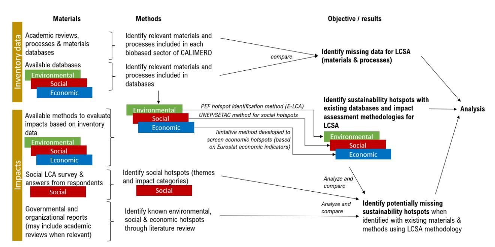

**Figure 1. Overview of the materials and methods for D1.2 and relationships to the objectives of the report**

# **2.1 Materials**

# 2.1.1 Databases for environmental, social and economic data

The available environmental, social, and economic databases that are potentially usable for LCSA are identified by the range of sustainability experts contributing to the CALIMERO project. The identified databases and statistics (economic) along with short descriptions and references are presented in Appendix A.

While many available life cycle inventory (LCI) databases exist for environmental LCA, methodological consistency is not ensured when using multiple databases. In this report, we focus on the ecoinvent 3 database (Wernet et al., 2016) because it is widely used, has a broad process coverage, and allows for detailed hotspot analyses because processes are disaggregated. Nevertheless, a complementary analysis of processes included in the also widely used GaBi database by Sphera is done for the process coverage. For social databases, we consider the social hotspots database (SHDB) and Product Social Impact Life Cycle Assessment (PSILCA) database. These are the two known existing databases for social impacts covering multiple sectors.

While the environmental and social databases follow a similar structure and are intended to be used with the environmental LCA and S-LCA methodologies, respectively, the economic data originates from different tools that are not always aiming to follow a life-cycle approach nor meant to be characterized using a cause-effect framework as the latter two. In this work, we consider the Eurostat and DataM databases, providing an overview of economic performance in European Union (EU) countries.

product manufacturing. The use and end-of-life (EoL) phases are not considered because including secondary data about the use phase (in particular) and EoL, is not straightforward. Indeed, data about the use (e.g., electricity consumption over the lifetime of a product) and end-of-life phase (e.g., steel being recycled, and wood being landfilled) is typically modelled on a case-by-case basis in LCA. Furthermore, the sectors considered in CALIMERO do not always lead to a clearly defined use phase, e.g., the biochemicals sector producing precursors for other chemicals, and the woodworking sector preparing materials for the construction sector (where the use phase occurs). Thus, an integrated sectorial analysis for the five CALIMERO bio-based sectors would require substantial efforts that go beyond the scope and capabilities of this report.

# 2.1.2 Impact assessment methods

Mature impact assessment methods are considered, i.e., those recommended in the PEF (EF 3.1 methods) (Andreasi Bassi et al., 2023) for environmental hotspots analysis. These are listed in [Table 1.](#page-10-1)

Table 1. Impact categories and methods recommended by the European Commission within the PEF (EF 3.1 package)

| Impact category Indicator Unit                              |               | Recommended LCIA method                       |
|-------------------------------------------------------------|---------------|-----------------------------------------------|
| kg CO                                                       | 2 eq          | Bern model - Global warming potential (GWP)   |
| kg CO                                                       | 2 eq          | Bern model - Global warming potential (GWP)   |
| kg CO                                                       | 2 eq          | Bern model - Global warming potential (GWP)   |
| Ozone depletion Ozone Depletion Potential kg CFC-11         | eq            | EDIP model based on the ODPs of the World     |
| CTUh                                                        |               | Based on USEtox2.1 model (Fantke et al. 2017, |
| CTUh                                                        |               | Based on USEtox2.1 model (Fantke et al. 2017, |
| Particulate matter Impact on human health Disease incidence |               | PM method recomended by UNEP (Fantke et al.,  |
| relative to U 235                                           |               |                                               |
| kBq U                                                       | 235           |                                               |
|                                                             | eq            | Human health effect model as developed by     |
| kg NMVOC                                                    | eq            | LOTOS-EUROS model (Van Zelm et al, 2008) as   |
| Acidification Accumulated Exceedance                        |               |                                               |
| mol H+                                                      | eq            | Accumulated Exceedance (Seppälä et 2006,      |
| mol N                                                       | eq            | Accumulated Exceedance (Seppälä et al. 2006,  |
|                                                             |               | Posch et al, 2008)                            |
| kg P                                                        | eq            | EUTREND model (Struijs et al, 2009) as        |
| kg N                                                        | eq            | EUTREND model (Struijs et al, 2009) as        |
| CTUe                                                        |               | Based on USEtox2.1 model (Fantke et al. 2017, |
| Land use Soil quality index                                 |               |                                               |
| m                                                           | 3 water       |                                               |
| m                                                           | 3 groundwater |                                               |

|                                   | replenishment                                      |              |                                                                          |
|-----------------------------------|----------------------------------------------------|--------------|--------------------------------------------------------------------------|
| Water use                         | User deprivation potential                         |              |                                                                          |
|                                   | (deprivation-weighted water consumption)           | m 3 world eq | Available WAter REmaining (AWARE) model (Boulay et al., 2018; UNEP 2016) |
| Resource use, minerals and metals | Abiotic resource depletion (ADP ultimate reserves) | kg Sb eq     | van Oers et al., 2002 as in CML 2002 method, v.4.8                       |
|                                   | Abiotic resource depletion –                       |              |                                                                          |
| Resource use, fossils             | fossil fuels (ADP-fossil)                          | MJ           | van Oers et al., 2002 as in CML 2002 method, v.4.8                       |

The social impact assessment methods are considered from those present in the social risk methodology of the PSILCA and SHDB databases. We focus on social impact categories that are associated with socio-economic topics of focus in the CALIMERO project that are foreseen to be applied and/or improved. For the PSILCA database, six impact subcategories were preselected, as shown in the [Table 2](#page-11-0) below.

Table 2. Selected impact subcategories in the PSILCA database

|                              |                    | Associated raw indicators | Match with CALIMERO target social        |
|------------------------------|--------------------|---------------------------|------------------------------------------|
| PRESELECTED                  | Accident rate at   |                           |                                          |
| PRESELECTED                  | Fatal accidents at |                           |                                          |
| PRESELECTED                  | DALYs due to       |                           |                                          |
| PRESELECTED                  | Presence of        |                           |                                          |
| PRESELECTED                  | Public expenditure |                           |                                          |
|                              |                    | % of GDP                  | Not a great match, but best one          |
| SELECTED                     | Unemployment       |                           |                                          |
|                              |                    | % of the population       | Good match; This is also of relevance    |
| Support of local communities |                    |                           | Note: There are many indicators for this |
| PRESELECTED                  | Unemployment       |                           |                                          |
|                              |                    | % of the population       | Good match; This is also of relevance    |

Regarding the SHDB, the v4 version was used to identify hotspots. In contrast to PSILCA, the database shows a systematic structure of product groups and countries. However, the level of disaggregation is lower than PSILCA. In some cases, it is impossible to evaluate the social hotspots for a bio-based product belonging to a sector where non bio-based alternatives present a great share of the product's volume. This is the case for example in the bio-chemicals or construction sectors. On the other hand, for textiles, woodworking and pulp and paper, the results of the hotspot analysis of bio-based systems are more representative of the bioeconomy. Following the same reasoning used with PSILCA, datasets representing the main product groups and countries, which will be analysed later in CALIMERO case studies were analysed.

Table 3. Selected impact subcategories in the SHDB database

|             |                     | Associated raw indicators                        | Match with CALIMERO          |
|-------------|---------------------|--------------------------------------------------|------------------------------|
| PRESELECTED | 2.A. Occupational   |                                                  |                              |
|             |                     | Cancer, overall occupational cancer risk - loss  |                              |
|             |                     |                                                  | Very good match - Workers,   |
| PRESELECTED | 2.B. Injuries &     |                                                  |                              |
|             |                     | Fatal injuries by sector: Non-fatal work related |                              |
|             |                     |                                                  | Very good match - Workers,   |
| PRESELECTED | 5.C Children out of |                                                  |                              |
|             |                     |                                                  | Good match - linked to skill |
| SELECTED    | 1.L.                |                                                  |                              |
|             |                     | Unemployment percentage at sector level          | Very good match - linked to  |
| PRESELECTED | 5.A Access to       |                                                  |                              |
|             |                     |                                                  | Good match - linked to       |
| PRESELECTED | 5.D Access to       |                                                  |                              |
|             |                     | Number of hospital beds per 1000 population      | Good match - linked to       |
| PRESELECTED | 5.E Smallholders    |                                                  |                              |
|             |                     | commercially-owned farms in country;             |                              |
|             |                     |                                                  | Good match - linked to       |
| PRESELECTED | 5.B Access to       |                                                  |                              |
|             |                     |                                                  | Good match - linked to       |

The selected impact categories, subcategories and social indicators from SHDB v4 to focus the improvement efforts on later case studies are presented in the table above. However, the full list of categories and indicators are used to evaluate the hotspots in a preliminary analysis of this deliverable. The indicators presented are extracted from version v4 of SHDB for Simapro, but a new update (v5) has been released.

New social subcategories such as workers in poverty, poverty and inequality, state of environmental sustainability, democracy & freedom of speech, access to health care (instead of access to hospital beds), access to electricity or property rights were added and have potential to be targeted in future studies. Also, a new impact category called "Society" has been integrated into the database, as well as new relevant indicators linked to occupational hazards and injuries related to asthma, chronic obstructive pulmonary disease (COPD), road, poison, fire, drowning or mechanical-related forces injuries.

There are no standardized economic impact assessment methods, as LCC typically identifies only flows (materials, energy), capital costs, or activities that contribute to the total cost for a given product or service system. The impact is therefore considered in terms of cost for the organisation or industry producing the good or service, and the resulting incentive will be to reduce those costs wherever possible. It is however possible to consider that environmental and social negative externalities should be accounted for as an economic impact; this is not further explored in this report but will be evaluated in further steps of the CALIMERO project. Discussion on LCC is available in the ORIENTING project deliverable (Bianchi et al., 2021).

#### 2.1.3 Survey for the identification of social hotspots

As described in D1.1, a questionnaire has been elaborated according to the UNEP Guidelines for Social LCA (UNEP, 2020a). This questionnaire was sent to industry members and other knowledgeable experts in the value chains of bio-based sectors. The data for S-LCA were collected through a qualitative survey. An explicative video was provided with the survey to introduce the S-LCA methodology. The survey includes the name of organisations and regions of origin of all inputs collected. The collected data consist of a qualitative scoring of the relevance of stakeholder categories and sub-categories (i.e., very relevant, relevant, slightly relevant, not relevant), and the collection of complementary qualitative information (optional). The questionnaire for S-LCA is available in the protocol for data collection (Appendix 1 of Deliverable 1.1). The survey results account for both positive and negative social and societal concerns along the value chain of the different sectors.

The call to participate in the survey was sent out to all the industrial project partners of CALIMERO, as well as through various dissemination channels, including broad sectorial e-mail lists from project partners, the LCA List managed by Pré Sustainability, and e-mails sent to known experts regarding social LCA of the bioeconomy identified in published scientific articles on related topics. Several reminders and communications were sent out about the survey through these channels. Answers were gathered from October 2022 to May 10, 2023. The questionnaire was answered by clusters working directly with bio-based industries, including research institutes, support associations, universities, and a few corporates. Due to this, despite the low number of answers, the high quality of collected data allows further analysis. Twenty-eight contributions were gathered, below the anticipated minimum of 100 contributions (at least 20 per bio-based sector). Results from the survey are used to further identify social hotspots for the five bio-based sectors. The distribution of the answers per sector is as follows: seven for biochemicals, seven for construction and woodworking, ten for textile, two for the pulp and paper sector and two for other bio-economy sectors. Due to the lack of representativeness regarding the pulp and paper sector (two answers), this sector was excluded from the analysis.

# 2.1.4 Literature sources

A short literature survey allowed identifying relevant documents and databases:

- A range of key reports, review articles and databases allowed identifying the main processes, materials and products included in each of the five bio-based sectors;
- A range of key reports and articles allowing for the qualitative identification of sustainability hotspots are consulted. These hotspots are the most pointed out in academic reviews, risk assessment reports for specific industries, global policy reports (from, e.g., UN and UNEP), and Corporate Social Responsibility reports from large multinational organizations;
- Complementary materials were compiled through the screening of key review articles for Task 1.3 of the CALIMERO project.

#### **2.2 Methods**

Each step of the methods described in this section is repeated for each of the five bio-based sectors.

# 2.2.1 Coverage of environmental data in environmental databases

For the evaluation of the coverage of data in databases, the focus is put on environmental databases, given their exhaustivity and maturity. The following steps allow identifying the coverage of materials and processes in the considered environmental databases:

Funded by the European Union. Views and opinions expressed are however those of the author(s) only and do not necessarily reflect those of the European Union. Neither the European Union nor the European Research Executive Agency can be held responsible for them. Page 15 Environmental hotspots represent material flows, energy flows, or activities that contribute in total to over 80% of impacts of the studied LCI datasets, here measured in a single score. As for impact assessment indicators, negative values can be identified as a negative hotspot, i.e., with a positive impact (see the paragraph above).

- I. Identify the most relevant processes, materials and products for each bio-based sector based on literature sources identified in section [2.1.4.](#page-13-1)
- II. Identify the list of processes relevant to each bio-based sector in the databases. To this end, an initial screening is done by identifying relevant categories of processes for bio-based sectors. For example, in the case of the environmental data from the ecoinvent 3 database (Wernet et al., 2016), version v3.9.1, consulted through the SimaPro 9.5 software, there are seven categories of processes: material, energy, transport, processing, use, waste scenario, and waste treatment. Within "material", processes are grouped under sixteen subcategories, such as agricultural, appliances, chemicals, construction, etc. The potentially relevant subcategories for bio-based sectors include "agricultural", "chemicals", "construction", "fuels", "paper + boards", "plastics", "textiles", "wood", and "others". Moreover, within "Processing", additional transformation processes are included under the categories of "wood" and "textiles". LCI datasets included within these categories were then manually sorted to identify all relevant processes relevant to the five biobased sectors.
- III. Compare identified processes, materials and products from step 1 with the existing processes, materials and products in databases as to identify coverage and data gaps.

# 2.2.2 Environmental hotspot analysis

LCI datasets from the ecoinvent database (Wernet et al., 2016) v3.9.1, allocation, cut-off, are considered for the hotspot assessment. This database is selected because most data from other databases are aggregated, making it impossible to identify hotspot processes. Moreover, other databases are often built partially based on ecoinvent data.

In the ecoinvent database, the same process can be found for different regions. When that is the case, only one process is selected with the following order of preference: (1) Europe ("RER") or Europe without Switzerland, (2) one country within Europe (e.g., Switzerland ["CH"]), (3) Global, (4) one country outside Europe. The LCIs are studied as "system" data to reduce the number of processes identified as hotspots. Within the ecoinvent datasets, both short- and long-term emissions happen. Long-term emissions occur beyond 100 years, and according to the PEF methodology, (European Commission, 2023) these should be excluded for toxicity impact categories. LCI datasets are then characterized using the method EF 3.1 and the environmental hotspots are identified following the PEF guidelines (EC-JRC, 2012), as described below. Mid-point impact assessment results are considered in the single score (normalised and weighted), and long-term emissions are excluded from the assessment.

# 2.2.2.1 Identification of hotspot indicators for each bio-based sector

The impact assessment results are compiled in an Excel spreadsheet and analysed using different Excel functions, to identify the hotspot indicators. Negative values can be identified as a "negative hotspot", i.e., with a negative impact (e.g., when a process returns water to the environment, resulting in a negative value for the water footprint). This is done by recalculating impact contributions considering only absolute values and normalizing the results to a total of 100%, then reconverting negative hotspots to negative values. Following the PEF guidelines, indicators collectively contributing to over 80% of the LCI's impacts are identified as hotspot indicators. If an indicator is relevant for one LCI in a sector, it should be considered as potentially relevant for all the LCIs in the sector.

# 2.2.2.2 Identification of hotspots for each bio-based sector

All considered material and energy flows, or transformation activities are screened and grouped into categories. Screening is done by identifying recurrent keywords within hotspot activities for each sector and using Boolean functions in Excel (e.g., heat processes included in the energy category are identified by looking for the word "heat" in the name of the process). Processes are then grouped into categories specific to the different biobased sectors, including energy (e.g., fossil fuels, electricity, and heat), material inputs (e.g., raw materials like wood), infrastructure, waste, and transport, among others.

# 2.2.3 Social hotspot analysis

Social hotspot analysis was conducted through two different methods, detailed below. The first one relies on answers to the survey, and the second one on the characterization of processes from the SHDB and PSILCA databases that are relevant to bioeconomy.

#### 2.2.3.1 Stakeholder social hotspot identification ("survey approach")

In order to allow an efficient and meaningful S-LCA study, the most relevant stakeholders and social themes need to be identified. A scoring method based on WeLOOP's experience with S-LCA surveys is used. The following scores are attributed: "highly relevant" are scored 10; "relevant", 5; "slightly relevant", 1; and "not relevant" or "not applicable", 0. A non-linear scoring system is applied where the highest scores are attributed to highly relevant (10) and relevant (5) choices to sharply increase the scoring for relevant social themes. The total score is the summation of all the scores. The relative total score is obtained by considering the highest score equal to be equal to 100% and the smallest to be equal to 0%. All other scores are recalculated according to this scale.

Following the UN guidelines (UNEP, 2020a), a quantitative weighting method is applied, and a quantitative threshold is defined. The definition of thresholds is defined by analysing the relevance of the stakeholder categories for the analysed sector. After that, the social themes are analysed for each relevant stakeholder. The different actors and themes are shown in [Figure 2.](#page-16-0) All social themes with scores above the defined threshold of 80% are identified as potential hotspots linked to a specific group of stakeholders. In real-life social LCA projects, a threshold is defined based on the scope of the study, budget, time available for interviews, number of answers from the survey and the quality of the answer to limit the number of social themes. This step is not conducted in the CALIMERO project, as it is aimed to highlight the most relevant social themes in order of importance.

The use of this method ensures that prominent social issues relevant to the industry and their supply chains are considered from primary sources. Furthermore, the quality of the results depends on the number of contributions to the survey and the knowledge of participants on the life cycle social impacts of their organisations. However, there may be some subjectivity in the assessment results from the survey.

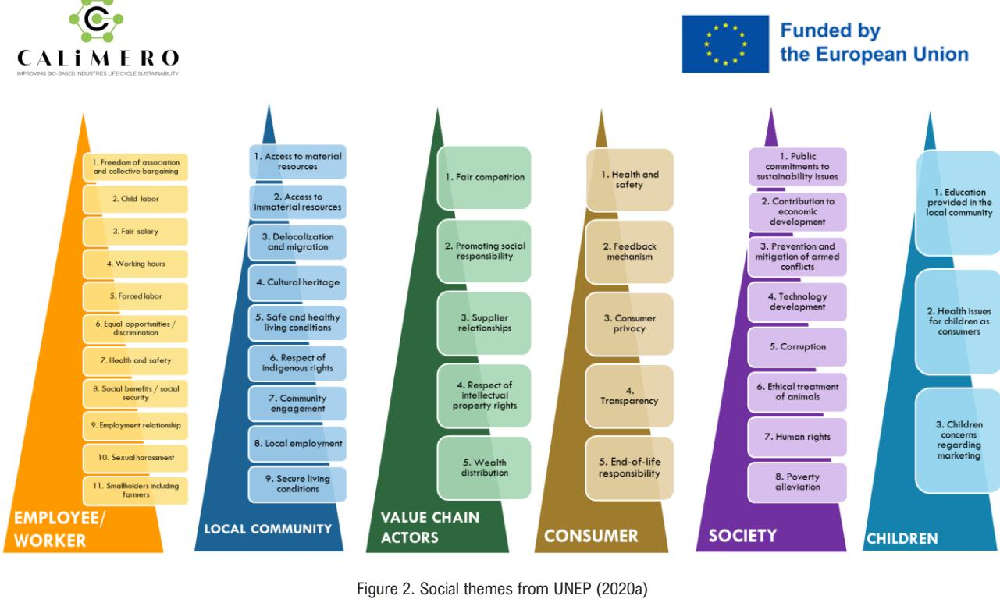

# 2.2.3.2 Database social risk hotspot identification ("database approach")

The social hotspot assessment is also conducted for relevant sectorial products within the two most prominent social LCA databases, as identified by CALIMERO project partners: PSILCA and SHDB. These databases comprise both an inventory (based on IO-tables) with added specific social inventory indicators (qualitative and quantitative ones), together with an impact assessment. In the latter, predefined degrees of social risk (e.g. low, medium or high) for various impact subcategories per stakeholder, are assigned to the different sectors or regions, based on social inventory data and social information. The level of detail is often low and at the country level, without making any difference between sectors per country. For example, national statistics on child labour frequency can be considered for all sectors of that country. Assigning a score to these degrees (e.g. high is scored 10, medium is scored 1) and multiplying these with the working hours spent in a sector, allows to quantify social risks in terms of risk hour equivalents, obtaining a quantifiable and scalable approach. By convention, the score 1 is given to medium risk, resulting in medium risk hours equivalents. Keep in mind that the quality of this hotspot analysis is restricted by the quality and data of these databases and their impact methods.

Concerning PSILCA, its sectors and sectorial product groups are not the same for each country, neither in amount nor name. A systematic analysis per sector (textile, woodworking etc.) would be too elaborate with regard to the objectives of this report. Hence, we restrained the scope to the selection of sectorial products that best match the cases of the industrial partners in CALIMERO, as presented in [Table 4](#page-16-1) below. The selected products only cover the supply chain, and do not include the use and the EoL stage. The consideration of the use phase is redundant when considering products with the same functionality.

Table 4. Selected PSILCA sectorial product groups that best match the considered cases in CALIMERO

| CALIMERO cases                             | Selected PSILCA sectorial product group | Comment            |                    |
|--------------------------------------------|-----------------------------------------|--------------------|--------------------|
| Pulp and paper – Essity - Sweden           | Manufacture of pulp, paper and paper    |                    |                    |
| Woodworking – CESEFOR - Spain              | Manufacture of wood and products of     |                    |                    |
| Construction (cellulose insulation) – ECIA |                                         |                    |                    |
|                                            | Cellulose and paper products (Germany)  | Acceptable match – | there was only one |

Funded by the European Union. Views and opinions expressed are however those of the author(s) only and do not necessarily reflect those of the European Union. Neither the European Union nor the European Research Executive Agency can be held responsible for them. Page 18 • In what European countries is economic activity for different steps in the value chain the strongest?

|                                  |                                                           |                                                                              | product, namely Germany |
|----------------------------------|-----------------------------------------------------------|------------------------------------------------------------------------------|-------------------------|
| Textile (jeans) – EREKS - Turkey | Manufacture of textiles (Turkey)                          | Good match – not specific for jeans                                          |                         |
| Textile – TECHTERA - France      | Manufacture of textiles (France)                          | Very good match                                                              |                         |
| Biochemicals – BIMKEMI - Sweden  | Chemicals, chemical products and man-made fibres (Sweden) | Acceptable match – there are no specific sectorial products for biochemicals |                         |

| CALIMERO cases  |              | Selected SHDB sectorial                                                                       |
|-----------------|--------------|-----------------------------------------------------------------------------------------------|
|                 |              | product group (U: unit process)                                                               |
| Pulp and paper  | –            | Essity -                                                                                      |
| Woodworking     |              | –                                                                                             |
| CESEFOR -       | Spain        |                                                                                               |
|                 |              | Wood products/ESP Very good match                                                             |
| Construction    | (cellulose   |                                                                                               |
| insulation)     | –            | ECIA                                                                                          |
|                 |              | Plant-based fibres, ECIA mix Acceptable match. It is a dataset created based on ECIA economic |
| Textile (jeans) | –            | EREKS -                                                                                       |
|                 |              | Wearing apparel/TUR U Good match – not specific for jeans                                     |
| Textile         | – TECHTERA - |                                                                                               |
|                 |              | Wearing apparel/FRA U Good match – it also includes non-bio-based apparel products            |
| Biochemicals    | – BIMKEMI    |                                                                                               |
|                 |              | Chemical, rubber, plastic                                                                     |
|                 |              | Acceptable match – there are no specific sectorial products for                               |

# 2.2.4 Economic hotspots identification

As determined in the ORIENTING project, the economic assessment part of LCSA requires that all stakeholders along the value chain of a product (i.e. industry, users, society and policymakers) are integrated (Bianchi et al., 2021). Indeed, as highlighted in the report, "the benefits for a company might not necessarily be a benefit for society, the company's workers, or local communities". Therefore, an economic optimization should include not only the direct costs (i.e., manufacturing capital, provisioning of materials, energy consumption, remuneration of employees, etc.), but also indirect costs (e.g., environmental and social externalities). In this light, it can be said that the economic hotspots of a process or supply chain are very dependent on the context of organisations. For instance, the cost of relatively cheap raw materials is directly dependent on its transportation; salaries depend on the countries' development and cost of living; the social and environmental externalities related to the implementation of a plant in a given place directly depend on its location; etc. Furthermore, the integration of different economic aspects in an LCSA approach is far from mature and involves challenges like avoiding double-counting and quantifying the cost of social and environmental externalities (Bianchi et al., 2021). To the best of our knowledge, no combination of existing databases can directly support a sectorial economic assessment at this point.

In view of the complexity of such a holistic assessment and known wide gaps in industry-specific economic data, we therefore chose to develop a preliminary approach allowing to identify the main actors (countries) in Europe, which may later allow for a more regionalized understanding of where economic value added is generated, where transformation activities occur, and therefore where socio-economic and environmental impacts related to bio-based supply chains take place.

An economic hotspot analysis is conducted to understand which European countries play a relatively large role in the bio-based industry. These countries will generally be most affected by the local environmental impacts related to the activities of the bio-based value chains and are also most concerned about the availability of input materials and the generation of jobs in the bio-based sector.

In this economic hotspot analysis, the three following research questions have been investigated, all based on data available in Eurostat:

A list of 54 economic indicators for manufacturing sectors and 24 indicators for forestry is assessed (see Appendix E). The European average score of each indicator is calculated over all EU countries for the years 2018-2020. Each country's value is compared with the European average. Economic activity is considered to be "strong" when the indicator score is higher than 1.5 times the average. A country is considered to have high economic activity when it has a strong activity for at least 10 economic indicators. Complementarily, employment and added value statistics from the DataM database developed by the JRC are considered (Lasarte-López et al., 2023).

- What step in the value chain provides the most added value?

The average value of the indicators "Value added at factor cost" (for manufacturing) and "Gross value added" (for forestry) is calculated for the European Union (total) for the years 2018-2020.

- What step in the value chain engages most employees?

The total number of persons employed is calculated for the European Union (total) for the years 2018-2020.

# **3 RESULTS AND DISCUSSIONS**

# **3.1 Coverage of most relevant bio-based materials and processes in databases**

In this section, the most relevant materials and processes are identified and then compared with the processes available in environmental databases (mostly ecoinvent 3.9.1 and complementarily, GaBi database by Sphera).

#### 3.1.1 Bio-chemicals industry

# 3.1.1.1 Most relevant materials and processes

# A. Description of the biochemical sector

The biochemical sector includes a wide range of industries and fields of study, including biochemistry, biotechnology, pharmaceuticals, food and beverage production, agriculture, environmental science, and more. It involves the use of enzymes, proteins, chemicals, and other biological compounds to develop new products, improve existing ones, and solve complex problems related to health, agriculture, energy, and the environment.

Biorefinery platforms are considered important to reduce the dependence on non-renewable fossil resources as they can produce various chemicals using biomass feedstocks as raw materials. Major feedstocks for biorefineries include starch crops (e.g., wheat and maize), sugar crops (e.g., beet and cane), perennial grasses and legumes (e.g., ryegrass and alfalfa), lignocellulosic crops (e.g., managed forest, short rotation coppice, switchgrass), lignocellulosic material including residues (e.g., forest raw materials), oil crops (e.g., palm and oilseed rape), aquatic biomass (e.g., algae and seaweeds), and organic residues (e.g., industrial, commercial, and postconsumer waste). There are also different types of biorefinery platforms for chemicals production by employing of these feedstocks, including:

- **Thermochemical Biorefinery:** This platform involves converting biomass feedstocks to chemicals through pyrolysis, gasification, and other thermal processes.
- **Biochemical Biorefinery:** This platform involves converting biomass feedstocks to chemicals through biological processes such as microbial fermentation, enzymatic hydrolysis, and anaerobic digestion.
- **Hybrid Biorefinery:** This platform blends both thermochemical and biochemical processes to produce chemicals from biomass feedstocks.
- **Algae Biorefinery:** This platform involves using microalgae and cyanobacteria to produce chemicals through photosynthesis and other metabolic pathways.

An overview of how various biomasses can be converted into added-value products is shown in [Figure 3.](#page-20-0) As it can be seen, different platforms, such as lignin extraction and sugar production, are considered in biorefineries for various chemicals production. The following figure provides a summary of the most significant platforms for chemical production in biorefineries.

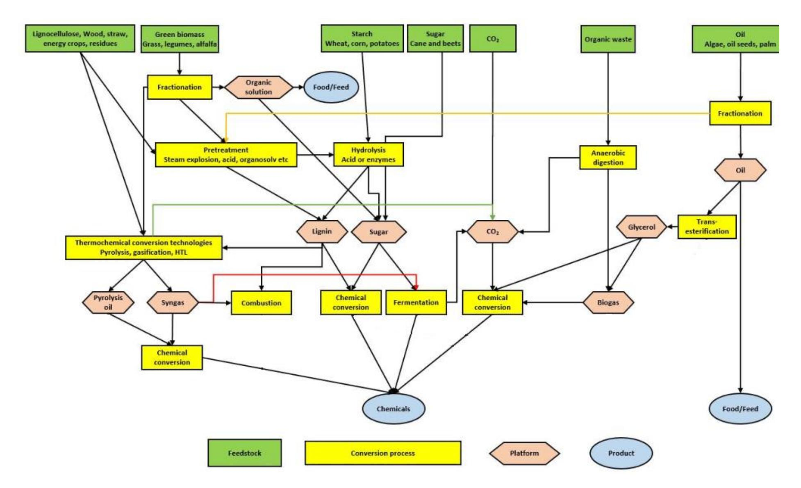

**Figure 3. Overview from different biomass to various chemicals (De Jong et al., 2020)**

Funded by the European Union. Views and opinions expressed are however those of the author(s) only and do not necessarily reflect those of the European Union. Neither the European Union nor the European Research Executive Agency can be held responsible for them. Page 22 The lignin platform in biorefinery refers to the utilization of lignin, which is a complex organic polymer found in the cell walls of many plants, as a valuable feedstock to produce various chemicals and materials. It is included in the biorefinery concept because it is considered a renewable source of carbon and energy. The lignin platform

# **Pyrolysis oil platform**

Pyrolysis, a thermal technique that involves heating biomass at a temperature below 700°C in the absence or with a limited supply of oxygen, breaks down the biomass and creates pyrolysis oil (the primary product), gas, and char. The range of products from biomass pyrolysis will rely on the process temperature, pressure, and residence time. The crude oil produced can be used directly for energy production, but it may also be upgraded or transformed into higher-value compounds using various catalytic reactions like cracking, steam reforming, hydrocracking, and hydrodeoxygenation. Benzene, toluene, assorted carboxylic acids, and furans are among the numerous compounds that may be created (Safarian et al., 2022).

#### **CO2 platform**

The use of biobased chemicals and materials in long-lasting applications presents an opportunity for reducing emissions, especially when biogenic CO2 derived from fermentation processes is used. However, this requires greater collaboration and exploration of symbiotic opportunities across industries, which can lead to improved energy and resource efficiency beyond sectoral boundaries. Researchers are already investigating the conversion of CO2 into intermediates. For example, methanol – a major chemical compound used as a precursor for various other compounds such as formaldehyde and acetic acid – is presently mainly produced using synthesis gas. A more sustainable and low-carbon route to methanol involves generating hydrogen through water electrolysis with low-carbon electricity and then hydrogenating CO2 as the carbon source.

#### **Syngas platform**

Syngas, a gaseous combination of carbon monoxide (CO), hydrogen (H2), methane (CH4), carbon dioxide (CO2), and nitrogen (N2), can be formed by subjecting the biomass to high temperatures, usually between 800-1500˚C, in the presence of oxygen or air through gasification. While gasification technology has traditionally focused on energy generation and power generation, many operating gasifiers can be modified for catalyst-assisted thermochemical conversion to produce alcohols like methanol and ethanol, fuels including Fischer-Tropsch diesel, and chemicals. The Fischer-Tropsch method for generating hydrocarbons is a longstanding process currently utilized on a large industrial scale. There is also a growing interest in employing syngas as a substrate for microbial fermentation to produce alcohols like ethanol and butanol, as well as other chemical compounds such as acetic acid (Safarian et al., 2021, 2020).

# **Sugar platform**

One of the major platforms for chemical production based on biomass is the sugar platform, which currently holds the highest production volume. Traditional biorefinery processes rely on sugar derived from crops such as sugar beet or sugar cane or glucose from starch obtained through hydrolysis. Advanced biorefineries use lignocellulosic biomass, which undergoes pre-treatment and enzymatic hydrolysis to release sugars like glucose from cellulose and a mixture of sugars like xylose, arabinose, mannose, and galactose from hemicellulose. Glucose is the primary substrate for biological fermentation processes that yield chemicals like alcohols, organic acids, lipids, and hydrocarbons, as well as high-value products like amino acids, vitamins, antibiotics, and enzymes. While the mixed sugar platform in a lignocellulosic biorefinery can theoretically produce the same products as glucose, technical, biological, and economic challenges must be addressed. The sugars can also be transformed using catalytic processes into useful chemical building blocks such as HMF, furan-dicarboxylic, and levulinic acid (De Jong et al., 2020; Taylor et al., 2015; van Putten et al., 2013).

# **Lignin platform**

includes various processes for the extraction, modification, and conversion of lignin into useful products. These processes may involve biological, chemical, or physical methods, and may be integrated with other biorefinery processes, such as the production of biofuels and bioproducts. Some of the potential products that can be derived from lignin include phenolic compounds, aromatic chemicals, carbon products and energy. Overall, the lignin platform is a promising approach to sustainable and added-value utilization of lignocellulosic biomass in biorefinery systems.

# **Bio-oil and glycerol platform**

The oil platform contains fatty acids and triglycerides that are sourced from terrestrial oil plants and aquatic biomasses, predominantly microalgae. About 80% of vegetable oil is utilized for human consumption while the remaining 20% is used for non-food applications. To create chemical feedstock, the triacylglycerol molecule, which is the main component found in most plant oils, is either separated into fatty acids and glycerol or transformed into alkyl esters and glycerol through a process called transesterification. This is commonly used in biodiesel production (fatty acid methyl esters). The properties of the fatty acid derivatives determine their practical uses. Most of them are employed as surface active agents in personal care products, soaps, and detergents. The monounsaturated fatty acids found in coconut, palm, and palm kernel oil are the primary sources for these kinds of products.

Glycerol is a significant by-product of both fatty acid and alcohol production. It can be refined and sold for different purposes, such as in pharmaceuticals, cosmetics, and the food industry. The excess amount of glycerol has motivated chemical producers to explore technology that can convert it into chemical building blocks. Fermentation and anaerobic digestion can use glycerol as a feedstock. The most promising fermentation product at present is 1,3-propanediol. However, other products produced may include ethanol or various organic acids. Chemical modifications can change glycerol to glyceric acid and tartronic acid, or through reduction to acrolein or propanediol. Nevertheless, it is the chemical conversion of tartronic acid from glycerol to three carbon chemicals like propylene glycol that has caught the particular attention of researchers.

# B. CO2 capturing through the biochemicals sector

The biochemicals sector involves the usage of biological organisms and processes to produce chemicals and materials that are otherwise made from fossil fuels. In the process, the use of organic waste materials and CO2 capture is an emerging trend that is gaining more attention due to its potential to reduce carbon emissions. CO2 capture through the biochemicals sector operates by exploiting natural processes in which bacteria can use CO2 as a food source to convert it into useful chemicals.

One example of a CO2-capturing process in the biochemicals sector is Carbon Capture and Utilization (CCU). In this process, microbes are used to consume CO2 and convert it into useful chemicals such as bioplastics, biofuels, and detergents. The process involves a set of chemical reactions in which CO2 is transformed into organic molecules, thereby helping to reduce the amount of CO2 released into the environment.

The CO2 captured through the biochemicals sector can be used to create sustainable materials that can replace traditional fossil fuel-based products. For instance, Bio-based succinic acid, ethylene, and other organic compounds can be derived from CO2. Consequently, this form of carbon capture and utilization addresses the dual challenges of sustainable material production and CO2 reduction.

Another way that CO2 is captured via the biochemical sector is through the process of microalgae cultivation. Microalgae are photosynthetic organisms that grow using CO2 as their main carbon source. This means that when they are grown, they consume CO2 and release oxygen to the environment. Moreover, using microalgae creates a carbon sink that can help to reduce the levels of carbon dioxide in the atmosphere.

In a similar vein, fermentation processes are also being employed to capture CO2. Biosynthesis and the production of high-value products such as biofuels and chemicals are some of the notable applications of CO2 capture through fermentation. Some fermentation processes also rely on the utilization of industrial waste gases, which contain high levels of CO2, to create organic chemicals and materials, hence preventing the discharge of CO2 into the atmosphere. There are also various technologies being developed to capture CO2 directly from the air and convert it into useful chemicals and materials. These technologies are still in their early stages of development, but they hold promise for mitigating GHG emissions and creating a closed-loop carbon economy.

Overall, the biochemicals sector is a rapidly growing industry with increasing potential for CO2 capture. The sector is providing critical support for innovative and sustainable solutions that can be employed to transform CO2 from a pollutant into a resource. This shift towards bio-based materials provides an avenue to produce environmentally friendly goods and a greener future. By capturing CO2 through the biochemicals sector, there is an opportunity to explore and develop new sustainable technologies and reduce the overall carbon footprint of the planet.

#### C. Commercial biochemicals

Multiple reports and articles have conducted a comprehensive evaluation of the potential to produce chemicals and polymers from biomass (Bozell and Petersen, 2010; Golden et al., 2015; Patel et al., 2006; USDA, 2008). In 2004, the US Department of Energy released a report (USDA, 2008) that listed 12 chemicals as potential building blocks for the future. This list was reviewed and updated in 2010 to 10 chemicals: succinic acid, furanics, hydroxypropionic acid/aldehyde, glycerol, sorbitol, xylitol, levulinic acid, biohydrocarbons, lactic acid and ethanol.

Through the BREW project (Patel et al., 2006), a study evaluated the market potential for biotechnologyproduced bulk chemicals from renewable resources, identifying 10 prominent ones, including acetic acid, adipic acid, n-butanol, ethylene, ethylene glycol, furan-dicarboxylic acid (FDCA), polyhydroxyalkanoate (PHA), polylactic acid (PLA), ethyl lactate and succinic acid. The study estimates that the production of renewable bulk chemicals could constitute up to 38% of all organic chemical production, with approximately 113 million tons by 2050, given favourable market conditions. However, even with more conservative market conditions, the market still could make up a noteworthy 26 million tons, which is approximately 17.5% of total organic chemical production.

In order to have a more comprehensive overview of different bio-based chemicals produced by companies at commercial as well as demonstration scale, IEA bioenergy (De Jong et al., 2020) has outlined a list of products with the potential for strong growth and supporting industry interest (as commercial phase) as well as, various bio-based chemicals in the pipeline (as demonstration phase) [\(Table 6\)](#page-23-0). The industrial development of a variety of bio-based chemicals demonstrates the extensive potential and adaptability of producing such chemicals, with the potential to either serve as a primary aspect of biorefinery operations or enhance its overall value.

Table 6. Global overview of different chemicals produced in growth (commercial) and pipeline (demonstrated) scale gathered by IEA bioenergy (De Jong et al., 2020)

| Growth                             | Pipeline       |
|------------------------------------|----------------|
| Methanol                           | Aniline        |
| Ethanol                            | Levulinic acid |
| Ethylene                           | Adipic acid    |
| Ethylene oxide                     | FDCA           |
| Ethylene glycol (MEG)              | Glycolic acid  |
| Acetic acid                        | Acetone        |
| Citric acid                        | Acrylic acid   |
| Propylene Glycol (1,2-Propanediol) | Formaldehyde   |

| 1,3-Propanediol | Formic acid              |
|-----------------|--------------------------|
| Glycerol        | 2,3-Butanediol           |
| Succinic acid   | Xylene                   |
| Furfural        | Oxalic acid              |
| Azelaic acid    | Propylene                |
| Pelargonic acid | Isopropanol              |
| Sorbitol        | Cyrene                   |
| Lactic acid     | Ethyl acetate            |
| 1,4-Butanediol  | 3-Hydroxy propionic acid |
| Isosorbide      | Malonic acid             |
| Sebacic Acid    | n-Butanol                |
| Iso-Butanol     | Iso-Butene               |
| Ethyl lactate   | Butyric acid             |

The selected bio-chemicals by IEA bioenergy shown in [Table 6](#page-23-0) are valuable, but most of them are currently produced or have the potential to be produced outside of Europe, like US and China. Moreover, for some chemicals, there is potential to be produced from renewable materials, but there is still no production. Hence, this study selected 18 main chemicals from the mentioned chemicals for further investigation. These chemicals are currently being produced or have strong potential to be produced from various biomass via companies in Europe. In some cases, the considered bio-based chemical is the only output product of a single system. However, for some processes, there are other by-products in addition to the main chemical. The considered chemicals are shown in [Table 7.](#page-24-0) The type of processes for their production are shown in the table, and the detailed processes and data regarding to material and energy consumption for considered processes are described in the next sections.

Table 7. The investigated chemical for this study

| Chemical         | Byproducts                     | Type of process                    |
|------------------|--------------------------------|------------------------------------|
| Ethanol          |                                | Saccharification and fermentation  |
| Poly-lactic acid |                                | Fermentation and polymerization    |
| Citric acid      |                                | Fermentation                       |
|                  | Propanol                       | Thermo-chemical conversion         |
| Ethylene glycol  |                                | Catalytic cascade reactions        |
| Adipic acid      |                                | Fermentation                       |
| Methanol         | BTX (Benzene, Toluene, Xylene) | Gasification and membrane reactors |
| Succinic acid    |                                | Aerobic fermentation               |
| PHA              | Methanol                       | Fermentation                       |
| Levulinic acid   | Furfural                       | Hydrolysis                         |
| FDCA             | Acetic acid                    | Hydrolysis                         |
| 1,4-butanediol   |                                | Fermentation                       |
| 1,3-propanediol  |                                | Fermentation                       |

|              | -               | Fermentation        |
|--------------|-----------------|---------------------|
| Acetic acid  | Pelargonic acid |                     |
|              | Suberic acid    |                     |
|              | Caproic acid    |                     |
| Azelaic acid | Caprylic acid   | Transesterification |
|              | Palmitic acid   |                     |
|              | Stearic acid    |                     |
|              | Arachidic acid  |                     |
|              | Glycerol        |                     |
|              | Propionic acid  |                     |
| Butanol      | Ethanol         | Fermentation        |
|              | Acetone         |                     |
| Xylene       | Toluene         | Fermentation        |
|              | Benzene         |                     |

# 3.1.1.2 Coverage of relevant materials and processes in environmental databases (LCA)

In the ecoinvent database, there are several datasets for the production of biochemicals from different raw materials, like bio-oils, maize, potatoes etc. The relevant datasets in ecoinvent 3.9.1 are:

- ethanol production from grass, maize, potatoes, rye, sugar beet molasses, whey and wood
- citric acid production from maize starch
- glycerine production from rape oil and soybean oil
- fatty acid methyl ester production from rape oil and soybean oil
- fatty acid production from coconut oil, palm oil, palm kernel oil, soybean oil and tall oil
- fatty alcohol production from coconut oil, palm oil and palm kernel oil
- fatty alcohol sulphate production from coconut oil, palm oil and palm kernel oil
- methanol from biomass (hardwood and softwood)
- lauric diethanolamide production
- glucose production from maize starch
- dodecanol production from coconut oil

Coverage of bio-chemicals related datasets in ecoinvent seems limited compared to the variety of available biochemicals in the market. However, considering that there are many kinds of fatty acids, the fatty acid datasets can be considered representative for modelling more bio-chemicals then actual number of datasets. For example, acetic acid, caproic acid, pelargonic acid, caprylic acid, palmitic acid, stearic acid, arachidic acid, propionic acid, azelaic acid that are listed in [Table 7](#page-24-0) are all fatty acids.

The coverage of raw bio-materials that may be used to produce biochemicals is decent, with some missing points. For example, there are no datasets that represent bio-chemical production from CO2 or algae that are shown as starting points in [Figure 3.](#page-20-0) Since ecoinvent is updated regularly by its developers, it can be assumed that the number of bio-chemical datasets will grow with the increasing biochemical production.

# 3.1.2 Pulp and paper industry

# 3.1.2.1 Most relevant materials and processes

A part of today's forest industry refines raw materials (pulp wood and wood chips, the latter typically obtained from sawmills) into valuable products in pulp mills. The pulp is further processed into paper and carton products. A simplified overview of the pulp and paper sector in Europe is shown in [Figure 4.](#page-26-0)

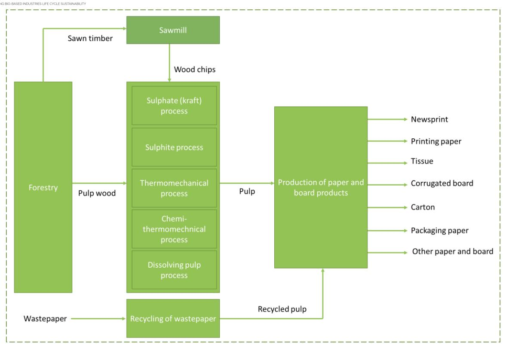

Funded by the European Union. Views and opinions expressed are however those of the author(s) only and do not necessarily reflect those of the European Union. Neither the European Union nor the European Research Executive Agency can be held responsible for them. Page 27 The total amount of pulp produced in Europe in 2021 was about 73 million tonnes (including recycled pulp), and the distribution of the different pulp types is presented in [Figure 5.](#page-27-0) As the figure shows, it was mainly sulphate pulp from virgin material and recycled pulp being produced. The geographical scope is Europe,

Figure 4. Simplified overview of the pulp and paper industry in Europe

Pulp mills generally use either a chemical, mechanical process or a combination of the two. Also, there are recycled fibre pulp mills that use wastepaper as input. The chemical pulp mills are either based on the sulphate or sulphite process, the former being the widely used one. The mechanical pulp processes are the processes using a rotating grinding stone or disk refiner, the thermomechanical pulp process, and the chemithermomechanical pulp process. Different types of pulp and by-products are obtained from the pulp mills that are suitable for different applications. The main materials and pulp-making processes used in Europe are presented in [Table 8.](#page-26-1)

Table 8: Type of pulp and valuable by-products generated at the pulp mills in Europe

| Type of pulp                | Process Valuable by-products (2)                          |
|-----------------------------|-----------------------------------------------------------|
| Sulphate pulp               | Sulphate (kraft) process Tall oil, turpentine,            |
| Sulphite pulp               | Sulphite process Lignosulfonate                           |
| Sulphate dissolving pulp    | Sulphate (kraft) process Tall oil, turpentine,            |
| Sulphite dissolving pulp    | Sulphite process Lignosulfonate                           |
| Thermomechanical pulp (TMP) | Mechanical process run under pressure                     |
| Chemimechanical pulp (CMP)  | Wood feed into a disk refiner with the addition of        |
| Chemithermomechanical       | pulp                                                      |
|                             | Mechanical process with the addition of chemicals and     |
| Recycled pulp               | Recycling process                                         |
| Other mechanical pulp       | (1) Wood is pressed onto a rotating grinding stone or fed |

(1) Groundwood pulp and refiner mechanical pulp

(2) Used for purposes other than energy.

embodied by the Confederation of European Paper Industries (Cepi) countries. Most European countries are included in the Cepi.

Figure 5. Pulp production in Europe in 2021. The production volumes are based on Cepi statistics (2022). Mechanical and semi-chemical pulp includes TMP, CMP, CTMP, and other mechanical pulp. The amount of dissolving pulp generated is not specified in the Cepi statistics but is most likely part of the production volumes for sulphate and sulphite pulp.

The generated pulp is further processed into valuable products, for example, paper, carton and textiles. Pulp intended for textiles manufacturing and a few other speciality products where the pulp is dissolved in further processing is referred to as dissolving pulp. The focus here is on paper and carton products since textile is accounted for in the textile sector. Different types of paper machines are used to produce the following product in Europe:

- Newsprint
- Printing paper
- Tissue
- Corrugated board
- Carton
- Packaging paper
- Other paper and board

The amounts of paper and cartons produced in Europe in 2021 are presented in [Figure 6.](#page-28-1) As the figure shows, it was mainly corrugated board and printing paper being produced.

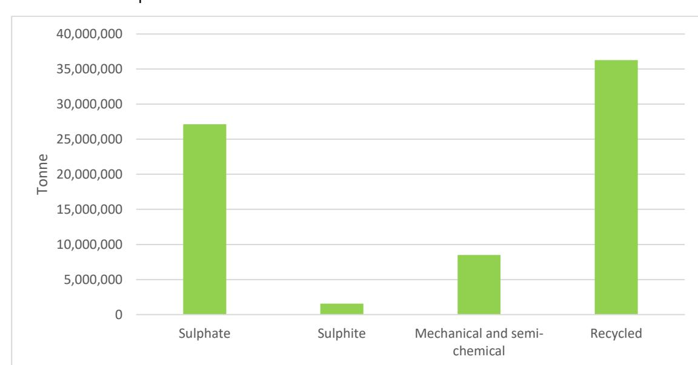

Figure 6. Paper and carton produced in Europe in 2021. The production volumes are based on Cepi statistics (2022)

# 3.1.2.2 Coverage of relevant materials and processes in environmental databases (LCA)

The ecoinvent 3.9.1 database covers the main pulp production processes. However, ecoinvent 3.9.1 lacks datasets for dissolving pulp produced via the kraft or sulphite process. Nonetheless, the datasets for sulphate or sulphite pulp can be used as a proxy. There is one dataset for sulphate pulp produced from eucalyptus. All other pulp datasets specify if the pulp is produced from hardwood or softwood. There are no pulp production datasets in the GaBi database by Sphera.

Processes that further refine the pulp into paper and paperboard products are well covered in the ecoinvent 3.9.1 database. The main products identified in the section above are all included: newsprint, different types of paper, tissue, corrugated board (which consist of fluting and linerboard), carton, packaging paper such as kraft paper, and other paper and paperboard. Most of the datasets are based on data from the European Federation of Corrugated Board Manufacturers (Fefco). In the GaBi database by Sphera datasets for paper and paperboard exits and the datasets are also based on data from Fefco.

#### 3.1.3 Textile industry

# 3.1.3.1 Most relevant materials and processes

The textile industry is responsible for the production and manufacturing of fibres and yarn. These materials are then processed into fabrics and used to create a wide range of woven and non-woven products. Natural fibres, man-made fibres and the blend of different fibres, used to provide additional properties and characteristics, are the used supports to be weaved and transformed into textiles for apparel and adjacent industries such as home textiles, industrial filters, technical textiles and carpets.

The NACE (Nomenclature of Economic Activities) codes serve as the recognized European standard for categorizing productive economic activities (European Commission, 2010). These codes effectively classify the entire range of economic activities, allowing for the association of a NACE code with a statistical unit engaged in the corresponding activity. For textiles, the NACE code13 division includes various textile manufacturing activities such as preparation and spinning of textile fibres, textile weaving, finishing of textiles, and manufacturing of made-up textile articles other than apparel, such as household linen, blankets, rugs, and cordage, among others. While the growing of natural fibres falls under division 01, the manufacture of synthetic fibres is classified as a chemical process under class 2030. Division 14 covers the manufacturing of wearing apparel. The subcategories included in this industry are 131 for preparing and spinning textile fibres, 132 for weaving textiles, 133 for finishing textiles, and 139 for manufacturing other textiles.

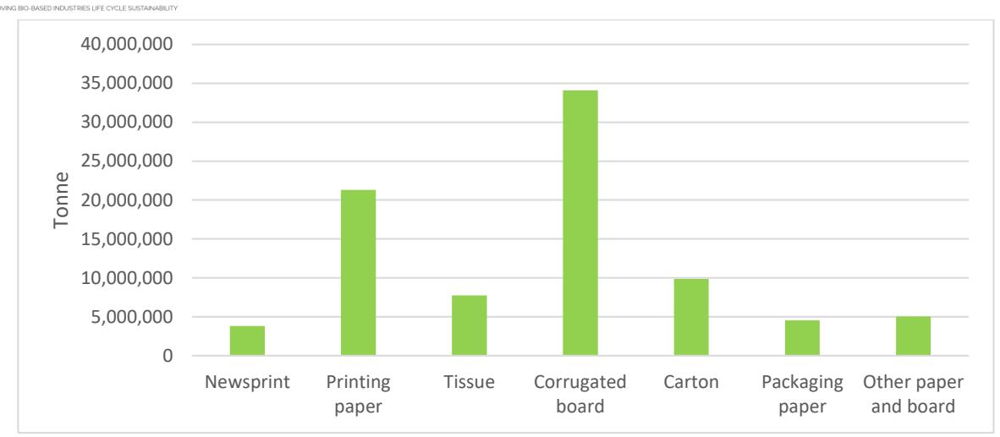

According to the statistics categories of the Food and Agriculture Organization of the United Nations mentioned in the article authored by Ahmed and Mondal (2021), natural fibres can be classified into plant-based fibres, animal-based fibres, and mineral fibres. Plant-based fibres are derived from plants and include widely used fibres such as cotton, used in the manufacture of clothing, as well as flax, hemp, jute, ramie, sisal, kapok, and bamboo, each with unique properties that make them useful in different applications. Regenerated cellulosic fibres like viscose, rayon, and lyocell are also included in this category, produced from wood pulp. Animalbased fibres include wool, obtained from sheep, silk, produced by silkworms, cashmere from cashmere goats, mohair from angora goats, and alpaca. These fibres are highly valued for their luxurious qualities and are used to create high-quality suits, sweaters, and home furnishings. Mineral fibres typically have superior heat resistance properties, and the most well-known example is asbestos. However, its use has been limited due to health concerns.

As evidenced in the data shared in the Preferred fibre and material markets report (Textile Exchange, 2022), global fibre production reached 113 million tonnes in 2021. The same report states that the fossil-fuel based synthetics represent a majority of 55% of the global production of fibres, reaching 63 million tonnes in 2021. Polyester is the most produced fibre with a 54% share of the global production in 2021, and the man-made cellulosic fibres represent an additional 6,3% (up to 7,2 million tonnes in 2021). The market share of "preferred" cotton - defined by a list of recognized programs - counted for 24% in 2020/21 after years of growth. The reasons for this deceleration could be explained by a myriad of factors, including weather variations, changes in the Better Cotton program, market conditions and socio-political challenges. Always according to the Textile Exchange report, in addition, it is worth noting that the share of recycled fibres in 2021 accounted for 8.9%, indicating that less than 1% of the global fibre market was accounted for by pre- and post-consumer recycled textiles in this same year.

[Figure 7](#page-29-0) provides an overview of the textile industry.

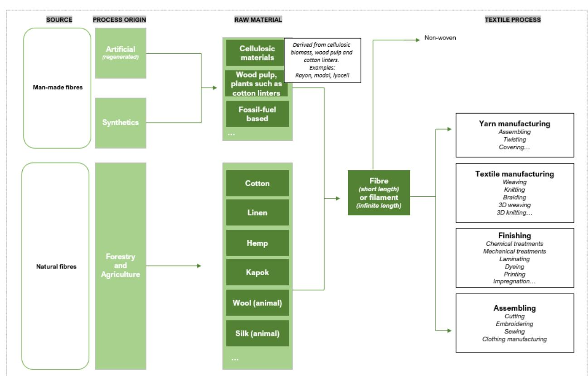

Figure 7. Overview of the textile industry

scouring, resizing and bleaching are performed), the fabric production (weaving, knitting and yarn dyeing), the wet processing (where there is preparation, dyeing, printing and finishing) and finally the textile finishing processes (OECD, 2011; Quantis, 2018). Textile production and manufacturing include agricultural, chemical and mechanical processes. The pre-treatment and wet processes use chemicals intensively (Gulzar et al., 2019; Muthu, 2014). Acids, bases, surfactants, enzymes, stabilizers, dispersing agents, retardants, salts, solvents, emulsifiers and complexing agents are examples of substances used (Gloria et al., 2014; Parisi et al., 2015; Stone et al., 2020).

The mechanical pretreatments include inspecting, sewing, and/or brushing, cropping and sharing, or even singeing processes and are the basis for further wet-chemical pretreatment processes, as well as to ameliorate the final products (Baydar et al., 2015). The chemical or wet-chemical pretreatment of textiles plays a fundamental role in the textile's cleansing and generally consists of de-sizing, washing, and/or scouring, bleaching, and even mercerizing processes (Kalliala and Talvenmaa, 2000; UNEP, 2020b). The production of textile materials for apparel and clothing requires improving their functional, comfort, and aesthetic properties, which is mainly done through textile wet processing operations (Ramasamy and Subramanian, 2021; Ravi Kumar et al., 2021).

The processes generated by each type of textile fabric can be broadly categorized into dry processes and wet processes, which involve both mechanical and chemical operations. The main processes are presented in [Table](#page-30-0)  [9](#page-30-0)

Table 9. Key processes involved in textile manufacturing

| Dry processes                     | Description                                                        |
|-----------------------------------|--------------------------------------------------------------------|
| Cotton ginning (mechanical)       | Cotton ginning involves the separation of cotton fibres from seeds |
| Wet processes                     | Description                                                        |
| Scouring (chemical)               | Pre-treatment process to remove impurities                         |
| De-sizing (chemical)              | De-sizing involves the removal of a size (a protective coating)    |
| Washing (mechanical and chemical) | Combined process that cleans textile to remove chemicals from the  |
| Mercerizing (chemical)            | Treatment that strengthens the luster of cellulosic fibres         |
| Bleaching (chemical)              | Process that removes natural coloration and impurities             |
| Dyeing (chemical)                 | Adding colour to textiles using dyes                               |
| Printing (chemical)               | Applying patterns or designs to textiles                           |
|                                   | repellency, flame resistance or wrinkle resistance                 |

The valuable by-products generated by the different processes involving dry and wet fabric are summarized as follows:

▪ Yarns and finished fabrics ▪ Organic matter, phosphorus, nitrogen, and micronutrients from sludge generated during wastewater treatment ▪Energy creation through the combustion of dried sludge

# 3.1.3.2 Coverage of relevant materials and processes in environmental databases (LCA)

Similarly to other sectors, we focus here on the coverage in the ecoinvent 3.9.1 database of relevant materials and processes, identified for the textile sector in the previous section. Given the focus on bio-based materials, the analysis is limited to these. 33 processes were identified that are of interest for the hotspot analysis. Very few finalized textile products are covered. For example, there are no final processes for jeans or shirts. The geographical representativeness is also limited in ecoinvent 3.9.1, as identified textile processes are mainly specified to be representative only for India or Bangladesh for the Rest of the World (RoW), mainly consisting of all developing countries, or the Globe as a whole.

There are some basic processes for crucial textile natural materials: agricultural production, transformation into fibre, processing into yarn and finalization into a textile (mainly weaving). More precisely, this is covered for silk, flax, kenaf, viscose, jute and cotton, with the latter the most. However, for wool, only sheep fleece as a whole is considered, with no further processing or valorisation. When it comes to finishing, treatments and assembling, a handful of processes are available. There are a few bleaching, mercerizing, sanforising and dying processes for yarn and textiles in general.

Overall, the coverage of relevant material and processes for bio-based textiles is very basic and limited, with low geographical specificity in comparison to the complexity and variety of textiles globally. Our observations mostly align with Munasinghe et al. (2021), who identified important data gaps for the LCI of clothing across their life cycle as the following: non-woven fabric production, fabric manufacturing (weaving and knitting), clothing manufacturing, retailing, dry cleaning, ironing, and landfilling. Especially, the finalization steps are missing, alongside with finalized products. Yet, major impacts are presumably situated in more basic steps of the supply chain, and further hotspot analysis could already present a rough idea of hotspots for the sector.

# 3.1.4 Woodworking industry

According to the European Commission, the production of sawn wood, wood-based panels, and wooden construction materials and products are within the framework of the woodworking industrial sector. The sector is mostly dominated by small and medium enterprises (SME), except for the wood-based panels sub-sector, where few large enterprises treat the greatest share of material volume in sawmills. A description of the sector's most relevant materials and processes is provided below.

# 3.1.4.1 Most relevant materials and processes

Because we focus on materials in the CALIMERO project, energy uses of wood are not in the scope of this report. Wood-based materials are mostly delivered to the construction sector and furniture. Widely used tree species in construction, as described by the European Wood Initiative (2014) are the following:

- Spruce (Picea abies), mainly used for structural end uses, indoors and outdoors (it is the most important building and construction timber in Europe)
- Fir (Abies alba), often mixed with Spruce wood for structural end uses, indoors and outdoors: general carpentry, interior construction, windows and doors
- Pine (Pinus sp.), mainly used as a building and construction timber, is also used for joinery and interiors (doors, parquets, windows)
- Larch (Larix decidua), used for heavy carpentry, exterior panelling, exterior and interior joinery and also for flooring
- Douglas Fir (Pseudotsuga menziesii), used similarly to Larch, mainly for building and construction
- European Oak (Quercus petrea, Quercus robur), one of the most important hard woods, is mainly used for furniture and flooring. It is also used for stairs, windows and doors and for external paneling.
- Beech (Fagus sylvatica), one of the most important European hardwoods. In construction, it is mostly used for flooring and stairs.
- European Ash (Fraxinus excelsior), mostly used for veneers, flooring and stairs.
- Birch Silver birch (Betula pendula) and Downy birch (Betula pubescens) are the commercially most

Funded by the European Union. Views and opinions expressed are however those of the author(s) only and do not necessarily reflect those of the European Union. Neither the European Union nor the European Research Executive Agency can be held responsible for them. Page 33 Raw materials used for MDF manufacturing are softwood (spruce, pine) and hardwood (beech, oak), industrial

important source of hardwood in northern Europe, can be used for veneers and ornamental wood products (San-Miguel-Ayanz et al., 2016).

- Oak (Quercus robur), mainly used as fuel and timber for construction.

Within the wood sector, the wood-based composites sub-sector plays a very relevant role from the economic and environmental point of view due to the use of adhesives. The wood-based composites sector includes a wide range of products made out of wood fibres, particles, veneers and solid wood, which are held together by polymer binders and adhesives (Pizzi et al., 2020) [\(Figure 8\)](#page-32-0). Some of these products have been manufactured for decades and are very established for numerous uses (particleboard, fibreboard, oriented strand board), while others are more innovative, niche products with, in comparison, not significant production volumes so far (e.g., laminated veneer lumber, laminated strand, lumber).

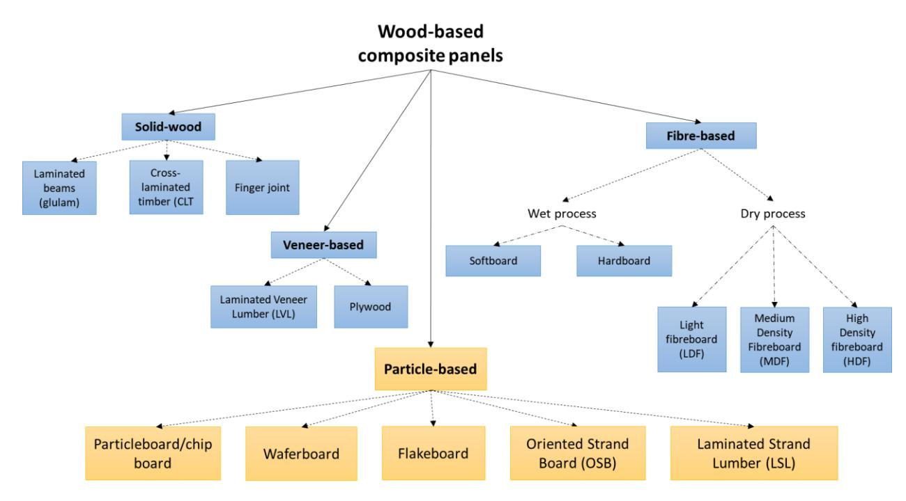

Figure 8. Main wood-based composites

#### **Fibre-based composites**

Fibre-based composites are manufactured by defibrated wood hot-pressing and can follow the wet or dry process. The wet process is similar to the paper manufacturing process and works with an initial fibre moisture content >20 % and usually without binders. Fibre-based composites include products such as medium-density fibreboard (MDF) made out of wood fibres obtained by thermomechanical pulping and bonded with, mainly, urea-formaldehyde (UF) adhesives and hardboard, which is bonded without the need for adhesives due to the intrinsic density of the panel and its own lignin [\(Figure 9\)](#page-32-1).

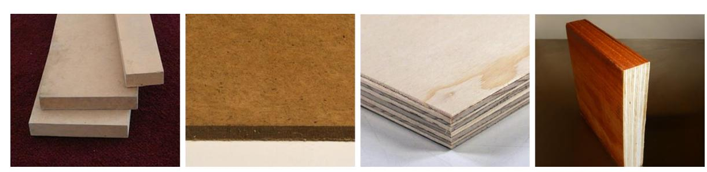

Figure 9. Fibre-based composites. From left to right: MDF, HDF, plywood and LVL (images from Wikipedia, 2023)

wood and forest residues. MDF manufacturers are now embarking on projects to try to introduce reclaimed wood into the process. Fibreboards are used as insulating materials, wall, and roof boards (LDF) furniture (fronts, moulded parts) and floorings (laminate, parquets).

### **Venner-based composites**

This category of products includes plywood, a hot-pressed panel made of several layers of wood veneers placed perpendicularly to each other in adjacent layers, and laminated veneer lumber (LVL), which is similar to plywood but where the veneers are placed parallel to each other and pressed with mountings [\(Figure 9\)](#page-32-1).

Raw materials for plywood manufacturing include peeled veneers of various wood species and combinations of them, as well as all kinds of thermosetting adhesives depending on the final use of the panels, which covers a wide range of applications: furniture, vehicle constructions, facades and sheathings, elements for floor-, walland ceilings. Raw materials for LVL manufacturing include mainly peeled spruce, birch, or Douglas fir veneers, and typically PF or pMDI adhesives. LVL is used for construction elements for floors, walls and ceilings, beams, posts, scaffold planks and I-joist.

# **Particle-based composites**

This category includes products made out of particles of different sizes, the main ones being particleboard and oriented strand board (OSB).

In particleboard, wood particles are pressed at high temperature and pressure using mainly UF adhesives, but also melamine-urea-formaldehyde (MUF), phenolic or isocyanates (pMDI) if higher moisture resistance or zero formaldehyde emissions are required. Particleboard manufacturing uses chips of raw wood, pulpwood, machining residues and recovered wood of all common wood species.

OSB, in turn, are hot-pressed wood-based panels made of long thin strands which are oriented in the same direction. OSB also has a core and surface layers. Raw materials used for OSB manufacturing are peeled strands of softwood (preferably pine) or hardwood (beech), as well as pMDI, PF, MUPF adhesives. It is generally used for planking of timber panels for housing constructions, elements for floors, walls, and ceilings, installation boards, I-joists and sheathings.

# **Laminated strand lumber (LSL)**

LSL is a niche particle-based wood composite similar to OSB in that it is made by hot-pressing of long strands with an adhesive. In the case of LSL, strands are parallel across the thickness of the panel, with no core and surface layers, and greater thicknesses are obtained. LSL is used for carriers, rods, posts, high load-bearing roof boards, planking of framed constructions, facades and I-joists, and it is made of strands of poplar or birch, using pMDI adhesives.

# **Solid-wood composites**

Products in this category can be arguably considered wood composites due to the much higher wood to adhesive ratio compared with the products mentioned above. In short, they include products made from wood beams in various configurations for structural exterior use, such as laminated wood (glulam), cross-laminated timber (CLT) and finger joint. They use moisture and weather resistant adhesives that do not need hot-pressing, such as PRF (phenol–resorcinol–formaldehyde) cold-setting resins, MUF cold-setting resins and polyurethanes (PURs).

At a global scale, the wood-based panel market is expected to grow from 393M m3 in 2023 to 460M m3 by 2028, at a CAGR2023-2028 of 3.17%. In 2020, Europe produced 58M m3 of wood-based panels, led by particleboard representing over 50% of the production volume, followed by MDF and OSB (MordorIntelligence,

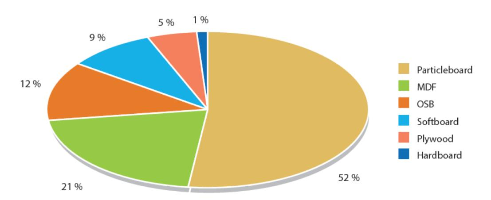

Figure 10. Share of European wood-based panels production by type in 2020

In wood-composites industry, wood particles are mixed together with an adhesive and pressed at high temperature and pressure (Thoemen, 2010). As mentioned above, this category includes a wide range of products that differ on several parameters: the size and shape of the particles, the orientation of these particles, the wood species and type of adhesive used and the final use of the product.

All the particle-based composite products here mentioned are manufactured following a very similar process, which generally includes the following main stages:

- Reception and storage of raw products, including round wood, virgin wood particles or recycled materials
- Debarking
- Cleaning
- Particle generation
- Particle sorting (this step might take place before or after drying)
- Drying
- Resin addition and blending
- Mat forming
- Pre-pressing and pressing
- Trimming, cutting, and sanding

Modern particleboard manufacturing plants use continuous blenders to add the adhesive mix to the furnish, where this mix is atomised by hydraulic or air spraying nozzles. For OSB manufacturing, the resination of the strands takes place in large, rotating drums. Wood-based composites products present a different concentration of adhesive, which is distributed heterogeneously along the volume of the product. The ranges of concentration can vary from 2% in particle boards using MDI, to 14%, in the surface layer of particle boards or MDFs using UF as adhesive. The adhesive mix can include different additives depending on the resin used. In the case of particleboard, where UF resins are used >95% of the time, a hardener is used to catalyse the adhesive curing, as well as paraffin emulsion to increase hydrophobicity. In OSB manufacturing, no additives are needed for curing. Besides, pMDI adhesive is already moisture and weather resistant.

# 3.1.4.2 Coverage of relevant materials and processes in environmental databases (LCA)

Wood-based value chains have had high relevance in the LCA field, thus large number of datasets have been developed, covering all stages of the value chain. In GLAD ("Global LCA Data access network, GLAD"), 6160 datasets result from searching "wood", being ecoinvent (4676 in total, 2661 with an attributional approach and

Funded by the European Union. Views and opinions expressed are however those of the author(s) only and do not necessarily reflect those of the European Union. Neither the European Union nor the European Research Executive Agency can be held responsible for them. Page 36 The most common applications for bio-based materials in construction are structural frameworks, walls (including load-bearing timber walls), insulation, cladding, roofs and floors (Cardellini and Mijnendonckx, 2022), 2022). Major emerging applications from forest products industries include cross-laminated timber (CLT), nail-

2015 datasets with a consequential approach) and Sphera (former GaBi) (1183) the data providers with higher number of datasets. An analysis of ecoinvent datasets, from cradle-to-gate was performed.

A great variety of products are represented in the database. However, there are still data gaps for some woodbased composite panels with lower market share, such as LSL, waferboard, flakeboard or high- and low-density fibreboard.

Specific forestry activities are included for some of the most widely used tree families in Europe (spruce, fir, pine, beech, birch, oak) coming from sustainably managed forests. Missing identified species (Larch and European Ash) as well as other trees can be considered to be included under "softwood" or "hardwood" families. The uncertainty from the use of such proxy LCI likely depends on the density and quantity of wood produced by such species. Further transformation processes after wood extraction are generally divided between the softwood or hardwood categories in the database. Ecoinvent also includes specific wood production outside of Europe that may be imported in Europe include meranti, parana pine, and bamboo.

Also, main industrial processes are represented with an industrial scale perspective, although the large variety of sizes and operational procedures in the woodworking sector, may affect to the uncertainty of the results when assessing specific products. Regarding the geographical scopes represented, most of the forest activities' datasets are located in Europe, and there is country-specific data from Sweden (SE) and Germany (DE), the two countries with highest raw wood production in Europe.

It would be needed to increase the availability of region-specific data due to the high influence of climate conditions in forest activities and their environmental impacts, in particular the use and contamination of water, loss of biodiversity and soil quality preservation. In particular, for Calimero case studies in woodworking sector, specific data for Spanish forestry activities are missing.

#### 3.1.5 Construction industry

# 3.1.5.1 Most relevant materials and processes

Some bio-based construction materials are outputs of the woodworking (e.g., wood frames) and the biochemical sectors (e.g., biopolymers). The most relevant materials and processes for these sectors are described in sections 3.1.1 and, 3.1.4, respectively. Other construction materials and products are made from residues from production processes (e.g., wood waste from forestry and woodworking activities used as wood wool insulation) or from EoL waste from various bio-based materials and products, e.g., EoL journal paper (i.e., from pulp & paper industry, section 3.1.2), processed into cellulose insulation.

Raw or recycled biomass can be used to produce polymer concrete, that is used in similar applications as traditional concrete (e.g., highways, dams, electrical insulations, tunnels, coating materials, piping, storage tanks, panels, etc.) (Tusnim et al., 2020). Biopolymers that can be used in construction are starch-based (e.g., corn starch used for lightweight cement), lignin-based (e.g., ligno-sulfonates used as concrete plasticizer), protein-based (foamers used to produce foam concrete), and xanthan gum (used as an adjuvant in binders and wall plasters) (Tusnim et al., 2020). Numerous other specific applications for bio-based materials in construction: natural oils (e.g., rape or beet oil used as surface coating on concrete moulds, and lecithin from soybean oil used in solvent-born paints and coatings), wax from plants, bees or sheep wool used as wood polishes, cellulose ethers (used in numerous applications like joint fillers, binders, coatings and paint), oil of turpentine (used as a solvent and binder for natural resin-based lacquers applied as wood varnish), root resin extracts used in the production of freeze–thaw-resistant concrete, among others (Plank, 2005).

laminated timber (NLT), massive veneer panels, and dowel-laminated timber (DLT), which are designed to replace traditional concrete and steel structural materials in multistorey buildings in which traditional wood building products cannot be used (Sahoo et al., 2019). The three different wood-frame multi-storey construction techniques and corresponding key wood elements are:

- Platforms that may be based on pole frame structures or on panel elements
- The post-and-beam technique, in which massive supporting columns are exploited
- Modular elements that are directly manufactured at the factory, including several final elements such as doors and windows, electricity appliances, or heating (Mubareka et al., 2016)

Wall elements can be made of raw bio-materials (timber, bamboo, hemp, straw and flax) or composite materials containing bio-materials (e.g., hempcrete). Cladding, roofs and floors and be made out of wood, straw, flax, hemp, and various residues, either as pure bio-based materials, or as composites (e.g., wood plastic composites) (Cardellini and Mijnendonckx, 2022).

Insulation products can be made from a variety of bio-based feedstock, including wood cellulose fibre, paper flakes, hemp, straw, bamboo, flax, sheep wool, cork, reed, algae, agro-waste, cotton waste, wastepaper and leather scraps (Cardellini and Mijnendonckx, 2022; Rabbat et al., 2022). The most common manufacturing processes for such insulation products are listed in [Table 10.](#page-36-0)

Table 10. Common manufacturing methods used in bio-based insulation materials (adapted from Cardellini and Mijnendonckx, 2022)

| Manufacturing method | Description                                                                      |
|----------------------|----------------------------------------------------------------------------------|
| Bonding              | Using binders such as glue, to form a whole body from one or more kinds of       |
| Natural form         | Biomass is packaged directly from raw materials (e.g., straw bales with tight or |
| Pressing             | Pressing without heating, to make one or more kind of loose materials to form a  |
| Hot-pressing         | Pressing with heating, to make one or more kind of loose materials to form a     |
| Injection moulding   | Injecting a liquified solution (magma) into a mould at a specific pressure       |
| Foaming              | Physical or chemical foaming methods generate a porous structure in solid        |

Bio-based materials like wood are prompt to be attacked by fungi and decay (European Wood Initiative, 2014). As for other bio-based materials used in construction, synthetic or mineral binders, coatings and additives (organic or inorganic) may be added to ensure several functions of the materials, such as flame retardants, water repellents, and preservatives like biocides or fungicides (Rabbat et al., 2022). Some bio-based alternatives for such binders and additives may originate from the biochemicals sector.

# 3.1.5.2 Coverage of relevant materials and processes in environmental databases (LCA)

# **Structural applications**

Several activities needed to transform forestry wood products (sawlogs and veneer logs) into structural applications of timber are included for wood products in ecoinvent 3.9.1: joist, laminated timber element, structural timber, glued solid timber, glued laminated timber, and CLT. The product "multi-storey building" included in the ecoinvent 3.9.1 database does not use such innovative wood structures, but a traditional multistorey building structure made principally of concrete, reinforcing steel and cement mortar. Thus, other specific timber-based structural materials (DLT, NLT) and eventually the use of timber structures in multistorey buildings should be incorporated into environmental databases to allow further analysis of possible environmental impacts and their comparison to mineral and metal alternatives. Nonetheless, existing structural wood products cover most applications, or may provide good proxies for most timber structural applications. Aside from wood, bamboo products that can be used in structural applications are included in the database (bamboo culm, poles, flattened bamboo).

# **Timber applications in walls, windows, doors and others**

Currently, primarily wood-based materials are used indoor applications, frequently in combination with other materials like glass and metals. Few activities have been identified in the ecoinvent 3.9.1 database: wood-glass and wood-aluminium for outdoor uses or wood and wood-glass for indoor purposes. These processes involve the utilization of wood chips from the production of CLT, structural timber, glued solid timber, plywood, and multilayer boards. Wooden materials, either wood (sawnwood) by itself or in conjunction with metals, are adopted for window frames and are the only activities which exist in the database.

Wall applications display extensive possibilities for the use of bio-based materials with some materials covered in the current database, such as cork, bamboo, CLT, oriented strand board, particleboard, and plywood. However, other non-wood bio-based materials are missing such as hemp and flax. Other wooden elements contained in the ecoinvent 3.9.1 database are non-insulated garages with wooden walls, typically used in farms for machinery storage, and wood hall buildings. However, is necessary to highlight that within these processes, materials like cement and reinforcing steel still show the biggest share.

Regarding cladding activities, processes made out of softwood and wood chips from sawnwood are covered in the ecoinvent 3.9.1 database. Nevertheless, several individual wooden materials were identified in the database (fibreboard, plywood, cork) which can be used for the modelling of missing processes in the future. Additionally, there is a shortage of processes from non-wood bio-based materials including hemp, flax, and straw.

# **Insulation applications**

Out of the many bio-materials that can be used for insulation, only wood wool, cellulose fibre from postconsumer paper, and cork slabs are found in ecoinvent 3.9.1. Many bio-based insulation products are missing, i.e., insulation from hemp, straw, bamboo, flax, sheep wool, reed, algae, agro-waste, cotton waste, wastepaper and leather scraps. Some of the raw materials required for these insulation products are included in the ecoinvent database (straw, cotton including their use in textiles, bamboo, and multiple agro-wastes [or byproducts]).

# **Biopolymers and composite construction materials**

The coverage of principal biochemicals is discussed in section X. Tall oil and turpentine produced as co-product from the pulp and paper industry are included in ecoinvent 3.9.1. Other biopolymers (e.g., natural wax and cellulose esters), and the use of raw or recycled biomass in polymer or composite concrete (e.g., hempcrete), are missing.

# **Coverage of plant and tree species**

Besides investigating applications of bio-based materials in construction, it is interesting to analyse which plant and tree species (or families) are covered in the database. Tree species are discussed in the woodworking section. From the plant species that can be used in construction identified in the previous section, ecoinvent 3.9.1 includes the agricultural phase for straw (from different cultures like barley, rice, or rye), reed (assumed to be similar to alfalfa-grass and hay), and flax. Such processes are missing for hemp and algae.

Funded by the European Union. Views and opinions expressed are however those of the author(s) only and do not necessarily reflect those of the European Union. Neither the European Union nor the European Research Executive Agency can be held responsible for them. Page 39 Even though biofuels are not included in the CALIMERO project the social impacts of biochemicals can be considered similar to biofuels since for example ethanol is an intermediate for some biochemicals as well as being a biofuel. Biochemical production uses similar processes as fossil-based chemicals, so social issues in the fossil-based chemical industry are also relevant. According to Sustainability Accounting Standards Board (SASB) materiality finder human rights and community relations and health and safety are materiality topics for chemical industry. By combining the results in SASBs materiality finder for biofuel and chemicals with reviewing

The coverage in the GaBi database for structural applications and timber applications in walls, windows and doors is similar to ecoinvent 3.9.1. In addition, there are some processes for flooring such as installed bamboo, installed jute, installed linoleum and cork tiles which are incorporated. Regarding insulation applications, processes such as cellulose fire-blowing insulation, installed cellulose insulation, cotton, flax, hemp fibre fleece, cork and KRONOPLY flex and sound wood fibre insulation which are not included in ecoinvent 3.9.1, can be found.

For biopolymers and composite construction materials, additional processes are covered including PLA resin, ingeo PLA production, and an approximation for cellulose acetate butyrate. Despite hempcrete as a final product also not being included in the GaBi database by Sphera, hemp hurds are included, which can be used to produce hempcrete. Coverage of plant and tree species is similar to ecoinvent, with a few additional species like timber lash, timber cedar and timber teak included.

# **3.2 Known environmental, social, economic assessments hotspots (based on literature)**

#### 3.2.1 Bio-chemicals industry

# 3.2.1.1 Environmental hotspots

In the context of biochemicals production, environmental hotspots can result from the agricultural phase, and the use of chemicals and energy-intensive processes that release pollutants into the environment. These pollutants can lead to a range of adverse environmental impacts such as water and air pollution, habitat destruction, and loss of biodiversity.

Biochemicals, which are produced from renewable biomass sources, have been promoted as a more sustainable alternative to fossil-based chemicals. However, producing biochemicals on a large scale poses significant environmental challenges. Biochemical production processes require large amounts of water, energy, and chemicals, which can lead to the release of GHGs and other harmful pollutants. Additionally, the agricultural practices required to produce the biomass feedstocks can result in land-use change, deforestation, and loss of wildlife habitat. To mitigate the negative environmental impacts associated with the production of biochemicals, several strategies can be employed. These include the use of more efficient production processes, reducing the amount of waste produced, and implementing sustainable feedstock production practices. Additionally, the development of a circular economy approach, where waste products are recycled and reused, can further reduce the environmental impact of biochemical production (Ögmundarson et al., 2020a, 2020b).

The most important and abundant biochemical production in the world and in Europe is bioethanol which about 80% of that is from fermentation of food commodities (e.g., sugarcane and corn), causing significant environmental burdens on agricultural practices. Hence, using of organic wastes and conversion of them to bioethanol can mitigate GHG emissions while providing a sustainable and eco-friendly method for waste disposal. Therefore, the adoption of environmentally friendly production practices is crucial in ensuring that the transition to renewable biochemicals does not result in the creation of new environmental hotspots (Obydenkova et al., 2022).

# 3.2.1.2 Social hotspots

sustainability materiality assessments from four European companies producing biochemicals (with a focus on polylactic acid), the following issues of relevance to S-LCA are distinguished as material:

- Employees o Diversity, equity, equal opportunities, and inclusion o Occupational health and safety o Decent work (turnover, parental leave, training, education, wages etc.) o Talent attraction and retention
- Supply chain management o Especially human rights issues
- Local community / community relations / social responsibility o (Plastic pollution in communities, Noise/disturbance is mentioned)
- Consumer health and safety & product safety/design

Related is ethical business conduct / corruption and critical incident risk management that is also valued as material. According to Messmann et al. (2022), "freedom of association" is the most important social impact subcategory, and it is followed by "forced labour", "toxics and hazards" and, "injuries and fatalities" in bioethanol production sector in EU. Valente et al. (2018) claims that the highest social risks in bioethanol production in Norway would be related to "health and safety" followed by "labour rights and decent work". A striking result from literature related to comparison of fossil based and bio-based adipic acid production shows that although the intense need of human labour has a positive impact in terms of employment, the agriculture sector`s high rate of fatal injuries causes a high fatal injury risk potential in the biochemical production (Colodel et al., 2009).

Main health and safety risks in the chemicals sector arise from heavy machinery usage, exposure to harmful substances and high temperature and pressure (SASB). On the other hand, the chemicals sector is a diverse sector and hence knowledge in the specific process and chemicals is required. Also, insights in the risks related to specific work tasks in production is needed to identify hot-spots or dangerous exposures. To manage implementing exposure/health effect aspects in social assessments, data from various sources, including measurements in workplaces, assumptions and expert judgement will be needed.

# 3.2.1.3 Economic hotspots

Biobased chemicals are rapidly emerging as a lucrative alternative to traditional fossil fuel-based chemicals. Economic hotspots of biochemicals production represent regions where both the demand and supply of these chemicals are high enough to support profitable production and trade. These hotspots are determined by several factors, including access to raw materials, infrastructure, skilled labor, and government support (Obydenkova et al., 2022).

One of the most important factors that determine the location of economic hotspots of biochemicals production is access to key raw materials. These may include agricultural residues, corn, wood chips, and algae, which are used as feedstocks to produce various biobased chemicals. For instance, the central and eastern Europe, such as Poland, Hungary, and the Czech Republic have emerged as a hotspot in the production of bioethanol due to favourable environmental conditions, like fertile lands and good weather conditions, which are ideal for the cultivation of crops used for bioethanol production, such as corn, wheat, and sugar beets. Additionally, this region has less stringent regulations on biofuels compared to other European countries, making it easier to establish bioethanol facilities and production sites. Finally, the availability of cheap labour and high subsidies from the government has also contributed to the increased production of bioethanol in this region (Cséfalvay Another important factor in determining economic hotspots of biochemicals production is the availability of skilled labour. Chemical production requires skilled workers with specialized training in chemistry, engineering, and technology. Therefore, regions with highly skilled labour forces are more likely to be successful in the production of biochemical products. Such regions may highly include education-rich regions such as Europe and Asia and leading advanced economies such as the US. In summary, the key areas of economic significance for biochemical production systems can be outlined as follows:

- **Feedstock production:** The cost and availability of feedstock such as sugarcane, corn, and soybean greatly impact the economic viability of biochemical production. Regions with a favourable climate for feedstocks and efficient transportation systems are key economic hotspots for feedstock production.
- **Processing technology:** Efficient and cost-effective processing technology is essential for economic biochemical production. Regions with advanced technology and engineering firms that specialize in biochemical production are economic hotspots.
- **Government policies:** Government policies such as subsidies and tax incentives greatly impact the economic viability of biochemical production.
- **Access to markets:** Access to transport and markets for biochemical and related products is key to economic viability.
- **Research and development:** Ongoing research and development in the biochemical industry is critical for innovation and economic growth.
- **Skilling and training:** The availability of skilled labour is crucial to the biochemical industry.

# 3.2.2 Pulp and paper industry

# 3.2.2.1 Environmental hotspots

Since 1990s the pulp and paper industry has conducted significant environmental improvement (e.g., use of environmental and energy management systems). Today, the challenge is to continue improving the production processes from an environmental perspective (Suhr et al., 2015). One major challenge for the industry is related to the supply of raw materials to ensure that the wood used comes from sustainably managed forests. Also, the use of chemicals in the pulp and paper/paperboard production is an important hotspot from an environmental aspect, both in terms of production of the chemicals and the release of chemicals to the water recipient. Water emissions have been improved over time but since the water flow still is high it remains central (Suhr et al., 2015). Example of contaminates in the emission to water is chemical additives like EDTA, nutrients (nitrogen and phosphorus) contributing to eutrophication and discharge of suspended solids.

The pulp and paper industry is an energy-intensive sector (Suhr et al., 2015). Much of the energy comes from burning biomass, but fossil resources are also used. The use of energy from fossil resources in the pulp and paper/paperboard production has environmental implications and is an important issue for the sector. In the past, emissions to air have been a huge problem, especially sulphur emissions contributing to acidification. The sulphur emissions were reduced due to process technology improvements. However, efforts to not exceed critical air pollutions levels are of importance for mills in Europe.

Another significant environmental aspect is the water used by the pulp and paper mills. Water recirculation techniques have been developed to decrease the net freshwater usage. Further reduction of water use is essential for regions with scarce water resources or a dry climate.

# 3.2.2.2 Social hotspots

construction), and then focus on potential risks specific to the downstream pulp and paper sector.

# A. Social hotspots related to forestry activities

An important part of pulp and paper industry is forestry management and according to SASB materiality finder, human rights and community relations is a relevant social issue for forestry industry. Forests cover an important land area all over the world and therefore forestry activities interact with millions of people (Mikkilä and Toppinen, 2008). These people might be also indigenous people. Local communities can be affected negatively by forestry operations because of environmental impacts of the operations. On the other hand, local employment can be affected positively by the operations (SASB materiality finder).

Fundamental rights of workers in the forestry industry can be compromised through health and safety problems, associated with poor working conditions. Moreover, child and forced labour, gender-based opportunities and unlegalized employment (especially in logging activities) are also key hotspots that need to be addressed (International Labour Organization, ILO, 2011). The deficit in programmes for professional training of timber-and woodworkers is a relevant social aspect, possibility prohibiting safe and productive work. Low wages and restricted access to social protection are important aspects that can fail to comply with dignified work conditions.

Women living in poorer rural areas are an important target group, strongly affected within the forestry industry since they are regularly subject to informal and unpaid work while simultaneously maintaining household duties and lacking representation in management and decision-making positions (Marting Vidaurre et al., 2020). Profitoriented organizations often fail to provide necessary social dialogue and community engagement, as well as insufficient recognition of indigenous rights on the intellectual property of certain biological resources. Migrant workers represent another target group which frequently bear highly intensive tasks in poor conditions, at the same time facing demanding challenges including language barriers, the inexistence of work contracts in remote workplaces, and no access to any kind of protection (ILO, 2019). For local communities, restrictions on land can cause delocalization and migration, directly resulting in physical and economic displacement. Aspects regarding local employment are important to address, given that job opportunities and higher incomes can be created due to an increase in activities in this sector, but also expectations can fail to be implemented negatively affecting these communities.

Finally, forestry activities can compete or be detrimental to the recreational and cultural values of forests as well as tourism activities associated with forests. Over 1.25 million cultural sites are situated in European forests (San-Miguel-Ayanz et al., 2016), which suggests that some of these additional values associated with forests may be decently protected in Europe.

# B. Social hotspots specific to the pulp and paper industry

By combining the results in SASBs materiality finder for pulp and paper with reviewing sustainability materiality assessments from five European pulp and paper companies, the following issues of relevance to S-LCA is distinguished as material:

- Employees o Diversity and inclusion o Occupational health and safety (and well-being) o Decent work (fair rewarding, retention, engagement, education etc.)
- Supply chain management o Including human rights issues

- Local community / community relations / social responsibility
- Sustainable products / customer needs and quality
- Business ethics

Costa et al. (2022) investigated social impacts of pulp and paper sector in Portugal and found out that worker stakeholder category has the highest social risks, followed by local community. In the worker category "injuries and fatalities", "collective bargaining" and "toxics and hazards" subcategories are the main contributors to the social risks whereas the "unemployment" subcategory is the major contributor in the local community category.

Examples of relevance for the pulp and paper sector regarding employee health and well-being include exposure to odours and noise, indoor air pollution in the production facility and other hazardous exposure to e.g., chemicals in the work environment (Suhr et al., 2015). To some extent, these exposures also affect the general population of the local community where the production is located. The potentially higher occupational exposure is then rather regarded a source for diffuse exposure to the environment external from the workplace which can have secondary impact on health in the general population. The fact is that health aspects related to such environmental exposure are more often considered within LCA as there are accepted characterization factors such as disability-adjusted life year (DALY), as well as functional modelling tools to quantify and assess exposure such as USEtox (Ernstoff et al., 2019; Scanlon et al., 2013). Occupational exposure via different routes, not only airways and/or ingestion, are rarely integrated in LCA studies, even though methodological approaches (work environment-DALY, product intake fraction) and modelling tools (ProScale, RISKOFDERM, ConsExpo) are emerging (Ernstoff et al., 2019; Scanlon et al., 2013).

# 3.2.2.3 Economic hotspots

The pulp and paper industry is capital-intensive, which results in long-term and variable investments plans. Since the mid-1990s large investments in machinery have been conducted by the industry to, for example, increase energy efficiency, yields, and to improve the environmental performance (Suhr et al., 2015).

Both the capital cost (e.g. machinery) and the production cost are of importance for the pulp and paper industry. The average cash manufacturing cost for the European pulp and paper industry in 2009 specifies that 59% of the product cost comes from the procurement of raw material (19% market pulp, 17% wood, 17% chemicals and 6% recovered paper). Fuel and electricity account for 21% of the total production cost. Labour cost and maintenance are also economic hotspots, accounting for 12% and 8% of the production cost, respectively (Suhr et al., 2015).

# 3.2.3 Textile industry

# 3.2.3.1 Environmental hotspots

The textile industry is known to have a significant impact on the environment, with its resource-intensive practices leading to detrimental effects on climate change and the natural ecosystem. Manufacturing processes along the value chain are resource-intensive and leading to detrimental effects on climate change and the natural ecosystem. This includes air, water, and soil pollution, as well as the depletion of resources and land use. A recent analysis of the European Environment Agency (EEA) has shown that textile use in the EU, which is primarily imported, has a significant negative impact on material use and CO2 emissions, accounting for 4% of global emissions (European Environment Agency, EEA, 2022). To contextualize, the manufacturing textile industry had an air emission intensity of 105.9 grams emitted per euro in 2019. This figure reflects greenhouse gases, including CO2, N2O, CH4, HFC, PFC, SF6, and NF3 in CO2 equivalent, and is based on data from 27 EU member states, according to Eurostat's 2022 report. Additionally, according to the EEA it ranks as the third highest industry in terms of water and land use from a global lifecycle perspective.

Funded by the European Union. Views and opinions expressed are however those of the author(s) only and do not necessarily reflect those of the European Union. Neither the European Union nor the European Research Executive Agency can be held responsible for them. Page 44 Muñoz-Torres et al. (2023) have also conducted an analysis of social issues managed by the textile industry, and they noticed that these are inconsistent with the hotspots identified through their SLCA. This may illustrate

Specifically, textile wet processing operations involve significant water usage for washing and dissolution media, leading to wastewater effluents loaded with auxiliary chemicals and unfixed dyes. Additionally, chemicals used as washing and finishing agents pollute the water used during wet processing operations, and the toxic effluent of dyestuffs used during the dyeing process can severely damage ground water and aquatic life. Furthermore, various steps of wet processing involve a huge consumption of energy in different forms, putting heavy strain on global resources.

# 3.2.3.2 Social hotspots

Social issues have been a relevant and sensitive topic in the textile sector, e.g. apparel manufacturing has in the past been linked with child labour in sweatshops. In general, the main social hotspot processes relate to manufacturing steps in supply chains. This often occurs in emerging/developing economies, in particular southeast Asian countries, due to poor working conditions (Warasthe et al., 2022). Based on literature reviews of Warasthe et al. (2022) and Muñoz-Torres et al. (2023), the many prominent examples and thus descriptive social hotspot impact types of such poor working conditions include:

- water pollution resulting from the use of chemicals
- employees' health risks, inadequate building safety & unhealthy or dangerous working environment
- forced labour and child labour
- lack of the right to assemble & concern trade unions
- (in)adequate income & social insurance
- work duration and intensity, work relation, work-life balance & job security
- Fair and equitable treatment at work & discrimination
- an asymmetric relationship between powerful retail buyers and small suppliers

There are many descriptive/qualitative specifications of social hotspots or issues in the textile sector, like the latter, but there are not ample S-LCAs of textile products reported, as pointed out by a very recent review and further analysis specifically for the whole textile sector (Muñoz-Torres et al., 2023). Most notable is the S-LCA of the Swedish clothing sector pointed out (using the SHDB) following social hotspot impact types (Roos et al., 2017; Zamani et al., 2018):

- wage
- child labour
- injuries and fatalities
- exposure to carcinogens
- toxics and hazards

For the general S-LCA of a T-shirt (using SHDB), mainly fabric production and, to a lesser degree, raw material acquisition are the social hotspot phases (Muñoz-Torres et al., 2023). The identified social hotspot impact types are:

- collective bargaining
- wage
- toxic and hazards
- injuries and fatalities
- conflicts
- corruption
- sanitary conditions regarding community infrastructure

a need for informing and refocus of the textile industry based on insights from holistic analysis. Overall, both general research on social issues and SLCAs of the textile sector and its products, point out that manufacturing processes are the main social hotspot processes, with social hotspot impact types relating to worker health and safety, labour rights & decent work.

# 3.2.3.3 Economic hotspots

The versatility of textile products has made them well-used in our daily life, with applications ranging from clothing and household items to industrial uses (European Environment Agency, 2019). The global textile industry including the leather products weights for 2.3 trillion USD (Euromonitor, 2020). This turnover includes apparel, spinning of textile fibres, weaving of textiles, footwear, made-up of textile articles, knitted and crocheted articles, technical and other textiles, finishing of textiles, luggage, handbags and saddlery, tanning and dressing of leather, carpet and rugs, fur and fur articles and finally the cordage, rope, twine and netting operations. According to the EURATEX confederation, the European textile industry generated a turnover of approximately 147 billion € in 2021, with a revenue of 58 billion € from exports (second worldwide exporter after China) and importing raw materials and pieces for a 106 billion €. It is considered as a complex value chain, composed of 99.8% micro and SMEs enterprises (EURATEX, 2022). A park of 143 thousand companies (in deacceleration in 2021 of –3,3% vs previous year) employing 1.3 million employees (-3,2% in 2021 estimated vs previous year) is forecasted in Europe by EURATEX.

Despite the widespread use of textiles, the concentration of textile industries in only a few EU member states is notable. According to the Statista Industry Outlook 2022 report (Statista, 2022), this concentration can be attributed to several factors, including historical development, access to raw materials, and market demand. For example, countries with a long history of textile production, such as Italy and France, have established industries with specialized skills and knowledge (Manda et al., 2015). Additionally, countries with access to raw materials such as cotton or wool may have a competitive advantage in producing certain types of textiles. Despite this uneven distribution of textile industries across the EU, technological advancements and globalization have opened opportunities for businesses to expand their operations and explore new markets (European Environment Agency, 2022; Gardas et al., 2018; Niinimäki et al., 2020; OECD, 2011). According to the Statista study, the leading manufacturers in the textile industry in Europe are Italy, Germany, UK, Spain, France and Portugal. Statistics for those countries are shown in [Table 11.](#page-44-1)

Table 11. Added value and growth of manufacturing activities in top six textile manufacturing countries in EU (Statista, 2022)

| Countries | Billion € (estimated, 2022) | Growth vs previous year |
|-----------|-----------------------------|-------------------------|
| Italy     | 18.5                        | +9.7%                   |
| Germany   | 12.5                        | +5.1%                   |
| UK        | 6.7                         | +7.0%                   |
| Spain     | 5.9                         | +4.5%                   |
| France    | 5.3                         | +1.6%                   |
| Portugal  | 3.7                         | +6.6%                   |

#### 3.2.4 Woodworking industry

# 3.2.4.1 Environmental hotspots

According to European Commission (2022), around 97% of raw wood is provided from sustainably managed EU forests, while the other 3% is imported. In addition, the use of voluntary schemes such as chain-of-custody is widespread as evidenced by the Sustainable Forest Management (SFM). These certifications aim to ensure the preservation of ecosystem services such as carbon sequestration, biodiversity conservation and the protection of water resources. Indeed, loss of biodiversity and protection of ecosystem services, in line with the Convention on Biological Diversity, the Pan-European Biological and Landscape Diversity Strategy are two of the target categories to protect in the wood sector in future strategies (MCPFE et al., 2010).

The bioeconomy monitoring dashboard acts as source of data for forestry activities at EU level. Total roundwood removals show growing trend since 2009. In 2021, 582M m3were registered, being Germany, Sweden and Finland the top 3 countries in terms of over bark roundwood removals. According to the EEA, 44.41% of land in Europe is covered by forest and semi natural areas, occupying a total surface of 2.8 Mkm2 . The outdoor wood storage is a source of suspended solids, OBD5 and COD in the surface run-off water. The use of adhesives in wood-based composites is one of the main environmental and economic hotspots of this subsector. Firstly, due to the use of non-renewable raw materials to produce them, which also delivers toxic emissions in production and downstream stages (e.g., 65 µg/m2/h in use phase reported by Łebkowska et al., 2017).

The woodworking industry environmental hotspots depend on the type of product and application assessed. However, as a forestry and biogenic product, climate change, land use, and water pollution are significant midpoint categories from forestry activities. Wood primary production contributes to climate change mitigation by up taking carbon dioxide from the atmosphere. This mitigation effect could be only effective if long-term storage is ensured. The application of cascade strategies is widespread in the woodworking sector, where wood by-products are often used to produce lower quality products, such as particle boards, extending the carbon sequestration potential, or used to produce energy in industrial plants. However, the incineration of wood-based composites environmental and social impacts linked to adhesive emissions seem to be underestimated in current studies. Reforestation has been seen as a climate change compensation activity, but recent studies suggest that this strategy may hold low mitigation potential (Roebroek et al., 2023).

# 3.2.4.2 Social hotspots

Apart from potential social impacts linked to forestry (section [A\)](#page-41-0), the potential exposure to toxic chemicals and indoor pollution, as well as injuries and accidents due to lack of safety measures are typical social risks associated with woodworking (Barclays, 2015; Marting Vidaurre et al., 2020). This partly results from the generation of important amounts of particles and dust, and from the use of toxic and sometimes carcinogenic chemicals or of reproductive toxicants in many woodworking and building products, e.g., chemicals releasing VOCs which can adversely harm human health. Workers can be directly exposed to such pollutants. One advantage of wood products in the use phase is its noise absorption capacity, which insulates rooms, improving social activities and health.

Regarding training and skills development, the EESC highlights the fact that wood workers usually learn basic machine operations in short time periods, but advanced skills development require longer periods. It also remarks the importance of R&D projects, especially under the Horizon Europe programme in this matter.

#### 3.2.4.3 Economic hotspots

The economic hotspots of woodworking are mainly related to the raw material, workers and adhesive. The energy is not usually seen as a hotspot due to the use of wood biomass to produce it, usually being collected from solid remnants of production plant, although it can be very relevant when small plants are not optimized in this aspect. Brandt et al. (2019) also conclude the distance to plant from biomass supply is a key factor that affects the price of raw wood and the feasibility of the economic activity. The economic feasibility of particle boards, the most produced wood-based composite product in Europe, depends on the price of raw materials, energy and adhesive, while the cost of workforce is the 4th largest contributor (Grzegorzewska et al., 2020).

#### 3.2.5 Construction industry

# 3.2.5.1 Environmental hotspots

The bio-based construction sector can impact the environment in three main ways: first, due to the impacts of agricultural or forestry activities for producing and extracting raw bio-materials, second, from emissions and resource use in transformation activities along value chains, and third, due to the expansion of constructed environment to the detriment of natural areas. This last cause of environmental impacts is not restricted to the use of bio-based materials, but it is a major cause of environmental impacts due to the construction sector (Maes et al., 2020). Ecosystem services can be directly affected by forestry activities for construction products and deforestation, or land use change due to e.g., the conversion of heathlands and shrubs into industrial and commercial sites (Maes et al., 2020).

Forest vegetation as well as forest soil and topsoil reduce erosion and slope instability. Mudslide and landslide risks are increased by forestry activities (Barclays, 2015). Soil erosion by rainfall and runoff, as well as landslides, contributes to an important damage to soil resources in Europe (Mubareka et al., 2016). Largescale forestry and logging operations can lead to forest degradation and deforestation, destroying or fragmentating of habitats (also because of road access), impacting biodiversity, disturbing protected species, and contributing to climate change due to deforestation and GHG emissions from processing (Barclays, 2015). Wood grown within Europe mostly originates from sustainably managed forests, but there may still be some unsustainably sourced wood used locally depending on the origin of wood, including imports from outside of Europe.

Transformation activities for wood products lead to atmospheric emissions (dust, boiler and dryer emissions, onsite burning) and the release of pollutants like volatile organic compounds (VOC), nitrogen oxides (NOx), sulfur oxides (SOx), particulate matters smaller than 10 µm (PM10), carbon oxide (CO) and carbon dioxide (CO2) (Barclays, 2015). Chemical additives like flame retardants and preservatives are known to be potentially toxic (Barclays, 2015; Bishop et al., 2021; Charitopoulou et al., 2021) and can therefore contribute importantly to the environmental impact profiles of different bio-based products used in construction. The use of bulk chemicals, resins, adhesives and wood treatment agents can also lead to the pollution of groundwater systems due to accidental spills or leak from waste (Barclays, 2015). Toxic additives can also partially leak to the environment during the useful lifetime of products, like it is the case for chromium from treated wood products (Ciacci et al., 2015).

# 3.2.5.2 Social hotspots

According to the SASB materiality finder, for the building products and furnishings sector, potential adverse impacts on human health from management of chemicals in products and negative impacts in forest-dependent communities resulting from poor wood supply chain management are the key social issues. As mentioned earlier in the report, the construction sector utilizes important amounts of materials sources from the forestry sector, still one of the most dangerous and hazardous sectors for workers. In addition to the potential impacts related to forestry activities (section [A](#page-41-0)[3.2.4.2\)](#page-45-0) which are also valid for construction products, localized human health complications due to deficient air quality and health and safety risk problems for workers in the construction sector are the crucial aspects to consider (SASB Standards Board, 2018).

#### 3.2.5.3 Economic hotspots

Forests contribute to important ecosystem services, both monetary and non-monetary. Timber products are by far the largest share of bio-based products used in construction. In 2020, the forestry and wood products sector combined, contributed for a share of around 10,6% regarding employments, when compared to the other European bioeconomy sectors, and the added value of the two sectors was around 75 billion euros

# (Tamošiunas et al., 2022).

Bio-based products used in construction tend to have an initial higher material cost, which is a primary consideration for construction projects over other factors like performance, environmental and human health impacts, etc. (Dams et al., 2023). This may be a barrier to their uptake by the industry. For instance, the market share of bio-materials in the insulation market is 10% in France, explained by their higher cost (Rabbat et al., 2022). For wood panels, around 43% of the costs correspond to the resin used to assemble the panels, 31% comes from the extraction of wood, and 26% relates to the necessary energy for production (Stubdrup et al., 2016). With an increase in forestry-related activities as one of the measures for bio-economy development, an increase in land use and land competitiveness amongst different sectors, can be highlighted as an important economic hotspot. The cost of transportation of raw materials to the manufacturer can be a relevant aspect to consider especially when comparing bulkier materials like wood to non-wooden bio-based materials which tend to have lower densities (Göswein et al., 2021).

Moreover, energy cost is an important aspect of economic assessments when considering the instability of energy prices resulting from the current political crisis. A study assessing the environmental and economic impacts of two houses with similar geometry, one built from mineral materials and another using bio-based materials (straw bale), concluded that for the several structural parts, the required energy for bio-based materials was significantly lower. By substituting concrete by wood for the bearing structure, brick by straw for the walls, styrofoam by straw for insulation, and cement plaster by bio-based plaster for the final façade, it was possible to reduce energy expenses (Krasny et al., 2017). The same happens for cellulose wadding, which consumes 20 times less energy than other polymer-based insulation and for low-density wood boards and hemp wool panels, that consume only one-third and a half of the energy necessary for polymer panels ((Garas G., 2009).

Thus, it is important to understand which main drivers influence the cost of bio-materials and consider the cost of energy consumption of the building using a life cycle approach. Despite generally higher costs, partly due to marginal market shares aside from timber products, bio-based materials may be advantageous in comparison to mineral and fossil counterparts if social and environmental externalities are monetized. Yet, scarce information is available for the latter, including for the monetization of very diverse ecosystem services that are difficult to evaluate.

#### **3.3 Identification of sectorial environmental, social, and economic hotspots (database and survey approaches)**

## 3.3.1 Environmental hotspots

# 3.3.1.1 Bio-chemicals industry

[Figure 11](#page-48-0) presents environmental hotspots for the biochemical sector.

Figure 11. Biochemical sector: environmental hotspots and average contribution of impact categories to single score using the EF3.1 method. The left y-axis represents the number of processes for which an impact category is a hotspot (green columns), and the right y-axis, the average relative contribution of the impact category to the single score impact among the 38 LCI data characterized for biochemicals (black line).

Most of the 38 characterized processes represent the production of biochemicals that can be used as fuel (12 processes of ethanol production from a range of different biomass) and precursors (e.g., methanol, fatty acids, fatty alcohols). Climate change is a hotspot for all the 38 processes; particulate matter, for 35 processes; acidification, for 34 processes; and fossil resource use, for 32 processes. Ozone depletion is a hotspot for the ethanol production from wood process. Three impact categories do not come up as hotspots: eutrophication of freshwater, human toxicity (cancer), and ionizing radiation, suggesting that these categories are not likely to be hotspots for biochemicals. However, remind that the coverage of biochemicals is much limited in the ecoinvent database, and thus that these results may not be representative of the whole sector.

Climate change most often represents an important share of total impacts, with an average contribution of 23% to the single score impact, followed by particulate matter (11%), acidification, fossil resource use, land use and water use (8% each).

[Figure 12](#page-49-0) shows the distribution of hotspot activities or flows for LCI data sets for the biochemicals sector.

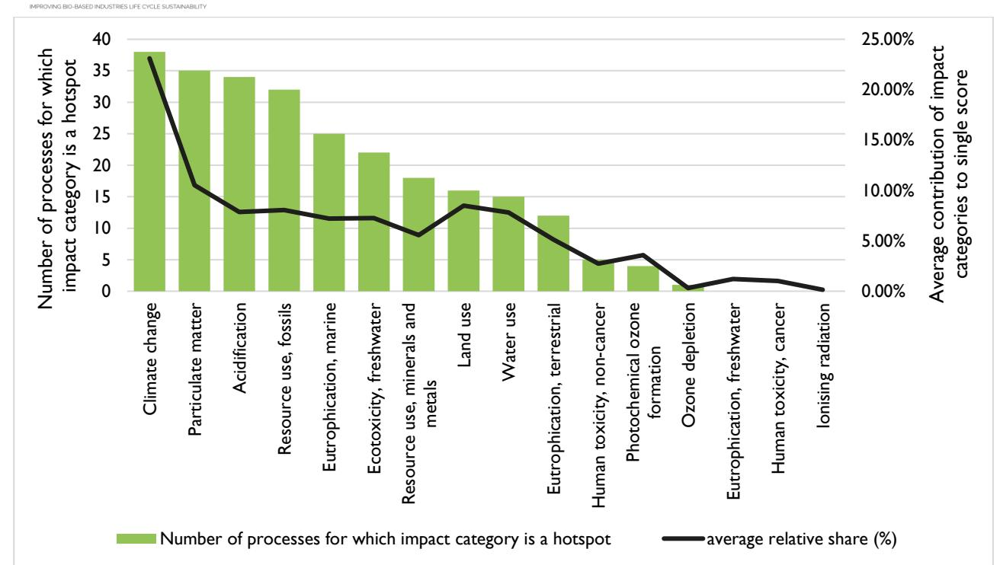

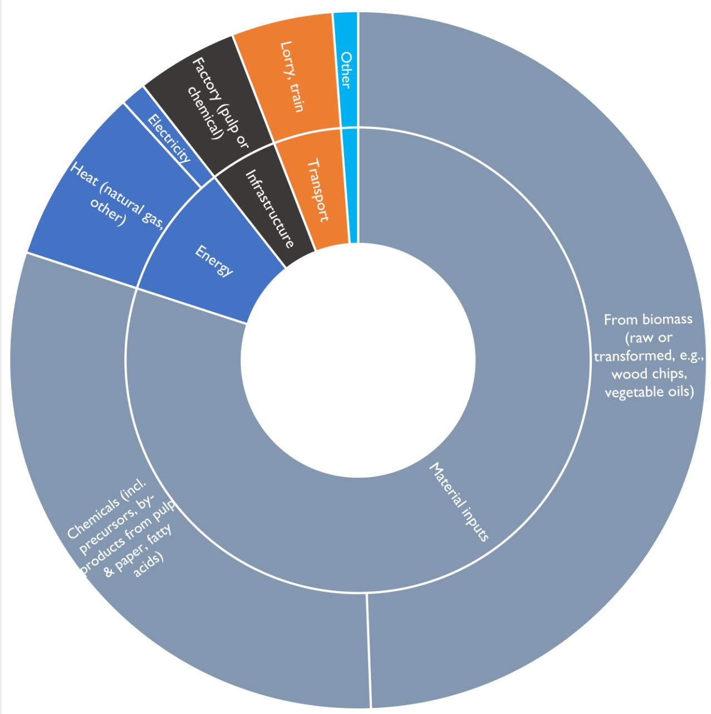

Figure 12. Distribution of 85 hotspot activities and flows among 38 LCI datasets for the biochemical sector. Hotspots are identified based on the single score using the EF 3.1 method.

In the biochemical sector, material input is the activity with the highest share of identified environmental hotspots for single score process contribution with 80% of the processes, followed by energy (9%), infrastructure (5%), transport (5%) and others (1%), including the process of the treatment of tallow to esterquat.

Biomass inputs to processes represent 49% of the hotspots, including both raw biomass and transformed materials like wood chips and vegetable oils (tall, palm kernel, coconut, soybean and rape oil). For the production of biochemicals, other chemicals are used for in-between steps, including precursors, by-products from pulp & paper industry and fatty acids, accounting for 31% of the analysed hotspot flows. Examples are ammonia and sulfuric acid used to produce ethanol or sodium hydroxide and sodium chlorate to produce methanol. For the energy category, 8% of the hotspots come from heat (natural gas and other than natural gas), and 1% from electricity. Transport by lorry and train make up for 5% of the hotspots, as well as the infrastructure (pulp and paper factories).

The coverage of biochemical processes in the hotspot analysis with the database approach is limited and thus influences the outcome. However, the main hotspot identified matches well with the hotspots identified through the literature. Biomass input, chemicals and energy are the major hotspots for the biochemical sector.

Climate change impact, water and land use are identified as important through literature and are also identified as important aspects. Human toxicity (cancer and non-cancer) is one of the impact categories not identified as an impact category hotspot. This could be explained by human toxicity not being a hotspot, that the biochemical processes studied are not well inventoried regarding human toxicity flows or that characterization factors for the different chemicals are lacking.

# 3.3.1.2 Pulp and paper industry

[Figure 13](#page-50-0) presents environmental hotspots for the pulp and paper sector.

Figure 13. Pulp and paper sector: environmental hotspots and average contribution of impact categories to single score using the EF 3.1 method. The left y-axis represents the number of processes for which an impact category is a hotspot (green columns), and the right y-axis, the average relative contribution of the impact category to the single score impact among the 39 LCI data characterized for pulp and paper (black line).

Among the characterized processes for pulp and paper, all of 39 processes present hotspots for climate change, fossil resource use and particulate matter categories, and 35 processes present a hotspot for acidification. The other categories that come out as hotspots for a majority of processes are land use (28 processes), photochemical ozone formation (24 processes), and water use (20 processes). Mineral resource use comes next, with 14 processes. Four categories do not come out as potential hotspots for the pulp and paper sector: terrestrial and freshwater ecotoxicity, ionizing radiation, and ozone depletion.

Climate change accounts for 24% of the single score impact on average across processes, followed by fossil resource use (17%), land use (13%), particulate matter (12%), and acidification (7%). The ozone depletion, human toxicity (cancer) and ionizing radiation impact categories generally have negligible contributions (>1% on average).

[Figure 14](#page-51-0) shows the distribution of hotspot activities or flows for LCI data sets for the pulp and paper sector.

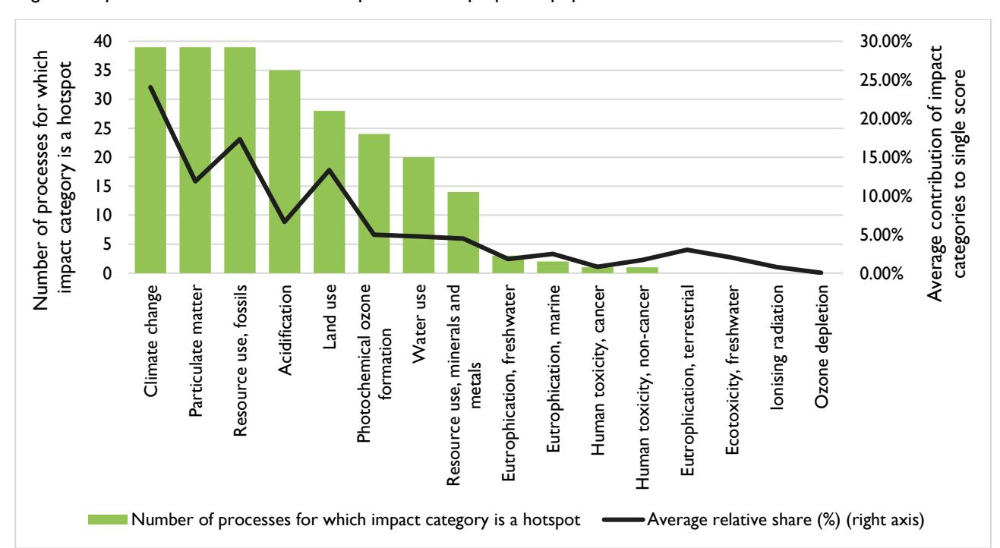

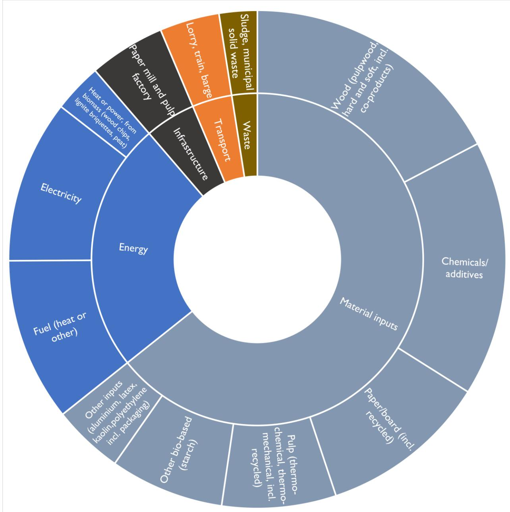

Figure 14. Distribution of 283 hotspot activities and flows among 39 LCI data sets for the pulp and paper sector. Hotspots are identified based on the single score using the EF3.1 method.

In the pulp and paper sector, material input is the category with the highest share of identified environmental hotspots for single score process contribution with 65% of the processes, followed by energy (24%), infrastructure (5%), transport (4%) and waste (2%).

Material inputs are recurrently hotspots in the analysed activities, resulting mainly from chemicals and additives (17%), due to the large amounts of chemicals used for paper manufacturing, in various functions such as alter paper properties (colour or resistance), for pulping, bleaching and coating. Chemicals including rosin sizing, added to paper pulp to increase liquid resistivity, sodium hydroxide used for chemical pulping and bleaching steps, calcium carbonate particularly used for coating of board carton, sodium chlorate and sulfuric acid both used to produce chloride dioxide (wood bleaching), printing ink, optical brighteners and acrylic varnishes, among others, stand out as environmental hotspots. Extraction of wood (pulpwood, hard and soft, including co-products) appears frequently as a hotspot (17%), mainly due to land use and fossil resources used for forestry activities. The production of paper and board (including recycled) (11%) and pulp (thermo-chemical, thermo-mechanical, including recycled) (7%) are also hotspot material inputs, partly due to upstream material production (i.e. pulpwood for pulp production, and pulp for paper production) due to the prior wood production phase, transport, and thermal, chemical and mechanical treatments which they undergo with the associated energy and chemical consumption. Other bio-based inputs like starch, an essential adhesive and bonding agent for the paper sector, also represent 7% of the identified hotspots. Finally, other inputs like aluminium, latex, kaolin, polyethylene including packaging, together account for 5% of the total share of materials inputs.

The high amounts of energy necessary to produce pulp, paper and board, result in 11% of hotspot processes coming from fossil resources and 3% resulting from heat or power from biomass inputs such as wood chips, lignite briquettes and peat. Infrastructure (paper and pulp mills) display a 5% share of the hotspots within analysed processes. Transport, by lorry, train and barge (4%) also appear as a relevant hotspot, as well as sludge municipal waste (2%) mainly from the production of containerboard and kraft paper.

The hotspots identified in literature (section [3.2.2.1\)](#page-40-1) match well with the hotspots here identified with the database approach. Material inputs (e.g., wood, chemicals and additives) and energy usage are identified as major hotspots. Water usage is identified as an important flow and it come out as a hotspot in the database approach for 20 processes. In the identification through literature, emissions to water and air are also identified as important aspects and not mentioned in the database approach for hotspot activities and flows. For emissions to air it is mainly emissions associated with energy and most of the emissions are accounted for in the activity energy. Emissions to water contribute to eutrophication (releases of nitrogen and phosphorus), but in the database approach eutrophication is not recognized as a major hotspot. The reasons for this could be the small weighting factors for eutrophication or improvements in the sector using wastewater treatment plant that lowers the emissions to water containing nitrogen and phosphorus.

For 35 processes in the sector, acidification is a hotspot. Emissions of sulphur oxides and nitrogen oxides contributes to the impact category. The main contributor to acidification for the sector, identified through the database approach, is the use of chemicals and not direct emissions from the manufacturing of the pulp. As mentioned in the hotspot identification through literature, sulphur emissions have been a huge problem for the pulp and paper sector in the past. Due to technology improvements, direct emissions of sulphur from the sector were reduced and thus are not a major hotspot for the sector anymore.

# 3.3.1.3 Textile industry

[Figure 15](#page-53-0) presents environmental hotspots for the textile sector.

Figure 15. Textile sector: environmental hotspots and average contribution of impact categories to single score using the EF 3.1 method. The left yaxis represents the number of processes for which an impact category is a hotspot (green columns), and the right y-axis, the average relative contribution of the impact category to the single score impact among the 27 LCI data characterized for textiles (black line).

The processes characterized for the textile sector most often present hotspots for climate change (26 processes) and acidification (25 processes), particulate matter (19 processes), water use (17 processes), and fossil resource use (17 processes). Five of the six processes for which human toxicity (non-cancer) is a hotspot present negative values (i.e., these processes have a positive impact for this impact category). This occurs because the crops take up heavy metals from the environment. These processes include organic seed-cotton production, kenaf fibre, yarn or textile, and jute yarn. Three processes also present negative hotspots for water use: sanforizing, drying and finishing, and finishing.

The water use category contributes most to the single score on average, with 20% of the impact on average, followed by climate change (19%), fossil resource use (10%), particulate matter (9%), acidification (7% each), and eutrophication of freshwater and marine water (6% each). On the other hand, human toxicity related to cancer, ozone depletion and ionizing radiation have overall negligible contributions (>1% on average).

[Figure 16](#page-54-0) shows the distribution of hotspot activities and flows for LCI data sets for the textile sector.

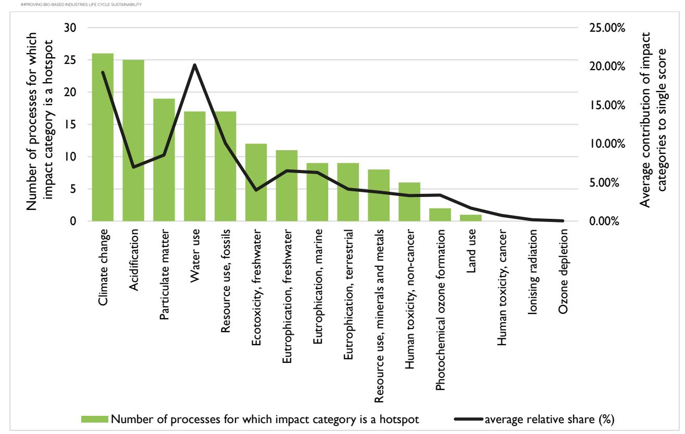

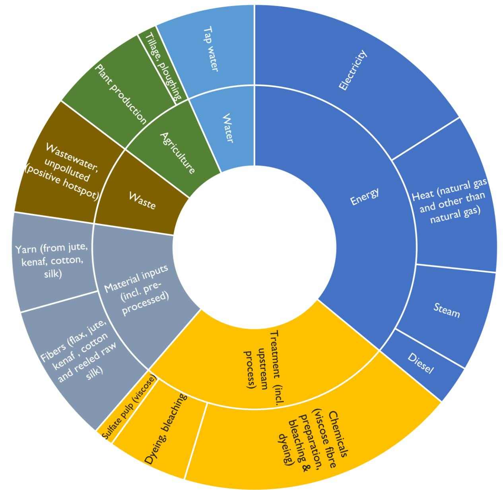

Figure 16. Distribution of 75 hotspot activities and flows among 27 LCI data sets for the textile sector. Hotspots are identified based on the single score using the EF 3.1 method.

In the textile sector, energy is the category with the highest share of identified environmental hotspots for single score process contribution with 36% of processes, followed by treatment (including upstream processes) (25%), materials inputs (including pre-processed materials) (16%), agriculture (8%), waste (8%) and water consumption (7%).

Energy stands out as a recurring hotspot, mainly from the fabric production stage, where intensive amounts of energy are necessary for dyeing and finishing wet processes requiring to heat large volumes of water. Within the energy category, electricity accounts for 16% of the impacts; heat (natural gas and other than natural gas) (11%), steam (7%) and diesel (3%). Electricity, heat and steam are important environmental hotspots in wetchemical processing steps along the entire textile value chain, such as fibre batch and continuous dyeing, yarn bleaching, mercerizing, washing, drying and finishing of textiles.

Wet-chemical pretreatments demand not only large amounts of energy but also of water and chemicals. For the treatment activities, chemicals frequently arise as hotspots (19%), including surfactants, bleaching agents

(hydrogen peroxide), dye adsorption agents (sodium sulphate), among others. Given that the use of these chemicals appears as a hotspot, the downstream processes where they are used, such as viscose fibre production, bleaching and dyeing are also environmental hotspots (5%). Within the material inputs activities, the production of fibres from flax, jute, kenaf, cotton and reeled raw silk accounts for 9% of the hotspot activities, and the production of yarn from jute, kenaf, cotton and silk, for 7%.

Regarding agriculture activities, plant production (7%) and land transformation (tillage and ploughing) (1%) include extraction of raw materials for textile production, such as harvesting of flax, jute and kenaf plants and seed-cotton. Wastewater (8%) is the only positive hotspot since these waste flows are further treated and the water is disposed in natural waterways. Consequently, it does not impact the environment negatively where it is re-emitted. Despite this, these effluents can be toxic if proper treatment is not ensured due to the high fraction of chemicals present. Regardless of water contributing with the lowest share when compared to the other categories, it remains as a recurrent environmental hotspot within analysed processes. Tap water use is mainly observed in processes from cotton production, like batch and continuous dyeing cotton fibres and finishing of woven cotton. Another important process which consumes significant quantities of tap water is washing, drying, and finishing laundry.

This database analysis is very much aligned with that of the literature regarding many aspects, in particular the high carbon footprint for energy, water footprint and impact associated with the usage of chemicals. The coverage of land use was not covered in the literature study, but, as expected, it points out to be crucial with regard to land use and CO2-uptake.

# 3.3.1.4 Woodworking industry

[Figure 17](#page-55-0) presents environmental hotspots for the woodworking sector.

Figure 17. Woodworking sector: environmental hotspots and average contribution of impact categories to single score using the EF 3.1 method. The left y-axis represents the number of processes for which an impact category is a hotspot (green columns), and the right y-axis, the average relative contribution of the impact category to the single score impact among the 142 LCI data analysed for woodworking (black line).

Most of the 142 LCI datasets analyzed for the woodworking sector have hotspots for climate change (135 processes), fossil resource use (113 processes), and land use (76 processes). Photochemical ozone formation, particulate matter, eutrophication of freshwater, ozone depletion, acidification and mineral resource use also come out recurrently as hotspots, with 60, 43, 40, 37, 21, and 18 processes, respectively. Terrestrial and marine eutrophication come out as a hotspot for only one process each, water use, for two processes, and ionizing radiation, for four processes.

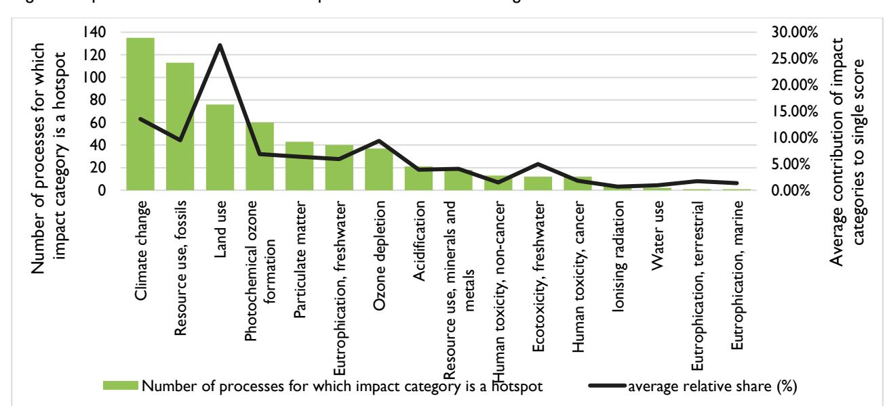

On average, land use, mostly related to forestry activities, contributes to 28% of the single score impacts, followed by climate change (14%), fossil resource use (10%), ozone depletion (9%), and photochemical ozone formation (7%). On the other hand, a negligible share of the average share of impacts per impact category is attributable to water use and ionizing radiation (>1% on average).

[Figure 18](#page-56-0) shows the distribution of hotspot activities and flows for LCI data sets for the woodworking sector.

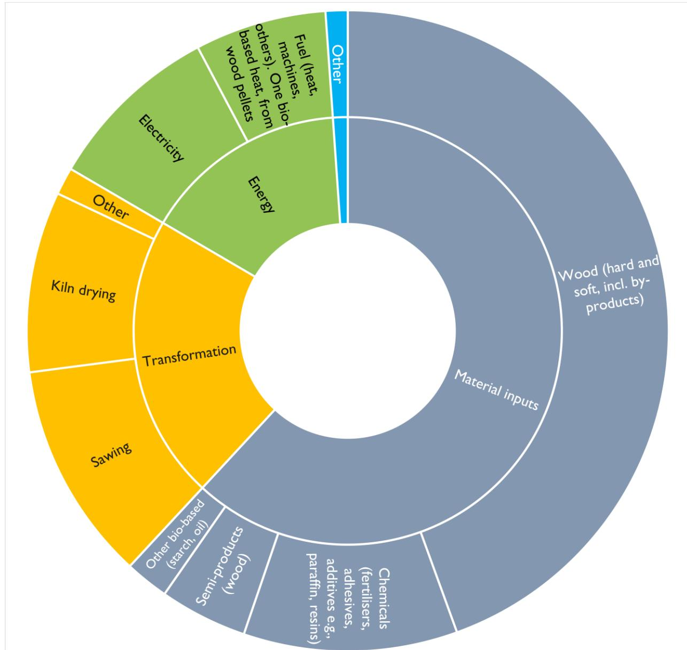

Figure 18. Distribution of 362 hotspot activities and flows among 142 LCI data sets for the woodworking sector. Hotspots are identified based on the single score using the EF 3.1 method.

Hotspot activities and flows for the woodworking sector are mostly related to the inputs of materials and chemicals, with 62% of the total hotspots. Especially, 49% of hotspots are related to wood inputs, 44% of which is from raw wood, and 4% from wood semi-products like particleboard or oriented strand board. The remainder 13% of hotspots within material inputs is due to chemicals consumption, mainly adhesives (urea formaldehyde and phenolic resins, and melamine urea formaldehyde adhesive), and bio-materials other than wood (2%), including starch and vegetable oils used for the manufacture of fibreboards and for power sawing. Other recurrent hotspots are related to energy consumption (9% for electricity, and 7% for fuels used mostly for heat, wood chipping and sawing), and transformation processes (22%, of which 11% are related to sawing and 9%

#### to kiln drying).

#### 3.3.1.5 Construction industry

[Figure 19](#page-57-0) presents environmental hotspots for the construction sector (excluding woodworking processes characterized in section [3.3.1.4\)](#page-55-1).

Figure 19. Construction sector (non-woodworking): environmental hotspots and average contribution of impact categories to single score using the EF 3.1 method. Processes included for the construction sector exclude those already analysed in the woodworking activities. The left y-axis represents the number of processes for which an impact category is a hotspot (green columns), and the right y-axis, the average relative contribution of the impact category to the single score impact among the 18 LCI data analysed for construction (black line).

Remind that a large share of bio-based products used in construction are made from wood, and that processes and materials for this sector are included in woodworking. Thus, the analysis from the previous section [\(3.3.1.4\)](#page-55-1) should be considered as representative of the wood production and transformation into semi-products used in construction. The 18 non-woodworking processes included in the construction sector include wood, woodglass, or wood-metal products (window frames and doors), wood constructs (garage and building hall), and a few bio-based materials or products (natural rubber seal, cork slabs, cellulose fibre insulation, polyactide granulates, and polyester-complexed starch biopolymer).

Among these 18 processes, most have a hotspot for climate change and fossil resource use (17 processes each), mineral and metal resource use (16 processes), particulate matter (15 processes), and acidification (13 processes). Ozone depletion, ionizing radiation, human toxicity (non-cancer), and marine and freshwater eutrophication do not come out as hotspot impact categories for any process. On average, the ozone depletion, ionizing radiation, and marine eutrophication have negligible contributions to single score (>1% on average). Impact categories with the largest contribution on average include climate change (average of 21%), resource use of minerals and metals (average of 18%), fossil resource use (average of 14%), and particulate matter (average of 12%).

[Figure 20](#page-58-0) shows the distribution of hotspot activities and flows for LCI data sets for the construction sector.

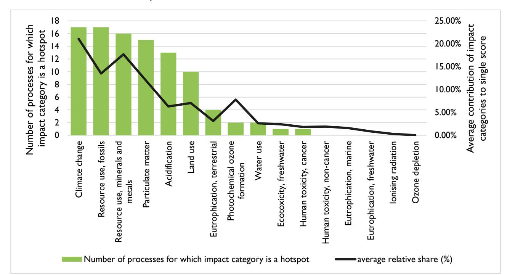

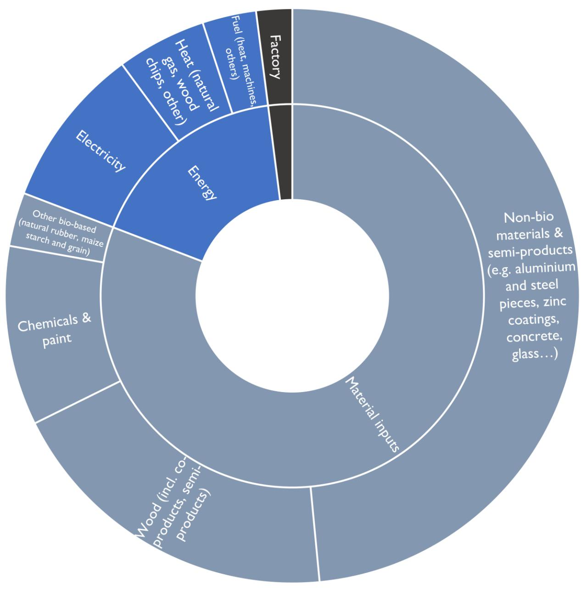

Figure 20. Distribution of 99 hotspot activities and flows among 18 LCI data sets for the construction sector. Hotspots are identified based on the single score using the EF 3.1 method.

Four hotspots out of five are due to the provisioning of materials used as inputs to processes, including nonbiobased materials (such as low-alloyed steel, nickel for coatings and glass (48% of hotspot processes)), raw or transformed wood (18%), alkyd paint and chemicals (e.g., boric acid) (10%), and other bio-materials (3%). The remainder hotspots are either linked to energy (17% of hotspots, of which 9% are from electricity, 5% from heat, and 3% from fossil fuels) or infrastructure (2% of hotspots). Because most processes from the upstream value chain are covered in the woodworking sector, a large share of hotspots results from the manufacture of final products (e.g., doors, windows), for which the inputs of wood semi-products (e.g., particleboard), nonbio materials like metals and paint as well as electricity and heat importantly contribute to the single score impacts.

Only one fourth of the hotspot processes related to materials inputs is attributed to bio-based materials or semi-products, mostly because they generally have a much lower impact than other inputs like paint and metals

at similar weight (although these inputs of course do not have the same function in the final product). Nevertheless, fibreboard and particleboard recurrently come out as hotspots, also because they make use of impactful melamine formaldehyde resin for their manufacture.

Because of the lack of coverage of most bio-based solutions aside from wood, the identified hotspots are not representative of a wide array of potential bio-based solutions for the construction sector, and even less so for innovative materials like hempcrete. Nevertheless, this hotspot analysis supports the general observation for bio-materials used in construction, that the necessary use of additives like adhesives, flame retardants and biocides can often contribute significantly to the material's impact profile.

# 3.3.2 Social hotspots (database and survey approaches)

# 3.3.2.1 Bio-chemicals industry

# A. Database approach

A full overview is presented in the Appendices A and B, but we provide here a concise summary. The main impact subcategories for the two database approaches are shown in [Table 12.](#page-59-1)

Table 12. Semi-quantitative top-5 ranking of the most important impact subcategories (themes), acting as hotspots, for the case of the biochemicals sector

|   | PSILCA – case                   |                                            |
|---|---------------------------------|--------------------------------------------|
|   | (“ Chemicals,                   | chemical products and man-made fibres      |
|   | (Sweden) ”)                     |                                            |
|   |                                 | SHDB – case                                |
|   |                                 | ( “ Chemical, rubber, plastic products/SWE |
|   |                                 | U ” )                                      |
| 1 | Fair Salary                     | High Conflict Zones                        |
| 2 | Promoting Social Responsibility | Migrant Labor                              |
| 3 | Migration                       | Freedom of Association                     |
| 4 | Corruption                      | Access to Hospital Beds                    |
| 5 | Workers’ rights                 | Occupational toxics & hazards              |

A full overview is presented in the Appendices A and B, but we provide here a concise summary. Although it is not that a good match for biobased chemicals, we can derive the following form the social hotspot analysis of the Swedish chemicals, chemical products and man-made fibres manufactures from PSILCA. Fair salary (33%) is by far the most prominent impact subcategory, with impacts mainly associated with the studied product group at 33%, respectively. Promoting Social Responsibility (7.8%), Migration flows (7.3%) and Added Value (6.9%), are to a lesser degree important but still notable, with again the majority of the impact associated with the sector of study at 46, 50 and 31% respectively. The impact subcategories relevant for CALIMERO are again estimated to have a low social risk share (<0.6%). Nevertheless, this risk share attribution can be questioned, and analysis of these is relevant. For the impact subcategories non-fatal accidents and water and air pollution, there are no notable sector hotspots, but impacts are mainly situated in Argentina (>34%) and African countries, respectively. For the more extreme fatal accidents, most of the impact is attributed to mining, metal ores in Turkey (22%). Unemployment and Expenditure on education don't have prominent hotspots in single sector, though the former is mainly situated in South-Africa (>45%) and the latter mainly in non-EU countries. The impact subcategory of safety measures, the main abroad relevant sector is crop cultivation in China (10%), but there are also two sectors relevant from Sweden: the construction sector (6.5%) and the administration and defence sector (11%).

The analysis done using SHDB has the same suitability problem than the one from PSILCA: low representability of bio-based chemicals given that all types of chemicals are included in the scope of the dataset analysed. Most of the impacts (11%) are coming from the process of chemical production in Sweden. Business services sector in Sweden and India are also part of the top processes. The hotspot analysis revealed high importance of the health and safety damage category due to occupational toxic & hazards, as expected from the chemicals

industry. However, impact categories belonging to other damage categories present more relative importance in the total impacts. For example, high conflict zones impact category, from the human rights damage category, is the one with highest medium risk hours equivalent. The results are sometimes difficult to interpret, given the data to evaluate whether an indicator presents low, medium, high or very high risk is not available in the software. Different sources must be checked for 1 single inventory data (example: overall high conflict, high risk). However, according to Global Trend report, the only relevant source of risk is the number of refugees Sweden present, although no specific risks are associated to the presence of refugees. No conflicts were reported in Sweden in the Conflict Barometer of the Heidelberg Institute for International Conflict Research (2022).

Also, the access to hospital beds is presented as hotspot of the country, given that this indicator is not sectordependent. Sweden seems to have low number of beds per inhabitant (2 beds / 1,000 inhabitants) compared to other countries (Spain or Turkey have 3) (OECD, 2021).

Comparing the results obtained from PSILCA and SHDB, only migration seems to be a top contributor and issue of concern from both analyses. It can be noted that, in the paper & pulp sector analysis using SHDB, similar indicators to the chemicals sector are seen as hotspots, given the same geographical location (Sweden). The same justification can be used for selecting high conflicts, access to hospital beds and migrant labour. However, the occupational toxics and hazards present higher relevance (23%) in the paper sector than in the chemicals sector. India appears a source of relevant impacts linked to business services within the supply chain, being the origin of more than 3% of total impacts. However, except for migration, there is no coincidence of top contributors from SHDB and PSILCA, which should be further investigated.

# B. Survey approach

The normalized results per stakeholder groups for the biochemicals sector are presented in [Table 13,](#page-60-0) and the distribution of the total average score for 7 answers obtained with the SLCA survey, in [Figure 21](#page-62-0) below. Complete results are provided in Appendix D.

Table 13. Normalized score per stakeholder group for the biochemicals sector

| Stakeholder category |                                                                                   | Normalized |
|----------------------|-----------------------------------------------------------------------------------|------------|
|                      | EMPLOYEES/WORKERS (for any step of the supply chain)                              | 55         |
| LOCAL COMMUNITIES    | (in direct contact with any step of the supply chain)                             | 50         |
| VALUE CHAIN ACTORS   | (actors with direct interest in bio-based products, e.g. suppliers)               | 46         |
| CONSUMERS            | (B2B & B2C)                                                                       | 36         |
| SOCIETY              | (in a global sense)                                                               | 24         |
| CHILDREN             | (in contact with the supply chain, e.g., education in local community, exposition |            |
|                      | to marketing, or as consumers)                                                    | 35         |

Among the consulted experts working in the biochemicals sector, the stakeholder groups rising the biggest social challenges are employees belonging to the value chain (total score of 55 points and a relative total score of 100%), followed by local communities (total score of 50 points and a relative total score of 84%), value chain actors (total score of 46 points and a relative total score of 71%), consumers (total score of 36 points and a relative total score of 39%), children (total score of 35 points and a relative total score of 35%) and society (total score of 24 points and a relative total score of 0%).

or the stakeholder group of employees, the most relevant social challenges are related to health and safety risks (a total score of 65 points and a relative total score of 100%), assessed not only by the number of accidents occurring during work hours but also by considering the prevention measures and management practices. In addition, one of the experts highlighted that inadequate working conditions for pregnant women are also relevant social challenges to address within health and safety problems. Child labour is another relevant subcategory (total score of 56 points and a relative total score of 83%) indicating that the legal workforce's verification, prevention, and mitigation may fail to be fulfilled rigorously.

For the stakeholder group of local communities, safe and healthy living conditions is the most challenging subcategory (total score of 46 points and a relative total score of 63%), reflecting the positive and negative impacts organisations can have on local communities, followed by direct or indirect job creation rates (local employment) (total score of 36 points and relative total score of 44%). Furthermore, regarding value chain actors with a direct interest in bio-based products, multiple social concerns include fair competition (total score of 45 points and a relative total score of 62%), securing supplier relationships and avoiding unintended consequences of procurement and purchase decisions in different organisations (total score of 45 points and a relative total score of 62%), and wealth distribution through the several actors of the value chain (total score of 45 points and a relative total score of 62%).

Consumers, both from business-to-business (B2B) and business-to-consumer (B2C) economic models, have as the main social challenge the lack of effort from organisations to provide accurate, complete, and clear information regarding EoL products (total score of 60 points and relative total score of 90%). Health issues coming from children as consumers is a relevant social theme for the stakeholder group which encompasses children in contact with the value chain (total score of 50 points and relative total score of 71%).

Finally, despite society from a global perspective being the stakeholder group to show less relevancy for the biochemicals sector, public commitment to sustainability issues is still an important social theme to be addressed (total score of 51 points and relative total score of 73%).

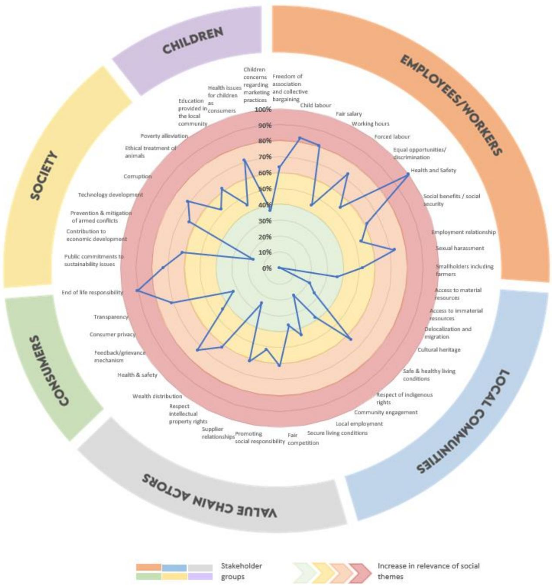

Figure 21. Distribution of the total avrage score for 7 answers obtained with the SLCA survey for the biochemicals sector. The defined 80% threshold for social hotspots is represented by the outer (red) ring.

As shown on [Figure 21,](#page-62-0) the hotspots social themes are child labour, fair salaries, health and safety for employees, and EoL responsibility for consumers.

Based on the literature review for biochemicals and the database results for the chemical sector, it can be summarized that worker, local community and value chain actors are the relevant stakeholders to be further assessed for the biochemicals sector. An important conclusion of the analysis of social hotspots in this section is the risk of additional social impacts that agricultural activities can bring in addition to chemical production since the raw materials for biochemicals will be provided by this sector.

# 3.3.2.2 Pulp and paper industry

# A. Database approach

A full overview is presented in the Appendices A and B, but we provide here a concise summary. The main impact subcategories for the two database approaches are shown in [Table 14.](#page-63-0)

Table 14. Semi-quantitative top-5 ranking of the most important impact subcategories (themes), acting as hotspots for the case of the pulp and paper sector

|   | PSILCA – case                   |                                     |
|---|---------------------------------|-------------------------------------|
|   | (“Manufacture of pulp,          | paper and paper products (Sweden)”) |
|   |                                 | SHDB – case                         |
|   |                                 | (“Paper products, publishing/SWE”)  |
| 1 | Fair Salary                     | High Conflicts                      |
| 2 | Promoting Social Responsibility | Access to Hospital Beds             |
| 3 | Migration                       | Occupational Toxics & Hazards       |
| 4 | Corruption                      | Migrant Labor                       |
| 5 | Workers’ rights                 | Excessive work time                 |

A full overview is presented in the Appendices A and B, but we provide here a concise summary. For the specific pulp and paper sector in Sweden, the PSILCA database and social risk method, highlight Fair Salary as the main impact subcategory at 34% (based on medium risk hours equivalents). One third of the latter is assigned to the studied sector, with the rest of the impact also notably in Sweden. Promoting social responsibility (8.6%) and Migration flows (8.2%) are second and third impact subcategories of relevance, again with the pulp and paper sector in Sweden as hotspot for 44 and 47%, respectively. With regard to impact subcategories of relevance for CALIMERO, they have a low social risk share (<0.6%). Health and safety-related impact subcategories Non-fatal accidents (0.32%), Air and water pollution (0.06%), have no prominent social risk hotspot but sectorial hotspots are mainly situated in Argentina (>20%) and African countries, respectively. Fatal accidents (0.01%), a quite severe impact subcategory, mainly has social risks occurring in the sector on forestry, logging and related services of Lithuania (20%), illustrating the risks for accidents in this type of sector. The impact subcategory of safety measures, the main abroad relevant sector is crop cultivation in China (10%), but there are also two sectors relevant from Sweden: the construction sector (9%) and the administration and defence sector (6%). Finally, Unemployment and Expenditure on education don't have prominent hotspots in single sector, though the former is mainly situated in South-Africa (>38%) and the latter mainly in non-EU countries.

# B. Survey approach

The pulp and paper sector was excluded from the analysis due to the lack of representativeness (two answers were received to the survey).

# 3.3.2.3 Textile industry

## A. Database approach

A full overview is presented in the Appendices A and B, but we provide here a concise summary. The main impact subcategories for the two database approaches are shown in [Table 15.](#page-63-1)

Table 15. Semi-quantitative top-5 ranking of the most important impact subcategories (themes), acting as hotspots for the case of the textile sector

|   | PSILCA – case                          |                              |
|---|----------------------------------------|------------------------------|
|   |                                        | SHDB – case                  |
|   |                                        | (“ Wearing apparel/TUR U ” ) |
| 1 | Corruption                             | Corruption                   |
| 2 | Workers’ rights                        | Freedom of association       |
| 3 | Child Labour                           | Migrant labour               |
| 4 | Prevention and mitigation of conflicts | Unemployment                 |

When it comes to the textile sector in Turkey, studied using the PSILCA database, major social risks (>10%) are in the impact subcategories: Public sector corruption (14.8%), Trade unionism (14.1%), Male Child labour (13.9%), risks of conflict (13.3%) & Non-fatal accidents. Their impacts can be mainly attributed to the sector itself at, respectively, 76, 80, 80, 85 and 98%. Especially for the non-fatal accidents, which is within the focus of CALIMERO, it is interesting to see the predominant nature of the sector itself. Male child labour also stands out as a major issue, that is not prominent in other studied cases. Fair salary is here less important (6.1%), but again mainly linked with the textile sector in Turkey (59%). For the other impact subcategories of interest for CALIMERO, the Turkish textile sector is as well a more prominent hotspot (9-41%), while their share in social risks is lower (max. 0.12%). Safety measures, another health and safety impact subcategories, has as hotspot crop cultivation in China (41%), while for Fatal accidents, the main hotspot is again a sector in Turkey, but this time from mining of coal and lignite. The skill-related impact subcategories, unemployment, and expenditures on education, have yet again the textile manufacture sector in Turkey as main hotspot at respectively 32 and 41%, respectively.

Assessing the results from the SHDB, corruption and labour rights are part of the top contributors of the hotspots analysis, which are aligned with the results from PSILCA. Although the rest of hotspots could be classified in the same categories of human and labour rights, the specific subcategories provided represent different issues. As an example, child labour appears as a hotspot according to the PSILCA, while the SHDB does not.

Compared to the literature analysis, it is quite peculiar that the database analysis for the sector in Turkey presents Corruption as the most important category, although that can be mainly attributed to the narrow focus on Turkey where this would seem to be a predominant issue. For other main issues (Worker rights, child labour, health & safety and labour conditions), the analyses of literature, on the one hand, and the database results for the Turkish textile sector, on the other hand, align.

#### B. Survey approach

The normalized results per stakeholder groups for the textile sector are presented in [Table 16,](#page-64-0) and the distribution of the total average score for 10 answers obtained with the survey, in [Figure 22](#page-66-0) below. Complete results are provided in Appendix D.

Table 16. Normalized score per stakeholder group for the textile sector

| Stakeholder category                                                    | Normalized score |
|-------------------------------------------------------------------------|------------------|
| EMPLOYEES/WORKERS (for any step of the supply chain)                    | 76               |
| LOCAL COMMUNITIES (in direct contact with any step of the supply chain) | 57               |
| suppliers)                                                              | 95               |
| CONSUMERS (B2B & B2C)                                                   | 62               |
| SOCIETY (in a global sense)                                             | 66               |
| exposition to marketing, or as consumers)                               | 51               |

Among the consulted experts working in the textile sector, the stakeholder groups rising the biggest social challenges are value chain actors (total score of 95 points and a relative total score of 100%), followed by employees (total score of 76 points and a relative total score of 57%), society (total score of 66 points and a relative total score of 34%), consumers (total score of 62 points and a relative total score of 25%), local communities (total score of 57 points and a relative total score of 14%) and children (total score of 51 points and a relative total score of 0%).

For the stakeholder group of value chain actors, the most relevant social challenges are related to fair competition (a total score of 85 points and a relative total score of 72%) and wealth distribution (a total score of 81 points and a relative total score of 65%). Fair competition assesses whether an organization's competitive activities are conducted fairly, and wealth distribution evaluates if the value is being distributed in an equitable way to all the actors of the value chain.

For the stakeholder group of employees, health and safety is the most challenging subcategory (total score of 95 points and a relative total score of 91%), followed by social benefits and security being provided to workers (total score of 90 points and relative total score of 81%). In addition, one of the experts highlighted that pesticide poisoning of cotton farmers is also a relevant social issue to address within health and safety problems, as well as, gender inequality, and current "modern slavery" practices which lack transparency and compromise the ethics and human rights of workers.

Furthermore, social concerns for society in a global sense include public commitment to sustainability issues (total score of 90 points and a relative total score of 81%), reflecting the engagement of organizations in reducing their negative environmental impacts, followed by contribution to economic development (total score of 85 points and relative total score of 72%). Consumers, both from business-to-business (B2B) and businessto-consumer (B2C) economic models, have as the main social challenge health and safety risks (total score of 90 points and a relative total score of 81%), and transparency (total score of 90 points and a relative total score of 81%).

Safe and healthy living conditions are highly relevant social themes for the stakeholder group of local communities (total score of 100 points and relative total score of 100%). Finally, despite children being the stakeholder group to show less relevancy in the textile sector, education provided in local communities, and health issues for children as consumers are also important social themes to be addressed (total score of 81 points and relative total score of 65%).

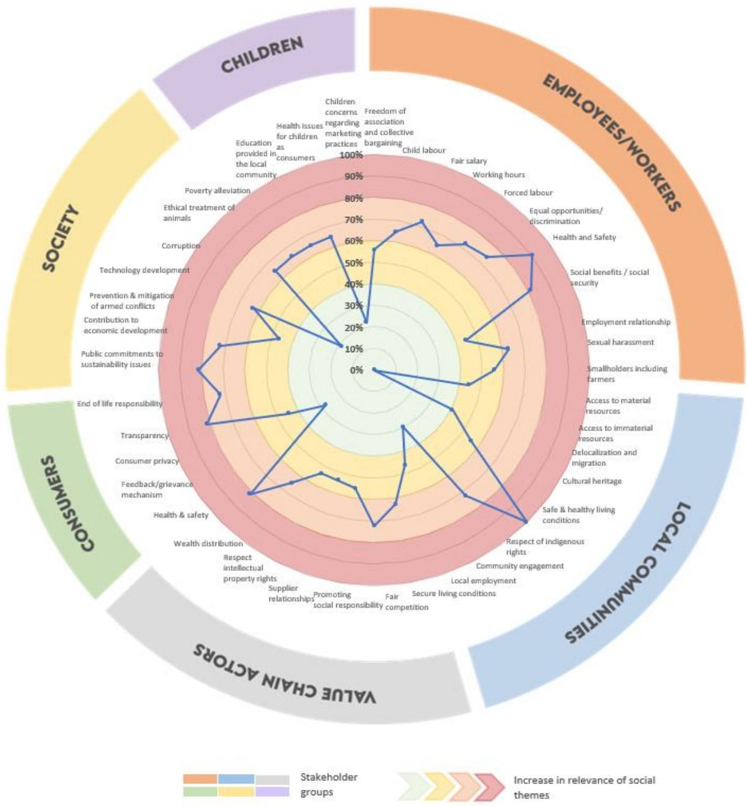

Funded by the European Union. Views and opinions expressed are however those of the author(s) only and do not necessarily reflect those of the European Union. Neither the European Union nor the European Research Executive Agency can be held responsible for them. Page 67 A full overview is presented in the Appendices A and B, but we provide here a concise summary. The main

Figure 22. Distribution of the total average score for 10 answers obtained with the SLCA survey for the textile sector. The defined 80% threshold for social hotspots is represented by the outer (red) ring.

As shown in [Figure 22,](#page-66-0) the hotspots social themes are health and safety for employees, respect for indigenous rights for local communities, health and safety and transparency for consumers and public commitment to sustainability issues for society in a global sense.

The results resonate with the literature review. The latter also pointed out as social issues uneven wealth distribution among the value chain, health and safety issues and worker rights. However, other hotspots were highlighted in the survey, e.g. transparency for consumers, which can be related to a lack in consideration of this issue in databases.

# 3.3.2.4 Woodworking industry

# A. Database approach

impact subcategories for the two database approaches are shown in [Table 17.](#page-67-0)

Table 17. Semi-quantitative top-5 ranking of the most important impact subcategories (themes), acting as hotspots, for the case of the woodworking sector

|   | PSILCA – case                  |                                  |
|---|--------------------------------|----------------------------------|
|   |                                | SHDB – case                      |
|   |                                | ( “ Wood products/ESP U ” )      |
| 1 | Fair salary                    | Freedom of association           |
| 2 | Workers’ rights                | High conflict zones              |
| 3 | Corruption                     | Unemployment                     |
| 4 | Health and safety              | Injuries & fatalities            |
| 5 | Social benefits & legal issues | Occupational toxicity and hazard |

In case of the manufacture of wood and products of wood and cork in Spain, fair salary is the most prominent impact category (18% based on medium risk hours), followed by trade unionism (13%). Both these categories, have as major hotspot the sector under study (>30%). They both relate with working agreements. When it comes to worker health and safety subcategories, relevant for CALIMERO but with a low overall risk share (max. 3.2%), non-fatal accidents (3.2%) are almost entirely attributed to again the sector itself (75%), but for other types such as fatal accidents (0.01%) and safety (0.04%), other sectors in other countries are relative more acting as hotspots, although none are that pronounced (max. 20%). In case of unemployment (0.9%), the wood and products of wood and cork in Spain is as well a major hotspot (55%). Expenditure on education (0.05%) is mainly attributed to forestry and logging in India (15%), and the wood and products sector of Spain (9%).

The analysis from SHDB reveals that health and safety and labour rights are the main issues associated to the Spanish wood sector, mainly related to freedom of association, conflict zones, unemployment of the sector, accidents and toxicity occupational toxicity and hazard, The main source of social risks, as the detailed results from the Appendix C reveal, is Spain, although Chinese and Indian forestry activities also present a relevant contribution.

Based on the literature review and database results for social impacts of pulp and paper sector, it can be summarized that worker and local community stakeholder categories are relevant and needs to be further assessed. For Sweden, based on SHDB impact category results of paper products, it can be claimed that social risks for health and safety is followed by labour rights and decent work, and human rights. Based on SHDB subcategory results, high conflict zones (under human rights impact category) and access to hospital beds (under community impact category) are the two subcategories with highest risks.

# B. Survey approach

Please note that the survey approach is applicable to the woodworking and construction sector altogether (considering that most biomass used for construction comes from forestry and woodworking).

The normalized results per stakeholder groups for the woodworking and construction sector are presented in [Table 18,](#page-67-1) and the distribution of the total average score for 7 answers obtained with the SLCA survey, in [Figure](#page-69-0)  [23](#page-69-0) below. Complete results are provided in Appendix D.

Table 18. Normalized score per stakeholder group for the woodworking and construction sectors

| Stakeholder category                                                                   | Normalized score |
|----------------------------------------------------------------------------------------|------------------|
| EMPLOYEES/WORKERS (for any step of the supply chain)                                   | 45               |
| LOCAL COMMUNITIES (in direct contact with any step of the supply chain)                | 45               |
| VALUE CHAIN ACTORS (actors with direct interest in bio-based products, e.g. suppliers) | 41               |
| CONSUMERS (B2B & B2C)                                                                  | 37               |

| SOCIETY (in a global sense)                                                                                               | 32 |
|---------------------------------------------------------------------------------------------------------------------------|----|
| CHILDREN (in contact with the supply chain, e.g., education in local community, exposition to marketing, or as consumers) | 28 |

Among the consulted experts working in the woodworking and construction sectors, the stakeholder groups rising the biggest social challenges are employees belonging to the value chain (total score of 45 points and a relative total score of 100%), followed by local communities (total score of 45 points and a relative total score of 100%), value chain actors (total score of 41 points and a relative total score of 76%), consumers (total score of 37 points and a relative total score of 53%), society (total score of 32 points and a relative total score of 24%) and children (total score of 28 points and a relative total score of 0%).

For the stakeholder group of employees, the most relevant social challenges are related to health and safety risks (a total score of 60 points and a relative total score of 100%), assessed not only by the number of accidents occurring during work hours but also by considering the prevention measures and management practices. Forced labour is another relevant subcategory (total score of 51 points and a relative total score of 74%), indicating that compulsory labour may be occurring across the value chain.

Furthermore, regarding local communities, safe and healthy living conditions is the social theme rising higher social risks (total score of 55 points and relative total score of 85%) and other multiple social concerns include delocalization and migration (total score of 50 points and a relative total score of 71%), respect for cultural heritage (total score of 50 points and a relative total score of 71%), and job creation rates (local employment) (total score of 50 points and a relative total score of 71%).

For the stakeholder group of value chain actors, promoting social responsibility (total score of 41 points and a relative total score of 44%), followed by fair competition (total score of 40 points and relative total score of 41%) are the main social concerns to address. Consumers, both from business-to-business (B2B) and business-to-consumer (B2C) economic models, have as the main social challenge health and safety risks (total score of 55 points and a relative total score of 85%), and EoL responsibility (total score of 41 points and a relative total score of 44%).

For the stakeholder group of society, the organization's contribution to economic development (total score of 55 points and a relative total score of 85%), followed by corruption (total score of 45 points and a relative total score of 56%) are the most relevant social issues. Finally, despite children being the stakeholder group to show less relevancy in the construction and woodworking sectors, health issues for children as consumers are also an important social theme to be considered (total score of 46 points and relative total score of 59%).

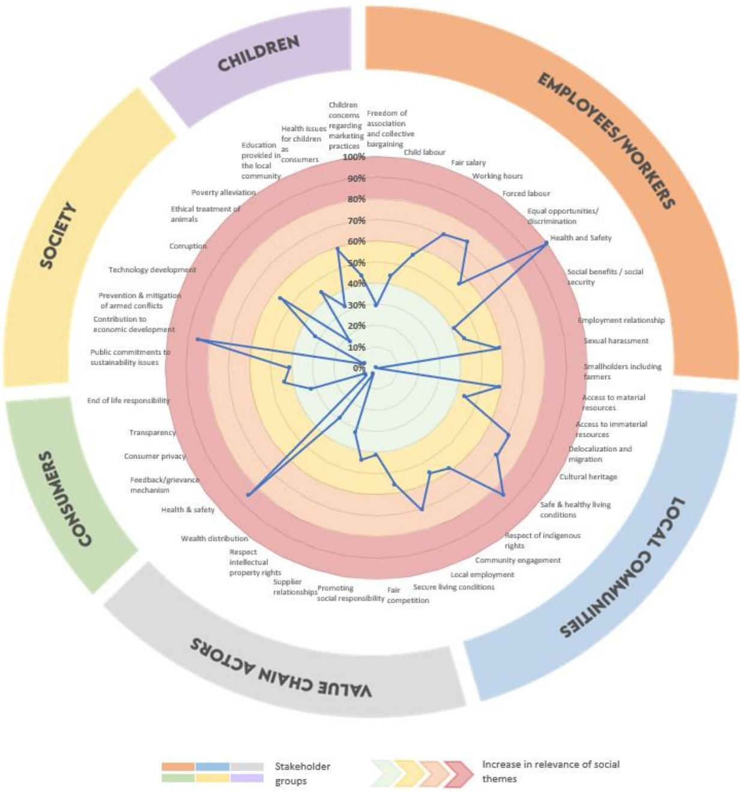

Figure 23. Distribution of the total average score for 7 answers obtained with the SLCA survey for the woodworking and construction sectors. The defined 80% threshold for social hotspots is represented by the outer (red) ring.

As shown in [Figure 23,](#page-69-0) the hotspots social themes are health and safety for employees, respect for indigenous rights for local communities, health and safety for consumers and contribution for economic development for society in a global sense.

#### 3.3.2.5 Construction industry

A full overview is presented in the Appendices A and B, but we provide here a concise summary. The main impact subcategories for the two database approaches are shown in [Table 19.](#page-69-1)

Table 19. Semi-quantitative top-5 ranking of the most important impact subcategories (themes), acting as hotspots, for the case of the construction sector

**PSILCA – case ("Cellulose and paper products (Germany)") SHDB – case (Plant-based fibres (European countries, data from ECIA)) 1** Fair Salary Injuries & Fatalities

| 2 | Workers’ rights                 | Occupational toxics and hazards |
|---|---------------------------------|---------------------------------|
| 3 | Migration                       | Excessive working time          |
| 4 | Corruption                      | Smallholder vs Commercial Farms |
| 5 | Promoting Social Responsibility | High Conflict Zones             |

A full overview is presented in the Appendices A and B, but we provide here a concise summary. For the PSILCA case, the social hotspot analysis for the German cellulose and paper product sector (the only sector in PSILCA focused on cellulose), shows that biggest impact categories are fair salary (26.5%) and trade unionism (10%). The main sector responsible is the studied sector itself, but the share is not that high, being only around 20%. Other German sectors are also notably associated with this risk. These two impact subcategories, deal about working agreement. If we look at health and safety impact subcategories, relevant for CALIMERO, impact subcategories seem to have a low-risk share (<1%) and risks are attributed to the main sector studied for safety measures (25%), while for non-fatal accidents this is the pulp and paper sector in the Netherlands (20%). On the contrary, for more extreme health risks such as air and water pollution, and fatal accidents, prominent hotspots are outside of Europe. Finally, unemployment risks in the value chain are due to the presence of South-African sectors (>50%).

# 3.3.3 Economic hotspots

Three sectors directly depend on forestry activities for raw materials: pulp and paper, construction, and woodworking [\(Figure 24\)](#page-70-1). According to a material flow analysis by the JRC, 61% of wood biomass is used to produce energy, while 15% is used as sawn wood, 12% as wood pulp and another 12% as wood for panels (Camia, 2018). However, the share of forestry activities associated to the different sectors and associated value added cannot be clearly distinguished with Eurostat data. It is thus analysed as a distinct activity in this section. Some complementary data from the DataM database are considered when data were incomplete in Eurostat.

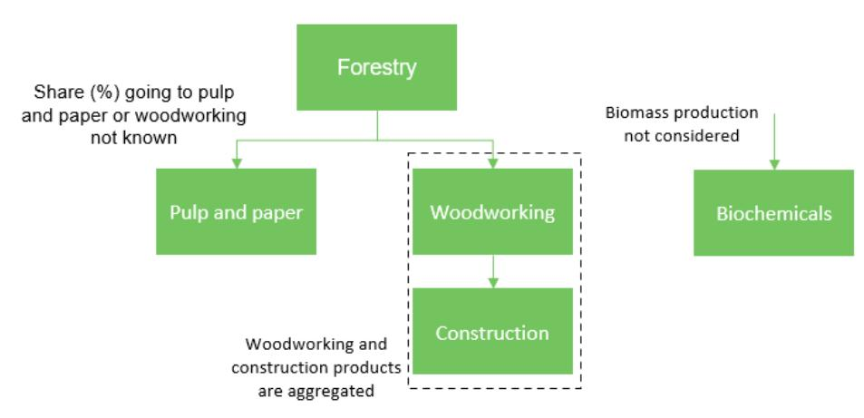

Figure 24. Interconnection of bio-based sectors as assessed in the economic hotspot analysis. Only production activities of supply chains are considered; the use and end-of-life activities are not. Upstream activities related to material provisioning for biochemicals are not considered for that sector.

[Figure 25](#page-71-0) presents the overview of value added and employees per sector in EU.

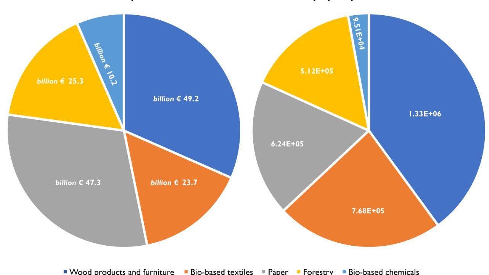

Figure 25. Average value added and employees per bio-based sector in EU between 2018 and 2020 based on Lasarte-López et al. (2023). The wood products and furniture are assumed to cover the timber-based construction products and woodworking sectors (without distinction).

It can be that the wood products and furniture sector generates the most value added with 49.2 billion € for 1.3 million employees, thus generating a relatively low economic productivity for that sector (approximately 37k€ of value added per employee). Following are the paper sector with 47.3 billion € for 624k employees, for an average of 76k€ of value added per employee; the forestry sector with 25.3 billion € for 512k employees, for an average of 49k€ of value added per employee; the textile sector with 25.3 billion € for 768k employees, for an average of 31k€ of value added per employee; and the bio-based chemical sector with 10.2 billion € for 95k employees, for a relatively high productivity of 107k€ of value added per employee on average.

[Figure 26](#page-72-0) presents the location quotient and the value added of these sectors in the different EU member states in 2020. The location quotient is defined as the ratio of the proportion of persons employed in the bioeconomy in a given Member State on the European proportion. A location quotient greater than 1 means that the labour market of the Member State is more ''concentrated'' in the bioeconomy than the EU-27 labour market (Ronzon et al., 2022).

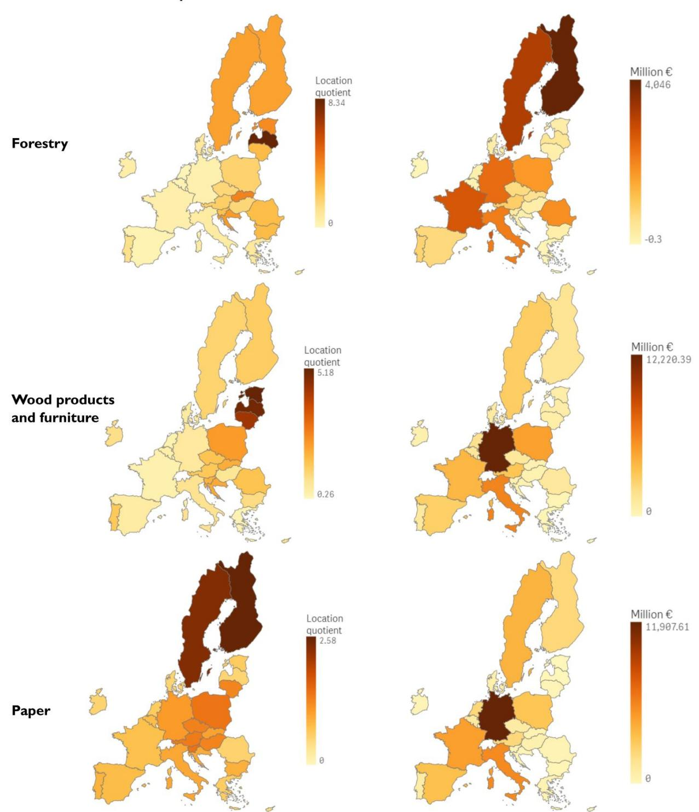

Figure 26 (part A). Location quotient and value added per sector per country in the EU. The depictions are extracted from DataM (Lasarte-López et al., 2023)

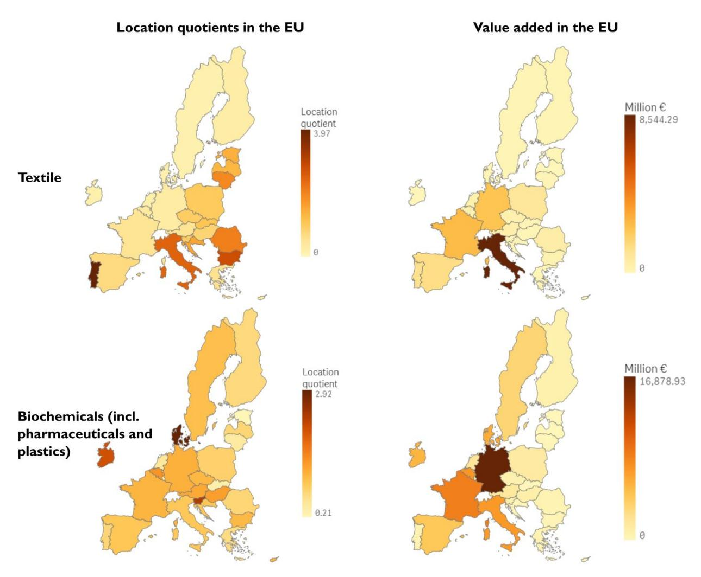

[Figure 26](#page-72-0) (part B). Location quotient (left) and value added per sector (right) per country in the EU. The depictions are extracted from DataM (Lasarte-López et al., 2023). Note that the biochemicals data is here aggregated with pharmaceuticals, plastics and rubber production (as displayed by the reference) but that Germany, France, Italy and Denmark remain key actors in EU when considering only biochemicals.

The analysis below focuses on the identification of the most important actors in EU considering the economic indicators of Eurostat.

# 3.3.3.1 Forestry activities

According to the Eurostat database, the total forestry activities in Europe had a yearly value added of 25.0 billion Euros in average between 2018 and 2020 (similar to the 25.3 billion Euros measured with the DataM database for UE). [Table 20](#page-73-0) presents the EU countries with a strong economic activity in the forestry sector.

Based on the results from the use of monetary indicators from Eurostat (Appendix E), [Table 20](#page-73-0) shows that the EU countries with a relatively strong economic activity in the Forestry sector are Sweden, France, Germany, Poland and Finland.

Table 20. EU countries with strong economic activity in the forestry sector

| Value-chain step | EU countries with relatively high economic activity (the first in the list has the highest number of economic indicators for which a higher-than-average score was obtained) |
|------------------|------------------------------------------------------------------------------------------------------------------------------------------------------------------------------|
| Forestry         | Sweden > France > Germany > Poland > Finland                                                                                                                                 |

When focussing on the physical output [\(Table 21\)](#page-74-0), the main wood producers in the EU are Germany, France, Austria, Finland, Sweden, Poland, Spain, and Portugal. In particular, pulpwood (for the pulp and paper sector) is mostly produced in Germany, Spain, Poland, Portugal, Finland, and Sweden, and industrial roundwood, sawlogs and veneer logs (for the woodworking and construction sector) are mostly produced in Germany, France, Poland, Finland, and Sweden.

Table 21. EU countries with relatively high wood production

| Roundwood removals                     | EU countries that demonstrated an above-average wood   |
|----------------------------------------|--------------------------------------------------------|
| Fuelwood (including wood for charcoal) | Germany > France > Austria > Finland > Sweden          |
| Industrial roundwood                   | Germany > France > Poland > Finland > Sweden           |
| Other industrial roundwood             | France > Italy > Latvia > Hungary > Poland > Romania > |
| Pulpwood, round and split              | Germany > Spain > Poland > Portugal > Finland > Sweden |
| Roundwood (wood in the rough)          | France > Poland > Finland > Sweden                     |
| Sawlogs and veneer logs                | Germany > France > Poland > Finland > Sweden           |

The economic outputs of downstream activities using different types of wood in the pulp and paper, woodworking and construction are described below. The following sectorial analyses excludes value added from forestry activities.

# 3.3.3.2 Pulp and paper industry

Downstream activities of forestry in the pulp and paper sector as accounted for in the Eurostat database generate 50.5 billion Euros (exceeding the 47.3 billion Euros measured with the DataM database for UE).

# **European countries with strong economic activity in the pulp and paper value chain**

As shown in [Table 22,](#page-74-1) the main actors of the pulp and paper value chain are in Western (France, Germany, Spain, Italy, Portugal) and Northern Europe (Sweden, and Finland). Also, Poland has an important economic activity in most steps of the pulp and paper value chain, except for the manufacture of machinery and the manufacture of pulp.

Table 22. EU countries with relatively high economic activity in the pulp and paper value chain (excluding forestry), ordered by the number of economic indicators for which a higher-than-average score was obtained

| Value-chain step                            | EU countries with relatively high economic activity (the |
|---------------------------------------------|----------------------------------------------------------|
| Manufacture of pulp [C1711]                 | Portugal > Sweden > Spain > France                       |
| Manufacture of paper and paperboard [C1712] | Finland > Sweden > France > Spain > Poland > Portugal >  |
|                                             | Italy > Germany > France > Spain > Poland > United       |

| Manufacture of paper stationery [C1723]                       | Italy > France > Germany > Poland > United Kingdom > Spain                     |
|---------------------------------------------------------------|--------------------------------------------------------------------------------|
| Manufacture of wallpaper [C1724]                              | Belgium > Germany > Italy > Sweden > United Kingdom                            |
| Manufacture of other articles of paper and paperboard [C1729] | Italy > Germany > France > Poland > Austria > United Kingdom > Spain > Denmark |

#### **Value added and employment in the pulp and paper sector**

[Figure 27](#page-75-0) presents the value added per step in the pulp and paper value chain.

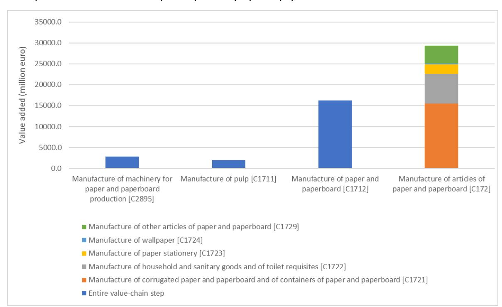

Figure 27. Value added per step in the pulp and paper value chain (million euro). Data refer to the 2018-2020 yearly average in the EU.

The machinery for paper and paperboard production, representing 6% of the value added of the sector, is mainly manufactured in Finland, Sweden, Austria, Italy, Germany, and France. Pulp represents 4% of the added value of the sector in Europe. Based on the economic indicators considered from the Eurostat database, Portugal, Sweden, Spain, and France show a higher-than-average economic activity for the manufacture of pulp. On the other hand, the manufacture of paper and paperboard (32% of the value added, excluding forestry) mostly takes place in Finland, Sweden, France, Spain, Poland, Portugal, and Germany. Finally, the manufacture of various articles of paper and paperboard cumulate 58% of the value added of the pulp and paper value chain, and is concentrated in Italy, Germany, Poland, Spain, France, United Kingdom, Netherlands, Sweden, Belgium, and Austria.

[Figure 28](#page-76-0) shows the number of persons employed for the different steps of the value chain for pulp and paper. In general, the higher the value added, the higher the number of employees. Over half of the workers of the pulp and paper sector (excluding forestry) are employed in the manufacture of articles of paper and paperboard.

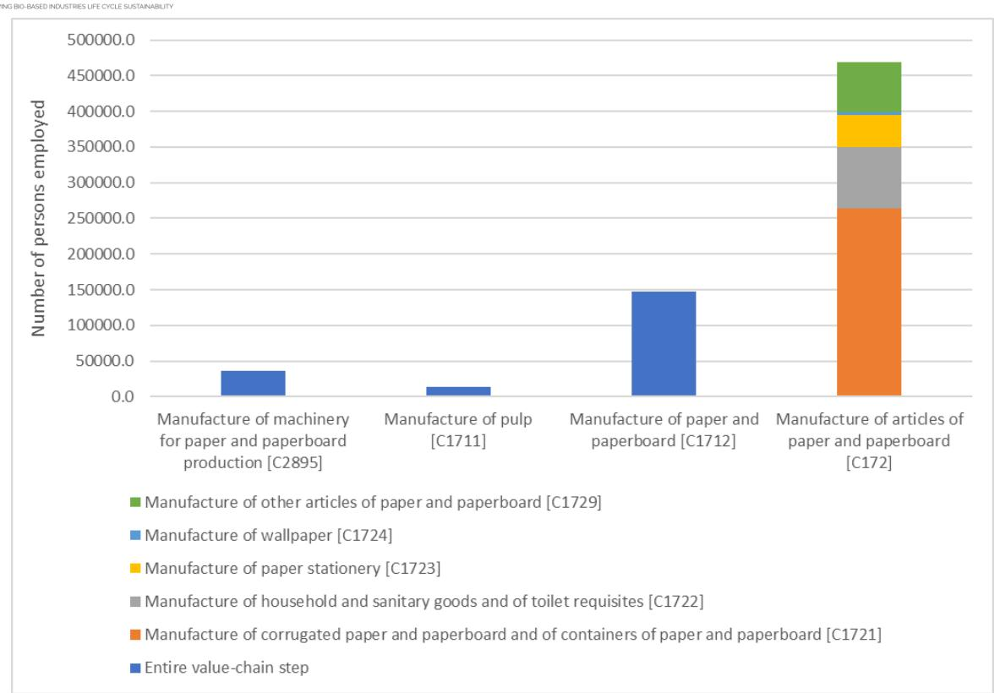

Figure 28. Number of persons employed in the pulp and paper value chain (except forestry). Data refer to the 2018-2020 yearly average in the EU.

# 3.3.3.3 Woodworking and construction industries

In this section, the woodworking and construction sectors are jointly presented, excluding upstream forestry activities. Downstream activities of forestry in the woodworking and construction sector (including the manufacture of wood products for construction), 36 billion euros of value added on average over that same period (much below the 49.2 billion Euros measured with the DataM database for UE, suggesting that the latter includes many activities and products not covered in the considered activities from Eurostat).

[Table 23](#page-76-1) shows that countries with the highest economic activity in the overall woodworking sector are Germany, Spain, France, Italy, Austria, Poland and the UK.

Table 23. EU countries with relatively high economic activity in the woodworking and construction value chain (excluding forestry), ordered by the number of economic indicators for which a higher-than-average score was obtained

| Value-chain step                         | EU countries with relatively high economic activity (the first in the |
|------------------------------------------|-----------------------------------------------------------------------|
| Sawmilling and planning of wood [C1610]  | Sweden > Germany > Austria > France > Poland > Finland > United       |
| Manufacture of wooden containers [C1624] | Italy > France > Spain > Germany > Poland > United Kingdom            |

|                                                                                                 |                                                                                      |
|--------------------------------------------------------------------------------------------------------------|---------------------------------------------------------------------------------------------------|
| Manufacture of other products of wood; manufacture of articles of cork, straw and plaiting materials [C1629] | Portugal > Italy > Spain > Poland > France > Germany > United Kingdom > Latvia > Belgium > Norway |

[Table 24](#page-77-0) presents the EU countries with relatively high economic activity for construction. While the share of the construction sector attributable to bio-based materials can't be directly determined using the Eurostat database, it can be assumed that the countries that generate most value added in that sector also consume most bio-based materials. Under this assumption, the countries with a high economic activity in all construction domains that are likely to consume bio-based materials are Belgium, Germany, France, Italy, and the UK (still part of the EU in 2018).

Table 24. EU countries with relatively high economic activity for construction (irrespective of the use of bio-based materials), ordered by the number of economic indicators for which a higher-than-average score was obtained

| Value-chain step        | EU countries with relatively high economic activity (the first in the list has the |
|-------------------------|------------------------------------------------------------------------------------|
|                         | United Kingdom > Germany > Spain > Italy > Netherlands > France > Sweden >         |
| Floor and wall covering | Germany > United Kingdom > France > Belgium > Italy > Spain > Austria > Sweden     |

Analysing the outputs obtained from Eurostat with the ones from the DataM database, for the bio-based segment of the forestry and wood products sector, Poland is highlighted as the country which has the highest number of employed people, followed by Germany, Italy and France. For added value, Germany holds the biggest share, followed by Finland and France (Lasarte-López et al., 2023). The assumption that countries that have a strong construction industry (considering both bio-based and non-biobased share) also reflects the increased use of biobased materials, can partly be verified, for example in the case of Germany, France, and Poland.

# **Value added and employment in the woodworking and construction sector**

The woodworking sector cumulated 36 billion Euros of value added on average between 2018 and 2020.

[Figure 29](#page-78-0) shows that most of the value added of the woodworking sector is generated with the manufacture of other builders' carpentry and joinery (37%), followed by sawmilling and planing of wood (25%), the manufacture of veneer sheets and wood-based panels (19%), the manufacture of wooden containers (10%), the manufacture of other products of wood, and of articles of cork, straw and plaiting materials (8%), and the manufacture of assembled parquet floors (2%). The added value generated by the construction sector is logically higher than the wood-working sector, due to the inclusion of non-bio-based activities in the data obtained from Eurostat.

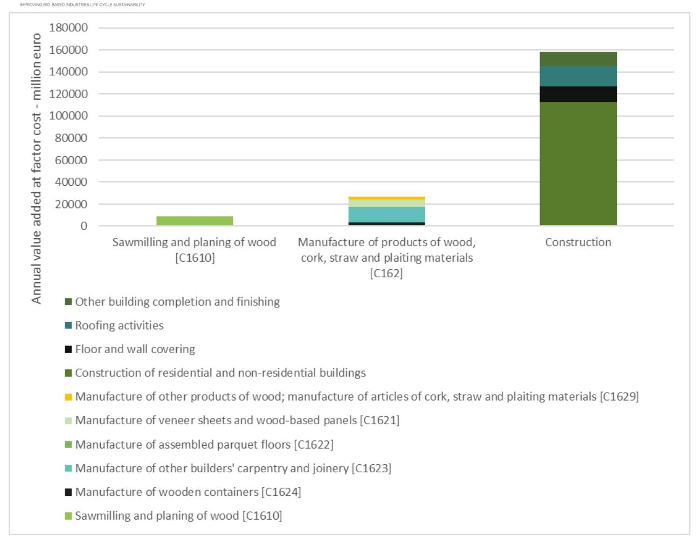

Figure 29. Value added for woodworking activities, and construction activities (nonspecific to bio-based materials). Data refer to the 2018-2020 yearly average in the EU.

It is clear that the construction sector has the largest contribution, mostly due to the fact that the level of aggregation of the data did not allow for a separation of bio-based and non-bio-based activities. Within this sector, most value added is generated in the branch of residential and non-residential buildings. A similar distribution is found for the number of persons employed [\(Figure 30\)](#page-79-0).

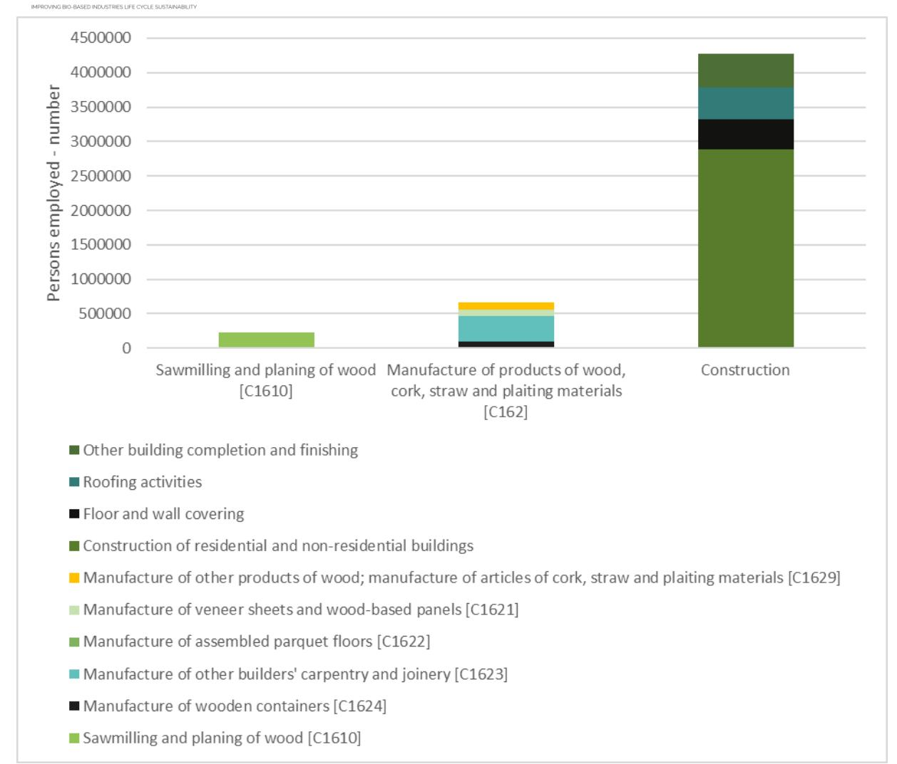

Figure 30. Number of persons employed in for woodworking activities, and construction activities (nonspecific to bio-based materials). Data refer to the 2018-2020 yearly average in the EU.

# 3.3.3.4 Textile industry

[Figure 31](#page-80-0) presents the annual EU fibre production (average of 2018-2020). The total annual production is documented as 1413 1000t, of which 61% fibre flax, 28% cotton, and 11% hemp. The largest EU producers of fibre are France (mostly fibre flax), Turkey (cotton), and Greece (cotton).

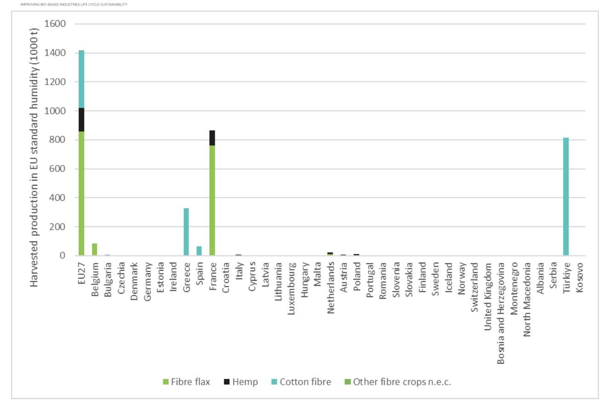

#### Figure 31. Annual fibre production in EU countries (average of 2018-2020)

Countries with a strong activity across the textile manufacturing value chain are Germany, Spain, France, Italy, Portugal, and the UK. It is remarkable that Turkey is not appearing on the list of textile manufacturing. This may be due to the fact that no data is provided by Turkey. [Table 25](#page-80-1) shows EU countries with relatively high economic activity in the textile value-chain.

According to the DataM database, for the textile sector France, Turkey and Greece are the biggest producers of bio-based fibres and Italy is the country with the highest economic activity in the sector. For bio-based textiles, the country which employs a superior number of people is Italy, followed by Germany, Portugal and Poland and for added value, the key countries include Italy, Germany and France (Lasarte-López et al., 2023). According to this, it is suggested that Italy not only generates more added value for the textile sector but also for its bio-based share.

Table 25. EU countries with relatively high economic activity in the textile value-chain, ordered by the number of economic indicators for which a higher-than-average score was obtained

| Value-chain step             | EU countries with relatively high economic activity (the first in |
|------------------------------|-------------------------------------------------------------------|
| Weaving of textiles [C132]   | Italy > France > Germany > Spain > Austria > Portugal > United    |
| Finishing of textiles [C133] | Italy > Portugal > Spain > United Kingdom > Germany > Poland >    |

| 
Manufacture of other textiles [C139], covering the following subcategories:
 
[C1391] Manufacture of knitted and crocheted fabrics
 <ul> <li>[C1392] Manufacture of made-up textile articles, except apparel</li> <li>[C1393] Manufacture of carpets and rugs</li> <li>[C1394] Manufacture of cordage, rope, twine and netting</li> <li>[C1395] Manufacture of non-wovens and articles made from non-wovens, except apparel</li> <li>[C1396] Manufacture of other technical and industrial textiles</li> <li>[C1399] Manufacture of other textiles n.e.c.</li> </ul> | 
Italy &gt; United Kingdom &gt; Germany &gt; Poland &gt; France &gt; Spain &gt; Netherlands &gt; Portugal &gt; Belgium &gt; Switzerland &gt; Norway
 |
|---------------------------------------------------------------------------------------------------------------------------------------------------------------------------------------------------------------------------------------------------------------------------------------------------------------------------------------------------------------------------------------------------------------------------------------------------------------------------------------------------------------------------------------------------------------------------------|-----------------------------------------------------------------------------------------------------------------------------------------------------------|
| 
Manufacture of wearing apparel [C14]
                                                                                                                                                                                                                                                                                                                                                                                                                                                                                                                                     | 
Italy &gt; France &gt; Germany &gt; Portugal &gt; United Kingdom &gt; Romania &gt; Spain &gt; Bulgaria, Poland
                                     |

# **Value added and employment in the textile sector**

[Figure 32](#page-81-0) shows the value added per manufacturing step along the value chain.

Figure 32. Value added per step of the textile value chain in the EU. Data refer to the 2018-2020 yearly average in the EU.

Most value added occurs with the manufacture of wearing apparel (44%, with 19,5 billion euros on average between 2018 and 2020) and the manufacture of other textiles (31%, with 13.8 billion euros), which covers the manufacture of knitted and crocheted fabrics, the manufacture of made-up textile articles (except apparel), the manufacture of carpets and rugs, the manufacture of cordage, rope, twine and netting, the manufacture of non-wovens and articles made from non-wovens (except apparel), the manufacture of other technical and industrial textiles, and the manufacture of other textiles not covered elsewhere. The preparation and spinning of textile fibres represent 4% of the value added of the sector with 1.8 billion euros; the weaving of textiles 8%, with 3.6 billion euros, and the finishing of textiles, 5% with 2.2 billion euros. Finally, the manufacture of machinery for the textile industry represents 8% of the value added, with 3.7 billion euros.

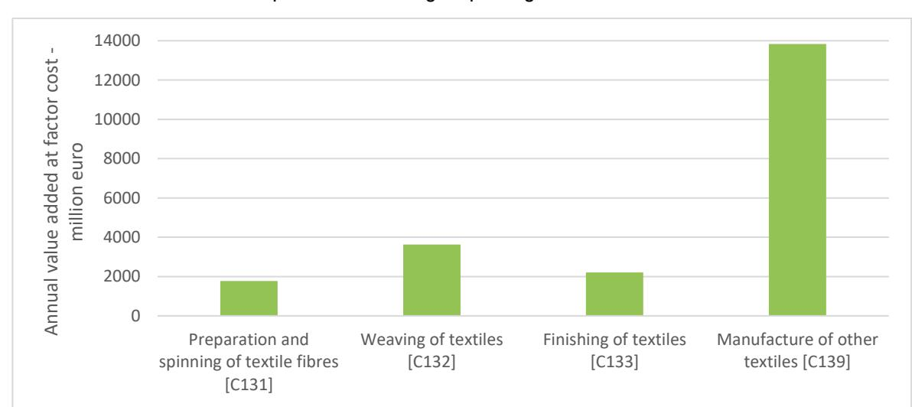

added value, although the share of the manufacture of wearing apparel is slightly higher (58%) and the share of manufacture of machinery slightly lower (4%).

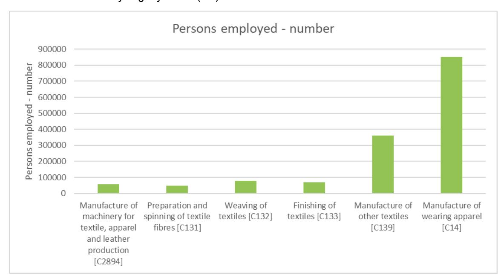

Figure 33. Number of persons employed in the textile value chain. Data refer to the 2018-2020 yearly average in the EU.

#### **3.4 Discussion on sustainability assessment hotspots: knowns and unknowns**

Key cross-cutting observations on the developed methodology, results and analysis are developed below.

#### 3.4.1 Environmental analysis

- Among the CALIMERO sectors, the coverage of LCI data is most complete for the woodworking sector. The construction sector benefits from that coverage for wood products but is lacking information for most other bio-materials and composite materials. The textile sector is missing a few transformation processes taking place towards the end of the supply chain and final products (e.g., jeans). All sectors could benefit from an improved geographical coverage or resolution.
- Because impacts were calculated using the single score using the EF 3.1 methods (normalized and weighted), impact hotspots may be more important for some categories due to the normalisation and weighting schemes. Thus, the identified hotspot categories and processes also reflect the schemes underlying the PEF (EF 3.1) methods. For example, the climate change indicator is given a high importance with a weighting of approximately 20% of the single score, and climate change comes out as a hotspot for almost all studied processes. The influence of normalisation and weighting in the PEF methods is not of main interest in the CALIMERO project, but different sets could be applied, as specified in a recent study by the JRC for the EF (De Laurentiis et al., 2023).
- Following the previous point, the methodology of the different EF3.1 methods and modelling choices in the PEF are applied without further modifications. These could have an important influence on impact assessment results (e.g., for the Climate change impact category, regarding the removal of carbon from the atmosphere through biomass, the temporality of carbon storage, etc.)
- Hotspot impact categories and processes should rely on the best data quality. Therefore, identifying these impact categories and processes does not only help screen potential environmental issues for a bio-based sector, but also indicates data for which special attention should be put on the quality in the CALIMERO project. It may orient further data collection efforts and method development (e.g., the

development of new characterization factors) during the project.

- The database analysis was limited to cradle-to-gate, i.e., usage and EoL processes were not considered. For the latter this is an important gap too point out as the influence of Circular Economy practices is partially excluded, as well as the notable environmental impacts of EoL processes such as incineration, in particular with regard to CO2 emissions, influencing the carbon balance directly.
- Some limitations will be uplifted through future foreseen developments in the CALIMERO project: o Further investigation efforts will be spent to identify gaps in current LCIA methods, regarding the coverage of impact pathways and inclusion of characterization factors for different elementary flows relevant to the bio-economy (WP1-task 1.3). These will then be tackled in WP3. o Improving characterization of impact pathways (not covered in this deliverable), e.g., concerning biodiversity (WP3). o Improving the modelling of the circular economy practices (recycling etc.), whereas in our analysis a cut-off approach of ecoinvent was used, with no usage & EOL phases (WP3-task 3.3). o The temporal aspects in carbon footprint assessment of bio-based value chains (for both the foreground and background inventories) over time will be investigated in Task 1.3, and refinements to the method will be developed in WP3-task 3.3.

#### 3.4.2 Social analysis

One of the major learnings from the social hotspot analysis in this report is the divergence between the available methods and the recommendation provided in the UN guidelines for the social life cycle assessment. Even the methods among themselves list different indicators, social themes and, in some cases, stakeholder groups. When similar indicators or social themes are identified, the results show a significant convergence.

The lack of primary data is also among the major challenges in this sector. Significant efforts are needed to collect data from different value chains to increase the granularity and representativeness of these databases.

Methodological developments are mainly focused on reference scale methods, and developments of causeand-effect chains are very limited. Exploring the concept of the theory of change (Task 1.4) could provide us with more insight into possible future methodological developments.

A non-exhaustive list of social LCA challenges is listed below:

- Methods are not harmonised between database approaches and the UNEP social themes;
- Results are very different between databases, and hotspots impact categories do not align well with survey approach as well. Concerning the difference between database results, there are multiple reasons: different sector specificity (and underlying Input-Output databases), discrepancy in scoring scale/weights assigned to the different extent of risks (high risk, medium risk etc.). The considerable unalignment between the survey and SLCA database results, is also underscored in another study, specifically on the textile industry, where social issues managed by the textile industry are inconsistent with the hotspots identified through their SLCA (Muñoz-Torres et al., 2023);
- There is a lack of standardized methodology to identify sectorial hotspots;
- It is challenging to assess bio-based subsectors risks when these activities are not well represented, most likely due to a low market share of the sector (e.g.: bio-based chemicals within the chemicals sector).

Likewise, as for the environmental analysis, the database analysis was limited to a cradle-to-gate study, with no further consideration of usage and EoL processes. This also partial excludes the influence of circular economy practices. At first sight, there are not major social issues directly associated with usage and EoL, but perhaps this could be to a minor degree occurring for labour conditions in EoL processes (e.g., sorting, or incineration).

#### 3.4.3 Economic analysis

The focus was put on EU country-specific data for various economic indicators (e.g., employment, value-added) for the five value chains relying on bio-based materials. The data do not refer to process-specific or materialspecific costs. While the five sectors are covered, there are missing data, and the data are very aggregated for biomass flows. For instance, there is no specific data for the biomass flows from agriculture that are used for the biochemicals sector. For forestry activities, there is no clear separation of the further transformation downstream in the pulp and paper, woodworking and construction sectors, nor a distinction between different products and by-products from wood (e.g., roundwood, cork, sawmill residues, etc.). Furthermore, only wood can be clearly identified as a material used for construction.

The approach taken for the economic analysis allowed identifying the main actors for the bio-based sectors in EU. For example, Germany has a particularly important share of the value added in the biochemicals, the wood products and furniture, and the paper sectors. Sweden and Finland have especially important wood-based activities, i.e., forestry, wood products and furniture, and pulp and paper. The Baltic countries also show an important concentration of persons employed for forestry and wood products. Italy, Germany, UK, Spain, France and Portugal have relatively high economic activities in the textile manufacturing.

In a Life Cycle Sustainability Assessment, the economic pillar is usually evaluated via a Life Cycle Costing (LCC) analysis. In an LCC analysis, processes and life cycle stages with the highest contribution to life cycle costs can be identified, which could support efforts to identify important costs and hidden costs over the full life cycle (e.g. the costs of maintenance, use or EoL). LCC provides information that is very specific to a product, a company's value chain, a specific time frame, and a geographical location. Results are generally not available in an "LCC database" comparable to an environmental or social impact database, which makes the evaluation of LCC hotspots rely on a specific case or literature review study of single LCC studies of products within the biobased sector, which would not be feasible in the scope of this project, and which are unlikely to be available altogether. It can be highlighted that, while most organisations are well-aware of their specific costs, the information is generally not referenced in consolidated databases nor shared in public reports. Furthermore, the repartition of costs from upstream or downstream operations (e.g., cost of energy to produce refined metals, the cost of energy to use a fabricated object) are not directly accounted for.

LCC can also consider the negative and positive externalities of different products, processes, or services. As the development of externality assessment with LCC is still in very early phases, it's also excluded from this study. The externalities can be assessed in limited cases considering the cost of CO2 in the economy.

The economic hotspot analysis aimed to evaluate the economic hotspots in the entire biobased sector, covering at least European activities. The approach taken in this study is the evaluation of European statistical data, considering a broad range of economic indicators. This approach has the following benefits:

- Data could be gathered at a sectorial level
- Data could be gathered at different steps of the sector value chains
- No value choices were taken regarding the economic indicators that are prioritized

A comparison of the scopes of LCC and the statistical approach is given in [Table 26.](#page-85-1)

Table 26. Comparison of the scopes of Life Cycle Costing (LCC) with a statistical approach for the evaluation of economic sustainability

|            | LCC                            | Evaluation of statistical economic data       |
|------------|--------------------------------|-----------------------------------------------|
| Focus      | Product life cycle             | Sector                                        |
| Objective  | Identify contributors to costs | Identify level of activity of a local economy |
| Resolution | Very detailed                  | Aggregated                                    |

However, the following gaps could be identified in the current study:

- Data gaps: o Biobased chemicals were excluded from the overall economic hotspots analysis, due to the lack of distinction between bio-based and fossil-based chemicals in Eurostat (estimates for employment and value added were gathered from DataM). o Not all countries contributed data to Eurostat, resulting in country-specific gaps in each sector and value-chain step. o Secondary production has not been included in the analysis, due to a lack of specific data.
- Methodological gaps: o The economic system could be evaluated from a wide number of angles, e.g., sectors could be evaluated regarding a broad number of economic indicators, considering specific steps in the value chain, and considering the country contributions regarding each of these parameters. This broadness of potential scope causes that the presented overview could be regarded as incomplete. o The economic hotspots analysis could be regarded from the perspective of a country (how does a sector contribute to a country's economy), or from the perspective of a sector (which country contributes to a sector's value chain) regarding a broad range of economic indicators. Currently, a framework for identifying the potential approaches for specific objectives is missing. However, this assessment shows already that economic sustainability goes beyond the evaluation of costs in
  - LCC. o The focus in this report is on economic contributions. However, "economic risks" are an important topic that is currently not considered – e.g., how much does a country depend on imports of raw materials from other countries, and are these trade relationships reliable? This topic is already commonly evaluated as "criticality assessments" in metal supply chains, but a lesser focus has been put on bio-based materials.

Within task 1.3, next steps will be undertaken to broaden the scope of an economic sustainability analysis for the biobased sectors, classifying the methods available in the economic sustainability toolbox, and their linkages to specific research objectives.

# **4 CONCLUSION**

The bio-based sectors addressed in the CALIMERO project include bio-chemicals, pulp and paper, textile, woodworking, and construction. In Task 1.2, an exhaustive state-of-the-art of the environmental, social and economic hotspots was completed. It allowed identifying the main materials and processes for each sector, and the main associated environmental, social and economic impacts and benefits. The economic analysis also allowed identifying EU countries where most economic value and employment are generated through these sectors of the bioeconomy.

The analysis of the coverage of different bio-based materials and transformation processes employed within these bio-based sectors in different databases allows identifying potentially missing information that would need to be considered for an exhaustive assessment (i.e., that could represent missing hotspots), and to compare data-driven analyses with scientific or institutional reports on the matter. Further works based on Task 1.2's results are identified in section [3.4.](#page-82-0) The wide range of information gathered and produced in Task 1.2 provides a holistic overview of expected environmental, social and economic hotspots for the five bio-based sectors of the CALIMERO project, which will provide a useful basis for further developments in the project.

# **5 REFERENCES**

Ahmed, F., Mondal, M.I.H., 2021. Introduction to natural fibres and textiles, in: Fundamentals of Natural Fibres and Textiles. Elsevier, pp. 1–32. https://doi.org/10.1016/B978-0-12-821483-1.00001-2 Andreasi Bassi, S., Biganzoli, F., Ferrara, N., Amadei, A., Valente, A., Sala, S., Ardente, F., 2023. Updated characterisation and normalisation factors for the Environmental Footprint 3.1 method, Publications Office of the European Union. Publications Office of the European Union, Luxembourg. https://doi.org/10.2760/798894 Barclays, 2015. Environmental and Social Risk Briefing - Forestry & Logging. Baydar, G., Ciliz, N., Mammadov, A., 2015. Life cycle assessment of cotton textile products in Turkey. Resour. Conserv. Recycl. 104, 213–223. https://doi.org/10.1016/J.RESCONREC.2015.08.007 Bianchi, M., Bachmann, T.M., van der Kamp, J., Riemer, M., Riva, F., Préat, N., Taelman, S.E., 2021. D1.3 Critical evaluation of economic approaches – Orienting [WWW Document]. Orienting D1.3 Publ. URL https://orienting.eu/publications/d1-3-economic-approaches/ (accessed 6.19.23). Bishop, G., Styles, D., Lens, P.N.L., 2021. Environmental performance comparison of bioplastics and petrochemical plastics: A review of life cycle assessment (LCA) methodological decisions. Resour. Conserv. Recycl. 168, 105451. https://doi.org/10.1016/j.resconrec.2021.105451 Bozell, J.J., Petersen, G.R., 2010. Technology development for the production of biobased products from biorefinery carbohydrates—the US Department of Energy's "Top 10" revisited. Green Chem. 12, 539. https://doi.org/10.1039/b922014c Brandt, K., Wilson, A., Bender, D., Dolan, J.D., Wolcott, M.P., 2019. Techno-Economic Analysis for Manufacturing Cross-Laminated Timber. BioResources. Camia, A., 2018. Biomass production, supply, uses and flows in the European Union, 2018. https://doi.org/10.2760/181536 Cardellini, G., Mijnendonckx, J., 2022. Synergies , energy efficiency and circularity in the renovation wave: Bio-based products for the renovation wave. Cepi, 2022. Key Statistics 2021: European pulp & paper industry, Cepi statistics. Charitopoulou, M.A., Kalogiannis, K.G., Lappas, A.A., Achilias, D. οS, 2021. Novel trends in the thermo-chemical recycling of plastics from WEEE containing brominated flame retardants. Environ. Sci. Pollut. Res. 28, 59190– 59213. https://doi.org/10.1007/s11356-020-09932-5 Ciacci, L., Reck, B.K., Nassar, N.T., Graedel, T.E., 2015. Lost by Design. Environ. Sci. Technol. 49, 9443–9451. https://doi.org/https://doi.org/10.1021/es505515z Colodel, C.M., Kupfer, T., Barthel, L.P., Albrecht, S., 2009. R&D decision support by parallel assessment of economic, ecological and social impact — Adipic acid from renewable resources versus adipic acid from crude oil. Ecol. Econ. 68, 1599–1604. https://doi.org/10.1016/J.ECOLECON.2008.08.003 Costa, D., Quinteiro, P., Pereira, V., Dias, A.C., 2022. Social life cycle assessment based on input-output analysis of the Portuguese pulp and paper sector. J. Clean. Prod. 330. https://doi.org/10.1016/j.jclepro.2021.129851 Cséfalvay, E., Hajas, T., Mika, L.T., 2020. Environmental sustainability assessment of a biomass-based chemical industry in the Visegrad countries: Czech Republic, Hungary, Poland, and Slovakia. Chem. Pap. 74, 3067–3076. https://doi.org/10.1007/s11696-020-01172-8 Dams, B., Maskell, D., Shea, A., Allen, S., Cascione, V., Walker, P., 2023. Upscaling bio-based construction: challenges and opportunities. Build. Res. Inf. 0, 1–19. https://doi.org/10.1080/09613218.2023.2204414 De Jong, E., Stichnothe, H., Bell, G., Jorgensen, H., 2020. Bio-Based Chemicals: A 2020 Update, IEA Bioenergy Task 42 Biorefinery.

- De Laurentiis, V., Amadei, A., Sanyé-Mengual, E., Sala, S., 2023. Exploring alternative normalization approaches for life cycle assessment. Int. J. Life Cycle Assess. https://doi.org/10.1007/s11367-023-02188-4 EC-JRC, 2012. Product Environmental Footprint (PEF) Guide, Eropean Commision - Joint Research Centre. https://doi.org/Ares(2012)873782 - 17/07/2012 Ernstoff, A., Niero, M., Muncke, J., Trier, X., Rosenbaum, R.K., Hauschild, M., Fantke, P., 2019. Challenges of including human exposure to chemicals in food packaging as a new exposure pathway in life cycle impact assessment. Int.
- J. Life Cycle Assess. 24, 543–552. https://doi.org/10.1007/s11367-018-1569-y EURATEX, 2022. Facts & Key Figures 2022 Of thee European Textile and Clothing Industry. EuropaBio, 2019. The circular bio-society in 2050. European Commission, 2023. EF transition phase [WWW Document]. URL https://eplca.jrc.ec.europa.eu/EFtransition.html European Commission, 2022. EU woodworking sector [WWW Document]. URL https://single-marketeconomy.ec.europa.eu/sectors/raw-materials/related-industries/forest-based-industries/woodworking\_en (accessed 6.28.23). European Commission, 2018. A sustainable bioeconomy for Europe: strengthening the connection between economy, society and the environment Updated Bioeconomy Strategy. Dir. Res. Innov. https://doi.org/10.2777/478385 European Commission, 2010. List of NACE codes [WWW Document]. URL https://ec.europa.eu/competition/mergers/cases/index/nace\_all.html (accessed 6.6.23). European Environment Agency, 2022. Textiles and the environment: the role of design in Europes circular economy 1–
- 18. European Environment Agency, 2019. Textiles in Europe's circular economy. European Wood Initiative, 2014. Selected European Wood Species and their Characteristics. 30. Garas G., A.M. and E.D.R., 2009. Straw bale construction as an economic environmental building alternative- a case study. ARPN J. Eng. Appl. Sci. Gardas, B.B., Raut, R.D., Narkhede, B., 2018. Modelling the challenges to sustainability in the textile and apparel (T&A) sector: A Delphi-DEMATEL approach. Sustain. Prod. Consum. 15, 96–108. https://doi.org/10.1016/J.SPC.2018.05.001 Gloria, T.P., Kohlsaat, C., Bautil, P., Wolf, B., Early, D., Ben-Zekry, B., 2014. A statistical approach to interpret relative environmental performance within product categories. Int. J. Life Cycle Assess. 19, 491–499. https://doi.org/10.1007/S11367-013-0661-6/TABLES/5 Golden, J.S., Handfield, R.B., Daystar, J., McConnell, T.E., 2015. An Economic Impact Analysis of the US Biobased Products Industry: A Report to the Congress of the United States of America. https://doi.org/10.1089/ind.2015.29002.jsg Göswein, V., Reichmann, J., Habert, G., Pittau, F., 2021. Land availability in Europe for a radical shift toward bio-based construction. Sustain. Cities Soc. 70, 102929. https://doi.org/10.1016/J.SCS.2021.102929 Grzegorzewska, E., Burawska-Kupniewska, I., Boruszewski, P., 2020. Economic profitability of particleboards production with a diversified raw material structure. Maderas Cienc. y Tecnol. 22, 537–548. https://doi.org/10.4067/S0718- 221X2020005000412 Gulzar, T., Farooq, T., Kiran, S., Ahmad, I., Hameed, A., 2019. Green chemistry in the wet processing of textiles. Impact Prospect. Green Chem. Text. Technol. 1–20. https://doi.org/10.1016/B978-0-08-102491-1.00001-0 Heidelberg Institute for International Conflict Research, 2022. 31st edition of the Conflict Barometer. ILO, 2019. Decent Work in Forestry. ILO, 2011. Productive and safe work in forestry. Kalliala, E., Talvenmaa, P., 2000. Environmental profile of textile wet processing in Finland. J. Clean. Prod. 8, 143–154. https://doi.org/10.1016/S0959-6526(99)00313-3 Krasny, E., Klarić, S., Korjenić, A., 2017. Analysis and comparison of environmental impacts and cost of bio-based house versus concrete house. J. Clean. Prod. 161, 968–976. https://doi.org/10.1016/J.JCLEPRO.2017.05.103 Langeveld, J.W.A., Sanders, J.P.M., Meeusen, M.J.G., 2010. The biobased economy: biofuels, materials and chemicals in the post-oil era. Biobased Econ. Biofuels, Mater. Chem. Post-oil Era 1–389.

#### https://doi.org/10.4324/9781849774802

- Lasarte-López, J., Ronzon, T., M'barek, R., Carus, M., Tamošiūnas, S., 2023. Jobs and wealth in the EU bioeconomy / JRC - Bioeconomics [Dataset]. Łebkowska, M., Załęska-Radziwiłł, M., Tabernacka, A., 2017. Adhesives based on formaldehyde– environmental problems. BioTechnologia 98, 53–65. https://doi.org/10.5114/BTA.2017.66617 Maes, J., Teller, A., Erhard, M., Condé, S., Vallecillo, S., Barredo, J.I., Luisa, M., Malak, D.A., Trombetti, M., Vigiak, O., Zulian, G., Addamo, A.M., Grizzetti, B., Somma, F., Hagyo, A., Vogt, P., Polce, C., Jones, A., Marin, A.I., Ivits, E., Mauri, A., Rega, C., Czúcz, B., Ceccherini, G., Pisoni, E., Ceglar, A., Palma, P. De, Cerrani, I., Meroni, M., Caudullo, G., Lugato, E., Vogt, J. V, Spinoni, J., Cammalleri, C., Bastrup-birk, A., Miguel, J.S., Román, S.S., Kristensen, P., Christiansen, T., Roo, A. De, Cardoso, A.C., Pistocchi, A., Del, I., Alvarellos, B., Tsiamis, K., Gervasini, E., Deriu, I., Notte, A. La, Viñas, R.A., Vizzarri, M., Camia, A., Kakoulaki, G., Bendito, E.G., Panagos, P., Ballabio, C., Scarpa, S., Orgiazzi, A., Ugalde, O.F., Santos-martín, F., 2020. Mapping and Assessment of Ecosystems and their Services : An EU ecosystem assessment. https://doi.org/10.2760/757183 Manda, B.M.K., Worrell, E., Patel, M.K., 2015. Prospective life cycle assessment of an antibacterial T-shirt and supporting business decisions to create value. Resour. Conserv. Recycl. 103, 47–57. https://doi.org/10.1016/j.resconrec.2015.07.010 Marting Vidaurre, N.A., Vargas-Carpintero, R., Wagner, M., Lask, J., Lewandowski, I., 2020. Social Aspects in the Assessment of Biobased Value Chains. Sustainability 12, 9843. https://doi.org/10.3390/su12239843 MCPFE, EC, UNECE/FAO, 2010. Good practice guidance on the sustainable mobilisation of wood in Europe. Messmann, L., Wietschel, L., Thorenz, A., Tuma, A., 2022. Assessing the social dimension in strategic network optimization for a sustainable development: The case of bioethanol production in the EU. J. Ind. Ecol. n/a. https://doi.org/https://doi.org/10.1111/jiec.13324 Mikkilä, M., Toppinen, A., 2008. Corporate responsibility reporting by large pulp and paper companies. For. policy Econ. 10, 500–506. MordorIntelligence, 2023. Wood Based Panels Market Size, Growth - Industry Manufacturers [WWW Document]. URL https://www.mordorintelligence.com/industry-reports/wood-based-panel-market (accessed 7.14.23). Mubareka, S., Jonsson, R., Rinaldi, F., Azevedo, J., Rigo, D. de, Sikkema, R., 2016. Forest bio-based economy in Europe, in: San-Miguel-Ayanz, J., de Rigo, D., Caudullo, G., Houston Durrant, T., Mauri, A. (Eds.), European Atlas of Forest Tree Species. Publication Office of the European Union, Luxembourg. Munasinghe, P., Druckman, A., Dissanayake, D.G.K., 2021. A systematic review of the life cycle inventory of clothing. J. Clean. Prod. 320, 128852. https://doi.org/10.1016/j.jclepro.2021.128852 Muñoz-Torres, M.J., Fernández-Izquierdo, M.Á., Ferrero-Ferrero, I., Escrig-Olmedo, E., Rivera-Lirio, J.M., 2023. Social Life Cycle Analysis of Textile Industry Impacts for Greater Social Sustainability of Global Supply Chains. Systems
- 11. https://doi.org/10.3390/systems11010008 Muthu, S.S., 2014. Assessing the Environmental Impact of Textiles and the Clothing Supply Chain, Assessing the Environmental Impact of Textiles and the Clothing Supply Chain. Elsevier Ltd. https://doi.org/10.1533/9781782421122 Niinimäki, K., Peters, G., Dahlbo, H., Perry, P., Rissanen, T., Gwilt, A., 2020. The environmental price of fast fashion. Nat. Rev. Earth Environ. 1, 189–200. https://doi.org/10.1038/S43017-020-0039-9 Obydenkova, S. V., Kouris, P.D., Smeulders, D.M.J., Boot, M.D., van der Meer, Y., 2022. Evaluation of environmental and economic hotspots and value creation in multi-product lignocellulosic biorefinery. Biomass and Bioenergy 159, 106394. https://doi.org/10.1016/j.biombioe.2022.106394 OECD, 2021. Health at a Glance 2021, Health at a Glance. OECD. https://doi.org/10.1787/ae3016b9-en OECD, 2011. Sustainable Manufacturing and Eco-Innovation Synthesis Report Framework, Practices and Measurement eco-innovation. Ögmundarson, Ó., Sukumara, S., Herrgård, M.J., Fantke, P., 2020a. Combining Environmental and Economic Performance for Bioprocess Optimization. Trends Biotechnol. 38, 1203–1214. https://doi.org/10.1016/j.tibtech.2020.04.011 Ögmundarson, Ó., Sukumara, S., Laurent, A., Fantke, P., 2020b. Environmental hotspots of lactic acid production systems. GCB Bioenergy 12, 19–38. https://doi.org/10.1111/gcbb.12652

Funded by the European Union. Views and opinions expressed are however those of the author(s) only and do not necessarily reflect those of the European Union. Neither the European Union nor the European Research Executive Agency can be held responsible for them. Page 90 Parisi, M.L., Fatarella, E., Spinelli, D., Pogni, R., Basosi, R., 2015. Environmental impact assessment of an eco-efficient production for coloured textiles. J. Clean. Prod. 108, 514–524. https://doi.org/10.1016/J.JCLEPRO.2015.06.032 Patel, M., Crank, M., Dornburg, V., Hermann, B., Roes, L., Hüsing, B., Overbeek, L., Terragni, F., Recchia, E., 2006. Medium and Long-term Opportunities and Risks of the Biotechnological Production of Bulk Chemicals from Renewable Resources-The Potential of White Biotechnology The BREW Project Final report Prepared under the European Commission's GROWTH Programme (DG Research). Pizzi, A., Papadopoulos, A.N., Policardi, F., 2020. Wood composites and their polymer binders. Polymers (Basel). https://doi.org/10.3390/POLYM12051115 Plank, J., 2005. Applications of Biopolymers in Construction Engineering, in: Steinbüchel, A. (Ed.), Biopolymers Online. Wiley. https://doi.org/10.1002/3527600035.bpola002 Quantis, 2018. Measuring Fashion: Insights from the Environmental Impact of the Global Apparel and Footwear Industries study. Rabbat, C., Awad, S., Villot, A., Rollet, D., Andrès, Y., 2022. Sustainability of biomass-based insulation materials in buildings: Current status in France, end-of-life projections and energy recovery potentials. Renew. Sustain. Energy Rev. 156. https://doi.org/10.1016/j.rser.2021.111962 Ramasamy, R., Subramanian, R.B., 2021. Synthetic textile and microfiber pollution: a review on mitigation strategies. Environ. Sci. Pollut. Res. 28, 41596–41611. https://doi.org/10.1007/S11356-021-14763-Z/METRICS Ravi Kumar, K., Krishna Chaitanya, N.V.V., Sendhil Kumar, N., 2021. Solar thermal energy technologies and its applications for process heating and power generation – A review. J. Clean. Prod. 282. https://doi.org/10.1016/J.JCLEPRO.2020.125296 Roebroek, C.T.J., Duveiller, G., Seneviratne, S.I., Davin, E.L., Cescatti, A., 2023. Releasing global forests from human management: How much more carbon could be stored? Science 380, 749–753. https://doi.org/10.1126/SCIENCE.ADD5878/SUPPL\_FILE/SCIENCE.ADD5878\_MDAR\_REPRODUCIBILITY\_CHECKLIS T.PDF Ronzon, T., Tamosiunas, S., M'barek, R., 2022. Jobs and growth in the bioeconomy. Luxembourg: Publications Office of the European Union. https://doi.org/10.2760/323093 Roos, S., Sandin, G., Zamani, B., Peters, G., Svanström, M., 2017. Will Clothing Be Sustainable? Clarifying Sustainable Fashion. pp. 1–45. https://doi.org/10.1007/978-981-10-2182-4\_1 Safarian, S., Rydén, M., Janssen, M., 2022. Development and Comparison of Thermodynamic Equilibrium and Kinetic Approaches for Biomass Pyrolysis Modeling. Energies 15. https://doi.org/10.3390/en15113999 Safarian, S., Saryazdi, S.M.E., Unnthorsson, R., Richter, C., 2021. Gasification of woody biomasses and forestry residues: Simulation, performance analysis, and environmental impact. Fermentation 7. https://doi.org/10.3390/fermentation7020061 Safarian, S., Unnthorsson, R., Richter, C., 2020. Techno-Economic Analysis of Power Production by Using Waste Biomass Gasification. J. Power Energy Eng. 08, 1–8. https://doi.org/10.4236/jpee.2020.86001 Sahoo, K., Bergman, R., Alanya-Rosenbaum, S., Gu, H., Liang, S., 2019. Life Cycle Assessment of Forest-Based Products: A Review. Sustainability 11, 4722. https://doi.org/10.3390/su11174722 San-Miguel-Ayanz, J., de Rigo, D., G., C., Houston Durrant, T., Mauri, A., Tinner, W., Ballian, D., Beck, P., Birks, H.J.B., Eaton, E., Enescu, C.M., Pasta, S., Popescu, I., Ravazzi, C., Welk, E., Abad Viñas, R., Azevedo, J.C., Barbati, A., Barredo, J.I., Benham, S.E., Boca, R., Bosco, C., Caldeira, M.C., Cerasoli, S., Chirici, G., Cierjacks, A., Conedera, M., Da Ronch, F., Di Leo, M., García-Viñas, J.I., Gastón González, A., Giannetti, F., Guerrero Hue, N., Guerrero Maldonado, N., López, M.J., Jonsson, R., Krebs, P., Magni, D., Mubareka, S., Mulhern, G., Nieto Quintano, P., Oliveira, S., Pereira, J.S., Pividori, M., Räty, M., Rinaldi, F., Saura, S., Sikkema, R., Sitzia, T., Strona, G., Vidal, C., Vilar, L., Zecchin, B., 2016. European Atlas of Forest Tree Species. Publications Office of the European Union, Luxembourg. https://doi.org/10.2760/776635 SASB Standards Board, 2018. Forestry Management Sustainability Accounting Standard. Scanlon, K.A., Gray, G.M., Francis, R.A., Lloyd, S.M., Lapuma, P., 2013. The work environment disability-adjusted life year for use with life cycle assessment: A methodological approach. Environ. Heal. A Glob. Access Sci. Source 12. https://doi.org/10.1186/1476-069X-12-21 Statista, 2022. Manufacturing: Textiles in the EU - Industry Insights & Data Analysis. Stone, C., Windsor, F.M., Munday, M., Durance, I., 2020. Natural or synthetic – how global trends in textile usage

threaten freshwater environments. Sci. Total Environ. 718, 134689. https://doi.org/10.1016/J.SCITOTENV.2019.134689

Stubdrup, K.R., Karlis, P., Roudier, S., Sancho, L.D., 2016. Best Available Techniques (BAT) Reference Document for the Production of Wood-based Panels [WWW Document]. URL https://eippcb.jrc.ec.europa.eu/ (accessed 6.20.23). Suhr, M., Klein, G., Kourti, I., Rodrigo Gonzalo, M., Giner Santonja, G., Roudier, S., Delgado Sancho, L., 2015. Best Available Techniques (BAT) Reference Document for the Production of Pulp, Paper and Board. https://doi.org/10.2791/370629 Tamošiunas, S., Ronzon, T., Piotrowski, S., M'barek, R., Carus, M., 2022. Joint Research Centre Data Catalogue - Jobs and wealth in the EU bioeconomy / JRC - Bioec... - European Commission [WWW Document]. URL https://data.jrc.ec.europa.eu/dataset/7d7d5481-2d02-4b36-8e79-697b04fa4278#citation (accessed 6.21.23). Taylor, R., Nattrass, L., Alberts, G., Robson, P., Chudziak, C., Bauen, A., Libelli, I.M., Lotti, G., Prussi, M., Nistri, R., Chiaramonti, D., lópez-Contreras, A.M., Bos, H.L., Eggink, G., Springer, J., Bakker, R., Ree, R. van, 2015. From the Sugar Platform to biofuels and biochemicals : Final report for the European Commission Directorate-General Energy. Textile Exchange, 2022. Preferred fibre & materials market report. Thoemen, H., 2010. Wood-based Panels - An Introduction for Specialists 270. Tusnim, J., Hoque, M.E., Biswas, M.C., 2020. Biopolymers in Building Materials, in: Advanced Processing, Properties, and Applications of Starch and Other Bio-Based Polymers. Elsevier, pp. 185–195. https://doi.org/10.1016/B978-0- 12-819661-8.00012-3 UNEP, 2020a. Guidelines for Social Life Cycle Assessment of Products and Organizations 2020 [WWW Document]. URL https://www.lifecycleinitiative.org/activities/life-cycle-assessment-data-and-methods/global-guidance-for-life-cycleimpact-assessment-indicators-and-methods-glam/guidelines-for-social-life-cycle-assessment-solca/ (accessed 6.19.23). UNEP, 2020b. Sustainability and Circularity in the Textile Value Chain: Global Stocktaking. USDA, 2008. U.S. Biobased Products Market Potential and Projections Through 2025. https://doi.org/10.22004/AG.ECON.329778 Valente, C., Brekke, A., Modahl, I.S., 2018. Testing environmental and social indicators for biorefineries: bioethanol and biochemical production. Int. J. Life Cycle Assess. 23, 581–596. https://doi.org/10.1007/s11367-017-1331-x van Putten, R.-J., van der Waal, J.C., de Jong, E., Rasrendra, C.B., Heeres, H.J., de Vries, J.G., 2013. Hydroxymethylfurfural, A Versatile Platform Chemical Made from Renewable Resources. Chem. Rev. 113, 1499– 1597. https://doi.org/10.1021/cr300182k Vesnic-Alujevic, L., Muench, S., Stoermer, E., 2023. Reference foresight scenarios: Scenarios on the global standing of the EU in 2040. Publications Office of the European Union, Luxembourg. https://doi.org/10.2760/11879 Warasthe, R., Brandenburg, M., Seuring, S., 2022. Sustainability, risk and performance in textile and apparel supply chains. Clean. Logist. Supply Chain. https://doi.org/10.1016/j.clscn.2022.100069 Wernet, G., Bauer, C., Steubing, B., Reinhard, J., Moreno-Ruiz, E., Weidema, B., 2016. The ecoinvent database version 3 (part I): overview and methodology. Int. J. Life Cycle Assess. 21, 1218–1230. https://doi.org/10.1007/s11367-016- 1087-8 Wikipedia, 2023. Wikipedia, the free encyclopedia. Zamani, B., Sandin, G., Svanström, M., Peters, G.M., 2018. Hotspot identification in the clothing industry using social life cycle assessment—opportunities and challenges of input-output modelling. Int. J. Life Cycle Assess. 23, 536–546. https://doi.org/10.1007/s11367-016-1113-x **6 APPENDICES** Appendix A. Available databases and statistics Appendix B. Social risk hotspot analysis using PSILCA Appendix C. Social risk hotspot analysis using SHDB Appendix D. Results of normalized scores for the social survey approach Appendix E. Economic indicators evaluated for the economic hotspot analysis (based on Eurostat)

# **A. APPENDIX A. AVAILABLE DATABASES AND STATISTICS**

| Database                | Latest  |                              |                                            |
|-------------------------|---------|------------------------------|--------------------------------------------|
|                         | version | Reference                    | Comment                                    |
| ecoinvent               | 3.9.1   |                              |                                            |
| Sphera (former GaBi)    | 2022.2  |                              |                                            |
| Agribalyse              | 3.1     | https://agribalyse.ademe.fr/ |                                            |
| EF database             | 3.1     |                              |                                            |
| Agri-footprint database | 6       |                              |                                            |
| database                | n/a     |                              |                                            |
| PSILCA                  | v3      | https://psilca.net/          |                                            |
| SHDB                    | n/a     | http://www.socialhotspot.or  |                                            |
|                         |         |                              | capabilities with over 140 country- and 57 |
|                         | n/a     | https://www.evri.ca/en       |                                            |
|                         | n/a     | https://www.esvd.info/       |                                            |
| prices CE Delft         | n/a     | https://cedelft.eu/method/e  |                                            |

| Database        | Latest  |                             |                                    |
|-----------------|---------|-----------------------------|------------------------------------|
|                 | version | Reference                   | Comment                            |
| Eurostat        | n/a     | https://ec.europa.eu/eurost |                                    |
| DataM           | n/a     |                             |                                    |
| UN Comtrade     | n/a     | https://comtradeplus.un.or  |                                    |
|                 |         | g/                          | Economic statistics and indicators |
| OECD.stat       | n/a     | https://stats.oecd.org/     | Economic statistics and indicators |
| GTAP Data Bases | v. 11   | https://www.gtap.agecon.p   |                                    |
|                 |         | urdue.edu/databases/v11/    | Economic statistics and indicators |

# **B. APPENDIX B. SOCIAL RISK HOTSPOT ANALYSIS USING PSILCA**

# **B.1 Pulp and paper (Sweden)**

PSILCA sector name: Manufacture of Pulp, paper and paper products (Sweden)

|                                 | p, pp | pp p                                                      |
|---------------------------------|-------|-----------------------------------------------------------|
| 80%) & relevance for            |       |                                                           |
| Fair Salary                     | 34.1% | 33% is coming from the Swedish paper and pulp sector, and |
| Promoting social responsibility | 8.6%  | 44% is coming from the Swedish paper and pulp sector, and |
| Migration flows                 | 8.2%  | 47% is coming from the Swedish paper and pulp sector, and |
| Value added (total)             | 6.7%  | 28% is coming from the Swedish paper and pulp sector, and |
| Public sector corruption        | 5.2%  |                                                           |
| Trade unionism                  | 5.2%  |                                                           |
| Drinking water coverage         | 2.8%  |                                                           |
| and regulations                 | 2.7%  |                                                           |
| Trafficking in persons          | 2.3%  |                                                           |
| Child Labour, male              | 2.2%  |                                                           |
| Social security expenditures    | 1.8%  |                                                           |
| Safety measures                 | 0.58% |                                                           |
| Non-fatal accidents             | 0.32% |                                                           |
| Unemployment                    | 0.10% |                                                           |

|                           | 0.06% | No prominent hotspot, impacts are spread over sectors in |
|---------------------------|-------|----------------------------------------------------------|
| Expenditures on education | 0.04% |                                                          |
| Fatal accidents           | 0.01% |                                                          |

For the specific pulp and paper sector in Sweden, the PSILCA database and social risk method, highlight Fair Salary as the main impact subcategory at 34% (based on medium risk hours equivalents). One third of the latter is assigned to the studied sector, with the rest of the impact also notably in Sweden. Promoting social responsibility (8.6%) and Migration flows (8.2%) are second and third impact subcategories of relevance, again with the pulp and paper sector in Sweden as hotspot for 44 and 47%, respectively. With regard to impact subcategories of relevance for CALIMERO, they have a low social risk share (<0.6%). Health and safety-related impact subcategories Non-fatal accidents (0.32%), Air and water pollution (0.06%), have no prominent social risk hotspot but sectorial hotspots are mainly situated in Argentina (>20%) and African countries, respectively. Fatal accidents (0.01%), a quite severe impact subcategory, mainly has social risks occurring in the sector on forestry, logging, and related services of Lithuania (20%), illustrating the risks for accidents in this type of sector. The impact subcategory of safety measures, the main abroad relevant sector is crop cultivation in China (10%), but there are also two sectors relevant from Sweden: the construction sector (9%) and the administration and defence sector (6%). Finally, Unemployment and Expenditure on education don't have prominent hotspots in single sector, though the former is mainly situated in South-Africa (>38%) and the latter mainly in non-EU countries.

# **B.2 Textile (Turkey)**

# PSILCA sector name: Manufacture of Textiles (Turkey)

| secor name:                     | anuacure o ex | es ( ur ey)                                                  |
|---------------------------------|---------------|--------------------------------------------------------------|
| Public sector corruption        | 14.8%         | 76% is coming from the textile manufacture sector in Turkey  |
| Trade unionism                  | 14.1%         | 80% is coming from the textile manufacture sector in Turkey  |
| Child Labour, male              | 13.9%         | 80% is coming from the textile manufacture sector in Turkey  |
| Risk of conflicts               | 13.3%         | 85% is coming from the textile manufacture sector in Turkey  |
| Non-fatal accidents             | 11.5%         | 98% is coming from the textile manufacture sector in Turkey  |
| Value added (total)             | 7.2%          | 78% is coming from the textile manufacture sector in Turkey  |
| Fair Salary                     | 6.1%          | 59% is coming from the textile manufacture sector in Turkey  |
| Safety measures                 | 0.12%         | 41% is coming from crop cultivation in China, 9% from the    |
| Unemployment                    | 0.04%         | 32% is coming from the textile manufacture sector in Turkey, |
| outdoor air and water pollution | 0.03%         | 37% is coming from the textile manufacture sector in Turkey  |
| Expenditures on education       | 0.03%         | 41% is coming from the textile manufacture sector in Turkey  |
| Fatal accidents                 | 0.01%         | 69% is coming from Mining of coal and lignite, extraction of |

are in the impact subcategories: Public sector corruption (14.8%), Trade unionism (14.1%), Male Child labour (13.9%), risks of conflict (13.3%) & Non-fatal accidents. Their impacts can be mainly attributed to the sector itself at, respectively, 76, 80, 80, 85 and 98%. Especially for the non-fatal accidents, which is within the focus of CALIMERO, it is interesting to see the predominant nature of the sector itself. Male child labour also stands out as a major issue, that is not prominent in other studied cases. Fair salary is here less important (6.1%), but again mainly linked with the textile sector in Turkey (59%). For the other impact subcategories of interest for CALIMERO, the Turkish textile sector is as well a more prominent hotspot (9-41%), while their share in social risks is lower (max. 0.12%). Safety measures, another health and safety impact subcategories, has as hotspot crop cultivation in China (41%), while for Fatal accidents, the main hotspot is again a sector in Turkey, but this time from mining of coal and lignite. The skill-related impact subcategories, unemployment and expenditures on education, have yet again the textile manufacture sector in Turkey as main hotspot at respectively 32 and 41%, respectively.

# **B.3 Wood and wood products (Spain)**

PSILCA sector name: Manufacture of wood and products of wood and cork (Spain)

|                          | p p    |
|--------------------------|--------|
| Fair Salary              | 18.09% |
| Trade unionism           | 13.16% |
| Public sector corruption | 7.98%  |
| Value added (total)      | 6.60%  |
| laws and regulations     | 3.39%  |
| Non-fatal accidents      | 3.18%  |
| expenditures             | 3.17%  |
| Child Labour, male       | 3.15%  |
| responsibilty            | 3.06%  |
| Illiteracy, female       | 3.03%  |
| Drinking water coverage  | 2.83%  |
| Illiteracy, total        | 2.76%  |
| Illiteracy, male         | 2.75%  |
| Trafficking in persons   | 2.68%  |
| bargaining rights        | 2.16%  |
| Health expenditure       | 2.15%  |

|                 | 0.89% | 20% is coming from the wood and paper sector in Cameroon, 18%      |
|-----------------|-------|--------------------------------------------------------------------|
| Unemployment    | 0.88% | 55% is coming from the Spanish wood, wood products and cork        |
| Safety measures | 0.39% |                                                                    |
|                 |       | construction sector in Spain, 6% from manufacture of wood and wood |
| education       | 0.05% |                                                                    |
| Fatal accidents | 0.01% |                                                                    |
|                 |       | other sectors (<4% for each)                                       |

In case of the manufacture of wood and products of wood and cork in Spain, fair salary is the most prominent impact category (18% based on medium risk hours), followed by trade unionism (13%). Both these categories, have as major hotspot the sector under study (>30%). They both relate with working agreements. When it comes to worker health and safety subcategories, relevant for CALIMERO but with a low overall risk share (max. 3.2%), non-fatal accidents (3.2%) are almost entirely attributed to again the sector itself (75%), but for other types such as fatal accidents (0.01%) and safety (0.04%), other sectors in other countries are relative more acting as hotspots, although none are that pronounced (max. 20%). In case of unemployment (0.9%), the wood and products of wood and cork in Spain is as well a major hotspot (55%). Expenditure on education (0.05%) is mainly attributed to forestry and logging in India (15%), and the wood and products sector of Spain (9%).

# **B.4 Cellulose (Germany)**

# PSILCA sector name: Cellulose and paper products (Germany)

| secor name:              | e uose an paper pro ucs ( ermany) |
|--------------------------|-----------------------------------|
| Fair Salary              | 26.40%                            |
| Trade unionism           | 10.20%                            |
| Migration flows          | 9.14%                             |
| Public sector corruption | 6.78%                             |
| responsibilty            | 4.78%                             |
| Value added (total)      | 4.36%                             |
| laws and regulations     | 2.92%                             |
| Trafficking in persons   | 2.82%                             |
| Drinking water coverage  | 2.58%                             |

| Child Labour, male           | 2.53%                                                                |
|------------------------------|----------------------------------------------------------------------|
| management system            | 2.43%                                                                |
| Social security expenditures | 2.11%                                                                |
| rights                       | 1.88%                                                                |
| Safety measures              | 0.78%                                                                |
| Non-fatal accidents          | 0.57%                                                                |
| Unemployment                 | 0.18%                                                                |
|                              | 0.11% No prominent hotspot, impacts are spread over sectors in other |
| Expenditures on education    | 0.05%                                                                |
| Fatal accidents              | 0.01%                                                                |

For the PSILCA case, the social hotspot analysis for the German cellulose and paper product sector (the only sector in PSILCA focused on cellulose), shows that biggest impact categories are fair salary (26.5%) and trade unionism (10%). The main sector responsible is the studied sector itself, but the share is not that high, being only around 20%. Other German sectors are also notably associated with this risk. These two impact subcategories, deal about working agreement. If we look at health and safety impact subcategories, relevant for CALIMERO, impact subcategories seem to have a low risk share (<1%) and risks are attributed to the main sector studied for safety measures (25%), while for non-fatal accidents this is the pulp and paper sector in the Netherlands (20%). On the contrary, for more extreme health risks such as air and water pollution, and fatal accidents, prominent hotspots are outside of Europe. Finally, unemployment risks in the value chain are due to the presence of South-African sectors (>50%).

# **B.5 Bio-based chemicals (Sweden)**

PSILCA sector name: Chemicals, chemical products and man-made fibres (Sweden). (low quality

| approximation) Relevant Impact subcategories according to biggest contribution (only considering 80%) & relevance for CALIMERO | Impact share (of total medium risk or relevant for CALIMERO) hours) |
|--------------------------------------------------------------------------------------------------------------------------------|---------------------------------------------------------------------|
| Fair Salary Promoting social                                                                                                   | 32.09%                                                              |
| responsibility                                                                                                                 | 7.79%                                                               |
| Migration flows                                                                                                                | 7.29%                                                               |

| Value added (total)                                        | 6.92% | Sweden                                                         |
|------------------------------------------------------------|-------|----------------------------------------------------------------|
| Public sector corruption                                   | 5.78% | No prominent hotspot, impacts are spread over sectors in other |
| Trade unionism Violations of employment                    | 5.62% | No prominent hotspot, impacts are spread over sectors in other |
| laws and regulations                                       | 3.09% |                                                                |
| Drinking water coverage                                    | 2.67% |                                                                |
| Trafficking in persons                                     | 2.61% |                                                                |
| Child Labour, male Certified environmental                 | 2.43% |                                                                |
| management system                                          | 2.00% |                                                                |
| Social security expenditures                               | 1.98% |                                                                |
| Safety measures                                            | 0.59% |                                                                |
| Non-fatal accidents                                        | 0.25% | No prominent hotspot, impacts are spread over sectors in other |
| Unemployment DALYs due to indoor and outdoor air and water | 0.12% | No prominent hotspot, impacts are spread over sectors in other |
| pollution                                                  |       | d’Ivo ir, Cameroon)                                            |
| Expenditures on education                                  | 0.11% | No prominent hotspot, impacts are spread over sectors in other |
| Fatal accidents                                            | 0.01% | 22% from mining, metal ores in Turkey, 4.5% from Swedish       |

Although it is not that a good match for biobased chemicals, we can derive the following form the social hotspot analysis of the Swedish chemicals, chemical products and man-made fibres manufactures. Fair salary (33%) is by far the most prominent impact subcategory, with impacts mainly associated with the studied product group at 33%, respectively. Promoting Social Responsibility (7.8%), Migration flows (7.3%) and Added Value (6.9%), are to a lesser degree important but still notable, with again the majority of the impact associated with the sector of study at 46, 50 and 31% respectively. The impact subcategories relevant for CALIMERO are again estimated to have a low social risk share (<0.6%). Nevertheless, this risk share attribution can be questioned, and analysis of these is relevant. For the impact subcategories non-fatal accidents and water and air pollution, there are no notable sector hotspots, but impacts are mainly situated in Argentina (>34%) and African countries, respectively. For the more extreme fatal accidents, the majority of impact is assigned to mining, metal ores in Turkey (22%). Unemployment and Expenditure on education don't have prominent hotspots in single sector, though the former is mainly situated in South-Africa (>45%) and the latter mainly in non-EU countries. The impact subcategory of safety measures, the main abroad relevant sector is crop cultivation in China (10%), but there are also two sectors relevant from Sweden: the construction sector (6.5%) and the administration and defence sector (11%).

# **C. APPENDIX C. SOCIAL RISK HOTSPOT ANALYSIS USING SHDB**

The hotspot analysis methodology applied to identify most relevant sources of social impacts in the selected value chains was defined based on the PEF environmental hotspot analysis methodology. This methodology intends to contribute to a LCSA methodology where social and environmental impact analysis are more harmonized and integrated, in contrast with current practices of including independent environmental, social and economic studies in a single LCSA report, where the only common aspects are mostly linked to the goal and scope and, partially, to life cycle inventory stages. This way, the interpretation phase will be more harmonized among the three studies.

However, due to the different structure of datasets, impact assessment methods and indicators from SHDB and PSILCA, few adjustments to PEF hotspot analysis were performed. The procedure to perform the hotspot analysis of normalized and weighted results is explained in the figure below.

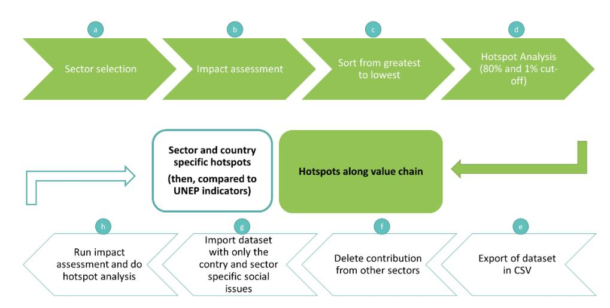

Figure 1. Social risks hotspot analysis methodology. The figure describes the steps performed to identify the social hotspots using the SHDB and Simapro.

The outcomes of this procedure are:

- Most relevant impact categories (damage categories in Simapro) and sub-categories (impact categories in Simapro): damage Assessment indicators considered in single score, contributing to over 80% are identified as hotspot indicators. Within each damage category, their sub-categories are analysed and those contributing to over 80% are also considered potential hotspots for the sector.
- Most relevant processes: the methodology followed during this step was slightly different to the PEF hotspot analysis, as a new cut-off was introduced. Only processes with at least 1% of the total contribution to normalized and weighted impacts were considered. After this initial cut-off, processes contributing to at least 80% of the selection are identified as relevant. This decision was made to communicate a shorter list of relevant processes, in order to ease the decision-making and definition of future risk mitigation strategies.
- Most relevant countries: an additional step not included in the PEF methodology was included, given that the structure of social databases allows a better identification of the most relevant countries in terms of social risks along the value chain. The location of the most relevant processes is identified and the results for the same country are aggregated. Then, the same 80% cut-off is applied.
- Most relevant social issues along the value chain: once the sectors have been analysed, it is necessary to carry out the same analysis for each sector but without the contribution of other sectors. As a result, the social issues for each sector and specific country are deployed, and those with a contribution over 80% could be considered as relevant for the hotspot study. This outcome is equivalent to the most relevant elementary flows in PEF environmental hotspot analysis.
- Most relevant social issues in the sector and country under study: a hotspot analysis is performed after analyzing only the social issues related to the sector and country under study. This is possible after following the steps e to h from the figure above. This way, it is possible to communicate most relevant foreground social issues of each industry under study.

The table with results of the hotspot analyses presented below must be read considering:

- The most relevant subcategories or impact categories presented are the ones representing at least 80% of the total impacts of the damage or impact category where they belong.
- Sector, countries, and sector-specific social indicators results present the share of the total social risks, i.e., considering all the damage categories and related subcategories or indicators together.
- In red colour, the sub-categories preselected in Calimero are highlighted.
- The terminology used to name the categories in Simapro and SHDB docuemntation is different. Damage category (Simapro) is equivalent to social impact category (SHDB) and impact categories represent (Simapro) the social sub categories, while social issues (Simapro) represent social indicators.
- Results along the value chain cover the social risks of a sector core stage plus the supply chain.
- Results for the specific Sector/Country represent the greatest social risks of the core stage analysed, analysing only the social issues and risks of that specific sector and country.
- nec: No elsewhere classified
- MR: Most Relevant
- IC: impact category
- DC: Damage category
- U: unit process from SHDB

The results for the target sectors and countries in Calimero are presented in the sections below.

# **C.1 Pulp and paper (Sweden)**

| Rank MR Damage Category %_DC MR Impact Categories Safety 29 2A Occ Tox & Haz 2 Health & 1 2B Injuries & Fatalities | Results along the value chain %_IC MR sector sector MR % per % Countries Country 59.89 Paper products, publishing/SWE U 21.15 SWE 71.17 40.11 Business services nec/IND |
|--------------------------------------------------------------------------------------------------------------------|-------------------------------------------------------------------------------------------------------------------------------------------------------------------------|
|                                                                                                                    | 3.59 IND 10.5                                                                                                                                                           |
| & Decent Work 20.51                                                                                                |                                                                                                                                                                         |
| 1H Migrant Labor                                                                                                   | 12.98 Business services                                                                                                                                                 |
|                                                                                                                    | nec/SWE U 3.19                                                                                                                                                          |
| 1F Excessive WkTime                                                                                                | 12.68                                                                                                                                                                   |
| 1L Unemployment 1 Labor Rights                                                                                     | 12.18                                                                                                                                                                   |
| 1G Freedom of Association                                                                                          | 12.13                                                                                                                                                                   |
| 1J Labor Laws/Convs                                                                                                | 10.48                                                                                                                                                                   |
| 1E Forced Labor                                                                                                    | 9.37                                                                                                                                                                    |
| 1K Discrimination                                                                                                  | 8.81                                                                                                                                                                    |
| 1D Child Labor                                                                                                     | 6.52                                                                                                                                                                    |
| 3 4 Governance 18.85 4B Corruption                                                                                 | 59.1                                                                                                                                                                    |
| 4A Legal System 5D Access to Hospital                                                                              | 40.9                                                                                                                                                                    |
| 4 5 Community 15.83                                                                                                |                                                                                                                                                                         |
| Beds 5E Smallholder v                                                                                              | 46.66                                                                                                                                                                   |
| Commercial Farms                                                                                                   | 18.54                                                                                                                                                                   |
| 5C Children out of School                                                                                          | 15.06                                                                                                                                                                   |
| Rank                                                                                                               | MR_Social_Issues %                                                                                                                                                      |
| 1 Non Fatal Work Related injuries by sector                                                                        | 17                                                                                                                                                                      |
| 2 Number of Hospital Beds per 1000 population                                                                      | 14                                                                                                                                                                      |
| 3                                                                                                                  | Overall High Conflict 14                                                                                                                                                |
| 4 Overall Occupational Cancer Risk -                                                                               | loss of life (DALYs) 11                                                                                                                                                 |
| 5 Disability-adjusted life years due to occupational-related Lung Cancer                                           | 11                                                                                                                                                                      |
| 6 Number of Labor Laws by Sector                                                                                   | 6                                                                                                                                                                       |
| 7 Percent of Population working >X hrs per week, >60 hrs per week                                                  | 6                                                                                                                                                                       |

#### **C.2 Textile (Turkey)**

| Rank MR Damage Category 1 4 Governance 1 Labor Rights & 2 Decent Work | Results along the value chain %_DC MR Impact Categories %_IC MR sector 32.52 4B Corruption 88.03 Wool, silk-worm cocoons/TUR U 1G Freedom of Association 22.65 Cereal grains nec/TUR U 1H Migrant Labor 12.14 1E Forced Labor 11.86 22.81 1K Discrimination 11.72 1B Poverty 11.35 1I Social Benefits 11.13 5E Smallholder v Commercial Farms 39.26 5C Children out of | sector % MR Countries % per Country 59.87 TUR 82.11 11.13 |
|-----------------------------------------------------------------------|------------------------------------------------------------------------------------------------------------------------------------------------------------------------------------------------------------------------------------------------------------------------------------------------------------------------------------------------------------------------|-----------------------------------------------------------|
| 3 5 Community                                                         | 20.03                                                                                                                                                                                                                                                                                                                                                                  |                                                           |
|                                                                       | School 28.42 5D Access to                                                                                                                                                                                                                                                                                                                                              |                                                           |
|                                                                       | Hospital Beds 28.14                                                                                                                                                                                                                                                                                                                                                    |                                                           |
| 3 Human Rights                                                        | 13.56 3C High Conflict                                                                                                                                                                                                                                                                                                                                                 |                                                           |
|                                                                       | Zones 43.05                                                                                                                                                                                                                                                                                                                                                            |                                                           |
|                                                                       | 3B Gender Equity 41.32 Results for the specific Sector/Country                                                                                                                                                                                                                                                                                                         |                                                           |
| Rank                                                                  | MR_Social_Issues                                                                                                                                                                                                                                                                                                                                                       | %                                                         |
| 1                                                                     | Overall Corruption                                                                                                                                                                                                                                                                                                                                                     | 22                                                        |
| 2                                                                     | Fatal injuries by sector                                                                                                                                                                                                                                                                                                                                               | 11                                                        |
| 3                                                                     | Non Fatal Work Related injuries by sector                                                                                                                                                                                                                                                                                                                              | 11                                                        |
| 4                                                                     | Overall risk of Freedom of Association                                                                                                                                                                                                                                                                                                                                 | 8                                                         |
| 5                                                                     | Overall High Conflict                                                                                                                                                                                                                                                                                                                                                  | 4                                                         |
| 6                                                                     | Overall Gender Inequity in Country                                                                                                                                                                                                                                                                                                                                     | 4                                                         |
| 7                                                                     | Percent of Children Out of Primary School, total                                                                                                                                                                                                                                                                                                                       | 4                                                         |
| 8                                                                     | Number of Hospital Beds per 1000 population                                                                                                                                                                                                                                                                                                                            | 4                                                         |
| 9                                                                     | Unemployment percentage at sector level                                                                                                                                                                                                                                                                                                                                | 4                                                         |
| 10                                                                    | Overall Occupational Noise Exposure Risk                                                                                                                                                                                                                                                                                                                               | 3                                                         |

# **C.3 Textile (France)**

| MR                    |       |                           | Results along the value chain |                |          |              |       |
|-----------------------|-------|---------------------------|-------------------------------|----------------|----------|--------------|-------|
|                       | %_DC  | MR                        |                               |                |          |              |       |
| Rank Damage_Catego ry |       | Impact_Categories         | %_IC                          | MR sector      | sector % | MR Countries |       |
| 1 4 Governance        | 25.12 | 4B Corruption             | 55.56                         | Wearing        |          |              |       |
|                       |       |                           |                               | apparel/FRA U  | 10.5     | FRA          | 25.33 |
|                       |       | 4A Legal System           | 44.44                         | Textiles/CHN U | 5.58     | CHN          | 21.74 |
| Safety                | 24.06 |                           |                               |                |          |              |       |
|                       |       | 2A Occ Tox & Haz          | 59.34                         | Plant-based    |          |              |       |
| 2 Health &            |       |                           |                               | fibers/IND U   | 3.47     | IND          | 20.07 |
|                       |       | Fatalities 2B Injuries &  | 40.66                         | Wearing        |          |              |       |
|                       |       |                           |                               | apparel/CHN U  | 3.43     | PAK          | 7.09  |
| & Decent Work         | 21.29 |                           |                               |                |          |              |       |
|                       |       | Association 1G Freedom of | 16.74                         | Plant-based    |          |              |       |
|                       |       |                           |                               | fibers/PAK U   | 2.94     | BGD          | 6.76  |
|                       |       | 1H Migrant Labor          | 12.87                         | Textiles/IND U | 2.83     |              |       |
|                       |       | 1D Child Labor            | 11.72                         | Wearing        |          |              |       |
| 1 Labor Rights        |       |                           |                               | apparel/BGD U  | 2.8      |              |       |
|                       |       | 1K Discrimination         | 11.19                         | Wearing        |          |              |       |
|                       |       |                           |                               | apparel/IND U  | 2.02     |              |       |
|                       |       | 1F Excessive WkTime       | 10.63                         |                |          |              |       |
|                       |       | 1E Forced Labor           | 10.29                         |                |          |              |       |

|               | 1B Poverty 10.09 5E Smallholder v Commercial Farms 25.33 5C Children out of School 24.33 |    |
|---------------|------------------------------------------------------------------------------------------|----|
| 4 5 Community | 15.97 5D Access to Hospital                                                              |    |
|               | Beds 20.23 5B Access to                                                                  |    |
|               | Sanitation 17.05 Results for the specific Sector/Country                                 |    |
| Rank          | MR_Social_Issues                                                                         | %  |
| 1             | Overall Corruption                                                                       | 14 |
| 2             | Overal Fragility in Legal System                                                         | 11 |
| 3             | Overall risk of Freedom of Association                                                   | 7  |
| 4             | Non Fatal Work Related injuries by sector                                                | 6  |
| 5             | Overall Occupational Cancer Risk - loss of life (DALYs)                                  | 6  |
| 6             | Disability-adjusted life years due to occupational-related Lung Cancer                   | 5  |
| 7             | Overall High Conflict                                                                    | 5  |
| 8             | Percent of Children Out of Primary School, total                                         | 3  |
| 9             | Fatal injuries by sector                                                                 | 3  |
| 10            | Number of Hospital Beds per 1000 population                                              | 3  |
| 11            | Overall Gender Inequity in Country                                                       | 2  |
| 12            | % Total Access to an Improved source of Sanitation                                       | 2  |
| 13            | Evidence of Risk to Migrant Workers - Qualitative                                        | 2  |
| 14            | Overall Occupational Noise Exposure Risk                                                 | 2  |
| 15            | Risk of child labor by sector (qualitative)                                              | 2  |
| 16            | Prevalence of discrimination in the workplace (qualitative)                              | 2  |

# **C.4 Wood and wood products (Spain)**

| Rank 1 2 | MR Damage Category 2 Health & Safety 1 Labor Rights & Decent Work | %_DC 30.48 21 | Results along the value chain MR Impact Categories %_IC MR sector sector % 2B Injuries & Fatalities 51.38 Wood products/ESP U 23.29 2A Occ Tox & Haz 48.62 Forestry/CHN U 9.73 1G Freedom of Assoc 20.35 Wood products/CHN U 3.91 1L Unemployment 15.55 Trade/ESP U 3.22 1H Migrant Labor 11.71 Forestry/ESP U 2.36 1F Excessive WkTime 9.53 Forestry/IND U 2.28 1K Discrimination 8.65 1B Poverty 8.13 1E Forced Labor 7.63 | MR % per Countries Country ESP 53.38 CHN 25.22 IND 4.22 |
|----------|-------------------------------------------------------------------|---------------|------------------------------------------------------------------------------------------------------------------------------------------------------------------------------------------------------------------------------------------------------------------------------------------------------------------------------------------------------------------------------------------------------------------------------|---------------------------------------------------------|
| 3        | 4 Governance                                                      | 20.11         | 4B Corruption 57.8                                                                                                                                                                                                                                                                                                                                                                                                           |                                                         |
|          |                                                                   |               | 4A Legal System 42.2 5E Smallholder v Commercial                                                                                                                                                                                                                                                                                                                                                                             |                                                         |
| 4        | 5 Community                                                       | 15.1          |                                                                                                                                                                                                                                                                                                                                                                                                                              |                                                         |
|          |                                                                   |               | Farms 32.19                                                                                                                                                                                                                                                                                                                                                                                                                  |                                                         |
|          |                                                                   |               | 5D Access to Hospital Beds 21.42                                                                                                                                                                                                                                                                                                                                                                                             |                                                         |
|          |                                                                   |               | 5C Children out of School 21.08                                                                                                                                                                                                                                                                                                                                                                                              |                                                         |
|          |                                                                   |               | 5B Access to Sanitation 16.84 Results for the specific Sector/Country                                                                                                                                                                                                                                                                                                                                                        |                                                         |
| Rank     |                                                                   |               | MR Social Issues                                                                                                                                                                                                                                                                                                                                                                                                             | %                                                       |
| 1        |                                                                   |               | Non Fatal Work Related injuries by sector                                                                                                                                                                                                                                                                                                                                                                                    | 24                                                      |
| 2        |                                                                   |               | Fatal injuries by sector                                                                                                                                                                                                                                                                                                                                                                                                     | 12                                                      |
| 3        |                                                                   |               | Overall High Conflict                                                                                                                                                                                                                                                                                                                                                                                                        | 9                                                       |
| 4        |                                                                   |               | Overall risk of Freedom of Association                                                                                                                                                                                                                                                                                                                                                                                       | 8                                                       |
| 5        |                                                                   |               | Unemployment percentage at sector level                                                                                                                                                                                                                                                                                                                                                                                      | 8                                                       |

|          | <b>Disability-adjusted life years due to occupational-related Lung Cancer</b> | <b>8</b> |
|----------|-------------------------------------------------------------------------------|----------|
| <b>7</b> | <b>Overall Occupational Cancer Risk - loss of life (DALYs)</b>                | <b>8</b> |

# **C.5 Cellulose (Europe mix, based on ECIA members' economic share)**

| Rank MR Damage Category %_DC MR Impact Categories 2B Injuries & Fatalities 2 Health & 1 Safety 55.18 2A Occ Tox & Haz 1F Excessive WkTime 1E Forced Labor 1 Labor Rights 1G Freedom of 2 & Decent Work 11.84 Association 1H Migrant Labor 1K Discrimination 1L Unemployment | Results along the value chain %_IC MR sector sector % MR % per Countries Country 67.16 Plant-based fibers/CZE U 37.55 CZE 45.69 32.84 Plant-based fibers/AUT U 15.71 AUT 19.12 25.43 Plant-based fibers/FIN U 11.93 FIN 14.52 20.58 Plant-based fibers/ESP U 8.66 ESP 10.54 11.76 10.82 8.6 6.21 |
|-----------------------------------------------------------------------------------------------------------------------------------------------------------------------------------------------------------------------------------------------------------------------------|--------------------------------------------------------------------------------------------------------------------------------------------------------------------------------------------------------------------------------------------------------------------------------------------------|
| 3 4 Governance 11.04 4B Corruption                                                                                                                                                                                                                                          | 55.26                                                                                                                                                                                                                                                                                            |
| 4A Legal System 5E Smallholder v                                                                                                                                                                                                                                            | 44.74                                                                                                                                                                                                                                                                                            |
| 4 5 Community 10.98                                                                                                                                                                                                                                                         |                                                                                                                                                                                                                                                                                                  |
| Commercial Farms 5C Children out of                                                                                                                                                                                                                                         | 55.42                                                                                                                                                                                                                                                                                            |
| School 5D Access to Hospital                                                                                                                                                                                                                                                | 20.99                                                                                                                                                                                                                                                                                            |
| Beds                                                                                                                                                                                                                                                                        | 12.84                                                                                                                                                                                                                                                                                            |

# **C.6 Bio-based chemicals (Sweden)**

| Rank MR Damage Category 1 2 Health & Safety 2 | %_DC MR Impact Categories 2A Occ Tox & Haz 24.99 2B Injuries & Fatalities | Results along the value chain %_IC MR sector sector % MR % per Countries Country 61.56 Chemical, rubber, plastic products/SWE U 10.53 SWE 50.72 38.44 Business services nec/IND |
|-----------------------------------------------|---------------------------------------------------------------------------|---------------------------------------------------------------------------------------------------------------------------------------------------------------------------------|
|                                               |                                                                           | 4.69 IND 16.17                                                                                                                                                                  |
| 4 Governance                                  | 22.83 4B Corruption                                                       | 59.66 Business services nec/SWE                                                                                                                                                 |
|                                               |                                                                           | 4.18 ETH 9.14                                                                                                                                                                   |
| 4                                             | 4A Legal System                                                           | 40.34 Crops nec/ETH U 2.65 RUS 6.83                                                                                                                                             |
| Decent Work                                   | 20.3                                                                      |                                                                                                                                                                                 |
|                                               | 1H Migrant Labor                                                          | 15.12 Oil/RUS U 1.98                                                                                                                                                            |
| 6                                             | 1G Freedom of Assoc                                                       | 14.14                                                                                                                                                                           |
| 7                                             | 1E Forced Labor                                                           | 11.14                                                                                                                                                                           |
| 8                                             | 1K Discrimination                                                         | 10.21                                                                                                                                                                           |
| 9                                             | 1L Unemployment                                                           | 10.08                                                                                                                                                                           |
| 10                                            | 1D Child Labor                                                            | 8.1                                                                                                                                                                             |
| 11                                            | 1J Labor Laws/Convs                                                       | 7.31                                                                                                                                                                            |
| 12                                            | 1B Poverty 5D Access to Hospital                                          | 7                                                                                                                                                                               |
| 5 Community                                   | 16.22                                                                     |                                                                                                                                                                                 |
|                                               | Beds                                                                      | 38.73                                                                                                                                                                           |
| 14                                            | 5E Smallholder v                                                          |                                                                                                                                                                                 |
|                                               | Commercial Farms                                                          | 19.68                                                                                                                                                                           |
| 15                                            | 5C Children out of School                                                 | 16.8                                                                                                                                                                            |
| 16                                            | 5B Access to Sanitation                                                   | 14.4                                                                                                                                                                            |
| Rank                                          |                                                                           | MR_Social_Issues %                                                                                                                                                              |
| 1                                             | Non Fatal Work Related injuries by sector                                 | 18                                                                                                                                                                              |

| 2 | Number of Hospital Beds per 1000 population                            | 14 |
|---|------------------------------------------------------------------------|----|
| 3 | Overall High Conflict                                                  | 14 |
| 4 | Overall Occupational Cancer Risk - loss of life (DALYs)                | 12 |
| 5 | Disability-adjusted life years due to occupational-related Lung Cancer | 12 |
| 6 | Number of Labor Laws by Sector                                         | 6  |
| 7 | Unemployment percentage at sector level                                | 6  |

The sector-specific results present how the preselected indicators are usually in the top contributors to the social risks for all the sectors. However, the nature of the risks is different depending on the sector and country. In Sweden, where chemicals and paper sector were analysed, health and safety is the greatest risk as damage category with 25% and 30% of total risks respectively. In the Turkish and French textile sectors, the governance is the dominating category, although the health and safety category presents a greater importance in France compared to Turkey, where it is not part of the most relevant categories. In Turley, more than 80% of the risks are associated to this country, whereas in French sector, France is the origin o 25% of the impacts and rest of hotspots are located in Asian countries associated to the supply chain. The Spanish wood sector social risks, mainly rely on Spain (53%) but are also located in China (25%), mainly from forestry and wood activities, and India (forestry sector) with a lower share of results (4%). Health and safety of workers. The construction sector, which is assessed in relation to cellulose based products for insulation in Europe, presents the greatest risks in the health and safety category. The main source of social risks are Czech Republic (46%), Austria (19%), Finland (15%) and Spain (11%). However, the greatest contributors in terms of economic value are Finland, France and Sweden, with 21%, 14% and 14% or ECIA market share respectively.

As a last step, matching the results from the tables to UNEP guidelines stakeholders, categories and indicators should be performed before defining the social risks mitigation for each sector.

# **D. APPENDIX D. RESULTS OF NORMALIZED SCORES FOR THE SOCIAL SURVEY APPROACH**

The following normalized total scores were obtained through the social survey, for the social hotspot analysis. Results are presented for biochemicals, woodworking and construction (grouped) and textiles. Not enough answers were gathered for the pulp and paper sector, so it was excluded.

# **D.1 Total scores for the biochemicals sector**

| Freedom of association and collective bargaining | 46 |                                                 |    |
|--------------------------------------------------|----|-------------------------------------------------|----|
|                                                  |    | Health & safety                                 | 51 |
| Child labour                                     | 56 | Feedback/grievance mechanism                    | 36 |
| Fair salary                                      | 55 | Consumer privacy                                | 30 |
| Working hours                                    | 36 | Transparency                                    | 50 |
| Forced labour                                    | 51 | End of life responsibility                      | 60 |
| Equal opportunities/ discrimination              | 41 |                                                 |    |
|                                                  |    | Public commitments to sustainability issues     | 51 |
| Health and Safety                                | 65 | Contribution to economic development            | 45 |
| Social benefits / social security                | 45 | Prevention & mitigation of armed conflicts      | 22 |
| Employment relationship                          | 41 | Technology development                          | 46 |
| Sexual harassment                                | 51 | Corruption                                      | 50 |
| Smallholders including farmers                   | 40 | Ethical treatment of animals                    | 40 |
| Access to material resources                     | 32 | Poverty alleviation                             | 45 |
| Access to immaterial resources                   | 13 |                                                 |    |
|                                                  |    | Education provided in the local community       | 36 |
| Delocalization and migration                     | 24 | Health issues for children as consumers         | 50 |
| Cultural heritage                                | 27 | Children concerns regarding marketing practices | 32 |
| Safe & healthy living conditions                 | 46 |                                                 |    |
| Respect of indigenous rights                     | 33 |                                                 |    |
| Community engagement                             | 23 |                                                 |    |
| Local employment                                 | 36 |                                                 |    |
| Secure living conditions                         | 32 |                                                 |    |

| VALUE CHAIN                          |    |
|--------------------------------------|----|
| Fair competition ACTORS              | 45 |
| Promoting social responsibility      | 40 |
| Supplier relationships               | 45 |
| Respect intellectual property rights | 26 |
| Wealth distribution                  | 45 |

#### **D.2 Total scores for the construction/ woodworking sector**

| Freedom of association and collective bargaining | 36 |                                                 |    |
|--------------------------------------------------|----|-------------------------------------------------|----|
|                                                  |    | Health & safety                                 | 55 |
| Child labour                                     | 41 | Feedback/grievance mechanism                    | 28 |
| Fair salary                                      | 45 | Consumer privacy                                | 28 |
| Working hours                                    | 50 | Transparency                                    | 37 |
| Forced labour                                    | 51 | End of life responsibility                      | 41 |
| Equal opportunities/ discrimination              | 45 |                                                 |    |
|                                                  |    | Public commitments to sustainability issues     | 40 |
| Health and Safety                                | 60 | Contribution to economic development            | 55 |
| Social benefits / social security                | 40 | Prevention & mitigation of armed conflicts      | 28 |
| Employment relationship                          | 41 | Technology development                          | 37 |
| Sexual harassment                                | 46 | Corruption                                      | 45 |
| Smallholders including farmers                   | 26 | Ethical treatment of animals                    | 32 |
| Access to material resources                     | 46 | Poverty alleviation                             | 41 |
| Access to immaterial resources                   | 41 |                                                 |    |
|                                                  |    | Education provided in the local community       | 37 |
| Delocalization and migration                     | 50 | Health issues for children as consumers         | 46 |
| Cultural heritage                                | 50 | Children concerns regarding marketing practices | 41 |
| Safe & healthy living conditions                 | 55 |                                                 |    |
| Respect of indigenous rights                     | 46 |                                                 |    |
| Community engagement                             | 45 |                                                 |    |
| Local employment                                 | 50 |                                                 |    |
| Secure living conditions                         | 45 |                                                 |    |
| Fair competition                                 | 40 |                                                 |    |
| Promoting social responsibility                  | 41 |                                                 |    |
| Supplier relationships                           | 37 |                                                 |    |
| Respect intellectual property rights             | 27 |                                                 |    |
| Wealth distribution                              | 36 |                                                 |    |

#### **D.3 Total scores for the textile sector**

| Freedom of association and collective bargaining | 76  |                                                 |    |
|--------------------------------------------------|-----|-------------------------------------------------|----|
|                                                  |     | Health & safety                                 | 90 |
| Child labour                                     | 81  | Feedback/grievance mechanism                    | 61 |
| Fair salary                                      | 85  | Consumer privacy                                | 70 |
| Working hours                                    | 81  | Transparency                                    | 90 |
| Forced labour                                    | 85  | End of life responsibility                      | 85 |
| Equal opportunities/ discrimination              | 86  |                                                 |    |
|                                                  |     | Public commitments to sustainability issues     | 90 |
| Health and Safety                                | 95  | Contribution to economic development            | 85 |
| Social benefits / social security                | 90  | Prevention & mitigation of armed conflicts      | 71 |
| Employment relationship                          | 70  | Technology development                          | 80 |
| Sexual harassment                                | 80  | Corruption                                      | 56 |
| Smallholders including farmers                   | 76  | Ethical treatment of animals                    | 81 |
| Access to material resources                     | 70  | Poverty alleviation                             | 81 |
| Access to immaterial resources                   | 46  |                                                 |    |
|                                                  |     | Education provided in the local community       | 81 |
| Delocalization and migration                     | 68  | Health issues for children as consumers         | 81 |
| Cultural heritage                                | 76  | Children concerns regarding marketing practices | 58 |
| Safe & healthy living conditions                 | 100 |                                                 |    |
| Respect of indigenous rights                     | 85  |                                                 |    |
| Community engagement                             | 62  |                                                 |    |
| Local employment                                 | 71  |                                                 |    |
| Secure living conditions                         | 80  |                                                 |    |
| Fair competition                                 | 85  |                                                 |    |
| Promoting social responsibility                  | 76  |                                                 |    |
| Supplier relationships                           | 75  |                                                 |    |
| Respect intellectual property rights             | 75  |                                                 |    |
| Wealth distribution                              | 81  |                                                 |    |

**E. APPENDIX E. ECONOMIC INDICATORS EVALUATED FOR THE ECONOMIC HOTSPOT ANALYSIS (BASED ON EUROSTAT)** The following indicators were considered in the Eurostat database, for the economic hotspot analysis.

# **E.1 Economic indicators evaluated for manufacturing processes**

| Enterprises – number                                                                          |               |
|-----------------------------------------------------------------------------------------------|---------------|
| Turnover or gross premiums written -                                                          | million euro  |
| Production value -                                                                            | million euro  |
| Gross margin on goods for resale -                                                            | million euro  |
| Value added at factor cost -                                                                  | million euro  |
| Gross operating surplus -                                                                     | million euro  |
| Total purchases of goods and services -                                                       | million euro  |
| Purchases of goods and services purchased for resale in the same condition as received -      | million euro  |
| Payments for agency workers -                                                                 | million euro  |
| Change in stocks of finished products and work in progress manufactured by the unit -         | million euro  |
| Personnel costs - million euro                                                                |               |
| Wages and Salaries -                                                                          | million euro  |
| Social security costs -                                                                       | million euro  |
| Payments for long term rental and operational and financial leasing of goods -                | million euro  |
| Gross investment in tangible goods -                                                          | million euro  |
| Gross investment in land -                                                                    | million euro  |
| Gross investment in existing buildings and structures -                                       | million euro  |
| Gross investment in construction and alteration of buildings -                                | million euro  |
| Gross investment in machinery and equipment -                                                 | million euro  |
| Sales of tangible investment goods -                                                          | million euro  |
| Net investment in tangible goods -                                                            | million euro  |
| Persons employed -                                                                            | number        |
| Unpaid persons employed -                                                                     | number        |
| Employees – number                                                                            |               |
| Employees in full time equivalent units -                                                     | number        |
| Hours worked by employees -                                                                   | number        |
| Turnover from the principal activity at 3-digit level NACE Rev. 2 -                           | million euro  |
| Purchases of energy products -                                                                | million euro  |
| Turnover per person employed -                                                                | thousand euro |
| Apparent labour productivity (Gross value added per person employed) -                        | thousand euro |
| Wage adjusted labour productivity (Apparent labour productivity by average personnel costs) - | percentage    |
| Gross value added per employee -                                                              | thousand euro |
| Gross value added per employee FTE -                                                          | thousand euro |
| Share of personnel costs in production -                                                      | percentage    |
| Average personnel costs (personnel costs per employee) -                                      | thousand euro |
| Labour cost per employee FTE -                                                                | thousand euro |
| Share of employees in persons employed -                                                      | percentage    |
| Growth rate of employment -                                                                   | percentage    |
| Employer's social charges as a percentage of personnel costs -                                | percentage    |
| Persons employed per enterprise -                                                             | number        |
| Gross operating surplus/turnover (gross operating rate) -                                     | percentage    |
| Value added at factor cost in production value -                                              | percentage    |

Share of personnel costs in total purchases of goods and services – percentage Share of gross operating surplus in value added – percentage Share of principal activity in turnover (degree of specialisation) – percentage Share of value added in manufacturing total – percentage Share of production value in manufacturing total – percentage Share of turnover in manufacturing total – percentage Share of employment in manufacturing total – percentage Ratio of stocks of finished products and work in progress to production value - percentage Investment per person employed - thousands euro Investment rate (investment/value added at factors cost) - percentage

# **E.2 Economic indicators evaluated for forestry**

Output of forestry and connected secondary activities

Intermediate consumption

Gross value added

Consumption of fixed capital

Net value added

Other taxes on production Other subsidies on production

Factor income

Compensation of employees

Net operating surplus and mixed income

Net property income Net entrepreneurial income

Gross fixed capital formation (excluding deductible VAT)

GFCF - plant resources yielding repeat products

GFCF - machinery and equipment; buildings, structures and land improvements

GFCF - machinery and equipment

GFCF - buildings, structures and land improvements

Other gross fixed capital formation

Net fixed capital formation (excluding deductible VAT)

Changes in inventories

Work-in-progress on cultivated biological assets

Other changes in inventories Capital transfers (net)