# Open Data Guide

**Deliverable due date** 31-08-2025 **Effective delivery date** 31-08-2025

#### **AUTHORS REVIEWERS**

| Author 1: | RISE Research        |             |                      |
|-----------|----------------------|-------------|----------------------|
|           | Institutes of Sweden | Reviewer 1: | Ekaterina Stoyanova, |
| Author 2: | Global Textile       |             |                      |
|           | Scheme GmbH          | Reviewer 2: | Gabriella Engström,  |

Dissemination level: PU

# Executive summary

Of the total fibre input used for clothing production worldwide, 87% is either incinerated or ends up in landfill. In fact, the equivalent of one garbage truck of textiles is landfilled or incinerated every second[1](#page-1-0) .

To address how post-consumer textile waste (PCTW) can be turned into a resource, one of the current bottlenecks in textile management, promote circularity within the EU textile sector, and minimize the sector's overall environmental impact, it is essential to ensure data accessibility for all stakeholders along the value chain. The transformation of PCTW into a resource is hindered by limited data accessibility across the value chain. Improving data sharing is critical to removing this bottleneck, enabling circular practices, and minimizing environmental impact in the EU textile industry. The forthcoming Digital Product Passport (DPP) initiative holds significant potential to establish the necessary digital infrastructure to support these efforts.

The global textile industry faces a critical resource efficiency challenge: approximately 87% the total fibre input used for clothing production worldwide are lost to incineration or landfill after use, with the equivalent of one garbage truck full of textiles discarded every second. This represents not only a significant environmental burden but also a major missed economic opportunity for the European textile sector.

Transforming post-consumer textile waste (PCTW) into valuable secondary raw materials is essential to advancing circularity and reducing environmental impacts within the sector. Yet, progress is hindered by a key bottleneck: insufficient data accessibility and sharing throughout the textile value chain. Without transparent, harmonized, and readily accessible product data, stakeholders cannot fully capitalize on opportunities to recycle, reuse, or repair textiles efficiently.

To unlock the potential of circular business models and comply with evolving regulatory frameworks such as the Digital Product Passport (DPP) under the Ecodesign for Sustainable Products Regulation (ESPR), the textile industry must prioritize improving data infrastructure. This involves establishing clear standards for data management, fostering collaboration among value chain actors, and developing tools that enable seamless data exchange.

At this stage, several important questions remain unresolved — including uncertainties around specific data requirements and limited access to verified supply chain data. Despite the absence of finalized legal requirements under the ESPR, the textile industry must begin proactively preparing for future compliance.

Beyond meeting regulatory compliance, the textile industry must identify and leverage the broader drivers that data can unlock. A key long-term objective is to explore how data can support the development of circular business models. For instance, improved access to relevant product data could enable the scaling of second-hand markets, repair services, and recycling systems. These are the pivotal questions guiding the industry's transition.

1 [Environmental impact of discarded apparel landfilling and recycling -](https://www.sciencedirect.com/science/article/abs/pii/S0921344920306534) ScienceDirect

For example, insights from both the CISUTAC decision support tool[2](#page-2-0) and the CISUTAC sorting pilot highlight that prioritized data points for building a reuse business include for example price, images, and condition. These data points are unlikely to be part of the mandatory information in the DPP. This indicates that what matters most for companies is the ability to handle data digitally and to understand how data can drive business opportunities.

However, this transformation must begin with foundational work. The industry needs to clearly understand which data is relevant, accept the fact that the volumes of the newly required data will significantly increase, develop the capabilities to collect it, and establish robust processes for distributing and verifying this information. Only then can the sector effectively convert waste into a valuable resource.

This guide is designed to support the industry based on current knowledge, originating from research conducted within the CISUTAC project and in collaboration with other EU initiatives and inspired by work done in this field. Its purpose is to enhance understanding of how a DPP containing accurate and relevant data can help transform PCTW into a valuable secondary raw material.

The guide takes a closer look at the minimum data and data management system requirements that brands need to address in order to take the first steps toward creating recyclable and sortable textile products. These are textile products that, once they reach end-of-life, can be effectively used as secondary raw materials. In addition, the guide provides practical advice for companies on how to begin the preparation process.

Key insights highlight the need for more granular data, as well as the critical importance of harmonized data structures and semantically clear terminology to enable effective data exchange between stakeholders. For end-of-life stages to access and utilize this data, clear standards must be established on what data is shared and how—ensuring brands that data is used securely and appropriately. Additionally, the choice of data carriers must be flexible, serving multiple purposes, and adaptable to future technological developments.

This guide aims to assist the industry in preparation by addressing:

#### The Why:

To establish a shared understanding of how the DPP and granular data can unlock the potential of reuse and repair business models and transform post-consumer waste into valuable secondary raw materials.

#### The What:

To define the data requirements that enable reuse, repair, and recycling. This includes identifying the initial steps needed for data sharing across the value chain and exploring how the industry can begin to harmonize terminology to support consistent data input, use, and exchange.

#### The How:

To offer practical guidance for taking the first steps in preparing for the upcoming DPP, with a specific focus on data that supports reuse, repair, and recycling.

2 <https://www.cisutac.eu/solution-post-consumer-textile-waste>

This report is divided into two parts:

Part one introduces the open data guide, serving as a practical tool to help the industry prepare for upcoming legislation. It is based on and summarizes key learnings from previous work conducted within CISUTAC. It draws on insights from the Decision Support Tool(T2.1)[3](#page-3-0), the CISUTAC pioneering semi-automatic sorting pilot (WP4), and the development of the Global Textile Scheme (GTS) in T2.3.

Part Two provides an in-depth report on the development of the GTS language, a new end2end classification system with defined semantics, including experiences and lessons learned from the CISUTAC pilot, worked preformed in T2.3.

3 [Circular transition scenarios & software for post-consumer textile waste channelling](https://static1.squarespace.com/static/631f2bee92571234987af5a2/t/662fb7f044df2d7be141b9bb/1714403317892/CISUTAC_D2.1_Transition_scenarios_final.pdf)

# Table of contents

| Executive summary                                                                                                                                                | .....................................................................................................................................1                |
|------------------------------------------------------------------------------------------------------------------------------------------------------------------|-------------------------------------------------------------------------------------------------------------------------------------------------------|
| List of tables                                                                                                                                                   | ....................................................................................................................................................7 |
| 1.1 Introduction to the digital product passport....................................................................                                             | 13                                                                                                                                                    |
|                                                                                                                                                                  | 1.1.1 Standardization processes in general............................................................................ 15                             |
| 1.1.2 The standardization processes for textiles                                                                                                                 | .................................................................16                                                                                   |
| 2 The why....................................................................................................................................................... | 25                                                                                                                                                    |
| 2.1 Enabling Reuse, Repair, and Recycling through Data:..............................................                                                            | 26                                                                                                                                                    |
| 2.1.1 Adopting circular design principles..............................................................................                                          | 26                                                                                                                                                    |
| 2.1.2 Scaling circularity through standardization............................................................                                                    | 26                                                                                                                                                    |
| 2.1.3 Improving product data structure and quality......................................................                                                         | 26                                                                                                                                                    |
| 2.1.4 Enabling data access at end-of-life..............................................................................                                          | 26                                                                                                                                                    |
| 2.1.5 Establishing consistent terminology and classification                                                                                                     | 27                                                                                                                                                    |
| 2.1.6 Building capacity for data collection and verification.......................................                                                              | 27                                                                                                                                                    |
| 3 The what                                                                                                                                                       | 28                                                                                                                                                    |
| 3.1.1 CISUTAC’s 22 data points for reuse, repair and recycling                                                                                                   | 29                                                                                                                                                    |
| 3.1.2 Underlaying data points - Condition                                                                                                                        | 31                                                                                                                                                    |
| 3.1.3 Comparison outline data requirements ESPR and CISUTAC.........................                                                                             | 33                                                                                                                                                    |
| 3.2 Organizing your data for reuse, repair and recycling................................................                                                         | 35                                                                                                                                                    |
| 3.2.1 Vocabulary of textile terms                                                                                                                                | 36                                                                                                                                                    |

| 3.2.2 Data structure and prioritization                                                                                                               | 37                                                                                                                                                                |
|-------------------------------------------------------------------------------------------------------------------------------------------------------|-------------------------------------------------------------------------------------------------------------------------------------------------------------------|
|                                                                                                                                                       | 3.2.3 Data collection......................................................................................................................... 38                 |
| 3.2.4 Data carriers                                                                                                                                   | 38                                                                                                                                                                |
| 4 The how                                                                                                                                             | 39                                                                                                                                                                |
| Practical Checklist                                                                                                                                   | 39                                                                                                                                                                |
| Part 2                                                                                                                                                | ...............................................................................................................................................................42 |
| 1.2 The GTS concept                                                                                                                                   | .............................................................................................................................43                                   |
| 1.3 Developments outside CISUTAC                                                                                                                      | ..........................................................................................43                                                                      |
| 2.1 Objective in CISUTAC                                                                                                                              | ...................................................................................................................45                                             |
|                                                                                                                                                       | 2.5 How does GTS work in detail?................................................................................................. 51                              |
| 2.6 Special topic “Corporate ID’s...................................................................................................                  | 53                                                                                                                                                                |
| 2.7 Special topic “Product ID’s”                                                                                                                      | 53                                                                                                                                                                |
| 3 Development in CISUTAC                                                                                                                              | .................................................................................................................54                                               |
| 3.2 Decision Tree.................................................................................................................................... | 55                                                                                                                                                                |
| 3.3 Sorting pilot                                                                                                                                     | 55                                                                                                                                                                |
| 4 Results                                                                                                                                             | 58                                                                                                                                                                |
| 4.1 Outside CISUTAC............................................................................................................................       | 58                                                                                                                                                                |
| 4.3 How to operatively use GTS best for translating data                                                                                              | 59                                                                                                                                                                |

# List of figures

[Figure 1 Timeline presented Textile ETP Annual Conference 2025 –](#page-14-0) Alcoy, 13 May.................14 [Figure 2 Visualizations of the tool Textile waste decision support tool, Solution for post](#page-21-0)[consumer textile waste management —](#page-21-0) CISUTAC ...................................................................................21 [Figure 3 Visualisation on interface data acquisitions at the CISUTAC Semi-Automated](#page-22-0)  [Sorting Station...............................................................................................................................................................](#page-22-0) 22 [Figure 4 Visualisation on interface decision making at The CISUTAC Semi-Automated](#page-22-1)  [Sorting Station...............................................................................................................................................................](#page-22-1) 22 [Figure 5 Apolda Texaid's sorting facility..........................................................................................................27](#page-27-2) [Figure 6 An example of a complex textile product is one where a sorter would need at least](#page-30-0)  [eight specific data points to properly sort it for recycling....................................................................30](#page-30-0) [Figure 7 Visualization of the Interface developed by the CISUTAC partner STAM in the](#page-33-1)  [CISUTAC sorting pilot.................................................................................................................................................](#page-33-1) 33 [Figure 8 Apolda Texaid's sorting facility, showing the emptying of a container and the](#page-39-2)  [random storage of feedstock waiting for further processing.](#page-39-2) ...........................................................39 [Figure 9 From CIRPASS 1 final event in March 2024 in Brussels, Belgium Digital product](#page-48-0)  passport for the textile sector [...............................................................................................................................48](#page-48-0) [Figure 10 The principle behind "Mapping" Figure created by Global Textile Scheme GmbH,](#page-48-1)  [2025, Düsseldorf, Germany within the CISSUTAC project](#page-48-1) ....................................................................48 [Figure 11 Clarifying why Semantics requires translation. Figure created by Global Textile](#page-49-0)  [Scheme GmbH, 2025, Düsseldorf, Germany within the CISSUTAC project.](#page-49-0) ...............................49 [Figure 12 Showing degree of integration of existing classification systems from the textile](#page-50-0)  [and fashion sectors Figure created by Global Textile Scheme GmbH, 2025, Düsseldorf,](#page-50-0)  Germany within the CISSUTAC project. [..........................................................................................................50](#page-50-0) [Figure 13 Showing the translation process from data sender to the data receiver. Figure](#page-50-1)  [created by Global Textile Scheme GmbH, 2025, Düsseldorf, Germany within the CISSUTAC](#page-50-1)  [project.................................................................................................................................................................................50](#page-50-1) [Figure 14 Showing the mechanism, how GTS standard is reducing with a new approach](#page-51-1)  [the volume of required data mappings. Figure created by Global Textile Scheme GmbH,](#page-51-1)  [2025, Düsseldorf, Germany within the CISSUTAC project](#page-51-1) .....................................................................51 [Figure 15 Showing the translation process from data send to data receiver. Figure created](#page-52-0)  [by Global Textile Scheme GmbH, 2025, Düsseldorf, Germany within the CISSUTAC project](#page-52-0) [................................................................................................................................................................................................](#page-52-0) 52 [Figure 16 Pictures of a reusable Tom Tailor T-Shirt with its relevant data.](#page-56-0) .................................56 [Figure Screenshot from GTS platform, showing the Article-Color-Size-Production Order](#page-57-0)  [article data set of above Tom Tailor T-Shirt...................................................................................................57](#page-57-0) [Figure 18 Screenshot from GTS platform, showing relevant product describing attributes](#page-57-1)  of the above Tom Tailor T-Shirt. [...........................................................................................................................57](#page-57-1) [Figure 19 Screenshot from GTS platform, showing the material composition data set of](#page-58-2)  [above Tom Tailor T-Shirt, demonstrating realistic recycling content variations.....................58](#page-58-2) [Figure 20 Overview, at which segments of textile value chains translation of product data](#page-60-1)  happens today – [showing the complexity and potentials, automatic exchange of product](#page-60-1)  [data offers. Figure created by Global Textile Scheme GmbH, 2025, Düsseldorf, Germany](#page-60-1)  within the CISSUTAC project [.................................................................................................................................60](#page-60-1)

# List of tables

| Table 1 Overview of requirements                                                                                                                                            | .......................................................................................................................13                 |
|-----------------------------------------------------------------------------------------------------------------------------------------------------------------------------|-------------------------------------------------------------------------------------------------------------------------------------------|
| low to premium............................................................................................................................................................. | 32                                                                                                                                        |
| weight, Fabric Colour)) does not concern the Textiles –                                                                                                                     | Environmental aspects –                                                                                                                   |
| Vocabulary ISO 5157:2023.                                                                                                                                                   | .......................................................................................................................................37 |
| Table 6 DPP data carrier technologies                                                                                                                                       | ............................................................................................................38                            |
| Table 7 Recommended 17 datapoints for scaling for reuse, repair and recycling.................                                                                              | 40                                                                                                                                        |

# Glossary

#### Automated Sorting

Automated sorting process uses technology to automate complex channelling decision on how to route textile waste to either reuse, repair or recycling. An automated process is designed to remove bottlenecks, reduce errors and loss of data, all while increasing transparency, communication across departments, and speed of processing compared to a manual process.

#### Chemical Recycling

Chemical recycling (feedstock recycling) refers to operations that aim to chemically degrade the collected plastics waste into its monomers or other basic chemicals. The output may be reused for polymerisation into new plastics for the production of other chemicals or as an alternative fuel.

There is diverse recycling technologies encompassed under this archetype, including amongst others pulping processes to recycle cotton and viscose, to solvent-based processes to recycle polyester and polycotton, to processes such as glycolysis, hydrolysis and enzymatic that take polyester and polyamide back to monomers.

#### Circular Value Chain

In a circular value chain products and materials are kept in circulation through processes such as reuse, repair, remanufacture and recycling. It is about sustainability throughout the entire system, and to maintain the value that is already created.

#### End2end classification system

A classification system classifies products with such a logic structure, that is understandable for the user, so that the related products can be identified by the user of the classification system in a semantically clear way. An end2end classification provides this support for a full circular value chain – from raw materials, fabric and trimmings and finished products, and later through the processes of sorting, repairing, reuse and dismantling to the recycling process back to the raw materials.

#### Data semantics

Data turn into information when the meaning of the data is clear. Semantics deals with the "meaning" of words – in the context of this project mainly around the clear understanding of product related data.

#### Fiber-to-fiber textile recycling

Turning textile waste into new fibres that are then used to create new clothes or other textile products.

#### Condition

The condition and quality level of a post-consumer textile when it is collected and sorted for different purposes such as reuse, repair and recycling. For example, contamination affects the condition and can consist of different things such as moisture, mould or oil stains.

#### Disruptor

An element attached on a textile product (eg. fastener, button, zipper, fabric patch etc.) that may be a disruptor to the recycling process and will need to be removed before the product is suitable as feedstock for recycling.

- Removable disruptors: for the purpose of this Project, it is defined that metal and plastic hardware are suitable to be removed prior to recycling activities.
- Non-removable disruptors: for the purpose of this Project, all other hardware found in textiles as well as combinations of different types of hardware are considered as nonremovable for the purpose of fibre-to-fibre recycling activities.

#### Downcycling

Production of recycled material that is of lower economic value or quality than the original product. Recycling a cotton T-shirt into a cleaning rag is an example of downcycling.

#### EPCIS

Electronic Product Code Information Services (EPCIS) is a global GS1 Standard for creating and sharing visibility event data, both within and across enterprises, to enable users to gain a shared view of physical or digital objects within a relevant business context. "Objects" in the context of EPCIS typically refers to physical objects that are handled in physical steps of an overall business process involving one or more organizations.

#### End-Of-Life (EOL)

Is a term used with respect to the time at which a product comes to the end of its intended life. The responsible management of a product's end-of-life is a core component of product stewardship.

#### End-of-waste criteria

End-of-waste criteria specify when certain waste ceases to be waste and becomes a product, or a secondary raw material. According to the Waste Framework Directive, certain specified waste ceases to be waste when it has undergone a recovery operation (including recycling) and complies with specific criteria. To identify further possible material streams for which to develop end-of-waste criteria, JRC (Joint Research Centre) has started developing new scientific proposals for end-of-waste criteria for plastics and plans to do the same for textiles in 2023.

#### Fiber composition

Amount of fibre used in making a textile product.

#### Fibre-to-fibre recycling

In the context of this Project, this encompasses all textile recycling processes where the output is used again, in similar applications for which it was first developed.

#### Mechanical Recycling

The process by which textiles are cut, shredded and opened into fibres that are usable for diverse applications. They may include downcycling applications such as fibres for insulation, filling or non-woven for automotive and other industries as well as fibre-to-fibre applications.

#### Mono Material

Products that are made with only one layer or type of textile.

#### Multi Material

Products that are made and constructed and made from more than one layer or type of textile.

#### Multi-layer

Laminated and coated materials made from more than one distinct layer used in products also commonly constructed with taped seams.

#### Post-consumer textiles (PCT)

Textiles that have been disposed of after consumption and use by the citizen or end-users of commercial or industrial institutions, processed by a specialised textile sorter. In postconsumer textiles, shoes are included both in statistics and in the collection of textiles.

# Part 1

# 1 Introduction

#### Towards a Circular and Digitalized Textile Value Chain

At the heart of the European Union's "Green Deal"-vision for a sustainable textile economy are the Ecodesign for Sustainable Products Regulation (ESPR) and the introduction of the Digital Product Passport (DPP). These initiatives aim to enhance product durability, reparability, and recyclability, while minimizing environmental impacts throughout the product lifecycle.

Under the current timeline, requirements specific to textile products will be adopted through delegated acts in 2026, with implementation expected to commence around 2028. This provides the industry in September 2025 with approximately two years to prepare, in collaboration with policymakers, standardization bodies, and research initiatives that are working to support and guide in this transition.

Achieving a circular and digitalized textile value chain is a complex task that demands coordinated action from policymakers, industry stakeholders, and the research community. EU legislation, including the ESPR and the DPP, provides the regulatory foundation, while numerous standardization efforts and EU-funded projects are laying the groundwork for practical implementation. A robust circular data infrastructure, accompanied by actionable guidance for industry actors, will be essential to turn these ambitions into reality. As the implementation phase progresses beyond 2026, continued innovation and collaboration will be critical to building a truly circular and transparent textile ecosystem.

The DPP, a cornerstone of the ESPR, will present information that will only be available when relevant product information is accessible from and to actors across the value chain—manufacturers, retailers, consumers, and recyclers. By enabling greater traceability and transparency, the DPP supports circularity through improved product tracking, maintenance, reuse, and end-of-life management.

To facilitate the deployment of the DPP, the European Commission has launched several preparatory initiatives. Chief among them is CIRPASS (Collaborative Initiative for a Standardized DPP Architecture), which brings together stakeholders from industry, academia, and government to define the standards, data models, and governance frameworks necessary for a harmonized DPP system. CIRPASS has played a pivotal role in developing the blueprint for a unified and scalable DPP aligned with EU legislative objectives.

The first major milestone on the way to the DPP is a future delegated act which will turn the planned guidelines into binding EU legislation. These acts will provide concrete measures and timelines for achieving the ESPR's sustainability goals, they are expected to be published in 2026[4](#page-10-2).

4 [PG Section Documents | Product Bureau](https://susproc.jrc.ec.europa.eu/product-bureau/product-groups/467/documents) Presentation at Textile ETP Annual Conference 2025 – Alcoy, 13 May Preparatory study on textiles for product policy instruments

In parallel, the European Commission is working through standardization bodies such as CEN and CENELEC to develop the technical foundations required for widespread DPP adoption. These efforts are key to ensuring the interoperability, security, and efficiency of DPP systems across the European Single Market.

A successful DPP rollout and the broader digital transformation of the textile sector depend on the creation of a robust circular data landscape. Beside this CISUTAC project, several more EU-funded projects are contributing to this ecosystem, for example:

- Cirpass2 and the lighthouse pilots[5:](#page-11-0) the project will support its 13 lighthouse pilots in validating functioning DPP in real settings and at scale in four value chains: textiles, electrical and electronic equipment, construction products and tires. Each of these pilots will focus on different B2B activities that promote circularity. Furthermore, CIRPASS-2 will demonstrate cross-pilot interoperability of the DPP Information System and confirm the feasibility of large-scale DPP issuing, management, and usage across extended circular value chains and product life cycles. The 13 pilots are united in demonstrating the DPP's potential as an enabler of the circular data economy transition, an essential element of the EU green transition.
- TRICK (Product Data Traceability and Sustainability): This initiative is leveraging blockchain technologies to support regulatory compliance and enhance supply chain traceability in the textile and fashion industries.
- Trace4Value/SwePass[6,](#page-11-1) join forces for transition with a focus on traceability. More information to be found from the different subprojects - Pioneering Digital Product Passports: Transforming textile industry standards[7](#page-11-2) and the ongoing SwePass Textile demo - Textile sorting for reuse and recycling[8](#page-11-3)
- tExtended[9](#page-11-4) the project aims to provide the whole textile ecosystem with the necessary digital solutions to collect and utilize data and data-driven solutions to support real-time decision-making, to improve specific phases of the recycling system.

These projects collectively contribute to the development of an integrated infrastructure that enables stakeholders to collect, share, and analyze environmental and lifecycle data. To assist stakeholders in preparing for DPP adoption and regulatory compliance, several guidance materials and tools have been developed: Learning and preparing for the DPP within the textile industry is achievable through a range of comprehensive guides that outline general recommendations for readiness3 . For example:

- EURATEX ReHubs initiative and DPP Data Gathering Guide[10:](#page-11-5) EURATEX's ReHubs initiative supports investments into textile recycling capacity to generate fiber-tofiber recycling of 2.5 million tons of textile waste by 2030. The Guide offers industry-specific advice on integrating DPP requirements into product design, development, and supply chain operations.
- GS1 DPP Pilots and Technical Recommendations[11](#page-11-6): Developed in collaboration with the European Commission, GS1's guidance outlines the use of standardized

5 [Lighthouse Pilots –](https://cirpass2.eu/lighthouse-pilots/?e-filter-01dd870-category=textiles) Cirpass2

6 SWEPASS - [Trace4Value](https://trace4value.se/swepass/)

7 <https://trace4value.se/subproject/digital-product-passport-in-textile/>

8 <https://trace4value.se/swepass-wp6-demonstrator/>

9 [Home Page | textended.eu](https://textended.eu/)

10 <https://euratex.eu/news/data-gathering-for-textiles-dpp/>

11 <https://gs1.eu/activities/digital-product-passport/>

- data carriers—such as QR codes and EPCIS—to enable efficient and interoperable DPP implementation in the textile sector. GS1 Standards enabling the EU digital product passport[12,](#page-12-0) Empowering industry's circular transformation and green product choices for consumers.
- The Textile Think Tank Ultimate Guide to Digital Product Passport for Textiles[13](#page-12-1). Is a comprehensive exploration of the DPP, its purpose, implementation, and transformative potential. From understanding its foundational principles to addressing its challenges and leveraging cutting-edge technologies, this guide is designed to equip textile manufacturers with actionable insights to navigate the evolving regulatory landscape.

These resources serve as essential enablers for aligning industry practices with the EU's regulatory and technological expectations for a sustainable and digitalized textile economy.

#### Data beyond compliance

As the ESPR and the DPP are implemented, the volume, and stringency of compliance data will be more detailed, auditable and proven in conformity with legal requirements. Such data may relate to criteria such as durability, reliability, reusability (an overview of potential data requirements is presented in section 3).

By increasing the overall product quality with ESPR and DPP; the upcoming compliance requirements are expected to provide a strong foundation for scaling circular business models such as resale, repair, and recycling. By establishing a legal framework, setting circularity requirements, and introducing the necessary digital infrastructure—the regulation will address key structural gaps that have historically hindered progress in the textile industry.

However, for the industry to fully embrace and benefit from circular practices, further steps will likely be necessary. Legislators may need to gradually raise the bar for compliance data, allowing businesses time to adapt while ensuring meaningful progress toward circularity goals. Compliance data will form the essential baseline, but it alone may not be sufficient.

Companies aiming to build robust, profitable reuse, repair, and recycling operations will require data that goes beyond legal, financial, and reputational obligations. Instead, data must be clearly defined and aligned with performance indicators that directly support circular outcomes. This includes detailed product-level insights that enable operational improvements and innovation across circular value chains.

In summary, while the new regulatory framework will play a critical enabling role, advancing circular business models at scale will depend on the industry's ability to integrate and act on high-quality data tailored to the specific needs of reuse, repair, and recycling.

12 <https://gs1.eu/wp-content/uploads/2025/04/GS1-Standards-Enabling-DPP-V2.2-April-2025.pdf>

13 <https://thetextilethinktank.org/ultimate-guide-to-digital-product-passport-for-textiles/>

### 1.1 Introduction to the digital product passport

Digital Product Passport (DPP) is a part of the Ecodesign for Sustainable Products Regulation (ESPR)[14,](#page-13-2) designed to increase transparency across product value chains by providing comprehensive, standardized data on each product. Its primary aim is to make detailed, trustworthy data about a product's origin, materials, environmental footprint, and end-of-life recommendations readily available.

#### Requirements:

- A data carrier connected to a unique product identifier must be physically present on or with the product.
- All DPP information must use open standards, be in an interoperable format, and be machine-readable, structured, and searchable.
- The DPP information must relate to the product's batch, model, or individual item[15](#page-13-3).

#### Performance requirements and information requirements

The frameworks for the ESPR and DPP are complementary but distinct. One sets how products must perform, the other what must be known and shared about them. See Table 1 below.

#### Table [1 Overview of requirements1](https://eur-lex.europa.eu/legal-content/EN/TXT/?uri=CELEX%3A32024R1781&qid=1719580391746)[6](#page-13-4)

| Overview of requirements | Description Example         |
|--------------------------|-----------------------------|
| ESPR -                   | Technical                   |
| DPP -                    | Requirements to             |
|                          | data on materials, origin a |

#### Process and timeline

Defining what, performance and information requirements, that will be mandatory in the ESPR and DPP will be finalized and adopted in the delegated act[17](#page-13-5) under 2026 based on the Preparatory Study on Textile Products lead by Joint Research Center[18](#page-13-6). Figure 1 visualizes the timeline and milestones.

14 <https://eur-lex.europa.eu/legal-content/EN/TXT/?uri=CELEX%3A32024R1781&qid=1719580391746>15 [https://assets-global.website-files.com/624b1de103d6a53838ea735c/6584450b1827b7d3f4ba18d3\\_DPP-Whitepaper-2.pdf](https://assets-global.website-files.com/624b1de103d6a53838ea735c/6584450b1827b7d3f4ba18d3_DPP-Whitepaper-2.pdf) 16 [Ecodesign for Sustainable Products Regulation - European Commission](https://commission.europa.eu/energy-climate-change-environment/standards-tools-and-labels/products-labelling-rules-and-requirements/ecodesign-sustainable-products-regulation_en)

17 [Implementing and delegated acts - European Commission](https://commission.europa.eu/law/law-making-process/adopting-eu-law/implementing-and-delegated-acts_en) 18 [PG Section Documents | Product Bureau](https://susproc.jrc.ec.europa.eu/product-bureau/product-groups/467/documents) Presentation at Textile ETP Annual Conference 2025 – Alcoy, 13 May

### 1. Ecodesign for Sustainable Products Regulation (ESPR) Tentative timeline & milestones

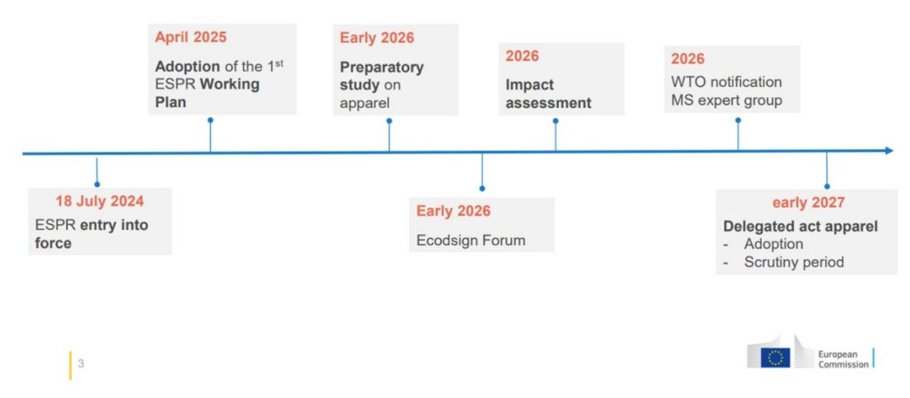

Figure 1 Timeline presented Textile ETP Annual Conference 2025 – Alcoy, 13 May

The Digital Product Passport will affect companies of all sizes - from large multinational manufacturers and retailers to SMEs, recyclers, and service providers. Any company involved in the lifecycle of regulated products—from production, distribution, sales, to end-of-life processing-will need to adapt to these requirements by 2027. It is a good recommendation to start preparing on time and cooperate with your supply chain.

-----> See Section 4: Checklist – Practical Steps to Begin Preparing.

A step-by-step out roll

Nothing has been decided yet regarding the rollout of the DPP. However, the report Digital Product Passport for the Textile Sector proposes a scenario based on research and a survey involving 81 stakeholders and experts from nearly 20 European countries. Drawing on these insights, the report outlines a three-phase deployment scenario with policy options aimed at promoting a circular economy and reducing the sector's overall environmental footprint[19](#page-14-1). If it is a three step roll out or something else, this guide aims to give insights into what data is needed for reuse, repair and recycling, in other words, Product end-of-life management.

Phase 1: Implementation of a "minimal and simplified DPP" for textiles in the short term, by 2027. This proposal is primarily based on the dissemination of mandatory information, complemented by additional data that will be useful for life cycle analysis. Core Data includes:

- Product composition (recycled content, hazardous substances, microplastics)
- Recyclability
- Key supply chain locations (e.g., dyeing, weaving)
- Packaging info (recyclability, reuse)

19 [Digital product passport for the textile sector](https://www.europarl.europa.eu/RegData/etudes/STUD/2024/757808/EPRS_STU(2024)757808_EN.pdf) EPRS | European Parliamentary Research Service Scientific Foresight Unit (STOA) PE 757.808 – June 2024

- Environmental impact and safety

Phase 2: Implementation of an "advanced DPP" for textiles in the medium term, by 2030. This could gradually be extended to other stakeholders, with more information collected throughout the product life cycle, based on lessons learned from Phase 1. New Elements:

- Track more detailed supply chain and product data (e.g., colour, weight)
- Monitor second-hand use and aftersales to assess durability

Phase 3: Implementation of a "fully circular DPP" for textiles in the long term, by 2033. In this final phase, the DPP could be fully rolled out to promote circularity within the textile sector.

- Full supply chain integration with restricted data access to protect confidentiality.
- Automated impact calculation and support for ecolabeling through comprehensive upstream data.
- Tracking of distribution, use, and aftersales to improve product durability and collection efficiency.
- Enhanced sorting and recycling, thanks to detailed DPP data on product design and materials.
- Increased closed-loop recycling, enabled by real-time data exchange between recyclers and suppliers.

-----> See Section 3: Comparison outline data requirements ESPR and CISUTAC data points and section 4 Practical checklist

#### 1.1.1 Standardization processes in general

Standards will play an important role in the implementation of the DPP system. While standardization is still in progress, it is not a barrier to getting started. It good to understand how the standardization process works. There are a number of benefits with developing and using standards:

- Helps avoid misunderstandings in international communications, during production and purchasing and thus reduce costs
- Increases product quality and reduces complaints
- Supports fair competition
- Safer products, for example reduced content of hazardous chemicals and other risks of injuries

Standards ensure that the products and services are safe, reliable, and of high quality.

On the product data side standards build the ground for automatic data exchange, which is critical, as the data volumes are expected to increase significantly and new ways of data exchange will become critical for economic success.

There are three levels of standardization: national, European (CEN – European Committee for Standardization) and global (ISO - International Organization for Standardization). The way to influence standardization work is to become a participant and expert in a relevant national standardization committee. The first step is to contact the national standardization body to get nominated as an expert in a national, CEN or ISO – working group. Note that a CEN standard overrides any national standards.

Conflicting national standards are withdrawn. For ISO standards it is optional to adopt them as national standards.

Simplified Overview of the Development of a European standard:

Step 1 - The originator\* has an idea that standard is needed. The proposal for a new work item is introduced to the relevant technical committee (TC), often from the national committee.

Step 2 - The TC takes a decision to start a new work item in a ballot. 65% positive and 5 countries need to accept to participate in the work.

Step 3 - The relevant working group develops a draft of the standard.

Step 4 - The draft standard is submitted by the TC for a public enquiry ballot.

Step 5 - The comments from the public ballot are handled within the working group.

Step 6 - The final draft standard is submitted by the TC for an approval ballot with the members\*\*. No technical comments are accepted. 65% positive votes needed.

Step 7 - The approved document is published by national standardisation member bodies and can be purchased.

\* a member of CEN or ISO, a technical committee, the EC or EFTA Secretariat; an international organization; a European trade, professional, technical or scientific organization

\*\* for European and global standards, the referral bodies are the national standardisation organisations

A CEN standard overrides any national standards. Conflicting national standards are withdrawn. For ISO standards it is optional to adopt them as national standards.

#### 1.1.2 The standardization processes for textiles

Standards will play an important role in the implementation of the DPP system. While standardization is still in progress, it is not a barrier to getting started. Companies can already begin preparing by identifying relevant data, defining data vocabulary, structures, and starting data collection. Guidance for this can be found in Section 3 and 4 of this guide.

It is also useful to stay updated on the European Commission's standardization request (mandate), its timeline, and expected outcomes.

EURATEX supports standardization to enable interoperable and cost-effective data exchange across the textile supply chain. Current systems are fragmented and expensive. Standards should be proportional, based on open international frameworks, and include both cross-sector and textile-specific elements. EURATEX also recommends aligning data exchange, language, capture, and carriers—building on existing terms like customs codes to ease adoption for companies and authorities. [20](#page-16-1)

Examples of relevant standards and standardization processes that are ongoing:

20 <https://euratex.eu/wp-content/uploads/EURATEX-DPP-Data-Gathering.pdf>

- Textiles Environmental aspects Vocabulary ISO 5157:2023[21](#page-17-1). Environmental terminology in the textile industry remains inconsistent, leading to confusion and hindering sustainable practices. Given the global nature of industry, both international and national standards are needed to ensure shared understanding and support trade. Common vocabulary helps prevent greenwashing, promotes transparency, and builds consumer trust. This document defines widely used terms related to environmental aspects of the textile value chain. It considers ISO Guide 82 and applies to all stakeholders, regardless of size or location. The goal is to support future standardization efforts in environmental sustainability. While broad, the list of terms is not exhaustive; definitions are drawn from existing standards or clarified as needed.
- In this context, the European Commission has issued a standardization request (mandate) for CEN-CENELEC, specifically the CEN‑CENELEC/JTC 24 "Digital Product Passport" joint technical committee, to develop harmonized standards for supporting DPP implementation—including textiles—under the Ecodesign for Sustainable Products Regulation (ESPR). A key milestone is the delivery of these standards by December 2025, covering identifiers, data carriers, interoperability, and security for product passports across sectors.
- CEN/TC 248/WG 39 is the working group within CEN/TC 248 (Textiles and textile products) specifically focused on advancing circular economy principles in textile manufacturing and the broader textile chain. Their main goals include:
- Defining requirements and standards for recycled, refurbished, repaired, and reused textiles.
- Setting benchmarks for material inputs and circularity practices.
- Developing guidance and methodologies to ensure reliability and traceability of circular claims, helping market authorities validate recycled content and distinguish quality inputs from cross‑contamination.
- Integrating circular economy thinking across the textile lifecycle, from design for longevity and reuse to end‑of‑life recyclability, aligning with broader material‑efficiency work and EU Ecodesign Directives.
  - New [CEN Workshop based on H2020 TRICK Project to Enhance traceability and](https://www.cencenelec.eu/news-and-events/news/2024/workshop/2024-10-30-trick/)  [sustainability Data Collection in Textile Supply Chains' -](https://www.cencenelec.eu/news-and-events/news/2024/workshop/2024-10-30-trick/) CEN. CEN/WS TRICK "TRICK
    - Product data traceability from cradle to cradle by blockchains interoperability and sustainability service marketplace"

-----> See Section 4: Checklist – Practical Steps to Begin Preparing.

# 1.2 Objectives and interrelations

Information and data access are key to unleashing the potential of textile waste to secondary raw material and scale the second-hand market.

This report, serving as the CISUTAC open data guide for DPP, aims to support the industry in preparing for upcoming legislation by:

The why

To establish a shared understanding of how the Digital Product Passport (DPP) and

21 ISO 5157:2023 - Textiles — [Environmental aspects —](https://www.iso.org/standard/80937.html#:%7E:text=This%20document%20provides%20general%20terms%20and%20definitions%20used,recycling%20processes%2C%20repair%20and%20disposal.%20Got%20a%20question%3F) Vocabulary

granular data can unlock the potential of reuse and repair business models and transform post-consumer waste into valuable secondary raw materials.

#### The what

To define the data requirements that enable reuse, repair, and recycling. This includes identifying the initial steps needed for data sharing across the value chain and exploring how the industry can begin to harmonize terminology to support consistent data input, use, and exchange.

#### The how

To offer practical guidance for taking the first steps in preparing for the upcoming DPP, with a specific focus on data that supports reuse, repair, and recycling.

#### 1.2.1 A guide not a standard

This deliverable, CISUTAC 2.2 Open data standard, with matching data collection and data exchange is based mainly on work done in CISUTAC Task 2.3 Open data guide. Task leader is GTS; involved partners are GTS, WR, CTB, EURATEX, SODRA, TEXFOR, TEXAID\_DE, TEXAID\_CH, WAR, RREUSE, and ACR+.

At the end of 2024, in dialogue with the CISUTAC coordinator, a decision was made to change the focus from a standard with a describing document to a guide.

While the formal standardization process remains ongoing, this guide has been completed to provide immediate support to the industry.

The delivery for the work carried out was:

- Update of the CISUTAC decision support tool to fit the CISUTAC sorting pilot
- Building the base for machine readable data within the CISUTAC sorting pilot
- Developments on the GTS language, which is the catalogue with predefined data behind the GTS standard were made due to involvement and collaborations in CISUTAC work

#### This guide is divided into two parts:

Part One summarizes key learnings from previous work conducted within CISUTAC. It draws on insights from the Decision Support Tool (T2.1), the pioneering sorting pilot in Work Package 4 (WP4), and the development of the Global Textile Scheme (GTS). An open data guide has been developed, serving as a practical tool to help the industry prepare for upcoming legislation.

Part Two provides an in-depth report on the development of the GTS platform, including experiences and lessons learned from the CISUTAC pilot.

#### 1.2.2 Interrelations

Learning and preparing for the Digital Product Passport (DPP) in the textile industry is supported by a range of comprehensive guides outlining general recommendations for readiness. Additionally, numerous projects and reports have provided valuable insights throughout this ongoing preparatory process.

This guide has been developed in alignment with relevant publications on the Digital Product Passport – specifically, the work done by:

- [CIRPASS a](https://cirpassproject.eu/)nd [CIRPASS2](https://cirpass2.eu/)

- Preparatory Study on Textile Products lead by [Joint Research Center](https://euc-word-edit.officeapps.live.com/we/Product%20Bureau%20%7C%20Circular%20Economy:%20Environmental%20and%20Waste%20Management)
- Joint Technical Committee 24 (JTC 24) at [CEN/CENELEC](https://www.cencenelec.eu/news-and-events/news/2024/workshop/2024-06-24-circthread/)

#### 1.2.3 Who is this guide for?

Brands, Retailers & Supply chain: To establish a shared understanding of how the Digital Product Passport (DPP) and granular data can unlock the potential of reuse and repair business models and transform post-consumer waste into valuable secondary raw materials.

### 1.3 Process and methodology

#### 1.3.1 CISUTAC previous and ongoing work

This guide, CISTUAC Open Data Guide, builds upon work carried out within the CISUTAC project. For example, the delivery report D1.2 Decision support tool for post-consumer textiles on reuse and repair[22](#page-19-3) that presents the CISUTAC textile waste decision support tool and CISUTAC data set on material composition. Insights gained from this work have been applied in practice within the ongoing CISTUAC sorting pilot carried out by project partner Texaid and work done in the task 2.3 together with CISUTAC partners.

The following section describes relevant work (summarized below) carried out within the CISUTAC project and the insights that form the basis for the recommendations in our guide.

- CISUTAC data set on material composition
- CISTUAC decision support tool
- CISUTAC semi-automated sorting station

CISUTAC data set on material composition was based on a questionnaire focused on data from year 2022, divided into product type, fibre, material compositions, percentage of products with removable disruptor, percentage of products with (prints) percentage of products with certificates, percentage of multilayer textile products, percentage of products with mono-material, number of sold pieces, weight of produced products. The brands were also asked for their indications on Future trends, if the company had any plans to change current material composition before 2025. Historical data two years back were also asked for, but this was harder for the companies to provide. The questionnaire was complemented with a template in Excel to visualize how the companies could compile the data[23.](#page-19-4) Approximately 40 companies were contacted to contribute data, of which 10 provided information that was summarized in the final data set.

The result of the CISUTAC data set is an in depth understanding of variations and relation between product categories and material composition but also an understanding of the quality of data at a company level. Learnings from companies in the CISUTAC data set is that a major part of the companies still handle a lot of data and analytics by hand. When collecting the data, the focus needed to be on the main material in a product due to limitations on how detailed data that could be extracted. The integrated and developed, for example Product Lifecycle Management(PLM) or Product Data Management(PDM) systems, is not in place to measure all data. The awareness among brands is high but the maturity level of IT-system integration low. The industries, especially smaller companies,

22 [Decision support tool for post-consumer textiles on reuse and repair](https://static1.squarespace.com/static/631f2bee92571234987af5a2/t/671fa48486f7ce7c7cc69acd/1730126982350/CISUTAC_D1.2+Decision+support+tool+for+post-consumer+textiles+on+reuse+and+repair_final_corrected.pdf) [23Circular transition scenarios & software for post-consumer textile waste channelling](https://static1.squarespace.com/static/631f2bee92571234987af5a2/t/662fb7f044df2d7be141b9bb/1714403317892/CISUTAC_D2.1_Transition_scenarios_final.pdf)

availability to cost-effective solutions to secure an IT architecture to manage all their data and corporate governance is highly relevant to get the product passport to work operationally. Data on overall categories and product categories are relevant to follow markets trends on production and consumption also regarding material compositions. The literature review and the CISUTAC data set shows that the fibre diversity per item can be quite different, e.g., a pair of jeans will most likely contain a large fraction of cotton, while a skirt can be made of a range of fibres. Product categories can also be relevant for sorters to understand what categories contains a higher content of pure materials, like cotton, to sort out for recycling. It is also relevant to follow trends within the industry.

#### Summarized insights

- Many companies still manage a significant portion of their data manually, using spreadsheets. While awareness of these issues is relatively high, the level of IT system integration remains low, hindering progress towards digitalisation and circularity.
- A few companies demonstrated a more mature level of data management, maintaining comprehensive records for all products and tracking data throughout their supply chains.
- However, most companies relied on statistical averages, often focusing only on the main fabric rather than full product composition.
- There was inconsistency in terminology and categorisation methods across all companies studied.
- Very few companies had the capability to extract detailed information on monomaterials, which is crucial for fibre-to-fibre recycling.

#### CISTUAC decision support tool

The main purpose of CISUTAC support tool has been to identify and prioritise data points that support effective guidance of post-consumer products and materials towards the best route for value retention and to build a textile waste decision support tool based on these data points. The tool was built on interviews and workshops with the project partners as well as in the external network. Other projects have also given valuable input to the work, such as CIRPASS, New Cotton and Trace 4 Value, contributing with their data input and validating the findings in CISUTAC. In addition, other digital platforms and reports were considered as valuable and relevant data points for recycling, for example Fashion for Good[24](#page-20-0) and their Recyclers Database[25,](#page-20-1) McKinsey report[26](#page-20-2), Textile Exchange Material Markets Report[27](#page-20-3) and Global Textile Scheme[28.](#page-20-4)

The tool, integrated into an excel workbook with open access, is available through the CISUTAC websit[e Solution for post-consumer textile waste management —](https://www.cisutac.eu/solution-post-consumer-textile-waste) CISUTAC , and visualises prioritised data points and main channelling routes. The tool is designed to be adjusted and updated as sorting and recycling innovations evolve. The current version of the tool focuses on the major channelling routes: reuse (including repair), dismantling, mechanical recycling and chemical recycling (depolymerization to monomers or oligomers).

24 <https://reports.fashionforgood.com/report/sorting-for-circularity-europe>

25 Airtable - [Sorting for Circularity -](https://airtable.com/appSHNfy7U4jB4kAt/shr4HXLP5MoJLQ8Bf/tbl3ILaQuQqA1Xxha/viwJYLY0DF5iL2KSu) Recyclers Database

26 [Circular fashion in Europe: Turning waste into value | McKinsey](https://www.mckinsey.com/industries/retail/our-insights/scaling-textile-recycling-in-europe-turning-waste-into-value)

27 <https://textileexchange.org/knowledge-center/reports/materials-market-report-2024/>

28 <https://www.globaltextilescheme.org/>

One of the objectives of the tool was to harmonized language by using Textile Environmental aspects Vocabulary standard ISO 5157 /TC 38/WG 35[29](#page-21-1) and perform a detailed mapping of granular data points and underlying sub levels was conducted through interviews and summarized in the tool, data points refer to details such as dyeing methods, material composition, multilayers, surface treatments and prints.

Figure 2 Visualizations of the tool Textile waste decision support tool, Solution for post-consumer textile waste management — CISUTAC

#### The CISUTAC semi-automated sorting station

The CISUTAC sorting pilot (WP4) is a semi-automated station designed to enhance manual sorting by integrating advanced technologies such as AI image recognition, nearinfrared (NIR) scanning, and RFID tracking, alongside "channeling rules" from the CISUTAC decision support tool. The pilot also investigates the potential of a hypothetical Digital Product Passport (DPP) by utilizing RFID-tagged textile products containing selected data points.

The objective of the pilot is to assess how integrating these advanced technologies can enable sorters to perform their tasks more efficiently, with reduced training needs and increased sorting accuracy. By leveraging an interface decision support tool, operators receive actionable insights that facilitate precise sorting decisions. In addition to improving sorting performance, this approach supports the creation of transparency and reliable data flows throughout the textile waste management process. Real-time data

29 ISO 5157:2023 - Textiles — [Environmental aspects —](https://www.iso.org/standard/80937.html#:%7E:text=This%20document%20provides%20general%20terms%20and%20definitions%20used,recycling%20processes%2C%20repair%20and%20disposal.%20Got%20a%20question%3F) Vocabulary

ensures informed decisions and maximizes sorting accuracy and material value recovery. See below in Figure 3 for visualizations on data acquisition and the interface decision making for the manual worker at the working station.

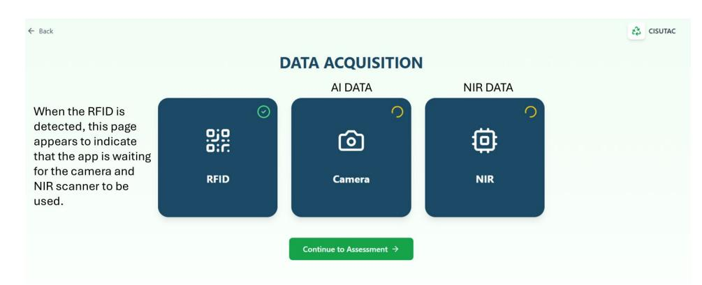

When all the data are retrieved, the interface automatically switches to the next page. (The button is for testing purposes only)

#### Figure 3 Visualisation on interface data acquisitions at the CISUTAC Semi-Automated Sorting Station

#### Figure 4 Visualisation on interface decision making at The CISUTAC Semi-Automated Sorting Station

#### Adjustment of the CISUTAC Decision Support Tool

Integrating manual expertise with technology (AI, NIR, RFID) and the CISUTAC tool required significant adaptation to meet the pilot's practical and technical constraints. Adjustments include:

- Expanded data scope: The tool now evaluates and prioritizes additional information such as fibre composition, multilayer fabric construction, colours, recycled content, and applicable recycling technologies, increasing data granularity.

- Updated decision rules: Data from the decision tool, GTS platform, "DPP", NIR, AI, and manual sorting actions now interact through an interface. Rules have been revised to align with the pilot's needs for effective sorting.
- Prioritized data points: Of the 23 total data points in the tool, a selected subset was used for the "hypothetical DPP," based on pilot priorities and feasibility. The data carrier is an RFID-tag.

#### Exploring DPP potential with RFID Tag

Accurate fibre composition is essential for recycling. Future DPPs could vastly improve data quality compared to current systems. Initially, the CISUTAC tool focused on cotton, polyester, and elastane. To support broader recycling options, the pilot expanded the tool to include more fibre types and fibre compositions to better align with potential DPP inputs and products in focus for the test. The RFID tag as a data carrier with granular data on material composition gives a potential big advantage for sorters to channel materials to recycling.

#### Input for Standardizing Terminology and Data Structure

The growth of data-rich textile products highlights the need for accuracy, traceability, and standardized terminology. A key insight from the pilot was the complexity of handling data, for example different variations in textile colours, and inconsistent industry colour systems pointed to a need for structured, harmonized colour data.

To address this, the pilot used standardized colour and other data categories from the GTS sector specific data vocabulary, which were then integrated into the CISUTAC tool. These must align with inputs from AI, RFID and NIR technology. In the future, standardized colour systems in the DPP will be essential to support scalable textile sorting and recycling. Continued integration of manual expertise, AI, and sorting technology remains crucial.

#### Summarized Insights from the CISUTAC sorting pilot:

- A central insight from the pilot study is that the most crucial data points to start with to enable improved sorting from the sorter's perspective is the material composition for each layer and trim, along with colour information. This indicates that without detailed and accurate material data, it becomes difficult to effectively separate textiles for recycling. A future challenge and opportunity lie in also including chemical content data, which could further improve the precision and sustainability of sorting. The clearest lesson from the pilot is that establishing a functional and scalable data flow in a complex and diverse industry like textiles requires extensive standardization between suppliers and technology providers.
- Terminology is important. Despite the existence of international standards (e.g., ISO) for many terms and definitions, the pilot phase revealed that there are still significant inconsistencies that hinder communication and data exchange. One example is the lack of a clear semantical understanding and definition of "multilayer" and related concepts such as product and fabric construction.
- Data structure is crucial, Furthermore, the data structure that is, how information is organized and standardized to be shared between different systems – is another challenge. For example, the variation in how colour is recorded by different actors' risks creating inconsistency and compatibility issues in downstream processes. The pilot's experiences from the CISUTAC

project show that it is difficult to find a balance between making the data structure comprehensive enough to cover all needs while also being userfriendly and manageable for industry actors.

- To be able to meet the rapid changes in the market and the increased use of technology, continuous development and adaptation are crucial. Effective decision support can help optimize sorting and recycling processes by highlighting which parameters are most critical for correctly directing material flows. However, this requires a clear and common understanding of these parameters, and that the data entered is standardized and reliable.
- Insights so far in piloting work, is that the future for textile sector could potentially need a system with different data carriers for different purposes, for example:
- A) QR code on the care label which doesn't cost more within the printing process, is easy to find for consumers and will be one way for consumers to get access to the DPP information and
- B) RFID, which needs to be integrated into the product in a way that it is still available at the end of the lifecycle when the care label might be cut out and/or the QU label is faded due to washing or other influences.
  - Many brands are already using QR codes, leading to a mix of different data carriers and many textiles without any data, requiring manual handling. The industry needs tools to manage both types for a long transition period. Tests should explore how different data carriers can complement each other for reuse, repair, and recycling. Currently, QR codes work best early in a product's life, while RFID is more effective at the end. Data use varies along the value chain, requiring different digital solutions and user access levels. Users must evaluate these solutions based on their existing systems and prioritize starting with basic data that supports reuse, repair, and recycling.

#### Stakeholder interviews and feedback

The development of the CISUTAC open data guide involved partners including GTS, RISE, Texaid, EURATEX, Wageningen University, TEXFOR, Decathlon, SIOEN, and Södra. The guide was iterated through a series of working group meetings, interviews, and written responses.

The CISUTAC open data guide has also been shaped by work outside the project, such as standardization mapping in the ECOSYSTEX initiative, inputs from TG4 and TG5 working groups, and ongoing dialogue with other EU textile projects and initiatives like Cirpass2, TRICK, tExtended, and Trace4Value/SwePass.

Stakeholders from across the supply chain were interviewed to identify the needs for an open data guide and how it could best support them. This included assessing current knowledge levels in the industry, identifying gaps, and determining how the guide could help raise awareness and understanding. As information around DPP is broad, clear and practical guides are essential starting points.

The data points in the tool were evaluated against what can realistically be collected today from existing systems, and what could be obtained in the future through more advanced data solutions. Insights from early interviews, testing frameworks for the guide, and results from CUSTAC T2.1 and CISUTAC sorting Pilot were consolidated into a practical checklist. This checklist serves as a simple, actionable starting point for industry stakeholders.

The checklist was reviewed by both project partners and external industry actors. Key themes identified through the interviews included: what data is needed, how to manage data flows, how to get started, and how to prepare for upcoming regulations and legislation.

# 2 The why

According to the Circularity Gap Report, the global fashion industry's circularity rate is only 0.3%, reflecting its overwhelming dependence on virgin materials. Achieving greater circularity will require a fundamental transformation of the textile [30](#page-25-1).

Focus of this report and guide is, post-consumer textile waste (including apparel and home textiles), which is estimated to be 87% of the total textile waste in EU27[31.](#page-25-2) Recent data from Huygens et al. (2023) shows that the EU generates a total of 10.9 million tonnes post-consumer textile waste per year, with an uncertainty range of 10.2-11.5 Million tonnes per year (representing EU27 and reference year 2019).

Of the total fibre input used for clothing production worldwide, 87% is either incinerated or ends up in landfill. In fact, the equivalent of one garbage truck of textiles is landfilled or incinerated every second[32](#page-25-3).

Data and its accessibility across the entire value chain is a critical enabler in transforming waste into a resource. The forthcoming DPP presents a significant opportunity to establish the digital infrastructure required to support circularity within the textile industry. When combined with standardized definitions and performance requirements—such as those for "durable," "repairable," and "recyclable"—the DPP can enhance the industry's ability to convert waste into valuable secondary raw materials.

Data for reuse, repair and recycling could also be useful for product end-of-life management. Producers of waste-generating products have a responsibility to anticipate what will happen to their products at the end of their life. This is the purpose of Extended Producer Responsibility (EPR), which introduces a bonus/penalty system based on anticipating a product's end-of-life through eco-design and a declaration to the ecoorganization.

Beyond meeting regulatory compliance, the textile industry must identify and leverage the broader drivers that data can unlock. A key long-term objective is to explore how data can support the development of circular business models. For instance, improved access to relevant product data could enable the scaling of second-hand markets, repair services, and recycling systems. These are the pivotal questions guiding the industry's transition.

However, this transformation must begin with foundational work. The industry needs to clearly understand which data is relevant, develop the capabilities to collect it, and establish robust processes for distributing and verifying this information. Only then can the sector effectively convert waste into a valuable resource.

30 [The Circularity Gap Report | Textiles](https://www.circularity-gap.world/textiles)

31 Reference year 2019, Huygens et al. 2023, [\(PDF\) Techno-scientific assessment of the management options for used and waste](https://www.researchgate.net/publication/377983277_Techno-scientific_assessment_of_the_management_options_for_used_and_waste_textiles_in_the_European_Union) 

32 [Cleaning up couture: what's in your jeans?](https://www.unep.org/news-and-stories/story/cleaning-couture-whats-your-jeans)

### 2.1 Enabling Reuse, Repair, and Recycling through Data:

#### 2.1.1 Adopting circular design principles

Although circular design guidelines already exist, widespread implementation across the textile industry remains limited. Most textile products continue to be made from complex, multi-material blends that often include elements such as buttons, prints, elastics, and decorative trims - features that significantly hinder repair, reuse, and fibreto-fibre recycling.

To accelerate circularity, the industry must make better use of existing knowledge and adopt proven design strategies. For example, reducing the amount of elastane in textile products and limiting fibre diversity can greatly enhance recyclability. Emphasizing monomaterials, minimizing complex attachments, and using detachable trims are key design shifts that support easier disassembly and material recovery. These circular choices must become the standard rather than the exception.

#### 2.1.2 Scaling circularity through standardization

One of the major barriers to scaling circular models is the absence of consistent and shared standards across the value chain. Circular transformation cannot succeed without a common language and set of criteria. Brands need reliable information on the quality and origin of recycled materials, while recyclers require verified and consistent data on product composition.

Foundational work is already underway. The CEN/TC248/WG39 working group is developing minimum circularity requirements for textiles, including the classification and accepted use of non-virgin materials. As these standards mature, they will help align the industry and create the trust necessary to facilitate large-scale, systemic change.

#### 2.1.3 Improving product data structure and quality

A critical enabler of circularity is detailed, structured, and accessible product data. However, many fashion companies—particularly small and medium-sized enterprises still manage product data manually, often without the ability to follow up, traceability, or clear frameworks for data management.

To close this gap, companies must transition toward structured digital systems that capture full material composition, including trims, linings, and accessory components. Implementing Product Lifecycle Management (PLM) or Enterprise Resource Planning (ERP) software, even at a basic level, will support automated data generation and reduce errors.

Standardized terminology and categorization are also essential for data compatibility across systems. Moreover, product records should include resale- and repair-relevant information—such as care instructions, replacement part availability, or modular construction notes—to extend the useful life of textile products.

### 2.1.4 Enabling data access at end-of-life

Once textile products enter second-hand markets, sorting facilities, or waste streams, the availability of reliable product information drops sharply. Sorters and recyclers often lack access to essential data, which limits their ability to separate materials efficiently and sustainably.

CISUTAC's sorting pilot demonstrated that data such as multilayer, fibre composition, trim types, and colour information are critical for effective processing. Looking ahead, data on chemical content, textile finishing and methods of dyeing will further enhance recyclers' ability to recover materials safely and accurately.

To enable circular flows, this data must be embedded in product records and made accessible throughout the product lifecycle—including at the end-of-life stage.

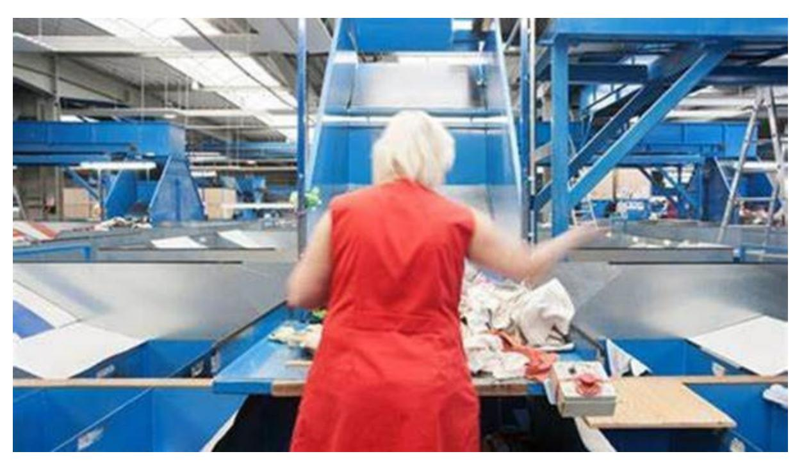

Figure 5 Apolda Texaid's sorting facility

#### 2.1.5 Establishing consistent terminology and classification

The effectiveness of data exchange relies heavily on the use of consistent and standardized definitions. CISUTAC's pilot revealed major discrepancies in how basic characteristics—like colour—are recorded, leading to confusion and inefficiency in downstream processes.

Without standardized classification systems, automation, interoperability, and reliable data sharing are nearly impossible. Adopting uniform language for product characteristics across the industry will support cleaner sorting streams, more precise recycling processes, and seamless integration across digital systems.

#### 2.1.6 Building capacity for data collection and verification

Another barrier to circularity is the fragmented and unstructured nature of data within organizations. Often, relevant product information exists but is buried in emails, unsearchable PDFs, or poorly maintained spreadsheets. This limits both internal traceability and external data sharing.

To overcome this, brands and suppliers need to build internal capacity around data collection, organization, and verification. This includes training staff, defining clear data requirements, and establishing systems that capture data consistently and make it accessible across teams and partners.

Improving data literacy across the value chain will also support better decision-making and foster transparency.

#### 2.1.7 Adapting to technological advances with digital product passports

Digital Product Passports (DPPs) are emerging as a vital tool to ensure traceability and data accessibility across the entire product lifecycle. These systems enable the sharing of verified product information among stakeholders—including brands, repairers, sorters, and recyclers—supporting better end-of-life outcomes.

For DPPs to be effective, standards for data exchange, common terminology, and shared formats must be developed and adopted. EURATEX recommends creating frameworks for how data is captured, stored, and transferred throughout a product's life.

DPP implementation must stay flexible to meet industry needs and adapt to new technology. For example, the CISUTAC project found QR codes unsuitable for high-speed sorting due to current technical limits. RFID tags, especially UHF Gen 2, showed more promise but need standardization and industry alignment. A hybrid model—QR codes for consumers and RFID for automated sorting—could be the best solution if integrated from the design stage. This approach still needs to be tested, and further development of RFID and other data carriers is expected. One example of project that will test this is Trace4Value[/SWEPASS.](https://trace4value.se/swepass/) 

#### 2.1.8 A collective effort for industry-wide transformation

Ultimately, the success of DPP and the broader circular transition will depend on collective effort. Collaboration among all stakeholders—brands, manufacturers, recyclers, technology providers, policymakers, and consumers—is essential.

Stakeholders must actively engage in testing, refining, and scaling data solutions. Sharing best practices, piloting new technologies, and building collective knowledge will accelerate progress and help establish a robust ecosystem for reuse, repair, and recycling. The DPP will not be served on a silver plate. Learn from others keep track on for example [CIRPASS 2](https://cirpass2.eu/lighthouse-pilots/) light house pilots.

# 3 The what

# 3.1 Data Requirements to Enable Reuse, Repair, and Recycling

This section outlines the data requirements necessary to support reuse, repair, and recycling within the textile value chain, drawing on key insights from the CISUTAC project. It places particular emphasis on the importance of standardized terminology, robust data capture structures, and the role of data carriers. Understanding and implementing these components is critical not only for efficient data exchange between stakeholders, but also for enabling circular business models.

A fundamental consideration in designing DPP is tailoring information to the specific needs of different users. While consumers, regulators, and market surveillance authorities require access to certain data, this section focuses on the information needs of supply chain stakeholders involved in circular operations. These include reuse businesses, repairers, sorters, dismantlers, and recyclers—actors that rely on accurate and granular data to carry out their functions effectively.

The following analysis provides:

- A comparison of potential data requirements under the proposed Ecodesign for Sustainable Products Regulation (ESPR) with practical insights from CISUTAC on the data required for reuse, repair, and recycling.
- An overview of the current state of standardized textile terminology, its readiness for implementation, and the importance of common language in enabling data interoperability.
- Recommendations on how to structure and prioritize granular product data to support practical implementation.
- An orientation on data carriers, including the suitability of different technologies for various use cases, helping companies prepare for the digital infrastructure needed to support DPP integration.

By clearly identifying the data relevant to each stage of a product's circular lifecycle, and ensuring it is structured, standardized, and accessible through appropriate carriers, businesses can begin to align with upcoming regulatory requirements and build the foundation for future-proof circular operations.

#### 3.1.1 CISUTAC's 22 data points for reuse, repair and recycling

The CISUTAC Decision Support Tool suggests that a wide range of data points becomes critical to enable circularity. In fact, up to 22 specific data points have the potential to significantly improve and accelerate the transition of post-consumer textile waste into reuse, repair, and recycling markets, see table 2 below.

The relevance of specific data points varies across reuse, repair, and recycling, though some input data are universally important. For reuse and repair, a total of 12 data points have been identified as useful, with condition being the most critical. Additional data such as price, production year, reparability, fibre composition, colour, product type, gender, disassembly potential, durability, and brand—enhance the sector's ability to respond to market dynamics and shifting trends. These data points support the development of targeted take-back schemes and more effective resale and repair models, particularly in e-commerce.

In contrast, recycling processes—especially high-quality mechanical or chemical recycling—require more detailed and technically specific information. Key data points include full fibre composition, recycled content, and textile finishing. In total, 10 core data points have been identified as essential to support the scalability and efficiency of textile recycling systems[33](#page-29-1) .

The example below shows how complex a textile product can be. To determine if a wind jacket is suitable for recycling, a recycler would need at least 8 specific data points to sort it correctly.

33 [Deliverables —](https://www.cisutac.eu/deliverables) CISUTAC

Figure 6 An example of a complex textile product is one where a sorter would need at least eight specific data points to properly sort it for recycling.

Table 2 CISUTACS data points for reuse, repair and recycling

| Data points                                            | Description                                                                       | REUSE recommended datapoints for scaling | REPAIR recommended datapoints for scaling | RECYCLE recommended datapoints for scaling |
|--------------------------------------------------------|-----------------------------------------------------------------------------------|------------------------------------------|-------------------------------------------|--------------------------------------------|
| Condition                                              | Setting the quality levels for the post consumer textile waste                    | x                                        | x                                         | x                                          |
| Product construction (monomaterial and multi material) | Describes if it is one or more materials in the product, 2 options, mono or multi |                                          |                                           | x                                          |
| Multilayer (coating or membrane)                       | Describes if it is a coated or laminated material                                 |                                          |                                           | x                                          |
| Chemical content                                       | Yes or No option with focus on SVHC substances                                    | x                                        | x                                         | x                                          |
| Production year                                        | Relevant for reuse, trend and chemical legislation                                | x                                        |                                           |                                            |
| Product type                                           | 14 different types of products that follows the code system from import           | x                                        | x                                         |                                            |
| Brand                                                  | Important for 2nd hand and durability as well as trend                            | x                                        | x                                         |                                            |
| Price                                                  | Relevant for the 2nd hand market, focus on recommended market price               | x                                        |                                           |                                            |
| Product gender                                         | Relevant for the 2nd hand market, we used wmn, men, unisex, junior and kids       | x                                        |                                           |                                            |
| Repairability                                          | Information on how to repair and if it is possible on certain products            |                                          | x                                         |                                            |
| Durability                                             | Relevant and measurable data on pilling, abrasion and tearing                     | x                                        | x                                         |                                            |
| Fiber composition                                      | The blend of fibers in the fabric, the tool focus on 2 main fabrics               | x                                        |                                           | x                                          |
| Recycle content                                        | Percentage of recycle fiber in the yarn, focus on cotton and polyester            |                                          |                                           | x                                          |
| Recycle method                                         | Type of recycle method that is used for the fiber                                 |                                          |                                           |                                            |
| Textile finishing                                      | All treatments of the textile such as dyeing, chemicals for function, finishing   | x                                        | x                                         | x                                          |
| Fabric construction                                    | Construction of the fabric that indicates the surface that can affect recycling   |                                          |                                           |                                            |
| Fabric colour                                          | 4 type of groups such as bright, dark, light and multi                            | x                                        |                                           | x                                          |
| Textile fiber                                          | Construction of the fiber such as length and fineness                             |                                          |                                           |                                            |
| Fabric weight                                          | Weight in gsm, useful data for some recycle methods                               |                                          |                                           |                                            |
| Disruptors                                             | Yes or No option for hardparts or trims on product                                |                                          |                                           | x                                          |
| Product disassembly                                    | Indicates if the product can be taken apart or have an easy way to take away      |                                          | x                                         | x                                          |
| Certificate                                            | Different levels of verified certifications to be used for traceability           |                                          |                                           |                                            |

### 3.1.2 Underlaying data points - Condition

Condition is the most crucial parameter in deciding if a textile has the potential to go into reuse, repair or recycling. There are several underlaying data points for the CISUTAC 22 data points, complete information is found in the CISUTAC tool34.

There is no unified international system for grading the condition of second hand clothing in the industry today, but a common system ranges from Grade A to D – from like-new to rags. Grading standards vary slightly between organization, according to information provided by CISUTAC partner Texaid during an interview in April 2025. To unlock further

34 <https://www.cisutac.eu/solution-post-consumer-textile-waste>

potential for reuse and repair businesses this is an important area for further development on shared guidelines or future standardization.

CISUTAC has defined conditions in 5 sub-levels that follow the waste hierarchy, these sub-levels are defined by the descriptions below: Underlying definitions of condition are important in decision making related to reuse potential for the second-hand market. It can provide relevant information to improve the transparency of sorting and export of textile waste. This is a first version of definitions, see table 3 below.

Table 3 CISUTAC data field within condition with a value list of defined 5 levels from very low to premium

| CONDITION | ROUTE   | DESCRIPTION                                                                            |
|-----------|---------|----------------------------------------------------------------------------------------|
| VERY LOW  | INCINER |                                                                                        |
|           |         | Major contaminations and impurities , for example oil stains or mold                   |
| LOW       | RECYCLE | Teared and dirty , for example holes, stains, damaged trims, worn out, open stitching  |
| MEDIUM    | REPAIR  |                                                                                        |
|           |         | Smaller defects , for example on fabric and trims, small holes at hidden parts         |
| HIGH      | REUSE   | Few signs of wear and tear , for example lighter pilling, color fades, all trims ok    |
| PREMIUM   | REUSE   | High quality , for example price tag still on, no signs of wear and tear, all trims ok |

\* For the future preferably thermomechanical or chemical recycling

#### **Example from the CISUTAC semiautomated sorting pilot**

The CISUTAC sorting pilot is a semi-automated station that uses AI, NIR, and RFID to support manual textile sorting. It tests how a future DPP could work by using RFID-tagged textile products with key data points. Hands-on work with the pilot has shown how data can improve sorting decisions. Through an interface, a decision support tool is designed to assist operators in efficiently sorting textile items for optimal reuse and recycling pathways. The system guides operators with real-time, visual prompts - via screens or AR displays—based on data from RFID, AI, and NIR. This helps sort textiles more accurately for reuse and recycling, improving both efficiency and material recovery. See below for visuals on how data is used during sorting. The example illustrates the importance of the data point condition.

Here, all the data are displayed to the operator. Once a condition is selected, the data are sent to the Decision Tree, and the result is displayed

#### Figure 7 Visualization of the Interface developed by the CISUTAC partner STAM in the CISUTAC sorting pilot

#### 3.1.3 Comparison outline data requirements ESPR and CISUTAC

The table 4 below provides an overview of the data requirements outlined in the ESPR compared to the CISUTAC data points. This comparison offers insights into potential future compliance and highlights the data needed to scale circular business models. To summarize, the potential future compliance requirements are fewer than the identified needs for reuse, repair, and recycling in the CISUTAC project. One key piece of data needed to establish a circular business model is the product's condition, i.e., determining whether a product can be reused, needs to be repaired, or should be recycled. However, this will not be part of future legal requirements, since such data only becomes available after a product has been placed on the market.

Table 4 Potential ESPR requirements compared with CISUTAC findings. Summarized ESPR requirements is done by the EON whitepaper[35](#page-34-1) updated in 2025.

|                                      |                                                                                                                                                                                                                                                                                                                                                                                                                         |                                                                          | NON-MATCHING MATCHING CISUTAC CISUTAC FINDINGS /                                                                                                    |
|--------------------------------------|-------------------------------------------------------------------------------------------------------------------------------------------------------------------------------------------------------------------------------------------------------------------------------------------------------------------------------------------------------------------------------------------------------------------------|--------------------------------------------------------------------------|-----------------------------------------------------------------------------------------------------------------------------------------------------|
| Information Category                 | Expected Data Request Unique product identifier at the level indicated in the                                                                                                                                                                                                                                                                                                                                           | Source                                                                   | FINDINGS / RESUE, REUSE, REPAIR, REPAIR, RECYCLE RECYCLE                                                                                            |
| Product Identification               | applicable delegated act Global Trade Identification Number as provided for in standard ISO/IEC 15459-6 or equivalent of products and their parts Relevant commodity codes, such as TARIC code under                                                                                                                                                                                                                    | ESPR, Annex III (b) ESPR, Annex III (c)                                  | Brand Production year Product type                                                                                                                  |
|                                      | Regulation (EEC) No 2658/87 Compliance documentation and information required under this Regulation or other Union law applicable to the product, such as declaration of conformity or technical documentation Information related to the manufacturer, such as its unique operator identifier and the information referred to in Article 21(1) of the proposed ESPR Unique operator identifiers other than that of the | ESPR, Annex III (d) ESPR, Annex III (e) ESPR, Annex III (g)              | Price Product gender                                                                                                                                |
| Company Information                  | manufacturer Unique facility identifiers; with standardized and >1 location identifier aside from ISO/IEC 15459-6, e.g., Open Supply Hub ID, GTS ID, etc. (provided by facilities) Importers shall indicate on the product their name, registered trade name or registered trade mark and the postal address Information related to the importer: name, registered                                                      | ESPR, Annex III (h) ESPR, Annex III (i) ESPR, art. 23 (3), Annex III (j) |                                                                                                                                                     |
|                                      | trade name or registered trademark and the postal address, EORI number                                                                                                                                                                                                                                                                                                                                                  | ESPR, Annex III (j)                                                      | Brand                                                                                                                                               |
|                                      | Name, contact details of the economic operator Unique operator identifier code of the economic                                                                                                                                                                                                                                                                                                                          | ESPR, Annex III (k)                                                      |                                                                                                                                                     |
|                                      | operator established in the Union                                                                                                                                                                                                                                                                                                                                                                                       | ESPR, Annex III (k)                                                      |                                                                                                                                                     |
| Material and Composition Information | Fiber Composition User manuals (to safely assemble, install, operate, store, maintain, repair and dispose)                                                                                                                                                                                                                                                                                                              | EU No 1007/2011 ESPR, Art. 7, 21, 30, Annex III (f)                      | Fiber composition Condition Product construction Multilayer Fabric colour Fabric Construction Textile fiber Fabric weight Disruptors Recycle method |

35 [EU Digital Product Passport \(DPP\) | EON | Free Whitepaper](https://www.eon.xyz/digital-product-passports)

| <b>Product Service</b>                                           | Substance of concern name, location within the product, concentration at the level of the product, main components or spare parts | ESPR Art. 7, 2 (a)                                                                       | <b>Chemical content</b>                  | <b>Condition</b>                              |
|------------------------------------------------------------------|-----------------------------------------------------------------------------------------------------------------------------------|------------------------------------------------------------------------------------------|------------------------------------------|-----------------------------------------------|
|                                                                  | Compliance documentation (declaration of conformity, technical doc, individual material declaration, etc.)                        | ESPR, annex III, (e)                                                                     |                                          |                                               |
|                                                                  | Percentage of recycled material content in product and packaging                                                                  | ESPR, Art. 7.2 (b)(i), JRC report on ESPR Product Priorities                             | <b>Recycle content</b>                   |                                               |
|                                                                  | User manuals (to safely care for, disassemble, recycle, take-back, dispose of, etc.)                                              | ESPR, Art. 7, 21, 30, annex III (f), JRC report on ESPR Product Priorities, Expert Input | <b>Repairability Product disassembly</b> |                                               |
|                                                                  | Number of materials and components used                                                                                           | JRC report on ESPR Product Priorities, Textiles and Footwear                             |                                          |                                               |
|                                                                  | Modularity, transformability, detachable/adjustable elements                                                                      | JRC report on ESPR Product Priorities, Textiles and Footwear                             |                                          |                                               |
|                                                                  | Possible lifetime of the textile or footwear                                                                                      | JRC report on ESPR Product Priorities, Textiles and Footwear                             |                                          |                                               |
| How to manage the textile or footwear at the end of its lifetime | JRC report on ESPR Product Priorities, Textiles and Footwear                                                                      |                                                                                          |                                          |                                               |
| <b>Design and Performance Requirements</b>                       | Water consumption for the production of cotton in the product                                                                     | ESPR, Art. 7.2 (b)(i), JRC report on ESPR Product Priorities                             |                                          | <b>Product Construction Textile Finishing</b> |
|                                                                  | Water consumption for the production of 1 kg of product or item                                                                   | ESPR, Art. 7.2 (b)(i), JRC report on ESPR Product Priorities                             |                                          |                                               |
|                                                                  | Chemical consumption for the production of 1 kg or item                                                                           | ESPR, Art. 7.2 (b)(i), JRC report on ESPR Product Priorities                             |                                          |                                               |
|                                                                  | Fertilizers, pesticides and insecticides used for the production of cotton in the product                                         | ESPR, Art. 7.2 (b)(i), JRC report on ESPR Product Priorities                             |                                          |                                               |
|                                                                  | GHG emissions emitted for the production of 1 kg or item                                                                          | ESPR, Art. 7.2 (b)(i), JRC report on ESPR Product Priorities                             |                                          |                                               |
|                                                                  | Guarantees to remanufactured clothing items                                                                                       | ESPR, Art. 7.2 (b)(i), JRC report on ESPR Product Priorities                             |                                          |                                               |
|                                                                  | Energy consumed                                                                                                                   |                                                                                          |                                          |                                               |

# 3.2 Organizing your data for reuse, repair and recycling

The goal of the upcoming DPP is to improve data flow, making it more efficient to support transparency, circularity, and regulatory oversight. For this to happen, systems must be interoperable—meaning different data providers and platforms need to communicate seamlessly. EURATEX recommends developing common standards for data exchange, language, capture, and carriers to enable true interoperability[36](#page-36-1). In short, the aim is to make future digital systems work better and more connected than those we have today.

The following section shares insights from the CISUTAC project on how companies can begin organizing their data to support reuse, repair, and recycling. It highlights the first steps in identifying relevant data points, the importance of a common vocabulary, and how to start structuring and collecting data effectively.

#### 3.2.1 Vocabulary of textile terms

The CISUTAC open data guide emphasizes standardized data formats (classification and semantically clear sectoral vocabularies) to facilitate consistent input, use, and exchange of information among stakeholders. This approach helps to reduce manual processes and ensures data accuracy, which supports reuse, repair, and recycling efforts. This guide aims to bring clarity to the topic and helping organizations of all sizes.

In the CISUTAC decision tool for post-consumer textile waste the vocabulary and terms have followed ISO5157[37](#page-36-2) as much as possible. Some data points are more an overruling term for underlaying granular data. See table 5 for more clarification.

36 <https://euratex.eu/news/data-gathering-for-textiles-dpp/>

37 ISO 5157:2023 - Textiles — [Environmental aspects —](https://www.iso.org/standard/80937.html#:%7E:text=This%20document%20provides%20general%20terms%20and%20definitions%20used,recycling%20processes%2C%20repair%20and%20disposal.%20Got%20a%20question%3F) Vocabulary

Table 5 Overview of terms in CISUTAC and ISO5157. Other terms in the CISUTAC decision tool (Production year, Product type, Brand, Price, Product gender, Disruptor, Fabric weight, Fabric Colour)) does not concern the Textiles – Environmental aspects – Vocabulary ISO 5157:2023.

| CISUTAC terms related to Textiles                       | CISUTAC Underlying data                                                                                                                           | Textiles – Environmental aspects – Vocabulary ISO 5157:2023                                                                                                                                   | Textile Vocabulary that is not in ISO5157 |
|---------------------------------------------------------|---------------------------------------------------------------------------------------------------------------------------------------------------|-----------------------------------------------------------------------------------------------------------------------------------------------------------------------------------------------|-------------------------------------------|
| Condition                                               |                                                                                                                                                   |                                                                                                                                                                                               |                                           |
| Product construction (mono material and multi material) |                                                                                                                                                   | 3.1.1.7 mono material textiles product, 3.1.1.9 multi material textiles product                                                                                                               |                                           |
| Multilayer (coating or membrane)                        |                                                                                                                                                   | 3.1.1.6 mono material textil, 3.1.1.8 multi material textile                                                                                                                                  | Multilayer                                |
| Chemical content                                        |                                                                                                                                                   | 3.1.4.1 chemical content                                                                                                                                                                      |                                           |
| Repairability                                           |                                                                                                                                                   | 3.2.2.15 repairability                                                                                                                                                                        |                                           |
| Durability                                              |                                                                                                                                                   | 3.2.2.8 durability                                                                                                                                                                            |                                           |
| Fiber composition                                       |                                                                                                                                                   | 3.1.1.3 fibre composition                                                                                                                                                                     |                                           |
| Recycle content                                         |                                                                                                                                                   | 3.1.1.11 recycled fibre, non-virgin fibre                                                                                                                                                     |                                           |
| Recycle method                                          | Mechanical recycling closed loop, Mechanical recycling Open loop, Chemical recyling, Thermomechanical regranulation, Thermo-chemical incineration | 3.2.6.5 chemical recycling, 3.2.6.6 closed loop system, 3.2.6.13 fibre mechanical recycling, 3.2.6.19 open-loop recycling, 3.2.6.38 thermo-mechanical recycling process, 3.2.7.9 incineration |                                           |
| Textile finishing                                       |                                                                                                                                                   |                                                                                                                                                                                               |                                           |
| Fabric construction                                     | Woven, Knitted, Non woven                                                                                                                         |                                                                                                                                                                                               |                                           |
| Fabric colour                                           |                                                                                                                                                   |                                                                                                                                                                                               |                                           |
| Textile fiber                                           |                                                                                                                                                   | 3.1.1.12 textile fibre                                                                                                                                                                        |                                           |
| Fabric weight                                           |                                                                                                                                                   |                                                                                                                                                                                               |                                           |
| Product disassembly                                     |                                                                                                                                                   | 3.2.6.9 disassembly                                                                                                                                                                           |                                           |
| Certificate                                             |                                                                                                                                                   | 3.2.4.3 certification body                                                                                                                                                                    |                                           |

#### 3.2.2 Data structure and prioritization

Setting a clear structure from the start—for what data to save and who will use it—is essential. Defining roles, such as buyers, can help shape priorities and organize product and textile data effectively.

The more a company aligns on data structure and IT capabilities, the easier it will be to scale and choose the right digital tools. The STOA report's suggested 3-step rollout (for overview see page 15 -16 of the Digital Product Passport (DPP) could become the standard - or all requirements might come at once[38](#page-37-2). With a clear structure, the starting point will still be strong.

38 [Digital product passport for the textile sector](https://www.europarl.europa.eu/RegData/etudes/STUD/2024/757808/EPRS_STU(2024)757808_EN.pdf)

Certain data points are especially important for reuse, repair, and recycling: brand, fibre composition, chemical content, and colour.

#### 3.2.3 Data collection

The set structure will is the starting point on how to collect the data. Ensure that the internal IT systems are ready to handle more data. Define the level of knowledge across the value chain. Prepare different roles and functions that will be involved how to handle and verify more data for DPP. Map out where to limit access to critical systems, define exactly what data is required, and decide early how to store it effectively. Involve stakeholders and system providers to evaluate the best approach.

See the Practical Checklist for useful tips when setting up specific templates for each responsible data collector.

#### 3.2.4 Data carriers

General overview of possible technologies to be used for DPP, Table 6 DPP data carrier technologies below. When implementing Digital Product Passport (DPP) solutions, selecting an appropriate data carrier technology is crucial. The chosen technology must balance cost, durability, scalability, and the ability to securely store and retrieve product information throughout its lifecycle. Two broad categories of data carriers are commonly considered: Wireless (RF) and Optical readout technologies. Each offers distinct advantages and trade-offs depending on the application environment, product type, and desired functionalities.

#### Table 6 DPP data carrier technologies

| Technology examples                                                                          | Carrier type examples                       | Pros                                                                     | Cons                                                                                                         |
|----------------------------------------------------------------------------------------------|---------------------------------------------|--------------------------------------------------------------------------|--------------------------------------------------------------------------------------------------------------|
| <b>Optical readout</b> <ul><li>QR code</li> <li>Data matrix code</li> <li>Bar code</li></ul> | - Printed label - Engraving - Molding | - Low cost - High scalability - Established high volume production | - Must be visible - Bulk readout challenging - Prone to wear and damage - Risk of too much position |

| Technology examples  | Carrier type examples                                                                                                                       | Pros                                                                                                                                                                       | Cons                                                                                                                                                               |
|----------------------|---------------------------------------------------------------------------------------------------------------------------------------------|----------------------------------------------------------------------------------------------------------------------------------------------------------------------------|--------------------------------------------------------------------------------------------------------------------------------------------------------------------|
| <b>Wireless (RF)</b> | Electronic integrated circuit on - label, - PCB (printed circuit board) - Integrated in other accessories such as button or zipper | - Can be hidden inside objects - Remote readout - Bulk readout - Possible to write information - Security capabilities - Established high volume production | - Higher cost - More complex materials and manufacturing - Sensitive to harsh conditions unless properly encapsulated - Recycling or reuse of electronics |

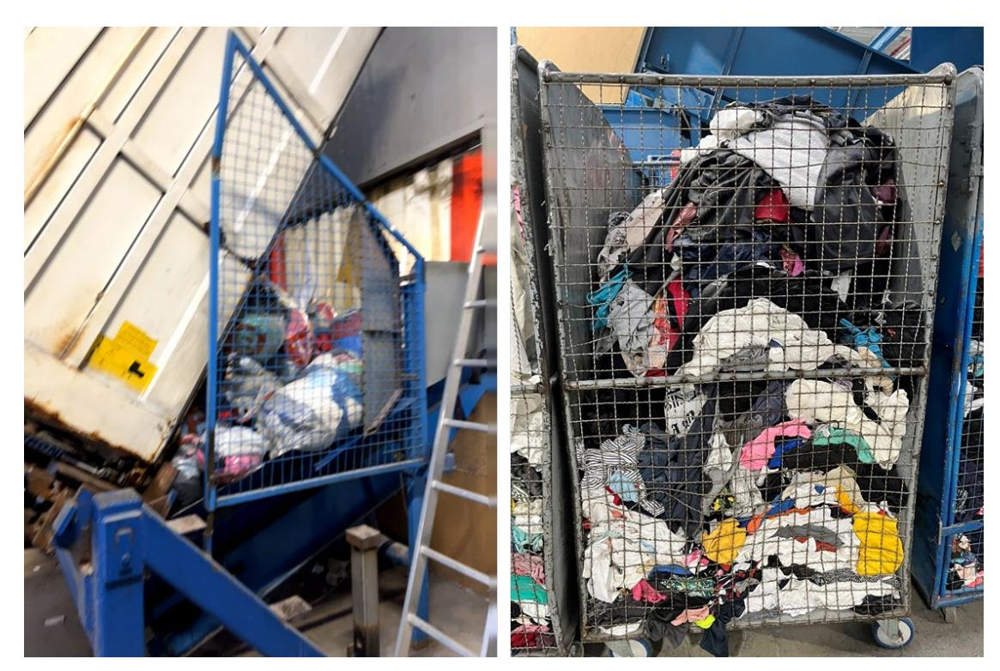

Figure 8 Apolda Texaid's sorting facility, showing the emptying of a container and the random storage of feedstock waiting for further processing.

In the context shown on above image, it will be critical to choose the right frequency - UHF Gen 2 - that is today mainly used in Electronic Article Surveillance (EAS) and Logistics mainly inventory management - for efficiency gains coming with the fact that most future apparel products will most likely come with RFID. This significant increase of RFID labelled merchandise will enable use cases mainly in Fashion retail, that are long time known but so far cannot be realized today, due to the currently low rates of RFID equipped products in the market.

# 4 The how

The performance and information requirements mandatory under the ESPR and DPP will be finalized and adopted through a delegated act by 2026. This checklist helps companies take initial steps to prepare for the upcoming regulation and to support reuse, repair, and recycling through data. It identifies relevant data and outlines actions to begin organizing, collecting, and using circular data to drive circularity.

# Practical Checklist

Below is a practical checklist to prepare for DPP and support reuse, repair and recycling through data.

### ���� 1. Assess Your Starting Point

- Identify what product and material data you currently have—and where it is stored in your system. A clear overview is helpful. Excel is a good starting point.

- Set your priorities and take it step by step. Begin by listing your most commonly used materials—start with the top 10 fabrics by volume and gather all available data on them.

#### ���� 2. Increase Knowledge on Circularity Data

- Up to 17 specific data points have the potential to significantly improve and accelerate the transition of post-consumer textile waste into reuse, repair, and recycling markets. Additional 5 data points are good to have for future improvements. See more in table
  - 7.

Table 7 Recommended 17 datapoints for scaling for reuse, repair and recycling

| Recommended 17 datapoints for scaling - |                   | Reuse, Repair, Recycling |
|-----------------------------------------|-------------------|--------------------------|
| Condition,                              | Repairability     | Recycle content          |
| Product construction,                   | Durability        | Textile finishing        |
| Multilayer                              | Fiber composition | Fabric colour            |
| Chemical content,                       | Product type      | Disruptors               |
| Production year                         | Brand, Price,     | Product disassembly      |

- Understand which data points can accelerate reuse, repair, and fibre-to-fibre recycling according to the CISUTAC project — and which may become requirements under the upcoming ESPR/DPP regulations.
- --> Use the table as an overview of key data points. As the process around ESPR is still evolving, it is important to stay updated—particularly with developments related to the delegated act expected in 2026.
- Test your existing data against these requirements to identify gaps and areas for improvement. For example, evaluate whether your 5–10 most commonly used material compositions are recyclable today using the [CISUTAC tool](https://www.cisutac.eu/solution-post-consumer-textile-waste) or table 7.
- Alternatively, assess whether one of your product categories (prioritize based on volume or easy to start with) meets criteria based on CISUTAC findings. More tools are under development, such as Classifications of textile waste | RISE[39](#page-40-1)
- Substances of Very High Concern (SVHC) Important to ensure chemical content and collect data from the value chain.

### ���� 3. Organize the Data

- Structure all data that can help scaling circular business, to enable comparison across different parts of the value chain. Group the data relevant to reuse, repair, and recycling, in alignment with DPP/ESPR regulations, see table 7 for inspiration.

39 <https://www.ri.se/en/expertise-areas/projects/classifications-of-textile-waste>

- Follow the Textile Environmental Aspects Vocabulary (ISO 5157:2023) to harmonize your terminology for circular data. See table 5 for more details. Stay updated on evolving standards under CEN/TC 248/WG 39 Circular Economy for textile products and the textile chain
- Establishing a shared vocabulary across all stakeholders is essential—especially when using acronyms—to ensure clear communication and avoid misunderstandings across the value chain.
- Access to data can help scale circular business models. To prioritize a starting point for data collection, you can follow the first suggested phase rollout of the DPP made in a [STOA report,](https://www.europarl.europa.eu/RegData/etudes/STUD/2024/757808/EPRS_STU(2024)757808_EN.pdf)[40](#page-41-1) combined with the most critical data for reuse, repair, and recycling identified in the CISUTAC sorting pilot., these results indicate a good starting point. See table 8.

#### Table 8 CISUTAC insights starting points vs STOA report suggestion of DPP Phase

| CISUTAC insights on starting point | STOA report suggestion of DPP Phase 1 | 41 |
|------------------------------------|---------------------------------------|----|
| Fiber composition                  |                                       |    |
|                                    | Product Composition (recycled         |    |

- Use the table and map your relevant data collectors across the supply chain for each data type.
- Stay updated on evolving standards JTC24 Digital Product Passport Framework and System

#### ♻ 4. Optimise Material Choices and Design

- Assess how you can adopt of circular design guidelines and circular material strategies. You don't have to do everything at once. Begin with a single product or product category. Some product types and functions are easier to recycle—for example, monomaterial products like denim. Some products are more suitable for repairs like an outdoor jacket. Start where it's makes the most sense to implement reuse, repair and recyclability principles.
- Based on the CISUTAC findings here are some action points to support recycling:
- Collect more detailed information on chemical content and textile finishes in your most frequently used materials. The [CISUTAC tool](https://www.cisutac.eu/solution-post-consumer-textile-waste) offers basic guidance to support recycling in product design.
- Re-evaluate the use of elastane and reduce it where possible.
- Explore fibre blends and construction methods that facilitate disassembly and recycling.

40 [Digital product passport for the textile sector](https://www.europarl.europa.eu/RegData/etudes/STUD/2024/757808/EPRS_STU(2024)757808_EN.pdf) EPRS | European Parliamentary Research Service Scientific Foresight Unit (STOA) PE 757.808 – June 2024 [41Digital product passport for the textile sector](https://www.europarl.europa.eu/RegData/etudes/STUD/2024/757808/EPRS_STU(2024)757808_EN.pdf)

- Aim to limit material compositions to no more than three fibres per product if possible.
- Explore circular design guidelines available on the market. For example, [Ellen Mac](https://www.ellenmacarthurfoundation.org/introduction-to-circular-design/how-to-get-started-applying-circular-design)  [Arthur design guidelines.](https://www.ellenmacarthurfoundation.org/introduction-to-circular-design/how-to-get-started-applying-circular-design)

#### ���� 5. Build Data Capacity and Learn About Data Carriers

- Explore how your digital systems (and system providers) can support increasing data requirements— for reuse, repair and recycling.
- Learn about data carriers: Where in the textile product should the tag or label be placed? How can different carriers serve different purposes and business models?
- Engage your label suppliers early. Prepare to challenge them and define your quality requirements clearly.

#### ���� 6. Collaborate Internally and Across the Supply Chain

- Clarify internal roles and responsibilities for data collection and validation.
- Engage system providers and suppliers to enable structured, consistent data sharing.
- Train suppliers in data management and upcoming circularity requirements.
- Forming a cross-functional project team can be an effective way to drive joint progress.

#### ���� 7. Take Action – Start Now

- Start small: test data collection and circular design through pilot projects to build internal knowledge.
- Invest in training and capacity building. Prepare and educate suppliers on data collection and exchange.
- Address knowledge gaps across your supply chain to reduce risks related to data quality and traceability. Focus on building collaboration—internally and with external partners. Once you've gained experience, define a long-term strategy for product recyclability.

# Part 2

# 1 Introduction to the Global Textile Scheme standard

The Global Textile Scheme (GTS) standard is a textile-oriented, multilingual classification system with defined semantics, designed to encompass the entire textile value chain, from material generation to recycling.

# 1.1 History

The development of GTS, a new textile data standard, began between 2017 and 2020, in response to concerns raised by IT managers—primarily from small and medium-sized (SMEs) fashion and workwear companies. These stakeholders warned that increasing complexities in data exchange posed a growing challenge for their operations and risked becoming a serious barrier to efficient communication and traceability across the value chain.

Building on these initial concerns and call for help, the European funded eBIZ 4.0 project, supported by EURATEX and ENEA, enabled GCS Consulting GmbH, an IT-Consulting company, in partnership with German Fashion Modeverband Deutschland e.V. to assess the relevance and scope by conducting:

- 18 expert interviews in autumn 2017 and which provided strong evidence of the need for a standardized textile data framework.
- An international industry conference held in Frankfurt, Germany, in autumn 2018, with 65 participants including associations, suppliers, brands, retailers, ICT providers, and specialized consultants. The event concluded with a clear recommendation to GCS to explore concrete solutions and respond to the challenges identified.

In November 2018, the board of German Fashion Modeverband Deutschland e. V. gave GCS Consulting GmbH a formal mandate to move forward with the next phase. This led to the launch of a crowdfunded initiative called "Pilot Project Data Exchange", which brought together 37 participating members. The project ended prematurely due to the COVID-19 crisis; however, a final report was completed and published, highlighting numerous promising opportunities. As a result of the project's findings, Andreas Schneider left GCS Consulting GmbH and, in summer 2020, founded the new company Global Textile Scheme GmbH.

At the time of the CISUTAC project application and its kick-off in October 2021, an initial version of the Global Textile Standard (GTS), including the data model and the GTS L catalogue, was available. However, this version required refinement to evolve into the unified data language for the Textile and Fashion sectors, which was the explicit challenge.

# 1.2 The GTS concept

Innovations are by definition, new technical developments that find the acceptance of the market. GTS is such a totally new concept, which naturally cannot find in such a short time a global acceptance – not to speak of the suboptimal global political circumstances during the last 5 years.

It was decided to write this report not as a GTS standard description but to turn it to a broader scope and create it as a guideline, as 2025 is the year of defining at least the frame for the most relevant DPP-shaping input from other relevant sources (JRC – CEN/CENELEC with its Joint Technical Committee 24 (also called JTC24) and CIRPASS [2\[1\],](https://euc-word-edit.officeapps.live.com/we/wordeditorframe.aspx?ui=sv&rs=en-US&wopisrc=https%3A%2F%2Fcentexbel.sharepoint.com%2Fsites%2FEXT_CISUTAC%2F_vti_bin%2Fwopi.ashx%2Ffiles%2Fae18dfc619354974bf9eaf7ec74bfecb&wdenableroaming=1&mscc=1&hid=0C80A4A1-504D-C000-E48A-2321093317D6.0&uih=sharepointcom&wdlcid=sv&jsapi=1&jsapiver=v2&corrid=3ea76015-495f-294b-227d-91832276b136&usid=3ea76015-495f-294b-227d-91832276b136&newsession=1&sftc=1&uihit=docaspx&muv=1&ats=PairwiseBroker&cac=1&sams=1&mtf=1&sfp=1&sdp=1&hch=1&hwfh=1&dchat=1&sc=%7B%22pmo%22%3A%22https%3A%2F%2Fcentexbel.sharepoint.com%22%2C%22pmshare%22%3Atrue%7D&ctp=LeastProtected&rct=Normal&wdorigin=AuthPrompt&afdflight=34&csc=1&instantedit=1&wopicomplete=1&wdredirectionreason=Unified_SingleFlush#_ftn1) a European funded Innovation Action).

The need for qualified product data is increasing every day, and not only in the context of the upcoming DPP, and this is today already a major challenge for companies of all sizes. GTS is a unique and very performant data language, and the following pages describe how GTS is improved within the CISUTAC project to fulfil the increasing needs of the market.

# 1.3 Developments outside CISUTAC

Relevant insights and GTS data language input was gathered by the following DPP relevant projects and activities:

- CIRPASS 1. During this project, all relevant facets of a DPP as part of the ESPR have been developed by 31 experts. The CIRPASS 1 work led to the following activities: Joint Research Centre (JRC). These JRC-experts define the future "quality requirements for textile products in all facets, being supported by AITEX, a textile laboratory and certification body near Valencia, Spain. The results of their work are discussed on a regular base with external industry representatives within an external expert community. Based on these results, the data points for the DPP will get defined as well

as the content of the Delegated Acts – the future European law. In this work, the GTS team was one of the experts and gathered relevant input.

- JTC 24 (CEN/CENELEC). CEN/CENELEC is the European norming organization for the electronics sector. While the work of JRC is product performance and this way data point oriented, The Joint Technical Committee (JTC 24) is fulfilling a formal, so called standardization request to work on all DPP facets, that have not to do with data and sectoral classification systems. They work on the DPP System, which means that they standardize e.g. the DPP relevant data languages, data formats, data protocols etc.
- The third formal activity string outside the CISUTAC was the involvement of GTS in CIRPASS 2, a 36-month project with a broad scope of addressed DPP facets, e.g. to develop beyond sectoral classification systems with defined semantics a high level data language, called cross sector otology. Such an approach is important, as in the near future the ESPR legislation is not only regulating the textile and fashion sectors. In this context, the CIRPASS 2 project is working on cross sectoral ontologies. This means that CIRPASS 2 works on how to extend single sector specific vocabularies, like e.g. the GTS standard approach – which is clearly a sectoral classification system with its textile and apparel oriented data catalogue with predefined semantics – to a broader data language concept, covering many more sectors (i.e. textiles, electrical and electronic equipment, tires and construction materials).

Being connected to these relevant information streams helped to avoid GTS extensions, that would collide with relevant DPP requirements on the field of data semantics and DPP related core IT-standards.

# 1.4 Developments inside CISUTAC

Parallel to the start of CISUTAC, the Ecodesign for Sustainable Products Regulation (ESPR[\)\[2\]](https://euc-word-edit.officeapps.live.com/we/wordeditorframe.aspx?ui=sv&rs=en-US&wopisrc=https%3A%2F%2Fcentexbel.sharepoint.com%2Fsites%2FEXT_CISUTAC%2F_vti_bin%2Fwopi.ashx%2Ffiles%2Fae18dfc619354974bf9eaf7ec74bfecb&wdenableroaming=1&mscc=1&hid=0C80A4A1-504D-C000-E48A-2321093317D6.0&uih=sharepointcom&wdlcid=sv&jsapi=1&jsapiver=v2&corrid=3ea76015-495f-294b-227d-91832276b136&usid=3ea76015-495f-294b-227d-91832276b136&newsession=1&sftc=1&uihit=docaspx&muv=1&ats=PairwiseBroker&cac=1&sams=1&mtf=1&sfp=1&sdp=1&hch=1&hwfh=1&dchat=1&sc=%7B%22pmo%22%3A%22https%3A%2F%2Fcentexbel.sharepoint.com%22%2C%22pmshare%22%3Atrue%7D&ctp=LeastProtected&rct=Normal&wdorigin=AuthPrompt&afdflight=34&csc=1&instantedit=1&wopicomplete=1&wdredirectionreason=Unified_SingleFlush#_ftn2) came into its final period before being passed in summer 2024. One of the core elements of ESPR is the DPP, that will be a critical tool to provide the data needed for circular economies to consumers, sorters & recyclers and surveillance authorities. The DPP is not only relevant for textile, fashion and shoes, but for most industry sectors.

- It was clear that developments around the DPP would influence the data driven parts of CISUTAC significantly. GTS became involved into all DPP-relevant activities, inside and outside CISUTAC. This way, the improvement of GTS during the CIRPASS project was influenced by latest DPP developments and at the same time by two CISUTAC activities: The requirements, coming from the development of the AI supported decision tree software and
- By the semi-automatic sorting pilot which brought many operative insights.

What made the CISUTAC project challenging was the fact that

- Almost 100% parallel CIRPASS 1 projecting was developing the goals and technical guidelines for the DPP
- That even before CIRPASS 1 was formally finished in March 2024, JTC 24 and CEN/CENELEC – JTC24 started their guide lining work
- In October 2024, CIRPASS 2 started its work, thereby also influencing mainly the "data related part" of the CISUTAC project.

Relevant GTS-improving activities within CISUTAC were as follows:

Main sources of learning and input to the extension of GTS were coming from: Developing the GTS version of the data sets, needed for the AI supported decision tree software, was deeply influenced by the DPP-related input from outside CISUTAC, and by the insights of the work on the CISUTAC's solution for post-consumer textile waste management.

The hands-on learnings from CISUTAC sorting pilot, including a first GTS demonstrator with data from Decathlon with an operative environment of Texaid.

All we did was strictly oriented to optimize the flow and automize the exchange of data, needed for recycling, reusing and repairing textile products of all kinds (apparel, work & protection wear, shoes, accessories, etc.) back to reuse or back to its raw materials.

# 2 GTS methodology

# 2.1 Objective in CISUTAC

The goal within CISUTAC was to improve the "GTS market fit" into the next step of maturity on its way to become the standardized industry data language, which will facilitate to efficiently record, transfer and share data relevant for all stakeholders in the value chain.

The latest and in detail confidential JRC input showed that whole ESPR-related data groups were missing, including sorting for reuse/recycling and the specific information need of recyclers, e.g. on chemical content, crucial for chemical or mechanical recycling.

On the other side, the DPP and data semantics insights of the "GTS makers" were helpful to establish an AI based decision tree software, that could be tested with real data from Decathlon, that were – translated in GTS codes - imported automatically from the GTS platform into the Texaid IT system.

Before we describe in detail, what GTS extensions the CISUTAC project made possible, we should dig a bit deeper in details, how GTS works.

# 2.2 What is GTS?

The GTS standard is a textile-oriented, multilingual classification system with defined semantics, designed to encompass the entire textile value chain, from material generation to recycling. The GTS standard is built upon a qualified catalogue of encoded data that mirrors industry terminology and language. Four elements show the differences between GTS and other existing textile- and shoe-oriented classification systems:

- GTS covers all steps of the value chains.
- GTS has been designed to translate data from a data sender with specialized translation (mapping) software automatically for the data receiver.
- The data model has been designed in such a manner that is stays independent and doesn't require changes when the GTS L data catalogue is growing, which will be the case forever.
- Data elements are encoded, which makes GTS multilingual and has operative benefits when it comes to typing mistakes in the catalogue, as the code can stay the same, in case the misspelling can be corrected without affecting the translation process.

The combination of these 4 elements enables seamless, automated data exchange by converting existing data into GTS codes on the sender's side and decoding them into the recipient's preferred terms. As part of the CISUTAC project, the GTS L catalogue has been significantly enhanced, positioning it as a potential universal "machine-to-machine" data language for textiles and apparel.

GTS is the first standardized IT language and foundational technology developed to address the textile industry's growing demand for precise and automated data exchange in a unified format. For this purpose, GTS integrates most of the common existing products classification systems in the textile, fashion, corporate fashion and shoe sectors – all of them solely "finished product" oriented.

By reducing manual effort, minimizing interface costs, and improving data accuracy, GTS not only streamlines operations but also supports the transition to a circular economy, an essential step toward sustainable practices in the textile sector.

GTS consists of three related and interconnected components:

The Initiative: Established in September 2020, this industry initiative & think tank develops a comprehensive data catalogue that facilitates data translation across the entire textile value chain—from fibre production to recycling and beyond. The initiative fosters collaborative learning and growth within the industry.

The GTS L language: A standardized data catalogue and classification system with defined semantics to ensure clear, consistent data exchange.

The Platform: A management tool for the GTS catalogue, designed especially for micro, small and medium sized enterprises, with features for product data storage, certificate sharing, and demand data exchange between brands and suppliers. Together with a technology partner (Pranke GmbH in Karlsruhe, Germany), a SaaS platform was developed to mainly manage the GTS L catalogue. As the majority of the textile value chain stakeholders, who are mainly the data providers, often are poorly equipped with IT systems and IT expertise, GTS offers selectively platform functionalities targeted at smallest company sizes. GTS platform users gain the chance to host certificate and product related attribute data, and production material suppliers can share in real time demand information and don't need to wait for forecast information.

# 2.3 Why is data translation needed and why is it needed along textile value chains?

Business models dictate the processes they support, which in turn are underpinned by technology. This principle also applies to the creation of a robust data exchange standard. As such, defining which business models the standard should accommodate, and which it should not, is a critical step in designing a complex data catalogue.

Independent of the concrete data points, e.g. defined in the future by the DPP, GTS covers the following use cases and processes:

- Generate the needed data for an automated, software supported translation software (called mapping)
- Process machine to machine communication.

Today we know very little on what exact data points the DPP will have. What is already very clear though is that:

- The volume of data needed for the DPP will increase to a degree, that it cannot be handled in the future any more by manual processes
- The majority of the needed information will come from the supply side of the value chains. This increases the data, resulting in complexity, and the need for exact, machine readable data in a good data quality. Brands and retailers need to be able to process such data.
- It has also become evident that the work of JTC 24 at CEN/CENELEC does not extend to sector-specific classification systems, but will concentrate on the IT-related part of the prerequisites.

As a consequence, we want to make clear that existing processes will not survive the next years, where our industries will see the biggest transition, we have ever seen. Inside the companies, the necessary human and technology preparations need to be taken.

This topic is urgent, as this will require extensive data exchange with the main direct suppliers – with effects on sourcing strategies, abilities of IT teams on the data user side and building up new 1:1 data exchange relation, with the corelating complexities. The industry encountered similar challenges many years ago during the early adoption of what is now routine data exchange, primarily related to order processing using the EDIFACT standard.

### 2.4 The problems GTS solution addresses

The CIRPASS 1 project presented during its final even[t\[3\]](https://euc-word-edit.officeapps.live.com/we/wordeditorframe.aspx?ui=sv&rs=en-US&wopisrc=https%3A%2F%2Fcentexbel.sharepoint.com%2Fsites%2FEXT_CISUTAC%2F_vti_bin%2Fwopi.ashx%2Ffiles%2Fae18dfc619354974bf9eaf7ec74bfecb&wdenableroaming=1&mscc=1&hid=0C80A4A1-504D-C000-E48A-2321093317D6.0&uih=sharepointcom&wdlcid=sv&jsapi=1&jsapiver=v2&corrid=3ea76015-495f-294b-227d-91832276b136&usid=3ea76015-495f-294b-227d-91832276b136&newsession=1&sftc=1&uihit=docaspx&muv=1&ats=PairwiseBroker&cac=1&sams=1&mtf=1&sfp=1&sdp=1&hch=1&hwfh=1&dchat=1&sc=%7B%22pmo%22%3A%22https%3A%2F%2Fcentexbel.sharepoint.com%22%2C%22pmshare%22%3Atrue%7D&ctp=LeastProtected&rct=Normal&wdorigin=AuthPrompt&afdflight=34&csc=1&instantedit=1&wopicomplete=1&wdredirectionreason=Unified_SingleFlush#_ftn3) 3 major challenges, resulting in practically 100% manual processes, when it comes to product data exchange from the raw material producers to the recycling back to the raw material:

- Data carriers: removal and washing of data carriers poses challenge for DPP RFID needed
- Data generation: variety of competing, non-harmonized classification systems and unclear data semantics result in mainly manual processes
- Data exchange: A multitude of platforms and data communication channels create high complexities

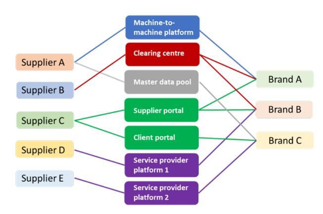

Figure 9 From CIRPASS 1 final event in March 2024 in Brussels, Belgium Digital product passport for the textile sector[42](#page-48-2)

Triggered by the DPP and in the near future also by the new requirements of Product Environmental Footprint Category Rules (PEFCR) – apparel and footwea[r\[4\],](https://euc-word-edit.officeapps.live.com/we/wordeditorframe.aspx?ui=sv&rs=en-US&wopisrc=https%3A%2F%2Fcentexbel.sharepoint.com%2Fsites%2FEXT_CISUTAC%2F_vti_bin%2Fwopi.ashx%2Ffiles%2Fae18dfc619354974bf9eaf7ec74bfecb&wdenableroaming=1&mscc=1&hid=0C80A4A1-504D-C000-E48A-2321093317D6.0&uih=sharepointcom&wdlcid=sv&jsapi=1&jsapiver=v2&corrid=3ea76015-495f-294b-227d-91832276b136&usid=3ea76015-495f-294b-227d-91832276b136&newsession=1&sftc=1&uihit=docaspx&muv=1&ats=PairwiseBroker&cac=1&sams=1&mtf=1&sfp=1&sdp=1&hch=1&hwfh=1&dchat=1&sc=%7B%22pmo%22%3A%22https%3A%2F%2Fcentexbel.sharepoint.com%22%2C%22pmshare%22%3Atrue%7D&ctp=LeastProtected&rct=Normal&wdorigin=AuthPrompt&afdflight=34&csc=1&instantedit=1&wopicomplete=1&wdredirectionreason=Unified_SingleFlush#_ftn4) the volume of data necessary for circular value chains will increase to an extent, that manual data generation will become by far too costly.

The sole alternative is automated data exchange, which requires unified, end2end product data standards, that didn't exist before GTS. Today all textile sectors, with very few exceptions, work in "data silos" with "silo specific" data language rules and terms.

A special challenge in this context is the so called "data semantics", addressing the meaning of data, as data only turn into information, when the meaning of the "data" is clear for the sender and the receiver.

While the meaning of e.g. the term "custom tariff number" is clear to any professional, the majority of data needed e.g. for the DPP are semantically mostly unclear, in what the data content means. For example: If you hear the terms "mapping" or "API", in both cases fields from the sending IT-system are connected in a described process with fields from the receiving system. When this done, which requires only time and a certain qualification, the context of each sending field is transmitted into the field on the side of the receiving IT-system.

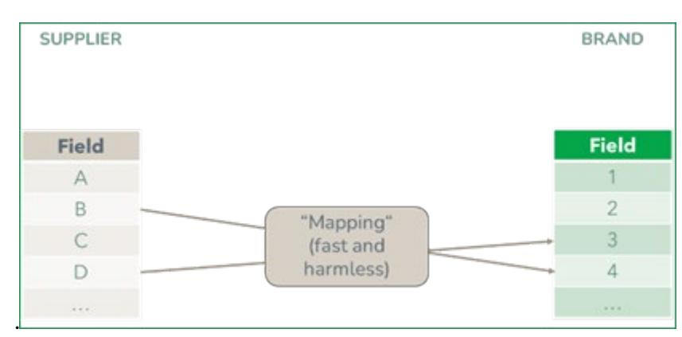

Figure 10 The principle behind "Mapping" Figure created by Global Textile Scheme GmbH, 2025, Düsseldorf, Germany within the CISSUTAC project

42 [Digital product passport for the textile sector](https://www.europarl.europa.eu/RegData/etudes/STUD/2024/757808/EPRS_STU(2024)757808_EN.pdf) EPRS | European Parliamentary Research Service Scientific Foresight Unit (STOA) PE 757.808 – June 2024

This is generally not problematic; however, issues arise when the meaning of the data is ambiguous. Such situations occur when the data sender's intended meaning differs from the interpretation of the data receiver

Recently, before this exact background, the term and topic "data semantics" has become more prominent in data exchange discussions. Semantics refers to the meaning behind words, which is crucial for turning raw data into meaningful information. For example, if a supplier uses "colour numbers" but the receiver requires "colour names," misalignment occurs, as shown in the illustration below.

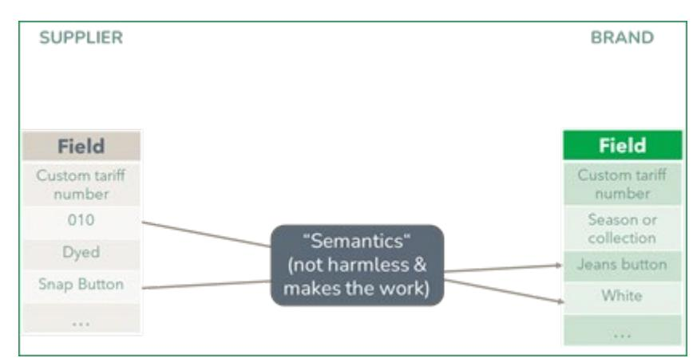

Figure 11 Clarifying why Semantics requires translation. Figure created by Global Textile Scheme GmbH, 2025, Düsseldorf, Germany within the CISSUTAC project.

Even individual companies within the same sector often use individual terms for the same data element. In the context of automated data exchange between stakeholders from the various textile sectors, from material generation to recycling, all sectors need unified i.e. semantically clear "data languages".

GTS addresses the 3 core challenges around the need for automated data exchange:

- Data generation: The variety of competing and non-harmonized classification systems combined with unclear data semantics results in predominantly manual processes. GTS aligns relevant classification systems across the entire lifecycle from raw material to recycling by considering and harmonizing their defined semantics.

- 1. For shoes: EAS – European Article System – in use by industry and retailers – integrated in GTS.
- 2. Fashion retail: BTE classification system – in use by many retailers (rather German / sorry, only in German) – integrated in GTS.
- 3. Textile & Fashion: circular.fashion V10 classification system – integrated in GTS.
- 4. International Sporting Goods industries/products: FEDAS classification system (also accepted by BTE) – integrated in GTS.
- 5. Fashion industry: DTB (Dialog Textil Bekleidung) classification system – much in use on the industry side but not maintained any more. (rather German) – aligned in GTS.
- 6. Important: Textile Exchange (old/current) raw material classification (currently in revision as new "Unified Standard") - aligned in GTS
- 7. Important: GINETEX care label standard material classification – aligned in GTS.
- 8. GTS – Global Textile Scheme: Textile, Apparel and Shoe oriented, but covers raw materials, production materials and finished products data, including certificate, interface and demand data.
- 9. Solety production material: DMlx/Pax classification with defined semantics - non encoded & not designed to translate data. Translation tool in GTS.
- 10. Afirm Group – aligned in GTS.

Figure 12 Showing degree of integration of existing classification systems from the textile and fashion sectors Figure created by Global Textile Scheme GmbH, 2025, Düsseldorf, Germany within the CISSUTAC project.

- Data semantics: By using codes with predefined data, the meanings of the data become clear. In addition, the GTS L catalogue enables translation between the encoded format and internal data systems, as illustrated in the following figure.

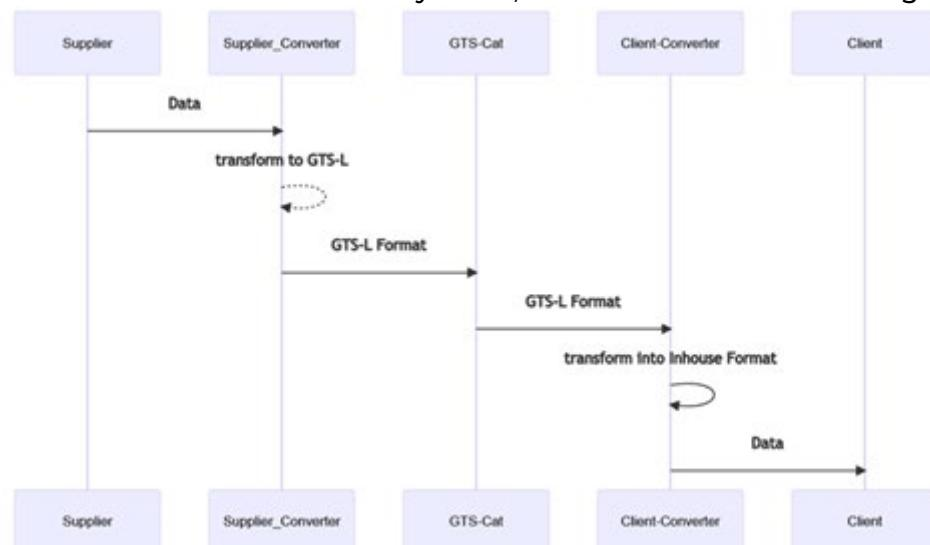

Figure 13 Showing the translation process from data sender to the data receiver. Figure created by Global Textile Scheme GmbH, 2025, Düsseldorf, Germany within the CISSUTAC project

Data exchange: GTS also addresses the third challenge of data exchange, where the multitude of platforms and communication channels creates significant complexity. Since each sender and receiver translates only their relevant product classes, selected from the 250 available in the GTS L catalogue, mapping complexity is substantially reduced. Combined with a unified GTS data language, this reduction enables automated data exchange, as illustrated in the following figure.

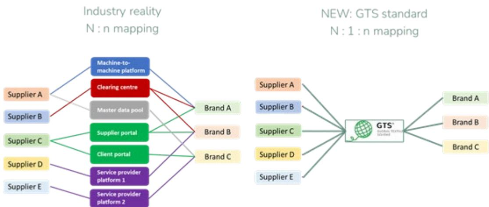

Figure 14 Showing the mechanism, how GTS standard is reducing with a new approach the volume of required data mappings. Figure created by Global Textile Scheme GmbH, 2025, Düsseldorf, Germany within the CISSUTAC project

Before we come to the gains from the CISUTAC project, we would like to address the following challenges for the readers of this guideline:

- GTS is a totally new technology and way of working, that is not easy to understand because nothing like GTS exists right now.
- GTS addresses problems the industry knows for a long time but set aside and helped itself with manual processes which will not work anymore, when the needs for product related data will increase in the speed as it can be clearly foreseen.
- GTS is not a classical "technology provider" as the initiative part of GTS allows space for exchange – even among competitors - that would not be possible in a competitive environment.

Taken with a bit of humour in a currently more than challenging market environment, this all together sums up in the one sentence, that "GTS is a totally new data exchange tool and technology, that addresses problems that are hard to see but will come very soon, managed in an organization form that is not easy to understand".

# 2.5 How does GTS work in detail?

At its core, the GTS standard is built upon a robust catalogue of close to 7.000 encoded data that mirrors industry terminologies and language. This requires a high degree of details in each group of data in the catalogue. Otherwise, automated translating cannot be brought to a reasonable level. For example: if the frequent colour name "Ferrari red" is missing in the list of predefined (and this way semantically clear data group, called "frequent colour names"), Ferrari red cannot be translated automatically. GTS mimics the natural industry language and makes it this way machine readable.

Being detailed enough, like the Ferrari red example shows, allows the GTS L catalogue automated translation, which is critical to the success of GTS and is one of its Unique Selling Points.

#### GTS consists of the following elements:

- Segments, like e.g. raw material, production materials (trimmings), finished products-apparel, -shoes, -bags, -accessories;
- To each segment, segment relevant product classes are assigned, like e.g. cotton, button, shirt, etc.
- The raw material classes are as good as possible aligned to the needs defines by Textile Exchange, GINETEX (the care label standard), and Affirm Group.
- Each class has (if known) subclasses and finished product classes have additional gender as a product describing attribute – to keep the catalogue easy to understand.
- Each product class is described by semantically clear features.
- All semantically unclear features, which is e.g. practically all DPP related data points are grouped in the same taxonomy in a segment called "Modules" to keep the orientation and maintenance of GTS L easier for the user.
- An extension of the classifications and semantics of the GTS L catalogue is possible, without changing the GTS data model.

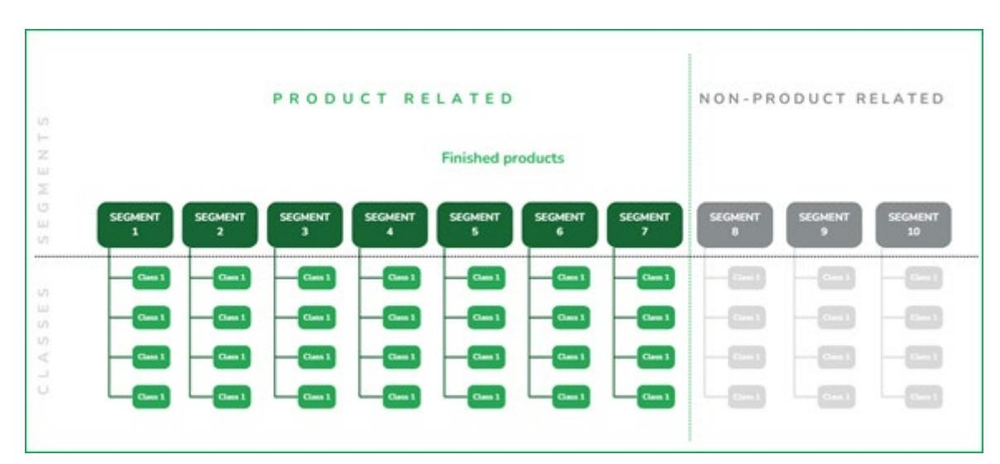

Figure 15 Showing the translation process from data send to data receiver. Figure created by Global Textile Scheme GmbH, 2025, Düsseldorf, Germany within the CISSUTAC project

- 1. Each product class allows 4 views on the correlated data. In combination with point 5 this results in the fact that all product classes, within all segments, will receive one "DPP data layer", allowing a very detailed modelling of the DPP data, needed from each segment of the value chain and even individually for each product class.
- 2. Relevant for the future DPP: The GTS data model has been extended to cover Article – Colour – Size – Batch (even Production order and Lot) and even Item number (if provided by an external source).
- 3. Today the GTS data model is this way truly "DPP ready", no matter what requirements will come.

- 4. Today, GTS supports the following languages:
  - English (reference language)
  - German
  - Spanish
  - French
  - Italian

Additional languages are planned and can be easily implemented.In this context, GTS allows the sender of the data to use another natural language, e.g. Italian as the receiver of the data, who might use the code to gain the German translation of the code.

- 5. GTS is flexible and easy to maintain.
- 6. The setup of the GTS encoding taxonomy has been designed, that it could be used for other industries as well.
- 7. As many elements of GTS as possible will be an open standard.
- 8. In the near future, the GTS ID (then most likely ISO 15459 compliant) will be freely accessible as the classification with all GTS product classes including their subclasses.

# 2.6 Special topic "Corporate ID's

In any machine2machine environment a critical prerequisite is the precise identification of the involved stakeholders. Within fashion brands and retailers, GS1 standards and mainly the GLN (Global Locator Number) with an ISO 15459 issuer ID is established, not only as the GLN is a critical element of the GTIN behind the barcode on all consumer products today.

By most experts' opinion, the majority of the DPP relevant data will come from the supply side of the value chains.

Upstream such alignment is missing and GLN is mostly unknown and not in use.

Before this background, GTS comes with a GTS economic stakeholder ID, which describes precisely the company that is legally responsible for the data exchange. Today, GTS ID is not yet ISO 15459 compliant, the application is on its way through.

# 2.7 Special topic "Product ID's"

The GTS data model can work with different Corporate Id's, e.g. GLN or DUNS Number, but comes as the main and obligatory Corporate Identifier with a GTS ID which can be generated for free, even without any further obligation.

Regarding a clean Product identification, finished products can be defined with GTIN as the product identifier for article – colour – size.

Meanwhile, all experts agree that the majority of the data needed for the DPP will come for the supply side of the value chain – where GS1 standards (mainly GLN and/or GTIN) are little in use.

As the GTS ID is obligatory to use the GTS standard and is free anyway, GTS recommends to use the GTS ID for the generation of any Product ID for raw materials and/or trimmings (production material).

The procedure is easy, the users take:

- the GTS ID,
- add a minus and
- add/use their individual product code.

This way there occur no costs for product ID's and the GTS members don't need to change their internal article nomenclature.

The GTS ID consist out of:

- ISO country code 2 digits, e.g. DE for Germany;
- The first three digits of the town name, e.g. DUE für Düsseldorf;
- The first three digits of the first two elements of the Company name divided with a minus sign and
- Then 4 zeros, unless the same company name occurs several times in the same town.

The GTS is for Global textile Scheme GmbH from Düsseldorf, Germany consequently is:

#### DE.DUE.GLO-TEX.0000.

# 3 Development in CISUTAC

GTS was involved in the following tasks:

- Develop, in cooperation with involved partners, a decision support tool (DST) primarily for operator assistance when sorting for reuse. The tool will be based on artificial intelligence (AI) and machine learning (ML) that will aim to retain as much as possible the reuse and repair value of post-consumer textiles.
- This work was be aligned with Task 2.3 (Open data standards) and Task 2.1 (Textile channelling decision tree)

# 3.1 AI development for sorting pilot

To support the development of a decision support tool for post-consumer textile sorting, a photo annotation station was established at Wargön Innovation (WAR). This station was used to systematically collect images and annotate textile products with over 15 defined attributes, including brand, style, condition, and gender. The resulting dataset, comprising approximately 30,000 annotated textile products, was published as an open-access resource to enable further development, experimentation, and reuse by external researchers and stakeholders. It was also used by RISE to develop and train a model known as the DST AI model, intended for integration and testing in the semi-automated sorting station (CISUTAC sorting pilot, WP4) operated by TEXAID. Further details regarding the methodology, testing, and results are available in Deliverable 1.2: [Decision support tool for](https://static1.squarespace.com/static/631f2bee92571234987af5a2/t/671fa48486f7ce7c7cc69acd/1730126982350/CISUTAC_D1.2+Decision+support+tool+for+post-consumer+textiles+on+reuse+and+repair_final_corrected.pdf)  [post-consumer textiles on reuse and repair](https://static1.squarespace.com/static/631f2bee92571234987af5a2/t/671fa48486f7ce7c7cc69acd/1730126982350/CISUTAC_D1.2+Decision+support+tool+for+post-consumer+textiles+on+reuse+and+repair_final_corrected.pdf)

### 3.2 Decision Tree

Receiving the "AI supported decision tree software" tool was a gradual process with the following steps:

- In a first step and AI independent together with other consortium members RISE defined which data points will be needed to feed the planned decision.
- After the first feedback from the consortium members the data points were designed, that could be supported by AI – mainly picture recognition.
- The next step was an alignment with the DPP related data points, then first time visible by the first draft of ESPR legislation, which came out in December 2023.
- Then the first deficits to the GTS L catalogue have been identified and the GTSL data catalogue was extended correspondingly.
- Then the GTS focus shifted to Piot 2 within the WP 4, which was beneficial, as many revenant facets of the GTS topic only showed up in the real operative environment which the sorting pilot brought up.

# 3.3 Sorting pilot

The development of the sorting pilot at TEXAID (CISUTAC sorting pilot, WP4) was carried out through a structured and iterative process, involving several key steps:

Initial Requirements Definition: TEXAID, one of Europe's largest textile sorting organizations, outlined a preliminary list of desired data points to support enhanced sorting operations. These requirements formed the functional foundation for subsequent development activities.

Specification of Target Data Attributes: To concretize the requirements, the following product attributes were identified as relevant for reuse and recycling sorting decisions:

- Textile product type
- Attributes
- Size
- Trims
- Gender
- Season / Production year
- Price
- Picture
- Colour (detailed chemical information for recyclers)
- Material composition
- Style
- Segment
- From a long-term perspective, there was interest in including more advanced data elements, such as
  - Repair guideline
  - Repair logbook
  - Use / Washing cycles
  - Fiber and Chemical Passport
- Data Model and Catalogue Alignment: The missing data points from the TEXAID requirements were integrated into the GTS L data catalogue. The GTS data model was

reviewed to ensure compatibility and avoid potential conflicts in data semantics or structure.

- Cross-Referencing with Decision Tree Requirements: A comparison was then made between the updated GTS L catalogue (now reflecting the TEXAID-specified attributes) and the data schema required by the AI-based decision tree tool. Several gaps were identified and addressed through additional extensions to the GTS L catalogue.
- Site Visit for Operational Understanding: A consortium visit to TEXAID's large-scale sorting facility in Apolda, Germany, which processes approximately 25,000 tonnes of post-consumer textiles annually, provided valuable insights into operational workflows and informed the technical integration.
- Pilot Scope Definition and Technical Integration: The pilot was designed to support TEXAID's manual sorting operations using a selection of RFID-tagged textile products supplied by Decathlon. These items were linked to structured product data, formatted according to the GTS data model and served via the GTS platform. A first version of an API (application programming interface) was developed by STAM (Italy) to enable data exchange between TEXAID's internal IT systems and the GTS platform. This initial integration used data from an existing Decathlon polo shirt hosted on the GTS platform.

Real Product Case Study: To move from theory to practical application, the consortium selected an actual item sourced from TEXAID's sorting operations—a mélange Tom Tailor T-shirt produced in Bangladesh. Product attributes were extracted from the textile product's care label and supplemented with publicly available information. The selected textile product, a Tom Tailor t-shirt (see image x), served as a reference case for testing end-to-end data extraction and system integration.

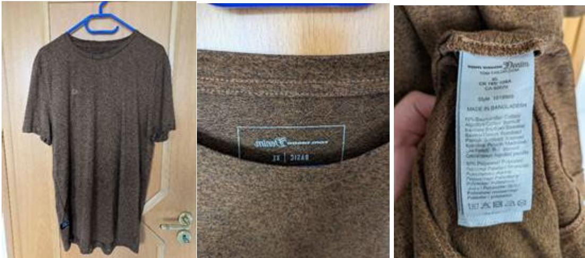

Figure 16 Pictures of a reusable Tom Tailor T-Shirt with its relevant data.

- • Data Accessibility: To make these data accessible within the GTS platform, a dedicated Excel template was created for the selected t-shirt. The template adhered to formal taxonomy rules, enabling the GTS platform to upload the manually encoded product description features. The Excel template was subsequently uploaded to the GTS platform. For detailed visualization, please refer to the four screenshots provided in the Annex.

- Data Delivery and Evaluation: In late spring 2025, Decathlon provided data for 156 test products, randomly selected from their assortment. GTS reviewed the dataset, identified relevant missing information, and supplemented it accordingly. The updated dataset was then prepared for a thorough feedback round with CISUTAC experts, who identified necessary adaptations to better align the data with the requirements of the decision tree software.

| 

<b>Properties</b>
 | 

<b>Properties</b>
                                              |
|--------------------------------------------------------------------------------|-----------------------------------------------------------------------------------------------------------------------------|
| 

<b>Supplier</b>
   | 

<b>Global Textile Scheme OmbH, Düsseldorf (DE), Düsseldorf</b>
 |
| 

<b>Article</b>
    | 

<b>1019909-PO-471I</b>
                                         |
| 

<b>SKU</b>
        | 

<b>DE.DUE.GLO-TEX.0000-10199090-brown-XL-PO-471I</b>
           |
| 

<b>Number</b>
     | 

<b>1019909-PO-471I</b>
                                         |
| 

<b>Color</b>
      | 

<b>brown</b>
                                                   |
| 

<b>Size</b>
       | 

<b>XL</b>
                                                      |
| 

<b>Norme</b>
      | 

<b>Item 2 1-Shift brown melonge</b>
                            |

Figure 17 Screenshot from GTS platform, showing the Article-Color-Size-Production Order article data set of above Tom Tailor T-Shirt

| GTS Feature                             | Description Translated | Value             | Value Description | Value Description Translated |
|-----------------------------------------|------------------------|-------------------|-------------------|------------------------------|
| Branded (1F0000000060)                  |                        | 1                 | Yet               |                              |
| Brand name (1F0000000040)               |                        | forn Tailor       |                   |                              |
| Product line name (1F0000000650)        |                        | forn Tailor Denim |                   |                              |
| NOS - Never out of stock (1F0000015540) |                        | 1                 | Yet               |                              |
| Season or collection (1F0000000010)     |                        | #5 2020           |                   |                              |
| Gender (1F00000001040)                  |                        | TV00000000210     | Mon               |                              |
| General style-look (1F000000000)        |                        | TV00000043770     | Catsuot           |                              |

Figure 18 Screenshot from GTS platform, showing relevant product describing attributes of the above Tom Tailor T-Shirt.

| Layer   | Value id      | Percentage | Description | Description Translated | RecycleDrode                     |
|---------|---------------|------------|-------------|------------------------|----------------------------------|
|         |               |            |             |                        |                                  |
| outside | TV00000000290 | 30         | Cotton      |                        | Non recycled – Virgin            |
| outside | TV00000000290 | 20         | Cotton      |                        | fully recycled – Post industrial |
| outside | TV00000048990 | 40         | Polyester   |                        | non recycled – Virgin            |
| outside | TV00000048990 | 10         | Polyester   |                        | fully recycled – Pre consumer    |

Figure 19 Screenshot from GTS platform, showing the material composition data set of above Tom Tailor T-Shirt, demonstrating realistic recycling content variations.

# 4 Results

The GTS related goal within the CISUTAC project was to improve GTS on all relevant facets (e.g. content of the GTS L catalogue, the GTS data model and others) within a drastically changing market and legislation environment. GTS shall be developed to a complete tool for the textile sectors to support its transition processes toward circular material streams on the "field of data exchange" in an optimal way.

# 4.1 Outside CISUTAC

Outside of the CISUTAC project, but parallel to the start of CISUTAC within a separate national project in Germany, the GTS data model was extended solely from SKU, which means Article – Colour – Size to:

- Article Colour Size
- Batch (Production Order & Lot)
- Item level

This decision had been made due to insights in relevant DPP related developments and had been taken, to be prepared to any DPP data point related granularities that might come.

This important and, on the GTS software side, costly decision turned out to be the right way and laid an important prerequisite for the start of the CISUTAC work, as this way we could leave the data model in all evaluated concepts out and could concentrate on extending the GTS L catalogue with the necessary, previously unknown data fields.

Within the CISUTAC project, related learnings and project results came with a few interdependencies from the two project parts:

- Building a mostly DPP oriented taxonomy base for the AI based Decision Tree software for textile sorters
- Finetuning these results, considering the practical learnings from the CISUTAC sorting pilot.

### 4.2 GTS-related results from the AI based Decision Tree Software project part

GTS standard was supposed to be helpful, mainly on the field of generating product related master data. The more clarity came during the CISUTAC project on potential future data points of the DPP, the more the public opinion changed on how increasingly important the automized generation of product related data is. Standards for aligned product classification and data semantics (so called sector specific ontologies) is required, as ESPR is not only planned for textile products, next to CISUTAC various projects work even on cross sector ontologies.

One majorly important GTS related results of CISUTAC project is the fact that GTS could be improved to a point, that in summer 2025 GTS will be the appreciated "best practice" on the various efforts, trying to find cross sectoral ontologies. During this project string we evaluated:

- What data fields Texaid was wishing for from the user perspective.
- What data fields the Decision Tree software needed including the data Texaid wished for.
- Which of the data in the extended data tree data set, could be generated with AI (Picture recognition) and NIR Scanner – to gain practical experience.
- Which of the data requirements were not covered by the existing GTS L catalogue and added the missing data elements - data field by data field.

At this moment, the GTS L contains all relevant data that will be needed in the future.

# 4.3 How to operatively use GTS best for translating data

Today, three general ways of generating product data with GTS codes are possible:

- 1. Filling out Excel files, based on product class related Excel templates, provided by GTS team – of course not ideal but often the tool of choice, as Excel is widely in use and this way first, mostly small Proof of Concept pilots can be done easy and inexpensive without "touching existing IT systems". In this case as an alternative, we strongly recommend meanwhile quite explicit, to consider the implementation of a ERP software, that is widely available from various vendors at low costs as Software as a Service and make the GTS use much easier as with Excel.
- 2. Advanced users who have structured data within PLM and/or ERP systems can make excel exports and then – based on the GTS L catalogue – can translate these exported data with mapping tools into GTS codes.
- 3. The most elegant way of using GTS are so called "GTS modules", mostly coming from PLM, PIM, MAM or ERP software providers who integrated GTS into their data model and provide "date immediately with the GTS codes", so that ideally the users don't need to deal with codes. There are first IT providers offering GTS modules, but it will need some time until this way will be the most prominent way how to use GTS.

Inspired by these findings outside CISUTAC sorting pilot, the GTS team evaluated on which parts of value chains automated translation of data is needed. The result as shown on the following picture (yellow marked are the translation points) was quite eye opening:

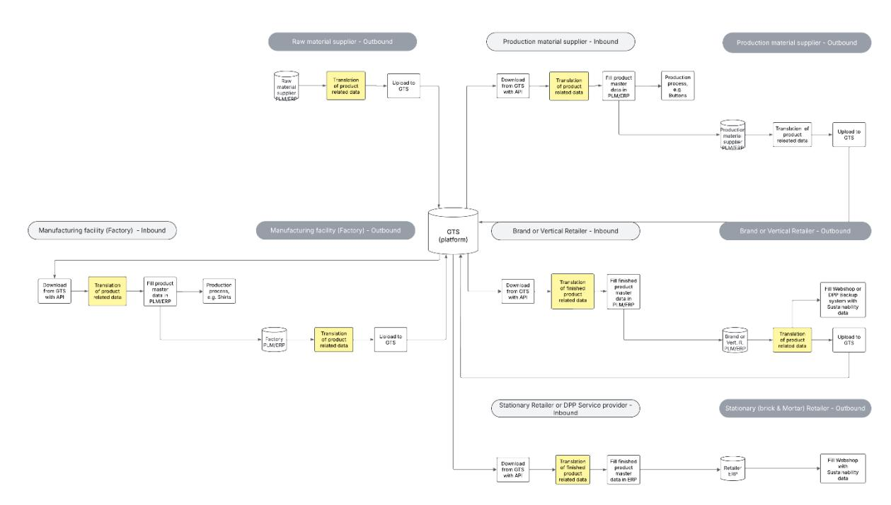

Figure 20 Overview, at which segments of textile value chains translation of product data happens today – showing the complexity and potentials, automatic exchange of product data offers. Figure created by Global Textile Scheme GmbH, 2025, Düsseldorf, Germany within the CISSUTAC project

This insight led to the activity, that within a separate project outside of CISUTAC, nationally funded in Germany (KIreDE project) an AI supported SaaS Translation tool will be developed, based on GTS as well.

# 5 Discussion and outlook

This report underlines the crucial role that accessibility, quality, and harmonization of data play in enabling circularity along the textile value chain. Improving these aspects remains the greatest challenge – and opportunity – to transform post-consumer textile waste into valuable secondary raw materials.

Proactive development of data infrastructure is also essential to meet upcoming regulatory requirements under the Ecodesign for Sustainable Products Regulation (ESPR) and the Digital Product Passport (DPP). Early preparation provides clear advantages in terms of compliance and supports the broader transition toward circular business models.

At present, it is unclear even for experts what data will be required for the DPP and how much additional data will be needed compared to known data groups such as bills of materials. However, there is consensus among experts that data volumes will increase significantly, and that the majority of this data will originate from the supply side of textile value chains. Today, this side consists of 98% micro (<10 employees) or small (10–49 employees) companies – often with limited IT knowledge, few IT systems, and scarce resources.

The OMNIBUS initiative [43r](#page-61-0)emains a central tool for establishing circular value chains. The OMNIBUS process has provided relief regarding reporting obligations for many companies. This, however, raises questions for companies about how the importance of proactive work on data infrastructure in light of upcoming ESPR and DPP regulations should be seen in relation to these eased obligations and subsequent adjustments to requirements.

The European Commission is well aware of these effects and in May 2025 published an important communication document entitled: "The Single Market: our European home market in an uncertain world – A Strategy for making the Single Market simple, seamless and strong."[44](#page-61-1)

The document explains well why OMNIBUS reduced excessive reporting requirements, but also why ESPR and DPP must be understood in a different context – and why waiting with preparations is not a good strategy.

There will be no circular economy without data.

In this context, this report is published at a very valuable moment, as experts can already foresee many insights and the CISUTAC project has contributed additional practical experiences that are shared in this document:

- Part one (Open data guide): Highlights overarching themes around data accessibility, regulatory preparedness, and circular business opportunities. It provides practical recommendations for companies preparing for DPP and ESPR, focusing on data standardization, collaboration, and capacity building.
- Part two (GTS language & pilot insights): The only way to reduce increasing complexity is standardization. Supporting this in areas that individual companies cannot initiate on their own is one of several measures where the European Commission contributes to preparations for ESPR and other data-driven regulations beyond the DPP.GTS is the "common data language" that the sector has been demanding for several years, and CISUTAC has contributed to improving the GTS language so that it can now be used for automatic data generation along the entire textile value chain – including sorting, repair, reuse, dismantling, and recycling.

The CISUTAC sorting pilot were decisive and once again demonstrated that real lessons can only be learned in real projects.

Against this background, our recommendation is "not to wait for DPP to arrive", but rather to embrace the upcoming legal and data-related challenges as an opportunity to:

- improve internal organizational structures,
- realize productivity gains through automation,
- evaluate new circular business models,
- build new alliances, and
- develop entirely new knowledge that companies will need in the near future.

43 Omnibus package - [European Commission](https://finance.ec.europa.eu/news/omnibus-package-2025-04-01_en)

44 [The Single Market: our European home market in an uncertain world -](https://single-market-economy.ec.europa.eu/publications/single-market-our-european-home-market-uncertain-world_en) European Commission

As a result of the work partly carried out within CISUTAC, GTS is also preparing a free version of a document with GTS product classes and subclasses. This will help establish a common language for product definitions. Both of these steps will in the future make GTS an "Open standard", which the sector considers important.

[www.cisutac.eu](http://www.cisutac.eu/) *This project has received funding from the European Union's Horizon Europe research and innovation programme under the grant agreement No. 101060375*.

CISUTAC

@CISUTAC