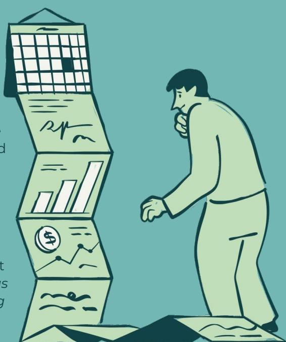
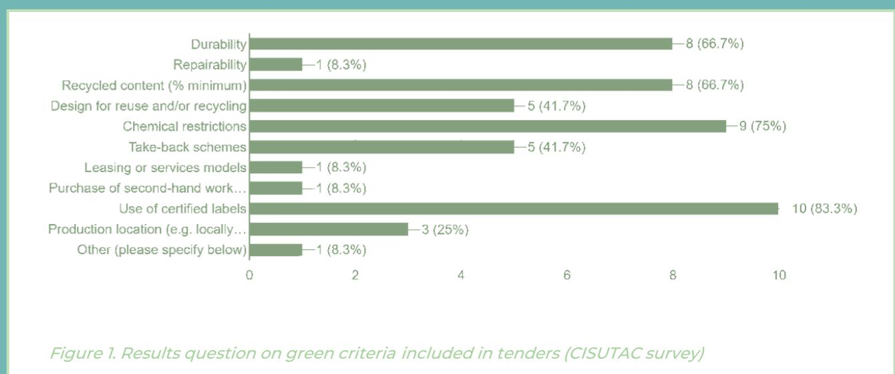
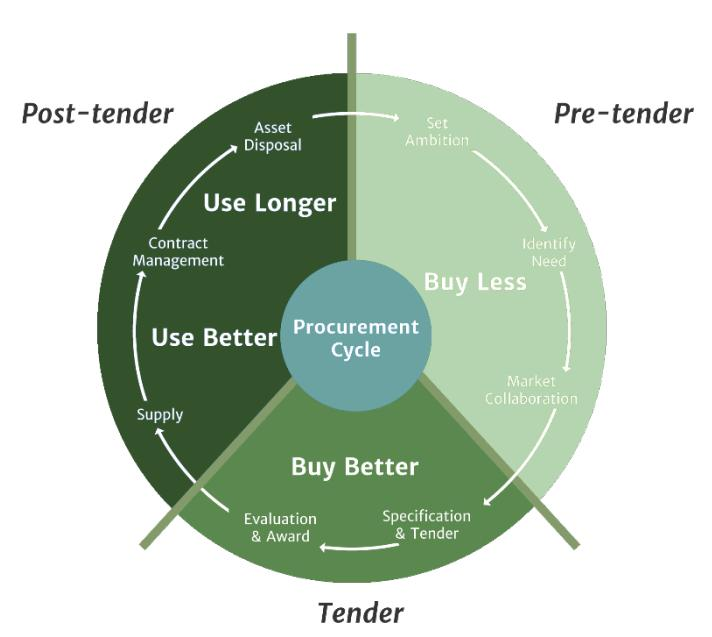
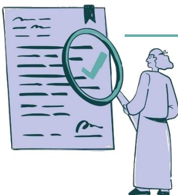
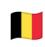
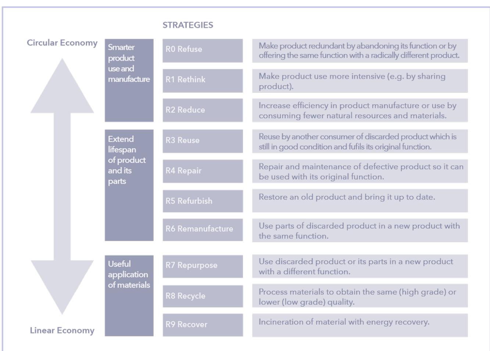
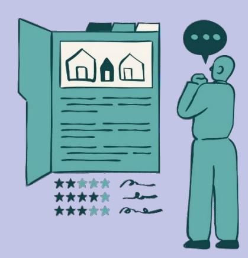
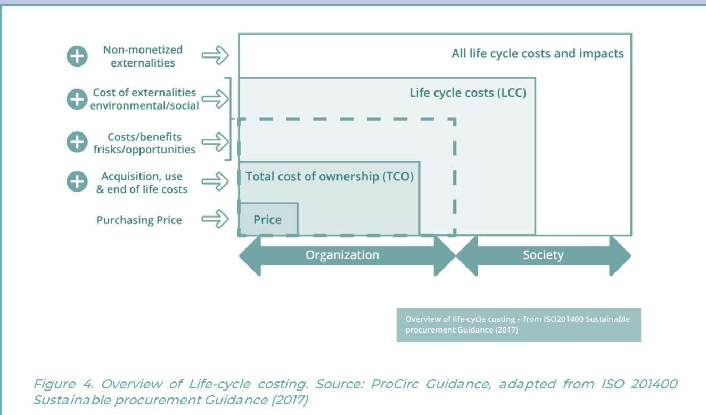
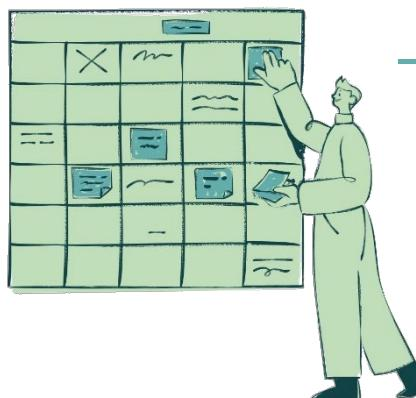

# **CISUTAC Public Procurement Guidelines for Textiles**

**May 2026**

**Authors: Núria Cases i Sampere, Anita Lombardo and Serena Lisai (ACR+)**

**Reviewers: Lien Van der Schueren (Centexbel), Emma Enebog and Catrine Marchall (RISE), David Allo (Texfor), Simone Cimadomo (RREUSE), and Ekaterina Stoyanova (Euratex)**

**Public procurement represents a strategic lever to accelerate the transition towards a more circular, resilient and competitive European textile sector. Through well-designed procurement processes, public authorities can significantly reduce environmental impacts, enhance product durability and performance, and support Europe's industrial capacities across the textile value chain, including spinning, weaving, dyeing, finishing and garment manufacturing.**

Textile procurement is also central to strengthening Europe' strategic autonomy and supply chain resilience. Recent global disruptions have exposed vulnerabilities in textile supply chains, particularly for critical products such as uniforms, healthcare textiles and personal protective equipment (PPE). Procurement strategies that prioritise quality, reliability, compliance and long-term value are therefore essential to ensure continuity of supply and to support a level playing field for European manufacturers.

**Developed within the Horizon Europe project CISUTAC, this report supports contracting authorities in integrating circular economy principles into the procurement of professional textiles, with a focus on workwear, uniforms and PPE**. It provides practical recommendations, tools and good practices across the full procurement cycle and builds on existing European, national and regional guidance, as well as insights from EU-funded projects and stakeholder consultations.

The pre-tender phase is critical for ensuring effective outcomes. Public buyers are encouraged to align procurement with sustainability objectives, reassess actual needs, and engage internal stakeholders and market actors at an early stage. Preliminary market consultations are key to identifying innovation potential, technical feasibility and realistic sustainability requirements, while also supporting the integration of environmental ambition with safety, performance and cost considerations.

During the tender phase, circular ambitions should be translated into clear technical specifications, selection and award criteria. Life-cycle approaches are promoted to move beyond price-based evaluation. EU Green Public Procurement (GPP) criteria and recognised ecolabels provide important reference tools for defining requirements and verification, while proportionality ensures accessibility for SMEs.

The post-tender phase is where most circular value is realised. Effective contract management, monitoring and data collection are essential to ensure compliance and measure impact. The use of performance indicators, structured supplier dialogue and contractual flexibility can support continuous improvement and innovation. End-of-life strategies and take-back systems should be embedded in contracts to maximise value retention and minimise waste.

Overall, **the report aims to equip contracting authorities with a set of recommendations, tools and good practices to embed circularity in the procurement of textiles**. By adopting these approaches, public authorities can drive systemic change in the textile sector while ensuring high-quality, reliable and cost-effective outcomes for public services

# **Contents**

| Executive summary                         | 1  |
|-------------------------------------------|----|
| Contents                                  | 2  |
| Introduction                              | 3  |
| Recommendations for the pre-tender phase  | 9  |
| Set ambition                              | 10 |
| Identify needs                            | 12 |
| Market collaboration                      | 16 |
| Trainings                                 | 18 |
| Tools                                     | 19 |
| Recommendations for the tender phase      | 21 |
| Specification and tender                  | 21 |
| Evaluation and award                      | 27 |
| Trainings                                 | 31 |
| Tools                                     | 31 |
| Recommendations for the post-tender phase | 32 |
| Supply                                    | 32 |
| Contract management                       | 33 |
| Asset disposal                            | 36 |
| Trainings                                 | 36 |
| References                                | 38 |

# **Introduction**

This report is delivered in the context of the Horizon Europe project **CISUTAC**, which aims at increasing circularity and sustainability in textiles and clothing in Europe. The objective is to minimise the sector's total environmental impact by developing sustainable, novel, and inclusive large scale European value chains. The project covers a large part of the textile sector by working on two material groups representing almost 90% of all textile fibre materials (polyester, and cotton/cellulosic fibres) and focusing on products from 3 subsectors experiencing varying circularity bottlenecks (fashion garments, sports and outdoor goods, and workwear). CISUTAC follows a holistic approach covering technical, sectoral and socioeconomic aspects.

The work within Task 5.4 of Work Package 5 intends to generate information and opportunities for a constructive dialogue between the project, policy makers and standardisation actors based on written resources and dialogues through meetings and workshops.

**These guidelines are drafted in the framework of this this task and aim to support the uptake of circular textiles through public procurement while contributing to an overall reduction in textile circulation.** They provide contracting authorities with practical recommendations, tools and good practices applicable across the different stages of the procurement cycle: the pre-tender, tender, and post-tender phases. The guidelines target procurement officers and affiliated functions within the public organisation, particularly at municipal and regional level. In addition, the report includes an overview of existing training opportunities and tools aligned with each phase of the procurement cycle.

As the topic of circular economy for textiles has been widely discussed and investigated, the guidelines intend to build upon existing knowledge on the topic and acting as a one-stopshop for useful tools and examples that contracting authorities can take inspiration from while initiating a procurement of textiles. Therefore, the document draws from existing guidelines, reports and policy documents elaborated at regional (i.e [Guia compra publica](https://www.accio.gencat.cat/ca/serveis/banc-coneixement/cercador/BancConeixement/ecm-guia-de-compra-publica-d-innovacio)  [GENCAT\)](https://www.accio.gencat.cat/ca/serveis/banc-coneixement/cercador/BancConeixement/ecm-guia-de-compra-publica-d-innovacio), national (i.e [Irish GPP criteria\)](https://www.epa.ie/our-services/monitoring--assessment/circular-economy/green-public-procurement/) and EU (i.e [EU Green Public Procurement \(GPP\)](https://susproc.jrc.ec.europa.eu/product-bureau/sites/default/files/contentype/product_group_documents/1581690535/141222%20EU%20GPP%20Textiles_Criteria%20document_Draft%20version%201.pdf)  [Criteria for Textile Products and Services\)](https://susproc.jrc.ec.europa.eu/product-bureau/sites/default/files/contentype/product_group_documents/1581690535/141222%20EU%20GPP%20Textiles_Criteria%20document_Draft%20version%201.pdf) levels. It also builds upon existing resources elaborated in the context of EU-funded projects such as [ProCirc,](https://northsearegion.eu/procirc/index.html) [Circular Shift,](https://circularshift.nweurope.eu/) [Circular](https://www.interregeurope.eu/circular-minds)  [Minds](https://www.interregeurope.eu/circular-minds) and [BRINC.](https://www.acrplus.org/en/groupe/brinc-108) 

**The key focus of the guidelines is professional textiles products, which encompass a diverse range of categories, each characterized by specific uses, composition, and potential for valorisation**. While terminology may vary in literature, several broad categories can be identified:

- Flat linen, which is typically used until worn out, making it more suitable for recycling, potentially through fibre-to-fibre processes.
- Uniforms and workwear not subject to specific technical or quality standards, which may be discarded before wearing out (e.g., due to changes in visual identity) and are potentially suitable for reuse.
- Protective products and Personal Protective Equipment (PPE), including technical clothing that must adhere to strict safety and quality standards. This category often

includes police and military uniforms, which must be rendered unusable at the end of their lifecycle to prevent unauthorized use[1](#page-4-0)

**Once defined the scope, a key step to build this document has been the survey sent out by CISUTAC to contracting authorities and enterprises, which helped to identify key challenges experienced by both sides for implementing circularity in textile procurement and production**. Therefore, this document attempts at addressing the identified challenges by providing concrete guidance and tools.

The survey was designed for both type of entities and aimed at gathering information on the current demand and supply of circular workwear, including criteria used by contracting authorities. It also explores the key challenges and barriers faced in procuring or supplying circular workwear, the use of tools such as life cycle assessment and market engagement, and the training, capacity-building, and funding needs that can support the transition to more sustainable and circular workwear solutions.

**small (12.5%) companies**. In line with the scope of the document, respondents to the survey (both companies and contracting authorities) indicated that the main textile products that are subject to circular criteria are workwear, uniforms and personal protective equipment.

It's important to mention that due to the limited number of respondents, the results of the survey are not considered as representative, but they provided useful inputs to identify the challenges and the topics to further investigate. In fact, on top of the survey, meetings with contracting authorities (Kolding Municipality, Rijkswaterstaat, Diputació de Barcelona) have been organised to gather additional and more detailed feedback.

The Directive 2014/24/EU on Public Procurement (the PP Directive) is the key legislative act at EU level and it lays down the foundation for integrating environmental, social and innovation considerations into procurement practices. It enables contracting authorities to award contracts based on the 'most economically advantageous tender' or MEAT criteria, thereby moving beyond the lowest price criteria.

The PP Directive explicitly recognizes Life-Cycle Costing (LCC) as a tool that allows public authorities to assess and consider costs associated with the entire life cycle of a product, service or work instead of the sole price of purchase. By doing so, LCC supports the procurement of resource-efficient and environmental-friendly solutions. In addition, the PP Directive provides different procurement procedures (except for pre-commercial procurement), allows preliminary market consultations, and the use of ecolabels, among others.

Circular public procurement can also support Europe's strategic autonomy and industrial resilience, particularly in light of recent supply chain disruptions affecting textiles such as uniforms and protective equipment. Procurement strategies should therefore prioritise continuity of supply, technical reliability, and long-term value, while ensuring a level playing field that rewards quality, compliance, sustainability, and service performance.

#### **The environmental cost of textile**

Textile production and disposal exert a substantial environmental burden globally and within Europe. The textile sector is the third-largest consumer of water worldwide and the fourth-largest user of raw materials, while accounting for over 10% of global greenhouse gas emissions, more than international aviation and maritime transport combined[2](#page-5-0) . Producing a single cotton T-shirt requires an estimated [2,700 litres of freshwater,](https://www.europarl.europa.eu/RegData/etudes/ATAG/2020/656296/EPRS_ATA(2020)656296_EN.pdf) and in the EU alone, textile consumption per person annually demands on average 323 m² of land, 12 m³ of water, and 523 kg of raw materials [3](#page-5-1) . Despite the high resource intensity of textile products, systems remain largely linear: [less than 1% of textiles are recycled](https://epthinktank.eu/2022/05/04/textiles-and-the-environment/) into new fibres, and most used clothing is incinerated or landfilled. Zero Waste Scotland's latest Waste Environmental Footprint Report highlighted the footprint of textile household waste made up only 3.5% of arisings but contributed by 19.4% to the climate change impacts associated with Scotland's household waste[4](#page-5-2).

Furthermore, the rise of fast and ultra-fast fashion flooded the market with low-quality, fossil fuel-based pieces that are produced at unprecedented rates. The existing infrastructure was found to be weak, and it is going to be even more overloaded with the enforcement of mandatory separate collection. "*Sorting plants (such as SOEX, the German leader in exporting and recycling second-hand textiles, and the largest in Europe) are going bankrupt, affected by the increasing quantities and lowering prices. Operators have nowhere to send the reusable items and cannot store them indefinitely. There are already cases of reusable and recyclable textiles being incinerated in residual waste incinerators at regular prices because they cannot be sold or stored anymore. Likewise, the EU cross-border secondhand clothing market is saturated, recycling options are inconsistent and retail sales are below all budget forecasts.*" (from the open letter sent by RREUSE, ACR+ and Zero Waste Europe in November 2024 asking for a Textile Emergency Action Plan).

**Textile production** requires large amounts of water, energy, land, and chemical substances, and is a major source of water pollution and greenhouse gas (GHG) emissions. Cotton and synthetic fibres are the most widely deployed raw materials, each with distinct impacts: cotton cultivation demands extensive land, water, fertilisers, and pesticides, while synthetic fibres such as polyester are derived from fossil fuels, are non-biodegradable, and contribute to microplastic pollution. Wet processing stages, including dyeing and printing, are particularly impactful, consuming large volumes of water and releasing potentially toxic substances into wastewater; these processes are estimated to account for approximately 20% of global drinking water pollution. In addition, chemical use is pervasive throughout production, from plant protection products in agriculture to chemicals used in spinning, weaving, and finishing processes. It is estimated that between 1.5 and 6.9 kg of chemicals are used to produce 1 kg of textile.

Moving to the **use phase**, environmental impacts are primarily associated with water consumption, water pollution, and limited product durability. Synthetic textiles release

microplastics during washing and drying, significantly contributing to aquatic pollution. These microplastics enter marine ecosystems and the food chain, posing risks to both environmental and human health. Estimates suggest that synthetic textiles release around 0.5 million tonnes of microfibres into the oceans annually, with 16–35% of microplastics originating from textile washing. The majority of microplastic release occurs during the first few washes, particularly in low-quality garments. Extending product durability and reducing the frequency of early disposal, both by raising awareness on the most correct use of textiles and by increasing the quality of the material, are therefore key levers for reducing impacts during this phase.

At the **end of their useful life**, textiles generate large volumes of waste ending up in landfills or incinerated, and this causes associated soil and environmental contamination. Fibre blends, complex material compositions and limited traceability significantly hinder effective waste identification, sorting, and recycling, exacerbating the environmental burden of the growing volume of textile waste generated each year. Therefore, the choice in the composition of the textile product will have an impact on the potential of reusability and recyclability of the item and thus extend its lifespan (i.e. including chemical substances impacts recycling and recycled material, or mixing different type of materials makes it more difficult to recycle).

Moreover, a significant portion of discarded clothing is exported to developing countries disguised as charity or recycling. Here, lack of waste management infrastructure and/or limited landfill capacity leads to dumping, burning, and severe environmental and social consequences associated with air and water pollution. In addition, as landfills are often located near low-income neighbourhoods, resident communities are the most exposed to hazardous chemicals leached by the textile waste.

### **The social impact of textile**

While this report does not delve specifically into this aspect, it is important to underline that textile production, export and disposal also carry significant social implications which should not be disregarded.

Firstly, exports rely on exploitative [labour practices](https://fashion.sustainability-directory.com/area/labor-practices/) in developing countries, where workers face difficult conditions. This includes low wages, excessive working hours, and unsafe environments (poor ventilation, lack of safety equipment, exposure to hazardous chemicals) [5](#page-6-0)

In the European context, the textile industry supports highly specialised industrial employment across spinning, weaving, dyeing, finishing, technical textiles and garment manufacturing. These activities generate skilled jobs, innovation capacity and regional economic value. Moreover, in Europe social enterprises play a significant role in reuse, repair and recycling of discarded clothing, while also creating local jobs and boosting workers' social mobility and skills. However, these organisations active in the circular economy often find themselves locked out of procurement opportunities despite their key role in local job creation and resource efficiency [6](#page-6-1). Public procurement can thus help sustain these capabilities and employment opportunities while promoting reuse, repair and recycling ecosystems.

### **What is the role of Circular Public Procurement for textiles?**

Against this backdrop, public procurement can act as a lever for change and can contribute to the sustainability of professional textiles*.* Public authorities can use their purchasing power to lead by example and create a critical mass of demand for less resource intensive textile workwear.

Looking at the results of the survey, all contracting authorities apply circular criteria in their tenders. The most applied criteria are environmental labels, criteria linked to harmful substances, durability and minimum recycled content.

On the other hand, most companies who replied to the survey indicated that they propose textile products with circular features, such as recycled fibres (86.7), certifications (86.7), and organic and sustainably sourced textiles (53.3).

Nevertheless, the adoption of circular practices in textile purchasing and supply does not come without challenges.

One of the main hurdles mentioned by contracting authorities is the difficulty in **monitoring and verifying the environmental impact**. They also struggle to **define award criteria** and with **the limited availability of circular solutions on the clothing market**. It is interesting to note that all the companies mentioned a connected challenge, namely the **limited demand for circular products.** Another challenge mentioned by contracting authorities is the difficulty in **striking a balance between safety norms and sustainability** 

Looking at the challenges mentioned by the companies, **price pressure and low-cost competition** are seen as the main barriers to providing circular textile solutions.

Finally, a challenge mentioned both by buyers and suppliers is the **perception of lower durability and higher costs of circular textiles**. This can be the case for textiles using recycled fibres, but other circular options, such as ecodesigned garments intended for repair, or component replacement, can actually be more durable than conventional products.

The following section considers the identified challenges and lists a set of recommendations to support setting circular ambitions and embedding them into the procurement cycle of professional textiles. The section draws from existing knowledge on the topic and feature useful methodologies and tools, including those elaborated in the context of other EU funded projects (i.e. [BRINC,](https://www.acrplus.org/en/groupe/brinc-108) [ProCirc,](https://northsearegion.eu/procirc/index.html) [Circular Shift,](https://circularshift.nweurope.eu/) [Circular Minds\)](https://www.interregeurope.eu/circular-minds). It will also include concrete procurement cases that can serve as examples and inspiration. To allow easier and faster consultation by end-users, the recommendations have been structured around the three key steps of the procurement process: pre-tender, tender and post tender.

Figure 2. Procurement cycle (CFIT)

# **Recommendations for the pre-tender phase**

- **Align procurement with strategic objectives.** Start by assessing how textile procurement can support existing organisational goals. Where no framework exists, consider making a case towards the managerial level for developing one.
- **Review and adapt internal policies.** Identify and remove internal barriers to circularity, such as branding requirements, budgeting rules, or ordering procedures. Adjust policies to enable reduced demand, reuse, repair and longer product lifespans.
- **Build internal support and ownership.** Appoint internal ambassadors and build momentum through business cases and existing good practices that demonstrate the value of procuring circular textile.
- **Reassess actual demand.** Before launching a tender, review existing stocks and use patterns and assess whether new textiles are truly required.
- **Apply the R-ladder as strategic tool.** Use the R-ladder to guide the selection of circular strategies, considering a combination of them that suits your specific needs.
- **Engage users early.** Involve end users to build acceptance and prepare them for circular solutions, such as shared used, take-back schemes, or alternative service models.
- **Engage suppliers and value chain actors early.** This includes yarns, fabrics, dyeing, finishing and garment manufacturers, to better understand technical feasibility, innovation potential and realistic sustainability requirements.
- **Leverage communities of practice and networks**. Participate in relevant networks to exchange knowledge, identify bottlenecks, and explore innovative solutions with peers and experts.
- **Organise market engagement activities**. Host or participate in buyersupplier events and thematic market dialogues to gain deeper insight into supply-side capabilities, ensuring the participation of relevant value chain actors.

# **Set ambition**

#### **Understand the environmental goals of the organisation**

A circular procurement of textiles begins with understanding the wider environmental goals of the organization, and how this specific purchase can support the achievement of such ambitions. In some cases, these ambitions may already exist in the form of a sustainability policy, such as a Socially Responsible Procurement Action Plan.

Investigating whether your organisation has signed any agreements or manifestos that refer to circular procurement might be a useful starting point, as these often contain ambitions that can serve as inspiration for the procurement of workwear. These institutional documents also help to create a business case for the project, as it positions circular procurement of textiles as a means to reach the organization goals. Moreover, if your organisation does not have yet a sustainable procurement strategy, you may consider bringing this matter to the managerial level and making a case for developing one.

The **city of Rennes** has had a responsible purchasing promotion plan (SPA) since 2018 which features circular economy as one of its key objectives. Along this, the city also elaborated a charter for safe, comfortable and sustainable workwear in 2024 which features responsible purchasing as one of its main pillars. This policy context created the favorable conditions for kickstarting a procurement to transform high-visibility gear into outdoor clothing for children in public kindergarten. [7](#page-10-1)

When no environmental or circular objective has been formalised by the organisation, part of the efforts during the pre-tender phase will be dedicated to setting these "from scratch". The next section outlines some of the key environmental considerations to be contemplated in the pre-tender stage, as well as concrete strategies to reach the circularity goals that have been set.

### **Check for current internal ordering policies, to avoid bottlenecks in implementation**

In this phase, it is also important to consider **existing policies and regulations** within the organization. For instance, **policies linked to the ordering process** can be linked to credits, whereby employees can order clothes themselves using their yearly credits. This kind of policy might lead to a situation where credits are higher than the actual need for new clothing items, and employees still order them not to have this benefit go to waste. Therefore, before launching a circular procurement, one should be aware of policies which might hinder this and take necessary steps to change it.

#### **Gain a clear overview of the uptake of circularity in current tenders**

Another important step in this phase is to gain a clear overview of existing contracts for textile, to understand whether circularity is integrated and if so how. This requires internal collaboration with relevant stakeholders, including human resources department, users and the team leaders.

7 C-PRONE (2026)

#### **Build an internal support base**

Whether the objective is to carry out a circular procurement pilot or launch a circular procurement strategy for the whole organization, it is key to have the staff and the management level/department on board. When management formulates organisationwide ambitions and strategies for circularity, circular procurement can be included as a supporting process. When this is not the case, circular procurement can be initiated bottom-up by motivated and committed staff member(s).

Mindset plays a crucial role here, as the level of awareness and commitment to circular economy will determine how difficult it will be to gain such support.

#### **Identify ambassadors to ensure organisation wide engagement**

Identifying and informally appointing individuals who are personally committed to the success of the project (so called ambassadors), can help catalyse support around the project, especially when these are part of the board/managerial level but having committed individuals across different teams and departments ensures engagement and momentum throughout the organisation.

In addition, presenting a business case for circular procurement might help to convince your stakeholders to endorse a circular procurement of textiles. For example, a circular procurement of textiles can position the organisation as a circularity front runner and model for circular economy, therefore improving its reputation and image. Looking at **Total Cost of Ownership (TCO)** rather than the purchasing price can also demonstrate the cost effectiveness of a circular solution compared to a linear approach. This can also be done by relying upon Life Cycle methodologies, which are further explored in chapter on [Evaluation](#page-27-0)  [and award.](#page-27-0) 

It is important to mention that internal staff might not be sensible to circularity, so promoting other advantages (flexibility, costs, comfort, local sourcing, etc.) should be used when relevant. The feasibility and effectiveness of a circular procurement for textiles can also be demonstrated by highlighting **successful existing examples** and their positive environmental and societal outcomes. Some valuable cases can be found in the following online sources:

- [C-PRONE:](https://c-prone-knowledge-hub.acrplus.org/en/case-studies-1856) apart from gathering key reports on circular procurement, it also contains a repository of good practices for different sectors.
- [Interreg NSR ProCirc project:](https://northsearegion.eu/procirc/pilot-projects/index.html) it presents the results of more than 30 pilots on construction, textiles, furniture ICT and others.
- [Circular Flanders case database:](https://aankopenarchive.vlaanderen-circulair.be/en/cases) it offers a wide range of cases for different sectors, including circular building materials, and textile.

#### **Engage with internal stakeholders (users) to ensure needs are met and the organisation is prepared for circular solutions**

The circular procurement of textiles does not only represent a task of the procurement department, it also impacts multiple parts of the organisation. As such, while defining the tender specifications, it is important to consult and consider the needs of different stakeholders in the process, and first and foremost the ultimate users of the workwear to be procured. This ensures that the procurement effectively responds to the needs and that users contribute to the process since its conception. Moreover, if an innovative circular solution is adopted, it allows users to duly prepare for any eventual changes in their daily practices.

#### In the pre-tender phase of the procurement of recycled workwear, **Ghent**

**University hospital** conducted an internal consultation across hospital departments to gather input from medical and nursing staff, support services, the facility and logistics teams, procurement and sustainability officers. This consultation helped identify key functional and aesthetic needs, such as garment fit, thermal comfort, and the need for visual distinction between clinical and non-clinical roles among the staff. [8](#page-12-1)

# **Identify needs**

The needs assessment phase should be the occasion to reflect upon how the procurement can contribute to the circular economy and define the strategies to take.

### **Define the type of supply at an early stage**

An important step is defining the type of supply, as this might determine the strategies to take. By type of supply, we refer to:

- **Direct purchase:** Public administrations purchase textile products directly from suppliers, meaning the buyer has strong control over the final product and can influence the requirements and impacts of the textile product through tender clauses.
- **Indirect purchase:** The public administration resorts to external management through an administrative service contract. These services often include the purchase and replacement of uniforms and textile products, which are managed by the bidder. Here, the public administration can incorporate clauses in the tenders for these services that indirectly affect the sustainability of textile products.
- **Servitization:** In some cases, public administration can facilitate the incorporation of circular business models, such as servitization: an example can be found in the healthcare sector, where there are already laundry contracts that also include the maintenance of the laundry and the repair of the equipment. In this case, the ability to influence the end of the product's life is lost, and therefore it will be necessary to include clauses that guarantee the use of the product for as long as possible and correct end-of-life management.

#### **Look for frameworks to help you define your strategy**

The R-Ladder provides a useful and practical framework to understand the different levels of ambitions of the circular economy, and associated actions to achieve the steps of the ladder. It is important to consider that in some cases, a mix of R-strategies can be applied. The R-ladder will help to define the strategy and decide the clauses that will be used in the tender phase.

8 C-PRONE (2026)

Figure 3. R-Ladder (adapted from Circular economy: measuring innovation in product chains. Potting J. ET AL. PBL, Netherlands, 2017)

Taking inspiration from the R-ladder, the following part proposes some concrete circular strategies for textiles and points at questions to be asked at the pre-tender phase that can help set the ground for the chosen strategy.

### **Review actual needs and map existing stock (REFUSE)**

Before starting a new procurement process for textile products, reflection should not only be cast upon what is needed (e.g. quantity and characteristics), but also whether it is needed at all. This would not only save costs and resource-consuming procurement procedures but also avoid unnecessary environmental impacts and promote a more circular economy. Gaining an overview of all workwear purchased by different departments helps to understand overall expenditure and available stock. Centralising procurement of workwear is one way to gain such overview.

### **Reduce the number of order occasions (REFUSE)**

It is useful to reflect on whether it is possible to reduce the number of order occasions or change internal communication regarding ordering of clothes.

**The municipality of Zaanstad** carried out an inventory of available items during the pre-tender phase and compared this with the number of employees, helping to determine how many items were needed [9](#page-14-0).

#### **Identify the product use (RETHINK)**

This strategy involves intensifying product use or making them more functional, for example by **renting or peer to peer sharing.** In Product-as-a-service (PAAS) systems, the supplier retains ownership of the products and is thus incentivized to keep the materials in use as long as possible. If this model is considered, it is important to include clear contractual clauses on end-of-life management, specifying how workwear will be managed once it is no longer fit for use.

The **municipality of Maastricht** switched to a PAAS system with measure-bound workwear (safety and high-visibility clothing) for 365 employees. This means the workwear rotates among all employees and the workwear doesn't have name tags. With their pass, the employees can access the distribution system (Q gate). The employees pick up the clothes they need that day, scan it, and return it after use.[10](#page-14-1)

### **Prioritise eco-designed products (REDUCE/REDESIGN)**

This strategy consists in favouring eco-designed products, meaning products whose manufacturing is more efficient resource-wise, or whose lifespan is longer.

To implement this, several questions should be asked prior to the launch of the tender, such as whether it is possible to design the garments differently, or modify the design in such a way that the product:

- has a longer lifespan,
- can be reused, repaired, or upgraded through replaceable parts
- consists of sustainable or recyclable materials, that can also be easily separated for recycling (I.e monofibers, standard models with few accessories)
- contains no harmful substances

One way to do this is by keeping the design simple, **avoiding unnecessary components like zippers, logos and pockets.** Another consideration is the use of garments with replaceable parts, such as kneepads or cuffs, which reduces the need to replace the entire garment.

## **Order standardized products (REDUCE/REDESIGN)**

Ordering **standardized items** can also help avoid production of new textiles and facilitate repair, as to respond to a specific ordering, the supplier will draw from its "on the shelf" items rather than manufacture new ones. Before making an order, it is thus advisable to ask the supplier whether circular shelf items (i.e with recycled fibres) are already available. If it is the case, this will make it more cost-effective for the supplier (as they produce these standardized items for several customers) and facilitate production and repair.

9 Versnellingsnetwerk Circulair Inkopen (2024)

10 Tender documents can be found here: [Publicatie](https://s2c.mercell.com/today/53847)

The city of **Zaanstad** decided to use blue as the corporate clothing. In the pretender, the municipality reflected on whether this colour should be visible everywhere and eventually asked the supplier to use this colour for outerwear only, while they opted for the standardized colours for trousers. Choosing for less variation and more standardised items can require interviews with internal users and it can require changing internal policy (for example on branding) as well.

#### **Expand the life of a product by re-using it for the same function with a different user (REUSE)**

A strategy to promote reuse is to give products that are still in good condition and fully functional a second life by allowing them to be used by a different user for the same purpose they were originally designed for.

### **Foster the internal exchange of products (REUSE)**

Another strategy to achieve this is by setting a policy whereby if the employee no longer uses an item, this can be given to **another employee and/or handed in for stock**. To implement this kind of strategies, several questions should be asked prior to the launch of the tender, such as: Is a takeback system already in place? Are employees willing to wear second-hand clothes? Is it possible to have second-hand as 'default option' in the ordering system?

 The case of **Rennes** is exemplary: the municipality transformed high visibility gear into outdoor uniforms for children in public kindergartens[11.](#page-15-0)

#### **Include maintenance, repair and cleaning services in the tender (REPAIR AND MAINTAIN)**

This strategy focuses on maintaining the product to extend its life span through repair and maintenance. One way to concretely implement this in the tender is to ask the supplier to provide **proper maintenance and professional cleaning for the clothing, as well as/ or repair of the clothing. It is also possible to ask the supplier to partner with local repair shops.**

This also requires thinking about the logistics to set in place if maintenance, repair and cleaning were part of the contract (such as: should employees hand in their clothing at work? Do you need changing rooms, lockers? Or can the supplier pick up and deliver the clothing to their home?

## **REMANUFACTURE/REPURPOSE**

In remanufacture, parts from a discarded product can be used in a new product with the same function. For instance, patches from uniforms can be sewn out and put back onto new clothing items. This ensures that the materials continue serving their original purpose while extending the product's lifecycle.

11 C-PRONE (2026)

#### **Make recycling the last resort and include take-back and end-of-life management in contracts to maximise textile value (RECYCLE)**

Recycling should be the last resort, after having explored and assessed the feasibility of other strategies. When opting for this strategy, the procurement should attempt to make garments suitable for recycling at the end of life. Ideally products are recycled as yarn for new clothes or cascaded to, for example, towels, root cloth and insulation material (highquality recycling).

One of the key barriers for buyers is that they often have limited information to make realistic calculations on recyclability and thus make a business case for switching to more recycled textiles in relation to virgin materials. To help buyers make the right decisions in product purchasing, the ClassiTex project has developed a [basic framework for assessing](https://www.ri.se/en/materials-and-durability/textiles/project/classifications-of-textile-waste)  [the recyclability of textile materials and products,](https://www.ri.se/en/materials-and-durability/textiles/project/classifications-of-textile-waste) covering the most widely used and common fibre blends today.

To ensure that textiles are well manged after use, contracts should include take-back systems requirements. This could involve requiring the supplier to operate a take-back system or have formal arrangements with an existing take-back scheme. Contracts can specify elements such as collection systems, user guidance and training, and postcollection sorting activities to maximise the value recovered from recycling. Suppliers can also be asked to indicate the likely end markets for the textiles recovered.

Circular procurement also encourages thinking across sectors to identify additional opportunities for value retention. For example, closed-loop textiles can be redirected into other value chains, such as the refurbishment of furniture, where a furniture value chain effectively closes the loop of a garment value chain.

Therefore, it is important to consider if items can be repurposed or recycled and used elsewhere in the organisation to help avoid new purchase, such as end-of-life linens and workwear downcycled into rags for fleet maintenance departments.

The **Municipality of Groningen** links post-consumer textiles to the refurbishment of office chairs. Collected textiles are sorted, spun into yarn, and woven into new fabrics, with success achieved through collaboration between the furniture manufacturer, social enterprises, and innovative companies. [12](#page-16-1)

# **Market collaboration**

Half of the contracting authorities who responded to the CISUTAC survey conduct preliminary market consultations. The other respondents indicated **lack of time and/or resources (including for screening all offers received) and lack of know-how** as barriers for not conducting the preliminary market consultations. Finally, for some of the respondents, the consultations are **not perceived as necessary.**

12 Interreg North-Sea Region ProCirc

#### **Launch a preliminary market consultation**

Existing literature and good practices provide evidence that involving market participants and innovators early on allows the public buyer to benefit from external knowledge and expertise and can help overcome potential market barriers. When it comes to textiles, preliminary market consultation should not be limited to distributors or final assemblers. It should include upstream industrial actors such as fabric manufacturers, finishers and technical textile specialists, as many sustainability and durability improvements are determined at material production stage.

Some of the benefits linked to market consultation include:

- It provides useful information on the market, the costs, the different solutions and suppliers
- It helps understanding the key environmental impacts and circular solutions to better shape the environmental criteria and understand potential trade offs
- It saves time for the later stages, namely the drafting of the procurement, for suppliers to shape their offers, and avoid unfulfilled procurement due to unrealistic demands.

**The municipality of Bremen** used the information gathered through the market dialogue to amend the initial circularity criteria in its tender draft for recycled t-shirts[13.](#page-17-0)

**Connect with the market through networks and informal events Buyer meets supplier events** are more informal engagement activities but also offer an opportunity for buyers to understand the solutions available on the market and include realistic criteria in their tenders. They focus on networking, awareness-raising, and general exchange of information, and may or may not be linked to a specific upcoming procurement.

These events can take different structures but can for example include B2B matchmaking sessions, market dialogues on specific product groups.

### **Connect with experts and other buyers to build knowledge and exchange good practices**

Alongside market actors, connecting with other public entities and experts can be very useful to build knowledge on past experiences and draw learnings from good practices.

For example, **communities of practice (CoP)** create unique learning networks where participants can exchange knowledge and inspire one another. These spaces allow to identify bottlenecks for progress and share good practices and practical solutions to advance circularity in the textile sector*.* These communities are often composed of representatives from industry, governments and non-governmental organizations and run for several years. The knowledge produced in the context of these platforms as well as the network can be tapped into when a contracting authority wishes to start a circular procurement of textiles.

Examples of these communities of practices circular procurement of PP of textiles in the EU include:

13 C-PRONE (2026)

- **Denim Deal in the Nertherlands**[14:](#page-18-1) on October 29, 2020, 28 parties signed the Deal on circular denim. The signatories of the Denim Deal aimed to close the denim loop by promoting the use of high-grade post-consumer recycled cotton fibres ('PCRcotton') in new jeans and other denim garments.
- **The Catalan Fashion Pact (Pacte per a la Moda Circular)**[15:](#page-18-2) in 2022 to advance a more circular and sustainable textile sector in Catalonia, a group of 32 stakeholders coordinated by the Government of Catalonia, including representatives from all stages of the value chain, signed an Expression of Interest (EoI) through which they committed to elaborate collaboratively a voluntary agreement to steer the textile sector towards circularity. General and specific objectives were defined and are being quantified to steer the textile sector towards circularity. More than 80 stakeholders have signed the agreement so far.
- **Flemish Green Deal on Circular Procurement (GDCA)**[16:](#page-18-3)in June 2017, around 150 participants signed the Green Deal on Circular Procurement Charter. Each participating buyer committed to initiating at least two circular procurement projects while 52 facilitating participants pledged to use their varied expertise to support the procurers. Together, the participants formed a unique learning network focused on experimentation, knowledge-sharing and the exploration of new forms of chain cooperation.

#### **Facilitate consortia bidding to support smaller suppliers' participation**

To enable SMEs and smaller suppliers to combine capacities, skills or resources to meet tender requirements, contracting authorities can **foster consortia bidding** as a form of collaboration among market actors. Contracting authorities can encourage them to participate in joint projects, workshops or training sessions where they can gain insights and learn from each other's experiences.

# **Trainings**

Table 1. Trainings for Pre-tender phase

| Training                                                          | Step        | Description                                                                                                                                                                                                                                                                                                                         | Link                                                                                                                                                                                                        |
|-------------------------------------------------------------------|-------------|-------------------------------------------------------------------------------------------------------------------------------------------------------------------------------------------------------------------------------------------------------------------------------------------------------------------------------------|-------------------------------------------------------------------------------------------------------------------------------------------------------------------------------------------------------------|
| <b>Circular Procurement Framework - Ellen McArthur Foundation</b> | Transversal | 
This framework maps the city journey from deciding to adopt a more circular approach, to piloting circular procurement projects, scaling, and mainstreaming. It includes a set of questions, examples and resources for each step of the process to help practitioners adopt a more circular approach to public procurement.
 | <a href="https://emf.gitbook.io/circular-procurement-for-cities/">https://emf.gitbook.io/circular-procurement-for-cities/</a>                                                                               |
| <b>Circular procurement in 8 steps</b>                            | Transversal | 
Provides a practical roadmap for embedding circular economy principles into purchasing decisions. It outlines how organisations can move beyond traditional cost-based procurement by integrating sustainability, collaboration, and lifecycle
                                                                               | <a href="https://circulareconomy.europa.eu/platform/en/toolkits-guidelines/circular-procurement-8-steps">https://circulareconomy.europa.eu/platform/en/toolkits-guidelines/circular-procurement-8-steps</a> |

14 Afval Circulair (2020)

15 Generalitat de Catalunya (2022)

16 Circular Flanders (2017)

|                                                                                                |                   | thinking. The eight steps cover defining ambitions, engaging stakeholders, setting criteria, and monitoring impact. It emphasises iterative learning, transparency, and partnership with suppliers to reduce waste and maximize resource value. Ultimately, it positions procurement as a strategic lever for systemic change toward circularity by aligning environmental goals with operational and financial outcomes. |                                                                                                                                                                                                                                                                                                                                                                                                                                           |
|------------------------------------------------------------------------------------------------|-------------------|---------------------------------------------------------------------------------------------------------------------------------------------------------------------------------------------------------------------------------------------------------------------------------------------------------------------------------------------------------------------------------------------------------------------------|-------------------------------------------------------------------------------------------------------------------------------------------------------------------------------------------------------------------------------------------------------------------------------------------------------------------------------------------------------------------------------------------------------------------------------------------|
| <b>A step by step guide on how to carry out a market dialogue - Pianoo</b>                     | Market dialogue   | It describes the different steps to organise a market consultation.                                                                                                                                                                                                                                                                                                                                                       | <a href="https://www.pianoo.nl/nl/stappenplan-marktconsultatie">https://www.pianoo.nl/nl/stappenplan-marktconsultatie</a>                                                                                                                                                                                                                                                                                                                 |
| <b>Guidance on organisational change - ProCirc Interreg NSR funded project</b>                 | Set ambition      | The City of Malmö has been working on circular procurement since 2017. Today circular procurement is well integrated into processes at the centralized procurement unit. In this recorded presentation, the City of Malmö showcases its journey in implementing circular procurement.                                                                                                                                     | <a href="https://northsearegion.eu/procirc/circular-procurement-guidance/organisational-change/">https://northsearegion.eu/procirc/circular-procurement-guidance/organisational-change/</a>                                                                                                                                                                                                                                               |
| <b>Workshop manual – ProCirc Interreg NSR funded project</b>                                   | Set ambition      | The Interreg NSR ProCirc partners created a workshop manual for procurement teams aiming to draft an action plan to guide the team towards the behavioral change that is needed to achieve circular transformation objectives.                                                                                                                                                                                            | <a href="https://view.officeapps.live.com/op/view.aspx?src=https%3A%2F%2Fnorthsearegion.eu%2Fmedia%2F23O71%2Fhow-to-organise-a-change-management-workshop-for-your-procurement-department.docx&amp;wdOrigin=BROWSELINK">https://view.officeapps.live.com/op/view.aspx?src=https%3A%2F%2Fnorthsearegion.eu%2Fmedia%2F23O71%2Fhow-to-organise-a-change-management-workshop-for-your-procurement-department.docx&amp;wdOrigin=BROWSELINK</a> |
| <b>MRA Roadmap Circular Procurement &amp; Commissioning - Metropolitan Region of Amsterdam</b> | Set ambition      | This roadmap provides a practical methodology to assess when a tender can be considered circular and to determine an organisation's level of circular procurement. It guides purchasing bodies in setting ambition levels, aligning circular goals with broader sustainability objectives, selecting actions accordingly, and monitoring overall performance.                                                             | <a href="https://circulareconomy.europa.eu/platform/sites/default/files/2025-08/Circular%20Roadmap%20EN%20MRA.pdf">https://circulareconomy.europa.eu/platform/sites/default/files/2025-08/Circular%20Roadmap%20EN%20MRA.pdf</a>                                                                                                                                                                                                           |
| <b>How to run a community of practice on circular procurement - ProCirc</b>                    | Market engagement | A guide based on the experiences Green Deal Circular Procurement in Flanders.                                                                                                                                                                                                                                                                                                                                             | <a href="vc-how-to-run-a-community-of-practice-on-circular-procurement.pdf">vc-how-to-run-a-community-of-practice-on-circular-procurement.pdf</a>                                                                                                                                                                                                                                                                                         |

## Tools

**The Mindset Indicators Framework by Circular Minds:** the Framework is a self-assessment tool designed to assess and guide organisational or systemic mindset change toward circular thinking and behaviour. It provides a structured way to evaluate how ready

and capable an organisation is to adopt circular approaches, identify gaps, set ambitions and track progress overtime.[17](#page-20-0)

**The Procurement transformation Canvas and Workshop manual by ProCirc:** the Procurement transformation Canvas and Workshop manual developed by the Interreg NSR ProCirc project, aims to help procurers to organise a workshop with different stakeholders within the organisation to identify key areas of focus. It also facilitates a re-evaluation of procurement processes and ambitions to integrate circularity within the procurement department.[18](#page-20-1)

**ICEBREAKER Tool:** the tool helps to consider alternatives to traditional procurement by setting better criteria for your purchase.[19](#page-20-2)

17 Interreg Europe Circular Minds

18 Interreg North-Sea Region ProCirc

19 Interreg North-Sea Region ProCirc

# **Recommendations for the Tender phase**

- **Ensure that circular ambitions identified in the pre-tender phase are clearly reflected in the tender documentation**. Early market engagement can support realistic and ambitious requirement-setting, ensuring that circular objectives are aligned with supplier capabilities.
- **Embed your circular objectives in selection and award criteria and in technical specifications**. Life cycle methodologies can be used as award criteria to address impacts across the full life cycle of textiles products. EU GPP criteria and ecolabels can support setting requirements and verification.
- **Encourage suppliers to progressively improve environmental performance** and contribute more effectively to circular economy objectives by including growth trajectories in contracts.

# **Specification and tender**

#### **Select the most suitable procurement procedure**

Once the goals to be achieved with a specific circular procurement of textiles are set, attention can be focused on the most suitable procurement procedure. The choice of procedure impacts on who will be able to compete, and when and how the contracting authority will be able to apply environmental criteria or considerations. [20](#page-21-2)

If the contract is valued above the EU threshold[21](#page-21-3) this is the stage where the EU public procurement Directives begin to apply. The Directive offers choice between the procurement procedures described in the table below.

| Type of procedure Description 22                           |                                          |
|------------------------------------------------------------|------------------------------------------|
| after submission. It may be                                | less suitable for complex or highly      |
| specialised contracts                                      | , where a more selective procedure could |
| This procedure is a                                        | two-stage process where only pre        |
| selected tenderers may submit tenders                      | . It is suitable for                     |
| it involves shortlisting at least three candidates who are |                                          |
| invited to submit an initial tender and then negotiate     | . It is                                  |
| amount of flexibility for particularly                     | complex purchases . It can               |
| always justify its decision                                |                                          |
| process through which the contracting authority            | purchases                                |
| R&D services to develop an innovative solution             | . Tenders are                            |
| This procedure allows contracting authorities to           | negotiate                                |
| operators, without prior advertising                       | . This is an exceptional                 |

**The choice of procedure** should consider the market size and maturity. In smaller markets with few suppliers, an open procedure may be efficient, while in very large markets, multistage procedures can help manage the number of tenders received.

**More flexible procedures** allow greater interaction between contracting authorities and bidders and can be useful for addressing environmental and circularity objectives. For example, competitive procedures with negotiation allow discussion of environmental performance beyond minimum requirements. Competitive dialogue and innovation partnerships are particularly suited to complex or innovative solutions. However, these procedures require greater resources and expertise to manage. Where capacity is limited, a simpler alternative is to carry out preliminary market consultation before using an open or restricted procedure. [23](#page-22-1) 

**Public procurement of innovation (PPI)** involves public buyers purchasing or developing innovative solutions that are not yet, or are only partially, available. These solutions can include new or significantly improved products, services, or ways of working. One specific PPI procedure, the innovation partnership, allows public buyers to act as 'launch customers' by collaborating with innovative entrepreneurs through awarded contracts [24](#page-23-0). To procure R&D services, you may use pre-commercial procurement which uses the existing open procedure to procure R&D services, but it is not covered by the EU public procurement directives. More information regarding each tender procedure can be found on the Public Procurement Guidance for practitioners. [25](#page-23-1)

#### In the **case of procurement of sustainable fire station clothing in the**

**Netherlands**, after having conducted a market study, the Instituut Fysieke Veiligheid (Institute for Safety, IFS) decided to use a restricted procedure involving a group of companies preselected for their experience in using recycled and organic fibres, and ability of bidders to impact their own suppliers when it comes to circularity. This approach minimised costs for the parties involved and ensured the readiness of bidders to comply with requirements [26](#page-23-2).

**Ghent University Hospital** carried out a tender procedure for a structured, fivephase **competitive negotiation procedure for a framework agreement for the design and provision of new recycled workwear**. Based on the outcomes of the negotiations in phase 1 (evaluation of bids based on environmental friendliness, CSR and circularity, look and feel, quality and service provision), and phase 2 (wear testing for thermal comfort, freedom of movement, fit and unisex design) the design of these garments could be further refined[27](#page-23-3).

The contract was awarded to a Belgian textile company proposing a fabric blend composed of 65% mechanically recycled polyester and 35% lyocell [28.](#page-23-4)

#### **Refer to the EU GPP criteria for textiles to set circular requirements**

The environmental and circular considerations elaborated in the pre-tender phase work as basis to define the circular criteria for the tender in question. Communicating circular ambitions in the tender document helps the provider understand the circular priorities for the organization. On a similar note, formulating technical specifications in terms of function (functional specification), rather than in terms of very specific characteristics, types or brands offers the market more flexibility to propose innovative, circular solutions (ProCirc Guidance). [29](#page-23-5)

For instance, functional specifications may include key requirements such as colour consistency between production batches, industrial wash resistance, dimensional stability, repairability, fibre and fabric traceability, documented chemical compliance, and guaranteed availability of replacement items.

Contracting authorities can refer to the [EU GPP Criteria for Textile Products and Services](https://circabc.europa.eu/ui/group/44278090-3fae-4515-bcc2-44fd57c1d0d1/library/e9bfd88e-f2f7-4545-aa8a-87e731d132ad/details)  [Guidance](https://circabc.europa.eu/ui/group/44278090-3fae-4515-bcc2-44fd57c1d0d1/library/e9bfd88e-f2f7-4545-aa8a-87e731d132ad/details) as a central source gathering selection criteria and technical specifications. Other platforms such as the [Dutch SPP criteria tool](https://www.mvicriteria.nl/en) can also serve as useful references.

**The EU GPP criteria for textiles are currently under revision. According to the Ecodesign for Sustainable Products and Energy Labelling Working Plan 2025-2030 , the adoption of the textile delegated act is expected to be adopted by 2027. This delegated act will establish minimum Ecodesign requirements for products to be placed on the EU market, including components and intermediate products.** 

**In parallel, the European Commission is preparing an Implementing Act that may introduce minimum mandatory EU GPP requirements for apparel.**

### **Set selection criteria that are inclusive**

**Selection criteria** are embedded to guarantee the competence and eligibility of the contractor. The criteria should always be related and proportionate to the subject matter of the contract. Most of the selection criteria relate to technical and professional abilities (e.g. human and technical resources, experience and preference, environmental management systems and schemes, such as EMAS or ISO 14001).

For instance, in the procurement of circular textiles, the selection criterion could require bidders to demonstrate the resources, expertise, procedures and management systems they have in place to address the origin of textile fibre and chemical management.

Some selection criteria such as proof of experience, certificates and reference might represent barriers for SMEs, and start-ups. Therefore, one way to make this criterion more inclusive is by allowing the provision of alternative evidence, such as regarding the supplier's supply chain management system, in the absence of experience or references.

### **Set technical specifications with minimum requirements and lifecycle sustainability**

**Technical specifications** define minimum compliance requirements related to the characteristics of textile product and must be met by all tenderers. Contracting authorities have many options to address sustainability criteria in technical specifications, addressing impacts across all stages of a product lifecycle. Technical specifications must be verifiable and give equal access to bidders and must be proportionate to the subject matter of the contract. Market engagement during the pre-tender phase will be important to assess the different levels of maturity and understand what the market can offer in terms of circularity.

When setting specifications, it is important to design with end-of-life in mind. For instance, prioritise single-fibre fabrics, plan for easy removal of logos or attachments, and enable separation of different material during disassembly. It is equally important to seek information about the recycling potential of different materials and include criteria on fibre composition that facilitates recycling. Single-fibre products have the highest potential to be fully recyclable.

Technical specifications should also reflect operational performance needs such as continuity of supply, repeatability of quality, technical consistency between batches, and capacity for rapid replenishment.

Table 3 presents selected clauses drawing on the [EU GPP Guidance](https://circabc.europa.eu/ui/group/44278090-3fae-4515-bcc2-44fd57c1d0d1/library/e9bfd88e-f2f7-4545-aa8a-87e731d132ad/details) (1), [the Catalan public](https://agricultura.gencat.cat/web/.content/01-departament/contractacio/compra-publica-verda/guies/guia-compra-publica-verda-productes-textils.pdf)  [procurement guide](https://agricultura.gencat.cat/web/.content/01-departament/contractacio/compra-publica-verda/guies/guia-compra-publica-verda-productes-textils.pdf) (2) and [SPP criteria tool](https://www.mvicriteria.nl/en) (3) and are organised according to the production, use and end of life phases.

| Clauses for reducing environmental impact of                                                                                                                                                                     |                                                                                                                                                                                                                                                                                                                                                                                                                                                                                                                                                                                                                                                                                                                                                                                       |                           |
|------------------------------------------------------------------------------------------------------------------------------------------------------------------------------------------------------------------|---------------------------------------------------------------------------------------------------------------------------------------------------------------------------------------------------------------------------------------------------------------------------------------------------------------------------------------------------------------------------------------------------------------------------------------------------------------------------------------------------------------------------------------------------------------------------------------------------------------------------------------------------------------------------------------------------------------------------------------------------------------------------------------|---------------------------|
| raw materials (production phase) Minimum percentage of fibres from organic agriculture Minimum percentage of recycled fibre content Limitation of hazardous chemical substances Clauses for extending the        | Description In the case of textile contracts made from plant based fibres, such as cotton, fibres originating from organic agriculture should be promoted. It is advised to include a minimum percentage of pre-consumer and/or post recycled fibre, such as production offcuts from fibre manufacturing in the case of cotton, and of recycled polyester (PET) in the case of synthetic fibres. derived exclusively from consumer waste. Beyond compliance with European REACH legislation on chemical substances and mixtures, it is recommended the use of raw materials free from harmful substances. For example, this could require that a minimum percentage of the fabric composition consist of natural fibres from organic agriculture (such as certified organic cotton). | Reference (2) (2) (3) (2) |
| useful life of the textile product (use phase) Minimum requirements related to durability Request for delivery of Instructions for maintenance Availability of parts and accessories Clauses for reducing end of | Description Include aspects related to colour resistance to washing and drying, light, the fabric’s resistance to friction, dimensional change. Include specific instructions for the use, maintenance, and care of the product, with the aim of ensuring proper use and extending its service life. Bidders should be able to supply spare parts for a minimum of two years after product delivery or the duration of the supply contract (whichever is the longest).                                                                                                                                                                                                                                                                                                                | Reference (1) (2) (1)     |
| life impacts                                                                                                                                                                                                     | Description This could include:                                                                                                                                                                                                                                                                                                                                                                                                                                                                                                                                                                                                                                                                                                                                                       | Reference                 |
|                                                                                                                                                                                                                  | require and/or prioritize monomaterial composition.                                                                                                                                                                                                                                                                                                                                                                                                                                                                                                                                                                                                                                                                                                                                   |                           |
| Enabling product recyclability                                                                                                                                                                                   | avoid incorporation of wires with metal components. limit use of aesthetic elements such as badges and patches. If choosing multi material products, materials should be limited to two and those that have higher recyclability potential based on state of the art. minimize multi coloured products (prioritising light colours, followed by dark and rest of the colour palette, prints as last resort. limit use of additives that involve adding rubbery, silicone, adhesive to the fabric.                                                                                                                                                                                                                                                                                     | (2)                       |
|                                                                                                                                                                                                                  | incorporate systems to identify fabric composition and ensure traceability enabling correct waste classification.                                                                                                                                                                                                                                                                                                                                                                                                                                                                                                                                                                                                                                                                     |                           |

#### **Use labels to set, evaluate and verify tender requirements**

Labels and certifications may be used in two different ways when procuring:

- to define the technical specifications, award criteria or contract performance clause.
- to verify compliance with technical specifications, award criteria and contract clauses.

They also provide a practical, efficient, and reliable way to ensure third-party verification, while simplifying the work of contracting authorities and facilitating assessment and compliance checks. Moreover, its use strengthens the credibility of procurement decisions by relying on independent and recognised ecolabels and certifications as verification mechanisms [30.](#page-26-0) Section 7 of the [EU GPP Guidance](https://circabc.europa.eu/ui/group/44278090-3fae-4515-bcc2-44fd57c1d0d1/library/e9bfd88e-f2f7-4545-aa8a-87e731d132ad/details) offers information regarding how one may use existing ecolabels in relation to GPP criteria.

However, labels and certifications can be costly to obtain for suppliers. Thus, allowing SMEs and start-ups to acquire them after contract award should be considered. Contracting authorities should assess which labels are most relevant for their specific procurement, ensuring alignment with their circular ambitions, and a clear link with the subject matter of the tender. This can support contracting authorities in selecting appropriate labels that cover the technical specifications or award criteria they intend to include in the tender.

Following the Directive 2014/14/EU, contracting authorities are obliged to explicitly accept and recognize equivalent certifications. This should be understood as a reference to the underlying requirements, not to the label itself. This means, that if a tender specifies a certification, suppliers can provide alternative national or international certifications or other appropriate evidence that are equivalent in scope and rigor. Contracting authorities must assess and recognise the equivalent certifications, ensuring that the assessment is objective, transparent and non-discriminatory.

**The European Commission is currently revising the EU Ecolabel criteria for textile products which were valid until 31 December 2025, as these do not sufficiently address certain circular economy aspects (i.e repair and reuse).**

Some of the most relevant ecolabels and certifications for textile products are summarised in the table below, with reference to the environmental focus areas, based on the JRC Preparatory Study.

#### Table 4. Main Ecolabels for textiles

| Label name         | Environmental focus areas                                                                          | ISO type | Link                                                                                                                                                                        |
|--------------------|----------------------------------------------------------------------------------------------------|----------|-----------------------------------------------------------------------------------------------------------------------------------------------------------------------------|
| <b>EU Ecolabel</b> | Chemicals, energy use, material use, water, toxics, durability, biodegradability, recyclability    | Type I   |  |
| <b>Blue Angel</b>  | Carbon emissions, energy use, forests, natural resources, recycling, toxics, wastewater, water use | Type I   | <a href="https://www.blaue-r-engel.de/en">https://www.blaue-r-engel.de/en</a>                                                                                               |
| <b>Nordic Swan</b> | Pesticides, GMOs, harmful substances, energy use, water quality, chemicals, social aspects         | Type I   |                                                                                    |

| <b>Better Cotton initiative</b>               | Biodiversity, pesticides, chemicals, soil, water quality, wastewater     | Not specified | <a href="https://bettercotton.org/es/what-we-do/certification/">https://bettercotton.org/es/what-we-do/certification/</a> |
|-----------------------------------------------|--------------------------------------------------------------------------|---------------|---------------------------------------------------------------------------------------------------------------------------|
| <b>Bluesign standard</b>                      | Chemicals, energy, toxics, material use, water, GHG emissions            | Not specified | <a href="https://www.bluesign.com/">https://www.bluesign.com/</a>                                                         |
| <b>Global Organic Textile Standard (GOTS)</b> | Biodiversity, chemicals, GMOs, toxics, natural resources, social aspects | Not specified | <a href="https://global-standard.org/">https://global-standard.org/</a>                                                   |
| <b>Cradle to Cradle (C2C)</b>                 | Material use, recycling, waste, water, carbon, chemicals, toxics         | Not specified | <a href="https://www.c2ccertified.org/">https://www.c2ccertified.org/</a>                                                 |
| <b>Fairtrade</b>                              | Biodiversity, chemicals, GMOs, social aspects                            | Not specified | <a href="https://www.fairtrade.es/">https://www.fairtrade.es/</a>                                                         |

The Digital Product Passport (DPP) will support contracting authorities in several steps of the procurement cycle: to verify the composition of materials procured, to monitor overall environmental impact of the products during their use and extending traceability until the end of life. The DPP can provide accessible product information such as chemical content, carbon footprint, repairability and recyclability. For instance, the passport would be updated to reflect product changes that might occur during repairs or cleaning treatments [31.](#page-27-1)

**The ESPR Delegated Act for textiles will clarify which data must be provided by the DPP, how it should be formatted and what the responsibilities of the different stakeholders involved will be. The DPP for textiles is expected by 2027**.

# **Evaluation and award**

#### **Stimulate additional environmental performance improvements with award criteria**

At the award stage, all bids which are compliant with the minimum technical specifications are evaluated against set of award criteria. The 2014 Public Procurement Directives explicitly allow environmental, social, and innovation-related characteristics to be included in the quality evaluation of bids. As with technical specifications, award criteria may relate to production processes or any stage of the life cycle.

Unlike the pass/fail nature of technical specifications, award criteria enable contracting authorities to reward higher levels of performance progressively, for example by allocating points. This approach allows authorities to test what levels of performance are achievable and to challenge the market to deliver the best possible solutions.

Award criteria also provide a useful mechanism for balancing environmental and social objectives against cost and overall quality. At the award stage, costs may be assessed based on the purchase price alone or on overall cost-effectiveness, including life cycle costing as described below.

Award criteria may address characteristics included in the specifications or may be introduced for the first time. Table 5 presents selected examples drawing on the [EU GPP](https://circabc.europa.eu/ui/group/44278090-3fae-4515-bcc2-44fd57c1d0d1/library/e9bfd88e-f2f7-4545-aa8a-87e731d132ad/details)  [Guidance](https://circabc.europa.eu/ui/group/44278090-3fae-4515-bcc2-44fd57c1d0d1/library/e9bfd88e-f2f7-4545-aa8a-87e731d132ad/details) (1), an[d SPP criteria tool](https://www.mvicriteria.nl/en) (2).

| Award criteria                                                                                        | Description                                                                                                                                                                                                                                                                                                                                                                                                                                                                                               | Source |
|-------------------------------------------------------------------------------------------------------|-----------------------------------------------------------------------------------------------------------------------------------------------------------------------------------------------------------------------------------------------------------------------------------------------------------------------------------------------------------------------------------------------------------------------------------------------------------------------------------------------------------|--------|
| <b>Organic cotton content</b>                                                                         | Points will be awarded in proportion to each 10% improvement upon the minimum technical specification of certified Integrated Pest Management or organic cotton content.                                                                                                                                                                                                                                                                                                                                  | (1)    |
| <b>Polyester and polyamide (nylon) recycled content</b>                                               | Points will be awarded for polyester and/or nylon fibre product(s) to be used in fulfilment of the contract for each additional increment of 10 % greater than a minimum recycled content of 20 % pre-consumer and/or post-consumer waste.                                                                                                                                                                                                                                                                | (1)    |
| <b>Better design for circularity</b>                                                                  | 
The tenderer must indicate per category what mass percentage of the supply has been designed for circularity, i.e. suitable to serve as a raw material after use by the consumer (post-consumer input stream) for products that fall into one of the following categories:
 <ul> <li>• Recycled post-consumer textile product</li> <li>• Remanufactured post-consumer textile product</li> <li>• Repaired post-consumer textile product</li> <li>• Re-used post-consumer textile product</li> </ul> | (2)    |
| <b>Increased intake, recycling and high-quality application of discarded workwear is rated higher</b> | The more the tenderer ensures a higher percentage of collection, recycling and high-quality application of the workwear returned during the term of the contract, the higher the tender will be rated higher. The tenderer must indicate what will happen at the end of the service life of the textiles supplied by him and whether he will take back the discarded clothing, by answering the questions below.                                                                                          | (2)    |

Other award criteria could include full production traceability, which would help ensure the reduction of social and environmental risks in the supply chain, as well as the availability of repair services to identify actors capable of extending the lifespan of products.

When setting award criteria, it is important to think on how such criteria can be evaluated, as this can be challenging in some cases (i.e when innovative approaches from suppliers are encouraged). Therefore, the buyer should strike a balance between objective and measurable criteria (such as percentage of recycled content) and qualitative (such as a plan of action or documented to be provided by the supplier to show the alignment with the buyers' circular ambitions). The proposed actions could then be integrated into the final contract together with appropriate performance indicators and associated penalties or bonus payments (see contract management section).

Moreover, award criteria should recognise added value beyond purchase price, including durability, lower replacement frequency, shorter lead times, after-sales service, repair capacity, environmental transparency and resilience of supply chains.

#### **Life Cycle Methodologies**

Life Cycle Cost (LCC) and Life Cycle Assessment (LCA) can be used as award criteria as they allow contracting authorities to evaluate and compare tenders based on their overall economic and environmental performance over the entire life cycle.

**Life Cycle Assessment** can be used during the procurement evaluation processes to account for environmental impacts beyond price and quality.

80% of the respondents to CISUTAC survey mentioned they use Life cycle tools to assess the environmental or cost impacts across the value chain when procuring textile products. However, respondents mention that employing LCC methods with workwear is more challenging than for other products (i.e ICT), as it is not easy to evaluate all impacts involved (i.e washing cycles, durability). As different LCA boundaries may be set for different fibres, it is also difficult to compare LCA data from different textile categories (i.e. polyester against cotton[32\)](#page-29-0).

In addition, LCA does not consider microplastics, although these are often part of workwear and cause environmental pollution during the use and end of life stages. Within LCA methodology, from study to study, there can be significant variability in the scope of what is covered as well as in other assumptions that are made.

 The **Municipality of Rotterdam** conducted a LCA assessment using the YourScenario tool from bAwear9 score (see [tools section\)](https://afvalcirculair.nl/circulair-inkopen/documenten/inkopen-circulaire-bedrijfskleding-gemeente/), considering the priority environmental aspects (carbon emissions and water consumption). The costs for conducting the benchmark were around €300 per article per applicant. The municipality covered these costs itself to accommodate applicants. The time investment of the applicants was approximately four weeks to obtain the requested information. [33](#page-29-1)

**Life Cycle Costing (LCC)** is a method used to move beyond the upfront purchase price by taking into account all costs that may arise over the entire life cycle of a textile product. This includes operational expenses, such as laundering and maintenance, as well as end-of-life costs, such as disposal. By understanding the total cost of ownership (TCO), contracting authorities can better evaluate the most economically advantageous tender (MEAT). This enables more informed investment decisions that can reduce long-term costs and may also help lower environmental impacts (EU GPP Guidance) (Figure 4).

When applying LCC, the tender documents should clearly specify which data bidders are required to provide and which calculation method will be used. The requested information should be reasonably easy for bidders to supply, and the cost model should be made available to them at no charge. All calculations must rely on objective, verifiable, and nondiscriminatory criteria. It is also important to keep the approach as straightforward as possible, as overly complex data requirements and calculations can discourage or exclude SMEs and start-ups from participating.

#### **Engage with the market early on to clarify KPIs and data requirements, ensuring transparent data quality**

Assessing and verifying that the environmental requirements of the tender are being fulfilled is key to ensure the success of the procedure, the achievement of the overall environmental objectives and it can help improve future procurements. It is important to specify verification requirements in connection with each criterion in the tender documentation. As with technical specifications, labels may be used to define and prove compliance with award criteria (see section [Labels\)](#page-26-1).

The market consultation phase can be useful to understand which data can be provided by the suppliers. This should help to define key performance indicators (KPIs), the level of detail can be required. Based on this, the contract should include clear clauses specifying the type of data to be provided and the frequency of reporting.

### **Include a growth trajectory in the award criteria**

One of the challenges signalled by the public procurement officers interviewed in the context of this study is that inclusion of mandatory environmental requirements for textile workwear risks excluding some bidders from participating to the tender. One way to mitigate this is by including a growth trajectory in the award criteria or execution requirements. This way, when specific requirements or objectives are not yet possible to achieve for the bidders at the start of the agreement, the buyer opens to the possibility for these to be attained throughout the duration of the contract. For instance, acquiring a certain label, providing a certain percentage of recycled content, or providing environmental footprint or carbon data (see section post-tender).

**Framework agreements** can be used to make ambitious and long-term agreements on the circular procurement and repair of workwear. Long-term contracts with suppliers provide the stability and incentive needed for companies to invest in developing innovative solutions in the workwear sector, ultimately driving progress in sustainable and circular procurement practices. [34](#page-31-2)

The **municipality of Amstelveen** tendered the supply, cleaning, and return flows of circular workwear under a framework agreement. The buyer chose a long-term frame to allow the supplier to innovate in lifespan extension and increase yearly the number of items with recycled materials [35](#page-31-3).

# **Trainings**

| Training | Description                             | Link |
|----------|-----------------------------------------|------|
|          | The Mode Tecternological innovation     |      |
|          | platform Vlaanderen is an initiative of |      |

# **Tools**

Several Life Cycle Analysis tools are available for textiles, however, its use is not widespread.

**The bAwear score**[36](#page-31-4)**:** is an online service for the environmental impact of textile products. It enables to calculate, validate and communicate the environmental impact of textiles materials products.

**Ecobalyse**[37](#page-31-5) [38](#page-31-6)**:** is a simplified LCA tool that enables to calculate the environmental cost of a textile product based on simple inputs such as weight, material composition and location. It is based on the EU's Product Environmental Footprint Category Rules with some improvements.

# **Recommendations for the post-tender phase**

- **Require suppliers to provide verifiable proof** that delivered products meet circular specifications
- **Include clear contract performance clauses**, supported by measurable and proportionate KPIs agreed with the supplier. When defining KPIs, it is important to consider how they contribute to achieving broader sustainability objectives. Systematic data collection and reporting requirements are essential to monitor compliance and environmental impact.
- **Maintain an open and structured dialogue with suppliers** to identify opportunities to enhance circularity.
- **Implement a structured asset management system** to extend product lifespan and maximise value through maintenance, tracking and circular end-of-use strategies.

A lot of the actual circular impact is achieved during and after the delivery of the contract. This stage of the procurement process ensures whether intended circular outcomes are being delivered or not.

# **Supply**

This step refers to the execution and fulfilment stage following contract award. It goes beyond just delivering goods, as it covers the entire process of meeting contractual requirements set in the tender.

In this step, contracting authorities should verify that items delivered match the circular specifications. To this end, suppliers should provide proof, such as information on material composition, as well as repair and disassembly instructions.

# **Contract management**

To ensure that requirements are respected during the contract, it is vital to include clear contract performance terms. Key Performance Indicators (KPIs) play an important role not only in monitoring contractual delivery and compliance, but also in driving continuous improvement across all aspects of performance, particularly regarding circularity and environmental outcomes.

#### **Ensure a continuous dialogue with the supplier**

Managing a circular procurement contract represents a learning process, where both contracting authorities and suppliers must be open to grow together. Holding conversations with current suppliers about your ambitions, as well as theirs, might bring opportunities to incorporate circularity that favors both parties. Moreover, a collaborative approach built on trust and transparency enables a faster response to new insights and challenges related to circularity. It could be useful to provide regular feedback, resources, and assistance to suppliers to help them improve performance. This could be done through sharing expertise, providing access to sustainability tools, or suggesting sustainability consultants.

#### **Leave room for improvement in the contract**

Since technological innovations, and circularity are constantly evolving, contracts should allow room for adaptation and development throughout their duration. For instance, the contract could include flexible terms that allow suppliers to improve their approach and capitalize on new insights and techniques.

The contract may include incentives such as bonuses for overachievement (on circularity) as well as penalties or remedies if the supplier fails to provide the required evidence or meet agreed objectives. Environmental performance can also be encouraged by linking part of financial reward or contract extensions to performance against sustainability KPIs.

Depending on the size and structure of your organisation, contract management can be organised in different ways, but it should be made clear who from the organisation has a specific role in contract management. One important condition for effectiveness, but also efficiency, is the deployment of the right professionals to manage contracts. These persons must not only be aware of the content of the agreement but have a good knowledge of the specific sector. [39](#page-33-1)

For instance, in the Netherlands, the contract manager is a separate professional role from the procurement officer. In this case, given the key role of the contract manager in the procurement, they must be involved early in the procurement cycle, to be informed on the tendered ambitions and the offer made by the market to achieve them. Sustainability aspects of contracts can be complex and require an ongoing dialogue with the appointed contractor, to ensure that the objectives are being reached.

The table below shows is an example of contract performance clause included in the [EU](https://circabc.europa.eu/ui/group/44278090-3fae-4515-bcc2-44fd57c1d0d1/library/e9bfd88e-f2f7-4545-aa8a-87e731d132ad/details)  [GPP criteria](https://circabc.europa.eu/ui/group/44278090-3fae-4515-bcc2-44fd57c1d0d1/library/e9bfd88e-f2f7-4545-aa8a-87e731d132ad/details) (1) and Irish GPP criteria search [40](#page-33-2).

40 Irish Government

Table 7. Example of contract performance clause

| Technical specification | Contract performance clause                                                                                                                                                                                                                                                              | Verification                              | Source |
|-------------------------|------------------------------------------------------------------------------------------------------------------------------------------------------------------------------------------------------------------------------------------------------------------------------------------|-------------------------------------------|--------|
| <b>Take back system</b> | The service provider must report on the performance of their take-back system in accordance with the following requirements: Surveys will be carried out of staff at the contracting authority's facilities to determine how easy it has been to use the collection/segregation systems. | Within the first 6 months of the services | (1)(2) |
|                         | The proportion by weight of the collected textiles that have been reused or recycled and the associated CO 2 savings                                                                                                                                                          | On annual basis                           | (1)(2) |

**Measuring and monitoring** helps organizations understand which actions generate the highest impact. The outcomes of the procurement should be tracked following your own definition of circular economy and ambitions. There are several important reasons for doing this:

- It allows to learn from these procurement projects and refine future ones.
- It helps demonstrate to the organisation that circular procurement is effective and delivers real results. This, in turn, encourages people to apply circular principles more often.
- It can generate new insights, for example by identifying which product groups have the greatest impact.
- It also provides organisation-wide insights, such as how many procurement processes incorporate circular principles, the level of reuse applied (repair, refurbishment), how many products or raw materials have been saved, and what the resulting environmental impact is.[41](#page-34-0)

CISUTAC survey shows that one of the key challenges encountered by public buyers is to monitor and verify the environmental impact. Monitoring sustainability can be challenging, thus working with experts in the sector (suppliers and others) can help to understand which indicators are relevant (to organisational and national targets) and measurable. In addition, contracting authorities should start collecting and reviewing data with teams and supplies and refine their approach as they go.

The use of quantitative KPIs depends on the availability of a baseline against which progress can be measured. Examples of KPIs are provided in Table 8 and may be applied at different levels of sustainability performance. When defining KPIs, contracting authorities should also consider how these indicators contribute to the achievement of the organisation's broader sustainability objectives (e.g. reduction of CO2 emissions). Moreover, the selected KPIs should be reasonable, proportionate and agreed with supplier[42.](#page-34-1)

41 Versnellingsnetwerk Circulair Inkopen 42 WRAP (2024)

#### Table 8. Example of quantitative KPIs

| Circular indicators in textile procurement life cycle           |                                                                                                                                                                                                                                                                                                                                                                                                                                                                                |
|-----------------------------------------------------------------|--------------------------------------------------------------------------------------------------------------------------------------------------------------------------------------------------------------------------------------------------------------------------------------------------------------------------------------------------------------------------------------------------------------------------------------------------------------------------------|
| <b>Services: supply or managed service</b>                      | 
<b>How has the contractor:</b>
 <ul> <li>Reduced the supply or use, while ensuring delivery of textiles requirements?</li> <li>Reduced the supply of single use items (where relevant)?</li> </ul>                                                                                                                                                                                                                                                                       |
| <b>Sourcing: supply of products/materials/equipment</b>         | 
<b>How has the contractor:</b>
 <ul> <li>Reduced the supply or use of products, while ensuring delivery of textile requirements?</li> <li>Measurably reduced the embodied carbon of textile and PPE products supplied, including evidence of highest level</li> <li>feasible recycled content/appropriate use of refurbished or re-manufactured products or equipment?</li> </ul>                                                                                        |
| <b>Use: use of products/materials/equipment</b>                 | 
<b>How has the Contractor:</b>
 <ul> <li>Committed to repair as first remedy - enabled repair or refurbishment of products, materials or equipment supplied or used?</li> <li>Enabled relevant re-use of products or materials?</li> <li>Delivered the service in a manner that allows to reduce emission impact?</li> <li>Reduced the packaging requirements and single use plastic?</li> </ul>                                                                         |
| <b>End of life management: disposal for re-use or recycling</b> | 
<b>How has the Contractor applied the waste hierarchy in the removal of textile products or packaging, including through:</b>
 <ul> <li>The design of workwear, textile and PPE products supplied or used so that they are easy to re-use or recycle?</li> <li>Re-use or relevant resale of otherwise redundant products?</li> <li>Recycling of textile and/or PPE products?</li> <li>Re-use of redundant packaging?</li> <li>Recycling of textile packaging?</li> </ul> |

Systematic data collection requirements can support this endeavour. Requirements such as quarterly reporting on delivery/pickup status, identification numbers, clothing type consumption, and loss incidents can support lifecycle tracking, waste reduction monitoring, utilization efficiency measurement, and performance benchmarking for environmental savings.

In practice, this could be enforced through contract clauses requiring suppliers to provide environmental statistics upon buyer's request and foresee penalties if this is not fulfilled in due time.

In its contract for heavy duty workwear, **the municipality of Kolding** included a requirement for suppliers to provide data on the garments (delivery and washing inventory, utilisation rate, lost items) upon request, as this helps the buyer gain insights into environmental savings. The identification number associated with each garment helps to track its lifecycle. The buyer can request such data not more than 4 times a year and if the supplier fails to fulfil this in due time, they will be excluded from future bids [43](#page-35-0).

43 Source: Interview

#### **Include contract performance clauses to foster innovation**

Contract performance clauses can also represent a useful tool to foster innovation throughout the duration of the contract.

In its procurement for professional clothing, **Integral UK Ltd** assessed the bids through a balanced scorecard, and suppliers could earn extra points by indicating what innovative approach they would use to keep improving over the course of the contract. This pushed the market to innovate. The selected supplier, who was also the existing supplier, offered new circular solutions, such as a return-for-recycling system, and shirts designed to be 100% recyclable. Given the company's turnaround of 3000 garments annually, the estimated saving potential was estimated to be 11 tonnes CO2 per year [44](#page-36-2).

Most contracting authorities that responded to the CISUTAC survey mentioned that they would benefit from training on monitoring and verification of circular outcomes. Table 9 provides training resources available for the post-tender phase.

# **Asset disposal**

This is the step in which the delivery of goods, works or services are used and maintained over time, with the aim of ensuring optimal performance, extending their lifespan and preserving the value, including end-of use.

For instance, this could include a **guidance or training** end users for correct care or establishing protocols for repairing minor damage. It could also involve ensuring access to spare parts or replacement components to maintain the functionality of textiles.

Additionally, it is important to include **feedback loops** so that lessons from asset management inform future tender specifications and procurement decisions. For instance, keeping track of replacement rates can indicate the need for more durable or repairable textiles.

There should be **inventory systems** in place that can monitor usage cycles, maintenance activities and end-of-use flows. Digital tools, such as the product passport can enhance traceability.

When it comes to **end of use management**, there should be clear pathways on donation, internal reuse, or redistribution. Collaboration with suppliers should be considered for establishing take back or refurbishment programs that help retain material value. Additionally, well defined recycling routes should be established, clearly communicated and fully operational to manage products that reach the end of life.

# **Trainings**

#### Table 9. Trainings for Post-tender phase

|  | Training                         | Description                                                            | Link                                                                                                                                          |
|--|----------------------------------|------------------------------------------------------------------------|-----------------------------------------------------------------------------------------------------------------------------------------------|
|  | Measuring and evaluating impacts | The publication provides practical tools and methods for measuring and | <a href="https://www.hankintakeino.fi/sites/default/files/media/file/KEI">https://www.hankintakeino.fi/sites/default/files/media/file/KEI</a> |

44 Interreg North-Sea Region ProCirc

|                                                          | 
evaluating the ecological, social, and economic impacts of sustainable and innovative public procurement. While the guidance is tailored to the Finnish context, much of it is broadly applicable to other countries. The guide is intended for procurement professionals, public sector organizations, and decision-makers aiming to improve sustainability and innovation in procurement.
 | 
<a href="#">NO-Measuring and evaluating impacts-2023.pdf</a>
                                                                                                                                                |
|----------------------------------------------------------|----------------------------------------------------------------------------------------------------------------------------------------------------------------------------------------------------------------------------------------------------------------------------------------------------------------------------------------------------------------------------------------------------|--------------------------------------------------------------------------------------------------------------------------------------------------------------------------------------------------------------------|
| 
<b>Monitoring guidance – Interreg NSR ProCirc</b>
 | 
A short guidance on how to find and use data to monitor impacts from circular procurements.
                                                                                                                                                                                                                                                                                                 | 
<a href="https://northsearegion.eu/media/23710/procirc_monitoring-guidance-how-to-find-and-use-data.pdf">https://northsearegion.eu/media/23710/procirc_monitoring-guidance-how-to-find-and-use-data.pdf</a>
 |

# **References**

ACR+ (2023)[, Recommendations and Good Practices for Local Used Textile Management](https://www.acrplus.org/media/origin/images/technical-reports/2023_ACR_ES__Recommendations_Good_Practices_Used_Textiles.pdf) Afval Circulair (2020), [Green Deal Circular Denim](https://afvalcirculair.nl/textiel/green-deal-circular-denim/) Afval Circulair (2023), [Inkopen van circulaire bedrijfskleding: gemeente Rotterdam](https://afvalcirculair.nl/circulair-inkopen/documenten/inkopen-circulaire-bedrijfskleding-gemeente/) bAwear Score, [Calculate textile impact, smarter and faster](https://bawear-score.com/) BRINC (2023), [Training: "How to Refine your Needs and Engage the Market"](https://www.acrplus.org/en/agenda/how-to-refine-your-needs-and-engage-the-market-2nd-online-workshop-of-the-brinc-network-of-public-authorities-556) CIRCABC (2023), Module 3 - [Legal Aspects Accompanying guidance](https://circabc.europa.eu/ui/group/44278090-3fae-4515-bcc2-44fd57c1d0d1/library/2c72fab2-3e9d-4a32-b733-2cf229463e62/details) CIRCABC (2023), [Procurement Practice Guidance Document](https://circabc.europa.eu/ui/group/44278090-3fae-4515-bcc2-44fd57c1d0d1/library/9c739228-8b08-41a3-9ca9-d60458c7dc65/details) Circular Flanders (2017), [Green Deal Circular Procurement \(2017-2019\)](https://aankopenarchive.vlaanderen-circulair.be/en/projects/detail/green-deal-circular-procurement-2017-2019) CISUTAC (2024), [Guidelines for local embedding and link with CCRI](https://static1.squarespace.com/static/631f2bee92571234987af5a2/t/66f3d45f82993c508273b52a/1727255649676/CISUTAC_D3.3_Guidelines+for+local+embedding+and+link+with+CCRI_Final+%28002%29.pdf) C-PRONE (2026), [Framework agreement for the supply or lease of workwear clothing](https://c-prone-knowledge-hub.acrplus.org/en/news/framework-agreement-for-the-supply-or-lease-of-workwear-clothing-5341?id_details_groupe=155) C-PRONE (2026), [Sustainable procurement of T-shirts in Bremen](https://c-prone-knowledge-hub.acrplus.org/en/news/sustainable-procurement-of-t-shirts-in-bremen-5343?id_details_groupe=155) C-PRONE (2026), [Transformation of used workwear for reuse](https://c-prone-knowledge-hub.acrplus.org/en/news/transformation-of-used-workwear-for-reuse-5342?id_details_groupe=155) Ecobalyse, [Simulateur](https://ecobalyse.beta.gouv.fr/versions/v7.0.0/#/textile/simulator) Ecolabelling, [Calculation tool](https://affichage-environnemental.ademe.fr/en/textile-sector/calculation-tool) European Commission (2016), [Public procurement of innovation through innovation](https://public-buyers-community.ec.europa.eu/system/files/2024-12/Public%20procurement%20of%20innovation%20through%20innovation%20partnerships_0.pd)  [partnerships](https://public-buyers-community.ec.europa.eu/system/files/2024-12/Public%20procurement%20of%20innovation%20through%20innovation%20partnerships_0.pd) European Commission (2018)[, Public Procurement Guidance for Practitioners](https://ec.europa.eu/regional_policy/sources/guides/public_procurement/2018/guidance_public_procurement_2018_en.pdf) European Commission (2024), [EU GPP Helpdesk Webinar: how can preliminary market](https://green-forum.ec.europa.eu/events/eu-gpp-helpdesk-webinar-how-can-preliminary-market-consultations-boost-sustainable-public-2024-12-12_en)  [consultations boost sustainable public procurement?](https://green-forum.ec.europa.eu/events/eu-gpp-helpdesk-webinar-how-can-preliminary-market-consultations-boost-sustainable-public-2024-12-12_en) European Commission (2025), [Ecodesign for Sustainable Products and Energy Labelling](https://environment.ec.europa.eu/document/download/5f7ff5e2-ebe9-4bd4-a139-db881bd6398f_en?filename=FAQ-UPDATE-4th-Iteration_clean.pdf)  [Working Plan 2025-2030](https://environment.ec.europa.eu/document/download/5f7ff5e2-ebe9-4bd4-a139-db881bd6398f_en?filename=FAQ-UPDATE-4th-Iteration_clean.pdf) European Commission (2025), [Tailored for Change: Procuring Sustainable Workwear at](https://green-forum.ec.europa.eu/green-business/green-public-procurement/good-practice-library/tailored-change-procuring-sustainable-workwear-ghent-university-hospital_en)  [Ghent University Hospital](https://green-forum.ec.europa.eu/green-business/green-public-procurement/good-practice-library/tailored-change-procuring-sustainable-workwear-ghent-university-hospital_en) European Parliament (2025), [Fast fashion: EU laws for sustainable textile consumption](https://www.europarl.europa.eu/topics/en/article/20201208STO93327/fast-fashion-eu-laws-for-sustainable-textile-consumption) Generalitat de Catalunya – Departament de Territori, Habitatge i Transició Ecològica (2025), [Guia per a la compra pública verda de productes tèxtils](https://agricultura.gencat.cat/web/.content/01-departament/contractacio/compra-publica-verda/guies/guia-compra-publica-verda-productes-textils.pdf) Generalitat de Catalunya (2022), [Circular Fashion Agreement](https://mediambient.gencat.cat/ca/05_ambits_dactuacio/empresa_i_produccio_sostenible/economia_verda/catalunya_circular/english-version/circular-fashion-agreement/) Government of Ireland, [GPP Criteria Search](https://gppcriteria.gov.ie/GPPCriteriaSearch/) Interreg Europe Circular Minds, [Library](https://www.interregeurope.eu/circular-minds/library) Interreg North-Sea Region ProCirc, [Circular Procurement Transformation Guidance](https://northsearegion.eu/procirc/circular-procurement-guidance/circular-procurement-transformation-guidance/index.html) Interreg North-Sea Region ProCirc, [Circular tender criteria for professional clothing](https://northsearegion.eu/procirc/pilot-projects/circular-tender-criteria-for-professional-clothing/) Interreg North-Sea Region ProCirc, [How to Organise a Circular Procurement](https://northsearegion.eu/media/22602/procirc_workshop_web.pdf)  [Transformation Workshop](https://northsearegion.eu/media/22602/procirc_workshop_web.pdf) Interreg North-Sea Region ProCirc, ICEBREAKER - [A Tool for Basic Circular Procurement](https://northsearegion.eu/media/23539/icebreaker-a-tool-for-basic-circular-procurement-potentials.pdf)  [Potentials](https://northsearegion.eu/media/23539/icebreaker-a-tool-for-basic-circular-procurement-potentials.pdf) Interreg North-Sea Region ProCirc, [Post-consumer textiles for the refurbishment of office](https://northsearegion.eu/procirc/pilot-projects/post-consumer-textiles-for-the-refurbishment-of-office-chairs/)  [chairs](https://northsearegion.eu/procirc/pilot-projects/post-consumer-textiles-for-the-refurbishment-of-office-chairs/) Lifestyle Sustainability Directory (2025)[, What Are the Ethical Implications of Textile Exports?](https://lifestyle.sustainability-directory.com/question/what-are-the-ethical-implications-of-textile-exports/)

MERCELL - [Gemeente Maastricht](https://s2c.mercell.com/buyer/2401/tenders) (2025), [Levering, onderhoud en beheer van veiligheids-](https://s2c.mercell.com/today/53847)

[en signaalkleding inclusief inname en uitgiftesysteem](https://s2c.mercell.com/today/53847) One Planet Network (2025), [Ecolabels and certification criteria for textile products and their](https://www.oneplanetnetwork.org/sites/default/files/2025-11/GP%20Ecolabels%20and%20textiles_ENG.pdf)  [use in sustainable public procurement](https://www.oneplanetnetwork.org/sites/default/files/2025-11/GP%20Ecolabels%20and%20textiles_ENG.pdf) PESCO-UP (2026), [Digital product passports: The golden thread through textile recycling?](https://circulareconomy.europa.eu/platform/sites/default/files/2026-01/Digital%20product%20passports%20the%20golden%20thread%20through%20textile%20recycling.pdf) Pianoo[, Contractmanagement](https://www.pianoo.nl/nl/inkoopproces/fase-3-uitvoeren/contractmanagement) PROCURA+ (2017)[, Sustainable textiles for the fire service](https://procuraplus.org/fileadmin/user_upload/Procuraplus_case_study_IFS_Netherlands.pdf)  RREUSE (2025), [Policy Brief: Maximising public value through social and circular](https://cdn.nimbu.io/s/zx3wipv/channelentries/25rkh1k/files/1747661385326/2025_03_rreuse_policy-brief-maximising-public-value-through-social-and-circular-procurement.pdf?fpcpgsj)  [procurement](https://cdn.nimbu.io/s/zx3wipv/channelentries/25rkh1k/files/1747661385326/2025_03_rreuse_policy-brief-maximising-public-value-through-social-and-circular-procurement.pdf?fpcpgsj) TenderNed (2022), [Circulaire bedrijfskleding, bewassing en retourstromen](https://www.tenderned.nl/aankondigingen/overzicht/251865) Textile Exchange, [Life Cycle Assessment –](https://textileexchange.org/lca-faq-old/) FAQ Versnellingsnetwerk Circulair Inkopen (2024), [Circular textiles in Zaanstad: can it be done](https://ikwilcirculairinkopen.nl/en/circular-textiles-in-zaanstad-can-it-be-done-differently-a-sustainable-future-for-corporate-clothing/)  [differently? A sustainable future for corporate clothing](https://ikwilcirculairinkopen.nl/en/circular-textiles-in-zaanstad-can-it-be-done-differently-a-sustainable-future-for-corporate-clothing/) Versnellingsnetwerk Circulair Inkopen, [6. Monitor the effects](https://ikwilcirculairinkopen.nl/en/step-by-step-plan/internal-organisation/monitor-the-effects/) WRAP (2024), [Guidance on Ethical and Sustainable Textile Procurement for Public Sector](https://www.wrap.ngo/sites/default/files/2025-03/WRAP-Guidance-on-Ethical-and-Sustainable-Textile-Procurement-for-Public-Sector-Buyers-English-rev1.pdf)  [Buyers](https://www.wrap.ngo/sites/default/files/2025-03/WRAP-Guidance-on-Ethical-and-Sustainable-Textile-Procurement-for-Public-Sector-Buyers-English-rev1.pdf) Zero Waste Scotland (2025), [Product Stewardship for Textiles in Scotland: A Policy](https://cdn.zerowastescotland.org.uk/managed-downloads/mf-yaichy1i-1764148428d)  [Discussion](https://cdn.zerowastescotland.org.uk/managed-downloads/mf-yaichy1i-1764148428d)

[www.cisutac.eu](http://www.cisutac.eu/) *This project has received funding from the European Union's Horizon Europe research and innovation programme under the grant agreement No. 101060375.*

Page40

CISUTAC