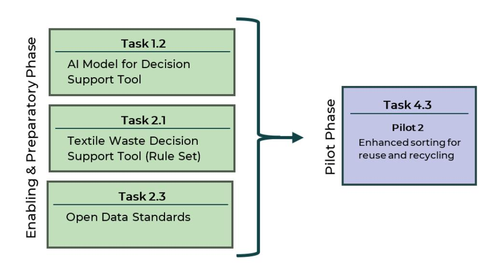
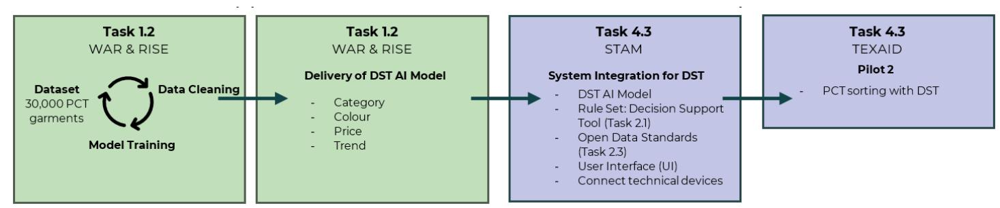
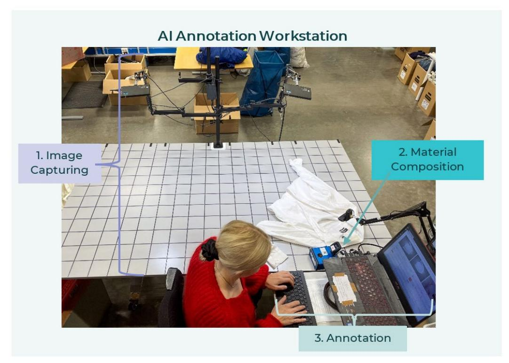
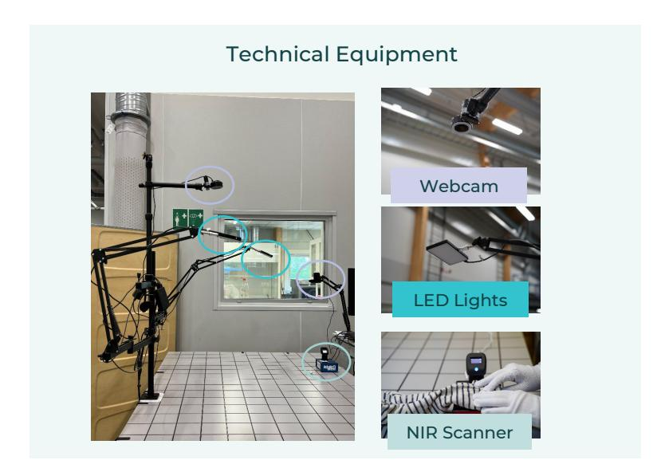
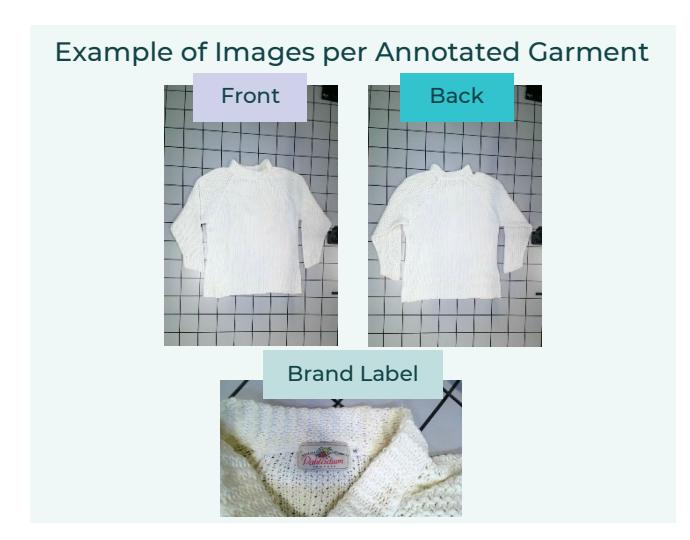

# Decision support tool for post-consumer textiles on reuse and repair **D1.2**

Deliverable due date 31-08-2024 Effective delivery date 31-08-2024

#### AUTHORS REVIEWERS

Gabriella Engström, Wargön Innovation Adrien Hobt, PCH Innovation Farrukh Nauman, RISE Frank Dingemans, De Kringwinkel

Project acronym CISUTAC Grant agreement nr 101060375 Project title Circular & Sustainable Textiles & Clothing

## Executive summary

This report serves as the primary deliverable for Task 1.2 of the CISUTAC (Circular and Sustainable Textile and Clothing) project. Task 1.2 aimed to enhance and optimize postconsumer textile (PCT) sorting operations for both reuse and recycling through innovative digital solutions. The objective of Task 1.2 was addressed by developing and exploring how artificial intelligence (AI) through machine learning (ML) could accurately predict crucial attributes about PCT.

The work conducted led to two main outcomes: the creation of a unique dataset comprising 30,000 PCT garments[1](#page-1-0) , and the development of an AI model, referred to as the DST AI Model in the report. The dataset includes images and annotations for each garment, capturing the complexities introduced by wear, tear, and alterations during the user phase. Unlike existing datasets that focus on pre-consumer textiles, this collection provides a more realistic foundation for developing digital sorting solutions.

The DST AI Model, which will be tested under operational conditions at TEXAID, one of Europe's leading organizations for collecting, sorting, and recycling used textiles (Pilot 2, Task 4.3 in the CISUTAC project), was trained on four key attributes: Product Category, Color, Price[2,](#page-1-1) and Trend[3](#page-1-2). The targeted benefits of this AI model include more accurate sorting, increased efficiency, and insights into integrating AI in sorting processes.

In addition to these outcomes, the exploration and training of AI models provided valuable insights into creating models with high predictability, particularly in identifying garment conditions and handling the complexities of PCT. The insights gained from this work are expected to accelerate research and development in both academia and the textile industry, contributing to a more automated future for PCT sorting.

Automating the sorting of PCT is crucial, the current reliance on manual labour is insufficient to manage the anticipated rise in collected volumes. The complexity of sorting is compounded by the inherent diversity of textiles, for example, variations in material composition and chemical content due to different dyes and finishes. Moreover, the diverse requirements of reuse markets and recycling processes further complicate manual sorting efforts. Therefore, automation is essential to create a more efficient, accurate, and economically viable sorting process. This shift aligns with environmental goals such as the European Union's (EU's) Circular Economy Action Plan (CEAP) and Waste Framework Directive.

By addressing these challenges through AI and creating a robust dataset, Task 1.2 lays the groundwork for the future automation of PCT sorting, contributing to more sustainable and efficient textile practices.

1 (RISE Research Institutes of Sweden AB; Wargön Innovation AB; Myrorna AB, 2024)

2 Based on the market criteria of a specific second-hand organization's stores in a region of Sweden.

3 Trend in the DST AI model refers to a garment attribute that relates specifically to the style of the garment rather than its market trendiness.

## Document Information

| REVISION HISTORY                 |                 |
|----------------------------------|-----------------|
| Revision Date Author Partner     | Description     |
| Version 0.1 12/06/2024 Gabriella |                 |
| WAR Engström                     | First draft     |
| 09/08/2024 Adrien Hobt PCH       | Internal Review |
| 13/08/2024 Frank                 |                 |
| KWA Dingemans                    | Internal review |
| RISE Farrukh Nauman              | Input           |
| Version 0.2 14/08/2024 Gabriella |                 |
| WAR Engström                     | Second Draft    |
| Version 0.3 24/08/2024 Gabriella |                 |
| WAR Engström                     | Third Draft     |

## Abbreviations

| AI      | Artificial Intelligence                                                   |
|---------|---------------------------------------------------------------------------|
| CISUTAC | Project co-funded by the European Union, Circular and Sustainable Textile |
| DST     | Decision Support Tool                                                     |
| DPP     | Digital Product Passport                                                  |
| NIR     | Near-infrared Spectroscopy                                                |
| ML      | Machine Learning                                                          |
| PCT     | Post-Consumer Textile                                                     |
| RISE    | RISE Research Institutes of Sweden AB (Task Leader 2.1 and co-author to   |
| STAM    | STAM SRL (Project partner)                                                |
| TEXAID  | TEXAID Beteiligungsverwaltung Deutschland GMBH (Task Leader 4.3)          |
| WAR     | Wargön Innovation (Task Leader 1.2 and co-author to report)               |

## Glossary

### AI Annotation Workstation

The workstation developed, AI Annotation Workstation, was designed to fulfil several key functions: capturing images of garments, identifying material composition with a nearinfrared (NIR) scanner, and annotating various attributes essential for dataset creation. The workstation enables efficient data collection and annotation. In the CISUTAC Grant Agreement the workstation is referred to as the photo station but will be called the AI Annotation Workstation in this report.

#### AI Model

An AI model is a computational framework designed to simulate human intelligence by learning from data and making predictions or decisions based on that learning. It uses algorithms to identify patterns, extract insights, and improve performance over time through processes such as training and validation. The effectiveness of an AI model heavily depends on the quality and quantity of the dataset used to train it, as the data provides the necessary information for the model to learn and make accurate predictions.

### AI for Circular Fashion

A project funded by the Swedish Innovation Agency, Vinnova (Oct 2021-April 2024) that lay the groundwork for creating a unique dataset on PCT.[4](#page-3-0) Wargön Innovation and RISE were project partners in the project and were, therefore, able to continue collaboration on creating a dataset and AI models in CISUTAC.

#### Attributes

Attributes refer to the specific characteristics that are annotated or recorded for each unique item in a dataset. These attributes could include various types of information such

4 (Wargön Innovation AB, n.d.)

as numerical measurements, categorical labels, textual descriptions, or other relevant features that describe and differentiate the instances within the dataset. In this report attributes are related to garments and include product type, colour, condition, and pattern.

#### CISUTAC[5](#page-4-0)

A project co-funded by the European Union that aims at increasing circularity and sustainability in textiles and clothing in Europe by piloting digital repair and dismantling, by novel recycling processes and by changing sectorial and customers behaviours. It focuses on three types of products: fashion, workwear, and active goods.

#### Dataset

A dataset is a structured collection of data, typically organized in a tabular form where each row represents a unique item, and each column represents an attribute of that item. It encompasses all the instances being studied and the attributes recorded for each instance. In this report, the dataset consists of garments, with attributes such as product type, color, condition, and pattern.

### Decision Support Tool (DST)/ Decision Support Tool AI Model (DST AI Model)

In CISUTAC's Grant Agreement, the term Decision Support Tool (DST) is used in the context of Task 1.2 to refer to a digital tool with a smart interface and system integrating AI and technical devices. This has been adjusted to clarify that Task 1.2 is responsible for creating the DST AI Model, and the DST with a smart interface and integration with other technical devices will be developed in Task 4.3. The DST AI model is trained to predict the attributes: category, colour, trend[6,](#page-4-1) and price[7.](#page-4-2)

#### Digital Product Passport (DPP)

The Digital Product Passport (DPP) is a digital information carrier that contains data on a product from design to end-of-life. The European Union is actively working to implement DPP as part of its broader strategy to promote sustainability and circularity in the textile industry. By standardizing and regulating the use of DPPs, the EU aims to enhance transparency, traceability, and sustainability, providing stakeholders with access to comprehensive product information. This initiative supports better recycling, reuse, and responsible consumption practices by making information more accessible to all stakeholders e.g., retailers, consumers, and recyclers.

#### Disrupters

A collective term for any parts of a textile product, such as buttons and zippers, that could interfere with the recycling process and need to be removed before the product is suitable for recycling.

### Photo Station

In CISUTAC Grant Agreement the workstation used to take images and annotate attributes for the dataset is referred to as photo station. In this report it will be called the AI Annotation Workstation.

5 (CISUTAC, n.d.)

6 Trend in the DST AI model refers to a garment attribute that relates specifically to the style of the garment rather than its market trendiness.

7 Based on the market criteria of a specific second-hand organization's stores in a region of Sweden.

#### Rule Set

In the context of AI, a rule set is a collection of "if-then" statements that define how a system should interpret and respond to specific inputs. These rules are used in decision support systems to make logical decisions based on the input data.

## Table of Contents

| Executive summary                                                                                                                                             | ....................................................................................................................................2                   |
|---------------------------------------------------------------------------------------------------------------------------------------------------------------|---------------------------------------------------------------------------------------------------------------------------------------------------------|
| AI Model                                                                                                                                                      | ....................................................................................................................................................4   |
| Attributes                                                                                                                                                    | .................................................................................................................................................4      |
| Dataset                                                                                                                                                       | ......................................................................................................................................................5 |
|                                                                                                                                                               | Decision Support Tool (DST)/ Decision Support Tool AI Model (DST AI Model) 5                                                                            |
| Rule Set                                                                                                                                                      | .....................................................................................................................................................6  |
| Table of Contents                                                                                                                                             | .........................................................................................................................................7              |
| 2.1 Dataset                                                                                                                                                   | 13                                                                                                                                                      |
| 2.2 AI model...............................................................................................................................................   | 13                                                                                                                                                      |
| 2.3 Decision Support Tool..................................................................................................................                   | 13                                                                                                                                                      |
| 3.1.1 Technical Equipment                                                                                                                                     | 15                                                                                                                                                      |
| 3.2 Dataset.................................................................................................................................................. | 17                                                                                                                                                      |
| 3.2.2 Statistics......................................................................................................................................        | 22                                                                                                                                                      |
| 3.2.3 Data Cleaning                                                                                                                                           | 23                                                                                                                                                      |
| 3.2.4 Release of Dataset                                                                                                                                      | 23                                                                                                                                                      |
| 3.2.5 Recommendations................................................................................................................                         | 23                                                                                                                                                      |
| 3.3 AI Model(s).........................................................................................................................................      | 23                                                                                                                                                      |
| 3.3.1 Decision Support Tool AI Model for Pilot (DST AI Model).................................                                                                | 23                                                                                                                                                      |

| 3.3.2 Condition AI model...............................................................................................................                         | 26 |
|-----------------------------------------------------------------------------------------------------------------------------------------------------------------|----|
| 4. Conclusions                                                                                                                                                  | 28 |
| 5. Further remarks / Next steps                                                                                                                                 | 29 |
| 5.1 Future Research..............................................................................................................................               | 29 |
| References..................................................................................................................................................... | 30 |
| Annexes                                                                                                                                                         | 31 |
| Annex 1: Table of All Attributes and Values*............................................................................                                        | 31 |

## List of Figures & Tables

| Figure 2: Creation of Decision Support Tool (DST) Activities | and Flow..........................................14                                                                |
|--------------------------------------------------------------|---------------------------------------------------------------------------------------------------------------------|
| Figure 3: AI Annotation Workstation                          | .................................................................................................................15 |
| Figure 4: AI Annotation Workstation: Technical Equipment     | ...............................................................16                                                   |
| Table 1: Overview Task 1.2 Steps and Goals                   | .....................................................................................................12             |
| Table 2: List of Equipment for AI Annotation Workstation     | ...................................................................15                                               |

## 1. Introduction

Technological innovations, new regulations, increasing consumer awareness, and a growing emphasis on sustainability are driving the global textile industry towards transformative change and a more circular economy. The European Union (EU) aims to ensure the transformation promotes resource efficiency, reduces environmental impact, and ensures consumer safety throughout the lifecycle of textile products[8](#page-8-1).

A crucial aspect of achieving these goals, particularly resource efficiency, is the efficient collection, sorting and utilization of post-consumer textiles (PCT). Currently, collection rates are low. Europeans generate approximately 7 million tons of textile waste (based on 2020 figures) equating to around 16 kg per person. On average, only about one-fourth of this waste is collected separately for reuse and recycling.[9](#page-8-2) Legislative efforts, such as the European Waste Directive mandating EU member states to establish separate textile collection systems by January 1, 2025, has the potential to significantly improve these rates[10.](#page-8-3)

However, the sorting of PCT capacity and capability within the EU and globally is not able to meet the predicted increase in collection rates, turning an opportunity for resource efficiency into a potentially significant problem. Without expanding Europe's sorting and recycling infrastructure, a large portion of collected textile waste may still end up being incinerated, sent to landfills, or exported outside the EU[11](#page-8-4). Today initiatives like CISUTAC (Circular and Sustainable Textile and Clothing)[12,](#page-8-5) which aims to address current bottlenecks and demonstrate new sorting solutions, and the ReHubs[13](#page-8-6) initiative, focused on establishing recycling hubs serving Europe, highlight ongoing efforts to seize the opportunity and promote circular economy principles.

One of the identified bottlenecks in the CISUTAC project is the need for digital solutions and artificial intelligence (AI) to achieve the necessary levels of efficiency, accuracy, speed, and scalability in the sorting processes of PCT. Currently, methods of sorting PCT are heavily reliant on manual sorting by trained textile experts. This reliance not only limits the speed and volume of processing but also introduces variability and limitations due to human factors. By analysing vast datasets and recognizing intricate patterns in garment attributes—such as garment type, condition, and style — AI models can classify textiles more efficiently, optimizing their allocation to suitable streams such as reuse, repair, refurbishment, recycling, or remake.

To address the identified bottleneck, Task 1.2 of the CISUTAC project focused on leveraging AI to enhance PCT sorting operations. This report is the main deliverable for Task 1.2, which aimed to optimize and improve PCT sorting for reuse and recycling through innovative digital solutions. The task involved developing and exploring AI models using machine learning (ML) to predict crucial attributes of PCT. A key component of this work was the creation of a dataset and the training of an AI model, referred to as the DST AI Model, which will be tested under operational conditions at TEXAID, one of Europe's leading

8 (European Commission, n.d.)

9 (European Commission, n.d.)

10 (European Environment Agency, 2024)

11 (European Environment Agency, 2024)

12 (CISUTAC, n.d.)

13 (ReHubs, n.d.)

organisations for collecting, sorting, and recycling used textiles (Pilot 2, Task 4.3 in CISUTAC project).

The dataset and AI model developed and tested under Task 1.2 of the CISUTAC project represents an important advancement in addressing the potential for a more circular textile industry. Beyond improving sorting efficiency, the AI model and dataset have the potential to accelerate research and innovation in both academia and industry. Researchers and companies can leverage the insights gained to explore new applications of AI in textiles. Moreover, the success of such digital solutions can inform policymakers and regulators, guiding future standards and regulations.

## 2. Approach and Work Plan

This report is a deliverable within the CISUTAC project which aims at increasing circularity and sustainability in textiles and clothing in Europe. The objective is to minimise the sector's total environmental impact by developing sustainable, novel, and inclusive largescale European value chains. The project covers a large part of the textile sector by working on two material groups representing almost 90% of all textile fibre materials (polyester, and cotton/cellulosic fibres), and focusing on products from 3 sub-sectors experiencing varying circularity bottlenecks (fashion garments, sports and outdoor goods, and workwear). CISUTAC follows a holistic approach covering technical, sectoral and socioeconomic aspects, and will perform 3 pilots to demonstrate the feasibility.[14](#page-10-1) 

One of the pilots, referred to as Pilot 2, focuses on enhancing sorting of post-consumer textiles (PCT). This pilot is conducted under Task 4.3. This report is the deliverable of Task 1.2 which is directly linked to Pilot 2 as it provides an AI model that will be integrated into a decision support tool (DST) to aid manual textile sorters. All tasks mentioned in the report, including those interlinked with Pilot 2 preparatory tasks, are listed below and illustrated in Figure 1.

- Task 1.2 Digitally enhanced textile sorting for reuse and recycling o Developing and exploring how AI through machine learning (ML) could accurately predict crucial attributes about PCT. o Outcome is a dataset of 30,00 PCT garments and an AI model for Pilot 2
- Task 2.1 Closing the loop: gap analysis, (digital) infrastructure needs & product and material flows o Gap analysis of material flow and infrastructure in the value chains of postconsumer textile waste in Europe[15](#page-10-2) o Developed an open access software including guidelines for PCT channelling[16](#page-10-3) that will serve as the rule set in the DST
- Task 2.3 Open data standard o Developing an open data guide for digital product passport (DPP)
- Task 4.3 (Pilot 2)- Enhanced sorting for reuse & recycle o Testing PCT manual sorting with DST which has integrated technologies such as NIR scanner and AI model. o Aim of testing is to increase sorting capacity, accuracy and value retention.

14 (CISUTAC, n.d.)

15 (RISE; CENTEXBEL, 2024)

16 (RISE; CENTEXBEL, 2024)

Figure 1: Relation Between Enabling and Preparatory Tasks and Pilot

The work within Task 1.2 was conducted from September 2022 (M1) to August 2024 (M24). Focus was on developing and exploring how artificial intelligence (AI) through machine learning (ML) could accurately predict crucial attributes about post-consumer textiles (PCT). The scope of Task 1.2 included four main activities:

- 1. Build dataset
- 2. Train AI model(s)
- 3. Decision Support Tool (DST)
- 4. Align work with Task 2.1 (Textile channelling decision tree) and Task 2.3 (Open data standards)

A more detailed overview of steps, goals, and modifications can be seen in Table 1 below. Following this is a brief summary of each main activity.

Table 1: Overview Task 1.2 Steps and Goals

| Steps                    | Goal                 | Achieved | Modifications              |
|--------------------------|----------------------|----------|----------------------------|
| First release of dataset | 3,000 garments       | M12      |                            |
| Data Cleaning            |                      | M22      | More time was needed to    |
| ML training              |                      | M24      |                            |
|                          | 30,000 garments      | M22      |                            |
| Release of AI model(s)   | 1 AI model for Pilot |          |                            |
|                          | 2 (DST AI Model)     |          |                            |
| Decision Support Tool    |                      |          | Clarification and decision |
|                          |                      |          | responsibilities between   |
| Align with Task 2.1 and  |                      |          |                            |

### 2.1 Dataset

To build the dataset a workstation was built at Wargön Innovation (WAR), referred to as photo station in CISUTAC Grant Agreement, but will be called the AI Annotation Workstation in this report. The workstation included cameras, LED-lights, a near-infrared scanner (NIR), and a computer with annotation software (see figure 3 and 4, and table 2 for more details). Equipment was chosen to ensure affordability, accessibility, and ease of installation, to facilitate replication by others. The dataset was created primarily by WAR, and RISE Research Institutes of Sweden AB (RISE) was responsible for defining specification for technical equipment and the following steps to create AI model(s) including data cleaning, AI algorithms, and machine learning (ML).

The dataset reached the goal of 30,000 garments in July, 2024 (M22) and includes three images per garment (front, back, and close-up of brand tag) as well as over fifteen attributes annotated by expert textile sorters (see figure 5 for example). It was released publicly[17](#page-12-3) to foster innovation and support further research.

### 2.2 AI model

RISE was responsible for training AI models on the dataset through deep learning. Several models were explored to determine which attributes were easy versus difficult to accurately predict. An AI model was developed with the focus on the pre-defined KPI's for Pilot 2 (Task 4.3); product category, colour, price, and trend. This model, called the DST AI model was delivered first as a test version May 2024 (M21) and then as a final version August 2024 (M24) to task 4.2 for STAM SRL (STAM) to work on system integration including building the interface for an AI-based sorting tool to be tested in Pilot 2 by TEXAID.

### 2.3 Decision Support Tool

In CISUTAC's Grant Agreement, the term Decision Support Tool (DST) is used in the context of Task 1.2 to refer to a digital tool with a smart interface and system integrating AI and technical devices. Early in the project, it became evident that clarification was needed regarding the division of responsibilities for creating the DST for textile sorters between Task 1.2 and Task 4.3. Project partners from Task 1.2 and 4.3 participated in these discussions, recognizing that STAM possessed the expertise and resources required for system integration and creating a tool. Since STAM wasn't part of Task 1.2 it was collectively decided that system integration be done in Task 4.3. To summarise, the term Decision Support Tool (DST) has been adjusted to clarify that Task 1.2 was responsible for developing the AI Model for the pilot, and the DST with a smart interface and integrated with other technical devices will be developed in Task 4.3 (see Figure 2). This decision required small adjustments to the timeline and did not have any significant impacts on the final outcomes. Additionally, discussions were also held on how to best integrate the opensourced Decision Support Tool from Task 2.1[18](#page-12-4) referred to in this report as a rule set.

17 (RISE Research Institutes of Sweden AB; Wargön Innovation AB; Myrorna AB, 2024)

18 (RISE; CENTEXBEL, 2024)

Figure 2: Creation of Decision Support Tool (DST) Activities and Flow

### 2.4 Aligning with Other Tasks

Aligning with Task 2.1 (Textile channelling decision tree) and Task 2.3 (Open data standards) was conducted through meetings and open dialog. One point of discussion was exploring the attributes annotated in the dataset with the crucial attributes, identified in Task 1.2, to sort PCT according to the Waste Hierarchy. It was identified that condition attributes were of critical importance for AI to aid in identifying in the sorting process of PCT. Discussions also focused on TRL levels of technology for identifying attributes, which are rapidly changing due to advancements in innovation. The mapping of the TRL levels clearly visualized how much potential remains untapped, as current technologies for sorting PCT are still in the early stages of development. The insights and knowledge gained from these discussions, as well as important insight into future scenarios, can be read in the report D2.1 Circular transition scenarios & software for post-consumer textile waste channelling[19](#page-13-4).

## 3. Work Executed

The following sections provide a detailed overview of the activities and methodologies employed in Task 1.2. They also present the key learnings and reflections derived from the work carried out.

### 3.1 AI Annotation Workstation

To create the dataset with annotations and images of 30,000 garments, an AI Annotation Workstation was built (Figure 3). WAR was able to repurpose a workstation from the project AI for Circular Fashion (2021-2024)[20](#page-13-5) adding a desktop NIR scanner to complete it. When being constructed in the AI for Circular Fashion project the selection of equipment defined by RISE for the workstation emphasized affordability, accessibility, and ease of installation, to facilitate replication by others. An AI Annotation Workstation (see Table 2 for overview of equipment) includes equipment for (1) capturing images, (2) identifying material composition, and (3) enabling expert textile sorters to annotate. It is important to note that for future projects or initiatives to create datasets for PCT the listed equipment and workstation design may need adjustments to meet unique requirements. For instance, factors such as camera resolution and lighting conditions might need to be optimized to ensure that the dataset is tailored to the specific needs of those projects.

19 (RISE; CENTEXBEL, 2024)

20 (Wargön Innovation AB, n.d.)

#### 3.1.1 Technical Equipment

As previously stated, the RISE team originally selected equipment with a focus on affordability, accessibility, and ease of installation, ensuring that others could replicate the setup easily. Furthermore, the technical equipment was chosen based on RISE analysis of the state of the art (SotA) in the field of AI as of 2021. Given the rapid advancements in technology and AI, there were discussions about the possibility of upgrading or changing the technical equipment. However, it was ultimately decided that such changes could

Table 2: List of Equipment for AI Annotation Workstation

| AI Annotation Workstation Equipment            | Number of pieces |
|------------------------------------------------|------------------|
| Webcam (2560x1440 pixels)                      | 2                |
| LED Lamps (10WAT)                              | 2                |
| Desktop NIR scanner Table for photo 200x120 cm | 1                |
| (adjustable height) Table for annotating       | 1                |
| (computer, screen, keyboard)                   | 1                |
| Computer (laptop)                              | 1                |
| Computer Screen                                | 1                |
| Cabel basket/tray                              | 2                |
| Tabletop tripod                                | 2                |
| Camera Mount Kit                               | 1                |

Figure 3: AI Annotation Workstation

compromise the project's budget, disrupt the timeline, and jeopardize the consistency and quality of the dataset, which is crucial for training robust AI models. Therefore, the decision was made to maintain the originally chosen equipment.

#### Cameras

The selection of cameras prioritized affordability and ease of installation. Defining the technical requirements for the cameras involved finding a balance between high resolution and processing speed, considering that higher resolution images could significantly slow down model processing time. It was determined by RISE, after analysing the current (2021) state of image recognition technology, that a webcam with QHD resolution (2560x1440 pixels) was sufficient for the dataset. To maintain an efficient and ergonomic workflow, two cameras were essential: Camera 1 for capturing the front and back images, and Camera 2 for capturing the brand label.

#### LED Lights

Similar to the choice of cameras, the focus when choosing LED lights was finding a budget-friendly and easy-to-install product. The LED light's (10W) placement was adjusted when testing, with the final version being two LED lights with a slightly downward and inwards-facing direction (Figure 4). This is to avoid glare into textile sorters' eyes and avoid shadows.

#### NIR Scanner

To identify material composition, the AI Annotation Workstation was equipped with the Matoha Fabritell[21](#page-15-1) desktop NIR scanner operating in the 1550-1950 nanometer (nm) range. NIR scanners are the most common and widely used technology for fiber detection in the textile industry. This technology works on the principle that molecules absorb light differently based on their structure. By emitting near-infrared light and measuring the absorption pattern, the NIR scanner can identify specific wavelengths that correspond to various fiber types. These patterns are then matched against a reference database to determine the material composition.

Figure 4: AI Annotation Workstation: Technical Equipment

21 (Matoha, n.d.)

However, there are limitations to this technology. For example, wet textiles cannot be accurately identified, as moisture interferes with the absorption readings. Additionally, the scanner only scans a small area and one layer at a time, making it challenging to analyse multilayer garments or those with several different fabrics. Finally, the accuracy of the results depends on the robustness and comprehensiveness of the database used for comparison. For the Matoha Fabritell, accuracy is ±10% for most blends and ±5% for pure materials.

#### Computer

The computer was connected to a tailor-made annotation software developed by RISE. This was developed and adjusted based on feedback from annotators. The technical requirements of the laptop/computer was defined by RISE as:

- Minimum 8 GB RAM
- CPU with at least 4 cores
- Sufficient storage space (at least 20 GB free) for the applications and image data
- Modern operating system (e.g., Windows 10/11, macOS 10.15 or later, or a recent Linux distribution)
- Webcam Requirements: Two USB-compatible webcams with a minimum resolution of 720p
- Python 3.8 or later
- "gradio" library for the web app interface
- Vision model library (PyTorch, timm) with a model size <= 500 MB
- Stable internet connection for initial setup and updates
- Web browser compatible with modern web standards (e.g., Google Chrome, Firefox, Edge)

### 3.1.2 Other Equipment

To ensure an ergonomic and functional workstation, careful consideration was given to various aspects of the setup. Notably, the table used for the AI Annotation Workstation was selected for its suitability to the tasks at hand, offering the necessary space and design. Other elements, such as the chair and garment storage, were chosen for general ergonomics and functionality but do not warrant detailed discussion as they are not specific to the unique requirements of the dataset or an annotation station.

#### Table

The main table was modified to enhance functionality and ergonomics. A larger desk tabletop was sourced to accommodate larger garments (length 200 cm x width 120 cm). The surface was painted with a grey colour in a matte finish to mitigate issues related to reflections from LED lights and increase contrast with white garments. Additionally, the tabletop underwent routing (hollowing out) of a grid with 100x100mm dimensions, approximately 0.8mm deep. The grid was created to allow for the possibility of determining size for those using the dataset, it was not explored in Task 1.2 as it was outside the task's scope. Ergonomic considerations were also prioritized by selecting a table with adjustable height, ensuring comfort and practicality in various working conditions.

### 3.2 Dataset

One of the main achievements of Task 1.2 is the creation of a unique dataset. The final dataset was built on the initial work in the project AI for Circular Fashion. The target of 30,000 garments was accomplished June, 2024 (M22), and released on the open source data and code sharing platform Zenodo.org[22.](#page-17-1) Each item includes three distinct images (Figure 5), one showcasing the front, one the back, and one image dedicated to the brand. Furthermore, over fifteen attributes were annotated for each item, such as condition, season, brand, price, and usage (see Table 3 for all attributes). Lastly, a NIR-scanner was used to identify the main material composition and was annotated in the dataset.

This dataset is unique as it addresses the lack of large, open datasets focused on PCT, especially those that account for the complexities introduced by wear, tear, and user alterations. Prior to this project, existing datasets and AI models predominantly centred on pre-consumer textiles, leaving a significant gap in the field.

The garments were sorted from the PCT collected at specific regional locations as part of an ongoing cooperation between WAR and an international charitable second-hand organisation. This partnership allowed the project to operate within a real-life operational environment, providing valuable representational statistics that enhance the dataset's relevance and applicability.

Once the goal of annotating and taking images of 30,000 garments was accomplished, it was determined that a validation dataset was needed to support the testing the accuracy of the AI models. Therefore, 500 additional garments were photographed and annotated to create a validation dataset. Validation data is crucial because it allows for the assessment of AI model's performance on data it has not been trained on. This helps identify issues like overfitting, when an AI model does really well on the data it was trained on but struggles with new, different data. By providing an opportunity to test the models' predictions against a separate dataset, validation data ensures that the AI models are robust, reliable, and capable of generalizing well to new, real-world scenarios.

In line with the defined goal in the CISUTAC project to collect knowledge and datasets from partners and other market-driven data sets, efforts were made by RISE to collect data both online and through partners. However, these efforts were challenging either because the data was not suitable for the purpose, or it was under some kind of license. Therefore, only the dataset created in this project was used to train the AI models.

Figure 5: Images for Annotated Garments

22 (RISE Research Institutes of Sweden AB; Wargön Innovation AB; Myrorna AB, 2024)

### 3.2.1 Attributes

As the work creating the dataset was based on efforts initiated in the Vinnova-funded project *Al for Circular Fashion*23, attributes had been defined before CISUTAC started. The attributes were chosen based on suggestions from expert sorters and confirmed through a feedback loop with shareholders in the project. Table 3 contains all attributes and example of values annotated per garment for the dataset, for all values see Annex 1.

*Table 3: Overview Attributes Annotated for Dataset*

| Attribute                   | Example                                                   | Attribute Category                    |
|-----------------------------|-----------------------------------------------------------|---------------------------------------|
| Category                    | Ladies, Unisex, Children                                  | Garment Attribute                     |
| Type                        | T-shirt, Tunic, Trousers                                  | Garment Attribute                     |
| Brand                       | H&M, Zara, Nike                                           | Garment Attribute                     |
| Size                        | XS, M, XL                                                 | Garment Attribute                     |
| Colour                      | Yellow, Red, Multicolour                                  | Garment Attribute                     |
| Season                      | Winter, Summer, All                                       | Garment Attribute                     |
| Cut                         | Regular, Oversize, V-neck                                 | Garment Attribute                     |
| Pattern/ Style              | Animal Print, Flower Print, Stripes                       | Garment Attribute                     |
| Trend                       | Denim, Sports, 80's                                       | Garment Attribute                     |
| Material (from NIR Scanner) | 100% Cotton                                               | Garment Attribute                     |
| Multilayer                  | Yes/No                                                    | Garment Attribute                     |
| Smell                       | Major/Minor/None                                          | Condition Attribute                   |
| Stains/ dirt                | Major/Minor/None                                          | Condition Attribute                   |
| Damage                      | Free text annotation                                      | Condition Attribute                   |
| Holes/ damage               | Major/Minor/None                                          | Condition Attribute                   |
| Pilling                     | Scale 1-5                                                 | Condition Attribute                   |
| Condition                   | Scale 1-5                                                 | Condition Attribute                   |
| Price SEK                   | <50 SEK, 50-100 SEK, 100-150 SEK                          | Market-Driven and Variable Attributes |
| Usage                       | Reuse, Repair, Remake, Recycling, Export, Energy Recovery | Market-Driven and Variable Attributes |

The dataset focused on attributes needed to sort PCT in a sorting facility, with the objective of classifying each garment into the appropriate channels:

- • Reuse: in regional Swedish market, these garments could be sold directly without any repairs, refurbishment or other action
- • Repair
- • Remake
- • Recycling
- • Export: reuse outside of Sweden
- • Energy recover

It should be noted that the annotations were made based on how these textile attributes are identified and classified today at WAR for a specific organisation and their regional second-hand market. The attributes were annotated by expert textile sorters mainly at WAR through a tailor-made application developed by RISE. Attributes included numerical measurements, categorical labels, and textual descriptions. To understand the attributes in more detail they have been divided into three categories: garment attributes, condition attributes, and market-driven/ variable attributes.

23 (Wargön Innovation AB, n.d.)

#### Garment Attributes

Attributes related to the garment are closely aligned with the information that a Digital Product Passport (DPP) might encompass, as these attributes represent defined product characteristics known prior to the user phase. The garment attributes annotated in the dataset include:

- Category: e.g. Ladies, Children
- Type: e.g. T-shirt, Top, Shorts
- Brand
- Size
- Colour: possibility to choose one colour for whole garment or specify as multicolour
- Season: e.g. winter, or spring
- Cut: e.g. Oversize, Cropped, V-collar
- Pattern/Style: e.g. Stripes, Lace
- Trend: E.g. Sports or 80's
- Multilayer

While many of these attributes may become available at various stages of DPP implementation, it is important to note that certain attributes could change during userphase. This raises the question of whether an AI model based on image recognition might be necessary to verify these attributes and analyse alterations. Currently, there is insufficient data on the implications of omitting AI identification of attributes covered by a DPP. For instance, changes in colour, print, modifications, and disrupters could be crucial to identify. For recycling it could be critical to compare e.g., if a garment according to DPP had no disrupters but AI recognizes buttons and pins in the image. For reuse purposes, the comparison could reveal changes in garment type e.g., that jeans have been turned into shorts.

#### Trend

The attribute currently labelled as trend was initially intended to describe the style of the garment, such as 80's fashion or sports. However, during discussions, it was identified that this term might be interpreted as relating to an indicator of the product's current popularity in the market or its alignment with contemporary fashion trends. In this context, trend is categorized as a garment attribute that relates specifically to the style of the garment rather than its market trendiness. For example, labelling a garment as part of the 80's trend refers to the stylistic characteristics it embodies, not its current market demand.

Despite the potential for confusion, the trend attribute remains valuable for future AI models. It provides a basis for determining whether a product aligns with certain stylistic trends, which could, in turn, be used to assess market demand. For instance, if an AI model recognizes that a garment belongs to the 80's trend category, it could leverage this information to web scrape for data on the popularity and demand for 80's style fashion. This analysis could help predict whether the product is currently trendy and in high demand. Furthermore, it could be important information for a captioning AI model to create garment descriptions.

#### Condition Attributes

The condition attributes annotated in the dataset are:

- Smell: Major, minor, none
- Stains/dirt: Major, minor, none
- Damage: open-ended annotation

- Holes/Damages: Major, minor, none
- Pilling: 1-5
- Condition: 1-5

Condition attributes and their grading posed a challenging yet enlightening task. It was determined in discussions in AI for circular fashion project[24](#page-20-0) that a five-point scale was appropriate for assessing the overall condition of garments. This decision was made in the absence of an established industry standard for condition grading in PCT at the time. Similarly, the grading of more specific condition attributes was defined in the absence of an established industry standard for PCT. A standardized approach would facilitate more efficient sorting and build trust with end-users and customers.

By annotating condition as an overall attribute on a scale, it could be explored how an AI model could predict a garment's condition through image recognition without initially identifying specific individual flaws/attributes such as pilling and stains. This approach mirrors the human sorting process, where manual evaluators assess the overall condition of an item rather than itemizing every defect before making decisions.

As the textile industry continues to evolve, introducing numerous companies and innovations focused on different steps of the waste hierarchy (e.g., recycling, refurbishment, remaking, and redesigning), the complexity of managing diverse and dynamic requirements will increase significantly. For future datasets, it will be important to revisit the grading scales to determine whether they need revision. Even with an industry standard, flexibility will be crucial to meet individual end-user requirements, and AI will be essential to handle the resulting complexities.

Sorting facilities must cater to condition-based rule sets tailored to each end-user's specific needs. Manually managing these intricate and overlapping requirements is impractical, as it would necessitate extensive memorization, rapid prioritization based on deadlines, and accurate predictions of when garments meeting specific criteria will become available. AI systems, therefore, are indispensable. They can dynamically adjust to changing sorting criteria, prioritize orders where requirements overlap among multiple end customers, remember and apply diverse sorting rules, and swiftly adapt to modifications in sorting parameters as needed. This ensures that sorting operations remain accurate, efficient, and responsive in an increasingly complex and fast-paced market.

#### Market-Driven and Variable Attributes

#### Usage:

The usage attribute in the dataset is annotated to provide insight into how each garment currently would be categorized based on the premise of the specific second-hand organisation that WAR sorts for and their regional markets' demand. The categories to channel a garment included: reuse (in Sweden), repair, remake, recycling, export (reuse outside Sweden), and energy recovery.

This attribute, along with an AI model predicting it, highlights the capability to train AI to recognize suitable usage through image analysis without first identifying specific attributes like market demand, and wear and tear. This approach mimics the human sorting process, where sorters evaluate an item's overall condition rather than categorizing individual defects before making a judgment.

24 (Wargön Innovation AB, n.d.)

Although this method of evaluating usage replicates manual labour, AI allows for the inclusion of additional attributes and data that could enhance the accuracy of usage assessment. For example, AI can analyse factors such as market demand, brand, durability, and repairability to provide a more precise evaluation of an item's usage.

#### Price

The price attribute in the dataset should be seen as a suggestion indicating the market value, annotated in Swedish Krona (SEK) based on approximate retail prices for the specific second-hand organisation that WAR sorts for and their regional market. This attribute, and the AI model predicting it, demonstrates the capability to train AI for valuation through image recognition without first identifying specific attributes like condition and brand. This mimics the process of how human textile sorters evaluate items, as they do not systematically rank attributes before determining a price.

Although this evaluation method mirrors manual labour, AI provides the opportunity to incorporate additional crucial attributes and/or data for a more accurate price determination. For instance, AI can analyse current demand for specific garment types, brands, and colours to refine the pricing model. There are currently AI models for price estimation taking market demand and other criteria into consideration; however, these are not shared publicly as they are considered proprietary technology.

#### 3.2.2 Statistics

When analysing the statistics, it became evident that four attributes—price, category, garment type, and usage—exhibited significant unevenness in their value distributions:

- Price: 94% of annotated garments had a price lower than 100 SEK (under €9[25](#page-21-1)).
- Category: almost 67% were ladies' garments
- Garment type: over 25% were tops and t-shirts
- Usage: almost 99% were categorized as Reuse in Sweden (47.9%), Export for reuse outside Sweden (41%), and 9-5% recycling

The uneven distribution across these attributes can affect an AI model's ability to predict accurately. When training AI models, particularly those using machine learning (ML) algorithms, the quality and balance of the training data are crucial. If the dataset exhibits an uneven distribution of attributes the model may become biased towards the more frequently represented categories. This bias occurs because the model learns to recognize patterns and make predictions based on the data it has seen most often. As a result, the model may struggle to accurately predict attributes that are underrepresented in the training data.

#### Price

The reason few high-priced garments were in the dataset is because the PCT fraction sorted at WAR consists of donated garments collected by charities. In general, high-priced and valuable garments are sold by consumers through re-sale channels.

#### Usage

The reason usage is almost exclusively on two values (reuse in Sweden and Export reuse outside of Sweden) despite there being six options is that the current sorting at WAR doesn't have defined criteria for the other options from the end-user (a second-hand organisation and their regional stores in Sweden).

25 Based on rounded of exchange rate 3 July, 2024

#### 3.2.3 Data Cleaning

Data Cleaning was primarily done by RISE with WAR assisting shortly in M22. For this RISE developed a simple app to streamline workflow. The criteria for removal included images with obvious mistakes (e.g., missing garments) as well as those containing faces, hands (without gloves), and personal belongings.

#### 3.2.4 Release of Dataset

The first version of the open dataset was released September 2023 with 3,000 clothing items. The final version consists of 31,997 garments and was released June 2024 (M22)[26](#page-22-5). After careful consideration, Zenodo[27](#page-22-6) was chosen as the data sharing platform. This decision was influenced by several factors, including its wide recognition in the scientific community, support for version control, and robust infrastructure for long-term preservation. This platform met the data dissemination needs and aligned with best practices in open science.

#### 3.2.5 Recommendations

The creation of the dataset also resulted in important insights for future initiatives to create datasets for PCT. These insights are summarized below:

- Use high resolution cameras for detecting small defects and damages.
- Provide initial training to staff operating the AI tool to reduce errors such as human hands showing up in images, images without garments, duplicate labels from previous garments, etc.
- Predicting multiple attributes correctly simultaneously is extremely challenging for current state of the art models. It is recommended that users define 2 or 3 highly important attributes early on and focus on optimizing accuracy for those.
- Attributes that second-hand garments share with first hand garments are relatively easier to deploy models for since large open source (CLIP, Idefics3, etc.) and closed source (GPT-4, Claude 3.5 Sonnet, Gemini 1.5 Pro) are already capable of detecting style, color, etc. However, damage detection remains challenging and requires both high resolution cameras (higher than the ones used in this task) and careful annotation work beyond what is provided as part of this task.

### 3.3 AI Model(s)

AI models were successfully trained through deep learning on the data from the dataset, with varying results. The accuracy rate improved as the dataset grew, since a larger dataset improves the robustness and generalizability of the AI models. Some attributes were identified as more difficult for AI models to predict. For example, condition attributes such as stains and holes were difficult and required a dedicated AI model and attention from the RISE team to reach higher accuracy. Another reason for the difficulty in predicting certain attributes was the lack of equal frequency for all values per attribute e.g., high-priced garments as previously mentioned under the subsection "Statistics".

Several models were explored and tested with the aim of gaining valuable insights. One model, the DST AI model, was developed further than the exploratory phase to ensure it could be implemented into Pilot 2 for testing in real-world conditions.

### 3.3.1 Decision Support Tool AI Model for Pilot (DST AI Model)

The DST AI Model was designed as a key component of Pilot 2, with the objective of enhancing the efficiency and accuracy of textile sorting by leveraging artificial intelligence. Developed in close collaboration with project partners, the model

26 (RISE Research Institutes of Sweden AB; Wargön Innovation AB; Myrorna AB, 2024)

27 (Zenodo, 2024)

incorporates predefined criteria and Key Performance Indicators (KPIs) to ensure it meets the specific needs of the pilot. The model aims to support decision-making processes by accurately predicting attributes such as category, color, trend, and price, thereby improving the overall sorting process in real-world conditions.

#### Key Performance Indicators

Key Performance Indicators (KPIs) were discussed and defined with the project partners in Task 1.2, in alignment with CISUTAC's general agreement, which stated, "The developed AI/ML system will be based on e.g., brand, style, market trend, availability in stock, and if applicable, quality and condition(…)." RISE began by assessing the preliminary results of the dataset and AI models to determine which attributes and performance parameters could have KPIs defined. Feedback from TEXAID was collected to align with their needs and ambitions for the subsequent pilot (Pilot 2, Task 4.3). The discussions and assessment concluded with the decision to create an AI model, specifically for Pilot 2 (Task 4.3), referred to as the DST AI model. The following attributes were included with defined KPIs:

- Category [>95% accuracy]
- Colour [>95% accuracy]
- Trend[28](#page-23-0) [>80% accuracy]
- Price[29](#page-23-1) [>80% accuracy]

Note for the model evaluated in this report, Usage was chosen instead of Colour and thus only the results on Usage are reported.

#### Indications of AI model Performance

The model was trained on 8000 items and tested on another 2000 items. The results reported below are from the 2000 items that comprised the "test" set. Some things to note:

- Only the front image was used to make predictions.
- All attributes were predicted directly from the image. A possible alternative approach that we could have taken is to use attributes like garment type, category, etc. to predict price and usage since these two depend on other attributes. However, due to shortage of resources, we could not implement this approach.
- We used the ConvNext-Small model and the imagenet pretrained weights were downloaded from the open source library "timm".

#### Category [>95% accuracy]

The accuracy achieved on category classification is 60%, much less than the target. Four categories: Children, Ladies, Men and Unisex were annotated for different garments. The category unisex is particularly challenging for the model as one could equally have annotated it as both ladies and men. Similarly, some of the garments originally annotated to be ladies are similar to men's garments resulting in further confusion for the model.

#### Usage

Usage was annotated to have many different labels such as reuse, export, recycle, repair, remake, thermal waste. Most of the annotated data was for reuse and export. Thus for the model prediction, we reduced the list of possible values for usage to: reuse, export, other – where other includes all the other labels. Despite this simplification, the model failed to achieve a reasonable accuracy, and the overall accuracy was 52% averaged over all labels.

28 Trend in the AI model refers to a garment attribute that relates specifically to the style of the garment rather than its market trendiness.

29 Based on the market criteria of a specific second-hand organization's stores in a region of Sweden.

In particular, the model we trained was biased towards not predicting the "other" label. Usage is arguably the toughest attribute to predict since it combines the information from all other attributes to make an overall judgment. In the current model, usage is predicted directly from an image.

#### Trend [>80% accuracy]

As was previously mentioned, trend in the DST AI model refers to a garment attribute that relates specifically to the style of the garment rather than its market trendiness. Trend had the labels: 70s, 80s, 90s, Denim, Leather, Sports, No Trend. The vast majority of garments were annotated to have "No Trend". Unsurprisingly, the model learned to predict this category the most. The overall accuracy for trend or style is 92%, but this is misleading as mentioned above since most garments were originally annotated to have no trend and that is what the model predicts most of the time.

#### Price suggestion [>80% accuracy]

Price annotations from Wargön are suggestive only as Wargön is not a reseller. Price labels went in jumps of 50 SEK (or roughly 5 Euros). The majority of the garments were in the low price range of (<5 Euros and 5-10 Euros). For the model prediction task, we reduced the number of labels to three: <5, 5-10, >10 Euros. Because of the heavy data imbalance, the model learned to predict <5 and 5-10 Euro labels most of the times and achieved an overall accuracy of 64%.

#### Challenges in Performance

Multi-target classification – a task that requires simultaneously predicting multiple attributes remains a major challenge in the field of AI. Additionally, since a substantial number of garments in second-hand do not contain visible damages, it means that predicting damage requires filtering second-hand garments at data collection time to separate out the most damaged ones for model training. While we have managed to make progress on a host of attributes, our models have shortcomings when it comes to detecting small damages both because of resolution issues (1024) and lack of annotations. Despite the limitations of the model that we have trained in this task, we want to highlight that since the data is open source, it encourages others to improve on our work and build more robust models. We have provided some insights into the limitations of the dataset and models for this reason.

#### Speed of DST AI Model

One of the project's KPIs includes accuracy requirements across different attributes and speed of the model inference. To meet these requirements, methods were explored for improving the speed of deep learning model inference. Many of the models are large and contain a significant number of parameters. Optimizations were examined with quantization and low-rank approximations to accelerate their inference. While these methods present challenges in real-world applications, progress has nonetheless been made in identifying how to improve model inference speed. Overall, the systematic approach has allowed significant progress in key areas and identified gaps in understanding the use of AI in the context of textile sorting and valuation.

#### Release of DST AI Model

To ensure Pilot 2 could prepare for the implementation of the DST AI Model a preliminary version was sent to STAM June, 2024 (M22). The final version of the DST AI model was handed over at the end of August, 2024 (M24) to STAM, featuring 4 attributes; Category, Colour, Price and Trend. RISE has the intention to release models on the open source platform Hugging Face[30](#page-24-0) that has arguably the largest collection of open source models.

30 (Hugging Face, 2024)

Furthermore, RISE intends to provide tutorials on building AI models with the our open source dataset at the website: [fnauman.github.io/second-hand-fashion](https://fnauman.github.io/second-hand-fashion).

### 3.3.2 Condition AI model

Although not a defined deliverable in Task 1.2, or as part of the Pilot 2 scope, an AI model dedicated to condition attributes was explored. This was a consequence of the growing consensus, as presented in the Task 2.1 report31, highlighting the critical importance of condition attributes for AI model identification. The purpose of exploring a Condition AI Model was to gain insights into how well the dataset could be applied to an AI model focused on predicting condition attributes.

Analysis revealed that higher resolution images are required to improve accuracy. As mentioned in the "Condition" subsection, it is crucial to continue exploring how condition attributes should be graded and which attributes are needed. This includes analysing a PTC sorting flow to determine when and which condition attributes need to be identified. Furthermore, to enable actors working with repair, remake, and refurbish services to be integrated into an automatic sorting system, defining grading and additional attributes will be needed. For instance, a potential attribute for future AI model training is a garment's color fading which would also require a dedicated dataset.

The work in Task 2.1 identified that a potential condition grading (see Table 3) could aid in ensuring PCT is sorted into the appropriate channel. Attempts to have a common language for condition levels have also been made by others both within the textile industry and in other industries. An example of a condition level grading to aid in selling used items is the Swedish Commerce Association (Svensk Handel) 8-part condition grading for used electronics with the aim to extend to clothing and furniture32. To ensure these condition gradings can be integrated into an automatic sorting system, dedicated AI models will need to be developed.

*Table 4: Condition Categories from D2.1 Report33*

| Condition | Route           | Description                                                                           |
|-----------|-----------------|---------------------------------------------------------------------------------------|
| VERY LOW  | Incineration*   | Major contaminations and impurities, for example oil stains or mold                   |
| LOW       | Recycle         | Teared and dirty, for example holes, stains, damaged trims, worn out, open stitching  |
| MEDIUM    | Repair or reuse | Smaller defects, for example on fabric and trims, small holes at hidden parts         |
| HIGH      | Reuse           | Few signs of wear and tear, for example lighter pilling, color fades, all trims ok    |
| PREMIUM   | Reuse           | High quality, for example price tag still on, no signs of wear and tear, all trims ok |

*\*For the future preferably thermomechanical or chemical recycling*

Another important insight from Task 2.134 that serves as important input for future AI based sorting systems and decision tools is assessing condition with data on market demand. For instance, while a t-shirt may have signs of wear and tear such as holes and faded colours, its value in the market could be unexpectedly high if it is official merchandise from a renowned rock band tour. This example highlights the nuanced relationship between condition attributes and market demand, underscoring the need for AI systems to accurately assess not only physical condition but also the potential value

31 (RISE; CENTEXBEL, 2024)

32 (Svensk Handel, 2024)

33 (RISE; CENTEXBEL, 2024)

34 (RISE; CENTEXBEL, 2024)

and demand within specific market segments. Such insights are crucial for optimizing sorting processes and directing garments to their most suitable end uses, whether through resale, refurbishment, or recycling.

## 4. Conclusions

The CISUTAC project, particularly through Task 1.2, has made significant strides in tackling the challenges associated with the sorting and reuse of post-consumer textiles (PCT). The creation of a dataset comprising 30,000 garments with detailed annotations marks a notable achievement. This dataset not only begins to fill the gap in open datasets available with PCT garments, but also provides a foundational tool for testing AI models in realworld conditions.

The development of the dataset and AI model, along with the AI annotation workstation, provides valuable insights for future research and dataset creation within the circular textile economy. The training and testing of AI models have highlighted the potential for AI to transform textile sorting by reducing reliance on manual processes and mitigating human error. Furthermore, the collaboration with TEXAID for Pilot 2 (Task 4.3) underscores the practical applicability of AI solutions in real-world settings.

As the project moves forward, integrating the DST AI model with a smart interface and additional technical tools in Pilot 2, alongside aligning with Open data standards Task 2.3 and Textile channelling decision tree Task 2.1, will be crucial steps. The upcoming pilot will be instrumental in understanding how AI and machine learning (ML) can enhance the efficiency and accuracy of textile sorting processes.

In conclusion, the work carried out in Task 1.2 lays a foundation for future advancements in optimizing and improving PCT sorting operations. This has been achieved by sharing learnings and insights and releasing a dataset and an AI model. Given the rapid advancements in AI and the anticipated increase in collected PCT, continuous improvement and adaptation of AI solutions will be essential to meet emerging challenges and opportunities in the sector.

Looking ahead, the integration of this tool with other sustainability-focused platforms and the exploration of its long-term impact on industry practices will be essential. Additionally, understanding the role of policy in promoting the adoption of such tools could further bolster the textile industry's transition to a more sustainable and circular economy.

## 5. Further remarks / Next steps

### 5.1 Future Research

When the attributes and set-up for creating the dataset in AI for Circular Fashion[35](#page-28-2) project (2021) were defined AI was still in its early stages. As the field and accessibility of AI has developed, learnings have been made on how a future dataset and AI models could be created to further advance the abilities of an AI-based DST for sorting and evaluating of post-consumer textiles (PCT). Furthermore, knowledge about circular textiles has increased for example by identifying and defining:

- Which attributes will most likely be included in DPP
- Which attributes are the most crucial for recycling and reuse[36](#page-28-3)
- Which tasks are included in a generalized sorting flow for reuse, refurbish, remake, redesign, and recycling.

The learnings can be summarised as creating a movement from an explorative phase to a task-oriented phase. This entails moving from the questions such as:

- Which attributes do textile sorters today identify when sorting?
- Which attributes do we want to explore AI's ability to predict?

To a more task focused approach:

- Which tasks could AI aid in? o Which data does the AI model need access to and train on
- Which tasks should be prioritized to increase: o Efficiency o Safety o Quality

Furthermore, given the consensus that condition and its related attributes are the most crucial attributes for AI to identify in a PCT sorting process, it is recommended that future datasets focus on these attributes e.g., with more high-resolution cameras. Furthermore, as standards for condition grading are introduced and adopted dedicated datasets will be needed.

35 (Wargön Innovation AB, n.d.)

36 (RISE; CENTEXBEL, 2024)

## References

CISUTAC Grant Agreement nr 101060375. (2024). cisutac.eu. Retrieved July 5, 2024, from Solution Post-consumer Textile Waste: https://www.cisutac.eu/solution-postconsumer-textile-waste CISUTAC. (n.d.). Increasing Circularity and Sustainability n Textiles and Clothing in Europe. Retrieved July 5, 2024, from https://www.cisutac.eu/ European Commission. (n.d.). EU strategy for sustainable and circular textiles. Retrieved August 24, 20204, from https://environment.ec.europa.eu/strategy/textilesstrategy\_en European Commission. (n.d.). Waste Framework Directive. Retrieved July 5, 2024, from https://environment.ec.europa.eu/topics/waste-and-recycling/waste-frameworkdirective\_en European Environment Agency. (2024, May 21). Management of used and waste textiles in Europe's circular economy. Retrieved Juli 2, 20204, from https://www.eea.europa.eu/publications/management-of-used-and-waste-textiles Matoha. (n.d.). Fabrics Identification. Retrieved July 5, 2024, from https://matoha.com/fabrics-identification ReHubs. (n.d.). Circulating Textile Waste into Value. Retrieved July 5, 2024, from https://wargoninnovation.se/projekt/ai-for-cirkulart-mode/ RISE Research Institutes of Sweden AB; Wargön Innovation AB; Myrorna AB. (2024, June 24). Clothing Dataset for Second-Hand Fashion. Retrieved from https://zenodo.org/records/12518734 RISE; CENTEXBEL. (2024). D2.1 - Circular transition scenarios & software for post-consumer textile waste channelling. Circular & Sustainable Textiles & Clothing Grant Agreement nr: 101060375. Svensk Handel. (2024, March 3). Arbetsgrupp recommerce. Retrieved July 5, 2024, from svenskhandel.se: https://www.svenskhandel.se/hallbarehandel/arbetsgrupprecommerce Wargön Innovation AB. (n.d.). AI for Circular Fashion. Retrieved July 5, 2024, from https://wargoninnovation.se/projekt/ai-for-cirkulart-mode/ Wargön Innovation AB. (n.d.). Textilsortering i samarbete med Röda Korset. Retrieved July 5, 2024, from https://wargoninnovation.se/projekt/textilsortering-i-samarbetemed-roda-korset/ Zenodo. (2024, August 8). Open repository for EU-funded research outputs from Horizon Europe, Euratom and earlier Framework Programmes. Retrieved from https://zenodo.org/

## Annexes

- Table of All Attributes and Values\*

### Annex 1: Table of All Attributes and Values\*

#### \*The list of values for Type and Size is not exhaustive

| Category | Type*        | Brand                       | Size* | Colour       | Season | Cut        | Pattern/Style   | Trend   | Material        | Multilayer | Smell | Stains/dirt | Damage          | Holes/damage | Pilling | Condition | Price SEK | Usage           |
|----------|--------------|-----------------------------|-------|--------------|--------|------------|-----------------|---------|-----------------|------------|-------|-------------|-----------------|--------------|---------|-----------|-----------|-----------------|
| Ladies   | Tank top     | According to Brand List Tab | 34    | Yellow       | Winter | Regular    | None            | None    | Free text entry | Yes        | Major | Major       | Free text entry | Major        | 1       | 1         | <50       | Reuse           |
| Men      | T-shirt      | Missing                     | 36    | Orange       | Summer | Oversize   | Dots            | 70s     |                 | No         | Minor | Minor       |                 | Minor        | 2       | 2         | 50-100    | Repair          |
| Children | Top          | Add Brand                   | 38    | Red          | Spring | Tight      | Animal Print    | 80s     |                 |            | None  | None        |                 | None         | 3       | 3         | 100-150   | Remake          |
| Unisex   | Blouse       |                             | 40    | Pink         | Autumn | Long       | Checked print   | 90s     |                 |            |       |             |                 |              | 4       | 4         | 150-250   | Recycling       |
|          | Shirt        |                             | 42    | Purple       | All    | Cropped    | Embroidered     | Denim   |                 |            |       |             |                 |              | 5       | 5         | 250-400   | Export          |
|          | Tunic        |                             | 44    | Blue         |        | Loose      | Flower print    | Leather |                 |            |       |             |                 |              |         |           | >400      | Energy recovery |
|          | Dress        |                             | 46    | Turquoise    |        | Turtleneck | Geometric print | Sports  |                 |            |       |             |                 |              |         |           |           |                 |
|          | Cardigan     |                             | 48    | Green        |        | V-collar   | Stripes         |         |                 |            |       |             |                 |              |         |           |           |                 |
|          | Sweater      |                             | XXS   | Black        |        | C-collar   | Metallic        |         |                 |            |       |             |                 |              |         |           |           |                 |
|          | Blazer       |                             | XS    | White        |        |            | Transparent     |         |                 |            |       |             |                 |              |         |           |           |                 |
|          | Denim jacket |                             | S     | Grey         |        |            | Lace            |         |                 |            |       |             |                 |              |         |           |           |                 |
|          | Training top |                             | M     | Brown        |        |            | Glitter         |         |                 |            |       |             |                 |              |         |           |           |                 |
|          | Night gown   |                             | L     | Beige        |        |            | Logo print      |         |                 |            |       |             |                 |              |         |           |           |                 |
|          | Robe         |                             | XL    | Multi-colour |        |            | Other prints    |         |                 |            |       |             |                 |              |         |           |           |                 |

D1.2 Decision support tool for postconsumer textiles on reuse and repair

## OCISUTAC

CISUTAC

@CISUTAC