**The information in this deliverable is believed to be accurate at the time of publication. However, it is subject to review by the European Commission, and changes may be necessary. We advise readers to verify information independently if critical. We reserve the right to modify or remove content without notice.**

> **Deliverable due date** 29 FEBRUARY 2024 **Effective delivery date** 29 FEBRUARY 2024

#### **AUTHORS REVIEWERS**

RISE The European Technology Platform for the Future of Textiles and Clothing CENTEXBEL Wargön Innovation

Dissemination level: PU

Project acronym CISUTAC Grant agreement nr 101060375 Project title Circular & Sustainable Textiles & Clothing

# Circular transition scenarios & software for post-consumer textile waste channelling

**D2.1**

| 1.              | GLOSSARY           |                                                                                                                                                                                              | 4                                                                                                                                                              |
|-----------------|--------------------|----------------------------------------------------------------------------------------------------------------------------------------------------------------------------------------------|----------------------------------------------------------------------------------------------------------------------------------------------------------------|
| 2.              |                    | APPROACH AND WORK PLAN................................................................................................                                                                       | 12                                                                                                                                                             |
| 3.              |                    | THE CURRENT SITUATION MATERIAL FLOW.....................................................................                                                                                     | 15                                                                                                                                                             |
| 3.1             | M                  | ETHOD FOR MAPPING MATERIAL FLOWS                                                                                                                                                             | ...................................................................................................................15                                          |
| 3.2             | M                  | ATERIAL FLOWS IN THE CURRENT WASTE MANAGEMENT SYSTEM                                                                                                                                         | ..................................................................15                                                                                           |
| 3.3             | T                  | HE TEXTILE WASTE FLOWS                                                                                                                                                                       | 19                                                                                                                                                             |
| 3.4             |                    | F UTURE TRENDS                                                                                                                                                                               | ON WASTE ......................................................................................................................................24              |
| 4.              |                    | INFRASTRUCTURE CAPACITY AND REGIONAL DEVELOPMENT.................................                                                                                                            | 26                                                                                                                                                             |
| 4.1             | E                  | UROPEAN REGIONS AS ENABLERS                                                                                                                                                                  | 26                                                                                                                                                             |
| 4.2             | S                  | ORTING CAPACITY ..............................................................................................................................................................27             |                                                                                                                                                                |
| 4.3             | S                  | ORTING INFRASTRUCTURE AND CAPACITY BUILDING                                                                                                                                                  | 28                                                                                                                                                             |
| 4.4             | R                  | ECYCLING CAPACITY AND TECHNOLOGIES                                                                                                                                                           | 30                                                                                                                                                             |
| 4.5             | I                  | NFRASTRUCTURE GAPS AND NEEDS                                                                                                                                                                 | .............................................................................................................................41                                |
| 5.              |                    | MATERIAL COMPOSITION OF TEXTILE WASTE................................................................45                                                                                      |                                                                                                                                                                |
| 5.1             | L ITERATURE REVIEW |                                                                                                                                                                                              | ............................................................................................................................................................45 |
| 5.2             | C                  | URRENT TRADE FLOWS                                                                                                                                                                           | ...................................................................................................................................................50          |
| 5.3             | B                  | RAND DATA .........................................................................................................................................................................54        |                                                                                                                                                                |
| 5.4             | C                  | ONCLUSION , MATERIAL COMPOSITION OF TEXTILE WASTE                                                                                                                                            | 59                                                                                                                                                             |
| 6.              |                    | TEXTILE WASTE DECISION SUPPORT TOOL .....................................................................61                                                                                  |                                                                                                                                                                |
| 6.1             | M                  | ETHOD FOR THE T EXTILE WASTE DECISION SUPPORT TOOL                                                                                                                                           | 61                                                                                                                                                             |
| 6.2             | T                  | HE T EXTILE WASTE DECISION SUPPORT TOOL                                                                                                                                                      | 62                                                                                                                                                             |
| 6.3             | T                  | HE TOOL ................................................................................................................................................................................64   |                                                                                                                                                                |
| 6.4             | B                  | UILDING THE BASIS FOR THE CHANNELLING TOOL                                                                                                                                                   | 65                                                                                                                                                             |
| 6.5             | CISUTAC            | DATA POINT RECOMMENDATIONS                                                                                                                                                                   | 67                                                                                                                                                             |
| 6.6.8           |                    | C ONCLUSION AND                                                                                                                                                                              | A NALYSIS 77                                                                                                                                                   |
| 7.              |                    | FUTURE SCENARIOS...................................................................................................................81                                                        |                                                                                                                                                                |
| 7.1             | M                  | ETHOD ....................................................................................................................................................................................81 |                                                                                                                                                                |
| 7.2             | T                  | HE FUTURE SITUATION                                                                                                                                                                          | – MAIN FINDINGS AND CONCLUSION ............................................................................84                                                  |
| 7.3             | R                  | OADMAP TOWARDS                                                                                                                                                                               | 2030.............................................................................................................................................89            |
| 8.              |                    | FINAL REMARKS AND NEXT STEPS......................................................................................                                                                           | 99                                                                                                                                                             |
| REFERENCES      |                    |                                                                                                                                                                                              | 100                                                                                                                                                            |
| LIST OF TABLES  |                    |                                                                                                                                                                                              | 104                                                                                                                                                            |
| LIST OF FIGURES |                    | ...................................................................................................................................106                                                       |                                                                                                                                                                |

| ANNEXES                                                                                                                                         | 108                                                                                           |
|-------------------------------------------------------------------------------------------------------------------------------------------------|-----------------------------------------------------------------------------------------------|
| ANNEX 1 DATA COLLECTION BRANDS                                                                                                                  | ..........................................................................................109 |
| ANNEX 4 LIST OF REFERENCES FROM ENDNOTE                                                                                                         | ......................................................................115                     |
| ANNEX 6 ROAD MAP ...........................................................................................................................128 |                                                                                               |

## **Glossary**

#### **Automated Sorting**

Automated sorting process uses technology to automate complex channelling decision on how to route textile waste to either reuse, repair or recycling. An automated process is designed to remove bottlenecks, reduce errors and loss of data, all while increasing transparency, communication across departments, and speed of processing compared to a manual process.

#### **Chemical Recycling**

Chemical recycling (feedstock recycling) refers to operations that aim to chemically degrade the collected plastics waste into its monomers or other basic chemicals. The output may be reused for polymerisation into new plastics for the production of other chemicals or as an alternative fuel.

There are diverse recycling technologies encompassed under this archetype, including amongst others pulping processes to recycle cotton and viscose, to solvent-based processes to recycle polyester and polycotton, to processes such as glycolysis, hydrolysis and enzymatic that take polyester and polyamide back to monomers.

#### **Circular Economy**

Ellen MacArthur Foundation defines the circular economy as a system where materials never become waste and nature is regenerated. In a circular economy, products and materials are kept in circulation through processes like maintenance, reuse, refurbishment, remanufacture, recycling, and composting. The circular economy tackles climate change and other global challenges, like biodiversity loss, waste, and pollution, by decoupling economic activity from the consumption of finite resources.

### **Circular Value Chain**

In a circular value chain products and materials are kept in circulation through processes such as reuse , repair, remanufacture and recycling. It is about sustainability throughout the entire system, and to maintain the value that is already created.

#### **Fiber-to-fiber textile recycling**

Turning textile waste into new fibers that are then used to create new clothes or other textile products.

#### **CO2e emission**

Carbon-dioxide equivalent. CO2e emission is a metric measure that is used to compare emissions from various greenhouse gases on the basis of their global-warming potential by converting amounts of other gases to the equivalent amount of CO2.

#### **Condition**

The condition and quality level of a post-consumer textile when it is collected and sorted for different purposes such as reuse, repair and recycling. For example contamination affects the condition and can consist of different things such as moisture, mould or oil stains.

#### **Disruptor**

An element present on a textile product (eg. fastener, button, zipper, fabric patch etc.) that may be a disruptor to the recycling process and will need to be removed before the product is suitable as feedstock for recycling.

- Removable disruptors: for the purpose of this Project, it is defined that metal and plastic hardware are suitable to be removed prior to recycling activities.
- Non-removable disruptors: for the purpose of this Project, all other hardware found in textiles as well as combinations of different types of hardware are considered as non-removable for the purpose of fibre-to-fibre recycling activities.

#### **Downcycling**

Production of recycled material that is of lower economic value or quality than the original product. Recycling a cotton T-shirt into a cleaning rag is an example of downcycling.

#### **Ecodesign for Sustainable Product Regulation**

Published on 30 March 2022, is the cornerstone of the Commission's approach to more environmentally sustainable and circular products.

#### **End-Of-Life (EOL)**

Is a term used with respect to the time at which a product comes to the end of its intended life. The responsible management of a product's end-of-life is a core component of product stewardship.

#### **End-of-waste criteria**

End-of-waste criteria specify when certain waste ceases to be waste and becomes a product, or a secondary raw material. According to the Waste Framework Directive, certain specified waste ceases to be waste when it has undergone a recovery operation (including recycling) and complies with specific criteria. To identify further possible material streams for which to develop end-of-waste criteria, JRC (Joint Research Centre ) has started developing new scientific proposals for end-of-waste criteria for plastics and plans to do the same for textiles in 2023.

### **EU-27 and EU-28**

Represents the 27 European Union countries after the UK left the EU from 1 February 2020. EU-28 means all the member states from the accession of Croatia in 2013 to the withdrawal of the United Kingdom in 2020

#### **EU strategy for sustainable and circular textiles**

Addresses the production and consumption of textiles, whilst recognising the importance of the textiles sector. It implements the commitments of the European Green Deal, the Circular Economy Action Plan and the European industrial strategy.

#### **EU Waste Framework Directive**

The European Union Directive that sets the basic concepts and definitions related to waste management, including definitions of waste, recycling and recovery, in order to protect the environment and human health. It came into force in December 2008.

The Waste Framework Directive lays down some basic waste management principles. It requires that waste is managed:

- without endangering human health and harming the environment
- without risk to water, air, soil, plants or animals
- without causing a nuisance through noise or odours
- and without adversely affecting the countryside or places of special interest

Following a thorough analysis including stakeholder consultations, the Commission has proposed a targeted amendment of the Waste Framework Directive, with a focus on textiles waste. The proposal aims to bring about a more circular and sustainable management of textile waste, in line with the vision of the EU Strategy for Sustainable and Circular Textiles.

### **Extended producer responsibility (EPR)**

Means that obligated producers are responsible for the end of life collection and treatment for certain products. On 5 July 2023, the European Commission proposed harmonised EU EPR rules for textiles, as part of the revision of the WFD.

#### **Feedstock**

A raw material that supplies or fuels an industrial process.

#### **Fiber composition**

Amount of fibre used in making a textile product.

### **Fibre-to-fibre recycling**

In the context of this Project, this encompasses all textile recycling processes where the output is used again, in similar applications for which it was first developed.

#### **Fraction**

Categories by which collected used textiles are sorted into for different reuse and recycling purposes, which are sold on different local and global markets.

#### **Life Cycle Assessment / Life Cycle Analysis (LCA)**

Life Cycle Assessment, also known as Life Cycle Analysis, (LCA) is a tool for the systematic evaluation of the environmental aspects of a product or service system through all stages of its life cycle. LCA provides an adequate instrument for environmental decision support.

#### **Mechanical Recycling**

The process by which textiles are cut, shredded and opened into fibres that are usable for diverse applications. They may include downcycling applications such as fibres for insulation, filling or non-woven for automotive and other industries as well as fibre-to-fibre applications.

#### **MMCF**

Manmade cellulosic fibers are regenerated fibers usually made from the dissolved wood pulp or cellulose of trees. Viscose, lyocell, and modal are all kinds of manmade cellulosics.

#### **Mono Material**

Products that are made with only one layer or type of textile.

#### **Multi Material**

Products that are made and constructed and made from more than one layer or type of textile.

#### **Multi-layer**

Laminated and coated materials made from more than one distinct layer used in products also commonly constructed with taped seams.

#### **Post-consumer textiles (PCT)**

Textiles that have been disposed of after consumption and use by the citizen or end-users of commercial or industrial institutions, processed by a specialised textile sorter. In Post consumer textiles, shoes are included both in statistics and in the collection of textiles.

#### **Repair**

Bringing products back into working order by fixing minor defects; this can be done peerto-peer or by people offering the service.

#### **Re-commerce models**

Re-commerce models will prolong the lifespan of garments and postponing the time before garments end up in the waste streams, by either a reuse, repair or rent business model.

#### **Recycling**

In this report recycling refers to mechanical and chemical recycling.

#### **Reuse**

When products are used again in the original format with no modification except repair. Reuse refers to taking a product at end of life from the perspective of the latest owner and giving the product an extended life by reusing it.

**Readiness levels (TRL)**Readiness levels are divided into 9 levels.**TRL 1** – basic principles observed • **TRL 2** – technology concept formulated • **TRL 3** – experimental proof of concept • **TRL 4** – technology validated in lab • **TRL 5** – technology validated in relevant environment • **TRL 6** – technology demonstrated in relevant environment • **TRL 7** – system prototype demonstration in operational environment • **TRL 8** – system complete and qualified • **TRL 9** – actual system proven in operational environment.

#### **Value chain**

Entire sequence of activities or parties that create or receive value through the provision of a product or service. In this document, value chain is regarded as a broader concept than supply chain (3.2.4.5). The supply chain is a part of the value chain , but the value chain can also include other parties not directly involved in the supply chain .

[1](#page-8-0)References for the glossary\*

1 Ellen Mac Arthur Foundation, [https://www.ellenmacarthurfoundation.org,](https://www.ellenmacarthurfoundation.org/) Fashion for Good, Sorting for Circularity Europe, September, 2022, ISO, International Organization for Standardization, Textiles Environmental aspects, ISO 5157:2023, https://www.iso.org/standard/80937.html#lifecycle

McKinsey, Apparel, Fashion & Luxury Group Scaling textile recycling in Europe—turning waste into value, July 2022, Textile Exchange,<https://textileexchange.org/glossary>

## **Executive summary**

In March 2022, the European Commission presented an EU strategy for sustainable and circular textiles as part of the 2020 Circular Economy Action Plan. This strategy aims for Europe to transform its textile waste management, shifting waste higher up in the waste hierarchy and driving more sustainable consumption patterns.

How do we transform the textile waste system to achieve circular value chain in short period of time and what are the best options to capture as much value for Europe as possible? The European strategy has an ambition to both bend the curve of current ever faster consumption, by different incitements to prolong a garments life span as well at the same time scaling the fibre-to-fibre recycling industry within Europe. A desirable future and circular value chain could potentially be imagined in many different ways. The best way to be prepared is better to imagine multiple ones. Therefore, CISUTAC explore the future through four different explorative future scenarios. Transformation is complex and challenging, with many uncertainties that could impact it. Therefore, the scenarios balance both successes and failures towards achieving the EU textile strategy. Future thinking is imported both to guide decision makers and to improve their capability to plan. The scenarios should be seen as a tool to challenge the textile value chain, our perceptions of the future, explore options and identify relevant strategic questions. One example of a questions identified is; *Are incentives to shift consumer patterns included in current and proposed EU policy enough for meeting the industry climate targets and how will this affect future waste flows?* 

To take the leap into the future we need to have good understanding of the current textile waste management system. This report gives an overview of the current collective knowledge of available waste flows for reuse and recycling, capacity for sorting and recycling and the material composition of textile waste. An identified need is more sufficient and reliable market data, for example to be able to set targets to manage the transformation of the textile waste system. The CISUTAC gap analysis, based on previous researched data, identifies, that in the years up until 2030 the capacity for collecting, and sorting needs to doubled or even quadrupled. The flows available for recycling in the waste stream, based on the highest estimate on total textile waste in Europe (10.9 million tonnes), is 2.6 million tonnes. If nonreusable exported flows would be redirected to recycling industries in Europe the available stream could increase to 4.4 million tonnes.

Can regionals network of stakeholders work as an enabler in the transition to a circular system? Looking at the geographical spread activities within both collecting and sorting, they are spread across Europe. Eastern Europe has no initiatives around automatic sorting or recycling facilities even though Poland is one of the fourth biggest countries within sorting with one automatic sorting initiative. In theory It is possible to build circular value chains more evenly spread throughout Europe based on the current landscape.

A better understanding and access to data of Material composition textile waste is crucial to facilitate fiber-to-fiber recycling . Brand data stands out with its potential to facilitate recycling where all detailed information needed is provided, like blends, elastane content or recycled fibre that is crucial for channelling waste to reuse or different recycling technology. The CISUTAC project constructed a data set based out of 10 companies with in-depth data on material composition. In the CISUTAC data set on main fibres is 51 percent polyester and 29 percent cotton, comparted to other statisitc sorces the data for cotton is an a similar range but for polyester it is a higher result in the CISUTAC data set. The main result of the CISUTAC data set is an in-depth understanding of variations and relation between product categories and material composition but also an understanding of the quality of data at a company level. Examples of some learnings from the CISUTAC data set is that a major part of the companies still handle a lot of data and analytics by hand. The awareness among these brands is high but the maturity level of IT-system integration lower. A low hanging fruit to scale recycling can be to explore a potential overuse of elastane within the industry.

Europe is shifting to a more sustainable and digitalised industry under the upcoming regulation on eco-design requirements for sustainable products and the new directive empowering consumers for the green transition directive and the digital product passport (DPP). The automatization is needed to channel waste more accurately and faster to scale recycling, and this will be a complement to what the human eye and hand can do today. The future opportunity to access circular data digitally in the sorting industry can unlock the opportunity of more available feedstock to the fibre-to-fibre recycling industry. Within CISUTAC an open-sourced tool, based in Excel, [https://www.cisutac.eu/solution-post](https://www.cisutac.eu/solution-post-consumer-textile-waste)[consumer-textile-waste,](https://www.cisutac.eu/solution-post-consumer-textile-waste) is developed for post-consumer textile waste channelling with identified prioritised data points for sorting waste to reuse and recycling. With the tool CISUTAC explored the current and future potential to channel waste, to reuse and recycling supported by digital product passport and complementing technology. The most prioritized datapoints, the data points that is a minimum requirement corresponding to the market need today, to channel post-consumer waste is identified to be **Condition, Product construction, Multilayer, Chemical content, Fibre composition,** Recycled content, Textile finishing, Fabric colour and Disruptors.

The textile waste decision support tool, and the sorting technology assessment done within CISUTAC shows a clear advantage of implementing the digital product passport for scaling digital based sorting when multiple data points are needed. The tool underlines the importance of granular information on item level. For example, to facilitate fibre-to fibre recycling several data points with underlying sub levels are urgently needed like access of information on recycling method of recycled content to route waste correctly in the future. There is one exception where the upcoming DPP cannot be of any assistance. Condition, for example contamination, holes and dirt is one major data point to route waste to either reuse or recycling. The digital product passport does not include information on activities during the use phase nor can it handle information on the item's current condition. Condition needs to be detected by complementing technology, as shown in the technology mapping. AI-based image recognition has great potential to take a technology leap. This is relevant to enable sorters to deal with larger waste volume and separate a reuse fraction from a recycling fraction

There is no silver bullet, the future needs the right technology mixes for detecting multiple data points. There will be a longer period of overlap, where articles not adapted for the circular loops will need to be handled together with an increasing volume of articles fit for circular loops. This raises challenges for capacity building in the industry to manage a transition time where products not produced for the circular value chain and lacking structured information about the article coexist with products that have DPPs.

The report is therefore divided into three parts: current situation that includes a material flow mapping, a gap analysis as well as a mapping of the infrastructure for the textile sorting and recycling capacity in Europe. The second part decision support tool for channelling waste identifying relevant data points that meets minimum requirements of market needs today. The last chapter includes future scenarios, with four different scenarios as well as a road map.

## **1. Introduction**

The EU-funded CISUTAC-project[2](#page-11-1) , part of ECOSYSTEX (European Community of Practise for a Sustainable Textile Ecosystem), aims to remove current bottlenecks and demonstrating new solutions by **a)** piloting digital repair and dismantling, **b)** novel recycling processes and **c)** piloting sorting technologies for reuse and recycling**.** The objective is to minimise the sector's total environmental impact by developing sustainable, novel, and inclusive largescale European value chains.

Can regional development work as an enabler in the transition to a circular system? Europe has many regions that have a long history within the textile industry and have textile capacity in one way or another. There are for example smart specialisation strategies and clusters and there are regions with manufacturing and cutting-edge technology. But in the emergence of new future situations, and with the Waste Framework directive soon to be implemented, there will also be a need for an increased infrastructure capacity within collecting, sorting, recycling, and repurposing. What does the European landscape look like today in terms of flows, capacity, and geographical differences and what are opportunities for building the circular value chains based on both the current situation and future needs? Therefore, work package 2 (WP2) includes future scenarios for circular Textile and Clothes transition based on analysis of (digital) infrastructure needs and of material and postconsumer textile flows. Understanding the future is one important aspect of preparing and building value chains in changing market and world.

The EU is heading towards a shift and taking measures to slow down consumption. Europe is shifting to a more sustainable and digitalized industry through a number of legislations: the Ecodesign for Sustainable Products Regulation which will introduce eco-design and information requirements carried by for example the digital product passport, the Empowering Consumers for the Green Transition Directive and the targeted revision of the Waste Framework Directive.

In order for the collection, sorting and recycling industry to be able to handle the large, and increasing, flows of used textile garments on the market, it is crucial to understand the flow and composition of textiles. Trends and material flow data can help steer investments to meet demand in the most efficient way. Therefore, work package 2 (WP2) gives an overview of material composition of textile waste to understand current available flows for fibre-fibre recycling. A digital shift, enabled by technology and the upcoming product passport can disrupt the industry. By sorting based on data the industry can reach the efficiently needed and make more waste available for the recycling industry. Therefore, work package 2 (WP2) explores the current and future potential to channel waste, to reuse and recycling based on relevant data points that could be supported by digital product passport and complementing technology.

### **The objectives were:**

- Scenario building for circular T&C transition based on analysis of (digital) infrastructure needs & of material and postconsumer textile flows
- Developing of textile waste decision support tool providing decision support in sorting for reuse and recycling

2 [https://www.CISUTAC.eu/](https://www.cisutac.eu/)

#### **The objectives were divided into the following tasks:**

- A material flow and infrastructure gap analysis to identify the current available waste flows for reuse and recycling and capacity for sorting and recycling. In addition, an overview of material composition of textile waste to identify current available flows for fibre-fibre recycling.
- Development of a tool for post-consumer textile waste channelling by prioritized data points for sorting waste to reuse and recycling. With the tool (Excel for software) CISUTAC explored the current and future potential to channel waste, to reuse and recycling supported by digital product passport and complementing technology. It can provide recommendations to guide the industry in the transformation.
- Design of four explorative scenarios and a roadmap for the textile management system in 2035.

#### **The deliverable for the work carried out was:**

- 1. Material flow and infrastructure gap analysis
- 2. Open access software with guidelines for postconsumer textile waste channelling[3](#page-12-1) .
- 3. Scenarios for transition to a circular textile and clothing sectors based on infrastructure needs.

## **2. Approach and work plan**

This report includes a multilayer framework, with several approaches and focus areas. Various methods have been used corresponding to the objectives. The work is divided into three chapters: current situation, developing of tools, and future scenarios. Each of these sections will be further described in their respective chapters. Each chapter describes method, results, and outcomes.

**Current situation:** this includes the material flow mapping and the gap analysis as well as the mapping of the current infrastructure for the textile sorting and recycling capacity in Europe. Methods used here are literature overview, dialogue with partner projects and organisations as well as a material composition study where both literature and interviews have been applied as well as brand data, trade data and data points for sorting waste. The description of the current situation is divided into tree chapters in the report.

**Developing of tool:** the work to develop a foundation for a decision support tool and software consisted of a multilevel process including workshops with the partners, one-toone meetings, literature search as well as close follow-up with the CIRPASS project as well as other relevant adjacent projects.

**Future situation**: here a foresight study has been applied. Four different scenarios have been, together with the partners and stakeholder, decided upon. Described scenarios are used for estimates on future available flows for re-use and recycling.

3 Project: 101060375 — CISUTAC — HORIZON-CL6-2021-CIRCBIO-01, p.18

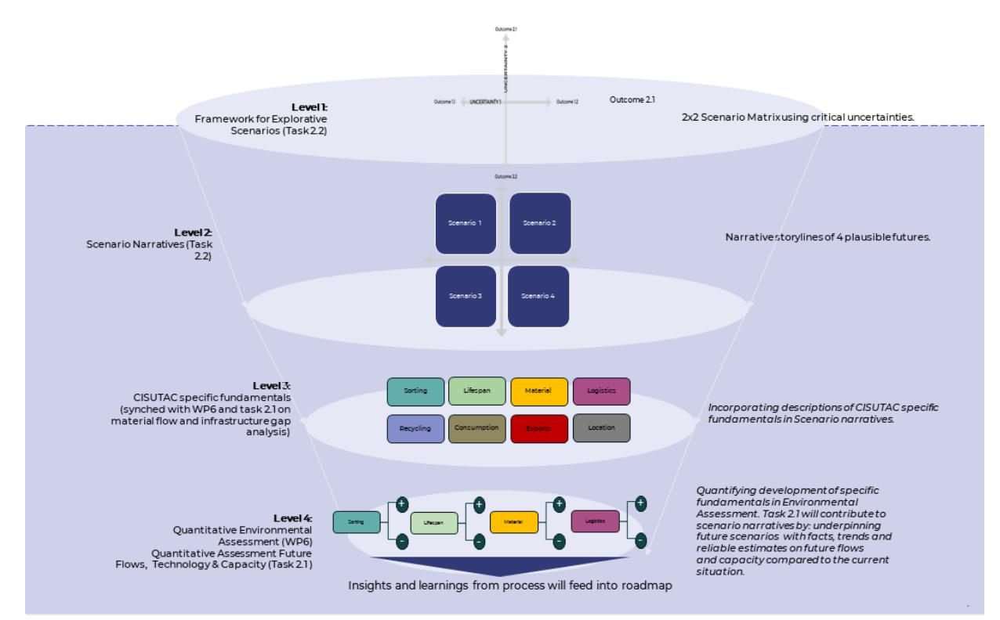

*Figure 1 Framework: Process for how to build a roadmap to 2030, CISUTAC, adapted from: Paulien van den Berg, Daniel Scholten, Jonathan Schachter, Kornelis Blok, Updating scenarios: A multi-layer framework for structurally incorporating new information and uncertainties into scenarios, Future Volume 130, (2021)*

### **Defined system boundaries for material flow and infrastructure gap analysis.**

The focus of the material flow and infrastructure gap analysis performed in WP2 has been on the value chains of post-consumer textile waste in Europe. Defined system boundaries for the material flow and infrastructure gap analysis have been conducted together with work package 6, where an environmental impact assessment will be performed based on current situations and future scenarios. The report has a focus on post-consumer textile includes both home textiles and clothes put on the European market, where the main focus is on cotton, polyester and man-made cellulosic fibres (MMCF). Shoes are included in the material flow analysis, shoes is included in the collected textile waste steam today, therefore also in the available statistics. Consumption patterns and exports outside of Europe have also been looked at (Figure 2). The processes when looking at the textile waste system in EU have included: waste flows, material composition, capacity of sorting and recycling, regional development, and geographical differences.

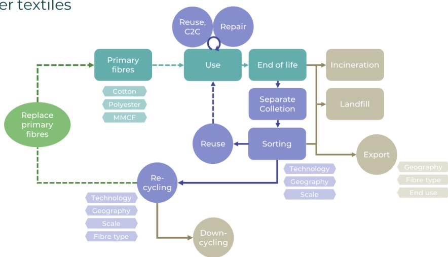

*Figure 2 CISUTAC visualisation of system boundaries for material flow analysis and sustainable impact analysis, (2023)*

For CISUTAC work package 6 to perform an impact assessment on both current and future situation, work package 2 will support in a next step with estimating future available flows and explore geographical differences and possibilities to build circular value chains based on the data summarized in this report.

## **3. The Current Situation Material Flow**

This chapter describes the current textile waste flows in the waste management system. The chapter starts with a description on the used method and continue with work executed. It also includes an outlook of consumption, as consumption affects the material flows of textiles in Europe today and in the future. This is followed by a mapping of flows in the current textile waste management system and ends with conclusions regarding future trends on waste.

## **3.1 Method for mapping material flows**

The material flow mapping is based on existing literature and reports. This analysis contributes with an overview of existing knowledge waste flows and capacity.

### **3.1.1 The current state of research and ongoing projects and initiatives**

The material flow mapping started with an overview by the partners within the working group to look into previous and current literature and reports within this field, as well as articles, both scientific and public. The search algorithms were "material flow", "recycling of textiles" and "sorting". The most recent reports were selected and analysed. Some position papers and white papers have also been included, for example Prospering in the Circular Economy, EURATEX and White Paper on textile waste management, Acte Europe, 2022- 2023. A total of 112 reports and papers were included and divided into ten categories, listed below.

- Waste flow and collection
- Sorting and recycling capacity, infrastructure
- Collection rate
- Reuse consumption
- Reuse categories / volumes
- Sorting technology capacity
- Life span of a garment
- Export outside of Europe (categories / volumes)
- Import/export data
- Material composition data

At an early stage a first workshop with the working group were held where the McKinsey report *Scaling textile recycling in Europe–turning waste into value, McKinsey Apparel, Fashion & Luxury Group*, July 2022 and Fashion for good report *Sorting for Circularity*, 202[2](#page-15-3)4 were presented and discussed. The working group provided feedback and expertise on how to proceed with the projects work ahead. A list of relevant initiatives was also noted, this included for example other European projects such as tExtended, CIRPASS, HEREWAR and New Cotton. These are projects that have a close connection to the CISUTAC project.

## **3.2 Material flows in the current waste management system**

Here follows an outlook of consumption, as consumption affects the material flows of textiles in Europe today and in the future.

4 Sorting for Circularity Europe, An Evaluation and commercial assessment of textile waste across Europe, Fashion for Good, 2022 and Circular fashion in Europe: Turning waste into value, McKinsey, 2022

#### **3.2.1 Outlook on consumption**

The EU Strategy for Sustainable and Circular Textiles has the ambition to bend the consumption curve and decouple fashion from its major negative impact on the planet, partly through new consumption patterns. The amount of clothes put on the market keeps on growing, and so does the environmental impact of the sector. Between 2000 and 2015, clothing production doubled, while utilization – the number of times an item of clothing is worn before it is thrown away – decreased by 36%. On top of this, due to ever lower prices and lost revenues – from overstock, stockouts, and returns – profit margins of the world's leading apparel retailers decreased by an average of 40% from 2016 to 201[9](#page-16-0)5 .

#### **The waste management system is highly co-dependent on consumption**.

Consumption trends and consumer behaviour analysis help to understand and anticipate textile waste trends. If consumption will follow current trends, consumption of clothing and footwear is expected to increase by 63% by 2030, from 62 million tonnes today to 102 million tonnes by 2030 worldwid[e](#page-16-1)6 . At the same time, research indicates that "an estimated 75% decrease in the purchase of new garments is required to respect global environmental planetary boundaries"[7](#page-16-2) . A shift in consumption patterns will be a crucial building block for the transition to a circular textile value chain. How much change can be expected from consumers by 2030, what change is needed and how will it affect the waste streams are relevant questions to understand the future need of capacity building for sorting and recycling of waste.

#### **Consumption's growth**

Europe's total consumption (2020, EU 27, including shoes) on average is 15 kg per capit[a](#page-16-3)8 . Millions of tonnes of clothes are produced, worn and thrown away each year, equivalent to 11.3 kg per perso[n](#page-16-4)9 . Geographical differences in consumption vary within Europe from 6, 1 kg per person in Latvia to 22. 8 kg per person in Italy[10](#page-16-5) . Volume of clothing consumption in Europe has not dramatically changed historically, between 2003 and 2018. Average per capita apparel consumption in EU-272020 amounted to 12.3 kg/capita in 2018, up 20 % from 10.1 kg/capita in 2003[11](#page-16-6). The trend for consumption growth going forward is uncertain but will be effected by factors like ageing population, price inflation and re-sale growth and implementation of new legislation steering towards more sustainable consumption patterns.

5 Ellen MacArthur Foundation Report, Circular business models: redefining growth for a thriving fashion industry, 2021

6 Eionet Report - ETC/WMGE 2019/6 November 2019 Textiles and the environment in a circular economy, 2019

7 Cornell, Häyhä and Palm, 2021 and Fletcher and Tham, 2019

8EU-27 apparent consumption of clothing, footwear and household textiles (excluding fur and leather clothing), 2010-2020, million tonnes and kilograms per person — European Environment Agency (europa.eu)

9 Article, ReSet the Trend: EU calls on young people to promote circular and sustainable fashion, 2023

10 EuRIC study, LCA-based assessment of the management of European used textiles, 2023, page 8

11 Köhler et al 2021

| Country code (data year)    | AT              | CZ  | DE  | DK   | EE  | FI  | Fla | FR  | IT  | LT   | LV   | NL   | SE   | UK 23 | ES 24 |     |
|-----------------------------|-----------------|-----|-----|------|-----|-----|-----|-----|-----|------|------|------|------|------------------|------------------|-----|
|                             |                 |     |     |      |     |     |     |     |     |      |      |      |      |                  |                  |     |
|                             |                 |     |     |      |     |     |     |     |     |      |      |      |      |                  |                  |     |
| Consumption of new textiles | <b>K-tonnes</b> | --- | 69  | 1715 | 85  | 16  | 72  | --- | 648 | 1383 | 19   | 12   | 305  | 121              | 1040             | 890 |
|                             |                 |     |     |      |     |     |     |     |     |      |      |      |      |                  |                  |     |
| <i>Kg/ person</i>           | ---             | 6.6 | 3.8 | 2.4  | 1.2 | 1.3 | 1.2 | 2.2 | 7.0 | 6.1  | 17.7 | 12.6 | 15.7 | 19.0             |                  |     |

*Table 1 Current consumption per country and year*

#### **Business-as-usual (BAU) assumption**

Several previous reports have scenarios envisaged to anticipate the waste situation by 2030, one business-as-usual (BAU) assumption where consumption continues to increase and other previous reports that explore how re-commerce business models such as reuse, repair and rental have increased their market share compared to the BAU scenario.

In report ''Scaling textile recycling in Europe Assumed, textile consumption and textile waste (post-industrial, pre-, 2.4 million tonnes per (Million tonnes yr-1) of additional apparent consumption of apparel and home textiles to more than 9 Million tonnes yr-1 in 2035 – based on 5 key studies mentioned in report ''Scaling textile recycling in Europe – turning waste into value' (2022) [12](#page-17-0) .

The BAU scenario from this report assumes that consumption will continue with an annual growth of 2 percent and not be that much effected by upcoming legislation that has an ambition to steer to circular business models and change of consumption behaviour may seem as pessimistic in a future scenario

#### **Growing re-commerce market**

Generally, increasing growth in the second-hand market and increasing demand for second-hand clothing is observed within Europe. The textiles reuse market is already developing faster (15% each year) than the retail market globally[13](#page-17-1). The primary vehicle for circular models is currently re-commerce (resell, rental etc.), representing around 3 - 3. 5 % of the market worldwide[14](#page-17-2). Although accounting for an increasing share of wardrobes, second-hand clothes still only represent around 5% of total fashion purchasing in most [G20] countries, and less than 10% in some countries, according to EEA/Eionet, 2019; Gray, 2017 [15](#page-17-3) .

Several studies emphasize the future growth of market share for the recommence business models. According to a recent UNEP report, resale, rental, repair, and remaking markets could grow from 3% in 2021 (\$73 billion) to 23% in 2030 of the total textiles industry (or \$700 billion), with resale composing 69% of this economic value generated[16](#page-17-4) . Correspondingly, the Ellen MacArthur report, *Circular business models: redefining growth for a thriving fashion industry' from 2021,* resale, rental, repair, and remaking have the potential to grow from 3.5% of the global fashion market in 2021 to 23% by 2030, representing a USD 700 billion opportunity with the potential to provide a third of the emission reductions necessary to

12 Scaling textile recycling in Europe—turning waste into value, ref to Joint Research Centre,; 2% CAGR—estimated waste growth per ton, 2021

13 Presentation, Ellen MacArthur Foundation, CIRCULAR BUSINESS MODELS Redefining growth for a thriving fashion industry, 2023

14 McKinsey's Report 'Fashion on Climate – How the fashion industry can urgently act to reduce its greenhouse gas emissions, 2020

15European Environmental Agency /Eionet, 2019 and Gray, 2017

16 UNEP Report 'Sustainability and Circularity in the Textile Value Chain, 2023

put the fashion industry on a 1.5-degree pathway[17](#page-18-0). Resale, rental, repair, and remaking can, on average, increase utilisation of products from 25 uses per item in 2021 to 45 uses per item by 2030 according to Ellen MacArthur Foundations report from 2021, Circular Business Models[18](#page-18-1) .

The McKinsey's Report '*Fashion on Climate* from 2020, estimated that re-commerce models can extend average product life by 1.7x based on the average length of second-hand ownership. According to the same report, the rental model extends product life by 1.8x, based on the average number of rentals during a product's lifetime. Professional Repair models offer a more modest 1.35x extension. Finally, refurbishment has the potential to double lifetime extension, reflecting potential brand and manufacturer collaborations around up-cycling[19](#page-18-2) .

The development of these models is expected to be largely driven by North America and Europe. These models have the potential to reach USD 430 billion by 2030 as customers increasingly adopt new ways of accessing fashion, motivated by factors such as affordability, empowerment, convenience, and environmental awareness. The growth potential could be even bigger in Europe and reach 38% of the global market share[20](#page-18-3), shown in the figure 3.

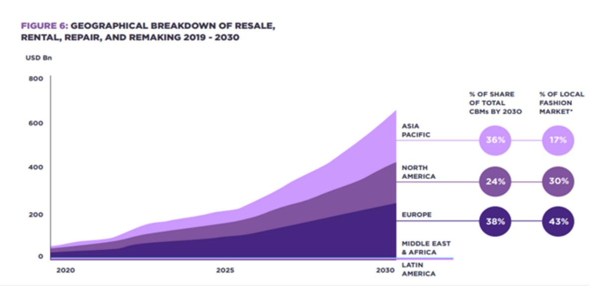

*Figure 3 Geographical Breakdown of resale rental, repair and remaking, 201-2030, Source BCG Analysis*

What does these scenarios with an increased market share of re-commerce models means for the total textile waste in 2030 compared to the BAU Scenario? A alternative view could be that a there is literally zero volume consumption growth of new produced products in

17 Ellen MacArthur Foundation Report 'Circular business models: redefining growth for a thriving fashion industry, 2021,

18 Ibid, page 18

19 McKinsey, Fashion on Climate, How the fashion industry can urgently act to reduce its greenhouse gas emissions, 2020

20 Ellen MacArthur Foundation Report , Circular business models: redefining growth for a thriving fashion industry, 2021

2030 and that this would be mean that future waste volumes are more in the same precinct as today.

## **3.3 The textile waste flows**

This part contains a mapping of flows in the current textile waste management system and ends with conclusions on future trends on waste.

#### **The textile waste flows**

The focus of this report is, as stated in the introduction, post-consumer textile waste (including apparel, home textiles), which is estimated to be 87% of the total textile waste in EU27[21](#page-19-1) . Several studies have previously mapped the textile waste, resulting in a range from 5.4 million tonnes up to 6.8 million tonnes post-consumer textile waste per year. Furthermore, more recent data from Huygens et al. (2023) shows that the EU generates a total of 10.9 million tonnes post-consumer textile waste per year, with an uncertainty range of 10.2-11.5 Million tonnes per year (representing EU27 and reference year 2019). Possible explanations to the relatively large variations in the reported numbers are due to differences in methods, scopes, both in terms of geographical boundaries (e.g. including EU27, EU27 plus Switzerland or EU28) and timeframe covered (years 2018 -2023)[22](#page-19-2) .

There is currently no legal obligation to collect and report textile waste data in the European Union. Also, statistical methods for measuring textile waste vary between countries. Previous reports have therefore, in the absence of comprehensive primary empirical data, relied on small-scale or regional studies, enriched with expert estimates, assumptions, extrapolations and calculations. A common approach to estimate textile waste is to base it on the amount of new textiles sold on the European market, and then calculating that a share ends up as textile waste. There are, however, uncertainties related to this data, where reported values for textile consumption ranges from 6.6 (ETC/CE Report 2/2022) to 12.0 Million tonnes (Huygens et al. 2023). But also, that data is uncertain and related to how much clothes that accumulates in the consumer's wardrobe. A survey by the environmental group WRAP estimates that the UK's wardrobes hold 1.6 billion unworn garments. In this specific survey it was found that the predicted length of time people kept their clothes increased between 2013 and 2021. For example, a pair of jeans is now kept for four years on average, compared with three years in 2013. Moreover, there is, as stated before, lack of data regarding the lifespan of textiles, i.e., the time it takes until textiles are turned into waste.

However, what is known is that textile waste on a country level varies throughout Europe, and that these variations are strongly linked to the consumption rates in the different countries.

#### **3.3.1 Collection rates and geographical differences**

The collection rates, meaning the number of textiles out of the total waste that is collected, vary with country throughout Europe, and are even more differentiated on a global level. These differences are strongly linked to the collection infrastructure, collection rates and the sorting capacity in the specific country. The separate textile collection rate also varies greatly between EU member states: from 4.5% in Latvia to 45% in Denmark and the Netherlands. There are examples are Italy with 11%, even though separate collection is

21 Reference year 2019, Huygens et al. 2023

22 Duhoux et al. 2021, Köhler et al. 2021; Fashion for good 2022; McKinsey & Company 2022, Huygens et al. 2023

already mandatory, and 38% in France, where a textile EPR scheme has been in place since 2007 (Huygens et al. 2023). Due to the EPR scheme, France has textile waste collection data[23](#page-20-0) of good quality available. However, they still have relatively low collection volumes, considering that the EPR scheme has been implemented for about 15 years – just 3.7 kg per capita or 38% of the volume put on the market. This indicates that more measures are needed to increase the collection rate.

According to Refashion the French EPR organization assume that When they look at the evolution of the split between reuse, recycle and waste over the last ten years, and for the next ten years, reuse is going to decrease and recycling will have to increase . The more is collected, the less will be able to be reused, so it's a necessity to create a profitable recycling industry in Europe and this is paramount before increasing collection. [24](#page-20-1)

One of the main reasons why these data are not accessible is the lack of homogeneity in the collection systems. The Commission notes that, in all countries with available studies, most of the collection of used textiles is currently carried out by non-profit entities, whom have been leading the collection of clothing for decades, and what the Commission calls "commercial collectors", i.e. companies that collect clothing with the aim of reselling it (whether for profit or not). While, in Denmark, Finland, Latvia and Sweden, the collection is dominated by charities, in Lithuania (with 54%), France, Germany and the Netherlands, commercial collectors lead. On the other hand, the weight of municipal waste companies is even lower, and is only representative in countries such as Estonia, where it is mandatory by law, with 37%, or Lithuania, with 30%. In this sense, during last July 2023, the Commission presented new common rules with the aim of making manufacturers responsible for the entire life cycle of textile products and supporting sustainable waste management in the European Union. In other words, the Commission suggested, and suggests, the implementation of mandatory Extended Producer Responsibility (EPR) systems for textile products in all EU member states. This initiative aims to accelerate progress in separate collection, sorting, reuse and recycling, aligning with the "EU Strategy for Sustainable and Circular Textiles", approved in March 2022.[25](#page-20-2)

On average, 33-38% of the total textile waste generated in Europe is separately collected, while the remaining 62-67% is not collected and goes to landfill or incineration. Several studies have mapped the collected textile waste (including footwear), where the waste ranges from 1.7-2.8 Million tonnes. On the other hand, data from Huygens et al. (2023) says that if EU generates a higher volume of total textile waste, then the collection rate decreases, approximately to only 25 % of the total post-consumer waste (own estimate based on data from Huygens et al. (2023)).

### **3.3.2 Collectors and collecting systems.**

Depending on country, municipalities, commercial collectors, or social enterprises can collect textile waste. It differs from country to country who is the main collector, but in several countries, the social entrepreneurs still dominate the collection market. For instance, in Austria and France, 57% and 60% of the textile waste, respectively, are collected by social enterprises.

23 Refashion.fr - Refashion for a 100% circular textile industry

24 Learnings from France on textile waste and EPR, innovationintextiles.com

25 European Commission, COM(2022) 141 final, EU Strategy for Sustainable and Circular Textiles, 2022

Several countries like Denmark, Finland, Italy, Lithuania, and Switzerland have already introduced mandatory separation of textile waste. Only three EU member states have introduced an EPR scheme; Hungary, France, and The Netherlands. The Netherlands introduced their EPR scheme in 2023, stating that targets for 2025 out of textile put on the market: 50% needs to be recycled or prepared for reuse. Of which at least 20% prepared for reuse, 10% for reuse in NL and of which 25% fibre to fibre recycling (Figure 4). In 2030 out of textile put on the market: 75% needs to be recycled or prepared for reuse. Of which at least 20% prepared for reuse, 15% for reuse in NL and of which 33% fibre to fibre recycling. Compared to the European average statistics for reuse within Europe (10) this should be a reachable target. But also needed to note, when collecting increases usually quality decreases. That indicates that the target still requires an effort of the stakeholders. Compared to world/European average of fibre-to-fibre recycling this leap is gigantic, i.e. to go from a couple of percent to 25% in 2-3 years. This demands both capacity and technology leaps.

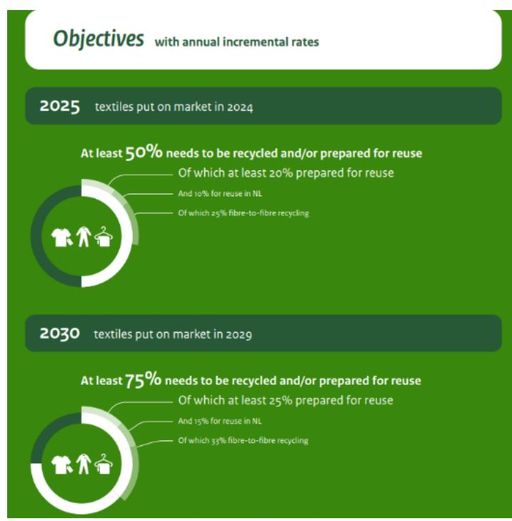

*Figure 4 EPR Scheme for the Netherlands[26](#page-21-0)*

### **3.3.3 Destinations of collected and sorted waste**

Several studies that have mapped collected and sorted textile waste indicate that 55-60% of the waste is sorted as reuse (export and sold within Europe), while only about 10% of collected waste (0.2 Million tonnes) is then sold as reuse within Europe. It is important to note that shoes are a part of the statistics. According to Sorting for circularity (2022) 11 % of collected textile waste is shoes.

Export is the most common fate of separately collected textile waste sorted in the EU. Previous reports indicate that approximate 50% of total collected textile waste are exported,

26 Government of the Netherlands, The Ministry of Infrastructure and Water Management, Infographic: extended producer responsibility for textiles, 2023

which has been estimated to approximately 1 Million tonnes (EU27 + Switzerland)5. According to the latest report from EEA (2023), EU exports of used textiles in Europe's circular economy, the EU28 exported 1.7 Million tonnes of textile wastes in 2019. The numbers are based on two waste codes. Used textiles exported from the EU are classified into two main product codes under the CN-product code system: 6309 – worn textiles and clothing; and 6310 – sorted and unsorted used rags and textile scraps. In general code 6309 should be given to textiles fit for reuse (second-hand), while 6310 should be used for textiles unfit for reuse that may or may not already have been processed, for example, recycled, into other products such as industrial rags.

The relatively large range between 1 and 1.7 Million tonnes can only partly be explained by different geographical scopes, where the first estimate covers EU27 plus Switzerland and the later EU28 (UK included).

Five out of the 27 EU Member States and the United Kingdom account for around 75% of all EU textile waste exports. Germany accounts for 36%, Poland 15%, the Netherlands 14% Italy 11%, and Lithuania 4%6 . These countries are believed to not only export discarded textiles that have been collected within the national borders, but they also import additional textile waste from the other EU countries, making them import-export hubs. Approximately 40% of the collected textile waste is directly sent to second-hand markets in countries outside Europe, while the remaining share is sorted to identify more in-demand garments to be sold for reuse in Europe or other developed countries7 .

It is difficult to map the exact fate of the exported textiles, since there is a lack of transparency related to the global used textile industry (with "used textile" defined as waste that is sorted or non-sorted and that are sold for primary second-hand markets worldwide), which is complex and inadequate. Estimates have been done based on textile waste codes, with a high level of uncertainty, indicating that 0.9 Million tonnes of exports go to reuse, 0.45 Million tonnes to recycling and 0.45 Million tonnes to landfill (Huygens et al. 2023). In this report, the assumption was made that final use of export is 50% reuse, 25% recycling and 25 % landfill.

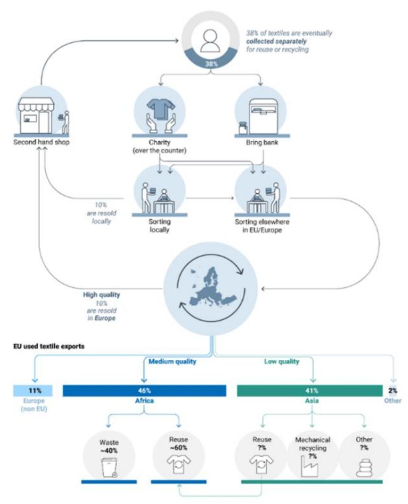

*Figure 5 Flow of used textiles collected in the EU EU exports of used textiles in Europe's circular economy, https://www.eea.europa.eu/publications/eu-exports-of-used-textiles, 2023*

Watson et al. (2020b)[27](#page-23-0) report that 32% of the separately collected waste is recycled, mainly down cycling. It ranges from 0.4-0.7 milllion tonnes , shown in table 2, *Summary of Summary of numbers of previous reports of post-consumer waste flows in EU 27/28*. Globally 1% of textile waste is fibre to fibre recycling. [28](#page-23-1) One textile waste flow that is not shown in statistics is the potentially illegal collection and trade, which is by definition very hard to track down, and previous efforts have failed. [29](#page-23-2)

### **Summary of numbers of previous reports of post-consumer waste flows in EU 27/28**

27 Köhler A., Watson D., Trzepacz S., Löw C., Liu R., Danneck J., Konstantas A., Donatello S. & Faraca G., 2021. Circular Economy Perspectives in the EU Textile sector, EUR 30734 EN, Publications Office of the European Union, Luxembourg, 2021, ISBN 978-92-76-38646-9, doi:10.2760/858144, JRC125110

28 Morlet A, Opsomer R, Herrmann S, Balmond L, Gillet C, Fuchs L, 2017, A new textiles economy: redesigning fashion's future. Ellen MacArthur Foundation, accessed 01 Aug 2020

29 Exports of Nordic Used Textiles: Fate, benefits and impacts, David Watson, PlanMiljø, Denmark

David Palm, Ramböll, Sweden, 2016

| Parameter                | Percentage Range E U27/EU28 PCW                     |
|--------------------------|-----------------------------------------------------|
| New products             | 6.6-12.1 million tonnes                             |
| Reuse                    | 5% of market share 0.3-06 million tonnes            |
| Textile waste*           | 87% to total textile waste. 5.4-10.9 million tonnes |
| Mixed Waste              | 75-67% landfilled or incinerated                    |
| Reuse within Europe      | 5- 10 % of collected textile waste is               |
| Mixed Waste              | 5-10% of collected textile waste is                 |
| Shoes                    | 5-10% of collected textile waste is                 |
| Export                   | 48 % of collected textile waste is                  |
| Recycled, fibre-to-fibre | 1 % of total textile waste is fibre-fibre           |
|                          | recycled worldwide. 1% of collected                 |
|                          | 0.02 million tonnes                                 |
| Downcycling              | 32% of collected textile waste is                   |
| Reuse outside EU         | 50% of exported textile waste is                    |
|                          | Reuse outside EU                                    |
| Recycling outside EU     | 25% of exported textile waste is                    |
|                          | Reuse outside EU                                    |
| Landfilled outside EU    | 25% of exported textile waste is                    |
|                          | Reuse outside EU                                    |

\*Post-consumer textile waste (home textiles, footwear and clothes)

*Table 2 Overview of data on textile waste in the CISUTAC report*

## **3.4 Future trends on waste**

The conclusions in this section are Summarized as future trends regarding waste based on the findings of mapping of material flows.

More reports have in recent years shed light on how much textile waste Europe actually holds, still with many uncertainties concerning the data. Previous reports state the lack of harmonized measurement methods. For example, actual waste or collection levels, whether the current average collection rate is 25 percent or 38 percent is necessary to establish to be able to measure and follow the actual development. There is a need for more sufficient and reliable market data to be able to set targets to manage the transformation of the textile waste system.

The shift of consumer behaviour to consuming less in the future is uncertain, but previous reports prognosis indicates that re-commerce models (reuse, rent and repair, as shown in the outlook on consumption, ) have a strong potential in Europe to replace new consumption. There the several drivers that may impact a potential consumption decline as ageing population, stronger price inflation of clothing due to cost increases in material & energy, manufacturing labour, logistics and regulatory compliance. This could have the consequence of at least stopping the trend of increasing consumption of new garments per capita. The sorting industry must be prepared that premium quality of reuse starts to flow in the fashion industry re- commerce business models. Re-commerce models will prolong the lifespan of garments and postponing the time before garments end up in the waste streams. This will challenge business models within the sorting industries where today's main profits strands from the premium quality of the garments to reuse. This means that the ratio identified in the previous reports, that today approximate 10 percent of collected textiles are reused within Europe, might stay on the same level or even decreases when Europe starts to collect more waste at the same time as re-commerce models thrives outside the waste management systems.

It is essential to create new outlets for textiles that cannot be reused, and sorting is an essential step in the chain. Approximately 30 percent of all collected waste is downcycled within Europe today and approximately 50 percent of all collected textiles are exported. Previous reports indicate that at least every fourth exported garment ends up in a nonsustainable waste management system and another fourth is downcycled outside of Europe. There is an opportunity to shift this exported volume to the European recycling industry both to create larger feedstock and also to reassure more sustainable waste management. If hypothetically these streams could be redirected within Europe, it would mean an additionally 0.45-0.9 Million tonnes to recycling within Europe. This means a potential doubling of current streams to recycling today without even increasing collection of waste.

The percentage to recycling will increase in the future also for the reason that quality of textile waste usually decreases when collection rates increase. This is due to different reasons like collection methods and purpose of collection focus more on recycling than reuse (Watson et al., 2016). With upcoming legislation leading to more separately collected textile waste it is likely that more textile waste will be in a condition suitable for recycling rather than reuse. This means that the ratio identified in the previous reports stating that today approximately 30 percent goes to recycling, will most likely be higher in the near future when new legislation is in place. The trend of increasing volumes to recycling will also be strengthened with the upcoming legislation proposal for a new *[Regulation on waste](https://ec.europa.eu/commission/presscorner/detail/en/qanda_21_5918)  [shipments.](https://ec.europa.eu/commission/presscorner/detail/en/qanda_21_5918)* This with the aim to address that EU does not export its waste challenges to third countries; making it easier to transport waste for recycling and reuse in the EU; and better tackling illegal waste shipments.

## **4. Infrastructure capacity and regional development**

The following chapter includes the results of the work executed for the infrastructure gap analysis. The chapter will start with an outlook of European regions, as regional development is a crucial aspect of Europe's ability to build capacity and circular value chains. The outlook will be followed by a mapping of the capacity on sorting and recycling in the waste management system and end with conclusions for future trends on capacity building.

## **4.1 European regions as enablers**

Can regional development work as an enabler in the transition to a circular system? Europe has many regions that have a long history within the textile industry and have textile capacity in one way or another. It is estimated that the annual collection of textiles will increase a further 65 000 to 90 000 tonnes annually in coming years as Member States in the European Union will begin to adjust or roll out supplementary collection systems to implement the provisions on separate collection of textiles in the Waste Framework Directive[30](#page-26-2) .

In line with the long history of textile capacity many regions have created clusters or aligned with the S3 smart specialisation strategies[31](#page-26-3) that embrace a broad view of innovation, supporting technological as well as practice-based and social innovation. This enables each region to shape policy choices according to their unique socio-economic conditions. It can be described as a way of working to gather forces for innovation and sustainable growth in the areas with the greatest potential. One region or area can function in many ways, for example there might be a strong technology cluster, or one region could be stronger in societal challenges. The purpose of smart specialization is to pool resources for innovation and growth in the areas with the greatest potential. This is both about areas where a region already has strengths as well as new areas. For textiles there are numerous Smart specialization regions.

Considering the recent legislative strategies and proposals that affect the textile and fashion industry in the EU there is a growing number of related research and innovation projects. At the initiative of the CISUTAC project, a network bringing together all these projects was recently established, called ECOSYSTEX[32](#page-26-4). This network aims to create a longterm community of practice, ensuring collaboration across project consortia and lasting beyond the individual projects' duration. One of the many ongoing projects within this network is RegioGreenTex. This project is promoting the collaboration in research and development for the textile industry to establish a systematic circular economy business model across the EU. RegioGreenTex partnership involves 11 regions from 8 countries (Portugal, Spain, France, Italy, Belgium, Netherlands, Romania, Sweden) to embrace a comprehensive European view on the textile sector.[33](#page-26-5)

When it comes to capacity in infrastructure for the textile waste industry it is not only about having one facility or the right technology. Many actors and processes must intervene. As

30 Circular economy perspectives in the EU Textile sector

31 European Commission, Smart Specialisation Platform https://s3platform.jrc.ec.europa.eu/

32 Textile ETP, https://textile-platform.eu/ecosystex

33 RegioGreenTex, https://www.regiogreentex.eu/dashboards/home

stated in the McKinsey report Turning Waste into Value[34](#page-27-1) the actors within this sector must come together; *"Several of the main challenges ahead are best solved in a highly collaborative manner. Business leaders across the value chain, investors, and leaders of public institutions would need to come together in an unprecedented way to engage in a highly operational joint effort to overcome the barriers to scale".[35](#page-27-2)*

Regional infrastructure capacity is based on several aspects, such as policy and regional strategies, infrastructure, technological development, collaboration and consumer awareness. But it is also the actors within these value chains that has an important role to play4 . According to the UNEP report "Sustainability and Circularity in the textile value chain - a global roadmap", the actors and stakeholders need to look at the system perspective and in the system all actors must take their responsibility. This applies to both brands and retailers, raw material producers and manufacturers, innovators and recyclers, policymakers as well as financial institutions*.* 5 *"All actors in the value chain must become part of the solution to develop and perpetuate a new model for the textile sector, based on science and in line with circularity principles"*. [36](#page-27-3)

The vision for CISUTAC also shares the view of collaboration and means that "A successful transition to a circular economy requires strong partnerships along the value chain based on mutual understanding and shared responsibilities" [37](#page-27-4) .

## **4.2 Sorting capacity**

This section describes the method and work executed regarding mapping capacity on sorting.

### **4.2.1 Methodology for data collection on sorting capacity**

No official government sources have been found that provide information on textile waste sorting capacity by country. The most accessible data are those reported on general capacities at European level. Data collection on textile sorting capacity by country was carried out as follows. For each country, between 1 and 3 sorters were selected. These entities were chosen based on two criteria: size of facilities and accessibility of data on their websites. The data collection is based on the official statements found on sorters webpages. In this way, the aim was to select the entities with the greatest volume within each country, and which also had data available on their websites. Therefore, the classification capacity indicated per country throughout this document is the sum of the individual capacities of each entity per country.

The mapping of capacity aims to identify the number of and location of automatic capacity in Europe. Therefore the mapping has separate automatic sorting facilities per country in the third column and the summarize the total number of facilities (automatic and manual) in the fourth column, see table 3. As mentioned above this summarize the capacity from 1 to 3 sorters per country with official data on their webpage. There are smaller and midsize sorters manual capacity that is not covered by this mapping.

34 McKinsey, Turning waste into value, 2022

35 Ibid.

36 Sustainability and Circularity in the Textile Value Chain - A Global Roadmap, UNEP, 2023

37 CISUTAC, Vision for a Circular and Sustainable EU Textile Sector, A European EPR that drives circularity, 2023

The data found on sorters webpages, especially for the automatic sorting facilities, is most likely data referring to the facilities maximum capacity and not the actual utilization rate of the facility today.

### **4.3 Sorting infrastructure and capacity building**

Sorting of post-consumer textile waste can be conducted in many ways and can serve many purposes. Current practice is manual sorting for reuse. The goal here is to separate the wearable items from the non-wearable items. The non-wearable items can then be further sorted for recycling by manual or automated sorting done by NIR technology. It is estimated that the current capacity in the EU collecting separately textile waste is 1.7 -2.8 Million tonnes based on findings documented by Köhler et al. (2021), McKinsey (2022) and EURATEX (2021) Huygens et al. (2023). Textile waste can be sold as unsorted goods, exported outside of EU. That means that Europe does not sort through all collected waste today. Currently, most textiles are sorted manually as few actors with automatic sorting techniques exist on a larger scale[38](#page-28-1) .

#### **4.3.1 Current sorting capacity**

The CISUTAC mapping of sorting capacity spread across Europe, see table 3 and appendix 2.

The mapping of capacity aims to identify the number of and location of automatic capacity in Europe. Therefore the mapping separate automatic sorting facilities per country in the third column and the summarize the total number of facilities (automatic and manual) in the fourth column, se table 3. As mentioned above this summarize the capacity from 1 to 3 sorters per country with official data on their webpage. There are smaller and midsize sorters manual capacity that is not covered by this mapping.

The data found on sorters webpages, especially for the automatic sorting facilities, is most likely data referring to the facilities maximum capacity and not the actual utilization rate of the facility today.

38 Köhler, et al, Circular economy perspectives in the EU Textile sector, 2021

#### *Table 3 The CISUTAC mapping of sorting capacity spread across Europe*

| EU 28 Austria Belgium Bulgaria Croatia Cyprus Czechia Denmark Estonia | 34200 6000 500 | Sorting capacity Tonnes per year Tonnes Tonnes Tonnes | Automatic facilities 1 | Automatic and manual facilities 1 1 |
|-----------------------------------------------------------------------|----------------|-------------------------------------------------------|------------------------|-------------------------------------|
| Finland                                                               | 12000          | Tonnes                                                | 2                      | 2                                   |
| France                                                                | 198000         | Tonnes                                                | 1                      | 2                                   |
| Germany Greece                                                        | 191000         | Tonnes                                                | 2                      | 3                                   |
| Hungary Ireland Italy Latvia Lithuania Luxembourg Malta               | 3600           | Tonnes                                                | 0                      | 1                                   |
| Netherlands Norway                                                    | 77850          | Tonnes                                                | 1                      | 2                                   |
| Poland Portugal Romania                                               | 185000         | Tonnes                                                | 1                      | 2                                   |
| Slovakia Slovenia                                                     | 20 000         | Tonnes                                                |                        | 1                                   |
| Spain                                                                 | 64000          | Tonnes                                                | 1                      | 3                                   |
| Sweden                                                                | 25000          | Tonnes                                                |                        |                                     |
| Switzerland                                                           | 32000          | Tonnes                                                | 1                      | 1                                   |
| UK                                                                    | 130 000        | Tonnes                                                |                        | 5                                   |
| Totals                                                                | 978650         | Tonnes                                                | 9                      | 19                                  |

As can be seen in the figure 6 below, Germany, France and the United Kingdom lead the ranking of textile waste sorting capacity in Europe, based on collected data employing the methodology described above. These figures are above 100.000 tonne per year, although it is true that these countries are also among the largest producers of textile waste in Europe. The bigger volumes are partly in line with the countries also identified as the biggest exporters of textile waste; UK, Germany, Poland and the Netherlands. As exporters Italy and Lithuania are also listed, but in the capacity mapping no data was found on sorters in either Italy or Lithuania. The Nordic countries have sorting capacities ranging from 12.000 to 25.000 tonnes per year, while the Eastern European countries range from 3.600 tonnes per year in the case of Hungary to 20.000 tonnes per year in the case of Slovakia. On the other hand, countries such as Spain, Belgium and Netherlands have a sorting capacity of 64.000, 34.000, 78.000 tonnes per year, respectively as shown in figure 6. Therefore, as can be seen from the above data, sorting capacity varies depending on the studied country. To summarize sorting has a broad spread across Europe, several countries are represented across Europe even though the bigger volumes are centred in a few countries that also has 

## **4.4 Recycling capacity and technologies**

This part includes work executed on mapping capacity on sorting in the waste management system and end with conclusions for future trends on capacity building.

### **4.41 Current recycling flows**

The current textile recycling capacity in Europe is about 0.70-0.85 Million tonnes/year. The majority of the textile waste (0.5-0.6 Million tonnes/year) is recycled via open-loop recycling and ends up as cleaning wipes and non-woven textiles. Although this is a viable alternative compared to using virgin fibres to make these textiles, it is still a kind of downcycling. About 0.2-0.3 Million tonnes/year of textile waste is processed to obtain spinnable fibres (closed loop recycling) which can be used again for apparel or home textiles. However, from these 0.2-0.3 Million tonnes/year, only 0.03-0.05Million tonnes/year resulted in spinnable fibres[39](#page-30-1) .

39 Techno-scientific assessment of the management options for used and waste textiles in the European Union, Huygens, D., Foschi, J., Caro, D., Patinha Caldeira, C., Faraca, G., Foster, G., Solis, M., Marschinski, R., Napolano, L., Fruergaard Astrup, T. and Tonini, 2023

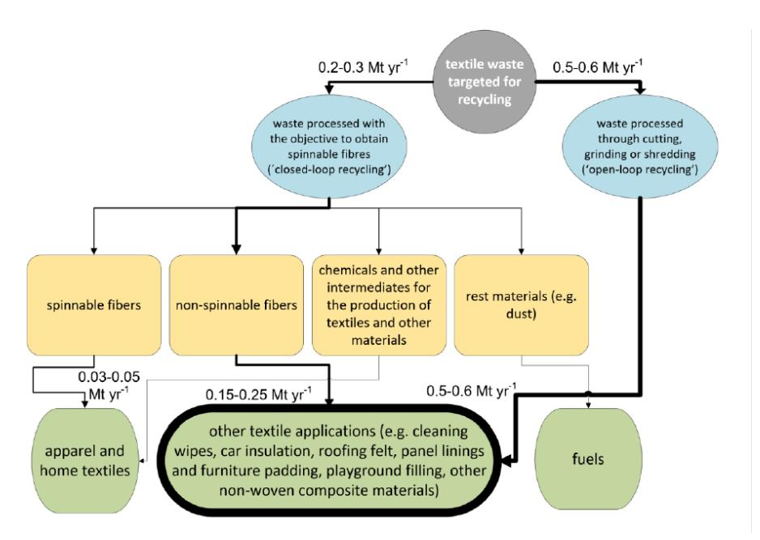

*Figure 6 Schematic overview of textile recycling processes*

#### **4.4.1 Recycling technologies**

There are about 40-50 companies active in textile recycling and most of them are located in South, West and North Europe (see mapping).

Several established as well as emerging recycling technologies are identified within Europe of which mechanical recycling is the most mature and present recycling technique at the moment. Other technologies are emerging.

Within this infrastructure overview, focus will be given to three main recycling routes:

- Mechanical recycling
- Thermal recycling
- Chemical recycling

Some studies also mention thermo-chemical recycling using gasification to produce synthesis gas. However, this route does not offer a closed-loop application for textiles and will thus not be discussed in detail.

#### **Overview of definition of recycling technologies**

The table below presents a short definition of each techniqu[e40.](#page-31-0) In the table below, an overview of the different recycling techniques is presented, including their typical feedstock, output materials and maturity level [41](#page-31-1) .

| <b>Mechanical recycling</b> | A process, used in a recycling system, based on physical forces, which may be used in isolation for fabric or fibre recycling or as pre-processing for thermomechanical or chemical and biochemical recycling processes. |
|-----------------------------|--------------------------------------------------------------------------------------------------------------------------------------------------------------------------------------------------------------------------|
|-----------------------------|--------------------------------------------------------------------------------------------------------------------------------------------------------------------------------------------------------------------------|

40 Stubbe et al, White Paper Textile Fibre Recycling Technologies, 2023

41 Duhoux T. et al. Study on the technical, regulatory, economic and environmental effectiveness of textile fibres recycling. Brussels: European Commission, 2021

| <b>Thermal recycling</b>           | A recycling process based on heating with the aim to recover either polymers or low molecular weight building blocks. Not to be mistaken with thermal recovery, an altogether different process which is not considered a recycling technology by the waste regulation.                                       |
|------------------------------------|---------------------------------------------------------------------------------------------------------------------------------------------------------------------------------------------------------------------------------------------------------------------------------------------------------------|
| <b>Thermo-mechanical recycling</b> | Process used in a recycling system that melts a polymer, typically employed to permit polymer recycling                                                                                                                                                                                                       |
| <b>Thermo-chemical recycling</b>   | Recycling process using partial oxidation reaction of polymers to produce low molar mass components or heat to degrade polymers to monomers that can be used as feedstock for the chemical industry, with the exclusion of fuels used for energy production or other combustion or energy recovery processes. |
| <b>Chemical recycling</b>          | A process using chemical dissolution or chemical reactions which is employed in polymer or monomer recycling.                                                                                                                                                                                                 |
| <b>Monomer recycling</b>           | System for breaking down polymeric textile materials into their constituent monomers and rebuilding polymeric fibres for new uses                                                                                                                                                                             |
| <b>Polymer recycling</b>           | System for disassembling used fibres, extracting polymers and re-spinning them for new uses                                                                                                                                                                                                                   |

*Table 4 Definitions of recycling technologies*

#### **Overview of different recycling technologies**

In the table below, an overview of the different recycling techniques is presented, including their typical feedstock, output materials and maturity level.

|                                                   | Potential for                                                                |
|---------------------------------------------------|------------------------------------------------------------------------------|
| Technology Feedstock                              | Main output mixed Maturity composition                                       |
| Textiles with                                     |                                                                              |
| natural or                                        |                                                                              |
| fibres,                                           | short                                                                        |
| fibres                                            | for                                                                          |
| production                                        | of                                                                           |
| Advanced Yarn mechanical high share of spinnable | Limited High, but current technologies                                       |
| recycling dominant                                | mostly generate                                                              |
| synthetic fibre nonwovens                         | low amount of yarn-spinnable fibres. Technologies                            |
|                                                   | targeting longer fibres for use in apparel production are at lower maturity. |
| Any textiles                                      | Short fibres for                                                             |
| production                                        | of                                                                           |
| Other mechanical recycling nonwovens              | Yes Fully mature                                                             |
| Thermochemical Thermoplastic Polymers             | Very limited Intermediate, still                                             |
| recycling textiles of high purity                 | in development regranulates for textiles                                     |
| recycling for                                     |                                                                              |
| Chemical Textiles Man-made                        | Yes Intermediate,                                                            |
| dominantly                                        | many in full cellulosic pulp                                                 |

| natural   | fibres |              |         |      |
|-----------|--------|--------------|---------|------|
|           |        | composed of  |         |      |
|           |        |              | towards | high |
| recycling | for    |              |         |      |
| synthetic | fibres |              |         |      |
|           |        |              | PET     | in   |
| recycling | for    |              |         |      |
|           |        | Recycling of |         |      |
|           |        | cotton, wool |         |      |

## *Table 5 Overview of different recycling technologies*

The long-term solution for realizing fibre-to-fibre recycling will include a multitude of recycling technologies targeting different market niches as well as combination of different technologies to handle the more complex textile waste streams. In the below, each recycling technology will be discussed, including an overview of European actors in the field.

#### **4.4.2 Mechanical recycling and capacity**

Mechanical recycling via unravelling/garneting/tearing or cutting/grinding is a process based on physical forces. It is already a well-established technology (TRL 9) in the market with a wide range of production capacities, ranging from 5,000 to 36,000 tonne per year. Basically, all kinds of textile waste, material type (natural, synthetic or blends), types of textile products (yarns, fabrics, used garments, carpets) and structures (knitted, woven or nonwoven) can be processed via mechanical recycling. Some technology holders focus on a selection of fibre types, for example only wool, only cellulose-based fibres (cotton, jute, sisal, flax, kenaf, etc.) or only synthetics (polyester, polyamide, polypropylene, acryl…), while others process a broad range of materials. In addition, some companies prefer to work with knitwear, others only process production waste, and so on. Also, technical fibres such as aramid and polyimide fibres can be mechanically recycled. Different kinds of textile waste (in terms of material and product type) typically require adjusted machinery or set-up. In general, a quality deterioration is observed due to the shortening of fibre lengths, limiting the closed-loop applications. Therefore, innovation is ongoing at the moment to realise 'soft' mechanical recycling technologies preserving the fibre length as much as possible. Another drawback for fibre-to-fibre is the inability to effectively clean/remove contaminations, prints etc. So if the fibres are contaminated, chemical recycling is the preferred recycling route.

In the table 6, a non-exhaustive list of European companies active in mechanical recycling is presented. Large players are highlighted in light grey, together with their estimated capacity. The others are emerging pilot plants or established commercial plants of smaller capacity. The capacity of these smaller scale plants is not included.

| Company | Type | Capacity estimate | Website |
|---------|------|-------------------|---------|
|         |      |                   |         |

|                 | (post- consumer <       |              |                                |
|-----------------|-------------------------|--------------|--------------------------------|
|                 |                         | 25 kt/year   | https://www.altex.de/          |
|                 |                         | 22 kt/year   | https://astrirecycling.it/en   |
|                 |                         | 5-10 kt/year | https://divi-extra.com/en      |
|                 |                         | 9 kt/year    | https://frankenhuisbv.nl       |
| Rester (FI)     | Recycling (all kind of  |              |                                |
|                 |                         | 6 kt/year    | https://rester.fi/en           |
|                 |                         | 11 kt/year   | https://www.soex.de/en/service |
| Wolkat (NL)     | Recycling (all kinds of |              |                                |
|                 |                         | 9 kton/year  | https://wolkat.com/en/         |
| Procotex (BE)   | Recycling (all kinds of |              |                                |
|                 |                         | 25 kt/year   | https://en.procotex.com/produc |
| Derotex (BE)    | Recycling (mainly       |              |                                |
| Nova Fides (IT) | Recycling (wool)        |              | www.novafides.it               |

| Säntis Textiles (CH) Vanotex NV (BE) Advance Non Woven (DK) Belda Lloréns (EcoLife) (ES) Fulgar (Q NOVA) (IT) Hivesa Textil (ES)                         | Recycling (cotton), yarn spinning and weaving Recycling (all kinds of natural & synthetic fibres), post-industrial & pre-consumer Recycling (all kinds of natural & synthetic fibres), post-industrial & post-consumer Recycling of post industrial cotton & man-made cellulosics Recycling of pre consumer PA Recycling of post industrial all kinds of natural & synthetic fibres | https://www.saentis textiles.com/ www.vanotex.be https://advancenonwoven.dk/ https://www.ecolifebybelda.co m/home-english/ https://www.fulgar.com/eng/pr oducts/q-nova http://www.hivesa.com/inuestr aempresa.html |
|------------------------------------------------------------------------------------------------------------------------------------------------------------|----------------------------------------------------------------------------------------------------------------------------------------------------------------------------------------------------------------------------------------------------------------------------------------------------------------------------------------------------------------------------------------|---------------------------------------------------------------------------------------------------------------------------------------------------------------------------------------------------------------------|
| Loop.a.life (NL)                                                                                                                                           | Recycling of wool                                                                                                                                                                                                                                                                                                                                                                      | https://loopalife.com/                                                                                                                                                                                              |
| Manteco Spa (MWool) (IT) Marchi & Fildi (Ecotec TM) (IT) MPO Recycling (NL) Navarpluma (NEOKDUN) (ES) Pure Waste Textiles (FI) Radici Group (Renycle) (IT) | Recycling of wool Recycling (main focus on cotton & wool), post-industrial & post-consumer Recycling of post industrial all kinds of natural & synthetic fibres Downcycling of all kinds of fibres Post-industrial recycling of cotton Post-industrial recycling of PAs                                                                                                               | https://manteco.com/mwool/ http://www.ecotecproject.com/ english.html https://www.mporecycling.nl/pr oducten/ http://www.neokdun.com/ https://purewastetextiles.com/ https://www.radicigroup.com/e n                |
| Re:Down (FR)                                                                                                                                               | Downcycling of all kinds of fibres                                                                                                                                                                                                                                                                                                                                                     | https://www.re down.com/down-recycling our-processes                                                                                                                                                              |
| Re.Verso (IT)                                                                                                                                              | Post-industrial recycling of wool & cashmere                                                                                                                                                                                                                                                                                                                                           | http://www.re verso.com/en/info/chi-siamo                                                                                                                                                                          |

| Really (DK)      | Recycling of cotton,  |                                 |
|------------------|-----------------------|---------------------------------|
| Rohdex (DE)      | Downcycling of all    |                                 |
| Soprana - Filati |                       |                                 |
|                  | Recycling of aramid   | http://www.filaturadisoprana.it |
| Spinnova (FI)    | Recycling of cotton  |                                 |
| WeTurn (FR)      | Recycling of mainly   |                                 |
| i-did (NL)       | Recycling of all kind |                                 |
| Comistra (IT)    | Recycling of wool     | https://comistra.com/           |
|                  | Not specified         | http://filatures-du-parc.com    |
|                  | Recycling of PAs      | https://www.nylstar.com/face   |
| Aksa (TR)        | Recycling of acrylic  |                                 |
| ESG Green (BE)   | Recycling of cotton & |                                 |
|                  | Recycling of wool     | https://www.hilaturasjesusrubi  |
|                  | Recycling of cotton   | https://wecycled.de/?lang=en    |

| Dunya Tekstil (TR) Hilaturas Arnau (ES)              | Recycling of cotton, wool & jute Recycling of natural fibres to upcycled yarns                                                                                                                                             |            | https://www.dunyatekstil.com/ services/ground-transport/ https://www.hilaturasarnau.co m/home.asp?idioma=3 |
|------------------------------------------------------|----------------------------------------------------------------------------------------------------------------------------------------------------------------------------------------------------------------------------|------------|------------------------------------------------------------------------------------------------------------|
| Cardato Recycled Brand (IT)                          | Recycling of wool Emerging mechanical recycling techniques                                                                                                                                                                 |            | https://cardato.it/en/en-home/                                                                             |
| Recover (ES)                                         | ‘Soft’ mechanical                                                                                                                                                                                                          |            |                                                                                                            |
|                                                      | recycling (focus on cotton fibres)                                                                                                                                                                                         | 20 kt/year | https://recoverfiber.com/                                                                                  |
| Purfi (BE) Circular Systems (NL) Textile change (DK) | ‘Soft’ mechanical recycling (all kinds of natural, synthetic & technical fibres) Recycling (cotton) and yarn spinning, allowing processing of shorter fibre lengths Recycling polycotton blends into cellulose & polyester |            | https://purfi.com/ https://circularsystems.com/tex loop#texloop-summary https://textilechange.com/         |

*Table 6 Non-exhaustive list of companies involved in Mechanical recycling*

It is observed that the main players are located in South and West Europe (Italy, France, Germany, The Netherlands, Belgium, Spain), also some in North Europe. The same applies for the smaller entities.

### **4.4.3 Thermo-mechanical recycling and capacity**

Thermo-mechanical recycling is a process based on remelting thermoplastic waste materials. It is a cost-effective, efficient and well-known process that can be easily implemented. Although already established at commercial scale for plastics such as PET bottles, it is generally still at a demonstration scale for textiles consisting of thermoplastic materials such as PET, PP, PE, and PLA. Nevertheless, several textile companies recycle their production waste internally in a thermo-mechanical way and several yarn producers and plastic recycling companies are effectively recycling post-production and pre-consumer waste, including polyolefin carpets and artificial grass, polyester textiles, using a thermomechanical process. Their largest bottleneck is that a high purity fraction (e.g., 100% cotton in one colour) is required, limiting their application potential for post-consumer waste. Also, some other specific technical challenges need to be solved (e.g. viscosity decrease for PET)

At the moment, no thermomechanical recycling plants of large capacity (> 5 kt/year) exist on the market. On the other hand, many technology developers are active in the field, showing the interest and potential of this recycling route e.g. [BB Engineering](https://bbeng.de/en/recycling-2/) (DE), [Erema](https://www.erema.com/en/pet-fibre-recycling/) (AT), [Gneuss](https://www.gneuss.com/en/) (DE), [Starlinger](https://www.starlinger.com/en/recycling/) (AT) etc.

| Company Type Capacity                                                            |                   |
|----------------------------------------------------------------------------------|-------------------|
| estimate                                                                         | Website           |
| Antex (ES) Recycling of mainly post                                             |                   |
| unknown                                                                          | https://antex.net |
| Table 7 Non-exhaustive list of companies involved in thermo-mechanical recycling |                   |

#### **4.4.4 Chemical recycling and capacity**

Chemical recycling technologies for textiles are rapidly emerging and many companies are currently constructing pilot and commercial recycling plants for cellulosic as well as synthetic textiles. Chemical technologies are better suited for the treatment of textile material blends compared to (thermo-) mechanical technologies as the recycled material can be purified and separated to obtain a pure, colourless polymer or monomer virgin-like quality. On the other hand, these technologies typically require higher energy and water inputs as well as larger scales to ensure economic viability. Generally, chemical recycling companies also request sorted and disassembled or separated input albeit mostly for economic rather than technical reasons.

A distinction is made between monomer recycling (materials are broken down into their constituent monomers) or polymer recycling (polymers are extracted and kept largely intact). Three categories of technologies were identified:

- Polymer recycling of cellulosic via pulping
- Recycling of synthetic and blended textiles
- Monomer recycling of synthetic textiles

Chemical recycling plants of large capacity are limited, together processing approximately 15 kt/y of textile waste. However, many companies are building up pilot and commercial plants for both cellulosics and synthetics as is shown in table xx with the projections set.

| Company      | Type       |    | Capacity       |         |
|--------------|------------|----|----------------|---------|
|              |            |    | estimate       | Website |
|              | pulping    | of |                |         |
|              |            |    | been running   |         |
| Ioncell (FI) | Recycling  | of |                |         |
|              | cotton     | &  |                |         |
|              |            |    | Pilot line (kg |         |
| Saxcel (NL)  | Technology |    |                |         |

| Infinited Fiber         |                                                        |
|-------------------------|--------------------------------------------------------|
| Recycling               | and                                                    |
| production              | of                                                     |
| &                       | post                                                  |
|                         | since 2018,                                            |
|                         | building a                                             |
| Recycling               | and                                                    |
| production              | of                                                     |
| and                     | post                                                  |
| cotton                  | &                                                      |
|                         | Target of                                              |
|                         | processing 25                                          |
| Recycling               | and                                                    |
| production              | of                                                     |
| cotton                  | &                                                      |
|                         | Target of                                              |
|                         | processing 25                                          |
| Polycotton blends –     | solvent based dissolution                              |
| Worn Again              |                                                        |
|                         | Pilot line                                             |
|                         | 32 kt/year https://www.aquafil.com/                    |
| Axens Rewind            |                                                        |
| PET                     | glycolysis                                             |
|                         | 30 kt/y by 2025 https://www.axens.net/markets/plastic |
| PET                     | glycolysis                                             |
| PET                     | glycolysis                                             |
|                         | 10 kt/y                                                |
| Rewin textiles Majority | PET                                                    |
|                         | Pilot plant in                                         |

| PET              | glycolysis                                        |
|------------------|---------------------------------------------------|
|                  | 10 kt/y by 2024 http://poseidonplastics.com/      |
| PET              | glycolysis                                        |
| recycling        | of                                                |
| polyester        | &                                                 |
| pre              | & post                                            |
|                  | kg/h, 25 kt/y                                     |
| Carbios (FR)     | PET enzymatic                                     |
| hydrolysis       | of                                                |
| polyester        | &                                                 |
| pre              | & post                                            |
|                  | 40 kt/y by 2025. https://www.carbios.com/en/      |
| DePoly (CH) PET  | hydrolysis                                        |
|                  | Pilot plant (50                                   |
| Gr3n (CH) PET    | hydrolysis                                        |
|                  | 40 kt/y by 2025 https://gr3n-recycling.com/       |
|                  | 300 t/y https://www.ambercycle.com/               |
| Ineos Infinia    |                                                   |
| PET              | hydrolysis                                        |
|                  | Pilot plant,                                      |
| Recycling        | of                                                |
|                  | Unknown https://nurelfibres.com/en                |
| Noosa Fiber      |                                                   |
| PLA              | hydrolysis                                        |
|                  | Unknown http://www.noosafiber.com/                |
| Futerro (BE)     | Recycling PLA Planning to                         |
| Nil Textile (CZ) | Recycling PLA unknown https://www.niltextile.com/ |

*Table 8 Non-exhaustive list of companies involved in chemical recycling*

### **4.4.5 Technological developments**

Further technological advancements are required. This includes that the current challenges are overcome (e.g. presence of non-textile parts and how to remove them efficiently). Mechanical recycling is a proven and scalable technique, but technological developments are required for making actual fibre-to-fibre recycling possible with reuse in apparel applications. The shortening and degradation of the fibres in (multiple) mechanical recycling steps are still an important issue.

In addition, also other recycling technologies will have to make advancements to be less stringent regarding the input materials. Thermomechanical recycling for example requires purities of 99%, making post-consumer waste as a practically impossible input stream. The presence of elastane is an issue for many of the current technologies etc. This should go hand in hand with the design, limiting the number of different fibres in a textile fabric as much as possible.

### **4.5 Infrastructure gaps and needs**

#### **Geographical differences of infrastructure**

Based on the above overviews, a first mapping of the recycling infrastructure in Europe has been conducted. The maps below show an overview of the geographical spreading of capacity over all facilities, large and small facilities respectively. A large facility is holding a capacity over 5kt/year in the maps below.

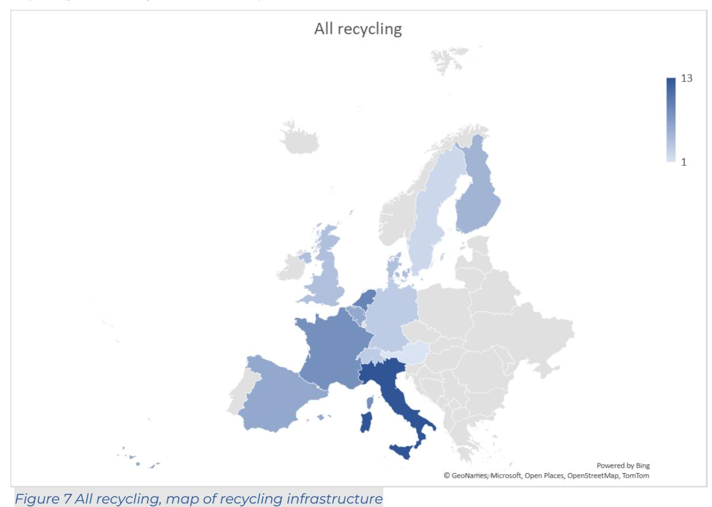

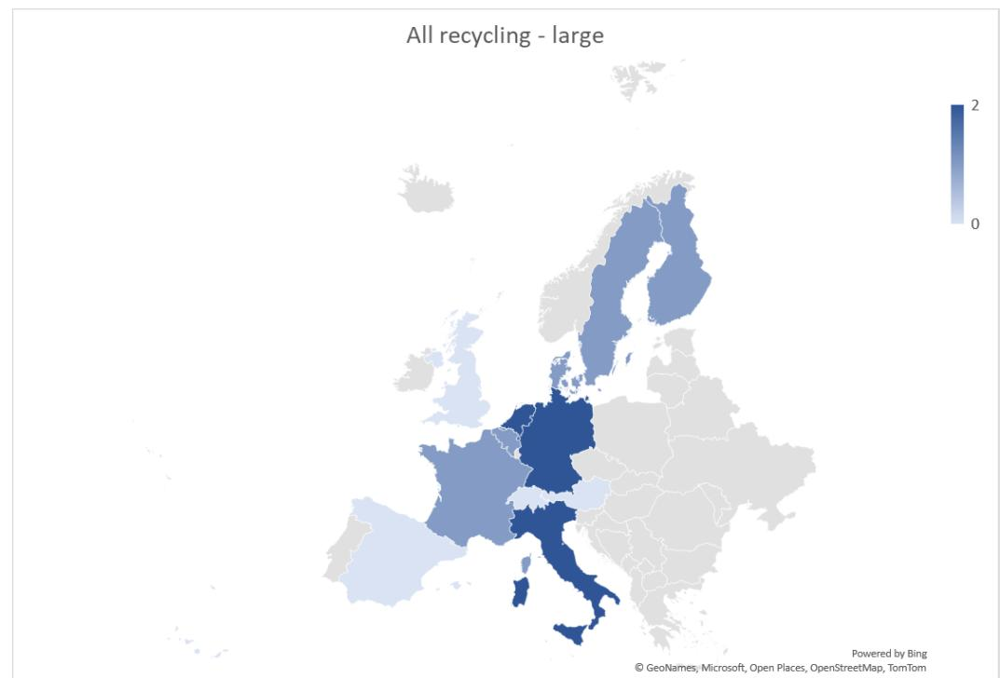

*Figure 8 All recycling, large, map of recycling infrastructure*

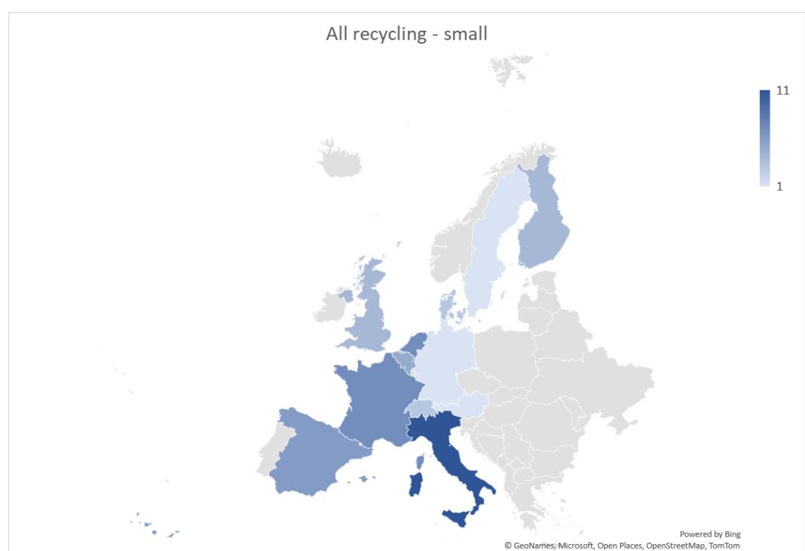

*Figure 9, All recycling, small, map of recycling infrastructure*

Main recycling facilities are found in South, West and North Europe, with Italy, France and the Netherlands as main representatives. Further, we see that the smaller facilities are mainly in the South of Europe, aligned with the location of the main textile producers still active in Europe (Italy, Spain, Portugal, France). These smaller recycling facilities are mainly mechanical recyclers, as can be seen figure 10.

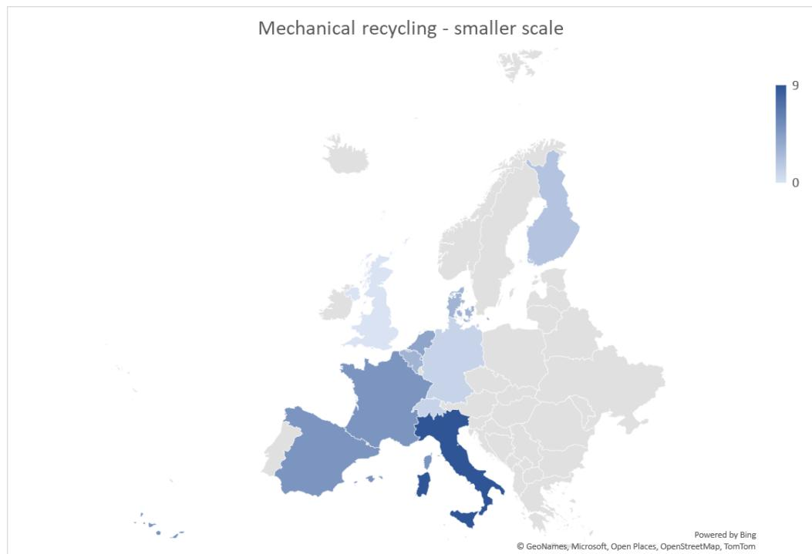

*Figure 10 Mechanical recycling, smaller scale, map of recycling infrastructure*

Apparent for the chemical recycling, is the larger share for the Northern European countries compared to the mechanical recycling. This is mainly related to the recycling of cellulosics.

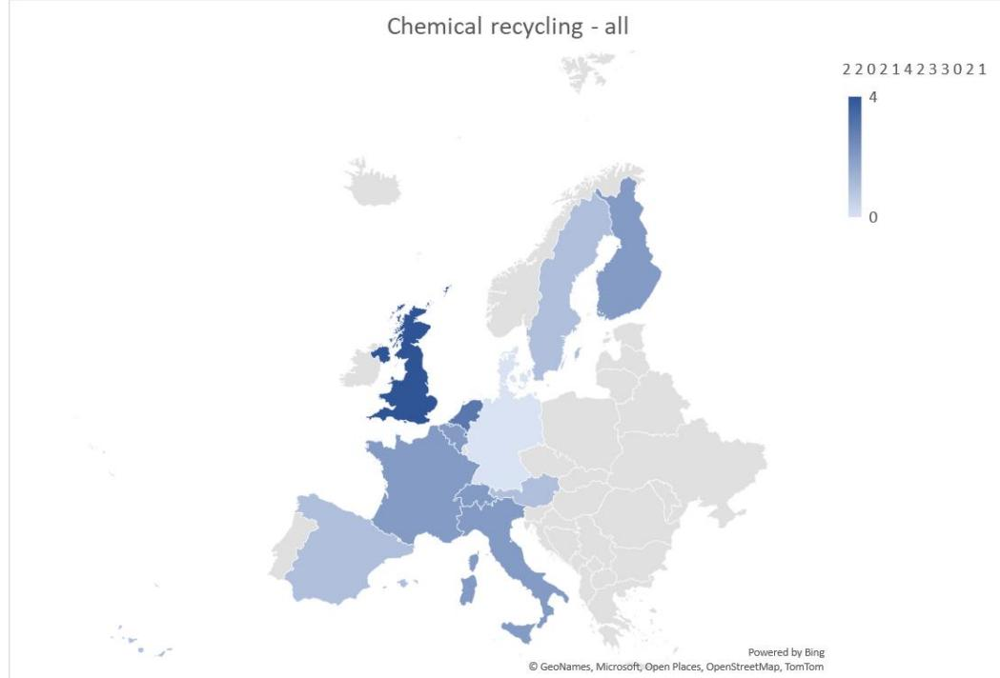

*Figure 11 Chemical recycling, all, map of recycling infrastructure*

Looking at the geographical spread, one can see a large representation of the 'traditional' West European countries, while Eastern Europe is not represented.

#### **Scaling sorting and recycling**

In January 2025, the compulsory separate collection of post-consumer textile waste in Member States under the Waste Framework Directive will be implemented. No targets have yet been set and the market data for total amount of waste and collection rates are uncertain. The total post consumer textile waste ranges from 6 - 10.9 million tonnes per year. Today total collected waste is approximately 2.4 million tonnes. This means that the infrastructure capacity needed is unclear but an estimate is that i needs to be more than doubled or even quadrupled in coming years if all waste should be collected for reuse and recycling.

The current flow for recycling is between 0.4- 0.7 million tonnes. In a scenario based on a collection rate of 70% and a total textile waste of 10.9 million tonnes, and that the recycling rate remains at 30% of the total collected waste, it is assumed that 2.6 million tonnes are available for recycling. In a scenario based on a collection rate of 70% and a total textile waste of 10.9 million tonnes, and that large part of export flows will be redirected to European recycling, of the total collected waste, it is assumed that 4. 4 million tonnes are available for recycling. Assuming that this scenario unfolds in 2030 requires an extremely aggressive implementation of collection systems as well as high expectations for behavioural changes given that no member state is close to a 70 percent collection rate today, but rather that the majority of countries are below 20%. A 50 percent collection rate is more likely in a 2030 scenario with available flows between 1.6 to 2,7 million tonnes. One insight is that higher demands on exports can be a way that the feedstock to Europe's recycling industries increase faster. In the near future, capacity for mechanical recycling would be (as is already the case now) followed by chemical recycling, that would most likely be more dominant in the future be depending on technology development.

Looking at the geographical spread, it is noticed that a large representation of European countries with a long history in the sorting industry in mainly central Europe also can be linked to a strong production of textiles. There is one exception, Poland. At the other hand Eastern Europe has not as strong represented in the statistics or with initiatives around automatic sorting and recycling facilities. Looking at the geographical spread linked to activities within both sorting and recycling, it is in theory possible to build circular value chains more evenly spread throughout Europe. Activity is found in the east, for example, Poland, Lithuania, Slovenia and in the Nordics, Sweden and Finland as well as in central and southern Europe.

Based on description of the current landscape on regional development, sorting and recycling capacity the question is how European stakeholders can start to build capacity, in a market that is under a strong transformation both with upcoming legislation (where many decisions are not yet made) and a rapid technology development. There is no guidelines for building a low impact value chain that strengthen both a reuse as well as a recycling market. It is clear in the mapping that different regions has different strengths and weaknesses, but no one has all component for a circular value chain yet. For example, the Nordic countries have the weakness with lower waste flows, dependent of importing textile waste flows to their industries, due to lower populations density. At the same time Finland and Sweden have strong industries based in chemical recycling, with a wish for a high volume feedstock and with strong link and history in the forest industry and access to a biobased material

## **5. Material composition of textile waste**

One of the objectives for this report was to look at the material composition of the textile flows. This chapter describes methods and show results of the work executed for material composition of textile waste. This is important knowledge to understand current and future available feedstock to fibre-to-fibre recycling. To understand the composition of waste, more data points of material composition are needed. For example, if the product is multilayered or constructed with trims or hard parts such as zippers and buttons. An overview and evaluation of what data points are prioritized is conducted in chapter six.

The work is divided in three parts starting with a literature review of data sources and previous results for material composition. This is followed by focus on two different sources for material composition data.

- Literature review
- Current Trade data, for material flow analysis
- Brand data, survey performed in the CISUTAC project on 10 companies.

## **5.1 Literature review**

In order to understand the material composition in post-consumer textile waste, a literature review was conducted. This involved scientific articles and industry reports. See list in Annex 4, List of references from EndNote . Different data about material composition was collected including ratio of virgin fibre production and fibre composition in post-consumer textile waste. Further, information about the technologies used to analyse the fibre composition in waste streams, along with their limitations, were provided. The collected data was utilised to evaluate the bottlenecks impeding textile recycling. The focus was to collect the most recent available information and show viable data to get a relative overview about the fibre composition in textile post-consumer waste.

#### **5.1.2 Overview of data sources**

A better understanding of the typical material composition of textiles is needed to guide investments and capacity building to be tailored to the fibre composition and volume of future flows of textile waste. For example – how much of different fibres, like cotton and polyester, that is available in the waste stream as feedstock for the recycling industry today. It is also relevant to understand what kind of data is needed to facilitate the actual recycling. Here follows an overview of data sources and accessible data of material composition. Indepth data on the material composition of textile waste are on different levels. For example, it can be on global level, on European level, or per country. Data can come from various virgin input sources or output sources from post-consumer waste streams. In literature, textile applications are categorised as apparel, home textiles and footwear or are categorised on a product level[42](#page-45-2) .

### **5.1.1 Data sources by the textile industry**

Market data on the use of virgin resources on global level is available, for example from Textile Exchange (Textile Exchange 2023). Eventually (with some delay due to usage of the products), the composition of post-consumer textiles will resemble the composition of virgin sources. There is no data available on use of blends on global level. Blends are particularly challenging because different materials require different conditions for chemical or mechanical recycling. The proliferation of mixed textiles in the apparel industry,

such as cotton and polyester or elastane, poses significant challenges when it comes to recycling post-consumer textile waste.

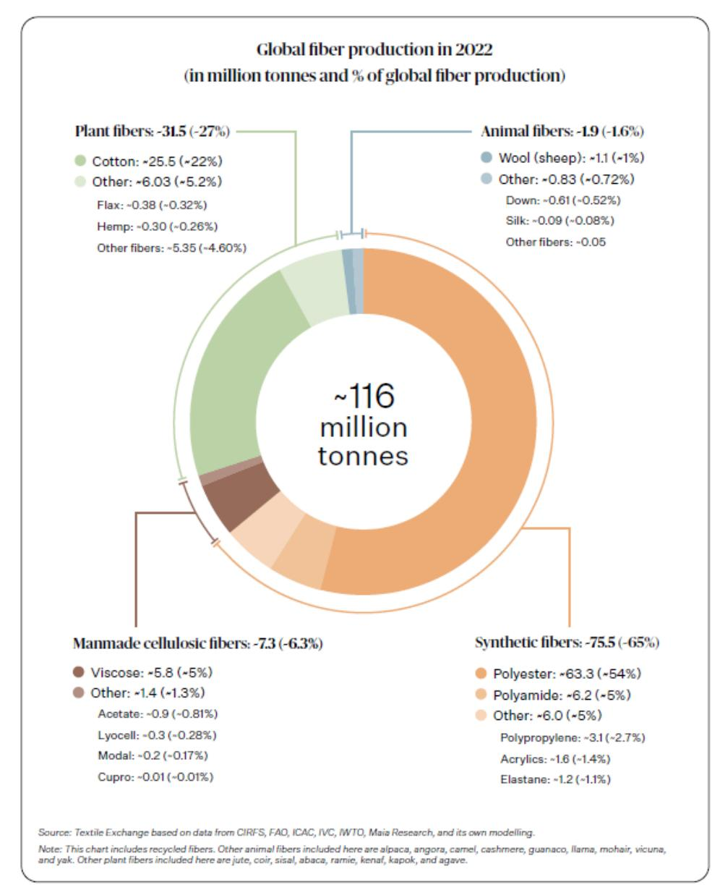

*Figure 12 Global fibre production 2022 (TextileExchange report 2023) These data cover total fibre and raw materials production volumes, independent of whether they are used for apparel, home textiles, footwear, or any other applications*

Recycled cotton had an estimated market share of approximately 1% of the total cotton production in 2021 but is expected to grow significantly in the coming years. The production volume of polyester fibres increased from 61 million tonnes in 2021 to 63 million tonnes in 2022. The market share of recycled polyester fibres, from mainly PET bottles, slightly decreased to 14% in 2022, down from 15% in 2021. The market share of biobased polyester fibre remained very low at around 0.03% of the polyester fibre market. Key reasons are prices, availability, and questions around the sustainability of currently available biobased polyester. [43](#page-47-0)

#### **5.1.3 Trade data**

Trade data could be a useful tool to understand what enters the market, and eventually becomes waste. Most of the clothing and household textiles consumed in Europe are imported and import of clothing and household textiles (HHT) for final use represents the largest share of material flows through the European value chain. Trade data was used in a recent report in combination with data on textile waste to estimate material composition in textiles[44](#page-47-1) .

#### **5.1.4 Brand data**

Brand data on the use of virgin resources and composition of various product types (shirt, sock etc) has limited availability as this is often confidential information. However, the composition will resemble virgin fibre data shown in Figure 12 Global fibre production , as these fibres are entering the system. For example, a report by Changing Markets Foundation tried to establish what brands are saying and doing regarding their use of synthetic fibres (Changingmarkets foundation 2021). They reached out to 46 brands with a questionnaire and conducted desk research into their policies and public disclosure of relevant information on this topic. The data revealed that for all products recorded across 12 brands, 67% contained synthetics and 50% contained polyester. These numbers can be compared the virgin fibre data, i.e., 75 wt% synthetics and 63,3 wt% polyester.

Brand data has a great potential to facilitate recycling where all detailed information. For example, material composition including blends on batch level could be provided. A challenge with brand data is that labels on the textile items in some cases do not represent real fibre composition, as revealed by a paper published by Mäkelä, Rissanen and Sixta in 2021[45](#page-47-2). In this scientific publication, the cellulosic fibre composition was determined by using NIR and chemometrics. The results showed that out of 81 textile items 11 items had different material compositions than what was stated on the label.

#### **5.1.5 Data sources post-consumer waste streams**

Sorting of post-consumer textile goods gained a lot of attention, as shown by the large number of (scientific) publications and reports published recently: There are different analysis methods on post-consumer waste as mentioned below.

- Manually sorted to determine, by reading the label.
- Near Infrared (NIR) technology
- Used modelling-based methodology to estimate the fibre composition of textile waste

Methods applied to determine fibre composition was mainly label reading and NIR technology. As reported and stated above, by Mäkelä et al 2021[46](#page-47-3), labels do not always show the accurate fibre composition of the textile items. In addition, there are also many challenges related to NIR technology. One of the major challenges is that NIR cannot detect

43 Textile Exchange, 2023

44 Köhler, A. et al. Technical report. Circular economy perspectives in the EU Textile sector. ISBN 978- 92-76-38646-9, 2021

45 Mäkelä Mikko, Rissanen Marja, Sixta Herbert, Identification of cellulose textile fibers, Article, The Analyst, December 2021

46 Ibid

elastane very well, and NIR cannot differentiate between cellulose in viscose, linen or cotton. Also, the colour and the thickness of the materials highly effect the accuracy of the NIR results. The darker and thicker the fabric is, the less accurate fibre composition can be provided by NIR. Another challenge is that if the fabric contains finishing or coating this could also diminish the NIR accuracy[47.](#page-48-0) In a study by Fashion for Good they reported that when the fabric has PU coating or consist of linen or leather, the fabric was non-detectable by NIR. Also, the blended fabric was only recognized for two types of fibres [48](#page-48-1) .

If the data of post-consumer waste streams will resemble the composition of virgin sources depends on what is collected. If some product categories are more likely to be donated into the waste stream and others more likely to be household waste steams this will have an effect on the actual composition on waste.

#### **5.1.6 Summary of available data on material composition.**

The table below illustrate a summary of results of previous studies related to material composition.

|                                |                                                                                           | Virgin fibre production                                                                                                                                            |                                                                    |
|--------------------------------|-------------------------------------------------------------------------------------------|--------------------------------------------------------------------------------------------------------------------------------------------------------------------|--------------------------------------------------------------------|
| Researcher Textile Exchange    | Country Global fibre production                                                           | Method Brand data                                                                                                                                                  | Key points Viscose 5.8                                             |
| Researcher                     | Country                                                                                   | Method                                                                                                                                                             | Key points                                                         |
| Changingmarket foundation 2021 | 46 brands                                                                                 | Questionnaire Post consumer waste                                                                                                                                  | Polyester 50%                                                      |
| Researcher                     | Country                                                                                   | Method                                                                                                                                                             | Key points                                                         |
| FFG &CE, 2022                  | 6 EU countries: Belgium, Germany, the Netherlands, Spain, the United Kingdom and Poland   | Analysis on material composition on 21 ton of post-consumer textiles incl household by using NIR                                                                   |                                                                    |
| JRC, 2023                      | EU-27                                                                                     | Estimation on the material composition of 342 Prodcom textile products.                                                                                            | Non-textiles (like zippers,                                        |
| Pérez, 2021                    | Sweden, Denmark, Belgium, Germany, the Netherlands, collaboration with several EU partner | Analysed 1759 kg in were non defined (e.g. shoes and home textile) the rest is post-consumer garment by using NIR + Labels. Results shows the material composition | Jeans (220 kg) Knitted items (220 kg) Acrylic LQ (ratio of acrylic |

47 Ibid

48 Sorting for Circularity, Fashion for Good, 2022

|                 |         | based on the products Wool 15%, (ration in the type garments is > 80%) Wool 3%, (ratio in the garments < 80%) Polyester 2% Viscose 1 % Unknown 27% Cashmere and mohair blends is 7%                                                                                                                     |
|-----------------|---------|---------------------------------------------------------------------------------------------------------------------------------------------------------------------------------------------------------------------------------------------------------------------------------------------------------|
| Nørup, 2019     | Denmark | Analysed 27 322 kg of Trousers, knitted blouses clothing and and knitted socks household post consumer textile by using labels+ NIR T-shirts Results shows the material composition based on the products type: Underwear: Home textile: Line: 50cotton/50 polyester, polyester/ 40 cotton, Rags/wipes |
| INTEXTER – UPC  | Spain   | Analysed 525.5 kg of post-consumer garments by using NIR.                                                                                                                                                                                                                                               |
| Refashion, 2023 | France  | Analysed 14.6 tons of clothing and household linen post consumer by using NRR and labels.                                                                                                                                                                                                              |

*Table 9 Summary of available data on material composition*

There are limitations in sorting, which have an impact on recycling, but this is different for each recycling technology. Fibre-to-fibre requirements for mechanical recycling are different than for chemical recycling. Recycling of textile waste to other products like wipers (down cycling) are often less stringent. For example, the recycling of PET-bottles to textile fibres (rPET), is one of the most dominant sources of recycled fibres in textiles nowadays. Recycled fibres from post-consumer textiles are still very limited, mainly due to technical issues.

To facilitate closed-loop textile recycling, it is important to develop an accurate technology for more efficient sorting based on fibre composition. This could be one of the solutions if one is looking to the end of the supply chain. Another option would be to provide all the information on fibre and material composition from the beginning of the value chain (Digital product passport). A third requirement is to design for recycling, e.g. prevent blending and use more mono materials. An overview of recycling technologies is shown in the table x, assuming mono materials only. For fibre blends, the TRL levels are in general lower and end products are often not textiles but other applications.

| Fiber / Recycling technology* | Mechanical | TRL | Extrusion | TRL | Chemical | TRL     |
|-------------------------------|------------|-----|-----------|-----|----------|---------|
| Cotton                        | +          | 8   | -         | -   | +        | 7-8     |
| Viscose                       | +          | 7   | -         | -   | +        | 7       |
| Wool                          | +          | 8-9 | -         | -   | -        | -       |
| Polyester                     | +          | 7   | +         | 7   | +        | 8       |
| Polyamides                    | +          | 6   | +         | 7   | +        | 9 (PA6) |
| Polyacrylics                  | +          | 8   | -         | -   | -        | -       |
| PP/PE                         | +          | 6   | +         | 8   | -        | -       |
| Fiber blends                  | +          | 7   | -         | -   | -        | -       |

*Table 10 Overview of recycling technologies: https://www.yumpu.com/nl/document/read/39561233/rapport-textielrecycling-def*

## **5.2 Current trade flows**

For collection and recycling industries to be able to handle the large, and increasing, flows of used textile garments on the market it would be a useful tool to understand what enters the market, and eventually becomes waste. Trends and data on material flow could help to steer investments to meet the demand in the most efficient way. Several studies have used data sources such as import, export and production of clothing to study textile material flow in different countries and areas[49](#page-50-1). Depending on how extensive the scope and number of countries included in these studies different national and international data sources was used. Data sources are however limited, and estimations are required.

Data for import and export is available from the UN Comtrade database using harmonized system codes, HS-codes, for international trade. Product codes are divided in different levels with up to six-digit codes. The first two digits describe the chapter, four digits give information on garment type (jackets, skirts, undergarments etc.) and six-digit codes includes further classification by material (wool, synthetic fibres, cotton). It is important to note that the classification system only refers to main fibre, which could mean a content as low as 50%. It is not possible to retrieve data finer than this. It is possible for individual

49 Carlsson, A. et Al. (2006) Kartläggning av mängder och flöden av textilavfall. [www.smed.se](http://www.smed.se/)

Tojo, N. et Al. (2012) Prevention of Textile Waste; Material flows of textiles in three Nordic countries and suggestions on policy instruments. TemaNord 2012:545. [http://dx.doi.org/10.6027/TN2012-545;](http://dx.doi.org/10.6027/TN2012-545) 

Watson, D. et Al. (2019). Mapping of textile flows in Denmark. Publisher: The Danish Environmental Protection Agency. ISBN: 978-87-93710-48-1

countries to add numbers for further classification nationally. Within the scope of this project national classifications are not included. Using the main fibre groups connected to the HS-codes, data on imported and exported weights per country can be extracted from the downloaded data to see if there is a regional or local difference between fibres on the market. If there is a local or regional difference, this could give a prediction of future demand for collection and recycling of garments once discarded. Following the fibre composition trends over time could give an indication to how the market is developing to build solid scenarios for future investments.

In the EU project New Cotton[50](#page-51-0), trade data based on HS codes from the UN Comtrade database were used in combination with the Eurostat database for production data to calculate the amount of cotton rich garments on the market and estimate opportunities for recycling within EU. The Eurostat database provides monetary value per product group and not weights. The two databases use different currents, and the method therefore requires using an average exchange rate to estimate production weights from price per weight from UN Comtrade data. Product codes are also not directly comparable as fewer Eurostat codes include further information on fibre composition and previous methods had to use conversion tables to compare data[51](#page-51-1). In a report from [JRC] material compositions were estimated based on a previous study on collected textile waste. This, however, will not include local variations unless extensive waste analyses have been included.

#### **5.3.1 Method for current trade flows**

The idea was to build on the New Cotton method to estimate amounts of polyester in the same way for EU and affiliated European countries. However, polyester data is not directly extractable from the trade data. See Table 13 for available fibre information from the trade categories. Because of the lack of polyester data, a different approach had to be explored. Downloaded data was arranged to be used with a translation table with different levels of estimations based on expertise knowledge in combination with brand data to estimate material compositions for different fibre groups. Most of the clothing and household textiles consumed in Europe are imported and import of clothing and household textiles (HHT) for final use represents the largest share of material flows through the European value chain[52](#page-51-2) . Therefore, in this method production data was not included as this would also require several steps of estimations. The simplification of excluding production data assumes that garments produced will also be included to some extent in the export of production countries and that production data therefore is a minor part of the material flow in Europe. This simplification will make a larger difference for high production countries in Europe such as e.g., Germany, Italy, and Spain. Production data could therefore be a useful addition for further studies.

### **5.3.2 Extraction of trade data**

Data was downloaded from the UN Comtrade database in six-digit codes for the three chapters regarding textile garments, 61, 62 and 63. See Table 11 for chapter overview. Six-

50 New Cotton Project, [https://www.ri.se/en/what-we-do/projects/new-cotton-a-circular-cellulose](https://www.ri.se/en/what-we-do/projects/new-cotton-a-circular-cellulose-based-fiber)[based-fiber](https://www.ri.se/en/what-we-do/projects/new-cotton-a-circular-cellulose-based-fiber)

51 Watson, D. et Al. (2020). Post-consumer textile circularity in the Baltic countries; current status and recommendations for the future. Nordic Council of Ministers.

52 Köhler, A. et al. (2021). Technical report. Circular economy perspectives in the EU Textile sector. ISBN 978-92-76-38646-9

digit HS codes provides information on product categories, main fibre group and weights. Five HS codes were excluded for not fitting the scope of the project. These include patterns, knits and used textiles. See Table 12 for full description of excluded HS codes. Data was retrieved per country and year during the period 2014-2022 to be able to analyse trends in fibre composition. Data was collected from 2014 – the year when the concept of "circular fashion" was first coined – until 2022, which is the latest available data. All EU member countries were included in data collection along with EES, EFTA, UK and candidate countries. Liechtenstein is not part of the data as the country is not registered in the UN Comtrade database.

| Chapter | Content                                                                        |
|---------|--------------------------------------------------------------------------------|
| 61      | Articles of apparel and clothing accessories, knitted or crocheted             |
| 62      | Articles of apparel and clothing accessories, not knitted or crocheted         |
| 63      | Other made-up textile articles; sets; worn clothing and worn textile articles; |

*Table 11 HS codes selected for textile data*

| Excluded HS codes | Description                                                         |
|-------------------|---------------------------------------------------------------------|
| 630790            | Made-up articles of textile materials, incl. dress patterns, n.e.s. |
| 630800            | Sets consisting of woven fabric and yarn, whether or not with       |
| 630900            | Worn clothing and clothing accessories, blankets and travelling     |
| 631010            | Used or new rags, scrap twine, cordage, rope and cables and worn   |
| 631090            | Used or new rags, scrap twine, cordage, rope and cables and worn   |

*Table 12 Excluded HS codes, not fitting under the scope.*

#### **5.3.3 Fibre composition estimations and product categories**

Six-digit codes gives the finest data available at UN Comtrade regarding product category and main fibre. For further classification of main fibre type national codes would have been required which did not fit under current project frame. Fibre categories from import and export data is broad and do not describe main fibre for all product categories. Product categories were manually extracted from the description text associated with the codes and aligned with CISUTAC product categories used for the Decision Tree (see chapter 6). Main material was also manually extracted from the description text associated with the codes. This resulted in ten fibre categories, listed in table 13. This includes the category "Other textile materials" which does not state a specific main material and therefore requires estimates to get a material category. There is no full consensus internationally on how to define fibre categories. Different examples can be found throughout literature[53](#page-53-0) . This suggests that the trade data is not only insufficient, but there is also a risk for data being incomparable due to different interpretations of material categories and HS-labelling. Therefore, estimations on main fibre and fibre composition were made for all HS-code from the code descriptions, including information on product type and main material, in combination with expert knowledge on common fibre compositions.

The number of main material categories were reduced to six, respectively four categories. In Table 13 main fibre groups mentioned in the HS code description is listed alongside chosen main fibre groups for the project's estimations. From this arrangement trade data can be viewed from different angles based on for example product category, main material estimate, country, and year. Data can be extracted per region or country to follow local trends at different levels. It is however important to keep in mind that these are rough estimates and results should only be seen as indications of fibre trends. Estimates for total material composition in mixed materials were also made. This estimation level includes materials such as polyester and elastane, which can be difficult to achieve in other methods. The new approach to follow the material composition trends and data will be further explored in CISUTAC WP6.

| Main fibre        | groups UN                  |                   |
|-------------------|----------------------------|-------------------|
|                   |                            | Main fibre groups |
|                   |                            | CISUTAC estimates |
| Cotton            | Cotton                     | Cotton            |
| Bast              | Cellulosic fibres          | Cellulosic fibres |
| Man-made fibres   | Man-made cellulosic fibres |                   |
| Synthetic fibres  | Synthetic fibres           | Animal fibres     |
| Artificial fibres | Wool                       |                   |
| Wool              | Silk                       |                   |

*Table 13 Main fibre groups from UN Comtrade data and CISUTAC estimates, in two different levels*

### **5.3.4 Further work**

Trade data contains limited amounts of information with a high level of uncertainties. To be able to compare data from different projects methods need to be aligned. Estimations will be required but if the same estimations and assumptions are made, comparison between

53 Bianchi, S., et al, Opportunities and Limitations in Recycling Fossil Polymers from Textiles. [https://doi.org/10.3390/macromol3020009;](https://doi.org/10.3390/macromol3020009) 2023

Shabbir, M., & Mohammad, F.Introduction to Textile Fibers: An Overview. Handbook of Renewable Materials for Coloration and Finishing, 1-8, 2018

Ledl, C., et al. (Sage journals 2014). Valuation of technical fibres in composite applications – A non-linear regression-based approach. Volume 33, Issue 15. <https://doi.org/10.1177/073168441453203>

projects would be possible and trends could be detected. It is a possibility that extended collection of brand data could be combined with trade data for better estimations to follow trends on a local level. There is a clear need for more data that align with the upcoming requirements. Therefore, the introduction of digital product passports is necessary for the textile market to become circular. How to get the most information out of current trade data will be further explored in CISUTAC WP6, to investigate how to fill the gap until product passports are in place.

## **5.3 Brand data**

Accuracy around fibre compositions of a product that contains more than one material is still a challenge to collect and foresee where the trend is going. The described determination of the material composition of the textile waste in the literature review with the available data is not sufficient to feed an accurate Material Flow Analysis. Brand data has a great potential to facilitate recycling where all detailed information, for example material composition including blends on batch level could be provided, through an efficient collaboration and data sharing.

#### **5.4.1 Method, scope and process for collecting material composition data**

For data collecting, Companies within the CISUTAC-project network, representing consumer goods including apparel, active wear and/or home textiles, was approached. For example, one partner, the member-organisation, TEXFOR in Spain arranged two workshops to engage their members for contributing with data. In addition, STICA, the Swedish Textile Initiative for Climate Action arranged a meeting for Nordic fashion brands working together on climate action plan, also to engage them to contribute with data. These companies have an active sustainability work, for example working with climate targets, who are therefore used to work with detailed data.

Based on the findings in the literature research the data were summarized and prioritized to understand the composition of future waste. A questionnaire was set-up to explore if and how companies could provide the project with the specific data to map out even more findings.

The initial questionnaire focused on data from year 2022, divided into product type, fibre*, material compositions, percentage of products with removable disruptor, percentage of products with (prints) percentage of products with certificates, percentage of multilayer garments, percentage of products with monomaterial, number of sold pieces, weight of produced products.* The brands were also asked for their indications on **Future trends,** if the company had any plans to change current material composition before 2025. **Historical data** two years back were also asked for, but this was harder for the companies to provide. The questionnaire was complemented with a template in Excel to visualize how the companies could compile the data[54](#page-54-1) .

Approximate 40 companies were contacted to contribute with data. 10 companies' data that were summarized in a final data set. The collection of company data entailed several challenges. Many companies either did not respond to the request or fell out along the way. For some of the companies it was the long processes to adjust a non-disclosure agreement to hand out data, other factors were for example the time and internal dialogue to receive understandable data on weight and product groups. A total weight or number of produced pieces was another challenge, either because brands did not want to share the data or

54 See Annex 1

internal problems to measure for example weight in their systems. Some company data was on a very low level that could not be used in the final data set.

The main challenge for the contacted companies were that a majority needed to pull out data "by hand" from their internal business system or PLM[55](#page-55-0) systems, a time-consuming assignment. Even if most brands have started or will start with PLM systems it is still in a starting phase. The awareness in the industry to measure data is high but the progress is still slow. Thus, the data were rescoped and prioritized, to only focus on the - **fibre/material compositions, - main material of the product, - products groups,** and **weight**. During the work the product types were needed to be translated from the different brands to a list of product categories created within CISUTAC. In this way a comparison was made available, and an overview could be created for the product areas. These product types were also matched with the Import/Export codes to create a common language. Some companies provided in-depth data on all fibre compositions. In the rescoping process some companies focused only on main material in a product and the major used fibres. Those materials with fibre compositions with 3-4 different fibres is missed out from the lists.

#### **Process for constructing data sets**

A few of the companies provided complete in-depth data. From some of the brands very detailed data were received since they already had datasets to make their CO2 calculations. This could be used as a benchmark for other weight calculation of product types when no weight data was possible to get. A translation list was created that included average weight for each product type and per piece (see table 14 ). Some numbers have also been doublechecked with a couple of the companies that contributed with data, for example the weight in order to receive realistic average data list.

Data on weight and product categories were received from parts of the collected brand data. This were Summarized in a list based on the company data on weight per produced piece and on follow up questions to some of the companies. The main product types were also added to the list to follow the same system. From this weight and product type data list an average calculation could be made from the 10 companies into one data set. The product category and weight were crucial for the result to be compiled in a transparent way.

| PRODUCT TYPE        | AVERAGE WEIGHT KG / PCS |
|---------------------|-------------------------|
| Jacket, Coat        | 0,825                   |
| Trouser             | 0,450                   |
| Denim               | 0,650                   |
| Short, Skirt        | 0,350                   |
| Shirt, Blouse       | 0,350                   |
| Dress               | 0,350                   |
| Underwear, Swimwear | 0,050                   |
| Sweater, Midlayer   | 0,400                   |

55 Product Life Cycle Management System

| T-shirt                            | 0,165 |
|------------------------------------|-------|
| Apparel accessories                | 0,200 |
| Leggings, Stockings, Tights, Socks | 0,050 |
| Activewear                         | 0,350 |
| Tracksuit                          | 0,400 |
| Suit                               | 0,450 |
| Hometextiles                       | 0,500 |

*Table 14 Average weight per product type used in the brand data set for brand data*

### **Limitations with method**

The method works well for understanding trends and challenges in managing data, but is limited regarding providing an understanding of the market distribution of fibres and composition.

Access to data is mainly limited by the number of companies in the data set and the maturity level of the companies' internal systems. There does not seem to be a harmonized language and categorisation of data between companies. This present challenges with comparing companies' data and capturing all details. For example in product groups such as Jackets and Coats, a major part of these products contains more than one material. It was found some unclarities in how all materials was listed internally.

### **Description of the CISUTAC data set**

Brand data has potential to facilitate recycling with is access to detailed information about material composition. This section describes the work executed on brand data with in the CISUTAC project. With insights on both material compositions as well as brand data as a data source.

#### **Data from 10 companies**

Data from 10 companies, representing apparel and home textiles for consumer market is aggregated in one data set. The companies all have set targets on climate or sustainable materials there for not representing the market in general. Among these 10 companies, note that it is several that worked strategically with its fibre portfolio, meaning they have consolidated to less fibres and sustainable choices. Others, more the high-end companies, even if the shift is towards more sustainable options of fibres, still has a wide range in type of fibres and fibre compositions. Examples was found with up to eight fibres in one garment.

The CISUTAC data set contains of the following; 10 companies aggregated data of:

- Fibre composition in total
- Fibre composition per product category
- Mono materials (only from 4 sources)

#### **CISUTAC data set, spread over product categories**

The main product groups are summarized, the dataset excludes product categories not relevant as post consumer textile waste as shoes, sleeping bags and bags. The CISUTAC product category list is based, with smaller adjustments, on data found in the import/export data code system (61 and 62) and then compared with the most common categories

collected from the brands[56](#page-57-0). Focus has also been to use the same vocabulary and harmonized language.

| PRODUCT TYPE                                     | Distribution of products incl. hometextiles | Distribution of products excl. hometextiles |
|--------------------------------------------------|---------------------------------------------|---------------------------------------------|
| Jacket, Coat                                     | 11%                                         | 20%                                         |
| Trouser                                          | 7%                                          | 13%                                         |
| Denim                                            | 0%                                          | 0%                                          |
| Short, Skirt                                     | 4%                                          | 8%                                          |
| Shirt, Blouse                                    | 0%                                          | 1%                                          |
| Dress                                            | 1%                                          | 1%                                          |
| Underwear, Swimwear                              | 2%                                          | 4%                                          |
| Sweater, Midlayer                                | 9%                                          | 17%                                         |
| T-shirt                                          | 9%                                          | 17%                                         |
| Apparel accessories Leggings, Stockings, Tights, | 1%                                          | 3%                                          |
| Socks                                            | 4%                                          | 8%                                          |
| Activewear                                       | 3%                                          | 5%                                          |
| Tracksuit                                        | 2%                                          | 3%                                          |
| Suit                                             | 0%                                          | 0%                                          |
| Hometextiles                                     | 46%                                         | N/A                                         |
| TOTAL                                            | 100%                                        | 100%                                        |

*Table 15 Calculation for brand data CISUTAC data illustrating the breakdown of the datasets across product categories.*

In weight the result is not representative for textile put on the market for example home textiles represent 54 percentage in the CISUTAC data set, which is an overrepresentation compared to literature. For example, clothing comprises 48 % of all production, and home textiles 13 %, while fabrics and yarns represent 17 % and 5 % respective according to Köhler et al. 2021.

56 Huygens, D.et al, JRC134586\_01 Techno-scientific assessment options used and waste textiles in Europe, 2023

On the other hand, compared to JRC report from 2023 the three biggest categories within apparel Jacket/Coat, 9%, T-shirt 5% and Sweater/Midlayer 7% are in the similar range as the CISUTAC data sets, see figure 8 [57](#page-58-0) .

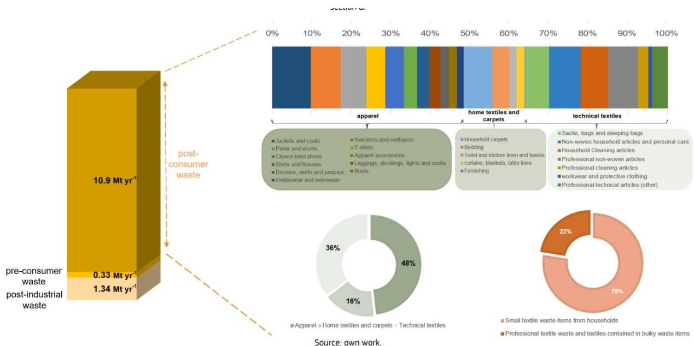

*Figure 13 Composition in terms of textile categories, JRC report, Best available techniques (BAT) reference document for the Textiles Industry ISSN 1831-9424*

#### **Fibre composition in total and per product category**

Compared to the literature review, summarized in Table 16, the CISUTAC data set is distinguished by having a high content of polyester compared to data found in literature review of textile waste and production but very similar to the previous result of brand data research and in same range as total fibre production. In Table 17 showed CISUTAC data set categories jackets and coats and trousers that makes the polyester be the dominate fibre. The categories jackets, coats and trousers are more likely to use polyesters to increase the durability and function of the products. Cotton is in one more close range between the different data sources, compared to the results presented in the literature review, what's stands out is the data of cotton in textile waste that is higher, most likely a reflection on collected product categories with a higher cotton content.

|           | CISUTAC Data set | Total global fibre production | Brand data | Textile Waste | Prodcom data |
|-----------|------------------|-------------------------------|------------|---------------|--------------|
| Polyester | 53%              | 63%                           | 50%        | 11-19%        | 28%          |
| Cotton    | 29%              | 25%                           |            | 42-43%        | 34%          |
| Elastane  | 1%               | 1,2%                          |            |               |              |

*Table 16 Comparison the CISUTAC data set with the literature review on Cotton, polyester and Elastane*

57 Ibid.

Elastane is difficult fibre for recycling technologies as well as difficult to detect for sorting technology. This makes elastane a top priority to handle from every aspect in order to scale circular value chain. Elastane makes up only 1 percent of the total fibre put on the market according to Textile Exchange report 2023. It may seem insignificant on a global scale, the CISUTAC data set shows that on a product category level, Table 17 , elastane is a minor part of every product category except in home textiles. In interviews and in the surveys conducted with the 10 companies, and the larger number of companies CISUTAC been in contact with during this data collection, no trends or signals are giving that companies are considering phasing out elastane. All companies state an assumption that material compositions will stay approximate the same up until 2025. The reason, stated by the companies, is the lack of more details guiding on material composition that will gain durability and/or recycling. Blends, like cotton, polyester and elastane are used to gain function of the material and garments.

| <b>TYPE</b>                       | <b>COTTON</b> | <b>POLYESTER</b> | <b>OLASTANE</b> | <b>EASTLOELEVIN</b> | <b>COPOMAIDE</b> | <b>POLYORETHANE</b> | <b>POLYPROPYLENE</b> | <b>PRO</b> | <b>WOOL</b> | <b>ORCHID</b> | <b>VISCOSITY</b> | <b>ACETATE</b> | <b>UNION</b> | <b>YOCLEL</b> | <b>SUM</b> |
|-----------------------------------|---------------|------------------|-----------------|---------------------|------------------|---------------------|----------------------|------------|-------------|---------------|------------------|----------------|--------------|---------------|------------|
| Jacket, Coat                      | 1%            | 85%              | 0.1%            | 0%                  | 0%               | 0%                  | 1%                   | 0%         | 0%          | 0%            | 2%               | 0%             | 0%           | 0%            | 0%         |
| Trouser                           | 24%           | 54%              | 2.3%            | 0%                  | 7%               | 1%                  | 4%                   | 0%         | 0%          | 0%            | 8%               | 0%             | 0%           | 0%            | 10%        |
| Denim                             | 99%           | 0%               | 1.0%            | 0%                  | 0%               | 0%                  | 0%                   | 0%         | 0%          | 0%            | 0%               | 0%             | 0%           | 0%            | 0%         |
| Short, Skirt                      | 20%           | 59%              | 3.0%            | 0%                  | 5%               | 0%                  | 9%                   | 0%         | 0%          | 0%            | 4%               | 0%             | 0%           | 0%            | 0%         |
| Shirt, Blouse                     | 71%           | 8%               | 0.0%            | 0%                  | 0%               | 0%                  | 0%                   | 0%         | 0%          | 0%            | 2%               | 0%             | 0%           | 0%            | 10%        |
| Dress                             | 55%           | 44%              | 0.1%            | 0%                  | 0%               | 0%                  | 0%                   | 0%         | 0%          | 0%            | 10%              | 0%             | 0%           | 0%            | 0%         |
| Underwear, Swimwear               | 16%           | 40%              | 5.0%            | 0%                  | 0%               | 15%                 | 5%                   | 0%         | 0%          | 0%            | 1%               | 0%             | 0%           | 0%            | 10%        |
| Sweater, Midlayer                 | 6%            | 99%              | 0.3%            | 0%                  | 0%               | 0%                  | 1%                   | 0%         | 0%          | 0%            | 0%               | 0%             | 0%           | 0%            | 0%         |
| T-shirt                           | 27%           | 46%              | 2.6%            | 0%                  | 3%               | 0%                  | 4%                   | 0%         | 0%          | 0%            | 15%              | 0%             | 0%           | 0%            | 10%        |
| Apparel accessories               | 4%            | 38%              | 3.1%            | 0%                  | 11%              | 6%                  | 0%                   | 0%         | 3%          | 10%           | 15%              | 0%             | 0%           | 0%            | 0%         |
| Legging, Stockings, Tights, Socks | 33%           | 7%               | 2.6%            | 0%                  | 25%              | 0%                  | 0%                   | 0%         | 5%          | 8%            | 15%              | 0%             | 0%           | 0%            | 10%        |
| Activewear                        | 19%           | 46%              | 6.0%            | 0%                  | 6%               | 0%                  | 6%                   | 0%         | 1%          | 0%            | 0%               | 0%             | 0%           | 0%            | 0%         |
| Tracksuit                         | 3%            | 67%              | 5.2%            | 0%                  | 0%               | 9%                  | 3%                   | 0%         | 0%          | 0%            | 1%               | 0%             | 0%           | 0%            | 0%         |
| Suit                              | 0%            | 50%              | 0.2%            | 0%                  | 0%               | 0%                  | 0%                   | 0%         | 40%         | 0%            | 0%               | 0%             | 0%           | 0%            | 0%         |
| Hometelles                        | 45%           | 42%              | 0.0%            | 0%                  | 0%               | 4%                  | 1%                   | 0%         | 0%          | 1%            | 2%               | 0%             | 0%           | 1%            | 3%         |
| <b>Total</b>                      | <b>208%</b>   | <b>2.0%</b>      | <b>0.0%</b>     | <b>0%</b>           | <b>0%</b>        | <b>0%</b>           | <b>0%</b>            | <b>0%</b>  | <b>0%</b>   | <b>0%</b>     | <b>0%</b>        | <b>0%</b>      | <b>0%</b>    | <b>0%</b>     | <b>0%</b>  |

*Table 17 CISUTAC data illustrating the breakdown of the datasets across product categories and fibre composition*

All companies used different terminology, the different ways of defining product categories. This was a challenge when comparing in depth data and extracting data concerning mono materials and multi materials in a product. A few companies have a very mature level and complete description of all their products to follow all data in their supply chain. Although most of the companies only use statistics from the major parts of a product, often the main fabric, and are still building their systems to prepare for coming legislations.

Only four companies had the data in place to extract this detailed level of information on mono materials. Among these 4 companies total materials 68 percent is stated to be a mono material. This can be compared to the data in the literature research, out of total waste stream (for recycling) 69 percent was mono material (other blends and polycotton made up to 31 percent) 93 % was a mono layer garmen[t58](#page-59-1) (called multi material product in CISUTAC)

The progress towards more recycled materials in the textile sector is going forward, showed in the data on global fibre but this has been a challenge to collect from the brands due to the levels of their data systems/management. Information on the content of recycled fibre in the fibre compositions is has not been evaluated on a detailed level and therefore not included in the summary.

## **5.4 Conclusion, material composition of textile waste**

The described determination of the material composition of the textile waste in the literature review with the available data is not sufficient to feed an accurate Material Flow

58 Fashion for good , Sorting for Circularity Europe, 2022

Analysis. Hence, it can only serve as rough estimates and indicate material composition of waste on a mass balance level.

Accuracy regarding fibre compositions of a product that contains more than one material is still a challenge to collect and foresee where the trend is going. This is clearly shown both by the literature review and the CISUTAC dataset. This is a relevant area to explore the possibilities of unlocking larger streams for recycling. Based on the smaller survey among the companies, there is no strategy for phasing out for example elastane. This underlines that the industry needs clearer guidance or legislation on this topic. A low hanging fruit to scale recycling can be to explore a potential overuse of elastane. Brand data stands out with its potential to facilitate recycling where all detailed information is provided, like blends, elastane content or recycled fibre that is crucial for deciding channelling routes to reuse or different recycling technology. The upcoming legislations digital product passport has a great potential to support this transformation. As reported by Mäkelä (Mäkelä, Rissanen et al. 2021), labels do not always show the accurate fibre composition of the textile items. This means that complementing data sources and methods are needed to bridge the gap and complete the data need.

The result of the CISUTAC data set is a in depth understanding of variations and relation between product categories and material composition but also an understanding of the quality of data at a company level. Learnings from company in the CISUTAC data set is that a major part of the companies still handle a lot of data and analytics by hand. When collecting the data, the focus needed to be on the main material in a product due to limitations on how detailed data that could be extracted. The integrated and developed, for example PLM or PDM systems, is not in place to measure all data. The awareness among brands is high but the maturity level of IT-system integration low. The industries, especially smaller companies, availability to cost-effective solutions to secure an IT architecture to manage all their data and corporate governance is highly relevant to get the product passport to work operationally. Data on overall categories and product categories are relevant to follow markets trends on production and consumption also regarding material compositions. The literature review and the CISUTAC dataset shows that the fibre diversity per item can be quite different, e.g., a pair of jeans will most likely contain a large fraction of cotton, while a skirt can be made of a range of fibres. Product categories can also be relevant for sorters to understand what categories contains a higher content of pure materials, like cotton, to sort out for recycling. It is also relevant to follow trends within the industry.

All companies, with in the CISUTAC data set used different terminology, the different ways of defining product categories, this was a challenge when comparing data. This indicates that information is not comparable on all levels and that data needs to be standardized and harmonized in the upcoming legislation to facilitate recycling. The industry, especially smaller companies, ability to compile in-depth data structures need support but also easily manageable IT systems.

Trade data contains limited amounts of information with a high level of uncertainties. To be able to compare data from different projects methods need to be aligned. Estimations will be required but if the same estimations and assumptions are made, comparison between projects would be possible and trends could be detected. It is a possibility that extended collection of brand data could be combined with trade data for better estimations to follow trends on a local level to fill the gap until product passports are in place.

## **6. Textile Waste Decision support tool**

It is well-known that efficient and specific sorting of textile waste will be key to scaling up recycling facilities and providing the different recycling technologies with suitable feedstock in larger volumes. To get to the desired situation, where collected textiles are also sorted for recycling, there is a need to enable material to flow through the value chain in a resource-efficient way. To achieve this, a decision support tool is needed to guide the material through sets of parameters. CISUTAC therefore introduces the Textile Waste Decision Support Tool. The textile waste decision support tool is described in detailed in this chapter.

## **6.1 Method for the Textile waste decision support tool**

#### **6.1.2 Scope for the tool**

The main purpose of CISUTAC's work on the support tool has been to identify and prioritise data points that support effective guidance of post-consumer products and materials towards the best route for value retention and to build a **textile waste decision support tool based on these data points.** The tool, integrated into an excel workbook with open access, is available through the CISUTAC website ([Solution for post-consumer textile waste](https://www.cisutac.eu/solution-post-consumer-textile-waste)  [management](https://www.cisutac.eu/solution-post-consumer-textile-waste) — CISUTAC , and visualises prioritised data points and main channelling routes. The tool is designed to be adjusted and updated as sorting and recycling innovations evolve. The current version of the tool focuses on the major channelling routes: reuse (including repair), dismantling, mechanical recycling and chemical recycling (depolymerization to monomers or oligomers).

#### **6.1.3 Involvement of partners and external stakeholders**

The methodology for the development of **the Textile Waste Decision Support Tool** is partly based on the results of a previous research project named TexIT, funded by the Swedish funding authority Vinnova[59](#page-61-2) .

Interviews and workshops have been conducted with the project partners as well as in the external network and in close collaboration with task 1.2 *Digitally enhanced textile sorting for reuse and recycling*. Together, these two tasks will support the development of a decision support tool (DST) which can be used to assist operators in sorting for reuse, such as in the CISUTAC sorting pilot, but also included in automated sorting software.

Other projects have also given valuable input to the work, such as CIRPASS, New Cotton and Trace 4 Value, contributing with their data input and validating the findings in CISUTAC. In addition, other digital platforms and reports were considered as valuable and relevant data points for recycling, for example Fashion for Good and the recyclers handbook, McKinsey, Textile Exchange preferred fibre tool and GTS.

#### **6.1.3 Process for tool development**

CISUTAC set the scope of the tool on the main fibre groups and the most common recycling technologies for the initial version. The main fibres groups included were cotton, polyester, polycotton, elastane and different compositions with these included. The list of compositions has been evaluated by the stakeholders in order to focus on the most common used blends in the industry. The recycling technologies in focus were selected to

59 Project reference, RFID Information System for Future Textiles, [https://www.ri.se/en/what-we](https://www.ri.se/en/what-we-do/projects/rfid-information-system-for-future-textiles)[do/projects/rfid-information-system-for-future-textiles](https://www.ri.se/en/what-we-do/projects/rfid-information-system-for-future-textiles)

be mechanical and chemical recycling to set the structure of the tool, where thermomechanical and thermochemical recycling can be added later.

A very important aspect is to use a common industry language in the tool to ensure a wide understanding. The harmonized language used is taken from the Textile Environmental aspects Vocabulary standard ISO 5157 /TC 38/WG 35[60](#page-62-1) .

A detailed mapping of granular data points and underlying sub levels was conducted through interviews and summarized in the tool, data points refer to details such as dyeing methods, material composition, multilayers, surface treatments and prints. In the development process partners have continuously evaluated and prioritized the data points using a priority level scale ranging from 1 to 5, where 1= very important and 5= low importance.

Initially, several data points were considered such as price, trend and garment measurements in the dialogue with partners it was decided that these would be excluded as data points that will, most likely, be available from the DPP such as production year, brand, gender will rule over the ones excluded in a future in the sorting process for reuse and recycling.

In regard to chemicals in textile, internal experts at RISE have been consulted as well as external partners with chemical expertise. The tool in its current form therefore focuses on MRSL – Manufacturing Restricted Substances List as this is the most common used in the textile industry and directly linked and updated against the EU regulation REAC[H61.](#page-62-2)

In-depth data and underlaying granular data points were mapped and identified in the development process. For example, under the data point condition, five sub-levels were agreed upon. Not all data points require sub-levels, however. There are cases where a simple yes or no option is enough, examples are repairability and multilayer.

The tool is complemented with a dictionary to avoid miscommunication on vocabulary and definitions for use of the tool outside the CISUTAC project.

A mapping of existing technologies and the degree of maturity level in relation to the data points, was performed. The maturity level or readiness levels (TRLs) was used as a method for estimating the [maturity](https://en.wikipedia.org/wiki/Technology_maturity) of technologies. The purpose was to visualise the current ability to sort based on CISUTAC recommended data points, understand how technology can and needs to develop and to explore a potential outcome of the future DPP can enable the sorting industry to access more data points.

## 6.2 The Textile waste decision support tool

### **6.2.1 An insistent need to scale sorting of textile waste**

Today, sorting is mainly done for reuse purposes, and the sorting for reusables is almost exclusively done manually. A digital shift is required to meet the circular transformation's needs for accurate and efficient access to information on a granular level and cost efficiency for circular business models viability. Thorough quality control is required to ensure that the sorted material meets the requirements for the best usage in its next lifecycle. For example, for a recycling process, data point such as fibre composition, tolerance levels of elastane content or fibre blends and in some cases dyeing processes is important. Studies have

60 Textiles Environmental aspects Vocabulary, https://www.iso.org/standard/80937.html

61 European Commission, REACH regulation,

https://environment.ec.europa.eu/topics/chemicals/reach-regulation\_en61

shown that manual sorting is not sufficient, this applies also to the fundamental question of material composition as the information on the label of the item is not always correct[62](#page-63-0) .Today, NIR (Near Infrared) technology is sometimes used to remedy this problem, but this technology has limitations as well.

Having access to relevant data points (see table 18) will ensure high-quality output for reuse as well as for recycling. The gathering of these data points requires a combination of technologies.

#### **6.2.2 The T Textile waste decision support tool- background**

In the light of the coming legislation such as the Ecodesign for sustainable products regulation (ESPR), the Green Claims Directive and the Waste Framework Directive (WFD), large volumes of textile are to be handled and directed towards the most suitable processing solution, for reuse as well as for recycling. Managing larger and more specific volumes, will require new needs for sorters and recycler's that are not covered today. The decision support tool has been designed to answer this urgent need, as it is able to manage many more aspects relevant for textiles in a circular value chain. In CISUTAC, development of this decision support tool has been conducted in Work Package 2. This work will be detailed in later sections of this report.

Industry knowledge and previous research have pointed out some prioritized data points to facilitate reuse and recycling. For example, fibre composition, elastane content, colour, product construction and multilayer are relevant data points for recycling. The CISUTAC tool aims to identify overruling data points broader and underlaying granular data points more in depth.

The collected stakeholder inputs and data have been consolidated in the decision support tool and will, as its name suggests, function as a support to guide textile materials to the most suitable route further in the value chain. The tool is flexible and can be adjusted to add more required data points . It is important to highlight that the initial version of the tool covers the most commonly used materials, textile finishes, construction of textiles and products, and recycling technologies through which these materials can be handled. With the rapid development of innovation and technology, it will be necessary to set new data point requirements and prioritization for new routes as materials change and new recycling technologies come to scale, affecting the best use of post-consumer textiles.

The tool is built to support in the ongoing transformation of the textile sector and create awareness of the most important and sometimes critical issues related to textile sorting and further use. The data point is not sorted in line with a general supply chain process Instead it focuses on reuse on one side and recycling in the other side to ease the reading process. This way, more data can be added, and different software solutions can use the data points to customize the different needs in the industry and on the market. Also, the data points can serve as input to route a garment in several steps in the process, for example colour can be a data point to sort for reuse as well as recycling.

62 Mäkelä Mikko, Rissanen Marja, Sixta Herbert, Identification of cellulose textile fibers, Article, The Analyst, December 2021

### **6.3 The tool**

Table 18 Visualizations of the tool Textile waste decision support tool , [Solution for post](https://www.cisutac.eu/solution-post-consumer-textile-waste)[consumer textile waste management](https://www.cisutac.eu/solution-post-consumer-textile-waste) — CISUTAC

#### **6.3.1 Visualization of the tool**

The tool identifies a set of relevant data points and a minimum requirement of data points (marked in red) that have the potential to scale sorting and make more waste available for recycling. In the visualizations below the current situation, with limited access to sort data points supported by NIR technology is compared and the future potential to sort based on data points through the DPP. In theory, The DPP can manage, all required data points except condition.

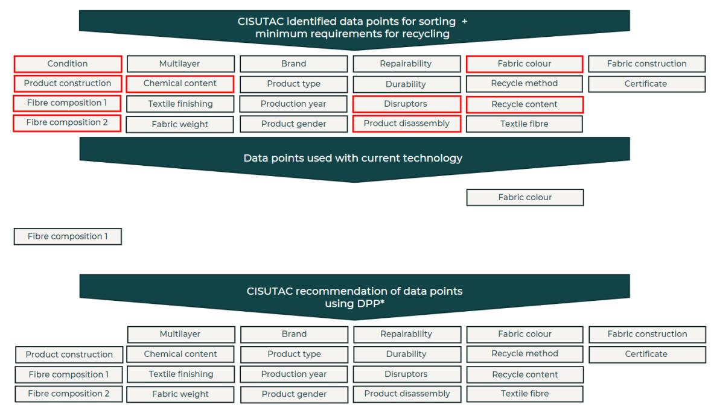

*Figure 14. Visualisation of CISUTAC minimum requirement of data points compared to today and future situation. \* This is a recommendation for further work within the delegated acts*

## **6.4 Building the basis for the channelling tool**

#### **6.4.1 Data-based textile sorting**

To retain as much value in textile waste as possible, it is crucial to have access to detailed information about the products and materials in the waste steam. The relevant information at a granular level consists of several data points contributing to a data pool which, prioritized using the right software, can determine likely value and identify the optimal route for a product or material - to repair, reuse or recycling. Examples of data points are condition, material composition, material construction, yarn construction and various forms of chemical content. Access to this kind of data creates a potential to channel accurate feedstock in larger volumes and retain value in the circular loop, enabling more resources to be kept in a circular system.

With the relevant data points for reuse, repair and recycling, we can channel the waste based on a set of data in an automatic sorting system. This is crucial for scaling fibre-tofibre recycling, but also to untap potential for scaling reuse and repair of the right products.

With new upcoming regulations, supply chains' transparency and traceability are increasing, and will significantly increase in coming years. This means that manufacturers and brands need to have and disclose more information about the products and materials that they place on the market. This is also linked with certifications and verification of recycled yarns and materials. New possibilities to track materials and products with the help of the DPP, also for specific sorting, will support the next step of fibre-to-fibre certifications.

### **6.4.2 Data-points for circular value chains**

The CISUTAC project has focused on the most relevant data points for advanced data-based sorting, taking reuse as well as recycling into consideration. The work has involved the CISUTAC consortium and beyond, and builds on previous work performed by the partners tracing back to 2017. To mention a few of these projects, related work was performed through TexIT*[63](#page-66-0) ,* the EU project Herewear – Bio-based local sustainable circular wear with focus on sustainable circular wear[64](#page-66-1)*CIRPASS* with focus on the DPP– Digital Product Passport[65](#page-66-2) .

The focus has been to identify data points that support decision making for reuse as well as recycling, and act as gamechangers in sorting. In other words, focus is on data points that would have the potential to untap larger volumes of cotton, MMC and polyester and channel these towards fibre- to-fibre recycling.

The CISUTAC project has identified relevant data points for current and future sorting possibilities. Technology is rapidly evolving and digital product passports are rising in the textile sector, which has the potential to bring a digital shift in sorting and completely change the playing field. Access to larger data-sets through the DPPs offers enormous possibilities, but the data pool must be structured and tools that can make sense of the accessible data are crucial. The purpose of our work is to explore which sets of data points the upcoming legislation should give us access to, but also to understand the impact data access can have on automatic sorting processes and on scaling circular value chains and recycling possibilities.

The textile industry is under intense technical development, and any channelling guidelines must be flexible enough to align with new technology coming to scale. Many recycling technologies already are used today, be it at a smaller scale, more technologies are being developed, and it is therefore crucial to build in flexibility to align with several sorting technologies as well as several recycling technologies co-existing. In order to set a base for the channelling routes we have prioritized the existing and most common recycling technologies used today such as mechanical recycling, chemical recycling, thermomechanical- and thermochemical recycling.

#### **6.4.3 Data granularity and prioritisation of data**

The relevance of specific data points can differ when it comes to reuse, repair and different types of recycling but some input data will also be as relevant for all these areas. Textile sorting today is, as previously mentioned, predominantly manual and based on the skill of the workforce. In some cases, where new technology is in place, such as NIR, sorting is based on the data which can be extracted using that specific technology, and is therefore quite limited. To take a leap in technology, and be able to sort post-consumer materials in a more refined manner, more data is needed.

For the **reuse** area the overruling data points are condition, production year, reparability and brand. Using more data, and with the aid of a decision support tool it would be easier to adapt to market needs and changes in trends, colours and type of product and brand. These types of data do make a difference and are seen as elements of major importance. However, access to more data in addition to adding information on more granular data would have a great impact also for the reuse sector, enabling specific and customized take-back schemes or improved collections methods.

63 Project webb-page, RFID Information System for Future Textiles, https://www.ri.se/en/what-wedo/projects/rfid-information-system-for-future-textiles

64 Project webb-page, HereWear Project, Bio-based local sustainable circular wear, https://herewear.eu/project/

65 Project webb-page, CIRPASS, cirpassproject.eu

Looking at **recycling,** there are different types of data that will come into play**.** Here, the fibre composition, fibre and fabric construction, colour and chemical content are major inputs that will make a world of difference for recyclers and enable much larger volumes to become valued feedstock. The need has been evident for recycling professionals and researchers for quite some time, and some of the needed information can be partially accessed through existing technology, although this kind of technology is not at a large scale today. The challenge that we face now discovered in the work with the CISUTAC decision support tool, is that a high quality recycling process is more demanding and requires a more detailed level of information on other parameters, several of which have already been mentioned, e.g detailed fibre composition, recycled content and textile finishing used.

## **6.5 CISUTAC data point recommendations**

In dialogue with stakeholders, data points that are enabling circular routes for postconsumer textile (PCT) were mapped see Table 19. our work aimed to identify the data points that are essential in supporting the channelling decision of PCT in the most accurate way, with the current level of the technology, but also to match future innovations. Even if there are 3-5 data points that are elemental to channel textiles in an efficient way, we see it as crucial to adding several more to set the prerequisites for bigger steps to be taken towards efficient and specific textile sorting beneficial to the European reuse as well as recycling industries.

Early in the work, some data points were mentioned that were later ruled out (price, trend, garment measurements) as the coming DPP is likely to give access to data such as production year, brand and gender which will cover the needs for the reuse sector.

We have gathered input from the industry, inside and outside the CISUTAC consortium, and evaluated the key enablers. The most prioritized data points, the data points that are a minimum requirement corresponding to the market need today, to channel PCT is identified to be **Condition, Product construction, Multilayer, Chemical content, Fibre composition, Recycled content, Textile finishing, Fabric colour and Disruptors. These elements will be detailed in the sections below.**

| Data points                                  | Description                                                                             | minimum requirement today |
|----------------------------------------------|-----------------------------------------------------------------------------------------|---------------------------|
| Condition                                    | Setting the quality levels for the post consumer textile waste                          | X                         |
| Product construction (monomaterial and multi | Describes if it is one or more materials in the product, 2 options, mono or multi       | X                         |
| Multilayer                                   | Describes if it is a coated or laminated material                                       | X                         |
| Chemical content                             | Yes or No option with focus on SVHC substances                                          | X                         |
| Production year                              | Relevant for reuse, trend and chemical legislation                                      |                           |
| Product type                                 | 14 different types of products that follows the code system from import data            |                           |
| Brand                                        | Important for 2nd hand and durability as well as trend                                  |                           |
| Price                                        | Relevant for the 2nd hand market, focus on recommended market price                     |                           |
| Product gender                               | Relevant for the 2nd hand market, we used wmn, men, unisex, junior and kids             |                           |
| Repairability                                | Information on how to repair and if it is possible on certain products                  |                           |
| Durability                                   | Relevant and measurable data on pilling, abrasion and tearing                           |                           |
| Fiber composition (1 and 2)                  | The blend of fibers in the fabric, the tool focus on 2 main fabrics                     | X                         |
| Recycle content                              | Percentage of recycle fiber in the yarn, focus on cotton and polyester                  | X                         |
| Recycle method                               | Type of recycle method that is used for the fiber                                       |                           |
| Textile finishing                            | All treatments of the textile such as dyeing, chemicals for function, finishing or look | X                         |
| Fabric construction                          | Construction of the fabric that indicates the surface that can affect recycling         |                           |
| Fabric colour                                | 4 type of groups such as bright, dark, light and multi                                  | X                         |
| Textile fiber                                | Construction of the fiber such as length and fineness                                   |                           |
| Fabric weight                                | Weight in gsm, useful data for some recycle methods                                     |                           |
| Disruptors                                   | Yes or No option for hardparts or trims on product                                      | X                         |
| Product disassembly                          | Indicates if the product can be taken apart or have an easy way to take away trims      | X                         |
| Certificate                                  | Different levels of verified certifications to be used for traceability                 |                           |

*Table 19 CISUTAC data points and highlighted prioritised data points*

### **6.5.1 Condition**

Contamination in the user phase is a problem when handling textile materials. contamination can consist of different things such as moisture, mould or oil stains. The effect and risk of contamination of textiles need to be evaluated for future recycling technologies. In relation to the **Condition** levels, contamination has been addressed and needs to be considered, but it is still a complicated parameter to evaluate and define in detail. Today, manual sorting relies on the skill of the workforce to detect the condition and quality of post-consumer textiles. In manual sorting, condition is the most crucial parameter in deciding if a garment has the potential to go into reuse and repair. CISUTAC has defined conditions in 5 sub-levels that follow the waste hierarchy, these sub-levels are defined by the descriptions below:

| CONDITION | ROUTE         | DESCRIPTION                                           |
|-----------|---------------|-------------------------------------------------------|
| VERY LOW  | INCINERATION* | Major contaminations and impurities , for example oil |
| LOW       | RECYCLE       | Teared and dirty , for example holes, stains, damaged |

| MEDIUM  | REPAIR | for |                                                            |
|---------|--------|-----|------------------------------------------------------------|
|         |        |     | Smaller defects , for example on fabric and trims, small   |
| HIGH    | REUSE  |     | Few signs of wear and tear , for example lighter pilling,  |
|         |        |     | color fades, all trims ok                                  |
| PREMIUM | REUSE  |     | High quality , for example price tag still on, no signs of |

\* For the future preferably thermomechanical or chemical recycling

*Table 20 CISUTAC data field within condition with a value list of defined 5 levels from very low to premium*

Underlying definitions of condition are important in decision making related to reuse potential for the second-hand market. It can provide relevant information to improve the transparency of sorting and export of textile waste. One issue raised in partner dialogues is that a garment can be in premium condition but still face no consumer demand. This must therefore be addressed by other data points like size or trends to allow for re-routing to a recycling destination instead of to reuse.

#### **6.5.2 Product construction**

Another identified data point of high relevance is the information on use of several materials in a product. Examples of this type of information would be relevant for products that are made of several materials such as shell material and inner lining, in many cases there is also an insulation or interlining. This is called Product construction in the CISUTAC mapping, with options to choose mono material or multi material. When a product is constructed using a single material, it is called a mono material product and when more than one material is used, it is called a multi material product We have looked at the construction of a product to cover mono material and multi material, this is a challenge today and creates bottlenecks in sorting and difficulties in handling the materials. Solving the challenges of multilayer products is essential to enable recycling of the components.

It is also important to consider the fabric construction of the individual layers, with data point such as knit and woven being important in regard to mechanical recycling possibilities but also in relation to microfibre release. These parameters are detailed below.

#### **6.5.3 Multilayer**

We have identified the importance of the data on laminated and coated materials called Multilayer for recycling purposes. Multilayer products are also commonly constructed with taped seams, further increasing the need to identify them. These types of products are currently channelled in a separate loop, mainly by manual sorting, and would benefit greatly by automated sorting to enable a more efficient use in the future. For some adhesives and chemicals used in multilayer products, technology is in some cases present (i.e. Vividye, Resortecs) or may be developed in the future to remove them from the fabric. With information on multilayer accessible through the DPP it would be possible to separate these materials and improve recyclability. Development for new and innovative materials with high functionality is rapidly evolving, and the different technologies to assemble materials and membranes are changing. The data points related to chemical content and textile finishing are tightly linked to this data point in the sorting decision support.

#### **6.5.4 Chemical content and Textile finishing**

A textile product is a complex item, often incorporating several fibre types, materials and added components in one product. Surface finishing and dyeing is performed differently depending upon whether the material is natural or synthetic. Here, use of chemicals is evident. Chemicals can affect our environment and our health but there are also chemicals that are not placed under restriction, this however, does not stop them from having the potential to disrupt a chemical process that they are subjected to. In some cases, information on chemical content will relate to restriction, we simply do not wish to further circulate these substances in our loops. In some cases though information, is needed on their presence in order to handle the materials correctly, e.g. mechanical recycling might be the preferred choice over a chemical option, or vice versa.

CISUTAC has identified the most critical chemical groups, such as SVHC, and textile finishes that can affect reuse or recycling. Chemical content and Textile finishing are very connected with each other and the underlaying granular data is very important information for DPP and highly relevant to channel textiles further after collection and sorting. The underlaying data for Chemical content is only *Yes or No* options focusing on SVHC i in the first version of the tool. The underlaying data for Textile finishing (based on ISO/TC 38/WG 35), covers all treatments of the textile such as dyeing, chemicals for function, finishing or look. These chemical groups or finishes are different dyeing methods, DWR-Silicon, DWR-PFAS, flameretardants, titanium dioxide, biocides, crosslinking agents, scouring additives and brushing additives.

To give an example, today PFAS content is a challenge even though the work in the textile industry to phase out this chemical is progressing. This is an unwanted chemical in all parts of the product lifecycle and it is important to have the correct information to ensure that material with PFAS content is correctly taken care of. Going into flame-retardant functions and treatments, if this type of functionality can be detected (through information access or by other means) in PCT, it is an option to separate this material stream and loop it in a way so that the original functionality can be retained. There are successful examples of this specific looping for post-industrial waste with PFAS.

Cross-linking of polymers (e.g. anti-wrinkle/easy-care for cellulose, viscose or lyocell), can be problematic mainly for chemical recycling processes. Another important information is fibre and dyeing methods. It is foreseen, in the work with the tool, that information about the below stated dyeing methods will be required to effectively guide PCT and make use of it as a valuable feedstock: Direct dyes, Reactive dyes, Vat dyes, Sulphur dyes, Solution dye, Disperse dyes, Acid dyes, Premetallized dyes and Cationic dyes.

#### **6.5.5 Fibre composition**

The fibre composition of materials is one of the most important data points in sorting for recycling, this is a well-known fact supported by our stakeholders as well as industry knowledge in the project. The CISUTAC project confirms the need of more detailed data to be accessible through the value chain, such as more exact information on all fibres in a garment and the process methods that have been used. The CISUTAC work also indicates that blends containing more than three fibre types is a problem today for recycling. There are only a few technologies, based on chemical methods, that can handle more complex fibres blends as for example cotton/polyester/elastane. Mechanical recycling is an option, but sets requirements relating to other data point, such as chemical content.

For future sorting processes, with fully mature and scaled recycling technologies, the ability to sort with more accuracy will be important enabling access to feedstock of the right quality and in large volume for fibre-to-fibre recycling. The fibre composition of a fabric in a product can be detected today but with several limitations related to the exact composition, elastane hidden in yarn, underlaying layers etcetera. For the development of the decision support tool, CISUTAC has envisaged that two layers and corresponding composition can be detected, as this would be of very high value for the following step. The challenge of insufficient sorting capacity, to sort based on data, is to provide feedstock in large volumes to the recycling industry. This shortage of feedstock is slowing down investments and the scale-up of recycling technologies. There is an urgent need to build capacity as volumes of textile waste will increase in the near future in line with the intention of the EU Textiles Strategy.

#### **6.5.5 Recycled content and recycling methodology**

Another challenge related to fibre composition is the percentage of a certain fibre in the composition and if there is a certain percentage of recycled fibre used. The content of recycled fibre in a yarn and the method used for yarn spinning is important information, and the more recycled yarns we use the more important access to this data will be. For mechanical recycling the limit of percentage of recycled fibre that can be used will vary and change as technology develops (i.e., orbital spinning technology possibilities in WP4 of CISUTAC). Information about the recycled content and the method used for recycling will be important in the decision support tool, as it may affects the optimal route.

#### **6.5.6 Fabric colour**

In regard to sorting, technology to sort on colour is developing. PCT used for mechanical recycling benefits from effective sorting on colour, as this opens for the possibility to make use of the recycled fibre without re-dyeing... With detailed colour information accessible through the DPP, improved recycling is possible. In the decision support tool focused has been on major colour groups, bright, dark, light and multi.

For chemical recycling the colour itself is not so relevant, and a broader area of colours can be used to get a good end result with the technologies existing already today, but the chemistry of the dye can be very relevant, see the section on chemical content and textile finishing. For mechanical recycling the prerequisites are different as there are no inherent cleaning or removal steps included, the input will be the same as the output, only in a different shape.

#### **6.5.7 Disruptors and Product disassembly**

The PCT today, and for the foreseeable future, contain disruptors such as buttons, labels, zippers and other trims. These are hard to detect and often a challenge to disassemble from products. More information about specific disruptors in garments are very important in the textile sorting of tomorrow as more information paves the way for more efficient material handling. To channel textiles using the decision support tool, it is important to get relevant information about the disruptors, the nature of the disruptor as well as information about product disassembly. More information about the different disruptors will help the reuse and repair sectors, as well as improve recyclability in general.

Visualisations of channelling with multiple data points Here below are examples of future possibilities of sorting based on multiple data points. . The ability to sort on multiple data points will increase the volumes of waste available for reuse and recycling as well as promote innovations in the field.

#### **6.5.8 Example of channelling routes**

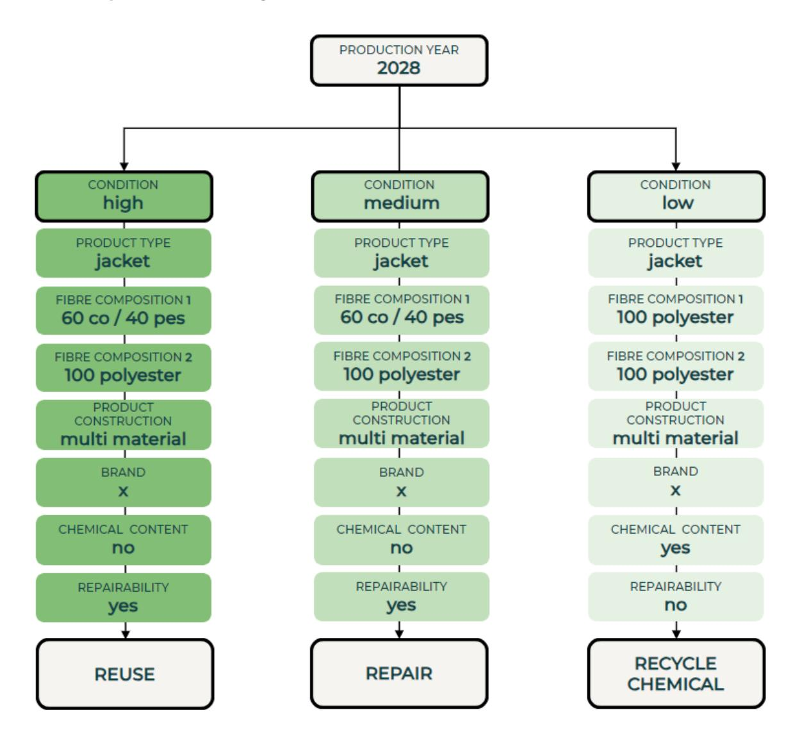

*Figure 15 . Example of routes for Reuse, Repair and Recycle based on the work performed within CISUTAC.*

#### **Example of routes for Recycle**

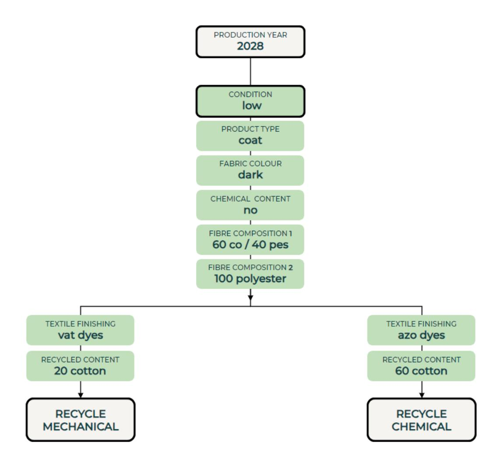

#### *Figure 16 Example of routes for Recycle, based on the work performed within CISUTAC.*

### **6.5.9 Scaling textile sorting requires a combination of technologies**

Sorting based on data requires strategic use of several technologies, driving automatization of the sorting industry. The mapping and illustration below show the degree of maturity of technologies in relation to the data points which the respective technology can manage/has the potential to manage.

There are several technologies under development, for example within the AI-field, meaning that the below overview is a snapshot of maturity levels which can rather rapidly change. Here, technologies are presented one by one, but in reality, technologies will need to be combined for an optimal sorting process.

| Decision tool parameters                        | Manual sorting, reference point | NIR | HSI | VOC (smell detector) | RGB/VIS | Image recognition (AI) | Possible technology reading DPP data from textile product |                                                 |                                                |
|-------------------------------------------------|---------------------------------|-----|-----|----------------------|---------|------------------------|-----------------------------------------------------------|-------------------------------------------------|------------------------------------------------|
|                                                 |                                 |     |     |                      |         |                        | RFID chip on item/ RFID reader at the sorting facility    | NFC on item/ NFC reader at the sorting facility | QR code on item/ QR reader at sorting facility |
| Condition                                       | yes                             |     |     |                      |         |                        |                                                           |                                                 |                                                |
| Product construction - Mono material            | yes                             |     |     |                      |         |                        |                                                           |                                                 |                                                |
| Product construction - Multi material           | yes                             |     |     |                      |         |                        |                                                           |                                                 |                                                |
| Multilayer                                      | yes                             |     |     |                      |         |                        |                                                           |                                                 |                                                |
| Chemical content                                | no                              |     |     |                      |         |                        |                                                           |                                                 |                                                |
| Production year                                 | no                              |     |     |                      |         |                        |                                                           |                                                 |                                                |
| Product type                                    | yes                             |     |     |                      |         |                        |                                                           |                                                 |                                                |
| Brand                                           | yes                             |     |     |                      |         |                        |                                                           |                                                 |                                                |
| Product gender                                  | yes                             |     |     |                      |         |                        |                                                           |                                                 |                                                |
| Repairability                                   | no                              |     |     |                      |         |                        |                                                           |                                                 |                                                |
| Durability                                      | restricted                      |     |     |                      |         |                        |                                                           |                                                 |                                                |
| Fiber composition (cotton, polyester, dilastan) | restricted                      |     |     |                      |         |                        |                                                           |                                                 |                                                |
| Recycle content                                 | no                              |     |     |                      |         |                        |                                                           |                                                 |                                                |
| Recycle method                                  | no                              |     |     |                      |         |                        |                                                           |                                                 |                                                |
| Textile finishing                               | no                              |     |     |                      |         |                        |                                                           |                                                 |                                                |
| Fabric construction                             | no                              |     |     |                      |         |                        |                                                           |                                                 |                                                |
| Fabric colour                                   | yes                             |     |     |                      |         |                        |                                                           |                                                 |                                                |
| Textile fiber (fiber properties)                | no                              |     |     |                      |         |                        |                                                           |                                                 |                                                |
| Fabric weight                                   | no                              |     |     |                      |         |                        |                                                           |                                                 |                                                |
| Disrupters                                      |                                 |     |     |                      |         |                        |                                                           |                                                 |                                                |
| Product diassembly                              | yes                             |     |     |                      |         |                        |                                                           |                                                 |                                                |
| Certificate                                     | no                              |     |     |                      |         |                        |                                                           |                                                 |                                                |
| <b>TRL 8-9</b>                                  |                                 |     |     |                      |         |                        |                                                           |                                                 |                                                |
| <b>TRL 5-7</b>                                  |                                 |     |     |                      |         |                        |                                                           |                                                 |                                                |
| <b>TRL 1-4</b>                                  |                                 |     |     |                      |         |                        |                                                           |                                                 |                                                |

*Figure 17 The illustration gives an overview of the degree of maturity (TRL level 1-9) of technology in relation to the data points*

#### **6.6 Overview of relation between technology and data points**

The data points with the highest potential to create a major shift in the amount of PCT textiles that can be reused and recycled were identified in the CISUTAC project to be: **Condition, Product construction, Multilayer, Chemical content, Textile finishing, Fibre composition, Recycled content, Fabric colour, Disruptors** and **Product disassembly**. As these data points are crucial for the circular transformation of the textile industry, it is important to analyse the TRL of possible and available technologies that can identify them.

**Near-Infrared Spectroscopy (NIRS)** sensors are used on a commercial scale to identify fibre composition. It is commonly combined with Visual Spectrometry (VIS) or RGB sensor to identify prioritized data point, fabric colour e.g., TOMRA [\(Textiles -](https://www.tomra.com/en/waste-metal-recycling/applications/waste-recycling/textiles) TOMRA - [Material Sorting -](https://www.tomra.com/en/waste-metal-recycling/applications/waste-recycling/textiles) Waste Recycling) Fibresort ™ and Valvan [\(Textile sorting for recycling |](https://www.valvan.com/en/solutions/textile-sorting-recycling)  [Machines | Valvan](https://www.valvan.com/en/solutions/textile-sorting-recycling) However, these technologies are not currently advanced enough to meet requirements for all recycling processes, as they are only able to detect fibre composition or fabric colour on the surface and in the area of detection. It is important to note that the level of sophistication of NIRS' ability to detect incoming material can vary depending on what

materials it has been taught to identify and compare with. The following are types followed by examples of textile products that are difficult for NIRS to identify[66](#page-75-0):

#### **6.6.1 Fibre composition:**

- Textile products made of core-spun yarn e.g., an elastane filament fibre in the core wrapped with cotton fibres would be identified as only containing cotton as NIRS only detects on the surface of textile. For recycling processes, this has proven an important issue to solve as many processes aren't able to handle elastane. [Other](https://textileexchange.org/other-synthetics/)  Synthetics - [Textile Exchange](https://textileexchange.org/other-synthetics/)
- Textiles composed of multiple (more than 3) and/or complex fibres are harder for NIRS to accurately identify. [Technology | Fibresort](https://www.fibersort.com/en/technology)™

#### **Constructed with multiple textiles:**

Another consequence of NIRS only identifying on a specific area of detection is the inability to identify if there are multiple parts and thus multiple fibre compositions in a textile. For some recycling processes, even seemingly small parts such as trims, seams, or ribbed cuffs can't consist of another fibre composition than the main fabric for it to be recyclable.

#### **Constructed with multilayer fabrics:**

NIRS is only able to scan the surface of a textile, rendering it impossible to know if the garment has multiple layers and what these layers consist of. [Technology |](https://www.fibersort.com/en/technology)  [Fibresort](https://www.fibersort.com/en/technology)[™](https://www.circle-economy.com/resources/clothing-labels-accurate-or-not). Without this information, garments can't be matched to a suitable recycling process by only using a NIR scanner.

#### **Laminated and coated fabrics:**

Similar to the above mentioned issues pertaining to NIRS detecting on surface level, textiles that are laminated or coated are difficult for NIRS to identify accurately ultimately deeming these textiles not suitable for all recycling processes.

#### **6.6.2 AI-based image recognition**

Computer vision models are capable of classifying cloth categories, style learning, popularity prediction, item retrieval, attribute recognition[67](#page-75-1). Most of these studies have focused on first-hand fashion problems with little direct use in the second-hand domain where recognizing damages, material composition, trend are often of immense interest. To address this, work done in Task 1.2 in CISUTAC complemented by similar work in the Vinnova funded project "AI for resource-efficient circular fashion" aim to build AI models that can detect different types and degrees of damage and other features. Moreover, a dataset with approximately 30,000 garments of different types and conditions annotated by expert sorters will be made public. A decision support system based on AI is being developed for automated detection of various attributes of second-hand clothes for enhanced sorting. Ongoing work in CISUTAC Task 1.2 will be a first major step towards this, but many further advancements are necessary to fully automate sorting.

66 Zhou, J., Yu, L., Ding, Q. & Wang, R. (2019). Textile Fibre Identification Using Near-Infrared Spectroscopy and Pattern Recognition. AUTEX Research Journal, 19(2), pp. 201-209. doi:10.1515/aut-2018-0055

67 Wen-Huang Cheng, Sijie Song, Chieh-Yun Chen, Shintami Chusnul Hidayati, and Jiaying Liu. 2021. Fashion Meets Computer Vision: A Survey. ACM Comput. Surv. 54, 4, Article 72, May 2022, <https://doi.org/10.1145/3447239;> Chang, Y., & Zhang, Y. (2022). Deep Learning for Clothing Style Recognition Using YOLOv5. Micromachines, 13

**6.6.3 Digital product passport (DPP**) can theoretically aid in the access of the following prioritized data points; Product construction, Multilayer Chemical content, Fibre composition, Recycled content, Fabric colour, and Disruptors.

The digital product passport may contain information on the production phase e.g., material composition, production year, brand, recycled content, and dyeing methods. The information provided by the digital product passport has the potential to simultaneously increase efficiency in the sorting process and ensure high precision in the output. Ultimately creating the level of quality assurance needed for different recycling processes. It is not yet decided how to connect the data to the textile product. Solutions exist on the market e.g., QR code, RFID, and NFC which have the potential to be used for the implementation of a digital product passport, for textile sorting, RFID or its equivalents is the preferred choice due to the need of reading the information without presenting a visible code to a reader as in the case with QR/barcode. QR and RFID can however be paired to enable efficient reading in sorting as well as giving consumers access to information.

**6.6.4 Quick Response Code (QR code)** is a barcode easily read by a digital device like a smartphone. The QR code is frequently used to track information about products in a supply chain or for advertising and marketing campaigns. They are also commonly used to transmit web addresses to mobile phones. By using QR codes on the item, information from the digital product passport could be accessed by a smartphone scanner which would make the information easily accessed even by consumers. QR codes has been tested on textile products within the project - Trace4Value.

Radio-frequency identification (RFID) or Near Field Communication (NFC ) chip could also be used as information carriers of digital product passports. Both systems require separate readers. The RFID technology can read multiple items simultaneously and at a longer distance than NFC. Both RFID and NFC require connecting to the database with the digital product passport information to process the textile´s data in an automated sorting process. Radio-frequency identification (RFID) has been tested and explore on textile products within the project RFID Information System for Future Textiles | RISE. [69](#page-76-1)

Even with a system in place to access the data on the digital product passport assessing factors changed due to user phase, such as the condition, must be handled through other solutions, e.g., image recognition, AI solutions, and manual labour. Assessment of textiles after user phase is fundamental to ensure it is correctly sorted for reuse, reconditioning, or recycling.

**6.6.5 Technology that supports the process**: More research and development is needed to seamlessly integrate these technological solutions, especially to reach a higher level of automation. Furthermore, flexibility is also crucial as each textile sorting process will utilise different technologies and/or arrange the process in different orders. There is also untapped potential in integrating semi-automatic aids in the sorting process to create safer and better working conditions e.g., robotics solutions to remove manual steps of putting textiles on and off conveyor belts. Another example is technologies that could identify and remove sharp objects which would minimise risk of work-related injuries.

#### **6.6.6 Potential of sorting technology development.**

The future will entail a need to integrate and combine technologies as no one technology will be able to identify all data points accurately and efficiently. Furthermore, technologies currently used in other industries will be important to assess if applicable to textile sorting.

68 Project Digital Product Passport in textile - Trace4Value

69 Project, RFID Information System for Future Textiles, Research Institutes of Sweden

An example of this is VOC-sensor (Volatile Organic Compound) which could potentially test the air close to the garment and detect unhealthy gases and even odors non-detectable for humans, e.g., hairspray, deodorant, perfume, and bleach. Although not systematically tested for textiles, given the current application of VOC-sensors in a wide array of industries such as laboratories, pharmaceutical environments, coating processes, and adhesive manufacturing it is of interest to see its potential. X-ray for metals is another example.

Developing current technologies will also be crucial to reach higher levels of accuracy and identify more data points. For example, NIRS is the most common sensor of the hyperspectral imaging (HSI) sensors, sometimes also referred to as multi-spectral sensors, yet its full potential has not yet been reached or identified. It has been suggested that NIRS could potentially be able to identify some chemical content in textiles e.g. PFAs and contaminations e.g., oil stains (Hahlin, Amanda. Development and Optimization of Nearinfrared spectroscopy, 2023). This could enable the textile industry to sort out and phase out hazardous and dangerous chemicals. Furthermore, HSI sensors could potentially aid in detecting chemicals as it is currently used for surveillance of emissions of gases in other industries. Thirdly, multi-spectral sensors could potentially be integrated to identify condition, as the sensors can capture images in several different wavelength ranges simultaneously to detect damages that are invisible or barely visible to other technologies [70.](#page-77-1) 

#### **6.6.7 Future of AI in second-hand fashion**

Current AI solutions for second-hand fashion have several limitations that need to be addressed:

**1. Data:** Most online datasets for fashion are for first-hand fashion, which means that second-hand fashion specific problems like damage detection are difficult to solve using these datasets. Future work must address these challenges by creating large-scale open datasets. The Vinnova funded project that involves Wargön and RISE (AI for resourceefficient circular fashion) aims to fill this gap, but more work needs to be done.

**2. Innovations in hyperspectral sensors**: For textile recycling, considerable work has been done in exploring different infrared sensors: NIR, FTIR, etc. But more broadly, a wider spectral range can be explored to deal with challenges faced by NIR sensors like multilayered clothes.

**3. Multi-modal and Generative AI:** Recently, tremendous progress in multi-modal and generative AI models[71](#page-77-2) . Future innovations in AI for second-hand fashion will likely use approaches that will involve text and image models. Generative models that can generate text descriptions of used clothes are likely to become the norm in coming years.

## 6.6.8 Conclusion and Analysis

Technology available today is limited in terms of giving access to the identified prioritized data points recommended by the CISUTAC project. The potential and needs to be answered by future technologies for sorting has been discussed with a special focus on the possibilities of the upcoming digital product passports. All to together The Textile Waste

70 Cura, K., Rintala, N., Kamppuri, T., Saarimäki, E. & Heikkilä, P ,2021, Textile Recognition and Sorting for Recycling at an Automated Line Using Near Infrared Spectroscopy. Recycling (Basel), 6(1), p. 11. doi:10.3390/recycling

71 Chunyuan Li, Zhe Gan, Zhengyuan Yang, Jianwei Yang, Linjie Li, Lijuan Wang, Jianfeng Gao: "Multimodal Foundation Models: From Specialists to General-Purpose Assistants", 2023, arxiv.org/abs/2309.10020

Decision Support Tool, the CISUTAC recommended data points and the technology assessment visuals a clear advantage of implementing the digital product passport for scaling digital based sorting when multiple data points are needed.

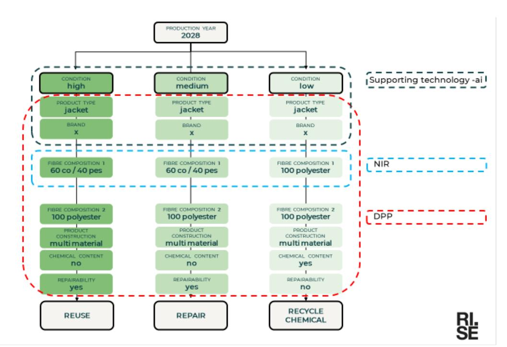

*Figure 18 Visualisation of example on channelling routes for recycling with access to data mainly through the digital product passport.*

The conclusions drawn from the work on the decision support tool can hopefully serve as a guide for stakeholders in managing the transformation to a circular textile value chain and summarizes key takeaways for the upcoming legislation on the ESPR, including the rolling out of the DPPs.

➢ In the initial version of the tool, the data points have been prioritized based on stakeholder input. The tool has then been evaluated and tested with various basic routes for reuse and recycling. A main conclusion is that the tool must be flexible and continuously developed to integrate new insights that will arise when the tool is tested with more detailed data, such as more fibre compositions, and the use of new technologies. ➢ A flexibility is also relevant to sort for reuse. Here the most important thing is identifying the right data points to meet different market needs since the trends and needs may differ from country to country and also depending on season. In the initial tool the major change for reuse is Condition levels. . Next version of a tool could be looking deeper in the possibility to be flexible with trends, for example recommended market price, brand or production year. ➢ Condition assessment indeed plays a crucial role in waste management, The CISUTAC project's identification of five sublevels within the condition category is a significant step towards standardizing this assessment process. Developing technology capable of accurately detecting these conditions is pivotal for automating waste sorting processes, thereby improving efficiency and reducing the burden on manual labor-Moreover, leveraging condition as a key performance indicator (KPI) for auditing sustainable and ethical trade in used clothes is an innovative approach. By incorporating condition assessment into auditing processes, stakeholders can ensure that items being traded meet certain quality standards, promoting transparency and accountability in the reuse market.

Establishing an industry standard for condition assessment would further streamline waste management practices and facilitate collaboration among stakeholders. This standardization would not only enhance the efficiency of sorting processes but also enable better tracking and reporting of condition data, ultimately driving progress towards more sustainable and ethical waste management practices

➢ The digital product passport does not include information on activities during the user phase nor can it handle information on the item's current condition. **Condition needs to be detected by complementing technology, as shown in the technology mapping**. AI-based image recognition has great potential to take a technology leap. This opens up for new questions of the need to build infrastructure and capacity within the sorting industry, future work must also address challenges of creating large-scale datasets, the openness of these and the industry ability to enable a cost-effective development of AI, or the impacts of AI related to energy consumption. Important to note here is that the AI development now is on a TRL 1- 4 meaning that technology is today far from surpassing manual processes and excellency's . ➢ Technology is currently limited regarding the identification of the prioritized data points recommended by CISUTAC. The tool explores the potential of future technologies and has a specific focus on the potential of digital product passports. The technology mapping performed clearly states that DPPs can **access multiple data points needed to facilitate reuse and recycling and has the potential to foster and strengthen the scaling of several recycling technologies.** The ESPR legislation provides industry with clear long-term rules to foster sustainable value chains based on data access. Industry trust in long term data accessibility is important to build the foundation for large scale textile recycling. ➢ Other requirements also need to be evaluated for products, for example design for recycling through restrictions to minimize blends to enable a faster transformation to fibre-to-fibre recycling. For example, as stated in the research in the CISUTAC brand data set elastane was integrated in all product groups. It should be assessed and considered if there is potentially an overuse and whether some kind of restriction would be useful. ➢ The tool clearly states that **to facilitate fibre-to fibre recycling, several data points with underlying sub-levels are urgently needed**. The DPP, as evident from the technology mapping, has the largest potential to provide information on the level of detail needed for efficient sorting and recycling. With more information accessible, more textile waste can become a suitable feedstock for fibre-to-fibre recycling. The possibility to access multiple granular data points also has the potential to strengthen the sorting for reuse, where there are a variety of continuously changing markets driven aspects such as colour, brand, gender and product type. The tool underlines **the importance of granular information on item level** like the construction of a product, fabric or fibre. This data is often basic data used in the manufacturing phase and can therefor easily be used in the information for DPP.

The ongoing transition means that we need to address the sorting of textiles produced for a linear market while establishing processes for the digital shift in the circular market. There will be a longer period of overlap, where articles not adapted for the circular loops will need to be handled together with an increasing volume of articles fit for circular loops. This raises challenges for capacity building in the industry to manage a transition time where products not produced for the circular value chain and lacking structured information about the article coexist with products that have DPPs.

➢ **There is no silver bullet, the future needs the right technology mix for detecting multiple data points.** Technology combinations are crucial to radically change sorting. NIR technology cannot perfectly detect the material composition of a product, had challenges with elastane (Mäkelä, Rissanen et al. 2021), and cannot detect chemical content. To combine the information from the DPP with support from NIR technology for more accuracy on materials and fibre compositions and textile finishing could be a future option. One other example of technology combination is the use of AI for more accurate detection of on condition of the garments with support from the information from the DPP.

## **7. Future Scenarios**

This chapter will look at the future scenarios for a textile management system in 2035. The chapter starts with method following four explorative scenarios.

## **7.1 Method**

The scenarios for the textile management system to 2035 ("the Scenarios") are developed using foresight methodologies. The origin of the field of foresight can be traced back to the second world war and practices used within military planning (Hines, 2020). By the 1960s, the discipline started to develop along several different paths to form a field of theory and practice that is today used by professionals across companies, governments, nongovernmental organisations, and academia (Bell, 1996). Foresight can be defined as a systematic process to look at future trends and developments, with the aim to provide a structured and informed approach for understanding potential future trajectories and to inform strategic decision-making. The foresight methodologies used are also participatory, meaning that stakeholders have played a key role throughout the process.

For the task of creating future scenarios for this project, 2035 was selected as a focal year. By extending the timeframe beyond 2030, the process allowed for a more open exploration of longer-term developments, for example how policies coming into effect before 2030 could play out in the industry once widely implemented. As such, the purpose of the Scenarios is to inform thinking and consider the longer-term perspective also in decisionmaking to 2030.

In developing the Scenarios, an explorative approach to scenarios is used (Vergragt & Quist, 2011). Explorative scenarios are useful when dealing with complex and dynamic environments, where it is relevant to account for uncertainties and unexpected events. As opposed to normative scenarios, where desirables futures are explored, or predictive scenarios, which places emphasis on forecasting specific outcomes, explorative scenarios are used as a tool to explore a range of possible futures. As such, the Scenarios are not forecasts or predictions. Instead, they are meant to stimulate questions and discussions about the future, that in turn can allow for a better understanding and ability to prepare.

The foresight process included four main activities, as outlined in Figure 15 .

*Figure 19 The Foresight Process in the CISUTAC project*

| 1: Desktop Research 2: Trend Analysis | 3: Scenario Building |
|---------------------------------------|----------------------|
| Report review and                     |                      |
| input from CISUTAC                    |                      |
| Map trends,                           |                      |
| uncertainty and                       |                      |
| Build                                 | scenarios            |
|                                       | session with         |
| A                                     | B                    |
| C                                     | D                    |

#### **7.1.1 Desktop Research**

In this phase, the current state was explored through review of published reports on the current and future state of the textile management system through the material flow and infrastructure gap analysis. CISUTAC partners also contributed with updates on state-ofthe-art descriptions and an outlook description of trends, drivers, and barriers to development within their areas of expertise. The material was used as input in the subsequent trend and scenario analysis, and the work towards the CISUTAC roadmap.

#### **7.1.2 Trend Analysis (Workshop I)**

The purpose of the Trend Analysis phase was to explore trends and drivers relevant to the future textile management system. The aim was to better understand the dynamics of change in the external environment, and to identify developments that are highly impactful, but also unpredictable in their development, so called critical uncertainties. The Trend Analysis was conducted together with 12 participants from CISUTAC partners in a full day workshop led by RISE in Brussels on September 5, 2023.

During the workshop, trends and drivers were identified and mapped using the STEEP framework, covering the areas of society, technology, economy, environment, and politics. The identified trends were then clustered and evaluated based on their degree of predictability and their potential impact on the textile management system. Using the uncertainty matrix as a tool to prioritise and focus, each trend cluster was evaluated and placed on the matrix. Trends with a high degree of impact were then analysed further using Trend Cards, where drivers, uncertainties and potential impact was explored further. Trends with a high degree of uncertainty were then also prioritised for further analysis. The outcome of the workshop was a map of key trends and drivers, as well as a list of critical uncertainties to be used in the scenario building process.

subsequent trend and scenario analysis, and the work towards the CISUTAC roadmap.

### **7.1.3 Scenario Development (Workshop II)**

The purpose of the Scenario Development phase was to explore how the critical uncertainties identified in the Trend Analysis could impact the development of the textile management system in different directions. Several combinations and outcomes of the critical uncertainties were tested to find the most relevant scenario building blocks. In the scenario building process, a 2 x 2 scenario matrix was used as a tool to develop four different possible future outcomes, or scenarios. In this methodology, two critical uncertainties are placed on the scenario matrix axes, each endpoint representing a polarity in the outcome of the uncertain development. The two scenario axes are selected based on their relevance to the focal issue, their degree of impact and uncertainty. It is also critical to make sure the axes are independent from each other. In each matrix quadrant, a combination of two polarities is then explored to shape a possible future outcome.

In a workshop led by RISE in Gothenburg on October 10, 2023, 15 participants from CISUTAC partners participated to build four scenarios, using the 2 x 2 scenario matrix framework. Input to the scenario narratives was developed using a structured question format, covering specific parts of the textile value chain. A number of key factors were also described, and participants were asked to evaluate how different factors would play out in each scenario. The outcome of the workshop was detailed input to each scenario, that was then Summarized and supplemented to form rich scenario narratives.

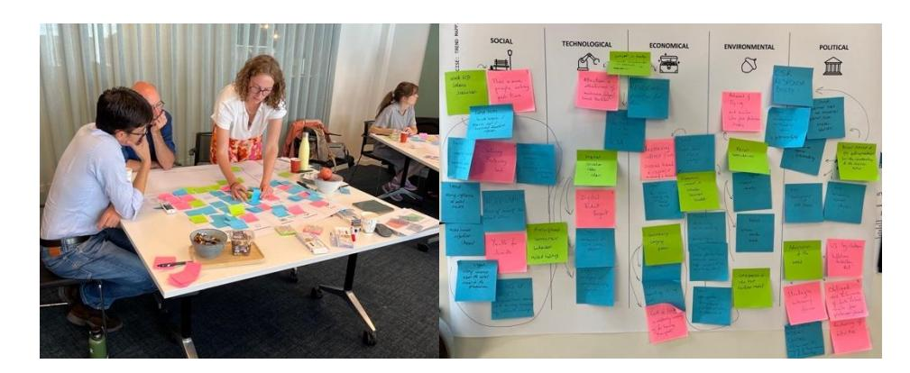

Picture 1) Trend analysis workshop

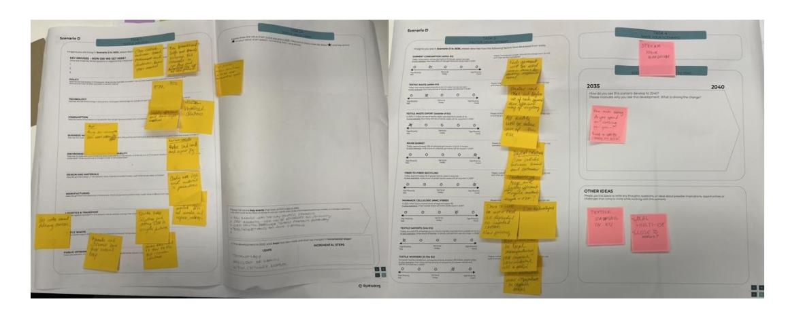

Picture 2) Scenario analysis workshop exercise sheets

#### **7.1.3. Additional input (Workshop III and CISUTAC partner feedback session)**

As a final step, the draft scenario narratives were presented to CISUTAC partners and industry experts to validate the content, and to collect additional input that would be relevant before finalising the scenario narratives. A third workshop was held at the ECOSYSTEX conference in Barcelona on 19 October 2023, where 38 industry experts within the ECOSYSTEX network engaged in an exercise to read and evaluate the scenarios, focusing specifically on the areas of policy, technology, and each scenario's key implications for the EU textile industry.

Finally, the scenarios were also presented and circulated among relevant CISUTAC partners in connection with a digital meeting on November 3, 2023, for final comments and feedback. All input was collected, Summarized, and incorporated into the final Scenarios presented in this report.

### **7.1.4 Roadmap**

To summarize conclusions from the report a roadmap for a circular economy transition to 2030 was conducted. The roadmap was constructed to be used as a strategic tool, outlining topics and solutions to be addressed that can complement or reinforce the EU textile strategy and actions to 2030.

The scenario building process pointed out three The Key Priority Areas, or areas of priority, in the roadmap presented later in the report. Key Priority Area is split into Focus Topics, areas that can complement or reinforce the EU textile strategy and actions. Connected to each Focus Topic, is a set of Game Changers for transforming the textile waste management system, followed by CISUTAC Insights (WP2), highlighting areas that need to be further addressed to succeed with capacity building. Finally, Recommendations for actions to take in the short (2024-2027) and medium (2027-2030) term are listed (see Annex 6).

The key topics identified in the roadmap are on a high level correlated to the Shared Vision of CISUTAC[72](#page-84-1) . The roadmap will generate input to WP5 Policy Development and WP3 Consumer Insights and Business Development. Before finalized, it was presented at a working group meeting of partners and sent out in one feedback loop by email. The roadmap was also presented at one partnership workshop at the end November 2023, arranged by TEXFOR in Spain, who coordinated feedback from their members which was sent back to the CISUTAC project.

The roadmap is an input to other CISUTAC work packages, especially WP3 and WP5. The roadmap was presented to them in a dialogue meeting in January 2024.

## **7.2 The future situation – main findings and conclusion**

In working towards the CISUTAC goal of guiding decision makers to improve their capability to plan and build the capacity needed to develop sustainable, novel and inclusive largescale EU value chains, it was important to first explore possible future situations that this system might operate in.

### **7.2.1 Drivers and trends**

The purpose of the future situation analysis is to explore different future scenarios and their potential impact on the future textile management system in Europe. Using scenario building as a structured tool, the foresight process facilitates in-depth discussions about key drivers and uncertainties, as well as potential outcomes of diverse future trajectories. Engaging participants in this type of discussion helps create a shared view of future opportunities and threats, and the process often challenges assumptions and raise new strategic questions to consider. As such, scenarios can be seen as a strategic tool for decision makers when planning for the longer term.

Based on the Trend Analysis, a number of key developments for the textile industry in Europe were identified, see Key Development Mapping in Figure 16. Key drivers include *Policy Development, Consumer demands, Digitalisation and Technological Advancements, Geopolitical Forces, Economic Environment* and *Demographic Shifts*. In the analysis, these were identified as fundamental factors that influence the development of the textile industry in Europe going forward.

When it comes to trends, or the directional changes that are influencing the textile industry, the following were identified: Spotlight on textile circularity policy, Resource scarcity and rising production costs, The rise of circular and service-based business models, Increased focus on social sustainability, Rising awareness of environmental impact and waste challenges, Increased focus on automation and digitalisation and Shortage of skilled workers.

72 CISUTACs shared visions, [https://www.CISUTAC.eu/CISUTAC-shared-visions](https://www.cisutac.eu/cisutac-shared-visions)

The key developments identified vary in intensity and speed in different parts of the value chain as well as geographically, but overall, they reflect a directional change influencing the future development of the textile system.

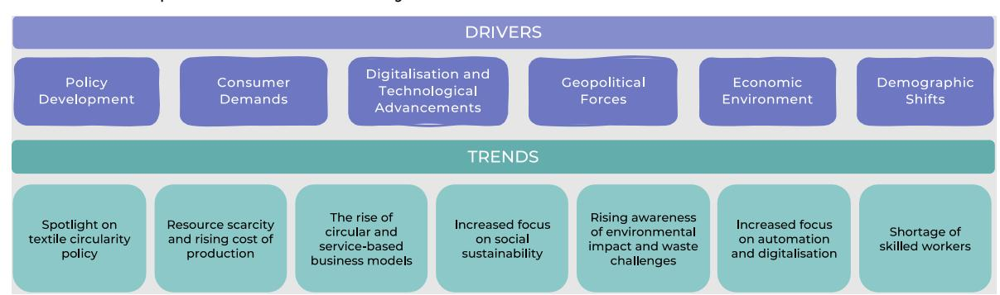

*Figure 20 Figure 16 Identified drivers and trends by the CISUTAC project*

### **7.2.2 High impact factors**

Based on the key developments identified in the Trend Analysis, several high impact factors were identified as highly uncertain or unpredictable (see Figure 17). For example,

- Impact of policy and upcoming legislations, compliance, and the ability to protect European markets
- Consumer behaviour and scalability of circular business models
- Speed of technological change
- Impact of geopolitical tensions on trade relations
- Access to raw materials and speed of new material development
- Cost of production and feasibility of reshoring
- Access to funding, collaboration, skilled workers, and green energy

| HIGH IMPACT UNCERTAINTIES                                                                                                                                                                                                               |                                                                                                                        |                                                                                                                                                                                             |                                                                                                                                                                                                                                             |                                                                                                                                                                                                     |                                                                                                                                        |                                                                                                                             |
|-----------------------------------------------------------------------------------------------------------------------------------------------------------------------------------------------------------------------------------------|------------------------------------------------------------------------------------------------------------------------|---------------------------------------------------------------------------------------------------------------------------------------------------------------------------------------------|---------------------------------------------------------------------------------------------------------------------------------------------------------------------------------------------------------------------------------------------|-----------------------------------------------------------------------------------------------------------------------------------------------------------------------------------------------------|----------------------------------------------------------------------------------------------------------------------------------------|-----------------------------------------------------------------------------------------------------------------------------|
| POLICY                                                                                                                                                                                                                                  | GEOPOLITICS                                                                                                            | MATERIALS                                                                                                                                                                                   | CONSUMPTION & BUSINESS MODELS                                                                                                                                                                                                               | PRODUCTION                                                                                                                                                                                          | OTHER                                                                                                                                  |                                                                                                                             |
| <ul> <li>National/EU/Global legislations</li> <li>ESPR/Eco-design impact</li> <li>EPR impact</li> <li>Role of local authorities</li> <li>EU/Market surveillance effectiveness</li> <li>Policy to protect European industries</li> </ul> | <ul> <li>Multi-polar world vs the world is a village</li> <li>Geopolitical tensions</li> <li>Trade barriers</li> </ul> | <ul> <li>Scarce resources</li> <li>Speed of new material development</li> <li>New material quality and sustainability performance</li> <li>Material composition (mixed vs. mono)</li> </ul> | <ul> <li>Ambiguous consumer behaviour</li> <li>Attitude-behaviour gap</li> <li>Consumer interest in circular business models/service economy</li> <li>Economic viability of circular business models</li> <li>Definition of cost</li> </ul> | <ul> <li>Reshoring of production to Europe</li> <li>Skills and knowledge gaps in industry</li> <li>Availability of workers in supply chain</li> <li>Automation and technology innovation</li> </ul> | <ul> <li>Speed of technological innovation</li> <li>Capacity and efficiency of new technology</li> <li>Investments required</li> </ul> | <ul> <li>Access to green energy</li> <li>Access to funding and collaboration</li> <li>Access to virgin resources</li> </ul> |

#### *Figure 21 High Impact Uncertainties*

Out of the high impact uncertainties identified, **policy** and **technology** emerged as two areas having key influence on the speed and direction of change across all areas. Policy, for instance, is closely linked to how consumer behaviour might shift, and what technologies are prioritised for scaling. These components are included in all scenarios. To capture a broader external context relevant to capacity building in Europe, however, it was important to also consider potential impact by the wider textile value chain.

Here, two areas emerge. One relates to global market developments, connecting uncertainties when it comes to geopolitical developments and the feasibility of establishing parts of the supply chain in Europe ("Market forces"). In its polarities, we could envision a future where markets are predominantly global or local.

The other area concerns business models, connecting uncertainties when it comes to consumer behaviour and the feasibility of circular business models ("Business models"). In its polarities, we could envision a future where fashion is predominantly slow or fast. The concept of 'slow' and 'fast' are not pre-defined, but is partly referencing EU's Textile Strategy, which stipulates that by 2030 "fast fashion is out of fashion." In the process of working with the scenario development, new and diverse definitions of slow and fast fashion emerged, shedding light on the possibility that new concepts or definitions of slow and fast fashion can emerge in the future.

#### **7.2.3 The scenario matrix**

The two areas of critical uncertainties, as described above, were used as axes in a scenario matrix, and formed the basis for a scenario building exercise in Workshop II. The four different future outcomes, as represented by the four quadrants in the scenario matrix, were then developed, see figure 18:

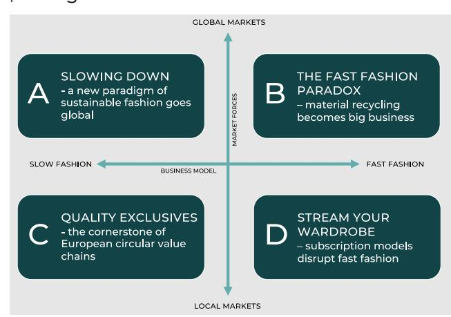

*Figure 22 The Four different future outcomes*

#### **7.2.4 The scenarios**

Below is a summary of four scenario narratives about possible future outcomes (for full scenario narratives, please see Annex 5). The scenarios should be read with curiosity, remembering that they are tools for strategic foresight. Their purpose is to highlight complexities so that we can better prepare for the uncertainties we face ahead. Rather than giving answers, they should trigger new questions about possible future directions. For this reason, they also contain successes, as well as failures. This way, the value of the scenarios lies in the way they can prompt thinking about a range of possible futures, rather than predicting a single outcome. Most likely, the future will entail a combination of fragments from all four scenarios.

### **Scenario A: "Slowing down – a new paradigm of sustainable fashion goes global"**

In 2035, the European textile industry finds itself in a complex global landscape. Due to funding and viability challenges, it had proved difficult to scale recycling technologies and the technological breakthroughs needed had failed to materialise. At the same time, rising production costs and stricter sustainability policies had put a strain on producers, making it increasingly important to control raw material. In response, brands started to restructure supply chains, emphasizing quality, and offering extended takeback schemes. Consumers, who struggled to meet increasing prices had started to change consumption habits. Chinese textile manufacturers seized the opportunity, establishing comprehensive repair and resale infrastructure in Asia and Northern Africa. The slow fashion movement gains traction, reshaping the industry by 2040.

#### **Scenario B: "The fast fashion paradox – material recycling becomes big business"**

In 2035, fast fashion persists amid a world of expanding populations and dwindling resources. In Europe, second-hand fashion thrives, but only as a supplement to new garment consumption. Significant investments in fibre-to-fibre recycling technologies have been made, although the industry remains reliant on virgin materials to both create new textiles and fortify recycled ones. The EU addresses resource concerns through a cotton-asa-service agreement with India, supporting the establishment of recycling technologies in return. Sustainability remains a pressing concern, fuelling a global competition to discover and manage the next essential raw material for the industry.

#### **Scenario C: "Quality exclusives – the cornerstone of European circular value chains"**

In 2035, EU policy makers had imposed controversial economic disincentive schemes, as a last resort to steer the industry away from fast, disposable trends towards quality, durability, and timeless style. A robust regional and digitalised infrastructure, driven by public procurement of emergent semi-automated repair and on-demand 3D printing technologies had revolutionised EU's local production efforts. To manage the challenge of direct imports of less sustainable products into the EU, border surveillance is enhanced. The high technology, service intensive market had resulted in fashion becoming a luxury not everyone could afford. Fashion in Europe is more local, but no longer always accessible to the same affordable prices.

#### **Scenario D: "Stream your wardrobe – subscription models disrupt fast fashion"**

In 2035, innovative business models catalyse a transformation in the EU textile industry. Resale models had proven not sufficient to enable a sustainable transition when EU pushed through a new cost structure based on number of wears, brands finally realised that a bigger transformation of traditional business models was the only way forward. The transition from product sales to leasing models through subscription services, had eventually altered consumer perceptions of ownership and cost, leading lead to a new type of worry-free fast fashion consumption. To see your wardrobe as temporary had become the new norm. The circulation of products also generated vast amounts of data that brands could use to continuously improve the subscription service offering. This also meant that these new business models proved to be both data and logistics-intensive, leading to increased demand for green energy, which had to be resolved through the implementation of smallscale nuclear plants.

Full narratives of each scenario, and the key themes they highlight are presented in more detail in Annex 5..

### **7.2.4 Future Scenarios - Key Themes**

When considering the future scenarios for the future textile management system to 2035, some key themes emerge. The themes are closely connected to the critical uncertainties identified in the foresight process, and while they are relevant across all scenarios, they take different forms depending on scenario. The key themes serve as input to the building blocks, or areas of priority, in the roadmap presented later in the report.

#### *Transition to a sustainable textile industry*

All scenarios highlight opportunities and challenges in achieving sustainability within the textile industry, whether focus it put on changing consumer behaviour, implementing new business models, developing and scaling infrastructure and technology or accessing raw materials.

#### *Policy as enabler*

Policy plays a key role in all scenarios, whether it is about using incentive models to shift consumer behaviour, accelerate the industry transition towards more sustainable business models, accelerate technological advances or to protect European industry to ensure fair competition in a global market.

#### *Infrastructure, Technology and Digitalisation*

Regardless of scenario, technological advancement is highlighted as a driving force in shaping the future of the textile industry, whether it is about development and scaling of recycling technologies, efficient collection and sorting, setting up digitalised service networks or the capacity to manage new data intensive business models. Challenges related to economic feasibility and scalability of some technologies is highlighted, as well as access to energy.

#### *Consumption Patterns*

The challenge of shifting consumer behaviour is a key theme across all future scenarios, and policy is pointed out as playing a critical role in setting the direction of change. Supporting consumer choices and removing barriers to engage in circular business models, while at the same time making sure the transition is made in an inclusive way is a key theme.

#### *Global Dynamics and Competition*

Even if the scenarios explore futures for the textile industry that are either predominantly local or global, all developments are put in a global context. The dynamics of geopolitical developments and regional competition play a role in the outcome of European strategic priorities since developments outside of Europe also influence the future outcome in terms of competition and dominance. Protecting European industry and forming strategic partnerships are highlighted areas.

#### *Supply Chain Cooperation*

To meet future sustainability demands and increase resilience, the scenarios illustrate how industry players adapt to challenges by taking more control over their supply chains. Where own control is not possible, strategic partnerships and collaboration is prioritised, whether it concerns raw materials, supply chain infrastructure or in the set-up of new business models.

#### *Resource Management*

Dependency on affordable raw materials continues to varying degrees in all four scenarios. With raw material becoming more of a scarce and valued resource, strategic management and control of this resource is emphasised. Another key factor highlighted is the importance of material composition in the transition towards circularity. Overall, securing and managing data on material flows becomes a critical resource as the industry becomes more digitalised.

### *Workforce Challenge*

The scenarios also address challenges related to workforce, such as the challenge to find skilled workers or to meet new industry demands within for example technology or different types of service offerings. Here the importance of education and reskilling programmes is emphasised.

By further exploring the questions and themes that are brought to light by the four scenarios, we can better prepare to navigate the complexities of the future. The themes also serve as a guide in developing the roadmap for a circular economy transition to 2030. The focus of the roadmap is to support the transformation and capacity building of the circular textile waste management system, and for this, three areas come into focus:

Firstly, focusing on enabling a shift in business models to reduce overall impact becomes a key focus. Also, when looking to the future of the European textile industry, resilience and competitiveness in a global context must be considered. What strategic partnerships and investments are needed for a European textile industry to thrive and compete effectively in 2035?

Secondly, understanding what is required for a mainstream shift in consumer behaviour becomes imperative. What measures are necessary to remove barriers and catalyse a widespread change in consumer preferences and habits? Finally, creating large-scale European value chains relies on robust infrastructure, encompassing elements such as technology, allocation and access to resources such as raw materials and data, skill enhancement, and a clear legal framework. What components are most critical to focus on to build and manage the infrastructure needed?

## **7.3 Roadmap towards 2030**

As part of supporting the sectoral transition, a roadmap to support capacity building of a circular textile waste management system has been developed.

The roadmap is based on insights from the four future scenarios, the report objectives, findings from the material flow and infrastructure gap analysis, as well as learnings from mapping circular data points in the textile waste the Textile Waste Decision Support Tool. The roadmap should be used as a strategic tool, outlining topics and solutions to be addressed that can complement or reinforce the EU textile strategy and actions to 2030. The purpose of the roadmap is to align stakeholders, facilitate communication, and guide decision-making as we move towards 2030.

The roadmap is structured around three prioritised **Key Priority Areas:** *Shifting Business Models, Steering towards a Change in Consumption Patterns,* and *Infrastructure and Data Management.* Each Key Priority Area is split into **Focus Topics**, areas that can complement or reinforce the EU textile strategy and actions. Connected to each Focus Topic, is a set of **Game Changers** for transforming the textile waste management system, followed by **CISUTAC Insights (WP2),** highlighting areas that need to be further addressed to succeed with capacity building. Finally, **Recommendations** for actions to take in the short (2024- 2027) and medium (2027-2030) term are listed (see annex 6).

### **7.3.1 Key Priority Area 1: Shifting Business Models**

Successful implementation and adoption of circular business models is a key factor in making a sustainable transition for the textile industry. Durable, repairable, and recyclable products in a market where profitable re-use and repair services are widely available, are also highlighted as important components in EU's 2030 vision for textiles. Creating the conditions for such a market to flourish in a global context demands mechanisms to support commercial viability of circular business models, consumer demand for the same, workforce availability, and the protection of European industry interests. Building capacity to manage product flows, and creating the right conditions for a functioning recycling industry to be able to offer recyclable products at scale as well as services to promote durability are all key components.

Some questions to consider:

- What role can policy play in making circular business models (e.g. resale, rental, remake, repair and recycling) more attractive to the industry as well as consumers? How can commercial viability be ensured in this transition? How can EU foster the partnerships and cooperation needed to accelerate scaling of recycling technologies?
- What strategies are in place to protect European interests in the transition to a more sustainable textile industry? How can fair competition and compliance with the Ecodesign directive be controlled when it comes to companies putting products on the European market?
- How is 'resilience' defined when it comes to key technologies, innovations, raw materials, and products in a circular economy? What collaborations and strategic partnerships are needed, locally and globally, to secure longer term competitiveness in a global market?
- How can Europe secure the skills and competences needed in a European circular textile value chain? What actions can be taken today to foster these skills?

#### **7.3 2 Key Priority Area 2: Steering towards Changing Consumption Patterns**

The nature of change in consumption patterns is a key factor in shaping the future textile management system in the EU. The way textiles are consumed and used will impact how textiles move in the system as well as the volume of available feedstock.

Reversing overconsumption is also a key ambition in the EU textile strategy. At the same time, as outlined in chapter 3, per capita consumption of textiles is expected to see continued growth to 2030. As such, the implementation of effective instruments to enable a shift in consumer behaviour plays a key role regardless of scenario, whether it is about reducing consumption of new garments or increasing the adoption of circular business models. Consumer behaviour is also connected to what is offered on the global market, making a shift in behaviour more difficult if affordable new clothing is still available to European consumers from outside of the EU. As highlighted in the Scenarios, inclusivity is also an important aspect to consider, since shifting to more sustainable options might come at a higher cost.

Some questions to consider:

- What incentives to shift consumer patterns are included in current and proposed EU policy? What is the direction of change? Is anything missing?
- How can the EPR and ESPR (DPP) be used for this purpose?
- How can EU policy protect the direction of change if buying new continues to be more convenient and less costly in a global market?
- What measures can be taken to ensure an inclusive European textile market, where sustainable textile products and services are affordable for all consumers?

#### **7.3 3 Key Priority Area 3: Infrastructure and Data Management**

Regardless of scenario, building capacity for a resilient European textile market requires infrastructure investments. Building infrastructure capacity within Europe can not only foster economic growth and lead to the creation of more jobs, but it can also accelerate the adoption of eco-friendly technologies, waste reduction and compliance with environmental standards within the industry. Investing in capacity of collecting, sorting and recycling, along with digitalisation and advanced technologies can also lead to increased efficiency, productivity, and the development of new and sustainable manufacturing processes. Robust infrastructure and data management also ensures smoother and more reliable supply chains in times of global disruptions. EU capacity to build a digital infrastructure and manage circular data will strengthen EU competitiveness on a global market, and can also help reduce dependency on non-EU value chains.

#### Some questions to consider:

- Industry adaptation of the DPP, digital infrastructure and IT integration and strengthening the industry in the transformation
- What strategies are in place for infrastructure development for collecting, sorting and recycling? How we enable a support the transformation by securing access to knowledge on ongoing capacity building across all European regions (e.g. platforms, open-source data) Set up structures to enable knowledge sharing.
- What is required to established as sustainable value chains as possible. Develop guidelines for building circular value chains based on sustainability assessments. Develop strategy, tools and set targets for circular value chains operations within Europe and steer capacity building within Europe.

Overall, the roadmap highlights gap and needs connected to EU's textile strategy, and is based on learnings from scenario building, material flow and infrastructure gap analyses and the mapping of circular data point for channelling textile waste, see annex 6.

| KEY PRIORITY FOCUS TOPICS GAME                                                                                                                     |                                                                                           |
|----------------------------------------------------------------------------------------------------------------------------------------------------|-------------------------------------------------------------------------------------------|
| AREAS for for transforming CHANGERS                                                                                                                |                                                                                           |
| the textile                                                                                                                                        |                                                                                           |
| for transformatio                                                                                                                                  |                                                                                           |
| CISUTAC INSIGHTS (WP2) the textile waste                                                                                                           | –                                                                                         |
| what needs to be further                                                                                                                           |                                                                                           |
| addressed to                                                                                                                                       | succeed with                                                                              |
| Transforming management                                                                                                                            | Recommendations for Recommendations                                                       |
| n the textile system (topics that waste can complement or waste reinforce the EU management management textile strategy and system actions) system | for actions actions 2024-2027 2027-2030 capacity building POLICY POLICY                   |
| pricing models                                                                                                                                     |                                                                                           |
| to durability and                                                                                                                                  |                                                                                           |
| number of                                                                                                                                          |                                                                                           |
| Using DPP to                                                                                                                                       |                                                                                           |
| access data                                                                                                                                        |                                                                                           |
| across product                                                                                                                                     |                                                                                           |
| life cycle/value                                                                                                                                   |                                                                                           |
| Cross-industry Connecting                                                                                                                          | initiative to                                                                             |
| measured                                                                                                                                           | and followed up.                                                                          |
| Develop                                                                                                                                            | clearly defined                                                                           |
| methodologies                                                                                                                                      | & data                                                                                    |
| models for                                                                                                                                         | measurement of                                                                            |
|                                                                                                                                                    | Mandatory to include define how durability can be Implement                               |
|                                                                                                                                                    | a differentiated                                                                          |
|                                                                                                                                                    | classifications of durability                                                             |
|                                                                                                                                                    | Implement economic                                                                        |
|                                                                                                                                                    | incentive models in                                                                       |
|                                                                                                                                                    | current legislation (e.g.                                                                 |
|                                                                                                                                                    | EPR) and set                                                                              |
|                                                                                                                                                    | waste prevention and                                                                      |
|                                                                                                                                                    | waste management                                                                          |
|                                                                                                                                                    | performance targets                                                                       |
|                                                                                                                                                    | (e.g separate targets for                                                                 |
|                                                                                                                                                    | use and recycling).                                                                       |
|                                                                                                                                                    | Targets should be based on                                                                |
|                                                                                                                                                    | reliable market data.                                                                     |
|                                                                                                                                                    | economic incentives                                                                       |
|                                                                                                                                                    | for industry to                                                                           |
| Usage of wears.                                                                                                                                    | disclose and follow within the DPP                                                        |
| garments                                                                                                                                           | up on usage data.                                                                         |
| durability/usages.                                                                                                                                 | Impose a resource                                                                         |
| Shifting                                                                                                                                           | tax to disincentivise Explore technology enablers                                         |
| chain. usage data. Business                                                                                                                        | use of virgin raw that can be used to gather materials.                                   |
| Models                                                                                                                                             | Enable a policy                                                                           |
| Materials                                                                                                                                          | framework for                                                                             |
|                                                                                                                                                    | raw materials                                                                             |
|                                                                                                                                                    | market, Incentives                                                                        |
|                                                                                                                                                    | for fiber to fiber                                                                        |
|                                                                                                                                                    | solutions, restrict                                                                       |
|                                                                                                                                                    | open-loop recycling                                                                       |
| that strengthen                                                                                                                                    |                                                                                           |
| the ambition in                                                                                                                                    |                                                                                           |
| the ESPR                                                                                                                                           |                                                                                           |
| (durability and                                                                                                                                    |                                                                                           |
| repairability and                                                                                                                                  |                                                                                           |
| Identify relevant composition                                                                                                                      | material secondary                                                                        |
| compositions industry Material composition                                                                                                         | and guide preparation for re-use, re Accelerate the shift towards closed-loop recycling. |
| Increase recyclability). designs .                                                                                                                 | know how & relevance of circular oriented                                                 |

| KEY PRIORITY FOCUS TOPICS GAME                                                                                                                     |                                                                                                                                                                                          |
|----------------------------------------------------------------------------------------------------------------------------------------------------|------------------------------------------------------------------------------------------------------------------------------------------------------------------------------------------|
| AREAS for for transforming CHANGERS                                                                                                                |                                                                                                                                                                                          |
| the textile                                                                                                                                        |                                                                                                                                                                                          |
| for transformatio                                                                                                                                  |                                                                                                                                                                                          |
| CISUTAC INSIGHTS (WP2) the textile waste                                                                                                           | –                                                                                                                                                                                        |
| what                                                                                                                                               | needs to be further                                                                                                                                                                      |
| addressed to                                                                                                                                       | succeed with                                                                                                                                                                             |
| Transforming management                                                                                                                            | Recommendations for Recommendations                                                                                                                                                      |
| n the textile system (topics that waste waste can complement or reinforce the EU management management textile strategy and system actions) system | for actions actions 2024-2027 2027-2030 capacity building                                                                                                                                |
| viability for                                                                                                                                      |                                                                                                                                                                                          |
| shift from linear                                                                                                                                  |                                                                                                                                                                                          |
| to circular                                                                                                                                        |                                                                                                                                                                                          |
| business model                                                                                                                                     |                                                                                                                                                                                          |
| and innovation                                                                                                                                     |                                                                                                                                                                                          |
| in the circular                                                                                                                                    |                                                                                                                                                                                          |
| growth and                                                                                                                                         | implementation                                                                                                                                                                           |
| resource                                                                                                                                           | efficiency, and steer                                                                                                                                                                    |
| Incentivise                                                                                                                                        | upskilling or                                                                                                                                                                            |
| reskilling                                                                                                                                         | for a service                                                                                                                                                                            |
| economy within                                                                                                                                     | textiles.                                                                                                                                                                                |
| EPR                                                                                                                                                | should support the                                                                                                                                                                       |
| industrialisation                                                                                                                                  | and                                                                                                                                                                                      |
| development of the                                                                                                                                 | recycling                                                                                                                                                                                |
| value                                                                                                                                              | chain for example                                                                                                                                                                        |
| by integrate                                                                                                                                       | funding for                                                                                                                                                                              |
| scaling                                                                                                                                            | capacity                                                                                                                                                                                 |
| Support textile                                                                                                                                    | manufacture                                                                                                                                                                              |
| rs (SME)                                                                                                                                           | more atractive to th                                                                                                                                                                     |
| e Market                                                                                                                                           |                                                                                                                                                                                          |
|                                                                                                                                                    | use fund in EPR schemes                                                                                                                                                                  |
|                                                                                                                                                    | (cf French model)                                                                                                                                                                        |
|                                                                                                                                                    | Set industry standards                                                                                                                                                                   |
|                                                                                                                                                    | for measurement and                                                                                                                                                                      |
|                                                                                                                                                    | RESEARCH &                                                                                                                                                                               |
|                                                                                                                                                    | of integrated data carriers                                                                                                                                                              |
|                                                                                                                                                    | to enable seamless                                                                                                                                                                       |
|                                                                                                                                                    | collection and access of                                                                                                                                                                 |
|                                                                                                                                                    | Continue to invest in                                                                                                                                                                    |
| Incentivising an industry                                                                                                                          | and related green Develop economic incentive Introduce a repair and re claims models that can accelerate INDUSTRY of circular business models, encourage INDUSTRY Set industry standard |
| s.                                                                                                                                                 | for dynamic pricing                                                                                                                                                                      |
| Collaboration use. Business value chain. circularity European                                                                                      | connected to away from virgin resource durability/usage. follow up. DEVELOPMENT: Invest in the development data. material innovation.                                                    |
| capacity for                                                                                                                                       |                                                                                                                                                                                          |
| sustained Europ                                                                                                                                    |                                                                                                                                                                                          |
| Building Building competitiveness                                                                                                                  | capacity to collaborate towards a shared                                                                                                                                                 |

| KEY PRIORITY FOCUS TOPICS GAME                                                                                                                     |                                                                  |
|----------------------------------------------------------------------------------------------------------------------------------------------------|------------------------------------------------------------------|
| AREAS for for transforming CHANGERS                                                                                                                |                                                                  |
| the textile                                                                                                                                        |                                                                  |
| for transformatio                                                                                                                                  |                                                                  |
| CISUTAC INSIGHTS (WP2) the textile waste                                                                                                           | –                                                                |
| what                                                                                                                                               | needs to be further                                              |
| addressed to                                                                                                                                       | succeed with                                                     |
| Transforming management                                                                                                                            | Recommendations for Recommendations                              |
| n the textile system (topics that waste waste can complement or reinforce the EU management management textile strategy and system actions) system | for actions actions 2024-2027 2027-2030 capacity building        |
| to ensure fair                                                                                                                                     |                                                                  |
| competition in                                                                                                                                     |                                                                  |
| a global                                                                                                                                           |                                                                  |
| a resilient                                                                                                                                        |                                                                  |
| textile industry.                                                                                                                                  |                                                                  |
| vision of the ean collaboration. value chain.                                                                                                      | European textile                                                 |
| Surveillance Protecting                                                                                                                            | of market                                                        |
| imports European                                                                                                                                   | needed, e.g. to                                                  |
| monitor and evaluate industry imports.                                                                                                             | direct                                                           |
| Developing                                                                                                                                         | strategic                                                        |
| partnerships market.                                                                                                                               | across                                                           |
| industries                                                                                                                                         | and regions                                                      |
| to secure Strategic partnerships for                                                                                                               | access to value chain components long term                       |
| (e.g.                                                                                                                                              | raw materials,                                                   |
| key technologies). European                                                                                                                        |                                                                  |
| Invest                                                                                                                                             | in automation and foster a European workforce                    |
| to meet Incentivising Steering                                                                                                                     | future textile services demands. POLICY Support consumer choices |
| consumers to                                                                                                                                       |                                                                  |
| make better                                                                                                                                        |                                                                  |
| by developing                                                                                                                                      | a (trusted)                                                      |
| industry                                                                                                                                           | standard                                                         |
| for sustainability, with clear                                                                                                                     |                                                                  |
| differentiators                                                                                                                                    | on                                                               |
| environmental                                                                                                                                      | and social                                                       |
| towards                                                                                                                                            | Introduce financial                                              |
| Incentive models Changing choices                                                                                                                  | instruments: reduced VAT                                         |
| Consumption                                                                                                                                        | for second-hand                                                  |
| Patterns                                                                                                                                           | and repaired goods.                                              |

#### **KEY PRIORITY**

| KEY PRIORITY FOCUS TOPICS GAME                                                                                                                     |                                                                                                                              |
|----------------------------------------------------------------------------------------------------------------------------------------------------|------------------------------------------------------------------------------------------------------------------------------|
| AREAS for for transforming CHANGERS                                                                                                                |                                                                                                                              |
| the textile                                                                                                                                        |                                                                                                                              |
| for transformatio                                                                                                                                  |                                                                                                                              |
| CISUTAC INSIGHTS (WP2) the textile waste                                                                                                           | –                                                                                                                            |
| what                                                                                                                                               | needs to be further                                                                                                          |
| addressed to                                                                                                                                       | succeed with                                                                                                                 |
| Transforming management                                                                                                                            | Recommendations for Recommendations                                                                                          |
| n the textile system (topics that waste waste can complement or reinforce the EU management management textile strategy and system actions) system | for actions actions 2024-2027 2027-2030 capacity building                                                                    |
| impact,                                                                                                                                            | connected to ESPR                                                                                                            |
| drive                                                                                                                                              | engagement in circular                                                                                                       |
| service                                                                                                                                            | offerings, such as                                                                                                           |
| repair,                                                                                                                                            | remake, rental                                                                                                               |
| and resale.                                                                                                                                        |                                                                                                                              |
| and DPP.                                                                                                                                           | Guide or set specific                                                                                                        |
|                                                                                                                                                    | target increase of purchase Develop economic incentives                                                                      |
|                                                                                                                                                    | of reuse or repairs                                                                                                          |
|                                                                                                                                                    | within the public (e.g. tax or pricing models) to procurement. INDUSTRY:                                                     |
|                                                                                                                                                    | Industry initiatives on                                                                                                      |
|                                                                                                                                                    | definitions and standards                                                                                                    |
|                                                                                                                                                    | of condition and durability                                                                                                  |
|                                                                                                                                                    | to facilitate market                                                                                                         |
|                                                                                                                                                    | RESEARCH &                                                                                                                   |
|                                                                                                                                                    | Explore the chances of                                                                                                       |
|                                                                                                                                                    | contract" approaches to                                                                                                      |
|                                                                                                                                                    | to really be able to                                                                                                         |
| Safeguarding an                                                                                                                                    |                                                                                                                              |
| transition of the                                                                                                                                  |                                                                                                                              |
| European textile                                                                                                                                   |                                                                                                                              |
| Understand inclusive                                                                                                                               | and remove current barriers to engage in                                                                                     |
| circular business industry.                                                                                                                        | models. Use economic instruments to development of reuse and                                                                 |
| encourage                                                                                                                                          | and enable all repair.                                                                                                       |
| consumers to take Inclusivity                                                                                                                      | part in the circular transition. Use DPP to make product DEVELOPMENT:                                                        |
| information                                                                                                                                        | (e.g. durability                                                                                                             |
| classification, all.                                                                                                                               | sustainability blockchain based "smart impact) easily accessible for pay small fees (that add up) monetarize the incentives. |

| KEY PRIORITY FOCUS TOPICS GAME                                                                                                                     |                                                                                                                           |
|----------------------------------------------------------------------------------------------------------------------------------------------------|---------------------------------------------------------------------------------------------------------------------------|
| AREAS for for transforming CHANGERS                                                                                                                |                                                                                                                           |
| the textile                                                                                                                                        |                                                                                                                           |
| for transformatio                                                                                                                                  |                                                                                                                           |
| the textile waste                                                                                                                                  | CISUTAC INSIGHTS (WP2) –                                                                                                  |
| what                                                                                                                                               | needs to be further                                                                                                       |
| addressed to                                                                                                                                       | succeed with                                                                                                              |
| Transforming management                                                                                                                            | Recommendations for Recommendations                                                                                       |
| n the textile system (topics that waste waste can complement or reinforce the EU management management textile strategy and system actions) system | for actions actions 2024-2027 2027-2030 capacity building                                                                 |
|                                                                                                                                                    | Test and evaluate new                                                                                                     |
| Coordination and                                                                                                                                   | circular design. POLICY                                                                                                   |
| Capacity Buildin                                                                                                                                   |                                                                                                                           |
| of synergies                                                                                                                                       |                                                                                                                           |
| across regions,                                                                                                                                    |                                                                                                                           |
| countries and                                                                                                                                      |                                                                                                                           |
| Develop support                                                                                                                                    | tools to assess                                                                                                           |
| efficient value                                                                                                                                    | chains.                                                                                                                   |
| on                                                                                                                                                 | ongoing capacity                                                                                                          |
| building                                                                                                                                           | across all                                                                                                                |
| European                                                                                                                                           | regions (e.g.                                                                                                             |
| platforms,                                                                                                                                         | open-source                                                                                                               |
| knowledge                                                                                                                                          | sharing.                                                                                                                  |
| Develop                                                                                                                                            | guidelines for                                                                                                            |
| based                                                                                                                                              | on                                                                                                                        |
| sustainability                                                                                                                                     | assessments.                                                                                                              |
| targets                                                                                                                                            | for smart value                                                                                                           |
| chains                                                                                                                                             | operations                                                                                                                |
| within                                                                                                                                             | Europe.                                                                                                                   |
| industries.                                                                                                                                        | Safeguard investment security in the upcoming Secure access to knowledge DPP regulations at RFID use towards UHF Gen 2 as |
| data) Infrastructure Strategies for                                                                                                                | the sole air frequency standard. Support                                                                                  |
| and Data g Management                                                                                                                              | SMEs digital transformatio Set up structures to enable n                                                                  |
|                                                                                                                                                    | RESEARCH & building smart value chains DEVELOPMENT:                                                                       |
|                                                                                                                                                    | Develop knowledge                                                                                                         |
|                                                                                                                                                    | graphs for the industry Develop strategy and set                                                                          |
|                                                                                                                                                    | Provide reliable market                                                                                                   |
|                                                                                                                                                    | data for industry, targets and legislation.                                                                               |

| KEY PRIORITY FOCUS TOPICS GAME                                                                                                                     |                                                                     |
|----------------------------------------------------------------------------------------------------------------------------------------------------|---------------------------------------------------------------------|
| AREAS for for transforming CHANGERS                                                                                                                |                                                                     |
| the textile                                                                                                                                        |                                                                     |
| for transformatio                                                                                                                                  |                                                                     |
| CISUTAC INSIGHTS (WP2) the textile waste                                                                                                           | –                                                                   |
| what                                                                                                                                               | needs to be further                                                 |
| addressed to                                                                                                                                       | succeed with                                                        |
| Transforming management                                                                                                                            | Recommendations for Recommendations                                 |
| n the textile system (topics that waste waste can complement or reinforce the EU management management textile strategy and system actions) system | for actions actions 2024-2027 2027-2030 capacity building           |
| Support                                                                                                                                            | textile manufactur                                                  |
| eras                                                                                                                                               | (SME) transform to gre                                              |
| en energy Strong ability for                                                                                                                       |                                                                     |
| adaptation of                                                                                                                                      |                                                                     |
| DPP in the                                                                                                                                         |                                                                     |
| Collaboration                                                                                                                                      | to                                                                  |
| develop                                                                                                                                            | harmonised cross                                                    |
| sectoral industry                                                                                                                                  | classifications                                                     |
| and Data                                                                                                                                           | semantic models to serve as a foundation to product data standards. |
| Support management                                                                                                                                 | industry and                                                        |
| lawmakers, and                                                                                                                                     | including                                                           |
| customs infrastructure                                                                                                                             | & border                                                            |
| control                                                                                                                                            | authorities, in integrating new standards                           |
| into                                                                                                                                               | AI supported data                                                   |
| management Increased control                                                                                                                       | and control systems.                                                |
| of textile                                                                                                                                         |                                                                     |
| waste exports.                                                                                                                                     |                                                                     |
| Surveillance Waste                                                                                                                                 | of                                                                  |
| textile management                                                                                                                                 | exports, e.g. defining the condition of a product                   |

| KEY PRIORITY FOCUS TOPICS GAME                                                                                                                     |                                                                              |
|----------------------------------------------------------------------------------------------------------------------------------------------------|------------------------------------------------------------------------------|
| AREAS for for transforming CHANGERS                                                                                                                |                                                                              |
| the textile                                                                                                                                        |                                                                              |
| for transformatio                                                                                                                                  |                                                                              |
| CISUTAC INSIGHTS (WP2) the textile waste                                                                                                           | –                                                                            |
| what needs to be further                                                                                                                           |                                                                              |
| addressed to                                                                                                                                       | succeed with                                                                 |
| Transforming management                                                                                                                            | Recommendations for Recommendations                                          |
| n the textile system (topics that waste waste can complement or reinforce the EU management management textile strategy and system actions) system | for actions actions 2024-2027 2027-2030 capacity building                    |
| in relation to import codes                                                                                                                        | and reason for export. Accountability and system to follow up waste handling |
| on all textiles                                                                                                                                    | exported. Increased transparency and                                         |
| formalised                                                                                                                                         | partnerships                                                                 |
| with countries in the recycling.                                                                                                                   | field of                                                                     |

## **8. Final remarks and Next steps**

Future thinking is important. We need to imagen uncertainties that may impact our ability to shift to large scale European textile circular value chains and be better prepared to plan for a desired future. The European textile industry competitiveness in a global market is central for a growing European textile industry. The Roadmap highlights gap and needs connected to EU's textile strategy and one major enabler identified is incentive models to shift consumer behaviour, accelerate the industry transition towards more sustainable business models, accelerate technological advances. The roadmap also highlights the need to protect European industry to ensure fair competition in a global market.

Guidelines for building a long-term sustainable system and capacity, that can radically lower the impact from the textile industry is needed. Based on the mapping of the current situations CISUTAC will as a next step, in work package 6 perform an impact assessment on main parameters in a future circular value chain and explore geographical differences, different levels of technology achievements and consumption of reuse and repair. This assessment together with the CISUTAC scenarios can guide decision makers in building the system going forward. How should, for example, the value chains be built geographically within Europe. Are more decentralised value chains a possible way forward with more focus on reuse and repair or is more centralised value chains preferable, to optimise flows and technology for recycling.

To induce the change, it is important with more knowledge on how to operate the Digital Product Passport, for example what technology is suitable for the sorting process of waste. There is a need for pilots to be run in real environments and evaluated in parallel with the development standards and legislation. One important next step forward is the The Cisutac sorting pilot (work package 4) that will demonstrate sorting based on data points for reuse and recycling supported by combination of technologies and the CISUTAC channelling decision support tool. There is no silver bullet, the future needs the right technology mix for detecting multiple data points.

This report summarised the current situations on knowledge on flows and material composition. This emphasises the need of a next step for policymakers to address the need for data, with in the up-comping legislation on separating textile waste and later the EPR with harmonised methods and definitions to assure more accurate data on European textile waste flows and collections rates.

## **References**

Bianchi, S., et al. (2023). Opportunities and Limitations in Recycling Fossil Polymers from Textiles. https://doi.org/10.3390/macromol3020009

Carlsson, A. et Al. (2006) Kartläggning av mängder och flöden av textilavfall. [www.smed.se](http://www.smed.se/)

Chunyuan Li, Zhe Gan, Zhengyuan Yang, Jianwei Yang, Linjie Li, Lijuan Wang, Jianfeng Gao, Multimodal Foundation Models: From Specialists to General-Purpose Assistants, arxiv.org/abs/2309.10020, 2023

Cura, K., Rintala, N., Kamppuri, T., Saarimäki, E. & Heikkilä, P. (2021). Textile Recognition and Sorting for Recycling at an Automated Line Using Near Infrared Spectroscopy. Recycling (Basel), 6(1), p. 11. doi:10.3390/recycling6010011

Dahlbom Maja, Ida Aguilar Johansson, Tova Billstein, Sustainable clothing futures - Mapping of textile actors in sorting and recycling of textiles in Europe, IVL Swedish Environmental Research Institute 2023

Duhoux T, Maes E, Hirschnitz-Garbers M, Study on the technical, regulatory, economic and environmental effectiveness of textile fibres recycling – Final report, 2021

Ellen MacArthur Foundation Report, Circular business models: redefining growth for a thriving fashion industry, https://www.ellenmacarthurfoundation.org/fashion-businessmodels/overview, 2021

Ellen MacArthur Foundation, Presentation, Redefining growth for a thriving fashion industry, https://emf.thirdlight.com/file/24/Om5sTEKOmmfEeVOm7xNOmq6S2k/Circular%20business%20models.pdf, 2023

European Commission, COM(2022) 141 final, EU Strategy for Sustainable and Circular Textiles [https://eur-lex.europa.eu/legal-content/EN/TXT/HTML/?uri=CELEX:52022DC0141,](https://eur-lex.europa.eu/legal-content/EN/TXT/HTML/?uri=CELEX:52022DC0141) 2022

European Commission, Energy, Climate change, Environment, Waste Framework Directive, [https://environment.ec.europa.eu/topics/waste-and-recycling/waste-framework](https://environment.ec.europa.eu/topics/waste-and-recycling/waste-framework-directive_en)[directive\\_en](https://environment.ec.europa.eu/topics/waste-and-recycling/waste-framework-directive_en)

European Commission, Directorate-General for Internal Market, Industry, Entrepreneurship and SMEs. Publications Office, Report; Textiles and the Environment - The role of design in Europe's circular economy, [https://www.eionet.europa.eu/etcs/etc-ce/products/etc-ce](https://www.eionet.europa.eu/etcs/etc-ce/products/etc-ce-products/etc-ce-report-2-2022-textiles-and-the-environment-the-role-of-design-in-europes-circular-economy)[products/etc-ce-report-2-2022-textiles-and-the-environment-the-role-of-design-in](https://www.eionet.europa.eu/etcs/etc-ce/products/etc-ce-products/etc-ce-report-2-2022-textiles-and-the-environment-the-role-of-design-in-europes-circular-economy)[europes-circular-economy,](https://www.eionet.europa.eu/etcs/etc-ce/products/etc-ce-products/etc-ce-report-2-2022-textiles-and-the-environment-the-role-of-design-in-europes-circular-economy) 2021

European Commission, News article, ReSet the Trend: EU calls on young people to promote [circular and sustainable fashion, https://environment.ec.europa.eu/news/reset-trend-2023-](https://environment.ec.europa.eu/news/reset-trend-2023-01-26_en?gclid=Cj0KCQiAw6yuBhDrARIsACf94RWt6cQtksmFfU9z67YLP60PdvxEwfEFUIZJ-tHKcYwE0owgW_uu39AaAqV-EALw_wcB) 01-

[26\\_en?gclid=Cj0KCQiAw6yuBhDrARIsACf94RWt6cQtksmFfU9z67YLP60PdvxEwfEFUIZJ](https://environment.ec.europa.eu/news/reset-trend-2023-01-26_en?gclid=Cj0KCQiAw6yuBhDrARIsACf94RWt6cQtksmFfU9z67YLP60PdvxEwfEFUIZJ-tHKcYwE0owgW_uu39AaAqV-EALw_wcB)[tHKcYwE0owgW\\_uu39AaAqV-EALw\\_wcB,](https://environment.ec.europa.eu/news/reset-trend-2023-01-26_en?gclid=Cj0KCQiAw6yuBhDrARIsACf94RWt6cQtksmFfU9z67YLP60PdvxEwfEFUIZJ-tHKcYwE0owgW_uu39AaAqV-EALw_wcB) 2023

European Commission, Smart Specialisation Platform https://s3platform.jrc.ec.europa.eu/

European Commission, REACH regulation, [https://environment.ec.europa.eu/topics/chemicals/reach-regulation\\_en](https://environment.ec.europa.eu/topics/chemicals/reach-regulation_en)

European Environment Agency, EU-27 apparent consumption of clothing, footwear and household textiles (excluding fur and leather clothing), 2010-2020, million tonnes and kilograms per person — European Environment Agency (europa.eu), [https://www.eea.europa.eu/data-and-maps/figures/eu27-apparent-consumption-of](https://www.eea.europa.eu/data-and-maps/figures/eu27-apparent-consumption-of-clothing)[clothing,](https://www.eea.europa.eu/data-and-maps/figures/eu27-apparent-consumption-of-clothing) 2022

European Environment Information and Observation Network Eionet Report - ETC/WMGE 2019/6 November 2019 Textiles and the environment in a circular economy, 2019

European Environmental Agency /Eionet, 2019 and Gray, 2017

European recycling industries, EuRIC study, LCA-based assessment of the management of European used textiles, 2023

Fashion for good, Sorting For Circularity Europe, An Evaluation and commerical assessment of textile waste across Europe, 2022, https://reports.fashionforgood.com/report/sorting-forcircularity-europe/

Fletcher Kate and Tham Mathilda, Earth Logic: Fashion Action Research Plan, [https://katefletcher.com/publications/books/earth-logic-fashion-action-research-plan/,](https://katefletcher.com/publications/books/earth-logic-fashion-action-research-plan/) 2019

Government of the Netherlands, The Ministry of Infrastructure and Water Management, Infographic: extended producer responsibility for textiles, [https://www.government.nl/documents/publications/2023/05/01/infographic-extended](https://www.government.nl/documents/publications/2023/05/01/infographic-extended-producer-responsibility-for-textiles)[producer-responsibility-for-textiles,](https://www.government.nl/documents/publications/2023/05/01/infographic-extended-producer-responsibility-for-textiles) 2023

Huygens D, Foschi J, Caro D, ., Patinha Caldeira, C., Faraca, G., Foster, G., Solis, M., Marschinski, R., Napolano, L., Fruergaard Astrup, T. and Tonini, D, Techno-scientific assessment of the management options for used and waste textiles in the European Union. Publications Office of the European Union, Luxembourg, 2023, 10.2760/6292, JRC134586, [https://publications.jrc.ec.europa.eu/repository/handle/JRC134586,](https://publications.jrc.ec.europa.eu/repository/handle/JRC134586) 2023

International Organization for Standardization , Textiles Environmental aspects Vocabulary, <https://www.iso.org/standard/80937.html>

Köhler A., Watson D., Trzepacz S., Löw C., Liu R., Danneck J., Konstantas A., Donatello S. & Faraca G, Circular Economy Perspectives in the EU Textile sector, EUR 30734 EN, Publications Office of the European Union, Luxembourg, 2021, ISBN 978-92-76-38646-9, doi:10.2760/858144, JRC125110, 2021

Köhler Andreas, Watson David, Trzepacz Steffen, Löw Clara, Ran Liu, Jennifer Danneck (Oeko-Institut and PlanMiljø), Circular economy perspectives in the EU Textile sector, Final report,

[file:///C:/Users/heidiha/Downloads/jrc125110\\_ce\\_perspectives\\_for\\_eu\\_textiles\\_tr\\_10.06.2021\\_fi](file:///C:/Users/heidiha/Downloads/jrc125110_ce_perspectives_for_eu_textiles_tr_10.06.2021_final%20(4).pdf) [nal%20\(4\).pdf,](file:///C:/Users/heidiha/Downloads/jrc125110_ce_perspectives_for_eu_textiles_tr_10.06.2021_final%20(4).pdf) 2021

Ledl, C., et al. (Sage journals 2014). Valuation of technical fibres in composite applications – A non-linear regression-based approach. Volume 33, Issue 15, 2014

Lingås, D., Manshoven, S., Fogh Mortensen, L., & Paulsen, F., EU exports of used textiles in Europe's circular economy. ETC/CE Report 2023/4. [https://www.eionet.europa.eu/etcs/etc](https://www.eionet.europa.eu/etcs/etc-ce/products/etc-ce-report-2023-4-eu-exports-of-used-textiles-in-europe2019s-c)[ce/products/etc-ce-report-2023-4-eu-exports-of-used-textiles-in-europe2019s-c,](https://www.eionet.europa.eu/etcs/etc-ce/products/etc-ce-report-2023-4-eu-exports-of-used-textiles-in-europe2019s-c) 2023

McKinsey, Fashion on Climate – How the fashion industry can urgently act to reduce its greenhouse gas emissions, [https://www.mckinsey.com/~/media/mckinsey/industries/retail/our%20insights/fashion%20](https://www.mckinsey.com/~/media/mckinsey/industries/retail/our%20insights/fashion%20on%20climate/fashion-on-climate-full-report.pdf) [on%20climate/fashion-on-climate-full-report.pdf,](https://www.mckinsey.com/~/media/mckinsey/industries/retail/our%20insights/fashion%20on%20climate/fashion-on-climate-full-report.pdf) 2020

McKinsey, Sorting for Circularity Europe, An Evaluation and commercial assessment of textile waste across Europe, Circular fashion in Europe: Turning waste into value, https://www.mckinsey.com/industries/retail/our-insights/scaling-textile-recycling-ineurope-turning-waste-into-value, 2022

Morlet A, Opsomer R, Herrmann S, Balmond L, Gillet C, Fuchs L, A new textiles economy: redesigning fashion's future. Ellen MacArthur Foundation, 2017 [https://www.ellenmacarthurfoundation.org/assets/downloads/publications/A-New-Textiles-](https://www.ellenmacarthurfoundation.org/assets/downloads/publications/A-New-Textiles-Economy_Full-Report.pdf.%20Accessed%2001%20Aug%202020)[Economy\\_Full-Report.pdf. Accessed 01 Aug 2020](https://www.ellenmacarthurfoundation.org/assets/downloads/publications/A-New-Textiles-Economy_Full-Report.pdf.%20Accessed%2001%20Aug%202020)

Mäkelä Mikko, Rissanen Marja, Sixta Herbert, Identification of cellulose textile fibers, Article, The Analyst, December 2021

Project, HereWear Project, Bio-based local sustainable circular wear, https://herewear.eu/project/

Project, RFID Information System for Future Textiles, [https://www.ri.se/en/what-we](https://www.ri.se/en/what-we-do/projects/rfid-information-system-for-future-textiles)[do/projects/rfid-information-system-for-future-textiles,](https://www.ri.se/en/what-we-do/projects/rfid-information-system-for-future-textiles) Research Institutes of Sweden, 2018

Project, Cisutac, 101060375, HORIZON-CL6-2021-CIRCBIO-01

Project, CISUTAC, Vision for a Circular and Sustainable EU Textile Sector, A European EPR that drives circularity, 2023

Project, New Cotton Project, [https://www.ri.se/en/what-we-do/projects/new-cotton-a](https://www.ri.se/en/what-we-do/projects/new-cotton-a-circular-cellulose-based-fiber)[circular-cellulose-based-fiber](https://www.ri.se/en/what-we-do/projects/new-cotton-a-circular-cellulose-based-fiber)

Project, RegioGreenTex, https://www.regiogreentex.eu/dashboards/home

Shabbir, M., & Mohammad, F. Introduction to Textile Fibers: An Overview. Handbook of Renewable Materials for Coloration and Finishing, 2018

Stubbe Birgit, Van Vrekhem Stijn, Huysman Sofie, Tilkin Rémi, De Schrijver Isabel and Vanneste Myriam, White Paper Textile Fibre Recycling Technologies, Centexbel, , Belgium, 2023

TEXTILES ECONOMY: REDESIGNING FASHION'S FUTURE. Ellen MacArthur Foundation. https://ellenmacarthurfoundation.org/a-new-textiles-economy

The European Technology Platform for the Future of Textiles and Clothing textile ETP, https://textile-platform.eu/ecosystex

The United Nations Environment Programme, UNEP, Sustainability and Circularity in the Textile Value Chain, [https://www.oneplanetnetwork.org/knowledge](https://www.oneplanetnetwork.org/knowledge-centre/resources/sustainability-and-circularity-textile-value-chain-global-roadma)[centre/resources/sustainability-and-circularity-textile-value-chain-global-roadma,](https://www.oneplanetnetwork.org/knowledge-centre/resources/sustainability-and-circularity-textile-value-chain-global-roadma) 2023

Tojo, N. et Al. Prevention of Textile Waste; Material flows of textiles in three Nordic countries and suggestions on policy instruments. TemaNord 2012:545. [http://dx.doi.org/10.6027/TN2012-545,](http://dx.doi.org/10.6027/TN2012-545) 2012

Watson Davis, PlanMiljø, Denmark Palm David, Ramböll, Sweden, David, Exports of Nordic Used Textiles: Fate, benefits and impacts, 2016

Watson, D. et Al. Mapping of textile flows in Denmark. Publisher: The Danish Environmental Protection Agency. ISBN: 978-87-93710-48-1, 2019

Watson, D. et Al. (2020). Post-consumer textile circularity in the Baltic countries; current status and recommendations for the future. Nordic Council of Ministers.

Wen-Huang Cheng, Sijie Song, Chieh-Yun Chen, Shintami Chusnul Hidayati, and Jiaying Liu. 2021. Fashion Meets Computer Vision: A Survey. ACM Comput. Surv. 54, 4, Article 72 (May 2022), 41 pages. https://doi.org/10.1145/3447239; Chang, Y., & Zhang, Y. (2022). Deep Learning for Clothing Style Recognition Using YOLOv5. Micromachines, 13

WRAP, Citizen Insights: Clothing Longevity and Circular Business Models Receptivity in the UK, 2022

Zhou, J., Yu, L., Ding, Q. & Wang, R. (2019). Textile Fibre Identification Using Near-Infrared Spectroscopy and Pattern Recognition. AUTEX Research Journal, 19(2), pp. 201-209. doi:10.1515/aut-2018-0055

## **List of tables**

| TABLE 1 CURRENT CONSUMPTION PER COUNTRY AND YEAR---------------------------------- | 17                                                                                              |
|------------------------------------------------------------------------------------|-------------------------------------------------------------------------------------------------|
| TABLE 2 OVERVIEW OF DATA ON TEXTILE WASTE IN THE CISUTAC REPORT                    | ---------------24                                                                               |
| TABLE 3 THE CISUTAC MAPPING OF SORTING CAPACITY SPREAD ACROSS EUROPE               | 29                                                                                              |
| TABLE 4 DEFINITIONS OF RECYCLING TECHNOLOGIES                                      | 32                                                                                              |
| TABLE 5 OVERVIEW OF DIFFERENT RECYCLING TECHNOLOGIES                               | 33                                                                                              |
| RECYCLING                                                                          | ---------------------------------------------------------------------------------------------38 |
| TABLE 10 OVERVIEW                                                                  | OF RECYCLING TECHNOLOGIES:                                                                      |
| TEXTIELRECYCLING-DEF                                                               | ----------------------------------------------------------------------------50                  |
| TABLE 11 HS CODES SELECTED FOR TEXTILE DATA.                                       | 52                                                                                              |
| TABLE 12 EXCLUDED HS CODES, NOT FITTING UNDER THE SCOPE                            | 52                                                                                              |
| ESTIMATES, IN TWO DIFFERENT LEVELS                                                 | 53                                                                                              |
| TABLE 14 CALCULATION FOR BRAND DATA                                                | 56                                                                                              |
| TABLE 15 CALCULATION FOR BRAND DATA                                                | 57                                                                                              |
| COTTON, POLYESTER AND ELASTANE                                                     | -----------------------------------------------------------58                                   |
| COMPOSITION                                                                        | 59                                                                                              |

[TABLE 18 THE TEXTILE WASTE DECISION SUPPORT TOOL, LINK TO THE](#page-64-1)  TOOL......VISUALIZATIONS OF THE TOOL [---------------------------------------------------------64](#page-64-1) [TABLE 19 CISUTAC DATA POINTS AND HIGHLIGHTED PRIORITISED DATA POINTS](#page-68-0) --------68 [TABLE 20 CISUTAC DATA FIELD WITHIN CONDITION WITH A VALUE LIST OF DEFINED 5](#page-69-0)  [LEVELS FROM VERY LOW TO PREMIUM---------------------------------------------------------69](#page-69-0)

## **List of figures**

| FIGURE 1                                                                                              | FRAMEWORK: PROCESS FOR HOW TO BUILD A ROADMAP TO 2030,                                                                                                           |
|-------------------------------------------------------------------------------------------------------|------------------------------------------------------------------------------------------------------------------------------------------------------------------|
| CISUTAC                                                                                               | 13                                                                                                                                                               |
| FIGURE 6 SCHEMATIC OVERVIEW OF TEXTILE RECYCLING PROCESSES.........................................31 |                                                                                                                                                                  |
| FIGURE                                                                                                | 10 MECHANICAL RECYCLING, SMALLER SCALE, MAP OF RECYCLING                                                                                                         |
| FIGURE 13 COMPOSITION IN TERMS OF TEXTILE CATEGORIES, J                                               | 58                                                                                                                                                               |
| FURTHER WORK WITHIN THE DELEGATED ACTS                                                                | 65                                                                                                                                                               |
| FIGURE 15                                                                                             | . EXAMPLE OF ROUTES FOR REUSE, REPAIR AND RECYCLE BASED ON THE                                                                                                   |
| WORK PERFORMED WITHIN CISUTAC.                                                                        | ...........................................................................................................72                                                    |
| FIGURE 16                                                                                             | EXAMPLE OF ROUTES FOR RECYCLE, BASED ON THE WORK PERFORMED                                                                                                       |
| WITHIN CISUTAC.                                                                                       | ..............................................................................................................................................................73 |
| ACCESS TO DATA MAINLY THROUGHT THE DIGITAL PRODUCT PASSPORT.                                          | .....................78                                                                                                                                          |

[FIGURE 19 THE FORESIGHT PROCESS IN THE CISUTAC PROJECT](#page-81-2) ........................................................81

[FIGURE 20 FIGURE 16 IDENTIFIED DRIVERS AND TRENDS BY THE CISUTAC PROJECT](#page-85-0)

[85](#page-85-0)[FIGURE 21 HIGH IMPACT UNCERTAINTIES](#page-85-1) [.......................................................................................................................................................................................................85](#page-85-1)

[FIGURE 22 THE FOUR DIFFERENT FUTURE OUTCOMES.............................................................................86](#page-86-0)

## **Annexes**

| Annex 1 | Data Collection Brands                       |
|---------|----------------------------------------------|
| Annex 2 | Sorting Capacity                             |
| Annex 3 | List of regions in the RegioGreentex project |
| Annex 4 | List of references from EndNote              |
| Annex 5 | Four Explorative Scenarios                   |
| Annex 6 | CISUTAC Roadmap                              |

## **Annex 1 Data Collection Brands**

#### **2.1 Composition data for material flow analysis**

There are no ideal data currently available to estimate the fiber composition of European textile waste. A more accurate fiber volume data for European textile waste is needed to know more of what available quantities available as feedstock for recycling today and in the future. CISUTAC would like to explore this question on composition data more in detail.

That's why we turn to brands to see how we can use your data to create more insights. We have a dialogue within CISUTAC with Inditex, Decathlon, PVH who will review how they can give us the relevant data.

#### **Data collection – instructions**

- Yearly data is preferable for compatibility, we want to use 2022 as a common baseline.
- Preferably in word, excel or other type of system you use, for example PLM or IFS/PowerBi system.
- We would like to have as detailed data as possible on the material that you have used in your production.
- E-mail the data to us.

#### **Confidential agreement**

- We follow the NDA.
- We will aggregate all data and anonymize it.
- The data will be handled confidentially at RISE.

#### **Data year 2022**

- Is it possible to make a list or overview of the **fibers** that are used in your production year 2022? See example 1 below.
- Is it possible to make a list or overview of the most used **material compositions** in your production 2022? o For example: 70%Co/30% PES 95%CO/5% EA See example 2 below.
- Can you make an overview in percentage of what material compositions that is used of your volumes?
- How many percentages of the used fibers are certified?
- Do you have an overview of how much of your used fabrics are mono **fiber** and multi **fiber**? See example 3 below.

- Do you have an overview of how much of the used fabrics that is **monolayer** and **multilayer**?
- Do you have overstock and if so, how do you handle your overstock?

#### **Future data (trends)**

- How do you define sustainable materials today?
- Have you set targets and KPI´s for the sustainable materials?
- Have you set targets of how much of the sustainable materials that is going to be sourced from recycled materials?
- What is the target for recycled materials for the different fiber groups?
- What is the target for recycled materials made from fiber-to-fiber post-consumer textiles?
- Can you give an indication of the planned fibers that will be used until 2025?
- Can you list the main material compositions that will be used until 2025?

#### **Historical data**

- Additional data, do you have statistics on the fibers and material compositions that are used in the previous 2 years?

**Example 1**. (this is an example from a retailer in Sweden)

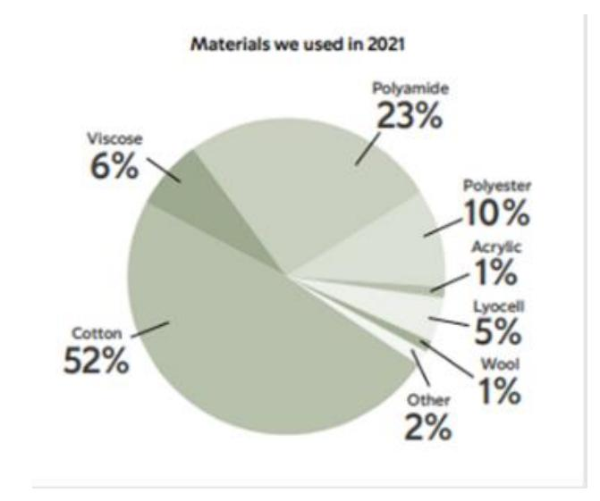

**Example 2** (this is an example from a retailer in Sweden)

| Material Name                                                                                | Material Sub Type |   | Dev. Season Type |   | Dev. Season Year |   | Type |   |
|----------------------------------------------------------------------------------------------|-------------------|---|------------------|---|------------------|---|------|---|
|                                                                                              | ▼                 | ▼ | ▼                | ▼ | ▼                | ▼ | ▼    | ▼ |
| Knit 96% Polyamide -Virgin, 4% Elastane                                                      | Rib               |   |                  |   |                  |   |      |   |
| Knit 68% Polyamide -Virgin, 28% Polyester - Recycled, 4% Elastane                            | Rib               |   |                  |   |                  |   |      |   |
| Knit 78% Polyamide -Virgin, 22% Elastane Single Jersey                                       | Single Jersey     |   |                  |   |                  |   |      |   |
| Knit 74% Polyester - Virgin, 21% Organic Cotton, 5% Elastane Cotton Fleece                   | Cotton Fleece     |   |                  |   |                  |   |      |   |
| Knit 72% Organic Cotton, 23% Polyester - Virgin, 5% Elastane French Terry                    | French Terry      |   |                  |   |                  |   |      |   |
| Knit 66% Polyester - Virgin, 14% Elastane Single Jersey Brushed 1 side                       | Single Jersey     |   |                  |   |                  |   |      |   |
| Knit 100% Polyester - Virgin Single Jersey                                                   | Single Jersey     |   |                  |   |                  |   |      |   |
| Knit 100% Polyester - Virgin Fleece Brushed, 2-side antipling, 180gr                         | Fleece            |   |                  |   |                  |   |      |   |
| Knit 100% Polyester - Virgin Fleece Brushed, 2-side antipling, 200gr, Sold and Aloverprinted | Fleece            |   |                  |   |                  |   |      |   |
| Knit 100% Polyester - Virgin Rib 170gr                                                       | Rib               |   |                  |   |                  |   |      |   |
| Knit 100% Cotton-BCl Single Jersey 145gr                                                     | Single Jersey     |   |                  |   |                  |   |      |   |
| Knit 100% Cotton-BCl Single Jersey 160gr                                                     | Single Jersey     |   |                  |   |                  |   |      |   |
| Knit 100% Polyester - Recycled Single Jersey                                                 | Single Jersey     |   |                  |   |                  |   |      |   |
| Knit 100% Polyester - Recycled Single Jersey                                                 | Single Jersey     |   |                  |   |                  |   |      |   |
| Knit 67% Polyamide -Virgin, 13% Elastane                                                     | Other Knits       |   |                  |   |                  |   |      |   |
| Knit 100% Polyester - Recycled Single Jersey                                                 | Single Jersey     |   |                  |   |                  |   |      |   |
| Knit 91% Polyester - Recycled, 9% Elastane French Terry w k.Kng, 225gr                       | French Terry      |   |                  |   |                  |   |      |   |
| Knit 100% Polyester - Virgin Single Jersey                                                   | Single Jersey     |   |                  |   |                  |   |      |   |
| W/R(80%/10w ash FFC free), 5K/5K TPJ membrane                                                |                   |   |                  |   |                  |   |      |   |
| Knit 92% Polyester - Recycled, 8% Elastane Single Jersey w k.Kng 80%/20w ash, 150gr          | Single Jersey     |   |                  |   |                  |   |      |   |
| Knit 67% Polyester - Virgin, 13% Elastane Single Jersey                                      | Single Jersey     |   |                  |   |                  |   |      |   |
| Knit 95%                                                                                     |                   |   |                  |   |                  |   |      |   |

#### **Example 3** (this is an example from a retailer in Sweden)

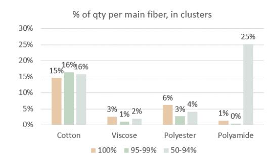

## **Annex 2 Sorting capacity**

|                     |                             | Capacity       |                                                                                                                                   |
|---------------------|-----------------------------|----------------|-----------------------------------------------------------------------------------------------------------------------------------|
| Country Belgium     | Company EUROFRIP            |                | Website or reference https://eurofrip.be/contact.asp                                                                              |
|                     | SEMATEX                     | 5000           | https://sematex.be/                                                                                                               |
| Bulgaria            | Texaid                      | 6.000          | https://texaidbg.texaid.com/en/nachalo.html                                                                                       |
| Finland             | LSJH                        | 12.000         | https://poistotekstiili.lsjh.fi/en/end-of-life-textile -refinement-plant/ https://refashion.fr/rapport                           |
| France              | Re-Fashion CEBETEX - TRI    | 190.548        | activite/2021/public/pdf/ref https://www.gebetextrinormandie.fr/?lang=en                                                          |
|                     | Soex                        | No data        |                                                                                                                                   |
| Germany             | Texaid                      | 350.000 of     | https://www.texaid.de/de-DE/produkte leistungen/sortierung.html https://picvisa.com/reciclaje-textil-en europa/#:~:text=Germany |
| Hungary Netherlands | Texaid Gebotex              | 3.600          | https://texaidhu.texaid.com/en/kezdolap.html https://www.gebotex.nl/over-ons/                                                     |
| Poland              | Erdotex Wtorplo Vive Textle | 45.000ton/year | https://www.erdotex.com/sorting/ https://www.wtorpol.com.pl/en/                                                                   |
|                     | Recycling                   | 500ton/day     | https://www.vivetextilerecycling.pl/about-the company/?lang=en https://textilehouse.at/sorting-story/?lang=en                    |
| Slovakia            | Textile                     |                |                                                                                                                                   |
|                     | house                       | 20.000         | https://www.caritas.es/noticias/moda-re                                                                                          |
| Spain               | Moda Re-                    | 44.000         | publica-un-informe-pionero-sobre-el-reciclado textil-en-espana/                                                                  |
|                     | Coleo                       | 2.000          | https://coleo.es/recycling/                                                                                                       |
|                     | Humana                      | 18.000         | https://www.humana-spain.org/                                                                                                     |

| <b>Sweden</b>      | SIPTex II                                       | 25.000  | <a href="https://www.sysav.se/en/siptex?utm_source=smartcity">https://www.sysav.se/en/siptex?utm_source=smartcity</a> <a href="https://www.sysav.se/en/siptex?utm_source=smartcity">t</a> <a href="https://www.sysav.se/en/siptex?utm_source=smartcity">ysweden.com&amp;utm_medium=lin</a> <a href="https://www.sysav.se/en/siptex?utm_source=smartcity">k&amp;utm_campaign=promotion</a> |
|--------------------|-------------------------------------------------|---------|----------------------------------------------------------------------------------------------------------------------------------------------------------------------------------------------------------------------------------------------------------------------------------------------------------------------------------------------------------------------------------------------------|
| <b>Switzerland</b> | Texaid                                          | 32.000  | Collaborating with its subsidiary CONTEX  <a href="https://www.texaid.ch/en/about-texaid/locations.html">https://www.texaid.ch/en/about-texaid/locations.html</a>                                                                                                                                                                                                                            |
|                    |                                                 |         | <a href="http://www.contex-ag.ch/de/">http://www.contex-ag.ch/de/</a>                                                                                                                                                                                                                                                                                                                              |
| <b>UK</b>          | Textile recycling international (5 UK sites) | 130.000 | <a href="https://t-r-i.co.uk/">https://t-r-i.co.uk/</a>  Ref of this data:  <a href="https://www.mrw.co.uk/news/textile-recycling-international-acquires-soex-12-05-2022/">https://www.mrw.co.uk/news/textile-recycling-international-acquires-soex-12-05-2022/</a>                                                                                                                    |

## **Annex 3 List of regions in the RegioGreentex project**

| Country | Region    | Focus                                                        |
|---------|-----------|--------------------------------------------------------------|
| Belgium | Flanders  | Innovative technical textiles, protective clothing, carpets  |
|         |           | and luxury upholstery, with an annual turnover of €4         |
| France  | Auvergne |                                                              |
|         |           | Auvergne-Rhône-Alpes Region (more than 580                   |
| France  | Hauts-de |                                                              |
| Italy   | Prato     | The industrial district of Prato is one of Europe’s largest: |
| Italy   | Piedmont  | Products such as wool, cashmere, alpaca, vicuña and          |

| Netherlands | Eastern    |                                                           |
|-------------|------------|-----------------------------------------------------------|
| Portugal    | Norte      |                                                           |
|             |            | production facilities in Portugal include the entire      |
|             |            | while 19% of the employment in the Portuguese             |
| Romania     | North-East |                                                           |
|             |            | smart design and digital textiles printing).              |
| Spain       | Catalonia  | 120 companies focusing on the development, production     |
|             |            | Many research institutes also provide R&D services to the |
| Spain       | Valencia   | 800 companies and bringing together 20.000 employees.     |
| Sweden      | West       |                                                           |

## **Annex 4 List of references from EndNote**

| Reference                                   |                                             |                                    |                  |
|---------------------------------------------|---------------------------------------------|------------------------------------|------------------|
| Type Author Year                            | Name                                        |                                    |                  |
| 2022 Conference Proceedings                 | Ready to Transform. The Future of Ecosystem |                                    |                  |
| Report 2023                                 | EU exports                                  | of used textiles                   | in               |
| Web Page 2023                               | New Cotton Project                          |                                    |                  |
| Web Page 2023                               | RReuse                                      |                                    |                  |
| Report 2023                                 | Valorising                                  | used                               | textiles locally |
|                                             | through enterprises                         | re-use                             | and recycling    |
| V. Amicarelli; C. Bux 2022 Journal Article  | Quantifying textile streams and             | material flow analysis             |                  |
| Y. Arafat; A. J. Uddin 2022 Journal Article | Recycled fibers from pre-                   |                                    | and post        |
|                                             | constituents                                | in                                 | manufacturing    |
|                                             | A sustainable approach                      | and                                | eco-friendly     |
| Report A. Bakker 2021                       | Monitoring                                  | beleidsprogramma Circulair Textiel |                  |
| Report A. Beton; D. Dias; L. Farrant; T.    |                                             |                                    |                  |
| Gibon; Y. Le Guern; M.                      |                                             |                                    |                  |
| Desaxce; A. Perwueltz; I.                   |                                             |                                    |                  |
| Boufateh; O. Wolf; J.                       |                                             |                                    |                  |
| 2014                                        | Environmental                               |                                    | improvement      |
| Kougoulis                                   | potential Textiles)                         | of textiles                        | (IMPRO          |
| S. Blank 2021 Conference                    | Kreislaufwirtschaft                         |                                    | und der          |
| Proceedings                                 | Umgang Textilien                            | mit                                | unverkauften     |
| Report V. J. Boiten 2022                    | Building a circular economy for             |                                    |                  |
|                                             | textiles                                    | supported                          | by common        |
|                                             | rules                                       | on Extended                        | Producer         |
|                                             | Recommendations                             |                                    | and open         |
|                                             | questions                                   | for                                | the upcoming     |
|                                             | revision                                    | of the                             | EU Waste         |
| Report V. J. Boiten; S. L.-C. Han; D.       |                                             |                                    |                  |
| 2017                                        | Circular                                    | economy                            | stakeholder      |
| Tyler                                       | perspectives:                               | Textile                            | collection       |

|        |                           |      | strategies to support material       |
|--------|---------------------------|------|--------------------------------------|
|        | Thoden van Velzen; K.     |      |                                      |
|        |                           | 2019 | The impact of collection portfolio   |
|        |                           |      | expansion on key performance         |
|        | Velzen; A. Augustinus; H. |      |                                      |
|        |                           | 2018 | Predictive model for the Dutch       |
| Report | Cbs                       | 2020 | Voorraden in de maatschappij         |
|        |                           |      | grondstoffenbasis voor een           |
| Report | Changingmarketsfoundation | 2021 | Fossil Fashion. The hidden reliance  |
| Report | Changingmarketsfoundation | 2021 | Synthetics Anonymous. Fashion        |
| Report | Changingmarketsfoundation | 2022 | Dressed to kill. Fashion brands      |
| Report | Changingmarketsfoundation | 2022 | Licece to greenwash. How             |
|        |                           |      | certification schemes and            |
| Report | Changingmarketsfoundation | 2022 | Synthetics Anonymous 2.0.            |
|        |                           |      | Fashion's persistent plastic         |
| Report | Changingmarketsfoundation | 2023 | Trashion: The stealth export of      |
|        |                           | 2023 | The Environmental Impact of          |
| Report | Csil                      | 2021 | Data on the EU Textile Ecosystem     |
|        |                           |      | for Services 896/PP/2020/FC          |
|        |                           |      | Implementing Framework               |
|        | K. Cura; J. Zitting       | 2018 | Optical textile sorting technology – |
|        |                           |      | developing means to extract          |
|        |                           |      | valuable materials from a            |
|        |                           |      | heterogeneous post-consumer          |

| Report | M. Dahlbom; I. Aguilar         |      |                                      |
|--------|--------------------------------|------|--------------------------------------|
|        |                                | 2023 | Sustainable clothing futures        |
| Report | T. Duhoux; K. L. Blévennec; S. |      |                                      |
|        | Manshoven; F. Grossi; M.       |      |                                      |
|        |                                | 2022 | Textiles and the Environment. The    |
|        | I. Dukovska-Popovska; L.       |      |                                      |
|        | Kjellsdotter Ivert; H.         |      |                                      |
|        |                                | 2023 | The supply and demand balance of     |
|        | R. Earley; K. Goldsworthy      | 2019 | Circular textile design: old myths   |
| Report | C. Economy                     | 2020 | Recycled post-consumer textiles -    |
| Report | EcoTlc                         | 2014 | Étude de caractérisation des TLC     |
|        |                                |      | maison et Chaussures) usagés         |
| Report | EcoTlc                         | 2020 | Technical monitoring on optical      |
|        |                                |      | sorting and textile recognition      |
| Report | M. Elander; N. Tojo; H. Tekie; |      |                                      |
|        |                                | 2017 | Impact assessment of policies        |
| Report | EllenMacArthurFoundation       | 2017 | A New Textiles Economy:              |
| Report | Empa                           | 2023 | Circulartex. Transition towards a    |
|        |                                |      | circular textile industry - Material |
| Report | F. Englund; H. Wedin; M.       |      |                                      |
|        | Ribul; H. de la Motte; Å.      |      |                                      |
|        |                                | 2018 | Textile tagging to enable            |
|        |                                |      | report to facilitate an active       |
| Report | g. Ensait                      | 2014 | Étude des perturbateurs et           |
|        |                                |      | facilitateurs au recyclage des       |
|        | D.-G. f. Environment           | 2022 | ANNEXES to the Commission            |
|        |                                |      | for setting ecodesign                |
|        |                                |      | requirements for sustainable         |

|                 |                                  |      | products and repealing Directive 2009/125/EC                                                                    |
|-----------------|----------------------------------|------|-----------------------------------------------------------------------------------------------------------------|
| Government      | D.-G. f. Environment             | 2022 | Proposal for a REGULATION OF                                                                                    |
| Document        |                                  |      | THE EUROPEAN PARLIAMENT                                                                                         |
|                 |                                  |      | AND OF THE COUNCIL                                                                                              |
|                 |                                  |      | establishing a framework for                                                                                    |
|                 |                                  |      | setting ecodesign requirements                                                                                  |
|                 |                                  |      | for sustainable products and repealing Directive 2009/125/EC                                                    |
| Report          | R. D. C. Environment             | 2022 | Synthèse de l’Analyse environnementale de la filière des textiles et linges de maison usagés                    |
| Report          | Euratex                          | 2022 | FACTS & KEY FIGURES 2022 OF                                                                                     |
|                 |                                  |      | THE EUROPEAN TEXTILE AND CLOTHING INDUSTRY                                                                      |
| Web Page        | Euratex                          | 2023 | ReHubs                                                                                                          |
| Report          | FashionForGood                   | 2022 | Sorting for circularity Europe: An                                                                              |
|                 |                                  |      | evaluation and commercial assesment of textile waste across Europe                                              |
| Report          | Ffact                            | 2014 | Massabalans Van in Nederland                                                                                    |
|                 |                                  |      | Ingezameld en Geïmporteerd Textiel                                                                              |
| Journal Article | A. Fischer; S. Pascucci          | 2017 | Institutional incentives in circular economy transition: The case of material use in the Dutch textile industry |
| Web Page        | Foen                             | 2023 | Clothing and shoes                                                                                              |
| Report          | B. A. S. Forbrig; T. Fischer; B. |      |                                                                                                                 |
|                 | Heinz                            | 2020 | Demand, Consumption, Reuse and Recycling of Clothing and Textiles in Germany                                    |
| Report          | A. Ghenea                        | 2020 | #No time to waste. MEMBER                                                                                       |
|                 |                                  |      | STATES DELAY MEETING THE INEVITABLE TARGETS                                                                     |
| Report          | R. Gray; C. Sabaiduc; C.         |      |                                                                                                                 |
|                 | Salvidge; P. Downing             | 2022 | Citizen Insights: Clothing Longevity and Circular Business Models Receptivity in the UK                         |
|                 | W. Gwozdz; K. Steensen           |      |                                                                                                                 |
| Journal Article | Nielsen; T. Müller               | 2017 | An Environmental Perspective on Clothing Consumption: Consumer Segments and Their Behavioral Patterns           |
| Journal Article | P. Harmsen; M. Scheffer; H. Bos  | 2021 | Textiles for circular fashion: The logic behind recycling options                                               |

| Report | S. Hedrich; J. Janmark; N.     |      |                                       |
|--------|--------------------------------|------|---------------------------------------|
|        |                                | 2022 | Scaling textile recycling in Europe – |
| Report | F. Hopstaken; A. van der       |      |                                       |
|        |                                | 2020 | Massabalans Bedrijfsmatig textiel     |
|        |                                |      | textiel – nulmeting 2020              |
| Report | F. Hopstaken; A. van der       |      |                                       |
|        |                                | 2020 | Massabalans Textiel 2018;             |
| Report | D. Huygens; e. al              | 2023 | Techno-scientific assessment of       |
|        |                                | 2022 | A Review on Textile Recycling         |
|        | L. Jäämaa; R. Kaipia           | 2022 | The first mile problem in the         |
|        |                                |      | circular economy supply chains –      |
|        | M. Kahoush; N. Kadi            | 2022 | Towards sustainable textile sector:   |
|        |                                |      | cotton/ polyester fibers from         |
|        |                                | 2018 | Probabilistic material flow analysis  |
|        | L. Keßler; S. A. Matlin; K.    |      |                                       |
|        |                                | 2021 | The contribution of material          |
|        |                                |      | circularity to sustainability —       |
|        |                                | 2018 | Environmental assessment of end      |
| Report | M. Kort; R. v. d. Vusse; M. v. |      |                                       |
|        |                                | 2020 | Ongebruikt textiel. Onderzoek         |
|        |                                |      | naar de wijze waarop de               |
|        |                                |      | textielketen omgaat met               |
| Report | A. Köhler; D. Watson; S.       |      |                                       |
|        |                                | 2021 | Circular economy perspectives in      |
| Report | C. M. Lacruz; D. G. Uslé       | 2022 | WHITE PAPER ON TEXTILE WASTE          |
|        |                                |      | MANAGEMENT; Good practices            |

|        |                                   | 2018 | Production flow improvement in a     |
|--------|-----------------------------------|------|--------------------------------------|
| Report | E. Maes; S. Devaere; P.           |      |                                      |
|        | Colignon; J. Wynants; B.          |      |                                      |
|        |                                   | 2021 | Ecodesign criteria for consumer      |
|        |                                   | 2023 | Identifying the needs for a circular |
|        |                                   |      | workwear textile management – A      |
|        |                                   |      | textile waste within Swiss           |
|        |                                   | 2023 | Smart textile waste collection       |
|        |                                   |      | system – Dynamic route               |
|        | J. Millward-Hopkins; P.           |      |                                      |
|        |                                   | 2023 | A material flow analysis of the UK   |
| Report | L. Munkholm; B. Lindberg          |      |                                      |
|        |                                   | 2023 | Mapping Sustainable Textile          |
|        |                                   | 2021 | Identification of cellulose textile  |
| Thesis | N. Nørup                          | 2019 | An environmental assessment of       |
|        | N. Nørup; K. Pihl; A.             |      |                                      |
|        |                                   | 2019 | Evaluation of a European textile     |
|        |                                   |      | sorting centre: Material flow        |
| Report | G. Orveillon; E. Pierri; L. Egle; |      |                                      |
|        |                                   | 2022 | Scoping possible further EU-wide     |
|        |                                   |      | end-of-waste and by-product          |
| Report | Ovam                              | 2020 | HUISHOUDELIJK AFVAL EN               |
|        |                                   |      | GELIJKAARDIG BEDRIJFSAFVAL           |
| Report | Ovam                              | 2022 | Sorteeranalyse huisvuil 2019-2021    |
|        | C. Palm; S. E. Cornell; T. Häyhä  | 2021 | Making resilient decisions for       |
|        | K. Paulitsch                      | 2017 | Hess Natur: Acting for the World of  |

|        |                                         | 2017 | Recent Trends in Sustainable          |
|--------|-----------------------------------------|------|---------------------------------------|
|        |                                         |      | Current Situation and Future          |
| Thesis | M. M. Pérez                             | 2021 | Analysis of European post            |
|        |                                         |      | consumer textile waste for            |
| Report | N. Philippa                             | 2020 | Sustainability and Circularity in the |
|        |                                         |      | Textile Value Chain Global            |
| Report | H. Pirjo; J. H. V. H. T. I. T. K. H. K. |      |                                       |
|        |                                         | 2019 | Telaketju: Toward Circularity of      |
|        | J. Rapsikevičienė; I.                   |      |                                       |
|        |                                         | 2019 | Model of industrial textile waste     |
| Report | F. Re                                   | 2021 | Re-Fashion 2021 Activity report       |
| Report | Re_Fashion                              | 2023 | Étude de caractérisation des flux     |
| Report | A. Rengel                               | 2017 | Recycled Textile Fibres and Textile   |
|        |                                         |      | Recycling. An overview of the         |
|        |                                         |      | Market and its possibilities for      |
|        | J.-R. Riba; R. Cantero; T.              |      |                                       |
|        |                                         | 2020 | Circular economy of post             |
|        |                                         |      | consumer textile waste:               |
|        |                                         |      | Classification through infrared       |
| Book   | Rijkswaterstaat                         | 2023 | Afvalmonitor                          |
|        |                                         | 2023 | Product destruction: Exploring        |
|        |                                         |      | unsustainable production             |
|        |                                         |      | consumption systems and               |
| Report | S. Roos; M. Larsson; C.                 |      |                                       |
|        |                                         | 2019 | Supply chain guidelines: vision and   |
|        |                                         | 2019 | White paper on textile recycling      |
|        | E. Sandberg                             | 2022 | Supply chain capabilities in the      |
|        | M. Schmutz; C. Som                      | 2022 | Identifying the potential for         |

|        |                                 | 2021 | Simulation-based decision support   |
|--------|---------------------------------|------|-------------------------------------|
|        |                                 | 2012 | Environmental improvement of        |
|        |                                 |      | best practice techniques,           |
|        |                                 |      | quantitative indicators and         |
|        |                                 |      | benchmarks of excellence for        |
| Report | TextileExchange                 | 2021 | Preferred Fiber and Materials       |
| Report | TextileExchange                 | 2022 | Preferred Fiber and Materials       |
| Report | TextileExchange                 | 2023 | Preferred Fibers and Materials:     |
| Report | S. Textiles                     | 2022 | Swiss Textiles Annual Report        |
| Book   | N. Tojo                         | 2012 | Prevention of Textile Waste:        |
| Report | S. Trzepacz; B. L. Dina; L.     |      |                                     |
|        |                                 | 2023 | LCA-based assessment of the         |
|        |                                 | 2016 | Combined material flow analysis     |
|        |                                 |      | support tool for solid waste        |
| Report | E. Van der Wal; A. Verrips      | 2019 | Textiel als secundaire grondstof    |
| Report | R. Vase                         | 2022 | Driving a Circular Economy for      |
| Report | A. Vercalsteren; M. Nicolau; E. |      |                                     |
|        |                                 | 2019 | Textiles and the environment in a   |
| Report | T. J. Verhagen; P. L            | 2022 | Voorraden in de maatschappij: de    |
|        |                                 |      | grondstoffenbasis voor een          |
|        |                                 |      | circulaire economie - deel III: met |
|        |                                 |      | gassysteem, de                      |
|        |                                 |      | spoorinfrastructuur en              |
| Report | V. Vermeyen; L. Alaerts; K. Van |      |                                     |
|        |                                 | 2021 | Circular economy indicators for     |
|        |                                 | 2013 | Fibre composition of donated post  |

| Report |      | D. Watson; K. K. Hvass; H.    |      |                                        |
|--------|------|-------------------------------|------|----------------------------------------|
|        |      |                               | 2020 | Post-consumer textile circularity in   |
|        |      |                               |      | and recommendations for the            |
| Legal  | Rule |                               |      |                                        |
|        |      | Amstrup; F. Syversen; R.      |      |                                        |
|        |      |                               | 2016 | Exports of Nordic used textiles: fate, |
| Report |      | D. Watson; S. Trzepacz; N.    |      |                                        |
|        |      | Lander; S. Skottfelt; N.      |      |                                        |
|        |      |                               | 2020 | Towards 2025: Separate collection      |
|        |      | P. Brzeziński; A. Pietruszka |      |                                        |
|        |      |                               | 2023 | Barriers and Drivers for Changes in    |
|        |      |                               |      | Circular Business Models in a          |

## **Annex 5 Future Scenario Narratives**

In this section, the four scenarios are presented as narratives about possible future outcomes. The scenarios should be read with curiosity, remembering that they are tools for strategic foresight. Their purpose is to highlight complexities so that we can better prepare for the uncertainties we face ahead. Rather than giving answers, they should trigger new questions about possible future directions. This way, the value of the scenarios lies in the way they can prompt thinking about a range of possible futures, rather than predicting a single outcome. Most likely, the future will entail a combination of fragments from all four scenarios.

#### **Scenario A: Slowing down – a new paradigm of sustainable fashion goes global.**

In 2035 the European Union's textile industry finds itself in a complex global landscape. European efforts to steer the fashion industry towards sustainability and responsibility had faced challenges, mainly due to lack of funding needed to push through the technological breakthroughs needed. Not being able to scale the recycling technologies everyone had put their hopes to, had been a difficult set-back to the European textile industry.

In the mid-2020s, however, a convergence of factors had started to change the course of direction for the industry. The dumping scandals in the early 2020s had put several of the bigger brands under scrutiny. At the same time, dwindling raw materials and stringent sustainability policies, significantly increased the cost of clothing production globally, a cost that eventually had to be passed on to consumers. Facing inflation in cost of living due to higher electricity, insurance and social security costs, consumers started to cut down on fashion spend. A new tax imposed on virgin materials had led consumers to turn to second hand and better-quality items that offered the potential of resale, to cover their fashion needs. It was a hard blow for many small and medium-sized enterprises, many of which went bankrupt when they failed to cope with the competition and decreasing margins.

In response to these developments, companies in the industry started to reconsider their strategies. When Extended Producer Responsibility (EPR) came into full effect in 2027, major brands had already started to restructure their supply chains to maintain control over raw materials, while simultaneously focusing on improved quality of products, to capitalize further through extended takeback schemes and resale, remake, and repair offers.

While European producers focused on their own increasing costs and shifting priorities, major textile manufacturers in China were quick to see the opportunities in these developments. They had early taken the lead in building a comprehensive production with large scale solutions for repair and resale infrastructure, not only in Asia, but also in Northern Africa. As such, countries like Morocco, that also offered fossil free energy and low-cost labour, had moved to the forefront of the slow fashion movement. At the same time, a successful implementation of Digital Product Passports (DPP) had made it easier to establish efficient global logistics systems for the resale and remake of garments, a part of the value chain now controlled by a global joint venture between an Asian tech and logistics giants. A fragmented European market now found itself in the hands of global giants.

Looking ahead to 2040, while Europe's original vision of building a sustainable regional value chain had been challenged by global competition, a careful balance between the principles of slow fashion and global market dynamics has emerged, reshaping the industry's future.

### **Scenario B: The Fast Fashion Paradox – material recycling becomes big business**

In 2035 the European Union's textile industry finds itself in a fast fashion paradox. While the EU's sustainability policies had made some headway during the 2020s, fast fashion continued to pose a challenge for the industry, as the allure of cheap, convenient clothing remained a powerful force. At the same time, global populations kept growing, and so the fashion industry's resource dependency and sustainability challenges had remained a big problem.

Due to convenient pricing and less social stigma, second hand consumption had continued to thrive in Europe into the 2030s. At first, it had brought hope of a shift in consumer behaviour, but it had soon become clear that it had instead fuelled fast consumption and done nothing to disrupt the prevailing throwaway culture.

Restrictions on open loop recycling had put an added strain to the resource challenge, and as a result, European policy makers made bold decisions to quickly speed up the scale-up of fibre-to-fibre recycling in the mid-2020s. Through policy and targeted incentives, global players that had the money to invest in these new recycling technologies got a head start once the desired technological breakthroughs materialised. Even so, the industry had been struggling to solve the issue of blended materials, still making up the bulk of textiles on the European market. The turning point had come when a solution to separate fibres was put on the market in the second half of 2020s.

Despite the focus on establishing a functioning recycling market, the industry was still heavily reliant on virgin materials, partly for new products, but also for the production of recycled material blends. As raw materials had become increasingly scarce and costly, global companies now developed sophisticated tracking and takeback systems to secure their own resources also in recycling loops. This pushed the sorting and recycling industry to set up a centralised capacity, concentrating volumes and efficiency to a few counties. European brands were among the first to take this route given their dependency on virgin materials from outside of the EU, and when differentiated producer responsibility fees were implemented in 2027.

Meanwhile, China and India had long been competing to secure their position as key suppliers of cotton to the industry. As the effects of climate change became painfully clear in the early 2020s, India had been among the first to see crops affected and had early-on established a platform for regenerative cotton farming to lessen the impact. Through the rapid growth of its biotechnology sector, where agri-tech had gained a lot of attention, India had now started to show some of the first truly promising large-scale experiments within lab-grown cotton. Seeing the benefits of a partnership with India in this space, the EU set up deal where European recycling technology was set up in India through a licensing deal, whereby European brands could gain access to raw material through new types of raw material-as-a-service contracts. U.S. had set up a similar strategic partnership, making advanced carbon capture technologies available to India in exchange.

Looking ahead to 2040, the industry's transition to fossil-free production of garments is far from complete. The urgency of climate change and scarcity of resources calls for drastic measures to either curb consumption or solve material challenges at scale. Short-term, European brands are still benefitting from the deal with India, but behind the scenes the global race to control the next sustainable material innovations continues.

#### **Scenario C: Quality Exclusives – the cornerstone of European circular value chains**

In the year 2035, the European textile industry is well into a transformative journey, having fully embraced the concept of slow fashion. Towards the end of the previous decade, EU policy makers had imposed controversial economic disincentive schemes, as a last resort to steer the industry away from fast, disposable trends towards quality, durability, and timeless style. As a result, fewer, higher-quality items were manufactured, and consumers had started to make more thoughtful, durable choices. This development benefited the companies that had already adapted to circularity, but all companies were challenged financially during a transition period, and some went bankrupt.

It was in the mid-2020s, that a convergence of factors had catalysed the industry to change its course of direction. Huge mountains of textile waste were scattered around the globe, waiting for a scaled-up recycling technology that never materialised. At the same time, limited resources and geopolitical tensions on the world market had put pressure on Europe to focus on resilience.

In response to this escalating problem, Europe had strategically developed a strong regional infrastructure, driven by public procurement of emergent semi-automated repair and on-demand 3D printing technologies, that had revolutionised EU's local production efforts. Enabled by a digitalised value chain with smart textiles, EU had managed to set up a sophisticated ecosystem for local textile repair, automatically connecting garments in need of remake or repair with relevant services providers nearby. By the end of the decade, Europe had established the technology and logistics infrastructure of a highly efficient slow textile market, and as such decreased the industry's over-dependence on virgin resources from Asia.

Globally, the industry's sustainability transition had not made the same progress, which had put the EU in a complex situation. EU had been forced to focus a lot on market surveillance to protect the slow market movement, especially in the early days. Despite heavy import tax and ban on all garments not meeting strict EU policy on sustainability, cheaper fast fashion alternatives from outside of the EU kept coming into the market. Cracking down on black market outlets had been a big focus for local European law enforcement, something that was not appreciated by all.

There was also a less talked about consequence of EU's slow fashion strategy. Scarce resources (imported at high cost from Asia) and technology-heavy local production meant that purchasing new garments in the EU had become very expensive. These local designs became a luxury very few could afford, creating a market where social gaps within and between European countries had become increasingly visible. Fashion in Europe is local, but no longer democratic.

As a result, repair and remake services had become a key part of most consumer wardrobe updates. This incentivised the sorting and repair market to flourish across Europe in smaller scale operations. The rapid growth of local service providers also meant that a whole new sector was looking for skilled workers. Already in the mid-2020s, EU had focused on building craftmanship and tailoring skills through targeted investments in education and extensive reskilling programmes, also to cover the need for new types of technological skills. Even so, the industry is still struggling to find skilled workers to meet new and increasing demands.

Looking ahead to 2040, Europe's original vision of building a sustainable regional value chain is looking like it will, at least from an environmental perspective, be a success. EU is still being challenged by a geopolitically driven negotiation around material access, and the balance between slow fashion as an asset for Europe and consumer affordability within fashion, continues to reshape the future of the industry.

#### **Scenario D: Stream your wardrobe – subscription models disrupt fast fashion**

In 2035 the European Union's textile industry has undergone a transformation with innovative business models as a core driving force.

Well into the 2020s, the industry had worked hard to come back from the unexpected hardships experienced during the COVID-19 pandemic and the subsequent disruptions caused by the war in Ukraine. At the same time, extreme weather events had put focus on climate change, further pressuring the industry to meet ambitious sustainability goals.

By this time, most of the big brands had started to explore new business models as a way to shift revenue from resource intensive product offerings. Resell was by far the business

model most explored by companies in the industry, and even if a few had managed to turn their initiatives into a profitable business, resell still only accounted for around 25% of t[he](https://twitter.com/textileetp)  total textile market.

In 2028, when the EU pushed through a new cost structure based on number of wears, brands finally realised that a bigger transformation of traditional business models was the only way forward. In a bold move, they challenged status quo by taking full control of their products and started to lease garment use through ground-breaking subscription services for fashion. The success factor was a functioning validation of the number of uses in DPP, a clear guide for the consumer about good quality and a just indicator for the companies. At first, consumers had been sceptical due to concerns about privacy and hygiene, but towards the end of the decade, these new business models had started to change the way consumers perceived both ownership and cost of clothing.

These locally adapted service models offered members unlimited access to high-quality clothing and allowed them to swap, return, or upgrade their wardrobe continuously, all within a monthly subscription fee. With AI-enabled fitting, subscribers could build an online wardrobe of curated styles to choose from, all washed using the latest cleaning technologies that efficiently removed stains, odour, and bacteria. At a premium fee, you could also get access to an AI-assisted stylist and other personalised services to be accessed online or through local community outlets. To see your wardrobe as temporary had become the new norm.

The real turning point had come with the implementation of Digital Product Passports (DPP), a highly debated policy that had pushed the industry towards rapid digitalisation. In the beginning of the 2030s, European smart textile innovators had managed to scale smart fabrics, which now had become standard in the industry. These new, recyclable fabrics enabled integrated tracking of a product through its entire lifecycle made possible by full scale implementation of the DPP. As a result, the circulation of products also generated vast amounts of data that brands could use to continuously improve the subscription service offering. A new era of worry-free fast fashion had begun.

Even if fashion was consumed fast, the number of wears per garment significantly increased, reducing the overall environmental impact. It also meant that textile waste in Europe had started to decrease. But the industry soon found itself with a new dilemma; accessing energy to uphold these new data and logistics intensive business models.

Access to energy was critical to Europe's transition to a green and circular economy, and it had become a political hot topic due to polarising views on how to solve the crisis. Already by 2027, AI-related electricity consumption alone had increased to be equivalent to that of a small country. In a desperate move, EU pushed for the development of small-scale nuclear energy plants across the region, some of which have already started to operate. It had been seen as the only solution to support the energy needs of the digital and circular transition. Still, it was not enough.

Looking ahead to 2040, the industry's transition towards circularity is a reachable target, but access to green energy continues to be more difficult than expected. The clothing subscription models have become digitalised eco-systems primarily run by tech companies, with the support a new generation of designers supplying the market with durable designs meant to be shared and loved by many.

## **Annex 6 Road Map**

| KEY PRIORITY AREAS for transforming the textile waste management management system | FOCUS TOPICS for transforming the textile waste management system (topics that can complement or reinforce the EU textile strategy and actions)           | GAME CHANGERS for transformation the textile waste management system                                                                                                                                                                                                                       | CISCUTAC INSIGHTS (WP2) – what needs to be further addressed to succeed with capacity building                                                                                                                                                                                                                                                                                                                                                                                | RECOMMENDATIONS for actions 2024-2027                                                                                                                                                                                                                                                                                                                                     | RECOMMENDATIONS for actions 2027-2030 |
|------------------------------------------------------------------------------------|-----------------------------------------------------------------------------------------------------------------------------------------------------------|--------------------------------------------------------------------------------------------------------------------------------------------------------------------------------------------------------------------------------------------------------------------------------------------|-------------------------------------------------------------------------------------------------------------------------------------------------------------------------------------------------------------------------------------------------------------------------------------------------------------------------------------------------------------------------------------------------------------------------------------------------------------------------------|---------------------------------------------------------------------------------------------------------------------------------------------------------------------------------------------------------------------------------------------------------------------------------------------------------------------------------------------------------------------------|---------------------------------------|
| <b>Shifting Business Models</b>                                                    | <ul> <li>Connecting pricing models to durability and number of wears.</li> <li>Using DPP to access data across product life cycle/value chain.</li> </ul> | <ul> <li>Cross-industry initiative to define how durability can be measured and followed up.</li> <li>Develop clearly defined methodologies &amp; data models for measurement of durability/usages.</li> <li>Explore technology enablers that can be used to gather usage data.</li> </ul> | 
POLICY
 <ul> <li>Mandatory to include a differentiated classifications of durability within the DPP.</li> <li>Implement economic incentive models in current legislation (e.g. EPR) and set waste prevention and waste management performance targets (e.g. separate targets for preparation for re-use, re-use and recycling) Targets should be based on reliable market data.</li> <li>Introduce a repair and re-use fund in EPR schemes (cf French model)</li> </ul> | 
POLICY
 <ul> <li>Implement economic incentives for industry to disclose and follow up on usage data.</li> <li>Impose a resource tax to disincentivise use of virgin raw materials.</li> <li>Enable a policy framework for secondary raw materials market, Incentives for fiber-to-fiber solutions, restrict open-loop recycling and related green claims</li> </ul> |                                       |
| <b>Material composition</b>                                                        | <ul> <li>Materials composition that strengthen the ambition in the ESPR (durability and repairability and recyclability).</li> </ul>                      | <ul> <li>Identify relevant material compositions and guide industry</li> <li>Accelerate the shift towards closed-loop recycling.</li> <li>Increase know how &amp;</li></ul>                                                                                                                |                                                                                                                                                                                                                                                                                                                                                                                                                                                                               |                                                                                                                                                                                                                                                                                                                                                                           |                                       |

| <b>KEY PRIORITY AREAS</b> for transforming the textile waste management management system | <b>FOCUS TOPICS</b> for transforming the textile waste management system ( <i>topics that can complement or reinforce the EU textile strategy and actions</i> ) | <b>GAME CHANGERS</b> for transformation the textile waste management system                | <b>CISUTAC INSIGHTS (WP2)</b> – what needs to be further addressed to succeed with capacity building                                                                                                                                                                                                                                                                   | <b>RECOMMENDATIONS</b> for actions 2024-2027                                                                                                                                                                                                                                                                                                                                                                                        |
|-------------------------------------------------------------------------------------------|-----------------------------------------------------------------------------------------------------------------------------------------------------------------|--------------------------------------------------------------------------------------------|------------------------------------------------------------------------------------------------------------------------------------------------------------------------------------------------------------------------------------------------------------------------------------------------------------------------------------------------------------------------|-------------------------------------------------------------------------------------------------------------------------------------------------------------------------------------------------------------------------------------------------------------------------------------------------------------------------------------------------------------------------------------------------------------------------------------|
| <b>Steering towards Changing Consumption Patterns</b>                                     | <b>Incentive models</b>                                                                                                                                         | <ul> <li>Incentivising consumers to make better choices</li> </ul>                         | <ul> <li>Support consumer choices by developing a (trusted) industry standard for sustainability, with clear differentiators on environmental and social impact, connected to ESPR and DPP.</li> <li>Develop economic incentives (e.g. tax or pricing models) to drive engagement in circular service offerings, such as repair, remake, rental and resale.</li> </ul> | <b>POLICY</b> <ul> <li>Introduce financial instruments: reduced VAT for second-hand and repaired goods.</li> <li>Guide or set specific target increase of purchase of reuse or repairs within the public procurement.</li> </ul>                                                                                                                                                                                                    |
| <b>Inclusivity</b>                                                                        | <b>Industry</b>                                                                                                                                                 | <ul> <li>Safeguarding an inclusive transition of the European textile industry.</li> </ul> | <ul> <li>Understand and remove current barriers to engage in circular business models.</li> <li>Use economic instruments to encourage and enable all consumers to take part in the circular transition.</li> <li>Use DPP to make product information (e.g. durability classification, sustainability impact) easily accessible for all.</li> </ul>                     | <b>INDUSTRY:</b> <ul> <li>Industry initiatives on definitions and standards of condition and durability to facilitate market development of reuse and repair.</li> </ul> <b>RESEARCH &amp; DEVELOPMENT:</b> <ul> <li>Explore the chances of blockchain based "smart contract" approaches to pay small fees (that add up) to really be able to monetarize the incentives.</li> <li>Test and evaluate new circular design.</li> </ul> |

#### *D2.1 - Circular transition scenarios & software for post-consumer textile waste channelling*

| <b>KEY PRIORITY AREAS</b> for transforming the textile waste management system ( <i>topics that can complement or reinforce the EU textile strategy and actions</i> ) | <b>FOCUS TOPICS</b> for transforming the textile waste management system ( <i>topics that can complement or reinforce the EU textile strategy and actions</i> ) | <b>GAME CHANGERS</b> for transformation the textile waste management system                         | <b>CISUTAC INSIGHTS (WP2)</b> – what needs to be further addressed to succeed with capacity building                                                                                                                                                                                                                                                                                                                                                                                                                           | <b>RECOMMENDATIONS</b> for actions 2024-2027                                                                                                                                                                |
|-----------------------------------------------------------------------------------------------------------------------------------------------------------------------|-----------------------------------------------------------------------------------------------------------------------------------------------------------------|-----------------------------------------------------------------------------------------------------|--------------------------------------------------------------------------------------------------------------------------------------------------------------------------------------------------------------------------------------------------------------------------------------------------------------------------------------------------------------------------------------------------------------------------------------------------------------------------------------------------------------------------------|----------------------------------------------------------------------------------------------------------------------------------------------------------------------------------------------------------------|
| <b>Infrastructure and Data Management</b>                                                                                                                             | <b>Strategies for Capacity Building</b>                                                                                                                         | <ul> <li>Coordination and support of synergies across regions, countries and industries.</li> </ul> | <ul> <li>Develop tools to assess efficient value chains.</li> <li>Secure access to knowledge on ongoing capacity building across all European regions (e.g. platforms, open-source data)</li> <li>Set up structures to enable knowledge sharing.</li> <li>Develop guidelines for building smart value chains based on sustainability assessments.</li> <li>Develop strategy and set targets for smart value chains operations within Europe.</li> <li>Support textile manufacturers (SME) transform to green energy</li> </ul> | <b>POLICY</b> <ul> <li>Safeguard investment security in the upcoming DPP regulations at RFID use towards UHF Gen 2 as the sole air frequency standard.</li> <li>Support SMEs digital transformation</li> </ul> |
| <b>Data management and infrastructure</b>                                                                                                                             | <ul> <li>Strong ability for adaptation of DPP in the industry</li> </ul>                                                                                        |                                                                                                     | <ul> <li>Collaboration to develop harmonised cross sectoral classifications and semantic models to serve as a foundation to product data standards.</li> <li>Support industry and lawmakers, including customs &amp; border control authorities, in integrating new standards into AI supported data management and control systems.</li> </ul>                                                                                                                                                                                | <b>RESEARCH &amp; DEVELOPMENT:</b> <ul> <li>Develop knowledge graphs for the industry</li> <li>Provide reliable market data for industry, targets and legislation.</li> </ul>                                  |
| <b>Waste</b>                                                                                                                                                          |                                                                                                                                                                 |                                                                                                     |                                                                                                                                                                                                                                                                                                                                                                                                                                                                                                                                |                                                                                                                                                                                                                |

*This project has received funding from the European Union's Horizon Europe research and innovation programme under the grant agreement No. 101060375.*

@CISUTAC