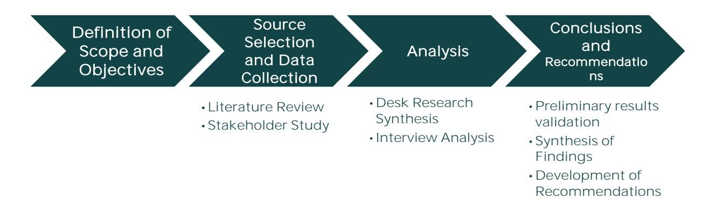
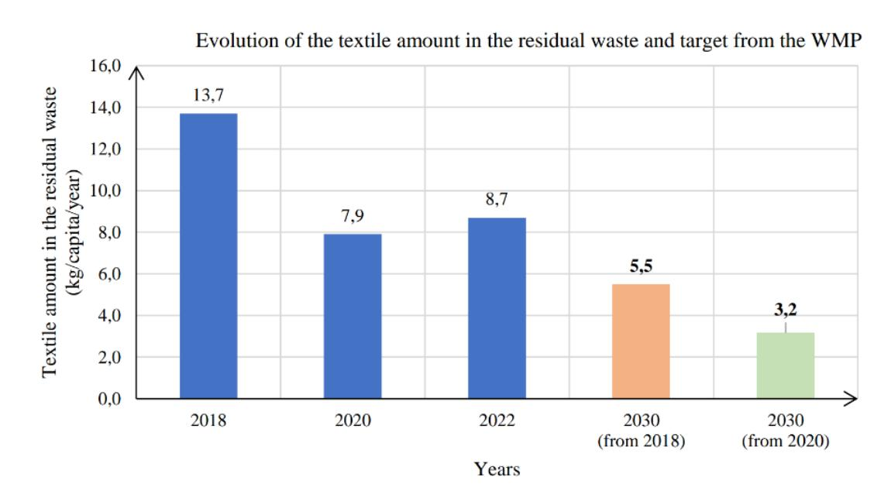
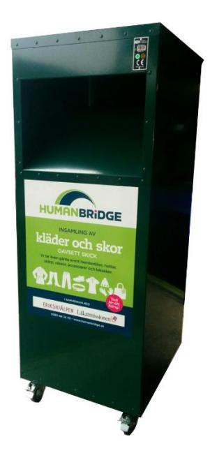
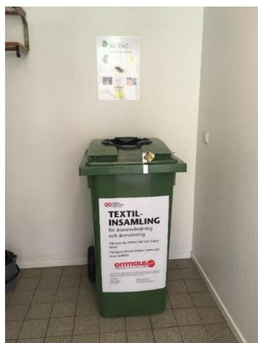
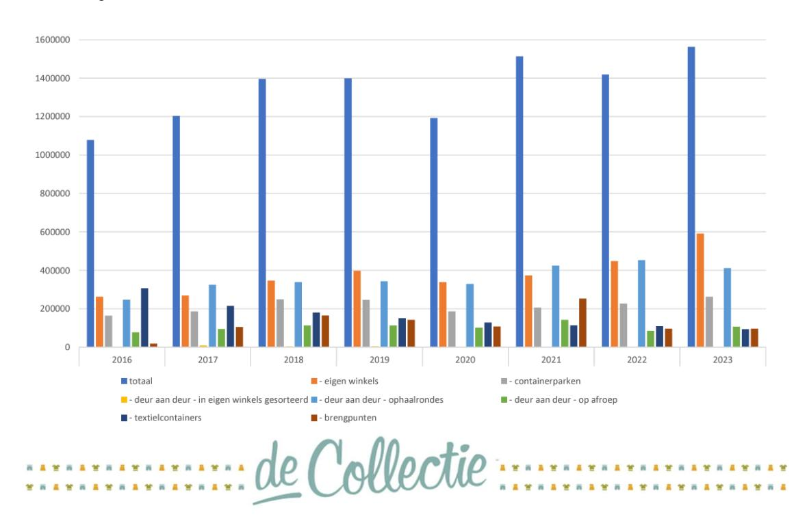
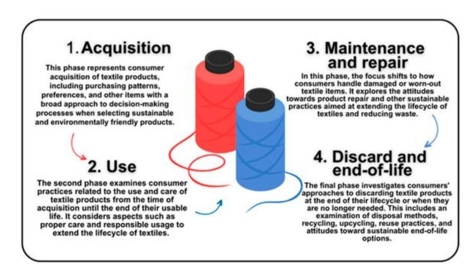

**CISUTAC**  
Circular and Sustainable Textiles and Clothing

# Guidelines for local embedding and link with CCRI

Deliverable due date 31-08-2024 Effective delivery date 31-08-2024

AUTHORS REVIEWERS

| Serena Lisai,    | ACR+ | Maree Bouterakos, |                         |
|------------------|------|-------------------|-------------------------|
|                  |      |                   | Wageningen University & |
| Francesco Lembo, | ACR+ | David Allo,       | TexFor                  |
| Gaelle Colas,    | ACR+ |                   |                         |

Project acronym CISUTAC Grant agreement nr 101060375 Project title Circular & Sustainable Textiles & Clothing

# **Executive summary**

This deliverable provides an overview of the key instruments within the reach of local and regional authorities to improve the circularity of textile material flows, especially via citizens and engagement. It builds on existing literature, interviews with local stakeholders, and intermediate results of CISUTAC tasks 3.1 and 3.2, and its development runs in parallel with the construction of ACR+ 2023 report: *[Recommendations and good practices for local used textile](https://acrplus.org/en/activities/publications/technical-reports/4066-recommendations-and-good-practices-for-local-used-textile-management)  [management](https://acrplus.org/en/activities/publications/technical-reports/4066-recommendations-and-good-practices-for-local-used-textile-management) .* Preliminary results of the research were shared for validation during the 5th meeting of the CCRI Thematic Working Group on Circular Resource Management of the CCRI-CSO (Circular Cities and Regions Initiative Coordination and Support Office).

The core of the guidelines contains a review of existing good practices and recommendations in recent literature (European, national, or local studies, European projects, and reports) focused on the role of local policies to improve circularity of textile value chains.

As a result of this analysis, the guidelines present a compendium of key findings and recommendations for local government policy makers in three main areas: **waste collection strategies and systems**; **professional textiles management**; and **incentivizing sustainable consumption patterns**. For each of these areas, an introduction provides contextual information on the topic and the main areas of development for local policymakers. Recommendations for policymakers at the municipal and regional levels are presented, together with considerations for further analysis that can fill current knowledge gaps. Whenever possible, good practices were identified through the involvement of the CISUTAC project partners, allowing information to be gathered through interviews and direct contact with stakeholders already informed of the research objectives.

# Recommendations to enhance textile collection efficiency

Develop a diverse range of collection methods (including a collection system, network, partnerships) considering the local context.

*Textile containers can be deployed as a primary collection method, forming the backbone of the system. While acknowledging potential quality trade-offs compared to in-store collection, these receptacles offer a straightforward and adaptable solution to expand collection efforts. To ensure adequate capture rates, it is essential to establish a comprehensive network of collection points.*

Continuously evaluate and adapt strategies deployed based on performance metrics and local feedback.

*Identify underperforming areas through data analysis and stakeholder feedback. Conducting user behavior and perception surveys can provide valuable insights into awareness of collection systems, barriers to participation, and opportunities for improvement. Based on these findings, alternative collection methods should be developed and implemented. It is relevant to detail the key metrics to be assessed (performances but also complains, occurrence of non-conformities, etc.)*

Actively engage local actors, including citizens, in a collaborative governance model.

*Establish a system of multi-stakeholder agreements between local authorities, collection, and sorting operators for used textiles, potentially including municipal waste operators, and other relevant stakeholders.*

# Recommendations to drive circularity in professional textiles through procurement

## Engage in market dialogues and collaborate with a diverse range of stakeholders.

*By leading a dialogue with different stakeholders, such as suppliers, recycling operators, and producers, cities can share their vision and goals, discuss, and define respective responsibilities between the private and the public sector, and facilitate the development of new innovative reuse solutions.*

#### Do not overlook the importance of repair systems: from the infrastructure to the ownership models.

*In cases where textiles are owned by suppliers rather than the end-users, the decision to repair often lies with the supplier. Public procurement strategies should consider how to incentivize suppliers to prioritize repairs over replacements, possibly through contract clauses or collaborative environmental efforts.*

# Dedicate enough support to R&D and education.

*Long-term contracts with suppliers provide the stability and incentive needed for companies to invest in developing innovative solutions in the workwear sector, ultimately driving progress in sustainable and circular procurement practices. On top of supporting R&D, procurement processes should include requirements for ongoing education and engagement programs.*

# Keep end-users in mind.

*Involving end-users in the design of reuse systems could be made a contractual requirement for suppliers. While promoting reuse, procurement must ensure that end-users have consistent access to appropriate and comfortable workwear.*

# Encourage flexible size management.

*Set up systems for regular size exchanges between different departments or organizations. Suppliers could be required to offer easy-to-use platforms for reporting and exchanging excess sizes.*

#### Cost considerations are crucial

instance the cost of maintenance and of increase need for renewal if maintenance is not done correctly.

# Recommendations to enhance reuse and sustainable consumption patterns

# Optimize the existing systems rather than creating new ones

*Together with enhancing the existing system's capacity, municipalities should prioritize fostering a local culture of reuse. This can be achieved by offering space and funding for additional reuse stores, repair, and upcycling initiatives, and integrating textile reuse into existing social spaces.*

# Develop new reuse indicators, not only based on weight

*Alternative reuse indicators may want to shift away their focus from reusing more (i.e. changing owner more frequently) to using longer (i.e. irrespective of the owner). Since a product lifetime is central to circular reuse, some components of a reuse indicator may focus on the quality of inflow.*

# Promote and give visibility to local reuse initiatives

*For example, the city of Leuven includes a repair calendar and explicitly mentions the reuse network on its waste calendar. Similarly, the city of Ghent dedicates significant space and detailed information about second-hand shops and initiatives on its city promotion website.*

# Incentivize the digital transition of second-hand retailers

*Local governments can offer grants or low-interest loans for investment in digital tools that enhance inventory management, pricing, and online presence.*

# **Table of Contents**

| Executive summary Table of Contents Glossary List of Figures                                                                                                  |                                                                                                                     |
|---------------------------------------------------------------------------------------------------------------------------------------------------------------|---------------------------------------------------------------------------------------------------------------------|
| 1. Introduction ............................................................................................................................................7 |                                                                                                                     |
| 2. Methodology ........................................................................................................................................10     |                                                                                                                     |
| 3. Textile waste collection ...................................................................................................................12             |                                                                                                                     |
| 3.1.1 A complex mapping landscape                                                                                                                             | .................................................................................................................12 |
| 3.1.2 Performance across the EU .........................................................................................................................13   |                                                                                                                     |
| 3.1.3 Various models of used textile collection                                                                                                               | 14                                                                                                                  |
| 3.2.1 Textile waste collection in Gothenburg, Sweden                                                                                                          | ..........................................................................16                                        |
| 3.2.2 De Collectie: textile collection and social development                                                                                                 | .........................................................22                                                         |
| 3.3 Recommendations to enhance textile collection efficiency.................................                                                                 | 26                                                                                                                  |
| network, partnerships) taking into account the local context                                                                                                  | ......................................................26                                                            |
| metrics and stakeholder feedback ..................................................................................................................27         |                                                                                                                     |
| 4. Driving circularity in professional textiles through procurement.........................                                                                  | 29                                                                                                                  |
| 4.1 Current situation and background                                                                                                                          | 29                                                                                                                  |
| 4.1.1 Limited knowledge on non-household textile waste management                                                                                             | ...............................29                                                                                   |
| 4.1.2 Two under-exploited strategic instruments: EPR and public procurement                                                                                   | 30                                                                                                                  |
| 4.1.3 Green Public Procurement: voluntary, yet a key practice to drive sustainability                                                                         | 30                                                                                                                  |
| 4.1.4 From Green Public Procurement to Circular Public Procurement                                                                                            | .................................32                                                                                 |
| 4.1.5 Public Procurement of Innovation: A world to explore...........................................................                                         | 34                                                                                                                  |
| 4.2 Case Study on public procurement to drive circularity for textile.....................                                                                    | 35                                                                                                                  |
| 4.2.1 Veneto Regional Strategy for Green Public Procurement                                                                                                   | ....................................................35                                                              |

| 5. Facilitating sustainable textile consumption patterns .....                               | 41 |
|----------------------------------------------------------------------------------------------|----|
| 5.1 Current situation and background .....                                                   | 41 |
| 5.2 Case studies to promote sustainable consumption patterns .....                           | 44 |
| 5.2.1 Reparation fund in France.....                                                         | 44 |
| 5.2.2 Awareness raising campaigns .....                                                      | 46 |
| 5.2.3 Connect citizens with the hidden side of textile waste management - Spain .....        | 47 |
| 5.2.4 Tapia ERRE QUE ERRE - Spain .....                                                      | 48 |
| 5.2.5 Reuse clothes, renew nature! – Turkey .....                                            | 49 |
| 5.3 Recommendations to enhance reuse and sustainable consumption patterns .....              | 51 |
| 5. Discussion with the CCRI-CSO thematic Working Group on Circular Resource Management ..... | 52 |
| 6. Next steps .....                                                                          | 56 |
| References.....                                                                              | 57 |

# **Glossary**

| ARPAV    | Regional Agency for Environmental      |
|----------|----------------------------------------|
| CCRI-CSO | Circular Cities and Regions Initiative |
| CPP      | Circular Public Procurement            |
| DGR      | Regional Council Decree                |
| ECAP     | European Clothing Action Plan          |
| EEA      | European Environment Agency            |
| EPR      | Extended Producer Responsibility       |
| ETC CE   | European Topic Centre on Circular      |
| EU       | European Union                         |
| EWWR     | European Week for Waste Reduction      |
| GPP      | Green Public Procurement               |
| JRC      | Joint Research Centre                  |
| OVAM     | Openbare Vlaamse                       |
| PPI      | Public Procurement of Innovation       |
| PSS      | Product Service System                 |
| R&D      | Research and Development               |
| SAMEK    | Sakarya Metropolitan Municipality Art  |
| SMM      | Sakarya Metropolitan Municipality      |
| UNEP     | United Nations Environment             |
| WEF      | World Economic Forum                   |
| WMP      | Waste Management Plan                  |

# List of Tables

Table 1. [Advantages and drawbacks of "traditional" textile collection systems..........15](#page-15-0) [Table 2. Distribution of textile collected per neighbourhood.................................................21](#page-21-0)

# List of Figures

| Figure 4. Container placed in the high rise buildings................................................................ | 19                                  |
|-----------------------------------------------------------------------------------------------------------------------|-------------------------------------|
| Figure 5. Container of the second pilot                                                                               | 19                                  |
| Figure 7. Phases of interaction of end-users with textile products.                                                   | .................................42 |

# **1. Introduction**

Local governments in Europe play a pivotal role in advancing the circularity and sustainability of textiles. Cities and regions are uniquely positioned to implement targeted policies and initiatives that can significantly impact textile consumption, waste management, and build local economic development. Most critically, local governments are at the forefront of developing and implementing effective waste collection systems for textiles. They must balance the costs of collection, separation, and recycling, against household waste management costs, to ensure the economic viability of circular initiatives. They serve as key players in designing and executing local textile waste management systems, considering factors such as public acceptance, stakeholder collaboration, economic sustainability, and the implementation of existing best practices in reuse and repair.

The Committee of Regions Opinion on the EU Strategy for Sustainable Circular Economy and Textile[s](#page-7-1)1 emphasises the multifaceted role that cities and regions can play to incentivize textile circularity. Local governments are often the most closely connected players with the communities and waste and textile collectors, and they can support collective decision-making processes with communities, also establishing governance models and voluntary schemes such as local green deal[s](#page-7-2)2 . They can implement regulatory measures to discourage unsustainable textile consumption patterns by leveraging their procurement power to drive demand for sustainable professional textiles, and providing funding, infrastructure, or networking opportunities to stimulate the development of novel technologies and business models that promote textile recycling, upcycling, and repair.

The United Nations Environment Programme (UNEP[\)](#page-7-3) 3 and the European Environment Agency (EEA[\)](#page-7-4) 4 elaborated on the potential impact of diverse local policies on textile circularity along the life cycle stages. They highlighted that education and awareness raising initiatives represent another crucial area where local governments can make a significant impact. Through community

1 European Committee of the Regions (2022)

2 Local green deals are strategies and initiatives implemented at regional or local level to address environment challenges, to make the sector more sustainable.

3 UNEP (2023)

4 EEA (2021)

engagement programs, school curricula, and public campaigns, cities and regions can inform citizens about the environmental impacts of textile consumption and promote more sustainable practices such as buying second-hand, repairing, and properly disposing of textiles.

Recent studies[5](#page-8-0) argue how municipalities have, both directly and indirectly, heightened their involvement in textile waste management in recent years. This increased engagement has been driven by several factors:

- 1. Stronger waste prevention policies and an expanding circular economy agenda, often guided by national or regional targets for used textiles.
- 2. Opportunities to merge environmental and social objectives by supporting employment for disadvantaged groups in textile collection and processing activities.
- 3. Growing demand for greater transparency regarding the future of used textiles.
- 4. Potential economic benefits for municipalities and their waste collection partners.

This deliverable also coincides with the evolving European regulations on used textiles. The Waste Framework Directive mandates sorting by 2025, and the measures, including an Extended Producer Responsibility system, to support this requirement. Additionally, the environmental impact of the textile industry, especially in terms of raw material extraction and fibre production, is significant. Concurrently, there is a decline in the quality of textiles available on the market and increasing challenges in exporting used textiles from Europe to the Africa and Asia regions. These factors highlight the urgency of rethinking textile end-of-life management and waste prevention.

These drivers have collectively spurred city authorities to take a more active role in managing and optimizing textile waste systems, contributing to both environmental sustainability and social welfare in their communities. To be aligned he overall aim of the deliverable is to understand existing trends and initiatives within the following local policy areas, identified by the project:

- waste collection and territorial governance;
- professional textiles and circular public procurement;

5 Watson et al (2018)

- incentive systems to incentivize waste prevention and sustainable consumption patterns, including reuse.

This deliverable builds on a literature review, interviews with local stakeholders and intermediate results of CISUTAC tasks 3.1 and 3.2. It provides an overview of the building blocks for defining the focus of local governments in promoting circular texti definition and implementation.

The research followed a specific methodology described below and in Figure 1.

# **2. Methodology**

**Definition of the Deliverable's Scope and Objectives**

The project proposal established clear objectives for the report, from which three key focus areas were identified:

- 1. Waste collection strategies and systems
- 2. Professional textiles management and public procurement practices
- 3. Policy instruments to facilitate sustainable consumption patterns

These areas formed the core framework for the subsequent research and analysis.

# **Source Selection and Data Collection**

The data presented in this report was gathered through two primary channels:

- 1. Comprehensive Literature Review: An extensive desk review was conducted to compile existing literature on circular business models. This encompassed: reports from thematic European projects; sectoral reports and articles; academic journal publications; industry-specific reports; relevant policy documents.
- 2. Stakeholder Study: To complement the literature review and gain practical insights, a series of four in-depth interviews were conducted with relevant sectoral representatives. These interviews served to refine the analysis of case studies and provide realistic perspectives on the implementation of circular textile strategies.

# **Information Analysis**

The collected information was processed and analyzed through a two-step approach:

- 1. Synthesis of Desk Review: The information gathered from the literature review was meticulously synthesized to provide a comprehensive overview

*Figure 1. Methodology applied to D3.3*

- of: challenges faced in implementing circular textile strategies at local levels; and key enablers for setting up municipal and regional policy instruments to favor textile circularity.
- 2. Interview Analysis: The stakeholder interviews were carefully examined to: identify common themes, trends, and challenges across different contexts; extract relevant inputs for case study development; and, validate and enrich the findings from the literature review.

# **Formulation of Conclusions and Recommendations**

The final stage of the methodology involved three steps:

o Preliminary Results Validation: Initial findings were presented during the 5 th meeting of the CCRI Thematic Working Group on Circular Resource Management of the CCRI-CSO (Circular Cities and Regions Initiative Coordination and Support Office). This step allowed for peer review and validation of the research outcomes. o Synthesis of Findings: The results from the literature review and stakeholder interviews were synthesized to draw comprehensive conclusions about the state of local textile circularity initiatives. o Development of Recommendations: Based on the analyzed data and identified challenges, a set of targeted policy and stakeholder recommendations were formulated. These recommendations aimed to: address the specific challenges identified in implementing circular textile strategies; support the scaling up of integrated and effective local policymaking processes; and, provide actionable insights for local policy makers involved in textile circularity.

# **3. Textile waste collection**

# 3.1 Current situation and background

# 3.1.1 A complex mapping landscape

A major challenge in studying the end-of-life phase of textile products is the general lack of available data. The management of used textiles involves numerous entities, many of which do not report the quantities they collect. The scarcity of consolidated data is also because few European countries have established sorting obligations or an Extended Producer Responsibility (EPR) system. While some European countries such as France and The Netherlands are pioneers in this area (in France, an EPR system has been implemented since 2008, while the Netherlands has organised a Green Deal for textiles in 2012), there are less resources to benchmark local or regional performances compared to other waste streams. The European textile waste landscape is complex and varied, as revealed by dat[a](#page-12-3)6 from the EEA and its European Topic Centre on Circular Economy and Resource Use (ETC CE).

Reporting of textile waste volumes is not a straightforward task, unlike general municipal waste. Few countries have consistent and consolidated data regarding the total amount of used textiles generated. Beyond separately collected and reported textile waste, a significant amount ends up in mixed municipal waste, typically processed as residual waste. EU member states are not obligated to report on separately collected quantities of textiles or items prepared for reuse unless specific targets are set at national level or in the case of more general targets on

According to EEA, in 2020, the EU27 collected a total of 1.95 million tonnes of textile waste separately, equating to 4.4 kilograms per capita. This data encompasses all economic activities and household waste in the EU27. Specifically, around 800,000 tonnes of textile waste were collected from households alone, representing 40% of the total separately collected textile waste. Importantly, these statistics only account for textiles collected separately. Although the quantity of separately collected textile waste has remained relatively stable since 2010, there was a noticeable decline in 2020. This reduction is likely due to the COVID-19 pandemic, which led to a general decrease in the production and consumption of textile-related products. Without this pandemic-induced drop, the separate collection of textile waste experienced an 11% increase between 2010 and 2018.

6 ETC CE (2024)

total reuse (e.g. in Flanders and Brussels regions). In most of the cases, the data on used textiles production is in the addition of sorted quantities with the quantities remaining in residual waste, assessed through composition analyses. Some territories, meaning cities or regions depending on the case, also have figures on the textiles waste disposed with bulky waste (collected on the kerbside or in mixed fractions in civic amenity sites).

Furthermore, discrepancy arises because used textiles are not universally classified as waste, and in many countries, municipal collection of reusable textiles and textile waste is not necessarily a priority. Classification varies significantly between countries. For instance, Italy, Austria, Germany, and The Netherlands categorize all textiles collected via bring banks as waste, regardless of quality or donor intent. Nordic countries only classify such collection as waste if the collector explicitly states it accepts non-reusable items. A striking finding is that Europe's average capture rate for textile waste stands at a mere 12%[7](#page-13-1) . Countries achieving higher capture rates (such as Belgium and Luxembourg with 50%, The Netherlands with 37% and Austria with 30%) typically employ diverse collection systems across urban and rural areas. Municipalities often spearhead textile waste management, frequently outsourcing collection services through competitive bidding.

# 3.1.2 Performance across the EU

Based on the information collected in the context of the European Environmental Germany, Belgium (Flanders) and Luxembourg provide a high share coverage of the population with convenient collection services for used textiles. Based on the ETC CE questionnaire[8](#page-13-2) Czechia counts as well on high-density bring points in cities and rural areas together with door-to-door collection. The Netherlands and the Walloon region of Belgium seem to have expanded their collection systems as well by introducing high-density bring points. Austria, Belgium (Flanders), Denmark, Finland, France, Germany, Poland, and Slovenia declare to have full (100%) coverage of the separate collection system. Nevertheless, this parameter is open for interpretation. For example, in some countries, a 100 % population coverage is reported when separate collection is facilitated by containers on civic amenity sites to which, in theory, all citizens have access to. In practice, citizens often need transportation to reach these sites which is not always fully accessible or convenient enough. Few territories have consistent and consolidated data regarding the total amount of used textiles generated. It is possible to identify regional or national data on the collection and destination of used textiles, even if the quality and comparability of the data available are questionable. Indeed, the scope of the waste collected (types of textile products, whether only re-usable

7 ETC CE (2024)

8 ETC CE (2023)

textiles are included or not), as well as the methods of estimating the quantities collected may vary from one country to another.

The latest available data can also be outdated, and the current distribution of quantities is likely to have changed over time. Data collection methods differ among countries, with some collecting data from collection organisations while others rely on less exhaustive surveys. There are biases on potential differences of scope between consumption data (which might only include textile products) and the data on collected used textiles, which often includes footwear and other leather product[s](#page-14-1)9 .

# 3.1.3 Various models of used textile collection

The organisation of used textile collection is quite diverse across Europe. Few members states have established a national EPR system that is responsible for the management of used textiles: up until now, in France (since 2007), Hungary and the Netherlands, the system is mandatory. The Belgian Region Flanders set it as voluntary. Croatia gave responsibility to textile producers to facilitate the collection of the textile they put on the market[10](#page-14-2) . In other countries, textile waste collection is under the responsibility of municipalities. The collection and treatment of used textile is mostly operated by charity organisations or private companies, with different configurations depending on the country. In some countries, municipalities or municipal waste companies play a significant role for the collection of used textiles. Collection in bring banks is the most widespread collection system across Europe, even though there are no detailed data on the collected quantities and the collection modes.

Considering the high heterogeneity of local ecosystems, at municipal level, a trend has emerged towards collection models targeting re-usable textiles, mainly organised by social economy organisations, and carried out using textile containers. These schemes are organised in this way because of the economic balance of the sector: the value of used textiles comes mainly from locally re-usable products (the followed by products that can be re-used for export -best , while current recycling routes for non-reusable textiles yields little to no economic value. There is also a lack of high-value recycling routes for post-consumer textiles, also because there are few sorting centres able to separate collected textiles in clean, recyclable streams. Therefore, the collection and processing of non-reusable textiles incurs substantial costs with little to no revenue generation.

As said, the most common collection method across Europe appears to be bring banks, however, other schemes have been developed: different collection methods

9 McKinsey (2022)

10 EEA (2024)

(on-demand collection, door-to-door collection), as well as collection schemes including all textile waste. For instance, in France, the EPR system requires and partly finances the collection and recovery of all textile waste. In The Netherlands and Denmark, an increasing number of municipalities have extended the sorting instructions from re-usable textiles to all textiles. Other collection schemes are being developed and implemented by various brands and retailers. These systems differ slightly (permanent or punctual, damaged clothing admitted or not, sometimes by the offer of vouchers ), and are sometimes coupled with the implementation of second-hand offers at preferential prices. However, few data could be identified for such initiatives, and it assumed that the associated quantities are currently very limited compared schemes.

Each textile collection system offers distinct advantages and drawbacks, as illustrated in the Table 1 below.

*Table 1. Advantages and drawbacks of "traditional" textile collection systems*

|              | Advantage(s)                   | Drawback(s)                 |
|--------------|--------------------------------|-----------------------------|
| Bring points | Collection of large quantities | High risk of contamination  |
|              | Convenient for residents       | Increased operational costs |

It must be noted that lower volumes recorded at indoor collection points are often due to limited operating hours and fewer collection locations. Exposure moisture or rain in the case of bring points can lead to mould growth, rendering the textiles worthless. The narrow profit margins in this sector often preclude cleaning or drying of received items.

Given these factors, bring points are generally considered the most effective method for collecting substantial amounts of used textiles while maintaining acceptable quality. However, the success of any collection system depends on various additional factors beyond the method itself, e.g. more expensive collection scheme can be interesting if they manage to maintain a high quality of the collected items. These include the location of collection points, frequency of pickups, type and condition of containers, clear labelling, and effective communication about textile collection practices.

# 3.2 Case studies on textile waste collection practices

### 3.2.1 Textile waste collection in Gothenburg, Sweden

#### *Context*

In 2014, the City of Gothenburg started a pilot project on textile collection in vertical houses. The pilot aimed at collecting data on the quantity and quality of textile collected and on the included in 31 waste sorting rooms and involved approximately 5000 residents from diverse social and economic backgrounds.

Partly based on the success of the 2 projects described below, in 2021, the City adopted the Waste Management Plan (WMP), developed together with 12 other municipalities in the Gothenburg Region.

The plan, valid until 2030, consists of six target areas: 1) Prevention; 2) Reuse; 3) Collection and recycling; 4) Spatial planning; 5) User focus with an easy waste management system; and 6) Littering. For each area, a set of goals have been identified. In particular, target area 3, also influenced by the 2018 revision of the Waste Framework Directive in the EU, which included a separate collection of textile waste, defines a goal of 60% reduction of textiles in the residual waste between 2021 and 2030. To monitor this data, the composition of residual waste is analyzed biannually. As shown in Figure 3, two different target outcomes have been identified depending on starting date (orange = from 2018; green = from 2020).

# Gothenburg (SE)

Inhabitants (2023): 600,000

Population density: 1,350.1 inhab/km2

Households: 260,000

Household waste collected in 2022: 220,000 tonnes 366 kg/cap

*Figure 2. Evolution of the textile amount in the residual waste and target from the WMP. Source: City of Gothenburg*

Later on, in 2023, the Swedish government presented a comprehensive memorandum outlining a circular management system for textiles and textile waste. To inform this initiative, the government sought input from several municipalities.

The City of Gothenburg sought out for a more precise definition of textile waste in the development of the memorandum (i.e. clothing, home, interior, bags and textile accessories). The city suggested definitions to include other textiles with recycling potential, which is crucial due to the diverse range of textile waste categories, as it impacts waste management practices and product eco-design. The definition should encompass waste codes for various product groups. Additionally, the city sought clarification on textile waste reclassified, particularly regarding textiles contaminated with hazardous substances. Questions remain about whether such items should be categorized as textile waste, residual waste, or hazardous waste. The definition also lacks clarity on when a textile product transitions from a product to waste. This line of demarcation is particularly important as it affects which collection and treatment systems municipalities can develop and implement. Currently, municipalities organize the collection with a products, and textiles that are damaged and non-reusable. Gothenburg requested requiring a source separation of reusable textile on the one hand and of nonreusable textiles on the other hand.

In 2014, the city of Gothenburg started a pilot project on textile collection in vertical houses. The pilot aimed at collecting data on the quantity and quality of textile sorting rooms and involved approximately 5000 residents from diverse social and economic backgrounds.

# *Pilot 1: 2014-2015*

A 2013 survey revealed strong citizen interest in expanded textile collection services in Gothenburg. Previously, the city had facilitated textile collection by providing space to charity organizations. In response to this demand, Gothenburg initiated a pilot project in 2014 to test convenient textile collection within high-rise residential buildings, where waste separation is generally more challenging. The initiative aimed to gather data on the feasibility of collecting both reusable and non-reusable textiles, including associated items such as toys, shoes, and accessories.

The project installed 31 collection points in garbage rooms (specific, common rooms where different waste streams are collected in high rise buildings) located in three areas of the city: Olskroken, Lövgärdet, and Angered. The system served 2,600 flats and 5,000 residents from diverse social and economic backgrounds. The collection was made through containers (Figure 4) initially emptied once a week, then every 14 days. The textiles were placed in plastic bags, then packed in larger plastic sacks.

The project was developed in collaboration between:

- The City of Gothenburg;
- Bostads AB Poseidon, a municipal housing company;
- Renova AB, a regional, public waste management and recycling company;
- The public agency in charge of water and wastewater management in the city;
- Human Bridge, a local textile collector which provided the containers.

**Results.** In one year, around 24 tonnes of material have been collected, equating to approximately 4.8 kg/cap. Three picking analyses have been carried out revealing that 75% of the collected material was textile. 15% of the material was identified as toys, shoes, and accessories. Only 10% was mis-sorted material. An additional composition analysis has been carried out in the residual waste collected in the same location where the textile containers have been located to determine the proportion of textile waste remaining in the residual waste. According to interviews with civil servants, citizens involved in the pilot perceived the initiative as a simplification of textile donation.

# *Pilot 2: 2017-2018*

The initial pilot led to an unexpected increase in nonreusable textile waste mixed with reusable items. Citizens were depositing textiles of all conditions into the collection containers. While nonreusable household textiles are classified as waste, non-profit collectors primarily focused on reusable items. Recognizing an opportunity to divert non-reusable textiles from the residual waste stream, the municipality initiated some discussions and a collaborative partnership with key collectors. *in the high-rise buildings*

In 2016, the Swedish government announced the perspective of an EPR scheme for textile. This was perceived as a driver to launch a new pilot project to improve the textile waste collection.

The new pilot project has been launched in 2017, aiming at reducing the share of usable and recyclable textile ending up in residual waste. Similarly to the initial pilot, this project was based on a cooperation agreement between the municipal agency responsible for waste management, the organizations in charge of textile collection and property owners. The pilot has been carried out in 4 different neighborhoods, involving around 5,400 people. The containers have been placed in laundry and garbage rooms. In order to protect the material from theft, the container is locked, and there is slot on the lid (Figure 5). *Figure 4. Container of the second pilot*

*Figure 3. Container placed* 

The city signed a collaboration agreement with three textiles collectors that had to report the collected quantities and the distribution of the material between the reuse, recycling, and combustible fractions.

Municipal waste is exclusively the purview of the municipality or its authorized agents. Once it was clarified that textile collectors could potentially manage not only reusable textile but also non reusable and recyclable material (that would be qualified as waste), the City of Gothenburg developed a collaboration agreement framework to formalize and transparently structure this process. To address the potential breach of municipal responsibility, the city established requirements and negotiated cooperation agreements with long-standing textile collection operators within the municipality.

**The agreement relates to the authorization of collecting both non-reusable and reusable textiles at the City of Gothenburg's recycling centres, through containers adapted to the outdoor environment.**

This agreement is based on key criteria that may support the replication of this procedure in other cities and countries:

- The operators collect textiles from containers placed in agreed locations (identified high-rise buildings).
- The collection occurs weekly.
- Any bags left next to the containers should also be collected.
- Regular meetings should be organized between the collectors and the city to monitor the collection and, in case, modify the procedure or the location of the containers.
- The collectors should report to the city every three months regarding the collection and once a year regarding the treatment of the material collected.
- The collection organization must have a 90-account or equivalent (FRII's quality code) and an F-tax certificate or equivalent, a quality stamp for charities confirming their ethical purpose.
- The containers should be labeled with information on how the textile is treated.
- The city is in charge of informing households about the possibility of leaving whole and broken textiles at the city's recycling centres.

**Results.** During the project period, only 15,5 tonnes have been collected (2,9 kg per person), compared to the 24 tonnes and 4.8 kg/cap of the first pilot. The distribution per neighbourhood is displayed in Table 2.

*Table 2. Distribution of textile collected per neighbourhood*

| Neighborhood       | Container       |                   |                    |
|--------------------|-----------------|-------------------|--------------------|
| Majorna/Masthugget | Laundry room    | 1,6 (in 6 months) | 2,4                |
| Rannebergen        | Landry room and |                   |                    |
|                    |                 | 0,9 (in 7 months) | 1,1 (in 10 months) |
| Stampen            | 2 garbage rooms | 0,8 (in 7 months) | 4                  |
| Torslanda          | Garbage room    | 0,6 (in 8 months) | 2,6                |

From 3 picking analysis, it was noticed that the material collected in laundry rooms was cleaner than the material collected in garbage rooms, and thus it was considered a higher value.

The perception of citizens was analysed through 386 telephone interviews. The service was generally appreciated, however, only 62% of the respondents noticed the implementation of the new textile collection system. This highlights that more efforts are needed in communication. Of the respondents interviewed, 15% confirmed bringing more clothes, shoes and textiles since the bin was placed in the property as it was more accessible. Furthermore, 49% of the respondents indicated the laundry room as the best place to dispose of their textiles.

#### *Barriers*

A primary challenge identified was effectively communicating to citizens which textiles can and cannot be placed in the collection containers. Given that contaminated textile waste often constitutes hazardous waste, clear communication is essential to educate citizens about the reuse-focused goals of the textile collection initiative.

The pilot phase highlighted two critical areas that require attention in any similar initiative:

- 1. A collection system restricted to reusable textiles requires extensive public engagement to support citizens to accurately identify and sort items,
- 2. A parallel system for reusable and non-reusable textiles also presents communication barriers, and carries the risk of material contamination, potentially lowering the overall quality of collected materials.

In Gothenburg, the three operators involved in the textile collection have harmonized their communication, clearly labelled their containers, even if with different logos referring to different collectors, but with the same rules. Despite these improvements, based on the collection, it is clear that citizens remain hesitant to dispose damaged textiles in the containers.

#### **3.2.2 De Collectie: textile collection and social development**

#### *Context*

Although Flanders has one of the highest rates of household waste recycling (around 65%), more could be done for textile waste management. To address this gap, the regional plan for Household Waste and Comparable industrial Waste aims at increasing the collection of non-reusable textiles. It focuses on communication strategies such as changing labels on textiles containers and implementing a multi-stakeholder approach.

The goal of the Flemish waste agency OVAM (Openbare Vlaamse Afvalstoffenmaatschappij) is to include stakeholders from the whole fashion industry, and not just the reuse and second-hand sector.

In addition, OVAM has defined a set of minimum collection conditions to achieve:

- textile collection in recycling centres
- door-to-door collection of textiles, four times a year or
- a minimum container/collection point density of one container per 1000 people.

Each municipality organizes the collection differently, either by contracting a company, with or in recycling parks), or by allocating certain spaces for activities related to social and solidarity economy or by organizing a collection door-to-door.

Before 2019, only reusable clothing and shoes were collected in the region. OVAM promoted the selective collection of all the used clothing, shoes, towels, sheets, and other textiles.

For 2023-2030, a new plan has been published: The Local Materials Plan. It replaces the implementation plan for household waste and similar commercial waste between 2016-2022, moving towards an integrated policy on the circular economy, by focusing on prevention and reuse and by further closing material cycles.

Antwerp is the capital of the Flanders region, a big and densely populated city. This should be kept in mind as the dimension and the presence of high-rise buildings increase the challenges in terms of waste collection. In the past, textile collection in the city has been carried out by charities and private collectors with

# Antwerp (BE)

Inhabitants (2024): 545,858

Population density: 2,672 inhab/km2

Household waste collected in 2022: 193

kg/cap *(source: OVAM)*

relatively little control or interference by the city authorities. From 2008, the city decided to take more control regarding permits for collection on public land. The permits have been shared among charities as it follows:

- Mensenzorg and De Kindervriend were responsible for door-to-door collection.
- 2008 and 2011.
- From 2011 to 2014, city authorities took over the collection in recycling centres.
- Recyclant oversaw door-to-door collection.

However, other charities and private collectors continued being involved in the collection by installing containers on the streets, even without the official authorisation. Because of this, the City of Antwerp decided to monitor and control the municipal used textile collection.

# *A tender for used textile collection*

In 2014, the City of Antwerp kicked-off a call for information to analyse the state of the art of municipal textile collection. A set of meetings and discussions were carried out involving both citizens and local stakeholders involved in the value chain. Based on these exchanges, the city could define a set of ambitions:

- Reach full transparency on the management of the textile collection
- Foster investments on local and social solutions
- Remove textile street containers
- Start the collection of both reusable and non-reusable textiles.

In 2016, the city published a tender for a concession to collect textiles in the city. The primary focus was on sustainability and local engagement. The collaborative environment built by the municipality ignited the creation of De Collectie, which gathered the main social enterprises already active in textile collection in the city. These included:

- **Kringwinkel**: a Flanders-based organisation focused on reuse. It offers economically viable solutions for maximum reuse of goods and useful applications for the non-reusable portion. Kringwinkel aims to be both ecological and social and offers career opportunities to employees for whom the regular job market offers few possibilities. Just in Antwerp, it boasts 11 second hand shops, a circular hub, a renting service, a webshop, a moving service and two repair shops. It is in charge of the collection of textiles through the shops, but also provides a pick-up door-to-door collection service free-of-charge based upon request of citizens and businesses.

- **Oxfam**: an international confederation with more than 70 years of experience mobilizing people and resources across the world to end poverty. Oxfam has over 800 outlets across Europe, with 30 outlets in Belgium. Through these outlets, they extend the life of clothing and other products from the public that would otherwise end up in landfill, while providing sustainable solutions for brand and retailers that have excess stock. Furthermore, Oxfam's outlets are a unique window to the general public and they connect Oxfam's campaigns with customers to raise awareness on the climate impact of consumer behaviour. They are the only organisation with the permit to place textile collection containers in the city recycling centres.
- **Wereld Missie Hulp** (World Mission Aid): helps vulnerable communities around the world by supporting around 250 development projects every year. WMH mainly obtains the resources for this from the collection of clothing. The public can support the organisation by donating clothing in specific red clothing containers. The wearable clothing is sold secondhand and the remainder is processed into new textiles. They used to have containers in the city but moved to 60 collection points in libraries, shops, post offices, etc. all over the city.
- **Mensenzorg and Kindervriend**: are small non-profit associations in charge of door-to-door textile collection. They also operate at different collection points in the city. Used items must be inserted in a box labelled with the orange flyer provided by the association by mailbox.

The tender has been designed in a way that encouraged the collaboration among different enterprises. The previous discussions activated by the city played a key role in the success of the collaboration. Some key requirements included in the tender can be of inspiration for other cities. These include:

- Strong experience in the collection of waste, considering collection of used textiles as well.
- Certification by the regional waste agency as a collector of waste.
- Local anchoring to reduce ecological footprint.
- Proved competences on local community engagement.
- Capacity to perform door-to-door collection integrated with collection at recycling centres and alternative donation points.
- Ensure local reuse of the collected textiles.
- Involvement of local partners.

De Collectie replied to the request of the municipality to reduce the amount of street containers, as this collection method did not show to be effective in terms of quality of collected clothing. The containers have been progressively removed and replaced by the following alternative methods:

- Door-to-door
- Pick-up by appointment
- Containers at the recycling centres
- Alternative network of 200 collection points located in public buildings (schools, public offices, etc.), publicly accessible but in a socially controlled environment.

The new system allowed to compare performance of different co-existing collection channels. Annual data from 2018 to 2023 are described in the Figure 6 provided by de Collectie.

*Figure 5. Tonnes of textile collected within different collection channels. In order: total ; at stores ; container parks ; door-to-door and sorted at the shops of de Collectie ; door-to-door after collection rounds ; door-to-door based on planned collections ; textile containers ; delivery points.*

Between 2016 to 2023, textile collection steadily increased. Stores and door-to door collections saw significant growth during this period. In addition, there was a slow increase at donation points and containers located at the recycling centres and overall textile collection was notably impacted by a decline in 2020, likely attributed to the COVID-19 pandemic.

While the differentiation of the collection methods is perceived as a success, the low level of local reuse of collected textile is an important challenge that needs to be addressed. An integrated strategy should be implemented to raise the amount of local reuse textiles collected by promoting and supporting repair services. The city and the enterprises involved in the collection are currently working on this through R&D initiatives and projects. In particular, in the CISUTAC project, the city is involved through Kringwinkel Antwerpen, which is part of the partners in charge of the development and practical implementation of semi-automated workstations for repair and dismantling.

The repair pilot will be implemented in Circuit, the noval hub of De Kringwinkel Antwerpen, in the neighbourhood of New South. The dismantling pilot will be installed in the warehouse of De Kringwinkel Antwerpen. The pilot will be exploited as a platform that can be used for several types of repairs by other (for profit and social) enterprises across Europe.

# *Barriers*

A key barrier is the presence of private collectors that manage to place street containers thanks to an agreement with the regional government, despite not being part of de Collectie. According to de Collectie, this situation does not allow the consortium to have full control of the data on textile collection and put in risk the quality and quantity of the textile collected by the stakeholders involved in the above-described agreement. A stronger collaboration and communication between the regional and local authorities should be put in place to increase the to limit the diversion of textile.

# 3.3 Recommendations to enhance textile collection efficiency

# 3.3.1 Develop a diverse range of collection methods (including collection system, network, partnerships) taking into account the local context

To maximize textile collection efficiency and address region-specific challenges, it is crucial to implement a diverse range of collection strategies, which is highlighted by the two good practices documented above. Textile containers can be deployed as a primary collection method, forming the backbone of the system. While acknowledging potential quality trade-offs compared to in-store collection, these receptacles offer a straightforward and adaptable solution to expand collection efforts. To ensure adequate capture rates, it is essential to establish a comprehensive network of collection points. The recommended density typically ranges from one point per 1000 to 1500 residents, though this may vary based on local conditions.

When optimizing the container network, several key factors must be considered. These include the average distance between inhabitants and collection sites, regular maintenance protocols to prevent overflow and maintain cleanliness, and strategic placement of containers. Implementing a performance monitoring system for individual collection points can significantly aid in network optimization and help better organize the overall system.

Developing partnerships with municipal waste management and street cleaning services is vital for the success of the collection program. These collaborations should focus on ensuring regular monitoring of collection points, maintaining cleanliness, preventing overflow, and minimizing community disruption. By creating synergies with existing municipal services, the textile collection system can operate more efficiently and with less inconvenience to residents.

It is worth mentioning that the private sector is providing a wide range of examples of collection methods that could be explored and analysed by local authorities. Just to mention some: H&M offers discounts to the customers that bring up used garments; Zara Pre-owned organises in-store and home collection of used clothing, and Mud Jeans provides the possibility to rent instead of buying the garments.

### 3.3.2 Continuously evaluate and adapt the strategies deployed based on performance metrics and stakeholder feedback

To continually improve the collection system, it is important to identify underperforming areas through data analysis and stakeholder feedback. Conducting user behaviour and perception surveys can provide valuable insights into awareness of collection systems, barriers to participation, and opportunities for improvement. Based on these findings, alternative collection methods should be developed and implemented. These may include establishing collection points in public spaces or near multi-family dwellings, setting up temporary collection or destocking points, and integrating with existing waste management infrastructure such as civic amenity sites or mobile collection points.

### 3.3.3 Actively engage local actors, including citizens, in a collaborative governance model

Local and collaborative governance for the management of used textiles, at municipal or intercommunal levels, should be structured to consider the definition of quantitative targets for collection and treatment, as well as the availability of collection points to ensure access to sorting for residents of different municipalities. It is also advisable to establish a system of multi-stakeholder agreements between local authorities, collection, and sorting operators for used textiles, potentially including municipal waste operators, and other relevant stakeholders. These agreements should specify the roles and responsibilities of the various players in terms of the availability of collection points, collection service, reporting, and transparency regarding the future of collected textiles. Various options are available for these agreements, such as contracts, calls for tenders, and certifications.

It is advisable to build on the experience and infrastructure of existing players, especially social economy operators, which benefit from a positive image and appeal to consumers. These players may already have local collection and sorting systems and some visibility among residents. Emphasizing the importance of manual sorting for reuse and its natural connection with the social economy and professional reintegration is crucial. The role allocated to the social economy in textile management, relative to other types of actors, is also a political choice that can be supported through social criteria (e.g., professional reintegration) in multiparty agreements.

Citizens should not be forgotten in a collaborative governance model. Their participation in circular economy textile strategies offers both opportunities and risks for closing the material loop. There is potential to boost collection rates and reduce textile disposal in municipal waste streams, but this requires well-planned strategies.

Although consumers are becoming more aware of the environmental and ethical issues related to textiles, encouraging people to adopt responsible disposal and consumption habits remains a challenge for the industry. Providing convenient and accessible options for individuals to dispose of both wearable and nonwearable clothing and textiles at residential, retail, and municipal sites is key to engaging citizens in textile collection. Further research is needed to identify the most effective collection strategies and how to motivate people to use these services regularly.

# 4. Driving circularity in professional textiles through procurement

# 4.1 Current situation and background

# 4.1.1 Limited knowledge on non-household textile waste management

There is limited data on the generation and management of non-household textile waste in Europe. Several countries, including Denmark[11](#page-29-3), Finland[12](#page-29-4), and Austria[13](#page-29-5) , have identified and quantified textile flows - including imports, production, and the management of used textiles - with varying degrees of detail and precision. Notable differences exist between these countries regarding the distribution of flows, management methods of used textiles, and the inclusion of specific fractions in the reports (e.g., technical textiles, waste from certain categories of actors not considered).

The lack of knowledge on circularity issues by textile stakeholders is one of the first barriers of implementing circular practices. Many textile companies have also been impacted by successive crisis (COVID-19, shortage of raw materials, Russia-Ukraine war) which reduces opportunities for investment and new projects, potentially reducing their competitiveness.

Professional textile products encompass a diverse range of categories, each with distinct characteristics in terms of usage, composition, and potential for valorization. While terminology may vary in the literature, several broad categories can be identified:

- 1. Flat linen, which is typically used until worn out, making it more suitable for recycling, potentially through fibre-to-fibre processes.
- 2. Uniforms and workwear not subject to specific technical or quality standards, which may be discarded before wearing out (e.g., due to changes in visual identity) and are potentially suitable for reuse.
- 3. Protective products and Personal Protective Equipment (PPE), including technical clothing that must adhere to strict safety and quality standards. This category often includes police and military uniforms, which must be rendered unusable at the end of their lifecycle to prevent unauthorized use.

*Source: [General recommendations for the local management of used textiles,](https://acrplus.org/en/activities/publications/technical-reports/4066-recommendations-and-good-practices-for-local-used-textile-management) ACR+, 2023*

11 Turku University of Applied Sciences (2019)

12 Danish Environmental Protection Agency (2019)

13Environment Agency Austria (2021)

The COVID-19 pandemic highlighted the European Union's reliance on international manufacturers for certain products. In 2020, extra-EU imports of COVID-19-related items increased by 10% overall, with protective clothing and oxygen devices experiencing the most significant growth at 40% and 39%, respectively, compared to 2019 figures[14](#page-30-2) .

## 4.1.2 Two under-exploited strategic instruments: EPR and public procurement

The absence of EPR systems for these products limits the possibilities of financing collection and recycling schemes. For many flows, there is also a lack of a recovery infrastructure. [15](#page-30-3) The potential for re-use, recycling, or recovery varies significantly across these categories. Some items can be directly re-used, while others may be unsuitable due to degradation or failure to meet current technical or safety standards. These latter items must be redirected to alternative recovery channels. It's worth noting that even within a specific product category, composition can differ between manufacturers. For instance, protective aprons used in metallurgy illustrate this variability: some are made from textiles, while others employ different materials entirely.

Public procurement is among one of the instruments that can effectively contribute to sustainability of professional textiles. The public sector can play an important role in supporting innovation, promoting circular procurement to support reuse and recycling and the design of new business models, phasing out current unsustainable practices, favouring transparency and traceability of the value chain. Public authorities are major consumers and can use their purchasing power to lead by example and choose environmentally friendly goods and sustainable services, promoting circular business models that incentivise a change in purchasing patterns, orienting choice towards durable, repairable, and reusable products by raising awareness in society. Public procurement can help stimulate a critical mass of demand for sustainability-oriented goods and services that would otherwise be difficult to obtain on the market.

4.1.3 Green Public Procurement: voluntary, yet a key practice to drive sustainability Green Public Procurement (GPP) plays a significant role in driving sustainable practices within the textile and workwear industry, despite its voluntary nature[16](#page-30-4) . Voluntary mechanisms serve as crucial catalysts for market improvement, often preceding or complementing regulatory measures. Over the past decade, the European Commission has focused on integrating sustainable procurement practices, notably through the development and implementation of GPP criteria.

The new EU Circular Economy Action Plan presents an opportunity to expand the scope of existing Sustainable Public Procurement and Circular Public Procurement

14 Eurostat, 2023

15 ACR+ (2023)

16 ECAP (2015)

principles. This expansion aims to consider not only sourcing but also use and disposal, facilitating the closure of material and product loops. These principles are applicable to both individual product purchases, such as workwear and carpets, and broader categories like textiles.

The textile and workwear industry involves a complex network of stakeholders, spanning from fibre production to manufacturing and disposal (supply, demand, and end-of-life sectors). When it comes to demand, stakeholders include group service providers, emergency services, health sector workers, educational and research establishments, military, shared service organizations, and infrastructure and construction entities. The diverse nature of these stakeholders and the extended supply chain they operate within poses a challenge to closing product and material loops. Furthermore, workwear and professional textiles have varied requirements regarding garment specifications, technical quality, functionality, durability, service life, and identity.

The influence of stakeholders on national consumption and production of workwear changes significantly based on the procurement opportunity size and the specific EU member state. While demand is typically influenced by sustainable public procurement policies and GPP criteria, supply is often driven by national regulatory requirements. Many public purchasing bodies utilize sustainable procurement as a mean to set an example for wider business and society, acting as a market driver for innovation and changing purchasing habits. However, price considerations and existing procurement models can pose barriers when whole life costing approaches are not adopted. Public procurement offers numerous opportunities to encourage the closure of the textile loop in workwear through more informed demand, including a better understanding of use and disposal alongside sourcing options.

A key opportunity lies in embedding product circularity within relevant GPP criteria to ensure action at both mandatory and voluntary levels. Local governments can implement stringent performance or outcome-based criteria for public procurement of goods, thereby encouraging the market to innovate and develop product solutions conducive to reuse.

For example, under the criteria focused on waste prevention outcomes, a provider offering infrastructure that efficiently separates and reintroduces a higher percentage of reusable textiles into the market would be considered a strong candidate. This approach contrasts with procurement efforts that primarily focus on waste management outcomes measured by quantities of collected, recycled, or incinerated waste[17](#page-31-0) .

17 WEF (2021)

Waste operators or solid waste service providers could be evaluated for their potential as logistics providers for transporting reusable items. By incorporating such evaluations into their contracts, these entities would be motivated to participate in the reuse logistics sector. This approach creates incentives for traditional waste management companies to expand their services and contribute to the circular economy. By adopting these procurement strategies, cities can drive innovation in reuse solutions, promote waste prevention, and create new opportunities for existing service providers to engage in more sustainable practices. This shift in focus from waste management to waste prevention and reuse can significantly contribute to reducing overall waste and promoting a more circular economy in urban areas.

# 4.1.4 From Green Public Procurement to Circular Public Procurement

While GPP generally depends on national level regulations and promotes more environmentally friendly products and services, the specific potential for public procurement to support circular economy has been clarified through the concept of Circular Public Procurement (CPP), defined as *the process in which a product, a service or a project is purchased according to the principles of a circular economy. In this process the technical aspects of the product are as circular as possible, taking maintenance and return policies at the end of the use period into account, as well as including financial incentives to guarantee circular use[18](#page-32-1)* .

CPP extends beyond the mere acquisition of new products. It encompasses a broader perspective that involves reassessing end-user needs and considering alternatives such as product repair or re-design within a more comprehensive circular system framework. These activities transcend the traditional boundaries of central procurement departments[19](#page-32-2) .

The [Interreg North Sea project PROCIRC](https://northsearegion.eu/procirc/) explored challenges and potential further opportunities linked with pilot procurements of workwear as well as textiles that are a part of other products, like reusing textiles for the refurbishment of furniture. The more prominent opportunities for circular procurement of those materials are defined as[20](#page-32-3):

- **Take-back** using the procurement exercise to enable suppliers and/or manufacturers to take-back workwear at end of use so that they can either be repurposed or recycled more effectively than in general textile collection schemes. In this model, the supplier has a collection and return-for-recycling system in place. From the supplier's side, it is crucial that the textile products are designed and manufactured in a way that

18 Van Oppen et al. (2018)

19 Kristensen et al. (2021)

20 Interreg NS Procirc project (2023)

allows them to be 100% recyclable (single-fiber). In this way, end-of-life garments can be reverted to raw textiles and then made into new clothes, rather than downcycling the material for lower-value uses. From incentivize a high return rate. To reach its full potential, more investment in closed-loop textile recycling is needed to enable more and better sorting and closed loop systems.

- **Buy & sell on** these models can create revenue streams and typically incorporate arrangements for the purchasing body to sell-on workwear at end of use either for re-use or recycling. Circular procurement is about thinking of opportunities, and that involves focusing on other sectors for open loops. Closed textile loops as described above can also be redirected towards other value chains, for example towards refurbished furniture. In this system, a furniture value chain is closing the loop of a garment value chain.
- **Servitization** Product Service System (PSS) models can be relevant to workwear where in-use impacts and end-of-(first) life pathways can have a big influence on the environment. However, PPS are not by definition sustainable but can include incentives for sustainable practices. Although, this needs to be organized and specified correctly and details on what is needed to ensure sustainability are required to maximize the potential.

The PROCIRC project also identifies a core set of success factors when tendering circular textiles. These can be elaborated to draw general recommendations mostly focused on knowledge exchange and mutual trust among procurement stations and market stakeholders:

- **Utilize market intelligence to explore circular opportunities**. Probe suppliers with specific questions about their circular capabilities, considering the industry's ongoing evolution. Incorporate a "Growth Trajectory" inquiry in tenders to understand how suppliers plan to enhance circularity throughout the contract period.
- **When procuring new textiles, research the recyclability of various materials**. Include specifications for fiber compositions that enhance recycling potential. Prioritize single-fiber products, as these offer the greatest possibility for complete recyclability.
- **Adopt an end-of-life-oriented design approach**. Emphasize single-fiber fabrics in procurement decisions. Consider methods for logo removal from durable workwear and strategies for separating different materials during product disassembly.

- **Communicate your circular vision to foster engagement**. Promote circular thinking among users, whether for workwear, refurbished furniture, or repairable equipment like strollers. Illustrate the positive impact of extending product lifespans through repair to cultivate a more resource-aware organizational culture.
- **Ensure the effectiveness of take-back systems by achieving high return rates**. Develop incentive-based mechanisms that encourage the return of all unused workwear.

# 4.1.5 Public Procurement of Innovation: A world to explore

The public sector has often the opportunity to use its purchasing power to facilitate the establishment of innovative solutions that are not yet available in the market at large scale. This is defined as Public Procurement of Innovation (PPI), which, even if not much researched yet, can play an important role on textile circularity. The [COSME BRINC project](https://www.acrplus.org/en/activities/acr-projects/2-content/3525-brinc) is currently monitoring pilot test of cross border procurement processes, and useful insights could come in that direction. According to preliminary findings, it appears evident how municipalities can accelerate their transition to circular procurement through regional cooperation, sometimes called "piggyback procurement". This approach involves multiple cities adopting shared procurement guidelines that promote circular contracting. By doing so, they can collectively develop reuse infrastructure and establish a common resource pool to support circular systems across their network. When cities procure similar solutions, they achieve critical mass, justifying investments in necessary infrastructure. This unified approach also creates a broader collection network for products and materials that may cross municipal boundaries, enhancing the overall effectiveness of circular initiatives.

# 4.2 Case Study on public procurement to drive circularity for textile

# 4.2.1 Veneto Regional Strategy for Green Public Procurement

#### *Green Public Procurement Action Plan*

The Veneto Region has established a comprehensive Green Public Procurement (GPP) action plan through the Regional Council Decree (DGR) n. 196/2019. This decree sets out objectives and operational guidelines for implementing sustainable procurement practices across the region, aligning with both national and EU legislation.

To ensure effective implementation of the GPP action plan, a collaborative effort has been established through a Protocol of Understanding. This agreement involves multiple key stakeholders: Veneto Region, several universities within the region, Unioncamere del Veneto, ARPAV (Regional Agency for Environmental Prevention and Protection).

The protocol outlines a multifaceted approach to promoting and implementing GPP practices:

- **Knowledge Sharing**: Parties commit to sharing guidelines, standard clauses for tenders, and relevant documents to assist contracting authorities.
- **Capacity Building**: Organization of training, awareness, and information activities for public officials, businesses, and university students.
- **Event Planning**: Collaborative efforts in planning and executing GPP and sustainability-related events.
- **Policy Development**: Joint work on defining and revising Minimum Environmental Criteria (CAM) set by the Ministry of Environment.
- **Monitoring**: Support for implementing and monitoring the progress of the Regional Action Plan for GPP.
- **Project Participation**: Potential involvement in EU-funded or other institutional projects related to GPP and sustainability.

The protocol establishes a Working Group composed of referents from each signatory organization. This group: meets periodically to implement agreed-upon activities, defines one or several annual topics related to GPP measures, organizes at least one annual event per signatory to promote GPP within their organization.

Each institution contributes based on its specific competencies:

- **Veneto Region**: Focuses on developing and implementing initiatives within its Action Plan

- **Universities**: Leverage strengths in teaching, research, and third mission activities
- **Unioncamere**: Serves as a regional reference for businesses supplying goods and services in line with GPP regulations
- **ARPAV**: Acts as a technical-scientific reference in environmental matters

The protocol also includes a monitoring system with specific indicators aligned with the Regional Strategy for Sustainable Development to measure the implementation progress of GPP initiatives.

In 2023, the Veneto Region continued its commitment to advancing Green Public Procurement (GPP) through various initiatives under the Protocol of Understanding. Key activities included the establishment of two significant working groups:

- **Furniture Sector**: A dedicated group focused on sustainable practices in the furniture industry.
- **Textile Sector**: A working group committed to engage municipalities and companies on sustainable environmental criteria for textile procurement and on textile circularity at large

As a result of the textile working group, in 2023 partners produced guidelines on Textile: "GPP for a Sustainable Textile System - (Agenda 2030)", in collaboration with FAIRTRADE, a comprehensive document structured in three main parts:

- Introduction and Context: o Alignment of the textile system with Agenda 2030 commitments o Relation to the Regional Waste Management Plan o Focus on textile waste management in Veneto
- Textile Supply Chain and Innovation: o Analysis of innovative technologies transforming textile waste into new resources for businesses o Presentation of case studies on textile waste valorization and reuse
- Guidelines for Contracting Authorities: o Instructions based on the Ministerial Decree of February 7, 2023, regarding Minimum Environmental Criteria (CAM) for textile products and services o In-depth exploration of certifications in the textile sector

This document serves as a valuable resource for promoting sustainable practices in the textile industry and guiding public procurement decisions.

#### *Compraverde Buygreen Veneto Forum*

The Veneto Region organizes an annual event called the Compraverde Buygreen Veneto Forum. This forum serves as a platform for:

- Public Administrations to explore green procurement topics
- Promoting environmental, economic, and social sustainability
- Encouraging the "ecological transition" by stimulating innovation in public contracts for works, services, and supplies

#### *Premi Compraverde Veneto (Compraverde Veneto Awards)*

A highlight of the forum is the Compraverde Veneto Awards ceremony. These awards are designed to recognize and celebrate initiatives in sustainable procurement across two categories:

- **Contracting Authorities:** Recognizing public entities that have demonstrated excellence in implementing GPP practices.
- **Businesses:** Honoring private companies that have shown particular attention to the themes promoted by the working group under the Protocol of Understanding.

The awards serve to:

- Valorize initiatives adopted by both public and private entities
- Encourage the adoption of sustainable practices in procurement and business operations

In 2023, the Compraverde Veneto Ceremony placed a special focus on sustainable textiles, aligning with the year's thematic working group and guidelines.

# 4.3 Recommendations to drive circularity in professional textiles through procurement

While the direct impact of circular procurement approaches to increment textile reuse and repair rates requires further investigations, relevant considerations can already be drawn from implementation and analysis of pilot actions tested by local governments in the EU[21](#page-38-1) . Key recommendations on this section are also drawn from scientific literature analysing local good practices implemented in Denmark and Norway.

Engage in market dialogues and collaborate with diverse stakeholders

To initiate the transition towards circular procurement, local governments can proactively engage in a market dialogue and collaborate with different stakeholders. Circular procurement requires new types of terms and contractual agreements and demands greater transparency between parties to facilitate effective learning. By leading a dialogue with different stakeholders, such as suppliers, recycling operators, and producers, cities can share their vision and goals, discuss, and define respective responsibilities between the private and the public sector, and facilitate the development of new innovative reuse solutions.

Do not overlook the importance of repair systems: from infrastructure to ownership models

The importance of repair systems and infrastructure is evident. Having a clear, userfriendly system for identifying and collecting damaged textiles is crucial. For example, in Oslo, orange baskets were provided for faulty uniforms, leading to refunds and potential repairs[22](#page-38-2). However, the effectiveness of this system was hampered by cumbersome paperwork and a lack of transparency about the fate of the collected items.

Ownership models impact repair practices. In cases where textiles are owned by suppliers rather than the end-users, the decision to repair often lies with the supplier. Public procurement strategies should consider how to incentivize suppliers to prioritize repairs over replacements, possibly through contract clauses or collaborative environmental efforts.

Dedicate enough support to R&D and education

In The Netherlands, a key obstacle to fostering innovation in workwear procurement was identified and applicable across the EU[23](#page-38-3) . It was found that

21 Skøien (2023) *and* Huungaard et al. (2022)

22 Skøien (2023)

23 Sustainable Global Resources Ltd (2017)

dedicated Research & Development funding coupled with extended contract durations (typically beyond the standard 4 years) is crucial for instilling a sense of security within the supply chain. To stimulate market investment, it is important that the advantages of innovation flow back to suppliers and/or manufacturers. The likelihood of this occurring increases significantly when contract periods are extended past 6 years. This longer-term commitment provides the stability and incentive needed for companies to invest in developing innovative solutions in the workwear sector, ultimately driving progress in sustainable and circular procurement practices.

On top of supporting R&D, procurement processes should include requirements for ongoing education and engagement programs. This could involve supplier-led workshops on proper care and maintenance of workwear to extend its life. Procurement could mandate the development of communication materials that highlight the environmental benefits of reuse.

# Keep end-users in mind

Together with communications on the benefits of reuse, contracts could specify the creation of user feedback mechanisms to continuously improve the reuse system. Involving end-users in the design of reuse systems could be made a contractual requirement for suppliers.

End-user attitudes towards repaired textiles play a significant role, especially in healthcare settings where patients may notice and comment on staff appearance. While promoting reuse, procurement must ensure that end-users have consistent access to appropriate and comfortable workwear. This could involve setting minimum stock levels or response times for supplying specific sizes or styles. Contracts should include service level agreements that cover both new and reused items. Procurement could require suppliers to maintain contingency plans for meeting unexpected demand without compromising reuse goals. Regular user satisfaction surveys could be mandated to ensure the reuse system meets operational needs.

# Encourage flexible size management

Tenders should include provisions that facilitate active inventory management. This could involve setting up systems for regular size exchanges between different departments or organizations. Suppliers could be required to offer easy-to-use platforms for reporting and exchanging excess sizes. Performance indicators in contracts could include metrics on inventory optimization and reduction of unused stock. This approach can lead to more intensive use of garments and reduce unnecessary washing and waste.

#### Cost considerations are crucial

Repairs taking more than 15 minutes are often deemed not cost-effective. Public procurement strategies could address this by allocating funds specifically for repairs or by structuring contracts to make longer repairs economically viable for suppliers. , including for instance the cost of maintenance and of increase need for renewal if maintenance is not done correctly.

# **5. Facilitating sustainable textile consumption patterns**

# 5.1 Current situation and background

EEA recently assessed waste prevention measures that can be undertaken throughout textiles' life cycle and lead to the reduction of textile waste[24](#page-41-2) , highlighting barriers to and success factors for the implementation of measures and drawing conclusions to support policy options. As prevention measures can and should be considered at each stage along the value chain, it is relevant to address only measures that remains in the sphere of influence of local governments such as cities and regions. Considering this premise, the previous section on professional textile addresses procurement as the main instrument that falls within the reach of Local and Regional Authorities.

The best options for textile waste: reuse and preparing for reuse

When it comes to tackling the shortening use phase of clothing, reuse is generally considered among the most sustainable consumption behaviour for textiles, having an environmental impact 70 times lower, even when accounting for global exports for reuse including transport emissions[25](#page-41-3) .

On average, 38% (roughly 2.1 million tonnes[26](#page-41-4)) of the textiles introduced into the EU market are separately collected for reuse, recycling, or other waste treatment.

According to JRC data[27](#page-41-5) and as presented in a study developed by EuRIC[28](#page-41-6) , in seven European countries (Czech Republic, Germany, Denmark, France, Italy, the Netherlands, and Sweden), 50-75% of separately collected textiles (accounting for 38% of the total post-consumer textiles) are reused globally, 10-30% are recycled,

End-users, face significant challenges in adopting sustainable consumption patterns within the textile industry, primarily due to the higher costs associated with environmentally responsible practices. EU Member States are testing economic incentives to tackle such issue, like eco-contribution for repair services and reused products in France, and repair vouchers as seen in Germany and Austria, or AT and labour cost reduction for repairs, as implemented in Sweden.

24 EEA (2021)

25 EuRIC Textiles (2023)

26 JRC (2021)

27 JRC (2023)

28 EuRIC Textiles (2023)

and the rest is either used for energy recovery or landfilled. It should be noted that such data has a certain degree of uncertainty, as a significant portion of data originates from wholesalers, who are not formally required to report and are often unaware of the final destination of textiles.

Understanding the reuse market, its advantages, and drawbacks

The proportion of re-wearable textiles suitable for the domestic or European market, known as 'Crème', varies based on how people in a country consume and dispose of clothing, as well as the collection methods used. The 4 main phases of interaction of end-users with textile products are described in Figure 7 [29](#page-42-1) . With more textiles available globally and stable demand, the price of used textiles has [30](#page-42-2), making it less profitable for second-hand clothing traders. This price drop is also due to a general decline in textile quality, driven by fast fashion (resulting in low-quality products) and the trend of consumers selling their best items directly on consumer-to-consumer (C2C) platforms. The demand for lower quality (intended as fibre composition of the material) garments is decreasing, and some items that were previously reused are now being recycled[31](#page-42-3). If this trend continues, it could further affect the market for used textiles.

> Additionally, the mandatory separate collection target for textile waste starting in 2025 could intensify this trend by increasing the volume of collected waste, while also raising contamination risks for 'Crème'.

Moreover, the reuse market can also lead to rebound effects, where consumers

buy more items with the same budget, and substitution effects, where additional goods are bought instead of second-hand items replacing new purchases.

The income effect of reuse might have negative environmental impacts, as people may be inclined to acquire extra items simply because they are affordable. A recent study realized by the Flanders Circular Economy Research Centre raises the question of whether reuse, which typically offers low-priced and easily accessible

*Figure 6. Phases of interaction of end-users with textile products.*

29 Ribeiro et al. (2023)

30 JRC (2021)

31 Ljungkvist, H., Watson, D., & Elander, M. (2018)

second-hand goods, could lead to negative environmental or social effects[32](#page-43-0) . The environmental benefit of second-hand clothing is still an understudied topic, and comprehensive studies taking into account the substitution rate to estimate how much new clothing is not purchased as a result of a second-hand purchase are lacking[33](#page-43-1) . A recent study analysing clothing consumption patterns in Portugal[34](#page-43-2) suggests how a comprehensive view of sustainable behaviours (considering different phase such as acquisition, use, maintenance and repair, discard, and endof life) should be taken into consideration to avoid rebound effects.

The European second-hand textile market is witnessing substantial growth. Consumers, particularly in light of the economic challenges brought on by the global COVID-19 pandemic and other global events such as the Russia-Ukraine war, are turning to second-hand clothing as a means to stretch their diminishing purchasing power.

In recent years, online shopping has seen exponential growth worldwide, largely due to increased internet accessibility, reduced transaction costs, and the advent of new technologies. Mobile devices, in particular, have revolutionized the shopping experience, making it easier than ever for consumers to browse and purchase second-hand items[35](#page-43-3) . Interestingly, the Flanders reuse network confirms that no other second-hand shops, but rather very cheap retail shops such as Action and Primark, are their main competitors and consumers often prefer cheap new items above second-hand items[36](#page-43-4) .

Reuse stock refers to goods that have changed owners and were acquired secondhand but are no longer in use, limiting their potential for maximum in-use capacity. To maximize the full potential of clothing lifetimes, reuse should focus on ensuring that second-hand goods remain functional and in use for as long as possible. This involves studying how often consumers reuse goods they own and understanding the characteristics of these second-hand items at home.

On the other hand, reuse flow encompasses goods that are continuously reused until they reach the end of their functional life. This type of reuse requires examining consumer behaviors regarding the acquisition and discarding of reused goods. Interestingly, analyzed local policies seem to focus mainly on increasing the flow of reused materials, rather than addressing the broader potential of extending the lifespan of these goods through more effective reuse strategies.

32 OVAM, Circular Economy Research Centre (2020)

33 Patwari S. (2020)

34 Ribeiro et al. (2023).

35 Tripartie & Wavestone (2024)

36 OVAM, Circular Economy Research Centre (2020)

# 5.2 Case studies to promote sustainable consumption patterns

# 5.2.1 Reparation fund in France

#### *Context*

France is the first country that implemented an Extended Producer Responsibility (EPR) scheme for textile. Refashion is the organization dedicated to managing the lifecycle of textiles, clothing, shoes, and household linen. It aims to promote sustainable practices within the fashion and textile industry by encouraging recycling, repurposing, and responsible consumption. Among the other activities, Refashion operates under the principle of EPR, which mandates that producers are responsible for the entire lifecycle of their products, including post-consumer waste. This encourages manufacturers to design products that are easier to recycle and to contribute financially to waste management.

A key initiative in terms of waste reduction has been the Repair Fund, set up by system which allows individuals to benefit from discounts to have their damaged clothes and shoes repaired by certified repairers, to make repair financially competitive with new products. Financial aid can range from 6 to 25 euros per type of repair and can be combined. This system is initiated by the State, implemented by the produces responsibility organization and financed by the brands and distributors through the EPR fees.

The results of a survey carried out in 2022 [37](#page-44-2) revealed that 33% of French people said they wanted to buy less than before by favouring items that last over time. Twentyfive percent of respondents mentioned that it would not be a question of buying more expensive products or higher ranges, but rather repairing clothes and shoes to extend their lifespan.

According to another study[38](#page-44-3) carried out in November 2023 by for Refashion: 83% of French people are willing to have their clothes or shoes repaired. The respondents indicated a better reference of repair professionals (42%) and financial assistance (38%) as the best incentives to take action of repair. The Repair Bonus, explained below, is a mechanism to simplify decision-making and make repairs..

# *How it works*

The website bonusreparation.fr collects a list of certified tailors and it allows consumers to search the closest reparation service using GPS geolocation. After an

37 KANTAR (2022)

38 IFOP (2023)

initial analysis of the service, the client receives a price, and the corresponding discount related to the Repair Bonus. The discounts are defined for clothes and shoes.

In November 2023 when the bonus was launched, the mapping counted 600 repairers in total, including 327 seamstresses and 254 shoemakers. Refashion supported the identification of the repairers and it ensures that the number of labelled structures increases quickly. To receive the label, the repairers meet a set of criteria established in collaboration with public authorities and business representatives. These are qualified professionals whose expertise and experience have been validated by the French Agency for the ecological transition (ADEME) .

The involvement of repairers' federations has been key since the first moments of behaviour and habits. In 2022, professionals have been involved to study the scale of eligible repairs, by setting up working groups (shoes and textiles) with repair federations, independent repairers, and brands. After a pilot phase involving repair artisans, marketers and consumers, the final scale and the list of repairs have been revised and the process launched.

Refashion allocated 154 million euros to the Reparation Fund over the period 2023- 2028. 7.4 million euros covered 2023, then the idea is to ramp up with 14.7 million euros allocated for 2024, then even more in the following years. The Reparation Fund is based on private and non-public financing, as the eco-contributions finance the various actions of the new roadmap of the Refashion, including the repair fund and its bonus.

The above example is one which is a long-term system, which will be reviewed and most probably intensified in 2025. Nevertheless, some first key recommendations can be listed to keep the system functioning:

- Raise citizen awareness and knowledge about repair or self-repair
- Support the increase in skills of professionals by financing access to training or digitalization
- Make the network of repairers and their skills more visible

**Results.** Six months after the launch of the Reparation Bonus, Refashion extracted key results to monitor the system. 250.000 repair services have been carried out in partner stores, representing 2,3 million savings for the French consumers. Of this 250.000, 84% concerned shoemaking and 16% involved retouching. This is easily explained by the fact that repairing shoes requires more technical skills. Due to the ared with previous performances, and therefore, a continuous monitoring of the initiative will help to identify if the instrument will have a strong impact on boosting repair.

Furthermore, the number of certified repair shops doubled from the launch reaching 1.040 throughout the country.

# **5.2.2 Awareness raising campaigns**

Sustainable consumption is key for a circular transition of the textile sector. Local authorities play a relevant role to raise public awareness on the second life of textiles and footwear.

*Refashion support scheme for local sustainable consumption and communication campaign.*

In France, Refashion is supporting public authorities to boost a more responsible and more sustainable consumption and usage of textiles within their territories. Several tools have been developed and can be used by cities to activate good practices and accompany behavioural changes.

recovery scheme, representing 52 million people. Among these, around 509 local promote raising-awareness initiatives.

In 2022, in collaboration with the towns of Aix-Marseille-Provence and the sorting -week-long activity involving ten schools competing to obtain the highest number of points for collection, recycling, customising initiatives and awareness-raising initiatives. Historical there has been a very low collection ratio per resident. To address this, the goal was to both develop good sorting practices to increase the annual collection rate and teach the young generation about the second life of clothing and footwear. As result, more than 17 tonnes of clothing and footwear have been collected. The initiative has been very visible on media.

# *The European Week for Waste Reduction*

A very interesting set of initiatives implemented by local authorities to raise awareness on waste reduction, reuse and recycling is th[e European Week for Waste](https://ewwr.eu/)  [Reduction](https://ewwr.eu/) (EWWR) campaign. The EWWR is a very well-known and established awareness-raising campaign launching a call to action in the last week of November. In 2023, the campaign reached its 15th edition and gathered more than 14,000 actions all over Europe to raise awareness on waste reduction. Every year, the EWWR selects a thematic focus to inform and inspire initiatives on a specific topic. In 2022, circular textile was selected as the focus. Many action developers (belonging to 5 categories: public administration, business/industry, association/NGO, educational establishment, and citizens) organised actions on the topic. The most inspiring initiatives that represent an insight for this deliverable are described below.

5.2.3 Connect citizens with the hidden side of textile waste management - Spain In 2014, the City Council of Utebo, a town located in the province of Zaragoza, Spain approved a local plan for waste prevention. This was the result of a participatory process that involved neighbours, associations, private companies, and schools among the 18,881 inhabitants of the town. The environmental department of the municipality is very active promoting different activities that involve the entire population, taking into account the various groups and the environmental initiatives and interests, prioritizing the need for a reduction and proper management of municipal waste within the framework of the circular and social economy.

These activities and efforts carried out by Utebo have been recognized with the Aragón Environment Award, in the field of local administration, in both its 2015 and 2017 editions. The town of Utebo has participated in the EWWR since 2012, and was awarded with the "European Award for Waste Prevention 2016" in the category

For 2022 edition of the EWWR, the municipality organized a set of actions to raise awareness on the global problem caused by the generation of textile waste, aimed to reach all citizens, both children, young people, and adults.

The activities organized by Utebo are the following:

- **Basic sewing and textile reuse workshop**. With the collaboration of a local establishment, the participants were taught basic techniques that enabled them to carry out small repairs and simple adjustments to their clothes, such as sewing buttons, changing zippers, customize garments, etc. The goal of such an activity is to extend the useful life of clothes, preventing them from becoming waste earlier than they should be.
- **Creative sewing workshop.** Participants were taught how to make a sandwich holder as a reusable and sustainable alternative to reduce the consumption of aluminum foil and plastic film.
- **Escape room cer0waste.** This logic game aimed to develop knowledge, skills, values, and attitudes for a more sustainable use of resources among young people. The participants became aware of the impacts of the industry, particularly the textile industry.
- **Textile repair workshops.** Together with a local seamstress, repairs were made (zipper changes, patches, fixing buttons) on the clothes that citizens brought for this purpose.
- **What happens to clothes when you no longer wear them?** This activity inhabitants. Clothes no longer used or wanted can be deposited in the

containers provided for this purpose at the collection center. Then the volunteers separate clothes into adult and child. In addition to clothes, shoes, blankets, cribs, towels, bedding, underwear, bags, and suitcases are also collected. The collected items are offered to those at risk of social exclusion or with low incomes. The project is managed by a group of volunteers, who play an important role assisting those that require clothes and making them feel at ease and supervised by the social services department of the Utebo city council. The textiles that cannot be reused are donated to an insertion company, which, together with other clothes collected in containers across Zaragoza, allocates them for reuse or recycling.

During the EWWR, a visit was organised to the Utebo Wardrobe, as well as to the facilities of the social economy company that collects the textiles for recycling, to present the project to the citizens and encourage donation of clothes, while raising awareness on the prevention of textile waste.

This action shows the citizens the non-visible side of reuse and recycling, and how this helps to prevent textile waste. The action is also a good example of the cooperation with the public administration, as both the department of environment and social services work together, but also with the citizens. The action encourages good practices that might lead to a better circular and social economy.

Learning by experience often yields better results than theoretical lectures. The possibility to learn in-situ how the wardrobe and the social economy enterprise work will help to raise awareness about waste prevention in the textile sector. It will also show how the action of depositing clothes in a container can help people with few resources and in a situation of vulnerability.

# 5.2.4 Tapia ERRE QUE ERRE - Spain

, part of Asturias, Spain, organized several activities during the EWWR committed to reduce waste. These included:

- **Clothing collection for donation.** During the EWWR 2022, a campaign was carried out to collect used clothing, to give it a second life. Different points were established by the council to deposit the garments, for their subsequent donation for reuse.
- **Workshops "Give a second life to your clothes".** For 2 days, inhabitants were involved in the production of bread bags and t-shirt customization with used textiles. In these two workshops, the participants learnt how to make the most of their shirts that no longer are worn and to give it a second life with surprising transformations.
- **Second-hand flea market**. Organised in collaboration with a local social service association, the market was held in the town hall. The Fraternidad

association looks after people with intellectual disabilities. The people with disabilities were in charge of the flea market and selling garments. The profits obtained were used in the Orchard and Gardening workshop, planting trees at the occupational centre and residence (where most of participants live and work). Clothes that sold were donated to a network of charitable second-hand clothing stores.

#### 5.2.5 Reuse clothes, renew nature! Turkey

Social Love Store is a second-hand textile store serving under the Department of Social Services of the Sakarya Metropolitan Municipality (SMM), located in the Marmara region, Turkey. All citizens in need of assistance and registered under Department of Social Services can shop from the Social Love Store, free of charge. All products donated to the store are first taken to the sorting room, washed, and repaired before being placed in the store.

Although the store has been in service for a long time, the lack of awareness among the citizens meant that the store did not reach sufficient results in terms of product quantity and quality. With textile waste as the thematic focus of the EWWR, the municipality had the opportunity to introduce the Social Love Store to a larger audience. Besides emphasizing the importance of waste minimization, the activities implemented aimed at achieving a very strong social impact.

Based on the declarations of the store managers, the beneficiaries shop for their children as their priority, and therefore, the store products were enriched with kids clothes (unused products produced by reevaluated textile wastes). Due to this deliberate action, the number of beneficiaries increased. The employees of SMM, the participants of sewing classes at SAMEK and public education, collaborative secondary school students and citizens attracted by promotional tools (billboards, posters, local press, and social media) became a part of these activities.

Children have been guided to discover that we have very limited natural resources and limited waste generation capacity. The Social Love Store and EWWR events were announced to all citizens through social media, local press, billboards, and posters throughout the week. The main activities were:

- **Transformation of leftover textiles to produce clothes.** The textiles leftover from the sewing courses organised across the year have been collected and used to produce clothes for children and accessories.
- **Donation of clothes.** Different schools have been invited to visit the social store and donate unused clothes and toys. During the visit, students learnt about the preferred waste hierarchy and its importance to reduce the impact of textile waste. Furthermore, an official letter was sent to the employees of SMM encouraging them to bring their unused textiles. First,

the items collected by personnel in their own departments were taken and weighed. Then, items were delivered to the social store.

This initiative increased the awareness of citizens regarding the activities implemented in the second-hand shop and the importance to contribute by reducing the amount of textile in the residual waste, while preference was given to it a second life when possible.

# 5.3 Recommendations to enhance reuse and sustainable consumption patterns

Optimize the existing systems rather than creating new ones

Currently, charities and social enterprises are the primary stakeholders in the reuse sector. Therefore, municipalities should focus on enhancing the existing system's capacity instead of creating new systems. At the same time, they should prioritize fostering a local culture of reuse. This can be achieved by offering space and funding for additional reuse stores, repair, and upcycling initiatives, and integrating textile reuse into existing social spaces. To counter the competition from inexpensive fast fashion, municipalities should implement communication campaigns to highlight the advantages of reuse for the local community.

Develop new reuse indicators not only based on weight

It is recommended to set new indicators which should not be entirely based on the weight of reuse. In particular, alternative reuse indicators may want to shift away their focus from reusing more (i.e. changing owner more frequently) to using longer (i.e. irrespective of the owner). Since a product lifetime is central to circular reuse, some components of a reuse indicator may focus on the quality of inflow, which plays a major role in the potential for reuse in terms of product lifetime. Lowered quality of items such as furniture and textiles has become a significant barrier to reuse. Development of indicators for reuse based on lifetime of goods (i.e., right to repair, EPR, preparation for reuse, reuse fee), should be further explored.

Promote and give visibility to local reuse initiatives

Following examples of some Flanders municipalities, shifting the focus from what cities and municipalities "should" do to what "can" be done, may be a more effective approach to incentivize reuse. For example, the city of Leuven includes a repair calendar and explicitly mentions the reuse network on its waste calendar. Similarly, the city of Ghent dedicates significant space and detailed information about second-hand shops and initiatives on its city promotion website, Visit Ghent.

Incentivize the digital transition of second-hand retailers

Supporting second-hand retailers with digital infrastructure is crucial. Local governments can offer grants or low-interest loans for investment in digital tools that enhance inventory management, pricing, and online presence[39](#page-51-1). Facilitating workshops and training sessions will ensure these tools are used effectively.

39 An interesting experience in this direction was recently experimented by Regione Marche through the Interreg led to inclusion of support scheme targeting reuse operators in the Regional Waste Management Plan [\(available here\)](https://projects2014-2020.interregeurope.eu/policylearning/good-practices/item/5277/ludoteche-del-riuso-2-0/)

Moreover, funding market research projects can help retailers understand local consumer preferences, allowing them to tailor their inventory, pricing, and marketing strategies to better meet communit needs.

# 5. Discussion with the CCRI-CSO thematic Working Group on Circular Resource Management

On 23 May 2024, the CISUTAC partners participated to the CCRI-CSO Thematic Working Group on Circular Resource Management, focusing on textile waste and textile circularity. The online workshop was attended by 34 key stakeholders (CCRI Pilot cities and regions, industry experts, reuse sector organizations, researchers, and practitioners). The facilitated peer exchange led to identify some common challenges and proposed solutions, summarized as follows:

- **Collection Challenges:** The workshop highlighted numerous challenges in textile waste collection. Quality and cleanliness of collected items emerged as crucial factors, with weather conditions such as rain significantly impacting the quality of collected textiles. Contamination and moisture were identified as persistent issues across various collection methods. Participants discussed the pros and cons of different collection approaches, including door-to-door, secured locations, and recycling centres. While street bins offer convenience, they often lead to quality issues, prompting a debate on the merits of indoor collection points. The need for consumer education on proper textile disposal was emphasized as a key strategy to improve collection outcomes. A significant portion of collected textiles arrives in damaged condition, posing challenges for resale or recycling.
- **Material and Design Issues:**. Multi-layered fabrics were singled out as particularly problematic for recycling processes. The discussion advocated for a shift towards more mono-layered and mono-material designs to facilitate easier recycling. Some initiatives are exploring dismantling systems to remove challenging components from textiles, potentially improving recyclability. These material and design considerations underscore the need for upstream changes in the textile industry to support more effective endof-life management.
- **Industry and Market Challenges:** The workshop revealed a complex landscape of industry and market challenges. The global textile value chain involves numerous small actors, complicating coordination efforts. Many participants noted that the industry is not yet prepared for large-scale

- recycling operations. A limited market for recycled textiles further compounds the issue. The disconnect between recyclers and producers was identified as a significant barrier, with producers often unaware of recycling challenges. The abundance of options for single materials, such as wool, adds another layer of complexity. Participants stressed the need for more data and IT solutions to bridge these gaps and facilitate better industry coordination.
- **Extended Producer Responsibility (EPR) Systems:** EPR systems emerged as a central topic of discussion. Many countries are awaiting EU-level implementation of EPR, leading to uncertainty that hampers investments in collection and recycling infrastructure. Concerns were raised about EPR systems potentially prioritizing cost efficiency over social considerations. Participants emphasized the need for EPR to fund sorting infrastructure and fill gaps where business cases are lacking. The classification of collected textiles as waste or donations sparked debate, highlighting regulatory complexities. Some voices called for a unified EPR system across the EU to streamline efforts and reduce disparities.
- **Regional and National Differences:** The workshop highlighted significant variations in collection systems and regulations across different countries and regions. Participants stressed the importance of considering regional industrial landscapes when developing recycling strategies, particularly for open-loop recycling. The absence of textile industries in certain regions, such as Northern Europe, was noted as a factor influencing recycling approaches. The discussion also touched on the challenges posed by different national interpretations of EPR systems, emphasizing the need for more harmonized approaches while respecting local contexts.
- **Stakeholder Involvement:** The textile waste ecosystem involves a diverse range of stakeholders, including charities, private companies, and municipalities. The workshop underscored the need for improved coordination among these actors to enhance collection and recycling efforts. Some municipalities have shown resistance to allocating resources for textile waste management, presenting a challenge for implementation. Brands are expressing interest in sustainability initiatives but remain uncertain about consumer perceptions of recycled content. Bridging the gap between different stakeholders emerged as a crucial step towards more effective textile waste management. The initiative implemented in Catalonia, Spain, described below is an interesting example of stakeholder involvement.
- **Policy and Regulation:** discussions revealed a patchwork of approaches across different regions. Some countries have implemented mandatory separate collection for textiles, while others are still in the planning stages. The role of public authorities in textile collection sparked debate, with some

arguing for greater involvement and others advocating for market-driven solutions. Participants emphasized the need for robust legal frameworks and targeted investments to drive industry change. The consensus was that while market forces play a role, regulatory intervention is necessary to accelerate the transition to more sustainable textile practices.

- **Future Directions and Opportunities:** take-back systems through retail stores were explored as a potential solution to improve collection. Initiatives linking consumers with repair services, can lead to promising results in extending textile lifespans. Participants highlighted the dual opportunity of creating local jobs while enhancing sustainability. The discussion emphasized the need to address both production and end-of-life issues, rather than focusing solely on waste management. Research and openmarket solutions were recognized as important, but not sufficient on their own. The potential for increased textile production within the EU, particularly in countries like Italy and Spain, was noted as an opportunity to create more localized and sustainable value chains.

The "**Pacte per la Moda Circular a Catalunya**" (Circular Fashion Pact in Catalonia) is an initiative that aims to promote sustainability and circular economy practices within the textile and fashion industry in Catalonia, Spain.

The initiative was promoted by the Agencia Catalana de Residuos as result of the Interreg Europe CIRCE project. It is a voluntary pact between institutions and companies from the different phases of the textile value chain in Catalonia that aims at facilitating the incorporation of circularity measures, the promotion of collaborative projects and the improvement of the competitiveness of the sector. Nowadays there are more than 100 organisations participating in this agreement and many are the kind of stakeholders involved, such as sorters, recyclers, spinners that works with recycled products, other textile manufacturers, councils and other administrative organisations, start-ups, etc.

The Pacte organises different activities along the year to open the participation to different stakeholders. There are many different associations, institutions and organisations that are doing dissemination through their members. Mainly manufacturers and apparel association.

The primary goal of the initiative is to transform the textile and fashion sector into a more sustainable and circular model. This involves reducing waste, promoting recycling and reuse, and encouraging sustainable production and consumption patterns.

The key components for the success of this initiative are:

- The pact is based on a multistakeholder approach
- A governing body oversees the implementation and progress of the
- It promotes the design of products that are durable, reusable, and recyclable, while encouraging the use of environmentally friendly and recycled materials.
- It encourages strategies to reduce textile waste at all stages of the supply chain, while also supporting the collection, sorting and recycling.
- It educates consumers and it encourages producers to take responsibility for the end-of-life management of their products.
- It supports the research and development of new technologies and processes through pilot projects.
- It advocates for policies and regulations that support sustainable practices in the textile industry while also establishing standards.

# 6. Next steps

The 13 recommendations in this report offer practical guidelines for local and regional authorities to integrate circularity into their textile sector plans. Based on case studies, these recommendations highlight essential elements for successful replication.

Each case and solution must be tailored to the specific local context and legal framework. The report focuses on the actionable steps and instruments that local and regional authorities can control to drive a circular textile transition.

Stakeholder engagement was central to this deliverable. The CISUTAC project will continue its partnership with the CCRI initiative through the Working Group on Circular Resource Management. The recommendations will be presented, discussed, and validated by stakeholders and CCRI WG members in early 2025. This will mark a significant milestone in maintaining a strong link with CCRI cities and stakeholders committed to implementing findings.

# References

ACR+ (2023), [Recommendations and Good Practices for Local Used Textile](https://acrplus.org/en/activities/publications/technical-reports/4066-recommendations-and-good-practices-for-local-used-textile-management) 

[Management.](https://acrplus.org/en/activities/publications/technical-reports/4066-recommendations-and-good-practices-for-local-used-textile-management) Danish Environmental Protection Agency (2019), [Mapping of textile flows in](https://www2.mst.dk/Udgiv/publications/2018/08/978-87-93710-48-1.pdf)  [Denmark.](https://www2.mst.dk/Udgiv/publications/2018/08/978-87-93710-48-1.pdf) ECAP (2015), [Embedding Circular Procurement in purchasing of workwear.](http://www.ecap.eu.com/wp-content/uploads/2018/07/Embedding-Circular-Procurement-in-purchasing-of-workwear.pdf) EEA (2021), [Progress towards preventing waste in Europe the case of textile waste](https://www.eea.europa.eu/publications/progressing-towards-waste-prevention-in)  [prevention.](https://www.eea.europa.eu/publications/progressing-towards-waste-prevention-in) EEA (2024), [.](https://www.eea.europa.eu/publications/management-of-used-and-waste-textiles/management-of-used-and-waste) Environment Agency [Austria \(2021\), Volume and treatment of textile waste in](https://www.umweltbundesamt.at/fileadmin/site/publikationen/rep0788.pdf)  [Austria.](https://www.umweltbundesamt.at/fileadmin/site/publikationen/rep0788.pdf) ETC CE (2024), [.](https://www.eionet.europa.eu/etcs/etc-ce/products/etc-ce-report-2024-5-textile-waste-management-in-europes-circular-economy/@@download/file/Textile%20waste%20management%20in%20Europe) ETC CE (2023), [Report 2023/8](https://www.eionet.europa.eu/etcs/etc-ce/products/etc-ce-report-2023-8-consumption-and-the-environment-in-europe2019s-circular-economy) - Consumption and the environment in Europe's circular economy. EuRIC Textiles (2023), [LCA-based assessment of the management of European](https://euric.org/resource-hub/reports-studies/study-lca-based-assessment-of-the-management-of-european-used-textiles)  [used textiles,](https://euric.org/resource-hub/reports-studies/study-lca-based-assessment-of-the-management-of-european-used-textiles) Norion Consult. European Committee of the Regions (2022), [Opinion Factsheet on EU Strategy for](https://circulareconomy.europa.eu/platform/en/news-and-events/all-news/cor-opinion-eu-strategy-sustainable-circular-economy-and-textiles)  [Sustainable Circular Economy and Textiles.](https://circulareconomy.europa.eu/platform/en/news-and-events/all-news/cor-opinion-eu-strategy-sustainable-circular-economy-and-textiles) Huungaard et al. (2022), [Circular Public Procurement: A Case Study of Workwear](https://www.emerald.com/insight/content/doi/10.1108/978-1-83982-544-620221017/full/html)  [and Laundry Services,](https://www.emerald.com/insight/content/doi/10.1108/978-1-83982-544-620221017/full/html) Emerald Publishing Limited. IFOP (2023), [Les Français et la réparation de vêtements.](https://www.ifop.com/publication/les-francais-et-la-reparation-de-vetements/) Interreg NS Procirc project (2023), [How to procure circular Lessons from 30 pilot](https://northsearegion.eu/procirc/news/how-to-procure-circular-lessons-from-30-pilot-procurements/#:~:text=Circular%20procurements%20require%20a%20market,for%20how%20to%20get%20there)  [procurements.](https://northsearegion.eu/procirc/news/how-to-procure-circular-lessons-from-30-pilot-procurements/#:~:text=Circular%20procurements%20require%20a%20market,for%20how%20to%20get%20there) JRC (2021), [Circular Economy Perspectives in the EU Textile sector.](https://publications.jrc.ec.europa.eu/repository/handle/JRC125110) JRC (2023), [Techno-scientific assessment of the management options for used and](https://publications.jrc.ec.europa.eu/repository/handle/JRC134586)  [waste textiles in the European Union.](https://publications.jrc.ec.europa.eu/repository/handle/JRC134586) KANTAR (2022), [Analyse de la consommation 2022.](https://www.kantar.com/fr/inspirations/consommateurs-acheteurs-et-distributeurs/2023-analyse-de-la-consommation-2022) Kristensen et al. (2021), [Circular public procurement practices in Danish](https://www.sciencedirect.com/science/article/abs/pii/S095965262035006X)  [municipalities,](https://www.sciencedirect.com/science/article/abs/pii/S095965262035006X) Journal of Cleaner Production, Volume 281.

Ljungkvist, H., Watson, D., & Elander, M. (2018), [Developments in global markets for](http://mistrafuturefashion.com/wp-content/uploads/2018/09/Mistra-Future-Fashion-2018.04-M-Elander-D.3.3.4.1.pdf)  [used textiles and implications for reuse and recycling.](http://mistrafuturefashion.com/wp-content/uploads/2018/09/Mistra-Future-Fashion-2018.04-M-Elander-D.3.3.4.1.pdf) Report for Mistra Future Fashion.

McKinsey (2022), [Scaling textile recycling in Europe](https://www.mckinsey.com/industries/retail/our-insights/scaling-textile-recycling-in-europe-turning-waste-into-value) turning waste into value.

OVAM, Circular Economy Research Centre (2020), [Reuse. The understudied circular](https://ce-center.vlaanderen-circulair.be/en/publications/publication/13-reuse-the-understudied-circular-economy-strategy)  [economy strategy.](https://ce-center.vlaanderen-circulair.be/en/publications/publication/13-reuse-the-understudied-circular-economy-strategy)

Patwari S. (2020), [An Investigation of the Substitution Rate and Environmental](https://krex.k-state.edu/items/e663805f-eb4f-432e-9a3e-a2b92ead8fa0)  [Impact Associated with Second-hand Clothing Consumption in the United States,](https://krex.k-state.edu/items/e663805f-eb4f-432e-9a3e-a2b92ead8fa0) Kansas State University.

Ribeiro et al. (2023), [Textile Consumption,](https://www.mdpi.com/2071-1050/15/22/15812) Sustainability 2023, 15, 15812.

Skøien (2023), [Implementing Circular Public Procurement: the Case of Textiles in](https://nmbu.brage.unit.no/nmbu-xmlui/bitstream/handle/11250/3076799/no.nmbu%3Awiseflow%3A6839519%3A54591674.pdf?sequence=1&isAllowed=y)  [the City of Oslo](https://nmbu.brage.unit.no/nmbu-xmlui/bitstream/handle/11250/3076799/no.nmbu%3Awiseflow%3A6839519%3A54591674.pdf?sequence=1&isAllowed=y) .

Sustainable Global Resources Ltd (2017), European Textiles & Workwear Market. The role of Public Procurement in making textiles circular.

Tripartie & Wavestone (2024), Second-hand market? Trends, pain points and expectations of a booming phenomenon in Europe.

Turku University of Applied Sciences (2019), [Textile flows in Finland.](https://julkaisut.turkuamk.fi/isbn9789522167873.pdf)

UNEP (2023), Annex - Policymakers - [UNEP Sustainability and Circularity in the](https://www.oneplanetnetwork.org/knowledge-centre/resources/annex-policymakers-unep-sustainability-and-circularity-textile-value)  [Textile Value Chain A Global Roadmap.](https://www.oneplanetnetwork.org/knowledge-centre/resources/annex-policymakers-unep-sustainability-and-circularity-textile-value)

Van Oppen et al. (2018), [Circular procurement in 8 steps.](https://www.copper8.com/wp-content/uploads/2018/10/Circular-Procurement-in-8-steps-Ebook.pdf)

Watson et al (2018), [Used Textile Collection in European Cities.](http://www.ecap.eu.com/wp-content/uploads/2018/07/ECAP-Textile-collection-in-European-cities_full-report_with-summary.pdf) Study commissioned by Rijkswaterstaat under the European Clothing Action Plan (ECAP).

WEF (2021), City Playbook. [Building A Reuse City, Consumers Beyond Waste](https://weforum.ent.box.com/s/fx48az4ij1c8gr31g8jm5bppns79fpom)  [Working Document.](https://weforum.ent.box.com/s/fx48az4ij1c8gr31g8jm5bppns79fpom)

*link with CCRI*

[www.cisutac.eu](http://www.cisutac.eu/) *research and innovation programme under the grant agreement No. 101060375.*

# *D3.3*

*Guidelines for local embedding and link with CCRI*