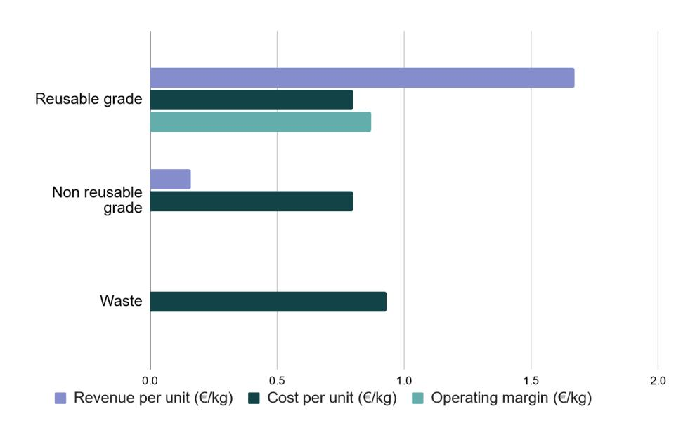
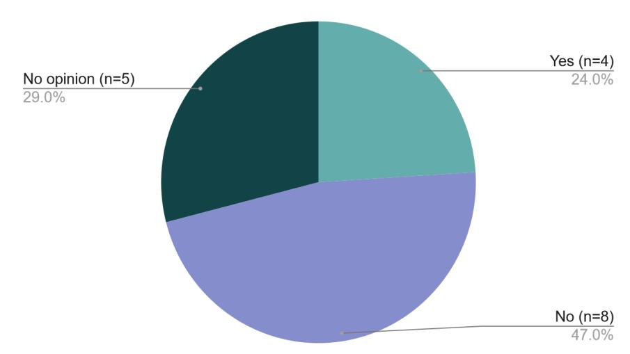
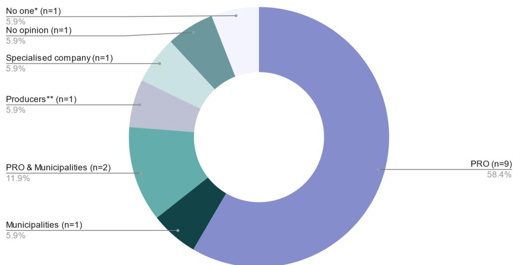
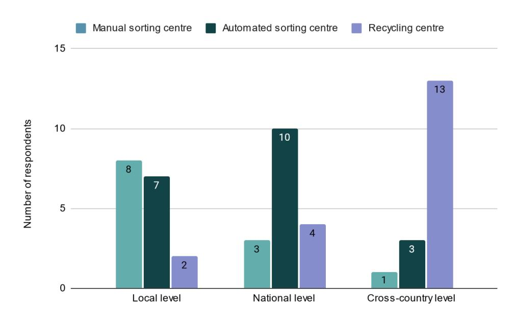
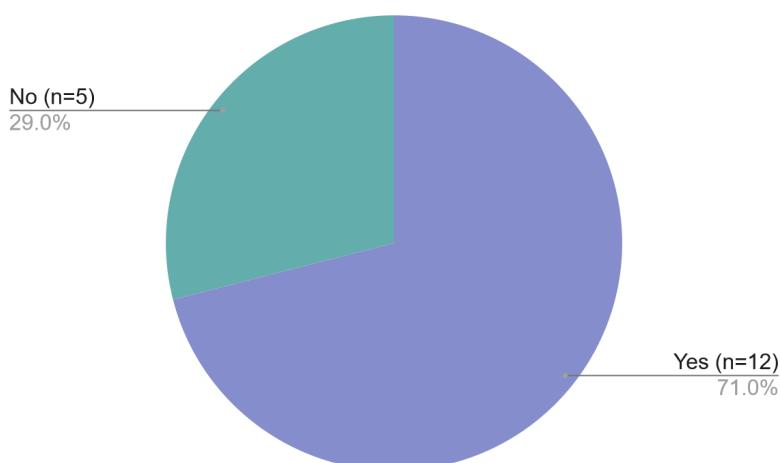
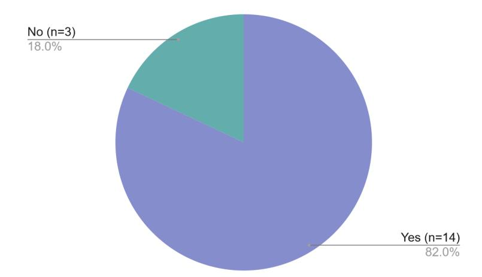
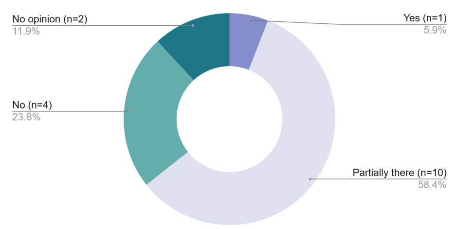
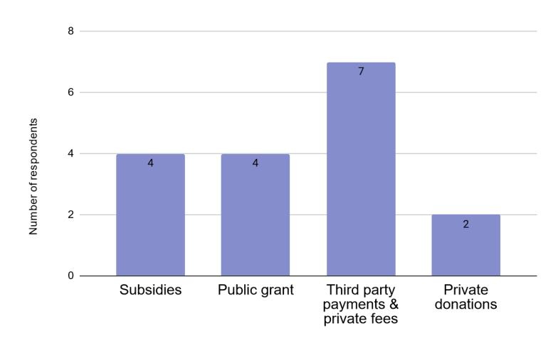

# Unlocking Opportunities for Circular Business Models in Textiles: Phasing out Linearity

Project acronym CISUTAC Grant agreement nr 101060375 Project title Circular & Sustainable Textiles & Clothing

Deliverable due date 31-08-2024 Effective delivery date 31-08-2024

AUTHORS REVIEWERS

Marie-Jeanne Gaertner, RREUSE Maree Bouterakos, WUR

Pierpaolo Rotondi, DECA

# **Acknowledgements**

This report is the deliverable of Task 3.2 "Circular Business Models" of the CISUTAC project (Circular and Sustainable Textiles And Clothing). The EU-funded CISUTAC project aims to remove current bottlenecks preventing the textile value chain's circularity by piloting semiautomated repair and dismantling, sorting technologies for reuse and recycling and novel recycling processes. The project's core objective is to minimise the sector's environmental impact by developing sustainable and inclusive European textile value chains.

The deliverable is part of Work Package 3, entitled "Social-economic aspects''. This Work Package complements the more technical dimension of the project, characterised by the pilots, by seeking to understand the economic, social and cultural conditions that will influence the future uptake of these pilots. The deliverable is at the intersection of the other activities within Work Package 3, as this report looks into consumer behaviour and concrete policy and stakeholder involvement.

This report benefits from the knowledge base shared by the partners of Task 3.2 and the CISUTAC consortium: 29 partners from different parts of the textile value chain and the European Union (EU). In addition, RREUSE, the lead author of the report, has more than two decades of experience in monitoring and sharing the model of its members, social enterprises active in the repair, reuse and recycling of textiles. Through the real-life experiences of its members, RREUSE witnesses the evolution of the sector throughout the years and across the EU, which is reflected in this report.

Task partners:

- RREUSE (Task lead)
- Euratex
- STAM
- PCH Innovations
- Centexbel

# **Executive summary**

### **Research objectives**

The aim of this report is to provide a comprehensive overview of circular textile business models. To this end, the report analyses existing textile repair, reuse and recycling systems in the EU and the trends that influence their operation. Based on these findings, the research explores the reasons behind the difficulties observed and proposes solutions to overcome them. The report's ultimate objective, aligned with the CISUTAC project's goal, is to understand how to create an integrated circular textile value chain. To address this, it examines both the practical realities faced by practitioners active in the field, and the regulatory landscape, before assessing the impact of existing measures and providing suggestions for improvement.

### **Problem**

While the issue of used and waste textile management has received global attention, the current state of knowledge presents a paradox. On the one hand, many reports and studies address the issue, reflecting the widespread recognition of its importance. On the other hand, there is a notable lack of comprehensive data, highlighting the challenges of synthesising the available information into a coherent understanding. This report therefore sets out to remedy this lack of data, by answering the following question:

*How can we effectively scale up repair, reuse, and recycling business models for textiles, given that reuse is currently the only viable option and even for reuse, future operational and financial challenges are expected to increase?* 

## **Background**

Existing publications clearly show that the consumption of new clothing is increasing (4.85 million tonnes and €77.82 billion in value in the European Union (EU) in 2019[1](#page-2-0) ), as is the production of textile waste (5.8 million tonnes of household textiles and clothing discarded each year [2](#page-2-1) ). The EEA estimates that the EU consumption of clothing increased by 40% between 1996 and 2012[3](#page-2-2) . 38% of the waste generated is separately collected, of which 50% to 75% is reused and of this, 5% to 20% is reused locally. These figures give a good proxy for the current limited scale of circular business models for textiles in the EU.

The analysis of consumer behaviour shows a similar result: only 20% of consumers regularly buy used clothes. On the other hand, the lack of certain data prevents the understanding

1 Joint Research Centre (2024) Preparatory study on textiles for product policy instruments – 1st milestone (Available [here\)](https://susproc.jrc.ec.europa.eu/product-bureau/product-groups/467/documents).

2 European Environment Agency (2019) Textiles and the environment in a circular economy (Available [here\)](https://www.eea.europa.eu/publications/textiles-in-europes-circular-economy).

3 European Environment Agency (2014) Environmental indicator report (Available [here\)](https://www.eea.europa.eu/publications/environmental-indicator-report-2014).

of crucial aspects for the development of circular business models, such as understanding which are the most efficient textile collection systems, how to create a business case for reuse, repair, and recycling, and how to make the economics of reuse work when the mandatory separate collection of textiles is introduced in the EU.

### **Key findings**

The report's conclusions reinforce the importance of the problem identified. Firstly, the report shows the paradox that circular business models need to simultaneously address the problems of traditional textile business models and compete with them on the market.

In addition, the study highlights that circular business models face high up-front costs that make their financial viability difficult. For example, in some existing Extender Producer Responsibility (EPR) schemes for textiles, the collection and handling of textiles is more expensive than what producers pay in EPR fees. Similarly, in some countries, it is cheaper to incinerate textiles than to sort and prepare them for reuse or recycling.

The report also demonstrates that scaling up circular business models is a self-reinforcing process. It suggests that the linear value chain needs to be disrupted to enable the creation of circular business models, while at the same time, the expansion of circular business models will contribute further to the disruption of the linear value chain.

The stakeholder study identifies the most influential parameters for scaling up textile circular business models in the future, according to practitioners:

- 1. Policy support; Collaboration & partnerships across the value chain
- 2. Financial support
- 3. Support for skills development
- 4. Change in consumer behaviour.

### **Key recommendations**

To overcome the challenges identified and implement a successful circular textile value chain, this report provides several concrete policy and stakeholder recommendations. They are based on direct insights from a stakeholder study conducted by CISUTAC partners as part of this report, CISUTAC policy recommendations and CISUTAC pilots. The key recommendations to practitioners are to join forces, pool efforts and resources, and identify synergies when designing circular business models.

In terms of policy recommendations, the stakeholder study showed that the establishment of an EPR system and separate targets for reuse, preparing for reuse and recycling are considered the most important parameters for proper implementation of the separate collection obligation. Similarly, circular design requirements (reparability, reusability, recyclability criteria) are seen as the most effective policy instrument for developing repair, reuse, and recycling business models.

# **Table of Contents**

| Acknowledgements...........................................................................................................................................                    | 2                                                                         |
|--------------------------------------------------------------------------------------------------------------------------------------------------------------------------------|---------------------------------------------------------------------------|
| Executive summary                                                                                                                                                              | 3                                                                         |
| Research objectives.......................................................................................................................................                     | 3                                                                         |
| Problem                                                                                                                                                                        | 3                                                                         |
| Background........................................................................................................................................................             | 3                                                                         |
| Table of Contents.................................................................................................................................................             | 5                                                                         |
| List of tables                                                                                                                                                                 | 7                                                                         |
| List of graphs..........................................................................................................................................................       | 7                                                                         |
| Glossary...................................................................................................................................................................... | 7                                                                         |
| Scope and aim of the report ...................................................................................................................12                              |                                                                           |
| Methodology                                                                                                                                                                    | 19                                                                        |
| 1. Framework conditions                                                                                                                                                        | 20                                                                        |
| 1.1 Current state of the textile market..............................................................................................                                          | 20                                                                        |
| Collection systems..................................................................................................................................                           | 20                                                                        |
| Reuse market.............................................................................................................................................                      | 24                                                                        |
| Recycling market .....................................................................................................................................25                       |                                                                           |
| 1.2 Economic and social conditions                                                                                                                                             | 26                                                                        |
| Costs & revenues of textile waste management operations.......................................                                                                                 | 26                                                                        |
| Financial viability of textile circular business models                                                                                                                        | 28                                                                        |
| Growth potential of circular business models                                                                                                                                   | 29                                                                        |
| Employment opportunities                                                                                                                                                       | 30                                                                        |
| 1.3 Legislative framework conditions...............................................................................................                                            | 30                                                                        |
| key enablers to upscale circular business models                                                                                                                               | .......................................................................33 |

| 2.1 Challenges                                                                                                                                                  | ..................................................................................................................................................33             |
|-----------------------------------------------------------------------------------------------------------------------------------------------------------------|------------------------------------------------------------------------------------------------------------------------------------------------------------------|
| The infrastructure is not in place yet                                                                                                                          | ...........................................................................................35                                                                    |
|                                                                                                                                                                 | business models....................................................................................................................................... 42        |
| Engaging consumers: a critical factor to closing the textile loop                                                                                               | ............................46                                                                                                                                   |
| 3. Research study.............................................................................................................................................. | 49                                                                                                                                                               |
|                                                                                                                                                                 | Conclusion................................................................................................................................................... 67 |
| 3.2 Case studies on circular business models                                                                                                                    | 67                                                                                                                                                               |
| 3.2.1 Repair case study –                                                                                                                                       | CiLAB........................................................................................................ 67                                                 |
| 3.2.2 Reuse case study –                                                                                                                                        | Thriftify.................................................................................................... 70                                                 |
| 3.2.3 Recycling case study –                                                                                                                                    | Boer Group Recycling Solutions......................................73                                                                                           |
| Conclusions & Recommendations                                                                                                                                   | .........................................................................................................75                                                      |
| Key challenges                                                                                                                                                  | ...........................................................................................................................................75                    |
| Recommendations                                                                                                                                                 | 76                                                                                                                                                               |
| Next steps                                                                                                                                                      | 78                                                                                                                                                               |
| References                                                                                                                                                      | 79                                                                                                                                                               |

# **List of tables**

| Table 1: Overview of the repair, reuse, and recycling business models                                                                                                                               | ..............................................14                                                                                |
|-----------------------------------------------------------------------------------------------------------------------------------------------------------------------------------------------------|---------------------------------------------------------------------------------------------------------------------------------|
| Table 3: Collection costs and revenues in the Netherlands                                                                                                                                           | .......................................................................26                                                       |
| Table 7: Evaluation of critical factors for effective textile collection                                                                                                                            | .....................................................52                                                                         |
| models ..........................................................................................................................................................................................59 |                                                                                                                                 |
| Table 10: Consumers incentives to buy more sustainable products                                                                                                                                     | ....................................................63                                                                          |
| Table 14: Parameters to scale up textile circular business models in the future                                                                                                                     | .........................67                                                                                                     |
| Table 15: Policy recommendations                                                                                                                                                                    | .............................................................................................................................76 |

# **List of graphs**

| Figure 1: Average operating margin of textile sorters in the EU | 28                                                                                                                               |
|-----------------------------------------------------------------|----------------------------------------------------------------------------------------------------------------------------------|
| Figure 5: Repair guarantees (n=17)                              | ..............................................................................................................................61 |
| Figure 6: The role of online resale platforms (n=17)            | .........................................................................................62                                      |
| Figure 8: External financial support (n=17)                     | 66                                                                                                                               |

# **Glossary**

### **Automated sorting**

Process using technology to automate complex channelling decisions on how to route textile waste to either reuse, repair or recycling. An automated process is designed to remove bottlenecks, reduce errors and loss of data, while increasing transparency, communication across departments, and speed of processing compared to a manual process.

#### **Charity**

An organisation primarily focused on philanthropy and social well-being, established to offer assistance and raise funds for those in need. Charity organisations are traditional actors in used textiles collection.

#### **Circular business model**

Business model that aims to "reduce the extraction and use of natural resources and the generation of industrial and consumer wastes [4](#page-7-0)". Circular business models enable the introduction of circular economy principles within business structures and contribute to replacing linear ways of production and consumption.

#### **Circular value chain**

In a circular value chain, products and materials are kept in circulation through processes such as reuse, repair, remanufacture and recycling. The specificity of a circular value chain is to maintain the value that is already created throughout the entire system, from the upstream to the downstream chain.

### **Textiles collection methods**

- Direct donations: donations directly handed over by end-users to social enterprises or charities in second-hand shops or reuse centres.
- Textile containers: bins located on public ground (indoor or outdoor).
  - Above-ground: the textiles disposed of are stored in the bin itself, above the ground. o Underground: only the throw-in column is visible at the surface, the textiles disposed of are stored underground[5](#page-7-1) .
- Door-to-door collection: collection by charities, municipalities or reuse operators of waste from the doorstep of households.
- Online take-back systems: service offered by textile retailers who propose to their customers to send back their used products (often against a consumption voucher).
- Physical take-back systems: service offered by textile retailers who offer to their customers to take-back their used products via containers located in retail stores (often against a consumption voucher).

#### **Digitalisation**

The integration of digital technologies into business or social processes, with the aim of improving them. Concrete examples of digitalisation in the textiles sector include the development of online resale platforms or the development of digital labelling technologies.

4 OECD (2019) Business Models for the Circular Economy. Opportunities and Challenges from a Policy Perspective (Available [here\)](https://www.oecd.org/environment/business-models-for-the-circular-economy-).

5 TEXAID Underground collection (Available [here\)](https://www.texaid.ch/en/products-and-services/collection/underground-collection.html).

#### **Ecodesign requirement**

A performance requirement or an information requirement whose purpose is to make a product more environmentally sustainable [6.](#page-8-0)

#### **Eco-modulation**

Modulating EPR fees consists of changing the fees paid by producers in an EPR scheme based on product design to incentivise producers to incorporate ecodesign strategies in their products' design.

#### **Extended Producer Responsibility (EPR)**

An environmental policy approach that extends a producer's responsibility for a product to its post-consumer stage. EPR policies shift the responsibility to organise the waste management (financially and/or operationally) upstream to the producer and away from municipalities.

#### **Fibre-to-fibre textile recycling**

Turning textile waste into new fibres that are then used to create new clothes or other textile products.

#### **Financial viability**

The capacity of a circular business model to sustainably achieve its operating objectives and fulfil its mission from a financial standpoint in the long term.

#### **Framework conditions**

The different economic, political, social and cultural factors that contribute to the economic development of circular business models. It can include aspects such as the existing infrastructure, the policy in place or trends.

### **Information requirement**

The obligation for a product to be accompanied by information[7](#page-8-1).

#### **Local/domestic reuse**

When the collection, sorting and (preparing for) reuse and actual reuse take place in the same country.

### **Mechanical Recycling**

The process by which textiles are cut, shredded and opened into fibres that are usable for diverse applications. They may include downcycling applications such as fibres for insulation, filling or non-woven for automotive and other industries as well as fibre-to-fibre applications.

6 European Commission (2022) Proposal for Ecodesign for Sustainable Products Regulation (Available [here\)](https://environment.ec.europa.eu/publications/proposal-ecodesign-sustainable-products-regulation_en).

7 Joint Research Centre (2024) Preparatory study on textiles for product policy instruments (Available [here\)](https://susproc.jrc.ec.europa.eu/product-bureau/product-groups/467/home).

#### **Post-consumer textiles**

Textiles that have been disposed of after consumption and use by the citizens or end-users of commercial or industrial institutions and processed by a specialised textile sorter.

#### **Preparing for reuse**

Recovery operations such as checking, cleaning or repairing, by which products or components of products that have become waste are prepared in view of being reused without any other pre-processing[8.](#page-9-0)

#### **Producer Responsibility Organisation (PRO)**

The organisation that assumes the responsibilities of a mandated party subject to EPR.

#### **Public procurement**

The process through which public authorities, including government departments or local authorities, acquire work, goods, or services from companies.

#### **Recovery**

Operation that aims to make waste serve a useful purpose by replacing other materials that would otherwise have been used to perform a particular function, or waste that is being prepared to perform that function, in the facility or in the wider economy [9.](#page-9-1)

#### **Repair**

Operations that aim to return a defective product or waste to a condition where it fulfils its intended use[10](#page-9-2).

#### **Reusability**

Potentiality for a product to be reused. Several elements influence a product's reusability, for example, its condition, the way it is collected and handled or the market demand.

#### **Reuse**

It refers to any operation by which products or components that are not waste, are used again for the same purpose for which they were conceived[11](#page-9-3).

#### **Separate collection**

The collection where a waste stream is kept separately by type and nature to facilitate a specific treatment.

#### **Social enterprise**

The European Commission's Proposal for a Council Recommendation on developing social economy framework conditions defines social enterprises as "private law entity that

8 Eur-Lex (2008) Waste Framework Directive (Available [here\)](https://eur-lex.europa.eu/legal-content/EN/TXT/?uri=celex%3A32008L0098).

9 Eurostat Glossary Recovery of Waste (Availabl[e here\)](https://ec.europa.eu/eurostat/statistics-explained/index.php?title=Glossary:Recovery_of_waste).

10 European Commission (2022) Proposal for Ecodesign for Sustainable Products Regulation (Available [here\)](https://environment.ec.europa.eu/publications/proposal-ecodesign-sustainable-products-regulation_en).

11 Eur-Lex (2008) Waste Framework Directive (Available [here\)](https://eur-lex.europa.eu/legal-content/EN/TXT/?uri=celex%3A32008L0098).

provides goods and services for the market in an entrepreneurial way in accordance with the principles and features of the social economy, having social and/or environmental objectives as the primary reason for its commercial activity[12"](#page-10-0). Social enterprises are traditional actors in the collection and (preparing for) reuse of textiles.

#### **Upcycling**

Recovering materials to create objects or products of superior quality.

12 European Commission (2023) Proposal for a Council recommendation on developing social economy framework conditions (Availabl[e here\)](https://ec.europa.eu/social/main.jsp?langId=en&catId=89&furtherNews=yes&newsId=10594).

# **Introduction**

### **About CISUTAC**

The CISUTAC project, which stands for Circular and Sustainable Textiles And Clothing, aims to remove the current obstacles to the European textile sector' circularity. The project's objective is to minimise the textile sector's environmental impact by developing sustainable, novel, and inclusive large-scale European value chains. To this end, CISUTAC demonstrates how to close the textile sector's loop by developing three pilots focused on repair and disassembly, sorting, and fibre-to-fibre recycling. The project focuses on two material groups representing almost 90% of all textile fibre materials: polyester and cotton, and on products from three sub-sectors: fashion, workwear and personal protective equipment (PPE), and active goods.

# **Scope and aim of the report**

To be aligned with the CISUTAC project's scope, this report focuses on circular business models for repair, reuse, and recycling. The report does not address other circular business models such as renting. Furthermore, the report focuses essentially on post-consumer textiles and its geographical scope is the EU.

The overall aim of the report is to understand existing trends and initiatives in repair, reuse, and recycling activities. Based on this initial analysis, the report seeks to identify how such initiatives can be scaled up and replicated, and how networking of these initiatives can accelerate this process.

The focus on circular business models was chosen to understand the feasibility of developing repair, reuse, and recycling, diving deeper into economic feasibility, market readiness and consumer acceptance, among other aspects. To analyse the feasibility of scaling up circular business models, the report focuses strongly on the framework conditions. Therefore, the first part identifies the current state of play of circular business models in terms of main trends, existing infrastructures and policies influencing the development of repair, reuse and recycling activities at both the EU and national levels.

The report places great emphasis on examining the need to rebalance the value chain, or in other words, to phase out the linear value chain. Furthermore, it focuses on the holistic aspect of circular business models and how synergies and partnerships across the value chain can contribute to the development of these business models. As a result, the core objective of the report is to understand how to build a fully circular textile value chain.

Although this report considers circular business models as interconnected, the research also aims to explore the specificities of each of the three business models, for example in terms of frameworks, policies, trends, consumer's role, and skills needed. Finally, it aims to be as concrete as possible and useful to practitioners by providing direct stakeholder insights and targeted recommendations.

### **Definitions of (circular) business models**

To unlock the circular potential of the textile value chain, it is indispensable to investigate business models and more precisely, circular business models. This involves:

- **Value proposition**: identification of the nature of goods or services offered and of the targeted consumers.
- **Value delivery**: organisation of the business to offer the proposition.
- **Value capture**: alignment between the proposition and the delivery to bring back value to the business[13.](#page-12-1)

Circular business models are defined by the OECD as business models which aim to "reduce the extraction and use of natural resources and the generation of industrial and consumer wastes[14"](#page-12-2). They contribute to creating a circular economy by increasing product lifespan and giving a second life to materials. These business models enable the introduction of circular economy principles within business structures and as such contribute to replacing linear ways of production and consumption[15.](#page-12-3) Applied to the textile sector, circular business models aim to maximise the value of resources by keeping the textile product in the loop as long as possible by repairing, reusing and recycling them[16](#page-12-4) and by reducing the average number of garments owned per person.

Table 1 presents an overview of the three categories of circular business models analysed in this report. It includes legal definitions, examples of practical applications, the various forms these models can encompass, and the key actors involved in each model.

13 In contrast to circular business models where value is not seen purely in monetary terms, but also includes significant environmental externalities.

14 OECD (2019) Business Models for the Circular Economy. Opportunities and Challenges from a Policy Perspective (Available [here\)](https://www.oecd.org/environment/business-models-for-the-circular-economy-).

15 WRAP (2023) Circular Business Models Guide for Fashion (Available [here\)](https://www.wrap.ngo/resources/guide/circular-business-models-guide-fashion).

16 Joint Research Centre (2023) Techno-scientific assessment of the management options for used and waste textiles in the European Union (Available [here\)](https://publications.jrc.ec.europa.eu/repository/handle/JRC134586).

#### *Table 1: Overview of the repair, reuse, and recycling business models*

| REPAIR                                | REUSE RECYCLING                      |
|---------------------------------------|--------------------------------------|
| where it fulfils its intended use 17. |                                      |
| which they were conceived             | 18.                                  |
| followed by preparing for reuse       | 19.                                  |
| worn again 20.                        |                                      |
|                                       | Turning waste into raw materials 22. |

17 European Commission (2022) Proposal for Ecodesign for Sustainable Products Regulation (Available [here\)](https://environment.ec.europa.eu/publications/proposal-ecodesign-sustainable-products-regulation_en).

18 Eur-Lex (2008) Waste Framework Directive (Availabl[e here\)](https://eur-lex.europa.eu/legal-content/EN/TXT/?uri=celex%3A32008L0098).

19 *Ibid.*

20 Sarah Gray, Angela Druckman, Jhuma Sadhukhan and Keith James (2022) Reducing the Environmental Impact of Clothing: An Exploration of the Potential of Alternative Business Models, p.5 (Availabl[e here\)](https://www.mdpi.com/2071-1050/14/10/6292).

22 *Ibid.*

| REPAIR                                 | REUSE RECYCLING                            |
|----------------------------------------|--------------------------------------------|
| Avoiding the purchase of new products. | Avoiding the purchase of new products. It  |
|                                        | clothing reuse replaces new purchases 21.  |
| defective component (e.g. zippers) 23  |                                            |
| ● End-users                            |                                            |
|                                        | of the product but not necessarily 24.     |
| ●                                      | End-users                                  |
| ●                                      | Traders/brokers                            |
|                                        | ● Mechanical recycling:                    |
|                                        | are less performant than virgin fibres 25. |
|                                        | ● Chemical recycling:                      |

21 Luca Cosciemea, Saskia Manshovenb, Jeroen Gillabelb, Francesca Grossicand Lars F. Mortensen (2022) A framework of circular business models for fashion and textiles: the role of business-model, technical, and social innovation (Availabl[e here\)](https://www.tandfonline.com/doi/epdf/10.1080/15487733.2022.2083792?needAccess=true&role=button).

23 Circle Economy, EEB, Fair Trade Advocacy Office (2020) Promoting circular & fair business models, p.11 (Available [here\)](https://fairtrade-advocacy.org/wp-content/uploads/2020/12/Circular-and-Fair-report.pdf).

24 Gustav Sandin, Greg Peters (2018) Environmental impact of textile reuse and recycling, p.354 (Available [here\)](https://www.researchgate.net/publication/323423640_Environmental_impact_of_textile_reuse_and_recycling_-_A_review).

25 WRAP (2019), Fibre to fibre recycling: An economic & financial sustainability assessment, p.9 (Availabl[e here\)](https://wrap.org.uk/sites/default/files/2021-04/F2F%20Closed%20Loop%20Recycling%20Report%202018.pdf).

| REPAIR                               | REUSE                                     |        | RECYCLING                           |
|--------------------------------------|-------------------------------------------|--------|-------------------------------------|
|                                      |                                           | ●      | Thermal recycling                   |
|                                      |                                           | fibres | 26.                                 |
|                                      |                                           | ●      | Yarn producers                      |
|                                      |                                           | ●      | Textile manufacturers               |
|                                      |                                           | ●      | Fashion brands                      |
|                                      |                                           | ●      | Manufacturers from other industries |
| ● Repair Cafés                       |                                           |        |                                     |
| ● DIY Repair workshops               |                                           |        |                                     |
| ● Repair kits sold by fashion brands |                                           |        |                                     |
| ● DIY repair guidelines 27           |                                           |        |                                     |
| ● Independent repair services        |                                           |        |                                     |
| ● In-store repair activities         |                                           |        |                                     |
|                                      | ● In-store resale (second-hand stores,    |        |                                     |
|                                      | ● Online resale businesses (B2C)          |        |                                     |
|                                      | ● Online retail platforms (C2C e.g. eBay, |        |                                     |
|                                      | ● Online auctions                         |        |                                     |
|                                      | ● Flea markets                            |        |                                     |
|                                      | ● Swap events                             |        |                                     |
|                                      |                                           | ●      | Owned-and-operated facilities:      |
|                                      |                                           | ●      | Collaboration:                      |

26 Gustav Sandin, Greg Peters (2018) Environmental impact of textile reuse and recycling, p.354 (Availabl[e here\)](https://www.researchgate.net/publication/323423640_Environmental_impact_of_textile_reuse_and_recycling_-_A_review).

27 Circle Economy, EEB, Fair Trade Advocacy Office (2020) Promoting circular & fair business models, p.11 (Available [here\)](https://fairtrade-advocacy.org/wp-content/uploads/2020/12/Circular-and-Fair-report.pdf).

| REPAIR                                       | REUSE                              | RECYCLING                          |
|----------------------------------------------|------------------------------------|------------------------------------|
| ● Online repair services (e.g. Little Cliff, |                                    |                                    |
|                                              | ● Clothing libraries               |                                    |
|                                              | ● Retailers/Brands-run resale      |                                    |
|                                              |                                    | ● Leasing:                         |
|                                              |                                    | ● Franchising or licensing of the  |
|                                              |                                    | technology 28.                     |
| ● Labour and equipment associated            |                                    |                                    |
| sorting, preparing for reuse 29              |                                    |                                    |
| ● Cost of spare parts                        |                                    |                                    |
| ● Sale of the repair service                 |                                    |                                    |
| ● Sale of repaired item                      |                                    |                                    |
|                                              | ● Labour and equipment associated  |                                    |
|                                              | ● Waste permits and certifications |                                    |
|                                              | ● Waste fees for disposal          |                                    |
|                                              | ● Cost of imported textiles        |                                    |
|                                              | ● Sale of reusable grades          |                                    |
|                                              | ● Textile donations                |                                    |
|                                              |                                    | ● Labour and equipment associated  |
|                                              |                                    | ● Waste permits and certifications |
|                                              |                                    | ● Waste fees for disposal          |
|                                              |                                    | ● Cost of imported textiles        |
|                                              |                                    | ● Sale of recovered material       |

28 WRAP (2019) Fibre to fibre recycling: An economic & financial sustainability assessment (Availabl[e here\)](https://wrap.org.uk/sites/default/files/2021-04/F2F%20Closed%20Loop%20Recycling%20Report%202018.pdf).

29 In the case where repair is part of a preparing for reuse process.

| REPAIR           | REUSE RECYCLING                     |
|------------------|-------------------------------------|
| Actors End-users |                                     |
| ●                | Commercial retailers                |
| ●                | Social enterprises                  |
| ●                | Charities                           |
| ●                | Public authorities (municipalities) |
| ●                | Public or private waste companies   |
| ●                | Commercial textile sorters          |
| ●                | Commercial pre-processors           |
| ●                | Social enterprises                  |
| ●                | Charity textile sorters             |
| ●                | Local authorities/municipalities    |
| ●                | Commercial retailers                |
| ●                | Social enterprises                  |
| ●                | Charities                           |

# **Methodology**

The methodology is summarised in four main steps:

#### **1. Definition of the report's scope and objectives**

Objectives were set for the report, from which the following specific areas were identified:

o Framework conditions, including policies, infrastructure and market trends that influence circular business models. o Challenges and key enablers for scaling circular business models. o Conclusions and recommendations based on the analysis.

### **2. Data collection**

Two main channels were used to collect data: the existing literature and a stakeholder study. The first activity consisted of extensive desk research to gather existing literature on circular business models. This included academic journals, industry reports and policy documents to establish a state-of-the-art understanding and document key trends, policies, and market conditions. The literature selected for this report was published between 2008 and 2024. Secondly, a survey was designed and distributed to targeted stakeholders in the upstream and downstream segments of the textile value chain. In parallel, three in-depth interviews were conducted, one for each type of business model (repair, reuse, recycling).

#### **3. Data management and analysis**

Firstly, the information gathered from the desk research was synthesised to provide a comprehensive overview of the framework conditions, challenges, and key enablers for scaling up circular business models. The survey responses were analysed to identify common themes, trends and challenges perceived by respondents. Both quantitative and qualitative analysis methods were used to ensure a thorough evaluation. In addition, detailed case studies were developed based on the stakeholder interviews. A common outline was developed for all case studies, covering the background, specificities, success factors and challenges of the business model.

#### **4. Formulating conclusions and recommendations**

Based on the literature review and the survey results, conclusions were drawn, and targeted policy and stakeholder recommendations were developed to address the challenges identified and to support the scaling up of circular business models.

# **1. Framework conditions**

### **1.1 Current state of the textile market**

#### **Collection systems**

In 2019, the consumption of new apparel in the EU-27 represented 4.85 million tonnes and €77.82 billion in value[30.](#page-19-3) Every year, EU consumers discard 5.8 million tonnes of textiles (including clothing and household textiles) [31](#page-19-4) out of which 38% are separately collected (between 1.7 and 2.1 million tonnes) [32](#page-19-5). The collection rate differs largely from one country to another: from 4.5% in Latvia to 45% in the Netherlands [33](#page-19-6) and 70% in Germany. Similarly, the capture rate varies largely between EU countries: from 0% in Latvia and Poland to 50% in Belgium and Luxembourg[34.](#page-19-7) The capture rate is calculated by dividing the amount of separately collected textile waste from households by the total amount of textile waste from households, including both separately collected textile waste and textile waste in mixed municipal waste.

As of the 1st of January 2025, all EU Member States will have to implement separate collection of textile waste, as required by the 2018 revision of the Waste Framework Directive[35](#page-19-8). The separate collection of waste aims to divert reusable and recyclable fractions from the residual or mixed municipal solid waste. This way, these fractions can become valuable resources instead of being landfilled and incinerated[36.](#page-19-9) It is estimated that, by 2030, between 8.5 and 9 million tonnes of textiles should be separately collected. The forthcoming mandatory separate collection of textiles will exacerbate the phenomenon already observed: an increase in the quantities collected and a decrease in the quality of the textiles collected.

The share of reusable textiles is therefore expected to decrease due to several factors. Firstly, textile collection will be extended to non-reusable textiles, which will automatically reduce the proportion of textiles for reuse in the overall volumes collected. Secondly, poor quality of new textiles prevents their reuse[37](#page-19-10). Finally, many reusable textiles could become unfit for reuse due to contamination because of being collected together with non-reusable textiles. According to one study, the proportion of reusable clothing in textile waste has fallen by

30 Joint Research Centre (2024) Preparatory study on textiles for product policy instruments – 1st milestone (Available [here\)](https://susproc.jrc.ec.europa.eu/product-bureau/product-groups/467/documents).

31 European Environment Agency (2019) Textiles and the environment in a circular economy (Available [here\)](https://www.eea.europa.eu/publications/textiles-in-europes-circular-economy).

32 Joint Research Centre (2021) Circular Economy Perspectives in the EU Textile sector (Available [here\)](https://publications.jrc.ec.europa.eu/repository/handle/JRC125110). 33 European Environment Agency (2022) Textiles and the Environment The role of design in Europe's circular economy, p.21 (Available [here\)](https://www.eea.europa.eu/publications/textiles-and-the-environment-the).

34 *Ibid.*

35 EUR-Lex (2018) Directive (EU) 2018/851 of the European Parliament and of the Council of 30 May 2018 amending Directive 2008/98/EC on waste (Available [here\)](https://eur-lex.europa.eu/eli/dir/2018/851/oj).

36 Joint Research Centre (2023) Techno-scientific assessment of the management options for used and waste textiles in the European Union (Available [here\)](https://publications.jrc.ec.europa.eu/repository/handle/JRC134586).

37 RREUSE (2022) Position Paper on the EU Textiles Strategy (Available [here\)](https://rreuse.org/wp-content/uploads/2022/10/textiles-strategy-position-paper-rreuse-2022.pdf).

20% to 30% over the last ten years [38](#page-20-0). On the contrary, the proportion of textiles that cannot be reused and is suitable for recycling is likely to be increasing.

In many EU Member States, the responsibility for organising the collection of textiles lies with municipalities (e.g. in Germany, Denmark, Italy, Spain, Estonia, Lithuania). In terms of actors involved, social enterprises and charities are the historical actors of textile collection in the EU. In Sweden, collection by charities accounts for 90% of the market [39.](#page-20-1) Charities and social enterprises currently account for 57% of the collection of used textiles in Austria [40](#page-20-2) and social enterprises represent 43% of the textile collection in Belgium. Some charities, particularly in the Netherlands, have developed private companies to take care of the collection on their behalf. In other countries like the Baltic states, different actors such as charities, private collectors and municipal waste companies evenly share the textiles collection market. In addition, brands play an increasing role in the textile collection by developing their own take-back schemes [41](#page-20-3).

Among the different forms of collection (Cf. Glossary – containers, direct donations, door-todoor collection, physical take-back systems, online take-back systems), textile containers are the most common method. In Germany, for example, the textile collection is organised via a network of 100,000 containers, which accounts for 96% of the collection[42.](#page-20-4) Similarly, in France, containers account for 78% to 83% of the total collection. The majority (75%) are containers that are placed on public grounds [43](#page-20-5). In the UK, on the other hand, 48% of textiles are collected directly in second-hand charity shops. A study analysing the practices of sorters and collectors in the Netherlands shows their preference for above-ground containers and manual pick up as above-ground containers have lower rates of non-textile waste than underground containers, resulting in less contamination and better quality of the quantities collected[44](#page-20-6).

38 Maldini et al. (2017) Measuring the clothing mountain: data for sustainability-oriented studies and actions in the apparel sector (Available [here\)](https://www.hva.nl/kc-fdmci/gedeelde-content/projecten/projecten-fashion/measuring-the-dutch-clothing-mountain.html).

39 Kirsi Niinimäki (2018) Sustainable Fashion in a Circular Economy (Availabl[e here\)](https://aaltodoc.aalto.fi/server/api/core/bitstreams/006ad5c5-c413-470f-a12d-3e01b197afc3/content).

40 Arbeitsmarktservice Österreich (2023) Arbeitsmarktpolitische Maßnahmen im Hinblick auf die Ökologisierung der Wirtschaft Ökojobs gegen Arbeitslosigkeit? (Availabl[e here\)](https://www.ams-forschungsnetzwerk.at/downloadpub/2023_WIFO_abif_oekojobs_Endbericht.pdf).

41 Joint Research Centre (2023) Techno-scientific assessment of the management options for used and waste textiles in the European Union (Available [here\)](https://publications.jrc.ec.europa.eu/repository/handle/JRC134586).

42 Ann-Kristin Reinkenhoff, Thomas Ahlmann (2023) Second hand - Second thoughts? On structures, processes and actors in the global trade in used textiles (Available [here\)](https://www.kleiderstiftung.de/fileadmin/user_upload/Downloads/ENG_DV_FairWertung_Secondhand_-_Second_Thoughts_2023_engl.pdf).

43 Joint Research Centre (2023) Techno-scientific assessment of the management options for used and waste textiles in the European Union (Available [here\)](https://publications.jrc.ec.europa.eu/repository/handle/JRC134586).

44 Maldini et al. (2017) Measuring the Dutch clothing mountain: data for sustainability-oriented studies and actions in the apparel sector (Available [here\)](https://www.hva.nl/kc-fdmci/gedeelde-content/projecten/projecten-fashion/measuring-the-dutch-clothing-mountain.html).

#### **Sorting market and technologies**

In 2020, 1.41 million tonnes of textile waste were treated within the EU, of which 72% was recovered (including reuse, recycling, and energy recovery) [45](#page-21-1). Sorting activities are still largely manual and only 1% of post-consumer textiles are subject to automated sorting[46.](#page-21-2)

There are more than 100 sorting centres across Europe, ranging in capacity from 100 tonnes to several hundred thousand tonnes per year [47](#page-21-3) and operated by different types of sorters. WRAP has established a database of sorters which classifies textiles sorters into different categories: commercials, commercial pre-processors, charities/social enterprises, local authorities/municipalities, second-hand or used textiles brokers/traders, and associations [48](#page-21-4).

Textiles at EU sorting facilities can include both locally collected and imported used textiles. EU sorters also export locally collected textiles to be sorted by their foreign customers.

For example, post-consumer textiles collected in the Netherlands are in high demand at the international level. For sorters in some regions, it is cheaper to import used garments of good quality than collect locally because of the high operational costs of textiles collection in some locations (fees to the municipality, infrastructures, salaries) [49.](#page-21-5) In other regions, exporting unsorted textiles is a way for sorters to save costs in countries where labour is cost intensive.

A significant fraction of unsorted textiles collected in the EU is exported to Eastern European countries for sorting before being re-exported, frequently via EU hubs (Belgium, Germany, Italy, the Netherlands, and Poland), for reuse or recycling in Africa and Asia. Studies indicate that there is a complex trade network for used textiles among EU Member States prior to their export outside the EU. This suggests that the leading exporting countries are likely dispatching not only locally collected used textiles, but also those that have undergone multiple transactions within the EU[50.](#page-21-6)

Regarding the geographical coverage, the EU countries with the largest textile sorting capacities, in terms of tonnes of textiles sorted per year, are the Netherlands (200,000 tonnes annually) and Poland (300,000 tonnes annually) [51.](#page-21-7) In addition, the Baltic States and Eastern Europe concentrate a lot of Europe's sorting activities. This is because an important

45 Eurostat Glossary Recovery of Waste (Available [here\)](https://ec.europa.eu/eurostat/statistics-explained/index.php?title=Glossary:Recovery_of_waste).

46 Joint Research Centre (2023) Techno-scientific assessment of the management options for used and waste textiles in the European Union (Available [here\)](https://publications.jrc.ec.europa.eu/repository/handle/JRC134586).

47 ACR+ (2023) Recommendations and good practices for local used textiles management (Available [here\)](https://www.acrplus.org/images/technical-reports/2023_ACR_Recommendations_Good_Practices_Used_Textiles.pdf).

48 WRAP (2024) Textiles Sorting and Recycling Database (Availabl[e here\)](https://wrap.org.uk/resources/tool/textiles-sorting-and-recycling-database).

49 Maldini et al. (2017) Measuring the Dutch clothing mountain: data for sustainability-oriented studies and actions in the apparel sector (Available [here\)](https://www.hva.nl/kc-fdmci/gedeelde-content/projecten/projecten-fashion/measuring-the-dutch-clothing-mountain.html).

50 European Environment Agency (2023) EU exports of used textiles in Europe's circular economy (Available [here\)](https://www.eea.europa.eu/publications/eu-exports-of-used-textiles).

51 European Environment Agency (2024) Management of used and waste textiles in Europe's circular economy (Availabl[e here\)](https://www.eea.europa.eu/publications/management-of-used-and-waste-textiles).

portion of textiles collected from other EU countries are sent for sorting to Eastern European countries [52](#page-22-1) due to low labour costs in these countries [53](#page-22-2). Faced with shortage of staff and higher labour costs, sorting facilities in Western European countries experience competition from Eastern European, North African, and Arab countries [54](#page-22-3).

Sorting operations can be categorised into four levels of sorting:

- **Negative sorting** is a superficial sorting of contaminants and other interfering materials.
- **Partial sorting** includes a "manual removal of valuable, viable and marketable products" [55.](#page-22-4)
- **Full sorting** is a holistic sorting of all the used textiles in several sorting steps (up to 50 categories). It is very labour- and cost-intensive.
- **Fine sorting** offers the highest level of granularity in sorting. At this stage, products are sorted into 200 to 300 categories [56.](#page-22-5)

The textiles collected are sorted depending on the demand and numerous quality criteria[57](#page-22-6) which influence their destinations. The premium quality, also called "crème", accounts for 5% of the overall collection and is destined for local Western European markets. The medium quality, "B-grade", is destined for Eastern Europe and the Middle East. Finally, the so-called "Tropical mix" stands for the poorest quality textiles destined for Asia and Saharan Africa[58.](#page-22-7)

Table 2 provides a comparative overview of the main features of manual and automatic sorting processes.

*Table 2: Comparison of the main characteristics of manual and automatic sorting processes*

| Quantities of textiles sorted | Manual sorting    | Automatic sorting   |
|-------------------------------|-------------------|---------------------|
|                               | 100 – 150 kg/hour | 900 – 1,500 kg/hour |

52 European Environment Agency (2023) EU exports of used textiles in Europe's circular economy (Available [here\)](https://www.eea.europa.eu/publications/eu-exports-of-used-textiles).

53 Swedish environmental research institute (2023) Sustainable clothing future Mapping of textile actors in sorting and recycling of textiles in Europe (Available [here\)](https://www.ivl.se/english/ivl/publications/publications/sustainable-clothing-futures---mapping-of-textile-actors-in-sorting-and-recycling-of-textiles-in-europe.html).

54 Ann-Kristin Reinkenhoff, Thomas Ahlmann (2023) SECOND HAND - SECOND THOUGHTS? On structures, processes and actors in the global trade in used textiles (Availabl[e here\)](https://www.kleiderstiftung.de/fileadmin/user_upload/Downloads/_FW_Report_DKS_web.pdf).

55 Ann-Kristin Reinkenhoff, Thomas Ahlmann (2023) Second hand - Second thoughts? On structures, processes and actors in the global trade in used textiles (Available [here\)](https://www.kleiderstiftung.de/fileadmin/user_upload/Downloads/_FW_Report_DKS_web.pdf).

56 *Ibid.*

57 More information on sorting criteria can be found in the CISUTAC's solution for post-consumer textile waste management (Available [here\)](https://www.cisutac.eu/solution-post-consumer-textile-waste).

58 EuRIC (2023) LCA-based assessment of the management of European used textiles (Available [here\)](https://www.euric-aisbl.eu/position-papers/item/643-study-lca-based-assessment-of-the-management-of-european-used-textiles).

| Quantities of textile items |                           |                                                                                     |
|-----------------------------|---------------------------|-------------------------------------------------------------------------------------|
| sorted                      | One item per six seconds  | One item per second 59                                                              |
| Technologies ●              | Belt conveyor             |                                                                                     |
|                             |                           | ● Near-infrared light (NIR)                                                         |
|                             |                           | ● Raman                                                                             |
|                             |                           | ● Mid-infrared                                                                      |
|                             |                           | ● Terahertz                                                                         |
|                             |                           | ● Nuclear magnetic resonance                                                        |
| ●                           | Higher job creation       |                                                                                     |
| ●                           | More accurate sorting     |                                                                                     |
|                             | potential                 | ● Faster                                                                            |
| Advantages                  | for reuse                 | ● More accurate sorting for recycling                                               |
| ●                           | Intensive training for    |                                                                                     |
|                             |                           | ● Constant material flow                                                            |
| Requirements                | sorters                   | ● NIR technology requires monomaterial textiles, light colours, single-coloured and |
|                             | Most frequent parameters: | dry textiles 60                                                                     |
| ●                           | Type                      |                                                                                     |
| ●                           | Size                      |                                                                                     |
| ●                           | Condition                 |                                                                                     |
| ●                           | Brands                    |                                                                                     |
| ●                           | Season                    |                                                                                     |
| ●                           | Gender                    |                                                                                     |
|                             |                           | ● Purity of the material                                                            |
| Sorting parameters          |                           | ● Mix of material                                                                   |
|                             |                           | ● Fibre type 61                                                                     |

#### **Reuse market**

Between 50% and 75% of the textiles collected in the EU are reused, and out of these, between 5% and 20% are reused locally [62](#page-23-4). The Scandinavian countries are the European champions of the local reuse of textiles, with 20% of the collected volume being reused in Finland. However, the local reuse potential of collected textiles is higher than the current reuse market, as many garments are still in good condition, but market opportunities are limited. EURATEX estimates that, in 2019, between 50% and 60% of the textiles collected in the EU were still in the condition to be reused. Similarly, a study of the reuse market in Wales

59 WRAP (2019) Fibre to fibre recycling: An economic & financial sustainability assessment (Available [here\)](https://wrap.org.uk/sites/default/files/2021-04/F2F%20Closed%20Loop%20Recycling%20Report%202018.pdf).

60 Fibersort technology (Available [here\)](https://www.fibersort.com/en/technology).

61 Swedish environmental research institute (2023) Sustainable clothing future Mapping of textile actors in sorting and recycling of textiles in Europe (Available [here\)](https://www.ivl.se/english/ivl/publications/publications/sustainable-clothing-futures---mapping-of-textile-actors-in-sorting-and-recycling-of-textiles-in-europe.html).

62 Danish Environmental Protection Agency (2020) Towards 2025: Separate collection and treatment of textiles in six EU countries (Availabl[e here\)](https://mst.dk/service/publikationer/publikationsarkiv/2020/jul/towards-2025-separate-collection-and-treatment-of-textiles-in-six-eu-countries/).

estimates that, on average and across all types of collection methods, 63% of the clothing and footwear collected are in a reusable condition. The reusability of the textiles collected depends largely on the collection method chosen since container types, location and frequency of collection can impact contamination and influence consumers donation/disposal practices. As an example, in Wales, the reusability rate is 75.3% for container collection and 54.6% for door-to-door collection[63.](#page-24-1)

On the consumers' side, only 20% of European consumers regularly buy second-hand clothes [64](#page-24-2) while at least 60% are keen on buying second-hand items of all sorts (furniture, electronics, books, bikes) [65](#page-24-3). The overall consumption of reused textiles varies from one country to another. It represents 29% of the total consumption of clothing in Latvia but only 13% in Denmark. In most countries, reuse of domestically collected textiles represents the biggest share of the reused textiles' consumption. However, in the Baltic states, imported used textiles account for most of the second-hand textile consumption, especially in Lithuania where it represents 100% of the consumption[66.](#page-24-4)

#### **Recycling market**

Some countries including Sweden, Finland, Spain, and Germany are at the forefront of textile recycling in Europe and some others like the Netherlands, Belgium and Italy are currently planning the development of new recycling facilities. Sweden is the EU country with the highest recycling capacity: 80,000 tonnes annually [67.](#page-24-5) CISUTAC partners performed a non-exhaustive review of the European textile recycling plants (including the UK) [68](#page-24-6). The Joint Research Centre of the European Commission did the same exercise, mapping textiles recycling plants in the EU in 2022 [69](#page-24-7). Both mappings identify between 48 and 49 companies involved in mechanical recycling and 11 to 23 involved in in chemical recycling[70.](#page-24-8) Between 10% and 30% of separately collected textiles are recycled and only 1% is fibre-to-fibre recycled, the rest being downcycled as wipes or insulation material for example.

Mechanical recycling is the most mature and developed solution. As fibres are cut in the process, they tend to lose 75% of their value and can generally not be used to remanufacture new clothes, unless they are mixed with virgin fibres. There are some requirements that the textiles must meet to be mechanically recycled: high content of the main component (wool, cotton, acrylic), avoiding the use of elastane which makes the recycling process very

63 WRAP (2022) Composition of textiles in Wales (Available [here\)](https://wrapcymru.org.uk/resources/report/composition-textiles-wales).

64 European Environment Agency (2022) Textiles and the Environment The role of design in Europe's circular economy, p.21 (Available [here\)](https://www.eea.europa.eu/publications/textiles-and-the-environment-the).

65 Eurobarometer (2014) (Available [here\)](http://ec.europa.eu/public_opinion/archives/flash_arch_390_375_en.htm).

66 Joint Research Centre (2021) Circular Economy Perspectives in the EU Textile sector (Available [here\)](https://publications.jrc.ec.europa.eu/repository/handle/JRC125110).

67 European Environment Agency (2024) Management of used and waste textiles in Europe's circular economy (Availabl[e here\)](https://www.eea.europa.eu/publications/management-of-used-and-waste-textiles).

68 EuRIC (2023) LCA-based assessment of the management of European used textiles (Availabl[e here\)](https://www.euric-aisbl.eu/position-papers/item/643-study-lca-based-assessment-of-the-management-of-european-used-textiles).

69 Joint Research Centre (2024) Preparatory study on textiles for product policy instruments – 1st milestone (Available [here\)](https://susproc.jrc.ec.europa.eu/product-bureau/product-groups/467/documents).

70 CISUTAC (2024) Circular transition scenarios & software for post-consumer textile waste channelling (Available [here\)](https://www.centexbel.be/sites/default/files/node/publication/cisutacd21transitionscenariosfinal.pdf).

difficult, as well as restricting the presence of disruptors (e.g. zippers or buttons). Chemical recycling, on the other hand, enables a high-value recycling quality by re-manufacturing the polymers, allowing new yarns to be produced with similar quality as virgin materials. Chemical recycling, however, is more energy- and resources-intensive.

A sustainable recycling ecosystem would require a combination of both mechanical and chemical recycling technologies, depending on the material composition and qualities. Currently, the fibre-to-fibre recycling technology is neither completely economically viable nor fully available (especially for cotton and blends) [71.](#page-25-3) Regarding recycled content, in 2021, recycled polyester accounted for 15% of the global fibre production, but 99% of it was PETbottles based[72.](#page-25-4)

# **1.2 Economic and social conditions**

#### **Costs & revenues of textile waste management operations**

Textile waste management involves several costly operations. According to WRAP, managing clothing and household textiles costs approximately £82 million per year in the UK[73.](#page-25-5) The operating expenditure of the French PRO Re\_Fashion's exceeded €36 million in 2022 [74.](#page-25-6) Similarly, a report estimates that the underdevelopment of reuse and recycling business models for clothing represents a global annual loss of US\$500 billion[75](#page-25-7). The table below summarises the primary costs and revenues associated with textile waste management in the Netherlands. As outlined in Table 3, the most significant expenses within this sector are deployment of textile containers and the importation of used textiles from abroad.

*Table 3: Collection costs and revenues in the Netherlands*

| Type of cost per unit (€/kg of textiles) | Cost per unit (€/kg of textiles)                                                                                                                       | Who pays   |
|------------------------------------------|--------------------------------------------------------------------------------------------------------------------------------------------------------|------------|
| Textiles container location              | 0.10 to 0.50 (textiles collected) The container placement fee depends on the quality of the location (the better the location, the more expensive). | Collectors |
| Transport and labour                     | 0.10 to 0.18                                                                                                                                           | Collectors |

71 European Parliament (2019) Environmental impact of the textile and clothing industry, p.5 (Available [here\)](https://www.europarl.europa.eu/RegData/etudes/BRIE/2019/633143/EPRS_BRI(2019)633143_EN.pdf).

72 Swedish environmental research institute (2023) Sustainable clothing future Mapping of textile actors in sorting and recycling of textiles in Europe (Available [here\)](https://www.ivl.se/english/ivl/publications/publications/sustainable-clothing-futures---mapping-of-textile-actors-in-sorting-and-recycling-of-textiles-in-europe.html).

73 WRAP (2014) Evaluation of the end markets for textile rag and fibre within the UK (Available [here\)](https://wrap.org.uk/sites/default/files/2021-03/WRAP-evaluation-of-end-markets-final.pdf).

74 Re\_fashion (2023) Activity report 2022 (Available [here\)](https://refashion.fr/pro/en/discover-refashions-2022-activity-report).

75 Duncan A Rouch (2021) Fashion and clothing textiles: how to reduce the environmental and social (Available [here\)](https://www.researchgate.net/publication/349546195_Fashion_and_clothing_textiles_how_to_reduce_the_environmental_and_social_impacts).

| Processing the lowest quality                                                     |                                              |                                                            |
|-----------------------------------------------------------------------------------|----------------------------------------------|------------------------------------------------------------|
| recyclable grades                                                                 | 0.05 to 0.07                                 | Sorters                                                    |
| Incineration                                                                      | 0.09 to 0.13                                 | Sorters                                                    |
| Import of used textiles Type of revenue per unit                                  | 0.20 to 0.40 Revenue per unit (€/kg of       | Sorters                                                    |
| (€/kg of textiles) Reusable grades Including shoes destined to intra and extra EU | textiles ) 0.50 to 4.50 0.50 to 3.50 markets | Who gets the revenue Sorters / Second-hand garment traders |
| textiles Extra EU export of used Non-reusable grades                              | 0.70 76 0 to 0.22                            | Sorters / Second-hand garment traders                      |
| Including wool                                                                    | 0.60 to 1.20                                 | Sorters                                                    |
| Downcycling                                                                       | 0.10 to 0.25                                 | Sorters                                                    |

*Source: Maldini et al. (2017) Measuring the Dutch clothing mountain: data for sustainability-oriented studies and actions in the apparel sector (Availabl[e here\)](https://www.hva.nl/kc-fdmci/gedeelde-content/projecten/projecten-fashion/measuring-the-dutch-clothing-mountain.html).*

Extended Producer Responsibility (EPR) is an environmental policy approach that extends a producer's responsibility for a product to its post-consumer stage. EPR policies shift the responsibility to organise waste management (financially and/or operationally) upstream to the producer. WRAP analysed the existing European EPR schemes for textiles. Table 4 summarises the current EPR fees per unit or kilograms of textiles in each country.

*Table 4: Overview of EPR fees for clothing and household textiles per country*

| Country         | EPR fee                                         |
|-----------------|-------------------------------------------------|
| France          | Average: €0.01 per unit                         |
| Sweden          | Expected fee for a t-shirt: €0.02 per unit      |
| UK              | Estimation of potential EPR fee: €0.12 per unit |
| The Netherlands | €0.1 per kg                                     |
| Hungary         | €0.42 per kg                                    |

*Source: WRAP (2024) Status report summarising the proliferation of Extended Producer Responsibility (EPR) systems for the textiles waste stream (Available [here\)](https://wrap.org.uk/resources/report/proliferation-textiles-epr-systems).*

A comparison of the Dutch EPR fee with the collection costs (including container location, transport, and labour costs) shows an interesting difference in expenditure. In 2024, companies in the Netherlands must pay a fee of €0.1 per kilogram of textiles they place on

76 Joint Research Centre (2021) Circular Economy Perspectives in the EU Textile sector (Availabl[e here\)](https://publications.jrc.ec.europa.eu/repository/handle/JRC125110).

the market. However, in the Netherlands, the actual cost of textile collection and transportation ranges from €0.2 to €0.68 per kilogram. This means that it costs more to collect and handle textiles than what obligated producers pay for the EPR fee. Similarly, according to the European Commission, the average costs of collecting and treating textile waste is approximately €0.12 per item (this varies depending on the garment types) [77](#page-27-2). This is an amount that for instance, the French EPR fee is far from covering.

#### **Financial viability of textile circular business models**

An analysis of different reports conducted by the Ellen McArthur Foundation summarised in Figure 1 clearly shows that reuse is currently the only viable route for sorters and that onreusable fractions represent a loss for sorters [78:](#page-27-3)

*Figure 1: Average operating margin of textile sorters in the EU*

*Sources: Ellen McArthur Foundation analysis based on data from Fashion For Good (2022), McKinsey & Company (2022), EigenDraads (2022).*

While reuse is the most value-added route for used and waste textiles, the second-hand market for textiles is still very complex, as the demand for second-hand products is lower than the supply. In general, all circular business models face the problem of competing with the first-hand market. Second-hand products and repair services can be financially less attractive than cheap new products. For example, on average, 70% of garments purchased in France cost the end user €8.20 per unit, whereas the average price of repair (all types of

77 European Commission (2023) Proposal for a targeted revision of the Waste Framework Directive (Available [here\)](https://environment.ec.europa.eu/publications/proposal-targeted-revision-waste-framework-directive_en).

78 Ellen McArthur Foundation (2024) We need Extended Producer Responsibility (EPR) policy for textiles (Availabl[e here\)](https://www.ellenmacarthurfoundation.org/epr-policy-for-textiles).

clothing combined) is estimated at €20[79.](#page-28-1) Additionally, as fibre-to-fibre recycling is still in its infancy, recycled fibres remain more expensive than virgin fibres.

#### **Growth potential of circular business models**

In 2019, circular business models, including reuse, repair, upcycling and rental, represent a US\$73 billion global market, with reuse accounting for 63% and repair/upcycling for 17%[80](#page-28-2). According to Bpifrance, the global second-hand textile market is worth €105 billion[81.](#page-28-3) The textile reuse market is already growing faster than the retail market and experienced a strong growth in 2022 (28%) [82.](#page-28-4) Similarly, scaling up circular business models to 23% of the fashion business by 2030 would generate US\$700 billion. Of this 23%, the reuse model would account for 69% (\$476 billion), the repair model 5% (\$32 billion), the upcycling model 2% (\$16 billion) and the rental model 24% (\$167 billion) [83](#page-28-5).

By 2024, the second-hand market is expected to account for 10% of the global apparel market [84](#page-28-6). Furthermore, it is estimated that by 2025, the proportion of the textile reuse market held by the resale business model will grow 11 times faster than that by retail of new textiles. ThredUp estimates that the second-hand textile market will reach \$350 billion by 2027 and that, by 2029, the reuse market could be twice the size of fast fashion globally [85](#page-28-7). However, if the consumption of new goods continues to grow, the level of circularity in the fashion sector will not necessarily increase.

Regarding the recycling market, reintroducing sorted textiles into the textile value chain through fibre-to-fibre recycling could generate €74 million per year [86.](#page-28-8) A study conducted in six countries by Fashion for Good and Circle Economy estimates that 74% of the low value collected textiles could be used to close the textile loop. More specifically, 21% of low-value textiles are available for fibre-to-fibre mechanical recycling and 53% for fibre-to-fibre chemical recycling[87](#page-28-9). Similarly, fibre-to-fibre recycling is expected to account for 18% to 26% of gross textile waste in 2030 and up to 70% once the technology is fully mature. By 2030, and assuming that the fibre-to-fibre recycling industry is mature, it is estimated that the industry should be profitable, generating annual profits of €1.5 to €2.2 billion. However, this would require significant investment: between €6 billion and €7 billion is needed to reach this estimate by 2030. It would not only be needed to scale up the technology, but also to

79 KANTAR (2022) Fashion et économie circulaire (Availabl[e here\)](https://www.kantar.com/fr/inspirations/consommateurs-acheteurs-et-distributeurs/2022-fashion-economie-circulaire).

80 Ellen McArthur Foundation (2021) Circular Business Models Redefining growth for a thriving fashion industry (Availabl[e here\)](https://emf.thirdlight.com/file/24/Om5sTEKOmm-fEeVOm7xNOmq6S2k/Circular%20business%20models.pdf).

81 Les Echos (2023) Zara lance sa plateforme de seconde main en France (Available [here\)](https://www.lesechos.fr/industrie-services/mode-luxe/zara-lance-sa-plateforme-de-seconde-main-en-france-1974613).

82 ThredUp (2023) Resale Report (Available [here\)](https://cf-assets-tup.thredup.com/resale_report/2023/thredUP_2023_Resale_Report_FINAL.pdf).

83 Ellen McArthur Foundation (2021) Circular Business Models Redefining growth for a thriving fashion industry (Availabl[e here\)](https://emf.thirdlight.com/file/24/Om5sTEKOmm-fEeVOm7xNOmq6S2k/Circular%20business%20models.pdf).

84 ThredUp (2023) Resale Report (Available [here\)](https://cf-assets-tup.thredup.com/resale_report/2023/thredUP_2023_Resale_Report_FINAL.pdf).

85 ThredUp (2020) Market Report (Availabl[e here\)](https://www.thredup.com/resale/2020/?srsltid=AfmBOoplbLPTkKJOgMWvjW_o-Va0dYcpt9qjUGqSaStD__JNXAFEGBSP#consumer-trends).

86 Fashion for good, Circle Economy (2022) Sorting for circularity Europe, p.9 (Available [here\)](https://modare.org/wp-content/uploads/2022/09/Sorting-for-Circularity-Europe-Report_Fashion-for-Good.pdf).

87 *Ibid.*

develop the entire value chain, from the collection of used textiles to fibre-to-fibre recycling[88](#page-29-2).

#### **Employment opportunities**

A report carried out by Sitra estimates that with textile collection expected to double by 2025, 120,000 jobs could be created in the EU textile value chain[89](#page-29-3). This estimate considers the expected increase in collection rates and consequently in sorting, reuse and recycling rates.

RREUSE estimates that, on average, a social enterprise creates between 20 and 35 jobs per 1,000 tonnes of textiles collected with a view of being reused. In addition, the Circle Economy study demonstrates that business models which focus on repair, reuse and resale have the greatest job-creation potential, estimating a 25% employment increase in the sector in the Netherlands [90](#page-29-4). In addition, France is seeking to create 70,000 jobs in the reuse sector (beyond textiles) for long-term unemployed people via the "Solidarity Reuse Fund[91](#page-29-5)".

Re\_fashion, the French Producer Responsibility Organisation (PRO) for the textile sector, reported on the number of jobs in the sorting sector. Between 2020 and 2022, 150 new jobs were created, accounting for a total of 2,569 jobs, including 549 in social insertion[92.](#page-29-6)

In terms of the job-creation potential of the recycling business model, a study conducted in the Netherlands found that every additional 10 tonnes of recycled textiles would create between 6 and 7 new jobs [93](#page-29-7). At EU level, according to McKinsey & Company, the recycling scenario for 2030 would create 15,000 new jobs. Lastly, EURATEX estimates that around 20 new jobs could be created for every 1,000 tonnes of recycled clothing[94](#page-29-8).

## **1.3 Legislative framework conditions**

As the EU seeks to mitigate the multiple impacts of textile consumption, the textiles sector is subject to an increasing number of regulations, both at the EU and national level. Table 5 summarises the main EU policies that (will) have an impact on circular textile business models. 

88 McKinsey & Company (2022) Scaling textile recycling in Europe – Turning waste into value (Available [here\)](https://www.mckinsey.com/industries/retail/our-insights/scaling-textile-recycling-in-europe-turning-waste-into-value).

89 Sitra (2021) How does the Circular Economy change jobs in Europe? (Availabl[e here\)](https://www.sitra.fi/en/publications/how-does-the-circular-economy-change-jobs-in-europe/).

90 Circle Economy (2021) Putting circular textiles to work The employment potential of circular clothing in the Netherlands (Availabl[e here\)](https://assets.website-files.com/5d26d80e8836af2d12ed1269/60d484479ef55512ac50d615_20210624%20-%20CJI%20Tex%20skills%20-%20paper%20-%20297x210mm.pdf).

91 The national fund in France dedicated to support preparing for reuse and reuse initiatives in the framework on EPR.

92 Re\_fashion (2023) Activity report 2022 (Availabl[e here\)](https://refashion.fr/pro/en/discover-refashions-2022-activity-report).

93 Circle Economy (2020) Reading the fine print: ensuring circular business models are truly sustainable (Available [here\)](https://www.circle-economy.com/blogs/reading-the-fine-print-ensuring-circular-business-models-are-truly-sustainable).

94 ReHubs (2020) A joint initiative for industrial upcycling of textile waste streams & circular materials (Available [here\)](https://euratex.eu/wp-content/uploads/Recycling-Hubs-FIN-LQ.pdf).

#### *Table 5: EU policies impacting textile circular business models*

| Adoption by the                                                                                                                                                                                                                                                                                                                                                  |                                                                                                                                                                                             |
|------------------------------------------------------------------------------------------------------------------------------------------------------------------------------------------------------------------------------------------------------------------------------------------------------------------------------------------------------------------|---------------------------------------------------------------------------------------------------------------------------------------------------------------------------------------------|
| Impact on repair/reuse EU legislation European Commission Empower businesses and consumers to choose sustainable textiles. Improve consumer access to Circular reuse and repair services. Economy Action Plan Provide Member States with                                                                                                                         | Impact on recycling Increase recycled content in products. Enable high-quality                                                                                                              |
| guidance to achieve high rates of separate collection of textile waste. European Increase the availability of Strategy for reuse and repair services. Sustainable and Circular Textiles                                                                                                                                                                          | recycling 95. Increase the proportion of recyclable textiles and recycled fibres by 2030. Drive the circular textiles ecosystem through sufficient capacities for innovative fibre-to-fibre |
| Require Member States to Directive on implement at least one common rules measure to enhance the promoting the affordability of repair (e.g. repair of goods financial or fiscal incentives (Right to Repair such as repair funds and Directive) VAT reductions). models. Textiles Ecosystem Facilitate the development of resource-efficient Transition Pathway | recycling 96.                                                                                                                                                                               |
| circular business models in the textiles sector                                                                                                                                                                                                                                                                                                                  | 97.                                                                                                                                                                                         |

95 European Commission (2020) A new Circular Economy Action Plan for a cleaner and more competitive Europe (Available [here\)](https://eur-lex.europa.eu/legal-content/EN/TXT/?qid=1583933814386&uri=COM:2020:98:FIN).

96 European Commission (2022) EU Strategy for Sustainable and Circular Textiles (Available [here\)](https://eur-lex.europa.eu/legal-content/EN/TXT/HTML/?uri=CELEX:52022DC0141).

97 *Ibid.*

| <a href="#"><u>Waste Framework Directive</u></a>                                               | 2018                            | Require Member States to implement separate collection of textile waste by 2025.                                                                                                                                                                                                                                                                                                                                                                                                                                                                                                    |
|------------------------------------------------------------------------------------------------|---------------------------------|-------------------------------------------------------------------------------------------------------------------------------------------------------------------------------------------------------------------------------------------------------------------------------------------------------------------------------------------------------------------------------------------------------------------------------------------------------------------------------------------------------------------------------------------------------------------------------------|
| <a href="#"><u>Waste Framework Directive</u></a>                                               | 2023                            | Require Member States to set up Extended Producer Responsibility (EPR) schemes for textiles.                                                                                                                                                                                                                                                                                                                                                                                                                                                                                        |
| <a href="#"><u>Establishment of harmonised end-of-waste criteria</u></a>                       | Upcoming proposal               | Establish mandatory criteria to determine when textile waste ceases to be waste and the EU-wide sorting criteria.                                                                                                                                                                                                                                                                                                                                                                                                                                                                   |
| <a href="#"><u>Ecodesign for sustainable products regulation</u></a>                           | 2022                            | Set criteria for ecodesign requirements: durability, reparability, reusability, recycled content in products, remanufacturing, and recycling.  Set information requirements on substances of concern impacting reuse and recycling.  Introduce a Digital Product Passport that should pass along the value chain and disclose to the consumer data relevant for the ecodesign criteria (Cf. the two points above).  Ban the destruction of unsold consumer textile products.  Introduce the possibility to set mandatory Green Public Procurement criteria. |
| <a href="#"><u>Textiles Labelling Regulation</u></a>                                           | Upcoming potential revision     | Facilitate fibre identification and digital labelling to ease textile waste management.                                                                                                                                                                                                                                                                                                                                                                                                                                                                                             |
| <a href="#"><u>Waste Shipment Regulation</u></a>                                               | 2021                            | Facilitate intra-EU textile waste shipments.  Restrict the export of textile waste outside the OECD.                                                                                                                                                                                                                                                                                                                                                                                                                                                                          |
| <a href="#"><u>Directive on Green Claims</u></a>                                               | 2023                            | Introduce criteria for the substantiation and communication of voluntary B2C green claims and improve uniformity in the EU green labelling regime.                                                                                                                                                                                                                                                                                                                                                                                                                                  |
| <a href="#"><u>Product Environmental Footprint Category Rules for Apparel and Footwear</u></a> | Expected adoption in March 2025 | Provide the methodology to assess the environmental impact of products and enable trustworthy information towards the consumer.                                                                                                                                                                                                                                                                                                                                                                                                                                                     |

# **2. How to build a circular business model in a linear value chain? Challenges and key enablers to upscale circular business models**

### **2.1 Challenges**

This section aims to unravel the reasons behind the lack of market opportunities for circular business models.

#### **Competition with non-circular business models**

Circular business models must simultaneously deal with the outcome of traditional textile business models…

Circular business models inherit the challenges of the first market industry, characterised by the overproduction of cheap, low quality and unsustainably produced garments. As a result, they must absorb the excessive flows of used and waste textiles. All types of circular business models carry the consequences of the trends in the traditional textile business models: the reuse sector is confronted with large volumes of non-reusable textiles that represent a financial loss for their business; repair is prevented by the lack of design for disassembly or repair and difficult access to matching spare parts; and recycling of textile fibres is hindered by complex blends [98](#page-32-3).

This situation creates a paradox where, despite these big volumes of new textiles entering the market, only a limited portion is suitable for reuse or recycling. In 2024, sorting companies in the Netherlands experienced a 30% increase in unsold stocks from the previous year due to stagnating sales of used textiles [99](#page-32-4). The remaining materials do not necessarily feed into the recycling business model. For example, in 2012 in the Netherlands, 7% of sorted textiles were incinerated[100](#page-32-5). This also means that textile feedstock suitable for recycling is still largely insufficient [101.](#page-32-6) This situation directly contradicts the fundamental goal of circular business models: waste prevention. Moreover, it jeopardises these models by imposing a significant financial burden. Some charities face the preposterous situation of paying to incinerate up to 70% of donated goods[102.](#page-32-7)

98 Sarah Gray, Angela Druckman, Jhuma Sadhukhan, Keith James (2022) Reducing the Environmental

Impact of Clothing: An Exploration of the Potential of Alternative Business Models (Available [here\)](https://www.mdpi.com/2071-1050/14/10/6292).

99 Vereniging Herwinning Textiel (2024) Textile recycling sector in crisis (Available [here\)](https://www.textielrecycling.nl/nieuws/berichten/textiel-recycling-sector-in-crisis.html).

100 Maldini et al. (2017) Measuring the Dutch clothing mountain: data for sustainability-oriented studies and actions in the apparel sector (Available [here\)](https://www.hva.nl/kc-fdmci/gedeelde-content/projecten/projecten-fashion/measuring-the-dutch-clothing-mountain.html).

101 Walter Leal Filho, Dawn Ellams, Sara Han, David Tyler, Valérie Julie Boiten, Arminda Paço, Harri Moora, Abdul-Lateef Balogun (2019) A review of the socio-economic advantages of textile recycling (Available [here\)](https://www.sciencedirect.com/science/article/abs/pii/S0959652619302306).

102 Ola Persson, Jennifer B. Hinton (2023) Second-hand clothing markets and a just circular economy? Exploring the role of business forms and profit (Availabl[e here\)](https://www.sciencedirect.com/science/article/pii/S0959652623002974).

#### … and compete with them.

Circular business models not only inherit the challenges of the textile industry, they are also in direct competition with it. This competition manifests in the rivalry between new and used or repaired textiles, and between virgin and recycled fibres. Furthermore, the landscape is becoming increasingly complex with traditional textile producers and retailers who are now venturing into the second-hand market. They often implement brand takeback schemes, which restrict other circular businesses' access to the waste stream. As a result, both traditional reuse business models and commercial brands are competing for the "cream", making it harder for established circular models to operate effectively[103.](#page-33-0) In addition, traditional fashion brands launching take-back schemes are not driven by circular motivations as their core business is to produce new garments, and research shows that they do not favour local reuse, contrary to traditional reuse business models [104.](#page-33-1)

Circular business models face a combination of factors that make them less competitive. The entire supply chain logistics system is built around the consumption of new products, and to change those pathways is a significant challenge (e.g. similarly to moving from single-use plastics to reusable packaging). Circular business models struggle to break even as they need to be both financially viable and provide an affordable solution to compete with linear business models. Traditionally, used products have been regarded as a more affordable alternative, but new low-cost products are increasingly providing stiff competition. In some cases, the price of used products can even surpass that of new items, primarily due to the higher labour costs involved in processing reused goods. Linear business models gain a competitive edge through the mass production of goods mostly in low-cost countries, which keeps their expenses down. However, this model exploits global resources without taking financial accountability for its negative environmental and social impacts. Unlike the production of new textile goods, circular business models' activities mainly take place in Europe and therefore inherently face higher initial costs. This includes expenses related to labour, waste management (collection, transport, sorting, treatment), energy, research, and transaction (costs linked to the introduction of a product or service to the market or to facilitating a transaction between a buyer and a seller)[105](#page-33-2).

Secondly, the very nature of the fashion sector disadvantages the second-hand market. The upstream part of the value chain deals with batches of the same products, produced and sold based on orders of producers. It defines what it makes, when it is produced and how many pieces, reflecting current trends also in specific geographic locations. In contrast to that, circular business models deal with anything that comes out of the first market, whenever it comes. They need to find an outlet for it while handling thousands of products, each of them being unique. Second-hand operators need to understand what can be sold now, what should be stored until the right moment, or what could sell in a different location.

103Ola Persson, Jennifer B. Hinton (2023) Second-hand clothing markets and a just circular economy? Exploring the role of business forms and profit (Availabl[e here\)](https://www.sciencedirect.com/science/article/pii/S0959652623002974).

104 Staffan Lindberg, Magnus Wennman (2023) Kläder från HM blir sophögar på andra sidan jorden (Available [here\)](https://www.aftonbladet.se/nyheter/a/O8PAyb/har-dumpas-h-m-kladerna-du-atervinner).

105 Joint Research Centre (2023) Techno-scientific assessment of the management options for used and waste textiles in the European Union (Available [here\)](https://publications.jrc.ec.europa.eu/repository/handle/JRC134586).

In addition, circular business models face the challenge of an inherent lack of skills, particularly in repair. These factors make circular business models less cost-competitive and contribute to a scenario where the supply of reusable and recycling materials exceeds the demand.

In addition, as highlighted in the stakeholder study (Cf. 3.1), many circular business models rely heavily on external sources of funding, including subsidies, third-party payments, public grants, private donations, or membership fees. This reliance can jeopardise the sustainability of these models, or at the very least, necessitate diversification of funding sources to maintain viability. Interviewees in the study further highlighted that access to funding and subsidies is becoming more challenging. This issue stems from the widespread dependence on such financial support, which in turn intensifies competition for limited funding opportunities.

### **The infrastructure is not in place yet**

#### Insufficient sorting capacities and non-mature technologies

The upcoming EU mandate for separate textile collection, effective January 2025, will necessitate substantial infrastructure investments by Member States, influencing the trajectory of circular business models. This presents a significant challenge, as current sorting capacities are unable to meet existing demands, let alone the anticipated future volumes. Currently, the collection of post-consumer textile waste is estimated at 2.4 million tonnes per year, while the sorting capacity stands at only about 1.8 million tonnes per year [106](#page-34-1). Moreover, some Member States with high collection rates, such as Germany, have a significantly low sorting capacity. This disparity often results in the export of textiles for further processing in countries where operational costs are lower. Additionally, the situation is exacerbated by the flow of used textiles imported from outside the EU, which adds to the volumes that require sorting. In addition to the lack of infrastructure, there is a lack of upskilling initiatives to train workers for new job profiles.

Moreover, most sorting operations are performed manually. However, to scale up recycling effectively and to improve the efficiency of sorting for reuse operations, a shift towards more automated sorting processes is essential. Currently, the available technologies for automated sorting are quite limited and expensive. In fact, the multitude of textile items with different characteristics makes the development of a standard sorting technology challenging. This necessitates the design of specific solutions for individual use cases, increasing development costs and complicating large-scale implementation. Many existing methods struggle with removing dyes/prints and other contaminants from the original fibres[107](#page-34-2). The process of separating these contaminants is complex and requires accurate

106 Joint Research Centre (2023) Techno-scientific assessment of the management options for used and waste textiles in the European Union (Available [here\)](https://publications.jrc.ec.europa.eu/repository/handle/JRC134586).

107 Walter Leal Filho, Dawn Ellams, Sara Han, David Tyler, Valérie Julie Boiten, Arminda Paço, Harri Moora, Abdul-Lateef Balogun (2019) A review of the socio-economic advantages of textile recycling (Available [here\)](https://www.sciencedirect.com/science/article/abs/pii/S0959652619302306).

identification before recycling. This task is often made complicated by insufficient information on product composition.

Furthermore, chemical fibre-to-fibre recycling technologies have not yet reached maturity. Several inherent issues hinder the recyclability of textiles, including challenges posed by fibre blends. 66.8% of collected textiles consist of mixed fibres [108](#page-35-0), which significantly complicates their reusability and especially their recyclability. Additional obstacles include the presence of chemicals, accessories such as zippers and buttons, coatings, prints, dyes, and other contaminants. In addition, compliance with evolving chemicals management legislation is a challenge for the recycling sector, as it has to deal with products that are not compliant with new legislation (e.g. REACH).

One of the major challenges faced by the recycling industry is the lack of a sufficient and consistent supply of feedstock for textile recycling. Variability in the composition, quality, and quantity of textiles, which can change depending on time and location, complicates the availability of feedstock. Currently, only about two-thirds of textile waste is considered suitable for fibre-to-fibre recycling, largely because recyclability criteria have not been properly implemented in ecodesign processes. Additionally, limited demand for recycled textiles and inadequate investment are amplified by uncertainties concerning profitability, long payback periods, and a lack of long-term purchasing commitments from buyers[109](#page-35-1). Lastly, there is a significant knowledge gap regarding the most appropriate recycling technologies, which often leads to the inefficient or incorrect use of available raw materials.

#### Fragmentation of textile waste management regulations

The lack of adequate infrastructure for textile waste management in many EU countries can be attributed to the absence of a regulated collection system, even for reusable textiles. As EU Member States work towards establishing such systems, a key challenge will be ensuring that the textiles collected are managed according to the waste hierarchy by prioritising reuse. To meet this challenge, it is crucial to maintain a strong focus on preserving the quality of collected textiles. This is particularly important as some sorting companies are already hesitant to enter contracts with collectors when the proportion of truly reusable items is very low[110.](#page-35-2)

Achieving EU-wide harmonisation of collection and sorting systems presents a complex challenge due to the diverse starting points and capacities of Member States. A balanced approach is essential to ensure that all countries can effectively participate in the circular economy.

108 Modare- (2021) Analysis of the collection of used clothing in Spain (Available [here\)](https://modare.org/wp-content/uploads/Analisis-de-la-recogida-de-la-ropa-usada-en-Espana.pdf).

109 Tom Duhoux, Edwin Maes, Martin Hirschnitz-Garbers, Karolien Peeters, Lise Asscherickx, Maarten Christis, Birgit Stubbe, Philippe Colignon, Mandy Hinzmann, Anurodh Sachdeva (2021) Study on the technical, regulatory, economic and environmental effectiveness of textile fibres recycling, p.109 (Available [here\)](https://www.centexbel.be/sites/default/files/inline-files/DGgrow-study-textile-recycling_0.pdf).

110 EuRIC (2023) LCA-based assessment of the management of European used textiles (Availabl[e here\)](https://www.euric-aisbl.eu/position-papers/item/643-study-lca-based-assessment-of-the-management-of-european-used-textiles).

To bridge the gap between Member States with advanced textile waste management systems with those with limited infrastructure, strategic partnerships and capacity building initiatives are crucial. By sharing knowledge, technology, and resources, more developed countries can support less advanced countries in developing robust collection and sorting systems. Such collaborations can foster a level playing field whilst accelerating progress towards the EU's textile waste management goals[111](#page-36-1).

The absence of a harmonised framework, coupled with limited cooperation among stakeholders throughout the value chain, can significantly prevent the uptake of circular business models. Often, segments of the value chain work in silos, with potentially conflicting interests, leading to a lack of coordination and an increased competition. For instance, uncoordinated collection systems and the lack of industry standards can severely affect the efficiency of textile recycling. Moreover, with the implementation of EPR schemes for textiles, textile waste management operations will be (partially) financed. In this context, new market entrants are likely to increase an already competitive environment. This inflow of new actors can impede the coordination of overall collection efforts and create confusion among consumers due to the proliferation of differently branded collection containers[112](#page-36-2).

#### **Difficulty in onboarding consumers**

One of the key challenges in making circular business models' mainstream is effectively engaging consumers. It is crucial to understand the typology of consumers and the drivers and barriers influencing their participation in these models to successfully scale up such initiatives.

#### Consumers characteristics

Approximately 20% of all consumers report regularly purchasing second-hand clothes, with notable preferences among different demographics. For instance, second-hand consumption is predominantly higher among younger generations, with ThredUp reporting that 58% of Gen Z and Millennial consumers have purchased a second-hand textile item in the past year [113.](#page-36-3) This gap is partly due to the greater environmental consciousness of these generations. In terms of gender, approximately 40% of women buy second-hand clothes, compared to slightly more than 25% of men[114](#page-36-4). A typical profile of a second-hand shopper might be described as a young, urban female with frequent and substantial spending habits.

With regards to purchasing clothes made from recycled materials, younger consumers aged 12-24 are more inclined, with 14% expressing a preference for such garments. In contrast, only 7% of those aged 55-75 show similar interest. Interestingly, factors such as gender and income appear to have minimal influence on preferences for recycled material

111 RREUSE (2024) Guiding Principles on textiles collection and management (Availabl[e here\)](https://rreuse.org/wp-content/uploads/2024/02/rreuse-guiding-principles-on-textiles-collection-and-management.pdf).

112 ECAP (2018) Used Textile Collection in European Cities, p.9 (Availabl[e here\)](http://www.ecap.eu.com/wp-content/uploads/2018/07/ECAP-Textile-collection-in-European-cities_full-report_with-summary.pdf).

113 ThredUp (2023) Resale Report (Availabl[e here\)](https://cf-assets-tup.thredup.com/resale_report/2023/thredUP_2023_Resale_Report_FINAL.pdf).

114 Joint Research Centre (2024) Preparatory study on textiles for product policy instruments (Available [here\)](https://susproc.jrc.ec.europa.eu/product-bureau/product-groups/467/home).

clothing across different consumer groups[115](#page-37-0). However, there is a greater interest in buying clothing made of recycled content among consumer with higher income[116.](#page-37-1)

#### Consumers engagement towards circular business models

Understanding consumer behaviour towards purchasing second-hand clothes, repairing garments, or buying clothes made from recycled fibres is crucial for developing effective circular business models. Research indicates that consumer awareness of second-hand business models significantly exceeds that of repair services, with 40% of consumers being aware of the former compared to 20% for the latter [117](#page-37-2). A survey by the European Commission found that 34% of respondents are open to buying used clothing[118](#page-37-3). Furthermore, a study by Fashion Revolution reveals that 11% of consumers consider the recycled content of clothes to be important when making purchases[119.](#page-37-4)

The primary motivations driving consumer interest in the reuse business model include the potential for financial savings, the sustainability of these practices, and a preference for unique items. Consumers typically resort to repair services due to emotional attachments to garments, trust in a repairer's skills or possession of sewing skills themselves [120](#page-37-5).

Conversely, several barriers hinder consumer engagement with circular business models. Among the main obstacles to purchasing second-hand clothes are concerns about hygiene, a preference for new items, and habits favouring a wide selection of clothes[121](#page-37-6). Other reasons preventing consumers from buying second-hand are also psychological and linked to self-identity. Among these, consumers are reluctant to buy second-hand if they have the feeling that it is "not really me". The feeling that it will be more complicated to find the right size and fit or the perceived condition of clothes are also key concerns. The perception that returning items would be more difficult is also a barrier for reuse[122.](#page-37-7)

Engagement towards repair services face different barriers. One category of challenges is the technical aspect: lack of repair skills and technical feasibility of restoring a product to its original condition. High costs also represent an important barrier against repair with 77% of European citizens express a willingness to repair their goods, the high cost of repairs

115 *Ibid.*

116 Fashion Revolution (2020) A survey of EU consumer attitudes to sustainability and supply chain transparency in the fashion industry (Available [here\)](https://issuu.com/fashionrevolution/docs/fashrev_consumersurvey_2020_full).

117 WRAP (2022) Clothing longevity and circular business models receptivity in the UK (Available [here\)](https://wrap.org.uk/sites/default/files/2023-05/Citizen%20Insights%20-%20Clothing%20Longevity%20and%20CBM%20Receptivity%20in%20the%20UK.pdf).

118 European Commission (2014) Attitudes of Europeans towards waste management and resource efficiency (Available [here\)](https://op.europa.eu/en/publication-detail/-/publication/e3932343-3c82-4a5f-8a1a-e22eafd050a6).

119 Fashion Revolution (2020) A survey of EU consumer attitudes to sustainability and supply chain transparency in the fashion industry (Available [here\)](https://issuu.com/fashionrevolution/docs/fashrev_consumersurvey_2020_full).

120 Joint Research Centre (2024) Preparatory study on textiles for product policy instruments (Available [here\)](https://susproc.jrc.ec.europa.eu/product-bureau/product-groups/467/home).

121 Sarah Gray, Angela Druckman, Jhuma Sadhukhan, Keith James (2022) Reducing the Environmental Impact of Clothing: An Exploration of the Potential of Alternative Business Models (Available [here\)](https://www.mdpi.com/2071-1050/14/10/6292).

122 WRAP (2022) Clothing longevity and circular business models receptivity in the UK (Available [here\)](https://wrap.org.uk/sites/default/files/2023-05/Citizen%20Insights%20-%20Clothing%20Longevity%20and%20CBM%20Receptivity%20in%20the%20UK.pdf).

frequently prevents them from doing so[123](#page-38-0). Furthermore, difficult access to repair services, and a lack of information about available services (such as spare parts availability and repair options), alongside a lack of time[124](#page-38-1) prevents consumers from repairing clothing. Additionally, consumer interest in buying clothing made from recycled fibres is met with obstacles primarily due to lack of knowledge, such as a lack of transparency about the processes and inadequate dissemination of information, and attitude barriers, including a lack of commitment to recycling concepts[125](#page-38-2).

#### Disposal behaviour

Given the upcoming mandatory separate collection of textiles, it is essential to delve into the reasons and methods behind consumers' disposal of their textile products. A deeper understanding of these factors is critical in developing strategies to maximise the reusability of these items and effectively guide consumers on how to responsibly donate or dispose of their used and waste textiles.

Research conducted by Oslomet has synthesised existing studies on consumer behaviour regarding clothing disposal, highlighting three primary drivers:

- **Internal quality issues** (37%): common quality-related problems leading to disposal include wear and tear such as shrinkage, tears, colour fading, and malfunctioning components such as broken zippers. Additionally, the loss of specific features, like water resistance, contributes to the decision to discard these items.
- **Fit problems** (28%): this driver encompasses issues where garments no longer fit correctly. Poorly made clothing, changes in the consumer's body size, inaccuracies in sizing at the time of purchase, or garments that were never comfortable to begin with (due to lack of movement allowance or incorrect size choice) often result in disposal.
- **Decrease in perceived value** (35%): clothing may be discarded when it is perceived as no longer fashionable, outdated, or when the consumer's needs or tastes change, leading to a diminished value perceived by the owner [126.](#page-38-3)

Additional factors influencing the disposal of clothes include consumer changing preferences, price sensitivity (consumers tend to dispose of less expensive clothes more frequently), lack of emotional attachment, and the influence of overconsumption culture. Frequent purchasing of new garments often diminishes both their perceived value and the personal attachment to them, impacting the "emotional durability" of products. The choice of disposal channel, whether it is residual waste, donation for reuse, or passing items on to family and friends, is significantly influenced by the type of person-product attachment. In

123 Eurobarometer 388 (2014) Attitudes of Europeans towards waste management and resource efficiency (Available [here\)](https://op.europa.eu/en/publication-detail/-/publication/e3932343-3c82-4a5f-8a1a-e22eafd050a6).

124 Joint Research Centre (2024) Preparatory study on textiles for product policy instruments (Available [here\)](https://susproc.jrc.ec.europa.eu/product-bureau/product-groups/467/home).

125 Walter Leal Filho, Dawn Ellams, Sara Han, David Tyler, Valérie Julie Boiten, Arminda Paço, Harri Moora, Abdul-Lateef Balogun (2019) A review of the socio-economic advantages of textile recycling (Available [here\)](https://www.sciencedirect.com/science/article/abs/pii/S0959652619302306).

126 Kirsi Laitala, Ingun Grimstad Klepp (2022) Review of clothing disposal reasons (Available [here\)](https://clothingresearch.oslomet.no/2022/10/19/review-of-clothing-disposal-reasons/).

cases where the person-product attachment is positive, the tendency is to donate to family and friends. Conversely, when the attachment is negative, there is a greater tendency to donate, exchange or discard the clothes.

Furthermore, there is a documented correlation between the proportion of clothing collected separately and the average quality and value of the garments disposed of as residual waste: the less consumers value their garments the more they discard them in residual waste. This correlation indicates that people assess the reuse potential of their items before deciding whether to dispose of them or donate them[127](#page-39-2).

### **2.2 Key enablers**

#### **Levelling the playing field for circular business models**

#### Producing less

Accounting for the "real cost" of production (including environmental externalities and fair wages) would naturally increase the costs associated with manufacturing new products and decrease production of very low-quality products, which would reduce textiles flows and the challenges associated with textile waste. This could enhance the competitiveness of circular business models and foster fair process along the value chain.

Examples of policy options include the introduction of an EPR fee linked to the number of goods placed on the market by producers on an annual basis. In this context, EPR fees could be eco-modulated based on the quantities entering the market: the more producers produce, the more they pay. In 2024, this policy option was under consideration in France in the form of a penalty per product. The proposed law foresees that producers may have to pay up to 5€ per product in 2025 and 10€ per product in 2030 for products with the lowest eco-score[128.](#page-39-3) Such a measure was also proposed by Member States during the negotiations on the Waste Framework Directive's revision in 2024[129,](#page-39-4) where they proposed to adjust EPR fees based on the quantities produced and on producers' practices.

Another policy option could be to use taxation schemes to reflect the "real cost" of production, either directly at the design stage (tax on virgin (synthetic) fibres) or later (tax on fast fashion advertising, as foreseen in the French law proposal on textile industry's environmental impact reduction[130](#page-39-5)). An effective way to reduce production volumes is to introduce a ban on the destruction of unsold goods, as required by the EU Ecodesign for Sustainable Products Regulation[131.](#page-39-6) The ban on the destruction of unsold goods could also

127 Joint Research Centre (2024) Preparatory study on textiles for product policy instruments (Available [here\)](https://susproc.jrc.ec.europa.eu/product-bureau/product-groups/467/home).

128 Vie Publique (2024) Proposition de loi visant à réduire l'impact environnemental de l'industrie textile (Available [here\)](https://www.vie-publique.fr/loi/293332-proposition-de-loi-fast-fashion-impact-environnemental-mode-jetable).

129 General Secretariat of the Council (2024) Proposal for a Directive of the European Parliament and of the Council amending Directive 2008/98/EC on waste - General approach (Available [here\)](https://data.consilium.europa.eu/doc/document/ST-11300-2024-INIT/en/pdf).

130 Vie Publique (2024) Proposition de loi visant à réduire l'impact environnemental de l'industrie textile (Available [here\)](https://www.vie-publique.fr/loi/293332-proposition-de-loi-fast-fashion-impact-environnemental-mode-jetable).

131 European Commission (2022) Proposal for Ecodesign for Sustainable Products Regulation (Available [here\)](https://environment.ec.europa.eu/publications/proposal-ecodesign-sustainable-products-regulation_en).

support circular business models, as alternative routes must be found for these products to be sold again. In addition, requiring disclosure of the quantities of new textiles entering the market each year could also help reduce material flows.

#### Producing better

Ecodesign requirements play a crucial role in fostering the development of circular business models by incorporating durability criteria into product design. Using high-quality raw materials, adhering to quality standards, and conducting rigorous quality tests are essential to create products that are conducive to repair and reuse. Additionally, more durable products can enhance brand reputation and strengthen consumer attachment, providing a competitive advantage, potentially driving business profitability.

To prolong products' lifespans and enhance their reuse potential, ecodesign strategies often emphasise the need of simplicity in material composition. Minimising the use of mixed fibres and elastane not only enhances the recycling potential of textile products, but also tends to increase their market value in the second-hand market [132](#page-40-0). Additionally, enhancing product recyclability is critical for scaling up fibre-to-fibre recycling processes. In this instance, ecodesign criteria could focus on reducing the use of problematic chemicals and specific material blends that complicate recycling, and on facilitating easier disassembly of products[133](#page-40-1). Such measures are considered to potentially increase the proportion of textiles available as feedstock for recycling. However, it is critical to ensure that ecodesign requirements are flexible to reflect the continuously evolving recycling technologies and not create barriers to innovation.

Eco-modulation of EPR fees is a mechanism to encourage ecodesign and foster circular business models. For eco-modulation to be effective, rules need to be closely aligned with the waste hierarchy principles. To optimise the impact of eco-modulation, it is crucial to conduct research to determine the most effective structures, such as implementing a bonus system, and to establish appropriate pricing levels that provide incentives for producers to adopt more circular practices. For instance, initial eco-modulation attempts in France highlighted the need for later adjustment. The initial eco-modulated levy was set too low to be impactful, at only €0.015 on average per piece, when the average EPR fee was set at €0,030 on average per piece in 2021[134](#page-40-2). This low rate failed to motivate producers sufficiently. Responding to this shortfall, the French PRO reevaluated and subsequently revised the eco-modulation framework. They introduced a more robust bonus system designed to encourage brands to engage in sustainable practices.

132 RREUSE (2022) Position Paper on the EU Textiles Strategy (Available [here\)](https://rreuse.org/rreuses-position-paper-on-the-textiles-strategy/).

133 Tom Duhoux, Edwin Maes, Martin Hirschnitz-Garbers, Kar olien Peeters, Lise Asscherickx, Maarten Christis, Birgit Stubbe, Philippe Colignon, Mandy Hinzmann, Anurodh Sachdeva (2021) Study on the technical, regulatory, economic and environmental effectiveness of textile fibres recycling (Availabl[e](https://www.centexbel.be/sites/default/files/inline-files/DGgrow-study-textile-recycling_0.pdf) [here\)](https://www.centexbel.be/sites/default/files/inline-files/DGgrow-study-textile-recycling_0.pdf).

134 Re\_Fashion (2022) Activity report 2021 (Availabl[e here\)](https://refashion.fr/rapport-activite/2021/public/pdf/ra21.pdf).

#### **Ensuring infrastructure exists to increase market opportunities for circular business models**

#### Scaling up sorting

The forthcoming mandatory separate collection of textiles, along with the introduction of EPR schemes for textiles, provides an opportunity to rethink the infrastructure for used and waste textiles. A critical prerequisite for handling the anticipated volumes, maximising local reuse, and unlocking recycling potential is a significant expansion of sorting capacities. Not only must the volume of textiles sorted increase, but the quality of the sorting processes needs to improve to enhance the reuse and recycling potential. This stage is crucial for assessing and capturing the value of textiles.

To optimise sorting processes, a balance must be struck between manual and automated sorting. In the future, manual sorting will remain indispensable for reuse because the nuanced judgement of skilled workers in identifying reusable items and assessing their suitability for various markets cannot be fully replaced by technology. While manual sorting is already very fast (Cf. Table 2), it could be improved by supporting automatic tools, such as the one being developed under the CISUTAC project [135](#page-41-1). Current automated technologies can analyse fibre types and colours but fall short in more nuanced assessments[136](#page-41-2). However, automated sorting offers considerable benefits for recycling, as they provide greater sorting capacity, enhanced accuracy, and the ability to optimise material flows. Improved accuracy in identifying fibre composition can also enhance the value of recycled materials[137](#page-41-3). Furthermore, automated sorting can reduce logistical costs. Finally, more effective sorting processes could potentially double recycling rates annually[138.](#page-41-4)

#### Improving traceability along the value chain

Enhanced traceability and transparency within the supply chain, coupled with standardised data collection practices, are essential for scaling up textile sorting operations. A study by Centexbel, Vito and Ecologic highlights the critical need to implement information requirements that provide detailed data on fibre composition and chemical content to sorters and recyclers[139.](#page-41-5) By making this information readily accessible and transparent, the

135 The CISUTAC solution for post-consumer textile waste management is a supporting tool to sort post-consumer textile waste by prioritising data points (e.g. condition, product construction, brand etc.) More information availabl[e here.](https://www.cisutac.eu/solution-post-consumer-textile-waste) 

136 Joint Research Centre (2023) Techno-scientific assessment of the management options for used and waste textiles in the European Union (Available [here\)](https://publications.jrc.ec.europa.eu/repository/handle/JRC134586).

137 WRAP (2019) Fibre to fibre recycling: An economic & financial sustainability assessment, p. 45 (Available [here\)](https://wrap.org.uk/sites/default/files/2021-04/F2F%20Closed%20Loop%20Recycling%20Report%202018.pdf).

138 Luca Cosciemea, Saskia Manshovenb, Jeroen Gillabelb, Francesca Grossicand Lars F. Mortensen (2022) A framework of circular business models for fashion and textiles: the role of business-model, technical, and social innovation (Available [here\)](https://www.tandfonline.com/doi/epdf/10.1080/15487733.2022.2083792?needAccess=true&role=button).

139 Tom Duhoux, Edwin Maes, Martin Hirschnitz-Garbers, Kar olien Peeters, Lise Asscherickx, Maarten Christis, Birgit Stubbe, Philippe Colignon, Mandy Hinzmann, Anurodh Sachdeva (2021) Study on the technical, regulatory, economic and environmental effectiveness of textile fibres recycling (Availabl[e](https://www.centexbel.be/sites/default/files/inline-files/DGgrow-study-textile-recycling_0.pdf) [here\)](https://www.centexbel.be/sites/default/files/inline-files/DGgrow-study-textile-recycling_0.pdf).

sorting process can be streamlined, the sourcing of textile waste can be improved, and the costs associated with information retrieval can be significantly reduced.

Several EU legislative developments are poised to enhance transparency within the textiles sector, particularly through the implementation of information requirements under the Ecodesign for Sustainable Products Regulation[140](#page-42-0) and the potential revision of the Textile Labelling Regulation[141.](#page-42-1) Textile labelling is crucial for the efficiency of the sorting process but requires improvement. Often at sorting facilities, many garment labels are either unreadable due to washing or missing, with an estimated 62% of EU citizens reported to cut off their garment labels [142](#page-42-2).

The upcoming revision of the Textile Labelling Regulation presents an opportunity to enhance the accuracy of the information on textile labels, especially regarding fibre composition. An important consideration in this revision will be the mode of information delivery. Implementing a digital label or a digital product passport that can be automatically recognised by sorting and recycling facilities could dramatically simplify the process[143.](#page-42-3) This digital product passport would standardise data collection and centralisation, facilitating the flow of information and fostering the development of a circular value chain. Moreover, the passport could deliver information on the sustainability and circularity performance of recycled fibres, making the investment in certified sustainable recycling technologies more appealing to companies[144](#page-42-4). Additionally, fostering better communication and transparency among stakeholders regarding recycling feedstock requirements and price fluctuations could create a better environment for developing fibre-to-fibre recycling[145.](#page-42-5)

#### Financing circular business models: The role of EPR schemes

Scaling up circular business models for textiles not only requires substantial investment in infrastructure but also necessitates a robust financing system to ensure sound management of used and waste textiles long-term. This financial framework will be created by future EPR schemes. The European Commission's proposal for revising the Waste Framework Directive mandates that EPR schemes cover the full spectrum of used and waste textile management operations' costs including collection, sorting, transport, and residual waste[146.](#page-42-6)

140 European Commission (2022) Proposal for Ecodesign for Sustainable Products Regulation (Available [here\)](https://environment.ec.europa.eu/publications/proposal-ecodesign-sustainable-products-regulation_en).

141 European Commission (2023) Textile labelling rules (revision) (Available [here\)](https://ec.europa.eu/info/law/better-regulation/have-your-say/initiatives/13872-Textile-labelling-rules-revision-_en).

142 GINETEX (2017) A barometer for textile care labelling in Europe (Available [here\)](https://www.ginetex.net/thematique/GB/europe/a-barometer-for-textile-care-labelling-in-europe).

143 Tom Duhoux, Edwin Maes, Martin Hirschnitz-Garbers, Kar olien Peeters, Lise Asscherickx, Maarten Christis, Birgit Stubbe, Philippe Colignon, Mandy Hinzmann, Anurodh Sachdeva (2021) Study on the technical, regulatory, economic and environmental effectiveness of textile fibres recycling (Available [here\)](https://www.centexbel.be/sites/default/files/inline-files/DGgrow-study-textile-recycling_0.pdf).

144 *Ibid.*

145 WRAP (2019) Fibre to fibre recycling: An economic & financial sustainability assessment, p. 45 (Available [here\)](https://wrap.org.uk/sites/default/files/2021-04/F2F%20Closed%20Loop%20Recycling%20Report%202018.pdf).

146 European Commission (2023) Proposal for a targeted revision of the Waste Framework Directive (Available [here\)](https://environment.ec.europa.eu/publications/proposal-targeted-revision-waste-framework-directive_en).

This comprehensive financial coverage is crucial for the viability of circular business models, which are generally costlier than dumping textiles in landfill or incineration. For instance, a study from Denmark reveals that while the collection and incineration of textile waste costs approximately €61 per tonne, the operations required for a circular approach, such as separate collection, sorting, preparing for reuse, and the actual processes of reuse and recycling, are estimated at €403 per tonne. To foster a more sustainable and effective textile industry, these cost disparities must be reflected in the calculation of the EPR fees, which should be sufficiently high and well distributed among operators. Ensuring that EPR fees adequately cover these higher costs is essential for developing a robust and efficient value chain that supports textile reuse and recycling.

In addition, new financial instruments could be integrated into future EPR schemes to support circular business models. One innovative approach could involve allocating a portion of the EPR fees specifically to finance the reinsertion activities of social enterprises engaged in textile reuse. This model is exemplified by the French "Solidarity Reuse Fund", a practice that could be effectively replicated across the EU[147](#page-43-1). Furthermore, fostering local reuse and recycling initiatives could be significantly enhanced by providing financial support to the opening of additional local reuse shops and the development of recycling facilities in the EU. This support could also extend to funding research and development projects focused on advancing reuse and recycling technologies and methodologies.

### **Building an ecosystem of circular stakeholders**

#### Developing cross-value chain partnerships

Systemic changes in business models demand a holistic and integrated approach. The CISUTAC consortium is an example of how the scalability of circular business models is enhanced through collaborative efforts across the entire value chain. Isolated circular activities often fall short because various processes and know-how are distributed among different actors and locations. Developing a shared understanding, definitions, and objectives among stakeholders is essential for aligning the various parts of the value chain with circular principles. For example, what constitutes reusable textiles, non-reusable textiles, and textile waste can differ greatly depending on each actor's business model and customer base, leading to varying valuations of used garments [148](#page-43-2). It is thus important for partners to agree on a unified set of terms and to have a consistent perception of the value of textiles.

Building partnerships across the textile value chain is a strategic approach to streamline efforts and pool resources, saving time and energy. By collaborating, stakeholders can experiment in the development of their business models and potentially unlock innovative ways of working. Regular sharing of expertise, technologies and facilities can accelerate the

147 RREUSE (2020) France to create a Solidarity Re-use Fund (and other re-use friendly measures)! (Available [here\)](https://rreuse.org/france-to-create-a-solidarity-re-use-fund-and-other-re-use-friendly-measures/).

148 ReYarn (2023) Partnership for circular textiles (Availabl[e here\)](https://cphsolutionslab.dk/media/pages/cc/news/project-report-from-reyarn-partnership-released/1808954130-1692259712/partnership_for_circular_textiles_reyarn_final_report.pdf).

adoption of circular business models and leverage synergies. A prime example of these synergies is the relationship between the repair and reuse sectors. Integrating repair operations and services into the preparing for reuse process enhances the potential for reuse, playing a crucial role in bolstering reuse business models[149](#page-44-0). At the same time, mainstreaming repair operations as part of the preparing for reuse process can help repair businesses overcome the recurring challenge of securing a consistent volume of repair operations.

Enhancing collaboration within the value chain to bridge the gap between supply and demand could significantly boost the fibre-to-fibre recycling industry[150](#page-44-1). Establishing ongoing dialogues between recyclers and brands is critical. These discussions could focus on selecting fibre compositions that simplify recycling processes and increase the recyclability of garments[151](#page-44-2). Additionally, manufacturers could enter into offtake agreements with recyclers (to purchase all or part of the production at a predetermined price and under predetermined conditions for an agreed period), committing to purchase recycled fibres even before the facilities are operational. This would help secure a market and stable revenue streams for recyclers while guaranteeing them a fixed price.

Similarly, retailers might sign purchasing agreements with manufacturers to ensure the acquisition of garments made with recycled fibres. On the supply side, collectors and sorters require assurances from recyclers that they will buy the sorted materials, making long-term purchasing agreements between feedstock suppliers and recyclers essential to stabilise prices[152.](#page-44-3) Moreover, more integrated supply chains are less vulnerable to price fluctuations, which further strengthens the overall resilience of the recycling sector [153.](#page-44-4) Finally, intra-EU movement of materials is necessary for meeting recycling feedstock demands[154.](#page-44-5)

149 Sarah Gray, Angela Druckman, Jhuma Sadhukhan, Keith James (2022) Reducing the Environmental Impact of Clothing: An Exploration of the Potential of Alternative Business Models (Available [here\)](https://www.mdpi.com/2071-1050/14/10/6292).

150 Tom Duhoux, Edwin Maes, Martin Hirschnitz-Garbers, Karolien Peeters, Lise Asscherickx, Maarten Christis, Birgit Stubbe, Philippe Colignon, Mandy Hinzmann, Anurodh Sachdeva (2021) Study on the technical, regulatory, economic and environmental effectiveness of textile fibres recycling (Available [here\)](https://www.centexbel.be/sites/default/files/inline-files/DGgrow-study-textile-recycling_0.pdf).

151 WRAP (2019) Fibre to fibre recycling: An economic & financial sustainability assessment, p. 45 (Available [here\)](https://wrap.org.uk/sites/default/files/2021-04/F2F%20Closed%20Loop%20Recycling%20Report%202018.pdf).

152 Tom Duhoux, Edwin Maes, Martin Hirschnitz-Garbers, Karolien Peeters, Lise Asscherickx, Maarten Christis, Birgit Stubbe, Philippe Colignon, Mandy Hinzmann, Anurodh Sachdeva (2021) Study on the technical, regulatory, economic and environmental effectiveness of textile fibres recycling (Available [here\)](https://www.centexbel.be/sites/default/files/inline-files/DGgrow-study-textile-recycling_0.pdf).

153 WRAP (2019) Fibre to fibre recycling: An economic & financial sustainability assessment, p. 45 (Available [here\)](https://wrap.org.uk/sites/default/files/2021-04/F2F%20Closed%20Loop%20Recycling%20Report%202018.pdf).

154 *Ibid.*

#### Providing skills and jobs for circular business models

Expanding circular business models will require the growth of existing circular jobs as well as the introduction of new job profiles to meet emerging demands. Critical skills include sustainability assessments to business model innovation and industrial engineering[155.](#page-45-1)

The mandatory separate collection of textiles will require traditional roles in collection, sorting, logistics, and transportation. Simultaneously, new technological needs will create roles in systems development and maintenance, especially for advancing sorting, repair, and recycling technologies. Operational roles such as system operators and operation managers will be essential to manage these new technologies. Moreover, there will be an increased need for specialists in materials and product diagnostics, as well as product and component designers skilled in designing for disassembly. Some job categories will also evolve alongside technological advancements, for instance, sorting processes will increasingly require collaboration between automated systems and human workers.

The repair sector's expansion will drive demand for designers capable of developing automated or semi-automated repair stations [156,](#page-45-2) as well as for technicians and spare parts suppliers. Maximising local reuse potential will also necessitate deep expertise in local market dynamics within sorting facilities. Scaling up recycling operations will call for training in several key areas, including technical and business management, design for remanufacturing, advanced logistics coordination for product and raw material flows [157,](#page-45-3) and quality assurance testing[158.](#page-45-4)

The digitalisation and increased use of AI technologies in the sector will spur the creation of roles such as data analysts, machine learning engineers, digital tracking and traceability specialists, experts in second-hand marketplaces, and trainers specialised in digital technologies for sorting, repair, reuse, and recycling. Lastly, enhancing consumer engagement in circular business models will require expertise in marketing and communication, to emphasise the sector's shift toward sustainability and resource efficiency and increase awareness among consumers.

#### **Engaging consumers: a critical factor to closing the textile loop**

#### Incentivising consumers to engage with circular business models

One significant barrier preventing consumer participation in circular business models is the higher costs associated with sustainable practices. To address this, a range of financial incentives should be considered to make these models more accessible and affordable.

155 M. Cristina Dan, Andrei Ciortea, Simon Mayer (2023) The refashion circular design strategy. Changing the way we design and manufacture clothes (Available [here\)](https://www.sciencedirect.com/science/article/abs/pii/S0142694X23000467?via%3Dihub).

156 Such as the one developed by CISUTAC. More information availabl[e here.](https://www.cisutac.eu/activities) 

157 Sitra (2021) How does the Circular Economy change jobs in Europe? (Available [here\)](https://www.sitra.fi/app/uploads/2021/03/sitra-how-does-the-circular-economy-change-jobs-in-europe-v2.pdf).

158 Tom Duhoux, Edwin Maes, Martin Hirschnitz-Garbers, Karolien Peeters, Lise Asscherickx, Maarten Christis, Birgit Stubbe, Philippe Colignon, Mandy Hinzmann, Anurodh Sachdeva (2021) Study on the technical, regulatory, economic and environmental effectiveness of textile fibres recycling, p.109 (Available [here\)](https://www.centexbel.be/sites/default/files/inline-files/DGgrow-study-textile-recycling_0.pdf).

Options could include repair vouchers, such as the one developed in Austria[159](#page-46-0) or tax incentives such as eliminating VAT on repair services and reused products. An example of such an initiative is the French repair bonus, which encourages consumers to opt for repair services by subsidising the cost [160](#page-46-1). However, it is important to recognise the limitations in current systems, as the French repair bonus does not extend support to repair businesses themselves. Broadening the reach of such incentives to support both consumers and businesses could significantly improve their effectiveness.

The convenience of services is a crucial element in boosting consumer engagement with circular business models. For example, enhancing the convenience of textile collection services can maximise the reuse potential of collected textiles. In addition to improving convenience, effective communication is essential. Consumers need to be informed about the collection processes, where their donated items are going, the positive impacts of their donations and second-hand purchase. To reduce consumer confusion regarding collection methods, one practical strategy could be to introduce standardised branding for collection containers. This would create a recognisable visual that consumers can easily identify and trust, thus simplifying their participation and enhancing the overall efficiency of the collection process[161](#page-46-2). Trust is also a key aspect that needs to be built to ensure consumers' participation. Circular business models must provide quality assurance by ensuring that the service offered meets high quality standards. This would counteract the psychological barriers that prevent circular behaviours.

Diversifying circular services can broaden their appeal across various consumer demographics. For businesses focused on reuse, one effective strategy is to offer products through multiple channels, such as physical retail locations, swapping events, and online shops. This approach caters to the diverse preferences of consumers, who may vary in their inclination towards shopping in-store versus online. It also targets specific consumer segments most likely to be interested in particular products[162](#page-46-3).

Furthermore, digitalisation plays a crucial role in diversifying circular business models. It enables the development of different service models, including community, subscription, and commission-based platforms. For consumers, digital services offer easier access to circular business models, enhancing convenience and reducing barriers to participation. Moreover, digitalisation is instrumental in reducing market entry and transaction costs for circular business models as it helps decrease the costs associated with searching, monitoring, and executing transactions[163](#page-46-4).

159 Right To Repair Europe (2022) Austria launches a nation-wide repair bonus scheme (Availabl[e here\)](https://repair.eu/fr/news/austria-launches-a-nation-wide-repair-bonus-scheme/).

160 Ministère de la transition écologique et de la cohésion des territoires (2024) Le bonus réparation, qu'est-ce que c'est ? (Available [here\)](https://www.ecologie.gouv.fr/bonus-reparation).

161 Kirsi Niinimäki (2018) Sustainable Fashion in a Circular Economy (Availabl[e here\)](https://aaltodoc.aalto.fi/server/api/core/bitstreams/006ad5c5-c413-470f-a12d-3e01b197afc3/content).

162 Sarah Gray, Angela Druckman, Jhuma Sadhukhan, Keith James (2022) Reducing the Environmental Impact of Clothing: An Exploration of the Potential of Alternative Business Models (Available [here\)](https://www.mdpi.com/2071-1050/14/10/6292).

163 Mika Yrjölä, Harri Hokkanen, Hannu Saarijärvi (2021) A typology of second-hand business models (Available [here\)](https://www.tandfonline.com/doi/full/10.1080/0267257X.2021.1880465).

More research on consumers engagement is being done under the task 3.1 of the CISUTAC project which seeks to understand and influence consumer behaviour towards circular textiles. A wardrobe study in Antwerp has provided valuable insights into EU consumer attitudes and practices regarding repair and second-hand clothing. This data will inform interventions designed to promote circular habits. Additionally, a collaborative project with Oxfam Ireland is underway to encourage donations and second-hand shopping through inshop activities and online campaigns.

#### Setting mandatory circular criteria for textiles public procurement

In addition to consumers, public authorities have considerable purchasing power that can be leveraged to support sustainable practices in the textile industry. Implementing mandatory green criteria for public procurement of textiles is a pivotal strategy to foster a market for used textiles and recycled textile fibres. For instance, reserving textiles collection tenders to actors who fulfil circular and social criteria could effectively boost circular business models involved in textile waste management. Similarly, public tenders could specifically mandate that collected textiles should be mainly locally reused and require the procurement of reused textiles or textiles that contain recycled materials.

This approach would shift the focus from selecting products based on the "lowest initial purchase price" to selecting based on additional criteria. One example is the "lowest ratio of total cost of ownership to the product's lifespan", such that a more costly product that lasts longer would have a lower ratio compared to that of a cheaper product that needs to be replaced sooner. This broader evaluation would consider factors such as the materials used in the product, its durability, ease of repair, and end-of-life disposal options. Furthermore, this practice would enable local authorities to accumulate direct experience with products made from recycled fibres, thereby signalling to recyclers the existence of market opportunities for such materials. Regarding the public procurement of textiles intended for reuse, such as workwear, it is crucial to prioritise items that are designed for easy debranding and reuse. For instance, instead of permanently printing or attaching logos or name tags on uniforms, they should be fixed in a manner that allows for their easy removal [164](#page-47-0). 

164 RREUSE (2022) Position Paper on the EU Textiles Strategy (Available [here\)](https://rreuse.org/rreuses-position-paper-on-the-textiles-strategy/).

# **3. Research study**

### **3.1 Stakeholder survey**

#### **Introduction to the survey objectives**

#### Aim of the survey

The primary objective of this research is to deepen our understanding of the challenges and opportunities associated with repair, reuse and recycling business models within the textile industry. We aim to identify key success factors for integrating these modules into a circular textile value chain. To achieve this, the research will focus on examining the interactions and collaborations among various stakeholders involved in the value chain.

The survey questions have been designed with an overarching question in mind: *How can circular business models be scaled?* It aims to answer questions that were lacking in the literature and that require the perspective of practitioners active in this sector. It also focuses on gathering key information regarding the context for the development of circular business models and how respondents perceive the factors that enable their business model to succeed and expand. To provide a balanced approach and ensure respondents' engagement throughout the survey, a mix of qualitative and quantitative questions were asked.

#### Type of respondents

To maximise the representativeness of actors along the textiles value chain, the CISUTAC team aimed to collect at least one response per type of organisation identified as a potential respondent (private sorter, social enterprise, municipality, PRO, brand, research centre, recycler, and repair platform). The survey was conducted in September 2023. In total, the study team received 17 responses, with at least one from each type of organisation, thus meeting one of the study team's objectives.

#### Survey outcome

The survey outcomes have been analysed and translated into qualitative and quantitative research findings on the framework conditions that drive the current state of textile circular business models, their key enablers, and challenges.

#### **Analysis of the survey results (n=17)**

*Table 6: About the survey respondents*

| Country | Organisation             | Activity                                                 |
|---------|--------------------------|----------------------------------------------------------|
| Belgium | CiLAB (Time2Frame)       | Production Preparing for reuse Upcycling Repair |
|         | De Kringwinkel Antwerpen | Collection Sorting                                    |

| Country | Organisation                   | Activity                       |
|---------|--------------------------------|--------------------------------|
|         | KADINE BV                      | Retail                         |
|         | OVAM                           | Government                     |
|         | VKU e.V.                       | Collection                     |
|         | Stadtreinigung Hamburg         | Collection                     |
|         | VKU e.V.                       | Collection                     |
|         | Interfabrics (Aquaclean Group) | Research and development       |
|         | TEXFOR                         | Textile Industrial Association |
|         | Textil J.Balaguer sa           | Production                     |
| Austria | Re-Use Austria                 |                                |
|         |                                | Research and development       |
| France  | REFASHION                      |                                |

| Country     | Organisation      | Activity                 |
|-------------|-------------------|--------------------------|
| Netherlands | One Army          | Research and development |
| Sweden      | Wargön Innovation |                          |
| Switzerland | TEXAID            |                          |

#### Enabling conditions for the development of a circular textiles value chain

Table 7 shows the respondents' preferred parameters for achieving an accurate implementation of the mandatory separate collection of textiles ('1' being considered the most efficient parameter and '8' the least efficient).

#### *Table 7: Evaluation of critical factors for effective textile collection*

#### *Other crucial parameters for the implementation of the separate collection of textiles*

- Another frequently mentioned parameter is the **importance of communication with consumers** (n=5). Respondents indicated that this could be in the form of awareness-raising and media campaigns carried out under public control and financed by EPR schemes with the involvement of all stakeholders. They highlighted that communication activities should be diversified to reach a wider audience, and that consumers should be made aware of the textiles they can donate.
- Secondly, respondents identified **traceability, control and reporting of textile flows** (n=4) as important factors for implementing the separation of textile collection. Tools such as collection point locators or smart tags could be used with one respondent noting that sanctions should be imposed to ensure enforcement.

| Order of priority 1 | Parameters Setting an EPR scheme Setting separate targets for reuse, preparing for reuse and recycling | Number of points received 165 26 |
|---------------------|--------------------------------------------------------------------------------------------------------|----------------------------------|
| 2                   | Fostering partnerships between actors                                                                  | 22                               |
| 3                   | Setting multiple types of collection points                                                            | 21                               |
| 4                   | Making municipalities responsible for the collection                                                   | 20                               |
| 5                   | Involving as many stakeholders as possible                                                             | 14                               |
| 6                   | Developing digital tools to locate donation points                                                     | 11                               |
| 7                   | Introducing quality labels (e.g. label promoting collection by social enterprises)                     |                                  |
| 8                   | Setting collection tenders                                                                             | 6                                |

165 The points are calculated based on the aggregation of the respondents' answers. The have been ranked as follows:

Not important at all = 2 points

Not very important = 1 point

Neutral = 0 point

Important = -1 point

Very important = -2 points

- Other parameters were raised, such as the need to remunerate collection and to create demand for the different waste streams. To calculate the optimal collection level, one respondent suggested the use of logistic and AI models. Finally, the importance of linking textile waste streams with other sectors (e.g. furniture, construction) was mentioned.

When asked whether reusable and non-reusable textiles should be collected separately, only 24% of respondents said that they should be collected separately. Most respondents think that reusable and non-reusable textiles should be collected through the same channel.

*Figure 2: Separate collection of reusable and non-reusable textiles (n=17)*

*Pros and cons of separate collection of reusable and non-reusable textiles* 

Among the respondents who answered "no", the main arguments were:

- Citizens are not knowledgeable enough to recognise what is reusable and what is not.
- Textile collection should be as easy as possible for citizens. One way of doing this is to digitalise the sector and use technology to manage the collection.
- There are synergies between reusable and recyclable textiles, as both streams must go through sorting operations anyway. Keeping them separate would create logistics issues as it would require double transport.

Among the respondents who answered "yes", the main arguments were:

- Interestingly, the "logistical ease" argument was also raised by the "yes" respondents, as it would make the process easier for sorting facilities.
- A widespread argument is that having two distinct streams would avoid contamination. When a mixed collection for reuse and recycling is set up, quality items can be contaminated by dirty items destined for recycling. On the one hand, it could hinder the practice to see reuse (and its social added value) as a priority. On

the other hand, it could lower customers' motivation to donate quality items to social enterprises (as they might know if they could be mixed up with lower grade textiles).

- Another justification was that such a system would bring flexibility for national implementation of the mandatory separate collection. According to the respondent, this system would make it possible to focus first on strengthening the existing collection for reuse activities, and then, to gradually introduce collection for recycling according to the availability of recycling capacities.
- If the collection for recycling starts prematurely without recycling capacities in place, part of the collected material would have to be incinerated or dumped, which will strongly discourage the public from donating.

#### **No opinion**

Among the respondents who answered "no opinion", the main arguments were:

- There is a need to make a distinction between items that cannot be reused but can be recycled and items that must be disposed of in any case (dirty, soiled, wet items, etc.). The respondent suggested that these textiles should not be collected separately.
- Finally, what can be recycled may change over time as technology develops. As a result, it could be difficult and cumbersome to reflect these changes in the collection system.

#### *Correct disposal of clothes*

The main elements mentioned by respondents are **communication, education, and information** (n=12). This could be a campaign organised by governments and textile producers and coordinated at the national level for all stakeholders. Concrete examples included the use of the internet, brochures, guides, and stickers on containers. Most respondents mentioned the importance of communication, regardless of their role in the textile value chain.

Secondly, respondents mentioned the need to develop **financial and fiscal incentives** for customers (n=6). Examples include tax rebates, vouchers, tax deductions linked to circular behaviour or financial rebates for customers who dispose of their clothes. Respondents in favour of financial and fiscal incentives belong to the following groups: textile industrial associations, production, research & development and PRO.

Another argument is the importance of **easy access for consumers, ideally supported by tools** (n=4). This could be achieved by multiplying collection channels targeted at various groups: public containers, collection centres/donation points run by public and social enterprises, take-back in retail outlets or online returns, pop-up collection events. Respondents in favour of increased convenience are represented in collection, sorting, preparing for reuse, reuse, preparing for recycling, upcycling, repair and research & development.

Finally, one respondent highlighted the **important role that municipalities must play**, regardless of who is responsible for collection.

Respondents were asked which category of actor should finance the collection and sorting of textiles. PROs are by far the most favoured category of actors according to respondents.

*Figure 3: Financing textile collection and sorting (n=16)*

*\* Collection should not be financed as it is profitable*

*\*\* Not necessarily as part on an EPR scheme*

#### *The evolution of textile sorting – manual to automated*

#### **Complementarity**

Respondents identified two main approaches for the future role of manual and automated sorting. The first approach is "complementarity": both manual and automated sorting are important, and a combination of the two is likely to provide the best outcome in the next decade. Most respondents felt that there would always be manual sorting for reuse, while sorting for recycling could be automated. Manual sorting is used for "fine sorting" based on the subjective perception of employees, whereas automated sorting looks at materials, qualities, and damage.

One respondent highlighted that manual sorting is the current state-of-the-art system for both preparing for reuse and sorting for recycling. In the future, manual sorting is expected to be supported by IT-based solutions to support preparing for reuse; automated sorting for recycling will be added as part of preparing for reuse or as a stand-alone solution. They noted that both will be part of a single, multi-stage sorting process. The respondent's justification is that purely manual sorting will be too expensive while purely automated sorting is likely to be inaccurate. In general, automated sorting will give the best results for

preparing for recycling, while an optimal combination of automated (AI-based) and manual sorting will be the choice for preparing for reuse.

According to respondents, the sorting steps for preparing for reuse must be in any case at the beginning of any sorting process, regardless of the collection channel from which the material comes. Sorting for reuse must only be carried out after it has been ensured that there are no more potentially reusable items in the stream, considering mainly sales aspects for national and international markets.

Respondents expressed different views regarding the potential to automatise the process for reusable items. One respondent noted that processing reusable items need a human decision because of the marketability aspect (style, trends, condition) whereas another respondent highlighted that AI will be able to build machines that support people to make the best decisions when it comes to reuse, repair, or recycle and where to offer it. Interestingly, both respondents are active in collection, sorting, preparing for reuse and preparing for recycling.

### **Need for automation**

The second approach highlighted by respondents is the need for automation. Some respondents clearly indicated a preference for prioritising automated sorting. However, it is also clear that it will never replace manual sorting: "All of the sorting should be based on automated systems to guarantee the scale needed but manual workers will always be doing the supervision and implementation." Respondents who expressed the preference for automation are mainly active in research & development, upcycling, repair, retail, production, recycling.

Respondents were asked about the appropriate level at which to set up manual sorting, automated sorting and recycling facilities. It appears that the local level is most appropriate for manual sorting, whereas the national level is more appropriate for automated sorting. For recycling facilities, respondents broadly agree that the appropriate scale is national.

*Figure 4: Geographical requirements for effective textile sorting and recycling operations (n=17)*

#### *Facilitating sorting, preparing for reuse and recycling processes through the use of information requirement included in the Digital Product Passport (DPP)*

Respondents identified **material composition** (fibre, fabric, chemicals, blends) as the most important information requirement to be provided by the DPP to facilitate preparing for reuse and recycling processes (n=8). This is because providing material composition will require less machine-learning detection.

Secondly, some respondents mentioned that **garment characteristics** are an important requirement (n=5). This includes the garment type, colour and dyes, finishing, size, layers, brand, production year, product dismantling and generally, a full product description.

Some respondents highlighted that the DPP could provide information to identify the **value** or quality of a garment (n=3).

Respondents also mentioned that the DPP could provide **instructions** to actors in the value chain with the possibility for actors to add any information to the DPP (n=3). The information would be useful for consumers (end-of-life options) and recyclers (recycling code and final valorisation). One respondent noted the need for DPP solution providers to include the possibility for consumers to add information. One respondent highlighted that DPP can improve traceability.

However, respondents expressed some **reservations** about the DPP's potential to facilitate preparing for reuse and recycling. It was highlighted that success will depend on the reliability of the information. Therefore, one respondent suggested that the information provided should always be verified by technology (such as near infrared (NIR) spectroscopy[166\)](#page-57-0). Likewise, one respondent highlighted that providing information on material composition was unnecessary because optical or similar identification technologies would probably do the same job more cheaply. Finally, some respondents suggested that training should be provided and that the DPP technical standards should be aligned with a digital tool (e.g. an app).

Respondents were asked to rank various policy instruments according to their effectiveness in developing repair, reuse, and recycling business models ("1" being the most effective and "8" the least effective).

166 A technology used to identify textile fibre composition.

*Table 8: Policy instruments driving developing repair, reuse, and recycling business models*

| Order of priority 1 | Policy instruments Circular design requirements recyclability criteria) | Number of points received 167 (reparability, reusability, 24 |
|---------------------|-------------------------------------------------------------------------|--------------------------------------------------------------|
| 2                   | Extended Producer Responsibility (EPR) scheme for textiles              | 21                                                           |
| 3                   | Mandatory criteria for sustainable public procurement                   | 18                                                           |
| 4                   | Information requirements on fibre composition on textile labels         |                                                              |
| 5                   | Reduced VAT for reused products and repair services                     | 15                                                           |
| 6                   | Reuse targets, preparing for reuse targets, recycling targets           | 12                                                           |
| 7                   | Care instructions for consumers available on the label                  | 11                                                           |
| 8                   | Reserved collection tenders for social enterprises                      | 2                                                            |

Table 9 summarises other policy instruments that can support circular business models according to respondents.

*Table 9: Other policy instruments that would support the development of circular business models*

| Additional policy instruments            | Number of                         |
|------------------------------------------|-----------------------------------|
| identified Monitoring of EPR schemes and | respondents Respondents’ comments |
| stakeholders                             | 3                                 |
| Taxation schemes                         | 3                                 |
| Trade agreements                         | 2                                 |
|                                          | Import ban on fast fashion        |

167 The points are calculated based on the respondents' answers and the following ranking:

Not important at all = 2 points

Not very important = 1 point

Neutral = 0 point

Important = -1 point

Very important = -2 points

| Communication to consumers         | 2 |
|------------------------------------|---|
| businesses                         | 1 |
| non-durable textiles               | 1 |
| Repair bonus                       | 1 |
| Mandatory recycled content         | 1 |
| Helpdesk to accelerate bureaucracy | 1 |
| Taxonomy                           | 1 |

#### *Making repair/reuse/recycling more affordable for consumers and industry*

#### The following measures were highlighted by respondents:

- **Accounting for the real price of new clothes** would make repair and reuse cheaper compared to new products (n=5). To achieve this, respondents suggested introducing taxes on raw materials. This would help to achieve a better balance between the cost of buying new and the cost of repairing. Similarly, two respondents argued that repair and reuse **should not be inexpensive** to stop the unfair competition of fast fashion based on extremely low wages.
- There was also broad agreement on the importance of **design for circularity** (n=4). Design for circularity includes mono-material-based products, standardisation of repair processes and spare parts availability.
- Investment in technology is seen as an important factor (n=3). This included the introduction of joint investments and the creation of a database to enable the calculation of the best logistic practice across borders. One respondent highlighted the importance of technology targeted at social actors, for example, the use of technology as an enabler for low-skilled individuals.
- To reduce sorting and logistics costs and to maximise sales revenues for reuse operators, one respondent highlighted the relevance of using **identification/classification technologies** for reuse. AI could make it possible for customers to communicate their demands to every point in the reuse value chain, starting at the sorting facility.
- To make recycling cheaper, one of the solutions mentioned was to **increase the flows of materials** (n=2).

Respondents were asked if producers and retailers should offer free repair services to their customers.

*Figure 5: Repair guarantees (n=17)*

#### *Pros and cons of repair guarantees*

#### **Yes**

- The majority of participants who responded positively raised the argument that it would increase the quality and durability of textiles (n=9).
- Some participants highlighted that it would strengthen consumer's responsibility and experience (n=3).
- One respondent noted that it would improve Life-Cycle Assessment data.
- Finally, one respondent agreed on the condition that the repair guarantee would be restricted in time.

#### **No**

The two reasons given by respondents who were against the guarantee were regarding the costs involved and the difficulty to find a balance between the producer/retailer's responsibility to provide a repair guarantee versus the consumers' responsibility to take care of their products.

Respondents were asked if the development of online resale platforms can foster repair and reuse.

*Figure 6: The role of online resale platforms (n=17)*

#### *Pros and cons of online resale platforms*

#### **Yes**

Among the respondents who answered "yes", the main arguments were:

- Convenience (n=3)
- Possibility to mainstream repair and reuse via e-commerce (n=3)
- Time-saving aspect (n=2)
- Increase accessibility (n=2)
- E-commerce as a tool to collect data to promote reuse and sorting better in the future (n=1)
- Complementarity between repair and reuse: a healthy resale market will require a healthy repair market and second-hand fashion needs more alteration service (n=1)

#### **No**

Among the respondents who answered "no", the main arguments were:

- Too expensive (n=1)
- Online platforms foster overconsumption as their main objective is to increase sales volumes (n=1)

Respondents were asked how to raise consumer awareness of the importance of buying sustainable quality products.

*Table 10: Consumers incentives to buy more sustainable products*

| Respondents’ suggestions       | Number of   |                       |
|--------------------------------|-------------|-----------------------|
|                                | respondents | Respondents’ comments |
| requirements                   | 7           | With dedicated apps   |
| Make new clothes expensive     | 5           | Taxation              |
| Control greenwashing           | 2           |                       |
| Ban worst players (e.g. Shein) | 1           |                       |
| on consumers’ health           | 1           |                       |

Respondents were asked to rank which area of the textile value chain is most in need of R&D investment. Fibre-to-fibre recycling appears to be the area where respondents feel the most investment is needed.

*Table 11: Investment in R&D*

| Order of |                                    |
|----------|------------------------------------|
| priority | Areas                              |
| 1        | Fibre-to-fibre recycling           |
| 2        | Sorting                            |
| 3        | Circular design                    |
| 4        | Preparing for recycling operations |
| 5        | Preparing for reuse operations     |
| 6        | Collection                         |

#### *Other areas of the value chain that require investment in R&D*

Some participants mentioned the need to invest in **circular business models** (n=3) to develop more attractive, innovative, economically viable circular business models. Circular business models should aim to reduce the average number of garments owned per person. Rental and leasing models can play a role in intensifying the use of garments. Other participants mentioned the importance of investing in research (n=2). They specifically mentioned research into the **best materials and repair techniques**.

**Manufacturing** was also mentioned as an area where investment is needed (n=2). Respondents mentioned the need to invest in new dyeing and finishing systems to adapt machinery and processes (spinners, weavers, dyeing and finishing of fabrics, etc.).

Participants noted the importance of investment in **upcycling** and **recycling** (n=2) including downcycling, mechanical and chemical recycling but also recycling from other industries such as construction. One respondent highlighted that investment should be directed towards **innovation in AI** as this would help to match supply and demand for reuse. Respondents highlighted other areas including transport, taxation, awareness raising, marketing and lowering the barrier to entry for collectors or recyclers.

Respondents were asked if the skills required for circular business models are already available in their work area.

*Figure 7: Availability of skills for circular business models (n=17)*

### *Reasons for lack of skill and solutions*

One of the reasons that respondents identified the lack of skills is the attractiveness of the sector. A common sentiment was that *"craftsmanship is no longer attractive to the younger generation".*

Respondents identified several solutions to overcome this issue:

- Training and education (n=3)
- Technology/innovation/R&D (n=2): o Higher technology in sorting, chemical recycling and up- and downcycling o Start-ups or laboratories that drive innovation
- Promoting craftsmanship (n=1)
- Promoting change management skills, an approach to dealing with the transition of an organisation's goals, processes, or technologies (n= 1)
- Unlocking economic incentives for the reuse sector (n=1)

Table 12 summarises different categories and examples of partnerships mentioned by respondents.

#### *Table 12: Examples of partnerships or cooperation models among textile value chain stakeholders*

| Type of partnership identified                                  | Respondents' comments                                                                                                                                                                                                                           | Number of respondents |
|-----------------------------------------------------------------|-------------------------------------------------------------------------------------------------------------------------------------------------------------------------------------------------------------------------------------------------|-----------------------|
|                                                                 | In Austria, there is a regional cooperation between all the municipalities in the region with a social enterprise for collection and sorting, which we want to roll out nationally.                                                             |                       |
| Cooperation between local/regional authorities and other actors | From 2025, local authorities in Germany will be responsible for collecting textiles. There should be no confusion about responsibilities, but it is important to work together, especially with social enterprises, which is already happening. | 4                     |
|                                                                 | Cooperation between municipalities and private collectors or/and charities in Germany.                                                                                                                                                          |                       |
|                                                                 | De Collectie in the City of Antwerp: 5 social partners working together for collection.                                                                                                                                                         |                       |
| Industry led-cooperation models                                 | EPR systems where all major retailers and producers will be aligned and responsible.                                                                                                                                                            |                       |
|                                                                 | Rehubs, CETIA/Bali chair, CETI, CSF mode et luxe, Textile ETP, Euratex, BIR, EuRic.                                                                                                                                                             | 3                     |
|                                                                 | Joint Ventures oriented to scale up the recycling tech.                                                                                                                                                                                         |                       |
| Bilateral collaborations                                        | So far, there is cooperation between the direct stakeholders (e.g. private or charities with a sorter, sorter with recycler) but no overall collaboration.                                                                                      |                       |
|                                                                 | Cooperation with private collectors and sorters.                                                                                                                                                                                                | 3                     |
|                                                                 | Cooperation with craftsmen such as seamstress, cobbler, goldsmiths.                                                                                                                                                                             |                       |
| Research                                                        | R&D projects and consortiums.                                                                                                                                                                                                                   |                       |
|                                                                 | Projects between laboratories or institutes and companies.                                                                                                                                                                                      |                       |
| EU projects                                                     | -                                                                                                                                                                                                                                               | 2                     |
| Networking                                                      | Networking events gathering retailers, producers, and municipalities. There is a high interest in networking opportunities at the moment.                                                                                                       | 1                     |

*The CISUTAC study team identified the following actors as crucial stakeholders for the textile circular transition:* 

- Charities
- Municipalities
- Policy makers
- Private collectors/sorters
- Producers/retailers
- Recyclers
- Social enterprises

#### *Actors that are missing from the list above*

Respondents identified other crucial actors that can be clustered into the following categories:

- Production to retail (n=4) o Traders, importers, buyers o Retail/importers, especially fast fashion chains o Brands from different sectors (fashion, technical textiles, automotive, home textiles, etc.)
- Repair, reuse, upcycling (n=3) o SME active in reuse and reconditioning o Upcycling enterprises o Local craftsmen
- Consumers (n=3)
- Research organisations (n=2) o Research institutes o Research laboratories

Respondents were asked if they received any financial support for the development of their circular business model. It appears that third party payments and private fees are the most common financial support received by respondents.

*Figure 8: External financial support (n=17)*

#### *Other finance support received*

Apart from the funding sources reflected in Graph 8, respondents received other sources of funding such as startup grants, membership fees, event fees, and public funded projects.

Respondents were asked to share what are the main operating costs (e.g. collection costs, sorting costs, salaries payment, etc.) faced by their circular business model.

*Table 13: Operating costs*

| Type of costs      | Number of respondents |
|--------------------|-----------------------|
| Salaries           | 5                     |
| Textile collection | 3                     |

#### **Conclusion**

As a summary of the questionnaire, respondents were asked to rank what category of parameter is the most impactful to scale circular business models in textiles.

*Table 14: Parameters to scale up textile circular business models in the future*

| Order of |                               |
|----------|-------------------------------|
| priority | Parameters                    |
| 1        | Policy support                |
| 2        | Financial support             |
| 3        | Support to skills development |
| 4        | Shift in consumers’ behaviour |

# **3.2 Case studies on circular business models**

#### **3.2.1 Repair case study – [CiLAB](https://sites.google.com/view/cilab-collective)**

#### Background

CiLAB Collective is an upcycling atelier working on circular textiles. Its activities focus mainly on repair and upcycling. CiLAB's activities are divided into three locations: a workshop in Mechelen, a small repair unit in Antwerp and a unit within Decathlon Belgium.

#### *Roots of the initiative*

CiLAB was founded in 2020 by Jan Merckx (involved in GS1 Netherlands, a standardisation organisation, and a project of the Flemish Institute for Logistics), together with Sibille Diederichs (Joseffa, Live Twice, a company that produces garments made from reused or recycled material) and a repair artist Clinton James Topley. Jan worked on a project

analysing how the textile industry can make the transition to circularity. CiLAB was born as a result of this project: Jan and his colleagues decided to drive the transition to circularity themselves. To this end, they opened a workshop with machines to help textile stakeholders in their circular transition.

#### *Structure*

CiLAB is a commercial but socially oriented organisation that employs refugees. The organisation decided to become commercial for both practical and ideological reasons. To ensure its financial viability and to show that the circular economy can work in the long term.

The organisation has two sources of financing: the managers' own resources and an external income that makes CiLAB's business model financially viable. 50% of the external income is from client revenues and 50% (2021/2022) from subsidies received. However, CiLAB intends to shift the balance to a non-funded income.

CiLAB's salary model is based on standard salaries for workers and volunteer managers. In total, six people are working in the organisation: two people with full-time contracts, one trainee, one person with a learning contract (through an agreement with the municipality that allows someone to be employed at minimal cost) and two volunteers.

#### Specificity of the circular business model

CiLAB's business model is based on partnerships with different stakeholders (brands, municipalities, social enterprises, students, etc.).

#### *A variety of customers and services*

CiLAB operates in the B2B and B2C sectors. Its clients are mainly brands (JBC, Essentiel, Decathlon, etc.). The company sometimes collaborates with other partners, such as a local church that asked them to create Virgin Mary's new dress - which they made from upcycled jeans. CiLAB also works directly with individuals. In Antwerp, for example, they offer repair services to customers through their collaboration with the social reuse enterprise Kringwinkel Antwerpen.

Apart from repairs, CiLAB's main activity is the upcycling of existing fashion lines. They work with brands that donate their excess stock to turn into an upcycled collection. When the process is complete, CiLAB returns the items to the original retailer. In total, CiLAB has worked on 50 different projects in 3 years.

### *No resources "lost" in marketing*

CiLAB only uses a self-made website to communicate their story and disseminate knowledge. There are two reasons for their limited investment in marketing. Firstly, marketing and publicity are typical processes in the linear economy used to promote products and increase sales, often employing greenwashing tactics. CiLAB prefers to focus on its reputation and strong relationships built on a common vision. Secondly, when it comes to promoting its circular activities, CiLAB relies on its clients (the brands), who are

usually interested in communicating about how they are moving towards a circular economy. However, the latter is never a prerequisite for a collaboration.

#### *Focus on a successful partnership: Decathlon Belgium*

CiLAB partners with Decathlon Belgium to offer its customers a repair service in all Decathlon stores in Belgium. Customers can bring in any items for repair, not just those originally purchased from Decathlon.

In the long term, the aim is to enable Decathlon to run its own repair operations with adequately trained workers. To this end, CiLAB developed a fully integrated process and installed its repair unit on Decathlon's premises (central warehouse). The CiLAB team goes on-site once a week to process the repairs and train Decathlon's staff. If the operation cannot be carried out on Decathlon's premises, it is brought to CiLAB's workshop. At this point, two days a week are dedicated to the partnership with Decathlon. In addition to the repair operations carried out, an analysis of the repair operation itself is performed. The purpose of this analysis is to understand the occurrence of failures and standardise repair operations.

The cost of each operation for the end consumer can be found on the Decathlon website. Decathlon has the financial resources and pays for the repairs, but not for the analysis, which is covered by the CiLAB managers' incomes from their other activities. In total, CiLAB and Decathlon have managed to carry out 2,400 repairs in 2023 alone.

#### Success factors

#### *Innovative operations*

As part of the partnership with Decathlon, CiLAB is working on the design for disassembly and reassembly. For each repair operation, one person carries out the operation and another person carries out the analysis. The repair operation can be divided into two main activities. In the first activity, all steps of the repair process are measured for operational improvement. The next activity consists of continuous communication with businesses to work on standardising spare parts for repair operations. As part of the repair analysis, the CiLAB team measures how often the same failure occurs for the same product. This work must be followed by communication with the designers to rethink the product to make it easier to reassemble. In addition, CiLAB brings innovation by proving that an upcycled collection can be financially viable.

#### *Finding the right profile of employees and partners*

CiLAB's business model relies heavily on its employees' skills. As the organisation is still in a start-up phase and is expanding through organic growth (without the demand for external, private investment), it is still vulnerable and reliant on the commitment of the key resources.

CiLAB's business relies on people who are truly passionate about the circular economy. It is therefore important to find the right worker profile: passionate and skilled, but also flexible due to the financial uncertainty of the business model.

Similarly, the selection process of the companies with which CiLAB works is crucial. The company must ensure that the brands have the necessary resources and people who believe in CiLAB's core values: *"courage, patience, knowledge, authenticity, trustworthiness and credibility"*.

#### Challenges

### *Difficulties in accessing subsidies*

*"The circular economy is not yet viable in itself"* says Jan Merckx. This is linked to the way subsidies are distributed. There is strong competition for subsidies, which prevents the creation of genuine collaborations. According to Jan, collaboration rather than technological innovation should be supported. The transition to a circular economy requires mostly a paradigm shift on business models (types of models and ways to conduct them) rather than on the technology available.

#### *Slow transition processes*

Another challenge is the contradiction in time. On the one hand, it has become extremely urgent to act and transition to a circular economy. On the other hand, the transition is a slow process. The industry needs time to define and work towards its goals and missions. While this is a challenge for the industry, it can be an opportunity for circular business models like CiLAB that are ready to provide solutions.

### *B2C repairs*

Although B2C repairs are better supported by legislation, which aims to increase the volume of repairs, there is a risk that subsidised projects will jeopardise already established repair operations. This is because these subsidies will allow operations to be offered at lower prices, pushing other established repair providers to align their prices, and threatening their ability to invest in infrastructure, people, and training.

#### **3.2.2 Reuse case study – [Thriftify](https://www.thriftify.ie/?srsltid=AfmBOorWaPPE44Tb6ZxatFUR9By4GBhqfd_uKjJnowysHgtQOT1rBe3J)**

#### Background

Thriftify is an online second-hand charity shop. The social enterprise helps charity shops upload and sell second-hand items donated by individuals, and unsold items donated by retailers. It was founded in March 2018 by Rónán Ó Dálaigh. Rónán came up with the concept after realising that while charity shops have the best stock of textiles, they are difficult to find.

In addition, charities do not usually have the time or resources to take advantage of online platforms to sell their stock. Thriftify aims to fill this gap. The business model was originally focused on books and was expanded to include textiles in 2020. The COVID-19 pandemic accelerated the platform's move into fashion. At the time, charity shops had to go online to survive. In 2023, Thriftify employs an international team of 49 people. The online charity shop operates mainly in Ireland and the UK, but is looking to expand to other countries such as Germany and Spain.

#### Specificity of the circular business model

Although online resale has exploded recently, most platforms focus on a consumer-toconsumer approach. In contrast, Thriftify's business model is very unique as it is tailored exclusively for charity shops. It is one of the main platforms trying to build a direct consumer brand and create an online place where consumers can visit and shop directly from the charity shops.

#### *An innovative and user-friendly app*

The platform is based on partnerships with charities to whom Thriftify provides a technology-based solution. Thriftify avoids the investment that charities would face when trying to sell online by providing them with a user-friendly app. The app allows them to scan barcoded products, list (via AI-assisted listing) and inventory items, and manage the shipping through their own website as well as multiple reseller marketplaces such as eBay or Amazon. The aim is to list the product once, but then push that product out to multiple marketplaces to make it easier to get involved in e-commerce.

The app offers two different systems: one for charities operating in stores and one for charities operating in warehouses. For charities operating from multiple shops, the app also proposes a supply chain functionality, which enables the shops to send their donations to the central warehouse from which the e-commerce operations take place. This software tracks the donations of each shop. On average, 90% of each sale goes to the charity and Thriftify takes around 10% of transaction fee for each purchase.

#### *A tailored support*

In addition to the app, Thriftify guides its partners through the entire process of onboarding their shops/products online. Thriftify provides support on how to scan the items, how to use the app, but also how to price the items and reach more end consumers. They also provide guidance to the charities, for example on seasonality or brand selection (which brand sells well online or in-store). In terms of marketing, charities' fundraising activities tend to receive all the attention, at the expense of their retail activities. Hence, Thriftify helps its charity partners leverage their brands, particularly through effective email campaigns that drive sales. They also encourage them to launch campaigns such as opening a pop-up store.

#### Success factors

### *Digitalisation as a strategic focus*

One of the key advantages for charities is the ability to implement a different pricing system. On average, an item of women's clothing sells for £3 to £4 in-store, whereas they can be sold for £24 online. However, this price difference also presents a challenge: charities need to adjust their pricing habits, a process that Thriftify supports them to do.

Another positive aspect of developing online activities is that it helps to maximise reuse. Often, charities operating only in physical stores are unable to manage all their stock and some reusable items end up in waste recovery channels lower down the waste hierarchy. E-commerce is a game changer to increase reuse sales. This is due to the ease of access, which broadens the range of end users. Interestingly, Thriftify initially expected a rather young consumer base, however, the largest consumer group is between 30 and 40 years old.

According to Thriftify, digitalisation is a key element to ensure a future for the reuse business model, as e-commerce has the potential to drive the most growth. In fact, when applied to the charity sector, the added value is not only monetary; it can also support the sense of community that charities bring and facilitate the role they play in job integration.

#### *Transparent and trustworthy partnerships*

The key success factor of Thriftify's business model is the relationship it maintains with its partners. Partnerships are based on open, transparent, and trusted relationships with charities. Thriftify refers to charities as "partners" rather than customers because of its peerto-peer and community-based approach. Similarly, Thriftify describes the environment in which it operates as a "friendly and collaborative industry". In addition to having solid partnerships with charities, it also has "win-win" relationships with marketplaces as they offer a ready-made solution to Thriftify and the charitiesin return, bringing them new users.

#### Challenges

### *The disparity of charities' systems*

The biggest challenge is the variety of systems used by charities. There is no consistency in the way they operate, which makes it difficult to provide a one-size-fits-all solution. This can slow down processes, as each time Thriftify brings a new partner on board, their approach must be adapted. To overcome this, Thriftify's aims to find out what the overarching needs and issues are for each of its partners and what they have in common. One of these needs is to increase visibility and engagement. One way to overcome this is to make sure that there is enough space in the platform for it to be used by different organisations.

### *Finding the right balance between in-store and online sales*

Another challenge for charities is to find the appropriate balance between their physical and online stores. Charity shop managers have sales targets and would like to get credit for sales. However, the success of their online sales requires putting the best items online, which necessitates having these items sent to the central warehouse where they will be listed and photographed. Charity managers are reluctant to do so as they fear losing track of the destination and price of their items. Thus, the above-mentioned supply chain functionality provides charity shop managers an overview of which items from their shops sold for what price online. This enables managers to follow their contribution to success, even when their items are shipped from the central warehouse.

#### *Diversifying the funding sources*

Thriftify's main sources of income are sales (through the transaction fee) and private investment. As a technology company, Thriftify's business model relies on private investment, particularly from a network of sustainability-focused investors. Securing the funding needed for the long-term viability of the business model can be challenging. Recently, it has been particularly difficult for start-ups and social enterprises in Ireland to access private investment, which is a major concern for Thriftify. However, the company is now shifting its focus to breaking even. To ensure the viability of their business model, Thriftify incentivises its partners to grow on the basis that "their growth is our growth". Finally, the pricing model has been a major challenge. Thriftify must strike the right balance to be profitable without being too costly for charities.

#### **3.2.3 Recycling case study – [Boer Group Recycling Solutions](https://boergroup-recyclingsolutions.com/start)**

#### Background

Boer Group is an international organisation involved in the collection, sorting, preparing for reuse and recycling of textile waste. The company operates in the Netherlands, Belgium and Germany, where it has sorting facilities and a recycling plant. The group employs 750 people.

Boer Group has partnerships with collectors in various countries, such as Italy, Austria, and Scandinavia. There is also a joint venture in France. In total, the group and its partners collect and sort 100,000 tonnes of post-consumer textiles each year. Boer Group developed an innovation platform for textile recycling called Boer Group Recycling Solutions. It aims to support projects and collaborations that develop new recycling methods along the textile value chain.

#### Specificity of the circular business model

#### *Customers*

Boer Group offers its services to different types of customers:

- **Collectors**, who hand over the collected material to the group, which then sorts and prepares it for reuse.
- **Traders** who buy used items after the sorting process to sell on the global market.
- **Customers**, e.g. from the automotive and insulation industries, who buy the recovered material after the recycling process.

Boer Group does not have specific marketing activities to reach more customers or increase local reuse. Its approach to reaching new customers is using its website as a tool for visibility and being a member of various network associations.

#### *How does the business model capture value?*

The price of materials is set by the market and fluctuates according to supply and demand. However, it is sometimes the case that stakeholders negotiate to set the price. Municipal tenders also play a role in determining the price.

The Boer Group is self-financed. It finances all its activities from the sale of used goods, and its main source of income is the material it sells. The preparing for reuse creates the greatest value and allows the group to cover all its costs, including the cost of energy recovery of the waste after sorting.

#### *An integrated approach*

The group is made up of several small units working in the following stages of the value chain: collection, sorting, preparing for reuse, reuse, preparing for recycling and mechanical recycling. Each unit has its responsibilities, but they are linked by strong internal communication. The group coordinates knowledge sharing through the board, which is a strength of their business model. If something happens at the sorting stage, the collectors are made aware of it and can react immediately.

Boer Group Recycling Solutions (BGRS) is part of the Boer Group. BGRS is involved in various projects to close the textile loop. The purpose is to share knowledge and how their business operates. Similarly, the idea is to understand and adapt to the needs of the business. In addition, the aim is to bring different players together to promote cooperation. Their motto is: no single actor can solve the problem alone.

#### Success factors

#### *Expertise and adaptation potential*

Nicole Kösegi, the business development manager at Boer Group Recycling Solutions, recognises that the group's success lies in the knowledge and expertise it gathers. Boer Group looks ahead to monitor market trends and legislative developments, which helps them to react and adapt quickly. To remain self-sufficient, the company constantly reviews its services to understand its needs and develop services accordingly. For example, the group tries to find the most efficient way to sort according to the demand of their clients. Likewise, Boer Group is involved in several projects that provide an opportunity to meet other stakeholders, discuss the challenges and see how the businesses can adapt. In terms of skills, it trains its employees internally, as there is no professional training available for the jobs it offers.

#### *Long-term partnerships*

Boer Group works with different kinds of collectors from charities, social enterprises, fashion retailers, or municipalities. The company also relies on long-term partnerships with customers. This is key to improving its business and understanding changes in the sector. This creates an effective communication channel that allows the company to adapt its services and processes.

#### Challenges

Boer Group is concerned that its model will not remain self-sufficient due to several challenges, including rising energy and labour costs and the increase of the non-reusable textile share in collected goods.

#### *Investment costs*

The company will have to invest in technology for sorting and recycling. The question is, which stakeholder should pay for these costs. Boer Group believes that in a circular economy, producers need to close the loop by using recycled fibres, even if it is more expensive than virgin fibres, and that producers should bear the additional costs. To support this, they believe that targets for recycled content are vital and would provide certainty for investment in these technologies while ensuring market opportunities for investors.

#### *Key elements to sustain the Boer Group model*

Some factors would help to sustain their business model: increased demand for used products in Western Europe and increased demand for fibre-to-fibre recycling. In general, they need new demand to create value from waste and a regulatory framework that promotes circularity by setting targets to secure future investment.

# **Conclusions & Recommendations**

### **Conclusions**

#### **Key challenges**

The primary challenge faced by circular business models is the environment in which they are evolving, it is difficult for circular businesses to thrive in a predominantly linear economy. Circular business models not only compete with each other, but also with linear business models. Moreover, one major reason for consumer reluctance to adopt circular business models is the extensive offerings from the linear market.

In addition to the competition from the linear business models, the underdevelopment of the downstream chain, marked by inadequate infrastructure and lack of sufficiently implemented waste management policies, hinders the growth of circular business models. Specifically, insufficient sorting capacities present a significant barrier to expanding local reuse and recycling efforts.

#### **Key opportunities**

Scaling up circular business models is a self-reinforcing process. Transitioning from the current linear model to a circular one requires significant effort throughout the value chain, but as circular business models grow, they facilitate further shifts in policies, economy, and consumer behaviour away from the linear model, creating more opportunities for expansion.

New policy developments at the EU level present opportunities to create an enabling environment for circular business models. Notably, the mandatory separate collection of textiles and the implementation of EPR for textiles will be crucial for establishing the necessary infrastructure and financing systems for managing used and waste textiles.

Developing partnerships throughout the textile value chain can help address sectorspecific challenges. Instead of competing for the same market share, different business models could collaborate towards common goals. Ensuring space for everyone to grow is strategic, as scaling circular business models will require a diverse range of services offered.

Incorporating consumer behaviour insights when establishing circular business models and formulating policies is crucial. End-users are the final link in the chain and their

acceptance is vital for the success of these models. Therefore, it is essential to consider consumer behaviours and preferences in marketing, product information, types of services offered, and delivery methods.

## **Recommendations**

To operationalise the findings of this study, the conclusions are translated into actionable policy and stakeholder recommendations, detailed in table 15 and 16. The following policy recommendations build upon CISUTAC shared visions for a more circular and sustainable EU textile sector. These visions are based on an assessment of EU developments enabling circularity, and national measures to implement the mandatory separate collection of discarded textiles[168](#page-75-2).

#### *Table 15: Policy recommendations*

| Tackle overproduction and fast fashion                                    | consumption.                                                                                                                                                                             |
|---------------------------------------------------------------------------|------------------------------------------------------------------------------------------------------------------------------------------------------------------------------------------|
|                                                                           | Ensure a comprehensive cost-coverage of waste                                                                                                                                            |
| Develop a supporting financing system Build inclusive circular ecosystems | management activities (collection, transport, sorting, social enterprises active in reusing textiles. business models and their operational scale-up. the governance of the EPR schemes. |
| Set targets Prepare the job market for the circular transition            | Set separate preparing for reuse, reuse, and recycling targets                                                                                                                           |

168 More information available [here.](https://www.cisutac.eu/cisutac-shared-visions) 

| Provide consumers with the right tools to engage with circular business models | Provide guidance to Member States for the development of formal qualifications and the inclusion of skills related to the prevention and sustainable management of waste textiles in vocational education and training (VET) curricula. |
|--------------------------------------------------------------------------------|-----------------------------------------------------------------------------------------------------------------------------------------------------------------------------------------------------------------------------------------|
|                                                                                | Use EPR fees to cover the costs of providing citizens with information on the separate collection of textiles.                                                                                                                          |
| Place circular business models at the core of public procurement               | Provide information on the social and environmental benefits of circular business models, including where/how to donate their used textiles.                                                                                            |
|                                                                                | Eliminate or reduce VAT on repair services and reused products.                                                                                                                                                                         |
|                                                                                | Establish mandatory green public procurement criteria, including reused textiles and textiles containing recycled materials.                                                                                                            |

#### *Table 16: Recommendations for stakeholders in the textiles value chain*

| Use technology to meet the needs of each business model | 
Strike a strategic balance between manual and automated sorting.
 
Find the best technology application for each stakeholder (e.g. the needs are not the same for private waste companies and social economy entities).
                                                                                            |
|---------------------------------------------------------|--------------------------------------------------------------------------------------------------------------------------------------------------------------------------------------------------------------------------------------------------------------------------------------------------------------------------------|
| Foster consumer engagement                              | 
Develop awareness-raising campaigns.
 
Offer diversified circular solutions to onboard more consumers (e.g. swap events, repair cafés, online resale platform).
 
Emphasise local solutions (e.g. repair is more effective as a local service since it is an appropriate level to understand consumer needs).
 |
| Build partnerships across the textile value chain       | 
Be transparent about the service provided (e.g. in some cases, a repair operation cannot bring back the product to its original state).
                                                                                                                                                                                 |
|                                                         | 
Pool together efforts and resources across the textiles value chain.
 
Create synergies between different business models (e.g. between designers and manufacturers to foster design for reparability).
                                                                                                            |

| Ensure the resilience of the processes and solutions provided | Develop shared understanding, definitions, and objectives among stakeholders.                                                                                                                     |
|---------------------------------------------------------------|---------------------------------------------------------------------------------------------------------------------------------------------------------------------------------------------------|
|                                                               | Develop long-term purchasing agreements between feedstock suppliers and recyclers to ensure continuous demand for recycled content and to stabilise prices.                                       |
|                                                               | Ensure that the service offered is adaptable to new market demand.                                                                                                                                |
|                                                               | Offer various circular services (e.g. online services such as e-commerce and apps).                                                                                                               |
|                                                               | Standardise processes (e.g. standardising the recurring defects and the time spent on each repair operation can help solve most of the repair scenarios and lower the cost of repair operations). |

### **Next steps**

The CISUTAC partners will continue to work towards an integrated textile value chain through the implementation of the pilots. The semi-automated repair and disassembly workstations, the digital sorting solutions and the fibre-to-fibre recycling pilot developed by the project will help to provide concrete examples of how circular business models can be put into practice. 

# **References**

ACR+ (2023) Recommendations and good practices for local used textiles management (Available [here\)](https://www.acrplus.org/images/technical-reports/2023_ACR_Recommendations_Good_Practices_Used_Textiles.pdf).

Ann-Kristin Reinkenhoff, Thomas Ahlmann (2023) Second hand - Second thoughts? On structures, processes and actors in the global trade in used textiles (Available [here\)](https://www.kleiderstiftung.de/fileadmin/user_upload/Downloads/_FW_Report_DKS_web.pdf).

Arbeitsmarktservice Österreich (2023) Arbeitsmarktpolitische Maßnahmen im Hinblick auf die Ökologisierung der Wirtschaft Ökojobs gegen Arbeitslosigkeit? (Available [here\)](https://www.ams-forschungsnetzwerk.at/downloadpub/2023_WIFO_abif_oekojobs_Endbericht.pdf).

Circle Economy (2020) Reading the fine print: ensuring circular business models are truly sustainable (Available [here\)](https://www.circle-economy.com/blogs/reading-the-fine-print-ensuring-circular-business-models-are-truly-sustainable).

Circle Economy (2021) Putting circular textiles to work The employment potential of circular clothing in the Netherlands (Available [here\)](https://assets.website-files.com/5d26d80e8836af2d12ed1269/60d484479ef55512ac50d615_20210624%20-%20CJI%20Tex%20skills%20-%20paper%20-%20297x210mm.pdf).

Circle Economy, EEB, Fair Trade Advocacy Office (2020) Promoting circular & fair business models, p.11 (Available [here\)](https://fairtrade-advocacy.org/wp-content/uploads/2020/12/Circular-and-Fair-report.pdf).

CISUTAC (2024) Circular transition scenarios & software for post-consumer textile waste channelling (Available [here\)](https://www.centexbel.be/sites/default/files/node/publication/cisutacd21transitionscenariosfinal.pdf).

Danish Environmental Protection Agency (2020) Towards 2025: Separate collection and treatment of textiles in six EU countries (Available [here\)](https://mst.dk/service/publikationer/publikationsarkiv/2020/jul/towards-2025-separate-collection-and-treatment-of-textiles-in-six-eu-countries/).

Duncan A Rouch (2021) Fashion and clothing textiles: how to reduce the environmental and social (Availabl[e here\)](https://www.researchgate.net/publication/349546195_Fashion_and_clothing_textiles_how_to_reduce_the_environmental_and_social_impacts).

ECAP (2018) Used Textile Collection in European Cities, p.9 (Available [here\)](http://www.ecap.eu.com/wp-content/uploads/2018/07/ECAP-Textile-collection-in-European-cities_full-report_with-summary.pdf).

Ellen McArthur Foundation (2021) Circular Business Models Redefining growth for a thriving fashion industry (Available [here\)](https://emf.thirdlight.com/file/24/Om5sTEKOmm-fEeVOm7xNOmq6S2k/Circular%20business%20models.pdf).

Ellen McArthur Foundation (2024) We need Extended Producer Responsibility (EPR) policy for textiles (Available [here\)](https://www.ellenmacarthurfoundation.org/epr-policy-for-textiles).

EuRIC (2023) LCA-based assessment of the management of European used textiles (Available [here\)](https://www.euric-aisbl.eu/position-papers/item/643-study-lca-based-assessment-of-the-management-of-european-used-textiles).

Eur-Lex (2008) Waste Framework Directive (Available [here\)](https://eur-lex.europa.eu/legal-content/EN/TXT/?uri=celex%3A32008L0098).

EUR-Lex (2018) Directive (EU) 2018/851 of the European Parliament and of the Council of 30 May 2018 amending Directive 2008/98/EC on waste (Available [here\)](https://eur-lex.europa.eu/eli/dir/2018/851/oj).

Eurobarometer (2014) (Available [here\)](http://ec.europa.eu/public_opinion/archives/flash_arch_390_375_en.htm).

Eurobarometer 388 (2014) Attitudes of Europeans towards waste management and resource efficiency (Available [here\)](https://op.europa.eu/en/publication-detail/-/publication/e3932343-3c82-4a5f-8a1a-e22eafd050a6).

European Commission (2014) Attitudes of Europeans towards waste management and resource efficiency (Available [here\)](https://op.europa.eu/en/publication-detail/-/publication/e3932343-3c82-4a5f-8a1a-e22eafd050a6).

European Commission (2020) A new Circular Economy Action Plan for a cleaner and more competitive Europe (Available [here\)](https://eur-lex.europa.eu/legal-content/EN/TXT/?qid=1583933814386&uri=COM:2020:98:FIN).

European Commission (2022) EU Strategy for Sustainable and Circular Textiles (Available [here\)](https://eur-lex.europa.eu/legal-content/EN/TXT/HTML/?uri=CELEX:52022DC0141).

European Commission (2022) Proposal for Ecodesign for Sustainable Products Regulation (Available [here\)](https://environment.ec.europa.eu/publications/proposal-ecodesign-sustainable-products-regulation_en).

European Commission (2023) Proposal for a targeted revision of the Waste Framework Directive (Available [here\)](https://environment.ec.europa.eu/publications/proposal-targeted-revision-waste-framework-directive_en).

European Commission (2023) Proposal for a Council recommendation on developing social economy framework conditions (Available [here\)](https://ec.europa.eu/social/main.jsp?langId=en&catId=89&furtherNews=yes&newsId=10594).

European Commission (2023) Textile labelling rules (revision) (Available [here\)](https://ec.europa.eu/info/law/better-regulation/have-your-say/initiatives/13872-Textile-labelling-rules-revision-_en).

European Environment Agency (2014) Environmental indicator report (Available [here\)](https://www.eea.europa.eu/publications/environmental-indicator-report-2014).

European Environment Agency (2019) Textiles and the environment in a circular economy (Available [here\)](https://www.eea.europa.eu/publications/textiles-in-europes-circular-economy).

European Environment Agency (2022) Textiles and the Environment The role of design in Europe's circular economy, p.21 (Available [here\)](https://www.eea.europa.eu/publications/textiles-and-the-environment-the).

European Environment Agency (2023) EU exports of used textiles in Europe's circular economy (Available [here\)](https://www.eea.europa.eu/publications/eu-exports-of-used-textiles).

European Environment Agency (2024) Management of used and waste textiles in Europe's circular economy (Available [here\)](https://www.eea.europa.eu/publications/management-of-used-and-waste-textiles).

European Parliament (2019) Environmental impact of the textile and clothing industry, p.5 (Available [here\)](https://www.europarl.europa.eu/RegData/etudes/BRIE/2019/633143/EPRS_BRI(2019)633143_EN.pdf).

Eurostat Glossary Recovery of Waste (Available [here\)](https://ec.europa.eu/eurostat/statistics-explained/index.php?title=Glossary:Recovery_of_waste).

Fashion for good, Circle Economy (2022) Sorting for circularity Europe, p.9 (Available [here\)](https://modare.org/wp-content/uploads/2022/09/Sorting-for-Circularity-Europe-Report_Fashion-for-Good.pdf).

Fashion Revolution (2020) A survey of EU consumer attitudes to sustainability and supply chain transparency in the fashion industry (Available [here\)](https://issuu.com/fashionrevolution/docs/fashrev_consumersurvey_2020_full).

Fibersort technology (Available [here\)](https://www.fibersort.com/en/technology).

General Secretariat of the Council (2024) Proposal for a Directive of the European Parliament and of the Council amending Directive 2008/98/EC on waste - General approach (Availabl[e](https://data.consilium.europa.eu/doc/document/ST-11300-2024-INIT/en/pdf) [here\)](https://data.consilium.europa.eu/doc/document/ST-11300-2024-INIT/en/pdf).

GINETEX (2017) A barometer for textile care labelling in Europe (Available [here\)](https://www.ginetex.net/thematique/GB/europe/a-barometer-for-textile-care-labelling-in-europe).

Gustav Sandin, Greg Peters (2018) Environmental impact of textile reuse and recycling, p.354 (Available [here\)](https://www.researchgate.net/publication/323423640_Environmental_impact_of_textile_reuse_and_recycling_-_A_review).

Joint Research Centre (2021) Circular Economy Perspectives in the EU Textile sector (Available [here\)](https://publications.jrc.ec.europa.eu/repository/handle/JRC125110).

Joint Research Centre (2023) Techno-scientific assessment of the management options for used and waste textiles in the European Union (Available [here\)](https://publications.jrc.ec.europa.eu/repository/handle/JRC134586).

Joint Research Centre (2024) Preparatory study on textiles for product policy instruments – 1st milestone (Available [here\)](https://susproc.jrc.ec.europa.eu/product-bureau/product-groups/467/documents).

KANTAR (2022) Fashion et économie circulaire (Available [here\)](https://www.kantar.com/fr/inspirations/consommateurs-acheteurs-et-distributeurs/2022-fashion-economie-circulaire).

Kirsi Niinimäki (2018) Sustainable Fashion in a Circular Economy (Available [here\)](https://aaltodoc.aalto.fi/server/api/core/bitstreams/006ad5c5-c413-470f-a12d-3e01b197afc3/content).

Les Echos (2023) Zara lance sa plateforme de seconde main en France (Available [here\)](https://www.lesechos.fr/industrie-services/mode-luxe/zara-lance-sa-plateforme-de-seconde-main-en-france-1974613).

Luca Cosciemea, Saskia Manshovenb, Jeroen Gillabelb, Francesca Grossicand Lars F. Mortensen (2022) A framework of circular business models for fashion and textiles: the role of business-model, technical, and social innovation (Available [here\)](https://www.tandfonline.com/doi/epdf/10.1080/15487733.2022.2083792?needAccess=true&role=button).

Maldini et al. (2017) Measuring the Dutch clothing mountain: data for sustainability-oriented studies and actions in the apparel sector (Available [here\)](https://www.hva.nl/kc-fdmci/gedeelde-content/projecten/projecten-fashion/measuring-the-dutch-clothing-mountain.html).

M. Cristina Dan, Andrei Ciortea, Simon Mayer (2023) The refashion circular design strategy. Changing the way we design and manufacture clothes (Available [here\)](https://www.sciencedirect.com/science/article/abs/pii/S0142694X23000467?via%3Dihub).

McKinsey (2022) Scaling textile recycling in Europe – Turning waste into value (Available [here\)](https://www.mckinsey.com/industries/retail/our-insights/scaling-textile-recycling-in-europe-turning-waste-into-value).

Mika Yrjölä, Harri Hokkanen, Hannu Saarijärvi (2021) A typology of second-hand business models (Available [here\)](https://www.tandfonline.com/doi/full/10.1080/0267257X.2021.1880465).

Ministère de la transition écologique et de la cohésion des territoires (2024) Le bonus réparation, qu'est-ce que c'est ? (Available [here\)](https://www.ecologie.gouv.fr/bonus-reparation).

Modare- (2021) Analysis of the collection of used clothing in Spain (Available [here\)](https://modare.org/wp-content/uploads/Analisis-de-la-recogida-de-la-ropa-usada-en-Espana.pdf).

OECD (2019) Business Models for the Circular Economy. Opportunities and Challenges from a Policy Perspective (Available [here\)](https://www.oecd.org/environment/business-models-for-the-circular-economy-).

Ola Persson, Jennifer B. Hinton (2023) Second-hand clothing markets and a just circular economy? Exploring the role of business forms and profit (Available [here\)](https://www.sciencedirect.com/science/article/pii/S0959652623002974).

Re\_Fashion (2022) Activity report 2021 (Available [here\)](https://refashion.fr/rapport-activite/2021/public/pdf/ra21.pdf).

Re\_fashion (2023) Activity report 2022 (Available [here\)](https://refashion.fr/pro/en/discover-refashions-2022-activity-report).

ReHubs (2020) A joint initiative for industrial upcycling of textile waste streams & circular materials (Available [here\)](https://euratex.eu/wp-content/uploads/Recycling-Hubs-FIN-LQ.pdf).

ReYarn (2023) Partnership for circular textiles (Available [here\)](https://cphsolutionslab.dk/media/pages/cc/news/project-report-from-reyarn-partnership-released/1808954130-1692259712/partnership_for_circular_textiles_reyarn_final_report.pdf).

Right To Repair Europe (2022) Austria launches a nation-wide repair bonus scheme (Available [here\)](https://repair.eu/fr/news/austria-launches-a-nation-wide-repair-bonus-scheme/).

RREUSE (2020) France to create a Solidarity Re-use Fund (and other re-use friendly measures)! (Available [here\)](https://rreuse.org/france-to-create-a-solidarity-re-use-fund-and-other-re-use-friendly-measures/).

RREUSE (2022) Position Paper on the EU Textiles Strategy (Available [here\)](https://rreuse.org/rreuses-position-paper-on-the-textiles-strategy/).

RREUSE (2024) Guiding Principles on textiles collection and management (Available [here\)](https://rreuse.org/wp-content/uploads/2024/02/rreuse-guiding-principles-on-textiles-collection-and-management.pdf).

Sarah Gray, Angela Druckman, Jhuma Sadhukhan and Keith James (2022) Reducing the Environmental Impact of Clothing: An Exploration of the Potential of Alternative Business Models, p.5 (Available [here\)](https://www.mdpi.com/2071-1050/14/10/6292).

Sitra (2021) How does the Circular Economy change jobs in Europe? (Available [here\)](https://www.sitra.fi/app/uploads/2021/03/sitra-how-does-the-circular-economy-change-jobs-in-europe-v2.pdf).

Staffan Lindberg, Magnus Wennman (2023) Kläder från HM blir sophögar på andra sidan jorden (Available [here\)](https://www.aftonbladet.se/nyheter/a/O8PAyb/har-dumpas-h-m-kladerna-du-atervinner).

Swedish environmental research institute (2023) Sustainable clothing future Mapping of textile actors in sorting and recycling of textiles in Europe (Available [here\)](https://www.ivl.se/english/ivl/publications/publications/sustainable-clothing-futures---mapping-of-textile-actors-in-sorting-and-recycling-of-textiles-in-europe.html).

TEXAID Underground collection (Available [here\)](https://www.texaid.ch/en/products-and-services/collection/underground-collection.html).

ThredUp (2020) Market Report (Available [here\)](https://cf-assets-tup.thredup.com/resale_report/2019/thredUP-resaleReport2019.pdf).

ThredUp (2023) Resale Report (Available [here\)](https://cf-assets-tup.thredup.com/resale_report/2023/thredUP_2023_Resale_Report_FINAL.pdf)

Tom Duhoux, Edwin Maes, Martin Hirschnitz-Garbers, Karolien Peeters, Lise Asscherickx, Maarten Christis, Birgit Stubbe, Philippe Colignon, Mandy Hinzmann, Anurodh Sachdeva (2021) Study on the technical, regulatory, economic and environmental effectiveness of textile fibres recycling, p.109 (Available [here\)](https://www.centexbel.be/sites/default/files/inline-files/DGgrow-study-textile-recycling_0.pdf).

Vereniging Herwinning Textiel (2024) Textile recycling sector in crisis (Available [here\)](https://www.textielrecycling.nl/nieuws/berichten/textiel-recycling-sector-in-crisis.html).

Vie Publique (2024) Proposition de loi visant à réduire l'impact environnemental de l'industrie textile (Available [here\)](https://www.vie-publique.fr/loi/293332-proposition-de-loi-fast-fashion-impact-environnemental-mode-jetable).

Walter Leal Filho, Dawn Ellams, Sara Han, David Tyler, Valérie Julie Boiten, Arminda Paço, Harri Moora, Abdul-Lateef Balogun (2019) A review of the socio-economic advantages of textile recycling (Available [here\)](https://www.sciencedirect.com/science/article/abs/pii/S0959652619302306).

WRAP (2014) Evaluation of the end markets for textile rag and fibre within the UK (Available [here\)](https://wrap.org.uk/sites/default/files/2021-03/WRAP-evaluation-of-end-markets-final.pdf).

WRAP (2019) Fibre to fibre recycling: An economic & financial sustainability assessment (Available [here\)](https://wrap.org.uk/sites/default/files/2021-04/F2F%20Closed%20Loop%20Recycling%20Report%202018.pdf).

WRAP (2022) Clothing longevity and circular business models receptivity in the UK (Available [here\)](https://wrap.org.uk/sites/default/files/2023-05/Citizen%20Insights%20-%20Clothing%20Longevity%20and%20CBM%20Receptivity%20in%20the%20UK.pdf).

WRAP (2022) Composition of textiles in Wales (Available [here\)](https://wrapcymru.org.uk/resources/report/composition-textiles-wales).

WRAP (2023) Circular Business Models Guide for Fashion (Available [here\)](https://www.wrap.ngo/resources/guide/circular-business-models-guide-fashion).

WRAP (2024) Textiles Sorting and Recycling Database (Availabl[e here\)](https://wrap.org.uk/resources/tool/textiles-sorting-and-recycling-database).

*D3.2*

*Circular Business Models* 

## OCISUTAC