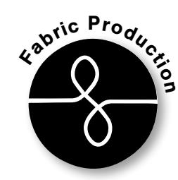
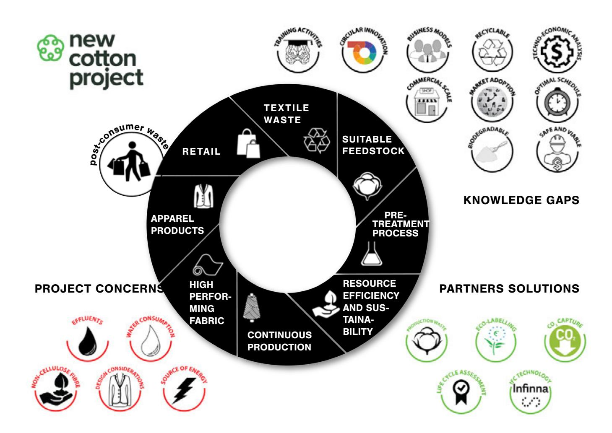
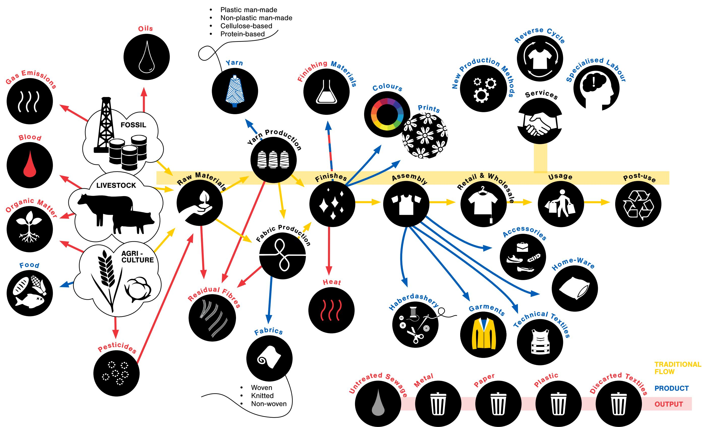
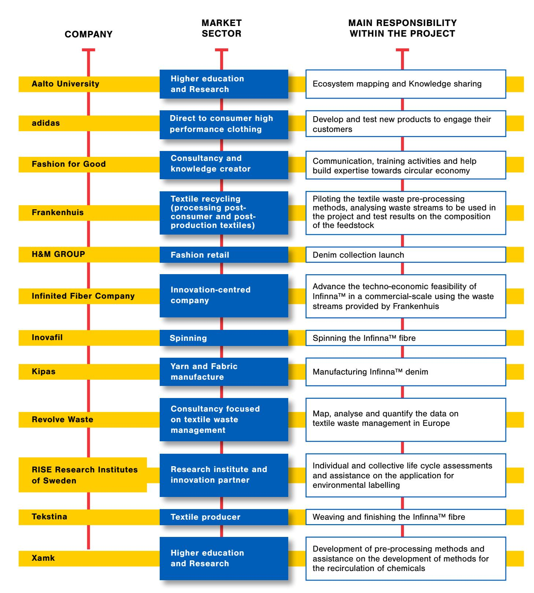
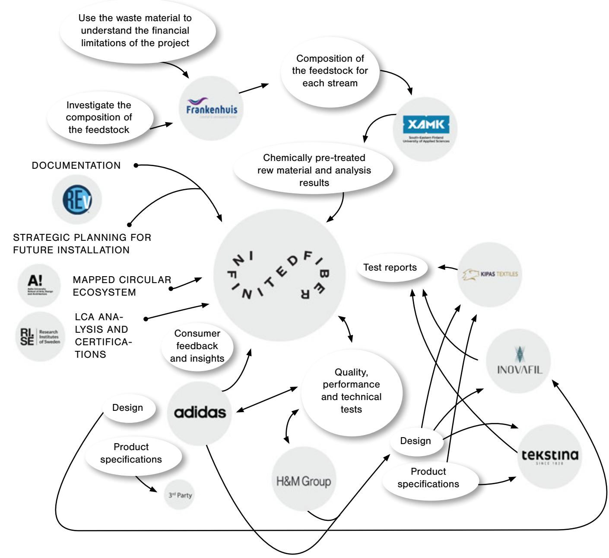
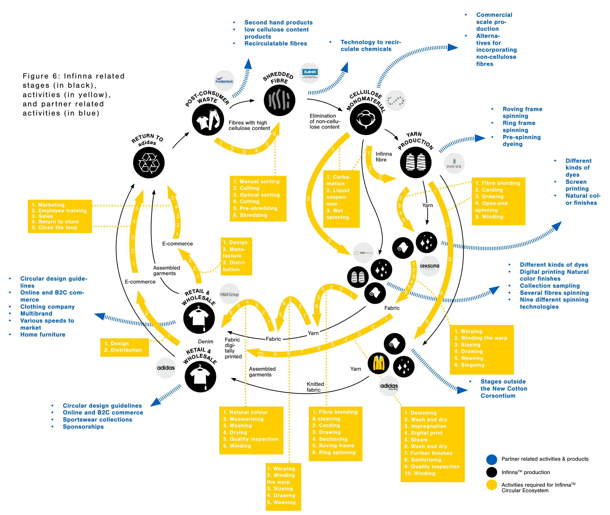
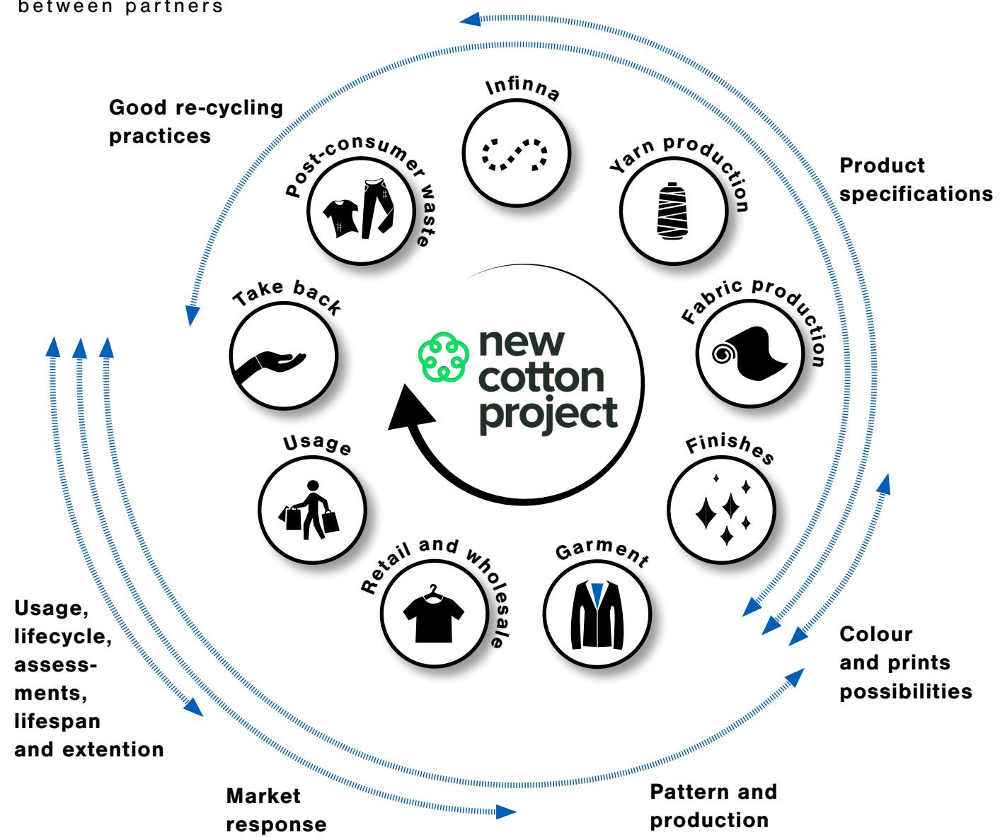
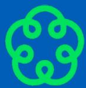

CIRCULAR  
ECOSYSTEM'S  
BLUEPRINT

Natalia Moreira Kirsi Niinimäki

# ABOUT

Part of the third white paper of the series1, this short booklet is part of the NEW COTTON PROJECT knowledge exchange series which aims to expose the reader to the project, its milestones, and the overall experience of implementing a circular ecosystem within the reality of the European textile industry. Brief in nature, this is a gateway into the project for those interested in learning more about the process behind our collections. For more information you can read the first two publications: [Circular Economy and Fashion: a NEW COTTON PROJECT white paper](https://aaltodoc.aalto.fi/handle/123456789/115574) [Circular business models in the textile industry: the second NEW COTTON](https://aaltodoc.aalto.fi/handle/123456789/116213)  [PROJECT white paper](https://aaltodoc.aalto.fi/handle/123456789/116213)

# SUMMARY

This summarised overview of the first half of the project aims at highlighting the importance of transforming the fashion industry into a sustainable, increasingly transparent, and socially just platform. The NEW COTTON PROJECT might not be the ultimate solution to all of the sector's ailments, but it represents an initial step towards it as the project is an attempt to bring a technical experiment into a commercial scale experience through a partnership between 12 partners. This industrial collaboration and partnership places all of its members at the same level and collaboratively tries to find common grounds to reach the final endeavour.

September 2022

NEW COTTON: Demonstration and launch of high performance, biodegradable, regenerated New Cotton textiles to consumer markets through an innovative, circular supply chain using Infinited Fiber technology. This project has received funding from the European Union's Horizon 2020 research and innovation programme under [grant agreement No \[101000559\].](https://cordis.europa.eu/project/id/101000559)

#### This white paper will help you:

- Meet the various partners engaged in the project
- Analyse the activities carried out during the first half of the project
- Understand how the ecosystem could assist the industry become more sustainable

1 Follow us on social media to stay up to date with our publications: LinkedIn:<https://www.linkedin.com/company/new-cotton-project/> Twitter: [https://twitter.com/project\\_cotton?lang=en](https://twitter.com/project_cotton?lang=en) Website:<https://newcottonproject.eu/>

#### The NEW COTTON PROJECT consortium members

# CONTENTS

| Chapter 1: The NEW COTTON PROJECT         | 4  |
|-------------------------------------------|----|
| Circular Ecosystems                       | 5  |
| Project Stakeholders                      | 10 |
| Resource Mapping                          | 12 |
| Chapter 2: The first half of the project  | 14 |
| Post-consumer textile streams             | 14 |
| Collection Design                         | 15 |
| Chapter 3: Final remarks and future plans | 16 |
| References                                | 17 |

Graphic design: Pirita Lauri

CHAPTER 1:

# THE NEW COTTON PROJECT

During a three-year period, textile waste is to be collected, sorted, and regenerated into a new, man-made cellulosic fibre that looks and feels like cotton – a "new cotton" – using Infinited Fiber Company's textile fibre regeneration technology. The fibre will be used to create different types of fabrics for clothing that will be designed, manufactured, and sold by global clothing brands adidas and H&M GROUP. As such, Figure 1 was developed to present the main concerns within the project, the main solutions already presented by the consortium members and the knowledge gaps which still require tackling.

According to Aarikka-Stenroos et al. [1] the concept of ecosystem is well suited to describe systemic change within circular economy, proposing the following definition: "Circular ecosystems are communities of hierarchically independent, yet interdependent heterogeneous set of actors who collectively generate a sustainable ecosystem outcome" [1, p. 261]. In the NEW COTTON PROJECT, twelve pioneering players are coming together to break new ground by demonstrating a circular ecosystem for commercial garment production using postconsumer garments as their "raw" material.

#### The project's ecosystem was built in three steps:

- 1. The individual stakeholder was identified (Figure 2).
- 2. The stakeholder, their activities, products, and other resources were mapped (Figure 3).
- 3. Then finally, it was possible to understand what is truly needed and/or how to incorporate the 'outputs' (previously seen as waste) back onto the system, thus creating a circular ecosystem (Figure 4).

#### 1.1 CIRCULAR ECOSYSTEMS

Figure 4: Example of a simplified ecosystem highlighting the relationship bet ween direct and indirect stakeholders

Organ

ic Mat

ter

Gas

Emissio

Pestic

ides

Residu

al Fibr

es

Raw M

aterials

Yarn

Fabric

s

Heat

• Plastic man-made • Non-plastic man-made • Cellulose-based • Protein-based

> • Woven • Knitted • Non-woven

Finish

es

Revers

e Cycle

Retail

& Whol

esale

Usage

Post-u

se

New

Produ

ction

Methods

**!**

Specia

lised

Labou

r

Haber

dashe

ry

Techn

ical Te

xtile s

Acces

sories

Garme

nts

PRODUCT

OUTPUT

Metal

Colour

s

Prints

Yarn

Product

ion

Fabric

Product

ion

FOSSIL

LIVESTOCK

AGRI - CULTURE

Untrea

ted Se

wage

Energy ECOSYSTEM

Plastic

Paper

Discar

ted Te

xtiles

Finish

ing M

aterial

s

Circul

ar des

ign

End of

life

Servic

es

Policie

s & Le

gislati

on

Assem

bly

Home-

Ware

## 1.2 PROJECT STAKEHOLDERS

Each of the 12 participants (listed on Table 1) in this project has a unique role in defining a blueprint for circularity in textiles (illustrated on Figure 5).

Table 1: Consortium partners and their details

Infinited Fiber Company will create its unique, cellulose-based fibres out of post-consumer textile waste. Frankenhuis and Xamk will be working on the preprocessing and research for pre-treatment of textile waste. Manufacturers Inovafil, Tekstina and Kipas will use the regenerated fibre to produce yarns, woven fabrics, and denim respectively. REvolve Waste, RISE, and Aalto University, will collect, and provide data, conduct research and analysis. Fashion for Good will lead on the communications to the industry. Design and manufacture of the fibres into clothing will be done by H&M GROUP and adidas.

F i g u re 5 : O ve r v i ew o f t h e a c t i v i t i e s a n d p ro c e s s e s carried-out by the partners presented on table 1

#### 1.3 RESOURCE MAPPING

Besides the activities developed for the consortium we know the partners also carry out various activities essential for their day-to-day functionality (Figure 6). By analysing and presenting the stages, exchanges, and stakeholder capabilities we were able to increase the projects ambitions towards implementing actual change in the industry.

Environmentally concerning factors such as: transparency and traceability of materials, alongside their production effluents, chemical, treatments, emissions, etc. were evaluated at this stage. Knowing the processes, materials, and other variables used by the different partners helps ensure the system's functionality, facilitates communication, and provides the means to appreciate potential opportunities for innovation and new business models2.

Even though this looks like a traditional, straight forward production, there were several unforeseen difficulties from sending 'textile trash'3 between countries, the processing of post-consumer garments, to the implementation of largescale machines for fibre processing and the development of market-oriented collections with high potential for colour variations between the lots; there were several issues faced in the first 18 months of project.

2 For more on business models, you can find our second white paper here: [https://aaltodoc.aalto.fi/](https://aaltodoc.aalto.fi/handle/123456789/116213) [handle/123456789/116213](https://aaltodoc.aalto.fi/handle/123456789/116213)

3 Post-consumer textile waste can be seen as trash by customs.

#### CHAPTER 2 :

# THE FIRST HALF OF THE PROJECT

In March 2022 the NEW COTTON PROJECT celebrated its halfway mark. It was a strategic moment for assessing how the project had evolved and which were the main issues faced by the partners. Half a year later, with the collections being launched to the public, we finally can share a little bit of what happened.

> 4 Identifying the composition of fabrics can be done in numerous manners, however, in greater quantities this process can lead to mistakes and production delays, so finding a steady and reliable solution was paramount.

> 5 This percentage also includes the yarn used for sewing the garment, bold prints and other customary additions used by the fashion market.

Finding steady and suitable postconsumer textile streams was one of the main issues faced by REvolve Waste and Frankenhuis, who worked alongside specialised companies to develop suitable machinery for the separation and fibre identification processes (which could make the textile waste processing quicker4).

Day-to-day experiences added on to the difficulties such as the definition of acceptable amounts of non-cellulosic materials, colours, breaking down garments, and financial viability of recycling post-consumer garments into new fibres. Additionally, understanding the post-consumer market and comparing these results to market data on feedstock availability, production flows and current disposal alternatives led to an immense amount of research to facilitate assessing potential partnerships for the project.

These difficulties, within the first half of the project, culminated on the overall understanding of market production, availability, disposal streams and the project's technical restrictions which make it currently impossible to accept more than 12% of non-cellulosic fibres into the recycling process5 (a figure which should be increased as the technology is developed further by Infinited Fiber Company).

## 2.2 COLLECTION DESIGN

Aligned with the post-consumer streams issue the collection could not be designed in such a manner which renders it unfeasible to use it as a resource for the NEW COTTON PROJECT's ecosystem in the future. With that in mind the design-oriented partners (adidas and H&M GROUP) aligned their product proposition to the requirements raised by the post-consumer textile collectors (Figure 7), for instance ensuring all the parts of the final product would be re-incorporated into the project's cycle6.

F i g u re 7: I n fo r m at i o n f l ow between partners

#### 2.1 POST-CONSUMER TEXTILE STREAMS

6 For this to happen all the collections garments need to be assembled using threads and accessories made of cotton or other cellulosic fibre.

Even though there were difficulties which led to production delays and quantity compromises, the collection is now ready to be launched. Initially through Stella McCartney's adidas collection at the London Design Week and subsequently in October on adidas and H&M GROUP websites.

Built on the same principles of a natural ecosystem7, a circular ecosystem is being proposed to generate a similar balance throughout the supply-chain. This is important because it promotes communication and cooperation between various business associates in this long-term partnership. As an innovative business model this relationship allows for small and big companies to embrace sustainable practices together, through shared risk8.

As the project goes on, we will continue publishing white papers to assist the consumer, industrial savvy readers, students, and other interested parties to understand the stages/activities/ implications of the NEW COTTON PROJECT. Additionally, Aalto University will be launching an educational page with courses and other educational activities for the general public, once more increasing the project's transparency and promoting sustainability and open knowledge.

# REFERENCES

[1] L. Aarikka-Stenroos, P. Ritala, and L. D. W. Thomas, "Circular economy ecosystems: A typology, definitions, and implications," Res. Handb. Sustain. Agency, pp. 260–276, 2021, doi: 10.4337/9781789906035.00024. [2] K. Grönman et al., "Carbon handprint – An approach to assess the positive climate impacts of products demonstrated via renewable diesel case," J. Clean. Prod., vol. 206, pp. 1059–1072, Jan. 2019, doi: 10.1016/J. JCLEPRO.2018.09.233. [3] T. Pajula, S. Vatanen, H. Pihkola, K. Grönman, H. Kasurinen, and R. Soukka, "Carbon Handprint Guide," Jan. 2018. [4] K. Behm, R. Husgafvel, C. Hohenthal, H. Pihkola, and S. Vatanen, "Carbon handprint-Communicating the good we do," 2016.

#### CHAPTER 3 :

# FINAL REMARKS AND FUTURE PLANS

7 Where the organisms work together to ensure the balance of the environment.

8 For the consumer, this kind of initiative promotes what is known as 'Carbon Handprint' [2]– [4] where there is a collective willingness to share the knowledge created in order to increase consumer and industrial awareness.

**new  
cotton  
project**