# Connecting Threads: **Assessing Digital Solutions and Needs for Circular Textiles**

**WHITE PAPER**

NOVEMBER 2023

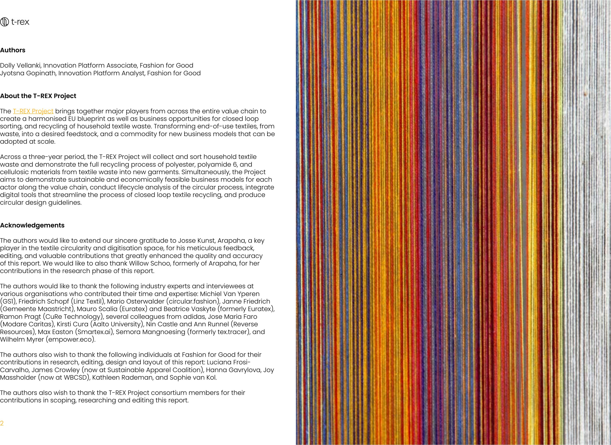

### **Authors**

Dolly Vellanki, Innovation Platform Associate, Fashion for Good Jyotsna Gopinath, Innovation Platform Analyst, Fashion for Good

### **About the T-REX Project**

The [T-REX Project](https://trexproject.eu/) brings together major players from across the entire value chain to create a harmonised EU blueprint as well as business opportunities for closed loop sorting, and recycling of household textile waste. Transforming end-of-use textiles, from waste, into a desired feedstock, and a commodity for new business models that can be adopted at scale.

Across a three-year period, the T-REX Project will collect and sort household textile waste and demonstrate the full recycling process of polyester, polyamide 6, and cellulosic materials from textile waste into new garments. Simultaneously, the Project aims to demonstrate sustainable and economically feasible business models for each actor along the value chain, conduct lifecycle analysis of the circular process, integrate digital tools that streamline the process of closed loop textile recycling, and produce circular design guidelines.

### **Acknowledgements**

The authors would like to extend our sincere gratitude to Josse Kunst, Arapaha, a key player in the textile circularity and digitisation space, for his meticulous feedback, editing, and valuable contributions that greatly enhanced the quality and accuracy of this report. We would like to also thank Willow Schoo, formerly of Arapaha, for her contributions in the research phase of this report.

The authors would like to thank the following industry experts and interviewees at various organisations who contributed their time and expertise: Michiel Van Yperen (GS1), Friedrich Schopf (Linz Textil), Mario Osterwalder (circular.fashion), Janne Friedrich (Gemeente Maastricht), Mauro Scalia (Euratex) and Beatrice Vaskyte (formerly Euratex), Ramon Pragt (CuRe Technology), several colleagues from adidas, Jose Maria Faro (Modare Caritas), Kirsti Cura (Aalto University), Nin Castle and Ann Runnel (Reverse Resources), Max Easton (Smartex.ai), Semora Mangnoesing (formerly tex.tracer), and Wilhelm Myrer (empower.eco).

The authors also wish to thank the following individuals at Fashion for Good for their contributions in research, editing, design and layout of this report: Luciana Frosi-Carvalho, James Crowley (now at Sustainable Apparel Coalition), Hanna Gavrylova, Joy Massholder (now at WBCSD), Kathleen Rademan, and Sophie van Kol.

The authors also wish to thank the T-REX Project consortium members for their contributions in scoping, researching and editing this report.

## EXECUTIVE SUMMARY

The textile industry has a significant environmental impact, contributing to global pollution through energy, water, and chemical usage, and the disposal of post-consumer textile waste finding final destination in landfills or incineration worsens the environmental challenge. As such, there exists an urgent need for effective solutions in end-of-use management strategies. This report aims to identify, assess and share key learnings about gaps and opportunities for implementation of digital solutions in the supply chain to enable circular textile value chains.

The report first evaluates the types of digital solutions in the market, specifically focusing on the categories of Waste Mapping, Supply Chain Traceability, and Digital Product Passports. Next, it communicates the findings on needs, gaps and opportunities for a diverse range of stakeholders, with specific actions for stakeholders across the value chain. Three key areas were explored: digital platform usage, data exchange protocols and challenges in the supply chain, and factors influencing data communication.

This analysis yielded valuable insights into the opportunities and gaps associated with digitisation and circularity. As a result of extensive primary and secondary research, **nine** overarching themes were identified:

**1. Industry Alignment**, defined as the need for value chain stakeholders to align on how to gather, analyse, present and exchange necessary data across the supply chain.

**2. Transparency Regarding Data**, which discusses the need for improved traceability via improved supply chain visibility and simultaneous development of digital infrastructure.

**3. Trust Across the Value Chain**, which focuses on how stakeholders blindly trust the accuracy of data received without additional verification, leading to inaccuracy in claims and product data.

**4. Oversaturation of the Market**, defined as the plethora of certification schemes, digital tools, and stakeholder-generated proprietary/legacy systems which often are not interoperable with one another.

**5. Cultural Differences Across Industry**, which speaks to the need for data communication to consider the global and complex value chain of the industry, and subsequent cultural practices and norms.

**6. Consumer Storytelling**, which discusses the need to eliminate consumer confusion and build trust through transparent communication to consumers by providing accessible and reliable information.

**7. Physical and Digital Infrastructure**, which speaks to the establishment of a comprehensive and reliable system that encompasses both physical and digital components for a (reverse) supply chain.

**8. Building Capacity & Capabilities for Data and Digitisation**, which focuses on the need for education and training programs to equip the industry with necessary skills and knowledge for digitisation.

**9. Communication Across Industry**, defined as the need for interoperability among digital platforms and systems used for collecting and sharing data between stakeholders.

These nine themes are enabled by factors such as legislation and compliance, certifications and standards, uptake of technology, and financial investment and human resources. Adopting digital systems in the textile industry offers benefits such as streamlined processes, enhanced transparency, collaboration facilitation, data-driven decision-making, and sustainability promotion.

To foster the collective progress of the industry, it is imperative that collaboration and alignment among all parties are prioritised. The overarching recommendations involve adopting decentralised digital platforms, establishing industry-wide data standards, prioritising sustainability and transparency, addressing the digital divide, and fostering collaboration to create a level playing field in the textile industry while promoting global data standardisation. The recommendations pertaining to each stakeholder group and encompassing all nine overarching themes are thoughtfully presented at the end of this report in a tabulated format.

## CONTENTS

- 7 INTRODUCTION
- 8 LANDSCAPE OF DIGITAL SOLUTIONS FOR TEXTILE INDUSTRY
- 10 UNCOVERING INDUSTRY GAPS AND OPPORTUNITIES
- 30 ENABLING THE DIGITAL TRANSFORMATION
- 32 RECOMMENDATIONS
- 36 NEXT STEPS / FURTHER RESEARCH
- 37 CONCLUSION
- 38 REFERENCES AND ENDNOTES
- 40 GLOSSARY
- 42 APPENDIX 1: INTERVIEW QUESTIONS FOR DIGITAL PLATFORM NEEDS
- 43 APPENDIX 2: LIST OF SECONDARY RESEARCH

## INTRODUCTION

The textile industry has a significant environmental impact, contributing to global pollution through energy, water, and chemical usage, and accounting for 8-10% of global carbon emissions from apparel and footwear production according to the European Parliament. Additionally, the disposal of post-consumer textile waste finding final destination in landfills or incineration worsens the environmental challenge, highlighting the urgent need for effective solutions in end-of-use management strategies. The [Textile Recycling Excellence, T-REX Project](#), supported by the Horizon Europe program, aims to guide the textile industry in seizing business opportunities in closed-loop textile recycling using post-consumer textile waste feedstock.

Passports and (2) market research on needs, gaps and opportunities for a diverse range of stakeholders, with specific actions for stakeholders across the value chain. Adopting digital systems in the textile industry offers benefits such as streamlined processes, enhanced transparency, collaboration facilitation, data-driven decision-making, and sustainability promotion. However, numerous challenges exist in transparency and standardisation of data structures and platforms; these must be addressed for effective implementation of sustainable tools. The legislative environment in the European Union strongly urges the textile industry to adopt practices and uptake technologies to better support the creation of digital and physical infrastructure that support textile circularity.

This report is a first step in identifying, assessing and sharing key learnings about digital solutions, their types, needs and opportunities to support circular textile value chains. The report has two parts: (1) a pre-evaluation of solutions, across the categories of Waste Mapping, Supply Chain Traceability, and Digital Product

### **LANDSCAPE OF DIGITAL SOLUTIONS FOR TEXTILE INDUSTRY**

The three types of digital solutions that play a crucial role in the textile industry are illustrated below.

In addition to these three categories, there are supporting/enabling tools such as enterprise resource planning (ERP), product lifecycle management (PLM), impact tracking, and design capabilities. These tools serve as a foundation for the three digital solution categories, hosting essential data points like bill of materials and supplier information. They provide the necessary infrastructure and functionality to effectively implement and integrate digital platforms within the textile industry.

Facilitates the collection, storage, and sharing of key product data throughout the lifecycle of a textile product and is accessible to various economic actors and stakeholders. These solutions empower consumers in making informed choices and actively participating in sustainable practices.

Traceability and tracking of materials, products, and offered services throughout the supply chain. By consolidating and verifying the chain of custody, supply chain traceability enhances transparency and accountability.

Enables organisations to gain clarity on, and enable traceability of waste flows, and connect the supply and demand of textile waste.

## UNCOVERING INDUSTRY GAPS AND OPPORTUNITIES

Three key areas were explored: digital platform usage, data exchange protocols and challenges in the supply chain, and factors influencing data communication. This analysis yielded valuable insights into the opportunities and gaps associated with digitisation and circularity. As a result of extensive primary and secondary research, nine overarching themes were identified, visualised in the graphic below.

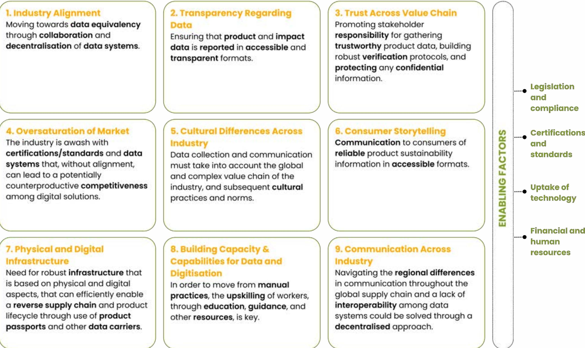

## INDUSTRY ALIGNMENT

There exists a need for value chain stakeholders to align on how to gather, analyse, present and exchange necessary data across the supply chain.

Currently, stakeholders rely on their individual internal systems, which often **lack interoperability** and hinder effective communication and collaboration. To overcome this fragmentation, it is crucial to **establish clear standards** for data collection, communication, and usage. Additionally, the industry needs a **decentralised open-access system** that will allow for the aggregation of verified data. Collaboration among stakeholders is vital to determine data equivalency and align industry practices.

**Harmonisation** and **standardisation** are essential across the proprietary and legacy data systems employed by supply chain stakeholders. This entails identifying the specific data points that need to be collected, verified, and exchanged with other players in the value chain. It is equally important to establish standardised language and methods for data communication. By implementing decentralised systems, data can be stored in a manner accessible to all stakeholders, accompanied by built-in tools for **data verification** and safeguarding sensitive information. These systems should also define data exchange permissions based on different use cases, such as Environmental, Social and Governance (ESG) reporting. Furthermore, **policy measures** are necessary to propel the industry towards data equivalency by outlining data criteria and establishing protocols for the exchange and communication of data.

**Waste Mapping** platforms address the lack of alignment in data sharing practices through providing an open-access platform for stakeholders to aggregate and share information, with the opportunity to control the visibility of sensitive data. These platforms also place responsibility on stakeholders to verify the data that they upload, ensuring that the data on these platforms are accurate and trustworthy.

**Supply Chain Traceability** platforms enable industry alignment and data equivalency by promoting industry collaboration on how necessary data points should be recorded, verified, and exchanged. These platforms can implement standards that would make it simpler for brands, governmental bodies, and other economic actors to exchange verified data in a secure space.

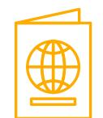

**Digital Product Passports** provide stakeholders with a decentralised platform for storing and communicating data to one another. Digital Product Passport (DPP) systems are not owned by or limited to any single entity, but require further standardisation on the criteria for the data uploaded and exchanged.

## TRANSPARENCY REGARDING DATA

Supply chain visibility and simultaneous development of digital infrastructure is necessary for improved traceability.

Unsubstantiated sustainability claims, inadequate information flow within the supply chain, and unaddressed environmental/social risks during production stages contribute to a **lack of trust in the chain of custody**. To tackle this challenge, **legislative measures** around reporting, **due diligence**, and **ecodesign requirements** are driving the industry towards enhanced transparency and public disclosure. By prioritising increased transparency regarding crucial product data (e.g. recycled content, material composition, colour, criteria for disassembly / recycling, etc.), and implementing clear regulations and guidelines for reporting this data, the fashion supply chain can achieve higher levels of transparency. Data collection can occur at various stages, including product testing, procurement and repurchasing, product usage and repair, and end-of-use.

**Simultaneous advancements** in digital platforms, data carriers and physical tracer technologies are crucial for collecting, verifying, and sharing product and impact data. These solutions enable the **traceability** and **transparency** needed to establish a **reliable** chain of custody. Alongside this, it is essential to establish **robust verification protocols** for the product data received and communicated at each step of the supply chain. By embracing **both digital and physical transparency mechanisms**, and implementing verification mechanisms, the industry can effectively address the challenges related to data integrity and transparency in the fashion supply chain.

**Waste Mapping** platforms enable transparency at the end-of-use stages of a product by following the verified and traceable movement of pre- and post-consumer waste throughout the value chain. This enables accessibility and visibility of waste information to waste processors and supports reverse supply chain management of textile waste.

**Supply Chain Traceability** platforms, such as Textile Genesis and TrusTrace, are leading traceability solutions with technology (e.g. blockchain) that can provide verification and integrity to data collected and shared across the value chain. The increased adoption of these platforms enable further supply chain transparency.

**Digital Product Passports** provide a transparent snapshot of a journey of a product through each step of development, use, and end-of-use.

## TRUST ACROSS VALUE CHAIN

Stakeholders blindly trust the accuracy of data received without additional verification, leading to inaccuracy in claims and product data.

Majority of stakeholders expressed the importance of accurate product data, yet acknowledged a **lack of proactive steps to verify** the information received from other value chain members. Instead, they rely on **trust within their chain of custody** for verified data. 62% of stakeholders interviewed voiced the need for accurate product data, yet admitted that they often do not take extra steps to verify the data they receive from other members of the value chain.

Primary research revealed that the **responsibility** for data verification in the reverse supply chain primarily falls on end-of-use stakeholders, leading to **bottlenecks** in the recycling process. To address this issue, supply chain-wide mechanisms should be established to **collect and verify product data**, reducing the verification burden on end-of-use stakeholders and promoting a more balanced distribution of responsibility. Implementing **digital solutions** at various stages of the supply chain can facilitate trust-building and verification protocols. Many digital solutions already incorporate verification pathways and accountability checks, ensuring the accuracy of shared data and promoting transparency among relevant stakeholders. **Third-party auditing** can also enhance verification and data quality, but improvements are necessary to minimise audit fatigue at different tiers. **Legislation** also guides brands and economic actors by specifying the data they should collect and verify, determining essential communication and verification data points while respecting confidentiality, and establishing protocols for sharing sensitive information.

**Waste Mapping** platforms enable for verified and traceable movement of textile waste throughout the value chain. Current practice often places the responsibility on recyclers to collect and verify data passed through the chain of custody. In order to solve this, best practices to collect, verify, and communicate data must be instituted at each step of the chain.

**Supply Chain Traceability** platforms, such as Textile Genesis and TrusTrace, are leading traceability solutions that employ blockchain technology for data verification. The adoption of these platforms will allow for a more robust foundation of trust when stakeholders share information with one another.

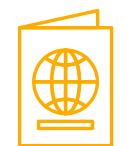

**Digital Product Passports** provide a comprehensive, transparent, and accessible record of a product's journey from the raw material stage to the end-of-use stage. Such open-access digital tools can allow for greater trust between brands and consumers, provided that the data uploaded onto these platforms are verified and trustworthy.

## OVERSATURATION OF MARKET

There are many certification schemes, digital tools, and stakeholder-generated proprietary/legacy systems which often are not interoperable with one another.

The industry is currently faced with an **abundance** of digital systems, standards, and certification schemes, which has created more challenges than opportunities in its journey towards transparency. This wide array of options leads to **stakeholder and data management fatigue**, and moreover it makes it hard for individuals to determine which standards and certifications are relevant and trustworthy. Many certification schemes also lack the necessary rigorous evaluation to serve as reliable sustainability indicators, often appearing as mere virtue signalling for brands. Also, the presence of numerous digital tool platforms has added to the complexity, as these systems **lack interoperability** with stakeholder-created data management systems.

Data standardisation is needed to establish clearer **communication guidelines** among existing systems, alleviating the stress associated with an overwhelming number of options. Furthermore, enabling interoperability between existing systems and ensuring seamless integration of new systems within the supply chain are essential to facilitate more efficient and effective operations. To maintain a balance of power among stakeholders, it is crucial to safeguard each party's data autonomy and **prevent data monopolies**, particularly to protect smaller market players.

**Waste Mapping** platforms should collaborate with data standardisation initiatives, policy bodies, sustainability standards, and third-party certification bodies to improve data collection and communication compatibility with other digital solutions. This standardised approach streamlines communication among digital tools, alleviating concerns related to the abundance of options. Implementing region-based waste mapping within Extended Producer Responsibility (EPR) schemes offers another strategy to address stakeholder concerns without infringing on free market principles.

**Supply Chain Traceability** platforms must work with data standardisation initiatives, policy bodies, sustainability standards, and third party certification bodies to enable harmonised data interoperability with other digital platforms. In doing so, systems will be able to communicate with and work together to give a holistic view of the supply chain. This standardised collaboration will lead to less stakeholder stress over the many options on the market. As previously mentioned, it violates free market principles to limit the development of new and existing digital platforms, but the stress linked to oversaturation can be lessened with more standardised communication between existing systems.

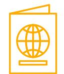

**Digital Product Passports**, as is the case with the aforementioned two other types of digital tools, must move towards standardised data communication. It is not in the industry's best interests to stagnate the development of new and existing digital platforms, as this could lead to monopolies. The solution to the stakeholder stress towards oversaturation is for digital platforms to work with data standardisation organisations and legislation so that they can seamlessly communicate with one another. For example, Digital Product Passports have the ability to provide some clarity on the many certification schemes that exist for a given product, thus alleviating some stakeholder stress around the sheer number of existing certification schemes.

## CULTURAL DIFFERENCES ACROSS INDUSTRY

Data collection and communication must take into account the global and complex value chain of the industry, and subsequent cultural practices and norms.

Fashion supply chains are **complex** and span across the entire globe, leading to differences in data needs and practices across European and global markets. It is essential for brands and economic actors, including sorters and recyclers, to consider local norms, legal requirements, intellectual property, and environmental and social regulations to ensure compliance and effective implementation of **cross-cultural digital systems**.

To enhance the effectiveness and adoption of digital systems and training resources, it is important to customise and localise them to suit specific contexts. This involves providing more **comprehensive guidelines** from a legal and regulatory perspective, specifying the data points that should be communicated, and promoting cross-cultural data exchanges. Achieving alignment and standardisation in data integration and traceability at an **international level** is crucial for seamless information flow across the supply chain. Additionally, there is a need for **contextualised databases** that take into account regional factors such as climate, infrastructure, and local waste management practices, particularly when assessing the environmental impact of products. By considering these **cultural factors** and tailoring digital solutions accordingly, the industry can improve data accuracy and relevance while ensuring effective decision-making and sustainable practices.

**Waste Mapping** platforms facilitate the efficient movement of textile waste, from aggregators to processors, through matchmaking and traceability capabilities. To ensure global usability, platforms like Reverse Resources and Satma should offer customised interfaces, multilingual support, localised data and metrics, tailored training resources, and cultural sensitivity in compliance with legal norms and regulations.

**Supply Chain Traceability** platforms like Textile Genesis and TrusTrace enhance visibility in the fashion value chain, but their adoption depends on effective global data management and communication systems. To enable cross-cultural data systems, these platforms should consider diverse supply chain actors, international standards, multi-tier traceability, integration with other systems, government database integration, and managing complex data.

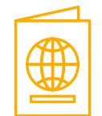

**Digital Product Passports** enable cross-cultural data sharing. Standardising product passports ensures collecting, managing, and sharing relevant information. circular.fashion and EON, who are working with data standardisation institutions (GSI, GTS, CIRPASS, TEXroad), promote data alignment. These tools should offer multilingual support, legal compliance (e.g. transparency and labelling), contextual impact data, and localised education.

## CONSUMER STORYTELLING

In order to eliminate confusion and build trust, it is important to establish transparent communication to consumers through providing accessible and reliable information.

Consumers play a **crucial** role in the value chain, and effective communication of product information during the purchase, use, and disposal stages is essential. Legislation such as the **Empowering Consumers Directive** and the **Green Claims Directive** further emphasise the need for brands to reconsider how they communicate sustainability information. However, the presence of numerous certification schemes has resulted in **consumer confusion**, with a significant percentage unable to determine what is genuinely an environmentally sustainable product. This lack of clarity **erodes trust** in sustainability claims. Through demonstrating a commitment to empowering consumers with reliable and accessible information, such as through Digital Product Passports, brands can **alleviate consumer mistrust** and promote transparency.

By providing consumers with better education and establishing legal guidelines, trust and understanding can be fostered, enabling more **informed** and **confident** consumer purchasing, usage, and disposal decisions.

**Waste Mapping** platforms enable the increased traceability of pre- and post- consumer textile waste from waste aggregators to processors. Increased traceability of the movement of products at the end-of-use stage will allow for the collection of trustworthy data to make more robust product sustainability claims, which in turn must be collected and communicated to the consumer in an accessible and reliable way.

**Supply Chain Traceability** platforms also increase visibility and clarity of material and product flows across the fashion value chain. Adoption of these tools will allow brands to collect data that can lead to more reliable product sustainability claims. Studies have shown that brand loyalty increases with brand commitment to traceability and to communicating that information to the consumer in an accessible format.

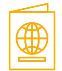

**Digital Product Passports** can provide consumers with the education necessary to alleviate the confusion that exists with an overwhelming number of certification schemes on the market. By empowering consumers with the knowledge to make more informed consumption decisions, these types of digital tools can also regain trust in product sustainability claims.

## PHYSICAL AND DIGITAL INFRASTRUCTURE

It is necessary to establish a comprehensive and reliable system that encompasses both physical and digital components for a (reverse) supply chain.

A robust infrastructure that integrates **physical and digital components** is essential for establishing a circular textile industry and enabling an efficient reverse supply chain. Currently **hindered by manual data entry** and inspection, the process requires **investments** in digitisation, labour training, and the development of infrastructure and equipment. By combining physical elements such as collection, sorting, pre-recycling, and recycling with digital elements like waste mapping, supply chain traceability, and product passports, seamless data flow can be achieved throughout the supply chain. It is important that these infrastructures sustain **Extended Producer Responsibility** (EPR) schemes, avoiding the creation of additional challenges.

Given the diverse data carrier needs and requirements of stakeholders, the establishment of a **standardised format** for relevant data, and **open access** to this data, becomes crucial. This will facilitate easy adoption and exchange of information across different carriers, ensuring efficiency and consistency throughout the supply chain.

**Waste Mapping** platforms allow organisations to track and visualise textile waste flows within physical infrastructure, enabling transparency from waste generation to collection to recycling. Also, it fosters alignment of supply and demand for textile waste.

**Supply Chain Traceability** platforms track materials and products. They also provide consolidation and verification of chain of custody across the physical supply chain and share this data via digital systems.

**Digital Product Passports** act as a decentralised system to store data for broad stakeholder access, using durable, cost-effective physical data carriers (i.e. QR codes or RFID tags). Developing physical infrastructure for reverse logistics is key, while product passports can enable efficiencies through data and digital system connectivity.

Education and training programs are necessary to equip the industry with the relevant skills and knowledge for digitisation.

# **BUILDING CAPACITY & CAPABILITIES FOR DATA AND DIGITISATION**

**8**

The textile industry acknowledges the drawbacks of manual practices and emphasises the importance of **education and training programs** to enhance digital skills. Adequate **resources**, including financial, administrative, and team support, are required for successful implementation and management of new digital systems and technologies. **Upskilling the workforce** is essential to keep pace with technological advancements.

Furthermore, **clear guidance** on data collection, reporting, and exchange throughout the value chain is crucial. Open discussions and collaborations between fashion companies and facilities are needed to ensure sufficient financial capacity for improvements. By addressing these factors, the industry can overcome limitations, enhance productivity, and establish an efficient and digitally-driven textile ecosystem.

> All types of digital solutions identified in this report, namely **Waste Mapping**, **Supply Chain Traceability** and **Digital Product Passports**, require upskilling and onboarding of users such as brands, suppliers, manufacturers, waste aggregators, and recyclers. Therefore, these tools must support clients in the uptake of these solutions.

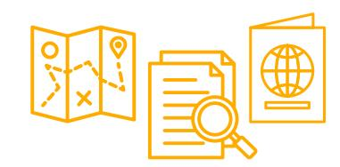

## COMMUNICATION ACROSS SYSTEMS & SUPPLY CHAIN

Interoperability among digital platforms and systems is necessary for collecting and sharing data between stakeholders.

A significant challenge in the fashion supply chain is the **lack of interoperability** between stakeholders' proprietary ERP systems and existing digital solutions. This issue leads to frustration among supply chain stakeholders, as current data systems involve **manual labour and lack integration**, which is not only time-consuming but is also disjointed, as the data is often isolated and not integrated. To address this, it is essential to prioritise interoperability and standardisation among digital solutions and stakeholders' data systems. This will facilitate the seamless uptake and implementation of transparency measures, overcoming the data communication roadblocks in the industry.

To enhance data management in the industry, **standardisation** is necessary for the collection and communication of data points throughout the supply chain. This standardisation ensures consistency and efficiency in data sharing. Additionally, **decentralised, open-access** systems enable the sharing of data in interoperable formats, which can contribute to improved collaboration and transparency. It is also important to consider the cultural practices and norms of the countries involved, recognising the diverse contexts within the complex global fashion industry.

**Waste Mapping** platforms must integrate with supply chain and brand ERP systems and traceability platforms, enhancing textile waste traceability from recycling to the end product. Platforms like Reverse Resources and Satma collect and share standardised data on textile waste types and quantities across the supply chain.

**Supply Chain Traceability** platforms facilitate brands in managing their product data in a format that can be used by various software applications. These platforms provide access and seamless flow of immutable and mutable data, for instance origin, material composition, and chemical components.

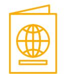

**Digital Product Passports** create an interconnected system through standardised format for data sharing and communication amongst stakeholders. Identifying which data points are accessible to specific stakeholders is vital to ensure both data relevance and security.

## ENABLING THE DIGITAL TRANSFORMATION

The textile industry requires a digital transformation for enhanced data integrity and management, efficiency, scalability, and system improvement. Digitisation in the fashion supply chain aligns with [Sustainable Development Goal 12](#), focusing on responsible consumption and production. It promotes transparency, data-driven decisions, supply chain collaboration, digital reverse logistics, and empowers consumers through digital tools.

**Legislation** and **compliance** play a pivotal role in fostering a conducive environment for digital solutions. They provide incentives, set data standards, and ensure compliance. At the same time, **certifications and standards**, such as the Recycled Claim Standard (RCS) and Global Recycled Standard (GRS), must enable a framework for implementing digital solutions that ensure certain requirements are met, promote uniformity, and maintain high standards of data quality. It is crucial to have accurate, complete, valid, consistent, unique, timely, and fit-for-purpose data. Collaborative

efforts are necessary for establishing standards, robust data management, and continuous monitoring.

The widespread **uptake of technology** across the supply chain is essential. Organisations recognising the benefits are inclined to invest in innovative solutions, like IoT, AI, spectroscopy, and blockchain. Integration of these solutions is crucial for success. Adopting technology and standardised digital systems require significant investment in financial resources and human capital. Regulatory bodies are promoting machine-readable data to address financial barriers. Training and upskilling the workforce are essential.

A suggested approach is a step-wise implementation strategy to ease integration and adoption of digital systems.

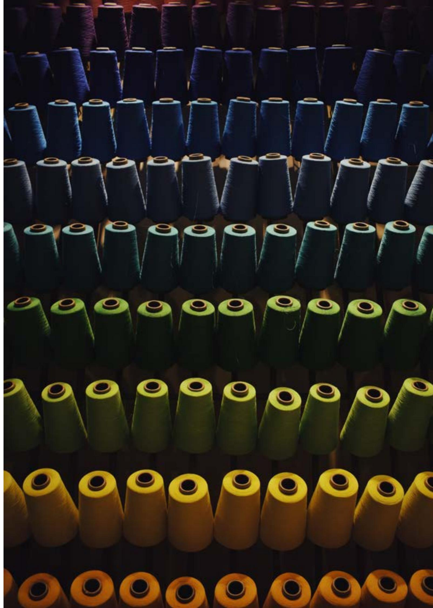

# **WASTE AGGREGATORS & RECYCLERS**

Use **decentralised** digital platforms that provide **data autonomy** for stakeholders.

**Share verification burden**, usually heavily placed on end-of-use actors, by encouraging supply chain actors to take responsibility for data gathering.

**Evaluate sustainability focused certification schemes**, such as GRS and RCS certifications, for end-of-use stages, including the waste aggregation step, sorting, and recycling.

**Invest and experiment** with digital solutions and reverse supply chain infrastructure to **capture end-of-use product data**, establish **data sharing protocols**, and create **interoperability** between systems.

Adopt digital solutions with **customised interfaces and localised offerings** and engage in regulatory discussions to establish **crossregional guidelines**.

Provide **accurate material and product information** to support brands and end-of-use stakeholders in **making credible claims** to consumers and the industry.

Address the **digital divide gap** and provide **training and onboarding support** to employees and workers to build digital capacity and capabilities.

In the pursuit of delving into each theme in-depth, a comprehensive set of action points was crafted, tailored to address the specific needs and roles of various stakeholders. These stakeholders include policy makers, brands, digital solution providers, as well as waste aggregators and recyclers. To foster the collective progress of the industry, it is imperative that collaboration and alignment among all parties are prioritised.

The overarching recommendations involve adopting decentralised digital platforms, establishing industry-wide data standards, prioritising sustainability and transparency, addressing the digital divide, and fostering collaboration to create a level playing field in the textile industry while promoting global data standardisation. The recommendations pertaining to each stakeholder group and encompassing all nine overarching themes are thoughtfully presented in the tabulated format below.

## **RECOMMENDATIONS**

### **POLICY MAKERS**

Enact legislative measures and regulations to **guide industry data alignment** and establish clear guidelines for mandatory product data requirements and **open-access data management**.

**Collaborate and integrate leading certifications** (i.e. GRS, RCS) and **standardisation bodies** (i.e. GS1, CEN, ISO, etc.) in setting standards and protocols for data types, data structures, verification processes, and definitions.

Promote **global data standardisation** by encouraging **regional variations** while adhering to common principles. This includes guidelines for data collection and sharing, while promoting API integration and national harmonisation, using global archetypes where possible.

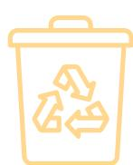

**Safeguard data integrity and security** in the textile industry by prioritising the establishment of comprehensive data verification practices and confidential information sharing protocols.

**Prevent industry monopolies** and ensure a level playing field in the textile sector by establishing clear guidelines for accepted and recommended digital platforms.

Implement regulations that both **incentivise and regulate infrastructure development** for supply chain data and product management, including collection, sorting, recycling, and digital tracking.

Provide **comprehensive support, including financial, educational, and infrastructural** assistance, to encourage the development of data equivalency and interoperability.

**Offer incentives** for the establishment of **open-access and decentralised** systems and public databases for product and material information.

### **BRANDS**

Invest and use **decentralised** digital platforms that provide **data autonomy** for stakeholders.

Promote a mindshift for **supply chain accountability** by collaborating with suppliers and waste supply chain to define data standard and interoperability parameters around data collection, exchanging and sharing, verification and reporting.

Understand and **address local legal, IP, and environmental/social regulations** impacting data management. **Educate and incentivise**  suppliers for standardised data management globally.

Address the **digital divide gap** and provide **training and onboarding support** to employees and workers to build digital capacity and capabilities.

Define and implement a **transparency and traceability strategy** through the uptake of digital tools.

**Evaluate sustainability certifications** based on overall impact, not just brand image.

**Educate consumers** and communicate sustainability information relevant to **purchase, use and disposal phases** of the product journey with consumers.

# **RECOMMENDATIONS**

### **DIGITAL SOLUTION PROVIDERS**

**Collaborate with stakeholders** to set data exchange and verification protocols, permissions and interoperable API access, aiming for standardised and **decentralised systems with data autonomy**.

Utilise **decentralised verifiable credential mechanisms** to build Digital Product Passports (DPPs) and develop platforms for stakeholders to aggregate and exchange data.

**Create user-friendly solutions** with **customised** interfaces, multilingual support, and region-specific metrics.

**Offer onboarding support** to facilitate seamless implementation and integration of innovative digital solutions across the value chain.

Offer brands engaging and simple consumer interaction by **utilising physical data carriers** linked with Digital Product Passports (DPPs).

Build **adaptable and customisable solutions** that can integrate with physical processes and infrastructure that **enable data efficient reverse supply chains.** 

**Collaborate with certification and standardisation bodies** for interoperability and alignment with existing digital solutions, avoiding unnecessary market saturation and unfair competition.

## NEXT STEPS / FURTHER RESEARCH

In order to pave the way for future advancements, it is crucial to delve into various areas of research and action.

More research is required to understand the incentive schemes and investments, both financial and educational, necessary for building digital and physical infrastructure. This entails exploring the business case for such investments and determining the required funding amounts. It also requires examining the educational investment needed to effectively scale these digital solutions, namely in upskilling individuals across global value chains. This is crucial for ensuring high-quality data capture and sharing.

Another significant aspect that requires attention is the issue of data equivalency and interoperability, which the research team will address through piloting various digital solutions discussed in the report. The goal of this pilot will revolve around validating critical aspects such as interoperability and data standardisation, ensuring seamless integration between the advanced digital solutions and the existing digital frameworks employed by various stakeholders across the supply chain ecosystem. By bridging the gaps and ensuring harmonious data exchange, this initiative will lay the foundation for a more connected and efficient ecosystem.

## CONCLUSION

The textile industry is in urgent need for effective solutions in product lifecycle strategies, especially at end of use, to address its significant environmental impact. The [Textile Recycling Excellence \(T-REX\) Project](#), a Horizon Europe program, aims to address this need through guiding the industry towards closed-loop textile recycling using post-consumer textile waste, along with a lens of digital transformation.

This report serves as a first step in identifying and assessing digital solutions that support circular textile value chains, focusing on waste mapping, supply chain traceability, and digital product passports. The report identifies nine overarching and highly interconnected themes that are essential for driving the digital transformation of the industry towards data standardisation and system interoperability. Achieving data standardisation, harmonisation, and interoperability is crucial for effective communication and collaboration among stakeholders. It requires establishing clear standards for data collection, communication, and usage, as well as decentralised systems that promote open access

and the aggregation of verified data. Transparency regarding data is essential to enhance supply chain visibility and establish a reliable chain of custody. Trust across the value chain can be fostered by implementing verification mechanisms and distributing the responsibility for data verification. The oversaturation of the market and cultural differences across the industry call for data standardisation, interoperability, and localised solutions. Effective consumer storytelling requires transparent communication, reliable certification schemes, and consumer education. Building physical and digital infrastructure, along with capacity and capabilities for data and digitisation, are vital for establishing a comprehensive and efficient circular textile industry. Lastly, enabling communication across systems and the supply chain necessitates interoperability and standardisation among digital platforms and stakeholders' data systems.

In addition to these themes, various enabling factors contribute to the industry's digital transformation, including legislation and compliance, certifications and standards, uptake

and scaling of technology, and access to financial resources and upskilled human capital. Addressing the identified gaps and seizing the opportunities requires collaborative efforts from all stakeholders involved in the value chain. By implementing the recommended actions points per stakeholder, the industry can drive the digital transformation necessary for achieving a sustainable and circular textile ecosystem.

Overall, this report provides valuable insights into the digital solutions that support circular textile value chains and identifies the key themes and enabling factors that contribute to the industry's digital transformation.

## REFERENCES AND ENDNOTES

Aalto University (2023). Analysis by Fashion for Good & Arapaha.

Berg et al. (2020). Fashion on Climate: How the Fashion Industry can Urgently Act to Reduce its Greenhouse Gas Emissions. Available [here](#).

Cambridge Institute for Sustainability Leadership (2022). Digital Product Passport: the ticket to achieving a climate neutral and circular European economy? Available [here](#).

Changing Markets Foundation (2022). License to Greenwash. Available [here](#).

circular.fashion (2023). Analysis by Fashion for Good & Arapaha.

CIRPASS (2022). The Digital Product Passport as defined in the Proposal for Eco-design for Sustainable Product Regulation (ESPR). Available [here](#).

Cura, K., Jain, S., & Niinimäki, K. (2022). Transparency and Traceability in the Textiles Value Chain. Available [here](#).

Deeley, R. (2022). Dutch, Norwegian Regulators Issue Guidance on Controversial Higg Tool. Available [here](#).

Eileen Fisher Foundation & Pentatonic (2022). Hey Fashion Report: Fashion's Waste Crisis and How to Solve it. Available [here](#).

Ellen MacArthur Foundation (2017). A New Textiles Economy: Redesigning Fashion's Future. Available [here](#).

Ellen MacArthur Foundation (2017). Fashion and the circular economy: Deep Dive. Available [here](#).

Empower (2023). Analysis by Fashion for Good & Arapaha.

EON & ACP (2022). Industry Aligned Action Plan: Digital ID to scale Circular Systems. Available [here](#).

European Commission (2020). A European strategy for data. Available [here](#).

European Commission (2022). Ecodesign for Sustainable Products. Available [here](#).

European Commission (2022). EU strategy for sustainable and circular textiles. Available [here](#).

European Parliament (2022). The impact of textile production and waste on the environment. Available [here](#).

Fashion for Good & Circle Economy (2022). Sorting for Circularity Europe: An Evaluation and Commercial Assessment of Textile Waste Across Europe. Available [here](#).

Fashion for Good & Textile Exchange (2022). The Textile Tracer Assessment. Available [here](#).

Haeggblom, J. & Palmer, C. (2019). Circularity.ID: The Transformation to data-driven circularity in fashion. Available [here](#).

Lewe, E. (2022). What is the Digital Product Passport for Textiles? Available [here](#).

McGrath et al. (2021). Tools and Technologies of Transparency in Sustainable Global Supply Chains. Available [here](#).

Modare Caritas (2023). T-REX Fashion for Good & Arapaha analysis.

Reverse Resources (2023). Analysis by Fashion for Good & Arapaha.

Richero, R. & Ferrigno, S. (2020). A Background Analysis on Transparency and Traceability in the Garment Value Chain: Final Report. Available [here](#).

Solita (2022). Digital Product Passport - Increasing transparency, promoting circular economy. Available [here](#).

Textile Exchange (2021). Standards Transition. Available [here](#).

Textile Exchange (n.d.). The RCS and GRS are designed to boost the use of recycled materials. Available [here](#).

[The Higg Traceability program](#) aims to track the hidden impacts within the supply chain, ensure fibre integrity, and to communicate, and accelerate product sustainability.

TrusTrace (2022). Traceability Playbook. Available [here](#).

## GLOSSARY

### Authentication/Verification

These two terms are used interchangeably throughout this report in reference to traceability verification and refer to the process of confirming and validating information relevant to a product or activity within the supply chain.

### Audit Fatigue

Also known as compliance fatigue. Refers to the exhaustion associated with repeatedly being pulled away from daily tasks to participate in compliance efforts.

### Application Programming Interface

Refers to the set of rules and protocols that allows different software applications to communicate and interact with each other.

### Bill of Materials

Refers to a comprehensive list of all the components, parts, and raw materials required to manufacture a product.

### Blockchain

A decentralised and secure digital ledger technology that securely records and verifies transactions across multiple participants, providing transparency, trust, and traceability in a tamper-resistant manner.

### Certification Bodies

Third party organisations carrying out audits to verify criteria defined by a sustainability standard.

### Chain of Custody

Refers to the chronological documentation or paper trail that records the sequence of custody, control, transfer, analysis, and disposition of physical or electronic evidence.

### Chemical Recycling

Refers to the process of breaking down used textiles into their basic chemical components, which can then be used to create new materials or products.

### Closed-loop Textile Recycling

Describes the recycling of textile products into materials that can be re-entered into the textile supply chain.

### Cloud-based

Refers to a system, software, or service that is delivered and accessed over the internet.

### Data Carriers

Refer to physical or digital mediums, such as QR codes, RFID tags, or NFC tags, used to store and transmit data within various systems and technologies. These

carriers serve as vehicles for information, enabling the collection, storage, and retrieval of data for various purposes, including tracking, identification, and communication across different stages of a process or supply chain.

### Data Equivalency

Refers to the standardised recording and compatibility of data formats, structures, and standards across different systems or platforms, ensuring seamless data exchange and interoperability.

### Decentralised

Means that the ownership, control, and storage of product-related data and information are distributed among multiple stakeholders or entities rather than being centralised in a single authority or database.

### Digital Matching System

Refers to a platform or technology that facilitates the matching of individuals, organisations, or entities based on specific criteria or needs.

### End-of-use

Refers to the stage where products are no longer usable or wanted, so are either discarded, recycled, or repurposed.

### Enterprise Resource Planning (ERP)

Refers to a type of software that organisations use to manage day-to-day business activities such as accounting, procurement, project management, risk management and compliance, and supply chain operation.

### Environmental, Social and Governance (ESG)

Refers to a collection of corporate performance evaluation criteria that assess the robustness of a company's governance mechanisms and its ability to effectively manage its environmental and social impacts.

### Geographic Origin

Usually refers to the verification of the origin of Tier 4 for natural and animal fibres.

### Interoperability

Refers to the ability of different systems, devices, or software to seamlessly communicate, exchange data, and work together effectively.

### Landscape

Refers to the overall framework or environment that includes various elements such as market trends, consumer behaviour, industry players, regulations, supply chains, and technologies.

### Legacy System

Refers to outdated or obsolete software or hardware that is still in use within an organisation or industry.

### Non-rewearable Textiles

Refers to textiles that are no longer suitable for reuse or repurposing due to their condition, damage, or unsuitability.

### Physical verification

Authenticates the presence of certified material in a product.

### Post-consumer textiles

Refers to textile products that have been used by consumers, become damaged, discarded, worn-out, or out-of-fashion, and are then subsequently collected for recycling or reprocessing into new materials.

### Post-gate

Refers to the section of the supply chain after the finished product is made and distributed to consumers (after Tier 0).

### Post-use

Refers to the stage or phase that occurs after a product has served its intended purpose or lifecycle.

### Product Lifecycle Management (PLM)

Refers to the strategic process of managing the complete journey of a product from initial ideation, development, service, and disposal. Put another way, PLM means managing everything involved with a product from cradle to grave.

### Proprietary System

Refers to an application, tool, or system that belongs exclusively to an enterprise.

### Purchase Order System

Refers to a legal document buyers send to sellers to order goods. This document contains information such as prices, quantity, payment terms, and delivery schedule information.

### Reverse Logistics

Refers to the processes and activities of managing the return, repair, recycling, or disposal of products or materials after they have been used or delivered to the end customer.

### Sorting

The separation of collected textiles based on characteristics such as quality, product type, composition, colour.

### Sustainability Standard

A set of criteria or guidelines that assess and promote environmentally and socially responsible practices within a specific industry or organisation.

### Supply Chain Traceability

Refers to the ability to track and trace the movement of products, or materials throughout the supply chain, enabling visibility, accountability, and identification of their origins, processes, and destinations.

### Supply Chain Origin

Usually refers to the verification of origin between Tier 3 - Tier 0 of a given yarn, fabric roll, and product.

### Supply Chain Steps

Refers to the sequential processes involved in designing, sourcing, manufacturing, distributing, and delivering products.

### Transaction Verification

Verifies that the products and quantity exchanged along the value chain is within the certified scope of each site and reconciles to inventory.

### Transparency

Refers to the extent of openness, accessibility, and clarity in information, processes, and decision-making within an industry, company or system. This involves information regarding the supply chain, business practices and the associated impacts on workers, communities and the environment.

### Value Chain

Refers to the complete set of activities that create and deliver value to cust

## APPENDIX 1: INTERVIEW QUESTIONS FOR DIGITAL PLATFORM NEEDS

We will be recording this session, are you okay with us recording this? This recording will not be shared with anyone outside of the T-REX Project group and is solely used for note taking and analysis purposes.

Introduction of attendees + the company (us and the interviewee)

General Intro to T-REX Project: create a blueprint for closed-loop textile recycling within EU, includes collection, sorting, recycling of polyamide, polyester, and cotton, and entering that back into the textile value chain for new products.

The aim of the interviews is to outline opportunities and gaps with use of digital platforms for textile circularity by understanding:

- • Type, role and experience with digital platforms used
  - – Across the different verticals identified: waste mapping, supply chain traceability, consumer engagement and circularity. Along with supporting and enabling tools such as ERP/PLM systems, impact tracking and design software.
- • Communication of data across the supply chain, identifying the opportunities and gaps
- • Enabling factors that warrant use of digital platforms and data standardisation

### Types of platforms used

1. 1. What waste mapping digital platforms do you use?
2. 2. What supply chain traceability digital platforms do you use?
   1. a. Is this allowing you to trace where your materials/products are coming from?
   2. b. How else are you tracing your supply chain?
3. 3. What consumer engagement/circularity tools do you use? (i.e. QR codes, RFID tags, etc.)
4. 4. What supporting/enabling tools do you use?
   1. a. What ERP/PLM systems do you use?
   2. b. What design software do you use?
   3. c. How do you track environmental and social impact, which platforms do you use?
5. 5. What are the biggest roadblocks or disadvantages of the systems you are using? (i.e. functionality)
6. 6. What are the biggest advantages of the systems you are using? (i.e. functionality)

### Communication across supply chain

1. 1. Are these systems communicating with each other? Is there a way of harmonising data across the value chain?
2. 2. What type of data are you receiving from other supply chain partners?
   1. a. Format in terms of systems used and platforms and if they are different from above,
   2. b. And in what method do you receive the information?
3. 3. What types of data do you wish to receive from your partners? (format, method, content) --> we want to understand what data types/content you are missing

### Other enabling factors

1. 1. What other projects/initiatives are you a part of that is working on data standardisation/data mapping?
2. 2. Where is your organisation in preparing for compliance/regulation around EPR, DPP, ecodesign, etc.?
3. 3. How do you verify the data you receive and share? Are you using any certifications to verify data?
4. 4. What would you do differently on the topic of waste mapping and traceability? What ideas do you have for us to be more effective?

## APPENDIX 2: LIST OF SECONDARY RESEARCH

[The Digital Product Passport as defined in the Proposal for Eco-design for Sustainable Product Regulation \(ESPR\)](#) – CIRPASS – 2022

[Transparency and Traceability in the textile value chain](#) – Aalto University – 2022

[Transforming the textile industry with digital technologies](#) – European Commission – 2021

[Smart Fashion Economy through a Data-Driven Circular Ecosystem: A Case Study](#) – Malahat Ghoreishi, Kajal Bhandari, Alessio Francon – 2022

Confidential internal document\* – Fashion for Good – 2022

[Textiles Footprint Tool](#) – WRAP – 2022

[Textile Tracer Assessment](#) – Fashion for Good, Textile Exchange – 2022

[HEY Fashion Report](#) – Eileen Fisher Foundations, Pentatonic – 2022

[Industry Aligned Action Plan: Digital ID to Scale Circular Systems](#) – EON, ACP – 2022

[Circularity.ID: The transformation to data-driven circularity in fashion](#) – circular.fashion – 2021

Confidential internal document\* – New Cotton Project – 2022

[EU Strategy for Sustainable and Circular Textiles](#) – European Commission – 2022

[Tools in Technologies of Transparency in Sustainable Global Supply Chains](#) – Paul McGrath, Lucy McCarthy, Donna Marshall, Jakob Rehme – 2021

[A Digital Product Passport](#) – Solita, Gaia Consulting – 2022

[A New Textiles Economy: Redesigning Fashion's Future](#) – Megan Doyle – 2017

[A Background Analysis on Transparency and Traceability in the Garment Value Chain: Final Report](#) – Raul Richero, Simon Ferrigno – 2020

[License to Greenwash](#) – Changing Markets Foundation – 2022

[The Traceability Playbook](#) – TrusTrace – 2022

\*these are confidential internal documents pertaining to consortium partners.