Project acronym: REGIOGREENTEX Project number: 101083731 Project title: Regions for Green Textiles

# D 2.2 Digital Self Assessment Tool

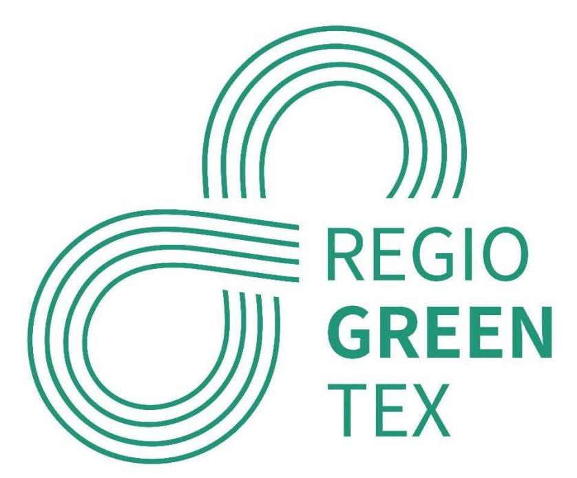

# Interregional Innovation Investments Instrument (I3)

Deliverable due date:

| AUTHOR        | REVIEWERS  |
|---------------|------------|
| EuraMaterials | NERDA, NTT |

Dissemination level: PU - Public

## Co-funded by the European Union

Co-funded by the European Union. Views and opinions expressed are however those of the author(s) only and do not necessarily reflect those of the European Union or EISMEA. Neither the European Union nor EISMEA can be held responsible for them.

# Executive summary

| 1     | INTRODUCTION ....................................................................................................................................... 4        |
|-------|---------------------------------------------------------------------------------------------------------------------------------------------------------------|
| 1.1   | C ONTEXT .................................................................................................................................................. 4 |
| 1.2   | O BJECTIVES OF THE SELF ASSESSMENT TOOL .................................................................................................... 4                |
| 2     | TOOL DEVELOPMENT METHODOLOGY .................................................................................................... 5                           |
| 2.1   | D ESIGN STAGES .......................................................................................................................................... 5   |
| 2.1.1 | Inspiration: SMARTX ..................................................................................................................... 5                   |
| 2.1.2 | Section definition .......................................................................................................................... 6               |
| 2.1.3 | First questions - SELF ASSESSMENT TOOL version 1 ..................................................................... 7                                      |
| 2.2   | P ARTICIPATORY APPROACH WITH STAKEHOLDERS .............................................................................................. 8                    |
| 2.2.1 | Consortium presentation and feedback ....................................................................................... 8                                |
| 2.2.2 | Changes to questions - SELF ASSESSMENT TOOL version 2 .......................................................... 8                                            |
| 2.2.3 | Consortium presentation and feedback ..................................................................................... 11                                 |
| 2.2.4 | Modifying questions - SELF ASSESSMENT TOOL version 3 .......................................................... 11                                            |
| 2.2.5 | Modifying questions - SELF ASSESSMENT TOOL version 4 and higher ....................................... 12                                                    |
| 2.3   | I NVITATION TO TENDER AND SELECTION OF EXTERNAL SERVICE PROVIDER ............................................................. 15                             |
| 3     | STRUCTURING THE TOOL ....................................................................................................................... 16               |
| 3.1   | C ONSORTIUM PARTICIPATION (P ORTO ) ........................................................................................................ 16               |
| 3.2   | V ISUAL ASPECT OF THE FORM ...................................................................................................................... 17          |
| 3.3   | Q UESTION FORMATTING ............................................................................................................................ 17          |
| 3.4   | A PPLICATION MOCK UP ............................................................................................................................. 18         |
| 4     | IT DEVELOPMENT .................................................................................................................................. 19          |
| 4.1   | S ELF ASSESSMENT T OOL ............................................................................................................................ 19        |
| 4.1.1 | Intro and outro text .................................................................................................................... 19                  |
| 4.1.2 | Application .................................................................................................................................. 19             |
| 4.2   | D EVELOPMENT OF EDUCATIONAL QUIZZES ..................................................................................................... 21                  |
| 4.3   | Q UESTIONS ............................................................................................................................................. 22   |
| 5     | BETA TEST.............................................................................................................................................. 23    |
| 6     | ON LINE ................................................................................................................................................. 24  |
| 7     | FIGURE TABLE ........................................................................................................................................ 25      |

# 1 INTRODUCTION

# 1.1 Context

The main objective of the WP2 is to build a dynamic recycling textile ecosystem at the European level. The ecosystem set up and nurturing will be achieved thanks to the support of a digital platform already in place called RegioGreenTex Digital Tool (described in D 2.1), which will be scaled up and finetuned to host and support multiple tools, contents, functions and training material functional to match SMEs at EU level and to disclose new pathways for the sustainability and resilience of textile production and market. The specific objectives of the WP are:

- Build up a European recycling textile ecosystem on a digital platform
- To assess and profile each SME joining the ecosystem (via the Self-assessment tool) to provide specific coaching/training, as well as effective matchmaking
- Raise awareness and upskill SMEs on textile recycling and circular design
- Encourage the interregional debate on the future of the sector, its sustainability and green transition (policy dimension of the ecosystem)

# 1.2 Objectives of the self-assessment tool

The self-assessment tool (SELF ASSESSMENT TOOL – hereafter, SAT) is developed to help profile SMEs and evaluate the recycling potential of their products and processes. The self-assessment tool supports businesses by giving feedback and suggestions for the next steps to be undertaken and- the support needed to grow and match with other SMEs, as part of the ecosystem.

This tool must help the SMEs to detect their own capacities and shortcomings, identify coaching or training needs, provide links to complementary partnerships, benchmarks, and improve their strategies and approaches to eco-design, waste management and recycling.

# 2 TOOL DEVELOPMENT METHODOLOGY

## 2.1 Design stages

#### 2.1.1 Inspiration: SMARTX

EuraMaterials, in charge of the SELF ASSESSMENT TOOL development, drew its inspiration from a similar tool developed as part of another European project: SmartX. Developed at the time by the respective partners, this tool consisted of a series of questions and visualized a company's positioning on various criteria, thanks to several radar graphs. All answers were also available in the form of an Excel file.

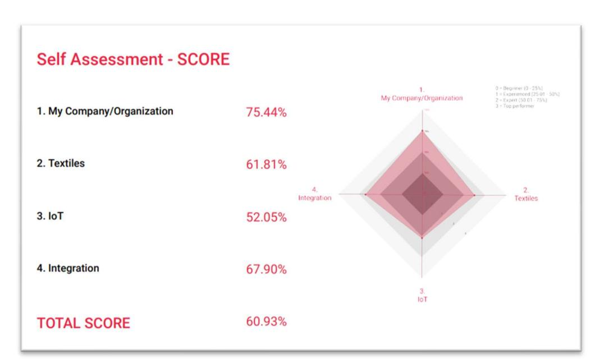

Figure 1 : Radar chart, SMARTX general score

| Smart Self Assessment Score Evaluation |               |                                      |  |                                        |  |                                 |  |                            |  |                                      |  |        |  |
|----------------------------------------|---------------|--------------------------------------|--|----------------------------------------|--|---------------------------------|--|----------------------------|--|--------------------------------------|--|--------|--|
| Name                                   | EuraMaterials |                                      |  |                                        |  |                                 |  |                            |  |                                      |  |        |  |
| Date                                   | 11-02-2021    |                                      |  |                                        |  |                                 |  |                            |  |                                      |  |        |  |
| Time                                   | 09:08         |                                      |  |                                        |  |                                 |  |                            |  |                                      |  |        |  |
| Evaluation Relevance Score (in %)      |               |                                      |  |                                        |  |                                 |  |                            |  |                                      |  |        |  |
| TOTAL SCORE                            |               | 60.93%                               |  |                                        |  |                                 |  |                            |  |                                      |  |        |  |
| 1. My Company/Organization             |               | 75.44%                               |  | 61.81%                                 |  | 3. IoT                          |  | 52.05%                     |  | 4. Integration                       |  | 67.90% |  |
| 1. Organization                        |               | 83.33%                               |  | 1. Yarn construction & function 64.29% |  | 1. Electronic                   |  | 52.00%                     |  | 1. Production Design                 |  | 66.67% |  |
| 1. Innovation                          | 88.89%        | 1. Energy production & storag 83.33% |  | 1. Measuring sensors                   |  | 82.96%                          |  | 1. Design for connectivity |  | 83.33%                               |  |        |  |
| a. R&D people dedicated to             | 3             | a. Piezoelectric filaments (s)       |  | 2                                      |  | a. Temperature                  |  | 1                          |  | a. Placing of electronic circu       |  | 1      |  |
| b. Working in collaborative            | 2             | b. Energy storage filaments          |  | 3                                      |  | b. Pressure sensors, Humidit    |  | 2                          |  | b. Easy (for user) to dismant        |  |        |  |
| c. Working as an innovation            | 3             | c. Heating yarns                     |  | 2                                      |  | c. General electromagnetic      |  | 2                          |  | c. Design for improved functic       |  | 66.67% |  |
| 2. Strategy                            | 77.78%        | d. Photovoltaic filaments (q)        |  | 3                                      |  | d. Vibration                    |  | 2                          |  | a. Controls placement (gest)         |  |        |  |
| a. Clearly communicated val            | 3             | 2. Signal transfer                   |  | 33.33%                                 |  | e. Biological parameters        |  | 2                          |  | b. Sensor and actuator placa         |  |        |  |
| b. Widely spread innovation            | 2             | a. Conductive yarns (pure m          |  | 1                                      |  | f. Gas, VOC and pH sensors      |  | 2                          |  | 3. Design adapted to end user 83.33% |  |        |  |
| c. Smart Textiles are part             | 2             | b. Plastic optical fibres (wov       |  | 1                                      |  | g. Lightsensors (visible, UV, I |  | 2                          |  | a. User/wearer morphology            |  |        |  |

Figure 3 : Detail score evaluation, SMARTX

Although fully usable, the development of this tool was carried out with standard office tools (Google form, Excel) not adapted to automation. Creating scores and graphs was therefore very time-consuming, as most of the work was done manually. It was therefore decided very early on that automation would be necessary, and that it was essential to outsource this part of the work in order to have a tool that was easy to use, efficient, and exploitable, in consultation with Ariadne Innovation (P18) in charge of the implementation of the RegioGreenTex Digital Tool.

#### 2.1.2 Section definition

Following the example of the tool developed for the SmartX project, we decided that it would be relevant to create several sections, in order to evaluate the position of companies according to these sections. The sections initially selected were those of the circular economy pillars:

- Material impact
- Energy saving
- Water management
- Durability
- Waste management
- Recycled content
- Regulations and policies
- Knowledge about circular economy tools (LCA eco-design, and environmental management)

Thus, by obtaining a score for each pillar, the company is able to know in which section it needs to improve in order to increase its knowledge and be more involved in terms of the circular economy.

In June and July 2023, the SMARTX reference tool and the proposed themes were presented to the RegioGreenTex WP2 partners, in order to validate the spirit of the tool to be developed, as well as the topics to be covered to assess the involvement of companies in terms of their environmental approach.

#### 2.1.3 First questions - SELF ASSESSMENT TOOL version 1

We embarked on a long period of monitoring, so as to have several documents available on the subject of the circular economy. This phase included a desktop research of questionnaires already available on the internet in this area of focus, aiming to create a library of resources that could be the back-bone of the questions developed/created for the SAT

At the same time, we looked at what was being done in terms of question types. We came up with a list of different types of questions:

- Open-ended questions: where participants are free to write their own answers
- Multiple-choice questions: participants are asked to tick the boxes where the correct answers are given.
- True/false or yes/no questions: where participants have to say whether the statement is correct or not.
- Rating scale-type questions: where participants are asked to select a value (number) that most closely matches their choice.
- Questions with "Likert scale" rating type,: where participants have to choose from 5 or 7 answers, covering the whole spectrum of opinions, from one extreme to the other.
- Ranking questions: where participants have to rank answers in order of preference
- Picture choice questions: where participants have to choose the right answer from among the illustrations.

| <b>MATERIAL IMPACT</b> |                                                                                                                                                                                                                                          |  |
|------------------------|------------------------------------------------------------------------------------------------------------------------------------------------------------------------------------------------------------------------------------------|--|
| <b>The materials</b>   | How well do you know your material flows throughout the process, from the moment it enters your company to the moment it leaves, including all process stages? We're talking here about quantities, main characteristics and the rate of |  |
|                        | waste generated.                                                                                                                                                                                                                         |  |
|                        | input products by weight                                                                                                                                                                                                                 |  |
|                        | Input products by material type                                                                                                                                                                                                          |  |
|                        | waste by weight                                                                                                                                                                                                                          |  |
|                        | waste by type of material                                                                                                                                                                                                                |  |
|                        | loss rates at different stages of your process                                                                                                                                                                                           |  |
|                        |                                                                                                                                                                                                                                          |  |

Figure 4 : Sample questions - Material impact category

| <b><u>EGULATIONS and POLICIES</u></b> |                                                                                              |
|---------------------------------------|----------------------------------------------------------------------------------------------|
| <b><u>egulations and policies</u></b> | Are you familiar with the European strategy on textiles and the actions being taken?         |
|                                       | planned (ongoing and planned)                                                                |
|                                       | Do you know the European strategy on textiles and the actions planned (current and planned)? |
|                                       | IN PARTICULAR ON THE FOLLOWING TOPICS:                                                       |
|                                       | Extended producer responsibility                                                             |
|                                       | EU Ecolabel                                                                                  |
|                                       | Environmental display                                                                        |
|                                       | end of unsold stock destruction                                                              |
|                                       | the fight against microplastics                                                              |
| digital paseeport                     |                                                                                              |
| ecological claims                     |                                                                                              |
| conditioned waste flow                |                                                                                              |

Figure 5 : Sample questions - regulations and policies category

| <b><u>INVIRONMENTAL COMMUNICATION</u></b>                                     |                                                         |
|-------------------------------------------------------------------------------|---------------------------------------------------------|
| abels and certifications with invironmental, social and animal welfare claims | Do you know of or use one or more environmental labels? |
|                                                                               | do you know these labels                                |
|                                                                               | ECOLABEL EUROPEEN                                       |
|                                                                               | ECOCERT                                                 |
|                                                                               | OEKOTEX                                                 |
|                                                                               | BLUESIGN                                                |
|                                                                               | FAIRTRADE MAX AVELAER                                   |
|                                                                               | GOTS                                                    |
|                                                                               | IMPACT ENVIRONNEMENTAL (A à E)                          |
|                                                                               | BIORE SUSTAINABLE TEXTILE                               |
| RWS, RMS, RAS (Responsible Wool, Mohair, Alpaca Standard)                     |                                                         |

Figure 6 : Sample questions - environmental communication category

# 2.2 Participatory approach with stakeholders

# 2.2.1 Consortium presentation and feedback

A first version of the questions was presented at the Regional Cluster workshop that took place in Prato in September 2023. Initial feedback on the questions was encouraging, but a common remark was made: the needs of the companies are not clearly identified. The questions need to be revised to reflect the real needs of companies.

# 2.2.2 Changes to questions - SELF ASSESSMENT TOOL version 2

A new phase of reflection began, and following a staff departure at EuraMaterials, a new person joined the project. After a few weeks' reflection, a second version of the SELF ASSESSMENT TOOL was proposed.

This version is presented in 3 stages:

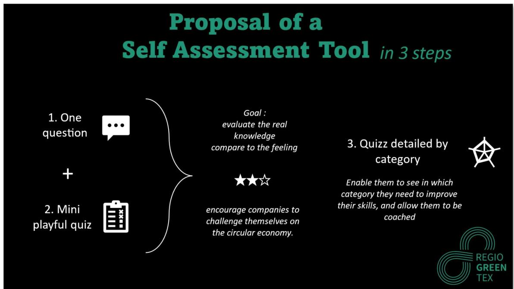

## Proposal of a Self Assessment Tool in 3 steps

Figure 7 : Self assessment tool version 2

The first step was to ask a very general question: "How would you rate your knowledge of the circular economy? The company is then asked to position itself on a scale:

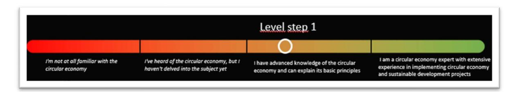

Figure 8 : Self assessment tool version 2 - step 1

The second phase consisted of asking 12 questions on the theme of the circular economy. For each question, there were 4 possible answers, but only one correct answer. Each correct answer earned 1 point. Depending on the number of points obtained, a second cursor appeared on the scale

0 to 3 points : I'm not at all familiar with the circular economy 4 to 6 points : I've heard of the circular economy, but I haven't delved into the subject yet 7 to 9 points : I have advanced knowledge of the circular economy and can explain its basic principles 10 to 12 points : I am a circular economy expert with extensive experience in implementing circular

economy and sustainable development projects

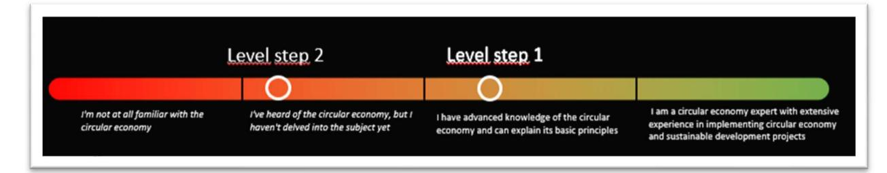

Figure 9 : Self-assessment tool version 2 - step 2

The different positions of the two points highlight the difference between what the company thinks it knows, and what it actually knows.

The third phase consists of a quiz on the circular economy, the aim of which was to educate in an entertaining way, through questions divided into 8 categories: the pillars of the circular economy. The result is a radar diagram which identifies the category(ies) in which the company needs coaching. This provides:

- Visual communication: Spider charts are easy to understand for a wide audience, including people who are not familiar with complex figures. They are therefore useful for internal and external communication.

- Quick and clear visualisation : Spider diagrams offer an immediate visualisation of skills or levels in several categories. At a glance, you can see a person's strengths and weaknesses in each area.

- Decision making: They help to make informed decisions by identifying areas where improvements are needed. This can guide training, professional development or recruitment decisions

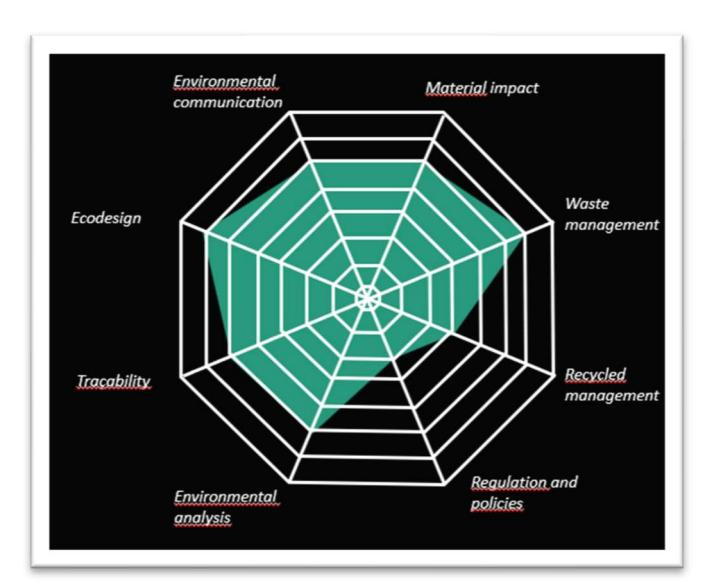

Figure 10 : Example of a radar diagram - Self assessment tool version 2

#### 2.2.3 Consortium presentation and feedback

Version 2 of the SELF ASSESSMENT TOOL was presented to part of the consortium in October 2023. The visualization of the third part was particularly appreciated, as it responded to the request to reveal needs. However, the questions were too "people" rather than "business" oriented.

It resulted to be essential to have an initial set of self-assessment questions on companies' mastery of circular economy issues. However, EuraMaterials consulted with the other partners within the RegioGreenTex project and established that it is essential to have an initial set of selfassessment questions on companies' mastery of circular economy. With the help of this tool, we can determine a start point and an end point when it comes to knowledge acquired on circular economy, with the help of the project.

#### 2.2.4 Modifying questions - SELF ASSESSMENT TOOL version 3

Following feedback from the consortium, we proposed a third version of the tool in November 2023. We decided to divide the self-assessment tool into two parts:

- A first part to evaluate the company: about fifteen questions, each with 5 possible answers:

- o Not concerned o No or very little knowledge o Little knowledge but the company is interesting about the subject o Good knowledge of the subject: expertise in the company or with other players to cover part of the subject o Very good knowledge and mastery of the subject : at least one expert who covers most of the subject
- A second part to evaluate the company's employees. A quiz with approximately 18-15 questions in each category: o collecting, sorting and repairing o recycling o process o eco-design o environmental approach Following this presentation, the following comments were made:
- categories are validated
- SELF ASSESSMENT TOOL must target the company, not just the respondent

- the questions must focus on what the company is currently doing, with the addition of a dimension on what it intends to do in the near future or what it does not intend to do.
- the SELF ASSESSMENT TOOL should be useful for coaches (WP3, WP4).

## 2.2.5 Modifying questions - SELF ASSESSMENT TOOL version 4 and higher

Following feedback, several modifications to the SELF ASSESSMENT TOOL were presented to the consortium in December 2023.

Figure 11 : Self-assessment tool version 4 -proposed changes

**First part : company self-assessment in the circular economy approach**  
Example of the self assessment tool questions (category « ecodesign »)

**Q1 : How would you rate your company's level of involvement in ecodesign?**  
 Imy company is not concerned     Has some knowledge     Has some good knowledge  
 Has very good knowledge     Is an expert company

**Q2 / easy question : Ecodesign**, also known as ecological design, aims to reduce the environmental impact of products throughout their life cycle, from production to end of life.

 TRUE  FALSE

**Q3 / intermediate question :** The use of organic fibres, such as organic cotton, in the manufacture of clothing is an eco-design practice aimed at reducing the environmental impact of the textile sector.

 TRUE  FALSE

**Q4 / advance question :** A product's ecological footprint measures the extent of natural resources used and waste generated throughout its life cycle, including production, use and end of life.

 TRUE  FALSE

**Q5 / expert question :** The circular economy concept advocates a model in which products are designed to be 100% recyclable, and waste is transformed into raw materials for new products, thereby minimising waste production.

 TRUE  FALSE

**→For each category, we will do the same process**

 REGIO  
 GREEN  
 TEX
 
 Co-funded by  
 the European Union
Figure 12 : Self-assessment tool version 4 - first part questions

**First part : company self-assessment in the circular economy approach**

**Deliverable**

Results generated as an uneditable sheet, with :

- - name of the company
- - field of activity
- - adress
- - country
- - Region
- - Category (cluster ...)

And a radar chart :

The two graphs to check that the self-assessment is consistent

Blue = self assessment = part a

Orange = self assessment check = part b

If « not concerned » is checked, the result is not accounted for

The sheet will be send by email. A copy is for the RegioGreenTex coach, and available for the webmaster

REGIO GREEN TEX

Co-funded by the European Union

Figure 13 : Self-assessment tool version 4 - results

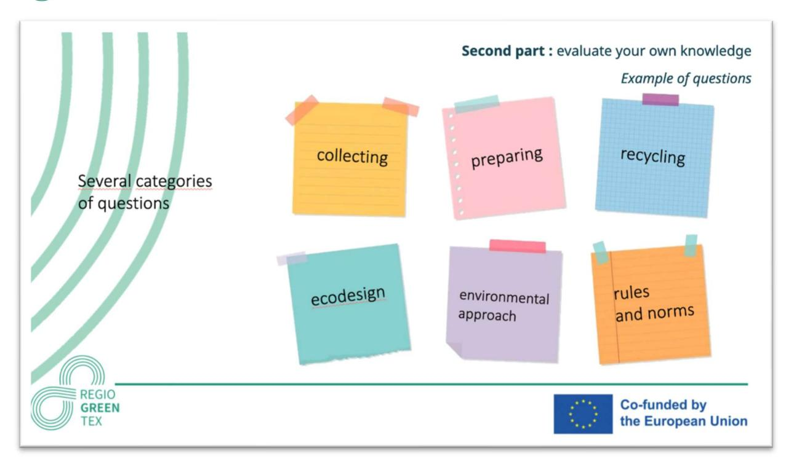

Figure 14 : Self-assessment tool version 4 - second part questions

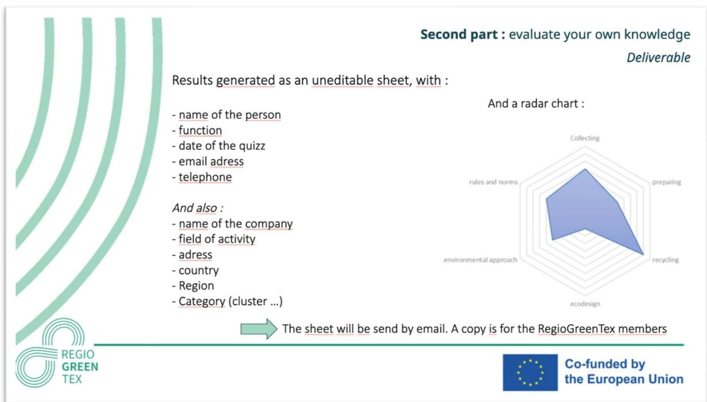

Figure 15 : Self-assessment tool version 4 - second part result

 The entire consortium was satisfied with the development of Self-assessment tool. However, while the second part has been validated for the educational part, the first part needs to be reworked. Indeed, there is some uncertainty as to the relevance of the first questionnaire: it is impossible to know whether the self-assessment is consistent or whether it is over- or underevaluated.

As an approach, the SAT developers consider that only one person per company is required to complete the first questionnaire.

Following multiple discussions, we came to the conclusion that the SAT should also be integrated on the digital tool and accessible to the RGT project companies.

# 2.3 Invitation to tender and selection of external service provider

Following the positive feedback from the consortium, we drafted a call for tender for the IT development of the tool, the generation of graphs, the automatic sending of e-mails and the visualization of results via an application. This tender was sent to 3 companies based near EuraMaterials, during the month of January 2024:

- Easy web
- Techniweb
- HD Dev

After a careful reading and evaluation of the proposals received, we chose HD Dev in February.

Discussions have begun with the company to set up the online SELF ASSESSMENT TOOL from March 2024, in order to present the tools that will be used, validate the tool specifications and set up the working methodology between Euramaterials and HD Dev.

# 3 STRUCTURING THE TOOL

# 3.1 Consortium participation (Porto)

Since the last exchanges with the consortium, in December 2023, the questions have been reworked and the answers have been oriented towards the company's positioning.

In order to test the questions, we have taken advantage of the annual meeting of the RGT project in Porto in March 2024 to get feedback from companies on the question typologies and categories.

Figure 16 : Questions tested during annual meeting in Porto

The feedback has been positive:

A few partners find the answers too long to read, but a large majority of respondents find the answers relevant and detailed enough to enable them to choose the correct answer.

We need to change "product" to "product/process" to make SELF ASSESSMENT TOOL suitable for all companies.

In the "production" section, we were asked to separate out the resources (water, energy, buildings, etc.), to enable the companies concerned to provide details, if necessary.

In the "production" section, we were asked to multiply the questions in order to divide the tier 1 subcontractors, and the tier 2 and 3 subcontractors.

In the "eco-design" section, we were asked to add questions to refine the results.

Following these exchanges, we reworked the questions. The number of questions is now :

For the "raw materials" section: 6

For the "production" part: 8

For the "eco-design" section: 7

#### For the "transparency" section: 11

Also, it was considered useful to apply the SAT not only in M18, but also at the end of the RGT project, to asses companies progress following the support measures offered in WP3 and WP4.

RGT lead partner, as well as WP2, WP3, and WP4 leaders and Task leaders will collaborate in order to ensure partner SMEs answer the SAT questionnaires in due time.

# 3.2 Visual aspect of the form

To make the SELF ASSESSMENT TOOL more attractive, the sections have been highlighted with new graphic elements inspired by the RegioGreenTex project:

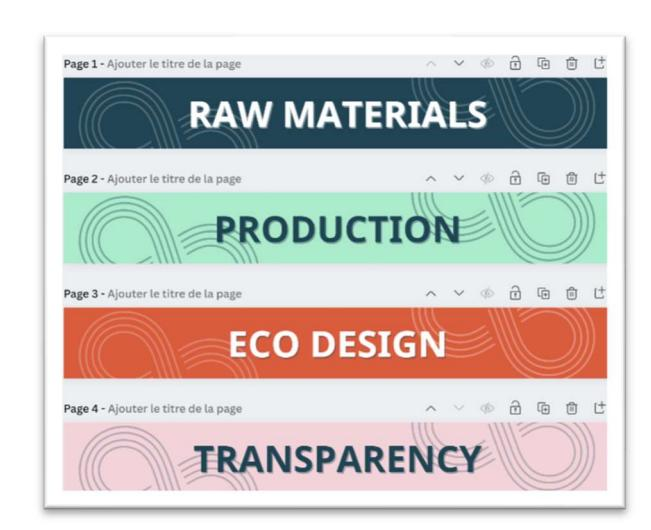

Figure 17 : Design of different parts for the online version

# 3.3 Question formatting

To make the SELF ASSESSMENT TOOL useful to coaches, for each question the respondent is asked to justify the answer with details.

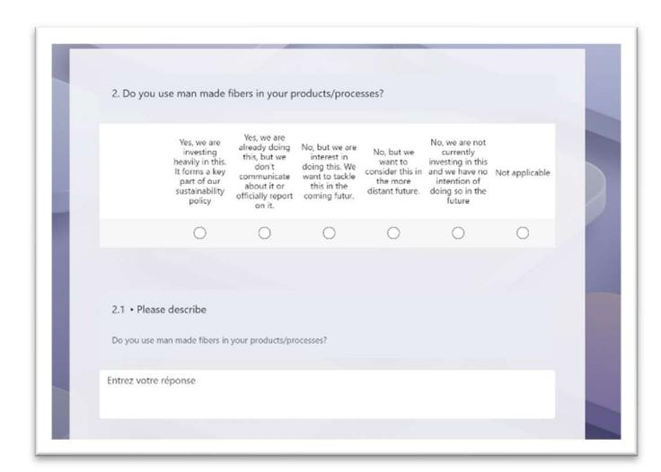

Figure 18 : Formating question

## 3.4 Application mock-up

A first version of the application has been set up and it is accessible via Microsoft Teams only to EuraMaterials members for the time being.

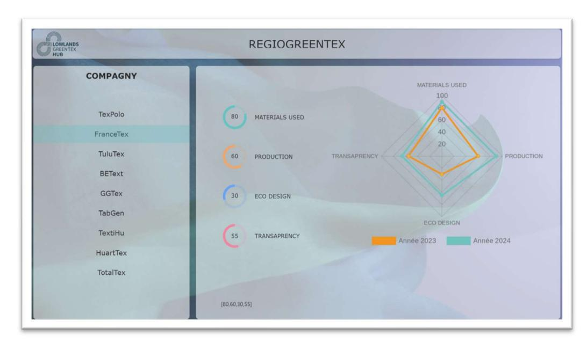

Figure 19 : First mock-up of the Self-assessment tool app

# 4 IT DEVELOPMENT

## 4.1 Self-assessment Tool

#### 4.1.1 Intro and outro text

The Self-assessment tool introduction, finalization, and automatic mailing texts have been drafted. As have the identity details requested at the start of the Self-assessment tool.

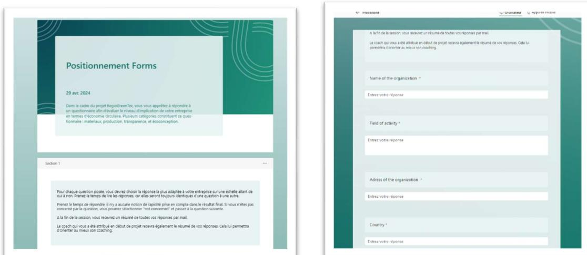

Figure 20a 20b : Intro of the Self-assessment tool

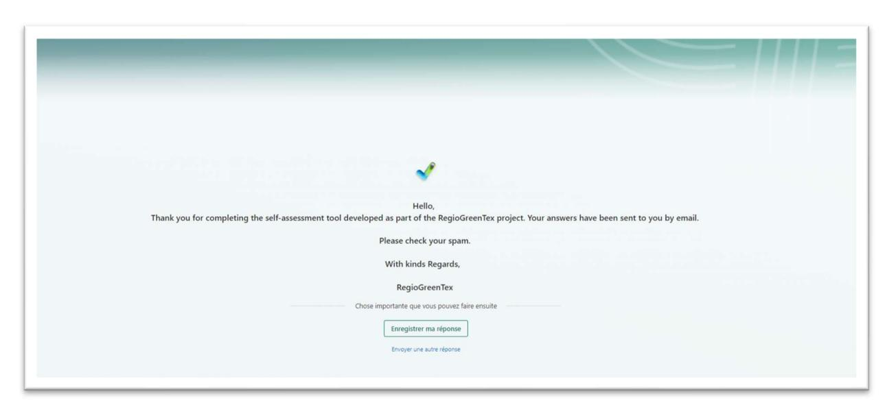

Figure 21 : Outro of the Self-assessment tool

## 4.1.2 Application

The application has been improved. It is now composed of 3 display pages:

Dashboard: enables rapid visualization of a company's results in the form of a radar chart. A system of filters (country/company name/date) allows you to select the company.

Entries: displays the values obtained by the company (not available at present: will allow a coach to be assigned in this section)

Company: displays the company's identity card

The screenshot displays the Regio Green Tex tools with a dashboard on the left and a France Tex book in the center. The dashboard is titled 'Regio Green Tex' and contains the name 'Bonjour, Regiogreentex'. The France Tex book is a red book with a white background and a white and red border. The book has the title 'FranceTex' and the text 'France'. The book also has the text 'Société de revalorisation des déchets'. The right side of the dashboard is divided into two sections: 'RAW MATERIALS' (85), 'PRODUCTION' (60), 'ECO DESIGN' (30), and 'TRANSAPPENCY' (55). The top section contains a selection bar for 'Pays' and a selection bar for 'FranceTex'. The bottom section contains a chart titled 'MATERIALS USED' showing the production of 'TRANSAPPENCY', 'ECO DESIGN', and 'PRODUCTION' across the four production categories (Transparency, Eco Design, Production). The chart includes a legend at the bottom showing the annual percentages for Année 2023 (orange) and Année 2024 (teal).

Figure 22 : Second mock-up of the Self-assessment tool app

The screenshot displays the EuraMaterials Regio Green Tex dashboard. On the left, the section is 'Dashboard' with a logo and the text 'Bonjour, Regiogreentex'. The main company data area shows company information for TexPolo, FranceTex, TuluTex, BETex, GGTex, TabGen, and TextHu. The data is as follows:

| Company   | Date       | S1  | S2 | S3 | S4 |
|-----------|------------|-----|----|----|----|
| TexPolo   | 04/04/2024 | 30  | 50 | 35 | 22 |
| FranceTex | 04/04/2024 | 100 | 60 | 30 | 55 |
| TuluTex   | 04/04/2024 | 90  | 50 | 56 | 55 |
| BETex     | 04/04/2024 | 98  | 56 | 65 | 50 |
| GGTex     | 04/04/2024 | 32  | 50 | 48 | 44 |
| TabGen    | 04/04/2024 | 55  | 65 | 24 | 42 |
| TextHu    | 04/04/2024 | 50  | 70 | 80 | 45 |

The dashboard is divided into three sections:

- **Company:** TexPolo (30)
- **Score51:** 30
- **Score52:** 50
- **Score53:** 22
- **Score54:** 22
- **Score55:** 2024

The bottom left section contains a 'Theme' tunnel with a checkbox and the text 'Theme'. The bottom right section contains a 'Enregistrer' button.

Figure 23 : Detail of the Self-assessment tool app

## 4.2 Development of educational quizzes

In parallel with the Self-assessment tool, the interactive part is also being developed. The mode chosen for development allows you to learn as you go:

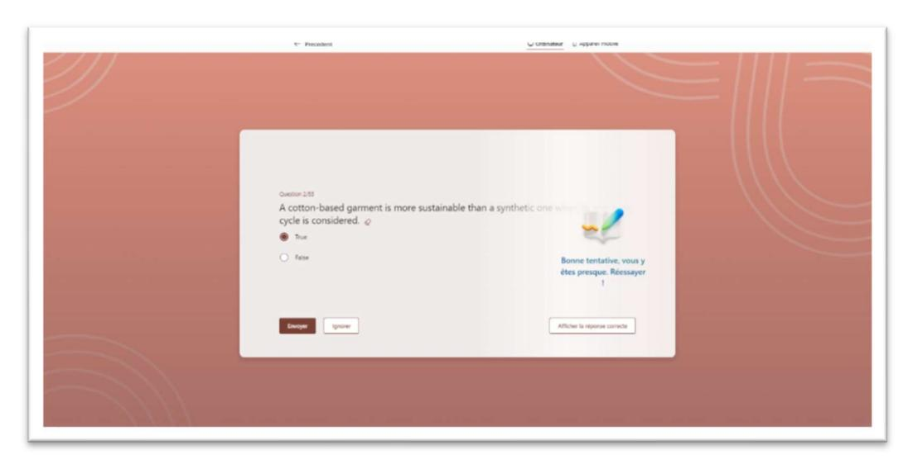

Figure 24 : Quiz part - wrong answer

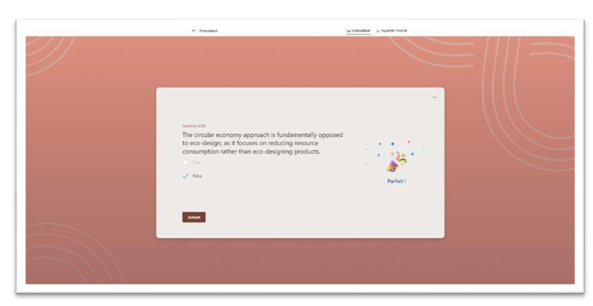

Figure 25 : Quiz part : right answer

## 4.3 Questions

To diversify the educational quiz, we've redesigned the questions, offering the answers in the form of images.

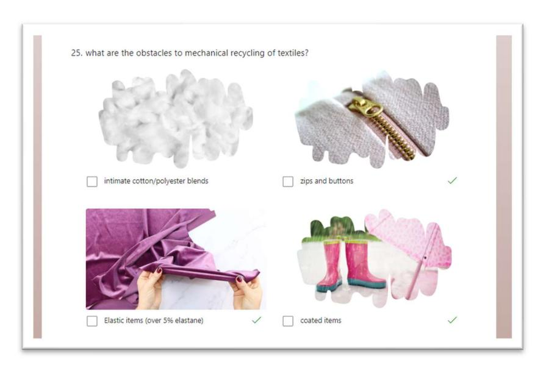

Figure 26 : Example of images as answers

# 5 BETA TEST

The beta test session was launched during a Lowland Hub meeting on May 2, 2024. The Selfassessment tool and the educational quiz were sent to members of project (see screenshot below).

An e-mail was then sent to the entire consortium for feedback on the use of the tool.

 The beta version to test your knowledge of the circular economy is also available: <https://forms.office.com/e/Ldc4EUrkZF>

For this knowledge quizz : all questions are in random order 

Don't hesitate to send us your feedback for this second questionnaire by email!

I'll let you **1 week** to try it out and give us your feedback! After 24/05 we'll finalise the SAT and put it online.

\*Give away competition : We'll reward the best fake company name(s) (+description()) with a gift at our next physical meeting!

Have a good day, and be creative !

**Bérangère Deloby**

Chargée d'affaires  
[berangere.deloby@euramaterials.eu](http://berangere.deloby@euramaterials.eu)

Meb : +33 (0)7 60 12 06 09

 EuraMaterials

41 rue des Métisages - CS70014 - 59336 Toucoing CEDEX - France  
[euramaterials.eu](http://euramaterials.eu)

Figure 27a 27b : mailing for beta test

To date, 5 companies have participated in the beta test: Ariadne, Rise, Oostnl, Technotex, Euramaterials.

# 6 ON LINE

The design of SAT is in the schedule, the beta-testing will be finished by the end of June 2024, when the tool will be available on the RegioGreenTex Digital Tool.

# 7 FIGURE TABLE

| F | IGURE | 1  | : R | ADAR CHART                  | , SMARTX                                         | GENERAL SCORE                                                                                                                     | ........................................................................................................ 5         |                                                                                                        |
|---|-------|----|-----|-----------------------------|--------------------------------------------------|-----------------------------------------------------------------------------------------------------------------------------------|--------------------------------------------------------------------------------------------------------------------|--------------------------------------------------------------------------------------------------------|
| F | IGURE | 2  | : R | ADAR CHART                  | , DETAILED TEXTILE SCORE                         |                                                                                                                                   | , SMARTX ............................................................................................ 5            |                                                                                                        |
| F | IGURE | 3  | : D | ETAIL SCORE EVALUATION      |                                                  | , SMARTX ............................................................................................................. 6          |                                                                                                                    |                                                                                                        |
| F | IGURE | 4  | : S | AMPLE QUESTIONS             |                                                  | M ATERIAL IMPACT CATEGORY                                                                                                         |                                                                                                                    | ............................................................................................ 7         |
| F | IGURE | 5  | : S | AMPLE QUESTIONS             |                                                  | REGULATIONS AND POLICIES CATEGORY                                                                                                 |                                                                                                                    | ................................................................................ 8                     |
| F | IGURE | 6  | : S | AMPLE QUESTIONS             |                                                  | ENVIRONMENTAL COMMUNICATION CATEGORY                                                                                              |                                                                                                                    | ..................................................................... 8                                |
| F | IGURE | 7  | : S | ELF ASSESSMENT TOOL VERSION |                                                  | 2 .................................................................................................................. 9            |                                                                                                                    |                                                                                                        |
| F | IGURE | 8  | : S | ELF ASSESSMENT TOOL VERSION |                                                  | 2                                                                                                                                 | STEP 1 ...................................................................................................... 9    |                                                                                                        |
| F | IGURE | 9  | : S | ELF ASSESSMENT TOOL VERSION |                                                  | 2                                                                                                                                 | STEP 2 .................................................................................................... 10     |                                                                                                        |
| F | IGURE | 10 | :   | E                           | XAMPLE OF A RADAR DIAGRAM                        |                                                                                                                                   | S ELF ASSESSMENT TOOL VERSION                                                                                      | 2................................................................. 10                                  |
| F | IGURE | 11 | :   | S                           | ELF ASSESSMENT TOOL VERSION                      |                                                                                                                                   | 4 PROPOSED CHANGES                                                                                                 | ................................................................................. 12                   |
| F | IGURE | 12 | :   | S                           | ELF ASSESSMENT TOOL VERSION                      |                                                                                                                                   | 4 FIRST PART QUESTIONS                                                                                             | ............................................................................. 13                       |
| F | IGURE | 13 | :   | S                           | ELF ASSESSMENT TOOL VERSION                      |                                                                                                                                   | 4 RESULTS                                                                                                          | ................................................................................................ 13    |
| F | IGURE | 14 | :   | S                           | ELF ASSESSMENT TOOL VERSION                      |                                                                                                                                   | 4 SECOND PART QUESTIONS                                                                                            | ......................................................................... 14                           |
| F | IGURE | 15 | :   | S                           | ELF ASSESSMENT TOOL VERSION                      |                                                                                                                                   | 4 SECOND PART RESULT                                                                                               | ............................................................................... 14                     |
| F | IGURE | 16 | :   | Q                           | UESTIONS TESTED DURING ANNUAL MEETING IN         |                                                                                                                                   |                                                                                                                    | P ORTO ................................................................................. 16            |
| F | IGURE | 17 | :   | D                           | ESIGN OF DIFFERENTS PARTS FOR THE ONLINE VERSION |                                                                                                                                   |                                                                                                                    | .................................................................................. 17                  |
| F | IGURE | 18 | :   | F                           | ORMATING QUESTION                                | .............................................................................................................................. 17 |                                                                                                                    |                                                                                                        |
| F | IGURE | 19 | :   | F                           | IRST MOCKUP OF THE                               | S ELF ASSESSMENT TOOL APP                                                                                                         |                                                                                                                    | ........................................................................................ 18            |
| F | IGURE | 20 | A   | 20                          | B : I NTRO OF THE                                | S ELF ASSESSMENT TOOL                                                                                                             |                                                                                                                    | .................................................................................................. 19  |
| F | IGURE | 21 | :   | O                           | UTRO OF THE S                                    | ELF ASSESSMENT TOOL                                                                                                               | ........................................................................................................ 19        |                                                                                                        |
| F | IGURE | 22 | :   | S                           | ECOND MOCKUP OF THE                              | S ELF ASSESSMENT TOOL APP                                                                                                         |                                                                                                                    | ..................................................................................... 20               |
| F | IGURE | 23 | :   | D                           | ETAIL OF THE S ELF ASSESSMENT TOOL APP           |                                                                                                                                   |                                                                                                                    | ................................................................................................... 20 |
| F | IGURE | 24 | :   | Q                           | UIZZ PART WRONG ANSWER                           | ................................................................................................................... 21            |                                                                                                                    |                                                                                                        |
| F | IGURE | 25 | :   | Q                           | UIZZ PART : RIGHT ANSWER                         | ...................................................................................................................... 21         |                                                                                                                    |                                                                                                        |
| F | IGURE | 26 | :   | E                           | XAMPLE OF IMAGES AS ANSWERS                      |                                                                                                                                   | ............................................................................................................... 22 |                                                                                                        |
| F | IGURE | 27 | A   | 27                          | B : MAILING FOR BETA TEST                        | ..................................................................................................................... 23          |                                                                                                                    |                                                                                                        |