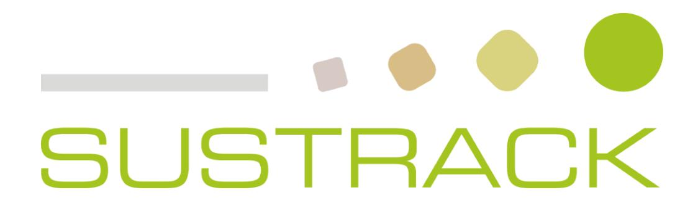
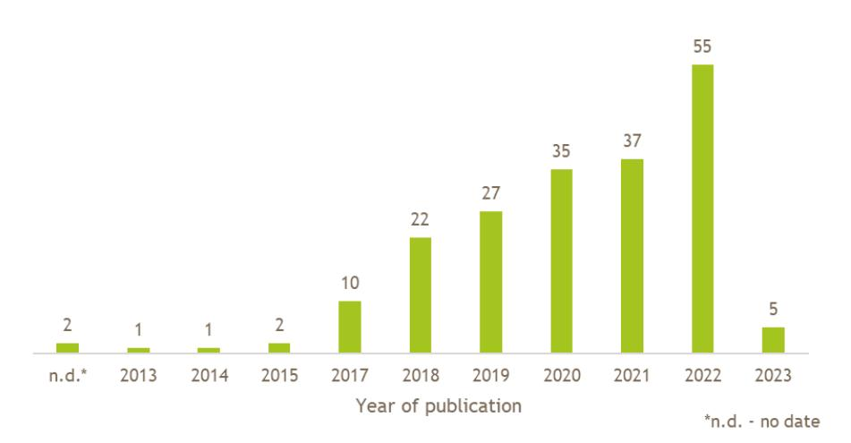
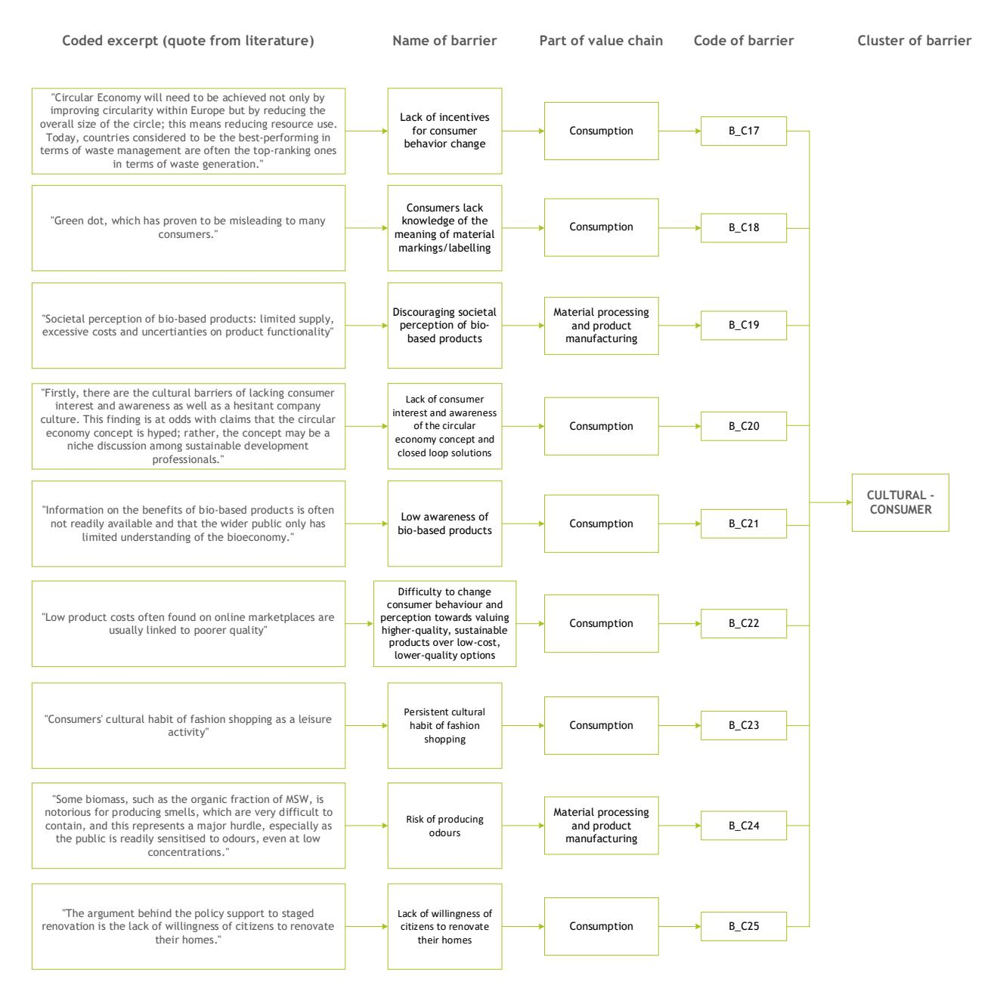
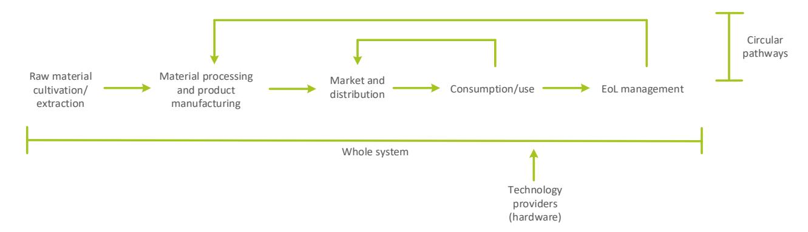
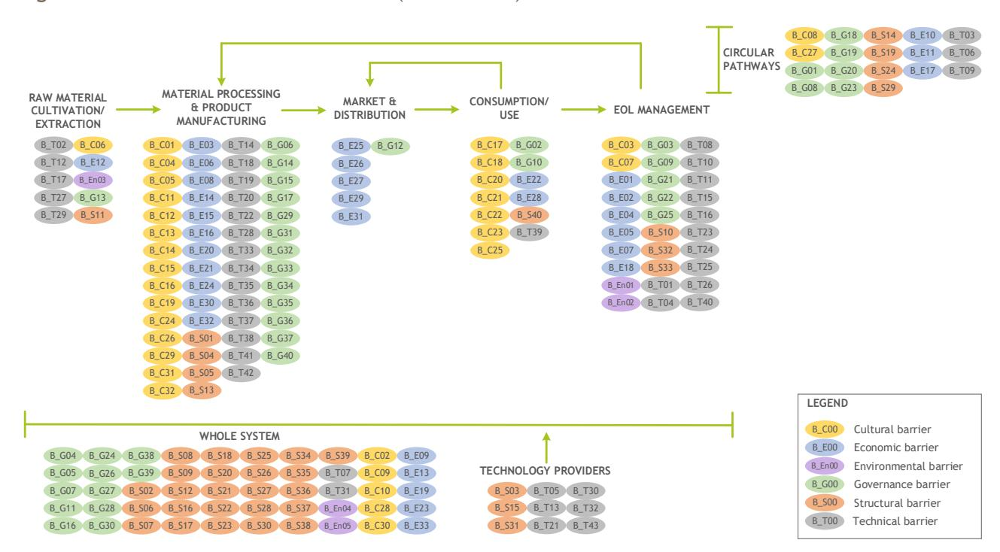
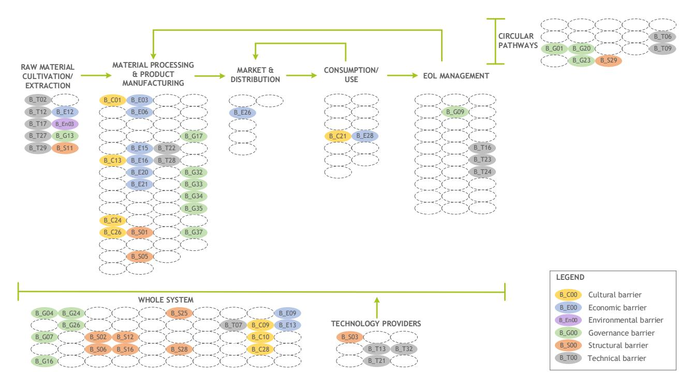
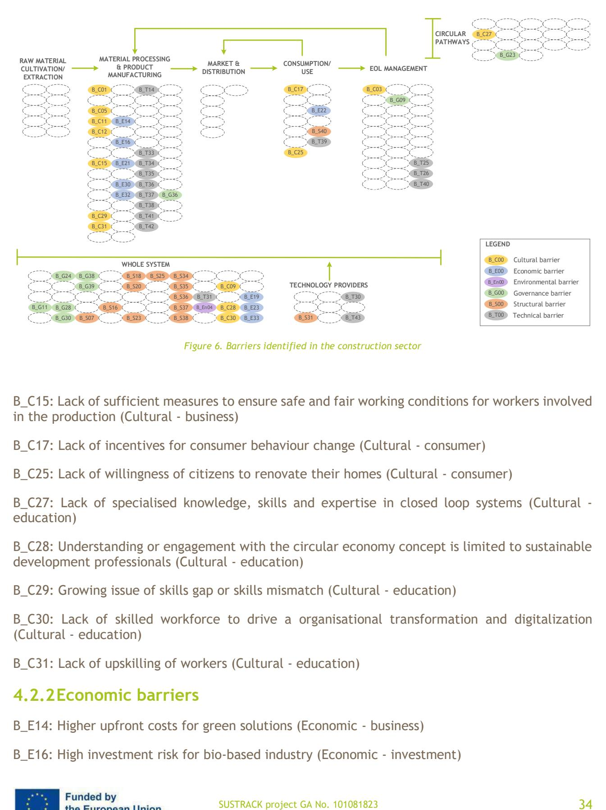
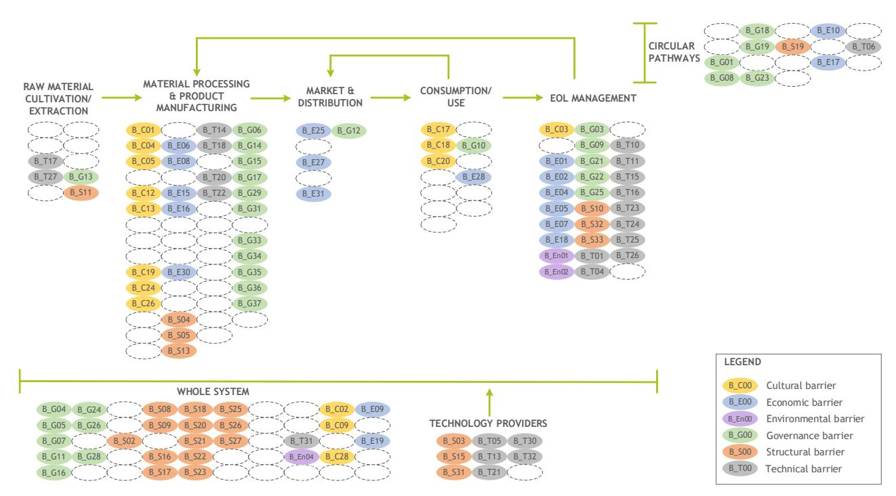
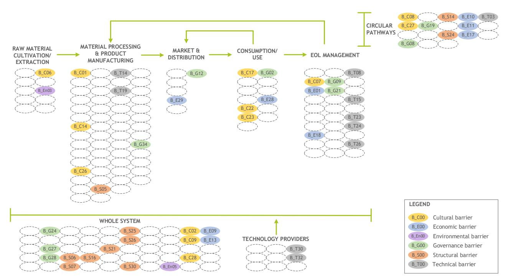
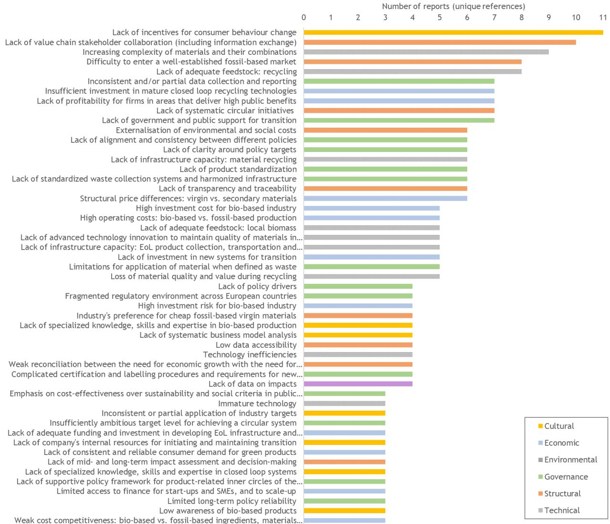

**D1.1 – REPORT ON LITERATURE GAPS AND TRADE-OFFS**

| Work package     | WP1 Identification of the environmental, economic and social limits of the |
|------------------|----------------------------------------------------------------------------|
| Task             | T1.1 Gap analysis                                                          |
| Due date         | 30.04.2023                                                                 |
| Submission date  | 29.04.2023                                                                 |
| Deliverable lead | UnitelmaSapienza University of Rome                                        |
| Version          | V4.0                                                                       |
| Authors          | Elina Dace, Alessandro Cascavilla, Gülşah Yilan (UNIT)                     |
| Contributors     | Pierre Menger (TECNALIA), Luana Ladu (BAM), Georg Pallaske (KE), Elisa     |
|                  | Chioatto and Emy Zecca (UNIFE), Joris Van Acker (UGENT), Susanna           |
| Reviewers        | All partners                                                               |

#### **Document Revision History**

| Version | Date       | Description of change                         | List of contributor(s) |
|---------|------------|-----------------------------------------------|------------------------|
| 1.0     | 11.04.2023 | Draft version distributed for partners’ input | UNIT                   |
| 2.0     | 17.04.2023 | Partners’ input                               | All partners           |
| 3.0     | 24.04.2023 | Pre-Final version                             | All partners           |
| 4.0     | 28.04.2023 | Final version                                 | UNIT                   |
| 5.0     | 30.07.2024 | Opened for revision                           | UNIT                   |
| 6.0     | 30.08.2024 | Revised version                               | UNIT                   |

#### **Abstract**

The transition from linear fossil-based systems to circular and bio-based systems represents an opportunity and a suitable pathway for achieving several SDGs. Indeed, circular bio-based systems depict a great opportunity to reconcile sustainable long-term growth with environmental protection through the prudent use of renewable resources for industrial purposes. This needed transition is a complex process, which does not simply require innovative technologies from the supply-side, but also societal transformations based on a multi-actor process. The circular bioeconomy meta-sector may be a good candidate to put forward a new economic model, which requires transformative policies, purposeful innovation, access to finance, risk-taking capacity as well as new and sustainable business models and markets. However, a critical assessment of the environmental, social and economic impacts of the current linear fossil-based economy, as well as of the improvement potential associated with circular bio-based systems, is needed to underpin the identification of policy priorities. Bearing this in mind, SUSTRACK is a three-year project aimed at supporting policymakers in their efforts to develop sustainable pathways to replace fossil and carbon-intensive systems with sustainable circular and biobased systems (at the EU and regional scale), contributing to achieving the European Green Deal's objectives. This will be done by: identifying environmental, economic and social limits of a linear carbon-intensive and fossil-based economy; improving existing assessment methodologies; assessing the environmental, social and economic impacts of the EU's current linear fossil-based economy; comparing multiple transition scenarios focusing on the most carbon intensive sectors; identifying priorities according to scenarios analysed in the project and develop guidelines and policy recommendations.

#### **Disclaimer**

Funded by the European Union under project number 101081823. Views and opinions expressed are however those of the author(s) only and do not necessarily reflect those of the European Union or European Research Executive Agency (REA). Neither the European Union nor the granting authority can be held responsible for them.

**Copyright notice:** © 2022 - 2025 SUSTRACK Consortium

#### D1.1 Report on the literature gaps and trade-offs

#### \* R: Document, report (excluding the periodic and final reports)

DEM: Demonstrator, pilot, prototype, plan designs

DEC: Websites, patents filing, press & media actions, videos, etc.

OTHER: Software, technical diagram, etc.

#### **SUSTRACK Consortium:**

| #  | Participant Organization Name                         | Short Name | Country |
|----|-------------------------------------------------------|------------|---------|
| 1  | UNIVERSITA DEGLI STUDI DI ROMA UNITELMA SAPIENZA      | UNIT       | IT      |
| 2  | STICHTING WAGENINGEN RESEARCH                         | WR         | NL      |
| 3  | KNOWLEDGE SRL                                         | KE         | IT      |
| 4  | PEDAL CONSULTING SRO                                  | PC         | SK      |
| 5  | DBFZ DEUTSCHES BIOMASSEFORSCHUNGSZENTRUM              |            |         |
|    |                                                       | DBFZ       | DE      |
| 6  | UNIVERSITEIT GENT                                     | UGENT      | BE      |
| 7  | FUNDACION TECNALIA RESEARCH & INNOVATION              | TECNALIA   | ES      |
| 8  | FVA SAS DI LOUIS FERRINI & C                          | FVA        | IT      |
| 9  | UNIVERSITA DEGLI STUDI DI FERRARA                     | UNIFE      | IT      |
| 10 | BUNDESANSTALT FUER MATERIALFORSCHUNG UND -            |            |         |
|    |                                                       | BAM        | DE      |
| 11 | FUNDACION CIRCE CENTRO DE INVESTIGACION DE RECURSOS Y |            |         |
|    |                                                       | CIRCE      | ES      |

| Deliverable information                                                      |    |
|------------------------------------------------------------------------------|----|
| Nature of the deliverable: Dissemination Level                               | R* |
| PU Public, fully open, e.g. web                                              | x  |
| CL Classified, information as referred to in Commission Decision 2001/844/EC |    |
| CO Confidential to SUSTRACK project and Commission Services                  |    |

## **EXECUTIVE SUMMARY**

The goal of achieving net-zero emissions European economy by 2050 demands a shift from linear, fossil-based systems to circular, bio-based systems. This transition is vital for meeting the United Nations Sustainable Development Goals and reconciling environmental protection with sustainable growth. However, the complexity of the transition relies on societal transformations, cutting-edge technologies, and multi-actor processes, requiring a new economic framework and policy priorities that align with the European Green Deal.

This report presents the SUSTRACK Task 1.1 results on the environmental, economic, social and cultural limitations of the linear, fossil-based economy, as well as barriers and potential improvements associated with transitioning to a circular bio-based economy (CBBE). The research identifies gaps in overcoming these barriers and focuses on four carbon-intensive sectors: construction, fine chemicals, plastics, and textiles. The study explores the trade-offs of the CBBE as an alternative resource strategy, and the requirements for overcoming barriers in terms of knowledge, practical implementation, and opportunities.

Despite the challenges and trade-offs, the transition to a CBBE can bring multiple positive impacts, including economic, environmental, and social benefits. This transition requires effective strategies and policies, as well as collaboration among policymakers, educational institutions, and public opinion leaders to promote sustainable development.

# **TABLE OF CONTENTS**

| 1.                                                                                                     |                                                                                                        |                                                                                                  |
|--------------------------------------------------------------------------------------------------------|--------------------------------------------------------------------------------------------------------|--------------------------------------------------------------------------------------------------|
| 2. Methodology                                                                                         |                                                                                                        | ..............................................................................................12 |
| 3. Limits of the linear, carbon-intensive, fossil-based economy.....................................17 |                                                                                                        |                                                                                                  |
| 3.1                                                                                                    | Environmental limits                                                                                   | ...............................................................................18                |
| 3.1.1                                                                                                  | Chemical sector                                                                                        | ....................................................................................18           |
| 3.1.2                                                                                                  | Construction sector                                                                                    | ................................................................................19               |
| 3.1.3                                                                                                  | Plastics sector                                                                                        | ......................................................................................20         |
| 3.1.4                                                                                                  | Textile sector                                                                                         | .......................................................................................22        |
| 3.2                                                                                                    | Economic limits.....................................................................................23 |                                                                                                  |
| 3.2.1                                                                                                  | Chemical sector                                                                                        | ....................................................................................24           |
| 3.2.2                                                                                                  | Construction sector                                                                                    | ................................................................................24               |
| 3.2.3                                                                                                  | Plastics sector                                                                                        | ......................................................................................25         |
| 3.2.4                                                                                                  | Textile sector                                                                                         | .......................................................................................26        |
| 3.3                                                                                                    | Social and cultural limits..........................................................................26 |                                                                                                  |
| 3.3.1                                                                                                  | Chemical sector                                                                                        | ....................................................................................27           |
| 3.3.2                                                                                                  | Construction sector                                                                                    | ................................................................................27               |
| 3.3.3                                                                                                  | Plastics sector                                                                                        | ......................................................................................27         |
| 3.3.4                                                                                                  | Textile sector                                                                                         | .......................................................................................28        |
| 3.4                                                                                                    | Other limits                                                                                           | .........................................................................................28      |
| 4. Barriers to transition                                                                              |                                                                                                        | ....................................................................................29           |
| 4.1                                                                                                    | Chemical sector                                                                                        | ....................................................................................30           |
| 4.1.1                                                                                                  | Cultural barriers                                                                                      | ....................................................................................30           |
| 4.1.2                                                                                                  | Economic barriers                                                                                      | ..................................................................................31             |
| 4.1.3                                                                                                  | Environmental barriers                                                                                 | ............................................................................31                   |
| 4.1.4                                                                                                  | Governance barriers                                                                                    | ...............................................................................31                |

| 4.1.5                                                                              | Structural barriers                                                                                     | ...............................................................................32         |
|------------------------------------------------------------------------------------|---------------------------------------------------------------------------------------------------------|-------------------------------------------------------------------------------------------|
| 4.1.6                                                                              | Technical barriers                                                                                      | ..................................................................................32      |
| 4.2                                                                                | Construction sector                                                                                     | ................................................................................33        |
| 4.2.1                                                                              | Cultural barriers                                                                                       | ....................................................................................33    |
| 4.2.2                                                                              | Economic barriers                                                                                       | ..................................................................................34      |
| 4.2.3                                                                              | Environmental barriers                                                                                  | ............................................................................35            |
| 4.2.4                                                                              | Governance barriers                                                                                     | ...............................................................................35         |
| 4.2.5                                                                              | Structural barriers..................................................................................35 |                                                                                           |
| 4.2.6                                                                              | Technical barriers                                                                                      | ..................................................................................36      |
| 4.3                                                                                | Plastics sector                                                                                         | ......................................................................................37  |
| 4.3.1                                                                              | Cultural barriers                                                                                       | ....................................................................................37    |
| 4.3.2                                                                              | Economic barriers                                                                                       | ..................................................................................38      |
| 4.3.3                                                                              | Environmental barriers                                                                                  | ............................................................................39            |
| 4.3.4                                                                              | Governance barriers                                                                                     | ...............................................................................39         |
| 4.3.5                                                                              | Structural barriers..................................................................................40 |                                                                                           |
| 4.3.6                                                                              | Technical barriers                                                                                      | ..................................................................................41      |
| 4.4                                                                                | Textile sector                                                                                          | .......................................................................................42 |
| 4.4.1                                                                              | Cultural barriers                                                                                       | ....................................................................................43    |
| 4.4.2                                                                              | Economic barriers                                                                                       | ..................................................................................43      |
| 4.4.3                                                                              | Environmental barriers                                                                                  | ............................................................................44            |
| 4.4.4                                                                              | Governance barriers                                                                                     | ...............................................................................44         |
| 4.4.5                                                                              | Structural barriers..................................................................................44 |                                                                                           |
| 4.4.6                                                                              | Technical barriers                                                                                      | ..................................................................................45      |
| 5. Identified trade-offs and challenges related to alternative resource strategies |                                                                                                         | ...............45                                                                         |
| 5.1                                                                                | Chemicals sector                                                                                        | ...................................................................................46     |
| 5.2                                                                                | Construction sector                                                                                     | ................................................................................47        |
| 5.3                                                                                | Plastics sector                                                                                         | ......................................................................................48  |
| 5.4                                                                                | Textile sector                                                                                          | .......................................................................................49 |

| 6. Potential gains and benefits provided by circular bio-based economy |                                                                                                   | ..........................50                                                               |
|------------------------------------------------------------------------|---------------------------------------------------------------------------------------------------|--------------------------------------------------------------------------------------------|
| 6.1                                                                    | Chemicals sector                                                                                  | ...................................................................................51      |
| 6.2                                                                    | Construction sector                                                                               | ................................................................................51         |
| 6.3                                                                    | Plastics sector                                                                                   | ......................................................................................52   |
| 6.4                                                                    | Textile sector                                                                                    | .......................................................................................53  |
| 7. Identified enablers and drivers of transformation                   |                                                                                                   | ..................................................53                                       |
| 7.1                                                                    | Chemicals sector                                                                                  | ...................................................................................53      |
| 7.2                                                                    | Construction sector                                                                               | ................................................................................54         |
| 7.3                                                                    | Plastics sector                                                                                   | ......................................................................................54   |
| 7.4                                                                    | Textile sector                                                                                    | .......................................................................................55  |
| 8. Gaps In overcoming the identified barriers                          |                                                                                                   | ..........................................................55                               |
| 8.1                                                                    | Gaps in overcoming the cultural barriers                                                          | .......................................................56                                  |
| 8.2                                                                    | Gaps in overcoming the economic barriers                                                          | .....................................................63                                    |
| 8.3                                                                    | Gaps in overcoming the environmental barriers                                                     | ...............................................71                                          |
| 8.4                                                                    | Gaps in overcoming the governance barriers...................................................72   |                                                                                            |
| 8.5                                                                    | Gaps in overcoming the structural barriers.....................................................81 |                                                                                            |
| 8.6                                                                    | Gaps in overcoming the technical barriers                                                         | .....................................................88                                    |
| 9. Conclusions                                                         | ...............................................................................................94 |                                                                                            |
| 9.1 Identified limits                                                  |                                                                                                   | ........................................................................................94 |
| 9.2 Identified barriers                                                |                                                                                                   | .....................................................................................94    |
| 9.3 Identified gaps for overcoming barriers                            |                                                                                                   | ............................................................96                             |
| 9.4 Identified trade-offs, strategies and policies                     |                                                                                                   | ......................................................98                                   |
| 9.5 Identified benefits of the transition                              |                                                                                                   | ................................................................98                         |
| References                                                             |                                                                                                   | 101                                                                                        |

#### **LIST OF FIGURES**

| publication .....................................................................................................12 |                                                            |
|---------------------------------------------------------------------------------------------------------------------|------------------------------------------------------------|
| Figure 2. Coding scheme of the barriers identified in the literature (an example)                                   | ................15                                         |
| Figure 3. Value chain and its parts as used for barrier allocation                                                  | .....................................17                    |
| Figure 4. Distribution of identified barriers across the value chain                                                | ..................................29                       |
| Figure 5. Barriers identified in the chemicals sector                                                               | ...................................................30      |
| Figure 6. Barriers identified in the construction sector                                                            | ................................................34         |
| Figure 7. Barriers identified in the plastics sector                                                                | .......................................................37  |
| Figure 8. Barriers identified in the textile sector                                                                 | ........................................................42 |
| Figure 9. Number of literature records where a specific barrier is mentioned (only barriers                         |                                                            |
| mentioned in at least three different reports are presented in the chart)                                           | .........................56                                |

#### **LIST OF TABLES**

| Table 1. Categories and definitions used in the literature analysis step ..... | 13 |
|--------------------------------------------------------------------------------|----|
| Table 2. <i>Clusters of barriers and their definition</i> .....                | 16 |

|                      | List of Abbreviations                                     |
|----------------------|-----------------------------------------------------------|
| Abbreviation/Acronym | Description                                               |
| BBI JU               | Bio-Based Industries Joint Undertaking                    |
| CBBE                 | Circular, bio-based economy                               |
| CCS                  | Carbon Capture and Sequestration                          |
| CCU                  | Carbon Capture and Use                                    |
| CCUS                 | Carbon capture, utilisation and storage                   |
| CEAP                 | Circular Economy Action Plan                              |
| CLP                  | Classification, Labelling and Packaging                   |
| CO 2                 | Carbon dioxide                                            |
| CRISPR               | Clustered Regularly Interspaced Short Palindromic Repeats |
| DIY                  | do-it-ourself                                             |
| EAP                  | Environment Action Programme                              |
| EEB                  | European Environmental Bureau                             |
| EGD                  | European Green Deal                                       |
| EoL                  | end-of-life                                               |
| EPR                  | Environmental Product Responsibility                      |
| ESIF                 | European Structural And Investment Funds                  |
| ETS                  | Emissions Trading System                                  |
| EU                   | European Union                                            |
| GDP                  | gross domestic product                                    |
| GHG                  | greenhouse gas                                            |
| LC 3                 | Limestone Calcined Clay Cement                            |
| MSW                  | Municipal solid waste                                     |
| NGO                  | Non-governmental organization                             |
| ODA                  | official development assistance                           |
| OECD                 | The Organization for Economic Cooperation and Development |
| PC                   | Polycarbonate                                             |
| PEF                  | Polyethylene Furanoate                                    |
| PLA                  | Polylactic Acid                                           |
| RED                  | Renewable Energy Directive                                |
| ROI                  | return on investment                                      |
| SDG                  | Sustainable Development Goal                              |
| SHVC                 | substances of very high concern                           |
| SME                  | small and medium-sized enterprise                         |
| SUP                  | single-use plastic products                               |
| SUPD                 | Single-Use Plastic Directive                              |
| WHO                  | World Health Organization                                 |

# **1. INTRODUCTION, GOAL AND SCOPE**

The ambitious target of having net-zero emissions European economy by 2050 necessitates sustainable resource management at a level that satisfies society's expanding requirements. The temporary reduction in global pollution levels brought by the COVID-19 lockdown measures emphasises how urgently we need to transition to sustainable production and consumption paradigms. In this sense, this switch from linear, fossil-based systems to circular, bio-based systems represents a chance and a mechanism to accomplish several United Nations Sustainable Development Goals (SDGs). Since the wise use of renewable resources has the potential to bring together the objectives of sustainable long-term growth and environmental protection, circular bio-based systems are indeed worth investigating in great depth.

The idea of "decarbonization," which has lately been expanded to include "low carbon development," emphasises the possibility of emissions reduction while creating job opportunities and enabling access to both man-made and natural services in urban and rural regions. This presents both an opportunity to promote economic growth and a crucial approach to sustainability. Decarbonization has been happening in the energy sector for a while, and it has just started to pick up speed. However, the need for carbon in the material sector will persist, therefore finding the "correct" circular carbon source is crucial for reducing the linear consumption of fossil carbon (or decoupling its use from other development targets). Bio-based carbon might be significant in this regard. From a circular perspective, cascading biomass use together with carbon collection and recycling may work to keep carbon in the loop while obviating the requirement for virgin fossil carbon input.

This transition is much needed, but highly complex. It depends on societal transformations as well as cutting-edge supply-side technologies, and these transformations must be determined through multi-actor processes in which all interested parties are active participants. A new economic framework that incorporates transformative legislation, deliberate innovation, access to capital, risk-taking prowess, and novel and sustainable business models and markets could be advantageous for the circular bioeconomy. To achieve this goal, policy priorities at the European, national, and regional levels must be established to spark a just and sustainable transition in support of the goals of the European Green Deal (EGD). This can be done by conducting a thorough assessment of the environmental, social, and economic impacts of the current linear, fossil-based economy as well as the potential improvements associated with a new circular bio-based system.

The first step in the transition research process is to understand the impacts of the current linear, fossil-based economy associated with the transition towards a circular, bio-based economy (CBBE). This report compiles the results from SUSTRACK Task 1.1 aimed at identifying the environmental, economic and social limits of the linear, carbon-intensive and fossil-based economy, including technical and structural barriers, to transition to a circular, low-carbon and bio-based economy.

The main research question addressed in this report is: **What are the gaps in overcoming the barriers of transitioning towards a circular bio-based economy?**

The research question is further divided into the following sub-questions:

- What are the limits of a linear, fossil-based economy?
- What are the barriers to transitioning towards CBBE?
- What are the trade-offs of CBBE and alternative resource strategies?
- What is needed to overcome the barriers in terms of knowledge, practical implementation and opportunities?

Four carbon-intensive sectors identified and selected for the project as facing major challenges within the current linear system and requiring a sustainable transition most urgently are: (i) the construction sector; (ii) the textile sector; (iii) the fine chemical sector; and (iv) the plastics sector.

The methodology used in the task is based on literature-based desk research. The methodological approach for gap identification is described in Section 2. Section 3 introduces the reported limits of the linear, carbon-intensive and fossil-based economy within the four indicated sectors. Sections 4 and 5 summarise the barriers to transition from the linear, fossil-based economy towards a CBBE across the whole value chain and highlight the related trade-offs of such transition, respectively. We look at the potential gains and benefits, as well as the identified enablers and drivers of the transition to a CBBE in Sections 6 and 7, respectively. Finally, the results of the gap identification are described in Section 8, and conclusions are provided in Section 9. Information collected by this desk research is also presented as supplementary material.

# **2. METHODOLOGY**

The results presented in this report are based on desk research that involved literature analysis, codification of barriers and identification of gaps in overcoming the barriers.

The literature analysis aimed at reviewing the main findings from the existing relevant literature sources coming primarily from the relevant industry reports, finished or running EU projects, official reports from EU and national platforms and networks of professionals, government reports, EU survey reports, and other relevant academic and non-academic sources. In total, 197 potentially relevant grey literature records were identified, with a publication time frame spanning from 2013 until early 2023 [\(Figure 1\)](#page-11-1). The scientific publications were also reviewed to further investigate the findings reflecting the perception of the industry. The literature analysis has been conducted with a specific focus on the selected four critical sectors, yet it also covers some general aspects of the transition to CBBE, as well.

*Figure 1. Distribution of the number of grey literature records according to their year of publication*

From the reports covered, the information needed for the gaps' identification was extracted and structured according to categories and definitions presented in [Table 1.](#page-12-0)

*Table 1. Categories and definitions used in the literature analysis step*

| Category                     | Definition                                                |
|------------------------------|-----------------------------------------------------------|
| Environmental limits         | Limits related to environmental planetary boundaries.     |
| Economic limits              | Limits related to economic development, market growth,    |
| Social limits                | Limits related to social welfare, health, income,         |
| Cultural limits              | Limits related to gender, age, skills, education,         |
| Other limits                 | Other limits that do not fit into any other category.     |
| Structural barriers          | Systemic institutional barriers; practices and norms that |
| Governance / Policy barriers | Barriers related to insufficient, inefficient and/or non |
| Other barriers               | Other barriers that do not fit into any other category.   |

| Enablers and drivers of transition towards circular bioeconomy (and/or sustainability) Gains and benefits provided by circular bioeconomy Identified gaps (on overcoming the barriers and trade-offs) | from the linear carbon economy to CBBE. implementing CBBE. barriers and trade-offs.                     |
|-------------------------------------------------------------------------------------------------------------------------------------------------------------------------------------------------------|---------------------------------------------------------------------------------------------------------|
| Knowledge gaps Practical (implementation)                                                                                                                                                             | Aspects that require more research and investigation. (What do we not know yet?)                        |
| gaps                                                                                                                                                                                                  | political will for practical implementation (What we know must be done but is not done yet?)            |
| Opportunity gaps                                                                                                                                                                                      | Aspects that will materialise when certain conditions are                                               |
|                                                                                                                                                                                                       | by novel applications) (What potentially could be done but the effects are not clearly estimated yet?). |
| Other gaps                                                                                                                                                                                            | Other gaps that do not fit into any other category, but need                                            |
| Recommendations                                                                                                                                                                                       | Any suggestions and/or recommendations provided in the literature source.                               |

Furthermore, the extracted structured information was used in limits' classification, barrier codification, and gap identification in each selected sector.

A barrier is defined as "a problem, rule or situation that prevents somebody from doing something, or that makes something impossible"[1](#page-13-0) . This view or mindset was used in the codification of barriers. Each extracted excerpt (quote) from the reviewed literature records was coded by defining a specific barrier (providing a name to a barrier), allocating it to a specific barrier dimension or cluster and indicating the part of a value chain it is related to [Figure 2.](#page-14-0)

Six distinct barrier dimensions were identified (cultural, economic, environmental, governance, structural, technical) and each dimension was further subdivided into 11 overall barrier clusters [\(Table 2\)](#page-15-0).

1 Oxford Learner's Dictionaries (2023). Barrier. https://www.oxfordlearnersdictionaries.com/us/definition/english/barrier?q=barriers Last accessed on 30.03.2023.

#### D1.1 Report on the literature gaps and trade-offs

*Figure 2. Coding scheme of the barriers identified in the literature (an example)*

*Table 2. Clusters of barriers and their definition*

| Dimension     | Cluster    | Definition                                                |
|---------------|------------|-----------------------------------------------------------|
| Cultural      | Business   | Cultural barriers related to internal culture, processes, |
|               | Consumer   | Socio-cultural barriers related to consumer behaviour,    |
|               | Education  | Socio- cultural barriers related to workers’ skills,      |
| Economic      | Business   | Economic barriers related to costs incurred as investment |
|               | Investment | Economic barriers related to funding and investment, as   |
|               | Market     | Economic barriers related to market share, market         |
| Environmental |            | Barriers related to the environmental performance of      |
| Governance    | Policy     | Barriers related to policy, regulation, policy targets,   |
|               | Standards  | Barriers related to standards, certification schemes, and |
| Structural    |            | Systemic institutional barriers, practices and norms, as  |
| Technical     |            | Barriers related to technology development, innovation    |

The limits and barriers related to socio-cultural clusters were integrated with relevant concepts in social sciences and humanities such as sociology, psychology, political science, economics, and ethics. Considering the cultural barrier, "difficulty to change consumer behaviour and perception towards valuing higher-quality, sustainable products over low-cost, lower-quality options", for example, behavioural economics and consumer psychology are useful to understand the factors that influence consumer choices, including price sensitivity, brand loyalty, and social norms, while the societal values that prioritise low-cost consumption over sustainability could be a question of ethics and philosophy. Another example could be the "lack of sufficient measures to ensure safe and fair working conditions for workers involved in production", especially in the textile sector. In this case, labour studies and industrial relations are useful to understand how global supply chains and power imbalances contribute to poor working conditions, focusing on the role of regulation and corporate responsibility while the human rights concept asks for stronger protections and ethical standards on behalf of the industry, emphasising the moral duty to ensure fair and safe working conditions. The barrier "lack of specialised knowledge, skills, and expertise in bio-based production" touches upon various aspects spanning from education studies and labour economics to explore the gaps in education and training as well as ethics and philosophy for a stronger emphasis on sustainability. Finally, the barrier "lack of workforce diversity" incorporates gender and age dimensions as part of socio-cultural analysis to understand how gender roles affect access to positions in different sectors while underpaid workers are studied under the ethics sphere.

As depicted in [Figure 3,](#page-16-1) eight different parts of the value chain were selected for allocating the barriers.

*Figure 3. Value chain and its parts as used for barrier allocation*

In a further research step, several trade-offs have been identified from the literature, by collecting quotes concerning the risks and downsides of the transition to CBBE. Once this information was extracted from the reviewed literature, trade-offs were selected, clustered and divided for each of the sectors covered in the report. This methodology has also been employed to identify gains and benefits provided by CBBE, as well as potential enablers and drivers of this transition.

In the final step of the methodology, gaps in overcoming the barriers to transitioning to CBBE were summarized from the literature.

# **3. LIMITS OF THE LINEAR, CARBON-INTENSIVE, FOSSIL-BASED ECONOMY**

By "limits" we indicate certain aspects, processes or conditions of the current linear economy that are throttling sustainable development. We have viewed the limits as an argument for why business as usual is not possible anymore.

The reviewed literature indicated several limits of the current linear, carbon-intensive and fossilbased economy. We have extracted the limits and grouped them into environmental, economic, social and cultural limits. Also, some other limits that do not directly fit into any of the aforementioned categories have been extracted. In addition, we have summarised the specific limits related to the selected four critical sectors.

#### **3.1 Environmental limits**

The linear take-make-waste paradigm, which is how industrialised nations arrange production and consumption, puts strain on the ability of the earth's ecosystem to regenerate itself and depletes the supply of natural resources (BIOVOICES, 2018b). Our planet is limited in its ability to produce resources and to absorb the ever-growing waste that results from the production and use of things that are inadequately managed and designed (Zero Waste Europe, 2019a). In excess of 100 billion tonnes annually, the global material footprint already exceeds ecological limits, and it is predicted to more than double by 2060 with potentially severe environmental consequences if "business as usual" is maintained (European Environmental Bureau, 2020a; Laubinger et al., 2020). Five out of the nine key 'planetary boundaries' that measure environmental health across land, sea and air have already been transgressed largely due to the impacts of the linear paradigm (CGRi, 2023). During the last 30 years, an area of 420 million hectares has been lost to deforestation and almost half of the Earth's soil is now seriously degraded. Over the last 50 years, roughly 85% of global fish stocks have significantly depleted and wildlife populations have plunged by 70% (CGRi, 2023). By crossing the planetary tipping points, we run the risk of "locking us into self-perpetuating climate change, i.e., change that will no longer be driven solely by our emissions, but also by irreversible processes we have set in motion (SYSTEMIQ, 2023)."

Furthermore, the EU's consumption impacts, which have grown by 5% between 2010 and 2015, have promoted the surpassing of the key planetary boundaries. Meanwhile, in 2018, only 12% of all materials in the EU were recycled or reused (European Environmental Bureau, 2020a). The way that natural resources are currently extracted and processed has an adverse effect on both local and global well-being. According to Ellen MacArthur Foundation (2021c), resource extraction and processing is responsible for 90% of biodiversity loss, significant stress on water resources, 50% of global greenhouse gas (GHG) emissions, and 30% of health impacts from particulate matter. As a result, the linear take-make-waste paradigm significantly contributes to the transgression of the planetary boundaries for biosphere integrity, climate change, changes to the land system, and biogeochemical flows. Moreover, half of the used materials are lost in landfills, where 90% of the value of material and energy inputs are wasted after the first product life cycle (SYSTEMIQ, 2022c). Hence, the potential of adopting a circular economy holds the key to reducing the EU material footprint significantly (European Commission, 2022b).

Therefore, the persistent environmental issues that the world is facing today pose a significant challenge to humanity. The systems of production and consumption that satisfy our fundamental needs for energy, food, mobility, water, and shelter, result in extensive resource extraction, waste generation, and emissions, contributing to the burden on the environment. While circular material use and smart product design offer hope in reducing the environmental impact of production and consumption, it requires a fundamental shift in resource utilisation patterns, as well as rethinking and redrafting economic processes to be sustainable as a whole (EEA, 2017; Melati et al., 2021).

## **3.1.1Chemical sector**

The current fossil-based fine chemicals sector is facing many challenges including the use of nonrenewable feedstock, waste generation, and harm to the environment and climate. These activities are causing damage to the environment through emissions into air, soil, and water (SusChem, 2020a), as well as promoting the loss of biodiversity through land use. Moreover, the linear system based on non-renewable feedstocks and little focus on closing loops of materials (Accenture, 2017) is leading to growing amounts of waste, preventing the phasing out of landfills as a waste treatment option (Philp & Winickoff, 2018). It is necessary to switch to renewable feedstock, encourage the development of new solutions that prevent the leakage of chemical products and waste into the environment, and implement eco-design solutions to reduce raw material needs (SusChem, 2017). The industry needs to transform both existing and new production capacity to renewable energy and feedstocks to enable a sustainable future(Center for Global Commons and SYSTEMIQ, 2022). Another potential solution is through the application of green chemistry, which involves designing chemical processes and products that are more sustainable and less harmful to the environment. The applications can involve using less toxic chemicals, reducing waste and emissions, and designing chemicals that are less persistent in the environment (Anastas & Warner, 1998).

The use of fossil resources in this sector is also causing harm to the environment and the climate (Spekreijse et al., 2019). For instance, functional ingredients and chemical building blocks used in cosmetics, such as preservatives, solvents, and surfactants, are mainly derived from fossil feedstock and therefore not sustainable (RoadToBio, 2019b). Specifically, Ammonia production alone accounts for 44% of the basic chemical intermediates industry's Scope 1&2 emissions (0.36 Gt of CO2eq). Ammonia consumption is projected to increase from 185 million tonnes in 2020 to more than 1,000 million tonnes by 2050 due to the continued expansion in fertiliser demand brought on by population growth and the use of ammonia in novel applications like power storage and fuel for net-zero shipping (Center for Global Commons and SYSTEMIQ, 2022).

Overall, the chemical industry's combined production and Scope 3 emissions could be responsible for 24-38% of the total 2020-2050 global carbon emissions budget for a 1.5°C future if it continues to scale up without reducing its emissions. Moreover, the industry's growth is incompatible with planetary boundaries, and the industry needs to assess its impact across the broader set of nine planetary boundaries. Due to the carbon density of olefins and aromatics, downstream Scope 3 emissions are significant (35% of emissions), but there is currently no appealing end-of-life (EoL) solution; traditional landfills are socially unacceptable, have capacity restrictions, and run the risk of methane emissions, while unrestricted incineration is a highly emissions-intensive process (Center for Global Commons and SYSTEMIQ, 2022).

Environmental concerns and strict standards for the management of leakage, maintenance, and disposal of unused fossil-derived lubricants provide further evidence for the growth and development of the bio-based lubricants sector. Yet, even when using renewable sources, sustainability improvements cannot be taken for granted. For instance, the oleochemistry sector relies heavily on tropical oils and fats from palm kernels or coconut when using vegetable oils as sources of medium-chain fatty acids (RoadToBio, 2019a). Some innovations are required to provide solutions to this issue.

#### **3.1.2Construction sector**

Construction is one of the most carbon-intensive sectors that require urgent actions to shift from linear to circular economy models to reduce the environmental impacts. Just between 2013 and 2019, for example, the construction sector grew 8 times faster in Ireland than in the EU27, generating environmental consequences as the residential and commercial buildings account for 15% of GHG emissions, and construction waste accounted for 15% of total waste generation (OECD, 2022a). Overall sector impacts are usually reflected in biodiversity loss, in addition to pollution of water, air and soil, and toxic waste generation (CGRi, 2023).

The impacts are usually associated with the mining of metals, particularly iron, as well as nonmetallic minerals used in the sector. Most notably non-metallic minerals in the form of construction materials, especially concrete and metal ores such as steel, aluminium and copper going mainly into buildings, infrastructure, and machinery creates an issue called "stock build-up" (CGRi, 2023). In other words, around 90% of the buildings that exist today will still be standing and occupied in 2050 (European Environmental Bureau, 2021c). It is also reported that 81% of CO2 emissions in construction are generated by the upstream part of the value chain (materials and products manufacturers, machinery producers, etc.). Only a small share is generated by the construction process itself (Boston Consulting Group, 2021).

Among others, the cement industry is a building block of modern society since cement is a part of concrete production. The cement industry alone is a major CO2 emitter, currently responsible for around 7% of global and 4% of EU CO2 emissions (JRC, 2023). At the current pace, material production alone will be responsible for 900 billion tons of CO2eq by 2100 worldwide, which is more than what IPCC has estimated as a total budget for this century (800 billion tons CO2eq). As Portland cement production is highly CO2-intensive and EU plants are already operating close to optimum efficiency, the industry appears to be focussing on carbon capture utilisation and storage (CCUS) technologies - while breakthroughs in alternative chemistries are still being explored - to reduce emissions (JRC, 2023). In the 'business-as-usual' scenario, the growth in demand for cement will outbalance improvements to production processes, hence emissions in 2050 would be similar to today's, at 113 million tonnes of CO2 per year (European Environmental Bureau, 2021c).

Excluding power plants, the largest individual sources of carbon pollution in Europe are all steelworks. Steelmakers emit almost two metric tons of CO2 for every ton of steel produced. Regarding plastics in the construction sector, manufacturing is both energy- and emissionsintensive. The cracking of alkanes into olefins, the production of chlorine (mainly for PVC), the polymerisation and plasticisation of olefins into plastic resins, and other chemical refining processes all produce significant emissions. On average, for every ton of plastic produced, 2.5 tons of CO2 are emitted. Furthermore, the glass used in the construction sector also has high environmental impacts. The sources of CO2 emissions in glass manufacturing are primarily hightemperature heat (between 1300 and 1500°C) from fuel combustion for melting (representing between 75% and 85% of the total CO2 emissions) and process emissions linked to the decomposition of carbonates in the batch (between 15% and 25% of the total CO2 emissions) (European Environmental Bureau, 2021c).

On the other hand, the building design also plays a crucial role in its long-term sustainability (FIEC, 2021). Specifically, the energy inefficiency of the building stock is due to many shortcomings, including lack of maintenance and insufficient investment, defective construction, either through an inappropriate choice of materials or due to a lack of professional expertise, change of use, and outdatedness of the building. Despite the increasing relevance of new trends such as 3D printing and off-site construction, currently, less than 50% of new builds are designed and built modular first mainly due to the lack of standardisation. Productivity in construction could receive a substantial boost from standardisation, modularization, additive manufacturing (3D printing) and prefabrication (ECTP, 2022b)

## **3.1.3Plastics sector**

The way we live now is defined by plastics. Our lives are made simpler, safer, healthier, and more mobile thanks to the use of plastic products and parts in a variety of applications, including packaging, building and construction, automotive, electrical and electronic devices, agriculture, home, leisure and sports, clothing and many more. Plastics engage in a wide range of intricate interactions with the economy and the environment, from manufacture through use and disposal. For difficulties to be identified and effective policies to be created, it is essential to comprehend these intricacies (OECD, 2022c). However, plastics can also promote the advancement of renewable energy technology while improving energy efficiency, lowering CO2 emissions, and reducing food waste (Plastics Europe, 2022).

Since 1970, the global consumption of plastics has increased more than 20 times (Miller et al., 2019). In 2019, the annual production of plastics reached 460 million tonnes, while plastic waste accounted for 353 million tonnes (OECD, 2022c). After considering losses during recycling, only 9% of plastic waste was ultimately recycled, while 19% was incinerated, and almost 50% went to sanitary landfills. The remaining 22% was disposed of in uncontrolled dumpsites, burned in open pits, or leaked into the environment (OECD, 2022c). The current plastics lifecycle is obviously far from circular.

The majority of plastics in use today are virgin plastics made from crude oil or gas. Apart from the activities regarding the extraction of plastic feedstocks, the high energy consumption during refining leads to significant GHG emissions from plastics being attributed to the production stage. Even then, some plastic subsectors fail to ensure a decent resource efficiency level. For example, in the plastic composites subsector, up to 40% of the total production ends up being wasted, either as scrap or defective parts (SusChem, 2018). Closing material loops could substantially reduce this footprint, but secondary plastics currently only account for 6% of the feedstock for new plastics produced globally (OECD, 2022c). Being one of the highest-consuming regions of plastics (Miller et al., 2019), the European demand for plastics is projected to increase by 30% from 2020 to 2050 (SYSTEMIQ, 2022b).

In addition to being a major source of CO2 emissions, incineration represents a significant limiting factor to achieving circularity in the plastics sector. While it is widely practised as a waste management method, it is not a sustainable solution to the plastic waste problem. Nearly 40% of plastics collected for recycling end up being incinerated, which hinders the possibility of creating a closed-loop system (OECD, 2022c). The environmental impacts of incineration, such as the release of GHGs and the generation of toxic chemicals that can accumulate in food chains, counterbalance the gains of energy recovery (OECD, 2022c; Zero Waste Europe, 2020a). Although energy recovery through burning plastic waste is widely practised in some parts of the world it does not stop the accumulation of plastics in the environment.

Specifically, the current plastics system in Europe is largely linear despite the environmental concerns surrounding plastic waste: 86% of plastic waste was either disposed of, exported, or mismanaged (SYSTEMIQ, 2022b). The system has low levels of resource efficiency, with only 14% of waste generated today being recycled. Meanwhile, the consequences of plastic waste are grave, as huge amounts of plastics end up in seas and oceans, accounting for 85% of marine litter in Europe (Miller et al., 2019). The linear plastics system is responsible also for 95 million tonnes of CO2eq emissions per year, with 67% generated upstream during production, conversion, and polymerization, and 31% during incineration with energy recovery at the end of life. In 2020, 65% of post-consumer plastic waste was sent for energy recovery or to landfills (Plastics Europe, 2022). Additionally, much of the recycled content is used in lower-value applications within the same sub-system (e.g., garbage bags) (SYSTEMIQ, 2022b).

Mismanaged plastics along with substances and chemicals from traded plastic waste, are harmful to the environment and can be found in our air, water, and soil (Zero Waste Europe, 2021b) dramatically impacting the resilience of our environments and the ability to provide crucial ecosystem services (Miller et al., 2019). It has been estimated that global stocks of plastics accumulated in rivers reach 109 million tonnes and in the ocean 30 million tonnes (OECD, 2022c). The build-up of plastics in rivers implies that leakage into the ocean will continue for decades to come, even if mismanaged plastic waste was significantly reduced. The documented presence of microplastics in freshwater and terrestrial environments suggests that microplastics contribute substantially to the exposure of ecosystems and humans to leaked plastics and their related risks. Cleaning up these plastics is becoming more difficult and costly as plastics fragment into ever smaller particles (OECD, 2022c). Meanwhile, recycling operations can also lead to significant chemical and microplastic pollution of water bodies when wastewater is not adequately filtered. Some plastics are intrinsically toxic, while others have toxic additives that can leach into the environment, including during recycling operations (Zero Waste Europe, 2021b).

The problems faced with plastics significantly differ in each sector according to their exhausting use. If collected for recycling at all, plastic household goods are often rejected by sorting and recycling facilities. As a result, research indicates that virtually no mechanical recycling of household goods currently takes place in practice. On the other hand, plastic waste from the construction sector is estimated to increase significantly from 1.7 to 5 million tonnes by 2050. Without action, this could result in an unwelcome rise in landfilling and incineration, leading to elevated GHG emissions. In response to this risk, the progress under current actions is incremental and falls short of achieving a fully circular system. Similarly, the recycling of plastic components in the automotive sector is currently limited and it has not been a major focus for auto-recyclers so far. In the automotive sector, currently, around 10-11% of total plastic can be dismantled with current vehicle design under best-known practices. But in reality, only around 4% of plastic components are dismantled before shredding. Recently, the use of advanced post-shredder technologies to recover plastic from shredder residue is minimal and restricted to only a few Member States, such as France and the Netherlands (SYSTEMIQ, 2022b).

It is clear that action is needed to address the limits of the currently linear fossil-based plastics sector. Resource inefficiency due to the linear nature of the system, rising GHG emissions, and plastic pollution due to the mismanagement of waste are the three main challenges facing the current European plastics system. The transition to a more circular economy for plastics is vital to tackle these challenges, and this includes reducing the demand for virgin plastics, promoting sustainable design and production, increasing recycling and the use of secondary plastics, and tackling plastic pollution through better waste management practices.

The plastics industry itself has defined the plastics circular economy as "a sustainable model where plastics remain in circulation longer, and are reused and recycled at the end of their life span," and the circular and climate-neutral plastics economy as "a system in which plastics are produced, converted, used and managed in a sustainable way." In the plastics industry's view "the shift towards a circular economy for plastics has already begun" (Plastics Europe, 2022). However, there exists a need to further promote this transition in the right direction.

#### **3.1.4Textile sector**

The current linear fossil-based textile sector has significant limitations and negative impacts on the environment. The production of textiles involves the exploitation of resources, land use, GHG emissions, and chemicals most of which are hazardous to the environment and toxic to human health (Eionet, 2019). The sector uses large amounts of non-renewable resources, and clothes are often used for only a short time, resulting in resource depletion (Ecopreneur, 2019).

The environmental impacts of the textile sector are enormous. GHG emissions from textile production are estimated at 1200 million tonnes of CO2eq, and the fashion industry contributes around 10% of global GHG emissions annually (NIST, 2022). In 2018, the global fashion industry produced around 2100 million tonnes of GHG emissions (Ellen MacArthur Foundation, 2021b) (4% of the global total), using around 540 trillion litres of water and 1600 million tons of materials (Zero Waste Europe, 2023). The sector is also responsible for significant water pollution, with 20% of water pollution coming from textile treatment and dyeing (NIST, 2022).

Moreover, the impacts of the textile sector are not just limited to the countries producing the textiles. Around 4-6% of the EU's environmental footprint across a range of impact categories is caused by the consumption of textiles, with 85% of the primary raw materials used, 92% of the water used, 93% of the land used, and 76% of the GHG emissions caused by the production of textiles for European consumption occurring elsewhere in the world (JRC, 2021).

The textile sector is also responsible for plastic microfibers entering our oceans, which is causing significant harm to marine life (Zero Waste Europe, 2023). Fashion accounts for 20% to 35% of microplastic flows to the ocean, and at least 35% of microplastics in our oceans, drinking water, and air are from textiles (NIST, 2022). The sector's waste also contributes to the burden of pollution on low and middle-income countries to which this waste is often exported (Zero Waste Europe, 2022).

Using secondary raw material is mainly applied for producing clothes made of synthetic fibres and various plastic products can serve as an input. Regarding biological waste as a substitution for raw materials, no commercialised approaches exist yet but a large activity of research and development activities are currently being carried out using food production waste especially (GIZ, 2019).

Overall, the linear production of textiles based on fossil fuels, synthetic fibres, and chemicals results in climate change (Global Fashion Agenda, 2022; McKinsey & Company and Global Fashion Agenda, 2020; Textile Exchange, 2022b), biodiversity loss (European Environmental Bureau, 2022b), resource depletion, habitat loss, and water pollution (Eunomia, 2022). To mitigate these impacts, the sector needs to move towards more sustainable and circular practices, including reducing the use of non-renewable resources, reducing waste, and adopting circular business models.

#### **3.2 Economic limits**

OECD estimates that the global consumption of resources will grow by up to 40 % by 2040 and close to 90 % by 2060 (European Commission, 2022b). Accordingly, today's economic system is confronted with the need to decarbonise energy markets and lower greenhouse gas emissions, responsibly manage our natural resources, reduce social inequalities, and meet the food security demands of an increasing global population, whilst continuing to ensure high living standards (Spekreijse et al., 2019). As stated by the Stern Report (Stern & Stern, 2007), climate change is the greatest and widest-ranging market failure ever seen due to the current business models, and that urgent action is needed to mitigate its impacts.

The investments in fossil-fuel-based industrial activities must be phased out, especially in those activities still heavily dependent on coal and gas, as these investments would soon become a liability and yet another burden for the development of such areas (European Environmental Bureau, 2020b). In 2019, carbon prices were around €25 per tonne, which was not enough to incentivize the adoption of transformative carbon-neutral technology. Carbon prices are meant to "push" companies towards reducing their carbon emissions by making carbon-intensive production more expensive. However, current prices in the EU Emissions Trading System (ETS) have risen to 90-100 € per ton, and the ETS sectors are making good progress towards reducing their emissions, as evidenced by recent reports. Therefore, while carbon prices were previously insufficient to drive change, the current higher prices appear to be having a positive impact on emissions reductions.

However, the market share of circular business models, in most sectors, remains limited and confined to economic niches, although some of them have rapidly grown recently (OECD, 2022d). Furthermore, another limiting factor could arise from a future increase in raw material prices once they are increasingly depleted such as oil or (uncontaminated) phosphorus. Here it is worth mentioning that the limit is not the depletion of the resource itself but the rising prices coming with the depletion, which inhibits current production systems.

A key to solving this problem is maintaining material performance and quality in recycling processes with "clean materials". Material performance and trust in the safety of the materials in addition to the price — will largely determine whether or not consumers will buy recycled materials and derived products. Keeping material cycles clean is therefore essential for the circular economy, from both a safety and an economic point of view. This is a main area of potential synergy with EU chemicals legislation (for example REACH, EU, 2006) and the strategy for a non-toxic environment stipulated in the 7th Environment Action Programme (EAP).

Furthermore, there exist economic limits regarding the geographical distribution of income. The global average does not reflect the full picture since material use may outpace population growth in high-income countries, while the opposite is true for lower-income countries. Over the past 40 years, for example, more than one-quarter of the new income from global GDP growth has gone straight to the world's richest, i.e., creating an unequal distribution of wealth (CGRi, 2023).

#### **3.2.1Chemical sector**

The growth of the chemical sector is still linked to the increasing extraction of non-renewable raw materials (SusChem, 2017). Hence, the limited availability of fossils will cause multiple and growing uncertainties, including abatement cost challenges on extraction and resulting in potential price volatility (Center for Global Commons and SYSTEMIQ, 2022). However, for the vast majority of chemical products, it has been reported that there are possibilities to fully or partially replace fossil feedstocks with bio-based ones (RoadToBio, 2017a). This is especially important for small and medium-sized enterprises (SMEs), where material and energy costs represent about 50% of the operating costs incurred (Philp & Winickoff, 2018).

## **3.2.2Construction sector**

In the EU, the construction sector employs 18 million people and contributes close to 9% to the EU's GDP (European Circular Economy Stakeholder Platform). Despite the clear need and opportunity to mobilise private capital for a net zero and inclusive built environment, the vast majority of investment continues to flow into high-carbon assets (SYSTEMIQ, 2022a). Specifically, the European cement industry has been struggling in the face of rising global capacity, decreasing internal demand and most recently, a global pandemic and surging fuel prices. The sector has, however, struggled in recent decades, suffering a permanent demand drop after the 2008 financial crisis, with origins from the real estate market. The urgency of this transition is reinforced by the long investment cycles of cement-making assets. If reinvestment is made in existing infrastructure at the end of its technical life, there is an accrued risk of locking in CO2 emissions, missing out on CO2 infrastructures for carbon capture or even stranding assets. On the other hand, with the current rate of renovation of around 1% of buildings each year, it is reported that upgrading the building stock to modern and zero energy levels would take a century (ECTP, 2022a).

Among others, the EU remains a net exporter of cement-related products. There are, however, disparities across cement-related products: The EU has been consistently a net exporter of cement, while it relied on imports to meet its clinker demand before the financial crisis and again in 2021. The current high prices of energy commodities reinforce the search for available and affordable energy carriers (JRC, 2023). Similarly, the demand for raw materials used in the construction sector, such as metals (particularly iron) and non-metallic minerals (for example, construction sand, gravel and crushed rock) is projected to grow at a faster rate than the EU average. Although materials consumption in OECD countries has been decoupling from economic growth in the past decades, this decline has happened at a slower rate than the increase in economic output (OECD, 2022b).

#### **3.2.3Plastics sector**

In the linear economy, raw natural resources are taken, transformed into products, and disposed where this "take-make-waste" pattern relies on large quantities of cheap, easily accessible materials and energy. Planned obsolescence, when a product is designed to have a limited lifespan to encourage consumers to buy it again, is also a part of this model (Stasiškienė et al., 2022). As a result, the most crucial problems associated with the plastic sector are strictly related to the EoL phase in response to this overconsumption. On a yearly basis, 19 million tonnes of plastic is either landfilled or incinerated – representing not just significant environmental externalities of 29 million tonnes CO2eq per year, but also bearing significant economic costs; as the European economy loses around €35-55 billion of material value annually (SYSTEMIQ, 2022b).

The EU relies heavily on international trade for its overconsumption of plastic and subsequent plastic waste management. In 2019, the EU exported a monthly average of 150,000 tonnes of plastic waste beyond its borders. One-third of plastic packaging destined for recycling is shipped outside of EU territory. The current linear nature of our extra-EU plastic waste trade is motivated by the wrong economic reasons such as low oil prices facilitating virgin plastic production, rendering domestic recycling less competitive and is based on low labour and environmental compliance costs (Zero Waste Europe, 2021b). Plastic waste trade disregards the proximity principle and evades responsibility for ensuring correct waste management and is therefore unfit for a true and safe circular economy (Zero Waste Europe, 2019b). Especially, in low-income countries, economic growth can outpace improvements in collection and disposal capacity, leading to increased volumes of mismanaged waste. By contrast, low-income countries typically have low labour costs that make the collection and high-quality sorting of recyclables by manual labour economically feasible. Therefore, countries may encounter different waste management challenges depending on the stages of their economic development trajectory (OECD, 2022c).

Furthermore, about 40% of plastic packaging is reported as recycled in the EU. Estimates state that the effective recycling rate, i.e. the substitution rate of recycled plastic or the ability to replace the production of virgin equivalent plastics, is closer to 10-15%. In fact, only 5% of the value of plastic packaging material is estimated to be retained in the economy. One-third of plastic packaging destined for recycling is also shipped outside of EU territory, where safe and effective recycling cannot be guaranteed (Zero Waste Europe, 2021a). Exporting plastic waste allows the EU to avoid its responsibility to deal with high volumes of waste and more difficult-to-treat plastic, externalising the true costs of proper waste management to other countries whose treatment infrastructures are often already overwhelmed. EU plastic waste exports take both legal and illegal paths - taking advantage of the lack of transparency around waste shipments both inside and outside the EU (Zero Waste Europe, 2019a). The end-of-life fate of plastics depends on the local waste management capacities and regulations. Upstream innovations related to design for recycling or reuse, meanwhile, constitute a relatively small share of production technologies (OECD, 2022c).

Moreover, marine plastic leakage has substantial economic costs for coastal communities due to potential negative impacts on fishing and tourism. Plastics can affect the sustainability of fisheries, while plastic leakage on beaches deters visitors, causing financial distress to local communities reliant on tourism. Estimated the economic costs of the loss of marine ecosystem services are around \$3,300 per tonne of marine plastic per year (OECD, 2022c). Similarly, Single Use Products (SUPs) impose significant costs on municipalities in terms of waste management and litter collection. For example, Dutch and Belgian authorities report a cost of €34,000 per km of beach cleaned, with much of that litter being single-use plastic products (SUPs), while a study in Ireland found €1,500 cost per tonne of litter cleaned, of which half was packaging (Zero Waste Europe, 2019b).

## **3.2.4Textile sector**

Most of the problems associated with the textile sector heavily depend on the production of fast fashion items, i.e., at low-cost and high-volume. Overproduction is a systemic feature of a growthdependent business model and despite the increase in production, profit margins of the world's leading apparel retailers decreased by an average of 40% from 2016 to 2019 due to ever-lower prices and lost revenues coming from overstock, stockouts, and returns (Zero Waste Europe, 2023). Low product costs also impact earlier stages of the supply chain, resulting in lower profit margins for producers, which ultimately reduces the already low wages of textile manufacturing workers (Eunomia, 2022). Cheap synthetics allow brands to sell cheap clothing, for people to buy more of it and more readily discard it when fashions change or when low-quality garments wear out (Zero Waste Europe, 2022). In line with overproduction/ overconsumption, the cost of managing textile waste is significant and increasing. In 2020, it was estimated that textile collection and disposal cost Americans over \$4 billion based on average (NIST, 2022). Imports of clothing and household textiles for final use represent the largest share of material flows throughout the European value chain. The large share of textile imports indicates a high dependence of the EU on global supplies of raw materials and finished products, especially with regard to agricultural-based fibre raw materials and cheap labour in developing countries (JRC, 2021).

## **3.3 Social and cultural limits**

The planet is now home to 8 billion people—and in sheltering, feeding, transporting and clothing these billions, the global economy consumes a landmark 100 billion tonnes of materials per year. By 2050 material extraction and use are expected to double relative to 2015 levels, threatening a total breakdown of Earth's life support systems, which are already at a breaking point (CGRi, 2023). The world faces a unique demographic challenge over the coming decades — the economic aspects of demographics may prove more difficult to manage than the population aspects (Ellen MacArthur Foundation, 2013).

Compared to other limits, social and cultural limits are not mentioned as comprehensively as the others in the reviewed reports. Some studies indicated that there has been confusion on how to dispose (STAR4BBI, 2018). On the other hand, some alternative economic models have been proposed to shift from a linear to a CBBE such as the sharing economy and reuse. Although many consumers have started favouring access to products over ownership, product ownership is still important for a large share of them. Potentially, product-as-a-service models often work better in the business-to-business market than in the business-to-consumer market (CEPS, 2018).

#### **3.3.1Chemical sector**

Governments, businesses and civil society are increasingly concerned about natural resource use, environmental impacts, material prices and supply security (Philp & Winickoff, 2018). Functional ingredients and chemical building blocks used in cosmetics, among others, such as preservatives, solvents and surfactants are still mainly derived from fossil feedstock and therefore not sustainable (RoadToBio, 2017a). The main limits of the chemical sector are on the consumer side, regarding public acceptance and perceived image (SusChem, 2020b). Due to public awareness, for example, there has been a rising pressure to reduce the amount of material being landfilled and, in turn, a growing resistance against the installation of waste disposal facilities (RoadToBio, 2019b). Uncontrolled demand growth is highly risky in all scenarios for the chemical industry because any key supply-side technology failures will result in unacceptable emissions (Center for Global Commons and SYSTEMIQ, 2022). Recently, the incompatibility of growth and climate change objectives has been better understood by society with this raised awareness.

#### **3.3.2Construction sector**

One of the primary challenges faced by the construction sector in transition is changing the mindset of the industry and consumers towards a CBBE. The traditional take-make-waste approach to construction makes it difficult to implement circular practices. The lack of awareness and understanding of the benefits of circularity further hinders this transition.

At the supply chain level, a lack of incentives for actors towards circularity, a lack of mutual interests among the supply chain actors, high uncertainties and risks of consistent supply, and clashes of perceptions at all levels in the supply chains. As a result, suitable supply chain collaboration by highlighting the business model is important for adopting a circular economy in the supply chain (Hossain et al., 2020).

Another issue is the current regulatory and policy framework, which often favours linear practices. Regulations and policies may need to be updated to support circular practices, such as incentivizing the use of recycled materials or charging taxes on waste disposal. Previous studies highlighted that existing resource policies mostly emphasized efficient use of resources, instead of reducing resource demand (Kalmykova et al., 2016). Public procurement can also promote a circular economy and related business models by setting criteria and requirements so as to help extend product lifetime and encourage efficient use of recovered materials. However, specific regulatory frameworks are still lacking to promote a circular economy (Hossain et al., 2020). Therefore, circular strategies could be better enforced through relevant policies imposed by the local and/or central governments (Stephan & Athanassiadis, 2018).

Additionally, the construction sector is a complex and fragmented industry with many different actors involved with different priorities and interests, which makes it challenging to coordinate efforts towards a circular economy. Addressing these social and cultural limits will require collaboration between all stakeholders and a concerted effort to build awareness and understanding of the benefits of circularity.

#### **3.3.3Plastics sector**

The social limits of the plastic sector are mainly related to the waste disposal (EoL) phase. The current plastics system faces a significant toxicity problem as plastic breaks down into micro- and nano-plastics, and these impacts are still not well understood on ecosystems (SYSTEMIQ, 2022b). Similarly, the plastic waste trade creates immeasurable harm to society, health and the

environment. This is felt disproportionately across the world, i.e., plastic waste mainly flows from Global North to Global South countries. Most importing countries cannot always ensure this waste is managed to minimise harm to human health and the environment. Shipment to and mismanagement of plastic waste in illegal operations is rife, and the resulting toxic burden exacerbates global inequalities, often referred to as social injustice. While these substances, through leaking into the environment as a consequence of mismanagement, are harmful, they can also directly impact the health of local communities living near places where mismanagement happens, or indirectly, through the contamination of crops through soils and water pollution (Zero Waste Europe, 2021b).

Microplastic contamination is also been documented in freshwater and terrestrial environments, as well as in food and beverages, such as tap water, bottled water and beer. Humans are also exposed to microplastics by inhaling airborne particles and fibres, and microplastics have been reported both in indoor and outdoor environments. Moreover, plastics may also act as a sink and transportation media for chemicals and persistent organic pollutants, which accumulate on the surface of plastics while in seawater. Adsorbed chemicals found on sampled plastic debris include these persistent organic pollutants and trace metals. Plastic fragmentation may also enhance the leaching of chemical substances into the surrounding environment. Nanoplastics are of particular concern because their small size allows them to potentially be transferred to living tissues or cells (OECD, 2022c).

In 2020, the COVID-19 pandemic had significant impacts on plastic use. On the one hand, there was a rapid increase in demand for personal protective equipment (such as face masks), a shift from restaurant eating to take-away and a shift from in-store shopping to online retail. On the contrary, plastics used in industrial and commercial sectors declined as firms faced lockdowns. On balance, plastics use declined in 2020 but rebounded largely in 2021 (OECD, 2022c).

#### **3.3.4Textile sector**

With the rise of the fast fashion model, we are buying 60% more clothing than 15 years ago (Zero Waste Europe, 2022) indicating significant overconsumption. The average per capita apparent consumption in the EU lay at 12.3 kg/capita in 2018, an increase of 20 % compared to 10.1 kg/capita in 2003 (JRC, 2021). In the textile sector, the current linear business model has a variety of detrimental social impacts related to, among others, poor working conditions, vulnerability to unique sources of income (Ecopreneur, 2019; Eionet, 2019), lack of occupational health and safety regulations, minimum wage requirements, forced labour and child labour (Eunomia, 2022); and therefore labour justice is a vital issue with respect to human rights violations. There have also been some tragic examples of accidents such as the collapse of the Rana Plaza building in Dhaka, Bangladesh, which housed five garment factories and resulted in the death of over 1,100 people (NIST, 2022) calling for an urgent solution. In response to the rising textile waste problem, waste trade barriers such as import and export restrictions on waste and scrap are also significant factors (Ecopreneur, 2019). Another drawback related to the textile sector is the policy measures taken at the EU level since they are currently limited, scattered, and vary in relevance and specificity to textile value chains (European Environmental Bureau, 2021b).

## **3.4 Other limits**

For the identified limits not falling below the previous categories, we present the other limits category. Especially for energy-intensive industries, it is imperative to lower energy demand to allow for electrification and a 100% renewable energy supply (European Environmental Bureau, 2020b). In line with this aim, some measures have been proposed regarding bio-based chemicals and materials. The Renewable Energy Directive (RED) puts pressure on the availability and price of biomass for bio-based products. Different options are considered to be potential solutions. One option is to reform the RED to integrate bio-based chemicals and materials. Another option is without changing the RED to create a link of bio-based materials to the RED through a "bio-ticket" system. The third option considered is a new directive special for bio-based materials. Furthermore, a harmonised classification system of wastes and residues across the EU is of utmost importance, and it needs to be implemented under the EU Waste Framework Directive (WFD). Moreover, incentives should be provided where the use of feedstocks by the biobased products industry is possible (STAR4BBI, 2018).

Recent history shows the impact political events can have on commodity supply. There are numerous historical instances in which political events have triggered commodity price spikes: the 1972 Arab oil embargo is one example; another is the export declines following the 1978 Iranian revolution; a third is the price shocks following Iraq's invasion of Kuwait in 1990.

# **4. BARRIERS TO TRANSITION**

Within the context of this study, by barriers, we understand various aspects as difficulties, hurdles, challenges, and lock-ins that hinder transitioning from the currently unsustainable linear carbonintensive fossil-based economy towards a circular low-carbon bio-biobased economy. In the reviewed literature, we have identified in total 193 different barriers clustered under six distinct barrier dimensions (Cultural, Economic, Environmental, Governance, Structural, and Technical). [Figure 4](#page-28-1) shows the identified barriers (their codes) across the whole value chain.

*Figure 4. Distribution of identified barriers across the value chain*

Most of the barriers (n=57) are allocated to the material processing and product manufacturing stage, which is explained by the sources of the reviewed literature, i.e. primarily industry associations and sectoral networks. Similarly, many barriers are associated with EoL management of products and materials (n=30), as well as with the system as a whole (n=50).

Further this section presents the identified barriers in each of the selected four sectors.

#### **4.1 Chemical sector**

[Figure 5](#page-29-2) presents the barriers identified in the chemical sector. 63 different barriers were identified.

*Figure 5. Barriers identified in the chemicals sector*

#### **4.1.1Cultural barriers**

B\_C01: Lack of explicit prioritisation for circular solutions (Cultural - business) B\_C09: Linear mindset and company culture (Cultural - business) B\_C10: Inconsistent interpretation and application of definition of 'natural' or 'bio' (Cultural business) B\_C13: Lack of innovation for implementing design-for-recycling (Cultural - business) B\_C21: Low awareness of bio-based products (Cultural - consumer) B\_C24: Risk of producing odours (Cultural - consumer)

B\_C26: Lack of specialised knowledge, skills and expertise in bio-based production (Cultural education)

B\_C28: Understanding or engagement with the circular economy concept is limited to sustainable development professionals (Cultural - education)

#### **4.1.2Economic barriers**

B\_E03: High costs of new product formulations and application techniques (Economic - business) B\_E06: High operating costs: bio-based vs. fossil-based production (Economic - business) B\_E09: Lack of profitability for firms in areas that deliver high public benefits (Economic business) B\_E12: Relatively high costs of adapting harvest logistics of agricultural and forest residue (Economic - business) B\_E13: Weak cost competitiveness: bio-based vs. fossil-based ingredients, materials or products (Economic - business) B\_E15: High investment cost for bio-based industry (Economic - investment) B\_E16: High investment risk for bio-based industry (Economic - investment) B\_E20: Limited access to finance for start-ups and SMEs, and to scale-up (Economic - investment) B\_E21: Long payback time of investment in bio-based industry (Economic - investment) B\_E26: Lack of consistent and reliable consumer demand for green products (Economic - market) B\_E28: Relatively higher price for green products (barrier for consumer demand) (Economic market)

#### **4.1.3Environmental barriers**

B\_En03: Higher land use: bio-based vs. fossil-based products

#### **4.1.4Governance barriers**

B\_G01: Lack of a comprehensive and legally binding bio-based material identification system

(marking/labelling) (Governance - policy) B\_G04: Fragmented regulatory environment across European countries (Governance - policy) B\_G07: Lack of alignment and consistency between different policies (Governance - policy) B\_G09: Lack of clarity around policy targets (Governance - policy) B\_G13: Lack of policy incentives for collecting forestry or agricultural residues (Governance policy) B\_G16: Limited long-term policy reliability (Governance - policy)

B\_G17: Lack of policy drivers (Governance - policy) B\_G20: Lack of supportive policy framework for development of novel circular technology (organic recycling) (Governance - policy) B\_G23: Limitations for application of material when defined as waste (Governance - policy) B\_G24: Policy support to linear production processes (Governance - policy) B\_G26: Subsidies to fossil fuels (Governance - policy) B\_G32: Complex regulatory environment and long and expensive approval time for using bio-based chemicals (Governance - standards) B\_G33: Complicated certification and labelling procedures and requirements for new materials (Governance - standards) B\_G34: Lack of product standardisation (Governance - standards) B\_G35: Proliferation of certification schemes (Governance - standards) B\_G37: Low reliability, reproducibility, and standardisation of biotechnology research (Governance - standards)

#### **4.1.5 Structural barriers**

B\_S01: High uncertainty surrounding the development and market introduction of new chemical processes

B\_S02: Low data accessibility B\_S03: Low innovation in established closed loop recycling technologies B\_S05: Difficulty to enter a well-established fossil-based market B\_S06: Externalisation of environmental and social costs B\_S11: Differing perspectives on food crops among stakeholders B\_S12: Difficulty of incorporating certain bio-based products into the circular economy due to the nature of their application (e.g. fuel, coatings, cosmetics) B\_S16: Lack of value chain stakeholder collaboration (including information exchange) B\_S25: Operating in a linear system B\_S28: Lack of infrastructure and systems for matching residue supply with material demand in a localised manner B\_S29: Lack of large-scale proof of concept for key technologies and carbon circularity

### **4.1.6Technical barriers**

B\_T06: Lack of alternative solutions for molecule recycling B\_T07: High complexity of the formulations of chemical products B\_T09: Difficulty to ensure that the secondary materials are of a high quality and free from toxic substances B\_T12: High variability of biomass feedstock composition B\_T13: Immature technology B\_T16: Insufficient purity of recyclable bio-waste streams B\_T17: Lack of adequate feedstock: local biomass B\_T21: Lack of digital automation B\_T22: Low application potential for bio-based materials as substitute for fossil-based materials (plastics) B\_T23: Lack of infrastructure capacity: material recycling B\_T24: Lack of infrastructure capacity: EoL product collection, transportation and storage B\_T27: Low stability of biomass feedstock B\_T28: Lower performance: some bio-based applications vs. fossil-based applications B\_T29: Need to optimise the use of current biomass feedstocks B\_T32: Lack of advanced technology innovation to maintain quality of materials in circular economy

#### **4.2 Construction sector**

[Figure 6](#page-33-1) presents the barriers identified in the construction sector. 62 different barriers were identified.

#### **4.2.1Cultural barriers**

B\_C01: Lack of explicit prioritisation for circular solutions (Cultural - business) B\_C03: Lack of efficient on-site waste management practices (Cultural - business) B\_C05: Resistance to change and deeply entrenched norms within the sector (Cultural - business) B\_C09: Linear mindset and company culture (Cultural - business) B\_C11: Lack of company's internal resources for initiating and maintaining transition (Cultural business) B\_C12: Inconsistent or partial application of industry targets (Cultural - business)

*Figure 6. Barriers identified in the construction sector*

B\_C15: Lack of sufficient measures to ensure safe and fair working conditions for workers involved in the production (Cultural - business) B\_C17: Lack of incentives for consumer behaviour change (Cultural - consumer) B\_C25: Lack of willingness of citizens to renovate their homes (Cultural - consumer) B\_C27: Lack of specialised knowledge, skills and expertise in closed loop systems (Cultural education) B\_C28: Understanding or engagement with the circular economy concept is limited to sustainable development professionals (Cultural - education) B\_C29: Growing issue of skills gap or skills mismatch (Cultural - education) B\_C30: Lack of skilled workforce to drive a organisational transformation and digitalization (Cultural - education) B\_C31: Lack of upskilling of workers (Cultural - education)

#### **4.2.2Economic barriers**

B\_E14: Higher upfront costs for green solutions (Economic - business) B\_E16: High investment risk for bio-based industry (Economic - investment) B\_E19: Lack of investment in new systems for transition (Economic - investment) B\_E21: Long payback time of investment in bio-based industry (Economic - investment) B\_E22: Insufficient investment in energy efficiency of buildings (Economic - investment) B\_E23: Lack of established financial mechanisms to support circular built environment projects (Economic - investment) B\_E30: Structural price differences: virgin vs. secondary materials (Economic - market) B\_E32: Limited availability of funding or reluctance to invest in R&D for unproven technologies (Economy - investment) B\_E33: Majority of investment flowing into high carbon assets (Economy - investment)

## **4.2.3Environmental barriers**

B\_En04: Lack of data on impacts

#### **4.2.4Governance barriers**

B\_G09: Lack of clarity around policy targets (Governance - policy) B\_G11: Lack of government and public support for transition (Governance - policy) B\_G23: Limitations for application of material when defined as waste (Governance - policy) B\_G24: Policy support to linear production processes (Governance - policy) B\_G28: Inconsistent and/or partial data collection and reporting (Governance - policy) B\_G30: No systematic carbon pricing at the global or local scales (Governance - policy) B\_G36: The use of non-recyclable materials is not prohibited (Governance - standards) B\_G38: Lack of consensus on the definition of sustainable or net zero buildings (Governance standards) B\_G39: Lack of standardisation for modular buildings (Governance - standards)

#### **4.2.5Structural barriers**

B\_S07: Industry's preference for cheap fossil-based virgin materials B\_S16: Lack of value chain stakeholder collaboration (including information exchange) B\_S18: Lack of mid- and long-term impact assessment and decision-making B\_S20: Lack of systematic circular initiatives B\_S23: Limited opportunity for substitution of fossil-based materials on a systems level (plastic) B\_S25: Operating in a linear system

B\_S31: Low tolerance of recycling technology to contamination B\_S34: Difficulty to scale solutions in the built environment B\_S35: Focus on energy savings and efficiency prioritised over circular bio-based solutions B\_S36: Lack of life cycle approach to the built environment B\_S37: Lock-in of investments in carbon intensive production pathways B\_S38: Misalignment between business planning cycles and built environment asset life-cycles B\_S40: Rebound effects of energy efficiency measures

#### **4.2.6Technical barriers**

B\_T14: Increasing complexity of materials and their combinations B\_T25: Legacy of past materials and products B\_T26: Loss of material quality and value during recycling B\_T30: Technology inefficiencies B\_T31: Useful life of products is too long for circularity (in recycling context) B\_T33: Defective construction B\_T34: Difficulty of integrating CCUS into cement production B\_T35: Difficulty to implement uniform solutions for the decarbonisation of the cement industry B\_T36: Insufficient technological maturity B\_T37: Lack of a clear and widely accepted technological pathway for the decarbonisation of the cement industry B\_T38: Lack of confidence in quality and structural properties of secondary materials (construction) B\_T39: Lack of maintenance and/or inappropriate use of buildings B\_T40: Lack of sufficient and reliable data on legacy materials (construction) B\_T41: Reliance on an established carbon-intensive process B\_T42: Technical challenges of changing the existing cement manufacturing processes B\_T43: Technical challenges or limitations in implementing renewable electricity-based solutions (glass)

#### **4.3 Plastics sector**

[Figure 7](#page-36-2) presents the barriers identified in the plastics sector. 116 different barriers were identified.

*Figure 7. Barriers identified in the plastics sector*

#### **4.3.1Cultural barriers**

B\_C01: Lack of explicit prioritisation for circular solutions (Cultural - business) B\_C02: Lack of systematic business model analysis (Cultural - business) B\_C03: Lack of efficient on-site waste management practices (Cultural - business) B\_C04: Low priority and investment provided to advance in chemistry, design and manufacturing (Cultural - business) B\_C05: Resistance to change and deeply entrenched norms within the sector (Cultural - business) B\_C09: Linear mindset and company culture (Cultural - business) B\_C12: Inconsistent or partial application of industry targets (Cultural - business) B\_C13: Lack of innovation for implementing design-for-recycling (Cultural - business) B\_C17: Lack of incentives for consumer behaviour change (Cultural - consumer) B\_C18: Consumers lack knowledge of the meaning of material markings/labelling (Cultural consumer)

B\_C19: Discouraging societal perception of bio-based products (Cultural - consumer) B\_C20: Lack of consumer interest and awareness of the circular economy concept and closed loop solutions (Cultural - consumer) B\_C24: Risk of producing odours (Cultural - consumer) B\_C26: Lack of specialised knowledge, skills and expertise in bio-based production (Cultural education) B\_C28: Understanding or engagement with the circular economy concept is limited to sustainable development professionals (Cultural - education)

#### **4.3.2Economic barriers**

B\_E01: High collection and sorting costs of EoL products (Economic - business) B\_E02: High costs and resource-intensive nature of dismantling of EoL products (Economic business) B\_E04: High costs required to reduce plastic leakage to nature (Economic - business) B\_E05: High costs of recycling processes of EoL materials (Economic - business) B\_E06: High operating costs: bio-based vs. fossil-based production (Economic - business) B\_E07: Lower resilience of material recycling firms to market fluctuations (Economic - business) B\_E08: High material costs: bio-based vs. fossil-based materials (Economic - business) B\_E09: Lack of profitability for firms in areas that deliver high public benefits (Economic business) B\_E10: Relatively high implementation costs: reuse systems vs. single-use systems (Economic business) B\_E15: High investment cost for bio-based industry (Economic - investment) B\_E16: High investment risk for bio-based industry (Economic - investment) B\_E17: Insufficient investment in mature closed loop recycling technologies (Economic investment) B\_E18: Lack of adequate funding and investment in developing EoL infrastructure and waste management practices (Economic - investment) B\_E19: Lack of investment in new systems for transition (Economic - investment) B\_E25: Lack of a large market for bio-based and biodegradable plastics (Economic - market) B\_E27: Lack of demand for secondary materials (Economic - market) B\_E28: Relatively higher price for green products (barrier for consumer demand) (Economic market)

B\_E30: Structural price differences: virgin vs. secondary materials (Economic - market) B\_E31: Volatile customer demand for products from secondary materials (Economic - market)

#### **4.3.3Environmental barriers**

B\_En01: Poor environmental performance

B\_En02: Concerns over poor biodegradation in natural environments B\_En04: Lack of data on impacts

#### **4.3.4Governance barriers**

B\_G01: Lack of a comprehensive and legally binding bio-based material identification system (marking/labelling) (Governance - policy) B\_G03: Lack of a harmonised definition of recyclability (Governance - policy) B\_G04: Fragmented regulatory environment across European countries (Governance - policy) B\_G05: Inadequate formulation of a policy target (Governance - policy) B\_G06: Inadequate or non-existent regulation (Governance - policy) B\_G07: Lack of alignment and consistency between different policies (Governance - policy) B\_G08: Insufficiently ambitious target level for achieving a circular system (Governance - policy) B\_G09: Lack of clarity around policy targets (Governance - policy) B\_G10: Lack of explicit prioritisation of waste prevention in policy and industry actions (Governance - policy) B\_G11: Lack of government and public support for transition (Governance - policy) B\_G12: Lack of harmonised regulation for environmental marketing (Governance - policy) B\_G13: Lack of policy incentives for collecting forestry or agricultural residues (Governance policy) B\_G14: Lack of policy incentives for design-for-recycling implementation (Governance - policy) B\_G15: Lack of legislative framework for bio-based materials (plastics) (Governance - policy) B\_G16: Limited long-term policy reliability (Governance - policy) B\_G17: Lack of policy drivers (Governance - policy) B\_G18: Lack of supportive policy framework for development of novel circular technology (chemical recycling) (Governance - policy) B\_G19: Lack of supportive policy framework for product-related inner circles of the circular system (reuse, repair, redistribution, remanufacture and refurbishment) (Governance - policy)

- B\_G21: Lack of standardised waste collection systems and harmonised infrastructure (Governance
- policy) B\_G22: Landfilling of recyclable waste materials is not prohibited (Governance - policy) B\_G23: Limitations for application of material when defined as waste (Governance - policy) B\_G24: Policy support to linear production processes (Governance - policy) B\_G25: Poor governance of waste management (Governance - policy) B\_G26: Subsidies to fossil fuels (Governance - policy) B\_G28: Inconsistent and/or partial data collection and reporting (Governance - policy) B\_G29: Misleading recyclability information provided on products (Governance - policy) B\_G31: Absence of material specific design-for-recycling standards (Governance - standards) B\_G33: Complicated certification and labelling procedures and requirements for new materials (Governance - standards) B\_G34: Lack of product standardisation (Governance - standards) B\_G35: Proliferation of certification schemes (Governance - standards) B\_G36: The use of non-recyclable materials is not prohibited (Governance - standards) B\_G37: Low reliability, reproducibility, and standardisation of biotechnology research (Governance - standards)

## **4.3.5Structural barriers**

B\_S02: Low data accessibility

B\_S03: Low innovation in established closed loop recycling technologies B\_S04: Lack of smaller and more localised (on-site) initiatives B\_S05: Difficulty to enter a well-established fossil-based market B\_S08: Lock-in of investments in waste management infrastructure B\_S09: Low disposal costs of EoL products B\_S10: Fear for fossil-based material contamination with bio-based materials B\_S11: Differing perspectives on food crops among stakeholders B\_S13: High reliance on virgin materials (plastics) B\_S15: Lack of alignment between material development and technology development for their recycling

B\_S16: Lack of value chain stakeholder collaboration (including information exchange) B\_S17: Lack of international co-operation for solving global environmental problems B\_S18: Lack of mid- and long-term impact assessment and decision-making B\_S19: Lack of necessary channels to support the reuse and recycling of fossil-based products and materials (plastic) B\_S20: Lack of systematic circular initiatives B\_S21: Lack of transparency and traceability B\_S22: Lack of understanding of the value and quality of secondary materials B\_S23: Limited opportunity for substitution of fossil-based materials on a systems level (plastic) B\_S25: Operating in a linear system B\_S26: Weak reconciliation between the need for economic growth with the need for sustainable development B\_S27: Wide variety of materials, technologies and techniques B\_S31: Low tolerance of recycling technology to contamination B\_S32: Inefficient implementation of the EPR scheme B\_S33: Lack of proper incentive structures that reflect the extra expense of separate, high-quality collection for materials of low market value

## **4.3.6Technical barriers**

B\_T01: Lack of equal access to circular innovation and technologies across countries (plastics) B\_T04: Non-existent separate collection to ensure high-quality recycling B\_T05: Narrow applicability of a recycling technology B\_T06: Lack of alternative solutions for molecule recycling B\_T10: Difficulty to recover recyclable material from a mix of materials B\_T11: High complexity of EoL product disassembly (polymer composites) B\_T13: Immature technology B\_T14: Increasing complexity of materials and their combinations B\_T15: Lack of adequate feedstock: recycling B\_T16: Insufficient purity of recyclable bio-waste streams B\_T17: Lack of adequate feedstock: local biomass

D1.1 Report on the literature gaps and trade-offs

B\_T18: Lack of adoption of design-for-recycling B\_T20: Lack of adoption of design-for-dismantling B\_T21: Lack of digital automation B\_T22: Low application potential for bio-based materials as substitute for fossil-based materials (plastics) B\_T23: Lack of infrastructure capacity: material recycling B\_T24: Lack of infrastructure capacity: EoL product collection, transportation and storage B\_T25: Legacy of past materials and products B\_T26: Loss of material quality and value during recycling B\_T27: Low stability of biomass feedstock B\_T30: Technology inefficiencies B\_T31: Useful life of products is too long for circularity (in recycling context) B\_T32: Lack of advanced technology innovation to maintain quality of materials in circular economy

#### **4.4 Textile sector**

[Figure 8](#page-41-1) presents the barriers identified in the textile sector. 54 different barriers were identified.

*Figure 8. Barriers identified in the textile sector*

#### **4.4.1Cultural barriers**

B\_C01: Lack of explicit prioritisation for circular solutions (Cultural - business) B\_C02: Lack of systematic business model analysis (Cultural - business) B\_C06: Risk of poor animal welfare (textile) (Cultural - business) B\_C07: Manufacturer perception of waste as energy resource (instead of secondary material) (textile) (Cultural - business) B\_C08: Lack of understanding of the potential economic advantages of implementing circular value chains (Cultural - business) B\_C09: Linear mindset and company culture (Cultural - business) B\_C14: Lack of sufficient measures to ensure safe and fair working conditions for workers involved in the production (textile) (Cultural - business) B\_C17: Lack of incentives for consumer behaviour change (Cultural - consumer) B\_C22: Difficulty to change consumer behaviour and perception towards valuing higher-quality, sustainable products over low-cost, lower-quality options (Cultural - consumer) B\_C23: Persistent cultural habit of fashion shopping (Cultural - consumer) B\_C26: Lack of specialised knowledge, skills and expertise in bio-based production (Cultural education) B\_C27: Lack of specialised knowledge, skills and expertise in closed loop systems (Cultural education) B\_C28: Understanding or engagement with the circular economy concept is limited to sustainable development professionals (Cultural - education)

#### **4.4.2Economic barriers**

B\_E01: High collection and sorting costs of EoL products (Economic - business) B\_E09: Lack of profitability for firms in areas that deliver high public benefits (Economic business) B\_E10: Relatively high implementation costs: reuse systems vs. single-use systems (Economic business) B\_E11: Relatively high costs: repair vs. new item production (Economic - business) B\_E13: Weak cost competitiveness: bio-based vs. fossil-based ingredients, materials or products (Economic - business)

B\_E17: Insufficient investment in mature closed loop recycling technologies (Economic -

investment) B\_E18: Lack of adequate funding and investment in developing EoL infrastructure and waste management practices (Economic - investment) B\_E28: Relatively higher price for green products (barrier for consumer demand) (Economic market)

B\_E29: Stagnating low demand for reusable textiles (Economic - market)

#### **4.4.3Environmental barriers**

B\_En03: Higher land use: bio-based vs. fossil-based products

B\_En05: Uncertainty over potential environmental gains

#### **4.4.4Governance barriers**

- B\_G02: Emphasis on cost-effectiveness over sustainability and social criteria in public procurement processes (Governance - policy) B\_G08: Insufficiently ambitious target level for achieving a circular system (Governance - policy) B\_G09: Lack of clarity around policy targets (Governance - policy) B\_G12: Lack of harmonised regulation for environmental marketing (Governance - policy) B\_G19: Lack of supportive policy framework for product-related inner circles of the circular system (reuse, repair, redistribution, remanufacture and refurbishment) (Governance - policy) B\_G21: Lack of standardised waste collection systems and harmonised infrastructure (Governance
- policy) B\_G24: Policy support to linear production processes (Governance - policy) B\_G27: Risk of waste prevention policies to create disincentive for companies to accurately and transparently report their waste streams (Governance - policy) B\_G28: Inconsistent and/or partial data collection and reporting (Governance - policy) B\_G34: Lack of product standardisation (Governance - standards)

## **4.4.5Structural barriers**

B\_S05: Difficulty to enter a well-established fossil-based market B\_S06: Externalisation of environmental and social costs B\_S07: Industry's preference for cheap fossil-based virgin materials

B\_S14: Lack of a robust repair industry

B\_S16: Lack of value chain stakeholder collaboration (including information exchange) B\_S21: Lack of transparency and traceability B\_S24: Logistical challenges associated with closed-loop recycling of EoL products that arise in Europe from imported goods B\_S25: Operating in a linear system B\_S26: Weak reconciliation between the need for economic growth with the need for sustainable development B\_S30: Low quality and lack of durability of fast fashion clothing (textile)

#### **4.4.6Technical barriers**

B\_T03: Lack of data on the overall material composition (textile) B\_T08: Difficulty in sourcing high-quality EoL products for recycling (textile) B\_T14: Increasing complexity of materials and their combinations B\_T15: Lack of adequate feedstock: recycling B\_T19: Lack of adoption of design-for-reuse B\_T23: Lack of infrastructure capacity: material recycling B\_T24: Lack of infrastructure capacity: EoL product collection, transportation and storage B\_T26: Loss of material quality and value during recycling B\_T30: Technology inefficiencies B\_T32: Lack of advanced technology innovation to maintain quality of materials in circular economy

# **5. IDENTIFIED TRADE-OFFS AND CHALLENGES RELATED TO ALTERNATIVE RESOURCE STRATEGIES**

According to international organizations, the transition from linear to circular and bio-based production systems is expected to bring about significant changes and potential rebound effects (CGRi, 2023). On the one hand, the improved material efficiency resulting from this transition could lead to increasing pressure on land for mitigation purposes, and increased demands for materials and bioenergy production. On the other, mismatches between current workforce skill sets and those required by companies could arise. Besides, while increased material circularity may create jobs, it could also displace and destroy economic activity, and transitioning economic systems towards circularity and low-carbon systems is expected to bring both job gains and losses (Laubinger et al., 2020). Therefore, the World Health Organization (WHO) has warned that vulnerable groups may be at risk as a result of circular economy activities.

According to the European Commission (2021), some trade-offs may also arise between increasing carbon stocks in forest pools and making more wood available for other uses, or between domestic and imported wood harvest regarding the construction sector. In this framework, policymakers have a crucial role in upholding climate change protection, as defossilisation may lead to an increase in material extraction and consumption. In addition, some of the recent technological improvements could not be in line with the EU's regulatory framework. As an example, according to CRISPR, to make lignin valorization and furan-based chemistry technologies effective, favourable regulatory and investment conditions are still needed (STAR4BBI, 2019). Hence, the European regulatory frameworks must be improved, and technical obstacles should be removed to fully realize the potential of these technologies (CEPS, 2019).

Despite the numerous benefits of circular economy initiatives, some other undesired backlashes and opportunity cost undermining the EU industry competitiveness may arise, given the lack of efficient pricing for natural resources and carbon and the limited impact of consumption inventory (e.g. buildings, consumer goods) on circularity (CEPS, 2019). One potential obstacle is that the existing policy framework for the gradual elimination of fossil carbon emissions, namely the European Union Emissions Trading System (EU-ETS), may be ill-suited for addressing material applications, such as those found in the plastics industry. Although the proposed EU-ETS encompasses emissions resulting from the incineration of waste products containing fossil carbon, it is uncertain whether this alone will furnish sufficient impetus to curtail the employment of fossil carbon in material applications. This is because the focus of the EU-ETS II rests primarily upon the end-users, rather than the producers, which may impede the effective implementation of the policy.

In this context, also the land use impacts resulting from biomass, the potential for net-negative emissions with Carbon Capture and Storage (CCS), and substitution effects from bio-based materials should all be taken into account when crafting climate and circular economy policies that encourage specific uses of these resources. For instance, deploying large amounts of renewables and hydrogen on a large scale may necessitate compromises with resource efficiency objectives (CEPS, 2019). Finally, the potential of recycling activities may be undermined by the alternative allocation of government funds and waste management contracts to waste-to-energy incineration (Zero Waste Europe, 2020a). Therefore, biorefineries may divert waste materials away from traditional recycling, landfill, and incineration methods, potentially impacting waste management infrastructure and investments (Philp & Winickoff, 2018). More generally, another key trade-off of the transition towards a circular economy is that recycling itself may be resource and pollution intensive. Excessive recycling may thus deplete more resources and lead to more pollution than it actually saves or mitigates.

In addition to these generic considerations about the challenges related to the circular and biobased transition, the following sections point out which of these trade-offs characterize each production sector.

#### **5.1 Chemicals sector**

One of the most challenging factors in the chemical sector deals with a balanced guarantee of equal protection for human health and the environment when using biobased materials. According to Bernard and Buonsante (2017), EU citizens should be ensured of product safety regardless of material origin, and the Classification, Labelling and Packaging (CLP) regulation should take into account hazardous substances present in recovered materials. Prioritizing the identification of substances of very high concern (SHVCs) and the enforcement of respective chemical legislation is therefore paramount.

Other challenges deal with the adaptation of the technical specification. Especially, some concerns in meeting technical specifications may arise for several production activities, for example, bio-based 3D printing (SusChem, 2018). While biopolymers show potential, their thermal stability must also be ensured. Moreover, some biopolymers such as Polyethylene Furanoate (PEF) and Polycarbonate (PC) show promise as consumer products but need to improve their properties (i.e., water stability) before further research can be done to maximize biomass value.

The sector of bio-based cosmetics has been increasing in size and relevance for consumers. In fact, for consumers, the environmental impact of a bio-based product is an important consideration. However, despite the positive economic connotations being global in scope, the negative ones are personal in nature, and this can hamper the bio-based transition in some sectors (i.e., cosmetics). To this extent, the RoadToBio project conducted a study on bio-based cosmetics production in the EU, arguing that it can potentially reduce regulatory barriers to commercialization. However, the use of first-generation crops for non-food purposes may pose sustainability issues despite their high land efficiency. The project highlights the need for a balanced approach when using agricultural residues to avoid ecological disasters and reduced yields. Furthermore, the study suggests that tension exists between using biomass for bio-based chemicals/materials and bioenergy production. These insights emphasize the importance of considering the potential trade-offs and impacts of various biomass uses in the development of sustainable and viable bio-based industries (RoadToBio, 2017a, 2019a, 2019b).

According to the Biobridges project, additional challenges regarding the chemical sector arise in relation to the availability of biological feedstocks. For example, value-added compounds derived from waste products such as tomatoes, grapes, and blueberries must be rapidly stabilized to preserve their market value and properties, with any delay potentially resulting in significant losses. Additionally, seasonality can present an issue in terms of feedstock availability, further complicating the use of biological materials in the chemical sector.

Finally, other challenges in the transition in the chemical sector are related to lowering the production of chemical intermediates. In a recent study conducted by SYSTEMIQ (2020), it is recommended to access a diverse range of renewable feedstocks to produce net-zero basic chemical intermediates, due to the actual trade-offs in cost, energy density, and environmental impact. Specifically, despite there is potential for an increase in production costs of only one to ten per cent for net-zero basic chemical intermediates, this may necessitate a repricing strategy in premium markets to absorb these expenses. Hence, the economic and environmental implications of transitioning to net-zero basic chemical intermediates in the chemical industry should be carefully addressed.

#### **5.2 Construction sector**

In the construction sector, the massive use of waste and biomass raises sustainability concerns, indicating the need for a balanced approach that considers the environmental impacts and tradeoffs of using these materials in various industries. Especially, the limited availability of sustainable biomass poses a key challenge for transforming the highly resource-intensive construction sector. For instance, recent studies question whether wood can be used sustainably in the construction sector at all (Hurmekoski et al., 2023).

The renovation market has grown more than new construction since 2010, but deep renovation and zero energy/carbon renovation projects are still limited. Consequently, staged renovation dominates the market (European Environmental Bureau, 2021a).

According to a report by the European Environmental Bureau (2021c), circular economy provisions are partially in place in the cement industry. However, given the high emissions issues of the construction sector, their social acceptance is still low. In response, this industry is focusing on clinker substitutes and aiming to decrease the content of clinker in cement, although progress has been slowing.

Additionally, the steel industry has pledged to reduce CO2 emissions and achieve carbon neutrality by 2050, but the limited availability of sustainable biomass and competing demands pose significant challenges.

The limited productivity that characterizes the construction sector represents another challenge to the transition to a sustainable industry. Specifically, more than 95% of the companies in the construction sector are represented by SMEs, whose productivity and access to knowledge and information are relatively limited (FIEC, 2021).

To build back better and promote sustainability, health and safety in the EU building environment, it is crucial to make polluters pay instead of placing the financial burden on citizens. This can be achieved by implementing policies and regulations that hold polluters accountable for their actions and incentivize sustainable practices. For this reason, there is a need for paradigm shifts in policy design, governance, and decision-making to ensure that citizens are protected and can participate in and have access to transparent solutions. In this way, the EU can move towards a more sustainable and equitable future for its citizens.

An additional obstacle to the transition of the sector is the limited availability of public funds. Indeed, to encourage the sustainable use of wood in industries such as construction, governments ideally should provide subsidies for carbon storage in wood products and forests. However, the cost of such subsidies could exceed the revenue generated from CO2 pricing schemes such as the EU-ETS, as suggested by Eriksson et al. (2018). Furthermore, a key challenge is the extensive amount of information required for the transition, which surpasses that needed for fossil energy policies. While the carbon emissions from a limited number of fossil fuel sources can be readily measured, it is considerably more difficult to trace and quantify the carbon storage in the numerous types of wood products (which is necessary to provide transformation incentives).

## **5.3 Plastics sector**

Efforts to reduce plastic use and its negative impact require a comprehensive approach that considers potential consequences. For instance, according to SYSTEMIQ (2022b), while substituting, redesigning, or reducing plastic use presents opportunities, it is not sufficient to address waste disposal and GHG emissions. Careful consideration is necessary when considering alternatives such as paper, coated paper, and compostable materials to avoid increasing emissions or creating more waste.

Another possible trade-off in the plastic recycling processes, although crucial in reducing the environmental impact of plastic waste, is that they come with some unintended consequences, including high energy consumption, high costs, and lengthy cycle times that can result in environmental pollution. For instance, chemical recycling, which is a promising alternative to mechanical recycling, is both energy-intensive and polluting, using up valuable resources like water and chemicals (Zero Waste Europe, 2021a). Furthermore, standardizing chemical recycling design could hinder progress in the waste hierarchy and impede current plastic recycling rates. It is, therefore, essential to balance the need for standardization and innovation to find a sustainable solution to plastic waste management. Overall, careful consideration is necessary when choosing recycling processes to mitigate the unintended environmental impacts of plastic waste.

Alternative materials like glass and metal are not recommended due to their limited applicability and higher GHG emissions. Paper as a substitute for plastic may offer climate benefits, but its production requires more material and generates more waste volume than plastic does. To promote decarbonization, renewable feedstock for fibre-based packaging can be used, if production emissions are addressed and abated, sustainable sourcing is ensured, and technical properties are maintained (e.g., shelf life).

Compostable materials can potentially disrupt the mechanical recycling of plastics, but plastic is often preferred due to its cost, performance, and GHG emissions. However, there are challenges in increasing plastic dismantling rates in automotive applications due to modularity issues. In summary, reducing plastic use must be approached systematically to balance environmental and economic considerations. Bio-based plastics, particularly, present a sorting challenge when recycling, as they must be separated according to material type. If degradable material gets mixed in with conventional plastics, it could alter characteristics and specifications, leading to premature failure in the final product. Therefore, bio-based plastics should be recycled separately from other materials (Stasiškienė et al., 2022).

The environmental impact of biobased plastics is still a matter of debate as potential land-use changes could result in GHG emissions. The overall carbon balance depends on assumptions about how much natural area is converted and the method used to compare losses with benefits, hence, a comprehensive assessment is required to determine the sustainability of biobased plastics.

Biodegradable plastics, on the other hand, may not fully degrade in the natural environment if mismanaged. Moreover, the growth of biodegradable plastics has been slow due to concerns over their poor biodegradability (Zero Waste Europe, 2021a). Additionally, some biodegradable plastic waste may pose environmental hazards, and some types of biodegradable plastics have been known to be toxic when left in their natural environments. Hence, proper management practices and regulations are necessary to ensure the safe disposal of biodegradable plastics (OECD, 2022c).

Furthermore, plastic-to-plastic chemical recycling, an emerging technology, faces significant obstacles that need to be addressed before it can become a viable solution for plastic waste management.

In contrast to the transition towards a circular and bio-based production system in other sectors, the projected growth in the European plastics sector is not expected to cause significant job losses, but it may require retraining and role shifting. However, the quality of jobs during this transition period may be compromised. Thus, policies and measures should be put in place to ensure the fair transition of workers and the protection of their rights during the transformation of the plastics sector (OECD, 2022d).

## **5.4 Textile sector**

The transition towards a circular textile production system presents unique challenges to current linear-based business models. On one hand, it may offer opportunities to increase demand for second-hand and recycled content textiles (Eionet, 2019); on the other, the social and environmental costs, such as domestic labour costs and compliance with EU environmental standards, tend to drive up market prices (JRC, 2021). Accordingly, sustainable business models for textile products face challenges due to an emphasis on overproduction, even though sustainable material usage may raise producers and, hence, consumer prices (Zero Waste Europe, 2023).

According to Policy Hub (2021), to address rising waste levels, the revised WFD Framework aims to significantly expand textile recycling by 2030. However, the implementation of new systems that prioritize the Global North may negatively impact the textile and garment exports of large exporters (Global Fashion Agenda, 2022). As suggested by Zero Waste Europe (2023), while efforts towards reducing microfiber release and increasing chemical recycling are welcome, they may not be enough if production growth outpaces circularity.

Moreover, the utilization of agricultural residues for biobased products could negatively affect soil health and stability and should not replace their current use. This point is emphasized by highlighting that biodegradability has a mixed reputation (Textile Exchange, 2022b). While it offers reduced fibre and material pollution, durability and recyclability should remain top priorities in most cases.

These aspects suggest that a shift towards a circular and bio-based production system in the textile sector requires a comprehensive approach that balances social, environmental, and economic factors to ensure sustainability and inclusivity in the whole industry.

# **6. POTENTIAL GAINS AND BENEFITS PROVIDED BY CIRCULAR BIO-BASED ECONOMY**

The transition to a CBBE may have significant gains in several aspects, such as economic, environmental and social. Furthermore, zero-waste solutions create livelihoods, save money, and protect the environment and public health.

For instance, among other positive economic impacts, circular business models in EU sectors could save up to €490 billion annually (23% of input costs) and create up to 50.000 jobs in the UK and 54.000 in the Netherlands (Rizos et al., 2015). Moreover, estimates place circular economy growth at 4%, with innovative circular models possibly inducing GDP growth of 7% by 2030 (CEPS, 2018). These positive economic effects are expected to happen across all the European countries. Also, the OECD (2022d) estimates that transitioning towards this circular economy yields economic expansion, job creation, diversification of economies, decoupling value chains and creation of highly skilled workers with superior credentials. Moreover, these jobs create opportunities in highquality professions. As an example, Zero Waste Europe (2020b) estimated that circular economy development in Italy, Poland, Germany, and Britain could generate as many as 326,000 net jobs by 2030, accounting for job losses in other sectors. As regards the improvements of job market condition, transition may be characterized by a strong employment multiplier also in the BIOEAST countries: estimates show that 55 jobs are created per million Euro invested, suggesting an impressive potential growth trajectory (BIOEAST, 2018) also boosting the local development.

These positive impacts can be due to several changes in production activities. For instance, recycling and composting programs create significantly more jobs per ton of waste than landfilling or waste incineration (Philp & Winickoff, 2018). Moreover, there is a significant expected increase in productivity: technological and organisational innovations in the mobility, food systems, and built environment sectors could increase Europe's resource productivity by 3% by 2030 and provide annual benefits of €1.8 trillion. At the EU level, a macro-econometric model found that 700,000 additional jobs could be created through the transition to a circular economy (CEPS, 2021).

Positive aspects do not refer just to economic and social aspects, but also environmental ones. Particularly, adopting circular economy strategies in just five key sectors (cement, aluminium, steel, plastics and food) could eliminate almost half of the current emissions from the production of goods in these areas (European Environmental Bureau, 2022a).

#### **6.1 Chemicals sector**

Bio-based and circular economies play a crucial role in reducing the negative impact of human activities on the environment. Bioeconomy utilizes biological resources and organic wastes for biobased products, and this allows to create value while solving waste issues. The level of added value towards the production process varies depending on the product (Philp & Winickoff, 2018). For instance, the use of renewable chemicals and materials in various applications offers significant benefits to society and the environment. Specifically, these materials can help reduce emissions, provide new functions, promote circular economies and rural economies, and decrease reliance on fossil fuels (RoadToBio, 2018, 2019b). The chemical industries in the EU seem to recognize the potential of bio-based materials, and they are actively seeking to increase their share in production while improving competitiveness. This approach is in line with the principles of a circular economy that prioritize sustainability, resource efficiency, and a low carbon footprint by avoiding the use of fossil carbon.

Furthermore, bio-based 3D printed materials can be cost- and resource-efficient, using bio-waste streams as inputs. Furthermore, these polymers may also be biodegradable or compostable, and this may be something useful for packaging applications (EEA, 2017).

In this sector, also the role of biorefining waste materials can lead to significant positive effects. Indeed, it addresses policy objectives such as sustainability, public opinion and GHG emissions reduction. It also avoids issues like indirect land use change or the food versus fuel debate, plus there is a limited supply of suitable landfills for municipal solid waste (MSW) disposal. For instance, first-generation biorefineries provide farmers with a secure alternative market for their crops, eliminating risk and uncertainty, while industrially compostable plastics divert bio-waste away from landfill and incineration while providing additional biobased feedstocks (Philp & Winickoff, 2018).

The positive economic effects of the transition towards a renewed chemical sector could be also huge. According to these and other potential gains from the transition to a circular bio-based chemical sector, the new chemicals system is expected to create 29 million jobs by 2050, despite a potential reduction of the market demand (Center for Global Commons and SYSTEMIQ, 2022). The positive effects of shifting to a new net-zero chemical production system can also be distributed to the Global South, given that renewable energy in this production system could significantly shift the ammonia/methanol trade.

#### **6.2 Construction sector**

Globally, buildings consume 60% of total energy (European Circular Economy Stakeholder Platform). The transition towards a circular economy reduces material and waste costs, hence resulting in a positive climate impact in line with the latest EU directives. For instance, according to CBCI (2021), the transition to circularity in the construction sector could lead to a 50% decrease in virgin material use, a 40% reduction in energy consumption, and a 35% decrease in CO2 emissions. Therefore, positive environmental effects are very significant.

The transition to a resource-efficient construction, based on renewable energy sources in industry could save 35 bcm of natural gas by 2030 (JRC, 2023), 3.45 Gt emissions and 4.05 material usage (European Circular Economy Stakeholder Platform). Accordingly, recent estimates report that circularity in the construction sector could reduce global carbon emissions by nearly 40% by 2050 (Ellen MacArthur Foundation, 2021a).

Moreover, establishing a functional bio-based value chain could offer improved resource efficiency, waste management, reduced environmental pressure, public health benefits, material security and increased industrial competitiveness as well as job creation opportunities (OECD, 2022d). All these advantages may help to create the institutional infrastructure required to transition towards a circular economy - thus meeting national climate and environmental objectives.

The circular economy in construction can lead to better returns for commercial property investors. Specifically, new durable building models, like build-to-rent, are becoming attractive to developers. The elimination of harmful materials from buildings can have positive effects on both occupants' health and productivity.

In this transition, the role of new technologies, as well as the involvement of bio-sourced and nature-based materials can enhance the sustainability of the built environment (ECTP, 2022a) hence creating neighbourhoods resilient to climate change (Ellen MacArthur Foundation, 2018a). Furthermore, it has been argued that green spaces in cities can also reduce cooling and healthcare costs, increasing asset values and property tax revenues (SYSTEMIQ, 2022a). Apart from these, investing in efficient, well-designed green buildings can result in lower ownership costs and increased property values.

Some promising estimates of circular transition in the building sector already exist at the country level: in China, modular, reusable, and shareable buildings could bring an annual economic benefit of \$2 trillion by 2030. Denmark could have annual benefits of up to \$1.5 billion by 2030. Various strategies can bring these benefits (Ellen MacArthur Foundation, 2021a).

Finally, circular economy practices in the construction sector can reduce carbon footprint, boost economic growth and improve workers' safety.

## **6.3 Plastics sector**

The transition to a CBBE stimulates local economies, creates employment opportunities and strengthens connections between sectors and companies (SusChem, 2018). This may be particularly verified in the transition towards a circular plastic sector. Especially, a circular production scheme for plastic packaging could generate savings of \$200 billion per year and create 700,000 additional jobs by 2040 (Ellen MacArthur Foundation, 2021a). Moreover, a resourceefficient, emissions-reducing system would require an investment of roughly €160-180 billion but can reduce system costs between €400-440 billion and create 160,000 jobs by 2050 (SYSTEMIQ, 2022b).

The transition could be efficient and effective in the plastic sector, given that an increase in the availability of recyclable packaging on the market, and adopting design for recycling principles, could increase both the quantity and quality of recycled output produced from this waste stream (SYSTEMIQ, 2022b). Moreover, bio-based thermoplastics are more easily recycled, and modern recycling processes and materials can bring unique properties to composites, enabling total resin recovery with minimal loss in value (SusChem, 2018)

Despite the positive economic impacts, environmental aspects have to be considered. Indeed, designing for recycling plastic packaging waste can cut costs in half and sustainably sourced feedstock can contribute to efficient resource use and GHG reduction (Zero Waste Europe, 2021a). Furthermore, co-digestion of bioplastics with low Carbon:Nitrogen ratio materials could significantly boost biogas production (Stasiškienė et al., 2022).

#### **6.4 Textile sector**

The economic impacts of a shift towards the circular and bio-based textile sector are substantial. At the European level, textile recycling can create 15,000 green jobs, save up to €2.2 billion, reduce land and water pollution impact and cut CO2 emissions by 4-4.3 million tons (Policy Hub, 2022). Particularly, reusing clothing in good condition offers cost-effective savings through donations, swaps, and resale models (Philp & Winickoff, 2018). In this vein, recycling waste streams helps to reduce the dependence on virgin non-renewable resources, and it increases raw material supply resilience (FESI, 2022). At the country level, recycling cotton waste streams domestically could lead to large economic savings: in Bangladesh (one of the largest exporters of textiles), it could save up to €750 million annually (Global Fashion Agenda, 2022).

However, in the transition towards a renewed circular textile industry, producers should bear the cost of end-of-life management through Environmental Product Responsibility (EPR) in order to promote fairness and reduce waste generation (Zero Waste Europe, 2022) to avoid pollution shifting.

# **7. IDENTIFIED ENABLERS AND DRIVERS OF TRANSFORMATION**

In this section, we present the results of further analysis regarding the enablers and drivers of the transition from a linear fossil-based to a CBBE with respect to the selected sectors.

#### **7.1 Chemicals sector**

To further incentivize the adoption of bio-based products, regulatory measures such as implementing a carbon tax or cap-and-trade systems and restricting fossil-based products through sustainability criteria can be implemented (Philp & Winickoff, 2018). Moreover, to stimulate the transition towards a circular and bio-based chemical sector, effective financing mechanisms should be provided. As an example, the Loan Guarantee Mechanism and InnovFin-EU Finance for Innovators can be helpful to provide access to financing and facilitate public-private cooperation in adopting standards for engineering biology. Specifically, recent advancements in genomics and engineering biology have paved the way for the development of bio-based products (OECD, 2022b; Philp & Winickoff, 2018).

Additionally, the shipping industry is driving innovation in bio-based chemicals, and there is a growing trend among European consumers to buy different products based on bio-based chemicals such as cosmetics. Bio-based paints and coatings are also increasingly being used due to their improved drying time (RoadToBio, 2017a).

In this transition, the cascading use of biomass can be a convergence point between bio-based and circular economies, and sustainable chemistry is crucial for addressing global challenges (Philp & Winickoff, 2018; RoadToBio, 2019b).

### **7.2 Construction sector**

European citizens and institutions are strongly committed to improving the sustainability of the building sector. In fact, up to €90 billion is spent annually to improve building energy efficiency in Europe, with an additional €275 billion needed to meet the EU 2030 climate target (European Environmental Bureau, 2021a). However, even though EU cement plants are highly efficient, emissions must be further reduced for 2050 GHG targets. To reduce CO2 emissions, decarbonisation options include efficiency improvements, alternative fuels, raw materials, and Carbon capture, utilisation and storage (CCUS). With the latter being most promising, downstream processes must be still developed (JRC, 2023).

Towards this challenge, the role of design is becoming more and more important. Designing buildings, infrastructure, machinery, and vehicles for circularity can both create resource mines and reduce waste (CGRi, 2023). Also collecting data from smart buildings, thanks to innovative tools that still need to be supported, is essential for more sustainable city planning. Furthermore, deep renovation reduces pressure on greenfield construction and preserves nature (FIEC, 2021).

According to the CGRi report (2023), several strategies can be employed to make buildings more sustainable; narrow strategies, which decrease material and energy use; slow strategies, which aim for longer material uses through design for durability and repairability; regenerate strategies, which phase out toxic materials and processes and replace them with regenerative biomass resources; cycle strategies, the ones that aim to reuse materials at their highest value, minimizing the need for virgin material inputs. Regarding the latter, to achieve widespread reuse of products and materials, market mechanisms will be important, but educational institutions, public opinion leaders and policymakers can provide support. For example, the EU ETS is a key policy mechanism, with prices now comparable to cement production costs. In this context, also the Renovation Wave strategy is expected to drive sustainable investments and generate social, environmental and economic benefits (i.e., improving building health, connectivity, accessibility, and resilience, and equipping them with recharging points) (FIEC, 2021).

In the construction sector, another key enabler could be increasing awareness, knowledge, and capacities of construction professionals, which are the first interface for the consumers in their choices. Moreover, in this sector, the financial aspect seems to be promising. Indeed, according to SYSTEMIQ (2022a), private financial institutions agree that solutions for sustainable and resilient urban built environments already exist.

#### **7.3 Plastics sector**

The European environmental policies and actions create a favourable environment for sustainable development in the plastics industry (SusChem, 2018). Accordingly, multiple policies and commitments aim to increase plastic recycling and reduce plastic waste in Europe (SYSTEMIQ, 2022b). The Single-Use Plastic Directive (SUPD) is a clear example.

Technology is a strategic enabler for solutions to the waste crisis and circular economy initiatives (Sullivan & Hussain, 2020). Especially, the EPR schemes have driven innovation in circular plastics technologies, such as in mechanical recycling (OECD, 2022c). Some types of plastics stand out since they do not require either additional investment in equipment or waste sorting such as the case of bio-based plastics such as Bio-PET and Bio-PE (Stasiškienė et al., 2022).

While demand for recycled products is expected to increase, mainly due to CEAP 2.0 and voluntary commitments (i.e., Ellen MacArthur Foundation Global Commitment), effective policies have strengthened secondary plastics supply and increased demand for recycled content (SYSTEMIQ, 2022c). According to the OECD (2022c), recycling is driven by extensive collection facilities and EPR in Europe, Japan, and Korea. Furthermore, informal economies incentivize recycling also in other parts of the world.

#### **7.4 Textile sector**

In this sector, various factors may influence individual behaviour, including their perception of the need to protect the environment through the consumption of bio-based products and the perceived health benefits of using products with less toxic materials and dyes in contact with the skin.

The policy also has a key role to play in achieving a sustainable textile industry. At the European level, several changes have been made to establish systems and targets for the separate collection of textile waste and to encourage the reuse of textile products and the creation of systems to promote repair activities at the legislation level (Ellen MacArthur Foundation, 2021b; JRC, 2021).

Among other things, sorting for reuse and recycling should be done responsibly. Consumers need to be aware of options and best practices for the collection, therefore, the provision of reliable and trustworthy information and educational campaigns can help to better inform consumers and make them act accordingly (FESI, 2022; NIST, 2022). This is particularly relevant in the sports market, where the ability to transfer products between different activities is essential, and in the kids' textile market, where parents are more sensitive to product safety. Certification and labelling could also play a role in this context. A survey conducted by Biobridges revealed a willingness to pay a premium price for bio-based products when appropriate information and labelling are provided.

# **8. GAPS IN OVERCOMING THE IDENTIFIED BARRIERS**

The identified barriers have been mentioned at different frequencies in the reviewed literature. It was found that the cultural barrier "Lack of incentives for consumer behaviour change" has been mentioned in 11 different reports, followed by the structural barrier "Lack of value chain stakeholder collaboration (including information exchange)" (10 reports) and the technical barrier "Increasing complexity of materials and their combinations" (9 reports). These three are the topmentioned barriers to transitioning to a CBBE (see [Figure 9\)](#page-55-1). Among other frequently mentioned barriers (three and more reports) are mostly governance barriers (14 different barriers), economic barriers (11), structural barriers (9), and technical barriers (9). Only one barrier is related to environmental impacts.

|                                                                                | Number of reports (unique references) |   |   |   |   |   |   |   | Number of reports (unique references) |
|--------------------------------------------------------------------------------|---------------------------------------|---|---|---|---|---|---|---|---------------------------------------|
|                                                                                | 0                                     | 1 | 2 | 3 | 4 | 5 | 6 | 7 |                                       |
| Lack of incentives for consumer behaviour change                               |                                       |   |   |   |   |   |   |   |                                       |
| Lack of value chain stakeholder collaboration (including information exchange) |                                       |   |   |   |   |   |   |   |                                       |
| Increasing complexity of materials and their combinations                      |                                       |   |   |   |   |   |   |   |                                       |
| Difficulty to enter a well-established fossil-based market                     |                                       |   |   |   |   |   |   |   |                                       |
| Lack of adequate feedstock: recycling                                          |                                       |   |   |   |   |   |   |   |                                       |
| Inconsistent and/or partial data collection and reporting                      |                                       |   |   |   |   |   |   |   |                                       |
| Insufficient investment in mature closed loop recycling technologies           |                                       |   |   |   |   |   |   |   |                                       |
| Lack of profitability for firms in areas that deliver high public benefits     |                                       |   |   |   |   |   |   |   |                                       |
| Lack of systematic circular initiatives                                        |                                       |   |   |   |   |   |   |   |                                       |
| Lack of government and public support for transition                           |                                       |   |   |   |   |   |   |   |                                       |
| Externalisation of environmental and social costs                              |                                       |   |   |   |   |   |   |   |                                       |
| Lack of alignment and consistency between different policies                   |                                       |   |   |   |   |   |   |   |                                       |
| Lack of clarity around policy targets                                          |                                       |   |   |   |   |   |   |   |                                       |
| Lack of infrastructure capacity: material recycling                            |                                       |   |   |   |   |   |   |   |                                       |
| Lack of product standardization                                                |                                       |   |   |   |   |   |   |   |                                       |
| Lack of standardized waste collection systems and harmonized infrastructure    |                                       |   |   |   |   |   |   |   |                                       |
| Lack of transparency and traceability                                          |                                       |   |   |   |   |   |   |   |                                       |
| Structural price differences: virgin vs. secondary materials                   |                                       |   |   |   |   |   |   |   |                                       |
| High investment cost for bio-based industry                                    |                                       |   |   |   |   |   |   |   |                                       |
| High operating costs: bio-based vs. fossil-based production                    |                                       |   |   |   |   |   |   |   |                                       |
| Lack of adequate feedstock: local biomass                                      |                                       |   |   |   |   |   |   |   |                                       |
| Lack of advanced technology innovation to maintain quality of materials in...  |                                       |   |   |   |   |   |   |   |                                       |
| Lack of infrastructure capacity: EoL product colle                             |                                       |   |   |   |   |   |   |   |                                       |

*Figure 9. Number of literature records where a specific barrier is mentioned (only barriers mentioned in at least three different reports are presented in the chart)*

In this section, we further explore what are the practical implementation, knowledge, opportunity, and other gaps in overcoming the most mentioned barriers (51 in total).

## **8.1 Gaps in overcoming the cultural barriers**

The **lack of incentives for consumer behaviour change** (EEA, 2017; Ekins et al., 2019; Ellen MacArthur Foundation, 2018a, 2018b; European Environmental Bureau, 2021c; JRC, 2021; Melati et al., 2021; NIST, 2022; Policy Hub, 2022; SYSTEMIQ, 2022b; Zero Waste Europe, 2020b) has been identified as a significant cultural barrier in the transition towards a CBBE. Consumer behaviour, perception, attitude, and awareness, along with consumption trends and traditions, play a crucial role in shaping the transition process. In the current linear economy, throwaway convenience and the preference for new products often outweigh considerations of resource conservation and waste reduction. This fundamental behaviour change requires a multi-faceted approach that encompasses various strategies, such as leveraging digital technology to enhance the shopping experience, improving the functional benefits of circular products, and ensuring better economics for customers through scaled systems (SYSTEMIQ, 2022b). Additionally, some form of consumer guidance and incentivization mechanisms may be necessary to emphasize the benefits of reuse and drive circular consumption.

The issue of consumer ignorance about the environmental impact of goods and industrial activities also poses a significant challenge in the transition process (Melati et al., 2021). Many consumers are not fully aware of the consequences of their consumption choices and the potential benefits of circular economy practices. This lack of awareness, education, and incentives can lead to low motivation among consumers to engage in behaviour change towards circular economy practices. For instance, in the textile sector, there is a lagging consumer and industry acceptance of reuse as the preferred path with the least social and environmental impacts (NIST, 2022). In other words, people and businesses are not fully embracing the idea of reusing materials and resources, which is essential for a successful transition towards a CBBE. This lack of acceptance could stem from various factors, such as a lack of awareness, education, or incentives to adopt more sustainable practices. Additionally, there may be cultural or societal factors that make it challenging to shift away from traditional linear models of production and consumption. People throw unwanted materials away and do not understand reuse capabilities. Factors such as a lack of understanding of the commodity value of used clothing (JRC, 2021), reduced cost perception (NIST, 2022), and societal norms related to social status (JRC, 2021) can impede the adoption of circular practices.

Apart from consumer behaviour, other cultural and societal factors can also hinder the transition towards a CBBE. In some sectors, such as high-value assets like cars and buildings, under-utilization and waste generation pose challenges. It is estimated that "35-40% of offices are not used even during working hours". Thereof, a change in societal mindset is fundamental for the circular economy to flourish (Ellen MacArthur Foundation, 2018a). In addition, there is a need to retrain consumers to appreciate the value of products and move away from a focus solely on reduced cost. Environmental monitoring protocols can play a crucial role in assessing the successes and failures of societal changes towards circular economy practices (NIST, 2022).

Furthermore, the circular economy should not only focus on improving circularity but also on reducing the overall size of the circle by reducing resource use (Zero Waste Europe, 2020b). Financial support beyond EPR obligations (Policy Hub, 2022), such as the implementation of the eco-modulation of fees concept to reward circular design and consumption (Policy Hub, 2021), should be considered. Moreover, in the short term, the cost of products produced through linear production processes may be cheaper, and without incentives such as tax relief and subsidies in the producer's supply chain for more sustainable materials, increased production costs may not be attractive to consumers (Melati et al., 2021).

Awareness, education, communication, information, and economic actors play a pivotal role in shaping consumer behaviour and facilitating the adoption of circular economy practices at all levels (Melati et al., 2021). Overcoming cultural barriers and incentivizing sustainable consumer behaviour is critical for successfully transitioning to a CBBE. Further research and policy interventions are needed to address these challenges and promote CBBE practices for a more sustainable future.

To achieve a more sustainable and circular bio-based economy, addressing the issue of overconsumption is imperative. A significant aspect of reducing consumption involves educating consumers about the implications their consumption choices have on society, economy, and environment. Providing product labels with pertinent information; promoting certifications, and implementing media campaigns highlighting responsible consumption are all ways to foster awareness in individuals. Additionally, educating people about the benefits of CBBE practices such as improved resource efficiency, reduced environmental impact and better health will encourage greater consumer engagement. Education and awareness programs aimed at consumers can play an instrumental role in promoting the adoption of a CBBE . Such efforts can spotlight reasons behind the urgency for switching to sustainable consumption habits, as well as highlight the positive impacts that come with such choices.

Convenience and consumer experience are crucial factors that influence consumer behaviour. Circular bio-based products and services need to be made easily accessible, convenient, and attractive to consumers. This can be achieved through innovative business models such as productas-a-service, sharing economy platforms, and digital marketplaces that facilitate the exchange, repair, and resale of products. Sharing economy models, such as renting, borrowing, and sharing products and services, can reduce the demand for new products and promote more efficient resource utilization. Encouraging and supporting sharing economy platforms and initiatives can enable consumers to access products when needed without having to own them, thereby reducing consumption. Meanwhile, implementing product and packaging standards, such as eco-design criteria, can promote the production of more durable, repairable, and recyclable products. This can reduce the need for frequent replacements and encourage consumers to choose products with a longer lifespan, thus reducing overall consumption. In addition, promoting repair and refurbishment of products instead of buying new ones can extend their lifespan and reduce consumption. Empowering consumers with knowledge and skills on sustainable consumption practices, as well as providing incentives for repair services, creating repair networks, and promoting DIY (do-it-yourself) repair culture can encourage consumers to repair and refurbish products rather than replace them. This can be achieved through educational programs, workshops, and campaigns that promote consumer empowerment and behaviour change.

The **difficulty to change consumer behaviour and perception towards valuing higher-quality, sustainable products over low-cost, lower-quality options** (Ekins et al., 2019; Eunomia, 2022) is a consumer-related cultural barrier that can be addressed by economic incentives, such as tax rebates, subsidies, and financial rewards. For example, implementing a carbon tax on products with high carbon emissions or a plastic tax on single-use plastic products can incentivize consumers to reduce their consumption of such products. Such incentives can also bridge the cost gap between linear and circular production processes and make sustainable options more economically attractive to consumers. Also, initiatives that promote a shift from a culture of consumerism to one that values sustainability, durability, and quality over quantity should be encouraged.

One of the cultural barriers related to consumers is their **low awareness of bio-based products** (RoadToBio, 2017b, 2019b; STAR4BBI, 2019). This barrier arises from the limited availability of information on the benefits of bio-based products to the wider public, resulting in misconceptions and a lack of understanding about product characteristics and environmental impacts (RoadToBio, 2019b). Studies estimate that overall awareness of the existence of bio-based products is only around 50% (RoadToBio, 2017b). Furthermore, the "food vs fuel" debate has created a negative perception of bio-based product producers, even though the biomass allocated for bio-based products is considerably lower compared to biomass used for biofuels (STAR4BBI, 2019).

The lack of readily available information on the benefits of bio-based products has been identified as a barrier to increased consumption of such products, although it is necessary to balance the need for differentiated information with the need for simplicity in communication (RoadToBio, 2017b). To overcome this barrier, knowledge of biodiversity, ecosystems, and the interlinkages of the bio-based economy should be enhanced to increase understanding of ecological boundaries and facilitate innovation adaption and diffusion.

Clear communication by the EU Commission, national governments, and NGOs regarding the real environmental effects of bio-based products, especially when food crops are used, is necessary. Governments and decision-makers should communicate science-based information on the environmental performance of different feedstocks, including those from first and secondary sources. Developing a policy framework that focuses on bio-based products can help set clear responsibilities for bio-based product producers and protect them from non-factual criticism from the public and other industries. Harmonized sustainability schemes are also needed to address the proliferation of labels and sustainability certification schemes that may have greenwashing effects (STAR4BBI, 2019).

Finally, educational activities conducted by the EU, scientific community, media, and other stakeholders are essential to raising awareness about the advantages and potential issues associated with bio-based products. Increasing consumer awareness and understanding can help overcome the lack of information barrier and promote the adoption of bio-based products in a CBBE.

The literature review indicates two cultural barriers related to education as prevalent obstacles to the transition to circular bio-based systems. These barriers are the **lack of specialized knowledge, skills and expertise in bio-based production** (Ekins et al., 2019; FESI, 2022; Philp & Winickoff, 2018; SusChem, 2017) and the **lack of specialized knowledge, skills and expertise in closed-loop systems** (Eunomia, 2022; European Environmental Bureau, 2021c; Melati et al., 2021; Philp & Winickoff, 2018).

The multidisciplinary nature of bio-based production, particularly waste biorefining, necessitates the development of new knowledge and a specialized workforce. Unfortunately, the current education system is not adequately structured to train individuals in the multidisciplinary skills needed to excel in this field (Philp & Winickoff, 2018). Consequently, a shortage of skilled professionals hampers the advancement and implementation of circular bio-based production processes. Skill gaps will also need to be reduced in the future. For example, around 30 % of the companies in the offshore renewable energy sector claim that needed skills are unavailable or that they face shortages. Significant knowledge and application gaps persist, testified by the alarming information regarding marine pollution and biodiversity loss in European seas and beyond (BIOBEC, 2022; European Commission, 2022b).

The education barrier can be overcome by investing in education and training programs that focus on the specialized knowledge and skills needed for bio-based production and closed-loop systems. This may involve incorporating relevant courses into the curricula of universities and technical schools, offering professional development programs for employees in relevant industries, and providing incentives for researchers and innovators to develop cutting-edge solutions in the field. Moreover, the current trend of open-access platforms to share research findings, case studies, and best practices will enable a broader audience to access and apply this knowledge. CBBE presents significant opportunities, however, taking advantage of them will necessitate developing new, targeted training and skills for workers, as well as investments in job creation in the agroecological sector and an active nature restoration agenda (European Environmental Bureau, 2020b).

Another bottleneck hindering the adoption of circular practices is the lack of technical expertise among SMEs. Shifting from linear to circular product life cycles demands more than just recycling; it requires a comprehensive approach that encompasses business strategy, circular input, product design, and circular flows (Melati et al., 2021). As enterprises aim to integrate circularity into their practices, a myriad of innovations will be necessary. However, there is a general lack of technical expertise in sustainable practices, which is crucial for aligning a company's business model with circular economy principles. A survey conducted within the industry revealed that only about 35% of respondents have received training on circular economy-related topics, underscoring the widespread deficiency in expertise (Melati et al., 2021).

Addressing the lack of innovative activity in both private and public sectors and the low productivity of local SMEs is crucial, as rapid growth and integration have not translated into local technical know-how. Reskilling, particularly in digital skills, is vital in preparing the labour force for potential technological changes in the medium and long term (OECD, 2022b).

Developing clear guidelines, best practices, and standardized methodologies for companies and organizations to follow could be a solution. This includes creating a roadmap for implementing circular business models, supporting the development of new technologies and innovations, and promoting collaboration between stakeholders in the public and private sectors. Engaging governments, industry leaders, research institutions, and NGOs in multi-stakeholder dialogues can facilitate the exchange of knowledge and experience, which will help foster the practical implementation of circular practices.

Also, new opportunities can be created by fostering an enabling environment for innovation and entrepreneurship in the CBBE. Governments and policymakers should create favourable conditions for startups and SMEs by offering financial incentives, tax breaks, or funding for research and development. This will help attract investment and talent to the field, thereby promoting the growth of businesses focused on bio-based production and closed-loop systems. Additionally, establishing mentorship programs, incubators, and accelerators will encourage knowledge transfer and support emerging entrepreneurs in navigating the complexities of the circular economy.

The implementation of new processes often relies on pressure from stakeholders, shareholders, and top management commitment (Melati et al., 2021). To successfully transition to circular practices, organizations must invest in employee and supplier training and adopt a clear vision with defined goals, objectives, and targets. The emerging job market will demand a new set of expertise, necessitating training programs facilitated by experts, practitioners, or academicians to develop the required capabilities, skills, and tools.

Furthermore, there is a notable shortage of qualified staff and skilled workforce for recycling facilities and reuse especially in the textile sector (FESI, 2022). Meanwhile, the building industry's low investment in skills and research impedes the transformation of the built environment into a sustainable one (European Environmental Bureau, 2021c). Research on circular economy assessment and indicators remains insufficient, and bio-based production demands a distinct approach due to the unique nature of the feedstocks. A knowledge gap persists regarding the interlinkages of value chains, and various issues concerning waste utilization and biorefining require clarification by local and national decision-makers and policymakers, including the availability of a qualified workforce (Philp & Winickoff, 2018).

A prevalent cultural barrier related to companies is the **lack of systematic business model analysis** (Plastics Europe, 2022; SusChem, 2018; SYSTEMIQ, 2022a; Zero Waste Europe, 2023). This barrier suggests that companies are unable to evaluate and implement sustainable, fair, and zerowaste business models effectively. For instance, in the textile sector, there is no consensus on the ideal sustainable, fair, and zero-waste business model (Zero Waste Europe, 2023). Similarly, in the construction sector, many sustainable solutions face weak business cases compared to conventional, high-carbon alternatives. This challenge is primarily due to the market's inadequate pricing of climate and transitional risks, externalities, and future capital expenditure requirements for greening buildings (SYSTEMIQ, 2022a). From a financial perspective, circular biobased solutions in the cement industry or construction sector may not appear as attractive or financially viable as traditional fossil-based alternatives. Factors contributing to this perception may include higher upfront costs, a lack of established markets or demand, and uncertainties surrounding returns on investment. As a result, weak business cases may deter the adoption of circular bio-based solutions, as companies and investors may be hesitant to invest in initiatives without promising financial prospects. Yet, also conservative mindsets, split incentives across stakeholders, a lack of awareness, and outdated data management technology are factors for sticking to the business-as-usual (Ellen MacArthur Foundation, 2021a).

Simultaneously, the construction sector faces a unique opportunity to dramatically redirect the trajectory of the urban built environment toward a more sustainable path. Given the long lifetime of buildings, around half of the existing stock will still be standing in 2050. This convergence of massive new construction and long asset lifetimes emphasizes the urgency of embracing sustainable solutions in the industry (SYSTEMIQ, 2022a).

In the plastics sector, the full value of plastic waste is currently not being captured (Plastics Europe, 2022). This issue is exacerbated by insufficient information dissemination across Europe, among sectors, and between academia and industry. Additionally, there is a lack of systematic business model analysis, initiative, and investment for upscaling capacity for mature material and process technologies. For example, the fragmentation of private initiatives towards circularity has led to overlapping efforts, loss of material value due to insufficient capacity in critical areas (e.g., near manufacturing plants that could recycle scrap waste), and underutilization of research and development results (SusChem, 2018).

Addressing these challenges could involve leveraging opportunities provided by eco-design innovations, which focus on improving the reusability, reparability, recyclability, and overall sustainability of products (Plastics Europe, 2022). However, the gains, costs, and externalities associated with a radical shift from the current business model to one that is fair, sustainable, and zero-waste are not yet fully understood (Zero Waste Europe, 2023). These knowledge gaps can be bridged by investing in research that focuses on understanding the financial and environmental implications of sustainable business models, as well as their long-term viability. The scope of transformative actions must include such issues as attracting and retaining a competent workforce, developing new, quality-based business models, redefining products as services, eco-design and transparency, and collaboration along value chains (European Environmental Bureau, 2020b). This may involve conducting comparative studies of linear and circular business models to identify their strengths, weaknesses, and potential synergies. Furthermore, promoting interdisciplinary research that combines insights from economics, environmental sciences, and management studies can help develop a more holistic understanding of the challenges and opportunities associated with circular bio-based business models.

To attract longer-term investor support for bio-based products, businesses must develop robust, realistic and flexible business plans that incorporate all necessary information (BIOVOICES, 2018c). On a practical level, there is a need of creating standardized frameworks and tools for companies to analyse and compare sustainable business models. This may involve developing industry-specific guidelines, case studies, and performance indicators that enable organizations to assess the feasibility and impact of adopting circular bio-based practices. Additionally, promoting crosssector collaboration and sharing of best practices can help organizations learn from each other's experiences and accelerate the implementation of sustainable business models. Incentives and support for businesses to experiment with and adopt sustainable business models could encourage transition. This may involve offering financial assistance, such as grants, loans, or tax breaks, to companies that demonstrate a commitment to transitioning towards a CBBE.

The **lack of company's internal resources for initiating and maintaining transition** (Ekins et al., 2019; European Environmental Bureau, 2021c; FIEC, 2021) can pose a significant barrier to the adoption of circular bio-based processes. This challenge may encompass factors such as insufficient capacity, workforce limitations, spatial constraints, and funding availability. The prevalence of this barrier varies across different industries.

For example, the construction sector is dominated by SMEs, which account for over 70% of the sector's total value added and approximately 80% of employment (European Environmental Bureau, 2021c). However, the transition toward a CBBE is hindered by the dominance of SMEs in the industry. These businesses may lack the necessary resources, such as financial means, technological capabilities, and expertise, to invest in novel technologies and adopt sustainable practices. Having a person with a sustainability advisory role for the industry is important according to the finding of the BIOBEC project (BIOBEC, 2022).

Despite these challenges, SMEs play a vital role as socio-economic drivers and are often at the forefront of providing green solutions, making them indispensable for a more sustainable construction industry. Nevertheless, SMEs experience barriers that large companies do not face. Capacity gaps among SMEs are hampering the adoption of circular practices and applications for funding (OECD, 2022a). To facilitate their participation in the green economy, efforts should be made to reduce bureaucratic hurdles and streamline reporting procedures related to sustainability (FIEC, 2021). Additionally, it is important to avoid using specialized vocabulary and instead speak in terms that SMEs find applicable to their industry, as SMEs may generally be not very familiar with the CBBE term and meaning (Rizos et al., 2015). A task for policymakers may be raising awareness among SMEs of the advantages and solutions provided by CBBE concerns and solutions.

Among the gaps identified, providing financial support to start-ups and established SMEs at the EU, national, regional, and local levels is a top priority (Rizos et al., 2015). Supporting the internationalization of SMEs should go hand in hand with this so that policy assistance might facilitate and encourage cross-border exchange and relationships between SMEs or sectors. It is crucial to ensure that SMEs remain eligible for both private and public sustainable investments, even when their reporting capacities are limited. To support their growth and encourage innovation, SMEs must have easy access to financing and the ability to undertake new projects.

**Inconsistent or partial application of industry targets** (European Environmental Bureau, 2021c; Plastics Europe, 2022; SYSTEMIQ, 2022a) poses a barrier for companies seeking to transition to a CBBE. For instance, current industry targets primarily focus on post-consumer plastics waste, leaving a considerable gap in addressing pre-consumer plastics waste. The insufficient pace of plastics recycling and uptake progress further hinders the achievement of these targets (Plastics Europe, 2022).

Energy-intensive industries are working towards decarbonization; however, their efforts have been inadequate. While they have varying degrees of commitment to addressing climate change, their plans often rely on carbon removals or prioritizing the industry's supply side, such as purchasing low-carbon feedstock, green electricity, and hydrogen. These plans often overlook other crucial environmental improvements needed within their sector, such as biodiversity protection and zero pollution (European Environmental Bureau, 2021a).

The cement industry association has released a carbon neutrality roadmap aiming to achieve zero emissions along the value chain. However, it largely relies on biomass, CCS and Carbon Capture and Use (CCU), which do not align with the EU's climate ambitions for 2030. Major achievements can be obtained in the use phase by reducing over-specification and rethinking building design, ultimately reducing concrete use in buildings by 5% to 10% by 2030 and by 10% to 30% by 2050. Widespread cement recycling can also play a key role in reducing the average CO2intensity of cement production by 23%. Significant improvements can be made by reusing 30-40% of the unused clinker, which can replace virgin material. Quality innovation in clinkers, aside from Portland cement, can result in 20-30% CO2 savings in certain applications, as it reduces both limestone amounts in the formulation and energy consumption. A particularly promising development is the emergence of Limestone Calcined Clay (LC3 ) cement, where calcined clay largely replaces calcined limestone in the cement, cutting emissions by approximately 40% from both heat and process (European Environmental Bureau, 2021a).

Despite some positive steps, such as the EU taxonomy, there remains no global standard for emissions targets within the construction sector, nor a single measurement system or reporting standard for evaluating and disclosing the environmental impact of the building asset base (SYSTEMIQ, 2022a). A circular economy monitoring framework is needed to measure progress towards specific targets and goals over time through a set of indicators. Current challenges include data gaps, a lack of robust methodologies, and the need to select a limited number of easily understood indicators for communication to the public (OECD, 2022b).

A report from FIEC (2021) suggests that to overcome these barriers, companies should determine sustainability areas most relevant to them and measure their impact, set ambitious sustainability targets at various levels, and introduce sustainable design guidelines. They should also define a sustainable supply strategy, foster community engagement, and implement low-carbon governance. Further, companies need to set targets to improve corporate welfare, develop diversity and inclusion training, establish health and safety management standards, and strengthen employees' education and training.

By addressing these gaps and inconsistencies in industry targets, companies can better transition to a CBBE and contribute to a more sustainable future.

#### **8.2 Gaps in overcoming the economic barriers**

**Lack of profitability for firms in areas that deliver high public benefits** (Center for Global Commons and SYSTEMIQ, 2022; Dussaux & Agrawala, 2022; Melati et al., 2021; NIST, 2022; OECD, 2022c; SYSTEMIQ, 2022a, 2022b) presents a substantial economic barrier for establishing sustainable businesses. The transition from a linear fossil-based economy towards a CBBE requires significant changes in the way businesses operate. It may not always align with short-term profitability goals. In particular, developing innovative solutions that deliver high public benefits, such as sustainable and environmentally friendly products, may require substantial investment in research and development, which can be financially challenging for credit-constrained firms. As a result, the lack of profitability in these areas may discourage some firms from pursuing innovative solutions that could drive the transition to a CBBE.

A crucial challenge lies in the willingness of private finance entities to invest in pioneering sustainable solutions, as such projects may be costlier and present higher opportunity costs compared to alternative investments with better returns (SYSTEMIQ, 2022a). In many industries, the supply chain for sustainable materials that can be recovered for remanufacturing and reuse is limited. In the short term, products produced through linear processes are generally cheaper, and without incentives such as tax relief or subsidies, the adoption of more sustainable materials could raise production costs, making it less appealing to consumers (Melati et al., 2021).

In the plastics sector, regulations significantly impact the business case for recycling and the market for secondary plastics (OECD, 2022c). Recyclers must overcome the challenge of maximizing recycling yields while minimizing costs, achievable through stable secondary material markets and a shift towards industrialization (SYSTEMIQ, 2022a). Large-scale recycling of plastics only occurs if it is profitable. Economic and regulatory policy instruments can create a business case for collecting and recycling plastic waste, while incentivizing sorting at source is crucial, as the quality of sorting affects the purity, value, and profitability of recycled materials. High landfill and incineration taxes promote recycling, as do landfill bans. However, weak environmental standards or enforcement can reduce recycling rates and result in mismanaged waste (OECD, 2022c). This issue is relevant for both fossil-based and bio-based materials. To achieve substantial growth in mechanical recycling output (including recycling of bio-based materials), an expansion of current market structures and practices is necessary. The recycling sector would likely benefit from greater consolidation, standardization, and process optimization (SYSTEMIQ, 2022a), as well as from subsidies (NIST, 2022) to achieve economies of scale. The external investment could provide access to capital needed to capitalize on a growing market. Yet, if the market does not recognize the added value of low-emission chemical products in the short term, then it is difficult to justify investing in more expensive production methods. However, currently, basic chemical intermediates operate in commodity markets where operational margins do not account for carbon costs (Center for Global Commons and SYSTEMIQ, 2022). Although low-carbon and climate-neutral technologies already exist for the majority of carbon-intensive sectors, they are not widely used (CEPS, 2021).

Besides, circular economy policies also innovation policies could play critical roles. For instance, research and development subsidies awarded through competitive calls for proposals could assist credit-constrained firms in developing innovative solutions in areas that offer substantial public benefits but may not be inherently profitable (Dussaux & Agrawala, 2022). Meanwhile, the industrial policy challenge is more about later-stage innovation, which is concentrated on the deployment, scale, and competitiveness of climate-neutral manufacturing and processes, than it is about invention and research and development. Only rapid innovation dissemination and deployment can provide emissions reduction at the rate and scale needed for EU-wide and global climate neutrality (CEPS, 2021).

To support the businesses in their efforts towards CBBE, economic policy instruments are needed that make unsustainable practices less profitable. For example, enhancing existing landfill tax incentives and implementing new tax measures to address other stages in the product lifecycle, such as value-added tax or materials taxes. It is needed to reinforce EPR schemes by incorporating eco-modulated fees that promote circular design (e.g. design for reuse or design for recyclability) and potentially extend EPR to additional product categories and waste streams (e.g. construction products). Another instrument is green public procurement criteria the use of which could be progressively mandated as award criteria and applied to additional product groups (e.g. construction) (OECD, 2022b).

To reduce primary materials use in the selected sectors while ensuring economic growth, a more robust and rapid decoupling of GDP from materials use (and GHG emissions) is necessary. This will demand new resource efficiency and circular economy policy interventions to curb materials use trends, with the goal of achieving a carbon-neutral economy by 2050 (OECD, 2022b).

**High operating costs for bio-based production as compared to fossil-based production** (Center for Global Commons and SYSTEMIQ, 2022; Philp & Winickoff, 2018; RoadToBio, 2019a; Spekreijse et al., 2019; SusChem, 2020a) significantly impact the profitability of firms that have transitioned or are considering to transition to CBBE. This challenge is commonly mentioned across various product categories and is typically attributed to high biomass prices or relatively new, unoptimized technology (Spekreijse et al., 2019).

In particular, cellulosic biorefineries face notable difficulties due to the technical challenges of releasing sugars for fermentation from tightly bonded biomass structures. This results in a substantial operating cost burden on lignocellulosic biorefineries, leading to a limited number of operational cellulosic biorefineries worldwide (Philp & Winickoff, 2018; RoadToBio, 2019a). High costs are also associated with the enzymes or chemicals required to deconstruct biomass (Philp & Winickoff, 2018).

Waste biorefineries, on the other hand, incur significant expenses related to energy and storage for preventing biowaste spoilage before processing (Philp & Winickoff, 2018). Additionally, biochemical developers encounter **high costs of new product formulations and application techniques (RoadToBio, 2019b).** Significant investments in innovative formulations and application methods are necessary, accompanied by comprehensive user guidelines. Replacing a single component often necessitates the development of an entirely new formulation, posing both challenges and opportunities for introducing novel components with unique functionalities that may not have been compatible with traditional formulations.

An assessment of biotechnology's competitive potential generally requires an economic model that compares various technologies. For example, the success of zero-carbon transportation depends on the economic viability of large-scale cellulosic ethanol production and its ability to compete with electric vehicles. Resource efficiency policies should consider factors such as resource depletion and relative resource depletion, both of which contribute to increased operating costs (Philp & Winickoff, 2018).

Ultimately, more expensive bio-based materials and products tend to be less competitive than their fossil-based counterparts – a barrier defined in this report as **weak cost competitiveness: bio-based vs. fossil-based ingredients, materials or products** (Eunomia, 2022; RoadToBio, 2017b, 2019b) For instance, bio-based solvents and coating materials are not yet cost competitive with fossil equivalents (RoadToBio, 2019b). Additionally, compostable materials often encounter higher costs, functional performance limitations in specific applications, and potential risks of disrupting mechanical recycling processes for plastics (SYSTEMIQ, 2022b). These aspects may affect consumer acceptance and willingness to pay for greener products. Consumers are unwilling to pay the green premium for a bio-based product of equal quality. To justify higher prices, bio-based products must offer superior functionalities. Consequently, brand owners of consumer products may need to initiate collaboration among value chain actors to absorb the increased product costs (RoadToBio, 2017b).

Consumer willingness to pay a premium for green products varies across market sectors, making it challenging for companies to invest in sustainable production methods and switch to eco-friendly products without risking financial losses. Therefore, the **lack of consistent and reliable consumer demand for green products** (Ekins et al., 2019; Melati et al., 2021; Spekreijse et al., 2019) acts as a barrier to the widespread adoption of bio-based practices in the fine-chemicals sector.

Public acceptance serves as a cornerstone of market behaviour, potentially influencing companies to shift their business models toward sustainability based on consumer demand for sustainable products and services (Melati et al., 2021). However, there is still a need for demand-side "pull" measures to support innovation beyond the research and development stage and create lead markets for carbon-neutral products. Developing and scaling up successful products and processes requires attention to risks such as dependency on raw materials. The principal challenge lies in creating "lead markets" through mechanisms such as carbon contracts for difference, carbon budgets for projects, consumption charges, taxes and tax exemptions, sustainable finance, product standards, and public procurement. A robust and transparent carbon accounting system will be essential to underpin the EU strategy on the bio-based economy and catalyse investments in bio-based products and processes (CEPS, 2019).

The low-carbon transition is generating export opportunities as other countries increasingly follow the EU in adopting net-zero emissions targets. Supporting the export competitiveness of lowcarbon frontrunners not only benefits European industry but also promotes low-carbon technology deployment, leading to reduced embedded carbon in trade and contributing to "reverse carbon leakage"(CEPS, 2021).

The transition also presents a unique opportunity for fossil-based regions, such as coal-dominated areas, to leapfrog to higher levels of competitiveness and quality by embracing a technological revolution. However, false solutions, delays, and incremental change will not achieve the necessary scale in time and may instead lock regions into fossil fuel dependency and a perpetual catch-up cycle. Industrial transformation can create opportunities for synergistic change, yielding additional savings for companies, strengthening communities, and generating new jobs (European Environmental Bureau, 2020b). Policy coordination is needed to address multiple pressures on land from material demand, especially in sensitive labour markets. Transforming and re-skilling the workforce across Europe is essential for a just transition (European Commission, 2022c).

Burden sharing, facilitated through the provision of modern systems and technologies (leapfrogging), is crucial for improving living conditions in the poorest or most vulnerable regions. Significant, sustainable, and sustained investments in innovation are prerequisites for enacting fundamental changes to the economy and unlocking potential growth. To cultivate competitive rural communities, where biomass feedstock is readily available near processing plants, reliable and convenient infrastructure must be developed. Moreover, research and innovation are critical, as only through advancements in land productivity and resource use management can a sustainable transition become a reality (CBCI, 2020).

**Structural price differences between virgin and secondary materials** (CBCI, 2020; Kirchherr et al., 2017; OECD, 2022c; Philp & Winickoff, 2018; SusChem, 2018; SYSTEMIQ, 2022b) are a significant economic barrier that impedes the achievement of higher circularity in linear systems. This issue is predominantly discussed in the context of fossil-based materials. However, as the transition to a bioeconomy progresses, this barrier will become increasingly important for biobased materials as well.

The cleaning and preparation of used materials, such as plastics, necessitate additional labour, energy, and water inputs (Philp & Winickoff, 2018). Low virgin material prices present a prominent market barrier, particularly during periods of low oil prices when producing virgin plastics can be more cost-effective than recycling (Kirchherr et al., 2017; Philp & Winickoff, 2018). High recycling costs lead to higher prices for secondary (recycled) materials, while imported virgin material prices decrease, further diminishing the demand for secondary materials and the financial appeal of the recycling market(SusChem, 2018).

Circular companies face challenges in producing products at competitive prices due to low virgin material prices and high upfront investment costs for circular business models (Kirchherr et al., 2017). Stakeholders often prefer cheaper and more credible solutions, and virgin materials are frequently more affordable than secondary materials due to the latter's processing costs (CBCI, 2020). Fluctuations in virgin material prices, which secondary plastics closely track, can significantly impact the economic viability of recycling. This is due to the disconnect between secondary prices and the costs of secondary production, such as collection, sorting, and processing. As a result, the secondary materials market is small and vulnerable (OECD, 2022c).

The **lack of demand for secondary materials** (SYSTEMIQ, 2022b) in the market, as well as the perception and acceptance of such materials by stakeholders including customers, investors, and the general public, can impact the transition to a CBBE. If there is limited demand for secondary materials or if stakeholders perceive it as inferior to virgin material, it may be challenging to shift towards circular bio-based practices. Also, a lack of education and awareness among stakeholders about the benefits, opportunities, and feasibility of using recycled materials in the industry can be a barrier to facilitating advanced technological innovation to maintain the quality of materials in a circular economy. This includes educating decision-makers, industry professionals, and consumers about the technical and environmental aspects of circular bio-based practices, as well as dispelling misconceptions or myths about the performance and quality of recycled materials.

To stimulate market expansion, a reliable secondary materials economy with stable and scaled supply structures providing high-quality secondary materials is needed, as well as a level playing field with virgin materials. Recyclability must be optimized from product design to the recovery process itself through market signals and incentive structures (SYSTEMIQ, 2022b).

An expansion of current market structures and practices is required to achieve significant growth in mechanical recycling output. The recycling sector could benefit from consolidation, standardization, and process optimization to unlock scale, while external investment may provide access to the capital needed to capitalize on an expanding market. The industry must strive towards stronger industrialization to overcome the challenges of maximizing recycling yields while minimizing costs (SYSTEMIQ, 2022b).

Main strategies for reducing improved environmental performance include ensuring source separation of each waste stream, enabling successful recycling, composting, and diversion from disposal. However, most extended producer responsibility schemes incentivize sorting to a minimum purity level, leading to materials requiring further expensive sorting or being suitable only for low-quality secondary materials. Many recyclers attribute these issues to a lack of product standardization, **volatile customer demand for products from secondary materials (SYSTEMIQ, 2022b)**, and inefficient sortation processes (Ellen MacArthur Foundation, 2021c).

Stimulating high-value resource loops and secondary organic and non-organic material markets through tax and public procurement could help, as well as strengthening circular economy outcomes through Extended Producer Responsibility and Deposit Return Schemes (Ellen MacArthur Foundation, 2021c). A competitive secondary materials market would create demand for both quantity and quality of waste material, thus directly increasing circularity (CBCI, 2020).

Defining minimum recycled content in products could potentially drive demand for secondary materials (OECD, 2022b). Rapid advancements in engineering technologies can contribute to a transformation in the way products are manufactured, collected, processed, and recycled. Advanced recycling technologies can enable the recovery and recycling of materials from complex sources and products, which have previously been challenging. Industries that can benefit from these technologies include consumer electronics, steel, and textiles (CEPS, 2018).

To foster secondary plastics markets, several countries have recently strengthened policies to simultaneously "push" supply (e.g., through extended producer responsibility schemes) and "pull" demand (e.g., via recycled content targets). The largest environmental gains can be achieved by reducing the use of virgin materials and by improving product design (OECD, 2022c). Zero Waste Europe (2019a) recommends expanding the scope of the Ecodesign Directive to cover all product groups and include minimum and binding performance requirements regarding durability, reparability, reusability, minimum recycled content, and recyclability.

Separated material collection streams and secondary material markets offer economic and environmental value. The cost of unsorted household waste is five times the cost of an integrated waste management system. In the UK, it was found that \$1.89 billion in revenues could be added to the economy if resource management processes were improved and all recyclable materials were captured. Also, job and skill creation opportunities can emerge through circular economy resource management. A study in the UK discovered that ensuring a diverse system for reverse cycles is in place – not just through recycling but also repair and remanufacture – can contribute to net new job creation and help tackle structural unemployment. A separate study in Europe found that raising the target for recycled materials could create 322,000 direct recycling jobs, with additional positive indirect job effects. For every 10,000 tonnes of resources that are recycled instead of incinerated, 36 additional jobs are created (Ellen MacArthur Foundation, 2021c).

Several barriers related to insufficient funding and investment have been identified as obstacles to achieving higher recycling rates. The **insufficient investment in mature closed-loop recycling technologies** (Eunomia, 2022; FESI, 2022; JRC, 2021; NIST, 2022; Stasiškienė et al., 2022; SusChem, 2018; SYSTEMIQ, 2022b) is a significant barrier, primarily due to limited development and insufficient recycling infrastructure capacity.

The growing amounts of waste being produced and accumulated necessitate the development of more economically viable circular routes, encompassing repair, reuse, repurposing, and recycling of used products and components, particularly considering the need for high-cost efficiency of current recycling technologies (SusChem, 2018). Without investing in recycling, a substantial amount of waste remains in the system. Recycling alone cannot solve the problem, as a considerable portion of materials (e.g., some plastics) is not economically recyclable, even if redesigned (SYSTEMIQ, 2022b).

While most technical solutions are available today, incentives for fast scaling up these changes are often lacking (SYSTEMIQ, 2022b). The commercialization of energy-intensive recycling technologies or the scaling-up of high-capacity recycling plants demands significant capital investment, along with a consistent, homogeneous, and ample supply of waste. The lack of such a supply results in a highly unstable and unappealing market for private investors (SusChem, 2018).

For example, to achieve higher recovery rates of automotive plastic from shredder residue, widespread adoption of advanced post-shredder technologies is necessary across Europe. This requires significant investment in these technologies, improvements in the economics of recycling engineering plastics, and strong policy incentives expected to be introduced in the upcoming revision of the End-of-Life Vehicle Directive, which will likely include material-specific recycling targets. Simultaneously, alternative disposal routes (e.g., landfilling and incineration) must become less economically attractive and/or more strictly regulated (SYSTEMIQ, 2022b).

Introducing a higher share of bio-based materials in the system will increase complexity and necessitate additional investment in recycling technology advancements. For example, although polylactic acid (PLA) can be differentiated using near-infrared spectroscopy, sorting facilities still need to configure their processes to accommodate an additional stream, which must be economically viable based on the expected yield (Stasiškienė et al., 2022).

Likewise, the current textile recycling infrastructure in Europe does not adequately meet the industry's needs (FESI, 2022; Policy Hub, 2019). Existing textile recycling technologies are primarily limited to low-quality options such as cutting cotton-rich textiles into industrial wipes, using them in insulation, upholstery padding, or other low-grade and low-value products. Automated sorting of non-reusable textiles by fibre type and colour to provide input for quality mechanical and chemical recycling is only beginning to emerge at an industrial scale. Significant investments in the development and establishment of automated sorting and fibre-to-fibre recycling technologies are necessary for non-reusable textile waste. Yet, there is no dedicated funding for scaling recycling technologies (JRC, 2021).

Additionally, there is a lack of information dissemination across Europe, between sectors, and between academia and industry. This, combined with insufficient systematic business model analysis and limited initiative and investments for upscaling capacity for mature material and process technologies, results in the fragmentation of private initiatives towards circularity. The primary focus on developing recycling capacities leads to overlapping private initiatives, loss of material value due to inadequate capacity in areas where it is most needed (e.g., near manufacturing plants that could recycle scrap waste), and underutilization of research and development results (SusChem, 2018).

To ensure enough material is supplied for recycling, also waste sorting and collection infrastructure must be developed. **Lack of adequate funding and investment in developing EoL infrastructure and waste management practices** (Eunomia, 2022; Global Fashion Agenda, 2022; OECD, 2022c) impedes the needed development.

In many emerging economies, which often receive European plastic waste, poor governance, insufficient financial resources at the municipal level, and lack of technical capacities are significant obstacles to improving waste management practices. The scarcity of funding and investment in infrastructure and waste management practices poses a major barrier to transitioning from a linear economy to a circular economy. Although official development assistance (ODA) could provide support, the share of plastic-related ODA in total ODA spending remains marginal (OECD, 2022c). As a result, additional funding sources, such as revenue from households and firms benefiting from public waste management services, domestic government subsidies, and private sector investment, must be explored. To ensure the effective use of these resources, enabling policy frameworks and governance mechanisms must be established. International support and local political leadership are essential in facilitating the required investments and governance structures for high-quality infrastructure (OECD, 2022c).

Improving waste management will also reduce land-based sources of marine plastic, recognized as a priority alongside upstream measures, such as restraining excessive plastic use, fostering design for circularity, and promoting reuse. Aligning regulations of chemical substances and design approaches across countries can reduce health risks and improve circularity due to the global nature of plastic value chains. Key first steps within any national context include investing in basic waste management infrastructure, developing legal frameworks that steer economic actors towards environmentally sound management of plastic waste, and organizing the waste collection. Creating incentives for recycling and enhancing sorting at the source is vital. Recycling plastics will only occur on a large scale if it is profitable. Policymakers can apply taxes to landfills and incineration to make recycling more cost-competitive. Countries can achieve greater circularity by sharpening financial incentives to sort waste at the source, such as deposit-refund systems for beverage bottles and pay-as-you-throw policies for mixed waste disposal by households (OECD, 2022c).

The textile industry faces similar challenges – in developing countries, there is insufficient appropriate waste management infrastructure (Eunomia, 2022). Manual and often inefficient sorting processes result in high contamination levels, which do not meet the requirements of many emerging recycling technologies. For example, Bangladesh lacks an active mechanical recycling industry, but it does have factories that manufacture textiles and garments from imported recycled fibres. There is a significant and growing gap between the availability of recycled materials and the quantities needed to meet brands' targets (Global Fashion Agenda, 2022).

Meanwhile, the primary reasons for not implementing dedicated separate bio-based plastics collection are the high initial investment costs and the currently small sizes of these streams. It is estimated that a separate bio-based plastic waste stream would become lucrative once the collected plastic waste contains at least 5-10% of the material to be separated (RoadToBio, 2019a) Investment is needed also for implementing a separate collection of municipal biowaste (Philp & Winickoff, 2018).

A significant barrier to the transition towards bio-based products and circular practices is the **lack of investment in new systems for transition** (Ekins et al., 2019; European Environmental Bureau, 2021c; RoadToBio, 2019a; SYSTEMIQ, 2022a, 2022b). Insufficient funding for compensating transition costs or stimulating this transition exacerbates this issue. For instance, the construction sector has faced resistance to change and deeply entrenched norms, making it difficult to develop material-efficient practices, improve material recovery in demolition, and enhance waste logistics (SYSTEMIQ, 2022b). The low investment of the building industry in skills and research further hinders the transformation of the built environment into a sustainable one (European Environmental Bureau, 2021c). Property developers struggle to access finance for constructing net-zero buildings. In the UK, for example, insurers have advocated for hybrid timber structures rather than 100% timber to make these buildings easier to insure. A key challenge lies in the willingness of private finance players to invest in pioneering sustainable solutions. The level of tolerance for potential concessions on return on investment (ROI) is a concern, as sustainable projects might be more costly and the opportunity cost of pursuing alternative projects with better returns is high (SYSTEMIQ, 2022a). Significant efforts, including both investment and policy support, are required to drive a sector-wide transition towards more circular and bio-based practices (SYSTEMIQ, 2022b). One of the most important levers to accelerate climate action, protect biodiversity, lessen inequality, and promote sustainable growth is to transform the design, construction, and operation of urban systems (SYSTEMIQ, 2022a). Additionally, it is one of the most significant investment opportunities in this decade.

A significant challenge is also the **limited access to finance for start-ups and SMEs, and to scaleup** (Ekins et al., 2019; RoadToBio, 2018, 2019b), especially in the chemicals sector. Access to finance is generally more difficult in Europe than in other regions due to a fragmented funding landscape, complex administrative processes, and lengthy decision-making (RoadToBio, 2019b). High-risk investments are not well-supported by current EU instruments. While some funding has been made available through Horizon 2020, European Structural And Investment Funds (ESIF), and the Bio-Based Industries Joint Undertaking (BBI JU), it remains insufficient given the scale of investments needed (RoadToBio, 2018). Open Access pilot plants could potentially minimize investment risks while supporting start-ups and SMEs by avoiding high scale-up costs.

**High investment cost for bio-based industry** (Center for Global Commons and SYSTEMIQ, 2022; Ekins et al., 2019; Kirchherr et al., 2017; Philp & Winickoff, 2018; STAR-ProBio, 2018) present a significant economic barrier to the transition from fossil-based to bio-based value chains and an EU-wide bio-based economy. For example, in the chemicals sector, there will be substantial investment needs for ammonia and methanol production by 2050. Achieving net-zero emissions will require even greater capital expenditures (Center for Global Commons and SYSTEMIQ, 2022).

Despite some success stories, also waste valorisation is a complex techno-economical concept with a number of difficult trade-off needs. These problems, in particular, result from how a product is created and how it functions. The functionality and current technological developments in the processing of the feedstock material determine how viable this notion is (STAR-ProBio, 2018). Eventually, the market readiness of many sustainable products has not yet been realized, and high costs and low returns on investment often deter investors (Kirchherr et al., 2017).

A closely related issue is the **high investment risk for bio-based industry** (Kirchherr et al., 2017; RoadToBio, 2019b; STAR-ProBio, 2018; SYSTEMIQ, 2022a). Many of the leading green solutions have higher upfront costs or higher risks. These solutions certainly have an impact and can generate profits, but now there is frequently a mismatch between the parties bearing the risks and costs and the beneficiaries (SYSTEMIQ, 2022a).

In the construction sector, many sustainable solutions have weak business cases relative to conventional and high-carbon alternatives, often due to poor market pricing of climate and transitional risks, externalities, and future capital requirements for greening buildings (SYSTEMIQ, 2022a). The market may not accurately price climate and transitional risks. This implies that the true costs of environmental impacts, including carbon emissions, may not be adequately accounted for in the market pricing of construction materials and processes. This can create a disincentive for adopting circular bio-based practices, as the economic benefits of greening buildings may not be fully recognized, and traditional fossil-based alternatives may appear more economically favourable in the short term.

Multi-actor approaches are needed to identify and address the innovation challenges for bio-based value chains. Potential initiatives for consideration include innovation funds, eco-taxation, biobased criteria in public procurement, obligatory design, sustainability standards, and labelling requirements. Additionally, facilitating collaboration between sectors and value chains, promoting territorial cooperation, developing realistic and flexible business plans, and creating an enabling policy and legislative frameworks can help overcome these challenges (BIOVOICES, 2018a, 2018c).

## **8.3 Gaps in overcoming the environmental barriers**

The **lack of data on impacts** (Kirchherr et al., 2017; SYSTEMIQ, 2022a, 2022b; Zero Waste Europe, 2023) presents a significant environmental barrier in both linear fossil-based and circular biobased industries, hindering the overall transition process.

In the linear fossil-based economy, a considerable reporting and monitoring deficit exists for largescale industrial installations (European Environmental Bureau, 2020c). Enhancing access to information, such as carbon footprints, would substantially improve monitoring and transparency, enabling industry players to identify opportunities, learn from frontrunners, and replicate best practices. Uniform data collection methods and reporting standards across industries would facilitate the evaluation and comparison of environmental impacts. There is a need for developing consistent measurement systems and reporting frameworks that ensure that data is accurate and reliable. Also, improved access to information on environmental impacts is an enabler for stakeholders in making informed decisions and facilitating the adoption of sustainable practices. Creating centralized databases or platforms to share relevant information across industries could be a potential technical solution for increased data availability.

Manufacturing sectors have lagged in their digital transformation, with the digitalization of products in industries such as steel, construction, and chemicals still falling behind. Innovative digital technologies are crucial for ensuring resource efficiency (including feedstocks, materials, and water consumption) and fostering circularity in industrial processes. A comprehensive approach to digitalization is necessary, addressing both the environmental and human health impacts of equipment, as well as the social and ethical aspects of data gathering and ownership (European Environmental Bureau, 2020b). Investment in innovative digital technologies and training programs is needed to bridge this gap.

Material traceability is critical to unlock the potential for enhanced recycling and reuse. Implementing digital technologies that tag materials or construction parts and store data in opensourced databanks can address this issue. Increasing the circularity of materials has a potentially significant impact on the sustainability of the construction value chain. Innovations are needed to establish regional, resource-efficient material cycles in the construction sector without compromising building material quality (GIZ, 2019).

In the building sector, the absence of a measurement system or reporting standard for evaluating and disclosing the environmental impact of the asset base hinders the availability of uniform data (SYSTEMIQ, 2022a).

It is important to consider that, in some cases, design for recycling could increase emissions during the use phase, e.g. in vehicles, hence a full life cycle assessment is needed on a case-by-case basis (SYSTEMIQ, 2022b).

In the CBBE, there is a lack of data on environmental impacts, including biodiversity, biodegradability, and other aspects. Insufficient information and uncertainty of environmental performance of the circular bio-based products and processes together with high costs and lower competitiveness of bio-based products is perceived as a significant risk for linear fossil-based businesses to transition. For example, the textile industry is hesitant to adopt biosynthetics due to concerns about food security, genetically modified organisms, deforestation, land use, microfiber shedding, and questions regarding circularity (Textile Exchange, 2022b).

Furthermore, official statistics often lack data essential to bio-based industry developers in some sectors of the bioeconomy. For instance, in agricultural statistics, there are no systematic figures on residue production, collection practices and current use (Textile Exchange, 2022a). Therefore, residue production is deduced from economic production using empirical models. To accurately quantify the availability of residues for competitive uses, environmental sustainability requirements, such as soil conservation, biodiversity, and the full range of ecosystem services in the agricultural sector, must be considered. However, a universally agreed-upon methodology to assess the residue biomass needed to meet these requirements is yet to be established (European Commission, 2022a). The need for a harmonized methodology for data collection and data reporting is further addressed in the section on governance barriers.

#### **8.4 Gaps in overcoming the governance barriers**

A literature review indicates that **inconsistent and/or partial data collection and reporting** (Eunomia, 2022; JRC, 2021; OECD, 2022c; Plastics Europe, 2022; STAR4BBI, 2018; SYSTEMIQ, 2022a, 2022b) represents the most significant governance barrier to advancing circularity and biobased production. There are considerable knowledge gaps and heterogeneity in monitoring approaches concerning materials in the economy. The lack of information on waste management worldwide, especially regarding individual waste streams such as plastics, results in differing definitions, data, methodologies, and framework conditions across countries (OECD, 2022c).

Countries with inadequate waste management infrastructure often have the weakest published data, making it difficult to assess the amount of mismanaged waste and resulting in an incomplete view of the current international management of plastic waste (OECD, 2022c). Moreover, the literature on plastics use is limited in scope and coverage, with key gaps in information on secondary plastics flows (OECD, 2022c; SYSTEMIQ, 2022b).

There is a lack of reliable data monitoring progress towards circularity targets (Plastics Europe, 2022), necessitating a political discussion on how to steer and monitor progress through targets and other means (CEPS, 2019). Reporting on plastic footprint and reduction results can inform the public about progress, incentivizing additional brands and retailers to adopt such strategies (SYSTEMIQ, 2022b).

In the textiles sector, there are insufficient standards for data collection, monitoring, and reporting, as well as inadequate accountability mechanisms for companies (Eunomia, 2022). The lack of consistent data on the quantities and fate of used textiles and textile waste in Europe inhibits the optimal design of policy measures for increasing circularity (JRC, 2021).

Additionally, a variety of standards are available for calculating differently defined bio-based (carbon) contents. Furthermore, there is a contradiction between wanting to get clear communications and wanting extensive information. Numerous certifiers have created certification programs for agricultural biomass, which has hampered communication (STAR4BBI, 2018).

In the building sector, despite some progress, there is still **no systematic carbon pricing at global or local scales,** no global standard on emissions targets, and no single measurement system or reporting standard for evaluating and disclosing the environmental impact of the asset base (SYSTEMIQ, 2022a). Addressing these data collection and reporting challenges is crucial for monitoring the circular economy and bio-based production practices across industries and acting in case the progress is too slow.

The **lack of alignment and consistency between different policies** (Ekins et al., 2019; Kirchherr et al., 2017; Philp & Winickoff, 2018; RoadToBio, 2019b; STAR4BBI, 2018, 2019) refers to the absence of a cohesive and coordinated approach to the transition from a linear fossil-based economy to a CBBE. It is a barrier that arises when different policies that govern various aspects of the economy, such as energy, agriculture, waste management, and transport, are not aligned and consistent with each other.

This lack of alignment and consistency can create confusion and uncertainty for businesses, investors, and policymakers, making it difficult to achieve the necessary changes in infrastructure, technology, and behaviour that are needed for a successful transition to a CBBE. It can also lead to unintended consequences, such as the adoption of policies that work against each other or the inefficient use of resources.

For instance, there is tension between using biomass as a feedstock for bio-based chemicals and materials versus bioenergy applications, reflecting a broader policy conflict between industrial and environmental policy. Achieving efficient allocation of biomass between these uses requires considering wider policy goals, such as emissions reduction, job creation, added value, advanced manufacturing, and resource depletion. Additionally, there is a need for harmonized sustainability criteria for bioenergy and biomass sourcing across the EU (Philp & Winickoff, 2018).

To overcome this barrier, it is essential to create a comprehensive and integrated policy framework that aligns with the goals of the CBBE. This framework should consider interdependencies between different policy areas and strive for consistency and coherence in the policies that govern them. Collaboration and coordination between stakeholders, including government, industry, and civil society, are crucial to ensuring effective policy implementation and achieving intended outcomes.

Clear communication is necessary from the EU, national governments, and Non-governmental organizations (NGOs) concerning the real environmental effects of bio-based products, even when using food crops. Governments and decision-makers need to communicate science-based information about the environmental performance of different feedstocks, including those from primary and secondary sources. Educational activities should be carried out by member states, the scientific community, and the media to raise awareness about the advantages and potential issues associated with bio-based products (STAR4BBI, 2019).

Nevertheless, in some cases, policies and regulations may not align with the goals of CBBE, creating obstacles to its development. For example, if policies prioritize food production over the use of food crops for non-food purposes, it can hinder the development of CBBE (STAR4BBI, 2018).

Regulations controlling the use of biomass, particularly cascade use, vary between application areas and at the national and international levels. Investments in new facilities and research and development for novel products and applications may be hampered as a result (Philp & Winickoff, 2018).

Establishing a "balance" between various uses of biomass is necessary. To do this, the incentives for its utilization must be aligned so that, for example, material purposes enjoy the same advantages as bioenergy. The usage of biomass in cascading ways must be encouraged. This option would develop higher-value biomass applications and support them in a variety of ways so they could compete with the direct use of biomass for bioenergy (RoadToBio, 2019b).

**Lack of clarity around policy targets** (Bernard & Buonsante, 2017; Ekins et al., 2019; European Environmental Bureau, 2021c; JRC, 2021; STAR4BBI, 2018; SYSTEMIQ, 2022b) represents a governance barrier that arises when policies lack specific, consistent, measurable, and welldefined policy targets. This barrier hinders progress by causing confusion, misallocation of resources, and inconsistency in the implementation of initiatives. In addition, without clear targets, it can be challenging to determine whether policies are effective. This can make it difficult to build trust and support for the transition to a CBBE, which may result in a slower pace of change.

For instance, there is no general agreement on end-of-life options, and communication is often unclear (STAR4BBI, 2018). In the textile sector, the absence of binding targets for separate collection of textile waste creates uncertainty (JRC, 2021). Additionally, there is little planning reliability for investments in textile recycling and technical innovation due to the lack of policy targets for circularity and data on the overall fibre composition of non-reusable textile waste (JRC, 2021).

Similarly, in the plastics sector, the lack of clarity around policy goals results in low recycling rates across Europe, and a continued linear flow of plastic from virgin production to disposal (SYSTEMIQ, 2022b). The implementation of 'stronger' market tools, such as targets and tax incentives, for transitioning to bio-based production is lacking. The absence of a unified European political framework and binding preferences for bio-based products creates significant challenges and demands resources to make progress on this topic (BIOVOICES, 2018a).

To overcome the barrier of unclear policy targets, it is crucial to set clear, measurable, and enforceable objectives for policies aimed at transitioning to a CBBE. These targets should be based on a thorough understanding of the challenges and opportunities associated with the transition. Clear targets can help build confidence and support for the transition, enabling businesses and investors to develop effective strategies for achieving the necessary changes.

**Insufficiently ambitious target level for achieving a circular system** (European Environmental Bureau, 2021c; Plastics Europe, 2022; Zero Waste Europe, 2022) refers to the inadequacy of proposed goals in policies and strategies aimed at transitioning from a linear economy to a circular economy. This governance barrier limits the potential impact of circular initiatives, as it does not inspire substantial innovation, investment, or collaboration among stakeholders.

For instance, according to Plastics Europe (2022), the current targets and objectives, such as the Packaging Waste Directive with its 50% target for plastics packaging recycling by 2025 (increasing to 55% by 2030), and the Circular Plastics Alliance target of 10 million tons of recycled plastics used in new products made in Europe by 2025, may not be sufficient to achieve a circular system.

In the textiles sector, it is necessary to implement a range of measures, such as banning the use of hazardous chemicals and materials in clothing and textile products, agreeing on concentration thresholds, implementing minimum eco-design durability requirements for stress resistance and product lifetime, and establishing minimum eco-design requirements for design practices that allow disassembly, replacement, repair, or recycling. Additionally, minimum repairability and modularity requirements should be implemented. Otherwise, the current linear practices will continue – today, a staggering 87% of all clothing material is lost from the system, with the majority being burnt or landfilled (Zero Waste Europe, 2022).

In the building sector, the absence of requirements in EU policy instruments for zero energy/carbon renovation leads to market actors using public finance to deliver shallow renovations, putting Europe's climate neutrality and just transition objectives at risk. An energy renovation market aligned with the Paris Agreement and EU Sustainable Development Goals has yet to emerge (European Environmental Bureau, 2021c).

Establishing bolder and more ambitious targets is crucial to drive systemic change, accelerating the adoption of circular practices, and fully realize the environmental, social, and economic benefits of a circular economy.

Another related governance barrier is the **limited long-term policy reliability** (Philp & Winickoff, 2018; RoadToBio, 2019b; STAR4BBI, 2018) which refers to the lack of stability, consistency, and predictability in policies designed to facilitate the transition. This barrier creates uncertainty for businesses, investors, and other stakeholders, who may be reluctant to commit to long-term investments and innovations without a clear and stable policy framework. For overcoming this barrier, comprehensive and long-term strategies are needed that prioritize sustainability, foster collaboration among stakeholders, and ensure that policies are adaptable and resilient to changing circumstances while maintaining their core objectives.

The literature review highlights a group of governance barriers related to the lack of policy support and drivers for the transition to a CBBE. **Lack of government and public support for transition** (Melati et al., 2021; Miessen, 2018; Philp & Winickoff, 2018; Plastics Europe, 2022; SusChem, 2018; SYSTEMIQ, 2022b) has been a primary concern in the reviewed reports. For bioenergy and biofuels, there are strong supportive policies in effect, such as the Renewable Energy Directive (RED) or Member State incentives, while only modest and sparse incentives are available to promote the use of biomass for material purposes (RoadToBio, 2019b). With limited government support, policies aimed at promoting a CBBE may not be implemented or may not be implemented effectively (Melati et al., 2021). This results in a slower pace of change and a missed opportunity to achieve the potential benefits of a CBBE. Similarly, when there is a lack of public support, there may be resistance to change and limited demand for circular bio-based products and services, which can make it challenging for businesses to invest in new technologies and business models.

The private sector is often unwilling to make the transition alone, necessitating significant public investment to shift from fossil to bio-based production. It is crucial to develop cost-effective policies that are tapered, flexible, and have clearly defined endpoints to enable timely investments in post-public policy support (Philp & Winickoff, 2018). For instance, the EU plastics industry requires support and collaboration from EU authorities to develop a more circular plastics industry, improve competitiveness, and create jobs and growth in Europe (Miessen, 2018).

A lack of both public and private financial support or other incentives, as well as insufficient dissemination of academic research results, hampers efforts to overcome circular economy barriers (SusChem, 2018). To accelerate progress towards climate neutrality and a circular economy, plastics manufacturers need to pioneer the production of recycled plastics and develop new feedstocks less dependent on fossil-based oil and gas. However, these changes require necessary policy and regulatory support (Plastics Europe, 2022).

In the construction sector, it has been difficult to establish resource-efficient procedures, improve material recovery in demolition, and optimize waste logistics due to opposition to change and deep-set norms. A latent store of plastic waste is being created, for which the future system must prepare itself, as a result of increased plastic stock levels in buildings. Therefore, substantial efforts are needed to promote a sector-wide shift toward more circular practices. To make this happen, both investment and regulatory assistance are required (SYSTEMIQ, 2022b).

Government plays a critical role in fostering innovation, supporting new initiatives, and promoting international cooperation by creating platforms for idea exchange and collaboration among stakeholders in the private and public sectors. Local, national, and regional government support are cited as top drivers for SMEs to transition to circular economy practices. Policies and regulations that support green business models should be made accessible, particularly for SMEs, and support can be provided through standardizing waste management practices to ensure better industry compliance (Melati et al., 2021).

Similarly, a **lack of policy drivers** (Philp & Winickoff, 2018; Plastics Europe, 2022; RoadToBio, 2018; STAR-ProBio, 2018; SYSTEMIQ, 2022b) presents a governance barrier of limited incentives or regulatory frameworks in place to encourage businesses and individuals to transition from a linear fossil-based economy to a CBBE . This barrier encompasses the development and policy-level improvement of "push" mechanisms, including standards, certification, and other regulatory tools, such as defining clear thresholds, quantified risks, and benefits (STAR-ProBio, 2018).

Despite progressive policies and controlled waste flow, recycling rates across Europe remain low, and there is a continued linear flow of plastic from virgin production to disposal. This intransigence stems from various barriers, including a lack of policy support. Achieving net-zero emissions in the European plastics system by 2050 is possible but requires targeted policy support, as well as bold innovation, significant investment, technological advancements, and new business models (SYSTEMIQ, 2022b).

The European plastics system is adapting to address the challenges described earlier, but the pace of change is not fast enough to align with societal expectations or European climate commitments (SYSTEMIQ, 2022b). Policy drivers can take many forms, such as stimulating circular product designs and business models through comprehensive product policies, encouraging regenerative production through agriculture, land-use, and food policies, and strengthening circular economy outcomes through EPR and Deposit Return Schemes, among others (SYSTEMIQ, 2022b).

Potential policy drivers to implement include enhancing policy instruments that stimulate sustainable production in energy and material-intensive industries, supporting the use of secondary raw materials and waste as a resource in the economy, and strengthening support for innovative service-based business models, such as "product-as-a-service" models and repair services. Other drivers involve improving waste management, targeting food waste specifically, encouraging research, innovation, and digitalization in the circular economy, expanding the availability and effectiveness of economic instruments to support the circular economy transition, and establishing an adequate education and awareness-raising framework to facilitate the transition to a circular economy (OECD, 2022b).

Building awareness and understanding of the benefits of a CBBE among both policymakers and the public is vital. This can be achieved through education, outreach efforts, and targeted communication campaigns. Policymakers must commit to supporting the transition, and policies should be developed with input from stakeholders to ensure broad-based support.

Yet, currently, there is a notable **lack of supportive policy framework for product-related inner circles of the circular system (reuse, repair, redistribution, remanufacture and refurbishment)** (EEA, 2017; Ellen MacArthur Foundation, 2021b; SYSTEMIQ, 2022b). Most policy attention in the EU has focused on improving material and energy efficiency and recycling different types of waste, with initiatives like the Ecodesign Directive, product environmental footprints, and eco-labelling explicitly targeting product-related aspects. However, the product-related inner circles of the circular economy have received less attention, and strategies for their widespread introduction are less mature (EEA, 2017).

An enabling policy framework is needed to achieve the reuse paradigm in the plastics sector. Further policy support for reuse is expected after 2025, which will increase the uptake of reuse models on a European level. Reuse presents an innovative opportunity to change the way we view packaging, shifting from considering it as inexpensive and light as possible to treat it as a highvalue asset that can deliver significant benefits to users and businesses. The economic opportunity is estimated at \$1 billion, and there are multiple benefits of reuse models, such as the creation of new value pools for companies willing to explore new ways of operating (SYSTEMIQ, 2022b).

Currently, there is no comprehensive circular economy policy framework for fashion in place anywhere in the world (Ellen MacArthur Foundation, 2021b).

Appropriate data on product stocks and flows throughout the economy are generally lacking. Available data primarily concern materials, which are insufficient to capture the evolution of the inner circles of the circular economy. Moreover, data are structured according to the logic of the linear economy, which acts as a barrier to assigning stocks and flows of products, as well as their related monetary flows and environmental impacts, to different circular strategies (Ellen MacArthur Foundation, 2021b). This represents a knowledge gap in overcoming this barrier.

The **emphasis on cost-effectiveness over sustainability and social criteria in public procurement processes** (Ellen MacArthur Foundation, 2018b; European Environmental Bureau, 2022b; Kirchherr et al., 2017) should be reduced to facilitate the transition towards a CBBE . Circular products and services often struggle to compete with linear alternatives that may be cheaper in the short term but have higher environmental and social costs in the long term.

Existing regulatory policies, such as overly prescriptive waste regulations, can act as barriers to the adoption of circular economy initiatives. Significant opportunities exist to foster a regulatory environment that favours and facilitates the development of circular economy initiatives, for example, through public procurement (Ellen MacArthur Foundation, 2018b). At present, there is limited circular procurement (Kirchherr et al., 2017), and its promotion should be encouraged.

EU Public Procurement Directives should incorporate social criteria and make sustainable procurement the default approach, rather than prioritizing the cheapest option (European Environmental Bureau, 2022b). Green Public Procurement schemes are less developed in Europe compared to the United States, where governments have created a bio-based preferred program. Since there is no binding preference for bio-based products and no official EU-sanctioned product list, significant commitment and resources are required to make progress on this topic. The lack of funding for often higher-priced bio-based solutions, as well as the associated low return on investment within the legislative period, creates unwillingness among local politicians to support such solutions (BIOVOICES, 2018a).

To address these issues, procurement criteria that consider the environmental and social impacts of products and services, such as their carbon footprint, resource efficiency, and social impact, should be developed and implemented.

A significant governance barrier to the circular economy is the **limitations for application of material when defined as waste** (Ellen MacArthur Foundation, 2018b; Philp & Winickoff, 2018; RoadToBio, 2019a; STAR4BBI, 2019; SusChem, 2018). In some countries, classifying a material as 'waste' rather than a 'secondary raw material' disqualifies it from being used as a biorefinery feedstock (Philp & Winickoff, 2018; RoadToBio, 2019a). This classification for certain by-products, such as glycerol, creates administrative and financial burdens that discourage investments in business practices aimed at retaining the value of materials in the economy for as long as possible. In essence, the current waste classification system obstructs the development of a circular economy by making it more difficult and expensive for companies to reuse and recycle materials, thus perpetuating the linear economy's "take-make-waste" model (Philp & Winickoff, 2018).

Biorefining of bio-waste is not traditional recycling, reuse, or remanufacturing, as it creates valueadded 'virgin' materials from waste sources. This value creation distinguishes waste biorefining from standard waste management practices, making it difficult to place within the waste management hierarchy. This highlights the need to redefine such materials as 'secondary raw materials' to avoid conflicts with waste management regulations. Developing common definitions for terms such as 'biorefinery', 'bioeconomy', 'bio-waste', 'waste disposal', and 'bio-based product' would enable better data collection and comparison by both private and public entities (Philp & Winickoff, 2018).

In the chemicals sector, it is essential to develop a legislative system that recognizes CO2-based molecules produced using CO2 (a waste stream) from flue gases as renewable-based products, to attract future investors and enable positive environmental and social impacts. For the valorisation of CO2, no distinction should be made between bio-based CO2 (e.g., from bio-refineries) and CO2 from fossil origin (e.g., from energy-intensive industries). CO2-based products should be recognized as renewable-based products and benefit from appropriate regulatory frameworks and standardization (SusChem, 2017).

In general, European countries have outdated waste management legislation that does not regard or treat waste as a resource, thereby hindering wider supply and commercialization (SusChem, 2018). A harmonized classification system for wastes and residues across the EU is necessary and should be implemented under the EU Waste Framework Directive. Where the use of feedstocks by the bio-based products industry is possible, such uses must be incentivized. The same classification system developed by the Waste Framework Directive should be adopted by biofuel policy to define the feedstocks of "advanced biofuels"(STAR4BBI, 2019).

The **fragmented regulatory environment across European countries** (OECD, 2022c; SusChem, 2017, 2018; Zero Waste Europe, 2021a) poses a significant governance barrier to the transition to a CBBE. This fragmentation creates confusion and uncertainty for businesses, investors, and policymakers, making it difficult to achieve the necessary changes in infrastructure, technology, and behaviour. It can also lead to market fragmentation and the inefficient use of resources. For example, the lack of legislative harmonization demotivates investments in increasing recycling capacity, leading to a regulatory environment that obstructs waste streams and makes sourcing and transporting specific waste streams, such as plastic composites, very challenging (SusChem, 2018).

This fragmentation has partly resulted from the EU's historical approach to recyclability, which has involved parallel standards developed by both official and industry initiatives before relevant legislation is in place, and essential requirements for designing packaging being considered separately (Zero Waste Europe, 2021a). The current plastics policy landscape can be significantly strengthened by addressing these issues (OECD, 2022c).

To facilitate the transition to CBBE, it is crucial to establish a cohesive regulatory environment across European countries. This can be achieved by developing common standards and guidelines for circular bio-based products and services.

A significant governance barrier related to standards is the **lack of standardized waste collection systems and harmonized infrastructure** (JRC, 2021; NIST, 2022; STAR4BBI, 2019; Stasiškienė et al., 2022; SYSTEMIQ, 2022b; Zero Waste Europe, 2023). Inconsistency and lack of coordination in waste collection systems and infrastructure across different regions make it difficult to manage and optimize waste streams, thereby hindering the transition to a CBBE .

Currently, there are loopholes in bio-based plastics waste management, as there are no legal provisions for the separate collection of bio-based plastics. This leads to bio-based plastics ending up with hazardous waste, conventional plastics, or municipal waste. There is a pressing need to standardize waste collection systems and create a harmonized infrastructure for waste collection, enabling effective sorting of bio-based plastic waste (Stasiškienė et al., 2022). In many EU countries, only compostable bags and some closed-loop food service applications are accepted by composters. Europe's recycling infrastructure could be significantly expanded with the right support from policy and industry. Policy targets could be achieved through improvements across the entire recycling value chain, including scaling up separate collection, sorting, and recycling capacity, and shifting from multi- to mono-material formats for design for recycling (SYSTEMIQ, 2022b). Local and regional authorities must play a key role in implementing, administering, and monitoring such systems. Financial incentives could be introduced to promote bio-based plastics and related products (Stasiškienė et al., 2022).

Regarding textiles, it is unclear how EU member states must implement a separate collection of textile waste (Zero Waste Europe, 2023). There are no harmonized textile collection rules, sorting standards, or criteria (NIST, 2022). Moreover, the definition of when the used textile collection is considered waste collection varies among member states, causing legal obstacles for the collection and transport of used textiles across Europe (JRC, 2021). This barrier leads to inefficiencies, increased costs, and difficulty in recovering valuable resources from waste streams, hindering the development of circular value chains and limiting resource efficiency potential.

To overcome this barrier, it is crucial to develop common standards and guidelines for waste collection and management, invest in the necessary infrastructure to support circular bio-based value chains and establish partnerships with industry and civil society organizations. This collaborative approach will ensure that policies are developed with the involvement of stakeholders impacted by them. Guidelines for harmonizing waste composition audits (NIST, 2022) and improving extended producer responsibility should also be considered (STAR4BBI, 2019).

A significant governance barrier is also the **lack of product standardization** (Eunomia, 2022; JRC, 2023; Philp & Winickoff, 2018; STAR4BBI, 2018; SusChem, 2018; SYSTEMIQ, 2022b), which occurs when there are no established standards or guidelines for circular fossil-based, linear bio-based, or circular bio-based products. This makes it challenging for businesses to develop and market these products.

To boost the use of instruments, particularly common standards, it is crucial to reduce trade barriers in bio-based products among value chains, thereby expanding their market potential. Adopting standards for production parts and systems can facilitate the scalability, reproducibility, and predictability of engineering fields such as engineering biology. Overcoming these challenges requires public and private cooperation, facilitated by targeted joint research and development programs (Philp & Winickoff, 2018).

Although European Standards and Technical Specifications (CEN/TS 411) have been developed to make communication about "bio-based" products more uniform, these standards and specifications do not contain thresholds for specific products (STAR4BBI, 2018). Furthermore, well-established procedures for certificates and labels sometimes contain phrasing or additional requirements that block newcomers from using such labels. In some cases, standards are present but outdated (STAR4BBI, 2018).

In the textile sector, there are insufficient manufacturing standards to prevent the use of hazardous materials, and most brands and online marketplaces do not enforce minimum durability standards (Eunomia, 2022).

In the construction sector, current standards do not reflect the composition of alternative novel materials to ordinary Portland cement, leaving room for further standards development (JRC, 2023). Addressing the lack of quality standards is critical for promoting the marketing and use of recycled materials and construction products. Proper quality standards can move the construction industry towards a more sustainable and circular approach, reducing raw material extraction and fostering a more environmentally responsible economy. To transition to a circular construction sector, it is necessary to establish quality standards for recycled construction materials, consider implementing minimum recycled content requirements, and promote the increased use of secondary raw materials and renewable materials in future deep renovation projects through fiscal incentives (OECD, 2022b).

The lack of harmonized standards for design and material use in production further complicates the sorting and recycling of waste, as different materials require different recycling technologies (SYSTEMIQ, 2022b). Research in circular economy assessment and indicators is still lacking, particularly for bio-based production, which requires a unique approach due to the distinct nature of feedstocks (Philp & Winickoff, 2018).

The absence of product standardization impedes businesses from demonstrating the quality, safety, and environmental benefits of their circular bio-based products, limiting market adoption and hindering the development of circular bio-based value chains. Establishing standards and guidelines for circular bio-based products based on sustainability and circular economy principles is essential. This can be achieved through the development of common definitions, testing methods, and certification schemes applicable across sectors and regions. Additionally, providing support to businesses to help them meet these standards and guidelines may be necessary. Standardizing methods for measuring resource efficiency within and across industries is also crucial for ensuring that resource efficiency becomes a pillar of circular economy concepts and action (Philp & Winickoff, 2018).

A governance barrier that impedes the transition from a linear fossil-based economy to a CBBE is also the **complicated certification and labelling procedures and requirements for new materials** (RoadToBio, 2018; STAR4BBI, 2018; SusChem, 2018, 2020a). Compared to the established field of bioenergy, the materials and chemicals sectors need to consider a broader range of policies and regulations (RoadToBio, 2018). For instance, new materials require certification before entering certain sectors, such as fire-retardant specifications for rolling stock parts or failure specifications for aerospace parts. These lengthy certification processes delay the commercialization of potentially more sustainable materials, like bio-based thermoplastics, which are easier to recycle (SusChem, 2018). In some applications within the medical sector, innovative materials require extensive certification and validation procedures (SusChem, 2020a).

Although European Standards and Technical Specifications have been developed to promote uniform communication about "bio-based" products, they do not contain specific thresholds for individual products. This can create uncertainty and confusion for companies trying to develop and market bio-based products, as they may lack clear guidance on the standards they need to meet to be considered *bio-based* (STAR4BBI, 2018).

When certification and labelling procedures are complex, businesses may struggle to navigate the process and effectively communicate the benefits of their products to consumers. This can limit market adoption and hinder the development of circular bio-based value chains. To address this issue, clear and streamlined certification and labelling procedures for new circular bio-based materials must be established that are based on sustainability and circular economy principles. This can be achieved through the development of common definitions, testing methods, and certification schemes applicable across various sectors and regions. Additionally, supportive market and tax incentives (BIOVOICES, 2018a) should be implemented to further encourage the adoption of these materials.

## **8.5 Gaps in overcoming the structural barriers**

Our literature review identified the **lack of value chain stakeholder collaboration and information exchange** (Ellen MacArthur Foundation, 2018b; Eunomia, 2022; European Environmental Bureau, 2021c; Miessen, 2018; Philp & Winickoff, 2018; Plastics Europe, 2022; STAR4BBI, 2018; SusChem, 2018; SYSTEMIQ, 2022b) as the most significant structural barrier and the second most significant barrier overall. Fragmented private initiatives towards circularity, such as developing recycling capacities, result in overlapping efforts, loss of material value due to lack of capacity in crucial areas (e.g., near manufacturing plants that could recycle scrap waste), and underutilization of research and development results. Both public and private financial support, along with improved dissemination of results in the academic sector, are needed to overcome these circular economy barriers (SusChem, 2018).

A sector consisting of numerous small and medium-sized companies is challenging to organize, making it crucial to foster value chain collaboration and guidance from industry leaders through specific initiatives (Miessen, 2018). To date, stakeholders have often focused on either upstream or downstream solutions, but cross-cutting collaboration is necessary to achieve ambitious recycling targets (SYSTEMIQ, 2022b). Coordination and involvement of all value chain stakeholders are required, as transformational decisions and investments must take place upstream and downstream to achieve climate neutrality and a faster transition to circular products (Plastics Europe, 2022). Comprehensive cross-stakeholder efforts, underpinned by legislative reform as part of the Circular Economy Action Plan (CEAP) 2.0, are essential. Implementing reuse models and systems at scale requires collaborative action along value chains (SYSTEMIQ, 2022b). Enhanced collaboration between academia, industry, and policymakers can facilitate a more effective transition (Miessen, 2018).

Improved co-funding of research programs between various research councils and better collaboration between academia and industrial biotechnology companies can prevent overlaps and duplication while promoting rapid knowledge transfer between the public and private sectors. However, the interlinkages of value chains are not well understood, and there may be a need for new models of research, development, and innovation to speed up the process, such as public and private intermediate research organizations(Philp & Winickoff, 2018).

In the textile sector, progress is hindered by the misalignment of incentives between producers and consumers (Eunomia, 2022).

The construction sector, comprising multiple stakeholders with their own interests and decisionmaking processes, suffers from a fragmented nature that prevents the implementation of circular building blocks. Stakeholders throughout the value chain remain insufficiently familiar with circular economy principles in the built environment (Ellen MacArthur Foundation, 2018b). Detailed estimates of the total investment required by 2050 for a net-zero built environment are lacking (SYSTEMIQ, 2022a).

Also, numerous certification schemes for agricultural biomass and different standards for biobased content complicate communication efforts (STAR4BBI, 2018).

To address these challenges, there is an increasing need for strong alliances among stakeholders and a legislative framework that facilitates such collaborations. Trade associations at national and international levels can provide platforms to share best practices, set minimum sustainability standards, and measure improvements in their respective sectors (FIEC, 2021).

**Difficulty to enter a well-established fossil-based market** (EEA, 2017; Ellen MacArthur Foundation, 2021b; Global Fashion Agenda, 2022; Philp & Winickoff, 2018; RoadToBio, 2018, 2019b; STAR-ProBio, 2018; Textile Exchange, 2022b)represents a challenge for new circular biobased businesses and innovations to penetrate and compete in a market dominated by incumbent fossil-based industries (STAR-ProBio, 2018). The existing fossil-based market is entrenched and well-established, with established players and supply chains. This makes it difficult for emerging circular bio-based solutions to gain traction and acceptance.

Circular bio-based technologies require further development and innovation to achieve the performance, cost, and scalability necessary to compete with fossil-based alternatives. This situation, often referred to as a "non-level playing field," results from an unequal distribution of resources, opportunities, or advantages among competing entities. Fossil-based industries benefit from large-scale operations, leading to lower costs and competitive pricing. In contrast, new circular bio-based businesses struggle to achieve similar economies of scale and compete on price, especially in their early stages. Fossil fuels continue to receive substantial subsidies, and the industry has had decades of experience to perfect their processes, supply and value chains. Additionally, operating plants are largely fully amortized by now (Philp & Winickoff, 2018). Existing regulations often and policies favour fossil-based industries due to historical precedent or lobbying efforts. This creates an uneven playing field, disadvantaging new circular bio-based businesses and hindering their growth.

In the textile sector, manufacturing countries, predominantly in the Global South, are currently dependent on traditional fashion systems (Global Fashion Agenda, 2022). Supply chain technology, warehousing, sorting, cleaning, packaging, and delivery in the fashion industry are all optimized for predictable, one-way production concentrated in specific countries (Ellen MacArthur Foundation, 2021b).

The linear model, based on the cost-efficient production of goods sold to consumers, has become the dominant means of addressing many needs, such as mobility, communication, housing, and food. Factors propelling this model to dominance include the availability of relatively cheap and abundant natural resources and energy, as well as various technological and social innovations, ranging from engines and electricity to assembly lines for the mass production of goods (EEA, 2017).

The **industry's preference for cheap fossil-based virgin materials** (European Environmental Bureau, 2021c; JRC, 2021; STAR4BBI, 2019; Zero Waste Europe, 2023) presents a significant structural barrier to the transition from a linear, fossil-based economy to CBBE. Fossil-based virgin materials, such as plastics and petrochemicals, are more cost-effective than bio-based alternatives due to economies of scale, mature production technologies, and the availability of cheap fossil resources (STAR4BBI, 2019). This cost advantage incentivizes industries to continue using fossil-based materials in their products and processes. Overcoming this barrier may require introducing measures such as a CO2 tax and fossil carbon tax (STAR4BBI, 2019).

Fossil-based virgin materials have well-established performance characteristics, making them the preferred choice for industries requiring specific material properties. For example, there is a clear correlation between the growth of polyester production and the fast-fashion industry. Polyester production has grown ninefold in the past 50 years and has been widely adopted in the fashion industry as a low-cost material (Zero Waste Europe, 2023). The fast-paced nature of the fastfashion industry creates a constant demand for new clothing items, resulting in high volumes of polyester production and consumption, further exacerbating the barrier. Shifting the fast-fashion industry's reliance on polyester and other non-biodegradable materials to more sustainable alternatives is a critical challenge. Demand for recycled fibres and fabrics remains low due to the low cost of virgin fibres and the lack of producer and consumer interest in recycled content (JRC, 2021).

Bio-based alternatives are still being optimized, and in some applications, their performance does not yet match the properties of their fossil-based counterparts. In the building sector, the lack of a life cycle approach to the built environment, combined with the continuous race for low-cost and high profits, has favoured insulation products with high embodied carbon, such as expanded polystyrene foam. In the absence of life cycle assessments of the environmental impact of insulation products, emerging insulation solutions such as biotic renewable or biopolymers-based materials are unlikely to gain a foothold in the European building market (European Environmental Bureau, 2021c).

Existing supply chains for fossil-based virgin materials are well-established and reliable, providing industries with a steady supply of materials. Transitioning to bio-based alternatives requires significant adjustments to procurement processes and supply chain management, which is sometimes perceived as risky or disruptive.

The **externalisation of environmental and social costs** (Center for Global Commons and SYSTEMIQ, 2022; Eunomia, 2022; JRC, 2021; Melati et al., 2021; Spekreijse et al., 2019; SYSTEMIQ, 2022a) is a substantial structural barrier to transitioning to a circular economy. Businesses do not fully account for the negative environmental and social impacts of their activities, effectively passing these costs onto society and future generations. This externalization creates a distorted market situation, as the true cost of fossil-based production is not reflected in the prices of goods and services.

Fossil-based products are priced too cheaply, as they do not internalize the costs of their environmental impact (Spekreijse et al., 2019). For example, low-cost and short-lived clothing offered in the mass market often externalizes environmental and social costs (JRC, 2021). As the EU pledges to factor sustainability concerns into future preferential trading arrangements, addressing non-market costs to trade, such as environmental footprints and leakage, should be prioritized (JRC, 2021).

Information asymmetries, knowledge spill-overs, externalization of costs, and over-exploitation of commons contribute to the limited growth of bio-based materials, such as bio-based plastics. Low expertise and trust in existing standards and labelling on biodegradation, as well as limited public knowledge, further exacerbate this barrier (BIOVOICES, 2018a).

Price remains a dominant factor in customers' purchasing decisions. However, lower prices in linear production systems do not include the negative impacts of products on the environment (Melati et al., 2021). Basic chemical intermediates operate in commodity markets where operational margins currently do not take carbon cost into account. This makes it difficult to create a business case for deploying capital into more expensive, low-emission production methods if the market does not recognize the added value of these products in the near term (Center for Global Commons and SYSTEMIQ, 2022).

In the building sector, many sustainable solutions face weak business cases compared to conventional, high-carbon alternatives. Central to this issue is the poor pricing by the market of climate and transitional risk, externalities, and future capex requirements for greening buildings. These factors are not properly considered or incorporated into decision-making processes, resulting in a lack of financial incentives for adopting circular practices and creating financial uncertainties and risks for stakeholders, including investors and companies (SYSTEMIQ, 2022a).

Implementing polluter-pays principle, the introduction of market-based mechanisms, such as carbon pricing or cap-and-trade systems, strengthening and enforcement of regulations, encouraging corporate social responsibility, and enhancing transparency and information access are needed to overcome this barrier.

**Weak reconciliation between the need for economic growth with the need for sustainable development** (European Environmental Bureau, 2021c, 2022b; OECD, 2022c; SYSTEMIQ, 2022a) is a structural barrier that pursues economic growth without adequately considering its environmental and social consequences, leading to unsustainable practices and hindering the adoption of circular bio-based solutions.

There is a strong correlation between GDP and global plastics use (OECD, 2022c), indicating that economic growth is closely linked to plastic consumption – a major contributor to the linear, fossilbased economy. Furthermore, most businesses primarily focus on achieving profit and delivering financial gains to owners and shareholders, often at the expense of sustainable practices. For example, there is a lack of major initiatives from mainstream producers in supporting slow fashion or sufficiency movements within the industry (European Environmental Bureau, 2022b).

In the building sector, manufacturers of appliances and equipment frequently bypass eco-design requirements by shifting their production to larger appliances with higher energy consumption per unit. In the absence of requirements in EU instruments regarding the size of dwellings and appliances, solutions introduced into the EU market will continue to lock citizens into high energy demand and increase GHG emissions, even when such energy consumption is not necessary for basic needs (European Environmental Bureau, 2021c). In many markets, there are no incentives or obligations to build green, resulting in aesthetics and cost taking precedence over sustainability. This lack of incentives raises the question of why businesses should invest in CAPEX when there is no clear reward for doing so (SYSTEMIQ, 2022a). Overcoming this barrier requires a concerted effort to prioritize sustainability alongside economic growth, ensuring that both goals are pursued in harmony.

Policymakers and businesses often prioritize short-term economic gains over long-term sustainability, leading to decisions that exacerbate environmental and social problems, and hamper the shift towards a CBBE. The **lack of mid- and long-term impact assessment and decision-making** (Ellen MacArthur Foundation, 2018b; Plastics Europe, 2022; SYSTEMIQ, 2022b) is a related structure barrier. Decisions are made without adequately considering the potential medium- and long-term consequences of actions and policies, leading to unsustainable practices and hindering the adoption of circular bio-based solutions. For instance, building the necessary new assets and capacities for sorting, mechanical, and chemical recycling takes time, and making decisions in the next 3 to 5 years is crucial in setting the level of ambitions (Plastics Europe, 2022). The plastics industry's current focus on pyrolysis as the dominant pathway for chemical recycling in the 2020s implies a continued reliance on steam cracker production, which has long-term ramifications due to the required investment, asset lifespans, and technology maturity cycle (SYSTEMIQ, 2022b).

The fragmented nature of the construction industry also presents challenges by separating decision-makers from the long-term consequences of their decisions, leading to the so-called "split incentives" problem. This misalignment of incentives can create a barrier to transitioning towards a circular economy, as decision-makers may not have the motivation or financial incentive to adopt circular practices if the benefits are not directly realized by them (Ellen MacArthur Foundation, 2018b).

Existing impact assessment tools and methodologies do not fully capture the long-term effects of policies and decisions, resulting in an incomplete understanding of their implications for the CBBE. In addition, the long-term impacts of decisions are difficult to predict, particularly in complex and dynamic systems such as the economy and the environment. There is a need for enhanced data collection and analysis, as well as improved impact assessment tools and methodologies that consider medium- and long-term consequences of decisions to better inform decision-making processes.

The **lack of transparency and traceability** (Eunomia, 2022; FESI, 2022; Global Fashion Agenda, 2022; SYSTEMIQ, 2022b; Zero Waste Europe, 2020b, 2023) is a significant structural barrier, predominantly evidenced in the textile and plastics sectors. Limited waste management capacity in the EU leads to plastic waste exports to non-EU countries, primarily in South Asia and Turkey. The management of these exports in the receiving countries, as well as the ultimate fate of this plastic, remains unclear (SYSTEMIQ, 2022b). To address this issue, Europe should focus on reducing or even stopping waste exports, particularly for plastic waste. Any recycling abroad that cannot be 100% traced should be discontinued, and the EU should enforce periodic audits of waste sent for recovery or disposal treatment. The experience of the Single-use Plastic Directive demonstrates that a material-oriented focus may result in material substitution without necessarily achieving circularity (Zero Waste Europe, 2020b).

In the textile sector, there is a lack of transparency and traceability in the supply chains of many textile companies. The industry's complex and global nature, coupled with the prevalence of outsourced and subcontracted labour, makes it challenging for companies to ensure that their products are ethically and sustainably produced (Eunomia, 2022). For example, textile waste generated by textile and apparel factories in Bangladesh is currently managed by informal traders in often inefficient networks. Recyclers receiving textile waste through informal waste-handling networks lack access to background information about the sourced material. Export Processing Zones, on the other hand, are regulated and can offer organized and transparent waste management (Global Fashion Agenda, 2022).

To support global recycling processes, waste shipment rules need to be modified to ensure the free flow of secondary materials between continents, regions, and countries. This includes eliminating the discharge of hazardous chemicals and effluents (FESI, 2022).

**Low data accessibility** (Bernard & Buonsante, 2017; JRC, 2023; Philp & Winickoff, 2018; Stasiškienė et al., 2022) is a notable structural barrier, as relevant data on resources, waste, emissions, and other key aspects of the circular economy are not readily available or accessible, hindering informed decision-making and the development of effective strategies for circular biobased solutions.

Numerous issues related to waste utilization and biorefining need clarification by local and national decision-makers and policymakers, such as data on feedstock availability, pre-processing requirements, biorefinery location, associated production risks, implications for existing markets (e.g., waste management), public perceptions, availability of qualified workforce, and bioproduct market competitiveness (Philp & Winickoff, 2018). Companies often face challenges in accessing comprehensive data, as their information exists in silos, making it difficult to generate a complete picture of production, sales, and post-consumer recycling of component materials (Stasiškienė et al., 2022). Developing common definitions for terms like "biorefinery," "bioeconomy," "bio-waste," "waste disposal," and "bio-based product" would enable better data collection and comparison by both private and public entities. Detailed information on industrial waste utilization remains unclear, as does biomass sustainability, which relates to the amount of biomass that can be used without decreasing its sustainability as a resource. Clarification of both public and private biomass volumes available at the national or regional level is needed, as there may be limited or no public statistics on privately held stocks of biomass. This lack of information is a major roadblock to assessing the efficiency of using smart cascades in material flows (Philp & Winickoff, 2018).

Policymakers must ensure that economic operators have access to sufficient information on the presence, location, and concentration of hazardous chemicals in products and materials recovered from waste (Bernard & Buonsante, 2017). Considering the regional nature of this commodity, data availability on prices is scarce, as well (JRC, 2023).

This barrier can be overcome by developing and implementing standardized data collection and reporting, enhanced data infrastructure that allows data sharing and collaboration, as well as by promoting data-driven research and innovation.

**Lack of systematic circular initiatives** (Dussaux & Agrawala, 2022; EEA, 2017; Ellen MacArthur Foundation, 2018b; OECD, 2022c; Plastics Europe, 2022; SusChem, 2018; SYSTEMIQ, 2022b) is a structural barrier that presents circular economy principles and practices inconsistently implemented across industries, sectors, and policy domains, hindering the widespread adoption of circular solutions.

Systematic circular initiatives, particularly regarding composites, are not yet visible in Europe, where the main focus is on costly, high-tech development. Simpler, effective, and necessary initiatives that involve crucial reusing and repurposing strategies and practical initiatives, such as small recycling pilot plants for industrial composite waste, often receive insufficient attention. The growing amounts of waste produced and accumulated highlight the need to develop economically feasible circular routes, encompassing repair, reuse, repurposing, and recycling of polymer composites. Additionally, it is essential to improve the cost efficiency of current recycling technologies and systemic practices to increase product and raw material lifetimes. The growing demand for lighter materials and their potential applications open opportunities for the market adoption of recycled or more durable (e.g., composite) materials (SusChem, 2018).

Despite the share of circular plastics innovation in all plastics innovation remaining unchanged over the last two decades, more ambitious policies are needed to redirect plastics innovation towards circularity (Dussaux & Agrawala, 2022). Innovation will only lead to scalable solutions if the demand for circular plastics is strong. Investments in innovation should be coupled with education, environmental awareness, financial incentives for behavioural change, and binding regulations adapted to the local context. Innovation in waste prevention and recycling makes up a mere 1.2% of all plastics-related innovations. More ambitious policies are needed, including a combination of investments in innovation and interventions aimed at increasing demand for circular solutions while restraining plastics consumption overall (OECD, 2022c). Transitioning to a circular, climate-neutral economy demands special investment and innovation to produce more recycled plastics and develop new feedstocks less dependent on fossil-based oil and gas. Fostering the use of recycled plastics and increasing their use in various applications is essential to accelerate progress towards a circular and climate-neutral plastics economy (Plastics Europe, 2022).

Restraining demand can lead to the largest environmental gains: less plastic use means less embodied energy, fewer health risks, and less plastic waste. Plastic taxes, recycled content targets, and extended producer responsibility with fee modulation schemes can create financial incentives to reduce use and foster circularity. However, only a few countries are experimenting with these innovative economic instruments and targets, which need to be extended to more products and countries (OECD, 2022c). The primary obstacle preventing the plastics system from addressing its environmental and climate impacts is not the lack of technical solutions but the need for different regulatory frameworks, business models, funding mechanisms, and behaviour change. Although technical solutions exist, incentives to scale up these changes are often lacking. Additional action is required, as European mechanical recycling has not yet scaled sufficiently. Major interventions must overcome structural inefficiencies, from product design through to recycling itself, as well as a lack of investment to achieve secondary material quality at prices on par with virgin materials (SYSTEMIQ, 2022b).

New delivery models focusing on reuse and as-a-service strategies, as well as technological innovation, present prime opportunities for the plastics industry to decouple economic value from plastic waste. Embracing these solutions can help shift towards new value pools characterized by better design, better materials, better delivery models, improved sorting and recycling technologies, and smart collection and supply chain management systems. By 2050, it is technically possible and environmentally beneficial to transform over a third of packaging into reuse systems and new delivery models (SYSTEMIQ, 2022b).

In the building sector, finance was three times more likely to be seen as a barrier than an opportunity or enabler to circular built environment projects. The built environment is not conducive to a start-up culture, and the misalignment between business planning cycles and built environment asset life cycles presents a particular challenge (Ellen MacArthur Foundation, 2018b).

Despite progressive policies and a controlled waste flow, recycling rates across Europe remain low due to barriers such as insufficient policy support, a lack of clarity around goals, limited data availability, insufficient investment into new systems, misaligned incentives, and incomplete consumer awareness. Current policy and industry commitments are insufficient to achieve a predominantly circular system, underscoring the need for ambition beyond existing pledges to align the European plastics system with societal expectations and climate commitments (SYSTEMIQ, 2022b). Streamlining policy measures is a significant challenge, not only because different policy actors are responsible for different stages in a product's life cycle, but also because it is difficult to predict all the possible impacts of a policy before it is implemented. This highlights the need for a systemic monitoring framework that allows the identification of systemic impacts of policy action and appropriate adaptations (EEA, 2017). Comprehensive policy frameworks addressing circular economy principles across sectors and industries are needed, providing a clear and coherent roadmap for transitioning to a CBBE. Encouraging multi-stakeholder collaboration is crucial for facilitating a coordinated approach to implementing circular economy principles and practices.

#### **8.6 Gaps in overcoming the technical barriers**

Literature review indicates that the **increasing complexity of materials and their combinations** (EEA, 2017; JRC, 2021; NIST, 2022; OECD, 2022c; Plastics Europe, 2022; STAR4BBI, 2018; SusChem, 2018; SYSTEMIQ, 2022b; Zero Waste Europe, 2021a) is the most significant technical barrier to achieving circularity in both fossil and bio-based materials of the plastics and textile sectors. Practical implementation gaps have been identified in the reviewed reports as urgent areas that need to be addressed. For instance, phasing out plastic colourings such as carbon black, as plastics containing black carbon pigments are not amenable to mechanical recycling (Zero Waste Europe, 2021a). Carbon black is commonly used as a colourant in plastics, but it is difficult to remove during the recycling process, leading to reduced recyclability of plastic products. Phasing out the use of carbon black and exploring alternative colourants that are more compatible with recycling processes could be a potential solution to address this gap. Research and development efforts could focus on developing sustainable and recyclable colourants for plastics to enhance circularity.

Another gap identified is the misalignment of design approaches and regulations of chemical substances across different countries (OECD, 2022c). This misalignment can result in variations in the composition and quality of materials, making it challenging to effectively recycle and circularize them. Harmonizing design approaches and regulations of chemical substances at an international level could facilitate the global circularity of materials, including polymers, colours, additives, and closures used in packaging (SYSTEMIQ, 2022b). This could involve establishing standardized guidelines or regulations for materials used in different countries, promoting the use of recyclable materials, and minimizing the use of hazardous substances in material compositions.

The OECD report (2022c) also highlights the need for major investments in basic waste management infrastructure, particularly in developing countries that receive significant amounts of plastic and textile waste from Europe. Improving the waste collection, sorting, and recycling infrastructure can enable more efficient handling of plastic waste, reducing the risk of pollution and promoting circularity. These investments should be accompanied by effective legal frameworks to enforce disposal obligations, ensuring that waste is managed in an environmentally responsible manner and encouraging the adoption of sustainable waste management practices.

Design-for-recycling is another key approach that should be implemented in the near term to overcome the current barriers to mechanical recycling (SYSTEMIQ, 2022b). This approach involves designing products with recyclability in mind, considering factors such as material compatibility, ease of disassembly, and the use of mono-materials or easily separable materials. Design-forrecycling can optimize the recovery of valuable materials from products at the end of their life, minimizing waste and supporting circularity. Collaboration among designers, manufacturers, and recyclers can facilitate the adoption of design-for-recycling principles and promote the development of more recyclable products.

In addition to mechanical recycling, emerging technologies such as chemical recycling have been recognized as potential opportunities for recycling mixed plastics waste streams and addressing the challenges posed by the **legacy of past materials and products** (Plastics Europe, 2022; SYSTEMIQ, 2022b), which presents another technical barrier to achieving circularity. Chemical recycling involves breaking down complex materials into their constituent components or converting them into new materials through chemical processes. This can enable the recycling of mixed plastics waste streams that are not amenable to mechanical recycling, opening up new possibilities for circularity. Further research and investment in chemical recycling technologies could accelerate the transition towards a circular economy, where materials are efficiently recovered and repurposed, reducing reliance on virgin resources and minimizing waste.

Another significant technical barrier to materials circularity is the **insufficient amount of feedstock available for recycling processes** (JRC, 2021; NIST, 2022; OECD, 2022c; Plastics Europe, 2022; SusChem, 2018; SYSTEMIQ, 2022b; Textile Exchange, 2022b; Zero Waste Europe, 2021a). This challenge is compounded by the high variability of materials and the wide dispersal of plastic waste across millions of households, making it difficult to collect and consolidate enough feedstock to support economically viable recycling operations. Additionally, the diverse range of polymers and additives used in materials, optimized for specific applications, further complicates recycling efforts, as different materials require different recycling processes, and mixing them can result in lower-quality recycled products.

To overcome these challenges and facilitate the transition towards a CBBE, several gaps need to be addressed. There is a need for improved collection and sorting systems to effectively consolidate and separate materials at the source, ensuring a higher quantity and quality of feedstock for recycling processes. This may involve implementing standardized collection and sorting methods, as well as increasing awareness and participation among households and businesses in recycling programs. For instance, in the textile sector, only the highest quality reusable textile fraction holds economic value for collectors and sorters of used textiles (JRC, 2021). Establishing feedstock standards for both chemical and mechanical recycling operations could be a practical solution to address feedstock challenges in promoting circularity (NIST, 2022). This would not only enhance the availability of feedstock for recycling but also facilitate the adoption and scale-up of recycling technologies and system development for recyclable materials collection. Overcoming the technical barriers related to feedstock availability is crucial for advancing materials circularity and achieving sustainability goals.

Also, there is a need for research and development to advance recycling technologies that can effectively process complex materials and mixed waste streams. This may include innovations in mechanical recycling, such as improved sorting and separation techniques, as well as advancements in chemical recycling technologies that can handle diverse materials and produce high-quality feedstock for further use. While some chemical recycling technologies may hold potential for niche markets, such as legacy materials, it remains uncertain if the quantities produced would be sufficient to sustain financially viable recycling operations without competing with mechanical recycling for feedstock (Zero Waste Europe, 2021a). On the other hand, the growing demand for specific types of materials in Europe, including bio-based thermoplastics, presents a unique market opportunity for scaling up the recycling industry (SusChem, 2018). This underscores the need for downstream demand for feedstocks, along with the availability and quality of the feedstock.

There is a need for regulatory and policy interventions to create a favourable environment for CBBE. This may involve implementing policies that incentivize the use of recycled materials and promote circular business models, as well as establishing standards and certifications for recycled feedstock to ensure its quality and safety for use in various applications (NIST, 2022). Additionally, regulatory measures may be needed to reduce the use of non-recyclable materials and promote the use of bio-based materials that are more conducive to circularity.

Furthermore, collaborations among stakeholders, such as policymakers, researchers, recyclers, manufacturers, and consumers, are essential to foster a holistic approach towards addressing the challenge of feedstock availability. This may involve multi-stakeholder partnerships, knowledge sharing, and collaborative initiatives to streamline the collection, processing, and utilization of feedstock for recycling, as well as to create a supportive ecosystem for CBBE.

Overcoming the lack of adequate feedstock for recycling is a critical challenge that needs to be addressed to advance materials circularity and promote a transition towards a CBBE. This requires coordinated efforts from various stakeholders, including improvements in collection and sorting systems, advancements in recycling technologies, regulatory interventions, and collaborations among stakeholders.

**Lack of infrastructure capacity for material recycling** (Accenture, 2017; Ekins et al., 2019; FESI, 2022; Plastics Europe, 2022; SYSTEMIQ, 2022b; Zero Waste Europe, 2021a) as well as **lack of infrastructure capacity for EoL product collection, transportation and storage** (Melati et al., 2021; NIST, 2022; OECD, 2022c; Plastics Europe, 2022; RoadToBio, 2019a) have been identified as significant technical barriers for circularity, as the inadequacy of recycling infrastructure prevents the separate collection and recycling of specific waste materials. Addressing these barriers requires investment in research and development, policy support, collaboration among stakeholders, and raising consumer awareness.

China's import bans and restrictions on waste materials since 2017 have disrupted traditional waste trade routes and decreased international trade volumes. These export bans have led to a spill-over of waste materials in regions such as the EU, where the recycling infrastructure may not be equipped to handle the increased volume of waste. This further underscores the need for improved infrastructure capacity for recycling and waste management within domestic markets. These trends are anticipated to be reinforced by changes in international law, such as the amendments to the Basel Convention and the OECD Decision on Transboundary Movements of Waste, and to lead to further onshoring of waste plastic recycling in industrialized economies (OECD, 2022c). Insufficient capacity of plastics recycling infrastructure, coupled with export bans, results in a spill-over of materials that the EU is unable to recycle, leading to incineration or disposal. Therefore, Europe needs to prepare for a scenario where waste becomes increasingly domesticated on the continent (SYSTEMIQ, 2022b) and needs to double its capacities for sorting and recycling, as suggested by Plastics Europe (2022). Meanwhile, "increasing the presence and market share of recycled fibres" (FESI, 2022) may facilitate the installation of textile recycling capacity.

The optimization of waste management processes is essential to increase resource efficiency and recycling levels. Encouraging separate waste collection is key, as it leads to much higher recycling rates. For instance, plastic waste recycling rates are 13 times higher when collected separately compared to mixed collection schemes (Plastics Europe, 2022). Hence, eliminating mixed collection is necessary to improve recycling rates.

Technological developments and digitalization advances offer opportunities for more efficient collaboration, transparency, authentication, knowledge sharing, better tracking of materials, improved logistics, and increased use of renewable energy. Research also shows that digitalization creates new opportunities by creating novel digital platforms and new markets based on virtualization. Additionally, new technologies like blockchain can help drive the adoption of a circular economy faster by legitimizing product origin and incentivizing positive behaviour change (Melati et al., 2021).

Also, in the construction sector, the technology and infrastructure required for recycling concrete on a large scale may not be fully developed or readily available in some regions. This can hinder the adoption of circular practices in the cement industry or construction sector, as it may be more challenging to recycle concrete and incorporate it into new construction projects.

One of the key gaps that need to be addressed is the insufficient development or unavailability of recycling infrastructure for specific waste materials. For example, the lack of adequate infrastructure for the recycling of bio-based plastics or biodegradable materials poses challenges in achieving circularity in the bio-based economy. This includes challenges in the collection, transportation, and storage of bio-based waste materials, as well as the lack of specialized recycling facilities to process these materials effectively. To facilitate the transition from a linear fossil-based economy towards a CBBE, investment in research and development is crucial to driving innovation in recycling technologies and infrastructure for bio-based materials. This includes the development of specialized recycling facilities that can effectively process bio-based plastics, biodegradable materials, and other bio-based waste streams.

Two interrelated technical barriers are **loss of material quality and value during recycling** (JRC, 2023; NIST, 2022; OECD, 2022c; Stasiškienė et al., 2022; SYSTEMIQ, 2022b) and **lack of advanced technology innovation to maintain quality of materials in circular economy** (JRC, 2021; NIST, 2022; SusChem, 2017; SYSTEMIQ, 2022b; Textile Exchange, 2022b) The existing material design and recycling technologies have limitations in maintaining material quality over multiple recycling cycles. With each cycle, materials degrade and lose properties, eventually reducing their quality and value. For instance, bio-based and biodegradable polymers, which are considered more sustainable alternatives to traditional plastics, are susceptible to degradation. This susceptibility to degradation makes it challenging to mechanically recycle them, as chain-breaking processes occur, ultimately reducing the quality of the recycled material. This poses a significant barrier to the widespread use of bio-based and biodegradable polymers in the circular economy. To overcome this barrier, alternative recycling methods or materials that can better withstand degradation need to be developed. Material innovation, especially in the compostables space, could be beneficial to the overall system (SYSTEMIQ, 2022b). Research and development efforts should focus on developing new materials or improving the properties of existing materials to enhance their recyclability and maintain their quality and value over multiple cycles. This may involve exploring innovative techniques such as chemical recycling, biological recycling, or other emerging technologies to overcome the limitations of mechanical recycling.

In the construction sector, the EU Waste Framework Directive mandates the reuse, recycling, or recovery of construction and demolition waste. Particularly, this circularity would make it possible to lower CO2 emissions in the construction sector. It is possible to use alternative resources, such as waste and wood, and to decrease the material intensity. According to JRC (2023), this encompasses component reuse, concrete recycling, and extending the lifespan of concrete constructions. Meanwhile, recycled concrete may not be suitable for all structural applications due to potential issues with strength, durability, and performance. This can pose a barrier to transitioning to a circular economy as it may limit the use of recycled concrete to non-structural applications, which may not align with the industry's targets for sustainability. Also, it may require additional investments in equipment, processes, and research and development, which can be financially burdensome for cement manufacturers or construction companies. The costeffectiveness of using recycled concrete in non-structural applications compared to other materials may also impact the economic viability of such practices, making it less realistic to achieve sustainability targets. Moreover, existing regulations and policies related to the use of recycled materials in the cement industry or construction sector may not fully support or incentivize the use of recycled concrete, or there may be legal and regulatory barriers related to environmental or safety concerns that need to be addressed before widespread adoption of circular practices can occur.

The existing technologies may not be effective in maintaining the quality of materials during the recycling process, leading to degradation and loss of properties. This is particularly challenging in the case of like-for-like packaging, where stringent health and safety regulations set by the European Food and Safety Agency for food-grade packaging limit the ability to recycle such packaging (SYSTEMIQ, 2022b). This challenge poses difficulties for companies and industries that rely on plastic packaging derived from fossil fuels to meet these regulations and transition to more sustainable and biodegradable alternatives. After transitioning another challenge is that the current sorting and separation technologies used in recycling processes may not be effective in distinguishing between different types of bio-based and biodegradable materials, resulting in contamination and degradation of materials. There is a need for innovative sorting and separation technologies that can effectively identify and separate different types of bio-based materials to maintain their quality and value during recycling. The lack of viable options for packaging materials that can be safely and effectively recycled, while also meeting the necessary quality standards for food packaging, can hinder the adoption of a CBBE. The processing techniques used in recycling bio-based materials may not be optimized to retain their mechanical, thermal, and chemical properties. As a result, recycled materials may have reduced performance compared to virgin materials, limiting their potential applications. Developing advanced processing techniques that can preserve the properties of bio-based materials during recycling is crucial to maintain material quality and value. Also, establishing standardized regulations and guidelines for the recycling of bio-based materials, including compostable and biodegradable plastics, can ensure consistent quality and performance of recycled materials.

Investment in research and development is essential to develop new technologies that can maintain the material quality during the recycling process. This may involve exploring advanced sorting and separation technologies, enhanced processing techniques, and innovative approaches to address the specific requirements of food-grade packaging or bio-based materials. Collaborative efforts between academia, industry, and regulatory bodies can facilitate the development of advanced technologies and processes that can maintain the material quality during recycling and support the transition towards a CBBE.

**Technology inefficiencies** (Ellen MacArthur Foundation, 2018b; NIST, 2022; Papamichael et al., 2022; Plastics Europe, 2022) are a technical barrier related to the inability of existing technology to achieve full material or product recovery. For instance, currently, about 40% of collected waste plastics are lost in the recycling process (Plastics Europe, 2022), or in the textile industry, existing technologies are incapable of identifying rips, stains, or wear of used textiles (NIST, 2022). In the construction sector, plastics, such as PVC, have low recycling rates due to the highly polluting manufacturing process, toxic chemicals they contain (such as phthalates in coatings and cables, and lead and other heavy metals in rigid products like window frames), and difficulties in recycling (European Environmental Bureau, 2021a). Insufficient efficiency of technologies hampers reaching higher material recovery rates and purity of the recovered materials. Material sorting and recycling processes must be improved to increase recycling efficiency and decrease recycling process losses (Plastics Europe, 2022). Transitioning towards a CBBE requires appropriate infrastructure and technologies for the collection, sorting, and processing of bio-based materials. The existing infrastructure and technologies may not be well-equipped to handle bio-based materials, leading to challenges in incorporating them into the circular economy.

The above-discussed barriers mainly focus on the circularity challenges related to materials. However, a significant technical obstacle in the transition towards a bio-based economy is the **lack of adequate local biomass feedstock** (Accenture, 2017; Philp & Winickoff, 2018; RoadToBio, 2019b; STAR-ProBio, 2018; Stasiškienė et al., 2022). Biomass, as a raw material, requires large quantities of energy to produce compared to oil or gas. For example, replacing the entire chemical feedstock demand of the EU, which is 75 million tonnes of oil equivalent, and generating the energy requirement of the industry, which is 53 million tonnes of oil equivalent, would necessitate 315 million tonnes of biomass per year. Producing such a vast amount of biomass would require harvesting approximately 266,600 km2 of land, equivalent to 14% of the total agricultural area in the EU today (Accenture, 2017).

Brands and suppliers also face challenges in securing steady and reliable sources of feedstock for replacing materials like virgin plastic with recycled or alternative options (Stasiškienė et al., 2022). The lack of visibility into demand can hinder the development and growth of biorefineries, which are critical components of a CBBE.

Another issue is biomass sustainability, which relates to the amount of biomass that can be used without compromising its sustainability as a resource. Clarification of both public and private biomass volumes available at the national or regional level is needed to assess the efficiency of using smart cascades in material flows. However, there may be limited or no public statistics available on privately held stocks of biomass, posing a major roadblock to this assessment (Philp & Winickoff, 2018).

Additionally, there is a need to identify and establish new sources of feedstock to meet the growing demand. Therefore, research and development efforts to improve biomass supply, such as enabling Europe to produce highly productive crops rather than relying on imports, present opportunities for the development of the bio-based economy (RoadToBio, 2019b).

The oceans also offer significant opportunities for cascading use in the bioeconomy. This can include utilizing fisheries discards, which account for approximately 4 per cent of caught fish, as well as exploring the potential of algal biorefineries and seaweed farming (RoadToBio, 2019a).

Addressing the lack of adequate local biomass feedstock requires efforts in improving biomass supply, enhancing sustainability assessments, and exploring new sources of feedstock. Yet, it must also be ensured that the feedstocks for waste biorefining are not diverted to a less profitable activity with lesser employment potential as waste composting or landfilling, leaving biorefineries starving of feedstock. It could obstruct the expansion and development of biorefineries, which are crucial elements of a CBBE.

Finally, the transition towards a CBBE is hindered by **immature technology** (Philp & Winickoff, 2018; RoadToBio, 2019a; SusChem, 2018) which poses challenges in technology uptake and scaleup. For example, despite the abundance of industrial waste gases in relatively pure forms, microbial processes for their fermentation are still immature, and companies may lack incentives to capture and utilize these waste gases effectively (RoadToBio, 2019a). Similarly, when it comes to resins, "thermoplastics, which are inherently more recyclable, are still relatively new engineering materials and circular economy practices for thermoplastics are in their infancy compared to thermosets" (SusChem, 2018).

The immaturity of technology in the context of CBBE presents a significant barrier to achieving a sustainable and circular system. It requires concerted efforts to advance technological solutions, develop scalable processes, and create incentives for industries to adopt circular practices. This can involve collaborations among academia, industry, and policymakers to drive research and development efforts, promote technology transfer, and facilitate technology uptake at a broader scale. This can include the development of innovative microbial processes, optimization of fermentation techniques, and the establishment of viable business models that incentivize companies to capture and utilize waste gases as valuable feedstocks. Additionally, efforts to promote circular design principles and circular economy practices for novel materials can involve standardization and regulatory measures to create a supportive policy framework that encourages industries to adopt circular practices.

# **9. CONCLUSIONS**

This report presents the results of a literature analysis on the environmental, economic, social and cultural limitations of the linear, fossil-based economy, as well as barriers and potential improvements associated with transitioning to a circular bio-based economy (CBBE). The research identifies gaps in overcoming these barriers and focuses on four carbon-intensive sectors: construction, fine chemicals, plastics, and textiles. The study explores trade-offs between CBBE and alternative resource strategies, and the requirements for overcoming barriers in terms of knowledge, practical implementation, and opportunities.

#### **9.1 Identified limits**

The limits of the current linear economy hindering sustainable development were identified through an extensive literature review. This analysis focused primarily on grey literature that discussed mostly industry-related aspects, along with scientific publications as we searched for an answer to why business as usual is not possible anymore. We grouped these limits into several categories and also differentiated them across the sectors under review.

Environmental limits were predominantly associated with planetary boundaries, five out of the nine of which have already been exceeded largely due to the impacts of the linear take-makewaste paradigm. In terms of economic limitations, climate change was identified as the most substantial and far-reaching market failure in history, largely due to current business models. A special emphasis was made on how investments in fossil-fuel-based industrial activities must be phased out and circular business models should be supported through tax incentives. Social and cultural limits covered public awareness and acceptance, fair working conditions, waste trade practices and related toxicity problems, and current regulatory and policy frameworks favouring linear practices.

#### **9.2 Identified barriers**

Various barriers that impede the transition from an unsustainable linear carbon-intensive fossilbased economy to a circular low-carbon bio-based economy were investigated from the reviewed literature. Barriers were identified and categorized into six distinct dimensions (cultural, economic, environmental, governance, structural, and technical), which were further subdivided into 11 barrier clusters. In total, the study identified 193 different barriers across the value chain, with most (57) allocated to material processing and product manufacturing, primarily due to the source of the reviewed literature. Additionally, many barriers were associated with end-of-life management (30) and the system as a whole (50). In our study, cultural barriers involve internal company culture, consumer behaviour, and workers' education and skills; economic barriers include investment (sunk) costs, funding, and market dynamics; environmental barriers relate to the environmental performance of products and processes; governance barriers encompass policy, regulations, and standards; structural barriers involve systemic institutional practices and norms, while technical barriers pertain to technology development, infrastructure, and digitalization.

In the chemical sector, 63 different barriers were identified for transitioning to a CBBE. Cultural barriers include a lack of prioritization for circular solutions, a linear mindset, inconsistent definitions of 'natural' or 'bio', and limited innovation in design-for-recycling. Consumers demonstrate low awareness of bio-based products, and education faces challenges in specialized knowledge and engagement with circular economy concepts. Economic barriers range from high costs in product formulation and operation to weak cost competitiveness compared to fossil-based alternatives, limited access to finance for start-ups and SMEs, and higher prices for green products.

Environmental barriers involve higher land use for bio-based products compared to fossil-based products. Governance barriers feature a lack of comprehensive bio-based material identification systems, fragmented regulatory environments, misaligned policies, and complex regulatory and certification procedures. Structural barriers include high uncertainty in new chemical processes, low data accessibility, difficulties in entering fossil-based markets, and lack of value chain collaboration. Technical barriers encompass the need to develop new biomass feedstock sources, challenges in molecule recycling, high complexity in chemical product formulations, immature technology, and insufficient purity of recyclable bio-waste streams.

In the construction sector, 62 different barriers were identified. Cultural barriers include a lack of prioritization for circular solutions, resistance to change, deeply entrenched norms, inconsistent industry targets, and a limited understanding of the circular economy concept. There is a skills gap in education and a lack of specialized knowledge, skills, and expertise in closed-loop systems. Economic barriers encompass higher upfront costs for green solutions, high investment risks, insufficient investment in energy-efficient buildings, and structural price differences between virgin and secondary materials. Environmental barriers involve a lack of data on impacts. Governance barriers include unclear policy targets, limited government and public support, policy support for linear production processes, and a lack of standardization for sustainable or net-zero buildings. Structural barriers feature industry preference for cheap fossil-based virgin materials, limited opportunity for substitution of fossil-based materials, and misalignment between business planning cycles and built environment asset life cycles. Technical barriers comprise increasing complexity of materials, loss of material quality during recycling, technological inefficiencies, and challenges in implementing renewable electricity-based solutions.

In the plastics sector, 116 different barriers were identified. Cultural barriers include a lack of explicit prioritization for circular solutions, resistance to change, deeply entrenched norms, and a linear mindset. There is also a lack of specialized knowledge and consumer awareness about the circular economy concept and closed-loop solutions. Economic barriers involve high costs in various aspects of the circular economy, including the collection and sorting of end-of-life products, recycling processes, and bio-based production. There is also insufficient investment in infrastructure and waste management practices and a lack of market demand for bio-based and biodegradable plastics. Governance barriers include fragmented regulations across countries, inadequate policy frameworks, and a lack of standardized waste collection systems. Additionally, there is a lack of material-specific design-for-recycling standards and alignment between different policies. Structural barriers encompass low data accessibility, high reliance on virgin materials, and a lack of transparency and traceability. There is also a weak reconciliation between the need for economic growth and sustainable development. Technical barriers include immature recycling technology, increasing complexity of materials, and lack of infrastructure capacity for recycling and end-of-life product collection. Furthermore, there is a loss of material quality and value during recycling, hindering the circular economy's progress.

In the textile sector, 54 different barriers were identified. Cultural barriers include a lack of prioritization for circular solutions, linear mindsets and company cultures, and a persistent cultural habit of fashion shopping. A lack of specialized knowledge and expertise in bio-based production and closed-loop systems within the education system also poses a challenge. Economic barriers include high collection and sorting costs for end-of-life products, lack of profitability in areas that deliver high public benefits, and higher prices for green products, which hinder consumer demand. Environmental barriers include higher land use for bio-based products and uncertainty over potential environmental gains. Governance barriers encompass insufficiently ambitious target levels, lack of clarity around policy targets, policy support for linear production processes, and lack of product standardization. Structural barriers include difficulty entering wellestablished fossil-based markets, externalization of environmental and social costs, lack of value chain stakeholder collaboration, and logistical challenges associated with closed-loop recycling of end-of-life products. Lastly, technical barriers consist of the increasing complexity of materials and their combinations, lack of adequate feedstock for recycling, technology inefficiencies, and lack of advanced technological innovation to maintain the quality of materials in a circular economy.

#### **9.3 Identified gaps for overcoming barriers**

Since many similar barriers were identified in the four selected sectors, gaps for overcoming the identified barriers were further analysed based on their dimension.

Overcoming the identified cultural barriers requires addressing several gaps. A significant cultural barrier is the lack of incentives for consumer behaviour change, as well as the lack of awareness and education on the environmental impact of consumption choices. To tackle these challenges, a multifaceted approach involving strategies such as leveraging digital technology, improving functional benefits of circular products, and providing consumer guidance and incentivization mechanisms is essential. Furthermore, shifting societal mindsets, raising awareness, and promoting education on the implications of consumption choices are imperative to foster responsible behaviour. Another gap in overcoming cultural barriers is the low awareness of biobased products, stemming from the limited availability of information on their benefits. Clear communication by the EU Commission, national governments, NGOs, and other stakeholders regarding the real environmental effects of bio-based products is necessary. Harmonized sustainability schemes can help address the proliferation of labels and certification schemes that may have greenwashing effects. Additionally, educational activities conducted by various stakeholders can raise awareness about the advantages and potential issues associated with biobased products, thus promoting their adoption in a CBBE. The current education system is not adequately structured to train individuals in these multidisciplinary skills needed for circular biobased processes, resulting in a shortage of skilled professionals. To overcome this, investing in education and training programs that focus on the specialized knowledge and skills needed for bio-based production and closed-loop systems is crucial. To address the lack of technical expertise among small and medium-sized enterprises, it is necessary to develop clear guidelines, best practices, and standardized methodologies for companies to follow, support the development of new technologies and innovations, and promote collaboration between stakeholders. Additionally, creating an enabling environment for innovation and entrepreneurship in the CBBE is essential. Governments and policymakers should create favourable conditions for startups and SMEs by offering financial incentives, tax breaks, or funding for research and development. This will help attract investment and talent to the field, promoting the growth of businesses focused on biobased production and closed-loop systems.

To overcome identified economic barriers, new policy instruments are needed to make unsustainable practices less profitable. This includes enhancing landfill tax incentives, implementing tax measures, and reinforcing extended producer responsibility schemes. Green public procurement criteria, research and development subsidies, and investments in innovative formulations and application methods can further support the shift. Collaboration among value chain stakeholders is essential to improve cost competitiveness between bio-based and fossilbased products. Demand-side "pull" measures should be implemented to create lead markets for carbon-neutral products and support innovation. Establishing a reliable secondary materials economy, stimulating high-value resource loops, and expanding the scope of the Ecodesign Directive can contribute to the transition. Significant investment is needed in mature closed-loop recycling systems, post-shredder technologies, and automated sorting facilities for textiles. Developing waste sorting and collection infrastructure is crucial, as well as exploring additional

funding sources and enabling policy frameworks. Policymakers can apply taxes to landfills and incineration to make recycling more cost-competitive, while the textile industry should invest in high-quality mechanical and chemical recycling technologies. The transition to bio-based materials and circular practices requires overcoming resistance to change and accessing finance for sustainable solutions. Start-ups and SMEs should be supported with easier access to finance and open-access pilot plants. Multi-actor approaches, such as innovation funds, eco-taxation, and bio-based criteria in public procurement, can help address the challenges faced by bio-based value chains.

To overcome environmental barriers, enhancing access to information, such as carbon footprints, is crucial for improved monitoring and transparency. Uniform data collection methods and reporting standards across industries would enable the evaluation and comparison of environmental impacts. Developing consistent measurement systems and reporting frameworks would ensure data accuracy and reliability. Centralized databases or platforms could be established to share relevant information across industries. Investment in innovative digital technologies and training programs is needed to bridge the digitalization gap in manufacturing sectors. Material traceability is critical for enhanced recycling and reuse, which can be achieved by implementing digital technologies that tag materials or construction parts and store data in open-sourced databanks. Innovations for regional, resource-efficient material cycles in the construction sector are necessary. In the CBBE, addressing the lack of data on environmental impacts is essential to encourage businesses to transition from linear fossil-based models.

To overcome governance barriers in advancing circularity and bio-based production, a comprehensive and integrated policy framework aligned with the goals of a CBBE is essential. This framework should involve collaboration and coordination between stakeholders, clear communication, and educational activities to raise awareness about the advantages and potential issues of bio-based products. Setting clear, measurable, and enforceable objectives for policies is crucial, as is establishing bolder and more ambitious targets to drive systemic change and accelerate the adoption of circular practices. Addressing governance barriers requires developing common standards and guidelines for waste collection and management, investing in the necessary infrastructure to support circular bio-based value chains, and establishing partnerships with industry and civil society organizations. Streamlining certification and labelling procedures for new circular bio-based materials, providing support to businesses in meeting these standards, and implementing supportive market and tax incentives will further encourage the adoption of circular bio-based products and services. Building awareness and understanding of the benefits of a CBBE among both policymakers and the public is vital, which can be achieved through education, outreach efforts, and targeted communication campaigns.

Addressing the structural barriers requires fostering cross-stakeholder efforts, legislative reform, co-funding of research programs, and improved collaboration between academia and industrial biotechnology companies. Strong alliances among stakeholders and a legislative framework that facilitates collaboration are essential, as well as introducing measures like a CO2 tax and fossil carbon tax to overcome the preference for cheap fossil-based virgin materials. Shifting the industry's reliance on unsustainable materials and promoting bio-based alternatives requires adjustments to procurement processes and supply chain management. Addressing the externalization of environmental and social costs is crucial for transitioning to a CBBE, which involves implementing polluter-pays principles, market-based mechanisms, and strengthening regulations. Policymakers and businesses should prioritize long-term sustainability alongside economic growth, improving data collection and impact assessment tools. Overcoming the lack of mid- and long-term impact assessment in decision-making involves enhancing impact assessment tools and methodologies to capture the long-term effects of policies and decisions. Tackling the lack of systematic circular initiatives requires a comprehensive policy framework, clear roadmaps for transitioning to a CBBE , and encouraging multi-stakeholder collaboration, including the development of economically feasible circular routes for materials and improved recycling technologies.

To overcome the technical barriers to achieving circularity, several gaps need to be addressed. Firstly, research and development should focus on phasing out problematic colourants in plastics and harmonizing design approaches and regulations of chemical substances internationally. This will facilitate the global circularity of materials used in packaging. Improving waste management infrastructure, particularly in developing countries, is essential. Investments in waste collection, sorting, and recycling infrastructure should be made, and effective legal frameworks should be implemented. Collaboration among designers, manufacturers, and recyclers is crucial for developing more recyclable products. Secondly, addressing the limitations of existing material design and recycling technologies is necessary. Alternative recycling methods or materials that can better withstand degradation should be developed. Research and development efforts should be directed towards enhancing recyclability and material quality. Collaboration between academia, industry, and regulatory bodies can facilitate the development of advanced technologies and processes that maintain the material quality during recycling, supporting the transition towards a CBBE. Lastly, addressing the lack of adequate local biomass feedstock requires efforts to improve biomass supply, enhance sustainability assessments, and explore new sources of feedstock. Research and development should focus on improving biomass supply, such as enabling Europe to produce highly productive crops rather than relying on imports. The oceans also offer significant opportunities for cascading use in the bioeconomy, including utilizing fisheries discards and exploring the potential of algal biorefineries and seaweed farming.

## **9.4 Identified trade-offs, strategies and policies**

In addition to some general challenges to be addressed (i.e., skills mismatch, technical obstacles, opportunity costs, backlashes of excessive recycling), the circular bio-based transition poses several trade-offs in various sectors. For instance, the chemical sector faces the challenge of ensuring equal protection for human health and the environment when using recovered or biobased materials, as well as the adaptation of technical specifications for different production activities. In the construction sector sustainability concerns are raised by the massive use of waste and biomass, the limited availability of sustainable biomass, and the limited productivity of SMEs. Therefore, public funds are needed and policy design, governance, and decision-making need to shift toward transparency and accountability. Finally, a more significant amount of information is needed to transition to a circular economy than in the case of fossil energy policies, and the potential trade-offs and impacts of various biomass uses need to be carefully considered. Furthermore, in the plastics sector, while alternative materials like paper and biobased plastics offer potential climate benefits, their production and recycling processes require careful management to avoid unintended environmental impacts. Additionally, policies and measures should be implemented to ensure a fair transition for workers and the protection of their rights during the transformation of the plastics as well as textile sectors. Overall, a comprehensive approach that balances social, environmental, and economic factors is necessary to ensure sustainability and inclusivity in the whole industry.

#### **9.5 Identified benefits of the transition**

Despite the challenges and trade-offs, the transition can bring multiple positive impacts, including economic, environmental, and social benefits. Estimates suggest that innovative circular models could induce GDP growth, increasing savings and creating a significant shift in the labour demand. According to the reviewed literature, circular economy strategies in key sectors such as cement, aluminium, steel, plastics, and food could eliminate almost half of the current emissions from the production of goods in these areas. Some examples of the huge gains of this transition could be related to the construction sector, in which this transition can lead to resource-efficient construction, reducing material and waste costs, and resulting in a 50% decrease in virgin material use, a 40% reduction in energy consumption, and a 35% decrease in CO2 emissions, as well as in the chemical sector, where a renewed production system is expected to create 29 million jobs by 2050.

**Overall**, the transition towards a circular economy requires effective strategies and policies to promote sustainability in different sectors, characterised by various drivers. For instance, the chemicals sector can shift towards a bio-based and circular economy by implementing regulatory measures and providing access to financing mechanisms. The construction sector can improve sustainability through designing for circularity, deep renovation, and market mechanisms for the widespread reuse of products and materials. Finally, the plastics sector can benefit from European environmental policies and commitments to reduce plastic waste and increase plastic recycling. In general, the transition in all these sectors will require collaborations among policymakers, educational institutions, and public opinion leaders to promote sustainable development.

#### D1.1 Report on the literature gaps and trade-offs

|                       | Limits of the linear economy Barriers to the circular bio-based economy Identified benefits of the transition                                                                                                                |
|-----------------------|------------------------------------------------------------------------------------------------------------------------------------------------------------------------------------------------------------------------------|
| Environmental limits: | five out of the nine                                                                                                                                                                                                         |
| take-make-waste       | paradigm. Economic                                                                                                                                                                                                           |
| limits:               | climate change was identified as                                                                                                                                                                                             |
| the most              | substantial and far-reaching                                                                                                                                                                                                 |
| should be             | supported through tax                                                                                                                                                                                                        |
| incentives.           | Social and cultural limits:                                                                                                                                                                                                  |
| regulatory            | and policy frameworks                                                                                                                                                                                                        |
|                       | Barriers were identified and categorized into six                                                                                                                                                                            |
|                       | distinct dimensions: cultural, economic, planetary boundaries have been exceeded                                                                                                                                             |
|                       | systemic institutional practices and norms, while                                                                                                                                                                            |
|                       | infrastructure, and digitalization. In total, 193 different                                                                                                                                                                  |
|                       | creating a significant shift in labour demand. largely due to the impacts of the linear                                                                                                                                      |
|                       | eliminate almost half of the current emissions from                                                                                                                                                                          |
|                       | the production of goods in these areas. The market failure in history. Investments in fossil-fuel-based industrial activities must                                                                                           |
|                       | circular economy by implementing regulatory be phased out and circular business models                                                                                                                                       |
|                       | measures and providing access to financing public awareness and acceptance, fair                                                                                                                                             |
|                       | renovation, and market mechanisms for the working conditions, waste trade practices and related toxicity problems, and current                                                                                               |
|                       | plastics sector can benefit from European favouring linear practices. system as a whole (50). plastic waste and increase plastic recycling. Trade-offs, strategies and policies                                              |
|                       | The chemical sector faces the challenge of ensuring equal protection for human health and the environment when using recovered or biobased materials, the limited productivity of SMEs. plastics as well as textile sectors. |
| A industry.           | comprehensive approach that balances social, environmental, and economic factors is necessary to ensure sustainability and inclusivity in the whole sustainable development.                                                 |

# **REFERENCES**

Accenture. (2017). *Taking the European Chemical Industry into the Circular Economy*. <https://cefic.org/app/uploads/2019/02/Accenture-Cefic-circular-economy-brochure.pdf> Anastas, P. T., & Warner, J. C. (1998). *Green chemistry: theory and practice.* . Oxford University Press. Bernard, A., & Buonsante, V. (2017). Keeping it clean: How to protect the Circular Economy from hazardous substances. [https://eeb.org/wp-content/uploads/2019/05/Keeping-it](https://eeb.org/wp-content/uploads/2019/05/Keeping-it-clean_How-to-protect-the-circular-economy-from-hazardous-substances-2017-3.pdf)[clean\\_How-to-protect-the-circular-economy-from-hazardous-substances-2017-3.pdf](https://eeb.org/wp-content/uploads/2019/05/Keeping-it-clean_How-to-protect-the-circular-economy-from-hazardous-substances-2017-3.pdf) BIOBEC. (2022). D1.1 – Report on European and regional analysis of the needs, opportunities and expectations to bio-based education/training model. [https://biobec.eu/wp](https://biobec.eu/wp-content/uploads/2022/05/Report-on-European-and-regional-analysis-of-the-needs-opportunities-and-expectations-to-bio-based-education-training-models.pdf)[content/uploads/2022/05/Report-on-European-and-regional-analysis-of-the-needs](https://biobec.eu/wp-content/uploads/2022/05/Report-on-European-and-regional-analysis-of-the-needs-opportunities-and-expectations-to-bio-based-education-training-models.pdf)[opportunities-and-expectations-to-bio-based-education-training-models.pdf](https://biobec.eu/wp-content/uploads/2022/05/Report-on-European-and-regional-analysis-of-the-needs-opportunities-and-expectations-to-bio-based-education-training-models.pdf) BIOEAST. (2018). Socio-economic insights into the bioeconomy in BIOEAST countries. [https://knowledge4policy.ec.europa.eu/publication/socio-economic-insights](https://knowledge4policy.ec.europa.eu/publication/socio-economic-insights-bioeconomy-bioeast-countries_en)[bioeconomy-bioeast-countries\\_en](https://knowledge4policy.ec.europa.eu/publication/socio-economic-insights-bioeconomy-bioeast-countries_en) BIOVOICES. (2018a). D3.1 Synthesis of market perspectives to develop bio-based value chains. [https://www.biovoices.eu/download.php?f=5&l=en&key=d4d623ecfaf04313fb52c36f48bc](https://www.biovoices.eu/download.php?f=5&l=en&key=d4d623ecfaf04313fb52c36f48bcccf2) [ccf2](https://www.biovoices.eu/download.php?f=5&l=en&key=d4d623ecfaf04313fb52c36f48bcccf2) BIOVOICES. (2018b). *Policy Brief for Policy Makers*. [https://www.biovoices.eu/download.php?f=214&l=en&key=67b7d20a71baad2f0b39dee5a](https://www.biovoices.eu/download.php?f=214&l=en&key=67b7d20a71baad2f0b39dee5a9e78fa6) [9e78fa6](https://www.biovoices.eu/download.php?f=214&l=en&key=67b7d20a71baad2f0b39dee5a9e78fa6) BIOVOICES. (2018c). Policy Brief for the Business sector. [https://www.biovoices.eu/download.php?f=212&l=en&key=9c7c53c1fd312601eda3943205](https://www.biovoices.eu/download.php?f=212&l=en&key=9c7c53c1fd312601eda39432054c5d84) [4c5d84](https://www.biovoices.eu/download.php?f=212&l=en&key=9c7c53c1fd312601eda39432054c5d84) Boston Consulting Group. (2021). *Alternative-Protein Market to Reach at Least \$290 Billion by 2035*. [https://www.bcg.com/press/23march2021-alternative-protein-market-reach-290](https://www.bcg.com/press/23march2021-alternative-protein-market-reach-290-billion-by-2035) [billion-by-2035](https://www.bcg.com/press/23march2021-alternative-protein-market-reach-290-billion-by-2035) CBCI. (2020). Five essentials for successful circular bio-based construction initiatives. <https://www.interreg2seas.eu/en/download/file/fid/47439> Center for Global Commons and SYSTEMIQ. (2022). Planet Positive Chemicals: Pathways for the chemical industry to enable a sustainable global economy. <https://www.systemiq.earth/wp-content/uploads/2022/10/Main-report-v1.22.pdf> CEPS. (2018). The Role of Business in the Circular Economy. [https://www.ceps.eu/ceps](https://www.ceps.eu/ceps-publications/role-business-circular-economy-markets-processes-and-enabling-policies/)[publications/role-business-circular-economy-markets-processes-and-enabling-policies/](https://www.ceps.eu/ceps-publications/role-business-circular-economy-markets-processes-and-enabling-policies/) CEPS. (2019). Circular economy for climate neutrality: Setting the priorities for the EU. Policy Brief.<https://www.ceps.eu/ceps-publications/circular-economy-for-climate-neutrality/> CEPS. (2021). Towards a resilient and sustainable post-pandemic recovery. [https://www.ceps.eu/ceps-publications/towards-a-resilient-and-sustainable-post](https://www.ceps.eu/ceps-publications/towards-a-resilient-and-sustainable-post-pandemic-recovery-executive-summary/)[pandemic-recovery-executive-summary/](https://www.ceps.eu/ceps-publications/towards-a-resilient-and-sustainable-post-pandemic-recovery-executive-summary/)

CGRi. (2023). *The circularity gap report*.<https://www.circularity-gap.world/2023> Dussaux, D., & Agrawala, S. (2022). Quantifying environmentally relevant and circular plastic innovation: Historical trends, current landscape and the role of policy, OECD Environment Working Papers No. 199. .<https://doi.org/10.1787/1f6dbd07-ne> Ecopreneur. (2019). Circular Fashion Advocacy. [https://ecopreneur.eu/wp](https://ecopreneur.eu/wp-content/uploads/2019/03/EcoP-Circular-Fashion-Advocacy-Report-28-3-19.pdf)[content/uploads/2019/03/EcoP-Circular-Fashion-Advocacy-Report-28-3-19.pdf](https://ecopreneur.eu/wp-content/uploads/2019/03/EcoP-Circular-Fashion-Advocacy-Report-28-3-19.pdf) ECTP. (2022a). Materials and Sustainability Committee Position Paper [https://www.ectp.org/fileadmin/user\\_upload/documents/ECTP/Position\\_papers\\_2022/E](https://www.ectp.org/fileadmin/user_upload/documents/ECTP/Position_papers_2022/ECTP_M_S_Committee_Position_Paper__June_2022_.pdf) [CTP\\_M\\_S\\_Committee\\_Position\\_Paper\\_\\_June\\_2022\\_.pdf](https://www.ectp.org/fileadmin/user_upload/documents/ECTP/Position_papers_2022/ECTP_M_S_Committee_Position_Paper__June_2022_.pdf) ECTP. (2022b). Strategic Research & Innovation Agenda: 2021-2027. [https://www.ectp.org/fileadmin/user\\_upload/documents/ECTP/Miscellaneous\\_doc/ECT](https://www.ectp.org/fileadmin/user_upload/documents/ECTP/Miscellaneous_doc/ECTP_SRIA_FINAL_20-11-2019.pdf) [P\\_SRIA\\_FINAL\\_20-11-2019.pdf](https://www.ectp.org/fileadmin/user_upload/documents/ECTP/Miscellaneous_doc/ECTP_SRIA_FINAL_20-11-2019.pdf) EEA. (2017). *Circular by design - Products in the circular economy*. <https://www.eea.europa.eu/publications/circular-by-design> Eionet. (2019). Textiles and the environment in a circular economy. [https://www.eionet.europa.eu/etcs/etc-wmge/products/etc-wmge-reports/textiles](https://www.eionet.europa.eu/etcs/etc-wmge/products/etc-wmge-reports/textiles-and-the-environment-in-a-circular-economy/@@download/file/ETC-WMGE_report_final%20for%20website_rev20221118.pdf)[and-the-environment-in-a-circular-economy/@@download/file/ETC-](https://www.eionet.europa.eu/etcs/etc-wmge/products/etc-wmge-reports/textiles-and-the-environment-in-a-circular-economy/@@download/file/ETC-WMGE_report_final%20for%20website_rev20221118.pdf)[WMGE\\_report\\_final%20for%20website\\_rev20221118.pdf](https://www.eionet.europa.eu/etcs/etc-wmge/products/etc-wmge-reports/textiles-and-the-environment-in-a-circular-economy/@@download/file/ETC-WMGE_report_final%20for%20website_rev20221118.pdf) Ekins, P., Domenech, T., Drummond, P., Bleischwitz, R., Hughes, N., & Lotti, L. (2019). The Circular Economy: What, Why, How and Where Ellen MacArthur Foundation. (2013). Towards the circular economy Vol. 1: an economic and business rationale for an accelerated transition. [https://emf.thirdlight.com/file/24/xTyQj3oxiYNMO1xTFs9xT5LF3C/Towards%20the%20cir](https://emf.thirdlight.com/file/24/xTyQj3oxiYNMO1xTFs9xT5LF3C/Towards%20the%20circular%20economy%20Vol%201%3A%20an%20economic%20and%20business%20rationale%20for%20an%20accelerated%20transition.pdf) [cular%20economy%20Vol%201%3A%20an%20economic%20and%20business%20rationale%20fo](https://emf.thirdlight.com/file/24/xTyQj3oxiYNMO1xTFs9xT5LF3C/Towards%20the%20circular%20economy%20Vol%201%3A%20an%20economic%20and%20business%20rationale%20for%20an%20accelerated%20transition.pdf) [r%20an%20accelerated%20transition.pdf](https://emf.thirdlight.com/file/24/xTyQj3oxiYNMO1xTFs9xT5LF3C/Towards%20the%20circular%20economy%20Vol%201%3A%20an%20economic%20and%20business%20rationale%20for%20an%20accelerated%20transition.pdf) Ellen MacArthur Foundation. (2018a). Circular Business Model For the Built Environment. <https://emf.thirdlight.com/link/xes8zli8r33k-thd85r/@/preview/1?o> Ellen MacArthur Foundation. (2018b). First steps towards a circular built environment. <https://emf.thirdlight.com/link/ufe6ol7qbkm-a9mzju/@/preview/1?o> Ellen MacArthur Foundation. (2021a). Building Lighthouses. <https://ellenmacarthurfoundation.org/articles/building-lighthouses> Ellen MacArthur Foundation. (2021b). Rethinking business models for a thriving fashion industry. <https://ellenmacarthurfoundation.org/fashion-business-models/overview> Ellen MacArthur Foundation. (2021c). Universal circular economy policy goals: Enabling the transition to scale. [https://ellenmacarthurfoundation.org/universal-policy](https://ellenmacarthurfoundation.org/universal-policy-goals/overview)[goals/overview](https://ellenmacarthurfoundation.org/universal-policy-goals/overview) Eriksson, M., Brännlund, R., & Lundgren, T. (2018). Pricing forest carbon: Implications of asymmetry in climate policy. *32*, 84-93.

Eunomia. (2022). Driving a Circular Economy for Textiles through EPR [https://eeb.org/wp](https://eeb.org/wp-content/uploads/2022/03/Driving-a-Circular-Economy-for-Textiles-through-EPR-Eunomia.pdf)[content/uploads/2022/03/Driving-a-Circular-Economy-for-Textiles-through-EPR-](https://eeb.org/wp-content/uploads/2022/03/Driving-a-Circular-Economy-for-Textiles-through-EPR-Eunomia.pdf)[Eunomia.pdf](https://eeb.org/wp-content/uploads/2022/03/Driving-a-Circular-Economy-for-Textiles-through-EPR-Eunomia.pdf) European Circular Economy Stakeholder Platform. Circular Buildings and Infrastructure. [https://eeb.org/wp](https://eeb.org/wp-content/uploads/2022/04/circular_buildings_and_infrastructure_brochure.pdf)[content/uploads/2022/04/circular\\_buildings\\_and\\_infrastructure\\_brochure.pdf](https://eeb.org/wp-content/uploads/2022/04/circular_buildings_and_infrastructure_brochure.pdf) European Commission. (2021). Brief on the role of the forest-based bioeconomy in mitigating climate change through carbon storage and material substitution. <https://publications.jrc.ec.europa.eu/repository/handle/JRC124374> European Commission. (2022a). Brief on jobs and growth in the EU bioeconomy 2008-2019. <https://publications.jrc.ec.europa.eu/repository/handle/JRC129733> European Commission. (2022b). *The EU blue economy report*. [https://op.europa.eu/en/publication-detail/-/publication/156eecbd-d7eb-11ec-a95f-](https://op.europa.eu/en/publication-detail/-/publication/156eecbd-d7eb-11ec-a95f-01aa75ed71a1)[01aa75ed71a1](https://op.europa.eu/en/publication-detail/-/publication/156eecbd-d7eb-11ec-a95f-01aa75ed71a1) European Commission. (2022c). *European bioeconomy policy : stocktaking and future developments : report from the Commission to the European Parliament, the Council, the European Economic and Social Committee and the Committee of the Regions*. Publications Office of the European Union.<https://doi.org/doi/10.2777/997651> European Environmental Bureau. (2020a). *A circular economy within ecological limits*. [https://eeb.org/wp-content/uploads/2020/02/A-circular-economy-within-ecological](https://eeb.org/wp-content/uploads/2020/02/A-circular-economy-within-ecological-limits.pdf)[limits.pdf](https://eeb.org/wp-content/uploads/2020/02/A-circular-economy-within-ecological-limits.pdf) European Environmental Bureau. (2020b). Industrial Transformation for a More Resilient Future. Position Paper [https://eeb.org/wp-content/uploads/2020/05/Transforming-industry](https://eeb.org/wp-content/uploads/2020/05/Transforming-industry-report.pdf)[report.pdf](https://eeb.org/wp-content/uploads/2020/05/Transforming-industry-report.pdf) European Environmental Bureau. (2020c). Industrial Transformation for a More Resilient Future. Position Paper. [https://eeb.org/wp-content/uploads/2020/05/Transforming-industry](https://eeb.org/wp-content/uploads/2020/05/Transforming-industry-report.pdf)[report.pdf](https://eeb.org/wp-content/uploads/2020/05/Transforming-industry-report.pdf) European Environmental Bureau. (2021a). Circular economy measures for the building sector in the 2020s. [https://eeb.org/wp-content/uploads/2021/03/The-elephant-is-the](https://eeb.org/wp-content/uploads/2021/03/The-elephant-is-the-room_report.pdf)[room\\_report.pdf](https://eeb.org/wp-content/uploads/2021/03/The-elephant-is-the-room_report.pdf) European Environmental Bureau. (2021b). Recommendations for the EU strategy for sustainable textiles from environmental civil society organisations. [https://eeb.org/wp](https://eeb.org/wp-content/uploads/2021/06/Environmental-CSOs-Recommendations-for-the-EU-Strategy-for-Sustainable-Textiles-June-2021.pdf)[content/uploads/2021/06/Environmental-CSOs-Recommendations-for-the-EU-Strategy](https://eeb.org/wp-content/uploads/2021/06/Environmental-CSOs-Recommendations-for-the-EU-Strategy-for-Sustainable-Textiles-June-2021.pdf)[for-Sustainable-Textiles-June-2021.pdf](https://eeb.org/wp-content/uploads/2021/06/Environmental-CSOs-Recommendations-for-the-EU-Strategy-for-Sustainable-Textiles-June-2021.pdf) European Environmental Bureau. (2021c). Towards a healthy, affordable and sustainable built Environment. [https://eeb.org/wp-content/uploads/2021/03/Blueprint-for-sustainable](https://eeb.org/wp-content/uploads/2021/03/Blueprint-for-sustainable-built-environment.pdf)[built-environment.pdf](https://eeb.org/wp-content/uploads/2021/03/Blueprint-for-sustainable-built-environment.pdf) European Environmental Bureau. (2022a). Reimagining work for a just transition. White Paper. [https://eeb.org/wp-content/uploads/2022/11/EEB-Rethinking-work-within-a-just](https://eeb.org/wp-content/uploads/2022/11/EEB-Rethinking-work-within-a-just-transition-as-part-of-the-EGD-28-Nov.pdf)[transition-as-part-of-the-EGD-28-Nov.pdf](https://eeb.org/wp-content/uploads/2022/11/EEB-Rethinking-work-within-a-just-transition-as-part-of-the-EGD-28-Nov.pdf)

European Environmental Bureau. (2022b). Wellbeing Wardrobe: A wellbeing economy for the fashion and textile sector. [https://eeb.org/wp-content/uploads/2022/03/Wellbeing-](https://eeb.org/wp-content/uploads/2022/03/Wellbeing-Wardrobe-A-wellbeing-economy-for-the-fashion-and-textile-sector-March-2022.pdf)[Wardrobe-A-wellbeing-economy-for-the-fashion-and-textile-sector-March-2022.pdf](https://eeb.org/wp-content/uploads/2022/03/Wellbeing-Wardrobe-A-wellbeing-economy-for-the-fashion-and-textile-sector-March-2022.pdf) FESI. (2022). Scenarios towards co-creation of a transition pathway for a more resilient, sustainable and digital textiles ecosystem. [https://fesi-sport.org/wp](https://fesi-sport.org/wp-content/uploads/2022/06/FESI-Contribution-to-the-Transition-Pathway-survey.pdf)[content/uploads/2022/06/FESI-Contribution-to-the-Transition-Pathway-survey.pdf](https://fesi-sport.org/wp-content/uploads/2022/06/FESI-Contribution-to-the-Transition-Pathway-survey.pdf) FIEC. (2021). Driving and supporting sustainability in construction: Strategic vision. [https://www.fiec.eu/application/files/8916/5176/0359/SUSTAINABILITY\\_publication\\_FIE](https://www.fiec.eu/application/files/8916/5176/0359/SUSTAINABILITY_publication_FIEC_Strategic_Vision.final_compressed_Web.pdf) [C\\_Strategic\\_Vision.final\\_compressed\\_Web.pdf](https://www.fiec.eu/application/files/8916/5176/0359/SUSTAINABILITY_publication_FIEC_Strategic_Vision.final_compressed_Web.pdf) GIZ. (2019). Circular Economy in the Textile Sector. [https://www.adelphi.de/de/system/files/mediathek/bilder/GIZ\\_Studie\\_Kreislaufwirtsch](https://www.adelphi.de/de/system/files/mediathek/bilder/GIZ_Studie_Kreislaufwirtschaft_Textilsektor_2019_final.pdf) [aft\\_Textilsektor\\_2019\\_final.pdf](https://www.adelphi.de/de/system/files/mediathek/bilder/GIZ_Studie_Kreislaufwirtschaft_Textilsektor_2019_final.pdf) Global Fashion Agenda. (2022). Scaling circularity in garment manufacturing countries, such as Bangladesh. [https://globalfashionagenda.org/resource/policy-brief-circular-fashion](https://globalfashionagenda.org/resource/policy-brief-circular-fashion-partnership/)[partnership/](https://globalfashionagenda.org/resource/policy-brief-circular-fashion-partnership/) Hossain, M. U., Ng, S. T., Antwi-Afari, P., & Amor, B. (2020). Circular economy and the construction industry: Existing trends, challenges and prospective framework for sustainable construction. *130*, 109948. Hurmekoski, E., Kunttu, J., Heinonen, T., Pukkala, T., & Peltola, H. (2023). Does expanding wood use in construction and textile markets contribute to climate change mitigation? , *174*, 113152. JRC. (2021). Circular Economy Perspectives in the EU Textile sector. <https://publications.jrc.ec.europa.eu/repository/handle/JRC125110> JRC. (2023). Decarbonisation options for the cement industry. <https://publications.jrc.ec.europa.eu/repository/handle/JRC131246> Kalmykova, Y., Rosado, L., & Patrício, J. (2016). Resource consumption drivers and pathways to reduction: economy, policy and lifestyle impact on material flows at the national and urban scale. *132*, 70-80. Kirchherr, J., Hekkert, M. P., Bour, R., Huijbrechtse-Truijens, A., Kostense-Smit, E., & Muller, J. (2017). Breaking the Barriers to the Circular Economy. Laubinger, F., Lanzi, E., & Chateau, J. (2020). *Labour market consequences of a transition to a circular economy: A review paper.* (OECD Environment Working Papers, No. 162, Issue. P. OECD Publishing.<https://doi.org/10.1787/e57a300a-en> McKinsey, & Company and Global Fashion Agenda. (2020). Fashion on Climate: How the fashion industry can urgently act to reduce its greenhouse gas emissions. <https://globalfashionagenda.org/resource/fashion-on-climate/> Melati, K., Nikam, J., & Ngyuen, P. (2021). *Barriers and drivers for enterprises to transition to circular economy.* . [https://www.sei.org/wp-content/uploads/2021/11/barriers-drivers](https://www.sei.org/wp-content/uploads/2021/11/barriers-drivers-enterprises-circular-economy-sei-brief.pdf)[enterprises-circular-economy-sei-brief.pdf](https://www.sei.org/wp-content/uploads/2021/11/barriers-drivers-enterprises-circular-economy-sei-brief.pdf)

Miessen, F. (2018). The European Plastics Industry Circular Economy Voluntary Commitments-Towards 50% Plastics Waste Recycling. Miller, S., Bolger, M., & Copello, L. (2019). Reusable solutions: how governments can help stop singleuse plastic pollution. 3Keel, Oxford, United Kingdom. A study by the Rethink Plastic alliance and the Break Free From Plastic movement. . [https://euractiv.sk/wp](https://euractiv.sk/wp-content/uploads/sites/8/2019/12/bffp_rpa_reusable_solutions_report.pdf)[content/uploads/sites/8/2019/12/bffp\\_rpa\\_reusable\\_solutions\\_report.pdf](https://euractiv.sk/wp-content/uploads/sites/8/2019/12/bffp_rpa_reusable_solutions_report.pdf) NIST. (2022). Facilitating a Circular Economy for Textiles Workshop. <https://nvlpubs.nist.gov/nistpubs/SpecialPublications/NIST.SP.1500-207.pdf> OECD. (2022a). *The Circular Economy in Ireland*.<https://doi.org/10.1787/7d25e0bb-en> OECD. (2022b). Closing the loop in the Slovak Republic: A roadmap towards circularity for competitiveness, eco-innovation and sustainability. [https://www.oecd](https://www.oecd-ilibrary.org/deliver/acadd43a-en.pdf?itemId=%2Fcontent%2Fpaper%2Facadd43a-en&mimeType=pdf)[ilibrary.org/deliver/acadd43a-en.pdf?itemId=%2Fcontent%2Fpaper%2Facadd43a](https://www.oecd-ilibrary.org/deliver/acadd43a-en.pdf?itemId=%2Fcontent%2Fpaper%2Facadd43a-en&mimeType=pdf)[en&mimeType=pdf.](https://www.oecd-ilibrary.org/deliver/acadd43a-en.pdf?itemId=%2Fcontent%2Fpaper%2Facadd43a-en&mimeType=pdf) OECD. (2022c). Global Plastics Outlook: Economic Drivers, Environmental Impacts and Policy Options [https://doi.org/doi:](https://doi.org/doi) 10.1787/de747aef-en OECD. (2022d). Policy brief on making the most of the social economy's contribution to the circular economy. OECD Local Economic and Employment Development (LEED) Papers, No. 2022/01. [https://doi.org/https://doi.org/10.1787/e9eea313-en.](https://doi.org/https:/doi.org/10.1787/e9eea313-en) Papamichael, I., Chatziparaskeva, G., Pedreño, J. N., Voukkali, I., Almendro Candel, M. B., & Zorpas, A. A. (2022). Building a new mind set in tomorrow fashion development through circular strategy models in the framework of waste management. *36*, 100638. [https://doi.org/https://doi.org/10.1016/j.cogsc.2022.100638](https://doi.org/https:/doi.org/10.1016/j.cogsc.2022.100638) Philp, J., & Winickoff, D. (2018). Realising the circular bioeconomy, OECD Science, Technology and Industry Policy Papers [https://doi.org/10.1787/31bb2345-en.](https://doi.org/10.1787/31bb2345-en) Plastics Europe. (2022). The Circular Economy for Plastics. [https://plasticseurope.org/knowledge](https://plasticseurope.org/knowledge-hub/the-circular-economy-for-plastics-a-european-overview-2/)[hub/the-circular-economy-for-plastics-a-european-overview-2/](https://plasticseurope.org/knowledge-hub/the-circular-economy-for-plastics-a-european-overview-2/) Policy Hub. (2019). Building blocks for a sustainable circular economy for textiles and footwear. [https://assets-global.website](https://assets-global.website-files.com/5dcda718f8a683895d9ea394/5df141c17f7e4e59af1c8eea_Building%20blocks%20for%20a%20sustainable%20circular%20economy%20for%20-%20December%202019.pdf)[files.com/5dcda718f8a683895d9ea394/5df141c17f7e4e59af1c8eea\\_Building%20blocks%20f](https://assets-global.website-files.com/5dcda718f8a683895d9ea394/5df141c17f7e4e59af1c8eea_Building%20blocks%20for%20a%20sustainable%20circular%20economy%20for%20-%20December%202019.pdf) [or%20a%20sustainable%20circular%20economy%20for%20-%20December%202019.pdf](https://assets-global.website-files.com/5dcda718f8a683895d9ea394/5df141c17f7e4e59af1c8eea_Building%20blocks%20for%20a%20sustainable%20circular%20economy%20for%20-%20December%202019.pdf) Policy Hub. (2021). Extended producer responsibility (EPR) for the textile value chain. Joint Position Paper [https://assets-global.website](https://assets-global.website-files.com/5dcda718f8a683895d9ea394/61125720931e91313d7c111a_20210408JOINTPOSITIONPAPER_EPR.pdf)[files.com/5dcda718f8a683895d9ea394/61125720931e91313d7c111a\\_20210408JOINTPOSITI](https://assets-global.website-files.com/5dcda718f8a683895d9ea394/61125720931e91313d7c111a_20210408JOINTPOSITIONPAPER_EPR.pdf) [ONPAPER\\_EPR.pdf](https://assets-global.website-files.com/5dcda718f8a683895d9ea394/61125720931e91313d7c111a_20210408JOINTPOSITIONPAPER_EPR.pdf) Policy Hub. (2022). Circularity for Apparel and Footwear on the Revision of the Waste Framework Directive. [https://assets-global.website](https://assets-global.website-files.com/5dcda718f8a683895d9ea394/62fe5f3d054036e85ab964e4_10082022_Policy%20Hub_Revision%20of%20WFD_Position.pdf)[files.com/5dcda718f8a683895d9ea394/62fe5f3d054036e85ab964e4\\_10082022\\_Policy%20H](https://assets-global.website-files.com/5dcda718f8a683895d9ea394/62fe5f3d054036e85ab964e4_10082022_Policy%20Hub_Revision%20of%20WFD_Position.pdf) [ub\\_Revision%20of%20WFD\\_Position.pdf](https://assets-global.website-files.com/5dcda718f8a683895d9ea394/62fe5f3d054036e85ab964e4_10082022_Policy%20Hub_Revision%20of%20WFD_Position.pdf)

Rizos, V., Behrens, A., Kafyeke, T., Hirschnitz-Garbers, M., & Ioannou, A. (2015). The Circular Economy: Barriers and Opportunities for SMEs. [https://www.ceps.eu/ceps](https://www.ceps.eu/ceps-publications/circular-economy-barriers-and-opportunities-smes/)[publications/circular-economy-barriers-and-opportunities-smes/](https://www.ceps.eu/ceps-publications/circular-economy-barriers-and-opportunities-smes/) RoadToBio. (2017a). D1.1 - Bio-based opportunities for the chemical industry. [https://roadtobio.eu/uploads/publications/deliverables/RoadToBio\\_D11\\_Bio](https://roadtobio.eu/uploads/publications/deliverables/RoadToBio_D11_Bio-based_opportunities_for_the_chemical_industry.pdf)[based\\_opportunities\\_for\\_the\\_chemical\\_industry.pdf](https://roadtobio.eu/uploads/publications/deliverables/RoadToBio_D11_Bio-based_opportunities_for_the_chemical_industry.pdf) RoadToBio. (2017b). Public perception of bio-based products. [https://roadtobio.eu/uploads/publications/deliverables/RoadToBio\\_D22\\_Public\\_percepti](https://roadtobio.eu/uploads/publications/deliverables/RoadToBio_D22_Public_perception_of_bio-based_products.pdf) [on\\_of\\_bio-based\\_products.pdf](https://roadtobio.eu/uploads/publications/deliverables/RoadToBio_D22_Public_perception_of_bio-based_products.pdf) RoadToBio. (2018). Report on regulatory barriers. [https://roadtobio.eu/uploads/publications/deliverables/RoadToBio\\_D21\\_RegulatoryBarri](https://roadtobio.eu/uploads/publications/deliverables/RoadToBio_D21_RegulatoryBarriers.pdf) [ers.pdf](https://roadtobio.eu/uploads/publications/deliverables/RoadToBio_D21_RegulatoryBarriers.pdf) RoadToBio. (2019a). Concept of bio-based and circular economy [https://roadtobio.eu/uploads/publications/deliverables/RoadToBio\\_D25\\_Biobased\\_and\\_c](https://roadtobio.eu/uploads/publications/deliverables/RoadToBio_D25_Biobased_and_circular_economy.pdf) [ircular\\_economy.pdf](https://roadtobio.eu/uploads/publications/deliverables/RoadToBio_D25_Biobased_and_circular_economy.pdf) RoadToBio. (2019b). Roadmap for the Chemical Industry in Europe towards Bioeconomy: Strategy Document. [https://www.bioeconomy-library.eu/wp](https://www.bioeconomy-library.eu/wp-content/uploads/2019/10/RoadToBio_strategy_document_compressed.pdf)[content/uploads/2019/10/RoadToBio\\_strategy\\_document\\_compressed.pdf](https://www.bioeconomy-library.eu/wp-content/uploads/2019/10/RoadToBio_strategy_document_compressed.pdf) Spekreijse, J., Lammens, T., Parisi, C., Ronzon, T., & Vis, M. (2019). *Insights into the European market for bio-based chemicals*. JRC. [https://doi.org/doi:](https://doi.org/doi) 10.2760/549564 STAR4BBI. (2018). D2.1 - Market Entry Barriers. [https://www.biobasedeconomy.eu/app/uploads/sites/2/2018/09/Please-click-here-to](https://www.biobasedeconomy.eu/app/uploads/sites/2/2018/09/Please-click-here-to-access-deliverable-2.1.pdf)[access-deliverable-2.1.pdf](https://www.biobasedeconomy.eu/app/uploads/sites/2/2018/09/Please-click-here-to-access-deliverable-2.1.pdf) STAR4BBI. (2019). D2.2: Elimination of hurdles in standards and regulation. [https://www.biobasedeconomy.eu/app/uploads/sites/2/2018/09/Please-click-here-to](https://www.biobasedeconomy.eu/app/uploads/sites/2/2018/09/Please-click-here-to-access-deliverable-2.1.pdf)[access-deliverable-2.1.pdf](https://www.biobasedeconomy.eu/app/uploads/sites/2/2018/09/Please-click-here-to-access-deliverable-2.1.pdf) STAR-ProBio. (2018). D1.2\_Mapping of relevant value chains and stakeholders. [http://www.star](http://www.star-probio.eu/wp-content/uploads/2017/04/D1.2_Final-V1.0.pdf)[probio.eu/wp-content/uploads/2017/04/D1.2\\_Final-V1.0.pdf](http://www.star-probio.eu/wp-content/uploads/2017/04/D1.2_Final-V1.0.pdf) Stasiškienė, Z., Draudvilienė, L., Petkevičienė, J., & Pamakštys, K. (2022). Handbook on the impacts of bio-based and biodegradable plastics on existing waste management frameworks. [https://bioplasticseurope.eu/media/pages/downloads/public](https://bioplasticseurope.eu/media/pages/downloads/public-deliverables/c2ca658fa8-1649418054/bpe-handbook_public.pdf)[deliverables/c2ca658fa8-1649418054/bpe-handbook\\_public.pdf](https://bioplasticseurope.eu/media/pages/downloads/public-deliverables/c2ca658fa8-1649418054/bpe-handbook_public.pdf) Stephan, A., & Athanassiadis, A. (2018). Towards a more circular construction sector: Estimating and spatialising current and future non-structural material replacement flows to maintain urban building stocks. *129*, 248-262. Stern, N., & Stern, N. H. (2007). *The economics of climate change: the Stern review*. Cambridge University Press.

Sullivan, J., & Hussain, B. (2020). How technology unlocks new value from the circular economy. <https://www.greenbiz.com/article/how-technology-unlocks-new-value-circular-economy> SusChem. (2017). Circular Economy: SusChem Position Paper. [http://www.suschem.org/files/library/SusChem\\_Position\\_Paper\\_Circular-](http://www.suschem.org/files/library/SusChem_Position_Paper_Circular-Economy_2017.pdf)[Economy\\_2017.pdf](http://www.suschem.org/files/library/SusChem_Position_Paper_Circular-Economy_2017.pdf) SusChem. (2018). Polymer Composites Circularity. [http://www.suschem.org/files/library/Suschem\\_composites\\_circularity\\_final\\_preview.pd](http://www.suschem.org/files/library/Suschem_composites_circularity_final_preview.pdf) [f](http://www.suschem.org/files/library/Suschem_composites_circularity_final_preview.pdf) SusChem. (2020a). *strategic Innovation and Research Agenda - Innovation Priorities for EU and Global Challenges, European Technology Platform for Sustainable Chemistry*  [http://www.suschem.org/files/library/SIRA-](http://www.suschem.org/files/library/SIRA-2020/SusChem_SIRA_07_02_V02_interactif.pdf)[2020/SusChem\\_SIRA\\_07\\_02\\_V02\\_interactif.pdf](http://www.suschem.org/files/library/SIRA-2020/SusChem_SIRA_07_02_V02_interactif.pdf) SusChem. (2020b). Strategic Innovation and Research Agenda - Innovation Priorities for EU and Global Challenges, European Technology Platform for Sustainable Chemistry - SusChem. [http://www.suschem.org/files/library/SIRA-](http://www.suschem.org/files/library/SIRA-2020/SusChem_SIRA_07_02_V02_interactif.pdf)[2020/SusChem\\_SIRA\\_07\\_02\\_V02\\_interactif.pdf](http://www.suschem.org/files/library/SIRA-2020/SusChem_SIRA_07_02_V02_interactif.pdf) SYSTEMIQ. (2020). Making Mission Possible: Delivering a Net-Zero Economy. [https://www.energy](https://www.energy-transitions.org/wp-content/uploads/2020/09/Making-Mission-Possible-Full-Report.pdf)[transitions.org/wp-content/uploads/2020/09/Making-Mission-Possible-Full-Report.pdf](https://www.energy-transitions.org/wp-content/uploads/2020/09/Making-Mission-Possible-Full-Report.pdf) SYSTEMIQ. (2022a). Better finance, better built environment. [https://www.systemiq.earth/wp](https://www.systemiq.earth/wp-content/uploads/2022/11/Systemiq_Better-Finance-Better-Built-Environment_vFinal.pdf)[content/uploads/2022/11/Systemiq\\_Better-Finance-Better-Built-Environment\\_vFinal.pdf](https://www.systemiq.earth/wp-content/uploads/2022/11/Systemiq_Better-Finance-Better-Built-Environment_vFinal.pdf) SYSTEMIQ. (2022b). ReShaping Plastics: Pathways to a Circular, Climate Neutral Plastics System in Europe.<https://plasticseurope.org/knowledge-hub/systemiq-reshaping-plastics/%0A> SYSTEMIQ. (2022c). *System change compass: A Practitioners' Guide to Sustainable Products Policies*. [https://www.systemiq.earth/wp-content/uploads/2022/03/System-Change-](https://www.systemiq.earth/wp-content/uploads/2022/03/System-Change-Compass-Guide-for-Sustainable-Products-Policy.pdf)[Compass-Guide-for-Sustainable-Products-Policy.pdf](https://www.systemiq.earth/wp-content/uploads/2022/03/System-Change-Compass-Guide-for-Sustainable-Products-Policy.pdf) SYSTEMIQ. (2023). *The Breakthrough Effect: How tipping points can accelerate net zero transition*.<https://www.systemiq.earth/breakthrough-effect/> Textile Exchange. (2022a). Preferred Fiber & Materials Market Report [https://textileexchange.org/app/uploads/2022/10/Textile-Exchange\\_PFMR\\_2022.pdf](https://textileexchange.org/app/uploads/2022/10/Textile-Exchange_PFMR_2022.pdf) Textile Exchange. (2022b). The Sustainability of Biosynthetics: How biosynthetics can be part of the fashion and textile industry's journey towards a regenerative and circular future. [https://textileexchange.org/app/uploads/2022/05/Textile-Exchange\\_The-Sustainability](https://textileexchange.org/app/uploads/2022/05/Textile-Exchange_The-Sustainability-of-Biosynthetics.pdf)[of-Biosynthetics.pdf](https://textileexchange.org/app/uploads/2022/05/Textile-Exchange_The-Sustainability-of-Biosynthetics.pdf) Zero Waste Europe. (2019a). Product policy: repair instructions for a true circular economy. In. Zero Waste Europe. (2019b). Reusable Solutions: how governments can help stop single-use plastic production. [https://zerowasteeurope.eu/wp](https://zerowasteeurope.eu/wp-content/uploads/2019/10/bffp_rpa_report_reusable_solutions_report_en.pdf)[content/uploads/2019/10/bffp\\_rpa\\_report\\_reusable\\_solutions\\_report\\_en.pdf](https://zerowasteeurope.eu/wp-content/uploads/2019/10/bffp_rpa_report_reusable_solutions_report_en.pdf) Zero Waste Europe. (2020a). Sustainable Finance for a Zero Waste Circular Economy. [https://zerowasteeurope.eu/wp-](https://zerowasteeurope.eu/wp-content/uploads/2020/11/zero_waste_europe_report_sustainable-finance-for-a-zero-waste-circular-economy_en.pdf) [content/uploads/2020/11/zero\\_waste\\_europe\\_report\\_sustainable-finance-for-a-zero-](https://zerowasteeurope.eu/wp-content/uploads/2020/11/zero_waste_europe_report_sustainable-finance-for-a-zero-waste-circular-economy_en.pdf)

[waste-circular-economy\\_en.pdf](https://zerowasteeurope.eu/wp-content/uploads/2020/11/zero_waste_europe_report_sustainable-finance-for-a-zero-waste-circular-economy_en.pdf) Zero Waste Europe. (2020b). Zero Waste Europe response to the new Circular Economy Action Plan Consultation: Position Briefing. [https://zerowasteeurope.eu/library/zero-waste-europe](https://zerowasteeurope.eu/library/zero-waste-europe-response-to-the-new-circular-economy-action-plan-consultation/)[response-to-the-new-circular-economy-action-plan-consultation/](https://zerowasteeurope.eu/library/zero-waste-europe-response-to-the-new-circular-economy-action-plan-consultation/) Zero Waste Europe. (2021a). Designing for real recycling, not plastic lock-in. [https://zerowasteeurope.eu/wp-content/uploads/2021/08/Design-for-Recycling-](https://zerowasteeurope.eu/wp-content/uploads/2021/08/Design-for-Recycling-Position-Paper_Final.pdf)[Position-Paper\\_Final.pdf](https://zerowasteeurope.eu/wp-content/uploads/2021/08/Design-for-Recycling-Position-Paper_Final.pdf) Zero Waste Europe. (2021b). The Plastic Waste Trade Manifesto. [https://zerowasteeurope.eu/wp](https://zerowasteeurope.eu/wp-content/uploads/2021/04/bffp_rpa_zwe_Waste-Trade-Manifesto_en.pdf)[content/uploads/2021/04/bffp\\_rpa\\_zwe\\_Waste-Trade-Manifesto\\_en.pdf](https://zerowasteeurope.eu/wp-content/uploads/2021/04/bffp_rpa_zwe_Waste-Trade-Manifesto_en.pdf) Zero Waste Europe. (2022). A New Look for the Fashion Industry – EU Textile Strategy and the crucial role of Extended Producer Responsibility. [https://zerowasteeurope.eu/wp](https://zerowasteeurope.eu/wp-content/uploads/2022/03/EPR_briefing_light_final.pdf)[content/uploads/2022/03/EPR\\_briefing\\_light\\_final.pdf](https://zerowasteeurope.eu/wp-content/uploads/2022/03/EPR_briefing_light_final.pdf) Zero Waste Europe. (2023). Beyond circular fashion: A new business model for the fashion industry. [https://zerowasteeurope.eu/wp-content/uploads/2023/01/Jan23-ZWE\\_Beyond-Circular-](https://zerowasteeurope.eu/wp-content/uploads/2023/01/Jan23-ZWE_Beyond-Circular-Fashion_-Report.pdf)[Fashion\\_-Report.pdf](https://zerowasteeurope.eu/wp-content/uploads/2023/01/Jan23-ZWE_Beyond-Circular-Fashion_-Report.pdf)

#### Project Consortium

