**D1.2 - PRELIMINARY REPORT ON THE ENVIRONMENTAL, ECONOMIC, CULTURAL AND SOCIAL LIMITS OF THE LINEAR, CARBON-INTENSIVE AND FOSSIL-BASED ECONOMY**

| Work package      | WP1 Identification of the environmental, economic and social limits of  |
|-------------------|-------------------------------------------------------------------------|
| Task              | T1.2 Multi-stakeholder consultation and validation of the limits of the |
| Due date          | 31/01/2024                                                              |
| Submission date   | 31/01/2024                                                              |
| Resubmission date | 26/03/2024                                                              |
| Deliverable lead  | BAM                                                                     |
| Version           | v06                                                                     |
| Authors           | Mariam Rasheed (BAM), Luana Ladu (BAM), Gülşah Yilan (UNIT), Gabor      |
| Reviewers         | Louis Ferrini (FVA), Tobi Hallez (UGent)                                |

## **Document Revision History**

| Version | Date       | Description of change | List of contributor(s)  |
|---------|------------|-----------------------|-------------------------|
| v01     | 28.11.2023 |                       |                         |
| v02     | 15.12.2023 | Partners’ input       | UNIT, PEDAL             |
| v03     | 16.01.2024 | Partners’ input       | UNIT, PEDAL, CIRCE, FVA |
| v04     | 19.01.2024 | Pre-final version     | All partners            |
| v05     | 31.01.2024 | Final version         | BAM                     |
| v06     | 26.03.2024 | Revised version       | BAM, UNIT               |

## **Abstract**

The transition from linear fossil-based systems to circular and bio-based systems represents an opportunity and a suitable pathway for achieving several SDGs. Indeed, circular bio-based systems depict a great opportunity to reconcile sustainable long-term growth with environmental protection through the prudent use of renewable resources for industrial purposes. This needed transition is a complex process, which does not simply require innovative technologies from the supply-side, but also societal transformations based on a multi-actor process. The circular bioeconomy meta-sector may be a good candidate to put forward a new economic model, which requires transformative policies, purposeful innovation, access to finance, risk-taking capacity as well as new and sustainable business models and markets. However, a critical assessment of the environmental, social and economic impacts of the current linear fossil-based economy, as well as of the improvement potential associated with circular bio-based systems, is needed to underpin the identification of policy priorities. Bearing this in mind, SUSTRACK is a three-year project aimed at supporting policymakers in their efforts to develop sustainable pathways to replace fossil and carbon-intensive systems with sustainable circular and biobased systems (at the EU and regional scale), contributing to achieving the European Green Deal's objectives. This will be done by: identifying environmental, economic and social limits of a linear carbon-intensive and fossil-based economy; improving existing assessment methodologies; assessing the environmental, social and economic impacts of the EU's current linear fossil-based economy; comparing multiple transition scenarios focusing on the most carbon intensive sectors; identifying priorities according to scenarios analysed in the project and develop guidelines and policy recommendations.

## **Disclaimer**

Funded by the European Union under project number 101081823. Views and opinions expressed are however those of the author(s) only and do not necessarily reflect those of the European Union or European Research Executive Agency (REA). Neither the European Union nor the granting authority can be held responsible for them.

**Copyright notice:** © 2022 - 2025 SUSTRACK Consortium

\* R: Document, report (excluding the periodic and final reports)

DEM: Demonstrator, pilot, prototype, plan designs

DEC: Websites, patents filing, press & media actions, videos, etc.

OTHER: Software, technical diagram, etc.

| Nature of the deliverable: | *R                                                                        |
|----------------------------|---------------------------------------------------------------------------|
| PU                         | Public, fully open, e.g. web x                                            |
| CL                         | Classified, information as referred to in Commission Decision 2001/844/EC |
| CO                         | Confidential to TETRA project and Commission Services                     |

# **EXECUTIVE SUMMARY**

The objective of establishing a European economy with zero net emissions by 2050 necessitates a shift from traditional, fossil fuel-dependent systems to more sustainable, circular systems based on biological resources. It is crucial to undertake this transition to ensure that environmental protection is in harmony with sustainable economic growth. However, this transition is intricate and relies on various factors such as societal changes, advanced technologies, and collaboration among different entities. Consequently, a supportive policy framework is essential to successfully shape the transition.

The findings in this report showcase the outcomes of a comprehensive stakeholder consultation carried out as part of Task 1.2 of the SUSTRACK project. The objective was to identify and confirm the challenges that impede progress towards a sustainable circular bio-based economy. These barriers encompass various areas such as environmental, economic, and social sustainability, along with technical, structural, and cultural challenges. The stakeholder consultation was built upon the barriers identified through an extensive literature review in Task 1.1, as documented in D1.1. The identified barriers were initially validated through a co-creation workshop held during the EU Green Week. Following this, a series of interviews were conducted with 20 experts in the biobased economy field to further confirm the results of the workshop, allocate the barriers to the four critical sectors that the project focuses on (textile, chemical, plastics and construction), and identify any additional barriers that may have been overlooked. The resulting list of barriers was utilised in the development of a questionnaire for a more comprehensive survey during a broader consultation process.

The primary cultural barrier identified was the lack of communication regarding the advantages of bio-based products, which was closely followed by consumer confusion and mistrust due to ambiguous sustainability claims. Within the economic cluster, the high costs and risks involved in setting up circular bio-based systems were identified as the most challenging barrier. Bio-based production was also found to have higher operating costs, representing a significant barrier to the transition to a CBBE. In the environmental cluster, concerns over the limited availability of biomass within carrying capacity and the lack of knowledge and data for assessing the environmental impacts of bio-based products were highlighted. The lack of a supportive regulatory framework and its complexity, as well as conflicting policy goals were the major barriers in the governance cluster. The most pressing barrier within the structural cluster is the lack of harmonised waste collection systems and infrastructure. Furthermore, the established of circular business models is hampered by the lack of established markets and value chains for by-products. Lastly, immature technologies and insufficient capacities for EoL product treatments are considered the most challenging barriers within the technical cluster.

# **TABLE OF CONTENTS**

| 1. 2.                                                                                                              |                                                                                                |
|--------------------------------------------------------------------------------------------------------------------|------------------------------------------------------------------------------------------------|
| 3. RESULTS OF THE LITERATURE REVIEW                                                                                | ................................................................12                             |
| 4. CO-CREATION WORKSHOP                                                                                            | ..............................................................................14               |
| 4.1. Objectives and implementation                                                                                 | ....................................................................14                         |
| 4.3. Resulting list of barriers                                                                                    | .............................................................................22                |
| 5. INTERVIEWS...............................................................................................25     |                                                                                                |
| 5.1. Methodology                                                                                                   | ...........................................................................................25  |
| 5.2. Objectives and implementation                                                                                 | ....................................................................26                         |
| 5.4. Resulting list of barriers                                                                                    | .............................................................................45                |
| 6. SURVEY ....................................................................................................47   |                                                                                                |
| 6.1. Methodology                                                                                                   | ...........................................................................................47  |
| 7. CONCLUSIONS                                                                                                     | ............................................................................................58 |
| References .....................................................................................................60 |                                                                                                |
| Annex B: PowerPoint Presentation of Interviews                                                                     | ......................................................63                                       |
| Annex D: Survey questions                                                                                          | ................................................................................73             |

## **LIST OF FIGURES**

| Figure 1: Timeline of task T1.2                                                                                     | .............................................................................11 |
|---------------------------------------------------------------------------------------------------------------------|---------------------------------------------------------------------------------|
| Figure 2: Identification and consolidation process of the barriers to a CBBE                                        | ........................11                                                      |
| grey literature .................................................................................................14 |                                                                                 |
| Figure 5: Number of experts validating each cultural barrier to their respective sector                             | ..........28                                                                    |
| Figure 6: Number of experts validating each economic barrier to their respective sector                             | ........29                                                                      |
| Figure 7: Number of experts validating each environmental barrier to their respective sector                        | ..30                                                                            |
| Figure 10: Number of experts validating each technical barrier to their respective sector                           | .......33                                                                       |
| Figure 11: Number of barriers allocated to the different value chain steps per cluster                              | ...........44                                                                   |
| Figure 13: Countries of survey takers’ organisations                                                                | ....................................................49                          |
| Figure 14: Stakeholder categories represented among survey takers                                                   | .................................50                                             |
| Figure 15: Sectors represented by survey takers                                                                     | .........................................................50                     |
| Figure 16: Survey results cultural barriers                                                                         | ................................................................51              |
| Figure 17: Survey results economic barriers                                                                         | ..............................................................52                |
| Figure 18: Survey results environmental barriers                                                                    | ........................................................53                      |
| Figure 19: Survey results governance barriers                                                                       | ............................................................54                  |
| Figure 20: Survey results structural barriers                                                                       | ..............................................................55                |
| Figure 22: Evolution of the barriers                                                                                | ........................................................................57      |

## **LIST OF TABLES**

| Table 1: Agenda of the co-creation workshop                                                                       | ............................................................15 |
|-------------------------------------------------------------------------------------------------------------------|----------------------------------------------------------------|
| Table 5: Results of co-creation workshop for the governance cluster                                               | ................................19                             |
| Table 6: Results of co-creation workshop for the structural cluster                                               | ..................................20                           |
| Table 7: Results of co-creation workshop for the technical cluster                                                | ...................................21                          |
| Table 8: Cultural barriers resulting from T1.2.1                                                                  | .........................................................22    |
| Table 10: Environmental barriers resulting from T1.2.1                                                            | ................................................23             |
| Table 11: Governance barriers resulting from T1.2.1                                                               | ...................................................23          |
| Table 13: Technical barriers resulting from T1.2.1                                                                | ......................................................24       |
| Table 14: Distribution of the interviewees across the four sectors and stakeholder groups                         | .......27                                                      |
| Table 15: Barriers validated by all textile sector interviewees                                                   | ........................................34                     |
| Table 16: Barriers validated by all chemical sector interviewees                                                  | .....................................34                        |
| Table 17: Barriers validated by none of construction sector interviewees                                          | ...........................35                                  |
| Table 18: Barriers validated by all construction sector interviewees                                              | .................................35                            |
| Table 19: Missing cultural barriers identified by interviewees                                                    | .........................................36                    |
| Table 20: Missing economic barriers identified by interviewees                                                    | .......................................36                      |
| Table 21: Missing environmental barriers identified by interviewees                                               | .................................37                            |
| Table 24: Missing technical barriers identified by interviewees                                                   | .......................................38                      |
| Table 25: Barriers allocated to the supply chain step “raw material extraction”                                   | ...................39                                          |
| manufacturing” ................................................................................................40 |                                                                |

| Table 27: Barriers allocated to the supply chain step “consumption”         | ................................41                                                 |
|-----------------------------------------------------------------------------|------------------------------------------------------------------------------------|
| Table 28: Barriers allocated to the supply chain step “end of life (EoL)”   | ............................42                                                     |
| Table 31: Environmental barriers                                            | ...........................................................................46      |
| Table 32: Governance barriers                                               | ..............................................................................46   |
| Table 33: Structural barriers                                               | ................................................................................47 |
| Table 36: Comments of interviewees regarding the second secondary objective | ...................72                                                              |

# **1. INTRODUCTION**

A circular bio-based economy (CBBE) represents an important opportunity for addressing current climate challenges and achieving the ambitious targets of the European Green Deal, particularly having net-zero emissions by 2050. Both the circular economy as well as the bioeconomy have been introduced by the European Union as high-level strategies to move our societies beyond the limits of the current linear fossil-intensive economic systems and towards a sustainable, low carbon, resource efficient and competitive economy. The 2012 European Bioeconomy Strategy and the 2020 Circular Economy Action Plan are indeed two separate strategies that don't inherently require each other to work, but researchers and the European Commission have found a combination of both to have big potential for achieving the climate targets, with latter initiating the Circular Bio-based Europe Joint Undertaking together with the Bio-based Industries Consortium. Potential benefits and opportunities, as well as the challenges of establishing circular and bio-based economies have been researched and highlighted in many academic and research publications.

Those of conjointly introducing them haven't, on the other hand, been as thoroughly investigated. Basing on the results of report D1.1 of the SUSTRACK project, which reviewed the limits of a linear fossil-based economy and the barriers to transitioning towards a circular bio-based one through an extensive literature-based desk research, this report provides an updated list of barriers hindering the transition. Through an iterative validation and complementation process involving key stakeholders the barrier list of D1.1 has been amended to facilitate a better understanding of the challenges that hinder the transition in order to be able to implement suitable policies and action plans to overcome them.

The original intent of the deliverable was to investigate the limits of the current linear fossilintensive economy. However, during the literature review (T1.1), we made the distinction between limits and barriers. In our interpretation the term "limits" refers to certain aspects, processes or conditions of the current linear economy that are throttling sustainable development. We view "limits" as arguments for why business as usual is no longer tenable. On the other hand, we preferred "barriers" to encompass the broad range of difficulties, hurdles, challenges, and lock-ins that hinder transitioning from the currently unsustainable linear carbon-intensive economy towards a circular low-carbon bio-biobased one. Accordingly, we have chosen to concentrate on barriers in the further analysis of the transition in the upcoming tasks across the various work packages. Thus, while the title of this deliverable "Multi-stakeholder consultation and validation of the limits of the linear carbon-intensive and fossil-based economy" suggests a focus on limits, the content of this report delves into an exploration of barriers. This adjustment aligns with the overall aim of our project, which is monitoring the transition and providing policy recommendations.

This task was divided into two subtasks, T1.2.1 and T1.2.2. The former involved designing and hosting a co-creation workshop with a focus group of key stakeholders during the EU Green Week, while the latter encompassed conducting a series of expert interviews and a multistakeholder survey. Figure 1 illustrates the timeline for both subtasks.

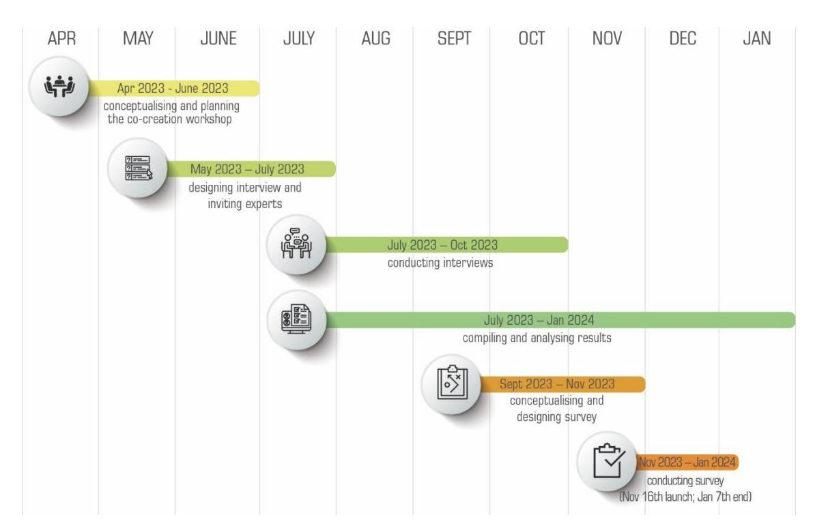

*Figure 1: Timeline of task T1.2*

# **2. METHODOLOGY**

The main objective of this task was to identify the main barriers that hinder the transition from our current linear fossil-intensive systems to circular bio-based ones. This objective was reached through an iterative process that involved, as indicated in Figure 2, several steps.

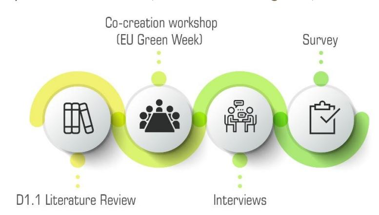

*Figure 2: Identification and consolidation process of the barriers to a CBBE*

The starting point for this task was the list of barriers resulting from the literature review conducted in Task 1.1 (see chapter 3). The goal of the task was to validate this list of barriers through an iterative process including several consolidation steps. The first step was a multistakeholder co-creation workshop during the EU Green Week (see chapter 4), where the barriers were allocated to the four critical sectors (textile, plastics, chemicals, and construction) and further barriers identified. The second step consisted of a series of twenty interviews with experts from the four sectors to reconfirm the findings of the co-creation workshop and further explore missing barriers (see chapter 5). Finally, a broader stakeholder consultation took place in form of a survey, resulting in the final list of barriers, on which further project activities will base (see chapter 6). Detailed methodologies for the separate steps can be found in the respective chapters.

# **3. RESULTS OF THE LITERATURE REVIEW**

The first list of barriers validated in the multi-consultation implemented within task 1.2 was derived from D1.1.

Various barriers that impede the transition from an unsustainable linear carbon-intensive fossilbased economy to a circular low-carbon bio-based economy were investigated from the reviewed grey literature (D1.1). Barriers were identified and categorised into six distinct dimensions (cultural, economic, environmental, governance, structural, and technical), which were further subdivided into 11 barrier clusters. In total, the study identified 193 different barriers across the value chain, with most (57) allocated to material processing and product manufacturing, primarily due to the source of the reviewed literature. Additionally, many barriers were associated with end-of-life management (30) and the system as a whole (50). In our study, cultural barriers involve internal company culture, consumer behaviour, and workers' education and skills; economic barriers include investment costs, funding, and market dynamics; environmental barriers relate to the environmental performance of products and processes; governance barriers encompass policy, regulations, and standards; structural barriers involve systemic institutional practices and norms, while technical barriers pertain to technology development, infrastructure, and digitalisation.

In the chemical sector, 63 different barriers were identified for transitioning to a circular biobased economy. Cultural barriers include a lack of prioritisation for circular solutions, a linear mindset, inconsistent definitions of 'natural' or 'bio', and limited innovation in design-for-recycling. Consumers demonstrate low awareness of bio-based products, and education faces challenges in specialised knowledge and engagement with circular economy concepts. Economic barriers range from high costs in product formulation and operation to weak cost competitiveness compared to fossil-based alternatives, limited access to finance for start-ups and SMEs, and higher prices for green products. Environmental barriers involve higher land use for bio-based products compared to fossil-based products. Governance barriers feature a lack of comprehensive bio-based material identification systems, fragmented regulatory environments, misaligned policies, and complex regulatory and certification procedures. Structural barriers include high uncertainty in new chemical processes, low data accessibility, difficulties in entering fossil-based markets, and lack of value chain collaboration. Technical barriers encompass the need to develop new biomass feedstock sources, challenges in molecule recycling, high complexity in chemical product formulations, immature technology, and insufficient purity of recyclable bio-waste streams.

In the construction sector, 62 different barriers were identified. Cultural barriers include a lack of prioritisation for circular solutions, resistance to change, deeply entrenched norms, inconsistent industry targets, and limited understanding of the circular economy concepts. There is a skills gap in education and a lack of specialised knowledge, skills, and expertise in closed-loop systems. Economic barriers encompass higher upfront costs for green solutions, high investment risks, insufficient investment in energy-efficient buildings, and structural price differences between virgin and secondary materials. Environmental barriers involve a lack of data on impacts. Governance barriers include unclear policy targets, limited government and public support, policy support for linear production processes, and a lack of standardisation for sustainable or net-zero buildings. Structural barriers feature industry preference for cheap fossil-based virgin materials, limited opportunity for substitution of fossil-based materials, and misalignment between business

planning cycles and built environment asset life cycles. Technical barriers comprise increasing complexity of materials, loss of material quality during recycling, technological inefficiencies, and challenges in implementing renewable electricity-based solutions.

In the plastics sector, 116 different barriers were identified. Cultural barriers include a lack of explicit prioritisation for circular solutions, resistance to change, deeply entrenched norms, and a linear mindset. There is also a lack of specialised knowledge and consumer awareness about the circular economy concept and closed-loop solutions. Economic barriers involve high costs in various aspects of the circular economy, including collection and sorting of end-of-life products, recycling processes, and bio-based production. There is also insufficient investment in infrastructure and waste management practices and a lack of market demand for bio-based and biodegradable plastics. Governance barriers include fragmented regulations across countries, inadequate policy frameworks, and lack of standardised waste collection systems. Additionally, there is a lack of material-specific design-for-recycling standards and alignment between different policies. Structural barriers encompass low data accessibility, a high reliance on virgin materials, and lack of transparency and traceability. There is also a weak reconciliation between the need for economic growth and sustainable development. Technical barriers include immature recycling technology, increasing complexity of materials, and lack of infrastructure capacity for recycling and end-of-life product collection. Furthermore, there is a loss of material quality and value during recycling, hindering the circular economy's progress.

In the textile sector, 54 different barriers were identified. Cultural barriers include a lack of prioritisation for circular solutions, linear mindsets and company cultures, and a persistent cultural habit of fashion shopping. A lack of specialised knowledge and expertise in bio-based production and closed-loop systems within the education system also poses a challenge. Economic barriers include high collection and sorting costs for end-of-life products, lack of profitability in areas that deliver high public benefits, and higher prices for green products, which hinder consumer demand. Environmental barriers include higher land use for bio-based products and uncertainty over potential environmental gains. Governance barriers encompass insufficiently ambitious target levels, lack of clarity around policy targets, policy support to linear production processes, and lack of product standardisation. Structural barriers include difficulty entering wellestablished fossil-based markets, externalisation of environmental and social costs, lack of value chain stakeholder collaboration, and logistical challenges associated with closed-loop recycling of end-of-life products. Lastly, technical barriers consist of increasing complexity of materials and their combinations, lack of adequate feedstock for recycling, technology inefficiencies, and lack of advanced technology innovation to maintain the quality of materials in a circular economy.

The above-mentioned barriers have been named at different frequencies in the reviewed literature. For example, the cultural barrier "Lack of incentives for consumer behaviour change" has been mentioned in 11 different reports. For preparing the list of barriers to be used in the cocreation workshop, we considered all those barriers that were mentioned in at least three different reports. In total, 51 out of 193 barriers met this criterion. Among them, 14 governance barriers, 11 economic barriers, 9 structural barriers, 9 technical barriers, 7 cultural barriers, and only one environmental barrier. These barriers are listed below in Figure 3.

For the co-creation workshop (see chapter 4) this list of 51 barriers resulting from the literature review was used. Due to the environmental cluster containing only one barrier, the decision was made to include three additional environmental barriers that had been identified during the literature review but did not fulfil the cut off criterion of being cited at least three times. These barriers were presented to the participants of the workshop to stimulate the discussion of identifying barriers that did not result from the grey literature review, which was one of the exercises of the workshop. The three environmental barriers are:

- Concerns over poor biodegradation in natural environments
- Higher land use: bio-based vs. fossil-based product
- Uncertainty over potential environmental gains

With these barriers, a total of 54 barriers were presented to the participants of the co-creation workshop.

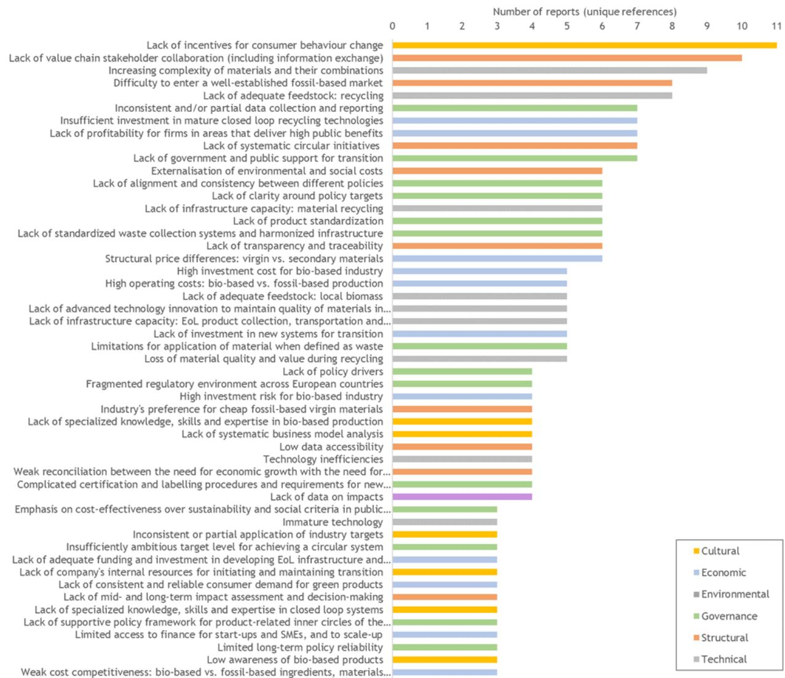

|                                                                                | Number of reports (unique references) |   |   |   |   |   |   |   | Number of reports (unique references) |
|--------------------------------------------------------------------------------|---------------------------------------|---|---|---|---|---|---|---|---------------------------------------|
|                                                                                | 0                                     | 1 | 2 | 3 | 4 | 5 | 6 | 7 |                                       |
| Lack of incentives for consumer behaviour change                               |                                       |   |   |   |   |   |   |   |                                       |
| Lack of value chain stakeholder collaboration (including information exchange) |                                       |   |   |   |   |   |   |   |                                       |
| Increasing complexity of materials and their combinations                      |                                       |   |   |   |   |   |   |   |                                       |
| Difficulty to enter a well-established fossil-based market                     |                                       |   |   |   |   |   |   |   |                                       |
| Lack of adequate feedstock: recycling                                          |                                       |   |   |   |   |   |   |   |                                       |
| Inconsistent and/or partial data collection and reporting                      |                                       |   |   |   |   |   |   |   |                                       |
| Insufficient investment in mature closed loop recycling technologies           |                                       |   |   |   |   |   |   |   |                                       |
| Lack of profitability for firms in areas that deliver high public benefits     |                                       |   |   |   |   |   |   |   |                                       |
| Lack of systematic circular initiatives                                        |                                       |   |   |   |   |   |   |   |                                       |
| Lack of government and public support for transition                           |                                       |   |   |   |   |   |   |   |                                       |
| Externalisation of environmental and social costs                              |                                       |   |   |   |   |   |   |   |                                       |
| Lack of alignment and consistency between different policies                   |                                       |   |   |   |   |   |   |   |                                       |
| Lack of clarity around policy targets                                          |                                       |   |   |   |   |   |   |   |                                       |
| Lack of infrastructure capacity: material recycling                            |                                       |   |   |   |   |   |   |   |                                       |
| Lack of product standardization                                                |                                       |   |   |   |   |   |   |   |                                       |
| Lack of standardized waste collection systems and harmonized infrastructure    |                                       |   |   |   |   |   |   |   |                                       |
| Lack of transparency and traceability                                          |                                       |   |   |   |   |   |   |   |                                       |
| Structural price differences: virgin vs. secondary materials                   |                                       |   |   |   |   |   |   |   |                                       |
| High investment cost for bio-based industry                                    |                                       |   |   |   |   |   |   |   |                                       |
| High operating costs: bio-based vs. fossil-based production                    |                                       |   |   |   |   |   |   |   |                                       |
| Lack of adequate feedstock: local biomass                                      |                                       |   |   |   |   |   |   |   |                                       |
| Lack of advanced technology innovation to maintain quality of materials in...  |                                       |   |   |   |   |   |   |   |                                       |
| Lack of infrastructure capacity: EoL product colle                             |                                       |   |   |   |   |   |   |   |                                       |

*Figure 3: List of 51 barriers resulting from task T1.1 and the respective number of mentions in grey literature*

# **4. CO-CREATION WORKSHOP**

# **4.1. Objectives and implementation**

The list of barriers derived from the literature review, was validated through a stakeholder consultation organised by SUSTRACK project. In particular, the Focus Group Workshop "Limits, barriers and solutions to boost the transition towards a circular bio-based economy" was held on June 9, 2023, from 10:00 to 13:00 CEST in the occasion of the European Green Week.

Organised within the framework of the [EU Green Week,](https://green-week.event.europa.eu/index_en) our workshop was part of a larger, continent-wide discourse on environmental policy and sustainable development. EU Green Week serves as an annual platform for discussing, understanding, and celebrating the strides made in EU environmental policy. It's a time not only for reflection on the progress achieved but also for galvanising action among individuals, communities, and organisations.

The workshop aligned with the ethos of EU Green Week by:

- **Celebrating Progress:** Highlighting successful initiatives and policies that have positively impacted the environment.
- **Encouraging Action:** Inspiring participants to take stronger, more effective actions towards environmental preservation and restoration.
- **Promoting Sustainable Development:** Focusing on strategies that balance environmental, economic, and social needs, ensuring a sustainable future for all.

Through this integration with EU Green Week, the workshop not only provided a platform for learning and discussion but also contributed to a larger movement dedicated to nurturing and protecting our environment for present and future generations.

The workshop followed a format that included brief presentations of the research findings, followed by interactive sessions for discussion, validation, and prioritisation of the findings. Key organising SUSTRACK partners of the event comprised BAM, UNIT, FVA, and PEDAL. The agenda of the event is shown in Table 1, while a detailed description of the Concept Note, is included in Annex A.

*Table 1: Agenda of the co-creation workshop*

|              | Scope of the meeting, agenda.                                                                                      |
|--------------|--------------------------------------------------------------------------------------------------------------------|
| 10:00 -10:10 | SUSTRACK Project presentation                                                                                      |
| 10:10 -10:30 | Tour de table - Short introduction of the participants                                                             |
| 10:30 -10:50 | Presentation of the identified limits and discussion of the barriers                                               |
| 10:50 -12:00 | Coffee break                                                                                                       |
| 12:00 -12:30 | Interactive session - Prioritisation of barriers and allocation into the four                                      |
| 12:30 -12:40 | Conclusion and the way forward – drivers and benefits of the sustainable transition, future activities of SUSTRACK |

The primary objective of the Focus Group workshop was to review and affirm the detailed literature study of task T1.1 highlighting the limits of the current linear, fossil-dependent economy, and to pinpoint barriers as well as prospective strategies for progressing toward a sustainable economy. In particular, the previously identified barriers were not only confirmed but also preliminarily ranked in terms of significance. Participants, each an expert in their field, were actively involved in this evaluative procedure. The workshop provided a platform for these stakeholders to express their perspectives, engage in dialogue, and arrange the barriers in order of importance. Additionally, the workshop was structured to equip stakeholders with a deeper understanding of the motivations for and advantages of a sustainable economic shift, as well as to outline forthcoming initiatives within the SUSTRACK project.

In details, the format of the SUSTRACK co-creation workshop included 4 main steps to guide the discussion:

- Step 1: Setting the scene;
- Step 2: identification of missing barriers;
- Step 3: prioritisation of most relevant barriers;
- Step 4: allocation of barriers into the 4 sectors of interest for SUSTRACK project, corresponding to industries with significant carbon footprints (textile, chemical, plastics, construction).

During the first step (40 minutes), the SUSTRACK project was presented to stakeholders and then each participant had the opportunity to introduce themselves and share their expectations regarding SUSTRACK and the specific workshop. This round table of presentations was key to create an environment that was conducive to conversation. Afterwards, SUSTRACK research on the limitations of the linear fossil-based economy, as well as the methodology used to identify the barriers and their classification into 6 clusters (cultural, governance, technical, structural, environmental, and economic) were briefly presented to the stakeholders, using a PowerPoint presentation as a supportive tool. Importantly, a limited time slot was devoted to this top-down lecture, leaving sufficient time for the subsequent interactive discussion, which is much more engaging for participants.

During the second step (1.10 hours), the online [MIRO board](https://miro.com/app/) platform - used to create whiteboards for facilitating collaboration in work and learning - was adopted as supportive tool for participants interaction and effective visualisation of the 54 barriers, grouped into 6 clusters. An expert researcher presented the barriers from the first cluster and stakeholders suggested additional barriers which were missing based on their experience and discussed the classification of specific barriers into the cluster. The same exercise was repeated per each cluster, led by different researchers, based on their field of expertise, in order to keep the discussion focused and the stakeholders' attention up with new voices. Expert facilitators animated the exercises throughout the workshop duration and made sure that all the different stakeholders participated in the discussion, avoiding polarisation with few participants.

The third step (15 minutes) was dedicated towards the prioritisation of the most relevant barriers. This activity took place using the voting tool of the MIRO board. Each stakeholder had 10 votes to give out to the barriers they considered the most urgent ones.

Finally, in the fourth step (15 minutes), stakeholders allocated all the barriers, including newly identified ones, to the textile, plastics, chemical, and construction sectors, depending on whether or not they were found to be relevant to the sectors by the stakeholders.

## **Target Audience and Context**

The workshop was specifically designed to cater to a diverse and dynamic group of Quadruple Helix stakeholders. These stakeholders represented a broad spectrum of sectors:

- 1. **Public Sector:** Including government officials and policymakers who play a crucial role in shaping and implementing environmental policies.

- 2. **Private Sector:** Business leaders and industry representatives whose operations and strategies have a significant impact on the environment.
- 3. **Research Sector:** Academics, scientists, and researchers who contribute through groundbreaking studies and innovations in environmental sustainability.
- 4. **NGO/CSO Sector:** Non-governmental organisations and civil society organisations that advocate for environmental issues and drive community engagement.

In addition to these primary groups, the workshop also welcomed participants from other EUfunded projects. These projects, sharing similar objectives and target beneficiaries, enriched the discussions with their unique perspectives and experiences. Furthermore, members of the SUSTRACK Advisory Board, comprising experts and thought leaders in sustainability, were also in attendance, providing valuable insights and guidance.

# **4.2. Results and discussion**

The list of 51 barriers, resulting from the literature review and which was the starting point for the focus group activity, was expanded to include 82 barriers during the co-creation workshop. In addition to the 3 environmental barriers, we chose to add to the original list of 51 barriers and which were all consolidated by the stakeholders, 28 further barriers were suggested during the workshop. These 28 barriers included 19 that were similar to ones already identified in the literature review, yet not cited three or more times and therefore initially excluded, and 9 barriers that were considered "original" as they were not previously identified in any of the reviewed literature.

Tables 2 to 7 show all barriers for each cluster and the respective number of votes they received during the prioritisation exercise conducted during the co-creation event. They also provide the sectors that each barrier was allocated to by the stakeholders during the fourth step of workshop. Barriers in italic are ones suggested by the stakeholders. Non-italic barriers are ones from the original list of 54 barriers we presented to the stakeholders, including the 3 environmental barriers we used to kick off the exercise of identifying missing barriers.

*Table 2: Results of co-creation workshop for the cultural cluster*

|   | Cultural barrier                                                                                                        | Number of votes | Allocated to following sectors                                                      |
|---|-------------------------------------------------------------------------------------------------------------------------|-----------------|-------------------------------------------------------------------------------------|
| 1 | <i>Missing communication, misinformation, disinformation and lack of trust</i>                                          | 9               | <ul><li>Textile</li> <li>Chemical</li> <li>Plastics</li> <li>Construction</li></ul> |
| 2 | <i>Consumers' understanding and definition of what is bio-based, and what is compostable/ biodegradable/ recyclable</i> | 3               | <ul><li>Textile</li> <li>Chemical</li> <li>Plastics</li></ul>                       |
| 3 | Low awareness of bio-based products                                                                                     | 3               | <ul><li>Construction</li></ul>                                                      |
| 4 | Lack of specialised knowledge, skills and expertise in bio-based production                                             | 3               | <ul><li>Construction</li></ul>                                                      |
| 5 | Lack of incentives for consumer behaviour change                                                                        | 2               | <ul><li>Textile</li> <li>Plastics</li> <li>Construction</li></ul>                   |

| 6 7 8 9                                                    | Lack of systematic business model analysis 1 Textile maintaining transition 1 "Reusable" is a problem of "industrial culture" (failure of industry to accept a shift to other production 1 modes due to prevailing commercial interests) closed loop systems 0 Plastics |
|------------------------------------------------------------|-------------------------------------------------------------------------------------------------------------------------------------------------------------------------------------------------------------------------------------------------------------------------|
| 10 Inconsistent or partial application of industry targets | 0                                                                                                                                                                                                                                                                       |
| Regional diversity in awareness;                           | products (e.g. multi store wood buildings) may also be perceived                                                                                                                                                                                                       |
| and                                                        | accepted differently depending on the culture of the country                                                                                                                                                                                                            |
| 12 Lack of consumer                                        | demand: Consumers are not aware                                                                                                                                                                                                                                         |
| about                                                      | novel circular solutions 0 Textile Need to facilitate the cultural switch to                                                                                                                                                                                            |
| 1 3                                                        |                                                                                                                                                                                                                                                                         |
| support                                                    | voluntary choice 0                                                                                                                                                                                                                                                      |

*Table 3: Results of co-creation workshop for the economic cluster*

|    | Economic barrier                                                                                                                                    | Number of votes | Allocated to following sectors     |
|----|-----------------------------------------------------------------------------------------------------------------------------------------------------|-----------------|------------------------------------|
| 1  | High investment cost for bio-based industry                                                                                                         | 5               |                                    |
|    | Need for market-driven policies (like public                                                                                                        |                 |                                    |
|    | procurement) to stimulate the market Lack of profitability for firms in areas that deliver                                                          | 4               |                                    |
|    | high public benefits Insufficient investment in mature closed loop                                                                                  | 3               | Chemical                           |
|    | recycling technologies Lack of consistent and reliable consumer demand for                                                                          | 3               | Plastics                           |
|    | green products Need for risk-benefit analyses to attract                                                                                            | 3               | Plastics                           |
|    | funding (including private)                                                                                                                         | 3               |                                    |
|    | Economic issues for scale-up, need for incentives to                                                                                                |                 | Plastics                           |
|    | de-risk immature technologies Structural price differences: virgin vs. secondary                                                                    | 3               | Construction Textile               |
|    | materials High operating costs: bio-based vs. fossil-based                                                                                          | 2               | Plastics                           |
|    | production                                                                                                                                          | 2               |                                    |
| 10 | Weak cost competitiveness: bio-based vs. fossil-based                                                                                               |                 |                                    |
|    | ingredients, materials or products                                                                                                                  | 2               |                                    |
| 11 | Limited access to finance for start-ups and SMEs, and                                                                                               |                 |                                    |
|    | to scale-up                                                                                                                                         | 1               | Construction                       |
| 12 | Lack of investment in new systems for transition                                                                                                    | 0               |                                    |
| 13 | High investment risk for bio-based industry Lack of adequate funding and investment in developing EoL infrastructure and waste management practices | 0               | Construction Plastics Construction |

| 15 | Public Procurement of           | Innovation can decrease the |
|----|---------------------------------|-----------------------------|
| 16 | Need for funding incentives for | recovery and                |
|    | recycling                       | 0 Plastics                  |

*Table 4: Results of co-creation workshop for the environmental cluster*

| 1   | Environmental barrier Lack of harmonised LCA, biogenic carbon accounting, temporary carbon storage, EOL calculation | Number of votes 10 | Allocated to following sectors Textile Chemical Plastics Construction Textile |
|-----|---------------------------------------------------------------------------------------------------------------------|--------------------|-------------------------------------------------------------------------------|
| 2   | Lack of data on impacts                                                                                             | 5                  | Chemical                                                                      |
|     | Most LCAs are cradle to gate which misses the                                                                       |                    | Chemical                                                                      |
|     | circularity aspect                                                                                                  | 3                  | Construction                                                                  |
|     | Risks connected to scale-up (are there enough bio                                                                  |                    | Chemical                                                                      |
|     | based feedstocks?) Concerns over poor biodegradation in natural                                                     | 3                  | Construction Textile                                                          |
|     | environments Need for holistic approaches                                                                           | 2                  | Chemical Plastics                                                             |
|     | considering environmental, social,                                                                                  |                    |                                                                               |
|     | health (multidisciplinary approaches)                                                                               |                    |                                                                               |
|     | Other questions like additives and risk                                                                             | 2                  | Chemicals                                                                     |
|     | assessments should be considered and also safety                                                                    | 1                  | Chemicals                                                                     |
| 8   | Assumptions made in the LCAs are rarely clear                                                                       | 1                  | Construction                                                                  |
| 9   | Feedstock availability regarding the carrying capacity                                                              | 1                  | Textile Textile                                                               |
| 1 0 | Higher land use: bio-based vs. fossil-based product                                                                 | 0                  | Chemical Construction Textile                                                 |
| 1 1 | Uncertainty over potential environmental gains                                                                      | 0                  | Chemical Plastics                                                             |
| 1 2 | Misleading LCA results                                                                                              | 0                  |                                                                               |

*Table 5: Results of co-creation workshop for the governance cluster*

| Governance barrier                        | Number                  |
|-------------------------------------------|-------------------------|
| Competing political interests             | with “ old ” industries |
| (big lobbies etc.)                        | 6 Construction          |
| countries and at national/ regional level | 6                       |
| and requirements for new materials        | 4                       |

| 4  | Lack of alignment and consistency between different policies                                                     | 4 | Plastics Construction Chemical |
|----|------------------------------------------------------------------------------------------------------------------|---|--------------------------------|
| 5  | Lack of product standardisation Lack of standardised waste collection systems and                                | 3 | Plastics Textile               |
|    | harmonised infrastructure Lack of/ limited government and public support for                                     | 3 | Plastics Construction          |
|    | transition Lack of supportive policy framework for product related inner circles of the circular system (reuse, | 3 | Construction                   |
|    | repair, redistribution, remanufacture and refurbishment)                                                         | 2 | Textile                        |
| 9  | Limited long-term policy reliability                                                                             | 2 |                                |
| 10 | Limitations for application of material when defined                                                             |   |                                |
|    | as waste                                                                                                         | 2 | Plastics                       |
| 11 | Insufficiently ambitious target level for achieving a                                                            |   | Textile                        |
|    | circular system                                                                                                  | 2 | Construction                   |
| 12 | Lack of/ limited policy drivers                                                                                  | 2 |                                |
| 13 | Lack of clarity around policy targets                                                                            | 1 | Construction                   |
| 14 | Inconsistent and/or partial data collection and                                                                  |   |                                |
|    | reporting                                                                                                        | 0 |                                |
| 15 | Emphasis on cost-effectiveness over sustainability and                                                           |   |                                |
|    | social criteria in public procurement processes                                                                  | 0 | Chemical                       |
| 16 | Need for increased capacities of Green Public                                                                    |   |                                |
|    | Procurements (calls, audits, measurements)                                                                       | 0 |                                |

## *Table 6: Results of co-creation workshop for the structural cluster*

|   | Structural barrier                                                                                 | Number of votes | Allocated to following sectors                                                      |
|---|----------------------------------------------------------------------------------------------------|-----------------|-------------------------------------------------------------------------------------|
| 1 | Difficulty to enter a well-established fossil-based market                                         | 6               | <ul><li>Plastics</li> <li>Construction</li></ul>                                    |
| 2 | Lack of value chain stakeholder collaboration (including information exchange)                     | 6               | <ul><li>Chemical</li> <li>Plastics</li> <li>Construction</li></ul>                  |
| 3 | Weak reconciliation between the need for economic growth with the need for sustainable development | 6               | <ul><li>Textile</li> <li>Chemical</li> <li>Plastics</li> <li>Construction</li></ul> |
| 4 | <i>Facilitate the uptake of byproducts (creation of markets and value chains)</i>                  | 5               | <ul><li>Textile</li> <li>Chemical</li> <li>Plastics</li></ul>                       |
| 5 | <i>Need to re-balance competition by adding the cost of externalities to fossil-based products</i> | 3               | <ul><li>Textile</li> <li>Chemical</li> <li>Plastics</li></ul>                       |
| 6 | Externalisation of environmental and social costs                                                  | 2               | <ul><li>Chemical</li> <li>Construction</li></ul>                                    |

| 7  | Lack of systematic circular initiatives                                                   | 0 |                           |
|----|-------------------------------------------------------------------------------------------|---|---------------------------|
| 8  | Lack of transparency and traceability Industry's preference for cheap fossil-based virgin | 0 | Plastics Textile          |
|    | materials                                                                                 | 0 | Chemical Plastics Textile |
| 10 | Low data accessibility                                                                    | 0 | Chemical                  |
| 11 | Lack of mid- and long-term impact assessment and                                          |   |                           |
|    | decision-making                                                                           | 0 |                           |
|    | Administrative burdens from the customer point of                                         |   |                           |
|    | view in order to access governmental/public                                               |   |                           |
|    | incentives and funds to implement bio-based technologies                                  | 0 | Construction              |

*Table 7: Results of co-creation workshop for the technical cluster*

|    | Technical barrier                                                                              | Number of votes | Allocated to following sectors Textile |
|----|------------------------------------------------------------------------------------------------|-----------------|----------------------------------------|
| 1  | Technical issues for scale-up                                                                  | 6               | Construction                           |
| 2  | Lack of technical skills, including mindset Lack of advanced technology innovation to maintain | 6               | Textile                                |
|    | quality of materials in circular economy Lack of infrastructure capacity: EoL product          | 4               | Plastics                               |
|    | collection, transportation and storage                                                         | 3               | Plastics                               |
|    | Difficulties to integrate bio-based applications                                               |                 | Textile                                |
|    | in fossil-based existing structures/ products Increasing complexity of materials and their     | 3               | Construction                           |
|    | combinations                                                                                   | 2               | Construction                           |
| 7  | Lack of infrastructure capacity: material recycling Lack of adequate feedstock: local biomass  | 2               | Plastics Textile                       |
|    | (seasonality and quality)                                                                      | 1               | Chemical Plastics                      |
| 9  | Technology inefficiencies                                                                      | 1               | Chemical Textile                       |
| 10 | Loss of material quality and value during recycling                                            | 1               | Chemical Construction Textile          |
| 11 | Immature technology                                                                            | 1               | Chemical                               |
| 12 | Insufficient amount of feedstock available for                                                 |                 |                                        |
|    | recycling processes                                                                            | 1               | Textile                                |
| 13 | Lack of adequate feedstock: recycling                                                          | 0               |                                        |

As illustrated in the tables above, the top prioritised barrier with 10 votes is the environmental barrier "Lack of harmonised LCA, biogenic carbon accounting, temporary carbon storage, EOL calculation" which was one of the barriers identified by the stakeholders as missing from the list resulting from D1.1. The second most voted for barrier is the cultural barrier "Missing communication, misinformation, disinformation and lack of trust", followed by 7 barriers that all

|   | Economic barrier                                                  |    |
|---|-------------------------------------------------------------------|----|
| 1 | High investment risk for bio-based industry                       |    |
| 2 | Limited access to finance for start-ups and SMEs, and to scale-up |    |
|   | Funded by the European Union                                      | 22 |

received 6 votes. Three of these barriers are structural, two of them are technical and two others are related to governance. In total 31 out of the 82 barriers were voted for by at least three workshop attendees, while 29 barriers received only one or two votes and 22 barriers none at all. Furthermore, it is worthy to note that 31 of the barriers were allocated to the plastics sector, while 29 barriers were seen as relevant for the textile and construction sector each and 25 barriers for the chemical sector. A total of 21 barriers were not allocated to any of the four sectors. Some of these barriers still received votes, including the technical barrier "Lack of technical skills, including mindset" which shared the 3rd place regarding prioritisation with 6 other barriers receiving 6 votes.

## **4.3. Resulting list of barriers**

After the co-creation workshop, the barriers were reviewed and some of the barriers suggested by the stakeholders during the workshop, especially those that had been previously identified during the literature review, were reformulated to match wordings in the grey literature or to avoid too vague or too specific phrasing. Additionally overlapping barriers were merged, which lead to a reduced list of 67 barriers instead of 82. Comments of the stakeholders concerning the wording of the 54 barriers of the original list were also considered. An example for such suggested improvements is using the word limited instead of lack of for barriers such as the governance barrier "Lack of policy drivers".

The resulting list of 67 barriers can be found below in Tables 8 to 13.

*Table 8: Cultural barriers resulting from T1.2.1*

|    | Cultural barrier                                                                            |
|----|---------------------------------------------------------------------------------------------|
| 1  | Missing communication, misinformation, disinformation and lack of trust                     |
| 2  | Lack of technical skills, including mindset                                                 |
| 3  | Lack of systematic business model analysis                                                  |
| 4  | Low awareness of bio-based products                                                         |
| 5  | Consumers lack knowledge of the meaning of material markings/labelling                      |
| 6  | Lack of specialised knowledge, skills and expertise in bio-based production                 |
| 7  | Lack of incentives for consumer behaviour change                                            |
| 8  | Lack of company's internal resources for initiating and maintaining transition value chains |
| 10 | Inconsistent or partial application of industry targets                                     |
| 11 | Regionally diverse consumer awareness of bio-based products                                 |
| 12 | Lack of specialised knowledge, skills and expertise in closed loop systems                  |

## *Table 9: Economic barriers resulting from T1.2.1*

| 3  | Lack of profitability for firms in areas that deliver high public benefits         |
|----|------------------------------------------------------------------------------------|
| 4  | Insufficient investment in mature closed loop recycling technologies               |
| 5  | Lack of consistent and reliable consumer demand for green products                 |
| 6  | High operating costs: bio-based vs. fossil-based production                        |
| 8  | Structural price differences: virgin vs. secondary materials                       |
| 9  | High investment cost for bio-based industry                                        |
| 10 | Lack of investment in new systems for transition                                   |
| 11 | Lack of adequate funding and investment in developing EoL infrastructure and waste |

## *Table 10: Environmental barriers resulting from T1.2.1*

| 1 | Environmental barrier assessment of CBBE                                    |
|---|-----------------------------------------------------------------------------|
| 2 | Lack of data on impacts                                                     |
| 3 | Concerns over feedstock availability within the limits of carrying capacity |
| 4 | Concerns over poor biodegradation in natural environments                   |
| 5 | Insufficient consideration of risk and safety issues                        |
| 6 | Higher land use: bio-based vs. fossil-based products                        |
| 7 | Poor environmental performance of recycling technology                      |
| 8 | Uncertainty over potential environmental gains                              |

## *Table 11: Governance barriers resulting from T1.2.1*

| 1  | Governance barrier regional level                                                           |
|----|---------------------------------------------------------------------------------------------|
| 2  | Competing political interests with "old" industries (big lobbies etc.)                      |
| 3  | Lack of alignment and consistency between different policies                                |
| 4  | Need for market-driven policies (e.g. public procurement) to stimulate the market materials |
| 6  | Limited government and public support for transition                                        |
| 7  | Lack of product standardisation                                                             |
| 8  | Lack of standardised waste collection systems and harmonised infrastructure                 |
| 9  | Limitations for application of material when defined as waste                               |
| 10 | Limited policy drivers                                                                      |
| 11 | Insufficiently ambitious target level for achieving a circular system                       |

| 12 | Lack of supportive policy framework for product-related inner circles of the circular |
|----|---------------------------------------------------------------------------------------|
| 13 | Limited long-term policy reliability                                                  |
| 14 | Lack of clarity around policy targets                                                 |
| 15 | Inconsistent and/or partial data collection and reporting                             |
| 16 | Emphasis on cost-effectiveness over sustainability and social criteria in public      |

*Table 12: Structural barriers resulting from T1.2.1*

|    | Structural barrier                                                                 |
|----|------------------------------------------------------------------------------------|
| 1  | Lack of value chain stakeholder collaboration (including information exchange)     |
| 2  | Difficulty to enter a well-established fossil-based market sustainable development |
| 4  | Externalisation of environmental and social costs                                  |
| 5  | Lack of established market and value chains for by-products                        |
| 6  | Lack of systematic circular initiatives                                            |
| 7  | Lack of transparency and traceability                                              |
| 8  | Industry's preference for cheap fossil-based virgin materials                      |
| 9  | Low data accessibility                                                             |
| 10 | Lack of mid- and long-term impact assessment and decision-making                   |

*Table 13: Technical barriers resulting from T1.2.1*

|    | Technical barrier                                                                             |
|----|-----------------------------------------------------------------------------------------------|
| 1  | Immature technology (including technical issues for scale-up) economy                         |
| 3  | Lack of infrastructure capacity: EoL product collection, transportation and storage materials |
| 5  | Increasing complexity of materials and their combinations                                     |
| 6  | Lack of infrastructure capacity: material recycling                                           |
| 7  | Lack of adequate feedstock: recycling                                                         |
| 8  | Lack of adequate feedstock: local biomass (including seasonality and quality impacts)         |
| 9  | Loss of material quality and value during recycling                                           |
| 10 | Technology inefficiencies                                                                     |

# **5. INTERVIEWS**

The first part of subtask T1.2.2 was to conduct expert interviews to validate the results of the cocreation workshop, allocate the barriers to the four sectors and identify missing barriers. The resulting list of barriers was used for the survey.

## **5.1. Methodology**

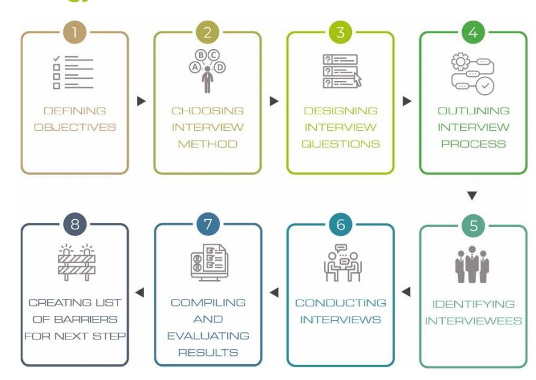

*Figure 4: Methodological steps of the interviews*

The interview process included the steps presented in Figure 4. Initially, the objectives were defined as to guide and fit future project activities and research. Subsequently, a suitable interview method aligned with the objectives was chosen. The semi-structured approach was deemed optimal for its versatility, as it accommodates both closed- as well as open-ended questions and allows for follow-up inquiries if needed (Wilson, 2014; Ruslin et al., 2022). With the method chosen, the next step involved designing the interview questions. To enhance the interaction, a PowerPoint presentation (Annex B) was employed. This visual aid not only presents questions in written form to the interviewees but also allows interviewers to take visible notes. This transparency ensures that interviewees can review the formulation of their responses, empowering them to articulate answers that genuinely reflect their perspectives. After creating the interview template, a preliminary interview process was outlined. This included a brief introduction to the objectives and content of the interview, followed by the designated questions. Subsequently, interviewees were identified and contacted. In total 21 experts representing the quadruple helix (academia, industry, NGOs and policy makers), were successfully invited to participate in an interview. Out of these, 20 were interviewed using the original template, incorporating barriers from the co-creation workshop. The 21st expert was invited to review a new list of barriers, refined based on the results of the previous 20 interviews. Experts were then provided with consent forms, seeking approval for audio and video recording of the interview, as well as permission to be contacted for future project activities. The forms also conveyed details about the project's privacy policies and contact information for the data protection officer overseeing the storage of recordings. Following the conclusion of all interviews individual reports were created for each interview and all results were compiled and evaluated. Lastly, a list of

barriers was generated, incorporating insights from the 20 interviews and feedback from the 21st expert who reviewed the pre-final list.

## **5.2. Objectives and implementation**

The interviews had two primary objectives. Firstly, to validate previously identified barriers, as well as their allocation to the four sectors, and secondly, to identify missing barriers, that had not been previously identified in task T1.1 or the co-creation workshop. Additionally, the interviews aimed to achieve two further secondary objectives, namely allocating the barriers to the different value chain steps, as well as identifying barriers that can be overcome with the current state of knowledge. Due to time constraints and the availability of interviewees, the pursuit of these secondary objectives varied and, in some cases, was not possible.

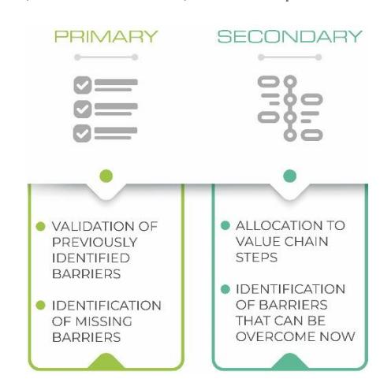

*Figure 4: Primary and secondary objectives of interviews*

## **Interview Process and Questions**

At the beginning of each interview, the project was briefly introduced to the interviewee through the first couple of slides of the PowerPoint presentation, which was visible to the interviewee via screensharing facilitated by the interviewer. Following this introduction, the interview process was outlined and the descriptions of the six clusters along with the Oxford definition for the term "barrier" provided. Subsequently, the interviewees were presented the barriers cluster by cluster and given the option to either have the interviewer read the barriers aloud or take a few minutes to peruse them independently. They were then prompted to identify those barriers that, based on their knowledge and expertise, are relevant to their sector. The selected barriers were highlighted in red by the interviewer. This exercise served not just the validation of the barriers, but also their allocation to the four sectors, thus allowing for a subsequent analysis to discern whether certain barriers are more prominent in specific sectors or if some are irrelevant to any sector. Following this, interviewees were encouraged to provide any comments they might have on the barriers of the cluster and identify any barriers they believed were missing from the list. In such cases, the interviewer documented the comments and/or suggested barriers in the PowerPoint presentation, and interviewees were invited to review the wording. Afterwards they were asked to allocate the barriers they deemed relevant to their sector to the different value chain steps "whole system", "raw material extraction", "material processing and product manufacturing", "consumption", and "end of life (EoL)". The final questions posed to the interviewees aimed to identify those barriers that could be overcome with the current state of knowledge. However, these last two questions, serving the secondary objectives, were forgone if the interviewer expressed limited time availability. This process was repeated for all six clusters.

## **Generalities of Interviewees/ The Interviewees in Figures**

The expert interviews took place during the months of July through October 2023, exclusively in an online format, and lasted for about 1 hour. Both an equal representation across all sectors as well as a consideration of the quadruple helix framework were considered during the selection of interviewees. While all four stakeholder groups according to the quadruple helix framework were represented in at least one sector, the invitation process did not result in more than one policymaker and two NGO employees participating. In terms of sector representation, the plastics sector had the highest participation with 7 experts, followed by the textile sector with 5 experts. The chemical and the construction sectors were represented by 4 and 3 interviewees, respectively. One interviewee expressed difficulty aligning with any of the four sectors, as their expertise pertained generally to bioeconomy rather than being specific to any particular sector. This interviewee is an industry professional. The distribution of the other 19 interviewees among the four sectors and the four stakeholder groups is provided in the table below.

*Table 14: Distribution of the interviewees across the four sectors and stakeholder groups*

## **5.3. Results and discussion**

## **Primary objectives results**

This section summarises the results of the interviews, which are categorised per cluster. In particular for each of the six cluster a graph is included, that summarises the number of experts who validated a certain barrier and allocated it to their sector. The category "General" was assigned to the one expert, who expressed difficulty aligning with any of the four critical sectors.

|                | Research | Industry | STAKEHOLDER GROUP Policy | NGO |
|----------------|----------|----------|--------------------------|-----|
| Textile SECTOR | 3        | 1        |                          | 1   |
| Chemical       | 2        | 1        |                          | 1   |
| Plastics       | 3        | 3        | 1                        |     |
| Construction   | 1        | 2        |                          |     |

*Figure 5: Number of experts validating each cultural barrier to their respective sector*

As illustrated in the graph, the barrier selected most frequently by experts and allocated to their respective sectors is "Missing communication, misinformation, disinformation, and lack of trust". Validated by all five textile sector and all three construction sector interviewees, as well as all but one expert from the plastics sector and two of the four chemical sector representatives, this barrier received validation from 85% of the 20 interviewees. It stands out as one of only two barriers, across all clusters, to be validated by 17 of the 20 experts. The other barrier belongs to the environmental cluster. It's noteworthy that 100% of industry experts (8 out of 8) selected this barrier, while only 67% (6 out of 9) of academia and research interviewees did. This pattern repeats for several other barriers in this cluster. For instance, the barrier "Inconsistent or partial application of industry targets" was validated by 56% of research experts but not by a single industry representative. Another example is the barrier "Lack of specialised knowledge, skills, and expertise in closed-loop systems", which was acknowledged by 78% of research interviewees but only by 25% of industry representatives. The least selected barrier, validated by only 30% of the 20 experts, is "Lack of systematic business model analysis" and was the only one in this cluster to not be allocated by any of the 4 chemical experts to the sector.

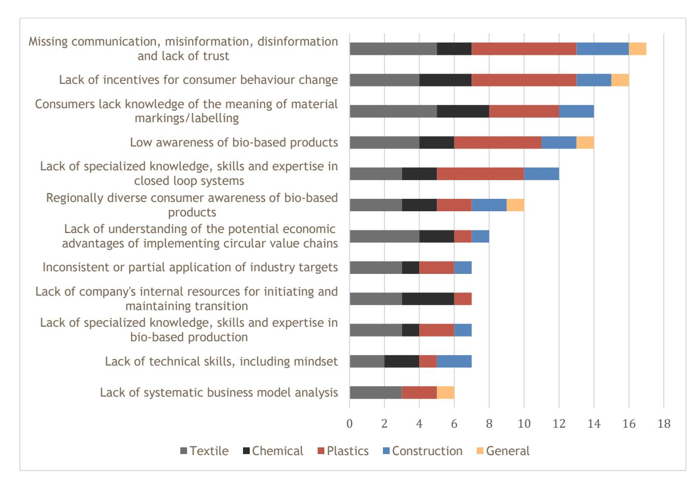

*Figure 6: Number of experts validating each economic barrier to their respective sector*

The graph reveals a notable contrast between the cultural sector and the economic cluster. Barriers in the economic cluster received, on average, higher validation from interviewees. In the cultural cluster, one barrier garnered validation from 8 out of 20 experts, representing 40% of respondents, and 5 barriers received even less validation. In the economic cluster, however, where also only one barrier was selected by 40% of interviewees, all others received validation from at least 45%. The least selected barrier "Lack of investment in new systems for transition" received comments from several interviewees who found it vaguely defined and unclear. The most validated barriers of the economic cluster are the barriers "Weak cost competitiveness: bio-based vs. fossilbased ingredients, materials or products" and "High operating costs: bio-based vs. fossil-based production". Both barriers were allocated to all four sectors. The former was viewed as a barrier by all but one research expert (89%), while only 63% of industry representatives deemed it a barrier. Conversely, the latter was validated by 56% of research and 75% of industry interviewees, indicating an opposite trend.

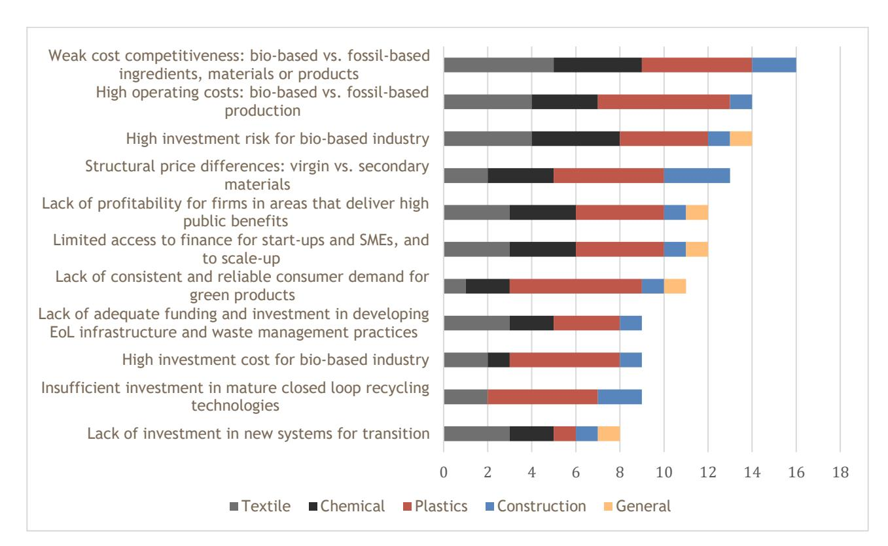

*Figure 7: Number of experts validating each environmental barrier to their respective sector*

As mentioned earlier two of all barriers were validated by 85% (17 out of 20) of all experts, one from the cultural and one from the environmental cluster. From the environmental cluster it's the barrier "Lack of harmonised methods for environmental, climate and sustainability impact assessment of CBBE". This result aligns with the findings of the co-creation workshop, where the barrier was the most selected one across all clusters. Notably, there is a consensus between industry and research experts regarding this barrier, as it garnered validation from all but one expert in each of both stakeholder groups. Conversely, the least selected barrier from this cluster is "Insufficient consideration of risk and safety issues", which received validation from only 35% of interviewees, none of whom represented the construction sector. Another barrier not allocated to the construction sector by any of the three interviewees is "Concern over poor biodegradation in natural environments".

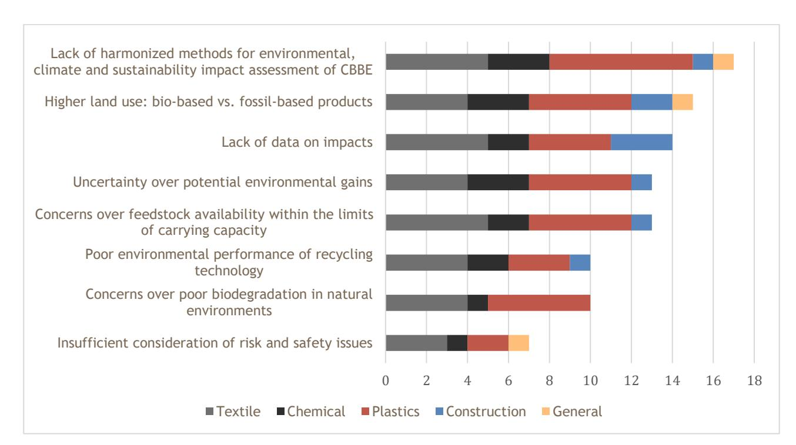

*Figure 8: Number of experts validating each governance barrier to their respective sector*

Out of the 16 governance barriers, only a quarter were validated by less than 50% of the interviewees, with the least validated barrier being confirmed by 30% of the experts. This least validated barrier is "Limited government and public support for transition", which faced criticism from multiple interviewees for both lumping together the public with governments and for being too broad and not specifying which kind of support is lacking. Among the remaining 12 barriers, all validated by at least 50% of the experts, three barriers gained affirmation from 75% or more of the interviewees. The most validated governance barrier, with an 80% confirmation rate, is "Complicated certification and labelling procedures and requirements for new materials". The barriers "Competing political interests with "old" industries (big lobbies, etc.)" and "Fragmented regulatory environment across European countries and at national/regional level" hold the second and third positions, both with 75% confirmation rates. This aligns with the prioritisation exercise results of the co-creation workshop, albeit with the distinction that the certification and labelling barrier came in third and not first place and the two other barriers sharing first and second place. In terms of differences between stakeholder groups, notable variations exist for the barriers "Insufficiently ambitious target level for achieving a circular system" and "Lack of supportive policy framework for product-related inner circles of the circular system (reuse, repair, redistribution, remanufacture, and refurbishment)". Both were validated more by research

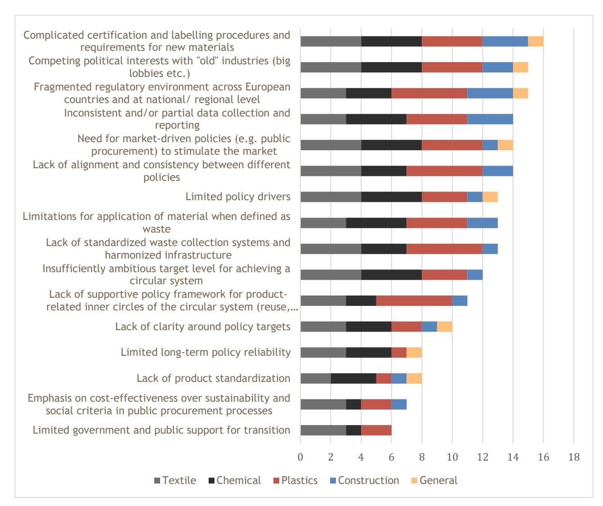

experts than industry representatives. The former received a 78% validation from researchers compared to a 38% validation from industry professionals, and the latter received a 67% validation from researchers versus a 25% validation from industry representatives.

*Figure 9: Number of experts validating each structural barrier to their respective sector*

As the graph demonstrates, the structural barrier cluster displays the least discrepancies in terms of barrier validation. All barriers were validated by at least 50% of interviewees and none by more than 70%. The first position is shared by three barriers. Those are "Industry's preference for cheap fossil-based virgin materials", "Externalisation of environmental and social costs" and "Difficulty to enter a well-established fossil-based market". This cluster also presents notable variations between stakeholder groups. Barriers that stand out in that regard are "Lack of value chain stakeholder collaboration (including information exchange)" and "Weak reconciliation between the need for economic growth with the need for sustainable development", which were validated by 78% and 67% researchers respectively compared to 38% and 25% of industry professionals. In general, the trend of researchers validating a barrier more than industry professional is observed for all but two barriers of this cluster. These exceptions are "Lack of mid- and long-term impact assessment and decision-making" and "Lack of established market and value chains for byproducts".

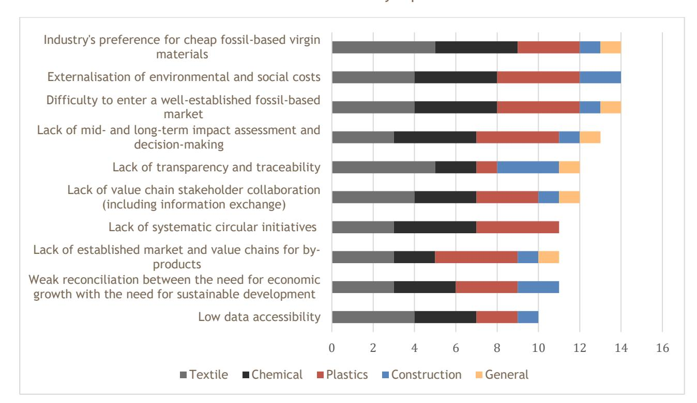

*Figure 10: Number of experts validating each technical barrier to their respective sector*

Validation for the barriers of the technical cluster, as illustrated in the graph, range from 40 to 80%. The two least validated barriers are "Loss of material quality and value during recycling" and "Low integration potential for bio-based material as substitute for fossil-based materials". Both haven't been validated by any construction sector expert and received more validation from researchers than industry professionals. A noteworthy comment from one the interviewees on the latter barrier suggested that perceiving bio-based materials solely as substitutes for fossil-based ones limits their potential and leads to unfair comparisons and expectations. The third least validated barrier, also not allocated to the construction sector, is "Technology inefficiencies", which a couple interviewees viewed as a natural consequence of the relatively young age of many bio-based production technologies. On the other hand, the barrier "Immature technology (including technical issues for scale-up)" was the most validated barrier of the cluster, which was validated by an 89% majority of researchers compared to 63% of industry professionals. The same trend persists for all but one technical barrier, namely "Lack of adequate feedstock: local biomass (including seasonality and quality impacts)". Especially notable is the trend for the barriers "Lack of adequate feedstock: recycling", "Lack of advanced technology innovation to maintain quality of materials in circular economy" and "Increasing complexity of materials and their combinations", which were validated by 89%, 89% and 67% of researchers respectively, compared to 25%, 38% and 38% of industry experts.

As mentioned earlier the first objective aimed not just at validating the barriers, but also validating them for the four sectors separately and possibly identify barriers that are more prominent in specific sectors or irrelevant to any sector. As illustrated in the graphs above (Figure 6 to 11) there is not a single barrier that hasn't been allocated to the textile sector, with only one barrier having been validated by only one out of the five textile sector experts interviewed. This economic barrier is "Lack of consistent and reliable consumer demand for green products". Five

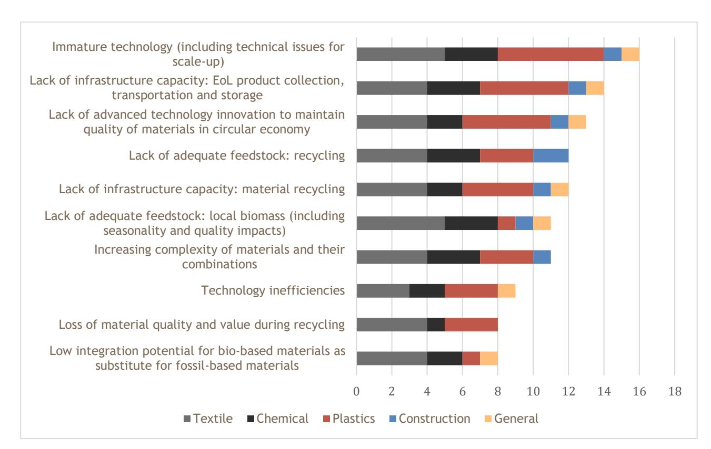

barriers have been validated by two out of the five experts and otherwise all remaining barriers have been validated for the textile sector by at least three out of the five interviewees. A total of ten barriers have been validated by all five interviewees. These barriers are:

*Table 15: Barriers validated by all textile sector interviewees*

|    | Cluster       | Barrier                                                              |
|----|---------------|----------------------------------------------------------------------|
|    | Cultural      | Missing communication, misinformation, disinformation and lack of    |
|    | Cultural      | Consumers lack knowledge of the meaning of material                  |
|    | Economic      | Weak cost competitiveness: bio-based vs. fossil-based ingredients,   |
|    | Environmental | Lack of harmonised methods for environmental, climate and            |
| 5  | Environmental | Lack of data on impacts                                              |
|    | Environmental | Concerns over feedstock availability within the limits of carrying   |
| 7  | Structural    | Industry's preference for cheap fossil-based virgin materials        |
| 8  | Structural    | Lack of transparency and traceability                                |
| 9  | Technical     | Immature technology (including technical issues for scale-up)        |
| 10 | Technical     | Lack of adequate feedstock: local biomass (including seasonality and |

The only other sector that has been subject to an allocation of all 67 barriers by at least one of its representing interviewees is the plastics sector. However, there wasn't a strong of a consensus among the sector's experts as it was the case for the textile sector. Only one barrier has been validated by all seven plastics sector interviewees, namely the environmental barrier "Lack of harmonised methods for environmental, climate and sustainability impact assessment of CBBE", and five other barriers garnered validation from six of the seven experts. On the other hand, nine barriers have been validated by only one interviewee and nine other ones by two experts.

The experts of the chemical sectors, while having not validated two barriers at all, have in comparison to the plastics and the textile sector unanimously agreed on 14 barriers, half of which are governance barriers. The two barriers that garnered no validation from any of the four chemical sector interviewees are the cultural barrier "Lack of systematic business model analysis" and the economic barrier "Insufficient investment in mature closed loop recycling technologies". Eight further barriers have been validated by only one of the four interviewees, while the remaining 57 barriers have been validated by at least 2 out of the four experts. The 14 barriers that have been validated by all interviewees are:

*Table 16: Barriers validated by all chemical sector interviewees*

|   | Cluster    | Barrier                                                                |
|---|------------|------------------------------------------------------------------------|
| 1 | Economic   | High investment risk for bio-based industry                            |
|   | Economic   | Weak cost competitiveness: bio-based vs. fossil-based ingredients,     |
| 3 | Governance | Competing political interests with "old" industries (big lobbies etc.) |
|   | Governance | Need for market-driven policies (e.g. public procurement)              |
|   |            | to stimulate the market                                                |
|   | Governance | Complicated certification and labelling procedures and requirements    |

| 6  | Governance | Limitations for application of material when defined as waste         |
|----|------------|-----------------------------------------------------------------------|
| 7  | Governance | Limited policy drivers                                                |
| 8  | Governance | Insufficiently ambitious target level for achieving a circular system |
| 9  | Governance | Inconsistent and/or partial data collection and reporting             |
| 10 | Structural | Difficulty to enter a well-established fossil-based market            |
| 11 | Structural | Externalisation of environmental and social costs                     |
| 12 | Structural | Lack of systematic circular initiatives                               |
| 13 | Structural | Industry's preference for cheap fossil-based virgin materials         |
| 14 | Structural | Lack of mid- and long-term impact assessment and decision-making      |

The construction sector is the one with the most number of barriers that haven't been validated by any of the experts. It is important to note, however, that it was the sector represented by the least amount of experts, namely three. The three experts showed no validation to ten barriers. Those barriers covered all cluster but the economic one. All economic barriers have been validated by at least one construction sector expert. The ten barriers are:

*Table 17: Barriers validated by none of construction sector interviewees*

|    | Cluster       | Barrier                                                             |
|----|---------------|---------------------------------------------------------------------|
| 1  | Cultural      | Lack of systematic business model analysis                          |
|    | Cultural      | Lack of company's internal resources for initiating and maintaining |
| 3  | Environmental | Concerns over poor biodegradation in natural environments           |
| 4  | Environmental | Insufficient consideration of risk and safety issues                |
| 5  | Governance    | Limited government and public support for transition                |
| 6  | Governance    | Limited long-term policy reliability                                |
| 7  | Structural    | Lack of systematic circular initiatives                             |
|    | Technical     | Low integration potential for bio-based materials as substitute for |
| 9  | Technical     | Loss of material quality and value during recycling                 |
| 10 | Technical     | Technology inefficiencies                                           |

Seven barriers on the other hand have been unanimously validated by all three interviewers. Those are:

*Table 18: Barriers validated by all construction sector interviewees*

|   | Cluster      | Barrier                                                             |
|---|--------------|---------------------------------------------------------------------|
|   | Cultural     | Missing communication, misinformation, disinformation and lack of   |
| 2 | Economic     | Structural price differences: virgin vs. secondary materials        |
| 3 | Enviromental | Lack of data on impacts                                             |
|   | Governance   | Fragmented regulatory environment across European countries and at  |
|   | Governance   | Complicated certification and labelling procedures and requirements |
| 6 | Governance   | Inconsistent and/or partial data collection and reporting           |
| 7 | Structural   | Lack of transparency and traceability                               |

In what follows the results of the second primary objective, namely identifying missing barriers, are presented. In total 59 additional barriers spanning all barrier clusters were suggested by the interviewees, with some being identical, closely resembling each other or not really constituting barriers. For the cultural barrier cluster 14 new barriers were proposed, while 12 barriers each were identified for the economic and governance clusters. The structural, environmental, and technical clusters saw the addition of 8, 7, and 6 barriers, respectively. The missing barriers identified by the experts are listed in Tables 19 to 24. The tables also provide the sector affiliation of the interviewee proposing each barrier, as well as the stakeholder group they represent. Out of the three construction sector experts interviewed, only one suggested a barrier. Chemical sector experts contributed 16 of the 59 barriers, while textile and plastics sector interviewees provided 21 barriers each.

*Table 19: Missing cultural barriers identified by interviewees*

|    | Sector   | Stakeholder |                                                              |
|----|----------|-------------|--------------------------------------------------------------|
|    | Textile  | Research    | Lack of understanding of terminology, such as bio-based and  |
|    | Textile  | NGO         | Consumers' varying perceptions of terminology (e.g. positive |
| 3  | Textile  | NGO         | Limited understanding of textile fibres                      |
|    | Chemical | Research    | Established high trust and superiority attributed to fossil |
|    | Chemical | Research    | Dominance of "old school"/ steamcracker based knowledge      |
| 6  | Chemical | Industry    | Lack of bio-based production education in schools            |
| 7  | Plastics | Research    | Ethical debate around usage of primary biomass               |
| 8  | Plastics | Research    | Perceived quality issues of recyclates                       |
|    | Plastics | Research    | Higher demands and expectations of bio-based products        |
| 10 | Plastics | Research    | Lack of understanding of the environmental advantage of      |
| 11 | Plastics | Policy      | Possible correlation between claims of biodegradability and  |
| 12 | Plastics | Policy      | Contribution of generic claims to consumer confusion         |
| 13 | Plastics | Research    | Different cultures and mindsets of industries that need to   |
| 14 | Plastics | Research    | Limited societal acceptance for the transition due to        |

*Table 20: Missing economic barriers identified by interviewees*

|   | Sector   | Stakeholder |                                                         |
|---|----------|-------------|---------------------------------------------------------|
| 1 | Textile  | Research    | Fossil fuel subsidies                                   |
| 2 | Textile  | Research    | Fossil fuel subsidies                                   |
| 3 | Textile  | Research    | Gaps between demand and supply of recyclates            |
| 4 | Textile  | NGO         | High cost of low TRL bio-based and recycled materials   |
|   | Chemical | Research    | Need to define target market prior to production due to |
|   |          |             | different sustainability requirements for the different |

|    | Chemical | Research | Lack of subsidies and financial support for bio-based         |
|----|----------|----------|---------------------------------------------------------------|
| 7  | Chemical | Industry | Lack of willingness to pay the green premium for products     |
| 8  | Plastics | Research | Logistics of circular systems are complex and costly          |
| 9  | Plastics | Research | Fossil fuel subsidies                                         |
| 10 | Plastics | Research | Fluctuating prices and unstable supply of biomass and         |
| 11 | Plastics | Policy   | Certifications are competing and costly for companies         |
| 12 | Plastics | Policy   | Higher final prices for consumers: bio-based vs. fossil-based |

*Table 21: Missing environmental barriers identified by interviewees*

| Sector     | Stakeholder |                                                                |
|------------|-------------|----------------------------------------------------------------|
| Textile    | Research    | Lack of knowledge of the environmental impacts of bio         |
| Textile    | Research    | Lack of understanding of the environmental performance of      |
| Chemical   | Research    | Uncertainty over the risks of using gen-modified               |
| Chemical   | NGO         | Lack of understanding and assessments of regionally            |
| 5 Chemical | Industry    | Impacts on and of biodiversity on biomass availability         |
| Plastics   | Research    | Lack of understanding of environmental impacts through         |
| Plastics   | Policy      | Lack of focus on the sustainability and circularity of biomass |

## *Table 22: Missing governance barriers identified by interviewees*

|   | Sector   | Stakeholder |                                                             |
|---|----------|-------------|-------------------------------------------------------------|
| 1 | Textile  | Research    | Lack of policies on the global level                        |
|   | Textile  | Research    | Lack of policies concerned with human safety and health     |
| 3 | Chemical | Research    | Unclear commitment to bio-based production                  |
|   | Chemical | NGO         | Lack of policy frameworks focusing on eco-efficiency and    |
|   | Chemical | NGO         | Taxation laws in EU focused on taxing labour and not        |
| 6 | Chemical | Industry    | Lack of clarity around trajectories/ how to achieve targets |
|   | Chemical | Industry    | Questionable ownership of the bio-based economy within      |
|   | Plastics | Industry    | Complicated procedures for the admission of new bio-based   |

| 9  | Plastics | Industry | Lack of recognition for the added value of renewability    |
|----|----------|----------|------------------------------------------------------------|
|    | Plastics | Industry | Lack of understanding in the NACE of bio-based productions |
| 11 | Plastics | Policy   | Multiple competing (market-driven) certification and       |
| 12 | Plastics | Research | Lack of involvement of society and other affected          |

*Table 23: Missing structural barriers identified by interviewees*

|   | Sector   | Stakeholder |                                                              |
|---|----------|-------------|--------------------------------------------------------------|
| 1 | Textile  | Research    | Lack of knowledge of technical and social innovation         |
| 2 | Textile  | Research    | Lack of knowledge on circular business models                |
| 3 | Textile  | Research    | Technical and social lock-ins to the current linear system   |
|   | Textile  | NGO         | Lack of green and digital skills within conventional         |
|   | Textile  | NGO         | Overwhelming prevalence of small businesses within the       |
|   |          |             | textile sector leading to lack of finance, human resources,  |
|   | Textile  | NGO         | Established global supply chains leading to a consumption of |
| 7 | Chemical | Research    | Lack of specialists and skilled workers                      |
| 8 | Plastics | Policy      | Linkage to oil                                               |

*Table 24: Missing technical barriers identified by interviewees*

|   | Sector       | Stakeholder |                                                                |
|---|--------------|-------------|----------------------------------------------------------------|
| 1 | Textile      | Research    | Lack of research into new bio-based products                   |
|   | Textile      | Industry    | Time required for the development of technologies and to       |
| 3 | Textile      | Research    | Limited production sites in the EU                             |
|   | Textile      | NGO         | Textile processing is like a "black box" process, leading to a |
|   | Chemical     | Industry    | Technical difficulties regarding stock preparation and         |
|   | Construction | Research    | Lack of clarity about technical limitations of bio-based       |

## **Secondary objectives results**

In what follows the results of the secondary objectives will be presented. The first of the secondary objectives aimed at allocating the 67 barriers to the different value chain steps "whole system", "raw material extraction", "material processing and product manufacturing", "consumption", and "end of life (EoL)". Because this exercise was not completed by all the participants and experts were asked to only allocate barriers that they validated, quantitative results about how many times a barrier was allocated to a certain value chain step can't be drawn.

All 67 barriers apart from two were viewed by at least one interviewee as barriers affecting the whole system. These are the economic barrier "Lack of adequate funding and investment in developing EoL infrastructure and waste management practices" and the environmental barrier "Concerns over poor biodegradation in natural environments". The Tables 25 to 28 below show which barriers from which cluster were allocated to the four remaining value chain steps. The least amount of barriers was assigned to the value chain step "consumption", namely 22. To the value chain steps "raw material extraction", "material processing and product manufacturing" and "end of life (EoL)" a total of 37, 42 and 39 barriers were allocated, respectively.

*Table 25: Barriers allocated to the supply chain step "raw material extraction"*

|    | Cluster       | Barrier                                                           |
|----|---------------|-------------------------------------------------------------------|
| 1  | Cultural      | Low awareness of bio-based products                               |
| 2  | Cultural      | Regionally diverse consumer awareness of bio-based products       |
| 3  | Economic      | High investment risk for bio-based industry                       |
| 4  | Economic      | Limited access to finance for start-ups and SMEs, and to scale   |
| 5  | Economic      | Lack of profitability for firms in areas that deliver high public |
| 6  | Economic      | Lack of consistent and reliable consumer demand for green         |
| 7  | Economic      | High operating costs: bio-based vs. fossil-based production       |
| 8  | Economic      | Weak cost competitiveness: bio-based vs. fossil-based             |
| 9  | Economic      | Structural price differences: virgin vs. secondary materials      |
| 10 | Economic      | High investment cost for bio-based industry                       |
| 11 | Environmental | Lack of harmonised methods for environmental, climate and         |
| 12 | Environmental | Lack of data on impacts                                           |
| 13 | Environmental | Concerns over feedstock availability within the limits of         |
| 14 | Environmental | Concerns over poor biodegradation in natural environments         |
| 15 | Environmental | Higher land use: bio-based vs. fossil-based products              |
| 16 | Environmental | Uncertainty over potential environmental gains                    |
| 17 | Governance    | Fragmented regulatory environment across European countries       |
| 18 | Governance    | Competing political interests with "old" industries (big lobbies  |
| 19 | Governance    | Lack of alignment and consistency between different policies      |
| 20 | Governance    | Need for market-driven policies (e.g. public procurement)         |
|    |               | to stimulate the market                                           |
| 21 | Governance    | Complicated certification and labelling procedures and            |
| 22 | Governance    | Limited government and public support for transition              |
| 23 | Governance    | Limitations for application of material when defined as waste     |
| 24 | Governance    | Limited policy drivers                                            |
| 25 | Governance    | Limited long-term policy reliability                              |
| 26 | Governance    | Lack of clarity around policy targets                             |
| 27 | Governance    | Emphasis on cost-effectiveness over sustainability and social     |

| 28 | Structural | Difficulty to enter a well-established fossil-based market    |
|----|------------|---------------------------------------------------------------|
| 29 | Structural | Weak reconciliation between the need for economic growth      |
| 30 | Structural | Lack of established market and value chains for by-products   |
| 31 | Structural | Lack of systematic circular initiatives                       |
| 32 | Structural | Industry's preference for cheap fossil-based virgin materials |
| 33 | Structural | Low data accessibility                                        |
| 34 | Structural | Lack of mid- and long-term impact assessment and decision    |
| 35 | Technical  | Immature technology (including technical issues for scale-up) |
| 36 | Technical  | Lack of adequate feedstock: recycling                         |
| 37 | Technical  | Lack of adequate feedstock: local biomass (including          |

## *Table 26: Barriers allocated to the supply chain step "material processing and product manufacturing"*

|    | Cluster       | Barrier                                                           |
|----|---------------|-------------------------------------------------------------------|
| 1  | Cultural      | Lack of technical skills, including mindset                       |
| 2  | Cultural      | Lack of systematic business model analysis                        |
| 3  | Cultural      | Low awareness of bio-based products                               |
| 4  | Cultural      | Lack of specialised knowledge, skills and expertise in bio-based  |
| 5  | Cultural      | Lack of company's internal resources for initiating and           |
| 6  | Cultural      | Lack of understanding of the potential economic advantages of     |
| 7  | Cultural      | Inconsistent or partial application of industry targets           |
| 8  | Cultural      | Lack of specialised knowledge, skills and expertise in closed     |
| 9  | Economic      | High investment risk for bio-based industry                       |
| 10 | Economic      | Limited access to finance for start-ups and SMEs, and to scale   |
| 11 | Economic      | Lack of profitability for firms in areas that deliver high public |
| 12 | Economic      | Insufficient investment in mature closed loop recycling           |
| 13 | Economic      | Lack of consistent and reliable consumer demand for green         |
| 14 | Economic      | High operating costs: bio-based vs. fossil-based production       |
| 15 | Economic      | Weak cost competitiveness: bio-based vs. fossil-based             |
| 16 | Economic      | Structural price differences: virgin vs. secondary materials      |
| 17 | Economic      | High investment cost for bio-based industry                       |
| 18 | Economic      | Lack of investment in new systems for transition                  |
| 19 | Economic      | Lack of adequate funding and investment in developing EoL         |
| 20 | Environmental | Concerns over poor biodegradation in natural environments         |
| 21 | Environmental | Insufficient consideration of risk and safety issues              |
| 22 | Environmental | Higher land use: bio-based vs. fossil-based products              |

| 23 | Environmental | Poor environmental performance of recycling technology           |
|----|---------------|------------------------------------------------------------------|
| 24 | Governance    | Competing political interests with "old" industries (big lobbies |
| 25 | Governance    | Lack of alignment and consistency between different policies     |
| 26 | Governance    | Complicated certification and labelling procedures and           |
| 27 | Governance    | Lack of product standardisation                                  |
| 28 | Governance    | Lack of standardised waste collection systems and harmonised     |
| 29 | Governance    | Insufficiently ambitious target level for achieving a circular   |
| 30 | Governance    |                                                                  |
| 31 | Governance    | Inconsistent and/or partial data collection and reporting        |
| 32 | Structural    | Difficulty to enter a well-established fossil-based market       |
| 33 | Structural    | Lack of established market and value chains for by-products      |
| 34 | Structural    | Lack of systematic circular initiatives                          |
| 35 | Structural    | Industry's preference for cheap fossil-based virgin materials    |
| 36 | Technical     | Immature technology (including technical issues for scale-up)    |
| 37 | Technical     | Lack of advanced technology innovation to maintain quality of    |
| 38 | Technical     | Low integration potential for bio-based materials as substitute  |
| 39 | Technical     | Increasing complexity of materials and their combinations        |
| 40 | Technical     | Lack of infrastructure capacity: material recycling              |
| 41 | Technical     | Loss of material quality and value during recycling              |
| 42 | Technical     | Technology inefficiencies                                        |

*Table 27: Barriers allocated to the supply chain step "consumption"*

|    | Cluster       | Barrier                                                           |
|----|---------------|-------------------------------------------------------------------|
| 1  | Cultural      | Missing communication, misinformation, disinformation and         |
| 2  | Cultural      | Low awareness of bio-based products                               |
| 3  | Cultural      | Consumers lack knowledge of the meaning of material               |
| 4  | Cultural      | Lack of incentives for consumer behaviour change                  |
| 5  | Cultural      | Lack of understanding of the potential economic advantages of     |
| 6  | Cultural      | Regionally diverse consumer awareness of bio-based products       |
| 7  | Economic      | Lack of profitability for firms in areas that deliver high public |
| 8  | Economic      | Lack of consistent and reliable consumer demand for green         |
| 9  | Economic      | Weak cost competitiveness: bio-based vs. fossil-based             |
| 10 | Environmental | Concerns over poor biodegradation in natural environments         |
| 11 | Environmental | Insufficient consideration of risk and safety issues              |

| 12 | Governance | Need for market-driven policies (e.g. public procurement)      |
|----|------------|----------------------------------------------------------------|
|    |            | to stimulate the market                                        |
| 13 | Governance | Complicated certification and labelling procedures and         |
| 14 | Governance | Lack of product standardisation                                |
| 15 | Governance | Insufficiently ambitious target level for achieving a circular |
| 16 | Governance |                                                                |
| 17 | Governance | Inconsistent and/or partial data collection and reporting      |
| 18 | Governance | Emphasis on cost-effectiveness over sustainability and social  |
| 19 | Structural | Difficulty to enter a well-established fossil-based market     |
| 20 | Structural | Industry's preference for cheap fossil-based virgin materials  |
| 21 | Technical  | Lack of advanced technology innovation to maintain quality of  |
| 22 | Technical  | Lack of infrastructure capacity: EoL product collection,       |

*Table 28: Barriers allocated to the supply chain step "end of life (EoL)"*

|    | Cluster       | Barrier                                                         |
|----|---------------|-----------------------------------------------------------------|
| 1  | Cultural      | Regionally diverse consumer awareness of bio-based products     |
| 2  | Cultural      | Lack of specialised knowledge, skills and expertise in closed   |
| 3  | Economic      | High investment risk for bio-based industry                     |
| 4  | Economic      | Limited access to finance for start-ups and SMEs, and to scale |
| 5  | Economic      | Insufficient investment in mature closed loop recycling         |
| 6  | Economic      | Lack of adequate funding and investment in developing EoL       |
| 7  | Environmental | Lack of harmonised methods for environmental, climate and       |
| 8  | Environmental | Lack of data on impacts                                         |
| 9  | Environmental | Concerns over poor biodegradation in natural environments       |
| 10 | Environmental | Insufficient consideration of risk and safety issues            |
| 11 | Environmental | Poor environmental performance of recycling technology          |
| 12 | Environmental | Uncertainty over potential environmental gains                  |
| 13 | Governance    | Fragmented regulatory environment across European countries     |
| 14 | Governance    | Lack of alignment and consistency between different policies    |
| 15 | Governance    | Need for market-driven policies (e.g. public procurement)       |
|    |               | to stimulate the market                                         |
| 16 | Governance    | Complicated certification and labelling procedures and          |
| 17 | Governance    | Limited government and public support for transition            |
| 18 | Governance    | Lack of product standardisation                                 |

| 19 | Governance | Lack of standardised waste collection systems and harmonised    |
|----|------------|-----------------------------------------------------------------|
| 20 | Governance | Limitations for application of material when defined as waste   |
| 21 | Governance | Limited policy drivers                                          |
| 22 | Governance | Insufficiently ambitious target level for achieving a circular  |
| 23 | Governance |                                                                 |
| 24 | Governance | Limited long-term policy reliability                            |
| 25 | Governance | Lack of clarity around policy targets                           |
| 26 | Structural | Lack of established market and value chains for by-products     |
| 27 | Structural | Lack of systematic circular initiatives                         |
| 28 | Structural | Low data accessibility                                          |
| 29 | Structural | Lack of mid- and long-term impact assessment and decision      |
| 30 | Technical  | Immature technology (including technical issues for scale-up)   |
| 31 | Technical  | Lack of advanced technology innovation to maintain quality of   |
| 32 | Technical  | Lack of infrastructure capacity: EoL product collection,        |
| 33 | Technical  | Low integration potential for bio-based materials as substitute |
|    |            | for fossil-based materials                                      |
| 34 | Technical  | Increasing complexity of materials and their combinations       |
| 35 | Technical  | Lack of infrastructure capacity: material recycling             |
| 36 | Technical  | Lack of adequate feedstock: recycling                           |
| 37 | Technical  | Lack of adequate feedstock: local biomass (including            |
| 38 | Technical  | Loss of material quality and value during recycling             |
| 39 | Technical  | Technology inefficiencies                                       |

The number of barriers allocated to the different value chain steps per cluster are illustrated in Figure 11 below. Barriers of the governance cluster were the most allocated ones to all but one value chain steps, namely "material processing and product manufacturing" which was the only step that was assigned all 11 economic barriers.

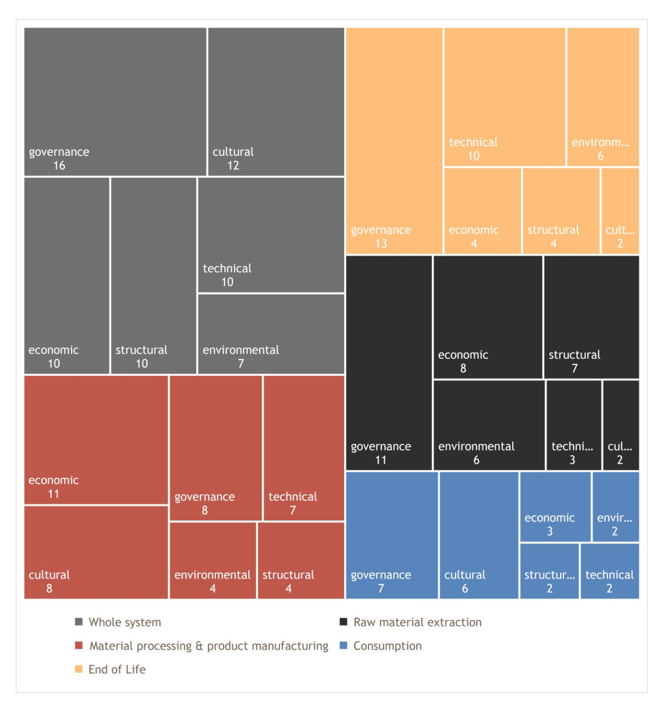

*Figure 11: Number of barriers allocated to the different value chain steps per cluster* 

In what follows the results for the second secondary objective "identification of the barriers that can be overcome with the current level of knowledge" will be presented. In total only six of the 20 interviewees when posed this question replied with yes or no to each of the barriers going through the list barrier by barrier. The remaining interviewees replied with comments instead. None of the barriers was seen as surmountable by all six, five or four of the interviewees who systematically reviewed the list barrier by barrier and only one was seen as surmountable by half of these six interviewees. This barrier is the governance barrier "Inconsistent and/or partial data collection and reporting". Twenty barriers were seen as surmountable with the current state of knowledge by two of the six interviewees, whereas 26 barriers received this validation from only one of the interviewees. Furthermore, it can be deduced from the comments that overcoming governance barriers can be achieved by implementing comprehensive approaches, particularly through the presence of political determination and willingness. Unfortunately, due to the current state of knowledge, it is difficult to overcome the obstacles created by structural barriers, necessitating a comprehensive and systematic transformation. Experts argue that reducing the costs of producing bio-based products through increased investments, coupled with financial support, subsidies, and incentives, can effectively tackle economic challenges. Additionally, stimulating the market for circular bio-based products through these measures can further contribute to overcoming these barriers. Furthermore, to overcome technical barriers, it is necessary to invest in research and development, as well as in pilot plants and end-of-life technologies. Moreover, additional actions need to be taken regarding recycling technologies and infrastructure, which can be overcome through joint efforts from both state and EU levels. There is a divergence of expert opinions regarding the possibility of overcoming environmental barriers with existing knowledge. However, a consensus exists that additional knowledge is required to evaluate the sustainability of products. Moreover, concerns are raised about the limited availability of biomass. There is an agreement that cultural barriers can be overcome with more communication and information. All comments as made by the interviewees can be found in Annex C.

# **5.4. Resulting list of barriers**

The process of compiling the results of the interviews into a new list of barriers was twofold. On the one hand, the proposed missing barriers by the interviewees were reviewed and compared with the results from the literature review conducted in task T1.1. Accordingly, some of those barriers were eliminated and others were used to edit or complement existing barriers. On the other hand, the existing barriers were also reviewed, and those that were validated by less than 40% of the experts were eliminated.

The two-fold reviewing exercise described above resulted in a pre-final list of 53 barriers. This list was presented during the final 21st interview to an expert in the bioeconomy field to get a set of fresh eyes to review the results and make sure the content as well as the wording of the barriers is comprehensible. The comments of the expert were considered, and some further edits were made, however the number of barriers remained unchanged. The final list of barriers to be used in the survey is presented in Tables 29 to 34.

*Table 29: Cultural barriers*

|   | Barrier                                                                                                     |
|---|-------------------------------------------------------------------------------------------------------------|
| 1 | Missing communication, misinformation, and disinformation proliferation of certification schemes and labels |
| 3 | Low awareness and knowledge of bio-based products                                                           |
| 4 | Established superiority attributed to fossil-based chemistry                                                |
| 5 | Regionally diverse consumer perception of bio-based products                                                |
| 6 | Lack of incentives for consumer behaviour change unjust transition                                          |
| 8 | Higher demands and expectations of bio-based products compared to fossil-based ones                         |

## *Table 30: Economic barriers*

|   | Barrier                                                                                  |
|---|------------------------------------------------------------------------------------------|
| 1 | High investment costs and risks for establishing circular bio-based industries           |
| 2 | High operating costs: bio-based vs. fossil-based production                              |
| 3 | Fluctuating prices and unstable supply of biomass and (processed) raw materials          |
| 4 | Weak cost competitiveness: bio-based vs. fossil-based ingredients, materials or products |
| 5 | Limited access to finance for start-ups and SMEs, and to scale-up                        |
| 6 | Fossil fuel subsidies management practices                                               |
| 8 | Difficulties in reconciling economic growth with sustainable development                 |

## *Table 31: Environmental barriers*

| 1 | Barrier assessments                                                       |
|---|---------------------------------------------------------------------------|
| 2 | Lack of knowledge and data on impacts                                     |
| 3 | Higher land use: bio-based vs. fossil-based products capacity productions |
| 6 | Uncertainty over potential environmental gains                            |

*Table 32: Governance barriers*

| 1  | Barrier level                                                                                                         |
|----|-----------------------------------------------------------------------------------------------------------------------|
| 2  | Lack of alignment and consistency between different policies                                                          |
| 3  | Limited long-term policy reliability                                                                                  |
| 4  | Lack of clarity around policy targets and trajectories                                                                |
| 5  | Insufficiently ambitious targets and limited policy drivers                                                           |
| 6  | Regulatory complexities and lack of support for the transition at government level market decisions                   |
| 9  | Competing political interests with fossil-based industries (big lobbies etc.)                                         |
| 10 | Lack of product standardisation                                                                                       |
| 11 | Costly or complicated compliance with legal requirements (certification, labelling procedures and requirements, etc.) |
| 12 | Legislative limitations for applications of materials when classified as waste                                        |
| 13 | Lack of supportive policy framework for product-related inner circles of the circular                                 |

*Table 33: Structural barriers*

|    | Barrier                                                                                                      |
|----|--------------------------------------------------------------------------------------------------------------|
| 1  | Lack of value chain stakeholder collaboration (including information exchange)                               |
| 2  | Social and technical lock-ins to the current linear system                                                   |
| 3  | Externalisation of environmental and social costs                                                            |
| 4  | Lack of established markets and value chains for by-products                                                 |
| 5  | Low data accessibility and lack of transparency and traceability                                             |
| 6  | Lack of systematic circular initiatives and knowledge on circular business models                            |
| 7  | Established global supply chains and limited production sites in the EU attributed to fossil-based chemistry |
| 9  | Lack of digital infrastructure and digital skills within conventional manufacturing sectors                  |
| 10 | Lack of harmonised waste collection systems and infrastructure                                               |
| 11 | Lack of mid- and long-term impact assessment and decision-making                                             |

*Table 34: Technical barriers*

|   | Barrier                                                                                  |
|---|------------------------------------------------------------------------------------------|
| 1 | Immature technologies (including technical difficulties to scale-up)                     |
| 2 | Technology inefficiencies based economy materials transportation, storage and management |
| 6 | Increasing complexity of materials and their combinations                                |
| 7 | Lack of adequate feedstock for recycling                                                 |

# **6. SURVEY**

The second part of subtask T1.2.2 was to conduct an online survey as a last step of validating and prioritising the identified barriers, in order to create a final list of barriers to be used for upcoming project activities.

## **6.1. Methodology**

As indicated in Figure 12 below, the first step of the methodology involved preparing and validating the survey questionnaire. This was done based on the findings from the interviews. Following this, the survey questions were programmed in Limesurvey. The initial version of the survey was then internally tested with the consortium partners and based on the internal feedback, the survey design was enhanced and finalised. The survey was subsequently launched at the Inspire Conference and distributed to various stakeholders through different channels. Once the survey was conducted, the results were analysed.

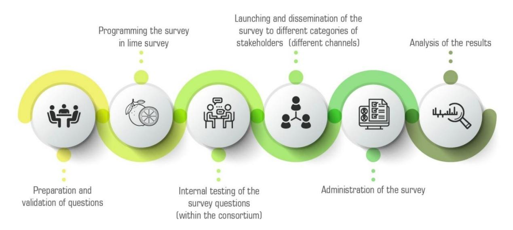

*Figure 12: Methodological steps of the survey*

The survey questions were structured into 6 main parts. The first part was related to the generalities of the respondents (category of stakeholder, country of origin and size of the organisation; sector represented). Participants could select one of the following sectors: construction, plastics, chemicals, textiles, or other. The following parts, from 2 to 7 were allocated respectively to the six clusters: cultural barriers; economic barriers; environmental barriers; governance barriers, structural barriers; and technical barriers. Respondents were asked to prioritise all barriers of each cluster as major, moderate, minor or not a barrier:

- **Major barriers** represent critical obstacles to the transition to a circular bio-based economy. Addressing them requires a coordinated effort and is crucial for the success of the transition.
- **Moderate barriers** pose substantial challenges, but do not impede the transition as significantly as critical barriers. Addressing them is important, but not inevitable.
- **Minor barriers** pose comparatively smaller challenges that may slow down the transition, but do not hinder it. While addressing them is not urgent, they should not be ignored.

A full overview of all survey questions can be found in Annex D.

The survey was programmed in LimeSurvey, a versatile and reliable open-source web-based survey tool, whose use has been documented in various studies to gather data and insights (STAR-ProBio, 2021; Nunes, 2019). Fields were not obligatory in case survey taker didn't understand the barrier/ had the feeling they can't formulate an opinion on it due to lack of knowledge, which is a comment we received quite a few times during the interviews.

The survey was launched on the 16th of November during the INSPIRE Conference organised by the SUTRACK project. It was disseminated through several different channels:

- All project's partners and members of the advisory board were asked several times to disseminate the invitation for the survey through their networks to key stakeholders;
- The survey was diffused online by SUSTRACK channels, through publication in SUSTRACK [website](https://sustrack.eu/support-sustrack-research-by-completing-our-survey-on-barriers-hindering-the-sustainable-transition/) and different posts on social media [\(Linkedln](https://www.linkedin.com/company/sustrack/) and [Twitter\)](https://twitter.com/SUSTRACK_eu);
- The survey was also diffused leveraging other online channels, thanks to SUSTRACK wellestablished network of collaborations: 1) an email was sent to the SUSTRACK parallel

projects' mailing list, created in the previous months with the aim of establishing a communication group to collaborate among relevant projects, 2) a news was published on [EuBioNet website,](https://eubionet.eu/support-sustrack-research-by-completing-the-survey-on-barriers-hindering-the-sustainable-transition/) and 3) ECOSYSTEX LinkedIn channel shared a [specific news](https://www.linkedin.com/feed/update/urn:li:activity:7134816706039885826) about it.

## **6.2. Survey results**

This section summarises the results of the survey. The first part investigates generalities of the respondents. To follow, the prioritisation of the barriers in each cluster is presented.

## **Generalities of Respondents**

Out of the total 55 participants, 47 were representing organisations from one EU country. In particular, there were representatives from 9 EU countries. Germany had the highest representation at 22%, followed by Spain at 13%, Italy at 11%, Greece and Belgium both at 9% each, and The Netherlands and Austria both at 7%. Finland and Portugal had the lowest representation at 5% and 2% respectively.

*Figure 13: Countries of survey takers' organisations*

The survey participants represented three categories from the quadruple helix framework, excluding policy makers. Academia constituted the largest proportion, accounting for 65% of the participants. Industry and NGOs covered only 18% and 13% of the participants, respectively.

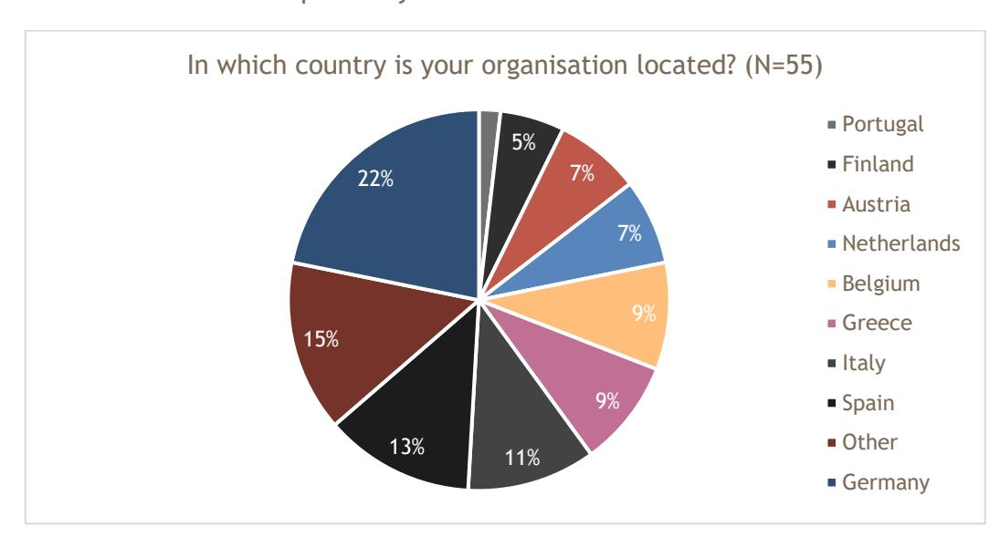

*Figure 14: Stakeholder categories represented among survey takers*

In terms of sector representation, out of the 55 participants, 21 (38%) reported that they represented one of the four specific sectors targeted in the project. More precisely, just like in the interviews the plastics sector had the highest number of representatives with 8 experts. In contrast to the interviews, the second most represented sector was the construction sector with 6 experts. The chemicals and textile sectors had the lowest representation, with 4 and 3 participants respectively. The majority of participants, 36% (20 participants), reported to represent the bio-based sector as a whole (corresponding to the category "general" in the interviews), while the remaining 14 declared to represent "other" sectors, including among others: blue economy, environment and recycling.

*Figure 15: Sectors represented by survey takers*

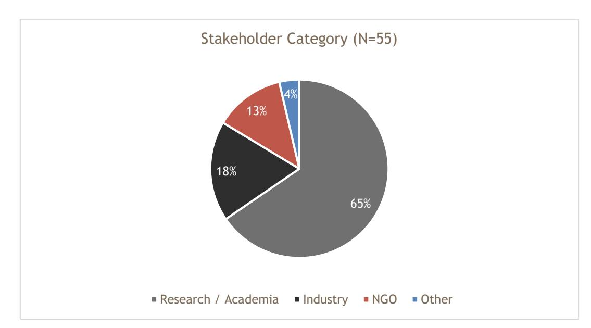

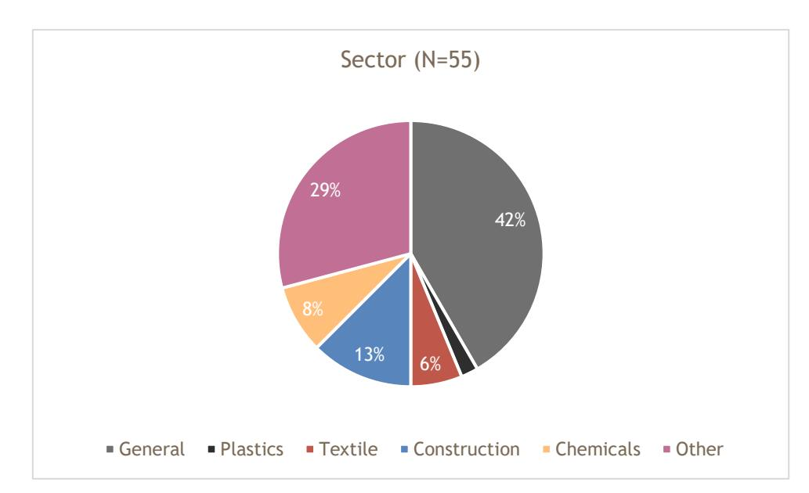

## **General results of barriers prioritisation**

This section summarises the results of the implemented survey, where the different barriers per cluster are prioritised by the participants as: major barrier, moderate barrier, minor barrier or defined as not a barrier. In total 4 barriers out of the 53 barriers included in the survey were viewed as a major barrier by at least half of the respondents (28 out of 55). Three of these barriers are related to governance, while the remaining barrier belongs to the economic cluster.

A total of 31 out of the 53 barriers will be used in future project activities (task 1.3) for conducting multi-criteria assessments (ANP and AHP). These 31 barriers were considered major or moderate barriers by at least 75% of survey participants.

## **Cultural barriers**

The three cultural barriers considered major barriers by more than 40% of the participants are the "Lack of incentives for consumers behaviour change", "Consumer confusion and lack of trust due to generic sustainability claims" and related to this, "Missing communication and misinformation". A similar barrier considered moderate by more than 50% of the respondents is the "Low awareness and knowledge of bio-based products". These four barriers were considered moderate or major barriers by more than 80% of the respondents, and therefore they will be considered in future project activities. The barriers: "Regionally diverse consumer perception of bio-based products", and "Higher demand and expectations of bio-based products compared to fossil-based ones", were considered minor barrier or even not a barrier by circa 40% of the respondents. The barriers "Limited societal acceptance for the transition due to unclear benefits and fears of an unjust transition", and "Established superiority attributed to fossil-based chemistry" are considered minor or no barriers by most participants.

*Figure 16: Survey results cultural barriers*

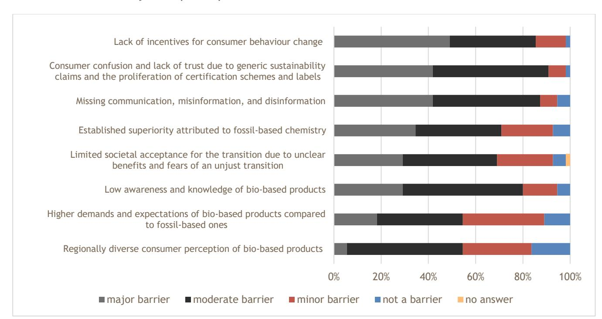

## **Economic barriers**

Approximately 70% of the respondents consider the economic barriers listed in Figure 17 to be moderate or significant barriers. Furthermore, at least 75% of the respondents feel that 6 out of the 8 barriers listed are significant. They were therefore selected for further project activities. The most serious economic barrier according to the survey respondents is "High investment costs and risks for establishing circular bio-based industries" (considered a major barrier by more than half of the respondents). The "Weak cost competitiveness: bio-based vs. fossil-based ingredients, materials or products" and the "Lack of funding and investment in End-of-Life (EoL) infrastructure and waste management practices" are also considered substantial obstacles to the implementation of a circular bio-based economy. The barrier "Difficulties in reconciling economic growth with sustainable development" was considered not a barrier by 7% of the respondents.

*Figure 17: Survey results economic barriers*

## **Environmental barriers**

Most of the environmental barriers are seen as moderately challenging by the majority of the participants. The barrier "Uncertainty over environmental and occupational health and safety risks of bio-based productions" is considered a minor barrier by 40% of participants, and even not a barrier by 16% of participants. Additionally, the "Lack of knowledge and data on impact" is seen as a major barrier by an only slightly higher number of participants. This last-mentioned barrier along with the barriers "Concerns over (local) biomass feedstock availability within the limits of carrying capacity" and "Lack of harmonised methods for environmental, climate and sustainability impact assessments" will be further examined in upcoming project activities.

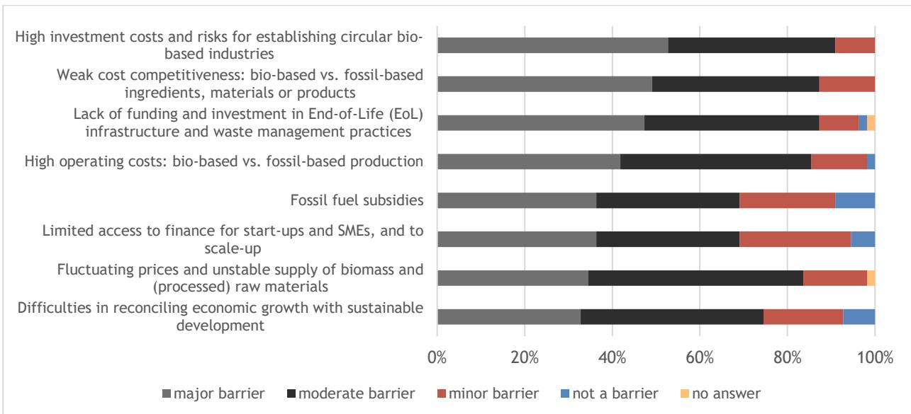

*Figure 18: Survey results environmental barriers*

## **Governance barriers**

In general, the majority of participants (more than 70%) view all governance barriers, except for the lack of product standardisation, as moderate or even major barriers. More precisely the "Fragmented regulatory framework across European countries and at national/ regional level" and the related barrier Lack of alignment and consistency between different policies are seen as major barriers by almost 60% and more than 55% of respondents respectively. Additionally, within the governance cluster, the lack of a level playing field between the fossil-based and the bio-based economy is emphasised, with over 55% of participants considering the barrier "Competing political interests with fossil-based industries (big lobbies etc.)" as a major barrier. Overall, ten out of the thirteen barriers are considered moderate or even major barriers by at least 75% of the participants, and therefore they will be considered for future project activities.

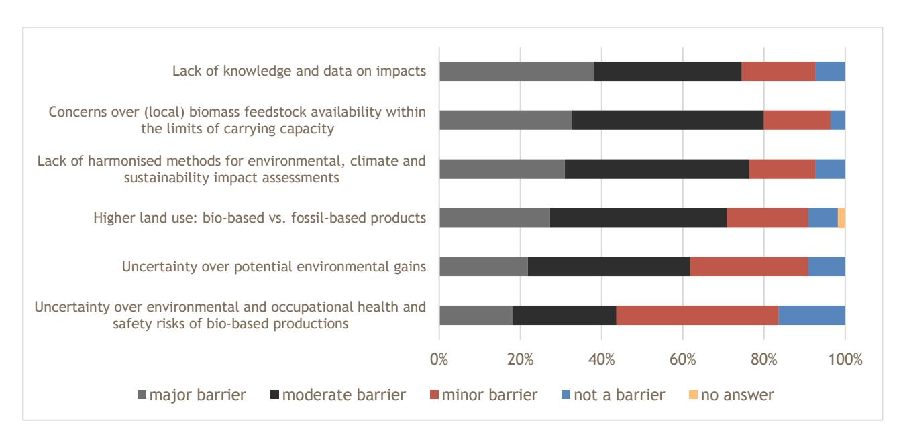

*Figure 19: Survey results governance barriers*

## **Structural barriers**

Within the structural cluster, none of the barriers is considered as a major barrier by more than 40% of respondents. However, all of them are considered moderate barriers by the majority of respondents, ranging from 38% to 55 %, except for one barrier, namely "Lack of bio-based education in schools and universities and established superiority attributed to fossil-based chemistry*"* which is considered a minor barrier or even not a barrier by respectively 33% and 11% of the respondents. Similarly, the Lack of digital infrastructure and digital skills within conventional manufacturing sectors is considered a minor barrier or not a barrier by respectively

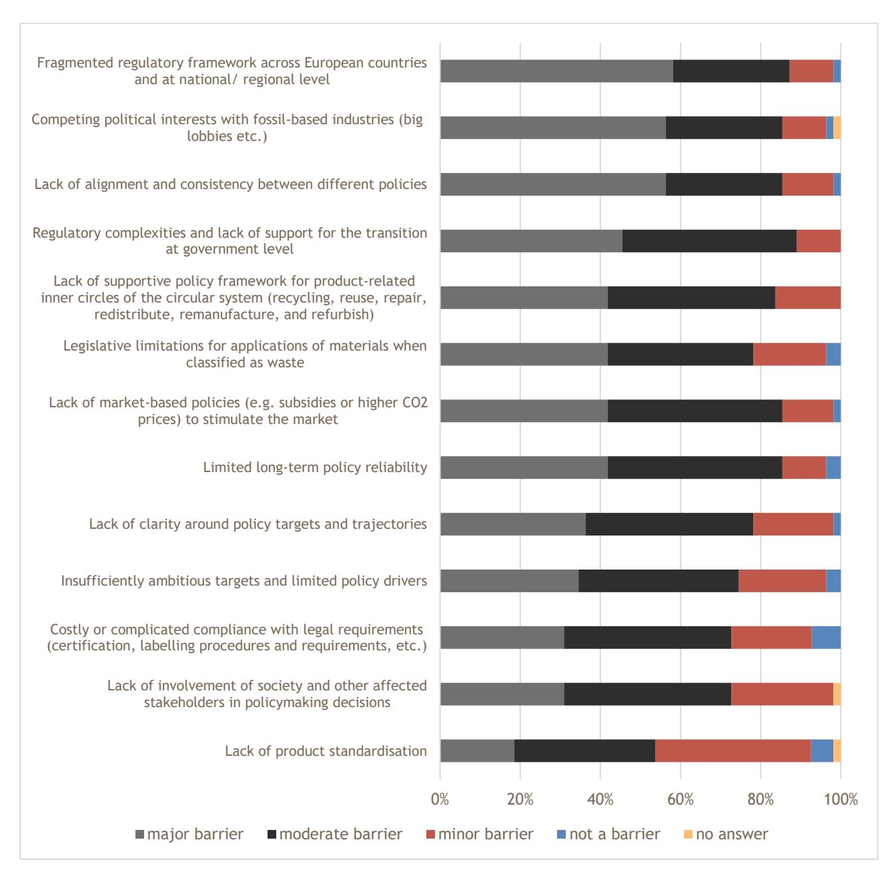

24% and 17% of respondents. Only 6 out of the 12 barriers will be considered for further project activities.

*Figure 20: Survey results structural barriers*

## **Technical barriers**

Less than 35% of respondents consider any of the barriers within the technical cluster to be major barriers. However, a majority of respondents, ranging from 38% to 50%, consider all of them to be moderate barriers, with the exception of "Immature technologies (including technical difficulties to scale-up)" which is considered a moderate barrier by only 27% of respondents. Similarly, 5 out of 7 barriers are considered minor barriers or even not a barrier by more than 30% of the

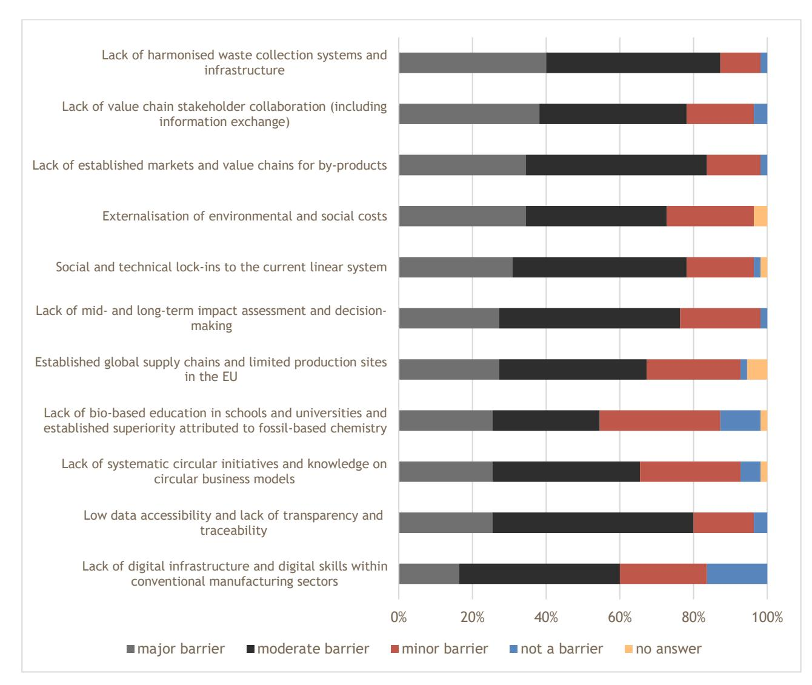

respondents. Consequently, only 2 out of the 7 barriers will be addressed in future project activities.

*Figure 21: Survey results technical barriers*

## **Overall results**

The evolution of the barriers throughout the iterative process of identifying and consolidating them is displayed in Figure 22. Starting with 193 barriers that resulted from the literature review conducted as part of task T1.1 a cut off criterion of a being mentioned in at least three reports was set reducing the list to 51 barriers. These 51 barriers included only one environmental barrier and the decision to introduce three further environmental barriers to the short list despite not fulfilling the cut off criterion was made, resulting in a list of 54 barriers that was then used for the co-creation workshop. This list was expanded to include 82 barriers in the workshop and after analysing the results and merging overlapping barriers the list was shortened to 67 barriers which were then used for the expert interviews. The interviewees identified 59 missing barriers, resulting in a list of 126 barriers. The analysis of the interview results led to a shorter list of 53 barriers, which then again were used for conducting the survey. The survey did not include a further identification process of missing barriers, but merely a prioritisation exercise of the list of 53 barriers in order to condense it and have it include only the more pressing barriers that completely or significantly hinder the transition to a CBBE and not the minor ones. A cut off criterion was yet again chosen and all barriers that were considered major or moderate by at least 75% of survey participants were eliminated. A total of 31 barriers fulfilled this criterion, while 22 were eliminated.

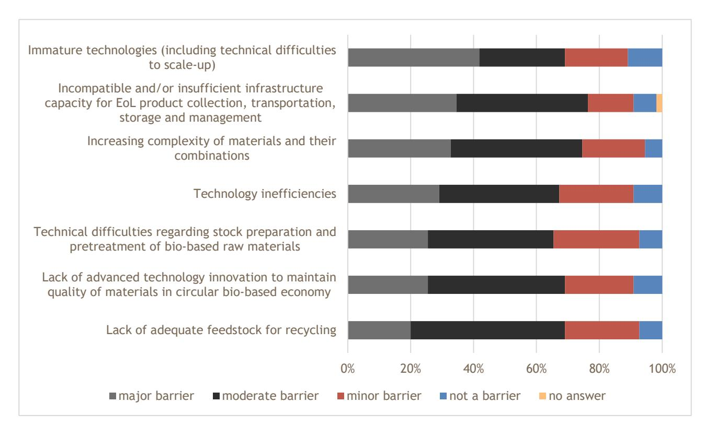

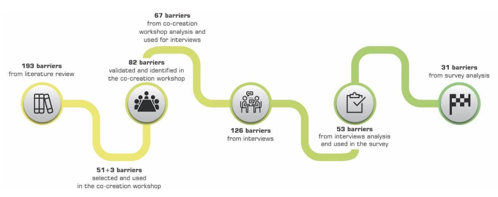

*Figure 22: Evolution of the barriers*

Below the final list of 31 barriers can be found.

*Table 35: Final list of barriers*

|    | Cultural barriers                                                                                                        |
|----|--------------------------------------------------------------------------------------------------------------------------|
| 1  | Missing communication, misinformation, and disinformation proliferation of certification schemes and labels              |
| 3  | Low awareness and knowledge of bio-based products                                                                        |
| 4  | Lack of incentives for consumer behaviour change Economic Barriers                                                       |
| 5  | High investment costs and risks for establishing circular bio-based industries                                           |
| 6  | Fluctuating prices and unstable supply of biomass and (processed) raw materials                                          |
| 7  | Weak cost competitiveness: bio-based vs. fossil-based ingredients, materials or products                                 |
| 8  | Difficulties in reconciling economic growth with sustainable development                                                 |
| 9  | High operating costs: bio-based vs. fossil-based production                                                              |
| 10 | Lack of funding and investment in End-of-Life (EoL) infrastructure and waste management practices Environmental Barriers |
| 11 | Concerns over (local) biomass feedstock availability within the limits of carrying capacity                              |
| 12 | Lack of harmonised methods for environmental, climate and sustainability impact assessments                              |
| 13 | Lack of knowledge and data on impacts Governance Barriers                                                                |
| 14 | Regulatory complexities and lack of support for the transition at government level                                       |
| 15 | Fragmented regulatory framework across European countries and at national/ regional level                                |
| 16 | Competing political interests with fossil-based industries (big lobbies etc.)                                            |
| 17 | Lack of alignment and consistency between different policies                                                             |
| 18 | Lack of market-based policies (e.g. subsidies or higher CO2 prices) to stimulate the market                              |
| 19 | Limited long-term policy reliability                                                                                     |
| 20 | Lack of supportive policy framework for product-related inner circles of the circular                                    |
| 21 | Legislative limitations for applications of materials when classified as waste                                           |

| 22 | Lack of clarity around policy targets and trajectories                               |
|----|--------------------------------------------------------------------------------------|
| 23 | Insufficiently ambitious targets and limited policy drivers                          |
| 24 | Lack of harmonised waste collection systems and infrastructure                       |
| 25 | Lack of established markets and value chains for by-products                         |
| 26 | Low data accessibility and lack of transparency and traceability                     |
| 27 | Lack of value chain stakeholder collaboration (including information exchange)       |
| 28 | Social and technical lock-ins to the current linear system                           |
| 29 | Lack of mid- and long-term impact assessment and decision-making                     |
| 30 | Incompatible and/or insufficient infrastructure capacity for EoL product collection, |
| 31 | Increasing complexity of materials and their combinations                            |

# **7. CONCLUSIONS**

In this report, the findings of a multi-stakeholder consultation are presented. The main goal of this consultation was to identify and validate various barriers that, are currently hindering the transition to a circular bio-based economy (CBBE), particularly in terms of environmental, economic, social cultural, structural, and technical aspects. A specific focus is given to the following four carbon-intensive sectors: construction, fine chemicals, plastics, and textiles. The multi-stakeholder consultation involved several activities, including a co-creation workshop with experts during the European Green Week, conducting twenty interviews with bio-based economy experts, and conducting a broader stakeholder consultation using a survey that covered different European Union countries.

The initial list of barriers was derived from prior project investigation, particularly an extensive analysis of the literature carried out in Task 1.1 and documented in D1.1. The analysis concentrated mainly on grey sources, and the identified barriers were categorised into six distinct dimensions (cultural, economic, environmental, governance, structural, and technical) and differentiated across the four sectors being examined. In the literature review, a total of 193 barriers were found, but only those mentioned in at least three different reports were considered during the co-creation workshop, which aimed to review and validate the barrier list derived from the literature review. This workshop "Limits, barriers and solutions to boost the transition towards a circular bio-based economy" was held during the European Green Week and served as the first multi-stakeholder consultation activity. The workshop provided a platform for these stakeholders to express their perspectives, engage in dialogue, and arrange the barriers in order of importance. Additionally, the workshop was structured to equip stakeholders with a deeper understanding of the motivations for and advantages of a sustainable economic shift, as well as to outline forthcoming initiatives within the SUSTRACK project.

The second multi-stakeholder consultation activity involved conducting a series of interviews with twenty experts in the field of bio-based economy. The purpose of these interviews was to validate the results of the co-creation workshop, assign the barriers to the respective sectors, and identify missing barriers. When selecting the interviewees, we aimed for an equal representation from all sectors and also took into account the quadruple helix framework. Although we managed to include representatives from all four stakeholder groups, we were only able to include one policymaker and two NGO employees. In terms of sector representation, the plastics sector had the highest participation with 7 experts, followed by the textile sector with 5 experts. The chemical and construction sectors were represented by 4 and 3 interviewees, respectively. One expert did not align with any of the four sectors.

The final activity of the stakeholder consultation consisted of a survey that was administered for six weeks at the EU level. The purpose of the survey was to validate and prioritise the final list of barriers that would be used for further project activities. Stakeholders were asked to identify the barriers that applied to different clusters and rank them as major, moderate, or minor barriers. The survey was launched during the INSPIRE Conference organised by the SUSTRACK project and was disseminated through various channels. A total of 55 participants representing institutions located in nine different European countries completed the survey. Among the participants, 38% represented one of the specific sectors targeted by the project. The majority, accounting for 36% (20 participants), represented the bio-based sector as a whole, while the remaining 14 participants represented "other" sectors such as blue economy, environment, and recycling.

By incorporating insights from multiple experts involved in a multistakeholder consultation, the initial compilation of 193 barriers obtained from the literature review was revised and verified. This process aimed to narrow down the list, which ended up encompassing a final count of 31 barriers.

The results of the multi-stakeholder consultation have shown that the primary cultural barrier is the lack of communication regarding the advantages of bio-based products. This is closely followed by consumer confusion and mistrust arising from ambiguous sustainability claims. As a result of these barriers, there remains a limited understanding of bio-based products. Additionally, a significant challenge hindering the transition is the absence of incentives to encourage changes in consumer behaviour.

The most challenging barrier within the economic cluster is the high costs and risks involved in setting up circular bio-based systems. Furthermore, bio-based production also incurs higher operating costs.

The most pressing environmental challenge is the concern of (local) biomass within the limits of the carrying capacity. Additionally, the lack of knowledge and data availability for assessing the impact on the environment of the different steps of the life cycle of bio-based products coupled with the Lack of harmonised methods for environmental, climate, and sustainability impact assessment are seen as urgent concerns to be addressed.

Within the cluster governance, the highest number of barriers have been identified and defined by more than 75% of the experts as major or moderate barriers. These barriers are related to the lack of a supportive regulatory framework for establishing a circular bio-based economy, characterised by complexity and conflicting policy goals. Additionally, also within the governance cluster, the lack of a level playing field and the existence of competing political interests between the fossil-based and the bio-based economy are emphasised.

Within the structural cluster, the most pressing barrier is the lack of harmonised waste collection systems and infrastructure. In addition, the lack of established markets and value chains for byproducts is hampering the establishment of circular business models, and this is related to the technical lock-ins to the current linear system. Experts also identified the collaboration among value chain stakeholders as a challenge to be overcome to support the establishment of a circular bio-based economy.

Finally, immature technologies and insufficient capacities for EoL product treatments are considered the most challenging barriers within the technical cluster. In addition, the increasing complexities of materials and their combinations were also viewed as a major challenge, which in turn can affect both the production and the EoL treatment of these products.

# **REFERENCES**

- Wilson, C., Chapter 2 Semi-Structured Interviews, in Interview Techniques for UX Practitioners, C. Wilson, Editor. 2014, Morgan Kaufmann: Boston. p. 23-41.
- Ruslin, et. al. "Semi-structured Interview: A Methodological Reflection on the Development of a Qualitative Research Instrument in Educational Studies." IOSR Journal of Research & Method in Education (IOSR-JRME), 12(01), (2022): pp. 22-29
- Nunes, M.R., et al., Lime movement through highly weathered soil profiles. Environmental Research Communications, 2019. 1 (11): p. 115002.
- STAR-ProBio, Deliverable D5.1: Acceptance factors among consumers and businesses for bio-based sustainability schemes [\(Public Deliverables | STAR-ProBio\)](http://www.star-probio.eu/research/)

# **ANNEX**

# **Annex A: Co-creation Workshop Concept Note**

# **"Limits, barriers and solutions to boost the transition towards a circular bio-based economy"**

SUSTRACK Focus Group workshop

**9 th of June 2023 from 10.00 to 13.00 CEST, Online**

## **Partner event of EU Green Week**

| Objectives The Focus Group workshop is intended to validate, thanks to stakeholders’ |                                                                     |
|--------------------------------------------------------------------------------------|---------------------------------------------------------------------|
| Stakeholders will have the opportunity to make their voices                          | heard and identify,                                                 |
| discuss, and                                                                         | prioritise the identified barriers. Additionally, they will acquire |
| Format Focus Group                                                                   | workshop:                                                           |
| ● brief presentations of                                                             | the findings                                                        |
| ● interactive session                                                                | for discussion, validation and prioritisation of the                |
| The workshop is an official partner event of the                                     | EU Green Week.                                                      |
| Organisers SUSTRACK                                                                  | https://www.sustrack.eu                                             |
| scale, contributing to a                                                             | chieving the European Green Deal’s objectives.                      |

| Target         |                                                                                               |
|----------------|-----------------------------------------------------------------------------------------------|
| ● participants | Quadruple helix stakeholders from various sectors (public, private, research, NGO/CSO)        |
| ●              | Other EU funded projects with similar objectives and target beneficiaries                     |
| ● Supporting   | SUSTRACK Advisory Board Members                                                               |
| ● tools        | PPT presentations                                                                             |
| ●              | MIRO Board                                                                                    |
| Registration   | The workshop is free of charge and upon personal invitation only – Registration is mandatory. |
| Link           | Link for joining the event (Microsoft Teams) ID: 318 926 563 239 Passcode: u3dSFL             |

## **Agenda**

| 10:00 -     | 10:10                                                                                    |
|-------------|------------------------------------------------------------------------------------------|
|             | Scope of the meeting, agenda.                                                            |
| 10:10-10:30 | Tour de table - Short introduction of the participants                                   |
| 10:30 -     | 11:20 Presentation of the identified limits and discussion of the barriers               |
| 11:20-11:30 | Coffee break                                                                             |
| 11:30 -     | 12:40 Interactive session - Prioritisation of barriers and allocation into the four most |
| 12:40-12:55 | Conclusion and the way forward – drivers and benefits of the sustainable                 |

## **Annex B: PowerPoint Presentation of Interviews**

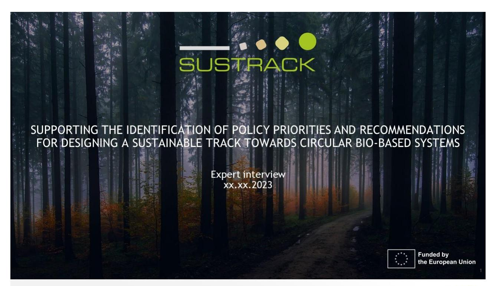

- **Full name of the project:** Supporting the identification of policy priorities and recommendations for designing a sustainable track towards circular bio-based systems
- **Start date:** 01.11.2022 > **End date:** 31.10.2025
- **Funded under:** Horizon Europe | [HORIZON-CL6-2022-CIRCBIO-01-03](#) | Coordination and Support Actions (CSA)
- **Consortium:**

## SUSTRACK Main Objectives and Sectors of Interest

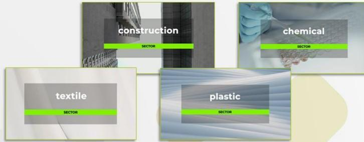

## Objectives and Process of the Interview

### Objectives:

- • Validation of identified barriers and their allocation to the sectors
- • Validation of the allocation of the barriers to the different value chain phases
- • Identification of barriers that can be overcome with current state of knowledge
- • Identification of missing barriers

### Process:

- • Presentation of different barrier clusters and value chain phases
- • Discussion of barriers identified for each cluster
- • Identifying the barriers that are relevant to expert's sector
- • Allocation of the sector-specific barriers to the different value chain phases
- • Open questions

## Definition of barriers

*Barrier is a problem, rule or situation that prevents somebody from doing something, or that makes something impossible.*

(Oxford Learner's Dictionaries, 2023)

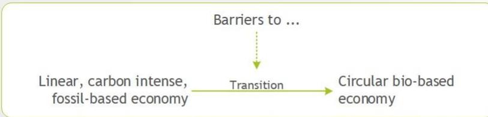

## Clustering of barriers

| CULTURAL      | Socio-cultural barriers related to consumer behaviour, perception, attitude, and awareness, consumption trends and traditions, workers' skills, qualification, education, age and gender, as well as barriers related to internal culture, processes, attitudes, actions, and governance of companies. |
|---------------|--------------------------------------------------------------------------------------------------------------------------------------------------------------------------------------------------------------------------------------------------------------------------------------------------------|
| ECONOMIC      | Barriers related to costs incurred on a company, a company's profitability, competitiveness, access to funding and investment, as well as barriers related to a product's market share, demand, and price.                                                                                             |
| ENVIRONMENTAL | Barriers related to environmental performance of products and processes, as well as to environmental impact assessment.                                                                                                                                                                                |
| GOVERNANCE    | Barriers related to policy, regulation, policy targets, incentives, and drivers, as well as to standards, certification schemes, and standardisation and certification procedures.                                                                                                                     |
| STRUCTURAL    | Systemic institutional barriers, practices and norms, as well as barriers related to overall persisting systemic issues and regimes, and complexity of systems.                                                                                                                                        |
| TECHNICAL     | Barriers related to technology development, innovation and adoption, infrastructure capacity, quality and quantity of feedstock, composition of materials, as well as digitalisation and automation.                                                                                                   |

## Cultural Barriers

- a. Missing communication, misinformation, disinformation and lack of trust
- b. Lack of technical skills, including mindset
- c. Lack of systematic business model analysis
- d. Low awareness of bio-based products
- e. Consumers lack knowledge of the meaning of material markings/labelling
- f. Lack of specialized knowledge, skills and expertise in bio-based production
- g. Lack of incentives for consumer behaviour change
- h. Lack of company's internal resources for initiating and maintaining transition
- i. Lack of understanding of the potential economic advantages of implementing circular value chains
- j. Inconsistent or partial application of industry targets
- k. Regionally diverse consumer awareness of bio-based products
- l. Lack of specialized knowledge, skills and expertise in closed loop systems

### Sector-specific

## Which barriers do you think can be overcome with the current state of knowledge?

## Are there any barriers you think were missing that you wish to add to the list?

## Economic Barriers

- a. High investment risk for bio-based industry
- b. Limited access to finance for start-ups and SMEs, and to scale-up
- c. Lack of profitability for firms in areas that deliver high public benefits
- d. Insufficient investment in mature closed loop recycling technologies
- e. Lack of consistent and reliable consumer demand for green products
- f. High operating costs: bio-based vs. fossil-based production
- g. Weak cost competitiveness: bio-based vs. fossil-based ingredients, materials or products
- h. Structural price differences: virgin vs. secondary materials
- i. High investment cost for bio-based industry
- j. Lack of investment in new systems for transition
- k. Lack of adequate funding and investment in developing EoL infrastructure and waste management practices

### Sector-specific

- ● Whole system
- ● Raw material extraction
- ● Material processing And product manufacturing
- ● Consumption
- ● EoL

## Which barriers do you think can be overcome with the current state of knowledge?

## Are there any barriers you think were missing that you wish to add to the list?

## Environmental Barriers

- a. Lack of harmonized methods for environmental, climate and sustainability impact assessment of CBBE
- b. Lack of data on impacts
- c. Concerns over feedstock availability within the limits of carrying capacity
- d. Concerns over poor biodegradation in natural environments
- e. Insufficient consideration of risk and safety issues
- f. Higher land use: bio-based vs. fossil-based products
- g. Poor environmental performance of recycling technology
- h. Uncertainty over potential environmental gains

### Sector-specific

11

## Which barriers do you think can be overcome with the current state of knowledge?

## Are there any barriers you think were missing that you wish to add to the list?

12

## Governance Barriers

### Sector-specific

## Which barriers do you think can be overcome with the current state of knowledge?

## Are there any barriers you think were missing that you wish to add to the list?

## Structural Barriers

- a. Lack of value chain stakeholder collaboration (including information exchange)
- b. Difficulty to enter a well-established fossil-based market
- c. Weak reconciliation between the need for economic growth with the need for sustainable development
- d. Externalisation of environmental and social costs
- e. Lack of established market and value chains for by-products
- f. Lack of systematic circular initiatives
- g. Lack of transparency and traceability
- h. Industry's preference for cheap fossil-based virgin materials
- i. Low data accessibility
- j. Lack of mid- and long-term impact assessment and decision-making

### Sector-specific

- ● Whole system
- ● Raw material extraction
- ● Material processing And product manufacturing
- ● Consumption
- ● EoL

## Which barriers do you think can be overcome with the current state of knowledge?

## Are there any barriers you think were missing that you wish to add to the list?

## Technical Barriers

- a. Immature technology (including technical issues for scale-up)
- b. Lack of advanced technology innovation to maintain quality of materials in circular economy
- c. Lack of infrastructure capacity: EoL product collection, transportation and storage
- d. Low integration potential for bio-based materials as substitute for fossil-based materials
- e. Increasing complexity of materials and their combinations
- f. Lack of infrastructure capacity: material recycling
- g. Lack of adequate feedstock: recycling
- h. Lack of adequate feedstock: local biomass (including seasonality and quality impacts)
- i. Loss of material quality and value during recycling
- j. Technology inefficiencies

### Sector-specific

- ● Whole system
- ● Raw material extraction
- ● Material processing And product manufacturing
- ● Consumption
- ● EoL

## Which barriers do you think can be overcome with the current state of knowledge?

## Are there any barriers you think were missing that you wish to add to the list?

## **Annex C: Second secondary interview objective**

Below are the comments the interviewees gave when posed the question the question "Can the barriers be overcome with the current state of knowledge?"

*Table 36: Comments of interviewees regarding the second secondary objective*

| 1 2 | Comment economic barriers agreements in terms of land-use are met                                                                |
|-----|----------------------------------------------------------------------------------------------------------------------------------|
| 3   | a good balance activity is required to overcome governance barriers                                                              |
| 4   | structural barriers cannot be overcome with current levels of knowledge                                                          |
| 5   | more investment in R&D required to overcome technical barriers energy willingness                                                |
| 8   | governance barriers can be overcome; it's a matter of political will modular production                                          |
| 10  | environmental barriers can only be overcome if we can fairly compare fossil to bio based productions                            |
| 11  | clarity about technical limitations required                                                                                     |
| 12  | almost all cultural barriers can be overcome; a reference point is needed when it comes to communication                         |
| 13  | cultural barriers surrounding confusion/ lack of trust can be overcome but with limitations due to diverse needs for info        |
| 14  | economic barriers can be overcome; it's a matter of taxation                                                                     |
| 15  | barriers concering recycling technologies and infrastructure can be overcome, but require efforts on state and EU levels         |
| 16  | general: some knowledge is missing, but lack of knowledge is often misused as an excuse for inactivity                           |
| 17  | all economic barriers can be overcome                                                                                            |
| 18  | environmental barriers can be overcome, more knowledge is just needed to lift myths/ stigma etc.                                 |
| 19  | current state of knowledge reflects a work-in-progress scenario, the cultural barriers can't be fully overcome now               |
| 20  | economic barriers can be overcome; it's not a matter of knowledge but of incentives and the prevailing market framework          |
| 21  | more knowledge is required to overcome environmental barriers                                                                    |
| 22  | governance barriers and challenges are often systemic rather than knowledge-related; holistic approach and alignment required    |
| 23  | regarding structural barriers the challenge is not with knowledge, but with bringing about change within a complex global system |
| 24  | the current level of knowledge is insufficient to overcome technical barriers                                                    |
| 25  | with the current level of knowledge all cultural barriers can be overcome                                                        |
| 26  | environmental barriers cannot be overcome with the current state of knowledge and                                                |

| 27 | steps are being taken in the right direction to overcome governance barriers          |
|----|---------------------------------------------------------------------------------------|
| 28 | all structural barriers can be overcome with the current levels of knowledge          |
| 29 | all knowledge and technologies required to overcome technical barriers; scaling up is |

## **Annex D: Survey questions**

**Survey: Multi-stakeholder consultation: validation of barriers to establishing a circular bio-based economy**

- **Major barriers** represent critical obstacles to the transition to a circular bio-based economy. Addressing them requires a coordinated effort and is crucial for the success of the transition.
- **Moderate barriers** pose substantial challenges, but do not impede the transition as significantly as critical barriers. Addressing them is important, but not inevitable.
- **Minor barriers** pose comparatively smaller challenges that may slow down the transition, but do not hinder it. While addressing them is not urgent, they should not be ignored.

## **1. Cultural barriers**

This cluster includes socio-cultural barriers that are related to consumer behaviour, perception, attitude, information, and awareness, consumption trends and traditions, workers' skills, qualifications, age and gender, as well as barriers related to internal culture, processes, attitudes, actions, and governance of companies.

|   | moderate                                                                                                 |
|---|----------------------------------------------------------------------------------------------------------|
|   | Barrier major minor not a barrier barrier barrier barrier                                                |
| 1 | Missing communication, misinformation, and disinformation                                                |
| 2 | Consumer confusion and lack of trust due to                                                              |
|   | generic sustainability claims and the proliferation of certification schemes and labels                  |
| 3 | Low awareness and knowledge of bio-based products                                                        |
| 4 | Established superiority attributed to fossil based chemistry                                            |
| 5 | Regionally diverse consumer perception of bio-based products                                             |
| 6 | Lack of incentives for consumer behaviour change                                                         |
| 7 | Limited societal acceptance for the transition due to unclear benefits and fears of an unjust transition |

| <b>8</b> | Higher demands and expectations of bio-based products compared to fossil-based ones |  |  |  |  |
|----------|-------------------------------------------------------------------------------------|--|--|--|--|
|          |                                                                                     |  |  |  |  |

## **2. Economic barriers**

This section includes a list of barriers related to costs incurred on a company, a company's profitability, competitiveness, access to funding and investment, as well as barriers related to a product's market share, demand, and price.

|   | moderate                                                                                          |
|---|---------------------------------------------------------------------------------------------------|
|   | Barrier major minor not a barrier barrier barrier barrier                                         |
| 1 | High investment costs and risks for establishing circular bio-based industries                    |
| 2 | High operating costs: bio-based vs. fossil based production                                      |
| 3 | Fluctuating prices and unstable supply of biomass and (processed) raw materials                   |
| 4 | Weak cost competitiveness: bio-based vs.                                                          |
|   | fossil-based ingredients, materials or products                                                   |
| 5 | Limited access to finance for start-ups and SMEs, and to scale-up                                 |
| 6 | Fossil fuel subsidies                                                                             |
| 7 | Lack of funding and investment in End-of-Life (EoL) infrastructure and waste management practices |
| 8 | Difficulties in reconciling economic growth with sustainable development                          |

## **3. Environmental barriers**

This cluster includes barriers related to environmental performance of products and processes, as well as to environmental impact assessments.

|   | moderate                                                                                          |
|---|---------------------------------------------------------------------------------------------------|
|   | Barrier major minor not a barrier barrier barrier barrier                                         |
| 1 | Lack of harmonised methods for                                                                    |
|   | environmental, climate and sustainability impact assessments                                      |
| 2 | Lack of knowledge and data on impacts                                                             |
| 3 | Higher land use: bio-based vs. fossil-based products                                              |
| 4 | Concerns over (local) biomass feedstock availability within the limits of carrying capacity       |
| 5 | Uncertainty over environmental and occupational health and safety risks of bio based productions |
| 6 | Uncertainty over potential environmental gains                                                    |

## **4. Governance barriers**

This cluster includes barriers related to policy, policy targets, regulation, incentives, and drivers, as well as to standards, certification schemes, and standardisation and certification procedures.

|    | moderate                                                                                    |
|----|---------------------------------------------------------------------------------------------|
|    | Barrier major minor not a barrier barrier barrier barrier                                   |
| 1  | Fragmented regulatory framework across European countries and at national/ regional level   |
| 2  | Lack of alignment and consistency between different policies                                |
| 3  | Limited long-term policy reliability                                                        |
| 4  | Lack of clarity around policy targets and trajectories                                      |
| 5  | Insufficiently ambitious targets and limited policy drivers                                 |
| 6  | Regulatory complexities and lack of support for the transition at government level          |
| 7  | Lack of market-based policies (e.g. subsidies or higher CO2 prices) to stimulate the market |
| 8  | Lack of involvement of society and other                                                    |
|    | affected stakeholders in policymaking decisions                                             |
| 9  | Competing political interests with fossil based industries (big lobbies etc.)              |
| 10 | Lack of product standardisation                                                             |
| 11 | Costly or complicated compliance with legal                                                 |
|    | requirements (certification, labelling procedures and requirements, etc.)                   |
| 12 | Legislative limitations for applications of materials when classified as waste              |
| 13 | Lack of supportive policy framework for product-related inner circles of the circular       |
|    | system (recycling, reuse, repair, redistribute, remanufacture, and refurbish)               |

## **5. Structural barriers**

Systemic institutional barriers, practices and norms, as well as barriers related to overall persisting systemic issues and regimes, and complexity of systems.

|   | moderate                                                                       |
|---|--------------------------------------------------------------------------------|
|   | Barrier major minor not a barrier barrier barrier barrier                      |
| 1 | Lack of value chain stakeholder collaboration (including information exchange) |
| 2 | Social and technical lock-ins to the current linear system                     |
| 3 | Externalisation of environmental and social costs                              |

| 4  | Lack of established markets and value chains      |
|----|---------------------------------------------------|
| 5  | Low data accessibility and lack of                |
| 6  | Lack of systematic circular initiatives and       |
| 7  | Established global supply chains and limited      |
| 8  | Lack of bio-based education in schools and        |
|    | universities and established superiority          |
| 9  | Lack of digital infrastructure and digital skills |
| 10 | Lack of harmonised waste collection systems       |
| 11 | Lack of mid- and long-term impact                 |

## **6. Technical barriers**

Barriers related to technology development, innovation and adoption, infrastructure capacity, quality and quantity of feedstock, composition of materials, as well as digitalisation and automation.

|   | moderate                                                                                               |
|---|--------------------------------------------------------------------------------------------------------|
|   | Barrier major minor not a barrier barrier barrier barrier                                              |
| 1 | Immature technologies (including technical difficulties to scale-up)                                   |
| 2 | Technology inefficiencies                                                                              |
| 3 | Lack of advanced technology innovation to maintain quality of materials in circular bio based economy |
| 4 | Technical difficulties regarding stock preparation and pretreatment of bio-based raw materials         |
| 5 | Incompatible and/or insufficient                                                                       |
|   | infrastructure capacity for EoL product                                                                |
|   | collection, transportation, storage and management                                                     |
| 6 | Increasing complexity of materials and their combinations                                              |