**D1.3 – REPORT ON THE PRIORITISATION OF THE IDENTIFIED LIMITS, AS WELL AS THE PRELIMINARY GUIDELINES AND POLICY RECOMMENDATIONS**

| Work package     | WP1. Identification of the environmental, economic and social limits of the    |
|------------------|--------------------------------------------------------------------------------|
|                  | linear, fossil- based economy                                                  |
| Task             | T1.3 Prioritising identified limits                                            |
| Due date         | 30/04/2024                                                                     |
| Submission date  | 30/04/2024                                                                     |
| Deliverable lead | UNIT                                                                           |
| Version          | v05                                                                            |
| Authors          | Gülşah Yilan (UNIT), Eleonora Staffieri (UNIT), Ilenia Manetti (UNIT), Carlota |
| Reviewers        | Pierre Menger (TECNALIA), Nora Szarska (DBFZ)                                  |

#### **Document Revision History**

| Version | Date       | Description of change   | List of contributor(s) |
|---------|------------|-------------------------|------------------------|
| v01     | 9/4/2024   | First full draft shared |                        |
| v02     | 23/04/2024 | Inputs collected from   |                        |
| v03     | 30/04/2024 | Final version           | UNIT                   |
| v04     | 30/07/2024 | Opened for revision     | UNIT                   |
| v05     | 30/08/2024 | Revised version         | UNIT                   |

#### **Abstract**

The transition from linear fossil-based systems to circular and bio-based systems represents an opportunity and a suitable pathway for achieving several SDGs. Indeed, circular bio-based systems depict a great opportunity to reconcile sustainable long-term growth with environmental protection through the prudent use of renewable resources for industrial purposes. This needed transition is a complex process, which does not simply require innovative technologies from the supply-side, but also societal transformations based on a multi-actor process. The circular bioeconomy meta-sector may be a good candidate to put forward a new economic model, which requires transformative policies, purposeful innovation, access to finance, risk-taking capacity as well as new and sustainable business models and markets. However, a critical assessment of the environmental, social and economic impacts of the current linear fossil-based economy, as well as of the improvement potential associated with circular bio-based systems, is needed to underpin the identification of policy priorities. Bearing this in mind, SUSTRACK is a three-year project aimed at supporting policymakers in their efforts to develop sustainable pathways to replace fossil and carbon-intensive systems with sustainable circular and biobased systems (at the EU and regional scale), contributing to achieving the European Green Deal's objectives. This will be done by: identifying environmental, economic and social limits of a linear carbon-intensive and fossil-based economy; improving existing assessment methodologies; assessing the environmental, social and economic impacts of the EU's current linear fossil-based economy; comparing multiple transition scenarios focusing on the most carbon intensive sectors; identifying priorities according to scenarios analysed in the project and develop guidelines and policy recommendations.

#### **Disclaimer**

Funded by the European Union under project number 101081823. Views and opinions expressed are however those of the author(s) only and do not necessarily reflect those of the European Union or European Research Executive Agency (REA). Neither the European Union nor the granting authority can be held responsible for them.

**Copyright notice:** © 2022 - 2025 SUSTRACK Consortium

\* R: Document, report (excluding the periodic and final reports)

DEM: Demonstrator, pilot, prototype, plan designs

DEC: Websites, patents filing, press & media actions, videos, etc.

OTHER: Software, technical diagram, etc.

#### **SUSTRACK Consortium:**

| #  | Participant Organisation Name                    | Short Name | Country |
|----|--------------------------------------------------|------------|---------|
| 1  | UNIVERSITÀ DEGLI STUDI DI ROMA UNITELMA SAPIENZA | UNIT       | IT      |
| 2  | STICHTING WAGENINGEN RESEARCH                    | WR         | NL      |
| 3  | KNOWLEDGE SRL                                    | KE         | IT      |
| 4  | PEDAL CONSULTING SRO                             | PC         | SK      |
| 5  | DBFZ DEUTSCHES BIOMASSEFORSCHUNGSZENTRUM         |            |         |
|    |                                                  | DBFZ       | DE      |
| 6  | UNIVERSITEIT GENT                                | UGENT      | BE      |
| 7  | FUNDACION TECNALIA RESEARCH & INNOVATION         | TECNALIA   | ES      |
| 8  | FVA SAS DI LOUIS FERRINI & C                     | FVA        | IT      |
| 9  | UNIVERSITÀ DEGLI STUDI DI FERRARA                | UNIFE      | IT      |
| 10 | BUNDESANSTALT FÜR MATERIALFORSCHUNG UND -        |            |         |
|    |                                                  | BAM        | DE      |
| 11 | FUNDACION CIRCE CENTRO DE INVESTIGACIÓN DE       |            |         |
|    |                                                  | CIRCE      | ES      |

| Deliverable information                                                      |    |
|------------------------------------------------------------------------------|----|
| Nature of the deliverable: Dissemination Level                               | R* |
| PU Public, fully open, e.g. web                                              | x  |
| CL Classified, information as referred to in Commission Decision 2001/844/EC |    |
| CO Confidential to SUSTRACK project and Commission Services                  |    |

# **EXECUTIVE SUMMARY**

Transitioning from linear fossil-intensive systems to circular bio-based ones is vital for achieving sustainability and resilience in today's societies. This transition requires societal transformations, advanced technologies, and multi-actor processes. Active involvement and collaboration of diverse stakeholders, including policymakers, industry leaders, and local communities, are crucial for the success of circular bio-based economy (CBBE) initiatives. Stakeholder engagement ensures inclusivity, acceptability, and effectiveness of CBBE practices, offering unique perspectives and practical experiences.

Scientific literature underscores the importance of stakeholder engagement in identifying solutions to overcome CBBE barriers, and advocating for collaborative, interdisciplinary approaches. Multi-Criteria Decision-Making (MCDM), particularly Analytical Hierarchy Process (AHP) and Analytical Network Process (ANP), provide reliable frameworks for addressing complex decision-making problems. This study aims to prioritize barriers hindering the transition to CBBE and identify interdependencies among them. These findings lay the groundwork for policy actions, ensuring a smoother transition to circular bio-based economies.

The barriers transitioning from a linear fossil-based to a circular bio-based economy in Europe were evaluated using Multi-Criteria Decision Making (MCDM) methods. Analyzing six clusters via AHP, economic and governance emerged as the most crucial, followed by environmental, technical, structural, and cultural barriers. These barriers include issues with investment, policy coherence, recycling capacity, collaboration, and consumer trust. Analytic Network Process (ANP) reveals interconnectedness among barriers, with governance and structural clusters being most influential. Key barriers include political conflicts, social and technical lock-ins, and fragmented regulations.

Upon this background of prioritisation and identification of the interdependencies, we provide the first set of policy recommendations as follow: Clear Definition of Indicators and Impact Assessment; Formulation of Clear Targets and Pathways; Knowledge Development for Technical Options; Economic Incentives to Stimulate Transition; Creation of Platforms and Incentivizing Multi-actor Connections; Effective Communication; and Systemic Approach to Infrastructure Development. Throughout the SUSTRACK project, these initial policy recommendations will be further explored and refined, establishing a strong foundation to unlock the full potential of circular and bio-based systems. This will contribute to environmental sustainability, economic prosperity, and social well-being.

# **TABLE OF CONTENTS**

| 1          | INTRODUCTION, GOAL AND SCOPE                   | 10                                                                                                   |
|------------|------------------------------------------------|------------------------------------------------------------------------------------------------------|
| 1.1        | Objectives and Scope                           | ..............................................................................10                     |
| 1.2        | Structure of the Deliverable                   | ......................................................................11                             |
| 1.3        |                                                | Relation with Other Tasks.........................................................................11 |
| 2          | THEORETICAL FRAMEWORK                          | 12                                                                                                   |
| 2.1        | Analytic Hierarchy Process (AHP)               | ................................................................12                                   |
| 2.2        |                                                | Analytic Network Process (ANP)..................................................................14   |
| 3          | BACKGROUND                                     | 16                                                                                                   |
| 3.1        | Cluster Identification and Selection Procedure | ................................................16                                                   |
| 3.2        | Barrier Identification and Selection Procedure | ................................................16                                                   |
| 4          | RESULTS                                        | 18                                                                                                   |
| 4.1        | Analytical Hierarchy Process Results           | ............................................................18                                       |
|            | 4.1.1 Cluster Prioritisation                   | ............................................................................19                       |
|            | 4.1.2 Barrier Prioritisation                   | ............................................................................20                       |
|            | 4.1.2.1. Governance Barriers                   | 20                                                                                                   |
|            | 4.1.2.2. Economic Barriers                     | 22                                                                                                   |
|            | 4.1.2.3. Cultural Barriers                     | 24                                                                                                   |
|            | 4.1.2.4. Structural Barriers                   | 25                                                                                                   |
|            | 4.1.2.5. Environmental Barriers                | 26                                                                                                   |
|            | 4.1.2.6. Technical Barriers                    | 27                                                                                                   |
| 4.2        | Analytic Network Process Results               | ................................................................28                                   |
|            | 4.2.1 Interdependency Results                  | .......................................................................29                            |
| 5          | GUIDELINES AND POLICY RECOMMENDATIONS          | 34                                                                                                   |
| 6          | CONCLUSIONS                                    | 37                                                                                                   |
| References |                                                | 38                                                                                                   |

### **LIST OF FIGURES**

| Figure 1. T1.3 linkages with other SUSTRACK WPs and tasks                                                            | ...........................................11                          |
|----------------------------------------------------------------------------------------------------------------------|------------------------------------------------------------------------|
| Figure 2. A typical AHP hierarchical construction (Santos et al. 2021)                                               | ...............................13                                      |
| Figure 4. Barrier identification process                                                                             | ....................................................................17 |
| Figure 5. Weight of each criterion according to feedback provided by 20 experts                                      | .................19                                                    |
| Figure 6. Governance barriers prioritisation                                                                         | ..............................................................21       |
| Figure 7. Economic barriers prioritisation                                                                           | .................................................................23    |
| Figure 9. Structural barriers prioritisation                                                                         | ................................................................25     |
| Figure 11. Technical barriers prioritisation                                                                         | ...............................................................28      |
| Figure 12. Simplified ANP for identification of interdependencies of barriers to clusters.                           | ........29                                                             |
| Figure 13. Influence of the Governance Cluster´s barriers on all other Clusters                                      | ....................30                                                 |
| Figure 14. Influence of the Economic Cluster´s barriers on all other clusters                                        | .......................31                                              |
| clusters .........................................................................................................32 |                                                                        |

### **LIST OF TABLES**

| Table 1. Saaty scale ..........................................................................................14   |                                                        |
|---------------------------------------------------------------------------------------------------------------------|--------------------------------------------------------|
| Table 2. Final list of barriers ................................................................................17  |                                                        |
| Table 3. Relative weights per cluster and sector (%)                                                                | ....................................................20 |
| Table 5. Relative weights for economic barriers across sectors (%)                                                  | ...................................23                  |
| Table 6. Relative weights for cultural barriers across sectors (%)                                                  | .....................................24                |
| Table 8. Relative weights for environmental barriers across sectors (%)                                             | .............................27                        |
| Table 9. Relative weights for technical barriers across sectors (%)                                                 | ...................................28                  |
| responses .......................................................................................................33 |                                                        |

|                      | List of Abbreviations                                             |
|----------------------|-------------------------------------------------------------------|
| Abbreviation/Acronym | Description                                                       |
| AHP                  | Analytic hierarchy process                                        |
| ANP                  | Analytic network process                                          |
| CBBE                 | Circular, bio-based economy                                       |
| CR                   | Consistency ratio                                                 |
| EoL                  | End-of-Life                                                       |
| MCDM                 | Multi-Criteria Decision-Making                                    |
| SMART                | Specific, measurable, achievable, relevant, and time-bound        |
| SWOT                 | Strengths, Weaknesses, Opportunities, and Threats                 |
| TODIM                | Based Method to Process Heterogeneous Information                 |
| TOPSIS               | Technique for Order of Preference by Similarity to Ideal Solution |

# **1 INTRODUCTION, GOAL AND SCOPE**

The transition from linear fossil-intensive systems to circular bio-based ones is a key step in achieving sustainability and resilience in today's societies. Consequently, understanding and addressing the barriers to this transition is critical as the global community faces pressing environmental challenges and seeks pathways to a more sustainable future. Furthermore, this transition is complex and requires societal transformations, cutting-edge technologies, and multiactor processes.

The active involvement and collaboration of diverse stakeholders across sectors are crucial for the success of circular bio-based economy (CBBE) initiatives. This helps bridge the gap between scientific advancements and practical implementation (Szarka et al., 2023). Stakeholder engagement is critical to ensuring the inclusivity, acceptability, and effectiveness of CBBE initiatives. A variety of actors, such as policymakers, industry leaders, research institutions, local communities, and non-governmental organisations, play important roles in shaping the trajectory of CBBE. Stakeholders contribute unique perspectives, local insights, and practical experiences that are invaluable in tailoring CBBE practices to specific contexts and optimising their impact.

The scientific literature increasingly explores the importance of stakeholder engagement in identifying solutions to overcome barriers in establishing a CBBE (Salvioni and Almici, 2020). Some studies emphasise the need for a collaborative and interdisciplinary approach that encompasses various sectors and engages actors at different levels (Marra et al., 2018). These studies highlight the multifaceted benefits of stakeholder involvement, ranging from increased resource efficiency and waste reduction to enhanced social acceptance and equitable distribution of benefits (Pisano et al., 2015). However, there is not a straightforward strategy to actively involve stakeholders in critical decision-making processes.

Multi-Criteria Decision-Making (MCDM) is a general framework for solving complex decision-making problems with multiple conflicting criteria and decision-makers with different preferences. Under the MCDM methodologies, the Analytical Hierarchy Process (AHP) is a reliable, rigorous, and robust method for eliciting and quantifying subjective judgments in MCDM (Tavana et al., 2023). The AHP method assumes that the factors presented in the hierarchical structure are independent; however, this is not always a reasonable presumption, especially for complex decision-making problems. The possible dependency among factors can only be determined as a result of internal and external environmental analyses. To overcome this hurdle, Saaty (1980) suggested using the Analytical Network Process (ANP) to solve the problem of dependence among alternatives or criteria (Lee & Kim, 2000) which indeed is a generalisation of the AHP.

Upon this background, D1.3 explores the barriers, aiming at highlighting their complexity and providing concrete insights for the formulation and implementation of effective policies. The main objective of this document is to provide a comprehensive overview of the work carried out under T1.3, which aims to explore the complexity of these barriers and their interconnections. The description of these aspects facilitates informed decision-making and policy development to overcome barriers and promote a more sustainable economic paradigm.

## **1.1 Objectives and Scope**

This report provides an overview of the work that has been performed during T1.3. The first objective of this task is to prioritise the barriers that make it difficult the transition from the current linear fossil-intensive systems to circular bio-based ones. The second objective is to identify the interdependencies among different barriers clustered under six distinct barrier dimensions (Cultural, Economic, Environmental, Governance, Structural, and Technical). The objectives were reached through a survey using MCDM methods, namely AHP and ANP. T1.3 also aims to set the basis for ongoing tasks related to the policy actions, with a strong link especially to T5.1.

### **1.2 Structure of the Deliverable**

The remainder of the report is structured as follows: Chapter 2 includes the theoretical framework, where AHP and ANP methodologies are included; Chapter 3 presents the methodology employed to select clusters and barriers; Chapter 4 illustrates the results; Chapter 5 provides guidelines and policy recommendations; Chapter 6 closes the report by summarising the main conclusions obtained.

# **1.3 Relation with Other Tasks**

T1.2 on multi-stakeholder consultation and validation of the barriers of the linear, carbonintensive and fossil-based economy sets the basis for T1.3. T1.2 provided information about the barriers associated with six clusters which hinder the transition from the current linear fossilintensive systems to circular bio-based ones. Built upon this list of barriers, T1.3 aimed to provide the most important and relevant barriers for this transition to happen.

T1.3 is also linked to policy-related WPs, namely to WP4 for the formulation of scenarios for simulation as well as to WP5 in identifying policy priorities and defining policy actions/recommendations (Figure 1).

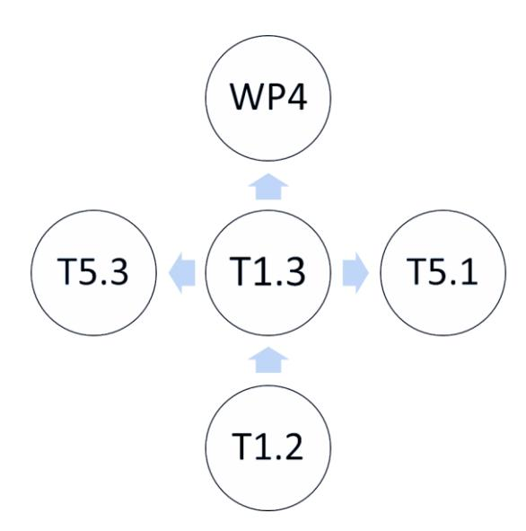

Figure 1. T1.3 linkages with other SUSTRACK WPs and tasks

# **2 THEORETICAL FRAMEWORK**

This chapter explains the theoretical framework used in the analysis. In the first place, an AHP methodology was used to elaborate a list of priorities through pairwise comparisons based on expert judgements. As a following step, we considered the interdependencies of the identified limits by the use of the ANP method.

## **2.1 Analytic Hierarchy Process (AHP)**

The AHP stands out as a widely utilised and effective method in MCDM methods across diverse fields. It offers a comprehensive hierarchical structure to address decision problems concerning a common goal and associated criteria. AHP enables the quantification of criteria weights, providing a numeric basis for assessing the relative importance of each element within the hierarchy. This, in turn, aids decision-makers in identifying and prioritising significant factors crucial to the decision-making process. A noteworthy feature of AHP involves the calculation of the inconsistency index, allowing decision-makers to assess the consistency of their judgments.

In the existing literature, the application of the AHP methodology has been recurrently employed in the assessment of risks, challenges, and barriers associated with the enhancement of sustainability and the implementation of circular economy-based business models. Notably, the work conducted by Oliveira (2023), explores the factors influencing the adoption of circular economy principles in the Brazilian textile industry. This study uses a combination of SWOT analysis and the AHP approach to comprehensively assess the contextual landscape. Similarly, Kazancoglu et al. (2023) undertake an examination of potential risks arising from the shift from a linear to a circular economy, specifically within the Turkish sustainable supply chain domain. Employing an integrated MCDM approach featuring Fuzzy AHP and Based Method to Process Heterogeneous Information (TODIM), the study proposes Industry 4.0-based responses from an operations management perspective. Furthermore, Agarwal et al. (2022) contributed insights by examining the role of Industry 4.0 technologies in driving circular economy adoption within the manufacturing supply chain network. Using a hybrid methodology that combines AHP and combinatorial distance-based assessment in an interval-valued intuitionistic fuzzy environment, the study provides a detailed understanding of the intricate dynamics involved. Koc (2023) expanded the academic debate by investigating critical success factors and presenting a practical framework for the implementation of a circular economy in the construction sector. Using a fuzzy AHP and the Technique for Preference by Similarity to the Ideal Solution (TOPSIS) algorithm, the study provides a systematic analysis of relevant factors from d[eveloping countries' perspectives](https://www.zotero.org/google-docs/?iBtFst). Finally, the work of Santos et al. (2021) aims to identify and categorise the primary barriers that hinder the adoption of circular economy practices in a food and metalworking company. Using the AHP method for prioritisation, the study contributes valuable insights into prioritising barriers in these industrial contexts.

However, criticisms of the AHP method have surfaced in recent studies. Asadabadi et al. (2019) argues that despite the widespread application of MCDM methods, companies often prefer intuitive decision-making due to the perceived limitations of AHP, specifically its potential for inconsistency in pairwise comparisons. Lizhu & Liwei (2023) propose an enhanced weighting and evaluation method to address the stability of weights, emphasising the critical role of controlling uncertainty in weight determination within the AHP method. Wu & Tu (2021) maintain that under AHP frameworks, ranking alternatives becomes challenging when matrices exhibit significant cardinal and/or ordinal inconsistency. Their research introduces optimization models to separately or concurrently address these inconsistencies in group decision-making scenarios. In summary, recognizing the shortcomings of traditional AHP, numerous improvements have been proposed. Ashour & Mahdiyar (2023) categorise these contributions into consistency improvements, reduction of difficulties or limitations, and increased accuracy of results. The hybridization with Fuzzy methods, as suggested by Seising (2020) emerges as a popular improvement due to Fuzzy sets' ability to account for uncertainties, subjectivity, and imprecision in human opinions. Additionally, Ashour & Mahdiyar (2023) offer a comprehensive roadmap for selecting suitable AHP-based methods, providing a valuable guide for researchers and practitioners seeking to navigate the evolving landscape of decision-making methodologies. In summary, while AHP remains a widely used MCDM method, ongoing research and improvements aim to address its limitations and enhance its applicability in diverse decision-making scenarios.

Thomas L. Saaty (1980) built the Analytic Hierarchy Process (AHP) to define priorities and support complex decision-making due to its ability to structure a problem hierarchically. It defines priorities and makes complex decisions. More in detail, the formulation of the AHP framework involves a systematic progression through distinct stages (Waris et al. 2019). Firstly, the hierarchy is constructed, with the number of levels dependent on the problem's complexity and the quantification degree for each element. A typical AHP model consists of four hierarchical levels, encompassing objectives or goals at Level 1, associated main criteria at Level 2, sub-criteria at Level 3, and alternative choices at Level 4 (Figure 2).

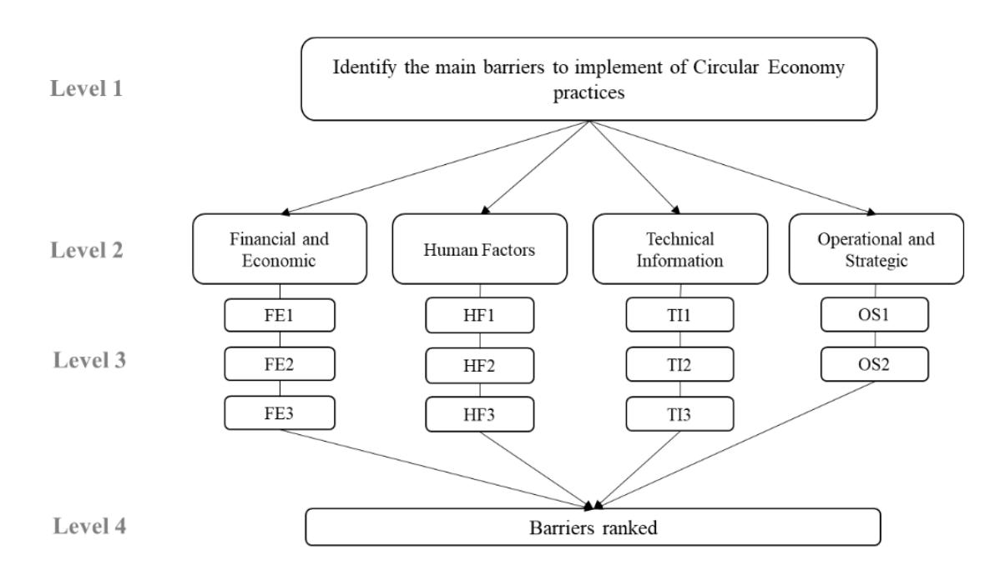

*Figure 2. A typical AHP hierarchical construction (Santos et al. 2021)*

The organisation of criteria, sub-criteria, and alternatives is pivotal for achieving the overarching goal. Subsequently, the pairwise comparison stage entails determining the relative importance of the main criteria and sub-criteria through paired assessments, employing a nine-point scale (Table 1). The scale used determines which barrier is more significant than the other.

*Table 1. Saaty scale*

| Importance | Definition             | Explanation                                  |
|------------|------------------------|----------------------------------------------|
| 1          | Equal importance       | Two elements contribute equally to the       |
| 3          | Moderate importance    | Experience and judgement slightly favour one |
| 5          | Strong importance      | Experience and judgement strongly favour one |
| 7          | Very strong importance | One element is favoured very strongly over   |
|            |                        | another, its dominance is demonstrated in    |
| 9          | Extreme importance     | The evidence favouring one element over      |

Following this, the derivation of relative weights involves estimating the weights for each criterion and sub-criterion using methods such as eigenvector and logarithmic approaches. The consistency ratio (CR) of judgments is rigorously evaluated in Levels 2 and 3 through the CR. Ordinal consistency stipulates that if a is greater than b and b is greater than c, then a must be greater than c. Meanwhile, cardinal consistency demands a proportional relationship between factors. The acceptable CR range is set at 0.10; exceeding this value necessitates a revision in pairwise comparisons. In the final step (Level 4), results are synthesised by aggregating relative values at each level. This involves combining the local priority vectors with the respective relative weights to determine overall scores or criteria weights for each alternative. The aggregation process progresses from the bottom to the top hierarchy level. Importantly, the summation of all alternative weights and their corresponding importance equates to 1.0, ensuring a comprehensive and balanced synthesis of the AHP results.

# **2.2 Analytic Network Process (ANP)**

The Analytic Network Process (ANP) is an MCDM method proposed by Thomas L. Saaty (1999) and is widely used due to its capability to capture complex feedback and interactions in the prioritisation of decision elements. It is considered an extended or more general version of the AHP method (Taherdoost & Madanchian, 2023) and is based on its structure of goal, criteria, subcriteria and elements (or alternatives). In contrast to the AHP which considers elements independently, only in relation to their assigned hierarchy, the ANP is based on network systems and provides an approach to deal with dependency between decision elements without the need to consider levels among them. By allowing feedback and interactions both between and within the clusters, the ANP can be used for more sophisticated MCDM prioritisation problems (Saaty 1999).

Two main parts are considered for the ANP, a control hierarchy or network of criteria and subcriteria to control the interactions, as well as a network of influences among the clusters and elements (Saaty 1999). Usually, the control network consists of goals and criteria, and the network of influences includes clusters and their corresponding elements (Lei et al. 2023). In the application of ANP, criteria, sub-criteria and decision elements are considered as nodes of the network and therefore can be compared among each other as represented in Figure 3. Nodes might be grouped in clusters according to the purposes of the prioritisation. Similar to the AHP process, the ANP is represented in a matrix and pairwise comparisons are utilised among all nodes of the network. This means that criteria and sub-criteria are compared among themselves, as well as all elements indistinctly of any clustering.

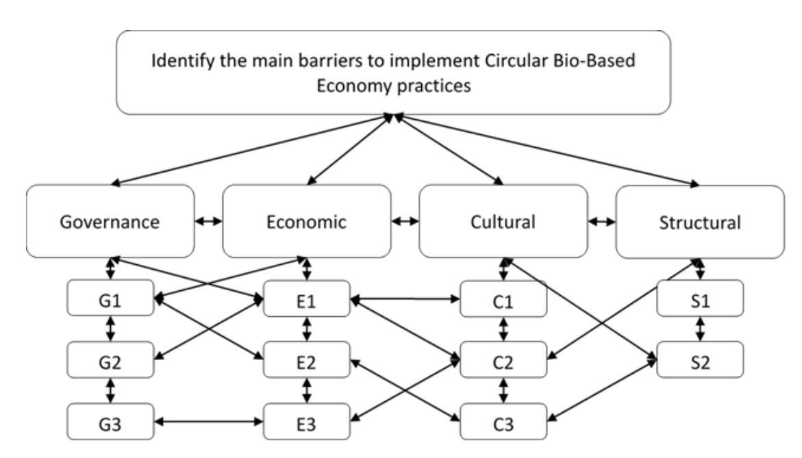

*Figure 3. Exemplary network interdependencies and feedback loops in an ANP prioritisation*

Inner and outer dependencies are a characteristic of ANP prioritisation, that is feedback between clusters and interactions within cluster elements (Taherdoost & Madanchian, 2023). Local priorities are given by the eigenvector from a comparison matrix. The relative importance among comparisons is measured following the Saaty nine-point scale (see Table 1). In this manner, the Super-Matrix is generated by arranging the found priorities of the comparison matrices as column vectors. Finally, from the Super-Matrix a global priority is reached finding the priority weights, and the element with the highest weight indicates the best choice.

Among the main advantages of the ANP method is the ability to handle multiple inputs and outputs, while there is no need for a relationship between both, direct comparison between peers (cluster to cluster, or element to element), allowing for both dependence and independence and being able to support complex problems with intangible criteria better than AHP (Taherdoost & Madanchian, 2023). On the other hand, ANP struggles with large problems given the complexity of a large number of decision elements, clusters and criteria in the Super-Matrix (Kheybari et al. 2020). Likewise, a possibility of generating problems due to the measurement error, and its inability to measure absolute efficiency.

ANP is recognized as a versatile and flexible MCMD method, which holds several advantages over other similar methods such as the AHP. Therefore, the ANP has been widely applied in several areas as presented by Kheybari et al.(2020) in nine categories, namely (1) health, safety and environmental management; (2) hydrology and water management; (3) business and financial management; (4) human resources management; (5) tourism; (6) logistics and supply chain management; (7) design, engineering and manufacturing systems; (8) energy management and (9) other topics. In the area of circular bioeconomy, ANP has been applied in combination with LCA methods, such as presented in the review of Romero-Perdomo and González-Curbelo (2023) to analyse the trade-offs in the Agri-food waste biomass utilisation. Another hybrid ANP method has been illustrated by Catron et al. (2013) by utilising a SWOT-ANP to assess the development of bioenergy in Kentucky (USA). In the analysis of influencing factors affecting business strategies and entrepreneurship in the bioeconomy [Urbaniec](https://onlinelibrary.wiley.com/authored-by/Urbaniec/Maria) et al.(2021) utilise an AHP/ANP approach, broadening as a result the knowledge of the ecosystem factors influencing the enterprises in the bioeconomy.

# **3 BACKGROUND**

The methodology for the selection of the most prominent barriers was comprehensively explained under D1.2. A brief summary of the description of the methodology and the resulting list of barriers are presented in the following subsections.

## **3.1 Cluster Identification and Selection Procedure**

Various barriers that impede the transition from an unsustainable linear carbon-intensive fossilbased economy to a circular low-carbon bio-based economy were investigated from the reviewed grey literature (T1.1). Barriers were identified and categorised into six distinct dimensions (cultural, economic, environmental, governance, structural, and technical), which were further subdivided into 11 barrier clusters (D1.1).

## **3.2 Barrier Identification and Selection Procedure**

The starting point of this process was a literature review conducted in T1.1. The literature review provided 193 barriers. From the 193 barriers identified in peer-reviewed papers, all were also identified in the grey literature review performed in parallel. All barriers mentioned in at least three different articles were used for the co-creation workshop, which represented the second step of the barrier identification exercise. As an outcome of the co-creation workshop, 51 barriers were selected, from which only one was environmental. The main objectives of the co-creation workshop were to validate the barriers resulting from the literature review and to identify missing ones. To kick off the missing barriers identification exercise, three environmental barriers that did not meet the cut-off criterion of being cited at least three times, were presented to the stakeholders. A total of 28 missing barriers were proposed by the workshop attendees, resulting in a new list of 82 barriers. After reviewing this list and merging, where possible, overlapping barriers the list was shortened to include 67 barriers. These barriers were then used for the third step of the barrier identification process, namely the 20 expert interviews. Much like the cocreation workshop, the main goals of the interviews included the identification of further missing barriers. The interviewees proposed a total of 59 barriers, some of which were identical or very similar, expanding the list of barriers to 126. After another reviewing process, merging overlapping barriers and excluding vaguely defined or too specific barriers, a preliminary list of 53 barriers was compiled. This list was used for the fourth and final step of the barrier identification process; an EU-wide survey. The survey did not include a further missing barrier identification exercise. Instead, survey takers were asked to prioritise each of the 53 barriers as major, moderate, minor or no barrier. A cut-off criterion was once again utilised and all barriers that were not considered major or moderate by at least 75% of survey participants were eliminated (Figure 4). The resulting list consisting of 31 barriers is presented in Table 2.

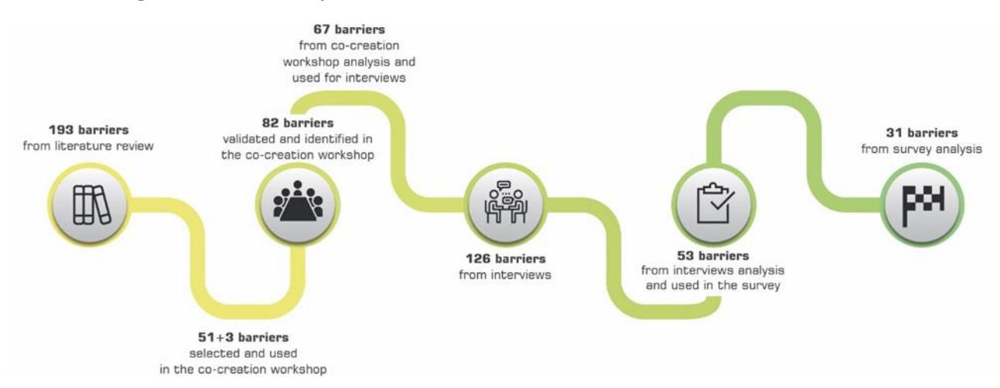

Figure 4. Barrier identification process

Table 2. Final list of barriers

|    | Cultural barriers                                                                                                                   |
|----|-------------------------------------------------------------------------------------------------------------------------------------|
| 1  | Missing communication, misinformation, and disinformation                                                                           |
| 2  | Consumer confusion and lack of trust due to generic sustainability claims and the proliferation of certification schemes and labels |
| 3  | Low awareness and knowledge of bio-based products                                                                                   |
| 4  | Lack of incentives for consumer behaviour change Economic Barriers                                                                  |
| 5  | High investment costs and risks for establishing circular bio-based industries                                                      |
| 6  | Fluctuating prices and unstable supply of biomass and (processed) raw materials                                                     |
| 7  | Weak cost competitiveness: bio-based vs. fossil-based ingredients, materials or products                                            |
| 8  | Difficulties in reconciling economic growth with sustainable development                                                            |
| 9  | High operating costs: bio-based vs. fossil-based production                                                                         |
| 10 | Lack of funding and investment in End-of-Life (EoL) infrastructure and waste management practices Environmental Barriers            |
| 11 | Concerns over (local) biomass feedstock availability within the limits of carrying capacity                                         |

| 12 | Lack of harmonised methods for environmental, climate and sustainability impact       |
|----|---------------------------------------------------------------------------------------|
| 13 | Lack of knowledge and data on impacts                                                 |
| 14 | Regulatory complexities and lack of support for the transition at government level    |
| 15 | Fragmented regulatory framework across European countries and at national/ regional   |
| 16 | Competing political interests with fossil-based industries (big lobbies etc.)         |
| 17 | Lack of alignment and consistency between different policies                          |
| 18 | Lack of market-based policies (e.g. subsidies or higher CO 2 prices) to stimulate the |
| 19 | Limited long-term policy reliability                                                  |
| 20 | Lack of supportive policy framework for product-related inner circles of the circular |
| 21 | Legislative limitations for applications of materials when classified as waste        |
| 22 | Lack of clarity around policy targets and trajectories                                |
| 23 | Insufficiently ambitious targets and limited policy drivers                           |
| 24 | Lack of harmonised waste collection systems and infrastructure                        |
| 25 | Lack of established markets and value chains for by-products                          |
| 26 | Low data accessibility and lack of transparency and traceability                      |
| 27 | Lack of value chain stakeholder collaboration (including information exchange)        |
| 28 | Social and technical lock-ins to the current linear system                            |
| 29 | Lack of mid- and long-term impact assessment and decision-making                      |
| 30 | Incompatible and/or insufficient infrastructure capacity for EoL product collection,  |
| 31 | Increasing complexity of materials and their combinations                             |

# **4 RESULTS**

In this section, we provide the AHP and ANP results identifying the most important barriers (Section 4.1) along with their interdependencies (Section 4.2).

# **4.1 Analytical Hierarchy Process Results**

According to the methodology described in Section 2.1, the AHP was performed to prioritise the barriers identified in the SUSTRACK project. To evaluate the barriers, a survey was created through LimeSurvey. The results obtained are shown in the following subsection.

The AHP involves the participation of a panel of experts to reduce the subjectivity of the analysis, giving a specific weight to each cluster and barrier based on the experience and expertise of the evaluator. For this purpose, stakeholders participate in the assessment through a questionnaire which allows determinate weightings and the comparison between them. In total, 20 responses were obtained and the expert panel was composed of representatives from the general public (65%), construction sector (15%), chemical sector (10%), plastic sector (5%) and textile sector (5%).

### **4.1.1 Cluster Prioritisation**

Clusters considered in the analysis were mentioned in Section 3.1 (WP1, T1.1, D1.1) The priority was calculated based on the weights assigned to each cluster by the Expert Panel (number of responses n=20). The weight obtained in each criterion is indicated in Figure 5 and it can be observed how experts have considered that the criteria do not have similar importance. The results show which cluster has more relevance according to the expert panel. Therefore, the results are as follows: the economic cluster (23.6%) is the most important, followed by governance (22.8%) and environmental (16.5%). On the other hand, the cultural cluster is given the least importance with 9.1%.

*Figure 5. Weight of each criterion according to feedback provided by 20 experts*

If we compare the results per sector, the prioritisation changes. Table 3 shows the relative weights per cluster and sector.

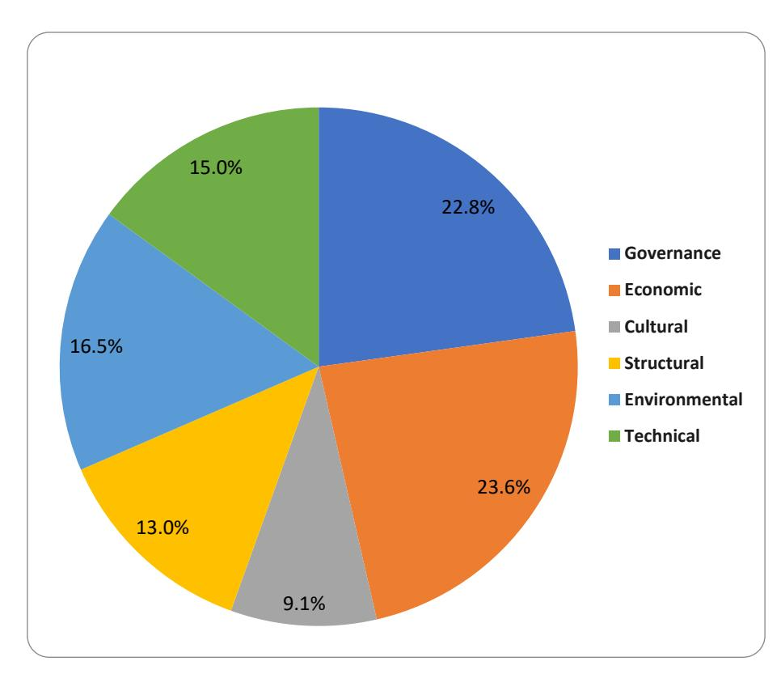

*Table 3. Relative weights per cluster and sector (%)*

| Cluster       | Chemical (n=2) | Construction (n=3) | Textile (n=1) | Plastic (n=1) |
|---------------|----------------|--------------------|---------------|---------------|
| Governance    | 6.3%           | 22.1%              | 30.0%         | 37.2%         |
| Economic      | 26.0%          | 19.5%              | 24.7%         | 6.2%          |
| Cultural      | 36.3%          | 22.6%              | 5.5%          | 9.7%          |
| Structural    | 5.8%           | 11.8%              | 18.3%         | 14.8%         |
| Environmental | 20.2%          | 14.0%              | 11.6%         | 8.3%          |
| Technical     | 5.4%           | 10.0%              | 9.9%          | 23.8%         |

\*n represents the number of responses per sector (13 responses are not allocated to any of the 4 sectors)

The table highlights the three most important clusters for each sector. The experts from the textile and plastic sector considered governance as the most relevant cluster. In contrast, the chemical sector considered cultural clusters the most relevant, followed by economic and environmental clusters. Interestingly, the Plastic sector singled out the technical cluster as one of the most relevant, being the only sector to prioritise it. However, it is the unique sector that does not consider the economic as a relevant cluster.

It is important to consider that the number of responses per sector is not representative, the Consistency ratio (CR) is higher than 10% in some cases and the number of responses per sector is not enough to draw general conclusions.

### **4.1.2Barrier Prioritisation**

The same methodology was applied to the case of the barriers. The experts indicate which barriers belonging to the same cluster are more important than the others and the degree according to Saaty´s scale. As a result, the weight of each barrier was obtained by applying the AHP.

### *4.1.2.1. Governance Barriers*

The analysis identified a total of 10 key governance barriers, all selected previously (Section 3.2). Barriers are defined below:

- **Barrier 1**. Insufficiently ambitious targets and limited policy drivers.
- **Barrier 2**. Lack of clarity around targets and trajectories
- **Barrier 3**. Legislative limitations for applications of materials when classified as waste
- **Barrier 4**. Lack of supportive policy framework for product-related inner circles of the circular system.
- **Barrier 5**. Limited long-term policy reliability
- **Barrier 6**. Lack of market-based policies to stimulate the market
- **Barrier 7**. Lack of alignment and consistency between different policies
- **Barrier 8**. Competing political interest with fossil-based industries.
- **Barrier 9**. Fragmented regulatory framework across European countries and at national/regional level

- **Barrier 10**. Regulatory complexities and lack of support for the transition at the government level

Figure 6 shows the ranked governance barriers hindering the effective implementation of a circular system. Barrier number 8 "C*ompeting political interest with fossil based industries*" stands out above the rest. Finding a balance between these competing interests remains a significant challenge in policy-making and environmental management.

Besides barrier number 8, other barriers with key relevance are: barrier 6 "*Lack of market-based policies to stimulate the market*"; barrier 4 "*Lack of supportive policy framework for productrelated inner circles of the circular system*" and barrier 7 "*Lack of alignment and consistency between different policies*" with 10.8%; 10.5% and 10.5% respectively.

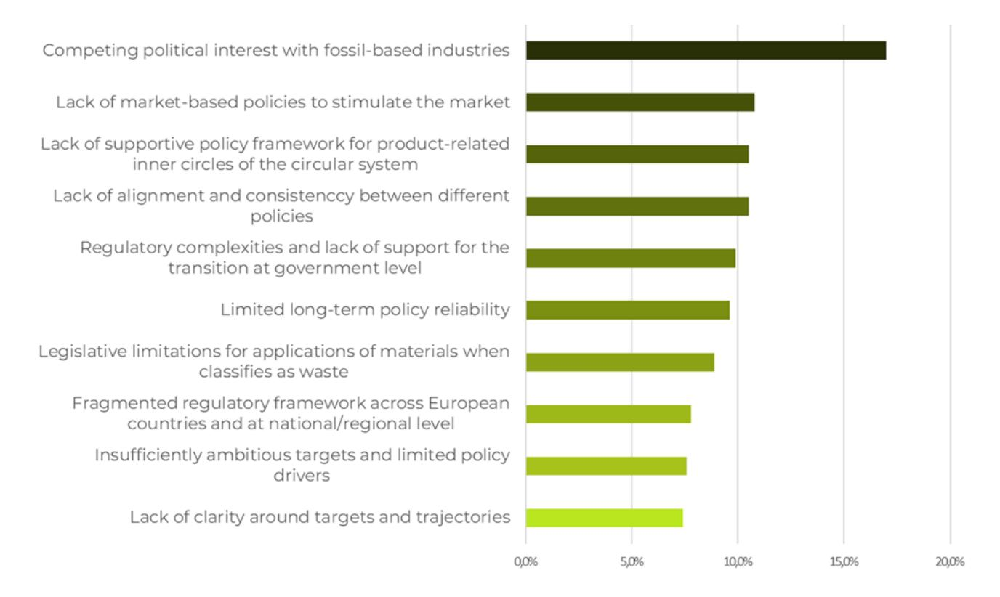

*Figure 6. Governance barriers prioritisation*

If we compare the results per sector, the prioritisation changes. Table 4 shows the relative weights per cluster and sector.

*Table 4. Relative weights for governance barriers across sectors (%)*

| Barrier | Chemical (n=2) | Construction (n=3) | Textile (n=1) | Plastic (n=1) |
|---------|----------------|--------------------|---------------|---------------|
| 1       | 16.9%          | 13.0%              | 2.6%          | 13.1%         |
| 2       | 11.6%          | 10.3%              | 1.6%          | 2.6%          |

| 3  | 11.9% | 8.0%  | 4.5%  | 9.8%  |
|----|-------|-------|-------|-------|
| 4  | 11.9% | 6.5%  | 6.6%  | 9.7%  |
| 5  | 11.0% | 8.9%  | 5.7%  | 3.1%  |
| 6  | 13.2% | 11.2% | 4.3%  | 8.7%  |
| 7  | 8.7%  | 8.6%  | 11.3% | 8.5%  |
| 8  | 7.3%  | 13.8% | 39.0% | 18.0% |
| 9  | 3.9%  | 10.9% | 11.9% | 9.3%  |
| 10 | 3.6%  | 8.7%  | 12.5% | 17.2% |

\*n represent the number of responses per sector

The table highlights the three most important barriers for each cluster. The chemical sector prioritises, barrier 1 "*Insufficiently ambitious targets and limited policy drivers*" followed by barrier 6 and barriers 3 and 4. Construction, plastic and textile sectors considered barrier 8 "Competing political interest with fossil-based industries" the most relevant. This aligns with the overall perspective of all 20 respondents.

### *4.1.2.2. Economic Barriers*

The analysis identified a total of 6 key economic barriers, all selected previously (Section 3.2). Barriers are defined below:

- **Barrier 1**. Lack of funding and investment in End-of-Life infrastructure and waste management practices
- **Barrier 2**. High operating costs: bio-based vs. Fossil-based production
- **Barrier 3**. High investment costs and risks for establishing circular bio-based industries.
- **Barrier 4**. Difficulties in recording economic growth with sustainable development.
- **Barrier 5**. Fluctuating prices and unstable supply of biomass and raw materials.
- **Barrier 6**. Weak cost competitiveness: bio-based vs. Fossil-based ingredients, materials or products.

Figure 7 shows the economic barriers hindering the effective implementation of a circular system. It can be seen experts have considered, practically, all six barriers of similar importance. Barrier 6 "*Weak cost competitiveness: bio based vs. Fossil-based ingredients, materials or products*" is the first one, followed by barrier 3 "*High investment costs and risks for establishing circular biobased industries*" and barrier 2 "High operating costs: bio-based vs. Fossil-based production".

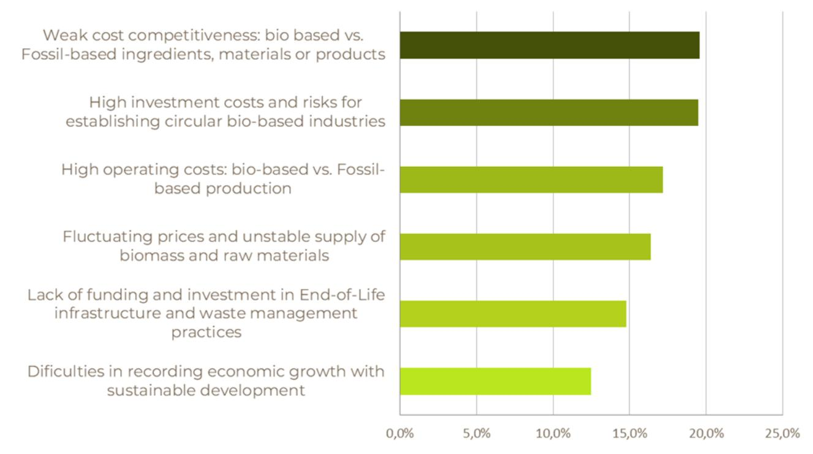

Figure 7. Economic barriers prioritisation

If we compare the results per sector, the prioritisation changes. Table 5 shows the relative weights per cluster and sector.

*Table 5. Relative weights for economic barriers across sectors (%)*

| Barrier | Chemical (n=2) | Construction (n=3) | Textile (n=1) | Plastic (n=1) |
|---------|----------------|--------------------|---------------|---------------|
| 1       | 22.9%          | 16.2%              | 14.6%         | 9.1%          |
| 2       | 20.0%          | 17.1%              | 11.4%         | 15.8%         |
| 3       | 15.1%          | 13.2%              | 17.0%         | 32.0%         |
| 4       | 16.8%          | 13.9%              | 7.0%          | 16.3%         |
| 5       | 11.4%          | 17.8%              | 40.2%         | 10.2%         |
| 6       | 13.8%          | 21.9%              | 9.7%          | 16.6%         |

\*n represent the number of responses per sector

The table highlights the three most important barriers for each cluster. The chemical sector considers "*Lack of funding and investment in End-of-Life infrastructure and waste management practices*" the most important barrier; Construction sector, "*Weak cost competitiveness: biobased vs. Fossil-based ingredients, materials or products*"; Textile sector "*Fluctuating prices and unstable supply of biomass and raw materials" and Plastic sector* "*High investment costs and risks for establishing circular bio-based industries*".

### *4.1.2.3. Cultural Barriers*

The analysis identified a total of 4 key cultural barriers, all selected previously (Section 3.2). Barriers are defined below

- **Barrier 1**. Low awareness and knowledge of bio-based products
- **Barrier 2**. Lack of incentives for consumer behaviour change
- **Barrier 3**. Missing communication, misinformation, and disinformation
- **Barrier 4**. Consumer confusion and lack of trust due to generic sustainability claims and the proliferation of certification schemes and labels

The barriers highlight the challenges faced by consumers, particularly in relation to their behaviour and purchasing decisions. Figure 8 shows the cultural barriers hindering the effective implementation of a circular system. According to the expert panel, Barrier 4 "Consumer confusion and lack of trust due to generic sustainability claims and the proliferation of certification schemes and labels" will be prioritised.

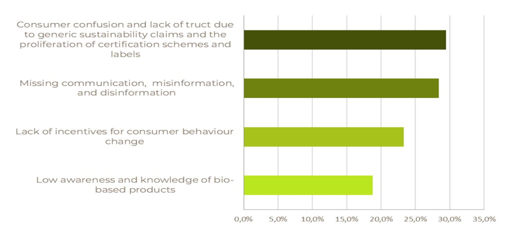

Figure 8. Cultural barriers prioritisation

If we compare the results per sector, the prioritisation changes. Table 6 shows the relative weights per cluster and sector.

*Table 6. Relative weights for cultural barriers across sectors (%)*

| Barrier | Chemical (n=2) | Construction (n=3) | Textile (n=1) | Plastic (n=1) |
|---------|----------------|--------------------|---------------|---------------|
| 1       | 51.5%          | 38.2%              | 14.5%         | 8.0%          |
| 2       | 24.8%          | 26.9%              | 14.5%         | 48.6%         |
| 3       | 14.6%          | 15.0%              | 35.5%         | 22.7%         |
| 4       | 9.1%           | 19.9%              | 35.5%         | 20.7%         |

The table highlights the three most important barriers per cluster. Construction, textile and plastic sectors considered barrier 4 "*Consumer confusion and lack of trust due to generic sustainability claims and the proliferation of certification schemes and labels*" one of the three most important. However, the chemical sector considered barrier 1 " Low awareness and knowledge of bio-based products" the most important one.

### *4.1.2.4. Structural Barriers*

The analysis identified a total of 6 key structural barriers, all selected previously (Section 3.2). Barriers are defined below

- **Barrier 1**. Lack of mid-and long term impact assessment and decision-making
- **Barrier 2**. Social and technical lock-ins to the current linear systems
- **Barrier 3**. Lack of value chain stakeholder collaboration
- **Barrier 4**. Low data accessibility and lack of transparency and traceability
- **Barrier 5**. Lack of established markets and value chains for by-products
- **Barrier 6**. Lack of harmonised waste collection systems and infrastructure

Figure 9 shows the structural barriers hindering the effective implementation of a circular system. Based on weights obtained for each barrier, the three barriers which have the greatest priority on the ranking are barrier 3 "Lack of value chain stakeholder collaboration" (19.7%), followed by barrier 5 "Lack of established markets and value chains for by-products" (18.6%) and barrier 2 "Social and technical lock-ins to the current linear systems" (18.2%). On the other hand, the three that have the least priority are barrier 6 (16.9%), followed by barrier 4 (14.7%) and barrier 1 (11.9%).

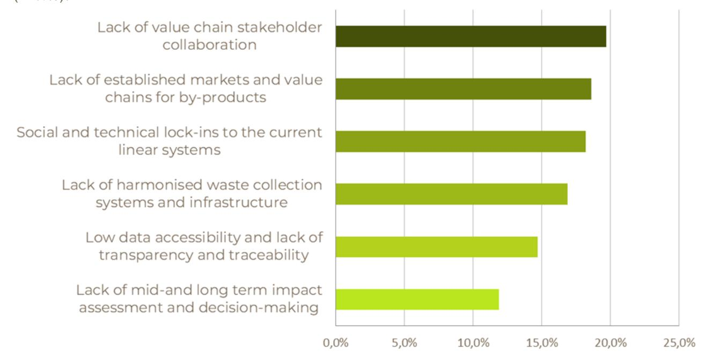

*Figure 9. Structural barriers prioritisation*

If we compare the results per sector, the prioritisation changes. Table 7 shows the relative weights per cluster and sector.

Table 7. Relative weights for structural barriers across sectors (%)

| Barrier | Chemical (n=2) | Construction (n=3) | Textile (n=1) | Plastic (n=1) |
|---------|----------------|--------------------|---------------|---------------|
| 1       | 21.4%          | 11.6%              | 5.5%          | 23.4%         |
| 2       | 23.0%          | 22.3%              | 9.1%          | 4.7%          |
| 3       | 22.1%          | 19.2%              | 25.4%         | 12.7%         |
| 4       | 17.0%          | 19.4%              | 4.3%          | 13.7%         |
| 5       | 11.1%          | 11.9%              | 26.1%         | 22.5%         |
| 6       | 5.4%           | 15.6%              | 29.7%         | 23.0%         |

\*n represent the number of responses per sector

The table highlights the three most important barriers per cluster. Chemical, construction and textile considered barrier 3 " *Lack of value chain stakeholder collaboration*" one of the three most important; aligned with global prioritisation. However, the plastic sector considered barrier 1 "*Lack of mid-and long term impact assessment and decision-making*" more important than others.

### *4.1.2.5. Environmental Barriers*

The analysis identified a total of 3 key environmental barriers, all selected previously (Section 3.2). Barriers are defined below:

- **Barrier 1**. Lack of knowledge and data on impacts
- **Barrier 2**. Lack of harmonised methods for environmental, climate and sustainability impact assessment
- **Barrier 3**. Concerns over biomass feedstock availability within the limits of carrying capacity

Figure 10 shows the environmental barriers hindering the effective implementation of a circular system. According to the expert panel, the first environmental barrier that should be considered is barrier 2 "Lack of harmonised methods for environmental, climate and sustainability impact assessment", followed by barrier 1 "Lack of knowledge and data on impacts" and barrier 3 "Concerns over biomass feedstock availability within the limits of carrying capacity".

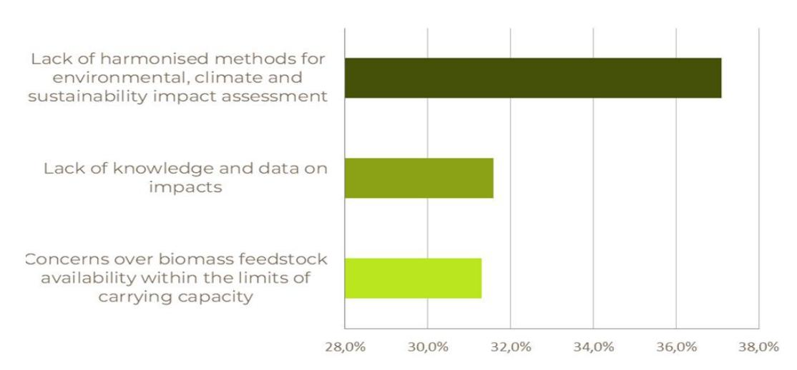

Figure 10. Environmental barriers prioritisation

If we compare the results per sector, the prioritisation changes. Table 8 shows the relative weights per cluster and sector.

*Table 8. Relative weights for environmental barriers across sectors (%)*

| Barrier | Chemical (n=2) | Construction (n=3) | Textile (n=1) | Plastic (n=1) |
|---------|----------------|--------------------|---------------|---------------|
| 1       | 42.3%          | 35.7%              | 20.0%         | 13.1%         |
| 2       | 44.3%          | 38.5%              | 60.0%         | 66.1%         |
| 3       | 13.4%          | 25.7%              | 20.0%         | 20.8%         |

\*n represent the number of responses per sector

The table highlights the most important barriers per cluster. All sectors considered barrier 2 "*Lack of harmonised methods for environmental, climate and sustainability impact assessment*" the most important aligned with global prioritisation.

### *4.1.2.6.Technical Barriers*

The technical cluster is represented by only two barriers, all selected previously (Section 3.2). Barriers are defined below:

- **Barrier 1**. Increasing complexity of materials and their combinations
- **Barrier 2**. Incompatible and/or insufficient infrastructure capacity for EoL product collection, storage and management

Figure 11 shows the technical barriers hindering the effective implementation of a circular system. In the case of this cluster, only two barriers were selected. The expert panel considered that barrier 2 "*Incompatible and/or insufficient infrastructure capacity for EoL product collection, storage and management*" is more important than barrier 1 "I*ncreasing complexity of materials and their combinations*". Barrier 2 underscores the critical need to address challenges related to infrastructure to ensure the success of implementing a circular system.

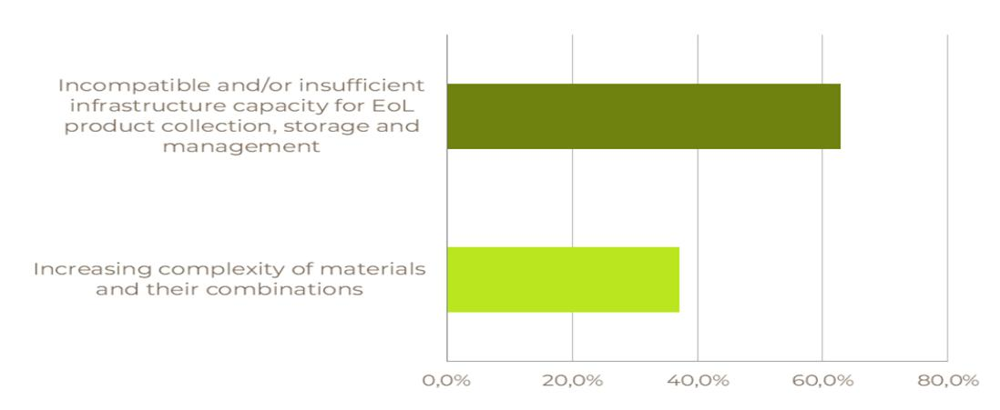

Figure 11. Technical barriers prioritisation

If we compare the results per sector, the prioritisation changes. The table below shows the relative weights per cluster and sector.

Table 9. Relative weights for technical barriers across sectors (%)

| Barrier | Chemical (n=2) | Construction (n=3) | Textile (n=1) | Plastic (n=1) |
|---------|----------------|--------------------|---------------|---------------|
| 1       | 50.0%          | 50.0%              | 20.0%         | 25.0%         |
| 2       | 50.0%          | 50.0%              | 80.0%         | 75.0%         |

\*n represent the number of responses per sector

Plastic and textile sectors considered barrier 2 "*Incompatible and/or insufficient infrastructure capacity for EoL product collection, storage and managemen*t" the most relevant. This aligns with the overall perspective of all 20 respondents. The chemical and construction sectors considered that both barriers have the same importance.

## **4.2 Analytic Network Process Results**

The ANP was performed in a simplified format as compared to its standard procedure for the identification of interdependencies of all barriers, with the clusters. This simplification of the ANP methodology was decided to facilitate the participation and response quota for the joint application of AHP and ANP questionnaires in the same survey. Therefore, the ANP was structured to identify only relations between all barriers and the clusters. Leaving in this way out the analysis of interdependencies among all barriers.

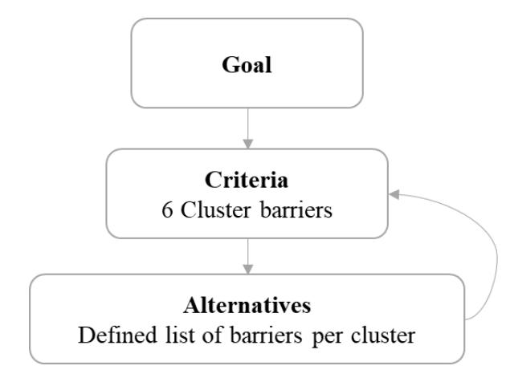

*Figure 12. Simplified ANP for identification of interdependencies of barriers to clusters.*

In this form, it provides a look at clusters that are strongly affected by selected barriers and also pinpoints at barriers that hold a strong influence among the clusters selected in the SUSTRACK project. Jointly with the survey of the AHP created in Lime Survey, it was asked for each barrier which of the clusters are influenced by it, in the multiple response format. The respondents correspond to the same group of experts surveyed for the AHP, that is an expert panel composed of representatives from the general public (65%), construction sector (15%), chemical sector (10%), plastic sector (5%) and textile sector (5%).

### **4.2.1Interdependency Results**

Based on the responses of the expert panel, a matrix representing influence with one (1) and lack of influence with zero (0) was built for all 20 responses. Higher agreement among the expert panel on the influence of a certain barrier to a certain cluster is represented by a higher score, which in this case is between 0 to 20.

When looking at the total results per cluster, the economic and technical clusters are those mostly influenced by barriers of other clusters. According to respondents' considerations, in the case of the economic cluster, this is mostly influenced by governance barriers. In particular, by Competing political interests with fossil-based industries, Lack of market-based policies (e.g. subsidies or higher CO2 prices) to stimulate the market, and Legislative limitations for applications of materials when classified as waste. The technical cluster is mostly influenced by the economic barriers Lack of funding and investment in End-of-Life (EoL) infrastructure and waste management practices, and High operating costs: bio-based vs. fossil-based production; as well as by the structural barrier Lack of harmonised waste collection systems and infrastructure. Several other barriers from the environmental and governance clusters also influence the technical cluster, with a lower score or less agreement between respondents.

Results per clustered barrier have been displayed in a graphical form and are presented in Sankey diagrams, representing the aggregate score by the width of the connecting line. When the aggregated responses show a higher agreement regarding the influence of a barrier on a cluster, the connecting line is presented as thicker (or thinner otherwise), in the representation of the accumulated score. To facilitate the reading of the graphics, clusters with a high number of barriers have been depicted separately. In Figure 13, the influence of barriers from the governance cluster (Governance Barriers) on all other clusters is depicted. On a general look, it is noticeable the higher influence on the economic and structural clusters. Apart from the previously mentioned barriers influencing the economic cluster, the following ones are also considered influential to the economic cluster, namely the governance barriers Lack of supportive policy framework for product-related inner circles of the circular system, Insufficiently ambitious targets and limited policy drivers and Fragmented regulatory framework across European countries and at national/ regional level.

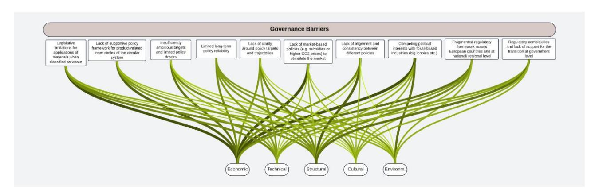

*Figure 13. Influence of the Governance Cluster´s barriers on all other Clusters*

On the other hand, the governance barriers considered most influential on the structural cluster are Lack of alignment and consistency between different policies, and Regulatory complexities and lack of support for the transition at government level.

Considering the highest possible score, signalling the influence of a barrier is 100 (with a maximum score of 20 per cluster), the following are the governance barriers with highest influence among all clusters, as considered by the expert panel:

- Competing political interests with fossil-based industries (big lobbies etc.) (Score: 59)
- Fragmented regulatory framework across European countries and at national/ regional level (Score: 57)
- Regulatory complexities and lack of support for the transition at the government level (Score:57)

Barriers from the economic cluster were considered to hold higher influence in descending order on the technical, structural and environmental clusters (Figure 14). Most influential economic barriers to the technological cluster are Lack of funding and investment in End-of-Life (EoL) infrastructure and waste management practices, and High operating costs: bio-based vs. fossilbased production. On the other hand, the structural cluster is considered to be influenced mostly by Fluctuating prices and unstable supply of biomass and (processed) raw materials and ( ) Difficulties in reconciling economic growth with sustainable development. Lastly, the environmental cluster is also influenced by Difficulties in reconciling economic growth with sustainable development and Lack of funding and investment in End-of-Life (EoL) infrastructure and waste management practices, however, to a lesser extent than the other clusters.

Finally, those economic barriers with a higher influence along all of the clusters, as considered by the expert panel:

- Difficulties in reconciling economic growth with sustainable development (Score: 54)
- Lack of funding and investment in End-of-Life (EoL) infrastructure and waste management practices (Score: 48)

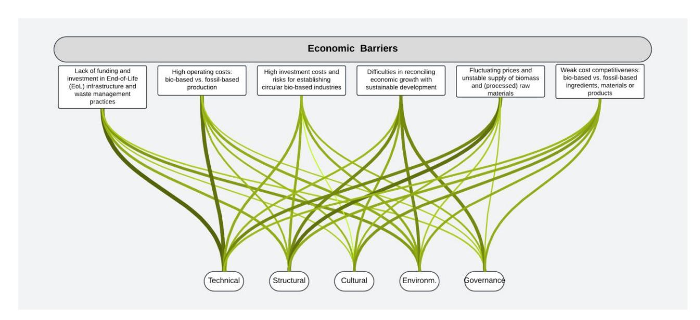

*Figure 14. Influence of the Economic Cluster´s barriers on all other clusters*

The influence of structural barriers in descending order is noticed mostly on the economic, technical and governance clusters (Figure 15). With Lack of established markets and value chains for by-products and Social and technical lock-ins to the current linear system barriers considered as the most influential for the economic cluster. For the technical cluster, Lack of harmonised waste collection systems and infrastructure is the most influential. Lastly, the barrier Lack of midand long-term impact assessment and decision-making is considered as the most influential for the governance cluster. Although the cultural cluster is not the most influenced by structural barriers, Social and technical lock-ins to the current linear system is considered the most influential for this cluster, on the same score as for the economic cluster.

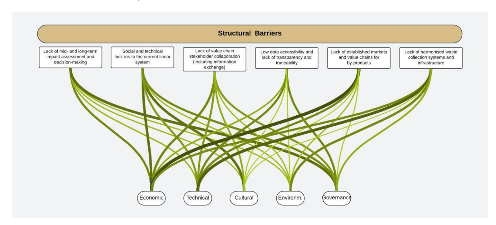

Figure 15. Influence of the Structural Cluster´s barriers on all clusters

Two main structural barriers stand out due to the consensus as influential barriers along all the other clusters:

- Social and technical lock-ins to the current linear system (Score: 58)
- Lack of harmonised waste collection systems and infrastructure (Score:56)

Cultural barriers influence mainly the governance cluster, followed by the economic cluster (Figure 16). With the barrier Consumer confusion and lack of trust due to generic sustainability claims being the most influential to the governance cluster. Lack of incentives for consumer behaviour change is considered most influential for the economic cluster. According to experts' responses, environmental barriers influence mainly the technical and governance clusters, with its most influential barrier along clusters being Lack of knowledge and data on impacts. Finally, technical barriers influence mostly economic and environmental clusters and both barriers in the technical cluster are of similar influence along the other five clusters.

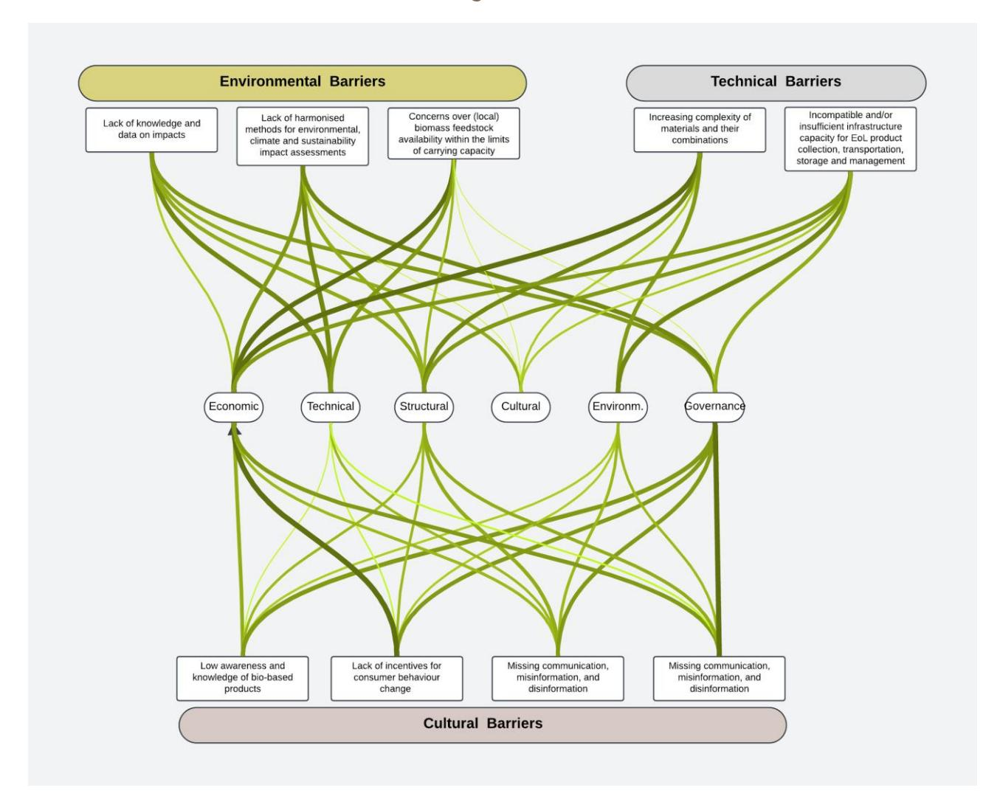

*Figure 16. Influence of the Cultural, Environmental and Technological clusters´ barriers on all clusters*

Finally, when analysing the obtained matrices, the barriers considered most influential can be extracted from the resulting scores. A total of 14 barriers hold the top 10 positions as presented in Table 10.

*Table 10. Most influential and cluster influencing barriers according to the expert panel´s responses*

| Ranking | Cluster    | Barrier                                                               |
|---------|------------|-----------------------------------------------------------------------|
| 1st     | Governance | Competing political interests with fossil-based industries (big       |
| 2nd     | Structural | Social and technical lock-ins to the current linear system            |
| 3rd     | Governance | Fragmented regulatory framework across European countries and         |
| 3rd     | Governance | Regulatory complexities and lack of support for the transition at     |
| 4th     | Structural | Lack of harmonised waste collection systems and infrastructure        |
| 5th     | Governance | Limited long-term policy reliability                                  |
| 6th     | Economic   | Difficulties in reconciling economic growth with sustainable          |
| 7th     | Governance | Legislative limitations for applications of materials when classified |
| 8th     | Governance | Lack of supportive policy framework for product-related inner         |
| 9th     | Technical  | Increasing complexity of materials and their combinations             |
| 9th     | Structural | Lack of value chain stakeholder collaboration (including              |
| 9th     | Technical  | Incompatible and/or insufficient infrastructure capacity for EoL      |
| 10th    | Governance | Insufficiently ambitious targets and limited policy drivers           |
| 10th    | Governance | Lack of clarity around policy targets and trajectories                |

# **5 GUIDELINES AND POLICY RECOMMENDATIONS**

Preliminary guidelines and policy recommendations emerge from the analysis of the barriers identified. This section of the report offers a preliminary, high-level overview of policy guidelines and recommendations that could offer viable options to overcome such barriers. In parallel, quantitative scenarios will be simulated in WP4 to test their effectiveness while policy recommendations will be offered by WP5, specifically T5.1 and T5.2 where ongoing efforts undertaken by the European Commission to assess progress made in the implementation of the Bioeconomy Strategy are taken into consideration.

Several policy recommendations can be made that provide a comprehensive framework for addressing the key barriers to the circular bio-based transition. Converting these recommendations into policy instruments and actions in a coordinated manner (i.e. using a systemic approach), may provide the basis of a comprehensive framework allowing policymakers and industry players to unlock the full potential of circular and bio-based systems, contributing to environmental sustainability, economic prosperity, and social well-being. This objective will be pursued during the upcoming activities of the SUSTRACK project, and specifically in WP4 and WP5. However, in this report, we provide the first findings from the MCDM process results. The following guidelines are proposed and analysed, in relation to the barriers identified (see [Table 11\)](#page-33-1).

*Table 11. Proposed guidelines and their correspondence to the barriers identified (self elaboration)*

| Guidelines              | Cultural | Economic | Environmental | Governance | Structural | Technical |
|-------------------------|----------|----------|---------------|------------|------------|-----------|
|                         |          |          |               | X          | X          | x         |
|                         | X        |          |               | X          |            |           |
|                         |          | X        | X             |            |            | X         |
|                         | X        |          | X             | X          | X          |           |
| Effective Communication | X        |          |               | X          |            |           |
|                         |          |          | X             | X          | X          | X         |

#### **Clear Definition of Indicators and Impact Assessment:**

To effectively stimulate, monitor and assess the transition from linear fossil-based systems to circular and bio-based systems, it is imperative to establish standardised indicators. These indicators should cover (i) multi-sectoral and multi-dimensional causes and effects of the barriers identified, as well as (ii) direct, indirect and induced impacts of action, again across sectors, economic actors, and dimensions of development. Further, these indicators will serve as benchmarks for measuring progress and identifying persistent barriers hindering the transition. By quantifying the extent to which these barriers still exist, policymakers can prioritise interventions and allocate resources accordingly. Regular impact assessments should be conducted to evaluate the effectiveness of policies and initiatives, ensuring that efforts are aligned with overarching goals and objectives. This will allow to create an integrated, or closed policymaking process, where monitoring and evaluation support the identification of the priorities for action, and hence the creation of a strategy and implementation plan. The presence of clear indicators will also provide an incentive for industry players to assess the financial and economic viability of investments in their sector, considering both tangible, i.e. cash flow implications (e.g. as part of a financial analysis), as well as impacts on externalities (e.g. as part of an economic, societal analysis).

### **Formulation of Clear Targets and Pathways:**

In order to provide a clear direction for the transition, policymakers must formulate precise targets based on the defined indicators. These targets should be specific, measurable, achievable, relevant, and time-bound (SMART), allowing for effective tracking of progress. It is essential to ensure alignment and harmonisation of objectives to present a unified political voice. By developing actionable pathways with milestones, policymakers can provide a roadmap for realising these targets and navigate the complexities of the transition process; similarly, industry players can plan investments with relatively high certainty of demand (i.e. driven by stated targets, reducing uncertainty). On this latter point, it is critical that targets are set for indicators of relevance to the industry. Often high-level targets are set that cover many sub-sectors and production processes, making it difficult to identify, analyse and compare various available intervention options and investments at the plant level.

#### **Knowledge Development for Technical Options:**

Investment in research and development is crucial for enhancing our understanding of the technical options available for industries to improve their performance. By supporting initiatives aimed at knowledge creation and dissemination, policymakers can reduce uncertainty and risk for businesses seeking to transition to circular and bio-based systems. Facilitating technology transfer and knowledge sharing will enable industries to access cutting-edge solutions and best practices, accelerating the adoption of sustainable practices across sectors.

### **Economic Incentives to Stimulate Transition:**

To support the transition to circular and bio-based systems, policymakers should consider reducing or disincentivizing spending in areas that support the current linear fossil-based economic model (e.g. reducing and then removing fossil fuel subsidies, in addition to introducing carbon pricing). Further, resources should be redirected towards initiatives that promote sustainability and innovation. Financial incentives such as grants, subsidies, tax credits, and preferential loans can play a pivotal role in stimulating investment in bio-based transition projects. By developing financial mechanisms to improve the economic viability of investments in circular and bio-based systems, policymakers can create a favourable business environment conducive to sustainable development.

#### **Creation of Platforms and Incentivizing Multi-actor Connections:**

Establishing platforms for collaboration and knowledge exchange is essential for fostering synergies across different sectors and economic actors. By incentivizing partnerships and collaborations, new and expanded value chains can be created, reducing costs and promoting the reuse of materials. Networking events, conferences, and workshops should be facilitated to facilitate connections and promote innovation in the bio-based sector. By leveraging the collective expertise and resources of stakeholders, policymakers can drive meaningful progress towards a circular and bio-based economy. This has the potential to address several barriers simultaneously, while generating new opportunities for economic development at the local level.

#### **Effective Communication:**

Transparent communication is key to building trust and engagement among stakeholders involved in the transition. Successes and failures should be communicated openly, sharing lessons learned and promoting accountability. Utilising various communication channels, including traditional media (e.g., websites, reports), and social media, will help disseminate information about the bio-based transition and its benefits, not only for industries but also at the societal level (e.g. for human well-being). By fostering a culture of openness and transparency, policymakers can mobilise support and inspire action towards achieving shared sustainability goals.

#### **Systemic Approach to Infrastructure Development:**

A systemic approach is needed to create the knowledge and physical infrastructure necessary for the circular bio-based transition. Governments should invest in infrastructure development, including waste management facilities, recycling centres, biomass processing plants, and sustainable transportation networks, offering the enabling conditions for the transition. Collaboration with stakeholders is essential to identify infrastructure needs and prioritise investments based on their potential to support the bio-based transition. Adopting a holistic perspective and addressing infrastructure challenges comprehensively, is a necessary condition to enable a sustainable and resilient economy.

Finally, the transition to a CBBE holds great promise for achieving environmental sustainability, economic resilience, and social well-being. However, realizing this potential requires a multifaceted approach that addresses the barriers currently impeding progress. The guidelines proposed in this report offer a comprehensive framework to guide policymakers and industry stakeholders in overcoming these challenges. In fact, despite the progress made to date, existing policies often fall short in addressing the multifaceted challenges of the circular bio-based transition. Fragmentation and lack of specificity, the absence of standardized indicators and impact assessments (both methods and knowledge about it) limits action, as well as the ability to track progress.

Additionally, current economic incentives are often insufficient or misaligned with the goals of the bio-based transition, continuing to support linear, fossil-based models. There is also a need for greater emphasis on knowledge development and the creation of collaborative platforms, which are critical for fostering innovation and cross-sectoral synergies.

In conclusion, while the guidelines outlined provide an initial framework for driving the CBBE, it is imperative that existing policies be re-evaluated and realigned to fully capitalize on these recommendations. This requires a coordinated effort between policymakers, industry players, researchers and other stakeholders to ensure that the transition to a CBBE is both comprehensive and sustainable. The assessment of these aspects will be carried out in the activities ongoing in WP5 of the SUSTRACK project.

# **6 CONCLUSIONS**

This report covers the implementation of the MCDM methods to identify the most important barriers in the transition from a linear fossil-based economy to a circular bio-based one. First, an AHP is conducted as a participatory approach, allowing an understanding of the challenges facing the implementation of a circular system in Europe based on different clusters with an aim to reflect the actual concerns and needs of the involved stakeholders.

Among the six clusters, the economic and governance clusters were allocated as the most important ones regardless of the stakeholders' sector of interest. The order of associated importance for other clusters was environmental, technical, structural and finally cultural.

We also identified the most important barriers under each cluster. Regarding economic barriers, identified challenges related to investment, financial practices, and cost competitiveness of biobased products. The governance cluster is the one with more identified barriers by the stakeholders. It highlights the competing political interest with fossil-based industries and the lack of coherence between policies that can weaken efforts to establish a solid and consistent regulatory framework that supports the transition to a circular system in Europe. In the case of environmental barriers, the need for enhanced knowledge, standardised methodologies, and sustainable management practices to effectively assess and mitigate environmental, climate, and sustainability impacts. For technical barriers, the most important phase was considered as the EoL underlining the lack of recycling capacity, insufficient technology, development, low quality and amount of recyclable materials. Regarding structural barriers, the lack of collaboration between value chain actors and the lack of established markets for by-products were rated as the most important barriers. Finally, the most important aspect was selected as the consumers' confusion and lack of trust due to unclear sustainability claims and/or misinformation, disinformation related to the circular bio-based products.

It is also worth underlining that some barriers affect more than just one cluster and hence, the interdependencies should be further investigated. To this aim, AHP was supported with a simplified ANP approach and the link across clusters was identified considering that barriers influencing various clusters might be central for solutions with more complex impacts.

ANP results revealed that most of the barriers were related to more than one cluster and rather function in an interconnected manner. The most significantly influential barriers were from governance and structural clusters, namely (i) competing political interests with fossil-based industries (big lobbies etc.); (ii) social and technical lock-ins to the current linear system and (iii) Fragmented regulatory framework across European countries and at national/ regional level. These findings can guide efforts and strategies to overcome barriers and promote the transition to a more sustainable and circular economic model.

Upon this background of prioritisation and identification of the interdependencies, we provide the first set of policy recommendations as follow: Clear Definition of Indicators and Impact Assessment; Formulation of Clear Targets and Pathways; Knowledge Development for Technical Options; Economic Incentives to Stimulate Transition; Creation of Platforms and Incentivizing Multi-actor Connections; Effective Communication; and Systemic Approach to Infrastructure Development. In the course of the SUSTRACK project, these preliminary policy recommendations will be further investigated and improved to provide a solid baseline to unlock the full potential of circular and bio-based systems, contributing to environmental sustainability, economic prosperity, and social well-being.

# **REFERENCES**

Agarwal, S., Tyagi, M., & Garg, R. K. (2022). Framework development and evaluation of Industry 4.0 technological aspects towards improving the circular economy-based supply chain. Industrial Robot: the international journal of robotics research and application, 49(3), 555-581. Asadabadi, M. R., Chang, E., & Saberi, M. (2019). Are MCDM methods useful? A critical review of analytic hierarchy process (AHP) and analytic network process (ANP). Cogent Engineering, 6(1), 1623153. Ashour, M., & Mahdiyar, A. (2023). A Comprehensive State-of-the-Art Survey on the Recent Modified and Hybrid Analytic Hierarchy Process Approaches. Applied Soft Computing, 111014. Catron, J., Stainback, G. A., Dwivedi, P., & Lhotka, J. M. (2013). Bioenergy development in Kentucky: A SWOT-ANP analysis. Forest policy and economics, 28, 38-43. Kazancoglu, Y., Ozkan-Ozen, Y. D., Sagnak, M., Kazancoglu, I., & Dora, M. (2023). Framework for a sustainable supply chain to overcome risks in transition to a circular economy through Industry 4.0. Production Planning & Control, 34(10), 902-917. Kheybari, S., Rezaie, F. M., & Farazmand, H. (2020). Analytic network process: An overview of applications. Applied mathematics and Computation, 367, 124780. Koc, K., Durdyev, S., Tleuken, A., Ekmekcioglu, O., Mbachu, J., & Karaca, F. (2023). Critical success factors for construction industry transition to circular economy: developing countries' perspectives. Engineering, Construction and Architectural Management. Lee, J. W., & Kim, S. H. (2000). Using analytic network process and goal programming for interdependent information system project selection. Computers & Operations Research, 27(4), 367-382. Lei, Q., Lau, S. S. Y., Fan, Y., Fu, I. C. S., Chan, J. T. Y., Tao, Y., ... & Qi, Y. (2023). From Policy to Implementation—An Analytic Network Process (ANP)-Based Assessment Tool for Low Carbon Urban and Neighborhood Planning. Buildings, 13(2), 484. Lizhu, Y., & Liwei, Y. (2023). How to overcome the instability of AHP weight?—Partial order analysis method based on the lower limit of the proportion. Journal of Intelligent & Fuzzy Systems, 44(3), 4843-4852. Marra, A., Mazzocchitti, M., & Sarra, A. (2018). Knowledge sharing and scientific cooperation in the design of research-based policies: The case of the circular economy. Journal of cleaner production, 194, 800-812. Oliveira, R. C., Nääs, I. D. A., & Garcia, S. (2023). Combining SWOT with AHP for Analyzing the Adoption of a Circular Economy in the Apparel Industry in Brazil. Recycling, 8(5), 73. Pisano, U., Lange, L. K., Lepuschitz, K., & Berger, G. (2015). The role of stakeholder participation in European sustainable development policies and strategies. ESDN Q. Rep. Vienna, 39, 1-37. Romero-Perdomo, F., & González-Curbelo, M. Á. (2023). Integrating multi-criteria techniques in life-cycle tools for the circular bioeconomy transition of agri-food waste biomass: A systematic

review. Sustainability, 15(6), 5026.

Saaty, T. L. (1980). The analytic hierarchy process (AHP). The Journal of the Operational Research Society, 41(11), 1073-1076. Saaty, T. L. (1999, August). Fundamentals of the analytic network process. In Proceedings of the 5th international symposium on the analytic hierarchy process (pp. 12-14). Salvioni, D. M., & Almici, A. (2020). Transitioning toward a circular economy: The impact of stakeholder engagement on sustainability culture. Sustainability, 12(20), 8641. Santos, H. H., Marques, V. N., & Paschoali, L. F. F. (2021). The analysis of barriers for implementing circular economy practices using the Analytic Hierarchy Process (AHP). Revista Gestão da Produção Operações e Sistemas, 16(3), 99-99. Santos, H. H., Marques, V. N., & Paschoali, L. F. F. (2021). The analysis of barriers for implementing circular economy practices using the Analytic Hierarchy Process (AHP). Revista Gestão da Produção Operações e Sistemas, 16(3), 99-99. Seising, R. (2020). Lotfi Zadeh: fuzzy sets and systems. In Computer Aided Systems Theory– EUROCAST 2019: 17th International Conference, Las Palmas de Gran Canaria, Spain, February 17– 22, 2019, Revised Selected Papers, Part I 17 (pp. 101-108). Springer International Publishing. Szarka, N., García Laverde, L., Thrän, D., Kiyko, O., Ilkiv, M., Moravčíková, D., ... & Martín Jimenez, I. (2023). Stakeholder Engagement in the Co-Design of Regional Bioeconomy Strategies. Sustainability, 15(8), 6967. Taherdoost, H., & Madanchian, M. (2023). Analytic network process (ANP) method: a comprehensive review of applications, advantages, and limitations. Taherdoost, H., & Madanchian, M.(2023). Analytic Network Process (ANP) Method: A Comprehensive Review of Applications, Advantages, and Limitations. Journal of Data Science and Intelligent Systems. Tavana, M., Soltanifar, M., & Santos-Arteaga, F. J. (2023). Analytical hierarchy process: revolution and evolution. Annals of operations research, 326(2), 879-907. Urbaniec, M., Sołtysik, M., Prusak, A., Kułakowski, K., & Wojnarowska, M. (2022). Fostering sustainable entrepreneurship by business strategies: An explorative approach in the bioeconomy. Business Strategy and the Environment, 31(1), 251-267. Waris, M., Panigrahi, S., Mengal, A., Soomro, M. I., Mirjat, N. H., Ullah, M., ... & Khan, A. (2019). An application of analytic hierarchy process (AHP) for sustainable procurement of construction equipment: Multicriteria-based decision framework for Malaysia. Mathematical Problems in Engineering, 2019, 1-20. Wu, Z., & Tu, J. (2021). Managing transitivity and consistency of preferences in AHP group decision

making based on minimum modifications. Information Fusion, 67, 125-135.

### Project Consortium

