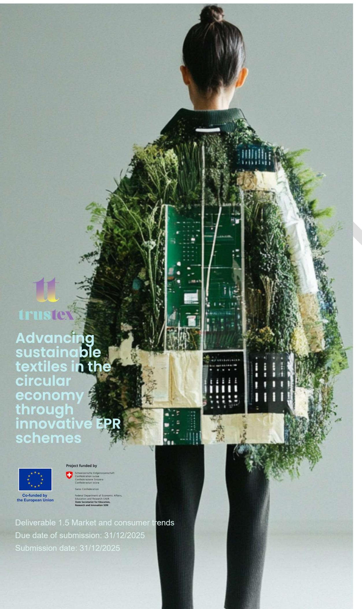

## Table of contents

| 1. | Introduction ....................................................................................................................... 18 |
|----|-----------------------------------------------------------------------------------------------------------------------------------------|
| 2. | About TRUSTex ................................................................................................................. 21      |
| 3. | The textile industry ............................................................................................................ 26    |

| 4.  | Textile waste ................................................................................................................... 176 |
|-----|---------------------------------------------------------------------------------------------------------------------------------------|
| 5.  | Textile circularity ............................................................................................................. 204 |
| 5.2 | Circularity in the EU textile industry ............................................................................. 207              |
| 6.  | Modern trends and drivers .............................................................................................. 210          |
| 7.  | EU legislation................................................................................................................... 219 |
| 8.  | Blockchain, dpp and other trustex relevant technologies’ specificities .......................... 224                                 |
| 9.  | The policy recommendations expectations from TRUSTex ............................................ 227                                 |
| 10. | The KERs of TRUSTex ................................................................................................... 234           |
| 11. | SWOT analysis ............................................................................................................. 250       |
| 12. | Pestle analysis ............................................................................................................ 260      |
| 13. | Changes influencing the commercial prospects in post-project period ...................... 283                                        |
| 14. | Conclusions ................................................................................................................. 293     |

## Table of figures

| Figure 26. Overview of linkages between the circular business model, product design, consumer behaviour and policy. Source: EEA, 2024 and European Topic Centre for Circular Economy and Resource Use; illustration by CSCP. .... | 92  |
|-----------------------------------------------------------------------------------------------------------------------------------------------------------------------------------------------------------------------------------|-----|
| Figure 27. Purchase habits of 19,000 consumers across various countries .....                                                                                                                                                     | 104 |
| Figure 28. Reuse of textiles in EU 2021. Source ETC, 2025 & EEA, 2024/2. ....                                                                                                                                                     | 119 |
| Figure 29. EU exports of "worn textiles & clothing". Source EEA.....                                                                                                                                                              | 124 |
| Figure 30. World Production of Cotton, Wool & Man-Made Fibres. Source: https://www.cirfs.org/statistics/key-statistics .....                                                                                                      | 127 |
| Figure 31. Share of synthetic fibres and yarns in EU industrial textiles use. Source: Textile Exchange, 2024 .....                                                                                                                | 128 |
| Figure 32. Illustration of the competitive situation for the sector. Source: Copenhagen Economics, 2025.....                                                                                                                      | 129 |
| Figure 33. Sustainable cotton ranking score of the Europe-based apparel retailers in 2020. Source: https://www.statista.com/statistics/1102578/sustainable-cotton-ranking-fast-fashion-companies-europe .....                     | 133 |
| Figure 34. Sustainable Cotton Ranking 2020. Source: https://sustainablecottonranking.org/check-the-scores .....                                                                                                                   | 134 |
| Figure 35. Exports of used clothing in selected countries and regions, 2001–2021, in million tons.....                                                                                                                            | 145 |
| Figure 36. Definitions of types of businesses.: Source Intelligence 2024 .....                                                                                                                                                    | 149 |
| Figure 37. Map of existing and emerging EPR systems for textiles, globally. Source: Ellen MacArthur Foundation, 2024.....                                                                                                         | 149 |
| Figure 38. EPR benefits for the textile sector. Source: Ellen MacArthur Foundation, 2024.....                                                                                                                                     | 151 |
| Figure 39. The business case for sorters in Europe, Kenya, and India. Source: Ellen MacArthur Foundation, 2024 .....                                                                                                              | 152 |
| Figure 40. Textile waste generation in kilograms per capita in 2020. Source: EEA, 2024.....                                                                                                                                       | 177 |
| Figure 41. Environmental impact of textiles in 2020. Source: EEA, 2023.....                                                                                                                                                       | 178 |
| Figure 42. Garment Traceability Readiness Scores across EU Member States in 2025. Source: Directorate-General for Environment, 2023; European Commission 2024 .....                                                               | 201 |
| Figure 43. Roadmap for Harmonized Garment Traceability in the EU (2025–2030). Source: European Commission, 2024. ....                                                                                                             | 203 |
| Figure 44. Objectives and key strategies                                                                                                                                                                                          |     |

## List of tables

| Table 1. Table summarizing consumer practices and their sustainability/sufficiency impact. 51                                                                    |
|------------------------------------------------------------------------------------------------------------------------------------------------------------------|
| Table 2. Lifecycle stages and potential use of textile wastes.....                                                                                               |
| Table 3. Polar structure of EU textile industry .....                                                                                                            |
| Table 4. Key certifications for sustainable materials in the European apparel market.....                                                                        |
| Table 5. Framework of determinants, divided into drivers and barriers, of sustainable consumer behaviour in the fashion industry across consumption phases ..... |
| Table 6. Cotton Production in 1000 tons .....                                                                                                                    |
| Table 7. Top countries in raw wool production by country. ....                                                                                                   |
| Table 8. European sustainable fashion brands.....                                                                                                                |
| Table 9. List of PROs across European countries.....                                                                                                             |
| Table 10. Countries with active EPR schemes in textile sector.....                                                                                               |
| Table 11. Key 2025 Targets of Dutch ERP framework .....                                                                                                          |
| Table 12. A summary of reuse practices and second-hand market status in EU countries. .                                                                          |
| Table 13. A summary of recycling and reuse practices in African and Asian countries.....                                                                         |
| Table 14. Key principles of the textile industry circularity .....                                                                                               |
| Table 15. Current status of textile industry circularity in Europe .....                                                                                         |
| Table 16. List of KERs .....                                                                                                                                     |
| Table 17. 2025 SDG Index Ranking.....                                                                                                                            |

## List of acronyms

| Acronyms | Meaning                                                                         |
|----------|---------------------------------------------------------------------------------|
| ACEI     | Alliance for a Competitive European Industry                                    |
| AGEC     | Anti-Waste Law for a Circular Economy                                           |
| AR       | Augmented reality                                                               |
| CAGR     | Compound annual growth rate                                                     |
| CBAM     | Carbon Border Adjustment Mechanism                                              |
| CBI      | Centre for the Promotion of Imports from developing countries of the Kingdom of |
| CE       | Circular Economy                                                                |
| CEAP     | Circular Economy Action Plan                                                    |
| CITH     | Clothing Information Centre                                                     |
| CPS      | Cyber-physical systems                                                          |
| CSRD     | Corporate Sustainability Reporting Directive                                    |
| DPP      | Digital Product Passport                                                        |
| EBA      | Everything but Arms                                                             |
| EDA      | European Defence Agency                                                         |
| EEA      | European Environment Agency                                                     |
| EFA      | European Fashion Alliance                                                       |
| EPR      | Extended Producer Responsibility                                                |
| ERDF     | European Regional Development Fund                                              |
| ESF      | European Social Fund                                                            |
| ESG      | Environmental, Social, and Governance regulations                               |
| ESPR     | Eco-design for Sustainable Products Regulation                                  |
| EU       | European Union                                                                  |
| EUIPO    | European Union Intellectual Property Office                                     |
| EURATEX  | European Apparel and Textile Confederation                                      |
| EuRIC    | The European Recycling Industries' Confederation                                |
| FEAD     | European Waste Management Association                                           |
| GHG      | Greenhouse Gas                                                                  |
| GLN      | Global Location Number                                                          |
| GOTS     | Global Organic Textile Standard                                                 |
| GSP      | Generalised Scheme of Preferences                                               |
| GTIN     | Global Trade Identification Number                                              |
| GVC      | Global Value Chain                                                              |
| ILO      | International Labour Organization                                               |

| Acronyms    | Meaning                                                                         |
|-------------|---------------------------------------------------------------------------------|
| IoT         | Internet of Things                                                              |
| IPR         | Intellectual Property Rights                                                    |
| ISO         | International Organization for Standardization                                  |
| KERs        | Key Exploitable Results                                                         |
| Mt          | Million tons                                                                    |
| NFC         | Near Field Communication                                                        |
| NGO         | Non-governmental organization                                                   |
| ODM         | Original Design Manufacturer                                                    |
| OECD        | Organization for Economic Co-operation and Development                          |
| OEM         | Original Equipment Manufacturer                                                 |
| PESTLE      | Political, Economic, Social, Technological, Legal & Environmental analysis      |
| PRO         | Producer Responsibility Organisation                                            |
| QR Code     | Quick Response Code                                                             |
| REACH       | Registration, evaluation, authorisation and restriction of chemicals Regulation |
| REFIT       | Regulatory Fitness and Performance Programme                                    |
| RFID        | Radio Frequency Identification                                                  |
| RREUSE      | Reuse and Recycling European Union Social Enterprises                           |
| SDG         | Sustainable Development Goals                                                   |
| SMEs        | Small and medium-sized enterprises                                              |
| SWOT        | Strengths, Weaknesses, Opportunities & Threats analysis                         |
| Textile ETP | European Technology Platform for the Future of Textiles and Clothing            |
| TSCA        | US Toxic Substances Control Act                                                 |
| UFLPA       | Uyghur Forced Labour Prevention Act                                             |
| UNIDO       | United Nations Industrial Development Organization                              |
| WFD         | Waste Framework Directive                                                       |

Project full title: Advancing Sustainable Textiles in the Circular Economy Through Innovative EPR Schemes

Acronym: TRUSTex

Call: HORIZON-CL6-2024-CircBio-01-2

Topic: Circular solutions for textile value chains based on extended producer responsibility (Innovation Action)

Start date: 1st January 2025

Duration: 36 months

List of participants: LIST, HUMANA, NEOVILI, FESI, CENTEXBEL, PROSPEX INSTITUTE, CETIM, RESORTECS, SANKO, RE&UP, SCANTRUST, IRIS, TERRA MATTERS, NUID UCD.

| Document Number:    | D1.5                                                                 |
|---------------------|----------------------------------------------------------------------|
| Document Title:     | Market and consumer trends                                           |
| Dissemination level | PUBLIC                                                               |
| Period:             | PR1                                                                  |
| WP:                 | WP1                                                                  |
| Task:               | 1.5 Market and consumer trends                                       |
| Author:             | Stella Bazdani, Nikolaos Charalampogianis, Phaedra Kotarela, Manolis |
|                     | global market dynamics, evolving consumer behaviour, rapid           |
|                     | digitalisation, and advanced production technologies. Consumer       |
|                     | next-generation recycling are beginning to unlock higher-quality     |

| Ve Version | Date       | Description                     |
|------------|------------|---------------------------------|
| 1          | 22/7/2025  | First draft of ena              |
| 2          | 22/9/2025  | Draft sent to Task 1.5 partners |
| 3          | 29/9/2025  | Comments by HUMANA              |
| 4          | 16/10/2025 | Comments by NEOVILLI            |
| 5          | 23/10/2025 | Comments by FESI                |
| 6          | 12/11/2025 | Comments by CETIM and SCANTRUST |
| 7          | 24/11/2025 | Comments by CETIM, second set   |
| 8          | 25/11/2025 | Comments by RE&UP, SANKO and    |

This project has received funding from the European Union's Horizon Research and Innovation program under grant agreement N° 101181901 and from the Swiss State Secretariat for Education, Research and Innovation (SERI). Posts and shares reflect only the views of all the involved partners. Neither the European Union nor the granting authority can be held responsible for them. This draft deliverable has not yet been validated by the granting authorities

| Ve Version | Date       | Description                        |
|------------|------------|------------------------------------|
| 9          | 26/11/2025 | Comments by IRIS                   |
| 10         | 27/11/2025 | Draft sent to the consortium       |
| 11         | 27/11/2025 | Comments by RESORTECS              |
| 12         | 3/12/2025  | Comments by NUID UCD               |
| 13         | 4/12/2025  | Comments by HUMANA                 |
| 14         | 17/12/2025 | Second set of comments by NUID UCD |
| 15         | 31/12/2025 | Submission                         |

# GLOSSARY

❖ B Corp Certification is a designation awarded to companies that meet high standards of social and environmental performance, transparency, and accountability. It verifies that a business is committed to balancing profit with purpose. ❖ Blockchain: Blockchain is a shared, immutable digital ledger, enabling the recording of transactions and the tracking of assets within a network and providing a single source of truth. It supports transparency and traceability across the textiles value chain. ❖ Chemical recycling is the process of converting textile waste materials back into their basic building blocks, i.e. to the polymer or monomer level, using processes such as glycolysis, hydrolysis and methanolysis. This can also involve purification by removing dyes and contaminants. These building blocks can then be re-polymerised back into new material. ❖ Closed-loop recycling process involves recycling textiles and clothing into new products of the same type and quality as the original. ❖ Closed-loop system is a system where materials and products are continuously reused, repaired, and recycled, minimising waste and reducing the need for virgin resources ❖ Cradle to Cradle Certified is a globally recognized standard that helps businesses design and produce products that are safe, circular, and responsibly made. ❖ Digital Product Passport: digital profiles attached to products, providing detailed information about their origin, materials, usage and end-of life handling. ❖ Fast fashion: refers to a production model characterized by rapid turnover of styles, low costs, and mass production. ❖ Fibre to fibre recycling is a recycling process in which textile waste is processed into recycled textile fibres. ❖ Fourth industrial revolution (Industry 4.0): describes integration of digital technologies such as AI, IoT, and CPS into manufacturing, enhancing efficiency and sustainability. ❖ Global value chain refers to the full range of activities that economic actors engage in to bring a product to market. The global value chain does not only involve production processes, but preproduction (such as design) and postproduction processes (such as marketing and distribution). ❖ Internet-of-Things: refers to a system of interconnected sensors, instruments and other devices, creating an information network for the collection exchange and analysis of large amounts of real-time data. ❖ Life Cycle Assessment: is a process for evaluating the environmental impacts of a product or service over the course of its entire life. ❖ Mechanical recycling is a type of recycling, where materials are mechanically processed and converted into recycled fibres. This includes processes such as cutting and shredding. ❖ Open-loop recycling process: also known as down-cycling, in the fashion industry refers to the process of recycling textiles and garments into products that differ from their original form. This typically involves transforming used fabrics into materials for other sectors or into lower-value products within fashion. ❖ Original Design Manufacturer (ODM) is a company that designs and manufactures a product that is eventually rebranded and sold by another company. ODMs provide a fullservice solution: they handle the product design, engineering, and manufacturing, while the

purchasing company focuses on branding, marketing, and distribution. ODMs are common in industries such as apparel where companies want to minimize R&D costs and time-tomarket.

❖ Original Equipment Manufacturer (OEM) refers to a company that produces parts and equipment that may be marketed by another manufacturer. OEMs typically manufacture components that are used in the final products of another company, known as the valueadded reseller or end-product manufacturer. ❖ Post-consumer textile waste: textiles that have been disposed of after consumption and use by the citizen or end-users of commercial and industrial activities. ❖ Recycling: any recovery operation by which waste materials are reprocessed into products, materials, or substances, whether for the original or other purposes. ❖ Re-use: any operation by which products or components that are not waste are used again for the same purpose for which they were conceived. ❖ Sorting is the process used to assess the suitability of textile waste for reuse or recycling. Items are sorted into different grades based on quality and end market, and can be sorted by product type, fibre type and colour. This is usually a manual process, but automated sorting processes are being developed. ❖ Sustainable fabrics: refer to clothing materials that are manufactured with reduced environmental impact, often utilizing organic cotton, recycled fibres, and eco-friendly dyeing processes. ❖ Take-back programs are initiatives where companies collect used products from customers for recycling, refurbishment, or remanufacturing, ensuring materials remain in circulation and reducing waste ❖ Technological Readiness Level: a 1 to 9 measure used to assess the maturity of a technology. TRL 9 indicates a high and mature level, while lower levels indicate emerging technologies. ❖ Textile recycling: refers to the process of recovering textiles and reprocessing them into usable materials or products, thereby diverting waste from landfills and reducing the demand for virgin resources. ❖ Textile reuse: refers to various means for prolonging the practical service life of textile products by transferring them to new owners with or without prior modification. ❖ Textile Value Chain: all activities including the design, manufacturing, distribution, retail, and consumption of a textile product, as well as the supply of raw materials and the end-oflife stage. ❖ Thermo-chemical recycling is a process using heat to break down materials into monomers or low-molar-mass components that can be used as feedstock. ❖ Thermomechanical recycling is a recycling method using heat and pressure to melt thermoplastic textiles, such as polyester and nylon. This allows the polymers to be recovered and re-spun into new fibres.

# EXECUTIVE SUMMARY

Deliverable 1.5 is a component of Task 1.5 "Market and consumer trends", which according to the project's work plan, aims to present an in-depth analysis of current conditions and dynamics within the textile sector. Specifically, the purpose of D1.5 is to provide an analysis of market structures, consumer behaviours, and trends in the textile sector. By grounding TRUSTex in real-world market dynamics, the deliverable aspires to support evidence-based decision-making across subsequent work packages including the TRUSTex policy recommendations.

The textile industry is one of the world's oldest and most globally integrated manufacturing sectors. In the textile value chain, most production processes take place in low and middle-income countries, particularly in Asia, while consumption is concentrated in developed economies. Postconsumer textiles frequently travel back to developing countries, especially in Africa, fuelling a growing transboundary flow of textile waste. Increasing consumption in Western markets, rapid ecommerce expansion, and rising demand for fast fashion continue to intensify production volumes and waste generation. Overall, production costs, global demand, technological improvements, and evolving consumer behaviour are expected to continue driving the industry's growth in the coming decade.

The EU textile industry remains a vital part of Europe's industrial landscape and EU is the world's second-largest exporter of textiles and clothing after China. China remains the EU's largest import partner, followed by Bangladesh, Türkiye, India, and Vietnam, reflecting Europe's continued dependence on low-cost production countries. Key export destinations include the United Kingdom, Switzerland, China, and Türkiye.

Consumption trends shape the sector's dynamics. Average EU consumption has been rising until 2022 despite broader economic uncertainty. The industry has recently faced significant challenges. Weak domestic demand, high energy prices, supply chain disruptions, labour shortages, and increased regulatory burdens contributed to prolonged declines in textile production.

The EU textile market is projected in the long term to grow steadily, driven by rising demand for sustainable materials, technological innovation and shifting consumer trends. Growth is additionally supported by the EU sustainability regulations and advancements in digital production technologies. Technological advancements associated with Industry 4.0, including automation, AI, IoT, and smart textiles, are transforming the sector. These technologies also support sustainability objectives by reducing material waste and resource use.

As consumer preferences evolve toward durability, performance, and environmental responsibility, the sector is expected to continue transforming, with innovation and sustainability emerging as core competitive drivers.

Sustainability pressures are intensifying. Stricter regulations, rising consumer awareness, and climate targets require a shift from linear production to circular systems based on recycled materials, durability-oriented design, and closed-loop processes.

Although discussions about reshoring have intensified due to geopolitical instability and supply chain disruptions, large-scale manufacturing remains economically unviable in Europe because of higher labour costs and limited industrial capacity. Demographic and behavioural shifts are also reshaping demand.

The EU textile industry is globally recognised for exceptional production quality, especially in technical textiles and premium fashion. The sector demonstrates strong capabilities in design, creativity, and brand development. Intense competition from emerging economies and cross-sector players, such as e-commerce platforms, puts pressure on margins, particularly for SMEs.

Europe's energy prices remain significantly higher than those in other regions, affecting the competitiveness of domestic manufacturing.

Despite the globalised nature of the sector, the European textile sector remains economically significant. Most value added is generated within Europe, supporting domestic employment and GDP. However, the industry's overall value contribution has declined since 2000.

Overall, the sector stands at a crossroads. Rich in strengths and creative potential but confronted with structural vulnerabilities, international competition, and the need for major investments in skills, transparency, and sustainability to remain globally competitive.

Companies face mounting pressure to enhance transparency, reduce environmental impacts, and modernize business models, while consumers increasingly demand ethical sourcing, durable products, and credible sustainability claims.

The Waste Framework Directive (WFD) and the broader regulatory landscape are reshaping the core functions of textile firms. The Corporate Sustainability Reporting Directive (CSRD) obliges large enterprises to disclose detailed ESG metrics. The Eco-design for Sustainable Products Regulation (ESPR) introduces binding requirements on durability, reparability, recyclability, and material efficiency. Digital Product Passports (DPPs) further accelerate this shift. Complementing these measures, the Green Claims Directive requires that all environmental marketing claims be scientifically substantiated.

Ultimately, the industry is adopting circular models that prioritise repair, reuse, resale, and closedloop recycling to reduce waste and dependency on virgin resources. Overall, is progressively transitioning into a more digital, circular, and high-value sector.

Consumer behaviour plays a decisive role in shaping the environmental and social impacts of the sector, especially as the EU advances its Strategy for Sustainable and Circular Textiles. Understanding consumers' motives, barriers, and behavioural patterns is essential for designing effective policies that support the transition to a sustainable and circular textile economy. Since the 1990s, the dominant model influencing consumer habits has been fast fashion, characterised by cheap, rapidly produced, trend-driven, and mass-manufactured clothing. This model encourages accelerated consumption cycles, low garment utilisation, and significant waste generation. Its affordability and constant novelty fuel widespread appeal, yet they also rely on environmentally damaging processes and exploitative labour conditions. As a result, fast fashion sits at the centre of unsustainable consumer patterns.

Digitalisation has strengthened consumer decision-making through easier access to information, reviews, and price comparisons, while e-commerce and smartphones have transformed shopping into an on-demand activity. Social media platforms intensify trend cycles and influence purchasing decisions through micro-trends and "influencer" culture. Demand for personalisation and

convenience further shapes expectations, as do demographic variables, with younger consumers more driven by aesthetics and older consumers by functionality. Technological innovations such as augmented reality fitting rooms and smart textiles also shift expectations, while rising sustainability awareness increasingly affects choices, although, very often, secondarily to price, quality and style.

Evidence shows that although consumers express positive attitudes toward sustainable fashion, an attitude / behaviour gap persists. High prices, distrust of sustainability claims, limited knowledge, stereotypes about sustainable products, low availability, and entrenched habits act as barriers. In contrast, drivers include perceived value for money, high product quality and comfort, alignment with ethical values, positive social influence, strong brand credibility, and enjoyable purchasing experiences. In the use phase, behaviours that extend garment life, such as repair, careful laundering, and emotional attachment, are motivated by cost-saving, environmental concern, knowledge, and social identity. During the post-use phase, sustainable disposal practices like donating, reselling, recycling, or repurposing are shaped by moral responsibility, social norms, convenience, trust in collection systems, and the perceived residual value of garments. Emerging practices such as slow fashion, second-hand shopping, clothing rental, swapping, and repair culture reflect a growing shift toward circularity. Yet, huge differences are recorded from country to country.

The global picture of textile circularity reveals a linear industry still dominated by virgin materials, low recycling rates, and growing waste streams, with fast fashion accelerating overproduction and shortening product lifecycles. Textile-to-textile circularity remains limited. The EU stands out as the most ambitious driver of circular transformation, leveraging regulatory frameworks, innovation funding, and high public awareness to push the industry toward durability, recyclability, and responsible production. The EU Strategy for Sustainable and Circular Textiles, alongside emerging EPR schemes and design requirements, signals a fundamental shift from voluntary sustainability efforts toward mandatory circular practices across the value chain. Yet challenges persist. Namely, despite comparatively high collection rates, less than 1% of EU textiles are currently recycled back into new textiles, reflecting technological and infrastructure gaps that still constrain progress. Nonetheless, positive momentum is emerging across Member States, which are adopting advanced mechanical and chemical recycling solutions, expanding reuse markets, and integrating biodegradable and bio-based materials.

The evolving body of EU legislation on sustainable and circular textiles represents a decisive shift toward reshaping the textile ecosystem into one that is environmentally responsible, transparent, and resilient. Together, the Competitiveness Compass for the EU, the Green Deal, the Clean Industrial Deal the Circular Economy Action Plan, and the EU Strategy for Sustainable and Circular Textiles set a unified vision in which products are designed to last longer, be repaired, reused, and effectively recycled, while environmental and social impacts are reduced at every stage of the value chain. The growing regulatory framework, spanning the ESPR, the Digital Product Passport, consumer-protection directives, strengthened waste-shipment rules, and EPR obligations, forms a policy framework that aligns market incentives, consumer expectations, and producer responsibilities.

Particularly, the revised Waste Framework Directive establishes a regulatory shift for the EU textile sector, placing producers at the centre of responsibility for circularity and waste management. The Directive creates a framework in which producers must finance and support the entire end-of-life

chain, from collection and sorting to reuse, recycling, and final disposal. Eco-modulated fees further incentivise brands to prioritise durability, recyclability, and sustainable design from the outset, ensuring that environmental performance becomes a core component of business strategy rather than an optional extra. If effectively designed and implemented, EPR has the potential to realise the "polluter pays principle, to correct the economic imbalance that has long undermined separate collection and sorting, improve transparency in global material flows, and unlock investment in highquality recycling capacity. Ultimately, the Directive represents a decisive move away from a linear, low-accountability textile system toward a coordinated European approach in which producers, producer responsibility organisations, and policymakers together build the foundations for durable, repairable, and fully circular textile value chains.

Innovations such as blockchain and DPPs are laying the foundation for unprecedented levels of traceability, enabling brands, regulators, and consumers to access trusted information on material origins, manufacturing conditions, and product lifecycles. The expansion of eco-designed fibres, fabrics, and garments signals a decisive move away from resource-intensive, linear production models toward renewable, recyclable, and low-impact alternatives. Moreover, advances in automated, semi-automated, and AI-driven sorting, along with next-generation thermomechanical recycling technologies, are addressing long-standing bottlenecks in textile-to-textile recycling, offering the potential for high-quality secondary feedstock and scaled circularity. Complementary developments in big data, AI, and IoT are transforming product design, manufacturing processes, and consumer interaction. Together, these technologies form a comprehensive ecosystem that not only modernises the textile industry but also underpins the systemic change required to meet future sustainability and circular economy goals.

Both the global and European textile industry are undergoing a radical transformation shaped by political volatility, economic pressures, evolving social expectations, rapid technological innovation, tightening legal frameworks, and accelerating environmental challenges. The interplay of these factors is pushing the sector toward a new paradigm in which sustainability, transparency, resilience, and technological integration are no longer optional but essential for long-term competitiveness. In other words, the textile industry is entering a critical stage in which regulatory pressure, technological innovation, and shifting consumer expectations intersect to reshape how products are designed, produced, tracked, consumed, and recovered. Together, these forces are accelerating the transition from a linear model toward a more circular, transparent, and digitally enabled ecosystem. Despite persistent challenges such as limited recycling infrastructure, uneven consumer willingness to pay for sustainability, and cost pressures that still favour conventional production, the momentum toward circularity is strengthening, particularly as EPR schemes, DPPs, and eco-design requirements become central pillars of EU policy. At the same time, advancements in AI, IoT, automation, and new recycling technologies are unlocking efficiencies across the supply chain and enabling higher-quality reuse and textile-to-textile recycling. Yet, the full realisation of this transition will depend on coordinated action across brands, recyclers, policymakers, and technology providers, supported by significant investment in collection, sorting, and pre-processing systems. The TRUSTex envisaged technological solutions are in line with the needs and trends in the sector. Their market prospects are positive, but they need to be validated at industrial scale.

This project has received funding from the European Union's Horizon Research and Innovation program under grant agreement N° 101181901 and from the Swiss State Secretariat for Education, Research and Innovation (SERI). Posts and shares reflect only the views of all the involved partners. Neither the European Union nor the granting authority can be held responsible for them. This section provides an overview of TRUSTex, including its strategic objectives and the pilot

# 1. INTRODUCTION

The TRUSTex project is designed to strengthen the EPR scheme as a driving force behind circular business models across the EU, reinforcing Europe's leadership in sustainable innovation. By drawing on industry experience and expert guidance, TRUSTex tests practical approaches, identifies key challenges, and proposes tailored solutions to support the implementation of effective EPR systems. The project takes a holistic view, focusing on essential EPR elements such as textile collection, sorting, reuse, and recycling. It also incorporates forward-thinking practices like ecodesign, design for disassembly, and digital tools including the DPP. Continuous engagement with stakeholders ensures that TRUSTex recommendations remain relevant, feasible, and aligned with real-world needs.

Deliverable 1.5 is a component of Task 1.5 "Market and consumer trends", which according to the project's work plan, aims to present an in-depth analysis of current situation and dynamics within the textile sector, combining quantitative and qualitative research to assess economic factors and consumer behaviours both within the EU and in third countries. The methodology used was a comprehensive screening of scientific papers, reports and studies, as well as various news sources (during a "hot" period with relevant news), plus three targeted surveys that were conducted the last few months after concluding most of the desk research.

The report explores emerging trends across the value chain, critical drivers, gaps, and opportunities. Moreover, the relevant European legislative framework is presented, followed by technological specificities and the policy recommendations expected to derive from the project in WP7/Task 7.4. The TRUSTex KERs outlined, contribute to shaping the context in which project partners can position themselves. The deliverable also includes a SWOT and a PESTLE analysis to identify strategic focus areas and contextualize key drivers and barriers in different national markets. Lastly, changes influencing the commercial prospects in the post-project period are highlighted.

## 1.1 Purpose of the document

The purpose of Deliverable 1.5 is to provide a focused analysis of market structures, consumer behaviours, and emerging trends that directly influence the feasibility and design of EPR schemes in the textile sector. By grounding TRUSTex policy and exploitation activities in real-world market dynamics, the deliverable supports evidence-based decision-making across subsequent work packages and tasks.

## 1.2 Structure of the document

A market analysis can have different formats, length and depth. For this report, the project objectives and Task 1.5 description were the generators of the chapter definitions leading to a TRUSTex custom content specification.

## 1. Introduction

This introductory chapter sets the context of the deliverable by outlining its scope and structure.

cases. Emphasis is placed on the project's envisaged contribution to innovative EPR schemes and circular textile systems.

## 3. The Textile Industry

This section presents a multi-level analysis of the textile industry: globally, and within the EU. It includes market size, trends, legal frameworks, consumer behaviours, sustainability practices and other.

## 4. Textile Waste

In this part of the deliverable, particular focus is placed on the generation and management of textile waste. It highlights reuse practices, export dynamics, and traceability issues, especially in relation to third-country markets.

## 5. Textile Circularity

This chapter explores the current state of circularity in the textile sector at the global and EU levels and identifies challenges and best practices for closing the loop across the value chain.

## 6. Modern Trends and Drivers

Chapter 6 analyses emerging trends adopted by industry actors, such as sustainable fibres, ecolabelling, and digitalisation along with the influence of global initiatives.

## 7. EU Legislation

It summarizes key EU regulations affecting the textile sector, particularly those tied to sustainability, waste reduction, and producer responsibility obligations.

## 8. Blockchain, DPP and other TRUSTex relevant technologies specificities

Throughout this section, the technological specificities of several technologies are highlighted.

## 9. The Policy Recommendations Expectations from TRUSTex

This section outlines the expected contributions of TRUSTex to EU and national policymaking that are planned in later stages of the project.

## 10. The KERs of TRUSTex

Within this chapter, the project's Key Exploitable Results (KERs) are listed and described, highlighting their innovation potential and market orientation.

## 11. SWOT Analysis

Presents a SWOT analysis focused on several important aspects relevant to current and future conditions.

## 12. PESTLE Analysis

Provides a PESTLE analysis at EU and national levels to contextualize market dynamics and geographical specificities.

## 13. Changes influencing the commercial prospects for the post-project period

This chapter addresses critical changes expected to influence the commercial prospects beyond the project's end.

### 14. Conclusions

The last chapter of the report is the deliverable's conclusions.

It should be noted that this report took into account other TRUSTex deliverables (e.g. D4.1 "Report on EPR scheme analysis") and activities, particularly of WP5, that took place (Online Hotspot event 9 October 2025, Rotterdam event 2-4 December 2025).

Also, adding on the desk research that resulted numerous sources and valuable input in a period "boiling" with regulatory changes and news concerning the sector, 3 focused surveys on a European level and 2 surveys on a national level (Greece), were conducted to further support with a recent, as much as possible (16 October – 16 December), evidence. In total 629 responses were collected resulting in useful contributions. Out of them, 335 responses were from across Europe and 294 from Greece.

# 2. ABOUT TRUSTEX

## 2.1 TRUSTex objectives

The main goal of TRUSTex is to support the European Commission, Member States, and businesses in making EPR schemes work in practice especially when it comes to collection, sorting, recycling, reuse, governance, and policy. At the same time, the project is contributing shape a more sustainable and circular textile industry by promoting eco-design and building transparent information systems. All efforts are closely aligned with the EU Strategy for Sustainable and Circular Textiles and the Waste Framework Directive. To get there, TRUSTex brings together partners to discuss, co-create, test, and recommend practical solutions, relying on innovation and strong stakeholder collaboration. To guide this process, the project is structured around eight clear objectives.

O1. Test and promote eco-design strategies for easy-to-sort/reuse/recycle fibres and garments

TRUSTex integrates upstream circularity solutions, including material composition, modular and disassemble garment design, recyclability, and supplier involvement, with a view to ESPR compliance and improved EPR performance.

O2. Demonstrate value chain data management practices, including traceability and labelling

The project pioneers the use of blockchain and IoT-based tracking, enabling product identification, sorting, reuse, and recycling, aligned with future DPP and labelling obligations.

O3. Study collection systems to increase capture of textile products for reuse and recycling TRUSTex evaluates high-quality collection systems, business models, and infrastructures for separate textile collections, identifying the most effective EPR-compatible collection solutions.

O4. Optimize material sorting and disassembly through technological implementation Advanced sorting and disassembly technologies will be piloted to increase identification accuracy, enable automatic disassembly, and improve EPR logistics.

O5. Reinforce the viability of the second-hand market against other options TRUSTex will assess economic and policy conditions (e.g. ownership rules, eco-modulation) that make reuse the most viable and preferred End-of-Life option under EPR schemes.

O6. Increase the legitimacy and effectiveness of EPR schemes through stakeholder dialogue and governance recommendations The project will engage stakeholders through structured dialogue and policy co-creation, to define legitimate, inclusive, and actionable governance models for EPR implementation.

O7. Robust assessment of current and future impacts of the textile sector, including thirdcountry externalities, circularity, and climate change and how to reflect it in EPR governance and policy measures

TRUSTex will assess material circularity, environmental impacts, economic externalities, and social justice issues in current and future textile value chains. Special emphasis will be placed on thirdcountry effects (e.g., Ghana and South Africa) and how EPR policies can address negative externalities and rebound effects. Findings will inform governance models and policy measures.

O8. Empower citizens for more sustainable choices and build the capacity of businesses to take action

TRUSTex will launch citizen engagement and awareness initiatives to promote responsible consumption, correct waste disposal, and support the uptake of second-hand textiles. In parallel, a capacity-building programme for businesses, particularly SMEs, will be deployed to facilitate the adoption of circular practices in compliance with EPR and sustainability regulations.

Figure 1. TRUSTex objectives

## 2.2 TRUSTex pilot cases

To demonstrate and validate key innovations across the textile value chain, TRUSTex is implementing a series of pilots focused on eco-design, digital infrastructure, circular logistics, and disassembly. These pilots engage industrial, digital, and policy partners in real-world settings to ensure technological feasibility, stakeholder relevance, and alignment with EPR principles. Below is a summary of the pilot cases, as presented in the TRUSTex Grant Agreement.

Pilot 1: Upscaled eco-designed fibres and garments

## WP: 3

Deliverables: D3.1, MS6

Description: Upscaled production of circular garments using eco-designed fibres for testing in sorting, reuse, and disassembly demonstrations. External contract manufacturers may support production.

Location: To be defined by manufacturer availability

Partners: CTB, RESORTECS, SANKO, RE&UP, CETIM, SCANTRUST, MADE2FLOW

Scale/Capacity: 200–300 kg per product

TRL: 6–8 (fibres/fabrics/garments), 6–7 (DPP)

Input: Eco-designed materials and DPP infrastructure

Output: Two product types – everyday wear and sportswear

Pilot 2: Disassembly of eco-designed products

## WP: 3

Deliverables: D3.4, MS7

Description: Demonstration of disassembly systems using heat-triggered fasteners and digital traceability tools to enable >95% material separation accuracy.

Location: RESORTECS (Belgium)

Partner: RESORTECS

Scale/Capacity: Pilot line

TRL: TRL4 to 6 (KER8) for the disassembly system

Input: DPP-tagged garments with removable components

Output: High purity feedstock of mono-material fabrics ready for recycling; trims that can be evaluated for reuse or recovered as well as RFID tags.

Pilot 3: Next-gen sorting technologies

## WP: 3

Deliverable: D3.5

Description: The "Next-gen sorting technologies" pilot is structured around two complementary implementations described below.

Pilot at RE&UP facility: Adaptation of RE&UP's advanced sorting systems using near-infrared and visual spectroscopy (NIR/VIS) linked to T3.1 & WP2 (eco-designed garments with data carrier tech linked to DPP, SCANTRUST), T3.4 (pre-assemble parts) and T3.5 RE&UP sorting techs. RE&UP's textile sorting technologies (textile-specific material handling, image recognition, sorting

of cut-parts, advanced machine learning) and facilities will be leveraged to tackle challenges such as efficient material identification and enhancing operational efficiency in sorting facilities. New sorting algorithms and classifiers (ejection parameters, NIR/VIS spectra, conveyor speed, metal detection, etc.) meeting the needs of the project will be developed and tested.

Location: RE&UP facility (textile specific line in Turkey)

Partners: RE&UP, IRIS

Scale/Capacity: Min 100 kg per batch (ideally more), 0,2 t/h is a typical throughput for initial trials, 1-4 t/h typical throughput for pilot. Actual volumes will depend also on the amounts provided by the previous WP3 tasks. Input and output volumes will be identical, as no material is lost during sorting. Up to 10 tons/day are covered by the current permit.

TRL: TRL5 to 7 (KER7)

Inputs/Outputs: Mixed "textile waste" of articles provided from T3.1 (everyday wear, sportswear), pre-sorted disassembled textile parts (T3.4); Other textile waste. / Materials separated based on composition, colour, etc.

Pilot at the RE&UP and IRIS facilities: Upgrade of IRIS multilayers advanced classifier system based on imaging technologies (NIR-HSI and/or RGB) linked to T3.5. IRIS sorting system, which will be based on Machine Learning (ML) will be capable of discriminating multilayer textile garments according to their composition, mainly focusing on the identification of cotton and PET rich textiles. New optical identification algorithms will be developed and tested, fulfilling the project needs.

Location: RE&UP facility and IRIS facility (Spain)

Partners: RE&UP, IRIS

Scale/Capacity: The prototype system at IRIS premises is designed for the recycling of multilayer garments, operating at an initial throughput approximately 30-48 kg per hour, based on an average garment weight of 500-800 grams. In an industrial environment, having access to bigger volumes, over a continuous manual feed of 8-hour operational shift, the system could be capable of handling up to 1 ton of textile material per day. This throughput is appropriate for early-stage trials and validation, enabling detailed monitoring, process optimisation, and classifier training under controlled pilot conditions.

TRL: TRL5 to 7 (KER7)

Inputs/Outputs: Mixed "textile waste" of articles provided from T3.1 (especially sportswear) Other textile waste; / Cotton and PET rich multilayer textiles.

### Pilot 4: Semiautomated sorting for reusing

## WP: 3

Deliverable: D3.3

Description: Study the mechanisms in which digital automated technologies can aid the process of manual sorting for reuse: The DPP and data carrier system (WP2) will be tested by entering a substantial number of garments marked with RFID/QR to a used clothing feeding line for one of the expert reuse sorters to test their separation based on defined criteria (e.g. brand) and possible improvement of the process both in speed and effectiveness, and in increasing reusability.

Location: Humana facility (Spain)

Partners: HUMANA /SCANTRUST

Scale/Capacity: Pre-pilot testing - Test will be done in one manual sorting line (daily capacity around 3,000 garments); Test will take place in an existing facility that has the needed permits.

TRL: 5–7

Inputs/Outputs: Feed of cloths including approximately several hundreds of pieces with RFID or QR (see above) / Garments with RFID/QR separated from the stream of used cloths.

The combination of the TRUSTex objectives and pilot cases forms the strategic and operational backbone of the project, enabling the development and validation of real-world solutions for circularity and EPR implementation. These activities are designed to respond directly to the practical needs and regulatory pressures of the textile sector. The following chapter provides a necessary context by examining the structure, trends, and challenges of the textile industry setting the stage for understanding where and how TRUSTex can make the greatest impact.

# 3. THE TEXTILE INDUSTRY

## 3.1 The textile industry globally

## 3.1.1 Market size and segmentation

## 3.1.1.1 Market size

Textile and apparel manufacturing is among the world's oldest industries. Because there is a relatively low barrier to entry, the principal requirement is low-cost labour. Τhe sector has traditionally served as a strategy for developing countries to establish and leverage an industrial knowledge base to systematically modernize and grow their economies.

In recent years, investments in logistics, telecommunications, predictive technologies, and manufacturing processes, all of which were prohibitively expensive in emerging markets and developing economies until recently, have helped countries integrate into more profitable value chains and improve the lives of millions of people (Manchanda, S. et al, 2020).

Global fibre production increased to a record of 124 million tonnes in 2023, up from 116 million tonnes in 2022. Since 2000, when production was 58 million tonnes, global fibre production has more than doubled and is expected to grow to 160 million tonnes in 2030. Polyester has contributed significantly to this growth, replacing cotton as the most widely used fibre in the world since the mid to late 2000s. Global fibre production per person has also increased significantly, growing from 8.3 kilograms per person in 1975 to 15.5 kilograms per person in 2023. This figure is expected to rise to 18.8 kilograms per person by 2030 (Textile Exchange, 2024).

The textile and apparel industry occupies a prominent position in global manufacturing. It was valued at \$1.3 trillion in 2023, 1.8 trillion in 2024 and is projected to increase from \$ 2,1 trillion in 2025 to approximately \$ 4 trillion by 2034, expanding at a CAGR of 7.35% from 2025 to 2034 (Precedence Research, 2025).

The rising demand for natural fibres globally is driving the growth of the textile market. The labourintensive sector provides substantial employment opportunities. Although the apparel and textile industries are usually considered separately, their interdependence and interrelated sectors make it worthwhile to treat them together. The number of people employed in the sector is over 430 million, representing around 12.6% of the global workforce (Szigethy-Ambrus, 2025) with women constituting around 75% of the global workforce.

## TEXTILE PRODUCTION

## Global textile fibre production has almost doubled:

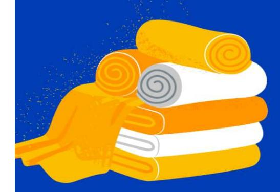

Figure 2. Projected EU Textile production. Source: ETC-CE Report 2023/5

The Textile & Clothing (T&C) value chain is extremely long and complex, spanning the whole world and having its various stages of production taking place in different countries, and also including the distribution of intermediate and final items and retail sale to final consumers. Most industrial production processes are located in developing countries (mainly in Asia), and the produced textiles and garments are transported to developed countries. After use, some of the textile waste is transported to developing countries (mainly to Africa). Textile waste streams are increasing in all countries, but especially in Western countries, in which the fashion consumers are mostly located (Niinimäki et al.,2024)

The textile market size has grown strongly in recent years. The growth can be attributed to growth in world population, increased demand for man-made fibres, government initiatives for the textile industry and strong economic growth in emerging markets.

The ever-increasing apparel demand from the fashion industry and the meteoric growth of ecommerce platforms are expected to drive market growth.

## 3.1.1.2 Market size by region

The global textile industry is a cornerstone of the world economy, encompassing a vast network of enterprises and a substantial workforce. The industry is expected to comprise around 278,600 enterprises worldwide by the end of 2025 and employ approximately 7.38 million individuals globally by 2025, growing at a CAGR of 2.54% between 2025 and 2029 (Statista, 2025).

Regarding a regional segmentation, the textile industry could be divided for the analysis in the following regions:

- North America
- Europe
- Asia-Pacific
- Latin America
- Middle East & Africa

North America held the largest market share in 2023, accounting for approximately 35% of the market. The region's growth is driven by factors such as increasing disposable income, growing demand for home textiles, and rising consumer spending on apparel and accessories (Jaiswal, 2025).

Europe is the second largest market for textiles, with a market share of around 28% in 2023.The region's growth is supported by a strong fashion industry, a large consumer base, and technological advancements in textile manufacturing (Jaiswal, 2025).

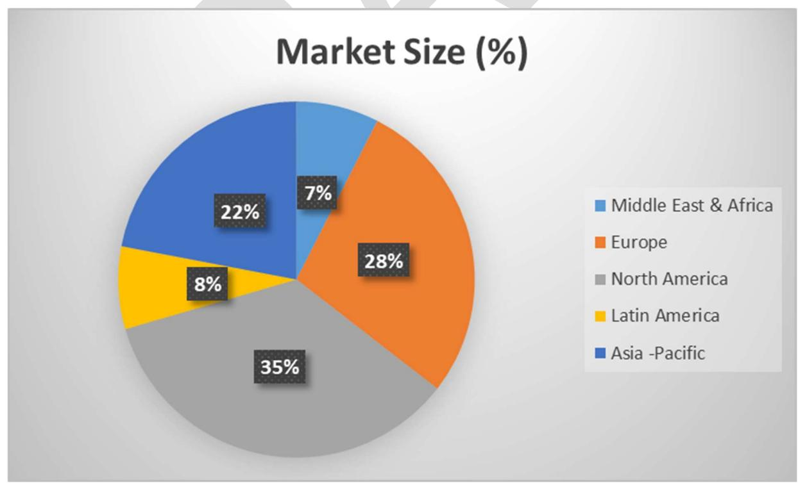

Figure 3. Global textile industry market size by region. Source: Jaiswal, C., 2025

Asia-Pacific is projected to be the fastest-growing region in the textile market, with a CAGR of over 5% from 2023 to 2032. The region's growth is primarily attributed to the increasing population, rising urbanization, and expanding middle class. The growth is also driven by the easy availability of raw silk along with rising demand for fashionable clothes and home furnishing commodities. Moreover, the rising use of e-commerce for buying apparel, along with the rising young age population that tends to buy designer and fashionable clothes, is driving the growth of the textile market. Also, the rising interest of people in modelling and fashion designing, coupled with the increasing trend of wearing imported clothes, further accelerates market growth positively. Additionally, increased investments from the governments of countries such as India, China, Bangladesh, and others, have also boosted the market growth. Furthermore, prominent market players such as Arvind Limited, Vardhman Textiles Ltd., Welspun India Ltd., Reliance Industries Limited, Aditya Birla Group, Raymond Ltd, and others, are adopting strategies to strengthen their customer base and maintain their dominance in the industry (Precedence Research, 2025).

South America and the Middle East are relatively smaller markets for textiles, but they are expected to witness steady growth in the coming years due to factors such as population growth, economic development, and increasing demand for textiles in various industries (Precedence Research, 2025).

Some of the major players operating in the textile market are BSL Limited, INVISTA S.R.L., Lu Thai Textile Co., Ltd., Heytex Bramsche GmbH, B.D. Textile Mills Pvt. Ltd., DBL Group, IBENA Inc., Levis, Lakhmi Woollen Mills, Wilh. Wülfing GmbH & Co. KG, Wuxi Xiexin Group Co., Ltd., O'Formula Co., Ltd., The Bombay Dyeing & Mfg. Co., Ltd, Adidas AG, Mayur Fabrics, Huafu Top Dyed Melange Yarn Co., Ltd., and Nike Inc. (Grand View Research, 2024).

## 3.1.1.3 Segmentation

Textile and apparel products can be categorized based on the following features:

## (1) Raw material

- Natural fibres
- Synthetic fibers

Natural fibers are fibers obtained from nature, primarily extracted from plants or animals. These fibers are biodegradable, possess eco-friendly properties and can be broadly classified into plantbased (cotton, derived from cotton plants, or linen, obtained from the flax plant), or animal-based (wool, obtained from sheep, or silk, obtained from silkworm cocoons). (Eun Hyup Kim 2025) Synthetic fibers refer to human-made fibers derived from petrochemical products. These fibers are not biodegradable but their use grew exponentially in the last century, and today they play a significant role in clothing, household products, and industrial applications. Key synthetic fibers include polyester, nylon, and acrylic. (Anneke Smelik 2023).

## (2) By product

- Silk
- Cotton
- Wood
- Polyesters
- Nylon
- Others

The global textile industry market is subdivided by products into silk, wool, chemical fibres (polyesters, nylon, etc.), cotton, and others. Among these, cotton is the most dominant fibre due to its versatility, softness, and ubiquity. It is largely applied in garments, home textile, and industry. Other than cotton, synthetic fabrics such as polyester and other chemical-textile goods have gained much market share on the basis of their durability and low cost. Silk and wool occupy niche positions, particularly in luxury and specialty applications, but cotton and synthetics are the industry's pillars.

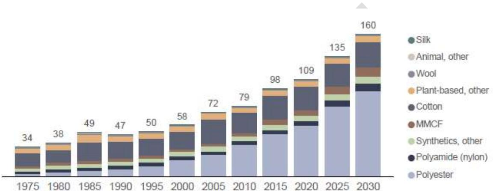

Figure 4. Global fibre production (million tonnes). Source: Textile Exchange 2024

In 2024, cotton was dominant among natural fibres because of increasing demand across different industries, including clothing, medical dressings, and apparel. The universal supply of cotton in major producing countries like China, India, and the U.S. has also contributed to its market growth. In addition, the increase in cotton exports for uses such as diapers and home decor, along with continued research and development of methods to improve the production of cotton, has driven the growth of the market.

On the other hand, the wool sector is expected to see the highest growth in the future. The growth is driven by its higher utilization in the production of insulation materials, carpets, and upholstery. (Precedence Research, 2025).

Polyester is the most dominant fibre due to its versatility, durability, and cost-effectiveness. It is widely used in apparel, home textiles, and industrial applications. Polyester's resistance to wrinkling, shrinking, and fading makes it a preferred choice for manufacturers. While nylon and natural fibres like cotton and wool also hold significant market shares, polyester's adaptability and the rise of synthetic blends contribute to its leading position in the textile industry.

This segment is generally driven by factors such as the rising use of apparel and fashion industry and increasing awareness regarding sustainable clothing. Also, the growing demand for natural fibres for designing the interiors of cars and the rising application of natural fibres for medical usage has also accelerated the growth of the textile market. Moreover, the increasing application of natural fibres for making ropes and paper production further drives the growth of the textile industry. The polyester segment is expected to grow at a significant rate. The growing demand for polymers due to their cost-effectiveness, resilience, and durability has driven the growth of the market. Also, the rising use of polyester for the production of jackets, sportswear, and gym wear, along with its

usage in the production of tires and safety belts for cars, has further boosted the growth of the textile market (Precedence Research 2025).

### (3) Final application

- Household (bedding, kitchen, upholstery, towel)
- Technical (construction, transport, medical, protective)
- Fashion & Clothing (apparel, ties and clothing accessories, handbags, others)

The fashion and clothing segment is the most dominant category. This sector encompasses a wide range of products, including apparel, accessories, and footwear driven by changing consumer preferences and fashion trends. The demand for fast fashion and sustainable clothing further propels growth in this segment. While technical textiles and household textiles also contribute significantly to the market, the fashion and clothing sector remains the leading driver due to its substantial consumer base and continuous innovation.

## 3.1.1.4 Geographical poles

The global textile and apparel sector is one of the most geographically dispersed industries, with production processes fragmented and allocated across diverse regions. These geographical poles reflect varied stages of the global value chain where countries specialize in different functions, from raw material processing and mass manufacturing to branding, design, and retail. The spatial organization of this industry is not static but evolves in response to capitalist crises, trade liberalization, labour market changes, and technological developments (Montero Bressán, 2022; Rodil-Marzábal et al., 2022).

## East and South Asia: the global manufacturing core

Asia, particularly China, Bangladesh, Vietnam, Cambodia, and India, remains the principal manufacturing centre for textiles and garments. These countries have gained a competitive edge due to:

❖ Low labour costs, access to large labour pools, and industrial infrastructure ❖ Significant foreign direct investment and export-oriented industrial policies ❖ The rise of full-package suppliers capable of OEM/ODM services (Montero Bressán, 2022; Rodil-Marzábal et al., 2022).

China, though experiencing rising labour costs and transitioning toward higher-value segments, still accounted for around one-third of global apparel exports by the mid-2010s (WTO, 2023). However, production has started to shift toward lower-cost countries such as Bangladesh and Cambodia in response to wage pressures and trade tensions (Montero Bressán, 2022).

As of December 2024, the ready-made garments industry in Bangladesh earned \$50 billion from exports, marking an 8.3% increase from the previous year. The sector employs over 5 million workers, with women constituting 55% of the workforce (Mondal et al., 2025).

India holds a significant position in global textile manufacturing. It is the world's second-largest producer of textiles and garments. It is also the fifth-largest exporter of textiles spanning apparel, home, and technical products. The textiles and apparel industry contributes 2.3% to the country's GDP, 13% to industrial production and 10.5% to exports. The textile industry in India is predicted to double its contribution to the GDP, rising from 2.3% to approximately 5% by the end of this

decade. India has a 4.6% share of the global trade in textiles and apparel. Moreover, India is the world's third largest exporter of textiles and apparel. India ranks among the top five global exporters in several textile categories. In April-June 2025, exports of readymade garments including accessories stood at US\$ 2,244 million. The textile sector is expected to play a significant role, with a target of US\$ 100 billion in exports by 2030, up from US\$ 34.43 billion in 2024. In April- September 2025 the total exports of textiles stood at US\$ 21.35 billion. Around 45 million people are working in the textile business, including 3.5 million people who work on handlooms. (Indian Brand Equity Foundation, 2025).

## Europe: High-value production and regional nearshoring

Western Europe plays a leading role in design, innovation, advanced manufacturing, and branding, especially in high-end and technical textiles. Countries such as Italy, France, Germany, and Portugal have maintained strong positions through quality production, technological advancement, and integration with fashion hubs (Copenhagen Economics, 2025). Western Europe is also a centre for sustainable materials, circular business models, and eco-certification systems, with strong participation from Germany and the Nordic countries in developing sustainable solutions (Textile Exchange, 2024). Simultaneously, there has been a shift toward nearshoring in Eastern Europe and the Mediterranean (e.g., Turkey, Tunisia, Romania) (Montero Bressán, 2022). This regionalization is aligned with broader efforts to reduce dependence on distant Asian suppliers and to respond faster to changing consumer preferences.

## North America: Market leadership and assembly integration

The United States and Mexico constitute a North American pole characterized by asymmetric integration. The U.S. leads in retail, branding, and logistics, while Mexico functions as a key assembly location within global value chains, especially under the USMCA (United States–Mexico– Canada Agreement). Mexico's high backward global value chain participation reflects its reliance on imported inputs (e.g., fabrics, trims) for garment assembly, which are then re-exported to the U.S. (Rodil-Marzábal et al., 2022). This production model supports a just-in-time supply structure but also exposes Mexico to vulnerabilities tied to U.S. demand and trade policy fluctuations. The textile and apparel industry in Latin American and Caribbean (LAC) countries plays a strategic role in regional economies, especially in terms of employment, exports, and industrial development. While the region represents a relatively small share of global apparel exports (around 4%), it is highly significant at the national level, particularly in countries like Honduras, El Salvador, Guatemala, and Nicaragua, where the sector accounts for a substantial share of total exports and manufacturing employment. The industry benefits from geographical proximity to the U.S. market, especially under trade agreements like Dominican Republic-Central America FTA (CAFTA-DR), which offer tariff-free access under certain rules of origin. This has helped sustain competitiveness in basic apparel production, especially cotton-based items. However, limited diversification, high labour costs, and weak backward linkages in synthetic textiles have constrained the region's ability to move up the value chain (Fernández-Stark et al.,2022)

## Sub-Saharan Africa: Emerging low-cost manufacturing pole

In recent years, Sub-Saharan Africa (SSA), notably Ethiopia and Kenya, has emerged as a lowcost textile and apparel production hub (Lu,2025), stimulated by:

❖ Rising labour costs in Asia ❖ U.S. trade preferences under the African Growth and Opportunity Act (AGOA1 )

This project has received funding from the European Union's Horizon Research and Innovation program under grant agreement N° 101181901 and from the Swiss State Secretariat for Education, Research and Innovation (SERI). Posts and shares reflect only the views of all the involved partners. Neither the European Union nor the granting authority can be held responsible for them.

1 expired in September 2025

❖ Investments in industrial parks and public infrastructure.

Despite these advantages, the region faces challenges such as inadequate infrastructure, skills gaps, and limited integration into high-value functions of the global value chain. Relevant studies (Lu,2025) identified significant challenges for Sub Saharan African countries serving as immediate alternatives to sourcing for example from Asia for U.S. fashion companies. While SSA countries could offer relatively low sourcing costs, the range of apparel products available for U.S. fashion companies to source from the SSA region remained significantly more limited than those from Asia.

## South America: Regional integration and vertical models

Countries like Brazil, Colombia, and Peru have retained vertically integrated textile industries that primarily serve domestic and regional markets. Brazil, in particular, maintains a comprehensive supply chain from fibre to final product, supported by a large consumer base and protective industrial policies. However, limited export competitiveness and high production costs have constrained these economies' roles in global textile trade. Instead, their focus lies in niche markets and regional supply, rather than global value chain-based expansion (Rodil-Marzábal et al., 2022).

The spatial organization of the textile industry reflects broader processes of capital accumulation. Following the 2008 financial crisis, there was both a deepening of offshoring to low-wage Asian economies and a partial trend toward nearshoring in proximity to Western markets, especially in response to fast fashion dynamics and logistics volatility (Montero Bressán, 2022). Moreover, multinational firms continually reconfigure their production geographies in search of cost efficiency, political stability, and market responsiveness. This ongoing process results in dynamic but also uneven development patterns that define the spatial poles of the global textile economy.

## 3.1.2 Economic conditions

The textile industry is deeply globalized, operating within intricate global value chains that encompass raw material sourcing, manufacturing, and distribution across various regions. Key economic factors shaping the sector include:

## Global demand and export dynamics

Rising global population levels and increasing disposable incomes, particularly in emerging markets, have driven up demand for textiles and apparel. Countries like China, India, Bangladesh, and Vietnam have emerged as major exporters, significantly contributing to their economies through foreign exchange earnings and job creation. The Asia-Pacific region dominates the global textile market, holding the dominant market share. This strong position is largely due to the concentration of large-scale manufacturing facilities in countries such as China, India, and Bangladesh. The region's advantages include low labour costs, supportive government policies, and well-established supply chains (G. Peter Tessa, 2024).

The European textile industry functions within a globally dispersed value chain. While product design and development are typically concentrated in Europe, the bulk of manufacturing takes place in Asia, with notable contributions from Turkey and North Africa (Copenhagen Economics, 2025). This structure capitalizes on comparative advantage. Labour-intensive tasks are assigned to low-wage regions, while Europe focuses on high-value-added activities such as technical textiles and fashion design. However, the globalization of supply chains also introduces complexity and risks. Firms face growing uncertainty due to geopolitical instability and supply chain disruptions.

These challenges are motivating diversification strategies and sparking debate over reshoring production to Europe although such moves are frequently deemed economically unviable due to high labour costs and structural limitations in manufacturing capacity (Copenhagen Economics, 2025).

## Rising global population and urbanisation in the developing countries

In 1950, the global population stood at approximately 2.5 billion. By 2021, the global population has surged past 7.7 billion, and current projections estimate it will reach around 9.7 billion by 2050 (UN, 2024). This rapid population growth has inevitably led to increased demand for essential goods, with textiles being among the most significant. Urbanization is also accelerating, as individuals migrate from rural areas to cities in search of better economic opportunities and improved living conditions. Much of this growth originates from expanding middle classes in regions of Asia and Africa. These demographic groups, gaining purchasing power, are transforming from merely survival-oriented consumers to trend-conscious shoppers. This shift places further emphasis on the production capabilities of textile manufacturers globally. As a result, consumer behaviour is shifting. Items once considered luxuries, such as fashionable clothing, are now seen as everyday necessities. With rising disposable incomes, particularly in developing economies, people are more inclined to invest in garments that express their identity and social status (Gold Fortune Textile, 2025, Soni, 2025, Biradar, 2025).

## Technological advancements and "Industry 4.0"

The emergence of textile "Industry 4.0" is driving transformative change. Automation, artificial intelligence (AI), and the Internet of Things (IoT) are improving manufacturing precision, enabling predictive analytics, and reducing material waste (Soni, 2025). These innovations are not only enhancing productivity but also aligning with sustainability objectives by minimizing resource consumption.

A significant trend is the emergence of smart textiles, fabrics embedded with electronic components, that are gaining popularity in healthcare, sportswear, and fashion. These materials offer enhanced features such as temperature regulation, health monitoring, and interactive functionalities (Harshita, 2024).

Developed markets, particularly in North America and Western Europe, are leveraging these technologies to revitalize domestic production and develop high-value products such as smart textiles for sports, healthcare and defence applications (Fact MR, 2025, Saniyat & Ravi, 2025, Market Research Future. (n.d.), EDA, 2024).

## Trade policies and market access

The textile sector has benefited from international trade agreements that lower tariffs and enable access to the European market, such as the EU's Generalised Scheme of Preferences (GSP) and Everything But Arms (EBA) initiative. These policies have facilitated the growth of textile manufacturing in developing countries, thereby integrating them into global value chains (Copenhagen Economics, 2025). However, tariff differences such as 0% for Turkey versus 12% for China continue to influence sourcing and supply chain decisions. At the same time, the fragmentation of EU legislation creates administrative burdens for companies, increasing compliance costs and limiting the sector's agility. The need for harmonized international regulations is critical to improving the industry's operational efficiency and global competitiveness (Business Europe,2025).

Sustainability is a central concern within the textile industry, stimulated by increased consumer awareness and tighter environmental regulations. The use of eco-friendly materials, including organic cotton and recycled fibres, is growing steadily. Moreover, sustainable production practices, such as water-efficient dyeing and improved waste management, are becoming more widespread. The environmental impact of the textile industry, especially its reliance on virgin fossil-based materials, has triggered widespread concern and regulatory scrutiny. According to Textile Exchange (2024), the industry must reduce greenhouse gas emissions by 45% from raw material sourcing by 2030 to meet climate targets. To achieve this, the sector must move from a linear "takemake-waste" model to a circular economy. Key strategies include using recycled or renewable materials, designing for durability, and investing in closed-loop systems. The industry is also urged to redefine value, reduce production volumes and by all means promote environmental sustainability and social equity (Textile Exchange, 2024).

## Regional specialisation in production

The textile industry development is heavily influenced by regional specialization. Europe focuses on high-value segments such as design, advanced manufacturing, and marketing. In contrast, Asia and North Africa concentrate on labour-intensive processes, including raw material preparation and garment assembly. Labour cost variations play a crucial role in determining production locations, with Asia maintaining a competitive edge due to its lower wages and mature industrial infrastructure (Copenhagen Economics, 2025).

## Labour market considerations

As a labour-intensive sector, textiles are a major employer in developing economies. In Turkey, for example, the region of İzmir plays a key role in national textile production and exports. However, low wages, precarious work conditions, and labour rights concerns persist in many sourcing countries (UNDP, 2021). Ensuring a just transition toward sustainability, including decent work, fair wages, and social inclusion is essential for the sector's resilience and legitimacy in the face of growing public interest and legislative pressure (Textile Exchange, 2024).

## Crisis resilience and demand volatility

The COVID-19 pandemic exposed the vulnerability of the textile sector to external shocks. Companies reported production halts, raw material shortages, logistics delays, and declining demand. For example, in Turkey's textile hubs, turnover and exports fell significantly during the peak of the pandemic (UNDP, 2021). These disruptions have accelerated efforts to build resilience, including supply chain diversification, enhanced digitalization, and risk management strategies. Moving forward, resilience will be key to maintaining continuity in an increasingly unstable global environment.

## Cost competitiveness and reshoring dilemmas

Although reshoring is seen as a means to improve supply chain transparency and environmental performance, it poses economic and structural challenges. European countries generally lack cost competitiveness for mass textile production due to higher labour costs, labour shortages, and limited manufacturing infrastructure. Moreover, reshoring may undermine the developmental role of the sector in lower-income countries by reducing employment and trade opportunities (Copenhagen Economics, 2025).

## 3.1.3 Legal conditions

The global textile sector is subject to a complex and evolving landscape of legal regulations that influence production, trade, environmental performance, and labour conditions. These regulations are shaped by national laws, international agreements, and regional policies, particularly from major markets like the European Union, the United States and China. Here is described the international legal framework. EU legislation is described in chapter 3.2.

## Environmental and circular economy regulations

Environmental regulations are increasingly pivotal as the textile industry is one of the most resource-intensive and polluting sectors. Key instruments include:

⮚ US Toxic Substances Control Act (TSCA) and California's Proposition 65: These regulate chemical safety in textile imports, with California imposing warning labels for exposure to harmful substances. ⮚ The New York Fashion Act (Bill S4746B) or the Fashion Sustainability and Social Accountability Act is the first legislation of its kind worldwide to propose sustainability requirements for the fashion industry and retail sellers. The law mandates fashion brands generating over \$100 million and selling in New York to disclose impacts like greenhouse gas emissions and chemical use by mapping at least 50% of their supply chains. ⮚ French AGEC Regulative. The Anti-Waste Law for a Circular Economy is designed to shift production and consumption models to reduce waste and conserve natural resources, biodiversity, and climate. Law number 2020-105, enacted on February 10, 2020, represents a major advance in the ecological transition. It particularly impacts the textile sector (clothing, linen, and footwear), which is increasingly focused on sustainable development. This legislation seeks to transform the traditional linear economy of "produce, consume, dispose" into a circular economy.

## Labour and human rights legislation

Textile production often occurs in regions with complex labour dynamics. Key regulations include:

⮚ International Labour Organization (ILO) Core Conventions: Binding for member states, these protect workers' rights, including freedom of association, collective bargaining, and prohibition of forced or child labour [ILO, 2024]. ⮚ Uyghur Forced Labour Prevention Act (UFLPA) in the US (2022): Bans imports of goods, including textiles, suspected to be linked to forced labour in China's Xinjiang region [US CBP, 2023]. ⮚ German Supply Chain Due Diligence Act: In 2021, the German Parliament enacted the Act on Corporate Due Diligence Obligations in Supply Chains (Gesetz über die unternehmerischen Sorgfaltspflichten in Lieferketten, LkSG), legally mandating German enterprises to uphold human rights in their global supply chains. The Act obliges enterprises in Germany to implement specified due diligence measures to respect human rights. It applies to enterprises with their central administration, principal place of business, administrative headquarters, Statutory seat, or Branch office in Germany. The Act initially affected enterprises in Germany with at least 3,000 employees starting in 2023 and will extend to those with at least 1,000 employees starting in 2024. The Act on Corporate Due Diligence Obligations in Supply Chains (LkSG) significantly impacts the textile industry by mandating German companies to ensure human rights compliance throughout their global supply chains. This requires textile businesses to enhance transparency, conduct supplier audits, and implement robust due diligence processes, thereby mitigating legal, financial, and reputational risks associated with

non-compliance.

⮚ UK and Australia's Modern Slavery Acts: The Modern Slavery Act is a leading piece of global legislation addressing modern slavery and human trafficking in the UK. While not all sections are directly relevant to businesses, section 54, titled 'Transparency in Supply Chains' has a significant impact on the corporate sector. Effective from 29th October 2015, the Act requires many businesses to disclose a slavery and human trafficking statement. ⮚ Dutch Child Labour Due Diligence Act. The Dutch Child Labour Due Diligence Act was passed by the Dutch Senate in 2019. It became effective in mid-2022 and mandates that companies examine their supply chains for child labour, and if found, take steps to mitigate and prevent it. ⮚ The Fashioning Accountability and Building Real Institutional Change (FABRIC) Act is a proposed federal legislation aimed at revitalizing the US domestic garment industry and establishing the US as a global leader in responsible apparel production through new workplace protections and manufacturing incentives. This bill would take the protections for workers' wages now in effect as of January 2022 with California's Garment Worker Protection Act nationwide. The Act attempts to create a \$50 million annual support program through the Department of Labour, which will provide grants and technical assistance to manufacturers while holding brands accountable for their labour practices. ⮚ Bangladesh's RMG (readymade garments) Compliance Framework is a multi-layered system designed to ensure labour rights, workplace safety, and environmental standards within the country's vital garment sector. Grounded in the Bangladesh Labour Act (2006) and monitored by government bodies like the Department of Inspection for Factories and Establishments (DIFE), the framework is supported by key industry stakeholders such as the Bangladesh Garment Manufacturers and Exporters Association (BGMEA) and international initiatives like the Accord on Fire and Building Safety and its successor, the RMG Sustainability Council (RSC). Since the Rana Plaza tragedy2 in 2013, the framework has evolved to include factory inspections, fire and building safety audits, worker training, and remediation plans. Despite progress, challenges remain in enforcement, worker protection, and environmental compliance, calling for continued collaboration between the government, industry and global partners.

## Trade and customs regulations

Trade policies and origin rules significantly shape global textile flows:

⮚ Agreement on Textiles and Clothing (ATC) of the World Trade Organization (WTO) ended quotas in 2005 but left market access contingent on compliance with other rules. ⮚ Technical Barriers to Trade (TBT) Agreement – Ensures that technical regulations (like labelling or safety standards) do not become unfair trade barriers (WTO). ⮚ Trade Facilitation Agreement (TFA) – Simplifies customs procedures, helping textile exports/imports flow more efficiently (WTO). ⮚ Rules of Origin and Customs Codes: Vary across jurisdictions and affect eligibility for preferential treatment, often requiring verification of sustainable or ethical sourcing. ⮚ Trade Preference Programs – The U.S. offers duty-free access under the African Growth and Opportunity Act (AGOA), Caribbean Basin Trade Partnership Act (CBTPA), and Generalized System of Preferences (GSP).

This project has received funding from the European Union's Horizon Research and Innovation program under grant agreement N° 101181901 and from the Swiss State Secretariat for Education, Research and Innovation (SERI). Posts and shares reflect only the views of all the involved partners. Neither the European Union nor the granting authority can be held responsible for them.

This draft deliverable has not yet been validated by the granting authorities

2 The Rana Plaza collapse occurred on April 24, 2013, in Savar, Bangladesh, when a building housing garment factories collapsed.

⮚ USMCA (United States–Mexico–Canada Agreement) – Includes yarn-forward rules of origin affecting textile content sourcing. ⮚ ASEAN Free Trade Area (AFTA) – Reduces duties across Southeast Asian textile exporters. ⮚ RCEP (Regional Comprehensive Economic Partnership) – Covers 15 Asia-Pacific countries, harmonizing tariffs and rules of origin.

### Consumer protection

Textile products are increasingly regulated in terms of transparency and consumer information:

⮚ Consumer Protection from Unfair Trading Regulations (UK) and similar instruments globally require that product claims, especially related to sustainability, are clear, truthful, and verifiable. ⮚ United Nations Guidelines for Consumer Protection (UNGCP). ⮚ ISO Standards (International Organization for Standardization). ISO standards are often referenced in consumer protection laws, such as ISO 3758:2012 – Care labelling code using symbols for textiles, ISO 20471:2013 – High-visibility clothing for safety, ISO 26000 – Guidance on social responsibility, including consumer rights. ⮚ OECD Guidelines for Consumer Product Safety. ⮚ U.S. Consumer Product Safety Improvement Act (CPSIA, 2008). ⮚ Canada's Consumer Product Safety Act (CCPSA). ⮚ ASEAN Guidelines on Consumer Protection. Adopted by 10 Southeast Asian countries to harmonize consumer rights and product safety. Encourages enforcement of standards for labelling, product information, and dispute resolution, relevant to textiles and garments. ⮚ Voluntary Sustainability and Ethical Labels. While not legislative, these international labels influence consumer protection by ensuring transparency and safe product claims: OEKO-TEX Standard 100 – Tests for harmful substances in textiles. Fair Trade, GOTS (Global Organic Textile Standard) – Cover social, environmental, and safety aspects. Some national laws recognize these certifications as part of compliance (e.g., in Japan, South Korea, and Switzerland).

## 3.1.4 Trends and dynamics

The world of manufacturing is changing. Digitalization is transforming the manufacturing and textile industry. Fourth Industrial Revolution (Industry 4.0) is a neologism describing rapid technological advancement in the 21st century. In essence, the Fourth Industrial Revolution is the trend towards automation and data exchange in manufacturing technologies and processes which include cyberphysical systems (CPS), Internet of Things (IoT), cloud computing, cognitive computing, and artificial intelligence (Ross, 2021).

The rise of Industry 4.0 is also changing the game in the textile sector. New approaches are making textile manufacturing more efficient and sustainable than ever before. AI is helping brands predict fashion trends, streamline supply chains, and create more personalized shopping experiences. Automation is boosting production efficiency, reducing human errors, and maintaining consistent quality. IoT is transforming manufacturing, allowing real-time tracking of machinery, materials, and inventory. These advancements are not just making production faster. They are also pushing the textile sector toward a more sustainable and customer-centric future. Moreover, textile companies investing in smart manufacturing techniques are gaining a competitive edge by reducing waste and improving production timelines (Vaish, 2025).

Furthermore, there has been an increasing trend in the use of smart textiles in the market that use optical fibres, metals, and various conductive polymers to interact with the environment. The rapidly growing consumer preference towards sustainable products is forcing major textile companies to focus on restructuring their business and investing in manufacturing practices that target sustainable products (Grand View Research, 2024). Moreover, fashion is gaining increasingly higher importance in consumers' lifestyles. This can be attributed to the constant exposure to advertisements that results in impulsive buying. In addition, social media is another major factor adding to the rising demand for fashionable wear.

The textile industry will focus on sustainability, traceable supply chains, circular fashion, and advanced technologies. Gen Z's ethical priorities will boost slow fashion and premium quality. AI, automation, and wellness fabrics will drive innovation, while trade policies and microfinance will reshape global supply chains and sourcing (Casden, 2024).

Trends and drivers are also highlighted in other parts of the present document.

## 3.1.5 Consumer behaviour towards textile consumption

Textile consumption habits significantly contribute to environmental degradation, mainly through waste production but also through the consumption of energy and natural resources. Creating policies that are impactful, inclusive, and effective, requires an understanding of consumer motives, habits, and barriers.

## 3.1.5.1 Dominant trends in consumer behaviour

The dominant trend in the textile and clothing market since 1990 and onwards is the "fast fashion model". Fast fashion is considered a "fashion market system that dictates almost daily new trends, seasonal fashions and produces new collections that feed unbridled consumption" (Silva de Gregori & Prestes Maier, 2023). Since the end of the 1990s, the most dynamic fashion industry has been the so-called fast fashion industry (Miranda, J., & Roldan, A., 2023). This practice, despite having started in 1970, was only denominated as such later, in 1990. This model has grown faster than the fashion industry as a whole and its market share has increased, driven by the international expansion of companies such as Spain's Inditex (the parent company of Zara), Sweden's H&M, Japan's Fast Retailing (Uniqlo), America's Gap, Ireland's Primark, and Britain's Topshop (Miranda, J., & Roldan, A., 2023). According to Girelli et al.,2020, consumers wear the pieces of clothing considered fast fashion less than five times, generating 400% more carbon emissions. Several huge retail chains use fast fashion as a business model, including Zara and H&M.

Furthermore, the fast fashion model is defined by four key characteristics that set it apart from other fashion models: cheapness, quickness, trendiness and mass produced (Commonwealth Human Ecology Council, 2022). These elements are deeply interconnected and work together to sustain the fast fashion business model.

Cheap: Fast fashion clothing is designed to be produced at minimal cost. The lower the production cost, the greater the profit margin. To achieve this, brands often rely on low-wage labour and inferior-quality materials. While this reduces expenses, it is directly associated with human rights violations and environmental degradation, making cheapness one of the most ethically

troubling aspects of the model.

Quick: The faster an item is manufactured, the quicker it can reach store shelves and consumers. Time equates to money. To accelerate production, companies often sacrifice labour standards and material quality. This constant release of new products encourages consumers to buy the latest items before even wearing what they previously purchased, fostering a culture of overconsumption.

Trendy: Fast fashion thrives on replicating the latest trends. Garments are designed to mirror current styles seen on runways, influencers, and celebrities, making them more appealing to consumers. The industry fuels social pressure and insecurity, pushing people to stay fashionable by frequently updating their wardrobes. This manipulation of consumer psychology ensures consistent demand.

Mass-Produced: Mass production is at the core of fast fashion's profitability. Clothes are manufactured in high volumes to reduce costs and meet rapid trend cycles. However, this leads to excess stock and waste, as many items remain unsold and are either heavily discounted or discarded.

These four elements are interdependent. Speed supports trend responsiveness, mass production keeps costs down, and low prices drive continuous consumer purchases. While this model is effective in maximizing profit, it also exposes the systemic issues of fast fashion: environmental harm, labour exploitation, and unsustainable consumption.

## 3.1.5.2 Key factors influencing consumer behaviour

It is essential to thoroughly understand the factors that play an important role in purchasing decisions. These factors can be grouped as follows.

## Strengthened decision-making consumer abilities

In the digital age, consumers have unprecedented access to extensive information. They can readily research products, compare prices, consult reviews, and obtain insights prior to making purchasing decisions. This accessibility has enabled consumers to make more informed and autonomous choices. Rather than depending exclusively on advertisements or sales strategies, consumers increasingly rely on authentic user reviews and peer recommendations. Consequently, businesses must prioritise the cultivation of a positive online reputation, the provision of transparent and accurate information, and the consistent delivery of high-quality products or services (Patil S.

## G., 2024).

## Dominance of e-commerce and the decisive role of mobile phones

The digital era has precipitated a fundamental transformation in consumer purchasing behaviour, marked by a substantial migration towards online shopping. eCommerce platforms have redefined convenience by enabling consumers to engage in product exploration and transactions remotely, thus obviating the need for physical store visits. These platforms not only provide an extensive array of product options and competitive pricing but also leverage consumer data to deliver personalized recommendations based on individual preferences and historical purchasing patterns. This paradigm shift has exerted considerable pressure on traditional retailers, compelling them to either establish a robust digital presence or implement integrated strategies to maintain relevance and competitiveness within an increasingly dynamic market environment. In this totally different from previous decades shopping environment, decisive roles played smartphones and their increasingly upgraded technical capabilities. Smartphones have become integral to consumers' lives, transforming how they interact with brands. Mobile phones offer privacy, convenience, quick

This project has received funding from the European Union's Horizon Research and Innovation program under grant agreement N° 101181901 and from the Swiss State Secretariat for Education, Research and Innovation (SERI). Posts and shares reflect only the views of all the involved partners. Neither the European Union nor the granting authority can be held responsible for them.

access to online commerce allowing potential buyers to search, shop and even interact in real time anytime and anywhere they desire. Therefore, businesses optimize their websites and social media accounts for mobile devices in order to ensure continuous navigation, fast loading times, and a user-friendly interface. Gradually shopping applications for mobiles are gaining ground because they provide personalized experiences for the customer and customer loyalty for the supplier.

## Social media influence and micro-trends

Social media platforms like Instagram, TikTok, and Pinterest have drastically shortened fashion trend cycles, encouraging fast turnover and impulsive buying behaviours. Consumers now expect near-instant access to emerging trends, leading to a significant shift in how they perceive and purchase textiles (Goetting, A. et al., 2022). Consumers often seek recommendations and opinions from their peers on social media before purchasing. Influencers with a significant following and expertise in specific niches can also sway consumer opinions and preferences. Businesses have recognized the impact of social media and are actively leveraging these platforms to engage with their target audience, build brand awareness, and drive sales. With micro-trends reshaping consumer behaviour at unprecedented speeds, traditional demand forecasting is no longer sufficient. Businesses choose to shift toward flexible merchandising and agile marketing to stay competitive (Huber, G., 2022).

## Demand for personalization and customization

The digital era has led to an era of personalised experiences. Modern consumers seek products that reflect their individuality. Customized textile products, whether in sizing, design, or styling, significantly enhance consumer engagement and satisfaction. Brands leverage artificial intelligence and big data analytics to deliver personalized experiences and product recommendations. Brands utilize artificial intelligence and data analytics to create personalized recommendations and curated shopping experiences (Ahmed, M. et al., 2024). Personalisation extends beyond the mere use of customers' names; it encompasses the curation of product recommendations, the delivery of relevant content, and the provision of tailored promotions informed by prior interactions and purchasing behaviour. By prioritising personalisation, businesses can improve customer satisfaction, strengthen relational bonds, and cultivate loyalty within an increasingly competitive marketplace.

## Demographic variables

According to the literature review, many studies on marketing and consumer behaviour indicate that age and gender are the two most important demographic variables (Rahman et al.,2020). Clothing plays a very important role in the self-formation and socialization process, especially among the youth. According to previous studies younger consumers tended to pay more attention to the aesthetic aspects of a product (want-based/hedonic attributes), whereas older ones were more concerned with their functional values (need-based attributes) (Rahman et al.,2020). Regarding gender, research of female apparel consumers indicated that garment fit, style, comfort, and quality were often considered to be important determinants, but not as highly regarded as those related to aesthetics (Stuart,2019).

## Technological advancements

Technological advancements have emerged as a pivotal driver influencing consumer behaviour in the textile industry. Innovations such as smart textiles, e-commerce platforms, 3D body scanning, augmented reality (AR) fitting rooms, and sustainable production technologies, have significantly reshaped consumer expectations, purchasing habits, and brand loyalty.

This project has received funding from the European Union's Horizon Research and Innovation program under grant agreement N° 101181901 and from the Swiss State Secretariat for Education, Research and Innovation (SERI). Posts and shares reflect only the views of all the involved partners. Neither the European Union nor the granting authority can be held responsible for them.

### Sustainability concerns

Last but not least, purchase decisions are influenced by growing environmental consciousness, which forces companies to match their products with sustainable methods (Kemi & Zilahy, 2025). This is further elaborated in the next chapter.

## 3.1.5.3 Drivers and barriers of consumer behaviour towards sustainable practices

As it was mentioned previously, textile/garment production is associated with a vast number of sustainability challenges in areas such as pollution, use of resources, and exploitation (Ahmadi, S. 2020). The environmental impact of the fashion industry can be noticed in the many steps of its supply chains, from the environmental impacts seen in the agricultural and petrochemical production steps to the manufacturing, logistics, and retail. This impact is especially visible in fast fashion, as it tends to have social and environmental impacts to support the rapid increase in material throughput, having grown to twice the amount of clothing produced in the year 2000 (Ribeiro, P. R. et al., 2023).

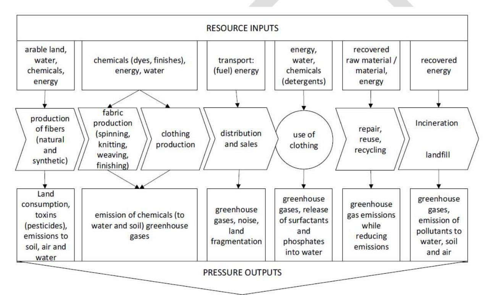

Figure 5. Environmental influences of the clothing industry on the product life cycle. Source: M.Popowska, A.Sinkiewicz, 2021(https://www.undp.org/sustainable-development-goals).

The increasing awareness of the environmental impacts of textile production has given rise to the urgent need for sustainable practices in the fashion industry. Textile sustainability encompasses a wide range of measures aimed at reducing the ecological footprint of textiles while ensuring the social and economic well-being of the people involved in their production. By adopting sustainable practices, the fashion industry can work towards mitigating climate change, conserving natural resources, and promoting fair labour practices (Padmanaban, 2024).

## Sustainability in the textile sector is based in 3 pillars (Mallick, 2021):

The environmental pillar. Companies of the textile sector are increasingly adopting production methods that lead to the reduction of carbon emissions, packaging waste, water consumption, and overall environmental impact.

The social pillar. Companies of the textile sector are focusing on the work force sustainability. Employee sustainability is the current and future ability of workers to remain in the workforce and is determined by a healthy organizational culture that supports and values employees. A sustainable employee culture keeps employees engaged to the level needed to perform their jobs capably (Van Dam et al, 2016).

The economic pillar. Economic sustainability refers to practices that promote long-term economic growth and well-being while safeguarding the social, environmental, and cultural dimensions of the community. This pillar emphasises activities such as regulatory compliance, sound governance, effective risk management, and the responsible allocation of resources.

These pillars of sustainability within the textile sector are reflected in a range of practices, methods, and strategies that have been shaping and transforming the industry over the past decade. Specifically, as noted by Padmanaban (2024):

## 1. Sustainable raw materials

The textile industry is undergoing a significant transformation towards sustainability, marked by an increasing emphasis on environmentally responsible fibres that reflect both ecological and ethical concerns. A range of sustainable alternatives is emerging as prominent options, underscoring the sector's dedication to minimising its environmental impact. Organic cotton, hemp, jute, bamboo, tencel (derived from sustainably sourced wood pulp), and recycled fibres are increasingly recognised for their reduced environmental impact. Their cultivation and production typically require fewer pesticides and less water, while also contributing to a lower carbon footprint, thereby representing a more responsible choice for both manufacturers and consumers.

## 2. Recycling and circular fashion economy

The concept of the circular economy has emerged as a transformative approach to enhancing sustainability within the textile industry. Departing from the traditional linear model of 'take, make, dispose,' the circular economy seeks to establish a closed-loop system in which textiles are systematically recycled, refurbished, reused, upcycled, or biodegraded at the end of their lifecycle. Innovative technologies made possible the recycling of used fragments and the production of new fibres, reducing the demand for resources and decreasing the production of waste. This strategy reduces the environmental impact and creates business opportunities and creates jobs in recycling and upcycling industries. Waste recycling technologies have reached a mature stage at both preconsumer and post-consumer stages. Recycling of used garments is becoming an increasingly profitable and widely adopted practice within the textile industry.

## 3. Environmentally friendly production procedures

Textile production is characterised by high levels of water and energy consumption. Addressing this challenge necessitates the adoption of cleaner and more sustainable processing methods aimed at minimising water use and promoting energy-efficient technologies. Innovative techniques such as waterless dyeing, exemplified by air dyeing and digital printing, as well as the utilisation of non-toxic chemicals, are increasingly implemented. These approaches hold substantial potential

for reducing the environmental footprint of textile manufacturing.

### 4. Ethical labour practices

Ethical labour practices refer to the fair and respectful treatment of workers across all levels of the supply chain. This includes ensuring safe working conditions for textile workers, fair wages, reasonable working hours, and the right to unionise. It also involves the prohibition of child labour, forced labour, and any form of discrimination. Upholding these standards not only protects workers' rights but also strengthens corporate accountability and social responsibility within the industry.

## 5. Economic dimension of sustainability

The economic dimension of sustainability is often where businesses perceive the greatest stability, as financial viability is fundamental to long-term sustainability. However, profitability must be balanced with environmental and social considerations. Profit alone cannot override broader sustainability commitments. This pillar encompasses critical functions such as regulatory compliance, effective governance, risk management, and transparent financial practices. Often referred to as the "governance pillar," it involves aligning the interests of boards and management not only with shareholders but also with stakeholders across the value chain, including communities and customers. Stakeholders, including investors, typically seek confidence in a company's use of transparent accounting methods, ethical governance practices, and avoidance of conflicts of interest, undue political influence, or unlawful conduct. The economic pillar plays a vital role in enabling companies to adopt realistic and scalable sustainability strategies. Its inclusion ensures that sustainability efforts remain economically feasible and balanced, avoiding abrupt transitions such as the immediate elimination of fossil fuels or chemical inputs without proper phasing.

The factor "consumer" is essential in this transformation of the textile sector towards a more sustainable operation at all stages of the production and distribution chain. Consumers hold significant power in shaping market trends. Their purchasing decisions influence product offerings, innovation, and business strategies. When consumers demand sustainable, ethical, or high-quality products, companies respond by adapting their practices, sourcing methods, and value propositions accordingly. This consumer-led pressure can lead to broader industry shifts, for example, the rise of organic textiles. On the other hand, consumer preferences are not static. They can be influenced or guided, through information campaigns, marketing, labelling, and public policy, to adopt more sustainable behaviours. For instance, awareness initiatives about fast fashion's environmental toll can lead to a shift in preference toward slow fashion. This educational component is crucial in sectors where environmental or ethical impacts are not immediately visible or well-understood.

Having highlighted the framework of sustainability in the textile sector, the goal of the current section is to underline the elements that influence consumer behaviour towards sustainable practices.

Across multiple studies, consumers express positive attitudes toward sustainable and eco-friendly textile products. These attitudes are largely driven by environmental concern (e.g., resource use, pollution, textile waste); ethical values (fair labour, animal welfare); health and self-image considerations (comfort, natural fibres, personal identity).

However, there remains a notable gap between attitudes and behaviour. Consumers may intend to buy sustainably but often do not follow through due to external constraints like price and availability.

This project has received funding from the European Union's Horizon Research and Innovation program under grant agreement N° 101181901 and from the Swiss State Secretariat for Education, Research and Innovation (SERI). Posts and shares reflect only the views of all the involved partners. Neither the European Union nor the granting authority can be held responsible for them. The aspect of ethical and eco-issues and sustainable behaviours reflects the extent to which consumers' values, moral beliefs, and environmental concerns influence their fashion choices. According to Schiaroli et al. (2024), while these factors are often cited as motivators, they primarily

In the literature several theories have been utilized to explain consumer engagement with sustainability in the fashion industry and the adoption of sustainable practices such as, Theory of Planned Behaviour, Value-belief-norm theory, Norm Activation Model, social identity theory etc (Ribeiro P., et al. 2023). Their implementation has demonstrated both advantages and limitations.

Factors, drivers and barriers of consumers' behaviour per phase of involvement Several researchers utilize a fragmented analysis of the consumers' behaviour according to the phases of involvement, namely:

- (i) Selection/acquisition phase
- (ii) Utilization/use phase
- (iii) Post use/discard phase.

The majority of the available research and studies focus on factors influencing consumer decisions in the first phase, the selection/pre-purchase phase. This indicates a predominant research emphasis on the initial stage of consumer behaviour within the sustainable fashion chain. There is relatively lack of studies concerning consumer behaviour in the product use phase and certainly less studies have been conducted to investigate behaviours related to the post-use phase (V.Schiaroli et al, 2024).

## Selection/acquisition phase

Regarding the factors that influence sustainable fashion choices, the reviewed literature highlights several pathways for encouraging more sustainable consumption. Findings suggest that environmental attributes of garments often play a secondary role in shaping consumer behaviour. Instead, the primary drivers behind sustainable fashion purchasing decisions can be grouped into six key categories:

## (1) Price-value perception

Consumers are more willing to buy sustainable textile products when the product is perceived as fairly priced relative to its quality and longevity (V.Schiaroli et al, 2024). In most studies contacted on the topic there is a common finding. When asked for the most influential factors in product acquisition, price was identified as the most prominent factor affecting decision (Ribeiro, P. R. et al., 2023). Price relative aspects are perceived behavioural control (consumers are more likely to purchase when they believe they can afford sustainable fashion) and financial capability. Consumers with more disposable income or belief in financial manageability are more likely to purchase (V.Schiaroli et al, 2024).

## (2) Product quality, functionality, comfort and aesthetic appeal

High-quality and comfortable garments are strong motivators for sustainable purchases. Consumers are more likely to choose sustainable clothing when it is perceived to be long-lasting, well-made, and pleasant to wear. They prioritize these tangible and personal benefits over abstract environmental benefits. In other words, most consumers would not choose sustainable garments if they do not provide enough benefits to satisfy their needs and aspirations (Rausch et al., 2021).

## (3) Ethical and eco-issue and sustainable behaviours

drive behaviour among already sustainability-committed consumers. Consumers who possess strong environmental awareness, feel a moral obligation to act responsibly, or hold altruistic and idealistic values are more likely to engage in sustainable fashion consumption. These individuals are often mindful of the social and environmental impacts of their choices and may prioritise fair trade, cruelty-free, or low-impact garments, even at higher costs. However, evidence shows that for the broader consumer base, ethical and environmental concerns tend to play a secondary role compared to functional or aesthetic product attributes. As such, while eco-consciousness is important, it is not sufficient alone to drive widespread behavioural change unless supported by other appealing product characteristics (e.g. quality, style) and social reinforcement.

## (4) Social influences, demographics, contextual factors

Social and situational influences are key drivers of consumer engagement with sustainable fashion, shaping behaviour through peer expectations, digital communities, identity expression, and shopping contexts. Consumers are more likely to adopt sustainable practices when these are perceived as socially desirable, endorsed by influencers, or embedded in cultural norms. Social media play a crucial role in spreading awareness and normalising behaviours, while fashion choices often serve as expressions of personal and group identity. Additionally, public visibility and positive online discourse can reinforce sustainable decisions, making these influences vital for closing the gap between awareness and action (Kautish and Khare, 2022; Johnstone and Lindh, 2022). Moreover, according to Mathew & Spinelli (2025) demographics play a significant role as a factor. Millennials and women, who tend to be more aware of sustainability issues, are leading adopters of eco-fashion, whereas male consumers and older age groups often show lower levels of engagement despite expressing ethical concerns, suggesting either a lack of awareness or less exposure to sustainable fashion initiatives.

## (5) Corporate image

Corporate reputation, trust, and brand equity drive consumers toward sustainable fashion choices. Grazzini et al. (2021) highlighted that incorporating sustainable features into fashion products, such as the use of recycled fibres, enhances consumers' perceptions of warmth, meaning they view the company as sincere, kind, and morally driven. This perception, in turn, positively affects their buying decisions. Researchers also pointed out that marketing communications which emphasize a company's sustainable practices, such as corporate social responsibility environmental initiatives, and ethical branding, play a crucial role in reducing consumer scepticism and encouraging sustainable fashion purchases.

## (6) Purchasing experience

The purchasing experience is a significant but often underestimated driver of sustainable fashion consumption. According to Schiaroli et al., 2024, consumers are more likely to choose sustainable garments when the overall shopping process is enjoyable, convenient, and emotionally rewarding. Positive experiences, such as engaging in-store environments, user-friendly online platforms, fast and ethical delivery, and responsive customer service, enhance satisfaction and reinforce sustainable behaviours. Additionally, hedonic values like the joy of discovering unique pieces, the excitement of second-hand treasure hunting, or the pleasure of supporting ethical brands contribute to shaping consumers. When sustainable fashion is associated with aesthetic pleasure and ease, it becomes more attractive, even to consumers who are not primarily motivated by ethical concerns. Therefore, improving the purchasing journey is crucial for mainstreaming sustainability in fashion.

discourage consumers from adopting sustainable behaviours across the phases of purchase, use, and disposal. These barriers may stem from individual perceptions, social norms, structural limitations, or market-related challenges. Schiaroli et al. (2024) identify several recurrent and interrelated types of barriers, which can be grouped into 5 main categories.

Consumers generally express positive attitudes toward sustainable textiles, driven by environmental and ethical concerns. However, their actual behaviour does not always align with these attitudes due to barriers like:

## (a) High price perception

High price is perceived as an important barrier when making sustainable fashion choices. The literature underlines that sustainable garments are commonly associated with higher prices compared to traditional garments and consumers might choose the cheapest choice due to scarce economic resources (Schiaroli et al, 2024).

## (b) Scepticism and distrust

The literature indicates that consumers often exhibit low levels of trust in sustainability claims due to a perceived lack of transparency, scepticism about the true environmental benefits of sustainable garments, doubts about the effectiveness of eco-apparel in addressing environmental issues, and a belief that companies are not genuinely committed to environmental and social responsibility (Carranza et al., 2022). When consumers sense that brands are engaging in greenwashing or making unreliable environmental claims, their confidence is undermined, discouraging them from purchasing sustainable clothing (Carranza et al., 2022; Apaolaza et al., 2022). Moreover, lack of clear, simple eco-labelling that can be easily understood by consumers further induces scepticism about the reliability (V.Schiaroli et al, 2024).

## (c) Knowledge and stereotypes

Numerous studies have shown that limited consumer knowledge about sustainable fashion is closely linked to reduced purchasing behaviour. In particular, misconceptions and stereotypes such as associating sustainable clothing with outdated styles, poor design, lack of functionality, or poor fit, can negatively influence perceptions. To encourage more sustainable purchasing decisions, consumers require clearer, more accessible information on product labels that effectively communicate the unique qualities of sustainable garments, build trust in brands, and counteract these misconceptions, especially given the often vague or confusing terminology used by fashion companies (V.Schiaroli et al, 2024).

## (d) Limited availability and accessibility

Consumers might perceive high effort in the process of purchasing sustainable garments, due to the difficulty in finding them in traditional stores, scarce knowledge of sustainable brands, and limited availability of apparel with desired attributes (Algahni et al. 2020, Vladimirova et al.2023).

## (e) Consumer habits and inertia

Consumers' tendency to repeatedly shop at the same stores without actively seeking alternatives that offer sustainable clothing, combined with the belief that altering their own shopping habits is insignificant if others continue to consume unsustainably, is negatively linked to sustainable fashion choices. Research indicates that individuals are more inclined to adopt sustainable purchasing behaviours when they believe their actions can meaningfully contribute to addressing environmental issues that is when they perceive their consumption as effective (Apaolaza et al., 2022; V.Schiaroli et al, 2024).

## Utilization/use phase

Sustainable behaviours during the use phase of fashion textiles are driven by emotional bonds, economic rationale, environmental concern, and social identity, supported by knowledge, perceived ease, and satisfaction. Strategies to encourage these behaviours must address both motivational and practical enablers, such as repair services, consumer education, and visible social norms.

## Α. Product attachment and emotional value

Consumers are more likely to reuse and maintain garments they are emotionally attached to (V.Schiaroli et al, 2024). Emotional bonds formed through memories or personalization encourage prolonged use and resistance to fast-fashion turnover. This emotional durability fosters mindful consumption (Zahid, et al.2022).

## Β. Prudence and cost-saving motivation

Economic considerations such as saving money drive behaviours like repairing instead of replacing and wearing items longer. This is particularly strong among low-income groups of peoples, for whom maximizing value and reducing spending are crucial incentives (V.Schiaroli et al, 2024).

## C. Environmental awareness and responsibility

While not always a dominant driver in pre-purchase decisions, environmental concern motivates sustainable use behaviours like cold washing, air drying, avoiding over-washing, and repairs. Consumers who are environmentally conscious often adopt laundry practices that reduce energy, water, and microfibre pollution (Ryding et al. 2022, Abrar et al. 2021).

## D. Knowledge and skills

Having the skills to repair or maintain garments (e.g., sewing, stain removal) enables consumers to extend products' lifespan (Niinimaki et al., 2021). Those who lack this knowledge are less likely to engage in repair or reuse, even if they are motivated.

## E. Social norms and identity

Consumers who identify with sustainability-minded communities or value circular lifestyles (e.g., zero waste, minimalism) are more likely to adopt conscious use-phase behaviours. Peer influence and a sense of belonging to eco-conscious circles can encourage long-term garment use. Indeed, consumer behaviour is shaped by societal and group dynamics (Yoon et al., 2020). Social norms, peer influence, and shared awareness significantly guide individuals toward making sustainable choices. Viewing sustainability as a key driver of consumer behaviour highlights its complex and wide-reaching influence, where both individuals and businesses play vital roles in the collective transition to a more sustainable future (V. Schiaroli et al, 2024).

## F. Perceived behavioural control

When consumers perceive themselves as capable of engaging in sustainable practices, such as eco-friendly laundering or accessing repair services, they are more likely to adopt such behaviours. This sense of self-efficacy plays a critical role in converting sustainable intentions into concrete actions. Cayaban et al. (2023) highlighted the positive influence of social media on shaping attitudes, subjective norms, and perceived behavioural control, identifying these factors as potential mediators in addressing the attitude–behaviour gap. Future research could further investigate the impact of emotional drivers (e.g., pride, guilt, or trust) as well as the effectiveness of advocacy campaigns and social media in promoting enduring behavioural change (Mathew & Spinelli,

### 2025).

## G. Consumer satisfaction and product utility

Satisfaction with the quality, comfort, and performance of garments is a critical driver of sustainable consumer behaviour during the use phase of textile products. High levels of satisfaction can lead to prolonged garment use, reduce premature disposal, and diminish the frequency of new purchases all of which are essential to extending product lifespans and supporting circular economy principles. Quality is often associated with durability, resistance to wear and tear, and maintained appearance over time. Consumers who perceive a garment as high-quality are more likely to engage in long-term use, viewing the product as a reliable investment rather than a disposable item (Schiaroli et al., 2024). Garments that retain their shape, colour, and texture through multiple wears and washes reinforce a sense of value, making consumers less inclined to seek replacements. Comfort is another essential attribute that significantly influences garment retention. Clothing that feels good on the body is more likely to become part of regular use cycles, contributing to a habit of re-wearing rather than discarding. Comfort is also tied to emotional satisfaction, as it can enhance the user's experience and strengthen personal attachment to the garment (Kemi & Zilahy, 2025). Performance, which includes aspects such as breathability, ease of maintenance, and suitability for different occasions, similarly affects continued use. Products that function well across various settings or climates are seen as versatile, increasing their usability and reducing the need to purchase additional items to fulfil similar roles (Ribeiro et al., 2023). In summary, garments that satisfy consumers in terms of quality, comfort, and performance are more likely to be worn longer and maintained better, reducing the overall environmental footprint of clothing consumption. Enhancing satisfaction through thoughtful design and materials selection thus represents a strategic entry point for brands seeking to align product offerings with sustainable consumption goals.

## Post use / discard phase

The post-use or discard phase of textile consumption plays a crucial role in advancing circular economy objectives, particularly through consumer practices such as reuse, resale, donation, recycling, and proper disposal. The reviewed literature highlights several interrelated drivers that influence sustainable consumer behaviour during this phase.

Environmental awareness and moral responsibility are consistently identified as key motivational factors for sustainable post-use behaviour. Consumers with strong ecological values are more likely to avoid landfilling garments and instead seek alternatives that contribute to environmental protection, such as recycling or donating (Schiaroli et al., 2024; Ribeiro et al., 2023). This behaviour reflects the influence of personal norms and perceived ethical obligations toward reducing textile waste and conserving resources.

Moreover, social norms and emotional motivations play a critical role in encouraging responsible disposal. Kemi and Zilahy (2025) observe that garments with sentimental value such as children's clothing are often reused within families or passed along to others as a form of symbolic exchange, reinforcing both environmental and social bonds. Similarly, practices such as donating or gifting used clothes contribute to feelings of community engagement and solidarity, supporting behaviour aligned with pro-social values.

Another significant driver is perceived convenience and accessibility, which significantly affects whether consumers engage in sustainable disposal practices. Access to infrastructure such as

textile collection bins, second-hand markets, and clear recycling instructions facilitates proper action. In contrast, lack of convenient options can act as a barrier even when intentions are positive (Ribeiro et al., 2023). Trust in the efficacy of these channels, such as belief that donated clothes will reach those in need, also enhances participation. Moreover, economic incentives and perceived utility influence post-use decisions. Consumers are more inclined to sell, swap, or repurpose garments if they perceive residual economic value. This is particularly relevant in the growing popularity of second-hand platforms and peer-to-peer resale applications, which combine sustainability with personal benefit (Schiaroli et al., 2024). Finally, product attributes, such as durability, brand reputation, and timeless design, also drive consumers to discard items responsibly. High-quality garments are more likely to be resold or donated due to their retained value, while low-quality items are often deemed unsuitable for reuse and are more frequently discarded in unsustainable ways (Kemi & Zilahy, 2025). In summary, the post-use phase is shaped by a combination of moral, social, logistical, economic, and product-related factors. Understanding and leveraging these drivers can support the design of more effective interventions and policies aimed at reducing textile waste and fostering circular consumption behaviours.

## Emerging consumer practices in fashion

Consumers are increasingly engaging in practices that support sustainability and circularity. Slow fashion represents a significant shift, with consumers prioritizing quality, durability, and ethical production. Many consumers demonstrate willingness to pay more for sustainable products and perceive them as higher value (Castro-Lopez et al., 2021; Gazzola et al., 2020; Musová et al., 2021).

Growing participation in second-hand markets and alternative models such as rental and swapping reduces demand for new products (even though this is not always the case3 ) and extends garment lifecycles, which is key for circularity (D'Adamo et al., 2022; Brydges, 2021; Musová et al., 2021; Papamichael et al., 2024). Alongside these alternative consumption models, increased interest in maintaining, repairing, and upcycling clothing reflects a broader commitment to extending product use. This interest is supported by both traditional skills and digital resources that help keep products in use longer (Schiaroli et al., 2024; Dragomir & Dumitru, 2022).

Demand for transparency has become particularly pronounced, especially among younger generations who seek more information about sourcing, materials, and production processes. This consumer pressure is pushing brands to adopt circular and sustainable practices (Gazzola et al., 2020; Brydges, 2021; Jimenez-Fernandez et al., 2023).

While there is momentum toward sufficiency, meaning consuming less and focusing on need rather than novelty, the progress is gradual. Sufficiency strategies such as buying less, choosing versatile garments, and supporting sharing or rental models are gaining attention but are not yet mainstream, as most companies and consumers still prioritize less disruptive sustainability actions (García-Ortega et al., 2023; Freudenreich & Schaltegger, 2020).

Barriers to wider adoption include cultural norms around fashionability, lack of awareness, and the persistence of fast fashion's appeal (Schiaroli et al., 2024; García-Ortega et al., 2023; Musová et al., 2021). However, education and awareness are strongly correlated with willingness to adopt circular and sufficiency-oriented behaviours (Papamichael et al., 2024).

This project has received funding from the European Union's Horizon Research and Innovation program under grant agreement N° 101181901 and from the Swiss State Secretariat for Education, Research and Innovation (SERI). Posts and shares reflect only the views of all the involved partners. Neither the European Union nor the granting authority can be held responsible for them.

3 https://www.nature.com/articles/s41598-025-19089-1

## Table 1. Table summarizing consumer practices and their sustainability/sufficiency impact.

| Practice            | Sustainability |               |            |    |      |       |
|---------------------|----------------|---------------|------------|----|------|-------|
|                     |                | Orientation   | Citations  |    |      |       |
| Slow fashion        | High           | Moderate-High |            |    |      |       |
| Second-hand/rental  | High           | Moderate      |            |    |      |       |
|                     |                |               | (D’Adamo   | et | al., | 2022; |
| Product care/repair | Moderate-High  | High          | (Schiaroli | et | al., | 2024; |
| Buying less         | Very High      | High          |            |    |      |       |

The emerging consumer practices are advancing sustainability and circularity in fashion, with slow fashion and second-hand models leading the way. However, a widespread shift to sufficiency, consuming less and prioritizing need over novelty remains limited, requiring further cultural change, education, and supportive business models.

Exploring factors shaping consumer behaviour towards circular fashion: a focus on Generations Y4 and Z5 (11 August 2025) Abdelmeguid A, Afy-Shararah M and Salonitis K (2025) Exploring factors shaping consumer behaviour towards

"…The fashion industry faces significant challenges due to its linear systems and environmental impact. As sustainability gains priority among consumers, especially Generations Y and Z, industry is urged to transition towards a circular economy. Despite this, the "attitude-behaviour gap" persists, indicating minimal impact on consumer behaviour.

…The study explores factors influencing consumer behaviour towards circular fashion, focusing on Generations Y and Z.

Nine hypotheses were developed, exploring relationships among environmental awareness, circular fashion awareness, willingness to change, willingness to pay a premium, and circular behaviour.

Online surveys yielded 408 responses from participants from developing and developed countries. Results show consumer behaviour is influenced by environmental awareness and circular fashion awareness, and willingness to change. Additionally, purchasing decisions are driven by product quality and durability.

## …Hypotheses development

The variables included in the study, including environmental awareness, circular fashion awareness, willingness to change, willingness to pay a premium, and circular behaviour, were selected based on their demonstrated significance in prior research examining sustainable consumption and circular fashion practices.

H1: Environmental awareness influences consumers' circular fashion awareness

H2: Environmental awareness influences consumers' circular behaviour H3: Circular fashion awareness influences consumer circular behaviour

H4: Consumers with higher levels of environmental awareness are more willing to pay a premium for

circular fashion items

H5: Consumers' circular fashion awareness positively correlates with their willingness to pay a

premium for circular fashion items

H6: Willingness to change positively correlates with willingness to pay a premium for circular fashion

This project has received funding from the European Union's Horizon Research and Innovation program under grant agreement N° 101181901 and from the Swiss State Secretariat for Education, Research and Innovation (SERI). Posts and shares reflect only the views of all the involved partners. Neither the European Union nor the granting authority can be held responsible for them.

4 Millennials; demographic cohort born roughly between 1981-1996

5 demographic cohort born roughly between 1997 and 2012

### items

H7: Consumers with higher levels of environmental awareness are more willing to change their behaviour

H8: Consumers with higher levels of circular fashion awareness are more willing to change their behaviour

H9: Consumers' willingness to change positively correlates with their circular behaviour

….A path analysis was performed to test the hypotheses, and considering a 95% confidence level, the results were found to support 5 out of the 9 hypotheses.

H1 was supported indicating that higher environmental awareness is positively associated with increased circular fashion awareness among consumers. This finding agrees with prior research suggesting that environmental consciousness plays a crucial role in promoting an understanding of circular fashion (Abdelmeguid et al., 2022; Liu et al., 2023).

H2 was also supported indicating that higher environmental awareness positively influences the adoption of circular behaviour among consumers. Consistent with existing research, the results supported this hypothesis, indicating that individuals with higher environmental awareness are more likely to engage in circular fashion practices (Ertz et al., 2016; Zhang, 2021). This emphasises the critical role of environmental consciousness as a driving factor for consumers to embrace circular behaviours within the fashion industry.

Likewise, H3 was supported confirming that higher circular fashion awareness is positively associated with increased adoption of circular behaviour among consumers, such as purchasing second-hand fashion items (Aramendia-Muneta et al., 2022). This presents an opportunity for education and communication efforts and initiatives to bridge this awareness gap and promote the relevance of circular fashion principles among consumers, as suggested by Dissanayake and Perera (2016).

Furthermore, H4 was not supported, indicating no statistically significant relationship between environmental awareness and willingness to pay a premium. This finding suggests that while environmental awareness may drive awareness and adoption of circular fashion practices among consumers from Generations Y and Z, it may not necessarily translate into a willingness to allocate financial resources to purchase circular fashion items. This aligns with contingency theory, which suggests that businesses need to adapt their strategies, such as pricing models, to meet the demands and limitations of the current consumer market, including price sensitivity and economic factors (Kumar P. et al., 2021).

Similarly, H5 was not supported, indicating no statistically significant relationship between awareness of circular fashion practices and the willingness to pay a premium for circular fashion items. This implies that familiarity with circular principles does not necessarily translate into a desire to pay a premium for such items. This highlights the challenge for fashion businesses to balance consumer demand for sustainable or circular fashion with price consciousness, as addressed by contingency theory and stakeholder theory, which emphasise the need to adapt to economic conditions and consumer preferences (Jabbour et al., 2018; Meherishi et al., 2019). As highlighted in existing literature, this challenge requires fashion businesses and brands to assess whether they are prepared to assume the risk of losing some of their current consumers in exchange for the possibility of attracting future customers who are willing to pay a circular premium (D'adamo and Lupi, 2021). Alternatively, it underlines the need for fashion businesses and brands in the fashion industry to find ways to make their products more accessible and affordable to a broader consumer

Moreover, H6 was supported confirming the positive relationship between willingness to change and paying a premium. Therefore, as suggested in existing literature, individuals more open to changing their behaviour are willing to invest in circular fashion products (Francis and Hoefel, 2018; Gazzola et al., 2020). This highlights the importance of consumer attitudes and their willingness to shape consumers' purchasing decisions, reinforcing the connection with stakeholder theory.

Controversially, H7 was not supported, indicating that there is no statistically significant relationship between environmental awareness and the willingness to change behaviour among consumers. This suggests that while environmental awareness may influence awareness and adoption of circular fashion, it may not directly impact consumers' readiness to change their behaviour. One possible reason for this non-significant result is that environmental awareness alone may not be sufficient to overcome established habits or practical barriers to behaviour change (Blas Riesgo et al., 2023). Factors such as perceived inconvenience, lack of alternatives, or social and cultural norms may play a stronger role in shaping willingness to change (Musova et al., 2021).

 Additionally, previous research indicates that the translation from awareness to action is often mediated by other variables, such as perceived value and risk, social influence, behaviour control, or emotional engagement, which were not directly measured in this study (Lin and Chen, 2022; Blas Riesgo et al., 2023; Liu et al., 2023). It is also possible that the frequent exposure to environmental messages among Generation Y and Z has led to greater scepticism, particularly in light of concerns about greenwashing or a perceived lack of real impact. At the same time, other practical and personal priorities may take priority, making it less likely that awareness alone will drive meaningful behavioural change.

This project has received funding from the European Union's Horizon Research and Innovation program under grant agreement N° 101181901 and from the Swiss State Secretariat for Education, Research and Innovation (SERI). Posts and shares reflect only the views of all the involved partners. Neither the European Union nor the granting authority can be held responsible for them.

Interestingly, H8 was not supported, revealing no statistically significant relationship between circular fashion awareness and the willingness to change behaviour among consumers. This result suggests that being aware of circular fashion concepts does not automatically translate into a personal motivation or readiness to change established consumption patterns. Practical constraints limited perceived impact, or scepticism about the effectiveness of individual action could be contributing factors. It may also reflect that awareness of principles like recycling or repair is widespread, but a willingness to make the required effort or adopt new routines depends on additional drivers, such as rewards and incentives, peer behaviour, or supportive infrastructure (Cruz and Rosado da Cruz, 2023; Liu et al., 2023). These findings emphasise the importance of moving beyond informational campaigns to address practical, social, and psychological barriers to change in future

Finally, H9 was supported confirming that a higher willingness to change behaviour is positively associated with increased adoption of circular behaviour among consumers. Hence, individuals who are more willing to change their purchasing, usage, and disposal behaviours are more likely to engage in circular practices, such as reducing their new clothing purchases or repairing clothing items (Kumar P. et al., 2021). This aligns with institutional theory, as the increasing consumer willingness to change behaviours reflects broader societal pressures that encourage sustainability (Bag et al., 2021a).

## Practical implications

This study has a few practical contributions to the field of circular fashion.

Firstly, it can be a guideline for fashion businesses, brands, and policymakers to understand the factors that positively influence consumers' circular behaviour among Generation Y and Generation Z.

For example, our findings underscore the significant impact of environmental and circular fashion awareness on consumer behaviour. As a result, businesses and brands are urged to ensure widespread access to relevant information, promoting awareness that encourages sustainable development and aligns with the natural consumers' lifestyles (SDG12). This is consistent with stakeholder theory, which stresses the importance of addressing the interests of key groups, including consumers, in strategic decision-making. Moreover, the study advocates actions aligned with Sustainable Development Goal 13 (SDG13), emphasising the necessity to enhance education and raise awareness of climate change and early warnings.

Secondly, providing insights into the ranking of factors driving consumers' purchasing decisions can be highly valuable to fashion industry players looking to align their strategies with consumer preferences amongst Generation Y and Generation Z. Additionally, reducing waste generation through various options, such as prevention, reusing, and recycling, aligns with SDG12. These recommendations reflect institutional theory, highlighting the role of regulatory and societal pressures in shaping industry behaviour. Our findings demonstrate that fashion businesses and brands actively incorporating these practices positively impact consumers' readiness for change. This willingness to change, in turn, exhibits a positive correlation with positively influencing consumer behaviours towards sustainability and circularity, as well as a higher willingness to pay premium prices. However, strategically considering pricing to retain existing customers without losing them to circular premiums (SDG12) and exploring alternative revenue streams to offset pricing impacts is equally important.

Therefore, our findings demonstrate the importance of specific variables to bridge the attitude-behaviour gap and align industry practices with consumer perceptions and preferences. These insights will be invaluable in guiding stakeholders towards facilitating the implementation of circular fashion practices and positively influencing individuals' behaviour in the context of circular fashion. Consequently, adapting industries for sustainability and clean and environmentally friendly industrial processes to enhance the efficiency of using resources aligns with SDG9, encouraging meaningful and impactful change actions in the fashion industry in all countries, per the respective capabilities of each country.

 complex relationships of environmental consciousness, circular fashion awareness, willingness to pay a premium, and the willingness to change behaviour among both generations. Firstly, there is a statistically positive relationship between environmental awareness and consumers' circular

Secondly, the three variables that influence consumer behaviours are environmental awareness (H2), circular

fashion awareness (H3), and willingness to change (H9).

Finally, there is a positive correlation between the willingness to change and the willingness to pay a premium

price for circular fashion items (H6).

For example, there is no statistically significant relationship between environmental awareness and the consumers' willingness to change their behaviour (H7) or their willingness to pay a premium for circular fashion items (H4).

Similarly, there is no statistically significant relationship between circular fashion awareness and consumers' willingness to change their behaviour (H8) or their willingness to pay a premium for circular fashion items

In addition to testing these hypotheses, our study revealed critical insights into the awareness and behaviours

of the participants. Notably, the majority of participants exhibited an awareness of the fashion industry's high pollution levels. However, it is intriguing to note that most of them were not yet familiar with the circular fashion concept, although they demonstrated awareness of the different principles of circularity.

Furthermore, the findings showed that most participants rarely purchased circular or sustainable clothing items. This emphasises the existing gap between awareness and buying behaviour in this domain. However, a very high percentage of the participants expressed a willingness to change their behaviour to be more supportive of circularity, suggesting the growing interest in circular fashion practices. Nevertheless, the

majority of participants are not willing to pay a circular premium.

Finally, when participants were asked to rank the factors that matter most in their purchasing decisions, some

clear trends emerged. At the top of their list were factors like product quality and durability, followed closely by price and affordability. Personal interests, brand reputation, and the latest fashion trends also played significant roles in their choices. Interestingly, environmental sustainability and eco-friendliness were important but fell a bit lower on the list, indicating a potential area for growth in consumer awareness and preferences.

## Despite the significant contributions of this study, it features a few limitations.

Firstly, the study uses convenience sampling, which is a non-probability sampling method, due to the availability and accessibility restrictions encountered. This sampling method does not provide a random representation of the entire population, making it challenging to generalise findings on the broader population. Since individuals are not selected randomly, a selection bias may occur, where certain groups within the population are underrepresented or overrepresented in the sample. Thus, to ensure an unbiased and representative sample, future research should explore a wider range of sampling techniques.

Secondly, this study collected data from consumers using surveys with closed-ended questions. Closedended questions, while efficient, limit participants' responses to predefined choices and may not capture the full spectrum of participant perspectives. Future research could consider collecting data using qualitative methods or surveys with open-ended questions to provide a more comprehensive understanding of consumer

Moreover, while our survey offers valuable insights into the perspectives of Generation Y and Generation Z globally, it is important to note that the data represents both developing and developed countries without further analysis. Given that this wasn't the primary focus of our research, a recommendation for future studies is to conduct a more detailed examination to determine trends specific to different socio-economic contexts, enhancing the depth of our understanding.

Finally, although this study focused on Generations Y and Z, it did not conduct a direct comparison of behavioural differences between these cohorts. Future research is encouraged to analyse and compare the specific behavioural patterns and attitudes of Generation Y and Generation Z, which could provide further insight into generational influences on circular fashion adoption".

This project has received funding from the European Union's Horizon Research and Innovation program under grant agreement N° 101181901 and from the Swiss State Secretariat for Education, Research and Innovation (SERI). Posts and shares reflect only the views of all the involved partners. Neither the European "Textile reuse refers to various means for prolonging the practical service life of textile products by transferring them to new owners with or without prior modification (e.g. mending). This can for example be done through renting, trading, swapping, borrowing and inheriting, facilitated by, for example, second hand shops, flea markets, garage sales, online marketplaces, charities and clothing libraries. In the academic literature, various forms of reuse have been conceptualised in terms such as collaborative consumption, product-service systems, commercial sharing systems

## 3.1.6 Recycle and reuse practises

Across the different segments of the textile industry, from fibre production to the manufacturing of clothing and other products, there is substantial consumption of water, chemicals, and energy, alongside the generation of waste. Figure 6 illustrates how these four factors are linked to each key stage of the clothing lifecycle. The textile industry's most significant environmental impacts include emissions of carbon dioxide, as well as water, chemical, and fibre pollution. (Abrishami et al.2024).

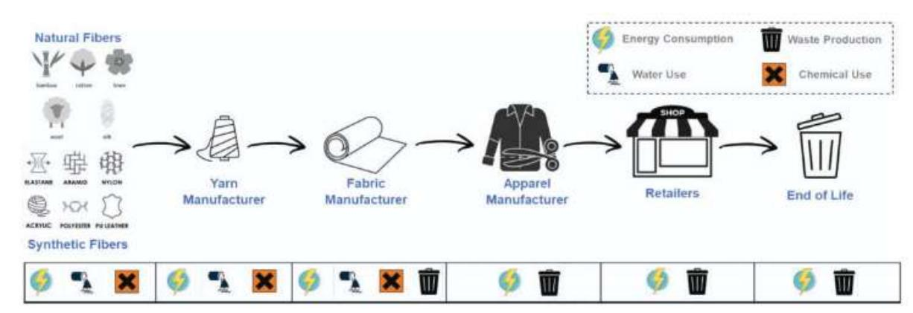

Figure 6. Schematic illustration of different stages of the process from production to consumption of clothing and its environmental effects at each stage. Source: Abrishami et al.2024

Textile reuse and recycling have the potential to lower environmental impacts by reducing the demand for virgin fibre production and minimizing subsequent processes within the textile product life cycle. Compared to incineration or landfilling, both practices offer more sustainable alternatives. Among the two, reuse is typically regarded as more advantageous than recycling, particularly when it effectively extends the lifespan of textile products (Labayen et al 2022).

Various terms have been coined by different parts of the textile sector to describe resources, used products, and waste within the textiles lifecycle. However, inconsistent usage of these terms is complicating the reuse and recycling process for textiles. The use of terminology within the textile sector can, without intention, convey implicit assumptions regarding the utility or value of materials, thereby influencing their subsequent treatment and perception. The current lack of standardisation, clarity and consistency among stakeholders presents a significant barrier to effective collaboration, impedes coherent policy formulation, and ultimately constrains the advancement of a circular economy within the textile industry (WRAP UK Sustainable Textiles Action Plan).

"Textile recycling refers to the process of recovering textiles and reprocessing them into usable materials or products, thereby diverting waste from landfills and reducing the demand for virgin resources. This includes both pre-consumer waste (e.g. production scraps) and post-consumer waste (e.g. discarded garments) that are sorted, processed, and either reused, mechanically or chemically recycled, or used for energy recovery (Textile Exchange, 2021; Ellen MacArthur Foundation, 2017).

and access-based consumption" (G.Sandin & GM Peters, 2018).

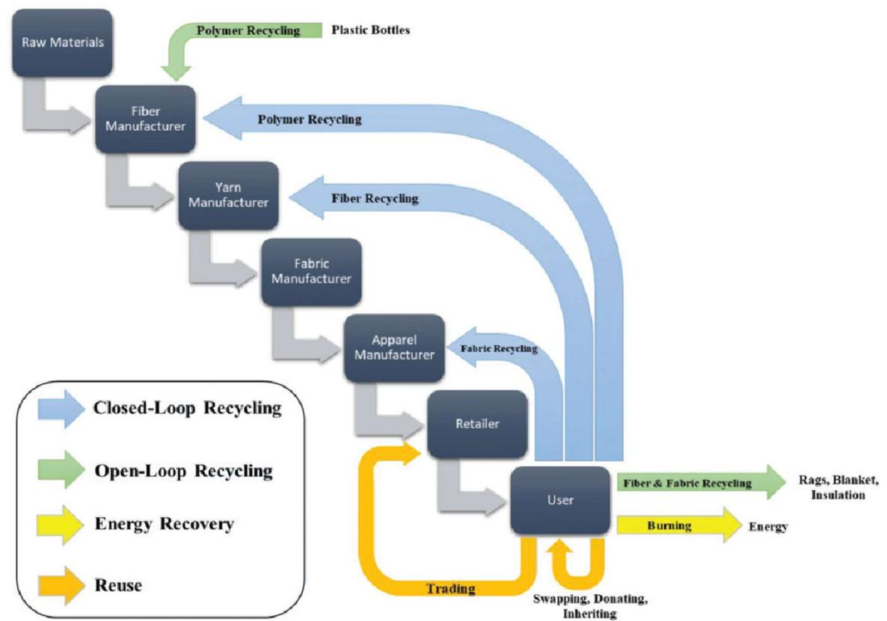

Figure 7. Classification of textile reuse and recycling routes. Source: Abrishami et al.2024

Recycling can be applied in many fields of the textiles as textile-to-textile (closed-loop) recycling or textile-to-nontextile (open-loop) recycling (Celep et al., 2023). It is now well documented that reuse and recycling of textiles is advantageous to the environment.

# TEXTILE-TO-TEXTILE RECYCLING

The Future of a Closed-Loop Industry

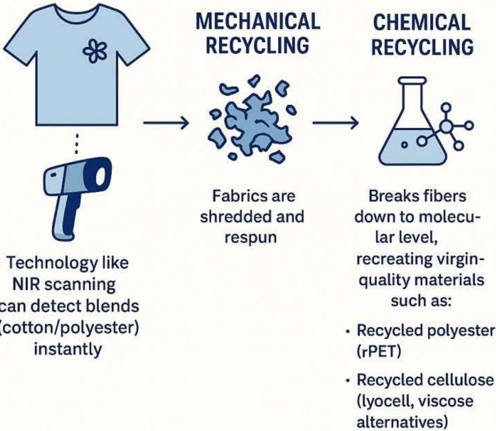

## WHY THIS MATTERS

| <ul> <li>• Massive reduction in virgin resource usage</li> <li>• Lower CO2 footprint</li> </ul> | <ul> <li>• Keeps textiles in circulation far longer</li> <li>• Supports a fully circular fashion ecosystem</li> </ul> |
|------------------------------------------------------------------------------------------------------------|-----------------------------------------------------------------------------------------------------------------------|
|------------------------------------------------------------------------------------------------------------|-----------------------------------------------------------------------------------------------------------------------|

Reuse typically results in lower environmental impacts compared to recycling. In general, textiles made from recycled fibres have a smaller ecological footprint than those made from virgin materials except in cases involving cotton/polyester blends (Abagnato, Rigamonti, Grosso, 2024). A recent life-cycle assessment (LCA), commissioned by the European textile reuse and recycling sector, confirms the substantial environmental benefits of textile reuse. The findings highlight that the environmental impact of reusing textiles is 70 times lower than producing new garments, even when factoring in global transportation for reuse. Specifically, the study shows that reusing a single high-or medium-quality garment saves approximately 3 kg of CO₂, while water consumption is reduced to just 0.01% of what is needed to manufacture new clothing (EuRIC and Trzepacz et al., 2023).

In order to effectively determine the possibilities and limitations associated with textile reuse and recycling, it is essential to examine these concepts within the context of the textile lifecycle.

## A textile in general demonstrates four (4) lifecycle stages, mapping the commonly used terms. (WRAP UK Sustainable Textiles Action Plan, 2024)

Table 2. Lifecycle stages and potential use of textile wastes.

| Lifecycle stage | Textile resource | Fraction                            | Potentials   |
|-----------------|------------------|-------------------------------------|--------------|
|                 |                  | Post-industrial surplus materials   | Reusable     |
| Production      |                  | Post-industrial surplus products    | Reusable     |
|                 |                  | Post- industrial by-products        | Non-reusable |
| Retail & use    | Pre-consumer     |                                     |              |
|                 |                  | Pre-consumer surplus products       | Reusable     |
|                 |                  | Pre-consumer by-products            | Non-reusable |
| After use       | Post-consumer    |                                     |              |
|                 |                  | Post-consumer reusable textiles     | Reusable     |
|                 |                  | Post-consumer non-reusable textiles | Non-reusable |

Source: WRAP UK Sustainable Textiles Action Plan, 2024

 Post-industrial surplus materials: These refer to fibres, yarns, fabrics, and trims that have been manufactured but not utilised in the production of final consumer products. Such materials remain unused due to factors such as changes or cancellations in orders, or overproduction. Notably, this category excludes materials that are defective or damaged. Post-industrial surplus products: These are finished products that, although manufactured, have not been distributed to retail channels. The causes may include alterations in order specifications, cancellations, or production exceeding demand. Products with defects or damage are not included in this category. Post-industrial by-products: This term encompasses textile materials and products generated as residuals during the manufacturing process that are no longer suitable for their original purpose. Examples include fibre and yarn waste, fabric off-cuts, and items with defects or damage. In alignment with the waste hierarchy, such by-products should ideally be reprocessed for fibre production or recycled, with disposal considered as a last resort. Pre-consumer surplus products are separated into surplus stock, unsold stock and returned products. Surplus stock is excess stock that does not make it to market and includes products remaining in a warehouse. Unsold stock occurs when products are put up for sale for a certain period of time and not sold. Returned products refer to products sold to consumers that have been returned in reusable or non-reuseable current state for a variety of reasons. Pre-consumer by-products are separated into damaged/faulty stock and returned products.

This project has received funding from the European Union's Horizon Research and Innovation program under grant agreement N° 101181901 and from the Swiss State Secretariat for Education, Research and Innovation (SERI). Posts and shares reflect only the views of all the involved partners. Neither the European Union nor the granting authority can be held responsible for them.

Damaged/faulty stock are products which are not addressing the quality standards of the product. This may happen during the production process and not detected by the quality control or may happen during transportation or storing the products from the production site to the retailers.

 Post-consumer reusable textiles. Textiles that have been used by a consumer and ready to be discarded but are still reusable in their current form or with minimal repair. Post-consumer non-reusable textiles. Textiles that are not reusable for their intended purpose. These textiles need to be collected, sorted, and treated in line with the waste hierarchy, prioritising remanufacture and recycling over energy recovery or landfill and incineration.

The potential future use of the textile waste can be divided in two categories: the non-reusable textiles, and the reusable textiles.

Non-reusable textiles can follow one of three specific treatment pathways, namely:

- Remanufacture: It refers to the process of taking used textile products that still contain valuable materials or components and transforming them into new items, either of the same kind or for a different purpose or industry, through disassembly and repurposing. Closed-loop recycling process. Closed-loop recycling in the textile sector involves recycling textiles and clothing into new products of the same type and quality as the original. This system aims to create a continuous cycle of reuse, maintaining the integrity and properties of the materials. For example, recycling polyester garments into new polyester fibres that are used to create new clothing; or turning used cotton fabrics back into cotton fibres for producing new garments. The main challenges of the closed-loop recycling process are:
  - (a) Technical complexities in material recovery: One of the foremost challenges lies in the technical intricacies of material recovery and recycling. Many products are designed for linear use, not for disassembly or recycling. Modern textile products often contain a mix of diverse materials, including plastics, metals, dyes and composites. Even when materials are sorted, effective recycling technologies may not exist for all of them, especially for certain types of plastics or composite materials.
  - (b) Quality retention: Each recycling loop can degrade material properties. Ensuring that recycled materials retain sufficient quality to be used in new products, sometimes multiple times, requires advanced processing techniques and careful material management. This is particularly crucial for plastics and metals where degradation can limit the number of recycling cycles.
  - (d) Economic factors: Beyond the technical aspects, economic factors play a crucial role in the feasibility of closed-loop solutions. Some of these challenges are the high initial investment cost, the virgin material cost advantage (in some cases virgin material is cheaper than the recycled ones) and the need to create large scale economies in order for the project to be profitable.
  - (e) Logistical challenges. The massive amount of textile waste produced by fast fashion creates a major logistical challenge. Developing efficient and cost-effective systems for waste collection and sorting remains difficult. Textile waste sorting is labour and time intensive, and the complexity is further heightened by the wide variety of fibre blends, which complicates the separation and processing processes. Automation for sorting and innovations in textile recycling are growing interests (Labayen et al, 2022).
  - (f) Environmental impact. Textiles contaminated with dirt, chemicals, or mixed materials (e.g., buttons, zippers, coatings) can reduce the quality of the recycled output or make recycling unfeasible.

(g) Consumer behaviour. The success of closed-loop systems depends not only on technological and economic factors but also on significant social and behavioural shifts. Active engagement of individuals and communities is vital, though it comes with its own challenges. The effectiveness of closed-loop systems hinges on consumers actively participating in collection and return programs. Achieving consistent and broad participation calls for increased awareness, behavioural change, and ensuring these practices are convenient and accessible. Recycled materials may face scepticism due to concerns about quality or cleanliness. Addressing these perceptions and building public confidence in recycled products is essential to drive acceptance and demand. Closedloop systems require coordinated action among multiple stakeholders, producers, consumers, recyclers, and policymakers. Establishing strong partnerships and aligning motivations across this diverse landscape can be both challenging and time intensive. Tackling these social and behavioural barriers demands strategic communication, education, and the promotion of social norms that embrace circularity and responsible

consumption. Open-loop recycling process. Open-loop recycling, also known as down-cycling, in the fashion industry refers to the process of recycling textiles and garments into products that differ from their original form. This typically involves transforming used fabrics into materials for other sectors or into lower-value products within fashion. For instance, discarded clothing might be turned into industrial cleaning cloths, insulation materials, or stuffing for furniture and car interiors. Open-loop recycling can involve both mechanical and chemical methods.

## 3.1.6.1 Methods of textile recycling

Textile fibre recycling employs three primary technologies: mechanical, thermal, and chemical (F.Charnley et al.,2024).

 Mechanical recycling is known as the most straightforward and efficient method of textile recycling (Abrishami et al., 2024). In mechanical recycling, there are activities such as shredding and respinning of the fibres and the formation of new yarns and fabrics (Guru et al.2025). Mechanical recycling, characterized by maturity and cost-effectiveness, offers the advantage of processing diverse textile waste streams at variable scales (F. Charnley et al.,2024). Thermo-mechanical recycling is a type of mechanical recycling, where heat and pressure are used to melt synthetic textiles to recover the polymers, which can be re-spun into new fibres. It is mainly used for synthetic materials such as polyester and polyamide, involves melting and then extruding the material to create new fibres. As with mechanical recycling, this technique also preserves the original appearance (Lanz et al 2024) Thermo-mechanical technologies are a promising approach for textile recycling of thermoplastic materials such as polyester and nylon. (Abrishami et al., 2024). The most common method from thermo-chemical recycling is pyrolysis that is effective for the treatment of heterogeneous and complex waste materials. Pyrolysis process has been suggested as a waste-to-energy method to transform textile waste into combustible gas (Hee Sue et al., 2022) Chemical recycling enables a circular polymer economy by converting waste polymers into virgin monomers, fuels, or other valuable chemicals. In theory, this kind of recycling could produce monomers in this manner allows to produce polymer fibers of equal or superior quality compared to virgin materials. However, chemical recycling currently struggles with the

presence of blends/multi, as well as chemical and additives such as dyes and anti-wrinkle agents, which obstruct the process (Ndagano et al. 2025)

 Biochemical recycling is a process that uses enzymes to depolymerize end-of-life textiles into monomers, which can subsequently be used in the production of value-added products such as glucose and bioethanol (Ndagano et al. 2025)

Methods such as pyrolysis and chemical or biochemical recycling are examined to demonstrate the viability of textile recovery. However, their implementation is often constrained by high operational costs and technical complexities (Guru et al.2025).

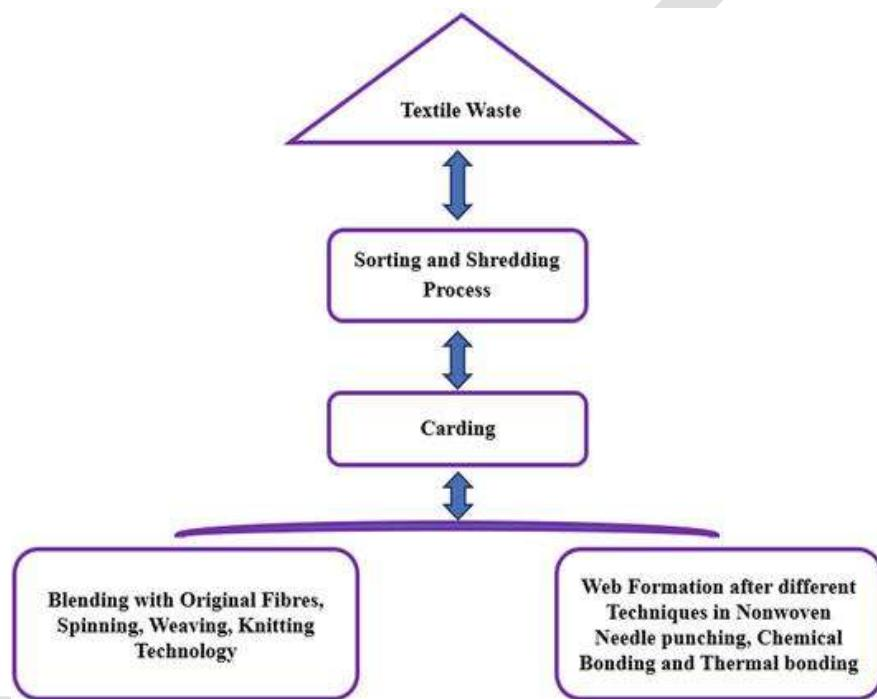

Figure 8. Mechanical recycling process for textile waste. Source: (Guru et al.2025)

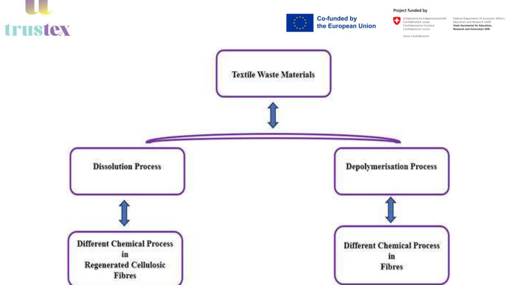

Figure 9. Chemical recycling process for textile waste. Source: (Guru et al.2025)

The IoT is being considered for use in the sorting and identification of textile waste for further improvement of recycling (Damayanti et al., 2021). End-of-life textiles can be depolymerized using enzymes in a bio-chemical recycling process, breaking them down into their monomeric building blocks to serve as substrates for the production of value-added products like sugars (glucose) and bioethanol. The biological processes have the advantage of being low in energy demand, benign solvents and chemicals, and renewal instead of fossil carbon-based. Along with this, the process is extremely complex, which makes those perfect for separating combined textile waste. Chemical conversion of postconsumer mixed textile waste using microwave-assisted glycolysis over a ZnO catalyst followed by solvent dissolution also has been investigated with promising results. A simple solvent dissolution enabled the separation of cotton and nylon (Andini et al., 2024).

Finally, an innovative method called Bio Recycling has been presented by the Hong Kong Research Institute of Textiles and Apparel (HKRITA). Textile waste recycling can be achieved through a bioprocess incorporating enzymatic hydrolysis with ultrasound pre-treatment to transform composite materials into bio-products. The polyester component can be re-spun into reusable yarn, while the generated cellulosic powder can undergo further processing to produce soluble glucose. The Green Machine, developed by the Hong Kong Research Institute of Textiles and Apparel (HKRITA) is a polyester and cellulose recycling system by hydrothermal treatment and dissolution treatment on cotton and polyester blends. Through decomposing cotton into cellulose powders, it enables the separation of the polyester fibres from the blends. The quality of the polyester fibres is maintained, permitting fibre-to-fibre recycling. Recycled cotton cellulosic powder is used in respinning and agriculture. The project aims to develop the Green Machine into a complete treatment process and an industrial set-up. Through separation of the blended textile, Green Machine will recover PET fibre for re-spinning, while converting cotton fibre into cellulosic powder for a number of uses, including the re-producing of cellulose composite fibre, cellulosic water-retaining material for cotton farming (Absorboost), and PFC-free function durable water-repellent (DWR) surface finish, hence fulfilling the goal of "end-to-end recycling" where post-consumer textiles are recovered as the raw materials of the production cycle. As HKRITA claims Green Machine is a viable commercial solution to separate cotton and polyester blended textile (Ghosh, 2022).

Circ has developed an innovative hydrothermal process to recover polyester and cotton from blends to create new polyester and lyocell fibres. While many synthetic recycling startups say they accept textile blends, including polyester-cotton, to produce material for fresh polyester fibers, Circ distinguishes itself by recycling the cotton too.

Ambercycle is developing an enzymatic recycling feature that would allow a multi-fiber output, enabling brands a "one-stop shop" if they want specific blends of polyester, nylon or spandex.

Dye Recycle is a UK-based company who have developed a system to remove dye, enabling both the textile and the dye to be recycled. Their technology enables separation of dye from synthetic textile waste, so both components can be recycled.

Epoch Biodesign has developed a biorecycling system using AI-designed enzymes to recycle synthetic textiles (nylon and polyester) using a low heat process. The recycled polymers are then extruded into new fibres.

Worn Again has developed a method for recycling polyester/cotton blends using a closed loop chemistry process. It separates the polyester from the cotton, then the polyester can be re-extruded into new fibre, while the cotton is broken down into cellulose and spun using a wet spinning technique into cellulose fibre.

## 3.1.6.2 Textile reuse methods

Textile reuse can take various forms depending on the origin, type, and condition of the materials, as well as the intended purpose.

- Repairing refers to addressing minor damages or defects in textiles to prolong their usability and functionality.
- Upcycling involves creatively repurposing textiles into new, often higher-value items such as accessories, home furnishings, or artwork. Aus, Moora, Vihma, et al.2021, summarised the results of a more than 5-year practice-led study. They demonstrated that depending on the size of the factory the fabric leftovers and textile waste generated in garment production ranges from 25–40% of the total fabric used. Experiments showed that 50% of that material can be upcycled into new garments and for some types of leftovers, mainly spreading loss and excess fabric, it can even be up to 80%. Implementing upcycling on the industrial level requires transparency to understand the waste created in garment production and create designs that suit the production system (Aus, Moora, Vihma, et al.2021)
- In contrast, downcycling occurs when the quality and economic value of a product obtained from recycling processes is lower than that of the original product. The use of recycled clothing and home textile wastes in agriculture and gardening products, decoration materials, insulation materials, low-quality blankets, and upholstery fabrics are the examples of downcycling (Celep et al., 2023).

The textile industry employs a range of reuse practices aimed at extending the life cycle of textile products and reducing environmental impact. These practices encompass both pre-consumer and post-consumer strategies and align closely with circular economy principles.

## (I) Direct reuse and second-hand markets

Direct reuse involves the redistribution of garments in their original form. Globally, second-hand clothing markets are a major reuse channel, especially prevalent in Africa and South Asia, where imported used clothing is resold. In Europe, approximately 40% of collected post-consumer textiles are exported for reuse, primarily to developing countries (Labayen et al., 2022).

## (II) Industrial reuse and downcycling

Textiles that are no longer suitable for wear are often repurposed for industrial applications such as cleaning rags, insulation, and stuffing materials. This form of reuse allows for the extension of material life but usually results in products of lower economic value compared to the original (Tang, 2023).

## (III) Charitable reuse and donation programs

Many organizations facilitate reuse by collecting clothing donations and redistributing them to individuals in need or to second-hand retailers. This model has both social and environmental benefits and is widely practiced in North America and Europe (Labayen et al., 2022).

### (IV) Corporate take-back6 schemes

Fashion brands have introduced take-back initiatives wherein consumers return used garments to the point of sale for reuse, recycling, or resale. These systems are part of EPR schemes (Tang,

This project has received funding from the European Union's Horizon Research and Innovation program under grant agreement N° 101181901 and from the Swiss State Secretariat for Education, Research and Innovation (SERI). Posts and shares reflect only the views of all the involved partners. Neither the European Union nor the granting authority can be held responsible for them.

This draft deliverable has not yet been validated by the granting authorities

6 Patagonia is known for its take-back programs, where customers return used clothing to be recycled into new items. This initiative helps reduce the need for virgin materials and supports closed-loop recycling. H&M's Conscious Collection promotes sustainable fashion, using recycled materials to produce new garments. Their garment recycling initiatives encourage customers to return old clothing, which is then processed for reuse.

### 2023).

## (V) Design for reusability and longevity

An emerging reuse strategy involves the design of garments for extended use, ease of repair, and modular upgrading. This approach reduces the rate of garment disposal and encourages multiple use cycles before recycling is considered (Tang, 2023).

## (VI) Digital traceability for facilitating reuse

Innovations such as blockchain and IoT technologies are being tested to support reuse by enabling product traceability and improving the accuracy of textile sorting and logistics. These technologies support higher rates of reuse by providing verifiable data on material composition and use history (Tang, 2023).

Collectively, these practices play a critical role in diverting textiles from landfills and promoting resource efficiency in the fashion and textile industries.

## 3.1.7 Companies and sustainability performance across the value chain

As it has been described in the United Nations Environment Programme (2023), the textile value chain comprises all activities and stakeholders that provide or receive value from designing, developing, making, distributing, retailing, and consuming a textile product (or providing the service that a textile product renders), including the extraction and supply of raw materials, as well as activities involving the textile after its useful service life has ended. The value chain covers all stages in a textile product's life, from supply of raw materials through to disposal after use, and includes the activities linked to value creation such as business models, consumption patterns, investments and regulation. The value chain also comprises the actors undertaking the activities, and the stakeholders that can influence those activities. The textile value chain is thus considered as a whole system that goes beyond the supply chain and the life cycle of products (UN Environment Programme, 2023)

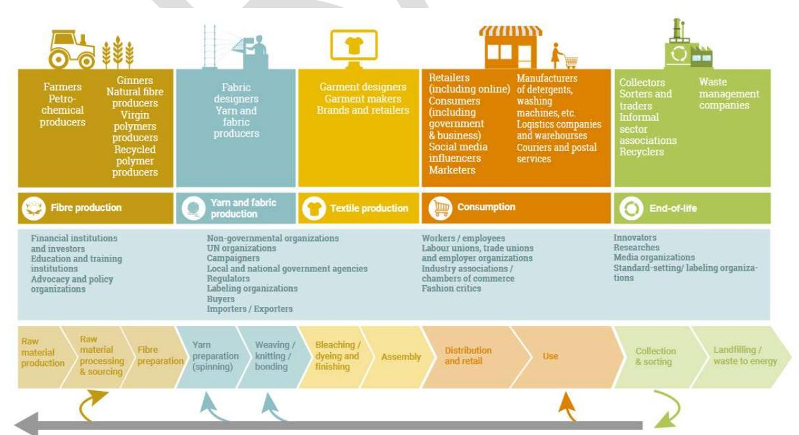

The global market of eco-friendly textiles is experiencing swift growth, driven by increasing consumer and business focus on sustainability. In 2025, key industry players are adopting sustainable materials, ethical labour standards, and cutting-edge production methods to minimize environmental impact. The market is expected to expand from US\$32.74 billion in 2024 to US\$74.8 billion by 2032, reflecting a compound annual growth rate (CAGR) of 29.8% over the period 2024– 2032 (IMIR Market Research, 2025).

Below is a list of top leading eco-friendly textiles players along with company details according to a recent market Research contacted by IMIR Group and by CleanHub (https://blog.cleanhub.com/best-sustainable-clothing-brands):

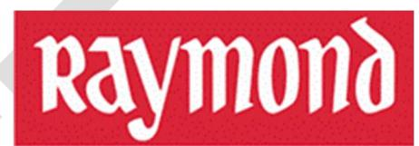

Raymond Ltd, based in Mumbai, Maharashtra, is the largest integrated fabric manufacturer in the world. It holds over 60% of the market share in suiting fabrics within India. It is also India's largest woollen fabric producer.

➢ Headquarters: Mumbai, India ➢ Founded: 1925 ➢ Employees: 7,500+ ➢ Revenue (2024): Estimated \$1 billion ➢ Industry: Textiles & Apparel ➢ Company Overview: Raymond stands as one of India's most prominent and esteemed textile and apparel brands, recognized for its high-quality fabrics, tailored garments, and increasing commitment to sustainability. With a rich legacy spanning 100 years, Raymond continues to lead the textile industry through innovation in eco-friendly manufacturing, ethical sourcing, and sustainable fashion practices. ➢ EcoVero & Organic Cotton: Uses Lenzing EcoVero viscose, which reduces water consumption by 50% and lowers carbon footprint. ➢ Water & Energy Efficient Production: ZLD plants and solar-powered mills reduce environmental impact since they ensure 100% wastewater recycling in textile mills.

Patagonia, Inc. is an American retailer of outdoor recreation clothing, equipment, and food. It was founded by Yvon Chouinard in 1973 and is based in Ventura, California. It operates stores in over 10 countries and factories in 16 countries.

➢ Headquarters: Ventura, California, USA ➢ Employees: 3,000 ➢ Revenue (2024): Estimated \$1 billion ➢ Industry: Outdoor Apparel and Gear ➢ Regional Analysis: Strong presence in North America, Europe, and Asia-Pacific. ➢ Company Overview: Patagonia is a globally recognized leader in sustainable fashion, known for its commitment to environmental activism, ethical supply chains, and innovative eco-friendly textiles. The company donates 1% of its annual sales to environmental causes, contributing millions of dollars to conservation efforts worldwide.

➢ Pioneer in Eco-Friendly Textiles: First major brand to use recycled plastic bottles for polyester fleece in 1993. ➢ Patagonia was one of the first companies to implement DPPs on some of its products, offering consumers detailed information on the environmental and social impacts, from the origin of the materials to the production process. In this way, consumers have information about the development and creation of the brand's products (Carvalho, Silva, Abreu,2025).

➢ Hugo Boss AG is a designer fashion company headquartered in Metzingen, Baden-Württemberg, Germany. The company sells clothing, accessories, footwear, and leather goods. It is one of the largest German clothing brands with global sales of about €4.3 billion in 2024. ➢ Headquarters: Metzingen, Germany ➢ Founded: 1924 ➢ Employees: 17,000 ➢ Revenue (2024): Estimated €3.5 billion ➢ Industry: Luxury Fashion & Apparel ➢ Company Overview: HUGO BOSS is a global fashion powerhouse known for its premium menswear and womenswear collections. In recent years, the company has made significant strides toward sustainable and eco-friendly textiles, emphasizing circular fashion, ethical sourcing, and carbon footprint reduction. By 2030, HUGO BOSS aims to reduce its carbon footprint by 50% across production and logistics.

STELLA  
MCCARTNEY

➢ Headquarters: London, United Kingdom ➢ Founded: 2001 ➢ Employees: 1,200 ➢ Revenue (2024): Estimated \$700 million ➢ Industry: Luxury fashion & sustainable apparel ➢ Regional Analysis: Strong market presence in Europe, North America, and Asia. ➢ Company Overview: Stella McCartney is a trailblazer in eco-friendly luxury fashion, known for championing cruelty-free materials, ethical production, and circular fashion. The brand has set new standards in sustainable luxury, proving that high fashion can be both beautiful and responsible. ➢ 100% Cruelty-free: No leather, fur, or feathers.

This project has received funding from the European Union's Horizon Research and Innovation program under grant agreement N° 101181901 and from the Swiss State Secretariat for Education, Research and Innovation (SERI). Posts and shares reflect only the views of all the involved partners. Neither the European ➢ Headquarters: Paris, France ➢ Founded: 2004 ➢ Employees: 300 ➢ Revenue (2024): Estimated €150-200 million (\$160-215 million) ➢ Industry: Sustainable footwear ➢ Company overview: VEJA is a pioneering eco-friendly sneaker brand, known for its ethical

Union nor the granting authority can be held responsible for them.

➢ Headquarters: London, United Kingdom ➢ Founded: 2018 ➢ Employees: 200 ➢ Revenue (2024): Estimated \$75-100 million ➢ Industry: Sustainable fashion & materials science ➢ Regional analysis: Growing presence in Europe, North America, and Asia. ➢ Company overview: PANGAIA is a materials science-driven fashion brand known for its cuttingedge eco-friendly textiles, sustainable innovations, and commitment to carbon neutrality. The brand seamlessly blends technology, sustainability, and minimalist design, making it one of the most influential names in the eco-conscious fashion industry. ➢ Net Zero goals: PANGAIA is actively reducing emissions and investing in carbon offset projects. ➢ Water-saving technologies: Uses low-impact dyeing processes to minimize water pollution.

➢ Headquarters: Irvington, New York, USA ➢ Founded: 1984 ➢ Employees: 1,100 ➢ Revenue (2024): \$400M ➢ Regional analysis: Predominantly in North America with expanding international markets. ➢ Company overview: EILEEN FISHER is a leading sustainable fashion brand known for its timeless designs, ethical production, and circular fashion initiatives. The brand has been at the forefront of eco-conscious fashion for decades, advocating for organic fabrics, fair trade practices, and garment recycling. ➢ EILEEN FISHER has been a leader in slow fashion, prioritizing sustainability across its entire supply chain from material sourcing to post-consumer recycling. 30+ years of sustainability as one of the earliest brands to embrace eco-friendly materials and fair-trade practices. ➢ Organic & regenerative cotton: Grown without harmful pesticides to protect soil and farmers. ➢ Recycled fabrics: Incorporates recycled cashmere and polyester to minimize textile waste.

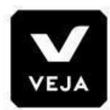

production, sustainable materials, and transparency. Unlike traditional sneaker brands, VEJA prioritizes organic materials, fair trade practices, and innovative alternatives to leather while maintaining a stylish, minimalist aesthetic.

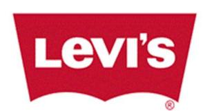

➢ Company name: Levi Strauss & Co ➢ Headquarters: San Francisco, California, USA ➢ Founded: 1853 ➢ Employees: 19,000 ➢ Revenue (2024): Estimated \$6.2 billion ➢ Industry: Apparel & sustainable fashion ➢ Company overview: Levi Strauss is a worldwide leader in denim fashion, renowned for its iconic jeans, commitment to sustainability, and responsible manufacturing practices. As one of the largest apparel companies globally, Levi's continues to uphold its legacy of quality and innovation while actively striving to minimize its environmental impact. ➢ Water<Less® technology: A unique finishing process that reduces water use by up to 96% in denim manufacturing and saves over 4 billion lt of water since 2011. ➢ Water conservation champion: Water<Less® technology ➢ Climate action goals: Targets net-zero carbon emissions by 2050. ➢ Organic & regenerative cotton: Aims to source 100% sustainable cotton by 2030. ➢ Recycled denim & fibres: Incorporates post-consumer waste into new denim products.

➢ Company name: Boll & Branch ➢ Headquarters: Summit, New Jersey, USA ➢ Founded: 2014 ➢ Employees: 200 ➢ Revenue (2024): Estimated \$200-\$300 million ➢ Industry: Sustainable home textiles & luxury bedding ➢ Company overview: Boll & Branch is a trailblazing luxury bedding brand recognized for its use of 100% organic cotton, dedication to fair trade principles, and strong commitment to sustainability. By prioritizing ethical sourcing, transparent practices, and environmentally conscious production, the company has established itself as a leader in the home textiles industry. ➢ Water conservation: Uses up to 90% less water than conventional cotton farming. ➢ No plastic packaging: Uses 100% recyclable and biodegradable packaging.

➢ Company name: Vuori ➢ Headquarters: San Diego County, California, USA ➢ Founded: 2015 ➢ Employees: 1955 ➢ Revenue: \$637.4M ➢ Best for: Climate-neutral commitments ➢ Other features: Plastic credits, recycled materials, regenerative organic cotton ➢ California-based brand Vuori is a developing athletic brand. Vuori is a leading athletic and leisurewear brand that is fully climate neutral, having offset all of its carbon emissions. Beyond carbon neutrality, the company is deeply committed to reducing plastic waste. Through a partnership with CleanHub, Vuori offsets 100% of its plastic footprint. It has also transitioned to recycled materials for garment bags and is on course to cut plastic use in its supply chain by 80%. ➢ Transparency is a core value for Vuori. The brand has publicly outlined its sustainability targets, including a 42% reduction in Scope 1 and Scope 2 emissions by 2030. Scope 1 covers direct emissions from company operations, while Scope 2 includes indirect emissions from energy consumption. ➢ Vuori also actively supports global environmental initiatives, such as efforts to halt deforestation in Borneo and reduce emissions in the U.S. These programs are funded through strategic partnerships with organizations like Pachama and 3Degrees, contributing to the brand's broader mission to offset its environmental impact.

➢ Headquarters: St Agnes, Cornwall, UK ➢ Founded: 2003 ➢ Employees: ~ 348 ➢ Revenue: \$98.7M ➢ Best for: Ocean awareness ➢ Other features: B Corp certified, materials made with recycled ocean plastics, Leave No Trace packaging ➢ Inspired by British surfers, Finisterre is a Cornwall-based brand specializing in clothing and wetsuits designed for ocean lovers. As a certified B Corp, the company is dedicated to responsible sourcing, using materials like biodegradable fibres and recycled textiles made from ocean plastic, with the goal of moving toward a circular economy where products are reused rather than discarded. ➢ One of Finisterre's key sustainable materials is Econyl, a regenerated nylon made from discarded fishing nets. Partnering with the company ECONYL, Finisterre transforms this waste into high-performance fabrics, claiming that each tonne of Econyl produced saves 5.7 tonnes of CO₂ emissions.

➢ Beyond sustainable product design, Finisterre is also active in ocean advocacy through its Finisterre Foundation. The brand supports programs that promote ocean accessibility, such as funding swimming lessons for children with disabilities and creating modified wetsuits to help more people engage with the sea. These efforts aim to foster a deeper connection with the ocean and inspire future generations of ocean stewards.

➢ Company name: Passenger Clothing Limited (Ltd) ➢ Headquarters: New Milton, Hampshire, UK ➢ Founded: 20212 ➢ Employees: 176 ➢ Revenue: \$43.9M ➢ Other features: Recycled cotton and polyester, Fair Trade Certified factories, agroforestry training programs ➢ Passenger is a UK-based clothing brand designed for adventure seekers who care about both style and sustainability. Guided by the motto, "We put sustainability and adventure at the heart of every product," the brand seamlessly blends eco-conscious values with a spirit of exploration. ➢ While Passenger demonstrates its environmental commitment through various initiatives, it is especially recognized for its reforestation efforts. Since its inception, the brand has pledged to plant a tree for every item purchased, contributing to forest restoration and supporting the communities and individuals working to protect the planet's forests. ➢ By 2025 they have planted more than half a million trees and secured protection for 28,724,186 sqm of rainforest. The brand is also part of multiple global forest initiatives, such as the Rainforest Trust, Trees For The Future, and One Tree Planted.

➢ Headquarters: Herzogenaurach, Bavaria, Germany ➢ Founded: July 1924; in Herzogenaurach, Germany (as Gebrüder Dassler Schuhfabrik). 18 August 1949; as Adidas ➢ Employees: 62,035 (2024) ➢ Revenue (2024): €23.683 billion (2024) ➢ Industry: Athletic apparel and footwear corporation. ➢ Regional analysis: One of the biggest athletic companies with presence worldwide. It is the largest sportswear manufacturer in Europe, and the second largest in the world, after Nike. ➢ Company overview: Adidas uses DPPs to increase transparency in the complex resource chain, offering consumers information about the materials used in products, such as the working conditions in factories and the environmental impact of their production.

➢ Headquarters: Stockholm, Sweden ➢ Founded: 1947; 78 years ago (as Hennes) Västerås, Sweden ➢ Employees: 140,000 (2024) ➢ Revenue (2024): \$22.24 Billion USD (2024) ➢ Industry: Swedish multinational fast fashion retailer headquartered in Stockholm. Known for its fast fashion business model, H&M sells clothing, accessories, and homeware. ➢ Regional analysis: The company has a significant global presence, operating thousands of stores across 75 geographical markets. ➢ Company overview: H&M is adopting DPPs with the aim of providing consumers with more ➢ information about the origin, production, and environmental impact of products marketed by the brand. As such, it hopes that the PDP will help build a more sustainable and transparent resource chain.

## 3.2 The EU textile industry

## 3.2.1 Market size

The EU textile and clothing (T&C) industry has historically played a pivotal role in European industrial development. While globalisation and delocalisation have altered its structure, the sector remains a cornerstone of the EU economy, particularly in southern and eastern Member States. According to EURATEX (2024), the EU textile and clothing industry comprises approximately 197,000 companies, generating an estimated turnover of €170 billion in 2023. Nearly all these enterprises (99.7%) are classified as micro, small, or medium-sized enterprises (SMEs), underscoring the sector's decentralized and artisanal nature. The industry is a significant employer, providing jobs to about 1.3 million individuals, with women representing more than 70% of the workforce (EURATEX, 2024).

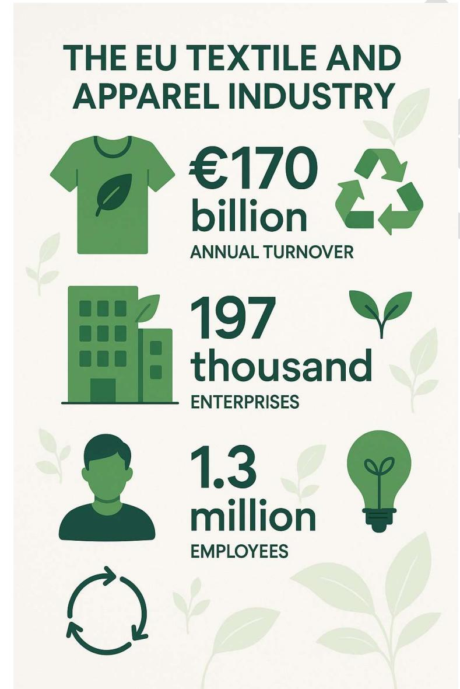

Figure 11. EU Textile and apparel industry. Source: EURATEX, 2024

## THE ECONOMIC IMPACT OF BRANDED CLOTHING RETAIL IN THE EU27

## Figure 12. The economic impact of branded clothing retail in the EU27. Source: Oxford Economics

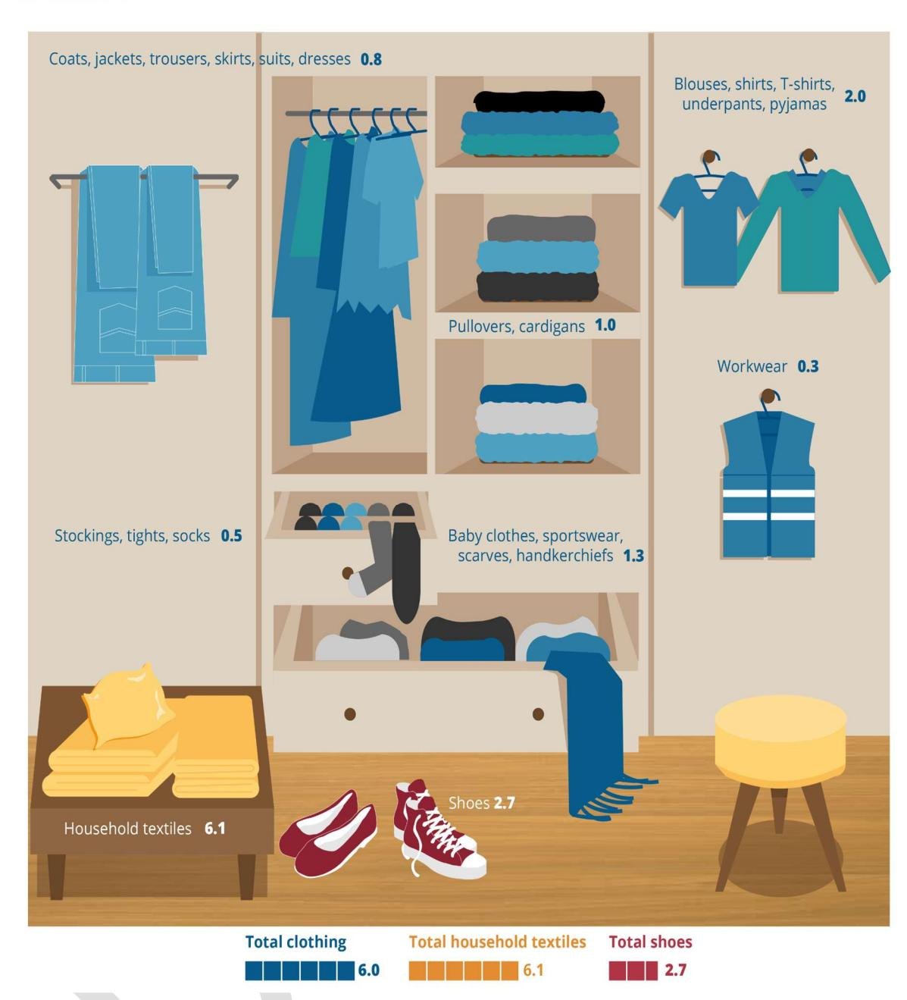

Figure 13. EU-27 estimated consumption of clothing, footwear and household textiles in 2020, per person, in kilograms. Source: EURATEX, 2024

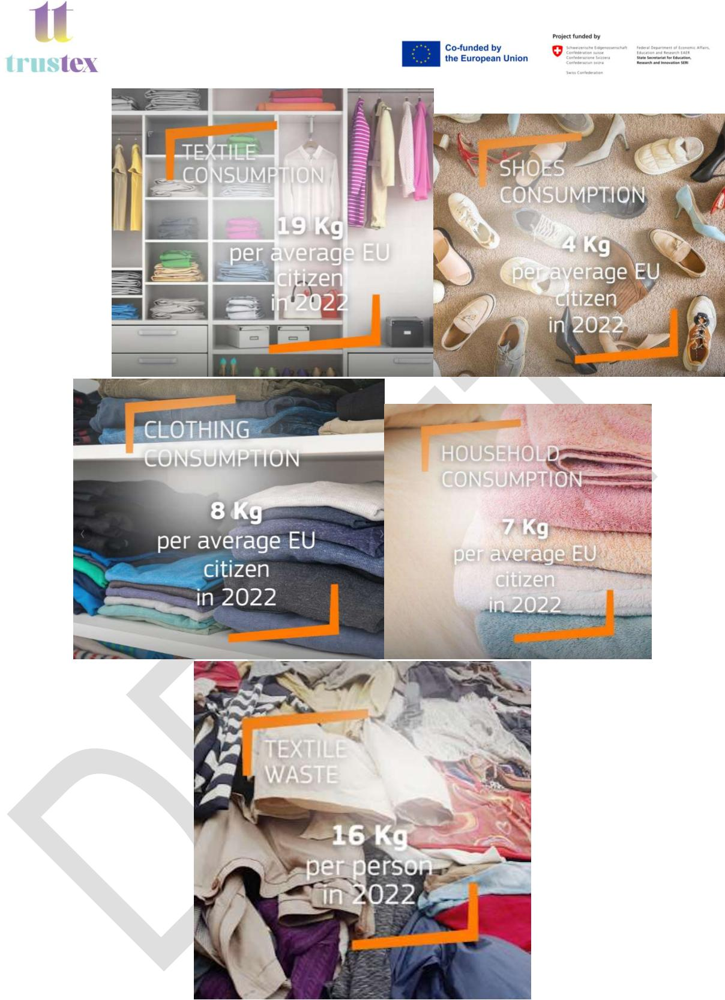

Figure 14. EU-27 estimated consumption of clothing, footwear and household textiles in 2022, per person, in kilograms. Source: ETC, 2025.

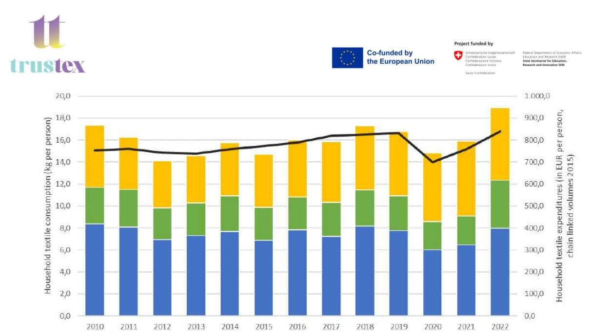

Figure 15. EU-27 Consumption of clothing, footwear and household textiles in 2022, per person, in kilograms. Source: ETC, 2025

The sector is broadly divided into three main segments: fashion and clothing (42%), industrial and technical textiles (19%), and home and furnishing textiles (14%). Each segment serves distinct markets and value chains, with technical textiles gaining particular relevance in sectors such as healthcare, automotive, and construction (EURATEX, 2024).

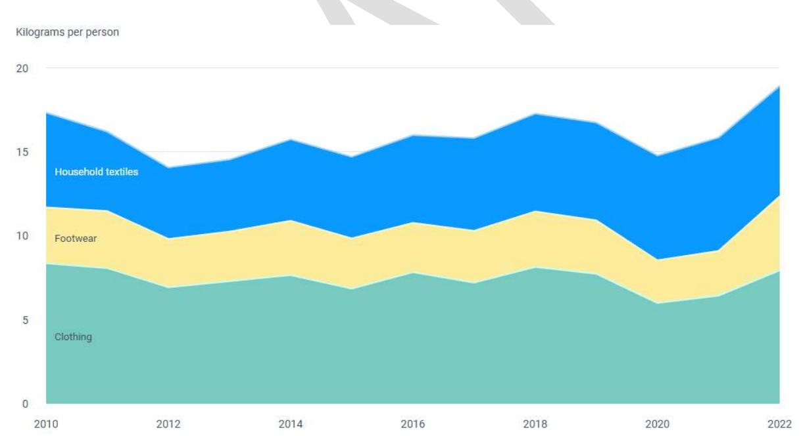

Figure 16. EU-27 average consumption of clothing, footwear and household textiles per person in the EU-27. Excluding carpets and other textiles. Apparent consumption is calculated as production plus imports minus exports. Source: https://www.eea.europa.eu/en/analysis/publications/circularity-of-the-eu-textiles-valuechain-in-numbers

The EU remains the second-largest global exporter of textiles and clothing, following China. In 2023, extra-EU exports amounted to €64 billion, while imports reached €115 billion. The export structure is heavily oriented towards high-value fashion products, with clothing accounting for 58% of the total export value, despite representing only 9% by volume (EURATEX, 2024). This reflects

the EU's competitive advantage in premium and luxury segments.

China remains the EU's most significant import partner, supplying nearly one-third of all T&C imports. Bangladesh, Türkiye, India, and Vietnam are also key suppliers. In contrast, Switzerland and the United Kingdom constitute the primary export destinations, followed by the United States. Notably, exports to China and Türkiye have increased in recent years, highlighting evolving trade dynamics (EURATEX, 2024).

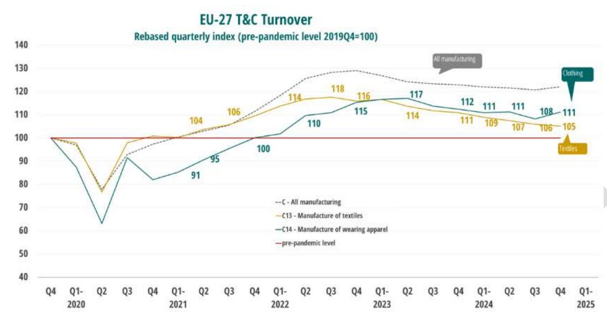

Figure 17. EU-27 Textile and Clothes Turnover. Source: EURATEX. Economic Update. Fourth quarter 2024 and prospects for 2025.

The EU is a major global player in textile exports, accounting for approximately 25% of world textile exports. Main producing countries include Italy, Germany, France, Spain, Portugal, Poland, Romania and Bulgaria.

The EU trade deficit reached over -50 billion EUR in 2023 (from -72 billion the previous year), a noticeable improvement resulting from a sharp decrease of clothing imports from China and Bangladesh. However, the share of clothing in the EU deficit has increased from 85% to 91%. The textile sector accounted for only 9% of the total trade deficit (against 15% the previous year). At the same time, the export coverage ratio (export over import) improved, rising from 48% in 2022 to 56% last year (EURATEX, 2024). Key export destinations include the United Kingdom, the United States, China, and Switzerland.

Imports, on the other hand, are dominated by low-cost producers such as China, Bangladesh, Turkey, and Vietnam, highlighting the EU's exposure to global supply chain dynamics.

Fashion and clothing (underwear, shirts, suits, dresses, coat etc) comprises 42% of the total value, furnishings and homeware 14%, and textile for industrial uses (ropes and nettings, parachutes, medical textiles, synthetic grass, sunblinds, smart textiles) 19% (EURATEX, 2024). The average consumption of clothing, footwear and household textiles per person in the EU increased most recently from 17kg per person in 2019, to 19kg per person in 2022. Between 2010 and 2019, consumption fluctuated between 14kg and 17kg. This amount is divided into approximately 8 kilograms of clothing, 4 kilograms of footwear, and 7 kilograms of household textiles ( ETC, 2025,

This project has received funding from the European Union's Horizon Research and Innovation program under grant agreement N° 101181901 and from the Swiss State Secretariat for Education, Research and Innovation (SERI). Posts and shares reflect only the views of all the involved partners. Neither the European Union nor the granting authority can be held responsible for them.

EEA, 2024/2, EEA. 2024/5, ETC/EEA, 2024). 99.7% of the textile and clothes industry in the EU enterprises are Micro and SMEs.

In the fourth quarter of 2024, the clothing sector showed a notable recovery, with production increasing by 6.3% quarter-on-quarter and sales rising by 2.7%. In contrast, textile production continued its downward trend for the eleventh consecutive quarter. Throughout 2024, the EU textile and clothing industry faced persistent difficulties, primarily driven by weak domestic demand. The annual decline in both production and turnover highlights external pressures such as supply chain disruptions, subdued consumer demand, and elevated operational costs. Heightened economic uncertainty has dampened consumer spending and made companies more cautious about investing. Additional challenges include Europe's comparatively high energy costs, complex bureaucratic processes, and the financial burden of complying with new regulatory requirements (EURATEX, 2024).

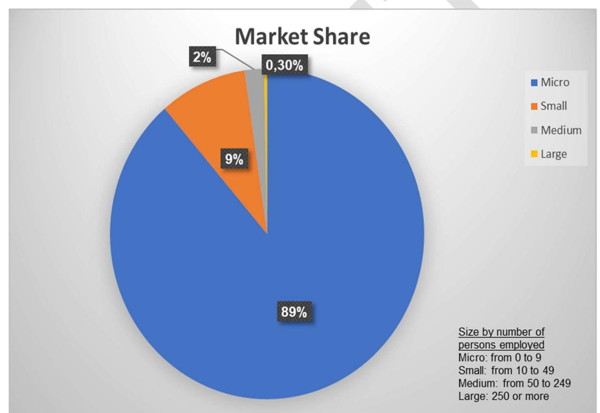

Figure 18. Size and % share of T&C Textile Companies in the EU. Source: EURATEX, 2024.

Employment in the textile and clothing sector declined compared to both the last quarter of 2023 and the same period last year, reflecting growing difficulties in workforce retention. Throughout 2024, many T&C companies either downsized or froze hiring due to the uncertain economic environment and rising labour costs.

The EU's trade deficit narrowed quarter-on-quarter, driven by a slowdown in imports from non-EU countries, while exports demonstrated stronger momentum. However, the overall trade outlook remains challenging, with potential risks on the horizon, including the possible introduction of tariffs by the US and corresponding retaliatory measures (EURATEX, 2024).

Europe imported €176.9 billion of apparel in 2023 (up from €144.7 billion in 2018 but down from €193 billion in 2022), corresponding to 27.4 billion units of clothing (down from 30.2 billion). Of the total value of imports, 50.9% was trade in knitted or crocheted apparel (up from 49.7% in 2018) and 49.1% was in non-knitted/woven apparel. Between 2018 and 2023, the market grew by an average of 4.1% per year (CBI, 2025).

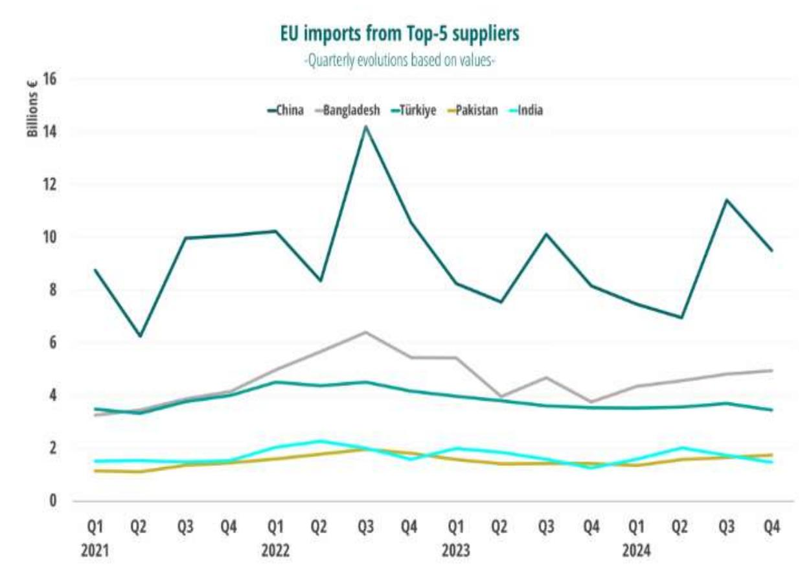

Figure 19. EU Imports from 5 Top Suppliers. Source: EURATEX. Economic Update. Fourth quarter 2024 and prospects for 2025.

The EU is also a large exporter and re-exporter of apparel. According to WTO statistics, the EU was the second largest exporter of apparel in 2022 with a 27.1% share, second only to China. This is shown by Eurostat statistics for 2023, which indicate that the EU exported €140.3 billion worth of apparel (up from €107.3 billion in 2018) of which 73.3% was destined for other countries in the EU and 26.7% for the rest of the world (CBI, 2025). EU apparel exports grew at an average yearly rate of 5.5% between 2018 and 2023. The biggest EU exporters in 2023 were Germany (€25.9 billion), Italy (€25.7 billion), the Netherlands (€15.1 billion), France (€14 billion), Spain (€13.6 billion) and Poland (€10.9 billion). Together, these 6 countries represented 75.2% of the EU's apparel exports. Poland and the Netherlands show the strongest export growth within this group with an average yearly increase in export value of more than 8%. Poland has grown by as much as 14% each year during the same period (CBI, 2025).

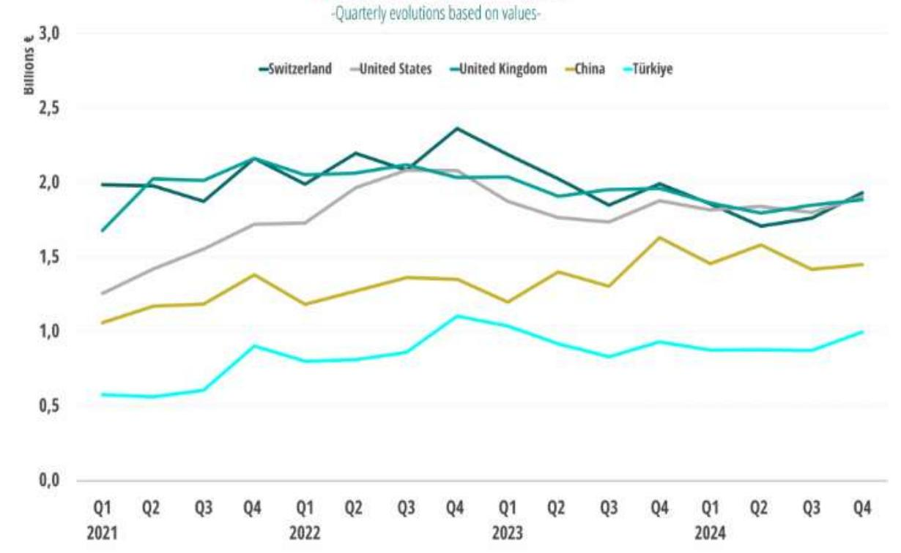

Figure 20. EU Exports to top 5 customers. Source: EURATEX. Economic Update. Fourth quarter 2024 and prospects for 2025.

The EU imports a higher share of its apparel from inside the EU than from outside, at 53.1% and 46.9% respectively. In 2023, developing countries were the origin of 44.4% of all EU clothing imports in terms of value (down from 48.4% in 2018 and from its peak of 49.2% in 2022). The value of EU apparel imports originating from developing countries corresponded to €78.5 billion in 2023 (up from €70.1 billion in 2018 but down from €94.9 billion in 2022) growing at an average yearly rate of 2.3% between 2018 and 2023.

Imports shares showed different patterns in value and in volume when looking at the more specific product breakdown. Women's clothing (26% in value, 12% in volume) and other garments knitted and woven (28% in value, 16% in volume) represented the main segments, both in value and volume, while other main segments were men's clothing (18% in value, 9% in volume) and technical textiles (8% in value, 16% in volume). Technical textiles recorded the sharpest contraction in value among textile and clothing imported products in 2023 (almost -23%), followed by woven and knitted fabrics (-20%), home textiles (-19%), yarns and natural fibres (-17%), men's and women's clothing (between -14% and -15%). Similarly, man-made fibres and carpets recorded large declines during the year (-13%). EU imports in volumes were also down with technical textiles, fabrics and clothing recording the deepest drops (between -15% and -20%).

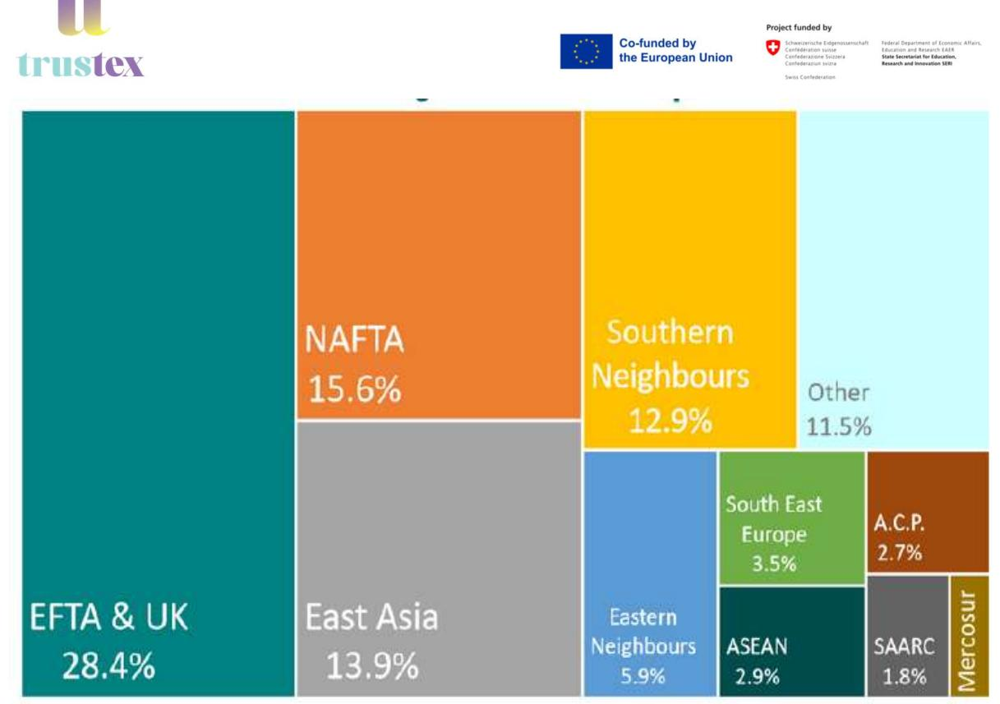

## Figure 21. Share of regions in total EU textile exports. Source: EURATEX 2024

ACP: Africa, Caribbean and Pacific countries, ASEAN: Brunei, Cambodia, Indonesia, Laos, Malaysia, Myanmar, Philippines, Singapore, Thailand, Vietnam, East Asia: Japan, South Korea, Taiwan, China, Eastern Neighbours: Armenia, Azerbaijan, Georgia, Belarus, Moldova, Ukraine, Russia, EFTA & UK: Iceland, Liechtenstein, Norway, Switzerland, UK, MERCOSUR: Argentina, Brazil, Paraguay, Uruguay, NAFTA: USA, Canada, Mexico, SAARC: Afghanistan, Bangladesh, Bhutan, India, Maldives, Nepal, Pakistan, Sri Lanka, Southern Neighbours: Algeria, Egypt, Israel, Jordan, Libya, Morocco, Syria, Tunisia, Palestine T., Türkiye, Southeast Europe: Serbia, Montenegro, North Macedonia, Albania, Bosnia & Herzegovina, Kosovo.

## The latest data about EU industry textile industry performance reveal the following (Imarc, 2025):

➔ The European textile market is projected to reach a value of USD 409.4 billion by 2033, up from an estimated USD 261.7 billion in 2024, reflecting a compound annual growth rate (CAGR) of 4.6% over the period 2025–2033. ➔ Germany leads the market with a share exceeding 20.7% as of 2024. The sector is experiencing significant expansion, driven by increasing demand for sustainable textiles, continuous technological advancements in production processes, and the strong performance of the fashion and home furnishings industries. These developments are further supported by a culture of innovation and shifting consumer preferences throughout the region. ➔ Moreover, the EU regulations and policies for sustainable practices with reduced environmental impacts drive the demand for ecofriendly manufacturing practices in textiles. Advances in digital textile printing and automated production processes are further improving efficiency and quality of fabric production, attracting global investments in the sector. The fashion industry is growing in the region as well, especially with global fashion capitals such as Paris and Milan enjoying significant influence. ➔ Boosting interest in luxury home furnishing and smart textiles are also contributing to the market. Furthermore, demand is rising for technical textiles applied in various sectors, such as the automotive and health and construction industries. ➔ Technical textiles also provide functionalities, such as durability, fire resistance, and antibacterial properties, matching the evolving demands of advanced industries. The inclusion of smart textiles in clothing and medical applications that integrate sensors and responsive materials within them also increases the rate of demand.

## 3.2.2 Trends and dynamics

The textile industry in Europe is a dynamic and evolving sector that plays a crucial role in the global economy. With its long history and significant technological advancements, Europe continues to be a key player in both manufacturing and design. The European textile industry is experiencing major changes, propelled by growing sustainability demands, rapid technological innovation, and evolving consumer tastes. Notable trends include increased interest in sustainable textiles, the integration of advanced technologies, and expanding markets for both luxury and technical fabrics. Additionally, the strong push toward a circular economy is reshaping the industry's priorities around resource efficiency and waste minimisation.

Within the European textile industry, manufacturers and fashion retailers are under increasing pressure to comply with new Environmental, Social, and Governance (ESG) regulations while also responding to heightened consumer expectations for ethical and transparent practices. ESGrelated developments are expected to significantly reshape key business functions, including product design, production processes, corporate reporting, and marketing strategies. Firms that proactively adapt will gain a competitive advantage, whereas those that delay risk reputational damage, regulatory penalties, and financial underperformance.

## (I) Corporate Sustainability Reporting Directive (CSRD)

A cornerstone of the 2025 EU ESG regulatory framework is the full-scale implementation of the Corporate Sustainability Reporting Directive (CSRD). This directive mandates that large European enterprises disclose comprehensive information on ESG performance, including climate-related risks, supply chain due diligence, environmental impacts, and social outcomes. Industry leaders are actively responding to this regulatory shift by strengthening their internal ESG infrastructures. For textile professionals, adapting to this new regulatory environment necessitates not only compliance, but also the cultivation of technical expertise in ESG reporting, cross-functional collaboration, and systems-level thinking.

## (II) Eco-design for Sustainable Products Regulation (ESPR)

The enactment of the Eco-design for Sustainable Products Regulation (ESPR) constitutes a structural shift in the European textile sector, introducing binding sustainability criteria at the product design phase. The regulation emphasizes parameters such as durability, reparability, and recyclability. Leading firms have begun aligning with ESPR principles. For industry stakeholders, the regulation not only imposes compliance obligations but also presents a platform for R&D-driven innovation, sustainable product differentiation, and enhanced consumer trust.

## (III) Digital Product Passports (DPPs)

DPPs represent a key digital innovation in the textile industry's ESG transformation. These tools digitally encode comprehensive lifecycle information, including origin of raw materials, processing impacts, and end-of-life pathways, thereby enhancing product-level transparency and traceability. Information accessibility through technologies such as QR codes empowers consumers and regulatory actors to verify claims related to environmental and social performance. For textile producers, DPPs offer not only a mechanism for compliance and transparency but also a datadriven foundation for improving circularity metrics and sustainability reporting.

This project has received funding from the European Union's Horizon Research and Innovation program under grant agreement N° 101181901 and from the Swiss State Secretariat for Education, Research and Innovation (SERI). Posts and shares reflect only the views of all the involved partners. Neither the European Union nor the granting authority can be held responsible for them. This draft deliverable has not yet been validated by the granting authorities The European Commission's Green Claims Directive introduces a stringent framework for

validating environmental marketing claims. Under this directive, any public environmental assertion must be substantiated by methodologically robust, verifiable, and scientifically grounded evidence. Enforcement is anticipated to intensify from 2025 onward, particularly within the textile and apparel sectors. Consequently, cross-disciplinary coordination between legal, marketing, and sustainability professionals is essential to mitigate legal risk and safeguard corporate credibility.

## (V) Circular Economy Initiatives

The transition toward circular economy models is accelerating as firms seek to reduce material throughput and decouple growth from resource consumption. Textile manufacturers are scaling initiatives in reuse, resale, repair, and closed-loop recycling to reduce environmental externalities and enhance resource efficiency.

The confluence of evolving ESG regulatory frameworks, increasing consumer awareness, and rapid technological development is redefining the operating environment for European textile firms. Companies that proactively embed ESG considerations into governance structures, supply chain processes, and product innovation pipelines will be better positioned to achieve resilience and competitiveness. For professionals in the sector, future-readiness entails continuous knowledge acquisition, interdisciplinary collaboration, and strategic foresight in sustainability planning.

## (VI) Industry 4.0 Integration

The European textile and clothing industry is undergoing a significant transformation driven by the principles and technologies of Industry 4.0. This shift marks a move from traditional manufacturing models to digitally enabled, data-driven production systems that are more flexible, efficient, and sustainable. The adoption of Industry 4.0 is not only reshaping how textiles are produced but is also redefining business models and value chains across the sector.

The integration of Industry 4.0 in textiles involves a suite of advanced technologies:

- Internet of Things (IoT): Deployment of sensors and connected devices across machinery allows for real-time monitoring of production parameters, predictive maintenance, and optimization of resource use.
- Artificial Intelligence (AI) and Machine Learning: These technologies enhance decision-making across the value chain from trend forecasting and inventory management to defect detection and process automation.
- Automation and Robotics: Increasingly applied in spinning, weaving, dyeing, and sewing operations, automation improves precision, reduces manual labour, and enhances workplace safety.
- Big Data and Advanced Analytics: Companies leverage data collected from production lines, consumer behaviour, and supply chains to identify inefficiencies and anticipate market demand.
- 3D Printing and Virtual Prototyping: These enable rapid design iterations and support the development of customized or on-demand fashion products.
- Blockchain and Digital Product Passports: Emerging tools to guarantee product traceability, authenticity, and sustainability credentials.

Despite its potential, Industry 4.0 adoption in textiles faces several obstacles (Forno et al., 2021; Singh et al., 2025):

- High capital expenditure: Investment in digital infrastructure and smart equipment is often unaffordable for SMEs, which form the backbone of the European textile sector.
- Skills gap: There is a notable shortage of workers with the interdisciplinary skills required to

This project has received funding from the European Union's Horizon Research and Innovation program under grant agreement N° 101181901 and from the Swiss State Secretariat for Education, Research and Innovation (SERI). Posts and shares reflect only the views of all the involved partners. Neither the European Union nor the granting authority can be held responsible for them.

operate, maintain, and innovate using Industry 4.0 technologies.

- Legacy systems: Existing machinery and IT systems are frequently incompatible with new digital tools.
- Cybersecurity concerns: The increasing digitalization of operations raises exposure to cyber risks and requires enhanced protection mechanisms.

## (VII) Demand for Technical Textiles

Technical Textiles are materials and products primarily manufactured for their technical performance and functional properties rather than aesthetic or decorative characteristics. These textiles are used across various industries including automotive, healthcare, construction, agriculture, and defence. They are engineered with specific functionalities such as high strength, durability, resistance to heat and chemicals, and improved safety and efficiency. This trend presents an opportunity for manufacturers focusing on innovation. The technical textiles market is at the forefront of industrial transformation, with rapid advancements in sustainable, smart, and high-performance fabrics. As global industries integrate advanced textile solutions, the market is poised for steady expansion over the next decade. With continued investments in nanotechnology, AI-driven manufacturing, and circular economy practices, the future of technical textiles is both dynamic and promising.

According to a report by Data Bridge Market Research, the Europe Technical Textile Market was valued at USD 42,150.1 million in 2024 and is projected to reach USD 60,267.8 million by 2032 (DBMR, 2021). This growth is driven by factors such as high demand for fuel-efficient and lightweight transportation vehicles across the globe. The increasing demand for high-performance materials in sectors such as automotive, construction, and healthcare has significantly boosted the adoption of technical textiles. These materials offer enhanced properties such as durability, flexibility, and resistance to environmental conditions, making them ideal for applications like geotextiles, protective clothing, and medical textiles.

Major market players in the EU are DuPont, Ahlstrom-Munksjö, Freudenberg Performance Materials, Mitsui Chemicals and Alexium International.

The latest facts about technological advancement on the EU Technical Textiles comprises the following (Claight, 2025):

- In April 2024, BASF's sustainable polyamide PA6 and PA6.6 product range, was certified as Recycled Claim Standard (RCS) for textile applications. This label enables manufacturers to market certified textiles that have been produced using recycled raw materials.
- In March 2024, the Sustainable Transition Fund granted USD 892,480 to support research that will help to shape the sustainable future of the UK fashion and textile industry. It plans to establish a data-driven baseline to ensure future strategy is aligned with environmental targets. This two-year project is led by the Leeds Institute of Textiles and Colour (LITAC) and is supported by the National Environment Research Council, the Arts and Humanities Research Council, and Innovate UK.
- In January 2024, Ohoskin, an Italian manufacturer of an alternative material to animal leather, and Recarbon, a company that has developed a one-stop solution for the circularity of carbon fibre, announced a collaboration to create a new material for the automotive, marine, and furniture industries. The new material will be produced by combining Ohoskin's leather alternative made from orange and cactus by-products with ReCarbon's recycled carbon fibre.
- In September 2023, MYGroup, a Yorkshire-based waste management firm, announced the UK's first green textiles factory in Hull. The facility constitutes a recycling and remanufacturing process for waste textiles, comprising clothing, accessories, and home furnishings.

(VIII) Innovative Fabric Technologies and Smart Textiles in Europe Smart textiles are becoming increasingly prevalent across various industrial sectors. Smart textiles are innovative products integrating sensors and actuators that enable interaction between the wearer and their environment. These advanced fabrics, which draw on innovations in materials science, electronics, and biotechnology, are crucial for monitoring physiological functions and facilitating data transmission via IoT (Muñoz Gonzalez, 2025). Another type of innovative textiles are nano-engineered fibres. Micro and nano-scale engineered fibres that offer improved strength, durability, and unique properties (Pereira et al. 2020).

Also, an emerging trend in the modern industry are the printable electronics. Integrating circuits, displays and other electronic components directly into textile structures through advanced printing techniques (Mahbub et al. 2024).

The Smart Textiles Market grew from USD 2.79 billion in 2024 to USD 3.27 billion in 2025. It is expected to continue growing at a CAGR of 18.37%, reaching USD 7.67 billion by 2030. Most applications are concentrated in 4 main fields: (a) Protection and defence, (b) Sports and fitness, (c) Industrial and technical applications (transport, architecture) and (d) Medicine and healthcare (Research And Markets, May 2025).

The armed forces and the military industry have been a primary driver in smart materials for wearables from a very early stage of development, providing clearly defined performance needs and a potentially large market segment. Recently the European Defence Agency began funding relevant projects (e.g. "smARt Multifunction tExtiles for integrated Soldier Systems").

Two European companies are included in the list of the five more important companies of specialty fibres, namely:

❖ Fibrecore (Humanetics Group) - USA ❖ Corning Incorporated - USA ❖ Ahlstrom - Finland ❖ Lenzing Group - Austria ❖ Toray Industries (Mitsui Group) - Japan

Another important European company producing high performance technical fabrics is Schoeller Textil AG in Switzerland. Fabrics of Schoeller AG are primarily used in gear, workwear, and sportswear and the company specializes in water-repellent, breathable, and abrasion-resistant textile solutions.

## 3.2.3 Geographical poles

The analysis of the geographical distribution of the textile industry in the European Union, based on data concerning turnover, employment, and exports, reveals the existence of distinct regional poles, each contributing uniquely to the sector's structure and performance (EURATEX, 2024).

Italy clearly stands as the dominant actor, holding the largest shares in turnover (36%), employment (24%), and exports (30%). This comprehensive leadership underscores the country's integrated capacity across the textile value chain, combining high-value manufacturing with extensive labour

engagement and a strong export orientation. Italy's traditional emphasis on luxury textiles, fashion, and design, coupled with advanced industrial capabilities, positions the country as the main pillar of the EU textile economy.

Germany follows as the second most influential pole, characterized by a substantial share in turnover (15%) and exports (18%), although it accounts for only 9% of employment. This configuration reflects Germany's positioning as a technological and industrial leader in the textile sector, with a focus on high productivity and value-added segments such as technical and functional textiles. The relatively lower employment share indicates a capital-intensive and innovation-driven textile economy.

France constitutes a third pole, particularly in high-end fashion and luxury textiles. With 9% of turnover and 15% of exports but only 7% of employment, France is indicative of a design-and brand-oriented model. The French textile industry prioritizes quality, creativity, and sustainability, leading to high export values despite its comparatively limited industrial base.

Portugal presents a contrasting profile, with a high employment share (10%) but modest contributions to turnover (5%) and exports (2%). This pattern identifies Portugal as a labourintensive production base, specializing in cost-competitive manufacturing for both domestic and international markets.

A similar trend is observed in Romania and Poland, which respectively contribute 8% and 10% to EU textile employment while generating relatively lower turnover and export values. These countries function primarily as subcontracting hubs within the broader European textile supply chain, often serving the needs of Western European brands.

Spain represents a balanced regional player, with shares of 7% in turnover, 6% in employment, and 8% in exports. The Spanish textile industry is diversified, with strengths in both fashion and home textiles, and maintains a steady presence in international markets. This distribution suggests a relatively self-sufficient and resilient sector.

Smaller yet strategically significant roles are played by countries such as Belgium, the Netherlands, and Austria. These Member States exhibit strong export performance relative to their overall size and are often specialized in technical textiles, textile machinery, or serve as key logistics and distribution hubs within Europe. For instance, the Netherlands, although not prominent in terms of turnover or employment, accounts for 6% of EU textile exports, indicating its function as a re-export and trade-oriented centre.

In conclusion, the EU textile industry is characterized by a multi-polar structure, where countries assume differentiated roles based on their industrial traditions, labour cost structures, technological capacity, and market positioning. Italy operates as a comprehensive leader, Germany as a hightech industrial hub, and France as a design-driven exporter. Meanwhile, countries like Portugal, Romania, and Poland serve as labour-intensive production centres, while others, such as Belgium and the Netherlands, contribute through specialized and export-intensive niches. This geographical differentiation supports the resilience and diversity of the European textile value chain, allowing for specialization, intra-European cooperation, and global competitiveness.

### Table 3. Polar structure of EU textile industry

| Pole Type                   | Countries                     | Characteristics                      |
|-----------------------------|-------------------------------|--------------------------------------|
| Comprehensive leader        | Italy                         | Strong in all areas – value, volume, |
| Technological/Industrial    | Germany                       | High turnover and exports, low       |
| Design/Export-oriented      | France                        | High exports, moderate production.   |
| Labour-intensive production | Portugal, Romania, Poland     | High employment, low                 |
| Balanced market player      | Spain                         | Moderate across all indicators.      |
| Niche/Export specialists    | Belgium, Netherlands, Austria | High exports despite small size.     |

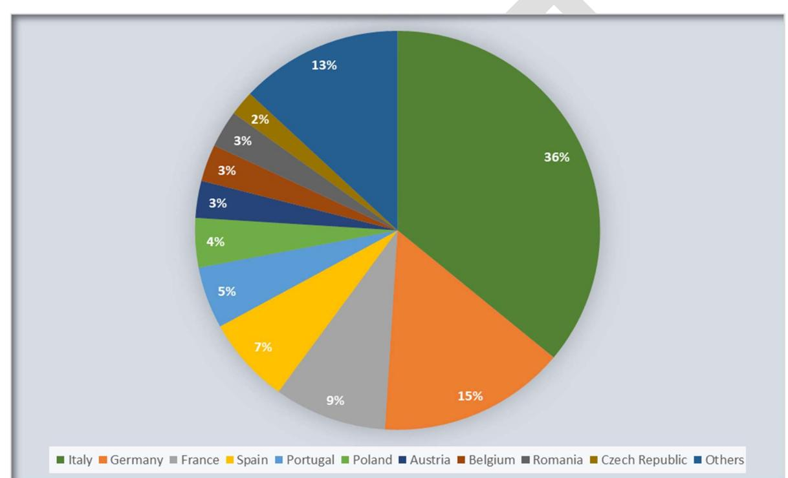

Figure 22. % Annual Turnover of Textile Industry of EU Countries. Source: EURATEX,2024.

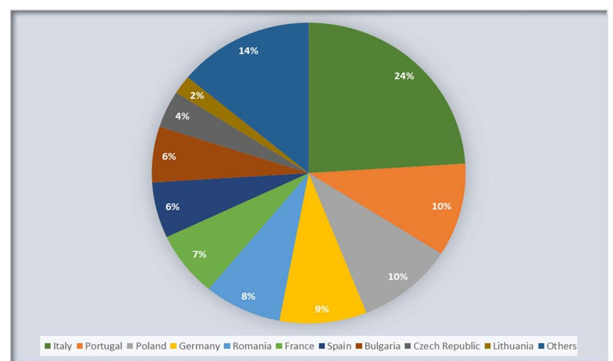

Figure 23. % Employment of Textile Industry of EU Countries. Source: EURATEX, 2024.

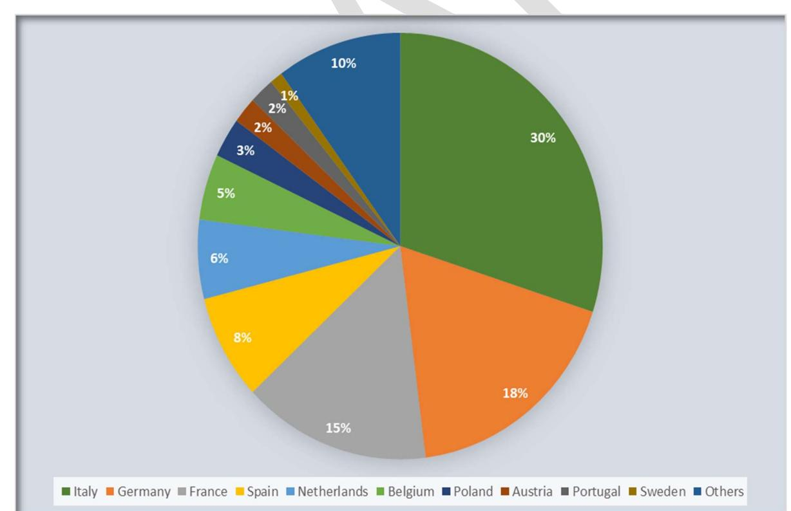

Figure 24. % Exports of Textile Industry of EU Countries. Source: EURATEX, 2024.

## 3.2.4 Economic, legal, and institutional factors and conditions

## 3.2.4.1 Economic factors and conditions

As a labour-intensive industry experiencing rapid technological advancement, the textile sector, particularly its SMEs, faces significant constraints due to a shortage of skilled workers. Emerging skills trends and evolving occupational profiles support the assumption of a gradual transition from low-skilled to medium- and high-skilled employment.

## Strengths of the EU Textile Industry

❖ Exceptional production quality, especially in technical textiles and premium fashion segments. ❖ Rapid adoption of innovative and sustainable materials. ❖ Strong capabilities in design, creativity, and brand development, particularly in high-end markets. ❖ Market leadership in high value-added niches where competitive advantages are hard to replicate. ❖ Agile, specialised firms leveraging emerging technologies and consumer trends.

Challenges of the EU Textile Industry

❖ Intensifying competition from emerging market players and cross-sector entrants (e.g. ecommerce platforms). ❖ High energy costs: Energy costs in Europe are significantly higher than in other regions, making production less competitive ❖ SMEs' specific challenges such as slim profit margins. ❖ Sustainability challenges across the value chain, including a high environmental footprint and costly compliance with EU environmental and chemical regulations. ❖ Strong international competition exacerbated by weaker environmental and social standards in third countries. ❖ Persistent skills gaps and high labour costs. ❖ Ageing workforce. ❖ Innovation largely concentrated in a limited number of EU Member States. ❖ Heavy reliance on imported materials and products. ❖ Complex global value chains. ❖ Geopolitical volatile conditions. ❖ Regulatory complexities and compliance costs.

Despite the availability of information nowadays it is difficult for the average European consumer to fully understand the complex processes behind the wide range of products offered by textile retailers and wholesalers (Copenhagen Economics, 2025). These businesses source their products from various global markets, each of which specialises in specific product types, raw materials, and production techniques.

At the beginning of the supply chain, different raw materials are produced. These include natural fibres like cotton and wool from agriculture, as well as synthetic fibres such as polyester and nylon, which are derived from petrochemicals. These raw materials then undergo several stages of processing, including yarn spinning, knitting or weaving, dyeing, printing, and trimming before

reaching the textile manufacturing stage. Then, materials are cut and sewn into finished products according to the retailers' or wholesalers' design specifications. Suppliers used by textile retailers and wholesalers can be based within or outside the EU and are typically organised into different tiers (Copenhagen Economics, 2025):

➢ Tier 0: Agents acting on behalf of retailers and wholesalers ➢ Tier 1: Final product manufacturers that interact directly with retailers/wholesalers or their agents ➢ Tier 2: Component producers (e.g., yarn or fabric manufacturers) ➢ Tier 3 and beyond: Raw material suppliers

The number of tiers in a supply chain affects the level of transparency. As the number of tiers increases, it becomes more difficult for companies to monitor and control production practices across the supply chain. Most retailers and wholesalers have direct relationships only with Tier 1 suppliers, meaning visibility and oversight significantly decrease in the upper tiers.

While some companies work with vertically integrated suppliers, those managing multiple steps of the production process, this approach is not always practical. Different textile products require distinct raw materials and specialised expertise, limiting the feasibility of vertical integration across the entire product range (Copenhagen Economics, 2025).

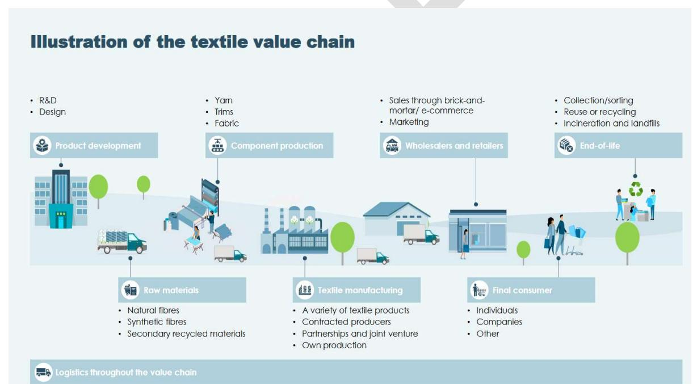

Figure 25. Illustration of a typical supply chain for producing textiles. Source: Copenhagen Economics, 2025

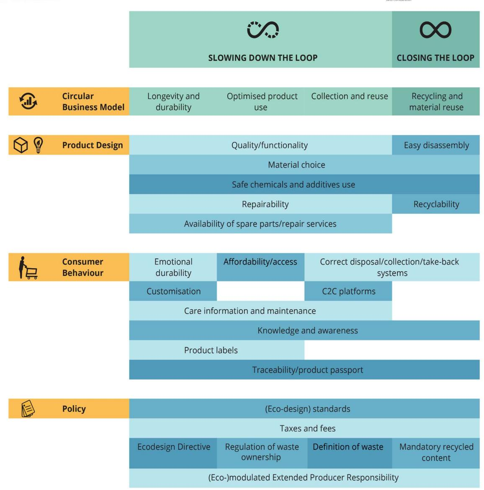

Figure 26. Overview of linkages between the circular business model, product design, consumer behaviour and policy. Source: EEA, 2024.

Main features of the current conditions of the European textile and garment industry comprise the following:

- (a) The sector has become increasingly international. Raw materials, components, and textile products are traded across borders before they reach the final consumers. The presence of European textile retailers and wholesalers in sourcing and production countries is a product of globalisation.
- (b) Most of the sector's value added is created within Europe. The European textile sector is economically significant, providing employment and contributing to the European GDP. One measure of economic significance is value added, which consists of wages and company profits, which are also the main components of GDP.
- (c) The European textile sector supports jobs and economic activity in Europe.
- (d) The value contribution from the sector has declined since 2000.

## 3.2.4.2 EU textile industry legal framework

The EU textile market as a part of the global textile, fabrics and clothes industry is not unaffected by the significant revisions taking place. Major transformation forces are the needs for enhancing sustainability, digitalization, and global competitiveness in the sector.

Ever more European buyers require facilities, products and/or materials to be independently certified for social responsibility, environmental impact and use of harmful substances. The certification process can be time-consuming and costly. However, getting certification shows a commitment to sustainable practices throughout the supply chain. The most popular standards and certifications for base materials in the European apparel market can be found in the table below.

Table 4. Key certifications for sustainable materials in the European apparel market

| Name        | Logo | Description                               |
|-------------|------|-------------------------------------------|
|             |      | suitable for production facilities at all |
| EU Ecolabel |      | The EU Ecolabel is a voluntary label for  |
|             |      | products and services with a reduced      |
|             |      | products with the lowest environmental    |

| Name Logo | Description                                  |
|-----------|----------------------------------------------|
| BCI       | The Better Cotton Initiative (BCI) is a non |
| GOTS      | The Global Organic Textile Standard (GOTS)   |
|           | environmentally and socially responsible     |
| C2C       | Cradle to Cradle Certified® is a third-party |
| Bluesign® | The use of Bluesign®-approved chemical       |
|           | of products and minimises risks for          |
|           | companies throughout the value chain.        |
| ZDHC      | A multi-stakeholder programme that leads     |

| Name       |      | Logo | Description                                  |
|------------|------|------|----------------------------------------------|
| Sedex      |      |      | An online platform for companies to manage   |
|            |      |      | and improve working conditions and           |
| Fair       | Wear |      |                                              |
|            |      |      | trade unions, NGOs and sometimes             |
| Fair Trade |      |      | Fair Trade is a non-profit organisation that |
| regenagri  |      |      | regenagri is a regenerative agriculture      |
|            |      |      | programme supporting farms and               |
|            |      |      | increasing soil health, encouraging          |
|            |      |      | biodiversity, reducing greenhouse gas        |

Source: CBI Ministry of Foreign Affairs. Kingdom of the Netherlands.

## Labour regulations

EU labour laws provide strong protections for workers, which directly affect textile manufacturers, retailers, and importers:

⮚ Working Time Directive (2003/88/EC): Governs working hours, rest periods, and paid leave. ⮚ Health and Safety at Work Framework Directive (89/391/EEC): Enforces occupational safety and health standards. ⮚ European Pillar of Social Rights: Promotes fair working conditions, gender equality, and social protection.

These regulations are further enforced at national level, ensuring high labour standards across member states.

## Environmental legislation

The EU has implemented an advanced environmental protection legal framework. Its laws and directives directly affect textile and fabric production and import. The main aspects of this legal framework that affect directly the textile industry are the following:

⮚ REACH Regulation (EC 1907/2006). REACH is the main EU law to protect human health and the environment from the risks that can be posed by chemicals, like the ones used in textile production. ⮚ EU Green Deal. The European Green Deal is the EU's growth strategy. Launched in 2019, it consists of a package of policy initiatives, which set the EU on the path to a green transition, with the ultimate goal of reaching climate neutrality by 2050. Under the Green Deal, the Council, together with the European Parliament as co-legislators, have adopted legislation, which has turned the strategy's vision into laws and rules, which are applied, in all EU member states. ⮚ CEAP - Circular Economy Action Plan. The European Commission adopted the new CEAP in March 2020. It is one of the main building blocks of the European Green Deal and. provides a future-oriented agenda for achieving a cleaner and more competitive Europe in co-creation with economic actors, consumers, citizens and civil society organisations. It aims at accelerating the transformational change required by the European Green Deal, while building on circular economy actions implemented since 2015. This plan ensures that the regulatory framework is streamlined and made fit for a sustainable future, that the new opportunities from the transition are maximised, while minimizing burdens on people and businesses. ⮚ ESPR - Ecodesign for Sustainable Products Regulation entered into force on 18 July 2024. ESPR is part of a package of measures that are central to achieving the aims of the 2020 Circular Economy Action Plan and fostering the transition to a circular, sustainable, and competitive economy. It will contribute to helping the EU reach its environmental and climate goals, double its circularity rate of material use and achieve its energy efficiency targets by 2030. ⮚ Waste Framework Directive: The targeted revision of the Waste Framework Directive, which entered into force on 16 October 2025, focuses on textile waste, building upon these principles and helping to align standards across the EU with a common set of rules for all Member States. ⮚ Climate Law: The European Climate Law writes into law the goal set out in the European Green Deal for Europe's economy and society to become climate-neutral by 2050. The law also sets the intermediate target of reducing net greenhouse gas (GHG) emissions by at least 55% by 2030, compared to 1990 levels. ⮚ Clean Industrial Deal: The Clean Industrial Deal launched on 26 February 2025 outlines concrete actions to turn decarbonisation into a driver of growth for European industries. The Commission will adopt a circular economy act in 2026 to accelerate the circular transition.

## Trade policies and tariffs

Common External Tariffs apply to non-EU imports. Many textile-producing countries benefit from the Generalised Scheme of Preferences Plus (GSP+) that give developing countries a special incentive to pursue sustainable development and good governance. Eligible countries have to implement 27 international conventions on: human rights, labour rights, the environment and good governance.

exports. Beneficiary countries include Bolivia, Cape Verde, Kyrgyzstan, Mongolia, Pakistan, Philippines, Sri Lanka, Uzbekistan. The current GSP+ is valid until 2027. The part of the EU Generalized System of Preferences GSP is also the Everything but Arms (EBA) initiative under which all imports to the EU from the least developed countries are duty-free and quota-free, with the exception of armaments.

Another upcoming legislation concerning the textile industry is EU's Carbon Border Adjustment Mechanism (CBAM), which will apply in its definitive regime from 2026, while the current transitional phase lasts between 2023 and 2025. CBAM is the EU's tool to put a fair price on the carbon emitted during the production of carbon intensive goods that are entering the EU, and to encourage cleaner industrial production in non-EU countries.

## Intellectual Property Rights (IPRs)

The textile industry in the EU implements a strict and well oriented legal framework concerning IPRs. Main control bodies that enforce EU IPR legislation are the EU Intellectual Property Office (EUIPO) which supervises design and trademark registration and the customs offices legally responsible to investigate and prosecute counterfeiting and IP infringement.

EURATEX provides tailored information and resources to companies (mainly SMEs) to manage their IPRs, as they do not have enough human resources to deal with and implement these measures. The use of IP systems is typically seen by SMEs as a challenge, as they find its procedures very costly and they lack the necessary expertise. EURATEX reports to the European Commission these challenges and those related to IPRs enforcement.

## Product Standards, labelling, safety regulations

Consumer safety and transparency are regulated by the Textile Labelling and Fibre Composition Regulation (EU No 1007/2011) which requires disclosure of fibre composition (silk, wool, nylon, polyester, cotton) and origin. According to this Regulation, products must be labelled with information concerning their fibre composition (e.g. 100% Polyester).

In general, textile products must carry a durable, legible, easily visible, and accessible label, either on the product or on its packaging. The regulation does not require the provision of product size or the provision of care instructions. Almost all clothes nevertheless include such information because it aids consumers in choosing products of the appropriate size and implements adequate usage of them. Voluntary standards that are used commonly are:

 Joint European standard for size labelling of clothes, formally known as the EN 13402 Size designation of clothes is a European standard for labelling clothes sizes. The standard is based on body dimensions measured in centimetres, and as such, and its aim is to make it easier for people to find clothes in sizes that fit them. ISO 3758:2023. Textiles — Care labelling code using symbols. The International Organization for Standardization (ISO) has issued the 3758:2023 standard for textiles, which replaced the previous one from 2012. The standard sets a system of graphics and symbols for the purpose of labelling textile products in order to provide the necessary information for their proper cleaning and protection from irreversible damage. ISO 3758:2023 applies to all textile products except non-removable furniture covers, non-removable mattress covers and carpets that require professional cleaning, as they are considered to require special procedures for their care and cleaning. The symbols are addressed to consumers and professional users and concern washing, bleaching, drying and ironing. For industrial users, the corresponding symbols are described by ISO 30023.

## EU textile industry institutional landscape

The EU enlisted numerous policy initiatives and funding mechanisms to support the textile industry. The flagship of these strategies is the EU Strategy for Sustainable and Circular Textiles (2022) which sets a 2030 vision for sustainable, reusable, and recyclable textiles.

Furthermore, Academic Institutions and textile companies, especially SMEs, can benefit from a wide range of EU programs, like Horizon Europe, COSME, LIFE, European Regional Development Fund (ERDF) and European Social Fund+ (ESF+). These funds support research and innovation actions or provide grants for a wide range of business plans from sustainable materials and circular models to digital production and skills training.

Regarding the business networks, the principal associations of European textile industry are: The European Apparel and Textile Confederation (EURATEX) and The European Technology Platform for the Future of Textiles and Clothing (Textile ETP).

EURATEX is a part of an extensive network representing European industries, which includes the Confederation of European Business (BUSINESSEUROPE) and the Alliance for a Competitive European Industry (ACEI). EURATEX is cooperating daily with the other branch federations linked to their sector, research organisations and universities active in the textile and clothing industry (AUTEX, Textranet), and the Textile and Clothing Information Centre (CITH) which provides tailormade reports on EU trade in textile and clothing. EURATEX is an observatory Member of CEN, the official European body for standardisation, and follows in particular the works of TC248 technical committee for textiles products. EURATEX is a founding member of the European Technology Platform for the Future of Textiles and Clothing and the International Apparel Federation. Since 1993, EURATEX is part of the regular Social Dialogue together with the Trade Unions, organised by the European Commission's DG Employment to promote the actions aimed to safeguard the respect of fundamental labour standards.

The European Technology Platform for the Future of Textiles and Clothing (Textile ETP) was created in 2004 to match research and innovation needs and priorities of the European industry (represented by companies, associations, and clusters) with the knowledge, scientific and technological capacities of universities, research organisations and technology developers to raise the sector's competitiveness through intensified collaborative research and innovation. Since 2013, the Textile ETP has been established as an international non-profit association under Belgian law with its permanent premises based in Brussels. According to the current strategy, adopted in 2018, the Textile ETP acts as Strategic Connector, Think Tank and Advocate, and Intelligence and Funding Access Provider to all our members across Europe.    

There are also a number of national federations that influence policy and sectoral training to various extent. Important national federations are:

⮚ Fedustria – Belgian Federation of textile, woodworking and furniture industries (Belgium) ⮚ Union des Industries Textiles – UIT (France) ⮚ Gesamtverband der deutschen Textil- und Modeindustrie – T M (Germany) ⮚ Confindustria Moda – Federazione tessile e moda (Italy) ⮚ Norsk Industri – The Federation of Norwegian Industries ⮚ Turkish Clothing Manufacturers' Association – TGSD

⮚ Turkish Textile & Raw Material Exporters' Association – ITHIB ⮚ Federation of Apparel and Textiles Industry Employers – PIOT ⮚ Finnish Textile & Fashion – STJM (Finland) ⮚ Associaçao Têxtil e Vestuàrio de Portugal – ATP (Portugal)

## EU education and research ecosystem

As the textile industry plays such a significant role in the EU economy it is easily understandable that a variety of education and technical institutions of different levels are offering training and knowledge building courses on the subject. The EU's textile sector is supported by a dense web of research institutions, technology centres, and innovation hubs, often working closely with industry partners. Vocational schools and technical institutes to top-tier universities contribute to equipping students, young professionals and experienced workers with the knowledge and skills needed to navigate to a rapidly evolving sector.

In a number of European countries like Germany, Austria, and the Netherlands, a robust dual education system has been constructed where apprentices combine hands-on work in the textile industry with formal training.

In higher education organizations (Universities, Colleges, Technical Institutes) across Europe a significant number of courses are offering a variety of diplomas and academic degrees.

The European Union also supports innovation and research solutions through technology platforms such as the European Textile Technology Platform (ETP). Other supporting platforms are operating at a regional level, such as "Techtextil" in Germany or "Made in Green" in Portugal which bring together businesses, research centres, and training providers to share knowledge and scale up new solutions.

## 3.2.5 European consumer behaviour towards textile consumption and sustainable practices

Consumer behaviour and attitudes toward textile consumption and sustainable practices in the EU are undergoing significant transformation. This shift is driven by increased environmental awareness, evolving regulatory frameworks, and changing consumer preferences and due to its significant environmental and social impacts, especially those associated with fast fashion and overconsumption. However, challenges persist, particularly in bridging the gap between sustainable intentions and actual purchasing behaviours (Cosma Α., 2024). The transition from a linear economic model, characterised by the "take-make-dispose" paradigm, to a circular economy model depends heavily on consumer attitudes and engagement throughout the entire product lifecycle (Koszewska, 2019).

Ribeiro et al. (2023) conducted a survey in Portugal with 1026 respondents to assess attitudes towards sustainable textile consumption across four phases: acquisition, use, maintenance, and disposal.

In Poland, Popowska and Sinkiewicz (2021) analysed fashion consumers' awareness of sustainability-related concepts such as fair trade, organic certification, and carbon emissions.

Nencková et al. (2020) studied 1046 Czech consumers, focusing specifically on post-consumer textile disposal and its relation to demographic variables.

Koszewska (2019) provided a European perspective through a conceptual analysis of the consumer's role in advancing a circular economy in textiles and apparel.

A study focusing on Slovenian consumers revealed a positive attitude toward eco-friendly textile products, with many perceiving them as higher quality and more sustainable. Certified labels play a crucial role in influencing purchasing decisions, as they serve as indicators of environmental friendliness and ethical production practices (Zver & Vukasović, 2021). Similarly, research involving Romanian consumers indicated that altruistic values, social norms, and sustainable attitudes positively influence the intention to purchase sustainable clothing. This suggests that both personal values and societal influences are pivotal in shaping consumer behaviour in the textile sector (Cosma Α., 2024).

Over half of the United Kingdom (Mintel, UK Fashion and Sustainability Market Report 2024) and German (Mintel, Germany Fashion and Sustainability Market Report 2024) consumers regard sustainability as an important purchase factor for fashion. In the US (Mintel, US Women's Clothing Market Report 2023), two in three consumers say they pay attention to eco-friendly claims when buying fashion items. While a significant portion of Germans believe that everyone is personally responsible for protecting the environment, the majority try to act in ways that aren't harmful to the planet. Consumers across the US, UK, and Germany generally believe that a sizable portion of the responsibility for sustainability in fashion lies with businesses.

It is often believed that fostering positive attitudes toward the environment through consumer education can drive sustainable consumption patterns. However, research conducted in Budapest, Hungary (Kemi & Zilahy, 2025) found that attitudes are the weakest predictors of repair and giveaway intentions. While other post-purchase activities, such as recycling, may be more influenced by attitudes, the findings of this study suggested that education alone may not be sufficient to address the challenges of sustainable fashion consumption. Instead, greater emphasis should be placed on improving the repairability of products and showcasing practical examples of sustainable practices. These approaches may have a more substantial impact on encouraging sustainable fashion consumption and reducing the environmental burden of the fashion industry. Moreover, research in Poland about consumer choice between sustainable and non-sustainable apparel revealed the importance of the product to provide enough aesthetic, functional and financial benefits, to satisfy their needs and aspirations besides being sustainable or "green" (Rahman & Koszewska, 2020).

Furthermore, findings (Banytė, Vaidelinskaitė & Šalčiuvienė, 2023) suggest that consumers assess both practical and ethical attributes of clothing before making their purchase. However, when making their final decision to purchase ethical clothing, practical attributes often become the key criteria for decision-making. It has been concluded that physical and external practical factors are the strongest influencers on consumer attitudes towards ethical clothing, while a sustainability attribute is among the ethical factors that has the strongest effect on positive-attitude-formation among consumers. Moreover, findings suggest that the lower the perceived ethical clothing value cost, the more positive attitude towards the brands exists. Neither the fauna nor environment had any significant effect on consumer attitudes towards ethical clothing. The same study has also confirmed that attitudes significantly and positively influence ethical clothing purchase intentions (Magnuson, Reimers, Chao, 2017).

It is common ground that despite growing awareness, a notable discrepancy exists between consumers' sustainable intentions and their actual purchasing behaviours, commonly referred to as the "value-action gap". This green gap between what consumers say and do is arguably one of the greatest challenges for marketers, policymakers, and nonprofit organizations working to

This project has received funding from the European Union's Horizon Research and Innovation program under grant agreement N° 101181901 and from the Swiss State Secretariat for Education, Research and Innovation (SERI). Posts and shares reflect only the views of all the involved partners. Neither the European Union nor the granting authority can be held responsible for them.

promote the United Nations' 2030 sustainable development goals (SDGs), in particular goal number 12 which concerns sustainable consumption and production. Factors contributing to this gap include price sensitivity, limited availability of sustainable options, and habitual purchasing patterns. For instance, while many consumers express a willingness to support sustainable fashion, the convenience and affordability of fast fashion often override these intentions. A study examining Italian consumers found that while attitudes toward sustainable clothing were generally positive, actual purchasing behaviour was significantly influenced by social norms and perceived behavioural control. This underscores the importance of societal influences and perceived ease or difficulty in performing sustainable behaviour (Kemi & Zilahy, 2025). Post-purchase behaviours, such as repairing, recycling, and purchasing second-hand clothing, are gaining traction among European consumers. Research conducted in Hungary identified distinct consumer segments based on their engagement in sustainable post-purchase activities. The study highlighted that social norms and perceived behavioural control significantly influence these behaviours, suggesting that societal expectations and perceived ease of action play critical roles (Kemi & Zilahy, 2025).

Table 5. Framework of determinants, divided into drivers and barriers, of sustainable consumer behaviour in the fashion industry across consumption phases

| PRE-PURCHASE                                                                                                                                                                                                                                                                                                           | USE                                                                                                                                                                                                                                            | POST-USE                                                                                                                                                  |                                                                                                                                                                             |                                                                                                                                                               |
|------------------------------------------------------------------------------------------------------------------------------------------------------------------------------------------------------------------------------------------------------------------------------------------------------------------------|------------------------------------------------------------------------------------------------------------------------------------------------------------------------------------------------------------------------------------------------|-----------------------------------------------------------------------------------------------------------------------------------------------------------|-----------------------------------------------------------------------------------------------------------------------------------------------------------------------------|---------------------------------------------------------------------------------------------------------------------------------------------------------------|
| 
<b>Product choice</b>
 <ul> <li>High comfort ant fit</li> <li>Expresses individuality</li> <li>Fashionable style ad design</li> <li>Impression shaped by celebrities media, online channels</li> <li>Competitive price</li> <li>Influence of family / friends</li> <li>Enhancement of social identity</li> </ul> | 
<b>Laundry</b>
 <ul> <li>Convenience, saing time</li> <li>Long effective clothing</li> <li>Ecowoldege of laundry methods</li> <li>Environmental concerns-Esco-repair</li> <li>Environment cornesens' Fashion sensitivity</li> </ul>      | 
<b>Continue wearing</b>
 <ul> <li>Low-cost of expansion</li> <li>The source of emotional pleasure</li> <li>Suitability of peer's garment</li> </ul> | 
<b>Disposal</b>
 <ul> <li>High quality, good condition</li> <li>In need of space</li> <li>Lack of repair experience</li> <li>Lack of knowledge of disposal</li> </ul> |                                                                                                                                                               |
| BARRIERS                                                                                                                                                                                                                                                                                                               |                                                                                                                                                                                                                                                |                                                                                                                                                           |                                                                                                                                                                             |                                                                                                                                                               |
| 
<b>Product choice</b>
 <ul> <li>High price of sutanabile garments</li> <li>Skepticism</li> <li>Slow fashion's limitations</li> <li>Unawareness of labels</li> <li>Greenwashing</li> <li>Ignorance of cause and origin</li> <li>Distrust in advertisements</li> <li>Limited product range</li> </ul>              | 
<b>Laundry</b>
 <ul> <li>Environmental impact of washing</li> <li>Aversion of laundry</li> <li>Fear of appearing dirty</li> <li>Lack of time</li> <li>Do not know how to repair</li> <li>Lack of confidence in repair methods</li> </ul> | 
<b>Continue wearing</b>
 <ul> <li>Concerns about hygiene</li> <li>Lack of trust</li> <li>Lack of time</li> <li>Low comfort or quality</li> </ul>    | 
<b>Disposal</b>
 <ul> <li>Quantity of garments</li> <li>Low emotional attachment</li> <li>Fear of affecting cleanliness</li> <li>Unenthusiastic attitude</li> </ul>   | 
<b>Disposal</b>
 <ul> <li>Quantity of garments</li> <li>Low emotional attachment</li> <li>Low of quuferness</li> <li>Unenthusiastic attitude</li> </ul> |

The rise of the second-hand clothing market further exemplifies this trend. A study exploring European consumer motivations behind second-hand clothing purchases found that economic, environmental, and hedonic factors drive engagement in this market. Consumers are increasingly valuing the uniqueness and sustainability associated with second-hand apparel (Halicki & Zaborek & Meylan, 2024).

People in Berlin, Grenoble, Prato, and Catalonia all show some interest in circular textiles, but their habits and attitudes differ depending on age, income, and local culture, among other demographic features. In all four places, price is the biggest factor influencing what people buy. Most consumers value affordable clothing, with price being more important to some demographics such as students and low-income families. Even though many say sustainability is important, it usually comes after cost, quality, and convenience when making choices.

Second-hand shopping is common but still faces challenges. Many people worry about hygiene, finding the right size, or the time it takes to search for good items. In Prato and Catalonia, there is also a strong stigma, especially when it comes to buying used clothes. Even in places like Berlin and Grenoble, second-hand clothes are not always seen as appealing or easy to access.

Repairing clothes is also not very popular. It's often seen as expensive or too much effort, and repair services are not always easy to find. Still, people like the idea of community events such as repair cafes or workshops, which could make fixing clothes more social and accessible.

Young people in Berlin, Prato, and Catalonia tend to be more influenced by external motivators such as social media and peer pressure. They are more likely to buy more and follow trends and are therefore less likely to choose circular options. Older consumers, especially in Grenoble and Catalonia, are more focused on quality and comfort and are more open to buying long-lasting items especially if these are linked to trusted brands or a sense of exclusivity.

Most people know about donating clothes or shopping second-hand, but fewer are aware of other circular options like renting, swapping, or upcycling. To get more people involved in circular fashion, several ideas were shared:

⮚ add second-hand sections to regular shopping malls ⮚ create community spaces for repair and education ⮚ run fun events like circular fashion festivals ⮚ promote campaigns to improve the image of second-hand clothing ⮚ show its value could also help change people's minds and habits.

## Key findings of European consumer surveys

During the acquisition phase, European consumers generally place greater emphasis on price, comfort, and style than on sustainability-related attributes. For instance, in Portugal, consumers reported low participation in clothing rental or second-hand markets, and most acquisitions were guided by personal budget and product quality rather than environmental concerns (Ribeiro et al., 2023). Similar patterns are evident in Poland and other EU countries, where fast fashion has been embraced widely due to its affordability and trendiness (Popowska & Sinkiewicz, 2021; Koszewska, 2019).

Regarding the usage and maintenance of clothing, there is some evidence of willingness to extend garment lifespans, particularly through practices like careful washing or infrequent laundering. However, deeper behavioural commitment, such as active repair or upcycling, remains limited.

In the Czech Republic, gender and education levels influenced sustainable maintenance practices, with women and those with higher education more likely to engage in environmentally responsible behaviours (Nencková et al., 2020).

The disposal phase is particularly crucial within a circular economy model. In the Czech context, disposal behaviours were significantly affected by demographic factors. Older consumers, women, and those with higher income or education were more likely to separate textile waste or donate used clothing. Preferred disposal methods included donations to charities, giving garments to family or friends, or using designated textile collection containers. However, a considerable

proportion of textiles still entered the general municipal waste stream, highlighting a disconnect between sustainable intentions and actual behaviour (Nencková et al., 2020).

Despite increased environmental concern, Polish consumers still show limited engagement with sustainability in fashion. Many express a general interest in environmental issues, yet sustainable development within the garment industry is not a significant driver in their purchasing decisions. Furthermore, Polish consumers tend to view their national performance in sustainable fashion negatively compared to other European nations (Popowska & Sinkiewicz, 2021).

Trust in sustainability-related claims and access to reliable information are key factors influencing consumer behaviour. Many consumers struggle to differentiate genuinely sustainable products from greenwashed alternatives. This lack of transparency, combined with complex or inaccessible information about textile sourcing and lifecycle impacts, contributes to consumer fatigue and inaction (Ribeiro et al., 2023; Popowska & Sinkiewicz, 2021).

## Barriers to sustainable behaviour

One of the most persistent barriers to sustainable fashion consumption is economic constraint. Many consumers perceive eco-friendly products as more expensive, making them less attractive to budget-conscious shoppers. Infrastructure gaps also limit sustainable action, particularly in areas lacking textile recycling points or repair services. Furthermore, mistrust of sustainability claims, due to rampant greenwashing and inconsistent labelling, erodes consumer confidence and reduces engagement (Koszewska, 2019; Popowska & Sinkiewicz, 2021).

## Enablers and opportunities

Several opportunities exist to support sustainable behaviours among European textile consumers. Clearer labelling, such as the forthcoming Digital Product Passport, may help consumers make informed choices. Policy measures, such as eco-design regulations, tax incentives for sustainable consumption, and EPR schemes, could also shift the market. Social marketing campaigns targeted at specific psychological drivers, including perceived efficacy, social norms, and emotional engagement, are necessary to promote lasting behavioural change. Additionally, alternative business models, such as renting, swapping, and resale platforms, provide consumers with more accessible and affordable paths to sustainability (Ribeiro et al., 2023; Koszewska, 2019).

In summary, European consumers are increasingly aware of the environmental and social implications of textile consumption, yet their behaviours often fail to align with these values. The persistent intention–action gap is driven by economic, informational, and systemic barriers. Addressing these requires a coordinated approach involving governments, industry stakeholders, non-governmental organisations, and consumers themselves.

### Collection of surveys

What follows is a collection of relevant surveys, adding further information, starting with findings on purchase habits of 19,000 consumers across various countries, from a 2022 survey.

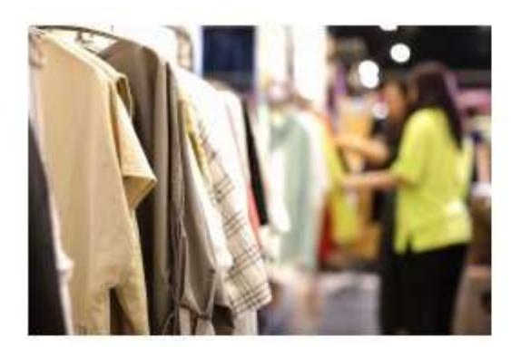

of consumers say they are concerned about sustainability when purchasing apparel products, but only

Apparel : purchase habits of 19,000 consumers across US, Japan, Germany, France, Italy, China, India, and Brazil (% of consumers at various stages)

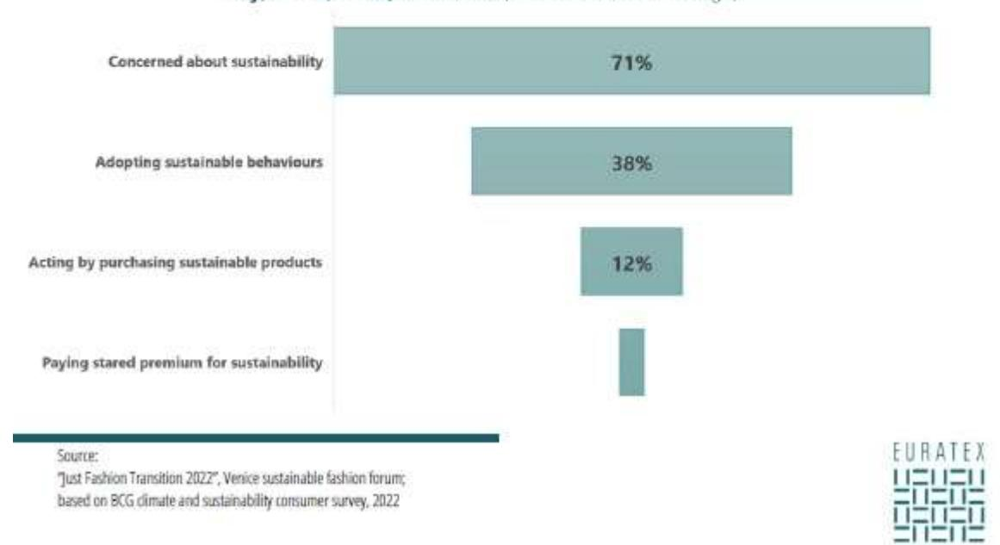

Figure 27. Purchase habits of 19,000 consumers across various countries

 A 2025 Report on analysis of consumer research, carried out in the context of the SOLSTICE Horizon Europe project7

"Key findings reveal that both for consumer behaviour related to textile consumption as well as for circular textile solutions, price is considered the most important motivator across all territories. Therefore, making circular options affordable must be a key priority.

At the same time, different consumer groups have various perceptions and understanding of

circular solutions, so targeted communication for different population segments is essential.

Certain circular solutions like donation and second-hand shopping are well recognised, while rental

and upcycling need more visibility. Still, for all of them, affordability is the biggest barrier: circular options are often perceived as too expensive compared to fast fashion.

At the same time, availability and accessibility matter: location, infrastructure, and convenience determine engagement with circular solutions".

A 2025 Report on analysis of Consumer circular behaviour understanding and guidelines to support behavioural change via interventions, carried out in the context of the CISUTAC Horizon Europe project8

"Qualitative exploration of consumer perspectives: For second-hand acquisition, consumers are motivated by value, uniqueness, and environmental care, but are deterred by poor store presentation and hygiene.

For repair, motivations include emotional attachment and waste reduction, while barriers include a lack of skills, time, and cost.

Finally, for disposal, consumers are motivated by a desire to "do good" and reduce waste, but are often hindered by emotional attachment to garments and a lack of knowledge about proper disposal

Quantitative study on circular behaviour:

Egocentric motives (e.g., cost savings) tend to dominate behaviours related to acquisition and use, while prosocial motives (e.g., environmental concern) are more prominent for disposal behaviours. Most consumers are in the early stages of change for acquisition behaviours but are more advanced for disposal.

Interventions to foster circular behaviours must be carefully designed. A one-size-fits-all approach is not effective, and strategies must be tailored to different elements of the textile system and the respective role of consumers in the textile system.

The results also underscore that consumer segmentation (e.g., by age, motivation, or stage of change) is essential to maximising impact.

Motivation is the strongest driver of behaviour and fostering emotional attachment to garments can be a powerful lever.

Furthermore, findings suggest that repair and donation behaviours can be complementary, with some consumers engaging in both".

This project has received funding from the European Union's Horizon Research and Innovation program under grant agreement N° 101181901 and from the Swiss State Secretariat for Education, Research and Innovation (SERI). Posts and shares reflect only the views of all the involved partners. Neither the European Union nor the granting authority can be held responsible for them.

7 SOLSTICE project (Grant agreement No. 101134989), Deliverable D2.3 - Report on analysis of consumer research.

8 CISUTAC project (Grant agreement No. 101060375), Deliverable D3.1 - Consumer circular behaviour understanding and guidelines to support behavioural change via interventions.

European Commission LinkedIn survey of October 2025 6,914 replies to the question "What do you do with your old clothes?" resulted

Sell 10% Repair/Reuse 15% Donate 66%

On 9 October 2025, Prospex Institute (TRUSTex partner 11) hosted the TRUSTex online workshop "Uncovering Social and Environmental Hotspots: A textile value chain workshop". The purpose was to introduce the project and its initial research findings to key stakeholders in the textile sector. Eight TRUSTEX researchers gave brief presentations and invited 65 participants to provide their feedback on the insights and research directions shared, via an online survey tool.

In the poll, participants were generally pessimistic about the extent to which consumers' purchasing decisions are influenced by environmental consciousness, seeing affordability as the biggest contributing factor. Participants saw policy and governance gaps as a critical barrier to effective EPR, with many preferring full EU EPR harmonisation to partial harmonisation. Improving sorting, recycling and reuse infrastructure and ecomodulation and fee structures were seen as key to improving EPR implementation.

During the session "Threads of Change: Market Dynamics and Consumer Attitudes" participants were asked questions aimed at understanding different perspectives about consumer attitudes. Namely,

- 1. How much do you think consumers' purchasing decisions on textile products are influenced by environmental consciousness?
- 2. What's the biggest barrier for consumers to buying sustainable textile products? and
- 3. Regarding the factors that influence the purchase of sustainable textile products and affect consumers' sustainable decisions which, in your opinion, are the three primary ones? Many participants saw limited budgets and high prices as a key barrier to purchase. Transparency was seen by several as another key barrier, with consumers left unsure as to whether brands or products actually are sustainable and if their claims can be trusted.

1. How much do you think consumers' purchasing decisions on textile products are influenced by environmental consciousness?

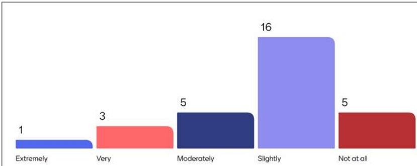

2. What's the biggest barrier for consumers to buying sustainable textile products?

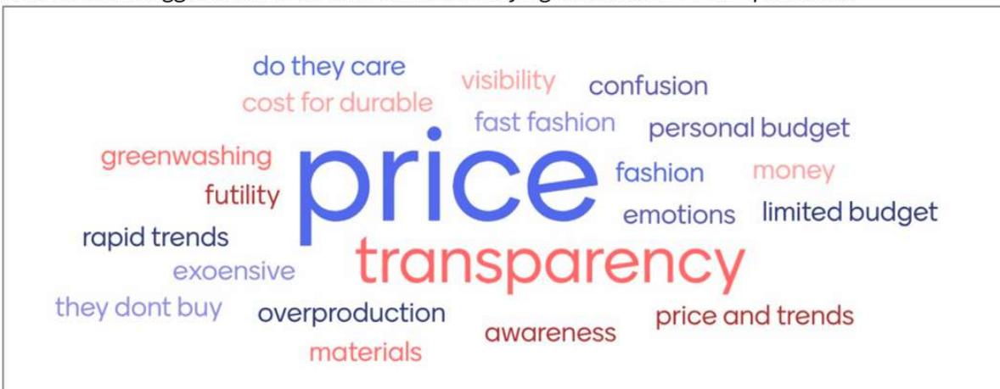

The **price-value perception** relative to quality and longevity was seen as key driver for purchasing sustainable textile products, with **product quality and trust/distrust in sustainability claims** following. There was some discussion among participants about the importance of consumer education in raising awareness and understanding of these matters, particularly on the durability of garments and the reliability of sustainability claims.

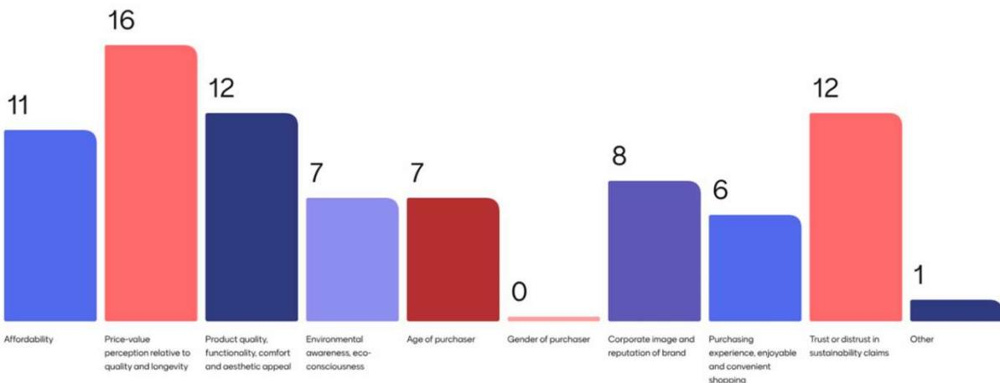

This project has received funding from the European Union's Horizon Research and Innovation program under grant agreement N° 101181901 and from the Swiss State Secretariat for Education, Research and Innovation (SERI). Posts and shares reflect only the views of all the involved partners. Neither the European Union nor the granting authority can be held responsible for them.

This draft deliverable has not yet been validated by the granting authorities

Adding on the extensive desk research that resulted for the present report numerous sources and valuable input in a period "boiling" with regulatory changes and news concerning the sector, 2 focused surveys on a European level and the 2 surveys on a national level (Greece), were conducted9 by ENA to further support with recent, as much as possible (16 October – 16 December 2025), evidence. The findings of these surveys are presented graphically below.

First, the survey on consumers' purchasing decisions resulted 95 responses10 across Europe with the following findings.

The graph clearly shows that there are other factors influencing more than environmental consciousness the consumers' purchasing decisions

The next (open) question, "From your perspective, what's the biggest barrier for consumers in buying sustainable/circular textile products?" showcased certain barriers, the ones right below, with the highest frequency being price and the perception about quality.

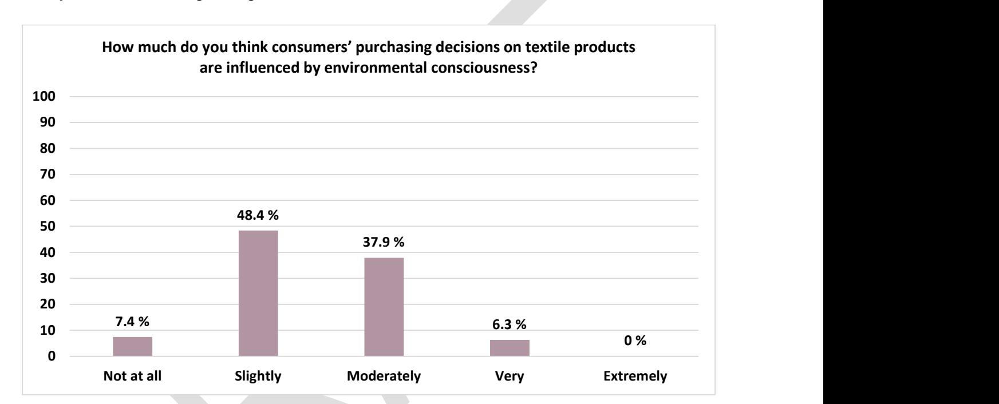

This project has received funding from the European Union's Horizon Research and Innovation program under grant agreement N° 101181901 and from the Swiss State Secretariat for Education, Research and Innovation (SERI). Posts and shares reflect only the views of all the involved partners. Neither the European Union nor the granting authority can be held responsible for them.

This draft deliverable has not yet been validated by the granting authorities

9 The questionnaires are annexed.

10 UK 15, Greece 11, Netherlands 11, Germany 10, Belgium 8, Serbia 4, Spain 4, Denmark 3, France 3, Ireland 3, Italy 3, Luxembourg 3, Cyprus 2, Switzerland 2, Austria 1, Bulgaria 1, Czechia 1, Estonia 1, Finland 1, Poland 1, Portugal 1, Sweden 1, Other 5.

Furthermore, by replying to the next question the respondents ranked environmental awareness and eco-consciousness as the fourth factor influencing the purchasing of sustainable textile products. As the top ones were declared affordability and price-value perception.

0 10 20 30 40 50 60 70

Other

Trust or distrust in sustainability claims

Purchasing experience, enjoyable and convenient

shopping

Corporate image and reputation

Gender of the purchaser

Age of the purchaser

Environmental awareness, eco-consciousness

Product quality, functionality, comfort and

aesthetic appeal

Price-value perception relative to quality and longevity

Affordability

## Regarding the factors that influence the purchase of sustainable textile products and affect consumers' sustainable decisions, what are the three primary ones?

Given the possibilities of ENA, the same survey was conducted in Greece. Specifically, the survey on consumers' purchasing decisions resulted 158 responses from across the country with quite similar numerical results, and most importantly showcased that, other factors than environmental consciousness, are influencing more the consumers' purchasing decisions.

Again, in the (open) question "From your perspective, what's the biggest barrier for consumers in buying sustainable/circular textile products?" showcased as barriers, mostly their price and the perception about their quality.

In the next question the respondents in Greece ranked affordability as the first factor and environmental awareness and eco-consciousness as the second factor influencing the purchasing of sustainable textile products. This finding is differed from the result on a European level.

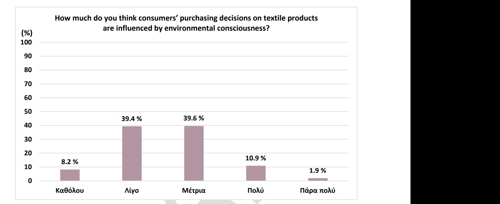

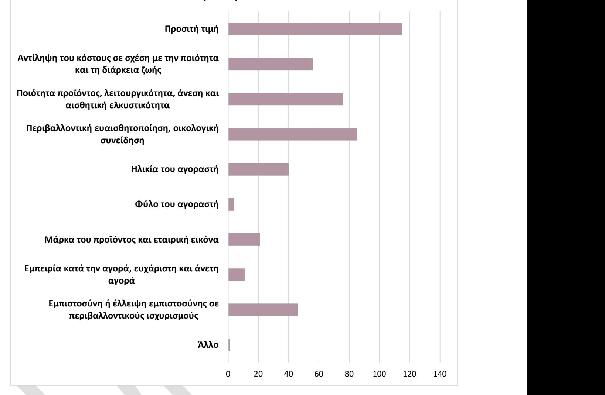

## Regarding the factors that influence the purchase of sustainable textile products and affect consumers' sustainable decisions, what are the three primary ones?

The survey across Europe regarding the purchase of second-hand garments resulted 140 responses11 and the findings were the following.

One out of three people do not buy second-hand garments, however most of them are likely to do so as shown in the replies of the next question.

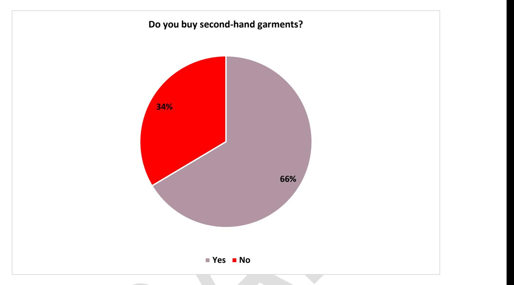

This project has received funding from the European Union's Horizon Research and Innovation program under grant agreement N° 101181901 and from the Swiss State Secretariat for Education, Research and Innovation (SERI). Posts and shares reflect only the views of all the involved partners. Neither the European Union nor the granting authority can be held responsible for them.

This draft deliverable has not yet been validated by the granting authorities

11 Luxembourg 25, Spain 15, France 14, Greece 13, UK 12, Belgium 11, Germany 9, Netherlands 8, Switzerland 5, Bulgaria 4, Ireland 4, Italy 4, Poland 3, Denmark 2, Norway 2, Portugal 2, Other 7.

As barriers and factors of discouragement in buying second-hand garments were declared mostly the quality and condition of the garments, hygiene concerns, and price.

From your point of view, what are the barriers or what discourages you to purchase secondhand garments?

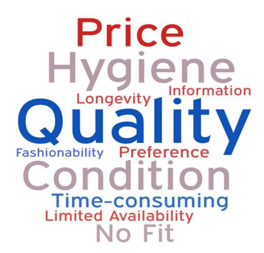

Lastly, the survey in Greece regarding the purchase of second-hand garments resulted 136 responses showing that second-hand purchases are not popular. Almost 70% of the respondents do not buy second-hand, while with a significant percentage it is not likely that they will do it in the future. Additionally, as barriers and factors of discouragement in buying secondhand garments were mostly declared hygiene concerns and secondarily the quality and condition of the garments, and their price.

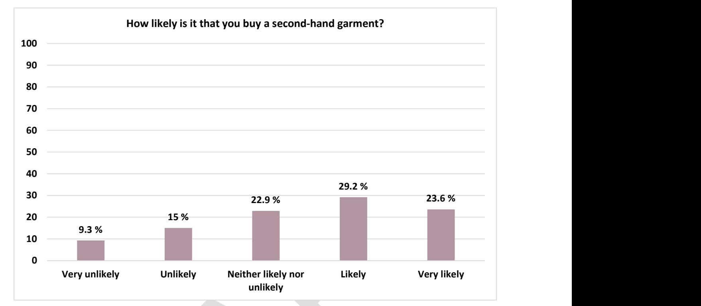

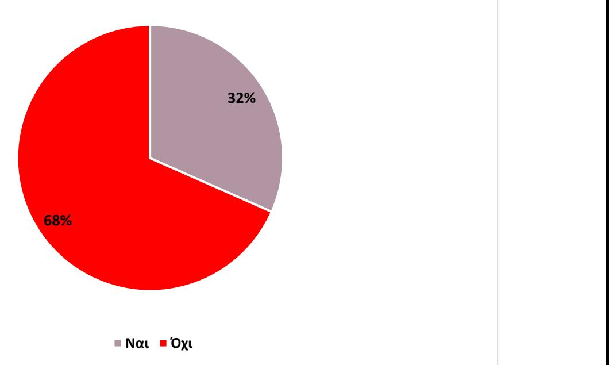

## Do you buy second-hand garments?

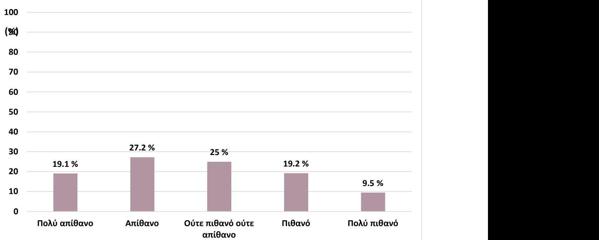

## How likely is it that you buy a second-hand garment?

From your point of view, what are the barriers or what discourages you to purchase secondhand garments?

# Θέμα Υγιεινής

## Ποιότητα

## Πρόσβαση

## Τιμή

## Φθορά

### Κατάσταση

### Μάρκα

### Ιδιοτροπία

On the 15th of December 2025, the JRC published the 3rd milestone of the Preparatory Study on Textiles12, where in its summary is reported that "The main criteria applied by people when buying textile apparel are price and the perceived quality. Sustainability principles rank lower in importance. Approximately 33% of 27,498 EU survey respondents express agreement with the notion that they are not concerned about the environmentally-friendliness of their apparel, while 64% disagree or tend to disagree. 11,483 consumers from 10 European countries prioritize price (68%), perceived quality (61%) and fit when they buy new clothes (56%). Other aspects considered while to a lesser extent include product longevity (30%), the type of fibre (organic, synthetic, upcycled) (24%) and environmental impact of the apparel item (15%)".

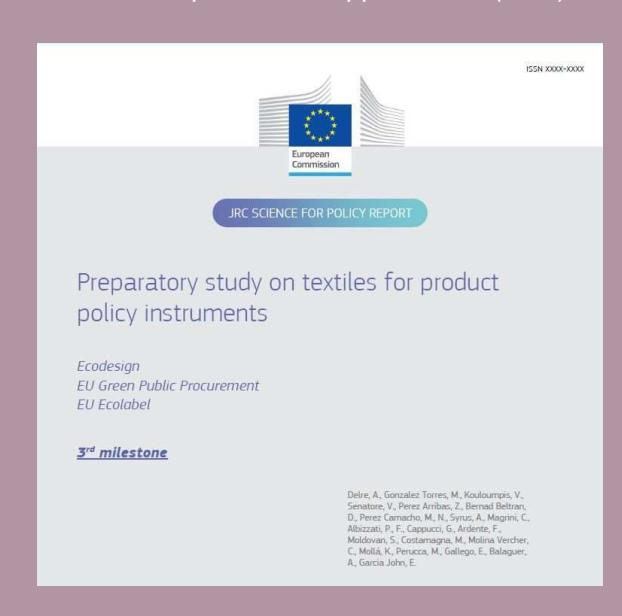

The next more detailed paragraphs come from the main working document.

"Quality and price are paramount factors influencing consumers' apparel purchasing decisions, with 97% emphasising the importance of product quality and 94% expressing a similar sentiment

12 "It is a draft document that has not been adopted or endorsed by the European Commission. Any views expressed are the preliminary views of the Commission' services and may not in any circumstances be regarded as stating an official position of the Commission".

 towards price in a survey run among 26,635 European citizens (European Commission. Directorate General for Environment, 2023).

….Similarly, price is for 68% of 11,483 consumers from ten European countries the most important factor when purchasing clothes, followed by quality (61%) and fit (56%) (YouGov, 2021).

…Sustainability and social standards rank lower in importance compared to price or quality considerations when purchasing (Consumers, Health, Agriculture and Food Executive Agency. et al., 2018; AK Wienn and Greenpeace, 2023a).

….approximately 32% of the 27,498 EU survey respondents express agreement with the notion that they are not concerned about the environmentally-friendliness of their apparel while 65% disagree with this (European Commission, 2019).

…There is a growing interest in second-hand apparel reflected in consumer attitudes. Evidence suggests a significant portion of consumers are open to purchasing second-hand items. While concerns about hygiene and a preference for new items persist among some, the appeal of financial savings and eco-friendly practices drives many to incorporate second-hand pieces into

…There is a certain interest among consumers towards second-hand apparel, as indicated by 34% of the 26,595 respondents showing a readiness to buy second-hand apparel (European Commission. Directorate General for Environment, 2014).

…About 37% of the population actively engages in buying second-hand apparel, while concerns about hygiene, perceived effort, and scepticism about the quality and availability of suitable items remain key barriers to participation (D&B, 2020a). These barriers are often reinforced by subconscious factors such as low self-efficacy, where individuals doubt their ability to find desirable items without significant effort, and concerns about personal image, including fears of appearing unkempt (D&B, 2020a).

…Those incorporating second-hand apparel tend to purchase fewer new items, with financial savings, sustainability, and a preference for unique pieces being primary drivers (D&B, 2020a)".

Regarding the last finding mentioned above that "Those incorporating second-hand apparel tend to purchase fewer new items", it is worth noting that a paper of October 202513 in Nature, the "Secondhand fashion consumers exhibit fast fashion behaviors despite sustainability narratives", has raised a different finding (necessary to tell, coming beyond the Atlantic).

"… few studies have empirically examined whether secondhand purchasing displaces or merely supplements primary market consumption. This study addresses that gap using a nationally representative survey of 1,009 U.S. consumers. We find that secondhand consumption is positively correlated with new clothing purchases, particularly among younger consumers and frequent shoppers. Cluster and principal component analyses reveal that highly engaged secondhand consumers also exhibit high overall consumption and short garment retention. Although many report high sustainability knowledge, such knowledge does not reliably predict sustainable behavior. Drawing on rebound and moral licensing theories, we suggest that secondhand

This project has received funding from the European Union's Horizon Research and Innovation program under grant agreement N° 101181901 and from the Swiss State Secretariat for Education, Research and Innovation (SERI). Posts and shares reflect only the views of all the involved partners. Neither the European Union nor the granting authority can be held responsible for them.

This draft deliverable has not yet been validated by the granting authorities

13 Mizrachi, M.P., Sharon, O. Secondhand fashion consumers exhibit fast fashion behaviors despite sustainability narratives. Sci Rep 15, 34968 (2025). https://doi.org/10.1038/s41598-025-19089-1

 purchases may psychologically or economically justify continued overconsumption. These findings challenge assumptions about resale's environmental benefits and support policy interventions to realign resale practices with sustainability goals".

"…The relationship between primary and secondary fashion markets reveals a complex dynamic that challenges conventional assumptions about sustainable consumption. While secondary markets are often celebrated for extending garment lifespans and reducing waste, our findings highlight a rebound effect that warrants a critical re-evaluation of the belief that secondhand consumption inherently mitigates the environmental impact of fashion. Instead of displacing consumption in the primary market, the growth of secondary markets appears to complement it. This suggests that both markets collectively sustain high levels of overall consumption, undermining the environmental benefits typically attributed to secondhand practices".

## 3.2.6 Reuse practices in the value chain

The reuse of textiles has gained increasing attention in the EU as part of broader efforts to transition toward a circular economy and reduce the environmental footprint of the fashion and textile industries. With the European Commission's Circular Economy Action Plan and the EU Strategy for Sustainable and Circular Textiles (European Commission, 2022), textile reuse is prioritized over recycling and incineration. The Waste Framework Directive (WFD) mandates that from 2025, EU Member States must establish separate collection systems for used textiles. Promoting an enhanced diversion of textile waste from landfills demands optimized reuse and recycling technologies. As it was mentioned before, reuse is a more environmentally sustainable option than recycling. Moreover, it offers socioeconomic benefits; for example, establishing small businesses centred around upcycling, repurposing, or selling second-hand textiles, thereby creating employment opportunities. Additionally, it provides access to clothing for disadvantaged individuals (EEA, 2024).

Available literature today provides ample suggestions on how to improve collection of textiles, albeit with the reservation that data is not comparable and success depends highly on local circumstances. Sometimes the conclusions of different authors are even contradictory. Just because an item is put on sale, it does not mean that it is actually resold, as the sector struggles with steep competition from cheap and trendy fast fashion clothing.

Additionally, the textiles collection, sorting for reuse, and recycling sector in Europe is facing an unprecedented crisis with rising sorting costs, dropping sales of second-hand clothes, and a lack of demand for recycled textile content. The rise of the ultra-fast fashion sold online has further increased those challenges, with a serious impact on the environment (EURIC, 2025).

In 2021, a total of 451,268 tonnes of textiles were reused in the EU27 (excluding Bulgaria and Cyprus and including Norway). This corresponds to an average of 2.3 kilograms of textiles per person. In the same data year, the average consumption of new textiles was 15.9 kilograms per person in the EU27 (ETC CE, 2025) which means approximately 12.6% of the total consumption of textiles consists of reused textiles.

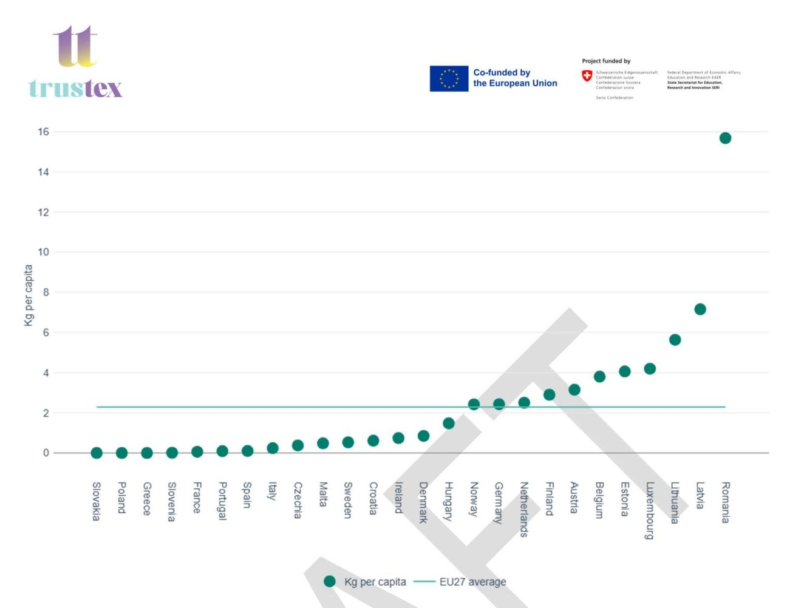

Figure 28. Reuse of textiles in EU 2021. Source ETC, 2025 & EEA, 2024/2.

## 3.2.6.1 Collection systems

Textile reuse starts with well-organised collection systems, including municipal collection points, donation bins managed by non-profit organisations, and in-store take-back schemes offered by retailers. In Europe, most textile waste is currently gathered via street containers (bring points). These are often supplemented by civic amenity sites, which allow residents to dispose of household waste and recyclables not covered by regular curbside collection. Each collection method presents its own benefits and limitations. Indoor collection, for instance, is particularly effective for acquiring clean, high-quality textiles suitable for reuse (Wagner, 2022; van Duijn et al., 2022). Nonetheless, its effectiveness in collecting large volumes is often constrained by limited opening hours and a relatively small number of accessible sites (Mörsen, 2023). Bring points are effective for collecting large volumes of textiles but carry a higher risk of contamination compared to indoor collection (van Duijn et al., 2022). Exposure to moisture, such as rain or damp clothing, can lead to mould growth, rendering the textiles unusable. Given the slim profit margins in the sector, additional processing like cleaning, washing, or drying is often not economically viable. Door-to-door collection, while convenient, is more costly and comes with risks such as theft (van Duijn et al., 2022). Overall, bring points are generally regarded as the most efficient method for collecting substantial amounts of used textiles of reasonably good quality (Wagner, 2022). However, several other factors, such as the placement of collection sites, frequency of collection, type and condition of containers, proper labelling, and clear communication, play a crucial role in enhancing both the volume and quality of collected textiles.

## 3.2.6.2 Second-hand retail and digital resale

The second-hand market in the EU is expanding rapidly, both through physical second-hand shops and digital resale platforms. Physical stores such as those operated by charities (e.g., Oxfam) play a significant role in promoting reuse. In parallel, online resale platforms such as Vinted, Vestiaire Collective, and Depop allow consumers to buy and sell used clothing peer-to-peer (Thomson et al., 2020). These platforms have become particularly popular among younger, sustainabilityconscious consumers. Reuse actors have developed many creative ways to better market their second-hand products, like outlet stores, swapping and upcycling initiatives, and e-commerce platforms. To boost local reuse, some collection and sorting actors have teamed up with private companies to sell their sorted second-hand clothes in their stores (Mörsen, 2023). Zeeman and the social enterprise Het Goed, for example, cooperate on that level in the Netherlands (Mörsen, 2023).

An illustrative case is MUD Jeans, a Dutch denim brand recognized with numerous industry awards for its innovative use of recycled materials and commitment to a fully circular model. It was among the first consumer brands to implement a leasing system for jeans, retrieve them after use, and ensure their recycling at specialized facilities. MUD Jeans also led the way in adopting design features that facilitate recycling, such as replacing traditional leather patches with eco-friendly printed alternatives. Similarly, the Swedish outdoor brand Houdini offers another strong example. In its Fall/Winter 2023 collection, the company used only materials that were recycled, recyclable, renewable, biodegradable, or certified by Bluesign. Among these is PrimaLoft Bio, a highperformance fabric that is both 100% recycled and biodegradable. Houdini further supports sustainability by providing rental, repair, and second-hand sales services to its customers.

## 3.2.6.3 Charitable and social economy models

Charity organisations are key actors in the reuse ecosystem, collecting textiles for redistribution or resale to support social programs. Many of these operate under social enterprise models, combining environmental and social objectives. For example, Belgian "De Kringwinkel" and French "Emmaüs" engage in textile reuse while providing employment for marginalized populations (EEA, 2025).

Charity organisations have historically been the main actors involved in the collection of used textiles, and they still are. They collect used textiles via bring banks (containers), or over the counter in the charity organisations shops. Containers can be located in civic amenity sites (also named recycling stations in some countries) or on the streets. In some cases, e.g. in The Netherlands, charities are asked to pay a fee to the municipalities for the textiles they collect via containers in public space. Following collection via bring banks, textiles are then collected and transported to central sorting or bagging locations for either local second hand or exported to sorting companies. Textiles are sorted into different qualities which are usually directed to different markets. This kind of collection gives an average quality of collected textiles, with less quality than in-store collection, but likely more efficiency in terms of quantity of textiles collected. Charities' collection can also happen over the counter at second-hand shops, which makes the quality of textiles for re-use higher than collection via containers, since the collection is carefully monitored by the shop's personnel. In this case, used clothes are sold directly in the charity shop, without the need for transport to a sorting facility. Kerbside collection by charities is very rare, although some charities offer on-demand pick-up services, usually in return for a fee.

The main aim of charitable organisations is normally to sell used textiles for direct re-use, without any type of repair or mending. Therefore, charitable collectors in most countries tend to make it

This project has received funding from the European Union's Horizon Research and Innovation program under grant agreement N° 101181901 and from the Swiss State Secretariat for Education, Research and Innovation (SERI). Posts and shares reflect only the views of all the involved partners. Neither the European Union nor the granting authority can be held responsible for them.

clear on their bring banks that they only wish to receive clean and reusable textiles (and footwear), often due to the negative impact that collecting non-reusable textiles have on their economies (Köhler et al., 2021). Some organisations then carry out sorting into different streams completely "in-house"; others sort a part of the collected textiles internally (usually differentiating between textile for domestic re-use vs textiles for treatment in other EU or non-EU countries), and sell another part unsorted (Palm et al., 2014). However, the collection system by charity organisations usually does not address textile material for recycling outside the portion of collected textiles that is not suitable for re-use and that is sold as unsorted stream to other countries/actors.

Charity organisations entities are by far the main actors for the collection of used textiles in many EU countries, especially the Nordic countries (Denmark, Norway, Sweden, Finland and Iceland), but also globally. In fact, charity organisations have often preferential treatment in that they are the only ones allowed by the municipalities to set up collection containers.

However, these organisations have been joined by a number of other actors, such as second-hand shops, social economy entities and on-line platforms for the sale and exchange of clothes. For example, in the Netherlands the collection share of used textiles managed by charities has dropped from nearly 100% in 2000 to 55% in 2013. In some countries like the Netherlands, charitable organisations create dedicated private companies to carry out the textile collection, sorting and sales operations with the revenues returned to the charitable part of the organisation (Watson et al., 2020a). In the Baltic countries, separate collection is relatively evenly split between charitable organisations, commercial/private collectors and municipalities/contracted waste companies (Watson et al., 2020b). In Italy, where collection of textiles via bring banks is considered as waste, there is a complex interaction of companies and cooperatives active in the sector of separate collection of textile waste, managed at national level by a large association (Unicircular, 2018). The sole country where charity organisations are less involved is France, where household textile waste is managed through the EPR scheme, and the collection is managed by an accredited Producer Responsibility Organisation (PRO). However, charities can register as official collectors under the EPR scheme. Some countries collect both reusable and non-reusable textiles, building thus a centralised system for all textiles. Large charity organisations active in the collection of used textiles are Oxfam and Caritas, and are characterised by having at least a share of the workers not receiving a full salary when supporting the organization (Huygens et al., 2023).

Social enterprises involved in the collection of textiles partly differ from charities in that their employees are not volunteers. They normally have a social or environmental goal and can be forprofit or non-profit. Social enterprises can organise textile collection via kerbside, drop-off or instore systems. In the EU there are many examples of social entities that collect used textiles or textile waste. In the Netherlands, Flanders and Austria, socio-economic re-use organisations under the HERWIN and RepaNet networks specialise in receiving used goods including textiles across the counter for processing and repair in the shop. These national networks are all part of the European RRE-USE network, an international non-profit network of social enterprises. In 2021, RRE-USE had 31 members across 29 countries. As of 2021, 341,000 tonnes of textiles were collected by RRE-USE members, of which 39,000 were re-used locally (RRE-USE, 2022). Other social enterprises include the Red Cross in the Nordic Countries, Humana in several countries such as Lithuania, Spain, Italy and Sweden, and Komosie in Belgium (Huygens et al., 2023).

## 3.2.6.4 Retailer take-back and reuse schemes

Commercial fashion retailers have increasingly adopted take-back schemes, often incentivised through vouchers or discounts. A take-back program is a brand's initiative to manage the end-oflife of its products and, sometimes, its packaging. Customers send products through the program, often receiving points or discounts from the brand. The brand gets these products and processes them internally or sends them to a partner. Some brands offer dedicated second-hand collections. Many European brands have implemented take-back programs on some scale. Below a number of successful take-back programs is being presented:

## (i) H&M Group (Sweden)

➢ Scheme: Garment Collecting Program (since 2013) ➢ Details: Customers drop off any brand of old textiles in stores. Items are sorted into three categories: re-wear (second-hand), reuse (e.g., cleaning cloths), or recycle (fibres) ➢ Incentive: Voucher/discount on next purchase ➢ Partnerships: I:CO, Loop Industries.

## (ii) ZARA / Inditex (Spain)

➢ Scheme: Clothing Collection Program ➢ Details: Available in stores in over 20 countries. Collected items are donated or recycled. Inditex collaborates with NGOs and recycling firms ➢ Reuse focus: Second-hand resale under trial in select markets (e.g., UK 2022) ➢ Ambition: All garments from sustainable sources by 2025.

## (iii) Decathlon (France)

➢ Scheme: Second Life & Buy Back Programs ➢ Details: Customers return used sports gear and apparel for repair and resale. Pilot resale platforms launched in multiple EU countries ➢ Incentive: Store credit for returned items ➢ Circular ambition: Reduce material waste and encourage longevity in product use.

## (iv) C&A (Netherlands, Germany)

➢ Scheme: We Take It Back ➢ Details: Partnered with I:CO for in-store collection of used clothes. Focus on recycling and reusing textiles ➢ New initiative: Trialling circular collections made from collected post-consumer fibres.

## (v) BESTSELLER (Vero Moda, Jack & Jones, etc.) (Denmark)

➢ Scheme: Take-back trials & Circular Design Guidelines ➢ Details: Pilot take-back schemes and focus on designing for circularity ➢ Collaborates with Fashion for Good and Circular Fashion.

## (vi) MUD Jeans (Netherlands)

➢ Scheme: Lease a Jeans / Return for Recycling ➢ Details: Circular business model. Customers lease jeans and return them for recycling into new denim ➢ Key point: 40% of each new jean is made from old jeans

➢ Innovative: 100% cotton and mono-material approach for easy recycling.

### (vii) Marks & Spencer – Shopping (Great Britain)

➢ Scheme: Shopping Partnership with Oxfam ➢ Details: Donations of unwanted clothes (any brand) in M&S stores. Items resold, reused, or recycled by Oxfam ➢ Impact: Millions of garments reused or recycled ➢ Added value: Strong social benefit (Oxfam fundraising).

### (viii) Benetton (Italy)

➢ Scheme: Limited reuse/recycling pilots ➢ Details: Starting circular collections and engaging in material innovation. No extensive pan-European take-back yet, but direction is shifting.

## (ix) Swedish Stockings (Sweden)

While Swedish Stockings is aiming to "close the loop" and turn old stockings into new ones, the technology isn't there yet on a commercial level. Until then, they are collecting thousands of pairs of tights, grinding them up, and turning them into stylish moulded fibreglass tables.

## (x) Underprotection (Denmark)

The Danish brand combines ethics and aesthetics to create underwear, loungewear, and swimwear from lower-impact materials like organic cotton. Through its Take-back Program, when you drop off or send in your pieces to it, you'll receive a 30% off reward on supporting circularity.

## (xi) O My Bag (Netherlands)

Consumers who have an old O My Bag can bring it back to the brand in exchange for a 20% discount or to swap with another vintage item.

## 3.2.6.5 Export of used textiles

Between 2005 and 2023, the export of used textiles from EU countries more than doubled to around 1.37 million tonnes in 2023 or 3.1 kg per person, and EEA publications have shown that it nearly tripled since 2000. The volume has been relatively stable since 2015, with Africa and Asia as the main receiving continents. In 2020, there was a drop in exports due to the Covid-19 pandemic EU exports of used textiles (Lingås et al., 2023).

The fate of used textiles exported from the EU is highly uncertain. The perception of used clothing donations as generous gifts to people in need does not fully match reality. Used clothing is increasingly part of a specialised and traded global commodity value chain (Lingås et al., 2023).

The exports mainly include worn clothes and other worn textile articles and only a minor number of rags and textile scraps. There is currently very limited information on the quality of used textiles due to the absence of specific reporting requirements for textiles that are not considered as waste. Between 2005 and 2023 the main recipients of exported used textiles were Africa and Asia, with Asia steadily catching up with Africa to equal levels of 44,6% and 43,2% respectively in 2023. A profound shift towards circular textile consumption in the EU, such as lower consumption, longer use, increased reuse and increased textile-to-textile recycling in the EU would likely decrease the volume of used textiles exported (Lingås et al., 2023).

## EU exports of “worn textiles and clothing”

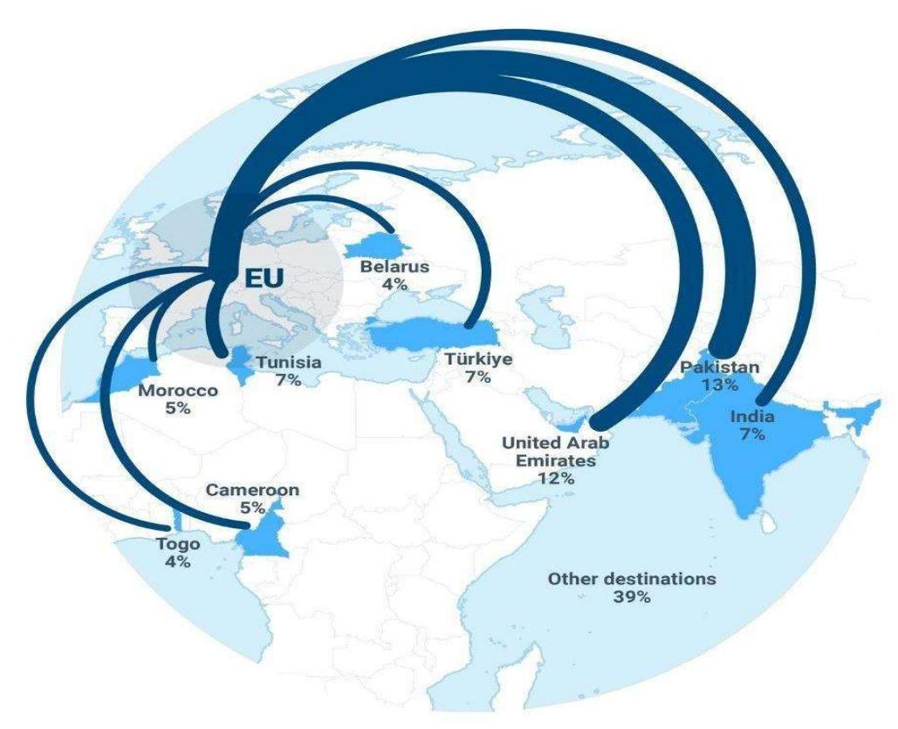

Figure 29. EU exports of "worn textiles & clothing". Source EEA

## 3.2.7 Main fabrics, garments and fibres in the EU and the reliance on third countries

According to EURATEX 42% of the total production of fabrics in the EU concern clothes and fashion products such as underwear, shirts, suits, dresses and coats, 14% concern furnishing and home related products, such as curtains, upholstery, carpets and bed linen and 19% concern industrial/technical related fabrics such as ropes and nettings, parachutes, medical textiles, synthetic grass, sunblinds and smart textiles. It is worth mentioning that the latest category demonstrates steady growth the last five years.

## Cotton

The European Union is a key player in the cotton sector and is among the world's top 10 exporters. Approximately 250-350 thousand tonnes of cotton are produced in Europe, representing 2% of world production, which is grown on around 200,000 hectares in Greece and more than 60,000 hectares in Spain.

Table 6. Cotton Production in 1000 tons

|        | 2021   | 2022   |
|--------|--------|--------|
| EU 27  | 353,84 | 341,78 |
| Greece | 294,07 | 299,78 |
| Spain  | 58,31  | 40,91  |

Source: Eurostat

Europe ranks among the largest consumers of cotton globally, following the Asia-Pacific and North American regions. Despite its significant consumption levels, domestic cotton production within Europe remains relatively limited. Greece stands out as the leading cotton producer and exporter in the European Union, with over 45,000 active cotton farmers and approximately 200,000 hectares under cotton cultivation (EUROSTAT).

Cotton maintains high popularity in the European market due to its favourable properties-namely durability, softness, breathability, biodegradability, and ease of dyeing and blending with other fibres. These characteristics make it particularly suitable for the apparel and home textiles sectors. Consequently, Europe serves as a substantial market for cotton-based products, with major consumer markets located in Italy, Germany, Portugal, Spain, France, and Romania (Research and Markets, 2024).

EU production levels are insufficient to meet internal demand. As a result, Europe relies heavily on cotton imports to bridge the gap. According to the ITC Trade Map, Italy was the largest European importer of cotton in 2021, with import values reaching approximately USD 1.13 billion, followed by Germany (USD 805.6 million). Other significant importers include Portugal, and Spain. The increasing demand for cotton-based home textiles, particularly bed linen, has contributed to this trend.

## Wool

Europe produces over 200,000 tonnes of coarse wool annually, primarily as a by-product of livestock farming. The landscape of raw wool production is marked by regional contrasts, with Romania emerging as the clear leader, followed by Norway and the United Kingdom. Eastern European nations such as Romania and Lithuania are witnessing notable growth, reporting

This project has received funding from the European Union's Horizon Research and Innovation program under grant agreement N° 101181901 and from the Swiss State Secretariat for Education, Research and Innovation (SERI). Posts and shares reflect only the views of all the involved partners. Neither the European Union nor the granting authority can be held responsible for them.

increases of 4.78% and 6.44% respectively. In contrast, countries like Spain, Italy, and the UK are facing declines, with Spain registering a significant drop of 18.54%. Substantial reductions are also seen in Portugal, Ireland, and Germany. France is producing 13.46 million kg of raw wool annually. These trends suggest a potential continued rise in Eastern European production, while traditional producers in Western Europe may face further declines. (Source: ReportLinker, 2023).

European Union imports of wool, animal hair, horsehair yarn and fabric was US\$1.49 billion during 2024, according to the United Nations COMTRADE database on international trade.

Looking ahead, the future of Europe's raw wool sector will likely be shaped by factors such as sustainable production practices, technological innovation, and evolving fashion trends. Moreover, climate change and shifts in trade regulations are expected to significantly influence production patterns across the region. Keeping track of these developments will be essential for anticipating market changes and identifying new opportunities. The EU's Product Environmental Footprint (PEF) methodology has raised concerns within the wool industry. Critics argue that it may undervalue natural fibres like wool compared to synthetics, potentially impacting consumer perceptions and demand.

Table 7. Top countries in raw wool production by country.

|    | Country        | Value of wool production in mil euros | Year | 2022/2023 |
|----|----------------|---------------------------------------|------|-----------|
| 1  | Romania        | 64.4                                  | 2023 | -14.95%   |
| 2  | Norway         | 25.9                                  | 2023 | +6.58%    |
| 3  | United Kingdom | 14.36                                 | 2023 | -6.81%    |
| 4  | Spain          | 9.01                                  | 2023 | 0%        |
| 5  | Italy          | 7.72                                  | 2023 | -1.15%    |
| 6  | Lithuania      | 7.2                                   | 2023 | -2.7%     |
| 7  | France         | 4.55                                  | 2023 | +5.08%    |
| 8  | Netherlands    | 4.37                                  | 2023 | -4.17%    |
| 9  | Iceland        | 4.21                                  | 2023 | +4.73%    |
| 10 | Greece         | 1.87                                  | 2023 | -10.53%   |

Source: Reportlinker

## Synthetic fibres

Polyester is the most widely used fibre worldwide. With an annual production volume of around 71 million tonnes, up from around 63 million tonnes in 2022, polyester had a market share of approximately 57% of global fibre production in 2023 (Textile Exchange, 2024).

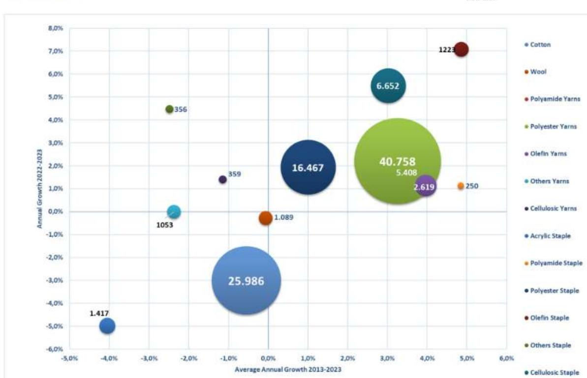

Figure 30. World Production of Cotton, Wool & Man-Made Fibres. Source: https://www.cirfs.org/statistics/keystatistics

In 2022, 58% of fibres and yarns used by the EU industry were of synthetic origin. A total of 3.3 million tonnes of fibres and yarns were produced. In the same year, almost 2.3 million tonnes were imported, and 0.82 million tonnes exported. This implies that the total 2022 use of fibres and yarns by the EU industry was around 4.8 million tonnes, a decrease of 10% compared to 2010 with significant fluctuations in volumes consumed over this time period. These volumes have remained relatively constant, although synthetic fibres have also seen a 10% decrease compared to 2010, along with a drop in the volumes consumed by industry during the COVID-19 years. The outputs of this industrial use are intermediate and finished products, which are meant for internal EU use as well as for export (EEA,2024). These numbers support the hypothesis that a large share of our textile products is of synthetic, and therefore non-renewable, origin, and the reported share of synthetics is in the same order of magnitude as what Textile Exchange reports on a global scale in their Materials Market Report (Textile Exchange, 2024).

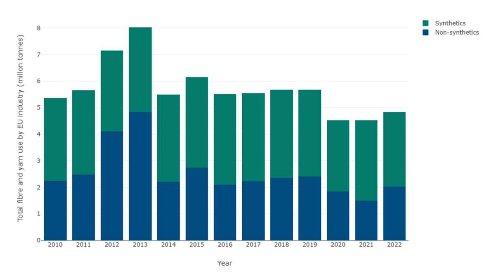

Figure 31. Share of synthetic fibres and yarns in EU industrial textiles use. Source: Textile Exchange, 2024

## Manmade cellulosic fibres

Manmade cellulosic fibres (MMCFs) are regenerated fibres usually made from the dissolved wood pulp or "cellulose" of trees. Viscose, lyocell and modal are all kinds of manmade cellulosics. Because they are plant-based, MMCFs are renewable, and so have the potential to be a climatefriendly material if the wood is sourced sustainably and the processing chemicals are handled properly. With an annual production volume of around 7.9 million tonnes in 2023, MMCFs, including viscose (rayon), acetate, lyocell, modal and cupro, had a market share of around 6% of global fibre production. Global MMCF production has more than doubled since 1990, when annual production was around 3 million tonnes, and is expected to continue growing in the coming years (Textile Exchange, 2024).

## EU reliance from third countries

Since the early 2000s, both the value and volume of textile imports to the EU have shown a marked increase. Between 2002 and 2022, the value of textile imports rose by approximately 82%, from 124 billion to 226 billion euros. Similarly, the volume of imports increased by 78%, from 9.8 million tonnes in 2000 to 17.4 million tonnes in 2022. A significant share of these imports originates from Asian countries, underscoring the region's central role in the global textile supply chain.

The structure of EU import tariffs plays a crucial role in shaping trade flows and the textile value chain. These tariffs vary by country of origin. For instance, textiles imported from Turkey and Bangladesh benefit from zero import duties, whereas imports from China are subject to variable tariffs depending on the product type, ranging from 5% to 12% (Copenhagen Economics, 2025).

In the light of growing concerns about environmental sustainability and supply chain transparency, there is increasing institutional advocacy within the EU for reshoring or nearshoring textile

manufacturing i.e., relocating production to Europe or nearby regions. The principal objectives behind this strategic shift include enhancing traceability across the value chain and facilitating the enforcement of sustainable production standards.

However, while reshoring presents potential benefits, its effectiveness and economic viability in the textile sector remain contested. Several structural and economic limitations may undermine its feasibility (Copenhagen Economics, 2025):

- Capacity constraints: Europe currently lacks the manufacturing capacity to match that of Asia and North Africa, limiting its ability to absorb large-scale production.
- Cost differentials: Production costs in Europe are substantially higher than those in established textile-exporting regions, which would likely lead to increased consumer prices without corresponding improvements in product quality or sustainability.
- Labour intensity and shortages: Given the labour-intensive nature of textile manufacturing and the persistent labour shortages across many European countries (a trend projected to intensify) reshoring may prove impractical in the long term.
- Specialisation patterns: European firms predominantly operate in high value-added segments of the textile value chain. Redirecting resources toward low value-added activities may lead to economic inefficiencies and a misallocation of skills and capital.
- Global equity considerations: Relocating textile production to Europe could negatively impact lower-middle income countries that rely on textile exports for economic development. For example, approximately 60% of Bangladesh's textile exports are directed to the EU market. A reshoring strategy could therefore have adverse socio-economic consequences for such countries, potentially undermining broader EU commitments to inclusive global trade and development. Moreover, it may be perceived as a protectionist measure, conflicting with the EU's stated objective of reducing trade barriers.

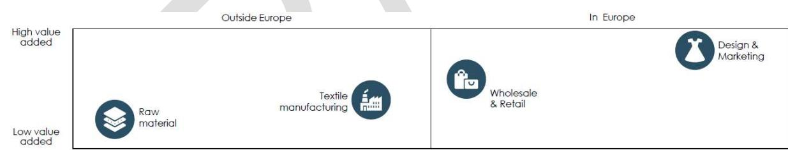

Figure 32. Illustration of the competitive situation for the sector. Source: Copenhagen Economics, 2025.

## 3.2.8 Companies across the value chain in the EU

An extensive research in the European sustainable fashion brands ecosystems has been made and a number of them have been selected to be presented both here and annexed.

Table 8. European sustainable fashion brands

| Brand           | Country     | Main        |                |             |                 |
|-----------------|-------------|-------------|----------------|-------------|-----------------|
|                 |             |             | Certifications | Circularity |                 |
|                 | UK          | Recycled    |                |             |                 |
|                 |             |             |                | based       | and             |
| Armedangels     | Germany     | Organic     |                |             |                 |
|                 |             |             |                |             | Climate neutral |
| Ecoalf          | Spain       | Recycled    |                |             |                 |
|                 |             |             | B Corp GRS     | Yes         | full            |
| Veja            | France      | Organic     |                |             |                 |
|                 |             | cotton wild |                |             |                 |
|                 |             |             | Fairtrade      | Partial     |                 |
| Nudie Jeans     | Sweden      | Organic     |                |             |                 |
|                 |             |             | GOTS           | Yes,        | take           |
|                 |             |             |                | back        | and             |
| Kings of Indigo | Netherlands | Organic     |                |             |                 |

| Brand          | Country | Main     |                |                 |           |  |         |
|----------------|---------|----------|----------------|-----------------|-----------|--|---------|
|                |         |          | Certifications | Circularity     |           |  |         |
| People Tree    | UK      | Organic  |                |                 |           |  |         |
|                |         |          |                | ethical &       |           |  |         |
|                |         |          |                |                 | Pioneered |  | fair    |
| Jan 'n June    | Germany | Recycled |                |                 |           |  |         |
|                |         |          | GOTS           | Yes             |           |  |         |
|                | Denmark | Organic  |                |                 |           |  |         |
|                |         |          | GOTS OCS       | Yes -climate    |           |  |         |
|                |         |          |                |                 | Carbon    |  | neutral |
| Thought        | UK      | Bamboo   |                |                 |           |  |         |
|                |         |          | GOTS           | Partial natural |           |  |         |
| Bleed Clothing | Germany | Organic  |                |                 |           |  |         |
|                |         |          |                | e and           |           |  |         |
| Dedicated      | Sweden  | Organic  |                |                 |           |  |         |
|                |         |          | GOTS           | Partial         |           |  |         |
| Lanius         | Germany | Organic  |                |                 |           |  |         |
|                |         |          |                | Yes local       |           |  |         |

| Brand     | Country    | Main      |                |                 |                 |                 |
|-----------|------------|-----------|----------------|-----------------|-----------------|-----------------|
|           |            |           | Certifications | Circularity     |                 |                 |
| Komodo    | UK         | Organic   |                |                 |                 |                 |
|           |            |           | GOTS           | Partial natural |                 |                 |
| MUD Jeans | Netherland |           |                |                 |                 |                 |
|           |            |           | B Corp         |                 |                 |                 |
|           |            |           |                | Yes lease       |                 |                 |
| Re-Bello  | Italy      | Wood pulp |                |                 |                 |                 |
|           |            |           | Cradle to      |                 |                 |                 |
|           |            |           | L, ECONYL      |                 |                 |                 |
|           |            |           |                | Yes local       |                 |                 |
|           | UK         | Hemp      |                |                 |                 |                 |
|           |            |           | GOTS           | Partial eco     |                 |                 |
|           |            |           |                |                 | Low-impact dyes | https://global |
| Rifo      | Italy      | Recycled  |                |                 |                 |                 |
|           |            |           | GRS            | Yes             |                 |                 |
|           |            |           |                |                 | Recycling old   |                 |
|           | France     | Organic   |                |                 |                 |                 |
|           |            |           |                |                 | Slow fashion    |                 |

This draft deliverable has not yet been validated by the granting authorities

| Brand | Country | Main    |                |                 |
|-------|---------|---------|----------------|-----------------|
|       |         |         | Certifications | Circularity     |
| Asket | Sweden  | Organic |                |                 |
|       |         |         | GRS            | Yes - lifecycle |

The ranking of the most sustainable cotton European retailer user is led by H&M Group (see next graph), with a score of 77.4. Scores are based on the retailer's policy, uptake and traceability performance in relation to cotton usage. A score above 50, places retailers in the "leading way" class, a score between 25 and 50 is "well on the way" and a score below 25 is classified as "starting the journey" to sustainable cotton usage.

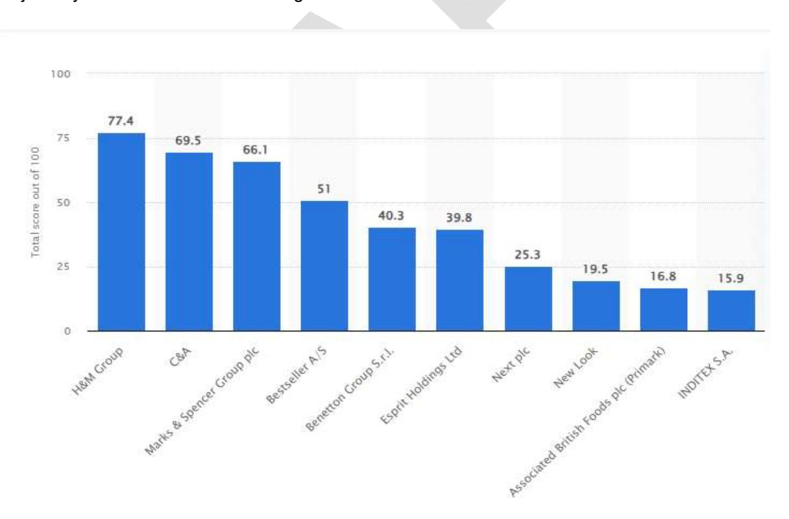

Figure 33. Sustainable cotton ranking score of the Europe-based apparel retailers in 2020. Source: Statista

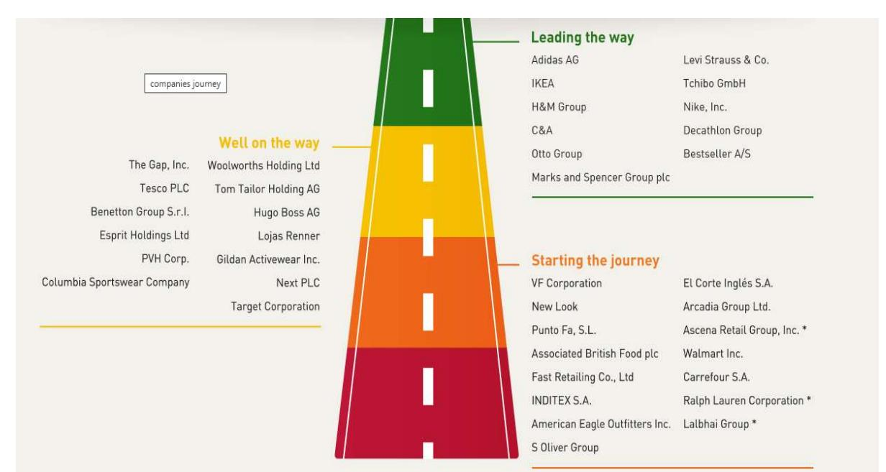

Figure 34. Sustainable Cotton Ranking 2020.

Regarding the "Big Ten" of the European Union, namely the ten companies with the most significant market presence, they are exhibiting a growing awareness of sustainability issues and increasingly acknowledging the challenges inherent in the fast fashion business model.

## Specifically:

## Zara

❖ Country: Spain

❖ ❖ Segment: Fast fashion ❖ Notable facts: Flagship brand of Inditext (Industria de Diseño Textil, S.A); global reach; known for speed-to-market.

Zara, as part of the Inditex Group, has developed a comprehensive sustainability strategy centered on climate action, circular economy practices, and sustainable sourcing. The company aims to reduce greenhouse gas emissions by 50% across its entire value chain by 2030 and achieve netzero emissions by 2040. By 2030, Inditex plans for 90% of Zara's textiles to originate from more sustainable sources, 40% from conventional recycling, 25% from next-generation materials, and 25% from organic or regenerative farming. Supporting this transition, Zara has invested in startups such as Galy and Circ, which focus on lab-grown cotton and textile recycling technologies, respectively (Reuters, 2024; Climate Action, 2023).

Zara has introduced the Pre-Owned platform to foster circularity by enabling customers to resell, repair, or donate clothing. Complementary recycling initiatives in stores are managed in partnership

with non-profit organizations (Inditex, 2024). In 2023, the company eliminated single-use plastics, and in 2024, halved the consumption of new paper bags, redirecting proceeds toward environmental programs in collaboration with WWF and Water.org (Inditex, 2024). Further sustainability efforts include restoring five million hectares of land by 2030 and supporting over 300 startups through its Sustainability Innovation Hub (Climate Action, 2023; Cinco Días, 2025). Although Zara no longer publicly promotes its Join Life label, it continues to implement sustainability standards internally. It also participates in initiatives such as the Better Cotton Initiative and the Zero Discharge of Hazardous Chemicals (ZDHC) program (Reuters, 2024; Weavabel, 2024).

### H&M

❖ Country: Sweden

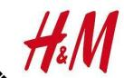

❖ ❖ Segment: Fast fashion ❖ Notable facts: Among the largest clothing retailers worldwide

H&M, a major global fashion retailer, has developed an extensive sustainability strategy targeting climate neutrality, circularity, and ethical supply chain management. The company has committed to achieving net-zero greenhouse gas emissions by 2040, with an interim goal of reducing absolute emissions by 56% by 2030. As of 2024, 89% of the materials used by H&M were either recycled or sustainably sourced, and 29.5% were recycled materials. H&M aims to reach 100% recycled or sustainably sourced materials by 2030 and 30% recycled content by 2025 (H&M Group, 2024; Impakter, 2024). To advance sustainable innovation, H&M supports projects through its Global Change Awards, including materials made from grape leather and manure-based textiles (Vogue, 2022). The company also promotes consumer circularity through garment collection bins in stores and a men's suit rental programme (Reuters, 2024).

To validate its environmental and social claims, H&M uses certified 100% organic cotton and has received Cradle to Cradle Certified® Gold for its newborn collection, ensuring high standards in material health, circularity, and social fairness (About H&M, 2022). The company is also a member of the Better Cotton Initiative and has pledged to eliminate virgin down and feathers by the end of 2025, achieving 90% recycled use as of 2024 (Reuters, 2024). H&M's 2021 Transparency Index score of 68% placed it second among global fashion brands, underlining its reporting efforts (Impakter, 2024).

## Adidas

❖ Country: Germany

❖ ❖ Segment: sportswear ❖ Notable facts: Second-largest sportswear brand globally (after Nike)

renewable energy integration, and the adoption of sustainable materials across its value chain. The company is committed to achieving net-zero emissions by 2050, with interim targets of reducing Scope 1 and 2 emissions by 70% and Scope 3 emissions by 42% by 2030, using 2022 as the baseline year. By 2024, Adidas had already achieved a 17% reduction in Scope 1 and 2 emissions and a 24% overall reduction in GHG emissions, including supply chain-related emissions (Adidas Group, 2024a).

To ensure the credibility of its environmental and social initiatives, Adidas has pursued multiple third-party certifications. As of 2023, the company had 70 sites certified under ISO 14001 for environmental management, 140 sites under ISO 45001 for occupational health and safety, and 324 sites under ISO 50001 for energy management (Adidas Group, 2024b). Additionally, its retail locations have earned Leadership in Energy and Environmental Design (LEED) certifications, including a Platinum certification for its Cape Town store (Adidas Group, 2024b). Adidas is also a signatory of the Science Based Targets initiative (SBTi), the Fashion Industry Charter for Climate Action, and the Fashion Pact, aligning its corporate strategy with international climate goals (Impakter, 2024).

## Louis Vuitton

❖ Country: France

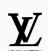

❖ ❖ Segment: Luxury fashion

❖ Notable facts: World's most valuable luxury brand (part of LVMH group)

Louis Vuitton, a flagship brand of the LVMH Group, follows a comprehensive sustainability strategy through its LIFE 360 (LVMH Initiatives for the Environment) program, which emphasizes circular creativity, biodiversity protection, climate action, and supply chain transparency. The brand has committed to reducing its greenhouse gas emissions by 55% by 2030 compared to 2018 levels and aims to achieve net-zero emissions across by 2050. In 2023, Louis Vuitton reported total greenhouse gas emissions of approximately 1.37 billion kg CO₂e, including 375.74 million kg CO₂e from Scope 1, 329.42 million kg CO₂e from Scope 2, and 1.14 billion kg CO₂e from Scope 3 (DitchCarbon, 2023). Additionally, the company is working toward sourcing 100% renewable electricity by 2026, a significant increase from 36% in 2019 (DitchCarbon, 2023).

To support its environmental and ethical objectives, Louis Vuitton has obtained several certifications. All its jewellery products have been certified by the Responsible Jewellery Council (RJC) since 2012, affirming the brand's adherence to rigorous standards in labour rights, environmental practices, and supply chain ethics (Louis Vuitton, n.d.). Furthermore, Louis Vuitton uses Forest Stewardship Council (FSC)-certified materials in its packaging and sources cotton through the Better Cotton Initiative (BCI), reflecting its commitment to sustainable sourcing and responsible production (Luxiders, 2020).

## Gucci

❖ Country: Italy

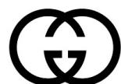

❖ ❖ Segment: Luxury fashion ❖ Notable facts: High-end brand under the Kering Group

Gucci, operating under its sustainability platform Gucci Equilibrium, has embraced a strategic framework called the "Culture of Purpose," introduced in 2015 with targets set for 2025. This strategy focuses on environmental stewardship, social inclusivity, and innovation-driven transformation. Gucci has aligned its climate goals with the 1.5°C target of the Paris Agreement by committing to a 40% absolute reduction in greenhouse gas emissions across Scopes 1, 2, and 3 by 2035. The brand also employs an Environmental Profit & Loss (EP&L) accounting methodology to assess and manage environmental impacts across its entire supply chain (Gucci Equilibrium, 2023a).

To reinforce the credibility of its sustainability actions, Gucci has obtained multiple third-party certifications. In 2019, it was awarded ISO 20121 certification for the sustainable management of its fashion shows and ISO 45001 certification for occupational health and safety at its main Italian offices, production facilities, and stores (Gucci Equilibrium, 2023b).

## Prada

❖ Country: Italy

❖ ❖ Segment: Luxury fashion ❖ Notable facts: Iconic Italian brand with a global influence

Prada Group's sustainability strategy, titled "IMPACT," is built upon three strategic pillars: Planet, People, and Culture. The company has committed to achieving net-zero greenhouse gas emissions by 2050, with an interim target of reducing emissions by 29% by 2026, using 2019 as the baseline year (Prada Group, 2024a). The company is also increasing its reliance on renewable energy and has become a founding member of the Re.Crea Consortium, which focuses on recycling and the sustainable management of post-consumer textile waste (Prada Group, 2024a).

## C&A

❖ Country: Netherlands

❖ Segment: Mass-market fashion ❖ Notable facts: Large European retailer with sustainability focus

C&A's 2028 Sustainability Strategy, titled "Renew & Restore, Innovate & Lead, Unite & Inspire," reflects the company's commitment to circular fashion, climate action, and responsible sourcing.

By 2022, C&A had reduced its greenhouse gas emissions by nearly 32% compared to its 2018 baseline and sourced 78% of its core materials—cotton, polyester, and man-made cellulosic fibres—more sustainably (C&A, 2023a). The company aims to achieve 100% sustainable sourcing of these materials by 2028. Supporting its circular economy goals, C&A launched jeans made from 100% recycled cotton and expanded second-hand resale pilot programs in Germany (C&A, 2023a). In terms of labour practices, C&A significantly improved supply chain transparency by increasing the number of its factories with verified Social & Labour Convergence Program (SLCP) assessments from 46% in 2021 to 87% in 2022 (C&A, 2023a).

C&A has also been a frontrunner in sustainable product certifications. It was the first global retailer to launch Cradle to Cradle Certified® Gold Level T-shirts in 2017 and followed with Gold Level jeans in 2018. As of 2023, the company had introduced over 4 million Cradle to Cradle Certified® items, including denim and babywear, and achieved the first-ever Platinum Level certification for denim fabric (C&A, 2023a). C&A is also one of the world's largest buyers of certified organic cotton, sourcing materials certified under both the Global Organic Textile Standard (GOTS) and the Organic Content Standard (OCS) (C&A, n.d.-a). Moreover, the company supports sustainable agriculture through its participation in the Better Cotton Initiative (C&A, n.d.-b).

## Mango

❖ Country: Spain

❖ Segment: Fast fashion ❖ Notable facts: Among the largest clothing retailers worldwide. Popular in over 100 countries

Mango's sustainability strategy, titled Sustainable Vision 2030, is built on three main pillars: "Committed to the Product," "Committed to the Planet," and "Committed to People." As part of this strategy, Mango aims to ensure that by 2030, 100% of the fibres used in its garments are either more sustainable or recycled. The company has set interim targets for 2025, including sourcing 100% sustainable cotton, 100% recycled polyester, and 100% traceable, controlled-origin cellulose fibres (Mango Fashion Group, 2023). In 2021, Mango reported that it had already reached 91% sustainable cotton, 59% controlled-origin cellulose fibres, and 54% recycled polyester (Mango Fashion Group, 2023). The brand is also improving consumer transparency by replacing its former "Committed" label with QR codes that provide detailed product and supply chain information (Mango Fashion Group, 2023).

In terms of certifications and measurement tools, Mango aligns its practices with several international standards. It uses metrics from the Sustainable Apparel Coalition (SAC) to evaluate sustainability performance and applies the Environmental Impact Measuring (EIM) Score developed by Jeanología to monitor the environmental footprint of denim production, particularly in terms of water consumption (Just Style, 2022). Mango is also committed to the Zero Discharge of Hazardous Chemicals (ZDHC) initiative to eliminate harmful substances across its supply chain. Furthermore, it uses the Greenhouse Gas (GHG) Protocol and follows the Science-Based Targets initiative (SBTi) to guide its emissions reduction pathway, with a long-term goal of reaching netzero emissions by 2050 (Just Style, 2022). To ensure durability and recyclability, circularityfocused garments are reviewed by Mango's internal Circularity Department and certified by the

This project has received funding from the European Union's Horizon Research and Innovation program under grant agreement N° 101181901 and from the Swiss State Secretariat for Education, Research and Innovation (SERI). Posts and shares reflect only the views of all the involved partners. Neither the European Union nor the granting authority can be held responsible for them. To validate and support its sustainability efforts, Benetton has obtained a number of recognized certifications. The company uses materials certified under the Global Organic Textile Standard (GOTS), Organic Content Standard (OCS), and Recycled Claim Standard (RCS), which verify the

Spanish textile institute AITEX (Just Style, 2022).

### Lacoste

❖ Country: France

❖ Segment: Casual/sports fashion ❖ Notable facts: Widely known for its polo shirts and sports-inspired fashion

Lacoste's sustainability strategy, known as "Durable Elegance," is structured around three key pillars: People, Planet, and Communities. In alignment with the Paris Agreement, the company has committed to reducing its Scope 1 and 2 greenhouse gas emissions by 47% and its Scope 3 emissions (per product sold) by 37% by 2030, using 2019 as the base year. These targets have been validated by the Science Based Targets initiative (SBTi), affirming their scientific robustness (Lacoste, 2022).

Beyond carbon emissions, Lacoste focuses on sustainable product development and circularity. The brand aims to reduce the environmental impact of each product sold by 15% by 2025 and double the average lifespan of its iconic polo shirts (Lacoste, 2022). This strategy involves shifting to preferred raw materials, promoting durability, and ensuring that 100% of unsold goods and textile waste are repurposed by 2025. To enhance product lifecycle assessments, Lacoste collaborates with the Product Environmental Footprint (PEF) technical secretariat and has introduced ecodesign training for its design teams (Lacoste, 2022). These measures reflect Lacoste's growing emphasis on integrating sustainability into both its operations and product ethos.

## United Colours of Benetton

## ❖ Country: Italy

❖ Segment: Mid-range fashion ❖ Notable facts: Benetton Group S.r.l. famous for colourful, casual clothing and early ethical marketing

Benetton Group's sustainability strategy is framed under its "Green B" initiative, launched in 2021 to consolidate its environmental and social commitments across all its brands, including United Colours of Benetton and Sisley. The strategy focuses on sustainable product design, renewable energy use, supply chain transparency, and community engagement. As part of its climate goals, Benetton has aligned with the Science Based Targets initiative (SBTi) to reduce greenhouse gas emissions by 2030 (Benetton Group, n.d.-a). Demonstrating a measurable commitment to sustainability, the company allocates 1% of its annual turnover to environmental and social impact activities (Benetton Group, n.d.-a).

organic or recycled origin of textiles and promote responsible production (Benetton Group, n.d.-c). Furthermore, Benetton participates in the Better Cotton Initiative (BCI), contributing to the adoption of more sustainable cotton farming practices worldwide. These certifications reinforce the company's commitment to embedding sustainability across the value chain, from raw material sourcing to final product delivery.

## 3.3 Textile reuse practices countries outside the EU

## 3.3.1 Global overview of second-hand clothing reuse and traceability challenges

The increased consumption of low-cost garments produced by the fast fashion industry has contributed to the generation of vast quantities of post-consumer textile waste. While reuse is prioritized over recycling and disposal in the EU waste hierarchy (European Parliament and Council, 2008), the large-scale export of second-hand garments from developed countries to the third-world countries has raised significant concerns. Key issues include the environmental fate of garments that are not reused, the socio-economic dynamics of SHC markets in recipient countries, and the lack of traceability mechanisms to ensure responsible trade practices (UNECE & ECLAC, 2023).

The reuse of textiles, particularly SHC, constitutes a major component of textile waste management in many developing countries, with Africa serving as a key case study. SHC imports have become a cornerstone of clothing consumption in numerous African nations, where over 80% of the population relies on these garments due to their affordability, durability, and fashion relevance (Sumo, 2024). These garments are predominantly sourced from developed countries such as the United States, China, the United Kingdom, and Germany, and are often donated or exported under charitable schemes before entering local resale markets (Sumo, 2024; IVL Swedish Environmental Research Institute, 2025).

From a socio-economic perspective, the SHC trade contributes substantially to local livelihoods. In Kenya, for example, the trade supports employment not only in direct retail activities but also in associated operations such as sorting, repair, and upcycling. This sector is particularly important for marginalized groups and communities with limited access to formal employment opportunities. It facilitates income generation, skills development, and the accessibility of affordable clothing, especially for low-income households (IVL, 2025).

While the reuse of textiles offers clear benefits, significant environmental challenges arise from the current implementation of SHC systems. One critical issue is the low quality of a substantial share of the imported garments, exacerbated by the proliferation of fast fashion. Many garments, upon arrival in African markets, are deemed unsellable due to damage, obsolescence, or material composition. These low-grade bales often end up in open dumpsites, rivers, marketplaces, or are incinerated without proper controls, contributing to pollution and disrupting local waste systems (Sumo, 2024; IVL, 2025).

Life Cycle Assessments (LCAs) show that textile reuse is among the most environmentally beneficial waste management strategies, regardless of whether garments are reused in Europe or abroad. Reuse outperforms recycling and incineration in terms of climate impact, energy savings, and reduced eutrophication. However, these benefits depend heavily on two key factors: the replacement rate (how many new garments are avoided) and the loss rate (how many reused items end up as waste) (IVL, 2025). Similarly, the replacement rate, that is, the degree to which reused garments displace the purchase of new ones, is a critical variable. Lower replacement rates lessen the environmental justification for reuse practices, especially when set against the potential of high-value textile-to-textile recycling.

Despite the increasing policy focus on circular economy principles in Europe, the traceability of exported garments remains limited. There is currently a lack of systemic monitoring mechanisms for the post-export phase of SHC, leading to significant data gaps in understanding the actual use, disposal, and environmental fate of these garments in the third-world countries (IVL, 2025). The absence of standardized quality control measures and certification systems across the SHC supply chain further exacerbates this lack of transparency. Poorly sorted or contaminated garments not only pose environmental hazards but also erode the trust and profitability of the SHC trade in recipient markets (Sumo, 2024).

Despite the socio-economic benefits, the imports of large volumes of SHC may undermine local textile industries by saturating the market with inexpensive goods14. Countries such as Rwanda and Kenya have debated restrictions or bans on imports for this reason, although such measures often lead to unintended consequences, including increased informal trade and a shift to low-cost new imports from other countries (UNEP, 2023). In Kenya, the SHC market, locally known as mitumba, plays a crucial economic and social role. It provides employment opportunities, affordable clothing options, and skill development in sorting, repairing, and upcycling. The sector is particularly vital for marginalized communities and informal workers. However, it also presents risks, including financial instability, informality in employment arrangements, and exposure to low-quality imports, particularly from China, that reduce profitability and consumer satisfaction (Nellström et al., 2025). Similarly, Chile has become a major importer of second-hand textiles, with the Iquique Free Trade Zone (ZOFRI) in northern Chile functioning as a major sorting and redistribution hub. Here, women primarily perform the sorting work, categorizing garments into quality grades for resale or re-export. Despite these efforts, significant amount of imported SHC is either unsellable or exceeds local demand and is discarded in landfills or informal dumpsites in the Atacama Desert (UNECE & ECLAC, 2023). The accumulation of textile waste in desert regions has created severe environmental and health concerns, particularly due to the burning of synthetic fibres, which releases harmful pollutants.

Efforts to regulate and improve traceability in the SHC value chain have gained traction in policy debates. Within the European Union, discussions are ongoing regarding the possible restriction or reform of textile waste exports to third-world countries (EEA, 2024). Such regulatory shifts are aimed at increasing the proportion of textiles recycled within Europe and reducing dependency on export-based reuse systems. However, these developments must be balanced against the socioeconomic role of SHC in importing countries. Without coordinated international frameworks and investment in local reuse and recycling infrastructure, restricting exports could unintentionally harm local economies that depend heavily on SHC for income and affordable clothing (IVL, 2025).

Efforts to improve traceability include proposals for the development of DPPs, harmonized definitions of textile waste, and minimum export criteria. Enhanced sorting practices in Europe, supported by automated technologies and better labelling, are also necessary to ensure that only garments with actual reuse potential are exported. Without these measures, the current trade system risks externalizing the environmental burden of textile waste from the Global North to the

This project has received funding from the European Union's Horizon Research and Innovation program under grant agreement N° 101181901 and from the Swiss State Secretariat for Education, Research and Innovation (SERI). Posts and shares reflect only the views of all the involved partners. Neither the European Union nor the granting authority can be held responsible for them.

This draft deliverable has not yet been validated by the granting authorities

14 There are arguments that the impact of China on the domestic textile industry is arguably more challenging than SHC. China's penetration into African apparel markets is underappreciated. Consequently, it is also the most underestimated hurdles to Africa's textile renaissance (Current Status of Mozambique's Second-Hand Clothing Market: Opportunities and Challenges, Consulting for Africa and Abalon Capital Limitada, p.44). The authors also stated that IMF's structural adjustment policies, the liberalisation of global trade, withdrawal of government subsidies throughout the national value chain as the explanation of this decline. While the erosion of local industries cannot be attributed solely to worn-clothing imports, its impact must be understood within a broader context of structural adjustment and trade liberalisation (The socioeconomic impact of second-hand clothes in Africa and the EU27+, Oxford Economics, 2024, Pag. 24).

third-world countries (UNECE & ECLAC, 2023; Nellström et al., 2025).

In conclusion, textile reuse in third-world countries offers both significant environmental and socioeconomic benefits, but these are highly contingent on the quality of imported garments, local waste management capacities, and the structure of SHC trade systems. Addressing the current limitations in traceability and quality assurance, while fostering regulatory harmonization and cross-border collaboration, will be critical for enhancing the sustainability and fairness of global textile reuse practices.

## 3.3.2 Country case studies: textile reuse practices in Africa and Latin America

## 3.3.2.1 Textile reuse practices in Africa

The global trade of second-hand textiles has significant environmental, social, and economic implications, particularly for developing countries that receive large volumes of used garments. While reuse practices contribute to climate mitigation and livelihood generation, concerns over traceability and the inflow of textile waste under the claim of reuse challenge the sustainability of this model.

Launched in 2023, the UNEP Circularity and Used Textile Trade Project aims to develop global guidelines that differentiate between textile waste and reusable textiles, promoting responsible trade. It works with stakeholders in countries such as Ghana, Kenya, and Tunisia to identify policy, regulatory, and investment priorities to support circularity (UNEP, 2023). This initiative is part of the broader One UNEP Textile Initiative, which integrates efforts to eliminate hazardous chemicals, reduce overproduction, and scale circular business models in the textile sector. By aligning with the UN's goals on sustainable consumption and production, the initiative seeks to embed traceability and accountability across the textile value chain (UNEP, 2023).

Ghana's SHC sector, around Accra's Kantamanto Market, is both a critical economic engine and a growing environmental concern. In Ghana, the used clothing market serves as an example of how global overproduction and consumption patterns translate into complex socio-environmental realities. Ghana is one of the largest global importers of second-hand clothing. It is estimated that the recent years (2022) is receiving approximately 15 million garments weekly or 111,329 tonnes annually (A.Khan, 2025). Kantamanto Market in Accra, spanning over 24 acres, hosts around 30,000 vendors and traders who rely on this inflow for income generation (Vintage Clothing Guides, 2023). The specific Market has an undisputable contribution to employment, and it is estimated to support 2.5 million livelihoods (Financial Times, 2024). However, the market also functions as a site where excess from the Global North is dumped under the guise of reuse. Key facts about this huge used textile market are the following (Ellen MacArthur Foundation, 2024):

 Textiles transported to Kantamanto market (Relative to the quantity of textiles imported into Ghana in 2022): 63% Textiles sent onwards to other markets in Ghana (Relative to the quantity of textiles transported to Kantamanto market): 30% Textiles exported to neighbouring countries (Relative to the quantity of textiles transported to Kantamanto market): 50% Textiles remaining for sale on Kantamanto Market (Relative to the quantity of textiles transported to Kantamanto market): 20% of which approximately 60% are considered

quality 1 and 2 grades, while 40% are considered low value and therefore likely to end up in final disposal.

The used textiles trade plays a vital role in Ghana's informal economy. Following the liberalization policies of the 1980s and 1990s, second-hand clothing became an affordable and accessible commodity for local consumers while offering economic opportunities to women, youth, and lowincome traders (Tetteh, 2023). Tailors, recyclers, and informal resellers form a decentralized value chain, allowing for low-cost repairs, restyling, and redistribution.

However, this system bears a high environmental cost. Up to 40% of imported textiles are unusable15 due to poor quality or damage, turning Ghana into a dumping ground for textile waste (A.Khan, 2025). This waste ends up in open landfills, coastal wetlands, and urban drainage systems, contributing to microplastic pollution and toxic chemical leaching (Phys.org, 2024). A recent investigation found discarded garments from major UK brands in protected wetland areas near Accra, exposing a failure of international supply chain accountability (The Guardian, 2025). In response to these challenges, Ghanaian creatives and NGOs have turned to upcycling and design innovation as mechanisms for local empowerment and environmental action. Organizations such as The Or Foundation and The Revival partner with communities to transform waste garments into new fashion, creating income while reducing landfill pressure (AP News, 2023). Events like Obroni Wawu October, an annual celebration of thrift and reuse culture, amplify these efforts by integrating fashion shows, community dialogues, and policy debates (Vogue Business, 2023). Calls for the Extended Producer Responsibility (EPR) legislation have gained momentum, advocating that fashion brands in the Global North contribute financially to the end-oflife management of their products in the third-world countries (Financial Times, 2024).

Textile reuse in Mozambique16 presents a complex interplay between informal economic practices, cultural adaptation, and environmental sustainability. Despite lacking a structured textile recycling industry, Mozambique exhibits widespread reuse behaviours, driven primarily by affordability and availability. Mozambique imported around 40,000 tonnes of used clothing in 2023 and is the second largest importer in the Southern African Development Community (SADC), after Tanzania (E&M Magazine,2025). Second-hand garments, locally referred to as "calamidades", are commonly sold in open-air markets and informal retail zones, such as Maputo's Feira de Xipamanine. This trade supports a significant number of micro-entrepreneurs, especially women, who rely on the resale of used clothing for livelihood (Nixon, 2019). Imported clothing is often redistributed across regions, generating a supply chain rooted in informality. These markets fill the gap left by Mozambique's underdeveloped domestic textile production and limited access to affordable new clothing (Mambo & Archer, 2022). Beyond resale, textile reuse at the household level is common. Clothing is frequently passed down within families or repurposed for alternative uses, such as cleaning rags, baby nappies, or shading material in agricultural settings. Tailors also play a vital role in repairing and creatively altering garments, often blending Western styles with traditional capulana fabrics. This form of upcycling, although largely informal, reflects a culturally embedded circular practice

This project has received funding from the European Union's Horizon Research and Innovation program under grant agreement N° 101181901 and from the Swiss State Secretariat for Education, Research and Innovation (SERI). Posts and shares reflect only the views of all the involved partners. Neither the European Union nor the granting authority can be held responsible for them.

This draft deliverable has not yet been validated by the granting authorities

15 It should be noted that a report by the Ghana Used Clothing Dealers Association (GUCDA) argues that less than 5% of secondhand clothing imported into Ghana could be considered immediate waste (because it is irreparable or unsellable). https://usedclothinggh.org/published-papers/an-evaluation-of-the-socio-economic-and-environmental-impact-of-the-second-hand-clothes-trade-in-ghana/

16 The study "The Second-Hand Clothing Industry in Mozambique: An Alternative to Survival for Millions of People and a Catalyst for Economic Growth, by Consulting For Africa (CFA) and Abalon Capital Limitada (Abalon), commissioned by ADPP Mozambique https://indd.adobe.com/view/7fb1110f-3339-4173-aa67-b6bf44d1dcf2" reveals that 85% of the Mozambican population buys second-hand clothing, making Mozambique the second largest importer of second-hand clothes in the SADC region after Tanzania. The trade in second-hand clothes ensures jobs for over 200,000 people, sustains more than 1 million livelihoods, and generates millions of dollars in taxes for Mozambique.

and has gained traction among youth who seek personalized or unique fashion statements (Fischer et al., 2021). Several non-governmental organizations and community enterprises have initiated textile upcycling and tailoring training programs aimed at women and youth. These initiatives aim to increase income-generating opportunities and reduce textile waste through skillbuilding and sustainable entrepreneurship. For example, the Mozambican organization MozEco supports workshops focused on turning textile waste into marketable products, aligning with sustainable development goals and climate resilience strategies (UNDP Mozambique, 2020).

## 3.3.2.2 Textile reuse practices in Latin America

Latin America has emerged as a significant player in the global SHC trade, with countries like Chile, Guatemala, Mexico, Nicaragua, Honduras, and El Salvador serving as major import hubs for what the industry terms "credential clothing" (Bank & Vogue, 2025). Among Latin American countries, Chile ranks as one of the top global importers of credential clothing. In 2021, the country imported over 126,000 metric tons of used garments, with approximately 40% entering through the Iquique Free Trade Zone located in the Atacama Desert, where clothes are manually sorted, and most of the leftovers that can't be resold end up illegally dumped in the desert, which serves as a central logistical hub for re-export and local distribution. Central America also represents a vital region for the SHC trade. Guatemala receives around 130,000 tons annually, followed by Honduras with 66,000 tons, Nicaragua with 52,500 tons, and El Salvador with 35,000 tons. (UNECE & ECLAC, 2023).

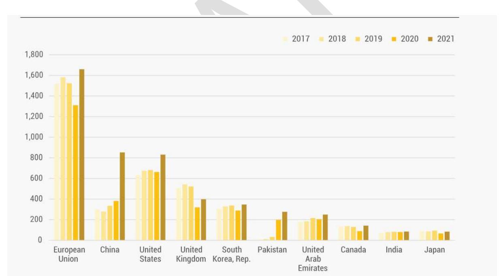

Figure 35. Exports of used clothing in selected countries and regions, 2001–2021, in million tons. Source: UNECE & ECLAC, 2023

Mexico presents a more complex regulatory environment. Despite being a major importer, the country imposes additional bureaucratic requirements, such as mandatory importer registration with the Secretaría de Hacienda y Crédito Público (SHCP), which can deter small-scale or new entrants into the market. Nevertheless, Mexico remains a significant player in the trade due to its large domestic consumer base and strategic proximity to the United States.

To enhance sustainability and accountability in textile reuse practices, the establishment of international standards that clearly define reusable garments versus waste is essential. Digital platforms such as blockchain could facilitate traceability, ensuring that garments shipped abroad are genuinely reusable. EPR schemes should also be implemented to make exporters accountable for the post-use phase of garments. Finally, capacity building in recipient countries is necessary to strengthen waste management and textile sorting infrastructure.

Multiple factors have contributed to the growing demand for credential clothing in Latin America. Economic affordability is a central driver. Rising inflation in the apparel sector, especially in countries like Argentina, has made new clothing unaffordable for large segments of the population. As a result, second-hand imports offer a critical alternative for low- and middle-income consumers.

Cultural perceptions around used clothing have also shifted. Whereas second-hand garments were once stigmatized as symbols of poverty or foreign surplus, they are now increasingly embraced by younger, urban populations as expressions of sustainable fashion or vintage style. This transformation reflects global trends in consumer awareness, where environmental and ethical considerations are influencing fashion choices.

Additionally, credential clothing complements the structure of local markets. Many Latin American economies lack strong domestic fashion brands with diverse offerings at affordable prices. Credential imports fill this gap by providing access to a wide variety of styles and international labels. These garments often cater to niches that are underserved by the region's mainstream fashion industry, including plus-size clothing, outerwear, and Western fashion. Credential clothing enters Latin America through formal trade channels, typically accompanied by all necessary documentation, such as bills of lading, certificates of origin, and fumigation certificates. In Chile, for example, all imports must undergo sanitary inspections and meet labelling standards. In Mexico, additional customs registrations are required, including proof of importer authorization and proper tariff classification. Despite its economic benefits, the credential clothing trade poses significant environmental challenges. In Chile, for instance, garments that cannot be resold, often low-value, synthetic, or soiled textiles, are illegally dumped in the Atacama Desert. These textile accumulations, often visible from satellite imagery, reflect the lack of proper waste management infrastructure and the unsustainable disposal practices tied to overconsumption. The governance of credential clothing imports varies widely across the region. While some governments promote the trade as a source of affordable goods and tax revenue, others raise concerns about consumer safety and environmental risk. Inconsistent regulatory enforcement further complicates the situation. In some countries, mislabelling or illegal dumping persists due to limited institutional capacity (Bank & Vogue, 2025).

Nonetheless, efforts are underway to address these issues. Regional trade bodies and NGOs have begun advocating for harmonized import standards and improved infrastructure for textile sorting and recycling. International organizations, including the United Nations and development agencies, are also encouraging greater transparency and circularity within the second-hand garment economy. Pilot programs in cities like Santiago and Mexico City aim to improve sorting processes and establish textile recovery centres to divert low-quality garments from landfills. On 22 August 2024, the Chilean Ministry of Environment proposed a Draft Circular Economy Strategy for Textiles. The strategy is part of a broader shift away from a linear economic model set out in the Roadmap for a Circular Chile by 2040. It aims to channel efforts to prevent the generation of waste, promote better quality garments and increase the reuse and recovery of textiles.

Socially, the trade supports job creation across multiple sectors. From logistics and customs brokerage to sorting, resale, and upcycling, credential clothing generates livelihoods for thousands of people in Latin America17. Informal street vendors, warehouse operators, and small retailers all depend on the consistent flow of imports. Moreover, the second-hand economy has catalysed innovation in sustainable fashion, with local designers and artisans incorporating used garments into upcycled collections or artisanal crafts.

Quality assurance is also an essential aspect of the trade. Bales of credential clothing are labelled according to grade, seasonality, or style, including categories such as "vintage," "tropical mix," or "premium." Importers and local distributors often rely on trusted suppliers to maintain consistency in quality, since variations can negatively impact consumer confidence and resale value. In recent years, some companies have begun implementing digital inventory tracking and traceability tools to improve oversight and transparency in the supply chain.

This project has received funding from the European Union's Horizon Research and Innovation program under grant agreement N° 101181901 and from the Swiss State Secretariat for Education, Research and Innovation (SERI). Posts and shares reflect only the views of all the involved partners. Neither the European Union nor the granting authority can be held responsible for them.

This draft deliverable has not yet been validated by the granting authorities

17 Guatemala's secondhand clothing (SHC) sector plays a critical role in supporting affordable clothing access, income generation, and material reuse in a country where 71 per cent of employment is informal and over half the population lives in poverty (Secondhand Clothing Imports from the United States to Guatemala: A Study of trade, distribution, and local impact https://www.garsonshaw.com/2025/07/study-secondhand-clothingimports-from-the-united-states-to-guatemala/).

## 3.4 Extended Producer Responsibility

## In a nutshell

The revised Waste Framework Directive introduces 2 main sets of measures:

A. Mandatory EPR schemes for textile and footwear products: All Member States are required to establish their own EPR scheme for textiles and footwear, following common rules applicable across the EU. Under such schemes, textile and footwear producers will pay a fee for each product they place on the market. This fee will finance collection schemes and the management of the collected textiles, providing for their re-use, preparing for re-use, recycling and disposal.

EPR fees will be adjusted based on sustainability criteria, such as the ones developed under the Ecodesign for Sustainable Products Regulation (ESPR), considering factors such as durability and recyclability. This approach, known as eco-modulation, links the cost producers pay for EPR to the sustainability of their textiles, thus encouraging them to design more circular and environmentally friendly products.

The EPR fees will also be used to inform consumers about sustainable textiles and footwear, and support research and development to improve product design, waste prevention and management operations.

B. New rules for the management of used textiles and textile waste: All separately collected textiles will be considered as waste, ensuring a uniform interpretation across Member States of what constitutes "waste" versus "used" textiles. This means Member States will have to ensure that separately collected textiles undergo sorting operations before their possible shipment, preventing waste from being falsely labelled and exported as reusable. If not sorted, textile waste will be subject to the Waste Shipment Regulation.

The concept of Extended Producer Responsibility (EPR) was introduced with its origins in Nordic countries and Germany. EPR gained traction as a way to address the growing issue of product waste. In a work by Lindhqvist in the 1990s "Extended Producer Responsibility is an environmental protection strategy to reach an environmental objective of a decreased total environmental impact from a product, by making the manufacturer of the product responsible for the entire life cycle of the product and especially for the take-back, recycling and final disposal. Extended Producer Responsibility is implemented through administrative, economic, and informative instruments. The composition of these instruments determines the precise form of the Extended Producer Responsibility."

Despite variation across the world, EPR policies have a common goal of reducing waste, by increasing the recycling of materials and, in turn, reducing the dependency on them. This goal is based on the "polluter pays" principle, which is the concept that producers take responsibility for their products at their end-of-life stage. The concept encourages product design with reusability in mind and incentivizes product designs that boost recyclability and minimize environmental impact.

Any business that manufactures, imports, sells, or brand-owns any product in an area with an active EPR policy could be considered a producer, depending on the area's policy. The definitions of each of these types of businesses are listed below (Source: Source Intelligence 2024):

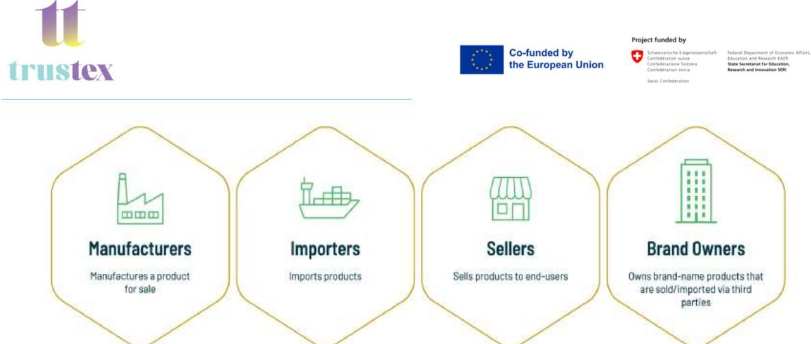

Figure 36. Definitions of types of businesses.: Source Intelligence 2024

Companies that meet any of the producer obligation criteria must check for EPR legislation in each country they operate in to assess their compliance. Countries may also have added thresholds for businesses, such as turnover and quantity of products placed on the market.

## 3.4.1 EPR in the textile sector

EPR, which holds producers accountable for the entire lifecycle of their products, is not a new concept in the textile industry. However, the regulatory landscape is undergoing significant change. While the EU leads in adopting such measures, similar initiatives are gaining traction worldwide, a trend that fashion and textile brands must be ready to navigate. Rather than placing the burden of textile waste on consumers and national governments, EPR shifts this responsibility to producers. Fashion brands are expected to take responsibility for their products from creation through to endof-life, including collection, recycling, and final disposal of textiles.

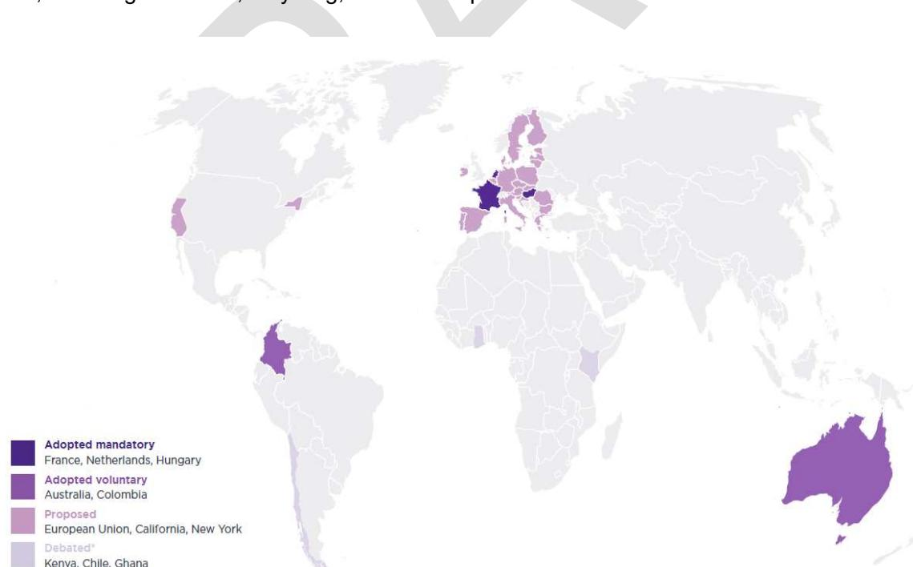

Figure 37. Map of existing and emerging EPR systems for textiles. Source: Ellen MacArthur Foundation, 2024

## 3.4.2 Textile EPR requirements

The specific EPR requirements can vary depending on the country, but they generally include several key elements such as (Lüttin, 2025):

 Reporting on the quantities or weight of clothes placed on the market, material type, endof-live management data and waste treatment processes. Participation in take-back schemes for waste collection. Fee payment per unit or weight of textiles placed on the market, which helps fund waste management and recycling systems. Eco-modulation mechanisms.

Eco-modulation refers to the practice of adjusting the fees that producers pay under EPR schemes based on the environmental impact of their products. In the textile industry, eco-modulation incentivizes companies to design, produce, and sell more sustainable textiles by modulating (increasing or decreasing) the fees they pay according to specific environmental criteria. According to these criteria, the "eco-friendlier" the textile product is, the less the producer pays.

The objective is to encourage apparel and footwear brands to account for the environmental impact of their products from the initial design phase. This entails the integration of sustainable practices across their operations, including the use of recyclable materials, the development of durable product designs, and the implementation of end-of-life garment recycling systems. Such measures contribute to the creation of products that are both environmentally sustainable and more suitable to recycling processes.

## 3.4.3 The role of Producer Responsibility Organisations (PROs)

In a collective EPR scheme, obligated businesses delegate their responsibility (fully or partially) to a third party. Typically, but not exclusively, the third party is a joint PRO, which fulfils obligations for the in-scope products on the businesses' behalf, and coordinates the activities identified as within the scope of such a body. The legally obligated businesses pay the PRO, in order to cover the necessary expenses for achieving the legally required outcomes and objectives. PROs are legally obliged to provide training and financial support to promote the inclusion of informal waste pickers and recyclers.

On 22 January 2025, leading PROs and industry associations announced the launch of the Textile PRO Forum, a voluntary European initiative coordinated by EURATEX. This Forum aims to harmonize the implementation of EPR schemes for textiles and footwear across EU member states. As Europe prepares for mandatory separate collection of textile waste under the updated Waste Framework Directive, the Textile PRO Forum seeks to address the fragmentation of up to 27 different national EPR models. By facilitating collaboration among PROs and business associations, such as Refashion, ATOK, Danish Fashion & Textile, Czech Cobat Tessile, and others, the Forum will share best practices and pursue strategic goals such as reducing administrative burdens, aligning eco‑modulation fee systems, supporting recycling efforts, and expanding PRO frameworks. Participants include 22 organizations spanning various European countries. Their joint efforts aim to streamline national EPR schemes, foster regulatory alignment, and advance textile circularity throughout Europe. Below is the list of the participating organizations:

## Table 9. List of PROs across European countries

| ATOK                           | Inretail                                      |
|--------------------------------|-----------------------------------------------|
| Cobat Tessile                  | Modin                                         |
| Comeos                         | Reconmy / Redress                             |
| Creamoda                       | Recydata                                      |
| Danish Fashion & Textile       | Refashion                                     |
| Electrao                       | RETEX.Green                                   |
| Erion Textiles                 | Retur                                         |
| EURATEX                        | RE-VISTE                                      |
| Fedustria                      | REFABRIK                                      |
| Finnish Textile & Fashion      | Stichting Producentenorganisatie UPV Textiel  |
| Gesamtverband Textil- und Mode | TEKO – Swedish Textile and Fashion Industries |

## 3.4.4 Benefits of EPR in the textile industry

If designed well, EPR policy significantly improves the cost-revenue dynamics for separate collection, sorting, reuse, repair and recycling of discarded textiles. EPR also delivers transparency and traceability on global material flows, and it helps to attract capital investments in the infrastructure needed to reuse and recycle at scale.

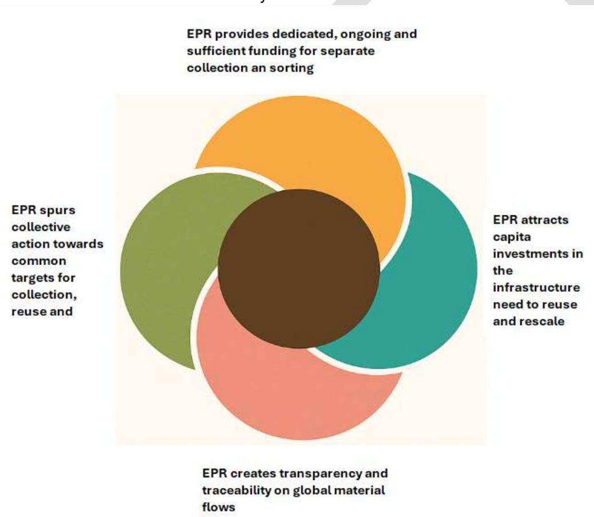

Figure 38. EPR benefits for the textile sector. Source: Ellen MacArthur Foundation, 2024

Around the world, the vast majority of textiles (more than 80%) leak out of the system when they are discarded. They are incinerated, landfilled, or end up in the environment. Separate, dedicated textile collection systems are underdeveloped and do not capture all textiles placed on the market.

This project has received funding from the European Union's Horizon Research and Innovation program under grant agreement N° 101181901 and from the Swiss State Secretariat for Education, Research and Innovation (SERI). Posts and shares reflect only the views of all the involved partners. Neither the European Union nor the granting authority can be held responsible for them.

In the current textile system, most business models are linear. They are based on high volumes of new products, made from virgin resources, which are often used for a short time and then thrown away. Also, products are not always designed to last and are often hard to recycle. Separate collection is the only way to keep textiles from ending up in the waste stream or worse, the environment. But today, the economics of separate collection and sorting do not stack up. Collecting and managing discarded textiles happens at a cost (beyond textiles with high reuse value), and sorters around the world experience challenging profitability. This is a key barrier to achieving a circular economy for textiles.

While sorters can generate a positive operating margin for reusable clothing, the non-reusable clothing fraction (sold to down cyclers or recyclers) is operating at loss, based on current market prices (Ellen MacArthur Foundation, 2024).

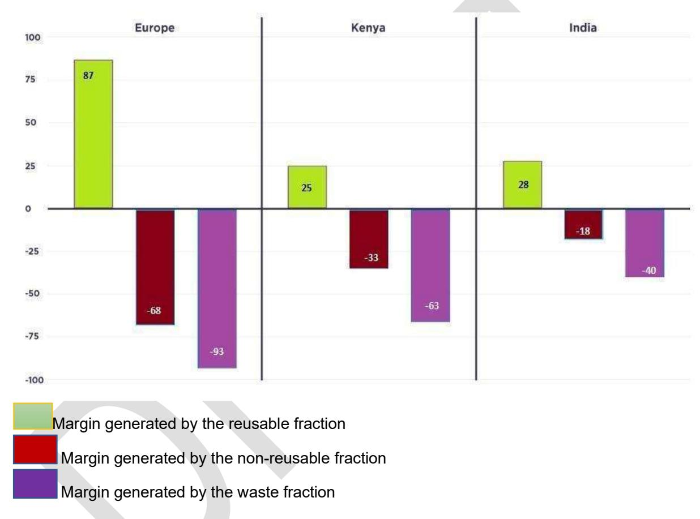

Figure 39. The business case for sorters in Europe, Kenya, and India. Source: Ellen MacArthur Foundation, 2024

## 3.4.5 Waste collection

Collection systems currently in place

Apparel and footwear companies are required to manage waste collection while also ensuring compliance with country-specific reporting obligations. For waste collection, brands can become members of a PRO. Even if this isn't mandatory in a given individual EU-member state, it's advisable to become a member of a PRO, otherwise brands will have to organize their own waste end-of-life processes such as waste collection.

Separate collection of waste fractions diverts recyclable materials from the residual or mixed municipal solid waste and thereby provides opportunities to make more value out of valuable resources that would otherwise be landfilled and incinerated (Albizzati et al., 2023). Main collection strategies for dry recyclables and textiles typically consist of pick-up schemes and drop-off schemes (Huygens et al., 2023).

Post-industrial textile residues are generated during the manufacturing process (e.g. cut-off leftovers), and their management is controlled by the textile manufacturer. It may involve on-site recycling, posterior management by industrial waste management as a third-party (business-tobusiness), or disposal. Post-industrial waste is usually clean and undamaged and of a well-known chemical composition and can often be recycled without any additional cleaning or sorting. Therefore, it is a preferred source for mechanical recycling processes (Huygens et al., 2023)

In the EU, textile waste is primarily gathered through street containers, commonly known as bring points. These are often supplemented by civic amenity sites where residents can dispose of household waste and recyclables not covered by standard curbside services (ΕΕΑ, 2024). Municipalities, charities, social enterprises, second-hand shops and retail companies (via takeback schemes) play a varying role in the collection of post-consumer textile waste. The organisations involved in separate collection are typically also responsible for sorting the collected textile material (Huygens et al., 2023).

Each collection method offers distinct advantages and inherent limitations. Indoor collection is particularly effective for obtaining high quality, clean textiles suitable for reuse (Wagner, 2022; van Duijn et al., 2022). However, limited opening hours and the small number of available sites can constrain the total volume collected. Bring points, while capable of handling larger quantities of textiles, are more susceptible to contamination than indoor systems (van Duijn et al., 2022). Specifically, moisture or exposure to rain can cause mould, rendering the textiles unusable. Given the sector's slim profit margins, cleaning, washing, or drying such contaminated items is not economically viable. Conversely, door-to-door collection incurs higher operational costs and is more prone to theft (van Duijn et al., 2022).

Overall, bring points are generally considered the most effective method for collecting substantial amounts of used textiles of reasonable quality (Wagner, 2022). Key factors, such as the strategic placement of collection points, collection frequency, container design and condition, as well as clear labelling and communication, play a crucial role in enhancing both the quantity and the quality of the collected materials.

Across Europe, the average textile waste capture rate is approximately 12%, meaning most textiles end up in mixed municipal waste streams, ultimately being landfilled or incinerated (ΕΕΑ, 2024). This highlights a considerable potential for improving separate textile collection systems. Luxembourg and Belgium lead with a 50% separate collection rate, followed by the Netherlands (37%) and Austria (30%). These countries employ diverse and well-structured collection systems adapted to various urban contexts.

## 3.4.6 EU Waste Framework Directive

The WFD was adopted in 2021 with the objective of enhancing waste management practices across the European Union. A central element of the Directive is the introduction of EPR, a policy approach whereby Member States are required to establish national legal frameworks that ensure producers assume responsibility for the entire lifecycle of their products, including post-consumer waste management.

In accordance with the WFD, all EU Member States are mandated to implement separate textile waste collection systems by January 1, 2025. This requirement obliges municipalities to segregate textile waste from general municipal solid waste.

In 2023, the European Commission proposed a targeted revision of the WFD focusing on the textile sector. Given the current fragmentation with various Member States applying different EPR schemes, compliance and reporting obligations for producers have become increasingly complex. The primary aim of the revised legislation is to harmonize these frameworks across the EU, thereby facilitating more coherent regulatory compliance while promoting innovation, sustainability, and circular economy principles within the textile and footwear industries.

Under the revised WFD, each Member State is required to introduce an EPR scheme specific to textiles. Producers will be held accountable for the post-consumer phase of their products. The policy is designed to incentivize the development of products with extended durability and enhanced potential for reuse, repair, and recycling. Producer contributions under the EPR scheme will also be directed toward infrastructure development, including separate collection systems, sorting and reuse facilities, and textile recycling plants

Additionally, the revised Directive introduces stringent controls to prevent the illegal export of textile waste. A clear distinction is now drawn between "waste" and "reusable" textiles, mandating comprehensive sorting processes prior to the export of used garments. These provisions aim to ensure that textile waste exported outside the EU is managed under environmentally sound conditions.

A provisional political agreement on the revised Directive was reached on February 18, 2025, between the European Parliament and the Council. This was subsequently endorsed by the European Parliament's Committee on the Environment, Public Health and Food Safety (ENVI) on March 18, 2025, and validated by COREPER (Committee of Permanent Representatives) in March 2025.

The revision of the Waste Framework Directive, Directive 2025/1892, entered into force on 16 October 2025.

By June 2027 EPR systems must be embedded in domestic law, and by April 2028 EPR systems must be operational (the deadline for microenterprises to comply with EPR schemes has an additional 12-month transition time until April 2029).

The following product categories are included:

## Textile products

 Knitted or crocheted clothing and accessories Non-knitted clothing and accessories Blankets and travelling rugs (except electric blankets) Bed linen, table linen, toilet linen, kitchen linen Curtains, drapes, and interior blinds Curtain or bed valances Other furnishing articles (excluding mattresses) Worn clothing and other worn articles Hats and other headgear made from plaited strips Knitted or crocheted hats, lace or felt headgear, and hairnets Non-textile apparel & footwear

## Leather clothing and accessories

 Waterproof footwear made from rubber or plastics Footwear with rubber/plastic soles and uppers Footwear with leather soles and uppers Footwear with textile uppers Other types of footwear

## 3.4.7 Overview of EPR implementation in the textile sector of EU Member States

Soon, every EU country will have its own textile EPR scheme. However, the only EU countries that have it in force currently are (Lüttin,2025):

Table 10. Countries with active EPR schemes in textile sector

| Country | Status   | Scope                            |         |           |
|---------|----------|----------------------------------|---------|-----------|
|         | In force | Considered a pioneer, France has |         |           |
|         |          | for textiles since 2008, holding |         |           |
|         |          | producers accountable for the    |         |           |
|         |          | Excluded:                        | leather | textile   |
|         | In force | The Netherlands introduced its   |         |           |
|         | In force | Mandatory licensing for textile  |         |           |
|         |          | household                        |         | textiles, |

| Country | Status   |                  | Scope           |           |
|---------|----------|------------------|-----------------|-----------|
|         | In force | Latvia's textile | EPR obligations |           |
|         |          | following the    | adoption of an  |           |
|         |          |                  | Includes:       | clothing  |
|         |          |                  | accessories,    | shoes and |

### France

France has been a pioneer in the implementation of EPR, having introduced legally binding EPR obligations for the textile sector as early as 2008. The enactment of the Anti-Waste for a Circular Economy (AGEC) Law in 2020 significantly broadened the scope of this framework by redefining the concept of a "producer" and establishing a series of enhanced regulatory obligations.

Key regulatory provisions include:

 EPR expansion to textiles: Producers of apparel, footwear, and household linens are required to finance the collection, sorting, reuse, and recycling of post-consumer textile products. Ban on destruction of unsold goods: The destruction of unsold textiles and footwear is prohibited, with the aim of encouraging reuse, donation, and recycling. Product volume reporting: Producers must annually report the number and type of textile products placed on the French market, disaggregated by category. Recycled content and recyclability disclosure: Brands are obliged to declare the percentage of recycled fibres in their products and whether these products are designed for recyclability. End-of-life management data: Producers must report detailed data on product volumes collected, reused, and recycled, including final waste treatment routes (e.g., donation, incineration, material recovery). Eco-modulation reporting: Information must be provided on hazardous substances, repairability, and durability to support the eco-modulation of fees according to environmental performance.

The French EPR framework for textiles applies to all new clothing, household linen, and footwear (CHF) placed on the French market, including overseas territories. It encompasses products sold or donated to consumers, whether new or upcycled, as well as those distributed through rental systems. Exemptions apply to items made entirely from leather or natural fur, imported secondhand products, and upcycled products composed exclusively of materials that have already fulfilled EPR obligations. All other materials (e.g., cotton, polyester, silk, recycled or not) fall within the scope of regulation. Additionally, clothing and accessories for animals marketed to consumers are covered under this framework (ADEME, 2025).

The obligations apply to any entity marketing textile products in France. While some companies operate individual take-back systems, most participate in Refashion, the accredited PRO managing a national network of textile collection points. The scheme follows an eco-modulated fee structure, whereby EPR contributions are adjusted based on environmental attributes. Standard EPR fees range between €0.01 and €0.06 per item.

year, detailing the quantities of textiles, footwear, and household linens placed on the market in the preceding year. Products must also display the Triman logo and corresponding sorting instructions (Info-tri) to guide consumers in appropriate end-of-life disposal.

The French EPR scheme is governed by the decree of 23 November 2022, which sets out the specifications for the accredited eco-organization (Refashion). It establishes quantitative and qualitative targets for the period up to 2027–2028.

## Quantitative targets (Collection, Reuse, and Recycling)

- i. Separate Collection Rate: 60% of the volume (by mass) of textiles placed on the French market in 2028.
- ii. Reuse and Preparation for re-use: 120,000 tonnes of used textiles sorted must be prepared for reuse or re-use. 15% of the collected and sorted textiles must be reused or re-used within a range of 1,500 km from the collection point by 2027.
- iii. Recycling: 70% recycling rate (of the collected, sorted but non-reused textiles) by 2024. 80% recycling rate (of the collected, sorted but non-reused textiles) by 2027.
- iv. Specific Recycling Target for Synthetic Materials: 90% recycling rate by 2027 for used textiles that contain at least 90% synthetic plastic fibres and are not reused.
- v. Disposal (Landfill/Incineration): A maximum of 0.5% of the collected or supported textiles is to be eliminated (landfill or incineration without energy recovery).
- vi. Repair: An increase of +35% in the volume of repair operations supported by the scheme by 2028 compared to 2019.

The scheme incorporates qualitative mechanisms to support eco-design and circular economy objectives:

- i. Eco-Modulation of fees (Bonus/Malus System): The scheme uses variable contributions to incentivize eco-design. Producers receive a bonus (reduced fee) or a penalty (increased fee) based on criteria like: Durability of the products. Inclusion of recycled materials (especially from post-consumer TLC waste). Presence of recognized environmental certifications (labels). Recyclability issues (e.g., penalties for materials that hinder recycling).
- ii. Support for Circular Economy: The eco-organization must dedicate funds to Develop and finance a local reuse and repair sector. Support R&D into new recycling technologies, especially for fibre-to-fibre recycling. Finance the collection and sorting infrastructure.
- iii. Consumer Information: Obligation to display the Triman logo and specific sorting instructions (Info-tri) on the product or packaging to guide consumers on disposal.
- iv. Prevention and Eco-design: Producers must adopt an eco-design approach, promote product longevity, and contribute to the prevention and management of waste.

As of 2025, France's eco-modulation scheme includes the bonuses for product durability, based on product-type-specific benchmarks, recognized environmental certifications (e.g., GOTS, Oeko-Tex® Made in Green), use of recycled materials, with financial bonuses of €1,000/ton for closedloop recycled content and €500/ton for open-loop recycled inputs. Penalties are being described for low recyclability, particularly for products containing metallo-plastic fibres or electronic

### components that impede recycling.

All eco-modulation data are submitted via Refashion's digital platform using standardized templates and must be accompanied by a waste prevention and eco-design plan, available through Refashion's official documentation.

By decree of 30/6/2025, the French Minister for Ecological Transition, Biodiversity, Forests, the Sea, and Fisheries approved CITEO as an accredited eco-organization responsible for managing single-use sanitary textiles (including wipes) under the EPR framework established by the French Environmental Code. Producers of these items, manufacturers, importers, and distributors, are required to either operate an approved individual system or join an accredited eco-organization to ensure proper end-of-life management. CITEO's accreditation is valid from 1 July 2025 to 31 December 2030, in accordance with the decree of December 2024 governing eco-organizations and individual systems for single-use sanitary textiles.

France introduced an EPR scheme for textiles in 2008, covering clothing, footwear, and household linens. Over the years the scheme has evolved and new legislation has supported its intentions, such as a ban on the destruction of unsold non-food products. The core principles are very similar to those covered by the EU-wide EPR legislation, such as paying a fee to finance the collection, sorting, reuse, and recycling of waste textiles, the use of a PRO to facilitate the scheme, and the eco-modulation of fees. What is interesting is the level of reporting that producers are required to do. Like reporting on the number of textile items they place on the French market, producers must report end of life management data (such as the quantity of products collected and how the waste was processed) and whether products are designed for recyclability or contain recycled materials. Discounts on fees are given on products that demonstrate durability, use recycled materials and have recognised environmental certifications. The average EPR fee paid in 2021 was €0.0116 per garment, although fees can be as high as €0.063 per garment. (Source: Source Fashion).

## Netherlands

As of July 2023, the Netherlands enforced EPR requirements for producers and importers of clothing, workwear, and household textiles (excluding footwear, belts, headwear, bags, blankets, and curtains). The list of the products included in Decree of 14 April 2023 are (M. van A. Zaken.2025): Clothing: Consumer clothing and work clothing, such as safety outfits; Household Textiles: Table linen, bed linen, and household linen, including items like hand and tea towels.

Items such as shoes, belts, headgear, blankets, curtains, and cleaning cloths are not covered under the EPR obligations. Unsold stocks are also excluded if they have not been placed on the market (Lüttin, 2025).

Foreign producers selling into the Dutch market must appoint an Authorized Representative.

The principal PRO, Stichting UPV Textiel, manages compliance, including collective collection, sorting, reuse, and recycling operations. Producers must report product volumes, pay EPR fees, and contribute to achieving national targets.

## Table 11. Key 2025 Targets of the Dutch ERP framework

| Target Category              | Goal for 2025                      | Goal for 2030                      |
|------------------------------|------------------------------------|------------------------------------|
| (Overall)                    | 50% of weight placed on the market | 75% of weight placed on the market |
| Prepared for Reuse (Minimum) | 20% of weight placed on the market | 25% of weight placed on the market |
| Reuse in the                 | Netherlands                        |                                    |
| (Minimum)                    | 10% of weight placed on the market | 15% of weight placed on the market |

| Target Category          | Goal for 2025                   | Goal for 2030                   |
|--------------------------|---------------------------------|---------------------------------|
| Fibre-to-Fibre Recycling | (High                          |                                 |
| quality)                 | 25% of the total recycled share | 33% of the total recycled share |

The Dutch EPR fee, effective from July 1, 2025, is set at €0.24/kg, prorated for the first year. Fashion brands must submit a provisional weight-based declaration before April 1 of each year and reconcile it the following year based on actual sales. Reporting is facilitated through the Textool system provided by Stichting UPV Textiel.

The Netherlands introduced EPR legislation for textiles in July 2023. This includes mandatory reuse and recycling targets for producers as of 2025 with reporting on those targets beginning from 2026. The EPR scheme covers clothing, workwear, and household textiles but not footwear, bags, blankets, or curtains. Fees are based on the estimated weight of textiles that producers plan to sell in the Netherlands in the upcoming year. They then submit actual sales for the calendar year and pay any differences in the fee. Currently, an average fee of €0.12 per kilogram is advised. The mandatory targets include one focused on fibre-to-fibre recycling. As of 2025, 50% of textiles sold in the Netherlands must be prepared for reuse or recycling, and 25% of recycled textiles must undergo fibre-to-fibre recycling. This rises to 33% by 2030 (Source: Source Fashion).

### Hungary

Hungary initiated its EPR scheme for textiles in July 2023. The scope includes a broad range of items classified by customs nomenclature codes (Process Solutions, 2023): Clothing, apparel, and accessories (knitted, crocheted, or not); Footwear; Household textiles (bed linen, table linen, toilet linen, kitchen linen); Furnishing articles (carpets, blankets, curtains, bed curtains).

The obligation falls on the entity that first places the product on the Hungarian market, which includes Hungarian manufacturers; Hungarian importers; Foreign companies engaged in distance selling (e-commerce) directly to end-consumers in Hungary.

Producers must fulfil their obligations by contracting with the state-designated concession company, MOHU MOL Hulladékgazdálkodási Zrt. (MOHU). The primary method is to join the collective system and pay the EPR fee, transferring the responsibility for waste management logistics to MOHU. Producers must register with both the relevant National Waste Management Authority and the concession company MOHU. Non-Hungarian companies selling directly to endconsumers in Hungary must appoint an Authorized Representative in Hungary to handle the EPR obligations.

Producers must pay an EPR fee (HUF 145/kg (€0.42/kg)) to MOHU on a quarterly basis. The fee is calculated based on the quantity (weight) of the circular products placed on the market during the quarter, multiplied by a fixed fee rate determined by the government for the textile product category. Producers must submit a mandatory report on the quantity of textile products placed on the market to the authorities and MOHU. The EPR fee generally replaces the previous Environmental Product Fee (or "Green Tax") for the products concerned, allowing producers to deduct the EPR fee when calculating the environmental product charge liability.

The Hungarian system generally does not impose individual reuse or recycling percentage targets on each producer, unlike France or the Netherlands. The EPR fee model is the main driver for

compliance. Hungary, as an EU member state, is still obligated to meet the EU-wide targets for waste collection and preparation for reuse/recycling (e.g., separate collection of textiles, and general recycling targets for municipal waste). The EPR fees fund the system (managed by MOHU) responsible for meeting these national targets. Unlike the more mature French and Dutch schemes, the Hungarian EPR fee structure does not widely use a bonus/malus (eco-modulation) system to incentivize environmentally friendly product design (durability, recycled content, etc.).

Hungary calculates its EPR fees based on textile weight. Its EPR legislation came into effect on July 1st, 2023 and requires producers to register with the National Waste Management Authority of the National Inspectorate for Environment and Nature (NWMD) and national PRO entity MOHU. It covers all textiles from clothing and accessories to blankets, curtains, carpets and home linens. Unlike other markets, Hungary requires its EPR fees to be paid quarterly, which means producers have to file a quarterly report on the amount of textiles placed on the market (Source: Source Fashion).

### Latvia

The EPR framework for textiles in Latvia, which became mandatory on January 1, 2024, is primarily a fee-based system that places the financial burden of waste management on producers. Unlike some other EU countries, Latvia's EPR system is strongly linked to its existing Natural Resource Tax (NRT) framework (State Environmental Service Republic of Latvia, 2025)

The EPR obligation applies to any entity that first places textile products on the Latvian market, which includes:

- Domestic manufacturers and importers.
- Foreign companies engaged in distance sales (e-commerce) directly to end-users in Latvia.
- There are no minimum thresholds based on company size or volume, meaning all businesses placing products in scope on the market are affected.

The scope is broad and generally covers products for consumer use, including:

- Clothing (apparel, garments, workwear).
- Footwear.
- Household Textiles (bed linen, table linen, towels, curtains, blinds).
- Accessories (even if textiles are not the main component).
- Bags.

Latvia's system primarily focuses on funding and infrastructure development to meet the overarching EU waste directives. The specific quantitative targets for reuse and recycling are set for the Producer Responsibility Organizations (PROs), not the individual producers, which must contribute financially to the system.

Producers must fulfil their obligations through one of two ways:

- Pay the Natural Resource Tax (NRT): The producer pays the NRT directly to the government on the volume (weight) of textiles placed on the market (the rate is reportedly €0.50 per kilogram of affected products).
- Join a PRO: The producer enters into a contract with an approved PRO (e.g., Latvijas Zaļais Punkts) to manage their obligations. By doing so, the producer is exempt from paying the NRT. Instead, they pay EPR fees to the PRO.

This project has received funding from the European Union's Horizon Research and Innovation program under grant agreement N° 101181901 and from the Swiss State Secretariat for Education, Research and Innovation (SERI). Posts and shares reflect only the views of all the involved partners. Neither the European Union nor the granting authority can be held responsible for them. The responsibility falls on producers, which includes (R. Mutilica,2025): Companies manufacturing textiles in Italy; Importers bringing textile goods into Italy; Online sellers/e-commerce platforms

The targets under the Latvian system are focused on ensuring the national waste management infrastructure can manage the textile waste stream.

The primary financial target is to generate sufficient funds (through NRT or PRO fees) to cover the costs of collection, processing, and recycling of textile waste across Latvia.

In essence, the Latvian EPR is designed to internalize the waste management cost into the textile product price, thereby funding the infrastructure necessary to divert textiles from landfill and incineration and move towards national reuse and recycling goals.

EPR legislation for textiles came into effect on January 1st 2024. Producers are charged a Natural Resource Tax (NRT) for their textiles of €0.5 per kilogram of applicable products to finance the collection, disposal and recycling of textiles. These include clothing, household textiles, accessories, bags and footwear. This amount can be reduced if the producer joins an EPR return scheme (Source: Source Fashion).

## 3.4.8 Forthcoming EPR legislation in additional EU Member States

### Belgium

A fully mandatory, national EPR scheme for textiles with specific legislative targets is currently in the preparatory stages. A broad range of textile and footwear products are included such as clothing and apparel, footwear, household textiles (e.g., bed linen, curtains, blankets, kitchen linen). A private voluntary platform Circletex vzw was established in 2022 by industry stakeholders, like the Belgian fashion federation Creamoda, to start early preparations and support future compliance with the mandatory EPR obligations, linking producers, collectors, and processors. Fedustria (Belgian non-profit federation of the textile, wood and furniture industry) announced at the first semester of 2025 a new circular economy initiative titled 'Retexbel' that will be set for launch in 2027. The Retexbel initiative aims to: Increase collection retention by 10%; Create more local reuse (targeting 10%); Improve traceability within the textile sector; Strengthen closed-loop recycling systems.

### Italy

Italy implemented the EU Directive through Legislative Decree No. 116/2020. The detailed regulatory and operational structure of the EPR scheme is being defined through a Draft Ministerial Decree prepared by the Italian Ministry of Environment and Energy Security (MASE), currently under public consultation. While the legal basis for separate collection is already in force, the full operational implementation of the EPR system, including the financial responsibilities of producers is expected to commence in 2026. From that point, producers will be required to register with the National Register of Producers, marking the formal start of their compliance obligations.

The system will rely on PROs, such as Erion Textiles, which will act on behalf of producers to coordinate the collection, sorting, reuse, and recycling of post-consumer textiles. Producers may either establish their own systems or participate in an accredited PRO to fulfil their legal duties.

The Italian EPR scheme is generally expected to cover a comprehensive range of finished textile products placed on the Italian market for the first time.

selling directly to Italian consumers.

The obligation applies to the entity that first places the finished product on the Italian market (manufacturer of components or semi-finished products are generally excluded). The draft decree's scope typically includes Clothing; Footwear; Accessories; Leather goods; Home textiles (blankets, bed linen, curtains); Mattresses (Products.Erion Textiles, 2025).

Producers will be required to finance and organize the end-of-life management of their products, ensuring that post-consumer textile waste is collected, sorted, reused, or recycled. To this end, producers must register with the National Register of Producers and contribute financially through eco-contributions paid to their designated PRO. These contributions will cover the operational costs associated with waste management and recycling (R. Mutilica,2025).

A central feature of the system is eco-modulation, the mechanism that adjusts producer fees based on the environmental performance of their products.

Producers will also be required to implement transparent reporting systems to document the quantities and types of textiles placed on the market. Clear labelling and consumer information, potentially integrated in the future through a DPP, will guide consumers on appropriate disposal and recycling practices, reinforcing the scheme's educational and behavioural change objectives (Producers.Erion Textiles, 2025).

Although specific national targets for recycling and reuse have not yet been finalized pending the publication of the final decree, they are expected to align closely with EU objectives and reflect an ambitious trajectory for improvement. Current estimates suggest that Italy collects approximately 20% of its textile waste, leaving substantial room for progress under the EPR framework (Assenza, 2025, Products.Erion Textiles, 2025).

The forthcoming targets are anticipated to focus on increasing the volume of post-consumer textiles collected for reuse and recycling, alongside establishing minimum thresholds for the proportion of collected textiles prepared for reuse or processed for recycling. Future policy measures may also introduce requirements or incentives for the integration of recycled fibres, particularly from closedloop processes into new textile products.

### Spain

The EPR framework for textiles in Spain is set by Law 7/2022 on waste and contaminated soil for a circular economy (Ley 7/2022, de 8 de abril, de residuos y suelos contaminados para una economía circular). While the law established the mandate, the specific operational details are being finalized through a subsequent Draft Royal Decree (Real Decreto). A pilot textile waste collection program commenced in April 2025, lasting one year. Full implementation of the national EPR system must occur within three years of the law's entry into force.

Producers must fulfil their obligations by joining or creating a Collective System for EPR (SCRAP - Sistema Colectivo de Responsabilidad Ampliada del Productor).

The Spanish EPR framework establishes comprehensive obligations for producers and applies to a notably wide range of textile and footwear products. Under this system, the term "producer" encompasses any entity that places textile or footwear products on the Spanish market for the first time on a professional basis. This definition includes domestic manufacturers, importers introducing such goods into Spain, as well as distance sellers and e-commerce platforms that sell directly to end users within the country, regardless of whether these users are households or businesses (Hurtado, 2025).

The regulation does not set a minimum compliance threshold. Consequently, all producers irrespective of size or production volume are required to register and comply with the EPR obligations. The scope of products covered by the draft decree is extensive and defined primarily through Combined Nomenclature (CN) codes. It includes textile-based apparel and clothing

This project has received funding from the European Union's Horizon Research and Innovation program under grant agreement N° 101181901 and from the Swiss State Secretariat for Education, Research and Innovation (SERI). Posts and shares reflect only the views of all the involved partners. Neither the European Union nor the granting authority can be held responsible for them.

accessories, footwear of any primary material composition, household textiles such as bed linen, blankets, and curtains, as well as leather goods and waterproof garments.

Certain exclusions apply to products intended exclusively for professional or industrial use, as well as to items already governed by other EPR streams, such as medical devices and specific categories of protective equipment. This broad and detailed approach ensures that the Spanish EPR framework encompasses the full lifecycle of textile and footwear products while avoiding regulatory overlap with existing waste management systems.

The targets set by the Spanish EPR are focused on collection and waste reduction and will align with the final EU targets (Glover.2025).

 All municipalities must implement separate collection for textiles. Producers must finance the full cost of waste management, including collection, sorting, preparation for reuse, and recycling operations.' The regulation encourages the involvement of local social economy enterprises in reuse and sorting schemes, with at least 50% of the public waste treatment contracts being reserved for insertion companies and social initiative Special Employment Centres.

Producers' financial contributions (eco-fees) to the SCRAPs will be eco-modulated based on product criteria to encourage eco-design. Higher fees will be applied to products that are more difficult to recycle or contain substances that hinder circularity, while lower fees or bonuses will reward durable, easily repairable, and highly recyclable products (RLG, 2025).

## Sweden

Sweden is one of the pioneering countries in the EU to establish an EPR framework for textiles, going beyond the basic requirements of the EU's Waste Framework Directive (WFD). The framework, based on a government inquiry (SOU 2020:72), aims to significantly increase the reuse and recycling of textiles and is characterized by ambitious reduction targets and clear producer obligations.

Separate collection of textile waste for reuse and recycling became mandatory in Sweden on January 1, 2025, aligning with the EU's WFD requirement. Producers must ensure their compliance obligations (licensing, financing, and participation in a collective system) are fully in place. Producers must enter into a contract with an approved PRO and notify the Swedish Environmental Protection Agency (Naturvårdsverket).

The scheme will cover clothing (consumer and workwear), footwear (shoes, accessories), and household textiles (e.g., bed linen, blankets, curtains, kitchen textiles). Products made from 80% or more textile waste (e.g., from fibre-to-fibre recycling) and 100% leather or natural fur garments are excluded.

The Swedish framework sets ambitious, long-term targets focused on waste reduction and increasing circularity (Schneider202, AxFoundation, 2025, Huygens et al, 2023):

 Waste Disposal Reduction: 70% reduction in the weight of discarded textiles by 2028 (compared to 2022 baseline), 80% reduction by 2032 and 90% reduction by 2036. Reuse and Recycling Rate: From 2028 onwards, at least 90% of the collected textile waste (by weight) must be prepared for reuse or sent for material recycling.

In line with the "Polluter Pays Principle", the financial responsibility in Sweden for the end-of-life management of textile products is transferred to producers.

The fee structure consists of two main components: administrative and inspection fees payable to the Swedish Environmental Protection Agency, and operational contributions directed to approved PROs to cover the costs of collection and treatment activities.

While the detailed parameters of the system will be defined in the final implementing set-up, it is anticipated that Sweden will adopt an eco-modulated fee structure.

## 3.4.9 EPR outside the EU

While the European Union was the first to implement EPR legislation, there are now active EPR policies on every continent. From North America to Australia, EPR policies continue to expand, impacting producers worldwide. However, despite its global presence, EPR compliance varies not only from country to country but also between regions, states, provinces, etc., from tariffs and fee structures to schedules and reporting requirements.

## Australia

 As of July 1, 2024, Australia has initiated a voluntary EPR framework for the textile sector, known as the Seamless Clothing Stewardship Scheme. This initiative was developed as part of the nation's broader circular economy strategy, aiming to divert approximately 200,000 tonnes of textile waste from landfills annually by 2030. The scheme encourages industry participation through the implementation of a voluntary levy of 0.04 Australian dollars per garment. The collected funds are allocated toward initiatives that promote the design of more durable and recyclable clothing, as well as the expansion of infrastructure for textile collection, sorting, reuse, and recycling. The Australian government has declared that should participation levels remain insufficient, legislative measures will be introduced to transition the scheme from voluntary to mandatory.

## Norway

Norway is in the process of establishing an EPR scheme for textiles, largely in alignment with EU developments. The Norwegian EPR scheme is expected to apply to producers (manufacturers, importers, and potentially online platforms) who first place textile products professionally on the Norwegian market. Products in scope are generally defined as any product, regardless of the mixing or assembly process employed, which consists mainly of textile fibres or leather. This typically includes, clothing (including workwear and uniforms), footwear, accessories and bags, household textiles (e.g., bed linen, towels, tablecloths, blankets, and non-attached carpets), healthcare textiles. Products expected to be out of scope (as they may be covered by other schemes) are those not mainly composed of textiles, such as furniture, mattresses, and certain types of carpets. According to published information (Systemiq, 2025), several pilot systems are now being evaluated by the Norwegian Fashion & Textile Agenda (NF&TA) with the aim of increasing the waste collection rate from the current 23% textile to 80% by the end of 2025.

## US California

In September 2024, California passed the Responsible Textile Recovery Act, making it the first American state to enact EPR legislation. The Act requires textile producers to join an approved PRO. These organizations will need to submit a plan for the collection, transportation, repair, sorting, and recycling of apparel and textiles in the state. The "producer" is defined as the person or company responsible for covered products. California has introduced a tiered approach:

- 1. The manufacturer of a product who owns or licenses the brand or trademark under which it is sold.
- 2. The brand owner or exclusive licensee if no such manufacturer exists in California.
- 3. The importer of a product if neither the manufacturer nor licensee are present.
- 4. If none of the above are present in the state, the distributor, retailer, or wholesaler selling the product, is responsible.

The sellers of second-hand products or who have less than \$1 million annual revenue are exempt. In terms of timeline, California's Responsible Textile Recovery Act requires all producers to join a PRO by July 1, 2026.

## US Washington

The Washington State bill HB 1420 (introduced on January 20, 2025) will establish a statewide EPR program for apparel and textiles.

 Covered products: apparel, footwear, accessories, and other items that contain cloth or fibre components (e.g. home textiles). Exclusions: Certain items such as PPE, military equipment, and personal hygiene products are typically excluded. Producers: Entities that introduce covered textile products into the Washington State market (manufacturers, importers, brand owners). Producers must either join or form a PRO by a set date.

The main features are:

 By January 1, 2027, producers must register with the state or join/form a PRO. Producers / PROs must submit a plan to the Department of Ecology for the management of covered products (collection, transportation, repair, recycling) by January 1, 2029. The plan must include convenient drop-off systems across local jurisdictions and tribes. Producers bear full operational cost of the collection, sorting, recycling, and management of post-consumer textiles. Annual reporting, record-keeping, and periodic review every five years of the plan. Civil penalties are proposed for noncompliance (e.g. \$1,000/day first offense; \$10,000/day subsequent).

### China

The system is driven by government guidance and market operation rather than specific PROs. While not an EPR scheme, this policy aims to accelerate the recycling of waste textiles by improving infrastructure, promoting green design, and enhancing producer and consumer responsibility. It focuses on creating a resource-circulating industrial system through coordinated efforts by multiple government ministries, stimulating market participation, and integrating technology and innovation. The policy includes targets for increasing recycling rates and mandates for improving recycling practices but does not enforce direct producer responsibility legislation.

## Colombia

Colombia was one of the first countries in the region to introduce EPR regulations, and while they cover a broad range of waste, the system has only become fully operational recently. The textile EPR system is voluntary and includes apparel. The program invites entrepreneurs in Colombia to learn about the importance of EPR in the fashion sector, as well as the relevance and current legislation on textile waste in Colombia and worldwide. The PRO in Colombia is Colombia Productiva, an autonomous Department affiliated with the Ministry of Commerce, Industry, and Tourism, responsible for supporting the business community to increase the productivity, quality, and added value of its processes, goods, and services.

### Chile

The EPR Law was introduced in Chile in 2016 and currently covers six product categories. The EPR model is very close to the approach used in Europe. It provides solid regulations making waste pickers a strategic stakeholder with rights and obligations. It is also one of the newest systems in the region that plans are underway to add textiles to the product scope a key strategy to promote sustainability and circularity. This means that textile producers will become financially responsible for the management of their products after they are discarded by consumers. The Chilean Ministry of Environment plans to begin the regulatory process for EPR for textiles before the end of 2025, with the aim of having targets in place by 2029. This initiative is part of a broader effort to transition towards a circular economy in the textile industry, reducing waste and promoting reuse and recycling (Ellen MacArthur Foundation, 2024).

### Ghana

In collaboration with the Government of Ghana, through the Ministry of Environment, Science, Technology and Innovation (MESTI), and the European Union Delegation in Ghana a national Circular Economy Action Plan (CEAP) has been developed. Currently, they are developing an EPR scheme for plastics, which will likely be expanded to textiles and other material streams over time. The forthcoming law will replace the existing voluntary system and make EPR a mandatory practice in the country.

### Kenya

Kenya has established a national EPR framework through the Sustainable Waste Management Act (2022) and the Sustainable Waste Management (Extended Producer Responsibility) Regulations of 2024. These instruments introduce EPR obligations for textiles and leather goods. The regulations operationalize producer responsibilities under the 2022 Act and required compliance by May 2025.

Textiles are included in the list of non-packaging products covered under the EPR Regulations. Producers, including manufacturers, importers, and distributors, must register with the National Environment Management Authority (NEMA) and submit an EPR plan outlining their waste management, collection, and recycling measures. Producers may comply individually or collectively via PROs, which are also regulated and certified by NEMA. Producers are mandated to design products to minimize waste generation, facilitate reuse and recycling, and promote the use of secondary raw materials. The regulations also provide for eco-modulated fees that reward sustainable design features.

Importers of textile products must pay the prescribed EPR fee at the point of importation and compliance is monitored through annual reporting and independent audits. Failure to comply with EPR obligations can result in penalties, revocation of licenses, and prosecution.

 Given the importance of the topic, what follows is the latest (10 October 2025) "Mapping of Global EPR for Textiles", by Global Fashion Agenda, summarising the most recent available information, including PROs by country.

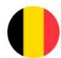

The Belgian federations representing retail (Comeos), household and bath linen production (Fedustria), and ready-to-wear (Creamoda) are currently in the process of establishing an EPR scheme for textiles in Belgium. Additionally, the regions (Flanders, Brussels and Wallonia) are working on EPR legislation.

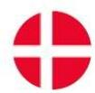

Denmark's National Action Plan for Textiles seeks to drive the circular transformation of the fashion and textile sector, with a Secretariat responsible for designing and implementing its initiatives. The plan outlines the path toward sustainable development in the industry, including preparations for EPR for textiles. Applications for the Secretariat were open from 18 June to 29 August 2025.

**Greece**

**Status**[In development](#).

**Obligated producer**N/A.

**Products in scope**N/A.

**Key actors/known PRO(s)**N/A.

**Other**N/A.

**Hungary**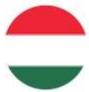

**Status**[Active](#) since July 2023.

**Obligated producer**Applies at the first domestic sale of the product. Foreign companies selling directly to customers in Hungary also have obligations.

**Products in scope**Apparel, accessories, footwear, home textiles & carpets.

**Key actors/known PRO(s)**[MOHU](#).

**Other**N/A.

**Italy**

**Status**[Upcoming](#). The Draft Ministerial Decree, which aims to establish an EPR system for textiles, was open for [public consultation](#) from 2 April to 5 May 2025.

**Obligated producer**Local or foreign companies that sell products in scope to customers in Italy.

**Products in scope**Apparel, footwear, home textiles & accessories.

**Key actors/known PRO(s)**[Erion Consortium](#); [Rematrix](#); [Retex Green](#); [Cobat Tessile](#); [ReDress](#).

**Other**N/A.

**Latvia**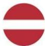

**Status**[Active](#) since July 2024.

**Obligated producer**Companies placing textiles on the Latvian market—including domestic manufacturers, importers, and retailers—are responsible for the costs of collection, processing, and recycling.

**Products in scope**Apparel, footwear & home textiles.

**Key actors/known PRO(s)**[Latvijas Zalais Punkts](#) with [Eco Baltia Vide](#).

**Other**Natural resource tax (NRT) of €0.50 per kilogram of textiles applies if the textile producer or retailer does not participate in the extended producer responsibility system, which ensures the proper management of these used textiles.

**Lithuania**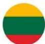

**Status**Upcoming. EPR implementation is planned for 2028.

**Obligated producer**Undefined.

**Products in scope**Undefined.

**Key actors/known PRO(s)**[Refabrik](#).

**Other**N/A.

**Netherlands**

**Status**[Active](#) since 2022.

**Obligated producer**Applies to manufacturers, producers, and importers. More specifically to ‘the party who is the first to offer the textile product professionally in the Netherlands.’

**Products in scope**Apparel, workwear & home textiles.

Unsold stock that has not been placed on the market is not covered whereas [returned products](#) that have been placed on the market are.

**Key actors/known PRO(s)**PROs: [Stichting UPV Textile](#); [Collectief Circulair Textile](#); [European Recycling Platform](#).

Key actors: [Inretail](#); [Modint](#).

**Other**In December 2024, the Dutch Government published its [Circular Textile Policy Programme 2025-2030](#), establishing its roadmap for a circular textile economy by 2050. Specific targets will need to be met for textiles: by 2025, at least 50% of textiles must be prepared for reuse or recycling, of which at least 20% must be for reuse, at least 10% for reuse within the Netherlands, and at least 25% of the recycling must be fibre-to-fibre recycling; by 2030, the targets increase to a minimum of 75% prepared for reuse or recycling, including at least 25% for reuse, at least 15% for reuse within the Netherlands, and at least 33% of recycling through fibre-to-fibre processes.

**Norway**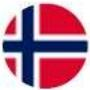

**Status**Planned. On 29 September 2022, the Ministry of Climate and Environment set up a working group with the task of preparing proposals for a producer responsibility scheme. The working group handed over its final report to the Minister for Climate and Environment on 10 October 2023.

**Obligated producer**Any company that brings textiles into circulation on the Norwegian market for the first time. Foreign companies that place products on the Norwegian market via online platforms will also have obligations.

**Products in scope**Apparel, footwear, accessories, home textiles & healthcare textiles.

**Key actors/known PRO(s)**Undefined.

**Other**N/A

**Portugal**

**Status**Upcoming. Pending the adoption of the WFD.

**Obligated producer**Undefined.

**Products in scope**Undefined.

**Key actors/known PRO(s)**Electrão.

**Other**There are already initiatives for the selective collection of textiles in many regions of Portugal. These operations are carried out by private actors, such as Humana Portugal.

**Spain**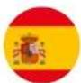

**Status**Upcoming. On 23 June 2025, Spain published a Draft Royal Decree introducing EPR for textiles and footwear. The draft decree was open for public consultation from 1 July to 4 September 2025.

**Obligated producer**Any manufacturer, importer, distributor, or distance seller placing textile or footwear products on the Spanish market, including domestic and foreign companies of any size or sales model.

**Products in scope**Textile and footwear products for household or similar use.

**Key actors/known PRO(s)**Gerescal & Re-viste.

**Other**Spain has launched Re-viste, former SCRAP initiative (Collective System for Extended Producer Responsibility), a pilot program for large-scale textile waste management. Major brands like H&M, Inditex, and Mango are involved. In April 2025, the program began testing collection methods across six municipalities, focusing on recycling and reuse. Collected textiles will be sorted for resale or recycling into new fabrics. Collaboration between councils, producers, and consumers is key to creating a sustainable waste management model for the sector, which accounts for 3% of Spain's GDP.

**Sweden**

**Status**Planned.

**Obligated producer**Companies based in Sweden placing textiles on the market in Sweden, and foreign companies that sell textiles to customers in Sweden.

**Exemption:** Producers that produce textile products from >80% textile waste (fiber-to-fiber).

**Products in scope**Undefined.

**Key actors/known PRO(s)**Naturvårdsverket, TEKO.

**Other**From 1 October 2025, Sweden has made the decision to no longer require separate collection of textiles that are torn, stained, or otherwise unsuitable for reuse or recycling. Such items should instead be disposed of with residual household waste, a measure intended to reduce sorting costs and ease pressure on recycling systems following the EU's separate collection requirement. Targets for textile waste reduction include a 70% reduction by 2028, 80% by 2032, and 90% by 2036.

**United Kingdom**

**Status**Undefined.

**Obligated producer**Undefined.

**Products in scope**Undefined.

**Key actors/known PRO(s)**WRAP, Chartered Institution of Waste Management; Circular Economy Taskforce; Valpak; Textile Recycling Association; British Retail Consortium; UK Fashion and Textile Association.

**Other**The UK's Waste/Resources Strategy (updated in 2023) stated that by the end of 2025, the UK Government will have reviewed and consulted on EPR measures for five new waste streams, including textiles, bulky waste (e.g., mattresses, furniture & carpets), construction & demolition materials, vehicle tyres, and fishing equipment. In 2023, the UK Government announced an expected delay, stating that progress first needs to be made implementing and assessing the new EPR system for packaging before EPR for other waste streams can be considered.

**Chile**

**Status**

 Under development. Textiles were added as priority products under Chile's EPR Law in June 2025.

**Obligated producer**

Any producer or importer of textiles into the Chilean market.

**Products in scope**

Clothing, household textiles, footwear, fabrics, and yarns.

**Key actors/known PRO(s)**

Undefined.

**Other**

In August 2024, the Chilean Ministry of the Environment proposed a Draft Circular Economy Strategy for Textiles, aligning with a broader shift away from a linear economic model set out in the Roadmap for a Circular Chile by 2040. In October 2025, the Circular Economy Strategy for Textiles by 2040 was officially launched. The strategy aims to prevent textile waste generation of waste, promote higher-quality textiles and boost reuse and recovery across the sector. EPR targets for textiles are expected by 2029.

**Colombia**

**Status**

Voluntary.

**Obligated producer**

Undefined.

**Products in scope**

Apparel.

**Key actors/known PRO(s)**

 Colombia Productiva.

**Other**

The program invites entrepreneurs in Colombia to learn about the importance of EPR in the fashion sector, as well as the relevance and current legislation on textile waste in Colombia and worldwide.

**California**

**Status**

Passed and signed in September 2024. Legal basis found in  SB-707 Responsible Textile Recovery Act of 2024.

**Obligated producer**

Any fashion company that makes or sells products in scope in the state of California.

**Products in scope**

Apparel, workwear, footwear, accessories (handbags and backpacks), home textiles.

The Act establishes stewardship programs for various products, including, among others, carpet, mattresses, and pharmaceutical and sharps waste.

**Key actors/known PRO(s)**

Undefined. In July 2025, industry associations signed an MoU to establish a PRO under California's EPR Law. The Department of Resources Recycling and Recovery's (CalRecycle) must approve the PRO by 1 March 2026, and apparel and textile producers must join by 1 July 2026. By 1 July 2030 or upon CalRecycle's approval, the upcoming PRO must submit a comprehensive plan detailing the collection, transportation, repair, sorting, recycling, and proper management of post-consumer apparel and textile articles in California.

**Other**

CalRecycle is tasked with adopting regulations to implement the program, with an effective date no earlier than July 1, 2028.

Starting 1 July 2030, or upon plan approval (whichever is earlier), producers must be in compliance with the program requirements. Non-compliant producers may face civil penalties up to \$10,000 per day, or up to \$50,000 per day for intentional or knowing violations.

**New York**

**Status**

Ongoing. Legal basis found on the  Senate Bill 6654.

**Obligated producer**

Undefined, but likely any company that manufactures or renovates a "covered product" that is sold, offered for sale or distributed to a consumer in New York.

**Products in scope**

Textile & apparel, workwear, footwear, accessories (handbags and backpacks), home textiles.

**Key actors/known PRO(s)**

Undefined.

**Other**

Obligated entities would be required to:

- • Either individually or cooperatively submit a plan to the Department of Environmental Conservation (DEC) for the establishment of a collection & treatment program by 31 December 2024, for approval by the Department.
- • Implement and cover the costs of the collection program (which must be free of charge to users) by July 1 2025.
- • Cover the costs of scheme administration and enforcement by the DEC, and consumer communications.
- • Submit annual reports on the functioning collection & treatment systems.

### Washington

#### Status

[Under debate](#). Proposed in January 2025.

#### Obligated producer

Will apply to large producers, importers and sellers of apparel and textile articles in the state of Washington.

#### Products in scope

Apparel, workwear, footwear, accessories (handbags and backpacks), home textiles.

#### Key actors/known PRO(s)

To be determined. The upcoming PROs will have to submit a comprehensive plan for the collection, transportation, repair, recycling, and safe and proper management of postconsumer apparel and textiles in Washington. The PROs will also be required to provide drop-off systems for them to outline collection sites. The plan must be submitted to the Washington State Department of Ecology by January 1, 2029, and it must be reviewed at least every five years.

The PROs also have a responsibility to oversee its implementation by conducting assessments, keeping detailed records and yearly submitting a report to the Washington State Department of Ecology.

#### Other

Producers of apparel and textile articles placing products in the market will be required to register with the Washington State Department of Ecology and join or form a PRO by 1 January 2027. Starting 1 March 2033, producers must be in compliance with the program requirements, and the department may supervise and adjust the performance standards. The non-compliant producers might face civil penalties amounting up to \$1,000 per day for the first violation and up to \$10,000 per day for the subsequent violations.

### Canada

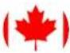

#### Status

[Under debate](#).

#### Obligated producer

Undefined.

#### Products in scope

Apparel.

#### Key actors/known PRO(s)

Involved organisations: [Canadian Circular Textiles Consortium](#), [Circular Economy Leadership Canada](#), [National Association for Charitable Textile Recycling](#), [Circular Opportunity Innovation Launchpad](#).

#### Other

N/A.

### Ghana

#### Status

[Under debate](#).

#### Obligated producer

N/A.

#### Products in scope

N/A.

#### Key actors/known PRO(s)

N/A.

#### Other

In collaboration with the Government of Ghana, through the Ministry of Environment, Science, Technology and Innovation (MESTI), and the European Union Delegation in Ghana a national [Circular Economy Action Plan \(CEAP\)](#) has been developed.

For now, they are developing an EPR scheme for plastics, which will be likely expanded to textiles and other material streams over time.

### Kenya

#### Status

Under debate under the [Sustainable Waste Management Act](#).

#### Obligated producer

N/A.

#### Products in scope

N/A.

#### Key actors/known PRO(s)

N/A.

#### Other

The Sustainable Waste Management Act represents a pivotal move toward integrating circular economy principles into national waste management. It mandates EPR schemes for companies across sectors, establishes a Waste Management Council to guide policy and regulatory oversight, and prioritises active public engagement to enhance sustainable practices.

**Australia**

**Status**[In Place](#), Voluntary.

**Obligated producer**N/A.

**Products in scope**Apparel.

**Key actors/known PRO(s)**[Seamless Clothing Stewardship Scheme](#).

**Other**There is a clear directive from national politicians that if a stewardship scheme is not taken up enough by industry, it will be formally regulated by the Australian Government.

**China**

**Status**Active. Voluntary. [Government mandated policy on textile waste recycling](#).

**Obligated producer**Encourages all textile manufacturers, especially large brands, and enterprises across the supply chain.

**Products in scope**Waste textiles including clothing, professional uniforms, home textiles & industrial textiles.

**Key actors/known PRO(s)**The system is driven by government guidance and market operation rather than specific PROs.

**Other**While not an EPR scheme, this policy aims to accelerate the recycling of waste textiles by improving infrastructure, promoting green design, and enhancing producer and consumer responsibility. It focuses on creating a resource-circulating industrial system through coordinated efforts by multiple government ministries, stimulating market participation, and integrating technology and innovation. The policy includes targets for increasing recycling rates and mandates for improving recycling practices but does not enforce direct producer responsibility legislation.

**India**

**Status**[Under debate](#).

**Obligated producer**N/A.

**Products in scope**N/A.

**Key actors/known PRO(s)**N/A.

**Other**During the [ESG Task Force meeting](#) on 22 May 2024, stakeholders discussed the importance of enhancing sustainability in the Indian textile sector, emphasising the need for recycling and resource efficiency. Participants highlighted the promotion of recycled materials and the establishment of recycling hubs as critical components of a comprehensive sustainability strategy. The Ministry of Textiles, led by Secretary Smt. Rachna Shah, aims to engage various stakeholders to develop a policy framework that incorporates feedback and promotes responsible production practices.

## Survey on the feasibility of EPR schemes

As in the 3.2.5 chapter on European consumer behaviour, adding on the desk research that resulted numerous sources and valuable input regarding EPR schemes, a focused survey on a European level, was conducted by ENA to further support with recent, as much as possible (16 October – 16 December 2025), evidence. The survey on the feasibility of EPR schemes resulted 100 responses from across Europe18 and the findings were the following.

The above "introductory" question validated an expected positive response, but actually it was a bridge for the next question regarding the weaknesses of the textiles EPR schemes. The weaknesses as found through the desk research were confirmed. The transnational regulatory gaps, complexity and administrative burden were the most addressed weaknesses.

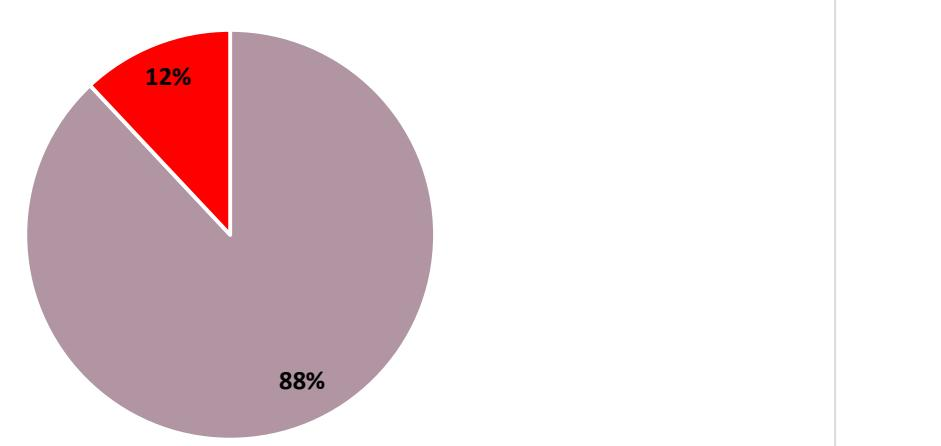

## What is in your opinion the feasibility of the textiles Extended Producer Responsibilities (EPR) schemes?

They are going to last They are not going to last

This project has received funding from the European Union's Horizon Research and Innovation program under grant agreement N° 101181901 and from the Swiss State Secretariat for Education, Research and Innovation (SERI). Posts and shares reflect only the views of all the involved partners. Neither the European Union nor the granting authority can be held responsible for them.

This draft deliverable has not yet been validated by the granting authorities

18 Belgium 14, Spain 13, Germany 11, France 8, Ireland 8, UK 8, Greece 7, Netherlands 6, Italy 4, Luxembourg 4, Denmark 3, Finland 2, Sweden 2, Other 10.

The open question on the most significant weakness of the textiles EPR schemes revealed as very much significant the transnational gaps, the lack of mechanisms, the complexity, costs and limited scope.

What do you consider to be the most significant weakness of the textiles EPR schemes?

The next open question requesting recommendations to ensure the effective functioning of the textiles EPR schemes, revealed as recommendations harmonisation and alignment, fees, DPPs, simplification, communication, transparency, reporting and collaboration.

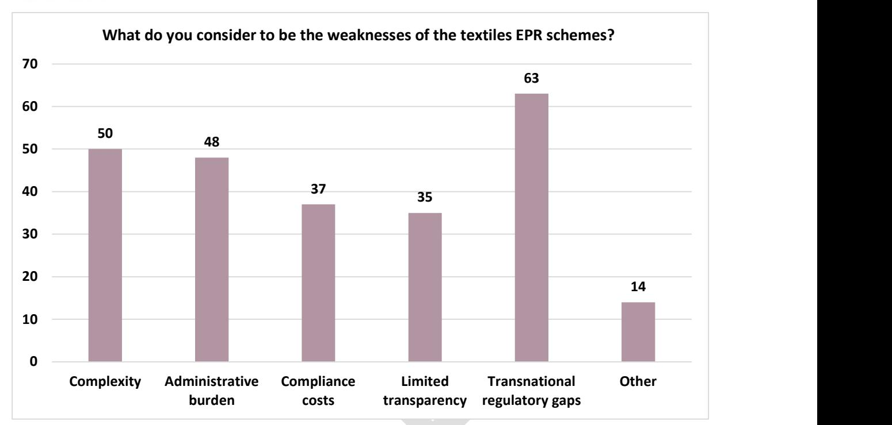

What do you recommend to ensure the effective functioning of the textiles EPR schemes?

# 4. TEXTILE WASTE

Textile waste constitutes a significant environmental concern, with the fashion industry being a major source of solid waste sent to landfills or incinerated. Textile waste and garments production and disposal have increased over the last decades, driven by prevailing consumer behaviour, price reductions and rising living standards. It is estimated that the textile industry produces a substantial amount of waste every year and currently most of the waste ends up as part of municipal solid waste. Therefore, textile waste reduction is one of the main goals linked to sustainable waste management, while its innovative management is important to further enhance sustainability and promote circularity.

In 2024, the world discarded enough clothing to fill more than 200 Olympic stadiums, highlighting a significant crisis of textile waste (R.Sajdeh et al., 2025). Every year, the fashion industry produces over 100–150 billion garments, using approximately 93 billion cubic meters of water and generating 1.2 billion tons of CO₂ emissions, while also releasing around 500,000 tons of microplastic fibers into the oceans. Globally, an estimated 92 million tons of textile waste accumulate throughout the various stages of the products' life cycle, with half of it generated after consumer use. Despite this, only 15–20% of discarded textiles are collected for reuse or recycling, while more than 80% end up in landfills or are incinerated (Shamsuzzaman et al., 2025).

Europeans throw away some 16 kilograms of textiles every year. Together, this accounts for 6.95 million tonnes for the whole of Europe. Of all discarded textiles, only 4.4 kilograms are selectively collected. The vast majority still ends up in residual waste and 85% of this waste is made up of clothes and domestic textile items (ΕΕΑ, 2024).

A summary of textile waste generation in European countries in 2020 is presented in Figure 40, regarding the amounts of textile waste collected separately from households, those collected for economic activities, and the household textile waste that ends up in mixed municipal waste. The data on the amounts of separately collected textile waste show substantial variation between countries, from as low as 1 kilogram per capita in Sweden, Finland, Hungary, Latvia, Greece and Ireland, to as high as 15.5 kilograms per capita in Belgium (EEA, 2024).

Impending legislation such as the WFD, that requires mandatory separate textile collection from households throughout Europe by the current year 2025, will drive the scaling of collection, sorting and recycling infrastructure across the EU. Inevitably, the mandatory collection of textile waste will result in increased collection of low-value, non-reusable textiles. It is also noted that from the total of 1.95 Mt of textile waste separately collected, only 38% collected for sorting, and 10% for reuse and recycling (Textile Exchange. Preferred Fibre & Materials, Market Report, 2020).

Last, 40% of this textile waste in Europe is reused or recycled, whereas the remaining 60% is exported to third countries (46% to Africa and 41% to Asia). The traceability is lost, with a large fraction still disposed of in these countries. These facts underscore the urgent need for a transformative shift (EEA, 2023).

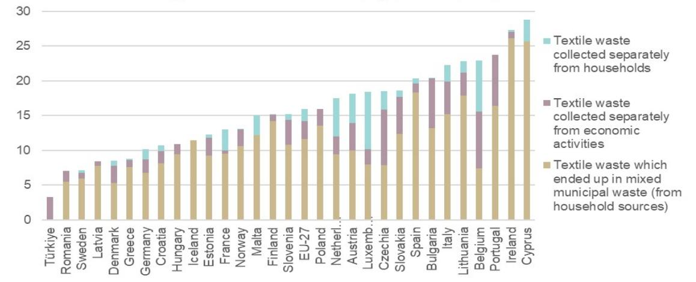

Figure 40. Textile waste generation in kilograms per capita in 2020. Source: ΕΕΑ, 2024.

The results from the separate collection of textile waste showed that the main source of textile waste is post-consumer in most countries, which refers to discarded clothing and household textiles after consumer use (clothes, towels, bedding etc.). On average, post-consumer waste accounts for 82% of all textile waste generated (household and non-household sources), followed by post-industrial and pre-consumer waste, accounting for 17% and 1%, respectively (EEA, 2024). The notable portion of post-consumer waste underscores the significant impact of consumer behaviour on textile waste generation, highlighting the need to encourage consumers to adopt sustainable textile reuse practices and reduce environmental impact.

Moreover, regarding the environmental impact, the clothing and textile sectors significantly contribute to plastic waste generation, as synthetic fibres are composed of polymers. More specifically, in 2020 textile consumption in the EU was responsible for a carbon footprint of 270 kg CO2 per capita (EEA, 2023), as Figure 41 depicts.

Global fibre production reached a record of 124 million tonnes in 2023, rising from 116 million tonnes in 2022. Since 2000, when production stood at 58 million tonnes, global output has more than doubled and is projected to increase to 160 million tonnes by 2030. Polyester has been the main driver of this expansion, overtaking cotton as the most widely used fibre worldwide in the mid to late 2000s. Synthetic fibres have dominated the market since the mid-1990s, accounting for about 84 million tonnes, or roughly 67%, of total fibre production in 2023. Polyester alone represented around 57% of global output, with production reaching approximately 71 million tonnes. The second most common synthetic fibre, polyamide (nylon), contributed 6.7 million tonnes, corresponding to about 5% of the global market. Plantbased fibres held a market share of around 25% in 2023, with total production reaching 31.4 million tonnes. Cotton remains the most significant natural fibre and the second most used fibre overall, with around 24.7 million tonnes produced in 2023, representing roughly 20% of global fibre production (Textile Exchange,2024a).

## THE ENVIRONMENTAL IMPACT OF TEXTILES

In 2020 textile consumption per person in the EU required on average:

And caused a carbon footprint of about **270** kg

Figure 41. Environmental impact of textiles in 2020. Source: EEA, 2023.

## 4.1 Reuse practices in textile waste

Consumption of textiles has increased substantially during the past few decades. In this context, the innovative management of textile waste is important to enhance sustainability and circularity. Both reuse and recycling have environmental and economic benefits, such as saving energy, water, land and emissions, creating employment opportunities, supporting charities and reducing waste disposal volumes. The interest in increased textile reuse and recycling is consistent with the growing attention being given to the circular economy concept in international and national policy.

The need to recover fabric waste stems mainly from the viewpoint of resource recovery and the harmful effects of disposal and landfilling on the environment. Generally, the environmental benefits of textile reuse and recycling include the potential to reduce virgin textile fibre production and avoid processes further downstream in the textile product life cycle. Moreover, clothing reuse can significantly reduce textile waste in landfills, lower demand for raw materials, and thus support the transition towards a sustainable textile industry and a more circular fashion system. These practices help reduce environmental impact, conserve resources, and promote circular economy principles. However, reuse is widely recognised as more beneficial than recycling and includes various means for extending the useful service life of textile products from first owner to another (Lorena et al., 2017).

## 4.1.1 Textile waste converted into second-hand textile products

Reusing textile waste and converting it into second-hand textile products involves repurposing used or discarded fabrics into wearable or functional items, thereby extending their lifecycle. This is a key strategy within the circular economy model adopted by the EU and many other regions for promoting sustainable fashion and reducing environmental impact.

In general, the most common textile waste reuse practices are as follows:

 Collection and sorting Upcycling Donation and resale Clothing swaps and rental Recommerce and return / turn-back schemes

## Collection and sorting

Collection and sorting of textile waste is crucial for ensuring that textile reuse and conversion into second-hand products function efficiently. This system forms the foundation for the circular textile economy, allowing materials to be reused, upcycled, or recycled effectively.

There are multiple pathways to meeting the EU's circular economy goals, but the textile sector faces two key challenges. Enhancing sorting and recycling processes and decreasing overall consumption. The industry places significant focus on improving sorting and recycling, as the two are closely linked. High-quality collection and sorting are essential for efficient recycling, while progress in recycling technologies can make sorting more cost-effective (Valtere, M et al., 2025).

This project has received funding from the European Union's Horizon Research and Innovation program under grant agreement N° 101181901 and from the Swiss State Secretariat for Education, Research and Innovation (SERI). Posts and shares reflect only the views of all the involved partners. Neither the European Union nor the granting authority can be held responsible for them. Donating used clothes supports charities that distribute them to low-income families as well as disaster relief efforts or sell them to fund charitable activities. As for the environmental

Textile waste gathered mainly from post-consumer household sources and pre-consumer waste (industry leftovers) is collected through public collection bins (often run by municipalities or NGOs), retail take-back schemes (e.g., H&M, Zara, Levi's in-store collection) or municipal collection (Chen et al., 2021).

Next, items are sorted manually or automated based on the type, colour, size, fabric and quality. Quality assessment is an important step, which determines the reuse or refurbishment process. Textile grading describes quality categories, ranging from highquality items which can be directly resold in second-hand markets to low-quality (nonreusable) items which can be recycled or downcycled into new products.

## Upcycling

Another widely adopted reuse practice is upcycling, which is an innovative, creative, lowenergy, and socially inclusive method for transforming textile waste into new value-added products. It enhances the sustainability of the fashion industry by extending the life of materials and supporting local economies. However, its full potential relies on systemic support, better infrastructure, and consumer education.

Upcycling is a growing trend among fashion designers, helping to save resources and keep large quantities of textile waste out of the disposal pathway, while adding value to discarded items and encouraging creativity and sustainability (Ghosh and Subarna, 2025). Unlike recycling, upcycling retains much of the original fabric's structure, saving energy and preserving textile quality. The purpose of the upcycling process is to deconstruct textiles, plan new items based on available materials and reconstruct them, often using patchwork or collage-like methods. Examples include the upcycling of T-shirts into bags or wall arts, jeans into other types of denim products, curtains into dresses or tablecloths, etc.

Fibrelab is a company that takes waste post-consumer textiles and creates new products including upcycled garments, paper products e.g. tags and notebook covers, cushion inserts and bespoke design projects.

More and more brands or organizations are adopting the method and applying it as they seek solutions to the industry's environmental impact and offer socially and environmentally conscious choices to their customers. However, upcycled products depend on available waste materials and may face limitations due to the uniqueness of each item.

## Donation

Donation plays an important role by supporting social causes while supplying the secondhand market. However, charities are increasingly burdened by the volume and poor quality of donations. For textile donation systems to remain sustainable, they need to be paired with public awareness, sorting infrastructure, and policy alignment.

aspect, donating garments extends their lifespan, reducing the volume of textiles sent to landfills. Moreover, keeping clothes in circulation, donations decrease the demand for new clothing production, conserving water, energy, and raw materials.

Regarding clothing donation behaviour, studies indicate that consumers often do not associate giving clothes to charity with environmental benefits, but primarily for philanthropic reasons (Fenitra et al., 2021). Younger individuals, particularly university students, may be more inclined to donate due to heightened environmental awareness and exposure to sustainability education (Klucarova et al., 2022). The convenience of the donation channel is an important factor in determining where the clothes would be donated (Fenitra et al., 2021). Through the overall act of donation, consumers gain both hedonistic (i.e., good feeling) and utilitarian benefits (i.e., freeing up closet space) from donating clothes. However, despite positive intentions, several barriers may hinder clothing donation. These include the lack of community awareness regarding where or how to donate can prevent action. In this context, limited access to donation centres or inconvenient locations can deter individuals. Last, the time and effort required to sort and deliver items may discourage donations.

## Repair and refurbish

The repair and refurbish activities focus on extending the useful life of textile products. These actions recover the functionality and value of garments without transforming them into new materials, allowing them to be directly reintroduced into the use cycle. The process may include repairing damaged components, minor aesthetic improvements, or replacing specific elements, ensuring that garments retain their performance and quality. This approach represents a key reuse strategy, reducing waste generation and avoiding the need to produce new products, thereby saving resources and minimising environmental impact. (Ramesh et al 2022). Various factors influence the decision to repair a product, particularly emphasizing the interaction between emotions and personal, economic and social variables (Bettiga et al 2025).

## Clothing swaps and rental

Clothing swapping or rental is a growing movement among young consumers, especially Gen Z and Millennials, providing a cost-effective way to refresh wardrobes. They can acquire new-to-them clothing without spending significant amounts, making fashion more accessible (Armouch et al., 2024). This practice also challenges the fast-fashion model by promoting reuse over constant purchasing. Clothing swaps contribute to reducing textile waste by extending the life of garments. Each item swapped represents one less garment potentially ending up in landfills, thereby conserving resources like water and energy required in producing new clothing.

Across Europe, many initiatives promote clothing-swapping behaviour, such as events where individuals exchange garments, large-scale facilities and neighbourhood-based swap networks (Eco Styles, 2023). As for clothes rental, peer-to-peer and brand rental marketplaces operate, offering high-end and trendy fashion brands for rent, with various rental durations and services (Commons, 2024).

While clothing swaps offer numerous benefits, challenges such as ensuring quality control, managing logistics, and reaching broader audiences persist. Addressing these issues is crucial for the scalability and effectiveness of swapping initiatives.

## Recommerce and return-back schemes

Online marketplaces facilitate the buying and selling of pre-owned clothing, making it easier for consumers to participate in textile reuse. These platforms often provide user-friendly interfaces and wide reach, encouraging more people to engage in sustainable fashion practices (Practical Ecommerce, 2024). In return or take-back schemes, many brands collect used clothes for resale, recycling or repurposing. Another initiative is corporate uniform reuse programs where old uniforms are refurbished or repurposed.

## 4.1.2 Second-hand clothing global markets and consumers

Purchasing second-hand clothing online is growing rapidly, as second-hand shopping has become more popular and socially acceptable over the last few decades, due to economic and environmental drivers. Purchasing pre-owned garments can significantly reduce environmental impacts, including reduced carbon emissions and water usage, as the need for new garments declines.

The global second-hand market is experiencing significant growth, driven by increasing consumer demand for affordable, sustainable and unique fashion options. Garments in good condition are resold through thrift stores, flea markets, consignment shops, and online platforms like Vinted, ThredUp, Poshmark and Depop. This practice supports a circular economy by keeping clothing in use longer and reducing demand for new production. Moreover, second-hand culture is encouraged by regulatory measures as well as innovative retail strategies. Across Europe, various programs demonstrate the multifaceted approaches undertaken to promote textile reuse, including social initiatives, community-driven movements, and policy frameworks. For instance, the EU WFD requires that by the current year 2025 all EU Member States shall establish separate collection systems for used textiles. The directive stimulates various national initiatives to develop infrastructures for efficient textile waste management. In this context, the EU has proposed regulations holding producers accountable for the entire lifecycle of textile products, including financial contributions to support separate collection, sorting, reuse, and recycling, thereby encouraging sustainable practices within the textile industry.

Moreover, non-profit programs participate in reuse practices, such as RREUSE Network, which is an international non-profit network linking social enterprises active in reuse, repair, and recycling across Europe. RREUSE advocates for policies favouring end-of-life product reuse and repair, contributing significantly to the EU's circular economy. Major retailers are integrating second-hand offerings into their business models, reflecting the mainstreaming of pre-owned fashion. Last, fashion brands across the EU are increasingly adopting upcycling practices, showcasing the fusion of classic materials with modern aesthetics.

In the EU, textile reuse practices vary across member states, influenced by national policies and waste management infrastructures. Countries such as Luxembourg, Belgium, the Netherlands, and Austria have implemented effective collection systems, resulting in higher rates of textile reuse and recycling (OECD, 2024). A significant portion of Europeans participate in the second-hand market, with 87% reporting engagement in buying or selling used goods, considering a variety of motivations. The primary motivator is lower price when purchasing second-hand clothing across EU countries. Moreover, sustainability and

environmental impact is a key reason to buy second-hand clothes (between 40% and 50% of consumers in countries like France, Germany, Italy, and the UK cite eco-friendly concerns). Finally, the desire for distinctive and vintage items also drives consumers toward second-hand markets. Consequently, the second-hand market has expanded rapidly over recent decades. It is estimated that in 2025, the second-hand apparel global market will be valued at 264 billion dollars, while the projections for 2028 indicate growth to 350 billion dollars. Furthermore, the EU's second-hand apparel market is valued at approximately 17.3 billion dollars in 2024, while projections indicate that it will grow at a CAGR of 7.7%, reaching around 36.4 billion dollars by 2034 (Future Market Insights, 2024).

Taking into consideration the previous information, as well as the various initiatives demonstrating engagement to textile reuse and the second-hand market, Table 12 provides an overview of textile reuse practices and the current status of sustainable textile management across EU countries.

### Table 12. A summary of reuse practices and second-hand market status in EU countries.

| Country      | Second-hand market Reuse practices Current status            |
|--------------|--------------------------------------------------------------|
| Second-hand: | 85%                                                          |
| Second-hand  | market                                                       |
| CAGR         | (2024–2034):                                                 |
|              | ● Collection points in accessible locations.                 |
|              | governmental and non-governmental                            |
| Second-hand: | 12%                                                          |
| Second-hand  | market                                                       |
| CAGR         | (2024-2034):                                                 |
|              | ● Repair incentive programs to motivate consumers for        |
|              | ● Open-loop recycling, where used textiles are repurposed    |
| Second-hand: | 22.8%                                                        |
| Second-hand  | market                                                       |
| CAGR         | (2024-2034):                                                 |
|              | ● Rich history in textile reuse, combining traditional       |
|              | Need for enhanced recycling                                  |
|              | infrastructure and technologies –                            |
| Second-hand: | 30%                                                          |
| Second-hand  | market                                                       |
| CAGR         | (2024-2034):                                                 |
|              | ● Collection of used and discarded textile and clothing from |
|              | Establish collection containers and                          |

| Country      | Second-hand market Reuse practices Current status          |
|--------------|------------------------------------------------------------|
| Second-hand: | 59%                                                        |
| Second-hand  | market                                                     |
|              | ● Separate collection and sorting of used textiles through |
|              | ● Industry collaborations for textile conversion into new  |
|              | ● Repair and reuse programs for collecting, sorting and    |
| Second-hand: | 77%                                                        |
| Second-hand  | market                                                     |
|              | ● Collection for sorting and recycling, resale or export.  |
| Second-hand: | 44%                                                        |
| Second-hand  | market                                                     |
| CAGR         | (2025–2029):                                               |
|              | ● Separate collection                                      |
|              | ● Textile recycling                                        |
|              | High textile reuse rate – established                      |
|              | collection systems and public                              |
| Second-hand: | 40%                                                        |
| Second-hand  | market                                                     |
| CAGR         | (2025–2032):                                               |
|              | ● Second-hand clothing and donation to charitable          |
|              | Low public awareness about                                 |
|              | campaigns are being conducted to                           |

This draft deliverable has not yet been validated by the granting authorities

| Country              | Second-hand market Reuse practices Current status            |
|----------------------|--------------------------------------------------------------|
| Second-hand:         | 38.2%                                                        |
| Second-hand          | market                                                       |
|                      | ● Use of recycled materials, i.e. recycling wool.            |
|                      | ● Circular fashion and products with extended lifecycles.    |
|                      | ● Eco-friendly dyeing techniques, like natural and waterless |
|                      | Municipal collection and recycling programs involve          |
|                      | High public awareness about                                  |
|                      | sustainable reuse practices and                              |
| Second-hand:         | 46%                                                          |
| Second-hand          | market                                                       |
| CAGR                 | (2025–2029):                                                 |
|                      | ● Separate collection via commercial banks and charity shop  |
|                      | campaigns are essential to raise                             |
|                      | awareness about sustainable                                  |
| Second-hand:         | 40%                                                          |
| Second-hand          | market                                                       |
|                      | ● Collection systems i.e., containers or reuse shops         |
|                      | Reuse c hannels, i.e., domestic reuse shops                  |
|                      | Innovative methods are being                                 |
| Finland Second-hand: | 10%                                                          |
| Second-hand          | market                                                       |
|                      | products, promoting a circular lifecycle for textiles –      |
|                      | returning used textiles is essential.                        |

This draft deliverable has not yet been validated by the granting authorities

| Country Second-hand market | Reuse practices Current status                                     |
|----------------------------|--------------------------------------------------------------------|
|                            | Finlayson's Recycling Campaign. Separate collection: Not Mandatory |
| Second-hand:               | 55%                                                                |
| Second-hand                | market                                                             |
| CAGR (2024–2032):          |                                                                    |
|                            | ● Charity shops and donation bins – many retailers provide         |
|                            | ● Textile recycling programs to collect used textiles, sorting     |
|                            | ● Repair and upcycling workshops for teaching how to mend          |
|                            | Scrap stores for collecting and redistributing reusable            |
|                            | High public awareness about                                        |
|                            | sustainable reuse practices and                                    |
| Second-hand:               | 47%                                                                |
| Second-hand                | market                                                             |
| CAGR (2025–2032):          |                                                                    |
| Market Size                | (2025):                                                            |
|                            | ● Automated recycling infrastructure scheduled to be               |
|                            | ● Industry challenges and developments.                            |
|                            | ● Collection and sorting containers located in streets.            |
|                            | Moderate public awareness about                                    |

Source: Future Market Insights, 2024; Statista, 2025; IBIS World, 2025

(\*) UK and Switzerland not part of the EU but enlisted in this table.

## Second-hand market in third-world countries

In many developing countries, the reuse of textiles plays a pivotal role in both economic and cultural processes, influenced by external waste streams and growing local initiatives. A significant volume of used clothing from Western nations is exported to developing countries, including Ghana, Vietnam, and Turkey. While this practice provides affordable apparel, it also poses environmental and economic challenges, especially in several African countries, primarily due to the massive flow of low-quality second-hand clothing and inadequate waste management infrastructure.

Africa's engagement with textile recycling and reuse practices is multifaceted, reflecting both the continent's rich traditions and contemporary challenges. While certain regions have embraced innovative recycling initiatives, others grapple with the environmental and economic impacts of imported second-hand clothing. The massive flow of imported second-hand clothes often overwhelms local waste management systems, resulting in improper disposal methods like open burning and unregulated landfilling, leading to environmental pollution and health issues. In Ghana, for instance, markets are inundated with low-quality garments, leading to substantial waste increase (My Joy Online, 2025).

It is also mentioned that only South Africa generates 680,000 tons of textile waste annually. Local designers and organizations are addressing this issue by upcycling discarded materials into new fashion items, promoting sustainability and economic activity. Last, the social and economic impacts of textile recycling and reuse are notable in these countries, especially the employment opportunities being created especially for women (Page and Truter, 2024). However, challenges persist, including inadequate infrastructure, limited access to advanced recycling technologies, and competition with inexpensive imported textiles. In response to these challenges, innovative recycling and upcycling initiatives are emerging, while NGOs, and the private sector establish sustainable waste management systems and support local recycling enterprises. Addressing the abovementioned, Africa's participation in textile waste management is multifaceted, combining community-driven initiatives, policy reforms, and international support to build sustainable and textile industries.

The second-hand apparel market in Africa is experiencing significant growth. In the Middle East and Africa, it is projected that the second-hand market will grow from 1.6 billion dollars (2023) to approximately 3.34 billion dollars (2032), reflecting a CAGR of 8.43% from 2024 to 2032 (Credence Research, 2024).

Textile waste conversion into second-hand products is a significant practice in many African countries, such as Ghana, Kenya, Nigeria, Tanzania, South Africa, and Uganda, where used clothes and other textile waste are repurposed to contribute to the local economy, provide affordable clothing, and reduce environmental impact. Second-hand clothing is preferred by most consumers because it is more affordable compared to locally made garments that are more expensive. A portion of the population favours thrifted clothes because they offer better variety than locally manufactured apparel. Then there is a small percentage that opts for thrifted clothes to promote environmental sustainability (Greenpeace, 2023). However, some argue that the quality of second-hand clothes has been gradually declining, with a part of the imports ending up in landfills either because

This project has received funding from the European Union's Horizon Research and Innovation program under grant agreement N° 101181901 and from the Swiss State Secretariat for Education, Research and Innovation (SERI). Posts and shares reflect only the views of all the involved partners. Neither the European Union nor the granting authority can be held responsible for them.

they are too damaged or outdated to be resold (the unsellable garments are being disposed leading to environmental pollution). Still, there are organisations and reports saying the opposite and that a very low percentage ends up as waste19 .

Thus, Africa's textile reuse landscape is evolving with innovative solutions. In response to the abovementioned, many organizations in Africa have pioneered in textile recycling and upcycling projects, in order to promote environmental sustainability. The action of various African countries in textile reuse is summarized in Table 13.

Regarding Asian countries, textile waste management presents a complex landscape, influenced by rapid industrialization, fast fashion trends, and varying levels of infrastructure and regulation. Some countries have initiated recycling programs and international collaborations, significant efforts are needed to improve recycling rates, implement effective policies, and mitigate environmental impacts. India is one of the largest importers and recyclers of second-hand clothing in Asia, while China is one of the world's largest textile producers, generating substantial amounts of both pre- and post-consumer textile waste amounting 26 Mt annually. However, recycling and upcycling are the most common methods in Asia, as presented in Table 13. Especially in India, there is the largest textile recycling hub, converting rejected items from around the world into recycled yarns and fabrics. Last, the Asian second-hand apparel market is projected to grow from 16.23 billion dollars in 2023 to approximately 47.39 billion dollars by 2032, reflecting a CAGR of 12.56% (Credence Research, 2024). Factors such as technological advancements, increased consumer awareness, and supportive policies are likely to further drive this expansion.

This project has received funding from the European Union's Horizon Research and Innovation program under grant agreement N° 101181901 and from the Swiss State Secretariat for Education, Research and Innovation (SERI). Posts and shares reflect only the views of all the involved partners. Neither the European Union nor the granting authority can be held responsible for them.

19 Mitumba Consortium Association of Kenya: https://mitumbaassociation.org/wp-content/uploads/2023/11/The-Quality-of-Second-Hand-Clothes-Imported-to-Kenya-and-the-Associated-Environmental-Impacts.pdf

### Table 13. A summary of recycling and reuse practices in African and Asian countries.

| Country Second-hand |                                                                     |
|---------------------|---------------------------------------------------------------------|
| market              | Reuse practices Current status                                      |
| ●                   | Rewoven Africa in Cape Town, Rewoven Africa utilizes a              |
| ●                   | “Clothes to God” organization collects post-consumer clothing,      |
| ●                   | Second-hand clothing actions, due to the used textile imports.      |
| ●                   | Unusable garments are disposed of in landfills or rivers or being   |
| ●                   | Collection of used textiles from organizations in Nairobi, for      |
| ●                   | Collection of used jeans and uniforms that are transformed into     |
| ●                   | Drop-off points of cotton clothing donation.                        |
| ●                   | Closed-loop recycling for regeneration of fabric waste into virgin |
|                     | Encouraging and investing in local                                  |
|                     | recycling businesses can reduce                                     |
| Market Size         |                                                                     |
| (2023): \$93        |                                                                     |
| ●                   | Second-hand clothing imports mainly from the UK, China,             |
|                     | Recycling and reuse landscape is                                    |

| Country Second-hand |                                                                 |
|---------------------|-----------------------------------------------------------------|
| market              | Reuse practices Current status                                  |
| ●                   | Upcycling practices from local designers or organizations for   |
| ●                   | ELNAK Recycling transforms textile waste into eco-friendly      |
| ●                   | Traditional recycling processes from family-run micro          |
| ●                   | Collaboration between the Egyptian Government and UNIDO for     |
| ●                   | Egyptian Clothing Bank organization which diverts textile waste |
|                     | Need for enhanced separation and                                |
| Market Size         |                                                                 |
| (2025): \$141       |                                                                 |
| ●                   | Fabric scrap is reused to produce new products such as rugs and |
| ●                   | Sustainable fashion brands are incorporating sustainable        |
| ●                   | Educational and creative initiatives such as artistic reuse –   |
| ●                   | Africa Collect Textiles (ACT): collecting used textiles and     |
| Nigeria,            | focusing on analyzing local conditions, identifying             |

| Country | Second-hand   |                                                                      |                                   |
|---------|---------------|----------------------------------------------------------------------|-----------------------------------|
|         | market        | Reuse practices                                                      | Current status                    |
|         | Market Size   |                                                                      |                                   |
|         | (2023): \$95  |                                                                      |                                   |
|         |               | ● Buzigahill's "Return to Sender" Project: Upcycling second-hand     |                                   |
|         |               | ● TEXFAD's Banana Fibre Innovations: This startup collaborates       |                                   |
|         |               | ● Kimuli Fashionability brand: employs individuals with disabilities |                                   |
|         |               | ● Clean Uganda Program (CUP): This initiative seeks to transform     |                                   |
|         |               |                                                                      | In 2023, second-hand clothing     |
|         |               |                                                                      | constituted over 52% of Uganda's  |
| China   | Second-hand:  |                                                                      |                                   |
|         | Market Size   |                                                                      |                                   |
|         | (2025): \$412 |                                                                      |                                   |
|         |               | ● The Chinese government encourages businesses to recycle            |                                   |
|         |               | ● Mechanical recycling is the predominant method in China –          |                                   |
|         |               |                                                                      | Waste have been utilized to raise |
|         |               |                                                                      | exhibitions where old fabrics are |

| Country Second-hand |                                                                        |
|---------------------|------------------------------------------------------------------------|
| market              | Reuse practices Current status                                         |
| Market Size         |                                                                        |
| (2023): \$3         |                                                                        |
| ●                   | Panipat Recycling Hub – textiles are mechanically recycled into        |
| ●                   | Initiatives such as “I Was A Sari” in Mumbai collect second-hand       |
| ●                   | Corporate initiatives for scaling up recycling technologies.           |
| ●                   | Projects focus on scaling textile-to-textile recycling through digital |
| ●                   | “Sort to Sustain” Project creates a robust collection and sorting      |
|                     | Need for expanding the market for                                      |
|                     | recycled products and educating                                        |
| Market Size         |                                                                        |
| (2025): \$8.6       |                                                                        |
| ●                   | Second-hand Market: Growing interest in vintage and second            |
| ●                   | Circular fashion: Japan is experiencing a resurgence in traditional    |
| ●                   | Development of water-soluble sewing yarns, such as AMELTIS             |
|                     | allows for easy separation of garments components by                   |
|                     | textile industries. Community                                          |

| Country Second-hand |                                                                    |
|---------------------|--------------------------------------------------------------------|
| market              | Reuse practices Current status                                     |
| Market Size         |                                                                    |
| (2025): \$33        |                                                                    |
| ●                   | Charity shops are organized by organizations for the collection of |
| ●                   | Companies such as Pable are pioneering textile-to-textile          |
| ●                   | Asia Pacific Rayon (APR): APR is prioritizing Indonesia as a       |
| ●                   | Circular Fashion Partnership: global brands, local manufacturers,  |
|                     | Lack of recycling infrastructure,                                  |

Source: Credence Research, 2024; Marketing Edge, 2025

## 4.1.3 Traceability of exported garments

Improving transparency and traceability of garments has become a priority for the textile industry to more effectively manage value chains, identify and address labour and human rights violations as well as environmental impacts, combat counterfeits, and handle reputational risks, while embracing more sustainable production and consumption patterns.

Traceability and transparency of information along the value chain is key to helping circular business models close the loop. Traceability is important as it enables eco-design and resource efficiency, facilitates recycling and repairing, supports remanufacturing and waste management, and finally allows impact measurement of water, chemicals, energy, climate change mitigation and adaptation (UNECE, 2021).

The garments supply chain (from raw textile material to finished product) involves five networks that are distinct but interconnected, contributing to the traceability process (Textile Exchange and Fashion for Good, 2022):

- 1. Raw Material Network (Tier 4): This stage establishes the initial point of traceability, where documentation of material origin and environmental impact begins.
- 2. Components Network (Tier 3 and 2): Accurate traceability records at this stage ensure that the origin, processing techniques, and fibre types are well documented and compliant with regulatory or voluntary standards (e.g., GOTS, OEKO-TEX).
- 3. Production Network (Tier 1): Manufacturers transform fabric into finished garments using lead firms or contract manufacturers. This stage is critical for social compliance and ethical traceability, as it involves labour practices, workplace safety, and quality control systems.
- 4. Export Network: Trade firms facilitate the international movement and commercial distribution of garments. Maintaining traceability through this network ensures proper documentation of shipping, regulatory certifications, and chain-of-custody records
- 5. Marketing Network: The final step in the supply chain involves consumer-facing retail and distribution. At this point, traceability data may be presented directly to consumers via product labels, QR codes, or digital product passports, promoting informed purchasing decisions and brand transparency.

Each of the abovementioned networks in the value chain involves a series of industrial processes performed by different industry types and different companies and which affect the environment in different ways. Raw material production and product manufacturing are generally located in developing countries due to the availability of low-paid workers. On the other hand, most retailers and customers are in developed countries, which means that products (raw materials or final products) may travel large distances from raw material extraction to the final consumer. Moreover, the fabric itself is sometimes made up of different types of yarn, for example, cotton, wool, polyester, nylon, etc. This increases the number of companies involved in the creation of a piece of textile, leading to a more complex value chain. All these complexities make supply chain integration extremely difficult and result in an unclear network with limited information exchange between partners (Textile Today, 2023).

The key trends of garments traceability are as follows:

## 1. Regulatory Initiatives:

- EU Textile Strategy: The EU Strategy for Sustainable and Circular Textiles published in 2022 ensures that all textile products placed on the EU market are durable, repairable, recyclable, and increasingly made of recycled fibres. Traceability is seen as a crucial enabler for achieving these goals (European Commission, 2022).
- ESPR: The EU proposed in 2022 the ESPR as part of the EU Circular Economy Action Plan, in order to introduce mandatory Digital Product Passports in textiles and garments. The adoption of the ESPR is expected to lead to more transparent, verified and responsible exports.
- Digital Product Passport (DPP): The EU's ESPR, which came into force in July 2024, introduces the Digital Product Passport for textiles. This digital record will provide comprehensive information about a product's environmental footprint, material composition, and end-of-life instructions throughout its lifecycle.
  - Each garment will have a unique identifier (e.g., a QR code) linking to the DPP.
  - The DPP aims to make it easier for consumers to make informed choices, and for recyclers to handle products at their end-of-life.
  - The legislative release period for the textile DPP is expected to conclude by 2030, with the first product groups potentially seeing implementation by 2026.
- Eco-design requirements: New eco-design requirements for textiles are expected to be finalized by mid-2025, which will likely include aspects related to traceability and information disclosure.
- Starting July 19, 2026, large companies must publicly report the quantity and weight of unsold consumer goods, along with the reasons for their destruction, on an annual basis. Medium-sized companies have until July 19, 2030, to comply with this requirement. Smaller companies are exempt but are encouraged to adopt sustainable practices.
- Waste Framework Directive: Amendments to this directive in 2023 aimed to foster a circular economy and make producers responsible for the full lifecycle of textile products, including textile waste management (Directorate-General for Environment, 2023).
- EU Green Deal and Due Diligence Law: Several EU countries already have or are implementing national laws on supply chain due diligence, requiring companies to identify and address human rights and environmental risks in their supply chains. The EU has also been working on a broader Corporate Sustainability Due Diligence Directive.

2. Industry initiatives and collaborations: Various initiatives and collaborations are

- emerging to advance traceability in the European garment industry.
- European Fashion Alliance (EFA): This alliance focuses on driving sustainable transformation in the European fashion industry, with traceability and transparency being key priorities.

- Alliance for European Flax-Linen and Hemp: This organization offers certifications that guarantee the origin of the fibre and its traceability along the value chain. They are launching a digital traceability platform for certified European Flax-Linen in 2025.
- EUCOTTON Initiative: This initiative by the European Cotton Alliance focuses on the traceability of European-grown cotton, from farm to fashion, through a dedicated platform.
- UNECE: UNECE is actively promoting traceability and transparency in the garment and footwear sector, developing standards and tools to support these efforts (UNECE, 2022).
- Monitor for Circular Fashion: Monitor for Circular Fashion is a multi-stakeholder project involving leading companies in the fashion industry and players in its supply chain. SDA Bocconi's Sustainability Lab is the project's scientific partner. They intend to "enhance traceability and transparency for circularity, through the development of sustainability claims at b2b and b2c level". Monitor for Circular Fashion also takes part in some of the calls to action on sustainability and circularity at a global level, starting from the UNECE Project "Enhancing Transparency and Traceability of Sustainable Value Chains in the Garment and Footwear Sector".
- Fashion for Good: This organization promotes transparency and traceability as essential for a more sustainable industry, exploring technologies like additive tracers and blockchain.
- Aura Blockchain Consortium: While global, this consortium, with members including European luxury brands, focuses on using blockchain to enhance transparency and traceability in the fashion supply chain.
- Project digital label: Initiative for the development of a digital traceability system for fashion products, with digital tools, smart labels and QR codes.

## 3. Technological advancements:

○ Physical tracers: They are verified using specialized tools or laboratory analysis, embedded directly into the textile material at various stages of the supply chain.

- 1. Forensic tracers: Provide geographic verification of plant- and animalbased fibres.
  - DNA markers: can be used to verify the origin of raw materials.
  - Isotopic tracers: measures unique environmental isotope signatures to verify geographic origin.
- 2. Addictive tracers: Facilitate better end-to-end traceability, covering more fibre types.
  - Micro taggants: tiny, colour-coded particles mixed into textiles.
  - Synthetic / artificial DNA: use of DNA codes and molecular identifiers that can be applied to fibre or materials.
- Digital tracers: Various software solutions and platforms are being developed to manage and share traceability data.
  - 1. RFID / NFC tags: Allow for the tracking of individual items.
  - 2. QR codes and barcodes: allow consumers to scan for the detailed product history.

- 3. DPP: Structured traceability data.
- Blockchain-based tracers: Offers a secure and transparent ledger for tracking materials and products throughout the supply chain.
- GS1 Standards: The adoption of standards like the GTIN and GLN is seen as crucial for establishing unique product and location identities, facilitating better traceability.
- 4. Consumer demand: Growing consumer awareness of the social and environmental impact of fashion is driving demand for more transparent and traceable products. Consumers want to know where their clothes come from, how they were made, and their environmental footprint.

## The effectiveness of traceability

With rising global attention on sustainability and waste management, the traceability of exported garments has become essential for circular economy compliance and ethical trade. EU customs authorities play a critical role in ensuring exported garments are reusable, legally traded, and properly documented. Moreover, the global second-hand clothing trade is growing rapidly, driven by overproduction and fast fashion. However, this trade often lacks transparency, leading to illegal waste exports, unsustainable practices, and labour exploitation. For customs authorities, enforcing traceability regulations is crucial for distinguishing legitimate reuse exports from disguised waste dumping.

The benefits of garments' traceability are notable for customs authorities. First, the identification of true origin, quality, and ownership of garments is strengthened, along with the assurance of compliance with the EU Waste Framework Directive and Basel Convention. Furthermore, traceability helps to track EPR obligations for exported textiles and enables real-time monitoring of cross-border flows. Finally, it supports the enforcement of Circular Economy Action Plan objectives. However, many challenges are being faced, such as customs lacking access to DPP data that trace a garment's lifecycle, the variation in quality and availability of shipping records across Member States (non-standard documentation) and the untracked second-hand market, where once garments are exported, they often vanish into informal resale markets.

In order to address the abovementioned challenges and barriers, and enhance the effectiveness of traceability, customs authorities must improve their control over used textile imports and exports. Considering this, they must focus on improving information systems, training, and collaboration, integrate customs systems with partners, utilize electronic documentation, and implement risk-based inspections. Moreover, they must strengthen training programs, streamline documentation processes, and build strong relationships with stakeholders including authorities and clients (International Monetary Fund, 2022):

## 1. Enhance information systems and technology

- Integrate systems: Connect customs' information systems with partners, including neighbouring countries, to track transit cargo and facilitate data crosschecking.
- Electronic documentation: Embrace electronic submission and processing of customs information to streamline processes and reduce errors.

This project has received funding from the European Union's Horizon Research and Innovation program under grant agreement N° 101181901 and from the Swiss State Secretariat for Education, Research and Innovation (SERI). Posts and shares reflect only the views of all the involved partners. Neither the European Union nor the granting authority can be held responsible for them.

- Digital technologies: Explore the use of digital technologies to monitor the supply chain beyond customs territories, from origin to destination.

## 2. Improve training and procedures

- Targeted training: Develop and refine training materials for customs officers, focusing on identifying and addressing potential issues related to used textile imports and exports.
- Documentation: Create checklists and standardize documentation processes to minimize errors and ensure compliance.
- Risk-based inspections: Implement risk assessment strategies to prioritize inspections and focus resources on high-risk shipments.

## 3. Foster collaboration and communication

- Stakeholder engagement: Build strong relationships with customs brokers, clients, and other relevant stakeholders to facilitate smooth operations.
- Clear communication: Maintain open communication with clients regarding potential delays, issues, and solutions related to textile shipments.
- Supply chain collaboration: Work with logistics partners to ensure alignment with export procedures and address potential challenges.

## 4. Address specific issues related to used textiles

- Traceability: Enhance traceability of used textiles, including potentially using blockchain technology.
- Compliance: Ensure shipments comply with regulations regarding textile labelling, fibre composition, and other relevant standards.
- Circular economy: Promote circular economy principles by encouraging the reuse, repair, and recycling of textiles.
- Continuous Monitoring and Improvement
- Audits: Regularly audit export operations to identify areas for improvement.
- Technology: Utilize technology to track shipments, monitor compliance, and automate documentation.
- Regulatory updates: Stay informed about and adapt to any changes in textile regulations and standards.

The DPP can be a powerful tool for extending the life of garments by making relevant product data available throughout the entire lifecycle, especially during the post-consumer phase. To make it effective, it must deliver interoperable and durable data in a way that fits the practical realities of collection, sorting, resale, and recycling. More specifically, the DPP facilitates traceability by capturing and storing data related to the garment's journey, from raw materials to the final product, including details about its manufacturing processes, the origin of materials, and the use of chemicals and dyes and by making this information accessible through a digital platform. It allows consumers, retailers, and other stakeholders to verify the authenticity and sustainability of the garment. Moreover, DPPs streamline supply chain management by providing a centralized source of information, enabling better tracking of products, identifying potential bottlenecks, and improving overall efficiency. Also, by providing information about the product's composition, recyclability, and end-oflife options, DPPs support circular economy initiatives, promoting reuse, refurbishment, and recycling. DPPs often utilize unique product identifiers, such as GTINs, to ensure accurate tracking and traceability across different systems and throughout the product's lifecycle.

In order for the DPP to be effective in second-hand clothes traceability, the key information for the post-consumer phase includes care instructions, repair options, and disposal guidelines, all accessible through a unique identifier, such as a QR code. To ensure this information remains accessible and compatible with handling processes, it needs to be standardized, easily scannable and equipped with durable identifiers (permanent QR, RFIDs), and stored in a secure, accessible cloud-based system.

The DPP must encompass the following information (Directorate-General for Environment, 2023):

- Material Data Fibre composition (e.g. 65% polyester, 35% cotton), dye type, chemical treatments, recyclability
- Manufacturing Information Date & place of manufacture, stitching method, care instructions, supplier ID
- Durability Metrics Wash cycles tested, tensile strength, abrasion resistance
- Repairability Information Modular parts (zippers, buttons), stitching type, original spare part availability
- Resale Data Brand, original price, SKU, fashion season, images, authenticity verification
- End-of-Life Recycling pathway suggestions, compatibility with known sorting/recycling systems (e.g. Fibresort), disposal guidance
- Usage Data (optional) Wear history, number of washes, ownership history (if privacy allows).

## Traceability in the textile sector globally

With the rise of global supply chains and concerns over ethical labour, environmental impact, and circularity, the EU and its member states are taking decisive steps to enforce greater transparency in the textile sector. The garment's traceability readiness of the EU countries can be measured using a scale from 1 (low) to 5 (high), as Figure 42 illustrates, with the overall EU traceability readiness score equal to 5. Beginning with France, Germany, Sweden and Denmark, that rank among the top European countries in traceability readiness (5.0), driven by strict laws and high consumer expectations. Specifically, all products in France must be labelled with manufacturing and production stages and geographical details. Next, Germany is primarily driven by strong human rights and environmental due diligence law, which mandates that companies ensure respect for human rights and environmental standards throughout their global supply chains. On the other hand, countries like the Netherlands and Spain, are characterized by strong environmental regulations and EPR for textiles laws (traceability readiness scale 3.5). Unlike France and Germany, Italy has no standalone mandatory traceability laws for garments (traceability readiness scale 3.0). Last, Romania, Croatia and Bulgaria are characterized by no national traceability law for garments and insufficient digitalization of the textile sector (traceability readiness score 1.0).

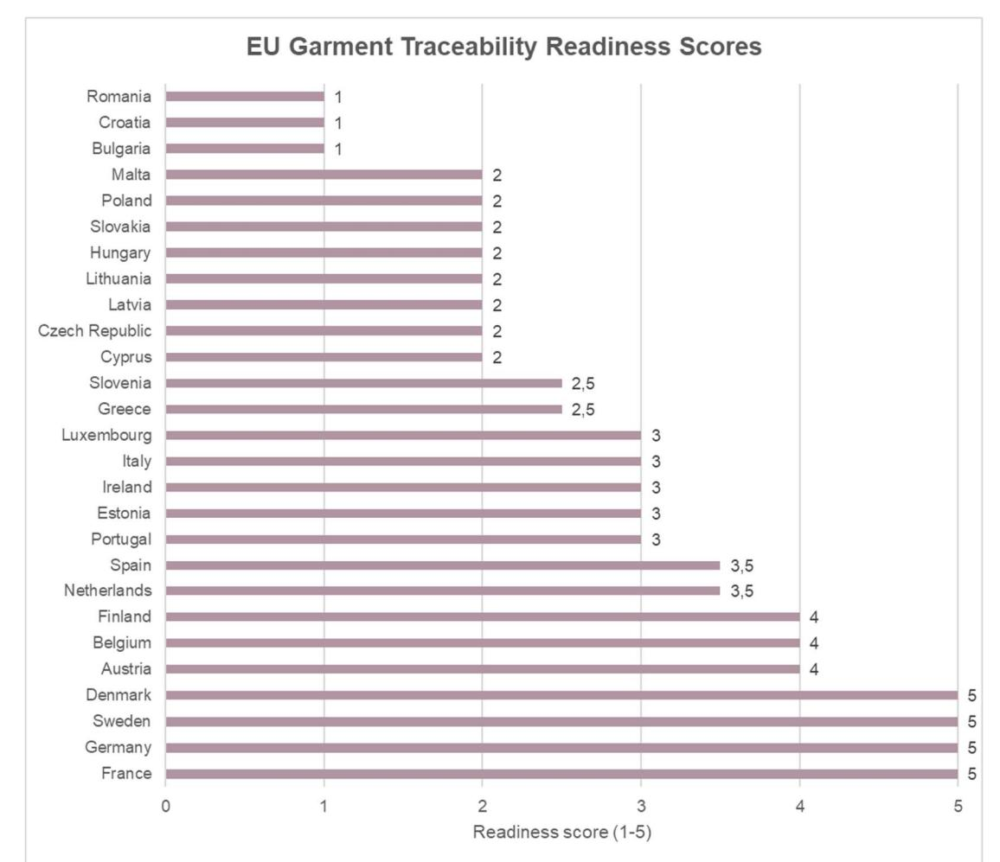

Figure 42. Garment Traceability Readiness Scores across EU Member States in 2025. Source: Directorate-General for Environment, 2023; European Commission 2024

What follows is real-world examples of traceability systems implementation across different regions, each tackling the challenge of transparency and accountability in textile reuse and export:

## The QR Foundation – Ghana (Dead White Man's Clothes, 2025)

- Project: Dead White Man's Clothes & Open Apparel Registry for Kantamanto
- Focus: Tracing second-hand clothes imports, resale patterns, and environmental burden.
- Key Features:
  - Mapping exporters and shipping routes from Global North.
  - Surveys and interviews with Kayayei (head porters), resellers, and waste pickers.
  - Estimating % of second-hand clothes imports that become immediate waste (est. 40%).
  - Advocating for EPR contributions from EU/UK.

## Reverse Resources – Bangladesh, Sri Lanka, globally (Reverse Resources, 2025) ● Project: Textile Waste Traceability & Circular Supply Matching

- Focus: post-industrial waste, expanding into post-consumer and second-hand clothes.
- Key features:
  - Digital platform matches waste suppliers (including SHC) to recyclers.
  - Tracks fibre type, condition, and quantities across nodes.
  - Now integrated into several brand EPR and circularity pilots (e.g. H&M).
  - Can be adapted to trace SHC flows from sorting to recyclers or reuse markets in Global South.

## Fibresort – Netherlands (Fibresort, 2025)

- Project: Automated Sorting + Traceability System
- Focus: Mechanically sorts post-consumer textiles by fibre composition.
- Key Features:
  - Uses near-infrared (NIR) technology to scan garments.
  - Digitally logs each sorted category (e.g., 100% cotton, polyester blends).
  - Can integrate with DPP systems to track SHC batches by material.
  - When used at SHC sorting hubs, can help link material info to final reuse or recycling path.

## Trace4Value – DPP for second-hand clothes – Sweden and EU (Trace4Value, 2025)

- Focus: Piloting Digital Product Passports for garments, including second-hand.
- Key Features:
  - QR codes on garments linking to supply chain data, care, resale, and recyclability.
  - Public-private platform involving retailers, recyclers, and sorters.
  - Designed for scalability across EU traceability schemes.
  - Makes second-hand clothing traceable at product level even after multiple use cycles.

## EON Circular ID (EON, 2025)

- Focus: Assigning persistent digital identity to garments
- Key Features:
  - Digital identity (QR/NFC) linked to product metadata: fibre, washing, resale, repair.
  - Used by brands to facilitate resale and take-back programs.
  - Ensures data continuity through reuse cycles, enabling traceability even for exported second-hand items.

Last but not least, the next Figure presents the roadmap 2025-2030 for EU Member States to achieve harmonized traceability in textiles.

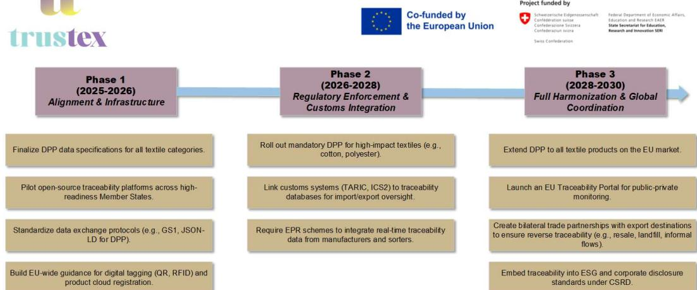

Figure 43. Roadmap for Harmonized Garment Traceability in the EU (2025–2030). Source: European Commission, 2024.

# 5. TEXTILE CIRCULARITY

Fast fashion concepts in the textile industry have significantly contributed to the overconsumption of clothing and overproduction of waste. Meanwhile, public awareness of the environmental pollution associated with textile production and disposal has increased substantially. For these reasons, greener and cleaner solutions are constantly being sought to mitigate the negative environmental impact of textile waste in a sustainable manner.

Circularity refers to the adoption of sustainable methods that promote a closed-loop system by reducing waste generation and maximizing the value of resources. In other words, it is about keeping materials and resources in use for as long as possible (Schumacher et al., 2022). Relevant key principles are described below:

Table 14. Key principles of the textile industry circularity

|                      | Table 14. Key principles of the textile industry circularity                                                                                                                                                                |
|----------------------|-----------------------------------------------------------------------------------------------------------------------------------------------------------------------------------------------------------------------------|
|                      | Key principle Scope Natural fibres – flax, hemp, jute, ramie, kenaf,                                                                                                                                                        |
| Sustainable          | raw                                                                                                                                                                                                                         |
|                      | Polyhydroxyalkanoates, Polycaprolactone                                                                                                                                                                                     |
|                      | Long-term environmental abaca, banana, bamboo. sustainability and meeting the needs Synthetic fibres – lyocell, Poly lactic acid,                                                                                           |
| materials            | of a growing global population without depleting finite resources. etc. Reduction of the negative impact of textile manufacturing and alignment                                                                             |
| Sustainable          | with the principles of circularity, Eco-friendly processes – reducing waste.                                                                                                                                                |
| production practices | where resources are conserved, Ethical labour practices. reused, and recycled to create a                                                                                                                                   |
|                      | more sustainable and resilient industry.                                                                                                                                                                                    |
| Eco-design           | of                                                                                                                                                                                                                          |
|                      | Generation of ideas and framework for An approach for reduction of the achieving circularity.                                                                                                                               |
|                      | solutions throughout a product’s entire                                                                                                                                                                                     |
| textiles             | environmental impact of textile Integration of environmental and economic products from the initial concept to their final creation. lifecycle. Implementation of novel products, methods,                                  |
| Innovation           | technologies, marketing strategies, and Ecological improvements organizational frameworks. It evaluates the utilization of resources and                                                                                    |
| Life assessment      | cycle Ecological reduction, promotion of environmental impacts throughout the life effective practices and sustainable cycle of a product – extraction of raw material,                                                     |
| (LCA) of             | textile raw materials.                                                                                                                                                                                                      |
| products             | processing, useful life, and waste Reduction of carbon footprint. management (disposal and recycling). Reduction of the industry’s reliance Collecting and reprocessing textile materials on virgin materials and minimizes |
| Recycling            | waste. Minimization of the – old clothing and fabric scraps.                                                                                                                                                                |
|                      | environmental impact associated Create new fibres or products. with textile manufacturing. Promotion of circularity and minimize                                                                                            |
| Digitalization       | of carbon footprints. Real-time abilities and digitalization – Internet the textile sector Minimization of waste material and of Things (IoT)                                                                               |
| in circularity       | optimization of manufacturing approaches                                                                                                                                                                                    |

Source: Batool et al., 2023

Typically, circularity in the textile industry is measured by looking at materials flowing into the economy. It is measured by analysing what materials flow through the global value chain, and how. This gives value chain actors an understanding of the current state, providing a jumping-off point for informed decision-making. Boosting circularity has two objectives, which can be achieved through four key strategies that are presented below.

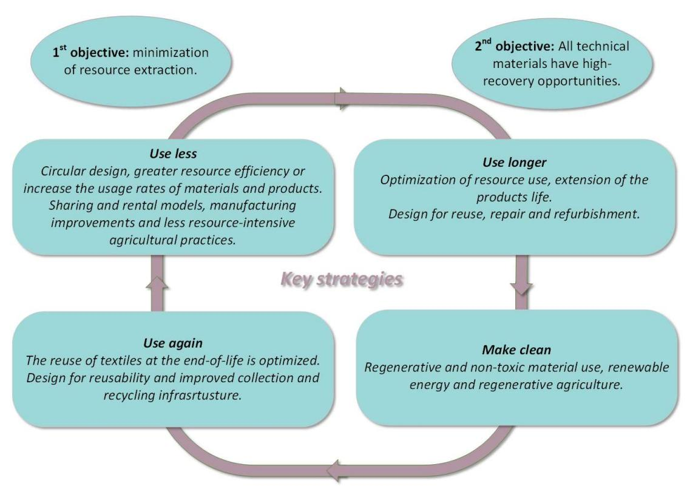

Figure 44. Objectives and key strategies to achieve textile industry circularity. Source: Circle Economy, 2024.

## 5.1 Circularity in the textile industry globally

The textile industry stands as one of the leading manufacturing sectors globally, contributing to the production of approximately 100 billion clothing items annually (Bour et al., 2023). Every year, over 92 Mt of clothing waste is generated, with only 14% undergoing recycling while the rest is deposited in landfills. It is estimated that by 2030, this amount will be increased to 134 Mt (John et al., 2023). Additionally, the textile industry contributes nearly 10% of global carbon emissions, recognized as a leading driver of global warming. Moreover, textiles take a long time to disintegrate and produce greenhouse gases (GHG) as they do so, and disposing of textile waste in landfills worsens the environment. Finally, the societal effects of the textile industries cannot be disregarded.

The global textile industry is 0.3% circular: of the 3.25 billion tons of materials it consumes each year, over 99% come from pure sources (Circle Economy, 2024). Despite increasing sustainability efforts, the industry remains heavily dependent on virgin materials. Synthetic fibres like polyester, derived from fossil fuels, make up 63% of the raw materials used in textile production. At the same time, garment quality is being decreased, as brands are opting for synthetic materials and focusing on maximizing production volumes. This clearly contrasts with the principles of circularity, which aims to keep materials in use at their highest value for as long as possible. The above highlight the urgent need for sustainable practices and a shift towards circularity in the textile industry.

Asia is the largest textile and garment producer in the world, including key countries like China, India, Bangladesh, Vietnam, Pakistan, and Indonesia. Circular methods are being driven by a mix of export market demand, corporate sustainability commitments, and governmental regulation (especially in China and India). More specifically, post-industrial recycling is common in China, India, and Bangladesh, where waste from garment factories is recycled into bags, cloths or insulating materials. Chemical recycling is emerging in China and Japan for synthetic materials. Moreover, textile-to-textile recycling20 is still limited. Last, natural, biodegradable fibres (e.g., cotton, hemp, banana fibre, jute) are widely used, while India and China are major producers of organic cotton. Furthermore, agro-waste fibres such as banana fibre, coconut coir and water hyacinth are being used in India and Indonesia.

In Africa, upcycling is common in urban hubs like Lagos and Nairobi, while Kenya and South Africa are leading in textile waste-to-value startups. Natural fibres are widely used in many regions, such as organic cotton, jute and hemp, as local brands explore low-impact textile production using natural dyes, plant-based fibres, and handcrafting techniques.

This project has received funding from the European Union's Horizon Research and Innovation program under grant agreement N° 101181901 and from the Swiss State Secretariat for Education, Research and Innovation (SERI). Posts and shares reflect only the views of all the involved partners. Neither the European Union nor the granting authority can be held responsible for them.

This draft deliverable has not yet been validated by the granting authorities

20 e.g., Ambercycle's Cycora process transforms polyester-rich textile waste into yarns indistinguishable from virgin polyester. Circ uses hydrothermal technology to separate cotton and polyester from mixed fabrics, recovering both at high quality. Industrial-scale chemical recycling from Eastman and Loop can break down even contaminated polyester textiles into pristine feedstock (virgin-quality material). Unifi's flagship brand, REPREVE, is focused on turning post-consumer textile waste into performance recycled polyester yarns for global apparel companies.

## 5.2 Circularity in the EU textile industry

Europe is at the forefront of driving circularity in the textile industry, thanks to progressive policies, strong public awareness, and investments in innovation. The EU aims to make textiles repairable, recyclable, and sustainable by design.

The current management of textile waste is considered suboptimal with respect of the waste management hierarchy, as landfilling and incineration are the predominant treatment methods.

In 2022, the European Commission presented the "Strategy for Sustainable and Circular Textiles" with the main goal that by 2030, all textile products on the EU market should be recyclable, made as much as possible from recycled fibres, free of hazardous substances and produced in an environmentally and socially sustainable manner (European Commission, 2022). More specifically, key objectives include:

⮚ Designing textiles for durability and recyclability: ensuring that products are longlasting and can be easily recycled. ⮚ Reducing the environmental footprint: minimizing the use of hazardous substances and promoting sustainable production processes. ⮚ Promoting circular business models: encouraging practices such as reuse, repair, and recycling. ⮚ Implementing EPR: making producers responsible for the entire lifecycle of their products, including end-of-life management.

Today, in the EU countries, 35–40% of discarded textiles are collected, while less than 1% are recycled into new textiles. According to Eurostat, the countries with the lowest circularity rates are Romania (1.3%) and Ireland (1.6%), followed by Portugal and Bulgaria with a rate of 2.3%. The EU average is 12.5%, and the countries that have taken effective measures to improve the circular use of materials are Belgium with the maximum European rate of 23.5% and France with 20% (Nistorac and Loghin, 2023). An overview of circularity status in the European textile industry is presented in the next Table.

Table 15. Current status of textile industry circularity in Europe

|                                     | DE  | FR                    | IT                   | SP                       | BE                 | UK                      | NL                  |
|-------------------------------------|-----|-----------------------|----------------------|--------------------------|--------------------|-------------------------|---------------------|
| <i><b>Mechanical recycling</b></i>  | Yes | Yes                   | Yes                  | Polyester cellulose      | Yes                | Cotton, wool, polyester | Denim, wool, cotton |
| <i><b>Chemical recycling</b></i>    | Yes | Yes                   | Especially polyester | Cotton, wool, synthetics | In pilot phase     | In pilot phase          | In developing phase |
| <i><b>Closed-loop recycling</b></i> | H&M | Patagonia, H&M France | Loro Piana, Gucci    | Intidex, Zara            | Fibre-to-fibre     | In pilot phase          | Fibre-to-fibre      |
| <i><b>Upcycling and reuse</b></i>   | Yes | Yes                   | Yes                  | Ecoalf                   | Patagonia Brussels | Rejean Denim            | Yes                 |
| <i><b>Recycling rate</b></i>        | 18% | 20%                   | 22%                  | 12%                      | 55%                | 5.2%                    | 25%                 |

| DE | FR | IT             | SP      | BE         | UK        | NL |
|----|----|----------------|---------|------------|-----------|----|
|    |    | Natural fibres | Organic |            |           |    |
|    |    |                |         | Local wool | Recycling |    |

Source: Nistorac and Loghin, 2023.

In 2022, the average capture rate for textiles and shoes waste from households in EU27 was just under 15%, which means that most of the textiles and shoes waste are not separately collected and end up in the mixed household waste (EEA, 2025).

Between 2005 and 2023, the export of used textiles from EU countries more than doubled to around 1.37 million tonnes in 2023 (EEA, 2025).

An analysis of the most popular clothing items sold online in May 2024 on five different Zalando web shops throughout Europe, shows that on average 8% of these items contain recycled content (EEA, 2025).

The European Environment Agency, after analysing 14 metrics on textiles in its Circular Metrics Lab, has made the following observations:

 Increased circularity of textiles can reduce negative impacts on the environment, climate and human health. Enhancing circularity in the EU textile value chain by extending product lifespans through longer use, increased reuse, repair and more efficient recycling, can reduce the demand for new raw materials. The COVID-19 pandemic temporarily reduced pressures across all measured categories, but these pressures rose again post-pandemic. This highlights the importance of addressing overconsumption and fast fashion. It also underscores the need to promote greater textile circularity. Effective separate collection systems are needed to divert used and waste textiles from incineration, landfill and exports. Europe needs to strengthen its sorting and treatment capacities. This will help limit the amount of textile waste sent to landfills or incineration in Europe and elsewhere. It is also vital to ensure that the newly established European collection systems are efficient. Data, information and knowledge gaps limit effective monitoring and analysis of the circular economy of textiles in the EU. Reliable and publicly accessible information, knowledge, indicators and data are essential for measuring the circularity of textiles in Europe and also for supporting informed decisionmaking. The EU strategy for sustainable and circular textiles prioritises textile reuse and recycling. In a fully circular economy, none of the separately collected textiles should go to incineration or landfill. Instead, non-reusable textiles should be directed to recycling.

## Durable, repairable and mainstream

Figure 45. How ecodesign can make our textile circular

# 6. MODERN TRENDS AND DRIVERS

## 6.1 Across the global and European textile sectors

The global textile industry is undergoing significant transformations, influenced by technological advancements, sustainability initiatives, and evolving consumer preferences. What follows is an overview of modern trends and drivers shaping both the global and European textile sectors, underscoring a global shift towards sustainability, technological innovation and strategic realignment in the industry.

## Sustainability and eco-friendly practices

There is a high emphasis on reducing environmental footprints using recycled fabrics, energy-efficient manufacturing, and certifications, such as the Global Recycled Standard (GRS) and OEKO-TEX. These certifications ensure ethical sourcing and minimal environmental impact. Also, consumers are increasingly demanding sustainable and ethical textile products.

## Eco-friendly materials

As the demands of environmentally conscious consumers grow, the industry is witnessing an accelerated shift toward eco-friendly materials. Sustainable textiles are becoming more prevalent due to advancements in the sourcing and production of natural fibers, such as organic cotton, hemp, and bamboo. These materials offer the dual benefits of reducing the environmental footprint and providing biodegradability. Moreover, manufacturers are exploring bio-based polymers that mimic traditional fabric properties while being compostable, therefore addressing concerns regarding microplastic pollution.

## Regulatory measures

The EU has introduced regulations for the industry and the circular economy, as well as regulations requiring textile actors to fund waste management, including collection, sorting, and recycling. For instance, the new Product Environmental Footprint Category Rules (PEFCR) for apparel and footwear introduce a science-based and impartial method to assess the environmental impact of clothing and shoes across their entire lifecycle, from raw material extraction, production and logistics to use and end-of-life.

## Automation and advanced manufacturing

Manufacturers are increasingly integrating automation technologies, such as robotics and intelligent fabric handling systems, to enhance precision and efficiency and reduce labour costs. They foresee to enhance production efficiency, drive cost reductions, reduce defects, and ensure sustainability, improve quality, and optimize the production process yielding productivity.

## Recycling technologies innovations

Traditional recycling methods are being enhanced to increase efficiency and output. Chemical recycling which breaks down textiles to their basic molecules for reuse, is gaining traction, allowing high-quality fibers to be regenerated repeatedly without degrading their properties. Mechanical processes are also seeing improvements, with advancements in

This project has received funding from the European Union's Horizon Research and Innovation program under grant agreement N° 101181901 and from the Swiss State Secretariat for Education, Research and Innovation (SERI). Posts and shares reflect only the views of all the involved partners. Neither the European Union nor the granting authority can be held responsible for them.

fiber sorting and separation that allow for mixed-material garments to be recycled more effectively.

## Digital transformation and AI integration

The adoption of AI, blockchain, IoT, big data analytics and other relevant digital technologies is revolutionizing design processes and supply chain optimization, leading to enhanced efficiency, traceability, customer experience and reduced waste.

## Adoption of next-generation materials

New materials are under the spotlight and brands are partnering with innovators to incorporate sustainable ones, such as recycled textiles and bio-based fibres into their products aligning with environmental goals.

## Smart textiles

The integration of technology into fabrics has led to the development of smart textiles with applications in healthcare, sports, fashion and other sectors, offering functionalities such as health monitoring and adaptive responses to environmental changes.

## Circular economy initiatives

The EU's Green Deal and Circular Economy Action Plan for example, are driving brands to adopt eco-friendly materials, recycling programs, and sustainable production processes. Brands are increasingly adopting circular economy models, focusing on recycling and repurposing textiles to minimize waste and promote sustainability. The shift toward recycling and reusing textiles to reduce waste and improve sustainability is gaining momentum.

## Nearshoring and localization

In response to global supply chain disruptions, companies are moving production closer to end markets to reduce shipping costs, ensure faster delivery and enhance supply chain transparency. This is aligned with sustainability goals by minimizing the carbon footprint associated with long-distance shipping.

## Trade policies

Recent tariffs and trade tensions have prompted textile companies to reassess their sourcing and manufacturing strategies, influencing decisions on sustainability and supply chain configurations.

## Standardized reporting

The proliferation of certifications, standards, and regulations has led to complexities in supply chain reporting. The G7 Agenda on Circular Textiles and Fashion (G7 ACT) aims to promote greater circularity in the sector and has tasked the United Nations Economic Commission for Europe (UNECE) with standardizing requirements for brands and suppliers. This initiative seeks to simplify the reporting ecosystem, making it more efficient and less burdensome for suppliers.

## Consumer demand for transparency

Modern consumers are increasingly seeking information about the origins and

manufacturing processes of textile products. Transparency in sourcing, labour practices, and environmental impact has become a key factor in purchasing decisions. Brands that provide clear and honest communication about their processes are gaining consumer trust and loyalty.

## Direct-to-consumer models

Brands are increasingly leveraging online platforms to sell directly to consumers, offering personalized products and enhancing customer engagement while bypassing traditional retail channels.

## Reskilling and upskilling personnel

The growing complexity of technologies requires retraining workers to address skills shortages, improve quality, and enhance productivity. Mastering a wide range of new software products, solutions and production methods is impossible without systematic retraining and skill enhancement for employees.

Adoption of novel sustainable fibres in the European textiles sector The adoption of novel sustainable fibres is growing but remains partial and uneven. Policy push (EU textiles strategy, EPR rules), consumer demand and supply-side innovation are accelerating uptake, while cost, supply constraints, technical performance and insufficient recycling infrastructure limit large-scale replacement of conventional fibres (DG ENV). Regenerated cellulosics and recycled polyester are recognised as commercial winners. Adoption is highest among mid-to-large brands and technical textiles where performance and traceability matter. Regarding novel bio-materials and mycelium/seaweed fibres, commercial pilots and designer collections exist, but volumes are small and often niche. Circular-technology startups address feedstock and processing challenges but have not yet displaced commodity fibres at scale (UNEP). The EU's textiles strategy and circularity agenda are raising minimum standards and creating economic incentives to use recyclable/sustainable inputs. This creates near-term market pull for fibres that enable circular business models. Large retailers and brands increasingly demand recycled/certified inputs for risk management and brand value and procurement scale helps early movers secure supply. Improvements in solvent spinning, chemical recycling and sorting technologies are reducing environmental trade-offs and improving fibre performance. On the other hand, novel sustainable fibres typically carry cost premiums and limited production capacity vs. polyester/cotton. Some bio-based/niche fibres lack long-term durability data or are incompatible with existing processing lines (dyeing, finishing), increasing operational friction. Low textile collection/recycling rates and weak sorting technology constrain feedstock quality for recycled fibres, keeping most textiles out of circular loops. Multiple sustainability claims and inconsistent standards raise verification Market experts (IMARC) expect steady growth in regenerative cellulosics and recycled polyester market share, rising regulatory pressure to use recyclable inputs and continued niche growth of bio-materials. Full commodity displacement of cotton/polyester is unlikely soon without major cost declines and system investments, but policy and industry coordination can shift the sector decisively toward circular fibre mixes.

This draft deliverable has not yet been validated by the granting authorities

### Eco-labelling initiatives in the European textiles sector

This project has received funding from the European Union's Horizon Research and Innovation program under grant agreement N° 101181901 and from the Swiss State Secretariat for Education, Research and Innovation (SERI). Posts and shares reflect only the views of all the involved partners. Neither the European Union nor the granting authority can be held responsible for them.

Eco-labelling initiatives play a crucial role in driving the sustainability transition of Europe's textile industry. They provide transparent information about environmental and social impacts, support green consumer choices, and incentivise producers to improve supply chain practices. Europe leads globally in textile eco-labelling, with several schemes integrated into EU sustainability policy frameworks (EU Ecolabel, OEKO-TEX Standard 100 / MADE IN GREEN, Global Organic Textile Standard (GOTS), Bluesign and Nordic

## New manufacturing and recycling technologies of textiles

New manufacturing and recycling technologies are reshaping fibre production, fabric processing and end-of-life management. Digital knitting, weaving, and 3D printing enable on-demand, zero-waste garment creation and localised microfactories, cutting material waste by up to 30%. Waterless and low-chemical dyeing reduce water use and effluent pollution, meeting stricter EU REACH and wastewater directives. AI and digital twins support predictive design and process optimisation, minimising overproduction and improving energy efficiency. Advances in biomanufacturing produce fibres from renewable sources (cellulose, algae, agricultural waste, mycelium). Improved fibre-sorting technologies using NIR (Near-Infrared) scanning and AI vision systems enhance feedstock purity, improving fibre quality in recyclates. Chemical recycling is emerging as a breakthrough technology for mixed or blended textiles. Polyester depolymerisation enables monomer recovery for virgin-quality fibres. Cellulose regeneration converts cotton waste into new cellulosic fibres suitable for large-scale fibre spinning.

## 6.2 Trends adopted by companies

The modern trends and drivers in the global and European textile industry are also important with respect to sustainability trends being adopted by companies across the value chain. These trends highlight an effort to embrace sustainability, innovate with new materials and technologies and adopt eco-friendly practices.

## Adoption of novel sustainable fibres

 Econyl: Developed by Aquafil, Econyl for instance is a regenerated nylon made entirely from waste materials such as industrial discards, fabric scraps, old carpets, and fishing nets. This innovative fibre has been embraced by brands like Stella McCartney, Adidas, and Levi's, offering a sustainable alternative to traditional nylon. Spinnova: This Finnish company has developed a patented technology to produce textile fibre from wood pulp and waste without harmful chemicals. The process is energy-efficient and results in fibres that are recyclable and biodegradable. Mycelium-based textiles: Utilizing the root structure of fungi, mycelium-based textiles are emerging as sustainable alternatives to leather. These materials are biodegradable and can be engineered for desired properties like flexibility and durability.

### USA

Aquafil has won an important share of the textile market thanks to Econyl. Econyl regenerated

nylon is a sustainable solution. Econyl yarn offers the same quality and performance as traditional Nylon 6, but with outstanding environmental benefits, as it is produced from nylon waste and is 100% regenerated.

### Eco-labelling initiatives

 OEKO-TEX Standard 100: This certification ensures that textiles are tested for harmful substances, promoting consumer safety and environmental responsibility. The OEKO-TEX Association has expanded its certifications to include sustainable textile production and organic cotton standards. Made in Green by OEKO-TEX: This label certifies that a textile product has been tested for harmful substances and manufactured using sustainable processes under socially responsible working conditions.

## Environmental footprint of polyester

 Many brands are exploring partnerships with startups to test new ways to reduce the environmental footprint of polyester production by replacing virgin fossil fuel-based inputs with recycled fibres sourced from post-consumer textiles. H&M has invested in Syre, a textile-to-textile polyester recycling startup and Syre has announced a strategic partnership with Gap, Houdini Sportswear and Target to accelerate the adoption of circular polyester in the fashion sector. Simplifyber is a startup that creates fabrics from fibres such as wood pulp or recycled fabrics. Because these can be 3D moulded into shape like plastics they can be used to make items such as trainers with no cutting, sewing or wastage. Suzano, the Brazilian wood pulp producer invested in Simplifyber to replace fossil materials with a new biobased material that contains eucalyptus fibres. Another approach is to improve the process of recycling polyester so that more of it can be recovered. Toyota Ventures invested in recycled textiles startup Tereform. Tereform is able to chemically process mixed textiles with minimal prior separation of the materials into individual fabric types, or removal of coatings, dyes and other contaminants, removing a highly labourintensive step. Tereform's solution is especially effective for recycling some of the more challenging textile substrates, such as polyester/spandex blends.

## Sweden

Syre Impact AB is a textile impact company on a mission to decarbonize and dewaste the textile industry through textile-to-textile recycling at hyperscale, starting with polyester. Syre aims at driving the green shift of the textile industry to a future where every textile fibre sees a new day. The company's textile-to-textile recycling solution provides circular polyester with quality on par with virgin polyester, but with a superior sustainability performance. Founded in 2023, Syre is initiated by Vargas and H&M Group.

### AI-powered sorting & automated collection

 AI is accelerating textile sorting. HKRITA the Hong Kong Research Institute of Textiles and Apparel Limited, Refibred, NewRetex A/S, and Valvan use hyperspectral imaging, machine learning, and automation to classify fibres, detect contaminants, and refine material recognition. These innovations improve recycling accuracy, making large-scale

textile circularity possible.

### Belgium

Valvan is a leading provider of automated sorting and baling systems designed for the secondhand textile market and textile recyclers. Their cutting-edge solutions integrate machine vision, and AI-driven smart technology to optimize sorting efficiency and maximize material recovery. Whether enhancing a specific step in the sorting process, expanding a machine park, or implementing a fully customized turnkey installation, Valvan delivers future-proof technology to help businesses scale sustainably. Headquartered in Belgium, Valvan operates worldwide, transforming textile processing through intelligent automation.

## New manufacturing and recycling technologies

 Textile recycling innovations: Companies are investing in technologies to recycle textile waste into new fibres. For example, Infinited Fibre Company produces a fibre similar to cotton from textile waste and Recover Textile Systems focuses on mechanically recycled cotton. Chemical recycling: Innovative processes are being developed to break down textile waste into raw materials chemically, allowing for the creation of new fibres without degrading quality.

## Finland

Infinna, by Infinited Fibre Company, is a virgin-quality circular fiber made 100% from cottonrich textile waste, such as worn-out clothes, otherwise destined to landfills or incinerators. Infinna has a natural and soft look and feel of cotton, and it can be used either on its own for 100% recycled garments or blended with other fibers, such as organic cotton or viscose.

## Consumer demand and market shifts

 Transparency and traceability: Consumers are increasingly seeking information about the origins and manufacturing processes of textile products, driving brands to adopt transparent and traceable supply chains. Second-hand and rental markets: The popularity of second-hand clothing and fashion rental services is growing, reflecting a shift towards sustainable consumption patterns.

## Expansion of resale and repair programs

 Take-back programs are evolving beyond collection. Resale and repair extend product lifecycles, reduce waste, and embed circularity into business models. EILEEN FISHER, INC (Renew), Zalando (Pre-Owned), and The North Face (Remade) lead this transformation. Startups like LOSANJE upcycle garments into new collections, while Reskinned accepts clothing from any brand for resale or recycling. Odlo's ReWEAR initiative refurbishes used apparel collected in stores. Patagonia offers a product repair service, along with instructional videos. Similarly, Levi's Tailor Shops allow customers to refresh denim pieces with patches and precision tailoring. Mulberry's

restoration centre aims to lengthen usability of their heritage accessories.

## Online sales and social media

 Online sales of clothing, home and professional textiles are a significant and rapidly rising share of the total market. Omnichannel (both physical and digital channel) capacities are becoming the norm, which allow the customer to engage with the product both on and offline and where the experience of touching and trying the product can be separated from the process of purchasing and delivering it. Social media platforms and mobile applications are further important tools to reach and engage with the customer, to collect feedback on the user experience and to create customer loyalty.

# 7. EU LEGISLATION

The Green Deal is the European Union's overarching policy framework to tackle climate change and drive sustainability across all sectors. It sets out an ambitious roadmap of 35 key actions aimed at fundamentally transforming the EU economy and society, with the ultimate goal of achieving climate neutrality by 2050.

One of the key initiatives under the Green Deal is the Circular Economy Action Plan (CEAP). This plan aims to accelerate the EU's transition to a circular economy by introducing measures to promote sustainable product design, extend product lifecycles, and improve waste management across various sectors.

To translate these ambitions into actions within the textile sector, the European Commission introduced the EU Strategy for sustainable and circular textiles. This strategy outlines targeted measures that address environmental and social impacts across the entire textile value chain, from production and consumption to reuse, recycling, and final disposal. It calls for textiles to become longer-lasting, easier to recycle, and more transparent in terms of materials and environmental footprint, ultimately supporting a more circular and resource-efficient economy.

Indeed, the strategy aims to support the development of a greener, more competitive, and resilient textile sector that can better withstand global disruptions. The vision for 2030 is that: all textile products placed on the EU market should be durable, repairable, and recyclable, largely made from recycled fibres, free from hazardous substances, and produced in ways that respect both environmental and social standards.

## The Commission's 2030 Vision for Textiles

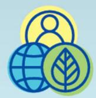

The strategy also calls for a shift in consumer behaviour, moving away from fast fashion and toward longer-lasting, high-quality and affordable textiles. To support this, reuse and repair services should become widely accessible and economically viable. At the same time, the sector is expected to become more innovative and responsible, with producers

taking ownership of their products throughout the value chain, supported by strong recycling infrastructure and a significant reduction in incineration and landfilling.

The strategy lays out a forward-looking set of actions:

- Set design requirements for textiles to make them last longer, easier to repair and recycle, as well as rules on minimum recycled content.
- Introduce clearer information and a Digital Product Passport.
- Reverse overproduction and overconsumption and discourage the destruction of unsold or returned textiles.
- Address the unintentional release of microplastics from synthetic textiles.
- Tackle greenwashing to empower consumers and raise awareness about sustainable fashion.
- Introduce mandatory and harmonised EPR rules for textiles in all member states and incentivise producers to design products that are more sustainable.
- Restrict the export of textile waste and promote sustainable textiles globally.
- Incentivise circular business models, including reuse and repair sectors.
- Encourage companies and member states to support the objectives of the strategy.

The EU strategy for sustainable and circular textiles is being operationalised through a series of legislative initiatives, stakeholder platforms, awareness campaigns, and funding instruments. These actions create the legal and practical framework needed to support a circular and sustainable transformation of the textile sector.

The Eco-design for Sustainable Products Regulation (ESPR) establishes a framework for setting eco-design requirements addressing a wide range of products, including textiles. It aims to improve durability, reparability, and recyclability while reducing environmental impacts across product lifecycles. It expands the scope of the current Eco-design Directive beyond energy-related products to include a wide range of product groups, including textiles. Under the ESPR, textile products need to meet performance and sustainability requirements such as durability, reusability, repairability, recyclability, and resource efficiency. A core feature of the ESPR for textiles is the introduction of the DPP. The DPP contains standardised, accessible information on a product's composition, circularity characteristics, use of recycled content, and potential presence of hazardous substances.

The Directive on Empowering Consumers for the Green Transition and the Green Claims Directive, proposed in 2022 and 2023 respectively, seek to combat greenwashing and ensure that environmental claims made by textile brands are substantiated, transparent, and comparable.

The Directive on Empowering Consumers for the Green Transition, was adopted in early 2024 to be implemented by member states by September 2026. It focuses on amending consumer protection laws (specifically the Unfair Commercial Practices Directive and the Consumer Rights Directive). It aims to equip consumers with better information and protect them from misleading practices related to the environmental and

This project has received funding from the European Union's Horizon Research and Innovation program under grant agreement N° 101181901 and from the Swiss State Secretariat for Education, Research and Innovation (SERI). Posts and shares reflect only the views of all the involved partners. Neither the European Union nor the granting authority can be held responsible for them.

social characteristics of products, including textiles. The directive prohibits vague or unsubstantiated environmental claims, such as generic terms like "eco-friendly" or "green" without clear evidence of verifiable environmental performance. It also targets misleading claims about a product's durability, repairability, and the use of carbon offsetting to suggest a neutral or positive environmental impact without proper substantiation. Furthermore, it regulates sustainability labels, ensuring they are based on credible certification schemes or established by public authorities and are transparent and independently verified.

The Green Claims Directive is more specifically focused on the substantiation and communication of explicit voluntary environmental claims. It sets out detailed criteria for how companies should prove their environmental claims before making them. These claims must be based on scientific evidence, consider the entire lifecycle of the product, and be specific rather than generic. The directive also introduces a verification system where an independent and accredited third party must verify environmental claims before they can be used in marketing. Moreover, it establishes rules for environmental labels to ensure they are trustworthy and transparent, prohibiting self-made labels without thirdparty verification. While the timeline for its full implementation is still under development, it is expected to bring significant changes to how textile companies communicate their environmental performance to consumers across the EU.

The revision of the Waste Shipment Regulation aims to restrict the export of textile waste, ensuring that waste treatment aligns with EU environmental standards and avoids negative impacts in third countries. The new regulation entered into force on 20 May 2024 aims to ensure that the EU does not export its waste to third countries and contributes to environmentally sound management of waste. Furthermore, it strengthens enforcement to prevent illegal shipments of waste occurring within the EU, as well as from the EU to third countries. Finally, it aims to increase traceability of waste shipments within the EU and facilitate recycling and reuse. With the new regulation, procedures will move away from a paper-based approach to an electronic one. A central EU system will ensure the smooth operation of this exchange from May 2026.

In 2023, the Commission proposed a revision of the Waste Framework Directive to introduce harmonised EPR schemes for textiles across all EU Member States, making producers financially and operationally responsible for the full lifecycle of textile products. The Directive sets the basic concepts and definitions related to waste management, including definitions of waste, recycling and recovery. It requires that waste be managed without endangering human health and harming the environment; without risk to water, air, soil, plants or animals; without causing a nuisance through noise or odours; and without adversely affecting the countryside or places of special interest.

Moreover, it clarifies the point at which discarded materials transition from being classified as waste to becoming valuable secondary raw materials, and it provides criteria for differentiating between waste and unintentional by-products of production processes. In addition, the Directive promotes two fundamental principles: the "polluter pays principle," which holds those who produce waste responsible for its treatment, and the "extended producer responsibility," which extends this responsibility to producers for the entire lifecycle of their products, including their end-of-life management. Central to the directive is the five-step "waste hierarchy," which establishes a preferred order for waste

management actions, prioritizing prevention, followed by preparing for re-use, then recycling, other recovery (e.g., energy recovery), and finally, disposal as the least desirable option.

The Waste Framework Directive revision was finally approved in September 2025, introducing targeted measures to reduce waste and promote circularity in the textile and footwear sectors. The updated rules aim to hold producers accountable for the end-of-life management of their products, covering a wide range of items, including clothing, accessories, hats, footwear, blankets, bed and kitchen linen and curtains. All producers, including those based outside the EU and those operating through e-commerce platforms, will be responsible for the costs associated with the collection, sorting and recycling of textile and footwear waste placed on the EU market.

Finally, a revision of the Textile Labelling Regulation was launched in 2023 and adopted in 2025, with the aim of modernising labelling rules to better reflect circular and environmental criteria, thereby supporting informed consumer choices and supply chain transparency. The current Regulation, which primarily focuses on fibre composition, has led to a fragmented landscape of diverse national labelling requirements across the EU for other textile characteristics. This creates complexity and confusion for consumers due to overlapping information, while simultaneously burdening businesses with increased compliance costs and hindering the smooth operation of the internal market. Furthermore, advancements in new fibres and recycling technologies necessitate more sophisticated fibre identification methods, and the existing regulation's exclusive reliance on physical labels overlooks the potential benefits of readily available digital labelling solutions. The Commission has also carried out a stakeholder public consultation from 19 December 2023 to 15 April 2024, with a view to collecting evidence in relation to the functioning of the current Regulation regarding pre-identified problems and to seek opinions on envisaged solutions. However, the revision is still under assessment and did not make it into the Commission Work Programme for 2025, meaning it likely will be adopted by the second quarter of 2026.

In response to these challenges and in line with the EU Strategy for Sustainable and Circular Textiles, the EC is undertaking a review under its REFIT program to establish a harmonized set of labelling rules for all textile and related products, encompassing environmentally relevant information. This initiative aims to ensure consumers have access to clear, accurate, and comparable information, thereby preventing misleading claims. Simultaneously, it seeks to reduce compliance costs for businesses through EUwide standardization, fostering regulatory clarity and consistency with current and upcoming legislation. This process involves a thorough evaluation and impact assessment, incorporating feedback gathered through consultations.

Together, these measures reflect the EU's commitment to building a circular, resilient, and transparent textile economy. TRUSTex contributes directly to this implementation process by generating evidence, piloting solutions, and supporting stakeholder alignment across the textile value chain.

This draft deliverable has not yet been validated by the granting authorities

# 8.BLOCKCHAIN, DPP AND OTHER TRUSTEX RELEVANT TECHNOLOGIES' SPECIFICITIES

The textile industry has witnessed a significant progress with the infusion of modern technologies which are now instrumental in accelerating its transition towards sustainability, circularity, and regulatory compliance.

## Blockchain technology

Among the key prerequisites to achieve sustainability in textiles, the key element is full traceability of supply chains to ensure sustainable supply chain management. Reliable, transparent, and efficient data is one of the crucial requirements in today's advanced industrial context and this is possible by blockchain technology. The core advantages of blockchain technology namely transparency, data auditability, privacy, value transfer, process efficiency, and automation are essential for achieving the multiple goals of textiles sustainability (S.S.Muthu, 2022). Blockchain creates a shared, tamper-proof record of every transaction and interaction, giving brands and consumers a clear view of a product's origin, materials, and manufacturing processes. By recording a product's entire life cycle on the blockchain, brands can verify genuine items and combat economic losses. Blockchain also allows brands to provide proof of ethical sourcing, sustainable material origins, and fair labour practices, building consumer trust and supporting responsible production. Furthermore, blockchain enables real-time data sharing improving inventory management, and by streamlining processes, reducing manual data handling, and eliminating discrepancies in transactions, helps lower operational costs across the supply chain.

## Digital Product Passport (DPP)

A DPP is designed to provide comprehensive and easily accessible digital information about a product throughout its lifecycle. Similar to a physical passport that contains essential details about an individual, a digital product passport contains crucial information about a specific product. Technically DPP's are nothing new and are already widely used, but just not called that way. Most consumer products today, in addition to the printed information, also carry a bar code which represents a unique identifier for the product that can be read with an appropriate scanning device and if linked with the right database reveals additional information about this uniquely identified product such as its price when used at the checkout of a shop. They are also commonly used in manufacturing supply chains to identify specific lots of materials, components in an assembly or items in a warehouse. Also, nothing prevents companies from equipping their products with QR codes or other smartphone readable tags to provide extra information about the product, the company that made it, its origin or other details that consumers may need. The difference between such voluntary digital product tagging and the DPP for textile products is the fact that both the technical solution and the information to be provided will be defined by law and non-compliance will likely have uncomfortable consequences (L. Walter, 2023).

## Eco-designed fibres

Eco-designed fibres are sustainable materials made from renewable sources, like plants

e.g., organic cotton, hemp, bamboo, flax or recycled synthetic materials like recycled polyester and are manufactured using processes that minimize environmental harm, requiring less water and energy and avoiding harmful chemicals.

## Eco-designed fabrics

They are materials that minimize environmental impact using renewable resources, recycled materials, and eco-friendly production methods that conserve water and energy while reduce harmful chemicals. Examples include linen, lyocell, and fabrics made from recycled plastics, as well as innovations derived from by-products like pineapples and coffee grounds.

## Eco-designed garments

Eco-designed garments are clothing produced with a low environmental impact, achieved through the use of sustainable materials like recycled fibres, eco-conscious manufacturing processes, and practices like zero-waste design, design-for-disassembly, upcycling, and ethical production. These garments are designed to be durable and recyclable, minimizing waste and pollution across their entire lifecycle, from raw material to disposal21 .

## Sorting

Sorting is the process used to assess the suitability of textile waste for reuse or recycling. Items are sorted into different grades based on quality and end market, and can be sorted by product type, fibre type and colour. This is usually a manual process, but automated sorting technologies are being developed.

## Next-generation textile sorting technologies

Next-generation textile sorting technologies heavily rely on AI and Near-Infrared (NIR) spectroscopy to automate the process of distinguishing fibres, identifying contaminants, and assessing garment re-wearability. Other innovations include AI-powered imaging systems for enhanced fibre identification, development of automated pre-processing methods for recycling and the creation of integrated, closed-loop systems that leverage data to optimize recycling and reuse.

## Semi-automated sorting

Semi-automated sorting refers to the use of technology to analyse and separate discarded textiles by fibre composition and colour with partial human intervention. This process is crucial for creating consistent, high-quality feedstock for high-value recycling, transforming post-consumer waste into reusable materials for manufacturing new products.

### Thermomechanical recycling

Thermomechanical recycling uses a combination of heat and mechanical action to melt and recover polymers from synthetic textiles like polyester and polyamide, transforming them into reusable pellets for creating new textile products. This technology is more energy-efficient than conventional mechanical recycling and produces quality materials. However, it requires feedstock with at least 99% mono-material or compatible polymers, making it more suitable for post-industrial waste or monochromatic post-consumer

This project has received funding from the European Union's Horizon Research and Innovation program under grant agreement N° 101181901 and from the Swiss State Secretariat for Education, Research and Innovation (SERI). Posts and shares reflect only the views of all the involved partners. Neither the European Union nor the granting authority can be held responsible for them. 21 Many garments remain difficult to recycle primarily due to permanently attached trims and multi-material components.

products.

## Big data, AI, IoT

The possible combinations of fibres, structuring, processing, shaping, colouring, patterning etc. are practically infinite. For this reason, many product development and manufacturing processes in the industry are guided by experiential shortcuts or simple trial-and-error. The emergent ability to capture massive datasets and simulate, analyse and optimise rapid iterations through high performance computing and AI models can revolutionise many traditional paradigms in the design, production, distribution and customer interaction.

Textile-materials due to their lightweight, flexibility, and softness are a carrier medium for smart components and micro-systems such as sensors, actuators, conductors, energy harvesters and storage media, light emitters etc. on irregular, moving, shape-changing and large-area surfaces including the human body. Thanks to rapid technology advances in micro and nanoelectronics, miniaturisation, power efficiency, flexible integration technologies, computing and data processing the potential of smart or e-textiles and wearables is expected to rapidly advance and offer a multitude of market opportunities for smart textile-based systems in healthcare, sports, personal protection, smart interiors, soft robotics, and consumer electronics.

## Authority dashboard tool

An Authority dashboard refers to a dashboard designed to monitor and display data relevant to a specific domain, often using data visualization to present indicators, trends, and metrics in an understandable way. It provides a high-level overview of performance to support decision-making. The TRUSTEX web-based authority dashboard will visualise aggregated information on material flows and uses, and their impact as they become newly available via the EPR schemes, DPPs, etc. for granular monitoring to guide decision making by authorities.

# 9. THE POLICY RECOMMENDATIONS EXPECTATIONS FROM TRUSTEX

A key ambition of TRUSTex is to support the development and implementation of effective EPR schemes by providing robust, evidence-based policy and industry recommendations. These recommendations will focus on improving the viability and impact of EPR in the textile sector, targeting areas such as collection, sorting, reuse, recycling, governance, and supporting policy tools. They will also contribute to broader goals, such as promoting eco-design, traceability, and the use of digital solutions, in line with the EU Strategy for Sustainable and Circular Textiles and the WFD.

The recommendations will be based on a combination of technological demonstrations, market and regulatory analysis, and structured engagement with stakeholders across the value chain. Task 7.3, running from M30 to M36, will play a central role in collecting and consolidating these insights. It will translate findings from WP2–WP4 and stakeholder feedback from WP5–WP6 into targeted guidance for policymakers, industry actors, and regulatory bodies. Key themes to be addressed include the use of DPPs for traceability and sustainability in the textile value chain, eco-design for recyclability, strategies to enhance recycling, next generation sorting technologies, re-use solutions and the structure and governance of EPR systems.

The recommendations will also consider how EPR schemes can support climate goals, including GHG reductions, by promoting better material use, reducing waste, and supporting the market uptake of low-impact, circular textile products. Tools such as ecomodulated fee structures, harmonised reporting criteria, and policy mechanisms to manage impacts associated with extra-EU value chain flows will be examined in detail. Barriers to innovation will also be addressed, with specific attention to identifying regulatory gaps and outlining future research and development needs.

Deliverables D7.4 (Policy and Industry Recommendations) and D7.6 (Final Policy Brief) will formalise these outputs, providing both a comprehensive set of recommendations and a concise policy summary. These will also update and expand on earlier results captured in D4.3 "Policy brief on regulatory landscape, EPR policy and governance". Key elements include single eco-modulation of fees concept, governance best practice elements of EPR schemes, handling of non-EU parts of the value chain and fostering domestic re-use and recycling. Moreover, opportunities for an integrated policy approach, the reduction of regulatory barriers, skills needs and capacity building will be addressed. To ensure relevance and uptake, the recommendations will be developed in dialogue with policymakers, industry representatives, and other stakeholders, including through the Advisory Board and relevant EU and international standardisation bodies. This process will be supported by TRUSTex collaboration with innovation clusters, enabling synergies and alignment with related initiatives.

In addition, TRUSTex will carry out a thorough analysis of the regulatory landscape, covering both EU-level and member state legislation, as well as legal frameworks in key third countries. This will ensure that the policy recommendations take into account real-

world legal constraints and opportunities and provide a clear basis for harmonised and effective EPR implementation. The project will also apply gender-sensitive approaches in the development of EPR recommendations, helping to ensure inclusivity in future policy frameworks.

By the end of the project, TRUSTex legislative and policy recommendations are expected to become a cornerstone of its overall impact, and they will be disseminated to guide sectoral efforts while aligning with evolving EU requirements.

TRUSTex aims to influence at least three EU policies (including the proposal for harmonisation of EPR rules), seven Member State policies (particularly those establishing public EPR schemes), and over 25 industries across the value chain. Project knowledge and results will be documented and stored in open-access repositories and platforms, ensuring broad accessibility for stakeholders, policymakers, and the academic community. This open science approach will enhance transparency and visibility, enabling further impact-oriented work within the textile and circular economy communities. TRUSTex partners will continue participating in policy fora, collaborating with industry and regulatory bodies and using their networks to support the adoption and long-term integration of these recommendations.

The project's policy recommendations will also address their direct and indirect contribution to EU climate objectives, including the 2030 GHG reduction target and the broader goal of climate neutrality by 2050. These contributions are articulated across several areas:

 development of eco-designed products that reduce environmental footprint through improved durability, recyclability, and lower-impact materials enhanced efficiency and effectiveness of textile collection and sorting systems, enabling greater reuse and recycling and reducing landfill and incineration rates digitalised value chains that enable brands to exercise greater oversight of suppliers and unlock decision-making efficiencies EPR recommendations, including the establishment of systems for incentives and ecomodulated fees, expected to drive a broad market shift toward more sustainable practices.

These elements together represent some of the most impactful contributions TRUSTex can make toward supporting a circular, low-carbon textile system.

It is worth noting that the already submitted D4.1 "EPR policy benchmark" provides a first set of recommendations, as follow.

Furthermore, in the context of the present deliverable, a collection of stakeholders' positions is presented with the aim of showcasing the current year (2025) views of major stakeholders.

28 November 2025, European Branded Clothing Association calls for: - Harmonised PRO requirements to avoid fragmentation and ensure a level playing field. - Clear and consistent operational rules from registration to reporting and data formats. - Eco-modulation aligned with ESPR to support products designed with sustainability and durability in mind.

- Standardised funding criteria to boost research, innovation, and scalable technological

- Stronger coordination and cooperation among all actors.

18 November 2025, FESI welcomed the Commission's goal to propose a Circular Economy Act and addressed the need to harmonise and strengthen a unified EPR scheme across the EU through an EU-wide framework and a single digital reporting platform. Full harmonisation across national systems, including removing the inconsistencies in ecomodulation criteria and aligning differing registration and reporting requirements, will significantly reduce administrative burden for companies operating in multiple markets, allow for eco-modulation to fulfil its full incentive power for more sustainable solutions and safeguard EPR fees for their main objective, namely funding and driving circularity. These fees should form a key mechanism for driving the EU's transition towards a circular economy, aligning with the goals for reducing waste and increasing recycling rates. Without harmonisation at EU level, the very concept of EPR risks becoming unworkable in practice. Maintaining 27 parallel EPR schemes per waste stream or product group, each with its own definitions, data requirements, registration portals, and fee structures, would impose disproportionate administrative costs on companies, particularly SMEs, and make compliance across multiple markets nearly impossible. This fragmentation undermines the integrity of the Single Market and contradicts the EU's stated ambition to simplify and

 digitalise reporting obligations. A harmonised framework is therefore not only desirable but indispensable to ensure that EPR delivers on its environmental objectives without eroding Europe's competitiveness. In consequence, FESI calls for the development of a single EUwide EPR registration and reporting digital system to replace the obligation of differing registration requirements in separate national Member State systems. This will increase the transparency of the process and lead to a decrease in the administrative burden. Such a digital "One-Stop Shop" model would significantly reduce administrative costs, promote the best available EPR reporting technology, improve data consistency, and enhance market surveillance capabilities. Moreover, it is critically important to simplify the requirement to designate an authorised representative in each EU Member State by allowing companies to appoint a single representative for the entire EU market. This would ensure an expert point of contact for Member State authorities, prevent adding an additional market barrier to national Member State markets via EPR systems, decrease the likelihood of free-riders and ensure that EPR obligations are met without creating unnecessary administrative barriers and compliance costs. Furthermore, this set-up would be aligned with other EU legislation, including the General Product Safety Regulation and the New Legislative Framework. In the context of the EPR fees and modulation, FESI strongly calls for clear mechanisms for the effective implementation of fees due in instances where a product, initially placed on the market by an economic operator in one Member State complying with national requirements, is later transported and sold in another Member State. To avoid duplication of payments, EPR fees should be paid in the Member State where the product is made available and most likely to become waste. More than 90% of waste generated in the EU is treated in the country in which it was generated. The establishment of a harmonised adjustment mechanism for returned products will ensure this principle and prevent differing approaches across Member States, leading to inconsistencies, double payments, and indirect fees for the movement of goods in the internal market. Ensuring effective enforcement of Article 8 of the WFD which outlines EU-wide general minimum requirements for EPR is of equal importance to increase transparency and cost-efficiency. Additionally, the industry calls for full alignment of the eco-modulation of EPR fees at EU level, in line with the ecodesign requirements under the ESPR. Allowing the continuation of national, specific eco-modulation criteria in parallel as well as in the interim until ecodesign criteria are established for a product group, will minimise, if not remove, the incentive mechanism that eco-modulation can have on scaling sustainable solutions across the internal market. Furthermore, FESI wishes to stress that the EPR fees should be safeguarded and earmarked to finance further technical innovation and upgrades in the collection, sorting and recycling, transforming waste into a valuable resource and fostering a more circular economy. Specific provisions to ensure this should be introduced in the

This project has received funding from the European Union's Horizon Research and Innovation program under grant agreement N° 101181901 and from the Swiss State Secretariat for Education, Research and Innovation (SERI). Posts and shares reflect only the views of all the involved partners. Neither the European Union nor the granting authority can be held responsible for them.

7 November 2025, EURATEX (Mauro Scalia, Director Sustainable Businesses) stressed the importance of coordination and developing common EPR criteria and registration systems that can work seamlessly across Member States. 6 November 2025, EURATEX outlines a clear vision. The Circular Economy Act must simplify, not multiply, the regulatory landscape for textiles. The new legislation should create a level playing field across the EU, reducing administrative complexity and supporting sustainable innovation. For the textile and clothing sector dominated by small and medium-sized enterprises, predictable, harmonised rules are crucial to enable

 investment, innovation, and growth. EURATEX identifies 4 priorities to ensure the Circular Economy Act delivers tangible results for both sustainability and industry.

This project has received funding from the European Union's Horizon Research and Innovation program under grant agreement N° 101181901 and from the Swiss State Secretariat for Education, Research and Innovation (SERI). Posts and shares reflect only the views of all the involved partners. Neither the European Union nor the granting authority can be held responsible for them.

Harmonise EPR schemes EURATEX calls for a single, EU-level EPR framework with aligned eco-modulation criteria, clear governance principles, and a centralised One-Stop Shop registration system. This

Facilitate the use of textile by-products The classification of textile cuttings and other by-products should be simplified to recognise them as secondary raw materials, not waste. This would unlock new opportunities for recycling and circular innovation within the EU, while reducing costs and delays caused by complex waste regulations.

Avoid additional administrative burdens and reporting overlaps The Circular Economy Act must integrate existing reporting systems (such as under the Ecodesign Regulation or WFD) to avoid duplication. EURATEX stresses the importance of

Complementary measures to foster a truly circular economy EU-wide End-of-Waste criteria for textiles to support recycling and reuse; Circularity hubs to enable regional collaboration in sorting, repair, and reindustrialisation; Fiscal incentives such as VAT reductions for recycled materials to promote circular products.

November 2025, T2T Alliance Recommendations for the Circular Economy Act T2T Alliance, representing leading global closed-loop textile recyclers, calls for the textile recycling industry to be explicitly included in the scope of the Circular Economy Act. Furthermore, recommends the following policy measures for the Circular Economy Act: - Harmonise existing legislation for better access to feedstock across the globe - Implement EoW criteria that are functional and industry informed.

- Address key barriers slowing down the textile recycling sector such as feedstock

classification and reporting rules.

- Streamline EPR funding allocation rules to include contribution to recyclers - Boost uptake of secondary material to stabilise the recycling industry

- Develop fiscal tools that support actors across the textile recycling supply chain

6 November 2025, European Branded Clothing Association recommendations

- 1. Ensure harmonisation and consistency among legislation
- Prevent market fragmentation and administrative burden
- Harmonise requirements and enforcement defined under the WFD.
- 2. Enable access to economic instruments to scale up circular business models
- Foster investment in recycling capacity and circular business models
- Stimulate demand through recycled content requirements
- Enhance competitiveness and scaling supply of recycled fibres.
- 3. Update outdated definition with circularity in mind
- Accelerate the work by the JRC on common End-of-Waste (EoW) criteria, allowing for the uptake of a market for secondary raw materials.
- 4. Adopt a global value chain approach to achieve textile circularity in the EU
- Ensure secondary raw materials are recognized as non-waste materials globally
- Support circularity initiatives beyond the EU.

8 October 2025, 38 organisations led by Zero Waste Europe co-signed a joint letter calling on the European Commission to ensure that existing and upcoming EPR schemes go beyond waste management and truly support circularity.

 To meet Europe's climate, circularity, and strategic autonomy goals, on top of optimising and harmonising EPR criteria, the Circular Economy Act must: ● Redefine EPR to include the full cost coverage of a product's end-of-life treatment, including littering/clean-up costs. ● Mandate EPR to finance the waste prevention, repair, and reuse stages of a product's life cycle, with the amount necessary to achieve the relevant policy goals and targets. ● Introduce binding targets for waste prevention and reuse (in addition to recycling) for the relevant product streams to be achieved with the funding of EPR schemes. ● Define the meaning of cost-coverage for non-waste-related activities (e.g, prevention, reuse, and repair) in order to delineate the limits of producer responsibility. ● Review the governance of EPR schemes not only to ensure harmonisation and oversight of PRO performance but also, in particular, where they address upstream measures, to ensure that municipalities, social enterprises, reuse organisations, and recyclers have a seat at the table in scheme design and decision-making. ● Ensure that EPR schemes include a 'fee transfer mechanism' to finance the end-of-life treatment of second-hand products when those are exported outside the EU.

This project has received funding from the European Union's Horizon Research and Innovation program under grant agreement N° 101181901 and from the Swiss State Secretariat for Education, Research and Innovation (SERI). Posts and shares reflect only the views of all the involved partners. Neither the European Union nor the granting authority can be held responsible for them. This draft deliverable has not yet been validated by the granting authorities

5 October 2025, PRO Circularity Alliance Position Paper for the EU Circular

Economy Act Stakeholder Consultation

The position paper reflects the shared views of Producer Responsibility Organisations from across Europe and outlines how PROs can contribute to a coherent, effective and

implementable framework for advancing circularity at EU level.

Reaffirming producer-led PROs: Responsibility must remain with those placing products on the market, within flexible, innovation-driven and transparent governance frameworks. Harmonising reporting and data systems: A harmonised or centralised EU-wide register for PROs and producers would improve transparency, reduce duplication, and simplify

compliance.

Promoting fair competition and efficiency: Competitive system structures should be encouraged where they contribute to innovation, cost-efficiency and improved

performance.

Strengthening cross-border cooperation among PROs: Enabling mutual recognition and shared infrastructure can support regional circularity hubs and create economies of

Integrating new PRO responsibilities: PROs should play a role in R&D, eco-modulation,

consumer communication, and coordination with waste operators.

Anchoring EPR in the EU's strategic autonomy goals: Efficient PRO systems are vital for securing secondary raw materials and reducing Europe's reliance on virgin resources. Establish EU-wide minimum requirements for EPR schemes: Define baseline obligations for collection, treatment, and recycling across waste streams, and Member States. This will reduce fragmentation, ensure fair competition, and make all producers

Harmonise data systems and the reporting needs: Set up harmonised registers for PROs and producers and create an EU-wide system. This will improve transparency, cut

duplication, and enable performance benchmarking

Easier compliance for multi-country producers: Apply mutual recognition and more streamlined processes in order to avoid duplication of reporting needs. Simplification will make cross-border operations easier while maintaining strong environmental standards.

 Flexible governance structures for PROs: Enable governance models tailored to national or sectoral contexts, with accountability and transparency. Flexibility encourages innovation and responsiveness to change.

Strengthen performance monitoring: Define clear, comparable indicators for collection, recycling quality, and material recovery. Monitoring will guide policy, drive improvement, and build trust in PRO schemes.

Support innovation and investment: Provide stable conditions for long-term investment in sorting, recycling, and recovery infrastructure. Encourage eco-design and new recovery pathways to meet circularity targets and strengthen EU competitiveness.

13 March 2025, FEAD and EuRIC have argued that without urgent support, valuable reusable and recyclable materials will be lost, and a whole industrial ecosystem that is key to the circular transition will collapse before EPR takes effect. This conjuncture is challenging the financial sustainability of the industry and is potentially jeopardizing the resource autonomy of the EU. The existing operators wish to maintain and extend their important work, but they need support.

According to FEAD and EuRIC, action is urgently needed to support the sector until EPR schemes are operational. Without it, the textile recycling ecosystem risks collapse before EPR can take effect. They urge immediate support for the European post-consumer textile sector during EPR transition. They propose:

 Financial support to sustain collection and recycling operations Lower VAT for reuse, repair, and recycling Boost sorting capacity in the EU and globally Remove R&D barriers for textile recycling tech Optimise collection with public awareness Fair waste management costs for operators Facilitate cross-border textile waste transfers within the EU Protect European second-hand markets from unfair competition End ultra-fast fashion imports by removing the €150 duty exemption

# 10. THE KERS OF TRUSTEX

The TRUSTex project aims to generate a set of KERs that will contribute to the advancement of circularity in the textile sector. These results will encompass innovative technologies, digital tools, policy recommendations, and business models supporting the effective implementation of EPR schemes.

## 10.1 Listing and description of TRUSTex KERs

The project KERs according to the project proposal / Grant Agreement are depicted below:

| Table 16. List of KERs                                             |                            |                                 |                  |
|--------------------------------------------------------------------|----------------------------|---------------------------------|------------------|
| KER Owners IP protection                                           | Steps towards exploitation |                                 |                  |
| Trade secret KER1. CETIM, DPP blockchain MADE2FLOW,                |                            | Scale up from TRL 6/7 to market |                  |
| on integral solution SCANTRUST,                                    | legal                      | requirements                    | and              |
| regulatory TERRAMATTERS                                            |                            | changes.                        | Further          |
|                                                                    | development                | will                            | include the      |
| chain.                                                             | stakeholders               | across                          | the value        |
| LIST Open Access KER2. Authority (OA) compatible dashboard options |                            |                                 |                  |
| adding                                                             | new                        | functionalities                 | to               |
| support                                                            | its decision-making.       | evaluation                      | and              |
| VTT OA compatible                                                  |                            |                                 |                  |
| KER3.                                                              | Dissemination              | of                              | results and      |
| Collection systems options                                         | conclusions                | will influence                  | the              |
| CTB, CETIM, KER4. Eco designed fibres RE&UP                        |                            |                                 |                  |
| company KER5. CTB, SANKO Eco designed fabrics Trade secret;        | to development.            | support                         | further          |
| converting Patenting                                               |                            | them into                       | fabrics          |
| through                                                            |                            |                                 | commercial-scale |
| be                                                                 | validated                  | for                             | circularity,     |
| the                                                                | TRUSTex framework.         |                                 | assessment       |
| Trade secret KER6. RESORTECS,                                      |                            | Deploy a comprehensive set of   |                  |
| tools, Eco designed NEOVILI,                                       | guidelines,                |                                 | and best         |

| KER Owners IP protection Steps towards exploitation   |              |               |           |
|-------------------------------------------------------|--------------|---------------|-----------|
| garments CTB, SANKO practices,                        | designed     | to            | assist    |
| fashion                                               | designers    |               | and       |
| manufacturers                                         |              | in            | creating  |
| garments                                              |              | with enhanced |           |
| IRIS, RE&UP,                                          |              |               |           |
| RESORTECS Patenting Achieve full industrial readiness |              |               |           |
| sorting                                               | facilities   | and           | brands,   |
| systems                                               | for          | circular      | textile   |
| CTB, RE&UP Patenting/ OA                              |              |               |           |
| Apply                                                 | developed    | knowhow       | in        |
| wider                                                 | replication  | of            | recycling |
| solutions                                             | within       | TRUSTex       | and       |
| RE&UP                                                 | has          | developed     | and       |
| patented                                              | (pending)    | proprietary   |           |
| thermomechanical                                      |              |               | and       |
| being                                                 | industrially | scaled        | by        |
| CETIM, RE&UP Patenting/ Trade                         |              |               |           |
| Apply                                                 | developed    | knowhow       | in        |
| wider                                                 | replication  | of            | recycling |
| solutions                                             | within       | TRUSTex       | and       |
| RE&UP                                                 | has          | developed     | and       |
| patented                                              | (pending)    | proprietary   |           |
| thermomechanical                                      |              |               | and       |
| being                                                 | industrially | scaled        | by        |

This draft deliverable has not yet been validated by the granting authorities

This project has received funding from the European Union's Horizon Research and Innovation program under grant agreement N° 101181901 and from the Swiss State Secretariat for Education, Research and Innovation (SERI). Posts and shares reflect only the views of all the involved partners. Neither the European Union nor the granting authority can be held responsible for them. In contrast, Resortecs' approach ensures high material recovery (<5% loss) with around 90% purity, at half the cost and up to 15 times the speed of manual disassembly. The process is fully automated, with no manual intervention required, and products exit the system completely dismantled. On the manufacturing side, the only design change needed is substituting conventional threads with Smart Stitch™ threads, which run seamlessly on standard industrial sewing machines. This level of automation and compatibility dramatically reduces pretreatment costs and could save the European recycling industry

## 10.2 Positioning and competitors of the project (business) partners

## RESORTECS

Resortecs is an eco-design frontrunner advancing the circular transition in fashion through design for disassembly and full-service textile waste management. It commercialises two complementary design-for-disassembly technologies: Smart Stitch™ (heat-dissolvable sewing threads) and Smart Disassembly™ (thermal disassembly and sorting systems). These technologies are integrated into waste-management services that enable garments and other textile products to be dismantled efficiently and directed into high-quality recycling streams. By combining Smart Stitch™ and Smart Disassembly™, Resortecs removes the disassembly bottleneck that limits textile-to-textile recycling at scale.

The company focuses on fashion and apparel, workwear and bedding, offering both materials and services to brands and manufacturers. This positions Resortecs uniquely upstream in the value chain, enabling recyclability by design while simultaneously providing industrial thermal-disassembly capacity as a preprocessing step feeding recyclers. Importantly, recyclers are not competitors but key collaborators: Resortecs unlocks and supplies the level of material purity required for recyclers to run their processes efficiently, rather than competing with them for feedstock.

Regarding competition, Resortecs' solution offers significant advantages over existing disassembly approaches. Current manual disassembly and mechanical disassembly processes often result in high material losses (20 - 60%) and face limitations in scalability, speed, and suitability for multi-material or multi-layer products. Manual disassembly is time-consuming and not scalable, while mechanical processes struggle with multi-material or multi-layer items and with mono-layer articles featuring soft trims, which together represent roughly one-third of European textile products.

Several innovative disassembly concepts have emerged. Solutions using microwavesensitive thread enable semi-automated layer separation but still require manual handling and cannot withstand mechanical load due to microwave constraints. Clipping-based systems process garments pre-cut into small pieces; while compatible with standard fabrics, they generate high waste (up to 60%) and are not suitable for multilayer items. Water-soluble threads, initially for prototyping, dissolve during washing; however, their advanced variants require hot water above 100 °C under pressure, demand high energy input for heating, disassembly, and subsequent drying, and remain semi-automated. Robotic garment production using thermo-sensitive glues is also being explored. Although glue softening can enable disassembly, this is not the primary focus, and large-scale adoption would require a complete shift away from thread-based assembly.

an estimated €0.5 billion annually in feedstock costs if adopted across the EU market.

## SANKO TEKSTIL ISLETMELERI SANAYI VETICARET ANONIM SIRKETI

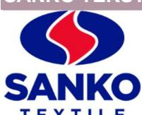

Sanko Tekstil is a large, vertically integrated textile manufacturer that positions itself as a premium, sustainability-oriented supplier for apparel, athleisure, underwear and hometextile markets with growing investment in textile-to-textile recycling and circularity. Its core business lines and capabilities concern spinning (yarns), knitting/weaving, dyeing/printing and garment finishing, allowing control of quality and lead times. Also, home textiles and terry (towels, bath linens) plus fabrics for apparel (interlock, modal blends, cotton basics). Its strong export footprint and group scale via Sanko Holding, part of a broader industrial group with significant capex plans for textile expansion. As strategic differentiators can be named the vertical integration, sustainability / circularity push with public commitments to CradletoCradle principles, regenerated and organic cotton programmes and a new recycling tech venture, RE&UP Recycling Technologies, to convert textile waste back to re-usable material. Sanko has also attracted international financing and large group investment plans to expand spinning and recycling capacity. Sanko supplies successful globally and regionally its yarns and fabrics. A large branch of Sanko Holding is ISKO – one of the most innovative and also largest denim fabric producers in the world who exports to all major brands and regions its fabrics.

## RE&UP RECYCLING TECHNOLOGIES BV

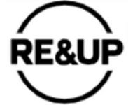

RE&UP is a circular-tech textile company that is reshaping the traditional textile-to-textile paradigm. Specifically, the company produces "Next-Gen Cotton fibers" and "Next-Gen Polyester Chips" from pre- and post-consumer and post-industrial textile waste, to match or approach the performance of virgin fibers. It is backed by a long textile heritage via SANKO Holding and leverages that legacy plus R&D/go-to-market capability. RE&UP has a feedstock-agnostic process already at scale with an annual capacity of 80.000tons that can handle mixed textile waste like polycotton with elastane, Polyester elastane. In May 2025, RE&UP became the first textile industry company to achieve Cradle to Cradle Certified® Circularity for all its products (Platinum level for pre- and postconsumer cotton, Silver level for recycled polyester chips). In March 2025, RE&UP announced a multi-year collaboration with major sports brand PUMA to scale fiber-to-fiber recycled solutions (using RE&UP's materials) in PUMA's supply chain. RE&UP is positioning itself as a technology-enabled, premium supplier of truly circular textile raw materials (fibers) to apparel, textile, and wider technical textile markets competing on sustainability, traceability, and performance. RE&UP and rivals such as Syre and Reju are together in the challenge to scale circular fiber production. RE&UP's differentiator is that it handles both cotton and polyester (and blends) in a single ecosystem, which is more

unusual. There may be smaller regional recyclers or sorting/management firms specialising in textile waste streams rather than full fiber-production (for example, sorting/collection, but not end-to-fiber). RE&UP is carving out a premium, technology-led niche in the textile raw materials industry focusing on converting textile waste (including blends) into high-performance, traceable textile-to-textile recycled fibers (cotton & polyester) that from a quality standpoint are similar to virgin materials. Its value proposition is built around circularity at scale, quality equivalence, and brand/retailer alignment with sustainability mandates. The company's competitive advantage lies in its patented process for blends, its heritage backing, and its early traction with brand partners. Its closest competitors are other textile-to-textile recyclers (mechanical or chemical) today mostly at lab- or pilot-size seeking industrial-scale circular fiber production.

## SCANTRUST SA

Scantrust is a Swiss scale-up that sells a cloud platform for product identification, secure QR codes and connected-packaging solutions used for anti-counterfeiting, supply-chain traceability, consumer engagement, and digital product passports.

The core tech propositions include secure/serialized QR codes, analytics/business intelligence from scan events, tamper-evident labels, and integrations for enterprise workflows.

Their target customers include food and beverage, spirits, cosmetics, automotive components, pharma and luxury, to address their challenges with counterfeiting, traceability, consumer engagement and regulatory compliance.

To differentiate Scantrust uses secure QR codes as a low-cost, smartphone-first authentication and traceability layer. Furthermore, it emphasizes an end-to-end SaaS offering rather than only tags or inks positioning it as a connected-goods platform. Also, positioned both for addressing the needs of large enterprises (ERP connections, partner ecosystem integrators) as well as SMEs (e.g. for EU wine label and DPP support).

Regarding competitors below are peers that compete on anti-counterfeit, track-and-trace, or connected-packaging, grouped and noted by their typical strengths:

 Serialization & enterprise track-and-trace players Systech: serialization, enterprise track-and-trace for regulated sectors (strong on pharma/serialisation). Authena: blockchain and NFC/QR product authentication for luxury and pharma. Consumer-facing authentication / anti-counterfeit specialists Sproxil: consumer verification and anti-fraud (mobile-based) focused on emerging markets. VerifyMe / AuthenticVision / MarqVision: QR/NFC/image-based authentication and marketplace monitoring. Broader packaging or digital ID platforms Digimarc: digital watermarking at scale (broad media & packaging play). TrusTrace / Wherefour / other traceability platforms: more focused on supply-chain data and ESG/product-passport tooling. Security-ink / government-grade track-and-trace

SICPA / Tageos / NeuroTags: providers of secure physical technologies (inks, tags, NFC) and large government/regulatory contracts; compete where very high tamperresistance is required.

## MADE2FLOW GMBH

Made2Flow is a German software/data company founded in 2019. Its core offering is a SaaS platform aimed at the fashion sector for supply‑chain decarbonisation, environmental impact measurement, and sustainable product development. Their solution covers gathering supply-chain data, validating it and filling gaps, calculating environmental impact indicators (CO₂, water usage, land use etc) via LCA frameworks. Their vision is to "enable brands to measure the impact of all their products at all times, in a transparent, trustworthy and easy manner". They emphasise helping brands comply with regulations (e.g., product environmental footprint category rules, DPPs) and using data to drive internal decisionmaking and external transparency. Moreover, they have alliances with Infor (integration between Infor's PLM for fashion and Made2Flow's impact-measurement engine) to boost traceability and measurement. They serve brands, suppliers and sourcing companies and they are positioned in the intersection of fashion supply-chain, environmental measurement and SaaS. They focus on validated, credible environmental impact data and emphasise data credibility and gap-filling. Also, they appear to target brands that are under increasing regulatory and stakeholder pressure (ESG, product passport, consumer expectations) and need both internal decision tools and external reporting tools. Their approach is lean / digital (cloud/SaaS) and specialised in fashion.

Regarding competitors, a few of them are mentioned.

TrusTrace: A leading platform for capturing, digitizing, and sharing traceability and compliance data across high-volume textile and footwear supply chains.

Carbonfact: Offers product-level LCAs at scale for a brand's product catalogue, specializing in apparel and footwear and emphasizing data cleaning and intelligent gapfilling.

Carbon Trail: provides sustainability software for fashion and retail focusing on carbon accounting.

Retraced: Provides solutions for tracking products throughout their lifecycle, enabling consumer-facing transparency and compliance in the fashion supply chain.

Made2Flow is strong in data-validation, deep supply-chain environmental impact modelling (LCA based) and integration with PLM/sourcing workflows. Some competitors may focus more on traceability or transparency rather than full environmental impact calculations. Made2Flow is aiming to collaborate with larger enterprise software vendors (ERP/PLM providers). Existing partnerships exist with key players such as PTC and Infor, and thus instead of becoming competitors, the PLM/ERP suppliers can utilize the Made2Flow modules. Providers specialising in DPPs or blockchain traceability may also overlap in usecases for brands preparing for regulation.

## IRIS TECHNOLOGY SOLUTIONS, SOCIEDAD LIMITADA

IRIS is an Advanced Engineering company specialized in Real-Time Monitoring solutions based on Photonics-based Process Analytical Technology (PAT) systems and Industrial Artificial Intelligence (Machine Learning and Deep Learning) for data-driven process efficiencies and quality standardization in the Food, Chemical, Pharmaceutical, Bio-based and other process industries. They also develop Digital Twins, as well as AI-enabled Cloud Platforms for digitizing and connecting value chains. Their team of multidisciplinary experts combines experienced programmers, engineers (optical, mechatronic, electronic and process engineers), chemists, physicists, mathematicians and data scientists, biologists and technologists, converging the scientific and technological fields required for Industry 4.0 solutions development. The company has two divisions: IRIS Commercial that delivers B2B solutions and services to industry (serving a growing client base of blue chips and mid-caps from the farm to fork chain and the process industries); and, IRIS Innovation Lab that works in an Open Innovation context to cocreate and build new knowledge, knowhow and IP to fuel their innovation pipeline so that they can offer cutting edge solutions to industry via the Commercial Division.

In the B2B segment, the main alternatives to the NIR and Raman analyzers developed and commercialized by IRIS under the Visum® brand are Bruker, Büchi, FOSS, Thermo Fisher, and Viavi Solutions. These companies offer robust portfolios in both laboratory and process spectroscopy and have large installed bases across the food, pharmaceutical, chemical, and process industries.

IRIS differentiates itself through several competitive factors:

 Integrated chemometric development tools, including a built-in model builder that simplifies and accelerates calibration development. Excellent price–performance ratio, making Visum® analyzers a cost-effective choice without sacrificing analytical quality. High versatility and multiple integration options, enabling installation in pipelines, conveyor belts, blenders, reactors, and various at-line or in-line environments.

These strengths position Visum® solutions as flexible, accessible, and technologically advanced alternatives in the industrial spectroscopy market.

## TERRA MATTERS

Terra Matters is a Groupement d'Intérêt Économique (GIE) initiated in 2022 by the Ministry of the Economy and the Chamber of Commerce of Luxembourg to accelerate the adoption of the circular economy at company level. They are the official entity responsible for the deployment of the Product Circularity Data Sheet (PCDS), now formally published as ISO 59040 in February 2025, the first international standard dedicated to circularity data at product level. With the PCDS, businesses can measure and improve their product circularity, drive eco-design decisions and set measurable goals; be transparent and showcase circularity performance to clients, regulators, tendering bodies, or certification schemes; share and verify circular data securely across the value chain.

Terra Matters positions itself as the reference platform for generating, hosting and exchanging PCDS data. That makes them a standards-first, interoperability-focused player rather than a pure SaaS-for-marketing vendor. Active in textile-related EU projects and promoting PCDS adoption across industries, they are leaning into textiles as a priority vertical while keeping the PCDS generic. Terra Matters acts as a hub for the PCDS, intending to feed other tools (LCA, DPPs, procurement systems) rather than replacing them.

In terms of competitors, Toxnot is a U.S. platform that has integrated PCDS export and supports product transparency and declarations (PCDS hosting/creation on a broader product data platform). Circularise, is an enterprise traceability / data-sharing platform aimed at digital product passports and supply-chain traceability and can be chosen instead of a PCDS-specific hub for companies seeking broader DPP solutions. Lastly, circularity.ID / circular.fashion provides an open data standard for fashion DPPs and tooling.

## 10.2 Market specificities of TRUSTEX end products

The envisaged technological solutions and products of TRUSTEX, i.e.,

 KER1. DPP blockchain integral solution KER2. Authority dashboard KER4. Eco designed fibres KER5. Eco designed fabrics KER6. Eco designed garments KER7. Next gen sorting technologies KER8. Dismantling pilot line

are indeed important in advancing sustainability and efficiency within the textile industry and below follows an overview of their market specificities.

## DPP Blockchain Integral Solution

Blockchain-based digital product passports represent an important technology for enhancing supply chain transparency, sustainability and compliance. By leveraging blockchain's immutable ledger, these solutions provide verifiable records of the product's lifecycle (from raw materials sourcing to end-of-life recycling), enabling circular economy practices. Driven by the EU regulations and the growing consumer demand for ethical products, the market is experiencing a significant growth. As of 2025, the broader DPP market (with blockchain as a core enabler) is valued at approximately USD 200-300 million, projected to reach USD 1-8 billion by 2030-2035 at compound annual growth rates (CAGRs) ranging from 22% to 45%. However, projections vary by scope (e.g., softwareonly vs. full platforms), but consensus points to hyper-growth fuelled by EU compliance deadlines. The table below summarizes such projections:

| Source                 | Market size  |         |           |      |
|------------------------|--------------|---------|-----------|------|
|                        |              |         | Timeframe | CAGR |
| Global Market Insights | 183 (2024)   | N/A     | 2025-2034 | 22.6 |
| Grand View Research    | 275.1 (2025) | 1,230.9 | By 2030   | 35   |
| Future Market Insights | 2,400 (2025) | 10,900  | By 2035   | 16   |
| Market.us              | 310.6 (2024) | 8,483.9 | By 2034   | 39.2 |
| Markets and Markets    | 185.9 (2024) | 1,780.5 | By 2030   | 45.7 |
| Meticulous Research    | 338 (2025)   | 7,847   | By 2035   | 37   |
| Market Research Future | 3,230 (2025) | 23,140  | By 2035   | 24.4 |

Note: Blockchain-specific subsets are smaller (estimated 20-30% of total DPP market) but growing faster due to its role in secure data interoperability.

The landscape features established tech firms, sustainability specialists and blockchain players that dominate due to their expertise in decentralized verification. Below is presented a selection of companies:

| Company      | Headquarters | Focus areas         | Notes                                     |
|--------------|--------------|---------------------|-------------------------------------------|
| Circularise  | Netherlands  | Supply              | chain                                     |
| Billon Group | Poland/UK    | Secure data sharing | Tokenized DPPs for compliance in textiles |
| Everledger   | Australia    | Provenance tracking | Diamond/EV battery passports with IBM     |

| Company       | Headquarters | Focus areas          | Notes                                   |
|---------------|--------------|----------------------|-----------------------------------------|
| DNV           | Norway       | Certification        | and                                     |
|               |              |                      | VerifAI platform combining blockchain   |
| Siemens       | Germany      | Industrial           | IoT                                     |
|               |              |                      | MindSphere-enabled DPPs for             |
|               | USA          | RFID and labelling   | Atma.io blockchain platform for apparel |
| Eviden (Atos) | France       | Enterprise solutions | Blockchain-based DPP for automotive     |

## Authority dashboard

The sector of authority dashboards that integrate DPP data with EPR information, represents a high-growth niche within the broader environmental compliance software market. These tools empower regulatory bodies to monitor product lifecycles, enforce sustainability standards, and support policy decisions through user-friendly interfaces and real-time analytics. Driven by the regulations like the ESPR and EPR mandates, the market is projected to expand. According to Verified Market Research, the global environmental compliance software market (encompassing dashboards) is valued at approximately USD 2.2 billion, projected to reach USD 4.5 billion by 2031 at a CAGR of 10-12%. Key opportunities lie in AI-enhanced predictive analytics and cross-border data integration, while challenges include legacy system interoperability and data privacy concerns. Several firms are pioneering authority-specific dashboards, emphasizing on the EPR/DPP integration. Recyda, offers interactive EPR compliance platforms with material/Stockkeeping unit breakdowns and forecasting. Empower.eco, specializes in DPP software for lifecycle verification and transparency. Earthsoft, provides web-based environmental dashboards for proactive compliance and data visualization. Texbase, focuses on unified EPR-DPP compliance with reporting analytics. Lastly, Avatier and Anthesis Group, deliver executive-friendly dashboards for regulatory enforcement.

### Eco-designed fibres

The eco-designed fibres sector, encompassing bio-based synthetics, recycled materials, and premium natural fibres like organic cotton and bamboo, is experiencing robust growth amid the global shift toward sustainable textiles. This aligns with rising consumer demand for ethical fashion, regulatory pressures to reduce textile waste and emissions and innovations that minimize environmental impacts compared to traditional cotton and polyester. DataM Intelligence Market Research reports that as of 2025, the market is valued at approximately USD 57-58 billion, with projections indicating expansion to USD 84-130 billion by 2030-2034 at a CAGR of 7.6-8.6%. Key players include established manufacturers like Lenzing AG and emerging innovators, fostering collaborations with fashion brands such as H&M and Adidas to integrate these materials into mainstream apparel. Challenges like competition from cheaper synthetics persist, but opportunities in circular economy models and niche applications promise sustained momentum.

| Year | Market Size |         |                                                 |
|------|-------------|---------|-------------------------------------------------|
| 2024 | 57.5        |         | Baseline valuation including natural,           |
| 2025 | 57.6-62.5   | 8.0-8.6 | Entry point for forecast period; initial growth |

| Year | Market Size (USD billion) | CAGR (%) | Notes                                                                                  |
|------|---------------------------|----------|----------------------------------------------------------------------------------------|
| 2030 | 77.2-84.6                 | 7.6-8.0  | Mid-term projection; apparel demand as primary driver.                                 |
| 2034 | 129.8                     | 8.6      | Long-term outlook; boosted by Asia-Pacific industrialization and EU circular mandates. |

Source: DataM Intelligence Market Research

Several interconnected factors are boosting the sector:

 Consumer demand for sustainable fashion: Ethical sourcing and transparency resonate with millennials and Gen Z, who prioritize low-impact materials. Regulatory pressures: The Waste Framework Directive mandates separate textile collection for reuse/recycling. Similar policies in the U.S. (e.g., California's textile producer responsibility laws) and Asia (e.g., India's eco-labeling schemes) penalize high-emission synthetics, accelerating adoption of bio-based alternatives. Innovations in materials: Bio-based synthetics (e.g., from sugarcane or algae) and regenerated fibres like Tencel (lyocell) offer 30-50% lower water use and carbon footprints than virgin polyester. Trends include antimicrobial and UV-resistant eco-fibres for activewear. Industry expansion: Growth is also expected in end-use sectors like automotive interiors and medical disposables, where eco-fibres reduce waste in high-volume production.

However, several hurdles are recorded:

 Cost premiums: Eco-fibres can cost 20-40% more than conventional options, limiting penetration in price-sensitive markets like fast fashion. Supply chain constraints: Scaling bio-based production faces raw material shortages (e.g., organic cotton yields only 1% of global supply) and competition from petroleumbased synthetics. Competition from synthetics: Polyester's dominance (over 50% of global fibre use) persists due to lower prices and versatility, potentially capping eco-fibre share at 15- 20% by 2030. Verification gaps: Greenwashing concerns erode trust, necessitating robust certifications.

Regarding the players, the market features 50 major players of which the top of them control 30%-40% share.

| Company                | Focus areas                 | Remarkable activities                |
|------------------------|-----------------------------|--------------------------------------|
| Lenzing AG             | Regenerated                 | cellulose                            |
| Aditya Birla Group     | Viscose and recycled fibres | Invested USD 500M in sustainable     |
| Teijin Limited         | Recycled polyester          | Launched bio-derived aramid for      |
| Grasim Industries Ltd. | Organic cotton/viscose      | Collaborated with H&M for zero-waste |
| US Fibres              | Natural and recycled blends | North American expansion targeting   |

| Company                  | Focus areas            | Remarkable activities                  |
|--------------------------|------------------------|----------------------------------------|
| Wellman Advanced         |                        |                                        |
|                          | PET recycling          | Acquired eco-fibre tech from startups. |
| Pilipinas Ecofibre Corp. | Abaca (natural) fibres | Export growth to Europe.               |
| Bcomp                    | Flax/hemp composites   | Supplied McLaren F1 with natural       |

## Eco-designed fabrics

There is a growing demand for fabrics utilizing eco-friendly coatings and finishings, such as bio-based, isocyanate-free, and fluorine-free options. Removable coatings and monomaterial coated fabrics are gaining traction, facilitating easier recycling and aligning with circular economy principles. Innovative textile companies are developing eco-designed fabrics, focusing on sustainability without compromising performance. These advancements cater to both regulatory requirements and consumer preferences for environmentally responsible products.

Recent market estimates cluster around USD 26–38 billion with multi-year projections that put the market between USD 27–115 billion by the 2030 depending on definition and forecast horizon. Typical CAGR ranges reported in 2024–2029 / 2024–2032 forecasts are 8% to 13%.

BCC Research projects a 8.1% CAGR (2024–2029) to reach about \$27.8B by 2029, while several market research companies project higher CAGRs (10–13%) when they include wider bio-based and recycled-textile segments or longer horizons.

Some examples from relevant reports provide the following figures:

 BCC Research: market expected to reach \$27.8 billion by 2029, CAGR 8.1% (2024–2029). Technavio: forecasts growth of the sustainable fabrics market at about CAGR 8.6% (2024–2029).

Sources that use broader definitions (bio-based or eco-fibres, or longer horizons) give higher starting values and stronger CAGRs (e.g., Market Research Future, ResearchNester and Verified Market Reports, report higher base values and CAGRs up to 12%).

Eco-designed fabrics can mean certified organic cotton and lyocell, bio-based fibres, recycled polyester/nylon, biodegradable textiles, or engineered eco-fibres, and the forecast differences arise from (a) which product types are included, (b) the geographic scope, and (c) the forecast period and method.

Top companies in the eco-designed fabrics ecosystem (cellulosic/regenerated fibres, recycled polyester/nylon, recyclers & circular tech, and integrated / diversified textile players) are presented below (Markets and Markets).

## Cellulosic / regenerated cellulose (wood-based, lyocell/viscose)

 Lenzing Group, market leader for TENCEL / LENZING lyocell and other cellulosic fibres, positioned centrally in "sustainable fibre" supply.

### Recycled polyester & branded recycled fibres

and brand partnerships. Indorama Ventures (polyester and rPET producer) big player in recycled polyester supply chains.

Recycled nylon / regeneration specialists

 Aquafil (ECONYL), global leader for regenerated nylon and circular nylon systems. Technical / synthetic fibre incumbents adapting to sustainability

 Toray, Teijin, Grasim/Aditya Birla Group, fibre/chemical players with sustainability programs and recycled/bio lines.

Textile recyclers, circular-tech startups and specialty recyclers

 Circulose (formerly Infinited Fibre/Circulose, Re:newCell), Re&Up, and Reju, active in textile-to-textile chemical recycling and scaling circular solutions.

## Eco-designed garments for automatic disassembly and recycling

Designing garments for easy disassembly enhances recyclability, addressing the significant textile waste that is generated. Fashion brands are increasingly adopting design strategies that facilitate automatic disassembly, integrating features like detachable components and single-material compositions to streamline recycling processes.

Estimates for the "eco-designed garments / sustainable apparel" market clustered around USD 8–11 billion in 2024 with widely varying CAGR forecasts from 10% up to 23% depending on scope and timeframe (Custom Markets Insights).

Several reports place the global sustainable/apparel market at about USD 8–10.5 billion in 2024 (Custom Market Insights: USD 8.1B in 2024; Market Research Future: USD 10.5B in 2024). Forecasts vary with 9.9% (Coherent Market Insights) to 13% (Market Research Future) to 22.9% (Custom Market Insights).

The numbers differ because definitions differ. "Eco-designed garments" vs "sustainable fashion" vs "sustainable apparel" vs "sustainable clothing", some include second-hand, rental, repair and recycling and others only new garments using sustainable inputs. Some reports focus on North America/Europe while others are global. Also, forecast horizons differ.

Regarding the top companies actively positioned around eco-designed garments, the following brands are among the leading ones.

Patagonia, pioneering durable, repairable garments and recycled materials.

 Stella McCartney, luxury brand known for materials innovation and no-leather policy. Eileen Fisher, known for circular take-back, remanufacturing and simple eco-design. Reformation, brand focused on low-impact materials and transparent footprints. H&M, fast fashion player that runs sustainability lines and invests in recycled-fibre tech. Investors in eco-design: Adidas, Levi's, PVH (Tommy Hilfiger/Calvin Klein).

| Source Base year & Market Size Custom 2024: USD 8.1 |     | Forecast horizon 2024– | CAGR   | Forecasted size USD 33.1 | Comments “Sustainable fashion”                 |
|-----------------------------------------------------|-----|------------------------|--------|--------------------------|------------------------------------------------|
|                                                     |     | 2033                   | 22.9%  |                          |                                                |
|                                                     |     |                        |        | billion by               |                                                |
| Market billion Insights                             |     |                        |        |                          | broadly (incl. apparel, footwear, accessories) |
| 2024:                                               | USD |                        |        |                          |                                                |
|                                                     |     | 2035                   | 19.68% |                          |                                                |
|                                                     |     |                        |        | USD 58.03                |                                                |
|                                                     |     |                        |        | billion by               |                                                |
| Roots Analysis 8.04 billion                         |     |                        |        |                          | Broad sustainable fashion definition           |

| Source Base year & Forecast horizon CAGR size Market Size Market USD 2024: USD 2025– | Forecasted Comments 40.63 Focuses on “sustainable    |
|--------------------------------------------------------------------------------------|------------------------------------------------------|
| 2035 13.11%                                                                          |                                                      |
| billion Research 10.5 billion Future                                                 | by apparel” segment                                  |
| 2023: USD                                                                            |                                                      |
| 2032 9.1%                                                                            |                                                      |
| USD SNS Insider /                                                                    | 24.53                                                |
| billion                                                                              | by                                                   |
| 2024– Globe 11.20 billion Newswire                                                   | “Sustainable apparel” narrower than full fashion set |
| 2024: USD                                                                            |                                                      |
| 2033 9.1%                                                                            |                                                      |
| USD Verified 2026–                                                                   | 14.52 “Sustainable & Eco-Friendly                    |
| billion Market 6.78 billion Reports                                                  | by Clothing” narrower scope                          |

Note: Some reports take a wide definition (apparel + footwear + accessories + circular business models), and others restrict to "apparel only" or "eco-friendly garments.

## Next-gen sorting technologies

Advanced sorting technologies, such as near-infrared (NIR) and visual spectroscopy (VIS), are revolutionizing textile recycling by accurately identifying and separating materials. These technologies enhance the efficiency of recycling operations, supporting the industry's move towards a circular economy. Companies specializing in recycling technologies are investing in NIR and VIS systems, offering solutions that improve sorting accuracy and processing speed, thereby increasing the quality of recycled fibres.

The market for textile-waste sorting / next-gen sorting tech is estimated at USD 1.0–1.3 billion in 2024 (DataIntelo reports about USD 1.24B specifically for a "Textile Waste Sorting AI" market in 2024).

DataIntelo projects 18.7% CAGR for Textile Waste Sorting AI, while broader enabling markets (hyperspectral imaging systems, sorting machines) show 10–19% CAGR ranges depending on the report. A reasonable blended CAGR assumption for next-gen sorting tech is 12–20% over the next 5–10 years (depending on geography and how broadly the segment is defined).

Given that the total textile-recycling market (all recycling processes and services) was estimated around USD 4.8–6.1 billion in the mid-2020s depending on the source and exact scope, this means advanced sorting tech is still partial slice of the overall value chain (Grand View Research, 2024).

Among the growth drivers are the new EU regulations and EPR rules, brand sustainability commitments, rising volumes of post-consumer textile waste, and the need for accurate feedstocks for mechanical and chemical recycling. As technology drivers are reported the falling sensor costs, advances in hyperspectral cameras, AI, robotics and automation.

Regarding the top companies, some of them are listed below:

 TOMRA is a global leader in sensor-based automated sorting and has commercial textile sorting solutions combining NIR and visual sensors for whole and shredded textiles. Pellenc ST is an optical sorting machines supplier. Refibred is a hyperspectral and AI start-up focused on textile material detection. NewRetex operates automated sorting lines (robots, NIR, cameras) and runs industrial recycling plants that produce yarns from sorted inputs.

This project has received funding from the European Union's Horizon Research and Innovation program under grant agreement N° 101181901 and from the Swiss State Secretariat for Education, Research and Innovation (SERI). Posts and shares reflect only the views of all the involved partners. Neither the European Union nor the granting authority can be held responsible for them. Dismantling lines can be considered as a sub-segment of the equipment market and represent a single-digit share of the total textile recycling equipment market. Nevertheless, because many recyclers first invest in sorting/disassembly capacity, the dismantling segment is growing faster than the overall textile recycling market. Data Insights Market

This draft deliverable has not yet been validated by the granting authorities

 Specim is a hyperspectral camera manufacturer whose cameras are used in textilesorting implementations. PICVISA is an integrator that has built automated/hyperspectral sorting systems for industrial textile recyclers. trinamiX (BASF) is a NIR/mobile spectroscopy solutions provider for on-site and process identification. ANDRITZ is an industrial machinery supplier offering automated tearing and processing lines.

## Denmark

Leading the way in automated textile sorting NewRetex has developed the world's first fully automated textile sorting facility with a traceability system. They specialize in automatic textile sorting and mechanical recycling, transforming post-consumer fibre into valuable new resources for the textile industry. They aim to be the market leader in textile sorting technology and to create high-value materials through innovative processes. They design and sell textile sorting lines that integrate artificial intelligence, data collection systems, and advanced sensor technology. The systems empower companies to efficiently manage textile waste, stay ahead of EU regulations, and actively contribute to a more circular economy. NewRetex has accumulated extensive knowledge about post-consumer fibres and successfully developed yarns and products, proving that these fibres can be effectively recycled for the future of the textile industry. They have established a strong and scalable supply chain that provides industry with access to high-quality recycled fibres, yarns, and finished products, ready to be integrated directly into new collections.

### Austria

ANDRITZ is at the core of the movement to provide industrially and economically viable solutions that bring circularity to the world of natural and synthetic fibres. ANDRITZ has a diversity of solutions and cooperating partners covering the value chain from recovery of fibre to production of new yarn. They offer a full suite, from automated textile sorting, textile fibre preparation to mechanical and chemical recycling and combined processes.

## Dismantling lines

Automated dismantling processes, including heat-triggered systems, are being developed to efficiently disassemble textile products, facilitating material recovery and recycling. These innovations address the complexity of recycling blended fabrics and multicomponent garments. Engineering firms and recycling companies are collaborating to design and implement automated dismantling lines, aiming to scale up recycling capabilities and reduce manual labour requirements. Unfortunately, currently no specific reports for "textile products dismantling lines" were found.

argues that the equipment / dismantling lines are to grow at 6–7% CAGR over the next 5– 10 years.

Companies that either supply dismantling/sorting equipment or deliver the design-fordisassembly and thermal systems used in industrial lines are Resortecs for heatdissolvable threads and thermal disassembly systems and ANDRITZ for industrial shredders, separation and complete fibre-preparation lines. Resortecs has commercialized heat-dissolvable threads and an automated thermal disassembly system (to remove trims and speed disassembly versus manual methods) and ANDRITZ supplies shredders and separation lines to large recyclers.

## Thermo-mechanical recycling

Optimizing thermo-mechanical recycling processes is crucial for retaining material quality and enhancing the properties of recycled textiles. Advancements in this area contribute to the viability of recycled fibres as substitutes for virgin materials, supporting sustainability goals. Research institutions and industry players are focusing on improving thermomechanical recycling techniques, developing processes that maintain fibre integrity and expanding the applications of recycled materials.

Thermo-mechanical recycling is a subset of the broader textile-recycling / textile-wasteprocessing market and of the "mechanical" or "machine" segment in particular.

It refers to melting / heat-based reprocessing of thermoplastic textiles (mainly polyester/PET) to regranulate or directly produce fibres, i.e., melt-and-spin or thermomechanical reactor approaches that keep the polymer intact rather than chemically depolymerizing it. It is widely used for polyester and other thermoplastics and is the backbone of many textile-to-textile polyester recycling approaches.

An estimate for the 2024 global thermo-mechanical textile recycling market (equipment and processing services) ranges from USD 0.9 billion to USD 1.6 billion, while the expected CAGR is 4%–8% over the coming 5–8 years (Global Market Insights).

Some of the most prominent companies developing thermo-mechanical / melt-and-spin textile-to-textile processes or are major adjacent equipment and sorting suppliers are: Syre, H&M-backed startup focused on textile-to-textile polyester recycling; Earth Protex / Tex2Tex, developer of the Tex2Tex Thermo-Mechanical Reactor process that explicitly markets thermo-mechanical textile-to-textile polyester recycling; ANDRITZ, industrial supplier of textile-recycling equipment (tearing/tearing lines, recycling lines and full solutions).

# 11. SWOT ANALYSIS

The global and European textile industries are navigating a landscape characterized by rapid technological advancements, heightened sustainability demands and shifting consumer behaviours. The SWOT analysis that follows provides a comprehensive review by recording the relevant strengths, weaknesses, opportunities, and threats.

### Strengths

 Recycling: Textile recycling reduces landfill waste, conserves natural resources, saves energy, and creates economic opportunities. Technological advancements: The integration of technologies such as IoT, AI digital textile printing etc., enhance manufacturing efficiency, enable predictive maintenance, and facilitate customization, thereby improving overall productivity. Particularly the European textile industry is embracing digitalization and automation, with advancements enhancing product offerings and competitiveness. Diverse applications: Textiles are utilized across various sectors, including fashion, home furnishings, automotive, healthcare, and agriculture, underscoring their versatility and essential role in multiple industries. Commitment to sustainability: Strong policy frameworks, such as the EU Green Deal, the Circular Economy Action Plan, the EU Strategy for Sustainable and Circular Textile and the Ecodesign for Sustainable Products Regulation (ESPR), support systemic change. European initiatives aim to make products more environmentally friendly, reflecting a strong commitment to sustainability and circular economy principles. Strong brand image and reputation: European textiles are often associated with high quality, craftsmanship, and design. Focus on innovation: European companies are increasingly investing in research and development to create new technologies and materials. Skilled workforce: Many European countries have a long history of textile production and a well-trained workforce. Rise in sustainable consumer demand: Consumers, especially Gen Z, are showing increased preference for eco-friendly and ethical textiles, encouraging systemic shifts. Reuse practices: Textile reuse practices promote sustainable fashion reducing environmental impact. Second-hand market: The global second-hand market is experiencing growth driven by increasing consumer demand for affordable, sustainable and unique fashion options. EPR benefits: EPR creates transparency and traceability on global material flows. New EU rules will make companies responsible for their waste, encouraging better practices and sustainability in the fashion industry. Growing EPR adoption: The EU and countries like France are leading global efforts to embed EPR in legislation, promoting producer responsibility for post-consumer textile waste. Emerging circular business models: Models such as product-as-a-service, resale platforms, repair hubs, and textile-to-textile recycling present both environmental and economic advantages.

## Weaknesses

 Employment: Europe's textile and clothing industry continues to face challenging times. Compared to pre-pandemic levels, jobs in textiles are down. End-of-life textiles destination: Most end-of-life textiles are disposed into landfill or incinerated, instead of being reused or recycled. Also, textiles are traded to the Global South countries with limited infrastructure to sort, resell, refurbish or recycle the traded used textiles, leading to severe environmental, economic, and social impacts. Inappropriate feedstock: Despite the abundance of textile waste, recyclers face both scarcity and high costs of feedstock. There is insufficient post-consumer material suitable for recycling available due to low collection rates in most EU member states and a lack of incentive for sorters to provide feedstock quality needed for recycling. What exists often lacks the specifications needed for most current recycling technologies. Environmental impact: The industry is a significant contributor to environmental degradation, accounting for a notable percentage of global greenhouse gas emissions, water consumption, and waste generation. Scaling up innovative textile recycling: Very few recycling startups can scale into commercial ventures. Having a technology work at the lab and into mass production is not the same. Sorting solutions: Sorting efficiency is currently low. Manual sorting remains inefficient and costly. Complex supply chains: The complex supply chains can lead to challenges in transparency, ethical labour practices, and quality control, potentially resulting in reputational risks. Regulatory complexity: The rapid shift in legislation brings implementation challenges and uncertainty. While regulations promote transparency and sustainability, they can also create a compliance burden. Stringent environmental and consumer protection regulations, while promoting sustainability, impose administrative and financial burdens on companies, particularly SMEs. Shifting to circular models and complying with EPR regulations requires significant investment in infrastructure, training, and technology. Labour shortages: The industry faces workforce shortages, notably in specialized manufacturing positions, due to aging workforces and a lack of training programs for new workers. Consumer behaviour: Eco-friendly alternatives are often more expensive, and consumers choose cheaper, less sustainable products without incentives or motivation to make a change. Many consumers still prefer new items instead of second-hand clothes. Despite awareness, actual sustainable behaviours (reuse, recycling) are hindered by price perception, limited accessibility, convenience barriers and many other. Fast fashion model: Promotes overconsumption, short product life cycles, and significant waste, undermining sustainability efforts. The fast fashion model results in high volumes of low-quality textiles that are difficult to recycle. Online shopping: Global online marketplaces are enabling cheap garments to easily reach European consumers. The convenience of online shopping, amplified by targeted advertising, has reshaped consumer behaviour encouraging impulsive purchases based on desire rather than need.

 Illegal waste exports: Lack of standardized collection, sorting and recycling infrastructure, especially in developing countries, may lead to illegal waste exports, unsustainable practices, and labour exploitation. Labour rights violations: Persistent issues in sourcing countries, including low wages, unsafe conditions, and child labour, challenge the ethical legitimacy of global brands. Low EPR enforcement outside EU: Many countries still lack regulatory frameworks for EPR, limiting its global impact and effectiveness. Loss of revenues: While EPR presents an opportunity for the textile industry, the law against exporting textile waste threatens the current business model, as profit from exporting second-quality textiles to Asia, Eastern Europe, and Africa constitutes a crucial part of revenue. Consumers' deception: Many companies market themselves as sustainable to enhance their reputation, often appearing more environmentally friendly than they actually are. This discourages consumers from purchasing recycled products due to unreliable claims. Limited capacity: The obligation to separately collect textiles will further increase their volumes, while quality of the collected used textiles will keep declining, particularly due to the rise of ultra-fast fashion. However, managing capacity has not expanded, nor have the outlets for the processed used textiles. Handling of non-reusable textiles: The handling of non-reusable textiles (both for recycling and energy recovery) remains costly for sorting and reuse operators, on top of the lack of market uptake for the recycled textile fibres. Technical limits: many garments are hard or impossible to recycle at scale, e.g., blended fibres, coatings, trims and dyes mean recycling technologies are nοt yet able to meaningfully process large shares of waste, so EPR fees cannot by themselves solve end-of-life treatment.

### Opportunities

 EU leadership: EPR schemes represent a pivotal opportunity for the European Union to implement circular business models and solidify its position as a global sustainability leader within the textile industry. Sustainable practices: Adopting eco-friendly materials, implementing circular economy principles, and enhancing recycling initiatives highlight routes for innovation and market differentiation. Investments in biodegradable and organic textiles offer profitable opportunities. Smart textiles: Investments in research and development of smart textiles, such as those with embedded sensors or conductive fabrics, can open up opportunities in highgrowth segments like healthcare and activewear. Development of smart fabrics, antimicrobial textiles, and nanotechnology-driven materials can open new market segments. E-commerce expansion: The growth of online sales channels offers opportunities for brands to reach broader audiences, with investments in e-commerce platforms and digital marketing enhancing consumer engagement. Localized production: Reshoring and localized textile production are on the rise in Europe, driven by a desire for more control over supply chains and a reduction in reliance on global sourcing. Reshoring to Eastern Europe, North Africa, and

Mediterranean countries offers opportunities to reduce emissions and improve transparency.

 Emerging markets: Access developing regions with increasing disposable incomes and shifting consumer preferences. Growth in developing economies, particularly in Africa and Southeast Asia, showcase new consumer communities. European brands can explore new markets in Africa and Asia to increase exports. Collaboration and innovation: Partnerships with technology companies and material science firms can lead to breakthrough textile innovations. Leadership: Europe's commitment to sustainability brings growth opportunities in biodegradable fabrics, circular economy models, and low-impact dyeing techniques. Government support and regulation: EU policies encourage innovation and investments in green and digital textiles. Second-hand market: Second-hand market is expected to grow by 2030 especially in regions embracing low-cost sustainable fashion options. Platforms for resale, swapping, and renting are becoming mainstream, supported by consumer trends and economic incentives. Consumer behaviour: Growing consumer awareness of the social and environmental impact of fashion is driving demand for more transparent and traceable products, as consumers want to know where their clothes come from, how they were made, and their environmental footprint. Technological solutions: The use for instance of IoT for traceability, AI for sorting and DPPs can extremely optimize reuse and recycling systems, helping real-time data to all stakeholders during each phase of the garment lifecycle. EU and global regulations: Regulations hold producers accountable for the entire lifecycle of textile products, including financial contributions to support separate collection, sorting, reuse, and recycling, thereby encouraging sustainable practices within the textile industry. Circular economy transition: EPR schemes can catalyse circular business models by incentivizing product design for durability, recyclability, and reuse.

### Threats

Geopolitical instabilities: Trade tensions, tariffs, and regulatory changes can disrupt

global supply chains, leading to increased operational costs and uncertainties. Market competition: Emerging markets with lower production costs pose strong competition, challenging established players to innovate and maintain market share. European textile manufacturers face fierce competition from low-cost markets, particularly from Asia, challenging their ability to offer competitive prices while maintaining high quality and ethical production standards. Economic uncertainties: Fluctuations in raw material prices and economic instabilities can impact production costs and consumer purchasing power, affecting overall industry profitability. Third-world countries conditions: The massive flow of second-hand clothing into third-world countries triggers environmental, health and economic issues, primarily considering the inadequate waste management infrastructure, the improper disposal methods and unregulated landfilling. Fast-fashion: Overproduction of fast-fashion and poor-quality clothes that still dominate the market, discourage reselling and reuse.

 Resistance from incumbents: Established fast fashion business models may resist circular economy integration due to concerns over profitability and speed-to-market. Greenwashing and lack of trust: Unverified claims about circularity will bring consumer distrust and regulatory reaction. Implementation gaps in EPR: The implementation in member states risks resulting in different systems across the EU, complicating the transition. Even within Europe, EPR implementation varies widely, and producer resistance or inadequate monitoring may hinder impact. Poorly designed fee structures will fail to change producers' behaviour. Flat fees or weak eco-modulation will not sufficiently reward durable, repairable or recyclable design. Weak enforcement, monitoring and data gaps (free-riding), lack of harmonised reporting, traceability and enforcement will allow some producers to avoid payments or misreport volumes, undermining scheme's credibility. Furthermore, regulatory fragmentation with differing rules across countries will create compliance complexity and gaps. Compliance costs and administrative burden can become disproportionately hard for small SMEs.

What follows is a SWOT analysis concerning the technological solutions and products of TRUSTEX. Specifically, a comprehensive SWOT analysis of the specified technological solutions and products is presented considering current trends, regulatory frameworks, and technological advancements to assess each solution's strengths, weaknesses, opportunities, and threats.

## 1. Digital Product Passport Blockchain Integral Solution

## Strengths

 Enhanced transparency: Blockchain integration ensures unchangeable records of product information, enhancing traceability and authenticity throughout the supply chain. Regulatory compliance: DPPs align with EU initiatives like the Eco-design for Sustainable Products Regulation (ESPR), facilitating adherence to environmental standards. Products' life: DPP is a useful tool for extending the garments' life by making relevant product data available throughout the entire lifecycle, especially during the post-consumer phase.

 Implementation complexity: Integrating blockchain with existing systems can be technically challenging and resource intensive. Data privacy concerns: Ensuring compliance with data protection regulations, such as GDPR, requires careful management of sensitive information.

## Opportunities

 Consumer engagement: DPPs provide consumers with detailed product data, fostering trust and informed purchasing decisions. Circular economy promotion: DPPs facilitate recycling and reuse by providing accurate material composition data.

This project has received funding from the European Union's Horizon Research and Innovation program under grant agreement N° 101181901 and from the Swiss State Secretariat for Education, Research and Innovation (SERI). Posts and shares reflect only the views of all the involved partners. Neither the European Union nor the granting authority can be held responsible for them. This draft deliverable has not yet been validated by the granting authorities

### Threats

 Technological barriers: Limited interoperability between different blockchain platforms may hinder widespread adoption. Market resistance: Stakeholders may be reluctant to adopt new technologies due to costs or lack of understanding.

## 2. Authority Dashboard

Strengths Informed decision-making: It aggregates data from DPPs and EPR schemes, enabling authorities to monitor compliance and environmental impact effectively. Policy development support: Provides empirical data to guide the formulation of environmental regulations and standards.

 Data integration challenges: Collecting and standardizing data from diverse sources can be complex. Resource intensive: Maintaining such dashboards require significant resources.

### Opportunities

 Enhanced compliance: It improves monitoring of producer responsibilities, leading to better enforcement of environmental policies. Public transparency: Can be used to inform the public about product sustainability, enhancing community engagement.

Threats Data security risks: Sensitive information may be vulnerable to cyber threats if not adequately protected. Resistance from industry: Companies may hesitate to share detailed data due to competitive concerns.

## 3. Eco-designed fibres

### Strengths

 Sustainability: Reduce reliance on traditional fibres like cotton and polyester, lowering environmental impact. Innovation: Encourage the development of new materials with improved properties.

 Performance variability: New fibres may not yet match the durability or comfort of conventional materials. Production costs: Initial manufacturing processes may be more expensive.

Opportunities Market differentiation: Brands can appeal to eco-conscious consumers by offering sustainable products.

 Regulatory incentives: Governments may provide support for sustainable material development.

 Consumer acceptance: Market adoption depends on consumer willingness to embrace new materials. Supply chain adjustments: Existing manufacturing processes may need significant changes.

## 4. Eco-designed fabrics

## Strengths

 Environmental benefits: Use of bio-based and non-toxic coatings reduces ecological footprint. Health advantages: Eliminating harmful chemicals benefits both workers and consumers.

 Technical limitations: Achieving desired fabric properties without traditional chemicals can be challenging. Cost implications: Eco-friendly materials may be more expensive to produce.

### Opportunities

 Regulatory alignment: Proactive compliance with upcoming environmental regulations. Consumer demand: Growing interest in sustainable products can drive sales.

 Market competition: Other companies may faster develop similar eco-friendly fabrics, increasing competition. Economic pressures: Higher costs may deter price-sensitive consumers.

## 5. Eco-designed garments

## Strengths

 Facilitate recycling: Designs that enable easy disassembly promote material recovery. Extended product life: Modular designs can allow for repairs and upgrades.

 Design constraints: Balancing aesthetics with functionality may be challenging. Consumer perception: Some consumers may associate modular designs with lower quality.

## Opportunities

 Circular business models: Support services like product take-back schemes. Educational impact: Educate consumers on sustainability and product care.

### Threats

 Market readiness: Consumers may not be prepared to adopt new garment designs. Manufacturing challenges: Existing production lines may need reconfiguration.

## 6. Next-gen sorting technologies

### Strengths

 Increased efficiency: Technologies like NIR/VIS spectroscopy enable rapid and accurate material sorting. Labour reduction: Automation reduces reliance on manual sorting, lowering labour costs.

 High initial investment: Advanced sorting systems require substantial capital expenditure. Technical limitations: Some materials may be challenging to identify accurately.

### Opportunities

 Scalability: Automated systems can handle large volumes, supporting industrialscale recycling.

Manual alternatives: Delayed adoption in price-sensitive markets.

## 7. Dismantling lines

Strengths Enhanced efficiency: Automated dismantling lines, particularly those utilizing heat-triggered processes, can significantly facilitate the disassembly of textile products, reducing manual labour and associated costs. Precision and consistency: Automation ensures uniformity in dismantling, leading to higher quality in the separation of materials for recycling purposes.

 High initial investment: The development and implementation of automated dismantling lines require substantial capital expenditure, which may be a barrier for small to medium-sized enterprises. Technical limitations: Heat-triggered processes may not be suitable for all types of textiles, particularly those sensitive to temperature, potentially limiting their applicability.

### Opportunities

 Advancements in technology: Ongoing research in automation and material science can lead to more versatile and efficient dismantling technologies, expanding their applicability across various textile types. Regulatory support: Increasing governmental emphasis on sustainable practices and waste reduction can result in incentives for adopting advanced dismantling technologies.

### Threats

 Technological obsolescence: Rapid advancements in technology may render existing dismantling systems obsolete, necessitating continuous investment in upgrades. Market acceptance: The textile industry's readiness to adopt automated dismantling technologies may vary, influenced by factors such as cost, perceived benefits, and compatibility with existing processes.

## 8. Thermo-mechanical recycling

Strengths Resource efficiency: Thermo-mechanical recycling enables the recovery of synthetic fibres, reducing reliance on virgin materials and conserving resources. Environmental benefits: By diverting textile waste from landfills, this process contributes to environmental sustainability and aligns with circular economy principles.

 Quality degradation: Recycled fibres may exhibit inferior mechanical properties compared to their virgin counterparts, limiting their application in high-quality textile products. Contamination sensitivity: The presence of contaminants in textile waste can adversely affect the quality of recycled materials, necessitating rigorous sorting and cleaning processes.

## Opportunities

 Technological innovations: Advancements in recycling technologies can enhance the quality of recycled fibres, expanding their applicability and acceptance in the market. Market demand: Growing consumer awareness and demand for sustainable products can drive the adoption of textiles made from recycled fibres.

## Threats

 Economic viability: Fluctuations in the cost of virgin materials can impact the competitiveness of recycled fibres, influencing the economic feasibility of thermomechanical recycling processes. Regulatory challenges: Compliance with evolving environmental regulations may require continuous adaptation of recycling processes, potentially increasing operational complexities.

This draft deliverable has not yet been validated by the granting authorities

# 12. PESTLE ANALYSIS

## 12.1 Factors influencing the global and European textile industry

The global and European textile industry is navigating a complex landscape shaped by political trade tensions, economic fluctuations, social demands for ethical practices, technological advancements, strict legal regulations, and pressing environmental concerns. Companies that take measures and proactively address these factors through innovation, transparency and sustainability are better positioned to thrive in the industry. Recently, at the Brussels Textiles Forum of 2025, the industry took stock of the increasingly difficult geopolitical landscape. The EU industry is facing mounting trade challenges, e.g., overcapacity from China and rising tariffs from the United States are threatening the competitiveness of this highly trade-intensive sector. The European Commission is responding by prioritising market diversification to secure market access for European companies. This includes strong support for the ratification of the EU–Mercosur FTA; New negotiations with countries like the UAE, Malaysia, Thailand, and others; Acceleration of talks with India, while ensuring the agreement remains mutually beneficial and economically meaningful. These efforts aim to ensure that the European industry continues to benefit from global supply chains and a diversified export market. At the same time, companies must prepare to operate within a more uncertain trade framework, particularly in relation to the United States.

The analysis that follows illustrates Political, Economic, Social, Technological, Legal, and Environmental factors influencing the global and European textile industry.

### Political factors

 The Commission's 2030 Vision for Textiles is summarized to the following points: All textile products placed on the EU market are durable, repairable and recyclable to a great extent made of recycled fibres; free of hazardous substances; produced respecting social rights. "Fast fashion is out of fashion" and consumers benefit longer from high quality textiles. Profitable re-use and repair services are widely available. In a competitive, resilient and innovative textile sector producers take responsibility for their products along the value chain. The EU has addressed the Competitiveness Compass, the Clean Industrial Deal and the Textile Talent of Τomorrow. The EU Green Deal aims for net-zero emissions by 2050, pushing industries to prioritize sustainability. However, this has introduced significant bureaucratic challenges for businesses, especially SMEs, due to extensive data reporting requirements. Efforts are underway to streamline these regulations to balance growth and environmental goals. The textile industry faces challenges due to rising tariffs and trade tensions. The US has imposed tariffs on imports from countries like China and the EU, leading to operational and financial unpredictability for fashion companies. This volatility complicates long-term investments in sustainable practices.

### Economic factors

 The global fashion industry is projected to reach \$1.8 trillion by the end of 2025 (Uniform Market), driven by fast fashion's low prices and availability. However, this

overconsumption negatively impacts workers, the environment and consumers, leading to increased scrutiny and calls for more sustainable practices.

 The industry continues to face challenges such as price increases, poor product quality, lack of transparency, forced labour and geopolitical instability. Brands are reassessing inventory and improving efficiency through advanced demand forecasting and AI-driven solutions to adapt to these disruptions.

## Social factors

 Despite improvements, labour violations persist in several countries including underpayment and excessive working hours, particularly in subcontracting factories. This highlights the need for brands to improve transparency in their extended supply chains. There is a growing demand from consumers for brands to exhibit environmentally responsible practices. Approximately 80% of consumers are more likely to buy from a company committed to sustainability, prompting textile manufacturers to adopt and communicate their sustainable practices effectively (PwC).

## Technological factors

 Technologies like IoT and AI are revolutionizing the textile industry by improving efficiency and predictive maintenance. The adoption of smart manufacturing, direct-toconsumer models, and digital textile printing reduces waste and enables customization, enhancing operational efficiency and customer engagement. The industry is investing in sustainable technologies, such as eco-friendly materials and processes. The market for eco-friendly fabrics is projected to grow substantially driven by consumer demand and corporate commitments to sustainability.

## Legal factors

 Regulations like the EU's Corporate Sustainability Due Diligence Directive aim to enforce environmental and social accountability in the fashion industry. These measures address issues such as poor working conditions, low wages, and labour exploitation, including child and forced labour.

## Environmental factors

 When textiles are discarded, they are extremely likely to become mismanaged and the environmental and social costs are significant. Around the world, the vast majority of textiles leak out of the system when they are discarded. They are incinerated, landfilled, or leak into the environment. To fix this leaky system, separate collection infrastructure for textiles needs to be scaled up dramatically and implemented in locations where it currently does not exist. The textile industry is significantly affected by climate change, impacting resource availability and demand patterns. Climate change for instance could substantially reduce global cotton production, posing challenges for raw material sourcing. The industry is increasingly embracing the principles of the circular economy, focusing on designing products for longevity, promoting garment recycling, and encouraging consumers to repair, reuse, or recycle clothing. Implementing take-back programs and using biodegradable materials are strategies to reduce textile waste.

## 12.1 Factors influencing partners' countries

As an introduction to the factors that are relevant to the countries represented by the consortium, the SDG performance per country provides an indication relevant to Political, Economic, Social, Technological, Legal and Environmental factors, since the SDGs call on all nations to combine economic prosperity, social inclusion, and environmental sustainability.

Table 17. 2025 SDG Index Ranking

| Rank | Country     | SDG Performance |
|------|-------------|-----------------|
| 1    | Finland     | 81.10           |
| 6    | Germany     | 75.01           |
| 7    | France      | 73.87           |
| 13   | Switzerland | 72.43           |
| 16   | Belgium     | 72.16           |
| 17   | Netherlands | 71.90           |
| 19   | Ireland     | 71.45           |
| 20   | Spain       | 71.22           |
| 27   | Luxembourg  | 67.55           |
| 28   | Greece      | 66.51           |
| 34   | Türkiye     | 59.14           |

Source: Europe Sustainable Development Report 2025

European countries offering the most opportunities for sustainable textiles Europe's top six apparel markets are Germany, France, Spain, Italy, the Netherlands and Poland. Together, they account for over 70% of the total value of EU imports. (Eurostat 2023).

## 12.1.1 Finland

After a contraction in 2023 and limited growth in 2024, Finland's economy is expected to almost stagnate in 2025. Economic activity is forecasted to resume expansion in 2026 and 2027, growing by approximately 1% in both years. The unemployment rate is forecasted at 9.5% in 2025, declining only slightly to 9.0% by 2027. Headline inflation is projected to slow down from 1.9% in 2025 to 1.6% in 2026 before reaching 2.0% in 2027. The accelerating economic activity and some fiscal consolidation measures are projected to reduce the general government deficit from 4.5% in 2025 to 3.9% by 2027. The public debtto-GDP ratio is set to increase from 82.5% in 2024 to 92.3% in 2027 (European Economic

## Forecast Autumn 2025).

Finland's textile sector operates in a high-cost but innovation-rich environment, with sustainability, circularity and advanced technology as key competitive levers. While domestic market size is limited, Finland's policy alignment, R&D strength, and ecoconscious reputation make it a leading force in Europe's green textile transition.

## Political factors

Finland benefits from political stability, strong institutions, and adherence to EU

trade, environmental, and labour regulations, providing a predictable framework for textile businesses.

 The Finnish government actively supports a circular economy, aiming for carbon neutrality by 2035. Initiatives such as funding for textile recycling enhance sector innovation. EU trade agreements ensure access to key export markets, but global geopolitical tensions (e.g., EU-Russia relations) have disrupted raw material sourcing and logistics.

## Economic Factors

 Finland's economy has shown resilience in the face of severe international economic and security turbulence. Finland ranks ninth in the European Union in terms of GDP per capita. High wages and energy costs challenge competitiveness versus low-cost textile producers. Investments in bio-based fibres (e.g., Spinnova, Infinited Fibre Company) are creating premium sustainable textile niches. Domestic demand is stable but limited. Growth depends on exports to Europe and Asia. EU funding and green transition financing continue to support R&D and circular textile solutions.

## Social factors

 2024 Disposable household income (per capita, Index 2008): 108,74 Finnish consumers prioritize ethical production, transparency and durability, influencing brands to adopt slow fashion and local sourcing. Aging population and urbanization may shift demand toward functional and healthoriented textiles (e.g., smart fabrics, workwear). Finland's global reputation for design (e.g., Marimekko) supports brand differentiation through aesthetics and sustainability.

## Technological factors

 Finland is an Innovation Leader, performing at 125.3% of the EU average in 2025. Finnish companies pioneer cellulose-based and recycled fibres, positioning Finland as a global hub for sustainable textile technologies. Increasing use of AI, 3D design and digital fashion platforms enhances customization and efficiency. Recycling and waste management technologies are advancing rapidly, driven by EU directives on textile circularity.

## Legal factors

 Strict regulations on emissions, chemical use (REACH), and waste management shape production practices. Intellectual property protection remains notably strong, supporting design-led textile companies.

 Finland ranks highly in sustainable development. The Waste Law from 2021 requires municipalities and residential properties to have comprehensive recycling systems. Textile producers face expectations to minimize carbon footprints and water use. Finland is among the first EU countries to establish a nationwide textile waste collection system. Use of renewable forest resources for fibre production (e.g., wood-based cellulose) strengthens Finland's sustainable advantage.

## 12.1.2 Germany

After two years of contraction, the economy is set to broadly stagnate in 2025 and rebound with 1.2% GDP growth in 2026 and 2027. The positive effects of a ramp-up in public spending is partly counterbalanced by the negative impact of trade tensions, which are expected to impact exports. Expansionary fiscal policy and real wage growth are expected to boost private consumption. Investment is projected to contract in 2025 due to weak economic sentiment and high uncertainty, with a gradual recovery expected over time as consumption and public investment accelerate. The government deficit is forecasted to rise in 2026 and based on currently known policies remain elevated in 2027. The government debt ratio is expected to increase to 65.2% of GDP in 2026 and 67.0% in 2027 (European Economic Forecast. Autumn 2025).

Germany's textile sector is technologically advanced, sustainability-oriented and innovation-driven with global leadership in technical and smart textiles. Although high costs and regulatory complexity pose challenges, strong R&D, digital transformation, and sustainability leadership position Germany as a European benchmark for circular and highvalue textile manufacturing.

Germany is the EU's largest apparel importer, sourcing 49.9% from within the EU and the rest from outside. Imports from European countries such as Poland and the Netherlands are on the rise. At the same time, Germany is also the EU's largest apparel exporter, dominating intra-EU trade. Major apparel exporters to Germany are Poland (12.7%), China (12.3%), Bangladesh (11.6%), the Netherlands (9%), Turkey (8.1%), and Italy (5.6%).

Germany's textiles and apparel industry is highly import-dependent for raw materials, with cotton largely sourced from India and the U.S. While raw materials are sourced from abroad, Germany's strength lies in value-added processing, technical textiles, and innovative fibres.

Germany is Europe's largest producer of technical textiles, supplying specialized fabrics for sectors like automotive, aerospace, and healthcare, supported by a strong focus on research and innovation. At the same time, Germany concentrates on producing high-end, capital-intensive apparel, while medium-priced, mass-market CMT (Cut-Make-Trim) manufacturing is largely outsourced to lower-cost Eastern European (Fashion for Good).

## Political factors

 Germany's strong governance and EU integration provide a predictable framework for textile and apparel businesses. Government commitment to sustainability, circular economy and low-carbon manufacturing influences the entire textile value chain.

This project has received funding from the European Union's Horizon Research and Innovation program under grant agreement N° 101181901 and from the Swiss State Secretariat for Education, Research and Innovation (SERI). Posts and shares reflect only the views of all the involved partners. Neither the European Union nor the granting authority can be held responsible for them.

 Programs under Industrie 4.0 and the High-Tech Strategy promote digital transformation, automation and innovation in textile manufacturing. As a major EU economy, Germany benefits from open trade within the EU but faces challenges from global supply chain disruptions and evolving trade tensions.

## Economic factors

 After a decade of strong export-led growth, the COVID-19 pandemic, Russia's war of aggression against Ukraine and rising trade tensions have hit the German economy. Germany ranks seventh in the European Union in terms of GDP per capita. The green economy is a key economic pillar, with millions employed in green sectors. Germany remains one of Europe's biggest textile producers, importers, and consumers. Rising wages and energy prices pressure competitiveness, particularly against low-cost producers in Asia and Eastern Europe. Despite global uncertainties, strong infrastructure, innovation funding and high export capacity sustain growth potential.

## Social factors

 2024 Disposable household income (per capita, Index 2008): 116,20 German consumers prioritize eco-friendly, fair-trade, and durable textiles, pushing brands to enhance transparency and circularity. Government and NGO initiatives encourage recycling and sustainable fashion choices.

## Technological factors

 Germany is a Strong Innovator, performing at 111.1% of the EU average in 2025. Research institutes and industry clusters lead innovation in bio-based and recyclable textiles. Widespread adoption of automation, robotics, 3D knitting and digital design improves efficiency and customization. Innovations in textile recycling and eco-materials are expanding rapidly. Integration of IoT, AI and data analytics strengthen supply chain management and product traceability.

## Legal factors

 Supply Chain Due Diligence Act requires large companies to ensure human rights and environmental standards throughout global supply chains. Strong worker rights increase costs but promote safe and ethical working conditions. Legal frameworks demand clear sustainability and origin information for textile products.

## Environmental factors

 Germany leads in implementing circular textile initiatives. Significant investment in textile recycling infrastructure and closed-loop systems.

Textile waste remains key issue requiring continuous innovation and compliance.

Germany is the largest market for apparel in the EU, with an apparel import value of €41.1 billion in 2023 and an average annual growth rate of 4.3% between 2018 and 2023. According to Statista, Germans spent about €180.4 million on fair-trade textiles in 2022. Germany is host to some of the biggest and most influential trade fairs dedicated to materials, including Munich Fabric Start, Innatex, Performance Days and Sustainable Materials Expo. According to the Global Organic Textile Standard (GOTS) database of certified companies, there are 57 German retailers that are GOTS-certified across all textiles product segments. This is the highest number of the top 6 European apparel importers. A 2023 IMF-Premiere vision study about consumer behaviour in sustainable fashion concluded that for German consumers the materials used is the number one criterion for determining a product's eco-responsibility. The percentage of German consumers who feel well informed about fashion sustainability issues has doubled since 2019, reaching 36%. 69% of German consumers say that environmental and social compatibility are fairly or very important to them when purchasing clothing or footwear. 65% of German consumers trust eco-labels and 50% specifically look for ecolabels before making a purchase. Germany has its own government-run social and environmental certification label, the 'Green Button', which is displayed on garments at the point of sale. Green Button recognises the following standards as proof of compliance in the auditing process: Fairtrade, GOTS, Oeko-Tex, Global Recycled Standard, Fair Wear, Bluesign and Cradle2Cradle. Certification is an important requirement for suppliers of German brands. Ethical German brands include Armedangels, LANIUS, Vatter, Infantium Victoria, Honest Basics, Anekdot, Jyoti, Jan 'N June, Dawn Denim, NIKIN, LangerChen, ThokkThokk, Sense Organics and Vaude.

## 12.1.3 France

Economic activity in France is set to decelerate to 0.7% in 2025 and to grow by +0.9% in 2026, as economic and policy uncertainty and the necessary fiscal adjustment weigh on domestic demand. Activity is expected to pick up slightly to 1.1% in 2027. Inflation is projected to gradually increase from 1.0% in 2025 to 1.3% in 2026 and 1.8% in 2027. The government deficit is forecasted to decline to 5.5% and 4.9% of GDP in 2025 and 2026, respectively, before edging up to 5.3% in 2027. Public debt is set to increase to 120% of GDP by 2027, from 113.2% in 2024, on the back of sizeable primary deficits (European Economic Forecast. Autumn 2025).

France's textile sector is evolving from traditional manufacturing toward a circular, innovation-driven, and design-led industry. With strong government backing, advanced technology adoption and sustainability regulations, France is positioned as a European leader in sustainable and high-value textile production, though high costs and compliance demands remain constraints.

## Political factors

 National initiatives provide funding for sustainable textiles, circular production and technological modernization. As an EU member, France benefits from free movement of goods and access to major export markets but is also subject to EU environmental and labour directives.

This project has received funding from the European Union's Horizon Research and Innovation program under grant agreement N° 101181901 and from the Swiss State Secretariat for Education, Research and Innovation (SERI). Posts and shares reflect only the views of all the involved partners. Neither the European Union nor the granting authority can be held responsible for them. France is the second-largest market for apparel in the EU. It had an apparel import value of €23.9 billion in 2023 and an average annual growth rate of 2.5% between 2018 and 2023. While French luxury brands may have been slow to join the ethical fashion movement, smaller fashion labels are leading the way. France is also home to Premiere

This draft deliverable has not yet been validated by the granting authorities

 Government strategies emphasize reshoring of textile and apparel production to reduce import dependency and enhance domestic value chains.

## Economic factors

 Efforts to reduce public spending will be key to lower government debt. France ranks eleventh in the European Union in terms of GDP per capita. Domestic manufacturing remains expensive. Home to global brands, France's textile ecosystem thrives on high-value design, innovation and brand heritage. France is a leading exporter of luxury textiles. Inflation, energy prices, and global trade tensions influence input costs and competitiveness.

## Social factors

 2024 Disposable household income (per capita, Index 2008): 113,45 French consumers increasingly prioritize eco-responsibility, transparency, and ethical sourcing, pressuring brands to adopt circular models. Paris is a global fashion capital, shaping trends and driving innovation across the textile value chain. The textile sector faces skill shortages in digital manufacturing, sustainable materials and advanced production technologies. Growth of second-hand and rental markets reflects shifting of social attitudes.

## Technological factors

 France is a Strong Innovator, performing at 108.6% of the EU average in 2025. Collaboration between research institutes, clusters, and universities supports innovation in smart fabrics, biobased materials, and automation. Digital transformation is accelerating.

### Legal factors

 France enforces the Anti-Waste and Circular Economy Law and EPR obligations. Strong union presence and strict labour laws can raise compliance costs but ensure social protection and quality standards. Strict labeling and traceability obligations enhance market transparency.

## Environmental factors

 France is a frontrunner in implementing circular economy principles, encouraging textile recycling and reduced carbon emissions. Legislation bans the destruction of unsold textiles, compelling companies to recycle or donate excess stock. Alignment with the EU Green Deal and France's national low-carbon strategy drives eco-design and renewable energy use.

 Vision, the world's largest trade fair for apparel and textile materials. France has introduced legislation that requires clothing companies to adhere to numerous sustainability requirements, including a ban on the destruction of unsold clothes; mandatory environmental score labels on all textile products sold in France, and notification (at point of sale) to customers about products that contain substances on the EU REACH Substances of Very High Concern list. According to the Global Organic Textile Standard (GOTS) database of certified companies, there are 52 French retailers that are GOTS-certified across all textiles product segments. This is the second-highest number of the top six European apparel importers. A 2023 sustainable fashion consumer study revealed that there has been a significant increase in knowledge and understanding of fashion sustainability issues amongst the French public, particularly regarding sustainable materials. According to the study 44.9% of French respondents purchased eco-responsible clothing in 2022; only 33% of people surveyed felt they did not know enough about the issue, compared to 50.4% in 2019; 37.7% of respondents cite materials as the most important metric for eco-responsibility, up from 28.2% in 2019. According to another 2021 study however, 58% of French consumers that never or rarely bought sustainable fashion did not do so because of the higher price point. Ethical French brands include Hopaal, Veja, 1083, Bombón de algodón, caur, Marcia, Good Guys and émoi.

This project has received funding from the European Union's Horizon Research and Innovation program under grant agreement N° 101181901 and from the Swiss State Secretariat for Education, Research and Innovation (SERI). Posts and shares reflect only the views of all the involved partners. Neither the European Union nor the granting authority can be held responsible for them.

## 12.1.4 Switzerland

Private consumption is expected to remain the primary driver of growth, fuelled by a robust labour market and a solid increase in real disposable income. Investment growth is projected to remain subdued in view of the uncertain international environment. Exports are likely to be affected by tariff increases on exports to the US, which account for around 10% of total exports. In 2027, the projected recovery of global demand is expected to help raise GDP growth to about 1.5% (European Economic Forecast. Autumn 2025).

Switzerland's textile sector is small but globally influential, characterized by innovation, quality and sustainability leadership. High costs and a strong currency limit volume manufacturing, but the country excels in technical textiles, advanced materials, and precision-driven design. With strong R&D ecosystems, environmental responsibility, and brand credibility, Switzerland positions itself as a premium innovation hub for the future of sustainable textiles.

## Political factors

 Switzerland's strong political stability, neutrality and efficient regulatory framework create a secure environment for textile investment and innovation. Through bilateral agreements, Switzerland aligns with many EU trade and environmental standards, ensuring smooth market access. Extensive global trade network and bilateral deals support export competitiveness for Swiss textile and apparel products.

## Economic factors

 Switzerland has proved resilient through the pandemic, geopolitical turmoil and reverberations in energy markets.

 Swiss textiles focus on technical, luxury, and precision-based segments. Manufacturing is capital-intensive and specialized, relying on automation and innovation rather than scale. The Swiss franc's strength can reduce export price competitiveness but reinforces the premium image of Swiss-made goods. Consistent government and private sector investment sustain productivity and global competitiveness.

## Social factors

 Swiss consumers and producers value craftsmanship, durability and precision, reinforcing a focus on high-end textile markets. Growing domestic and global demand for sustainable and ethically sourced textiles aligns with Switzerland's strong environmental values. High education levels and strong vocational training systems support innovation and quality assurance.

### Technological factors

 Switzerland is an Innovation Leader, performing at 139.8% of the EU average in 2025. Swiss firms are global leaders in advanced materials, smart textiles, and textile machinery. Strong integration of robotics, 3D knitting, and AI-driven production enhances precision and cost efficiency. Pioneering eco-friendly dyeing, recycling, and water-efficient textile technologies.

## Legal factors

 Swiss laws on environmental protection, labour safety and consumer transparency exceed many international norms. Although non-EU, Swiss manufacturers adhere to EPR and ISO certifications to maintain market access. Balanced framework ensures worker protection without excessive rigidity, maintaining productivity and ethical standards.

## Environmental factors

 National strategies emphasize circular economy, carbon neutrality, and responsible resource use across industries. Policies and partnerships encourage textile reuse, recycling, and reduced waste generation.

## 12.1.5 Belgium

Belgium's economic growth is expected to slow down in 2025, mainly due to high global uncertainty and decreased exports. GDP growth is projected to increase slightly in 2026 and in 2027, supported by improving external demand and investments. Inflation is forecasted to decrease in 2025 and in 2026, driven by lower price pressures for industrial goods and energy before rising in 2027 following an increase in energy prices. Based on currently known policies, the general government deficit is projected to increase driven by defence and interest expenditure. As a result, the government debt is expected to continue

## its upward trend (European Economic Forecast. Autumn 2025).

Belgium's textile sector is transforming from traditional manufacturing toward innovationdriven, sustainable, and high-value production. While high costs and regulatory demands pose challenges, opportunities lie in technical textiles, digital transformation, and circular economy leadership.

Belgium's textile industry remains relatively small. The sector is highly export-oriented, with technical textiles making up the largest share of production. In 2023, exports to key European markets such as France, Germany, and the Netherlands declined, while Italy showed some growth. Despite lower production capacity utilization and contracting employment, the industry continued to invest in sustainability and digitalization.

Belgium sources most of its textile raw materials such as cotton, wool, and synthetics through imports, while its domestic fiber agriculture is centered on high-quality flax grown mainly in Flanders.

Belgium's textile and apparel industry is dominated by SMEs and is highly export-oriented, with 80% of output sold within the EU. It holds a leading global position in high-end home textiles, especially carpets, with home textiles making up 40% and industrial textiles 20% of output. Backed by a strong textile machinery sector, the industry focuses on high-value, specialized products

Belgium generates about 15.5 kg of textile waste per capita and has the largest share of separate textile collection in Europe, supported by multiple collection systems. However, with sorting dominated by manual processes, around 75% of sorted post-consumer textiles are exported mainly to Africa for reuse and Asia for recycling or landfill. Domestic recycling capacity remains very limited.

Major players in apparel manufacturing include De Paepe N.V., Avetex N.V., Gelitex B.V.B.A. and fibre producers like Balta Group, Brutex, Concordia Textiles, and Alsico (Fashion for Good).

## Political factors

 Belgium benefits from strong political stability and adherence to EU trade and environmental policies, providing a predictable business climate for textile firms. Free trade access within the EU and preferential trade deals facilitate textile exports and raw material imports. Belgian and EU programs provide subsidies and tax incentives for sustainable textile production, R&D, and circular economy initiatives. Divergent regulations and funding priorities between Flanders and Wallonia may complicate sector-wide strategies.

## Economic factors

 Belgium's economy has been relatively resilient to recent shocks and is expected to continue to grow steadily. Belgium ranks sixth in the European Union in terms of GDP per capita. Belgium's labour costs are among the highest in Europe, pressuring profit margins for traditional textile manufacturing. Strong logistics infrastructure and proximity to major markets (Germany, France, Netherlands) support trade efficiency.

This project has received funding from the European Union's Horizon Research and Innovation program under grant agreement N° 101181901 and from the Swiss State Secretariat for Education, Research and Innovation (SERI). Posts and shares reflect only the views of all the involved partners. Neither the European Union nor the granting authority can be held responsible for them.

## Social factors

 2024 Disposable household income (per capita, Index 2008): 107,09 Belgian consumers and B2B buyers increasingly prefer ethically produced, traceable and eco-friendly textiles. Skills transfer and vocational training are essential as the traditional textile workforce ages. Belgium's global reputation in fashion design boosts innovation and brand value. There is a growing pressure for transparency in sourcing, labour practices and circular use of materials.

## Technological factors

 Belgium is a Strong Innovator, performing at 122.6% of the EU average in 2025. Strong collaborations between universities, textile clusters and manufacturers drive innovation. SMEs face high upfront costs in adopting Industry 4.0 technologies, potentially widening the gap between large and small players.

## Legal factors

 Compliance with EPR adds operational complexity. Any shifts in EU trade policy could impact raw material sourcing and export competitiveness.

## Environmental factors

 Achieving the green transition requires setting up binding targets and improving coordination of policy across federal and regional governments. EU Green Deal and Circular Economy Action Plan push Belgian firms to adopt recycling, bio-based fibres and waste-reduction strategies.

## 12.1.6 The Netherlands

The Netherlands' real GDP is projected to increase by 1.7% in 2025, due to strong domestic demand and despite global uncertainties such as US tariffs affecting trade. Higher wages are expected to boost private consumption, while government consumption growth stays high. Inflation continues to be elevated due to rising costs in services and processed food but is expected to gradually decrease in 2026. GDP growth is expected to decelerate to 1.3% as uncertainties persist, but to then recover to 1.7% in 2027. The government deficit is forecasted to increase to 1.9% in 2025 and to widen further to 2.7% in 2026 before decreasing to 2.0% in 2027. Public debt is set to reach 48.1% of GDP in 2027 (European Economic Forecast, Autumn 2025).

Netherland is the 3rd largest exporter and 5th largest importer of apparel within the EU. Despite lacking a significant domestic apparel manufacturing industry, its role as a major port has positioned it as a top apparel EU exporter. A large share of its imports (61.6%) come from outside the EU. The main supplier countries are China, Germany, Bangladesh, and Türkiye.

Netherlands is heavily dependent on imports for textiles, clothing, household textiles, cotton and synthetic fibres. Carpets and rugs dominate Dutch textile conversion and are the main export surplus category.

The Netherlands has very limited domestic clothing production, mostly restricted to samples and prototypes, with large-scale manufacturing outsourced abroad mainly Asia, Turkey, and North Africa. Specialized, high-end textile and carpet firms still partly produced in the Netherlands due to their capital-intensive nature. The country also acts as a reexport hub.

Netherlands is a major sorting and exporting hub, receiving large volumes of textiles from other EU Member States and re-exporting significant quantities outside the EU. It has a well-established collection and sorting ecosystem with a separate capture rate of 37%. Notably, almost the entire domestic sorting capacity is used to sort textiles from Germany, while 55 % of the collected textiles in the Netherlands are sorted abroad (Fashion for Good).

## Political factors

 The Netherlands offers a predictable political and regulatory environment, fostering confidence for textile investors and innovators. As an EU member, the Netherlands follows the European regulations and the EU Textile Strategy, driving sustainability and circularity. National initiatives like the Circular Economy by 2050 program promote recycling, textile waste reduction and innovation in eco-design. Strong diplomatic and trade ties within the EU and globally make the Netherlands a key logistics hub for textile imports and exports.

## Economic factors

 The Netherlands ranks third in the European Union in terms of GDP per capita. Rotterdam Port and Schiphol Airport position the country as a major gateway. Domestic textile manufacturing is limited. Competitiveness is achieved through innovation, design, and sustainable production rather than cost leadership. Stable GDP growth, strong consumer purchasing power and access to EU funding encourage R&D investment in sustainable textiles.

## Social factors

 2024 Disposable household income (per capita, Index 2008): 112,39 Dutch consumers are among Europe's most environmentally conscious, accelerating demand for ethically produced, recyclable and durable clothing. The Netherlands' strong design education and creative industries foster innovation in fashion and materials. Growing social pressure for fair labour practices and traceable supply chains influences sourcing and production strategies. Circular fashion, repair, and resale platforms reflect changing consumption habits.

## Technological factors

 The Netherlands is an Innovation Leader, performing at 129.1% of the EU average in 2025. Research institutions collaborate with industry on bio-based fibres, textile recycling, and digital manufacturing. Dutch firms pioneer fibre-to-fibre recycling, biopolymer development, and closedloop production systems.

 Adoption of automation, 3D printing, AI-based design and supply chain digitalization enhances productivity and transparency. Start-ups benefit from public and private funding for material innovation and ecoefficiency.

## Legal factors

 Compliance with EU and Dutch sustainability legislation (EPR, eco-design, waste management) shapes industry practices. Strong IP enforcement supports innovation in textile design and material technology.

## Environmental factors

 The Netherlands is a European frontrunner in textile recycling, reuse and sustainable production. Tight environmental controls encourage adoption of cleaner dyeing and finishing processes. Collaboration between government, academia and industry supports ecoinnovation across the textile lifecycle.

The Netherlands is the fifth-largest market for apparel in the EU. It had an apparel import value of €17.2 billion in 2023 and an average annual growth rate of 2.8% between 2018 and 2023. By 2030, the Netherlands aims to have all textile products contain 50% sustainable materials (at least 30% of which being recycled content) and 50% of postconsumer material recycled. These targets provide incentives for Dutch brands and retailers to choose suppliers that have sustainable materials sourcing and development capabilities. The Netherlands is also home to several industry support organisations focused on sustainability, including Fashion for Good. This organisation connects companies that work on sustainable innovations with brands, retailers, manufacturers and funders. Of the ten innovators selected for its 2024 Innovation Programme, all directly related to sustainable materials. According to Statista, in 2024, 73% of the consumers in the Netherlands said they considered sustainability in their purchasing decisions and consumer behaviour. While this figure is relatively high, it indicates a decline compared to previous years. According to the Global Organic Textile Standard (GOTS) database of certified companies, there are 17 Dutch retailers that are GOTS-certified across all textiles product segments. Ethical Dutch brands include MUD Jeans, Jackalo, Kuyichi, Kings of Indigo, Unrecorded, Saint Basics, A-dam, O My Bag, Goat Organic Apparel, RVDK and Noumenon. More brands can be found on thegreenlabels, which is an Amsterdam-based e-commerce platform that curates green labels.

## 12.1.7 Ireland

Ireland's GDP is forecasted to grow exceptionally by 10.7% in 2025, largely reflecting strong export activity in the first half of the year. As the frontloading effect unwinds, growth is expected to moderate to 0.2% in 2026, reflecting a technical base effect from 2025 dynamics, before stabilising at 2.9% in 2027. Inflation is projected to remain contained, while the labour market is expected to continue expanding. The outlook for public finances is positive but marked by significant risks to corporation tax revenues (European Economic Forecast. Autumn 2025).

Ireland's textile sector is small but evolving, focusing on sustainability, innovation and design-led production. While high costs and limited industrial scale constrain mass manufacturing, Ireland's EU access, strong R&D ecosystem and growing consumer demand for ethical products position the country as a niche hub for sustainable and highvalue textile innovation.

## Political factors

 Ireland's strong governance, EU membership and transparent business policies create a predictable environment for textile operations and investment. Agencies like Enterprise Ireland and IDA Ireland promote R&D, sustainability and digital transformation in manufacturing, including textiles. As an EU member bordering the UK, Ireland benefits from being a key logistics and production gateway for textile trade between the EU and UK markets.

## Economic factors

 Ireland ranks second in the European Union in terms of GDP per capita. Despite GDP volatility, driven by some multinational-dominated sectors, the domestic economy remains robust. Ireland's capacity to service its debt is supported by large liquid asset buffers and a favourable debt structure. Traditional textile manufacturing has declined, but niche growth areas such as technical textiles, sustainable fashion, and design-led brands are emerging. Domestic manufacturing remains expensive, pushing firms toward high-value and low-volume production. Ireland's access to EU markets and trade agreements supports exports of specialty textiles and apparel.

## Social factors

 2024 Disposable household income (per capita, Index 2008): 114,85 Irish consumers increasingly favour eco-friendly, ethically sourced and locally produced garments. Ireland's vibrant design, fashion, and craft sectors foster innovation and valueadded textile products. Strong tertiary education and training institutions support design, material science, and sustainable production skills.

## Technological factors

 Ireland is a Strong Innovator, performing at 123.1% of the EU average in 2025. Collaboration between universities and research centres supports textile engineering and sustainable production technologies. Adoption of automation, 3D designs and e-commerce platforms enables small producers to compete globally. There is growing investment in textile recycling, low-impact dyeing and biodegradable materials. Access to EU Horizon Europe funds and national innovation grants supports hightech and sustainable textile initiatives.

## Legal factors

 Ireland enforces EU textile regulations and eco-label standards. Strong labour laws and consumer rights frameworks ensure ethical production and fair-trade practices. Effective IP protection encourages design and brand innovation within the textile and fashion sectors.

## Environmental factors

 Ireland's roadmap toward net-zero emissions by 2050 encourages sustainable textile production and renewable energy use. Government support for circular economy models fosters textile recycling and waste reduction. Limited domestic recycling infrastructure for textiles and dependence on imported raw materials.

## 12.1.8 Spain

Real GDP growth is expected to remain strong in 2025, at 2.9%, moderating gradually afterwards. Economic activity is set to be driven by domestic demand, supported by continued strong labour market performance upholding private consumption and by the contribution of investment. Headline inflation is projected to ease from 2.5% in 2025 to 2.0% in 2026. The general government deficit is set to keep decreasing from 2.5% of GDP in 2025 to 2.1% in 2027, helped by the tax package adopted last year, the phase-out of energy measures and favourable economic developments. The debt-to-GDP ratio is set to decline further and move below 100% next year (European Economic Forecast. Autumn 2025).

Spain's textile sector is dynamic, innovative and increasingly sustainable, combining fashion excellence, advanced technology, and circular economy practices. Despite challenges from high costs and global competition, Spain's strong design culture, digital transformation, and government-backed green transition, position it as among the leaders in sustainable fashion and textile manufacturing.

Textiles and Apparel is vital to the Spanish economy, contributing 2.8% of the national GDP and 8.7% of all exports. Though a net importer of apparel, it stands as one of the top 6 EU apparel exporters and importers with 63.6% of it coming from developing countries. Spain is the EU's second-largest cotton grower after Greece, producing just over 20% of the EU's cotton output, with cultivation almost entirely concentrated in Andalucía. The country's cotton textile processing industry however is primarily located in Catalonia, forming the main hub for yarn spinning, weaving and fabric production.

Spain's Textiles and Apparel sector is SME-driven and highly fragmented, relying on subcontracting, with vertical integration largely limited to large groups like Inditex. Most companies operate as small, specialized units within broader supply chains. The industry primarily focuses on mass-market and mid-value fashion.

Spain is considered the leading manufacturer of recycled fibre in Europe. Producing around 61,000 of which 50,000 tonnes derived from pre-consumer textile waste. With an estimated waste rate of 19 kg/person, Spain generates 890,244 tonnes of textile waste

This project has received funding from the European Union's Horizon Research and Innovation program under grant agreement N° 101181901 and from the Swiss State Secretariat for Education, Research and Innovation (SERI). Posts and shares reflect only the views of all the involved partners. Neither the European Union nor the granting authority can be held responsible for them.

annually, of which only 108,296 tonnes are sorted. Recycling in Spain is mainly mechanical and labour-intensive (Fashion for Good).

## Political factors

 In recent years, Spain has pursued an ambitious green transition agenda that is driving the modernisation of its economy, the creation of sustainable jobs, increased competitiveness and reduced reliance on external energy sources. Spain's political stability and EU membership ensure consistent trade, labour and environmental regulations. National and regional programs, such as Plan de Recuperación, Transformación y Resiliencia, provide funding for digitalization and sustainability in textile manufacturing. As part of the single market, Spain benefits from free trade with EU members and adherence to EU environmental and circular economy policies. Textile clusters in Catalonia, Valencia, and Galicia receive targeted government support for innovation and export growth.

## Economic factors

 Spain's GDP per capita ranks below the EU average. Spain's capacity to service its debt is underpinned by solid economic expansion and strong revenue growth. The country is set to exit post-programme surveillance by end-2025, being the first Member State to successfully conclude the postprogramme monitoring. Spain is one of the EU's largest textile and apparel producers, driven by strong domestic brands. Strong demand for Spanish fashion and technical textiles across the EU, Latin America and North Africa. Small and medium enterprises form the backbone of the sector, relying on innovation, flexibility and craftsmanship.

## Social factors

 2024 Disposable household income (per capita, Index 2008): 103,94 Spanish consumers increasingly value eco-friendly, ethical and locally made textiles, influencing brand strategies. Spain's global influence in fashion and design (e.g., Barcelona and Madrid) drives textile innovation and brand prestige. Regarding the workforce challenges there is a need for digital and sustainability training to modernize traditional manufacturing skills. There is rising consumer and NGO pressure for transparency and fair labour standards in domestic and global supply chains.

## Technological factors

 Spain is a Moderate Innovator, performing at 92.7% of the EU average in 2025. Growth in smart textiles, biobased fabrics, and recycled fibres is supported by R&D centres like AITEX and Texfor. Advancements are recorded in textile recycling, eco-dyeing, and waterless finishing processes.

Digital sales and data-driven production models are reshaping textile value chains.

### Legal factors

 Compliance with EPR obligations for textile waste management. Strong labour laws ensure fair wages and working conditions as well as ethical standards. Legal requirements for labelling and origin disclosure reinforce trust in Spanish textile brands.

## Environmental factors

 Spain's Circular Economy Strategy 2030 promotes textile reuse, recycling and reduced resource consumption. The textile industry faces pressure to minimize water use and chemical pollution, especially in dyeing and finishing. Environmental responsibility enhances Spain's international reputation for quality and eco-conscious textiles.

Spain is the third-largest market for apparel in the EU. It had an apparel import value of €19.6 billion in 2023 and an average annual growth rate of 3.5% between 2018 and 2023. It is a world leader in fast fashion thanks to its flagship apparel groups Inditex (which owns Zara, Bershka, Massimo Dutti, Oysho, Pull&Bear, Stradivarius, Uterqüe and Lefties) and Mango. A 2021 study revealed that sustainable fashion represents a small segment (8.65%) of the Spanish fashion market. A lack of trust in fashion companies and their sustainability claims is the main reason that Spanish consumers do not buy sustainable products or do so less often. The second main reason is the perceived higher cost of sustainable clothing. According to the Global Organic Textile Standard (GOTS) database of certified companies, there is only one GOTS-certified Spanish retailer across all textiles product segments. This is the lowest number amongst the top six European importers of apparel. Despite these issues, there are several smaller ethical Spanish brands that cater to the growing European market. Ethical Spanish brands include SKFK, allSisters, The Nude Label, Cus, Beyond Skin, Ecoology, Lefrik, Swim Against, amt., Ecoalf, TwoThirds and Thinking Mu.

## 12.1.9 Luxembourg

Real GDP growth in Luxembourg is projected to remain subdued in 2025, held back by weaker investment and net exports, but supported by private consumption. Growth is expected to accelerate in 2026 and 2027, benefitting from low interest rates which should stimulate investments and private spending while bolstering the exports of financial services. After remaining high in 2025, headline inflation is set to slow in 2026 following electricity tariff cuts before rising to just below 2% in 2027. Windfall revenues led to a surplus of the general government balance in 2024, which is expected to turn to a deficit over 2025-27 (European Economic Forecast. Autumn 2025).

Luxembourg's textile sector is small but innovation-driven, focusing on high-value, sustainable and technical textiles rather than mass production. With strong R&D capabilities, green finance and EU policy alignment, Luxembourg positions itself as a niche hub for advanced materials and circular textile innovation, though high costs and limited

manufacturing scale constrain expansion.

## Political factors

 Luxembourg's strong political stability, transparent governance and deep integration within the EU ensure a predictable policy environment for businesses. The government promotes green technologies, digitalization, and circular economy initiatives indirectly benefiting textile firms focused on sustainability or advanced materials. As an EU member, Luxembourg benefits from free trade access to European and global textile markets.

## Economic factors

 As Luxembourg increasingly faces capacity constraints, transitioning from labour force expansion to a growth model centred on skills and innovation is essential. Luxembourg has the highest GDP per capita in the European Union. Manufacturing in Luxembourg is expensive, discouraging large-scale textile production but encouraging specialization in high-value niches. A stable economy, high purchasing power and access to EU funding make Luxembourg attractive for R&D and design-oriented textile ventures. Most consumer textiles are imported with domestic firms focusing mainly on innovation and specialized B2B applications.

## Social factors

 2024 Disposable household income (per capita, Index 2008): 113,10 Luxembourg's population values sustainability, quality and ethical sourcing, influencing demand for eco-friendly textile products. A diverse, multilingual labour pool supports international collaboration and innovation in design and research. Luxembourg lacks a large traditional textile base, focusing instead on advanced materials and niche applications. Growing interest in sustainable fashion and circular consumption models aligns with national sustainability goals.

## Technological factors

 Luxembourg is a Strong Innovator, performing at 114.5% of the EU average in 2025. Widespread adoption of automation, data analytics, and digital manufacturing tools enhances productivity and traceability in niche textile segments. Collaboration between textiles, materials science and ICT sectors fosters innovation in smart and functional fabrics. High-tech R&D presence contrasts with small-scale domestic production capacity.

## Legal factors

 Strong legal protection for intellectual property benefits R&D and design-oriented textile firms. High labour standards and social protections ensure workforce quality but increase production costs.

 Growing legal emphasis on ESG and corporate sustainability disclosures affect textile-related companies and retailers.

## Environmental factors

 Although significant progress has been made in the treatment of waste, its production remains stagnant and therefore problematic. Luxembourg's Circular Economy Strategy encourages recycling, material reuse and low-carbon production. National aim for carbon neutrality by 2050 promotes eco-friendly textile technologies.

## 12.1.10 Greece

Greece's economy is expected to continue to grow at a strong pace with a projected expansion of 2.1% in 2025 and 2.2% in 2026, driven by steady consumption and investments supported by EU funds. GDP growth is set to moderate to 1.7% in 2027 as the Recovery and Resilience Funds comes to an end. Inflation is expected to decline gradually, to 2.4% by 2027, as solid demand and the projected increase in energy prices will put an upward pressure on consumer prices. Unemployment is decreasing to levels not seen in more than a decade, but structural challenges remain. Greece's fiscal outlook remains favourable over 2025-27, with broadly stable primary surpluses, despite the tax cuts and social measures. Strong nominal GDP growth and budget surpluses are set to keep the debt-to-GDP ratio on a downward trend, moving below 140% by 2027 (European Economic Forecast. Autumn 2025).

The Greek textile sector retains structural strengths, heritage, natural resources (cotton), geographic position, and the potential to move into higher‑value, technologically sophisticated and sustainable segments. However, it faces serious headwinds as cost competitiveness (energy cost), shrinking domestic demand, increased imports, skill gaps and the need for modernization investments.

## Political

 EU membership and regulatory alignment binds firms to the EU rules. Labour relations and periodic strikes can disrupt production operations. Political focus on raising wages affects operating costs.

## Economic

 Greece's economy has been outpacing the euro area average since 2021. Greece's GDP per capita ranks below the EU average. Greece's capacity to service its debt is helped by a declining public debt-to-GDP ratio, large government cash reserves and low short and long-term debt sustainability risks. Growing disbursements of the Recovery and Resilience Funds, continuous employment gains and disinflation, and recent structural reforms are all expected to support growth. Greece's textile exporters face tight margins versus low-cost countries. Minimum wage increases in recent years have pushed base labour costs higher, affecting competitiveness for low-value garment production.

## Social

 2024 Disposable household income (per capita, Index 2008): 84,13 Consumer sustainability expectations are increasing, driving demand for ethical and durable products. Tourism supports domestic retail in summer months (lifestyle textiles), while demographics and urban consumption patterns shape year-round demand.

## Technological

 Greece is a Moderate Innovator, performing at 75.8% of the EU average in 2025. Innovation in sustainable fibres (bio-based, recycled) and increasing adoption of digital design/production tools create differentiation and higher-margin product lines. Circular-economy technologies (sorting, textile recycling, chemical recycling) are becoming commercially relevant as regulation and supply-chain buyers demand traceability.

### Legal

 EU rules (WFD, EPR) push producers toward take-back, traceability and ecodesign and compliance will require investment and new business models.

## Environmental

 Greece is accelerating its green transition, aiming to improve its environmental performance. Challenges persist across SDG performance indices. Greece revised its waste management framework and adopted the circular economy action plan (2021–2025) as a national strategy. The national programme to promote waste prevention (2021–2030) was also enacted. Greece is rolling out initiatives and regional projects to improve textile collection/recycling and overall waste management.

## 12.1.11 Turkey

Economic growth is expected to remain resilient at 3.4% in 2026 and to pick up to 4.0% in 2027. Despite a tight monetary policy stance, domestic demand remained robust in the first half of 2025. In view of services price stickiness and elevated inflation expectations, inflation is expected to come down only slowly in the next two years. Fiscal consolidation is expected to advance slowly and government indebtedness to remain moderate (European Economic Forecast. Autumn 2025).

Turkey's textile sector remains a global manufacturing powerhouse, balancing cost competitiveness, innovation and sustainability transition. Despite macroeconomic volatility and regulatory pressures, the industry's strategic location, skilled workforce and strong export base position it as a key supplier to Europe and an emerging leader in technical and eco-friendly textiles.

Turkey is the world's 7th largest textile exporter and the 3rd largest supplier to the EU, serving key markets like Germany, Spain, UK, and the Netherlands. It serves as a key

nearshoring hub for EU brands seeking speed, responsiveness, and lower inventory risk. It exports 60% of its apparel production. Major brands sourcing from Turkey include Boss, Inditex, Mango, Bestseller and Primark.

Turkey is a large cotton producer but remains heavily reliant on imports of both cotton and man-made fibres, with particularly high dependence on synthetic raw materials. Main cotton exporting countries to Turkey are the U.S., Uzbekistan, Brazil, Greece and India. In 2021, it exported \$18.3 billion worth of apparel, about 60% of which was cotton-based. The country also contributes 15% of Western Europe's synthetic fibre output. Turkey's fabric industry is strongly export-oriented, dominated by woven fabrics (62% of production value) and followed by knitted fabrics (38%), while it ranks as the world's 5th largest denim exporter.

Turkey's Textiles and Apparel industry operates on a vertically integrated model, which reduces lead times, ensures raw material security, and supports broad product diversification. This integration positions Turkey as a reliable sourcing alternative for global brands. The sector is dominated by SMEs, enabling both small-batch and large-scale production without the need for long pre-orders. Over time, the industry has shifted from low-value to high-value goods reflecting skilled labour, strong design and tech investment. Turkey's textile recycling sector is centered in the Usak and Izmir regions, primarily operating mechanical downcycling units that process pre-consumer waste. While postindustrial waste is efficiently managed, post-consumer waste remains underutilized due to weak collection and recycling systems. Most of the recycled yarn produced is exported.

Major apparel manufacturers include Akcakaya Textile, Konsey Textile, Zeria Textile and fibre producers like Kipas Textile, Gurteks and Kaynak Group (Fashion for Good).

## Political factors

 Turkey's customs union with the EU and proximity to European, Asian and Middle Eastern markets make the country a vital textile hub. State incentives for exports, investment in organized industrial zones and support for digitalization and green transition strengthen competitiveness. Regional instability and political relations with the EU and U.S. can affect trade flows, investor confidence, and access to funding.

## Economic factors

 Turkey has been one of the fastest-growing economies in the OECD over the past decade. However, the income gap with OECD countries remains significant. Textiles and apparel account for around 15–20% of Turkey's exports, with the EU as the largest market. The Turkish lira's depreciation boosts export competitiveness but raises costs for imported raw materials and machinery. Inflation and energy prices press margins despite relatively low labour costs compared to Western Europe.

## Social factors

 Turkey benefits from an experienced workforce in textile manufacturing and design, with strong vocational education programs. Rich textile tradition combined with growing fashion and home textile brands enhances global appeal.

 Global buyers demand higher transparency and social compliance, pressuring firms to meet international labour and safety standards.

## Technological factors

 Turkey is an Emerging Innovator, performing at 58.0% of the EU average in 2025. Turkish textile firms increasingly adopt Industry 4.0, digital printing, and AI-based production planning to improve efficiency. Textile Technology Centres and university collaborations foster innovation in ecofriendly and smart textiles. Smaller firms struggle with financing high-tech upgrades amid economic uncertainty.

## Legal factors

 Compliance with EU customs union rules and standards is essential for maintaining access to key markets. Government efforts to align labour regulations with international norms continue, though enforcement inconsistencies remain a concern. Turkey is gradually adopting EU-style environmental and waste management regulations, especially for textile dyeing and finishing operations.

## Environmental factors

 Growing demand from EU buyers for low-carbon and circular textile production drives green investment. Textile dyeing and wastewater remain major environmental issues, prompting stricter controls and treatment investments. Manufacturers increasingly use solar and natural gas to reduce emissions and energy costs.

This project has received funding from the European Union's Horizon Research and Innovation program under grant agreement N° 101181901 and from the Swiss State Secretariat for Education, Research and Innovation (SERI). Posts and shares reflect only the views of all the involved partners. Neither the European Union nor the granting authority can be held responsible for them. This draft deliverable has not yet been validated by the granting authorities Adopting digital-first and direct-to-consumer approaches allow brands to connect directly with consumers, reducing dependence on third-party retailers. This model enables

# 13. CHANGES INFLUENCING THE COMMERCIAL

# PROSPECTS IN POST-PROJECT PERIOD

The textile industry is undergoing significant changes influenced by technological advancements, sustainability initiatives, shifting of production strategies, and evolving consumer preferences. Yet, the shift from a linear to a circular model of global supply chain opens opportunities for growth that extend into areas such as recycling, repair, resale and innovative material development.

The importance of online sales for textile production and consumption is growing since online trade has increased accessibility and convenience for consumers, enabling lower prices, and greater product variety. The integration of AI, IoT and blockchain is revolutionizing various facets of the industry. IoT devices enable real-time monitoring of production processes. Blockchain facilitates transparency allowing consumers to trace products from raw materials to retail. Digital traceability using blockchain and IoT will transform the tracking of textile flows, bringing transparency to a complex value chain. AIdriven predictive analytics will enhance demand forecasting, reducing overproduction and inventory costs. DPPs will create new opportunities for brands to monetize services. AI is expected to play a significant role in the whole DPP endeavour. AI tools will improve the second-hand fashion market by offering personalized shopping experiences, such as outfit suggestions thereby increasing consumer engagement and sales. Additionally, AI will optimise supply chain management, from inventory control to personalized marketing strategies, leading to increased operational efficiency. Indeed, digital technologies provide opportunities to enhance the efficiency, productivity and competitiveness of the sector.

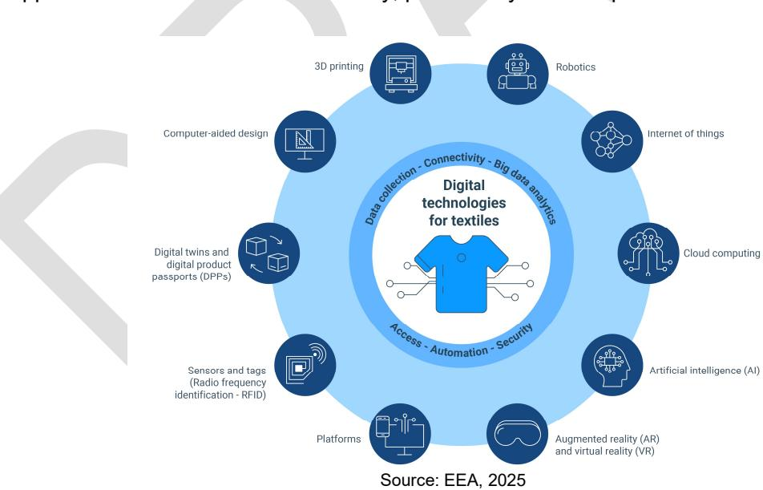

Technologies like IoT, AI, big data analytics and automation have the potential to transform the textiles industry, as well as how we consume its products (EEA).

quicker responses to trends and provides valuable consumer insights, facilitating targeted product development and marketing. Implementing augmented reality and virtual try-on technologies can further enhance the online shopping experience.

Investing in fair wages, safe working conditions, and skill development programs enhances brands' image and compliance with ethical standards. As automation becomes more prevalent, reskilling the workforce to adapt to new technologies is an opportunity to maintain employment levels and improve productivity.

There is also a growing emphasis on sustainable and circular practices within the industry. Brands are adopting circular business models, focusing on reducing waste, utilizing recyclable materials, and implementing efficient resource usage. Collaborations between brands and recycling firms are expected to optimize post-consumer waste management. The industry is also shifting towards eco-friendly materials, aligning with consumer demand for environmentally responsible products. As consumers become more conscious of the environmental impact of their purchasing decisions, there is a growing demand for sustainable and eco-friendly products. This shift is encouraging brands to adopt recycling practices and incorporate recycled materials into their offerings. Environmental, Social, and Governance (ESG) policies are also drivers for businesses aiming to ensure long-term viability and meet evolving consumer expectations.

Yet, fashion companies are interested in sustainability and circularity, but as soon as it's clear that it will be more expensive, they quickly lose interest. Producing more sustainably in the fashion industry is still largely a marketing term. Clothing brands continue to prioritize the lowest possible production costs to offer their products to a large consumer base.

Geopolitical tensions and supply chain disruptions have prompted brands to explore nearshoring and reshoring production strategies. Producing goods closer to home markets reduces times, enhances reliability and allows greater control over production processes. Regions like Eastern Europe and North Africa are becoming significant for the European market, while Mexico and Central America are pivotal for North America. However, challenges such as limited domestic manufacturing capacity and higher labour costs persist, making a large-scale shift to domestic production unlikely in the immediate future. Trade policies, particularly tariffs, significantly impact the industry. Increases of U.S. tariffs lead to higher clothing prices, affecting consumer purchasing behaviour and prompting a shift towards second-hand markets. The era of cheap clothing, sustained over the past decades, may be coming to an end due to these trade dynamics.

Consumer behaviour is shifting towards sustainability and cost-effectiveness. However, still a large part of consumers is not environmental conscious. Despite ongoing discussions about sustainability, the willingness to pay more for sustainable products remains limited, discouraging producers from fully committing to circularity. Consumers tend to follow trends and buy what is easily accessible, often without considering the environmental impact. Lack of awareness leads to lower participation in buying sustainable clothing. On the other hand, the second-hand fashion market is experiencing growth, driven by financial constraints and imitation. Global sales of second-hand clothing are growing, surpassing overall fashion market growth, with projections indicating further increase. But also, second-hand shopping still faces challenges, as many people worry about

This project has received funding from the European Union's Horizon Research and Innovation program under grant agreement N° 101181901 and from the Swiss State Secretariat for Education, Research and Innovation (SERI). Posts and shares reflect only the views of all the involved partners. Neither the European Union nor the granting authority can be held responsible for them.

hygiene, finding the right size, or the time it takes to search for good items.

Furthermore, as repairing clothes is often seen as expensive or too much effort, it is not very popular.

By June 2027, Member States must transpose textile EPR into national legislation. By April 2028 operational textile EPR systems must be in place. At the moment there is a mismatch between ambitious EU legislation and implementation realities in Member States. Exact fees are unknown. How much producers will be charged is unknown, but it is likely to depend on social and environmental criteria. Fast fashion brands may face "penalties". There is much to be decided and there are concerns whether the time will be enough. Countries must finalize what it means within their country, and reuse and recycling targets are still to be defined. In any case, EPR is fast becoming a cornerstone of sustainable business practice and there is indeed a transformative potential of welldesigned EPR systems in achieving a circular textile economy.

Yet, an EPR approach by itself will be insufficient to address all environmental impacts of garments and additional policies are likely needed to complement EPR.

Harmonized EPR would increase the effectiveness of the fee modulation and the effectiveness of the R&D for new and existing recycling and preparation for recycling technologies across Europe due to economies of scale.

Strong networks are needed to connect brands with innovators and create more opportunities to scale these recycling processes. Enhancing industry collaboration is crucial to bridge data gaps and improve transparency, especially for new materials. Partnerships with brands and suppliers are vital for collecting real-time data, driving innovation, and increasing transparency, all crucial for advancing sustainability goals. Success will depend on strong collaboration across supply chains, with brands, retailers, and recyclers working together to make EPR effective. Coordination of actions across science, technology, policy, and finance, as well as collective action are necessary. Collaboration across the supply chain is crucial for addressing circularity challenges, but building partnerships can be difficult when goals or technological systems are not aligned. Multi-level governance involving environment, trade, and ministries can ensure collaborative solutions. Indeed, there is significant potential for cross-sector and crossborder collaboration among producers, recyclers, and policymakers to share best practices and optimize waste management.

"EPR is a tool, not the silver bullet. It can only work if it's well designed, inclusive, and fair. If France's experience teaches us anything, it's that governance, eco-modulation, and the right incentives matter" (Recycling Europe).

"The limited available experience suggests that EPR improves rates of separate collection of garments. In addition to improving collection and sorting, there is the possibility that EPR can help to reduce environmental impacts generated by the production, use, and disposal of garments. This is primarily by changing the economic incentives for producers, consumers, and waste managers. However, an EPR approach by itself will be insufficient to address all environmental impacts of garments and additional policies are likely needed to complement EPR" (OECD).

This project has received funding from the European Union's Horizon Research and Innovation program under grant agreement N° 101181901 and from the Swiss State Secretariat for Education, Research and Innovation (SERI). Posts and shares reflect only the views of all the involved partners. Neither the European Union nor the granting authority can be held responsible for them. This draft deliverable has not yet been validated by the granting authorities

To divert textiles from landfill, incineration, or leakage into the environment, it is crucial to build collection infrastructure at scale. To establish separate collection systems at scale, funding is needed to cover the cost associated with managing all discarded textiles. While the market potential for textile-to-textile recycling in Europe is clear, realising a viable business case remains challenging due to limited access to quality feedstock and lack of infrastructure at scale. Investments in improved sorting, recycling, and collection infrastructure, especially in regions with emerging EPR frameworks, can boost overall system efficiency. Significant investments are required to create separate collection, reuse, and recycling infrastructure at scale. Infrastructure gaps, such as inadequate sorting technology and limited domestic recycling capacity hinder progress. Investment in advanced recycling technologies capable of handling complex textile blends will increase the feasibility of circular textile practices. But also, it should be noted that although many solutions are being developed and tested, they are not yet market ready. The industry requires large volumes of new machines that still face significant restrictions due to being relatively new.

The European Circular Textile Coalition is calling for urgent EU action to match regulatory ambition with investment in recycling and manufacturing systems, because without system readiness, even the most forward-looking regulations risk falling short.

FEAD and EuRIC have argued that without urgent support, valuable reusable and recyclable materials will be lost, and a whole industrial ecosystem that is key to the circular transition will collapse before EPR takes effect.

Although promising new technologies like near-infrared light scanning are helping streamline the recycling process, it remains largely a tedious, manual task. Manual sorting, which is still the primary method, remains inefficient and costly and automation could improve the quality and purity of feed stock available for recyclers. The majority of recycling facilities today process one or a few specific material types and before processing can even begin, non-textile components such as zippers and buttons, and treatments like dyes and waxes, must often be removed.

Pre-processing is critical and harmonised mechanical pre-processing for post-consumer textile waste, ideally co-located with sorting facilities for improving yields and efficiency, is vital to improve feedstock consistency.

Brands and retailers face significant challenges due to the limited availability and scale of textile recycling infrastructure. Recycling processes also need improvement, namely by being more energy efficient and ensuring that recycled fibres are of high enough quality to replace virgin sources. The brands that will lead the race on scaling recycling will be far better positioned to navigate long-term resource scarcity and regulatory change.

A major barrier is also the ongoing lack of consistent demand for recycled fibres. Without strong and sustained purchasing commitments from brands, textile recyclers struggle to secure funding, cover operational costs, or justify investment in expanding capacity.

Virgin textile materials often remain cheaper and more readily available, creating a price gap that undermines the business case for using recycled content. Brands also face commercial pressure to keep product prices low. Furthermore, alternative end markets, such as construction, automotive, and furniture sectors, often lack established links with

This project has received funding from the European Union's Horizon Research and Innovation program under grant agreement N° 101181901 and from the Swiss State Secretariat for Education, Research and Innovation (SERI). Posts and shares reflect only the views of all the involved partners. Neither the European Union nor the granting authority can be held responsible for them.

textile recyclers.

Innovations in recycling technologies, such as chemical and mechanical recycling methods, have improved the efficiency and quality of recycled textiles. These advancements make recycling a more viable option for manufacturers and contribute to the industry's growth. Chemical recycling processes show the most promise, yielding truly circular materials. Given that most clothing today is made from a blend of organic and synthetic fibres, with polyester accounting for more than half of global production, it is no surprise that many innovative programs focus on perfecting the recycling process for polyester or poly blends, often using proprietary solutions featuring chemical solvents and catalysts to deconstruct materials.

Fibre-to-fibre textile recycling is gaining momentum as a key driver for transitioning to a circular fashion industry. This shift will likely increase demand for post-consumer textile collection, sorting, and recycling infrastructure in the EU, necessitating significant investment (Fashion for Good).

Retailers view resale as a new revenue stream that helps them stay competitive and acquire new customers. Therefore, a reliable EPR system, with DPP will be a major contributor to the growth of the textile resale market.

As long as circular offerings like second-hand, rental and repair remain expensive or inconvenient, fast fashion will continue to dominate.

Creating a strong internal market for reuse and recycling in Europe will be a key to achieving textiles circularity by 2030.

So, the European textile ecosystem is in a period of profound change, where sustainability, technology, and shifting consumer expectations converge to create a fertile landscape for growth. At the policy level, the EU's commitment to environmental leadership is shaping the industry's trajectory. EPR schemes and broader sustainability regulations are pushing companies to redesign products for durability, recyclability, and reuse. This regulatory momentum not only strengthens the EU's position as a global frontrunner in sustainable textiles but also unlocks new avenues for circular business models, supported by public incentives for green and digital innovation.

Within this framework, companies are increasingly exploring sustainable practices that differentiate them in a competitive marketplace. Investments in eco-friendly materials, biodegradable fabrics, and low-impact dyeing techniques are gaining traction, while circularity principles, from enhanced recycling systems to the adoption of organic and renewable fibres, are becoming central to value creation. At the same time, rapid advancements in technology are opening the door to entirely new product categories.

Digitalization is reshaping the commercial landscape as well. The expansion of ecommerce offers brands unprecedented access to diverse consumer groups, with digital marketing and online platforms strengthening customer engagement and enabling more personalized experiences. Parallel to this shift, technological solutions such as IoTenabled traceability, AI-powered sorting systems, and Digital Product Passports are enhancing transparency and operational efficiency across the supply chain, ultimately

This project has received funding from the European Union's Horizon Research and Innovation program under grant agreement N° 101181901 and from the Swiss State Secretariat for Education, Research and Innovation (SERI). Posts and shares reflect only the views of all the involved partners. Neither the European Union nor the granting authority can be held responsible for them.

supporting more robust reuse and recycling infrastructures.

Geopolitical and supply chain considerations are also influencing strategic decisions. European manufacturers are increasingly turning toward reshoring and localized production, particularly in Eastern Europe, North Africa, and the Mediterranean, to reduce emissions, enhance supply chain control, and improve transparency. These moves are complemented by opportunities in emerging markets, especially in Africa and Southeast Asia where rising disposable incomes and evolving consumer preferences create new demand for European textile products.

Meanwhile, consumer behaviour is becoming a transformative force. Growing awareness of the social and environmental impacts of fashion is driving demand for transparency, ethical production, and products with minimal ecological footprints. This shift is contributing to the rapid expansion of the second-hand and resale market, where platforms for renting, swapping, and repurposing garments are moving into the mainstream as cost-effective and sustainable alternatives.

Crucially, many of these opportunities depend on collaboration across sectors. Partnerships with technology firms, material scientists, and innovators in digital infrastructure are accelerating breakthroughs in sustainable materials and recycling systems. Together, these developments position Europe to not only meet regulatory expectations but also to lead the global transition toward a more circular, technologically enabled, and ethically driven textile industry.

With respect to opportunities for improvement in the European textiles sector, design, manufacturing, recycling and governance can accelerate the transition to a circular, competitive, and low-impact textiles ecosystem. More specifically: - Integrate circular design principles into product development to extend lifespan, enable

recycling and reduce waste. - Scale the use of bio-based, regenerative and recycled fibres to reduce dependency on virgin cotton and polyester.

- Deploy digital and low-emission production technologies and expand textile-to-textile

recycling infrastructure. - Build trust and efficiency through transparent data-driven supply chains.

- Strengthen policy framework and human capital.

- Shift consumer behaviour towards sustainable purchasing and longer product use.

Regarding the market fit and market acceptance of TRUSTex KERs, under the current circumstances the following arguments can be addressed.

## KER1. DPP Blockchain Integral Solution

The DPP blockchain solution has strong market potential due to the EU's Digital Product Passport requirements, which create a clear regulatory push for end-to-end traceability. Blockchain directly addresses industry concerns around data accuracy and supply chain opacity, making it appealing to brands seeking compliance and enhanced transparency. Market acceptance is expected to be highest among large brands and manufacturers with existing digital infrastructure, while SMEs may adopt more slowly due to integration costs

This project has received funding from the European Union's Horizon Research and Innovation program under grant agreement N° 101181901 and from the Swiss State Secretariat for Education, Research and Innovation (SERI). Posts and shares reflect only the views of all the involved partners. Neither the European Union nor the granting authority can be held responsible for them.

and technical capacity, though they will ultimately need solutions that support regulatory compliance.

## KER2. Authority Dashboard

The authority dashboard aligns strongly with regulatory needs as national bodies prepare for mandatory monitoring of textile flows, EPR performance, and compliance reporting. Its market fit is high because public authorities lack unified digital interfaces for data oversight. Early acceptance is likely to be strong since regulators, PROs, and waste agencies urgently require reliable digital tools, provided the platform integrates smoothly with existing national systems and demonstrates ease of use and data security.

## KER3. Textiles Collection Systems

Textile collection systems show strong market fit due to the EU's obligation for separate collection by 2025 and the increasing demand for efficient, traceable collection logistics. Acceptance is expected to be high among municipalities, waste operators, and PROs seeking scalable solutions that reduce contamination and improve recovery rates. Their adoption will rely on cost efficiency, adaptability to different local conditions, and the ability to interface with sorting and recycling systems.

## KER4. Eco-Designed Fibres

Eco-designed fibres respond directly to rising consumer expectations and regulatory pressure for sustainable inputs, giving them a solid market fit. However, their commercial acceptance depends on their ability to match conventional fibres on durability, performance, and cost. Premium and sustainability-driven brands are likely to adopt them first, while price-sensitive mass-market players may wait for improved scalability and competitive pricing before wider integration.

## KER5. Eco-Designed Fabrics

Eco-designed fabrics have a strong market fit as brands increasingly seek materials that are recyclable, low-impact, and compliant with eco-design regulations. Their acceptance is boosted by the fact that sustainable fabrics do not typically compromise aesthetics or performance when engineered well. Brands focused on transparency and circularity are likely to integrate these fabrics quickly, and acceptance will broaden as supply volumes increase and costs decrease.

## KER6. Eco-Designed Garments

Eco-designed garments respond directly to regulatory developments such as the Ecodesign for Sustainable Products Regulation and rising consumer demand for longerlasting, lower-impact clothing. Their market acceptance is growing, especially among brands aiming to demonstrate leadership in sustainability. However, cost sensitivity and consumer pricing expectations may slow adoption in fast-fashion segments. Mainstream acceptance will strengthen as design guidelines standardise and production costs stabilize.

## KER7. Semi-Automated Sorting for Reusing

Semi-automated sorting technologies enjoy very high market fit due to the rapid expansion of the second-hand and reuse markets and the growing need for more efficient, accurate

This project has received funding from the European Union's Horizon Research and Innovation program under grant agreement N° 101181901 and from the Swiss State Secretariat for Education, Research and Innovation (SERI). Posts and shares reflect only the views of all the involved partners. Neither the European Union nor the granting authority can be held responsible for them.

sorting of collected textiles. Acceptance is expected to be strong among sorting centres, charities, and resale platforms that face increasing volumes and require scalable solutions to improve throughput and classification quality. Implementation will be favoured by facilities seeking better efficiency without full automation.

## KER8. Dismantling Pilot Lines

The dismantling pilot lines address the industry's need for pre-processing solutions that enable recycling of complex garments with trims, mixed materials, or hardware, giving it clear market relevance. Acceptance is likely among recyclers and pre-treatment facilities, though it may remain moderate until the technology is proven cost-effective and capable of handling diverse product types at speed. Brands producing technical or complex garments may also see value in enabling end-of-life dismantling pathways.

## KER9. Thermomechanical Recycling

Thermomechanical recycling technologies show strong market fit due to their scalability and compatibility with common fibres like polyester and polyamide, aligning well with brands' commitments to increase recycled content. Market acceptance is already building among recyclers and fibre producers, but it depends on receiving high-quality feedstock and achieving consistent output properties suitable for high-value applications. As supply chains improve in sorting and pre-processing, acceptance is expected to grow rapidly.

## KER10. Chemical Recycling

Chemical recycling has very high strategic market fit because it can process blended and contaminated textiles that mechanical methods cannot, making it essential for achieving true circularity. Acceptance among brands, recyclers, and material producers is growing quickly, driven by sustainability targets and regulatory pressure. However, widespread commercial adoption will depend on reducing costs, ensuring regulatory compliance, and demonstrating environmental benefits at industrial scale.

With respect to the potential early adopters of the project results, the current market conditions provide the following evidence.

## Digital and traceability solutions (KER1–2)

Early adopters of digital and traceability solutions such as the DPP blockchain system and the authority dashboard are likely to be large fashion brands, vertically integrated manufacturers, and producer responsibility organizations that already rely on sophisticated digital systems and can readily integrate new traceability tools. These actors face strong regulatory pressure to meet EU requirements for DPPs and lifecycle reporting, making them highly motivated to adopt robust and interoperable traceability solutions. Public authorities and waste management agencies can also be early adopters, as they require reliable data infrastructures to oversee compliance, track textile flows, and enforce EPR obligations. In parallel, second-hand platforms, rental services, and certification bodies are expected to integrate such solutions because they depend on transparent product information and authentication systems.

## Collection, sorting and pre-processing (KER3, KER7, KER8)

For solutions related to textile collection, semi-automated sorting, and dismantling, early adopters can include municipalities, national waste agencies, and textile collection NGOs that urgently need scalable systems to meet the EU's mandatory separate collection requirements. These actors are motivated by regulatory deadlines and increasing textile waste volumes and seek efficient and traceable approaches. Industrial sorting facilities, social enterprises, and commercial resale platforms are also ready to adopt these

This project has received funding from the European Union's Horizon Research and Innovation program under grant agreement N° 101181901 and from the Swiss State Secretariat for Education, Research and Innovation (SERI). Posts and shares reflect only the views of all the involved partners. Neither the European Union nor the granting authority can be held responsible for them.

innovations as they face growing demand for high-quality reuse streams and improved operational efficiency. Additionally, logistics companies and PROs are likely to integrate these systems as they seek to build more coherent national and regional infrastructures that connect collection, sorting, dismantling, and recycling into a seamless ecosystem.

## Eco-designed materials and products (KER4–6)

Eco-designed fibres, fabrics, and garments will likely attract early adopters among sustainability-driven fashion brands, outdoor and performance wear companies, and manufacturers with strong ESG commitments seeking materials that align with circularity principles. These innovators tend to invest in sustainable sourcing and are already familiar with industrial-scale transitions in fibre and fabric development, making them wellpositioned to test and adopt new eco-designed materials. Designers and brands focused on modular, recyclable, or biodegradable products can also be early adopters, especially those participating in pilot schemes or preparing for compliance with the EU's eco-design regulations. Workwear and uniform producers, which prioritize durability and performance, may adopt these solutions as well, given their interest in long-lasting and sustainable material innovations.

## Recycling technologies (KER9–10)

Thermomechanical and chemical recycling technologies will attract adopters among textile recyclers, polymer processors, and fibre manufacturers seeking new sources of highquality recycled feedstock. These industrial actors face growing pressure to supply recycled content to major brands, positioning them to test and implement advanced recycling solutions early. Large apparel companies with strong circularity commitments can also be adopters, as these technologies enable them to meet recycled content targets, particularly for blended or complex materials that traditional recycling methods cannot process. Waste management companies and industrial investors focused on scaling circular infrastructure are expected to adopt these technologies, recognizing their potential to unlock new value chains and meet regulatory expectations for textile-to-textile recycling.

# 14. CONCLUSIONS

The European textile industry stands at a critical turning point where significant strengths and emerging opportunities are counterbalanced by structural weaknesses and growing external threats.

The sector benefits from a strong tradition of craftsmanship, a skilled workforce, and a reputation for quality, all reinforced by major technological advances, from AI-enabled sorting and IoT-driven traceability to innovations in smart textiles. Paired with a robust regulatory push, these strengths position the industry to lead global sustainability transitions, supported by rising consumer demand for ethical, durable, and circular products.

However, persistent weaknesses, such as declining employment, complex supply chains, limited recycling capacity, and the dominance of fast fashion, continue to hinder progress. The industry's environmental footprint and technical barriers to large-scale textile-to-textile recycling also present substantial challenges, as do high compliance costs and behavioural gaps among consumers.

At the same time opportunities for circular business models illustrate pathways to resilience and competitiveness.

Unfortunately, these gains could be undermined by geopolitical instability, fierce price competition from low-cost producers, greenwashing, and uneven EPR implementation, all of which threaten both the industry credibility and long-term sustainability goals.

Overall, the sector's future will depend on its ability to accelerate innovation, harmonise regulatory frameworks, scale circular infrastructures and align economic incentives with sustainable design, transforming current challenges into drivers of systemic change.

In the middle of December 2025, in its "EU Textile & Clothing Industry Outlook 2024–2025", EURATEX argued that "Europe's textile and clothing industry continues to face significant headwinds. After a weak performance in 2024, the first half of 2025 brought further declines in production, turnover, exports and employment. Industrial capacity utilisation fell below 80%, while rising energy prices and a challenging global environment continue to erode competitiveness. Key developments include a. Persistent pressure from high energy costs and geopolitical uncertainty; b. Increasing imports from non-EU countries, widening the EU trade deficit; c. Falling exports, driven by weaker global demand; d. Growth of low-value online platforms bypassing compliance rules and harming EU manufacturers; e. Ongoing regulatory uncertainty, coupled with major investment needs for digital and sustainable transitions. Despite these challenges, there are pockets of resilience like defence textiles, medical applications, and textile recycling that continue to grow, supported by strong innovation in bio-based fibres, CO₂ reduction, resource efficiency and chemical alternatives. The message is clear. The EU risks de-industrialising its textile and compliance, and ensures a true level playing field".

The analysis of the TRUSTex exploitable solutions, DPP–blockchain integration, authority dashboard, eco-designed materials, advanced sorting and dismantling systems, and thermo-mechanical recycling, address that the textile sector is undergoing a technological and sustainability change.

The strengths of these innovations lie in their ability to enhance transparency, traceability, resource efficiency, and environmental performance, while enabling new circular practices such as disassembly, repair, and high-quality recycling. Collectively, they form an interconnected ecosystem in which reliable data flows, smart design, and automated processes can drastically reduce waste and extend product lifecycles. Opportunities are

This project has received funding from the European Union's Horizon Research and Innovation program under grant agreement N° 101181901 and from the Swiss State Secretariat for Education, Research and Innovation (SERI). Posts and shares reflect only the views of all the involved partners. Neither the European Union nor the granting authority can be held responsible for them.

substantial, ranging from heightened consumer trust through transparency tools, to regulatory incentives, market differentiation, expanding sustainable product demand, and technological breakthroughs that can scale circular solutions.

However, threats remain equally significant, including industry resistance to change, fluctuating economic conditions, and varying levels of market acceptance.

In conclusion, the successful deployment of these technologies will require coordinated action among industry and policymakers, ensuring investment in infrastructure, harmonized standards, robust data governance, and continuous education. If these conditions are met, the textile sector can transition from a linear, resource-intensive model to an integrated circular system capable of delivering long-term environmental, economic, and social value.

# ANNEX

## QUESTIONNAIRES OF THE SURVEYS CONDUCTED BETWEEN 16/10/2025 AND 16/12/2025.

This project has received funding from the European Union's Horizon Research and Innovation program under grant agreement N° 101181901 and from the Swiss State Secretariat for Education, Research and Innovation (SERI). Posts and shares reflect only the views of all the involved partners. Neither the European Union nor the granting authority can be held responsible for them.

## TRUSTex Survey #2

This is a 1 minute survey questionnaire in the context of the TRUSTex research project ("Advancing Sustainable Textiles in the Circular Economy through Innovative Schemes") and concerns consumers' purchasing decisions.

manolis.tsantakis@enateam.gr [Evaλλαγή.λογαριασμού](mailto:Evaλλαγή.λογαριασμού)

\* Υποδεικνύει απαιτούμενη ερώτηση

**Q1.** How much do you think consumers' purchasing decisions on textile products \* are influenced by environmental consciousness?

Not at all      Slightly      Moderately      Very      Extremely

                        

**Q2.** From your perspective, what's the biggest barrier for consumers in buying sustainable/circular textile products?

Η απάντησή σας

**Q3.** Regarding the factors that influence the purchase of sustainable textile products and affect consumers' sustainable decisions, what are the three primary ones?

(max 3 selection)

- Affordability
- Price-value perception relative to quality and longevity
- Product quality, functionality, comfort and aesthetic appeal
- Environmental awareness, eco-consciousness
- Age of the purchaser
- Gender of the purchaser
- Corporate image and reputation
- Purchasing experience, enjoyable and convenient shopping
- Trust or distrust in sustainability claims
- Άλλο: \_\_\_\_\_

### TRUSTex Survey #3

This is a 1 minute survey questionnaire in the context of the TRUSTex research project ("Advancing Sustainable Textiles in the Circular Economy through Innovative EPR Schemes") and concerns the purchase of second-hand garments.

manolis.tsantakis@enateam.gr [Evaλλαγή.λογαριασμού](mailto:Evaλλαγή.λογαριασμού)

\* Υποδεικνύει απαιτούμενη ερώτηση

**Q1. Do you buy second-hand garments? \***

- Yes
- No

**Q2. How likely is it that you buy a second-hand garment? \***

| Very unlikely         | Unlikely              | Neither likely nor unlikely | Likely                | Very likely           |
|-----------------------|-----------------------|-----------------------------|-----------------------|-----------------------|
| <input type="radio"/> | <input type="radio"/> | <input type="radio"/>       | <input type="radio"/> | <input type="radio"/> |

**Q3. From your point of view, what are the barriers or what discourages you to purchase second-hand garments?**

Η απάντησή σας

# REFERENCES

Abagnato, S., et al. (2024). Life cycle assessment applications to reuse, recycling and circular practices for textiles: A review. Waste Management, 182, 74-90. Aboelmaged, Ε. (2021). Waste Recycling Behaviour: An Integration of Recycling Habits into the Theory of Planned Behaviour. Journal of Cleaner Production, 278, 124182. About H&M. (2022). Cradle to Cradle Certified® Gold Collection. Retrieved from https://about.hm.com/news/general-news-2022/h-m-achieves-cradle-to-cradle-certified- gold-for-newborn-collec.html. Abrar, Μ., et al. (2021). Understanding purchase intention towards eco-friendly clothing for generation Y & Z. Cogent Business & Management, 8, 1997247. Abrishami, S., et al. (2024). Textile Recycling and Recovery: An Eco-friendly Perspective on Textile and Garment Industries Challenges. Textile Research Journal, 94. doi:10.1177/00405175241247806. Adebayo, B. (2023). Rags not riches: Ghana drowns in Western castoffs. Retrieved from https://www.context.news/socioeconomic-inclusion/rags-not-riches-ghana-drowns-inwestern-castoffs. Adidas Group. (2024a). Climate change and decarbonization. Retrieved from https://www.adidas-group.com/en/sustainability/planet/climate-change-anddecarbonization. Adidas Group. (2024b). Environmental impacts – Sustainability report 2023. Retrieved from https://report.adidas-group.com/2023/en/group-management-report-ourcompany/sustainability/environmental-impacts.html. ADEME. (n.d.). Textiles d'habillement, linges de maison et chaussures (TLC). Retrieved from https://filieres-rep.ADEME.fr/filieres-REP/filiere-TLC. Afval Circulair. (n.d.). Inzamelen en recyclen van textiel (UPV). Retrieved from https://www.afvalcirculair.nl/uitgebreide-producentenverantwoordelijkheid-upv/overzichtupv/upv-textiel/. Ahmadi, S. (2020). Consumer attitudes towards sustainability in the garment industry. Master's thesis, DiVA Portal. Retrieved from https://www.divaportal.org/smash/get/diva2:1448580/FULLTEXT01.pdf. Ahmed, M.F., et al. (2024). Textile merchandising in the fast fashion era: Adapting to rapid change in consumer demands. Global Mainstream Journal of Business, Economics, Development & Project Management, 1-14. doi:https://doi.org/10.62304/jbedpm.v3i06.217. AK Wienn, Greenpeace. 2023a. FASHION CONSUMPTION IN AUSTRIA: a high level of awareness, but potential to do more. Available at https://www.akeuropa.eu/en/sustainablefashion-consumption-austria-high-level-awareness-potential-do-more Albizzati, P., Cristobal Garcia, J., Antonopoulos, I., Egle, L., Foster, G., Gaudillat, P., Marschinski, R., Pierri, E., & Tonini, D. (2023). Harmonised labelling of waste receptacles with matching product labels. Publications Office of the European Union, Luxembourg. doi:10.2760/09021. Algahni, H. and Al-Dabbagh, M.A. (2020). Assessing the impact of social media in the consumer trend towards sustainable clothing. Fibres and Textiles, 3. Andini, E., et al. (2024). Chemical recycling of mixed textile waste. Science advances, 10. doi:DOI: 10.1126/sciadv.ado 6827.

Apaolaza, V., et al. (2022). Sustainable clothing: why conspicuous consumption and greenwashing matter. Business Strategy and Environment. Armouch, F., et al. (2024). Is it fashionable to swap clothes? The moderating role of culture. Journal of consumer behaviour, 23, 2693-2719. doi: https://doi.org/10.1002/cb.2351. Armedangels. (2025). Retrieved from https://www.armedangels.com/eu-en/aboutus/sustainable-production/recycled-materials. Asenza, E. (2025a). EPR for Textiles: Washington and New York Make the First Move. Compliance and Risks. Retrieved from https://www.complianceandrisks.com/blog/extended-producer-responsibility-for-textileswashington-and-new-york-make-the-first-move/. Asenza, E. (2025b). Italian Textile EPR – Consultation Launched on Draft Decree. Compliance and Risks. Retrieved from https://www.complianceandrisks.com/blog/italian-textile-eprconsultation-launched-on-draft-decree/. Asket. (2020). We Can't Shop Our Way to Sustainability. Retrieved from https://maisoncashmere.com/certifications?srsltid=AfmBOop-MMNWT\_ofUInNQQhdupxHWZeYfp1oyAIJsxpuEpkLm5YMImoa. Aus, R., et al. (2021). Designing for circular fashion: integrating upcycling into conventional garment manufacturing processes. Fashion and Textiles, 8. doi:https://doi.org/10.1186/s40691-021-00262-9. Australian Wool Innovation. (2025). Retrieved from https://www.wool.com. AxFoundation. (2025). SwePass prepares the industry for stricter EU requirements on textile waste. Retrieved from https://www.axfoundation.se/en/news/swepass-prepares-theindustry-for-stricter-eu-requirements-on-textile-waste. Banytė, J., et al. (2023). Investigating the Link between Consumer Attitudes and Behaviour in the Context of Sustainable Clothing: The Role of Social Norms. Sustainability, 15, 16800. Bank&Vogue. (2025). The State of Credential Clothing in Latin America In 2025. Retrieved from https://www.bankvogue.com/the-state-of-credential-clothing-in-latin-america-in-2025/. Bartlett, J. (2025). Chile targets fast fashion waste with landmark desert cleanup plan. Guardian. Retrieved from https://www.theguardian.com/world/2025/jun/26/chile-fastfashion-waste-atacama-desert. Batool, S.R., et al. (2023). Circularity in Textiles. doi:10.1007/978-3-031-49479-6. Bcorporation. (2025). Retrieved from https://www.bcorporation.net/en-us/find-a-bcorp/company/veja/. Benetton. (2025). Sustainable stores. Retrieved from https://us.benetton.com/inside/article\_sustainable-stores.html. Benetton Group. (2025). Sustainability. Retrieved from https://www.benettongroup.com/en/sustainability/. Biradar S. (2025). Global Population Growth Drives Demand for Textiles. Retrieved from LinkedIn. Bour, A., et al. (2023). Implications of circular textile policies for the future regulation of hazardous substances in textiles in the European Union. Science of The Total Environment, 896, 165153. doi:doi.org/10.1016/j.scitotenv.2023.165153. Brydges, T. (2021). Closing the loop on take, make, waste: Investigating circular economy practices in the Swedish fashion industry. Journal of Cleaner Production, 293, 126245. https://doi.org/10.1016/j.jclepro.2021.126245. Bukhari, Μ.A., et al. (2018). Developing a national programme for textiles and clothing

recovery. Waste Management & Research, 36, 321-331. doi:https://journals.sagepub.com/doi/epub/10.1177/0734242X18759190. BusinessEurope. (2025). Reducing regulatory burden to restore the EU's competitive edge: 68 proposals for the reduction of regulatory burden in 2025. Retrieved from https://www.businesseurope.eu. C&A. (2023). Sustainability report 2022. Retrieved from https://www.c-anda.com/image/upload/v1695633741/corporate/pdf/reporting/sustainability/CA-Sustainability-Report-2022.pdf. C&A. (2025). Retrieved from https://www.c-and-a.com. California Legislative Information. (2024). SB-707 Responsible Textile Recovery Act of 2024. Retrieved from https://leginfo.legislature.ca.gov/faces/billNavClient.xhtml?bill\_id=202320240SB707. Carranza, R., et al. (2022). Solving the luxury fashion and sustainable development "oxymoron": a cross-cultural analysis of green luxury consumption enablers and disablers. Business Strategy and Environment. Carvalho, C., et al. (2025). Circular economy: Literature review on the implementation of the digital product passport (DPP) in the textile industry. Sustainability, 17, 1802. doi:https://doi.org/10.3390/su17051802. Casden S. (2024). Predictions for the textile industry in 2025. Fibre2Fashion. Retrieved from https://www.fibre2fashion.com/industry-article/10230/predictions-for-the-textile-industryin-2025. Castro-Lopez, A., Iglesias, V., & Puente, J. (2021). Slow Fashion Trends: Are Consumers Willing to Change Their Shopping Behavior to Become More Sustainable? Sustainability. https://doi.org/10.3390/su132413858. Cayaban, C.J.G., et al. (2023). The influence of social media and sustainability advocacy on the purchase intention of Filipino consumers in fast fashion. Sustainability, 15, 8502. Celep, G.D., et al. (2023). Limitations of Textile Recycling: The Reason behind the Development of Alternative Sustainable Fibres. IntechOpen. doi:doi: 10.5772/intechopen.105118. Centre for the Promotion of Imports from developing countries. (2025). Kingdom of Netherlands. 01-2025. What is the demand for apparel on the European market? doi:https://www.cbi.eu/market-information/apparel/what-demand. Charnley, F., et al. (2024). Retaining product value in post-consumer textiles: How to scale a closed-loop system. Resources, Conservation and Recycling, 205, 107542. doi:https://doi.org/10.1016/j.resconrec.2024.107542. Chen, X., et al. (2021). Circular Economy and Sustainability of the Clothing and Textile Industry. Materials Circular Economy, 3, 12. doi:doi.org/10.1007/s42824-021-00026-2. Cinco Días. (2025). Inditex closes 2024 with four startups in its portfolio. Retrieved from https://cincodias.elpais.com/companias/2025-03-16/inditex-cierra-2024-con-cuatrostartups-en-su-cartera-y-se-abre-a-nuevas-inversiones.html. Circle Economy. (2024). The circularity gap report - I Textiles. CIRFS. (2025). World Production of Cotton, Wool & Man-Made Fibres. Retrieved from https://www.cirfs.org/statistics/key-statistics. Claight Corporation. (2025). Europe Textile Market Growth Analysis - Forecast Trends and Outlook (2025-2034). Retrieved from https://www.expertmarketresearch.com/featuredarticles/europe-textile-sustainable-fashion. Climate Action. (2023). Zara sets new ambitious sustainability goals. Retrieved from

https://www.climateaction.org/news/zara-set-new-ambitious-sustainability-goals. Cliffe Dekker Hofmeyr. (2025). In pursuit of a circular economy: Kenya enacts Extended Producer Responsibility regulations. Retrieved from https://www.cliffedekkerhofmeyr.com/news/publications/2025/Practice/Environmental-Law/environmental-law-alert-23-january-in-pursuit-of-a-circular-economy-kenya-enactsextended-producer-responsibility-regulations. Clyde & Co. (2025). The Extended Producer Responsibility Regulations in Kenya: Key Compliance Steps. Retrieved from https://www.clydeco.com/en/insights/2025/02/theextended-producer-responsibility-regulations. Commons. (2024). 7 Clothing Rental Brands to Try. Commons. Retrieved from https://www.thecommons.earth/blog/7-clothing-rental-brands-to-try. Commonwealth Human Ecology Council. (2022). The ultimate guide to fast fashion in 2022. CHEC International. Retrieved from https://www.checinternational.org/news/the-ultimateguide-to-fast-fashion-in-2022. Consumers, Health, Agriculture and Food Executive Agency., LE Europe., VVA Europe., IPSOS., ConPolicy., Trinomics. 2018. Behavioural Study on Consumers' Engagement in the Circular Economy: Final Report. LU: Publications Office. Available at https://data.europa.eu/doi/10.2818/956512 Copenhagen Economics. (2025). European Textiles' Global Value Chain. EuroCommerce. Cosma, A. (2024). Exploring Sustainable Clothing Consumption in Middle-Income Countries: A case study of Romanian consumers. Proceedings of the International Conference on Business Excellence, 18, 3095-3107. doi:10.2478/picbe-2024-0255. Credence Research. (2024a). Asia Pacific Secondhand Apparel Market. Retrieved from https://www.credenceresearch.com/report/asia-pacific-secondhand-apparel-market. Credence Research. (2024b). Middle East and Africa Second-hand Apparel Market. Retrieved from https://www.credenceresearch.com/. D'Adamo, I., Lupi, G., Morone, P., & Settembre-Blundo, D. (2022). Towards the circular economy in the fashion industry: the second-hand market as a best practice of sustainable responsibility for businesses and consumers. Environmental Science and Pollution Research, 29, 46620-46633. https://doi.org/10.1007/s11356-022-19255-2. D&B. 2020a. Gedragsonderzoek kleding. Available at https://open.overheid.nl/documenten/ronl-6e59a9f4-1e95-4ffd-9316-a49affe5b271/pdf Damayanti, D., et al. (2021). Possibility routes for textile recycling technology. Polymers (Multidisciplinary Digital Publishing Institute), 13, 3834. Data Bridge Market Research. (2021). Europe Technical Textile Market Size, Share, and Trends Analysis Report – Industry Overview and Forecast to 2032. Retrieved from https://www.databridgemarketresearch.com/reports/europe-technical-textile-market. Dead White Man's Clothes. (2025). Retrieved from https://deadwhitemansclothes.org/. Dedicated. (2025). Retrieved from https://www.dedicatedbrand.com/en/certifications. Directorate-General for Environment. (2023). Proposal for a targeted revision of the Waste Framework Directive. Energy, Climate change, Environment. Retrieved from https://environment.ec.europa.eu/publications/proposal-targeted-revision-wasteframework-directive\_en. DitchCarbon. (2023). Louis Vuitton sustainability report. Retrieved from https://ditchcarbon.com/organizations/louis-vuitton. Dragomir, V., & Dumitru, M. (2022). Practical solutions for circular business models in the fashion industry. Cleaner Logistics and Supply Chain.

https://doi.org/10.1016/j.clscn.2022.100040.

Eco Styles. (2023). How to host different types of clothes swaps for friends and communities. Eco Styles. Retrieved from https://www.ecostyles.com.au/blogs/how-to-host-differenttypes-of-clothes-swaps-for-friends-and-communities.

ECOALF. (2025). Retrieved from https://ecoalf.com/en/pages/materiales.

Ellen MacArthur Foundation. (2017). A New Textiles Economy: Redesigning Fashion's Future. Retrieved from www.ellenmacarthurfoundation.org.

Ellen MacArthur Foundation. (2024). Pushing the boundaries of EPR policy for textiles. Retrieved from https://www.ellenmacarthurfoundation.org/epr-policy-for-textiles.

E&M Magazine. (2025). The Value of Second-Hand Clothes. Retrieved from https://360mozambique.com/economy/em-magazine-the-value-of-second-hand-clothes/.

EON. (2025). Retrieved from https://www.eon.xyz/. Eun Hyup Kim et al. (2025). Fibers and Polymers. Comprehensive Review of Textile Waste Recycling: From Origins to Innovations, 26, 1449-1464. Retrieved from https://doi.org/10.1007/s12221-025-00892-6

EURATEX. (2024a). Facts & Key Figures 2024. European Apparel and Textile Confederation. Retrieved from https://euratex.eu/wp-content/uploads/EURATEX-Facts-Key-Figures-2024.pdf.

EURATEX. (2024b). Spring Report - Analysis of the EU Textile & Clothing External trade 2023. EURATEX. (2025a). A voluntary Textile PRO Forum to harmonize textiles EPR implementation to support Circular Economy in Europe. Retrieved from https://euratex.eu/news/avoluntary-textile-pro-forum-to-harmonize-textiles-epr-implementation-to-support-circular-

economy-in-europe/. EURATEX. (2025b). Economic Update - Fourth quarter 2024 and prospects for 2025. Retrieved from https://euratex.eu/economic-update.

EURIC. (2025). EU Recyclers' Manifesto: Increasing textiles circularity by 2030. European Recycling Industries' Confederation. Retrieved from https://euric.org/images/Pressreleases/Statements/EuRIC\_MWE\_Joint\_Statement\_- \_Textile\_crisis\_domino\_effect\_20241021.

European Commission. (2008). Waste Framework Diective (Directive 2008/98/EC). Retrieved from https://environment.ec.europa.eu/topics/waste-and-recycling/waste-frameworkdirective\_en.

European Commission. (2019). The European Green Deal COM(2019) 640 final. Retrieved from https://commission.europa.eu/strategy-and-policy/priorities-2019-2024/europeangreen-deal\_en.

European Commission. (2020). A new Circular Economy Action Plan - For a cleaner and more competitive Europe COM (2020) 98 final. Retrieved from https://eur-lex.europa.eu/legalcontent/EN/TXT/?qid=1583933814386&uri=COM:2020:98:FIN.

European Commission. (2022a). EU Strategy for Sustainable and Circular Textiles. In: Communication from the Commission to the European Parliament, the Council, the European Economic and Social Committee and the Committee of the Regions. Retrieved from https://environment.ec.europa.eu/strategy/textiles-strategy\_en.

European Commission. (2022b). Textiles strategy - European Commission. Environment. Retrieved from https://environment.ec.europa.eu/publications/textiles-strategy\_en.

European Commission. (2024a). Eco-design for Sustainable Products Regulation - European Commission. Retrieved from https://commission.europa.eu/energy-climate-changeenvironment/standards-tools-and-labels/products-labelling-rules-and-

requirements/ecodesign-sustainable-products-regulation\_en.

European Commission. (2024b). Internal Market, Industry, Entrepreneurship and SMEs - Review of Regulation (EU) 1007/2011. Retrieved from https://single-marketeconomy.ec.europa.eu/sectors/textiles-ecosystem/regulation-eu-10072011\_en. European Commission. (2024c). Waste shipments (Regulation (EU) 2024/1157). Retrieved from https://environment.ec.europa.eu/topics/waste-and-recycling/waste-shipments\_en. European Defence Agency (EDA). (2024). Smart textiles, C2 and radar: EDA takes on new EDF projects. Retrieved from https://eda.europa.eu/news-andevents/news/2024/10/16/smart-textiles-c2-and-radar-eda-takes-on-new-edf-projects. European Environmental Agency (EEA). (2020). Textiles in Europe's circular economy Key. Retrieved from https://www.eea.europa.eu/en/analysis/publications/textiles-in-europescircular-economy. European Environmental Agency (EEA). (2023a). EU exports of used textiles in Europe's circular economy (Briefing No. 01/2023). Retrieved from https://www.eea.europa.eu/publications/eu-exports-of-used-textiles-in-europe. European Environmental Agency (EEA). (2023b). Textiles and the environment - The role of digital technologies in Europe's circular economy - ETC CE Report 2025/6. doi:https://www.eea.europa.eu/en. European Environmental Agency (EEA). (2023c). Textiles in Europe's circular economy. Retrieved from https://www.eea.europa.eu/publications/textiles-in-europes-circulareconomy. European Environmental Agency (EEA). (2023d). The role of bio-based textile fibres in a circular - ETC-CE Report 2023. Retrieved from https://www.eionet.europa.eu/etcs/etcce/products/etc-ce-report-2023-5-the-role-of-bio-based-textile-fibres-in-a-circular-andsustainable-textiles-system. European Environmental Agency (EEA). (2024a). Generation of textile waste in 2020, in kilograms per capita. doi:https://www.eea.europa.eu/en/analysis/maps-andcharts/generation-of-textile-waste-in. European Environmental Agency (EEA). (2024b). Management of used and waste textiles in Europe's circular economy - ETC CE Report 2024. Retrieved from https://www.eea.europa.eu/publications/management-of-used-and-waste-textiles. European Environmental Agency (EEA). (2024c). Reuse flows according to the implementing decision (EU) 2021/19: Information on the database structure and use (Version 1). Retrieved from https://sdi.eea.europa.eu/catalogue/srv/api/records/99101ccf-00a6-40fc-9129-122e836d0db5/attachments/Reuse%20metadata%20annex%20Version%201.pdf. European Environmental Agency (EEA). (2024d). Textile Waste Management in Europe: Policy Developments and Circular Economy strategies - ETC Report 2024/5. Retrieved from https://www.google.com/url?sa=j&url=https%3A%2F%2Fwww.eionet.europa.eu%2Fetcs %2Fetc-ce%2Fproducts%2Fetc-ce-report-2024-5-textile-waste-management-in-europescircular-economy. European Environmental Agency (EEA). (2024e). Textile waste management in Europe's circular economy - ETC CE Report 2024/5. European Environmental Agency (EEA). (2025a). Consumption of clothing, footwear and household textiles per person. Retrieved from https://www.eea.europa.eu/en/circularity/sectoral-modules/textiles/consumption-ofclothing-footwear-and-household-textiles-per-person.

- European Environmental Agency (EEA). (2025b). Retrieved from https://www.eea.europa.eu/en. European Parliament and Council. (2008). Directive 2008/98/EC on waste and repealing certain Directives. Official Journal of the European Union. European Week for Waste Reduction. (2022). Circular and Sustainable Textiles. Retrieved from https://ewwr.eu/thematic\_focus/circular-and-sustainable-textiles/. Eurostat. (2025). Database. Retrieved from https://ec.europa.eu/eurostat/web/main/data/database. Fact.MR. (2025). High-End Electronic Yarn Market is Set to Surge at 12.4% CAGR to Reach US\$ 4.52 Billion by 2035. GlobeNewswire. Retrieved from https://www.globenewswire.com/fr/news-release/2025/3/19/3045187/0/en/High-End-Electronic-Yarn-Market-is-Set-to-Surge-at-12-4-CAGR-to-Reach-US-4-518-9-Million-by-2035-Fact-MR-Report.html. Fashion2Fashion. (2025). Retrieved from https://www.fibre2fashion.com/news/fashionnews/stella-mccartney-wool-gets-cradle-to-cradle-certificate-228329-newsdetails.html. Fenitra, R., et al. (2021). Sustainable clothing disposal behavior, factor influencing consumer intention toward clothing donation. Fibres and Textiles, 28, 7-15. Fernández-Stark, K., et al. (2022). Analysis of the Textile and Clothing Industry Global Value Chains – Summary (IDB Technical Note No. 2625). Inter-American Development Bank. doi:https://www.iadb.org/en/publications/analysis-textile-and-. Fibresort. (2025). Retrieved from https://www.fibresort.eu/. Fischer, E., Reimers, V., & Warfield, K. (2021). Consumers' motivations for sharing fashion: A typology of collabourative fashion consumption. Journal of Fashion Marketing and Management, 25(3), 463–478. https://doi.org/10.1108/JFMM-07-2020-0141. Forno, A.J.D., et al. (2021). Industry 4.0 in textile and apparel sector: a systematic literature review. Research Journal of Textile and Apparel, 27, 95-117. doi:10.1108/RJTA-08-2021- 0106. Fortuna, L.M. and Diyamandoglu, V. (2017). Optimization of greenhouse gas emissions in secondhand consumer product recovery through reuse platforms. Waste Management, 66, 178-189. doi:doi.org/10.1016/j.wasman.2017.04.032. Freudenreich, B., & Schaltegger, S. (2020). Developing sufficiency-oriented offerings for clothing users: Business approaches to support consumption reduction. Journal of Cleaner Production, 247, 119589. https://doi.org/10.1016/j.jclepro.2019.119589. Future Market Insights. (2024). Europe Second-hand Apparel Market Growth – Trends & Forecast 2024-2034. Retrieved from https://www.futuremarketinsights.com/reports/europe-second-hand-apparel-market.
- G. Peter Tessa. (2024). Textile Today. Retrieved from https://www.textiletoday.com.bd/globaltextile-market-set-for-major-growth-by-2030. García-Ortega, B., Galan-Cubillo, J., Llorens-Montes, F., & De-Miguel-Molina, B. (2023). Sufficient consumption as a missing link toward sustainability: The case of fast fashion. Journal of Cleaner Production. https://doi.org/10.1016/j.jclepro.2023.136676. Gazzola, P., Pavione, E., Pezzetti, R., & Grechi, D. (2020). Trends in the Fashion Industry. The Perception of Sustainability and Circular Economy: A Gender/Generation Quantitative Approach. Sustainability, 12, 2809-2828. https://doi.org/10.3390/su12072809. Ghosh, S. (2022). HKRITA's Green Machine is Breakthrough that Recycling of Blended Textiles Needed, at Scale. doi:https://texfash.com/special/hkritas-green-machine-isbreakthrough-that-recycling-of-blended-textiles-need.

Ghosh, S. (2025). Recycling and Upcycling Fashion: A Reusing, Reprocessing and Remaking The Used Clothing in a Sustainable Occurrence. doi:https://www.researchgate.net/publication/387601006. Girelli, C., et al. (2020). Moda Sustentável: estudo sobre práticas de consumo consciente na moda. Revista Interfaces Científicas - Humanas e Sociais. Global Organic Textile Standard. (2025). Retrieved from https://global-standard.org/. Glover, S. (2025). Spain's EPR for textiles delayed amidst objections. Ecotextilenews. Retrieved from https://www.ecotextile.com/2025101060326/news/legislation/spains-eprfor-textiles-delayed-amidst-objections. Goetting, A., et al. (2022). Rise of micro-trends: Social media's harmful grasp on fast fashion. Harker Aquila. Gold Fortune Textile. (2025). Global Textile Markets: What's Driving Demand in 2025? Goodonyou. (2021). Meet bleed: Creating Sustainable and Cruelty-Free Clothes for a Sporty Lifestyle. Retrieved from https://goodonyou.eco/bleed-sustainable-cruelty-free-clothessporty-lifestyle/. Grand View Research. (2024a). Textile Market Size, Share & Growth Analysis Report, 2030. Retrieved from https://www.grandviewresearch.com/industry-analysis/textile-market. Grand View Research. (2024b). Textile Market Size, Share & Trends Analysis Report By Raw Material (Wool, Chemical, Silk), By Product (Natural Fibres, Polyester), By Application, By Region, And Segment Forecasts, 2024 - 2030. Retrieved from https://www.grandviewresearch.com/industry-analysis/textile-market. Greenpeace. (2023). How fast fashion is fuelling the fashion waste crisis in Africa. doi:https://www.greenpeace.org/africa/en/blog/54589/how-fast-fashion-is-fuelling-thefashion-waste-crisis-in-africa/. Gucci Equilibrium. (2023a). Eco buildings. Retrieved from https://equilibrium.gucci.com/ecobuildings/. Gucci Equilibrium. (2023b). Gucci sustainability strategy. Retrieved from https://equilibrium.gucci.com/gucci-sustainability-strategy/. Gucci Equilibrium. (2023c). Policies and commitments. Retrieved from https://equilibrium.gucci.com/policies-and-commitments/. Guru, R., et al. (2025). Perspective Chapter: Functional Applications in Textile Reuse and Recycling – Enhancing Sustainability and Reducing Environmental Impact. IntechOpen. doi:doi: 10.5772/intechopen.1007986. H&M Group. (2024). Sustainability: Circularity and Climate – Materials. Retrieved from https://hmgroup.com/sustainability/circularity-and-climate/materials. Halicki, D., et al. (2024). Sustainable Fashion Choices: Exploring European Consumer Motivations behind Second-Hand Clothing Purchases. Administrative Sciences, 14, 1-24. doi:10.3390/admsci14080174. Harshita, S. (2025). The Future of the Textile Industry: Trends, Innovations, and Market Outlook Embracing the Future: Textile Industry 4.0. Hee Sue Lee, et al. (2022) Upcycling textile waste using pyrolysis process. Science of the Total Environment. 859, 160393 http://dx.doi.org/10.1016/j.scitotenv.2022.160393 Heyfashion. (2025). Washington Proposal for Textile EPR. Retrieved from https://www.heyfashion.org/legislation-tracker/massachusetts-waste-ban-4425w-lb6adkjx9g-gyfm3-fw8g4-3sabc-lfnsh-7bee9-h5876. Huber, G. (2022). Microtrends and TikTok's effect on fashion. Huygens, D., Foschi, J., Caro, D., Caldeira, C., Faraca, G., Foster, G., Solis, M.,

Marschinski, R., Napolano, L., Fruergaard Astrup, T. and Tonini, D. (2023). Techno-

scientific assessment of the management options for used and waste textiles in the European Union. Publications Office of the European Union, Luxembourg. doi:10.2760/6292. IBIS World. (2025). Retrieved from https://www.ibisworld.com/. Imarc. (2025). Europe Textile Market Size, Share, Trends and Forecast by Raw Material, Product, Application, and Country, 2025-2033. Retrieved from https://www.imarcgroup.com/europe-textile-market. Impakter. (2024a). Adidas sustainability report overview. Retrieved from https://impakter.com/index/adidas-sustainability-report. Impakter. (2024b). H&M Sustainability Report. Retrieved from https://impakter.com/index/hmsustainability-report. Indian Brand Equity Foundation. (2025). Textiles And Apparel Industry Report 2025. Retrieved from https://www.ibef.org/industry/indian-textiles-and-apparel-industry-analysispresentation. Inditex. (2024). Sustainability Strategy. Retrieved from https://www.inditex.com/itxcomweb/en/sustainability. Intellectual Market Insights. (2025). Retrieved from https://www.intellectualmarketinsights.com/blog/leading-companies-in-the-global-ecofriendly-textiles-market. International Labour Organization (ILO). (2024). Core Conventions. Retrieved from https://www.ilo.org/global/standards/introduction-to-international-labour-standards. International Monetary Fund. (2022). Customs Matters: Strengthening Customs Administration in a Changing World, 2022. Retrieved from ISBN: 979-8-40020-012-0. IVL Swedish Environmental Research Institute. (2025a). Reuse of textiles is most important for the climate – wherever in the world it takes place. Retrieved from https://www.ivl.se/english/ivl/press/press-releases/2025-01-17-reuse-of-textiles-is-mostim. IVL Swedish Environmental Research Institute. (2025b). Sustainability Assessment of Textile Reuse and Recycling in and outside of Europe: Environmental, Economic, and Social Implications. Report B2497. Jaiswal, C. (2025). Textile Market Size, Share, Growth & Industry Report 2034. Market Research Future. Retrieved from https://www.marketresearchfuture.com/reports/textilemarket-25424. Jan n June. (2025). Retrieved from https://jannjune.com/pages/sustainability-report. Jimenez-Fernandez, A., Aramendia-Muneta, M., & Alzate, M. (2023). Consumers' awareness and attitudes in circular fashion. Cleaner and Responsible Consumption. https://doi.org/10.1016/j.clrc.2023.100144. John, E.P. and Mishara, U. (2023). A sustainable three-layer circular economic model with controllable waste, emission, and wastewater from the textile and fashion industry. Journal of Cleaner Production, 388, 135642. Johnstone, L. and Lindh, C. (2022). Sustainably sustaining (online) fashion consumption: using influencers to promote sustainable (un) planned behaviour in Europe's millennials. Journal of Retailing and Consumer Services, 64, 102775. Juanga-Labayen, L.P., et al. (2022). A Review on Textile Recycling Practices and Challenges. Textiles, 2, 174-188. doi:https://doi.org/10.3390/textiles2010010. Junestrand, L. (2025). UK National Textile Recycling Infrastructure Plan, UK Fashion & Textile

Association.

Just Style. (2022). Mango boosts accountability with new sustainable measuring systems. Retrieved from https://www.just-style.com/news/mango-boosts-accountability-with-newsustainable-measuring-systems/. Kautish, P. and Khare, A. (2022). Antecedents of sustainable fashion apparel purchase behavior. Journal of Consumer Marketing, 39, 475–487. Kemi, A.P. and Zilahy, G. (2025). Sustainable post-purchase behaviour of consumers of fashion textile products. Discover Sustainability, 6, 94. doi:https://doi.org/10.1007/s43621- 025-00888-5. Khan, A. (2025). The Kantamanto Fire: A Devastating Blow to Ghana's Informal Economy and the Global Secondhand Clothing Trade. Anker Research Institute. Kings Of Indigo. (2024). Kings Of Indigo AW24 preview: GOTS & GRS certified. Retrieved from https://kingsofindigo.com/en-eu/blogs/news/kings-of-indigo-aw24-preview-gots-grscertified. Klucarova, S. and Xin, H. (2022). Status consumption charitable donations: The power of empowerment. Psychology and Marketing, 39, 1116–1128. doi:DOI: 10.1002/mar.21658. Knowledge Cotton Apparel. (2025). Retrieved from https://knowledgecottonapparel.com/pages/the-commitment. Komodo. (2021). What does it mean to be GOTS Certified? Retrieved from https://www.komodo.co.uk/blogs/blog/gots-certification. Koszewska, M. (2019). Circular economy in textiles and fashion—the role of a consumer. In Circular Economy in Textiles and Apparel (pp. 183–192). Elsevier. https://doi.org/10.1016/B978-0-08-102630-4.00009-1. Lacoste. (2022). Sustainable development report 2022. Retrieved from https://corporate.lacoste.com/app/uploads/2023/10/LACOSTE\_RDD2022\_EN-WEB.pdf. Lanius. (2025). Quality assurance and control. Retrieved from https://www.lanius.com/en/pages/zertifikate. Lanz, I. et al. (2024). A Mapping of Textile Waste Recycling Technologies in Europe and Spain. Textiles, 4, 359-390. doi:10.3390/textiles4030022. Lindhqvist, T. (2000). Extended Producer Responsibility in Cleaner Production: Policy Principle to Promote Environmental Improvements of Product Systems. Lund: Doctoral Thesis (monograph), The International Institute for Industrial Environmental Economics. Linhgas, D., and Manshoven, S. (2023). EU exports of used textiles in Europe's circular economy (ETC CE Report 2023/4). European Topic Centre on Circular Economy and Resource Use (ETC CE). European Environment Agency. Retrieved from https://www.eionet.europa.eu/etcs/e. Louis Vuitton. (2025). Sustainability commitment - Jewelry. Retrieved from https://us.louisvuitton.com/eng-us/magazine/articles/sustainability-jewelry. Lu, S. (2025). Is Sub-Saharan Africa ready to serve as an alternative apparel-sourcing destination to Asia for US Fashion companies? A product-level analysis. Competitiveness Review, 35, 119-136. doi:https://doi.org/10.1108/CR-03-2024-004. Lüttin, L. (2025). Overview of all Textile Extended Producer Responsibility (EPR) Laws Existing and upcoming EPR frameworks for textiles worldwide. Retrieved from https://www.carbonfact.com/blog/policy/textile-epr-overview. Luxiders. (2020). Louis Vuitton: Sustainability agenda and action plan. Retrieved from https://luxiders.com/louis-vuitton-sustainability-agenda/.

- clothing. Journal of Fashion Market Management. International Journal, 21, 400-418. Mahbub, A.S, et al. (2024). A Brief Review of 3D Printing Technologies and Materials Used in Smart Textiles. Retrieved from 10.20944/preprints202410.1710.v1. Mallick, S. (2021). The Sustainability in Textile Industry. Retrieved from https://textilefocus.com/sustainability-textile-industry/. Mambo, T., & Archer, E. (2022). Informal economies and secondhand clothing in Southern Africa. African Review of Economics and Finance, 14(1), 56–76. Manchanda, S. et al. (2020). Innovation, Investment, and Emerging Opportunities in Today's Textile and Apparel Value Chain. International Finance Corporation Emcombass Emerging Markets. Retrieved from https://www.ifc.org/content/dam/ifc/doc/mgrt/emcompass-note-96-innov-invest-and-emerg-opp-in-textile-web.pdf. Mango Fashion Group. (2022). Mango brings forward its sustainable targets and doubles the percentage of Committed garments. Retrieved from https://www.mangofashiongroup.com/en/w/mango-adelanta-sus-objetivos-sostenibles-yduplica-el-peso-de-committed. Mango Fashion Group. (2023). Mango launches its new Sustainability Strategy until 2030 with new objectives and more demanding measurement systems. Retrieved from https://www.mangofashiongroup.com/en/w/mango-lanza-su-nueva-estrategia-desostenibilidad-hast. Market Research Future. (2019). Smart Textiles for Military Market Research Report – Global Forecast to 2030. Retrieved from https://www.marketresearchfuture.com/reports/smarttextiles-for-military-market-1656. Marketing Edge. (2025). Retrieved from https://marketingedge.com.ng/. Mathew, M., and Spinelli, R. (2025). Decoding sustainable drivers: A systematic literature review on sustainability-induced consumer behaviour in the fast fashion industry. Sustainable Production and Consumption, 55, 132-145. doi:https://doi.org/10.1016/j.s. Mintel. (2023). US Women's Clothing Market Report 2023. Retrieved from https://store.mintel.com/report/us-womens-clothing-market-report. Mintel. (2024). UK Fashion and Sustainability Market Report. Retrieved from https://store.mintel.com/report/uk-fashion-sustainability-market-report. Miranda, J., and Roldan, A. (2023). Fast fashion. In The Routledge Companion to Fashion Studies (Chapter 18). Routledge. Retrieved from https://doi.org/10.4324/9780429295607-
- 18. Mizrachi, M.P., Sharon, O. Secondhand fashion consumers exhibit fast fashion behaviors despite sustainability narratives. Sci Rep 15, 34968 (2025). https://doi.org/10.1038/s41598-025-19089-1 Mondal Md., S.A., et al. (2025). The Textile Industry in Bangladesh: Growth Trends, Challenges, and Future Prospects. Global Disclosure of Economics and Business, 13, 73-
- 86. doi:10.18034/gdeb.v13i2.789. Montero Bressán, J. (2022). Capitalist crisis and the geography of the clothing industry. Human Geography, 16, 1-15. doi:10.1177/19427786221120933. Mörsen, T. (2023). How to collect, sort, and reuse textile waste locally? An overview of policy options for municipalities. Zero Waste Europe. Retrieved from https://zerowasteeurope.eu/library/how-to-collect-sort-and-reuse-textile-waste-locally. Mud Jeans. (2025). Retrieved from https://mudjeans.com/pages/fashion-course-mud-jeans. Muñoz Gonzalez. (2025). Are Smart Textiles the Future of Innovation in Technology and Design? Revista INNMODALAB, 8, 130.

- Musová, Z., Musa, H., Drugdová, J., Lăzăroiu, G., & Alayasa, J. (2021). Consumer Attitudes Towards New Circular Models in the Fashion Industry. Journal of Competitiveness. https://doi.org/10.7441/joc.2021.03.07. My Joy Online. (2025). Ghana's growing textile waste crisis. Retrieved from https://www.myjoyonline.com/ghanas-growing-textile-waste-crisis/. National Development and Reform Commission. (2022). Implementation Opinions on Accelerating the Recycling of Waste Textiles (Fagaihuanzi [2022] No. 526). Retrieved from https://www.ndrc.gov.cn/xxgk/zcfb/tz/202204/t20220411\_1321822.html. National Environment Management Authority (NEMA). (2023). Sustainable Waste Management Act, 2022. Retrieved from https://www.nema.go.ke/. Ndagano, U.N. et al. (2025) The Current State-of-the-Art of the Processes Involved in the Chemical Recycling of TextileWaste. Molecules, 30, 299. https://doi.org/10.3390/molecules30020299 Nellström, M., et al. (2025). Sustainability assessment of textile reuse and recycling in and outside of Europe: Environmental, economic, and social implications (Report No. B2497). IVL Swedish Environmental Research Institute. Nencková, L., Pecáková, I., & Šauer, P. (2020). Disposal behaviour of Czech consumers towards textile products. Waste Management, 106, 71–76. https://doi.org/10.1016/j.wasman.2020.03.001. Niinimäki, K., et al. (2021). Emerging DIY activities to enable well- being and connected societies. Craft Research, 12, 9-29. doi:DOI: 10.1386/crre\_00038\_1. Niinimäki, K., et al. (2024). Identifying data gaps in the textile industry and assessing current initiatives to address them (Study No. PE 762.850). European Parliamentary Research Service. Retrieved from https://www.europarl.europa.eu/thinktank/en/document/EPRS\_STU(2024)762850. Nixon, H. (2019). Secondhand economies: Gender and work in African resale markets. African Studies Review, 62(2), 171–192. https://doi.org/10.1017/asr.2018.60. Nistorac, A. and Loghin, M.C. (2023). The Future of Textile Waste Materials in Construction. The 18th Romanian Textiles and Leather Conference. doi:DOI: 10.2478/9788367405133-
- 025. Nudie jeans co. (2025). Retrieved from https://www.nudiejeans.com/blog/organic-fairtradeand-recycled-cotton. OECD. (2024). Extended Producer Responsibility in the garment sector. OECD Environment Working Papers. Oraro & Co. (2024). Behind the seams: The hidden environmental cost of textile waste in Kenya. Retrieved from https://www.oraro.co.ke/behind-the-seams-the-hiddenenvironmental-cost-of-textile-waste/. Padmanaban Pasuvalingam. (2024). Textile Sustainability: A Journey Towards a Greener Fashion Industry. Textile Focus. Retrieved from https://textilefocus.com/textilesustainability-a-journey-towards-a-greener-fashion-industry. Page, S. and Truter, L. (2024). The Circularity od South African clothing and textile SMMES: An investigation through the lens of a circular economy. Journal of Consumer Sciences Special Conference Edition (16th International SAAFECS Conference), 1. Palm, D., et al. (2014). Towards a new Nordic textile commitment Collection, sorting, reuse and recycling. Nordic Council of Ministers, Ved Stranden 18, DK-1061 Copenhagen K. doi:ISBN 978-92-893-2798-5. Papamichael, I., Voukkali, I., Economou, F., Liscio, M., Sospiro, P., Naddeo, V., & Zorpas,

- A. (2024). Investigation of customer behavior regarding circular fashion. Sustainable Chemistry and Pharmacy. https://doi.org/10.1016/j.scp.2024.101675. Patil, S.G. (2024). Navigating behavioural changes: Consumer decision making in the digital era. International Journal of Commerce and Management Research, 10, 35-37. People Tree. (2025). Retrieved from https://peopletree.de/en. Pereira, C., et al. (2020). Chapter 21: Nanoengineered textiles: from advanced functional nanomaterials to groundbreaking high-performance clothing. In Handbook of Functionalized Nanomaterials for Industrial Applications - Micro and Nano Technologies (pp. 611-714). Retrieved from 10.1016/b978-0-12-816787-8.00021-1. Phys.org. (2024). Ghana struggling with 'tsunami' of secondhand clothes waste. Retrieved from https://phys.org/news/2024-02-ghana-struggling-tsunami-secondhand.html. Popowska, M. and Sinkiewicz, A. (2021). Sustainable Fashion in Poland—Too Early or Too Late? Sustainability, 13, 9713. doi:https://doi.org/10.3390/su13179713. Practical Ecommerce. (2024). 23 Recommerce Platforms and Marketplaces. Retrieved from https://www.practicalecommerce.com/recommerce-platforms-and-marketplaces. Prada Group. (2022). Important progress in LEED Green Building Certification in 2021 for Prada Group. Retrieved from https://www.pradagroup.com/en/news-media/newssection/prada-group-leed-2021.html. Prada Group. (2024a). Sustainability Strategy – Prada IMPACT. Retrieved from https://www.pradagroup.com/en/sustainability/prada-impact/sustainability-strategy.html. Prada Group. (2024b). Sustainability Report 2023. Retrieved from https://www.pradagroup.com/content/dam/pradagroup/documents/Responsabilita\_social e/2024/Report-CSR-2023/e-Prada\_Group\_2023\_Sustainability\_Report.pdf. Precedence Research. (2025). Textile market size, share, and trends 2025 to 2034. Retrieved from https://www.precedenceresearch.com/textile-market. Process Solutions. (2023). Extended Producer Responsibility (EPR) in Hungary – SME INFO Nr.2023-01-HU. Rahman, O. and Koszewska, M. (2020). A study of consumer choice between sustainable and non-sustainable apparel cues in Poland. Journal of Fashion Marketing and Management: An International Journal. ahead-of-print. Retrieved from 10.1108/JFMM-11- 2019-0258. Rausch, T.M., et al. (2021). Does sustainability really matter to consumers? Assessing the importance of online shop and apparel product attributes. Journal of Retailing and Consumer Services, 102681. Rebello. (2025). Sustainable Innovation & Certificate. Retrieved from https://rebello.com/pages/certifications\_re-bello. ReportLinker Research. (2025). European Raw Wool Production by Country. Retrieved from https://www.reportlinker.com/dataset/3a9adeb64ecc8b9862a548d31a3a46ca46dcfe75. Research and Markets. (2024). Europe Cotton - Market Share Analysis, Industry Trends & Statistics, Growth Forecasts 2019 - 2029. Research And Markets. (2025). Smart Textiles Market by Smart Textile Type, Fabric Type, Functionality, Distribution Channel, Application - Global Forecast to 2030. Reuters. (2024a). Cotton Certification and Supply Chain Practices. Retrieved from https://www.reuters.com/business/retail-consumer/inditex-cotton-certifier-says-noevidence-brazil-farms-breaching-standards-2024-04-23. Reuters. (2024b). H&M to phase out virgin down by the end of 2025. Retrieved from https://www.reuters.com/business/retail-consumer/hm-phase-out-virgin-down-by-end-

## 2025-2024-10-04.

Reuters. (2024c). Inditex buys stake in U.S. sustainable agriculture startup Galy. Retrieved from https://www.reuters.com/markets/deals/inditex-buys-stake-us-sustainableagriculture-startup-galy-2024-07-09. Reuters. (2024d). Inditex demands clarity from cotton certifier. Retrieved from https://www.reuters.com/business/retail-consumer/zara-owner-inditex-demands-claritycotton-certifier-accused-standard-breaches-2024-04-10. Reverse Resources. (2025). Retrieved from https://reverseresources.net/. Ribeiro, P. R., Batista, P., Mendes-Palma, F., Pintado, M., & Oliveira-Silva, P. (2023). Consumers' engagement and perspectives on sustainable textile consumption. Sustainability, 15, 15812. doi:https://doi.org/10.3390/su152215812. Rifo. (2018). Environmental certifications: What they are and which ones Rifo has received. Retrieved from https://rifo-lab.com/en/blogs/rifo-stories/environmental-certifications-infashion. RLG. (2025a). Spain Proposes New EPR Rules for Textiles. Retrieved from https://revlog.com/spain-proposes-new-epr-rules-for-textiles/. RLG. (2025b). Washington Becomes Third US State to Introduce Textile EPR Bill. Retrieved from https://rev-log.com/washington-becomes-third-us-state-to-introduce-textile-epr-bill/. Rodil-Marzábal, Ó. et al. (2022). The global textile and apparel value chain: From Mexico– US–China linkages to a global approach. Economies, 10, 258. doi:https://doi.org/10.3390/economies10100258. Ross, P. and Maynard, K. (2021). Towards a 4th industrial revolution. Intelligent Buildings International, 13, 159-161. Ryding, D., et al. (2022). Eco fashion brands and consumption: is the attitude-behaviour gap narrowing for the millennial generation? International Journal of Business and Globalisation, 30, 131-154. doi:https://doi.org/10.1504/ IJBG.20. Sandin, G. and Peters, G.M. (2018). Environmental impact of textile reuse and recycling – A review. Elsevier Ltd Journal of cleaner production, 184, 353-365. Saniyat, I. and Ravi, S. (2025). Smart Textiles and Wearable Technology: Opportunities and Challenges in the Production and Distribution. doi:10.1007/978-981-97-7528-6\_11. Sarker, M.S.I. and Bartók, I. (2024). Global trends of green manufacturing research in the textile industry using bibliometric analysis. Case Studies in Chemical and Environmental Engineering, 9, 100578. doi:https://doi.org/10.1016/j.cscee.2023.100578. Schiaroli, V., Dangelico, R., & Fraccascia, L. (2024). Mapping sustainable options in the fashion industry: A systematic literature review and a future research agenda. Sustainable Development. https://doi.org/10.1002/sd.3129. Schiaroli, V., et al. (2024). How can consumers behave sustainably in the fashion industry? A systematic literature review of determinants, drivers, and barriers across the consumption phases. Journal of Cleaner Production, 483, 144232. Schumacher, K.A. and Forster, A.L. (2022). Textiles in a circular economy: an assessment of the current landscape, challenges, and opportunities in the United States. Front Sustainability, 3, 146. Seamless. (2025). Addressing clothing waste by transforming the way we choose, enjoy and recycle clothing in Australia. Retrieved from https://www.seamlessaustralia.com/. Silva de Gregori, I. C., and Prestes Maier, J. (2023). The fast fashion production model from the perspective of sustainability. Retrieved from https://www.researchgate.net/publication/373952660.

- Singh, R., et al. (2025). Barriers to adopting industry 4.0 in Indian textile and clothing industries. Discov Applied Sciences, 7, 560. Retrieved from https://doi.org/10.1007/s42452-025- 07104-z. Smelik, A. (2023) Polyester: A Cultural History. Fashion Practice: The Journal of Design, Creative Process & the Fashion Industry, 15, Issue 2. Retrieved from https://doi.org/10.1080/17569370.2023.2196158 Soni Η. (2025). The Future of the Textile Industry: Trends, Innovations, and Market Outlook Embracing the Future: Textile Industry 4.0. Source Intelligence. (2024). An introduction to extended producer responsibility. Retrieved from https://compliance.sourceintelligence.com. Statista. (2025a). Retrieved from https://www.statista.com/. Statista. (2025b). Sustainable cotton ranking score of Europe-based apparel retailers in 2020. Retrieved from https://www.statista.com/statistics/1102578/sustainable-cotton-rankingfast-fashion-companies-europe/. Statista. (2025c). Textiles – Worldwide: Market forecast. Retrieved from https://www.statista.com/outlook/io/manufacturing/material-products/textiles/worldwide. Stibbe. (n.d.). Extended producer responsibility for textiles from 2025: What does this mean? Retrieved from https://www.stibbe.com/publications-and-insights/extended-producerresponsibility-for-textiles-from-2025-what-does-this. Stichting UPV Textiel. (n.d.). Extended Producer Responsibility for Textiles. Retrieved from https://www.stichtingupvtextiel.nl/en/upvtextiel/. Stuart, O. (2019). How Do Men & Women Shop for Clothes Differently? Freedonia Focus Reports. Retrieved from https://www.freedoniafocusreports.com/Content/Blog/2019/10/01/How-Do-Men--Wo men-Shop-for-Clothes-Differently. Sumo, P.D. (2024). Textile Waste Management and Recycling Opportunities and Challenges for Africa: A Mini-Review. Holistic Approach to Environment. Textile Waste Management, 14, 57–70. doi:https://doi.org/10.33765/thate.14.2.3. Sustainable Cotton Ranking. (2020). Retrieved from https://sustainablecottonranking.org/check-the-scores. Szigethy-Ambrus, N. (2025). The state of the global textile industry: Boom in China, crisis in Turkey. Oeconomus Gazdaságkutató Alapítvány. Tang, K.H.D. (2023). State of the Art in Textile Waste Management: A Review. Textiles, 3, 454-
- 467. doi:https://doi.org/10.3390/textiles3040027. Teen Vogue. (2021). H&M and Slow Factory Five-Year Plan. Retrieved from https://www.teenvogue.com/story/handm-and-slow-factory-announce-a-new-five-yearsustainability-effort. Tetteh, Y. Y. K. (2023). How Ghana became fast fashion's dumping ground. The Guardian. Retrieved from https://www.theguardian.com/global-development/2023/jun/05/yvette-yaakonadu-tetteh-how-ghana-became-fast-fashions-dumping-ground. Textile Exchange. (2021). Preferred Fibre & Materials Market Report 2021. Retrieved from www.textileexchange.org. Textile Exchange. (2024a). Materials Market Report 2024. doi:https://textileexchange.org/knowledge-center/reports/materials-market-report-2024/. Textile Exchange. (2024b). Reimagining Growth Landscape Analysis. Retrieved from https://textileexchange.org/knowledge-center/reports/reimagining-growth-landscapeanalysis/.

This project has received funding from the European Union's Horizon Research and Innovation program under grant agreement N° 101181901 and from the Swiss State Secretariat for Education, Research and Innovation (SERI). Posts and shares reflect only the views of all the involved Textile Exchange and Fashion for Good. (2022). The textile tracer assessment - An analysis and user guide for ohysical tracer technologies in the textile industry. Textile Today. (2023). Supply chain sustainability is the key to sustainability. Retrieved from https://www.textiletoday.com.bd/supply-chain-traceability-is-key-to-sustainability. The Guardian. (2025a). Discarded clothes from UK brands dumped in protected Ghana wetlands. Retrieved from https://www.theguardian.com/world/2025/jun/18/discardedclothes-from-uk-brands-dumped-in-protected-ghana-wetlands. The Guardian. (2025b). 'We lost everything': Ghana's Kantamanto market traders rebuild after fire. Retrieved from https://www.theguardian.com/global-development/2025/feb/24/ghanaclothes-market-fire-kantamanto-rebuild. The Sustainable Fashion Forum. (2022). H&M Greenwashing Lawsuit. Retrieved from https://www.thesustainablefashionforum.com/pages/hm-is-being-sued-for-misleadingsustainability-marketing-what-does-this-mean-for-the-future-of-greenwashing. Thoughtsocks. (2025). Retrieved from https://thoughtsocks.com/pages/responsible-sourcing. Trace4Value. (2025). Retrieved from https://trace4value.se/. Trading Economics. (2025). European Union Imports of wool, animal hair, horsehair yarn and fabric. Retrieved from https://tradingeconomics.com/european-union/imports/wool-animalhair-horsehair-yarn. Trzepacz, S., et al. (2023). LCA-based assessment of the management of European used textiles. EuRIC. UNDP & Ministry of Industry and Technology. (2021). Textile Sector Analysis Report – TR31 Region (İzmir). UNDP Mozambique. (2020). Empowering communities through sustainable waste management. United Nations Development Programme. Retrieved from https://www.undp.org/mozambique. UNECE. (2022). Enhancing traceability and transparency of sustainable value chains in the garment and footwear sector - Recommendation No. 46. Retrieved from https://unece.org/trade/traceability-sustainable-garment-and-footwear. United Nations. (2024). World Population Prospects 2024 Revision. Department of Economic and Social Affairs, Population Division. Retrieved from https://population.un.org/dataportal/home. United Nations Economic Commission for Europe (UNECE) & Economic Commission for Latin America and the Caribbean (ECLAC). (2023). Reversing direction in the used clothing crisis: Global, European and Chilean perspectives. United Nations. https://unece.org/trade/publications/reversing-direction-used-clothing-crisis-globaleuropean-and-chilean-perspectives. United Nations Environment Programme. (2023). Sustainability and Circularity in the Textile Value Chain – A Global Roadmap. Paris. US Customs and Border Protection (CBP). (2023). Uyghur Forced Labour Prevention Act (UFLPA). Retrieved from https://www.cbp.gov. Vaish, H. (2025). The future of the textile industry: Trends, innovations, and market outlook. LinkedIn. Retrieved from https://www.linkedin.com/pulse/future-textile-industry-trendsinnovations-market-outlook-vaish-wjz6fLinke. Van Dam, K., et al. (2016). Sustainable employment: the importance of intrinsically valuable work and an age-supportive climate. The International Journal of Human Resource Management, 28, 2449–2472. doi:https://doi.org/10.1080/09. Van Duijn, H. et al. (2022). Sorting for Circularity Europe: An Evaluation and Commercial

partners. Neither the European Union nor the granting authority can be held responsible for them.

Assessment of Textile Waste Across Europe, Fashion For Good, Circle Economy. Retrieved from https://reports.fashionforgood.com/report/sorting-for-circularity-europe/. Vintage Clothing Guides. (2023). The complexities of Kantamanto Market: A closer look at Ghana's SHCindustry. Retrieved from https://vintageclothingguides.com/news/thecomplexities-of-kantamanto-market. Vladimirova, K. et al. (2023). Exploring the influence of social media on sustainable fashion consumption: A systematic literature review and future research agenda. Journal of Global Fashion Marketing, 15, 1-22. doi:10.1080/20932685.2023.2237978. Vogue. (2022). H&M's Grape Leather and Manure Couture. Retrieved from https://www.vogue.com/article/h-m-grape-leather-manure-couture-global-change-awards. Vogue Business. (2023). Upcycled fashion show in Ghana offers blueprint for the world. Retrieved from https://www.voguebusiness.com/story/sustainability/upcycled-fashionshow-in-ghana-offers-blueprint-for-the-world-accra. Wagner, J. et al. (2022). Evaluation of the collection and recovery of selected waste streams for the further development of circular economy, German Environment Agency. Retrieved from https://www.umweltbundesamt.de/en/publikationen/evaluation-of-the-collectionrecovery-of-selected. Weavabel. (2024). Is Zara sustainable? Retrieved from https://www.weavabel.com/blog/iszara-sustainable-an-overview-of-the-fast-fashion-giant. World Trade Organization. (2023). Textiles Monitoring Body and ATC. Retrieved from https://www.wto.org. WRAP UK Sustainable Textiles Action Plan. (2024). Retrieved from https://www.wrap.ngo/resources/report/uk-textiles-pact-annual-progress-report-2023-24. Yoon, N., et al. (2020). Fast fashion avoidance beliefs and anti- consumption behaviors: the cases of Korea and Spain. Sustainability, 12, 6907. doi:https://doi.org/10.3390/su12176907. YouGov. 2021. European Fashion Report. Available at https://business.yougov.com/content/39089-european-fashion-report-2021-1 Zahid, N.M., et al. (2022). Exploring mindful consumption, ego involvement, and social norms influencing second-hand clothing purchase. Current Psychology, 42, 1-15. doi:https://link.springer.com/article/10.1007/s12144-021-02657-9. Zver, M.M. and Vukasović, T. (2021). Consumers' Attitude Towards Eco Friendly Textile Products. Tekstilec, 64, 159-171. doi:10.14502/Tekstilec2021.64.159-171.