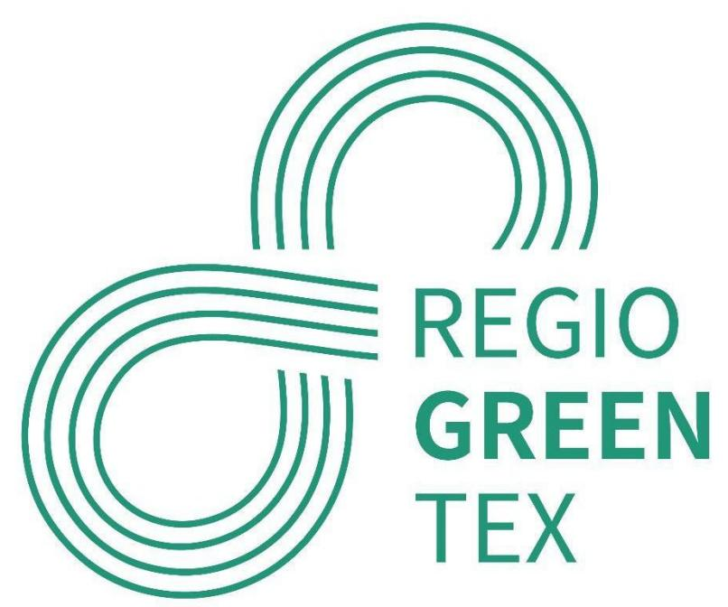
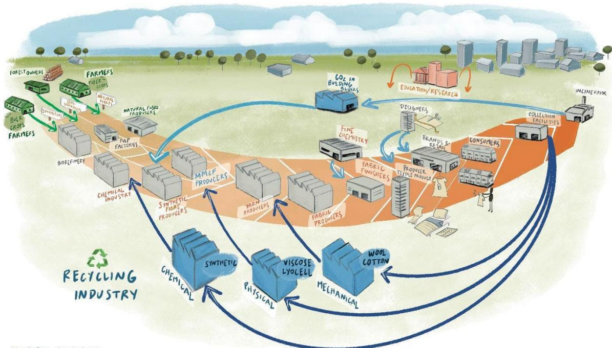
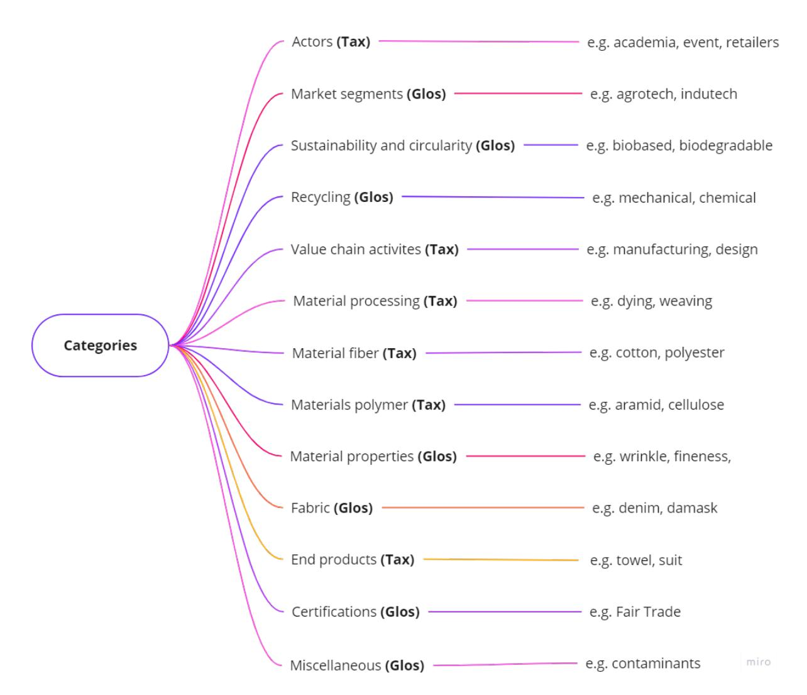

# **D1.1 Taxonomy Interregional Innovation Investments Instrument (I3)**

**Deliverable due date: 31-12-2023 (M12)**

**AUTHOR REVIEWERS**

Wageningen University and Research CS-Pointex and Euramaterials

Dissemination level: Public

## Co-funded by the European Union

*Co-funded by the European Union. Views and opinions expressed are however those of the author(s) only and do not necessarily reflect those of the European Union or EISMEA. Neither the European Union nor EISMEA can be held responsible for them.*

# **EXECUTIVE SUMMARY**

This deliverable report describes the work performed in Task 1.1 of the RegioGreenTex project. The goal of this task was to create a shared understanding among the consortium members about the recycling model applied to textiles, more in general related to fibres/materials, and the overall textile sector. For this task we build a framework called Taxonomy.

The taxonomy should 1) provide a common language to all partners within the RegioGreenTex project and the textile sector in general, 2) should offer a controlled vocabulary, 3) should improve accuracy and precision of the information due to the common vocabulary between the partners, and 4) should avoid involuntary greenwashing (SMEs). We constructed a framework in the form of a database in excel, based on the Ellie.Connect Taxonomy Guide. The categories and terms were expanded to better fit the requirements of the RegioGreenTex project.

For now, it is a searchable database under construction, as the database is not complete and final. We focussed on setting up the structure of the database and collection of the terms, and less on the proper explanation of the terms. This needs to be done, together with the partners, during the next two years of the RegioGreenTex project, in line with the bottom-up approach that has been implemented in the whole project.

### **CONTENTS**

|   | Executive summary                                      | 2 |
|---|--------------------------------------------------------|---|
| 1 | Introduction                                           | 4 |
|   | 1.1 Task 1.1: Taxonomy                                 | 4 |
|   | 1.2 Embedding of the textile taxonomy in RegioGreenTex | 4 |
| 2 | Methods                                                | 5 |
| 3 | Results                                                | 6 |
|   | 3.1 Mindmap and database in excel                      | 6 |
|   | 3.2 How to continue?                                   | 8 |
| 4 | List of references                                     | 9 |

# 1 **INTRODUCTION**

### 1.1 **Taxonomy (Task 1.1)**

This deliverable report describes the work performed in Task 1.1 of the RegioGreenTex (RTG) project. Goal of this task is to create a shared understanding among the consortium members about the recycling model applied to textiles, more in general related to fibres/materials, and the overall textile sector.

The textile and clothing sector is rich in its vocabulary to describe all the (sub) stages in the manufacturing process. The textile industry is in transition to become more sustainable and circular, and novel processes and new materials become part of the value chain. In this task we worked on developing the necessary common language or terminology to support this transition.

Taxonomy is the science that deals with naming, describing and classification of all living organisms including plants. Classification is based on behavioural, genetic, and biochemical variations. Characterization, identification, and classification are the processes of taxonomy. Here we apply this taxonomy approach not on living organisms but on textiles and its diverse material use.

### 1.2 **Embedding of the textile taxonomy in RegioGreenTex**

Expectations of the Taxonomy tool were nicely described by CITEVE during a partner meeting in September 2023 of Work package 1, led by Centexbel:

- It should provide a common language to all partners within the RegioGreenTex project and the textile sector in general.
- It should offer a controlled vocabulary (different wordings for the same concept- search for information by different terms).
- It should improve accuracy and precision of the information due to the common vocabulary between the partners.
- It should avoid involuntary greenwashing (SMEs).

Contributions of the partners to the Taxonomy were also shared during the meeting:

EURATEX: Coordinate work of other partners, define standards/requirements/limits in accordance with

the EC and Grant Agreement specifications. Ovam: Has experience in waste-related taxonomy and provides support and review of the deliverable. Ovam also gives guidance on waste frame directive elements of end-of-waste criteria and transboundary transport of waste. Po.in.tex: Can contribute to the translation of the Taxonomy from English to Italian and shares other input or contributions if needed. Citeve: Citeve will be able to share knowledge in the taxonomy that is focussed on textile circularity and recycling. Citeve owns a recycling line and participates in several projects involving this theme.

The Taxonomy tool is useful for the Self-Assessment Tool developed by Euramaterials (WP2). SMEs active in RegioGreenTex work with new technologies and it is important for them to use the same vocabulary in their communication. In addition, official terms used by the EU, Member States and Regional Authorities should be unambiguous, and this taxonomy could assist there.

The Taxonomy tool is especially important for the RegioGreenTex Digital Tool developed by Ariadne Innovation (WP2). In this matchmaking tool companies should be able to describe their activities, their place in the value chain, their specific processes and materials, and the gaps they are facing. Also, their inputs, outputs and residue streams they are generating are of interest for other companies, in order to build a true circular system.

**Figure 1: The circular textile industry in a fossil-free society (WUR)**

# 2 **METHODS**

- The Ellie.Connect Taxonomy Guide formed the basis of this work. The categories and terms were expanded to better fit the requirements of the RGT Taxonomy. The database was built in excel by WUR. It is a searchable database constructed of drop-down tables that can be ordered in many ways (at this moment an unprotected excel file).
- Next step was to consult other partners (Centexbel, Ariadne, OVAM) for their input and sources for interesting terms, vocabulary, and specific wording.
- Final step was incorporation of all information provided. The result is a database under construction, as the database is not complete and final. We focussed on setting up the structure of the database and collection of the terms, and less on the proper explanation of the terms. This needs to be done, together with the partners, during the next two years of the RegioGreenTex project, in line with the bottom-up approach that has been implemented in the whole project.

# 3 **RESULTS**

### **3.1 Mind map and database in excel**

To construct the taxonomy, we build a database in excel and defined the various categories. The Taxonomy is based on the mind map illustrated in Figure 2.

We noticed that for some categories we could only come up with terms with a single definition, i.e. without a connection with other groups or categories. These categories were then called 'glossary', as they resemble a kind of dictionary. In the other categories, the terms related to one or more groups or categories. These categories form the real taxonomy and were called 'taxonomy'.

It is an option to remove the glossary parts when building the final Taxonomy, but for the moment the glossary parts are nice to have in the discussions to come.

#### **Figure 2: Mind map taxonomy**

The mind map is combined with a database in excel. The excel file here included consists of 13 tabs with all categories listed. The tables are dropdown lists and can be ordered by each column. By default, the lists are ordered in alphabetical order of the terms. Further explanation of the categories is listed below:

- Actors (Taxonomy) o An actor is a participant in an action or process. This can be a company but also government, academia, or even an individual. For companies it is intended that they can recognise themselves in one of the options listed here.
- Market segments (Glossary) o This is a glossary of market segments actors can be active in.
- Sustainability and circularity (Glossary) o This is a glossary of terms that are used to describe sustainability and circularity.
- Recycling (Glossary) o Recycling is part of circular actions (R strategies) but is complex in its processes and vocabulary. This category aims to describe the different terms that are used to describe recycling activities by actors.
- Value Chain Activities (Taxonomy) o This category lists general activities of the actor in the value chain. Companies can be active on multiple fields, e.g. designing and producing garments in an atelier. This category can be expanded with recycling activities in a later stage.
- Material processing (Taxonomy) o This category lists in more detail the specific type of activities (unit operations) an actor can perform while working with materials. The processes are further categorized as being part of e.g. yarn formation or dyeing.
- Material fibres (Taxonomy) o The materials being processed consist of specific textile fibres. In this list the most common textile fibres are listed (commercial names). The fibres are further classified on their fibre type (natural, semisynthetic, synthetic), polymer class, specific polymer, and the sources (biobased or fossil resources) for these fibres. This classification is relevant for recycling, and the list can be expanded with recycling options.
- Material polymers (Taxonomy) o A textile fibre is built up by polymers, and in this list the different polymers are listed (chemical names). The polymers are further classified on their polymer class and their polymer category. Also, this list is relevant for recycling, and the list can be expanded with recycling options, as each polymer has its own preferential recycling processes.
- Material properties (Glossary) o Material properties relevant for textiles are listed in this tab.
- Fabrics (Glossary) o This is a glossary of textile fabrics.
- End products (Taxonomy) o This is a list of textile end products and their category (e.g. apparel, home)
- Certifications (Glossary) o This is a list of all terms relevant for certifications.
- Miscellaneous (Glossary) o This is a list of components (of concern) and other terms not fitting in the other categories.

# **3.2 How to continue?**

The database is now ready to be reviewed, edited, and discussed by the partners in RegioGreenTex. We will present the tool at the beginning of next year (M13-14 of the project) to the WP1 project team, and in March 2024 at the consortium meeting in Portugal.

The translation of the database into 6 other languages by the regional clusters is foreseen, where needed, in a later stage of the RGT project once the database is 'finalized'.

### 4 **REFERENCES**

- 1. Ellie Connect taxonomy guide
- 2. ISO 5157:2023(en), Textiles Environmental aspects Vocabulary, ISO 5157:2023(en), Textiles Environmental aspects — Vocabulary
- 3. Nawab, Yasir, and Khubab Shaker, eds., Textile engineering: an introduction. Walter de Gruyter GmbH & Co KG, 2023.
- 4. Wilson, Jacquie. Handbook of textile design. Elsevier, 2001.
- 5. Sarkar, Ajoy K., Phyllis G. Tortora, and Ingrid Johnson. The Fairchild Books Dictionary of Textiles. Bloomsbury Publishing USA, 2021.
- 6. Matthes, André, et al. Sustainable Textile and Fashion Value Chains. Springer International Publishing: Berlin/Heidelberg, Germany, 2021.
- 7. Teli, M. D., et al. "Upcycling of textile materials." Proceeding of Global Textile Congress. 2015.
- 8. Fan, Jintu, and Lawrence Hunter. Engineering apparel fabrics and garments. Elsevier, 2009.
- 9. Sinclair, Rose, ed. Textiles and fashion: materials, design and technology. Elsevier, 2014.
- 10. Morseletto, Piero. "Targets for a circular economy." Resources, Conservation and Recycling 153 (2020): 104553.
- 11. Sustainable chemistry OECD
- 12. Lexicon | Centexbel VKC
- 13. Harmsen, Paulien, Michiel Scheffer, and Harriette Bos. "Textiles for circular fashion: The logic behind recycling options." Sustainability 13.17 (2021): 9714.
- 14. Babu, V. Ramesh, and S. Sundaresan. Home furnishing. CRC Press, 2018.

**What type of company are you?**

| Term                                 | Explanation                                                                                                                                              | Reference | Organisation |
|--------------------------------------|----------------------------------------------------------------------------------------------------------------------------------------------------------|-----------|--------------|
| Academia                             | The life, community, or world of teachers, schools, and education. Active in education and academic research                                             | 1         | academia     |
| Actors                               | A participant in an action or process.                                                                                                                   | 1         |              |
| Association                          | Association a group of people organized for a joint purpose                                                                                              | 1         |              |
| Brand owner                          | A type of product that is manufactured by a particular company and sold under a particular name.                                                         | 1         |              |
| Cluster organisation                 | Organization that supports the strengthening of collaboration, networking and learning in innovation clusters.                                           | 1         |              |
| Consultancy                          |                                                                                                                                                          |           | consultancy  |
| Consumer                             | Purchase and use textile products for personal use.                                                                                                      |           | individual   |
| Designer                             | Create designs for textiles, influencing trends and styles.                                                                                              |           | company      |
| Environmental organisation           | Advocate for sustainable and environmentally friendly practices in the textile industry.                                                                 |           | NGO          |
| Event organiser                      | Organiser of something that happens or takes place, especially one of importance, a planned public or social occasion                                    | 1         | company      |
| Federation                           | A group of corporations collaborating based upon a specific characteristic of the group members e.g. an industry, a geographical area.                   | 1         |              |
| Financial institutions               | Provide funding, loans, and financial services to businesses in the textile industry.                                                                    |           |              |
| Government agencies                  | Implement policies, regulations, and incentives that impact the textile industry.                                                                        |           | government   |
| Incubator/accelerator                | A business incubator is a workspace created to offer startups and new ventures access to the resources they need, all under one roof.                    | 1         |              |
| investment firm/fond                 | An investment company is a corporation or trust engaged in the business of investing the pooled capital of investors in financial securities. Targets ca | 1         |              |
| Logistics and transport              | Facilitate the movement of raw materials, textiles, and finished products throughout the supply chain.                                                   |           | company      |
| Machinery supplier                   | Provides equipment for the efficient and advanced manufacturing of textiles.                                                                             |           | company      |
| Manufacturer                         | Manufacturers produce raw materials, semi-finished or finished products. They can use technologies developed by Technology Providers.                    | 1         | company      |
| Marketing & Communication Services   | An organization that will provide you with the tools to help you communicate and sell your product in a better way.                                      | 1         |              |
| Museum                               | An institution that researches, collects, conserves, interprets and exhibits cultural heritage.                                                          | 1         |              |
| Network organisation                 |                                                                                                                                                          |           |              |
| Online platform                      | A range of services available on the Internet including marketplaces, search engines, social media, creative content outlets, app stores, communication  | 1         | company      |
| Public agency                        | A government or state agency, sometimes an appointed commission, is a permanent or semi-permanent organization in the machinery of governme              | 1         |              |
| Publisher                            | The business or profession of the commercial production and issuance of literature, information, musical scores or sometimes recordings, or art          | 1         |              |
| Raw material supplier                | Provide raw materials such as cotton, wool, silk, cellulose pulp, granulate, and dyes to the textile industry                                            |           | company      |
| Regulatory body                      | Enforce standards and regulations related to the production, labeling, and safety of textile products.                                                   |           |              |
| Research and Development Institution | Conduct research to improve manufacturing processes, develop new materials, and address industry challenges.                                             |           | research     |
| Retailer                             | Sell finished textile products to consumers through various channels such as brick-and-mortar stores or online platforms.                                |           | company      |
| Service provider                     | A service provider provides organizations with services like consulting, legal, real estate, communications, storage, processing.                        | 1         |              |
| Social enterprise                    | An organization that applies commercial strategies to maximize the financial, social and environmental improvement of its operations.                    | 1         | company      |
| Technology provider                  | A company that develops, produces and sells software applications and/or technology that is used in the business or manufacturing processes of the       | 1         | company      |
| Textile processor                    | Actor involved in processing of textiles after use (e.g. collection, sorting, reuse, repair, recycling)                                                  | 2         | company      |
| Trade associations                   | Represent the interests of the industry, provide support, and facilitate communication among stakeholders.                                               |           |              |

| Term                                | Explanation                                                                                                                                                                                                                       | Reference |
|-------------------------------------|-----------------------------------------------------------------------------------------------------------------------------------------------------------------------------------------------------------------------------------|-----------|
| Advertainment                       | Advertainment is a term used to describe entertainment that incorporates elements of advertising. It is the practice of integrating brand communications within the content of entertainment products (movies, songs              | 12        |
| Agrotech                            | The textiles used in agriculture are called as agro-textiles. The properties of the textiles which are required in agro textiles include strength, elongation, stiffness, porosity, bio-degradation, resistance to sunlight and r | 3         |
| Apparel                             | The clothing or apparel market includes most garments that are worn. A huge consumer of fabric, clothing manufacture can be split by market, e.g. men's, women's and children's clothing, sportswear, casual wear or              | 4         |
| Apparel , baby                      |                                                                                                                                                                                                                                   |           |
| Bed & bath                          | Textiles used related to the bed or bath.                                                                                                                                                                                         | 1         |
| Big data                            | Big data is a term used to refer to the study and applications of data sets that are so big and complex that traditional data-processing application software are inadequate to deal with them.                                   | 12        |
| Blockchain                          | A blockchain is a digital record of transactions. The name comes from its structure, in which individual records, called blocks, are linked together in single list, called a chain. Blockchains are used for recording transac   | 12        |
| Buildtech                           | The textiles that are used in the construction and architectural application are termed as buildtech. Buildtech segment consists of textiles or composite materials that are used in the construction of permanent and tr         | 3         |
| Carpets                             | A textile product for use as a floor covering.                                                                                                                                                                                    | 1         |
| Clothing                            | Clothing (also known as clothes and attire) is fibre and textile material worn on the body. The wearing of clothing is mostly restricted to human beings and is a feature of nearly all human societies. The amount and th        | 12        |
| Clothtech                           | Clothtech includes fibres, yarns and textiles used as technical components in the manufacturing of clothing such as sewing threads, interlinings, waddings and insulation. Most of these components are hidden, for ex            | 3         |
| Design                              | Realization of a concept or idea into a configuration, drawing, model, mould, pattern, plan or specification (on which the actual or commercial production of an item is based) and which helps achieve the item's desig          | 12        |
| Domestics                           | 1. A general trade term for such household goods as sheets, pillow cases, towels, and blankets. Used in the plural form; the term originated about 1815 when New England mills began to specialize in heavy drills and            | 5         |
| Electronics                         | The branch of physics and electrical engineering that deals with the emission, behavior and effects of electrons and with electronic devices.                                                                                     | 1         |
| Fashion                             | Fashion is a popular style or practice, especially in clothing, footwear, accessories, hairstyle and make-up. Fashion is a distinctive and often constant trend in the style in which a person dresses.                           | 12        |
| Fashion, fast                       | is defined as low-cost clothing collections, which are imitations of the current luxury fashion clothing items being in trend. The fast fashion system motivates faster production and encourages higher disposability. Th        | 6         |
| Fashion, slow                       | The ideology behind the concept is producing sustainable clothing without causing any pollution. This sustainability can be achieved in all the stages of production, from the design concept to the end-user (customer           | 6         |
| Footwear                            | Shoes, heels etc.                                                                                                                                                                                                                 | 1         |
| Geotextile                          | All the fabrics (woven, nonwoven and knitted textile materials) which can provide a range of primary functions such as support, drainage and separation at or below ground level, lie in the category of geotextiles. Geo         | 3         |
| Haute couture                       | The creation of exclusive custom-fitted clothing. Haute couture is high-end fashion that is constructed by hand from start to finish, made from high-quality, expensive, often unusual fabric and sewn with extreme attr          | 12        |
| Hometech                            | Hometech segment of technical textiles comprises of the textile components used in the domestic environment – interior decoration and furniture, carpeting, protection against the sun, cushion materials, fireproofir            | 3         |
| Industrial design                   | In a legal sense, an industrial design constitutes the ornamental or aesthetic aspect of an article. An industrial design may consist of three dimensional features, such as the shape of an article, or two dimensional feat     | 12        |
| Indutech                            | Indutech includes technical textile products used in the manufacturing sector. The applications are diverse such as separating and purifying industrial products, cleaning gases and effluents, transporting materials bet        | 3         |
| Interior Textiles                   | Textiles used for the interior decoration.                                                                                                                                                                                        | 1         |
| Knitwear                            | A wearable product made of knitted fabric.                                                                                                                                                                                        | 1         |
| Leisurewear                         | Clothing designed for relaxation.                                                                                                                                                                                                 | 1         |
| Medtech                             | Medtech products comprise textile materials used in hygiene, health and personal care as well as surgical applications. The Medtech products are available in all forms such as woven, knitted and non-woven based o              | 3         |
| Mobiltech                           | Mobiltech segment of technical textiles is used in the construction of automobiles, railways, ships, aircraft and space craft. The Mobiltech products can be broadly classified into two categories – visible components a        | 3         |
| Oekotech                            | Any textile product which is produced in eco-friendly way and also processed under eco-friendly limits come under oekotech. The fabrics made up of organic cotton, hemp, bamboo, recycled polyester or tencel or PL               | 3         |
| Outdoor Textiles                    | Textiles designed for outdoor use.                                                                                                                                                                                                | 1         |
| Packtech                            | The several flexible packaging materials used for industrial, agricultural, consumer and other goods come under the term Packtech as shown in Fig. 7.6. It consists of synthetic bags used for industrial packaging and ju        | 3         |
| Personal Protective Equipment (PPE) | The purpose of personal protective clothing is to protect the person from hazard.                                                                                                                                                 | 1         |
| Product design                      | The detailed specification of a manufactured item's parts and their relationship to the whole. A product design needs to take into account how the item will perform its intended functionality in an efficient, safe and         | 12        |
| Product development                 | The creation of products with new or different characteristics that offer new or additional benefits to the customer. Product development may involve modification of an existing product or its presentation, or formu           | 12        |
| Protech                             | The textiles that provide protection against different functions are called protective textiles. Textiles for protection is an important area that has drawn a great attention towards it. Protech consists of all those textile  | 3         |
| Ready-to-wear                       | Ready-to-wear or prêt-à-porter is factory-made clothing, sold in finished condition, in standardized sizes. The advantage is that the price can be kept relatively low. Off-the-peg is sometimes used for items other than        | 12        |
| Sensor Technology                   | A company that makes use of sensors to detect and respond to some kind of input from the physical environment.                                                                                                                    | 1         |
| Sleepwear                           | Clothing designed for sleeping.                                                                                                                                                                                                   | 1         |
| Sportswear                          | Sportswear or activewear is clothing, including footwear, worn for sport or physical exercise and its design depends on the demands of the sport activity in question.                                                            | 12        |
| Sporttech                           | The textiles that are used in sports in any form are called as sporttech. The applications are diverse and range from artificial turf (e. g. in hockey) used in sports surfaces through to advanced carbon fibre composites f     | 3         |
| Technical textiles                  | textile materials and products manufactured primarily for their technical and performance properties rather than their aesthetic or decorative characteristics. Technical textiles covers 12 main application areas as fol        | 3         |
| Trims                               | The decoration of a product, typically with contrasting items or pieces of material.                                                                                                                                              | 1         |
| Underwear                           | Clothing that is worn under other clothing, usually next to the skin.                                                                                                                                                             | 1         |
| Upholstery                          | Textiles for furniture upholstery.                                                                                                                                                                                                | 1         |
| Wall decoration                     | Textiles for decorating the walls.                                                                                                                                                                                                | 1         |
| Window decoration                   | Textiles that are used to cover the window.                                                                                                                                                                                       | 1         |
| Workwear                            | Workwear is clothing worn for work, especially work that involves manual labour. Workwear is submitted to rules concerning its use and care.                                                                                      | 12        |

| Term                                     | Explanation                                                                                                                                                                                                          | Reference |
|------------------------------------------|----------------------------------------------------------------------------------------------------------------------------------------------------------------------------------------------------------------------|-----------|
| Agriculture, organic                     | holistic production management system which promotes and enhances agro-ecosystem health, including biodiversity, biological cycles, and soil biological activity, emphasising the use of management pract            | 2         |
| Biobased                                 | A material that is manufactured using substances that are derived from living organisms, derived from biomass                                                                                                        | 1         |
| Biobased, content                        | Fraction of a product that is derived from biomass                                                                                                                                                                   | 2         |
| Biobased, product                        | Product wholly or partly derived from biomass. The bio-based product is typically characterized by the bio-based carbon content or the bio-based content. Documentation proving source of material, either           | 2         |
| Biodegradation                           | Degradation caused by biological activity, especially by enzymatic action, leading to a significant change in the chemical structure of a material                                                                   | 2         |
| Biological cycle                         | cycle(s) through which biological nutrients are restored into the biosphere in a way that rebuilds ecosystem resilience and natural capital and enables the regrowth of renewable resources                          | 2         |
| Biomass                                  | Material of biological origin, excluding material embedded in geological formations or transformed to fossilized material and excluding peat. This includes organic material (both living and dead) from above       | 2         |
| By-product                               | Co-product from a process that is incidental or not intentionally produced and which cannot be avoided. Waste is not a by-product.                                                                                   | 2         |
| Circular economy                         | The circular economy is an economic system in which the reusability of products and raw materials is optimized and value destruction are minimized. In contrast to the present linear system in which raw m          | 12        |
| Circular supplies                        | a circular business model refers to use renewable energy, bio-based or fully recyclable input material to replace toxic and single-lifecycle inputs                                                                  | 6         |
| Circularity                              |                                                                                                                                                                                                                      |           |
| Compost                                  | organic soil conditioner obtained by biodegradation (3.2.7.1) of a mixture consisting principally of vegetable residues, occasionally with other organic material and having a limited mineral content               | 2         |
| Compostability                           | property of a material to be biodegraded in a composting process. Compostability refers to an aerobic process. Composting of textiles can be restricted by biowaste regulations.                                     | 2         |
| Compostable material                     | material that undergoes degradation (3.2.7.5) by biological processes during composting to yield CO2, water, inorganic compounds and biomass (3.1.2.4) at a rate consistent with other known compostable             | 2         |
| Composting, industrial                   | composting process performed under controlled conditions on industrial scale with the aim of producing compost for the market. Composting of textiles can be restricted by biowaste regulations.                     | 2         |
| Cradle to Cradle                         |                                                                                                                                                                                                                      |           |
| Cradle to Gate                           | description of a portion of product life cycle which begins with raw material acquisition or generation from natural resources and extends through the end of that stage or any other in the product system, :       | 2         |
| Cradle to Grave                          | description of product life cycle which begins with raw material acquisition or generation from natural resources and extends through the final disposal                                                             | 2         |
| Degradation                              | irreversible process leading to a significant change in the structure of a material, typically characterized by a change of properties (e.g. integrity, molecular mass or structure, mechanical strength) and/or by  | 2         |
| Design for Circularity                   | design for circularity is about using design strategies that keep garments in the loop at highest possible value at all time—ultimately designing out waste from the system from the very beginning. Designing       | 6         |
| Design for Disassembly                   | For garments that are more complex in their design, pattern construction or that need the functions of textiles and parts from different cycles, a mono-material solutions might not be an applicable strateg        | 6         |
| Design for Emotional Durability          | Emotional durability refers to consumers' connection to their items. In case of a strong connection and adherence, consumers are considered to keep their items in use for a longer time. 'Designing in' emo         | 6         |
| Design for Environment                   | Is the analysis of the environmental, health, and safety issues relevant to the entire life of the product. The idea is to reduce resource depletion and waste during the manufacture, use and disposal or reuse     | 6         |
| Design for Functional Durability         | Functional durability refers to the physical aspects of a garment. This also includes whether it is made to last and whether it can resist damage due to wear. The functional, or physical durability, is affected i | 6         |
| Design for Longevity                     | Designing for longevity is about creating garments to last, both in style, quality and in function. In order to achieve this, several different strategies can be used to enhance both the functional and emotiona   | 6         |
| Design for Mono-Material                 | Mono-material refers to a design strategy where a garment and all its parts are entirely designed within one cycle, through either biodegradation or recycling. This strategy is suitable for garments where th      | 6         |
| Design for Recyclability                 | construction and design of a textile product using choices that will facilitate recycling of the product after its initial service lifespan                                                                          | 2         |
| Design for Remake                        | construction and design of a textile product (3.1.1.13), with the plan to remake (3.2.2.11) the article after the initial service lifetime                                                                           | 2         |
| Design for Repairability                 | construction and design of a textile product using choices that will facilitate ease of repair by the end user during the product's lifespan                                                                         | 2         |
| Disposal, final                          | end-of-life (3.2.3.5) treatment of waste (3.2.7.15) by incineration (3.2.7.9) or landfilling (3.2.7.11)                                                                                                              | 2         |
| Durability                               | ability of a textile product to retain its required properties in specified conditions for an intended lifespan                                                                                                      | 2         |
| Ecodesign                                | Integration of environmental aspects (3.2.3.6) into product design and development, with the aim of reducing adverse environmental impacts (3.2.3.7) throughout a product's life cycle (3.2.3.9)                     | 2         |
| Ecolabel                                 | Ecolabels are a quality label issued to products or services with a lesser environmental impact than comparable products or services, on the basis of a set of pre-determined criteria.                              | 12        |
| Economy, circular                        | economic system that uses a systemic approach to maintain a circular flow of resources by recovering, retaining or adding to their value, while contributing to sustainable development                              | 2         |
| Economy, linear                          |                                                                                                                                                                                                                      |           |
| End-of-life                              | stage which begins when the used product is ready for disposal, recycling, reuse, etc. and ends when the product is returned to nature (combustion, deterioration), or is recycled or reused. The end-of-life        | 2         |
| Environmental aspect                     | element of an organization's activities or products or services that interacts or can interact with the environment                                                                                                  | 2         |
| Environmental impact                     | change to the environment, whether adverse or beneficial, including possible consequences, wholly or partially resulting from an organization's environmental aspects                                                | 2         |
| European Production                      | Products designed and made in Europe.                                                                                                                                                                                | 1         |
| Extended producer responsibility (EPR)   | environmental policy approach in which a producer's responsibility for a product is extended to the post-consumer stage of a product's life cycle. An EPR policy is characterized by:a) the shifting of responsib    | 2         |
| Finishing, low chemical impact finishing | Chemicals used for the finishing of the fabric with a low environmental impact.                                                                                                                                      | 1         |
| Gasification                             | manufacturing process whereby collected feedstocks (3.2.6.12) are introduced in a high temperature oxygen-controlled atmosphere converting feedstocks into syngas (carbon monoxide (CO) and hydrogen                 | 2         |
| Greenwashing                             | unsubstantiated or misleading claim about the positive or negative environmental aspects (3.2.3.6) of a product, service, technology or company practice                                                             | 2         |
| Incineration                             | controlled burning of waste products or other combustible materials in an incinerator or similar apparatus                                                                                                           | 2         |
| Input                                    | product, material or energy flow that enters a unit process. Products and materials include raw materials, intermediate products and co-products. Input includes reused reprocessed and recycled materials           | 2         |
| Landfill                                 | waste disposal site for the deposit of waste on to or into land under controlled or regulated conditions. Landfill might not be a legal option for waste disposal in so                                              |           |

| Term                                 | Explanation                                                                                                                                                                                                           | Reference |
|--------------------------------------|-----------------------------------------------------------------------------------------------------------------------------------------------------------------------------------------------------------------------|-----------|
| Discarding                           | act of throwing away textiles no longer useful or required by its owner                                                                                                                                               | 2         |
| Downcycling                          | production of recycled material (3.2.6.30) that is of lower economic value or quality than the original product                                                                                                       | 2         |
| End-of-life                          | Stage which begins when the used product is ready for disposal, recycling (3.2.6.32), reuse (3.2.2.16), etc. and ends when the product is returned to nature (combustion, deterioration), or is recycled or reus      | 2         |
| Feedstock                            | primary material (3.1.1.10) introduced into a plant for processing                                                                                                                                                    | 2         |
| Fibre, non-virgin                    | fibre that has been obtained from or processed through a recycling (3.2.6.32) process                                                                                                                                 | 2         |
| Fibre, recycled                      | fibre that has been obtained from or processed through a recycling (3.2.6.32) process                                                                                                                                 | 2         |
| Material, cascading                  | material produced by cascade recycling (3.2.6.3)                                                                                                                                                                      | 2         |
| Material, post-consumer              | material or object which has been used by the end user(s) and is no longer of use for this end-user(s)                                                                                                                | 2         |
| Material, primary                    | material which has never been processed into any form of end-use product                                                                                                                                              | 2         |
| Material, reclaimed                  | substances or objects that would have otherwise been disposed of as waste (3.2.7.15), but has instead been collected and used in another process or product, requiring only minor alterations and or refinish         | 2         |
| Material, recovery                   | material processing operations as part of textile, fibre or polymer recycling but excluding energy recovery (3.2.7.7), and aerobic/anaerobic digestion                                                                | 2         |
| Material, recycled                   | materials that have been recovered, or otherwise diverted, from the waste (3.2.7.15) stream, either from the manufacturing process [i.e. post-industrial recycled materials, but not in-house scrap] or after (       | 2         |
| Material, secondary                  | materials that have been recovered, or otherwise diverted, from the waste (3.2.7.15) stream, either from the manufacturing process [i.e. post-industrial recycled materials, but not in-house scrap] or after (       | 2         |
| Material, virgin                     | material which has never been processed into any form of end-use product                                                                                                                                              | 2         |
| Product, off-class                   | descriptive term used in definition covering the product before it reaches the customer, such as off-class products, damaged or obsolete products                                                                     | 2         |
| Recyclability                        | ability to be recycled                                                                                                                                                                                                | 2         |
| Recycled content                     | proportion, by mass, of recycled material in products                                                                                                                                                                 | 2         |
| Recycled content, post-consumer      | material generated by households or by commercial, industrial and institutional facilities in their role as end-users of the product which can no longer be used for its intended purpose, including returns of u     | 2         |
| Recycling                            | Activities to obtain recovered resources for use in a product, excluding energy recovery. Activities to obtain resources can include activities such as collection, transport, sorting, cleaning, re-processing, etc. | 2         |
| Recycling, cascade                   | Process in which a material is repeatedly used usually at decreasing quantity and quality at each subsequent stage or cycle. Cascading takes into account the inherent loss of quantity and quality over time.        | 2         |
| Recycling, chemical                  | manufacturing processes that convert waste (3.2.7.15) materials into a feedstock (3.2.6.12) by changing the chemical structure of waste materials to be used in the production of new polymers, monomers              | 2         |
| Recycling, chemical                  | The use of chemical processes to break down the fibres, which means that the polymers that make up the fibres are either modified or broken down (chemical bonds are broken), sometimes as far down as                | 13        |
| Recycling, closed loop               | System by which textile products are used and then recovered and turned into new textile products indefinitely, without losing their inherent properties. Depending on the technology used, some material l           | 2         |
| Recycling, fabric                    | process of recovering woven, nonwoven or knitted fabric and reprocessing the textile material into useful products                                                                                                    | 2         |
| Recycling, feedstock                 | manufacturing processes that convert waste (3.2.7.15) materials into a feedstock (3.2.6.12) by changing the chemical structure of waste materials to be used in the production of new polymers, monomers              | 2         |
| Recycling, fiber to fiber            | turning textile waste into new fibers that are then used to create new clothes or other textile products                                                                                                              | 2         |
| Recycling, fibre                     | system for disassembling used fibres, extracting polymers and re-spinning or converting them for new uses. Cellulosic fibre regeneration implies some modification to the polymer structure. Recycling of ny          | 2         |
| Recycling, fibre                     | Preservation of the fibres after disintegration of the fabric                                                                                                                                                         | 13        |
| Recycling, fibre mechanical          | mechanical process for disassembling used textile products, extracting fibres and incorporating them into a new textile product or other application                                                                  | 2         |
| Recycling, mechanical                | mechanical process, used in a recycling system, based on physical forces. Compounding, drying, grinding, re-granulating, separating, shredding (3.2.6.34), washing are examples of mechanical recycling proc          | 2         |
| Recycling, mechanical                | The use of mechanical processes (cutting, tearing, shredding, carding) to break down the fabric and separate the yarns and fibres. This means that the structure of the fibres remains intact. Mechanical met         | 13        |
| Recycling, monomer                   | Fibres and subsequently polymers are broken down into their chemical building blocks.                                                                                                                                 | 2         |
| Recycling, open loop                 | recycling materials transferred into another material category or application with loss of purity or quality                                                                                                          | 2         |
| Recycling, physical                  | The use of physical processes to make the fibres or polymers suitable for reprocessing, which means either melting or dissolving them. With physical recycling, the structure of the fibres is changed, but the       | 13        |
| Recycling, polymer                   | Disassembly of the fabric while the polymers remain intact                                                                                                                                                            | 13        |
| Recycling, rate                      | ratio of the amount of material that has completed a recycling process to the total amount input. Exact calculations may vary based on situation.                                                                     | 2         |
| Recycling, thermo-mechanical process | process used in a recycling system that melts a polymer, typically employed to permit polymer recycling                                                                                                               | 2         |
| Sorting, augmented                   | sorting process beyond human perception using optical or spectroscopic sensor technologies as well as machine readable identifiers. Technologies may include but are not limited to: computer vision, NIR/I           | 2         |
| Sorting, automated                   | sorting using machines to conduct the sorting process. Technologies may include but are not limited to FTIR, NIR, RFID, QR etc.                                                                                       | 2         |
| Sorting, manual                      | Sorting process conducted by persons using visual or haptic inspection                                                                                                                                                | 2         |
| Textile, collector                   | actor involved in separate collection (3.2.6.7) of textiles                                                                                                                                                           | 2         |
| Textile, compostability              | property of a material to be biodegraded in a composting process. Compostability refers to an aerobic process. Composting of textiles can be restricted by biowaste regulations.                                      | 2         |
| Textile, fraction                    | textile materials sorted by defined characteristics. Characteristics may include but are not limited to: colours, type of garment, fibre length (staple or continuous), composition, fabrics construction etc.        | 2         |
| Textile, post-consumer               | textile material, generated by the end-users of products, that has fulfilled its intended purpose or can no longer be used, including material from the distribution chain                                            | 2         |
| Textile, pre-consumer                | Product before it reaches the customer. Pre-consumer products include items returned tried on but unused by consumers to the retailer. This definition includes all items (e.g. trims, yarn, belt, buttons, piec      | 2         |
| Textile, recyclable                  | textile material or textile product suitable and prepared for recycling with techniques commercially available, including chemical, mechanical and/or thermo-mechanical recycling                                     | 2         |
| Upcycling                            | process of converting waste (3.2.7.15) products to new materials that are of higher economic value or quality than in the original product                                                                            | 2         |
| Waste                                | Resource that is considered to no longer be an asset as it provides no value to the holder. The assignment of value to waste as a resource is linked, in part, to the available technology (e.g. landfill (3.2.7.11)  | 2         |
| Waste, post-consumer (PC)            | Waste arising as a result of the consumer from articles that have been used and worn                                                                                                                                  | 6         |
| Waste, post-industrial (PI)          | Materials that come from waste from (industrial) production. This excludes materials that are or can be reused when pr                                                                                                |           |

**What are your activities in the value chain?**

| Term                               | Explanation                                                                                                                                                                                  | Reference |
|------------------------------------|----------------------------------------------------------------------------------------------------------------------------------------------------------------------------------------------|-----------|
| Artificial Intelligence            | Artificial intelligence is the simulation of human intelligence by machines.                                                                                                                 | 1         |
| Augmented Reality                  | Augmented Reality is an interactive experience which combines the real world with computer generated content.                                                                                | 1         |
| Blockchain                         | A blockchain platform is a shared digital ledger that allows users to record transactions and share information in a secure, tamper-proof manner. A distributed network of computers m.      | 1         |
| Chain of custody                   | process by which inputs (3.2.3.8) and outputs (3.2.3.13) and associated information are transferred, monitored and controlled as they move through each step in the relevant supply ch.      | 2         |
| Consulting & Professional Services | Organizations that offer counselling services.                                                                                                                                               | 1         |
| Data & Analytics                   | Data and analytics, the management of data for all uses (operational and analytical) and the analysis of data to drive business processes and improve business results through more effe.    | 1         |
| Designing                          | An arrangement of form or colors, or both, to be implemented as ornamentation in or on various textile materials. Designs or patterns may be woven or knitted into the structure of a f.     | 5         |
| Digital Transformation             | Digital transformation is the integration of digital technology into all areas of a business, fundamentally changing the way you operate and deliver value to customers.                     | 1         |
| Distribution                       |                                                                                                                                                                                              | 1         |
| Education & Training               | Providing information, courses, lecturing and training.                                                                                                                                      | 1         |
| Embroidery & Quilting              | Decorating fabric or other materials                                                                                                                                                         | 1         |
| Environmental Services             | To provide information and advice on all aspects of the environment.                                                                                                                         | 1         |
| Innovation                         | To create new ideas, devices or methods.                                                                                                                                                     | 1         |
| Machinery                          | Distributing and creating machinery.                                                                                                                                                         | 1         |
| Manufacturer, atelier              | Transforms textiles into finished textile products through cutting and sewing.                                                                                                               |           |
| Manufacturer, dyehouse             |                                                                                                                                                                                              |           |
| Manufacturer, fabrics              | Formation of fabric by e.g. knitting, weaving, felting, non-woven techniques                                                                                                                 |           |
| Manufacturer, fibers               | a company who produce and supply fibers. Each type of fibers has different process and manufacturing. for example for cotton usually the fiber manufacturer are the farmers who culti        |           |
| Manufacturer, finisher             |                                                                                                                                                                                              |           |
| Manufacturer, printing             | A manufacturer who prints textiles.                                                                                                                                                          | 1         |
| Manufacturer, raw material         | Produces raw materials for the textile industry like natural fibers, cellulose pulp, granulate or dyes.                                                                                      |           |
| Manufacturer, yarns                | a company who converted fibers or filament into a yarn. Yarn manufacture include intermediate steps such as opening, blending, carding, combing, drawing, spinning and winding.              |           |
| Packaging                          | A service that will provide you with different types of packaging.                                                                                                                           | 1         |
| Providing service                  | The provision of assistance or advice to a customer about a product                                                                                                                          | 1         |
| Publicing                          | An action to make something known to the public.                                                                                                                                             | 1         |
| Research and Development           | Systematic activity combining both basic and applied research, and aimed at discovering solutions to problems or creating new goods and knowledge. R&D may result in ownership of ir         | 12        |
| Sourcing                           | The process of determining how and where in the world such goods as textiles and clothing will be manufactured or acquired for retail distribution                                           | 5         |
| Supply chain                       | series of interlinked processes or activities that includes the sourcing of raw material and extends through the manufacturing, processing, handling, and delivery, collection (3.2.6.7) anc | 2         |
| Textile collection                 | The collection of textile waste.                                                                                                                                                             | 1         |
| Textile recycler                   | Recycling post-production and post-consumer materials.                                                                                                                                       | 1         |
| Textile repair                     |                                                                                                                                                                                              |           |
| Textile reuse                      | Second-hand products                                                                                                                                                                         |           |
| Textile sorter                     | Sorting textile waste.                                                                                                                                                                       |           |
| Traceability                       | To make a production line or a final product traceable.                                                                                                                                      | 1         |
| Training                           | A course that is given in order to be able to do the job.                                                                                                                                    | 1         |
| Value chain                        | Entire sequence of activities or parties that create or receive value through the provision of a product or service                                                                          | 2         |

| Column1                     | Explanation                                                                                                                                                                                              | Reference | processing      |
|-----------------------------|----------------------------------------------------------------------------------------------------------------------------------------------------------------------------------------------------------|-----------|-----------------|
| aerobic digestion           |                                                                                                                                                                                                          |           | degradation     |
| anaerobic digestion         |                                                                                                                                                                                                          |           | degradation     |
| autoclave                   | An autoclave is a pressure chamber used to carry out industrial processes requiring elevated temperature and pressure different from ambient air pressure. Autoclaves are used in the textile i          | 12        |                 |
| Bio-polishing               | An enzyme treatment that removes fuzz or projections from the surface of fabrics made of cellulose in order to increase the smoothness and brightness of the fabric                                      | 5         | finishing       |
| Bleaching                   | The purpose of bleaching is to remove any coloring matter from the fabric and confer it a whiter appearance. In addition to increase in fabric whiteness, the bleaching process may also result i        | 3         | finishing       |
| Blending                    |                                                                                                                                                                                                          |           | formation       |
| Bonding                     |                                                                                                                                                                                                          |           | formation       |
| Calendering                 | A finishing process produc                                                                                                                                                                              |           |                 |
|                             | sure, t                                                                                                                                                                                                  | 5         | finishing       |
| Carding                     | Carding is a mechanical process that disentangles, cleans and intermixes fibres to produce a continuous web or sliver suitable for subsequent processing. This is achieved by passing the fibres         | 12        | formation       |
| Collection                  | process of gathering and transporting used textile products (3.1.1.13) or waste materials to a sorting facility for further processing such as reuse (3.2.2.16), repair (3.2.2.14)remanufacturing (3.    | 2         | collection      |
| Composting                  |                                                                                                                                                                                                          |           | degradation     |
| Compounding                 | Compounding consists of preparing plastic or synthetic yarn formulations by mixing and/or blending polymers and (functional) additives in a molten state.                                                | 12        | formation       |
| Cutting                     |                                                                                                                                                                                                          |           | size reduction  |
| Depolymerization            | reversion of a polymer to its monomer(s) (3.1.1.5) or to a polymer of lower relative molecular mass. Note 1 to entry: The resulting smaller molecules can be monomers (3.1.1.5) and oligomers o          | 2         | recycling       |
| Desizing                    | Desizing is a process of removing sizing agents from the fabrics, which are usually applied on the warp yarns before weaving. Sizing agents mostly comprise macromolecular film-forming and fi           | 3         | finishing       |
| Disassembly                 | process whereby a textile product (3.1.1.13) is taken apart in such a way that it could subsequently be reassembled and reused (3.2.2.16) or remade                                                      | 2         |                 |
| Drafting                    | 1.A process in yarn manufacture in which a group of slivers is elongated by passing them through a series of drafting rolls, each pair moving faster than the previous one. Combining several sliv       | 5         | formation       |
| Drawing                     | 1.A process in yarn manufacture in which a group of slivers is elongated by passing them through a series of drafting rolls, each pair moving faster than the previous one. Combining several sliv       | 5         | formation       |
| dry finishing               | Any fabric finishing process that is accomplished in a dry state. For examples, see: brushing, burling, napping, pressing                                                                                | 5         | finishing       |
| drying cylinder             | A rotating hollow cylinder, heated internally, that carries the material to be dried. Cylinder dryers may use sets of cyl                                                                               |           |                 |
|                             | inders or a single large one. Also they may be configured to avoid flattenin                                                                                                                             | 5         | finishing       |
| Dyeing                      | Dyeing can be defined as a process during which a textile substrate is brought in contact with the solution or dispersion of a colorant, and the substrate takes up the said colorant with reasona       | 3         | dyeing          |
| Dyeing, beam                | Dyeing of yarns in the form of beams                                                                                                                                                                     | 3         | dyeing          |
| Dyeing, chip                | Dyeing pieces of fiber-forming polymer before extrusion.                                                                                                                                                 |           | dyeing          |
| Dyeing, dope                | Addition of colorant to the polymer melt or solution prior to their extrusion                                                                                                                            | 3         | dyeing          |
| Dyeing, exhaust             | Dyeing from an aqueous solution in which most of the dye is absorbed by the fabric. The rate of absorption is adjusted to the type of fiber and is controlled by high heat and a chemical retarde        | 5         | dyeing          |
| Dyeing, package             | Dyeing of yarns in the form of wound packages                                                                                                                                                            | 3         | dyeing          |
| Dyeing, pad                 | In pad dyeing method, a continuous batch of fabric in open width, passes through an impregnator (or padding trough) containing dye liquor, followed by a passage between a pair of squeeze r             | 3         | dyeing          |
| Dyeing, piece               | is fabric dyeing                                                                                                                                                                                         | 3         | dyeing          |
| Dyeing, skeins              | Dyeing of yarns in the form of skeins                                                                                                                                                                    | 3         | dyeing          |
| Dyeing, solution            | Addition of colorant to the polymer melt or solution prior to their extrusion                                                                                                                            | 3         | dyeing          |
| Dyeing, stock               | is fiber dyeing                                                                                                                                                                                          | 3         | dyeing          |
| Dyeing, tie                 | A hand method of dyeing that produces designs on fabric. Small por                                                                                                                                      |           |                 |
|                             | tions of the fabric are gathered and tied tightly with string or thread; may also be tied onto or around objects. Then the fab                                                                           | 5         | dyeing          |
| Elastane removal            |                                                                                                                                                                                                          |           | recycling       |
| Embroidery                  | An example of the decoration of fabric or leather ground with needle-worked accessory stitches made with thread, yarn, or other flexible ma                                                             |           |                 |
|                             | terials. Although hand embroidery is a widely pra                                                                                                                                                        | 5         | formation       |
| Entanglement                | 1. Method of bonding a nonwoven web by applying mechanical forces or a fluid jet to wrap fibers around one another. See hydroentangled. 2. Method of interlocking fibers of filaments in a y             | 5         | formation       |
| Extrusion, fibre            | Most synthetic and cellulosic manufactured fibres are created by “extrusion” — forcing a thick, viscous liquid through the tiny holes of a spinneret to form continuous filaments of semi-solid p        | 12        | formation       |
| Fibre production            |                                                                                                                                                                                                          |           | fibre isolation |
| Finishing                   | 1. Any operation for improving the appearance or usefulness of a fabric after it leaves the loom or knitting machine can be considered a finishing step. Finishing is the last step in fabric manufa     | 5         | finishing       |
| Finishing, chemical         | Also called wet finishing, involves the addition of chemicals to textiles to achieve a desired result. In chemical finishing, water is used as the medium for applying the chemicals. Heat is used to d  | 3         | finishing       |
| Finishing, mechanical       | Also called dry finishing, uses mainly physical (especially mechanical) means to change fabric properties and usually alters the fabric's appearance as well. The mechanical finishes include calen      | 3         | finishing       |
| Finishing, thermal          | The process of applying heat to textiles to impart desired functional and/or aesthetic characteristics (AATCC). Includes heat setting, calendaring, embossing, but not simple drying                     | 5         | finishing       |
| Float plating               | An extra yarn added to a fabric in the knitting process. The face yarn is misknitted purposely to allow other yarns to appear on the right side of the fabric                                            | 5         | formation       |
| Foam finishing              | A low wet pickup finishing technique in which foam is created by incorporating air into the finishing liquor. The resulting foam can be applied to the fabric uniformly, using much less water tha       | 5         | finishing       |
| Foam formation              | 1. A mass of material, usually of rubber latex, vinyl, or polyurethane, formed by dispersing gas or air bubbles within the material. Thin sheets of flexible foam find use in the textile industry. 2. F | 5         | formation       |
| Foam printing               | A dyeing technique in which the dyestuffs are foamed and applied to selected areas of the fabric to create multicolored effects. Foam makes fabrics less wet than liquid dye solution and theref         | 5         | printing        |
| Gasification                |                                                                                                                                                                                                          |           | degradation     |
| Granulating                 |                                                                                                                                                                                                          |           | formation       |
| Grinding                    |                                                                                                                                                                                                          |           | Size reduction  |
| Hydroentanglement           |                                                                                                                                                                                                          |           | formation       |
| Knitting                    | A method of constructing fabric by interlocking series of loops of one or more yarns. Two major divisions of knitted goods are: (1) weft knit fabrics in which interlocking of loops is done by hor      | 5         | formation       |
| Knitting, 3D                | 3D Knitting is a textile technology. Instead of manufacturing a fabric, a product is woven directly from the yarn.                                                                                       | 1         | formation       |
| Knitting, circular          | The construction of fabric or garments in tubular form; knitted on a circular knitting machine. Fabric may be shaped by shrinking, stretching, or tightening of the stitches where less circumfere       | 5         | formation       |
| Knitting, seamless          | A type of knitting pro                                                                                                                                                                                  |           |                 |
|                             | ments                                                                                                                                                                                                    |           | formation       |
| Knitting, warp              | Warp knitting may be defined as the loop formation process along the warp direction of the fabric. The warp knitting machines are flat and fabric formation technique is more complex as com             | 3         | formation       |
| Knitting, weft              | Weft-knit fabric is familiar for their comfort and shape retention properties. The fabric can be produced from a single end. The movement of yarn in the weft direction provides the stretch abi         | 3         | formation       |
| Manufacturing               |                                                                                                                                                                                                          |           | formation       |
| Mercerizing                 | Cotton and its blended fabrics are sometimes subjected to a mercerization process to enhance various properties such as increase in dye affinity, chemical reactivity, dimensional stability, tens       | 3         | finishing       |
| Milling                     |                                                                                                                                                                                                          |           | Size reduction  |
| Molding, blow               | Blow molding is a process to create a thermoplastic hollow tube. In heated form, the tube is sealed at one end and then blown up like a balloon. The expansion is carried out in a split mold with       | 12        |                 |
| Non-woven production        |                                                                                                                                                                                                          |           | formation       |
| Opening                     | This is the basic operation in the spinning of yarn from raw fibres. Opening is the process of reducing compressed cotton fibres from a bale into smaller-fibre tufts. It removes the particles of d     | 9         | formation       |
| Printing                    | The application of colorants in definite, repeated patterns to fabric, yarn, or sliver by any one of a number of methods other than dyeing. Colorant is deposited in thick paste form and treated        | 5         | printing        |
| Printing, 3D                | Creating garments with geometric shapes using flexible plastic materials. Also called additive manufacturing                                                                                             | 5         | printing        |
| Printing, direct            | Placing a colored design on a white or light ground as opposed to resist printing or discharge printing.                                                                                                 | 5         | printing        |
| Printing, discharge         | Method of printing with chlorine or other color                                                                                                                                                         |           |                 |
|                             | destroying chemicals on a fabric already dyed, so as to bleach out or discharge the color on the parts printed. This yields a white pattern on a c                                                       | 5         | printing        |
| Printing, flock             | A type of printing consisting of the application of flock (very short fibers) to the surface of a fabric by means of an adhesive. The flock may be contained in the adhesive paste, may be dusted o      | 5         | printing        |
| Printing, foil              | The production of metallic printed effects by printing an adhesive in a design on a fabric, then applying metallic foil with a heat transfer press or steel roll calender. The foil adheres only in the  | 5         | printing        |
| Printing, heat transfer     | A method to transfer designs from rolls of paper to fabrics. Designs are preprinted on paper with disperse dyes that sublime onto fabric when they are brought together at 400˚F (204˚C) in a he         | 5         | printing        |
| Printing, transfer          | In textile processing, testing, storage, and use, the movement of a chemical, dye, or pigment between fibers within a substrate or between substrates (AATCC).                                           | 5         | printing        |
| Production, pulp            |                                                                                                                                                                                                          |           | fibre isolation |
| Pyrolysis                   |                                                                                                                                                                                                          |           | degradation     |
| Recycling                   |                                                                                                                                                                                                          |           | recycling       |
| Recycling, chemical         | The use of chemical processes to break down the fibres, which means that the polymers that make up the fibres are either modified or broken down (chemical bonds are broken), sometimes a                | 13        | recycling       |
| Recycling, mechanical       | The use of mechanical processes (cutting, tearing, shredding, carding) to break down the fabric and separate the yarns and fibres. This means that the structure of the fibres remains intact. Me        | 13        | recycling       |
| Recycling, physical         | The use of physical processes to make the fibres or polymers suitable for reprocessing, which means either melting or dissolving them. With physical recycling, the structure of the fibres is cha       | 13        | recycling       |
| Repolymerisation            |                                                                                                                                                                                                          |           | formation       |
| Roller printing             | A method of printing fabrics by passing them over engraved copper rollers or cylinders. Rollers are hollow; frequently chrome plated to endure long runs. More suited to long print runs than r          | 5         | printing        |
| Roving                      | A loose assemblage of fibers drawn or rubbed into a single strand, with very little twist. In the modern cotton spinning system, it is an intermediate state between sliver and yarn.                    | 5         | formation       |
| Satin finish                | A smooth, lustrous finish that may be applied to several fabrics. The satin weave is not necessarily employed                                                                                            | 5         | finishing       |
| Scouring                    | Scouring is a process for removing natural and acquired impurities from fabrics to make them more absorbent and suitable for subsequent processes such as bleaching, dyeing, printing or finis           | 3         | finishing       |
| Shredding                   | mechanical process of dismantling fabric to smaller pieces in preparation for further processing                                                                                                         | 2         | size reduction  |
| Singeing                    | Singeing is a process of passing an open-width fabric over a gas flame at such a distance and speed that it burns only the protruding fibers but does not damage the main fabric. The main objec         | 3         | finishing       |
| Sizing                      | Sizing, also termed as slashing is the coating of warp sheet with size solution. Weaving requires the warp yarn to be strong, smooth and elastic to a certain degree. There is always a friction bet     | 3         | finishing       |
| Sliver                      | A continuous, rope like strand of loosely assembled fibers without twist that is approximately uniform in cross-sectional area. This is the usual state of fibers after they have been carded and p      | 5         | formation       |
| Sorting                     | Sorting is the first step in recycling polymer waste (from textiles and plastics) after collection. During this step, materials intended for recycling are separated, cleaned and prepared. Depending    | 12        | sorting         |
| Sorting, augmented          | sorting process beyond human perception using optical or spectroscopic sensor technologies as well as machine readable identifiers. Technologies may include but are not limited to: compute             | 2         | sorting         |
| Sorting, automated          | sorting using machines to conduct the sorting process. Technologies may include but are not limited to FTIR, NIR, RFID, QR etc.                                                                          | 2         | sorting         |
| sorting, computer vision    |                                                                                                                                                                                                          |           | sorting         |
| Sorting, manual             | Sorting process conducted by persons using visual or haptic inspection                                                                                                                                   | 2         | sorting         |
| sorting, NIR                |                                                                                                                                                                                                          |           | sorting         |
| sorting, QR                 |                                                                                                                                                                                                          |           | sorting         |
| sorting, RFID               |                                                                                                                                                                                                          |           | sorting         |
| Spinning                    |                                                                                                                                                                                                          |           | formation       |
| spinning, air-jet           | A pneumatic spinning system in which yarn is made by wrapping fibers around a core stream of fibers with compressed air.                                                                                 | 12        | formation       |
| Spinning, compact           | Compact spinning is an advanced technology of ring spinning. The mechanism of compact spinning involves narrowing and decreasing the width of the band of fibres which come out from the                 |           | formation       |
| Spinning, direct            | 1. Polymerization following extrusion of manufac                                                                                                                                                        |           |                 |
|                             | rectly from card sliver. 3. Spinning of bast fiber yarn directly from untwisted s                                                                                                                        | 5         | formation       |
| Spinning, dispersion        | Process of manufacturing filaments of material that will not melt or form solutions, e.g., polytetrafluoro                                                                                              |           |                 |
|                             | ethylene (Teflon®). The particles are extruded in a carrier then fused together while the                                                                                                                | 5         | formation       |
| Spinning, dry               | Dry spinning is used for polymers that need to be dissolved in a solvent. However, solidification is obtained from evaporation of the solvent. After the polymer is dissolved in a volatile solvent,     | 9         | formation       |
| Spinning, electrospinning   | Electrospinning is a relatively simple and inexpensive method to produce fibers with diameters in the nanometer range. In an electrospinning system, a high lectrostatic voltage is passed throu         |           | formation       |
| spinning, filaments         | Spinning is a specialized form of extrusion that uses a spinneret to form multiple continuous filaments. The polymer being spun must be converted into a fluid state. If the polymer is a thermop        | 12        | formation       |
| Spinning, friction          | Friction spinning is an alternative open-end spinning method in which friction, rather than a rotor, is used to insert twist. Twist is inserted because of the friction with the two drum surfaces, an   | 9         | formation       |
| Spinning, gel               | Gel spinning is also known as dry-jet-wet spinning, because the filaments first pass through air and are then cooled further in a liquid bath. Gel spinning is used to make very strong fibres with      | 9         | formation       |
| Spinning, melt              | In melt spinning, the polymer is melted and then extruded through a spinneret. The cooled and solidified molten fibres are then collected on a take-up wheel. The fibres are stretched in the m          | 9         | formation       |
| spinning, open-end          | Open-end spinning is a technology for creating yarn without using a spindle. It is also known as break spinning or rotor spinning. Sliver from the card goes into the rotor, is spun into yarn and c     | 12        | formation       |
| Spinning, polymer           | Most synthetic fibres are extruded using polymers derived from by-products of petroleum and natural gas, which include polyethylene terephthalate (PET) and nylon as well as compounds suc               | 9         | formation       |
| Spinning, ring              | Ring spinning is one of oldest machine-oriented spinning techniques used for staple fibre (cotton, wool,...) spinning. It is a continuous process in which the roving is first attenuated by using dr    | 12        | formation       |
| Spinning, rotor             | A type of open-end spinning in which fibers are delivered into a rotor where they are collected by and twisted into endof the yarn being formed.                                                         | 5         | formation       |
| Spinning, wet               | Wet spinning is the oldest polymer spinning processes. This is used for polymers that need to be dissolved in a solvent before they can be spun. The spinneret remains submerged in a chemica            | 9         | formation       |
| Spinning, yarn              | Final step in production of staple fiber yarn by drawing down sliver or roving and twisting. There are many techniques for yarn spining such as open-end spinning, ring spinning, compact spinn          | 5         | formation       |
| Stitching                   | The process of joining of fabric to make a garment is known as stitching. There are two things involved in stitching process, i. e. stitches and seams.                                                  | 3         | formation       |
| Textile coating             | Textile coating is the process of depositing a layer in the form of a paste on one or on both sides of a (woven, knit, non-woven...) textile substrate. Direct coating is a commony used technique       | 12        | finishing       |
| Thermal fixation (thermofix | The use of dry heat to achieve a degree of permanence when applying colorants to textile materials (AATCC). Sometimes applied to the thermosol process. Synonyms: baking, curing                         | 5         | finishing       |
| Thermoforming               | Thermoforming is a manufacturing process where a plastic sheet is heated to a pliable forming temperature, formed to a specific shape in a mould, and trimmed to create a usable product. Th             | 12        | formation       |
| Tufting                     | Tufting is the process of creating textiles, and more in particular carpets, on specialized multi-needle sewing machines. Several hundred needles stitch hundreds of rows of pile yarn tufts throu       | 12        | formation       |
| Unweave                     | 1. To ravel yarns out of a fabric, usually for the purpose of analysis. 2. To remove filling picks near the fell of the cloth to correct a weaving fault.                                                | 5         | formation       |
| Visualization , 3D          | 3D visualization is the process of creating and displaying digital content with the help of 3D software.                                                                                                 | 1         |                 |
| Washing                     | Any cleansing operation done in water or water containing de                                                                                                                                            |           |                 |
|                             | ods employed the river bank, stones, and running water;                                                                                                                                                  | 5         | finishing       |
| Wave motion                 | A process used in production of warps containing yarns that have different amounts of elongation under tension; it feeds an extra amount of the low-elongation yarn to compensate.                       | 5         | formation       |
| Weaving                     | The weave is a system or pattern of intersecting warp and weft yarns. The aspect and properties (strength, deformability) are determined by the type of weave.                                           | 12        | formation       |
| Weaving , 3D                | In 3-Dimensional weaving is to create thickness by stacking multiple layers.                                                                                                                             | 1         | formation       |
| weaving, plain              | In plain weave, the warp and weft are aligned to form a simple criss-cross pattern. Each weft thread crosses the warp threads by going over one, then under the next, and so on. The weft thre           | 12        | formation       |
| weaving, satin              | The satin weave is characterized by four or more fill or weft yarns floating over a warp yarn or vice versa, four warp yarns floating over a single weft yarn. Floats are missed interfacings, where     | 12        | formation       |
| weaving, twill              | Twill is a type of textile weave with a pattern of diagonal parallel ribs . This is done by passing the weft thread over one or more warp threads then under two or more warp threads and so on,         | 12        | formation       |
| Web formation               | 1. Fibers of cotton, wool, or manufactured staple as they are doffed from the card cylinder and before they are condensed or processed further. 2. Sheet-like array of fibers formed on garnett          | 5         | formation       |
| woolen finish               | A napping treatment that is given to some cotton fab                                                                                                                                                    |           |                 |
|                             | rics to make them appear like woolens. Examples of cotton fabrics with woolen finishes are blanketing, canton flannel, challis, domet flann                                                              | 5         | finishing       |
| woolen spinning system      | In the woolen system, the yarns generally are carded two or three times but are not combed or gilled as with worsted. They go directly from cards with tape condensers to the wool spinning fr           | 5         | formation       |
| Woolen/ wollen              | Describes yarns made on the woolen spinning system of yarn making and fabrics made there from. Some woolen fabrics are knitted, while others are woven in plain or twill weaves, although a              | 5         | formation       |
| woolen-spun yarn            | Yarn spun on the woolen spinning system. While generally of wool, other fibers are also made into yarn by this method.                                                                                   | 5         | formation       |
| Worsted                     | 1. Applied to yarn, regardless of fi                                                                                                                                                                    |           |                 |
|                             | ber content, that has been manufactured on the worsted spinning system. See also woolen. 2. Applied to fabric woven from yarn that has been spun from co                                                 | 5         | formation       |
| worsted card                | Card that is designed for processing long fibers for worsted spinning system. Usually equipped with two main cylin                                                                                      |           |                 |
|                             | ders in tandem.                                                                                                                                                                                          | 5         | formation       |
| worsted spinning system     | System of yarn pro                                                                                                                                                                                      |           |                 |
|                             | duction designed for medium or longer wools, animal hair fibers, manufactured fibers cut to appropriate length, and blends. Suitable fiber lengths vary from about 2½ to 7                               | 5         | formation       |
| souring                     | A treatment with a weak acid solution to neutralize residual alkali in textile materials, especially cotton. Done after such processes as bleaching and scouring                                         | 5         | finishing       |

What type of materials are you working with?

| Fibre name/Material        | Explanation                                                                                                  | Reference | fibre type           | polymer class  | specific polymer           | sources      | Recycling options |
|----------------------------|--------------------------------------------------------------------------------------------------------------|-----------|----------------------|----------------|----------------------------|--------------|-------------------|
| Abaca                      | A hard fiber from the leaf stems that form the trunk of the abaca plant, Musa textiles. Of the same family   | 5         | Natural fibre        | Polysaccharide | Cellulose                  | Biobased     | mechanical        |
| Cellulose acetate          |                                                                                                              |           | Semi-synthetic fibre | Polysaccharide | Cellulose                  | Biobased     | physical          |
| Acrylic                    |                                                                                                              |           | Synthetic fibre      | Polyacrylic    | Polyacrylic acid           | Fossil (oil) | decomposition     |
| Agave                      | A genus of plants native to the western hemisphere that has been distributed worldwide and produces          | 5         | Natural fibre        | Polysaccharide | Cellulose                  | Biobased     |                   |
| Algae                      | [algae] Primitive, chlorophyll-bearing plants that grow on moist land and in fresh and salt water. Certai    | 5         | Natural fibre        | Polyamide      | keratin                    | Biobased     | mechanical        |
| Alpaca                     | A domesticated cousin of the Ilama and a member of the camel family, native to the high Andean regior        | 5         | Natural fibre        | Polyamide      | keratin                    | Biobased     | mechanical        |
| Angora goat                | A small, hardy animal that can find nourishment in rough brushland where other animals are unable to         | 5         | Natural fibre        | Polyamide      | Aramid                     | Fossil (oil) |                   |
| Angora rabbit              | A breed of rabbit originally raised in North Africa and France and now raised in Great Britain, the Nethe    | 5         | Natural fibre        | Polyamide      | Keratin                    | Biobased     | mechanical        |
| Aramide                    |                                                                                                              |           | Synthetic fibre      | Polyamide      | Keratin                    | Biobased     |                   |
| Bamboo fibre               | Fiber that can be produced from the bamboo plant grown in China, India, and Indonesia as well as other       | 5         | Natural fibre        | Polysaccharide | Cellulose                  | Biobased     |                   |
| Bamboo viscose             | Regenerated cellulosic fiber produced from bamboo.                                                           | 1         | Semi-synthetic fibre | Polysaccharide | Cellulose                  | Biobased     | physical          |
| Banana fibre               | Fibers, which are obtained from plants of the banana family. Abaca, obtained from Musa testiles, is the      | 5         | Natural fibre        | Polysaccharide | Cellulose                  | Biobased     |                   |
| Basalt                     | Basalt fibers or basalt rock fibers are made from extremely fine fibers of basalt, which consists of pyrox   | 1         |                      |                |                            |              |                   |
| Bast fibre                 |                                                                                                              |           | Natural fibre        | Polysaccharide | Cellulose                  | Biobased     | mechanical        |
| Camel                      | A large ruminant mammal used in the deserts of Asia and Africa as a pack animal and for riding. The Eu       | 5         | Natural fibre        | Polyamide      | Keratin                    | Biobased     | mechanical        |
| Cashmere                   | 1. A fine, soft, downy wool undergrowth produced by the cashmere goat, which is raised in the Kashmir        | 5         | Natural fibre        | Polyamide      | Keratin                    | Biobased     | mechanical        |
| Cotton                     | A vegetable seed fiber consisting of unicellular hairs attached to the seed of several species of the genu   | 5         | Natural fibre        | Polysaccharide | Cellulose                  | Biobased     | mechanical        |
| Cuprammonium rayon (Cupro) | Rayon yarn or staple made by the cuprammonium process. It is a regenerated cellulose. In this process        | 5         | Semi-synthetic fibre | Polysaccharide | Cellulose                  | Biobased     | physical          |
| Down                       | A fluffy, soft fibrous material that grows under the contour feathers of ducks, geese, and other waterfo     | 5         | Semi-synthetic fibre | Polyamide      | Keratin                    | Biobased     |                   |
| Elastane                   |                                                                                                              |           | Synthetic fibre      | Polyurethane   | Elastane                   | Fossil (oil) |                   |
| Elastodiene                | [British usage] A generic name for fibers of natural or synthetic rubber                                     | 5         | Synthetic fibre      |                |                            | Fossil (oil) |                   |
| Elastoester                | A generic name for fiber defined by the FTC as at least 50% by weight aliphatic polyether and at least 3!    | 5         | Synthetic fibre      |                |                            | Fossil (oil) |                   |
| Elastomer                  | A synthetic rubber material, which has the excellent stretchability and recovery of natural rubber. Acc      | 5         | Synthetic fibre      |                |                            | Fossil (oil) |                   |
| Feather                    | Feathers are epidermal growths that form a distinctive outer covering, or plumage, on both avian (bird)      | 5         | Natural fibre        | Polyamide      | Keratin                    | Biobased     |                   |
| Flax                       | A slender annual plant, Linum usitatissimum, the bast fiber of which also is called linen. The soft fiber b  | 5         | Natural fibre        | Polysaccharide | Cellulose                  | Biobased     | mechanical        |
| Fluoropolymer              | Generic name for fiber defined by the Federal Trade Commission as "a manufactured fiber containing a         | 5         | Synthetic fibre      |                |                            | Fossil (oil) |                   |
| Hair                       | Used interchangeably with fiber in reference to vegetable and animal fibers. It is difficult to make a cles  | 5         | Natural fibre        | Polyamide      | Keratin                    | Biobased     | mechanical        |
| Hemp                       | A coarse, strong, lustrous bast fiber obtained from the inner bark of the hemp plant, Cannabis sativa, th    | 5         | Natural fibre        | Polysaccharide | Cellulose                  | Biobased     | mechanical        |
| Hennequen                  | A hard leaf fiber obtained from the hennequen plant, Agave fourcroydes, of the Amaryllidaceae family, p      | 5         | Natural fibre        | Polysaccharide | Cellulose                  | Biobased     | mechanical        |
| Hop fibre                  | A bast fiber obtained from the stems or vines of the hop plant, Humulus lupulus. It is woven into strong     | 5         | Natural fibre        | Polysaccharide | Cellulose                  | Biobased     | mechanical        |
| Jute                       | A bast fiber obtained from the round pod jute, Corchorus capsularis, or the long pod jute, Corchorus oli     | 5         | Natural fibre        | Polysaccharide | Cellulose                  | Biobased     | mechanical        |
| Kapok                      | Soft fibers that are suitable for stuffing.                                                                  | 1         |                      |                |                            |              |                   |
| Kemp                       | A short, coarse wool or hair fiber with a large (>60% of fiber diameter), unevenly developed medulla th.     | 5         | Natural fibre        | Polyamide      | Keratin                    | Biobased     | mechanical        |
| Kenaf                      | A soft bast fiber similar to jute, obtained from the inner bark of the kenaf plant, Hibiscus cannabinus, in  | 5         | Natural fibre        | Polysaccharide | Cellulose                  | Biobased     | mechanical        |
| Leather                    | Animal skin cured and prepared for fabrication into products                                                 | 5         |                      | Polyamide      | Collagen                   | Biobased     |                   |
| Leather, synthetic         |                                                                                                              |           |                      |                |                            |              |                   |
| Linen                      | Linen is one of the oldest known textile fibers. Archeologists in the country of Georgia in 2009 found fla   | 5         | Natural fibre        | Polysaccharide | Cellulose                  | Biobased     | mechanical        |
| Liama                      | 1. Lama glama, a ruminant animal native to the high Andean regions of southern Ecuador, Peru, Bolivia        | 5         | Natural fibre        | Polyamide      | Keratin                    | Biobased     | mechanical        |
| Lycoell                    | Generic classification for solvent-spun cellulosic fiber approved for use in the U.S. by the FTC. The proce  | 5         | Semi-synthetic fibre | Polysaccharide | Cellulose                  | Biobased     | physical          |
| Micropolyester             | More absorbent, breathable, and more comfortable.                                                            | 1         | Synthetic fibre      | Polyester      | Polyethylene terephthalate | Fossil (oil) | chemical          |
| Milk fiber                 | Milk fibers are regenerated protein fibers made from a chemical substance and casein, which is derived       | 1         |                      |                |                            |              |                   |
| Milkweed                   | Milkweed plants, Asclepias incarnata and A. syrica, yielding a floss and a bast fiber. The floss, or seed h  | 5         | Natural fibre        | Polysaccharide | Cellulose                  | Biobased     |                   |
| Mink                       | Fur or fiber from animals in the genus Mustela.                                                              | 5         | Natural fibre        | Polyamide      | Keratin                    | Biobased     | physical          |
| MMC                        | Man Made Cellulosics                                                                                         | 5         | Semi-synthetic fibre | Polysaccharide | Cellulose                  | Biobased     | physical          |
| Modal                      | British generic fiber category for manufactured fibers of cellulose having a high breaking strength and !    | 5         | Semi-synthetic fibre | Polysaccharide | Cellulose                  | Biobased     | physical          |
| Mohair                     | 1. A long, white, lustrous hair obtained from the angora goat. It ranges from 4 to 12 in. (10 to 30.5 cm) i  | 5         | Natural fibre        | Polyamide      | Keratin                    | Biobased     | mechanical        |
| Muskrat                    | Animal fiber from the muskrat, genus Ondrata, usable in textiles                                             | 5         | Natural fibre        | Polyamide      | Keratin                    | Biobased     |                   |
| Neoprene                   | A generic name for a type of synthetic rubber made from the monomer chloroprene. Can be made into            | 5         | Synthetic fibre      | Rubbers        | Fossil (oil)               |              |                   |
| Nettle fibre               | A fine, sort bast fiber obtained from two species of the stinging nettle, Urtica dioica and Urtica urens, ei | 5         | Natural fibre        | Polysaccharide | Cellulose                  | Biobased     | mechanical        |
| Nylon fibre                | A generic fiber category defined by the Federal Trade Commission as "a manufactured fiber in which th        | 5         | Synthetic fibre      | Polyamide      | Nylon 4                    | Fossil (oil) | chemical          |
| Nylon 11                   |                                                                                                              |           | Synthetic fibre      | Polyamide      | Nylon 11                   | Fossil (oil) |                   |
| Nylon 4                    |                                                                                                              |           | Synthetic fibre      | Polyamide      | Nylon 6                    | Fossil (oil) |                   |
| Nylon 6                    |                                                                                                              |           | Synthetic fibre      | Polyamide      | Nylon 6,12                 | Fossil (oil) |                   |
| Nylon 6,12                 |                                                                                                              |           | Sy                   |                |                            |              |                   |

| polymer                                | Explanation                                                                                                                                | reference | polymer class  | polymer category |
|----------------------------------------|--------------------------------------------------------------------------------------------------------------------------------------------|-----------|----------------|------------------|
| Aramid                                 | A generic fiber category defined by the Federal Trade Commission as "a manufactured fiber in which the fiber-forming substance is          | 5         | Polyamide      | condensation     |
| Cellulose, bacterial                   |                                                                                                                                            |           | Polysaccharide | natural          |
| Cellulose, plant-based                 |                                                                                                                                            | 5         | Polysaccharide | natural          |
| Collagen                               | Fibrous protein from bones and connective tissue of animals. Can be made into manufactured fibers                                          | 5         | Polyamide      | natural          |
| Elastane                               | (British usage) A generic name for segmented polyurethane fiber. While commonly used internationally to reference the fiber, in tl         | 5         | Polyurethane   | condensation     |
| Fibroin                                | A principal organic constituent of raw silk, which is classed as a protein composed of several amino acids. The other constituent is :     | 5         | Polyamide      | natural          |
| Keratin                                | A complex protein that forms the basis of such epidermal tissues as wool fiber, hair, horn, feathers, claws, and nails. The keratin pr     | 5         | Polyamide      | natural          |
| Nylon 11                               | A French nylon (the trademark of which is Rilsan®) that is made from castor oil and that has a relatively low melting point. Used fo       | 5         | Polyamide      | condensation     |
| Nylon 4                                | A nylon variant developed that is said to be more like cotton in its characteristics, particularly increased moisture regain, than other   | 5         | Polyamide      | condensation     |
| Nylon 6                                | One of the two most widely manufactured types of nylon. This variant takes its name from the fact that there are six carbon atoms          | 5         | Polyamide      | condensation     |
| Nylon 6,12                             | A variant of nylon that is especially low in moisture absorption                                                                           | 5         | Polyamide      | condensation     |
| Nylon 6,6                              | The type of nylon first commercialized by the DuPont Company that accounts for the largest quantity of nylon produced in the U.S           | 5         | Polyamide      | condensation     |
| Polyhydroxyalkanoate (PHA)             |                                                                                                                                            |           | Polyester      | natural          |
| Poly lactic acid (PLA)                 |                                                                                                                                            |           | Polyester      | condensation     |
| Polyacrylic acid                       | Addition polymer based on acrylic acid, CH2=CH-COOH. Used as a water-soluble sizing material                                               | 5         | Polyolefin     | addition         |
| Polyacrylonitrile (PAN)                | Pure homopolymer of acrylonitrile, CH2=CH-CN. Has been used in commercial acrylic fibers but most are copolymers                           | 5         | Polyacrylic    | addition         |
| Polybutadiene                          |                                                                                                                                            |           | Rubbers        | addition         |
| Polybutylene furanedicarboxylate (PBF) |                                                                                                                                            |           | Polyester      | condensation     |
| Polybutylene succinate (PBS)           |                                                                                                                                            |           | Polyester      | condensation     |
| Polybutylene terephthalate (PBT)       |                                                                                                                                            |           | Polyester      | condensation     |
| Polyethylene (PE)                      | Addition polymer formed from ethylene gas CH2=CH2. The polymer is used for plastic films, packaging materials and in textile fini          | 5         | Polyolefin     | addition         |
| Polyethylene furanecarboxylate (PEF)   |                                                                                                                                            |           | Polyester      | condensation     |
| Polyethylene naphthalate (PEN)         | A polyester with better heat stability than polyethylene terephthalate. Has performance applications like sails and use as tire cord :     | 5         | Polyester      | condensation     |
| Polyethylene terephthalate (PET)       | Polymer from which the most widely used polyester fibers are made.                                                                         | 5         | Polyester      | condensation     |
| Polyisobutene                          |                                                                                                                                            |           | Rubbers        | addition         |
| Polyisoprene                           |                                                                                                                                            |           | Rubbers        | addition         |
| Polypropylene (PP)                     |                                                                                                                                            |           | Polyolefin     | addition         |
| Polystyrene (PS)                       |                                                                                                                                            |           | Polyolefin     | addition         |
| Polytetrafluoroethylene (PTFE)         | An addition polymer of CF2=CF2 . Used in microporous waterproof finishes, e.g., Gore-Tex®. See fluorocarbon fiber, rastex®, teflo          | 5         |                | addition         |
| Polytrimethylene terephthalate (PTT)   |                                                                                                                                            |           | Polyester      | condensation     |
| Polyurethane (PU)                      |                                                                                                                                            |           | Polyurethane   | condensation     |
| Polyvinyl alcohol (PVA)                | Addition polymer made by polymerization of vinyl acetate and saponification of the acetate groups. The final repeating unit of the         | 5         | Polyolefin     | addition         |
| Polyvinyl chloride (PVC)               | Addition polymer of vinyl chloride, CH2=CHCl.                                                                                              | 5         | Polyolefin     | addition         |
| Rubber, natural                        | A raw material (polyisoprene) obtained from the sap (latex) of the rubber tree ( <i>Hevea sp.</i> ). The sap is coagulated and formed into | 5         | Rubbers        | natural          |
| Sericin                                | A natural gummy coating on raw silk filaments. The amount of sericin in raw silk averages around 20%, although in some cases it is         | 5         | Polyamide      | natural          |
| Starch                                 | A polymer of the sugar glucose that is structurally different from cellulose. Starch can be dissolved in hot water to form a viscous s     | 5         | Polysaccharide | natural          |

| Term                   | Explanation                                                                                                                                                                                                                                       | Reference |
|------------------------|---------------------------------------------------------------------------------------------------------------------------------------------------------------------------------------------------------------------------------------------------|-----------|
| Abrasion               | Is the mechanical deterioration and progressive loss of substance of a fabric resulting from the fabric rubbing against itself or another surface, usually in turn resulting from the removal of damaged/broken fiber fragments and c             | 8         |
| Air permeability       | The porosity, or the ease with which air passes through material. Air permeability determines such factors as the wind resistance of salicolth, the air resistance of parachute cloth, and the efficiency of various types of air filtration      | 12        |
| Bioburden              | The bioburden is the amount of microbiological contamination of an object before sterilisation. During the testing of this parameter, the number of germs and the type of microbiological contamination remaining after cleaning                  | 12        |
| Biodegradable          | material capable of undergoing biological aerobic or anaerobic degradation (3.2.7.5) during a fixed period leading to a release of carbon dioxide and/or biogas and biomass (3.1.2.4), depending on the environmental conditions                  | 2         |
| Breaking tenacity      | The tensile force at rupture per unit cross-sectional area or unit linear density of a specimen. May be expressed as grams-force per denier, grams per tex, Newtons per tex                                                                       | 5         |
| Colour fastness        | Colour fastness characterises a material's colour resistance to fading or running under external circumstances including colour fastness to wet and dry rubbing, washing, laundring and dry cleaning, to sweat, light and saliva                  | 12        |
| Course density         | The number of courses per unit length in a knitted fabric measured along a wale                                                                                                                                                                   | 5         |
| Cover factor           | The ratio of fabric surface occupied by yarns to total fabric surface                                                                                                                                                                             | 5         |
| Crease                 | 1. A fold added deliberately to a fabric by pressing, to give the desirable appearance that implies fashion rightness, usefulness, and that the garment requires minimal care. Normally creases (and pleats) are removed (unless per              | 5         |
| Crease recovery        | Ability of a creased or wrinkled fabric to recover its original planar shape over time                                                                                                                                                            | 5         |
| Crease resistance      | Ability of a fabric to resist creasing and wrinkling with garment use. May be imparted by use of manufactured fibers or by a finish, usually a resin, on fabrics containing cotton or other cellulosic fibers                                     | 5         |
| Creep                  | Gradual stretching of a material under a constant load. Synonym: delayed deformation                                                                                                                                                              | 5         |
| Creep recovery         | Gradual recovery toward the original shape of a material after a deforming force is removed                                                                                                                                                       | 5         |
| Crimp                  | 1. Waviness in fibers, especially wool and manufactured fiber staples. This characteristic may be measured by the difference in distance between two points on the fiber as it lies in an unstretched condition (crimped length) and              | 5         |
| Crimp amplitude        | A total deviation from straightness in a crimped filtber or filament                                                                                                                                                                              | 5         |
| Crimp recovery         | Ability of a yarn to return to its original crimped state after being released from a tensile force                                                                                                                                               | 5         |
| Crimped yarn           | 1. Yarn in fabric with crimp caused by: (a) one set of yarns bending over and under the other set; (b) the closeness of the cloth construction; (c) the use of manufactured fibers processed to resemble wool. 2. Yarn made from the              | 5         |
| Denier                 | An important international direct numbering system for describing linear densities of silk and manufactured filament yarns and fibers other than glass. Denier is equivalent numerically to the number of grams per 9,000 meters                  | 5         |
| Direction of twist     | Yarn or cord is held in a vertical position to determine the direction of twist: in S-twist, the spirals conform in slope to the central portion of the letter S; in Z-twist, the spirals conform in slope to the central portion of the letter Z | 5         |
| Drape                  | A character of fabric indicative of flexibility and suppleness. The degree to which a fabric falls into graceful folds when hung or arranged in different positions. Draping quality can be measured by a device called the drapemeter            | 5         |
| Durability             | Resistance of a material to loss of physical properties or appearance as a result of wear and refurbishing                                                                                                                                        | 5         |
| Dye depth              | Degree of lightness or darkness of a woven or knitted cloth when compared to a control-swatch specimen                                                                                                                                            | 5         |
| Dyeability             | Capacity of fibers to accept dyes. Dyeability varies greatly among different fibers and among different classes of dyes. In manufactured fibers, dyeability can be controlled to facilitate production of multicolor effects                      | 5         |
| Elongation             | The difference between the length of a stretched textile specimen and its initial length, expressed as a percentage of the initial length. It is measured at any specified load or at the breaking point                                          | 5         |
| Elongation at break    | The percentage increase in length of a textile specimen at the point it fails; corresponds to the breaking load. Synonym: breaking strain                                                                                                         | 5         |
| Evenness testing       | A measure of the variation in weight per length of silvers, tops, rovings, or yarns                                                                                                                                                               | 5         |
| Exhaustion             | Amount of dye taken from the dyebath by fiber, yarn, or fabric being dyed; expressed as percentage of original dyebath contact restance                                                                                                           | 5         |
| Fabric defect detector | Instrument that scans a passing fabric and indicates deviations from the expected fabric structure                                                                                                                                                | 5         |
| Fabric stretch         | The ability of a fabric to extend substantially under tension and to recover, rather than remaining rigid. Several different stretch tests are used. All involve tensile loading and unloading cycles and then measurement of elongatio           | 5         |
| Face                   | The surface of the fabric that is intended to be seen because it presents a better appearance than the other side due to its characteristics, e.g., weave, luster, finish. In many fabrics, especially industrial fabrics, face and back are      | 5         |
| Failure                | Arbitrary point at which a textile material or product no longer is useful for its intended purpose                                                                                                                                               | 5         |
| Failure analysis       | Procedure used to determine the cause of a failure.                                                                                                                                                                                               | 5         |
| Fatigue                | The weakening of a material so that it loses some of its ability to recover its original shape or size after being deformed repeatedly. When stretch yarn is false-twisted at speeds too high for the length of the heating unit (where 1         | 5         |
| Fibre composition      | Amount of fibre (s) used in making a textile product. Note 1 to entry: Fibre composition is expressed by mass percentage.                                                                                                                         | 2         |
| Fibre fineness         | 1. The linear density of a fiber expressed in such units as milligrams per centimeter (principally used in Great Britain), tex, or denier. 2. The mean fiber diameter (used for wool and animal hair fibers), usually in microns (µ)              | 5         |
| Fibre geometry         | The three-dimensional shape of a fiber                                                                                                                                                                                                            | 5         |
| Fibre shedding         | Shedding of textile fibres by mechanical, biological, chemical and photochemical or any other processes                                                                                                                                           | 2         |
| Flame resistant        | A fabric that burns but self-extinguishes rapidly, with or without the removal of the ignition source. Flame resistant does not mean that the fabric will resist all possible damage from fire. A fabric is considered flame resistant if it      | 5         |
| Flame retardant        | Chemical used to impart flame resistance to a fabric. Synonym: fire retardant                                                                                                                                                                     | 5         |
| Flammability test      | Procedure to evaluate the combustion characteristics of a material.                                                                                                                                                                               | 5         |
| Flexibility            | The property of fibers, yarns, or fabrics of being able to be bent or folded without rupturing                                                                                                                                                    | 5         |
| Flexing test           | A test to determine the stiffness or flexibility of yarns or fabrics. Several techniques and machines may be used for this test                                                                                                                   | 5         |
| Float                  | 1. The portion of a yarn in a woven fabric that extends or floats, unbound, over two or more adjacent ends or picks. Warp and/or filling yarns are floated in a prearranged plan to produce the pattern in many fabrics. Synonym: fl              | 5         |
| Friction test          | Test method for determining static friction force, dythamic friction force, or both when fiber is rubbed against fiber, yarn against yarn, fabric against fabric, or textile material against another surface                                     | 5         |
| Fuzzy texture          | Hairy surface of some fabrics due largely to broken filtbers. Synonym: hairy                                                                                                                                                                      | 5         |
| Knit fabric count      | the number of wales or lengthwise lines of loops together with courses that are the successive rows of knitted loops in the width direction                                                                                                       | 5         |
| Loom reed count        | is the number of dents per unit reed width.                                                                                                                                                                                                       | 5         |
| Ne                     | Abbreviation stands for "yarn number" in the English system of measurement. See nm. For a cotton spinning system yarn, Ne indicates cotton count                                                                                                  | 5         |
| Nm                     | Abbreviation stands fo                                                                                                                                                                                                                            |           |

| Term                    | Explanation                                                                                                                                                                                                             | Reference |
|-------------------------|-------------------------------------------------------------------------------------------------------------------------------------------------------------------------------------------------------------------------|-----------|
| Batist                  |                                                                                                                                                                                                                         |           |
| Brocade                 | This fabric differs from damask in that the floats in the design are more varied in length and are often of several different colours. Brocade structures have satin or twill floats on a plain, ribbed, twill or satin |           |
| Brocatelle              | These fabrics are similar to brocade, except that they have a raised pattern. This fabric is frequently made with filament yarns, using a warp-faced pattern and weft-faced ground.                                     |           |
| Buttons                 |                                                                                                                                                                                                                         |           |
| Canvas                  |                                                                                                                                                                                                                         |           |
| carpet                  | A carpet is a textile floor covering and may consist of an upper layer of pile attached to a backing. The pile usually consists of twisted tufts which are thermally treated to maintain their structure. Carpets car   | 12        |
| carpet backing          | A carpet backing may be composed of different elements. The primary backing is usually a woven or non-woven fabric on which the yarns are tufted. A secondary backing is a second fabric or polymer layer               | 12        |
| carpet tile             | Carpet tile, also known as modular tile, is carpet manufactured in tiles or as piece goods. A carpet tile is commonly square, but they may be also available in other shapes (eg. rectangular). The main advanta        | 12        |
| carpet underlay         | A carpet underlay is a layer of felt, rubber or a synthetic material (e.g. polyurethane) placed underneath the carpet to reduce the friction of the carpet against a hard ground surface. It protects the carpet ag     | 12        |
| Chambray                |                                                                                                                                                                                                                         |           |
| composite               | Composites are materials made of at least two different materials. In structural applications, fibre-reinforced plastics - in which the fibres have been dispersed into a matrix - are commonly used. The term "c       | 12        |
| corduroy                | Corduroy is a textile with a distinct pattern, a "cord" or wale. Modern corduroy is most commonly composed of tufted cords, sometimes exhibiting a channel (bare to the base fabric) between the tufts. Cor             | 12        |
| crepe                   | Crèpe or crape is a silk, wool, or synthetic fibre fabric with a distinctively crisp, crimped appearance. Crèpe is also historically called crespe or crisp.                                                            | 12        |
| Cretonne                | Cretonne is a heavy cotton, linen or hemp material in colorfully printed designs, used especially for drapery and slipcovers.                                                                                           | 12        |
| Curtain fabric          | Fabrics used for curtains, usually lightweight sheers, e.g., marquisettes, net, ninon, organdy                                                                                                                          | 5         |
| Damask                  | Originally a rich silk fabric with seven floral designs made in China and introduced into Europe through Damascus, from which it derived its name. Now a broad group of jacquard-woven fabrics with elabors             | 5         |
| Damask satin            | A damask with ground and pattern formed by warp and filling satin weaves.                                                                                                                                               | 5         |
| Damask swiss organdy    | Fabric with a raised damask-like design; charlacterized by an opaque pattern done by pigment printing on a translippent ground. Fabric may also be made by regular color printing methods.                              | 5         |
| Damask twill            | A fabric characterized by intricate jacquard woven-in designs. The warp-face and filling-face twills are used to produce the contrasting ground and design                                                              | 5         |
| Denim                   | A well-known basic cotton or blended fabric usually woven in a 2/1 or 3/1 warp-faced right-hand twill. Generally, the warp is dyed blue with a white filling. The fabric is very durable and is popular for all type    | 5         |
| Duffel                  |                                                                                                                                                                                                                         |           |
| Extracted cloth         | A fabric that is made with cotton and wool yarn; after weaving, the cotton is carbonized or extracted so that only the wool remains. Synonym: moblaine. The reason for this type of construction is to obtain           | 5         |
| Fabric                  | A flexible sheet material that is assembled of textile fibers and/or yarns that are woven, knitted, braided, netted, felted, plaited, or otherwise bonded together to give the material mechanical strength.            | 5         |
| Fabric, 3D              |                                                                                                                                                                                                                         |           |
| Fabric, blended         | fabric produced with a combination of two or more types of different textile fibers or yarns                                                                                                                            | 2         |
| Fabric, fluorescent     | Cloth that glows brilliantly in sunlight or artificial light. Special dyes or materials are used                                                                                                                        | 5         |
| Fabric, foam-laminated  | Textile cloths that are characterized by a layer of polyurethane, rubber, latex, or polyvinyl chloride foam adhering to them. Techniques for laminating: (1) foam is fused to the fabric by a heat laminating ma        | 5         |
| Fabric, furnishing      | Decorative household fabrics for upholstery and drapes.                                                                                                                                                                 | 5         |
| fabric, jacquard        | The design of the jacquard fabric is incorporated into the weave, instead of being printed or dyed onto the fabric.                                                                                                     | 12        |
| Fabric, knitted         | Knitted fabric consists of a number of consecutive rows of interlocking loops. There are two major varieties of knitting: weft knitting and warp knitting. In the more common weft knitting, the wales are perp         | 12        |
| Fabric, knitted         | Knitted fabric is constructed by interlocking series of loops of one or more yarns. There are two major devision of knitted goods: (1) weft knit fabrics in which interlocking of loops done by horizontal movem        | 5         |
| Fabric, mono material   | textiles made of textile fibres (3.1.1.12) which is only composed of single type of chemical composition                                                                                                                | 2         |
| Fabric, non-woven       | Nonwoven fabrics are broadly defined as sheet or web structures bonded together by entangling fiber or filaments (and by perforating films) mechanically, thermally or chemically. They are flat or tufted po           | 12        |
| Fabric, non-woven       | A textile structure produced by bonding or interlocking of fibers, or both; accomplished by mechanical, chemical, thermal, or solvent means and combinations thereof.                                                   | 5         |
| Fabric, pile            | Fabric with cut fibres or uncut loops which stand up densely on the surface. Usually has a plush feel (i.e., bath towel, velvet).                                                                                       | 5         |
| Fabric, sweat           |                                                                                                                                                                                                                         |           |
| Fabric, water repellent | Water-repellent fabrics generally are given finishes that produce various degrees of repellency. See shower repellency. The principal types include wax emulsion, resin, silicone, and fluorine derivatives. Such       | 5         |
| Fabric, woven           | Fabrics are produced by converting yarns, and sometimes fibres, into a fabric having characteristics determined by the materials and methods employed. Most fabrics are produced by some method of inter                | 5         |
| Fabric, woven           | A woven fabric is composed of two basic series of yarn: warp and filling. Weaving is the interlocking of these two yarns to form a fabric; the specific manner in which the two sets of yarns are interlocked deter     | 5         |
| Fabrics, upholstery     | Upholstery fabric is a rather heavy, thick and stiff fabric used to cover and decorate sofas, chairs and other upholstered furniture. Their resistance to wear, colour fastness and easy cleaning (dirt repellency) a   | 12        |
| Felt                    | Felt, a class of fabrics or fibrous structures obtained through the interlocking of wool, fur, or some hair fibres under conditions of heat, moisture, and friction. Other fibres will not felt alone but can be mixed  | 12        |
| Flannel                 | Flannel is a soft woven fabric, of various fineness. Flannel was originally made from carded wool or worsted yarn, but is now often made from either wool, cotton, or synthetic fibre. Flannel may be brushed           | 12        |
| Fleece, polar           | Polar fleece is a soft napped insulating fabric made from polyester.                                                                                                                                                    | 12        |
| Floatless pattern knit  | Jacquard jersey in which yarns not needed for the face design are tucked at intervals to prevent them from forming long floats on the back.                                                                             | 5         |
| Flock                   | 1. Very short fiber obtained either as waste or by grinding rags and clippings. The waste--small, tangled bunches of irregular fibers-- is produced in fulling or shearing the surface of fabric, especially pile and   | 5         |
| Flock dot               | An applied decoration, usually dots or figures of cotton, wool, rayon, or synthetic flock. It is applied to the fabric in a paste or with an insoluble adhesive substance, not woven in or embroidered. This type of    | 5         |
| Foam, memory            | Memory foam (brand name TEMPUR®) mainly consists of polyurethane as well as additional chemicals increasing its viscosity and density. It is often referred to as "viscoelastic" polyurethane foam, or low-r            | 12        |
| Footing                 | 1. The edge of lace trimming that is sewn to fabric. 2. A simple cotton lace or net used for edging.                                                                                                                    | 5         |
| Foulard                 | A lightweight, lustrous fabric made with a two up, two down twill, originally with a silk construction and noted for its soft finish. Frequently printed with a small design on a plain ground. Currently, also made    | 5         |
| Fur                     | Fur refers to the hair of non-human mammals. In clothing, fur is usually leather with the hair retained fo                                                                                                              |           |

sell to consumers

| Term                | Explanation                                                                                                                                                                      | Reference | Product type  |
|---------------------|----------------------------------------------------------------------------------------------------------------------------------------------------------------------------------|-----------|---------------|
| Accessories         | An item added to clothing that has a useful or decorative purpose.                                                                                                               | 1         | apparel       |
| Anorak              | The anorak is an original garment worn by the Inuit to protect them against rain and cold.                                                                                       | 12        | apparel       |
| Apron               | is an outer protective garment that covers primarily the front of the body. They are skillfully crafted out of linen, cotton, denim and other fabrics, it may be worn for hy     | 14        | apparel       |
| Bath linens         | Bath linens are linens for use in the bathroom cleaning and wiping of wet water by all human-being after bath or refreshment as well as bathroom wall/ floors. Bath tow          | 14        | home textiles |
| Bath towels         | Bath towels are used for bathing and the most required bathroom accessory. A bath towel is a piece of absorbent fabric whose chief use is for drying the body, by draw           | 14        | home textiles |
| Bathrobe            | A bathrobe, dressing gown or morning gown is a loose-fitting outer garment and may be worn over nightwear or other clothing, or with nothing underneath. Dressing f              | 12        | apparel       |
| Bed linens          | bed linens, which are both functional and decorative, include sheets, pillowcases, shams, blankets, comforters, bedspreads, bed skirts or dust ruffles, duvets, and throw        | 14        | home textiles |
| Bed sheet           | is a rectangular cloth used to cover a mattress and those sleeping upon it.                                                                                                      | 14        | home textiles |
| Blouse              | A blouse is a garment for the upper body and has a collar and long sleeves. They are fastened at the front with buttons.                                                         | 12        | apparel       |
| Bottoms             | The garments which cover the lower part of body are called bottoms (e. g. trousers, pants, shorts, etc.).                                                                        | 3         | apparel       |
| Bra                 | A bra, short for brassiere, is a form-fitting undergarment designed to support and protect a woman's breasts.                                                                    | 12        | apparel       |
| Carpet              | A thick, heavy textile floor covering that may be made from a variety of fibers including cotton, wool, mohair, grass, straw, jute, nylon, polyester, saran, acrylic, olyprop    | 5         | carpets       |
| Dress               | A dress (also known as a frock or a gown) is a one-piece garment covering the body from the shoulders down to the legs.                                                          | 12        | apparel       |
| Face towels         | Face towels are the smaller version of bath towel that are used to wipe the face after washing it and are also used as handkerchief                                              | 14        | home textiles |
| Garments, baby      | Garments for children during the first year of their life. STANDARD 100 by OEKO-TEX® imposes the strictest safety requirements on clothing/articles for baby's and todd          | 12        | apparel       |
| Gloves              | A glove is an accessory or garment covering the whole hand. Gloves have separate sheaths or openings for each finger and the thumb and protect the hand against all k            | 12        | apparel       |
| Jacket              | A jacket is a hip length garment for the upper body. It typically has sleeves, and fastens in the front or slightly on the side. It is worn above other clothing, and may be w   | 12        | apparel       |
| Kitchen linen       | Texties used in kitchen for cleaning or decorative purpose examples are Dishcloth, Pot holder, Apron Napkin, Doilies, Kitchen mats, Dining table cloth, Tea cozy, Kitchen        | 14        | home textiles |
| Lingerie            | Lingerie is a category of women's clothing including at least undergarments, sleepwear and lightweight robes, made from fine fabrics, lace and often embroidered.                | 12        | apparel       |
| Napkins             | Cleanliness and protection of clothing. Materials in which napkins are available are viscose, cotton or cotton polyester blend                                                   | 14        | home textiles |
| Necktie             | A necktie, or simply a tie, is a long piece of cloth, worn usually by men, for decorative purposes around the neck, resting under the shirt collar and knotted at the throat     | 12        | apparel       |
| Nightwear           | Nightwear - also called sleepwear, nightclothes, or nightdress - is clothing designed to be worn while sleeping.                                                                 | 12        | apparel       |
| Outerwear           | Visible garments, worn above the underwear.                                                                                                                                      | 12        | apparel       |
| Overcoat            | An overcoat is a type of long coat intended to be worn as the outermost garment, which usually extends below the knee. Overcoats are most commonly used in winter                | 12        | apparel       |
| Pajamas             | Pajamas or pyjamas, often shortened to PJs, jimmies, jimjams, jimmyjams or jammies, can refer to several related types of clothing originating from the Indian subcont           | 12        | apparel       |
| Pillow              | It is a large cushion used as a support for head while sleeping.                                                                                                                 | 14        | home textiles |
| Products            | An article or substance that has been manufactured or refined for sale                                                                                                           | 1         |               |
| Protective clothing | Protective clothing is designed to protect the wearer against all kinds of risks, such as injuries or infections.                                                                | 12        | protective    |
| Protective gloves   | Protective gloves and protective clothing belong to the group of personal protective equipment (PPE).                                                                            | 12        | protective    |
| Pullover            | In British English, a pullover may also be called a jumper or jersey. In North America it is called a sweater. It is generally knitted and pulled over the head.                 | 12        | apparel       |
| Rainwear            | Rainwear is waterproof clothing. Good rainwear or waterproof clothing is expensive, because not only the fabric but also the seams need to be made watertight.                   | 12        | apparel       |
| Scarf               | A scarf, plural scarves, is a piece of fabric worn around the neck or shoulders for warmth, sun protection, cleanliness, fashion, or religious reasons. They can be made in      | 12        | apparel       |
| Shorts              | Shorts are a garment worn by all genders over their pelvic area, circling the waist and splitting to cover the upper part of the legs, sometimes extending down to the kn        | 12        | apparel       |
| Skirt               | A skirt is the lower part of a dress or gown covering the person from the waist downwards, or a separate outer garment serving this purpose.                                     | 12        | apparel       |
| Socks               | A sock is an item of clothing worn on the feet and often covering the ankle or some part of the calf.                                                                            | 12        | apparel       |
| Stockings           | Stockings are close-fitting, variously elastic garments covering the leg from the foot up to the knee or possibly part or all of the thigh.                                      | 12        | apparel       |
| Suit                | A suit is a set of garments made from the same cloth, usually consisting of at least a jacket and trousers. A three-piece suit includes a sleeveless vest.                       | 12        | apparel       |
| Sweater             | A sweater (North American English) is either a pullover or a cardigan, distinguished in that cardigans open at the front while pullovers do not.                                 | 12        | apparel       |
| Swimsuit, one-piece | A one-piece swimsuit is worn (usually by women, but in former times also by men) when swimming or diving, or for sun bathing.                                                    | 12        | apparel       |
| Thermal clothing    | Protective under or upperwear against cold. They can be made from specialty yarns (e.g. the legendary thermolactyl® by Damart) or incorporate PCM (phase change m                | 12        | protective    |
| Tick                | A strong, durable, closely woven fabric in plain, twill, or satin weave, which typically is used for covering box springs, mattresses, and pillows and sometimes is used as i    | 5         | mattress      |
| Tights              | Tights (American English: pantyhose) are a kind of cloth garment, most often sheathing the body from the waist to the toe tips with a tight fit, hence the name.                 | 12        | apparel       |
| Tops                | The garments which cover the trunk portion of the body are known as tops (e. g. shirt, jacket, coat, etc.)                                                                       | 3         | apparel       |
| Towels              | Any of several fabrics intended for use as towels; specially, fabric woven in long pieces and then cut to the desired sizes, as distinguished from cloth woven in towel len      |           | home textiles |
| Trousers            | An article of clothing that covers the part of the body between the waist and the ankles or knees, and is divided into a separate part for each leg.                             | 12        | apparel       |
| T-shirt             | A T-shirt (or t shirt, or tee) is a style of unisex fabric shirt named after the T shape of its body and sleeves. It normally has short sleeves and a round neckline, known as i | 12        | apparel       |
| Underwear           | Underwear or undergarments are items of clothing worn beneath outer clothes, usually in direct contact with the skin.                                                            | 12        | apparel       |
| Upholstery fabric   | Any fabric used as upholstery, e.g., to cover furniture. It is made in a great variety of fibers including cotton, linen, silk, wool, manufactured fibers, and blends. Weaves i  | 5         | home textiles |
| Wall cloth          | A fabric that is used as a wall covering. May have embossed, printed, or woven designs.                                                                                          | 5         | home textiles |

| <b>Term</b>               | <b>Explanation</b>                                                                                                                                | <b>Reference</b> |
|---------------------------|---------------------------------------------------------------------------------------------------------------------------------------------------|------------------|
| Certification body        | body that conducts certification of conformity                                                                                                    | 2                |
| Fair Trade Certified      | Guaranteed Fairtrade Minimum Price (for e.g. cotton famers )                                                                                      | 1                |
| GOTS Certified            | Products are grown according to strict ecological and toxicological guidelines - without the use of synthetic fertilizers and pesticides.         | 1                |
| Third-party certification | certification provided by a person or body that is recognized as being independent of the parties involved as concerns the certification          | 2                |
| Traceability              | The use of identification marks on products so their provisionance and history can be determined                                                  | 5                |
| Transaction certificate   | document issued by a certification body (3.2.4.3) that verifies that products being sold or shipped from one organization to another conform to a | 2                |
|                           |                                                                                                                                                   |                  |
|                           |                                                                                                                                                   |                  |
|                           |                                                                                                                                                   |                  |
|                           |                                                                                                                                                   |                  |
|                           |                                                                                                                                                   |                  |
|                           |                                                                                                                                                   |                  |
|                           |                                                                                                                                                   |                  |
|                           |                                                                                                                                                   |                  |
|                           |                                                                                                                                                   |                  |
|                           |                                                                                                                                                   |                  |
|                           |                                                                                                                                                   |                  |
|                           |                                                                                                                                                   |                  |
|                           |                                                                                                                                                   |                  |
|                           |                                                                                                                                                   |                  |
|                           |                                                                                                                                                   |                  |
|                           |                                                                                                                                                   |                  |
|                           |                                                                                                                                                   |                  |
|                           |                                                                                                                                                   |                  |
|                           |                                                                                                                                                   |                  |
|                           |                                                                                                                                                   |                  |
|                           |                                                                                                                                                   |                  |
|                           |                                                                                                                                                   |                  |
|                           |                                                                                                                                                   |                  |
|                           |                                                                                                                                                   |                  |

| Term                            | Explanation                                                                                                                                                                                                      | Reference |
|---------------------------------|------------------------------------------------------------------------------------------------------------------------------------------------------------------------------------------------------------------|-----------|
| Adhesive                        | An adhesive is a substance applied to one surface, or both surfaces, of two separate items that binds them together and resists their separation. The use of adhesives offers many advantages over b             | 12        |
| Antimony (Sb)                   | Semimetallic chemical element that has been known since ancient times. It is sometimes found free in nature, but is usually obtained from the ores stibnite (Sb2S3) and valentinite (Sb2O3). Nicolas             | 12        |
| Arsenic (As)                    | Arsenic is a chemical element with atomic number 33. Arsenic occurs in many minerals, usually in combination with sulfur and metals, but also as a pure elemental crystal. Arsenic is a metalloid. It h          | 12        |
| Biopolymer                      | polymer obtained from biomass (3.1.2.4), in which the polymer retains the original chemical structure and composition present in biomass (i.e. starch, cellulose, lignin or lignocellulose)                      | 2         |
| Cadmium (Cd)                    | Cadmium is a lustrous, silver-white, ductile, very malleable metal. Its surface has a bluish tinge and the metal is soft enough to be cut with a knife, but it tarnishes in air. It is soluble in acids but not  | 12        |
| Chemical content                | presence of chemical substances in textiles and textile products (3.1.1.13). Chemical content includes residues from process chemicals, chemical substances added for function (finishes, pigment, so            | 2         |
| Contaminant                     | substance or material whose inclusion complicates its processing, transport, sale, use or recovery                                                                                                               | 2         |
| Dilution effect                 | result of reducing the chemical content (3.1.4.1) in an individual textile by increasing the solvent amount                                                                                                      | 2         |
| Dye, Azo                        | Azo dyes are organic compounds and widely used to dye textiles, leather articles, and some foods. Chemically related to azo dyes are azo pigments, which are insoluble in water and other solvents.              | 12        |
| Dye, basic                      | Basic dyes are water-soluble cationic dyes (= dyes that can be dissociated into positively charged ions in the aqueous solution) that are mainly applied to acrylic fibres.                                      | 12        |
| Dye, cationic                   | Basic dyes are water-soluble cationic dyes (= dyes that can be dissociated into positively charged ions in the aqueous solution) that are mainly applied to acrylic fibres.                                      | 12        |
| Dye, direct                     | Direct dye, also called Substantive Dye, any of a class of coloured, water-soluble compounds that have an affinity for fibre and are taken up directly, such as the benzidine derivatives. Direct dyes are       | 12        |
| Dye, disperse                   | Disperse dyes were originally developed for the dyeing of cellulose acetate, and are water-insoluble. The dyes are finely ground in the presence of a dispersing agent and sold as a paste, or spray-dr          | 12        |
| Dye, fluorescent                | Dye that imparts exceptionally bright color because it absorbs ultraviolet energy beyond the usual visible spectrum and emits it as extra visible light. Dyed material also looks bright under an ultravio       | 5         |
| Dye, mordant                    | Chrome based dye that has to be blended with different types of acid to color wools and cotton.                                                                                                                  | 12        |
| Dye, textile                    | Dyes are molecules which absorb and reflect light at specific wavelengths to give human eyes the sense of colour. Textile dyes include acid dyes, used mainly for dyeing wool, silk, and nylon; and dir          | 12        |
| Dye, vat                        | Vat dyes are insoluble in water and cannot dye fibers directly. However, They can be made soluble by reduction in alkaline solution which allows them to affix to the textile fibres. Subsequent oxidat          | 12        |
| Ethylene glycol                 | Organic compound that is used as a raw material to manufacture polyester fibres and in antifreeze formulations. It is an odourless, colourless, sweet-tasting, viscous liquid. Ethylene glycol is modera         | 12        |
| Fibre                           | 1. The fundamental component that is used in the assembly of textile yarns and fabrics. 2. (Specific) A unit of matter characterized by having a length at least 100 times its diameter or width and wh          | 5         |
| Fibre, artificial               | manufactured fibre made by transformation of natural polymers (3.1.2.6). Artificial fibres are made of macromolecular material existing in nature.                                                               | 2         |
| Fibre, man-made                 | fibre obtained by a manufacturing process. The term “chemically manufactured” fibre can be named “manufactured” fibre or “chemical” fibre.                                                                       | 2         |
| Fibre, manufactured             | Fiber defined in the textile fiber products identification act as “any fiber derived by a process of manufacture from any substance which, at any point in the manufacturing process, is not a fiber.” Ma        | 5         |
| Fibre, natural                  | Fibre which occurs in nature. Note 1 to entry: Natural fibres can be categorized according to their origin into animal, vegetable and mineral fibre.                                                             | 2         |
| Fibre, organic                  | natural fibres (3.1.2.5) grown according to the principles of organic agriculture (3.2.5.4)                                                                                                                      | 2         |
| Fibre, regenerated              | fibres produced from naturally occurring polymers of cellulose or protein, where processing by dissolution is needed to convert them into fibre form                                                             | 2         |
| Fibre, regenerated cellulose    | Fiber that is chemically processed from cellulose, for example wood chips. Although it may take the form of a different chemical compound in intermediate stages, the fiber appears in its completed             | 5         |
| Fibre, regenerated protein      | Manufactured fibre made of fibrous or nonfibrous protein material.                                                                                                                                               | 5         |
| Fibre, semi-synthetic           | Man-made fibres of natural polymers that are formed by living organisms (i.e. cellulose, proteins).                                                                                                              | 13        |
| Fibre, synthetic                | Man-made fibres by polymerisation of monomers to condensation or addition polymers. These polymers are mostly produced from fossil feedstocks (fossil monomers), but you can also make them                      | 13        |
| Fluorescent whitening agent     | colorant that absorbs ultraviolet radiation and emits it as blue or violet visible light. Additive to laundry products that causes yellowed fabrics to appear whiter and brighter. Synonyms: fluorescent b       | 5         |
| Granules                        | Granules (granulate) are the basic product from which plastic products and (synthetic) textiles are made. Virgin as well as recycled polymers are usually supplied to processors in the form of granule          | 12        |
| Microfibre                      | fibre with linear density less than 1 dtex or a diameter less than 10μm                                                                                                                                          | 2         |
| Microplastics                   | Microplastics come from a variety of sources, including from larger plastic debris (including fibres) that degrades into smaller and smaller pieces, under the influence of UV radiation (especially(UV-B        | 12        |
| Monomer                         | A chemical compound from which a polymer can be made.                                                                                                                                                            | 5         |
| MRSL                            | MRSL stands for Manufacturing Restricted Substance List, and provides manufacturers, suppliers, brands and retailers with acceptable limits of restricted substances in chemical formulations, which             | 12        |
| NIAS                            | During the life cycle of food contact materials, unexpected and potentially harmful substances may migrate from packaging materials to food products. According to the legislation, NIAS (non intent             | 12        |
| Pigments                        | The pigment colorants usually have no affinity for any type of fiber. They also do not have any ability to form chemical bonds with the fibers. They are commonly applied with the help of chemical b            | 3         |
| Pollutant                       | substance which either alone or in combination with other substances or through its products of degradation (3.2.7.5) or emissions can have a harmful effect on human health or the environment                  | 2         |
| Polymer                         | A substance created by the reaction of monomers (simple molecular compounds) that have reactive groups that allow them to join to form long chain-like molecules. When all monomers in the poly                  | 5         |
| Polymer, natural                | polymer obtained from biomass (3.1.2.4), in which the polymer retains the original chemical structure and composition present in biomass (i.e. starch, cellulose, lignin or lignocellulose)                      | 2         |
| Printing paste                  | For direct printing, a printing paste is prepared by dissolving the dyes in hot water to which is added urea and a solvent (ethylene glycol, thioethylene glycol, sometimes glycerine or a similar substan       | 12        |
| Resin, synthetic                | Synthetic resins are materials with properties similar to natural plant resins. They are viscous liquids capable of hardening permanently. Chemically they are very different from resinous compounds            | 12        |
| Restricted chemical             | chemical which has been banned or otherwise restricted                                                                                                                                                           | 2         |
| RSL                             | RSL stands for Restricted Substances List and is often used as a chemical checklist when testing finished products for the presence of restricted substances. An RSL is applicable to finished articles an       | 12        |
| Solvent                         | Substance, usually a liquid, in which other materials dissolve to form a solution. Polar solvents (e.g. water) favour formation of ions; nonpolar ones (e.g. hydrocarbons) do not. Solvents may be predo         | 12        |
| Substance free                  | claim made when the level of the specified substance is no more than that which would be found as an acknowledged trace contaminant (3.1.4.2) or background level                                                | 2         |
| SVHC                            | Substances that may have serious and often irreversible effects on human health and the environment can be identified as substances of very high concern (SVHCs).                                                | 12        |
| Textile                         | Derived from the Latin term textilis, which is based on the verb texere, to weave. 1. A broad classification of materials that can be utilized in constructing fabrics, including textile fibers and yarns. 2. D | 5         |
| Textile auxiliary agents        | Textile auxiliaries are used to improve the manufacturing process of textile fibres, yarns, fabrics and finished products, as well as the properties of the final textile product. The term includes a large     | 12        |
| Textile contaminated            | Textile material containing unwanted substances not deliberately added. Unwanted substances are, for example, chemical residues from production processes, exposure to chemicals during transpo                  | 2         |
| Textile fibre                   | unit of matter characterized by its flexibility, fineness and high ratio of length to maximum transverse dimension, which render it suitable for textile applications                                            | 2         |
| Textile fraction                | textile materials sorted by defined characteristics. Characteristics may include but are not limited to; colours, type of garment, fibre length (staple or continuous), composition, fabrics construction e      |           |
| Textile product                 | product made mainly of textile fibres (3.1.1.12), yarns and/or fabrics and intended to be used, as such or in conjunction with other textile or non-textile elements                                             | 2         |
| Textile product, mono material  | textile product (3.1.1.13) made of textile fibres (3.1.1.12) and other components, which is only composed of single type of chemical composition                                                                 | 2         |
| Textile product, multi material | textile product (3.1.1.13) made of textile fibres (3.1.1.12) and other components consisting of materials made from more than one chemical composition                                                           | 2         |

| organisation |
|--------------|
| NGO          |
| consultancy  |
| company      |
| academia     |
| government   |
| individual   |
| research     |

| fibre type           |
|----------------------|
| Natural fibre        |
| Semi-synthetic fibre |
| Synthetic fibre      |

| sources      |
|--------------|
| Fossil (oil) |
| Biobased     |
| Recycled     |

| polymer classes |
|-----------------|
| Polyester       |
| Polysaccharide  |
| Polyamide       |
| Polyacrylic     |
| Polyolefin      |
| Polyurethane    |
| Rubbers         |
| Polyacrylate    |

| polymer category |
|------------------|
| addition         |
| condensation     |
| natural          |

| specific polymer                 |
|----------------------------------|
| Aramid                           |
| Cellulose                        |
| Collagen                         |
| Elastane                         |
| Fibroin                          |
| Keratin                          |
| Nylon 11                         |
| Nylon 4                          |
| Nylon 6                          |
| Nylon 6,12                       |
| Nylon 6,6                        |
| Polyacrylic acid                 |
| Polyacrylonitrile                |
| Polybutadiene                    |
| Polybutylene furanedicarboxylate |
| Polybutylene succinate           |
| Polybutylene terephthalate       |
| Polyethylene                     |
| Polyethylene furanecarboxylate   |
| Polyethylene naphthalate         |
| Polyethylene terephthalate       |
| Polyisobutene                    |
| Polyisoprene                     |
| Polylactic acid                  |
| Polypropylene                    |
| Polystyrene                      |
| Polytetrafluoroethylene          |
| Polytrimethylene terephthalate   |
| Polyvinyl alcohol                |
| Polyvinyl chloride               |
| Sericin                          |
| Starch                           |

| Recycling     |
|---------------|
| mechanical    |
| physical      |
| chemical      |
| decomposition |

| processing      |
|-----------------|
| collection      |
| degradation     |
| dyeing          |
| fibre isolation |
| finishing       |
| formation       |
| printing        |
| recycling       |
| size reduction  |
| sorting         |

| Product type  |
|---------------|
| apparel       |
| automotive    |
| carpets       |
| footwear      |
| geotextiles   |
| home textiles |
| mattress      |
| protective    |
| workwear      |
|               |
|               |
|               |