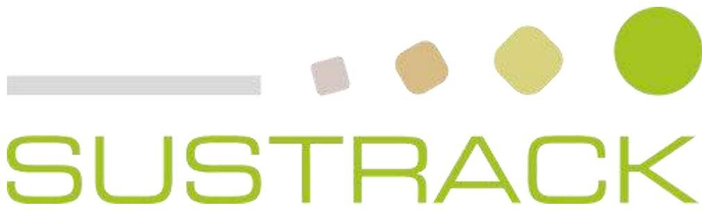

## **D2.1 - REVIEW OF APPROACHES AND IDENTIFICATION OF RESEARCH GAPS**

#### D2.1 Review of Approaches and Identification of Research Gaps

| Work package     | WP2 Knowledge development to assess the sustainable transition            |
|------------------|---------------------------------------------------------------------------|
| Task             | T2.1 Review of knowledge to monitor and assess the benefits of the        |
| Due date         | 31/08/2023                                                                |
| Submission date  | 31/08/2023                                                                |
| Deliverable lead | Tecnalia                                                                  |
| Version          | V03                                                                       |
| Author           | Marco Bianchi (TECNALIA), Janire Clavel Diaz (TECNALIA), Pierre Menger    |
| Contributors     | Alessandro Cascavilla (UNIT), Diego Malacarne (UNIT), Eleanora Staffieri  |
|                  | (UNIT), Gülşah Yilan ( UNIT), Iris Vural Gursel (WR), Barbara Palacino    |
| Reviewers        | Gülşah Yilan (UNIT), Luana Ladu (BAM), Myrna van Leeuwen (WR), Iris Vural |
|                  | Valentina Vavassori (FVA), Georg Pallaske (KE)                            |

#### **Document Revision History**

| Version | Date       | Description of change     | List of contributor(s) |
|---------|------------|---------------------------|------------------------|
| v01     | 11.08.2023 | Draft version distributed |                        |
| v01.1   | 22.08.2023 | Partners’ input received  | UNIT, CIRCE, WR, BAM   |
| V02     | 28.08.2023 | Second draft version      | TECNALIA               |
| V02.1   | 29.08.2023 | Partners’ input received  | FVA, KE                |
| V03     | 30.08.2023 | Final version             | TECNALIA               |

#### **Abstract**

The transition from linear fossil-based systems to circular and bio-based systems represents an opportunity and a suitable pathway for achieving several SDGs. Indeed, circular bio-based systems depict a great opportunity to reconcile sustainable long-term growth with environmental protection through the prudent use of renewable resources for industrial purposes. This needed transition is a complex process, which does not simply require innovative technologies from the supply-side, but also societal transformations based on a multi-actor process. The circular bioeconomy meta-sector may be a good candidate to put forward a new economic model, which requires transformative policies, purposeful innovation, access to finance, risk-taking capacity as well as new and sustainable business models and markets. However, a critical assessment of the environmental, social and economic impacts of the current linear fossil-based economy, as well as of the improvement potential associated with circular bio-based systems, is needed to underpin the identification of policy priorities. Bearing this in mind, SUSTRACK is a three-year project aimed at supporting policymakers in their efforts to develop sustainable pathways to replace fossil and carbon-intensive systems with sustainable circular and bio-based systems (at the EU and regional scale), contributing to achieving the European Green Deal's objectives. This will be done by: identifying environmental, economic and social limits of a linear carbon-intensive and fossil-based economy; improving existing assessment methodologies; assessing the environmental, social and economic impacts of the EU's current linear fossil-based economy; comparing multiple transition scenarios focusing on the most carbon intensive sectors; identifying priorities according to scenarios analysed in the project and develop guidelines and policy recommendations.

### **Disclaimer**

Funded by the European Union. Views and opinions expressed are however those of the authors only and do not necessarily reflect those of the European Union. Neither the European Union nor the granting authority can be held responsible for them.

**Copyright notice:** © 2022 - 2025 SUSTRACK Consortium

#### D2.1 Review of Approaches and Identification of Research Gaps

|                            | Deliverable information                                                   |
|----------------------------|---------------------------------------------------------------------------|
| Nature of the deliverable: | R Dissemination Level                                                     |
| PU                         | Public, fully open, e.g. web x                                            |
| CL                         | Classified, information as referred to in Commission Decision 2001/844/EC |
| CO                         | Confidential to TETRA project and Commission Services                     |

\* R: Document, report (excluding the periodic and final reports)

DEM: Demonstrator, pilot, prototype, plan designs

DEC: Websites, patents filing, press & media actions, videos, etc.

OTHER: Software, technical diagram, etc.

#### SUSTRACK Consortium:

| #  | Participant Organization Name                    | Short Name | Country |
|----|--------------------------------------------------|------------|---------|
| 1  | UNIVERSITA DEGLI STUDI DI ROMA UNITELMA SAPIENZA | UNIT       | IT      |
| 2  | STICHTING WAGENINGEN RESEARCH                    | WR         | NL      |
| 3  | KNOWLEDGE SRL                                    | KE         | IT      |
| 4  | PEDAL CONSULTING SRO                             | PC         | SK      |
| 5  | DBFZ DEUTSCHES BIOMASSEFORSCHUNGSZENTRUM         |            |         |
|    |                                                  | DBFZ       | DE      |
| 6  | UNIVERSITEIT GENT                                | UGENT      | BE      |
| 7  | FUNDACION TECNALIA RESEARCH & INNOVATION         | TECNALIA   | ES      |
| 8  | FVA SAS DI LOUIS FERRINI & C                     | FVA        | IT      |
| 9  | UNIVERSITA DEGLI STUDI DI FERRARA                | UNIFE      | IT      |
| 10 | BUNDESANSTALT FUER MATERIALFORSCHUNG UND -       |            |         |
|    |                                                  | BAM        | DE      |
| 11 | FUNDACION CIRCE CENTRO DE INVESTIGACION DE       |            |         |
|    |                                                  | CIRCE      | ES      |

# **EXECUTIVE SUMMARY**

The goal of achieving a net-zero emission European economy by 2050 demands a shift from linear, fossil-based systems to circular, bio-based systems. This transition is vital for meeting the United Nations Sustainable Development Goals and reconciling environmental protection with sustainable growth. However, the complexity of the transition relies on societal transformations, cutting-edge technologies, and multi-actor processes, requiring a new societal and economic framework and policy priorities that align with the European Green Deal. In this context, monitoring systems, modelling techniques and data are key tools to support policy making and facilitate a better understanding of the complexity, trade-offs, and potential pathways to achieve a sustainable transition to a circular bioeconomy.

This report presents the results of the work carried out in SUSTRACK Task 2.1. The task focuses on the review of existing knowledge for monitoring and evaluating the transition to circular biobased systems. More than 130 research items, including scientific articles and reports, were consulted to identify major gaps across indicators and approaches generally used to monitor and evaluate the bioeconomy across the three major policy-level analyses: (i) micro-level (products/processes/companies), (ii) meso-level (city/regions) and (iii) macro-level (World, Europe or countries). Furthermore, the literature review also served to initiate the compilation of a database of existing indicators related to the circular bioeconomy, setting the basis for the monitoring framework to be developed in T2.3.

Important gaps and weaknesses emerged in the reviewed literature with regard to social, economic and environmental sustainability assessment of the bioeconomy, and associated data availability. As an example, the indicators identified in the reviewed literature are unequally distributed among the various societal objectives, sub-topics and policy-level applications. In particular, environmental sustainability topics are addressed the most across both product- and territorial-level analyses, followed by economic and social sustainability aspects. However, environmental indicators appear to be in a somewhat less mature state than socioeconomic indicators, which are generally provided regularly in standard statistics. In fact, data for many indicators are often not collected on a regular basis and data quality is a key problem for the estimation of some indicators, especially for the environmental and social dimensions. Another pending key methodological challenge is the well-known "attribution issue". This refers to how to clearly attribute the measurement of the indicators to the production and use of biomass and it represents one of the major limitations to correctly modelling bioeconomy at the meso- and/or macro-level. This report also underlines the need for a more comprehensive assessment of economic sustainability. Common economic indicators are not thought to inform on sustainability issues and a thriving bio-based business model may present trade-offs with other sustainability objectives. In this context, one-way forward to soundly assess bioeconomy might be the integration of externalities through monetisation. These are just a few of the many knowledge gaps examined in this report.

Finally, based on the identified knowledge gaps, the report provides a list of recommendations to advance bioeconomy monitoring and evaluation at the different policy-levels. These recommendations will serve to analyze the case studies in WP3, and a selection of these research gaps will be addressed in T2.2 for further development.

# **TABLE OF CONTENTS**

| 1. Introduction                             |                                                                                                        | 10                                                                             |
|---------------------------------------------|--------------------------------------------------------------------------------------------------------|--------------------------------------------------------------------------------|
| 1.1.                                        | Objective of the report............................................................................11  |                                                                                |
| 1.2                                         | Structure of the report                                                                                | ............................................................................12 |
| 2. Methods                                  |                                                                                                        | 12                                                                             |
| 2.1.                                        | Identification of body of knowledge.............................................................12     |                                                                                |
| 2.2                                         | Analysis of the body of knowledge...............................................................14     |                                                                                |
| 3. Overview of reviewed literature          |                                                                                                        | 15                                                                             |
| 3.1                                         | Preliminary database of indicators for monitoring and evaluating the circular bioeconomy               |                                                                                |
| 4. Knowledge gaps                           |                                                                                                        | 20                                                                             |
| 4.1                                         | Macro-level applications (World, EU, countries)...............................................20       |                                                                                |
| 4.1.1                                       | EU monitoring framework and SDGs                                                                       | ..........................................................23                   |
| 4.1.2                                       | Indicators .........................................................................................25 |                                                                                |
| 4.1.3                                       | Modelling approaches                                                                                   | ...........................................................................28  |
| 4.1.4 Gaps and recommendations to take away |                                                                                                        | ....................................................33                         |
| 4.2                                         | Meso-level applications (cities, regions)........................................................36    |                                                                                |
| 4.2.1                                       | Gaps and recommendations to take away                                                                  | ...................................................39                          |
| 4.3                                         | Micro-level applications (products, companies)                                                         | ...............................................41                              |
| 4.3.1                                       | Gaps and recommendations to take away                                                                  | ...................................................46                          |
| 5. Conclusions                              |                                                                                                        | 48                                                                             |
| References                                  |                                                                                                        | 50                                                                             |

## **LIST OF FIGURES**

| Figure 1: Overview of how the output of T2.1 relates to other tasks in the SUSTRACK project                         | .11                                                                            |
|---------------------------------------------------------------------------------------------------------------------|--------------------------------------------------------------------------------|
| Figure 2: Literature review methodology                                                                             | .................................................................13            |
| Figure 3: Number of papers by SA1: Knowledge type                                                                   | ...................................................16                          |
| Figure 4: Number of papers by SA2: Policy level application                                                         | ..........................................16                                   |
| Figure 5: Type of approaches most used across the identified papers                                                 | ...............................17                                              |
| policy level applications (right)                                                                                   | ............................................................................18 |
| Figure 7: SA5 Geographical distribution and number of bioeconomy-related assessments                                | .......18                                                                      |
| Figure 10: Overview of countries more often addressed by bioeconomy research                                        | ..................21                                                           |
| applications ....................................................................................................22 |                                                                                |
| societal objective .............................................................................................25  |                                                                                |
| societal objective and by sustainability pillar                                                                     | ............................................................26                 |
| sub-topics under the societal objectives                                                                            | ..................................................................27           |
| applications ....................................................................................................37 |                                                                                |
| applications ....................................................................................................41 |                                                                                |

[Figure 21 Number of indicators to monitor and evaluate the bioeconomy at product level by sub](#page-42-0)topics under the societal objectives [.......................................................................43](#page-42-0)

## **LIST OF TABLES**

| Table 1: Literature evaluation grid.....                                                             | 14 |
|------------------------------------------------------------------------------------------------------|----|
| Table 2: Recommendations to advance bioeconomy monitoring and assessment at the country level        | 35 |
| Table 3: Recommendations to advance bioeconomy monitoring and assessment at city-regional level..... | 40 |
| Table 4: Recommendations to advance bioeconomy monitoring and assessment at product level            | 48 |

|                      | List of Abbreviations          |
|----------------------|--------------------------------|
| Abbreviation/Acronym | Description                    |
| ABM                  | Agent-Based Modelling          |
| BioMAT               | Bio-based Material model       |
| EC                   | Environmental Commission       |
| EU                   | European Union                 |
| CE                   | Circular Economy               |
| CGE                  | Computable General Equilibrium |
| GEM                  | General Equilibrium Modelling  |
| IAT                  | Integrated Assessment Tool     |
| IO                   | Input-Output                   |
| LCA                  | Life Cycle Assessment          |
| MCDA                 | Multicriteria Decision Analyis |
| MCI                  | Material Circularity Indicator |
| MFA                  | Material Flow Accounting       |
| MRIO                 | Multi Regional Input Output    |
| NA                   | No available                   |
| PCA                  | Principal Component Analysis   |
| PEM                  | Partial Equilibrium Modelling  |
| SA                   | Subject Area                   |
| SAM                  | Social Accounting Matrix       |
| SD                   | System Dynamic                 |
| SDG                  | Sustainable Development Goal   |
| SO                   | Societal Objective             |
| TEA                  | Techno-Economic Assessment     |
| WP                   | Work package                   |

# **1. INTRODUCTION**

The bioeconomy represents an important opportunity for achieving sustainable development and for addressing the climate and biodiversity crises resulting from overconsumption as well as the overdependence on non-renewable fossil-based resources (European Commission, 2018). Although many definitions and narratives exist, sometimes even conflicting ones, the bioeconomy is generally considered as the set of all those activities related to the use of biological resources. This also implies the use of biological resources in place of resources and materials of fossil origin to produce energy, food, feed, fibre and other manufactured goods, as well as the application of biological processes to the production of goods (Pika et al., 2022). While earlier definitions focused more narrowly on resource substitution, bioenergy, and biotechnology, the scope of bioeconomy is now broadening. It now also includes sustainability and circularity to meet the United Nations Sustainable Development Goals (Calicioglu & Bogdanski, 2021), as well as the objectives of the EU's Green Deal (Dolge et al., 2022), including reducing emissions and creating jobs and growth, and the Paris Agreement objective of having net-zero emissions European economy by 2050.

While the wise use of renewable biological resources has the potential to achieve the goals of sustainable development and environmental protection, the expansion of bio-based circular systems is not without environmental or social risks and faces physical limitations and trade-offs among sustainability spheres (Bracco et al., 2019; Heimann, 2019). For example, while a change in land use to a more productive use might improve a country's wealth, especially in developing countries, it might also deteriorate ecosystem services, and in particular increase biodiversity loss. Another well-known risk is related to the increase in basic food prices due to the restriction of land for edible crops in favour of biological stocks for energy supply. Other trade-offs may relate to agricultural productivity versus employment or agricultural productivity versus soil quality. Therefore, it is evident that, while this transition represents an important opportunity to make our economic system more sustainable, inclusive, and resilient, it is also highly complex as it requires radical structural changes. Production needs to re-organize value creation networks, while consumers must develop and change to new and more sustainable lifestyles. The economic structures on the supply side as well as the economic behaviour on the demand side fundamentally change and mutually influence each other, which is why a more systematic approach for assessing costs and benefits is recommended.

In this context, monitoring systems, modelling techniques and data availability are important tools to support policy making and facilitate a better understanding of the complexity, trade-offs, and potential pathways to achieve a sustainable transition to a bioeconomy (Kardung et al., 2021; Robert et al., 2020). Not surprisingly, these aspects have also been the subject of past European projects, in particular, SAT-BBE1 (2015) first, and Biomonitor2 (2022) afterwards, as well as, among others, the FAO initiative "Indicators to monitor and evaluate the sustainability of bioeconomy: overview and a proposed way forward" (Bracco et al., 2019). To a great extent, all these past efforts have been geared towards improving comprehensive and robust frameworks to monitor and evaluate the transition to the bioeconomy at different policy levels, to ensure science-based policy development. This report, while it collects the legacy left by these past initiatives, aims at updating the state-of-the-art in monitoring and evaluating the bioeconomy, hence it provides an agenda for future research.

1 https://cordis.europa.eu/project/id/311880

https://biomonitor.eu/

## **1.1. Objective of the report**

The objective of this report is to review existing knowledge for monitoring and assessing the transition towards circular bio-based systems, meaning by "knowledge" the set of indicators, data sources, methods and models used in current practices. Particular attention is given to understanding the availability of these tools at the various decision-making levels, i.e., at the macro-level (industries or sectors) of countries, at the meso-level (industries or sectors) of regions or cities and the micro-level of products.

The goals of this review are threefold:

- 1. To inform T3.2 concerning the knowledge available and relevant to the case studies. Specifically, a set of tailored indicators will be provided to each case study to test their applicability and consistency.
- 2. To identify research gaps (in terms of indicators, data sources, methods, and models) at different policy-making levels (country, city/regions, products). A selection of identified research gaps will be addressed in T2.2, in combination with case study assessments in WP3.
- 3. To create the basis for a "knowledge inventory", which will be completed and operationalised in T2.3 to develop an ad-hoc framework to monitor and assess the transition to a bioeconomy.

Figure 1 shows, in a schematic way, how the outputs of T2.1 are expected to contribute to other tasks within the SUSTRACK project, in particular, T2.2 and T2.3 under the same work package (WP), and tasks 3.2, 3.3, 3.4, under WP 3. The knowledge gaps and recommendations provided in this report should serve as a starting point for deciding which "knowledge issue" to prioritise in T2.2 and, hence, support the analysis of case studies in T3.3. Similarly, this task will develop a preliminary database of indicators for bioeconomy monitoring and evaluation that will be tested (in T3.2) and further developed in T2.2 in combination with the case study analysis (in T3.3). This will set the basis for the development of an ad-hoc monitoring framework (T2.3).

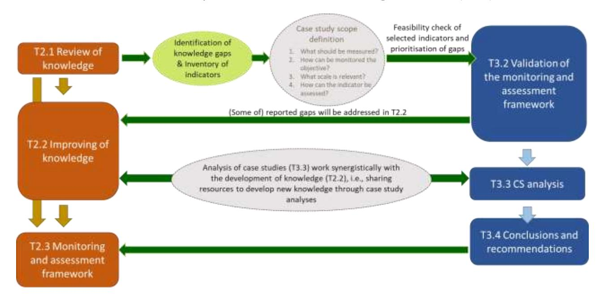

*Figure 1: Overview of how the output of T2.1 relates to other tasks in the SUSTRACK project*

## **1.2 Structure of the report**

The remainder of this report is structured as follows: Chapter 2 presents the methodological approach used to review and update the state-of-art of circular bioeconomy monitoring and evaluation; Chapter 3 presents an overview of the identified body of knowledge, in terms of e.g., type of applications, geographical coverage, number and type of indicators. Chapter 4 presents the knowledge gaps identified through the literature review, organised by micro-, meso- and macro-level applications. Finally, Chapter 5 closes the report by summarising the main findings and explaining the next steps within the SUSTRACK project.

# **2. METHODS**

## **2.1. Identification of body of knowledge**

A literature review has been carried out to identify the relevant body of knowledge.

On the one hand, a systematic review was carried out first for the "white" literature. In this context, the SCOPUS database was used with the following combination of keywords ("bioeconomy" AND ("measur\* OR assess\* OR monitor \*)). To limit the number of results to a manageable size it was agreed to:

- Search for bioeconomy only within the SCOPUS filters by title and by keywords. This was justified by the interest of finding articles whose subject was mainly focused on the bioeconomy. The search scope of the keyword's measurement, assessment and monitoring was left open to titles, keywords and abstracts.
- Limit the geographical scope to European countries.
- Limit the timeframe to 2019-2022. This last constraint was applied to take stock of previous similar projects and carry out incremental work, thus avoiding replicating past analyses or generating further frameworks. In this sense, we have identified projects such as Biomonitor (2022) and SAT-BBE (2015) that have already analysed the existing literature before 2019 with a very similar goal to that of this task3 .

This query returned 457 documents. Subsequently, a first screening was carried out by checking the titles and abstracts. As a result, 84 articles were selected for in-depth review. In addition to these, 25 articles were also identified during the review by cross-references. Hence, the total number of scientific articles reviewed is 109.

On the other hand, based on the consortium knowledge, 35 items of grey literature were identified. These include reports from past projects, policy briefs, white papers, and technical reports from institutions like FAO, JRC, OECD, and EEA among others. The full list of articles and reports is available in the Excel file provided as Annex. Figure 2 summarises the literature review approach.

3 BioMonitor project (Monitoring & measuring the bioeconomy) addressed the information gaps in bioeconomy research by reviewing existing data and modelling frameworks and providing a framework to monitor and measure the bioeconomy and its various impacts.

#### D2.1 Review of Approaches and Identification of Research Gaps

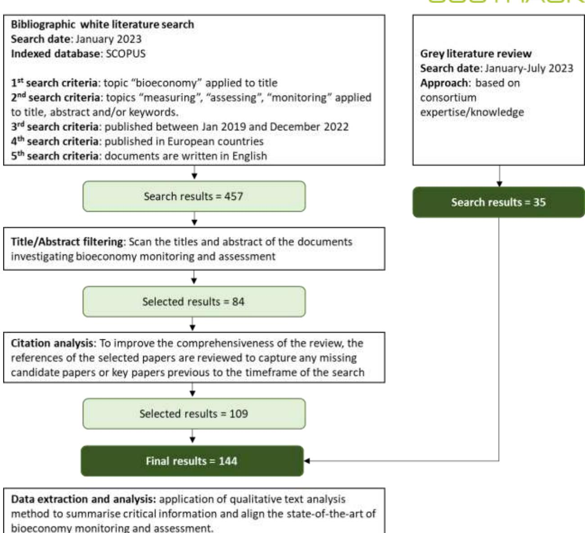

**Grey literature review**  
**Search date:** January-July 2023  
**Approach:** based on consortium expertise/knowledge

**Data extraction and analysis:** application of qualitative text analysis method to summarise critical information and align the state-of-the-art of bioeconomy monitoring and assessment.

*Figure 2: Literature review methodology*

## **2.2 Analysis of the body of knowledge**

The selected body of knowledge was analysed through a spreadsheet-based evaluation grid. This is shown in [Table 1](#page-13-1) and described below.

*Table 1: Literature evaluation grid*

| SA CLASSIFICATION                        |  |  | KNOWLEDGE CONTRIBUTIONS |  | KNOWLEDGE GAPS/RECOMMENDATIONS |  |
|------------------------------------------|--|--|-------------------------|--|--------------------------------|--|
| SA1: Knowledge type                      |  |  |                         |  |                                |  |
| SA2: Policy level application            |  |  |                         |  |                                |  |
| SA3: Linked strategies/frameworks        |  |  |                         |  |                                |  |
| SA4: Adoption of value-chain perspective |  |  |                         |  |                                |  |
| SA5: Geography                           |  |  |                         |  |                                |  |
| SA6: Sustainability Pillar               |  |  |                         |  |                                |  |
| SA7: Approach                            |  |  |                         |  |                                |  |
|                                          |  |  | Monitoring framework    |  |                                |  |
|                                          |  |  | Indicators/Data         |  |                                |  |
|                                          |  |  | Method/models           |  |                                |  |
|                                          |  |  |                         |  |                                |  |
|                                          |  |  |                         |  |                                |  |

First, each article was classified according to key Subject Areas (SA). This approach allowed us to provide a general overview of most addressed research topics, countries, methods or sustainability dimensions – see Chapter 3.

Thematic SA (SA) and list of options (o), along with the relative rationale of selection, are:

- SA1: Knowledge type: o SA1o1: Monitoring framework: This SA was selected if the main object of the paper was to develop/review/test a set of indicators to monitor the key strategic areas related to the bioeconomy. o SA1o2: New indicators/data sources: This SA was selected if the main object of the paper was to i) develop/use new indicator(s), ii) generate new data source for key indicators (i.e., theoretical potential of residual biomass) or iii) use innovative data sources (e.g., IoT or Copernicus data) to provide new indicators. o SA1o3: Method/Model assessment: This SA was selected if the main object of the paper was to analyse/inform on the bioeconomy transition through some method/modelling approach. This includes the estimation of environmental, economic, and societal impacts. Differently from SA1o2, whose focus is mainly on the development of indicator(s), the SA1o3 focuses on the use of modelling tools and methods (e.g., partial equilibrium, LCA, system dynamic etc.) to analyse bioeconomy transitions. Hence, in general, this includes integrated use of data sources and indicators and informs on a broad variety of impact categories, including societal, environmental, and economic impacts.
- SA2: Policy level application: o SA2o1: Macro: the object of the article is mainly relevant for national or supranational policy making, e.g., monitoring framework at country level, or biomass analysis at EU-aggregated or global level. o SA2o2: Meso: the object of the article is mainly relevant for sub-national (local) policy making, e.g., monitoring framework at city/regional level, or biomass analysis at regional/regional level. o SA2o3: Micro: the object of the article is mainly focusing on product/company analysis (e.g., product LCSA).

- SA3: Adoption of value-chain approach: This SA was selected if the article made explicit reference, among the "objectives", to use a value-chain perspective.
- SA4: Links across policy-level applications: This SA was selected if the article made connections or cointegrated different policy-level applications. As an example, the upscaling of product-based LCA information to estimate the regional/country impact of value chains, or contrariwise, the use of information at the country level to generate local indicators.
- SA5: Geography: This SA refers to the country where the analysis is conducted. Note that SA's "Geography(2)" was also provided to further specify the area whenever the assessment is at a sub-national scale.
- SA6: Sustainability pillar: This SA specifies the sustainability dimension addressed in the analysis. The sustainability dimension may refer to the environment, economy, society, circularity, or a combination of them.
- SA7: Approach: This SA specifies, whenever possible, the type of approach used in the research.

Next to the SA classification, we also foreseen specific fields to indicate both, (i) research contributions, and (ii) identified gaps and/or recommendations. (i) and (ii) were organised according to the SA1 knowledge types, i.e., monitoring framework, new indicators/data, or method/models. Differently from SA1-SA7, information regarding "contributions and gaps" was provided as excerpts of the article reviewed or as the reviewer's own elaborations. These inputs were later used to dig deeper into current knowledge gaps across the different application levels (Chapter 4).

# **3. OVERVIEW OF REVIEWED LITERATURE**

This chapter presents a general overview of the frequency of thematic Subject Areas (SA) addressed in the identified body of knowledge. First, Figure 3 indicates that there is a significant prevalence among scholars towards the use of modelling approaches to assess and inform on the bioeconomy transition (59%). This is followed by efforts towards the definition of monitoring schemes (23%) and the provision of new indicators and/or data (18%). Similarly, if we consider the SA of policy-level application (Figure 4), we can see that most bioeconomy research is conducted on the macro-level, including global or EU-aggregated assessments, or country-specific (68%). 21%

of identified papers addressed the meso-level, while only 11% of the papers were focused on the product or company level.

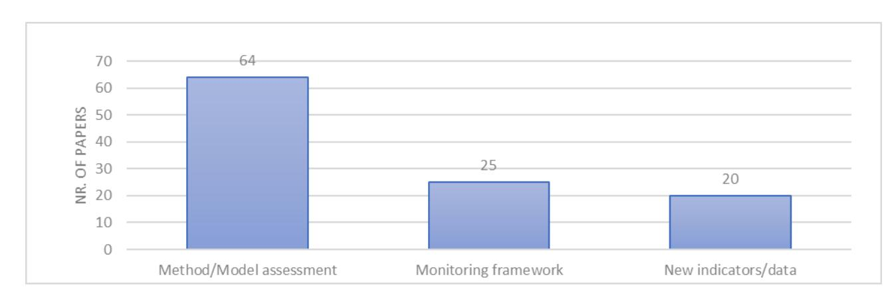

*Figure 3: Number of papers by SA1: Knowledge type*

*Figure 4: Number of papers by SA2: Policy level application*

Figure 5 presents an overview of the most used approaches across the identified papers. Several articles are more conceptual in nature, building on the review of previous research to advance bioeconomy knowledge. LCA seems the methodological approach/framework mainly used in absolute terms. Also, we found that its use is rather balanced across the policy application levels, whereas, when considering only micro-level applications, LCA is by far the approach most rated (see Chapter 4.3, Micro-level applications for further details). Other approaches often used refer to input-output tables, above all for macro-level analyses, composite index creation, and equilibrium modelling.

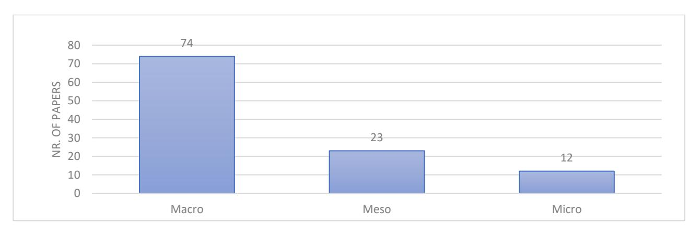

*Figure 5: Type of approaches most used across the identified papers*

Figure 6 indicates, on the left side, the up-take of the value-chain concept within current bioeconomy research, while, on the right side, the number of articles exploiting synergies among policy application levels. These may refer to bottom-up approaches exploiting product data to estimate territory impacts, or, to the contrary, top-down approaches tailoring macro-modelling results to local areas. According to the review's results, most of the scientific papers consider the value-chain concept when modelling the bioeconomy. This is especially true for macro and micro applications, since some of the most used approaches at these scales (e.g., IO or LCA) consider, by default, the interactions along the value chain. Regarding the connection among different scales, we highlight the dearth of studies at the micro-level that connect to higher, territorial, levels. On the other hand, the connection between the meso- and macro-level seems more established. In this context, the data flow direction is generally top-down, i.e., the information available at the national level is exploited to support regional assessments. As an example, we can find applications testing national monitoring schemes in regional areas or applications combining macro-modelling with local data to estimate local indicators such as potential residual crops.

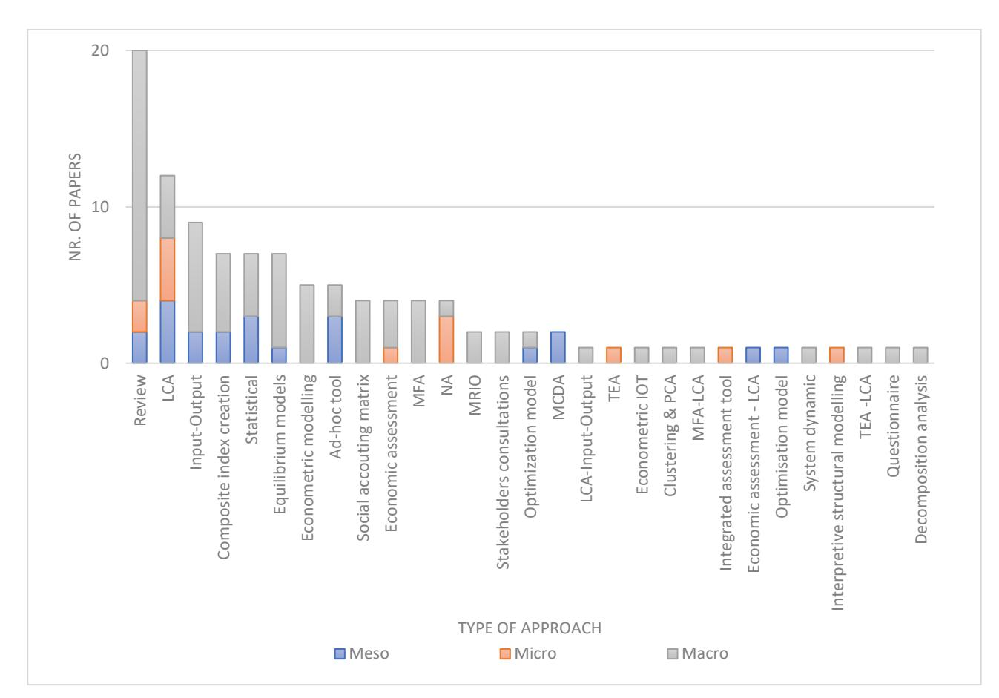

*Figure 6: Number of papers by SA4: Adoption of value-chain approach (left) & by SA5: Links across policy level applications (right)*

Finally, Figure 7 shows the European countries addressed by the identified body of knowledge. In most of the cases, the macro-level is the policy application used. This refers to, e.g., the use of national IO or equilibrium modelling to estimate the socioeconomic impact of bioeconomy, the definition of a national monitoring scheme of indicators, or sectoral analyses – this is the case, in particular, for the forestry sector. In a few cases, the applications zoom into the meso-level of regions (NUTS 2 or NUTS 3). Only one case was found focusing on the city level (further details are provided in Chapter 4.2, Meso-level applications). It should also be noted that the map in Figure 7 excludes cross-country analyses at the European level since these would equally affect all countries.

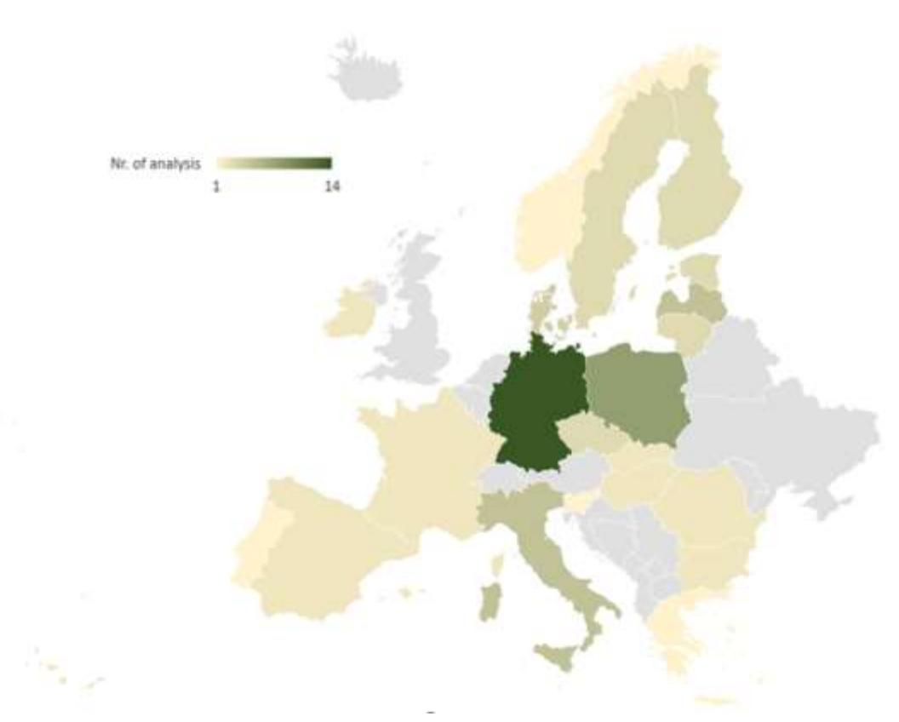

*Figure 7: SA5 Geographical distribution and number of bioeconomy-related assessments*

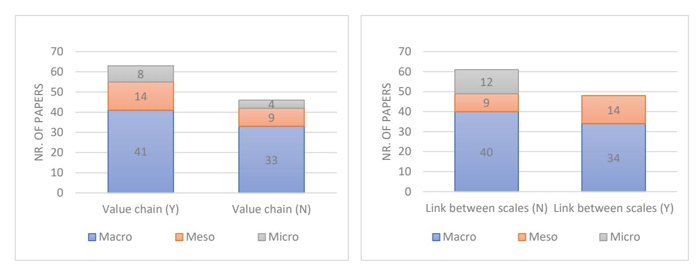

## **3.1 Preliminary database of indicators for monitoring and evaluating the circular bioeconomy**

The literature review conducted in T2.1 also served to start compiling a database of circular bioeconomy-related indicators, which will be tested and further expanded in T3.2 and T3.3 through case studies analysis. The resulting scheme of indicators will be operationalised in T2.3 to build *ad-hoc* monitoring frameworks suited to policy-making needs (Figure 8).

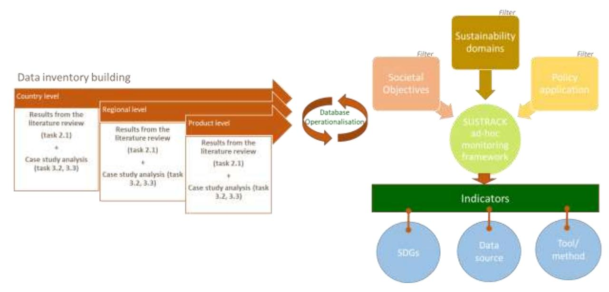

*Figure 8: Data inventory building and its operationalisation towards the monitoring framework*

Figure 9 shows the number of indicators identified across the sustainability pillars, i.e., informing on environment, economy, or society contributions. Circularity has also been included as a further key area to better understand to what extent a circular bioeconomy is intended to be addressed. This will also facilitate the identification of specific indicators informing on biomass circularity. The scope of the indicators, for example, whether they are used at a territorial (e.g., sectors) or product level is also specified. According to these *preliminary* results4 , we identified more than 300 indicators. The number of indicators available at product level is much higher than those existing for territorial analysis (213 vs. 90). This is due to the type of analysis used. In fact, the use of LCA at the product level, by default, provides information, thanks to standardized and mature impact methods, on a very large number of indicators starting from the product data. This is obviously not possible at the territorial level where the dynamics are much more complex. Indicators informing on environmental issues, both at the product and territory level, represent the largest category (176). It follows indicators informing on social issues (81), and indicators informing on economic aspects (37). Further information on specific thematic areas addressed by the indicators is provided in the following chapters according to the policy application level (micro-, meso- or macro-applications).

4 The list of indicators and their classification is considered a preliminary result under T2.1 as it could be subject to future modifications during the next tasks of WP2. On the one hand, additional indicators might be further included based on the case-study analyses; on the other hand, the classification of indicators across sustainability pillars, sub-topics and policy level could be subject to revision.

This list of indicators will be further developed in the next SUSTRACK activities (T2.3) with the aim of providing an operational database that policymakers can consult to retrieve tailored indicators and monitoring frameworks on a case-by-case basis. In this line, the indicators will also be evaluated by means of selected criteria (e.g., using the RACER methodology or similar).

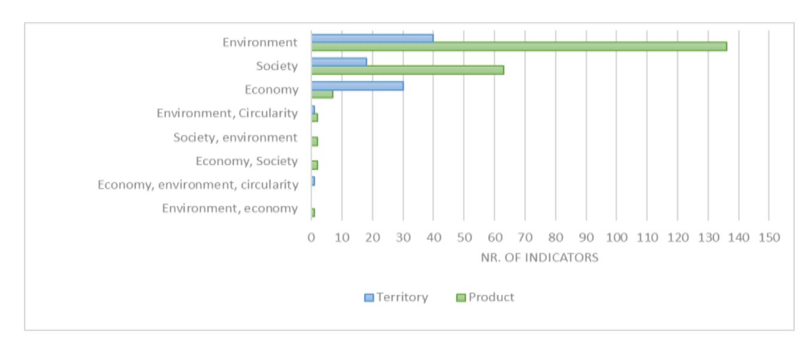

*Figure 9: Number of indicators identified across sustainable pillars and type of policy application*

# **4. KNOWLEDGE GAPS**

## **4.1 Macro-level applications (World, EU, countries)**

With 46 out of 144 articles, macro-level applications are the most frequently conducted. Indeed, thanks in part to recent EU efforts to equip European countries with a bioeconomy monitoring framework and harmonized database5 , country-level assessments benefit from a rather advanced knowledge base when compared to their counterparts at the product or city/regional level, in terms of both, data and modelling approaches. Figure 10 shows that most of these studies are conducted transversally across EU member states. As an example, we can find comparative analyses focusing on a specific set of indicators (e.g., socioeconomic) to evaluate the transition of EU countries towards a bioeconomy (Cingiz et al., 2021; Ronzon & M'Barek, 2018), or, similarly, on the development of composite indicators to assess the bioeconomy performance of EU countries (D'Adamo et al., 2020; Dolge et al., 2023; Zihare et al., 2021). Differently, a review of existing data and indicators available across EU member states was carried out by Egenolf & Bringezu (2019), Grădinaru & Matei (2022), Kardung et al., (2021) and Marcone et al., (2022) to advance bioeconomy monitoring schemes. When it comes to country-focused analyses, we found Germany to be the top-rated country with 8 articles. This is not surprising as Germany, in addition to having the largest manufacturing sector in Europe, is also the EU country with the highest consumption of biomass – about 250 million tonnes in 2021 (EUROSTAT). Then follow Poland and Spain.

5 See e.g., https://datam.jrc.ec.europa.eu/datam/

*Figure 10: Overview of countries more often addressed by bioeconomy research*

Figure 11 provides an overview of the sustainability dimensions primarily addressed by bioeconomy research at the country level. It can be noted that different from the product level, country-level applications are mainly focused on socioeconomic aspects, including employment and/or added value creation of industries or sectors, and/or GDP contribution of the bioeconomy to the entire regional economy. This is also in line with the findings of Bracco et al. (2019), Christensen et al. (2022) and Kardung et al. (2021). It follows analyses that focus on the development of integrated assessment tools (IATs) or composite indexes, which aim at considering and integrating the social, environmental, and economic aspects of sustainability. In this context, the availability of data/indicators covering environmental or social dimensions is, in general, somehow limited compared to socioeconomic data6 , indicating a general lack of official statistics that inform on the environmental and social aspects related to the bioeconomy.

Figure 12 presents an overview of the approaches used to monitor and evaluate the bioeconomy at the country level, detailing when a value-chain perspective is used or when synergies between different application levels are exploited.

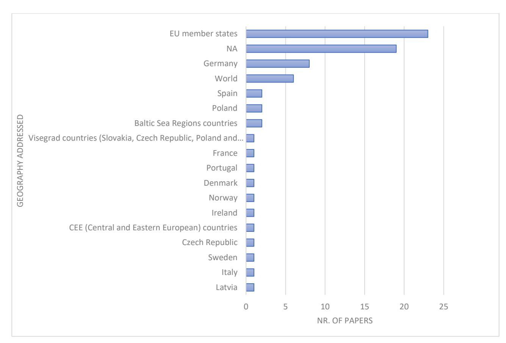

6 In this report we mean by "socioeconomic" all the data/indicators at the crossroad between society and economy such as employment, GDP, added value etc, while we refer to only "social" for those data/indicators informing on social issues such as inequality, inclusiveness, health etc.

Figure 11: Sustainability dimensions addressed by bioeconomy research across macro-level applications

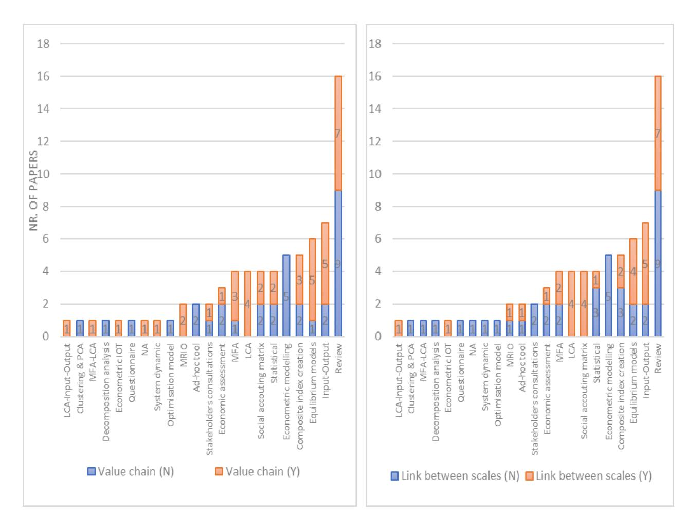

*Figure 12: Country applications: An overview of the general approach, use of value-chain concept (left) and synergies among application levels (right)*

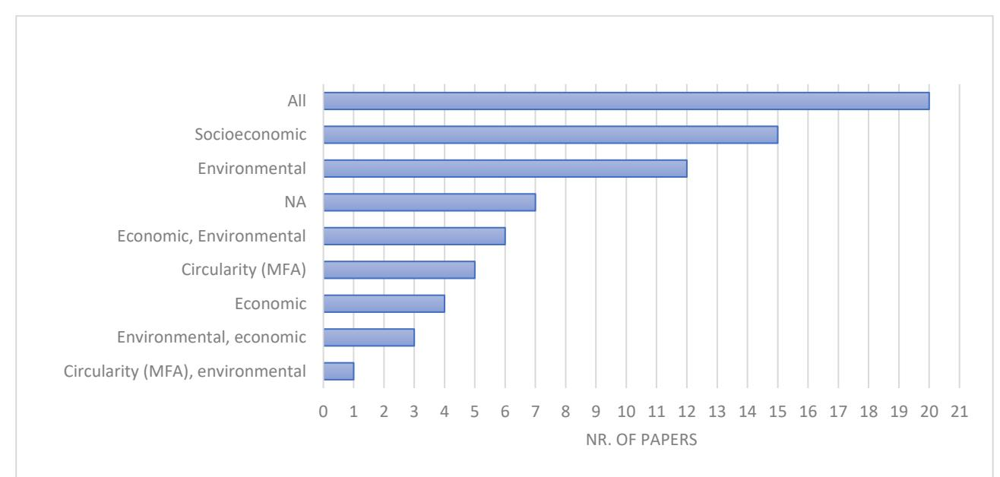

A significant number of articles focused on reviewing the status and needs related to bioeconomy monitoring and evaluation at the country level. In particular, we highlight Bracco et al. (2019) and Kardung et al. (2021) who review the existing indicators for evaluating and monitoring the bioeconomy; Robert et al. (2020) who explain the conceptual framework which is based on the current monitoring framework of the EU bioeconomy strategy; Christensen et al. (2022) and Pyka et al. (2022) who reviewed current models and modelling efforts at macro-level to realise the EU bioeconomy; Egenolf & Bringezu (2019) and Liobikiene et al. (2019) who propose comprehensive frameworks for the evaluation of the sustainability of the bioeconomy, considering key objectives and relevant criteria for environmental, economic, and social sustainability, and finally Heimann (2019), Ronzon & Sanjuán (2020) and Zeug et al. (2019), who relates bioeconomy aims with SDGs in an effort to better understand how a systemic shift to a bio-based resource can contribute to or hinder the achievement of SDGs.

## **4.1.1EU monitoring framework and SDGs**

The EU Bioeconomy Strategy, updated in 2018, in its Action Plan, 7 pledges an EU-wide, internationally coherent monitoring system to track economic, environmental and social progress towards a sustainable bioeconomy. The monitoring framework, which builds on i) the experiences of existing indicator frameworks; ii) stakeholder knowledge and expectations; and iii) national experiences and expertise, aims at evaluating the bioeconomy from three perspectives: 1) primary sectors (sectoral knowledge); 2) bioeconomy value chains and 3) three sustainability pillars. These three perspectives are considered across the 5 societal objectives of the EU Bioeconomy strategy and a set of normative criteria for each objective are used to understand the compliance with societal objectives. Finally, SDGs are also linked to each normative criterion and societal objective (Figure 13).

The monitoring framework represents a key milestone along the trajectory of the EU bioeconomy strategy as it fosters coherence with other bioeconomy-related European monitoring frameworks and consistency with national and international initiatives to monitor the bioeconomy. However, as the authors mentioned, it has been mainly considered and tested on a national basis. Likewise, the indicators provided are mainly referring to the country scale. Hence, while it certainly represents a key tool supporting decision-making, further efforts should be oriented at testing and better tailoring the existing framework to local policy-making areas (Marcone et al., 2022). This would include, e.g., proposals on bioeconomy monitoring schemes at sub-national levels taking stock of available data at these lower territorial scales.

The identification of potential trade-offs and/or synergies between sustainability objectives is also one of the main objectives pursued by the monitoring system, testifying to the importance that this issue has among the scientific community (Bracco et al., 2019; Heimann, 2019; Robert et al., 2020; Többen et al., 2022). However, the monitoring framework only mentions the normative criteria and how this would support specific sustainable development objectives. In this context, further progress on how to explicitly visualise the trade-off and/or synergies between bioeconomy stakes would certainly support the decision-making process. This visualisation would also help exante analysis to better understand potential hot spots of bioeconomy transition, including areas with high potential for developing bioeconomic structures and areas at risk of losing a lot of biodiversity in case of a transition.

7 https://data.europa.eu/doi/10.2777/79401

•Food security and nutrition supported •Sustainable trade of biomass for food uses is promoted

1. Ensuring food and nutrition security

> SDGs: 1,2,10,17,15

> > •Ecosystem condition and biodiversity are maintained or enhanced •Primary production sectors are manged sustainably •Ecosystem services contribution to human well-being is maintained or enhanced without deteriorating ecosystem conditions or biodiversity

SDGs: 2, 6, 13, 14, 15

> •Resource efficiency, waste prevention and waste re-use along the whole bioeconomy value chain are improved •Food loss and waste are prevented or minimised and, when unavoidable, its biomass is reused or recycled •Sustainable production and consumption of biomass and biobased products are promoted •Consumption patterns of bioeconomy goods match sustainable supply levels of biomass •Bioeconomy should promote sustainable trade of biomass for non-food uses •Sustainability of urban centres is enhanced

3. Reducing dependence on non-renewable

SDGs:

1, 2, 6, 7, 8, 10, 11, 12, 15, 17

> •Climate change mitigation and adaptation are pursued •The sustainability of urban centres is enhanced

- 4. Mitigating and adapting to climate change SDGs: 11, 13

•Economic development is fostered •Inclusive economic growth is strengthened •Resilience of the rural, coastal and urban economy is enhanced •Existing knowledge is adequately valued and proven sound technologies are fostered •Knowledge generation and innovation are promoted •Demand and supply-side market mechanisms of food and nonfood goods are enhanced

5. Strengthening European competitiveness and creating jobs SDGs: 4, 8, 9, 11, 12, 14

## **4.1.2Indicators**

Within the scope of the Biomonitor project, Kardung et al. (2021) reviewed the existing indicators available at the territorial level to monitor and evaluate the bioeconomy. The indicators were linked to the 5 Societal Objectives (SO) of the EU bioeconomy strategy (Figure 13) and classified across main and sub-indicators. The availability of data on proposed indicators is generally limited to the national level. Among the indicators provided, 13 indicators out of 69 do not present available data, hence are not feasible to estimate as of today due to the lack of regular public statistics. These refer to indicators monitoring (i) "food and nutrition security" which are: food quality, income per worker in the bio-based industry, improved food nutrition by better packaging; (ii) "biodiversity": agrobiodiversity, aquatic biodiversity; (iii) "dependence on non-renewable resources": cascaded use of biomass, certified bio-based products; and (iv) "Employment and economic competitiveness": innovation hurdle for different industries, IoT in bioeconomy, turnover of bioeconomy subsectors, valued added of bioeconomy subsectors, policy-induced investment hurdles.

The full list of indicators identified in the Biomonitor project has been considered within SUSTRACK T2.1 as the starting point to develop a comprehensive indicators database for countrylevel monitoring and evaluation. Afterwards, the list has been enriched by including additional indicators identified through the literature review conducted in T2.1. The current indicator database is provided in the Excel annex. A total of 90 territorial-level indicators have been identified. In line with the approach used in Kardung et al. (2021), the indicators have been classified by SOs and sub-topics. We found that currently the number of indicators is unevenly distributed across the SOs (Figure 14); dependence on non-renewable resources is the SO with the highest number of indicators (24), followed by sustainable natural resource management (23 indicators), employment and economic competitiveness (22 indicators), food nutrition and security (14 indicators) and mitigating and adapting to climate change (7 indicators).

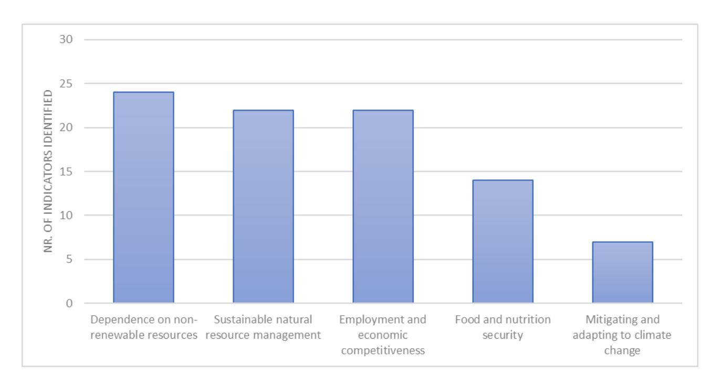

*Figure 14: Number of indicators to monitor and evaluate the bioeconomy at the country level by societal objective*

However, as explained above, the high number of indicators addressing an SO does not necessarily indicate that the SO is well covered, as many of these indicators can be still in the proposal stage or under development (Kardung et al., 2021). As an example, this refers to indicators such as income per worker in bio-based industries, which is affected by the attribution issue (see below for further details), agrobiodiversity or aquatic biodiversity (for which, at the moment, no data is available), or the Maximum Incremental Social Tolerable Irreversible Costs as a measure for resilience or the Reversible and Irreversible Benefits and Costs, which are indicators under development.

Notwithstanding specific exceptions for some indicators, we compiled a comprehensive list of indicators generally available at the country level that are also balanced across the sustainability pillars. Figure 15 shows the number of indicators available for each SO and specifies the sustainability dimensions addressed. In this sense, the highest number of indicators is available for the measurement of the environmental pillar within SO II "sustainable natural resource management"; it follows the economic pillar within SO V "employment and economic competitiveness" and, again, the environmental pillar with SO III "Dependence on non-renewable resources". The social pillar, on the other hand, is the sustainability dimension less represented, as fewer social indicators have been identified and only for SO I and SO V.

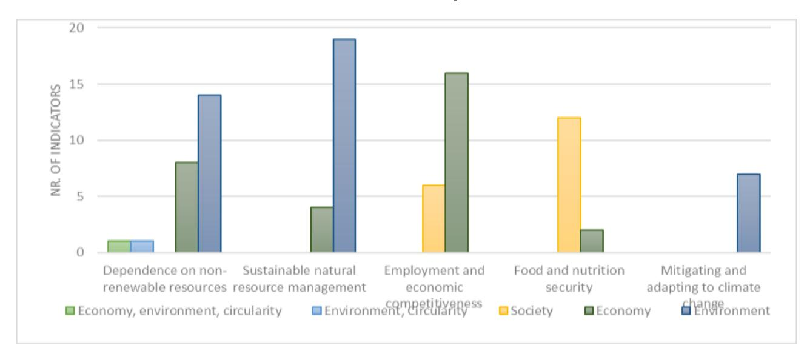

*Figure 15: Number of indicators to monitor and evaluate the bioeconomy at the country level by societal objective and by sustainability pillar*

Figure 16 provides a granular overview of the sub-topic under the SO addressed by existing indicators. Material use efficiency and availability of food are the sub-topics for which exist a larger number of indicators. As an example, the material use efficiency sub-topic includes material and (municipal) waste recycling and recovery rates, material circularity indicator (MCI), cascaded use of biomass and material productivity among others. Similarly, the availability of food subtopics includes domestic food production, food imports or food quality. Contrariwise, the subtopics underrepresented by a number of indicators are indirect land use change (iLUC) and import and export of bioeconomy raw materials and products. It should be noted that while these figures may give some hints on current research gaps, they only represent the number of available (or potential) indicators that can be used to monitor/evaluate specific sub-topics of the SO. This not necessarily means that a low number of indicators reflects a sub-topic poorly represented, as in some cases the sub-topics are very specific (as the case for iLUC); nor it means that a high number of indicators reflects a SO well addressed, as it may be the case that most of indicators are not available on regular basis or are under-development.

## D2.1 Review of Approaches and Identification of Research Gaps

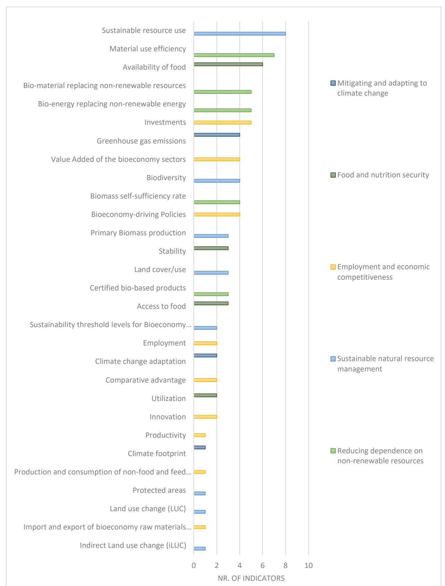

## **4.1.3 Modelling approaches**

In terms of macro-modelling methods, Christensen et al. (2022) and the authors of the deliverable 4.1 of the Biomonitor8 project reviewed more than 30 models, generally based on equilibrium modelling approaches (partial or general equilibrium), to better understand driver and policy impacts on the development of the bioeconomy. They found that many sectors and indicators were not addressed by any bioeconomy-related model. In particular, the major challenge remains to establish whether those bio-based products or processes (e.g. in chemistry or construction) that do not belong to traditional bioeconomy sectors (i.e., agriculture, forestry and aquaculture) have been or can be potentially assessed using existing models. In particular, Christensen et al. (2022) found that most of the models can simulate agricultural and environmental dynamics, followed by energy and forestry. On the contrary, few models focus on the bio-based industries and waste sectors (less than one-fourth of the 30 analysed models). Concerning value chain stages, most models can represent land use and biomass production, but the end-use and, especially, the conversion stage are rarely addressed. In terms of indicators generally used in macro-modelling and linked to the EU SOs, Christensen et al. (2022) found that models appear to have a strong capacity to inform SO I (through food availability and security indicators), followed by SOs III and V, and finally, with the least capacity, SOs II and IV. It is interesting to note that this is true even though the number of indicators to monitor SO II, "sustainable management of natural resource", is very high (see Figure 14 and Figure 15), possibly indicating either a discrepancy between the scope of empirical modelling with the SO II, or the complexity of SO II indicators which makes it difficult to integrate them into models.

Another study that conducted a review of existing modelling approaches to bioeconomy is provided by Pyka et al. (2022). The authors explored how bioeconomy modelling addresses key enabling factors related to (i) climate change, (ii) biodiversity, (iii) circular use of biomass, (iv) consumer behaviour related to biomass and bioproducts use, and (v) innovation and technological change. According to the authors, one of the major gaps in existing bioeconomy models is the limited ability to capture long-term transformation processes, structural change, and the fundamental reorganisation of the value creation and consumption process. Existing models are mostly designed to analyse short-run reallocations in the bioeconomy transition processes and do not consider systemic changes such as innovation disruptions, changing consumer behaviour, positive feedback and increasing returns due to mutual interdependencies. This is also highlighted by Morland & Schier (2020), who used partial equilibrium modelling (PEM) to model bioeconomy scenario pathways for the forest products markets with emerging lignocellulosic products. The authors explain that the PEM is not sensitive to possible structural changes or idiosyncratic shocks in the future, nor it is able to include end-product markets. Scenarios are constructed to primarily describe the past and current state of the world and are based on assumptions of future trends such as population and GDP growth rates. In this context, the use of alternative modelling techniques, such as System Dynamic (SD) Agent-Based Modelling (ABM), could improve and complement existing bioeconomy modelling efforts by allowing for the consideration of e.g. structural changes, carrying capacity of natural systems and systemic transformation of the economic system. Furthermore, both approaches do not assume that a new equilibrium is reached, which improves the approximation of real-world behaviour over other approaches

The following sections will present the research gaps related to monitoring and evaluating the bioeconomy identified across specific empirical assessments.

8 D4.1 Existing models that investigate the bioeconomy, 2021. Biomonitor project. https://biomonitor.eu/

#### *Input-output modelling and social accounting matrixes*

Input-output (IO) modelling is the most common approach employed. The IO approach is useful as a descriptive analysis of the past, and for understanding how sectors are directly and indirectly inter-connected. Thanks to the properties of this tool, the use of the value-chain concept is generally embedded as the IO tables describe the relationships between economic activities within an economy (in monetary terms). As an example, Loizou et al. (2019) used IO tables to explore the linkages of bioeconomy activities with other sectors within the Polish economy and, therefore, to identify those sectors with the highest potential to generate value for the economy. The IO model and its outcomes provide useful information to policymakers, supporting them in defining which of the bio-based sectors have the potential to support the economy more efficiently. However, as the author says, further research is needed to extend this analysis at the regional level, especially for those Polish regions that actively promote bioeconomy in the context of smart specialisation strategies. An IO approach was also used by Cingiz et al. (2021) to measure the share of the bioeconomy, in terms of value-added and income, for EU-28 countries for 2005–2015.

It is worth mentioning that these studies are mainly concentrated on examining the economic dimension of bioeconomy and not the issues related to the environmental sustainability of bioeconomy transition. More comprehensive studies that also consider environmental aspects were instead carried out by Brizga et al. (2019), which evaluated land and water footprint linked to changes in consumption- and production-based bio-resource, and Bringezu et al. (2021), which analysed different models to estimate environmental footprints. In several cases, orthodox IO tables were extended to also include GHG emissions (Asada et al., 2020; Jander, 2022; Lazorcakova et al., 2022; O'Donoghue C. et al., 2019). Bringezu et al. (2021) and Brizga et al. (2019) highlighted the need for appropriate monitoring of the bioeconomy. This implies the evaluation of the sustainability of resource use by considering sustainable threshold levels of bioresource, cropland, and water use consumption/impact. Monitoring schemes should consider both production and consumption perspectives, as well as the global footprints of national economies. Inherent to the limitation of the IO approach, Asada et al. (2020) remark that linearity is assumed regarding input-output relations and output-indicator relations. This implies that potential production constraints are not considered, and substitutions lead neither to new products nor to technological changes elsewhere in the economy. In addition, IO focuses on the changed input flows because of technology change and not on the implementation of new technologies as such. Hence, as also highlighted in Pyka et al. (2022), IO or similar linear approaches might be unable to fully describe the transformative process as a bioeconomy transition since they miss the substitution impacts occurring downstream in the supply chain.

Bringezu et al. (2021), Kardung et al. (2021) and Lazorcakova et al. (2022) also recommend that future research should focus on improving data availability and quality, particularly for global supply chains and indirect impacts of the bioeconomy. Indicators that capture the environmental and socioeconomic impacts of the bioeconomy, such as indicators for land use change, water use, and greenhouse gas emissions are also needed. In this context, a common problem in empirical analysis is the availability of data for products that can be both bio-based and fossil-based as statistics do not provide the required level of detail, and bio-based products are not disaggregated from fossil-based products in the respective classification (the same is true for economic sectors, no distinction between bio-based and fossil-based sectors takes place in statistics). On top of this, different shares of the bioeconomy in the total economy can also be caused by different input data and methodologies used to quantify bioeconomy indicators (including the different scopes of the bioeconomy), rather than the different economic structures that countries might have.

Similar to the integration of environmental impacts through the Environmental-Extended Input-Output (EEIO) tables, we also found the use of the social accounting matrix (SAM) to account for social impacts (Di Cori et al., 2022; Ferreira et al., 2020, 2021; Mainar-Causapé et al., 2021). SAM is a matrix database that compiles economic and social information on every transaction made between agents in an economy over a period, generally one year, and informs on job and wealth creation. Given the relative immaturity of SAMs compared to EEIO, their use and availability for different EU countries is quite limited. A step-by-step methodology to build SAM matrixes for the bioeconomy (so-called BioSAMs) is provided by Mainar-Causapé et al. (2021), while empirical applications based on the BioSAMs can be found in Ferreira et al. (2020, 2021) to evaluate the role of the foreign sector on bioeconomy and the impact of bioeconomy on job creation in Spain. Among the limitations of this method, the authors cite the outdated data on which the symmetric matrix is based, some of which date back to 2010. Therefore, the results may be undervalued with respect to those obtained using more current data due to the growth in the bioeconomy sectors in recent years (Ferreira et al., 2020, 2021). In addition, the SAM also experiences similar limitations as the IO tables, including the linear behaviour of economic agents, constant technical coefficients over time, fixed prices, and excess capacity. Finally, while SAM can estimate the generation of jobs it does not address their quality.

Based on the integration of the information provided by the IO tables and the LCA information, the evaluation of resource footprints also seems to be a key aspect that must be included in the monitoring schemes and considered in the empirical evaluations of bioeconomy sustainability (Bringezu et al., 2021; Christensen et al., 2022; Egenolf et al., 2021; Egenolf & Bringezu, 2019). However, impact indicators to quantify the environmental burden induced by national activities in foreign countries are especially lacking (Egenolf & Bringezu, 2019). Hence, resource footprints such as land footprint, forest or wood footprint, water footprint, climate footprint and material footprint, would support the evaluation of sustainable production and consumption (Egenolf & Bringezu, 2019). The authors also go further by highlighting the necessity of orientation values, or in other words sustainability thresholds. In fact, the quantification of a resource footprint (or other impact indicators) would not allow statements about the change in sustainability performance. Therefore, it is necessary to put key indicators in relation to orientation values in a meaningful reference system (global, regional, local).

#### *Econometric modelling and socioeconomic analyses*

Econometric modelling is the following quantitative approach most often used at the country level after IO tables: Anghel et al. (2019) and Cristea et al. (2020) conducted different macroeconometric procedures, including spatial regression, structural equation modelling (SEM) and Gaussian Graphical Models, to assess the role of intellectual capital in shaping bioeconomy outcomes; Dima et al. (2022) explored the dependencies between indicators for bioeconomy in the EU through panel-data regression analysis; Piecuch & Szarek (2022) estimated the impact of bioeconomy drivers on economic growth in 27 EU countries through dynamic panel-data modelling, while Perunová & Zimmermannová (2022) assessed the drivers of forestry employment within the bioeconomy market of the Czech Republic. Among the shortcomings identified by these studies, we found the lack of a common agreed frame of indicators at the EU level able to capture all bioeconomy dimensions (Anghel et al., 2019; Cristea et al., 2020), including the forestry bioeconomy (Perunová & Zimmermannová, 2022). Further, for some of the EU countries, there is also reduced data availability, hindering the use of panel-data modelling. Similarly to the limitations encountered above regarding specific data able to disentangle the bioeconomy contribution across economic activities, Anghel et al. (2019) pointed at the lack of specific indicators for intellectual capital (i.e., educational attainment, research and development – R&D). In fact, for the time being, these statistics are only available at the general level, and not specific to bioeconomy sectors.

#### *Composite indexes*

The use of a composite bioeconomy sustainability index to monitor performance and perform benchmark analyses on the bioeconomy development among EU member states is also one of the most recurrent types of assessment (Bohvalovs et al., 2022; Dolge et al., 2023; Zihare et al., 2021; Zihare L. et al., 2020). Similarly, D'Adamo et al. (2020) developed a socioeconomic indicator for the bioeconomy (SEIB) to measure the socioeconomic performance of bioeconomy sectors. The main advantage of composite indexes is the possibility to integrate different dimensions of sustainability or, similarly, different indicators from one dimension (see e.g., D'Adamo et al. (2020) who focused exclusively on socioeconomic performance) into one single score, hence easing the interpretation of results, above all when there is the need to prioritise among different actions. Among the most important shortcomings identified in this field, the authors point at the lack of environmental data specific to bioeconomy, such as GHG emissions or bioeconomy resource productivity. Again, this gap is due to the "attribution problem", i.e., how to define the effects or impacts of a sector/activity/product due to the bio-based share compared to the total impacts of the sector/activity/product. D'Adamo et al. (2020) argue that for the time being there are no specific data on environmental aspects, and that to provide a more comprehensive assessment of bioeconomy development, policymakers should facilitate the gathering of harmonised data with respect to, for example, resource efficiency, climate change and eco-innovation. This is also acknowledged in Zihare L. et al. (2020) as national statistics for climate change and waste, at the moment, are only available in the context of the economy as a whole but not separately for bioeconomy-related sectors. In addition to the lack of bioeconomy-specific data, the authors also mention the uneven availability of data across EU countries (Dolge et al., 2023; Woźniak et al., 2021), which hampers the ability to conduct comprehensive cross-country analyses. Last but not least, the absence of a reference value to evaluate countries' performance, as the EU average, often used as a benchmark, may not be synonymous with good performance or sustainability (D'Adamo et al., 2020).

The K-mean clustering method and principal component analysis are other approaches that have been found to analyse and integrate different indicators (Grădinaru & Matei, 2022). In this case, the authors relied on different data sources, including Eurostat, DataM and OECD, which complicated the analysis due to the different availability, in terms of countries covered, and definition of indicators. Hence, the lack of globally harmonised databases is highlighted.

## *Material flow analysis and circularity analysis*

Material flow analysis (MFA) is the approach generally used to assess circularity. As an example, Bos & Broeze (2020) explored the quantitative challenges posed by the intended circular bio-based economy in terms of mass and energy at the global level, Gonçalves et al. (2021) conducted an MFA of forest biomass in Portugal to support a circular bioeconomy, Szarka et al. (2021) developed a biomass flow Sankey diagram for the German economy, while Egenolf et al. (2021) provided an MFA, including raw material equivalent, for the roundwood consumption in Germany. In general, existing circular economy (CE) schemes are typically developed for technical cycles and focus mainly on the extent to which resources are looped back in the technosphere (Navare et al., 2021). These monitors seem less apt to assess the circularity of biological cycles.

For the time being, it seems that advanced circularity indicators for the bioeconomy, such as postconsumption residues (recovery rate (RR), cascade factor (CF)) and recycled input (recycled input rate (RIR), material circularity index (MCI)) are not available in standard statistics. Hence, as highlighted by Szarka et al. (2021) in order to be able to follow sectoral changes, a regular update of biomass flow diagrams would be useful to observe their relevance in the context of the overall system. A crucial factor for establishing a regular update as proposed will be the improvement of the data availability at different points in time. Similar gaps were identified by Schweinle et al. (2020). In this case, the authors argue that "uniform" and frequently updated LCA studies, and, respectively, an extension or modification of the official statistics (environmental accounts, production statistics) would be needed to fill the current data gaps. In fact, the precise quantification of material flows relies on available data on produced goods. Not surprisingly, most of these MFA studies are provided for Germany, which benefits from a national production statistic very comprehensive (Jander et al., 2020). Schweinle et al. (2020) also mention other limitations related to (German) statistics: First, cut-off thresholds. Only enterprises with 10 or more employees are obliged to report limitations. Thus, the statistics do not cover Small and Medium-Sized Enterprises (SMEs) and do not offer the full picture of economic activities. Second, if an economic activity is conducted only by a small number of companies, respective data is not disclosed.

Related to MFA and mass-based indicators, Jander & Grundmann (2019) proposed a new indicator called Substitution Share Indicator (SSI) that measures the substitution share of bio-based products to fossil-based products. This indicator relates bio-based substitute products to their fossil-based counterparts, also accounting for indirect fossil resource flows. While the indicator responds to a key research gap, i.e., the lack of suitable indicators addressing the transition "state" from a fossil-based to a bio-based economy, it is also very demanding on data as it combines LCA bottomup data with IO tables. The authors tested the indicators for the plastic and transport value chains in Germany.

## *Other modelling approaches*

A minority of articles make use of other modelling approaches including Computable General Equilibrium (Choi et al., 2019; Escobar et al., 2018; Haddad et al., 2019; Morland & Schier, 2020), System Dynamics (Dolge et al., 2022), optimization modelling (Musonda et al., 2021), decomposition analysis (Liobikienė et al., 2021), and ad-hoc tools (Hansen et al., 2020; Karan & Hamelin, 2020) for soil quality evaluation and crop residual estimation at high spatial resolution, respectively. Among the assessment and monitoring gaps identified in these articles, we found a lack of robust assessment of soil quality. Actually, sustaining soil organic carbon (C) is a common limiting factor applied to the biophysically available resource to determine crop residue potential for bioenergy. Studies quantifying this potential have so far largely considered crop biomass to produce renewable energy as being independent of the energy conversion pathway. However, the conversion method has a great influence on how much C in crop residues can be returned back and retained in soils (Hansen et al., 2020).

Similarly, Product Environmental Footprint (PEF), LCA, and other footprint methods only consider the inputs and outputs of the soil, focusing on assessing the environmental impacts associated with activities and processes in terms of resources used (inputs) and emissions generated (outputs). These methodologies generally do not directly analyse the soil's condition, such as its quality, fertility, or health. Instead, they concentrate on assessing the life cycle of products or systems, from the extraction of raw materials to final disposal, and how these processes affect the environment and the resources involved. It is important to emphasise that evaluating the soil's condition is a more complex challenge that requires considering multiple factors, such as chemical composition, physical structure, biodiversity, biological activity, and other aspects that can vary widely depending on geographical location and management practices. Although PEF and LCA, among others, do not directly focus on the soil's condition, their analysis of inputs and outputs can provide valuable information about potential impacts on the soil and the environment as a whole. However, for a more comprehensive study of soil conditions, more specific and detailed assessment approaches would be required.

## **4.1.4 Gaps and recommendations to take away**

According to the literature review, we found that assessments related to the bioeconomy are carried out in most EU countries, reflecting the growing relevance that the bioeconomy has on the political agenda. However, several shortcomings still limit the comprehensive monitoring and evaluation of the bioeconomy. Bio-based and waste products and processes (distinct from traditional food products) have a marginal presence within available country-level models and indicators, especially compared to bioenergy. This also applies to the explicit consideration of value chain stages of conversion and end-of-life. Models producing knowledge on new value chains and their market growth (SO III and V) more often target traditional policy areas (bioenergy, landuse, agriculture, forestry, energy efficiency) than other areas such as conservation, water and waste, bio-based industries (e.g., chemical) or industrial decarbonization. This does not reflect the state of play within the industry, and further efforts are needed to model and evaluate nontraditional bioeconomy-related sectors.

Certainly, one issue limiting the bioeconomy modelling in non-traditional bio-based sectors relates to the production statistics, which do not provide information on the biomass contents of the listed products. This data limitation causes the so-called "attributional" issue, i.e., how to attribute the measurement of indicators to the production and use of biomass content, and it is connected to both the attribution of statistical data to the bioeconomy and the attribution of general effects to the bioeconomy. This issue limits all empirical approaches that rely on topdown approaches based on standardised statistics, including IO and CGE modelling, econometric modelling, and composite indicators development. In this context, official statistics should be extended to more consistent data on product properties and the respective shares of bio-based materials that are used in production. These should rely on product LCA assessments. Estimating core products in the first instance might be a starting point. However, for more complex core products such as biochemicals or some agricultural products, the efforts to be made in data collection will be substantial. The BIOMAT9 tool, developed in the BioMonitor project, has created market balances for 15 bio-based chemical applications (belonging to NACE C20) (Leeuwen et al., 2022; Sturm et al., 2023). It estimates, as ex-ante projects, the development of the bio-based chemical sector at the Member State level and what it means for their biological feedstock input requirements. This is confronted with the available/supply of agricultural feedstock that is estimated and projected in the AGMEMOD (Agricultural Member State Model) model.

Another key issue identified by the review is the availability and quality of data for the indicators. In fact, data for many indicators are often not collected on a regular basis or not available for some countries. Above all, this is a key issue for the estimation of environmental and social indicators, which are often lacking in empirical analyses. Indeed, most empirical assessments focus on the socioeconomic dimension of the bioeconomy (see Figure 11), while environmental or social indicators are often discussed from a theoretical perspective (for example, towards the development of a comprehensive monitoring framework) or available for a few countries (e.g., Germany), or developed in ad-hoc studies.

It should also be noted that, when included, the social dimension is often relegated to the assessment of job creation or income, but it does not inform on e.g., the quality of job creation. Most importantly, social assessment at the country level seems not able to inform on key social aspects related to bioeconomy development such as human health, inclusiveness, food safety and access to food, or resilience of rural communities. These aspects will be increasingly critical as

9 https://doi.org/10.3390/su15043064

the transition to the bioeconomy progresses, but it seems that for the moment they are not being taken into consideration in empirical analyses, or at least not sufficiently.

Most importantly, it seems that several social-related topics and indicators identified by Bracco et al. (2019) do not have a straightforward place among the 5 SOs laid down in the EU bioeconomy strategy; nor several indicators for key societal matters were foreseen in the primary monitoring scheme provided in Kardung et al. (2021). While sustainable development is at the heart of the EU's bioeconomy strategy, it seems that socioeconomic aspects such as (market) development and innovation and environmental/ecological aspects are prioritised with respect to purely social issues. Currently, there is a lack of specific guidance (i.e., indicators) on purely social issues that can be promoted or hindered by the development of the bioeconomy and are at the heart of sustainable development. As an example, these may refer to gender equality, inclusiveness, resilience of rural communities or human health. These may be included in further review of the EU monitoring scheme and strategy by e.g., better scoping SO I or V and including indicators informing on social issues.

Similarly, the definition of sustainability threshold levels appears to be deficient. This is key to better understanding the limits of (bio)economic systems and thus contextualising environmental performance. Also in this line, it was somehow surprising that we found only one article emphasising the importance of ecosystem services in LCA studies for a sustainable circular bioeconomy (Sevigné-Itoiz et al., 2021). Therefore, monitoring schemes at the EU or country level should be better connected with the carrying capacities of the ecological/earth system in order to better understand whether a bio-based economy can significantly contribute to sustainable development.

In terms of circularity assessment, the use of biotic resources is not necessarily circular and sustainable. Thus, a critical evaluation of the biological cycles is essential in the context of a circular bioeconomy, which is currently lacking (Navare et al., 2021). In this regard, the use of MFA is key to calculating and assessing circularity indicators, because it provides new information about biomass flows not available directly from official statistics, such as post-consumption residues (recovery rate (RR), cascade factor (CF)) and recycled input (recycled input rate (RIR), material circularity index (MCI)) (Gonçalves et al., 2021). However, these types of analysis are not conducted regularly, nor across a geographic-wise spread (we only found this type of assessment for Germany and Portugal). Consequently, as long as advanced circularity indicators for the bioeconomy are calculated only for specific case studies and at irregular intervals, it will be difficult to assess circularity aspects on a solid basis. In this line, testing and applying the Substitution Share Indicator (SSI) to other value chains, other than plastic and energy, or in countries except for Germany, would help to understand the state of transition towards a biobased economy. Eventually, the development of less data-intensive indicators might be considered to provide these types of indicators on a regular basis.

The use of country-level IO tables, or more generally any macro-modelling exercise, should be increasingly extended towards the local territorialisation of impacts (Bruckner et al., 2019; Loizou et al., 2019; Panoutsou & Alexopoulou, 2020). The provision of information more tailored to a local area would definitely help regions in defining their development strategies (e.g., smart specialisation strategies) and/or getting access to thematic funds. In this context, methods proposed by Jurga et al. (2021) or Sørensen & Jørgensen (2022) may represent a starting point to consistently link and assess the bioeconomy sectors from the national to the regional level. The need to further increase monitoring and evaluation of bioeconomy at the local scale was also highlighted by Marcone et al. (2022), who reviewed existing national monitoring frameworks and assessed their suitability evaluation for urban circular bioeconomy. The authors found that national bioeconomy strategies usually lack several indicators related to circularity, including biomass cascade, biorefinery capacity, resource regeneration and fossil substitution.

Based on the gaps identified across macro-level applications, Table 2 provides key recommendations to further advance bioeconomy monitoring and assessment at the country level.

*Table 2: Recommendations to advance bioeconomy monitoring and assessment at the country level*

| # Description                      |                                                          |
|------------------------------------|----------------------------------------------------------|
| Increase information on            | core products by defining biomass contents (based on LCA |
| applied across countries and value | chains.                                                  |

| Need to further explicit and visualise trade-offs                                     | and synergies between SDGs and or |
|---------------------------------------------------------------------------------------|-----------------------------------|
| Coverage of governance indicators, which gives insight into                           | how/if stakeholders               |
| e.g., in cluster organisations, via cooperation across industries/regions/ministries; |                                   |

## **4.2 Meso-level applications (cities, regions)**

Figure 17 provides an overview of the sustainability dimensions primarily addressed by bioeconomy research at the meso-level, while Figure 18 shows (i) the modelling approaches generally used in meso-levels applications, along with (ii) the use of the value-chain concept (left-side) and (iii) the eventual synergies exploited among different application scales (right-side). Similarly to what was seen at the macro level, the highest number of articles address sustainability comprehensively, i.e., addressing the three pillars. Even if the social and environmental aspects are generally dealt with in a slightly more superficial way than the economic ones (due to data limitations), the effort towards holistic analyses that include all the pillars of sustainability is undoubtedly evident. The socioeconomic aspects are the second most addressed in the empirical analyses. Again, this is probably explained by the historical availability of official statistics informing about socioeconomic topics and, therefore, by the kind of modelling tools that have been developed over time based on these types of data.

Differently from macro-level analyses which are often carried out on a cross-countries basis, bioeconomy research at the meso-level is conducted mostly on a case study basis. In fact, 13 papers out of 22 focus on specific geographical areas (regions or cities). These include West region of Ireland (Lundholm et al., 2020), Aizkraukle region- Latvia (Muizniece et al., 2019), Lombardy region – Italy (Gatto et al., 2021), Baden-Wuerttemberg - Germany (Petig et al., 2019), Municipality Union of Valdarno and Valdisieve, Tuscany region - Italy) (Sacchelli et al., 2022), Central Germany (Hildebrandt et al., 2019; Jarosch et al., 2020), Tuscany region – Italy (Pieratti et al., 2019) Maule region - Chile (Fernández-Puratich et al., 2021) Central Germany (Bezama et al., 2021), Greek Ionian Islands (Xagoraris et al., 2021), Sofía city - Bulgaria, Southern Finland (Jukka et al., 2022) and Lubelskie region - Poland (Jurga et al., 2021). Two papers are rather of a conceptual nature (Pieratti et al., 2019; Wohlfahrt et al., 2019), while 6 papers present a comparative analysis at the regional NUTS 2 or NUTS 3 level. It is interesting to note that, in general, bioeconomy issues are addressed at a broader territorial scale than that of the city (only 2 articles address bioeconomy at the city or municipality level). This, to a large extent, may indicate the direct relationship of the bioeconomy with the stock of bio-based resources, which generally reside outside urban areas such as cities.

## D2.1 Review of Approaches and Identification of Research Gaps

*Figure 17: Sustainability dimensions addressed by bioeconomy research across meso-level applications*

*Figure 18: City-regions applications: an overview of the general approach, use of value-chain concept (left) and synergies between application levels (right)*

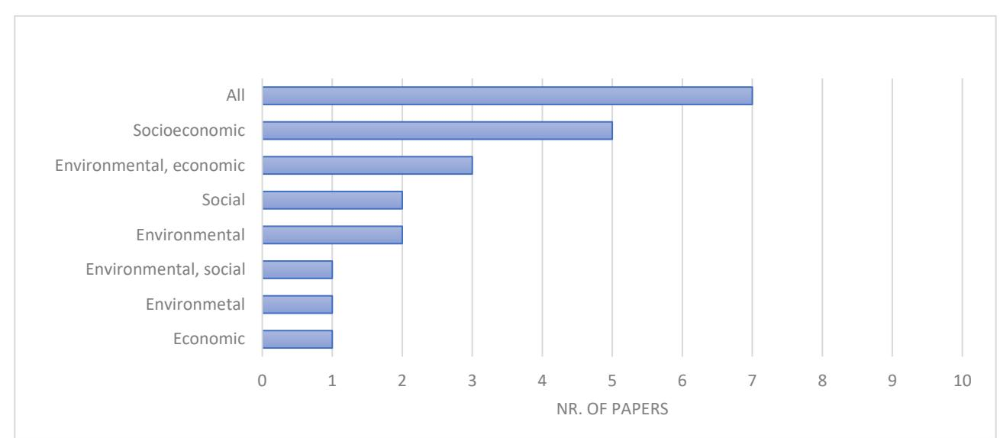

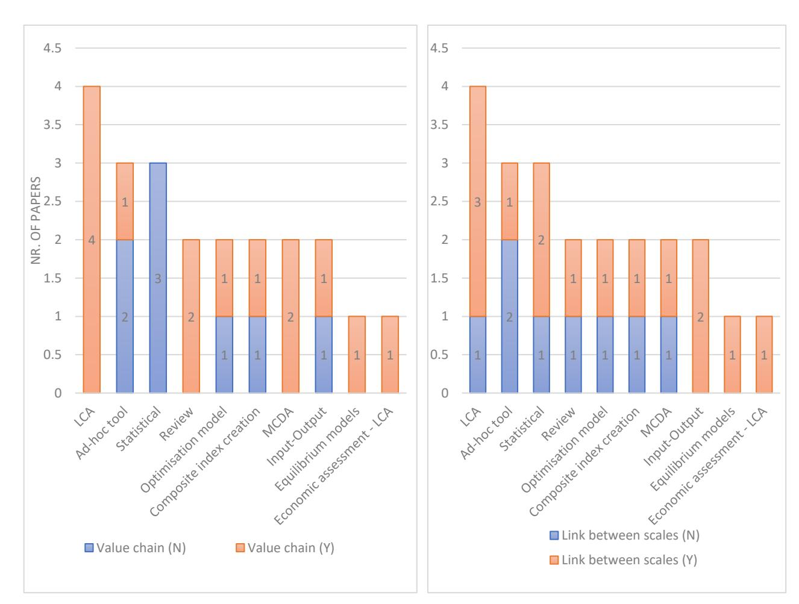

The concept of value chain seems well rooted in both conceptual development and empirical analyses. In general, a value chain is defined as a set of interlinked activities that deliver products/services by adding value to bulk material (feedstock). In a bio-based value chain, the feedstocks tend to be biomass drawn from an existing primary production route (e.g., agriculture, forestry and livestock), or of a novel (e.g., microalgae) or secondary origin (e.g., sludge, industrial wastewater and household organic waste) (Lokesh et al., 2018). Depending on the assessment level, i.e., micro vs. macro, the value-chain aspect is generally operationalised by the mean of life cycle approach (generally for products), or the inclusion of different interconnected sectors in modelling tools such as IO tables, system dynamics and/or general equilibrium models. As cityregion level applications are often considered to be at the crossroads between micro and macro modelling, both LCA and sector modelling approaches are found. For instance, Zeug et al. (2021) and Bezama et al. (2021) developed a framework for implementing life cycle sustainability assessment for evaluating bioeconomy value chains at a regional level. Specifically, Zeug et al. (2021) developed a monitoring framework based on indicators from LCA and LCSA approaches, linking them to the Sustainable Development Goals (SDGs). The authors emphasise the importance of monitoring bioeconomy systems to identify areas for improvement and ensure long-term sustainability and that further efforts are needed towards the standardisation of sustainability assessment frameworks to enable consistent comparison across different sectors and regions. On the other hand, Bezama et al. (2021) point out the importance of considering the whole life cycle when using an LCA perspective as the boundary limitation to the factory gate would exclude key end-of-life aspects such as re-using, retrofitting and/or remanufacture. These are very important above all in the construction value chain.

In some cases (see e.g., Wohlfahrt et al. (2019)), the concept of value chain is even challenged towards more comprehensive approaches able to connect different value chains. Indeed, the authors argue that the interconnections between biomass value chains, the heterogeneity of the underlying processes and the variety of stakeholders, among other elements, are key issues to address when evaluating the sustainability of bioeconomy systems. In this line, the authors promote the use of more systemic approaches such as system dynamic and/or agent-based modelling. The first is linked with the need to model the variety of dynamics and the associated temporal scales involved in bioeconomy systems, such as the seasonality of biomass feedstock productions, harvesting, markets for biomass-based products and the logistics of biomass supply. On the other hand, agent-based models are indicated for simulating the stakeholder behaviour in relation to their situation and strategies, including the effect that exogenous drivers like supraregional policies and regulations, markets (e.g., prices of energies and biomass-based products) and climate might have.

Similar findings were also provided by Petig et al. (2019). The authors found that most of the simulation or modelling models lack the effects at the farm typology level, whereas it is precisely at this level where the impacts of the bioeconomy are tangibly perceived. An assessment of the general development of bioeconomy scenarios with decentralised biorefineries is key because it can depict a regionally localised demand for the specific agricultural biomass of biorefineries. Feedstock provision and the transportation cost of such biorefineries will probably have additional effects on regional biomass prices and therefore affect regional production and employment. Besides socioeconomic impacts, also ecological impacts should be considered. These may refer to the changes in production patterns, including effects not only on soil, water, and biodiversity but also on GHG emissions, especially when conversion from grassland to arable is allowed. The lack of quantitative studies on rural employment potential in the bioeconomy is a gap also recognised by Sørensen & Jørgensen (2022) and addressed by Muizniece et al. (2019). The authors recommend increasing the political focus in rural areas impacts when developing bioeconomic projects, as well as integrating negative externalities in the assessment, such as increased odour emission, noise, and visual pollution (Sørensen & Jørgensen, 2022).

The connection of different territorial scales resulted that the most common approach is to downscale (or generate) indicators at the regional level exploiting or combining information available at the national level. As an example, Jurga et al. (2021) and Sørensen & Jørgensen (2022) exploited national IOT to inform on NUTS2 economic impacts (job) by using location quotients or surveys, respectively; Hamelin et al. (2019) and Karan & Hamelin (2021) provided data at regional level for potential residual biomass including (i) agriculture (straw, manure, residues from pruning permanent plantations; (ii) forestry (forestry residues); (iii) urban greenery management (residues from managing urban green areas and roadside vegetation); (iv) food waste (agri-industrial food process waste and municipal biodegradable waste); while Petig et al. (2019) downscaled agricultural market data from EU and country level to the farms in the German federal state of Baden‐Wuerttemberg. On the positive side, the use of these downscaling approaches permits the generation of harmonised and comparable data within the area of interest without being too resource-intensive, which can be of significant help above all in early-stage project/policy evaluation. On the other hand, as indicated in Karan & Hamelin (2021), the estimation of potential crop residues (or other indicators) through downscaling might be highly unreliable and would greatly benefit from additional experimental research.

Last but not least, it is important to underline the emerging trade-off between the ambition to carry out evaluations as comprehensively as possible (in terms, for example, of more systemic approaches and/or the inclusion of a wide range of indicators (Fernández-Puratich et al., 2021; Jarosch et al., 2020; Sacchelli et al., 2022; Wohlfahrt et al., 2019; Zeug et al., 2021) and its intrinsic complexity, and, on the other hand, the need to make knowledge usable for decisionmaking. In this context, the use of multi-criteria decision assessment (MCDA) seems one of the approaches most used to guide decision-making and inform policy development. By considering a wide range of indicators and criteria, the MCDA can help decision-makers understand the strengths and weaknesses of different bio-based applications and make informed decisions on resource allocation and policy priorities (Gatto et al., 2021a; Pieratti et al., 2019).

## **4.2.1Gaps and recommendations to take away**

Several gaps emerged at the city-regional application level. First, Wohlfahrt et al. (2019), in addition to the use of a more systemic approach to bioeconomy systems (beyond the sectoral value-chain approach), indicate the need for monetising externalities to properly inform decisionmakers and potential investors. In fact, as bioeconomy systems must meet sustainability expectations, it is very difficult to assess their profitability only with orthodox market-related profitability metrics and tools (e.g., net margins based on direct costs and prices). The criterion of market profitability with respect to fossil fuel systems, excluding negative externalities, does not seem to be consistent with the assessment of bioeconomy systems, which, being developed under political pressure for environmental sustainability, keep into account potential environmental externalities. A clear difference should be made between market value and inherent value. Therefore, there is a need for indicators that reflect more fundamental property than supply and demand (i.e., prices).

Further efforts are required towards the evaluation of bioeconomy projects, impacts at the regional scale and, in particular, for rural communities/areas (Muizniece et al., 2019; Petig et al., 2019; Sørensen & Jørgensen, 2022). The development of a sustainable bioeconomy able to replace fossil-based resources while supplying food to societies and preserving natural resources will depend not only on technological innovations in biomass transformation processes but also on the (re)organisation of biomass feedstock production or biomass-based product consumption (Wohlfahrt et al., 2019). Hence, rural communities are those most impacted by bioeconomy projects and an assessment of policy support measures with a specific focus on less competitive marginal regions and extensive production systems may bring some interesting insights to determine the economic effort to preserve ecologically beneficial production systems (Cismaș & Bălan, 2023; Petig et al., 2019). In this line, also Jurga et al. (2021) advocate for methods able to consistently link the bioeconomy sectors from the national to the regional level. In fact, it is not only the economies of the EU member states that are very different from each other but also the regional circumstances have a considerable influence on the diversification of economic sectors. Regions are differentiated in terms of their use of natural resources, social expectations, current legislation, and natural or socioeconomic conditions. The same actions and strategies for the development of one region cannot usually be copied for others. Therefore, there is a need for more comprehensive research on how to increase the importance of the bioeconomy in regional economies. Regions, and above all local communities, can make a significant contribution to initiating and accelerating the bioeconomy transition. Any research and analysis that allows the identification of priority bioeconomy sectors, in addition to their need for funding, would help to prepare a local action strategy.

Finally, each of the approaches for evaluating trade-offs related to the systemic impacts was developed with a specific purpose in mind. However, not all of them seem equally well suited to inform decision-making. Hence, to generate information detailed enough to capture contextspecific aspects, while aggregate enough to keep their number at a manageable level, the cascading use of approaches could be considered. For instance, LCAs can inform more aggregate indicators that are then included in the MCDA, which capitalizes on the availability of detailed information and keeps the overall number of factors at a level suited to making informed decisions.

Based on the gaps identified across meso-level applications, [Table 3](#page-39-0) provides key recommendations to further advance bioeconomy monitoring and assessment at the city/regional level.

*Table 3: Recommendations to advance bioeconomy monitoring and assessment at city-regional level*

| # | Description                                                                          |
|---|--------------------------------------------------------------------------------------|
| 1 | Monetisation of externality: a need for indicators that distinguish between market   |
| 2 | Need for further standardisation of bioeconomy assessment at the regional-city level |
| 3 | The estimation of potential crop residues (or other indicators) might be highly      |
| 4 | Impacts on rural communities (at the very local scale) should be considered when     |
|   | evaluating bioeconomy projects as these are the stakeholder categories most affected |
|   | by changes in the bioeconomy value chains. In this line, the inclusion of            |
| 5 | Need for benchmark values to understand the performance of a bio-based product or    |

Otherwise, the use of historical data (time series), reference values, or policy targets (when available) can also be used.

## **4.3 Micro-level applications (products, companies)**

Figure 19 provides an overview of the sustainability dimensions primarily addressed by bioeconomy research at the micro-level, while Figure 20 shows the type of approaches and the sustainability dimensions addressed in the selected papers. Differently from the macro, and meso-level, the highest number of articles in this case focus on environmental aspects. It is followed by the economic (only) aspect and environmental-economic. Surprisingly, only one article addressed sustainability as a whole (Ladu & Morone, 2021). Most of the paper relates to LCA studies. D'Amato et al. (2020) conducted a review of LCA assessments on forest-based products, Hildebrandt et al. (2017) and Lokesh et al. (2020) elaborated on LCA-based indicators for biopolymers and bio-based products, respectively, while Teigiserova et al. (2022) conducted a LCA of cascading production from orange peel waste to bio-based chemical. A techno-economic assessment (TEA) was instead used by Briassoulis et al. (2021) to evaluate the feasibility and viability of mechanical recycling of post-consumer bio-based plastics. Similarly, González-Castaño et al. (2021) conducted an economic assessment of food waste to green biomethane process, while Razza et al. (2020) developed new metrics to address the circularity of bioplastics. Differently from these above-cited studies, which addressed one specific dimension of sustainability (e.g., environmental-LCA, economic-TEA and circularity), Ladu & Morone (2021) proposed an integrated assessment tool (IAT) based on 48 indicators spanning all sustainability pillars, including circularity and indirect land use change. Only one paper focused on data inventory development (Roy et al., 2022). In this case, the authors developed an inventory by integrating material (nutrient) flow information from feed to fish to the environment and primary producers, providing a tool to optimise aquaponic systems. Finally, two papers were rather conceptual. Ullmann & Grimm (2021) highlighted the potential of algae for a future bioeconomy while Vural Gursel et al. (2022) defined circular economy principles for bio-based product evaluation. It is also worth noting that 11 out of 14 papers directly addressed circularity issues, either by cascading metrics or by-products evaluation (Hildebrandt et al., 2017; Teigiserova et al., 2022; Xagoraris et al., 2021), or circular indicators/principles (Briassoulis et al., 2021; Ladu & Morone, 2021; Lokesh et al., 2020; Razza et al., 2020; Vural Gursel et al., 2022). The observed, very high, relevance of circularity assessment is also in line with the findings of Bracco et al. (2019), which identified more than 51 indicators related to circularity aspects.

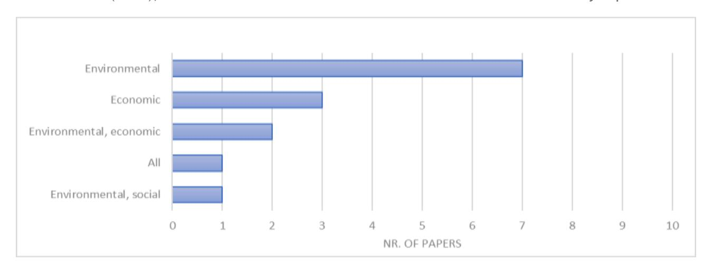

*Figure 19: Sustainability dimensions addressed by bioeconomy research across meso-level applications*

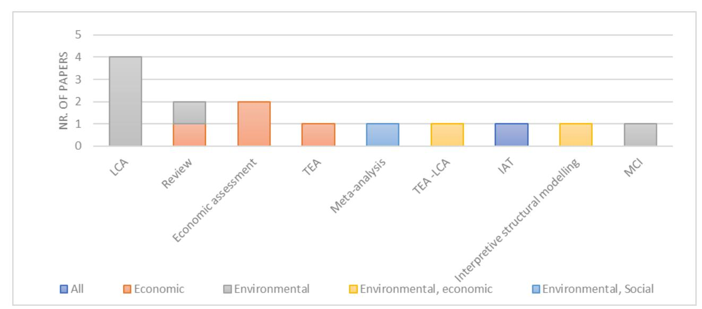

*Figure 20: Micro-level applications: an overview of approaches and sustainability dimensions addressed*

With LCA being the most common approach used, the concept of the value chain is generally well addressed across product applications (9 of 14 papers made explicit reference to the product value chain). Contrariwise, the link among different application scales is not the norm when considering product-oriented analyses, as it was only found in Xagoraris et al. (2021) who considered bottomup information on winery by-products (i.e., grape seeds and grape skins) to support sustainable exploitation at a territorial level (i.e., Greek Ionian Islands).

Figure 21 shows a granular overview of the topics addressed by existing indicators at the product level organised by type of contribution to the EU SO. It should be underlined that in this case, we included two additional SOs to fit several indicators identified during the literature review. These are "inclusive and resilient economy" and "risk assessment and monitoring".

Similar to what was found by Bracco et al. (2019) and D'Amato et al. (2020), our review shows that there is a prevalence of environmental sustainability assessments (Figure 19, Figure 20 and Figure 21), as opposed to economic and social assessment. This dominance might be explained but not entirely justified– by different reasons. First, as indicated by the barrier analysis carried out in WP1, barriers related to i) the evaluation of environmental impacts and ii) the lack of harmonised methods for environmental impact assessment represent some of the most important obstacles to the transition towards bio-based economic systems. Therefore, it is logical to expect that the greatest efforts of the scientific community are directed to fill these gaps. Another reason, but only explaining the relatively lower number of economic assessments, is the confidentiality nature of the economic data and information. Since economic evaluations generally concern the financial performance of manufacturing processes/products, they are very often not published. For example, taking as reference European projects, reports about economic assessments are very often of confidential type, whereas environmental analysis reports are generally public. This obviously has repercussions also in scientific publications, where in fact there is a dearth of economic data on industrial products or processes. To note that this issue only applies at the product application level, as territorial assessments carried out at regional, or country level, generally rely on public statistical databases.

## D2.1 Review of Approaches and Identification of Research Gaps

*Figure 21 Number of indicators to monitor and evaluate the bioeconomy at product level by sub-topics under the societal objectives10*

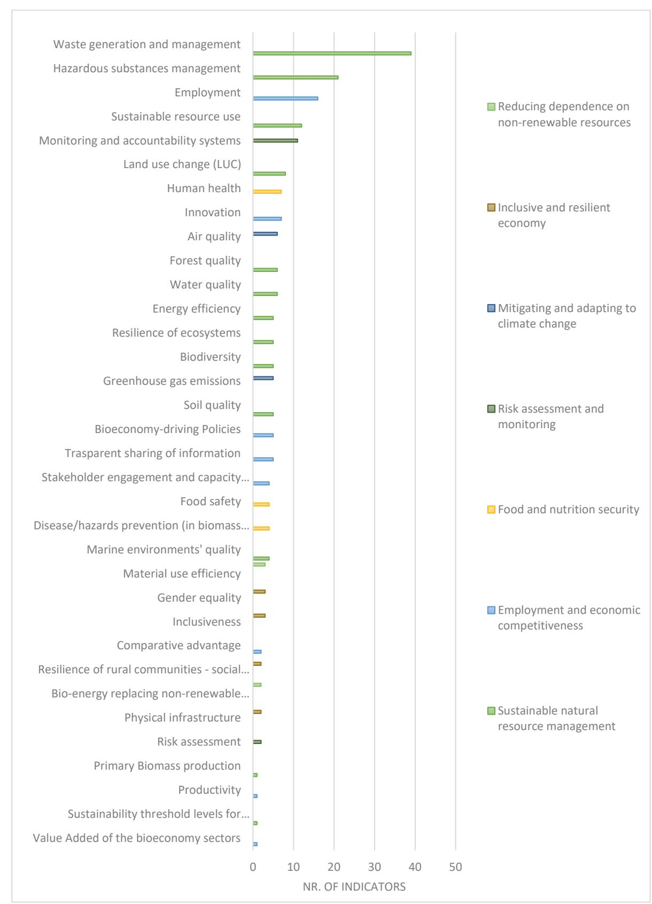

On the other hand, the paucity of societal assessments seems more related to the rather immature methodologies employed and the lack of data to support quantitative assessment (Cordella et al., 2023). In this context, effective collaboration between all stakeholders along the value chain is crucial to ensure a complete and reliable assessment (Ladu & Morone, 2021). Moreover, primary data for LCA-based assessments is mostly collected by the economic operators of the value chain through self-declared questionnaires. This applies to the environmental, economic, and social inventories.

Considering the reflections above, the implications for impact assessment are different depending on the sustainability pillar:

- For the environmental pillar, the key point is to improve or further consider impact assessment methods of those environmental categories especially relevant to the bioeconomy. For instance, land use considerations, which are particularly relevant for the bioeconomy, are currently poorly integrated into LCA approaches (see above in Section 4.1.3. "Other modelling approaches" identified gaps regarding soil quality evaluation through LCA/PEF methods). These may refer to direct and indirect land use changes and related impacts on biodiversity loss, deforestation, soil degradation, water depletion, and related carbon emissions (D'Amato et al., 2020; Martin et al., 2018). Furthermore, D'Amato et al. (2020) and Ladu & Morone (2021) found that the most common system boundary applied is the cradle-to-gate. While this system boundary may reflect the interest of the companies in assessing the environmental impacts related to the upstream and core production of bio-based products11, it obviously fails to give a complete picture of the sustainability impact of a product as it does not consider the use and end-of-life phase.
- For the economic pillar, rather than the improvement of economic metrics, which are broadly established, the key point is to better understand to what extent they can contribute to overall sustainability. In fact, it should be kept in mind that while economic viability is a *sine qua* non requisite to bring a product to the market, not necessarily contribute to sustainability. For instance, economic viability could happen at the expense of inclusiveness (including the type of jobs created and the fair treatment of employees and working conditions) (Bracco et al., 2019). Similarly, economic assessments should increasingly consider the monetisation of externalities12 (Bracco et al., 2019; Ioannidou et al., 2022). This would ensure that external costs or benefits are factored into the composition of the prices of goods and services, facilitating a fairer and more transparent comparison.

10 To note that in this case, in addition to the 5 SOs of the EU bioeconomy strategy, we included also as specific key objectives "inclusive and resilient economy" and "risk assessment and monitoring".

11 Prevalence of cradle-to-gate LCA studies might also be explained by the lack of reliable data and knowledge for modelling downstream processes

12 Externalities can be positive or negative and can be divided into environmental and social categories. Environmental externalities relate to the consequences of production and consumption of a product on the environment and indirectly on people and communities, while social externalities relate to the consequences on people and communities caused by production and consumption of a product. Monetization of externalities involves the valuation of externalities in monetary terms to allow them to be taken into account in decision-making.

- For the social pillar, the metrics are generally qualitative in nature and more subject to the subjectivity of the respondent. Furthermore, unlike its environmental and economic counterparts13, secondary data for social evaluation is generally difficult to come by. While the existence of third-party certifications of raw materials, intermediates or companies is considered to provide sufficiently reliable secondary data for the requirements of some indicators (Ladu & Morone, 2021), their availability is the exception rather than the norm. Therefore, secondary data for social assessment is often based on public databases reflecting social issues at the country level and by sector. Therefore, these may not reflect the reality of a selected product value chain. In this context (i.e., absence of an established method and lack of data), Bracco et al. (2019) suggest that monitoring the adoption of good practices and the quality of their implementation can be useful to acknowledge and measure progress.

In addition to the gaps related to LCA methods, another limitation is linked to the difficulty associated with defining science-based performance benchmarks specific to different categories of bio-based products (Ladu & Morone, 2021). Moving along this line, researchers should focus on the definition of tools designed to facilitate comparisons between bio-based products and fossilbased products. The same challenges apply to the definition of political targets (e.g., minimum renewable content) and benchmark values, which are specific to each product category. Increasing the sustainability impact assessment of bio-based products would also improve the knowledge base about the bioeconomy and avoid potential bias due to the use of aggregated indicators or inference from sectoral data (Bracco et al., 2019).

To better understand the contribution of product impacts to sustainability, LCA-based indicators have been linked to the framework of Sustainable Development Goals (SDGs) (Ladu & Morone, 2021) and ecosystem services (D'Amato et al., 2020). On the one hand, Ladu & Morone (2021) through the IAT linked 48 indicators to 10 SDGs and 22 specific targets. On the other hand, D'Amato et al. (2020) analysed how indicators measuring impacts for bio-based products and processes from wood relate to ecosystem services. In both cases, most of the indicators are based on LCA approaches. In this context, the relationship between LCA metrics and SDGs seems to have received much more attention in the last period, than the relationship between LCA and ecosystem services (Cordella et al., 2023). Indeed, D'Amato et al. (2020) found that only 20% of ecosystem services are accounted for in the reviewed LCA studies. Only a few links exist for certain provisioning and/or regulating services, while none of the LCA impact categories relate to cultural services.

Regarding circularity assessment, Vural Gursel et al. (2022) provide 6 principles to evaluate the circularity performance regarding both, intrinsic circularity and the impact of the circularity on the broader system. These are:

- (1) Reducing reliance on fossil resources
- (2) Use resources efficiently
- (3) Valorise waste and residues
- (4) Regenerate
- (5) Recirculate and
- (6) Extend the high-quality use of biomass.

13 In general, LCA benefits from comprehensive and advanced LCA-inventories for secondary data. In economic valuations, on the other hand, the price of an asset automatically includes all costs incurred upstream.

In line with these principles, Ladu & Morone (2021) identified several indicators, both quantitative and qualitative, to operationalise the circularity assessment. Among the various indicators used, the most common one cited/used in the body of literature reviewed is the Material Circularity Index (MCI) developed by the Ellen MacArthur Foundation and Granta Design (Bracco et al., 2019; Ladu & Morone, 2021; Razza et al., 2020; Vural Gursel et al., 2022). Initially developed in 2015 and updated in 2019 to also include bio-based materials and treatment (biotic cycles), the MCI can range from 0 (pure linearity) to 1 (pure circularity). Next to the MCI, the Biomass Utilisation Factor (BUF) (vom Berg et al, 2023) is also another indicator addressing circularity of, in this case, only biomass, namely BUF quantifies to which extent (production efficiency) and how often (cascading use) biomass is utilised in a bio-based product value chain or an entire sector.

Last but not least, the sustainability aspects of bio-based products/value chains are unequally monitored and evaluated among sectors. For instance, the primary sectors (especially agriculture and forestry) and bioenergy are more thoroughly monitored than secondary sectors, such as the food and agroindustry, manufacturing of bioproducts, or tertiary sectors focusing on consumption and end-of-life options. This is probably because the main bioproduct sectors are relatively new, and that some sectors lack experience in undertaking an accurate and comprehensive (sustainability) impact assessment. Another reason can be the fact that the primary sectors in the bioeconomy operate at two levels: on the one hand, these sectors provide the bio-resources for bio-based products that other sectors process and add value to, and on the other hand, they also provide direct goods to the markets, which results in them being the most monitored sectors. Hence, further studies should address this gap by covering a broader range of value chains, beyond those mainly oriented to primary sectors and/or bioenergy.

## **4.3.1Gaps and recommendations to take away**

Adopting a life cycle view in monitoring and evaluating bio-based products may face challenges regarding data availability and accessibility. Gathering data for measuring the bioeconomy sustainability at the product/value chain level is very difficult and very few databases are available for bioproducts. Since products are very heterogeneous, the data needed are different and they depend on the characteristics of the bioproducts and the local context in which they are produced. Therefore, LCA studies generally rely on close collaboration with companies for collecting sustainability-relevant data, which are very often sensitive and not disclosed to the public, i.e., confidential. In this context, the use of proxy indicators, such as the identification of good practices, could replace or complement more detailed measurements and can serve as a first step in a sustainability assessment (Bracco et al., 2019).

Indicators informing on the environmental, economic, and social impacts are unequally addressed across applications at the product level (Bracco et al., 2019; D'Amato et al., 2020). Environmental LCA indicators are by far the most considered in product analysis. However, partly due to the novelty of bio-based products, the reliability and consistency of the environmental impacts of biobased products are still far from being accepted and recognized by the market. As a result, uncertainty regarding environmental impacts remains a major obstacle to the adoption of biobased products. In addition, most of the studies and/or schemes/certifications/labels assess the sustainability of products, but few of them focus specifically on bio-based products. By missing the bio-based product-specific sustainability aspects, the impact assessment of bioproducts may result in biased conclusions. Therefore, progress in impact measurement and method standardisation is crucial, especially for high TRL products, to facilitate their introduction on the market or further diffusion. LCA studies should also increasingly be oriented towards the cradleto-cradle system boundaries to provide a robust assessment of sustainability impact at the system level.

The economic pillar of sustainability is hardly addressed. Indeed, purely economic indicators, e.g., revenues, costs, and market shares, fail to capture sustainability aspects. As an example, an increase in firm revenue could be linked to the exploitation of natural resources, potentially resulting in overexploitation. Therefore, it will be key to effectively identify potential trade-offs and synergies among impact categories. Furthermore, as consequences of the trade-offs are arguably more critical, they may also be used to impose some boundaries on the extent to which bioeconomy practices can be implemented. Notwithstanding purely economic indicators fall short of informing on sustainability, it is very important to monitor and evaluate financial risk and accountability, since these aspects are directly related to the successful introduction of bio-based products in the market. To some extent, the use of integration techniques and the calculation of aggregated indexes can ease the decision-making process when trade-offs exist. In this case, the prevalence of environmental indicators should also be considered, i.e., corrective measures should be envisaged to avoid the environmental impacts being weighted more, by default, than the social and economic ones. In this context, guidance provided by the ORIENTING project might help practitioners.

The assessment of indicators should be always accompanied by the provision of benchmarks, targets or reference values to truly measure bio-based product performance and impacts (Bracco et al., 2019). Reference values might be historical data/time series (as an example, within the BERST project14, regions are compared to their national counterpart or among each other), or they can be so-called normative policy- or science-based reference values. This aspect is very high on the EU agenda as specific calls have recently been launched aimed at bridging this knowledge gap15. Therefore, further indications may be expected soon.

Surprisingly, we did not find any paper linking a product impact assessment to the territorial scale. As suggested by Bracco et al. (2019), this bottom-up approach would imply extrapolating the information for a single unit (e.g., farm, processing plant or product unit) for the entire bioeconomy activities of a territory. While to cover the totality of the bioeconomy sectors/activities this extrapolation would have to be done from a multitude of single units, it would be nevertheless also useful for exploring "what if" scenarios in the case of new bio-based products ready to enter the market to better understand any trade-off at a larger scale (than the product scale). This exercise would also help to understand whether product impacts assessed by LCA approaches would be relevant at a global/local scale and, hence, address the dissonance between sustainability issues considered urgent and relative LCA coverage (D'Amato et al., 2020). In this line, additional work is also needed for tackling the integration of ecosystem services issues in LCA approaches as the link between bioeconomy and ecosystem services remains an underrepresented area of research, including understanding the impacts and dependencies of diverse bioeconomy activities.

Based on the gaps identified across micro-level applications, Table 4 provides key recommendations to further advance bioeconomy monitoring and assessment at the product level.

14 https://berst.databank.nl/dashboard/en-us/dashboard/

15 See e.g., the Horizon Europe call "Developing and validating monitoring systems of environmental sustainability and circularity: collection of best practices and benchmarks".

| # | Description                                                                              |
|---|------------------------------------------------------------------------------------------|
| 1 | Need for further standardisation for (above all) environmental product impact            |
| 2 | To improve the social impact assessment of product/value chains. Eventually, consider    |
| 3 | The scope of the economic assessments should be extended to explore the                  |
| 4 | LCA studies should integrate and improve key impact categories for the bioeconomy.       |
| 5 | LCA-based indicators should cover the whole life cycle and not be limited to factory     |
| 6 | The link between bioeconomy impacts and ecosystem services should be further             |
| 7 | Need for benchmark values (i.e., sustainability thresholds) to better understand the     |
|   | performance of a bio-based product or value chain. Ideally, thresholds should be based   |
| 8 | More efforts should be oriented to increase the availability and/or exploit product data |
|   | address the attribution issue encountered in meso- and macro-analyses.                   |

# **5. CONCLUSIONS**

This report presents the results of the work carried out in SUSTRACK Task 2.1. The task focused on the review of existing knowledge for monitoring and evaluating the transition to circular biobased systems. More than 130 research items, including scientific articles and reports, were consulted to identify major gaps across indicators and approaches generally used to monitor and evaluate the bioeconomy across the three major policy-level analyses: micro- (product/process level), meso- (city/regional level) and macro-level (World, Europe or country level). This revision has provided three main outputs for the SUSTRACK project.

Firstly, it identifies some of the main existing knowledge gaps hindering the monitoring and evaluation of the transition to a bio-based economy. As an example, we found that existing indicators are unequally distributed among the i) societal objectives and sub-topics, ii) policylevel applications and iii) sustainability pillars. Environmental sustainability topics are addressed the most – across both product- and territorial-level analyses, followed by economic and social sustainability aspects. However, environmental indicators appear to be in a somewhat less mature state than socioeconomic indicators, which are generally provided regularly in standard statistics. On the other hand, there is a dearth of indicators and studies informing on pure societal issues such as the resilience of rural communities, inclusiveness, human health, and equality. In this line, further standardisation of environmental impact assessments and indicators and further dissemination of social assessments are above all necessary. Another pending key methodological challenge is the well-known "attribution issue". This refers to how to clearly attribute the measurement of the indicators to the production and use of biomass and it represents one of the major limitations to correctly modelling bioeconomy at the meso- and/or macro-level. This report also underlines the need for a more comprehensive assessment of sustainability. On the one hand, economic indicators are not thought to inform on sustainability issues and a thriving bio-based business model may present trade-offs with other sustainability objectives. In this context, both the integration of externalities through monetization and the further clarification of the potential trade-off between sustainability stakes could foster a better understanding of all direct and indirect impacts of the bioeconomy, supporting decision-making. These are just a few of the many knowledge gaps examined in this report.

Secondly, based on the gaps identified, the report provides an agenda with recommended future actions to advance knowledge on the bioeconomy according to policy-level analysis. Some of these recommendations will be further considered during the analysis of the case studies in WP3 with the dual aim of addressing the related research gap on the one hand and ensuring a solid evaluation of the case study on the other.

Finally, through the review, a preliminary database of indicators available at the territorial and product level was compiled. In fact, one of the objectives of this review was also to avoid replication and build on indicators and data that are already available. The database of preliminary indicators forms the basis for the 'Bioeconomy Knowledge Inventory' which will be further developed and operationalized in Task 2.3 to develop tailored monitoring frameworks suitable for policymakers operating at different policy levels.

# **REFERENCES**

Anghel, I., Siminică, M., Cristea, M., Noja, G. G., & Sichigea, M. (2019). Bioeconomy credentials and intellectual capital: a comparative modelling approach for the E.U.-13 and E.U.-15. Economic Research-Ekonomska Istraživanja, 32(1), 2699–2722. https://doi.org/10.1080/1331677X.2019.1653212 Asada, R., Cardellini, G., Mair-Bauernfeind, C., Wenger, J., Haas, V., Holzer, D., & Stern, T. (2020). Effective bioeconomy? a MRIO-based socioeconomic and environmental impact assessment of generic sectoral innovations. Technological Forecasting and Social Change, 153, 119946. https://doi.org/10.1016/j.techfore.2020.119946 Bezama, A., Hildebrandt, J., & Thrän, D. (2021). Integrating Regionalized Socioeconomic Considerations onto Life Cycle Assessment for Evaluating Bioeconomy Value Chains: A Case Study on Hybrid Wood–Concrete Ceiling Elements. Sustainability, 13(8), 4221. https://doi.org/10.3390/su13084221 Bohvalovs, G., Kirsanovs, V., Blumberga, A., & Blumberga, D. (2022). Bioeconomy Sustainability Index: A Fuzzy Cognitive Mapping Approach. Environmental and Climate Technologies, 26(1), 1257– 1267. https://doi.org/10.2478/rtuect-2022-0095 Bos, H. L., & Broeze, J. (2020). Circular bio‐based production systems in the context of current biomass and fossil demand. Biofuels, Bioproducts and Biorefining, 14(2), 187–197. https://doi.org/10.1002/bbb.2080 Bracco, S., Tani, A., Çalıcıoğlu, O., Gomez San Juan, M., Bogdanski, A., & Food and Agriculture Organization of the United Nations. (2019). Indicators to monitor and evaluate the sustainability of bioeconomy: overview and a proposed way forward. FAO. https://www.fao.org/3/ca6048en/CA6048EN.pdf Briassoulis, D., Pikasi, A., & Hiskakis, M. (2021). Recirculation potential of post-consumer /industrial bio-based plastics through mechanical recycling - Techno-economic sustainability criteria and indicators. Polymer Degradation and Stability, 183, 109217. https://doi.org/10.1016/j.polymdegradstab.2020.109217 Bringezu, S., Distelkamp, M., Lutz, C., Wimmer, F., Schaldach, R., Hennenberg, K. J., Böttcher, H., & Egenolf, V. (2021). Environmental and socioeconomic footprints of the German bioeconomy. Nature Sustainability, 4(9), 775–783. https://doi.org/10.1038/s41893-021-00725-3 Brizga, J., Miceikienė, A., & Liobikienė, G. (2019). Environmental aspects of the implementation of bioeconomy in the Baltic Sea Region: An input-output approach. Journal of Cleaner Production, 240, 118238. https://doi.org/10.1016/j.jclepro.2019.118238 Bruckner, M., Häyhä, T., Giljum, S., Maus, V., Fischer, G., Tramberend, S., & Börner, J. (2019). Quantifying the global cropland footprint of the European Union's non-food bioeconomy. Environmental Research Letters, 14(4), 045011. https://doi.org/10.1088/1748-9326/ab07f5 Choi, H. S., Grethe, H., Entenmann, S. K., Wiesmeth, M., Blesl, M., & Wagner, M. (2019). Potential trade-offs of employing perennial biomass crops for the bioeconomy in the EU by 2050: Impacts on agricultural markets in the EU and the world. GCB Bioenergy, 11(3), 483–504. https://doi.org/10.1111/gcbb.12596

Christensen, T., Philippidis, G., van Leeuwen, M., Singh, A., & Panoutsou, C. (2022). Bridging modelling and policymaking efforts to realize the European bioeconomy. GCB Bioenergy, 14(11), 1183–1204. https://doi.org/10.1111/gcbb.12996

Cingiz, K., Gonzalez-Hermoso, H., Heijman, W., & Wesseler, J. H. H. (2021). A Cross-Country Measurement of the EU Bioeconomy: An Input–Output Approach. Sustainability, 13(6), 3033. https://doi.org/10.3390/su13063033

Cismaș, L. M., & Bălan, E. M. (2023). Agriculture's Contribution to the Growth of Romanian Bioeconomy: A Regional Approach. Eastern European Economics, 61(4), 403–419. https://doi.org/10.1080/00128775.2022.2058552

Cordella, M., Horn, R., Hong, S. H., Bianchi, M., Isasa, M., Harmens, R., Sonderegger, T., & Pihkola, H. (2023). Addressing sustainable development goals in life cycle sustainable assessment: Synergies, challenges and needs. Journal of Cleaner Production, 415, 137719. https://doi.org/10.1016/j.jclepro.2023.137719

Cristea, M., Noja, G. G., Marcu, N., Siminică, M., & Ţîrcă, D.-M. (2020). MODELLING EU BIOECONOMY CREDENTIALS IN THE ECONOMIC DEVELOPMENT FRAMEWORK: THE ROLE OF INTELLECTUAL CAPITAL. Technological and Economic Development of Economy, 26(6), 1139–1164. https://doi.org/10.3846/tede.2020.13159

D'Adamo, I., Falcone, P. M., & Morone, P. (2020). A New Socioeconomic Indicator to Measure the Performance of Bioeconomy Sectors in Europe. Ecological Economics, 176, 106724. https://doi.org/10.1016/j.ecolecon.2020.106724

D'Amato, D., Gaio, M., & Semenzin, E. (2020). A review of LCA assessments of forest-based bioeconomy products and processes under an ecosystem services perspective. Science of The Total Environment, 706, 135859. https://doi.org/10.1016/j.scitotenv.2019.135859

Di Cori, V., Robert, N., Franceschinis, C., Pettenella, D. M., & Thiene, M. (2022). Framework Proposal to Quantify the Contribution of Non-Wood Forest Products to the European Union Forest-Based Bioeconomy. Forests, 13(3), 362. https://doi.org/10.3390/f13030362

Dima, A. M., Tantau, A., & Maassen, M. A. (2022). Models for analysing the dependencies between indicators for bioeconomy in the European Union. Economic Research-Ekonomska Istraživanja, 35(1), 3533–3550. https://doi.org/10.1080/1331677X.2021.1997623

Dolge, K., Balode, L., Laktuka, K., Kirsanovs, V., Barisa, A., & Kubule, A. (2023). A Comparative Analysis of Bioeconomy Development in European Union Countries. Environmental Management, 71(2), 215–233. https://doi.org/10.1007/s00267-022-01751-3

Dolge, K., Bohvalovs, G., Kirsanovs, V., Blumberga, A., & Blumberga, D. (2022). Bioeconomy in the Shade of Green Deal: The System Dynamic Approach. Environmental and Climate Technologies, 26(1), 1221–1233.<https://doi.org/10.2478/rtuect-2022-0092>

European Commission, Directorate-General for Research and Innovation, A sustainable bioeconomy for Europe : strengthening the connection between economy, society and the environment : updated bioeconomy strategy, Publications Office, 2018, <https://data.europa.eu/doi/10.2777/792130>

Egenolf, V., & Bringezu, S. (2019). Conceptualization of an Indicator System for Assessing the Sustainability of the Bioeconomy. Sustainability, 11(2), 443. https://doi.org/10.3390/su11020443

Egenolf, V., Vita, G., Distelkamp, M., Schier, F., Hüfner, R., & Bringezu, S. (2021). The Timber Footprint of the German Bioeconomy—State of the Art and Past Development. Sustainability, 13(7), 3878. https://doi.org/10.3390/su13073878

Escobar, N., Haddad, S., Börner, J., & Britz, W. (2018). Land use mediated GHG emissions and spillovers from increased consumption of bioplastics. Environmental Research Letters, 13(12), 125005. https://doi.org/10.1088/1748-9326/aaeafb

Fernández-Puratich, H., Rebolledo-Leiva, R., Hernández, D., Gómez-Lagos, J. E., Armengot-Carbo, B., & Oliver-Villanueva, J. V. (2021). Bi-objective optimization of multiple agro-industrial wastes supply to a cogeneration system promoting local circular bioeconomy. Applied Energy, 300, 117333. https://doi.org/10.1016/j.apenergy.2021.117333

Ferreira, V., Pié, L., & Terceño, A. (2020). The Role of the Foreign Sector in the Spanish Bioeconomy: Two Approaches Based on SAM Linear Models. International Journal of Environmental Research and Public Health, 17(24), 9381. https://doi.org/10.3390/ijerph17249381

Ferreira, V., Pié, L., & Terceño, A. (2021). Economic impact of the bioeconomy in Spain: Multiplier effects with a bio social accounting matrix. Journal of Cleaner Production, 298, 126752. https://doi.org/10.1016/j.jclepro.2021.126752

Gatto, F., Daniotti, S., & Re, I. (2021). Driving Green Investments by Measuring Innovation Impacts. Multi-Criteria Decision Analysis for Regional Bioeconomy Growth. Sustainability, 13(21), 11709. https://doi.org/10.3390/su132111709

Gonçalves, M., Freire, F., & Garcia, R. (2021). Material flow analysis of forest biomass in Portugal to support a circular bioeconomy. Resources, Conservation and Recycling, 169, 105507. https://doi.org/10.1016/j.resconrec.2021.105507

González-Castaño, M., Kour, M. H., González-Arias, J., Baena-Moreno, F. M., & Arellano-Garcia, H. (2021). Promoting bioeconomy routes: From food waste to green biomethane. A profitability analysis based on a real case study in eastern Germany. Journal of Environmental Management, 300, 113788. https://doi.org/10.1016/j.jenvman.2021.113788

Grădinaru, G. I., & Matei, B. F. (2022). Sustainable Bioeconomy at Different Speeds: Assessing Regional Performance and Innovation Type (pp. 345–360). https://doi.org/10.1007/978-3-031- 15531-4\_20

Haddad, S., Britz, W., & Börner, J. (2019). Economic Impacts and Land Use Change from Increasing Demand for Forest Products in the European Bioeconomy: A General Equilibrium Based Sensitivity Analysis. Forests, 10(1), 52. https://doi.org/10.3390/f10010052

Hamelin, L., Borzęcka, M., Kozak, M., & Pudełko, R. (2019). A spatial approach to bioeconomy: Quantifying the residual biomass potential in the EU-27. Renewable and Sustainable Energy Reviews, 100, 127–142. https://doi.org/10.1016/j.rser.2018.10.017

Hansen, J. H., Hamelin, L., Taghizadeh‐Toosi, A., Olesen, J. E., & Wenzel, H. (2020). Agricultural residues bioenergy potential that sustain soil carbon depends on energy conversion pathways. GCB Bioenergy, 12(11), 1002–1013. https://doi.org/10.1111/gcbb.12733

Heimann, T. (2019). Bioeconomy and SDGs: Does the Bioeconomy Support the Achievement of the SDGs? Earth's Future, 7(1), 43–57. https://doi.org/10.1029/2018EF001014

Hildebrandt, J., Bezama, A., & Thrän, D. (2017). Cascade use indicators for selected biopolymers: Are we aiming for the right solutions in the design for recycling of bio-based polymers? Waste Management & Research: The Journal for a Sustainable Circular Economy, 35(4), 367–378. https://doi.org/10.1177/0734242X16683445

Hildebrandt, J., O'Keeffe, S., Bezama, A., & Thrän, D. (2019). Revealing the Environmental Advantages of Industrial Symbiosis in Wood‐Based Bioeconomy Networks: An Assessment From a Life Cycle Perspective. Journal of Industrial Ecology, 23(4), 808–822. https://doi.org/10.1111/jiec.12818

Ioannidou, S. M., Galanopoulos, C., Ladakis, D., & Koutinas, A. (2022). Techno-economic evaluation and life-cycle assessment of integrated biorefineries within a circular bioeconomy concept. In Biomass, Biofuels, Biochemicals (pp. 541–556). Elsevier. https://doi.org/10.1016/B978-0-323-89855-3.00015-7

Jander, W. (2022). Advancing bioeconomy monitorings: A case for considering bioplastics. Sustainable Production and Consumption, 30, 255–268. https://doi.org/10.1016/j.spc.2021.11.033

Jander, W., & Grundmann, P. (2019). Monitoring the transition towards a bioeconomy: A general framework and a specific indicator. Journal of Cleaner Production, 236, 117564. https://doi.org/10.1016/j.jclepro.2019.07.039

Jander, W., Wydra, S., Wackerbauer, J., Grundmann, P., & Piotrowski, S. (2020). Monitoring Bioeconomy Transitions with Economic–Environmental and Innovation Indicators: Addressing Data Gaps in the Short Term. Sustainability, 12(11), 4683. https://doi.org/10.3390/su12114683

Jarosch, L., Zeug, W., Bezama, A., Finkbeiner, M., & Thrän, D. (2020). A Regional Socioeconomic Life Cycle Assessment of a Bioeconomy Value Chain. Sustainability, 12(3), 1259. https://doi.org/10.3390/su12031259

Jukka, L., Miika, M., Lauri, L., Mirja, M., Ville, U., & Lassi, L. (2022). A financial and environmental sustainability of circular bioeconomy: A case study of short rotation coppice, biochar and greenhouse production in southern Finland. Biomass and Bioenergy, 163, 106524. https://doi.org/10.1016/j.biombioe.2022.106524

Jurga, P., Loizou, E., & Rozakis, S. (2021). Comparing Bioeconomy Potential at National vs. Regional Level Employing Input-Output Modeling. Energies, 14(6), 1714. https://doi.org/10.3390/en14061714

Karan, S. K., & Hamelin, L. (2020). Towards local bioeconomy: A stepwise framework for highresolution spatial quantification of forestry residues. Renewable and Sustainable Energy Reviews, 134, 110350. https://doi.org/10.1016/j.rser.2020.110350

Karan, S. K., & Hamelin, L. (2021). Crop residues may be a key feedstock to bioeconomy but how reliable are current estimation methods? Resources, Conservation and Recycling, 164, 105211. https://doi.org/10.1016/j.resconrec.2020.105211

Kardung, M., Cingiz, K., Costenoble, O., Delahaye, R., Heijman, W., Lovrić, M., van Leeuwen, M., M'Barek, R., van Meijl, H., Piotrowski, S., Ronzon, T., Sauer, J., Verhoog, D., Verkerk, P. J., Vrachioli, M., Wesseler, J. H. H., & Zhu, B. X. (2021). Development of the Circular Bioeconomy: Drivers and Indicators. Sustainability, 13(1), 413. https://doi.org/10.3390/su13010413

- Ladu, L., & Morone, P. (2021). Holistic approach in the evaluation of the sustainability of biobased products: An Integrated Assessment Tool. Sustainable Production and Consumption, 28, 911- 924e6. https://doi.org/10.1016/j.spc.2021.07.006 Lazorcakova, E., Dries, L., Peerlings, J., & Pokrivcak, J. (2022). Potential of the bioeconomy in Visegrad countries: An input-output approach. Biomass and Bioenergy, 158, 106366. https://doi.org/10.1016/j.biombioe.2022.106366 Leeuwen, M. van, Gonzalez-Martinez, A. R., & Sturm, V. (2022). Developing BioMAT: A new conceptual framework to model the market of bio-based materials in the EU. Studies in Agricultural Economics. https://doi.org/10.7896/j.2289 Liobikiene, G., Balezentis, T., Streimikiene, D., & Chen, X. (2019). Evaluation of bioeconomy in the context of strong sustainability. Sustainable Development, 27(5), 955–964. https://doi.org/10.1002/sd.1984 Liobikienė, G., Miceikienė, A., & Brizga, J. (2021). Decomposition analysis of bioresources: Implementing a competitive and sustainable bioeconomy strategy in the Baltic Sea Region. Land Use Policy, 108, 105565. https://doi.org/10.1016/j.landusepol.2021.105565 Loizou, E., Jurga, P., Rozakis, S., & Faber, A. (2019). Assessing the Potentials of Bioeconomy Sectors in Poland Employing Input-Output Modeling. Sustainability, 11(3), 594. https://doi.org/10.3390/su11030594 Lokesh, K., Ladu, L., & Summerton, L. (2018). Bridging the Gaps for a 'Circular' Bioeconomy: Selection Criteria, Bio-Based Value Chain and Stakeholder Mapping. Sustainability, 10(6), 1695. https://doi.org/10.3390/su10061695 Lokesh, K., Matharu, A. S., Kookos, I. K., Ladakis, D., Koutinas, A., Morone, P., & Clark, J. (2020). Hybridised sustainability metrics for use in life cycle assessment of bio-based products: resource efficiency and circularity. Green Chemistry, 22(3), 803–813. https://doi.org/10.1039/C9GC02992C Lundholm, A., Black, K., Corrigan, E., & Nieuwenhuis, M. (2020). Evaluating the Impact of Future Global Climate Change and Bioeconomy Scenarios on Ecosystem Services Using a Strategic Forest Management Decision Support System. Frontiers in Ecology and Evolution, 8. https://doi.org/10.3389/fevo.2020.00200 Mainar-Causapé, A. J., Philippidis, G., & Sanjuán-López, A. I. (2021). Constructing an open access economy-wide database for bioeconomy impact assessment in the European Union member states. Economic Systems Research, 33(2), 133–156. https://doi.org/10.1080/09535314.2020.1785848 Marcone, R. D., Schmid, M., & Meylan, G. (2022). Closing the gap between EU-wide national bioeconomy monitoring frameworks and urban circular bioeconomy development. Journal of Cleaner Production, 379, 134563. https://doi.org/10.1016/j.jclepro.2022.134563 Martin, M., Røyne, F., Ekvall, T., & Moberg, Å. (2018). Life Cycle Sustainability Evaluations of Biobased Value Chains: Reviewing the Indicators from A Swedish Perspective. Sustainability, 10(2),
- 547. https://doi.org/10.3390/su10020547 Morland, C., & Schier, F. (2020). Modelling Bioeconomy Scenario Pathways for the Forest Products Markets with Emerging Lignocellulosic Products. Sustainability, 12(24), 10540.

https://doi.org/10.3390/su122410540

Muizniece, I., Zihare, L., Pubule, J., & Blumberga, D. (2019). Circular Economy and Bioeconomy Interaction Development as Future for Rural Regions. Case Study of Aizkraukle Region in Latvia. Environmental and Climate Technologies, 23(3), 129–146. https://doi.org/10.2478/rtuect-2019- 0084

Musonda, F., Millinger, M., & Thrän, D. (2021). Optimal biomass allocation to the German bioeconomy based on conflicting economic and environmental objectives. Journal of Cleaner Production, 309, 127465. https://doi.org/10.1016/j.jclepro.2021.127465

Navare, K., Muys, B., Vrancken, K. C., & Van Acker, K. (2021). Circular economy monitoring – How to make it apt for biological cycles? Resources, Conservation and Recycling, 170, 105563. https://doi.org/10.1016/j.resconrec.2021.105563

O'Donoghue C., Chyzheuskaya A., Kilcline K., Finnegan W., Goggins J., Hynes S., & Ryan M. (2019). Measuring GHG emissions across the agri-food sector value chain: The development of a bioeconomy input-output model. International Journal on Food System Dynamics.

Panoutsou, C., & Alexopoulou, E. (2020). Costs and Profitability of Crops for Bioeconomy in the EU. Energies, 13(5), 1222. https://doi.org/10.3390/en13051222

Perunová, M., & Zimmermannová, J. (2022). Analysis of forestry employment within the bioeconomy labour market in the Czech Republic. Journal of Forest Science, 68(10), 385–394. https://doi.org/10.17221/84/2022-JFS

Petig, E., Choi, H. S., Angenendt, E., Kremer, P., Grethe, H., & Bahrs, E. (2019). Downscaling of agricultural market impacts under bioeconomy development to the regional and the farm level— An example of Baden‐Wuerttemberg. GCB Bioenergy, 11(10), 1102–1124. https://doi.org/10.1111/gcbb.12639

Piecuch, J., & Szarek, J. (2022). Dynamic panel model in bioeconomy modeling. Agricultural Economics (Zemědělská Ekonomika), 68(1), 20–27. https://doi.org/10.17221/156/2021- AGRICECON

Pieratti, E., Paletto, A., De Meo, I., Fagarazzi, C., & Rillo Migliorini, M. G. (2019). Assessing the forest-wood chain at local level: A Multi-Criteria Decision Analysis (MCDA) based on the circular bioeconomy principles. Annals of Forest Research, 62(0). https://doi.org/10.15287/afr.2018.1238

Pyka, A., Cardellini, G., van Meijl, H., & Verkerk, P. J. (2022). Modelling the bioeconomy: Emerging approaches to address policy needs. Journal of Cleaner Production, 330, 129801. https://doi.org/10.1016/j.jclepro.2021.129801

Razza, F., Briani, C., Breton, T., & Marazza, D. (2020). Metrics for quantifying the circularity of bioplastics: The case of bio-based and biodegradable mulch films. Resources, Conservation and Recycling, 159, 104753. https://doi.org/10.1016/j.resconrec.2020.104753

Robert, N., Giuntoli, J., Araujo, R., Avraamides, M., Balzi, E., Barredo, J. I., Baruth, B., Becker, W., Borzacchiello, M. T., Bulgheroni, C., Camia, A., Fiore, G., Follador, M., Gurria, P., la Notte, A., Lusser, M., Marelli, L., M'Barek, R., Parisi, C., … Mubareka, S. (2020). Development of a bioeconomy monitoring framework for the European Union: An integrative and collaborative approach. New Biotechnology, 59, 10–19. https://doi.org/10.1016/j.nbt.2020.06.001

Ronzon, T., & M'Barek, R. (2018). Socioeconomic Indicators to Monitor the EU's Bioeconomy in Transition. Sustainability, 10(6), 1745. https://doi.org/10.3390/su10061745

Ronzon, T., & Sanjuán, A. I. (2020). Friends or foes? A compatibility assessment of bioeconomyrelated Sustainable Development Goals for European policy coherence. Journal of Cleaner Production, 254, 119832. https://doi.org/10.1016/j.jclepro.2019.119832

Roy, K., Kajgrova, L., & Mraz, J. (2022). TILAFeed: A bio-based inventory for circular nutrients management and achieving bioeconomy in future aquaponics. New Biotechnology, 70, 9–18. https://doi.org/10.1016/j.nbt.2022.04.002

Sacchelli, S., Geri, F., Becagli, C., Bianchetto, E., Casagli, A., De Meo, I., & Paletto, A. (2022). A geography-based decision support tool to quantify the circular bioeconomy and financial performance in the forest-based sector (r.forcircular). European Journal of Forest Research, 141(5), 939–957. https://doi.org/10.1007/s10342-022-01483-3

Schweinle, J., Geng, N., Iost, S., Weimar, H., & Jochem, D. (2020). Monitoring Sustainability Effects of the Bioeconomy: A Material Flow Based Approach Using the Example of Softwood Lumber and Its Core Product Epal 1 Pallet. Sustainability, 12(6), 2444. https://doi.org/10.3390/su12062444

Sevigné-Itoiz, E., Mwabonje, O., Panoutsou, C., & Woods, J. (2021). Life cycle assessment (LCA): informing the development of a sustainable circular bioeconomy? Philosophical Transactions of the Royal Society A: Mathematical, Physical and Engineering Sciences, 379(2206). https://doi.org/10.1098/rsta.2020.0352

Sørensen, J. F. L., & Jørgensen, H. P. (2022). Rural Development Potential in the Bioeconomy in Developed Countries: The Case of Biogas Production in Denmark. Sustainability, 14(17), 11077. https://doi.org/10.3390/su141711077

Sturm, V., van Leeuwen, M., Gonzalez-Martinez, A., Verhoog, D., Hark, N., & de Beus, N. (2023). Providing Insights into the Markets for Bio-Based Materials with BioMAT. Sustainability, 15(4), 3064. https://doi.org/10.3390/su15043064

Szarka, N., Haufe, H., Lange, N., Schier, F., Weimar, H., Banse, M., Sturm, V., Dammer, L., Piotrowski, S., & Thrän, D. (2021). Biomass flow in bioeconomy: Overview for Germany. Renewable and Sustainable Energy Reviews, 150, 111449. https://doi.org/10.1016/j.rser.2021.111449

Teigiserova, D. A., Hamelin, L., Tiruta-Barna, L., Ahmadi, A., & Thomsen, M. (2022). Circular bioeconomy: Life cycle assessment of scaled-up cascading production from orange peel waste under current and future electricity mixes. Science of The Total Environment, 812, 152574. https://doi.org/10.1016/j.scitotenv.2021.152574

Többen, J. R., Distelkamp, M., Stöver, B., Reuschel, S., Ahmann, L., & Lutz, C. (2022). Global Land Use Impacts of Bioeconomy: An Econometric Input–Output Approach. Sustainability, 14(4), 1976. https://doi.org/10.3390/su14041976

Ullmann, J., & Grimm, D. (2021). Algae and their potential for a future bioeconomy, landless food production, and the socioeconomic impact of an algae industry. Organic Agriculture, 11(2), 261– 267.<https://doi.org/10.1007/s13165-020-00337-9>

vom Berg, C., Carus, M., Piltz, G., Dammer, L., Breitmayer, E., & Essel, R. (2023). The Biomass Utilization Factor (BUF). Industrial Biotechnology, 19(2), 49-61.

Vural Gursel, I., Elbersen, B., Meesters, K. P. H., & van Leeuwen, M. (2022). Defining Circular Economy Principles for Bio-based Products. Sustainability, 14(19), 12780. https://doi.org/10.3390/su141912780

Wohlfahrt, J., Ferchaud, F., Gabrielle, B., Godard, C., Kurek, B., Loyce, C., & Therond, O. (2019). Characteristics of bioeconomy systems and sustainability issues at the territorial scale. A review. Journal of Cleaner Production, 232, 898–909. https://doi.org/10.1016/j.jclepro.2019.05.385

Woźniak, E., Tyczewska, A., & Twardowski, T. (2021). Bioeconomy development factors in the European Union and Poland. New Biotechnology, 60, 2–8. https://doi.org/10.1016/j.nbt.2020.07.004

Xagoraris, M., Oikonomou, I., Daferera, D., Kanakis, C., Lappa, I. K., Giotis, C., Pappas, C. S., Tarantilis, P. A., & Skotti, E. (2021). Quality Evaluation of Winery By-Products from Ionian Islands Grape Varieties in the Concept of Circular Bioeconomy. Sustainability, 13(10), 5454. https://doi.org/10.3390/su13105454

Zeug, W., Bezama, A., Moesenfechtel, U., Jähkel, A., & Thrän, D. (2019). Stakeholders' Interests and Perceptions of Bioeconomy Monitoring Using a Sustainable Development Goal Framework. Sustainability, 11(6), 1511. https://doi.org/10.3390/su11061511

Zeug, W., Bezama, A., & Thrän, D. (2021). A framework for implementing holistic and integrated life cycle sustainability assessment of regional bioeconomy. The International Journal of Life Cycle Assessment, 26(10), 1998–2023. https://doi.org/10.1007/s11367-021-01983-1

Zihare L., Kubule A., Dolge K., Muizniece I., & Blumberga D. (2020). Country level sustainability evaluation of bioeconomy. European Biomass Conference and Exhibition Proceedings.

Zihare, L., Kubule, A., Vamza, I., Muizniece, I., & Blumberga, D. (2021). Bioeconomy triple factor nexus through indicator analysis. New Biotechnology, 61, 57–68. https://doi.org/10.1016/j.nbt.2020.11.008

## Project Consortium

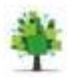

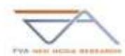