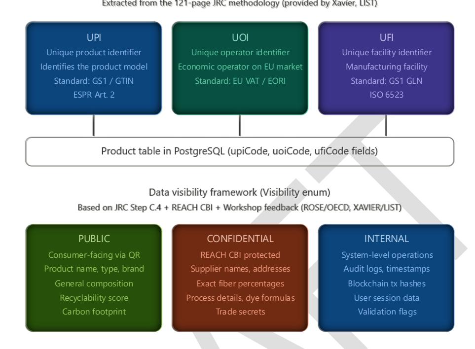
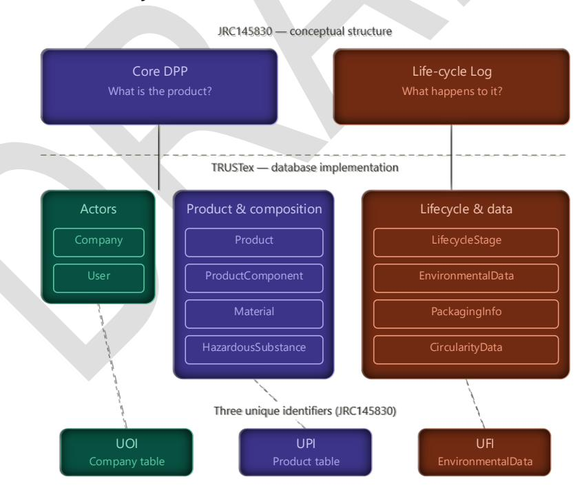
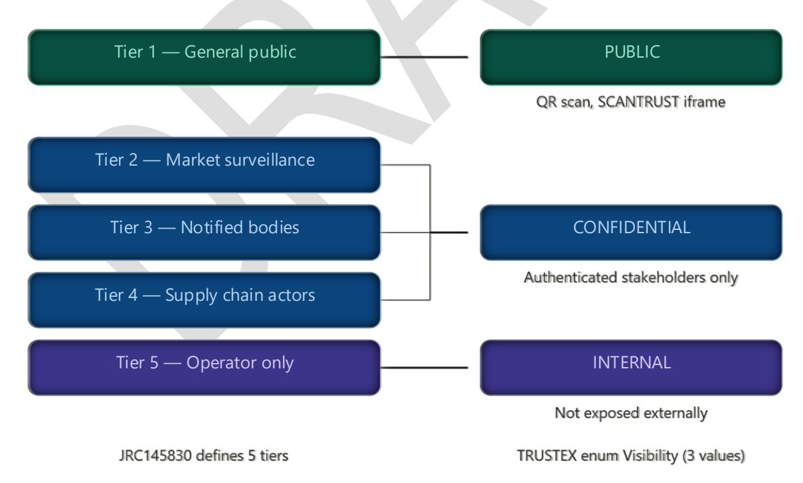
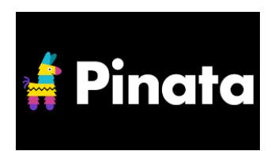
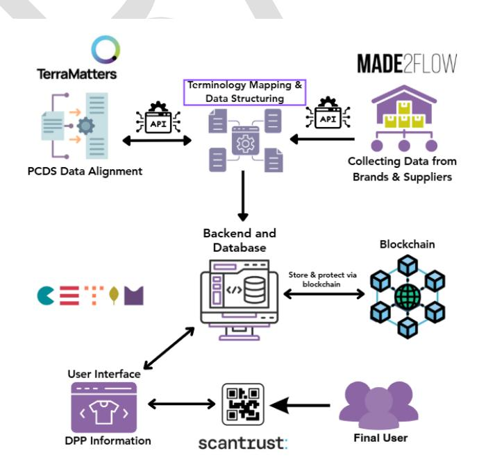
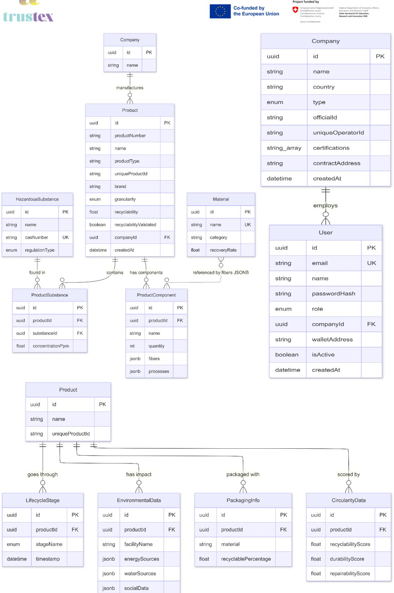
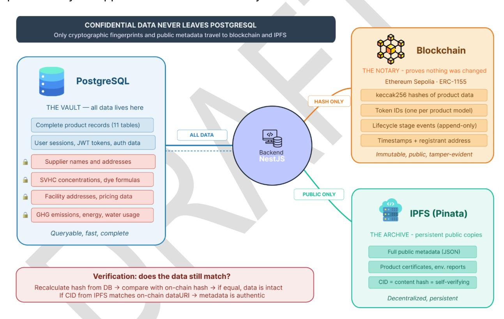
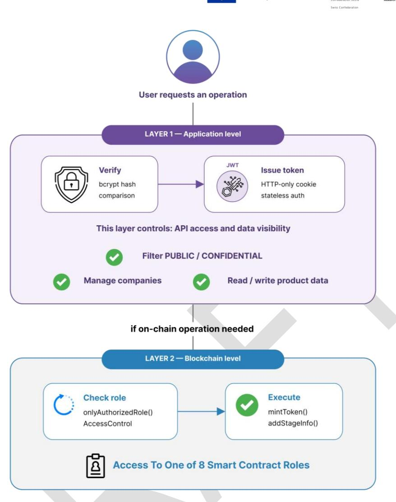

Advancing sustainable textiles in the circular economy through innovative EP schemes

#### **Table of Contents**

| 1.   | Acronyms and Abbreviations                           | 5  |
|------|------------------------------------------------------|----|
| 2.   | Executive Summary                                    | 5  |
| 3.   | Introduction                                         | 7  |
| 3.1. | Scope of this Deliverable                            | 7  |
| 3.2. | Relationship with Other Deliverables                 | 8  |
| 4.   | Regulatory and Normative                             | 8  |
| 4.1. | Ecodesign for Sustainable Products Regulation (ESPR) | 9  |
| 4.2. | JRC145830: DPP Data Specification Methodology        | 9  |
| 4.3. | CIRPASS and EU Blockchain Observatory                | 14 |
| 4.4. | Alignment with the CEN/JTC 24 DPP Standards          | 14 |
| 5.   | System Architecture                                  | 16 |
| 5.1. | System Components                                    | 16 |
| 5.2. | User Interfaces                                      | 17 |
| 5.3. | Technology Stack                                     | 18 |
| 5.4. | Repository Structure                                 | 19 |
| 5.5. | Data Flow                                            | 19 |
| 6.   | Data Model                                           | 21 |
| 6.1. | Granularity: Model-Level Approach                    | 21 |
| 6.2. | Schema Overview                                      | 22 |
| 6.3. | Group 1: Actors                                      | 24 |
| 6.4. | Group 2: Product & Composition                       | 24 |
| 6.5. | Group 3: Lifecycle & Data                            | 26 |
| 6.6. | Key Design Decisions                                 | 27 |
| 7.   | Blockchain Integration                               | 28 |
| 7.1. | Role of Blockchain in the Architecture               | 28 |
| 7.2. | Network Selection: Ethereum Sepolia                  | 29 |
| 7.3. | Smart Contract Architecture                          | 30 |
| 8.   | Authentication and Access Control                    | 32 |
| 8.1. | JWT-Based Authentication                             | 32 |
| 8.2. | Password Security: bcrypt                            | 32 |
| 8.3. | Data Visibility Model                                | 33 |

**8.4. Blockchain-Level Access Control[...................................................................](#page-32-1)33**

*9. Conclusions[...............................................................................................](#page-33-0) 34*

#### **Table of Figures and Tables**

| implementation in the TRUSTex data model.                                | 11                 |
|--------------------------------------------------------------------------|--------------------|
| the three table groups in the TRUSTex data model.                        | 12                 |
| Figure 3. JRC145830 access tiers, TRUSTEX visibility enum.               | 13                 |
| blockchain registration and public access.                               | 20                 |
| CETIM backend and blockchain to the consumer-facing data carrier.        | 20                 |
| Figure 6. Entity-relationship diagram of the TRUSTex DPP database —      | 11 tables in three |
| groups.                                                                  | 23                 |
| PostgreSQL.                                                              | 29                 |
| level role-based access.                                                 | 34                 |
| Table 1 Acronyms and Abbreviations used in this document                 | 5                  |
| Table 2. Mapping of JRC145830 access tiers to TRUSTex Visibility levels. | 13                 |
| Table 3 Core technology stack for the TRUSTex DPP infrastructure.        | 18                 |
| Table 4 Data visibility levels in the TRUSTex DPP system.                | 33                 |

**Project full title**: Advancing Sustainable Textiles in the Circular Economy Through Innovative EPR Schemes

**Acronym**: TRUSTex

**Call**: HORIZON-CL6-2024-CircBio-01-2

**Topic**: Circular solutions for textile value chains based on extended producer responsibility (Innovation Action)

**Start date**: 1st January 2025

**Duration**: 36 months

**List of participants:** CETIM, SCANTRUST, MADE2FLOW, TERRAMATTERS

**Deliverable:** D2.2 DPP Infrastructure Description

**Due date submission:** M18

**Submission date:** 30/06/2026

| Document Number:    | D2.2                                                  |
|---------------------|-------------------------------------------------------|
| Document Title:     | DPP Infrastructure Description                        |
| Dissemination level | PU – Public, fully open,                              |
| Period:             | PR1 / PR2                                             |
| WP:                 | WP2                                                   |
| Task:               | T2.2                                                  |
|                     | JRC145830 methodology, the system combines a Ethereum |

|     | Version | Date       | Description              |
|-----|---------|------------|--------------------------|
| 1.0 |         | 29/06/2026 | Deliverable for revision |
|     |         |            |                          |

# 1.Acronyms and Abbreviations

*Table 1 Acronyms and Abbreviations used in this document*

| Acronym | Definition                                                           |
|---------|----------------------------------------------------------------------|
| AES     | Advanced Encryption Standard                                         |
| API     | Application Programming Interface                                    |
| CID     | Content Identifier (IPFS)                                            |
| CIRPASS | Collaborative Initiative for a Standards-based DPP                   |
| DPP     | Digital Product Passport                                             |
| EPR     | Extended Producer Responsibility                                     |
| ESPR    | Ecodesign for Sustainable Products Regulation                        |
| GHG     | Greenhouse Gas                                                       |
| GS1     | Global Standards One (identification standards)                      |
| GTIN    | Global Trade Item Number                                             |
| IPFS    | InterPlanetary File System                                           |
| ISO     | International Organization for Standardization                       |
| JRC     | Joint Research Centre (European Commission)                          |
| JWT     | JSON Web Token                                                       |
| LEI     | Legal Entity Identifier                                              |
| PCDS    | Product Circularity Data Sheet                                       |
| QR      | Quick Response (code)                                                |
| REACH   | Registration, Evaluation, Authorisation and Restriction of Chemicals |
| RFID    | Radio-Frequency Identification                                       |
| SVHC    | Substance of Very High Concern                                       |
| UFI     | Unique Facility Identifier                                           |
| UOI     | Unique Operator Identifier                                           |
| UPI     | Unique Product Identifier                                            |
| WP      | Work Package                                                         |

# 2.Executive Summary

The objective of Task 2.2 within the TRUSTex project is to develop a **blockchain-based infrastructure** for secure data management and traceability of textile products through **Digital Product Passports (DPP)**. This infrastructure aligns with the **Ecodesign for Sustainable Products Regulation (ESPR[\)](#page-4-3)**1 and circularity standards (**ISO 5904[0](#page-4-4)**2 ), ensuring that the platform is scalable, interoperable, and compliant with the evolving EU regulatory framework.

This deliverable (D2.2) describes the DPP infrastructure designed and partially implemented by CETIM during the first 18 months of the project. The document covers the system architecture, the data model, the blockchain integration strategy, the authentication and access control mechanisms, and the interoperability solutions with partner systems (MADE2FLOW, SCANTRUST, TERRAMATTERS). It also provides the

This project has received funding from the European Union's Horizon Research and Innovation program under grant agreement N° 101181901 and from the Swiss State Secretariat for Education, Research and Innovation (SERI). Posts and shares reflect only the views of all the involved partners. Neither the European Union nor the granting authority can be held responsible for them. This draft deliverable has not yet been validated by the granting authorities.

1Regulation (EU) 2024/1781, *Establishing a framework for the setting of ecodesign requirements for sustainable products (ESPR)*, Official Journal of the European Union, 2024.

2 ISO 59040:2024, *Circular economy - Product circularity data sheet*.

regulatory context that informed every design decision, primarily the **JRC145830 methodology**[3](#page-5-0) published by the Joint Research Centre for DPP data specification.

The system follows a **hybrid architecture** combining a cloud-hosted backend (NestJS + PostgreSQL), a decentralised trust layer (Ethereum blockchain via smart contracts), and decentralised storage (IPFS via Pinata). Product data is stored in a relational database with **11 tables** organised in three groups: (1) Actors, (2) Product & Composition, (3) Lifecycle & Data; while a cryptographic hash of the data is registered on-chain to guarantee integrity and tamper-proof verification. The data model implements the three unique identifiers mandated by JRC145830: **UPI** (Unique Product Identifier), **UOI** (Unique Operator Identifier), and **UFI** (Unique Facility Identifier).

A first end-to-end validation of this infrastructure has been carried out, confirming that the complete cycle — from product registration through blockchain minting to integrity verification — operates as designed. The detailed validation, together with the system integration and user interfaces, is reported in deliverable D2.3 (M30). The system is currently deployed on the Ethereum Sepolia testnet and remains under active development towards that functional demonstration.

The textile industry faces an unprecedented regulatory transformation. The European Union, through the **Ecodesign for Sustainable Products Regulation (ESPR[\)](#page-5-1)**4 , has established a framework that mandates the adoption of **Digital Product Passports (DPP)** for products placed on the EU market. The DPP serves as a digital identity for physical products, providing structured, machine-readable information about their composition, environmental impact, and circularity potential throughout their entire lifecycle.

The **TRUSTex project** (Grant Agreement N° 101181901, Horizon Europe) addresses this challenge by developing circular solutions for textile value chains based on **Extended Producer Responsibility (EPR)**. Within this context, **Work Package 2 (WP2)** is responsible for the digitalisation of the textile value chain through the design, development, and deployment of a DPP infrastructure. CETIM leads WP2 and is specifically responsible for:

**Task 2.2 — Infrastructure Development:** developing a blockchain-based infrastructure for secure data management and traceability, aligned with EU regulations (ESPR) and circularity standards (ISO 59040), through a co-design process with stakeholders.

**Task 2.6 — System Integration:** integrating all WP2 components (backend, blockchain, data collection, data carriers, circularity data) into a functional prototype.

This project has received funding from the European Union's Horizon Research and Innovation program under grant agreement N° 101181901 and from the Swiss State Secretariat for Education, Research and Innovation (SERI). Posts and shares reflect only the views of all the involved partners. Neither the European Union nor the granting authority can be held responsible for them. This draft deliverable has not yet been validated by the granting authorities.

3European Commission, Joint Research Centre, Chawla, K., Chirvasuta, T. et al., *Methodology for the specification of data requirements for digital product passports*, JRC145830, Publications Office of the European Union, 2026. 4Regulation (EU) 2024/1781, *Establishing a framework for the setting of ecodesign requirements for sustainable products (ESPR)*, Official Journal of the European Union, 2024.

The infrastructure connects with work carried out by consortium partners: MADE2FLOW (environmental data collection, T2.3), SCANTRUST (data carriers and QR/RFID, T2.5), TERRAMATTERS (circularity data and ISO 59040, T2.4), and HDA (governance framework, T2.1).

# 3. Introduction

The textile industry faces an unprecedented regulatory transformation. The European Union, through the **Ecodesign for Sustainable Products Regulation (ESPR)**[5](#page-6-2) , has established a framework that mandates the adoption of **Digital Product Passports (DPP)** for products placed on the EU market. The DPP serves as a digital identity for physical products, providing structured, machine-readable information about their composition, environmental impact, and circularity potential throughout their entire lifecycle.

The **TRUSTex project** (Grant Agreement N° 101181901, Horizon Europe) addresses this challenge by developing circular solutions for textile value chains based on **Extended Producer Responsibility (EPR)**. Within this context, **Work Package 2 (WP2)** is responsible for the digitalisation of the textile value chain through the design, development, and deployment of a DPP infrastructure. CETIM leads WP2 and is specifically responsible for:

**Task 2.2 — Infrastructure Development:** developing a blockchain-based infrastructure for secure data management and traceability, aligned with EU regulations (ESPR) and circularity standards (ISO 59040), through a co-design process with stakeholders.

**Task 2.6 — System Integration:** integrating all WP2 components (backend, blockchain, data collection, data carriers, circularity data) into a functional prototype.

The infrastructure connects with work carried out by consortium partners: MADE2FLOW (environmental data collection, T2.3), SCANTRUST (data carriers and QR/RFID, T2.5), TERRAMATTERS (circularity data and ISO 59040, T2.4), and HDA (governance framework, T2.1).

# 3.1. Scope of this Deliverable

This document, **D2.2 — DPP Infrastructure Description**, provides a comprehensive technical description of the infrastructure developed to support the Digital Product Passport within TRUSTex. It covers:

This project has received funding from the European Union's Horizon Research and Innovation program under grant agreement N° 101181901 and from the Swiss State Secretariat for Education, Research and Innovation (SERI). Posts and shares reflect only the views of all the involved partners. Neither the European Union nor the granting authority can be held responsible for them. This draft deliverable has not yet been validated by the granting authorities.

5 Regulation (EU) 2024/1781, *Establishing a framework for the setting of ecodesign requirements for sustainable products* (ESPR), 2024.

**Regulatory and normative context:** the EU regulations and methodologies that informed every design decision, with focus on the ESPR and the JRC145830 DPP data specification methodology.[6](#page-7-2)

**System architecture: the technical architecture of the platform, including the backend server, relational database, blockchain trust layer, and decentralised storage (IPFS). The user interfaces and their integration are described in D2.3.**

**Data model:** the database schema with 11 tables organised in three groups, its alignment with JRC145830 requirements, and the rationale behind key structural decisions.

**Blockchain integration:** the smart contract design (ERC-1155 + Factory with EIP-1167 Minimal Proxies), the choice of Ethereum Sepolia, and the hybrid on-chain/off-chain storage strategy.

**Authentication and access control:** the JWT-based authentication system, password hashing with bcrypt, and the data visibility model (PUBLIC, CONFIDENTIAL, INTERNAL).

**Interoperability and partner integrations:** the interfaces with partner systems and the data exchange protocols being developed.

**Regulatory alignment: how every design decision maps to the ESPR requirements and the JRC145830 data specification methodology. The detailed end-to-end validation of the integrated system is reported separately in D2.3.**

# 3.2. Relationship with Other Deliverables

D2.2 is positioned between **D2.1** (DPP Governance, led by HDA, M12), which defines the governance framework, and **D2.3** (Integrated DPP System, led by CETIM, M30), which will deliver the functional demonstration. The infrastructure described herein provides the technical foundation upon which D2.3 will be built.

The document also connects with **D2.5** (Best Practices for DPP Implementation, led by SCANTRUST, M12), which provides guidelines for data carriers (QR codes, RFID) that interface with the infrastructure described in this report.

# 4.Regulatory and Normative

The design of the TRUSTex DPP infrastructure is grounded in the evolving EU regulatory framework for sustainable products. Every architectural decision and every field in the database schema traces back to a specific regulatory requirement or methodology

This project has received funding from the European Union's Horizon Research and Innovation program under grant agreement N° 101181901 and from the Swiss State Secretariat for Education, Research and Innovation (SERI). Posts and shares reflect only the views of all the involved partners. Neither the European Union nor the granting authority can be held responsible for them. This draft deliverable has not yet been validated by the granting authorities. 8

6European Commission, Joint Research Centre, Chawla, K., Chirvasuta, T. et al., *Methodology for the specification of data requirements for digital product passports*, JRC145830, Publications Office of the European Union, 2026.

recommendation. This section presents the key regulations and reference projects that informed the infrastructure design.

# 4.1. Ecodesign for Sustainable Products Regulation (ESPR)

The **ESPR** (*Ecodesign for Sustainable Products Regulation*, Regulation EU 2024/1781[\)](#page-8-2)7 establishes a horizontal framework to improve the environmental sustainability and circularity of products placed on the EU single market. The regulation introduces the **Digital Product Passport (DPP)** (a structured digital record that accompanies a physical product throughout its lifecycle, providing machine-readable information about its composition, environmental impact, and circularity potential) as a key instrument for transparency, traceability, and market surveillance.

The ESPR mandates that products covered by future delegated acts must carry a DPP accessible through a **data carrier** (typically a QR code or RFID tag) physically attached to the product. The DPP must provide verifiable information about the product's material composition, environmental footprint, durability, reparability, and end-of-life management options. This information must remain available throughout the entire product lifecycle — from design and manufacture through use, repair, and recycling.

For the textile sector, the ESPR represents a fundamental shift: brands and manufacturers will be required to provide standardised, verifiable information about their products that currently exists only in fragmented internal systems or is not collected at all. The specific data requirements for textiles will be defined through delegated acts expected to begin around 2027, which aligns with the TRUSTex project timeline and the **D2.3** functional demonstration milestone (M30). The TRUSTex infrastructure has been designed to meet these anticipated requirements from the outset, ensuring that the system can adapt as the exact regulatory specifications are adopted.

# 4.2. JRC145830: DPP Data Specification Methodology

The **JRC145830** repor[t](#page-8-3)8 , published by the **Joint Research Centre** (JRC, the European Commission's in-house science and knowledge service) in 2026, provides the official methodology for specifying DPP data requirements under the ESPR framework. This 121 page document has been the **primary technical reference** for the TRUSTex data model design. The full analysis carried out by CETIM is documented in *TRUSTEX\_Analisis\_JRC145830.docx*.

The JRC methodology establishes a structured approach to defining what data a DPP must contain, how it should be organised, who can access it, and how its integrity can be

This project has received funding from the European Union's Horizon Research and Innovation program under grant agreement N° 101181901 and from the Swiss State Secretariat for Education, Research and Innovation (SERI). Posts and shares reflect only the views of all the involved partners. Neither the European Union nor the granting authority can be held responsible for them. This draft deliverable has not yet been validated by the granting authorities.

7 CIRPASS Consortium, D3.1 *DPP System Architecture*, D3.4 *DPP System Roadmap V2*, 2024.

https://cirpassproject.eu

8 EU Blockchain Observatory and Forum, *Digital Product Passport: The Role of Blockchain*, 2023.

verified. The methodology is product-agnostic — it applies to any product category covered by ESPR delegated acts — which means the TRUSTex infrastructure can serve as a reference implementation adaptable to sectors beyond textiles.

Three key concepts from JRC145830 are directly implemented in the TRUSTex infrastructure and described in the following subsections.

## **Three Unique Identifiers (UPI, UOI, UFI)**

JRC145830 mandates three unique identifiers that every DPP must include. These identifiers ensure that any actor in the value chain — from a raw material supplier to a recycling facility — can unambiguously identify the product, the responsible economic operator, and the manufacturing facility.

**UPI** (*Unique Product Identifier*) uniquely identifies the product model or batch. The JRC recommends alignment with the **GS1 GTIN** standard (ISO/IEC 15459-[6](#page-9-0) 9 ), the international numbering system already used in retail for barcodes and QR-based traceability. In the TRUSTex data model, the UPI is implemented as the field *uniqueProductId* in the *Product* table, with a unique constraint enforced at the database level. During *blockchain* minting, the UPI is hashed (*keccak256*, a cryptographic hash function that produces a fixed-length 256-bit digest from any input, used as the standard hashing algorithm on Ethereum) and stored *on-chain* as *realWorldIdHash*, creating a verifiable but privacy-preserving link between the physical product and its digital identity.

**UOI** (*Unique Operator Identifier*) uniquely identifies the economic operator — the manufacturer, importer, or authorised representative — responsible for placing the product on the EU market. The JRC recommends basing this on the **LEI** standard (*Legal Entity Identifier*, ISO 17442[10](#page-9-1)), a 20-character alphanumeric code issued by the Global LEI Foundation that uniquely identifies every registered legal entity worldwide. In TRUSTex, the UOI is implemented as *uniqueOperatorId* in the *Company* table, alongside the company's *blockchain* wallet address (*walletAddress*) and deployed contract address (*contractAddress*).

**UFI** (*Unique Facility Identifier*) uniquely identifies the manufacturing facility where the product was produced. This identifier is critical for traceability and environmental accountability, as it links the product to the specific location where environmental data (energy consumption, water usage, GHG emissions) was generated. In TRUSTex, the UFI is implemented as *uniqueFacilityId* in the *EnvironmentalData* table, which already contained *facilityName* and *facilityCountry* fields from the initial schema design.

All three identifier fields are defined as optional in the database schema because not all products will have these identifiers assigned from the first day of operation. They will be

This project has received funding from the European Union's Horizon Research and Innovation program under grant agreement N° 101181901 and from the Swiss State Secretariat for Education, Research and Innovation (SERI). Posts and shares reflect only the views of all the involved partners. Neither the European Union nor the granting authority can be held responsible for them. This draft deliverable has not yet been validated by the granting authorities.

9EIP-1155: Multi Token Standard, Ethereum Improvement Proposals[. https://eips.ethereum.org/EIPS/eip-1155](https://eips.ethereum.org/EIPS/eip-1155) 10EIP-1167: Minimal Proxy Contract, Ethereum Improvement Proposals[. https://eips.ethereum.org/EIPS/eip-1167](https://eips.ethereum.org/EIPS/eip-1167)

progressively populated as consortium partners provide the corresponding GS1 and LEI codes for their products and organisations.

*Figure 1. The three unique identifiers mandated by JRC145830 (UPI, UOI, UFI) and their implementation in the TRUSTex data model.*

#### **Core DPP and Life-cycle Log Structure**

JRC145830 defines a DPP structure composed of two main parts that serve fundamentally different purposes:

The **Core DPP** contains static product information — data that is defined at design time and does not change throughout the product's lifecycle. This includes product identification (name, type, brand, UPI), material composition (fibers, percentages, chemical treatments), hazardous substance declarations (**SVHC** (*Substance of Very High Concern*, substances identified under the **REACH** regulation (*Registration, Evaluation, Authorization and Restriction of Chemicals*) as posing serious risks to human health or the environment) concentrations), and environmental footprint data. The *Core DPP* answers the question: *"What is this product, and what is it made of?"*

The **Life-cycle Log** records dynamic events that occur after the product leaves the manufacturing facility: changes of ownership, transport records, repair interventions, reconditioning operations, and end-of-life processing (collection, sorting, recycling). The *Life-cycle Log* answers the question: *"What has happened to this product since it was made?"* The JRC specifies that the *Life-cycle Log* must follow an **append-only** pattern (a

data structure where records can only be added, never modified or deleted) — ensuring a complete and tamper-proof audit trail.

The TRUSTex data model implements this distinction through the separation of its 11 tables into three logical groups:

**Product & Composition (5 tables):** *Product*, *ProductComponent*, *Material*, *HazardousSubstance*, *ProductSubstance*. These tables implement the *Core DPP*.

**Lifecycle & Data (4 tables):** *LifecycleStage*, *EnvironmentalData*, *PackagingInfo*, *CircularityData*. These tables implement the *Life-cycle Log*. The *LifecycleStage* table follows the *append-only* pattern — each stage is a separate record, and stages are never updated after creation. The *blockchain* registration of each stage provides the immutability guarantee.

**Actors (2 tables):** *Company* and *User*. These tables support both parts by identifying the economic operators and authenticated users who interact with the DPP.

This structural alignment was validated against JRC145830 during the analysis of March 2026, confirming that the initial schema design (completed on 12 March 2026, before the JRC document was analyzed) was already structurally compatible with the regulatory methodology. The three new identifier fields (UPI, UOI, UFI) were the main additions resulting from the JRC analysis.

*Figure 2. Core DPP and Life-cycle Log structure as defined by JRC145830, mapped to the three table groups in the TRUSTex data model.*

#### **Five Access Tiers**

The JRC methodology defines five levels of data access, reflecting the principle that not all DPP information should be available to all actors. A consumer scanning a QR code should see basic product information, but not detailed supplier data. A market surveillance authority needs access to the complete dataset.

*Table 2. Mapping of JRC145830 access tiers to TRUSTex Visibility levels.*

| 2 | – 3                                           |
|---|-----------------------------------------------|
| 4 | – 5                                           |
|   | authorities INTERNAL Full supply chain, audit |

This three-level simplification (PUBLIC, CONFIDENTIAL, INTERNAL) is a deliberate design decision for the prototype phase. It covers the essential access control requirements while avoiding the complexity of managing five separate tiers in a system under active development. The full five-tier model can be implemented in a future iteration by subdividing the CONFIDENTIAL level, requiring only minor changes to the *backend* authorisation logic.

*Figure 3. JRC145830 access tiers, TRUSTEX visibility enum.*

### 4.3. CIRPASS and EU Blockchain Observatory

**CIRPASS**[11](#page-13-2) was an EU-funded pilot project (2023–2024) that developed reference architectures and guidelines for DPP implementation across batteries, textiles, and electronics. Its deliverables (D3.1 and D3.4) informed the TRUSTex design in two areas: the definition of **data granularity levels** (item, batch, and model) with trade-off analysis for each, and the identification of **cross-sectoral interoperability requirements** (open standards for identifiers, JSON for data exchange, public *blockchain* for trust). The TRUSTex decision to adopt *Model Level* granularity is directly grounded in CIRPASS recommendations for textiles.

The **EU Blockchain Observatory and Forum**[12](#page-13-3) published a report analysing the role of *blockchain* technology in DPP implementations, identifying six key principles: standardisation, complete lifecycle information, LCA data integration, traceability, security through immutability, and interoperability. The TRUSTex *blockchain* integration strategy follows all six principles, with particular attention to the recommendation to use **public permissionless** *blockchains* for maximum transparency and to store **only cryptographic hashes** *on-chain* while keeping detailed data *off-chain*. This hybrid approach balances data integrity with the privacy requirements of commercial supply chain data.

# 4.4. Alignment with the CEN/JTC 24 DPP Standards

Alongside the ESPR and the JRC145830 methodology, the practical requirements for implementing a Digital Product Passport are being defined by a family of European standards developed by the CEN-CENELEC Joint Technical Committee 24 (JTC 24, the joint technical committee responsible for DPP standardisation) under European Commission standardisation request M/604. Six of these standards were published in 2026 — covering **unique identifiers**[13](#page-13-4) , **data carriers**[14](#page-13-5) , **data exchange protocols**[15](#page-13-6) , **lifecycle and search APIs**[16](#page-13-7) , **data storage and persistence**[17](#page-13-8), and **system interoperability**[18](#page-13-9) — while two further parts, on access-rights management and on data integrity, are still in preparation. Once their references are published in the Official Journal of the European Union, conformity with these standards will confer a presumption of conformity with the corresponding essential requirements of the ESPR.

11 CIRPASS Consortium, D3.1 *DPP System Architecture*, D3.4 *DPP System Roadmap V2*, 2024.

12 EU Blockchain Observatory and Forum, *Digital Product Passport: The Role of Blockchain*, 2023.

13 EN 18219:2026, *Digital Product Passport — Unique identifiers,* CEN-CENELEC, 2026.

14 EN 18220:2026, *Digital Product Passport — Data carriers,* CEN-CENELEC, 2026.

15 EN 18216:2026, *Digital Product Passport — Data exchange protocols,* CEN-CENELEC, 2026.

16 EN 18222:2026, *Digital Product Passport — APIs for lifecycle management and searchability,* CEN-CENELEC, 2026.

17 EN 18221:2026, *Digital Product Passport — Data storage, archiving and persistence,* CEN-CENELEC, 2026.

18 EN 18223:2026, *Digital Product Passport — System interoperability,* CEN-CENELEC, 2026.

The TRUSTex infrastructure was designed in anticipation of this framework, and most of its core decisions already map onto it.

At the level of identification, the data model already implements the three unique identifiers the standards build upon — the UPI, UOI, and UFI described above — although structuring them as fully resolvable, standard-conformant identifiers (for example through a GS1 Digital Link or a decentralised identifier scheme) is foreseen for the integrated-system phase. The physical **data carrier**, the QR code or RFID tag that links a garment to its passport, is produced and managed by SCANTRUST, while the backend stores and resolves the link between the carrier and the passport record. For data exchange, the backend already follows the expected profile: it exposes its data over HTTPS through a RESTful interface using JSON, the format the standards designate as mandatory. The lifecycle operations the standards describe — creating, reading, updating, and querying a passport — are present as backend endpoints, although aligning their exact method signatures to the standard interface is also left to D2.3.

The remaining standards concern how passport data is stored and shared. The storage and persistence requirements assume a decentralised arrangement, which the TRUSTex design satisfies through its combination of a relational database, content-addressed storage on IPFS, and on-chain anchoring of cryptographic hashes; together these yield versioned, tamper-evident records. The mechanisms specific to long-term persistence, such as replication to a backup service provider once an operator ceases activity, are not part of the prototype and are planned for a later phase. The interoperability standard defines a common semantic model and a standard exchange representation for the passport; the TRUSTex relational model captures the same content, and exposing it in that representation is a matter of adding a **serialisation layer** rather than redesigning the database, because the standards deliberately leave the choice of storage technology open.

Aligning the architecture with the JTC 24 standards at this stage is a deliberate decision rather than a later adaptation, because these standards operationalise — at the level of identifiers, carriers, interfaces, and data formats — the same requirements that the JRC145830 methodology defines conceptually. Building the infrastructure around them early reduces the rework that would otherwise be needed once the textile delegated act and the central EU registry enter into force. The trade-off is that several of these standards are recent and not yet cited in the Official Journal, and two parts remain in preparation; this deliverable therefore reports alignment at the **design level**, and a formal, point-bypoint conformity assessment will be reported in D2.3 together with the validated integrated system.

# 5.System Architecture

The TRUSTex DPP platform is built on a **hybrid architecture** that combines centralized and decentralized components. No single technology can simultaneously provide fast queries, tamper-proof guarantees, and decentralized persistence. A relational database excels at structured queries but cannot prove that data has not been altered. A *blockchain* provides immutability but cannot store large volumes of data efficiently. Decentralized storage (**IPFS**, *InterPlanetary File System*, a distributed protocol where files are identified by their content hash rather than their server location) offers persistent, content-addressed files but lacks query capabilities.

By combining these three technologies — each handling what it does best — the system achieves a platform that is simultaneously queryable, verifiable, and persistent, while respecting the privacy requirements of commercial supply chain data.

# 5.1. System Components

The platform consists of five components, each with a clearly defined responsibility:

**Backend Server (NestJS, CETIM):** the central orchestrator of the entire system. It receives all data from external sources, validates and transforms it, stores it in the database, and coordinates interactions with the *blockchain* and IPFS. The *backend* is the **sole system authorized to write to the** *blockchain* **smart contracts** — all write operations must pass through this gateway. This ensures that every *blockchain* transaction is authenticated, validated, and logged before execution. The server runs on port 4000 and exposes a REST API under the prefix /api/v1/ with seven modules: *Auth* (authentication), *Companies* (operator management), *Products* (product registration), *Lifecycle* (lifecycle events), *Blockchain* (*smart contract* interaction), *Pinata* (IPFS storage), and *Environmental* (environmental data).

**Relational Database (PostgreSQL via Neon):** the **unique source of truth** for all product information. The database stores the complete dataset including confidential fields that are never sent to *blockchain* or IPFS. It runs on **PostgreSQL 17** hosted by Neon (*serverless* PostgreSQL) in the Frankfurt region. The schema contains **11 tables** organised in three logical groups (Actors, Product & Composition, Lifecycle & Data), described in detail in Section 4. *Prisma* v7 serves as the ORM (*Object-Relational Mapping*, a library that maps database tables to TypeScript objects) using the *driver adapter* pattern required for Neon compatibility.

**Blockchain Layer (Ethereum Sepolia):** the immutable trust layer. It does not store product data directly. Instead, it stores *keccak256* hashes (a cryptographic function that produces a fixed 256-bit digest from any input, used as the standard hashing algorithm on Ethereum) of the product data, along with minimal metadata about

lifecycle events (stage name, *timestamp*, registering actor). If anyone modifies data in the database, the stored *hash* will no longer match the *on-chain hash*, making the tampering immediately detectable. The *smart contracts* follow the **ERC-1155** multi-token standard[19](#page-16-1) with a **Factory pattern using EIP-1167** *Minimal Proxies*[20](#page-16-2), described in detail in Section 5.

**Decentralised Storage (IPFS via Pinata):** stores the complete public DPP metadata as JSON files. Each file is identified by a **CID** (*Content Identifier*), a hash derived from the file's content. Because the CID *is* a hash of the content, any modification to the

file changes its CID automatically, providing an integrity verification mechanism independent of the *blockchain*. Pinata is a managed IPFS pinning service that ensures

content persistence without requiring CETIM to operate its own IPFS node.

**Data Carrier and Public Interface (SCANTRUST):** bridges the physical textile product with its digital record. SCANTRUST generates and manages **QR codes** (and potentially RFID tags) that are attached to the garment. When a consumer scans the code, they are directed to the SCANTRUST landing page showing the public subset of DPP data. Within this page, a **specialised** *iframe* **developed by CETIM** displays *blockchain*-verified information: the product's *on-chain* registration status, the integrity verification result, and links to the complete metadata on IPFS.

# 5.2. User Interfaces

The platform serves two distinct audiences through separate interfaces:

**Public interface (consumer-facing):** accessible to anyone scanning the QR code, without authentication. Displays product name, brand, general material composition, care instructions, and recyclability score. Hosted by SCANTRUST with the CETIM *iframe* for *blockchain* verification. Only fields tagged as **PUBLIC** in the database are shown.

**Stakeholder interface (authorised users):** accessible only to authenticated consortium members via **JWT** (*JSON Web Token*, a standard for securely transmitting authenticated claims between systems). Provides complete access to all DPP data including

This project has received funding from the European Union's Horizon Research and Innovation program under grant agreement N° 101181901 and from the Swiss State Secretariat for Education, Research and Innovation (SERI). Posts and shares reflect only the views of all the involved partners. Neither the European Union nor the granting authority can be held responsible for them. This draft deliverable has not yet been validated by the granting authorities. 17

19 EIP-1155: Multi Token Standard, Ethereum Improvement Proposals.

20 EIP-1167: Minimal Proxy Contract, Ethereum Improvement Proposals.

confidential fields (supplier details, facility addresses, SVHC concentrations, exact fibre percentages). Developed by CETIM using Next.js.

# 5.3. Technology Stack

The TRUSTex DPP infrastructure is built on a modern, type-safe technology stack selected for reliability, maintainability, and alignment with current industry standards. The stack is organised in three layers: the backend application, the blockchain layer, and the supporting development and storage services. Table 3 summarises the core technologies and the rationale behind each choice.

*Table 3 Core technology stack for the TRUSTex DPP infrastructure.*

| TECHNOLOGY | PURPOSE      | VERSION | RATIONALE                                 |
|------------|--------------|---------|-------------------------------------------|
| NestJS     | Backend      |         |                                           |
|            | framework    | 11.x    |                                           |
|            |              |         | domain. Mature Passport integration for   |
| Prisma     | Database     |         |                                           |
|            | ORM          | 7.x     |                                           |
|            | database     | 17      |                                           |
|            |              |         | prototyping (zero infrastructure cost per |
| Next.js    | Frontend     |         |                                           |
|            | framework    | 16      |                                           |
|            |              |         | React 19 with server-side rendering.      |
|            |              |         | Compatible with the cookie-based JWT      |
|            |              |         | Standard language for EVM-compatible      |
|            |              |         | Audited implementations of ERC-1155,      |
| viem       | Blockchain   |         |                                           |
|            | client       | latest  |                                           |
| Pinata SDK | IPFS storage | latest  |                                           |
|            |              |         | Managed IPFS pinning service. Content     |
| Bruno      | API testing  | latest  |                                           |
|            |              |         | Collections stored in the repository for  |

A consistent design principle across the stack is type safety end to end: TypeScript on the backend, Prisma for database access, and view for blockchain interaction share the same type system, which reduces integration errors between layers. The choice of

managed, serverless services (Neon for the database, Pinata for IPFS) keeps the operational overhead low during the prototype phase, while the use of audited OpenZeppelin libraries and a public testnet keeps the smart-contract layer aligned with established security practices.

# 5.4. Repository Structure

The codebase is organised as a *monorepo* (a single repository containing related projects) with two main directories:

▪ **trustex-web/backend/** — the NestJS application with the seven modules listed above, the Prisma schema and migration files, and the Bruno API testing collection. ▪ **trustex-web/frontend/** — the Next.js application providing the stakeholder interface, progressively connected to the *backend* API.

The *smart contract* source code (Solidity) and deployment scripts (Foundry) are maintained in a separate repository (*trustex-1/*), containing: *ITrustexDPPToken* (interface), *BaseTrustexDPPToken* (base implementation), *TrustexDPPToken* (full implementation with ERC-1155 + *AccessControl*), and *FactoryTrustexDPPToken* (*Factory* with EIP-1167 cloning).

# 5.5. Data Flow

All data enters the system through the *backend*, which serves as the single point of entry. External data sources (MADE2FLOW forms, SCANTRUST identifiers, direct input via the WebApp) send data to the REST API, which validates, transforms, and stores it in PostgreSQL.

This single-entry design exists because a textile DPP is not assembled from one source but from several WP2 partners contributing complementary data. MADE2FLOW collects primary information from brands and suppliers and exposes it through an API; TERRAMATTERS contributes the circularity data layer based on the Product Circularity Data Sheet (PCDS, ISO 59040); and SCANTRUST provides the data carrier that links the physical garment to its passport. The backend is therefore designed as a terminology mapping and structuring layer that normalises these heterogeneous inputs into a single coherent model before they are stored and anchored on-chain. Describing this flow is essential to the infrastructure: it shows how the system is built to receive and reconcile external data rather than to hold data produced by a single actor.

*Figure 4. Data flow in the TRUSTex DPP: from data entry through backend processing to blockchain registration and public access.*

When *blockchain* registration is requested, the *backend* constructs a JSON metadata object from the public fields, uploads it to IPFS via Pinata, calculates its *keccak256* hash, and registers the hash *on-chain* through the corresponding *smart contract*. The resulting transaction hash and IPFS CID are stored back in PostgreSQL for reference. This architecture provides a **triple integrity guarantee**: the *keccak256 hash on-chain* proves data has not been modified; the JSON on IPFS is content-addressed and decentralized, persisting independently of CETIM's server; and PostgreSQL maintains all data including confidential fields that are never sent to either IPFS or *blockchain*.

# 6.Data Model

The data model captures all the information required by the ESPR and JRC145830[21](#page-20-2) for a textile DPP, while maintaining the flexibility to accommodate the variable data structures provided by different consortium partners. The schema was designed specifically to implement the *Core DPP* / *Life-cycle Log* distinction defined by JRC145830: static product information is stored in the Product & Composition tables, while dynamic lifecycle events are stored in the Lifecycle & Data tables.

# 6.1. Granularity: Model-Level Approach

A foundational decision underlying the entire data model is the level of granularity at which a Digital Product Passport is created. Following the granularity framework defined by CIRPASS-2, three levels were evaluated for the TRUSTex prototype:

- 1. Item level every individual physical unit carries its own DPP. This is the most precise approach and the only one that allows distinguishing between otherwise identical products, but capturing and managing unique data for every single unit is currently impractical and prohibitively costly for both a prototype and a realworld deployment.
- 2. Batch level identical products are grouped into production batches, each with its own DPP. This option was found to be the least favourable, mainly because the definition of a batch varies across actors and isolating accurate data for each specific production run is difficult.
- 3. Model level all products sharing the same design and specifications use the same DPP. This sacrifices unit-level distinction but allows the collection of highquality data that accurately reflects the manufacturing and supply-chain processes, while keeping the data architecture manageable.

This project has received funding from the European Union's Horizon Research and Innovation program under grant agreement N° 101181901 and from the Swiss State Secretariat for Education, Research and Innovation (SERI). Posts and shares reflect only the views of all the involved partners. Neither the European Union nor the granting authority can be held responsible for them. This draft deliverable has not yet been validated by the granting authorities.

21European Commission, JRC145830, *Methodology for the specification of data requirements for digital product passports*, 2026.

The TRUSTex infrastructure adopts the model level as its standard granularity for the prototype, in line with CIRPASS-2 and consistent with the JRC145830 methodology. This decision is reflected directly in the data model: the Product table includes a granularity field (an enumeration of ITEM, BATCH and MODEL) that is set to MODEL for the current scope. Keeping granularity as an explicit, configurable field rather than a hard-coded assumption means the infrastructure can accommodate finer granularity in the future without structural changes, should the project or the regulation require it.

This choice also shapes how the product life cycle is represented. The life cycle is divided into the stages identified during the project workshops — Design, Manufacturing, Retail, Use, Collection and Recycling. The infrastructure focuses primarily on the earlier stages (design, manufacturing and retail, together with the associated logistics), where modellevel data is reliable and consistent. The later stages — use, collection and recycling are more naturally tied to individual items, so while the LifecycleStage table can record them, the data captured there is expected to be coarser at model level. This distinction is documented here so that the granularity of each stage is interpreted correctly.

# 6.2. Schema Overview

The database contains **11 tables** organised in three logical groups:

**Group 1 — Actors (2 tables):** *Company* and *User*. Represent the organisations and individuals that interact with the DPP system.

**Group 2 — Product & Composition (5 tables):** *Product*, *ProductComponent*, *Material*, *HazardousSubstance*, and *ProductSubstance*. Describe what the product is, what it is made of, and what regulated substances it contains. These tables implement the *Core DPP*.

**Group 3 — Lifecycle & Data (4 tables):** *LifecycleStage*, *EnvironmentalData*, *PackagingInfo*, and *CircularityData*. Record the product's journey through its lifecycle and the associated environmental, packaging, and circularity data. These tables implement the *Life-cycle Log*.

*Figure 6. Entity-relationship diagram of the TRUSTex DPP database — 11 tables in three groups.*

### 6.3. Group 1: Actors

#### **Company**

Represents economic operators participating in the DPP ecosystem — manufacturers, brands, recyclers, or any organization in the textile value chain. Each company record stores:

**JRC145830 identifier:** *uniqueOperatorId* — implements the **UOI** (*Unique Operator Identifier*), recommended to follow the LEI standard (ISO 17442), a 20-character alphanumeric code that uniquely identifies legal entities worldwide.

**Blockchain fields:** *walletAddress* (the Ethereum address used by the company to sign transactions), *contractAddress* (the address of the company's dedicated ERC-1155 clone, populated when the *Factory* deploys a new *Minimal Proxy* for the company), and *contractAbi* (the contract's ABI stored as JSONB for *backend* interaction).

#### **User**

Stores authenticated users, each linked to exactly one company via a foreign key (*companyId*). Fields include: *name*, *email* (unique), *password* (*bcrypt* hash, never stored in plain text), *role* (determines permissions), and *walletAddress* (optional, for users who interact directly with *blockchain*). The *role* field has no default value — it must be explicitly assigned at creation to prevent accidental privilege escalation.

# 6.4. Group 2: Product & Composition

### **Product**

The central entity of the *Core DPP*. Each product record represents a textile product at **Model Level** granularity (all identical items sharing the same design use the same DPP). Key fields:

**Identification:** *productNumber* (internal reference), *uniqueProductId* (implements the **UPI** — *Unique Product Identifier*, compatible with the GS1 GTIN standard).

**Product data:** *name*, *description*, *productType* (enum: GARMENT, ACCESSORY, FOOTWEAR, HOME\_TEXTILE, TECHNICAL\_TEXTILE), *brand*, *colorway*, *season*, *barcode*.

**Design features:** *designVariant* (for products with multiple design versions, such as the Centexbel jeans with two design variants), *designForDisassembly* (boolean, indicates whether the product uses disassembly technologies such as Resortecs thread).

**Recyclability:** *recyclability* (percentage, calculated from the recovery rates of constituent materials), *recyclabilityValidated* (boolean, whether the value was confirmed experimentally).

**Granularity:** *granularity* (enum: ITEM, BATCH, MODEL — set to MODEL for the current prototype).

**Blockchain:** *blockchainTokenId* (the ERC-1155 token ID assigned during minting, read from the *MintToken* event), *blockchainTxHash* (the Ethereum transaction hash), *qrCodeUrl* (URL of the QR code generated by SCANTRUST).

#### **ProductComponent**

Represents the hierarchical composition of a textile product. Real-world products consist of multiple components — for example, a jacket has an outer shell, inner lining, insulation layer, zippers, and labels, each with its own fibre composition, supplier chain, and manufacturing processes. This table was designed after analysing the MADE2FLOW *BOM Data Request* forms, which revealed that a flat composition table could not accommodate this hierarchical structure.

**Core fields:** *name* (e.g. "Outer Shell", "Inner Lining"), *quantity*, *composition* (textual summary, e.g. "86% Recycled Polyester, 14% Elastane"), *weightValue*, *weightUnit*.

**Supplier data:** *supplierName*, *supplierCountry*, *supplierAddress* — all tagged as **CONFIDENTIAL** by default via the *visibility* field, because consortium stakeholders rejected exposing supply chain information to consumers.

**JSONB fields** (flexible structure for partner data):

The JSONB fields were chosen because the exact structure of MADE2FLOW's data varies between components and between suppliers. A fixed relational schema would require dozens of auxiliary tables and frequent destructive migrations as partner data formats evolve.

#### **Material**

A catalogue table storing the recyclability properties of each textile material type (cotton, polyester, elastane, nylon, wool, etc.). Its primary function is to provide recovery rates for the automatic calculation of product recyclability: the system queries the *recoveryRate* of each material present in a product and computes a weighted recyclability percentage.

**Key fields:** *name* (unique constraint), *category* (natural/synthetic/regenerated), *recoveryRate*, *hasMicroplastics*, *reachCompliant*.

#### **HazardousSubstance and ProductSubstance**

*HazardousSubstance* maintains a catalogue of regulated substances, each identified by its **CAS number** (*Chemical Abstracts Service*, the international chemical identifier unique constraint in the database). Fields include: *name*, *casNumber*, *regulationType* (REACH/SVHC/POP), *riskCategory* (carcinogenic, irritant, ecotoxic...), and *maxAllowedPpm*.

*ProductSubstance* creates a relationship between products and hazardous substances. Each record stores: *concentrationPpm* (the actual concentration detected), *applicationArea* (e.g. "hydrophobic outer coating"), *isCompliant* (whether the concentration is within legal limits), *testDate*, and *testLab*. This table enables the system to answer: "Does this product contain any hazardous substance, and at what concentration?" — a core ESPR requirement.

# 6.5. Group 3: Lifecycle & Data

#### **LifecycleStage**

Records events in the product's lifecycle following the **append-only** pattern mandated by JRC145830[22](#page-25-1). Each record represents one lifecycle event and is never modified after creation. The *blockchain* registration of each stage provides the immutability guarantee.

**Stage names** (enum *StageName* with 9 values): DESIGN, MANUFACTURING, SPINNING, DYEING, TRANSPORT, RETAIL, REPAIR, RECONDITIONING, END\_OF\_LIFE. The last three values were added after the JRC145830 analysis to cover the 7 types of lifecycle events defined by the JRC.

**On-chain fields:** *dataHash* (*keccak256* hash of the stage data, matching the *on-chain* hash for integrity verification), *dataUri* (IPFS URI pointing to the full metadata JSON, in the format *ipfs://CID*), and *blockchainTxHash* (the Ethereum transaction hash for audit trail).

**Context fields:** *stageName*, *location*, *description*, *responsibleCompany*, *metadata* (JSONB for additional structured data).

#### **EnvironmentalData**

Stores facility-level environmental metrics for each lifecycle stage. This table is designed to be compatible with the MADE2FLOW *Facility Questionnaire* structure, where environmental data is collected per facility per month.

**JRC145830 identifier:** *uniqueFacilityId* — implements the **UFI** (*Unique Facility Identifier*), linking the product to the specific facility where the environmental data was generated.

**Core metrics:** *carbonFootprint*, *waterConsumption*, *energyConsumption*, *wasteGenerated*, *facilityName*, *facilityCountry*.

**JSONB fields:** *additionalMetrics* (for environmental data not covered by the predefined columns), *socialData* (employees by gender, shifts, certifications — Phase 2 ESPR data that MADE2FLOW already collects), and *rawData* (the unprocessed MADE2FLOW response for reference).

This project has received funding from the European Union's Horizon Research and Innovation program under grant agreement N° 101181901 and from the Swiss State Secretariat for Education, Research and Innovation (SERI). Posts and shares reflect only the views of all the involved partners. Neither the European Union nor the granting authority can be held responsible for them. This draft deliverable has not yet been validated by the granting authorities. 26

22European Commission, JRC145830, *Methodology for the specification of data requirements for digital product passports*, 2026.

#### **PackagingInfo**

The ESPR Phase 1 mandates transparency not only with the textile product itself but also its packaging. This table stores: *recycledContent* (percentage), *recyclability* (percentage), *isReusable* (boolean), *materialType* (cardboard, plastic, paper, mixed...), and *weight*. Separated from *Product* because packaging data has its own structure and can be updated independently.

#### **CircularityData**

Stores circularity indicators aligned with **ISO 59040**[23](#page-26-1) (*Product Circularity Data Sheet*) provided by TERRAMATTERS. The primary field is *pcdsData* (JSONB), which contains all PCDS responses in the standardised binary format (true/false per indicator). Additional fields: *pcdsVersion* (version of the PCDS standard used) and *createdAt*. This data feeds into the LIST EPR Decision-Support Dashboard, which requires aggregated durability, reparability, recyclability, and recycled content data.

This table is modelled the way it is because the circularity information it holds follows an external standard rather than an internal convention. The PCDS expresses each circularity characteristic as a verifiable true/false statement and, where quantities are involved, uses defined ranges instead of absolute figures. Storing the responses keyed by their fixed statement identifiers preserves that structure, so that the same indicator always carries the same meaning and circularity data remains comparable and interoperable across products and partners. This makes the PCDS a structured upstream source that complements the absolute values a fully detailed passport ultimately requires, and it is the reason the circularity layer is represented as standardised statements rather than free-form fields. The same principle of standardised, interoperable identifiers underpins the unique identifiers and integrity mechanisms described elsewhere in this document, which are consistent with the direction set out in the draft implementing regulation on the DPP registry currently under consultation.

# 6.6. Key Design Decisions

# **JSONB Fields for Partner Data**

Several tables (*ProductComponent*, *EnvironmentalData*, *CircularityData*) include JSONB columns. This is a deliberate architectural choice: at the time of schema design, the APIs of key partners (MADE2FLOW, TERRAMATTERS) were not yet fully defined. Their data structures were evolving, and imposing a rigid relational schema would have required destructive database migrations every time a partner modified their format. JSONB in a database like PostgreSQL provides the flexibility of a document store within a relational

This project has received funding from the European Union's Horizon Research and Innovation program under grant agreement N° 101181901 and from the Swiss State Secretariat for Education, Research and Innovation (SERI). Posts and shares reflect only the views of all the involved partners. Neither the European Union nor the granting authority can be held responsible for them. This draft deliverable has not yet been validated by the granting authorities. 27

23ISO 59040:2024, *Circular economy - Product circularity data sheet*.

database —supporting indexing, querying (including nested field access), and validation. As partner formats stabilise, critical JSONB fields can be progressively migrated to dedicated relational columns.

### **Visibility Enum at Field Level**

The *visibility* field (PUBLIC, CONFIDENTIAL, INTERNAL) is applied at the *ProductComponent* level rather than at the *Product* level. This allows the system to expose a product's general composition publicly (e.g. "86% Recycled Polyester") while keeping the supplier details of each component confidential — a distinction that emerged from stakeholder feedback during the PROSPEX workshop, where industry representatives rejected exposing supply chain data to consumers.

# 7.Blockchain Integration

The *blockchain* layer provides the immutable trust foundation of the TRUSTex DPP. It ensures that product data, once registered, cannot be modified without detection. This section describes the role of blockchain in the architecture, the smart contracts design, the network selection and the decentralized storage strategy.

This emphasis on integrity, unique identifiers and verifiable records is not only a technical choice but also an anticipation of where DPP regulation is heading. The draft implementing regulation on the DPP registry currently under consultation foresees a registry built on unique registration identifiers, a cryptographic hash for each version of a passport, and a log system providing tamper-proof audit trails. Designing the infrastructure around on-chain hashes and unique identifiers from the outset keeps TRUSTex aligned with that direction, so that the system can later interoperate with the central registry rather than having to be retrofitted to it.

# 7.1. Role of Blockchain in the Architecture

The *blockchain* does not replace the relational database. It acts as a **cryptographic notary layer** that provides immutable proof of data integrity. The principle, recommended by the EU Blockchain Observatory and Forum[24](#page-27-2), is clear: *confidential supply chain data should never be stored on a public blockchain*. Only information intended for public verification goes *on-chain*.

In practice, this means:

**What goes** *on-chain***:** cryptographic hashes (*keccak256*) of the product data, token IDs, lifecycle stage events (stage name, *timestamp*, registering actor address), and IPFS content URIs. These are lightweight records — typically a few hundred bytes per product.

This project has received funding from the European Union's Horizon Research and Innovation program under grant agreement N° 101181901 and from the Swiss State Secretariat for Education, Research and Innovation (SERI). Posts and shares reflect only the views of all the involved partners. Neither the European Union nor the granting authority can be held responsible for them. This draft deliverable has not yet been validated by the granting authorities. 28

24EU Blockchain Observatory and Forum, *Digital Product Passport: The Role of Blockchain*, 2023.

**What stays in PostgreSQL:** all detailed product data, supplier information, SVHC concentrations, facility addresses, user sessions, pricing data, and any field tagged as CONFIDENTIAL or INTERNAL. These records are never sent to the *blockchain* or IPFS.

**What goes to IPFS:** the complete public metadata of each product and lifecycle stage, stored as JSON files identified by content hash (CID). Only fields tagged as PUBLIC are included in these files.

The system provides a **triple integrity guarantee**: (1) the *keccak256 hash on-chain* proves data has not been modified since registration; (2) the JSON on IPFS is contentaddressed, providing a persistence layer independent of CETIM's server; and (3) PostgreSQL maintains the complete dataset including confidential fields that are protected by the application's authentication system.

*Figure 7. Hybrid on-chain / off-chain architecture: what goes to blockchain, IPFS, and PostgreSQL.*

# 7.2. Network Selection: Ethereum Sepolia

The **Ethereum network** was selected for the *blockchain* layer based on three criteria:

**EVM compatibility:** Ethereum's Virtual Machine (EVM) is the most widely supported execution environment for *smart contracts*. Any contract deployed on Ethereum can be redeployed on any EVM-compatible network (Polygon, Arbitrum, EBSI) without code changes. This ensures that the TRUSTex infrastructure is not locked into a single network.

**Largest developer ecosystem:** Ethereum has the largest base of developers, audited libraries (OpenZeppelin), development tools (Foundry, Hardhat), and documentation of any *blockchain* platform. This provides access to battle-tested security components and reduces development risk.

**Alignment with EU recommendations:** the EU Blockchain Observatory specifically recommends public permissionless *blockchains* for DPP implementations, as they provide maximum transparency and do not depend on a single organisation's continued operation.

The **Sepolia testnet** is used during the prototype phase. It is functionally identical to the Ethereum mainnet but provides zero-cost transactions. When the project transitions to production, migration to Ethereum mainnet, a Layer 2 solution (Polygon, Arbitrum), or **EBSI** (*European Blockchain Services Infrastructure*) will be evaluated based on cost, throughput, and regulatory alignment.

## 7.3. Smart Contract Architecture

The TRUSTex *smart contract* system consists of four Solidity contracts organised in a layered structure:

#### **ITrustexDPPToken (Interface)**

Defines the public interface that all DPP token contracts must implement. This ensures interoperability: any system interacting with a TRUSTex DPP contract knows exactly what functions are available, regardless of the specific implementation version.

## **BaseTrustexDPPToken (Abstract Base Contract)**

Contains the shared definitions used by all contract implementations:

**8 roles** using OpenZeppelin's *AccessControl*: DEFAULT\_ADMIN\_ROLE (contract owner, can grant/revoke all other roles), DESIGNER, MANUFACTURER, LOGISTICS, RETAILER, CONSUMER, RECYCLER, and AUDITOR. Each role corresponds to a type of actor in the textile value chain.

**StageInfo struct:** defines the data recorded for each lifecycle event — *hashInformation* (*keccak256* hash of the stage data), *timestamp* (Unix time), *dataURI* (IPFS link in *ipfs://CID* format), *stageName* (descriptive identifier), and *registeredBy* (wallet address of the registrant).

**Modifier** *onlyAuthorizedRole()***:** verifies that the caller holds at least one assigned role before allowing execution. This prevents unauthorised actors from registering data.

**Events:** *MintToken* (emitted when a new product is registered) and *AddStageInfo* (emitted when a lifecycle stage is added). These events provide a transparent, queryable log of all operations on the *blockchain*.

#### **TrustexDPPToken (Implementation Contract)**

The full **ERC-1155**[25](#page-30-0) implementation that manages the DPPs. ERC-1155 was selected over ERC-721 because a single contract can manage multiple token types (each representing a different product model) within the same instance, reducing deployment costs and simplifying the architecture. Key functions:

**mintToken()**: creates a new token linking a *realWorldId* (the product's UPI, hashed with *keccak256*) to a *tokenId*. Registers the first lifecycle stage (typically DESIGN). Includes protection against reentrancy attacks (*ReentrancyGuard*) and duplicate prevention (*hashUsedInToken* mapping).

**addStageInfo()**: adds a new lifecycle event to an existing token. Each stage includes the integrity hash, stage name, IPFS URI, *timestamp*, and registrant address. Stages are stored in a mapping and follow the *append-only* pattern — they can be added but never modified or deleted.

**getStageInfoByTokenId() / getStageInfoByRealWorldId()**: query functions that return all recorded lifecycle stages for a given product, enabling verification by any party.

**hasStage()**: a quick verification function that checks whether a specific lifecycle stage has been registered for a product.

### **FactoryTrustexDPPToken (Factory with Minimal Proxy)**

The Factory contract solves a critical technical constraint: under **EIP-170**[26](#page-30-1) , *smart contracts* on Ethereum are limited to **24 KB**. The initial Factory design embedded the full *TrustexDPPToken* bytecode to instantiate new contracts per company, which caused the Factory to exceed this limit (approximately 26 KB compiled). The Solidity compiler could not produce a deployable artifact.

The solution uses the **Minimal Proxy pattern (EIP-1167)**[27](#page-30-2) from the OpenZeppelin *Clones* library:

A single *TrustexDPPToken* is deployed once as the **master implementation**. The Factory stores only its address (*immutable*), not its bytecode.

When a new company is registered with *deployContract: true*, the Factory calls *createTrustexDPPToken()* which deploys a **clone** — a lightweight proxy of approximately **45 bytes** of runtime bytecode. All function calls to the clone are forwarded to the master implementation via *DELEGATECALL*.

This project has received funding from the European Union's Horizon Research and Innovation program under grant agreement N° 101181901 and from the Swiss State Secretariat for Education, Research and Innovation (SERI). Posts and shares reflect only the views of all the involved partners. Neither the European Union nor the granting authority can be held responsible for them. This draft deliverable has not yet been validated by the granting authorities.

25 EIP-1155: Multi Token Standard, Ethereum Improvement Proposals. https://eips.ethereum.org/EIPS/eip-1155

26 EIP-170: Contract code size limit, Ethereum Improvement Proposals. https://eips.ethereum.org/EIPS/eip-170

27 EIP-1167: Minimal Proxy Contract, Ethereum Improvement Proposals. https://eips.ethereum.org/EIPS/eip-1167

Each clone maintains its own **isolated storage**: token balances, product IDs, lifecycle stages, and role assignments are stored in the clone's own storage space. Company A's data is completely separated from Company B's data, fulfilling the requirement for operational independence.

This approach provides: **size**, **gas efficiency** (deploying a 45-byte proxy costs approximately **99% less** gas than deploying the full contract), and **data isolation** (each company operates in its own cryptographic space).

# 8.Authentication and Access Control

The TRUSTex DPP implements a **two-layer access control system**: application-level authentication (JWT + *bcrypt*) for controlling who can access the API, and *blockchain*level role verification (*AccessControl*) for controlling who can execute *on-chain* operations. This defence-in-depth approach ensures that no single point of compromise can undermine the system's integrity.

# 8.1. JWT-Based Authentication

The *backend* implements **JWT**[28](#page-31-3) (*JSON Web Token*, RFC 7519) authentication using the Passport framework with the *@nestjs/passport* integration module. The authentication flow works as follows:

A user sends their email and password to the login endpoint. The server verifies the credentials against the database (comparing the provided password with the stored *bcrypt* hash). If valid, the server generates a signed JWT containing the user's ID and role, and stores it in an **HTTP-only cookie** (not in *localStorage*, which is vulnerable to XSS attacks). The cookie is automatically attached to every subsequent request by the browser.

On each subsequent request, the Passport JWT strategy extracts the token from the cookie, validates its signature and expiration, and attaches the user context to the request via a *CurrentUser* decorator. This process requires no database lookup per request, making the system **stateless and horizontally scalable**.

# 8.2. Password Security: bcrypt

Passwords are never stored in plain text. The **bcrypt** algorithm[29](#page-31-4) *(Provos & Mazieres, 1999)* is used with **10 salt rounds** to generate a one-way hash that is computationally expensive to reverse. *bcrypt* was chosen over Argon2 (the current OWASP

28 Jones, M., Bradley, J., Sakimura, N., *JSON Web Token (JWT)*, RFC 7519, IETF, 2015.

<https://datatracker.ietf.org/doc/html/rfc7519>

29 Provos, N. and Mazieres, D., *A Future-Adaptable Password Scheme*, Proceedings of USENIX Annual Technical Conference, 1999.

recommendation) for three reasons: over 25 years of production deployment without core cryptographic vulnerabilities, a mature and well-tested Node.js library ecosystem, and an adjustable cost parameter that allows increasing computational difficulty as hardware improves. The trade-off (lower GPU resistance compared to Argon2) is acceptable for the current prototype phase and can be reconsidered for production deployment.

# 8.3. Data Visibility Model

Every data field in the DPP system is associated with one of three visibility levels, implemented as the *Visibility* enum in the Prisma schema:

*Table 4 Data visibility levels in the TRUSTex DPP system.*

| VISIBILITY          | WHO CAN ACCESS                                                    | EXAMPLE DATA                                                                                                 | VISIBILITY   |
|---------------------|-------------------------------------------------------------------|--------------------------------------------------------------------------------------------------------------|--------------|
| <b>PUBLIC</b>       | Any consumer scanning the QR code. No authentication required.    | Product name, brand, general material composition, care instructions, recyclability score, carbon footprint. | PUBLIC       |
| <b>CONFIDENTIAL</b> | Authenticated stakeholders via the CETIM interface. JWT required. | Supplier names and addresses, exact fiber percentages, process details, dye formulas, SVHC concentrations.   | CONFIDENTIAL |

The visibility filtering is applied at the API response level: the database stores all data, and the *backend* filters the response based on the requesting user's role and authentication status. The SCANTRUST public interface receives only PUBLIC fields, the CETIM stakeholder interface receives PUBLIC + CONFIDENTIAL fields, and direct database access provides all fields including INTERNAL data.

# 8.4. Blockchain-Level Access Control

The 8 roles defined in the *smart contract* (ADMIN\_ROLE, DESIGNER, MANUFACTURER, LOGISTICS, RETAILER, CONSUMER, RECYCLER, AUDITOR) provide a second layer of access control. Even if an attacker compromises the *backend*, they cannot execute *blockchain* operations without the correct role assignment in the *smart contract*. The *onlyAuthorizedRole()* modifier in the base contract verifies the caller's role before any write operation.

In the current prototype, the *backend* holds the signing wallet and executes all *blockchain* transactions on behalf of users. The role enforcement at the *smart contract* level serves as a preparatory structure for production, where individual users may sign transactions directly with their own wallets. The implementation of *@Roles()* guards with *RolesGuard* in the NestJS *backend* (mapping the 8 *smart contract* roles to API permissions) is on the development roadmap towards D2.3.

*Figure 8. Two-layer access control: application-level JWT authentication + blockchain-level role-based access.*

# 9.Conclusions

The work presented in this deliverable demonstrates that a blockchain-based Digital Product Passport can be built on a robust, standards-aligned infrastructure, but that its effective implementation requires balancing several competing demands rather than optimising any single one. The combination of regulatory analysis and an architectural design confirms that a textile DPP must be grounded in real-world constraints (confidentiality, partner heterogeneity and cost) while addressing the full product lifecycle.

A central conclusion is that trust and confidentiality are not opposing goals but complementary ones. By recording cryptographic hashes on-chain rather than raw data, the infrastructure provides tamper-proof verification while keeping sensitive business information private, directly supporting the ESPR principle that not all DPP data should be publicly accessible. At the same time, several design decisions involved genuine trade-offs: model-level granularity sacrifices unit-level distinction in exchange for data quality and manageability; the separation between an immutable on-chain log and a mutable database balances permanence against operational flexibility. These tensions were actively managed rather than avoided.

The architecture also confirms that a DPP cannot be the work of a single actor. The infrastructure was designed from the outset to integrate the contributions of consortium partners (environmental and circularity data, data carriers and ecodesign requirements) through clearly defined interfaces, and to give each economic operator its own verifiable on-chain identity. This multi-stakeholder foundation is what allows the DPP to reflect the full textile value chain.

Looking forward, the next phase of the project will focus on integrating the partner data flows into a single functional system, developing the user-facing interfaces, and validating the complete prototype under realistic conditions — work that is the subject of deliverable D2.3. The infrastructure described here, currently deployed on the Ethereum Sepolia test network, provides the foundation for that integration.

Finally, this deliverable underlines that a trustworthy Digital Product Passport requires more than a technical platform. It depends on coordinated action across the value chain, alignment with evolving regulatory frameworks such as the ESPR and the JRC145830 methodology, and an architecture designed to evolve as those requirements mature.