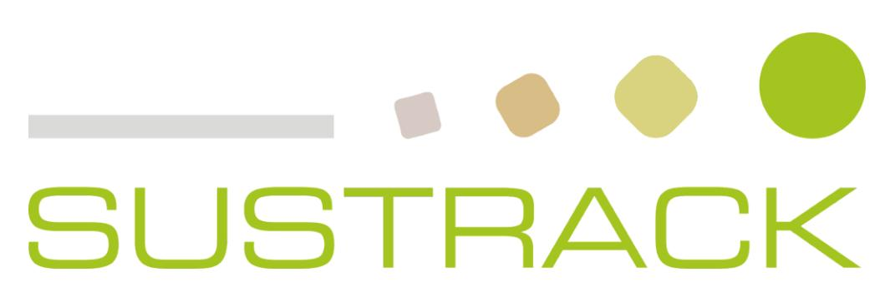
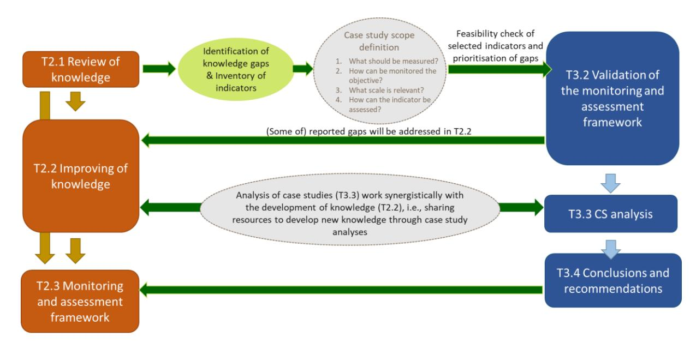
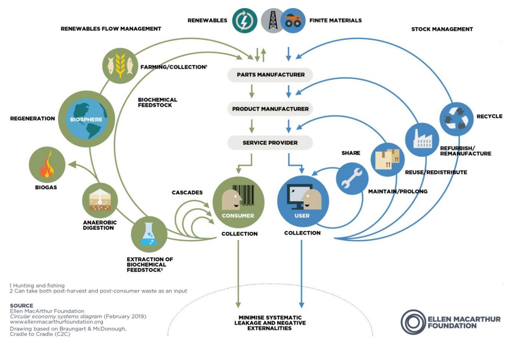
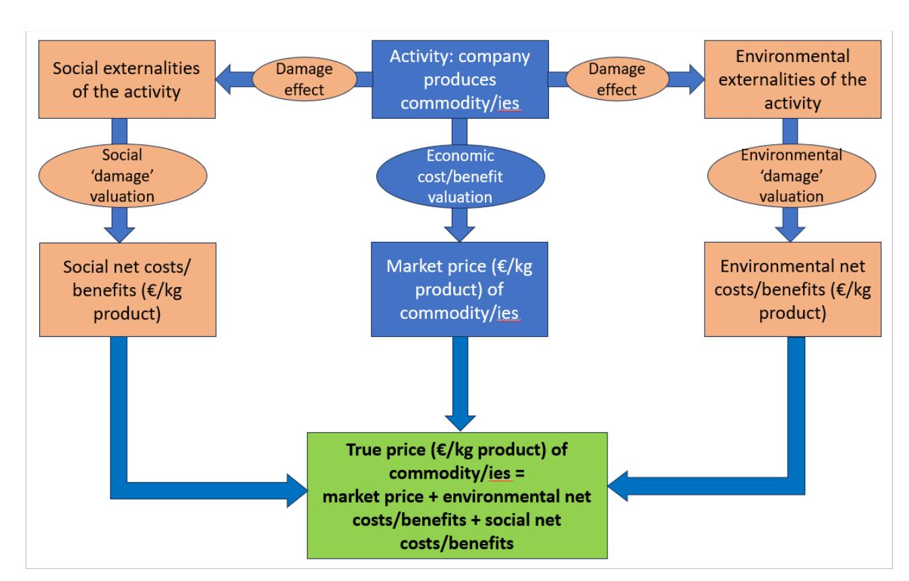
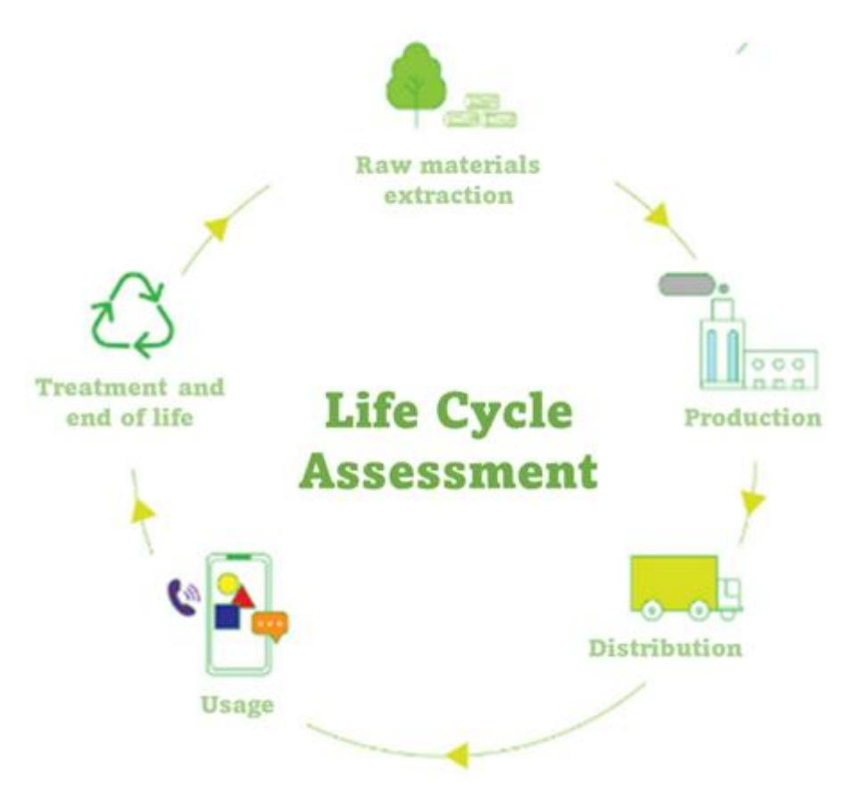
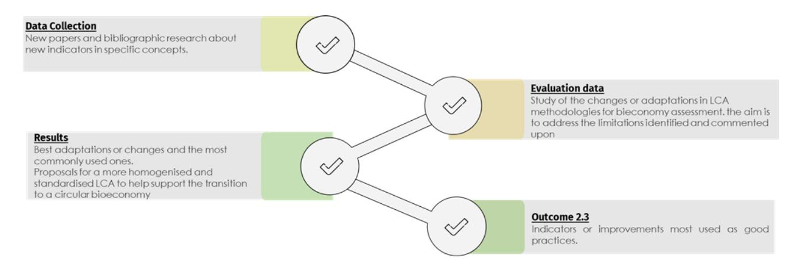
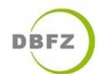

# **D2.2 – ADVANCEMENT OF SUSTAINABILITY ASSESSMENT KNOWLEDGE-DRAFT**

| Work package     | WP2 Knowledge development to assess the sustainable transition                 |
|------------------|--------------------------------------------------------------------------------|
| Task             | T2.1. Advancement of sustainability assessment knowledge: draft                |
| Due date         | 30/04/2024                                                                     |
| Submission date  | 30/04/2024                                                                     |
| Deliverable lead | WR                                                                             |
| Version          | V07                                                                            |
| Author           | Myrna van Leeuwen (WR)                                                         |
| Contributors     | Gülşah Yilan, Eleonora Staffieri, Ilenia Manetti (UNIT), Marco Bianchi, Pierre |
| Reviewers        | All partners                                                                   |

#### **Document Revision History**

| Version | Date           | Description of change                   | List of contributor(s) |
|---------|----------------|-----------------------------------------|------------------------|
| v01     | 13 March 2024  | Draft version distributed for partners’ |                        |
| v02     | 5 April 2024   | Draft version distributed for partners’ |                        |
|         |                |                                         | TECNALIA, WR, CIRCE,   |
| V03     | 21 April 2024  | Reviewer’s comments and edits           | UNIT, TECNALIA, DBFZ,  |
| V04     | 26 April 2024  | Final version after implementing        |                        |
| V05     | 28 April 2024  | Revised version after implanting        |                        |
| V06     | 30 July 2024   | Reopened for Revision                   | WR, UNIT               |
| V07     | 30 August 2024 | Final revised version                   | WR                     |

# **ABSTRACT**

The transition from linear fossil-based systems to circular and bio-based systems represents an opportunity and a suitable pathway for achieving several SDGs. Indeed, circular bio-based systems depict a great opportunity to reconcile sustainable long-term growth with environmental protection through the prudent use of renewable resources for industrial purposes. This needed transition is a complex process, which does not simply require innovative technologies from the supply-side, but also societal transformations based on a multi-actor process. The circular biobased economy meta-sector may be a good candidate to put forward a new economic model, which requires transformative policies, purposeful innovation, access to finance, risk-taking capacity as well as new and sustainable business models and markets. However, a critical assessment of the environmental, social and economic impacts of the current linear fossil-based economy, as well as of the improvement potential associated with circular bio-based systems, is needed to underpin the identification of policy priorities. Bearing this in mind, SUSTRACK is a three-year project aimed at supporting policymakers in their efforts to develop sustainable pathways to replace fossil and carbon-intensive systems with sustainable circular and biobased systems (at the EU and regional scale), contributing to achieving the European Green Deal's objectives. This will be done by: identifying environmental, economic and social limits of a linear carbon-intensive and fossil-based economy; improving existing assessment methodologies; assessing the environmental, social and economic impacts of the EU's current linear fossil-based economy; comparing multiple transition scenarios focusing on the most carbon intensive sectors; identifying priorities according to scenarios analysed in the project and develop guidelines and policy recommendations.

#### **Disclaimer**

Funded by the European Union under project number 101081823. Views and opinions expressed are however those of the author(s) only and do not necessarily reflect those of the European Union or European Research Executive Agency (REA). Neither the European Union nor the granting authority can be held responsible for them.

**Copyright notice:** © 2022 - 2025 SUSTRACK Consortium

|                            | Deliverable information                                                   |
|----------------------------|---------------------------------------------------------------------------|
| Nature of the deliverable: | R Dissemination Level                                                     |
| PU                         | Public, fully open, e.g. web X                                            |
| CL                         | Classified, information as referred to in Commission Decision 2001/844/EC |
| CO                         | Confidential to TETRA project and Commission Services                     |

\* R: Document, report (excluding the periodic and final reports)

DEM: Demonstrator, pilot, prototype, plan designs

DEC: Websites, patents filing, press & media actions, videos, etc.

OTHER: Software, technical diagram, etc.

#### SUSTRACK Consortium:

| #  | Participant Organisation Name                    | Short Name | Country |
|----|--------------------------------------------------|------------|---------|
| 1  | UNIVERSITÀ DEGLI STUDI DI ROMA UNITELMA SAPIENZA | UNIT       | IT      |
| 2  | STICHTING WAGENINGEN RESEARCH                    | WR         | NL      |
| 3  | KNOWLEDGE SRL                                    | KE         | IT      |
| 4  | PEDAL CONSULTING SRO                             | PC         | SK      |
| 5  | DBFZ DEUTSCHES BIOMASSEFORSCHUNGSZENTRUM         |            |         |
|    |                                                  | DBFZ       | DE      |
| 6  | UNIVERSITEIT GENT                                | UGENT      | BE      |
| 7  | FUNDACION TECNALIA RESEARCH & INNOVATION         | TECNALIA   | ES      |
| 8  | FVA SAS DI LOUIS FERRINI & C                     | FVA        | IT      |
| 9  | UNIVERSITÀ DEGLI STUDI DI FERRARA                | UNIFE      | IT      |
| 10 | BUNDESANSTALT FUER MATERIALFORSCHUNG UND -       |            |         |
|    |                                                  | BAM        | DE      |
| 11 | FUNDACION CIRCE CENTRO DE INVESTIGACIÓN DE       |            |         |
|    |                                                  | CIRCE      | ES      |

# **EXECUTIVE SUMMARY**

The goal of achieving a net-zero emissions European economy by 2050 demands a shift from linear, fossil-based systems to circular, bio-based systems. This transition is vital for meeting the United Nations Sustainable Development Goals and reconciling environmental protection with sustainable growth. However, the complexity of the transition relies on societal transformations, cutting-edge technologies, and multi-actor processes, requiring a new societal and economic framework and policy priorities that align with the European Green Deal. In this context, monitoring systems, modelling techniques and data are key tools to support policy making and facilitate a better understanding of the complexity, trade-offs, and potential pathways to achieve a sustainable transition to a circular bio-based economy.

This report presents the results of the work carried out in SUSTRACK Task 2.2, which builds on other tasks already carried out in the project. First, D1.1 gave a comprehensive overview of the environmental, economic, social and cultural limitations of the linear, fossil-based economy. It also identified gaps in overcoming these barriers in terms of knowledge, practical implementation and opportunities, and mentioned requiring effective strategies and policies, and collaboration among policymakers, research institutes and public opinion leaders to promote sustainable developments.

Second, D1.2 identified and confirmed challenges – via a comprehensive stakeholder consultation - that impede progress towards a sustainable circular biobased economy (CBBE), encompassing the barriers identified in D1.1. It highlighted cultural barriers (e.g. lack of communication regarding the advantages of bio-based products, consumer confusion, mistrust due to ambiguous sustainability claims), economic challenges (relatively high costs and risks involved in setting up circular bio-based systems), environmental issues (e.g. concerns on the limited availability of biomass, lack of knowledge and data for assessing environmental impacts of biobased produced), policy barriers (e.g. missing supportive and/or complex regulatory framework, conflicting policy goals), structural discrepancies (e.g. lack of harmonised waste collection systems and infrastructure, lack of established markets and value chains for by-products), and technology issues (e.g. immature technologies, insufficient capacities of end-of-live product treatments).

Third, D2.1 provided a review of existing knowledge for monitoring and evaluating the transition to circular biobased systems. It identified major gaps across indicators and approaches generally used to monitor and evaluate the bioeconomy across the three major policy-level analyses: 1) micro level (products, processes, companies); 2) meso level (city/regions), and 3) macro level (world, Europe, country). Key limitations mentioned regard no regular data collection and data quality is a key problem for the estimation for especially environmental and social dimensions. Other methodological advancements needed require a proper way how to clearly attribute the measurement of the indicators to the production and use of biomass, modelling the bioeconomy at the meso- and/or macro-level, and need for bio-based business models that present trade-offs with the three sustainability objectives.

Fourth, the policy brief in D5.1 highlighted current barriers in relation to the transition to a CBBE and which possible policy opportunities there are to tackle these barriers.

Building on aforementioned work, Task 2.2 focuses on the development of new indicators applicable for monitoring and evaluating the transition to circular bio-based systems, which were identified as gaps across the set of indicators that emerged in D2.1. That report provided a list of research gaps and recommendations to advance bioeconomy monitoring and evaluation at the different policy levels. Three of these research gaps have been selected for further exploration in Task 2.2:

- *Governance indicator(s)*: to give insight into how stakeholders work together in achieving common strategic goals of a city/local/regional area, like via cluster organisations, industrial/regional/ministerial corporations; existence of circular bio-based economy strategic plans.
- *Monetisation of externalities indicator(s)*: to distinguish between market price and inherent value for externalities, like greenhouse gas emission. To permit a fairer comparison between fossil-based and bio-based systems.
- *LCA-based indicator(s)*: to integrate key impact categories for the bioeconomy, like (in)direct land-use issues, biodiversity, deforestation, soil/water quality, and related carbon emissions.

Knowledge has been developed on how these research gaps could be tackled taking into account issues like system boundaries, methodological approach and data needs. The newly gathered insights could benefit the monitoring and assessment framework that is being developed in T2.3. On the other hand, the enhanced framework will be supportive of the case studies that are being analysed in WP3 and the defining of policy recommendations in WP5.

D2.2 contains the first round of reporting on the development of the aforementioned three innovative indicator types that should bridge knowledge gaps. The focus of this report is on the scope of each research gap, while also the connection to the case study analysis in WP3 is considered. This work is ongoing research that will be continued and finalised in the course of the SUSTRACK project, and result in D2.3 on 'Advancement of sustainability assessment knowledge – Final' due by April 2025.

# **TABLE OF CONTENTS**

| 1. Introduction                                                                                           | 11                                                                                   |
|-----------------------------------------------------------------------------------------------------------|--------------------------------------------------------------------------------------|
| 1.1 Objective of the report............................................................................12 |                                                                                      |
| 1.2 Structure of the report                                                                               | ............................................................................14       |
| 2. Governance indicators                                                                                  | 15                                                                                   |
| 2.1 Overcoming barriers in assessing Governance indicators: Insights and Strategies                       | ...........15                                                                        |
| 2.1.1 Description of the Gap                                                                              | ...........................................................................15        |
| 2.1.2 Barriers to assessing Governance indicators                                                         | ..................................................17                                 |
| 2.2 Methodology to overcome the gap                                                                       | .................................................................23                  |
| 2.2.1 Desk analysis and assessing of existing policies                                                    | ..............................................24                                     |
| 2.2.2 Stakeholder mapping and Analysis of collaboration networks                                          | .............................24                                                      |
| 2.2.3 Stakeholder engagement                                                                              | ........................................................................25           |
| 2.3 Governance indicators                                                                                 | ................................................................................25   |
| 2.4 Conclusions and Future Perspectives                                                                   | ...............................................................26                    |
| 3. externality indicators                                                                                 | 27                                                                                   |
| 3.1 Origin of externality concept                                                                         | ........................................................................27           |
| 3.3 Definition of externalities                                                                           | ............................................................................28       |
| 3.4 Internalisation of externalities                                                                      | ......................................................................30             |
| 3.4.1 General concept                                                                                     | ..................................................................................30 |
| 3.4.2 Application in SUSTRACK                                                                             | ........................................................................32           |
| 3.6 Monetisation indicators                                                                               | ...............................................................................33    |
| 3.7 Methods and data needs                                                                                | ..............................................................................34     |
| 3.7.1 Approach to identify externalities                                                                  | .............................................................34                      |

|                   | 4. LCA-based impact indicators                                                                | 3.7.2 Methods to monetise externalities 36                                              |
|-------------------|-----------------------------------------------------------------------------------------------|-----------------------------------------------------------------------------------------|
| 4.1               | State of the art                                                                              | .....................................................................................36 |
| 4.2               | Policy relevance                                                                              | ...................................................................................38   |
| 4.3               | Limitations of LCA methodology                                                                | .................................................................39                     |
| 4.4               | Filling the Knowledge Gap                                                                     | ........................................................................41              |
| 4.5               | Integration in SUSTRACK                                                                       | ..........................................................................41            |
| 5. FIRST FINDINGS |                                                                                               | 42                                                                                      |
| 5.1               | Knowledge development on Governance indicators...........................................43   |                                                                                         |
| 5.2               | Knowledge development on Externality indicators............................................43 |                                                                                         |
| 5.3               | Knowledge development on LCA-based indicators                                                 | ............................................44                                          |
| References        |                                                                                               | 45                                                                                      |

#### **LIST OF FIGURES**

## **LIST OF TABLES**

| Table 1 <i>Research gaps identified in T2.1 that may be of importance for case studies</i> .....                                                             | 12 |
|--------------------------------------------------------------------------------------------------------------------------------------------------------------|----|
| Table 2: <i>In-progress map of local key relevant stakeholders (Prato textile district, Italy)</i> .....                                                     | 24 |
| Table 3: Examples of governance indicators addressing governance barriers in monitoring framework of bioeconomy transition.....                              | 26 |
| Table 4: <i>Dimensions of system boundaries (in columns) for the ‘monetisation of externalities’ concept (note: there is no causality in the rows)</i> ..... | 33 |
| Table 5: Potential factors measuring environmental externalities .....                                                                                       | 34 |
| Table 6: Factors which are considered of an agricultural process by LCA methodology.....                                                                     | 40 |

|                      | LIST OF ABBREVIATIONS                        |
|----------------------|----------------------------------------------|
| Abbreviation/Acronym | Description                                  |
| AHP                  | Analytical Hierarchy Process                 |
| ANP                  | Analytical Network Process                   |
| BPP                  | Biotic Production Potential                  |
| CBA                  | Cost-Benefit Analysis                        |
| CBBE                 | Circular Bio-Based Economy                   |
| CE                   | Circular Economy                             |
| CSR                  | Corporate Social Responsibility              |
| EC                   | European Commission                          |
| EIA                  | Environmental Impact Assessment              |
| EU                   | European Union                               |
| IOA                  | Input-Output Analysis                        |
| LCA                  | Life Cycle Assessment                        |
| M&E                  | Monitoring and Evaluation                    |
| SDGs                 | Sustainable Development Goals                |
| SOC                  | Soil Organic Carbon                          |
| TEEB                 | The Economics of Ecosystems and Biodiversity |
| WP                   | Work package                                 |

# **1.INTRODUCTION**

A key output of WP2 in the SUSTRACK project is the development of a Bioeconomy Assessment and Monitoring Framework populated with a set of sustainability indicators.

This report presents the results of the work carried out in SUSTRACK Task 2.2, which builds on other tasks already carried out. First of all, D1.1 started with a comprehensive overview of the environmental, economic, social and cultural limitations of the linear, fossil-based economy. It also identified gaps in overcoming these barriers in terms of knowledge, practical implementation and opportunities, and mentioned requiring effective strategies and policies, and collaboration among policymakers, research institutes, and public opinion leaders to promote sustainable developments. Then, D1.2 identified and confirmed challenges – via a comprehensive stakeholder consultation - that impede progress towards a sustainable circular biobased economy (CBBE), encompassing the barriers identified in D1.1. It highlighted cultural barriers (e.g. lack of communication regarding the advantages of bio-based products, consumer confusion, mistrust due to ambiguous sustainability claims), economic challenges (relatively high costs and risks involved in setting up circular bio-based systems), environmental issues (e.g. concerns on the limited availability of biomass, lack of knowledge and data for assessing environmental impacts of biobased produced), policy barriers (e.g. missing supportive and/or complex regulatory framework, conflicting policy goals), structural discrepancies (e.g. lack of harmonised waste collection systems and infrastructure, lack of established markets and value chains for byproducts), and technology issues (e.g. immature technologies, insufficient capacities of end-oflive product treatments).

Building on the work conducted in WP1, D2.1 provided a review of existing knowledge for monitoring and evaluating the transition to circular biobased systems. It identified major gaps across indicators and approaches generally used to monitor and evaluate the bioeconomy across the three major policy-level analyses: 1) micro level (products, processes, companies); 2) meso level (city/regions), and 3) macro level (world, Europe, country). Key limitations mentioned regard no regular data collection and data quality is a key problem for the estimation for especially environmental and social dimensions. Other methodological advancements needed require a proper way how to clearly attribute the measurement of the indicators to the production and use of biomass, modelling the bioeconomy at the meso- and/or macro-level, and the need for biobased business models that present trade-offs with the three sustainability objectives. Finally, the policy brief in D5.1 has highlighted current barriers in relation to the transition to a CBBE and which policy opportunities there are to tackle these barriers.

As mentioned above, D2.1 included a gap analysis of existing monitoring indicators and methodologies for assessing the environmental, social and economic impacts of the transition from the current linear fossil-based economy to a more circular bio-based economy (CBBE). It resulted in a long list of indicators associated with research areas of the CBBE, where key knowledge gaps were spotted in case indicators were not yet clearly defined and/or measurable. Important gaps and weaknesses emerged in the reviewed literature with regard to measuring the social, economic and environmental sustainability implications of the CBBE, as well as to associated data availability. Data availability on socioeconomic indicators appears in a somewhat more mature state than for environmental indicators because of regular reporting in statistics. In this context, the data quality is a weak point, especially for social and environmental indicators as these are not regularly collected and monitored.

At the same time in the project, T3.1 selected ten case studies from four sectors that face critical challenges within the current linear system, which are construction, textile, fine chemicals and plastics (D3.1). Next, T3.2 matched the specific research needs of the case studies to relevant indicators that make sense to be quantified. Then, it was explored which indicators are immediately applicable and which ones require additional development first. The work of T2.1 served as the basis for this mapping process. In this way, findings of D3.2 are back-looped to WP2 on the one hand, while they on the other hand provide guidance and suggestions about which new indicators to add to the monitoring framework in T2.3. D3.2 provided a short list with eight research gaps [\(Table 1\)](#page-11-1) that may be focussed on and closed in T2.2.

Table 1 *Research gaps identified in T2.1 that may be of importance for case studies*

| # | Description                                                                                           |
|---|-------------------------------------------------------------------------------------------------------|
| 1 | Need for better addressing (pure) social aspects related to bioeconomy within the EU bioeconomy       |
| 2 | Need for better tailoring of EU monitoring framework for local policy makers. This may include the    |
| 3 | Need for further standardisation of bioeconomy assessment at the regional-city level (including       |
| 4 | Coverage of governance indicators to give insight into how stakeholders work together in achieving    |
| 5 | Monetisation of externality: a need for indicators that distinguish between market price and inherent |
| 6 | Impacts on rural communities (at the very local scale) should be considered when evaluating           |
| 7 | LCA studies should integrate and improve key impact categories for the bioeconomy. These are          |
| 8 | LCA-based indicators should cover the whole life cycle and not be limited to factory gate boundaries. |

#### Source: Deliverable 3.2

D3.2 has selected three out of the eight research gaps for further exploration in T2.2 because of their expected relevance for the case study analysis in WP3. They refer to better coverage of governance, monetised externalities and LCA impact indicators respectively.

## **1.1 Objective of the report**

The objective of this report is to analyse and develop additional knowledge related to the monitoring and assessment of the environmental and socio-economic impacts of the transition from a linear to a sustainable CBBE.

Building on the lessons learned from T2.1 and the findings and feedback received from the INSPIRE conference, D2.2 reports on the further desk research to address three of the critical research gaps identified, and develops knowledge and recommendations to fill those gaps. Firstly, this should contribute to a monitoring and assessment framework (T2.3) that is better equipped for case studies in WP3 in analysing multiple sustainability indicators. Secondly, the framework will become more useful in advising and recommending decision-makers on instruments that could boost the transition process towards circular business cases [\(Figure 1\)](#page-12-0).

Due to their relevance for policy makers and investors, the following three research gaps (out of the eight identified in Table 1) have been selected for further exploration and development in T2.2:

- *Coverage of governance indicator(s)* to show how stakeholders work together in achieving common strategic goals of a city, local or regional area, like via cluster organisations, industrial/regional/ministerial corporations; circular bio-based economy strategic plans.
- *Coverage of monetisation indicators that valorise* environmental and social externalities associated with production and consumption activities, like greenhouse gases and health issues.
- *Coverage of key LCA-based indicators* for the bioeconomy, like (in)direct land-use issues, biodiversity, deforestation, soil and water quality, and carbon emissions.

#### *Figure 1: Overview of how the output of T2.1 relates to other tasks in the SUSTRACK project*

To sum up, the goal of D2.2 is to address the following aspects for each of the three research gaps that were selected to be explored in SUSTRACK in relation to the following aspects:

- Policy relevance.
- Conceptual background and system boundaries.
- Indicators: definitions and metrics.
- Method to quantify/qualify the indicators.
- Integration in SUSTRACK.

## **1.2 Structure of the report**

The remainder of this report is structured along 3 main chapters. Chapter 2 reports on how the research gap on the coverage of governance indicators can be bridged. Chapter 3 explores how to close the research gap on monetisation of externalities. Chapter 4 describes how LCA-based indicators can better address impact categories for the bioeconomy. Each chapter will pay attention to concept, policy relevance, indicators to monitor, method and data needs, and how the developed knowledge can be beneficial to SUSTRACK. Finally, chapter 5 concludes the report with the first set of findings to be further explored during the later stage of the project.

# **2.GOVERNANCE INDICATORS**

The SUSTRACK project carried out in-depth studies on the environmental, economic, social and cultural limits of the linear economic model, as well as on the various barriers and potential improvements associated with a circular transition based on the bioeconomy while identifying gaps in overcoming these barriers in four specific sectors: plastics, textiles, construction and chemicals (D1.1). These studies underlined the complexity of the transition and its underpinnings, including the new socio-economic framework, social transformations or even new policy priorities in line with the European Green Deal. In fact, policies play a key role in shaping the relevant markets and promoting the adoption of sustainable practices. Their importance is evident in creating an environment that is conducive to innovation, ensuring cooperation between actors and promoting the adoption of circular solutions (Huttunen et al., 2014; Kershaw et al, 2020). The European Union's commitment to advancing the bioeconomy strategy further highlights the importance of policy in shaping the regulatory framework (Bell et al., 2018).

Facilitating the transition to a sustainable CBBE also requires up-to-date monitoring and evaluation frameworks and systems that can help policymakers work in this direction. Therefore, the SUSTRACK research included a review of existing knowledge on monitoring and evaluation (M&E) of this transition, with the aim of updating the state of the art in bioeconomy M&E and opening the field for future studies (D2.1). As a result of this analysis, a list of 20 gaps was identified in the literature for different topics and specific indicators, 8 of them (Table 1) have been then considered relevant for case studies analysis. In this context, the fourth gap concerning the "*Coverage of Governance Indicators*" is analysed. Compared to environmental, social and economic indicators which show us the impact of CBBE transition on sustainability, the governance ones show us how we can speed up the transition. They are indeed crucial for assessing and monitoring the effectiveness of policies and progress in strategies for the CBBE transition, as also highlighted by other studies, suggesting the adoption of tools such as the Substitution Share Indicator (SSI) or the alignment with the UN Sustainable Development Goals (SDGs) and forestrelated indicators (Jander & Grundmann, 2019; Linser & Lier, 2020; Ngan et al. 2019; Kardung et al. 2021). Understanding if and how stakeholders are involved in decision-making processes to achieve common strategic goals at national, regional and local levels, with the aim of providing policy recommendations is pivotal to better address this gap and even to overcome it.

Finally, integrating governance indicators into the analysis of transition is, therefore, useful to provide a comprehensive and informed picture of the governance dynamics that permeate this process. The conceptual definition of governance indicators outlines a comprehensive approach that takes into account cooperation between actors, transparency of decision-making, policy coherence and adaptability of the regulatory framework. These indicators are intended to serve as a guide to direct efforts towards effective governance towards the goals of sustainability and circularity.

## **2.1 Overcoming barriers in assessing Governance indicators: Insights and Strategies**

## **2.1.1 Description of the Gap**

The gap related to the coverage of governance indicators focuses in particular on how different stakeholders work together to achieve common strategic goals at different levels (national, regional or local). This gap therefore highlights the need to assess governance structures, mechanisms and initiatives that facilitate cooperation and coordination between different stakeholders to advance the goals of a CBBE.

This gap is characterised by a number of key aspects that needs to be addressed, such as cooperation between stakeholders (e.g. cluster organisations, industries, regions and ministries) to clarify the extent to which different stakeholders work together to achieve common goals, or again the level of commitment, communication and coordination of the different actors. In addition, it is necessary to understand the existence and effectiveness of different national, regional or local strategic plans in order to carry out a proper gap assessment. Indeed, an assessment of strategic frameworks and policies to promote circularity in the CBBE provides information on the governance landscape and helps to identify key areas for improvement. The structure of governance is also a key aspect. Indeed, assessing governance indicators aids in understanding the institutional arrangements, decision-making processes and policy frameworks that shape the bioeconomy ecosystem. This includes examining the roles and responsibilities of stakeholders, regulatory frameworks and mechanisms for stakeholder engagement. The assessment of governance indicators also provides information on the alignment of policies and strategies at different levels of governance to support the transition to a CBBE. This makes it possible to assess the coherence and consistency of policies in promoting sustainability and innovation in bio-based sectors.

Thus, by addressing these governance gaps and incorporating specific governance indicators into monitoring and evaluation frameworks, stakeholders can gain a deeper understanding of these mechanisms and develop more effective decision-making strategies, greater involvement and targeted interventions to promote collaboration and drive the transition to sustainable and circular bio-based systems at national, local and regional levels.

The final list of governance barriers has already been identified through a multi-stakeholder consultation process involving surveys and interviews with experts in the field of the CBBE (D1.2). An initial list of barriers was derived from an extensive literature review carried out in Task 1.1. This analysis, which focused mainly on grey literature sources, allowed the categorization of the barriers into six dimensions: cultural, economic, environmental, governance, structural and technical. In this first phase, a total of 193 barriers were identified across the value chain, with a significant number associated with material processing, product manufacturing, end-of-life management and the system as a whole. These barriers were identified with varying frequency in the literature reviewed, and to develop the list of barriers for the next stage, we considered all barriers that were identified in at least three different reports. In total, 51 out of 193 barriers met this criterion. These barriers were then presented to a group of experts during the co-creation workshop "Limits, barriers and solutions to boost the transition towards a circular bio-based economy" held during European Green Week. Stakeholders were invited to express their perspectives, engage in dialogue and prioritise the barriers in terms of importance. Further barriers were identified during the focus group and the resulting final list was divided into four critical sectors (textiles, plastics, chemicals and construction). After the co-creation workshop, the barriers were reviewed and some of the barriers suggested by the stakeholders during the workshop, especially those that had been previously identified during the literature review, were reworded to be consistent with the wording in the grey literature or to avoid overly vague or specific wording. In addition, overlapping barriers were merged, resulting in a reduced list of 67 barriers.

Following this first identification phase, twenty interviews were conducted with experts from the four sectors (chemicals, plastics, textiles, construction) as part of subtask T1.2.1. The aim of the interviews was to confirm the results of the co-creation workshop, to allocate the different stages of the value chain per cluster in each sector and to identify missing barriers not previously identified in T1.1 or in the co-creation workshop. The resulting list of barriers was used for the second part of subtask T1.2.2. An online survey to complete the validation and prioritisation process and to produce a final list of 10 governance barriers was produced. Finally, we reached a final set of 31 barriers after the application of a cut-off criterion. As the following step, we applied multi-criteria decision making strategies, i.e. Analytical Hierarchy Process and Analytical Network Process, to select the most important barriers across different sectors (D1.3). However, we used the full list of indicators before prioritisation for this report to keep our scope broader.

The following subchapters explore in more detail the barriers identified and some possible strategies for bridging the gap. By analysing these barriers and identifying targeted intervention strategies, we aim to provide decision-makers with a set of practical tools and guidance to address complex challenges and facilitate the transition towards CBBE. The importance of an integrated and collaborative approach, involving different levels of governance and a wide range of stakeholders to maximise the impact of the measures taken and accelerate the transition to a more sustainable and resilient economy is emphasised. A detailed description of the approach taken to identify indicators to close this gap is also presented.

## **2.1.2 Barriers to assessing Governance indicators**

In order to identify barriers applicable to different clusters and to classify them as major, moderate or minor barriers, an EU-wide survey of relevant stakeholders was conducted over a period of six weeks. Fifty-five representatives from nine European countries took part, 38% of them from specific sectors involved in the project. At the end of the participatory process, which included workshops, interviews and surveys, a list of 10 key governance barriers emerged, covering a wide range of challenges that need to be addressed in order to facilitate the transition to a biobased and circular economy (BBCE). While recognising the regulatory complexities and political conflicts, it is important to remember that many current sustainable policies remain aspirational and non-binding in nature. This approach can significantly limit the real impact of key targets such as reducing greenhouse gas emissions, managing food waste and replacing fossil fuels with renewable alternatives. Research suggests that while ambitious goals such as those set out in the Sustainable Development Goals (SDGs) can guide policy, they often lack concrete impact due to unrealistic timelines and targets (Singh, 2019). A detailed analysis of more than 3,000 studies shows that the SDGs have mainly influenced debates rather than bringing about significant institutional or legislative changes (Biermann et al., 2022). This limited transformative capacity is partly attributed to failures in policy implementation resulting from conflicts between environmental and economic objectives, inadequate incentives and ineffective communication with stakeholders (Howes et al., 2017). Furthermore, policies that focus on absolute or 'zero' targets may not be the most appropriate for achieving sustainability, as they fail to recognise the complexity of problems and solutions (Rauch & Newman, 2008). Specific studies show that sectors such as tourism and road passenger transport, with their emission growth trends, clearly demonstrate difficulties in achieving significant reduction targets through voluntary approaches (Scott et al., 2010; Figueroa & Kahn Ribeiro, 2013). Similarly, sustainable food waste management, while promising to promote CBBE, faces challenges related to product multifunctionality and resource trade-offs (Mak et al., 2019). These studies highlight the need for more stringent and mandatory policies to achieve significant environmental improvements.

Here, we explore the barriers identified and propose concrete actions to address them, with the aim of creating the conditions for more resilient and inclusive CBBE.

#### **1. Regulatory complexities and lack of support for the transition at the government level**

The transition to a circular and bio-based economy (CBBE) in Europe is hampered by significant barriers related to regulatory complexity and lack of political support. The difficulty of navigating a fragmented regulatory landscape and the lack of binding targets are the main challenges (García‐ Quevedo et al., 2020; Garcés‐Ayerbe et al., 2019). Complex and poorly coordinated regulations, together with high administrative costs, discourage firms, especially small and medium-sized enterprises (SMEs), from adopting sustainable practices. Furthermore, the ineffectiveness of environmental policies is exacerbated by a lack of adequate political support and loosely binding targets (Angouria-Tsorochidou et al., 2021). Many of these policies remain aspirational and lack concrete obligations, reducing their effectiveness (Singh, 2019; Biermann et al., 2022). Implementation failures due to conflicts between environmental and economic objectives, inappropriate incentives and ineffective communication further exacerbate the situation (Howes et al., 2017). To overcome these barriers, it is essential to simplify regulatory processes and create incentives that support the transition to CBBE. Regulatory reforms should reduce complexity and administrative costs, thereby facilitating the adoption of sustainable practices by SMEs (Försterling et al., 2023). In addition, it is crucial to transform aspirational targets into binding commitments and to adopt effective governance frameworks to reduce uncertainty and ensure equity among businesses (Gawel et al., 2018). Concrete incentives and stronger policies could significantly promote a smoother and more inclusive transition to a circular and bio-based economy.

#### **2. Fragmented regulatory framework across European countries and at national/ regional level**

The fragmented regulatory framework is a significant barrier to the transition to a circular and sustainable bioeconomy (CBBE). Environmental and sustainability policies vary widely between and within European countries, creating uncertainty and complexity for internationally operating companies (Kirchherr et al., 2018). Although the European Union has launched initiatives such as the European Green Deal, the Biodiversity Strategy and the Circular Economy Action Plan to improve regulatory coherence (Spani, 2020; Paleari, 2024), regulatory differences remain a significant barrier (Falcone & Imbert, 2019; Maitre-Ekern et al., 2020). Global competition further complicates these efforts, as countries with higher environmental standards fear that their companies will be disadvantaged compared to those from countries with less restrictive regulations, creating a kind of 'race to the bottom' in environmental standards (Clark, 1995). Countries with less stringent regulations may seek to maintain their competitive advantage through looser enforcement practices, thereby offsetting conditionality pressures from countries with stricter regulations (Knill et al., 2008). However, harmonising policies at the international level remains a complex challenge, as concerns about 'environmental dumping' and capital flight by multinational companies require considered policy solutions that balance competitiveness and sustainability (Ulph et al.,2001). An innovative approach proposed to overcome this fragmentation is 'nexus thinking', which considers the interconnections between climate change, biodiversity and the circular economy. The European Green Deal, designed as an integrated strategy, seeks to address these linkages, but some crucial areas, such as marine use and the impact of biomass on biodiversity, still need in-depth management (Paleari, 2024). To address regulatory fragmentation, it is crucial to adopt a systemic approach that integrates policies and promotes coherence between different levels of government. Creating common standards and certifications and strengthening international cooperation are key measures to reduce uncertainty and facilitate the implementation of sustainable practices (Gottinger et al., 2020). Understanding the links between climate change, biodiversity and the circular economy is crucial to designing effective measures and ensuring a smooth transition to a resilient and inclusive CBBE (Lange et al., 2021).

#### **3. Competing political interests with fossil-based industries (big lobbies etc.)**

The transition to a circular and bio-based economy (CBBE) is being hampered by political resistance from the fossil fuel industries. These influential and well-established industries see the CBBE as a threat to their economic interests and use their power to slow down change. This manifests itself through lobbying to maintain subsidies, spreading misinformation and lobbying to delay stricter environmental regulations (Kirchherr et al., 2018; Försterling et al., 2023). To overcome these barriers, it is important to develop policies that balance competing interests and facilitate a smooth transition. Policies should include incentives for renewable technologies, subsidies for sustainable businesses and regulations that favour circular business models (Gottinger et al., 2020; Bataille, 2020). It is also essential to engage all stakeholders in a constructive dialogue to ensure that the measures taken are fair and acceptable (Tan et al., 2022). It is equally important to address barriers along the entire value chain and to encourage collaboration between sectors. An integrated approach is needed, including policy packages to stimulate both demand and supply of sustainable solutions (Werning & Spinler, 2020). Only through these combined efforts will it be possible to facilitate the transition to a more resilient and inclusive CBBE.

#### **4. Lack of alignment and consistency between different policies**

The lack of alignment and consistency between policies is a barrier to the transition to a CBBE. This stems from inconsistent regulatory frameworks that create confusion and conflicts between regulations, preventing companies from effectively planning and investing in the transition to a circular model (Kelleher et al., 2019; Gottinger et al., 2020). Legislative gaps, the lack of mandatory requirements and government support, and the absence of circularity standards and criteria in public tenders hinder the adoption of circular economy practices (Kazancoglu et al., 2020; Rizos & Bryhn, 2022). To overcome these obstacles, it is crucial to adopt strategies that promote greater coordination between different levels of government and create a consistent and stable regulatory framework. This includes the implementation of coordinated policies and the creation of oversight mechanisms to identify and resolve regulatory conflicts (Tan et al., 2022). It is also crucial to promote transparency and trust in the market through information sharing, the adoption of international certifications, and the implementation of financial incentives and awareness campaigns (Milios, 2021; Rizos & Bryhn, 2022).

### **5. Lack of market-based policies (e.g. subsidies or higher CO2 prices) to stimulate the market**

The lack of appropriate market policies hampered the transition to a CBBE. Without financial incentives, companies tend to favour cheaper solutions in the short term (Scarlat et al., 2015). Market policies, such as subsidies and carbon taxes, are essential to make sustainable technologies cost-effective (D'Amato et al., 2017). However, market dynamics that discourage innovation reinforce barriers to CBBE. The lack of appropriate policies not only discourages innovation, but also perpetuates linear patterns and hinders progress towards a circular bioeconomy (Donner & Vries, 2021). Issues such as price competitiveness and technological uncertainty create a vicious circle that limits the adoption of innovative practices (Salvador et al., 2022). Instruments such as landfill taxes can promote circularity, but recycling subsidies sometimes lead to less efficient practices (Roa & Rosendahl, 2022). Other policies, such as carbon-difference contracts, can help, but run the risk of distributing the costs of the transition unfairly (Vogl et al., 2020). Corporate social responsibility (CSR) is crucial for influencing consumer demand, although there is often a gap between positive attitudes and actual purchasing behaviour (Lombardo, 2011; Etilé & Teyssier, 2013). CSR can improve risk perception and information asymmetries (Carlos & Menck, 2014), and CSR ratings are positively correlated with local sales, especially in areas with high education and income (Wei & Xiao, 2022). Technologies such as carbon capture and storage require government incentives to avoid investment inertia and optimise social investment (Golombek et al., 2023). To stimulate innovation and make the transition to a CBBE more effective, it is crucial to create markets for circular technologies and adopt fiscal policies for 'true pricing' (Rizos et al., 2018). CSR-oriented public policies, such as consumer education and labelling regulations, can promote responsible consumption and strengthen the governance needed for a sustainable CBBE (Etilé & Teyssier, 2013).

#### **6. Limited long-term policy reliability**

The lack of stability and consistency in policies over time creates uncertainty for long-term investment in the CBBE. Businesses need durable and predictable policies to justify the investments needed to adopt more sustainable practices. This uncertainty can have a significant impact on long-term investments, particularly in the context of the CBBE, which is a priority for the European Union (Rodrik, 1989; Bell et al., 2018). The biofuel supply chain, which is crucial for the CBBE, is also affected by uncertainty and concerns about sustainability (Awudu & Zhang, 2012). Defining clear and measurable objectives and implementing policy monitoring and evaluation mechanisms are important steps to overcome this barrier (Tan et al., 2022). Ensuring policy consistency over time is therefore essential to enable businesses to effectively plan and invest in the transition to a CBBE.

#### **7. Lack of supportive policy framework for product-related inner circles of the circular system (recycling, reuse, repair, redistribute, remanufacture, and refurbish)**

The lack of specific policies to promote circular practices may hinder the development of the necessary infrastructure and slow down the transition to a CBBE. In particular, decentralised biowaste management is an area that needs attention (Angouria-Tsorochidou et al., 2021). The potential for circularity in bio-waste and co-products is considerable, but requires life-cycle analysis to identify the best options (Corrado & Sala, 2018). The use of waste, by-products and scraps as resources in the bioeconomy is in line with circular economy principles [\(Figure 2\)](#page-20-0), but conflicts arise between industrial and environmental policies (Philp & Winickoff, 2018). It is crucial to implement fiscal and infrastructural incentives to promote separate collection, reuse and other circular practices. European initiatives, such as the Green Claims Directive, aim to improve transparency and accountability of companies in adopting circular practices, but more robust fiscal and infrastructural support is needed to ensure the success of these policies. Fiscal measures that reflect the real costs of waste management and promote the circular value of waste can facilitate the creation of circular value chains and increase consumer awareness of the circular use of waste (Morseletto, 2020). Furthermore, it is crucial to involve stakeholders and develop policies adapted to local contexts in order to overcome existing barriers. Only through an integrated approach, taking into account local specificities and promoting concrete actions, will it be possible to move towards a more circular and sustainable waste management.

*Figure 2: Visualisation of the Circular Economy (Butterfly Diagram from E.MacArthur Foundation)*

#### **8. Legislative limitations for applications of materials when classified as waste**

Regulatory restrictions can act as a barrier to the reuse and recycling of materials that are considered waste, undermining the transition to a CBBE. Overly rigid regulations can limit the valorisation of spent materials and the adoption of more sustainable practices (Rizos et al., 2016; Mak et al., 2019). However, updating regulations and introducing supportive policies can help overcome such barriers (Rizos et al., 2016; Mak et al., 2019). For example, policies aimed at strengthening the focus on consumers' environmental preferences, market value chains and business cultures can be beneficial (Rizos et al., 2016). Furthermore, the implementation of circular economy practices can expand and diversify market outlets for bio-based products (Maina et al., 2017).

#### **9. Lack of clarity around policy targets and trajectories**

Assessing progress in the circular bio-based economy can be complex without clear and measurable targets. This lack of guidance can influence business decisions and investments (Kardung et al., 2021). As noted above, many current sustainable policies remain aspirational and non-binding, significantly reducing their real-world impact. This limits the effectiveness of adopted measures and perpetuates the lack of tangible progress towards key goals such as reducing greenhouse gas emissions and managing food waste (Singh, 2019; Biermann et al., 2022; Howes et al., 2017). to address these problemsTo address this, a comprehensive framework has been proposed that includes indicators to measure the extent and circularity of material and waste streams (Mayer et al., 2019). However, it is essential to ensure that these indicators take into account the environmental pressures associated with CBBE activities (Helander et al., 2019). At the micro level, a balanced approach integrating economic, environmental and social aspects is needed to comprehensively assess progress on CBBE, also to overcome the limitations of non-binding and aspirational targets. At the micro level, it is important to adopt a balanced approach that considers economic, environmental and social aspects to assess progress in the CBBE (Kristensen & Mosgaard, 2020).

#### **10. Insufficiently ambitious targets and limited policy drivers**

The transition to a CBBE is a challenge of great complexity and urgency, requiring radical changes in policies, technologies and societal behaviour (de Boer et al., 2023). To meet this challenge effectively, it is essential to implement robust support measures (Gottinger et al., 2020). One of the main obstacles is the predominantly aspirational nature of sustainability goals, which often lack commitment and specificity, limiting their real impact (Singh, 2019; Biermann et al., 2022). Aspirational goals influence public debate more than concrete actions (Biermann et al., 2022), and the lack of bindingness and incentives weakens policy effectiveness (Howes et al., 2017). The transition to a CBBE requires more ambitious targets and more focused policies on circularity (Morseletto, 2020). It is crucial to implement policies that incentivise research, investment and public support, and to actively engage consumers through education and awareness campaigns (Milios, 2022). Educational institutions need to work with industry, consumers and governments to develop and disseminate knowledge on circularity (Serrano-Bedia & Pérez-Pérez, 2022). A comprehensive approach is needed to address challenges such as informal waste collectors and health risks of e-waste by improving understanding and promoting circular practices (Liu et al., 2023; Milios, 2022). It is crucial to set concrete and binding targets, such as increasing recycling rates and reducing carbon emissions, supported by economic incentives (Venkatramanan et al., 2021). Systemic policies that integrate research, investment and public support are essential to ensure effective CBBE (Marvik & Philp, 2020). Addressing the current challenges requires bold policies and concrete actions to overcome the limitations of aspirational targets and move towards a more resilient and inclusive CBBE.

## **2.1.3 Strategies to overcome the barriers in assessing Governance indicators**

In the search for strategies to address the gap in the coverage of governance indicators in the context of the transition to a CBBE, a number of targeted approaches emerged. They have been developed taking into account the gaps identified in the previous step (D2.1) and aim to provide concrete solutions to address specific governance challenges in the CBBE. Among the proposed strategies, the following are highlighted:

#### **Improved modelling techniques:**

This includes increasing the use of new modelling techniques, such as system dynamics (SD) and agent-based modelling (ABM), to complement existing bioeconomy modelling efforts. This would enable consideration of the structural and systemic changes required to achieve a sustainable bioeconomy.

#### **Incorporate governance indicators:**

This strategy involves assessing stakeholder collaboration, strategic planning and governance structures at national, local or regional levels to fill the governance indicator gap. It also includes assessing the effectiveness of governance mechanisms and initiatives in promoting stakeholder collaboration.

#### **Develop a comprehensive economic sustainability assessment:**

One of the strategies for overcoming barriers in assessing governance indicators is to develop a comprehensive sustainable economic assessment. This involves the integration of externalities through monetisation to inform sustainability issues and contribute to the design of market-based policy instruments and decision-making processes.

#### **Fill data gaps:**

Improve data collection processes, improve data quality and address attribution issues related to the measurement of indicators in the bioeconomy. This includes identifying gaps in environmental, social and economic sustainability indicators to ensure robust data availability.

#### **Creating Tailored Indicators:**

Develop tailor-made indicators for different levels of decision making (country, city/region, product) to test their applicability and consistency. Identify research gaps in indicators, data sources, methods and models to inform monitoring and evaluation frameworks.

#### **Establish monitoring frameworks:**

Create a knowledge map and operationalise an ad hoc framework for monitoring and evaluating the transition to a CBBE. Develop a database of indicators for monitoring and evaluating the bioeconomy, which will be tested and further developed in conjunction with case study evaluations.

#### **Promote public-private partnerships:**

Work with relevant industries to overcome barriers related to political interests competing with fossil fuel-based industries and to develop policies focused on creating a more favourable market for the bioeconomy. A holistic approach for promoting public-private partnerships in the bioeconomy is essential, as highlighted by Vale (2017) and an integrated approach promoting them in the bioeconomy can be implemented through different strategies. Chabbi (2017) emphasises the need for creative collaboration models and new management tools to address environmental and innovation challenges. Maurrasse (2013) underscores the importance of combining public, private, and nongovernmental resources in strategic partnerships. Raising awareness and involvement of both sectors through dedicated events and workshops can foster mutual understanding of the opportunities and benefits of collaboration (Troisi, 2011). The implementation of financial incentives such as subsidies or tax breaks can encourage companies to engage in bio-economic projects with public entities (Laus, 2021). The creation of collaborative platforms can foster the sharing of resources and co-creation of projects, facilitating the formation of partnerships (Gallegati, 2020). Technical and advisory support can help companies and public bodies find suitable partners and define common objectives (Santuari, 2020).

## **2.2 Methodology to overcome the gap**

In addressing the complexities of the transition to a CBBE, a sound methodology is essential to navigate the intricate landscape of governance barriers and policy interventions. Methodological frameworks act as guiding beacons, illuminating pathways to sustainable solutions while fostering collaboration and stakeholder engagement. In this section, we outline the methodology used to analyse the governance gaps identified and propose strategies to effectively address them by providing a list of indicators validated by sectors' relevant stakeholders.

## **2.2.1 Desk analysis and assessing of existing policies**

As the starting point, a desk analysis of scientific and grey literature is carried out to identify existing policy instruments at national, regional and local levels related to the bio-economy transition. The documents are analysed and both further identified barriers and proposed policy recommendations are collected in order to link gaps and solutions.

As mentioned above, the collection and analysis of documents considers all levels of governance. In particular, the specific context of the Prato textile district case study is analysed (examined in more detail under WP3). Therefore, Italian policies are considered at the macro (national) level, focusing increasingly on the specific context of Prato, through the meso (regional) and micro (local) levels. This effort is also useful to achieve the objectives of the parallel tasks (T3.3; T5.1).

The focus on identifying discrepancies and inconsistencies between existing policies helps to overcome the barriers of misalignment and lack of ambition and, at the same time, to boost the harmonisation of policies at national, regional and local level ensuring a coherent regulatory framework.

## **2.2.2 Stakeholder mapping and Analysis of collaboration networks**

In parallel to the desk analysis, mapping and analysis of key stakeholders and nodes involved in policy processes related to the CBBE [e.g. consumers, producers, cluster organisations, NGOs, policymakers at ministerial level or above] are performed. Specifically, the main stakeholders related to the case study of the textile district of Prato are identified [\(Table 2\)](#page-23-2).

In this way, an attempt is also made to identify (i) the main nodes of the collaborative networks to detect possible blockages due to diverging political or industrial interests, also (ii) if there are some areas where greater stakeholder involvement is needed to overcome political resistance and promote greater collaboration.

#### Table 2: *In-progress map of* local *key relevant stakeholders (Prato textile district, Italy)*

| Type                     | Affiliation                                                                |
|--------------------------|----------------------------------------------------------------------------|
| National Research Centre | Istituto per la BioEconomia (IBE-CNR)                                      |
|                          | Rifò Srl (Company born through crowdfunding in 2017 from the need to       |
|                          | Comistra srl (For over 100 years, giving a second life to rags and textile |
| Company                  | Manteco (Italian Premium Textiles and Circularity since 1943)              |
|                          | Prato, it has become over the years one of the world's leading textile     |

|                        | Lanificio Paultex (In 2016 Lanificio Paultex obtained from the Prato |
|------------------------|----------------------------------------------------------------------|
| Local Public Authority | Municipality of Prato (Office for Prato Circular City Project)       |
| Public Authority       | Chamber of Commerce Prato-Pistoia                                    |

## **2.2.3 Stakeholder engagement**

Once the full group of key stakeholders is identified, experts are engaged via email, and semistructured interviews are organised to assess their perspectives and views on the policy barriers and recommendations identified during the desk analysis phase.

The semi-structured interviews are built into two parts. The first part explores the views of the different stakeholders on the identified policy recommendations to overcome the barriers. In the second part, the case study of the textile district is analysed in more detail in order to obtain further information and insights (T3.3). The extent to which the perspectives and interests of the various key stakeholders are represented in the decision-making and research process is assessed. This is crucial to assess whether their inputs are taken into account in participatory decisionmaking and public consultations devoted to the development of bio-economy policies.

## **2.2.4 Development of specific governance indicators**

The process of analysis started with desk research and continued with stakeholders' discussions and interviews, ending with the final list of specific governance indicators. In integrating them, a focus is put on addressing specific challenges related to the identified 10 barriers. Attention is also paid to monitoring and evaluation mechanisms that take into account the identified barriers and assess the effectiveness of policies in overcoming them. For example, assessing whether policies are able to reduce compliance costs or increase the ambition and effectiveness of policies.

## **2.3 Governance indicators**

The final list of governance indicators is built upon stakeholders views and validation of data gathered from literature. At this stage, a partial scheme has been developed as a starting point to be further developed and finalised. Insights about how the final list of governance indicators can support the analysis of case studies in WP3 will be then presented and discussed once the list will be fully completed. Indicators will cover different governance levels, from national to regional and local. Table 3 represents indeed the starting point for the final governance indicators list. Data shown are built starting from the consistency check previously conducted in T3.2 to identify the indicators in the Bioeconomy Monitoring and Assessment framework, taking the report published by ISTAT - the National Statistics Institute of Italy - in 2023 as the baseline for identifying new regional indicators in addition to the preliminary list of them.

*Table 3: Examples of governance indicators addressing governance barriers in monitoring framework of bioeconomy transition*

| Governance Indicators 1 Governance barriers addressed (as |
|-----------------------------------------------------------|
| ● 10                                                      |
| ● 3                                                       |
| ● 4                                                       |

## **2.4 Conclusions and Future Perspectives**

A discussion of the final results obtained will be presented together with recommendations to address the challenges identified and raised from stakeholder consultations. Integration of indicators into the SUSTRACK monitoring and evaluation framework will be developed and a summary of main conclusions and reflections on their implications will be made. Future perspectives on research and the role of governance in the CBBE will be shared.

1 As specified in the introduction of the sub-chapter 2.3, these indicators represent examples which could be modified in due course. Being a work in progress, the final list of indicators and the items included in the table might be different in type and number after the literature review and the stakeholders validation process.

# **3. EXTERNALITY INDICATORS**

### **3.1 Origin of externality concept**

The prominent economist Marshall (1842-1924) made significant contributions to economic theory and in particular also introduced the concept of external economies. His ideas were presented in his key work "Principles of Economics" published for the first time in 1890 (many editions). Marshall argued that economies could experience external economies, which are benefits that accrue to a firm or industry due to growth and activities of related industries or overall economy. In other words, external economies arise from factors that are outside the control of individual firms or industries but positively impact them indirectly.

Marshall mentioned the following factors that drive economic externalities:

− *Similar business or industrial clusters* in close proximity can benefit from shared infrastructure, skilled labour pool, exchange of ideas and information. − *Knowledge spillovers* between firms in the same geographic area as there is a greater likelihood of informal communication and diffusion of technological advancements. − *Specialisation* of industries may attract skilled workers and suppliers, leading to lower costs and increased efficiency for all firms in that industry. − Infrastructure on e.g. transport, communication and education can enhance productivity and competitiveness of all businesses in a given geographic area. − *Positive feedback loop* as industries grow, external economies increase, attracting more business to the region, further reinforcing positive effects.

Marshall's thoughts on external economies revolve around the idea that the location of firms or industries in proximity to each other could lead to shared benefits, creating a favourable environment for economic growth and efficiency. These concepts laid the groundwork for the later discussion in economic literature on agglomeration economies and regional development.

As a point of criticism, literature notices that Marshall introduced externalities to describe mainly the positive effects of industry scale and knowledge leading to better technology (Boudreaux and Meiners, 2019). Building on Marshall's work, the British economist Arthur Pigou (1877-1959) expanded and refined the concept of externalities in his book "The Economics of Welfare," published in 1920. He introduced some extended perspectives on externalities that relate to:

- *Definition of externalities*: broadened definition by also considering spillover effects of economic activities on *third parties*, which can be positive (external benefits) or negative (external costs).
- *Government intervention*: when externalities lead to market inefficiencies, corrective measures could improve overall welfare.
- *Taxation and subsidies*: these are policy tools to internalise externalities, like imposing taxes on negative externalities (e.g. pollution) and subsidies on positive externalities (e.g. education).

In this context, Pigou introduced the so-called *compensation principle* as he argued that when external costs are imposed on third parties, those responsible should compensate for the harm caused. Opposite to Marshall, he was sceptical about the market's ability to self-correct and highlighted that government action would be necessary to correct market imperfections through policies that internalise external costs and benefits.

In their book on environmental economics and natural resource economics, Tietenberg and Lewis (2023; various editions) also take into account a policy oriented approach on externalities and how to use market-based instruments to internalise them. Stern (2006) studied the economics of climate change and emphasised the importance of internalising the external costs of greenhouse gases. Moreover, he provided policy recommendations for mitigating climate change. Baumol et al. (2012) discussed the economic theory of environmental policy and explored ways to capture externalities through market regulation. In the same direction, Field et al. (various editions) gave a clear introduction to environmental economics, covering topics such as externalities, market failure and the role of government to internalise external costs and benefits.

At least, it should be noted that the literature uses multiple synonyms for externalities such as *external effects, spillover effects, indirect effects*. These terms are also used throughout this section.

## **3.2 Policy relevance**

The internalisation of externalities is relevant for creating more efficient and sustainable economic systems. Policies that encourage the internalisation of externalities can play a crucial role in addressing market failures and trade-offs, and promoting the well-being of current and future generations. An appropriate set of policy instruments, suited to type and context of the externality could stimulate the development of the circular bio-based economy, for example:

− A more efficient resource allocation is achieved when true costs or benefits are considered in decision making, which makes market participants better incorporate the overall wellbeing of society in their choices. − A better environmental conservation is achieved by encouraging the adoption of cleaner technologies and sustainable practices, or pollution control measures. − Negative public health implications are reduced and the well-being of the population promoted. − Innovations can be encouraged by creating economic incentives for the development and adoption of technologies that reduce negative externalities or enhance positive ones (e.g. carbon pricing can encourage cleaner energy technologies). − A fairer distribution of costs and benefits is achieved as well as social justice. − A long term sustainability can be promoted via designed policies that don't compromise the well-being of future generations.

Policy instruments that could be used are for example in the field of taxes and subsidies, and legislation and regulation. These types of measures were already identified by Pigou (1920) as appropriate ways to correct market inefficiencies and improve overall welfare of the society.

## **3.3 Definition of externalities**

The traditional definition of externalities, as defined by Marshall and Pigou, refer to unintended spillover effects of economic activities on third parties that are not directly involved in the transaction. There can be positive (external benefits) and negative (external costs) externalities. Economists have continued to explore and refine the definition of externalities by addressing additional nuances and perspectives, such as:

− *Economic externalities*: definitions often highlight economic externalities as a form of market failure. When external costs or benefits are not internalised by market participants, the allocation of resources becomes inefficient, and the market equilibrium may not reflect the true social cost or benefit (Fajgelbaum and Khandelwal, 2010).

− *Environmental externalities:* spillover effects of an activity that on the environmental conditions of a whole region or country, such as quality of air, water, soil or land use change. − *Social externalities:* spillover effects of an activity on the social conditions of a whole region or country, such as education, child labour or fair salaries. − *Technological externalities*: technology advancements lead to spillover effects to industries and societies beyond the innovator, impacting productivity, and creating network effects (Duflo et al., 2013). − *Behavioural externalities*: individual behaviour can affect preferences, choices, and wellbeing of others. This extends the traditional economic focus on production and consumption externalities to include social and psychological dimensions (Luca and Bazerman, 2021). − *Global externalities*: environmental issues, like climate change, represents a global externality, where the actions of one country affect the entire planet. Addressing such externalities requires international cooperation (Yohe and Richard, 2011). − *Institutional externalities*: legal and regulatory frameworks, property rights, and governance structures influence how externalities are internalised and managed (Schneider and Buehn, 2020). − *Network externalities*: these regard the impact of a product or service's popularity on its value, often associated with a growth of digital platforms. The more individuals use a particular product or service, the more valuable it becomes for others (Suri and Jack, 2012).

The definitions of externalities have thus been evolving to encompass technological, behavioural, global, and institutional issues. This development reflects the changing economic landscape and the growing recognition of the diverse ways in which external effects influence societies and markets.

Finally, to end on a general note, find below some more definitions on externalities used in literature:

- TEEB (2018): "Externalities are the positive or negative consequences of an economic activity or transaction that affects other parties without this being reflected in the price of the goods or services transacted".
- Perelet et al. (2014): "An externality arises when the actions of an individual, firm or community affect the welfare of other individuals, firms or communities". Externalities reflect the fact that social and private costs and benefits often do not coincide, so that an action which benefits an individual or firm may harm society in general".
- Graves (2013): "An externality is defined as an uncompensated physical effect of a transaction between two parties on some third party".
- Buchholz and Rübbelke (2019): "Externalities are the effects of an individual's production or consumption activities on another party that are not compensated for through the price system".
- Keohane and Olmstead (2016): "An externality results when the actions of one individual (or firm) have a direct, unintentional, and uncompensated effect on the well-being of other individuals or the profits of other firms".
- Jonathan Gruber (2018): "Externalities arise whenever the actions of one party make another party worse or better off, yet the first party neither bears the costs nor receives the benefits of doing so".

To summarise, the common element in the used definitions is that an externality arises when the actions of a decision maker (e.g. producer(s), consumer(s)) has an impact on a party external to the decision maker, and that the effects may be negative or positive. Second, the decision maker neither bears the costs of negative effects nor is compensated for the positive effects on the affected party or parties. As a consequence, the decision-maker will not take the indirect effects of activities into account when making the decision (Gruber, 2018). In case the indirect effects of an externality are taken into account, e.g. by an additional price factor to the market price of the activity that causes the externality, this is usually called *internalisation*. It ensures that costs or benefits of externalities are accounted for by those responsible for them, either through pricing mechanisms, regulations, or other means. For designing market-based policy instruments, it can help to quantify external effects in monetary terms, which is called *monetisation*.

The concept of *internalisation of externalities* or *true pricing,* is explained in the next section. For reasons of scoping and due to restricted budget in SUSTRACK, this study will mainly concentrate on the indirect consequences of an economic activity/case study for the environment beyond that activity/case study (section 3.5). Although social consequences beyond a activity/case study are also of importance, these are still difficult to address and need more fundamental research, e.g. on identification of suitable and measurable indicators.

## **3.4 Internalisation of externalities**

## **3.4.1 General concept**

Externalities are regarded as spillover or indirect effects of activities that affect the wellbeing of third parties not directly involved in a specified transaction. In this context, a third *party* could be seen as a:

− Person, group of persons, or a whole society. − City, local or regional area, a whole country, or the whole world.

The economic activity that causes the externality is diverse as well in terms of the size of the activity (e.g. a company, an industry, a whole sector), the type of value (i.e. product and/or services related to the product functionality) that is produced by the activity (e.g. food, package material, clothes, plastics, furniture), the area that is affected by the externalities of the activity (e.g. city, region, country, world). Depending on the activity, the associated externality can positively or negatively influence the wellbeing of a person, group, whole city or country. This means that an activity that results in:

− *Positive externalities* will positively affect the wellbeing of a party, e.g. due to reduced air, water and soil pollution, via better labour conditions. − *Negative externalities* will negatively affect the wellbeing of a party, e.g. due to increased air, water and soil pollution, or more cancer cases.

In general research on sustainable value chains, industries or sectors focus on specific aspects, such as economic costs and benefits, emissions, healthy food, or safe materials. Research hardly takes into consideration the indirect consequences on economy, environment and society due to the interactions of those value chains, industries or sectors in the ecosystem. Economic activities often cause spin-offs or externalities; for example the promotion of a specific value chain can bring financial benefits to a specific industry (direct effects), but at the same time can damage living conditions of a whole region (indirect effects). Indirect effects are usually neglected because it is challenging for policy makers to internalise externalities due to difficulties to quantify. The phenomenon of accounting for externalities associated with economic activities is called '*internalisation of externalities'*. The positive note is that the issue is high on the political agenda which has resulted in an increasing amount of studies.

The *internalisation of externalities* is a concept in economics that refers to the incorporation of external costs or external benefits associated with a particular economic activity into market prices. The pricing of the externality – e.g. via paying a carbon tax – can be considered into the decision making process of companies involved in that activity and in this way influence the indirect effects of the activity. Different actors can apply different pricing instruments to internalise - or monetise - externalities (see section, work in progress), for example:

− *Industries* can reduce environmental externalities by investments in cleaner technology aimed to reduce air, water and soil pollution that improve the well-being of the region, or by investments in noise reduction technologies to limit noise pollution which also benefits a broader group of people. − *Governments* can price environmental externalities, e.g. by imposing carbon taxes to the production process of a sector. This could result in lower carbon emissions which improve the well-being of other individuals. − Governments can internalise social externalities of a specific industry, e.g. by requiring product certification about use of labour or by subsidising specific education. This could indirectly reduce child labour in a region, or improve lifestyle and health in general.

If externalities are excluded in the market price associated with an activity, for example via subsidies or taxes, they are considered *external benefits* or *external costs* of the activity. On the other side, if externalities are included in the market price they are called the *internal benefits* or *internal costs* of the activity. As explained before, this last principle is known as the *internalisation of externalities* which in fact reflects the incorporation of *true costs* and *true benefits* of an activity in its market price. Synonym of internalisation of externalities is *true pricing,* which is also used in this report.

Looking at it from another perspective, internalisation can take place at different activity levels, e.g. along the value chain, within a company or industry, or at the production or consumption side (Eidelwein et al, 2018). Saosee et al. (2022) simplify this level of abstraction through the example of timber production in a specific region:

− *Internal costs* are expenditures for investments, operational actions and raw materials that result from timber production (direct costs). The production process will cause environmental externalities via the emission of greenhouse gases and other pollutants. These will harm the environmental quality and human health and are paid by the society, for instance via medical expenses, accident compensation and taxes (EC, 2019). If these indirect negative impacts (or indirect costs) are given a price (e.g. via taxation) and added to the basic market price of timber, it means that *externalities* of the timber production *are internalized*. − *Internal benefits* are the revenues obtained by selling wood products (direct benefits). If the timber production process contributes to the creation of local employment, these will benefit the social quality of the society. If these indirect positive impacts (or indirect benefits) are taken into account, given a price (e.g. via subsidies) and added to the basic market price of timber, it means that *externalities* of the timber production *are internalized*. An example of another positive externality regards the commitment of the public to sustainability issues.

As already addressed in section 3.3, there are various instruments suited to address externalities and to diminish or eliminate the difference between market costs (direct costs) and social (or true) costs (indirect costs) via calculating a *true price* of a specific product or specific industry or sector. Examples are:

− Taxes, levies and subsidies. − Tradable permits, contracts, liability. Note that in the LCC literature, soon-be-internalized externalities are also often distinguished, i.e. those externalities that will be accounted for based on legislative provisions in the near future (references to be added. Also worthwhile to mention is the problem of differentiating between the internalised externality of e.g., emissions priced through e.g. a carbon tax and the remaining externality still related to residual emissions. In practice, often there will be combined set of policy instruments needed to address all externalities.

## **3.4.2 Application in SUSTRACK**

The flow chart below depicts the conceptual approach to internalise externalities of an economic activity [\(Figure 3,](#page-31-1) centre) while also accounting for its environmental externalities that may be connected to SUSTRACK's case study indicators (on right hand side). As explained before, the social externalities is a less-developed aspect of the internalisation of externalities concept which needs more fundamental research, e.g. regarding the identification of suitable and measurable indicators and how they can be internalised. For reason of completeness, [Figure 3](#page-31-1) also includes a pillar for quantification of social internalities of a case study (on left hand side) following the same principle as the environmental externalities concept.

With regard to the valuing of a specific internality (the green box, below), there are many methods. However, SUSTRACK will not develop and/or apply – the often very challenging and time consuming – valuation methods to quantify or monetise damages to the surrounding, but rely on monetisation factors already available in literature. This is work in progress (section 3.6).

*Figure 3: Conceptual approach of internalisation of environmental and social externalities. Only environmental externalities are examined in SUSTRACK connected to indicators provided by the case studies in WP3.*

## **3.5 System boundaries**

When it comes to system boundaries associated with the monetisation of environmental and social externalities of an economic activity, these will depend on the topic of research interest. In this respect, the system can be regarded from different angles, like type of externality, type of activity that causes the externality type, party that is affected by the externality type, and geographical level [\(Table 4\)](#page-32-2). Note that the table lists options per column and must be read in this way; there is no causality in the rows.

Table 4*: Dimensions of system boundaries (in columns) for the 'monetisation of externalities' concept (note: there is no causality in the rows)* 

|  | Type of externality                                                                              | Item                                        | Activity causing the externality        | Party affected by the externality               |
|--|--------------------------------------------------------------------------------------------------|---------------------------------------------|-----------------------------------------|-------------------------------------------------|
|  | Environmental (greenhouse gas, air pollution, water pollution, soil erosion, biodiversity, etc.) | Single product or commodity                 | Company (single producer)               | Person                                          |
|  | Social (education, health issues, property rights, forced and child labour, etc.)*               | Products or commodities of a whole industry | Industry or sector (group of producers) | City, region, country, world (group of persons) |
|  |                                                                                                  | Value chain                                 | Consumer                                | Society                                         |

\*Social externalities are mentioned for sake of interest, but not considered in SUSTRACK due to budget and time limitations.

## **3.6 Monetisation indicators**

To reduce the abstractness level of the internalisation of externalities concept and its system's approach, *indicators* are helpful tools to explain the topic and to build common understanding. Indicators are useful whenever there is a need to measure, evaluate, monitor a situation, and to support decision-makers with valuable information and insights in a systematic and objective manner. Indicators can have different meanings depending on the context, but in general they provide evidence, signals, or information about a particular state, condition, or trend. Indicators have a unique definition and unique measurable metrics in order to make them comparable, e.g. over time, between regions, between industries, or between scenarios.

Also the internalisation of externalities concept can be unravelled and explained by indicators measuring the type of externality (environmental and social) caused by the economic activity in quantitative terms. As an example, [Table 5](#page-33-2) provides a few factors that can monetise environmental externalities. More options will be added from the literature later in the project. Especially factors linkable to externality indicators in the SUSTARCK case studies will be gathered. If technically feasible, approaches and factors will be tested across the case studies to provide valuable insights to decision-makers, like industries, policymakers, in the specific cases (section 3.8; work in progress). Such could help to improve decision making about which value chain or industry to support in a specific region, i.e. to support a circular business case or to continue with business-as-usual linear production processes.

#### *Table 5: Potential factors measuring environmental externalities*

| Definition | metrics                                                        |
|------------|----------------------------------------------------------------|
| Price of   | greenhouse gas emissions associated with production of fossil |
| Price      | of biodiversity gains                                          |

*Work in progress. To be further explored in D2.3* 

## **3.7 Methods and data needs**

#### **3.7.1 Approach to identify externalities**

Eidelwein et al. (2018) propose three steps to identify environmental externalities, which could be accomplished with the identification of social externalities:

− *Step one*: design a diagram of the production process identifying the processes/functional areas and material flows developed within the frontiers delimited for the evaluation. − *Step two*: identify and record groups of environmental externalities (e.g. on pollution, greenhouse gas emissions and water consumption), and social externalities (e.g. on cultural aspects, health care, fair use of labour). − *Step three*: identify the externalities at environmental and social impact levels.

In this context, Galgani et al. (2021) propose a *materiality assessment* to identify relevant externalities for the production process of a company. Such assessment is often conducted as part of a sustainability reporting or in light of corporate social responsibility initiatives. It entails the identification, prioritisation, and understanding of environmental, social, and governance (ESG) issues most significant to their business. Main goal is to determine which issues can potentially impact the organisation's ability to create value in the short to long run. Views of stakeholders (e.g. customers, employees, investors) and the broader society are gathered on issues they regard as most relevant to the company. Results of this assessment help organisations to prioritise their efforts in addressing and managing ESG issues, allocate resources effectively, and communicate transparently with stakeholders about their sustainability performance. By focusing on material issues, organisations can enhance their sustainability strategies, better respond to stakeholder expectations, and contribute to long-term business success while addressing key environmental and societal challenges.

#### **3.7.2 Methods to monetise externalities**

At the moment that externalities have been identified, they can be quantified or monetised. The monetization of externalities involves the valuation of the externalities in monetary terms, which ensures that the (indirect) economic valuation of externalities can be compared across products, companies or industries and can be integrated in the decision-making process of private and public stakeholders. Thus, if externalities are expressed in economic terms they facilitate the understanding process across decision makers on the urgency to compensate the (negative or positive) consequences of a specific activity for the well-being of a third party, such as a whole region (Eidelwein et al., 2018).

There are different approaches to valuable or monetize the externalities, of which the damage cost approach and abatement cost approach are the most commonly adopted ones (Amadei et al., 2021):

− *Damage costs* are the estimated cost of all economic damage that result from negative externalities (Amadei et al., 2021). For example, emissions of particulate matter harm human health by causing respiratory problems. Damage costs reflect the costs of these emissions to society. − *Abatement (prevention) costs* is a proxy of the costs for preventing that damage occurring to society (Amadei et al., 2021), e.g. the costs for preventing the emissions of greenhouse gas emissions. They indicate how much it is worth to society today to avoid the damage that is projected for the future. − *Remedian costs* all the costs to be made to make a person as well off as he/she was before the breach of his/her rights (Galgani et al., 2021). The pricing of externalities is based on remediation costs that includes a combination of costs for restoration, compensation and prevention.

Currently, there is no obvious consensus about which method should be used to monetise externalities (Amadei et al., 2021). For instance, De Bruyn et al. (2018) and the True Cost Initiative (2022) use the abatement cost approach to monetize climate change, while Schneider-Marin and Lang (2020) apply the damage cost approach (include examples; work in progress).

*Work in progress. To be further explored in D2.3* 

#### **3.7.3 Monetising factors according to literature**

Monetising factors value a specific indirect aspect of the externality caused by a specific product or industry.

This section will give an overview of monetising factors retrieved from current literature (to be worked out). The monetising factors are linkable to environmental externalities indicators respectively and in combination can quantify the specific externality indicator.

*Work in progress. To be further explored in D2.3* 

## **3.8 Integration in SUSTRACK**

If technically feasible, internalisation approaches and the use of monetisation factors to quantify these externalities, can be tested across SUSTRACK case studies. This may provide valuable insights to decision-makers in industry and policy in the specific cases (section 3.8; work in progress). They can help to improve proper decisions about which value chain or industry to support in a specific region, such as a choice for circular business cases compared to a continuation of linear production processes.

*This activity will be explored in the period May 2024-April 2025*.

*The work in D2.2 is ongoing research that will be continued and finalised in course of the SUSTRACK project, and result into D2.3 on 'Advancement of sustainability assessment knowledge – Final' due by April 2025.* 

## **3.8.1 Externalities in case studies**

Work in progress.

## **3.8.2 Monetised externalities in case studies**

Work in progress.

# **4. LCA-BASED IMPACT INDICATORS**

## **4.1 State of the art**

One of the main goals of the SUSTRACK project is to analyse the state of bioeconomy in Europe in order to identify the barriers and trade-offs, so that strategies can be defined to overcome them. The first steps of the project were focused on identifying the "gaps" which must be addressed, being LCA studies as one of the topics to be approached. In particular, it was noted that key impact categories for the bioeconomy should be improved and integrated whether aspects such as direct and indirect land-use issues, biodiversity, soil and water quality, or carbon emissions are to be analysed. Monitoring every factor which is encompassed on the bioeconomy could be a difficult task. Therefore, in order to simplify the study on how LCA can be a useful analytical tool, it is proposed to know the status of LCA which focuses on soil.

In recent years, soil is attracting a lot of attention in the European Union. This is due to the poor state of the soil in many countries, with different problems depending on the region and the activities carried out (lack of organic matter, presence of heavy metals, erosion, desertification, etc.). An example of this is "Healthy Soils", the new EU strategy for soil protection. Therefore, indicators and methodologies standardised and harmonised are essential in order to detect the problems and develop strategies to improve the state of our soils. Additionally, the soil is a factor whose state could give information related to the state of other key categories of bioeconomy such as deforestation, biodiversity or water quality, as well as being a carbon reservoir and fixer. Apart from focusing on the soil as a natural resource, we must also take care of it as a productive factor, and it would be essential to address what is happening in the soil and not only analyse inputs and outputs. In fact, many activities in the field of bioeconomy depend on it such as agriculture, livestock, biorefineries, etc. Furthermore, products obtained in this field such as compost, biochar, digestate can be used to improve the state of soils, in particular the organic matter (Andrade Díaz et al., 2024). To address all these issues, standardised, simple and harmonised methodologies are essential.

LCA methodology was developed in the 1960s, but several changes have been made. The methodology has especially evolved during the last three decades, becoming one of the most widespread tools to quantify environmental impacts. and has therefore been considered as a tool for soil assessment in the field of the bioeconomy. In fact, LCA methodology, or Life Cycle Assessment methodology, was started with the development of ISO 14040 and ISO 14044 standards. These standards, published in 2006 and the principles and framework for life cycle assessments are described in ISO 14040; while the actual requirements are set out in ISO 14044. ISO standards on Life Cycle Assessment (LCA) are crucial because they provide a standardised and internationally recognised framework for comprehensively assessing the environmental impact of products and services throughout their life cycle, enabling informed decisions that promote sustainability and continuous improvement (Bastianoni et al., 2023).

The objective of LCA is to assess the environmental impacts of a product, process, or service throughout its entire life cycle, from raw material extraction to end-of-life disposal. It involves quantifying and evaluating the inputs, outputs, and potential environmental impacts associated with each stage of the life cycle, including resource use, energy consumption, emissions, and waste generation. Being a life cycle system, the decisions made in one stage can impact another stage. Additionally, the LCA´s are being improved as they are including economic and social impacts.

#### *Figure 4: LCA Methodology*

#### Source: Own elaboration

There are different ways to classify the LCA. If we address the LCA´s approach, it can be classified based on attributional LCA, which accounts for a product´s environmental impact; and on consequential LCA, which focuses on the consequences of changing a technology or process (Bamber et al., 2020).

On the other hand, it can be analysed based on the depth of the LCA. If a simplified LCA is carried out, the result is a rough assessment as the uses generic data primarily obtained from secondary sources (existing information in LCA software databases, articles, or other databases) and often does not include all five stages of the life cycle or does so superficially. The level of data uncertainty is quite high. The objective of this type of study is to obtain quick information about the critical points (hotspots) of a product. It could be a viable option for organisations that do not have the technical, economic, or time resources to conduct a detailed LCA study, where precision and level of detail are not critical, and the results are not intended for public comparative statements or reports to third parties. In contrast, comparative or detailed LCA is prioritised primary data sources over secondary ones, meaning measurements are taken whenever possible, resulting in a higher level of detail. Detailed Life Cycle Assessments (LCA), also known as full LCA, are often conducted to support decision-making in new public policies, public procurement, ecodesign, research, and to establish indicators of environmental performance, sustainability, and circularity. Many of the LCA found in scientific journals are conducted with a high level of detail. Depending on the type of product, a detailed LCA study could take one year or even several years. To sum up, based on the available resources and the objective of the LCA, it would be made in more detail or not, which would imply more costs and time (Galdric, 2014).

Other key aspects to take into account when designing the LCA are the goal and the system boundaries (Jeswani et al., 2010). Then, when the full cycle is settled, the data collection and the methodology can start, considering the full life cycle, including raw material extraction, production, use, and end-of-life stages.

LCAs could be a suitable methodology to address the soil impacts. Several processes could have impacts on the soil at different steps. For instance, when obtaining food from an agricultural system several impacts should be considered such as the impact of the machinery or the fertilisers, but also the extractions of the crop or how they affect the final residues. On the other hand, if it is a circular process, there could be positive impacts such as the application of compost or digestate which would help to increase the organic matter (Andrade Díaz et al., 2024). Finally, if the LCA methodology is used to evaluate the impacts of agricultural processes, it would be useful to know what impacts or processes are considered in this methodology. In particular, it is important to complement the deficiencies with another tool which have been mentioned before and include the different types of indicator to quantify them (chemical, physical, microbiological and biochemical).

## **4.2 Policy relevance**

In the current context, one of the main challenges governments face is to design policies that contribute to the achievement of sustainable development goals. Life Cycle Assessment (LCA) could be seen as a useful tool to help them make decisions and develop new policy frameworks in line with these goals. The aim of LCA is to measure the environmental impacts of a product or system. In addition, this assessment is based on scientific results, and therefore provides objective and reliable information (Hobson & Lynch, 2018). However, when evaluating sustainability, it is important to quantify economic and social costs and impacts, which are not always considered in this methodology. Consequently, to address these shortcomings, LCA could be combined with other assessment models such as Cost-Benefit Analysis (CBA), Environmental Impact Assessment (EIA), and Input-Output Analysis (IOA). In this way, more consistent results could be achieved by considering a wide range of issues and impacts that are not adequately addressed by LCA alone (Jeswani et al., 2010).

On the other hand, apart from the analysis of different approaches, LCA is a useful tool because it allows the study of a product system at different levels of governance (micro, meso and macro) and eventually, leading to integrated assessments covering all dimensions of sustainability. This can help to identify synergies, win-win options, and trade-offs between different dimensions of sustainability, and support the development of effective policies (Jeswani et al., 2010).

Furthermore, the results obtained from LCA could be used to identify the current situation and opportunities for improvement to reduce the environmental and social impacts, apart from comparing different alternatives of new actions or policies. Moreover, this methodology could be used to compare different technologies or raw materials for several processes in order to select those with the least impact. It is worth highlighting that the results are useful not only for policymakers but also for companies or consumers, as they provide reliable and useful information for making informed choices and decisions.

Finally, by highlighting areas where improvements can be made and negative impacts reduced, LCA encourages innovation in product, process and policy design (Talwar & Holden, 2022). This can lead to more sustainable and efficient solutions in the long term. Identify the current situation on the path to sustainable growth. It will then be possible to define strategies for action at national and European level, taking into account the objectives to be achieved.

## **4.3 Limitations of LCA methodology**

Despite the evolution of the tool in recent years, there are some limitations and challenges that the LCA methodology should cope with in order to remain one of the leading tools to address the environmental impacts. Firstly, the data collection process sometimes could be associated with an intensive process to obtain information, associated with a lot of time and high costs. Additionally, it could be difficult to obtain quality information, thus sometimes LCA studies are based on suppositions or approaches, reducing the strength of the results (Talwar & Holden, 2022).

Otherwise, as it has been mentioned previously, it is essential to define the goal and the scope of the analysis. However, the boundaries of the system are not always well defined, which decreases the quality of the results too. And also, sometimes are well defined, but it does not include the full life cycle from raw material extraction to end-of-life stages.

Another key limitation of this methodology is the lack of standardisation and harmonisation. In consequence, it is more difficult to overcome weaknesses and ensure reliable results.

Finally, some changes and updates should be done for LCA studies in order to adjust to bioeconomy transition needs. For instance, several studies did not consider the industrial symbiosis needed for a sustainable bioeconomy, focusing on incremental changes rather than transformative approaches. Additionally, historical bioeconomy LCA studies do not provide great insight into the transition to a sustainable bioeconomy. In fact, it would be essential to design a conceptual framework for conducting efficient LCA studies for emerging technologies or novel processes in the bioeconomy.

If we focus on the application of the LCA methodology to quantify the impacts of processes on the soil, there are more limitations that have been detected (Hobson & Lynch, 2018). As it has been mentioned, LCA are useful tools to evaluate environmental impacts as it analyses the inputs and outputs of the system. Soil is a complex system where many processes and biological, physical and chemical interactions take part. These aspects are not evaluated on LCA and the system tends to be simplified. Therefore, the results and conclusions are incomplete. On the other hand, as the soil is a "live system" sometimes it is difficult to find the indicators and to choose what to measure on the analysis. Additionally, as the analytical methods are innovative, the data collection process could be expensive and long.

Otherwise, the environmental impact associated with soil is detected at the local level, and LCA usually measures the impacts at global or regional level, so here the effectiveness can be reduced. Moreover, it is difficult to develop models of the soil impacts as several parameters affect (environment, weather, type of soil, agriculture model, etc.) and reduce the predictability (Galdric, 2014).

In the following [Table 6,](#page-39-0) it has been collected some factors that should be assessed when evaluating the soil during a process. In particular, which impacts are considered in LCA´s in an agricultural process.

## *Table 6: Factors which are considered of an agricultural process by LCA methodology*

| Factors to be assessed                       | CONSIDERED IN LCA?                                     |
|----------------------------------------------|--------------------------------------------------------|
| Water consumption                            | Yes, considering also the pollution of this resource   |
| GHG                                          | Yes, as one of the outputs generated from the system   |
| Mechanical processes (sown, harvested, etc.) | There are some impacts that are considered such as the |
| Depletion of soil nutrients soil nutrients   | No                                                     |
| Soil erosion due to ploughing                | No                                                     |

#### Source: Self elaboration

## **4.4 Filling the Knowledge Gap**

Based on the results of task 2.1, where bibliography was analysed, it was concluded that there are some improvements that could be done in order to achieve a more reliable and consistent methodology. It will select different sources of information such as papers, deliverables from this and from other projects, reports, studies, etc. Then, based on the conclusions obtained from the analyses, we will allocate the efforts on selecting the indicators and methodologies that would be more useful to fill the gaps detected.

The gap in which SUSTRACK will be focused is on finding ways to harmonise and standardise this methodology specifically on the bioeconomy framework. In particular, the objective is to complement the LCA with a soil indicator to measure the impacts on this part of the system.

Nowadays there is an intense concern on achieving a CBBE production model. However, in order to support this objective, it is essential to develop methodologies which analyse by a reliable way that this new process, technologies and products are more careful with the environment. Additionally, it is important to have methodologies that support the theory that bioeconomy and new models are more sustainable. Not only to truly quantify this, but also to formulate government policies and support, and to provide consumers with information on which to base their decision(Andrade Díaz et al., 2024)s.

In order to address the soil, there are some methodologies and indicators already in use. Firstly, the compaction indicator, which is a methodology with guidelines and tools for estimating compaction impacts in topsoil and subsoil as a loss of soil pore volume. This methodology has been proved in agriculture soils quantifying the impacts of agricultural traffic, including LCA studies (Garrigues et al., 2013). This one could be useful as an easy indicator to use in order to analyse the impacts of different products and processes on soil. Moreover, there is a growing concern in the European Union about the low organic carbon content of some soil. In consequence, Soil Organic Carbon depletion (SOC) has been proposed as a transformation and occupation midpoint indicator to estimate impacts on biotic production potential (BPP) in life cycle assessment (LCA) in the European Union (Morais et al., 2016). By this indicator, the health of the soil could be addressed, but resources should be allocated in order to collect the data required and to analyse the biological state of European soils. Finally, other studies address the need to take soil into account in agricultural practices as it can have a major impact on the results obtained. In this line, soil health indicators have been developed to measure and assess the changes in soil properties and functioning for sustainability (Raghavendra et al., 2020).

The most common soil indicators are physical, chemical, microbiological and biochemical ones (REF). However, it is important to consider that not all of them are easy to measure or applicable for all the studies. Therefore, ongoing research is being conducted on the topic. Special emphasis will be placed on identifying opportunities for this. The aim is to find indicators and a standard methodology to analyse the state of the soil and the impacts of the different activities in it.

Specifically, delving into what happens within the system, rather than just observing inputs and outputs. It is worth mentioning that the new indicators should be easier to get if they would like to be useful and to spread their utility.

## **4.5 Integration in SUSTRACK**

The overview and analysis done on LCA provides a state of art perspective. General challenges such as the lack of standardisation, lack of data or the dispersion of boundaries have been mentioned. In order to improve the quality of the results generated from the LCA´s mythology studies, in this task, the following steps will be carried out ().

Firstly, the data collection papers was developed, specific bibliography, reports, among others. The aim is to detect if these limitations have been addressed in other projects or studies, and the results that have been extracted from them.

Secondly, the results will be analysed to discuss if it is possible to include the changes and improvements detected on the bibliography. It is essential that the improvements are feasible and easily replicable. If not, the methodology will not be widespread, reducing the harmonisation and standardisation objective.

Finally, the final results as indicators and improvements will be proposed as good practices.

More specific challenges on the soil context is analysing the processes that occur in the soil, not only the inputs or outputs. During the evolution of this task, all the concepts will be addressed and definitive data will be obtained.

*Figure 5: The next steps to address "the soil gap"*

Source: self-elaboration

# **5. FIRST FINDINGS**

This D2.2 presents the results of the work carried out in SUSTRACK Task 2.2. The task focuses on the development of new indicators applicable for monitoring and evaluating the transition to circular bio-based systems, which were identified as gaps across the set of indicators that emerged in Deliverable 2.1 provided a list of research gaps and recommendations to advance bioeconomy monitoring and evaluation at the different policy-levels. D2.2 contains the first round of reporting on the development of the three innovative indicator types. The research will be continued and finalised in the course of the SUSTRACK project and result into D2.3 on 'Advancement of sustainability assessment knowledge – final' due in April 2025.

Now follows brief summary paragraphs per item on the aim of the research, the activities conducted in Reporting Period 1 of the SUSTRACK project, the planned activities in Reporting Period 2, and some first findings.

## **5.1 Knowledge development on Governance indicators**

*Aim*: To develop a robust framework of governance indicators, taking into account both current literature and stakeholders' knowledge as a strategy to overcome identified governance gaps and barriers and to promote a just, sustainable and participatory transition to CBBE.

*Activities done in RP 1:* The central focus of the work in T2.2 was to develop the most appropriate methodology to address the objective and to build the governance indicator framework. The research is based on a two-steps qualitative process involving literature review and stakeholders' interviews. Links with other SUSTRACK activities were shared and discussed, such as how this research step should contribute to the monitoring system developed in T2.3 and the case study that is analysed in WP3. This is also the reason why the stakeholders to be involved in this participatory process will be gathered from the local context of Prato, Italy (context of one of the case studies). A partial list of companies and organisations to be involved has been mapped .

*Activities planned in RP 2:* The main next steps to be carried out will concern the data collection from the literature review, the finalisation of the stakeholders' list already started in this first stage of T2.2 and the organisation of interviews to validate the list of indicators from the desk research. As a final step, the full list of governance indicators will be developed and accompanied by some recommendations to address the challenges raised from consultations which will also make an attempt to clarify the role of governance in CBBE transition.

*First findings*: As a starting point, this research has made it possible to underline the crucial importance of governance indicators in assessing and monitoring the effectiveness of policies and strategies in the CBBE transition, as shown both from the SUSTRACK previous research and other studies taken into account in a very first draft of our desk research. Surely, to give a deep and comprehensive picture of CBBE transition mechanisms, a picture of governance dynamics influencing policies is much required and needed. This first step of T2.2 also allowed us to go into details of governance barriers previously identified and to share some possible strategies for bridging the gap which could provide decision-makers with a set of practical tools and guidance to address these challenges.

## **5.2 Knowledge development on Externality indicators**

*Aim:* The role of monetised factors is that they can distinguish between the (direct) market price of a specific activity and the inherent value for externalities caused by that activity to others (e.g. a whole region), like greenhouse gas emission or child labour. They should enable a fairer comparison between direct and indirect costs and benefits of fossil-based versus bioeconomybased systems.

*Activities done in RP 1*: The central focus of work in Task 2.2 has been knowledge development about concept and scope of the topic 'internalisation of externalities'. Research is based on a literature review and exchange with sister projects, such as FoodCost and SUSTCERT4BIOBASED, that also work on the topic. Also linkages with other SUSTRACK activities have been acknowledged and discussed, such as how this research can contribute to the monitoring system that is developed in task 2.3 and the case study that are analysed in WP3.

*Activities planned in RP2*: An important next step is to gather knowledge on the already available monetising factors accomplishing specific environmental externalities connected to the SUSTRACK case studies, including meta information on definition, metrics and source. These monetisation factors, in turn, will be tested - if technically feasible and if they cohere - with indicators across the case studies. This could provide valuable insights to decision-makers in industry and policys.

*First findings*: The topic of internalisation of externalities has been studied since more than one century, though mostly from a theoretical and conceptual perspective. It is gaining popularity among policy makers, industry and academic world in the last decades, though it is still hard to find consensus on the quantified monetising factors. Monetisation requires transparency on assumptions and data used and it is important that the measuring approach is replicable.

## **5.3 Knowledge development on LCA-based indicators**

*Aim*: Integrate soil as a limited resource in Life Cycle Assessment (LCA) studies to assess the sustainability of the bioeconomy, ensuring a comprehensive evaluation of the environmental and social impacts of bioeconomic activities. By properly integrating soil into LCA studies, it aims to provide decision-makers and industry stakeholders with a more robust and comprehensive tool to evaluate and improve the sustainability of bioeconomic activities, thus promoting a more equitable and sustainable development of the bioeconomy.

*Activities done in RP 1:* The main focus of the activities carried out for Life Cycle Assessment (LCA) has been the collection of relevant data for the evaluation of environmental impacts, including a study of soil and understanding its complexity and the need to include it in LCA analyses. This has involved the collection and analysis of data related to papers and reports from Task 2.1, as well as the study and identification of the main soil indicators to measure quality or degradation.

Activities planned in RP 2: The next and most important steps will be based on the results of T2.1 and the first investigations carried out in T2.2 and on the knowledge acquired about the soil. In the next steps, a more thorough literature search will be carried out, focusing on LCA analyses that include soil and all associated impacts (land use, organic matter content, compaction of soil, biodiversity or erosion) and on those that further develop new indicators that allow their inclusion. From these results we will analyse and highlight those that are more versatile and robust, allowing their inclusion in any study. Aldo, when selecting indicators, it will be considered that the indicators are replicable and easily applicable.

*First findings*: The LCA methodology is increasingly popular and one of the most widely used methodologies for analysing aspects of the bioeconomy. However, it does not include the soil resource and all that it encompasses. Therefore, it was identified as a gap to be developed in T2.1. Thus, from the study of the soil system, it has been observed that it is a system of great complexity but very important due to the role it plays in all the changes that are being made worldwide in the circular economy and bioeconomy. The search for indicators that encompass it and complement the LCA methodology is very important to allow a complete assessment of social and environmental impacts.

# **REFERENCES**

Andrade Díaz, C., Albers, A., Zamora-Ledezma, E., & Hamelin, L. (2024). The interplay between bioeconomy and the maintenance of long-term soil organic carbon stock in agricultural soils: A systematic review. In *Renewable and Sustainable Energy Reviews* (Vol. 189). Elsevier Ltd. https://doi.org/10.1016/j.rser.2023.113890

Angouria-Tsorochidou, E., Teigiserova, D. A., & Thomsen, M. (2021). Limits to circular bio-based economy in the transition towards decentralized biowaste management systems. Resources, Conservation and Recycling, 164, 105207.

Awudu, I., & Zhang, J. (2012). Uncertainties and sustainability concepts in biofuel supply chain management: A review. Renewable and Sustainable Energy Reviews, 16(2), 1359-1368.

Bamber, N., Turner, I., Arulnathan, V., Li, Y., Zargar Ershadi, S., Smart, A., & Pelletier, N. (2020). Comparing sources and analysis of uncertainty in consequential and attributional life cycle assessment: review of current practice and recommendations. In *International Journal of Life Cycle Assessment* (Vol. 25, Issue 1, pp. 168–180). Springer. https://doi.org/10.1007/s11367-019- 01663-1

Bastianoni, S., Goffetti, G., Neri, E., Patrizi, N., Ruini, A., Sporchia, F., & Pulselli, F. M. (2023). LCA based circularity indices of systems at different scales: a holistic approach. *Science of the Total Environment*, *897*.<https://doi.org/10.1016/j.scitotenv.2023.165245>

Bataille, C. (2020). Low and zero emissions in the steel and cement industries: Barriers, technologies and policies.

Baumol, J. and W.E. Oates (2012) The theory of environmental policy. Cambridge University Press. Land Economics. [Vol. 52, No. 2 \(June, 2012\).](https://wageningenur4-my.sharepoint.com/personal/myrna_vanleeuwen_wur_nl/Documents/MyDocuments/__SUSTRACT/3.%20Deliverables/WP2/Task2.2/Vol.%2052,%20No.%202%20(June,%202012)) <https://doi.org/10.1017/CBO9781139173513>

Bell, J., Paula, L., Dodd, T., Németh, S., Nanou, C., Mega, V., & Campos, P. (2018). EU ambition to build the world's leading bioeconomy—Uncertain times demand innovative and sustainable solutions. New biotechnology, 40, 25-30.

Biermann, F., Hickmann, T., Sénit, C. A., Beisheim, M., Bernstein, S., Chasek, P., ... & Wicke, B. (2022). Scientific evidence on the political impact of the Sustainable Development Goals. Nature Sustainability, 5(9), 795-800.

Boer, I. J. M., de, Bos-Brouwers, H. E. J., Berendsen, B. J. A., Metze, T. A. P., & Broeze, J. (2023). Circling Back 2019–2022.: Shifting towards a circular biobased society.

Buchholz, W., and Rübbelke, D. Springer (2019). Foundations of environmental economics. Springer, number 978-3-030-16268-9, June. DOI: 10.1007/978-3-030-16268-9.

Carlos, A., & Menck, M. (2014). A Model of Direct and Indirect Influences of Corporate Social Involvement on Stakeholder Consumer.

Clark, G. L. (1995). Global competition and environmental regulation: is the 'race to the bottom'inevitable?. Markets, the state and the environment: Towards integration, 229-257.

Corrado, S., & Sala, S. (2018). Bio-economy contribution to circular economy. Designing sustainable technologies, products and policies: from science to innovation, 49-59

Cropper and (1992) The social effects of environmental pollution: a survey. [Journal of Economic](https://www.researchgate.net/journal/Journal-of-Economic-Literature-0022-0515?_tp=eyJjb250ZXh0Ijp7ImZpcnN0UGFnZSI6InB1YmxpY2F0aW9uIiwicGFnZSI6InB1YmxpY2F0aW9uIiwicG9zaXRpb24iOiJwYWdlSGVhZGVyIn19)  [Literature](https://www.researchgate.net/journal/Journal-of-Economic-Literature-0022-0515?_tp=eyJjb250ZXh0Ijp7ImZpcnN0UGFnZSI6InB1YmxpY2F0aW9uIiwicGFnZSI6InB1YmxpY2F0aW9uIiwicG9zaXRpb24iOiJwYWdlSGVhZGVyIn19) 30(2):675-740.

D'Amato, D., Droste, N., Allen, B., Kettunen, M., Lähtinen, K., Korhonen, J., and Toppinen, A. (2017). Green, circular, bio economy: A comparative analysis of sustainability avenues. Journal of cleaner production, 168, 716-734.

Donner, M., & de Vries, H. (2021). How to innovate business models for a circular bio‐economy?. Business Strategy and the Environment, 30(4), 1932-1947.

Duflo, E., M. Kremer and J. Robinson (2013) Market inefficiencies and the adoption of agricultural technologies in developing countries. [https://escholarship.org/uc/item/6m25r19c.](https://escholarship.org/uc/item/6m25r19c)

Etilé, F., & Teyssier, S. (2013). Corporate social responsibility and the economics of consumer social responsibility. Review of Agricultural and Environmental Studies-Revue d'Etudes en Agriculture et Environnement (RAEStud), 94(2), 221-259.

Falcone, P. M., & Imbert, E. (2019). Tackling uncertainty in the bio-based economy. International Journal of Standardization Research (IJSR), 17(1), 74-84.

Fajgelbaum, P., and A. Kandelwal (2010) Misallocation and productivity effects of the Smoot-Hawley Tariff. Working Paper 18034. [https://www.nber.org/papers/w18034.](https://www.nber.org/papers/w18034)

Field, B.C. and M.K. Field (Seventh Edition) Environmental Economics: An introduction. ISBN 978- 0-07-802189-3.

Figueroa, M. J., & Ribeiro, S. K. (2013). Energy for road passenger transport and sustainable development: assessing policies and goals interactions. Current Opinion in Environmental Sustainability, 5(2), 152-162.

Försterling, G., Orth, R., & Gellert, B. (2023). Transition to a circular economy in Europe through new business models: Barriers, drivers, and policy making. Sustainability, 15(10), 8212.

Galdric, S. (2014). *Simplified and reproducible building life cycle assessment: validation tests on a case study compared to a detailed LCA with different user's profiles Sibiude Galdric Saint-Gobain Simplified and reproducible building Life Cycle Assessment: Validation tests on a case study compared to a detailed LCA with different user's profiles*. <https://www.researchgate.net/publication/303685311>

Garcés-Ayerbe, C., Rivera-Torres, P., Suárez-Perales, I., & Leyva-de la Hiz, D. I. (2019). Is it possible to change from a linear to a circular economy? An overview of opportunities and barriers for European small and medium-sized enterprise companies. International journal of environmental research and public health, 16(5), 851.

García‐Quevedo, J., Jové‐Llopis, E., & Martínez‐Ros, E. (2020). Barriers to the circular economy in European small and medium‐sized firms. Business Strategy and the Environment, 29(6), 2450- 2464.

Garrigues, E., Corson, M. S., Angers, D. A., Van Der Werf, H. M. G., & Walter, C. (2013). Development of a soil compaction indicator in life cycle assessment. *International Journal of Life Cycle Assessment*, *18*(7), 1316–1324. https://doi.org/10.1007/s11367-013-0586-0

Gawel, E., Purkus, A., Pannicke, N., & Hagemann, N. (2018). A governance framework for a sustainable bioeconomy: insights from the case of the German wood-based bioeconomy. Towards a sustainable bioeconomy: Principles, challenges and perspectives, 517-537. Golombek, R., Greaker, M., Kverndokk, S., & Ma, L. (2023). Policies to promote carbon capture and storage technologies. Environmental and Resource Economics, 85(1), 267-302 Gottinger, A., Ladu, L., & Quitzow, R. (2020). Studying the transition towards a circular biobased economy—A systematic literature review on transition studies and existing barriers. Sustainability, 12(21), 8990. Graves, P. E. (2013). Environmental economics: an integrated approach. CRC Press. Page 5. [https://ssrn.com/abstract=2226110.](https://ssrn.com/abstract=2226110) Huttunen, S., Kivimaa, P., & Virkamäki, V. (2014). The need for policy coherence to trigger a transition to biogas production. Environmental Innovation and Societal Transitions, 12, 14-30 Helander, H., Petit‐Boix, A., Leipold, S., & Bringezu, S. (2019). How to monitor environmental pressures of a circular economy: An assessment of indicators. Journal of Industrial Ecology, 23(5), 1278-1291. Hobson, K., & Lynch, N. (2018). Ecological modernization, techno-politics and social life cycle assessment: a view from human geography. *International Journal of Life Cycle Assessment*, *23*(3), 456–463.<https://doi.org/10.1007/s11367-015-1005-5> Howes, M., Wortley, L., Potts, R., Dedekorkut-Howes, A., Serrao-Neumann, S., Davidson, J., ... & Nunn, P. (2017). Environmental sustainability: a case of policy implementation failure?. Sustainability, 9(2), 165. ISTAT. (2023). SDGs 2023 Report: Statistical Information for the 2030 Agenda in Italy (in Italian). <https://www.istat.it/it/archivio/285778> Jander, W., & Grundmann, P. (2019). Monitoring the transition towards a bioeconomy: A general framework and a specific indicator. Journal of Cleaner Production, 236, 117564 Jeswani, H. K., Azapagic, A., Schepelmann, P., & Ritthoff, M. (2010). Options for broadening and deepening the LCA approaches. *Journal of Cleaner Production*, *18*(2), 120–127. https://doi.org/10.1016/j.jclepro.2009.09.023 Jonathan Gruber (2018). Public Choice and Public Finance (Sixth Edition). Worth publishers, New York. Kardung, M., Cingiz, K., Costenoble, O., Delahaye, R., Heijman, W., Lovrić, M., Leeuwen, M.van, and Zhu, B. X. (2021). Development of the circular bio-based economy: Drivers and indicators. Sustainability, 13(1), 413. Kazancoglu, I., Sagnak, M., Kumar Mangla, S., & Kazancoglu, Y. (2021). Circular economy and the policy: A framework for improving the corporate environmental management in supply chains. Business Strategy and the Environment, 30(1), 590-608. Kelleher, L., Henchion, M., & O'Neill, E. (2019). Policy coherence and the transition to a

bioeconomy: the case of Ireland. Sustainability, 11(24), 7247.

Keohane, N. O., and Olmstead, S. M. (2016). Markets and the Environment. Island Press. Page:81. https://citations.springernature.com/item?doi=10.5822/978-1-61091-608-0\_12 Kershaw, E. H., Hartley, S., McLeod, C., & Polson, P. (2021). The sustainable path to a circular bio-based economy. Trends in Biotechnology, 39(6), 542-545 Kirchherr, J., Piscicelli, L., Bour, R., Kostense-Smit, E., Muller, J., Huibrechtse-Truijens, A., & Hekkert, M. (2018). Barriers to the circular economy: Evidence from the European Union (EU). Ecological economics, 150, 264-272. Knill, C., Tosun And, J., & Heichel, S. (2008). Balancing competitiveness and conditionality: environmental policy-making in low-regulating countries. Journal of European Public Policy, 15(7), 1019-1040. Kristensen, H. S., & Mosgaard, M. A. (2020). A review of micro level indicators for a circular economy–moving away from the three dimensions of sustainability?. Journal of Cleaner Production, 243, 118531. Lange, L., Connor, K. O., Arason, S., Bundgård-Jørgensen, U., Canalis, A., Carrez, D., ... & Vieira, H. (2021). Developing a sustainable and circular bio-based economy in EU: by partnering across sectors, upscaling and using new knowledge faster, and for the benefit of climate, environment & biodiversity, and people & business. Frontiers in Bioengineering and Biotechnology, 8, 619066. Linser, S., & Lier, M. (2020). The contribution of sustainable development goals and forestrelated indicators to national bioeconomy progress monitoring. Sustainability, 12(7), 2898. Liu, Z., Schraven, D., de Jong, M., & Hertogh, M. (2023). The societal strength of transition: a critical review of the circular economy through the lens of inclusion. International Journal of Sustainable Development & World Ecology, 30(7), 826-849. Lombardo, R. (2011). The role of corporate social responsibility in consumer behaviour: An unresolved paradox. Recuperado de http://www. ecostat. unical. it/RePEc/WorkingPapers/WP15\_2011. pdf. world. THe MIT Press. ISBN: 9780262542272. Mak, T. M., Xiong, X., Tsang, D. C., Iris, K. M., & Poon, C. S. (2020). Sustainable food waste management towards circular bio-based economy: Policy review, limitations and opportunities. Bioresource technology, 297, 122497 Maina, S., Kachrimanidou, V., & Koutinas, A. (2017). A roadmap towards a circular and sustainable bioeconomy through waste valorization. Current Opinion in Green and Sustainable Chemistry, 8, 18-23. Marvik, O. J., & Philp, J. (2020). The systemic challenge of the bioeconomy: A policy framework for transitioning towards a sustainable carbon cycle economy. EMBO reports, 21(10), e51478. Mayer, A., Haas, W., Wiedenhofer, D., Krausmann, F., Nuss, P., & Blengini, G. A. (2019). Measuring progress towards a circular economy: a monitoring framework for economy‐wide material loop closing in the EU28. Journal of industrial ecology, 23(1), 62-76.

Luca, M., and M.H. Bazerman (2021) The power of experiments: decision making in a data-driven

- Milios, L. (2021). Overarching policy framework for product life extension in a circular economy—A bottom‐up business perspective. Environmental Policy and Governance, 31(4), 330-
- 346. Milios, L. (2022). RETRACTED: Engaging the citizen in the circular economy: Transcending the passive consumer role. Frontiers in Sustainability, 3, 980047. Morais, T. G., Domingos, T., & Teixeira, R. F. M. (2016). A spatially explicit life cycle assessment midpoint indicator for soil quality in the European Union using soil organic carbon. *International Journal of Life Cycle Assessment*, *21*(8), 1076–1091. https://doi.org/10.1007/s11367-016-1077-x Morseletto, P. (2020). Targets for a circular economy. Resources, conservation and recycling, 153, 104553. Ngan, S. L., How, B. S., Teng, S. Y., Promentilla, M. A. B., Yatim, P., Er, A. C., & Lam, H. L. (2019). Prioritization of sustainability indicators for promoting the circular economy: The case of developing countries. Renewable and Sustainable Energy Reviews, 111, 314-331. Paleari, S. (2024). The EU policy on climate change, biodiversity and circular economy: Moving towards a Nexus approach. Environmental science & policy, 151, 103603. Philp, J., & Winickoff, D. E. (2018). Realising the circular bio-based economy Piketty (2015) The Economics of Inequality. [https://doi.org/10.2307/j.ctvjnrtk1.](https://doi.org/10.2307/j.ctvjnrtk1) Rauch, J. N., & Newman, J. (2008). Research and solutions: zeroing in on sustainability. Sustainability: The Journal of Record, 1(6), 387-390. Rizos, V., Behrens, A., Van der Gaast, W., Hofman, E., Ioannou, A., Kafyeke, T., ... & Topi, C. (2016). Implementation of circular economy business models by small and medium-sized enterprises (SMEs): Barriers and enablers. Sustainability, 8(11), 1212. Rizos, V., Behrens, A., Drabik, E., Rinaldi, D., & Tuokko, K. (2018). The Role of Business in the Circular Economy: Markets, Processes and Enabling Policies. CEPS Task Force Reports. Rizos, V., & Bryhn, J. (2022). Implementation of circular economy approaches in the electrical and electronic equipment (EEE) sector: Barriers, enablers and policy insights. Journal of Cleaner Production, 338, 130617. Roa, D., & Rosendahl, K. E. (2023). Policies for material circularity: the case of lithium. Circular Economy and Sustainability, 3(1), 373-405. Rodrik, D. (1991). Policy uncertainty and private investment in developing countries. Journal of Development Economics, 36(2), 229-242. Salvador, R., Barros, M. V., Donner, M., Brito, P., Halog, A., & Antonio, C. (2022). How to advance regional circular bioeconomy systems? Identifying barriers, challenges, drivers, and opportunities. Sustainable Production and Consumption, 32, 248-269. Scarlat, N., Dallemand, J. F., Monforti-Ferrario, F., & Nita, V. (2015). The role of biomass and bioenergy in a future bioeconomy: Policies and facts. Environmental development, 15, 3-34.

Schiller, B.R. (1973; various editions) The economics of poverty and Discrimination. Englewood Cliffs, N.J.: Prentice-Hall, Inc., 1973. Schneider, F., and A. Buehn (2012) Shadow economies in highly developed OECD countries: what are the driving forces? IZA Discussion Paper No. 6891. [http://dx.doi.org/10.2139/ssrn.2161228.](https://dx.doi.org/10.2139/ssrn.2161228) Scott, D., Peeters, P., & Gössling, S. (2010). Can tourism deliver its "aspirational" greenhouse gas emission reduction targets?. Journal of Sustainable Tourism, 18(3), 393-408. Serrano-Bedia, A. M., & Perez-Perez, M. (2022). Transition towards a circular economy: A review of the role of higher education as a key supporting stakeholder in Web of Science. Sustainable Production and Consumption, 31, 82-96. Singh, G. G. (2019). Can aspirations lead us to the oceans we want?. In Predicting Future Oceans (pp. 405-416). Elsevier. Spani, R. (2020). The New Circular Economy Action Plan. FEEM Briefs & FEEM Reports. Stern, N. (2006) The economics of climate change: the Stern Review. Suri, T., and W. Jack (2012) Networks, social learning and technology adoption: the case of coffee in Uganda. Agricultural Economics 43(s1). [10.1111/j.1574-0862.2012.00621.x.](http://dx.doi.org/10.1111/j.1574-0862.2012.00621.x) Talwar, N., & Holden, N. M. (2022). The limitations of bioeconomy LCA studies for understanding the transition to sustainable bioeconomy. In *International Journal of Life Cycle Assessment* (Vol. 27, Issue 5, pp. 680–703). Springer Science and Business Media Deutschland GmbH. <https://doi.org/10.1007/s11367-022-02053-w> Tan, J., Tan, F. J., & Ramakrishna, S. (2022). Transitioning to a circular economy: A systematic review of its drivers and barriers. Sustainability, 14(3), 1757. Ulph, A., Valentini, L., Jones, T., & Martins, J. O. (2001). Environmental regulation, multinational companies and international competitiveness. In Internationalization of the economy and environmental policy options (pp. 25-78). Berlin, Heidelberg: Springer Berlin Heidelberg. Venkatramanan, V., Shah, S., & Prasad, R. (Eds.). (2020). Sustainable bioeconomy: pathways to sustainable development goals. Springer Nature. Vogl, V., Åhman, M., & Nilsson, L. J. (2021). The making of green steel in the EU: a policy evaluation for the early commercialization phase. Climate Policy, 21(1), 78-92. Wei, J., & Xiao, S.C. (2022). Do Consumers Care About Corporate Social Responsibility? Evidence from Retail Markets. SSRN Electronic Journal. Werning, J.P., & Spinler, S. (2020). Transition to circular economy on firm level: Barrier identification and prioritization along the value chain. Journal of Cleaner Production, 245, 118609. Wilkinson and Pickett (1992) The spirit level: why more equal societies almost always do better.

Allen Lane, London[.10.1007/s11211-012-0148-9.](http://dx.doi.org/10.1007/s11211-012-0148-9)

#### Project Consortium

