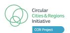

# **Report on analysis of consumer research PENDING APPROVAL FROM THE EUROPEAN COMMISSION**

*Deliverable name*

**28 February 2025**

*Due date* 

**Date of final version**: 28 February 2025

**Type**: R — Document, report

**Dissemination level**: Public

**Document approval**: Axel'One

Views and opinions expressed are however those of the author(s) only and do not necessarily reflect those of the European Union or REA. Neither the European Union nor the granting authority can be held responsible for them.

**Circle Economy**

*Lead Participants*

**D2.3**

#### **PROPRIETARY RIGHTS STATEMENT**

This document contains information which is proprietary to the SOLSTICE consortium. The document or the content of it shall not be communicated by any means to any third party except with prior written approval of the SOLSTICE consortium.

# **Document History**

| Version | Date       | Description                                 |
|---------|------------|---------------------------------------------|
| V1      | 15/01/2025 | Rough outline with content in bullet points |
| V2      | 18/02/2025 | First full draft                            |
| V3      | 24/02/2025 | Final version reviewed by editorial         |
| V4      | 26/02/2025 | Final version reviewed by Ola               |

# **Executive Summary**

This report aims to summarise findings about consumer behaviour related to circular textiles in the four territories: Catalonia, Berlin, Prato, and Grenoble as researched under the SOLSTICE project.

Guided by Circle Economy, the four territories conducted focus groups to better understand consumer attitudes towards circular economy interventions.

Under the following four themes comparable results were generated, allowing for the exploration of territory-specific characteristics:

- 1. General consumer behaviour surrounding and attitudes towards textile consumption
- 2. Consumer awareness of circular solutions
- 3. Challenges and barriers to circular solutions
- 4. Opportunities for a pilot project

Key findings reveal that both for consumer behaviour related to textile consumption as well as for circular textile solutions, price is considered the most important motivator across all territories. Therefore, making circular options affordable must be a key priority. At the same time, different consumer groups have various perceptions and understanding of circular solutions, so targeted communication for different population segments is essential.

Certain circular solutions like donation and second-hand shopping are well recognised, while rental and upcycling need more visibility. Still, for all of them, affordability is the biggest barrier: circular options are often perceived as too expensive compared to fast fashion. At the same time, availability and accessibility matter: location, infrastructure, and convenience determine engagement with circular solutions.

Local consumer behaviour insights will inform the design of a circular textile pilot project in each region under work package 3 of the SOLSTICE project.

# **1. Table of Content**

| Document History                                                                                                                                                                                                          |                                                                                                                                                                                          |
|---------------------------------------------------------------------------------------------------------------------------------------------------------------------------------------------------------------------------|------------------------------------------------------------------------------------------------------------------------------------------------------------------------------------------|
| 1. Table of Content                                                                                                                                                                                                       | .......................................................................................................................................................................................2 |
| 2. Introduction.................................................................................................................................................................................................3         |                                                                                                                                                                                          |
| 3. Methodology and themes                                                                                                                                                                                                 | 4                                                                                                                                                                                        |
| Catalonia .............................................................................................................................................................................................................5  |                                                                                                                                                                                          |
| 4. Results..............................................................................................................................................................................................................6 |                                                                                                                                                                                          |
| Consumer behaviour profiles                                                                                                                                                                                               | ..........................................................................................................................................................7                              |
| Consumer motivators and preferences for textile consumption                                                                                                                                                               | ...........................................................................7                                                                                                             |
| Consumer motivators and preferences for circular textile solutions                                                                                                                                                        | ..................................................................11                                                                                                                     |
| Awareness of circular textile solutions and local circular service providers                                                                                                                                              | ..................................................13                                                                                                                                     |
| solutions .......................................................................................................................................................................................................15       |                                                                                                                                                                                          |
| Theme three: Challenges and barriers                                                                                                                                                                                      | .........................................................................................................................................15                                              |
| Identified barriers in all territories                                                                                                                                                                                    | ..............................................................................................................................................19                                         |
| solutions ......................................................................................................................................................................................................20        |                                                                                                                                                                                          |
| Theme four: Opportunities for a circular textiles pilot                                                                                                                                                                   | ......................................................................................................20                                                                                 |
| Key conclusions from Theme four: Opportunities for a circular textiles pilot                                                                                                                                              | 22                                                                                                                                                                                       |
| 5. Conclusion.................................................................................................................................................................................................            | 22                                                                                                                                                                                       |
| 6. References/publications                                                                                                                                                                                                | ...................................................................................................................................................................24                    |
| 7. Appendix I: key distinctions made across consumer behaviour characteristics in each territory.26                                                                                                                       |                                                                                                                                                                                          |
| 8. Appendix II: challenges and barriers to circular textile solutions across all territories.                                                                                                                             | .........................27                                                                                                                                                              |
| 9. Appendix III: initiatives and opportunities for circular textile solutions per territory...............................29                                                                                              |                                                                                                                                                                                          |

# **2. Introduction**

The global textile industry is 0.3% circular: of the 3.25 billion tonnes of materials it consumes each year, over 99% come from virgin source[s](#page-3-1)1 . Despite increasing sustainability efforts, the industry is characterised by overproduction and overconsumption: this contributes to resource depletion and has detrimental environmental and social implications. A sub-task of the SOLSTICE project outlines research activities to uncover consumer behaviour related to circular textiles in four territories: Catalonia, Berlin, Prato, and Grenoble. Partner territories designed and conducted local focus groups or surveys to better understand consumer behaviour and attitudes towards circular economy interventions. The design of the focus groups was consistent across regions to ensure comparable results.

This research aims to shed light on the attitudes towards, behaviour regarding and awareness of circular textile solutions in each region, focused on clothing, and use these insights to inform the design of a circular textile pilot project in each region. The pilots will be based on tailored and consumer-relevant strategies to facilitate more sustainable and circular behaviour in relation to textile consumption.

Circle Economy has coordinated the design of these focus groups through the use of guidance documents. This report summarises the findings drawn from the focus groups, interpreting and comparing results. It centres on the comparison between territories, while the synthesised results for each of the focus groups are presented in the individual territory profiles that are other key deliverables of this project. These profiles analyse the current state in the four territories and their existing circular textile ecosystems.

#### **SOLSTICE**

SOLSTICE is a Horizon Europe project, funded by the European Union. It started on 1 May 2024 and will last for 42 months. It receives funding from the European Union's Horizon Europe research and innovation programme under grant agreement No. 101134989.

SOLSTICE addresses key social and technical challenges within the textile industry. Through active demonstration in four European regions, the project showcases the implementation of climateneutral practices and the transition towards a circular economy specifically tailored for the textile sector.

Circle Economy leads Work Package 2 of SOLSTICE, and, together with the four territories, conducts a current state analysis and jointly designs to-be-implemented circular textiles pilots. Task 2.2.1 (Consumption side / consumers' behaviour) forms part of this design process, enabling the territories to use the consumer research results in the design of their pilots.

1 Circle Economy. (2024). The Circularity Gap Report Textiles. Retrieved from[: CGR Website](https://www.circularity-gap.world/textiles)

# **3. Methodology and themes**

Circle Economy guided four consumer research focus groups in autumn 2024, with the intent of garnering insights to shape the design of the pilot projects. This section briefly describes the methodology of this guidance process, the various methodologies applied in the focus groups and the approach to interpreting and comparing the results.

First, broad, country-level consumer behaviour research was conducted for all territories. This included insights on textile purchasing habits, consumer preferences, consumer awareness, motivational factors, and challenges and barriers to sustainable consumption. This was followed by a collaborative process to select the most appropriate and feasible method to study consumer behaviour on a local level per territory.

An iterative process with the four territories determined that a survey would not be feasible due to time and resource constraints. Focus groups were collectively agreed upon as the most suitable method to gather qualitative insights in the short timeframe available. All territories conducted focus groups, with Berlin also using a survey approach due to networks for survey distribution and collection already being in place.

Circle Economy then created a focus group protocol and guidance document to help design and shape the territory's approaches, including information on focus groups as a research method, suggested local stakeholders to include in the focus groups, and four key themes. The themes ensured a harmonised approach to generate comparable results while allowing for the exploration of territory-specific characteristics (can be found in Table one below[\).](#page-4-1)2

*Table one: the four key themes guiding the focus groups.*

| Theme                                                                                       | Goal                                                                                                                                           | Topics and questions                                                                                                                                                                                                                                                 |
|---------------------------------------------------------------------------------------------|------------------------------------------------------------------------------------------------------------------------------------------------|----------------------------------------------------------------------------------------------------------------------------------------------------------------------------------------------------------------------------------------------------------------------|
| Theme one: General consumer behaviour surrounding and attitudes towards textile consumption | To provide a qualitative starting point for understanding consumer behaviour in the territory, focusing on territory-specific characteristics. | <b>Key motivations behind consumer purchasing decisions for textiles:</b> What drives choices in clothing and other textile products? Factors may include sustainability (fast fashion vs. second-hand), brand preference, quality, price, and other considerations. |
|                                                                                             |                                                                                                                                                | <b>Consumer preferences in buying textiles:</b> Do shoppers prefer physical or digital stores? Do they shop in their neighbourhoods or travel further? What modes of transport do they use?                                                                    |

2 Despite efforts to ensure comparability of results, there were variations in approaches utilised ranging from different types of stakeholders included, different understanding of concepts such as circular solutions, different formats of discussion, and different questions asked in the focus group. The results showcase a fair comparison across these variables where possible.

| Awareness of impacts:           | To what extent are           |
|---------------------------------|------------------------------|
| and materials                   | : How familiar are consumers |
| Knowledge of circular solutions | : Are                        |
| Key barriers:                   | What prevents consumers from |

Through a collaborative approach, each territory developed its own methodology for its focus group, as detailed below. This involved the selection of stakeholders most relevant to each territory. Focus group participants were representatives from a broad range of organisations such as textile associations (Prato) or the Circular Fashion Pact (Catalonia) rather than consumers themselves. Attitudes towards textile consumption are based on these organisations' perceptions of consumer behaviour, and are not directly extracted from consumers themselves.

#### **Catalonia**

- Participants: Twelve participants from different parts of the textile value chain, divided into two separate workshop groups of six people with one facilitator per group.
- Language: Discussions carried out in Catalan, with some questions translated from English to more easily synthesise results.
- Duration: Both workshops lasted 2.5 hours.
- Format: Some multiple choice/selection questions, some more open-ended questions leading to discussions, group discussions and tasks including ranking answers with sticky notes on paper.

#### **Berlin**

- Participants: Expert focus group with four participants with expertise in the field of textile consumption, and one additional personal expert interview.
- Language: The focus group was conducted in English.
- Duration: The focus group lasted 1.5 hours.
- Format: Prior to the focus group participants were given an overview of the four key themes and relevant questions to prepare themselves. In the focus groups openended questions were asked leading to discussions.

#### **Prato**

- Participants: Ten participants, facilitated by two moderators.
- Language: The focus group was held in Italian.
- Duration: The workshop lasted 1 hour and 40 minutes.
- Format: Participants received key readings beforehand. The semi-structured workshop used a thematic guide to explore topics while encouraging open expression. Mentimeter was used alongside traditional methods to gather some quantitative data. The focus group was conducted online via Google Meet.

#### **Grenoble**

- Participants: Twelve participants, split into two separate discussion groups, with one facilitator per group.
- Language: The focus group was held in French.
- Duration: Both workshops lasted 2.5 hours.
- Format: Roundtable format, both groups had the same set of questions, presented on paper for ranking or answering on sticky notes. Questions included multiple choice with open-ended options and open-ended prompts for discussion. For Theme three (barriers and levers), one group focused on Repair and Sustainable Purchases, while the other explored Buy Less and Buy Second-Hand.

The territory partners were responsible for organising and facilitating the focus groups. They presented the results to Circle Economy in the form of a summary report summarising their key insights on the four themes from the guidance document. The remainder of this report analyses the results from each of four themes, drawing key comparisons and highlighting regional trends or anomalies for each region.

# **4. Results**

## **Theme one: General consumer behaviour surrounding and attitudes towards textile consumption**

The first theme explored consumer behaviour related to textile consumption, gathering insights on consumer profiles per territory, key motivators for purchasing clothing, attitudes towards purchasing second-hand versus new clothing, and general purchasing preferences.

#### Consumer behaviour profiles

All territories attempted to formulate a local textile consumer behaviour profile. However, it proved challenging to identify one cohesive consumer behaviour profile across all territories. All territories' focus groups made age distinctions, with age groups significantly impacting motivators to purchase textiles.

**Berlin** identified two main groups of consumers: (1) Hedonic shoppers, who buy for fun, are largely influenced by social media/peer influences and engage in seasonal and spontaneous shopping, and (2) Utilitarian shoppers, who buy for function, with price, textile material, and use being key considerations.

**Catalonia** identified four consumer profiles: (1) Responsible consumers, who buy less and more conscientiously, (2) Subsistence consumers, who buy what they need (3) Functional shoppers, who make decisions based on the type of clothes, and (4) Trend followers, who are less aware of sustainability concerns. This last category was broken down into two subcategories: (4A) Young consumers influenced by price and influencers, who see clothes as linked to identity, and (4B) Middle-aged consumers influenced by brand loyalty, personal expression, and quality. These classifications can be broadly matched with Berlin's categorisations of consumers that shop for fun versus for function.

While no such elaborate distinctions emerged from the **Prato** focus group, **Grenoble's** focus group produced more diverse and specific profiles, creating individual personas. Overall, these profiles can also be classified into shopping for necessity, function, and leisure. Grenoble's classifications include: (1) Those who shop second-hand by necessity, including students, the elderly, stay-at-home parents, (2) Those who shop second-hand by choice, including students in managerial roles, mid-level professionals, and retirees, largely for ethical, social, ecological or creative reasons, (3) Those who prefer new items, including those with preference for specific brands, practicality, or specific technical needs. This categorisation factors family structure into consumer choices: for example, a woman with a less well-paying job and three children has distinct and different consumption patterns from a woman with a high-paying job and no children.

#### Consumer motivators and preferences for textile consumption

While all territories classified shoppers slightly differently, these can be broadly grouped together into the shared motivators and preferences as presented in Table two below. There are key distinctions between consumer motivators and preferences as highlighted in Text Box one on page 10.

*Table two: motivators for textile purchase selected by the territory focus groups.*

| Motivators and                  |                                 |
|---------------------------------|---------------------------------|
| preferences selected per region | Catalonia Berlin Prato Grenoble |
| Price                           | X X X X                         |
| Trends/Fashion                  | X X X                           |
| Necessity/Utility               | X X X                           |
| Brand                           | X X                             |
| Peer/Social media influence     | X X                             |
| Design                          | X                               |
| Brand loyalty                   | X                               |
| Sustainability                  | X                               |
| Own care/Alteration skills      | X                               |
| Comfort/Wellbeing Personal      | X                               |
| expression/Aesthetics Quality   | X X                             |

While overarching motivators and preferences could be established, more distinct characteristics or notable points emerged in each of the four territories. For example, **Berlin** emerged as an anomaly in terms of consumer behaviour in comparison to the rest of Germany. The city's more open-minded consumers can be attributed, in part, to the availability of a large number of circular solutions in Berlin. The key preferences and motivators in Berlin were (in order) price, brand, and peer/social media influence. These motivators are all characteristic of younger consumers, which can be linked to Berlin's uncharacteristically young population: 56% of the population is under 45 years ol[d.](#page-8-0)3

In **Prato's** focus group, price and quality were determined to be the most important preference for purchase. This finding aligns with research conducted for Italy as a whole, which finds that the ratio of price to quality is important to Italian consumers.[4](#page-8-1)

In **Grenoble** overall price was the most important preference, with necessity being the next most important motivator, followed by style. Brand was highlighted by one of the discussion groups as very important.

There was less of a clear hierarchy of motivators and preferences that emerged from **Catalonia's** focus groups, with the two discussion groups drawing varied conclusions. One group struggled to identify any overarching consumer preferences and motivations without including age dimensions. Price was determined as most important by both. One

3 Berlin-Brandenburg Statistics Office. (2024). Demographic data. Retrieved from: [Berlin Business Location Center](https://www.businesslocationcenter.de/en/business-location/berlin-at-a-glance/demographic-data)  [website](https://www.businesslocationcenter.de/en/business-location/berlin-at-a-glance/demographic-data)

4 Dangelico, R., Alvino, L. & Fraccascia, L. (2022). Investigating the antecedents of consumer behavioral intention for sustainable fashion products: Evidence from a large survey of Italian consumers. *Technological Forecasting and Social Change*, *185*(4), 1-19. doi:10.1016/j.techfore.2022.122010

group listed wellbeing or comfort as second most important, followed by trends, and finally personal expression.

As seen in Table two, several trends in the motivators and preferences selected across territories were observed. For instance, price was overwhelmingly highlighted as the primary preference across all territories[.](#page-9-0)5 This is in line with well-documented results from previous consumer studies and scientific research.[6](#page-9-1) [7](#page-9-2) The next two key preferences and motivators for three out of four territories were fashion and trends, and what was categorised as necessity and utility (for instance, replacing worn out clothing, adapting to seasonal changes and durability). Aesthetics and personal style were across the board highlighted as the next most important consumer preferenc[e.](#page-9-3)8

Social media and peer influence were primarily seen as motivators amongst younger consumers across all territories. This signifies that younger consumers tend to make choices on the basis of external influence, for example, societal trends, influencers and group pressure; this aligns with other researc[h.](#page-9-4)9

From focus group discussions, it emerged that there was generally a preference for instore shopping across all territories, depending on age and location (for example, there was a preference for local in-store shopping). Online shopping is the primary mode of textile purchase for younger consumers. In Grenoble, for instance, second-hand shopping is marginally more common online, with second-hand online platforms such as Vinted mentioned by both Grenoble and Berlin's focus groups. **Consumer preferences versus consumer motivators** 

**Consumer preferences** refer to choices, tastes and priorities expressed by consumers when choosing to purchase products. These include factors such as quality, price, brand, design, and sustainability. This encapsulates the things consumers like or prioritise when making purchase decisions.

**Consumer motivators,** on the other hand, are psychological, emotional, and economic drivers that influence purchase decisions made by consumers. These could range from personal values to

5 While it is hard to make an absolute generalisation as there were a total of six focus groups, price was overwhelmingly highlighted as the primary consumer motivator/preference.

6 Rouse, E. (2022, September 22). Consumer Research: 61% of Fashion Shoppers Put Price Above Sustainability as Living Costs Rise. *Notso*. Retrieved from[: Notso Website](https://www.nosto.com/blog/sustainable-fashion-consumer-research-2022/)

7 Lee, J.E. & Chen-Yu, J.H. (2018). Effects of price discount on consumers' perceptions of savings, quality, and value for apparel products: mediating effect of price discount affect*. Fash Text,* 5(13), 1-21. doi:10.1186/s40691-018-0128-2

8 There were some variations in terminology when discussing trends, fashion, aesthetics, and personal style. We have here made a distinction between trends and fashion as being more aligned with broader trend-seeking behaviour and fashion trends, while aesthetics and personal style are seen as more closely tied to individual expression.

9 Koning, J., Lavanga, M., & Spekkink, W. (2024). Exploring the clothing overconsumption of young adults: An experimental study with communication interventions. *Journal of Cleaner Production*, 1-11. doi:10.1016/j.jclepro.2024.142970

needs such as health or convenience, to external influences such as marketing or peer pressure. Motivators can present the reason behind preferences and largely explain why a consumer is driven to certain purchase decisions.

Location emerged as a notable factor influencing consumer preferences. It was somewhat central to focus group discussions in Catalonia, Berlin, and Grenoble. In Berlin, it was highlighted that consumers preferred local and in-store shopping, meaning that neighbourhood shopping is desirable. 'The neighbourhood' as a location was highlighted as important in Berlin, as neighbourhoods have relatively distinct population groups and thereby relatively distinct consumer profiles and patterns. In Catalonia, several key shopping locations were mentioned, such as shopping malls and main shopping streets. However, once again, differences were notable across groups: street markets and neighbourhood shopping were more popular among older population groups (60+), for example. In Grenoble, shopping malls were highlighted as the preferred location for all consumers, with mention of particular locations in the city centre.

Another relevant topic that was brought up in most focus groups was consumer preference for second-hand versus new clothing. Overarchingly it was determined that consumers preferred new clothing, with some exceptions. For instance, in Catalonia, it was determined that all consumers preferred new clothing to second-hand clothing, however, the consumer group that most valued second-hand clothing was young women. An absolute preference for buying new over second-hand was also demonstrated in Grenoble. Discussions were held in Grenoble, Catalonia, and Prato about different kinds of second-hand shopping: 'solidarity' or social cause stores were differentiated from second-hand or thrift shops,[10](#page-10-0) with a preference for the latter being highlighted in both Grenoble and Prato. It was determined in the focus groups that 'solidarity' stores are predominantly still associated with poverty and therefore face some social stigma and hesitance to engage with them.

These preferences can be viewed in greater detail in Appendix one.

10 Terminology varies when referring to second-hand stores. We here refer to social impact organisations or social enterprises that largely run on the basis of donations and are usually more affordable and traditionally see more utilitarian shoppers who buy second-hand out of necessity from charities, thrift shops, opportunity shops, etc. We differentiate this for the purpose of this report from more curated and commercial second-hand or thrift stores, as these are typically engaged with in a different way. This contrast was discussed by some of the focus groups: for instance, in Catalonia, the focus group debated the difference between second-hand and thrift stores.

#### Key conclusions from Theme One: General consumer behaviour surrounding and attitudes towards textile consumption

- Price is still considered the most important motivator across all territories. This suggests that making circular options affordable must be a key priority. While price is the dominant motivator across all territories, secondary motivators differ.
- Other motivators are more dependent on the specific consumer behaviour profile, which can differ significantly depending on age group, social group, or other factors. Thus, more tailored solutions are necessary depending on specific consumer profiles.
- Income level overwhelmingly shapes consumption: higher-income consumers are more willing to engage with circular offerings like repair and upcycling, driven by exclusivity, style and willingness to spend, while lower-income consumers prioritise affordability and accessibility, with second-hand shopping and swapping more common.
- Across all territories, younger consumers are perceived to be more influenced by social media, trends, and peer pressure. High-impact solutions therefore should target younger consumers.
- The need for textiles (for utility or functional purposes) was mentioned in three focus groups, highlighting that while consumption of textiles is extreme among some population groups, others consume simply due to need, perhaps reiterating that it is important to target demographics where textile consumption is high to generate the most impact.

#### **Theme two: Circular solutions**

The second theme focused on consumer behaviour in relation to circular textile solutions, intending to gather insight into awareness of these solutions, including circular textile solutions and service providers known locally. A key consideration is that definitions of circular solutions vary across territories. For example, in Catalonia, concepts like 'reduce' and 'rethink' were seen as overarching principles applicable to all circular solutions except recycling. In contrast, Berlin treated 'rethink' as a distinct category, encompassing specific initiatives like wardrobe styling.

#### Consumer motivators and preferences for circular textile solutions

Motivators and preferences for using circular textile solutions—both generally and for specific circular textile solutions—were discussed to varying degrees in all focus groups. Several of the focus groups discussed the key motivators for engaging with circular textile solutions.

In Catalonia's focus group, for example, several key motivators were highlighted, including the environmental harm of textile production, awareness of the impacts of the textile value chain, the importance of sustainability and ethical certifications, and the perceived responsibility of companies to provide care instructions and take-back schemes.[11](#page-12-0) The most important considerations for consumers when making purchase decisions were environmental harm, awareness of the textile value chain, and ethical or sustainability certifications. The perception of companies enforcing sustainability principles, providing care and repair instructions, and offering take-back schemes was of lesser importance. This may be due, in part, to consumers' limited awareness of these initiatives.

In Grenoble, a similar examination found that environmental harm was the primary factor driving engagement with circular textile solutions. Sensitivity to craftsmanship and support for the local economy also played a role in responsible textile consumption.[12](#page-12-1) Sentimentality towards clothing was also mentioned as a motivation for preservation. Finally, preferences were mentioned: here, price and the desire to have a clear conscience were key factors influencing the use of circular solutions.

In Berlin, proximity to circular solutions was highlighted as a key motivator, with a strong overall preference for neighbourhood-based solutions. Discussions also touched on how motivations for engaging with circular textile solutions vary across income groups. Highincome groups engage more with services like repair and upcycling and are motivated by exclusivity, trends and individual style, while lower-income groups are more motivated by cost and accessibility.

In Prato, participants demonstrated a good understanding of environmental and social harm associated with textile production.[13](#page-12-2) However, accessibility emerged as a key factor influencing the motivation to engage with circular solutions. Distance from textile collection points, repair centres, and second-hand markets were identified as potential barriers, particularly in less central areas. Here it was highlighted that negative textile impacts are generally known but knowledge of circular solutions is not widespread.

The location of circular solutions is considered a primary motivator in some territories. In Berlin, the presence of circular solutions within local neighbourhoods significantly boosts

11 These listed motivators for engaging with circular textile solutions were presented to focus groups participants and may not necessarily represent a complete list of motivators. This also makes it challenging to operationalise the meaning of the definitions completely as we are not sure of the context of the discussions. For instance, awareness of the textile value chain could mean awareness of the negative impacts of the textile value chain or a good knowledge and understanding of the textile value chain in Catalonia.

12 The trend towards increased purchase of local textile products was also cited in a nation-wide study of consumer behavior[: Étude sur les habitudes de consommation et le made in France: Marques de France](https://www.marques-de-france.fr/etude-sur-les-habitudes-consommation-et-le-made-in-france-fevrier-2024/)

13 Participants of the focus groups were selected to participate due to their proximity or involvement in the textile value chain and therefore do not accurately represent the average consumer.

participation.[14](#page-13-1) The findings from Catalonia's focus group highlighted a demographic aspect: awareness of circular textile solutions is generally much higher in urban locations than in more rural areas.

Price emerged as a common preference across the territories, with price-saving being a key motivator, particularly in low-income areas. This showcases the need for affordable secondhand options, subsidies, and convenient access to drive further engagement with circular textile solutions.

Interestingly, environmental awareness and an understanding of the harms of textile production emerged as key motivators for engaging with circular textile solutions. However, this is not always translated into action, as factors like convenience and price often take precedence over sustainability considerations, even among those who participate in circular textile initiatives.

#### Awareness of circular textile solutions and local circular service providers

Awareness of circular textile solutions was also discussed across all focus groups, revealing both common trends and some key differences. For instance, in **Catalonia**, there is high awareness of donation, recycling, second-hand, and 'rethink' and 'reduce' solutions, while awareness of swapping, renting, and renewal[15](#page-13-2) solutions was low. It was also highlighted that while donation is a well-known and key solution in the region, there are some misperceptions of the function of donation containers: many people believe that donation containers are exclusively for donations, rather than also serving as collection points for textile waste.[16](#page-13-3) Participants also emphasised that awareness of circular solutions tends to be higher across the population in large cities, making location a major factor in terms of accessibility and engagement. In terms of local service providers, there was less of a definitive consensus reached: some participants were aware of local 'rethink' and 'reduce' solutions as well as second-hand, repair, and recycling offerings.[17](#page-13-4) Local locations for renewal, renting, and swapping were less known by all participants.

In **Berlin**, awareness of circular solutions was ranked from well-known and used, to wellknown and used little, to not well-known. Due to the broad range of offers available throughout the city, knowledge of local service providers was discussed, with lesser attention given to awareness of circular services more broadly. Flea markets, second-hand

14 This can be confirmed through the corresponding survey conducted in Berlin on consumer behaviour as related to circular textile solutions.

15 A caveat here is that there were two focus groups with different approaches; one never ranking higher than five, the other ranking largely in the upper quartile (five to ten).

16 Textile waste collection rates are particularly low in Catalonia, as shown in the targets of the [Catalonia Circular](https://mediambient.gencat.cat/ca/05_ambits_dactuacio/empresa_i_produccio_sostenible/economia_verda/catalunya_circular/english-version/circular-fashion-agreement/)  [Fashion Agreement.](https://mediambient.gencat.cat/ca/05_ambits_dactuacio/empresa_i_produccio_sostenible/economia_verda/catalunya_circular/english-version/circular-fashion-agreement/)

17 All to a varying degree, with some participants stating they were aware of these solutions, while others were less well informed.

shops and donations are most known and used, while people are aware of alteration by a tailor, swapping events and rental but do not use these solutions as frequently. Rental options for everyday clothing, repair cafes, upcycling, wardrobe consultation and take-back schemes from fashion brands are least known.

In **Prato**, the most known solutions were clothing collection points and second-hand shops. Repair centres, upcycling, and creative workshops were less known. Interestingly, as discussed in the broader consumer behaviour preferences section, second-hand shops face stigma in Prato. This means that one of the best-known circular solutions is not frequently used. Beyond the awareness of circular services mentioned above, no further awareness of local service providers emerged from Prato's focus group. In general, awareness of circular solutions is not widespread in Prato.

**Grenoble**'s focus group had limited discussion on awareness of circular textile solutions generally, with more focus on awareness of local circular textile solutions and solutions providers. Here renting, exchanging, buying sustainably, and extending garment lifetimes were identified as least known. The most known local service providers were second-hand establishments, donation points and upcycling initiatives.[18](#page-14-0) Local actors in second-hand, donation and reuse are recognised in Grenoble, while actors involved in rental, exchange, and sustainable purchase are less known. In terms of repair actors, only tailors were mentioned, with limited knowledge of local repair actors beyond this.

An interesting point of analysis is the apparent link between the availability of circular textile solutions and public awareness. In territories where solutions are more widespread—such as Berlin—there seems to be higher levels of awareness and engagement. Conversely, in Catalonia, where renewal, renting and swapping solutions are less common, they are also less known and utilised. This suggests that simply increasing the presence of circular textile initiatives in itself could increase awareness and use.

Interestingly, across all focus group discussions, donation or clothing collection points were mentioned, but not necessarily framed as 'circular' solutions. However, these are among the most well-known and used solutions, in Berlin, Catalonia, and Prato. Second-hand shopping was highlighted as one of the most important circular textile solutions across the territories. Recycling was mentioned in Catalonia, but not really discussed in the dialogue surrounding local circular solutions in any other territory. In the regions where swapping and renting were mentioned, they tended to be far less known than the other circular solutions.

18 This is an anomaly and can be explained as several upcycling establishments and initiatives were highlighted by one focus group participant.

#### Key conclusions from Theme Two: consumer knowledge of and preference for circular textile solutions

- While price is crucial, time is often perceived to be more costly: for example, shopping second-hand is seen as more accessible than upcycling. Overall, consumers value price and convenience over sustainability in decision-making.
- The intention behaviour gap shows that awareness is not a key driver in engaging with circular solutions. Even when solutions are well-known (such as repair services), they are underused.
- It should be emphasised that individual style can be maintained through a number of circular solutions, such as renting, swapping, repairing, and second-hand. Trends motivate the desire to change wardrobes often and continuously, therefore solutions like this should be targeted at consumers with trend-following behaviour.
- Different consumer groups have various perceptions and understandings of circular solutions, making targeted communication for different population segments essential.
- Certain circular solutions (donation, second-hand shopping) are well recognised, while others (rental, upcycling) need more visibility.
- Access barriers exist: solutions need to be affordable, geographically accessible, and culturally inclusive.
- Donation is often overlooked as a circular solution, however, was characterised as well-known and used in several of the focus groups.
- Local availability influences consumer behaviour, as seen in Berlin, where circular options are widespread, shaping more open-minded consumption patterns**.**

### **Theme three: Challenges and barriers**

The third theme was focused on exploring the key challenges and barriers preventing consumers from adopting circular solutions, including reuse, swapping, renting, thrifting, repairing, and recycling. Each territory identified and interpreted these barriers differently, though some challenges were consistent across multiple territories.

Insights from **Catalonia** show that there is no single solution—barriers vary widely depending on the circular practice. This highlights the need for region-specific interventions rather than a one-size-fits-all approach. The table below summarises the most persistent challenges for each solution (presented in order of importance):

*Table three: challenges and barriers to circularity in Catalonia.*

| Circular solution | Challenges and barriers                |
|-------------------|----------------------------------------|
| Reduce/Rethink    | Awareness, readiness, and type of area |
| Swap              | Availability, type of area, readiness, |

| Renting     | Availability, type of area, awareness and    |
|-------------|----------------------------------------------|
| Second-hand | Price, awareness, reliability, type of area, |
| Thrifting   | Type of area, distance                       |
| Renewal     | Type of area, awareness, time, availability  |
| Repair      | Availability, price, distance, type of area, |
| Recycling   | Type of area, distance and awareness         |

Overarchingly, 'type of area' was highlighted as a key barrier across all circular solutions, suggesting that use and availability depend significantly on access.[19](#page-16-0) In addition, while there is an interest in circular solutions, price remains the primary barrier—cost considerations still outweigh sustainability concerns in purchasing decisions. Even where consumers are aware of circular solutions, they may not engage due to concerns about availability, trust, and convenience. Social stigma is also a major challenge in Catalonia, particularly surrounding second-hand clothing, which is viewed as undesirable—especially among older generations.

On the other hand, unlike in Catalonia, where accessibility is a major issue, Berlin's consumers face 'decision fatigue' linked to an overwhelming number of circular options. Barriers in Berlin were expressed more in terms of finding the right brand, size, or material. Socioeconomic factors were also highlighted as being challenges, in that accessibility in terms of location, information and even language was of primary importance among certain population groups. For example, engaging communities in circular textile solutions presents more of a challenge in neighbourhoods where a majority of the population is from a migration background.[20](#page-16-1) It was expressed in the focus groups that there is a willingness to learn and participate but access barriers exist. There is also a social divide in the perception of second-hand clothing; in some neighbourhoods, second-hand fashion is embraced as a trendy, sustainable choice, while in others, it is seen primarily as a financial necessity, reinforcing its association with poverty.

For **Berlin**, the main solutions examined were second-hand shopping, swapping and renting (grouped together), and repair and recycling (grouped together). The main findings are summarised in the table below.

19 Discussions of this definition were held in person. The 'type of area' could refer to the income level of an area, or to a residential area, urban centre, or rural area.

20 In Germany in general 24.4% of the population are from a migration background, in Berlin this number is between 30 and 39% of the population depending on the source consulted.

*Table four: challenges and barriers to circularity in Berlin.*

| Circular solution    | Challenges and barriers                                 |
|----------------------|---------------------------------------------------------|
|                      | Rental-specific: Costs of renting are higher than       |
|                      | purchasing new fast fashion, and less accessible due to |
| Repair and upcycling | Price: Fast fashion is cheaper.                         |

| Rental-specific:                                                           | Costs                                  | of renting higher than purchasing          |
|----------------------------------------------------------------------------|----------------------------------------|--------------------------------------------|
|                                                                            | new fast fashion, periods for renting  | and less accessible due to inflexible time |
| Repair and upcycling expensive). Second-hand shopping Swapping and renting | Price: Fast fashion is cheaper.        |                                            |
| Rental-specific:                                                           | Costs                                  | of renting higher than purchasing          |
|                                                                            | new fast fashion, periods for renting. | and less accessible due to inflexible time |

**Prato's** insights did not include a ranking of circular solutions or an in-depth examination of specific practices, but key barriers were identified. Circular solutions are perceived to be more expensive than conventional alternatives, making affordability a key barrier. Trust and transparency were further highlighted as a challenge in Prato, with lower trust in circular solutions largely due to limited information and transparency regarding production processes, material recovery, and resale systems. Accessibility was also mentioned, with distance from collection points, repair centres, and second-hand markets emerging as a significant barrier, particularly for residents in less central areas. Social stigma was underscored as an additional barrier, with cultural norms discouraging second-hand purchases, especially in the context of symbolic or formal ceremonies (for example weddings or other traditional celebrations). While younger generations are increasingly open to second-hand shopping, stigma persists among other demographic groups, limiting broader adoption.

As in the other territories, **Grenobles's** focus group emphasised negative perceptions of second-hand items, often associating them with financial struggles rather than sustainability. In Grenoble, this is further influenced by an unfavourable sales context: peripheral locations, unappealing merchandising, hygiene concerns, and the lack of information on the quality and origin of products, for example. Additionally, the growing presence of low-cost fast fashion makes reducing textile consumption more difficult. Repair culture is emerging, but consumers rely more on personal networks (friends and relatives, for example) for repairs rather than professional services due to cost concerns. There is also a strong need for repair spaces, equipment, and training—which are currently lacking—in order to improve accessibility to repair solutions.

The findings in relation to barriers for circular solutions in Grenoble are described in Table five below.

*Table five: challenges and barriers to circularity in Grenoble.*

| Circular solution  | Challenges and barriers                                   |
|--------------------|-----------------------------------------------------------|
| Buying less        | Societal pressure encourages consumption, people          |
| Buying sustainably | Price, lack of awareness, availability, lack of time, and |
| Repair             | Complexity of repair, cost of repair, lack of awareness,  |
| Buying second-hand | Desire for ownership or new items, lack of awareness,     |

#### Identified barriers in all territories

Price is a key barrier across territories. Circular options are often seen as expensive, whether due to the upfront cost of renting, the perceived poor value of second-hand goods, or the higher cost of repair compared to buying new fast fashion items. In Prato, circular solutions are perceived as significantly more expensive, while in Berlin and Catalonia, price is a major determinant of purchasing decisions, often favouring fast fashion. Grenoble consumers, particularly those with limited financial resources, often default to low-cost fast fashion alternatives rather than engaging with circular solutions.

Accessibility also emerged as a key barrier among all territories. This can be perceived in different ways: for example, knowledge gaps limit accessibility. Addressing these key barriers and making circular solutions more accessible to consumers is essential. Other accessibility barriers include distance from circular solutions, lack of skills, and difficulty trusting information.

Social stigma is also a common barrier. Most territories noted that consumers have negative associations with second-hand shopping. This stigma remains a strong deterrent, particularly in Prato and Grenoble, where second-hand shopping is still closely linked to financial hardship. Berlin reflects a more complex divide—while some neighbourhoods embrace second-hand as trendy, others associate it with poverty. Catalonia's younger generations are more accepting of second-hand clothing, but stigma remains in more traditional segments of the population, especially for formal occasions.

A more detailed overview of these findings, including regional variations for each circular solution, can be found in Appendix Two.

#### Key conclusions from Theme three: Consumer knowledge of and preference for circular textile solutions

- Affordability is the biggest barrier: circular options are often perceived as too expensive compared to fast fashion.
- Availability and accessibility matter: location, infrastructure, and convenience determine engagement with circular solutions.
- Social stigma persists, especially around second-hand clothing, which is often linked to poverty rather than sustainability.
- Awareness doesn't equal action: even when people know about circular solutions, concerns about trust, hygiene, and convenience limit participation.
- Cultural and regional differences shape adoption: solutions must be tailored to local consumer behaviour, social norms, and economic conditions.
- Decision fatigue in choice-rich areas (such as Berlin) contrasts with the lack of access in others, highlighting different engagement barriers.
- Trust and transparency are key: consumers hesitate to adopt circular solutions without clear information on sourcing, production, and resale systems.
- Repair remains underutilised due to cost, time, lack of skills, and the poor quality of fast fashion items.

#### **Theme four: Opportunities for a circular textiles pilot**

The final theme examined potential strategies for circular textile solutions. Each region highlighted opportunities for intervention, often linked to the specific barriers identified in Theme Three. These are difficult to compare due to differences in specific regional contexts. See Appendix Three for a complete list of strategies and solutions for each territory.

**Catalonia's** approach to circular textiles is rooted in scaling infrastructure, integrating circularity into existing retail models, and fostering policy support. The territory emphasises market-driven interventions, ensuring that sustainable fashion is both accessible and financially viable. A variety of proposals emerged, including repair kits for citizens, increased textile containers, utilising household waste centres as textile sorting facilities, incentives for circular jobs in waste sectors, facilities such as circular malls, digital tools, and network creation. Both focus groups concluded that significant added value could come from education and awareness campaigns. There was consensus that reducing and rethinking textile consumption should be a fundamental principle across all solutions, rather than just a subset of interventions. Additionally, participants noted that public support for circular business models is essential, alongside feasibility assessments to ensure their long-term viability. Finally, there was broad agreement across focus groups that solutions should be integrated into users' routines as much as possible to be more impactful.

In **Berlin**, discussions around this theme emphasised that any pilot project selected should be a community-driven initiative targeting families, young people, and those with a migration background. This was seen as key to fostering community engagement with circular solutions. Similar to Catalonia, Berlin's approach prioritises **integrating circular solutions into daily routines** to enhance accessibility and encourage adoption. Collaboration with **existing initiatives** was highlighted as essential to developing **impactful solutions**. Pilot ideas emerging from Berlin's focus groups focused on repair, swapping, and renting, with multiple practical suggestions including repair communities, cafés or picnics, developing regular and permanent spaces for swapping, and online rental systems with the possibility for size checks. An extensive overview of these ideas can be found in Appendix Three. Participants also discussed the importance of prioritising solutions based on impact, emphasising that maximising the use of existing wardrobe items and reducing new garment purchases should take precedence. Awareness and political support were also pinpointed as central to reducing clothing consumption overall. In all, the discussion concluded that fostering collaboration with existing sustainability initiatives to enhance the effectiveness of proposed projects was key, underscoring the importance of community engagement in promoting circular solutions.

**Prato's** focus group echoed the findings of Catalonia and Berlin, highlighting the importance of community engagement and facilitating existing circular solutions. Participants identified five key recommendations for pilot projects, addressing challenges, barriers, and opportunities, with clear strategies for implementation. These were: (1) making circular solutions more cost-effective, through government-led initiatives and partnerships between producers and distributors, for example, (2) improving trust and transparency through information campaigns and certification labels, (3) expanding infrastructure and collection points, (4) raising awareness and education through collaborations with schools and universities, particularly targeting younger consumers, and (5) bolstering community involvement through circular fairs and markets, local partnerships, community centred installations.

**Grenoble's** suggestions largely centred on the development of a multi-functional space dedicated to circular solutions. In Grenoble, the purpose of this initiative was also to address the demand for accessible and community-oriented responsible consumption solutions. This included a 4R Concept store: a community space integrating information initiatives including gamified awareness campaigns, skills development, a retail second-hand store, children's areas, a consultation space, workshop space for hands-on learning sessions, repair services, and social spaces such as a coffee bar, events space and photo booths. This consolidates a range of ideas proposed by several of the focus groups in one central location. Community life, access to education and information, the practical application of circular solutions, and fun were all emphasised as necessary to any circular textile pilot.

#### Key conclusions from Theme four: Opportunities for a circular textiles pilot

While it is difficult to summarise the broad range of practical initiatives and solutions suggested across all territories, some common themes did emerge:

- A common conclusion was that there is a hierarchy of solutions with reduction of consumption appearing at the centre of significant change.
- All territories identified education and awareness initiatives and campaigns as important, especially for young people. Practical solutions were envisioned in different forms, but this emphasises the need to shift consumption behaviours first and foremost.
- Integrating any circular textile pilot or initiative into existing initiatives or existing routines was also a common thread that emerged from all focus groups. Integrating proposed solutions into consumers' routines—thereby making it easier to engage with circular solutions— was identified as crucial.
- All focus groups highlighted the importance of engaging the community in any circular textile pilot and were linked to more circular textile consumption behaviour across all territories.

# **5. Conclusion**

The goal of the focus groups was primarily to provide a knowledge base to inform the development of circular textile pilots as part of the Solstice project in Catalonia, Berlin, Prato, and Grenoble. This research analysed similarities and differences in these findings. There is benefit to both, as region-specific findings allow for the development of impactful pilots in distinct contexts while identifying overarching similarities identifies common patterns that may be applicable across contexts.

While the focus groups centred on four shared themes, there were differences in terminology used, different meanings given to terms, and distinct regional differences that emerged. The focus groups were conducted using different methodologies. This presents challenges in terms of comparison. Nonetheless, some overarching insights emerged across the four themes and territories.

Price was identified as a key factor influencing how consumers engage in textile consumption generally, as well as their engagement with circular textile solutions. It was also noted as a key barrier to circular textile solutions.

Accessibility was explored and emphasised in multiple ways. Education, price, location, and cultural inclusivity all present access barriers. Accessibility influences how people consume textiles and their willingness to engage with circular solutions: for consumers to engage with circular textile solutions, there needs to be easy access, considering factors such as location, price and awareness. It's important to note that awareness does not equal action: it will be crucial to make circular solutions as easy for people as possible, ensuring they're nearby, inexpensive, or can easily be integrated into existing routines.

Motivators beyond price vary significantly depending on age, income level, gender, and a variety of other demographic factors. Tailor-made solutions are essential for different population groups, even being highlighted on a neighbourhood level in certain regions. There are different engagement barriers for different people: these require separate and distinct solutions.

# **6. References/publications**

- 1. Circle Economy. (2024). The Circularity Gap Report Textiles. Retrieved from: [CGR Website](https://www.circularity-gap.world/textiles)
- 2. Despite efforts to ensure comparability of results, there were variations in approaches utilised ranging from different types of stakeholders, different understanding of concepts such as circular solutions, different formats of discussion, and different questions asked in the focus group. The results showcase a fair comparison across these variables where possible.
- 3. Berlin-Brandenburg Statistics Office. (2024). Demographic data. Retrieved from: [Berlin](https://www.businesslocationcenter.de/en/business-location/berlin-at-a-glance/demographic-data)  [Business Location Center website](https://www.businesslocationcenter.de/en/business-location/berlin-at-a-glance/demographic-data)
- 4. Dangelico, R., Alvino, L. & Fraccascia, L. (2022). Investigating the antecedents of consumer behavioural intention for sustainable fashion products: Evidence from a large survey of Italian consumers. *Technological Forecasting and Social Change*, *185*(4), 1-19. doi:10.1016/j.techfore.2022.122010
- 5. While it is hard to make an absolute generalisation as there were a total of six focus groups, price was overwhelmingly highlighted as the primary consumer motivator/preference.
- 6. Rouse, E. (2022, September 22). Consumer Research: 61% of Fashion Shoppers Put Price Above Sustainability as Living Costs Rise. *Notso*. Retrieved from: [Notso Website](https://www.nosto.com/blog/sustainable-fashion-consumer-research-2022/)
- 7. Lee, J.E. & Chen-Yu, J.H. (2018). Effects of price discount on consumers' perceptions of savings, quality, and value for apparel products: mediating effect of price discount affect*. Fash Text,* 5(13), 1-21. doi:10.1186/s40691-018-0128-2
- 8. There were some variations in terminology when discussing trends, fashion, aesthetics, and personal style. We have here made a distinction between trends and fashion as being more aligned with broader trend-seeking behaviour and fashion trends, while aesthetics and personal style are seen as more closely tied to individual expression.
- 9. Koning, J., Lavanga, M., & Spekkink, W. (2024). Exploring the clothing overconsumption of young adults: An experimental study with communication interventions. *Journal of Cleaner Production*, 1-11. doi:10.1016/j.jclepro.2024.142970
- 10. Terminology varies when referring to second-hand stores. We here refer to social impact organisations or social enterprises that largely run on the basis of donations and are usually more affordable and traditionally see more utilitarian shoppers who buy second-hand out of necessity from charities, thrift shops, opportunity shops, etc. We differentiate this for the purpose of this report from more curated and commercial second-hand or thrift stores, as these are typically engaged with in a different way. This contrast was discussed by some of the focus groups: for instance, in Catalonia, the focus group debated the difference between second-hand and thrift stores.
- 11. These listed motivators for engaging with circular textile solutions were presented to focus groups participants and may not necessarily represent a complete list of motivators. This also makes it challenging to operationalise the meaning of the definitions completely as we are not sure of the context of the discussions. For instance, awareness of the textile value chain could mean awareness of the negative impacts of the textile value chain or a good knowledge and understanding of the textile value chain in Catalonia.
- 12. The trend towards increased purchase of local textile products was also cited in a nationwide study of consumer behavior: [Étude sur les habitudes de consommation et le made in](https://www.marques-de-france.fr/etude-sur-les-habitudes-consommation-et-le-made-in-france-fevrier-2024/)  [France: Marques de France](https://www.marques-de-france.fr/etude-sur-les-habitudes-consommation-et-le-made-in-france-fevrier-2024/)
- 13. Participants of the focus groups were selected to participate due to their proximity or involvement in the textile value chain and therefore do not accurately represent the average consumer.
- 14. This can be confirmed through the corresponding survey conducted in Berlin on consumer behaviour as related to circular textile solutions.

- 15. A caveat here is that there were two focus groups with different approaches; one never ranking higher than five, the other ranking largely in the upper quartile (five to ten).
- 16. Textile waste collection rates are particularly low in Catalonia, as shown in the targets of the [Catalonia Circular Fashion Agreement.](https://mediambient.gencat.cat/ca/05_ambits_dactuacio/empresa_i_produccio_sostenible/economia_verda/catalunya_circular/english-version/circular-fashion-agreement/)
- 17. All to a varying degree, with some participants stating they were aware of these solutions, while others were less well informed.
- 18. This is an anomaly and can be explained as several upcycling establishments and initiatives were highlighted by one focus group participant.
- 19. Discussions of this definition were held in person. The 'type of area' could refer to the income level of an area, or to a residential area, urban center, or rural area.

# **7. Appendix I: key distinctions made across consumer behaviour characteristics in each territory**

| Distinctions made in terms of.... | Catalonia                                                                                                                                                                                                                                                                                                                                 | Berlin                                | Prato                                                                                                                                                                                                          | Grenoble                                                                                                                                                                                                                                                                                                                                                                                                                                                                                                                                                                                                                                                                                                                                                                                                                                    |
|-----------------------------------|-------------------------------------------------------------------------------------------------------------------------------------------------------------------------------------------------------------------------------------------------------------------------------------------------------------------------------------------|---------------------------------------|----------------------------------------------------------------------------------------------------------------------------------------------------------------------------------------------------------------|---------------------------------------------------------------------------------------------------------------------------------------------------------------------------------------------------------------------------------------------------------------------------------------------------------------------------------------------------------------------------------------------------------------------------------------------------------------------------------------------------------------------------------------------------------------------------------------------------------------------------------------------------------------------------------------------------------------------------------------------------------------------------------------------------------------------------------------------|
| Age                               | 
Trends and personal expression are particularly important among younger consumers.
 
Brand loyalty is more common among middle aged/older consumers.
 
Also made age distinctions in terms of shopping location-largely younger consumers prefer to shop online while 60+ consumers tend to shop in their neighbourhood.
 |                                       | 
Fashion and trends highlighted as particularly important among younger consumers.
 
Burden associated with second-hand shopping highlighted-social stigma particularly among the older population.
 | 
Another example was the distinction between young consumers focused more on social factors and identity therefore more likely to care about brands or social media influence, and those more eco-conscious and aware of textiles' impact likely to focus on buying less, or buying second-hand (also for creativity and individual style)
 
Some middle aged consumers highlighted as having kids were more likely to focus on price and therefore shop second-hand or exchange, or even shop fast fashion, while others were career-oriented or had hobby-related focuses and were therefore more likely to focus on quality, style, or textiles for a particular purpose (for example, cycling gear).
 
Older consumers were more focused on comfort and accessibility, preferring low-cost options such as second-hand.
 |
| Gender                            | Design is more important for women, whereas comfort and wellbeing is a bigger factor for men.                                                                                                                                                                                                                                             |                                       |                                                                                                                                                                                                                | Gender distribution: men significantly more represented in the engaged demographic than in general consumer profiles. Women more so general consumers (estimated 70/30%).                                                                                                                                                                                                                                                                                                                                                                                                                                                                                                                                                                                                                                                                   |
| Socioeconomic status              | The socioeconomic environment (largely the neighbourhood), and social class were also marked as key distinctions across all age groups and genders.                                                                                                                                                                                       | Ties into neighbourhood which emerged |                                                                                                                                                                                                                |                                                                                                                                                                                                                                                                                                                                                                                                                                                                                                                                                                                                                                                                                                                                                                                                                                             |

|       | younger consumers.  <i>In-person location varied across age groups with neighbourhood shopping and street markets occurring largely among 60+ year olds, and shopping malls and main shopping streets being popular for everyone.</i>  <i>It was also mentioned in a discussion that the item of purchase had an impact on the purchasing location, for instance, underwear and socks may be purchased in the neighbourhood, while fashion items are more likely bought in malls/on main shopping streets.</i> | store shopping, but online shopping increasingly presents an accessible option and is becoming increasingly important. This can be highlighted through the popularity of apps such as Vinted and Kleinanzeigen. | determined as most practiced.  <i>In Grenoble second-hand purchases largely take place online on platforms such as Vinted.</i>                                                   |
|-------|----------------------------------------------------------------------------------------------------------------------------------------------------------------------------------------------------------------------------------------------------------------------------------------------------------------------------------------------------------------------------------------------------------------------------------------------------------------------------------------------------------------------------|-----------------------------------------------------------------------------------------------------------------------------------------------------------------------------------------------------------------|----------------------------------------------------------------------------------------------------------------------------------------------------------------------------------------|
| Other |                                                                                                                                                                                                                                                                                                                                                                                                                                                                                                                            |                                                                                                                                                                                                                 | <i>Distinctions in terms of family structure; for example, someone on a lower income with children has vastly different consumer behaviour than a young professional living alone.</i> |

# **8. Appendix II: challenges and barriers to circular textile solutions across all territories.**

|                         |                                                       | knowledge     | Social stigma Accessibility |                                                              |
|-------------------------|-------------------------------------------------------|---------------|-----------------------------|--------------------------------------------------------------|
| Territory               | Circular solution                                     | Lack of Price |                             | Specific challenges Other                                    |
| Catalonia               | Reduce /                                              |               |                             |                                                              |
|                         | Rethink                                               | X             | X                           | X Awareness, readiness, type of area                         |
| Catalonia               | Swap                                                  |               | X                           | X Availability, type of area, readiness, awareness           |
| Catalonia               | Renting                                               | X X           | X                           | X Availability, type of area, awareness and readiness, price |
| Catalonia               | Second                                               |               |                             |                                                              |
|                         | hand                                                  | X X           | X                           | Price, awareness, reliability, type of area, distance        |
| Catalonia               | Thrifting                                             |               | X                           | Type of area, distance                                       |
| Catalonia               | Renewal                                               | X             | X                           | Type of area, awareness, time, availability                  |
| Catalonia               | Repair                                                | X X           | X                           | X reliability                                                |
| Catalonia Berlin Berlin | Recycling Second hand shopping Second hand shopping | X             | X X X                       | X facilities, readiness, availability                        |
| Berlin                  | Swapping                                              |               | X X                         | X                                                            |

| Berlin               | Renting                                               | X |   |     |   |                                                           |
|----------------------|-------------------------------------------------------|---|---|-----|---|-----------------------------------------------------------|
|                      |                                                       |   |   |     |   | enough (time period for renting), Costs of renting higher |
| Berlin               | Repair                                                | X |   | X   | X | X                                                         |
| Berlin Berlin Berlin | Upcycling Second hand shopping Second hand shopping | X |   | X X | X | X                                                         |
| Prato                |                                                       | X |   |     |   | they are more expensive                                   |
| Prato                |                                                       |   | X |     |   |                                                           |
| Prato                |                                                       |   |   | X   |   |                                                           |
| Prato                |                                                       |   |   |     | X |                                                           |
| Grenoble             | Buying less                                           |   |   | X   |   | X new garments                                            |
| Grenoble             | Buying                                                |   |   |     |   |                                                           |
|                      | sustainably                                           | X | X | X   |   |                                                           |
| Grenoble             | Repair                                                | X | X | X   |   | X                                                         |
| Grenoble             | Second                                               |   |   |     |   |                                                           |
|                      | hand                                                  |   |   | X   | X | X hygiene of products                                     |

# **9. Appendix III: initiatives and opportunities for circular textile solutions per territory.**

| Circular solution    | Territory | Strategy                                                                 |
|----------------------|-----------|--------------------------------------------------------------------------|
| Repair               | Catalonia | Offering repair kits to citizens to promote repair                       |
| Repair/Renew/Reuse   | Catalonia | New and increased private facilities such as circular malls and larger   |
| Recycling            | Catalonia | More textile containers for increased accessibility                      |
| Recycling/Reuse      | Catalonia | Using household waste recycling centres as reuse centres                 |
| Recycling            | Catalonia | Incentives to support capacity building and decent jobs in waste sectors |
| All                  | Catalonia | Digital tools to take stock of existing initiatives                      |
| All                  | Catalonia | Network creation to connect existing initiatives and ensure that they    |
| All                  | Catalonia | Support for circular businesses from public institutions (for example,   |
| All                  | Catalonia | Promoting research (for example through including University students    |
| Reuse                | Catalonia | Creating second-hand corners                                             |
| All                  | Berlin    | Financial incentives for circular solutions                              |
| All                  | Berlin    | Community building and engagement (beyond circular solutions) to         |
| All                  | Berlin    |                                                                          |
| All                  | Berlin    | Challenges, competitions or gamification to motivate people              |
| Rethink              | Berlin    | Tailored communication campaigns to raise awareness in different         |
| Rethink              | Berlin    | A renting system with online returns and the opportunity to check size   |
| Rethink              | Berlin    | Clothes renting collaborations with cleaning services, and fashion       |
| Reuse                | Berlin    | Regular and permanent swapping spaces                                    |
| Reuse                | Berlin    | Mobile swapping cargo bike to reach different events and formats (For    |
| Repair               | Berlin    | Repair communities (cafés, picnic events) to use spirit of community,    |
| Repair               | Berlin    | More regular opening hours for repair cafes                              |
| Repair/Reuse         | Berlin    | Facilitate network connections between repair services, fashion shops,   |
| Repair               | Berlin    | Repair bonus offered at the tailor                                       |
| Recycling/Reuse      | Prato     | Expanding collection networks including mobile collection points for     |
| All                  | Prato     | Economic incentives such as discounts or tax breaks on circular          |
| All                  | Prato     | Fostering partnerships between producers and distributors of textiles    |
| Reuse                | Prato     | Initiatives such as creative reuse and swapping workshops, also as an    |
| Rethink/Reuse/Repair | Prato     | Promotion of circular fashion and circular fashion businesses through    |
| All                  | Grenoble  | Targeted messaging to young consumers to facilitate behavioural shift;   |

| All            | Grenoble | Increase visibility for circular products and services               |
|----------------|----------|----------------------------------------------------------------------|
| Reuse          | Grenoble |                                                                      |
| Reuse          | Grenoble | Campaigns to enhance image of second-hand stores                     |
| Rethink        | Grenoble | Financial incentives to make high quality and durable clothing       |
| Rethink        | Grenoble | Business support for local circular fashion brands and businesses to |
| Reduce/Rethink | Grenoble | Awareness campaigns for capsule wardrobes                            |
| Reduce         | Grenoble |                                                                      |
| Reduce/Rethink | Grenoble | Awareness raising initiatives of the negative impacts of textile     |

www.solstice-project.eu

SOLSTICE

## sols tice