# Horizon 2020 Programme

## **SCIRT**

*Innovation Action (IA)*

This project has received funding from the European Union's Horizon 2020 research and innovation programme under grant agreement No 101003906

Start date : 2021-06-01 Duration : 36 Months  
<https://scirt-h2020.eu/>

# **SCIRT.**

---

**Sample of yarn from task 2.1 at industrial scale**

---

Authors : Mrs. Julie LIETAER (AVS), Ellen Gevaert (AVS Spinning)

SCIRT - Contract Number: 101003906Project officer:

| Document title      | Sample of yarn from task 2.1 at industrial scale |
|---------------------|--------------------------------------------------|
| Author(s)           | Mrs. Julie LIETAER, Ellen Gevaert (AVS Spinning) |
| Number of pages     | 19                                               |
| Document type       | Deliverable                                      |
| Work Package        | WP02                                             |
| Document number     | D2.6                                             |
| Issued by           | AVS                                              |
| Date of completion  | 2024-02-01 14:39:52                              |
| Dissemination level | Public                                           |

---

## Summary

End report deliverable 2.6: sample of yarn at industrial scale

---

## Approval

| Date                | By                        |
|---------------------|---------------------------|
| 2024-02-01 17:36:04 | Mr. Simon FREMEAUX (CETI) |
| 2024-02-02 08:08:57 | Mrs. Evelien DILS (VITO)  |

## Disclaimer

The content of this report reflects only the author's view. The European Commission is not responsible for any use that may be made of the information it contains.

## Document information

| <b>Grant Agreement</b>         | n°101003906                                                       |
|--------------------------------|-------------------------------------------------------------------|
| <b>Project Title</b>           | System Circularity & Innovative Recycling of Textiles             |
| <b>Project Acronym</b>         | SCIRT                                                             |
| <b>Project Coordinator</b>     | Evelien Dils, VITO                                                |
| <b>Project Duration</b>        | 1 st June 2021 – 31 st May 2024 (36 months) |
| <b>Related Work Package</b>    | WP2                                                               |
| <b>Related Task(s)</b>         | Task 2.2: Increased value recycling of clothing and spinning      |
| <b>Lead Organisation</b>       | AVS                                                               |
| <b>Contributing Partner(s)</b> | CETI, AVS, (PEIGNAGE DUMORTIER,) ALTEX                            |
| <b>Due Date</b>                | Initial: New proposed: 31/01/2024                              |
| <b>Submission Date</b>         |                                                                   |
| <b>Dissemination level</b>     | All partners                                                      |

## History

| Date       | Version | Submitted by | Reviewed by | Comments                                  |
|------------|---------|--------------|-------------|-------------------------------------------|
| 02/01/2024 | 1       | AVS          | VITO        | Need to expand on some of the explanation |
| 19/01/2024 | 2       | AVS          | VITO        | ok                                        |
|            |         |              |             |                                           |
|            |         |              |             |                                           |

## Table of contents

| Summary .....                                                   | 3  |
|-----------------------------------------------------------------|----|
| Introduction .....                                              | 4  |
| 1 Description of our process .....                              | 5  |
| 1.1 Opening of the fibre .....                                  | 5  |
| 1.2 Carding of the fibre .....                                  | 6  |
| 1.3 Drawing of the sliver .....                                 | 6  |
| 1.4 Open-End Spinning .....                                     | 7  |
| 1.5 Packing .....                                               | 8  |
| 2 The goal .....                                                | 8  |
| 2.1 Trials in preparation: May – June 2023 .....                | 8  |
| 2.1.1 HNST: recycled denim / Tencel (75/25) .....               | 8  |
| 2.1.2 HNST: recycled cotton / Tencel (75/25) .....              | 10 |
| 2.1.3 Petit Bateau: recycled cotton / GOTS cotton (50/50) ..... | 11 |
| 2.1.4 Bel&Bo: recycled viscose / Tencel (50/50) .....           | 12 |
| 2.1.5 Xandres: recycled wool / recycled polyester (30/70) ..... | 12 |
| 2.2 Conclusion of preparation trials .....                      | 12 |
| 2.3 Spinning trials: September – October 2023 .....             | 14 |
| 2.3.1 HNST: recycled denim / Tencel (75/25) .....               | 14 |
| 2.3.2 HNST: recycled cotton / Tencel (75/25) .....              | 15 |
| 2.3.3 Petit Bateau: recycled cotton / GOTS cotton .....         | 15 |
| 2.3.4 Bel&Bo: recycled viscose / Tencel .....                   | 16 |
| 2.3.5 Xandres: recycled wool / recycled polyester .....         | 17 |
| Conclusion .....                                                | 18 |
| Bibliography .....                                              | 19 |

## Summary

The role and goal for AVS in the SCIRT project, and more specifically WP2, is to coordinate and manage the R&D activities and operations for her spinning mill AVS Spinning to develop an innovative yarn at industrial scale, with the highest possible share recycled content in combination with new/other sustainable fibres, that fits within the circular design philosophy and has optimized yarn properties. The European Spinning Group team will also be engaged in project management and coordination activities contributing to WP1, WP4, WP5 and WP6.

## Keywords

Recycled fibres, rotor spinning, open-end spinning, feedstock, fraying, carding, yarn.

## Abbreviations and acronyms

| Acronym | Description             |
|---------|-------------------------|
| ESG     | European Spinning Group |
| WP      | Work Package            |
| OE      | Open-End                |

## Introduction

The impact that the textile industry has on people and the planet must be drastically reduced by all actors.

AVS minimizes its impact by purchasing responsible and certified raw materials, optimizing, and modernizing their machinery, conducting continuous research, and testing with more ecological and recycled materials. In doing so, the proportion of recycled content is always kept as high as possible. Recycled raw materials require extensive research and adjustments to our machinery due to the nature of the fibre. SCIRT gives us the opportunity to optimize current running qualities and to explore new possibilities.

AVS translates the research to an industrial scale in collaboration with CETI and Altex. The feasibility of the R&D activities is put to the test and adapted to our industrial machines.

## 1 Description of our process

The spinning process begins with the “preparation” of the fibre. The preparation is done in three steps.

- • Opening of the fibre
- • Carding
- • Drawing

During the first two steps the fibre is being cleaned from impurities and fibres that are too short to pass our combs. When working with recycled material we balance on a thin line to create a qualitative, clean sliver and not eliminating too many fibres that are normally considered too short.

The last step is spinning the sliver into yarn.

### 1.1 Opening of the fibre

Bales are placed next to the opening line. The automatic conveyor brings the fibres inside the green chamber. In that chamber, the fibres are separated from each other, and blown upward. Dirt and impurities fall in a waste bin that is sorted by material and colour.

Through the tubes in the air, the fibres are brought to the proper carding machines.

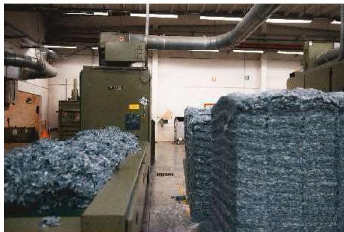

Figure 1: Preparation of the fibres.

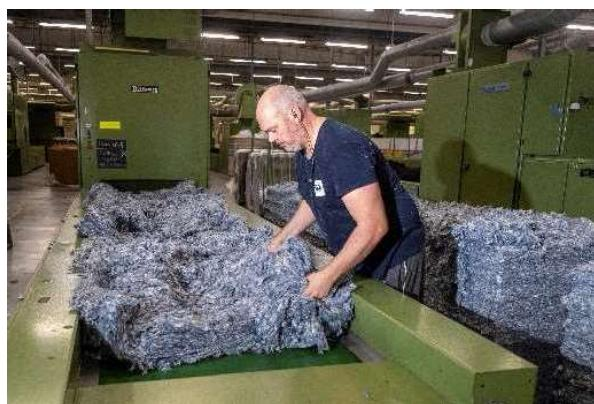

Figure 2: Placing fibres on the conveyor.

## 1.2 Carding of the fibre

The first step to make a sliver is to get all the fibres pointing in the same direction, parallel to each other. This is done by a big roll covered in pins, that combs and transports the fibres. Then the fibres are compressed into a sliver.

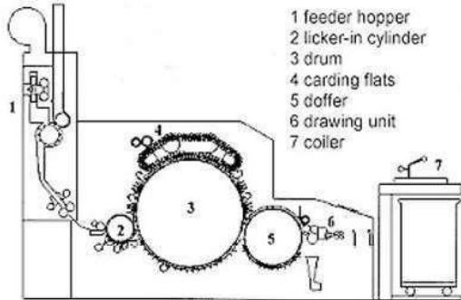

Figure 3: Section view of a carding machine.

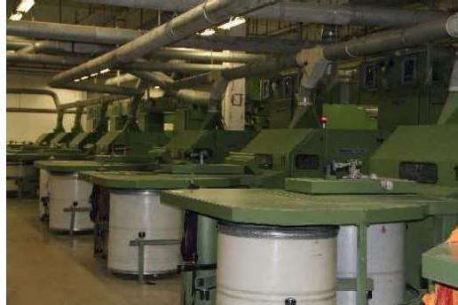

Figure 4: Carding machines at AVS.

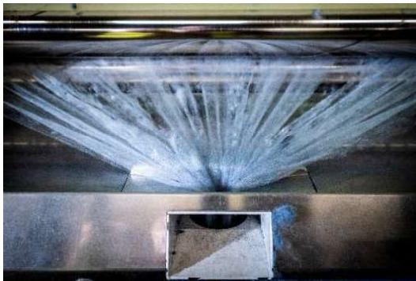

Figure 5: Fibres right before forming a sliver.

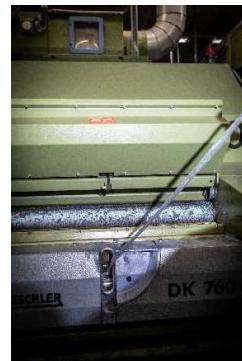

Figure 6: Sliver after carding.

## 1.3 Drawing of the sliver

After carding, we match six different slivers together to produce one, new sliver.

By doing so, we improve quality and can add another colour or material. Depending on the specifications we repeat this step once, twice or three times.

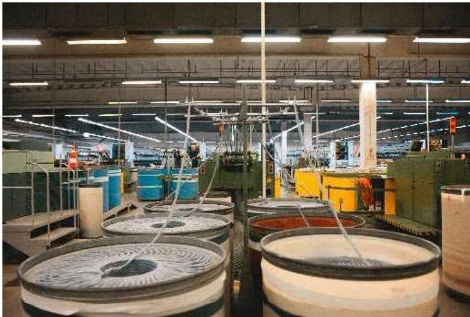

Figure 7: six carded slivers are drawn to one.

## 1.4 Open-End Spinning

After drawing, the preparation phase is completed. The sliver is tested in our lab and the data is documented.

The pots of sliver are placed below the spinbox. The sliver is fed into the open-end spinning machine.

Inside the spinbox, the fibre is picked from the sliver by an opening roll. These lose fibres are blown into the "rotor" and by high rotation speed, they are producing a yarn.

This yarn comes out of the spinbox and is wound on a cylindrical tube.

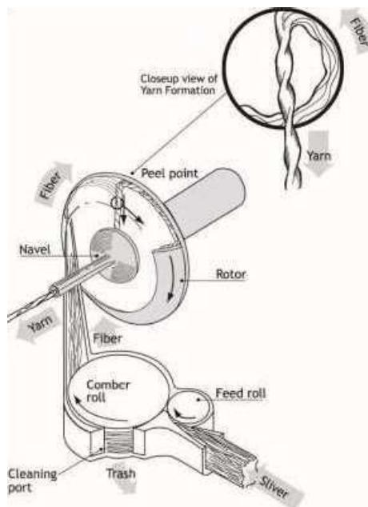

Figure 8: Inside the spinbox.

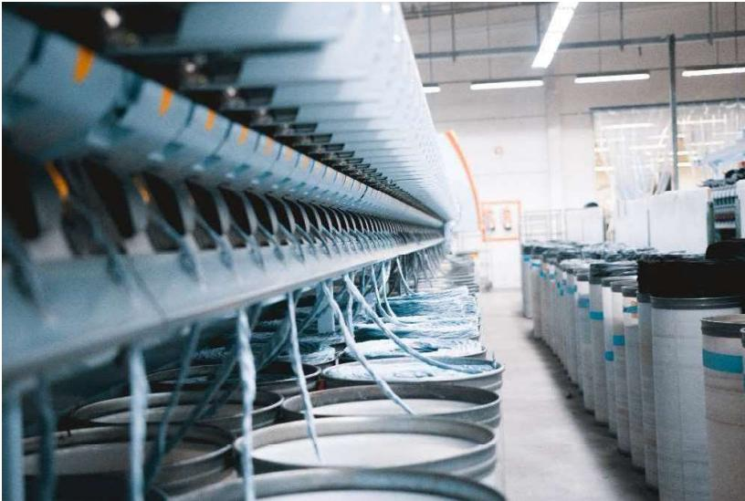

Figure 9: Open-End Spinning at AVS.

## 1.5 Packing

The bobbins (yarn on tube) are palettized and ready to ship to the weaver or knitter. [88]

## 2 The goal

The goal for European Spinning Group, ESG, is to reproduce a yarn with recycled content and transfer the pilot trials done by CETI into an industrial production process. We are working on 5 different blends:

- • HNST:
  - ◦ Recycled denim/Tencel 75/25 Nm 1/13
  - ◦ Recycled cotton/Tencel 75/25 Nm 1/20
- • Petit Bateau:
  - ◦ Recycled cotton/GOTS cotton 50/50 - Nm 1/40
- • Bel&Bo:
  - ◦ Recycled viscose/Tencel 50/50 - Nm 1/40
- • Xandres:
  - ◦ Recycled wool/r-Pet 30/70 - Nm 1/40

### 2.1 Trials in preparation: May - June 2023

#### 2.1.1 HNST: recycled denim / Tencel (75/25)

HNST produces denim using ESG yarn in weft of the denim fabric. The yarn that they use now has a thickness of NM1/13 and consists of 50% recycled denim and 50% Tencel. A higher amount of recycled content is their wish, so we aimed for 75% recycled denim.

For the first trials, CETI received denim pants where the hard parts – buttons, zippers, etc – were already cut out of. The shredded fibres were quite clean, and we could spin yarn from it using our standard process.

| Source shredded material | CETI       |
|--------------------------|------------|
| Machinery                | Card DK870 |
| Supplier                 | Trutschler |
| Speed                    | 100m/min   |

- • No remarks on this material
- • The denim is cut by hand before passing through the shredding line of CETI, this is an important fact why the fibres are so much cleaner.

**The industrial phase** highlighted the expected difficulties. The full denim pants were shredded in the standard procedure of Altex and immediately we saw that that gave us much shorter fibres and much more contaminated fibres.

We were blocked by the reason why we had never been able to spin such a high amount of recycled content in the past. The 25% Tencel was not able to connect the too short jeans fibres sufficiently. We would never achieve spinning a functional and qualitive yarn from this material with our current machines.

| Source shredded material | Altex             |
|--------------------------|-------------------|
| Machinery                | Card DK870        |
| Supplier                 | Trutschler        |
| Speed 100m/min           | Breakages         |
| Speed 80m/min            | Still not running |
| Sliver                   | 5ktex - CV%5.57   |
| After drawing            | 5ktex - CV%12.4   |
| After second drawing     | 5ktex - CV%11.8   |

- • Much more contamination and too many short fibres:
  - ◦ We saw no possibility of carding this in our spinning mill as we would not be able to produce a sliver from it. Therefore we have outsourced the carding process to **Peignage Dumortier** (a carding specialist).

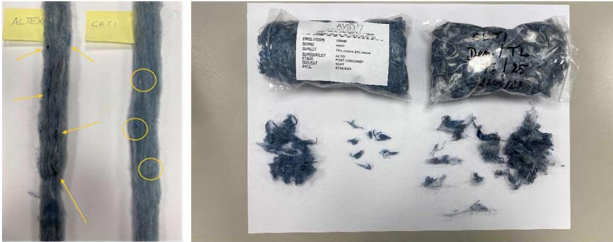

Figure 10: Left is Altex - Right is CETI.

### 2.1.2 HNST: recycled cotton / Tencel (75/25)

In addition to the denim pants, HNST will create a knitted sweater with a recycled content of 75%. The yarn must have a thickness of NM 1/20.

We started our tests with material shredded by CETI. This ran smoothly through our production process.

| Source shredded material | CETI       |
|--------------------------|------------|
| Machinery                | Card DK870 |
| Supplier                 | Trutschler |
| Speed                    | 100m/min   |

Then we received the Altex shredded fibres. Our technical staff saw no possibility in putting this material on our preparation line. Our machines would consider most of the fibres trash since they are too short to pass our systems. To avoid losing material we needed to find a different solution.

In our production, we separate white fibres from coloured ones. White is spun in our Sigma spinning mill as colours are spun in AVS to avoid colour contamination. When looking at the bales of the white cotton destined for HNST, we saw colour contamination. For our Sigma mill, this too was unacceptable.

Hence, we transferred the fibres to Peignage Dumortier for specialised carding.

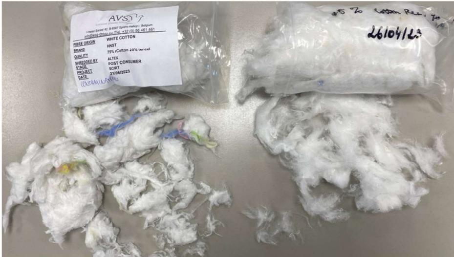

Figure 11: Left: industrial production Altex - right: CETI material.

### 2.1.3 Petit Bateau: recycled cotton / GOTS cotton (50/50)

Petit Bateau produces their products with very fine combed ring spun cotton. The difficulty with mechanically recycled cotton is thickness of the yarn.

In addition, neps are inevitable. Neps are small, thick spots that occur during the spinning process, typically with mechanical recycled fibres.

The trials we did with recycled white cotton. We worked with recycled cotton of blended colours.

Again, the trials with CETI material ran smoothly and we were able to spin a good yarn. But the industrial run had to be carded by Peignage Dumortier because of the same reasons as before.

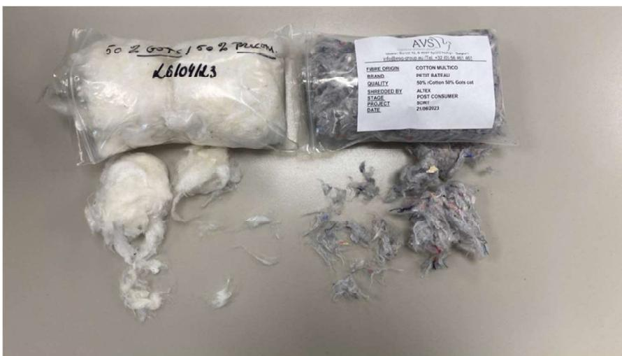

Figure 12: Left: CETI white material - right: Altex material.

## 2.1.4 Bel&Bo: recycled viscose / Tencel (50/50)

Bel&Bo choose the viscose blend since they use it frequently in their collections. They thought a few steps ahead and took the recyclability of the fashion item very seriously.

The tests with the CETI material brought up some difficulties because of contamination.

We were able to spin a functional yarn, but the requested fine yarn number was not feasible due to too many breakages during spinning.

| Source shredded material | CETI             |
|--------------------------|------------------|
| Machinery                | Card DK870       |
| Supplier                 | Trutschler       |
| Speed                    | 100m/min         |
| Sliver                   | 5ktex – CV% 5.77 |
| After drawing            | CV% 7.45         |

Following the example of the other materials from the industrial run coming from Altex, we had to transfer the preparation of the fibre to Peignage Dumortier to spin a yarn from the material.

## 2.1.5 Xandres: recycled wool / recycled polyester (30/70)

Soft, high-quality garments are a standard for Xandres. Technical boundaries limited us to a maximum of 30% recycled wool in open-end spinning.

| Source shredded material | CETI             |
|--------------------------|------------------|
| Machinery                | Card DK870       |
| Supplier                 | Trutschler       |
| Speed                    | 100m/min         |
| Sliver                   | 5ktex – CV% 6.50 |

Together with CETI, we tested multiple compositions for Xandres, who were unsure of their final composition. Initially they wanted a higher content of wool, but the technical limit is 30% with open-end spinning.

## 2.2 Conclusion of preparation trials

ESG managed to card and spin yarn with CETI material, but the overall conclusion is that the industrial run by Altex supplied us with material of lesser quality.

Using this material in our production would lead to tremendous loss of fibres (over 50%)

This led us to contact Peignage Dumortier, a company specialised in preparation of fibres, who has specific equipment to lead this project to success.

## 2.3 Spinning trials: September - October 2023

Peignage Dumortier succeeded to prepare and card the fibres from the industrial run, made by Altex, into qualitative slivers. ESG started trials to spin yarn for each brand.

### 2.3.1 HNST: recycled denim / Tencel (75/25)

We start with the yarn needed in the weft of the HNST denim fabric. They require a yarn thickness of NM1/13.

| Open-End       | Schlafhorst ACO 09 |
|----------------|--------------------|
| Yarn thickness | NM 1/13            |
| Breaker        | S21                |
| Breaker speed  | 7500               |
| Rotor          | T646               |
| Rotor speed    | 55000              |
| Spinning tube  | ST                 |
| Funnel         | K4-A               |
| Twist          | 145 alfa-m         |

| SCIRT - Higher percentage recycle denim - HNST |                                                         |              |         |         |        |       |        |       |       |           |                 |                  |        |       | recycle denim/TL 75/25   |      |      |      | IP sn ° : 190-Bis |                  |                  |                 | Dat : 29/09/2023 |             |               |  |
|------------------------------------------------|---------------------------------------------------------|--------------|---------|---------|--------|-------|--------|-------|-------|-----------|-----------------|------------------|--------|-------|--------------------------|------|------|------|------------------------------|------------------|------------------|-----------------|------------------|-------------|---------------|--|
| metingen : Textechno                           |                                                         |              |         |         |        |       |        |       |       |           |                 |                  |        |       |                          |      |      |      |                              |                  |                  |                 |                  |             |               |  |
|                                                |                                                         |              |         |         |        |       |        |       |       |           |                 |                  |        |       | yarn strength elongation |      |      |      | regularity                   |                  |                  |                 | Harigeheid       |             | Vezelkwalteit |  |
| OE                                             | reakertype                                              | spinningtype | pattern | spintub | funnel | rotor | alfa-m | Tors  | avg   | materiaal | cN              | cN               | cN/Tex | CV    | %                        | CV   | U%   | CVm  | dun                          | dk               | neps             | neps            | heid             | Hids        | breakages/kg  |  |
|                                                |                                                         |              |         |         |        |       |        |       |       |           |                 |                  |        |       |                          |      |      |      |                              |                  |                  |                 |                  |             |               |  |
|                                                |                                                         |              |         |         |        |       |        |       |       |           |                 |                  |        |       |                          |      |      |      |                              |                  |                  |                 |                  |             |               |  |
|                                                |                                                         |              |         |         |        |       |        |       |       |           |                 |                  |        |       |                          |      |      |      |                              |                  |                  |                 |                  |             |               |  |
|                                                |                                                         |              |         |         |        |       |        |       |       |           |                 |                  |        |       |                          |      |      |      |                              |                  |                  |                 |                  |             |               |  |
| 5                                              | S21                                                     | 7500         | 55000   | ST      | K4A    | T646  | 145    | 525   | 13,20 | Industr.  | 80 1 | 637 1 | 10,57  | 11,65 | 7,03                     | 8,69 | 12,7 | 16,3 | 10                           | 12 1  | 225 1 | 23              |                  | grijs       | 1 Bis/kg      |  |
|                                                |                                                         |              |         |         |        |       |        |       |       |           | 13              |                  |        |       |                          |      |      |      |                              |                  |                  |                 |                  |             |               |  |
|                                                |                                                         |              |         |         |        |       |        |       |       |           |                 |                  |        |       |                          |      |      |      |                              |                  |                  |                 |                  |             |               |  |
| 5                                              | compared with CETI blend 75/25-verhouding : (benchmark) |              |         |         |        |       |        | 12,92 | CETI  | 856       | 60 1 | 11,06            | 10,34  | 6,85  | 7,39                     | 13,7 | 17,8 | 20   | 65 1              | 404 1 | 57 1  | 5,88            |                  | 1 Bis/kg    |               |  |
|                                                |                                                         |              |         |         |        |       |        |       |       |           |                 |                  |        |       |                          |      |      |      |                              |                  |                  |                 |                  |             |               |  |
|                                                |                                                         |              |         |         |        |       |        |       |       |           |                 |                  |        |       |                          |      |      |      |                              |                  |                  |                 |                  |             |               |  |
| 5                                              | S21                                                     | 7000         | 55000   | ST      | K4A    | T646  | 130    | 580   |       | Industr.  |                 |                  |        |       |                          |      |      |      |                              |                  |                  |                 |                  |             |               |  |
|                                                |                                                         |              |         |         |        |       |        |       |       |           |                 |                  |        |       |                          |      |      |      |                              |                  |                  |                 |                  |             |               |  |
| 5                                              | compared with CETI blend 75/25-verhouding : (benchmark) |              |         |         |        |       |        | 20,07 | CETI  | 540       | 430             | 10,84            | 10,55  | 6,89  | 7,00                     | 13,5 | 18,0 | 10   | 93 1              | 424 1 | 97 1  | 5,97            |                  | 4 Bis/kg    |               |  |
|                                                |                                                         |              |         |         |        |       |        |       |       |           |                 |                  |        |       |                          |      |      |      |                              |                  |                  |                 |                  |             |               |  |
|                                                |                                                         |              |         |         |        |       |        |       |       |           |                 |                  |        |       |                          |      |      |      |                              |                  |                  |                 |                  |             |               |  |
| A1885                                          |                                                         |              |         |         |        |       |        | 30    |       |           |                 |                  |        |       |                          |      |      |      |                              |                  |                  |                 |                  |             |               |  |
| 5                                              | S21                                                     | 7000         | 65000   | ST      | K4A    | T646  | 158    | 870   |       | Industr.  |                 |                  |        |       |                          |      |      |      |                              |                  |                  |                 |                  |             |               |  |
|                                                |                                                         |              |         |         |        |       |        |       |       |           |                 |                  |        |       |                          |      |      |      |                              |                  |                  |                 |                  |             |               |  |
|                                                |                                                         |              |         |         |        |       |        |       |       |           |                 |                  |        |       |                          |      |      |      |                              |                  |                  |                 |                  |             |               |  |
|                                                |                                                         |              |         |         |        |       |        |       |       |           |                 |                  |        |       |                          |      |      |      |                              |                  |                  |                 |                  |             |               |  |
|                                                |                                                         |              |         |         |        |       |        |       |       |           |                 |                  |        |       |                          |      |      |      |                              |                  |                  |                 |                  |             |               |  |
| A1488                                          |                                                         |              |         |         |        |       |        | 24    |       |           |                 |                  |        |       |                          |      |      |      |                              |                  |                  |                 |                  |             |               |  |
| 5                                              | S21                                                     | 7000         | 55000   | ST      | K4A    | T646  | 160    | 785   | 24,32 | Industr.  | 404             | 322              | 9,82   | 9,10  | 7,03                     | 7,00 | 12,2 | 15,8 | 7                            | 320              | 354 1 | 45 1 |                  | grijs/bruin | 6 A 10 Bis/kg |  |

Figure 13: Results spin trials HNST denim.

### CONCLUSION HNST DENIM

- • Industrial run at Altex in combination with carding at Peignage Dumortier gives a yarn comparable with the results based on the pilot trials from CETI.
- • Customer request: Nm 13 with 75% recycled denim is reached!
- • Further processing of the yarn will show if customer can produce the requested fabric.

## 2.3.2 HNST: recycled cotton / Tencel (75/25)

HNST wishes to knit a white sweater, the yarn thickness must be NM1/20.

| Open-End       | Schlafhorst ACO 09 |
|----------------|--------------------|
| Yarn thickness | NM 1/20            |
| Breaker        | S21                |
| Breaker speed  | 7500               |
| Rotor          | T646               |
| Rotor speed    | 55000              |
| Spinning tube  | ST                 |
| Funnel         | K4-A               |
| Twist          | 145 alfa-m         |

**Proef voor HNST - Dumortier industriee productie - rec. Cotton Int. Proef : N°188-Bis2 Dat :**      8/11/2023

|    | Materiaal : van Dumortier lonten gekaard - maar nu 1 doorgang gegeven op uitrekbank |          |                              |       |        |              |                |     |            |                   |            |                           |                      |       |      |                   |       |       |      |      |      |             |             |            |
|----|-------------------------------------------------------------------------------------|----------|------------------------------|-------|--------|--------------|----------------|-----|------------|-------------------|------------|---------------------------|----------------------|-------|------|-------------------|-------|-------|------|------|------|-------------|-------------|------------|
|    |                                                                                     |          |                              |       |        |              |                |     |            |                   |            |                           |                      |       |      |                   |       |       |      |      |      |             |             |            |
| OE | Brekertype                                                                          | Spinbuis | Trechter                     | Rotor | alfa-m | Tors         | Gemeten waarde | cN  | cN         | Garensterkte      | Garenrek   | %                         | CY                   | U%    | CYm  | dun               | dk    | neps  | neps | Heid | H    | Huls        | HNST        |            |
|    |                                                                                     |          |                              |       |        |              |                |     |            |                   |            |                           |                      |       | %    |                   |       | %     |      |      |      |             |             |            |
|    |                                                                                     |          | precons.cotton/Lgocell 75/25 |       |        |              |                | Nm  | ACO        |                   |            |                           |                      |       |      | Cot.rec./TL 75/25 |       |       |      |      |      | 2 bob/proef |             |            |
|    |                                                                                     |          |                              |       |        |              |                |     | Titer (Nm) | Strength (cN/tex) | Elongation | Regularity and IPI-Values | thin thick neps neps |       |      |                   |       |       |      |      |      |             |             |            |
|    |                                                                                     |          |                              |       |        |              |                |     | 20         |                   |            |                           |                      |       |      |                   |       |       |      |      |      |             |             |            |
|    | 7                                                                                   | S21      | 9500                         | 70000 | ST     | KSK4-A       | T46 BD         | 160 | 715        | 20,38             | 512        | 377                       | 10,44                | 11,71 | 6,00 | 6,81              | 12,60 | 16,15 | 9    | 141  | 3965 | 285         | wit/rood    | 0,2 Br./kg |
|    | Basisverhouding : 75/25                                                             |          |                              |       |        | anspin/29,8% | druck 20,0 N   |     |            |                   |            |                           |                      |       |      |                   |       |       |      |      |      |             |             |            |
|    |                                                                                     |          |                              |       |        |              |                |     |            |                   |            |                           |                      |       |      |                   |       |       |      |      |      |             |             |            |
|    |                                                                                     |          |                              |       |        |              |                |     |            |                   |            |                           |                      |       |      |                   |       |       |      |      |      |             |             |            |
|    |                                                                                     |          |                              |       |        |              |                |     |            |                   |            |                           |                      |       |      |                   |       |       |      |      |      |             |             |            |
|    |                                                                                     |          |                              |       |        |              |                |     |            |                   |            |                           |                      |       |      |                   |       |       |      |      |      |             |             |            |
|    |                                                                                     |          |                              |       |        |              |                |     |            |                   |            |                           |                      |       |      |                   |       |       |      |      |      |             |             |            |
|    | 7                                                                                   | C21      | 9500                         | 70000 | GT     | KGK4-A       | T46 DD         | 160 | 705        | 23,00             | 430        | 289                       | 10,11                | 11,05 | 6,00 | 6,00              | 10,00 | 17,49 | 10   | 270  | 4020 | 550         | groen/paarz | 4 Dr./kg   |
|    | Basisverhouding : 75/25                                                             |          |                              |       |        | anspin/29,8% | druck 20,0 N   |     |            |                   |            |                           |                      |       |      |                   |       |       |      |      |      |             |             |            |

Figure 14: Results spin trials HNST white cotton.

## CONCLUSION HNST WHITE COTTON

- • First trials failed: finest we could spin was NM1/13
- • CETI helped to improve our spinning settings and we reached NM1/20
- • Further processing of the yarn will show if customer can produce the requested fabric.

## 2.3.3 Petit Bateau: recycled cotton / GOTS cotton

Petit Bateau requested a yarn thickness of NM1/40, this is very fine considering we are working with mechanically recycled fibres.

Technical spinning details:

| Open-End       | Schlafhorst ACO 09 |
|----------------|--------------------|
| Yarn thickness | NM 1/40            |
| Breaker        | S21                |
| Breaker speed  | 9500               |
| Rotor          | T40BD              |

| Rotor speed   | 75000      |
|---------------|------------|
| Spinning tube | ST         |
| Funnel        | KSK4A      |
| Twist         | 160 alfa-m |

| OE                                                                                                                                                              | Brekertype              | Br,Sn, precons.cotton/virgin cotton 50/60 | Rotorsn, Spinbuis | Trechter | Rotor alfa-m | Tors T/m                        | Gemeten waarde  |                   | Garensterkte                     |                           | Garenrek             |       | Regelmatigheid                |                              |         |           | Harig- heid |            | Petit Bateau |       |                      |     |                    |               |
|-----------------------------------------------------------------------------------------------------------------------------------------------------------------|-------------------------|----------------------------------------------|----------------------|----------|-----------------|------------------------------------|-----------------|-------------------|----------------------------------|---------------------------|----------------------|-------|-------------------------------|------------------------------|---------|-----------|----------------|------------|--------------|-------|----------------------|-----|--------------------|---------------|
|                                                                                                                                                                 |                         |                                              |                      |          |                 |                                    | Gemid- delde | cN                | cN M/N                        | cN/Tex %               | CV %              | U%    | CVm %                      | dun %                     | dk % | neps % | neps %      | heid H  | Huls H    | kleur | 2 bob/proef          |     |                    |               |
|                                                                                                                                                                 |                         |                                              |                      |          |                 |                                    | Titer (Nm)      | Strength (cN/tex) | Elongation                       | Regularity and IPI-Values | thin thick neps neps |       |                               |                              |         |           |                |            |              |       |                      |     |                    |               |
|                                                                                                                                                                 | <b>A1488</b>            | <b>spoiler+M LT</b>                          |                      |          |                 |                                    | 24              |                   | <b>Jukt niet om te spinnen !</b> |                           |                      |       |                               |                              |         |           |                | 12/10/2023 |              |       |                      |     |                    |               |
| 5                                                                                                                                                               | S21                     | 7000                                         | 55000                | ST       | K4A             | T646                               | 90              | 785               | (start-instelling)               |                           |                      |       | <b>Inst.:</b>                 | <b>NOK</b>                   |         |           |                | >20 Br/kg  |              |       |                      |     |                    |               |
| <b>comment, Chris : katoenbreker, trechter KS K4A, andere snelheden..., niets helpt : steeds &gt; 20 Br/kg) andere instellingen/onderdelen ook niet gelukt!</b> |                         |                                              |                      |          |                 |                                    |                 |                   |                                  |                           |                      |       |                               |                              |         |           |                |            |              |       |                      |     |                    |               |
|                                                                                                                                                                 |                         |                                              |                      |          |                 |                                    | Nm              |                   |                                  |                           |                      |       |                               |                              |         |           |                |            |              |       |                      |     |                    |               |
|                                                                                                                                                                 | <b>hermeming rot,40</b> | <b>spoiler</b>                               |                      |          |                 | <b>Jage spanning en bob,druk !</b> | 24              |                   |                                  |                           |                      |       |                               | <b>nu draait het beter !</b> |         |           |                | 27/10/2023 |              |       |                      |     |                    |               |
| 5                                                                                                                                                               | S21                     | 9500                                         | 70000                | ST       | KSK4A           | T40 BD                             | 90              | 780               | 23,20                            |                           | 40                   | 299   | 9,61                          | 13,64                        | 6,64    | 8,59      | 12,49          | 15,92      | 8            | 79    | 20,4                 | 107 | <b>rood/bruin</b>  | 2 Br./kg      |
| <b>ter vergedijking : vorige keerenkel kaardont!</b>                                                                                                            |                         |                                              |                      |          |                 |                                    |                 |                   |                                  |                           |                      |       |                               |                              |         |           |                |            |              |       |                      |     |                    |               |
|                                                                                                                                                                 |                         |                                              |                      |          |                 |                                    | 24,80           | Industr.          | 340                              | 269                       | 8,65                 | 10,96 | 6,29                          | 7,85                         | 11,45   | 14,79     | 8              | 233        | 3T78         | 334   | <b>6 alfa Br./kg</b> |     |                    |               |
|                                                                                                                                                                 |                         |                                              |                      |          |                 |                                    | Nm              |                   |                                  |                           |                      |       |                               |                              |         |           |                |            |              |       |                      |     |                    |               |
|                                                                                                                                                                 | <b>hermeming rot,40</b> | <b>spoiler</b>                               |                      |          |                 | <b>Jage spanning en bob,druk !</b> | 40              |                   |                                  |                           |                      |       | <b>tijnst haalbare nummer</b> |                              |         |           |                |            |              |       |                      |     |                    |               |
| 5                                                                                                                                                               | S21                     | 9500                                         | 75000                | ST       | KSK4A           | T40 BD                             | 90              | 120               | 39,23                            |                           | 20                   | 141   | 8,24                          | 13,5                         | 5,00    | 10,66     | 12,67          | 16,50      | 1            | 108   | 39,4                 | 241 | <b>blauw/grijs</b> | 8 alfa Br./kg |

Figure 15: Results spin trials Petit Bateau cotton.

**CONCLUSION PETIT BATEAU**

- • First trials failed: customer requests Nm 1/40. We do not reach this fine count. Finest we can spin in Nm 24.
- • After discussion with CETI and further trials and information from CETI we changed some machine-parts and did trial again. After those adaptation we reached the requested Nm 40!
- • Further processing of the yarn will have to learn if customer can produce the requested fabric.

**2.3.4 Bel&Bo: recycled viscose / Tencel**

For Bel&Bo we needed to reach NM1/40, a very fine number.

| Open-End       | Schlafhorst ACO 09 |
|----------------|--------------------|
| Yarn thickness | NM 1/40            |
| Breaker        | S21                |
| Breaker speed  | 9500               |
| Rotor          | T40BD              |
| Rotor speed    | 75000              |
| Spinning tube  | ST                 |
| Funnel         | KSK4A              |
| Twist          | 160 alfa-m         |

|    | Gemeten waarde   |         |                                 |             |          |              |      |             | Garensterkte       |        |                   |     | Garenrek                |      | Regelmatigheid            |                                                 |                      |       |      |      | Harig-heid | Bel&Bo      |              |              |  |            |  |
|----|------------------|---------|---------------------------------|-------------|----------|--------------|------|-------------|--------------------|--------|-------------------|-----|-------------------------|------|---------------------------|-------------------------------------------------|----------------------|-------|------|------|------------|-------------|--------------|--------------|--|------------|--|
| OE | Brekettype       | BrSn.   | Rotoren,                        | Sprinkelen, | Trechter | Rotor alfa-m | Tors | Gemit-delde | cN                 | cN/Tex | CV                | %   | CV                      | U%   | CVm                       | dun                                             | dik                  | neps  | neps | heid | Huls       | Huls        |              |              |  |            |  |
|    |                  |         | post-cons.cotton/Lyoce/II 50/50 |             |          |              |      | Nm          | ACO                |        |                   |     |                         |      | Visc,rec/TL 50/50         |                                                 |                      |       |      |      |            | 2 bob/proef |              |              |  |            |  |
|    |                  |         |                                 |             |          |              |      |             | Titer (Nm)         |        | Strength (cN/tex) |     | Elongation              |      | Regularity and IPI-Values |                                                 |                      |       |      |      |            |             |              |              |  |            |  |
|    |                  |         |                                 |             |          |              |      |             |                    |        |                   |     |                         |      |                           |                                                 | thin thick neps neps |       |      |      |            |             |              |              |  | 12/10/2023 |  |
|    | Instelling vlas  | spoller | A M4 + div.                     |             |          |              |      | 24          |                    |        |                   |     | ukt niet om te spinnen! |      |                           |                                                 |                      |       |      |      |            |             |              | 12/10/2023   |  |            |  |
| 5  | S21              | 9000    | 60000                           | ST          | K4A      | T46 BD       | 56   | 764         | (start-instelling) |        |                   |     |                         |      |                           | Inst.                                           | NOK                  |       |      |      |            |             | >20 Br/kg    |              |  |            |  |
|    |                  |         |                                 |             |          |              |      |             |                    |        |                   |     |                         |      |                           | andere instellingen/onderdelen ook niet gelukt! |                      |       |      |      |            |             |              |              |  |            |  |
|    |                  |         |                                 |             |          |              |      |             |                    |        |                   |     |                         |      |                           |                                                 |                      |       |      |      |            |             |              |              |  |            |  |
|    |                  |         |                                 |             |          |              |      |             | Nm                 |        |                   |     |                         |      |                           |                                                 |                      |       |      |      |            |             | 27/10/2023   |              |  |            |  |
| 5  | S21              | 9500    | 70000                           | ST          | K5K4A    | T40 BD       | 50   | 780         | 22,83              |        | 630               | 480 | 13,89                   | 7,88 | 9,79                      | 7,89                                            | 10,18                | 13,21 | 0    | 2%   | 2670       | 338         | rood/bruin   | 2 Br/kg      |  |            |  |
|    |                  |         |                                 |             |          |              |      |             | 24,45              |        | 565               | 436 | 13,91                   | 6,69 | 9,87                      | 6,40                                            | 11,59                | 15,53 | 5    | 68%  | 3845       | 834         | 6 â 10 Br/kg |              |  |            |  |
|    |                  |         |                                 |             |          |              |      |             |                    |        |                   |     |                         |      |                           |                                                 |                      |       |      |      |            |             |              |              |  |            |  |
|    |                  |         |                                 |             |          |              |      |             |                    |        |                   |     |                         |      |                           |                                                 |                      |       |      |      |            |             |              |              |  |            |  |
|    | herneming rot,40 | spoller | Bege spanning en bob,druk!      |             |          |              |      | 24          |                    |        |                   |     | nu wel gelukt!          |      |                           |                                                 |                      |       |      |      |            |             | 27/10/2023   |              |  |            |  |
| 5  | S21              | 9500    | 70000                           | ST          | K5K4A    | T40 BD       | 50   | 780         | 22,83              |        | 630               | 480 | 13,89                   | 7,88 | 9,79                      | 7,89                                            | 10,18                | 13,21 | 0    | 2%   | 2670       | 338         | rood/bruin   | 2 Br/kg      |  |            |  |
|    |                  |         |                                 |             |          |              |      |             | 24,45              |        | 565               | 436 | 13,91                   | 6,69 | 9,87                      | 6,40                                            | 11,59                | 15,53 | 5    | 68%  | 3845       | 834         | 6 â 10 Br/kg |              |  |            |  |
|    |                  |         |                                 |             |          |              |      |             |                    |        |                   |     |                         |      |                           |                                                 |                      |       |      |      |            |             |              |              |  |            |  |
|    | herneming rot,40 | spoller | Bege spanning en bob,druk!      |             |          |              |      | 24          |                    |        |                   |     | fijnst haalbare nummer  |      |                           |                                                 |                      |       |      |      |            |             |              |              |  |            |  |
| 5  | S21              | 9500    | 75000                           | ST          | K5K4A    | T40 BD       | 50   | 720         | 38,42              |        | 337               | 239 | 12,94                   | 9,94 | 8,01                      | 10,49                                           | 0,99                 | 14,30 |      | 286  | 3337       | 397         | blauw/grijs  | 8 â 10 Br/kg |  |            |  |

Figure 16: Results spin trials Bel&Bo.

### CONCLUSION BEL&BO

- • First trials failed: customer requests Nm 1/40. We do not reach this fine count. Finest we can spin in Nm 24.
- • After discussion with CETI and further trials and information from CETI we changed some machine-parts and did trial again. After those adaptation we reached the requested Nm 40!
- • Further processing of the yarn will have to learn if customer can produce the requested fabric.

### 2.3.5 Xandres: recycled wool / recycled polyester

Xandres initially requested a yarn thickness of NM1/40. Later this was adapted to NM1/13.

| Open-End       | Schlafhorst ACO 09 |
|----------------|--------------------|
| Yarn thickness | NM 1/13            |
| Breaker        | S21DN              |
| Rotor          | T46                |
| Rotor speed    | 50000              |
| Spinning tube  | ST                 |
| Funnel         | K4-A               |
| Twist          | 148 alfa-m         |

|         | Gemeten waarde |      |       |       | Garensterkte |  |     |      | Garenrek |        | Regelmatigheid |       |     |       |       |      | Harig-heid |      |      |      |       |        |      |                                       |  |  |
|---------|----------------|------|-------|-------|--------------|--|-----|------|----------|--------|----------------|-------|-----|-------|-------|------|------------|------|------|------|-------|--------|------|---------------------------------------|--|--|
| OE      | breker         | duse | rotor | delde |              |  |     | cN   | cN       | cN/Tex | CV             | %     | CV  | U%    | CVm   | dun  | dik        | neps | neps | heid | huls  | alfa-m | Tors | Kwaliteit : Nm 13                     |  |  |
|         |                | buis |       |       |              |  | ACO | MN   |          | %      |                | %     |     | %     | +50%  | +50% | +40%       | +20% | HG   |      |       |        |      | voorinslag                            |  |  |
| A0884/2 | ST             | T46  | 13    |       |              |  |     |      |          |        |                |       |     |       |       |      |            |      |      |      |       |        |      |                                       |  |  |
| 3       | S21DN          | K4-A | 50000 | 13,17 |              |  |     | 22,6 | 9,8      | 16,15  | 7,32           | 12,43 | 5,3 | 12,09 | 16,23 | 7    | 754        | 3438 | 6,18 |      | groen | 48     | 553  | redelijk goed verlopen weling breuken |  |  |
|         |                |      |       |       |              |  |     |      |          |        |                |       |     |       |       |      |            |      |      |      |       |        |      |                                       |  |  |

Figure 17: Results spin trials Xandres.

### CONCLUSION XANDRES

- • First trials failed: customer requests Nm 1/40. We do not reach this fine count. Even CETI does not manage to spin Nm 1/40 on pilot line.
- • Therefore, customer changed the request to Nm 1/13. We were able to spin this coarser count.

- • Only question mark is that we did not receive any industrial shredded wool. The fibre we used for this process were coming from the CETI pilot line.
- • Further processing of the yarn will have to learn if customer can produce the requested fabric.

## Conclusion

We managed to spin yarn in an industrial way for each brand. Necessary adaptations were made, and we collaborated closely with CETI to deliver the best possible quality of yarn.

These small industrial trials are now being processed by the brands to judge:

- • Processability during weaving/knitting
- • Look of the fabric (neps/contamination)
- • Technical details of the fabric (strength, ...)

## Bibliography

