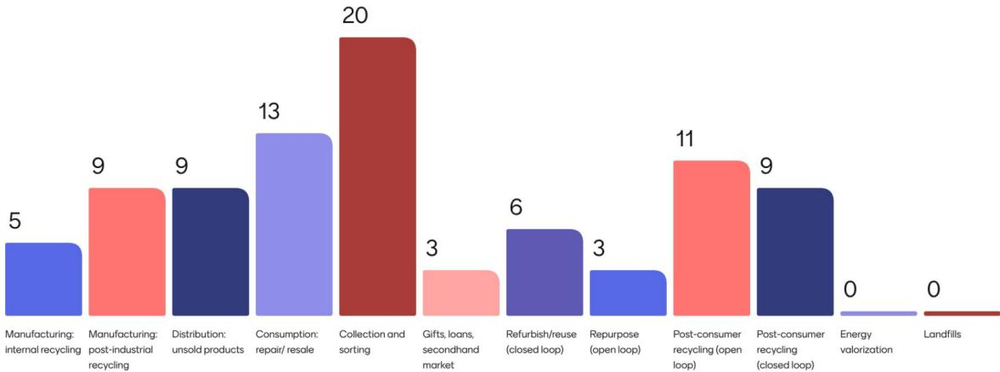
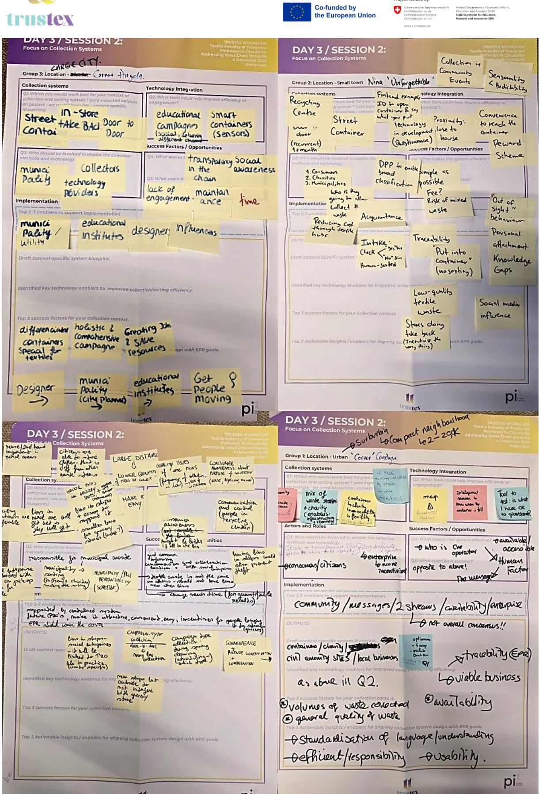

# Advancing sustainable textiles in the circular economy through innovative EP schemes

#### **Table of Contents**

|                                                             | Note on source materials and prior outputs Executive Summary     | 9 9 |
|-------------------------------------------------------------|------------------------------------------------------------------|-----|
| 1. Introduction                                             |                                                                  | 10  |
| 1.1.                                                        | Purpose of deliverable D3.2                                      | 10  |
| 1.2.                                                        | TRUSTex context and Task 3.2 mandate                             | 11  |
| 1.3.                                                        | Scope and boundaries                                             | 12  |
| 1.4.                                                        | Questions addressed in D3.2                                      | 12  |
| 1.5.                                                        | Relation to other TRUSTex tasks and deliverables                 | 13  |
| 1.6.                                                        | Structure of the deliverable                                     | 13  |
| 2. Analytical framing and evidence base                     |                                                                  | 13  |
| 2.1.                                                        | What effective collection means in this deliverable              | 14  |
| 2.2.                                                        | Core trade-offs framing the analysis                             | 15  |
| 2.3.                                                        | Collection archetypes covered                                    | 15  |
| 2.4.                                                        | Context types used in comparison                                 | 17  |
| 2.5.                                                        | Evidence base                                                    | 18  |
| 2.6.                                                        | Analytical approach                                              | 21  |
| 2.7.                                                        | Limitations and interpretations notes                            | 22  |
| 3. Comparative assessment of separate collection strategies |                                                                  | 23  |
| 3.1.                                                        | Overview of the collection archetypes as implemented in practice | 23  |
| 3.2.                                                        | Cross-case performance by criteria family                        | 25  |
| 3.3.                                                        | Archetype-level strengths and weaknesses                         | 26  |
| 3.3.1.                                                      | Street containers                                                | 26  |
| 3.3.2.                                                      | Civic amenity sites / bring-points                               | 26  |
| 3.3.3.                                                      | Door-to-door / pick-up                                           | 27  |
| 3.3.4.                                                      | In-store take-back                                               | 27  |
| 3.3.5.                                                      | Charity-led schemes                                              | 28  |
| 3.3.6.                                                      | Hybrid /digitalized systems                                      | 28  |
| 3.4.                                                        | Main trade-offs observed across systems                          | 29  |
| 3.4.1.                                                      | Capture versus quality                                           | 29  |
| 3.4.2.                                                      | Convenience versus controllability                               | 29  |
| 3.4.3.                                                      | Service level versus unit cost                                   | 29  |
| 3.4.4.                                                      | Openness versus data quality                                     | 30  |
| 3.4.5.                                                      | Broader acceptance versus downstream burden                      | 30  |
| 3.5.                                                        | Contextual suitability across settlement types                   | 30  |
| 3.6.                                                        | Synthesis: why no single system is best everywhere               | 32  |

| 4.   | Optimized collection approaches for different contexts                     | 32                                                                                   |
|------|----------------------------------------------------------------------------|--------------------------------------------------------------------------------------|
| 4.1. | Portfolio logic instead of one-size-fits-all design                        | 33                                                                                   |
| 4.2. | Recommended configuration for large cities                                 | 34                                                                                   |
| 4.3. | Recommended configuration for smaller towns                                | 35                                                                                   |
| 4.4. | Recommended configuration for urban districts                              | 35                                                                                   |
| 4.5. | Recommended configuration for rural areas                                  | 36                                                                                   |
| 4.6. | Role of key actors in each configuration                                   | 37                                                                                   |
| 4.7. | Operational risks and implementation conditions                            | 39                                                                                   |
| 5.   | Implications for EPR target-setting                                        | 40                                                                                   |
| 5.1. | What EPR-relevant performance looks like in practice                       | 41                                                                                   |
| 5.2. | Collection targets are not outcome targets                                 | 42                                                                                   |
| 5.3. | Separating collection, preparing-for-reuse / reuse, and recycling targets  | 43                                                                                   |
| 5.4. | Criteria for “sufficiently ambitious” collection rates                     | 45                                                                                   |
| 5.5. | Risks of poorly designed targets                                           | 46                                                                                   |
| 5.6. | Proposed stepwise target-setting logic for D3.2                            | 48                                                                                   |
| 6.   | Implications for fees, obligations, and system differentiated scheme logic | 49                                                                                   |
| 6.1. | Why single uniform compensation model is not supported                     | 50                                                                                   |
| 6.2. | Differentiation by archetype and channel logic                             | 51                                                                                   |
| 6.3. | Differentiation by context                                                 | 54                                                                                   |
| 6.4. | Funding the work that determines outcomes                                  | 55                                                                                   |
| 6.5. | Avoiding burden shifting                                                   | 57                                                                                   |
| 6.6. | D3.2 fee and obligation output for WP4                                     | 58                                                                                   |
| 7.   | Minimum requirements for sorting, recycling, and reporting                 | 58                                                                                   |
| 7.1. | Why first-mile design determines downstream feasibility                    | 58                                                                                   |
| 7.2. |                                                                            | Minimum collection-side conditions needed for reuse and textile-to-textile recycling |
|      | readiness                                                                  | 59                                                                                   |
| 7.3. | Minimum viable reporting dataset                                           | 61                                                                                   |
| 7.4. | Allocation of reporting responsibilities by actor position                 | 63                                                                                   |
| 7.5. | Auditability and proportionality                                           | 65                                                                                   |
| 7.6. | Digitalization as enabler, not prerequisite                                | 65                                                                                   |
| 8.   | Stakeholder and cross-task synthesis                                       | 66                                                                                   |
| 8.1. | Main stakeholder messages from workshops and exchanges                     | 67                                                                                   |
| 8.2. | Where D3.2 findings align with or support T3.3 and T3.5                    | 72                                                                                   |
| 8.3. | What D3.2 contributes to WP4 and WP7                                       | 72                                                                                   |

| 8.4. Remaining uncertainties and issues requiring further work                | 73  |
|-------------------------------------------------------------------------------|-----|
| 9. Recommendations                                                            | 74  |
| 9.1. Recommendations for policymakers, Member States, PROs, and EPR designers | 75  |
| 9.2. Recommendations for municipalities and public waste operators            | 76  |
| 9.3. Recommendations for collectors, sorters, and social-economy actors       | 76  |
| 9.4. Recommendations for retailers, producers, and brands                     | 77  |
| 9.5. Priorities for piloting and scale-up                                     | 78  |
| 10. Conclusions                                                               | 80  |
| 10.1. Main takeaways from D3.2                                                | 80  |
| 10.2. Priority next steps                                                     | 81  |
| References                                                                    | 82  |
| Annex 1. Detailed typologies of collection archetypes and context types       | 88  |
| A1.1 Purpose of this annex                                                    | 88  |
| A1.2 Detailed collection archetype typology                                   | 89  |
| A1.3 Detailed context type typology                                           | 90  |
| Annex 2. Methodological note and analytical process                           | 90  |
| A2.1 Purpose of this annex                                                    | 90  |
| A2.2 Research design and comparative logic                                    | 91  |
| A2.3 Case selection and portfolio construction                                | 91  |
| A2.4 Data collection and source types                                         | 92  |
| A2.5 Analysis pipeline                                                        | 93  |
| A2.6 Triangulation, research quality, and confidentiality                     | 93  |
| A2.7 Interpretation limits                                                    | 93  |
| Annex 3. Full MCDA criteria-by-case matrix                                    | 94  |
| A3.1 Environmental criteria-by-case matrix                                    | 95  |
| A3.2 Operational criteria-by-case matrix                                      | 96  |
| A3.3 Economic criteria-by-case matrix                                         | 97  |
| A3.4 Social criteria-by-case matrix                                           | 98  |
| A3.5 Traceability and digital criteria-by-case matrix                         | 100 |
| A3.6 Support-code matrix                                                      | 101 |

## Table of Figures and Tables

Figure 1. Example Mentimeter output from WS1. .... 68

Figure 2. Example blueprint poster outputs from WS2. .... 69

Figure 3. Collection system blueprint presented in the March 2026 Hotspot Solution Finder..... 71

Table 1. Four core dimensions of effective textile collection in this deliverable. .... 14

Table 2. Collection archetypes used in the comparative assessment. .... 16

Table 3. Generic context types used for contextual suitability assessment..... 17

Table 4. Main components of the evidence base and their role..... 18

Table 5. Empirical evidence units and coverage (anonymized). .... 19

Table 6. Interview overview (anonymized)..... 20

Table 7. Evidence coverage matrix (operative cases): archetype x context. .... 21

Table 8 Overview of collection archetypes as implemented in practice. .... 24

Table 9. Cross-case performance signals by criteria family. .... 25

Table 10. Contextual suitability of collection archetypes across typical settlement types. .... 30

Table 11. Context-to-configuration blueprint for optimized first-mile textile waste collection. .... 33

Table 12. Core actor roles in optimized collection configuration..... 38

Table 13. Key implementation conditions for optimized collection configurations..... 39

Table 14. Main dimensions of EPR-relevant performance in first-mile textile waste collection. .... 41

Table 15. Distinguishing collection, reuse/preparing-for-reuse, and recycling targets... 44

Table 16. Criteria for sufficiently ambitious collection rates under textile EPR. .... 45

Table 17. Main risks associated with poorly designed textile EPR targets. .... 47

Table 18. Proposed sequential target-setting logic. .... 49

Table 19. Why a flat compensation model is not supported across textile waste collection systems. .... 50

Table 20. Empirically grounded “if-then” differentiation logic by collection channel or system condition. .... 52

Table 21. Main context-sensitive differentiation points for obligations and compensation. .... 54

Table 22. Functions that fee logic should cover beyond basic collection tonnage. .... 56

Table 23. Minimum collection-side conditions that support downstream reuse and recycling feasibility..... 60

Table 24. Proposed minimum viable reporting dataset for first-mile textile collection and its immediate downstream interfaces. .... 62

Table 25. Suggested allocation of reporting responsibilities by actor position..... 64

Table 26. Main stakeholder and cross-task synthesis messages from D3.2. .... 67

| Table 27. Summary of key recommendations by actor group.                 | 74  |
|--------------------------------------------------------------------------|-----|
| Table 28. Priority pilot areas for scale-up and implementation learning. | 79  |
| Table 29. Environmental criteria-by-operative cases (O1–O8).             | 95  |
| Table 30. Environmental criteria-by-meta-level cases (M1–M4).            | 95  |
| Table 31. Operational criteria-by-operative cases (O1–O8).               | 96  |
| Table 32. Operational criteria-by-meta level cases (M1–M4).              | 97  |
| Table 33. Economic criteria-by-operative cases (O1–O8).                  | 97  |
| Table 34. Economic criteria-by-meta level cases (M1–M4).                 | 98  |
| Table 35. Social criteria-by-operative cases (O1–O8).                    | 98  |
| Table 36. Social criteria-by-meta level cases (M1–M4).                   | 99  |
| Table 37. Traceability and digital criteria-by-operative cases (O1–O8).  | 100 |
| Table 38. Traceability and digital criteria-by-meta level cases (M1–M4). | 101 |
| Table 39. Support codes criteria-by-operative cases (O1–O8).             | 101 |
| Table 40. Support codes criteria-by-meta level cases (M1–M4).            | 102 |

#### **List of Acronyms**

| CE    | Circular Economy                                    |
|-------|-----------------------------------------------------|
| DPP   | Digital Product Passport                            |
| EU    | European Union                                      |
| EPR   | Extended Producer Responsibility                    |
| KPI   | Key Performance Indicator                           |
| MCDA  | Multi-Criteria Decision Analysis                    |
| PRO   | Producer Responsibility Organization (plural: PROs) |
| Tonne | Metric Ton (1,000kg)                                |

#### **Project internal labels**

| TRUSTex | EU Horizon Europe funded research project on circular textiles |
|---------|----------------------------------------------------------------|
| WP#     | Work Packages referenced in the TRUSTex project context        |
| T#      | Tasks referenced in the TRUSTex project context                |

#### **Study-internal labels and case coding**

| O1–O8           | Operative cases (case study systems)                                     |
|-----------------|--------------------------------------------------------------------------|
| M1–M4           | Triangulation stakeholder cases (meta-level actor cases)                 |
| WS1–WS2         | External stakeholder workshops                                           |
| INT-O# / INT-M# | Interview identifiers linked to operative (O) or triangulation (M) cases |

**Project full title**: Advancing Sustainable Textiles in the Circular Economy Through Innovative EPR Schemes

**Acronym**: TRUSTex

**Call**: HORIZON-CL6-2024-CircBio-01-2

**Topic**: Circular solutions for textile value chains based on extended producer responsibility (Innovation Action)

**Start date**: 1st January 2025

**Duration**: 36 months

**List of participants:** LIST (coordinator), SANKO Tekstil, RE&UP, h\_da, FESI, NEOVILI, CENTEXBEL, UCD, CETIM, HUMANA, TEAM2, Resortecs, Scantrust, MADE2FLOW, PI, IRIS, VTT, LMDDC, ENA, Terra Matters

**Deliverable:** D3.2

**Due date submission:** 30/04/2026

**Submission date:** 30/04/2026

| Document Number:    | D3.2                                                                     |
|---------------------|--------------------------------------------------------------------------|
| Document Title:     | Assessment of separate collection strategies                             |
| Dissemination level | PU – Public, fully open,                                                 |
|                     | SEN – Sensitive, limited under the conditions of the Grant Agreement     |
| Period:             | PR1 / PR2                                                                |
| WP:                 | WP3 – Circularity strategies                                             |
| Task:               | T3.2 – Assessment of separate collection strategies                      |
| Authors:            | Ilkka Leinonen (VTT), Riikka Kaipia (VTT)                                |
|                     | combines literature, empirical cases, interviews, stakeholder            |
|                     | capture, quality preservation, operational viability, and measurability. |

| Version | Date       | Description                                  |
|---------|------------|----------------------------------------------|
| 1.0     | 31/03/2026 | Draft submitted for internal partner review. |
| 1.1     | 30/04/2026 | Updated version based in internal feedback.  |

# Note on source materials and prior outputs

This deliverable was prepared as the formal output of TRUSTex Task 3.2 on the assessment of separate collection strategies. Its analysis builds in part on the first author's (Ilkka Leinonen) Master's thesis conducted at Tampere University in collaboration with VTT within the TRUSTex project, as well as on a condensed NOFOMA conference paper derived from that work. The empirical material underlying these outputs was collected in WP3 Task 3.2. For this deliverable, the material has been adapted, consolidated, and further translated into a project-oriented format focused on comparative findings, EPR-relevant implications, and recommendations for TRUSTex work packages and stakeholders.

# Executive Summary

Textile collection has become a decisive implementation issue as separate collection expands and textile EPR moves closer to deployment in Europe. Collection is more than just a front-end logistics function. It determines how much post-consumer textile enters organized systems, in what condition it arrives, how much value can still be preserved for reuse and recycling, and whether the system can generate credible data for targets, fees, and reporting. This makes first-mile design one of the main conditions for workable circular textile systems.

D3.2 addresses this challenge through a comparative assessment of separate collection strategies for post-consumer textiles. It combines structured literature input with empirical cases, expert interviews, stakeholder workshops, and supplementary material to compare major collection archetypes, assess their contextual suitability, and translate the findings into implications for EPR design, reporting, and implementation.

The central finding is that **textile collection performance is configuration-dependent**. The strongest results do not come from maximizing one channel everywhere, but from combining channels and controls in ways that fit local conditions. Performance is shaped by recurring trade-offs between capture, quality preservation, cost, and measurability. Systems that maximize convenience may weaken quality and controllability; systems that protect quality more strongly may require higher effort, stronger coordination, or more cost. Effective collection therefore depends on balancing these dimensions rather than optimizing one alone.

The main design implication is a shift from one-size-fits-all thinking toward **contextspecific portfolio design**. Large cities, smaller towns, urban districts, and rural areas do not support the same collection logic. Effective systems combine at least one access-oriented channel with at least one quality-protecting or controllabilityenhancing mechanism, and they match this mix to density, travel distance, servicing feasibility, and actor capacity.

D3.2 also shows that textile EPR requires a more structured target and funding logic. Collection targets should be separated from preparing-for-reuse/reuse and recycling outcomes, because they refer to different operational stages and create different incentive risks if merged. In addition, fee logic should fund the work that determines outcomes, not only the movement of collected kilograms. Sorting, grading, contamination prevention, reporting, and feedback loops are all part of credible system performance.

A further conclusion is that the minimum viable reporting and digital baseline should be **handover-based and auditable**. The most credible reporting points are the interfaces where material is consolidated, weighed, received, and classified. Reporting should therefore begin with a small shared dataset tied to real handovers and outcome interfaces, and only later expand toward more advanced digitalization where system maturity and controllability make that meaningful.

Stakeholder exchange across the TRUSTex workshops reinforced these conclusions. Participants repeatedly emphasized practicality, feasibility, role clarity, proportional reporting, and the importance of protecting reuse outcomes. For WP4, D3.2 provides an empirical basis for target-setting logic, fee differentiation, and a minimum reporting baseline. For WP7, it provides implementation-oriented guidance on how EPR-ready collection should be designed, funded, and governed in practice.

#### **Key recommendations**

- Separate collection targets from reuse and recycling outcome targets.
- Design collection as context-specific portfolios rather than universal singlechannel systems.
- Fund sorting, quality control, reporting, and feedback work, not only collection tonnage.
- Differentiate obligations and compensation where channels and contexts differ structurally.
- Build reporting around real handovers and sorter or processor interfaces.
- Stabilize auditable basics before tightening digital requirements.
- Procure and manage collection for outcomes and controllability, not only lowest short-term cost.
- Prioritize pilots on context-specific portfolios, quality-linked incentives, reporting baselines, retailer roles, and controlled-interface digital tools.

# 1. Introduction

### 1.1. Purpose of deliverable D3.2

This deliverable provides TRUSTex project's assessment of separate collection strategies for post-consumer textiles, with a particular focus on how first-mile collection arrangements influence reuse, end-of-life treatment, and the practical design of emerging textile EPR systems. Its purpose is not only to compare collection channels, but to translate that comparison into implementation-relevant conclusions on what kind of collection configurations are workable, what trade-offs they create, and what they imply for targets, compensation logic, and reporting.

The practical problem addressed here is that textile collection is often discussed at a high level, even though system performance is produced by very concrete operational choices: where collection points are located, how accessible they are, how material quality is protected, which actors are involved, and where handovers can be measured and documented. In multi-channel textile systems, these design choices strongly affect both the quantity and the usability of collected textiles, as well as the credibility of later reporting under EPR-type governance. (Jäämaa and Kaipia, 2022; Solis et al., 2024;

#### Tang, 2023)

Collection is therefore treated in this deliverable as a **critical first-mile bottleneck**. If textiles do not enter the system at sufficient rates, downstream reuse and recycling cannot scale. But if they enter in poor condition, without clear handovers or reliable data, downstream actors inherit avoidable quality loss, higher sorting burden, and weaker accountability. The aim of D3.2 is to clarify how separate collection strategies can be assessed and designed so that they support both capture and credible circular outcomes.

### 1.2. TRUSTex context and Task 3.2 mandate

Within TRUSTex, D3.2 focuses on the assessment of separate collection strategies for post-consumer textiles. The task covers the implementation and efficiency of different collection options for reuse and end-of-life treatment, including channels such as street containers, take-back and in-store collection, door-to-door or pick-up models, and other actor-specific collection arrangements. The emphasis is not just on describing these systems, but on comparing how they function under real conditions and what kinds of system designs they support.

More specifically, the task addresses optimized approaches for textile collection by considering factors such as yield, applicability across different contexts, costeffectiveness, environmental implications, increasing collection volumes, and the expected quality of the material collected. It also examines what these issues mean for the infrastructure required downstream and for the viability of reuse and second-hand market models operated by both profit and non-profit actors.

In addition, D3.2 addresses three design questions that become particularly important under textile EPR. First, it considers what makes collection rates sufficiently ambitious in practice. Second, it identifies the minimum collection-side requirements that matter for later material-based sorting and recycling, especially where textile-to-textile recycling is the intended route. Third, it explores whether collection, reuse, and recycling targets, and their corresponding fee logic, should remain uniform or should instead be differentiated where system conditions differ materially.

In this sense, D3.2 sits at the interface between operational collection design and later governance design. Its role is to provide a grounded first-mile evidence base that can be used in subsequent work on incentives, reporting, governance, and broader project recommendations.

#### 1.3. Scope and boundaries

The primary focus of this deliverable is **post-consumer textiles**, especially householdorigin streams and the collection channels through which they enter organized recovery systems. While some of the evidence also touches on adjacent institutional or retailerlinked flows, the main analytical interest lies in the kinds of collection systems that are most relevant for broad separate collection under emerging EPR conditions.

The main analytical focus is the **first mile**: collection-system design and its immediate interfaces. This includes channel choice, operational organization, actor roles, quality risks at collection and transfer points, and the handovers through which material becomes measurable and governable. The deliverable therefore concentrates on the stages where textiles move from user disposal or donation into organized collection and onward to the first credible sorting or receiving interface.

Sorting and recycling are addressed only to the extent that first-mile conditions affect downstream feasibility. In other words, this deliverable does not attempt to define full technical requirements for recycling technologies or to compare detailed processengineering solutions. Its concern is narrower: what collection-side conditions need to be in place so that downstream reuse, sorting, and recycling remain realistic and auditable.

The geographical and policy orientation of the deliverable is European. The analysis is intended to support emerging textile EPR implementation in the EU and the design of separate collection systems in that context. At the same time, the deliverable is not a full lifecycle assessment, a complete policy benchmark, or a comprehensive legal analysis of EPR schemes. Those issues are addressed elsewhere in the project or require wider analytical frames than the ones used here. Limiting the scope in this way is important so that the deliverable can stay focused on what it is best placed to contribute: the practical logic of first-mile collection design.

## 1.4. Questions addressed in D3.2

D3.2 is organized around four practical questions:

- 1. What are the main strengths and weaknesses of different textile collection archetypes in terms of capture, quality, accessibility, cost, and measurability?
- 2. Which systems, or combinations of systems, fit different settlement and service contexts best?
- 3. What do the comparative findings imply for EPR target architecture, fee logic, and reporting design?
- 4. What minimum operational and data conditions are needed so that collection supports credible reuse and recycling outcomes rather than only higher collected tonnage?

These questions are intentionally practical rather than purely theoretical. They reflect the need to move from generic discussion of collection channels toward designrelevant conclusions that can support implementation and later governance work.

#### 1.5. Relation to other TRUSTex tasks and deliverables

D3.2 is closely connected to several other parts of TRUSTex. Stakeholder exchange provides an important empirical and interpretive input, particularly by bringing practitioner, policy, and market perspectives into the assessment of collection-system trade-offs. This interaction helps ensure that the findings are not based only on desk research or isolated case evidence, but are also stress-tested against wider sector experience.

The deliverable also interfaces with the work on sorting and recycling implementation in WP3. Those tasks address adjacent questions about reuse-oriented sorting, disassembly, and next-generation sorting technologies, while D3.2 focuses on the collection-side conditions that influence what sorters and recyclers receive. The relationship is therefore complementary: D3.2 clarifies how first-mile design affects downstream feasibility, while the later technical tasks address what can be done once material reaches those downstream stages.

A further interface exists with WP4. The findings in this deliverable are intended to support later work on incentives, governance, and reporting by clarifying which target types should be separated, where differentiated fee logic may be justified, and what kind of minimum reporting baseline is realistic in heterogeneous first-mile systems. In the same way, D3.2 contributes to the broader recommendation-oriented work of WP7 by providing practical evidence on context-sensitive collection design and its implications for circularity-oriented implementation.

## 1.6. Structure of the deliverable

The remainder of the deliverable proceeds from assessment to design implications. Chapter 2 introduces the analytical framing and evidence base used in the study. Chapter 3 provides the comparative assessment of the main collection archetypes and identifies the principal trade-offs across systems. Chapter 4 translates those findings into optimized collection approaches for different contexts. Chapters 5 and 6 draw out the implications for EPR targets, fees, obligations, and differentiated scheme logic. Chapter 7 defines the minimum collection-side conditions needed for sorting, recycling, and reporting. Chapter 8 connects the findings back to stakeholder exchange and the wider project context. Chapter 9 presents practical recommendations for the main actor groups, and Chapter 10 concludes with the main takeaways and next steps.

# 2.Analytical framing and evidence base

This chapter defines the analytical logic used in the deliverable and briefly explains the evidence base behind it. Its purpose is not to reproduce the full academic systematic literature review behind it, but to clarify how the deliverable interprets "effective" textile collection, which trade-offs structure the comparison, what collection archetypes and settlement contexts are covered, and how the empirical material was assembled and analyzed. In this sense, the chapter provides the conceptual and methodological lens through which the later comparative findings should be read.

This project has received funding from the European Union's Horizon Research and Innovation program under grant agreement N° 101181901 and from the Swiss State Secretariat for Education, Research and Innovation (SERI). Posts and shares reflect only the views of all the involved partners. Neither

#### 2.1. What effective collection means in this deliverable

In this deliverable, effective collection is treated as a multi-dimensional capability, not as a single tonnage metric. A collection system is considered effective when it can:

- (i) capture post-consumer textiles at meaningful rates (Dahlbo et al., 2017; Jäämaa and Kaipia, 2022; Vermeyen et al., 2024; Watson et al., 2020),
- (ii) preserve sufficient material quality for reuse and recycling (Cura et al., 2021; Logan et al., 2025; Nørup et al., 2018; Riba et al., 2022),
- (iii) remain operationally and economically viable as a service (Bukhari et al., 2018; Burini et al., 2025; Hinkka et al., 2023; Sumo et al., 2023), and
- (iv) generate credible data for accountability, learning, and later governance use (Agrawal et al., 2021; Cura et al., 2022; Klepek Jonášová et al., 2024; Legardeur and Ospital, 2024).

To make this framing explicit, Table 1 summarizes the four dimensions used throughout the deliverable.

*Table 1. Four core dimensions of effective textile collection in this deliverable.*

| Dimension Guiding question    |         |            | Why it matters |                                 |
|-------------------------------|---------|------------|----------------|---------------------------------|
| Capture Does the system bring |         | meaningful |                |                                 |
| quantities of textiles        | into    | organized  |                |                                 |
|                               |         |            | Without        | capture, neither reuse nor      |
| Does the system               | protect | collected  |                |                                 |
|                               |         |            | on             | preserving usable fractions and |
| Economic and                  |         |            |                |                                 |
|                               |         |            | A system       | that performs only under        |
| decision-relevant data        | at      | realistic  |                |                                 |

Capture depends strongly on accessibility and participation. Proximity, convenience, and perceived legitimacy shape whether citizens use the intended channel or continue to discard textiles through residual waste or informal routes (Grillo-Mendez et al., 2022; Jäämaa and Kaipia, 2022; Pera and Ferrulli, 2024). Quality preservation matters because reuse and higher-value recycling are easily weakened by moisture, non-textile contamination, soiling, and delayed handling (Nørup et al., 2018; Sandin and Peters, 2018; van Duijn et al., 2022). Economic and operational viability matters because textile collection increasingly behaves as cost-bearing infrastructure rather than as a selffinancing donation flow, especially where product quality declines and reuse markets are volatile (Boschmeier et al., 2024; Soares et al., 2024; Watson et al., 2020). Credible data matters because collection systems are increasingly expected to support EPR-style accountability, yet what is easy to report is not always what is most important for circular outcomes (Long and Lee-Simion, 2022; Seyring et al., 2016; Solis et al., 2024).

For this reason, collection cannot be judged by kilograms alone. A system that collects more textiles but degrades material quality, creates unmanageable downstream burden, or cannot produce auditable signals may increase activity without improving circular outcomes.

#### 2.2. Core trade-offs framing the analysis

The comparative assessment in this deliverable is structured around three recurring trade-offs. These do not imply that collection systems are interchangeable, but they do explain why no archetype performs best on every dimension at once.

The first trade-off is **collection volume versus quality**. High-access, routine-compatible systems can increase capture, but they may also expose textiles more strongly to contamination, misuse, and weather unless preventive controls are in place. More controlled interfaces usually protect material quality better, but they may reduce participation if they raise user effort too much. (Dahlbo et al., 2017; Nørup et al., 2018; Sandin and Peters, 2018; van Duijn et al., 2022; Watson et al., 2020)

The second trade-off is **service level versus cost**. Higher-service models, such as coordinated pick-up or property-linked arrangements, can improve convenience and sometimes quality, but they also increase labor intensity, routing complexity, and coordination cost. Lower-service bring-based models are often easier to scale, but their apparent cheapness can disappear if poor-quality inflows create avoidable downstream burden. (Bukhari et al., 2018; Jäämaa and Kaipia, 2022; Soares et al., 2024)

The third trade-off is **traceability versus proportionality**. More detailed reporting and traceability are attractive from a governance perspective, especially under EPR and digital product passport discussions, but not every first-mile interface can support highgranularity reporting credibly. In dispersed and partly anonymous systems, ambitious traceability requirements can create administrative burden or false precision unless they are anchored to real handover points and shared standards. (Alves et al., 2022; Cura et al., 2022; Legardeur and Ospital, 2024; Ojansuu, 2022; Seyring et al., 2016)

These three trade-offs serve as the main interpretive lens for the rest of the deliverable. Rather than looking for a universal best model, the analysis asks how different systems position themselves in relation to these tensions and what that implies for implementation, EPR design, and reporting.

#### 2.3. Collection archetypes covered

To keep the comparison manageable and policy-relevant, the deliverable groups firstmile systems into six recurring collection archetypes. These are not meant as rigid organizational categories. In practice, many real systems combine several channels at once. The archetypes are therefore best understood as recurring operating logics that can be compared across cases and contexts. (Bukhari et al., 2018; Dahlbo et al., 2017; Dukovska-Popovska et al., 2025; Soares et al., 2024; Vermeyen et al., 2024)

Table 2 summarizes the archetypes used in the deliverable. A fuller operational typology of the six archetypes, including typical operators, infrastructure, risks, data options, and example EPR levers, is provided in **Annex 1**.

*Table 2. Collection archetypes used in the comparative assessment.*

| Archetype | One-sentence definition Typical operating |
|-----------|-------------------------------------------|
|           | Typical strength Typical weakness         |
| sites     | /                                         |
| Hybrid    | /                                         |

Street containers and civic amenity sites are especially common in municipal or municipally connected collection systems, while charity-led and retailer-linked systems often reflect different governance traditions and actor roles. Door-to-door and pick-up models are usually more targeted or context-dependent. Hybrid and digitalized systems cut across the other archetypes by adding data capture, routing optimization, or feedback loops rather than replacing the physical channel itself. (Bukhari et al., 2018; Gu et al., 2019; Martikkala et al., 2023; Soares et al., 2024; Watson et al., 2020; Zammori et al., 2024; Zhuravleva and Aminoff, 2021)

This typology is used in the deliverable because it balances conceptual clarity with practical relevance: the categories are broad enough to capture recurring European system designs, but specific enough to support comparative reasoning on trade-offs, contextual suitability, and EPR implications.

#### 2.4. Context types used in comparison

Because collection performance is strongly shaped by settlement structure, the deliverable assesses contextual suitability separately from general archetype performance. This is important because a system may appear weak in the abstract while actually being well suited to a specific environment, or vice versa (Belton, 2002; Greco et al., 2016).

Four generic context types are used in the comparison: **large city, smaller town, urban district, and rural area**. These are deliberately generic categories rather than countryspecific administrative classes. Their role is to capture recurring differences in density, travel distance, service feasibility, space constraints, and volume concentration across typical European settings (Dukovska-Popovska et al., 2025; Martikkala et al., 2023; Watson et al., 2014; Zhuravleva and Aminoff, 2021).

To clarify the logic behind them, Table 3 summarizes the main features of each context type. A fuller typology of the four contexts, including indicative population ranges, settlement patterns, typical infrastructure, and context-specific collection implications, is provided also in **Annex 1**.

*Table 3. Generic context types used for contextual suitability assessment.*

|            | Typical characteristics                    | Why context matters for collection design |
|------------|--------------------------------------------|-------------------------------------------|
| Large city | High density, short travel distances, high |                                           |
|            |                                            | Supports distributed networks and         |
| Rural area | Sparse settlement, long distances, fewer   |                                           |
|            |                                            | Requires flow-concentrating nodes and     |

The main mechanism behind these categories is spatial concentration. In high-density settings, shorter service distances and higher site volumes make distributed networks and more frequent servicing more feasible. In lower-density settings, the opposite is true: the system must rely more on fewer stronger nodes, periodic service, or locally embedded partnerships. Space and access constraints matter especially in dense urban settings, while travel distance and structural cost disadvantage matter especially in rural settings. (Watson et al., 2014; WRAP, 2019; Zhuravleva and Aminoff, 2021)

Context therefore is not treated as background description, but as one of the main variables shaping what kind of collection design is realistic and defensible.

#### 2.5. Evidence base

The deliverable combines structured literature input with a comparative empirical portfolio. The aim is to balance breadth and transferability from the literature with mechanism-level operational insight from cases, interviews, and stakeholder exchange. The result is a mixed evidence base designed for comparative interpretation rather than for statistical generalization.

To make the composition of the evidence base explicit, Table 4 summarizes its main components and their role in the study. A fuller methodological note on case selection, data collection, triangulation, coding, and interpretation limits is provided in **Annex 2**.

*Table 4. Main components of the evidence base and their role.*

| Evidence component Main content            | Role in the deliverable      |               |
|--------------------------------------------|------------------------------|---------------|
| Academic literature on textile collection, |                              |               |
| circular supply chains, EPR, and digital   |                              |               |
| Implemented collection arrangements        | Provides first-mile          |               |
| Sector or network-level actor cases        | Adds governance, market, and |               |
| policy                                     | interpretation               | beyond        |
| Semi-structured practitioner and expert    |                              |               |
| interviews supported by low-burden         |                              |               |
| Multi-actor workshops                      | Tests whether observed       |               |
|                                            | Corroborates,                | qualifies, or |

The empirical material is introduced in more detail in Tables 5 and 6. The first of which identifies the evidence units included in the case portfolio, while the second provides the interview overview. Case IDs and descriptive pseudonyms are used to preserve confidentiality.

#### *Table 5. Empirical evidence units and coverage (anonymized).*

|     | Evidence unit                                                       | Main empirical           |
|-----|---------------------------------------------------------------------|--------------------------|
| O1  | Nordic national charity collector                                   | Interview + pre-survey   |
| O2  | Regional social-enterprise collector + sorting interface            | Interview                |
| O3  | Iberian social-enterprise integrated system (collection + sorting + |                          |
| O4  | Municipal TLC service contractor                                    | Interview                |
| O5  | Nordic charity collector with audited two-stream handling           | Interview + pre-survey   |
| O6  | Benelux charity collector with central sorting + shops              | Interview                |
| O7  | Nordic/European sorting hub (data-driven feedback)                  | Interview + pre-survey   |
| O8  | Housing-company property pilot with partner pickups                 | Written responses +      |
| M1  | National recycling federation (system-level view)                   | Interview + pre-survey + |
| M2  | EU social-economy network (policy + audit lens)                     | Interview + pre-survey + |
| M3  | EU network expert case (reuse targets + EPR lens)                   | Interview + pre-survey + |
| M4  | National sector federation / reuse network                          | Interview + pre-survey   |
| WS1 | External stakeholder workshop (“Hotspots / value chain”, online)    | Recorded +               |
| WS2 | External stakeholder workshop (“From Waste to Value”, Rotterdam)    | Recorded +               |

The empirical base combines three layers: operative cases (O1–O8), meta-level triangulation cases (M1–M4), and stakeholder workshops (WS1–WS2). The operative cases provide ground-level evidence on implemented collection arrangements, while the meta-level material and workshops add broader perspectives on governance, market conditions, feasibility ceilings, and EPR implementation. This structure is used deliberately to separate system-specific operational mechanisms from wider sectorlevel interpretation.

*Table 6. Interview overview (anonymized).*

|         | Job title (anonymized)   | Years of sector / |    |            |          |           |   |
|---------|--------------------------|-------------------|----|------------|----------|-----------|---|
|         |                          |                   |    | Date       | Language | Recording |   |
| INT1-O1 | Clothing collection      |                   |    |            |          |           |   |
|         |                          | 23                | 85 | 12.11.2025 | Finnish  | Recorded  | + |
| INT2-O1 | Communications           |                   |    |            |          |           |   |
|         |                          | 2                 | 85 | 12.11.2025 | Finnish  | Recorded  | + |
| INT-O2  | Regional operator        |                   |    |            |          |           |   |
|         |                          | 33                | 54 | 27.11.2025 | French   | Recorded  | + |
| INT-O3  | Integrated operator      |                   |    |            |          |           |   |
|         |                          | 3                 | 60 | 24.11.2025 | English  | Recorded  | + |
| INT-O4  | Senior manager           | 15                | 71 | 12.11.2025 | English  | Recorded  | + |
| INT-O5  | Environmental /          |                   |    |            |          |           |   |
|         |                          | 38                | 86 | 11.11.2025 | English  | Recorded  | + |
| INT-O6  | Head / manager of        |                   |    |            |          |           |   |
|         |                          | 18                | 56 | 08.12.2025 | English  | Recorded  | + |
| INT-O7  | Public affairs / tenders |                   |    |            |          |           |   |
|         |                          | 1.5               | 52 | 16.12.2025 | English  | Recorded  | + |
| INT-M1  | Sector federation        |                   |    |            |          |           |   |
|         |                          | 2                 | 61 | 25.11.2025 | English  | Recorded  | + |
| INT-M2  | Network director /       |                   |    |            |          |           |   |
|         |                          | 1                 | 89 | 26.11.2025 | English  | Recorded  | + |
| INT-M3  | EU network policy lead   | 4                 | 36 | 17.12.2025 | English  | Recorded  | + |
| INT-M4  | Project Lead Textiles    | 5                 | 52 | 28.1.2026  | English  | Recorded  | + |

\*INT-O2 interview was mediated through translation support and was treated accordingly in triangulation.

To support transparency and replicability while preserving confidentiality, interviewees are also reported through anonymized IDs, together with role level, sector experience, interview length, language, and recording basis. The later chapters may refer to interviewee IDs directly when specific empirical arguments are attributed to a specific respondent.

To make the operative portfolio coverage more transparent, Table 7 maps the operative cases across the six collection archetypes and four generic context types used in the deliverable. The table should be read as a coverage matrix rather than as a scoring device: it shows where the empirical portfolio provides direct operative evidence for a given archetype–context combination. The purpose is to show the coverage envelope behind the later synthesis, while meta-level cases and workshops remain outside the matrix because they are used primarily for triangulation rather than as implemented systems located in a single archetype–context cell.

*Table 7. Evidence coverage matrix (operative cases): archetype x context.*

| Context \ Archetype | Street containers      | Civic amenity sites / bring points | Door-to-door / pick-up | In-store take-back | Charity-led Hybrid / digitalized schemes systems |
|---------------------|------------------------|-------------------------------------|------------------------|--------------------|--------------------------------------------------|
| Large city          | O1, O3, O4,            |                                     |                        |                    |                                                  |
|                     | O5, O6                 | O4, O5                              | O4, O5, O8             | O1, O4, O6         | O1, O3, O4, O3, O5, O7, O8 O5, O6                |
| Smaller town        | O1, O2, O3, O4, O5, O6 | O4, O5                              | O2, O4, O5             | O1, O4, O6         | O1, O3, O4, O3, O5, O7 O5, O6                    |
| Urban district      | O1, O3, O4, O5, O6     | O4, O5                              | O4, O5, O8             | O1, O4, O6         | O1, O3, O4, O3, O5, O7, O8 O5, O6                |
| Rural area          | O1, O2, O3,            |                                     |                        |                    |                                                  |
|                     | O4, O5, O6             | O4, O5                              | O2, O4, O5             | O1, O4, O6         | O1, O3, O4, O3, O5, O7 O5, O6                    |

The matrix shows that the portfolio does not cover every cell equally, but it does provide broad operative coverage across the main archetypes and contexts relevant to the later comparative assessment.

Taken together, these materials provide both operational first-mile evidence from implemented systems and broader triangulating perspectives on governance, markets, and implementation barriers.

### 2.6. Analytical approach

The synthesis in this deliverable is **MCDA-informed and comparative**. This means that the analysis is guided by a bounded set of performance dimensions and explicit tradeoffs, rather than by one dominant metric such as cost, capture tonnage, or lifecycle emissions alone (Belton, 2002; Cinelli et al., 2014; Greco et al., 2016). MCDA is useful in this context because textile collection systems are shaped by multiple partly conflicting objectives: more capture may come at the cost of lower quality, better quality may require more service effort, and stronger reporting may become unrealistic if imposed at the wrong interface.

The analytical process combines **criteria-based comparison with hybrid coding and synthesis**. In practice, interview and documentary material were analyzed using deductive codes derived from the comparison criteria, such as capture, contamination risk, accessibility, economic viability, and data/traceability, while inductive coding was used to identify emergent themes such as governance friction, coordination problems, or outlet volatility (Flick, 2011; Govindan et al., 2015). The coded evidence was then summarized into case-by-criterion interpretations (see **Annex 3**) and translated into comparative archetype-level performance signals.

A key analytical choice is the **separation between performance and contextual suitability**. General performance asks how an archetype tends to behave across recurring criteria. Contextual suitability asks where that archetype is most defensible or effective given settlement structure and service conditions. Keeping these two layers separate avoids penalizing systems merely because they are observed in unsuitable contexts or rewarding systems whose apparent success depends heavily on favourable external conditions. (Belton, 2002; Greco et al., 2016)

The approach also uses **transparent handling of uncertainty**. Where evidence is strong and recurring, the comparative signal is stated more confidently. Where data are partial, qualitative, or unevenly comparable, the interpretation remains more cautious. This is particularly important in textile collection, where quantitative indicators are often fragmented, definitions are not fully harmonized, and mature systems are documented more consistently than pilots or emerging arrangements.

Overall, the analytical approach is designed to produce transferable design guidance rather than a statistically generalizable ranking. Its main output is a transparent logic for comparing systems, surfacing trade-offs, and interpreting how first-mile collection design connects to EPR readiness and reporting feasibility.

#### 2.7. Limitations and interpretations notes

Several interpretation limits should be kept explicit from the outset.

First, the empirical base is **small-N and uneven in quantitative comparability**. Not all cases provide equally robust data on volumes, contamination, or cost, and some indicators are easier to observe than others. The deliverable therefore relies on transparent comparative logic and triangulation rather than on formal statistical inference (Creswell and Creswell, 2018; Yin, 2018).

Second, the analysis is **first-mile bounded**. It focuses on collection-system design and its immediate interfaces, not on detailed downstream modelling of sorting technologies, recycling chemistry, or long-run market dynamics. Those downstream issues matter, but here they are considered only insofar as first-mile conditions affect feasibility and outcome credibility.

Third, the interpretation is **Europe-focused**. The evidence base and policy relevance are oriented toward European separate collection and EPR implementation, even though some cited literature includes wider international experience. The conclusions are therefore most directly transferable within broadly comparable European governance and infrastructure settings.

Fourth, the findings should be read as **guidance for design**, not as universal ranking claims. The deliverable does not argue that one system is always best. Rather, it provides an evidence-based way to understand recurring trade-offs, contextual fit, and the operational conditions under which different collection strategies are likely to succeed or fail.

These limits do not weaken the usefulness of the deliverable. On the contrary, making them explicit helps position the findings appropriately: as a transparent and transferable first-mile evaluation logic that supports implementation and later governance design without overstating certainty.

# 3.Comparative assessment of separate collection strategies

This chapter compares the main textile collection archetypes covered in Task 3.2 and asks how they perform in practice across the first mile of post-consumer textile waste collection. The assessment is based primarily on the operative cases (O1–O8), interpreted against meta-level evidence (M1–M4) and stakeholder workshops (WS1– WS2). The purpose is not to identify a single universally best system, but to make the main recurring performance patterns, trade-offs, and context dependencies explicit so that later chapters can translate them into optimized approaches and EPR-relevant design implications. This comparative focus is central to T3.2, which is expected to assess collection options such as street containers, in-store take-back, and door-to-door schemes against factors including yield, context applicability, cost-effectiveness, and the expected quality of collected textiles.

#### 3.1. Overview of the collection archetypes as implemented in practice

The six archetypes used in this deliverable are analytical categories rather than fixed organizational models. In practice, most cases combine several channels at once. A charity-led operator may use containers, shops, and selected take-back partnerships; a municipal contractor may rely mainly on public bring infrastructure but test in-store or door-to-door pilots; and a digitally advanced actor may not replace physical collection channels at all, but instead improve routing, measurement, and feedback around them. The comparison below therefore concerns recurring channel logics and their typical implications, not one-to-one comparisons between identical systems. (Bukhari et al., 2018; Jäämaa and Kaipia, 2022; Vermeyen et al., 2024; O1–O8; M1–M4)

To orient the reader before the comparative scoring, Table 8 summarizes the six archetypes as they appear across the case portfolio.

This project has received funding from the European Union's Horizon Research and Innovation program under grant agreement N° 101181901 and from the Swiss State Secretariat for Education, Research and Innovation (SERI). Posts and shares reflect only the views of all the involved partners. Neither the European Union nor the granting authority can be held responsible for them. 24

*Table 8 Overview of collection archetypes as implemented in practice.*

| Collection archetype                      | Typical actor configuration                                                     | Typical service logic                                                                              | Typical strengths                                                                  | Main risks                                                                                                        |
|-------------------------------------------|---------------------------------------------------------------------------------|----------------------------------------------------------------------------------------------------|------------------------------------------------------------------------------------|-------------------------------------------------------------------------------------------------------------------|
| <b>Street containers</b>                  | Municipalities, charities, private collectors, contracted operators             | Permanent, unsupervised or lightly supervised bring-based collection network                       | High reach, familiarity, scalable backbone, routine-compatible participation       | Contamination, weather exposure, overflow, misuse, uneven reporting                                               |
| <b>Civic amenity sites / bring-points</b> | Municipalities, recycling centers, contracted partners                          | Controlled drop-off at staffed or semi-controlled sites, often co-located with other waste streams | Cleaner inflows, stronger controllability, easier weighing and handover management | Lower convenience, access barriers, travel requirements, weaker performance where user effort is high             |
| <b>Door-to-door / pick-up</b>             | Municipalities, contracted collectors, housing companies, local partners        | Scheduled household or property-based collection, sometimes pilot-based or area-targeted           | High convenience, potential quality advantage where handover is coordinated        | High labour intensity, routing cost, scheduling burden, theft/weather risk in exposed curbside models             |
| <b>In-store take-back</b>                 | Retailers, brands, stores, contracted collection partners                       | Indoor return points linked to retail visits                                                       | Cleaner stream, controllable interface, potential for brand/POS-linked data        | Limited footprint, low-to-medium capture, burden on store operations, risk of symbolic rather than systemic scale |
| <b>Charity-led schemes</b>                | Charities, NGOs, social economy entities, often with shops and sorting partners | Multi-channel collection combining bins, shops, donation centers, campaigns                        | High public trust, strong reuse orientation, flexible partnership logic            | Exposure to volatile reuse outlets, rising low-quality inflows, uneven traceability maturity                      |
| <b>Hybrid / digitalized systems</b>       | Collectors, sorters, municipalities, housing actors, technology providers       | Smart bins, routing tools, property pilots, feedback loops, targeted service matching              | Strongest learning and accountability potential, adap                              |                                                                                                                   |

Across both the literature and the empirical material, the reason these archetypes remain relevant is that they structure the main first-mile trade-offs differently. Accessible bring-based infrastructure tends to support capture, controlled interfaces tend to protect quality, and more digitalized configurations tend to strengthen feedback and auditability; but none of these strengths comes without constraints in cost, convenience, or implementation complexity. (Dahlbo et al., 2017; Nørup et al., 2018; Seyring et al., 2016; Soares et al., 2024; Solis et al., 2024; O1–O8; M1–M4)

#### 3.2. Cross-case performance by criteria family

To make the recurring cross-case signals explicit, Table 9 synthesizes the main archetype-level performance patterns observed across the portfolio. The ratings are qualitative and deliberately coarse. They summarize the dominant direction of evidence rather than a mechanical score, and the confidence flag reflects how consistently similar signals appeared across cases and triangulation sources.

*Table 9. Cross-case performance signals by criteria family.*

| Capture | Quality | Accessibility | Economic |            |       |         |
|---------|---------|---------------|----------|------------|-------|---------|
| High    | Medium |               |          |            |       |         |
|         |         | High          | Medium   | Low-Medium | ★★★☆☆ | High    |
| Medium  | High    | Low-Medium    | High     | Medium     | ★★★★☆ | Medium  |
| Medium  | Medium |               |          |            |       |         |
|         |         | High          | Low      | Medium     | ★★★☆☆ | Medium  |
|         | High    | Medium        | Medium   | Medium    |       |         |
|         |         |               |          |            | ★★★☆☆ | Medium  |
|         |         | Medium-High   | Medium   | Low-Medium | ★★★★☆ | High    |
| Medium  | Medium |               |          |            |       |         |
|         |         | Medium-High   | Medium   | High       | ★★★★☆ | Medium |

The main logic behind Table 9 is consistent across both the literature and the empirical evidence. First, capture – i.e. collection volumes – is driven above all by routinecompatible convenience. Dense, familiar and widely distributed infrastructure tends to collect more material, especially when disposal can be integrated into ordinary daily routines rather than requiring a special trip or appointment (Dahlbo et al., 2017; Grillo-Mendez et al., 2022; Jäämaa and Kaipia, 2022; Pera and Ferrulli, 2024; O1, O3, O4, O5). Second, quality is shaped primarily by controllability at the handover. Cleaner inflows are associated with indoor receipt, supervised drop-off, or clearly governed intake rules, whereas open and anonymous interfaces expose the stream more strongly to wetness, misuse, and non-textile contamination (Nørup et al., 2018; Sandin and Peters, 2018; van Duijn et al., 2022; O4, O5, O7). Third, economic viability depends not only on collection cost itself, but also on labor intensity, logistics intensity, and the avoidable downstream burden created by poor-quality inflows. Several cases described how contamination, declining resale value, and residual-treatment costs can quickly erode the apparent cheapness of scalable channels if quality protection is weak (Soares et al., 2024; Solis et al., 2024; Watson et al., 2020; O4–O7; M1–M2). Fourth, digital maturity is strongest where flows consolidate and handovers can be measured, logged, and linked to feedback loops, rather than at anonymous disposal points (Legardeur and Ospital, 2024; Martikkala et al., 2023; O3, O4, O7).

These criteria-family results already suggest that the core comparative question is not which single channel "wins", but how each channel positions itself in relation to the recurring tensions between access, quality protection, service effort, and measurability. That point becomes clearer when each archetype is discussed in turn.

#### 3.3. Archetype-level strengths and weaknesses

#### 3.3.1.Street containers

Street containers emerge as the strongest general-purpose capture mechanism in the portfolio. Their main advantage is that they provide a permanent, familiar and relatively low-effort interface for citizens, which makes them suitable as a backbone channel in many contexts. This is visible both in literature stressing the importance of coverage density and in operative cases where container networks form the main collection infrastructure (Dahlbo et al., 2017; Vermeyen et al., 2024; O1, O3–O6). In practice, their strengths are most evident where a dense network can be maintained and where servicing routines prevent overflow from undermining trust and participation.

Their main weakness is recurring quality loss. Open-access systems are more exposed to contamination, weather, wetness misuse, and mistaken disposal of non-textile items. Several cases described this as a persistent first-mile risk rather than an exceptional problem (O4–O6; M2). In the municipal contractor case, street containers were still seen as the most realistic scalable backbone, but the operator also reported lower-quality inflows after the expansion of separate textile waste collection and emphasized that dense urban locations create service friction, blocked access, and labour-intensive operations (O4; INT-O4). In the Nordic charity case, maintaining container cleanliness, reliability, and rapid servicing was treated as essential to preserving public trust; driverlevel pre-screening of wet or clearly non-conforming material served as a qualityprotection practice at the first-mile interface (INT-O5).

Street containers therefore perform best when they are not treated as passive infrastructure. Their performance improves when site placement is deliberate, servicing is disciplined, communication is clear, and some form of reception screening or downstream feedback exists (O4, O5, O7). Their common failure mode is throughputoriented scaling without equivalent investment in prevention, which shifts contamination, sorting burden, and residual costs downstream.

#### 3.3.2.Civic amenity sites / bring-points

Civic amenity sites perform well where quality protection and controllability are prioritized. Compared with open container systems, they offer a more governed handover environment, which supports cleaner inflows, less misuse, and better possibilities for weighing and logging. This is consistent with literature on controlled drop-off environments and with empirical signals from cases where bring-points or recycling centers formed part of the service mix (Soares et al., 2024; Watson et al., 2020; O5, O7).

Their main limitation is accessibility. These systems depend on users being willing and able to travel to a site, which creates a participation threshold that is especially relevant for lower-mobility users or where the trip is not already routine-compatible. For this reason, they rarely outperform highly distributed bring-based infrastructure on capture alone. Their comparative role is stronger as a quality-protecting complement or as a backbone in contexts where residents are already accustomed to centralized drop-off logic.

The portfolio suggests that civic amenity systems perform best when they are integrated into broader municipal waste infrastructure and when the receipt conditions themselves protect quality, for example through covered or indoor drop-off and short storage times before transfer (INT-O7). Their common failure mode is overreliance: if treated as the sole main channel in settings where convenience matters strongly, they can produce cleaner inflows but insufficient capture.

#### 3.3.3.Door-to-door / pick-up

Door-to-door and pick-up models score strongly on convenience and can offer a quality advantage when collection is tightly coordinated. This is particularly true in compact property-based or district-based settings where routing is efficient and the handover is protected from long exposure. The literature and the case portfolio both support the idea that these models can work well in targeted circumstances rather than as default national infrastructure (Dukovska-Popovska et al., 2025; Jäämaa and Kaipia, 2022; Soares et al., 2024; O8).

However, the same evidence also shows why these systems are difficult to justify at scale. The main weaknesses are labour intensity, coordination burden, communication requirements, and exposed failure risks. In O4, door-to-door collection had been tested but discontinued because of high cost, low quantity, weather exposure, proof-of-service issues, penalties, and the communication effort needed to make participation reliable (INT-O4). In O5, earlier door-to-door experience was also judged non-viable as a mainstream model because of labour needs and theft risk when bags were left outside before pickup.

These findings do not mean door-to-door should be dismissed. They suggest instead that it performs best when deployed selectively: in dense housing, in coordinated property settings, or in specific service niches where convenience or quality protection justifies the extra effort. Its common failure mode is attempting to scale it as a universal service in contexts where routing economics and participation discipline do not support it.

#### 3.3.4.In-store take-back

In-store take-back performs best where a controlled indoor handover matters more than maximizing total capture. Its main strengths are cleaner inflows, stronger interface control, and the possibility of linking collection to existing retail systems. At the same time, its footprint is structurally narrower than that of broad public bring-based systems, which limits its contribution to total collection volumes. The wider literature used in this study supports the same general conclusion: retailer-linked take-back can improve quality and visibility, but usually functions better as a complementary channel than as a

This project has received funding from the European Union's Horizon Research and Innovation program under grant agreement N° 101181901 and from the Swiss State Secretariat for Education, Research and Innovation (SERI). Posts and shares reflect only the views of all the involved partners. Neither the European Union nor the granting authority can be held responsible for them. 28 Hybrid and digitalized systems are best understood as enabling configurations rather than one more physical collection channel. Their main value lies in improving channel fit,

stand-alone mass-collection solution (Cura et al., 2021; Deckers et al., 2024; Donatello et al., 2021; Nørup et al., 2018; Seyring et al., 2016).

The operative material points in the same direction. In O4, in-store take-back is described as producing cleaner and more consistent inflows than the main household-origin channels, with less non-textile contamination, but also at lower volume and with a narrower product mix. In O6, retailer take-back likewise appears as a cleaner complementary stream than bin collection, even though it represents only a minority share of total intake. These cases suggest that the main value of in-store collection lies in quality protection and controllability rather than scale.

Its performance improves when retailer obligations remain operationally realistic and when storage, pickup, and handover routines are clearly arranged. Its common failure mode is symbolic scaling: visible take-back points are introduced, but without sufficient network density, downstream integration, or realistic support for store operations. For this reason, the strongest role for in-store take-back in D3.2 is as a selective complement, especially in urban settings where retail density is high and cleaner collection interfaces add value to a wider multi-channel system.

#### 3.3.5.Charity-led schemes

Charity-led schemes are among the strongest overall performers in the portfolio because they combine several advantages that matter simultaneously: public trust, reuse orientation, flexible multi-channel collection, and often an embedded downstream logic through sorting and second-hand sales. The literature has long highlighted the centrality of charities and social economy entities in textile reverse flows, and the empirical cases confirm that this remains true even as the system becomes more EPR-relevant and more recycling-oriented (Grillo-Mendez et al., 2022; Zhuravleva and Aminoff, 2021; O1, O3, O5, O6).

Their core strength is not a single collection channel per se, but an organizational model capable of combining containers, shops, campaigns, and sorting-oriented decisionmaking. Several charity-linked cases showed how this combination can widen access while still preserving a reuse-first orientation (O1, O3, O5, O6). In addition, these systems often benefit from strong legitimacy among citizens, which supports participation and cleaner donations relative to purely anonymous waste channels.

Their vulnerabilities are equally structural. Charity-led systems are highly exposed to declining garment quality, volatility in domestic and export reuse markets, and the risk that rising non-reusable volumes undermine both mission and economics (O5–O6; M2– M3). Reporting maturity also varies: some operators already audit and document their flows extensively, while others still face gaps at specific channel interfaces. Their common failure mode is being expected to absorb increasing low-quality textile waste without equivalent financing for sorting, preparation-for-reuse, contamination handling, and reporting.

#### 3.3.6.Hybrid /digitalized systems

This project has received funding from the European Union's Horizon Research and Innovation program under grant agreement N° 101181901 and from the Swiss State Secretariat for Education, Research and Innovation (SERI). Posts and shares reflect only the views of all the involved partners. Neither the European Union nor the granting authority can be held responsible for them. 29 Higher-service models can deliver better user experience and sometimes cleaner material, but they become financially binding when labour, routing, and communication needs grow. This was especially clear in the door-to-door evidence, where targeted

service matching, measurement, and feedback. In the portfolio, this is visible in systems that combine data collection, routing optimization, composition feedback, or propertylevel coordination with more traditional collection channels (Chowdhury et al., 2023; Martikkala et al., 2023; O3, O7, O8).

Their strongest comparative advantage is on traceability and learning. O7, for example, shows how a sorting-interface actor can turn incoming deliveries into actionable feedback for municipalities through composition data, quality checks, and penalties for dirty loads, thereby transforming reporting from a passive record into a qualityimprovement mechanism. O3, similarly demonstrated stronger transparency and accountability through a documented reporting logic and a roadmap toward more structured digitalization, even if parts of the current practice remained manual. O8 illustrated a more targeted form of hybridization, where property-based service logic and partner pickups increased convenience in a localized setting, though with limited scale.

Their limitations are mainly organizational. Hybrid systems require clear governance, measurable interfaces, and a basic level of operational discipline before digital tools create real value. Their common failure mode is over-engineering: demanding highgranularity digitalization in collection environments where the basic handover, weighing, and quality-control routines are still weak or diffuse.

#### 3.4. Main trade-offs observed across systems

#### 3.4.1.Capture versus quality

The most consistent cross-case trade-off is the tension between collection volume and quality. Open and routine-compatible access tends to support higher capture, but it also increases exposure to contamination, misuse, and weather damage unless preventive controls are designed into the system. Controlled interfaces protect reuse and sorting quality more effectively, but they introduce effort thresholds that may reduce participation unless complemented by more accessible channels (Nørup et al., 2018; Sandin and Peters, 2018; O4, O5, O7; M2). This is why the empirical comparison does not support volume-only evaluation of collection performance.

#### 3.4.2.Convenience versus controllability

Systems that are easiest for households to use are not always the easiest to govern. Street containers and other open interfaces minimize effort at the user side, but they reduce direct control over what enters the stream. Civic amenity sites, in-store takeback, and structured pickups improve controllability, yet they depend more strongly on user willingness, partner coordination, or both. Several cases effectively showed that improving convenience without preserving control can degrade downstream outcomes, while improving control without preserving convenience can limit collection volumes (O4, O5, O8; WS2).

#### 3.4.3.Service level versus unit cost

usefulness did not translate into mainstream cost-effectiveness (O4–O5). Conversely, lower-service bring-based models often remain cheaper per tonne collected, but only as long as rising contamination does not create avoidable downstream cost that cancels out the apparent savings (Soares et al., 2024; Solis et al., 2024; O4, O6, O7).

#### 3.4.4.Openness versus data quality

Anonymous and dispersed disposal moments are difficult places to demand detailed reporting. The strongest data signals in the portfolio appear at points where flows are consolidated and handovers are structured, such as sorter interfaces, civic hubs, or digitally supported collection systems. Where flows remain open and anonymous, ambitious data demands risk disproportionate administrative burden without improving actual accountability (Seyring et al., 2016; O3, O4, O7; M2). This is an important implication for later chapters on EPR reporting and digitalization.

#### 3.4.5.Broader acceptance versus downstream burden

Systems that are socially and politically easy to scale can still create hidden burden elsewhere. Multiple meta-level and workshop sources warned that schemes framed as successful because they collect more material may still weaken circular outcomes if they deliver rising volumes of low-quality textiles into unfunded sorting and residualtreatment systems (M1–M3; WS1–WS2). In other words, broader acceptance at the front end can coexist with burden shifting to sorters, municipalities, or charity actors at the back end if quality and reporting are not protected.

Taken together, these trade-offs explain why the comparative result is patterned rather than hierarchical. The chapter does not identify a simple winner; it shows where each archetype gains and where it pays for that gain.

## 3.5. Contextual suitability across settlement types

Because the same collection system archetype can perform very differently depending on settlement structure, contextual suitability is assessed separately from general performance. Table 10 summarizes the empirical fit signals across the four generic context types used in the study.

*Table 10. Contextual suitability of collection archetypes across typical settlement types.*

| Collection system archetype  | Large city | Smaller town | Urban district | Rural area |
|------------------------------|------------|--------------|----------------|------------|
| Street containers            | ★★★★       | ★★★☆         | ★★★★           | ★★☆☆       |
| Civic amenity sites          | ★★★☆       | ★★★★         | ★★☆☆           | ★★★☆       |
| Door-to-door / pick-up       | ★★☆☆       | ★★☆☆         | ★★★☆           | ★☆☆☆       |
| In-store take-back           | ★★★★       | ★★★☆         | ★★★☆           | ★☆☆☆       |
| Charity-led schemes          | ★★★★       | ★★★★         | ★★★☆           | ★★★☆       |
| Hybrid / digitalized systems | ★★★★       | ★★★☆         | ★★★★           | ★★★☆       |

**Legend:** ★★★★ **= High suitability;** ★★★ **= Moderate;** ★★ **= Low;** ★ **= Very low.**

In **large cities**, the most suitable backbone channels are those that benefit from density: street containers, charity-linked multi-channel systems, in-store take-back, and hybrid configurations that can optimize service around a dense network. Civic amenity sites can play an important complementary role where they improve quality control, but they are rarely sufficient alone because convenience and volume concentration are already structured around shorter daily movement patterns. The main feasibility constraints are urban space, servicing friction, traffic, blocked access, and contamination hotspots. The main risk in large cities is attempting to rely too heavily on labour-intensive high-service models as universal infrastructure, rather than using them selectively where controllability gains justify the extra cost. (Deckers et al., 2024; Gu et al., 2019; Jäämaa and Kaipia, 2022; Nørup et al., 2018; Seyring et al., 2016; Watson et al., 2020, 2014; O4, O6; WS2)

In **smaller towns**, the evidence favours a more selective backbone built around civic amenity sites, charity-led systems, and strategically placed container networks. Compared with metropolitan areas, the lower density of retail networks and footfall reduces the stand-alone effectiveness of in-store systems, while the lower volume concentration makes urban-style service intensity harder to justify. Here the key constraints are moderate density, fewer nodes, and the need to concentrate flows without making access too inconvenient. The main risk is importing a big-city network logic that creates too many low-performing points, or, conversely, relying on high-service pickup models whose unit costs cannot be justified in the local volume base. (Dahlbo et al., 2017; Deckers et al., 2024; Donatello et al., 2021; Seyring et al., 2016; Soares et al., 2024; Watson et al., 2020; Zhuravleva and Aminoff, 2021; O2, O4, O5; M4)

In **urban districts**, especially compact neighbourhoods within larger cities, there is stronger scope for targeted property-based or district-level solutions. The comparative evidence suggests that this is the context where door-to-door or pick-up models can become more defensible, not as universal citywide systems but as localized complements with efficient routing and stronger community-level coordination. Hybrid and digitalized solutions are also particularly promising here because shorter distances, local identity, and manageable service areas support experimentation with smart bins, micro-hubs, and targeted communication. The main constraints are space, sharedproperty governance, and the need for local stewardship. The main risk is either overrelying on anonymous open access in settings where quality-sensitive management is needed, or overbuilding niche solutions without sufficient operational discipline. (Deckers et al., 2024; Ekström and Salomonson, 2014; Lakhouit, 2025; Martikkala et al., 2023; Nørup et al., 2018; Watson et al., 2020; O7–O8; WS2)

In **rural areas**, the most viable backbone is usually a smaller number of high-performing nodes rather than dense network logic. This points toward civic amenity sites, periodic bring-based collection, and locally embedded charity or partnership models as the most realistic foundations. Hybridization may still matter, but mainly in a pragmatic sense: using data or coordination to improve sparse service, not to create a highly digitalized system for its own sake. The strongest constraints are long travel distances, low material density, limited retail footprint, and tighter municipal budgets. The main risk is trying to copy urban collection logic into structurally different conditions, especially through

retailer-based or labour-intensive pickup models that cannot achieve viable density. (Deckers et al., 2024; Dukovska-Popovska et al., 2023; Seyring et al., 2016; Soares et al., 2024; Watson et al., 2020; Zhuravleva and Aminoff, 2021; O2, O4, O5; M1–M2)

Overall, the empirical message is that contextual fit is governed primarily by the spatial concentration of households, collection points, and recoverable volumes. As density rises, more distributed networks and higher-frequency service become feasible. As density falls, flow-concentrating nodes, structured partnerships, and selective complementary services become more important. This means that contextual suitability should not be treated as a secondary detail, but as a core design variable in its own right.

### 3.6. Synthesis: why no single system is best everywhere

The comparative assessment leads to a clear overall conclusion: no single collection system archetype simultaneously maximizes capture, protects quality, remains economically robust, and produces strong data across all contexts. Street containers remain the strongest scalable backbone for broad access in many settings, but they require active quality protection and governance. Civic amenity sites and in-store take-back improve controllability and quality, but do not solve capture on their own. Door-to-door and pick-up models can work in targeted conditions but are difficult to justify as universal infrastructure. Charity-led schemes remain crucial because they combine trust, reuse orientation, and multi-channel flexibility, yet they are increasingly exposed to outlet volatility and rising low-quality inflows. Hybrid and digitalized systems offer the strongest learning and accountability potential, but only where the underlying collection interfaces are already governable.

The implication is therefore portfolio-based rather than channel-based. Mixed system configurations generally outperform one-size-fits-all scaling because they allow at least one channel to support capture while another protects quality, measurability, or contextual fit. Contextual suitability determines whether an archetype’s theoretical strengths can actually materialize in practice. This is the basis for the next chapter, which moves from comparative assessment to optimized context-specific collection configurations.

## 4. Optimized collection approaches for different contexts

Chapter 3 showed that the main collection archetypes differ less by a simple “best-to-worst” ranking than by how they position themselves in relation to recurring first-mile trade-offs. The practical design task is therefore not to choose one preferred channel and scale it uniformly, but to assemble context-appropriate configurations that balance capture, quality protection, cost, and measurability. This chapter translates the comparative findings into such design proposals. In line with the scope of Task 3.2, the focus is on optimized first-mile approaches for post-consumer textile collection, while keeping the resulting systems compatible with later EPR governance, sorting, and digitalization work in other TRUSTex tasks and work packages.

#### 4.1. Portfolio logic instead of one-size-fits-all design

The main design implication of the empirical material is that the recommended unit of design is a **portfolio configuration**. In practice, optimized approaches tend to combine four elements: first, one or two capture-oriented channels that fit the local settlement structure; second, at least one quality-protection mechanism that reduces wetness, contamination, and uncontrolled misuse; third, an allocation logic that keeps the system operationally viable under EPR or equivalent financing; and fourth, a minimum reporting layer that makes performance auditable without overburdening uncontrolled first-mile interfaces.

This portfolio logic follows directly from the recurring empirical pattern that no single channel simultaneously maximizes participation, protects reuse and recycling quality, remains affordable to operate, and produces strong accountability data. Open-access channels often solve the participation problem but create quality risk; controlled channels improve quality and measurability but can limit capture if used alone; and higher-service channels can improve convenience in specific settings but become financially binding when applied too broadly.

To make the proposed design logic explicit, Table 11 summarizes the recommended context-to-configuration blueprint developed from the operative cases and cross-case synthesis.

*Table 11. Context-to-configuration blueprint for optimized first-mile textile waste collection.*

|                                | Recommended backbone                                                                                    | Main complementary channels / mechanisms                                                                           | Why this mix works                                                                                     | Main risks if poorly designed                                                                         | Minimum management requirements                                                                                           |
|--------------------------------|---------------------------------------------------------------------------------------------------------|--------------------------------------------------------------------------------------------------------------------|--------------------------------------------------------------------------------------------------------|-------------------------------------------------------------------------------------------------------|---------------------------------------------------------------------------------------------------------------------------|
| Large city                     | Dense street-container network and/or charity-led multi-channel network                                 | Selective in-store take-back, controlled civic sites, targeted property-linked solutions, digital routing/feedback | Density supports broad access, frequent servicing, retailer presence, and stronger data feedback loops | Overflow, contamination hotspots, blocked access, site competition, downstream burden shifting        | Curated siting, high-frequency servicing, incident response, indoor/covered options where possible, feedback from sorting |
| Smaller town                   | Fewer but high-performing bring-points: civic amenity sites, strategic containers, charity/shop nodes   | Selective retailer take-back, periodic campaigns, limited pickups for specific groups                              | Flow concentration balances accessibility with manageable service footprint                            | Too many low-yield points, overbuilt high-service models, fragmented actor responsibilities           | Shared local infrastructure plan, coordinated communication, monitoring of node-level performance                         |
| Urban district / dense housing | Nearby public collection backbone plus selective property-linked collection where site conditions allow | Micro-hubs, targeted partner-operated pickups, in-store return points, site-level reporting/feedback               | Short distances and housing concentration make controlled proximity attractive                         | Shared-space misuse, lack of container space, unclear ownership of follow-up, constrained scalability | Site steward role, resident instructions, overflow monitoring, fast correction loops, clear pickup responsibilities       |

| <b>Rural / Low-density area</b> | Strategic bring-points / civic amenity sites and a smaller number of large weather-protected nodes | Mobile or periodic campaigns, selective pickups for specific user groups, community/charity partnerships | Concentrates low-density flows into viable nodes while preserving minimum access | Copying urban network logic, long travel distances, weak retail footprint, inequitable access | Simple but reliable network, strong citizen communication, longer but dependable service cycles, compensation for structural cost disadvantage |
|---------------------------------|----------------------------------------------------------------------------------------------------|----------------------------------------------------------------------------------------------------------|----------------------------------------------------------------------------------|-----------------------------------------------------------------------------------------------|------------------------------------------------------------------------------------------------------------------------------------------------|

The table should not be read as a rigid template. Rather, it sets out the most robust empirical design direction for each context. The rest of the chapter unpacks these configurations in more detail and clarifies what should function as the backbone, what should remain complementary, and what practical conditions determine whether the configuration works.

### 4.2. Recommended configuration for large cities

In large-city settings, the most robust configuration is built around a **networked access backbone**. In practice, this usually means a dense street-container network, often combined with a charity-led multi-channel presence and supported by selective indoor return points such as retailer take-back or controlled civic sites. The main reason is straightforward: high population density, short travel distances, and concentrated footfall favour routinized drop-off behaviour and allow more frequent servicing than in low-density contexts (Gu et al., 2019; Vermeyen et al., 2024; Watson et al., 2014; O4, O6).

Within this configuration, street containers remain the primary capture channel, but they should not operate alone. The empirical material suggests that cities benefit from pairing them with at least one cleaner or more controllable interface. In-store take-back can play that role where retail density is strong, because it produces cleaner inflows and offers an indoor handover, even if its total volume contribution remains lower than householdorigin channels (O4, O6). Controlled civic amenity or indoor collection points can play a similar buffering role for quality-sensitive inflows. In dense residential blocks, targeted property-linked solutions may also complement the city backbone where housingcompany governance and suitable space exist, as illustrated by O8.

Good large-city design therefore means **broad access plus active control mechanisms**. The main constraints are not only logistical but also spatial and social. O4 describes dense city centers as the most operationally difficult environment because of narrow streets, blocked access, smaller vehicle needs, and labour-intensive servicing. O6, in turn, shows that large anonymous urban contexts can also produce poorer-quality inflows, especially where dumping and non-textile misuse are harder to prevent. This means that simply increasing the number of drop-off points is not enough. Highperforming urban systems require careful siting, differentiated emptying frequencies, fast response to overflow and vandalism, and clear local communication.

What should **not** be done in large cities is to treat high-service collection as the default citywide baseline. The cases do not support universal door-to-door rollout in metropolitan settings. While targeted property-based or niche pickups can work, O4 and O5 both indicate that broader door-to-door deployment becomes expensive, coordination-heavy, and vulnerable to proof-of-service, theft, and communication problems. The optimized urban configuration is therefore hybrid, but not indiscriminate: it uses high-convenience channels as the backbone, reserves more labour-intensive solutions for suitable micro-contexts, and relies on sorting-side feedback to keep quality losses from accumulating downstream (O7; WS2).

#### 4.3. Recommended configuration for smaller towns

In smaller towns, the optimized approach shifts from dense network logic toward **fewer but better-performing nodes**. The evidence suggests that the strongest backbones here are combinations of civic amenity sites, strategically located street containers, and charity or shop-based local collection points. Compared with metropolitan areas, the service network does not need the same density to remain usable, but it does need enough concentration to avoid dispersing already modest flows across too many lowyield sites (Zhuravleva and Aminoff, 2021; O2, O4, O5).

This is the context in which civic amenity sites become especially valuable. They fit well where residents are already used to centralized drop-off behaviour and where municipal waste infrastructure can host textile receipt with at least a basic level of control. Smaller towns also appear better suited than dense city cores for combining several collection functions at the same node, because land-use pressure is lower and the service environment is often more manageable. At the same time, town-scale charity shops or local social-economy actors can strengthen collection legitimacy and provide a visible reuse link, which helps prevent the system from becoming only a waste-handling interface (O2, O5; M2).

The complementary channels in smaller towns should remain selective. Retailer takeback may be useful where a real store footprint exists, but it is unlikely to provide a system backbone on its own. Door-to-door or pick-up services may be justified for specific populations, local campaigns, or institutional partnerships, but the comparative evidence does not support them as the default structure in a medium-density town context (O2, O4, O5). The key design task is to maintain a balance between accessibility and a manageable service footprint.

Actor coordination becomes especially important in this context. Because the scale is smaller, fragmentation is more damaging: separate municipal, charity, and private initiatives can quickly create overlapping or weakly used sites if not coordinated. The optimized smaller-town configuration therefore depends on some shared local infrastructure logic, even if governance remains pluralistic. This includes agreeing who manages which nodes, how citizen guidance is framed, and where the main handover or reporting points sit. Without this coordination, the system risks either underserving capture or dissipating volume into too many weak channels (O2, O5; M4).

### 4.4. Recommended configuration for urban districts

Urban districts and dense housing areas deserve a separate configuration because they combine metropolitan density with more localized governance opportunities. The main design opportunity here is **controlled proximity**: collection can be brought closer to households than in a citywide public network, but only in settings where property-level organization, container space, and follow-up responsibilities are sufficiently clear. (Dukovska-Popovska et al., 2025; Martikkala et al., 2023; O8)

The strongest empirical signal comes from O8, where housing-company premises were used as collection points through a partner-operated setup. The case shows that placing collection at or near the doorstep lowers the effort threshold and supports participation; reported user reception was positive, and the underlying logic was summarized clearly: *the closer and easier the service is, the more people participate* (O8). At the same time, the same case also demonstrates why this model should not be treated as universally scalable. Only a minority of properties could be covered because suitable container space was required, and broader rollout depended on both partner capacity and portfolio characteristics (O8).

For this reason, the optimized urban-district configuration should be treated as a **targeted complement to the broader city system**, not as an isolated stand-alone model. A nearby public container or charity-led network should usually remain in place as the basic fallback infrastructure, while property-linked collection is introduced selectively in sites where it can genuinely add value through proximity, local stewardship, or better resident engagement. In some districts, this may also be combined with microhubs, selective partner-operated pickups, or nearby in-store return points.

The critical management issue in dense housing contexts is that shared spaces do not manage themselves. Container siting inside or adjacent to a property can reduce publicspace misuse, but it also creates new dependencies: resident instructions must be clear, overflow must be noticed quickly, someone must own site-level follow-up, and pickup schedules must match actual use. O8 further shows that evaluability can become a constraint; broader waste effects are not easy to assess unless the surrounding waste system is also measured in a compatible way (O8). In other words, urban-district solutions can improve participation and local control, but only when site-level management and feedback are built into the design from the beginning.

## 4.5. Recommended configuration for rural areas

In rural and other low-density areas, the optimized approach must begin from a realistic premise: **universal high-service collection is usually not viable as the baseline**. Long travel distances, sparse settlement, weak retail density, and lower per-site volumes mean that the primary design task is flow concentration rather than network densification (Zhuravleva and Aminoff, 2021; O2, O4, O5).

The most robust rural backbone is therefore a smaller number of strategically placed, reliable nodes. These may include civic amenity sites, larger weather-protected bringpoints, or community-linked collection locations that are integrated into existing local infrastructure. Where charity or community actors are present, they can play an important supporting role, especially by increasing legitimacy and local visibility. However, the core principle is that nodes must be few enough to remain serviceable and predictable, yet well enough placed to preserve minimum access across dispersed populations.

Selective complementary services are still relevant, but they should remain selective. In low-density settings, campaign-based collections, mobile events, or pickups targeted at specific user groups may improve equity without forcing the whole system into a structurally expensive service model. The cases do not support routine door-to-door as a rural default. Rather, they suggest that high-service models in low-density contexts should be justified case by case, especially where specific mobility barriers or community partnerships make them meaningful (O2, O5; M1).

Rural equity is a particularly important issue here. A context-sensitive system cannot simply optimize for lowest unit cost if the result is that participation becomes impractically difficult outside dense centers. At the same time, the answer is not to copy urban collection density into structurally different settings. The better approach is to combine clear communication, a reliable but simpler network, and explicit recognition that low-density areas may require different funding logic to avoid being disadvantaged under future EPR systems (OECD, 2016; O4, O7; M3). O7 also adds an important nuance: rural inflows may differ in composition from urban ones, sometimes appearing more "used/worn to end-of-life", which may matter for downstream routing and reinforces the need for feedback-based rather than purely generic system design.

### 4.6. Role of key actors in each configuration

Optimized configurations are not only combinations of channels; they are also combinations of actor responsibilities. This matters for T3.2, because it explicitly covers involved actors and is intended to feed later governance and implementation work.

To clarify these responsibilities, Table 12 summarizes the core roles that recur across the recommended configurations.

*Table 12. Core actor roles in optimized collection configuration.*

| Actor                  | Core role in optimized configurations                                           |
|------------------------|---------------------------------------------------------------------------------|
|                        | Define local service logic, secure siting permissions, align textile collection |
| Retailers              | Offer selective indoor take-back where store footprint and staffing             |
| Sorters / sorting hubs | Provide outcome classification, quality feedback, contamination signals,        |
| PRO / EPR designers    | Finance the real bottlenecks, align incentives with outcomes rather than        |
| Property / site        | owners                                                                          |

In practice, the role of a PRO may differ across EPR models. Some PROs operate primarily as financial bodies that collect producer fees and finance compliant collection, sorting, and related obligations, while others also take on stronger operational roles by organizing logistics, contracting operators, and coordinating material recovery. The empirical material suggests that this distinction matters for governance design. Several interviewees, most explicitly INT-M1 and INT-M2, expressed reservations about PRO models that would centralize operational control in ways that displace existing collectors, sorters, and reuse actors or weaken inclusive governance. Across the metalevel evidence, the stronger preference was for PROs to secure stable financing, common rules, and auditable reporting while preserving and upgrading existing operational capabilities rather than replacing them and starting from scratch.

What is also notable across these roles is that no single actor can optimize the system alone. Municipalities can provide access but not necessarily reuse expertise; collectors can collect volume but not classify final outcomes; sorters can identify quality problems but cannot solve them upstream without feedback loops; retailers or property actors can offer controlled interfaces only if their responsibilities are realistic and supported; and PROs can stabilize financing and coordination, but they should not crowd out the operational capabilities on which collection, sorting, and reuse already depend. The optimized configurations in this chapter therefore assume coordination rather than simple channel deployment.

#### 4.7. Operational risks and implementation conditions

The proposed configurations should not be read as self-executing. Across the empirical material, the same operational conditions repeatedly determined whether a theoretically suitable configuration actually worked in practice. To keep these conditions visible, Table 13 summarizes the most important implementation requirements.

*Table 13. Key implementation conditions for optimized collection configurations.*

| Implementation                       |                                                                                                                                                                                                                              |
|--------------------------------------|------------------------------------------------------------------------------------------------------------------------------------------------------------------------------------------------------------------------------|
| condition                            | Why it matters Typical failure if absent                                                                                                                                                                                     |
| Clear handovers                      | Determines where weight, quality, and Blurred accountability, disputes over responsibility can be recorded credibly outcomes, weak EPR-readiness                                                                             |
| Servicing discipline                 | Prevents overflow, wetness, and                                                                                                                                                                                              |
|                                      | Containers become contamination erosion of public trust points rather than capture points                                                                                                                                    |
| Communication and acceptance clarity | Mis-sorting, low participation, Helps citizens use the intended channel correctly and understand what belongs frustration, symbolic rather than real there uptake                                                            |
| Quality                              | prevention                                                                                                                                                                                                                   |
| at source                            | and                                                                                                                                                                                                                          |
| reception                            | Protects reuse/recycling potential Downstream burden shifting to sorters, before losses become embedded in the higher residual shares, avoidable cost flow growth                                                            |
| Funding adequacy Workable reporting  | Keeps collection, preparing-for-reuse, Throughput bias, retreat from quality sorting, and reporting work financially work, system instability viable Makes the system auditable without Paper compliance, incomparable data, |
| routines                             | weak basis for targets or fee excessive burden differentiation                                                                                                                                                               |

The first recurring condition is **clear handovers**. Systems perform more robustly when it is obvious where responsibility shifts from one actor to another and where minimum data can be captured. This is why controlled intake points, sorter interfaces, and documented collector-to-receiver handovers repeatedly appear as stronger governance points than anonymous disposal moments (OECD, 2016; Watkins et al., 2017; O4, O7).

The second is **servicing discipline**. Especially in open-access and urban systems, the quality of the collection channel depends heavily on whether emptying, maintenance, and incident response are treated as core performance tasks rather than secondary housekeeping. O4, O5, and O6 all point to the operational and reputational consequences of weak servicing, while O7 shows how quickly poor first-mile conditions translate into penalties or downstream burden.

The third is **communication clarity**. Several cases indicated that the citizen-facing interface is not neutral: accepted materials, bagging practices, and local instructions all affect quality and participation. This is particularly important in property-linked or selective configurations, where unclear communication can undermine an otherwise promising model (O5, O7, O8).

The fourth is **quality prevention**, both at source and at reception. This includes practical measures such as weather protection, shorter storage times, bagging guidance, reception screening, and feedback on recurring contamination patterns. The chapter's recommended configurations assume that some such mechanism exists; without it, high-access systems can easily degrade into high-volume but low-value inflow channels (Nørup et al., 2018; Sandin and Peters, 2018; O5, O7).

The fifth is **funding adequacy**. The cases repeatedly show that textile collection and sorting increasingly operate as cost-bearing infrastructures rather than self-financing charity streams. This means that even a technically sound configuration will not persist if the system pays for tonnes moved but not for the work that determines outcomes, especially sorting, preparation-for-reuse, contamination prevention, and reporting (Boschmeier et al., 2024; Watson et al., 2020; O6–O7; INT-M2).

The sixth is **workable reporting**. Optimized configurations should be designed so that at least a minimum dataset can be produced routinely and proportionately. This does not require maximum digitalization everywhere; it does require that the collection model includes some reliable measurement and feedback points. Systems that cannot produce such signals may still collect textiles, but they will remain weak foundations for future target-setting, differentiated fees, and accountability (Seyring et al., 2016; Solis et al., 2024; O4, O5, O7).

Taken together, these conditions reinforce the central point of the chapter: optimized approaches are not defined only by channel selection, but by how channels, actor roles, and control mechanisms are combined into a workable local package. This has a direct implication for the next chapter. If context-specific collection configurations are the practical unit of design, then EPR target-setting cannot be based on tonnes alone; it must recognize the operational conditions under which capture, quality, and accountability are produced.

# 5. Implications for EPR target-setting

This chapter translates the comparative findings from Chapters 3 and 4 into implications for target architecture under emerging textile EPR. In line with Task 3.2, the purpose here is not to define a complete legal scheme model, which is further elaborated in WP4 tasks on existing schemes, eco-modulated fees, governance, and reporting requirements, but to clarify what the first-mile evidence implies for target-setting if the aim is to support viable reuse and recycling outcomes rather than simply higher collection tonnages. This focus is important because the empirical material repeatedly shows that target design is not a neutral technical exercise: it shapes what actors optimize, what gets measured, and where operational and financial pressure accumulates.

#### 5.1. What EPR-relevant performance looks like in practice

Across the empirical material, "EPR-ready" performance does not appear as a property of one specific collection channel. Rather, it appears as an operational capability: the ability of a collection system to expand capture without letting contamination costs escalate, to route materials credibly toward reuse and recycling, to remain economically and organisationally workable under increasing volumes, and to generate auditable signals at real handover points (OECD, 2016; Watkins et al., 2017; O4, O7; M1–M4) In other words, a system is not EPR-ready because it is container-based, retailer-based, or charity-led as such; it is EPR-ready if it can make the relevant outcomes visible and governable in practice.

To make this logic explicit, Table 14 summarizes the main dimensions that together define EPR-relevant performance in the first mile.

*Table 14. Main dimensions of EPR-relevant performance in first-mile textile waste collection.*

| Dimension      | What it means in practice   | Why it matters for target |
|----------------|-----------------------------|----------------------------|
| Capture        | Textiles enter the intended |                            |
| Auditable data | The system can produce      |                            |

The first dimension, **capture**, is the easiest to understand and usually the easiest to measure. Collection systems can often report incoming kilograms with reasonable reliability, especially at consolidation and transport interfaces. This was visible particularly in O4 and O7, where weight-based recording was already embedded in logistics and reporting routines. However, the empirical material also makes clear that capture alone is an incomplete basis for EPR performance.

The second and third dimensions, **manageable contamination and viable routing**, are what prevent collection from becoming a misleading success metric. The cases repeatedly show that quality is not a fixed attribute of a channel, but something coproduced by user behaviour, acceptance rules, servicing discipline, and interface design. In O6, contamination was described as a persistent issue even in an otherwise functional collection system, while O4 highlighted the practical difficulty citizens face in distinguishing reusable textiles from textile waste. O7 further stressed that collection design has a high effect on the quality received downstream. From an EPR perspective, this means that a system can perform well on inflow while performing poorly on circular outcomes.

The fourth dimension, **economic continuity**, is equally important. Several cases described how textile collection has shifted from a revenue-generating activity toward a cost-bearing infrastructure, especially as average textile quality declines and downstream outlets become more volatile. O6 explicitly reflected this economic shift, while O4 and M1 pointed to contracting and governance arrangements that can leave operators carrying risks that EPR is meant to correct rather than reproduce. A target architecture that ignores this dimension risks creating formal ambition without operational durability.

The fifth dimension, **auditable data**, determines whether targets can be enforced credibly at all. The core lesson from the cases is not that data is absent, but that it is unevenly measurable across interfaces. Weights are usually feasible; outcome and quality reporting require clearer definitions, responsibility allocation, and routine recording at the points where decisions are actually made. For this reason, EPR readiness is best understood as the capacity to produce verifiable signals to decision makers at handovers and classification moments, rather than a commitment to track materials in fine detail at every step of disposal (Long and Lee-Simion, 2022; OECD, 2016; Watkins et al., 2017; O4, O7; M2).

### 5.2. Collection targets are not outcome targets

The central target-setting implication of the empirical material is straightforward: targets for separately collected post-consumer textiles are not the same thing as targets for circular outcomes. Collection kilograms are usually the most straightforward metric to operationalize, but they remain a weak proxy for reuse and recycling performance unless they are interpreted within a wider quality and routing logic. (Atasu and Subramanian, 2012; Cai and Choi, 2020; O7; M1–M4; WS1–WS2)

This distinction matters because collection targets are structurally attractive from a governance perspective. They are comparatively easy to define, simple to communicate, and often measurable at the first consolidated interface. The material shows that actors widely regarded them as the most operational target type for this reason (INT-M1; O4, O7). Yet the same evidence also shows why they are insufficient on their own. As soon as the system starts rewarding captured mass without equivalent protection of quality and fate visibility, it risks optimizing the wrong thing whilst undermining the core aim of circularity.

The main problem is that tonnage-based collection logic can increase throughput while reducing average material usability. Broader acceptance rules, more open access, or politically attractive volume pushes may all raise inflows, but if the incoming material becomes dirtier, wetter, or less reusable, the additional collection can intensify sorting labour, increase residual disposal, and undermine reuse outcomes rather than improve them. This concern appeared repeatedly in the meta-level evidence and workshops, where the core tension was framed as quantity versus quality rather than as a temporary implementation problem (M1–M4; WS1–WS2). This is recorded especially clearly in M3, where rising volumes of lower-quality material were linked to overloaded systems and weakening reuse economics (INT-M3).

This is why collection targets should be treated as capture or access indicators, not as direct indicators of circular value retention. Nørup et al. (2018), Sandin and Peters (2018), van Duijn et al. (2022), and Watson et al. (2020) all support the broader logic that circular gains depend not only on how much material is collected, but on whether sufficient usability is preserved for higher-value pathways. The empirical material confirms that this is not merely a theoretical concern. In practice, systems can "succeed" on tonnes while failing on reuse quality, sorting burden, and public legitimacy (O4–O7; M2–M3).

The implication for D3.2 is therefore that collection targets should be recognised as necessary but not sufficient. They remain important because access and capture do matter, especially in a policy context where separate collection is being scaled up. But they must not be confused with outcome targets, and they should not become the sole performance signal around which scheme ambition is defined.

#### 5.3. Separating collection, preparing-for-reuse / reuse, and recycling targets

Because the different target types represent different operational realities, they should be separated rather than collapsed into one aggregate ambition. The empirical material consistently points toward a three-part target architecture: one target layer for capture/access, one for preparing-for-reuse or reuse outcomes, and one for recycling outcomes (M1–M4; WS1–WS2).

To clarify this architecture, Table 15 distinguishes the three target types and their practical meaning.

*Table 15. Distinguishing collection, reuse/preparing-for-reuse, and recycling targets.*

| Target type                               | What it measures                                                                 | Main measurement point                 | Why it should remain separate                                 | Main design risk if merged with others                                   |
|-------------------------------------------|----------------------------------------------------------------------------------|----------------------------------------|---------------------------------------------------------------|--------------------------------------------------------------------------|
| <b>Collection / capture target</b>        | How much textile enters the intended separate collection system                  | Collection, transport, or hub handover | Measures access and participation, not final circular outcome | May reward high inflow regardless of usability                           |
| <b>Preparing-for-reuse / reuse target</b> | How much material is successfully sorted and directed to credible reuse pathways | Sorting and output interfaces          | Measures value retention and hierarchy-aligned outcomes       | May be overstated if inferred from collection volume alone               |
| <b>Recycling target</b>                   | How much non-reusable material is credibly directed to recycling routes          | Sorting/recycler interfaces            | Measures downstream recovery of the non-reusable fraction     | May encourage downcycling or displacement of reusable items if badly set |

The first reason these target types should remain separate is that they refer to **different parts of the system**. Collection targets belong to the first mile; reuse and recycling targets belong to later decision points where material condition and routing can be assessed more credibly. Trying to compress these into one headline figure obscures where performance is actually created and who is responsible for it. (OECD, 2016; Watkins et al., 2017; O4, O7)

The second reason is that they rely on **different measurement conditions**. Collection mass can usually be recorded earlier and more routinely. Reuse and recycling outcomes depend on sorting decisions, output classification, and more stable definitions. Several interviewees emphasised that outcome targets only make sense when they are framed around verified results rather than intensions, and when reporting basis is clear. The evidence records and explicit call from INT-M3 to separate reuse and preparing-for-reuse targets from recycling targets, while INT-M2 simultaneously stressed that such targets must remain realistic about what can actually be reused under realistic technical and market conditions.

The third reason is that **merging target types creates contradictory incentives**. If reuse and recycling are blended into one downstream percentage, the system may meet an overall "recovery" target while masking deterioration in reuse quality. If collection and reuse are blended, actors may be rewarded for inflow growth even when reuse performance weakens. If recycling is treated as a universal fallback without regard to market and technology constraints, it may encourage low-value routing or create expectations that the non-reusable fraction can always be absorbed. The empirical material pushes against all three simplifications (M1–M4; WS1–WS2).

For D3.2, the most defensible conclusion is therefore not to propose one universal textile EPR target, but to propose a structured target architecture in which each layer has a distinct purpose, measurement point, and accountability logic.

#### 5.4. Criteria for "sufficiently ambitious" collection rates

At this stage, the evidence base is better suited to defining the qualities of an ambitious target than to prescribing one numeric rate across contexts. The cases repeatedly suggest that the core problem is less the absence of aspiration than the risk of targets being set without sufficient regard to measurability, operational conditions, and downstream capacity (INT-M1–INT-M3).

Before specifying any numeric collection ambition, it is therefore useful to make explicit the criteria a "sufficiently ambitious" rate should satisfy. Table 16 summarizes the main criteria implied by the empirical material. The following paragraphs explain the criteria and their relevance in more detail.

*Table 16. Criteria for sufficiently ambitious collection rates under textile EPR.*

| Criterion                   | Why it matters                                                |
|-----------------------------|---------------------------------------------------------------|
| Measurability               | The target must be definable and auditable through routinely  |
| Context feasibility         | The target must remain workable across different settlement   |
| Compatibility with          | recycling                                                     |
| Policy and operator clarity | Actors must understand what counts, where measurement occurs, |

The first criterion is **measurability**. A target can only discipline behaviour credibly if actors know what counts and if the resulting metric can be verified. This is why collection targets, despite their limitations, remain attractive: kilograms at collection interfaces are usually more measurable than downstream outcomes. But measurability alone is not enough.

The second and third criteria are **context feasibility and compatibility with sorting/reuse capacity**. Chapter 4 already showed that collection systems are strongly context-dependent. A collection rate that appears reasonable in a dense urban environment with an extensive network and established sorting capacity may be unrealistic in rural or fragmented settings without disproportionate cost. At the same time, even a physically reachable collection target may become counterproductive if it systematically pushes volumes beyond the system's ability to preserve and sort value. This concern was visible in both the operative and meta-level evidence, where actors

emphasized that target ambition must be grounded in real system capacity rather than headline desirability (O4, O5, O7; INT-M1; M3).

The fourth and fifth criteria are **compatibility with market absorption and avoidance of perverse incentives**. Textile recycling remains structurally constrained by composition heterogeneity, contamination, and uneven market readiness, while reuse depends on both product condition and viable outlets (Boschmeier et al., 2024; McCauley and Jestratijevic, 2023; Watson et al., 2020). This is reflected particularly clearly in O4, O6, and O7, as well as in the meta-level evidence from M2 and M3. The cases do not reject ambition, but they warn against assuming that more collected textiles can automatically be reused or recycled at meaningful value. Ambition becomes credible only when it does not force the system to solve impossible routing problems through hidden disposal or compliance optics.

The sixth criterion is **equity across dense and low-density areas**. A target that is formally uniform but operationally biased toward contexts with naturally lower service costs and higher footfall may not be ambitious in a fair sense; it may simply embed territorial disadvantage. This is especially relevant because Chapter 4 showed that viable collection configurations differ structurally by context. If EPR targets are to support EUwide implementation rather than only the easiest geographies, the architecture must leave room for differentiated service logic under a shared overall framework (OECD, 2016; O2, O4, O5; M1).

The seventh criterion is **policy clarity**. The material notes that even experienced operators can interpret "targets" differently unless language and system boundaries are precise (INT-M1). A sufficiently ambitious rate must therefore be one that actors can understand and operationalize consistently, not only one that sounds demanding in policy discourse.

#### 5.5. Risks of poorly designed targets

While Chapter 5.4 defined the conditions that a sufficiently ambitious collection target should satisfy, this chapter focuses on what happens when those conditions are not met in practice. The empirical material shows that weak target architecture does not merely produce technically suboptimal targets; it can distort actor behaviour, shift burdens downstream, weaken reuse and recycling outcomes, and reduce the credibility of the scheme itself. Table 17 therefore summarises the main implementation failure modes associated with poorly designed textile EPR targets.

*Table 17. Main risks associated with poorly designed textile EPR targets.*

| Risk                 | Typical mechanism                      | Likely consequence |
|----------------------|----------------------------------------|--------------------|
| Symbolic or non     |                                        |                    |
| Territorial inequity | Uniform expectations ignore structural |                    |

The main added value of identifying these risks separately is that they reveal how target design choices translate into concrete system effects. In other words, Chapter 5.4 explains what credible ambition requires, whereas this chapter shows how weak target design can generate implementation problems even when formal ambition appears high. The first risk, **quantity over quality**, is the most central. If targets reward mass without regard to condition and fate, they can legitimize exactly the system behaviour that the circular hierarchy is meant to avoid. The material emphasizes that volume-only incentives can worsen average quality and push burdens downstream (INT-O7; M1–M4; WS1–WS2).

The second risk is **accumulation without capacity**. When collection targets ratchet upward faster than sorting, reuse, and recycling capacity, the likely results are stock build-up, more residual treatment, and rising cost exposure. The material records this concern directly in expert-level evidence, including scepticism about steep collection ambitions detached from sector realities and the warning that the sector's economics have already shifted as good-quality material becomes scarcer (INT-M1–INT-M2).

The third risk is **underfunded preparing-for-reuse and sorting work**. Even a wellstructured target hierarchy will fail if the system financially rewards only the upstream act of collection while leaving the labour-intensive work of grading, sorting, contamination handling, and routing undercompensated. The cases suggest that this is not a secondary implementation detail but a core determinant of whether targets lead to outcomes or only to movement of material (O6–O7; INT-M2).

The fourth and fifth risks are **definitional ambiguity and non-auditable targets**. These are closely related. A target that cannot be grounded in harmonized definitions and routine data may still exist on paper, but it will struggle to shape behaviour credibly. In textile EPR, this problem is not just conceptual but also operational because actors may all report in good faith and still produce incomparable results if terms such as collection,

This project has received funding from the European Union's Horizon Research and Innovation program under grant agreement N° 101181901 and from the Swiss State Secretariat for Education, Research and Innovation (SERI). Posts and shares reflect only the views of all the involved partners. Neither the European Union nor the granting authority can be held responsible for them. 47

handover, preparing-for-reuse, reuse, recycling, residual treatment, and confirmed fate are not anchored to the same decision points. The most practical response is therefore not to attempt an exhaustive categorization of every garment type, but to define the critical interfaces at which material condition is assessed and downstream fate is determined. In other words, what needs stabilizing first is a glossary of operational handover points and outcome categories. The literature on EPR design makes the same point from a governance perspective: reporting and enforcement architecture are not administrative afterthoughts but central scheme levers (Atasu and Subramanian, 2012; OECD, 2016; Watkins et al., 2017).

The sixth risk is **territorial inequity**. Because collection systems are structurally contextdependent, uniform ambition without contextual sensitivity can generate formally equal but substantively uneven expectations. This is especially relevant for textile systems, where collection convenience, retail footprint, and service economics vary sharply by settlement type.

#### 5.6. Proposed stepwise target-setting logic for D3.2

Taken together, the evidence supports a sequential and learning-oriented target-setting logic rather than a one-step fully optimized architecture from the outset. The cases do not support setting all target layers at high precision simultaneously. Instead, they imply that target-setting should mature in step with the system's ability to measure, classify, and govern outcomes.

A practical D3.2 target-setting logic can therefore be expressed in three steps. First, establish a stable baseline for capture measurement and basic fate reporting. This means ensuring that separately collected textiles can be measured consistently at real handover points and that at least broad downstream categories are visible. Without this baseline, later differentiation remains fragile (OECD, 2016; Watkins et al., 2017; O4, O7).

Second, introduce or tighten outcome targets only as definitions and reporting stabilize. This is especially important for preparing-for-reuse and reuse, where comparability depends on shared classification rules and where intentions should not be mistaken for outcomes. The empirical material strongly supports treating reuse-related targets as explicit outcome metrics rather than as assumptions derived from collection volumes (M1–M4).

As a practical follow-up to this second step, TRUSTex could prepare a concise glossary of key first-mile interfaces and outcome definitions. The purpose would not be to classify every textile product in detail, but to stabilize the meanings of terms such as collection/capture, handover, received material, preparing-for-reuse/reuse, recycling, residual treatment, and confirmed fate at the points where these can be credibly observed and reported.

Third, treat target architecture as an integrated package with reporting and financing rather than as a standalone policy number. Even though fee differentiation is addressed more fully in the next chapter, the target-setting evidence already shows that ambition becomes credible only when the system can fund the work that determines outcomes and produce the data that verifies them. In that sense, target maturity and data maturity should advance together rather than separately. The logic is summarized in Table 18.

*Table 18. Proposed sequential target-setting logic.*

| Phase   | Main focus Core requirement Purpose |
|---------|-------------------------------------|
| Phase 1 | Stabilize collection and            |
| Phase 2 | Introduce differentiated            |
| Phase 3 | Tighten and refine                  |

This sequential logic fits both the empirical evidence and the project's wider division of labour. It allows D3.2 to contribute grounded first-mile design implications to WP4 and WP7 without overclaiming a complete legal scheme design before the necessary reporting, governance, and fee architecture are fully specified. Most importantly, it keeps the target question anchored to what the cases show most clearly: textile EPR should not reward merely more collection, but collection that remains governable, financeable, and compatible with credible reuse and recycling outcomes.

# 6. Implications for fees, obligations, and system differentiated scheme logic

Chapter 5 argued that textile EPR targets should distinguish between collection, preparing-for-reuse/reuse, and recycling outcomes. The next design question is how obligations and payments should be structured once that distinction is accepted. This chapter addresses that question from a first-mile and system-implementation perspective. Its purpose is not to define a complete formal fee model for textile EPR, but to identify where the empirical evidence supports differentiated obligations, differentiated compensation, and differentiated governance expectations across system types and contexts. This is directly relevant to Task 3.2, because it's one explicit purpose is to explore the feasibility of differentiating collection, reuse, and recycling targets and corresponding fees for different textile fractions, and it complements the broader EPR benchmarking and governance work in WP4.

A central finding across the case material is that fee logic cannot be treated as a neutral add-on. It shapes what is funded, which actors absorb hidden costs, and whether the system rewards tonnes moved or actual circular outcomes. The evidence therefore points away from a flat, one-size-fits-all compensation model and toward a differentiated architecture in which a basic cost-covering layer is combined with targeted obligations and, where feasible, additional modulation linked to quality, performance, and data maturity.

#### 6.1. Why single uniform compensation model is not supported

The cases do not support one flat obligation or one flat compensation logic across all collection archetypes and contexts. The main reason is not simply that systems "look different", but that their cost structures and operational risk profiles differ in systematic ways. Unit costs vary with density and servicing conditions; quality risks vary with the openness of the collection interface; controllability varies with the type of handover; labour intensity varies with the extent of manual quality work; and reporting feasibility varies with how structured the interface is. A uniform fee may therefore appear simple, but it can easily misallocate resources and weaken outcomes rather than improve them. (OECD, 2016; Rziga et al., 2025; INT-O4, INT-O7, INT-M2)

To make these differences explicit, Table 19 summarizes the main dimensions along which the cases indicate that a uniform compensation model becomes problematic.

*Table 19. Why a flat compensation model is not supported across textile waste collection systems.*

| Dimension of variation       | What differs in practice                                                       | Why a flat model is problematic                                                                                     |
|------------------------------|--------------------------------------------------------------------------------|---------------------------------------------------------------------------------------------------------------------|
| <b>Unit cost structure</b>   | Transport effort, servicing frequency, labor intensity, site management burden | A uniform payment can undercompensate structurally expensive but necessary services and overcompensate simpler ones |
| <b>Quality-risk profile</b>  | Exposure to wetness, misuse, contamination, anonymous disposal                 | Systems with higher avoidable downstream burden need different incentives than cleaner, more controlled channels    |
| <b>Controllability</b>       | Degree of supervision, clarity of handover, ability to enforce intake rules    | Some channels can credibly support stricter obligations and performance requirements, while others cannot           |
| <b>Labor intensity</b>       | Manual sorting, grading, quality control, preparing-for-reuse work             | Reuse-oriented and quality-sensitive systems risk being penalized if only volume is funded                          |
| <b>Reporting feasibility</b> | Ability to weigh, classify, and document flows at real interfaces              | Precision-based incentives become unreliable if the underlying data cannot be produced credibly                     |
| <b>Context sensitivity</b>   | Dense urban constraints, low-density access costs, fragmentation of actors     | A formally equal fee can create substantively unequal conditions across territories                                 |

The cost evidence is especially clear in O4. The operator described a transition from paying to secure municipal tenders to requiring payment for the service because costs had risen while material value had dropped sharply. In the same interview, the respondent emphasized that everybody now wants to know the cost because municipalities, PROs, or utilities will have to pay for a service that used to be partially cross-subsidized by better resale value (INT-O4). This is a strong indicator that a legacy assumption of self-financing collection can no longer be treated as the default baseline.

The cases also show that cost does not sit only in collection. O7 is particularly important here because it makes the sorting and feedstock-preparation cost visible. The interviewee estimated that around EUR 0.6/kg had to be put in to move from collected textile waste toward recyclable raw material again, and described a system in which municipalities pay gate fees while contamination above a threshold triggers a financial penalty and dialogue upstream (INT-O7). From a fee-design perspective, this matters because it shows that the financially decisive work often sits at the collection-sorting interface and in the prevention of avoidable quality loss, and not just in the physical act of picking textiles up.

Meta-level evidence reinforces the same point. INT-M2 described the current market trajectory as one in which the "cream" or best-quality fraction is shrinking and collection is "not profitable anymore", while EPR is expected to change that dynamic by financing collection and sorting more systematically. INT-M3 similarly argued that cost-covering and eco-modulation should be treated as related but distinct layers, rather than collapsing all scheme objectives into one fee signal. TRUSTex D4.1 points in the same direction: existing schemes vary markedly in scope, targets, governance, and financial mechanisms, and stakeholders explicitly raised concerns about insufficient fees, underdeveloped eco-modulation, and weak coverage of recycling and reuse costs (Rziga et al., 2025).

The practical implication is that a textile EPR scheme should not assume that equal payment per kilogram is synonymous with fairness or efficiency. In textile systems, "same fee for all" can mean that low-control, high-contamination channels are implicitly subsidized while labour-intensive quality work and contextually necessary services remain underfunded.

### 6.2. Differentiation by archetype and channel logic

If a single uniform model is not supported, the next question is where differentiation is justified. The empirical material suggests that differentiation should be anchored first to the operating logic of the collection channel, and only then refined further by context and data maturity. In practice, this means that scheme design should ask a simple question: what kind of system condition is present, and what type of obligation or compensation best fits that condition?

To condense the recurring signals into a project-oriented format, Table 20 presents the main archetype- or channel-based "if-then" rules supported by the evidence.

*Table 20. Empirically grounded "if-then" differentiation logic by collection channel or system condition.*

| If the system condition is...                                       | Then EPR obligation / compensation logic should...                                                                                                   | Primary risk addressed                                                                               |
|---------------------------------------------------------------------|------------------------------------------------------------------------------------------------------------------------------------------------------|------------------------------------------------------------------------------------------------------|
| Open-access street containers are a backbone channel                | Explicitly fund servicing, maintenance, overflow prevention, and contamination mitigation in addition to basic collection tonnage                    | Hidden downstream cost from misuse, wetness, and poor-quality inflows                                |
| Civic amenity sites function as primary hubs                        | Allow stricter intake and reporting expectations, but compensate complementary access channels where distance would otherwise suppress participation | Quality-protecting infrastructure becomes inaccessible or inequitable if treated as the only service |
| Door-to-door or pick-up is used                                     | Treat it as a targeted, higher-cost service, not a universal baseline; tie compensation to verifiable service delivery at consolidation level        | High unit cost crowds out other necessary investments                                                |
| In-store take-back is used as a complementary channel               | Define retailer obligations narrowly and operationally, and compensate handling, storage, and reporting work                                         | Operational burden is shifted to stores without materially improving system performance              |
| High preparing-for-reuse/reuse outcomes are expected                | Explicitly fund sorting, grading, quality control, and related manual work rather than rewarding volume alone                                        | Reuse-oriented systems are penalized for doing labour-intensive quality work                         |
| Performance bonuses or fee modulation rely on data                  | Scale modulation with data maturity; start from auditable basics and tighten only where reporting is stable                                          | Paper compliance and unverifiable precision                                                          |
| Hybrid systems with structured handovers and feedback already exist | Use them as early candidates for stronger differentiated incentives and more demanding reporting obligations                                         | High-potential systems remain unfavoured despite better controllability                              |

The first rule concerns **open-access street-container systems**. These remain important as capture backbones, but their quality risk is structurally different from that of more controlled channels. The cases indicate that if containers are expected to perform as broad-access infrastructure, their compensation logic must cover the work that keeps them from degrading into contamination points. O4 linked dense-city collection to servicing difficulty, access constraints, and operational friction, while O5 described how drivers use protective bagging and site practices to prevent wetness and preserve quality. These signals support a scheme design in which container-based systems receive not only tonnage-based funding but also explicit support for the prevention of avoidable quality loss.

The second rule concerns **civic amenity or similarly controlled bring-based hubs**. Because handover is more structured, these channels can support stricter intake expectations, clearer reporting, and more reliable quality protection. However, that same control usually comes with a convenience trade-off. A differentiated scheme should

therefore not assume that a more controlled interface can simply replace broader access. Instead, it should allow stricter quality and reporting expectations at the hub while financing complementary access where travel distance or user effort would otherwise create a capture ceiling. (O4, O5, O7)

The third rule concerns **door-to-door and pick-up services**. The evidence does not support making these the universal default. Rather, it supports treating them as targeted higher-cost services in situations where they solve a specific access problem or fit a coordinated building portfolio. O4 and O5 both reported that broader door-to-door collection had weak economics and significant operational difficulty, even where the quality could be somewhat better than in open drop-off channels. This implies that if a scheme requires such services, it should do so selectively and with clear cost uplift tied to verifiable service delivery.

The fourth rule concerns **in-store take-back**. The cases show that retailer-linked take-back can produce cleaner material and can function well as a complementary urban channel, but only when it fits store routines and downstream logistics. O4 described in-store take-back as producing better quality but lower volumes than the main household-origin channels, and O6 reported that a retailer partnership delivered about one fifth of total collection with clearly better quality than bin collection. This suggests that retailer obligations should be defined narrowly and pragmatically - for example around signage, temporary storage, and handover discipline - and that handling and reporting should be compensated rather than assumed to be a costless add-on for retail staff.

The fifth rule concerns **systems expected to deliver stronger preparing-for-reuse or reuse performance**. Here the central lesson is that volume-based funding alone is not enough. Reuse work remains labour-intensive and quality-sensitive. INT-M2 explicitly framed the issue as a balance between keeping the process human and keeping it financially viable, while INT-M3 argued for dedicated funding mechanisms such as solidarity funds or comparable instruments that support reuse operations on top of general cost coverage. A scheme that expects high reuse performance but only pays for upstream collection will systematically underfund the work that actually produces the higher-value outcome.

The sixth and seventh rules concern **data-linked modulation**. Both D4.1 (Rziga et al., 2025) and the case material suggest that eco-modulation and performance-based differentiation are attractive, but only if the underlying data exists and is auditable. INT-M3 made this point directly by arguing that eco-modulation should be added on top of cost-covering fees rather than replacing them, and that harmonized elements should be combined with national-level flexibility. O4, O5, and O7 show that some systems already produce usable operational data, while others still have obvious gaps. A realistic scheme should therefore distinguish between the cost-covering base that all compliant systems require and the more advanced modulation layer that only makes sense where reporting maturity is sufficient.

#### 6.3. Differentiation by context

Channel logic alone is not enough, because the same channel can impose very different costs and risks in different settlement conditions. For that reason, the evidence also supports differentiation by context. This does not mean creating a separate scheme for every municipality, but it does mean recognizing where structural differences alter the feasible service level, the likely cost base, or the expected controllability of the system.

Table 21 summarizes the main context-sensitive differentiation points that follow from the comparative findings.

*Table 21. Main context-sensitive differentiation points for obligations and compensation.*

| Context condition                                 | What scheme logic should recognize                                                                                                        | Main reason                                                                                             |
|---------------------------------------------------|-------------------------------------------------------------------------------------------------------------------------------------------|---------------------------------------------------------------------------------------------------------|
| <b>Dense urban areas</b>                          | Higher servicing cost, access friction, urban incident burden, and need for more active site management                                   | Collection density improves access, but city operations are not simply “cheap per kilogram” in practice |
| <b>Smaller towns</b>                              | Need for fewer but better-performing nodes and coordinated local infrastructure                                                           | Dispersing flows across too many sites weaken viability                                                 |
| <b>Urban districts / dense housing portfolios</b> | Higher potential for targeted property-linked services, but only where local stewardship and pickup routines are clear                    | Controlled proximity can work, but it is management-dependent                                           |
| <b>Rural / low-density areas</b>                  | Structurally higher access cost, longer service distances, and need for larger weather-protected nodes or periodic complementary services | Uniform urban-style obligations would create inequitable expectations                                   |
| <b>Fragmented local systems</b>                   | Greater need for simple, shared reporting rules and possibly stronger clearing or coordination mechanisms                                 | Without coordination, differentiated compensation can reward fragmentation rather than performance      |
| <b>More controllable interfaces</b>               | Stronger scope for performance-linked obligations and reporting expectations                                                              | Better measurability justifies stricter differentiated requirements                                     |

**Dense urban areas** are the clearest example of why context matters financially. INT-O4 explicitly described "real cities" as difficult environments in which trucks struggle to access collection points and space for emptying is limited. In other words, dense urban systems may benefit from volume concentration, but they also face structural servicing friction. A context-blind fee model can therefore undercompensate precisely the urban systems that must work hardest to keep open-access infrastructure clean, trusted, and operational.

**Low-density contexts** raise the opposite problem. The evidence does not support copying city-style service expectations into rural areas. INT-O5 stressed that in sparsely populated areas the container model only remains appropriate if the containers are large enough, weather-resistant enough, and serviced in a way that respects long distances and cost-effectiveness. This implies that compensation logic must recognize low-density access cost explicitly. Otherwise, a formally equal obligation can create structurally unequal service pressure.

**Fragmentation** is another context-sensitive issue. Where multiple actors and channels operate with weak coordination, even well-intended differentiated fees can generate gaming, overlap, or reporting inconsistency. This is why governance structure matters. INT-M1 warned against monopolistic PROs, but also emphasized the need for strict operating parameters if multiple PROs exist. INT-M3 similarly argued that if multiple PROs are allowed, some national clearing or oversight function is needed to ensure cost coverage and compliance consistency. The implication is that context differentiation should not only concern geography; it should also reflect the degree of actor coordination and the architecture through which payments are distributed. This is also why the institutional role of the PRO matters: where PROs act mainly as financial bodies, stronger contracting, clearing, and oversight arrangements may be needed to coordinate operations, whereas more operational PRO models require particular care to avoid displacing existing collector, sorter, and reuse capabilities or concentrating decision power too narrowly.

A practical way to read this section is that **context differentiation should answer three questions:** where are service costs structurally higher, where are access barriers structurally stronger, and where is performance measurability structurally weaker? A differentiated scheme does not need dozens of micro-categories, but it does need enough sensitivity to avoid embedding urban assumptions into all contexts or rewarding formal simplicity at the expense of territorial fairness.

#### 6.4. Funding the work that determines outcomes

A recurring weakness in simplified EPR debates is that "collection" is treated as if it were the main cost-bearing function. The empirical material does not support that view. Again and again, the cases indicate that the work determining actual outcomes includes not only collection, but also sorting, grading, quality control, contamination prevention, reporting, and feedback. If these functions are not explicitly financed, the scheme may increase textile movement without increasing circular performance.

To make this visible, Table 22 summarizes the main functions that fee logic needs to cover if the scheme aims to support real outcomes rather than nominal compliance.

*Table 22. Functions that fee logic should cover beyond basic collection tonnage.*

| Function                                                 | Why it matters                                                                                     | What happens if it remains underfunded                                                                                |
|----------------------------------------------------------|----------------------------------------------------------------------------------------------------|-----------------------------------------------------------------------------------------------------------------------|
| <b>Sorting and preparing-for-reuse labour</b>            | Determines whether collected material can actually be directed to higher-value pathways            | Reuse declines, mixed-quality inflows are pushed downward, and collection tonnage becomes a misleading success metric |
| <b>Quality control and grading</b>                       | Protects reuse and recycling potential at the main decision interface                              | Low-quality inflows create avoidable downstream loss and higher residual shares                                       |
| <b>Contamination prevention</b>                          | Reduces wetness, non-textile intrusion, and avoidable sorting burden                               | Downstream actors pay for upstream failure                                                                            |
| <b>Reporting and data management</b>                     | Makes targets, fee differentiation, and compliance auditable                                       | Obligations exist on paper but cannot be enforced credibly                                                            |
| <b>Feedback loops across interfaces</b>                  | Enables upstream correction based on downstream quality signals                                    | The same problems are paid for repeatedly instead of being reduced                                                    |
| <b>Targeted access support where structurally needed</b> | Preserves territorial fairness and capture in contexts where baseline service is harder to provide | Low-density or constrained user groups become disadvantaged under a formally uniform system                           |

O7 provides the clearest empirical illustration of this logic. The case shows both that sorting/preparation costs are material and that contamination can be converted into a visible cost signal rather than treated as an unavoidable externality. The operator's pricing practice for dirty and moldy material is not a full EPR scheme, but it demonstrates the principle that upstream design and citizen guidance should matter financially because they affect downstream work directly.

O6 reinforces the same point from a different angle. The operator described a system in which the value of collected textiles had fallen so much that some complementary collection actors were reconsidering continued participation, while the quality of retailer take-back remained better than bin collection. This suggests that better outcomes are not free: they depend on a combination of collection design, sorting infrastructure, and viable downstream integration. If EPR fees only finance collection tonnage, they risk underfunding the interfaces that actually preserve value.

Meta-level evidence makes the same argument more explicitly. INT-M2 stated that EPR should finance collection and sorting because both are producer-responsibility issues under current market conditions, while INT-M3 argued that reuse activities need specific support on top of generic cost coverage. D4.1 similarly highlights insufficient fees to cover recycling costs, underdeveloped reuse incentives, and the need for investments in sorting, reuse infrastructure, and processing capacity (Rziga et al., 2025).

From a scheme-design perspective, the key implication is that fee logic should be layered. A basic layer should cover the cost of compliant system operation. On top of that, targeted funding streams or differentiated payments should support the functions that most directly determine *waste hierarchy* -aligned outcomes, especially quality work and reporting. This does not require maximal complexity, but it does require moving beyond the assumption that "collection paid = system solved".

#### 6.5. Avoiding burden shifting

Poorly designed fee logic does not eliminate costs; it redistributes them, often opaquely. The clearest risk identified across the material is burden shifting: low-quality inflows and unfunded quality work are pushed onto the actors least able to absorb them, while upstream collection appears successful on paper.

In practice, the most exposed actors are sorters, municipalities, social-economy operators, retailers, and property hosts. Sorters are exposed when quality loss at collection interfaces is not priced or prevented, because they then carry the cost of handling dirty, wet, or low-value inflows. O7's contamination penalties illustrate precisely this problem: absent a financial signal, the cheaper option would often be to treat poorquality inflows as a downstream sorting problem rather than a correctable upstream design issue.

Municipalities are exposed when the scheme assumes that public actors can absorb service costs during the transition to EPR or where local contracts still rely on outdated market assumptions. INT-O4 described municipalities and smaller cities as uncertain about who should pay in the transition period and highlighted that some cities still expected operators to pay for access even though the underlying economics had reversed. This is a classic sign of burden shifting from a scheme not yet aligned with actual cost reality.

Social-economy and reuse actors are exposed when policy discourse expects strong reuse performance without financing the labour, infrastructure, and reporting needed to achieve it. INT-M2 and INT-M3 both emphasized that current systems are already under pressure from declining quality and rising quantities, and that EPR should not simply offload producer-responsibility costs onto reuse networks that historically filled the gap through charitable or market-based cross-subsidies. D4.1 makes a similar point in recommending mandated participation of reuse organizations in governance and stronger support for reuse infrastructure (Rziga et al., 2025).

Retailers and property/site hosts are exposed when complementary obligations are defined without realistic operational support. The cases suggest that retailer take-back and property-linked systems can work, but only where storage, handover, pickup, and reporting routines are clearly arranged. If these are mandated but not resourced, the scheme risks shifting the burden of compliance onto store staff or local site managers without securing reliable system-wide outcomes. (O4, O6, O8)

The broader lesson is that burden shifting is not just a fairness issue; it is also a performance issue. When costs are pushed onto the wrong actors, the likely results are withdrawal from cooperation, declining quality work, weak data, and defensive behaviour. Scheme design should therefore be judged not only by whether producers pay something, but by whether payments reach the points where circular outcomes are actually produced and where avoidable losses can realistically be prevented.

#### 6.6. D3.2 fee and obligation output for WP4

The contribution of this chapter to WP4 is intentionally practical rather than formalized. It does not propose a full legal fee schedule or a complete governance architecture. Instead, it provides an empirically grounded differentiation logic that WP4 can use when refining target-setting, reporting, and financial design.

The main outputs can be summarized in four points. First, the evidence does not support a flat compensation model across channels and contexts. Second, differentiated scheme logic is justified where system conditions differ systematically in quality risk, controllability, labour intensity, and reporting feasibility. Third, cost-covering and incentive-shaping functions should be distinguished conceptually: the base layer of a scheme should ensure operational viability, while additional modulation should only be tightened where data maturity and auditability make it credible. Fourth, fee logic should be evaluated partly by its ability to avoid burden shifting and to fund the work that determines outcomes, not merely by how simply it can be administered.

This means that D3.2 contributes to WP4 not a finished fee formula, but a structured "ifthen" logic for where obligations and payments should vary, what they should cover, and what risks they should prevent. That is an appropriate contribution at this stage of the project, because it keeps financial design anchored to the operational evidence from the first mile while leaving room for WP4 to translate these signals into more formal governance and incentive proposals.

# 7.Minimum requirements for sorting, recycling, and reporting

The earlier chapters showed that textile waste collection systems cannot be assessed only by how much material they capture. They also shape in what condition that material reaches sorting, how credibly outcomes can be reported, and how much avoidable burden is pushed downstream. This chapter therefore addresses the minimum requirements implied by the first-mile evidence. The focus is deliberately narrow: it identifies the collection-side conditions that make credible reuse, recycling, and reporting more feasible. It does not attempt to define full technical requirements for recycling technologies or sorting-line engineering, which lie beyond the core scope of this deliverable. Instead, it concentrates on what the first mile must at least get right so that downstream actors are not asked to solve avoidable upstream failures.

### 7.1. Why first-mile design determines downstream feasibility

The empirical material consistently shows that downstream feasibility is shaped before textiles even reach the main sorting decision point. Collection design affects contamination exposure, moisture risk, time in storage, handover clarity, and the availability of usable data. In that sense, reuse and recycling feasibility do not begin only at the sorting facility; they begin at the collection interface and at the operational routines surrounding it. This aligns with literature emphasizing that contamination, soiling, and material degradation quickly reduce reuse and high-value recycling potential, while also

increasing sorting losses and handling cost (Nørup et al., 2018; Sandin and Peters, 2018; van Duijn et al., 2022).

The cases make this first-mile dependency concrete. INT-O7 describes wetness, uncontrolled exposure time, and non-textile intrusion as recurring practical threats to recyclability and sorting efficiency, while also showing that covered collection, shorter storage times, and better bagging practices can reduce these problems materially. INT-O6 similarly reports poorer-quality inflows in open bin systems, with non-textile contamination and weaker material condition especially evident in more anonymous contexts; the case also notes that cleaner inflows are associated with more controlled channels such as in-store take-back. INT-O4 and INT-M1 add that households cannot reliably self-separate reusable from non-reusable textiles, which means that collection design should focus less on expecting perfect front-end judgment and more on protecting material until professional sorting can occur. Together, these cases support a simple conclusion: **quality is not only a downstream problem; it is a first-mile design outcome.**

Handover design matters for measurability in the same way. Where collection remains fully anonymous and dispersed, only limited accountability is realistic. Where material is consolidated, received, weighed, and assessed, both outcome reporting and corrective action become more credible. The strongest data practices in the portfolio appear exactly at those interfaces: O4 tracks route- and container-level operational data, O5 combines routine collection control with audited handling, and O7 records precise delivery-level weights, timestamps, and composition feedback at the sorting interface. This means that first-mile rules are part of downstream feasibility not only because they affect quality, but also because they determine whether the system can generate auditable evidence about what happened to the material next.

#### 7.2. Minimum collection-side conditions needed for reuse and textile-to-textile recycling readiness

The empirical material does not support defining one universal technical specification for "recycling-ready" or "reuse-ready" inflow at this stage. What it does support is a smaller set of collection-side preconditions that protect the feedstock sufficiently for later routing decisions. These are best understood as **minimum interface conditions** rather than deep downstream technology criteria.

Before detailing them in detail, Table 23 summarizes the main minimum collection-side conditions implied by the case evidence.

This project has received funding from the European Union's Horizon Research and Innovation program under grant agreement N° 101181901 and from the Swiss State Secretariat for Education, Research and Innovation (SERI). Posts and shares reflect only the views of all the involved partners. Neither the European Union nor the granting authority can be held responsible for them. 60 The third condition is **clearer acceptance and segregation logic where feasible**. The evidence does not support asking households to make highly nuanced decisions about

*Table 23. Minimum collection-side conditions that support downstream reuse and recycling feasibility*

| Minimum condition                                     | Why it matters                                                                               | Typical practical means                                                                                                           | Main empirical basis   |
|-------------------------------------------------------|----------------------------------------------------------------------------------------------|-----------------------------------------------------------------------------------------------------------------------------------|------------------------|
| <b>Prevention of wet and moldy inflows</b>            | Moisture damage can quickly make textiles unsuitable for reuse and harder to recycle         | Covered or indoor collection where feasible, shorter storage times, bagging guidance, reception rejection of clearly wet material | O5; O7; INT-O5; INT-O7 |
| <b>Reduction of non-textile contamination</b>         | Non-textile intrusion increases sorting burden, safety risk, and residual treatment          | Clear instructions, container design, site maintenance, simple reception screening, feedback to problematic sites                 | O4; O5; O6; O7         |
| <b>Clearer acceptance logic where feasible</b>        | Ambiguous citizen-facing rules worsen mis-sorting and quality loss                           | Simple instructions, consistent messaging, avoiding over-complex self-assessment demands                                          | O4; O5; WS2            |
| <b>Controlled or at least documented handovers</b>    | Reporting, accountability, and corrective action depend on identifiable interfaces           | Route/hub weighing, receiver confirmation, site or area tags, matched sender-receiver records                                     | O4; O5; O7             |
| <b>Preservation of material quality until sorting</b> | Reuse and textile-to-textile recycling depend on material arriving in a still-sortable state | Timely pickup, protected storage, avoiding overfilled containers, basic quality flags at reception                                | O5; O6; O7             |
| <b>Feedback capacity back to collection actors</b>    | Quality protection improves when downstream signals lead to upstream changes                 | Sorter reports, contamination alerts, site adjustments, communication updates                                                     | O7; M1; WS2            |

The first minimum condition is the **prevention of wet and moldy inflows**. This is one of the clearest practical requirements in the whole portfolio. O7 links covered civic-site collection, shorter time before pickup, and bagging practices directly to lower wetness and cross-contamination risk, while O5 describes driver-level screening and operational controls that remove clearly unsuitable material before it degrades the rest of the load. The point is not to eliminate every damaged item at the first mile, but to stop avoidable moisture-related loss from becoming normal system behaviour.

The second condition is the **reduction of non-textile contamination**. The cases repeatedly describe this as a routine rather than exceptional risk, especially in open or more anonymous collection environments. O6 reports substantial bin contamination and strong channel-level differences, while O4 and O5 both describe operational mitigation through instructions, equipment upkeep, and simple screening practices. For downstream actors, the significance is obvious: non-textile contamination consumes sorting time, lowers usable output, and can make specific recycling routes less viable. This is why a minimum requirement for downstream feasibility must include some prevention of contamination before the sorter interface, not only classification after it.

textile condition or final routing. O4 explicitly reports that repeated attempts to separate reusable and non-reusable textiles at household level did not work reliably because citizens cannot judge condition consistently enough for professional-grade routing. The implication is not that all front-end guidance is pointless. Rather, it suggests that the minimum requirement is **clarity without overloading the user**: simple instructions on what belongs in the stream, how to bag it, and how to avoid obviously damaging contamination are more defensible than expecting accurate consumer pre-sorting into final fate categories.

The fourth condition is **controlled or at least documented handovers**. A collection system does not need perfect traceability at every deposit moment, but it does need identifiable points where material responsibility shifts and basic data can be attached. This is where route-level weighing, site or area tags, receiver confirmation, and matched handover records become important. O4, O5, and especially O7 show that these practices already exist in usable form and can anchor more credible accountability than anonymous disposal moments ever can. This is also a point at which this deliverable's boundary should be restated clearly: D3.2 can identify the **collection-side preconditions** for downstream performance, but more detailed technology-specific purity or process criteria for textile-to-textile recycling lie beyond its core scope.

The fifth condition is **preservation of material quality until sorting**. This may sound obvious, but the cases show how easily quality is lost through time delays, overflow, exposed storage, or unmanaged site conditions. The minimum requirement is therefore not sophisticated pre-sorting everywhere, but preventing avoidable degradation before the material reaches professional assessment. In practical terms, that means protected storage, timely pickup, and at least a simple ability to identify high-risk loads at reception.

Finally, the sixth condition is **feedback capacity**. O7 is especially important here because it demonstrates that collection-side improvement depends on downstream evidence returning upstream in actionable form. The case shows how composition data, photo examples, and contamination penalties can help municipalities adjust site design and communication instead of leaving the same problems to recur indefinitely. A system that cannot learn from what the sorter sees will struggle to sustain better reuse and recycling outcomes even if it initially captures large volumes.

## 7.3. Minimum viable reporting dataset

The cases and workshops suggest that the most useful reporting output at this stage is not a maximal data wish list, but a **minimum viable dataset**: a compact baseline that is modest enough to be implemented across heterogeneous systems, yet strong enough to make targets and obligations auditable. The evidence repeatedly points in the same direction: weights are usually feasible, while quality and fate reporting require clearer definitions and role allocation at the interfaces where decisions actually occur (O4, O5, O7; M1–M4; WS1–WS2).

To make the minimum dataset comparable across heterogeneous systems, the reporting field should be accompanied by a minimum shared definition set. What matters most is consistency at the critical interfaces where material is handed over, received, classified,

This project has received funding from the European Union's Horizon Research and Innovation program under grant agreement N° 101181901 and from the Swiss State Secretariat for Education, Research and Innovation (SERI). Posts and shares reflect only the views of all the involved partners. Neither the European Union nor the granting authority can be held responsible for them. 62 This dataset is intentionally modest. It does not require item-level traceability or universal composition recognition at the point of citizen disposal. Instead, it anchors reporting in points where operational records already exist or can be added proportionately. The

and routed, and not an exhaustive product taxonomy. A collector should not be expected to reconstruct anonymous upstream disposal behaviour. The definitional task is therefore primarily an interface-definition task.

Table 24 sets out a proposed minimum viable reporting dataset for first-mile textile collection and its immediate downstream interfaces.

*Table 24. Proposed minimum viable reporting dataset for first-mile textile collection and its immediate downstream interfaces.*

| Data field         | Unit / format           | Main         |                 |                       |
|--------------------|-------------------------|--------------|-----------------|-----------------------|
| Input weight       | kg / tonnes             | Collector or |                 |                       |
| Timestamp          | Date-time               | Collector    | Handover        | Temporal traceability |
|                    |                         | Collector    | Handover        | Makes weights         |
| Channel type       | Categorical (container, |              |                 |                       |
|                    |                         | Collector    | Handover        | Enables system        |
| Receiving operator | Anonymized ID           | Collector +  |                 |                       |
|                    |                         |              | Handover        | Chain-of-custody and  |
|                    | kg / tonnes             | Sorter       | Batch / monthly |                       |
| Recycling output   | kg / tonnes, optionally |              |                 |                       |
|                    | kg / tonnes             | Sorter       | Batch / monthly |                       |
|                    |                         |              | Output stream   | Basic outlet          |
| Exception log      | Count / notes on        |              |                 |                       |
|                    |                         |              | Site / month    | Operational           |

baseline starts with weight, time, and origin because these are the practical backbone of auditable collection measurement. It then adds a small number of quality and fate variables because without them the system cannot distinguish between "collected" and "usefully routed" material. This logic is consistent with both the case evidence and wider reporting literature emphasizing that what matters is not maximum granularity everywhere, but fit between governance needs and feasible measurement practices (see e.g., Cura et al., 2021; Deckers et al., 2024; Donatello et al., 2021; Nørup et al., 2018; Seyring et al., 2016; Solis et al., 2024).

The quality indicators are deliberately narrow. Wet/mold risk and non-textile contamination were chosen because they recur across the empirical material as economically and operationally consequential issues, and because they are more auditable than highly subjective quality sub-classifications. O5 and O7 both support this kind of limited but useful quality signalling through quick reception checks, while O4 shows that operators already track related practical observations such as overflow and site-level problems.

The outcome fields are assigned to sorting and processing interfaces because that is the first point where classification becomes credible. Several actors in the material explicitly place the sorter interface at the center of defensible fate reporting. This is especially clear in O7, where the organization records not only incoming deliveries but also downstream split information and composition evidence in a way that can be linked back to upstream design choices. The proposed dataset therefore shifts the focus from "how much entered collection" to "what happened next", without pretending that the collector alone can credibly report everything.

### 7.4. Allocation of reporting responsibilities by actor position

A recurring lesson from the cases is that not every actor can credibly report every variable. Trying to make all actors report everything would create both burden and confusion. Reporting responsibilities should therefore be allocated according to position in the chain and proximity to the relevant decision point.

Before explaining that logic in more detail, Table 25 summarizes the suggested allocation of reporting responsibilities.

*Table 25. Suggested allocation of reporting responsibilities by actor position.*

| Actor position                        | Main reporting responsibility                                                                                                  | What should generally not be expected from this actor alone                    |
|---------------------------------------|--------------------------------------------------------------------------------------------------------------------------------|--------------------------------------------------------------------------------|
| Collector / logistics actor           | Input weights, timestamps, origin tags, channel type, receiving operator at handover, basic incident log                       | Credible final fate reporting after material leaves their control              |
| Site operator / host (where relevant) | Exception log, overflow/vandalism observations, local site status                                                              | Outcome classification or detailed downstream allocation                       |
| Sorter                                | Reception-quality flags, preparing-for-reuse/reuse output, recycling output, residual output, destination category where known | Accurate reporting on the original anonymous depositor or every upstream cause |
| Recycler / downstream processor       | Confirmation of accepted recycling flows, process category where applicable, destination confirmation                          | Full first-mile collection history if not transferred through chain-of-custody |
| PRO / scheme administrator            | Aggregation, reconciliation rules, compliance verification, reporting templates                                                | Replacing operational actors as the primary generator of raw data              |

Collectors should report the intake and handover basics because they are closest to those events. This includes collected weight, timestamp, origin/category tags, and the identity of the receiving operator. In some systems, collectors may also report a basic wetness observation or incident note, but their role should remain tied to what they actually see and control in normal work. O4 and O5 both support this logic: operational measurement is most robust where it is embedded into route and servicing routines rather than treated as a separate analytical exercise.

Sorters should carry the main responsibility for fate and quality reporting because they are the first actors who can credibly assess what the material can become. This includes the split into preparing-for-reuse/reuse, recycling, and residual outputs, as well as a small set of defensible quality indicators. O7 is the clearest case for this role allocation: it records incoming deliveries, generates composition and fraction-level evidence, and uses those observations to shape upstream improvement. Assigning such reporting to dispersed first-mile nodes instead would reduce comparability and shift responsibility away from the actual decision interface

Downstream processors should report subsequent processing status where relevant and proportionate, especially where recycling destinations or contested outlets require confirmation. This does not mean the recycler must reconstruct the whole first mile; it means that once material enters a new stage, the next actor should confirm the part of the chain that is now under its control. This is also where chain-of-custody documentation becomes important for credibility, particularly in flows where destination scrutiny matters.

Scheme administrators or PROs should not be treated as the primary data producers. Their role is to define templates, reconciliation logic, audit rules, and aggregation practices, not to replace the operational actors who actually handle the material. This

distinction matters because otherwise reporting becomes detached from operational reality and risks turning into paper compliance rather than decision-grade information.

#### 7.5. Auditability and proportionality

The value of a minimum reporting baseline depends on whether it is auditable and proportionate. The evidence strongly suggests that these two qualities need to be designed together. A baseline that is too weak will not support credible targets or differentiated obligations. A baseline that is too demanding will either not be implemented consistently or will absorb resources without improving decisions.

The practical implication is that the baseline should be **shared, auditable, proportionate, and feasible across heterogeneous systems**. Shared means that the same core fields and basic definitions should apply across channels and actors, even if systems remain operationally diverse. Auditable means that the data should be linked to practical verification methods such as weighbridge logs, transport records, senderreceiver reconciliation, mass-balance checks, contracts, destination confirmations, and periodic sampling audits. Proportionate means that reporting intensity should match what can credibly be measured at a given interface. Feasible means that the baseline should work not only in advanced hybrid systems but also in ordinary container and hubbased operations.

This is exactly why the evidence argues against granular item-level traceability at uncontrolled disposal moments. The cases repeatedly describe open public drop-off as an anonymous interface where material-level accountability is difficult to impose credibly. Stronger digital practice appears instead at route consolidation, sorting intake, and outbound shipping, where the material is already being handled, weighed, or assessed. (O4, O5, O7; M1) Requiring item-level precision at the point of anonymous deposit would therefore ask the wrong part of the system to carry the greatest reporting burden.

Proportionality also matters for quality reporting. The evidence supports a small number of high-impact indicators rather than elaborate front-end condition taxonomies. Wet/mold risk and non-textile contamination are repeatedly identified as consequential and observable enough to support prevention. By contrast, over-granular first-mile classification would likely create inconsistency without adding equivalent governance value. The minimum baseline should therefore be judged by whether it improves accountability and upstream correction, not by whether it maximizes raw data volume.

### 7.6. Digitalization as enabler, not prerequisite

The evidence does not treat digitalization as a separate solution layer that can compensate for weak physical operations. Instead, digital value appears when it strengthens already identifiable handovers, clarifies responsibilities, and supports feedback loops. In other words, digitalization matters most when it improves accountability at controllable interfaces, not when it is expected to instrument every disposal moment equally.

This point is especially clear in the cases with stronger reporting maturity. O4 uses operational KPI tracking to support route and container management, while O7 uses delivery-level data and composition evidence to inform municipalities and improve upstream collection quality. In both cases, digital practices create value because they are attached to handovers and operational decisions that already exist. Where handovers are uncontrolled, digital tools appear mainly in maintenance, asset management, and site monitoring, not in credible material-level traceability.

A useful way to frame this for the deliverable is as a **sequencing logic**. Minimum digital maturity in first-mile textiles is handover-based: weights, timestamps, origin tags, outcome categories at sorting/processing interfaces, a small set of quality flags, and usable feedback loops. Once that baseline is stable, systems with stronger controllability can move toward enhancement layers such as site-level analytics, digital registers of collection points, and basic chain-of-custody documentation for more contested outlets. Only after such a baseline exists does higher-granularity digitalization, including DPP-linked or batch-/item-linked approaches, become a credible extension rather than a performative requirement (Alves et al., 2022; Legardeur and Ospital, 2024; Ojansuu, 2022).

The central conclusion of this chapter is therefore that minimum requirements for sorting, recycling, and reporting should be understood first as **minimum requirements for collection-side quality protection, documented handovers, and proportionate outcome reporting**. That is the level at which this deliverable can make a concrete contribution. More advanced digital systems and more refined downstream process requirements remain important, but they should be built on this baseline rather than substituted for it.

# 8.Stakeholder and cross-task synthesis

This chapter brings the deliverable back to the broader TRUSTex context. Whereas Chapters 3–7 focused on comparative findings and design implications, the purpose here is more synthetic: to clarify what external stakeholders emphasized, how those messages align with the empirical patterns, how D3.2 connects to adjacent TRUSTex tasks, and what this deliverable enables for later project outputs. The chapter therefore does not repeat detailed findings system by system. Instead, it distills the main projectfacing implications of the work.

Before moving into the subsection discussion, Table 26 summarizes the main stakeholder and cross-task messages that recur across the workshops, meta-level material, and the later analytical chapters.

*Table 26. Main stakeholder and cross-task synthesis messages from D3.2.*

| Synthesis theme  | Main message                                     | Main relevance for D3.2 |
|------------------|--------------------------------------------------|-------------------------|
| Role clarity     | Actors need clearer boundaries for who           |                         |
| Reporting burden | More reporting is not automatically better; data |                         |

#### 8.1. Main stakeholder messages from workshops and exchanges

Across the stakeholder workshops and follow-up exchanges, the most consistent message was that textile collection systems need to be judged by their **practicality and feasibility in real operating conditions**, not only by their formal design. Stakeholders repeatedly linked effective collection to convenience, clarity of instructions, transparency about what happens after collection, and realistic matching between service design and local context. In the first online Hotspot Solution Finder (9th Oct 2025 *"Uncovering Social and Environmental Hotspots: A textile value chain workshop"*), participants identified collection and sorting as both a major current bottleneck and the biggest opportunity to improve circularity, while also highlighting consumer education, behavioural incentives, and transparency as key design elements for more effective collection systems. To illustrate the type of stakeholder input generated in this first workshop, Figure 1 shows an example of the Mentimeter output used to surface perceived bottlenecks and leverage points across the textile value chain.

1. Which points in the value chain offer the greatest opportunity to support circularity? Choose top three.

Figure 1. Example Mentimeter output from WS1.

This first workshop also made clear that stakeholders were not asking for collection expansion in isolation. Their comments repeatedly pointed to a broader implementation problem: rising volumes are difficult to handle if collection quality deteriorates or if downstream reuse, sorting, and recycling capacity remain under strain. In the same event, participants highlighted governance and policy gaps as critical barriers to effective EPR, and they pointed to improvements in sorting, recycling and reuse infrastructure, as well as eco-modulation and fee structures, as important directions for implementation. Taken together, these signals reinforced the need to move beyond volume-only thinking and to treat first-mile design, downstream feasibility, and governance as interconnected.

The second major message was that **no single collection model fits all contexts**. This became especially visible in the December 2025 Rotterdam stakeholder event (2-4th Dec 2025 “From Vision to Reality: Circularity across the Textile Value Chain”), where the collection-system session asked participants to work through different context types rather than discuss collection in abstract terms. The synthesis from that event stressed that effective collection must be context-specific and must balance accessibility, convenience, and operator capacity. It also highlighted collaboration between municipalities, PROs, social economy entities, and citizens as a necessary condition for workable systems. In the context-specific group work, urban groups emphasized mixes of street containers, in-store take-back, and door-to-door elements; small-town groups emphasized recycling centers, event-based collection, traceable containers, and simple systems; and district-level groups emphasized multi-channel combinations and local flexibility. The context-specific character of this discussion is illustrated in Figure 2, which provides example blueprint poster outputs from the WS2 group work.

![A complex multi-page diagram showing the development of technology and context in a collection system. The diagram is divided into three main sections: DAY 3/SESSION 2: Focus on Collection Systems, DAY 3/SESSION 2: Focus on Collection Systems, and DAY 3/SESSION 2: Focus on Collection Systems. Each section contains a detailed description of the technology and context in question, including project details, status of the project, and the impact of the project on the community. The diagram is designed with a color-coded scale for the status of the project and the impact of the project on the community.]()

This project has received funding from the European Union's Horizon Research and Innovation program under grant agreement N° 101181901 and from the Swiss State Secretariat for Education, Research and Innovation (SERI). Posts and shares reflect only the views of all the involved partners. Neither the European Union nor the granting authority can be held responsible for them. 69

*Figure 2. Example blueprint poster outputs from WS2.*

The WS2 blueprint work added an important layer to the synthesis by showing that stakeholders repeatedly framed effectiveness as a combination of **convenience and trust**. Proximity and ease-of-use were treated as decisive enablers, but they were repeatedly linked to communication, chain transparency, and shared responsibility rather than to infrastructure density alone. The blueprint outputs also highlighted recurring practical constraints such as weather protection, maintenance burden, “out-of-sight” behaviour, knowledge gaps, and mixed-waste risks. In other words, the workshops did not simply confirm that context matters; they also helped clarify why it matters operationally.

A third recurring stakeholder message concerned **role clarity**. Across the workshops and broader exchanges, actors repeatedly returned to the need for clearer responsibility chains linking collectors, sorters, municipalities, reporting systems, retailers, and PROs. This appeared both in the broader Rotterdam event synthesis and in T3.2-specific discussions. Stakeholders did not treat governance as something separate from collection performance; they treated it as one of the conditions that determines whether collection systems can function credibly and whether accountability can be shared without excessive friction.

A fourth recurring message concerned **reporting burden and proportionality**. Stakeholders clearly valued transparency and traceability, but they also emphasized that tools and reporting systems should reduce complexity rather than create new burdens. The broader stakeholder engagement material explicitly states that data and transparency are central requirements across topics, while also emphasizing that reporting-oriented tools should reduce complexity instead of adding obligations. This message aligns closely with the position taken in D3.2: stronger data is necessary, but it should be anchored to real handovers and role-appropriate interfaces rather than demanded at every uncontrolled disposal moment.

The March 2026 follow-up Hotspot Solution Finder (10th Mar 2026 “Uncovering Social and Environmental Hotspots: A TRUSTex value chain workshop”) added an important final layer to this synthesis because it allowed us to show how the earlier stakeholder input had been integrated into the work and to test that direction in discussion. In that session, the collection-systems presentation explained that the work had moved toward stronger emphasis on quality protection, governance, and the economic fragility of downstream markets, and that traceability discussions had led to the development of a light-touch reporting framework focused on essential information rather than maximum reporting burden. The presentation also explained that, following the Rotterdam event, the work shifted away from ranking “best” systems and more toward context-specific blueprints for different environments. The resulting direction of the work was presented visually through a collection-system blueprint, reproduced here as Figure 3.

*Figure 3. Collection system blueprint presented in the March 2026 Hotspot Solution Finder.*

The discussion after that presentation surfaced two questions that are worth addressing explicitly here because they connect directly to the core logic of this deliverable. The first concerned whether **segregated disposal for resale versus recycling** should be considered in the blueprint. The answer emerging from D3.2 is yes, but selectively and pragmatically. The issue is relevant, especially where controlled interfaces make clearer separation feasible, but the overall system should not depend on expecting households to make professional-grade routing decisions at the point of disposal. The second question concerned **downstream data provision and governance**, with a participant noting that data collection should not simply become the responsibility of the collector. This concern is directly reflected in the reporting logic developed in D3.2, especially in Chapter 7 and in the proposed minimum viable reporting dataset and actor-specific responsibility allocation (see Tables 24 and 25). The logic adopted here is that reporting responsibilities should be position-specific: collectors are best placed to provide intake and handover basics, sorters to report quality and fate categories, downstream processors to confirm subsequent treatment where relevant, and scheme administrators or PROs to manage aggregation, reconciliation, and audit.

Taken together, Figures 1–3 show the progression from broad hotspot identification, to context-specific stakeholder blueprinting, to a more explicit collection-system blueprint shaped through that exchange. That progression also did not merely accompany the analysis but helped sharpen the practical direction of the work.

#### 8.2. Where D3.2 findings align with or support T3.3 and T3.5

In the TRUSTex project plan, Task 3.2 is framed around assessing separate collection strategies for reuse and end-of-life treatment, while other WP3 tasks address adjacent downstream interventions. The role of D3.2 is therefore not to duplicate detailed sorting or recycling technology work, but to clarify what kind of **collection-side conditions** make those later interventions more viable.

This alignment is especially clear in three areas. First, D3.2 clarifies what kind of **input quality** later sorting and recycling work depends on. Across the empirical portfolio, avoidable wetness, non-textile contamination, and uncontrolled degradation emerged as decisive first-mile issues. This means that downstream sorting and recycling tasks do not start from neutral input; their feasibility is already shaped by collection design and basic quality-protection routines.

Second, D3.2 clarifies what kind of **routing and handover structure** makes later processing more governable. The deliverable shows that the most useful accountability signals arise where material is consolidated, received, weighed, and classified. That insight is directly relevant to later work on sorting and recycling implementation, because it identifies the interfaces at which collection-side decisions can be connected to downstream routing credibly, rather than only assumed.

Third, D3.2 clarifies what kind of **reporting baseline** is realistic before more advanced downstream and governance expectations are added. The deliverable's handover-based logic helps define where data should first become robust enough to support later targetsetting, fee differentiation, or digital integration. In this way, D3.2 supports later technical and governance work without trying to replace it.

The practical implication is that T3.2 and T3.3/T3.5 are complementary. T3.2 asks what collection-side system design must achieve so that later sorting and recycling interventions are not undermined at the source. T3.3 and T3.5 then address what can be done further downstream once that input reaches the relevant processing stages. The distinction matters because it keeps T3.2 within its first-mile boundary while still making its downstream relevance explicit.

## 8.3. What D3.2 contributes to WP4 and WP7

In the TRUSTex project plan, D3.2 is positioned to feed later work on governance, incentives, and broader recommendations. The contribution of this deliverable to WP4 is therefore not a finished legal scheme blueprint, but a **grounded first-mile evidence base** for later governance choices.

First, D3.2 contributes an **empirical basis for target-setting logic**. The deliverable shows why separately collected tonnes should not be treated as direct proxies for reuse and recycling outcomes, and why a more credible target architecture distinguishes between collection/capture, preparing-for-reuse or reuse, and recycling. This gives WP4 a stronger operational basis for discussing what "ambitious" targets should mean in practice and how target maturity should relate to reporting maturity.

This project has received funding from the European Union's Horizon Research and Innovation program under grant agreement N° 101181901 and from the Swiss State Secretariat for Education, Research and Innovation (SERI). Posts and shares reflect only the views of all the involved partners. Neither the European Union nor the granting authority can be held responsible for them. 73 A fourth issue is **reporting and dashboard integration**. The deliverable proposes a minimum viable reporting layer, but that still needs translation into templates, aggregation logic, reconciliation rules, and system-level dashboards that can work across heterogeneous actors. This is especially important if future project outputs aim to

Second, D3.2 contributes an **empirical basis for fee differentiation logic**. The cases do not support a single flat compensation model across all archetypes and contexts. Instead, they support differentiated obligations and payments where structural cost drivers, quality risks, controllability, and reporting feasibility differ materially. This "ifthen" logic is not yet a full fee schedule, but it gives WP4 a grounded starting point for further scheme design.

Third, D3.2 contributes an **empirical basis for a minimum reporting baseline**. The deliverable shows that reporting should be anchored to auditable handovers and outcome interfaces rather than overloaded at uncontrolled disposal points. This is important for WP4 because reporting architecture is not an administrative add-on; it determines whether targets and differentiated incentives can be enforced credibly.

For WP7, D3.2 contributes something slightly different: **practical implementationoriented synthesis**. The deliverable provides project-level recommendation material on context-sensitive collection design, quality-protecting first-mile configurations, realistic reporting expectations, and the conditions under which digitalization improves accountability instead of simply adding complexity. In this sense, D3.2 gives WP7 concrete building blocks for broader policy and industry guidance, especially on how EPR-ready collection should be understood operationally rather than only institutionally.

#### 8.4. Remaining uncertainties and issues requiring further work

Although D3.2 provides a comparatively strong first-mile evidence base, several issues remain unresolved and should be treated as priorities for later work rather than as gaps to be hidden.

One unresolved issue is **cross-border handling and outlet dependence**. Several metalevel and operative signals indicate that reuse and recycling outcomes are shaped not only by collection and sorting, but also by where material ultimately goes and under what market conditions. This creates both accountability and policy-design challenges, especially where outlet quality, export conditions, and domestic processing capacity are uneven. D3.2 can identify the first-mile implications of this problem, but not fully resolve it.

A second unresolved issue is the need for **harmonized definitions and reporting categories**. The evidence repeatedly shows that data maturity varies across actors and that even well-developed systems may use somewhat different reporting vocabularies. This limits direct comparability and reinforces the need for shared definitions if future EPR targets and fee modulation are to be implemented consistently.

A third issue is **detailed fee modelling**. D3.2 identifies where differentiated logic is justified and what functions need funding, but it does not yet provide comparative unitcost models, nationally calibrated fee formulas, or fully specified eco-modulation rules. Those steps require further governance and economic refinement.

connect operational data collection with project-wide indicators or scheme oversight tools.

A fifth issue concerns **long-term impacts and system scenarios**. The empirical portfolio is strong on current implementation realities, but it is not longitudinal and does not model future scenario dynamics in full detail. Questions such as how collection systems should adapt under rapidly increasing textile volumes, stronger eco-design effects, changing reuse markets, or broader digital infrastructure rollout remain open. This means that future project work should continue moving from static comparison toward scenariobased and pilot-based learning.

Taken together, these uncertainties do not weaken the value of D3.2. They clarify its role. D3.2 provides a project-relevant first-mile synthesis that makes trade-offs, design logic, and implementation conditions explicit. What it enables next is more robust governance refinement, more realistic reporting design, and more focused pilot and scenario work across the later phases of TRUSTex.

# 9.Recommendations

This chapter converts the comparative findings and design implications of the earlier chapters into practical recommendations for implementation. The aim is not to restate all findings, but to identify the most important actions for the main actor groups that will shape textile collection performance under emerging EPR conditions. The recommendations are grounded in the recurring empirical pattern that effective systems do not emerge from one intervention alone. They depend on aligned target logic, workable collection configurations, adequate funding of quality-sensitive work, and a reporting baseline that is strong enough to support accountability but simple enough to be implemented across heterogeneous systems.

To keep the practical message visible, Table 27 summarizes the chapter's recommendations before the actor-specific sections.

*Table 27. Summary of key recommendations by actor group.*

| Actor group    | Main recommendation focus                                                  |
|----------------|----------------------------------------------------------------------------|
| States, PROs,  | EPR                                                                        |
| Municipalities | and                                                                        |
|                | Procure for outcomes and controllability, design channel mixes by context, |
| Retailers,     | producers,                                                                 |

#### 9.1. Recommendations for policymakers, Member States, PROs, and EPR designers

The first recommendation is to **separate collection targets from outcome targets**. Collection remains an important access and capture metric, but it should not be treated as a direct proxy for reuse or recycling success. A robust target architecture should therefore distinguish at least between collection/capture, preparing-for-reuse or reuse outcomes, and recycling outcomes, with reporting responsibilities attached to the points where those outcomes can be assessed credibly. This distinction is important both for policy clarity and for avoiding quantity-over-quality incentives.

The second recommendation is to **fund the work that determines outcomes, not only the act of collection**. The empirical material repeatedly shows that sorting, grading, contamination control, preparing-for-reuse, and reporting are not secondary administrative additions. They are the work through which collected material becomes a reuse or recycling outcome. If the scheme finances only kilograms moved, it risks pushing the cost of quality-sensitive work onto sorters, municipalities, or socialeconomy actors while still appearing successful on paper.

Where public or producer funding is allocated across downstream pathways, it should first support preparing-for-reuse and reuse, and then recycling, in line with the waste hierarchy. Recycling remains essential for the non-reusable fraction, but funding structures should not crowd out higher-value pathways by rewarding throughput more readily than value retention. In practice, this means that EPR financing should help protect reuse capacity and only then support the recycling routes that are needed for textiles that cannot credibly remain in higher-value use.

The third recommendation is to **differentiate obligations and payments where system conditions differ structurally**. Not every channel or context justifies the same compensation logic. Open-access container networks, controlled civic hubs, propertylinked systems, in-store take-back, and targeted pick-up models have different quality risks, labour profiles, and reporting possibilities. A fair and effective EPR architecture should reflect those differences explicitly, rather than assuming that equal payment per kilogram is automatically neutral or efficient.

The fourth recommendation is to **start from an auditable baseline dataset and only then tighten obligations**. A minimum shared reporting baseline should include handover weights, timestamps, non-personal origin tags, channel type, basic fate categories, and a small set of quality indicators where feasible. More demanding reporting and fee modulation should be added only where systems can actually support them. This is especially important in textile systems, where uncontrolled first-mile interfaces remain common and overly ambitious reporting requirements can create paper precision without real accountability.

The fifth recommendation is to **tighten requirements gradually as systems mature**. A sequential logic is preferable to forcing fully specified outcome obligations and advanced modulation onto immature systems all at once. First stabilize collection measurement and basic fate reporting; then refine reuse and recycling outcome requirements as definitions, sorting data, and chain-of-custody practices become more robust. This improves both enforceability and learning, and it reduces the risk of symbolic compliance targets that cannot be audited consistently.

#### 9.2. Recommendations for municipalities and public waste operators

Municipalities and public waste operators should **procure for outcomes and controllability, not only for lowest short-term cost**. In practice, this means that contracts should not evaluate collection channels only by unit collection price or nominal coverage. They should also consider contamination risk, weather protection, emptying discipline, reporting capability, and the ability to preserve material quality until sorting. O4 and O7 are especially relevant here: both show that first-mile design choices create very real downstream cost differences, even when the upstream channel looks superficially efficient.

Municipal actors should also **design channel mixes by context rather than defaulting to one universal model**. Dense urban areas may justify a backbone of frequently serviced containers supported by controlled complementary channels, while smaller towns and rural areas often perform better with fewer but stronger nodes and more selective service intensity. Urban districts and coordinated housing portfolios can justify targeted property-linked solutions, but only where local stewardship, site space, and pickup routines are clear. The key point is that territorial fairness and system performance are better served by context-sensitive portfolios than by uniform channel mandates.

A further recommendation is to **build a minimum data handshake into contracts and operating routines**. At the very least, contracts should specify where weights are recorded, how handovers are documented, what incident data is logged, and how sorterside feedback returns to the collector or municipality. Without this, it becomes difficult to distinguish between a service that is merely running and one that can support future EPR obligations and outcome accountability. O7 provides the clearest example of how sorter-side information can be used to correct upstream problems rather than simply absorb them.

Municipalities should also **recognize dense-urban and rural constraints explicitly instead of embedding urban assumptions into all service design**. Dense urban collection can be operationally difficult because of access, congestion, and site pressure; rural service can be structurally expensive because of low density and long travel distances. If these conditions are not acknowledged in planning and contracting, the likely result is either overbuilt networks with weak performance or formally equal but practically uneven service. The evidence supports designing from these structural realities rather than treating them as exceptions.

#### 9.3. Recommendations for collectors, sorters, and socialeconomy actors

Collectors, sorters, and social-economy actors should **formalize reception checks and quality-protection routines wherever possible**. This does not require highly complex

This project has received funding from the European Union's Horizon Research and Innovation program under grant agreement N° 101181901 and from the Swiss State Secretariat for Education, Research and Innovation (SERI). Posts and shares reflect only the views of all the involved partners. Neither the European Union nor the granting authority can be held responsible for them. 76

classification at every interface. It does require simple, consistent routines for spotting wet or moldy material, flagging non-textile contamination, preventing avoidable exposure, and protecting stored material before sorting. The cases show that these practical routines often determine whether value is preserved or lost before the main routing decision is even made.

They should also **build systematic feedback loops rather than treating collection and sorting as disconnected stages**. Sorters are often the first actors able to see recurring contamination patterns or channel-specific quality differences. That information should be returned upstream regularly in a form that supports action: site adjustments, communication changes, acceptance clarifications, or servicing changes. O7 is again the strongest illustration of this logic, but similar needs also appear in O4 and in workshop material (WS2) stressing that first-mile design must learn from downstream evidence rather than rely only on fixed rules.

A third recommendation is to **use minimum viable digital practices instead of waiting for fully advanced systems**. Load-level weighing, timestamps at handover, site or area tags, batch-level fate categories, and basic quality flags already provide meaningful accountability if they are recorded consistently. More advanced digitalization can be added later, but it should build on these routines rather than substitute for them. This is especially relevant for smaller operators and social-economy actors, who may not benefit from ambitious digital expectations if the reporting baseline is still unstable.

They should further **document handovers consistently and transparently**. Even where collection remains partly anonymous at deposit, the transfer from collector to hub, sorter, or processor is usually the first realistic point at which weights and responsibility can be attached. Consistent chain-of-custody and handover documentation improve not only compliance readiness but also organizational credibility in a policy environment where scrutiny of outcomes is increasing.

Finally, collectors, sorters, and social-economy actors should **strengthen legitimacy through transparent reporting about what happens to the collected material**. Public trust is easier to sustain when actors can explain how much they collected, but also what share went to reuse, recycling, or residual treatment and why quality constraints matter. This is particularly important for social-economy actors, whose role can otherwise be misunderstood as limitless absorption capacity for declining-quality inflows.

#### 9.4. Recommendations for retailers, producers, and brands

Retailers, producers, and brands should **engage beyond formal compliance and treat textile EPR as a system-building responsibility rather than only a financing obligation**. The literature on EPR and circular supply chains has long shown that producer responsibility works best when it is connected to broader design, business model, and information strategies rather than handled as a narrow end-of-life tax (see e.g., Bocken et al., 2016; OECD, 2016; Watson et al., 2014). In textiles, this means that producer financing, retailer participation, and information systems should support actual reuse and recycling performance instead of only demonstrating formal scheme membership.

A further recommendation is to connect EPR implementation more explicitly to ecodesign and production choices. For producers and brands, system-building responsibility should not stop at financing end-of-life management. It should also include enforcing ecodesign requirements and reducing the flow of low-quality textiles by producing less, but with higher durability, reparability, and reuse potential. Without this upstream shift, collection and EPR systems risk being asked to absorb growing volumes of products that are structurally harder to reuse and often less attractive to recycle at meaningful value.

A second recommendation is to **support full-chain cost coverage**. Producers and brands should expect that a functioning EPR system will need to cover not just collection, but also sorting, preparing-for-reuse, contamination handling, reporting, and the maintenance of contextually necessary access. The empirical material makes clear that much of the decisive work lies after collection and before final routing. If that work remains underfunded, the system may collect more textiles while still underperforming on circular outcomes.

Retailers specifically should **make in-store obligations realistic and operationally narrow**. In-store take-back can be valuable as a complementary channel, especially in dense urban contexts, but it should not be framed as a stand-alone mass-collection solution or as a burdenless obligation for store staff. Practical expectations should focus on clear customer guidance, temporary storage conditions, handover discipline, and integration with downstream partners. The cases suggest that in-store systems can improve quality, but only if the operational burden is matched with realistic resources and role clarity.

A fourth recommendation is to **align producer financing with the real work needed for reuse and recycling outcomes**. If brands and producers want EPR to support highervalue circular pathways rather than low-value throughput, their financing logic should explicitly support the labour and infrastructure that make those pathways possible. This includes sorting and grading labour, reception controls, and reporting routines, not only haulage. Otherwise, the scheme risks reproducing a gap between policy ambition and operational capability.

## 9.5. Priorities for piloting and scale-up

Because textile EPR and separate collection systems are still evolving, the most useful near-term action is not only to legislate or contract, but also to **pilot the specific system elements that remain uncertain**. The pilots should be designed to generate decisionrelevant evidence for later scale-up rather than simply demonstrate activity.

Table 28 summarizes the pilot priorities that appear most useful based on the preceding analysis.

*Table 28. Priority pilot areas for scale-up and implementation learning.*

| Pilot area Main question tested       | Why it matters |        |                   |
|---------------------------------------|----------------|--------|-------------------|
| logic                                 | rather         | than   | one-size-fits-all |
| incentives without creating excessive |                |        |                   |
| Helps                                 | move           | beyond | pure tonnage      |
|                                       | overreaching   | into   | premature full    |

The first priority should be **context-specific portfolio pilots**. These should compare different channel combinations rather than individual channels in isolation, because the core finding of the deliverable is that mixed configurations usually outperform singlechannel logic. A useful pilot design would therefore test, for example, a dense urban portfolio with containers plus selective in-store and controlled complementary channels against a smaller-town or rural configuration built around stronger nodes and lower network density.

The second priority should be **quality-linked fee pilots**. These do not need to begin with complex eco-modulation. Even a modest pilot that tests whether wetness flags, contamination indicators, or reception-quality thresholds can be linked to differentiated payments or corrective obligations would be valuable. O7 already shows a practical analogue of this principle, making it a strong candidate for structured pilot learning.

The third priority should be **handover-based reporting pilots**. These should test whether a small common dataset can be recorded reliably across different actor types and channels, and where reconciliation problems appear in practice. This is particularly important because later target-setting, fee differentiation, and dashboard development all depend on a stable baseline. Without such pilots, reporting requirements risk being designed in abstraction from operational reality.

The fourth priority should be **retailer obligation pilots**. These are needed because instore take-back is frequently discussed in policy and brand strategies, but its practical contribution varies sharply by location, store format, and downstream arrangement. Focused pilots could clarify what realistic obligations look like and where retailer participation adds quality or convenience value rather than just visibility.

The fifth priority should be **controlled-interface digital pilots**, especially in systems where handovers are already structured, such as sorting hubs, civic amenity sites, coordinated housing-company models, or retailer-linked flows. These are the environments where digital tools are most likely to improve accountability and routing decisions without creating disproportionate burden. They are also the most plausible settings for later connection to more advanced information systems if the baseline proves stable.

The sixth priority should be **feedback-loop pilots**. These should test not only whether data can be collected, but whether it changes behaviour: site placement, container servicing, citizen communication, intake rules, or contracting logic. This is one of the most underused but potentially most valuable pilot directions because it links collection, sorting, and governance into one learning system rather than treating them as isolated functions.

Taken together, these recommendations reinforce the main practical message of the deliverable: **textile collection systems should be designed and funded as outcomeoriented infrastructures**. That means recognizing structural differences between channels and contexts, protecting material quality before the sorting stage, and building just enough reporting and digital capability to make learning and accountability possible at scale.

# 10. Conclusions

## 10.1. Main takeaways from D3.2

The central conclusion of this deliverable is that there is no single best textile collection system that performs optimally across all contexts and all evaluation dimensions. The comparative evidence instead shows a repeated **trade-off structure**: channels that are strongest on broad access and capture tend to face greater quality and controllability risks, while channels that protect quality and measurability more effectively often require more effort, stronger governance, or higher cost. In practice, performance is therefore not a winner-versus-loser question, but a matter of how well a system manages the recurring tensions between capture, quality, cost, and data. This pattern appeared consistently across the operative cases, the meta-level evidence, and the stakeholder workshops.

A second key conclusion is that **portfolio logic is stronger than one-size-fits-all scaling**. The strongest systems were not those relying on a single channel alone, but those combining at least one access-oriented collection mechanism with at least one quality-protecting or controllability-enhancing mechanism, and doing so in a way that matched local settlement structure and actor capacity. Dense urban areas, smaller towns, controlled housing contexts, and low-density rural settings did not support the same optimal channel mix. Contextual fit was therefore not a secondary refinement, but one of the main determinants of whether a theoretically promising system actually worked in practice.

A third conclusion is that **textile EPR should not treat collection targets as outcome targets**. The evidence supports separating at least three target layers: collection/capture, preparing-for-reuse or reuse outcomes, and recycling outcomes. These target types refer to different operational stages, require different measurement points, and create different incentive risks if merged. A tonnage-only approach may be administratively attractive, but it is a weak proxy for circular outcomes and can easily intensify downstream burden if quality and routing are not protected at the same time.

A fourth conclusion is that **fee logic must finance the work that determines outcomes**, not only the movement of collected kilograms. The cases showed repeatedly that sorting, grading, contamination prevention, preparation-for-reuse, reporting, and feedback loops are decisive parts of system performance. If these functions remain underfunded, the likely result is not only weaker reuse and recycling outcomes, but also burden shifting toward sorters, municipalities, retailers, and social-economy actors. In that sense, cost coverage and incentive design should be treated as linked but distinct layers of scheme design rather than collapsed into one flat payment logic.

A fifth conclusion is that the **minimum viable reporting and digital baseline should be handover-based**. The most credible and usable data points in the empirical material appeared where flows were consolidated, weighed, received, and classified, not at anonymous disposal moments. This supports a proportionate baseline built around routine weights, timestamps, origin tags, basic chain-of-custody fields, fate categories at sorter or processor interfaces, and a small number of practical quality indicators. More advanced digitalization can add value later, but it should build on these governable interfaces rather than substitute for them.

Taken together, these findings provide TRUSTex with a comparative first-mile evidence base, context-sensitive design logic, and grounded inputs for later governance and recommendation work.

## 10.2. Priority next steps

The first priority after D3.2 is **governance and scheme refinement**. The findings support further work on how differentiated target logic, cost coverage, eco-modulation, and actor-role definitions can be translated into workable EPR architecture without creating excessive complexity or burden shifting. This is particularly important for clarifying where harmonized baseline rules are needed and where contextual flexibility should remain.

The second priority is **reporting and dashboard development**. The deliverable identifies a minimum viable reporting baseline, but that baseline still needs translation into shared templates, reconciliation rules, and usable aggregation logic. Future work should therefore focus on how handover-based first-mile data can be made comparable across heterogeneous systems, how it can support both compliance and learning, and how a shared concise glossary of key interfaces and outcome definitions can be developed alongside the reporting baseline.

The third priority is **broader recommendation synthesis across TRUSTex**. D3.2 has focused on collection-side system design and its immediate interfaces. The next step is to connect these insights more tightly with adjacent work on sorting, recycling, digital

This project has received funding from the European Union's Horizon Research and Innovation program under grant agreement N° 101181901 and from the Swiss State Secretariat for Education, Research and Innovation (SERI). Posts and shares reflect only the views of all the involved partners. Neither the European Union nor the granting authority can be held responsible for them. 81

tools, governance, and broader EPR implementation so that project-level recommendations reflect the whole chain rather than isolated components.

The fourth priority is **future pilots and scenario work**. Several of the most important open questions are practical rather than purely conceptual: which context-specific channel mixes work best in real implementation, how far simple quality-linked incentives can go, what retailer obligations are realistic, and how digital tools improve accountability at controlled interfaces. Targeted pilots around these questions would strengthen the evidence base for scale-up and reduce the risk of designing systems that are formally coherent but operationally weak.

Collectively, these next steps reinforce the **main conclusion of the deliverable**: textile collection systems should be designed not as simple tonnage infrastructures, but as outcome-oriented first-mile systems in which capture, quality protection, cost coverage, and accountability are deliberately aligned.

# References

Agrawal, T.K., Kumar, V., Pal, R., Wang, L., Chen, Y., 2021. Blockchain-based framework for supply chain traceability: A case example of textile and clothing industry. Computers & Industrial Engineering 154, 107130. https://doi.org/10.1016/j.cie.2021.107130 Alves, L., Ferreira Cruz, E., Lopes, S.I., Faria, P.M., Rosado da Cruz, A.M., 2022. Towards circular economy in the textiles and clothing value chain through blockchain technology and IoT: A review. Waste Management and Research 40, 3–23. https://doi.org/10.1177/0734242X211052858 Atasu, A., Subramanian, R., 2012. Extended producer responsibility for e-waste: Individual or collective producer responsibility? Production and Operations Management 21, 1042–1059. https://doi.org/10.1111/j.1937-5956.2012.01327.x Belton, V., 2002. Multiple Criteria Decision Analysis: An Integrated Approach, 1st ed. ed. Springer, Boston. Bø, E., Baxter, J., 2025. Sustainability of the Collection of Norwegian Household Waste. Logistics 9, 21. https://doi.org/10.3390/logistics9010021 Bocken, N.M.P., de Pauw, I., Bakker, C., van der Grinten, B., 2016. Product design and business model strategies for a circular economy. Journal of Industrial and Production Engineering 33, 308–320. https://doi.org/10.1080/21681015.2016.1172124 Boschmeier, E., Ipsmiller, W., Bartl, A., 2024. Market assessment to improve fibre recycling within the EU textile sector. Waste Manag Res 42, 135–145. https://doi.org/10.1177/0734242X231178222 Bukhari, M.A., Carrasco-Gallego, R., Ponce-Cueto, E., 2018. Developing a national programme for textiles and clothing recovery. Waste Management and Research 36, 321–331. https://doi.org/10.1177/0734242x18759190

- Burini, G., Xu, J., Pero, M., Sandberg, E., 2025. Reverse supply chain configurations in the fashion and textile industry. Sustainable Production and Consumption 56, 504–
- 518. https://doi.org/10.1016/j.spc.2025.04.016 Cai, Y.-J., Choi, T.-M., 2020. A United Nations' Sustainable Development Goals perspective for sustainable textile and apparel supply chain management. Transportation Research Part E: Logistics and Transportation Review 141, 102010. https://doi.org/10.1016/j.tre.2020.102010 Chowdhury, N.R., Paul, S.K., Sarker, T., Shi, Y., 2023. Implementing smart waste management system for a sustainable circular economy in the textile industry. International Journal of Production Economics 262, 108876. https://doi.org/10.1016/j.ijpe.2023.108876 Cinelli, M., Coles, S.R., Kirwan, K., 2014. Analysis of the potentials of multi criteria decision analysis methods to conduct sustainability assessment. Ecological Indicators 46, 138–148. https://doi.org/10.1016/j.ecolind.2014.06.011 Creswell, J.W., Creswell, J.D., 2018. Research design: qualitative, quantitative, and mixed methods approaches, Fifth edition. ed. SAGE, Los Angeles London New Delhi Singapore Washington DC Melbourne. Cura, K., Rintala, N., Kamppuri, T., Saarimäki, E., Heikkilä, P., 2021. Textile Recognition and Sorting for Recycling at an Automated Line Using Near Infrared Spectroscopy. Recycling 6, 11. https://doi.org/10.3390/recycling6010011 Cura, K., Sheenam, J., Niinimäki, K., 2022. Transparency and traceability in the textile value chain. Dahlbo, H., Aalto, K., Eskelinen, H., Salmenperä, H., 2017. Increasing textile circulation— Consequences and requirements. Sustainable Production and Consumption 9, 44–57. https://doi.org/10.1016/j.spc.2016.06.005 Deckers, J., Duhoux, T., Due, S., 2024. Textile waste management in Europe's circular economy (No. 2024/5), ETC CE Report. European Environment Agency (EEA). Donatello, S., Danneck, J., Löw, C., Watson, D., Konstantas, A., Trzepacz, S., Liu, R., Köhler, A., Faraca, G., 2021. Circular economy perspectives in the EU textile sector: final report. Publications Office of the European Union. Dukovska-Popovska, I., Kaipia, R., Kjellsdotter Ivert, L., Dreyer, H.C., Jonsdottir, H., 2025. End-of-life textile collection from consumers: a design science approach. International Journal of Physical Distribution and Logistics Management 55, 482–
- 504. https://doi.org/10.1108/IJPDLM-12-2023-0459 Dukovska-Popovska, I., Kjellsdotter Ivert, L., Jónsdóttir, H., Carin Dreyer, H., Kaipia, R., 2023. The supply and demand balance of recyclable textiles in the Nordic countries. Waste Management 159, 154–162. https://doi.org/10.1016/j.wasman.2023.01.020

- EastCham, n.d. Remote areas [WWW Document]. EastCham Finland ry. URL https://www.eastcham.fi/finnishwastemanagement/wastemanagement/remote-areas/ (accessed 9.24.25). Ekström, K.M., Salomonson, N., 2014. Reuse and Recycling of Clothing and Textiles—A Network Approach. Journal of Macromarketing 34, 383–399. https://doi.org/10.1177/0276146714529658 Flick, U., 2011. An introduction to qualitative research, 4. ed., repr. ed. SAGE, Los Angeles, Calif. Govindan, K., Rajendran, S., Sarkis, J., Murugesan, P., 2015. Multi criteria decision making approaches for green supplier evaluation and selection: a literature review. Journal of Cleaner Production, Special Volume: Support your future today! Turn environmental challenges into opportunities. 98, 66–83. https://doi.org/10.1016/j.jclepro.2013.06.046 Greco, S., Ehrgott, M., Figueira, J.R. (Eds.), 2016. Multiple criteria decision analysis: state of the art surveys, Second edition. ed, International Series in Operations Research & Management Science. Springer, New York Heidelberg Dordrecht London. Grillo-Mendez, A., Marzo-Navarro, M., Pedraja-Iglesias, M., 2022. Citizen participation in circular economy systems for textile waste: an initial approach. CIRIEC 106, 235–
- 266. https://doi.org/10.7203/CIRIEC-E.106.18274 Gu, F., Zhang, W., Guo, J., Hall, P., 2019. Exploring "Internet+Recycling": Mass balance and life cycle assessment of a waste management system associated with a mobile application. Science of The Total Environment 649, 172–185. https://doi.org/10.1016/j.scitotenv.2018.08.298 Hinkka, V., Aminoff, A., Palmgren, R., Heikkilä, P., Harlin, A., 2023. Investigating postponement and speculation approaches to the end-of-life textile supply chain. Journal of Cleaner Production 422, 138431. https://doi.org/10.1016/j.jclepro.2023.138431 Jäämaa, L., Kaipia, R., 2022. The first mile problem in the circular economy supply chains
  - Collecting recyclable textiles from consumers. Waste Management 141, 173–
- 182. https://doi.org/10.1016/j.wasman.2022.01.012 Klepek Jonášová, S., Moldan, B., Veselá, A., 2024. Bridging the gaps: recommendations for improving the status quo pertaining to textile waste data discrepancies in the Czech Republic. Waste Forum 2024. Lakhouit, A., 2025. Revolutionizing urban solid waste management with AI and IoT: A review of smart solutions for waste collection, sorting, and recycling. Results in Engineering 25, 104018. https://doi.org/10.1016/j.rineng.2025.104018 Legardeur, J., Ospital, P., 2024. Digital product passport in the textile sector. Publications Office, LU. Lemoy, R., Caruso, G., 2017. Scaling evidence of the homothetic nature of cities. https://doi.org/10.48550/arXiv.1704.06508

Logan, H.M., Søndergaard, M.Z., Rossi, V., Hansen, K.K., Damgaard, A., 2025. Nordic textile anatomy database: Composition of garments available in the nordic retail mass market and post-consumer textile waste market. Data in Brief 60, 111512. https://doi.org/10.1016/j.dib.2025.111512 Long, L., Lee-Simion, K., 2022. Driving a Circular Economy for Textiles through EPR. Eunomia Research & Consulting Ltd. Martikkala, A., Mayanti, B., Helo, P., Lobov, A., Ituarte, I.F., 2023. Smart textile waste collection system – Dynamic route optimization with IoT. Journal of Environmental Management 335, 117548. https://doi.org/10.1016/j.jenvman.2023.117548 McCauley, E., Jestratijevic, I., 2023. Exploring the Business Case for Textile-to-Textile Recycling Using Post-Consumer Waste in the US: Challenges and Opportunities. Sustainability 15, 1473. https://doi.org/10.3390/su15021473 Nørup, N., Pihl, K., Damgaard, A., Scheutz, C., 2018. Development and testing of a sorting and quality assessment method for textile waste. Waste Management 79, 8–21. https://doi.org/10.1016/j.wasman.2018.07.008 OECD, 2016. Extended Producer Responsibility: Updated Guidance for Efficient Waste Management. OECD. https://doi.org/10.1787/9789264256385-en Ojansuu, J., 2022. Digital Product Passport Implementation: Key Factors in Circular Economy of Textiles (Finishing studies in Information and Service Management). Aalto University School of Business. Pera, R., Ferrulli, E., 2024. Consumers' textile disposal practices and their perceived value in the circular economy: A platform focused ethnography approach. Business Strategy and the Environment 33, 2931–2948. https://doi.org/10.1002/bse.3616 Ponnambalam, S.G., Sankaranarayanan, B., Karuppiah, K., Thinakaran, S., Chandravelu, P., Lam, H.L., 2023. Analysing the Barriers Involved in Recycling the Textile Waste in India Using Fuzzy DEMATEL. Sustainability 15, 8864. https://doi.org/10.3390/su15118864 Riba, J.-R., Cantero, R., Riba-Mosoll, P., Puig, R., 2022. Post-Consumer Textile Waste Classification through Near-Infrared Spectroscopy, Using an Advanced Deep Learning Approach. Polymers 14. https://doi.org/10.3390/polym14122475 Rziga, G., Staiano, R., Verni, X.-F., Fuehr, M., Krejci, J., Kleihauer, S., 2025. D4.1 Report on EPR schemes analysis. TRUSTex Project. Sandin, G., Peters, G.M., 2018. Environmental impact of textile reuse and recycling – A review. Journal of Cleaner Production 184, 353–365. https://doi.org/10.1016/j.jclepro.2018.02.266 Seyring, N., Dollhofer, M., Weißenbacher, J., Bakas, I., McKinnon, D., 2016. Assessment of collection schemes for packaging and other recyclable waste in European Union-28 Member States and capital cities. Waste Manag Res 34, 947–956. https://doi.org/10.1177/0734242X16650516

- Soares, B., Ramos, M., Martinho, G., 2024. Factors to consider for the implementation of a municipal scheme for the separate collection of textile waste. Sustainable Futures 7, 100203. https://doi.org/10.1016/j.sftr.2024.100203 Solis, M., Huygens, D., Tonini, D., Fruergaard Astrup, T., 2024. Management of textile waste in Europe: An environmental and a socio-economic assessment of current and future scenarios. Resources, Conservation and Recycling 207, 107693. https://doi.org/10.1016/j.resconrec.2024.107693 Sumo, P.D., Alimo, P.K., Agyeman, S., Sumo, D.Z., Cai, L., Ji, X., 2023. Research Opportunities in Textile Reverse Logistics: A Systematic Review. Logforum 19, 303–315. https://doi.org/10.17270/j.log.2023.841 Tang, K.H.D., 2023. State of the Art in Textile Waste Management: A Review. Textiles 3, 454–467. https://doi.org/10.3390/textiles3040027 Teixeira Franca Alves, P.H., Bahr, G., Clarke-Sather, A.R., Maurer-Jones, M.A., 2023. Combining Flexible and Sustainable Design Principles for Evaluating Designs: Textile Recycling Application. Journal of Manufacturing Science and Engineering
- 146. https://doi.org/10.1115/1.4063993 van Duijn, H., Carrone, N.P., Bakowska, O., Huang, Q., 2022. Sorting For Circularity Europe. Vermeyen, V., Alaerts, L., Worrell, E., Van Acker, K., 2024. Threads untangled: Regional mapping of post-consumer textile management. Cleaner Waste Systems 9, 100181. https://doi.org/10.1016/j.clwas.2024.100181 Watkins, E., Gionfra, S., Schweitzer, J.-P., Pantzar, M., Janssens, C., 2017. EPR in the EU Plastics Strategy and the Circular Economy: A focus on plastic packaging. Institute for European Environmental Policy (IEEP). Watson, D., Kiørboe, N., Palm, D., Tekie, H., Harris, S., Ekvall, T., Lindhqvist, T., Lyng, K.- A., 2014. EPR systems and new business models. Nordisk Ministerråd. https://doi.org/10.6027/TN2014-539 Watson, D., Trzepacz, S., Svendsen, N.L., Skottfelt, S.W., Kiørboe, N., Elander, M., Nordin, H.L., 2020. Towards 2025 - separate collection and treatment of textiles in six EU countries. Miljøstyrelsen. Wowrzeczka, B., 2021. City of Waste—Importance of Scale. Sustainability 13, 3909. https://doi.org/10.3390/su13073909 WRAP, 2019. Textiles market situation report 2019. Banbury: Waste and Resources Action Programme (WRAP). Yin, R.K., 2018. Case study research and applications: design and methods, Sixth edition. ed. SAGE, Los Angeles. Zammori, F., Romagnoli, G., Mercogliano, N., 2024. Addressing Supply Chain's Circularity Through Simulation: Textile Waste Separate Collection Models, in: Thürer, M., Riedel, R., von Cieminski, G., Romero, D. (Eds.), Advances in Production Management Systems. Production Management Systems for Volatile, Uncertain,

Complex, and Ambiguous Environments. Springer Nature Switzerland, Cham, pp. 429–443. https://doi.org/10.1007/978-3-031-71622-5\_29

Zhuravleva, A., Aminoff, A., 2021. Emerging partnerships between non-profit organizations and companies in reverse supply chains: enabling valorization of post-use textile. International Journal of Physical Distribution & Logistics Management 51, 978–998. https://doi.org/10.1108/IJPDLM-12-2020-0410

# Annex 1. Detailed typologies of collection archetypes and context types

#### A1.1 Purpose of this annex

This annex provides the fuller operational typologies underlying the brief systemarchetype and context-type tables presented in Chapter 2. The purpose is to make the working categories used throughout the deliverable more transparent and more practically interpretable without overloading the main text.

The typologies are intended as **analytical categories**, not rigid administrative or legal classes. Real-world textile collection systems often combine multiple collection channels, and single cases may operate across more than one settlement context. Similarly, the context categories are generic and Europe-oriented rather than countryspecific statistical classifications. Their value lies in helping the reader interpret recurring first-mile logics, trade-offs, and implementation conditions in a structured way. This follows the same reasoning used in the main report: archetype performance and contextual suitability are treated as related but analytically distinct.

The detailed tables below expand the brief typologies by clarifying:

- what each archetype looks like at the first-mile interface,
- who typically operates it,
- what kind of infrastructure and resourcing it relies on,
- where it tends to perform well and where it typically struggles,
- what kinds of reporting, digitalization, and EPR levers are most relevant,
- and how the four generic settlement contexts differ in practical collection terms.

This project has received funding from the European Union's Horizon Research and Innovation program under grant agreement N° 101181901 and from the Swiss State Secretariat for Education, Research and Innovation (SERI). Posts and shares reflect only the views of all the involved partners. Neither the European Union nor the granting authority can be held responsible for them.

#### A1.2 Detailed collection archetype typology

| Archetype | Core definition and                                                     |
|-----------|-------------------------------------------------------------------------|
|           | Typical operators Infrastructure and                                    |
|           | Strengths – when it shines Common pitfalls / risks Examples of data and |
| sites     | /                                                                       |
| door      | /                                                                       |
|           | Lobby- day events, “best                                                |
|           | Quality- or incentive-linked                                            |
| Hybrid    | /                                                                       |

#### A1.3 Detailed context type typology

| Context type Indicative      |                                              |
|------------------------------|----------------------------------------------|
| > 200,000 Very high density; |                                              |
|                              | Tends to work: street-container networks     |
|                              | systems. Main watch-outs: contamination      |
| ~20,000 –                    |                                              |
|                              | Tends to work: civic amenity bring-points,   |
|                              | networks. Mixed: retail take-back, depending |
|                              | on store footprint. Common struggle: dense   |
| ~2,000 –                     |                                              |
| District                     | bring-points,                                |
|                              | Tends to work: targeted door-to-door or      |
|                              | micro-hubs. Mixed: civic sites where space   |
|                              | Tends to work pragmatically: infrequent      |
|                              | Common struggles: door-to-door due to        |

**Indicative source basis:** Bø and Baxter, 2025; EastCham, n.d.; Lemoy and Caruso, 2017; Martikkala et al., 2023; Ponnambalam et al., 2023; Teixeira Franca Alves et al., 2023; Watson et al., 2014; Wowrzeczka, 2021; WRAP, 2019; Zhuravleva and Aminoff, 2021

**Interpretation note:** The population thresholds above are indicative only. In this deliverable, the core purpose of the context typology is not statistical classification, but analytical interpretation of first-mile service conditions such as distance, density, access, footfall, and volume concentration. This is why the main report treats contextual suitability separately from general archetype performance.

# Annex 2. Methodological note and analytical process

#### A2.1 Purpose of this annex

This annex provides a fuller methodological note on how the comparative assessment in D3.2 was constructed. Its purpose is to improve transparency on case selection, evidence collection, triangulation, analysis, and interpretation limits without overloading Chapter 2 of the main report. The deliverable is designed as a comparative, MCDAinformed first-mile assessment rather than as a statistical study. Accordingly, the methodology aims to make trade-offs, context dependence, and evidential uncertainty explicit rather than to produce universally generalizable rankings (Belton, 2002; Cinelli et al., 2014; Creswell and Creswell, 2018; Greco et al., 2016; Yin, 2018)

#### A2.2 Research design and comparative logic

The study uses a **multiple-case, mixed-evidence comparative design** focused on postconsumer textile collection in the first mile. Operative cases are treated as embedded case studies of implemented collection arrangements, while meta-level cases and workshops are used as triangulating layers rather than as "systems" to be scored in the same way. This structure makes it possible to compare practical collection arrangements while also incorporating broader perspectives on governance, markets, and EPR implementation barriers.

The comparison is guided by an **MCDA framing**. This means that systems are assessed across a bounded set of criteria rather than through one dominant metric such as tonnage or cost alone. In this deliverable, that framing is appropriate because first-mile textile systems are shaped by several partly conflicting objectives: higher capture may come at the cost of lower quality, greater service may raise cost, and stronger reporting ambitions may become unrealistic if imposed at the wrong interface. The analytical goal is therefore structured comparison of trade-offs, not optimization on a single dimension.

A further design choice is the explicit **separation between archetype performance and contextual suitability**. General performance asks how a collection archetype tends to behave across recurring criteria such as capture, quality, accessibility, viability, and measurability. Contextual suitability asks where that archetype is most defensible given settlement structure and service conditions. Keeping these two layers separate reduces the risk of confusing system effects with context effects.

## A2.3 Case selection and portfolio construction

Case selection followed a **purposive maximum-variation logic**. The aim was not statistical representativeness, but broad enough variation to compare the most relevant collection archetypes and context types under emerging European EPR conditions. In practice, the portfolio was constructed to span different operating logics, actor constellations, and settlement conditions while still remaining feasible in terms of data access and stakeholder participation.

For operative cases, the main inclusion logic was:

- relevance to post-consumer textile collection,
- evidence of actual implementation rather than purely hypothetical design,
- analytical relevance to one or more collection archetypes,
- reasonable prospects for obtaining interview access and/or supporting documentation,
- and sufficient information to support qualitative comparative assessment.

Cases were excluded if they focused exclusively on industrial or pre-consumer streams, represented only hypothetical concepts, or could not be meaningfully documented because of access or confidentiality constraints. For meta-level cases, the key inclusion criterion was the ability to provide a credible cross-system perspective relevant to textile EPR, collection-system design, or downstream feasibility. Workshop evidence was included when it was directly relevant to collection-system design, documented in a traceable format, and useful for triangulating recurring bottlenecks or priorities across actors.

The resulting empirical base combines three layers:

- 1. **Operative cases (O1–O8**) representing implemented collection arrangements,
- 2. **Meta-level cases (M1–M4)** representing sector, federation, network, or policyoriented perspectives used for triangulation,
- 3. **Stakeholder workshops (WS1–WS2)** used to test whether the issues observed in the cases recur across a broader multi-actor setting.

This structure is intentional. It separates ground-level operational mechanisms from system-level interpretations that individual operators may not be able to observe end-toend, such as cross-border outlet dependence, governance design constraints, or broader market fragility.

This structure is intentional. It separates ground-level operational mechanisms from system-level interpretations that individual operators may not be able to observe end-toend, such as cross-border outlet dependence, governance design constraints, or broader market fragility.

### A2.4 Data collection and source types

The primary empirical source was **semi-structured interviews**. These were selected because they allow respondents to explain operational mechanisms, trade-offs, and constraints in depth while still supporting cross-case comparison through a common guide structure1 [.](#page-91-1) Interview guides were organized around the main comparative themes of the study, such as capture, contamination risk, accessibility, economic viability, governance, and data/traceability.

Where feasible, interviews were supported by an **optional pre-survey**. The purpose of the pre-survey was not to replace the interview, but to provide low-burden quantitative anchors and structured reflection in advance. Depending on the case, this could include approximate volume data, reporting practices, quality observations, or reactions to preliminary literature-based assumptions about archetype performance and contextual suitability. These pre-survey inputs were then revisited and clarified in the interview itself.

The study also used **documentary evidence** to corroborate or qualify interview claims. These materials included public reporting, transparency reports, policy and industry materials, KPI or financial documents, operator-provided descriptions, and workshop reports where relevant. Documentary evidence was not treated as automatically superior to interview evidence; rather, it was used to strengthen factual baselines, clarify contested points, and support triangulation.

Finally, **stakeholder workshops** were used as a cross-cutting triangulation layer. Their role was not to provide operator-level detail, but to test whether observed constraints and design priorities appeared beyond individual cases and across a wider actor set. This was

This project has received funding from the European Union's Horizon Research and Innovation program under grant agreement N° 101181901 and from the Swiss State Secretariat for Education, Research and Innovation (SERI). Posts and shares reflect only the views of all the involved partners. Neither the European Union nor the granting authority can be held responsible for them. 92 1 **Data availability:** The exact interview guides and pre-surveys are available from the authors on request. Interview transcripts and other raw materials are not publicly available due to confidentiality agreements.

This draft deliverable has not yet been validated by the granting authorities.

particularly useful for issues such as feasibility ceilings, reporting burden, governance ambiguity, and concern over volume-only incentives.

#### A2.5 Analysis pipeline

The analysis followed a **hybrid coding and comparative synthesis pipeline**. Case materials were analyzed in NVivo using:

- **deductive codes** derived from the comparison criteria, such as capture/coverage, quality/contamination, accessibility, economic viability, and data/traceability,
- and **inductive codes** used to capture emergent themes such as governance friction, coordination problems, outlet volatility, or implementation barriers.

Coded material was then summarized into **case-by-criterion interpretations**. Where reasonably credible numerical anchors were available, these were used to strengthen interpretation, but the analysis did not force false precision where evidence was partial or not directly comparable. Instead, the synthesis translated the coded evidence into archetype-level performance signals and context-level suitability judgments, while flagging uncertainty where needed.

The structured feedback loop built into the pre-survey and interview process also functioned as an additional analytical check. Where practitioner responses broadly aligned with preliminary assumptions, this reinforced the baseline logic. Where respondents repeatedly challenged those assumptions, the disagreement was treated as an analytical signal pointing to context effects, incentive problems, or feasibility constraints requiring revision.

#### A2.6 Triangulation, research quality, and confidentiality

Research quality was strengthened through **method triangulation, source triangulation, and a documented coding-to-synthesis trail**. Interviews provided depth and causal explanation; pre-surveys provided low-burden anchoring; documentary materials provided factual corroboration; and workshops provided wider stress-testing of recurrent themes. The use of multiple evidence types reduced the risk of overinterpreting one actor's viewpoint or one isolated dataset.

Confidentiality and anonymity were treated as essential design conditions because the study relies heavily on external organizations and individuals. Case IDs, anonymized interview IDs, and descriptive pseudonyms were used to preserve analytical transparency while protecting sensitive organizational information. This also means that the main report presents comparative patterns more readily than fine-grained organization-specific benchmarking. In one case, interview interpretation was also mediated through translation support, which was explicitly taken into account in later triangulation and synthesis.

## A2.7 Interpretation limits

Several interpretation limits follow directly from the chosen design.

First, the empirical base is **small-N and uneven in quantitative comparability**. Not all cases provide equally strong data on volume, contamination, cost, or reporting, and mature systems are often better documented than pilots or emerging hybrid arrangements. The analysis therefore relies on transparent comparison and triangulated interpretation rather than formal statistical inference.

Second, the study is **first-mile bounded**. It focuses on collection-system design and immediate handover conditions, not on detailed downstream process engineering, recycling chemistry, or long-run market modelling. Downstream issues are included only to the extent that first-mile conditions affect their feasibility and credibility.

Third, the interpretation is **Europe-focused**. This improves relevance for emerging European textile EPR implementation, but it also limits direct transferability to settings with very different infrastructure, governance, or market conditions.

Fourth, the study is **not longitudinal**. It captures collection-system conditions and stakeholder perspectives at a specific phase of implementation rather than tracking long-term change over time. This means the findings are best read as design guidance and comparative logic rather than as a forecast of future sector equilibrium.

Taken together, these limitations do not remove the usefulness of the study. Rather, they clarify the nature of its contribution: D3.2 provides a transparent, transferable first-mile evaluation logic for comparing textile collection systems, surfacing trade-offs, and connecting operational design choices to EPR readiness, reporting feasibility, and later implementation work.

# Annex 3. Full MCDA criteria-by-case matrix

This annex presents the detailed criterion-by-case synthesis used to support the comparative interpretation in the main report. It expands the condensed synthesis tables in Chapters 3–7 by showing the case-level coding summaries behind the archetype-level conclusions. For readability, operative cases (O1–O8) and meta-level triangulation cases (M1–M4) are shown in separate tables.

The matrix is intended as a transparency annex rather than a scoring table. The wording captures the dominant coded signal under each criterion for each case; it does not imply that all criteria are backed by equally strong quantitative data. Where evidence is thinner, the entries should be read as informed qualitative summaries rather than precise measurements.

In this annex, O1–O8 and M1–M4 refer to the cases introduced in Chapter 2. The entries in the tables summarize the dominant coded signal for each criterion based on the case's available evidence, including semi-structured interviews, optional pre-survey responses, supplementary documents, and, where relevant, public reporting or other written case material. The wording in each cell should be read as a criterion-specific synthesis of the available material for that case.

This project has received funding from the European Union's Horizon Research and Innovation program under grant agreement N° 101181901 and from the Swiss State Secretariat for Education, Research and Innovation (SERI). Posts and shares reflect only the views of all the involved partners. Neither the European Union nor the granting authority can be held responsible for them. 95

#### A3.1 Environmental criteria-by-case matrix

*Table 29. Environmental criteria-by-operative cases (O1–O8).*

| O1 O2             | O3 O4 O5 O6 O7 O8   |
|-------------------|---------------------|
| references “still |                    |
| in- residual”     |                     |
| “non              | reusable” is        |
|                   | “reuse first”       |
|                   | Strong “recycling  |

*Table 30. Environmental criteria-by-meta-level cases (M1–M4).*

| M1 | M2                                   | M3 | M4                                  |
|----|--------------------------------------|----|-------------------------------------|
|    | quality”; gives network -level scale |    |                                     |
|    |                                      |    | “reuse first” framing and the claim |

| <b>E3 Waste hierarchy alignment</b> | 
Core storyline: reuse finances the whole system; if quality falls and reuse share drops, the system destabilizes. Also links eco-design (durability, recycled content, recyclability) to enabling downstream hierarchy outcomes.
 | 
One of the strongest themes: prevention often forgotten; reuse (local + audited export) should be prioritized; recycling has structural limits; penalties should land on producers/PROs, not collectors/sorters.
 | 
Crisis forces more incineration because markets/outlets are saturated and quality is insufficient; argues for explicit reuse/preparing-for-reuse targets and supportive instruments (solidarity fund, repair vouchers).
 | 
Strong “reuse-first” stance; explicitly states recycling should be for textiles not fit for reuse, and that reuse deserves higher policy priority; also distinguishes quality-for-reuse vs quality-for-recycling as a missing nuance in many comparisons.
 |
|-------------------------------------|-----------------------------------------------------------------------------------------------------------------------------------------------------------------------------------------------------------------------------------------|-------------------------------------------------------------------------------------------------------------------------------------------------------------------------------------------------------------------------|--------------------------------------------------------------------------------------------------------------------------------------------------------------------------------------------------------------------------------|------------------------------------------------------------------------------------------------------------------------------------------------------------------------------------------------------------------------------------------------------------------|
|-------------------------------------|-----------------------------------------------------------------------------------------------------------------------------------------------------------------------------------------------------------------------------------------|-------------------------------------------------------------------------------------------------------------------------------------------------------------------------------------------------------------------------|--------------------------------------------------------------------------------------------------------------------------------------------------------------------------------------------------------------------------------|------------------------------------------------------------------------------------------------------------------------------------------------------------------------------------------------------------------------------------------------------------------|

#### A3.2 Operational criteria-by-case matrix

*Table 31. Operational criteria-by-operative cases (O1–O8).*

| O1 | O2 | O3 | O4 | O5 | O6 | O7              | O8             |
|----|----|----|----|----|----|-----------------|----------------|
|    |    |    |    |    |    | Denmark’s two  |                |
|    |    |    |    |    |    | “multi -layer   |                |
|    |    |    |    |    |    |                 | the supplier’s |

*Table 32. Operational criteria-by-meta level cases (M1–M4).*

|                          | M1                                                                                                                                                                                                                                                                                       | M2                                                                                                                                                                                                                                                                            | M3                                                                                                                                                                                                    | M4                                                                                                                                                                                                                                                                           |
|--------------------------|------------------------------------------------------------------------------------------------------------------------------------------------------------------------------------------------------------------------------------------------------------------------------------------|-------------------------------------------------------------------------------------------------------------------------------------------------------------------------------------------------------------------------------------------------------------------------------|-------------------------------------------------------------------------------------------------------------------------------------------------------------------------------------------------------|------------------------------------------------------------------------------------------------------------------------------------------------------------------------------------------------------------------------------------------------------------------------------|
| O1 Coverage of service   | System-level channel split: street containers (majority), civic amenity sites, small in-store share; stresses scaling containers as primary lever to meet targets.                                                                                                                       | Containers are defended as high-capacity and "present in people's area"; access can drop when members stop collecting in low-quality/high-risk areas; competition for container siting in high-quality areas is noted.                                                        | Describes dominant channel mix across members (street containers + shop donations; some door-to-door pockets); notes real-world retrenchment (removing containers) because volumes can't be absorbed. | Describes a nationally dense infrastructure with street containers plus direct drop-off to thrift shops; includes some house-on-house collection (decreasing). Argues charity-led/kringloop systems have dense coverage even in lower density areas (Dutch-specific nuance). |
| O2 Contamination risk    | "Quality going down" is framed as (1) fast/ultra-fast fashion quality decline and (2) collection issues like wet textiles and mis-sorted items; mitigation via sorting instructions (airtight bags), secure/covered placement, and trial-and-error container siting to reduce vandalism. | Central: containers get non-textile waste (sometimes sizeable), rain/overflow issues, theft in door-to-door, better quality via in-shop/retail partner collection; quality varies by socio-economic context; citizen ability to self-sort reusable vs nonreusable is limited. | Clear differentiation: in-store tends to reduce contamination but doesn't guarantee reusability; containers have high misuse/contamination risk (bagging noncompliance; dangerous items).             | Contamination and quality are central challenges; highlights "hygiene rules" (bagging, shoes paired) and points to container emptying method as a major contamination amplifier/mitigator.                                                                                   |
| O3 Logistics feasibility | Less micro-detail than operator cases, but clear emphasis on container-based logistics (truck rounds), economies of scale in fleet management, and practical siting learning loops.                                                                                                      | Containers create overflow/emptied-too-late proble                                                                                                                                                                                                                            |                                                                                                                                                                                                       |                                                                                                                                                                                                                                                                              |

#### A3.3 Economic criteria-by-case matrix

#### *Table 33. Economic criteria-by-operative cases (O1–O8).*

| O1                 | O2 | O3                 | O4 | O5 | O6           | O7 | O8 |
|--------------------|----|--------------------|----|----|--------------|----|----|
| rough 50 – 50/60 – |    |                    |    |    |              |    |    |
|                    |    | “good quality kg.” |    |    |              |    |    |
|                    |    |                    |    |    | pays 22 – 25 |    |    |

| Ec3 Scalability | Collection could expand operationally, but downstream (markets, logistics lanes, sorting capacity, demand volatility) is the first limiting factor. | Growth trend (2024→2025), plus future 2026 EPR specs expected to “improve the situation”; also highlights structural scaling barriers: small municipalities are hard to “animate.” | Scaling bottleneck framed as “poor quality of clothes”; digital tools (sensors/scales/routing) listed as future efficiency levers. | “What breaks first” is markets/outlets for low quality; not trucks/capex. Also notes incomplete geographic coverage (south Italy not served by them). | “Market breaks first” at 2x volumes; recycling constrained by end-markets and tech/economics (multi-layer textiles); local recyclers may require gate fees. | Strategy is not “collect more” but “sort more” (target 80–90% sorted by O6) and shift to higher-quality channels. Main bottleneck is staffing/skills, plus end-market collapse for recycled quality and export disruptions. | Claims strong internal scale potential (up to ~4× with existing line); macro bottleneck is demand pull from brands and recycled-material markets. | Expansion is incremental (to 19 sites) and limited by capacity/coverage constraints (220 total sites) and by practical siting feasibility (space for containers). |
|-----------------|-----------------------------------------------------------------------------------------------------------------------------------------------------|------------------------------------------------------------------------------------------------------------------------------------------------------------------------------------|------------------------------------------------------------------------------------------------------------------------------------|-------------------------------------------------------------------------------------------------------------------------------------------------------|-------------------------------------------------------------------------------------------------------------------------------------------------------------|-----------------------------------------------------------------------------------------------------------------------------------------------------------------------------------------------------------------------------|---------------------------------------------------------------------------------------------------------------------------------------------------|-------------------------------------------------------------------------------------------------------------------------------------------------------------------|
|-----------------|-----------------------------------------------------------------------------------------------------------------------------------------------------|------------------------------------------------------------------------------------------------------------------------------------------------------------------------------------|------------------------------------------------------------------------------------------------------------------------------------|-------------------------------------------------------------------------------------------------------------------------------------------------------|-------------------------------------------------------------------------------------------------------------------------------------------------------------|-----------------------------------------------------------------------------------------------------------------------------------------------------------------------------------------------------------------------------|---------------------------------------------------------------------------------------------------------------------------------------------------|-------------------------------------------------------------------------------------------------------------------------------------------------------------------|

*Table 34. Economic criteria-by-meta level cases (M1–M4).*

| M1                                   | M2                                 | M3                            | M4 |
|--------------------------------------|------------------------------------|-------------------------------|----|
| illustrate fragility; PRO – operator |                                    |                               |    |
|                                      | abou t PRO governance and “race to |                               |    |
|                                      |                                    | more competition for the same |    |

### A3.4 Social criteria-by-case matrix

#### *Table 35. Social criteria-by-operative cases (O1–O8).*

|                                           | O1                                                                                                                                                                                   | O2                                                                                                                           | O3                                                                                                             | O4                                                                                    | O5                                                                                                                                                 | O6                                                                                                                                                        | O7                                                                                               | O8                                                                                                                                                                                 |
|-------------------------------------------|--------------------------------------------------------------------------------------------------------------------------------------------------------------------------------------|------------------------------------------------------------------------------------------------------------------------------|----------------------------------------------------------------------------------------------------------------|---------------------------------------------------------------------------------------|----------------------------------------------------------------------------------------------------------------------------------------------------|-----------------------------------------------------------------------------------------------------------------------------------------------------------|--------------------------------------------------------------------------------------------------|------------------------------------------------------------------------------------------------------------------------------------------------------------------------------------|
| <b>S1 Accessibility &amp; inclusivity</b> | Mobility impairment limits street-container usability; rural distance and car dependency; limited pickup for justified cases; temporary pop-up containers used for inclusion/events. | Limited direct evidence (no mobility/vulnerable group discussion). Only indirect "small municipalities" participation issue. | Not strongly covered beyond general "containers not nearby" access issue. No explicit vulnerable-group detail. | Very limited: interviewee explicitly says they don't have numbers; mostly "feelings." | Some concrete content: housing-association model for high-rise areas; otherwise framed as "depends on how you inform and what you make available." | Some direct evidence: carless citizens and older people in cities can struggle with distance/heavy bags; otherwise access is described as generally good. | Not a core focus; only indirect via "close-to-household" vs waste-center collection differences. | Not explicitly assessed by user-group metrics, but the core logic is accessibility-by-proximity: bringing containers to residential buildings is framed as enabling participation. |

| <b>S2 User convenience</b> | 24/7 container access is framed as the most convenient; co-location with other recycling fractions is convenient; shop drop-off yields cleaner quality but lower volumes.                                       | Public bins framed as the most realistic option in urban areas; door-to-door rejected partly because households declutter only 1–2 times/year; retail vouchers exist in store take-back.                | Main evidence is distance/access to containers (“hard for citizens to find a container nearby”); rural door-to-door suggested as alternative.                                                               | Street containers as “free, anytime, like a small warehouse,” and realistic given people donate only few times/year; supermarkets/drive-by convenience noted.                                          | Convenience is treated as a precondition (“no users, no collection”); container model is implied to be convenient; door-to-door is mismatched with behavior and vulnerable to theft. | Co-location near glass bins; “strategic placement” for convenience; shop donations and take-back are alternative convenient pathways. | Implicit through “close-to-household” vs requiring effort to go to waste center; not deeply discussed as a user-experience topic. | Very strong: “the clearer, easier and closer sorting is, the more residents join.” Site selection also depends on whether container placement is feasible and suitably located. |
|----------------------------|-----------------------------------------------------------------------------------------------------------------------------------------------------------------------------------------------------------------|---------------------------------------------------------------------------------------------------------------------------------------------------------------------------------------------------------|-------------------------------------------------------------------------------------------------------------------------------------------------------------------------------------------------------------|--------------------------------------------------------------------------------------------------------------------------------------------------------------------------------------------------------|--------------------------------------------------------------------------------------------------------------------------------------------------------------------------------------|---------------------------------------------------------------------------------------------------------------------------------------|-----------------------------------------------------------------------------------------------------------------------------------|---------------------------------------------------------------------------------------------------------------------------------------------------------------------------------|
|                            | Strong brand recognition in Finland and long history; trust built through consistent communication and visible local stats campaigns; confusion over “poistotekstiili” terminology undermines correct behavior. | Very strong: awareness/visibility gaps, misunderstanding of rules, “disconnect” between donation bins and second-hand shops; argues that explaining the pathway would increase positive donor response. | Strong in two places: (1) citizen engagement framed as key to avoiding landfill; (2) transparency report explicitly links distrust in second-hand export narratives to need for documentation/traceability. | Emphasizes that quality issues in containers are partly “lack of information/trust” and that better comms + chain controls would increase acceptance; also contrasts “illegal/non-transparent” actors. |                                                                                                                                                                                      |                                                                                                                                       |                                                                                                                                   |                                                                                                                                                                                 |

*Table 36. Social criteria-by-meta level cases (M1–M4).*

|                                           | M1                                                                                                                                                                                                                                                                                | M2                                                                                                                                                                                                                                                   | M3                                                                                                                                                                                          | M4                                                                                                                                                                                                              |
|-------------------------------------------|-----------------------------------------------------------------------------------------------------------------------------------------------------------------------------------------------------------------------------------------------------------------------------------|------------------------------------------------------------------------------------------------------------------------------------------------------------------------------------------------------------------------------------------------------|---------------------------------------------------------------------------------------------------------------------------------------------------------------------------------------------|-----------------------------------------------------------------------------------------------------------------------------------------------------------------------------------------------------------------|
| <b>S1 Accessibility &amp; inclusivity</b> | Discussed only lightly/implicitly (channel availability, siting patterns, urban focus). Not a major evidence area in this case.                                                                                                                                                   | Containers high "coverage" but not fully inclusive (mobility needs); digital/hybrid can exclude digitally-limited groups; stopping collections in some areas reduces citizen access.                                                                 | Appears mainly through the social-enterprise/work-insertion context (trained teams, mission-driven local reuse) rather than explicit user-access metrics.                                   | Pre-survey frames inclusivity as critical (mobility/storage/awareness constraints); rural/low-density access seen as better supported by established charity-led networks than retailer-led take-back.          |
| <b>S2 User convenience</b>                | Indirectly present (containers as scalable/public interface; in-store limited scope). Not deeply developed.                                                                                                                                                                       | Containers are convenient/visible; in-store depends on retail proximity and motivation; door-to-door can be convenient but operationally problematic.                                                                                                | Discussed indirectly: containers are "convenient," but convenience can backfire when overflow and misuse undermine the system; workforce shiftwork under crisis is also a social dimension. | Convenience is discussed indirectly: street containers and thrift shop drop-off are embedded in routine behavior; in-store take-back depends on retail density and is therefore weaker in small/rural contexts. |
| <b>S3 Public acceptance &amp; trust</b>   | Important via two angles: (1) "donation belief" shapes what people bring (more reusable items; reluctance to bring non-reusable textiles to charities/shops), and (2) fear that "collect then burn" would destroy willingness to separate textiles; plus media reputation issues. | "Donation system turning into waste system" undermines legitimacy; retailer voucher incentives can promote overconsumption; social-economy mission = work integration + community role; reputational risk from unethical exports motivates auditing. | Emphasizes awareness-raising to reduce contamination and improve donation quality; contamination/misuse examples illustrate why trust/beha                                                  |                                                                                                                                                                                                                 |

### A3.5 Traceability and digital criteria-by-case matrix

*Table 37. Traceability and digital criteria-by-operative cases (O1–O8).*

|                                             | O1                                                                                                                                                                                                                | O2                                                                                                                                                                                                                              | O3                                                                                                                                                                                                                          | O4                                                                                                                                                                           | O5                                                                                                                                                                                                                   | O6                                                                                                                                                                                                                              | O7                                                                                                                                        | O8                                                                                                                                                                                                     |
|---------------------------------------------|-------------------------------------------------------------------------------------------------------------------------------------------------------------------------------------------------------------------|---------------------------------------------------------------------------------------------------------------------------------------------------------------------------------------------------------------------------------|-----------------------------------------------------------------------------------------------------------------------------------------------------------------------------------------------------------------------------|------------------------------------------------------------------------------------------------------------------------------------------------------------------------------|----------------------------------------------------------------------------------------------------------------------------------------------------------------------------------------------------------------------|---------------------------------------------------------------------------------------------------------------------------------------------------------------------------------------------------------------------------------|-------------------------------------------------------------------------------------------------------------------------------------------|--------------------------------------------------------------------------------------------------------------------------------------------------------------------------------------------------------|
| <b>D1 Transparency &amp; accountability</b> | Site-level annual stats and route-level weekly monitoring; discussion of reporting needs in EPR; also explicit limits: annual report totals don't include all splits and system change delays new split data.     | Uses weighing at sorting center + per-inhabitant KPIs; MODECOM audits quantify textiles in residual waste; explicitly notes inability to compute capture as % of placed-on-market due to missing local POM data (online sales). | Report provides high-structure traceability: sold-to-sorter table, 97% reporting coverage, deviation explanation, and documented utilization categories; interview adds driver-level data capture (kg, locations, quality). | Strong on operational reporting: kg/container/tour /driver/truck daily + weekly dashboards; also governance transparency concerns about illegals and need for PRO oversight. | Very strong: SmartCollect (kg/site/date/location), third-party stream tracking since 2017 feeding a textile transparency report, plus mandatory reporting to public statistical system municipality-by-municipality. | Mixed/stream-dependent: knowns collection and sorting kilos; incineration kilos are exact; export traceability is partial; shop-level kg data is a known gap; willing to share datasets; annual review contains impact numbers. | Very strong operational traceability: per-delivery reporting with detailed fraction outputs + photo evidence sent back to municipalities. | Textile amounts are reported in kg (weight-based), at least annually. O8 publishes annual kg in public reporting. However, they don't track downstream treatment shares (reuse/recycling/ncineration). |
| <b>D3 Digital integration</b>               | Use of route/drive management tools (Zero Waste; plus "ajohallintajärjes telmä" noted in pre-survey); partial rollout issues among subcontractors; discussion of DPP mainly as future sorting/automation enabler. | Essentially absent operationally; only a conceptual mention that dual-compartment trucks could be used (not digital).                                                                                                           | Mixed evidence: respondent says "purely manual" (pre-survey) but report shows                                                                                                                                               |                                                                                                                                                                              |                                                                                                                                                                                                                      |                                                                                                                                                                                                                                 |                                                                                                                                           |                                                                                                                                                                                                        |

*Table 38. Traceability and digital criteria-by-meta level cases (M1–M4).*

| M1 M2                              | M3 M4          |
|------------------------------------|----------------|
| (“what is sorting?”), plus quality |               |
| controlled “ready                  | -to-reuse/non |
| “DPP ready traceability” not yet   |                |

#### A3.6 Support-code matrix

*Table 39. Support codes criteria-by-operative cases (O1–O8).*

|                                   | <b>O1</b>                                                                                                                 | <b>O2</b>                                                                                                                                                                 | <b>O3</b>                                                                                                                                             | <b>O4</b>                                                                                                                                       | <b>O5</b>                                                                                                                               | <b>O6</b>                                                                                                                                                                                     | <b>O7</b>                                                                                                                                                                                   | <b>O8</b>                                                                                                                                                |
|-----------------------------------|---------------------------------------------------------------------------------------------------------------------------|---------------------------------------------------------------------------------------------------------------------------------------------------------------------------|-------------------------------------------------------------------------------------------------------------------------------------------------------|-------------------------------------------------------------------------------------------------------------------------------------------------|-----------------------------------------------------------------------------------------------------------------------------------------|-----------------------------------------------------------------------------------------------------------------------------------------------------------------------------------------------|---------------------------------------------------------------------------------------------------------------------------------------------------------------------------------------------|----------------------------------------------------------------------------------------------------------------------------------------------------------|
| <b>T1 System mechanics</b>        | End-to-end flow (collection -> screening -> packing -> export sorting), channel mix, emptying logic.                      | Clear end-to-end outline: collection channels, sorting-center throughput, and output destinations (reuse/recycling export; CSR outlet).                                   | Transparency report is the backbone: collection -> transfer warehouses -> Madrid/Barcelona sorting -> downstream sorting centers; also shop supply.   | Contracts/tenders -> container collection -> logistics -> warehouses -> sale to sorting centers (HUMANA or partners); plus channel experiments. | Two-stream setup; end-to-end flow (containers -> warehouses -> export sorting; and municipal waste -> manual pre-sort).                 | Very clear multi-stream system (shops, bins, take-back, plus emerging door-to-door partner) and an end-to-end view from collection to sorting to outlets (shops, export bales, incineration). | End-to-end focus from collection interfaces to sorting outputs: municipal collection variants -> receiving -> manual pre-sort + automated fine sort -> fraction reports back to collectors. | Partner provides containers + resident sorting instructions + collection operations + reporting; O8 manages resident comms and publishes annual results. |
| <b>T2 Actors &amp; governance</b> | Own fleet + 16 subcontractors; Rinki as partner; capital-city siting bureaucracy; EPR governance preference and concerns. | Vosges TLC (bins + sorting center), PRO, Eco-TLC legacy, social-integration enterprise collectors, retailers with national schemes; plus partner termination (Le Relais). | Key actors include Humana Spain + Mepex + sorting centers + (in interview answers) municipalities/tenders and PRO design preferences (multiple PROs). | Municipalities vs multi-utilities; PRO role; illegals; brand partners in take-back; subcontractors for <10% collection.                         | Donors, staff, site owners, municipalities, competitors, waste companies, third-party auditor, national statistical system, future PRO. | Municipalities/regional governments, outsourced collectors, retailer partner,                                                                                                                 |                                                                                                                                                                                             |                                                                                                                                                          |

| T3 Data quality & limitations |                                                                                                                                                                     |                                                                                                                                                                                                            | Very strong, because the report explicitly documents assumptions (mixing at sorters), what is excluded (waste removed pre-export), and interpretation uncertainty (reuse vs recycling ambiguity → counted as recycling when unclear). | Didn't complete pre-survey; broader uncertainty about upcoming Italian EPR directive timing                                                                                        | Strong "data confidence" claim                                                                                                                                                           | Explicit gaps (shop kilo reporting; export not fully traceable); EPR timeline uncertain; quality/market volatility is ongoing.                                                                                                                   | Pre-survey claims "full" data availability; technical limitation: multi-layer textiles | Very explicit limitations: (1) mixed-waste impact evaluation only possible at deep-collection sites (weight-based), (2) textile reporting is annual (public), extra monitoring would require approval, (3) no reliable explanation for site-level variation yet, (4) no downstream fate data collected by O8. |
|-------------------------------|---------------------------------------------------------------------------------------------------------------------------------------------------------------------|------------------------------------------------------------------------------------------------------------------------------------------------------------------------------------------------------------|---------------------------------------------------------------------------------------------------------------------------------------------------------------------------------------------------------------------------------------|------------------------------------------------------------------------------------------------------------------------------------------------------------------------------------|------------------------------------------------------------------------------------------------------------------------------------------------------------------------------------------|--------------------------------------------------------------------------------------------------------------------------------------------------------------------------------------------------------------------------------------------------|----------------------------------------------------------------------------------------|---------------------------------------------------------------------------------------------------------------------------------------------------------------------------------------------------------------------------------------------------------------------------------------------------------------|
| T4 Implementation matters     | Repeated "depends on emptying frequency, siting, communication, operator capability" logic; caution against policy that optimizes volume at the expense of quality. | Repeated emphasis that outcomes depend on communication/animation and matching collection design to real discard behavior; also policy/economic dependency on what the PRO finances (CSR vs incineration). | Repeats "engagement + container design + quality criteria + paying for good-quality kg" logic; also notes market/sorter selection affects outcome shares year-to-year.                                                                | Repeated "depends on communication, siting, route design, enforcement/control of operators" framing; warns against policy designs that flood the system with low-quality textiles. | The most repeated meta-theme: "method doesn't determine results—operation quality does," with concrete examples (frequency/trust/economy, staff investment, maintenance, communication). | Repeated: channel outcomes depend on anonymity, communication, subsidy design, and end-markets; policy allowing damaged textiles is "right" environmentally but breaks economics without support; shifting channels is a deliberate design move. | Repeated logic th                                                                      |                                                                                                                                                                                                                                                                                                               |

This project has received funding from the European Union's Horizon Research and Innovation program under grant agreement N° 101181901 and from the Swiss State Secretariat for Education, Research and Innovation (SERI). Posts and shares reflect only the views of all the involved partners. Neither the European Union nor the granting authority can be held responsible for them. 102

#### *Table 40. Support codes criteria-by-meta level cases (M1–M4).*

|                                          | M1                                                                                                                                                                                                   | M2                                                                                                                                                                                       | M3                                                                                                                                                                                        | M4                                                                                                                                                                                                                      |
|------------------------------------------|------------------------------------------------------------------------------------------------------------------------------------------------------------------------------------------------------|------------------------------------------------------------------------------------------------------------------------------------------------------------------------------------------|-------------------------------------------------------------------------------------------------------------------------------------------------------------------------------------------|-------------------------------------------------------------------------------------------------------------------------------------------------------------------------------------------------------------------------|
| <b>T1 System mechanics</b>               | Clear macro view of the French chain: collection channels → sorting (reuse value extraction) → recycling/downcycling → energy recovery caps/targets; plus split of who does what (operators vs PRO). | Multi-model comparison across Europe; dominant interface is containers, with secondary streams (in-shop/retail partnerships, occasional door-to-door).                                   | Cross-country "archetype map" of channels (containers, in-store donation, some door-to-door, underground containers) and the role of waste-operator status in enabling street collection. | Explains practical chain: collection via bins + thrift shop drop-off; some house-on-house; sorting for reuse, export, recycling; increasing non-reusable fractions due quality decline.                                 |
| <b>T2 Actors &amp; governance</b>        | One of the strongest areas: operators, municipalities, PRO, brands/retailers, government target-setting, committees, and conflicts of interest.                                                      | Strong: municipalities, retailers, PROs/EPR governance, social economy entities, EU institutions; repeated call for collectors/sorters/reuse to be formally included in decision-making. | Strong: social economy entities, municipalities, PROs/producers, retailers/brands (via PRO governance), and national/EU policy processes; calls for genuinely inclusive EPR governance.   | Key actors: thrift shops/kringloop networks (members), municipalities (tenders/support), three PROs (EPR financing), producers switching PROs, recyclers/sorters; argues reuse actors should be part of PRO governance. |
| <b>T3 Data quality &amp; limitations</b> | "Acceptable quality" of PRO data but incomplete system coverage due to undeclared tonnages; M1 has antitrust limits; audits/consistency checks mentioned.                                            | Explicit: member data maturity uneven; definitions inconsistent; harmonization needed but must avoid excessive admin burden; DPP not yet operationally driving change.                   | Recognizes fragmented reporting capacity and definitions across countries.                                                                                                                | Explicitly flags fragmentation and definition inconsistency; notes that market conditions change what rankings/criteria mean; provides                                                                                  |