# **D3.1 – A CASE STUDY SELECTION METHODOLOGY AND DEFINITION OF THE SELECTED CASE STUDIES**

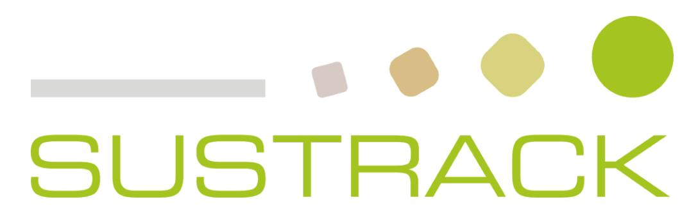

| Work package     | WP3 Definition and analysis of relevant case studies for the circular         |
|------------------|-------------------------------------------------------------------------------|
| Task             | T3.1: Selection and definition of case studies from four critical sectors     |
| Due date         | 30.04.2023                                                                    |
| Submission date  | 29.04.2023                                                                    |
| Deliverable lead | BAM                                                                           |
| Version          | V6.0                                                                          |
| Authors          | Luana Ladu, Mariam Rasheed (BAM)                                              |
| Contributors     | Berien Elbersen, Iris Vural Gursel (WR), Gülşah Yilan (UNIT), Joris Van Acker |
|                  | (UGENT), Marco Bianchi, Janire Clavell, Pierre Merger (TECNALIA), Laura       |
|                  | García Laverde (BDFZ), Carlos Pérez Montero (CIRCE)                           |
| Reviewers        | All partners                                                                  |

# **Document Revision History**

|     | Version | Date       | Description of change                     | List of contributor(s)                |
|-----|---------|------------|-------------------------------------------|---------------------------------------|
| 1.0 |         | 06.02.2023 | Draft structure                           | Luana Ladu, Mariam Rasheed (BAM)      |
| 2.0 |         | 09.03.2023 | Partners' input                           | All partners during an online meeting |
| 3.0 |         | 21.04.2023 | Partners added their factsheets           | All partners                          |
| 4.0 |         | 21.04.2023 | Review's input                            | Berien Elbersen (WR)                  |
| 5.0 |         | 26.04.2023 | Complete draft version for quality review | Luana Ladu, Mariam Rasheed (BAM)      |
| 6.0 |         | 27.04.2023 | Final Version                             | Luana Ladu, Mariam Rasheed (BAM)      |

#### **Abstract**

The transition from linear, fossil-based systems to circular and bio-based systems represents an opportunity and an appropriate pathway to achieve several SDGs. Indeed, circular bio-based systems represent a great opportunity to reconcile long-term sustainable growth with environmental protection through the prudent use of renewable resources for industrial purposes. This necessary transition is a complex process that requires not only innovative supply-side technologies, but also societal transformations based on a multi-actor process. The circular bioeconomy meta-sector may be a good candidate for proposing a new economic model, requiring transformative policies, targeted innovation, access to finance, risk-taking capacity, and new and sustainable business models and markets. However, a critical assessment of the environmental, social, and economic impacts of the current linear fossil-based economy and the potential for improvement associated with circular bio-based systems is needed to underpin the identification of policy priorities. Against this background, SUSTRACK is a three-year project that aims to support policy makers in their efforts to develop sustainable pathways to replace fossil and carbonintensive systems with sustainable circular and bio-based systems (at EU and regional level), thus contributing to the objectives of the European Green Deal. This will be done by: Identifying the environmental, economic, and social limits of a linear carbon-intensive and fossil-based economy; improving existing assessment methodologies; assessing the environmental, social and economic impacts of the EU's current linear fossil-based economy; comparing different transition scenarios focusing on the most carbon intensive sectors; identifying priorities according to the scenarios analysed in the project and developing guidelines and policy recommendations.

## **Disclaimer**

Funded by the European Union under project number 101081823. Views and opinions expressed are however those of the author(s) only and do not necessarily reflect those of the European Union or European Research Executive Agency (REA). Neither the European Union nor the granting authority can be held responsible for them.

**Copyright notice:** © 2022 - 2025 SUSTRACK Consortium

\* R: Document, report (excluding the periodic and final reports)

DEM: Demonstrator, pilot, prototype, plan designs

DEC: Websites, patents filing, press & media actions, videos, etc.

OTHER: Software, technical diagram, etc.

# **SUSTRACK Consortium:**

| #  | Participant Organization Name                         | Short Name | Country |
|----|-------------------------------------------------------|------------|---------|
| 1  | UNIVERSITA DEGLI STUDI DI ROMA UNITELMA SAPIENZA      | UNIT       | IT      |
| 2  | STICHTING WAGENINGEN RESEARCH                         | WR         | NL      |
| 3  | KNOWLEDGE SRL                                         | KE         | IT      |
| 4  | PEDAL CONSULTING SRO                                  | PC         | SK      |
| 5  | DBFZ DEUTSCHES BIOMASSEFORSCHUNGSZENTRUM              |            |         |
|    |                                                       | DBFZ       | DE      |
| 6  | UNIVERSITEIT GENT                                     | UGENT      | BE      |
| 7  | FUNDACION TECNALIA RESEARCH & INNOVATION              | TECNALIA   | ES      |
| 8  | FVA SAS DI LOUIS FERRINI & C                          | FVA        | IT      |
| 9  | UNIVERSITA DEGLI STUDI DI FERRARA                     | UNIFE      | IT      |
| 10 | BUNDESANSTALT FUER MATERIALFORSCHUNG UND -            |            |         |
|    |                                                       | BAM        | DE      |
| 11 | FUNDACION CIRCE CENTRO DE INVESTIGACION DE RECURSOS Y |            |         |
|    |                                                       | CIRCE      | ES      |

| Deliverable information                                                      |    |
|------------------------------------------------------------------------------|----|
| Nature of the deliverable: Dissemination Level                               | R* |
| PU Public, fully open, e.g. web                                              | x  |
| CL Classified, information as referred to in Commission Decision 2001/844/EC |    |
| CO Confidential to SUSTRACK project and Commission Services                  |    |

# **EXECUTIVE SUMMARY**

The aim of this report (D3.1) is to identify and select feasible case studies to be used to design, test, and validate different methodologies and tools to be developed within the SUSTRACK project (e.g., the Bioeconomy Assessment and Monitoring Framework and the customised Green Economy Model), involve stakeholders for the different stakeholder interaction processes in the project and to support the collection of policy priorities in WP5 and policy scenarios in WP4. Some case studies will serve the needs of all work packages, while others will serve the needs of specific work packages.

The report provides a description of the case study selection process and all the methodological steps involved. For the selected case studies, factsheets are included that provide a brief overview of the case study, the scope, system boundaries, and baseline situation representing the current fossil-based situation, and the circular bio-based alternative. The aim is to provide a picture of the commercial characteristics of the case study and a graphical representation of the value chain (including feedstock type and origin, production processes, and end-of-life options). For each case study a preliminary identification of relevant stakeholders (e.g., companies) is included.

The deliverable begins with a description of the methodology adopted to select the case studies. This is followed by a description of the selection criteria and a broad list of case studies. In total 10 case studies (Table 1) and 9 reserves (Table 2) have been selected. The case studies have been selected from the following four critical sectors (a) the construction sector (requiring, e.g., a shift from concrete to sustainable renewable alternatives); (b) the textile sector (requiring, e.g., a shift from fossil-based to bio-based fibres); (c) the (fine) chemical sector (requiring, e.g., a transition to renewable carbon sources and biorefineries); and (d) the plastics sector (requiring, e.g., a shift from fossil-based to bio-based polymers).

*Table 1 - Overview of selected case studies*

| Sector       | Case study                                                   |
|--------------|--------------------------------------------------------------|
| Construction | Cross-laminated timber                                       |
| Construction | Biochar as an additive in concrete                           |
| Construction | Hemp insulation                                              |
| Textile      | Recycled carded wool from Prato, Italy                       |
| Textile      | Man-made cellulosic fibres, like Lyocell                     |
| Textile      | Latxa sheep wool from the Basque Country of Spain            |
| Chemical     | Chemicals from waste                                         |
| Chemical     | Bio-MEG, bio-MPG, and renewable functional fillers from wood |
| Plastics     | Polylactic acid (PLA)                                        |
| Plastics     | Polypropylene from used cooking oil                          |

*Table 2 - Overview of case studies kept in reserve*

| Sector       | Case study                                     |
|--------------|------------------------------------------------|
| Construction | Mycelium-based architectural products          |
| Construction | Bio-polyurethane for flooring                  |
| Textile      | Mycelium-based leather alternatives            |
| Textile      | Casein-based fibres from discarded milk        |
| Chemical     | Bio-solvents                                   |
| Chemical     | CHEMPORT Europe                                |
| Plastics     | Mycelium packaging                             |
| Plastics     | Casein-based biopolymers from discarded milk   |
| Plastics     | Bio-based polyethylene terephthalate (bio-PET) |

# **TABLE OF CONTENTS**

| 1 2 |                         |                                                                                                              |
|-----|-------------------------|--------------------------------------------------------------------------------------------------------------|
| 3   |                         | METHODOLOGY FOR SELECTING THE CASE STUDIES ................................................13                |
| 4   |                         | SELECTION CRITERIA.....................................................................................14    |
| 5   |                         | Long list of case studies ................................................................................16 |
|     | 5.1                     | Construction Sector................................................................................17        |
|     | 5.2                     | Textile Sector.......................................................................................18      |
|     | 5.3                     | Chemical Sector ....................................................................................19       |
|     | 5.4                     | Plastics Sector ......................................................................................20     |
| 6   | Multi-criteria analysis | ...................................................................................21                        |
| 7   |                         | selected case studies....................................................................................25  |
|     | 7.1                     | Specific case studies for Construction Sector ..................................................26           |
|     | 7.2                     | Specific case studies for Textile Sector.........................................................35          |
|     | 7.3                     | Specific Case Studies for Plastics Sector........................................................44          |
|     | 7.4                     | Specific Case Studies for Chemical Sector......................................................50            |
| 8   | Conclusions             | ...............................................................................................57            |
| 9   | References              | ................................................................................................58           |
|     |                         | Annex: RESERVED CASE STUDIES ............................................................................59  |

# **LIST OF FIGURES**

| Figure 1 -  | Overview of selection criteria ..................................................................14  |
|-------------|------------------------------------------------------------------------------------------------------|
| Figure 2 -  | Value chain of biochar concrete composite production.....................................27          |
| Figure 3 -  | Estimated feedstock use for biochar production in 2030 (Source: European Biochar                     |
| Figure 4 -  | Value chain of CLT................................................................................29 |
| Figure 5 -  | Normalised midpoint level impact scores for a CLT and a concrete building (Source:                   |
| Figure 6 -  | Sawnwood production 2000 and 2021 (Source: Eurostat)...................................31            |
| Figure 7 -  | Value chain of hemp insulation .................................................................33   |
| Figure 8 -  | Global market forecast for building thermal insulation (Source: Pavel and Blagoeva,                  |
| Figure 9 -  | Value chain of Latxa sheep wool ...............................................................36    |
| Figure 10 - | Value chain of MMCFs ...........................................................................38   |
| Figure 11 - | Global fibre demand 1940-2018 in million tonnes per year (Source: EEA, 2023) ......39                |
| Figure 12 - | Market shares of MMCFs in 2021 (Source: Statista, 2023) .................................40          |
| Figure 13 - | Value chain of recycled carded wool.........................................................42       |
| Figure 14 - | Value chain of PLA ..............................................................................44  |
| Figure 15 - | Bio-based building blocks and polymers – global capacities, production and trends 2022-              |
| Figure 16 - | Value chain of polypropylene from used cooking oil.......................................47          |
| Figure 17 - | Global production capacities of bioplastics 2022 (Source: European Bioplastics, Nova                 |
| Figure 18   | Estimated global production capacities of bioplastics 2027 (Source: European                         |
| Figure 19 - | Value chain – UPM Biorefinery in Leuna, Germany (Source: UPM, 2021)................50                |
| Figure 20 - | Production process of Enerkem (Source: Enerkem, 2023).................................53             |
| Figure 21 - | Methanol production routes....................................................................55     |
| Figure 22 - | Value chain of mycelium-based products ....................................................59        |
| Figure 23 - | Value chain of bio-PU for flooring ............................................................62    |
| Figure 24 - | Global bio-based polyurethane market (Source: Grand View Research) ................63                |

| Figure 25 -                | Value chain of bio-PET..........................................................................64 |
|----------------------------|----------------------------------------------------------------------------------------------------|
| Figure 26 -                | Production route of bio-1,4-BDO..............................................................65    |
| Figure 27 -                | Value chain of casein-based textiles and biopolymers.....................................68        |
| Figure 28 -                | Bioplastics share in global market volume (Source: Statista, 2023 .....................69          |
| Figure 29 -                | Bio-based feedstock for polymers used worldwide in 2020 (Source: Statista, 2023) ..70              |
| Figure 30 -                | Location of Chemport in Europe (Source: Chemport, 2023) ..............................72           |
| Figure 31 -                | Overview of chemicals and materials in Chemport (Source: Chemport, 2023).........73                |
| Figure 32 -                | Overview of companies in Chemport (Source: Chemport, 2023) .........................74             |
| Figure                     | 33 Chemical parks in Europe (Source: Chemical Parks in Europe                                      |
| https://chemicalparks.eu/) | .................................................................................75                |

# **LIST OF TABLES**

| Table 1 -  | Overview of selected case studies 6                                                                  |
|------------|------------------------------------------------------------------------------------------------------|
| Table 2 -  | Overview of case studies kept in reserve 6                                                           |
| Table 3 -  | Description of selection criteria.................................................................15 |
| Table 4 -  | Long list of case studies within the construction sector.....................................17      |
| Table 5 -  | Long list of case studies within the textile sector............................................18    |
| Table 6 -  | Long list of case studies within the chemical sector .........................................19     |
| Table 7 -  | Long list of case studies within the plastics sector...........................................20    |
| Table 8 -  | Result multi-criteria analysis of the short-listed case studies in the construction sector           |
| Table 9 -  | Result multi-criteria analysis of the short-listed case studies in the textile sector .....23        |
| Table 10 - | Result multi-criteria analysis of the short-listed case studies in the chemical sector.24            |
| Table 11 - | Result multi-criteria analysis of the short-listed case studies in the plastics sector...25          |

|                      | List of Abbreviations                                                     |
|----------------------|---------------------------------------------------------------------------|
| Abbreviation/Acronym | Description                                                               |
| BDO                  | Butanediol                                                                |
| BECCS                | Bioenergy with Carbon Capture and Storage                                 |
| BTX                  | benzene, toluene and xylene                                               |
| CAGR                 | Commpound Annual Growth Rate                                              |
| CLT                  | Cross-Laminated Timber                                                    |
| CNA                  | Confederazione Nazionale dell’Artigianato e della Piccola e Media Impresa |
| CS                   | Case Study                                                                |
| DAC                  | Direct Air Capture                                                        |
| DMT                  | Dimethyl Terephthalate                                                    |
| EBI                  | European Biochar Industry                                                 |
| EBIT                 | Earnings Before Interest and Taxes                                        |
| EDP                  | Electronic Data Processing                                                |
| EIHA                 | European Industrial Hemp Association                                      |
| EoL                  | End of Life                                                               |
| EPS                  | Extended Polystyrene                                                      |
| EWC                  | European Waste Catalogue                                                  |
| GEM                  | Green Economy Model                                                       |
| GHG                  | Greenhouse Gas                                                            |
| GWP                  | Global Warming Potential                                                  |
| HVO                  | Hydrotreated Vegetable Oil                                                |
| H2020                | Horizon 2020 Initiative                                                   |
| IEA                  | International Energy Agency                                               |
| IPCC                 | Intergovernmental Panel on Climate Change                                 |
| ISCC                 | International Sustainability and Carbon Certification                     |
| LCA                  | Life Cycle Assessment                                                     |
| LCSA                 | Life Cycle Sustainability Assessment                                      |
| MEG                  | Monoethylene Glycol                                                       |
| MMCFs                | Man-made cellulosic fibres                                                |
| MPG                  | Monopropylene glycol                                                      |
| MSW                  | Municipal Solid Waste                                                     |
| PBS                  | Polybutylene succinate                                                    |
| PBT                  | Polybutylene Terephthalate                                                |
| PET                  | Polyethylene Terephthalate                                                |
| PFA                  | Perfluoralkoxy                                                            |
| PHA                  | Polyhydroxyalkanoates                                                     |
| PIR                  | Polyisocyanurate                                                          |
| PLA                  | Polylactic acid                                                           |
| PolyTHF              | Polytetrahydrofuran                                                       |
| PP                   | Polypropylene                                                             |
| PTA                  | Purified Terephthalic Acid                                                |
| PTMEG                | Polytetramethylenetherglycol                                              |
| PU                   | Polyurethane                                                              |
| PyCCS                | Pyrogenic Carbon Capture and Storage                                      |
| P3HB                 | Poly-3-hydroxybutyrate                                                    |
| REDII                | Renewable Energy Directive                                                |

D3.1 A case study selection methodology and definition of the selected case studies

| SCMs  | Supplementary Cementitious Materials                  |
|-------|-------------------------------------------------------|
| SGS   | Société Générale de Surveillance                      |
| TETRA | Gesellschaft für Sensorik, Robotik und Automation mbH |
| TPU   | Thermoplastic Polyurethanes                           |
| THF   | Tetrahydrofuran                                       |
| TRL   | Technology Readiness Level                            |
| UCO   | Used Cooking Oil                                      |
| WP    | Work Package                                          |
| W2C   | Waste-to-Chemicals                                    |
| XPS   | Extruded Polystyrene                                  |

# **1 INTRODUCTION**

The SUSTRACK project will adopt a bottom-up approach to the development and validation of key project outputs (including the Bioeconomy Assessment and Monitoring Framework and the customised Green Economy Model) by testing them against real case studies. In this respect, task 3.1 WP 3, led by BAM, guided the process of identifying and selecting feasible case studies.

Within the scope of the project, a case study is defined as:

- a specific value chain;
- a specific product (including the entire product chain, produced by an existing company);
- a combination of both, including different scales covering a whole sub-sector in a region.

The case studies were selected from four sectors that face critical challenges within the current linear system: (a) the construction sector (requiring, e.g., a shift from concrete to sustainable renewable alternatives); (b) the textile sector (requiring, e.g., a shift from fossil-based to biobased fibres); (c) the (fine) chemical sector (requiring, e.g., a transition to renewable carbon sources and biorefineries); and (d) the plastics sector (requiring, e.g., a shift from fossil-based to bio-based polymers).

The process of selecting case studies started with the creation of a long list of case study candidates (e.g., by sectors, product, and region) and a broad list of selection criteria. The case studies that scored best in a multi-criteria analysis were shortlisted. For each selected case study, the scope, the baseline situation (representing the current fossil-based situation) and the circular bio-based situation were described and included in factsheets prepared for each case study.

In total 10 case studies were selected and 9 were kept in reserve. The reserved case studies are not intended to be used for the assessments and analyses of the other work packages but can be included if deemed necessary or advantageous. The case studies are differentiated between integrated case studies (used to validate all tools of the project) and specific case studies (to be used only for certain activities of the project). For example, for WP1 and WP5, specific case studies will be used as tools to achieve work package objectives, including identifying barriers to the transition from a fossil-based to a circular bio-based economy, as well as providing regulatory framework recommendations for policymakers. To allow this, in the selection phase of the case studies, we deemed it important to adopt a broad definition of a case study. During the analysis of the case studies in future project activities, the definition might be narrowed to a specific company, product, or step of the value chain, according to the needs of the analysis to be conducted.

This report describes the process used to select the case studies and provides an overview of the selected case studies. It aims to provide a picture of the case study's specific commercial characteristics, production methods, application, and end-of-life options.

First, a description of the case study selection methodology is presented. The description of the selection criteria is followed by an overview of the selection of the case studies. In addition, the 10 selected case studies and the 9 case studies kept in reserve are accompanied by a factsheet describing the value chain and other specific information.

# **2 SCOPE OF THE CASE STUDIES**

To study the transition from linear fossil-based to circular and bio-based systems, SUSTRACK will adopt a bottom-up approach by investigating a set of appropriate case studies that will allow comparability between production systems. In particular, the case studies will be used to assess the environmental, social, and economic impacts of the sustainable transition and to validate the monitoring and assessment framework as well as other frameworks and tools to be developed under the project. The case study assessment will entail testing the environmental, social, and economic sustainability indicators and methodologies selected and developed under the project in terms of applicability, completeness, data availability, and interpretation. Based on the results of this testing, guidance is provided on the performance of the indicators and tools in the specific case study contexts and how they might be improved.

Case studies are used to carry out the following analysis:

- Conduct a gap analysis and identify current barriers to transition, focusing on the four sectors identified.
- Support the development and testing of the framework (and related indicators and dashboard) for monitoring & assessing the benefits of a sustainable transition to a circular and bio-based economy. In practice, the case studies will be used to generate new data sources for adapting the proposed indicators and tools.
- Test the suitability of the monitoring framework to support policy and decision-making.
- Serve as a basis for the analysis of potential bio-based development scenarios in each sector by means of the Green Economy Model (GEM), including the definition of different scenarios for the sectors concerned.
- Support the development of a policy portfolio scenario. In particular, the identification of sustainability targets (for selected indicators), associated timelines and trajectories over time, at the EU level, for selected countries and sectors. This includes the identification of targets as a basis for the development of policy scenarios for each case study and case study sector.
- Support the identification of policy priorities, the definition of policy actions, and the elaboration of general recommendations for the bio-based sector based on the analysis of case studies.
- Develop policy recommendations and guidelines for a sustainable transition to a circular bio-based economy. Final policy recommendations and roadmap guidelines will be developed for each case study. These will summarise the findings for each of the carbonintensive sectors and provide guidance on urgent actions and sustainability considerations to support a sustainable transition at national and EU levels.
- Conduct capacity building for the local stakeholders who will be involved in the selected case studies.

# **3 METHODOLOGY FOR SELECTING THE CASE STUDIES**

The selection of case studies and the identification of relevant stakeholders is the result of the work conducted under Task 3.1 led by BAM, which started in M1 (November 2022) and finished in M6 (April 2023). As the selection of case studies is a relevant task for the future work of most work packages, all partners of the SUSTRACK consortium participated in the implementation of this task.

A 4-step methodology was adopted.

- Step 1: Making a broad list of selection criteria
- Step 2: Creating a long list of case study candidates
- Step 3: Conducting a multi-criteria analysis to identify the most appropriate case studies
- Step 4: Defining the scope and baseline situation of each selected case study

The first draft of the methodology was proposed and discussed at the kick-off meeting in Rome. Subsequently, different rounds of interactions were organised within the consortium, in the form of monthly virtual meetings, to implement the different steps of the methodology. Each partner was asked to provide a list of possible selection criteria, from which those that adhere to the specific work to be done under the different tasks of the project were selected, resulting in a total of 13 criteria. These criteria are described in Section 4. In parallel, the partners were asked to identify and suggest possible case studies based on their knowledge and experience and with regard to the analysis to be conducted in the project. These were compiled into a long list of 51 case studies, described in Section 5. Subsequently, as described in Section 6, a multi-criteria analysis was conducted using the 13 selection criteria, leading to the selection of 10 case studies. Additionally, 9 case studies are kept in reserve. Finally, factsheets were created for these 19 case studies indicating the scope and system boundaries and the baseline situation.

# **4 SELECTION CRITERIA**

To perform the multi-criteria analysis, a set of selection criteria was developed to outline the necessary requirements for the case studies. These criteria are listed and described in this Section. In total 13 selection criteria were identified. They are shown in Figure 1.

*Figure 1 - Overview of selection criteria* 

Apart from the 13 selection criteria, the following criteria were also considered when conducting the multi-criteria analysis:

- At least one case study was selected for each of the four predefined critical application sectors.
- At least one regional case study was selected.
- The selected case studies feature value chains with different feedstock types (primary dedicated, primary residues, secondary residues, tertiary residues).
- Description of each criterion

Table 3 provides a description of each selection criterion.

*Table 3 - Description of selection criteria*

| Selection Criterion                                                                       | Description                                                                                                                                                                                                                                                                                   |
|-------------------------------------------------------------------------------------------|-----------------------------------------------------------------------------------------------------------------------------------------------------------------------------------------------------------------------------------------------------------------------------------------------|
|  Comparability                | 
This criterion refers to the extent to which the selected case study is suitable to conduct a comparative analysis of a linear, fossil-based versus a circular bio-based production system
                                                                                             |
|  Replicability               | 
This criterion refers to the extent to which the case study can be used to conduct the different analyses to be carried out within the project
                                                                                                                                         |
|  High TRL                         | 
This criterion refers to the technological maturity of the case study. Only case studies with a high Technology Readiness Level (TRL) (e.g., 7, 8 or 9) are considered. A lower TRL is considered for sector(s) with a lower willingness to change to bio-based or innovative products
 |
|  High Impact                   | 
This criterion refers to the potential contribution to overall climate change mitigation of the case study when its production is scaled up
                                                                                                                                            |
|  Potential for Growth | 
This criterion refers to the extent to which the market of the case study (bio-based value chain or product) is forecast to grow
                                                                                                                                                       |
|  Market size                   | 
This criterion refers to the current market dimension (e.g., sales on the EU markets) and the number of companies already involved in the final production of the selected product
                                                                                                     |

| Feedstock availability      | This criterion refers to the extent to which the feedstock used in the value chain (e.g., forest, agriculture, by-products and organic/industrial waste) is considered available for scaling-up while respecting sustainability criteria                                                    |
|-----------------------------|---------------------------------------------------------------------------------------------------------------------------------------------------------------------------------------------------------------------------------------------------------------------------------------------|
| EoL scenario availability   | This criterion refers to the extent to which different end-of-life treatments and circularity options (other than energy recovery) are considered in the selection, ensuring the greatest possible diversity                                                                                |
| Cascading use               | This criterion refers to the extent to which the multi-stage cascading use of the feedstock and/or product is possible and considered                                                                                                                                                       |
| Data availability           | This criterion refers to the existence of reliable data available in the literature sufficient to conduct the various assessments under the project                                                                                                                                         |
| Relevance for policymakers  | This criterion refers to the extent to which the case study contributes to achieving sustainability policy targets and priorities                                                                                                                                                           |
| Synergy with other projects | This criterion refers to the fact that the case study was previously selected by sister projects and included in the same work program                                                                                                                                                      |
| Access to stakeholders      | This criterion refers to the extent to which the partners of the consortium have access to case study-related stakeholders (e.g., companies). This will facilitate the gathering of primary relevant and appropriate information needed to conduct the different analyses under the project |

# **5 LONG LIST OF CASE STUDIES**

The construction, textile, chemical, and plastics sectors have been identified as facing critical challenges under the current linear system and requiring an urgent sustainable transition. Apart from the energy industry, these sectors are some of the largest GHG emitters in the world. They manufacture fundamental products that help us live healthier, safer, and more efficient lives, and without which our lives would be unimaginable. However, the manufacturing of these products comes at a cost. The emission of GHGs and the accumulation of mismanaged waste are posing a major threat to the environment.

In this section, the consortium compiled a long list of case studies that showcase products and companies that contribute to the transition of these sectors from linear fossil-based production systems to circular bio-based ones. In total, 51 case studies were proposed across the four sectors. A separate list was created for each sector, which can be found in the following subsections. Some of the case studies feature proprietary products or very specific production processes, which means that they focus on a single company. For all other case studies, at least two example companies are listed. Included are also a few case studies that highlight projects or research. These are written in italics.

# **5.1 Construction Sector**

*Table 4 - Long list of case studies within the construction sector*

| Nr. | Case study                                                | Example companies |
|-----|-----------------------------------------------------------|-------------------|
| 1   | Cross-laminated timber                                    |                   |
| 2   | Activated paper ash as a binder in construction materials | BAM research      |
| 3   | Biochar as an additive in concrete                        |                   |
| 4   | Algae as a biofilm for façade panels                      | Solaga UG         |
| 5   | Mycelium-based architectural products                     | Mogu;             |
| 6   | Insulation material “Ecowool” made from wastepaper        | Balticfloc        |
| 7   | Flame retardants from different bio-based sources         | BAM research      |
| 8   | Hempcrete/hemplime                                        |                   |
| 9   | Hemp insulation                                           |                   |
| 10  | Bio-polyurethane for flooring                             | Ecuran;           |
| 11  | Wood-based panels                                         | West Fraser;      |
| 12  | Engineered wood products                                  | Pollmeier;        |
| 13  | Treated wood                                              | Accoya;           |

# **5.2 Textile Sector**

*Table 5 - Long list of case studies within the textile sector*

| Nr. | Case study                                               | Example companies      |
|-----|----------------------------------------------------------|------------------------|
| 1   | Recycled carded wool from Prato, Italy                   |                        |
|     | wine waste                                               | Vegea                  |
| 3   | Natural textiles from waste pineapple leaves             | Ananas Anam            |
| 4   | Vegan leather from waste mangoes                         | Fruitleather Rotterdam |
| 5   | Cellulose carbamate fibre from cotton-rich textile waste | Infinited Fiber        |
| 6   | Man-made cellulosic fibres, like Lyocell                 |                        |
| 7   | Mechanically recycled jeans                              | Mud Jeans;             |
| 8   | Mycelium-based leather alternatives                      | Bolt Threads;          |
| 9   | Hemp fibres                                              | NFC GmbH;              |
| 10  | Latxa sheep wool from the Basque Country of Spain        | Ternua                 |
| 11  | Casein-based fibres from discarded milk                  | QMilk                  |
| 12  | Olive leaf extract for leather tanning                   | Olivenleder            |
| 13  | Active cross-linking agents for leather tanning          | Crossing SRL           |

# **5.3 Chemical Sector**

*Table 6 - Long list of case studies within the chemical sector*

| Nr. | Case Study                                         | Example companies             |
|-----|----------------------------------------------------|-------------------------------|
|     | waste biomass and plastics                         | Bio-BTX                       |
| 2   | Bioethanol from sugar or starch-containing biomass | CropEnergies                  |
| 3   | Biosurfactants from waste lipids                   | Project No. 1.1.1.1/19/A/047  |
| 4   | Bio-aromatics from lignin                          | Vito project                  |
| 5   | Bio-solvents                                       | Novamont;                     |
| 6   | Chemicals from waste                               | Enerkem                       |
|     | bio-waste                                          | CAFIPLA project               |
| 8   | Biorefineries                                      |                               |
| 9   | CHEMPORT Europe                                    |                               |
| 10  | Bio-MEG, bio-MPG, and renewable functional fillers |                               |
|     |                                                    | UPM Biochemicals (biorefinery |
| 11  | Oleochemicals                                      | Emery Oleochemicals GmbH;     |

# **5.4 Plastics Sector**

*Table 7 - Long list of case studies within the plastics sector*

| Nr. | Case Study                                               | Example companies             |
|-----|----------------------------------------------------------|-------------------------------|
| 1   | Polylactic acid (PLA)                                    |                               |
| 2   | Bioplastics based on carinata and camelina oils          | Carina project                |
| 3   | Mycelium packaging                                       |                               |
| 4   | Natural rubber from dandelions                           | Taraxagum by Continental      |
| 5   | Polyhydroxyalkanoates (PHA)                              | Bio-on;                       |
| 6   | Polypropylene from used cooking oil                      |                               |
|     |                                                          | LyondellBasell in cooperation |
|     |                                                          | with Neste                    |
| 7   | Active biodegradable packaging                           | Crossing SRL                  |
|     | fibres                                                   | BIO-LUTIONS                   |
| 9   | Polybutylene succinate (PBS)                             | Mitsubishi Chemical Europe;   |
| 10  | Casein-based biopolymers from discarded milk             | QMilk                         |
| 11  | Bio-based polyethylene terephthalate (bio-PET)           |                               |
| 12  | P3HB biopolymer from waste cooking oil                   | Nafigate                      |
| 13  | PFA for resin systems from the conversion of             |                               |
|     | hemicellulose to furfural                                | Transfurans                   |
| 14  | Plastic composite with recycled thermoplastics and up to |                               |
|     |                                                          | AgriPlast by Biowert          |

# **6 MULTI-CRITERIA ANALYSIS**

This section describes the methodology of the multi-criteria analysis and its results.

The multi-criteria analysis was performed to select the most suitable case studies for assessments and analyses in the SUSTRACK project. To evaluate the 51 proposed case studies, the 13 selection criteria listed in Section 4 were applied as follows:

- Three of the selection criteria were identified as exclusion criteria, i.e., any case studies not meeting these criteria were immediately excluded and not shortlisted for final selection. These exclusion criteria are potential for growth, data availability, and access to stakeholders. In total, 32 case studies were shortlisted.
- For each of the shortlisted case studies, scores from 1 to 3 were assigned to each of the 10 remaining selection criteria, with 1 being the highest score. However, in the chemical sector case studies, the selection criteria for EoL scenario availability and cascading use were not specified as only intermediate products are considered in this sector. This is because they are mainly intermediate products used as raw materials for the production of other products and their EoL scenarios depend on the final product.
- The mean of all 10 (or 8 in the chemical sector) scores was calculated, resulting in a final score for each shortlisted case study.
- The five highest-scoring case studies from each sector were picked out and discussed, highlighting the advantages and disadvantages of each, leading to the final selection.

The multi-criteria analyses of the 32 short-listed case studies meeting the three exclusion criteria for each of the four sectors are presented in the following tables (Table 8-11). The remaining 10 selection criteria were numbered as follows:

- 1. Comparability
- 2. Replicability
- 3. High TRL
- 4. High impact
- 5. Market size
- 6. Feedstock availability
- 7. EoL scenario availability
- 8. Cascading use
- 9. Relevance for policymakers
- 10. Synergy with other projects

*Table 8 - Result multi-criteria analysis of the short-listed case studies in the construction sector*

| Sector Case Study                               | 1 | 2 | 3 | 4 | 5 | 6 | 7 | 8 | 9 | 10 | Final |
|-------------------------------------------------|---|---|---|---|---|---|---|---|---|----|-------|
| Cross-laminated timber                          | 1 | 1 | 1 | 1 | 2 | 1 | 2 | 2 | 1 | 1  | 1.30  |
| Biochar as an additive in concrete CONSTRUCTION | 1 | 2 | 2 | 1 | 2 | 1 | 2 | 1 | 1 | 2  | 1.50  |
| Algae as biofilm for façade panels              | 2 | 2 | 2 | 2 | 3 | 1 | 3 | 3 | 2 | 3  | 2.30  |
| Mycelium-based architectural products           | 1 | 2 | 2 | 1 | 2 | 1 | 1 | 1 | 1 | 3  | 1.50  |
| Hempcrete/hemplime                              | 1 | 2 | 1 | 2 | 2 | 1 | 2 | 2 | 2 | 3  | 1.80  |
| Hemp insulation                                 | 1 | 2 | 1 | 1 | 2 | 1 | 1 | 3 | 1 | 1  | 1.40  |
| Bio-polyurethane for flooring                   | 1 | 2 | 1 | 1 | 2 | 1 | 3 | 3 | 1 | 1  | 1.60  |

*Table 9 - Result multi-criteria analysis of the short-listed case studies in the textile sector*

| Sector Case Study                           | 1 | 2 | 3 | 4 | 5 | 6 | 7 | 8 | 9 | 10 | Final |
|---------------------------------------------|---|---|---|---|---|---|---|---|---|----|-------|
| Recycled carded wool from Prato, Italy      | 1 | 2 | 1 | 2 | 2 | 1 | 2 | 1 | 1 | 3  | 1.60  |
| Man-made cellulosic fibres, like Lyocell    | 1 | 2 | 1 | 1 | 1 | 1 | 2 | 1 | 1 | 2  | 1.30  |
| Mycelium-based leather alternatives TEXTILE | 1 | 2 | 2 | 3 | 3 | 1 | 1 | 1 | 2 | 3  | 1.90  |
| Hemp fibres                                 | 1 | 2 | 2 | 2 | 2 | 2 | 2 | 3 | 1 | 3  | 2.00  |
| Country of Spain                            | 1 | 2 | 1 | 2 | 3 | 1 | 1 | 3 | 2 | 2  | 1.80  |
| (QMilk)                                     | 1 | 2 | 1 | 2 | 3 | 1 | 2 | 2 | 2 | 2  | 1.80  |
| (Olivenleder)                               | 2 | 2 | 1 | 2 | 2 | 1 | 3 | 3 | 2 | 3  | 2.10  |
| tanning (Crossing SRL)                      | 2 | 2 | 1 | 2 | 2 | 1 | 3 | 3 | 2 | 3  | 2.10  |

*Table 10 - Result multi-criteria analysis of the short-listed case studies in the chemical sector*

| Sector Case Study                   | 1 | 2 | 3 | 4 | 5 | 6 7 | 8 9 | 10 | Final |
|-------------------------------------|---|---|---|---|---|-----|-----|----|-------|
| (Bio-BTX)                           | 1 | 2 | 1 | 1 | 2 | 1   | 2   | 3  | 1.63  |
| containing biomass                  | 1 | 2 | 1 | 2 | 2 | 1   | 2   | 3  | 1.75  |
| Biosurfactants from waste lipids    | 2 | 2 | 3 | 2 | 3 | 2   | 2   | 3  | 2.38  |
| Bio-aromatics from lignin CHEMICALS | 2 | 2 | 2 | 1 | 3 | 1   | 1   | 1  | 1.63  |
| Bio-solvents                        | 1 | 1 | 1 | 1 | 2 | 1   | 2   | 2  | 1.38  |
| Chemicals from waste                | 1 | 1 | 1 | 1 | 1 | 1   | 1   | 2  | 1.13  |
| recovery from bio-waste (CAFIPLA)   | 3 | 1 | 2 | 2 | 2 | 1   | 3   | 3  | 2.13  |
| Biorefineries                       | 1 | 2 | 1 | 1 | 1 | 1   | 1   | 1  | 1.13  |
| CHEMPORT Europe                     | 1 | 2 | 1 | 1 | 2 | 1   | 1   | 3  | 1.50  |
|                                     | 1 | 2 | 2 | 1 | 2 | 1   | 1   | 2  | 1.50  |
| Oleochemicals                       | 2 | 1 | 1 | 1 | 1 | 2   | 2   | 3  | 1.63  |

After deliberating, the consortium decided not to select both highest scoring case studies for the chemical sector. While chemicals from waste was selected, biorefineries was not as it was deemed too broad a case study. There are 803 biorefineries in the EU with varying feedstocks and outputs, which would have been difficult to analyse and assess in further project activities1 . The consortium decided to therefore select the lower scoring case study bio-MEG, bio-MPG and renewable functional fillers from wood, as it features a biorefinery, while being limited to one feedstock and a number of outputs. It also has the advantage of being a regional case study.

1 https://publications.jrc.ec.europa.eu/repository/handle/JRC113216

*Table 11 - Result multi-criteria analysis of the short-listed case studies in the plastics sector*

| Sector Case Study                    | 1 | 2 | 3 | 4 | 5 | 6 | 7 | 8 | 9 | 10 | Final |
|--------------------------------------|---|---|---|---|---|---|---|---|---|----|-------|
| PLA                                  | 1 | 1 | 1 | 1 | 1 | 1 | 1 | 1 | 1 | 1  | 1.00  |
| Mycelium packaging PLASTICS          | 1 | 2 | 1 | 2 | 2 | 1 | 1 | 1 | 2 | 3  | 1.60  |
| Polypropylene from used cooking oil  | 1 | 1 | 1 | 1 | 2 | 1 | 2 | 1 | 1 | 3  | 1.40  |
| milk (QMILK)                         | 1 | 2 | 1 | 2 | 3 | 1 | 1 | 3 | 2 | 2  | 1.80  |
| Bio-based polyethylene terephthalate | 1 | 2 | 3 | 1 | 3 | 1 | 2 | 2 | 1 | 3  | 1.90  |
| Industrie)                           | 2 | 2 | 2 | 2 | 2 | 2 | 1 | 1 | 2 | 3  | 2.00  |

# **7 SELECTED CASE STUDIES**

A total of 10 case studies were selected: three each for the textile and construction sectors and two each for the plastics and chemical sectors. Additionally, 9 further case studies that scored high in the multi-criteria analysis are kept in reserve. They are not intended to be used for the assessments and analyses of the other work packages but can be included if deemed necessary or advantageous. The consortium found these case studies worth mentioning, beyond being named in the long list and, in some cases, supplementary to the selected case studies and therefore potentially interesting for other work packages. Factsheets were created for the 9 reserved case studies and can be found in the Annex.

In the following, the factsheets of the selected case studies are presented, which comprise key information on the value chain, feedstock, and market size, as well as on the companies and stakeholders involved.

# **7.1 Specific case studies for Construction Sector**

### **7.1.1 FACTSHEET: Biochar as an additive in concrete**

#### **Short Description:**

Concrete is a mixture of cement, water, and aggregates and is the most used manufactured substance on earth. Cement is the hydraulic binder in concrete that holds the aggregates together. The cement industry is the sector with the second largest share of direct carbon dioxide emissions (27%) and the third largest industrial energy consumer with 7% of global energy consumption. About two-thirds of the total CO2 emitted during cement production is attributed to the production of clinker, the main constituent of cement, and the decomposition of limestone (calcium carbonate) to lime (calcium oxide) and CO2. The combustion of fuel represents the remainder of the CO2 emissions. Energy efficiency and the use of alternative fuels can therefore only limitedly lower CO2 emissions from the cement sector. With a rising global population leading to a higher demand for infrastructure development, global cement production is forecast to grow by 12-23% by 2050 (International Energy Agency, 2018). To avoid an equivalent increase in carbon emissions by 2050 and support a sustainable transition, the International Energy Agency has identified the integration of technologies such as carbon capture and the reduction of clinker content in cement as the two main carbon mitigation tools. Supplementary cementitious materials (SCMs) are commonly used to reduce the clinker-to-cement ratio. The most widely used SCMs in concrete are fly ash, a by-product of coal combustion, ground granulated blast furnace slag, obtained by rapid quenching of molten slag in iron production, and silica fume, a by-product of silicon and ferrosilicon alloy production. The clinker factor in the EU has increased over the years and will continue to do so due to the declining use of coal and the associated decreased production of fly ash (Thiedeitz et al., 2020). Since 2012, total coal-fired power generation in the EU has dropped by almost a third, and the last coal phase-out commitment by an EU member is set for 2049, meaning that by then the most commonly used SCM, namely fly ash, will disappear from the EU market2 . Finding other SCMs is therefore imperative.

Biochar is a porous, carbon-rich material with a carbon content of up to 90%. It is characterised by its refractory stability, which forms the basis for the concept of pyrogenic carbon capture and storage (PyCCS), a technology that is assessed by the IPCC as a necessary solution to combat climate change. Biochar is one of three products obtained from the pyrolysis of biomass. The other two are condensable liquids (bio-oil) and non-condensable gases (syngas/synthesis gas). Depending on the feedstock and the process parameters of temperature, heating rate, and residence time, the yield of each product differs.

In recent years, biochar has been explored as an SCM candidate or filler in concrete. Several research institutes and companies have successfully substituted enough cement with biochar to produce concretes with a lower global warming potential (GWP) than achievable with conventionally used carbon mitigation tools in the concrete sector, or even carbon-negative concretes. The challenge in scaling up the production of such concrete and adopting biochar as a suitable replacement for cementitious composites is posed by the vast variability of biochar.

2 https://energy.ec.europa.eu/topics/oil-gas-and-coal/eu-coal-regions/coal-regions-transition\_en

Biochar interacts and reacts in a cementitious matrix in various ways, some of which are still unexplored, and the chemical and physical properties of the biochar itself are also highly variable.

**Value Chain:**

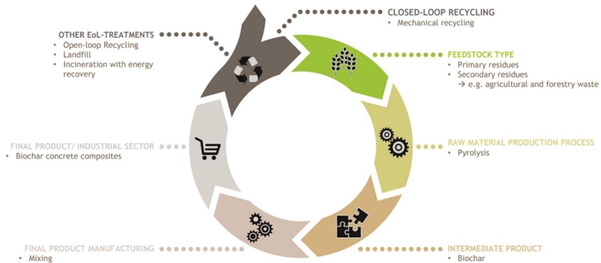

*Figure 2 - Value chain of biochar concrete composite production*

Biochar can be produced from a variety of different feedstocks. Both primary dedicated biomass, as well as waste biomass, can be fed into the pyrolyser as feedstock. A co-pyrolysis is the pyrolysis of more than one feedstock, typically biomass and post-consumer plastics. Pyrolysis recycling is a chemical recycling method suitable for mixed plastic waste, where the goal is obtaining the pyrolysis oil and further processing it to produce new plastics or other chemicals. Co-pyrolysis is deployed as it often yields higher quality pyrolysis oils than pyrolysis of plastics. The solid product of these two pyrolysis recycling processes is often referred to in the literature as charcoal or solid residue instead of biochar and usually has a much lower yield compared to the solid product of pyrolysis of biomass alone. For this reason, tertiary residues (in this case mixed plastic waste) are not included in the value chain model above. The other products of the biomass pyrolysis process, namely bio-oil, and syngas, are also not included in the model as they are not directly used to produce biochar-concrete composites, but they will be included in the further analyses of this case study as they provide climate-neutral energy.

# **Example Companies:**

- EcoLocked [\(https://www.ecolocked.com/\)](https://www.ecolocked.com/)
- CarbonInstead [\(http://carboninstead.de/\)](http://carboninstead.de/)
- Klark [\(https://www.klark.swiss/\)](https://www.klark.swiss/)
- Biocrete [\(https://www.biocrete.no/\)](https://www.biocrete.no/)

# **Baseline Situation:**

The baseline situation that will be compared to biochar concrete composites is the conventional production of concrete and its constituents.

#### **Feedstock:**

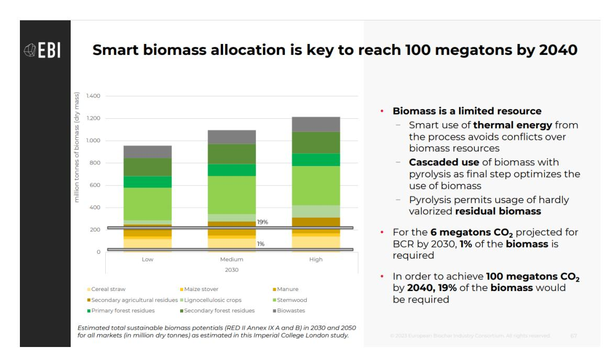

*Figure 3 - Estimated feedstock use for biochar production in 2030 (Source: European Biochar Industry Consortium, 2023)*

## **Market Overview:**

The number of biochar production plants in Europe grew by 28 installations to a total of 130 by 2022, with production capacity increasing by 52% to 53,000 tonnes of biochar, amounting to a 3 year CAGR of 56% from 2019 to 2022.

# **Stakeholders:**

- BAM researchers have been looking at alternative SCMs from biomass, focusing on silicarich ashes, such as rice husk ashes, and biochar.
- The European Biochar Industry Consortium is an association of biochar producers, plant manufacturers, wholesalers, and refiners. The consortium was founded to promote and support the non-material and economic interests of the biochar industry in Europe and is a member of the European Commission's expert group on carbon removals.
- The companies mentioned above producing biochar-concrete composites will be invited to take part in our stakeholder workshops.
- Puro.Earth and Carbonfuture are two EU-based tech companies trading carbon certificates for companies that want to reduce their carbon footprint. Both companies trade certificates that account for carbon sink provided by biochar.

# **Policy Framework:**

Proposal for a Regulation laying down harmonised conditions for the marketing of construction products, amending Regulation (EU) 2019/1020 and repealing Regulation (EU) 305/2011 [\(https://ec.europa.eu/docsroom/documents/49315\)](https://ec.europa.eu/docsroom/documents/49315)

## **Relevant Studies and Publications:**

- European Biochar Industry. (2022). Market Report 2022|2023. [https://www.biochar](https://www.biochar-industry.com/market-overview/)[industry.com/market-overview/](https://www.biochar-industry.com/market-overview/)
- International Energy Agency [2018] Technology Roadmap: Low-Carbon Transition in the Cement Industry. [https://iea.blob.core.windows.net/assets/cbaa3da1-fd61-4c2a-8719-](https://iea.blob.core.windows.net/assets/cbaa3da1-fd61-4c2a-8719-31538f59b54f/TechnologyRoadmapLowCarbonTransitionintheCementIndustry.pdf) [31538f59b54f/TechnologyRoadmapLowCarbonTransitionintheCementIndustry.pdf](https://iea.blob.core.windows.net/assets/cbaa3da1-fd61-4c2a-8719-31538f59b54f/TechnologyRoadmapLowCarbonTransitionintheCementIndustry.pdf)
- Nahuat-Sansores et al. (2022). Suitability of biochar as supplementary cementitious material (SCM) or filler: waste revalorization, a critical review. [https://www.ecorfan.org/republicofperu/research\\_journals/Revista\\_de\\_Ingenieria\\_Civil/](https://www.ecorfan.org/republicofperu/research_journals/Revista_de_Ingenieria_Civil/vol6num16/Journal_Civil_Engineering_V6_N16_2.pdf) [vol6num16/Journal\\_Civil\\_Engineering\\_V6\\_N16\\_2.pdf](https://www.ecorfan.org/republicofperu/research_journals/Revista_de_Ingenieria_Civil/vol6num16/Journal_Civil_Engineering_V6_N16_2.pdf)

# **7.1.2 FACTSHEET: Cross-Laminated Timber**

# **Short Description:**

Cross-laminated timber, or CLT, is a special type of manufactured lumber, also known as mass timber. It consists of layered lumber boards that are stacked, glued, and pressed into place. This manufactured wood product forms large wood panels that are used in floors, roofs, and walls and allow developers to create wood-construction multi-floor buildings.

Cross-laminated timber (CLT) is a large-scale, prefabricated, solid-engineered wood panel. Lightweight yet very strong, with superior acoustic, fire, seismic and thermal performance, CLT is also fast and easy to install, generating almost no waste onsite. CLT offers design flexibility and low environmental impacts. For these reasons, cross-laminated timber is proving to be a highly advantageous alternative to conventional materials like concrete, masonry, or steel, especially in multifamily and commercial construction.

# **Value Chain:**

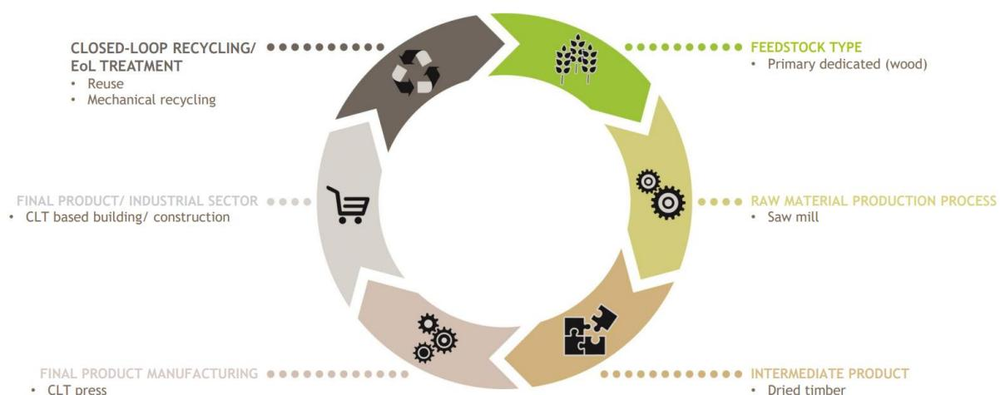

*Figure 4 - Value chain of CLT*

# **Example Companies:**

- Eugen Decker [\(https://www.eugen-decker.de/en/products.html\)](https://www.eugen-decker.de/en/products.html)

- Stora Enso [\(https://www.storaenso.com/en/products/mass-timber-construction/building](https://www.storaenso.com/en/products/mass-timber-construction/building-products/clt)[products/clt\)](https://www.storaenso.com/en/products/mass-timber-construction/building-products/clt)
- KLH Massivholz [\(https://www.klh.at/en/\)](https://www.klh.at/en/)
- Binderholz [\(https://www.binderholz.com/en-us/products/clt-bbs/\)](https://www.binderholz.com/en-us/products/clt-bbs/)
- MM Holz [\(https://www.mm-holz.com/en/products/clt-cross-laminated-timber\)](https://www.mm-holz.com/en/products/clt-cross-laminated-timber)
- Hasslacher [\(https://www.hasslacher.com/cross-laminated-timber\)](https://www.hasslacher.com/cross-laminated-timber)

CLT was initially manufactured in the 1990s in Europe and has now spread to other parts of the globe. Given below is a list of the top 5 CLT manufacturers that are anticipated to dominate the market in 2021:

#### 1. Stora Enso

Stora Enso was formed in 1998 when the Swedish mining and forestry products organization, Stora AB, merged with the Finnish forestry products firm, Enso Oyj. It is currently one of the leading global forest products groups which have around 26,000 employees in more than 35 countries. Its sales in 2015 were EUR 10.0 billion with an operational EBIT of EUR 915 million. Stora Enso derives nearly 75% of its revenues from countries in the European region and 15% of its revenues from the countries situated in Asia.

## 2. KLH Massivholz GmbH (KLH = Kreuzlagenholz)

KLH Massivholz GmbH was founded in 1999 and is based in Murau, Austria, with a subsidiary in Sollentuna, Scandinavia. It is one of the biggest producers of large-sized cross-laminated timber products worldwide with more than 15,000 reference projects as well as an annual production capacity of 125,000 m³. It provides ceiling, structural wall, and roofing elements, floors, timber boards, crosswise laminates, and cross-laminated timber panels. The company has an extensive distribution network across Europe and sells its products in the Netherlands, Norway, Portugal, Sweden, Switzerland, Spain, Belgium, Denmark, Germany, Finland, France, Great Britain, Italy, Liechtenstein, Luxembourg, and the Czech Republic.

#### 3. Binderholz

Binderholz is the leading European organization that produces solid wood panels and innovative construction solutions. It primarily deals with the industrial use and distribution of wood products. Some of the wood products provided by the company include glulam, timber, profiled timber, laminated timber, and single and multi-laminated solid wood panel. The company employs about 1,400 people with operations at five sites in Austria, two sites in Bavaria, and two sites in Finland. Apart from Austria and Italy, the company also actively operates in Germany, Switzerland, France, and Spain.

# 4. Mayr-Melnhof Holz Group

Initiated in 1850, the Mayr-Melnhof Holz Group is owned by the F. Mayr-Melnhof-Saurau Industrie Holding GmbH. The company has two major divisions which include processing and sawn timber. Moreover, it owns three sawmill plants in Leoben (Austria), Paskov (Czech Republic), and Efimovski (Russia), and timber processing plants in Gaishorn (Austria), Reuthe (Austria), and Richen (Germany). Additionally, the Company's production program includes laminated ceiling elements, glued-laminated timber, special components, concrete formwork technology, and cross-laminated timber. The product portfolio of the company also comprises briquettes and pellets produced at different locations.

#### 5. Hasslacher

Hasslacher is a family enterprise, based in Sachsenburg (Austria), which was founded in 1901. The company owns eight manufacturing sites in Germany, Slovenia, Austria, and Russia and is one of Europe's largest and most prominent timber industry companies with a workforce of more than 1,200. It offers sawn, pellets, shuttering boards, cross, and glue-laminated, finger-jointed structural, solid timber ceiling systems, laminated beams DUO/TRIO, and surfaced timber products. The firm also converts biomass into sustainable energy for drying wood and generating electricity, supplies energy to the local district heating network of Möllbrücke and Sachsenburg and operates a small hydropower plant.

#### **Baseline Situation:**

CLT is often mentioned as an alternative to concrete, especially in the context of LCA analyses.

| Impact category                          | Impact category abbreviation | CLT building           | Checked building      | Relative difference (CLT/Concrete) |
|------------------------------------------|------------------------------|------------------------|-----------------------|------------------------------------|
| Fine particulate matter formation        | PM                           | 0.11                   | 0.11                  | 1.01                               |
| Fossil resource scarcity                 | Fos.rs                       | 0.15                   | 0.22                  | 0.69                               |
| Freshwater ecotoxicity                   | FrW.ecotx                    | 43.06                  | 41.11                 | 1.05                               |
| Freshwater eutrophication                | FrW.eut                      | 0.92                   | 1.10                  | 0.83                               |
| Global warming, Base scenario            | GW base                      | $5.69 \times 10^{-2}$  | $1.13 \times 10^{-1}$ | 0.50                               |
| Global warming, Biogenic carbon scenario | GW bio                       | $3.61 \times 10^{-2}$  | $1.12 \times 10^{-1}$ | 0.32                               |
| Human carcinogenic toxicity              | HTncar                       | 29.61                  | 36.07                 | 0.82                               |
| Human non-carcinogenic toxicity          | HTncarc                      | 11.73                  | 11.73                 | 0.95                               |
| Ionizing radiation                       | IR                           | $2.17 \times 10^{-2}$  | $1.64 \times 10^{-2}$ | 1.32                               |
| Land use                                 | LU                           | 0.20                   | 0.18                  | 1.06                               |
| Marine ecotoxicity                       | Mar.ecotx                    | 71.34                  | 69.17                 | 1.03                               |
| Marine eutrophication                    | Mar.eut                      | $8.25 \times 10^{-3}$  | $1.06 \times 10^{-2}$ | 0.78                               |
| Mineral resource scarcity                | Min.rs                       | $-3.18 \times 10^{-5}$ | $9.62 \times 10^{-5}$ | -0.33                              |
| Ozone formation, Human health            | Ozone.HH                     | 0.19                   | 0.20                  | 0.97                               |
| Ozone formation, Terrestrial ecosystems  | Ozone.eco                    | 0.22                   | 0.23                  | 0.96                               |
| Stratospheric ozone depletion            | OD                           | $5.78 \times 10^{-2}$  | $5.69 \times 10^{-2}$ | 1.02                               |
| Terrestrial acidification                | Acid                         | 0.38                   | 0.34                  | 1.13                               |
| Terrestrial ecotoxicity                  | Terr.ecotx                   | 3.27                   | 3.92                  | 0.83                               |
| Water consumption                        | Water                        | $2.96 \times 10^{-2}$  | $4.31 \times 10^{-2}$ | 0.69                               |

*Figure 5 - Normalised midpoint level impact scores for a CLT and a concrete building (Source: Andersen et al., 2022)*

## **Feedstock:**

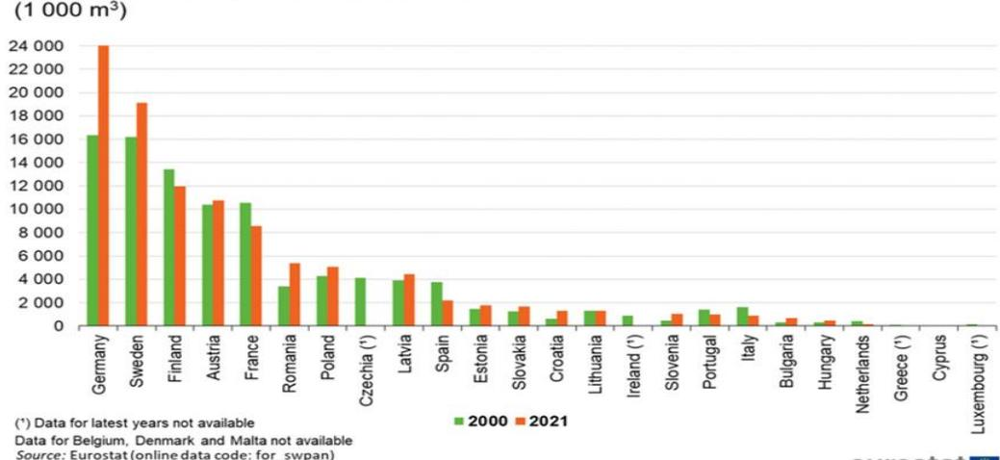

*Figure 6 - Sawnwood production 2000 and 2021 (Source: Eurostat)*

#### **Market Overview:**

The 2020 edition of the Forest Products Annual Market Review estimates the global production capacity of CLT in 2020 at 2.8 million cubic meters (m³), of which 48% is in Europe, 43% in North America, 6% in Oceania and 3% in Asia.

#### **Stakeholders:**

- COST (European Cooperation in Science and Technology) Action CA20139 Consortium Holistic design of taller timber buildings (HELEN) ([https://cahelen.eu/\)](https://cahelen.eu/)
- New European Bauhaus [\(https://new-european-bauhaus.europa.eu/\)](https://new-european-bauhaus.europa.eu/)
- Timber Construction Europe [\(https://www.timber-construction.eu/en\)](https://www.timber-construction.eu/en)
- Build in wood [\(https://www.build-in-wood.eu/\)](https://www.build-in-wood.eu/)
- Basajaun [\(https://basajaun-horizon.eu/\)](https://basajaun-horizon.eu/)

## **Policy Framework:**

- Commission Delegated Regulation (EU) 2017/2293 of 3 August 2017 on the conditions for classification, without testing, of cross-laminated timber products covered by the harmonised standard EN 16351, and laminated veneer lumber products covered by the harmonised standard EN 14374 with regard to their reaction to fire
- [https://www.bpie.eu/publication/a-guidebook-to-european-building-policy-key](https://www.bpie.eu/publication/a-guidebook-to-european-building-policy-key-legislation-and-initiatives/)[legislation-and-initiatives/](https://www.bpie.eu/publication/a-guidebook-to-european-building-policy-key-legislation-and-initiatives/)

# **Relevant Studies and Publications:**

- <https://www.apawood.org/cross-laminated-timber>
- [https://www.swedishwood.com/publications/list\\_of\\_swedish\\_woods\\_publications/the](https://www.swedishwood.com/publications/list_of_swedish_woods_publications/the-clt-handbook/)[clt-handbook/](https://www.swedishwood.com/publications/list_of_swedish_woods_publications/the-clt-handbook/)
- Cross-laminated timber CLT handbook United States Department of Agriculture [https://www.fs.usda.gov](https://www.fs.usda.gov/)
- Andersen, J. H., Rasmussen, N. L., & Ryberg, M. W. (2022). Comparative life cycle assessment of cross laminated timber building and concrete building with special focus on biogenic carbon. Energy and Buildings, 254, 111604.
- Campbell, A. (2020). What engineers (still) do not know about wood: an engineer's perspective on key knowledge gaps in the use of mass timber. International Wood Products Journal, 11(2), 70-79.
- Karacabeyli, E., Gagnon, S. (2019). Canadian CLT handbook. FPinnovations, Quebec.
- <https://web.fpinnovations.ca/clt/>
- Kurzinski, S., Crovella, P., & Kremer, P. (2022). Overview of Cross-Laminated Timber (CLT) and Timber Structure Standards Across the World. Mass Timber Construction Journal, 5(1), 1-13.
- Piacenza, J. R., Tumer, I. Y., Seyedmahmoudi, S. H., Haapala, K. R., & Hoyle, C. (2013). Comparison of sustainability performance for cross laminated timber and concrete. In International Design Engineering Technical Conferences and Computers and Information in Engineering Conference (Vol. 55911, p. V004T05A036). American Society of Mechanical Engineers.
- Svatoš-Ražnjević, H., Orozco, L., & Menges, A. (2022). Advanced timber construction industry: a review of 350 multi-storey timber projects from 2000–2021. Buildings, 12(4),
  - 404.
- Wahlstrøm, S. (2020). Methods for creating CLT Construction Guidelines. In E3S Web of Conferences (Vol. 172, p. 10005). EDP Sciences.

# **7.1.3 FACTSHEET: Hemp insulation**

### **Short Description:**

Hemp insulation is a type of insulation that is manufactured using hemp wool. Hemp wool is made from strong and woody fibres that are derived from the hemp plant. Due to its exceptional durability, hemp wool has been used throughout history for robust applications such as clothing, ropes, and even sails.

It has excellent insulating properties and is very robust, which makes it a fully resistant and breathable insulation material. Hemp insulation helps regulate thermal performance and is an excellent insulating material due to its high thermal mass and low conductivity. Due to its hygroscopic nature, hemp insulation is a moisture-buffering material. This is an excellent characteristic, as a more constant air humidity reduces the energy needed to heat and cool an indoor space and improves air quality.

Hemp wool can be processed into both insulation batts and insulation boards. During the manufacturing process, cornmeal or polyester may be added to further strengthen the insulation.

### **Value Chain:**

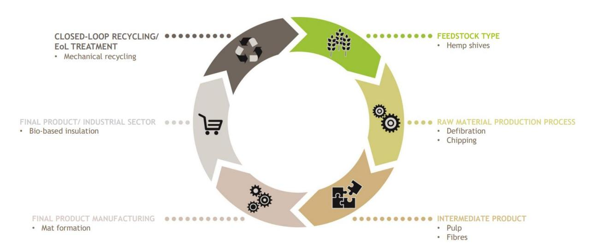

*Figure 7 - Value chain of hemp insulation*

# **Example Companies:**

- Biofib [\(https://www.biofib.com/\)](https://www.biofib.com/)
- Isohemp [\(https://www.isohemp.com/en\)](https://www.isohemp.com/en)
- Hempflax [\(https://www.hempflax.com/en/](https://www.hempflax.com/en/) & [https://www.thermo-hanf.de/\)](https://www.thermo-hanf.de/)
- Hempitecture [\(https://www.hempitecture.com/\)](https://www.hempitecture.com/)
- La Chanvrière [\(https://lachanvriere.com/en/our-hemp-building-industry/\)](https://lachanvriere.com/en/our-hemp-building-industry/)
- South Hemp [\(http://www.southemp.it/index.php/en/\)](http://www.southemp.it/index.php/en/)

# **Baseline Situation:**

Insulation materials run the gamut from bulky fibre materials such as fibreglass, rock and slag wool, cellulose, and natural fibres to rigid foam boards to sleek foils. Bulky materials resist conductive and - to a lesser degree - convective heat flow in a building cavity. Rigid foam boards trap air or another gas to resist heat flow. Highly reflective foils in radiant barriers and reflective insulation systems reflect radiant heat away from living spaces, making them particularly useful in cooling climates. Other less common materials such as cementitious and phenolic foams and vermiculite and perlite are also available.

List of common insulation materials: Fibreglass; Mineral wool; Cellulose; Natural fibres; Polystyrene; Polyisocyanurate; Polyurethane; Perlite; Cementitious foam; Phenolic foam; Insulation facings.

The energy needed to produce building materials based on wood, hemp, flax is lower than polystyrene or polyurethane foam, for example.

#### **Feedstock:**

France is the largest European producer of hemp, accounting for more than 70% of EU production, followed by the Netherlands (10%) and Austria (4%).

Hemp wood (hemp shives) represents 43% of the weight of hemp harvested. It is used to 50% in animal litter, to 22% in horticultural mulch and to 14% in construction, e.g., as an aggregate in hempcrete (hemp-lime composite building material or vegetal concrete).

#### **Market Overview:**

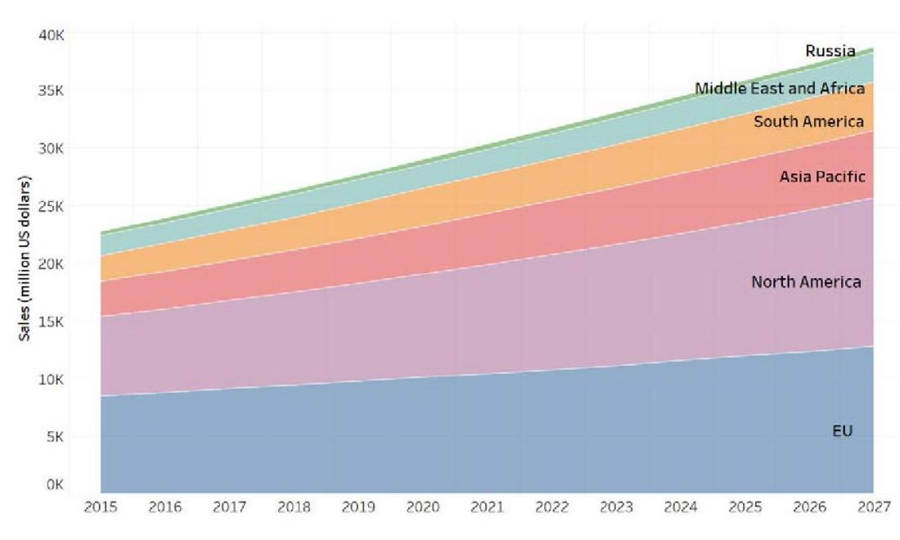

*Figure 8 - Global market forecast for building thermal insulation (Source: Pavel and Blagoeva, 2018)*

## **Stakeholders:**

- The European Industrial Hemp Association (EIHA) represents the common interests of hemp farmers, producers, and traders working with hemp fibres, shives, seeds, leaves, and cannabinoids. EIHA's main task is to serve, protect and represent the hemp sector in the EU and international policymaking. EIHA covers different areas for the application of hemp, namely its use for construction materials, textiles, plastics, bio-composites, cosmetics, feed, food, and supplements.<https://eiha.org/about-hemp-hemp-in-europe/>

#### **Policy Framework:**

- Mishra, A., Singla, S., & Barman, D. D. (2022). Scientific Testing, Forensic Identification, Evidences, and Differences in Policy Frameworks of Hemp. In Revolutionizing the Potential of Hemp and Its Products in Changing the Global Economy (pp. 221-241). Cham: Springer International Publishing.
- [https://energy.ec.europa.eu/topics/energy-efficiency/energy-efficient-buildings\\_en](https://energy.ec.europa.eu/topics/energy-efficiency/energy-efficient-buildings_en)

# **Relevant Studies and Publications:**

- Dlimi, M., Agounoun, R., Kadiri, I., Saadani, R., & Rahmoune, M. (2023). Thermal performance assessment of double hollow brick walls filled with hemp concrete insulation material through computational fluid dynamics analysis and dynamic thermal simulations. e-Prime-Advances in Electrical Engineering, Electronics and Energy, 3, 100124.
- Gaujena, B., Agapovs, V., Borodinecs, A., & Strelets, K. (2020). Analysis of thermal parameters of hemp fiber insulation. Energies, 13(23), 6385.
- Johnson, R. (2018). Hemp as an Agricultural Commodity: Congressional Research Service. Food and agriculture organization (FAO).
- Pavel, C. C., & Blagoeva, D. T. (2018). Competitive landscape of the EU's insulation materials industry for energy-efficient buildings. PUBSY No. JRC108692 EUR, 28816.
- Rabbat, C., Awad, S., Villot, A., Rollet, D., & Andrès, Y. (2022). Sustainability of biomassbased insulation materials in buildings: Current status in France, end-of-life projections and energy recovery potentials. Renewable and Sustainable Energy Reviews, 156, 111962.
- Schiavoni, S., Bianchi, F., & Asdrubali, F. (2016). Insulation materials for the building sector: A review and comparative analysis. Renewable and Sustainable Energy Reviews, 62, 988-1011.
- Ulutaş, A., Balo, F., & Topal, A. (2023). Identifying the Most Efficient Natural Fibre for Common Commercial Building Insulation Materials with an Integrated PSI, MEREC, LOPCOW and MCRAT Model. Polymers, 15(6), 1500.
- Visković, J., Zheljazkov, V. D., Sikora, V., Noller, J., Latković, D., Ocamb, C. M., & Koren,
  - A. (2023). Industrial Hemp (Cannabis sativa L.) Agronomy and Utilization: A Review. Agronomy, 13(3), 931.
- Zimniewska, M. (2022). Hemp fibre properties and processing target textile: A review. Materials, 15(5), 1901.

# **7.2 Specific case studies for Textile Sector**

# **7.2.1 FACTSHEET: Latxa sheep wool from the Basque Country of Spain**

## **Short Description:**

The textile industry accounts for a large share of the environmental impacts resulting from personal consumption, mainly due to the current fast-fashion paradigm, and the production of ever-increasing quantities of textiles. This has led to increased interest in assessing the sustainability of clothing, with many efforts to provide footprints, sustainability assessments, and new business models. At the same time, the growing relevance of the circular economy in both industry and policy has led to many goals and targets to achieve sustainability through circularity in the clothing industry. Clothing manufacturers have begun developing approaches to contribute to the circular economy by investigating new circular business models. These include collaborative consumption, recycling programs, and many design initiatives to address sustainability along the supply chain and life cycle.

This case study is geared towards the valorisation of conventionally discarded wool from Latxa sheep in the Basque Country (Spain) to produce insulating material to be used in the sportswear sector. For years, the Latxa sheep's wool has not been marketed and had to be treated as waste, which meant a high financial and time cost for the flock owners who had to take care of it. Very recently, TERNUA, a Basque apparel manufacturer, has designed a new jacket using Latxa wool as insulation material. According to an LCSA conducted as part of the ORIENTING (H2020) project, the jacket product reduces the amount of wool waste (which is usually incinerated) and at the same time increases the value of a waste that, although it cannot be used as normal wool to make clothes, can be reused in the textile industry. In addition, using a regional primary resource such as wool for thermal insulation reduces the environmental impact of importing other insulation materials for the jacket. The use of a biodegradable and easily generated material such as sheep's wool is also a preferred alternative to the use of fossil-based insulating materials, as the latter are well known to be associated with environmental impacts. On the other hand, from a strictly economic point of view, the use of Latxa wool does represent a higher cost for the company compared to the use of other materials – but from a value-chain point of view it clearly adds more value. Not only do the shepherds no longer have to pay for the incinerating of the wool, but they also get paid for the shearing and the delivery of the wool to the textile company. As a result, the Latxa business case has thus become one of the best examples of collaboration between the government, the raw materials sector, and industry in the Basque Country, paving the way for new circular economy initiatives aimed at leveraging new uses for the more than 2,000 metric tonnes of this wool produced in the Basque Country every year.

# **Value Chain:**

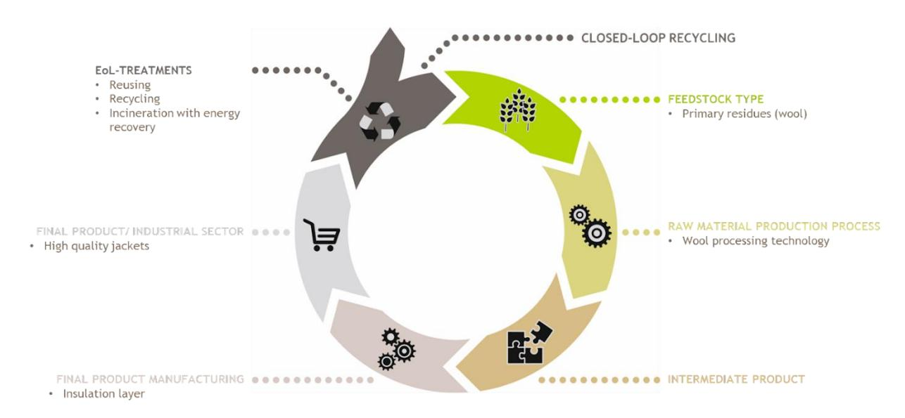

*Figure 9 - Value chain of Latxa sheep wool*

# **Example Companies:**

- Ternua <https://www.ternua.com/es/>

#### **Baseline Situation:**

Currently, the Latxa wool is incinerated implying a treatment cost for the shepherds, a loss of primary biomaterial, and an impact on the environment (GHG emissions).

#### **Feedstock:**

In the Basque Country there are about 1 million Latxa sheep and 2.5 million kg of wool per year. Apart from being used in the new ARTILE jacket, the Latxa wool is incinerated.

#### **Market Overview:**

+2,000 metric tonnes of this wool are produced in the Basque Country every year. Each jacket will contain 400 grams of wool. The use of this wool as an insulating material could also be used in other areas or applications.

#### **Stakeholders:**

TERNUA (apparel company), Iletegia (company that developed the technology to process the wool), consumers, shepherds, the Department of Environment of the Provincial Government of Gipuzkoa (Basque Country)

# **Relevant Studies and Publications:**

- [http://www.mountainblog.eu/ternua-circular-economy-project-reusing-latxa-wool](http://www.mountainblog.eu/ternua-circular-economy-project-reusing-latxa-wool-therma-insulation-for-clothing/)[therma-insulation-for-clothing/](http://www.mountainblog.eu/ternua-circular-economy-project-reusing-latxa-wool-therma-insulation-for-clothing/)
- <https://orienting.eu/>

# **7.2.2 FACTSHEET: Man-made cellulosic fibres (MMCFs) such as Lyocell**

# **Short Description:**

In the last 50 years the textile industry has gone through a transition from using bio-based feedstocks (fibre crops such as cotton, flax and hemp) and animal fibres such as wool) to more fossil-based textiles. These synthetic textiles make up 64% of the global textile fibre production3 . Polyester (mainly PET) is the most commonly used synthetic fibre followed by nylon. Both synthetic fibres are inexpensive and durable, strong, resistant to shrink, stretching and creasing, allowing the production of cheap fast fashion. Besides for clothing, synthetic fibres are also used for home furnishing (curtains and carpets) and industrial applications (airbags, ropes etc.). This large dependence on fossil-based feedstock in the textile industry, in combination with the large size of the fashion industry has made it one of the largest sectors contributing to climate impacts. The manufacturing and transportation of textiles alone account for nearly 10% of all global CO2 emissions4 .

It should be recognized that synthetic fibres are highly durable and can also be used as recycled material. However, mechanical recycling of textiles, such as clothes, is currently challenging due

3 https://textileexchange.org/materials-dashboard/

4 https://www.europarl.europa.eu/resources/library/images/20201215PHT94023/20201215PHT94023\_original.jpg

to the lack of automated sorting and processing systems, as well as cost-intensive and inputrestrictive recycling technologies5 . This is further complicated by the fact that many textiles are made of blended fibres, such as polyester with cotton, and often contain elastane, buttons, or zippers. Additionally, the fast-changing trends in fashion incentivise consumers to frequently replace their clothing items for new ones, significantly shortening the lifetime of textiles.

One way to decarbonize and especially de-fossilize the fashion industry is through transitioning back to more bio-based textile production. This implies that by 2050 there is a need to further phase out fossil-based polyesters, polyamides, and other synthetics. These can then be replaced by either plant-based fibres or by fibres based on renewable carbon sources. These renewable sources can be biomass, recycled materials, or CO2. In this factsheet we focus on the textiles that can be made from biomass, specifically cellulosic biomass, and which are called man-made cellulosic fibres (MMCFs). These MMFCs are produced from cellulose derived from plant-based biomass.

# **Value Chain:**

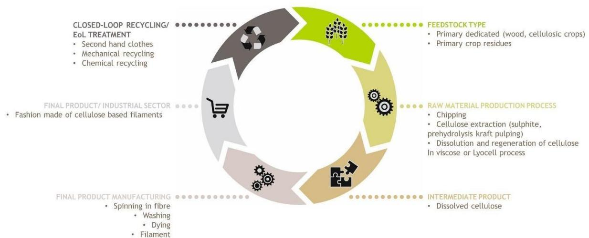

*Figure 10 - Value chain of MMCFs*

# **Example Companies:**

- Lenzing: https://www.lenzing.com/
- Kelheim Fibres:<https://kelheim-fibres.com/en/>
- Spinnova:<https://spinnova.com/product/>
- Tree to Textile:<https://treetotextile.com/>
- Fiber-X:<https://infinitedfiber.com/>
- Birla cellulose:<https://www.birlacellulose.com/>
- Orange Fiber:<https://orangefiber.it/>

# **Baseline Situation:**

The current fibre production is dominated by synthetic fibres from fossil resources. Textile Exchange 2021 (Referred to in Harmsen et al., 2022) showed that of the global fibre production, 63% is fossil-based. This is followed by vegetal fibres from fibre crops, which make up 30%, while

5 https://www.mckinsey.com/industries/retail/our-insights/scaling-textile-recycling-in-europe-turning-waste-into-value

man-made cellulose fibres (MMCFs) and animal fibres (e.g., wool) represent 6% and 1%, respectively. In the vegetal fibre group, cotton dominates by far and is therefore the second largest global fibre source.

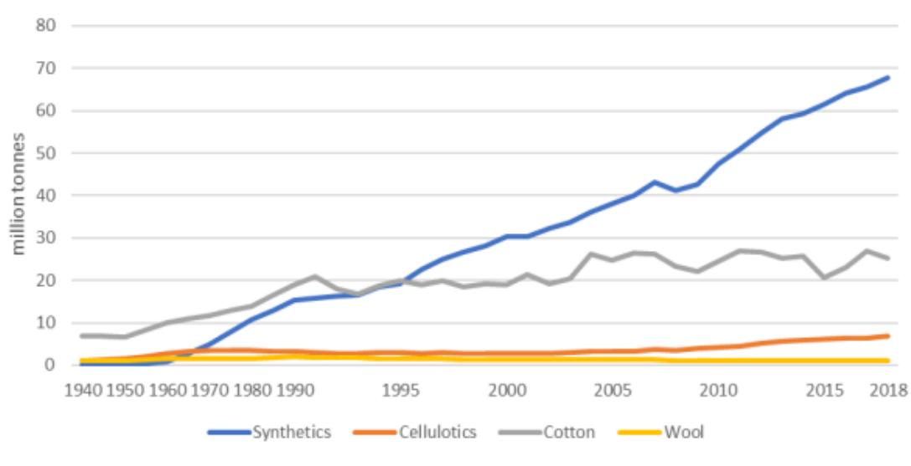

*Figure 11 - Global fibre demand 1940-2018 in million tonnes per year (Source: EEA, 2023)*

#### So, the baseline situation can be:

- 1) Fossil-based synthetic fibres. such as polyester (specifically PET) or nylon
- 2) Cotton fibres
- 3) Or a mix of both

#### **Feedstock:**

Biomass sources with high cellulose contents can serve as feedstock for the manufacture of MMCFs. Wood, which contains a lot of cellulose, is a good biomass source for the production of lyocell or viscose filaments. A study conducted for the Laudes Foundation (Vivek Adhia et al., 2021) reviewed crop residual sources that have relatively high cellulose content to make them suitable as feedstock for textiles. Examples of interesting agricultural residual streams include wheat straw (43% cellulose), rice straw (38% cellulose), maize stover (34% cellulose), maize cobs (40% cellulose), and sorghum stalks and leaves (44% cellulose).

#### **Market Overview:**

The worldwide production of MMCFs amounted to 7.2 million tonnes in 2021. From Figure 11 it already became apparent that MMCFs make up 7% of the global production. In 2021, viscose accounted for 80 per cent of the global production of MMCFs. The second and third most produced MMCFs were acetate and lyocell, with shares of 13 and four per cent, respectively.

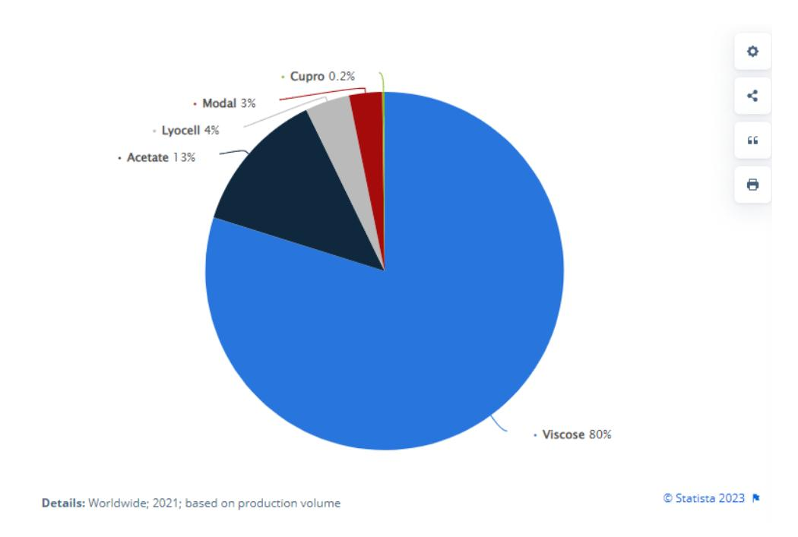

*Figure 12 - Market shares of MMCFs in 2021 (Source: Statista, 2023)*

In Europe according to the European Man-Made Fibres Association (CIRFS), European production of man-made fibres amounted to 3.5 million tonnes in 2018, of which 85 % were synthetic (CIRFS, 2020). The main European producers are Germany, Italy, and Turkey.

# **Stakeholders:**

- Laudes foundation
- Companies listed above
- Certification organisations in sustainable textiles such as GOTS, Green Button, Bluesign and Global Recycle Standard.

## **Policy Framework:**

- As part of the European Green Deal, the new Circular Economy Action Plan mentions textiles (and plastics) as two of the key product value chains that will be addressed as a matter of priority6 .
- The EU Strategy for sustainable and circular textiles was published in March 20227 . The Commission's 2030 Vision for Textiles is that o all textile products placed on the EU market are durable, repairable, and recyclable, to a great extent made of recycled fibres, free of hazardous substances, produced in respect of social rights and the environment o "Fast fashion is out of fashion" and consumers benefit longer from high-quality affordable textiles o profitable re-use and repair services widely available o the textiles sector is competitive, resilient, and innovative with producers taking responsibility for their products along the value chain with sufficient capacities for recycling and minimal incineration and landfilling

6 https://commission.europa.eu/strategy-and-policy/priorities-2019-2024/european-green-deal\_en 7 https://environment.ec.europa.eu/strategy/textiles-strategy\_en

- The Strategy lays out a forward-looking set of actions. The Commission will o set design requirements for textiles to make them last longer, be easier to repair and recycle o introduce clearer information on textiles and a digital product passport o empower consumers and tackle greenwashing by ensuring the accuracy of companies' green claims o stop overproduction and overconsumption, and discourage the destruction of unsold or returned textiles o harmonise EU Extender Producer Responsibility rules for textiles and economic incentives to make products more sustainable o address the unintentional release of microplastics from synthetic textiles o address the challenges of the export of textile waste o adopt an EU Toolbox against counterfeiting by 2023 o publish a transition pathway by the end of 2022 - an action plan for actors in the textiles ecosystem to successfully achieve the green and digital transitions and increase its resilience
- Member States must ensure that, by January 2025, textile waste is collected to facilitate the sorting, re-use and recycling of textiles.

## **Relevant Studies and Publications:**

- CIRFS. (2020). Global man-made fibres production data.
- European Commission. (2020). A new Circular Economy Action Plan For a cleaner and more competitive Europe.
- European Environment Agency. (2023). Plastic in textiles: towards a circular economy for synthetic textiles in Europe. [https://www.eea.europa.eu/themes/waste/resourceefficiency/plastic-in-textiles](https://www.eea.europa.eu/themes/waste/resourceefficiency/plastic-in-textiles-towards-a)[towards-a](https://www.eea.europa.eu/themes/waste/resourceefficiency/plastic-in-textiles-towards-a)
- Harmsen, P., Post, W. & Bos, H. (2022). Textiles for Circular Fashion. Part 2: From renewable carbon to fibres.
- Vivek Adhia, Mishra, A., Banerjee, D., Nambi Appadurai, A., Preethan, P., Khan, Y., de Wagenaar, D., Harmsen, P., Elbersen, B., van Eupen, M., Staritsky, I., Elbersen, W. & Keijsers, E.. (2021). Montpelier, Spinning future threads: the potential of agricultural residues as textile fibre feedstock. VE. 207 p. [https://laudes.h5mag.com/agri](https://laudes.h5mag.com/agri-waste_report_highlights/home)[waste\\_report\\_highlights/home](https://laudes.h5mag.com/agri-waste_report_highlights/home)

# **7.2.3 FACTSHEET: Recycled carded wool from the Prato region in Italy**

# **Short Description:**

The city of Prato in Tuscany has a long history as a textile district with the production of carded wool from recycled materials being its main business. The production of recycled carded wool is a decade-old technology of several steps from sorting, cleaning to spinning and finally warping to create yarn which can then be further woven to create fabric. The production is also chemicaland dye-free, as colours are created by mixing different shades of the shredded wool. The Prato Chamber of Commerce in collaboration with the Consortium for the Valorisation of Cardato Textiles, the Prato Industrial Union, Confartigianato and the Confederazione Nazionale dell'Artigianato e della Piccola e Media Impresa (CNA) launched a project, under which local yarn producers can have either of the trademarks "Cardato Recycled" or "Cardato" issued for their product. For that, an LCA is conducted and validated by the Société Générale de Surveillance (SGS). Carded wool from at least 65% recycled materials displays the "Cardato Recycled" trademark. Not all recycled yarn is produced by recycling wool exclusively, oftentimes virgin or waste plastic fibres, especially nylon, are mixed with the wool during the carding process, making it on the one hand more competitive and suitable for the fashion industry's demands for lighter fabrics, but on the other hand not fully bio-based.

### **Value Chain:**

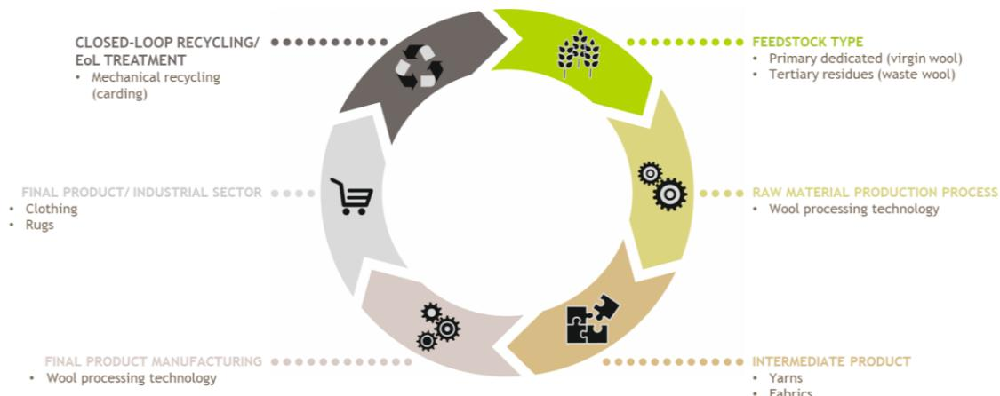

*Figure 13 - Value chain of recycled carded wool*

Carding is a specific way of processing fibres. The yarns are produced using virgin fibres but also reusing fibres obtained from recycling old clothing or knits and cuttings of new fabrics used in the garment industry. The important feature of this process is that it can use short fibres and different lengths, in blends of the most variable composition. Recycled carded wool yarn is obtained through the process of tearing used clothing into recycled fibres, sorted by colour and type. The result is a yarn with particular aspects to produce cashmere, angora, alpaca, mohair or other fine wools in blends with silk and viscose.

# **Example Companies:**

- Comistra [\(https://comistra.com/\)](https://comistra.com/) Established in 1920, Comistra works in the trade and processing of wool regenerated from textile waste, mainly rags. Their core business is the production of mechanical wool, also known as regenerated wool or Prato wool. In a complete cycle plant, they recycle and transform old wool into new products such as regenerated wool, new recycled yarns, and fabrics of the highest quality for haute couture, by applying the ecodesign principles. They aim to produce sustainable and ethical products in line with the circular economy model.
- Manteco [\(https://manteco.com/\)](https://manteco.com/) Established in 1940, Manteco produces a wide range of undyed regenerated wool colours through the Recype process, and also offers a wide range of luxurious fabrics with different constructions, weavings and finishings, all made with our next generation of recycled wool, MWool. Manteco aims at designing out waste, keeping products and materials in use and regenerating natural systems in line with the circular economy model.
- Lanificio Becagli [\(http://www.lanificiobecagli.com/en/\)](http://www.lanificiobecagli.com/en/)

#### **Baseline Situation:**

The baseline situation is the conventional production of wool. With the use of recycled wool, significant environmental and economic savings are achieved. Transitioning to wool programs with both animal welfare and responsible land use criteria in place also offers the potential to create positive impacts on animal welfare, land use, and biodiversity.

#### **Feedstock:**

Overall, the global availability of wool (production plus opening stock levels) increased by 3% in 2021. It is expected to rise again in 2022, by 1.3%8 . No data is available on the availability of postconsumer wool waste, as textiles in general, and wool specifically, are not separately collected.

## **Market Overview:**

The global Recycled Wool market size was valued at USD 99.9 million in 2021 and is expected to expand at a CAGR of 3.2% during the forecast period, reaching USD 120.69 million by 20279 .

## **Stakeholders:**

- Global authority for standards in the wool textile industry: IWTO (International Wool Textile Organisation)
- Chamber of Commerce and Industry (Camera di Commercio di Prato)
- Certification Agency: Next Technology Tecnotessile (Italy)
- Certified Producers in Prato: In.Tes.Pra Industria Tessuti Pratesi Spa, Lanificio Paultex srl, Lanificio Paultex srl, Filati Naturali srl, Filati Omega srl

# **Policy Framework:**

- European Parliament Briefing on Textiles and the environment: [https://www.europarl.europa.eu/RegData/etudes/BRIE/2022/729405/EPRS\\_BRI\(2022\)72](https://www.europarl.europa.eu/RegData/etudes/BRIE/2022/729405/EPRS_BRI(2022)729405_EN.pdf) [9405\\_EN.pdf](https://www.europarl.europa.eu/RegData/etudes/BRIE/2022/729405/EPRS_BRI(2022)729405_EN.pdf)
- Recycled Claim Standard (RCS): [https://textileexchange.org/knowledge](https://textileexchange.org/knowledge-center/documents/recycled-claim-standard-rcs/)[center/documents/recycled-claim-standard-rcs/](https://textileexchange.org/knowledge-center/documents/recycled-claim-standard-rcs/)
- Global Recycled Standard (GRS): [https://textileexchange.org/knowledge](https://textileexchange.org/knowledge-center/documents/global-recycled-standard-grs/)[center/documents/global-recycled-standard-grs/](https://textileexchange.org/knowledge-center/documents/global-recycled-standard-grs/)
- Cardato Recycled Made in Prato trademark:<http://www.cardato.it/en>

# **Relevant Studies and Publications:**

- <http://www.ui.prato.it/unionedigitale/v2/english/presentazionedistrettoinglese.pdf>
- Bianco, I.; Gerboni, R.; Picerno, G.; Blengini, G.A. (2022). Life Cycle Assessment (LCA) of MWool® Recycled Wool Fibers.
- <https://manteco.com/life-cycle-assessments/>

8 <https://iwto.org/resources/statistics/>

9 <https://www.businessresearchinsights.com/market-reports/recycled-wool-market-102261>

# **7.3 Specific Case Studies for Plastics Sector**

# **7.3.1 FACTSHEET: Polylactic acid (PLA)**

#### **Short Description:**

PLA is a bio-based thermoplastic aliphatic polyester that is biodegradable under controlled composting conditions. The building block for PLA is lactic acid. Lactic acid is produced by bacterial fermentation of carbohydrates or chemical synthesis, although the former predominates. Easily processed on standard plastics equipment, PLA can be used to manufacture moulded parts, fibres and films and is the most commonly used filament for 3D printing.

PLA stores the carbon of biogenic origin that was taken up from the atmosphere by the plant in its growth phase and reemits it during composting, creating a carbon-neutral cycle. PLA is not biodegradable in landfills or home composting. to ensure that PLA does not cause a waste problem, it must be disposed of in the right places at the end of its life. PLA is only biodegradable through industrial composting or anaerobic digestion under thermophilic conditions.

# **Value Chain:**

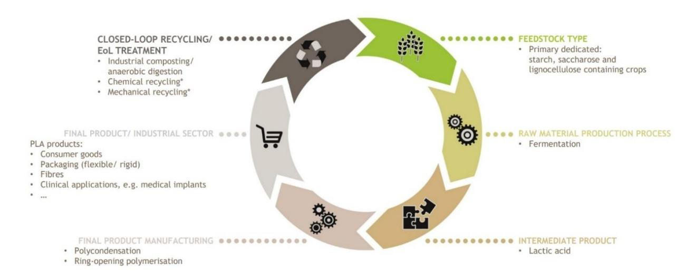

*Figure 14 - Value chain of PLA*

PLA can be manufactured from a variety of different feedstock. Starch, saccharose, and lignocellulose-containing crops, such as corn, sugarcane, cassava, and wood chips can be fermented to produce lactic acid, the polymer precursor of PLA. The direct polycondensation of lactic acid and the production of lactide from lactic acid followed by a ring-opening polymerization are both industrially established routes of producing PLA, with the latter being the most largely used route. PLA can then be further processed to create a variety of different products through common plastic processing technologies, such as injection moulding, hot press moulding, 3D printing, rotational moulding, and foam moulding. At its end of life, PLA can biodegrade in industrial composting facilities or through thermophilic (at temperatures above 50°C) anaerobic

digestion, reemitting the carbon it stored during its life cycle. Alternatively, PLA can also be recycled mechanically or chemically.

## **Example Companies:**

- Futerro [\(https://www.futerro.com/\)](https://www.futerro.com/) Futerro is a Belgian bioplastics manufacturer that has been working on PLA technologies since 1992 and is the second-largest PLA producer in the world as of 2022. The company is currently the only one capable of fully breaking down PLA back into its monomer, lactic acid, allowing reproduction of new virgin PLA (LOOPLA technology).
- TotalEnergies Corbion [\(https://www.totalenergies-corbion.com/\)](https://www.totalenergies-corbion.com/) TotalEnergies Corbion is one of the worldwide biggest producers of PLA. The company is headquartered in the Netherlands and operational in Thailand. TotalEnergies Corbion is a 50/50 joint venture between TotalEnergies and Corbion.

#### **Baseline Situation:**

Possible baseline situations to compare PLA could be the production of a specific fossil-based biodegradable plastic, such as PBAT or that of a fossil-based non-biodegradable plastic such as PE. Another possibility is to focus on one application like packaging or mulch films and then choose a fossil-based counterpart accordingly.

# **Market Overview:**

In 2022, PLA was the most widely produced bioplastic worldwide, accounting for 20.7% of total bioplastic production. This share is forecast to increase to 37.9% by 202710 .

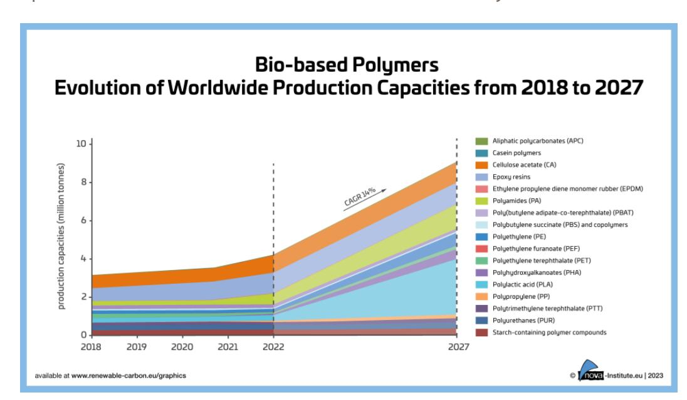

*Figure 15 - Bio-based building blocks and polymers – global capacities, production and trends 2022-2027 (Source: Nova Institute,* 

10 https://www.european-bioplastics.org/market/

#### **Stakeholders:**

- PLA producers
- Recycling and industrial composting facilities

#### **Policy Framework:**

- EU policy framework on bio-based, biodegradable and compostable plastics: [https://environment.ec.europa.eu/publications/communication-eu-policy-framework](https://environment.ec.europa.eu/publications/communication-eu-policy-framework-biobased-biodegradable-and-compostable-plastics_en)[fact-biodegradable-and-compostable-plastics\\_en](https://environment.ec.europa.eu/publications/communication-eu-policy-framework-biobased-biodegradable-and-compostable-plastics_en)
- European Green Deal: Putting an end to wasteful packaging: [https://ec.europa.eu/commission/presscorner/detail/en/ip\\_22\\_7155](https://ec.europa.eu/commission/presscorner/detail/en/ip_22_7155)

# **Relevant Studies and Publications:**

# <https://link.springer.com/article/10.1007/s10924-016-0787-2>

# **7.3.2 FACTSHEET: Polypropylene from used cooking oil**

# **Short Description:**

Polypropylene (PP) represents one of the most widely used plastics in Europe thanks to its versatility. Motivated by the growing demand for plastics and related concerns about their climate impact, bio-based plastics have attracted attention as alternatives to replace petrochemical plastics. In this sense, bio-based PP could be a significant alternative to petrochemical PP. This biopolymer can be synthesized through three routes. Specifically, this case study focuses on the hydrotreatment of used cooking oil (UCO) and the environmental impacts of bio-based PP obtained through this route.

UCO can serve as a feedstock for the production of various kinds of bio-based products and has the advantage of being low-budget and renewable at the same time. UCO is considered edible oil and is therefore available for human consumption, as it comes from vegetables or animals. This edible oil becomes UCO after being fried to a point where it cannot be reused for human consumption.

The present case study takes as an example a joint project from Neste and LyondellBasell to produce bio-based PP (and bio-based low-density polyethylene) using Neste's renewable hydrocarbons derived from sustainable bio-based raw materials (e.g., waste and residue oils). The project achieved to produce several thousand tonnes of bio-based plastics for the production of food packaging, marketed as LyondellBasell circular economy products.

Within the project, UCO is converted into high-value hydrotreated vegetable oil (HVO). Together with the HVO renewable diesel grade product, a renewable HVO naphtha grade product is obtained from the hydrotreatment process. This study focuses on the cracking of this "bio-naphtha" to obtain propylene via a process equivalent to petrochemical steam cracking.

## **Value Chain:**

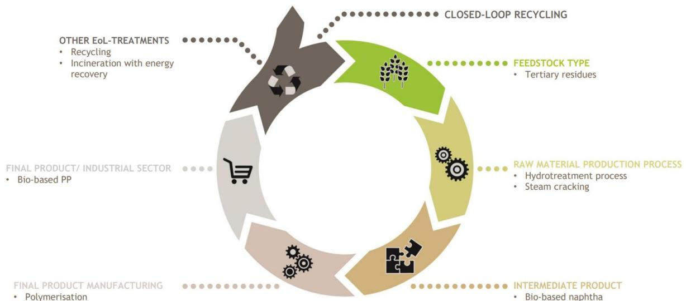

*Figure 16 - Value chain of polypropylene from used cooking oil*

The production of UCO-based PP starts from the collection of UCO. The oil is then pre-treated and deoxygenised under high pressure to transport fuel quality using hydrogen. The triglycerides of UCO are converted into saturated straight and branched-chain hydrocarbons and oxygen. After hydrotreatment, the bio-based naphtha is transported by train to the steam cracking unit. During steam cracking, the bio-based naphtha is diluted with steam and cracked into smaller hydrocarbons such as propylene and ethylene. The last process is the polymerisation of the propylene to obtain PP. The polymerisation of bio-based propylene is identical to that of petrochemical propylene.

# **Example Companies:**

- LyondellBasell [\(https://www.lyondellbasell.com/circulen\)](https://www.lyondellbasell.com/circulen) LyondellBasell is one of the largest plastics, chemicals, and refining companies in the world. Its cracker flexibility allowed it to introduce a new renewable feedstock at one of its sites, which was converted directly into bio-based PP.
- Neste [\(Neste Worldwide | Neste\)](https://www.neste.com/en) Neste is the world's leading producer of renewable diesel and sustainable aviation fuel, developing chemical recycling to combat the plastic waste challenge.
- Borealis [\(https://www.borealisgroup.com/\)](https://www.borealisgroup.com/) Borealis is one of the world's leading providers of advanced and circular polyolefin solutions, and a European market leader in base chemicals, fertilizers, and the mechanical recycling of plastics.
- Novamont [\(https://www.novamont.com/eng/\)](https://www.novamont.com/eng/) Novamont is an Italian company, the international leader in the bioplastics sector and the development of biochemicals.

#### **Baseline Situation:**

Petrochemical PP is compared to bio-based PP from UCO.

#### **Feedstock:**

The European Waste Catalogue (EWC) classifies them as Municipal Wastes (household waste and similar commercial, industrial, and institutional wastes) including separately collected fractions, under the code 20 01 25 (edible oils and fats). UCO obtained from wastewater treatment plants is also considered non‐hazardous materials with a different code: 19 08 09 (grease and oil mixture from oil/water separation containing edible oil and fats)11 .

It is estimated that currently around 90% of cooking oils and fat used in the EU are produced from vegetable oils. According to EU estimations, the potential UCO to be collected is around 8L UCO/capita/year. In the EU-28, the total potential UCO available from the gastronomy sector, food processors and households is estimated at around 4 Mt per year. Moreover, China supplies more than a third (34%) of [Europe's UCO imports](https://www.transportenvironment.org/discover/more-palm-oil-and-rapeseed-oil-our-tanks-our-plates/), while almost a fifth (19%) comes from the major palm oil producers Malaysia and Indonesia combined12 .

Nevertheless, it should be noted that UCO is a very limited feedstock. The European Commission already promotes its use of renewable diesel as a second-generation biofuel. UCO-based PP is developed from bio-based naphtha, which is a by-product of this renewable diesel. Within a decade, the volume needed in Europe could double to 6 million tonnes as EU countries strive to meet renewable transport fuels targets.

#### **Market Overview:**

Bio-based PP entered the market in 2019 with a production capacity of approximately 19 kt. As can be observed in Figure 17, the value increased to 86,4 kt in 2022. For 2027, the global production of bio-based PP is expected to grow up to 378 kt, as shown in Figure 18.

# **Stakeholders:**

- Companies such as the aforementioned ones collaborate with their know-how.
- European Bioplastics represents the interests of more than 80 member companies along the entire value chain of bioplastics. Their members develop, produce, refine, and distribute bioplastics and are located all over the globe and engage in the European market.<https://www.european-bioplastics.org/>
- PlasticsEurope. The association is networking with European and national plastics associations and has more than 100 member companies, producing over 90% of all polymers across the EU27 member states plus Norway, Switzerland, and Turkey. <https://plasticseurope.org/>
- "Producers" of UCO. This comprises households, gastronomy, and the food sector in general.

11 <https://www.eubia.org/cms/wiki-biomass/biomass-resources/challenges-related-to-biomass/used-cooking-oil-recycling/> 12 <https://www.transportenvironment.org/discover/europes-imports-dubious-used-cooking-oil-set-rise-fuelling-deforestation/>

## Global production capacities of bioplastics 2022 (by material type)

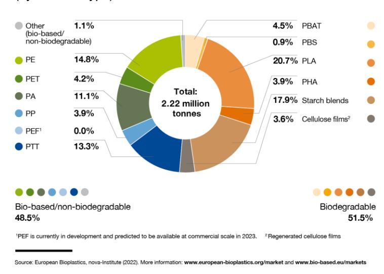

*Figure 17 - Global production capacities of bioplastics 2022 (Source: European Bioplastics, Nova Institute, 2022)*

### Global production capacities of bioplastics 2027 (by material type)

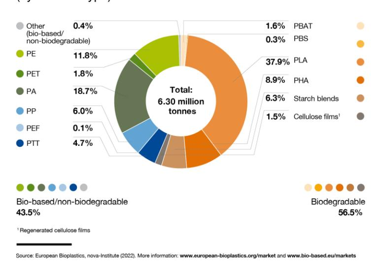

*Figure 18 - Estimated global production capacities of bioplastics 2027 (Source: European Bioplastics, Nova Institute, 2022)*

# **Relevant Studies and Publications:**

- Environmental life cycle assessment of polypropylene made from used cooking oil <https://www.sciencedirect.com/science/article/pii/S0921344920300720>

# **7.4 Specific Case Studies for Chemical Sector**

#### **7.4.1 FACTSHEET: Bio-MEG, bio-MPG, and renewable functional fillers from wood**

#### **Short Description:**

Monoethylene Glycol (MEG) is an organic compound, produced from the industrial hydrolysis of ethylene oxide (EO). It has various fields of application, such as the production of polyester fibres and polyethylene terephthalate (PET) resins, as well as antifreeze in coolant agents. MEG is significantly used in textiles and packaging, while also being a component for the production of adhesives, sealants, paints and coatings, and other chemicals.

MEG produced from agriculture residues and lignocellulose-rich raw materials, mostly known as bio-MEG offers the possibility of a reduction in CO2 emissions and decreased dependency on fossil resources. While bio-MEG has been produced from bioethanol since 2010, it is a more complex process compared to the current production method that utilizes abundant sugar residues from agricultural activities such as molasses, hay, bagasse, and corn stover, as well as lignocellulose from forestry residues and wood materials.

The Finnish company UPM invested in a new biorefinery in Leuna, Germany, which is currently under construction and is set to begin operation by the fall of 2023 with a total annual capacity of 220,000 tonnes. In addition to the production of lignocellulose-based bio-MEG, other key products include bio-monopropylene glycol (bio-MPG), lignin-based renewable functional fillers and industrial sugars from sustainably harvested beechwood, sourced regionally from Germany. Bio-MPG is used in composites, pharma and cosmetic products, while the new functional fillers offer for the first time a sustainable alternative to industrial carbon black and precipitated silica, with applications in a large number of rubber products (e.g. tires, sealings, hoses, shoe soles).

# **Value Chain:**

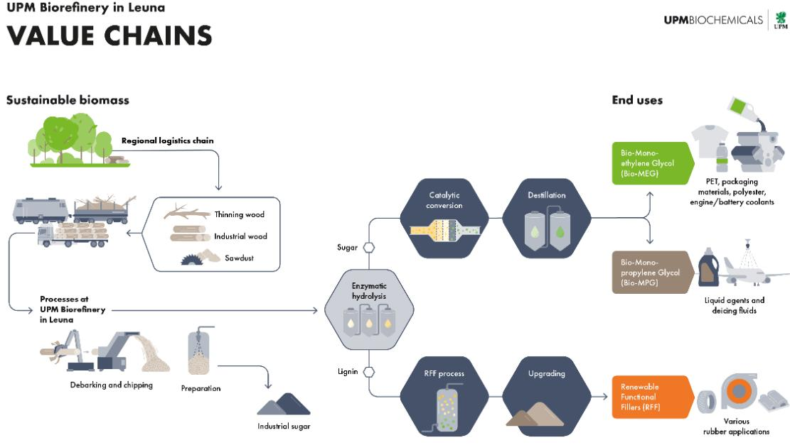

*Figure 19 - Value chain – UPM Biorefinery in Leuna, Germany (Source: UPM, 2021)*

After the debarking and chipping of received wood, the process includes a pre-treatment application, with the Organosolv technology, which uses mild solvents that can easily be recovered, generating also on this step high-quality lignin. After the pre-treatment of the lignocellulosic biomass, cellulose and hemicellulose can be enzymatically hydrolysed to C6 and C5 sugars.

#### **Example Companies:**

- [UPM \(Leuna, Germany\)](https://www.upmbiochemicals.com/about-upm-biochemicals/biorefinery-leuna/)
- Cooperation between [Braskem and Haldor Topsøe](https://www.braskem.com/newsletter-carbon-neutral-detalhe-en/first-demonstration-scale-of-renewable-bio-meg-production) with their technology MOSAIKT for Bio-MEG production from sugar.
- [Avantium](https://www.avantium.com/technologies/ray/) with its product Ray plantMEG™ with the one-step hydrogenolysis process to produce mono-ethylene glycol (MEG) from plant-based industrial sugars.
- ENI Versalis
- [SCG Chemicals](https://www.scgchemicals.com/en/news-media/feature-story/detail/9) (Bangkok, Thailand) also produce bio-MEG from residues of agricultural activities.

### **Baseline Situation:**

The baseline situation is the conventional production of fossil-based MEG and MPG.

## **Feedstock:**

All of the wood used for the production lines in the UPM biorefinery is either FSC®- or PEFC™ certified and taken from forests where biodiversity and natural ecosystems are preserved. Predominantly beechwood from federal, state and privately managed forests in Germany will be sourced. Primary sources of beechwood are mainly located in the federal states of Thuringia, Hesse, Saxony-Anhalt and Lower Saxony. Residues from sawmills and other wood producers are also part of the feedstock suppliers. Beechwood, after spruce and pine, is one of the most common tree species in Germany. According to the last available National Forest Inventory (2014), the beech area (areas of pure beech forest and share of beech in the mixed forest) spans 1.68 million hectares. In 2021, the felling volume of beech logs in Germany was around 2.2 million cubic meters. In addition to this, after the publication of the Directive on the Conservation and Sustainable Management of Forests in 2020, the forest areas certified by PEFC have increased considerably in the last few years.

The feedstock sourcing for the UPM biorefinery does not include the importing of wood, as a strategy to maintain local and supervised supply chains for their products.

# **Market Overview:**

Bio-MEG possesses identical chemical properties as its fossil-based counterpart, offering a perfect substitute for a building block used in the production of other biochemicals, bioplastics and textiles. MEG´s market was estimated in 2020 to be around 28 million tonnes and is expected to grow to 50 million tonnes by 2035. Its importance in the growing polyesters application requires an additional capacity of 1.2 million tonnes/year of MEG for the next 15-20 years. Likewise, its application for the production of PET is rapidly evolving, with an expected CAGR of 5.8% between 2023-2028.

# **Stakeholders:**

- Forest owners and regional forest industry
- UPM
- Fraunhofer Institute (CBP)

- German Biomass Research Center (DBFZ Deutsches Biomasseforschungszentrum gemeinnützige GmbH)

#### **Policy Framework:**

- The [Charter for Wood 2.0,](https://www.bmel.de/SharedDocs/Downloads/EN/_Forests/charter-for-wood-2.pdf?__blob=publicationFile&v=5) which establishes as objectives: (1) mitigating climate change,
  - (2) creating value and (3) utilising resources efficiently. It is a milestone in the Federal Government's Climate Action Plan 2050.
- [Forest strategy 2050](https://www.bmel.de/SharedDocs/Downloads/DE/Broschueren/Waldstrategie2050.html) (only German version available)
- [National Bioeconomy Strategy](https://www.bmel.de/SharedDocs/Downloads/EN/Publications/national-bioeconomy-strategy.pdf?__blob=publicationFile&v=2) (2020)
- [Regional Bioeconomy Strategy](https://www.mitteldeutschland.com/de/vorstellung-des-strategiepapiers-biooekonomie-als-treiber-fuer-wertschoepfung-und-innovation/) Central Germany (only German version available)

# **7.4.2 FACTSHEET: Chemicals from waste**

# **Short Description:**

This value chain concerns the conversion of (non-recyclable, non-compostable) municipal solid waste into methanol, ethanol and other widely used chemicals. It is produced via the gasification of municipal solid waste into syngas. Bio-methanol is a drop-in chemical, chemically identical to fossil-based methanol. Currently, almost all methanol is produced from synthesis gas (syngas). Bio-based syngas can be produced from gasification of various biomass sources, such as lignocellulosic crops (e.g. Miscanthus and switchgrass and short rotation coppices, such as willow and poplar), wood, forestry residues, agricultural residues (such as straw), as well as municipal solid waste (MSW). The feedstock considered in this value chain is MSW.

# **Value Chain:**

As Methanol is a building block it is a highly versatile chemical that can be used to produce hundreds of everyday products which improve our quality of life, such as clothing, adhesives, paint, pharmaceuticals, building materials and car parts. The final product manufacturing and the end-of-life options available are dependent on the final application of methanol.

The production process is described following Enerkem's process technology as defined in its website and depicted in Figure 20.

This patented technology is an advanced thermochemical process that chemically recycles carbon molecules contained in waste into added-value products such as renewable methanol and ethanol. It takes waste in less than five minutes to produce synthetic gas and convert it into ethanol and methanol.

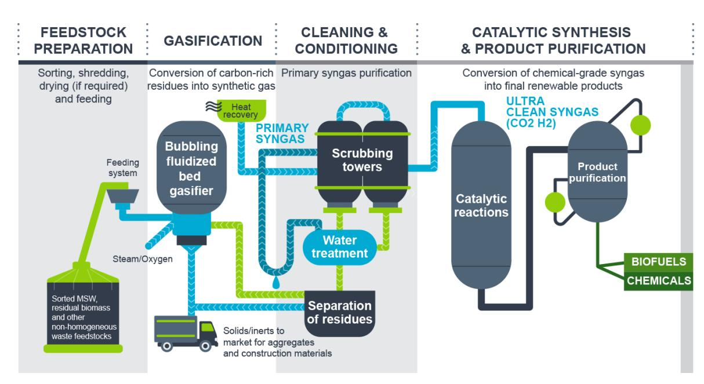

*Figure 20 - Production process of Enerkem (Source: Enerkem, 2023)*

- • Feedstock preparation The municipal waste used as feedstock is first sorted to remove recyclable materials and inert materials. The waste is then shredded for use.
- Gasification The resulting material is fed to a proprietary bubbling fluidized bed gasification vessel to break down the shredded waste into its constituent molecules, a process that is called thermal cracking. In the same reactor, these broken-down molecules with steam under specific conditions produce syngas. This is a patented technology that is capable of breaking down chemically and structurally dissimilar waste and plastic materials and converting them into pure, chemical-grade, stable and homogeneous syngas. The resulting syngas is rich in hydrogen and carbon monoxide, which are key building block molecules used in modern chemical processes.
- Cleaning and conditioning The crude syngas, composed mainly of carbon monoxide, carbon dioxide, water, and hydrogen, is fed into a proprietary syngas cleaning and conditioning process which upgrades the crude syngas to chemical grade so that it can be converted into liquid fuels and chemicals. It is through the combination of the bubbling fluidized bed gasification reactor and the proprietary syngas cleaning and conditioning process that the company can control the purity of the syngas and their composition.
- Catalytic synthesis and product purification The last component of the proprietary process is the catalytic conversion of the chemicalgrade syngas into liquid methanol and ethanol. A combination of in-process controls and quality analysis are used to ensure and confirm that all of the company's products consistently meet the required specifications.

#### **Example Companies:**

- Enerkem [\(https://enerkem.com/\)](https://enerkem.com/) Headquartered in Montreal (QC), Canada, Enerkem operates a full-scale commercial facility in Alberta as well as an innovation centre in Quebec. Air Liquide, Nouryon, the Port of Rotterdam, Shell together with Enerkem are developing an advanced 'waste to chemicals' (W2C) plant in Rotterdam. The aim is that this will be the first plant of this type in Europe that makes valuable chemicals out of municipal solid waste (MSW). Enerkem's facilities are built as prefabricated systems based on the company's modular manufacturing infrastructure that can be deployed globally. Enerkem's technology is a prime example of how a true circular economy can be achieved by making everyday products greener while offering a smart, sustainable alternative to landfilling and incineration.
- NextChem [\(https://nextchem.it/what-we-do/technologies/waste-chemicals\)](https://nextchem.it/what-we-do/technologies/waste-chemicals) NextChem is Maire Tecnimont's subsidiary operating in the field of green chemistry and technologies for the Energy Transition. Maire Tecnimont SpA, listed on the Milan Stock Exchange, is a head company of an industrial group leader in the natural resources processing industry. NextChem has set up two subsidiaries. MyRechemical is NextChem's company dedicated to Waste to Chemicals technology. MyReplast Industries operates in the recycling of post-consumer plastic waste, using NextChem's proprietary MyReplastTM Upcycling technology. The Waste to Chemicals technology developed by NextChem - MyRechemical produces circular synthesis gas, methanol, ethanol and hydrogen from the chemical conversion of non-recyclable waste.
- Gidara Energy [\(https://www.gidara-energy.com/advanced-methanol-amsterdam\)](https://www.gidara-energy.com/advanced-methanol-amsterdam) Gidara Energy focuses on green technologies, acting as a bridge between combined waste and bio-based feedstocks and the bio-based fuels market, creating an integrated, green, and sustainable business. In 2019, GIDARA Energy acquired the HTW® from ThyssenKrupp, further developing the technology for modern applications. The HTW® technology is one of the most developed gasification technologies. GIDARA Energy's first production facility will be located in the Port of Amsterdam (Netherlands). The production facility is expected to be fully operational in 2025.

# **Baseline Situation:**

The non-recyclable fraction of MSW is currently either disposed of by landfill or used in [combustion](https://www.sciencedirect.com/topics/engineering/combustion)  [processes](https://www.sciencedirect.com/topics/engineering/combustion) to generate heat/electrical energy. The chemicals (ethanol, methanol) are synthesized from fossil feedstock. The comparison will be done from the baseline situation where MSW goes to a landfill and/or incineration facility, and the chemicals are produced using fossil feedstock. Most methanol is currently produced from natural gas or coal, with estimated annual life-cycle emissions of 0.3 Gt CO2, around 10% of the total chemical and petrochemical sector's CO2 emissions13 . The different production routes for methanol are shown in Figure 21. Besides the renewable methanol produced from biomass, it can also be produced from CO2 called e-methanol. E-methanol is obtained by using CO2captured from renewable sources (bioenergy with carbon

13 https://www.irena.org/-/media/Files/IRENA/Agency/Publication/2021/Jan/IRENA\_Innovation\_Renewable\_Methanol\_2021.pdf

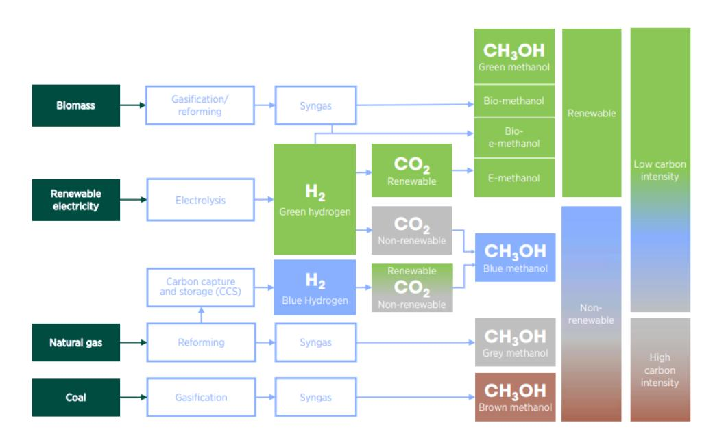

capture and storage [BECCS] and direct air capture [DAC]) and green hydrogen, i.e. hydrogen produced with renewable electricity.

*Figure 21 - Methanol production routes*

# **Feedstock:**

The feedstock is a non-recyclable fraction of MSW. It is abundantly available in the EU and does not need to be imported. It is classified as tertiary residue and waste.

# **Market Overview:**

Methanol is one of the largest-volume chemicals in the world and serves as a source for various other compounds. Methanol is a well-known building block in the chemical industry. Methanol is used as a solvent, antifreeze, windscreen washer fluid, and for denitrification in wastewater treatment plants. More than 60% of global production is used for the synthesis of chemical substances such as formaldehyde, acetic acid, methyl methacrylate and ethylene, and propylene.

Currently, methanol is produced almost exclusively from fossil fuels (natural gas, coal). The current production is 110 MT and is projected to reach 500 MT by 205014. Less than 0.2 Mt of renewable methanol is produced annually. The Methanol Institute (MI) is tracking more than 80 renewable methanol projects around the globe that are projected to produce more than eight million metric tonnes (2.7 billion gallons or 10 billion litres) per year of e-methanol and biomethanol by 202715 .

14 IRENA and Methanol Institute (2021), Innovation Outlook: Renewable Methanol, International Renewable Energy Agency, Abu Dhabi. 15 https://www.methanol.org/renewable/

#### **Stakeholders:**

- Enerkem
- Port of Rotterdam

### **Policy Framework:**

- Renewable Energy Directive MSW is listed under REDII, Annex IX and accordingly double counted in meeting targets of minimum share of biofuels. Thereby, renewable fuels mandates around the world favour the blending of bio-methanol in fuels instead of use for chemicals. Due to these policies, bio-methanol is almost exclusively used for fuel applications currently.
- Circular Economy Action Plan, Waste Framework Directive This directive on the other hand favours the use of waste as feedstock for value-added chemicals/materials.

# **Relevant Studies and Publications:**

- Santalucia, Andrea, Dovico, Loris, Giusti, Silvia, Iaquaniello, Gaetano, and Annarita Salladini. "Waste to Methanol: Example of Innovative Technology to Convert Urban Waste into Chemicals" Paper presented at the OMC Med Energy Conference and Exhibition, Ravenna, Italy, September 2021.
- Hardy, Madeleine. "An Assessment of the Global Warming Potential of Municipal Solid Waste Treatment Scenarios in the Netherlands" Master Thesis. Utrecht University.
- Matsakas, L., Gao, Q., Jansson, S., Rova, U., & Christakopoulos, P. (2017). "Green conversion of municipal solid wastes into fuels and chemicals". Electronic Journal of Biotechnology, 26, 69–83.
- Iaquaniello, G., Centi, G., Salladini, A., Palo, E., Perathoner, S., & Spadaccini, L. (2017). "Waste-to-methanol: Process and economics assessment". Bioresource Technology, 243, 611–619.
- European Commission, DG-RTD, Platt, R., et al., EU biorefinery outlook to 2030: studies on support to research and innovation policy in the area of bio-based products and services, Publications Office, 2021, <https://data.europa.eu/doi/10.2777/103465>
- ETIP Bioenergy, Biomethanol. [https://www.etipbioenergy.eu/images/ETIP\\_Bioenergy\\_Biomethanol\\_production\\_and\\_us](https://www.etipbioenergy.eu/images/ETIP_Bioenergy_Biomethanol_production_and_use_as_fuel.pdf) [e\\_as\\_fuel.pdf](https://www.etipbioenergy.eu/images/ETIP_Bioenergy_Biomethanol_production_and_use_as_fuel.pdf)

## **Additional information:**

- Technical performance: Bio-methanol is identical to fossil-based methanol (i.e. has the same molecular structure). It offers a direct drop-in replacement for fossil-based methanol.
- Environmental performance: The production of bio-methanol using waste results in significant GHG emission reduction compared to fossil-based methanol (estimated as 40% compared with natural gas, without considering avoided emissions from the diversion of waste from landfilling or incineration)

(Iaquaniello et al. 2017). It is claimed that the diversion of this waste to gasification resulted in a 2.5 times reduction in GHG emissions compared to the previous waste management system (Enerkem). In 2016, the facility obtained certification from the International Sustainability and Carbon Certification (ISCC) system.

Bio-methanol from MSW can be produced without any demand on agricultural land as readily available and abundant wastes and residues are used as feedstock. Thus, its production does not have a negative effect on the availability and price of food and does not lead to deforestation.

- Cost performance: MSW - Low or no cost for feedstock. This process allows the creation of value from a waste stream. The Enerkem plant in Edmonton processes 100,000 dry tonnes of waste per year and produces 38 million litres of combined methanol and ethanol per year. It is reported that production costs are competitive with those derived from fossil feedstock and economic benefits are generated in the region as well as the creation of jobs. This success resulted in new projects with one planned in Rotterdam. The planned facility will convert up to 360,000 tonnes of waste into 220,000 tonnes (270 million litres) of bio-methanol (Enerkem).

# **8 CONCLUSIONS**

SUSTRACK will examine the shift from fossil-based linear systems to circular and bio-based ones through a bottom-up approach. This will involve analysing a series of relevant case studies to make production systems comparable. The purpose of this study is to evaluate the sustainable transition's environmental, social, and economic impacts. Additionally, the monitoring and assessment framework, as well as other tools and frameworks developed under the project, will be validated. To test the project's selected indicators and methodologies for environmental, social, and economic sustainability, case studies will be assessed for their applicability, completeness, data availability, and interpretation. Based on the results of this analysis, guidance will be provided on how to improve the indicators and tools in different case study contexts.

The methodology used to identify and choose case studies is outlined in this report. Factsheets are also included for the chosen case studies, offering a concise summary, scope, and visual representation of the value chain, including details on feedstock source and type, production processes, and disposal options. Furthermore, these factsheets provide useful information concerning pertinent policies, relevant stakeholders, and established companies operating within the value chain.

A total of 10 case studies were chosen, with 9 kept in reserve for potential future use. While the reserved case studies are not initially targeted for assessments and analyses in other project work packages, they can be added if it becomes necessary or advantageous. The case studies are divided into integrated case studies (applied to validate all project tools) and specific case studies (employed solely for certain project activities). For instance, WP1 and WP5 will use specific case studies as means to attain work package objectives, such as identifying obstacles to transitioning from fossil-based to circular bio-based economies and recommending regulatory frameworks for policymakers. In the selection phase of case studies, we believed it was necessary to have a broad definition of a case study. As future project activities analyse the case studies, we may narrow the definition to a specific company, product, or step in the value chain, depending on the requirements of the analysis.

# **9 REFERENCES**

International Energy Agency. (2018). Technology Roadmap: Low-Carbon Transition in the Cement Industry. Thiedeitz, M., Schmidt, W., Härder, M. & Kränkel, T. (2020). Performance of Rice Husk Ash as Supplementary Cementitious Material after Production in the Field and in the Lab. Materials 2020, 13, 4319. Harmsen, P., Post, W. & Bos, H. (2022). Textiles for Circular Fashion. Part 2: From renewable carbon to fibres. Vivek Adhia, Mishra, A., Banerjee, D., Nambi Appadurai, A., Preethan, P., Khan, Y., de Wagenaar, D., Harmsen, P., Elbersen, B., van Eupen, M., Staritsky, I., Elbersen, W. & Keijsers, E. (2021). Montpelier, Spinning future threads: the potential of agricultural residues as textile fibre feedstock. VE. 207 p. Iaquaniello, G., Centi, G., Salladini, A., Palo, E., Perathoner, S., & Spadaccini, L. (2017). "Wasteto-methanol: Process and economics assessment". Bioresource Technology, 243, 611–619.

# **ANNEX: RESERVED CASE STUDIES**

#### **FACTSHEET: Mycelium-based products**

### **Short Description:**

Mycelium, the vegetative part of fungi, is a complex network of branching pipe-like structures, known as hyphae. Composed mainly of natural polymers such as chitin and cellulose, mycelium is a natural polymeric composite material. Mycelium spreads into the substrate a fungus grows on, feeding on the organic matter and breaking it down. In recent years, a number of private companies have sought to replicate this natural process in the lab by creating bio-based, oftentimes biodegradable mycelium composite materials with varying mechanical properties, that can be used as consumer goods, replacing a range of fossil-based products. Mycelium-based products currently available on the market include architectural products, such as bricks and insulation materials, furniture, packaging that replaces polystyrene, leather alternatives and even meat replacements.

## **Value Chain:**

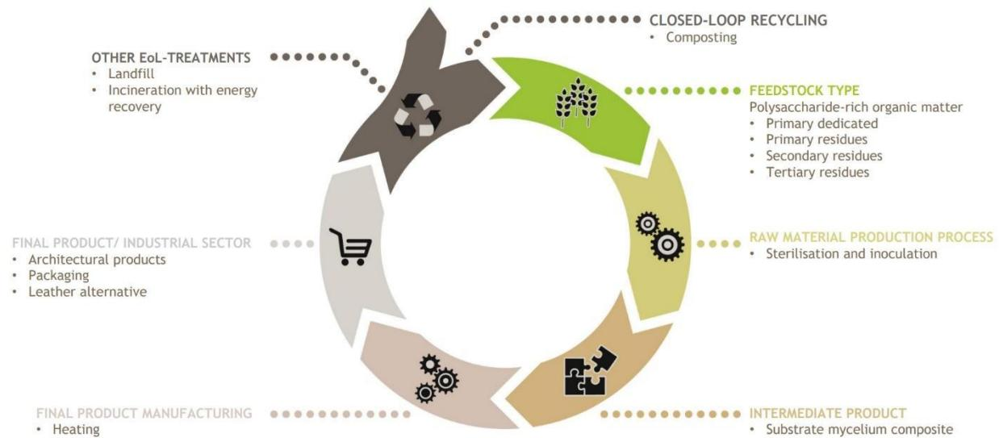

*Figure 22 - Value chain of mycelium-based products*

Mycelium is grown in moulds on polysaccharide-rich substrates that are sterilised prior to inoculation with the fungus. Common substrates are agricultural crop wastes such as hemp, straw, cotton and wheat residues, as well as waste wood and coffee grounds. Substrates are often enriched with easier-to-digest carbohydrates to accelerate growth. Since mycelia can decompose dead organic matter, various types of feedstocks can be used as a substrate, whether they are primarily dedicated for this use or are primary, secondary, or tertiary residues. For the fungus to colonise the substrate after inoculation and the mycelium to grow, the correct growing conditions must be provided. When the mycelium has grown to the desired extent, growth is stopped by heating the mould. At their end of life, mycelium-based products can usually be composted in commercial or home composting systems, with composting times varying depending on the size and composition of the product. Some mycelium-based products are however not biodegradable, as they contain or are coated by polymers or other non-degradable materials.

#### **Example Companies:**

For this case study the focus will be put on three specific mycelium-based products, namely architectural products, specifically acoustic and wall panels and insulation materials, packaging that replaces polystyrene and mycelium leather alternatives.

- Ecovative [\(https://www.ecovative.com/\)](https://www.ecovative.com/) Ecovative was the first company to bring mycelium-based products to the market. The company was founded in 2007 by Eben Bayer and Gavin McIntyre in Green Island, United States. After a successful Series C funding round, Ecovative secured a partnership with IKEA in 2016. Shortly after, the company started licensing their technology. Currently, they offer licences for three different technologies and have over 40 patents in 31 countries. Most mycelium composites and materials on the market are being produced under their licenses.
- Bolt Threads [\(https://boltthreads.com/\)](https://boltthreads.com/) Bolt Threads was founded in 2009 and launched their mycelium leather alternative Mylo™ in 2018. Mylo™ has been used by several world-class brands such as Adidas, Stella McCartney, Ganni and lululemon. Mylo™ contains lyocell and water-based polyurethane and is therefore not biodegradable.
- MycoWorks [\(https://www.mycoworks.com/\)](https://www.mycoworks.com/) MycoWorks was founded in 2013 and worked on developing a leather-like material, resulting in a patented process named Fine Mycelium™. The biomaterials company partnered with the French luxury house Hermès creating a new mycelium leather alternative produced by MycoWorks and tanned and finished by Hermès tanneries in France for the luxury house's Victoria shopper bag.
- The Magical Mushroom Company [\(https://magicalmushroom.com/\)](https://magicalmushroom.com/) Founded in 2018, the Magical Mushroom Company is a UK-based company that produces packaging materials using mycelium under the licensing of Ecovative. The packaging is especially good for replacing polystyrene and has been used by several major brands such as Lush, Selfridges and Wildsmith Skin.
- Mogu [\(https://mogu.bio/\)](https://mogu.bio/) Mogu is an Italian-based company producing acoustic and wall panels, as well as flooring solutions. To produce their acoustic panels, the company uses mycelium and upcycled textile residues. Mogu received funding from the European Union's Horizon 2020 programme under grant agreement number 823392.
- Biohm [\(https://www.biohm.co.uk/\)](https://www.biohm.co.uk/) The UK-based Biohm is a biotechnology company using mycelium and other natural materials to produce wall panels, insulation materials and furniture pieces.

#### **Baseline Situation:**

For each mycelium-based product of the three mentioned above, a different baseline situation was defined. The architectural products are to be compared to their fossil-fuel-based counterparts, such as polyurethane foam insulation and PVC wall panels. Mycelium-based packaging will be compared to polystyrene packaging.

# **Feedstock:**

To produce mycelium-based consumer goods two feedstocks are needed, a substrate and a fungus which is to be inoculated into the substrates. Substrates used are usually waste feedstocks rich in polysaccharides, such as cellulose, that otherwise would have been discarded. Since mycelium is

an effective decomposer of various types of organic matter, also dead ones, there's no need to use primary dedicated feedstock as substrate, even though it is possible.

#### **Market Overview:**

The global market for mycelium-based products was estimated to be at \$2.48 billion in 2020 and is expected to reach \$3.48 billion by 2026 with a CAGR of 7.7% (BIS Research, 2022).

#### **Stakeholders:**

Since this case study is kept in reserve, stakeholders beyond the companies mentioned above and researchers working on mycelium-based products known to the consortium have not been identified or contacted.

### **Policy Framework:**

- European Green Deal: Putting an end to wasteful packaging, boosting reuse and recycling [https://ec.europa.eu/commission/presscorner/detail/en/ip\\_22\\_7155](https://ec.europa.eu/commission/presscorner/detail/en/ip_22_7155)

# **Relevant Studies and Publications:**

- LCA of MycoWorks' Reishi™ leather alternative grown using their Fine Mycelium™ technology: [https://enveurope.springeropen.com/articles/10.1186/s12302-022-00689](https://enveurope.springeropen.com/articles/10.1186/s12302-022-00689-x#:~:text=20%20December%202022-,Life%20cycle%20assessment%20of%20MycoWorks) [x#:~:text=20%20December%202022-](https://enveurope.springeropen.com/articles/10.1186/s12302-022-00689-x#:~:text=20%20December%202022-,Life%20cycle%20assessment%20of%20MycoWorks) [,Life%20cycle%20assessment%20of%20MycoWorks'%20Reishi%E2%84%A2%3A%20the%20first%](https://enveurope.springeropen.com/articles/10.1186/s12302-022-00689-x#:~:text=20%20December%202022-,Life%20cycle%20assessment%20of%20MycoWorks) [20low,carbon%20and%20biodegradable%20alternative%20leather](https://enveurope.springeropen.com/articles/10.1186/s12302-022-00689-x#:~:text=20%20December%202022-,Life%20cycle%20assessment%20of%20MycoWorks)
- Review of mycelium-based packaging as a substitute for polystyrene: <https://www.sciencedirect.com/science/article/pii/S2214785317319508>

## **FACTSHEET: Bio-polyurethane for flooring**

# **Short Description:**

Polyurethanes are versatile polymers that can be customisable depending on the manufacturing process and tailor-made for various applications, including rigid, flexible, and moulded foams, coatings, adhesives, and fibres. They possess exceptional properties, such as high mechanical strength, good durability, thermal stability, adhesion, and resistance to chemicals and weathering, making them suitable for a wide range of products, including flooring, insulation, footwear, construction materials, mattresses, electronics, toys, Spandex, and even kitchen sponges.

Polyurethane is commonly used as a floor coating alternative to epoxy, especially in applications where epoxy is not suitable. Unlike epoxy, polyurethane is resistant to UV rays, making it a better option for outdoor flooring. It is also suitable for flooring in rooms with temperatures below zero degrees Celsius, which is why it is widely used in freezing chambers. Additionally, the elastic nature of polyurethane coatings makes them more resistant to impact, making them a great choice for high-traffic areas like gyms and schools.

In 2016 the global market volume of polyurethane was 22.12 million tonnes16 , with 67% of those being foams17 . The market volume is expected to reach 29.19 million tonnes by 2029.

16 <https://www.statista.com/statistics/720341/global-polyurethane-market-size-forecast/> 17 <https://www.ncbi.nlm.nih.gov/pmc/articles/PMC6213201/>

## **Value Chain:**

Polyurethanes are a class of polymers characterised by urethane links and produced from two monomers, typically an isocyanate and a polyol. They are mostly non-biodegradable and made from fossil-based raw materials, which are depleting. To promote a sustainable transition, the polyurethane market has seen a significant shift in recent years towards the use of bio-based feedstock such as vegetable oils and fatty acids.

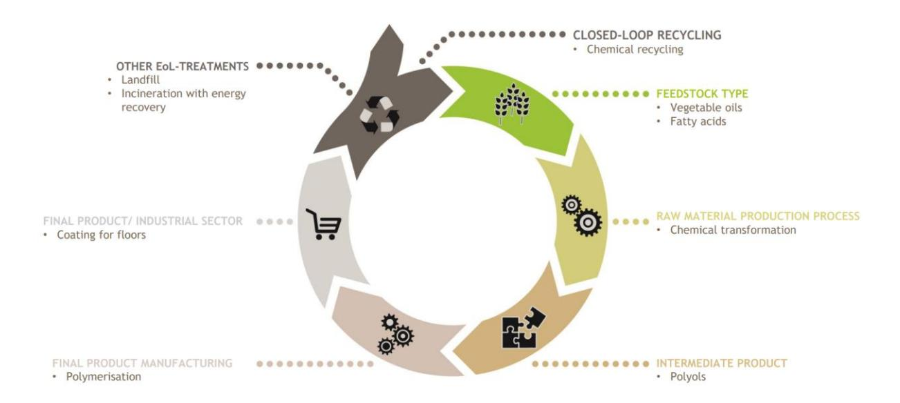

*Figure 23 - Value chain of bio-PU for flooring*

#### **Example Companies:**

- Ecuran
- Stahl

# **Baseline Situation:**

The baseline situation is the production of fossil-based polyurethane coatings for floors.

# **Feedstock:**

A variety of vegetable oils and fatty acids can serve as feedstocks for the production of biopolyurethane. Canola oil and rapeseed oil are among the most frequently used oils, but there is no single oil that is used significantly more than others. Other options include soybean oil, castor oil and palm oil, among others.

#### **Market Overview:**

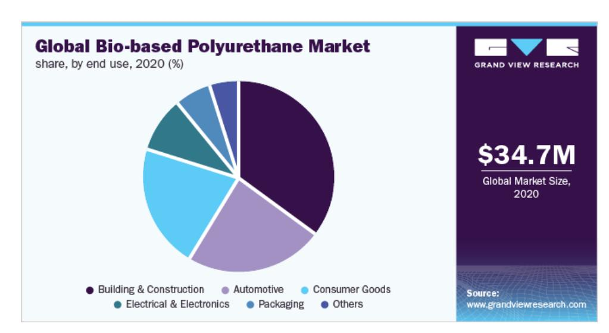

*Figure 24 - Global bio-based polyurethane market (Source: Grand View Research)*

#### **Stakeholders:**

- Companies listed above
- DWI Leibniz-Insitut für Interaktive Materialien

# **FACTSHEET: Bio-PET**

# **Short Description:**

PET short for polyethylene terephthalate is the most common thermoplastic polymer of the polyester family. Due to its lightweight, strength, durability and versatility, PET is used widely around the world, especially in the production of food and beverage packaging and textiles. PET is produced from monoethylene glycol (MEG) and purified terephthalic acid (PTA) or alternatively dimethyl terephthalate (DMT). Both raw materials are derived from fossil fuel-based feedstocks. MEG is primarily produced from ethylene obtained from steam cracking of natural gas, while PTA is produced from p-xylene, which is won from the catalytic reforming of petroleum naphtha. MEG amounts to circa 30% of PET, while PTA makes up the remaining 70%. Bio-PET is currently used to refer to PET made from bio-based MEG and fossil-fuel-based PTA. Bio-based MEG is produced from ethanol derived from bio-based feedstocks, such as sugarcane. The production of fully bio-based PET has been successful in Northern Netherlands in Chemport Europe, as a collaborative effort between the companies Bio-BTX and Cumapol. Fully bio-based PET is, however, still not widely produced.

PET is easily recyclable via mechanical recycling. Bottles are one of the main PET products and are easily collected, with collection rates reaching up to 94% in Germany in 2015 (Statista, 2017). PET is therefore the most mechanically recycled plastic packaging material in Europe. In 2017 3.308.300 tonnes of PET bottles entered the European market, out of which 1.923.100 tonnes were collected for recycling, resulting in a collection rate of 58.2%. The PET recycling capacity in Europe that year was 2.038.100 tonnes. However, only 1.741.700 tonnes of PET were processed, leading to an unused capacity of 296.400 tonnes (Petcore Europe, 2018).

#### **Value Chain:**

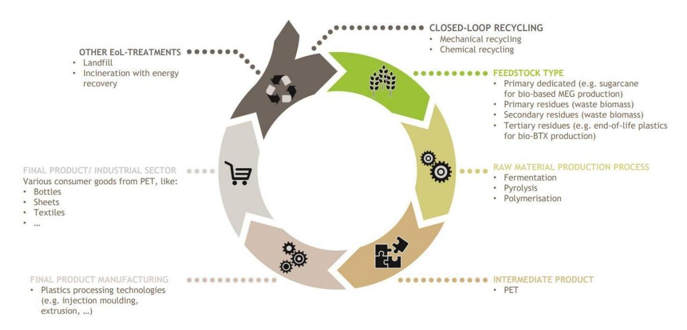

*Figure 25 - Value chain of bio-PET*

## **Example Companies:**

- Bio-BTX [\(https://biobtx.com/\)](https://biobtx.com/) Bio-BTX is a Dutch company located at the Zernike Campus in Groningen in Chemport Europe using the Integrated Cascading Catalytic Pyrolysis (ICCP) technology to convert lowgrade biomass into BTX. The company uses end-of-life plastics and non-food biomass as feedstock.
- Cumapol [\(https://www.cumapol.nl/\)](https://www.cumapol.nl/) Cumapol is a Dutch company based in the chemical cluster Emmen of Chemport Europe. The company specialised in PET recycling.
- UPM [\(https://www.upm.com/\)](https://www.upm.com/) UPM offers a wide range of products made from renewable raw materials. The company invested in a biorefinery in Leuna, Germany that manufactures 100% wood-based biochemicals, including MEG that can be used to produce bio-based PET.

#### **Baseline Situation:**

Both partially and fully bio-based PET are to be compared to fossil-fuel-based PET.

#### **Market Overview:**

The global market volume of PET in 2021 amounted to 24.23 million tonnes and is forecasted to reach 33.07 million tonnes by 2029 with a CAGR of 4.2%.

# **Policy Framework:**

- EU policy framework on biobased, biodegradable and compostable plastics: [https://environment.ec.europa.eu/publications/communication-eu-policy-framework](https://environment.ec.europa.eu/publications/communication-eu-policy-framework-biobased-biodegradable-and-compostable-plastics_en)[biobased-biodegradable-and-compostable-plastics\\_en](https://environment.ec.europa.eu/publications/communication-eu-policy-framework-biobased-biodegradable-and-compostable-plastics_en)

#### FACTSHEET: Bio-solvents

### **Short Description:**

The bio-solvent considered as a case study, 1,4-butanediol (1,4-BDO). 1,4-BDO is a chemical building block for the production of plastics, elastic fibres and polyurethanes for a wide range of applications, such as: textiles, electronics, automotive and consumer goods. It is an example of a bio-based version of an existing fossil-based drop-in chemical, which has established markets. It is produced from glucose syrup (e.g., sugars derived from starch crops) by a fermentation process.

#### **Value Chain:**

1,4-BDO is used industrially as a solvent and serves as a building block in the manufacture of thermoplastic polyurethanes (TPU), tetrahydrofuran (THF), Spandex, and polybutylene terephthalate (PBT). 1,4-BDO also acts as a precursor to a number of specialty chemicals used as solvents or as raw materials in pharmaceuticals and agrochemicals. As a building-block it is a highly versatile chemical that can be used to produce hundreds of every-day products such as textiles, electronics, automotive and consumer goods. The final product manufacturing and the end-of-life options available are dependent on the final application of 1,4-BDO.

The production route is depicted in Figure 19. Glucose syrup (C6 sugars) is derived from the hydrolysis of starch. Novamont uses the technology licensed from Genomatica to convert the glucose syrup to bio-1,4-BDO through an innovative single-step fermentation process. Bio-1,4-BDO can also be attained following a two-step route that includes fermentation into succinic acid followed by hydrogenation to 1,4-BDO.

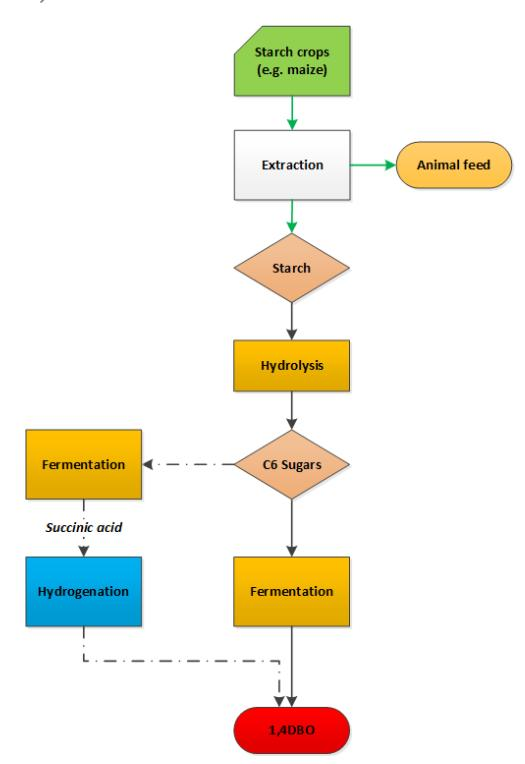

*Figure 26 - Production route of bio-1,4-BDO*

#### **Example Companies:**

- Novamont Novamont has invested in a production facility that produces 1,4-BDO from glucose syrup through an innovative single-step fermentation, thanks to a bioengineering technology that Novamont successfully licensed from Genomatica and integrated into its production process. Glucose syrup is derived from the hydrolysis of starch. The resulting product, bio-1,4-BDO, is used as an input for its own downstream bioplastic products, which constitute the company's main business. This allowed them to increase the renewable carbon content of their bioplastics to more than 60%. They call it a 4th generation bioplastic (Mater-Bi) that is biodegradable and compostable. Commercial production started in 2016 in the Mater-Biotech plant in Italy. The plant located in Italy has a production capacity of 30,000 metric tonnes of bio-1,4-BDO per year.
- BASF SE BASF, already the largest global producer of fossil-based 1,4-BDO, also began the production of 1,4-BDO based on renewable feedstock using Genomatica's patented onestep dextrose-based fermentation process. BASF has a licensing agreement with Genomatica to allow production of up to 75,000 tonnes per year. BASF plans to expand its portfolio with selected 1,4-BDO derivatives based on renewable feedstock, including polytetrahydrofuran (PolyTHF).
- BioAmber and Myriant BioAmber and Myriant are working on the development of bio-1,4-BDO through a two-step process consisting of the initial glucose fermentation into bio-based succinic acid and subsequent conversion to 1,4-BDO through conventional hydrogenation

#### **Baseline Situation:**

The comparison will be done from the baseline situation where the chemical 1,4-BDO is produced using fossil feedstock.

# **Feedstock:**

The feedstock considered is the primary dedicated feedstock of maize.

## **Market Overview:**

1,4-BDO is in high demand for a wide range of applications besides plastics, e.g. in sectors such as: textiles, automotive and consumer goods. Furthermore, there is a growing trend for 1,4-BDO, both fossil as well as bio-based. This is partly owed to the growing demand of Spandex in textiles and the bio-1,4-BDO derived PTMEG used for this. The bio-based 1,4-BDO market is expected to reach 35.48 kilo-tonnes by the end of this year (2023) and witness a CAGR of more than 9% during the forecast period.

# **Stakeholders:**

- Novamont

# **Relevant Studies and Publications:**

- European Commission, DG-RTD, Platt, R., et al., EU biorefinery outlook to 2030: studies on support to research and innovation policy in the area of bio-based products and services, Publications Office, 2021, <https://data.europa.eu/doi/10.2777/103465>
- RoadToBio. (2018). D1.2 Case studies on potentially attractive opportunities for bio-based chemicals in Europe.

#### **Additional information:**

- Technical performance: Bio-1,4-BDO is identical to fossil-based 1,4-BDO (i.e. has the same molecular structure). It offers direct drop-in replacement for fossil-based 1,4-BDO.
- Environmental performance: Novamont's internal LCA studies show that bio-1,4-BDO results in approximately 60% greenhouse gas emission reduction when compared to fossil-1,4-BDO. The plant has been designed to use by-products for its own energy purposes, thus reducing net energy consumption and waste production. The feedstock currently used for the production of bio-1,4-BDO is sugars (glucose) derived from the hydrolysis of starch – the so-called glucose syrup, commonly used in industrial fermentation processes. Looking into the future, and to address possible future concerns with respect to feedstock competition with food, Novamont has been conducting research on obtaining sugars from lignocellulosic biomass.
- Cost performance:

Bio-1,4-BDO product of Novamont is currently used internally for the production of their biopolymers and not sold to external customers. It is not cost-competitive with the fossil equivalent product. Due to the relatively low capacity of production, the production of bio-1,4- BDO does not yet benefit from economies of scale to the same extent that competing, fossil-based 1,4-BDO do. Yet, the use of bio-1,4-BDO allows an increase in the renewable carbon content of their bioplastics (from about 35% to about 60%) and further reduction of their fossil dependence and climate impact.

# **FACTSHEET: Casein-based fibres and biopolymers from discarded milk**

## **Short Description:**

Milk proteins, called casein, are a renewable source from which biopolymers and textile fibres can be developed. The QMilk company produces both using milk proteins which are sourced from discarded milk.

One way to decarbonize and especially de-fossilize both the fashion and plastics industry is by transitioning back to more bio-based materials. In this case, the renewable source is casein derived from milk that would otherwise be disposed of because the milk is no longer suitable for consumption in food or feed.

Milk-blend cotton yarn was already created in Italy and the USA in the 1930s and was called milk casein. The Italian pioneer company made the casein fabric called Lanital. In this early process, formaldehyde and large amounts of water were used in the manufacturing process. However, this resulted in an unprofitable production which could not compete with wool fibre and because of this stopped after World War II.

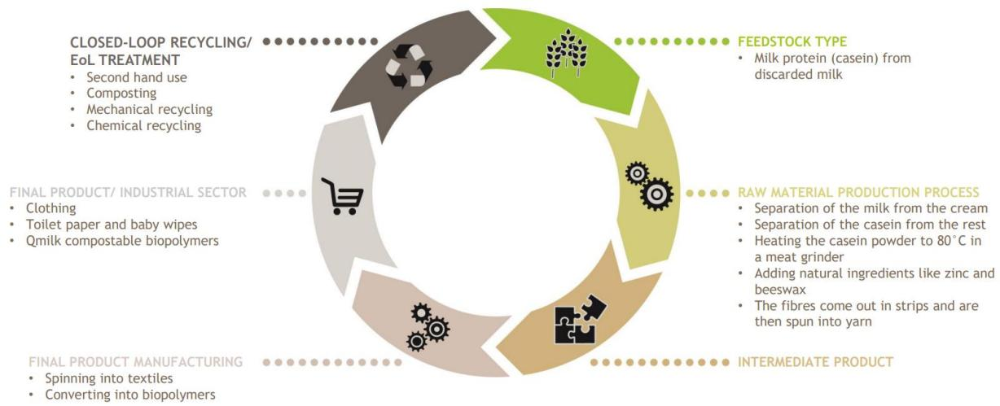

*Figure 27 - Value chain of casein-based textiles and biopolymers*

Still, most of the processes in place using casein to convert to textiles or biopolymers are relatively unsustainable because acrylonitrile is used which is reactive and toxic (at low doses) and harmful to nature, especially in aquatic systems.

In the QMilk patented process, no toxic substances are used and the process is efficient in regard to CO2 emissions. It, therefore, received the Green Tec Award in 2015 and is certified as OEKO TEX standard 100 green for international organic textiles.

The plastic that is made of casein by QMilk is also 100% natural and biodegradable without leaving any residue or waste behind. It is very useful for packaging food products because it is naturally antibacterial. This also applies to the casein QMilk fibres from which textiles are made as the fabric is antibacterial, soft, and has good moisture absorption and climate regulation properties. Making polymers from casein is relatively easy as the casein is a monomer of molecules which are linked together in a regular pattern and a chain of these casein monomers creates a polymer.

# **Example Companies:**

- Qmilk: casein textiles and polymers (QMILK [The material of the future](https://www.qmilkfiber.eu/?lang=en)  [www.qmilkfiber.eu\)](https://www.qmilkfiber.eu/?lang=en)
- Lactips, a French SME building thermoplastic pellets from milk protein [\(https://www.lactips.com/\)](https://www.lactips.com/)
- Due di Late: Casein based fashion [\(https://antonellabellina.wixsite.com/duedilatte\)](https://antonellabellina.wixsite.com/duedilatte)

# **Baseline Situation:**

Each year the bioplastics market share is growing. But their share is still marginal accounting for only 2.6% of the global market volume. The biobased plastic share is however expected to grow towards 15% by 2030. Data on global casein-based plastics and fibres are not available as their production is still a niche market.

Market volume share of plastics worldwide in 2019 and 2030 by feedstock type

Market volume share of plastics worldwide in 2019 and 2030 by feedstock type

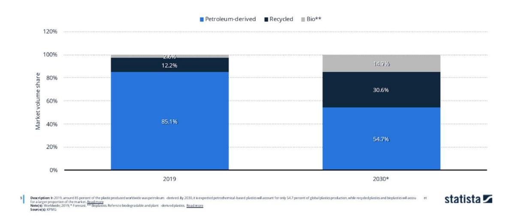

*Figure 28 - Bioplastics share in global market volume (Source: Statista, 2023*

So, the baseline situation can be:

For casein textiles:

- 1. Fossil-based synthetic fibres of polyester (PET) or nylon
- 2. Cotton fibres

For casein biodegradable plastic:

- 1. Other biodegradable plastics based on other bio-based feedstock (starch, vegetal oil)
- 2. Fossil-based plastics

#### **Feedstock:**

In the case of the QMilk company the most important resource is raw milk, that is no longer tradable for food because of food safety rules. The QMilk company claims on their website [\(QMILK](https://www.qmilkfiber.eu/qmilk-collect?lang=en)  Collect - [www.qmilkfiber.eu\)](https://www.qmilkfiber.eu/qmilk-collect?lang=en) that only in Germany every year 2 million tons of milk must be disposed of. The company DUE di Late, that also produces casein-based textiles claim that in Italy 30 million tons of dairy products are wasted.

#### **Market Overview:**

Although the market of casein-based fibres for textiles is still very small it is gaining more attention (Harmsen et al., 2021). The same applies to casein-based bioplastics. Their share is still too small to become visible in statistics like in Figure 29.

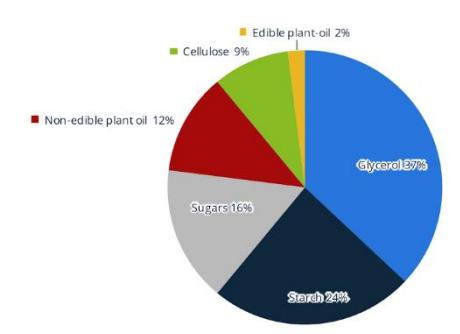

*Figure 29 - Bio-based feedstock for polymers used worldwide in 2020 (Source: Statista, 2023)*

# **Stakeholders:**

## For casein-based textiles:

- Laudes foundation
- Companies listed above
- Certification organisations in sustainable textiles, e.g. GOTS, Green Button, Bluesign, Global Recycle Standard.

#### For casein based biopolymers:

- Companies listed under above
- European Bioplastics (representing more than 80 member companies along the entire value chain of bioplastics).
- PlasticsEurope. The association is networking with European and national plastics associations and has more than 100 member companies, producing over 90% of all polymers across the EU27 member states plus Norway, Switzerland, and Turkey. <https://plasticseurope.org/>

## **Policy Framework:**

# Textiles:

- As part of the European Green Deal, the new Circular Economy Action Plan mentions textiles and plastics as two of the key product value chains that will be addressed as a matter of priority.
- The EU Strategy for sustainable and circular textiles was published in March 2022. The Commission's 2030 Vision for Textiles is that: o all textile products placed on the EU market are durable, repairable, and recyclable, to a great extent made of recycled fibres, free of hazardous substances, produced in respect of social rights and the environment o "Fast fashion is out of fashion" and consumers benefit longer from high quality affordable textiles o profitable re-use and repair services widely available o the textiles sector is competitive, resilient, and innovative with producers taking responsibility for their products along the value chain with sufficient capacities for recycling and minimal incineration and landfilling

- The Strategy lays out a forward-looking set of actions. The Commission will: o set design requirements for textiles to make them last longer, easier to repair and recycle o introduce clearer information on textiles and a digital product passport o empower consumers and tackle greenwashing by ensuring the accuracy of companies' green claims o stop overproduction and overconsumption, and discourage the destruction of unsold or returned textiles o harmonise EU Extender Producer Responsibility rules for textiles and economic incentives to make products more sustainable o address the unintentional release of microplastics from synthetic textiles o address the challenges from the export of textile waste adopt an EU Toolbox against counterfeiting by 2023 o publish a transition pathway by the end of 2022 - an action plan for actors in the textiles ecosystem to successfully achieve the green and digital transitions and increase its resilience
- Member States must ensure that, by January 2025, textile waste is collected to facilitate the sorting, re-use and recycling of textiles.

#### Bioplastics:

- The EU adopted a European strategy for plastics in January 2018. It is part of the EU's circular economy action plan and builds on existing measures to reduce plastic waste.
- The EU's plastics strategy aims to transform the way plastic products are designed, produced, used and recycled in the EU. Specific objectives are: o Making recycling profitable for business through ▪ new rules on packaging to improve the recyclability of plastics and increase the demand for recycled plastic content ▪ improving the separate collection of plastic waste ▪ launching an EU-wide pledging campaign targeting industry and public authorities
  - Curbing plastic waste through: ▪ a Directive on single use plastic products and fishing gear ▪ measures to restrict the use of microplastics in products and address and reduce the unintentional release of microplastics into the environment ▪ measures on bio-based, biodegradable, and compostable plastics ▪new rules on port reception facilities to tackle sea-based marine litter
  - Driving innovation and investment through: ▪ scaling up support for innovation, with an additional €100 million to develop smarter and more recyclable plastics materials, to make recycling processes more efficient, and to trace and remove hazardous substances and contaminants from recycled plastics
  - Spurring global change through working with our international partners to devise global solutions and develop international standards on plastics

# **Relevant Studies and Publications:**

- European Commission, 2020, A new Circular Economy Action Plan For a cleaner and more competitive Europe.
- European Environment Agency. (2023). Plastic in textiles: towards a circular economy for synthetic textiles in Europe.

#### [https://www.eea.europa.eu/themes/waste/resourceefficiency/plastic-in-textiles](https://www.eea.europa.eu/themes/waste/resourceefficiency/plastic-in-textiles-towards-a)[towards-a](https://www.eea.europa.eu/themes/waste/resourceefficiency/plastic-in-textiles-towards-a)

- Harmsen, P., Post, W. & Bos, H. (2022). Textiles for Circular Fashion. Part 2: From renewable carbon to fibres.
- Nanda, S., Patra, B.R., Patel, R. et al. Innovations in applications and prospects of bioplastics and biopolymers: a review. Environ Chem Lett 20, 379–395 (2022).
- Stenton, M., J. A. Houghton, V. Kapsali and R. S. Blackburn (2021). "The Potential for Regenerated Protein Fibres within a Circular Economy: Lessons from the Past Can Inform Sustainable Innovation in the Textiles Industry." Sustainability 13(4): 2328
- Vivek Adhia, Mishra, A., Banerjee, D., Nambi Appadurai, A., Preethan, P., Khan, Y., de Wagenaar, D., Harmsen, P., Elbersen, B., van Eupen, M., Staritsky, I., Elbersen, W. & Keijsers, E., (2021), Montpelier, Spinning future threads: the potential of agricultural residues as textile fibre feedstock. VE. 207 p. https://laudes.h5mag.com/agriwaste\_report\_highlights/home

# **FACTSHEET: CHEMPORT Europe**

# **Short Description:**

Chemport is a chemical cluster in Northern Netherlands where companies, government and knowledge centres work together on an integrated approach to biorefinery, green chemistry and green energy. The ambition of Chemport is to be the first chemical cluster in the Netherlands (and possibly in Europe) with zero CO2 emissions and minimum environmental impact. The entire Chemport Europe industry cluster will only use renewable energy and feedstock by 2050.

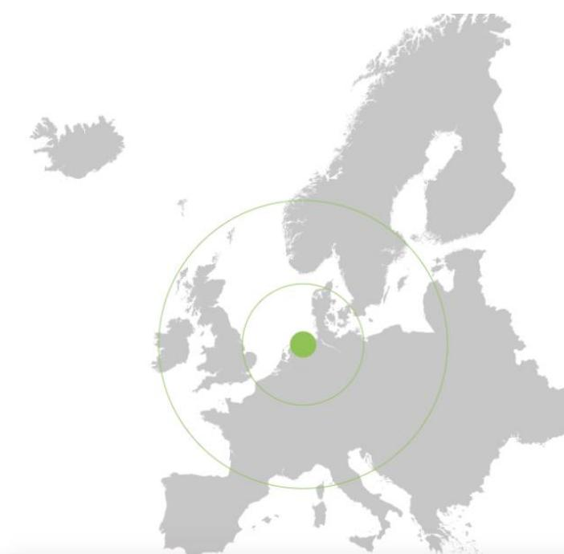

*Figure 30 - Location of Chemport in Europe (Source: Chemport, 2023)*

| <b>Feedstock &gt;</b> | <b>Intermediate chemicals &gt;</b>    | <b>Polymers and materials &gt;</b> | <b>Recycling &gt;</b> |
|-----------------------|---------------------------------------|------------------------------------|-----------------------|
|                       | Methanol                              | Aramid                             | Circular polymers     |
| Green electricity     | Amines                                | Biopolymers                        | Mechanical recycling  |
| Biomass               | Monochloroacetic acid (MCA)           | Polyamide                          | Chemical recycling    |
| Carbon dioxide        | Glycerine                             | Polylactic acid (PLA)              |                       |
| Hydrogen              | Benzene, toluene, xylene (BTX)        | Polyester                          |                       |
| Sodium Chloride       | Methylene diphenyl diisocyanate (MDI) | Polyhydroxyalkanoate (PHA)         |                       |
| Magnesium Chloride    |                                       |                                    |                       |

*Figure 31 - Overview of chemicals and materials in Chemport (Source: Chemport, 2023)*

Chemport claims to provide an excellent environment for siting plants and knowledge centres that focus on the transition towards circular bio-based solutions because of the following aspects:

- 1. Guaranteed supply of green raw materials (feedstock), such as sugar beet and potatoes, grass, grains, salt and water
- 2. Extremely reliable energy supply: local, green, and sustainable
- 3. Two sustainable chemical clusters around intermediate chemicals, innovative polymers and fibres
- 4. Knowledge institutes of world renown, such as the University of Groningen, Hanze Universities of Applied Sciences, and NHL Stenden
- 5. A sea harbour and excellent connections by rail, road and air for purchase and sales
- 6. Availability of capital: investments, credits, and subsidies
- 7. Smooth permitting process
- 8. Effective cooperation between companies, government, and universities (Triple Helix)

Already in 1839 far before the Chemport idea lived the company W.A. Scholten was running a biorefinery approach taking potato as feedstock and producing starch, protein, glue, dextrose, and alcohol from the limited residues that remained. The following decades saw the development of successful cooperations between agricultural and processing companies, focussing on sugar beet and milk-based biorefineries producing sugar, a range of dairy products and animal feed. The waste streams served as raw materials for the cardboard industry. After the discovery of gas and salt in the region in the 1950s, Delfzijl became an industrial port with a strong chemical cluster and, today, about 15% of all the chemical products that are produced in the Netherlands come from Delfzijl. This port has also become an ideal location for companies that are committed to a greener chemical sector which all together form the modern 'Chemport Europe'. In Chemport there is a healthy mix of food-related industries, involved in grain, sugar and potato processing, there is a strong presence of natural gas-related companies and now there is a strong development in green hydrogen production activities. All these companies have also joined forces with the government and science.

Chemport's focus is to make the existing plants as sustainable as possible and to stimulate the establishment of companies with a green profile that will fit within the chain of existing companies. Currently, there is still a strong agricultural cluster, around the companies Avebe and Suikerunie, and a strong chlorine cluster, around AkzoNobel. There is also a focus on circular plastics which is coordinated by the Greenwise Campus to achieve 100% recycling further developing technologies for mechanical, chemical, and thermochemical recycling.

#### **Example Companies:**

The figure below showcases all companies active in Chemport.

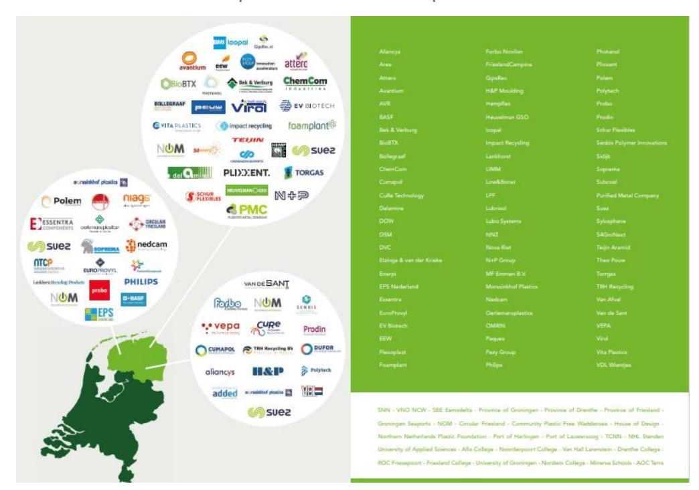

*Figure 32 - Overview of companies in Chemport (Source: Chemport, 2023)*

# **Baseline Situation:**

The baseline situation for Chemport is the conventional linear production ecosystems or chemical parks around Europe, with a strong reliance on fossil energy sources.

# **Feedstock:**

Chemport is located in the North of the Netherlands where there is a relatively large concentration of agricultural activities both in the Netherlands and over the border in Germany. Therefore, there is easy access to large quantities of green feedstock such as cereals, sugar beet, potatoes, dairy and grass and related primary residues that come with the production of these products in the region. There are also many secondary industrial processing residues that can be used in biorefinery processes within one plant or through close collaboration between different plants in the cluster.

#### **Market Overview:**

Chemport is one of 62 chemical parks in Europe.

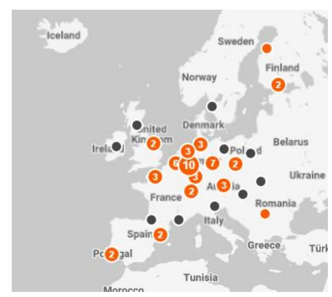

*Figure 33 - Chemical parks in Europe (Source: Chemical Parks in Europe [https://chemicalparks.eu/\)](https://chemicalparks.eu/)*

# **Stakeholders:**

- Companies mentioned above that are in Chemport Europe
- Chemport Europe managing organisation
- Knowledge institutes part of Chemport: University Groningen, Hanze University of applied sciences, Van Hall Larenstein, NHL Stenden
- Provinces of Groningen and Drenthe

# **Policy Framework:**

- European Commission published a [chemical strategy for sustainability](https://circabc.europa.eu/ui/group/8ee3c69a-bccb-4f22-89ca-277e35de7c63/library/dd074f3d-0cc9-4df2-b056-dabcacfc99b6/details?download=true) on 14 October 2020. It is part of the EU's zero pollution ambition, which is a key commitment of the European Green Deal. It aims to better protect citizens and the environment and boost innovation for safe and sustainable chemicals.
- There are several other relevant EU strategies of importance to the Chemport ecosystem which are: o The zero-pollution action plan which is translated into specific targets of which the most important are: ▪ improving air quality to reduce the number of premature deaths caused by air pollution by 55%; ▪ improving water quality by reducing waste, plastic litter at sea (by 50%) and microplastics released into the environment (by 30%); ▪ improving soil quality by reducing nutrient losses and chemical pesticides use by 50%; ▪ reducing by 25% the EU ecosystems where air pollution threatens biodiversity;

- ▪ reducing the share of people chronically disturbed by transport noise by 30%, and ▪significantly reducing waste generation and by 50% residual municipal waste.
- European industrial strategy which among others focuses on monitoring the state of 14 industrial ecosystems
- Hydrogen strategy

### **Relevant Studies and Publications:**

- Chemport Europe. Circular Plastics Northern Netherlands. [https://www.chemport.eu/wp-content/uploads/2021/12/Brochure-CE-NNL\\_web.pdf](https://www.chemport.eu/wp-content/uploads/2021/12/Brochure-CE-NNL_web.pdf)
- Thomann, J. ,Heeres, J, Bekkering, E. (2023). The Northern Netherlands: Transformation of a gas-producing region into a forerunner in the biobased circular transition. Journal of Business Chemistry.

# Websites:

- [https://dutchindustry.org/chemport/](https://eur03.safelinks.protection.outlook.com/?url=https%3A%2F%2Fdutchindustry.org%2Fchemport%2F&data=05%7C01%7Cberien.elbersen%40wur.nl%7C142b9336400e42cd9cef08db3cdf5ca7%7C27d137e5761f4dc1af88d26430abb18f%7C0%7C0%7C638170704693171419%7CUnknown%7CTWFpbGZsb3d8eyJWIjoiMC4wLjAwMDAiLCJQIjoiV2luMzIiLCJBTiI6Ik1haWwiLCJXVCI6Mn0%3D%7C3000%7C%7C%7C&sdata=ujBmqjt%2BrMwsiK%2B7Yw%2BeaKjXOxHggIqBp6QQUs0eKTg%3D&reserved=0)
- [https://circulareconomy.europa.eu/platform/en/strategies/saccharide-strategy-dutch](https://eur03.safelinks.protection.outlook.com/?url=https%3A%2F%2Fcirculareconomy.europa.eu%2Fplatform%2Fen%2Fstrategies%2Fsaccharide-strategy-dutch-chemport-region&data=05%7C01%7Cberien.elbersen%40wur.nl%7C142b9336400e42cd9cef08db3cdf5ca7%7C27d137e5761f4dc1af88d26430abb18f%7C0%7C0%7C638170704693171419%7CUnknown%7CTWFpbGZsb3d8eyJWIjoiMC4wLjAwMDAiLCJQIjoiV2luMzIiLCJBTiI6Ik1haWwiLCJXVCI6Mn0%3D%7C3000%7C%7C%7C&sdata=Xw%2Fx%2FRcw8SZLQM8hbsfyzpRi6bxEEaRl4SCQYZqGCks%3D&reserved=0)[chemport-region](https://eur03.safelinks.protection.outlook.com/?url=https%3A%2F%2Fcirculareconomy.europa.eu%2Fplatform%2Fen%2Fstrategies%2Fsaccharide-strategy-dutch-chemport-region&data=05%7C01%7Cberien.elbersen%40wur.nl%7C142b9336400e42cd9cef08db3cdf5ca7%7C27d137e5761f4dc1af88d26430abb18f%7C0%7C0%7C638170704693171419%7CUnknown%7CTWFpbGZsb3d8eyJWIjoiMC4wLjAwMDAiLCJQIjoiV2luMzIiLCJBTiI6Ik1haWwiLCJXVCI6Mn0%3D%7C3000%7C%7C%7C&sdata=Xw%2Fx%2FRcw8SZLQM8hbsfyzpRi6bxEEaRl4SCQYZqGCks%3D&reserved=0)
- <https://www.chemport.eu/discover/about/who-we-are/>

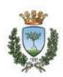

# Project Consortium

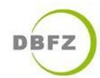

