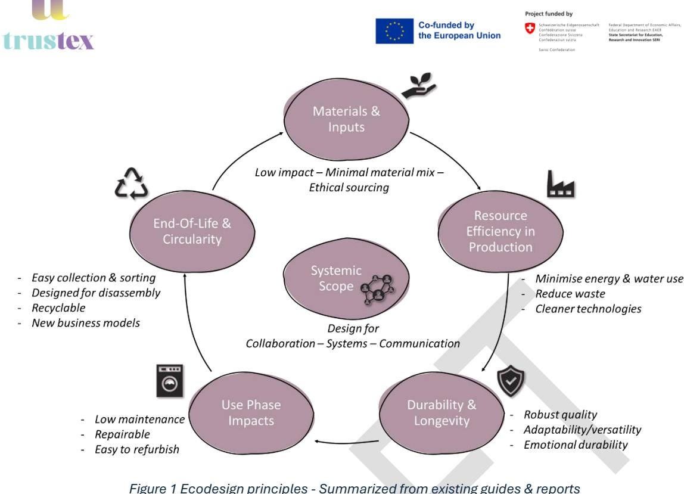
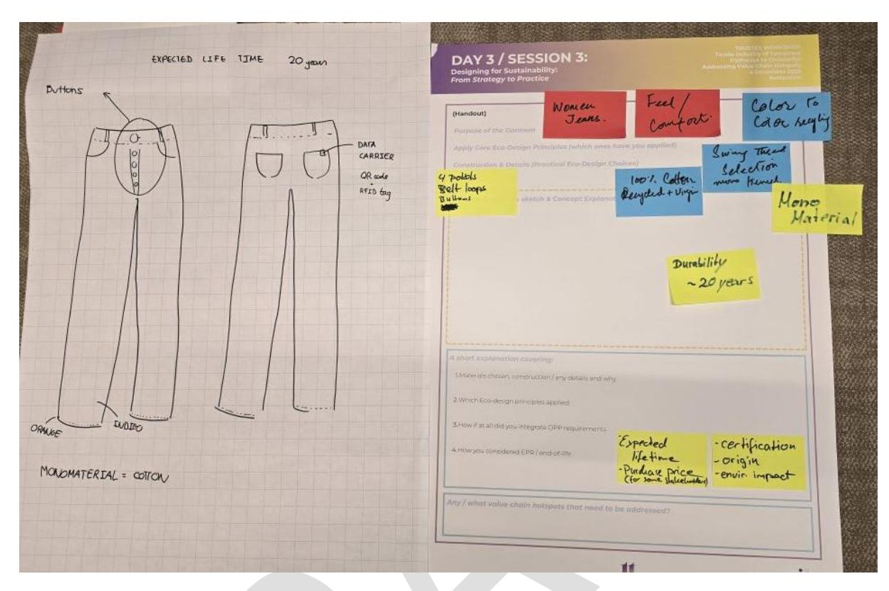
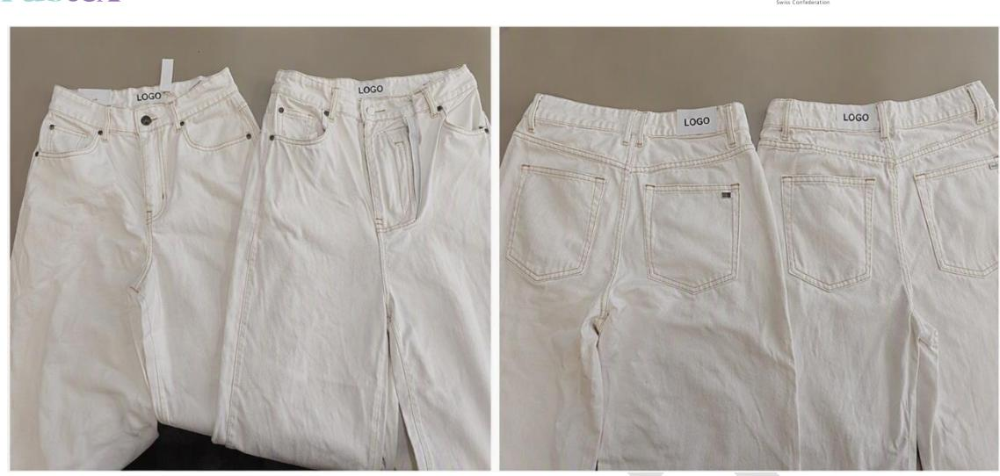
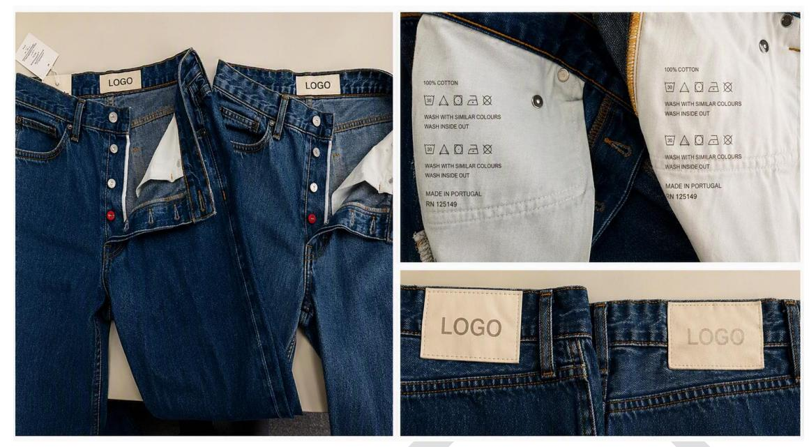
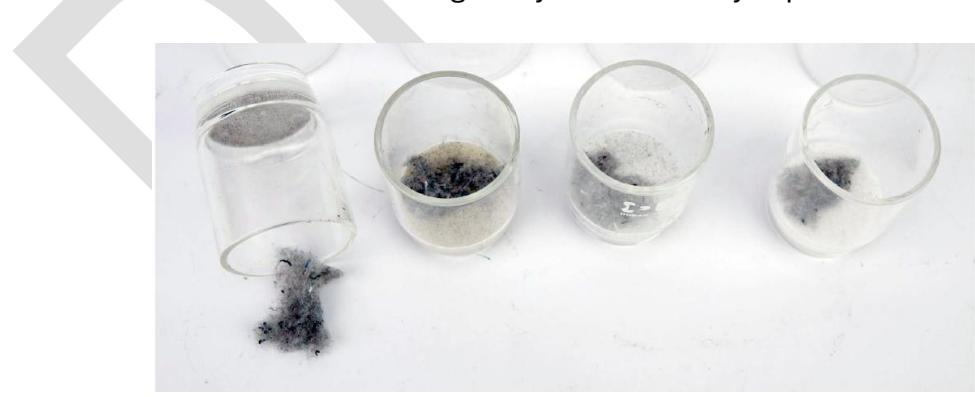
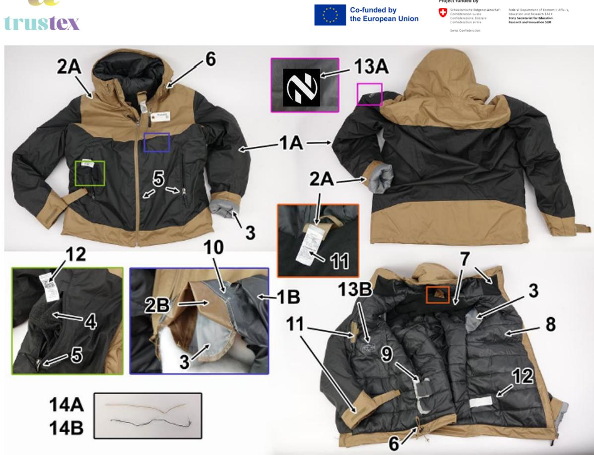
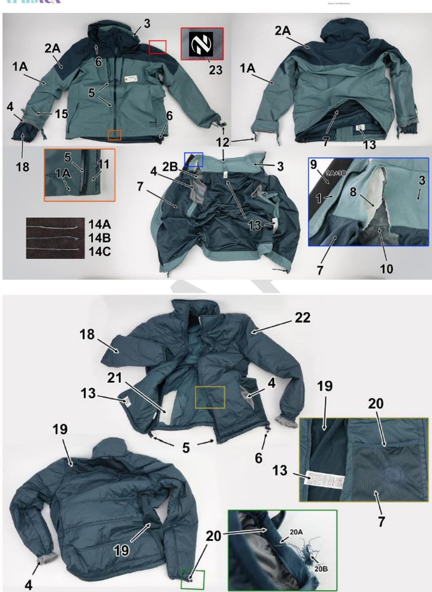
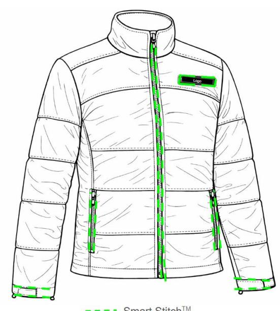

Advancing sustainable textiles in the circular economy through innovative EP schemes

This project has received funding from the European Union's Horizon Research and Innovation program under grant agreement N° 101181901 and from the Swiss State Secretariat for Education, Research and Innovation (SERI). Posts and shares reflect only the views of all the involved partners. Neither the European Union nor the granting authority can be held responsible for them. This draft deliverable has not yet been validated by the granting

#### **Table of Contents**

| 1.     | Executive Summary                                                                 | 6  |
|--------|-----------------------------------------------------------------------------------|----|
| 2.     | Introduction                                                                      | 7  |
| 3.     | Scope and Approach                                                                | 7  |
| 4.     | Existing Knowledge Base                                                           | 9  |
| 4.1.   | Ecodesign                                                                         | 9  |
| 4.1.1. | Definition and conceptual framework                                               | 9  |
| 4.1.2. | Ecodesign as a driver for circular textiles                                       | 9  |
| 4.1.3. | Structuring ecodesign principles across the lifecycle                             | 10 |
| 4.1.4. | Synthesis and conclusions                                                         | 12 |
| 4.2.   | Textile Fibres & Yarns: Overview                                                  | 12 |
| 4.2.1. | Role of fibre selection in circular textiles                                      | 12 |
| 4.2.2. | Synthetic fibers                                                                  | 13 |
| 4.2.3. | Natural and bio-based fibers                                                      | 14 |
| 4.2.4. | Blends and material complexity                                                    | 15 |
| 4.2.5. | Key textile parameters influencing durability                                     | 16 |
| 4.2.6. | Synthesis and conclusions                                                         | 17 |
| 4.3.   | Disrupters in textile ecodesign                                                   | 18 |
| 4.3.1. | Closures and trims as circularity disrupters                                      | 19 |
| 4.3.2. | Coatings and finishing as circularity disrupters: focus on PFAS-free alternatives | 20 |
| 5.     | TRUSTex ecodesign guidelines                                                      | 21 |
| 6.     | Stakeholder Insights                                                              | 24 |
| 6.1.   | Gaps between theoretical ecodesign frameworks and real-world conditions           | 25 |
| 6.2.   | Trade-offs for ecodesign                                                          | 25 |
| 6.3.   | Systemic challenges for implementation and scalability of ecodesign               | 26 |
| 6.4.   | Opportunities and enabling factors for ecodesign implementation                   | 27 |
| 6.5.   | From principles to practice: insights from applied design exercises               | 27 |
| 6.6.   | Key conclusions for ecodesign strategies                                          | 28 |
| 7.     | Benchmarking                                                                      | 29 |
| 7.1.   | Jeans benchmark                                                                   | 29 |
| 7.1.1. | Introduction of commercial benchmark                                              | 29 |
| 7.1.2. | Benchmarking methodology and assessment criteria                                  | 30 |
| 7.1.3. | Benchmarking test results                                                         | 32 |
| 7.1.4. | Benchmarking for disassembly                                                      | 36 |
| 7.2.   | Trekking jacket benchmark                                                         | 37 |
| 7.2.1. | Introduction of commercial benchmark                                              | 37 |
| 7.2.2. | Benchmarking methodology and assessment criteria                                  | 37 |
| 7.2.3. | Benchmarking test results                                                         | 38 |
| 7.2.4. | Benchmarking for disassembly                                                      | 43 |

| 8.   | Ecodesign for TRUSTex use cases | 45 |
|------|---------------------------------|----|
| 8.1. | General design approach         | 45 |
| 8.2. | Jeans use case                  | 46 |
| 8.3. | Trekking jacket use case        | 47 |
| 9.   | Conclusions and Outlook         | 50 |

#### **Table of Figures and Tables**

| Figure 1 Ecodesign principles -                                                | Summarized from existing guides & reports 22                                      |
|--------------------------------------------------------------------------------|-----------------------------------------------------------------------------------|
| Figure 2 : Jeans use case discussion during workshop                           | 28                                                                                |
| Figure 3 : Conventional white jeans, before (left) & after (right) washing 30x | 34                                                                                |
| Figure 4 : Ecodesigned blue jeans, before (left) & after (right) washing 30x   | 35                                                                                |
| Figure 5 : Mechanically recycled fibres observed after dissolution of lyocell  | 35                                                                                |
| Figure 6 : Conventional lower cost trekking jacket composition.                | 39                                                                                |
| Figure 7                                                                       | : 3-in-1 modular hiking jacket composition (bottom: removable inner jacket). 40   |
| Figure 8                                                                       | : Example of where to implement Resortecs’ thread to produce a designed for       |
| disassembly jeans                                                              | 46                                                                                |
| Figure 9                                                                       | : Example of where to implement Resortecs’ thread to produce a designed for       |
| disassembly trekking jacket                                                    | 48                                                                                |
| disassembly softshell jacket                                                   | 49                                                                                |
| Table 1                                                                        | : Assessment criteria for benchmarking (blue= from JRC, orange= from industry,    |
| green= from ECLA, purple= from Haikure)                                        | 30                                                                                |
| Table 2 : Physical testing and composition analysis on jeans                   | 33                                                                                |
| Table 3                                                                        | : Determination of cotton quality before and after washing (30x) by swelling test |
| (cat3 / 3) (in percentage)                                                     | 34                                                                                |
| Table 4: Conventional white jeans description                                  | 36                                                                                |
| Table 5 : Ecodesigned blue jeans description                                   | 36                                                                                |
| Table 6: Thermal insulation and evaporative resistance of trekking jackets     | 41                                                                                |
| Table 7: Modular jacket description                                            | 43                                                                                |
| Table 8: Conventional jacket description                                       | 44                                                                                |
| Table 9: Modular jacket compatibility results                                  | 44                                                                                |
| Table 10 : Conventional jacket compatibility results                           | 44                                                                                |

**Project full title**: Advancing Sustainable Textiles in the Circular Economy Through Innovative EPR Schemes

**Acronym**: TRUSTex

**Call**: HORIZON-CL6-2024-CircBio-01-2

**Topic**: Circular solutions for textile value chains based on extended producer responsibility (Innovation Action)

**Start date**: 1st January 2025

**Duration**: 36 months

**List of participants:** CENTEXBEL, CETIM, LIST, NEOVILI, RESORTECS

**Deliverable:** D3.1 Overview of textile eco-design strategies

**Due date submission:** June 30, 2026

**Submission date:** July 04, 2026

| Document Number:    | D3.1                                                                         |
|---------------------|------------------------------------------------------------------------------|
| Document Title:     | Overview of textile eco-design strategies                                    |
| Dissemination level | PU – Public, fully open,                                                     |
| Period:             | PR1                                                                          |
| WP:                 | WP3                                                                          |
| Task:               | T3.1                                                                         |
| Author:             | Birgit Stubbe (CTB), Lien Van der Schueren (CTB), María Duque                |
|                     | Fernández (RESORTECS), Caroline Santos (CETIM)                               |
|                     | textiles within the TRUSTex project, combining literature review,            |
|                     | on durability, material selection, repairability and recyclability.          |
|                     | material complexity, limiting circularity. Testing highlights the trade-offs |

| Version | Date       | Description                  |
|---------|------------|------------------------------|
| V0.1    | 15-06-2026 | Draft for internal review    |
| V1.0    | 30-06-2026 | Final version for submisison |

# 1.Executive Summary

"D3.1 Overview of textile eco-design strategies" provides a comprehensive overview of ecodesign strategies for textile products, combining scientific knowledge, stakeholder input and practical validation to support the transition towards circular textile systems. The work is situated within the broader framework of the TRUSTex project, which aims to advance circularity through the integration of ecodesign principles and extended producer responsibility (EPR) schemes.

The approach adopted in this deliverable bridges the gap between theoretical ecodesign frameworks and real-world implementation. It integrates literature review, stakeholder engagement and benchmarking of existing products, as well as the development of concrete use cases (jeans and trekking jacket), to ensure that proposed strategies are technically feasible and relevant for industry.

A key outcome of the work is the identification of a set of structured ecodesign principles across the textile lifecycle, including material selection, production efficiency, durability, use-phase optimisation and end-of-life management. These principles emphasise the importance of durability, material simplification, repairability, and compatibility with sorting, disassembly and recycling processes, while also recognising the need for a systemic approach across the value chain.

Benchmarking of commercially available products confirms that current textile products often exhibit high material complexity, which limits their circularity potential. At the same time, testing results highlight that circular design choices can introduce trade-offs, particularly between durability and recyclability, as illustrated by the comparison between conventional and eco-designed jeans.

The application of ecodesign principles to the selected use cases demonstrates that circularity must be tailored to product context. For technical garments such as trekking jackets, performance and durability remain primary drivers, while for more mainstream products such as jeans, material simplification and recyclability can be more strongly integrated.

Overall, the deliverable highlights that ecodesign is not a fixed set of rules but an iterative and context-dependent process requiring the balancing of environmental, technical and economic considerations. By aligning product design with downstream processes and regulatory developments such as the Ecodesign for Sustainable Products Regulation (ESPR), the work provides a practical foundation for implementing circular textile solutions at industrial scale.

# 2. Introduction

Advancing the circularity and sustainability of the textile value chain requires translating circular economy principles into concrete, industry-relevant solutions. The TRUSTEX approach focuses on embedding ecodesign strategies into textile products, ensuring that circularity is addressed from the earliest stages of product development and consistently integrated across the entire product lifecycle.

Ecodesign is positioned as a key enabler for achieving this transition, as design decisions determine a large share of a product's environmental impact, material efficiency and end-of-life potential. By integrating circularity considerations such as durability, repairability, recyclability and material compatibility into fibre, fabric and garment development, it becomes possible to align product performance with circular economy objectives while maintaining industrial feasibility.

A central element of the approach is the translation of theoretical ecodesign concepts into tangible solutions that can be implemented and validated under real-world conditions. This includes the development of materials and product architectures that are compatible with downstream processes such as sorting, disassembly, reuse and recycling. The alignment between upstream design decisions and downstream system requirements is essential to enable effective circularity at scale.

The deliverable further builds on insights from value chain assessments and stakeholder input, ensuring that the developed solutions respond to identified circularity hotspots and industrial constraints. Ecodesign strategies are refined to balance environmental performance, technical functionality, economic feasibility and end-user requirements.

In addition, our approach is closely aligned with ongoing European policy developments, in particular the Ecodesign for Sustainable Products Regulation (ESPR). By integrating key regulatory criteria into the design process, the developed solutions contribute to the preparation of the textile sector for future compliance requirements, including aspects such as durability, recyclability, reduced environmental footprint and enhanced product information transparency.

Within this context, the objective is to establish a structured and practical framework for textile ecodesign, supported by both existing knowledge and applied developments, and to demonstrate its applicability in an industrial setting.

# 3.Scope and Approach

The scope focuses on the development and demonstration of ecodesign strategies for textile products, covering the upstream stages of the textile value chain, from raw material selection to product design. The focus is on design-related parameters that directly influence circularity performance, including material composition, product construction and compatibility with existing and emerging recycling systems.

The scope is therefore centred on product-level ecodesign as a key leverage point, while ensuring consistency with the broader circular value chain.

The approach followed for compiling this report combined scientific grounding, industrial input and practical validation to ensure that the developed ecodesign strategies are both robust and applicable. A multi-method methodology was applied, including:

- Literature review and knowledge consolidation: existing guidelines, standards and studies on ecodesign and circular textiles were analysed to establish a structured framework of principles and criteria. This provided a solid scientific and technical basis for design decisions.
- Stakeholder input and requirement definition: input from textile companies and value chain actors is integrated to define realistic design requirements. This ensures alignment with industrial constraints, market expectations and end-user needs.
- State of the art of current sustainable fibre solutions: both natural/biobased & synthetic fibres are considered.
- Benchmarking of existing (ecodesigned) products: currently commercially available garments have been purchased and tested toward ecodesign principles. Both 'conventional' products as well as 'more sustainable' products have been evaluated, to identify common principles, relevant parameters and gaps. This ensures alignment with state-of-the-art approaches.
- Prototype development and demonstration: ecodesign principles are translated into concrete textile product solutions. More specifically a jeans and a trekking jacket are selected as use cases. These prototypes serve as proof-of-concept and enable assessment of performance, manufacturability and circularity potential.
- Iterative validation and refinement: design solutions are continuously refined based on testing and feedback, allowing the management of trade-offs between durability, functionality and recyclability, and ensuring relevance for industrial implementation. This work will continue after the completion of this deliverable, when the actual prototypes are being manufactured.

Further, the approach integrated key requirements from ESPR. These criteria are embedded in the design process, guiding material selection, product architecture, and compatibility with downstream circular processes. Particular attention is given to ensuring that design choices facilitate sorting, disassembly and recycling, and support the integration of product data into digital systems.

Overall, the applied approach ensures that ecodesign strategies are not only conceptually sound but also technically feasible, scalable, and aligned with both industrial practice and regulatory evolution.

# 4.Existing Knowledge Base

## 4.1. Ecodesign

#### 4.1.1.Definition and conceptual framework

Ecodesign is broadly defined as a systematic approach that integrates environmental considerations into product design and development, with the objective of reducing adverse environmental impacts throughout the entire product lifecycle. Rather than focusing on isolated improvements at specific stages of production or end-of-life treatment, ecodesign requires a holistic lifecycle perspective, encompassing raw material extraction, manufacturing, distribution, use, and end-of-life management. [1](#page-8-4)

Over the past decades, the concept of ecodesign has evolved significantly. Initially rooted in pollution prevention and "end-of-pipe" solutions, it has developed into a systemic and integrative strategy that combines environmental, economic and social dimensions. Today, ecodesign is considered a core enabling approach for the transition towards a circular economy, where products are designed to retain their value over time, minimize waste generation, and enable recovery loops such as reuse, repair and recycling[.](#page-8-5)2

This evolution is strongly reflected in European policy developments. Under the European Green Deal and the ESPR[3](#page-8-6) , ecodesign is increasingly formalized as a regulatory requirement across product categories, including textiles. These regulatory frameworks aim to establish minimum sustainability requirements related to durability, repairability, recyclability, chemical safety and resource efficiency, effectively shifting ecodesign from a voluntary best practice to a mandatory standard.

In the textile sector, ecodesign plays a particularly decisive role. It is widely acknowledged that a substantial proportion of environmental impacts - often estimated up to 80% - is determined at the design stage. Design decisions regarding fibre selection, fabric construction, garment architecture and finishing treatments largely determine the environmental footprint, as well as the capacity of products to be reused, repaired or recycled at later stages.[4](#page-8-7),5

## **4.1.2.**Ecodesign as a driver for circular textiles

The textile sector faces significant sustainability challenges, including high resource consumption, extensive use of hazardous chemicals, and large volumes of postconsumer waste. Current production and consumption patterns remain largely linear, characterized by short product lifetimes and limited recycling rates[.4](#page-8-9) In this context, ecodesign is increasingly recognised as a key lever for enabling circularity. It allows the

1 Environmental management systems - Guidelines for incorporating ecodesign (ISO 14006:2020)

2 Ecodesign—A Review of Reviews, Malte Schäfer, Manuel Löwer, Sustainability 2021, 13, 315.

https://doi.org/10.3390/su13010315

3 http://data.europa.eu/eli/reg/2024/1781/oj

4 Durable, repairable and mainstream. How ecodesign can make our textiles circular – ECOS report

5 WRAP Design for Recyclability Toolkit, Textiles 2030

integration of strategies that both slow down resource loops, by extending product lifetime, and close loops by facilitating material recovery.

This implies designing products in a way that enhances their longevity through appropriate material choices and construction, enables continued use through repair, reuse and adaptability, and ensures that at end-of-life, materials can be effectively sorted, disassembled and recycled. These aspects are interconnected and should be considered in an integrated manner to maximise circularity potential[.](#page-9-1)6

A key insight emerging from the literature is that extending product lifetime is often the most effective strategy for reducing environmental impacts in the short term. Longer use phases significantly reduce resource demand and environmental burdens associated with new production[.4](#page-8-9) Recent JRC work highlights the challenges in defining and measuring durability for textile products, as actual product lifetime is influenced not only by physical performance but also by aesthetic and behavioural factors. As a result, current ecodesign approaches tend to rely on indicators of *physical robustness* (e.g. resistance to washing, abrasion and deformation) as a practical proxy, while recognising that these do not fully capture durability in use.

However, recyclability remains essential to address unavoidable waste streams. Yet current textile-to-textile recycling rates remain low (below 1%), primarily due to designrelated barriers such as fibre blends, coatings, and complex constructions. This highlights that circularity cannot rely on recycling alone but must be embedded in product design from the outset.

## 4.1.3.Structuring ecodesign principles across the lifecycle

Ecodesign in the textile sector requires a systemic perspective that goes beyond individual product features and considers the full lifecycle and value chain of textile products. Rather than focusing on isolated stages, effective ecodesign addresses the interdependencies between upstream material choices, production processes, usephase behaviour and end-of-life pathways.

Textile products typically pass through multiple stages, including raw material extraction, fibre and fabric production, garment manufacturing, distribution, use, and end-of-life management. Decisions made at early stages of design strongly influence the environmental performance and circularity potential across all subsequent stages. For example, material composition and product construction not only determine durability and functionality during the use phase, but also directly affect sorting, disassembly and recycling at end-of-life.

In parallel, the textile value chain involves a wide range of actors, including fibre producers, manufacturers, brands, logistics providers, consumers, collectors, sorters and recyclers. These actors are often geographically distributed and operate under different technical, economic and regulatory conditions. As a result, the feasibility and effectiveness of ecodesign strategies depend not only on product-level design choices, but also on the capabilities and constraints of downstream systems.

This project has received funding from the European Union's Horizon Research and Innovation program under grant agreement N° 101181901 and from the Swiss State Secretariat for Education, Research and Innovation (SERI). Posts and shares reflect only the views of all the involved partners. Neither the European Union nor the granting authority can be held responsible for them. This draft deliverable has not yet been validated by the granting authorities. 10

6 T-REX-Technical-Guidance-For-Recyclable-Garments

A key implication is that ecodesign must be understood as a coordination challenge across the value chain. Alignment between design decisions and real-world processing conditions, such as sorting technologies, recycling infrastructure and reuse systems, is essential to ensure that products can effectively circulate after use. Within this context, enabling material recovery is an important, yet complex, aspect of ecodesign. It requires balancing end-of-life considerations with other product requirements such as durability, comfort, and functionality. In line with existing guidance, maintaining product lifetime as a primary objective remains critical, even when aiming to improve end-of-life performance.

Furthermore, the lifecycle perspective highlights the importance of considering tradeoffs across stages. Improvements in one phase may lead to unintended impacts in another. For instance, certain material combinations may enhance product performance during use but limit recyclability, while lightweight designs may reduce production impacts but shorten product lifetime. Similarly, specific components or constructions that hinder material recovery may still be necessary to ensure product performance, requiring careful, context-specific decisions. These trade-offs extend beyond purely technical considerations and involve interactions across environmental, economic and social dimensions.

#### Key examples include:

- The choice of materials: natural fibres such as cotton are often perceived as more sustainable, yet their cultivation can be associated with high water consumption and impacts on land use and biodiversity, while synthetic fibres such as polyester are linked to fossil resource use and microplastic release but may exhibit lower water and land requirements per unit produced[7](#page-10-0)[,8](#page-10-1) .
- The integration of circular materials: the use of recycled or bio-based fibres can improve resource efficiency, but may introduce trade-offs related to durability, material performance or processing complexity, depending on the quality of the feedstock and the applied technologies9 [.](#page-10-2)
- Strategies to extend product lifetime: approaches such as repair, reuse or refurbishment are widely recognised as beneficial, yet may require additional resources, logistics or infrastructure, which can influence their overall environmental performance[10](#page-10-3) .
- The balance between durability and user requirements: increasing durability may require higher-quality materials or more complex constructions, potentially

This project has received funding from the European Union's Horizon Research and Innovation program under grant agreement N° 101181901 and from the Swiss State Secretariat for Education, Research and Innovation (SERI). Posts and shares reflect only the views of all the involved partners. Neither the European Union nor the granting authority can be held responsible for them. This draft deliverable has not yet been validated by the granting authorities.

7 Chapagain et al. The water footprint of cotton consumption: An assessment of the impact of worldwide consumption of cotton products on the water resources in the cotton producing countries. Ecological Economics, 2006, 60, 186-203

8 Stone et al. Natural or synthetic-how global trends in textile usage threaten freshwater environments. Science of The Total Environment, 2020, 718, 134689,

9 Sandin et al. Environmental assessment of Swedish clothing consumption - six garments, sustainable futures. Mistra Future Fashion Report 2019 Number 05

10 Faraca et al. Combustible waste collected at Danish recycling centres: Characterisation, recycling potentials and contribution to environmental savings. Waste management, 2019, 89, 354-365

increasing costs or resource use, while the use of recycled materials may affect comfort-related properties such as softness or moisture behaviour.

Overall, these examples illustrate that ecodesign cannot be reduced to a single optimisation target. Instead, it requires a balanced and context-specific approach that considers multiple criteria across the product lifecycle.

#### 4.1.4.Synthesis and conclusions

Based on the comprehensive literature review, the following conclusions can be drawn for the implementation of ecodesign within the TRUSTex framework:

- The design phase is the most critical stage for influencing environmental performance and circularity potential.
- Durability/robustness is the highest-impact strategy, enabling significant reductions in resource use and environmental footprint.
- Material selection and product architecture are decisive, influencing recyclability, sorting efficiency and recovery potential.
- Recyclability must be designed-in from the start, while carefully managing trade-offs with performance and durability.
- Ecodesign requires balancing trade-offs, rather than applying fixed rules or single metrics.
- System-level integration is essential, including DPP implementation, value chain collaboration and circular business models.
- Alignment with EU policy, particularly ESPR, is crucial, as ecodesign requirements will increasingly shape market access and product development.

There is thus a need for a balanced and integrated approach to ecodesign. Chapter 5 builds on this to define the TRUSTex ecodesign guidelines, which translate these general considerations into more concrete and actionable design principles.

## 4.2. Textile Fibres & Yarns: Overview

Textile fibres constitute the fundamental building blocks of textile products and play an important role in determining their performance, environmental impact and circularity potential. Therefore, a literature review was performed on textile fibres: synthetic fibres (by CTB) and natural and bio-based fibres, including regenerated cellulose fibres (by CETIM). Below a summary of this literature review is presented.

#### 4.2.1.Role of fibre selection in circular textiles

Fibre selection is one of the most influential design choices in textile products, as it directly affects technical performance, environmental impact and circularity potential. The choice of fibre influences durability, comfort, care requirements, processability and compatibility with end-of-life pathways such as reuse, repair and recycling.

From an ecodesign perspective, no fibre can be considered universally sustainable. Synthetic fibres may offer strong performance and durability, but are generally fossil-

based and create end-of-life challenges. Natural and bio-based fibres may reduce dependence on fossil resources and, in some cases, support biodegradation, but their overall environmental profile depends strongly on cultivation, processing and product design.

As a result, fibre selection should be understood as a strategic design decision within a broader circular product architecture. The key question is not which fibre is inherently "best", but which material configuration is most appropriate for the targeted use while remaining compatible with circularity objectives.

#### 4.2.2.Synthetic fibers

Synthetic fibres, and especially polyester and to a lesser extent polyamide, dominate the global textile market due to their broad processability, relatively high performance and cost-efficiency. Their central role in textile applications means that they cannot simply be excluded from circular textile strategies. At the same time, they raise important sustainability concerns. Most synthetic fibres are derived from petrochemical resources, are not biodegradable under normal environmental conditions and may contribute to microplastic release during use and washing.

Polyester remains the dominant synthetic fibre family in textiles. It is widely used because of its strength, dimensional stability, chemical resistance and easy-care properties. These features make polyester particularly relevant for products in which durability and low-maintenance use are important. However, polyester is also emblematic of the wider challenge of circular textiles: it is largely fossil-based, persistent in the environment, and often incorporated into products whose design limits effective material recovery at end-of-life.

Within the polyester family, polyethylene terephthalate (PET) remains the most relevant subtype. PET benefits from relatively mature recycling routes compared with most other textile polymers, particularly because post-consumer bottle streams have driven collection and reprocessing infrastructure. However, this advantage should not be overstated in the textile context. Textile products differ significantly from packaging due to blends, additives, dyes, coatings, contamination from use, and the presence of nontextile components. As a result, the existence of PET bottle recycling infrastructure does not automatically translate into efficient textile-to-textile recycling.

Recycled PET may reduce the need for virgin polymer, but it should not be seen as a stand-alone circular solution. In practice, much recycled PET still originates from bottle streams rather than textile waste, and repeated processing may affect polymer quality. Similarly, bio-based PET may reduce fossil feedstock dependence for part of the polymer, but remains chemically similar to conventional PET and does not inherently solve challenges related to persistence, microplastic release or end-of-life treatment. From an ecodesign perspective, the use of recycled or partially bio-based polyester is only meaningful when combined with product architectures that also support long use, repair and realistic recovery pathways.

Other polyester variants, such as PTT and PBT, may offer specific functional advantages, for example in comfort or elastic recovery. However, their use in circular textile systems is currently more limited due to lower market share, less developed recycling infrastructure and the potential to complicate sorting if introduced into already complex waste streams. Their application may be justified in certain performance contexts, but should be based on clear functional need rather than generic sustainability claims.

Polyamide is another important synthetic fibre family, particularly in sportswear, outerwear, hosiery and technical textiles. Its appeal lies in high toughness, elasticity, abrasion resistance and good performance in demanding applications. These properties may support longer product lifetime in selected use cases. Nevertheless, polyamide shares several of the structural sustainability challenges of polyester: it is generally fossil-based, non-biodegradable and associated with microplastic concerns. Recycling routes exist but are less established and less standardised than for polyester.

A particularly important issue for circular textile design is elastane. Although used in relatively small quantities, elastane can substantially reduce recyclability. It complicates both mechanical and chemical recycling routes and is therefore one of the most important material-related barriers to high-quality textile-to-textile recycling. This does not mean that elastane should always be excluded, as stretch may be essential for comfort, fit or functionality in some products. However, its presence should be critically assessed, minimised where possible, and only retained where clearly justified by product requirements.

Overall, synthetic fibres remain highly relevant to textile products because of their performance and durability, but their use in circular design requires careful consideration of fossil resource dependence, material recovery constraints and the implications of additional complexity.

#### 4.2.3.Natural and bio-based fibers

Natural and bio-based fibres are often perceived as more sustainable alternatives to synthetic fibres, but their environmental and circularity performance is highly contextdependent. Their main strengths lie in renewable sourcing, broad user acceptance and, for some materials, the potential for biodegradation under appropriate conditions. At the same time, these potential advantages may be offset by environmental burdens related to cultivation, land use, water demand, chemical inputs or energy-intensive processing.

Cotton remains one of the most important fibres in global textiles due to its comfort, breathability, moisture absorption and compatibility with established textile processing routes. These characteristics make cotton particularly relevant for everyday products and for markets in which wearer acceptance, comfort and familiarity are important. However, conventional cotton cultivation is associated with well-known environmental challenges, including high water use and, in many systems, significant dependence on pesticides and fertilisers. Cotton should therefore not be treated as inherently lowimpact simply because it is natural.

Organic cotton may improve certain aspects of cultivation by reducing reliance on synthetic agrochemicals, but it does not remove all trade-offs. Lower yields, higher costs and certification complexity remain relevant considerations.

Other natural cellulosic fibres, such as flax and hemp, offer promising characteristics in specific applications. They can have lower input requirements than conventional cotton and may provide favourable mechanical performance. However, they also face limitations related to processing infrastructure, market availability, cost and application fit. Their use is therefore promising in targeted product categories, but not automatically scalable across all textile segments.

Regenerated cellulose fibres, including viscose, modal and lyocell, occupy an intermediate position between natural and synthetic systems. They are bio-based and cellulosic, but require industrial dissolution and regeneration processes to be converted into textile fibres. These materials can offer comfort, softness and a more standardised man-made fibre format. At the same time, their sustainability profile depends strongly on feedstock sourcing, solvent and chemical management, and process efficiency. Different regenerated cellulose routes should therefore not be considered equivalent from an ecodesign perspective.

Wool provides a useful example of a fibre for which circular value may emerge primarily through long life, repairability, thermal performance and reuse potential. Although wool can involve higher cost and specific upstream impacts, it may still represent a valuable option in circular systems where longevity and quality retention are central.

Bio-based polymer alternatives such as PLA show that replacing fossil feedstocks does not automatically create a fully circular textile material. While such fibres may be biobased and may offer specific end-of-life opportunities under controlled conditions, they can also face limitations in performance, durability, care behaviour or infrastructure compatibility. Their relevance must therefore be assessed case by case.

In summary, natural and bio-based fibres can contribute to circularity goals, but only when their sourcing, performance and end-of-life pathways align with the intended product concept and system context.

## 4.2.4.Blends and material complexity

One of the clearest findings from the literature review is that material complexity remains one of the most important barriers to circularity in textiles. Many individual fibres can, under certain conditions, be recycled. However, once they are combined into complex blends or incorporated into multi-component products, recovery becomes significantly more difficult.

Blends are widespread because they often improve product performance. They may combine comfort, moisture management, elasticity, drape, durability or cost-efficiency in ways that single fibres cannot easily achieve. However, these same combinations frequently hinder end-of-life processing. This is particularly relevant for polycotton blends, stretch fabrics, coated textiles, laminated structures and products containing membranes or multiple functional layers.

Mechanical recycling is generally more feasible when blended products can be processed as a lower-value mixed feedstock. When separation into higher-value streams is required, more selective and often more resource-intensive recycling routes become necessary. These may involve chemical or thermal processes, which are more complex, more costly and not always available at scale. This is why complex blends remain a major challenge for textile circularity, even when the fibres involved are individually well known and widely used.

From an ecodesign perspective, this does not imply that all blends should be eliminated. Rather, they should be critically assessed, justified by clear functional need, and kept as simple and compatible as possible. Designers need to understand how the chosen material combination interacts with existing sorting and recycling systems, rather than assuming that recyclability can be solved afterwards.

#### 4.2.5.Key textile parameters influencing durability

Fibre, yarn and fabric parameters play a key role in determining the durability performance of textile products. These parameters influence both the mechanical behaviour of the material and its ability to retain functionality and appearance over repeated use and care cycles.

Benkirane et al. (2022)[11](#page-15-1) analysed the relationship between textile parameters and product durability using a consumer-oriented quality (CoQ) index, combining technical performance with user perception. The study shows that yarn-level properties such as tenacity and elongation are strongly correlated with perceived product quality and lifetime. In particular, loss of shape and the formation of holes are identified as primary drivers of garment discard.

The durability of textile products is strongly linked to yarn performance, which results from the combined influence of fibre properties, spinning processes and yarn structure. Fibre characteristics such as length, linear density and intrinsic strength directly affect yarn cohesion and mechanical behaviour: long fibres improve internal cohesion and strength, while shorter fibres lead to weaker yarns with higher irregularity and a greater tendency to pilling. Fibre surface properties influence inter-fibre friction and contribute to yarn stability.

In this context, the use of recycled fibres may introduce additional variability, as fibre shortening and degradation during previous processing steps can affect yarn strength and uniformity, depending on the quality of the input material and processing conditions.

The spinning process further determines yarn performance by influencing fibre alignment, twist and structural uniformity. Techniques such as ring spinning generally produce stronger yarns compared to rotor spinning, while advanced methods such as compact or siro spinning can further enhance mechanical properties. This is supported by studies such as Irfan et al. (2024) [12](#page-15-2), which demonstrate that both fibre type and spinning technique significantly influence yarn tensile properties and overall performance. Fabric construction introduces an additional layer of influence. The arrangement of yarns and the type of weave determine resistance to mechanical stresses during use. Plain weaves provide stable structures suitable for everyday applications,

This project has received funding from the European Union's Horizon Research and Innovation program under grant agreement N° 101181901 and from the Swiss State Secretariat for Education, Research and Innovation (SERI). Posts and shares reflect only the views of all the involved partners. Neither the European Union nor the granting authority can be held responsible for them. This draft deliverable has not yet been validated by the granting authorities. 16

11 Benkirane et al. A new Longevity Design Methodology Based on Consumer-Oriented Quality for Fashion Products, Sustainability, 2022, 14, 7696

12 Irfan et al. Investigating the impact of fiber and yarn tensile properties: A computational approach with artificial neural networks. Materials Today Communications, 40, 109372

while twill weaves offer increased abrasion resistance. Satin weaves, although beneficial for aesthetics, generally show lower durability due to reduced yarn interlacing.

In addition to mechanical performance, fibre properties influence moisture behaviour and comfort, which indirectly affect product use and perceived durability. Hydrophilic fibres tend to retain moisture, while hydrophobic fibres dry faster and maintain dimensional stability. These characteristics contribute to different use profiles and may influence the frequency of maintenance and wear.

Overall, durability performance results from the interaction between fibre characteristics, yarn structure, fabric construction and processing conditions. Understanding these relationships is essential to identify effective design strategies that improve product lifetime through material and structural optimisation.

#### 4.2.6.Synthesis and conclusions

The review of fibres leads to several practical implications for ecodesign in textiles.

- Fibre selection should be use-case driven. Materials should be chosen according to the function they need to deliver over the intended lifetime of the product, not on the basis of isolated sustainability claims.
- Designers should favour mono-material constructions or simple and wellunderstood blends wherever technically feasible. Reduced material complexity generally improves repairability, sorting and recycling potential.
- Use of recycled or bio-based feedstocks should be understood as one element within a broader circular design strategy, not as a substitute for durability, repairability or end-of-life compatibility. A product made with recycled content can still perform poorly from a circularity perspective if it has a short use phase or cannot be effectively recovered after use.
- Traceability and material transparency remain essential. Accurate information on fibre composition and associated components is needed to support sorting, DPP requirements and informed decision-making across the value chain.

Overall, the ecodesign relevance of fibres lies less in categorising individual materials as inherently "good" or "bad", and more in understanding how fibre choice interacts with product construction, expected use, maintenance behaviour and realistic end-of-life systems.

While fibre and material selection play a central role in circular textile design, they inherently introduce trade-offs with other product requirements. A key example is the use of recycled fibres. While these contribute to resource efficiency and reduce reliance on virgin materials, they may introduce variability in fibre quality, which can affect yarn strength, uniformity and overall durability performance. This highlights the need to balance recycled content with performance requirements, depending on the intended use of the product. Similarly, fibre blends and complex material combinations can improve functionality, comfort or durability, but often reduce recyclability and complicate material recovery at end-of-life. Conversely, mono-material approaches facilitate recycling but may not always deliver the required performance characteristics.

These interactions illustrate that fibre-related design choices cannot be optimised in isolation. Instead, material selection must be considered within the broader product context, taking into account performance requirements, expected lifetime and compatibility with downstream processes.

## 4.3. Disrupters in textile ecodesign

In addition to fibre selection and material composition, the circularity of textile products is strongly influenced by specific product features that may hinder sorting, disassembly, repair or recycling. These features are often referred to as design disrupters. In line with the Refashion study on recycling disruptors and facilitators, such elements can be understood as materials, components or substances that may disrupt recycling processes, reduce the quality of recovered materials, lower process efficiency or, in some cases, damage recycling equipment [13](#page-17-1) .

Design disrupters can occur in different forms. Some are separate components that can, at least in principle, be removed before recycling, such as buttons, zippers, labels, rivets, elastic elements, decorative details or electronic components. Others are embedded within the textile structure itself, such as coatings, finishes, prints, multilayer constructions or specific fabric structures. These embedded disrupters are generally more difficult to address, as they cannot easily be separated from the main material stream during preprocessing.

The impact of a disrupter also depends on the recycling route considered. An element that can be managed in one process may be highly problematic in another. For example, certain hard points or decorative elements may be removable before mechanical recycling, while coatings, multilayer structures or complex blends may interfere more directly with sorting, fibre opening, dissolution or material purification. This means that design for recycling cannot rely on a single generic rule, but must consider the expected end-of-life pathway and the requirements of downstream processes.

From an ecodesign perspective, the objective is therefore not to eliminate all disrupters by default. Many of these elements fulfil important functions, for example by improving usability, protection, fit, durability, comfort or product identity. Instead, the challenge is to understand where they create barriers for circularity and to reduce their impact where possible. This may involve minimising their number, selecting more compatible materials, improving their removability, grouping them in accessible locations, or ensuring that their use is clearly justified by the intended function of the product.

Within TRUSTex, two categories of design disrupters are considered: closures and trims, and coatings and finishing treatments. The latter category is increasingly under scrutiny due to the environmental and regulatory concerns associated with certain substances, notably fluorinated compounds used in functional coatings.

This project has received funding from the European Union's Horizon Research and Innovation program under grant agreement N° 101181901 and from the Swiss State Secretariat for Education, Research and Innovation (SERI). Posts and shares reflect only the views of all the involved partners. Neither the European Union nor the granting authority can be held responsible for them. This draft deliverable has not yet been validated by the granting authorities.

13 [Design for Recycling | Refashion Pro;](https://pro.refashion.fr/en/news/recyclage/design-for-recycling) [Disruptors & Facilitators of CHF Recycling: Current Situation |](https://pro.refashion.fr/en/news/recyclage/disruptors-and-facilitators-of-clothing-household-linen-and-footwear-chf-the-current-situation)  [Refashion Pro](https://pro.refashion.fr/en/news/recyclage/disruptors-and-facilitators-of-clothing-household-linen-and-footwear-chf-the-current-situation)

The following sections further elaborate on these disrupters and their implications for ecodesign.

#### 4.3.1.Closures and trims as circularity disrupters

Closures and trims, such as zippers, buttons, snaps, rivets, labels, elastics and hookand-loop fasteners, are essential elements in many textile products. They provide functionality, durability and user convenience, and can also contribute to aesthetics, fit or brand identity. However, they often introduce additional materials into the product, including metals, polymers, coatings, adhesives or composite components. This increases material complexity and can complicate sorting, disassembly and recycling.

The Refashion study [13](#page-17-2) identifies such elements as external disruptors, because they are attached to the textile item and may need to be removed during preprocessing before recycling. Their impact depends on their material composition, size, number and location. Metallic or rigid plastic components, for example, can interfere with recycling processes and may cause material losses when removed. Standardising their location, reducing their number or making them easier to remove can therefore support more efficient preprocessing and material recovery.

Recent exchanges of partner CTB with component suppliers within the TRUSTex project show that fully compatible solutions remain limited in practice. For example, polymerbased zipper systems, such as polyester zippers, are increasingly available and may support mono-material design approaches. However, even in such cases, small metallic or polymeric components may still be present, such as internal pins, sliders or locking mechanisms required for functionality. These seemingly minor elements can still interfere with material recovery if they are not removed before recycling.

Similar trade-offs arise for other fastening systems. Replacing metal-based components with thermoplastic alternatives may improve material compatibility in some cases, but these alternatives do not always meet the required durability or performance standards, especially for technical garments. Hook-and-loop fasteners provide another example: polymer-based variants exist, but they may introduce durability, wear or compatibility issues depending on the application.

From a circular design perspective, several strategies can help reduce the disruptive effect of closures and trims:

- reducing the number and diversity of components where possible;
- favouring components that are compatible with the main textile material;
- avoiding unnecessary use of metal or multi-material elements;
- grouping trims in accessible locations to facilitate removal;
- using detachable or reversible assembly methods where feasible;
- enabling disassembly of incompatible components before recycling.

Design for disassembly is therefore an important strategy within TRUSTex. Products should be designed so that components that are incompatible with the main recycling stream can be removed efficiently prior to recycling. This can improve the quality of the recovered material stream and increase compatibility with downstream recycling processes.

#### 4.3.2.Coatings and finishing as circularity disrupters: focus on PFAS-free alternatives

Surface treatments and coatings are widely used in textile products to provide functional properties such as water repellency, oil repellency, dirt resistance and easy-care behaviour. These functionalities are essential for many applications, particularly in technical textiles and outdoor garments, where performance and durability strongly influence product lifetime and user acceptance.

At the same time, coatings and finishing treatments can act as important design disrupters. Unlike trims or closures, they are typically integrated into or onto the textile material and cannot be easily removed before recycling. They may alter the surface chemistry of fibres, block fibre accessibility or interfere with downstream processes such as sorting, shredding, recycling. Their impact depends on the type of chemistry used, the add-on level, the durability of the treatment and the recycling route considered.

A particularly relevant example is the transition away from fluorinated water- and oilrepellent finishes. PFAS-based systems have traditionally been used because of their strong performance, especially in demanding applications. However, due to their persistence in the environment and associated health concerns, their use is increasingly under regulatory pressure. PFAS are currently subject to increasing regulatory scrutiny at European level. A broad restriction under the EU REACH regulation has been proposed, aiming to address PFAS as a class rather than individual substances. This proposal, which is currently under evaluation, would significantly limit the use of PFAS across multiple sectors, including textiles, with only time-limited exemptions for specific applications where alternatives are not yet available (ECHA, 2026)[14](#page-19-1) .

Several PFAS-free approaches are currently used or under development, including silicone-based formulations, hydrophobic polymers such as polyurethane or acrylatebased systems, wax- or fatty-acid-based treatments and surface-structuring approaches. In some cases, achieving comparable performance may require higher addon levels or more complex processing, which can influence recyclability and material recovery. While these alternatives may provide water repellency, they can differ in durability, oil repellency, wash resistance and processing requirements. Oil repellency and solvent resistance remain significantly more challenging, particularly for technical or protective applications.

This illustrates an important ecodesign trade-off. Reducing or replacing problematic chemistries can improve environmental performance and regulatory compliance, but the alternative solution must still meet the required functional performance. If performance is reduced too strongly, this may shorten product lifetime and undermine overall

This project has received funding from the European Union's Horizon Research and Innovation program under grant agreement N° 101181901 and from the Swiss State Secretariat for Education, Research and Innovation (SERI). Posts and shares reflect only the views of all the involved partners. Neither the European Union nor the granting authority can be held responsible for them. This draft deliverable has not yet been validated by the granting authorities. 20

14 <https://echa.europa.eu/-/echa-publishes-updated-pfas-restriction-proposal>

sustainability. Conversely, highly complex or multi-layered finishing systems may improve performance but increase material complexity and hinder recycling.

To mitigate the impact of coatings and finishing treatments as design disrupters, several strategies can be considered:

- selecting finishing approaches rather than heavy coatings where performance requirements allow;
- choosing chemistries that are compatible with the main material stream;
- minimising add-on levels and avoiding unnecessary treatment complexity;
- aligning performance requirements with realistic use conditions;
- considering the impact of coatings on repair, reuse, sorting and recycling from the design stage.

Overall, coatings and finishing treatments demonstrate that ecodesign cannot focus on material substitution alone. Functional performance, durability, chemical safety and circularity must be considered together. For TRUSTex, this implies that coatings and finishes should be selected not only based on technical performance, but also on their compatibility with long-term use, disassembly and material recovery.

# 5. TRUSTex ecodesign guidelines

Based on the analysed literature and guidelines, TRUSTEX has created a set of main ecodesign principles that have been structured across the full textile lifecycle (see Figure 1). The guidelines presented in this chapter build on the literature review and are further substantiated by benchmarking results (Chapter 7), which provide empirical evidence of the trade-offs and challenges observed in current products.

The ecodesign guidelines presented in this chapter are aligned with the objectives of the EU ESPR, which aims to improve product durability, repairability, recyclability and resource efficiency. In this context, the guidelines translate these policy objectives into concrete and actionable design considerations for textile products.

*Figure 1 Ecodesign principles - Summarized from existing guides & reports*

In the next section, each part of the value chain, starting from Materials going to the Endof-Life and encompassing the systemic scope are discussed more in detail.

#### **Materials and inputs**

Material selection is a key determinant of both environmental impact and circularity performance. The following principles guide material-related decisions:

- Prioritise low-impact materials, including recycled, bio-based or renewable fibres, taking into account availability, performance requirements and system compatibility.
- Avoid hazardous substances, including harmful dyes, finishes and auxiliaries, by aligning with recognised frameworks such as OEKO-TEX and ZDHC.
- Minimise material complexity, favouring mono-material constructions or combinations that can be easily separated, in order to improve recyclability and sorting efficiency.
- Ensure ethical sourcing, including fair and safe working conditions, transparency across the supply chain and the avoidance of forced or child labour.

#### **Resource efficiency in production**

Ecodesign should not only address materials, but also the efficiency of production processes:

- Minimise resource use, including energy, water and chemical inputs during textile production and finishing.
- Reduce material waste, for example through optimised pattern design, zero-waste approaches, or the valorisation of cutting scraps.

- Apply cleaner production technologies, including best available techniques (BAT), as well as innovative approaches such as digital printing, laser finishing or bonding technologies, where relevant. [15](#page-22-0)

#### **Durability and product lifetime**

Extending product lifetime is a key design strategy [16](#page-22-1), in line with ESPR objectives to reduce environmental impacts through durability and reduced replacement rates.

- Design for robust quality, ensuring sufficient mechanical and aesthetic performance (e.g. strength, abrasion resistance, dimensional stability, colour fastness) throughout repeated use and washing cycles.
- Enable versatility and adaptability, through modularity, adjustability or multifunctional design, allowing products to be used across different contexts or user needs.
- Support emotional durability, by encouraging user attachment through design, customisation or co-creation approaches.

#### **Use phase optimisation**

The use phase represents a significant share of the overall environmental impact and should therefore be addressed explicitly:

- Design for low-maintenance use, by reducing the need for frequent washing, drying and ironing.
- Enable repairability, including accessible construction, modular components and availability of spare parts.
- Facilitate refurbishment, by ensuring that products can be disassembled and reassembled, and by considering the impact of coatings and finishes on repair and reuse.

#### **End-of-life and circularity**

To enable effective circular systems, products must be compatible with sorting, disassembly and recycling processes. This supports material recovery and aligns with expected ESPR requirements on recyclability and circular use.:

- Facilitate collection and sorting, by ensuring clear material identification and avoiding finishes or treatments that interfere with detection technologies; the integration of DPP is key in this context. [17](#page-22-2)
- Design for disassembly, limiting the number and diversity of fasteners, using detachable trims and avoiding irreversible bonding or stitching where possible.
- Ensure recyclability, through design choices that maximise material purity, reduce the number of material types and align with existing recycling technologies.

This project has received funding from the European Union's Horizon Research and Innovation program under grant agreement N° 101181901 and from the Swiss State Secretariat for Education, Research and Innovation (SERI). Posts and shares reflect only the views of all the involved partners. Neither the European Union nor the granting authority can be held responsible for them. This draft deliverable has not yet been validated by the granting authorities.

15 Best Available Techniques (BAT) Reference Document for the Textiles Industry - Industrial Emissions Directive 2010/75/EU (Integrated Pollution Prevention and Control), Roth, J., Zerger, B., De Geeter, D., Gómez, Benavides, J., Roudier, S., 2023

16 Ecodesign criteria for consumer textiles, OVAM, 2016

17 Re\_Fashion : Best practice guide on textiles design for recycling – January 2025

- Support circular business models, such as take-back, repair, resale or rental systems, which extend product lifetime and enable material recovery.

#### **Systemic perspective**

Ecodesign cannot be addressed at product level alone and requires a system-level approach:

- Design for collaboration, integrating input from multiple stakeholders across the value chain, including material suppliers, manufacturers, recyclers and end-users.
- Design for systems, considering the full lifecycle and the broader transition towards circular and bio-based textile systems, including regional infrastructure and time horizons.
- Design for communication and transparency, improving information flow across the value chain and towards end-users, for example through labelling, digital tools and Digital Product Passports.

The guidelines are further illustrated and tested through the TRUSTex use cases (Chapter 8), demonstrating how these principles can be applied in practice.

# 6.Stakeholder Insights

After compiling the ecodesign guidelines, structured stakeholder feedback was gathered, ensuring alignment with real-world conditions, industrial constraints and policy developments. The stakeholder insights highlight practical challenges that are directly relevant for the future implementation of ESPR requirements, particularly in relation to trade-offs, cost implications and technical feasibility.

Recognising that ecodesign cannot be effectively implemented without integrating perspectives across the textile value chain, a dedicated effort was made to collect, analyse and consolidate input from a diverse set of actors, ranging from fibre producers and manufacturers to recyclers, policy experts and civil society organisations.

It should be noted that these insights are primarily based on a single stakeholder workshop namely the "Hot Spot Solution Finder in-person Event" (December 2025) and therefore provide indicative rather than fully representative input. While the workshop included actors from different parts of the value chain, the results should be interpreted as qualitative insights reflecting current perceptions and experiences, rather than statistically representative conclusions. The workshops were designed to move to practical co-creation, enabling participants to first assess ecodesign principles and parameters, and subsequently to apply them in concrete design scenarios.

The engagement process followed a cascading structure. Initial discussions focused on evaluating the relevance, completeness and feasibility of the selected TRUSTEX ecodesign principles. These insights were then synthesised and used as input for more applied sessions, where stakeholders collaboratively explored how these principles could be translated into design decisions for specific textile products. This progression from abstract to concrete facilitated a deeper understanding of both the opportunities and constraints associated with ecodesign implementation.

A broad and balanced group of stakeholders participated in the process, representing the full textile value chain and ensuring that multiple perspectives were taken into account.

## 6.1. Gaps between theoretical ecodesign frameworks and real-world conditions

A central outcome of the stakeholder engagement process was the recognition that existing ecodesign frameworks, while generally directionally valid, remain incomplete when confronted with real-world conditions. Stakeholders consistently highlighted that many principles are formulated in a generic manner, without sufficiently accounting for the complexity of global supply chains, regional differences in infrastructure, and the diversity of product applications.

One of the most prominent gaps concerns the lack of geographical contextualisation. Textile products are typically produced, used and disposed of in different regions, often crossing multiple continents throughout their lifecycle. Designing for circularity therefore requires a clear understanding of where end-of-life processes, such as sorting, reuse and recycling, actually take place. Stakeholders emphasised that designing for recyclability in Europe may not be meaningful if products ultimately end up in regions where recycling infrastructure differs significantly.

In addition, it was noted that current ecodesign frameworks insufficiently capture social dimensions, including labour conditions, animal welfare and broader socioeconomic impacts. These aspects were identified as integral to sustainability, rather than as optional or secondary considerations. Similarly, environmental impacts associated with the use phase such as microplastic release during washing are often underrepresented in design guidelines, despite their relevance for overall product performance.

Another important aspect concerns emotional durability, which is rarely addressed in technical frameworks but plays a critical role in extending product lifetime. Stakeholders pointed out that user attachment to garments, influenced by factors such as storytelling, aesthetics or perceived value, can significantly delay disposal and therefore reduce environmental impact. This highlights the need for a more comprehensive understanding of durability that goes beyond purely mechanical performance.

## 6.2. Trade-offs for ecodesign

A key and recurring insight across all stakeholder groups is that ecodesign inherently involves managing trade-offs. Rather than being a checklist of independent criteria, ecodesign is a multi-dimensional optimisation process in which improving one parameter often leads to compromises in another.

This is particularly evident in the frequently discussed tension between durability and recyclability. While mono-material constructions and simplified product architectures are generally favourable for recycling, they may not always meet performance requirements in terms of strength, elasticity, comfort or functionality. For example, the exclusion of elastane facilitates recycling but reduces stretch and wearer comfort, which may negatively affect product lifetime or user acceptance.

Similarly, trade-offs exist between resource efficiency and product performance. Lightweight materials may reduce resource use during production but can compromise durability, leading to shorter lifetimes and increased consumption. Conversely, highly durable products may require more complex constructions or additional materials, which can complicate recycling.

Stakeholders also emphasised that these trade-offs cannot be resolved through universal rules. Instead, they require context-specific decisions based on product type, intended use, available technologies and market conditions. This reinforces the need for flexible and adaptable ecodesign frameworks that allow for informed decision-making rather than rigid compliance.

Importantly, the need to explicitly acknowledge and manage trade-offs extends beyond product design to policy development. Stakeholders stressed that regulatory frameworks should recognise these inherent tensions and avoid oversimplified metrics or singlecriteria approaches, which may lead to unintended consequences.

## 6.3. Systemic challenges for implementation and scalability of ecodesign

Beyond product-level considerations, stakeholders identified a range of systemic challenges that limit the effective implementation and scaling of ecodesign strategies.

One of the most critical challenges is the mismatch between product design and end-oflife capacity. Current recycling infrastructure for textiles remains limited, both in terms of capacity and technological maturity. As a result, even well-designed products may not be effectively processed at end-of-life, undermining their circularity potential.

Closely related to this is the lack of feedback loops between recyclers and designers. Stakeholders highlighted that design decisions are often made without sufficient insight into the requirements and constraints of downstream processes. This disconnect leads to products that are theoretically recyclable but practically difficult to process.

Another major constraint is the complexity of global value chains. Textile production involves multiple actors across different regions, each operating under different regulatory, economic and technological conditions. This complexity complicates the alignment of ecodesign strategies across the value chain and limits the scalability of solutions that may only work in specific contexts.

Cost was consistently identified as a critical barrier. Sustainable materials, innovative designs and circular solutions often involve higher upfront costs, which can limit their adoption, particularly among smaller companies. At the same time, the affordability of repair and reuse options remains a challenge, further complicating the transition towards circular models.

In addition, stakeholders pointed to a lack of harmonised standards and clear criteria for evaluating ecodesign performance. The absence of consistent methodologies, particularly in life cycle assessment, hampers comparability between products and creates uncertainty for both industry and policymakers.

## 6.4. Opportunities and enabling factors for ecodesign implementation

Despite these challenges, stakeholders also identified a range of opportunities and enabling factors that can support the transition towards circular textile systems.

A key enabler is the increasing availability of data and digital tools. Improved traceability, supported by DPP, can provide valuable information on material composition, processing history and end-of-life pathways. This information can facilitate better decision-making across the value chain and support more efficient sorting and recycling processes, as well as enable data-driven improvements at system level.

Another important opportunity lies in the development of standardised criteria and testing methods. Clear definitions of durability/robustness, recyclability and other performance indicators can provide a common basis for evaluating products and support the implementation of regulatory frameworks.

Emerging technologies, such as advanced sorting systems, 3D knitting and digital manufacturing, offer additional potential to improve resource efficiency and enable new design approaches. At the same time, innovations in materials, including recycled and bio-based fibres, can contribute to reducing environmental impacts and enhancing circularity.

Stakeholders also highlighted the potential of economic instruments, such as ecomodulation, to incentivise better design practices. By linking product performance to financial rewards or penalties, such mechanisms can encourage companies to invest in circular solutions and improve overall product quality. In this context, monitoring tools and authority dashboards can support actionable oversight and enable more effective policy implementation and performance tracking.

Importantly, several opportunities extend beyond environmental performance. Circular design approaches can contribute to job creation, particularly in areas such as repair, reuse and disassembly. In addition, improved product quality and reduced exposure to harmful substances can have positive impacts on health and wellbeing.

## 6.5. From principles to practice: insights from applied design exercises

The practical application of ecodesign principles to specific product cases (jeans, trekking jacket) provided valuable insights into how theoretical concepts translate into real-world design decisions.

These exercises demonstrated that sustainability outcomes are highly dependent on product context. For technical garments, such as outdoor jackets, functionality and performance were identified as primary drivers of sustainability. Designs that compromise these aspects risk reduced use and premature disposal, ultimately counteracting environmental benefits.

In contrast, more mainstream products, such as jeans, allowed for greater integration of circular design principles. Choices such as material simplification, elimination of problematic components and improved traceability were shown to have clear benefits for both durability and recyclability, without significantly compromising functionality.

*Figure 2 : Jeans use case discussion during workshop*

More experimental approaches, involving novel material combinations or advanced disassembly strategies, demonstrated the potential for innovation but also highlighted limitations related to cost, feedstock availability and scalability. These insights underline that different product categories require different design strategies, and that a one-sizefits-all approach is not feasible.

## 6.6. Key conclusions for ecodesign strategies

Overall, the stakeholder engagement process confirms that ecodesign should be understood as an iterative and context-dependent process, rather than a fixed set of rules, requiring continuous balancing of environmental, technical, economic and social aspects.

Several core design priorities clearly emerge, in line with the TRUSTex framework: durability, modular design, design for disassembly and recycling, material simplicity, repairability and ethical sourcing. These priorities define the main levers for improving circularity and must be applied in relation to specific product requirements and realworld use conditions.

At the same time, trade-offs between these parameters are inevitable and must be managed explicitly. In this context, aligning product design with end-of-life processes is essential, with particular focus on disassembly, recyclability and material recovery. Supporting this transition, data and transparency act as key enablers, improving traceability, decision-making and coordination across the value chain.

Importantly, these insights have been used to prioritize the ecodesign guidelines presented in Chapter 5. In particular, the emphasis on durability, disassembly, material simplicity and repairability reflects stakeholder feedback on practical feasibility, while the need to explicitly address trade-offs informed the framing of the guidelines as a flexible and context-dependent approach rather than prescriptive rules.

The insights gathered during the workshop have also been used to compile the ecodesign of the TRUSTex selected use cases in Chapter 8.

# 7.Benchmarking

To complement the literature review and stakeholder insights, a benchmarking exercise was carried out on commercially available textile garment products. The objective was to assess how current products perform with respect to key ecodesign principles, and to identify both good practices and remaining gaps in real-world applications. The benchmarking results thus provide empirical insight into how current products perform in relation to key parameters that are likely to be addressed under ESPR, such as durability, material composition and recyclability.

Representative products were selected, namely 2 types of jeans and 2 trekking jackets, covering both mainstream and more functional market segments. These products were evaluated against core ecodesign criteria, including durability, material composition, use of components and trims, disassembly potential (their compatibility with Resortecs' technology), and compatibility with recycling processes.

This approach allows translating theoretical ecodesign principles into practical insights, highlighting how design decisions manifest in actual products and where improvements are still needed to enable circular textile systems.

## 7.1. Jeans benchmark

## 7.1.1.Introduction of commercial benchmark

Two commercially available jeans products were selected to represent different approaches to textile design and sustainability: a conventional white denim product and a sustainability-oriented blue denim product.

The first product is a standard white jeans, representing a conventional market offering. The garment is primarily composed of 100% cotton fabric, combined with polyester– cotton pocket linings, reflecting a typical material mix found in mainstream denim products. Production is organised through a multi-step international supply chain, including raw material sourcing, yarn spinning, weaving, dyeing, finishing and confection in different locations. The product integrates standard trims and construction methods, resulting in a multi-material garment with limited optimisation for circularity. This product was evaluated through both mechanical performance testing (including tensile strength,

abrasion resistance, pilling and seam strength) and washing tests, assessing dimensional stability, colour fastness and overall quality after repeated washing cycles. In addition, its design was assessed in terms of ecodesign aspects such as disassembly potential and compatibility with recycling processes.

The second product is an eco-designed blue jeans, developed with a stronger focus on circularity and sustainability. The garment is based on a 100% natural fabric, combining recycled cotton, organic cotton and mechanically recycled fibres. Several design choices aim to reduce material complexity and improve circularity. These include the use of natural coatings instead of synthetic binders, the replacement of metal rivets by embroidered reinforcements, and the integration of unscrewable and reusable buttons to facilitate disassembly. In addition, polyester labels are avoided by printing care and material information directly onto the fabric, and components such as the back patch are made from cellulose-based materials instead of synthetic alternatives. The product is also manufactured with attention to supply chain optimisation and reduced transport distances. This jeans was primarily evaluated through washing performance tests, focusing on durability aspects such as shrinkage, colour fastness and surface appearance, as well as through an assessment of ecodesign parameters related to endof-life, disassembly and recycling.

#### 7.1.2.Benchmarking methodology and assessment criteria

To evaluate the performance of the selected jeans products, a set of standardised testing parameters and assessment criteria was defined. The assessment criteria and corresponding threshold values presented in the table below are derived from multiple complementary sources. To ensure clarity, a colour-coding system is used to indicate the origin of each requirement. Values shown in blue are based on th[e JRC preparatory study.](https://susproc.jrc.ec.europa.eu/product-bureau/sites/default/files/2025-12/Textile-Prep-Study_3rd-Milestone_20251212.pdf) Orange values correspond to industry quality requirements, representing minimum performance levels applied by one of the leading brands (obtained via the TRUSTex Stakeholder group, e.g. starting from [Policies and Handbooks for Business Partners |](https://about.puma.com/en/sustainability/codes-policies-and-handbooks)  [PUMA®\)](https://about.puma.com/en/sustainability/codes-policies-and-handbooks). Green values originate from the [ECLA framework,](https://www.creamoda.be/nl/676-ecla-recommendations-concerning-characteristics-and-faults-in-fabrics-to-be-used-for-clothing) providing guidance aligned with circularity and textile recyclability. Finally, purple values refer to the [Haikure](https://circle-economy.com/knowledge-hub/article/9250?title=Haikure-provides-traceability-and-transparency-for-their-sustainable-jeans-using-blockchain-technology)  [methodology](https://circle-economy.com/knowledge-hub/article/9250?title=Haikure-provides-traceability-and-transparency-for-their-sustainable-jeans-using-blockchain-technology) (linked to project partner RE&UP), which integrates sustainability and product performance indicators within a design-oriented perspective. This multi-source approach allows positioning the evaluated products against both regulatory expectations and current market practices, while also incorporating emerging circular design criteria.

*Table 1 : Assessment criteria for benchmarking (blue= from JRC, orange= from industry, green= from ECLA, purple= from Haikure)*

| Property Standard                                       | Requirement                            |
|---------------------------------------------------------|----------------------------------------|
| Fiber identification & quantification (PT16)ISO 1833-1- |                                        |
|                                                         | more fibre, the tolerance is +/-3% for |
|                                                         | each fibre                             |

| See                                       | OEKO                                        |
|-------------------------------------------|----------------------------------------------|
| Durability & Longevity                    |                                              |
| Dimensional change (%) – after 1 cleaning |                                              |
| cycle (PT1)                               |                                              |
|                                           | +/- 3%; -2.5%/+1.5% & final skew in          |
|                                           | garment ≤3 cms; ≤ 0% to ≥ 3 %                |
| Tensile strength (N) (PT10)               | ISO 13934-                                   |
|                                           | Transversal: ≥130 N (on seam)                |
|                                           | Recommendation ≥250N                         |
| system) (PT3)                             |                                              |
| (2000                                     | cycles)                                      |
| Seam resistance (N)                       | ISO 13935-2:                                 |
| Visual inspection for: colour change*,    |                                              |
| step grading system) – after 1 cleaning   |                                              |
|                                           | Colour change: Grade ≥4                      |
|                                           | (≥4, stain ≥3 -4)                            |
|                                           | Pilling: Grade ≥4                            |
| cycles, washing treamtent according to    |                                              |
|                                           | ISO 6330 See above                           |
| Fabric weight (PT2)                       | ISO 3801 +/-5%                               |
| Tearing test – falling-pendulum apparatus |                                              |
| – Elmendorf                               |                                              |
|                                           | ISO13937-1 ≥15 N                             |
| Seam slippage (PT12)                      | ISO 13936-                                   |
|                                           | ≤0,6cm, ≥130N                                |
|                                           | (Cmm) ≤3mm (120N) recommendation             |
| Abrasion resistance (PT14)                | ISO12947-2 ≥20000 rpm, ≥20000 cycles (9 kPa) |
| Odor (PT20)                               | GB 18401-                                    |
| 1,                                        | EN16732                                      |

This project has received funding from the European Union's Horizon Research and Innovation program under grant agreement N° 101181901 and from the Swiss State Secretariat for Education, Research and Innovation (SERI). Posts and shares reflect only the views of all the involved partners. Neither the European Union nor the granting authority can be held responsible for them. This draft deliverable has not yet been validated by the granting

| Shrinkage after laundering              | <3%         |
|-----------------------------------------|-------------|
| Twist deviation post wash               | <3°         |
| Colour fastness to rubbing              | ≥ Grade 3-4 |
| Colour fastness to water & perspiration | ≥ Grade 3-4 |
| Light fastness                          | ≥ Grade 4   |
|                                         | ≥ Grade 4   |

The selected parameters cover both material-related aspects and durability performance, reflecting the key priorities identified in the TRUSTex ecodesign framework. Material evaluation focuses on fibre composition, the presence of chemical additives and compliance with regulatory frameworks such as REACH and OEKO-TEX, ensuring that the analysed products meet basic requirements in terms of safety and material transparency.

In parallel, a comprehensive set of durability and longevity indicators is applied, including mechanical performance (e.g. tensile strength, tearing resistance and seam strength), resistance to wear (abrasion and pilling), and dimensional and visual stability after washing. These criteria reflect real use conditions and are aligned with standardised test methods to ensure comparability between products.

The inclusion of washing simulations and ageing tests is essential to assess how product performance evolves over time. As durability is a central pillar of ecodesign, these tests provide critical insight into the ability of garments to maintain functionality and quality throughout their lifecycle.

In addition, the disassembly potential using Resortecs' technology focused on assessing thermal compatibility. Since Resortecs' disassembly system operates with heat, it is essential to ensure that the products can withstand the required temperatures. The test conditions and parameters used to carry out the compatibility assessment are as follows:

- Time of exposure: The test's exposure time represents the working conditions that will occur inside the Smart Disassembly ™ system as closely as possible.
- Sides of the fabric: Both the back and front sides of the fabric are tested.
- Distance of the heating source from the fabric: 3 cm.

Together, this framework enables a structured and comparable evaluation of commercial products, linking measured performance to ecodesign principles and identifying both strengths and gaps in current market offerings.

## 7.1.3.Benchmarking test results

The combined testing results, including mechanical, visual and fibre-level analyses provide a comprehensive understanding of the performance of the conventional white jeans and the eco-designed blue jeans.

*Table 2 : Physical testing and composition analysis on jeans*

|                  | Conventional white jeans | Eco-designed blue jeans        |
|------------------|--------------------------|--------------------------------|
|                  | 100% cotton confirmed    | 28% lyocell, 69% cotton and 3% |
| Tensile strength | Above standard           | /                              |
|                  | Above standard           | /                              |

The conventional jeans consistently demonstrate a stable and robust performance (see [Table 2\)](#page-32-0). At product level, dimensional changes remain limited, even after 30 washing cycles, and visual appearance is largely maintained, with minimal colour change and no observable pilling. The visual inspection after repeated washing [\(Figure 3\)](#page-33-0) confirms only very limited changes, mainly slight fading of labels and minor differences in fabric appearance, which remain within acceptable limits.

*Figure 3 : Conventional white jeans, before (left) & after (right) washing 30x*

At fibre level, this stability is further supported by the microscopic evaluation and swelling tests. Prior to washing, the fibres show a relatively balanced distribution between undamaged, slightly damaged and heavily damaged categories. After washing, although an increase in damaged fibres is observed, the overall structure remains relatively intact. The swelling test results ([Table 3](#page-33-1)) indicate a decrease from approximately 65.7% to 57.5%, reflecting some reduction in fibre integrity, while the degree of polymerisation shows limited decrease. Microscopic observations confirm that damaged fibres are more difficult to detect, indicating a relatively homogeneous and less fragmented fibre structure.

*Table 3 : Determination of cotton quality before and after washing (30x) by swelling test (category 1: undamaged fibres heavy swelling at the edges, category 2: slightly damaged fibres ('trumpet shape'), category 3: heavily damaged fibres; QN = cat1 + (cat2 / 2) + (cat3 / 3) (in percentage)*

|          | Conventional – before washing | Conventional – after washing | Ecodesigned – before washing | Ecodesigned – after washing |
|----------|-------------------------------|------------------------------|------------------------------|-----------------------------|
| DP-value | 1400                          | 1190                         | 1200                         | 1200                        |
| QN       | 65.7%                         | 57.5%                        | 47.7%                        | 46%                         |
| 1        | 41                            | 29                           | 13                           | 10                          |
| 2        | 30                            | 29                           | 34                           | 36                          |
| 3        | 29                            | 42                           | 53                           | 54                          |

In contrast, the eco-designed blue jeans show a more pronounced degradation pattern, particularly at fibre level. At product level ([Table 2](#page-32-0)), dimensional changes and colour fading become more evident after repeated washing cycles, with shrinkage reaching up to several percent after 30 cycles. The visual inspection ([Figure 4](#page-34-0)) confirms clear colour fading and a more worn appearance of the back label and fabric surface, although no pilling is observed and trims remain largely intact.

*Figure 4 : Ecodesigned blue jeans, before (left) & after (right) washing 30x*

These macroscopic changes are consistent with the fibre-level observations [\(Table 3\)](#page-33-1). The swelling test values are lower overall (around 47.7% before washing and 46% after), suggesting a reduced swelling capacity. Microscopic analysis shows that damaged fibres are more easily detected compared to the conventional jeans, with damaged cotton fibres visible even at low magnification after washing. The class distribution confirms a higher proportion of heavily damaged fibres, indicating greater fibre degradation.

Additionally, fibre composition analysis highlights discrepancies between the labelled and measured composition for the eco-designed jeans (see [Table 2\)](#page-32-0), reflecting the complexity of blended and recycled fibre systems. The visual and microscopic observations ([Figure 5](#page-34-1)) further confirm the presence of mechanically recycled fibres, which contribute to material heterogeneity and variability in performance.

*Figure 5 : Mechanically recycled fibres observed after dissolution of lyocell*

Finally, the REACH SVHC tests on both samples confirmed to be negative, no harmful substances were detected.

Overall, these combined results illustrate a clear trade-off between circular material use and durability performance. The conventional product benefits from a more homogeneous fibre structure, resulting in higher structural stability and resistance to degradation. In contrast, the eco-designed product integrates more circular materials, but exhibits increased fibre damage, greater variability and reduced dimensional and visual stability over time.

## 7.1.4.Benchmarking for disassembly

RESORTECS analysed both jeans products for compatibility with their Smart Disassembly ™ system. In the following tables, the description of each sample can be found. For the compatibility assessment, tests were run with different materials and at different temperatures. All the materials used in the products are thermally compatible with Resortecs' technology, and Smart Stitch 190ºC is recommended.

*Table 4: Conventional white jeans description*

|     | description    | Material        | Compatability results |
|-----|----------------|-----------------|-----------------------|
| 2.1 | Main fabric    | 100% cotton     | Compatible            |
| 2.2 | Inside pockets | 60% PET, 40% CO | Compatible            |
| 2.3 | Buttons        | Metal           | Compatible            |
| 2.4 | Rivet          | Metal           | Compatible            |
| 2.5 | Zippers        | Metal           | Compatible            |

*Table 5 : Ecodesigned blue jeans description*

|     | description | Material | Compatability results |
|-----|-------------|----------|-----------------------|
| 1.1 | Main fabric |          |                       |
| 1.2 | Button      | Metal    | Compatible            |

To ensure proper disassembly, a minor adjustment is suggested for the standard jeans. To make the products fully compatible with Resortecs' solution, it is recommended replacing the rivets with bartacks.

From an eco-design perspective, it is recommended to use 100% cotton throughout the garment, including pockets to increase the amount of recyclable material per garment, and to avoid highly bleached denim due to the environmental impact of the bleaching process.

## 7.2. Trekking jacket benchmark

#### 7.2.1.Introduction of commercial benchmark

As with the jeans, a benchmarking exercise was conducted on commercially available trekking jackets, representing a more technically demanding product category. Compared to denim garments, such jackets integrate a wider range of functional requirements, including waterproofness, breathability, thermal insulation and durability, often achieved through complex multi-material constructions.

Two representative products were selected for this analysis: a conventional waterproof hiking jacket and a more advanced modular 3-in-1 hiking jacket. These products reflect different design approaches within the outdoor apparel market, ranging from a relatively simple construction to a highly functional, multi-layer system.

Both jackets were evaluated with respect to key ecodesign aspects, including material composition, product complexity, durability performance and disassembly potential. Particular attention was given to the interaction between functionality and circularity, as the integration of membranes, coatings and multi-layer structures is expected to significantly influence recyclability and end-of-life processing.

This benchmarking approach enables the identification of key design trade-offs in technical textile products, providing insight into how performance-driven requirements impact ecodesign strategies.

## 7.2.2.Benchmarking methodology and assessment criteria

To assess the performance of the trekking jackets, a targeted set of physical and chemical testing parameters was defined, reflecting the functional complexity of outdoor garments. Compared to jeans products, trekking jackets require additional performance characteristics such as waterproofness, breathability and thermal insulation, which were included in the assessment framework.

The physical testing programme focuses on both functional performance and durability over time. Key parameters include thermal insulation and breathability, evaluated using mannequin-based methods (RCT and RET, following ISO 15831 and ASTM F2370-10), as well as dimensional stability and visual appearance after repeated washing cycles. Waterproof performance is assessed through water column testing (ISO 811) and water repellency tests, both before and after washing, to capture performance degradation under use conditions.

In parallel, a set of chemical analyses is included to evaluate compliance with environmental and safety requirements. Particular attention is given to the presence of PFAS in outer fabrics, due to their relevance in water-repellent finishes. Screening for nonylphenol ethoxylates (NPEO) is carried out across multiple components of the garment, including outer and inner fabrics. Furthermore, thermal extraction methods are used to screen for volatile organic compounds (VOC), as well as substances of very high concern (SVHC) and CMR substances. Additional analyses focus on allergenic colorants and extractable metals.

Together, this combined testing approach enables a comprehensive evaluation of trekking jackets, linking functional performance, durability and chemical safety. This is essential for understanding the trade-offs inherent to technical textile products, where high performance is often achieved through complex material systems that may impact circularity and environmental performance.

## 7.2.3.Benchmarking test results

#### **Composition analysis of benchmarked trekking jackets**

The composition analysis of the selected trekking jackets highlights a significant level of material complexity. Both jackets are primarily based on polyester structures, but integrate a wide range of additional materials, coatings and functional components.

The conventional waterproof hiking jacket (lower-cost product) is labelled as a monomaterial polyester system, including outer fabric, lining and filling, combined with a polyurethane (PU) coating to ensure waterproofness. However, the detailed analysis [\(Figure 6\)](#page-38-0) reveals a more complex reality, with a total of 43 individual components identified. In addition to polyester fabrics, several non-polyester elements are present, including PU-coated fabrics, rubber-based elastics, metal components in closures, polyacetal buttons and polyamide-based hook-and-loop fasteners. Functional elements such as seam tapes, printed components and labels further increase material diversity. The product therefore includes multiple incompatible materials and assemblies that may interfere with disassembly and recycling processes.

*Figure 6 : Conventional lower cost trekking jacket composition. Non-polyester parts: 1B inner black fabric (PU coating), 2B inner brown fabric (PU coating), 5D zipper pull string (PU coating), 6B closure elastic (rubber), 6C closure eyelet (metal+talcum), 6E1 closure button (POM), 6E2 closure spring (metal), 10 seam tape (PU), 11 touch fasteners (PA loops, base & hooks), 12 labels (PA barcode & QR label + inner glue & RFID component), 13 prints (PU). Other fabrics, yarns, labels, trims = polyester*

The 3-in-1 modular hiking jacket shows an even higher level of complexity. Although the label indicates a polyester-dominant construction combined with a polyurethane membrane and polyamide lining, the detailed assessment identifies at least 67 individual components ([Figure 7](#page-39-0)). The jacket integrates multiple material types, including coated fabrics, elastane-based stretch inserts, metal and plastic closure systems, adhesives, reinforcement structures and RFID components. In addition, the modular design introduces further layers and connection elements (e.g. zippers, buttons and fastening systems) between the outer shell and the removable inner jacket.

*Figure 7 : 3-in-1 modular hiking jacket composition (bottom: removable inner jacket). Non-polyester parts: 1B light green inner fabric (PU coating), 2B dark green inner fabric (PU coating), 5 zippers (PU coating, EVA string seal, metal slide & pull and zipper stop, PA stop tape), 6 drawstring closures (POM button closure & stopper, metal spring & inner/outer eyelet, rubber inner elastic), 8 interlining fabric (polyester + acrylate binder), 9A outer fabric of extra* 

*reinforcement panel for zipper (PU coating), 10 sealing tape (PU), 12 push button closures (polyacetal), 13 labels (PA production labels, PU print QR code, RFID component & inner glue), 15 touch fasteners (PA loops, base & hooks), 17 stitching reinforcement (cellulose + silicones), 18 main fabric inner coat (PA), 20 sleeve cuff (polyester + elastane), 22 cap elastic enclosure fabric (polyester + elastane), 23 logo (PU coating). Other fabrics, yarns, labels, trims = polyester*

This extensive material diversity reflects the high functional requirements of trekking jackets, where waterproofness, breathability, insulation and durability are achieved through multi-layer constructions and specialised components. However, from a circularity perspective, this complexity represents a major challenge. The large number of materials, coatings and bonded elements reduces material purity, complicates disassembly and limits compatibility with existing recycling processes.

Overall, the composition analysis demonstrates that even products marketed as relatively simple or mono-material solutions often contain a high level of hidden complexity. This underlines the importance of detailed product-level assessment when evaluating ecodesign performance, particularly for technical garments.

#### **Physical performance**

Thermal and moisture management performance, assessed through mannequin-based testing, show values in a range consistent with insulated outerwear systems (see below table).

*Table 6: Thermal insulation and evaporative resistance of trekking jackets*

| Effective          | thermal    | Conventional | Conventional 15x washing | Modular | Modular 15x washing |
|--------------------|------------|--------------|--------------------------|---------|---------------------|
| insulation (m²K/W) |            | 0,469        | 0,469                    | 0,436   | 0,418               |
| Evaporative        | resistance |              |                          |         |                     |
| (Pa.m²/W)          |            | 80,3         | 68,7                     | 101,7   | 75,6                |

The results show that the conventional jacket provides slightly higher thermal insulation than the modular jacket in the tested configuration. The conventional jacket shows a stable insulation value of 0.469 m²K/W before and after five washing cycles, whereas the modular jacket decreases from 0.436 to 0.418 m²K/W after washing. This suggests that the conventional construction retains its insulation performance more consistently under the applied washing conditions, while the modular construction shows a small reduction. For evaporative resistance, the modular jacket shows higher initial values than the conventional jacket. Since higher evaporative resistance indicates lower moisture permeability, this suggests that the modular jacket is less breathable in the tested configuration. After 15 washing cycles, evaporative resistance decreases for both jackets. This indicates improved moisture transport after washing for both constructions. This decrease in evaporative resistance after washing can likely be explained by the partial removal of finishing agents, processing residues or surface treatments, as well as by slight structural changes in the textile layers. However, this should not be interpreted as an overall improvement in product performance, as changes in breathability may occur alongside changes in other properties such as water proofness.

It should also be noted that the modular jacket was tested in one specific configuration. A key advantage of modular design is that certain layers can be removed depending on the environmental conditions and user needs. As a result, the measured evaporative resistance does not necessarily represent the full comfort potential of the modular system. In warmer or more active use conditions, removing one layer could improve moisture transport and perceived comfort. From an ecodesign perspective, this suggests that modularity may introduce additional complexity, but can also support extended and more flexible use when the design allows users to adapt the garment to different conditions.

Waterproofness was assessed using hydrostatic pressure testing (ISO 811) for both jacket variants. The measured water column values range between approximately 580 and 1000 mbar, corresponding to around 6 000 to 10 000 mm water column, indicating a moderate to good level of water resistance suitable for outdoor use. A comparison between both designs shows that the standard jacket reaches higher water column values (up to approximately 1000 mbar), while the modular jacket shows lower values (down to approximately 580 mbar) under the tested conditions. This difference indicates a noticeable variation in waterproof performance between both designs. However, both jackets remain within a functional performance range. This observation highlights the importance of carefully optimising material selection and construction details in modular designs, to ensure consistent functional performance.

Water resistance was also evaluated after repeated washing cycles (5 cycles). A comparison of the results shows that no consistent decrease in water column values is observed after washing. While some variations between measurements are present, these do not indicate a clear trend of performance loss. This suggests that the water resistance of the tested jackets remains stable under the applied washing conditions, although individual values may vary depending on the specific sample and measurement.

Complementary spray testing (ISO 4920) indicates good initial water repellency (grade 4.5 for the standard trekking jacket and grade 5 for the modular trekking jacket), with performance maintained after repeated washing cycles.

After 5 washing and drying cycles (ISO 6330), the garments display limited dimensional changes, with shrinkage values remaining within a few percent across measured directions (ranging from -0.5 to 1.5%), indicating good dimensional stability. After these 5 washing and drying cycles, the garments show no visible changes, indicating a stable visual appearance under repeated laundering conditions.

Overall, the physical test results demonstrate that the jackets combine functional performance with durability under simulated use conditions.

#### **Chemical compliance**

The chemical analyses confirm compliance of the tested garments with relevant regulatory frameworks.

PFAS screening (EN 17681-1) was performed on the outer fabrics to assess the presence of fluorinated compounds. The results do not indicate any exceedance of applicable regulatory thresholds.

Screening for NPEO-related substances shows that the tested samples do not contain these substances above the relevant limit values, across the analysed components.

REACH SVHC screening confirms that no substances of very high concern are present above the 0.1% threshold, in line with regulatory requirements.

VOC analysis (based on VDA 278, screening on chemical substances following CMR regulation, EU 2018/1513) using thermal extraction was performed as a screening method for volatile organic compounds, with no exceedance of relevant regulatory thresholds identified. However, further screening of the chromatograms revealed the presence of halogenated dinitrobenzenes, substances which are known for their irritation potential, in the fleece lining of the modular jacket.

Additional analyses, including heavy metals (EN 16711-2), aromatic amines from azo colorants (EN 14362-1) and allergenic colorants (DIN 54231) do not indicate any exceedance of applicable regulatory thresholds.

#### **Overall conclusion of testing**

The testing results demonstrate that the benchmarked trekking jackets achieve a balanced performance across functionality, durability and chemical compliance. Both jackets provide adequate thermal comfort, breathability and water resistance for outdoor use, while maintaining stable performance after repeated washing. At the same time, the analysis highlights noticeable differences in waterproof performance between the modular and conventional design, indicating the importance of optimising material selection and construction details, particularly in more complex, modular systems. From a chemical perspective, all tested samples comply with relevant regulatory requirements, confirming the suitability of the applied material systems in terms of safety. However, the composition analysis clearly shows that this performance is achieved through high material complexity, which represents a key challenge for circularity.

## 7.2.4.Benchmarking for disassembly

In the following tables, the component description of both products can be found. For the compatibility assessment, tests were run with the different materials and at different temperatures.

*Table 7: Modular jacket description*

| Jacket Component Description | Material |
|------------------------------|----------|
| Main fabric                  | 100% PET |
| Main lining                  | 100% PET |
| Membrane                     | 100% PA  |
| Zippers                      | Metal    |
| Zipper puller                | POM      |

| End zipper stopper | Metal    |
|--------------------|----------|
| Elastic string     | Unknown  |
| Elastic stopper    | POM      |
| Rivet              | POM      |
| Seam tape          | Unknown  |
| Main fabric        | 100% PET |
| Main lining        | Unknown  |
| Main zipper        | POM      |
| Pocket’s Zipper    | PET      |
| Logo               | Unknown  |

*Table 8: Conventional jacket description*

| Component Description  | Material |
|------------------------|----------|
| Main brown fabric      | 100% PET |
| Main black fabric      | 100% PET |
| Inside layer fabric    | Unknown  |
| Zippers                | Metal    |
| Zipper stopper         | POM      |
| Hook and Loop fastener | Unknown  |
| Elastic string         | Unknown  |
| Elastic stopper        | POM      |

#### *Table 9: Modular jacket compatibility results*

| Component description | Results        |
|-----------------------|----------------|
| Main fabric           | Compatible     |
| Main lining           | Compatible     |
| Membrane              | Compatible     |
| Zippers               | Compatible     |
| Zipper puller         | Not Compatible |
| End zipper stopper    | Compatible     |
| Elastic string        | Compatible     |
| Elastic stopper       | Not Compatible |
| Rivet                 | Not Compatible |
| Seam tape             | Not Compatible |
| Main fabric           | Compatible     |
| Main lining           | Compatible     |
| Main zipper           | Not Compatible |
| Pocket’s Zipper       | Compatible     |
| Logo                  | Compatible     |

*Table 10 : Conventional jacket compatibility results*

| Component description | Results |
|-----------------------|---------|
|                       |         |

| Main black fabric      | Compatible     |
|------------------------|----------------|
| Main black fabric      | Compatible     |
| Inside layer fabric    | Compatible     |
| Zippers                | Compatible     |
| Zipper stopper         | Not Compatible |
| Hook and Loop fastener | Compatible     |
| Elastic string         | Compatible     |
| Elastic stopper        | Not Compatible |

Most of the materials used in these products are thermally compatible with Resortecs' technology, and we would recommend using Smart Stitch 170°C for optimal results. To ensure proper disassembly, some adjustments would be required. POM components should be replaced with polyester, nylon, or metal alternatives, and metallic eyelets should be replaced with thread-based solutions.

Additionally, printed logos cannot be removed during the disassembly process and may hinder the recycling, so it is suggested using sewable logos that can be removed with Resortecs' solution. A similar issue arises with laminations, so it is recommended using the same material throughout the entire laminated structure to streamline recycling.

From an eco-design perspective, it is recommended to use as much as possible the same main material throughout the garment, including pockets, linings, membranes etc to increase the amount of recyclable material per garment.

# 8.Ecodesign for TRUSTex use cases

## 8.1. General design approach

The TRUSTex use cases aim to illustrate how ecodesign strategies aligned with ESPR objectives can be implemented in practice, highlighting both opportunities and constraints.

The design of the TRUSTex use cases builds on the TRUSTex ecodesign guidelines (Chapter 5), combined with insights generated during the stakeholder workshop (Chapter 6), the benchmarking performed in Chapter 7 and the subsequent assessments performed by Resortecs. Across the use cases, a pragmatic approach was adopted, balancing circular design principles with real-life functionality, user behaviour, and market acceptance.

Rather than focusing on radical design changes, priority was given to durability, material simplification, and compatibility with disassembly and recycling processes. The integration of Resortecs' Smart StitchTM technology constitutes a key enabling factor, ensuring that garments can be efficiently disassembled at end-of-life. In addition, design choices were evaluated in view of their downstream implications for sorting, recycling, and traceability.

## 8.2. Jeans use case

The jeans use case focuses on designing a mainstream, commercially viable product with an extended lifetime, using ambitious targets (liefetime of up to 20 years) to illustrate the potential for prolonged use under favourable conditions. The design strategy emphasises material simplicity, durability, and recyclability, while carefully balancing trade-offs with comfort and user expectations.

Two design pathways are currently being explored:

- a 100% cotton construction (with recycled content), maximising recyclability,
- a cotton–polyester blend, improving durability and performance while maintaining partial recyclability.

In line with the circular design objectives, elastane is excluded to avoid negative impacts on recyclability. Component selection is optimised by favouring buttons over zippers and minimising complex trims. In addition, DPP considerations are integrated from the design stage, including traceability of materials, certification data, and end-of-life instructions.

The Resortecs assessment identifies several key requirements to enable disassembly:

- avoidance of rivets, replaced by bartacks,
- stitching of belt loops, zipper assemblies, and pocket constructions using Smart StitchTM,
- application of Smart StitchTM to any multi-material components such as inner pockets.

An example of where to implement Resortecs' thread can be found below.

The development of the jeans use case is ongoing in close collaboration with Haikure (brand) and C&S (manufacturer). At this stage, the work has resulted in a validated set of design choices, material strategies, and disassembly requirements. The finalized design details and prototype specifications will be documented in a subsequent project deliverable.

## 8.3. Trekking jacket use case

The trekking jacket represents a highly technical garment, where core functionality strongly determines the sustainability outcome. The design therefore prioritises key performance requirements, including waterproofness, breathability, wind protection and thermal insulation, while ensuring that sustainability objectives are achieved without compromising usability.

The selected design direction follows a functional approach with minimal material diversity and maximal recyclability. The jacket is conceived as a 3-in-1, unisex, modular construction, enabling adaptability to different weather conditions while supporting extended product use. At the same time, previous modular concepts (e.g. removable sleeves) were critically assessed and partially rejected where they could negatively impact user behaviour or product usability, potentially leading to underuse or premature disposal.

From a materials perspective, the design targets a as close as 100% polyester-based construction, including recycled polyester (rPET) derived from textile waste streams (e.g. via RE&UP). This approach ensures compatibility with existing recycling technologies while maintaining the required technical performance. In addition, the selection of materials and chemicals follows OEKO-TEX compliant chemistry requirements, ensuring safety and regulatory alignment.

Sustainability is primarily embedded through durability, repairability, and long-term use, rather than through highly experimental design changes. This includes the integration of repair strategies and aftercare considerations to reduce the need for premature replacement.

A key enabling technology in the design is the integration of Resortecs Smart Stitch thread, which allows for efficient disassembly at end-of-life. Based on the Resortecs assessment, Smart StitchTM is systematically applied in all relevant assembly points, including:

- seams attaching trims such as zippers, hook-and-loop fasteners, rivets and elastic components,
- seams connecting different layers in the case of multilayer constructions,
- detachable components such as logos.

An example of where to implement Resortecs' thread can be found below.

*Figure 9 : Example of where to implement Resortecs' thread to produce a designed for disassembly trekking jacket*

At the time of this deliverable, the detailed jacket design is still under development in collaboration with an external subcontractor. Therefore, this document reports the validated design directions, material strategy, and disassembly principles, while the final technical specifications and prototype design will be presented in a subsequent project deliverable.

In addition to the main trekking jacket design, a more ambitious design pathway was also explored, inspired by the cycling softshell jacket concept. This approach focuses on rethinking material composition, layer structure, and feedstock sourcing, with the objective of further reducing environmental impact. In contrast to conventional 3-layer synthetic constructions, this concept investigates a 2-layer system combining recycled wool with recycled polyester, aiming to reduce material complexity while maintaining performance. The design further emphasises reversibility, disassembly, and the minimisation of trims, supported by DPP-based guidance for care, repair, and end-of-life management.

From a disassembly perspective, the same principles apply as for the main jacket design. Based on the Resortecs assessment, Smart StitchTM must be implemented in all relevant assembly points, including zippers, hook-and-loop fasteners, elastic components, and seams connecting multiple layers.

*Figure 10 Example of where to implement Resortecs' thread to produce a designed for disassembly softshell jacket*

However, this softshell jacket approach currently faces several limitations, including limited availability of suitable recycled feedstocks, uncertainties related to textile-totextile recycling scalability, and higher projected costs. As a result, such designs are expected to initially target niche markets, with broader scalability dependent on future developments in feedstock availability, recycling infrastructure, and processing technologies. Within the scope of the TRUSTex project, this concept is therefore not foreseen for physical development or prototyping, but serves as an exploratory design direction informing future innovation pathways.

# 9.Conclusions and Outlook

The results presented in this deliverable demonstrate that ecodesign is a key enabler for advancing circularity in the textile sector, but its effective implementation requires a balanced and system-oriented approach. The combination of literature review, stakeholder insights, benchmarking and use case development confirms that circular textile design must be grounded in real-world constraints while addressing the full product lifecycle.

A central conclusion is that durability/robustness remains one of the most impactful strategies, particularly for technical products where functionality and long-term use are critical. At the same time, material selection and product architecture are decisive for enabling end-of-life processes such as sorting, disassembly and recycling. However, these objectives are often in tension, requiring designers to actively manage trade-offs rather than optimise single parameters.

The developed strategies directly support upcoming ESPR requirements, particularly in relation to durability, recyclability, material transparency and Digital Product Passports.

Benchmarking results further highlight that material complexity is a key barrier to circularity, especially in technical garments such as trekking jackets. While high performance is achieved through multi-layer constructions, coatings and functional components, these same features reduce recyclability and complicate disassembly. Conversely, attempts to improve circularity may introduce trade-offs in durability and performance, as illustrated in both use cases.

The development of the TRUSTex use cases confirms that product-specific strategies are essential. For jeans, circularity can be advanced through material simplification, elimination of problematic components and improved traceability. For trekking jackets, a performance-driven approach is required, where circularity is primarily achieved through durability, repairability and controlled material selection.

Looking forward, the next phase of the project will focus on the further development, refinement and validation of the use case designs, including the translation into physical prototypes and their actual manufacturing in collaboration with industrial suppliers. This step is essential to assess the feasibility of the proposed ecodesign strategies under real production conditions, and to validate their performance, manufacturability and circularity potential.

Finally, the deliverable underlines that achieving circular textiles requires a system-level transformation beyond individual product improvements. It depends on coordinated action across the value chain, alignment with evolving regulatory frameworks such as ESPR, and continued innovation in materials, design and processing technologies.