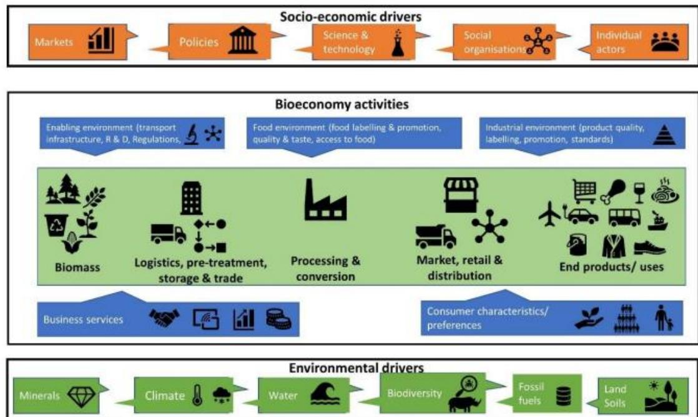
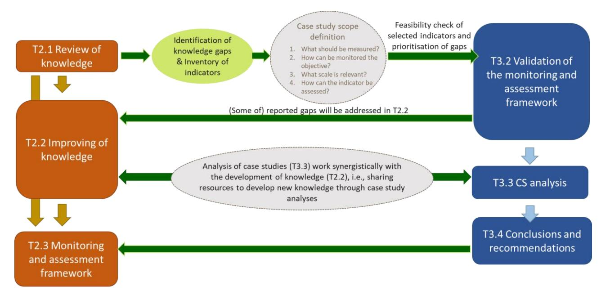
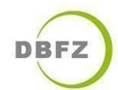

# **D3.2 – DESCRIPTION OF THE VALIDATION METHODOLOGY**

| Work package     | WP3 Definition and analysis of relevant case studies for the circular       |
|------------------|-----------------------------------------------------------------------------|
| Task             | T3.2 Consistency check between case studies and monitoring and assessment   |
| Due date         | 31 October 2023                                                             |
| Submission date  | 31 October 2023                                                             |
| Deliverable lead | Wageningen Research                                                         |
| Version          | V6.0                                                                        |
| Authors          | Iris Vural Gursel, Berien Elbersen and Heleen Ballemans (WR)                |
| Contributors     | Gülşah Yilan, Eleonora Staffieri (UNIT), Luana Ladu, Mariam Rasheed (BA M), |
| Reviewers        | All partners                                                                |

### **Document Revision History**

| Version | Date       | Description of change                         | List of contributor(s)                  |
|---------|------------|-----------------------------------------------|-----------------------------------------|
| 1.0     | 01.09.2023 | Draft structure of the deliverable            | WR                                      |
| 2.0     | 10.09.2023 | First draft of the deliverable                | WR                                      |
| 3.0     | 18.10.2023 | Complete draft ready for review               | WR                                      |
| 4.0     | 24.10.2023 | Reviewer’s comments and edits                 | UNIT, BAM, UGENT, TECNALIA, DBFZ, CIRCE |
| 5.0     | 30.10.2023 | Final draft after implementing edits/comments | WR                                      |
| 6.0     | 31.10.2023 | Final check and submission                    | UNIT                                    |

#### **Abstract**

The transition from linear fossil-based systems to circular and bio-based systems represents an opportunity and a suitable pathway for achieving several SDGs. Indeed, circular bio-based systems depict a great opportunity to reconcile sustainable long-term growth with environmental protection through the prudent use of renewable resources for industrial purposes. This needed transition is a complex process, which does not simply require innovative technologies from the supply-side, but also societal transformations based on a multi-actor process. The circular bioeconomy meta-sector may be a good candidate to put forward a new economic model, which requires transformative policies, purposeful innovation, access to finance, risk-taking capacity as well as new and sustainable business models and markets. However, a critical assessment of the environmental, social and economic impacts of the current linear fossil-based economy, as well as of the improvement potential associated with circular bio-based systems, is needed to underpin the identification of policy priorities. Bearing this in mind, SUSTRACK is a three-year project aimed at supporting policymakers in their efforts to develop sustainable pathways to replace fossil and carbon-intensive systems with sustainable circular and biobased systems (at the EU and regional scale), contributing to achieving the European Green Deal's objectives. This will be done by: identifying environmental, economic and social limits of a linear carbon-intensive and fossilbased economy; improving existing assessment methodologies; assessing the environmental, social and economic impacts of the EU's current linear fossil-based economy; comparing multiple transition scenarios focusing on the most carbon intensive sectors; identifying priorities according to scenarios analysed in the project and develop guidelines and policy recommendations.

### **Disclaimer**

Funded by the European Union under project number 101081823. Views and opinions expressed are however those of the author(s) only and do not necessarily reflect those of the European Union or European Research Executive Agency (REA). Neither the European Union nor the granting authority can be held responsible for them.

**Copyright notice:** © 2022 - 2025 SUSTRACK Consortium

\* R: Document, report (excluding the periodic and final reports) DEM: Demonstrator, pilot, prototype, plan designs DEC: Websites, patents filing, press & media actions, videos, etc.

OTHER: Software, technical diagram, etc.

#### **SUSTRACK Consortium:**

| #  | Participant Organization Name                         | Short Name | Country |
|----|-------------------------------------------------------|------------|---------|
| 1  | UNIVERSITA DEGLI STUDI DI ROMA UNITELMA SAPIENZA      | UNIT       | IT      |
| 2  | STICHTING WAGENINGEN RESEARCH                         | WR         | NL      |
| 3  | KNOWLEDGE SRL                                         | KE         | IT      |
| 4  | PEDAL CONSULTING SRO                                  | PC         | SK      |
| 5  | DBFZ DEUTSCHES BIOMASSEFORSCHUNGSZENTRUM              |            |         |
|    |                                                       | DBFZ       | DE      |
| 6  | UNIVERSITEIT GENT                                     | UGENT      | BE      |
| 7  | FUNDACION TECNALIA RESEARCH & INNOVATION              | TECNALIA   | ES      |
| 8  | FVA SAS DI LOUIS FERRINI & C                          | FVA        | IT      |
| 9  | UNIVERSITA DEGLI STUDI DI FERRARA                     | UNIFE      | IT      |
| 10 | BUNDESANSTALT FUER MATERIALFORSCHUNG UND -            |            |         |
|    |                                                       | BAM        | DE      |
| 11 | FUNDACION CIRCE CENTRO DE INVESTIGACION DE RECURSOS Y |            |         |
|    |                                                       | CIRCE      | ES      |

|                            | Deliverable information                                                   |
|----------------------------|---------------------------------------------------------------------------|
| Nature of the deliverable: | R* Dissemination Level                                                    |
| PU                         | Public, fully open, e.g. web x                                            |
| CL                         | Classified, information as referred to in Commission Decision 2001/844/EC |
| CO                         | Confidential to SUSTRACK project and Commission Services                  |

## **EXECUTIVE SUMMARY**

The goal of achieving net-zero emissions by the European economy by 2050 demands a shift from linear, fossil-based systems to circular, bio-based systems. This transition is vital for meeting the United Nations Sustainable Development Goals and reconciling environmental protection with sustainable growth. However, the complexity of the transition relies on societal transformations, cutting-edge technologies, and multi-actor processes, requiring a new economic framework and policy priorities that align with the European Green Deal.

This report presents the SUSTRACK T3.2 results on the validation of the monitoring and assessment framework and guidelines for the implementation of the case studies work. In T3.1, 10 case studies were selected. In T2.1 a gap analysis was done of existing monitoring indicators and methodologies for assessing environmental, social and economic impacts of the transition from the current linear fossil-based economy to a more circular bio-based economy. In this deliverable, firstly the outcomes of a consistency check of the resulting indicator framework from T2.1 is presented per case study. This provides a further improved understanding of the indicators and metrics that are missing and/or need further elaboration in T2.2 and how the monitoring framework can be further improved as part of T2.3. This is also in the context of different case studies analysed in T3.3. This is then followed by general feedback for the further development of the monitoring and assessment framework in T2.3 in terms of clarity, completeness and other relevant aspects. Finally, guidelines are presented for mapping stakeholders, policy instruments, information and data collection for the case study analysis to be performed in T3.3. Additionally, the linkages with other SUSTRACK WP activities are defined to which the case studies analysis will provide input for the transition to a more circular biobased economy.

| 1 Introduction                                                                | 11 |
|-------------------------------------------------------------------------------|----|
| 2 Approach and Methodology                                                    | 12 |
| 3 Results                                                                     | 14 |
| assessment framework                                                          | 14 |
| 3.1.1 Proposed additional societal objectives                                 | 15 |
| 3.1.2 Proposed additional s-LCA and LCC indicators                            | 19 |
| 3.1.3 Proposed additional indicators for regional level assessment            | 21 |
| 3.2 Consistency check by each case study                                      | 24 |
| 3.2.1 Construction - Cross laminated timber                                   | 24 |
| 3.2.2 Construction - Biochar as an additive in concrete                       | 32 |
| 3.2.3 Construction - Hemp insulation                                          | 36 |
| 3.2.4 Textile - Recycled carded wool from Prato, Italy                        | 44 |
| 3.2.5 Textile - Man-made cellulosic fibres, like Lyocell                      | 50 |
| 3.2.6 Textile - Latxa sheep wool from the Basque Country of Spain             | 59 |
| 3.2.7 Chemical - Chemicals from waste                                         | 64 |
| 3.2.8 Chemical - Bio-MEG, bio-MPG, and renewable functional fillers from wood | 69 |
| 3.2.9 Plastics – Polylactic acid                                              | 73 |
| 3.2.10 Plastics – Polypropylene from used cooking oil                         | 78 |
| 3.3 General feedback on the bioeconomy monitoring and assessment framework    | 82 |
| framework                                                                     | 87 |
| 4. Guidance for Case Study Analysis                                           | 89 |
| 4.1 Mapping stakeholders                                                      | 90 |
| 4.2 Mapping policies of relevance                                             | 91 |
| 4.3 Information and data collection from literature and stakeholders          | 92 |

# **TABLE OF CONTENTS**

| 4.4 Information needs for other Work packages for case studies      | 92 |
|---------------------------------------------------------------------|----|
| 4.4.1 Linkage with WP2 related to gap analysis and closing the gaps | 92 |
| options                                                             | 94 |
| 4.4.3 Linkage with WP5 on relevant policy instruments               | 94 |
| 4 Conclusions and further steps in WP3                              | 95 |
| References                                                          | 97 |

### **LIST OF FIGURES**

| the bioeconomy monitoring and assessment framework                       | 12 |
|--------------------------------------------------------------------------|----|
| Figure 2: Bioeconomy system made up of different stakeholders            | 91 |
| Figure 3: Overview of the linkage of WP2 and WP3 in the SUSTRACK project | 93 |

### **LIST OF TABLES**

| Table 1: Selected case studies and corresponding sectors                                     | 11                                                  |
|----------------------------------------------------------------------------------------------|-----------------------------------------------------|
| Table 2: Proposed 3 additional societal objectives with its linked sub-topics and indicators | 15                                                  |
| Table 3: Proposed addition of s-LCA and LCC indicators at product level                      | 19                                                  |
| Table 4: Proposed indicators for regional level assessment                                   | 22                                                  |
| Table 5: Consistency check for the Construction -                                            | Cross laminated timber case study 25                |
| Table 6: Highly relevant indicators identified for the Construction -                        | Cross laminated timber case                         |
| study                                                                                        | 26                                                  |
| Table 7: Consistency check for the Construction -                                            | Biochar as an additive in concrete case study       |
| Table 8: Highly relevant indicators identified for the Construction -                        | Biochar as an additive in                           |
| concrete case study                                                                          | 34                                                  |
| Table 9: Consistency check for the Construction -                                            | Hemp insulation case study 37                       |
| Table 10: Highly relevant indicators identified for the Construction -                       | Hemp insulation case study                          |
| Table 11: Consistency check for the Textile -                                                | Recycled carded wool from Prato, Italy case study   |
| Table 12: Highly relevant indicators identified for the Textile -                            | Recycled carded wool from Prato,                    |
| Italy case study                                                                             | 46                                                  |
| Table 13: Consistency check for the Textile -                                                | Man-made cellulosic fibres, like Lyocell case study |
| Table 14: Highly relevant indicators identified for the Textile -                            | Man-made cellulosic fibres, like                    |
| Lyocell case study                                                                           | 52                                                  |

| Table 15: Consistency check for the Textile -                                               | Latxa sheep wool from the Basque Country of Spain  |
|---------------------------------------------------------------------------------------------|----------------------------------------------------|
| case study                                                                                  | 59                                                 |
| Table 16: Highly relevant indicators identified for the Textile -                           | Latxa sheep wool from the Basque                   |
| Country of Spain case study                                                                 | 61                                                 |
| Table 17: Consistency check for the Chemical -                                              | Chemicals from waste case study 64                 |
| Table 18: Highly relevant indicators identified for the Chemical -                          | Chemicals from waste case study                    |
| Table 19: Consistency check for the Chemical -                                              | Bio-MEG, bio-MPG, and renewable functional fillers |
| from wood case study                                                                        | 69                                                 |
| Table 20: Highly relevant indicators identified for the Chemical -                          | Bio-MEG, bio-MPG, and                              |
| renewable functional fillers from wood case study                                           | 71                                                 |
| Table 21: Consistency check for the Plastics –                                              | Polylactic acid case study 74                      |
| Table 22: Highly relevant indicators identified for the Plastics                            | – Polylactic acid case study 75                    |
| Table 23: Consistency check for the Plastics –                                              | Polypropylene from used cooking oil case study 78  |
| Table 24: Highly relevant indicators identified for the Plastics                            | – Polypropylene from used cooking                  |
| oil case study                                                                              | 80                                                 |
| assessment framework                                                                        | 83                                                 |
| Table 26: Research gaps identified in T2.1 to be considered to be addressed in case studies | 93                                                 |
| Table 27: Information to be collected regarding relevant policy instruments                 | 95                                                 |

|                      | List of Abbreviations                  |
|----------------------|----------------------------------------|
| Abbreviation/Acronym | Description                            |
| CBBE                 | Circular, bio-based economy            |
| CLT                  | Cross-Laminated Timber                 |
| EC                   | Environmental Commission               |
| EU                   | European Union                         |
| GEM                  | General Equilibrium Modelling          |
| GHG                  | Greenhouse Gas                         |
| GWP                  | Global Warming Potential               |
| HVO                  | hydrotreated vegetable oil             |
| ISTAT                | National Statistics Institute of Italy |
| LCA                  | Life Cycle Assessment                  |
| LCC                  | Life Cycle Costing                     |
| MEG                  | Monoethylene Glycol                    |
| MMCFs                | Man-made cellulosic fibres             |
| MPG                  | Monopropylene glycol                   |
| PLA                  | Polylactic acid                        |
| PP                   | Polypropylene                          |
| R&D                  | Research and Development               |
| s-LCA                | Social Life Cycle Assessment           |
| SDG                  | Sustainable Development Goal           |
| SO                   | Societal Objective                     |
| T                    | Task                                   |
| UCO                  | Used cooking oil                       |
| WP                   | Work package                           |

### **1 INTRODUCTION**

The SUSTRACK project adopts a bottom-up approach to the development and validation of key project outputs (including the Bioeconomy Assessment and Monitoring Framework developed in WP2) by testing them against real case studies. In T3.1, 10 case studies were selected from four sectors that face critical challenges (see Table 1) within the current linear system: (a) the construction sector (requiring, e.g., a shift from concrete to sustainable renewable alternatives); (b) the textile sector (requiring, e.g., a shift from fossil-based to bio-based fibres); (c) the (fine) chemical sector (requiring, e.g., a transition to renewable carbon sources and biorefineries); and (d) the plastics sector (requiring, e.g., a shift from fossil-based to bio-based polymers).

*Table 1: Selected case studies and corresponding sectors*

| Sector       | Case study                                                   |
|--------------|--------------------------------------------------------------|
| Construction | Cross-laminated timber                                       |
| Construction | Biochar as an additive in concrete                           |
| Construction | Hemp insulation                                              |
| Textile      | Recycled carded wool from Prato, Italy                       |
| Textile      | Man-made cellulosic fibres, like Lyocell                     |
| Textile      | Latxa sheep wool from the Basque Country of Spain            |
| Chemical     | Chemicals from waste                                         |
| Chemical     | Bio-MEG, bio-MPG, and renewable functional fillers from wood |
| Plastics     | Polylactic acid (PLA)                                        |
| Plastics     | Polypropylene from used cooking oil                          |

The objective of T3.2 is to validate the applicability and comprehensiveness of the bioeconomy monitoring and assessment framework developed in WP2. This framework includes a database of indicators structured under societal objectives and its sub-topics in line with the approach used in Kardung et al. (2021). For this, the 5 societal objectives of the EU Bioeconomy strategy (EC, 2018) were taken as basis i.e., (1) Food and nutrition security; (2) Sustainable natural resource management; (3) Dependence on non-renewable resources; (4) Mitigating and adapting to climate change; (5) Employment and economic competitiveness.

In T3.2, the specific 10 case studies and their needs are matched to relevant indicators following a stepwise approach and, any gaps - in terms of information available on existing indicators or additional indicator requirements - are identified. This will provide feedback for WP2 to adapt and generate additional guidance on existing indicators in the monitoring framework as well as complement the framework with additional indicators that were found relevant. Additionally, this task conducts a review of the framework in general and provides feedback for further development in T2.3. This includes consideration of for example: the categorization of sub-topics within societal objectives, possible overlap between indicators, and clarity of information provided in the framework.

The insights generated from the consistency checks carried out for each case study are reported and can provide information on more prominent indicators from the framework and identified indicator gaps. This will also provide a linkage of the case study assessment to T2.2 for addressing the gaps identified and for further improvement of the framework in T2.3.

T3.2 also provides guidance for case study analysis to be carried out in T3.3. This considers the mapping of stakeholders and policies of relevance for case studies. Moreover, it provides guidance in terms of information and data collection. This refers to identifying and reviewing relevant (publicly) available information (e.g., publications, reports) and the results of previous environmental, social, and economic assessments. This also considers engagement with stakeholders through emails, interviews or workshops organised to generate additional knowledge on the case studies.

The report is structured as follows: Chapter 2 presents the methodological approach used to validate the bioeconomy monitoring and assessment framework; Chapter 3 presents the results from the consistency check carried out for each of the case studies and derived general insights; Chapter 4 provides the guidance for the case study assessment for stakeholder and relevant policy mapping, information collection from literature and stakeholder, and linkage with other work packages. Finally, Chapter 5 reports the main conclusions from this task and provides information on the next steps in WP3.

# **2 APPROACH AND METHODOLOGY**

In T2.3, a preliminary monitoring and assessment framework was developed, containing a list of indicators structured under Bioeconomy strategy societal objectives (SOs) and its sub-topics as described above, to be utilized for mapping the effects of sustainability interventions in the transition to circular, bio-based systems. This was provided as an Excel file as input for this task. In T3.2, the degree of applicability and comprehensiveness of this preliminary proposed framework was checked for each of the 10 case studies identified in T3.1, belonging to the four critical sectors of interest to the SUSTRACK project. Simultaneously, this task concerned a first effort in the iterative process aimed at gaining a better understanding of the relevant indicators for the case studies. The stepwise approach applied is illustrated in Figure 1.

*Figure 1: Overview of the stepwise approach applied for each case study for consistency check of the bioeconomy monitoring and assessment framework*

To begin with, a copy of the preliminary monitoring and assessment framework Excel file (please see the supplementary material for D2.1) was made for each of the case studies and stored under the case study title. The following steps were followed in these Excel files created for each case study:

### 1. Filtering of societal objectives (SOs)

For the context of this case study, the societal objectives that are relevant are selected and the not relevant are filtered out.

#### 2. Checking completeness of SOs

A check is performed to see if there are any societal objectives that are also relevant but are not included in this list. If this is the case, additional SOs are proposed, in order to ensure a sufficiently complete coverage of SOs deemed relevant in light of the examined case study.

#### 3. Filtering of sub-topics

A second filtering step is performed to determine which sub-topics, linked to the SOs selected to be relevant in step 1, are considered applicable to the examined case study.

#### 4. Checking completeness of sub-topics

Similar to step 2, a check is performed to see if there are any sub-topics linked to any of the relevant SOs which would be relevant for the analysis of this case study are missing from the framework. If this is the case, suggestions for additional sub-topics are made.

#### 5. Choosing a scale

For the context of this case study, filtering is made based on which scale of assessment applies to that case study i.e., product-level, macro-level (i.e., country or region), or a mix of both.

#### 6. Ranking of indicators

The completion of the above 5 steps results in a list of indicators remaining following the filtering performed. In this step, the evaluation of the indicators is done in terms of the relevance and suitability for this case study. The indicators are marked as either of "high", "medium", "low", or "no" relevance. If sufficient information was not available to judge the relevance of the indicator at this stage, a "?" was also possible to assign to be further elaborated in the next steps.

#### 7. Checking completeness of indicators

The indicators considered highly relevant are then added in a separate table for reporting purposes. In the last step, this list of highly relevant indicators is reviewed to see if any additional indicators would be needed to assess this case study. If this is the case, additional indicators are proposed and the list is extended with these additionally identified indicators. These additional indicators are marked red for differentiation.

A template was prepared based on this stepwise approach and shared with the case study owners to facilitate the reporting of their analysis. This reporting template is aimed at providing an overview of the activities performed for each case study in their Excel files and the resulting indicators identified to be of high relevance. Based on their current level of knowledge of the case study, each case study owner performed the consistency check exercise and filled the template for their case study. This reporting done per case study is provided in Section 3.2. It should be noted that the case study owners had at this point different levels of knowledge on the case studies that they were responsible for. For example, for the Textile–Latxa case study, the case study owner Tecnalia had extensive information on the case study and its sustainability performance from the recent Orienting project1 where they performed a Life Cycle Assessment (LCA), Social Life Cycle Assessment (s-LCA) and Life Cycle Costing (LCC) for this case study. For some other case studies, the case study owners already had an initial literature review on the available information on the value chain, relevant stakeholders and sustainability performance for the case study at hand. This was the case for example for the Chemicals from waste study, Construction - biochar study and Textile – Prato study. Whereas, for the other case studies, expert judgement was used with the level of information the case study owner had at this point for carrying out the consistency check and evaluation of the relevance of the indicators.

The identification of the indicators that are relevant to the case studies is considered to be an iterative process. As part of T3.2, a first review is conducted and presented in Section 3.1. This list of indicators will be further elaborated and refined as part of the T3.3 case study assessment where the case study owners will collect data and information on their case studies through literature review and stakeholder engagement. In this next stage, the data availability to assess these indicators will be analysed. Furthermore, in filling the gaps identified, close collaboration will be made with T2.2 development in terms of further development of indicators/methods and their testing in relevant case studies.

In addition to the consistency check exercise and the initial identification of the highly relevant indicators for each case study, the execution of the consistency check exercise was utilized to collect generic feedback on the preliminary monitoring and assessment framework that will be used as input in T2.3 for further improvement and optimization of the framework. These general remarks were collected and reported separately in Section 3.3.

## **3 RESULTS**

Firstly, the additional indicators proposed to be incorporated in the bioeconomy monitoring and assessment framework are provided in Section 3.1. The results of the consistency check carried out for each case study is presented in Section 3.2 (3.2.1 through 3.2.10) which provide the analysis of the most relevant indicators identified at this stage of the case study analysis as well as the gaps identified and suggestion of additions/edits to further improve the bioeconomy monitoring and assessment framework to better assess the case study. Furthermore, general feedback on the bioeconomy monitoring and assessment framework is collected from the case studies and presented in Section 3.3. The insights generated from the analysis of the results reported are presented in Section 3.4.

### **3.1 Proposed additional indicators to be incorporated in the bioeconomy monitoring and assessment framework**

1 <https://orienting.eu/>

The consistency check carried out at a higher level resulted in the proposal of 3 additional sets of indicators to be incorporated in the bioeconomy monitoring and assessment framework. The motivation to include each of these indicator sets and the sources used for identifying them is described in the following subsections. The first set concerns the proposal for 3 additional societal objectives with their linked sub-topics and indicators. With the second set, it is proposed to include in the monitoring framework s-LCA and LCC indicators relevant to assess the social and economic performance at a product level. Thirdly, to better assess case studies that have a regional dimension, additional indicators are proposed to be included. These proposed indicators were reviewed in individual case study consistency checks if additional indicators were to be proposed (related to step 7 of the stepwise approach).

### **3.1.1Proposed additional societal objectives**

Eventually, 3 additional societal objectives with their linked sub-topics and indicators have been considered based on the literature review of indicators carried out in T2.1. These are:

- a. Disease prevention and human health
- b. Just inclusive and resilient economy
- c. Risk assessment and monitoring

These societal objectives were deemed relevant within T2.1 after (1) reviewing the work of Bracco et al. (2019), who proposed a scheme of indicators at the territorial and product levels to monitor and evaluate the sustainability of bioeconomy, and (2) cross-checking their coverage/representativeness in the current SOs promoted by the EU Bioeconomy Strategy. On the one hand, as the EU bioeconomy monitoring framework is mainly thought for territories (countries), it does not address, to a great extent, purely health issues or risk assessment measures, which in turn are crucial when concentrating at the product level. On the other hand, the EU bioeconomy strategy is strongly oriented towards strengthening EU competitiveness and job creation but fails to include key aspects such as inclusion and resilience. Table 2 presents the 3 additional SOs along with their linked sub-topics and indicators.

*Table 2: Proposed additional societal objectives with their linked sub-topics and indicators*

| # |         | Societal objectives |     | Sub-topics  | Indicators                        | Domains | Scale   |
|---|---------|---------------------|-----|-------------|-----------------------------------|---------|---------|
| 6 | Disease | prevention          | and |             |                                   |         |         |
|   |         |                     |     | Food safety | Quality or number of              |         |         |
|   |         |                     |     |             | information/signs on product      |         |         |
|   |         |                     |     |             |                                   | Society | Product |
| 6 | Disease | prevention          | and |             |                                   |         |         |
|   |         |                     |     | Food safety | Number of consumer complaints     | Society | Product |
| 6 | Disease | prevention          | and |             |                                   |         |         |
|   |         |                     |     | Food safety | Quality of labels of health and   |         |         |
|   |         |                     |     |             |                                   | Society | Product |
| 6 | Disease | prevention          | and |             |                                   |         |         |
|   |         |                     |     | Food safety | Total number of incidents of non |         |         |
|   |         |                     |     |             |                                   | Society | Product |

|   |         |            |     |                | voluntary codes concerning        |         |         |
|---|---------|------------|-----|----------------|-----------------------------------|---------|---------|
|   |         |            |     |                | health and safety impacts of      |         |         |
| 6 | Disease | prevention | and |                |                                   |         |         |
|   |         |            |     | prevention (in |                                   |         |         |
|   |         |            |     | production and |                                   |         |         |
|   |         |            |     |                | Rate of occupational injury,      |         |         |
|   |         |            |     |                | illness and fatalities / final    |         |         |
|   |         |            |     |                |                                   | Society | Product |
| 6 | Disease | prevention | and |                |                                   |         |         |
|   |         |            |     | prevention (in |                                   |         |         |
|   |         |            |     | production and |                                   |         |         |
|   |         |            |     |                | safety hazards as defined in      |         |         |
|   |         |            |     |                | national law and international    |         |         |
|   |         |            |     |                |                                   | Society | Product |
| 6 | Disease | prevention | and |                |                                   |         |         |
|   |         |            |     | prevention (in |                                   |         |         |
|   |         |            |     | production and |                                   |         |         |
|   |         |            |     |                | % of crop supply came from        |         |         |
|   |         |            |     |                | health and safety low-risk        |         |         |
|   |         |            |     |                |                                   | Society | Product |
| 6 | Disease | prevention | and |                |                                   |         |         |
|   |         |            |     | prevention (in |                                   |         |         |
|   |         |            |     | production and |                                   |         |         |
|   |         |            |     |                | % of crop supply came from        |         |         |
|   |         |            |     |                | health and safety high-risk       |         |         |
|   |         |            |     |                | for which we took corrective      |         |         |
|   |         |            |     |                | actions (level of risk of the     |         |         |
|   |         |            |     |                |                                   | Society | Product |
| 6 | Disease | prevention | and |                |                                   |         |         |
|   |         |            |     | Human health   | Human toxicity and cancer         |         |         |
|   |         |            |     |                |                                   | Society | Product |
| 6 | Disease | prevention | and |                |                                   |         |         |
|   |         |            |     | Human health   | Human toxicity non-cancer         |         |         |
|   |         |            |     |                |                                   | Society | Product |
| 6 | Disease | prevention | and |                |                                   |         |         |
|   |         |            |     | Human health   | Ionising radiation / product unit |         |         |
|   |         |            |     |                |                                   | Society | Product |
| 6 | Disease | prevention | and |                |                                   |         |         |
|   |         |            |     | Human health   | Particulate matter as respiratory |         |         |
|   |         |            |     |                |                                   | Society | Product |
| 6 | Disease | prevention | and |                |                                   |         |         |
|   |         |            |     | Human health   | % of hazardous (carcinogenic,     |         |         |
|   |         |            |     |                | reprotoxic, mutagenic)            |         |         |
|   |         |            |     |                | substances for human              |         |         |
|   |         |            |     |                |                                   | Society | Product |
| 6 | Disease | prevention | and |                |                                   |         |         |
|   |         |            |     | Human health   | Amount of genetically modified    |         |         |
|   |         |            |     |                | micro-organisms or any micro     |         |         |
|   |         |            |     |                |                                   | Society | Product |

|   |                              |                 |    | the processing (μg/production    |         |         |
|---|------------------------------|-----------------|----|----------------------------------|---------|---------|
| 6 | Disease prevention and       |                 |    |                                  |         |         |
|   |                              | Human health    |    | Ozone Depletion Potential (ODP)  |         |         |
|   |                              |                 |    | / product unit (kg eq.           |         |         |
|   |                              |                 |    |                                  | Society | Product |
| 7 | Just inclusive and resilient |                 |    |                                  |         |         |
|   |                              | Gender equality |    | Number of women having equal     |         |         |
|   |                              |                 |    |                                  | Society | Product |
| 7 | Just inclusive and resilient |                 |    |                                  |         |         |
|   |                              | Gender equality |    | Number of women having equal     |         |         |
|   |                              |                 |    |                                  | Society | Product |
| 7 | Just inclusive and resilient |                 |    |                                  |         |         |
|   |                              | Gender equality |    | Ratio of basic salary of men to  |         |         |
|   |                              |                 |    |                                  | Society | Product |
| 7 | Just inclusive and resilient |                 |    |                                  |         |         |
|   |                              | Inclusiveness   |    | % of smallholder farmer sourced  |         |         |
|   |                              |                 |    | crop supply, by mass, was        |         |         |
|   |                              |                 |    | to increase opportunities for    |         |         |
|   |                              |                 |    |                                  | Society | Product |
| 7 | Just inclusive and resilient |                 |    |                                  |         |         |
|   |                              | Inclusiveness   |    | Hours of training to potentially |         |         |
|   |                              |                 |    |                                  | Society | Product |
| 7 | Just inclusive and resilient |                 |    |                                  |         |         |
|   |                              | Inclusiveness   |    | Support to vulnerable people     |         |         |
|   |                              |                 |    |                                  | Society | Product |
| 7 | Just inclusive and resilient |                 |    |                                  |         |         |
|   |                              |                 |    | Presence of necessary            |         |         |
|   |                              |                 |    |                                  | Economy | Product |
| 7 | Just inclusive and resilient |                 |    |                                  |         |         |
|   |                              |                 |    | distribution of bioproducts      |         |         |
|   |                              |                 |    |                                  | Economy | Product |
| 7 | Just inclusive and resilient |                 |    |                                  |         |         |
|   |                              | Resilience      | of |                                  |         |         |
|   |                              |                 |    | Number of co-operatives and      |         |         |
|   |                              |                 |    | micro-credit schemes that        |         |         |
|   |                              |                 |    | scale farmers and rural          |         |         |
|   |                              |                 |    |                                  | Society | Product |
| 7 | Just inclusive and resilient |                 |    |                                  |         |         |
|   |                              | Resilience      | of |                                  |         |         |
|   |                              |                 |    |                                  | Society | Product |

| 8 | Risk | assessment | and |                 |     |                                 |               |         |
|---|------|------------|-----|-----------------|-----|---------------------------------|---------------|---------|
|   |      |            |     | Risk assessment |     | Risks for negative impacts on   |               |         |
|   |      |            |     |                 |     | price and supply of fuelwood    |               |         |
|   |      |            |     |                 |     |                                 | Society       | Product |
| 8 | Risk | assessment | and |                 |     |                                 |               |         |
|   |      |            |     | Risk assessment |     | Strength of organizational risk |               |         |
|   |      |            |     |                 |     | assessment with regard to       |               |         |
|   |      |            |     |                 |     |                                 | Society       | Product |
| 8 | Risk | assessment | and |                 |     |                                 |               |         |
|   |      |            |     | Monitoring      | and |                                 |               |         |
|   |      |            |     |                 |     | of business interest and        |               |         |
|   |      |            |     |                 |     | fraudulent practices are        |               |         |
|   |      |            |     |                 |     | appropriate staff training      |               |         |
|   |      |            |     |                 |     |                                 | Society       | Product |
| 8 | Risk | assessment | and |                 |     |                                 |               |         |
|   |      |            |     | Monitoring      | and |                                 |               |         |
|   |      |            |     |                 |     | system ensuring that auxiliary  |               |         |
|   |      |            |     |                 |     |                                 | Society       | Product |
| 8 | Risk | assessment | and |                 |     |                                 |               |         |
|   |      |            |     | Monitoring      | and |                                 |               |         |
|   |      |            |     |                 |     |                                 | Society       | Product |
| 8 | Risk | assessment | and |                 |     |                                 |               |         |
|   |      |            |     | Monitoring      | and |                                 |               |         |
|   |      |            |     |                 |     | that effectively addresses      |               |         |
|   |      |            |     |                 |     | environmental and social        |               |         |
| 8 | Risk | assessment | and |                 |     |                                 |               |         |
|   |      |            |     | Monitoring      | and |                                 |               |         |
|   |      |            |     |                 |     | use of hazardous substances     |               |         |
|   |      |            |     |                 |     |                                 | Environmental | Product |
| 8 | Risk | assessment | and |                 |     |                                 |               |         |
|   |      |            |     | Monitoring      | and |                                 |               |         |
|   |      |            |     |                 |     | equivalent system with all      |               |         |
|   |      |            |     |                 |     | relevant applicable             |               |         |
|   |      |            |     |                 |     | international, national and     |               |         |
|   |      |            |     |                 |     | regional laws and regulations   |               |         |
|   |      |            |     |                 |     |                                 | Society       | Product |
| 8 | Risk | assessment | and |                 |     |                                 |               |         |
|   |      |            |     | Monitoring      | and |                                 |               |         |
|   |      |            |     |                 |     | ensuring that personnel are     |               |         |
|   |      |            |     |                 |     | and have access to the legal    |               |         |
|   |      |            |     |                 |     |                                 | Society       | Product |
| 8 | Risk | assessment | and |                 |     |                                 |               |         |
|   |      |            |     | Monitoring      | and |                                 |               |         |
|   |      |            |     |                 |     | to receive, respond to, and     |               |         |
|   |      |            |     |                 |     | workers and communities         |               |         |
|   |      |            |     |                 |     |                                 | Society       | Product |

| 8 | Risk | assessment | and |            |     |                               |               |         |
|---|------|------------|-----|------------|-----|-------------------------------|---------------|---------|
|   |      |            |     | Monitoring | and |                               |               |         |
|   |      |            |     |            |     | the amounts of sustainable    |               |         |
|   |      |            |     |            |     | material sourced and sold in  |               |         |
|   |      |            |     |            |     | order to prevent multiple     |               |         |
|   |      |            |     |            |     |                               | Environmental | Product |
| 8 | Risk | assessment | and |            |     |                               |               |         |
|   |      |            |     | Monitoring | and |                               |               |         |
|   |      |            |     |            |     | and continuously monitor      |               |         |
|   |      |            |     |            |     | compliance with international |               |         |
|   |      |            |     |            |     |                               | Environmental | Product |
| 8 | Risk | assessment | and |            |     |                               |               |         |
|   |      |            |     | Monitoring | and |                               |               |         |
|   |      |            |     |            |     | Number of fulfilled existing  |               |         |

### **3.1.2 Proposed additional s-LCA and LCC indicators**

During the literature review carried out in T2.1, it was found out that differently from the environmental dimension, which was well represented by the indicators provided in Bracco et al. (2019), the economic and social dimension was underrepresented. Hence, building on the recent work of the ORIENTING project2 the list of life cycle indicators covering the social and economic pillars was considered. These s-LCA and LCC indicators for social and economic assessment at the product level are presented in Table 3. While the economic indicators fall within the existing SO5 Employment and economic competitiveness, the social indicators are mostly linked with the newly proposed SOs of SO6 Disease prevention and human health and SO7 Just inclusive and resilient economy.

*Table 3: Proposed additional s-LCA and LCC indicators at the product level (s-LCA are shaded yellow, LCC are shaded blue)*

| # | Societal objectives          | Sub-topics   | Indicators             | Domains | Scale   |
|---|------------------------------|--------------|------------------------|---------|---------|
| 5 | Employment and economic      |              |                        |         |         |
|   |                              |              |                        | Society | Product |
| 5 | Employment and economic      |              |                        |         |         |
|   |                              | Employment   | Unemployment           | Society | Product |
| 6 | Disease prevention and human |              |                        |         |         |
|   |                              | Human health | Occupational Tox & Haz | Society | Product |
| 6 | Disease prevention and human |              |                        |         |         |
|   |                              | Human health | Injuries & Fatalities  | Society | Product |
| 6 | Disease prevention and human |              |                        |         |         |
|   |                              | Human health | Non-Communicable       |         |         |
|   |                              |              |                        | Society | Product |
| 6 | Disease prevention and human |              |                        |         |         |
|   |                              | Human health | Communicable Diseases  | Society | Product |

2 See ORIENTING (2022) Deliverable D2.3 'LCSA methodology to be implemented in WP4 demonstrations' for further information

| 7 | Just | inclusive                      | and | resilient |                       |     |                          |         |         |
|---|------|--------------------------------|-----|-----------|-----------------------|-----|--------------------------|---------|---------|
|   |      |                                |     |           | Labour rights         |     | Wage                     | Society | Product |
| 7 | Just | inclusive                      | and | resilient |                       |     |                          |         |         |
|   |      |                                |     |           | Labour rights         |     | Child Labour             | Society | Product |
| 7 | Just | inclusive                      | and | resilient |                       |     |                          |         |         |
|   |      |                                |     |           | Labour rights         |     | Forced Labour            | Society | Product |
| 7 | Just | inclusive                      | and | resilient |                       |     |                          |         |         |
|   |      |                                |     |           | Labour rights         |     | Excessive Work Time      | Society | Product |
| 7 | Just | inclusive                      | and | resilient |                       |     |                          |         |         |
|   |      |                                |     |           | Labour rights         |     | Freedom of Association   | Society | Product |
| 7 | Just | inclusive                      | and | resilient |                       |     |                          |         |         |
|   |      |                                |     |           | Labour rights         |     | Migrant Labour           | Society | Product |
| 7 | Just | inclusive                      | and | resilient |                       |     |                          |         |         |
|   |      |                                |     |           | Labour rights         |     | Social Benefits          | Society | Product |
| 7 | Just | inclusive                      | and | resilient |                       |     |                          |         |         |
|   |      |                                |     |           | Labour rights         |     | Discrimination           | Society | Product |
| 7 | Just | inclusive                      | and | resilient |                       |     |                          |         |         |
|   |      |                                |     |           | Respect of indigenous |     |                          |         |         |
|   |      |                                |     |           |                       |     | Indigenous Rights        | Society | Product |
| 7 | Just | inclusive                      | and | resilient |                       |     |                          |         |         |
|   |      |                                |     |           | Gender equality       |     | Gender Equity            | Society | Product |
| 7 | Just | inclusive                      | and | resilient |                       |     |                          |         |         |
|   |      |                                |     |           | Respect of indigenous |     |                          |         |         |
|   |      |                                |     |           |                       |     | High Conflict Zones      | Society | Product |
| 7 | Just | inclusive                      | and | resilient |                       |     |                          |         |         |
|   |      |                                |     |           | Access to basic needs |     | Access to Drinking Water | Society | Product |
| 7 | Just | inclusive                      | and | resilient |                       |     |                          |         |         |
|   |      |                                |     |           | Access to basic needs |     | Access to Sanitation     | Society | Product |
| 7 | Just | inclusive                      | and | resilient |                       |     |                          |         |         |
|   |      |                                |     |           | Access to basic needs |     | Children out of School   | Society | Product |
| 7 | Just | inclusive                      | and | resilient |                       |     |                          |         |         |
|   |      |                                |     |           | Access to basic needs |     | Access to Hospital Beds  | Society | Product |
| 7 | Just | inclusive                      | and | resilient |                       |     |                          |         |         |
|   |      |                                |     |           | Inclusiveness         |     | Smallholder              | v       |         |
|   |      |                                |     |           |                       |     |                          | Society | Product |
| 8 |      | Risk assessment and monitoring |     |           | Monitoring            | and |                          |         |         |
|   |      |                                |     |           |                       |     | Legal System             | Society | Product |
| 8 |      | Risk assessment and monitoring |     |           | Monitoring            | and |                          |         |         |
|   |      |                                |     |           |                       |     | Corruption               | Society | Product |
| 5 |      | Employment                     | and | economic  |                       |     |                          |         |         |
|   |      |                                |     |           | Comparative advantage |     | Capital Costs            | Economy | Product |
| 5 |      | Employment                     | and | economic  |                       |     |                          |         |         |
|   |      |                                |     |           | Comparative advantage |     | Raw Material/Utility     |         |         |
|   |      |                                |     |           |                       |     |                          | Economy | Product |

| 5 | Employment | and | economic |                       |                           |         |         |
|---|------------|-----|----------|-----------------------|---------------------------|---------|---------|
|   |            |     |          | Employment            | Personnel                 | Economy | Product |
| 5 | Employment | and | economic |                       |                           |         |         |
|   |            |     |          | Comparative advantage | Transport                 | Economy | Product |
| 5 | Employment | and | economic |                       |                           |         |         |
|   |            |     |          | Comparative advantage | Life cycle cost (or total |         |         |
|   |            |     |          |                       |                           | Economy | Product |
| 5 | Employment | and | economic |                       |                           |         |         |
|   |            |     |          | Environmental costs   | Emission, discharge &     |         |         |
|   |            |     |          |                       |                           | Economy | Product |
| 5 | Employment | and | economic |                       |                           |         |         |
|   |            |     |          | Externalities         | Soon-to-be internalised   |         |         |
|   |            |     |          |                       |                           | Economy | Product |
| 5 | Employment | and | economic |                       |                           |         |         |
|   |            |     |          | Externalities         | Non-internalised          |         |         |
|   |            |     |          |                       |                           | Economy | Product |
| 5 | Employment | and | economic |                       |                           |         |         |
|   |            |     |          | Productivity          | Positive cash flow        | Economy | Product |
| 5 | Employment | and | economic |                       |                           |         |         |
|   |            |     |          | Comparative advantage | Net present value         | Economy | Product |

### **3.1.3 Proposed additional indicators for regional level assessment**

Indicators for regional level assessment are required to perform the consistency checks for some case studies, e.g., the Prato case study for the textile sector. The report published by the National Statistics Institute of Italy (ISTAT, 2023), which is the official body for producing and disseminating official statistics in Italy, was selected as the baseline for the identification of new regional indicators in addition to the preliminary list of indicators. The ISTAT analysis was relevant to this consistency check because it provides comprehensive and reliable data on various aspects of the Italian context, including economic, social and environmental dimensions.

The identified indicators were then classified under the previously determined SOs and sub-topics. Additionally, an additional SO was proposed, namely, "Promoting global governance and cooperation". The benefit of using this SO is twofold. First, Prato is an industrial centre with significant international links, particularly in the textile and fashion industry. Global governance and collaboration are essential to manage the complex supply chains and transnational challenges faced by this industry, such as labour rights, environmental sustainability and ethical sourcing. Second, the inclusion of this SO reflects the interconnectedness of the Prato region with the global economy and society. By promoting global governance and collaboration, we aim to address the challenges and opportunities arising from Prato's global engagement and ensure sustainable and responsible practices within the region.

Regarding the SOs identified for other case studies, especially, "Inclusive and resilient economy" was considered relevant also for the Prato case study. This is in line with Prato's efforts to promote economic growth that benefits all members of the community and promotes economic equity and resilience of rural communities involved in the textile sector. The full list of proposed indicators at the regional level are provided in Table 4.

*Table 4: Proposed indicators for regional level assessment*

| # | Societal objectives          | Sub-topics      | Indicators                     | Domains     | Scale  |
|---|------------------------------|-----------------|--------------------------------|-------------|--------|
| 2 | Sustainable natural resource |                 |                                |             |        |
|   |                              | generation and  |                                |             |        |
|   |                              |                 | Percentage of biological       |             |        |
|   |                              |                 |                                | Environment | Region |
| 2 | Sustainable natural resource |                 |                                |             |        |
|   |                              |                 |                                | Environment | Region |
| 2 | Sustainable natural resource |                 |                                |             |        |
|   |                              |                 | unit of textile production     |             |        |
|   |                              |                 |                                | Environment | Region |
| 2 | Sustainable natural resource |                 |                                |             |        |
|   |                              |                 | Consumption of non-renewable   |             |        |
|   |                              |                 | the regional textile industry  |             |        |
|   |                              |                 |                                | Environment | Region |
| 2 | Sustainable natural resource |                 |                                |             |        |
|   |                              |                 | Percentage of recycled textile |             |        |
|   |                              |                 |                                | Environment | Region |
| 2 | Sustainable natural resource |                 |                                |             |        |
|   |                              |                 | "Extension of natural areas    |             |        |
|   |                              |                 |                                | Environment | Region |
| 2 | Sustainable natural resource |                 |                                |             |        |
|   |                              |                 | (e.g. wool from sheep fed      |             |        |
|   |                              |                 |                                | Environment | Region |
| 2 | Sustainable natural resource |                 |                                |             |        |
|   |                              |                 | agricultural land due to the   |             |        |
|   |                              |                 |                                | Environment | Region |
| 2 | Sustainable natural resource |                 |                                |             |        |
|   |                              | Biodiversity    | Number of local threatened     |             |        |
|   |                              |                 |                                | Environment | Region |
| 3 | Dependence on non           |                 |                                |             |        |
|   |                              | Supply security | Percentage of energy from      |             |        |
|   |                              |                 |                                | Environment | Region |
| 5 | Employment and economic      |                 |                                |             |        |
|   |                              | Innovation      | N° of new sustainable          |             |        |
|   |                              |                 |                                | Economy     | Region |

#### SUSTRACK: D3.2 Description of the validation methodology

| 5 | Employment and economic      |            |     |                                 |             |        |
|---|------------------------------|------------|-----|---------------------------------|-------------|--------|
|   |                              | Innovation |     | Research and development        |             |        |
|   |                              |            |     | investments in the textile      |             |        |
|   |                              |            |     |                                 | Economy     | Region |
| 5 | Employment and economic      |            |     |                                 |             |        |
|   |                              | Innovation |     | Investments in sustainable      |             |        |
|   |                              |            |     | infrastructure for the regional |             |        |
|   |                              |            |     | textile industry (e.g. water    |             |        |
|   |                              |            |     |                                 | Economy     | Region |
| 5 | Employment and economic      |            |     |                                 |             |        |
|   |                              | Innovation |     | number of sustainable practices |             |        |
|   |                              |            |     |                                 | Economy     | Region |
| 5 | Employment and economic      |            |     |                                 |             |        |
|   |                              | Innovation |     | % of public supplies by the     |             |        |
|   |                              |            |     | regional textile industry that  |             |        |
|   |                              |            |     |                                 | Economy     | Region |
| 7 | Just inclusive and resilient |            |     |                                 |             |        |
|   |                              | Resilience | of  |                                 |             |        |
|   |                              |            |     | Access of rural communities     |             |        |
|   |                              |            |     | drinking water, education and   |             |        |
|   |                              |            |     |                                 | Society     | Region |
| 7 | Just inclusive and resilient |            |     |                                 |             |        |
|   |                              | Resilience | of  |                                 |             |        |
|   |                              |            |     | Literacy rate and access to     |             |        |
|   |                              |            |     |                                 | Society     | Region |
| 7 | Just inclusive and resilient |            |     |                                 |             |        |
|   |                              | Resilience | of  |                                 |             |        |
|   |                              |            |     | water-related ecosystem areas   |             |        |
|   |                              |            |     |                                 | Environment | Region |
| 7 | Just inclusive and resilient |            |     |                                 |             |        |
|   |                              | Resilience | of  |                                 |             |        |
|   |                              |            |     |                                 | Economy     | Region |
| 7 | Just inclusive and resilient |            |     |                                 |             |        |
|   |                              | Resilience | of  |                                 |             |        |
|   |                              |            |     | Financial support provided to   |             |        |
|   |                              |            |     |                                 | Economy     | Region |
| 7 | Just inclusive and resilient |            |     |                                 |             |        |
|   |                              | Monitoring | and |                                 |             |        |
|   |                              |            |     | Quantity of textile waste       |             |        |
|   |                              |            |     | generated compared to total     |             |        |
|   |                              |            |     |                                 | Economy     | Region |
| 7 | Just inclusive and resilient |            |     |                                 |             |        |
|   |                              | Resilience | of  |                                 |             |        |
|   |                              |            |     |                                 | Economy     | Region |

| social protection                                                          |                                                                                                                                         |
|----------------------------------------------------------------------------|-----------------------------------------------------------------------------------------------------------------------------------------|
| 7 Just inclusive and resilient                                             |                                                                                                                                         |
| Resilience                                                                 | of                                                                                                                                      |
| economy rural communities social protection                                | Society Region Number of educational programs or initiatives on climate change mitigation implemented in the regional textile industry. |
| 7 Just inclusive and resilient                                             |                                                                                                                                         |
| Resilience                                                                 | of                                                                                                                                      |
|                                                                            | in decisions relating to the                                                                                                            |
| economy rural communities social protection                                | Society Region Involvement of rural communities regional textile industry.                                                              |
| 7 Just inclusive and resilient                                             |                                                                                                                                         |
| Inclusiveness                                                              | Availability of public information                                                                                                      |
| economy                                                                    | Society Region on the environmental and social impact of the textile industry in the region.                                            |
| 7 Just inclusive and resilient                                             |                                                                                                                                         |
| Inclusiveness                                                              | Number of training programmes                                                                                                           |
|                                                                            | regional textile industry with                                                                                                          |
| economy                                                                    | Society Region or technical cooperation of the developing countries to promote sustainability.                                          |
|                                                                            | international organisations or                                                                                                          |
|                                                                            | other global industries to                                                                                                              |
| Promoting global governance Partnerships and and collaboration cooperation | Society Region Number of partnerships between the regional textile industry and promote sustainability.                                 |
| 9 Promoting global governance                                              |                                                                                                                                         |
|                                                                            | the development of rural                                                                                                                |
| Partnerships and and collaboration cooperation                             | Society Region Number of partnerships between the textile industry in the region and local organisations to support communities         |

## **3.2 Consistency check by each case study**

### **3.2.1 Construction - Cross laminated timber**

Cross-laminated timber (CLT), also known as mass timber, is a sawn wood-based product, manufactured at a large scale. The value chain of CLT consists of several processing steps, starting with the stacking of lumber boards, which are subsequently glued and pressed in place. CLT-based wood panels are utilised in a multiplicity of predominantly construction-related applications, including in floors, roofs, and walls. As such, CLT enables developers to create wood-construction multi-floor buildings. Therewith, it is an appealing alternative to conventional building materials, like steel, concrete, and masonry. The stepwise consistency check conducted for this case study is presented in Table 5. The identified highly relevant indicators are listed in Table 6.

#### *Table 5: Consistency check for the Construction - Cross laminated timber case study*

| Additional methodological remarks                  | & results                                   |
|----------------------------------------------------|---------------------------------------------|
| 2. Checking                                        |                                             |
| Access to food, and                                | Utilisation                                 |
| Water quality and Marine environments              | ' quality                                   |
| 4. Checking                                        |                                             |
| Two additional sub-topics are suggested for        | the Societal objective 2                    |
| and "Local production". These sub-topics           | are closely tied to the climate impact      |
| produced CLT panels                                | reduces the transportation distance between |
| Switzerland, Italy and Chzechia, utilising readily | available softwood species.                 |

|    |                                  | production.                                                                                                                                                                          |      |
|----|----------------------------------|--------------------------------------------------------------------------------------------------------------------------------------------------------------------------------------|------|
| 5. | Choosing a                       |                                                                                                                                                                                      |      |
| 6. | Ranking of indicators            | (14) indicators is not classified. were scored in terms of relevance, resulting in: 79 indicators of high relevance, 141 indicators of low relevance, 27 indicators of no relevance. |      |
|    |                                  | environmental, circular and economic Table 6.                                                                                                                                        | (1). |
| 7. | Checking completeness indicators | No additional indicators were identified.                                                                                                                                            |      |

#### *Table 6: Highly relevant indicators identified for the Construction - Cross laminated timber case study*

| Societal |                                                                                  |
|----------|----------------------------------------------------------------------------------|
|          | objectives Sub-topics Indicators Domains Scale                                   |
| 2        | Sustainable                                                                      |
| natural  | resource                                                                         |
|          | Biodiversity % of biomass produced on land that                                  |
|          | Environment Product is/was highly biodiverse grassland management                |
| 2        | Sustainable                                                                      |
| natural  | resource                                                                         |
|          | Biodiversity % of biomass produced on land that                                  |
|          | Environment Product is/was a protected area management                           |
| 2        | Sustainable                                                                      |
| natural  | resource                                                                         |
|          | Biodiversity Functional diversity (Number and                                    |
|          | that influence how ecosystems                                                    |
|          | Environment Product variety of the elements of biodiversity management function) |

| 2       | Sustainable                                             |
|---------|---------------------------------------------------------|
| natural | resource                                                |
|         | Land use change                                         |
|         | Environment Product                                     |
| 2       | Sustainable                                             |
| natural | resource                                                |
|         | Land use change                                         |
|         | Environment Product                                     |
| 2       | Sustainable                                             |
| natural | resource                                                |
|         | Land use change                                         |
|         | Environment Product                                     |
| 2       | Sustainable                                             |
| natural | resource                                                |
|         | Land use change                                         |
|         | Environment Product                                     |
| 2       | Sustainable                                             |
| natural | resource                                                |
|         | Land use change                                         |
|         | Forest converted to cropland Environment Product        |
| 2       | Sustainable                                             |
| natural | resource                                                |
|         | Primary Biomass                                         |
|         | Wood consumption Environment Product                    |
| 2       | Sustainable                                             |
| natural | resource                                                |
|         | Environment Product                                     |
| 2       | Sustainable                                             |
| natural | resource                                                |
|         | Environment Product                                     |
| 2       | Sustainable                                             |
| natural | resource                                                |
|         | % of biological content/ product Environment Product    |
| 2       | Sustainable                                             |
| natural | resource                                                |
|         | % of carbon content derived from                        |
|         | Environment Product                                     |
| 2       | Sustainable                                             |
| natural | resource                                                |
|         | Energy efficiency Primary energy savings (kWh or % of   |
|         | Environment Product                                     |
| 2       | Sustainable                                             |
| natural | resource                                                |
|         | Energy efficiency Energy Intensity (product value added |
|         | Environment Product                                     |
| 2       | Sustainable                                             |
| natural | resource                                                |
|         | Energy efficiency Energy consumption by activity/       |
|         | Environment Product                                     |
| 2       | Sustainable                                             |
| natural | resource                                                |
|         | Forest quality % of crop supply, by mass, was grown     |
|         | Environment Product                                     |

| 2 | Sustainable      |                |            |                                          |             |         |
|---|------------------|----------------|------------|------------------------------------------|-------------|---------|
|   | natural resource |                |            |                                          |             |         |
|   |                  | Forest quality |            | % of crop supply, by mass, was grown     |             |         |
|   |                  |                |            |                                          | Environment | Product |
| 2 | Sustainable      |                |            |                                          |             |         |
|   | natural resource |                |            |                                          |             |         |
|   |                  | Forest quality |            | % of the total amount of wood used       |             |         |
|   |                  |                |            | comes from sustainable forest            |             |         |
|   |                  |                |            | management (economically viable,         |             |         |
|   |                  |                |            | environmentally sound, socially          |             |         |
|   |                  |                |            | responsible) or are waste wood           |             |         |
|   |                  |                |            |                                          | Environment | Product |
| 2 | Sustainable      |                |            |                                          |             |         |
|   | natural resource |                |            |                                          |             |         |
|   |                  | Forest quality |            | % of wood, wood-based, cork, cork       |             |         |
|   |                  |                |            | based, bamboo, bamboo-based              |             |         |
|   |                  |                |            |                                          | Environment | Product |
| 2 | Sustainable      |                |            |                                          |             |         |
|   | natural resource |                |            |                                          |             |         |
|   |                  | Forest quality |            | Share of forests certified for           |             |         |
|   |                  |                |            |                                          | Environment | Product |
| 2 | Sustainable      |                |            |                                          |             |         |
|   | natural resource |                |            |                                          |             |         |
|   |                  | Forest quality |            | % of deforestation or afforestation      |             |         |
|   |                  |                |            |                                          | Environment | Product |
| 2 | Sustainable      |                |            |                                          |             |         |
|   | natural resource |                |            |                                          |             |         |
|   |                  | Waste          | generation |                                          |             |         |
|   |                  |                |            | Waste generated                          | Environment | Product |
| 2 | Sustainable      |                |            |                                          |             |         |
|   | natural resource |                |            |                                          |             |         |
|   |                  | Waste          | generation |                                          |             |         |
|   |                  |                |            |                                          | Environment | Product |
| 2 | Sustainable      |                |            |                                          |             |         |
|   | natural resource |                |            |                                          |             |         |
|   |                  | Waste          | generation |                                          |             |         |
|   |                  |                |            | reduce waste produced by the             |             |         |
|   |                  |                |            |                                          | Environment | Product |
| 2 | Sustainable      |                |            |                                          |             |         |
|   | natural resource |                |            |                                          |             |         |
|   |                  | Waste          | generation |                                          |             |         |
|   |                  |                |            |                                          | Environment | Product |
| 2 | Sustainable      |                |            |                                          |             |         |
|   | natural resource |                |            |                                          |             |         |
|   |                  | Waste          | generation |                                          |             |         |
|   |                  |                |            | % of recycled materials for packaging    | Environment | Product |
| 2 | Sustainable      |                |            |                                          |             |         |
|   | natural resource |                |            |                                          |             |         |
|   |                  | Waste          | generation |                                          |             |         |
|   |                  |                |            |                                          | Environment | Product |
| 2 | Sustainable      |                |            |                                          |             |         |
|   | natural resource |                |            |                                          |             |         |
|   |                  | Waste          | generation |                                          |             |         |
|   |                  |                |            | % of recycled fibre raw material is used | Environment | Product |
| 2 | Sustainable      |                |            |                                          |             |         |
|   | natural resource |                |            |                                          |             |         |
|   |                  | Waste          | generation |                                          |             |         |
|   |                  |                |            | % of product is actively being           |             |         |
|   |                  |                |            |                                          | Environment | Product |

| 2       | Sustainable                                              |
|---------|----------------------------------------------------------|
| natural | resource                                                 |
|         | Waste generation                                         |
|         | Environment Product                                      |
| 2       | Sustainable                                              |
| natural | resource                                                 |
|         | Waste generation                                         |
|         | Recycling rate/cascading indexes Environment Product     |
| 2       | Sustainable                                              |
| natural | resource                                                 |
|         | Waste generation                                         |
|         | % of biodegradability Environment Product                |
| 2       | Sustainable                                              |
| natural | resource                                                 |
|         | Waste generation                                         |
|         | Post-consuming recycling                                 |
|         | Environment Product                                      |
| 2       | Sustainable                                              |
| natural | resource                                                 |
|         | replacing non                                           |
|         | Environment Product                                      |
| 2       | Sustainable                                              |
| natural | resource                                                 |
|         | Forest footprint Environment Country                     |
| 2       | Sustainable                                              |
| natural | resource                                                 |
|         | Loss of agricultural or forest area Environment Country/ |
| 2       | Sustainable                                              |
| natural | resource                                                 |
|         | Land use change                                          |
|         | Loss of agricultural or forest area Environment Country/ |
| 2       | Sustainable                                              |
| natural | resource                                                 |
|         | Biodiversity Forest biodiversity Environment Country     |
| 2       | Sustainable                                              |
| natural | resource                                                 |
|         | Land cover/use Forest area Environment Country           |
| 2       | Sustainable                                              |
| natural | resource                                                 |
|         | Sustainable forestry Environment Country                 |
| 3       | Dependence on                                            |
|         | replacing non                                           |
|         | % of biofuels produced with co                          |
|         | Environment Product                                      |
| 3       | Dependence on                                            |
|         | Material use                                             |
|         | Carbon intensity Environment Product                     |
| 3       | Dependence on                                            |
|         | Material use                                             |
|         | Material and (municipal) waste                           |
| 3       | Dependence on                                            |
|         | replacing non                                           |
|         | Biofuels Environment Country                             |

| 3 | Dependence | on  |            |      |                                      |              |         |
|---|------------|-----|------------|------|--------------------------------------|--------------|---------|
|   |            |     | replacing  | non |                                      |              |         |
|   |            |     |            |      | Post-consumer product for energy     | Environment  | Country |
| 3 | Dependence | on  |            |      |                                      |              |         |
|   |            |     | replacing  | non |                                      |              |         |
|   |            |     |            |      |                                      | Environment  | Country |
| 3 | Dependence | on  |            |      |                                      |              |         |
|   |            |     | replacing  | non |                                      |              |         |
|   |            |     |            |      | Wood-based constructions             | Environment  | Country |
| 3 | Dependence | on  |            |      |                                      |              |         |
|   |            |     | Certified  | bio |                                      |              |         |
|   |            |     |            |      | Number                               | Environment  | Country |
| 3 | Dependence | on  |            |      |                                      |              |         |
|   |            |     | Certified  | bio |                                      |              |         |
|   |            |     |            |      | Bio-based content                    | Environment  | Country |
| 3 | Dependence | on  |            |      |                                      |              |         |
|   |            |     | Certified  | bio |                                      |              |         |
|   |            |     |            |      | Consumption (or share consumption)   | Environment  | Country |
| 3 | Dependence | on  |            |      |                                      |              |         |
|   |            |     | Material   | use  |                                      |              |         |
|   |            |     |            |      | Cascaded use of biomass              | Environment  | Country |
| 3 | Dependence | on  |            |      |                                      |              |         |
|   |            |     | Material   | use  |                                      |              |         |
|   |            |     |            |      | Biomass Utilisation Factor (BUF)     | Environment, |         |
| 3 | Dependence | on  |            |      |                                      |              |         |
|   |            |     | Material   | use  |                                      |              |         |
|   |            |     |            |      | Material circularity indicator (MCI) | Environment, |         |
| 4 | Mitigating | and |            |      |                                      |              |         |
|   | adapting   | to  |            |      |                                      |              |         |
|   |            |     | Greenhouse | gas  |                                      |              |         |
|   |            |     |            |      | Life cycle GHG emissions (gr         | eq.          |         |
|   |            |     |            |      |                                      | Environment  | Product |
| 4 | Mitigating | and |            |      |                                      |              |         |
|   | adapting   | to  |            |      |                                      |              |         |
|   |            |     | Greenhouse | gas  |                                      |              |         |
|   |            |     |            |      |                                      | Environment  | Product |
| 4 | Mitigating | and |            |      |                                      |              |         |
|   | adapting   | to  |            |      |                                      |              |         |
|   |            |     | Greenhouse | gas  |                                      |              |         |
|   |            |     |            |      | Carbon stock (kg/unit of biomass)    | Environment  | Product |
| 4 | Mitigating | and |            |      |                                      |              |         |
|   | adapting   | to  |            |      |                                      |              |         |
|   |            |     | Greenhouse | gas  |                                      |              |         |
|   |            |     |            |      | Potential leakages (gr eq. CO2/      |              |         |
|   |            |     |            |      |                                      | Environment  | Product |
| 4 | Mitigating | and |            |      |                                      |              |         |
|   | adapting   | to  |            |      |                                      |              |         |
|   |            |     | Greenhouse | gas  |                                      |              |         |
|   |            |     |            |      |                                      | Environment  | Product |

| 4 | Mitigating | and      |                   |                                         |               |         |
|---|------------|----------|-------------------|-----------------------------------------|---------------|---------|
|   | adapting   | to       |                   |                                         |               |         |
|   |            |          | Air quality       | Climate regulation potential (CRP) (ton |               |         |
|   |            |          |                   |                                         | Environment   | Product |
| 4 | Mitigating | and      |                   |                                         |               |         |
|   | adapting   | to       |                   |                                         |               |         |
|   |            |          | Climate change    |                                         |               |         |
|   |            |          |                   | Diversity of tree species               | Environment   | Country |
| 4 | Mitigating | and      |                   |                                         |               |         |
|   | adapting   | to       |                   |                                         |               |         |
|   |            |          | Climate footprint | Climate footprint                       | Environment   | Country |
| 4 | Mitigating | and      |                   |                                         |               |         |
|   | adapting   | to       |                   |                                         |               |         |
|   |            |          | Greenhouse gas    |                                         |               |         |
|   |            |          |                   | Greenhouse gas emissions                | Environment   | Country |
| 4 | Mitigating | and      |                   |                                         |               |         |
|   | adapting   | to       |                   |                                         |               |         |
|   |            |          | Greenhouse gas    |                                         |               |         |
|   |            |          |                   | Forest carbon emissions and removals    | Environment   |         |
| 4 | Mitigating | and      |                   |                                         |               |         |
|   | adapting   | to       |                   |                                         |               |         |
|   |            |          | Greenhouse gas    |                                         |               |         |
| 5 | Employment | and      |                   |                                         |               |         |
|   |            |          | Productivity      | Land for biomass production             | Environmental | Product |
|   | natural    | resource |                   |                                         |               |         |
|   |            |          | resource use      | Residual biomass potential              | Economy       |         |
|   | natural    | resource |                   |                                         |               |         |
|   |            |          | Primary Biomass   |                                         |               |         |
|   |            |          | production        | Forests                                 | Economy       |         |
|   | Dependence | on       |                   |                                         |               |         |
|   |            |          | Material use      |                                         |               |         |
|   |            |          | efficiency        | (Total raw) material productivity       | Economy       |         |
|   | Dependence | on       |                   |                                         |               |         |
|   |            |          | Biomass self     |                                         |               |         |
|   |            |          | sufficiency rate  | Forestry biomass                        | Economy       |         |
|   | Dependence | on       |                   |                                         |               |         |
|   |            |          | Biomass self     |                                         |               |         |
|   |            |          | sufficiency rate  | Biomass from waste                      | Economy       |         |
|   | Dependence | on       |                   |                                         |               |         |
|   |            |          | Material use      |                                         |               |         |
|   |            |          | efficiency        | Recycling rate of bio-based products    | Economy       |         |
|   | Dependence | on       |                   |                                         |               |         |
|   |            |          | Material use      |                                         |               |         |
|   |            |          |                   | Post-consumer product used              | in            |         |
|   |            |          |                   | industrial processes as material        | Economy       |         |
|   | Dependence | on       |                   |                                         |               |         |
|   |            |          | Material use      |                                         |               |         |
|   |            |          |                   | processes as material                   | Economy       |         |

|                     |     | Import and export                       |     |                                       |         |
|---------------------|-----|-----------------------------------------|-----|---------------------------------------|---------|
| Employment          | and | of bioeconomy raw                       |     |                                       | Country |
| economic            |     | materials                               | and | Import and export of bioeconomy raw   |         |
| competitiveness     |     | products                                |     | materials and products                | Economy |
| Employment          | and |                                         |     |                                       |         |
|                     |     | Production                              | and |                                       |         |
| economic            |     | consumption non-food and feed bio-based | of  | Production and consumption of non    | Country |
| competitiveness     |     | products                                |     | food and feed bio-based products      | Economy |
| Employment economic | and | Comparative                             |     |                                       | Product |
| competitiveness     |     | advantage                               |     | Potential market share of the product | Economy |
| Employment          | and |                                         |     |                                       |         |
| economic            |     | Bioeconomy                             |     | Existence of (legal) obligation on    | Product |
| competitiveness     |     | driving Policies                        |     | public sustainability report (yes/no) | Society |
| Employment          | and |                                         |     |                                       |         |
| competitiveness     |     | Innovation                              |     |                                       |         |
|                     |     |                                         |     | Number of certifications/labels the   |         |
| economic            |     |                                         |     | organisation obtained for the         | Product |
|                     |     |                                         |     | product/site                          | Society |

### **3.2.2 Construction - Biochar as an additive in concrete**

Biochar is a porous, carbon-rich material with a carbon content of up to 90%. Besides bio-oils and syngas, it is one of the three products that can be obtained from the pyrolysis of primary or secondary biomass. Due to its beneficial physical characteristics, biochar can be applied as a partial substitute of cement or filler in concrete. To that end, the biochar is mixed with coarse aggregates to function as a hydraulic binding agent. Since the cementitious composite industry is notorious for its high share in the worldwide greenhouse gas emissions, its replacement by biochar is considered as a major potential solution in the combat of climate change. The stepwise consistency check carried out for this case study is presented in Table 7. The identified highly relevant indicators are listed in Table 8.

*Table 7: Consistency check for the Construction - Biochar as an additive in concrete case study*

| Methodological step                 | Additional methodological remarks & results                                                                                                                                                                                                                                                                                                                                                                                                                                                                                         |
|-------------------------------------|-------------------------------------------------------------------------------------------------------------------------------------------------------------------------------------------------------------------------------------------------------------------------------------------------------------------------------------------------------------------------------------------------------------------------------------------------------------------------------------------------------------------------------------|
| 1. Filtering of societal objectives | 
Since none of the components of concrete nor biochar are produced from biomass that is suitable for food consumption, SO 1. Food and nutrition security was not considered.
 
The other four SOs were found relevant for this case study:
 <ul style="list-style-type: none;"> <li>- SO 2. Sustainable natural resource management</li> <li>- SO 3. Dependence on non-renewable resources</li> <li>- SO 4. Mitigating and adapting to climate change</li> <li>- SO 5. Employment and economic competitiveness</li> </ul> |
| 2. Checking completeness            | No additional SOs were identified.                                                                                                                                                                                                                                                                                                                                                                                                                                                                                                  |

|    | societal objectives              |                                                                                  |
|----|----------------------------------|----------------------------------------------------------------------------------|
| 3. | Filtering                        | of                                                                               |
|    | sub-topics                       | biochar production system. Therefore, the sub-topic Marin e environments’        |
|    |                                  | quality , linked to SO 3. Dependence on non-renewable resources was              |
| 4. | Checking completeness sub-topics |                                                                                  |
| 5. | Choosing scale                   | a                                                                                |
| 6. | Ranking indicators               | of                                                                               |
|    |                                  | economic and societal sustainability aspects of concrete and biochar production. |
| 7. | Checking completeness indicators |                                                                                  |

#### *Table 8: Highly relevant indicators identified for the Construction - Biochar as an additive in concrete case study (all product scale)*

| Societal               |          |                          |                                                                                                                 |             |
|------------------------|----------|--------------------------|-----------------------------------------------------------------------------------------------------------------|-------------|
| objectives Sustainable |          | Sub-topics Sustainable   | Indicators                                                                                                      | Domains     |
| natural                | resource |                          |                                                                                                                 |             |
|                        |          | resource use             | Biodiversity damage potential (BDP; m2*year*PAS                                                                 |             |
| management Sustainable |          | Sustainable              | (potentially affected species)                                                                                  | Environment |
| natural                | resource |                          |                                                                                                                 |             |
|                        |          | resource use             | % of crop supply, by mass, obtained from land that is/was                                                       |             |
| management Sustainable |          | Sustainable              | primary forest or other wooded land                                                                             | Environment |
| natural                | resource |                          |                                                                                                                 |             |
|                        |          | resource use             | % of biofuels and bioliquids made from raw material                                                             |             |
| management Sustainable |          | Sustainable              | obtained from land that is/was continuously forested                                                            | Environment |
| natural                | resource | resource use             |                                                                                                                 |             |
| management Sustainable |          | Sustainable              | Wood consumption                                                                                                | Environment |
| natural                | resource | resource use             |                                                                                                                 |             |
| management             |          |                          | Amount of sold crop exceeding harvesting volume                                                                 | Environment |
| natural                | resource |                          |                                                                                                                 |             |
| Sustainable            |          | Sustainable resource use | Water purification potential through physicochemical filtration (WPPPCF; Physicochemical capacity of ecosystems |             |
| management Sustainable |          | Sustainable              | to clean a polluted suspension) (yes/no)                                                                        | Environment |
| natural                | resource | resource use             |                                                                                                                 |             |
| management Sustainable |          | Sustainable              | Resource depletion (mineral, fossil) / product unit (MJ)                                                        | Environment |
| natural                | resource | resource use             |                                                                                                                 |             |
| management Sustainable |          | Sustainable              | Intensity of fossil fuel use (m3/ton of product)                                                                | Environment |
| natural                | resource | resource use             |                                                                                                                 |             |
| management Sustainable |          |                          | % of biological content/ product                                                                                | Environment |
| natural                | resource | Sustainable              |                                                                                                                 |             |
| management Sustainable |          | resource use             | % of carbon content derived from renewable raw materials                                                        | Environment |
| natural                | resource | Energy                   | Renewable energies (RES) share in final energy consumption                                                      |             |
| management Sustainable |          | efficiency               | / product unit                                                                                                  | Environment |
| natural                | resource |                          | Ecotoxicity for aquatic freshwater (Comparative Toxic Unit                                                      |             |
| management             |          | Water quality            |                                                                                                                 |             |
| Sustainable            |          |                          | for ecosystems)                                                                                                 | Environment |
| natural                | resource |                          |                                                                                                                 |             |
| management             |          | Forest quality           | Share of forests certified for sustainable management                                                           | Environment |

| Sustainable            |          |                          |                                                                     |             |
|------------------------|----------|--------------------------|---------------------------------------------------------------------|-------------|
| natural                | resource |                          |                                                                     |             |
| management Sustainable |          | Forest quality Hazardous | % of deforestation or afforestation /product unit                   | Environment |
| natural                | resource |                          |                                                                     |             |
|                        |          | substances               | % of hazardous (carcinogenic, mutagenic, reprotoxic)                |             |
| management Sustainable |          | management Hazardous     | substances                                                          | Environment |
| natural                | resource | substances               |                                                                     |             |
| management Sustainable |          | management Waste         | % of polycyclic aromatic hydrocarbon (PAH)                          | Environment |
| natural                | resource |                          |                                                                     |             |
|                        |          | generation and           |                                                                     |             |
| management Sustainable |          | management Waste         | Waste generated                                                     | Environment |
| natural                | resource |                          |                                                                     |             |
|                        |          | generation and           | Procedures for separating and using recyclable materials            |             |
| management Sustainable |          | management Waste         | from the waste stream (yes/no)                                      | Environment |
| natural                | resource |                          |                                                                     |             |
|                        |          | generation and           | Declaration of end-of-life disposal (in the CSR report)             |             |
| management Sustainable |          | management Waste         | (yes/no)                                                            | Environment |
| natural                | resource |                          |                                                                     |             |
|                        |          | generation and           |                                                                     |             |
| management Sustainable |          | management Waste         | % of product is actively being recovered and recycled               | Environment |
| natural                | resource |                          |                                                                     |             |
|                        |          | generation and           |                                                                     |             |
| management Sustainable |          | management Waste         | other biomass waste                                                 | Environment |
| natural                | resource |                          |                                                                     |             |
|                        |          | generation and           |                                                                     |             |
| management Sustainable |          | management Waste         | % of materials derived from any other biomass by-products           | Environment |
| natural                | resource |                          |                                                                     |             |
|                        |          | generation and           |                                                                     |             |
| management Sustainable |          | management Waste         | to waste wood categories                                            | Environment |
| natural                | resource |                          |                                                                     |             |
|                        |          | generation and           |                                                                     |             |
| management Sustainable |          | management Waste         | Recycling rate/cascading indexes                                    | Environment |
| natural                | resource |                          |                                                                     |             |
|                        |          | generation and           |                                                                     |             |
|                        |          |                          | Amount of wastewater from processing operations is                  |             |
| management Sustainable |          | management Waste         | discharged into aquatic systems (m3)                                | Environment |
| natural                | resource |                          |                                                                     |             |
|                        |          | generation and           | contaminants are treated or recycled to prevent negative            |             |
| management Sustainable |          | management Waste         | impacts Practices for waste storage, treatment and disposal that do | Environment |
| natural                | resource |                          |                                                                     |             |
|                        |          | generation and           | not pose health or safety risks to farmers, workers, other          |             |
| management             |          | management               | people, or natural ecosystems (yes/no)                              | Environment |

|                                         | Bio-energy                                                                                                                                                |
|-----------------------------------------|-----------------------------------------------------------------------------------------------------------------------------------------------------------|
| Dependence                              | on                                                                                                                                                        |
| non-renewable                           | replacing non renewable                                                                                                                                  |
| resources                               | energy % of biofuels produced with co-products, residues and waste Environment                                                                            |
| Dependence                              | on                                                                                                                                                        |
| non-renewable                           | Material use                                                                                                                                              |
| resources                               | efficiency Biomass Utilisation Factor (BUF) Environment                                                                                                   |
| Mitigating                              | and                                                                                                                                                       |
| adapting                                | to Greenhouse gas                                                                                                                                         |
| climate change                          | emissions Life cycle GHG emissions (gr eq. CO2/product unit) Environment                                                                                  |
| Mitigating                              | and                                                                                                                                                       |
| adapting                                | to Greenhouse gas                                                                                                                                         |
| climate change Employment and           | emissions Global Warming Potential (GWP100; gr eq CO2) Environment                                                                                        |
| economic                                | Strategy for creating the infrastructure and systems Bioeconomy                                                                                          |
| competitiveness Employment and economic | necessary for recovering and recycling materials (yes/no) Economy driving Policies Bioeconomy Presence of a formal policy in place concerning health and |
| competitiveness Employment and economic | safety of all workers, including contractors (yes/no) Society driving Policies Stakeholder engagement and capacity                                        |
| competitiveness Employment and economic | building Presence of a law or norm regarding transparency (yes/no) Society Risk of forced labour used for production of commodity                         |
| competitiveness                         | Employment                                                                                                                                                |
| Employment and economic                 | (yes/no) Society                                                                                                                                          |
| competitiveness Employment and economic | Employment Presence of working children under the legal age (yes/no) Society Number of innovative social project that positively impacts                  |
| competitiveness                         | Innovation                                                                                                                                                |
|                                         | the local community Society                                                                                                                               |

### **3.2.3Construction - Hemp insulation**

Hemp insulation is produced based on hemp wool. Hemp wool contains strong, woody fibres that are derived from the shives of the hemp plant. To manufacture hemp-based insulation material, hemp shives are defibrated, chipped, pulped and formed into mats or boards. These materials have excellent insulating properties in terms of fire-resistance, breathability, and robustness. As such, hemp insulation lends itself as a suitable, bio-based alternative to incumbent insulation materials, such as fibreglass, rock and slag wool. The stepwise consistency check carried out for this case study is presented in Table 9. The identified highly relevant indicators are listed in Table 10.

*Table 9: Consistency check for the Construction - Hemp insulation case study*

|    | Methodological step                       |                                                                               |
|----|-------------------------------------------|-------------------------------------------------------------------------------|
| 1. | Filtering societal objectives             | of                                                                            |
| 2. | Checking completeness societal objectives |                                                                               |
| 3. | Filtering                                 | of                                                                            |
|    | sub-topics                                | contribute to certain specific food-related impacts. Also, water- and forest |
|    |                                           | Access to food, and Utilisation                                               |
|    |                                           | Water quality , Forest quality, and Marine environments ' quality             |
| 4. | Checking completeness sub-topics          |                                                                               |
| 5. | Choosing scale                            | a                                                                             |
| 6. | Ranking indicators                        | of                                                                            |

|    |                       | 27 indicators of no relevance.                                                 |
|----|-----------------------|--------------------------------------------------------------------------------|
|    |                       | From the 84 indicators labelled as highly relevant, most are covered by the    |
|    |                       | as a combination of dimensions: environmental and circular (2), (1). Table 10. |
| 7. | Checking completeness |                                                                                |

#### *Table 10: Highly relevant indicators identified for the Construction - Hemp insulation case study*

|   | Societal                    |                          |                                         |             |                 |
|---|-----------------------------|--------------------------|-----------------------------------------|-------------|-----------------|
|   | objectives                  | Sub-topics               | Indicators                              | Domains     | Scale           |
| 2 | Sustainable                 |                          |                                         |             |                 |
|   | natural resource management | Land cover/use           | Agricultural area                       | Environment | Country         |
| 2 | Sustainable                 |                          |                                         |             |                 |
|   |                             | Indirect Land use        |                                         |             |                 |
|   | natural resource management | change (iLUC)            | Loss of agricultural or forest area     | Environment | Country/ region |
| 2 | Sustainable                 |                          |                                         |             |                 |
|   |                             | Land use change          |                                         |             |                 |
|   | natural resource management | (LUC)                    | Loss of agricultural or forest area     | Environment | Country/ region |
| 2 | Sustainable                 |                          |                                         |             |                 |
|   | natural resource management | Sustainable resource use | Agricultural Land footprint             | Environment | Country/ region |
| 2 | Sustainable                 |                          |                                         |             |                 |
|   |                             | Biodiversity             | Proportion of degraded agricultural     |             |                 |
|   | natural resource management |                          | area                                    | Environment | Country/ region |
| 2 | Sustainable                 |                          |                                         |             |                 |
|   |                             | Biodiversity             | % of biomass produced on land that      |             |                 |
|   | natural resource management |                          | is/was highly biodiverse grassland      | Environment | Product         |
| 2 | Sustainable                 |                          |                                         |             |                 |
|   |                             | Biodiversity             | % of biomass produced on land that      |             |                 |
|   | natural resource management |                          | is/was a protected area                 | Environment | Product         |
| 2 | Sustainable                 |                          |                                         |             |                 |
|   |                             | Biodiversity             | Functional diversity (Number and        |             |                 |
|   | natural resource management |                          | variety of the elements of biodiversity | Environment | Product         |

|   |             |            |     |        | that influence how ecosystems    |             |         |
|---|-------------|------------|-----|--------|----------------------------------|-------------|---------|
| 2 | Sustainable |            |     |        |                                  |             |         |
|   |             | Land       | use | change |                                  |             |         |
|   |             |            |     |        |                                  | Environment | Product |
| 2 | Sustainable |            |     |        |                                  |             |         |
|   |             | Land       | use | change |                                  |             |         |
|   |             |            |     |        |                                  | Environment | Product |
| 2 | Sustainable |            |     |        |                                  |             |         |
|   |             | Land       | use | change |                                  |             |         |
|   |             |            |     |        |                                  | Environment | Product |
| 2 | Sustainable |            |     |        |                                  |             |         |
|   |             | Land       | use | change |                                  |             |         |
|   |             |            |     |        |                                  | Environment | Product |
| 2 | Sustainable |            |     |        |                                  |             |         |
|   |             | Land       | use | change |                                  |             |         |
|   |             |            |     |        |                                  | Environment | Product |
| 2 | Sustainable |            |     |        |                                  |             |         |
|   |             | Land       | use | change |                                  |             |         |
|   |             |            |     |        | Grassland converted to cropland  | Environment | Product |
| 2 | Sustainable |            |     |        |                                  |             |         |
|   |             | Land       | use | change |                                  |             |         |
|   |             |            |     |        | Forest converted to cropland     | Environment | Product |
| 2 | Sustainable |            |     |        |                                  |             |         |
|   |             | Resilience |     | of     |                                  |             |         |
|   |             |            |     |        | Erosion regulation potential     | (ERP;       |         |
|   |             |            |     |        |                                  | Environment | Product |
| 2 | Sustainable |            |     |        |                                  |             |         |
|   |             |            |     |        |                                  | Environment | Product |
| 2 | Sustainable |            |     |        |                                  |             |         |
|   |             |            |     |        |                                  | Environment | Product |
| 2 | Sustainable |            |     |        |                                  |             |         |
|   |             |            |     |        |                                  | Environment | Product |
| 2 | Sustainable |            |     |        |                                  |             |         |
|   |             |            |     |        | % of biological content/ product | Environment | Product |
| 2 | Sustainable |            |     |        |                                  |             |         |
|   |             |            |     |        | % of carbon content derived      | from        |         |
|   |             |            |     |        |                                  | Environment | Product |

| 2 | Sustainable |                   |                                        |             |         |
|---|-------------|-------------------|----------------------------------------|-------------|---------|
|   |             | Energy efficiency | Primary energy savings (kWh or % of    |             |         |
|   |             |                   |                                        | Environment | Product |
| 2 | Sustainable |                   |                                        |             |         |
|   |             | Energy efficiency | Energy Intensity (product value added  |             |         |
|   |             |                   |                                        | Environment | Product |
| 2 | Sustainable |                   |                                        |             |         |
|   |             | Energy efficiency | Energy consumption by activity/        |             |         |
|   |             |                   |                                        | Environment | Product |
| 2 | Sustainable |                   |                                        |             |         |
|   |             | Soil quality      | Soil erosion / product unit            | Environment | Product |
| 2 | Sustainable |                   |                                        |             |         |
|   |             | Soil quality      | Soil nutrient balance                  | Environment | Product |
| 2 | Sustainable |                   |                                        |             |         |
|   |             |                   | % of hazardous (carcinogenic,          |             |         |
|   |             |                   |                                        | Environment | Product |
| 2 | Sustainable |                   |                                        |             |         |
|   |             |                   | plasticizers, PVC) contained in the    |             |         |
|   |             |                   |                                        | Environment | Product |
| 2 | Sustainable |                   |                                        |             |         |
|   |             |                   | % of biocides                          | Environment | Product |
| 2 | Sustainable |                   |                                        |             |         |
|   |             |                   | % of glyoxal or formaldehyde chemicals | Environment | Product |
| 2 | Sustainable |                   |                                        |             |         |
|   |             |                   | % of flame retardants                  | Environment | Product |
| 2 | Sustainable |                   |                                        |             |         |
|   |             | Waste generation  |                                        |             |         |
|   |             |                   | Waste generated                        | Environment | Product |
| 2 | Sustainable |                   |                                        |             |         |
|   |             | Waste generation  |                                        |             |         |
|   |             |                   |                                        | Environment | Product |
| 2 | Sustainable |                   |                                        |             |         |
|   |             | Waste generation  |                                        |             |         |
|   |             |                   | reduce waste produced by the           |             |         |
|   |             |                   |                                        | Environment | Product |
| 2 | Sustainable |                   |                                        |             |         |
|   |             | Waste generation  |                                        |             |         |
|   |             |                   |                                        | Environment | Product |

| 2 | Sustainable |              |            |                                          |             |         |
|---|-------------|--------------|------------|------------------------------------------|-------------|---------|
|   |             | Waste        | generation |                                          |             |         |
|   |             |              |            | % of recycled materials for packaging    | Environment | Product |
| 2 | Sustainable |              |            |                                          |             |         |
|   |             | Waste        | generation |                                          |             |         |
|   |             |              |            |                                          | Environment | Product |
| 2 | Sustainable |              |            |                                          |             |         |
|   |             | Waste        | generation |                                          |             |         |
|   |             |              |            | % of recycled fibre raw material is used | Environment | Product |
| 2 | Sustainable |              |            |                                          |             |         |
|   |             | Waste        | generation |                                          |             |         |
|   |             |              |            | % of product is actively being           |             |         |
|   |             |              |            |                                          | Environment | Product |
| 2 | Sustainable |              |            |                                          |             |         |
|   |             | Waste        | generation |                                          |             |         |
|   |             |              |            |                                          | Environment | Product |
| 2 | Sustainable |              |            |                                          |             |         |
|   |             | Waste        | generation |                                          |             |         |
|   |             |              |            | Recycling rate/cascading indexes         | Environment | Product |
| 2 | Sustainable |              |            |                                          |             |         |
|   |             | Waste        | generation |                                          |             |         |
|   |             |              |            | % of biodegradability                    | Environment | Product |
| 2 | Sustainable |              |            |                                          |             |         |
|   |             | Waste        | generation |                                          |             |         |
|   |             |              |            | Post-consuming recycling                 |             |         |
|   |             |              |            |                                          | Environment | Product |
| 2 | Sustainable |              |            |                                          |             |         |
|   |             |              |            |                                          | Environment | Product |
| 2 | Sustainable |              |            |                                          |             |         |
|   |             | Biodiversity |            | Agrobiodiversity                         | Environment |         |
| 2 | Sustainable |              |            |                                          |             |         |
|   |             |              |            | Sustainable agriculture                  | Environment |         |
| 2 | Sustainable |              |            |                                          |             |         |
|   |             |              |            | Amount of sold crop exceeding            |             |         |
| 3 | Dependence  | on           |            |                                          |             |         |
|   |             | Material     | use        |                                          |             |         |
|   |             |              |            | Material and (municipal) waste           |             |         |
| 3 | Dependence  | on           |            |                                          |             |         |
|   |             |              |            | Biofuels                                 | Environment | Country |

| 3 | Dependence | on  |            |  |           |                                      |              |         |
|---|------------|-----|------------|--|-----------|--------------------------------------|--------------|---------|
|   |            |     |            |  |           | Post-consumer product for energy     | Environment  | Country |
| 3 | Dependence | on  |            |  |           |                                      |              |         |
|   |            |     |            |  |           |                                      | Environment  | Country |
| 3 | Dependence | on  |            |  |           |                                      |              |         |
|   |            |     | Certified  |  | bio-based |                                      |              |         |
|   |            |     |            |  |           | Number                               | Environment  | Country |
| 3 | Dependence | on  |            |  |           |                                      |              |         |
|   |            |     | Certified  |  | bio-based |                                      |              |         |
|   |            |     |            |  |           | Bio-based content                    | Environment  | Country |
| 3 | Dependence | on  |            |  |           |                                      |              |         |
|   |            |     | Certified  |  | bio-based |                                      |              |         |
|   |            |     |            |  |           | Consumption (or share consumption)   | Environment  | Country |
| 3 | Dependence | on  |            |  |           |                                      |              |         |
|   |            |     | Material   |  | use       |                                      |              |         |
|   |            |     |            |  |           | Cascaded use of biomass              | Environment  | Country |
| 3 | Dependence | on  |            |  |           |                                      |              |         |
|   |            |     |            |  |           | % of biofuels produced with          | co          |         |
|   |            |     |            |  |           |                                      | Environment  | Product |
| 3 | Dependence | on  |            |  |           |                                      |              |         |
|   |            |     | Material   |  | use       |                                      |              |         |
|   |            |     |            |  |           | Carbon intensity                     | Environment  | Product |
| 3 | Dependence | on  |            |  |           |                                      |              |         |
|   |            |     | Material   |  | use       |                                      |              |         |
|   |            |     |            |  |           | Material circularity indicator (MCI) | Environment, |         |
| 3 | Dependence | on  |            |  |           |                                      |              |         |
|   |            |     | Material   |  | use       |                                      |              |         |
|   |            |     |            |  |           | Biomass Utilisation Factor (BUF)     | Environment, |         |
| 4 | Mitigating | and |            |  |           |                                      |              |         |
|   | adapting   | to  |            |  |           |                                      |              |         |
|   |            |     | Greenhouse |  | gas       |                                      |              |         |
|   |            |     |            |  |           | Life cycle GHG emissions (gr         | eq.          |         |
|   |            |     |            |  |           |                                      | Environment  | Product |
| 4 | Mitigating | and |            |  |           |                                      |              |         |
|   | adapting   | to  |            |  |           |                                      |              |         |
|   |            |     | Greenhouse |  | gas       |                                      |              |         |
|   |            |     |            |  |           |                                      | Environment  | Product |
| 4 | Mitigating | and |            |  |           |                                      |              |         |
|   | adapting   | to  |            |  |           |                                      |              |         |
|   |            |     | Greenhouse |  | gas       |                                      |              |         |
|   |            |     |            |  |           | Carbon stock (kg/unit of biomass)    | Environment  | Product |
| 4 | Mitigating | and |            |  |           |                                      |              |         |
|   | adapting   | to  |            |  |           |                                      |              |         |
|   |            |     | Greenhouse |  | gas       |                                      |              |         |
|   |            |     |            |  |           | Potential leakages (gr eq. CO2/      |              |         |
|   |            |     |            |  |           |                                      | Environment  | Product |
| 4 | Mitigating | and |            |  |           |                                      |              |         |
|   | adapting   | to  |            |  |           |                                      |              |         |
|   |            |     | Greenhouse |  | gas       |                                      |              |         |
|   |            |     |            |  |           |                                      | Environment  | Product |

| 4 | Mitigating and |                   |         |                                         |               |         |
|---|----------------|-------------------|---------|-----------------------------------------|---------------|---------|
|   | adapting to    |                   |         |                                         |               |         |
|   |                | Air quality       |         | Climate regulation potential (CRP) (ton |               |         |
|   |                |                   |         |                                         | Environment   | Product |
| 4 | Mitigating and |                   |         |                                         |               |         |
|   | adapting to    |                   |         |                                         |               |         |
|   |                | Climate           | change  |                                         |               |         |
|   |                |                   |         | Diversity of tree species               | Environment   | Country |
| 4 | Mitigating and |                   |         |                                         |               |         |
|   | adapting to    |                   |         |                                         |               |         |
|   |                | Climate footprint |         | Climate footprint                       | Environment   | Country |
| 4 | Mitigating and |                   |         |                                         |               |         |
|   | adapting to    |                   |         |                                         |               |         |
|   |                | Greenhouse        | gas     |                                         |               |         |
|   |                |                   |         | Greenhouse gas emissions                | Environment   | Country |
| 4 | Mitigating and |                   |         |                                         |               |         |
|   | adapting to    |                   |         |                                         |               |         |
|   |                | Greenhouse        | gas     |                                         |               |         |
|   |                |                   |         | Forest carbon emissions and removals    | Environment   |         |
| 4 | Mitigating and |                   |         |                                         |               |         |
|   | adapting to    |                   |         |                                         |               |         |
|   |                | Greenhouse        | gas     |                                         |               |         |
| 5 | Employment and |                   |         |                                         |               |         |
|   |                | Productivity      |         | Land for biomass production             | Environmental | Product |
| 2 | Sustainable    |                   |         |                                         |               |         |
|   |                |                   |         | Residual biomass potential              | Economy       | Region  |
| 2 | Sustainable    |                   |         |                                         |               |         |
|   |                | Primary           | Biomass |                                         |               |         |
|   |                |                   |         | Agriculture                             | Economy       | Country |
| 3 | Dependence on  |                   |         |                                         |               |         |
|   |                | Material          | use     |                                         |               |         |
|   |                |                   |         | (Total raw) material productivity       | Economic      | Country |
| 3 | Dependence on  |                   |         |                                         |               |         |
|   |                | Biomass           | self   |                                         |               |         |
|   |                |                   |         | Agricultural biomass                    | Economy       | Country |
| 3 | Dependence on  |                   |         |                                         |               |         |
|   |                | Biomass           | self   |                                         |               |         |
|   |                |                   |         | Biomass from waste                      | Economy       | Country |
| 3 | Dependence on  |                   |         |                                         |               |         |
|   |                | Material          | use     |                                         |               |         |
|   |                |                   |         | Recycling rate of bio-based products    | Economy       | Country |
| 3 | Dependence on  |                   |         |                                         |               |         |
|   |                | Material          | use     |                                         |               |         |
|   |                |                   |         | Post-consumer product used              | in            |         |
|   |                |                   |         |                                         | Economy       | Country |
| 3 | Dependence on  |                   |         |                                         |               |         |
|   |                | Material          | use     |                                         |               |         |
|   |                |                   |         |                                         | Economy       | Country |

| 5 | Employment and |            |     |                                       |         |         |
|---|----------------|------------|-----|---------------------------------------|---------|---------|
|   |                | bioeconomy | raw |                                       |         |         |
|   |                | materials  | and |                                       |         |         |
|   |                |            |     |                                       | Economy | Country |
| 5 | Employment and |            |     |                                       |         |         |
|   |                | Production | and |                                       |         |         |
|   |                |            |     |                                       | Economy | Country |
| 5 | Employment and |            |     |                                       |         |         |
|   |                |            |     | Potential market share of the product | Economy | Product |
| 5 | Employment and |            |     |                                       |         |         |
|   |                |            |     | Existence of (legal) obligation on    |         |         |
|   |                |            |     |                                       | Society | Product |
| 5 | Employment and |            |     |                                       |         |         |
|   |                | Innovation |     | Number of certifications/labels the   |         |         |
|   |                |            |     | organisation obtained for the         |         |         |
|   |                |            |     |                                       | Society | Product |

### **3.2.4 Textile - Recycled carded wool from Prato, Italy**

The city of Prato, located in the Tuscany region, has a longstanding history as a textile district with the production of carded wool from recycled materials being its core business. The production of recycled carded wool is a decade-old technology of several steps from sorting, cleaning to spinning and finally warping to yarn, which can then be further woven to create fabric. The production is chemical- and dye-free, making it an interesting substitute of or complement to conventional, synthetic fibre production. The stepwise consistency check carried out for this case study is presented in Table 11. The identified highly relevant indicators are listed in Table 12.

*Table 11: Consistency check for the Textile - Recycled carded wool from Prato, Italy case study*

| Methodological step                 | Additional methodological remarks & results                                                                                                                                                                                                                                                                                                                                                                                                                                                                                                      |
|-------------------------------------|--------------------------------------------------------------------------------------------------------------------------------------------------------------------------------------------------------------------------------------------------------------------------------------------------------------------------------------------------------------------------------------------------------------------------------------------------------------------------------------------------------------------------------------------------|
| 1. Filtering of societal objectives | 
SO 1. Food and nutrition security was considered irrelevant, since the present case study mainly considers discarded wool, which does not compete with food-related applications. Accordingly, four out of five SOs were found relevant in this case study:
 <ul style="list-style-type: none;"> <li>- SO 2. Sustainable natural resource management</li> <li>- SO 3. Dependence on non-renewable resources</li> <li>- SO 4. Mitigating and adapting to climate change</li> <li>- SO 5. Employment and economic competitiveness</li> </ul> |
| 2. Checking completeness            | The 3 additional SOs proposed in section 3.1.1 were found relevant to be included in the monitoring framework. Additionally, ISTAT analysis was used as input for carrying out the consistency check. It provides comprehensive and                                                                                                                                                                                                                                                                                                              |

| societal objectives                                                      |                                                                                                      |
|--------------------------------------------------------------------------|------------------------------------------------------------------------------------------------------|
| disseminating                                                            | official statistics in Italy. This analysis provides us with                                         |
| our social objectives (SO) to the local context. ISTAT data allows us to | identify                                                                                             |
| “Promoting global                                                        | governance and collaboration.” Global governance and                                                 |
| collaboration                                                            | are essential to manage the complex supply chains and                                                |
| transnational 3. Filtering of sub-topics comprise:                       | challenges faced by this industry, such as labour rights, Bio-energy replacing non-renewable energy. |
| Production                                                               | and consumption of non-food and feed bio-based products,                                             |
| 4. Checking completeness sub-topics                                      | “Human health” linked to the newly proposed SO6                                                      |
| “Resilience of rural communities SO8                                     | social protection” linked to the newly proposed SO7                                                  |
| An additional sub-                                                       | topic was suggested for SO3, namely “Supply security”.                                               |
| collaboration a new sub-                                                 | topic is considered: “partnership and co operation”.                                                 |

| 5. Choosing a scale                 | 
For the Prato case study, it was decided to consider indicators at both the product-level as well as the regional/national level. By examining indicators at the regional/national level a broader understanding is gained of the socio-economic and environmental impacts within the region and their interactions with the Italian and European contexts. At the same time, assessing indicators at the product level allows us to delve deeper into the specific impacts and sustainability considerations associated with the textile products. Furthermore, even if the scale is classified as the product level, the indicators could be applicable to the regional level. This dual-scale approach ensures a holistic understanding of the case study.
                                                                                                                                                      |
|-------------------------------------|---------------------------------------------------------------------------------------------------------------------------------------------------------------------------------------------------------------------------------------------------------------------------------------------------------------------------------------------------------------------------------------------------------------------------------------------------------------------------------------------------------------------------------------------------------------------------------------------------------------------------------------------------------------------------------------------------------------------------------------------------------------------------------------------------------------------------------------------------------------------------------------------------------------------------|
| 6. Ranking of indicators            | 
From the filtering carried out in the earlier steps, 76 indicators were left out of a total initial list of 264. This number includes product-level (66) and macro-level (10) indicators.
 
Based on expert judgement, the indicators in the database were scored in terms of their relevance, resulting in:
 <ul style="list-style-type: none;"> <li>- 18 indicators of high relevance,</li> <li>- 37 indicators of medium relevance,</li> <li>- 21 indicators of low relevance.</li> </ul> 
From the 18 indicators labelled as highly relevant, most indicators are covered by the environmental dimension (11), followed by the economic (4), and societal (2) dimension. In addition, a single highly relevant indicator was identified as a combination of dimensions: environmental and circular (1).
 
An overview of the indicators considered of high relevance, can be found in Table 12.
 |
| 7. Checking completeness indicators | 
28 regional level indicators were identified from the review of ISTAT analysis that are relevant for the Prato case study. These are listed in section 3.1.3, Table 4. Of these, 13 indicators were considered highly relevant at the Environmental (5), Social (4), and Economic (4) dimensions.
 
Additionally, from the review of the LCC and s-LCA indicators (that are listed in section 3.1.2, Table 3), 10 additional
                                                                                                                                                                                                                                                                                                                                                                                                                                                                                  |

#### *Table 12: Highly relevant indicators identified for the Textile sector - Recycled carded wool from Prato, Italy case study*

| SO | Societal         |            |            |                |         |
|----|------------------|------------|------------|----------------|---------|
|    |                  | Sub-Topics | Indicators | Sustainability |         |
| 2  | Sustainable      |            |            |                |         |
|    | natural resource |            |            |                |         |
|    |                  |            |            | Environment    | Product |

| 2       | Sustainable                                          |
|---------|------------------------------------------------------|
| natural | resource                                             |
|         | Abiotic depletion (kg Sb eq.) Environment Product    |
| 2       | Sustainable                                          |
| natural | resource                                             |
|         | Environment Product                                  |
| 2       | Sustainable                                          |
| natural | resource                                             |
|         | Environment Product                                  |
| 2       | Sustainable                                          |
| natural | resource                                             |
|         | % of biological content/ product Environment Product |
| 2       | Sustainable                                          |
| natural | resource                                             |
|         | Waste generated Environment Product                  |
| 2       | Sustainable                                          |
| natural | resource                                             |
|         | Environment Product                                  |
| 2       | Sustainable                                          |
| natural | resource                                             |
|         | Environment Product                                  |
| 2       | Sustainable                                          |
| natural | resource                                             |
|         | textiles produced in the textile                     |
|         | Environment Region                                   |
| 2       | Sustainable                                          |
| natural | resource                                             |
|         | Percentage of recycled textile                       |
|         | materials used in the regional                       |
|         | Environment Region                                   |
| 2       | Sustainable                                          |
| natural | resource                                             |
|         | sustainably managed forests (e.g.                    |
|         | wool from sheep fed sustainable                      |
|         | Environment Region                                   |
| 2       | Sustainable                                          |
| natural | resource                                             |
|         | Extent of converted or degraded                      |
|         | Environment Region                                   |
| 2       | Sustainable                                          |
| natural | resource                                             |
|         | Biodiversity Number of local threatened species      |
|         | the activities of regional textile                   |
|         | Environment Region                                   |
| 3       | Dependence on                                        |
|         | replacing non                                       |
|         | Bio-based textiles Environment Country               |
| 3       | Dependence on                                        |
|         | Material use                                         |
|         | Material circularity indicator (MCI) Environment,    |

| 4 | Mitigating         | and      |            |       |                                       |     |             |             |         |
|---|--------------------|----------|------------|-------|---------------------------------------|-----|-------------|-------------|---------|
|   | adapting           | to       |            |       |                                       |     |             |             |         |
|   |                    |          | Greenhouse | gas   |                                       |     |             |             |         |
|   |                    |          |            |       | Life cycle GHG emissions              | (gr | eq.         |             |         |
|   |                    |          |            |       |                                       |     |             | Environment | Product |
| 4 | Mitigating         | and      |            |       |                                       |     |             |             |         |
|   | adapting           | to       |            |       |                                       |     |             |             |         |
|   |                    |          | Greenhouse | gas   |                                       |     |             |             |         |
|   |                    |          |            |       |                                       |     |             | Environment | Product |
| 2 | Sustainable        |          |            |       |                                       |     |             |             |         |
|   | natural            | resource |            |       |                                       |     |             |             |         |
|   |                    |          |            |       | Residual biomass potential            |     |             | Economy     | Region  |
| 3 | Dependence         | on       |            |       |                                       |     |             |             |         |
|   |                    |          | Biomass    | self |                                       |     |             |             |         |
|   |                    |          |            |       | Biomass from waste                    |     |             | Economy     | Country |
| 5 | Employment         | and      |            |       |                                       |     |             |             |         |
|   |                    |          |            |       | Strategy for creating                 |     | the         |             |         |
|   |                    |          |            |       |                                       |     |             | Economy     | Product |
| 5 | Employment         | and      |            |       |                                       |     |             |             |         |
|   |                    |          |            |       | Potential market share of the product |     |             | Economy     | Product |
| 5 | Employment         | and      |            |       |                                       |     |             |             |         |
|   |                    |          |            |       | Raw Material/Utility costs            |     |             | Economy     | Product |
| 5 | Employment         | and      |            |       |                                       |     |             |             |         |
|   |                    |          | Employment |       | Personnel                             |     |             | Economy     | Product |
| 5 | Employment         | and      |            |       |                                       |     |             |             |         |
|   |                    |          |            |       | Transport                             |     |             | Economy     | Product |
| 5 | Employment         | and      |            |       |                                       |     |             |             |         |
|   |                    |          |            |       | Net Present Value                     |     |             | Economy     | Product |
| 5 | Employment         | and      |            |       |                                       |     |             |             |         |
|   |                    |          | Innovation |       | Investments in                        |     | sustainable |             |         |
|   |                    |          |            |       |                                       |     |             | Economy     | Region  |
| 7 | Just inclusive and |          |            |       |                                       |     |             |             |         |
|   |                    |          | Resilience | of    |                                       |     |             |             |         |
|   |                    |          |            |       |                                       |     |             | Economy     | Region  |
| 7 | Just inclusive and |          |            |       |                                       |     |             |             |         |
|   |                    |          | Resilience | of    |                                       |     |             |             |         |
|   |                    |          |            |       |                                       |     |             | Economy     | Region  |

| 7 | Just inclusive and |               |     |                                    |         |         |
|---|--------------------|---------------|-----|------------------------------------|---------|---------|
|   |                    | Resilience    | of  |                                    |         |         |
|   |                    |               |     | Investments in renewable energy    |         |         |
|   |                    |               |     |                                    | Economy | Region  |
| 5 | Employment and     |               |     |                                    |         |         |
|   |                    | Employment    |     | Adoption of Corporate Social       |         |         |
|   |                    |               |     | Responsibility (CSR) certificate   |         |         |
|   |                    |               |     |                                    | Society | Product |
| 5 | Employment and     |               |     |                                    |         |         |
|   |                    | Employment    |     | Presence of working children under |         |         |
|   |                    |               |     |                                    | Society | Product |
| 6 | Disease prevention |               |     |                                    |         |         |
|   |                    | Human health  |     | Particulate matter as respiratory  |         |         |
|   |                    |               |     | inorganics / product unit (kg eq   |         |         |
|   |                    |               |     |                                    | Society | Product |
| 7 | Just inclusive and |               |     |                                    |         |         |
|   |                    | Labour rights |     | Forced Labour                      | Society | Product |
| 7 | Just inclusive and |               |     |                                    |         |         |
|   |                    | Labour rights |     | Freedom of Association             | Society | Product |
| 7 | Just inclusive and |               |     |                                    |         |         |
|   |                    | Labour rights |     | Migrant Labour                     | Society | Product |
| 7 | Just inclusive and |               |     |                                    |         |         |
|   |                    | Respect       | of  |                                    |         |         |
|   |                    |               |     | Indigenous Rights                  | Society | Product |
| 7 | Just inclusive and |               |     |                                    |         |         |
|   |                    | Monitoring    | and |                                    |         |         |
|   |                    |               |     | Legal System                       | Society | Product |
| 7 | Just inclusive and |               |     |                                    |         |         |
|   |                    | Monitoring    | and |                                    |         |         |
|   |                    |               |     | Corruption                         | Society | Product |
| 7 | Just inclusive and |               |     |                                    |         |         |
|   |                    | Resilience    | of  |                                    |         |         |
|   |                    |               |     | services such as drinking water,   |         |         |
|   |                    |               |     |                                    | Society | Region  |
| 7 | Just inclusive and |               |     |                                    |         |         |
|   |                    | Resilience    | of  |                                    |         |         |
|   |                    |               |     | decisions relating to the regional |         |         |
|   |                    |               |     |                                    | Society | Region  |
| 9 | Promoting global   |               |     |                                    |         |         |
|   | governance and     |               |     |                                    |         |         |
|   |                    |               |     | regional textile industry and      |         |         |
|   |                    |               |     | global industries to promote       |         |         |
|   |                    |               |     |                                    | Society | Region  |
| 9 | Promoting global   |               |     |                                    |         |         |
|   | governance and     |               |     |                                    |         |         |
|   |                    |               |     | organisations to support the       |         |         |
|   |                    |               |     |                                    | Society | Region  |

### **3.2.5 Textile - Man-made cellulosic fibres, like Lyocell**

Man-made cellulosic fibres (MMCF) form a category of fibres produced from the cellulosic fraction of plant-based biomass. Different types of bio-based feedstocks, both primary and secondary, can be used to manufacture MMCF, with woody biomass at present having the largest share. The MMCF production chain is very complex. In short, the biomass is chipped, followed by the subsequent extraction, dissolution and regeneration of cellulose. Next, the cellulose solution is spun to fibres, extruded into filaments, washed, dried and further processed into fabrics, which can be used in a wide variety of textile applications. The stepwise consistency check carried out for this case study is presented in Table 13. The identified highly relevant indicators are listed in Table 14.

*Table 13: Consistency check for the Textile - Man-made cellulosic fibres, like Lyocell case study*

| step societal | Methodological 1. Filtering of objectives | relevant:                                                                              |
|---------------|-------------------------------------------|----------------------------------------------------------------------------------------|
| 2.            | Checking completeness objectives          |                                                                                        |
|               |                                           | covered by the readily proposed “Disease prevention and human health” (SO 6, Table 2). |
|               |                                           | environment. Since in the global textile sector, unfavourable working                  |

| labour rights” and “safe working conditions”.            | These are covered by the readily      |
|----------------------------------------------------------|---------------------------------------|
| legislation (e.g., transparency                          | in the value chain, due diligence and |
| inclusive and resilient economy” SO                      | (SO7, Table 2).                       |
| Given the intricate, complex nature of the textile fiber | value chains, which                   |
| The sub-topics that were found highly relevant can be    | found in Table 14.                    |
| 4. Checking                                              |                                       |
| “Resilience of rural communities –                       | social protection” (pertaining to     |
| e conomy”.                                               |                                       |

|                                     | 
From the <b>97</b> indicators labelled as highly relevant, most indicators are covered by the environmental dimension (77), followed by the societal (15), and economic (5) dimension.
 
An overview of the indicators considered highly relevant, can be found in Table 14.
 |
|-------------------------------------|------------------------------------------------------------------------------------------------------------------------------------------------------------------------------------------------------------------------------------------------------------------------------------------|
| 7. Checking completeness indicators | No additional indicators were identified.                                                                                                                                                                                                                                                |

*Table 14: Highly relevant indicators identified for the Textile sector - Man-made cellulosic fibres, like Lyocell case study*

| Societal objectives | Sub-topics   |     | Indicators                                                 | Domains     |
|---------------------|--------------|-----|------------------------------------------------------------|-------------|
| management          | Biodiversity |     |                                                            |             |
|                     |              |     | values used / product unit                                 | Environment |
| management          | Biodiversity |     |                                                            |             |
|                     |              |     | grassland                                                  | Environment |
| management          | Biodiversity |     | % of biomass produced on land that is/was a protected area | Environment |
| management          | Biodiversity |     |                                                            |             |
|                     |              |     | of biodiversity that influence how ecosystems function)    | Environment |
| management          | Biodiversity |     |                                                            |             |
|                     |              |     | Biodiversity damage potential (BDP; m2*year*PAS            |             |
|                     |              |     | (potentially affected species)                             | Environment |
|                     | Land         | use |                                                            |             |
|                     |              |     | (e.g. wetlands)                                            | Environment |
|                     | Land         | use |                                                            |             |
|                     | change (LUC) |     | % of biomass obtained from land that is/was peatland       | Environment |
|                     | Land         | use |                                                            |             |
|                     |              |     | primary forest or other wooded land                        | Environment |
|                     | Land         | use |                                                            |             |
|                     |              |     | Agricultural land converted to energy (or bio-based        |             |
|                     |              |     | product) crop                                              | Environment |

| Sustainable natural                                                  |                                                                                                             |             |
|----------------------------------------------------------------------|-------------------------------------------------------------------------------------------------------------|-------------|
| Land resource                                                        | use                                                                                                         |             |
| management change (LUC) Sustainable natural                          | obtained from land that is/was continuously forested                                                        | Environment |
| Land resource                                                        | use                                                                                                         |             |
| change (LUC) management Sustainable natural                          | Change in wood/wood fibre demand for forest products                                                        | Environment |
| Land resource                                                        | use                                                                                                         |             |
| change (LUC) management Sustainable natural                          | Grassland converted to cropland                                                                             | Environment |
| Land resource                                                        | use                                                                                                         |             |
| change (LUC) management Sustainable natural Primary resource Biomass | Forest converted to cropland                                                                                | Environment |
| production management Sustainable natural resource Sustainable       | Wood consumption                                                                                            | Environment |
| resource use management Sustainable natural resource Sustainable     | Amount of water used in the value-chain                                                                     | Environment |
| resource use management Sustainable natural resource Sustainable     | Estimated amount of water used for irrigation (m3)                                                          | Environment |
| resource use management Sustainable natural resource Sustainable     | Water exploitation index                                                                                    | Environment |
| management resource use Sustainable natural resource Sustainable     | systems established in long-term freshwater-stressed areas                                                  | Environment |
| resource use management Sustainable natural resource Sustainable     | Water consumption (use) (m3/product unit processed) Amount of organic or mineral fertilizers and pesticides | Environment |
| management resource use Sustainable natural resource Sustainable     | used (kg)                                                                                                   | Environment |
| resource use management Sustainable natural resource Sustainable     | Abiotic depletion (kg Sb eq.)                                                                               | Environment |
| resource use management Sustainable natural resource Sustainable     | Resource depletion (mineral, fossil) / product unit (MJ)                                                    | Environment |
| resource use management                                              | Intensity of fossil fuel use (m3/ton of product)                                                            | Environment |

| Sustainable natural resource            | Sustainable              | Change in consumption level of fossil fuel resources /                                                                                                               |             |
|-----------------------------------------|--------------------------|----------------------------------------------------------------------------------------------------------------------------------------------------------------------|-------------|
| management Sustainable natural resource | resource use Sustainable | product unit                                                                                                                                                         | Environment |
| management Sustainable natural resource | resource use Sustainable | % of biological content/ product                                                                                                                                     | Environment |
| management Sustainable natural          | resource use             | % of carbon content derived from renewable raw materials                                                                                                             | Environment |
| resource                                | Energy                   | Renewable energies (RES) share in final energy                                                                                                                       |             |
| management Sustainable natural resource | efficiency Energy        | consumption / product unit Renewable electricity used for manufactured products                                                                                      | Environment |
| management Sustainable natural resource | efficiency Energy        | (kWh or % of total electricity used)                                                                                                                                 | Environment |
| management Sustainable natural resource | efficiency Energy        | consumed) Energy Intensity (product value added / mJ primary                                                                                                         | Environment |
| management Sustainable natural resource | efficiency Energy        | energy) Energy consumption by activity/ production process/unit                                                                                                      | Environment |
| management Sustainable natural resource | efficiency               | of production (kWh/production process or product unit) Ecotoxicity for aquatic fresh water (Comparative Toxic                                                        | Environment |
| management                              | Water quality            |                                                                                                                                                                      |             |
| Sustainable natural resource            |                          | Unit for ecosystems) Volume of water leaving the manufacturing facility meets drinking water quality standards (m3 or as percentage of                               | Environment |
| management                              | Water quality            |                                                                                                                                                                      |             |
| Sustainable natural resource            |                          | total amount of water leaving the manufacturing facility)                                                                                                            | Environment |
| management                              | Forest quality           |                                                                                                                                                                      |             |
| Sustainable natural resource            |                          | conversion High Carbon Stock (HCS) forests                                                                                                                           | Environment |
| management                              | Forest quality           |                                                                                                                                                                      |             |
| Sustainable natural resource            |                          | conversion of High Conservation Value (HCV) forests forest management (economically viable, environmentally sound, socially responsible) or are waste wood according | Environment |
| management                              | Forest quality           |                                                                                                                                                                      |             |
| Sustainable natural resource            |                          | to waste wood categories                                                                                                                                             | Environment |
| management                              | Forest quality           | Share of forests certified for sustainable management                                                                                                                | Environment |

| Sustainable natural resource                                                                                                                                                                       |                       |
|----------------------------------------------------------------------------------------------------------------------------------------------------------------------------------------------------|-----------------------|
| management Forest quality % of deforestation or afforestation /product unit Sustainable natural Hazardous resource substances                                                                      | Environment           |
| contained in the product management management Sustainable natural Hazardous resource substances                                                                                                   | Environment           |
| management % of hazardous colorants management Sustainable natural Hazardous                                                                                                                       | Environment           |
| % of chlorine, halogenated resource substances                                                                                                                                                     | bleaching or directly |
| biodegradable complexing agents management management Sustainable natural Hazardous resource substances                                                                                            | Environment           |
| management Hazardous chemicals use reduction management Sustainable natural Hazardous resource substances                                                                                          | Environment           |
| environmental and social standards management management Sustainable natural Waste resource generation and                                                                                         | Environment           |
| management Waste generated management Sustainable natural Waste resource generation and Procedures for separating and using recyclable materials                                                   | Environment           |
| from the waste stream (yes/no) management management Sustainable natural Waste resource generation and Presence of an irrigation and water distribution system                                     | Environment           |
| that minimize water waste (yes/no) management management Sustainable natural Waste resource generation and Declaration of end-of-life disposal (in the CSR report)                                 | Environment           |
| (yes/no) management management Sustainable natural Waste Procedures for recovering materials for other uses, such as resource generation and incineration for raising process steam or heating, or | Environment           |
| agricultural use (yes/no) management management Sustainable natural Waste resource generation and                                                                                                  | Environment           |
| management % of recycled fibre raw material is used management Sustainable natural Waste resource generation and                                                                                   | Environment           |
| management % of product is actively being recovered and recycled management Sustainable natural Waste resource generation and                                                                      | Environment           |
| other biomass waste management management                                                                                                                                                          | Environment           |

| Sustainable natural Waste resource generation and                       |                                                                                                                    |             |
|-------------------------------------------------------------------------|--------------------------------------------------------------------------------------------------------------------|-------------|
| management management Sustainable natural Waste resource generation and | % of materials derived from any other biomass by-products                                                          | Environment |
| management management Sustainable natural Waste resource generation and | natural non-hazardous agricultural or forestry material Practices to segregate different waste types to facilitate | Environment |
| management management Sustainable natural Waste resource generation and | reuse, recycling or composting (yes/no)                                                                            | Environment |
| management management Sustainable natural Waste resource generation and | according to waste wood categories                                                                                 | Environment |
| management management Sustainable natural Waste resource generation and | from agricultural residues                                                                                         | Environment |
| management management                                                   | % of reused and/or recycled wastewater                                                                             | Environment |
| Sustainable natural Waste resource generation and                       | % of by-products or wastes reused by the processing/production facility or transferred to other                    |             |
| management management Sustainable natural Waste resource generation and | sectors                                                                                                            | Environment |
| management management Sustainable natural Waste resource generation and | Recycling rate/cascading indexes                                                                                   | Environment |
| management management Sustainable natural Waste resource generation and | directly discharged into a water body                                                                              | Environment |
| management management Sustainable natural Waste resource generation and | % of product-related chemicals are contained in effluent Amount of wastewater from processing operations is        | Environment |
| management management Sustainable natural Waste resource generation and | discharged into aquatic systems (m3)                                                                               | Environment |
| management management Sustainable natural Waste resource generation and | Amount of sewage is discharged into aquatic systems (m3)                                                           | Environment |
| management management                                                   | % of biodegradability                                                                                              | Environment |
| Sustainable natural Waste resource generation and                       | Procedures for handling, collecting, separating and disposal of hazardous waste as defined by the relevant         |             |
| management management                                                   | local and national regulatory authorities (yes/no)                                                                 | Environment |

| Sustainable natural resource            |     | Waste generation and            | Practices for waste storage, treatment and disposal that do not pose health or safety risks to farmers, workers, other |             |
|-----------------------------------------|-----|---------------------------------|------------------------------------------------------------------------------------------------------------------------|-------------|
| management Sustainable natural          |     | management Waste                | people, or natural ecosystems (yes/no)                                                                                 | Environment |
| resource                                |     | generation and                  | % of chemical waste and empty containers is collected and                                                              |             |
| management Sustainable natural resource |     | management Waste generation and | disposed in compliance with good practices                                                                             | Environment |
| management Sustainable natural resource |     | management Waste generation and | % of plastic fibres                                                                                                    | Environment |
| management                              |     | management Bio-energy           | Post-consuming recycling rate/cascading indexes                                                                        | Environment |
| Dependence on non renewable            |     | replacing non renewable        |                                                                                                                        |             |
| resources Dependence on non            |     | energy                          | waste                                                                                                                  | Environment |
| renewable                               |     | Material use                    |                                                                                                                        |             |
| resources Dependence on non            |     | efficiency                      | Carbon intensity                                                                                                       | Environment |
| renewable                               |     | Material use                    |                                                                                                                        |             |
| resources                               |     | efficiency                      | Biomass Utilisation Factor (BUF)                                                                                       | Environment |
| Mitigating adapting to climate          | and | Greenhouse gas                  |                                                                                                                        |             |
| change                                  |     | emissions                       | Life cycle GHG emissions (gr eq. CO2/product unit)                                                                     | Environment |
| Mitigating adapting to climate          | and | Greenhouse gas                  |                                                                                                                        |             |
| change                                  |     | emissions                       | Rate of GHG emissions reduction or savings                                                                             | Environment |
| Mitigating adapting to climate          | and | Greenhouse gas                  |                                                                                                                        |             |
| change                                  |     | emissions                       | Potential leakages (gr eq. CO2/ product unit)                                                                          | Environment |
| Mitigating adapting to climate          | and | Greenhouse gas                  |                                                                                                                        |             |
| change                                  |     | emissions                       | Global Warming Potential (GWP100; gr eq CO2)                                                                           | Environment |
| Mitigating adapting to climate          | and |                                 |                                                                                                                        |             |
| change                                  |     | Air quality                     | Climate regulation potential (CRP) (ton C/m3)                                                                          | Environment |
| Employment                              | and |                                 |                                                                                                                        |             |
| economic                                |     | Bioeconomy                     | Strategy for creating the infrastructure and systems                                                                   |             |
| competitiveness                         |     | driving Policies                | necessary for recovering and recycling materials (yes/no)                                                              | Economy     |
| Employment economic                     | and | Comparative                     |                                                                                                                        |             |
| competitiveness                         |     | advantage                       | Potential market share of the product                                                                                  | Economy     |

| Employment      | and                                                                         |
|-----------------|-----------------------------------------------------------------------------|
| competitiveness | Employment                                                                  |
|                 | product Economy                                                             |
| Employment      | and                                                                         |
| competitiveness | Innovation Number of patents on resource efficiency technologies Economy    |
| Employment      | and                                                                         |
|                 | Contribution of the product/service/organization to                         |
|                 | in relation to revenue, etc.) Economy                                       |
| Employment      | and                                                                         |
|                 | driving Policies Presence of formal policies on equal opportunities Society |
| Employment      | and                                                                         |
|                 | safety of all workers, including contractors (yes/no) Society               |
| Employment      | and                                                                         |
|                 | report (yes/no) Society                                                     |
| Employment      | and                                                                         |
|                 | and capacity                                                                |
| Employment      | and                                                                         |
|                 | and capacity                                                                |
| Employment      | and                                                                         |
| competitiveness | Innovation                                                                  |
|                 | for the product/site Society                                                |
| Employment      | and                                                                         |
| competitiveness | Employment                                                                  |
|                 | with corrective actions taken for any known high-risk sites Society         |
| Employment      | and                                                                         |
| competitiveness | Employment                                                                  |
|                 | % of crop supply came from human rights high-risk                           |
|                 | corrective actions Society                                                  |
| Employment      | and                                                                         |
| competitiveness | Employment                                                                  |
|                 | (yes/no) Society                                                            |
| Employment      | and                                                                         |
| competitiveness | Employment                                                                  |
|                 | collective bargaining (yes/no) Society                                      |
| Employment      | and                                                                         |
| competitiveness | Employment                                                                  |
|                 | Adoption of Corporate Social Responsibility (CSR)                           |
|                 | certificate (yes/no) [ Society                                              |

| Employment      | and                                                                          |
|-----------------|------------------------------------------------------------------------------|
| competitiveness | Employment Presence of working children under the legal age (yes/no) Society |
| Employment      | and                                                                          |
| competitiveness | Employment                                                                   |
|                 | collecting biomass /product unit produced Society                            |
| Employment      | and                                                                          |
| competitiveness | Innovation                                                                   |
|                 | Presence of environmentally/friendly technologies                            |
|                 | (yes/no) Society                                                             |
| Employment      | and                                                                          |
| competitiveness | Productivity Land for biomass production Society                             |

### **3.2.6 Textile - Latxa sheep wool from the Basque Country of Spain**

This case study is geared towards the valorisation of conventionally discarded wool from Latxa sheep in the Basque Country, situated in Spain. For years, Latxa sheep wool was typically incinerated, instead of being regarded as a valuable feedstock. Recently, TERNUA, a Basque apparel manufacturer, has designed a new jacket using Latxa wool as insulation material. Henceforth, the conventionally discarded sheep wool can be kept in the loop and contribute to the circularity of the sportswear sector. Simultaneously, this regional production system results in a reduction of both regional waste volumes and the import of carbon-intensive insulation materials. The stepwise consistency check carried out for this case study is presented in Table 15. The identified highly relevant indicators are listed in Table 16.

*Table 15: Consistency check for the Textile - Latxa sheep wool from the Basque Country of Spain case study*

| step | Methodological                            |        |         |           |           |     |           |         |             |
|------|-------------------------------------------|--------|---------|-----------|-----------|-----|-----------|---------|-------------|
| 1.   | Filtering of societal objectives          | study: |         |           |           |     |           |         |             |
| 2.   | Checking completeness societal objectives |        |         |           |           |     |           |         |             |
|      |                                           | value  | chains, | including | TERNUA's, | are | generally | global, | exceptional |

| economic competitiveness, 3. Filtering of sub topics rate | it is believed that an additional SO focused on SO2. Sustainable natural resource management: and Hazardous substances management. SO3. Dependence on non-renewable resources: SO4. Mitigating and adapting to climate change: Climate change adaptation |
|------------------------------------------------------------|----------------------------------------------------------------------------------------------------------------------------------------------------------------------------------------------------------------------------------------------------------|
| 4. Checking completeness sub-topics proposed SO8           | “Human health” linked to the newly proposed SO6 linked to the newly proposed SO7 relevant to include in the TERNUA case study .                                                                                                                          |
| 5. Choosing a scale                                        | product on the market with a limited edition.                                                                                                                                                                                                            |
| considering territorial impacts - Basque Country, Spain).  | mostly at local and regional level (i.e.,                                                                                                                                                                                                                |
| 6. Ranking of indicators                                   | selected out of 264, all at the product-level.                                                                                                                                                                                                           |

|                                             | terms of their relevance, resulting in:                                              |
|---------------------------------------------|--------------------------------------------------------------------------------------|
|                                             | 12 indicators of high relevance, 25 of medium relevance, 17 of low relevance.        |
| The UN report “ Table 16.                   | Sustainability and Circularity in the Textile Value Chain ” environmental dimension. |
| 7. Checking                                 |                                                                                      |
| For the TERNUA case completeness indicators | study, the additional product-level indicators course of this exercise.              |

*Table 16: Highly relevant indicators identified for the Textile sector - Latxa sheep wool from the Basque Country of Spain case study*

| Societal                                                                |                                                                                                       |                       |
|-------------------------------------------------------------------------|-------------------------------------------------------------------------------------------------------|-----------------------|
| objectives Sub-topics SO Sustainable natural resource Sustainable       | Indicators                                                                                            | Domains Scale Product |
| resource use management Sustainable natural resource Energy             | % of biological content/ product Energy Intensity (product value added / mJ                           | Environment Product   |
| management efficiency Sustainable natural resource Energy               | primary energy) Energy consumption by activity/ production process/unit of production (kWh/production | Environment Product   |
| management efficiency Waste Sustainable generation natural resource and | process or product unit)                                                                              | Environment Product   |
| management management Waste Sustainable generation natural resource and | Waste generated Procedures for separating and using recyclable                                        | Environment Product   |
| management management Waste Sustainable generation natural resource and | materials from the waste stream (yes/no)                                                              | Environment Product   |
| management management                                                   | % of recycled materials for packaging                                                                 | Environment           |

| Sustainable natural resource            | Waste generation and      |                                                                                               | Product             |
|-----------------------------------------|---------------------------|-----------------------------------------------------------------------------------------------|---------------------|
| management Sustainable natural resource | management Sustainable    | % of materials derived from animal by-products Resource depletion (mineral, fossil) / product | Environment Product |
| management Sustainable natural resource | resource use Sustainable  | unit (MJ)                                                                                     | Environment Product |
| management                              | resource use              | Intensity of fossil fuel use (m3/ton of product)                                              | Environment         |
| Dependence on                           |                           |                                                                                               | Product             |
| non-renewable                           | Material use              |                                                                                               | Environment,        |
| resources                               | efficiency                | Material circularity indicator (MCI)                                                          | Circularity         |
| Mitigating and                          |                           |                                                                                               | Product             |
| adapting to                             | Greenhouse                |                                                                                               |                     |
| climate change                          | gas emissions             | Global Warming Potential (GWP100; gr eq CO2)                                                  | Environment         |
| Mitigating and                          |                           |                                                                                               | Product             |
| adapting to                             | Greenhouse                | Life cycle GHG emissions (gr eq. CO2/product                                                  |                     |
| climate change Employment               | gas emissions Comparative | unit)                                                                                         | Environment Product |
| and economic                            | advantage                 |                                                                                               |                     |
| competitiveness Employment              | Employment                | Raw Material/Utility costs                                                                    | Economy Product     |
| and economic                            |                           |                                                                                               |                     |
| competitiveness Employment              | Comparative               | Personnel                                                                                     | Economy Product     |
| and economic                            | advantage                 |                                                                                               |                     |
| competitiveness Employment              | Comparative               | Transport                                                                                     | Economy Product     |
| and economic                            | advantage                 |                                                                                               |                     |
| competitiveness                         |                           | Life cycle cost (or total undiscounted cost)                                                  | Economy             |

| Disease | Product                                                                                                                                                                                                       |
|---------|---------------------------------------------------------------------------------------------------------------------------------------------------------------------------------------------------------------|
|         | prevention and Particulate matter as respiratory inorganics /                                                                                                                                                 |
|         | human health Human health                                                                                                                                                                                     |
|         | product unit (kg eq PM2.5) Society                                                                                                                                                                            |
| 7 Just  | inclusive                                                                                                                                                                                                     |
| and     | resilient                                                                                                                                                                                                     |
|         | Labour rights Forced Labour Society Product economy                                                                                                                                                           |
| 7 Just  | inclusive                                                                                                                                                                                                     |
| and     | resilient                                                                                                                                                                                                     |
|         | Labour rights Freedom of Association Society Product economy                                                                                                                                                  |
| 7 Just  | inclusive                                                                                                                                                                                                     |
| and     | resilient                                                                                                                                                                                                     |
|         | Labour rights Migrant Labour Society Product economy                                                                                                                                                          |
| 7 Just  | inclusive                                                                                                                                                                                                     |
| and     | resilient                                                                                                                                                                                                     |
|         | Respect of                                                                                                                                                                                                    |
|         | rights and                                                                                                                                                                                                    |
|         | Indigenous Rights Society Product indigenous economy land rights                                                                                                                                              |
| 8       | Risk assessment                                                                                                                                                                                               |
|         | Legal System Society Product Monitoring and monitoring and accountabilit y systems                                                                                                                            |
| 8       | Risk assessment                                                                                                                                                                                               |
|         | Corruption Society Product Monitoring and monitoring and accountabilit y systems                                                                                                                              |
| 2       | Sustainable                                                                                                                                                                                                   |
|         | Environment Region Waste Percentage of biological materials (such as natural resource generation wool) used in the textile industry in the region management and compared to total materials used. management |
| 2       | Sustainable                                                                                                                                                                                                   |
|         | Environment Region Sustainable Water consumption per kilogram of textiles natural resource resource use produced in the textile industry in the region management                                             |
| 2       | Sustainable                                                                                                                                                                                                   |
|         | Material extracted compared to economic                                                                                                                                                                       |
|         | emissions per unit of textile production                                                                                                                                                                      |
|         | Environment Region Sustainable value added (kg/€), OR reduction of CO2 natural resource resource use management compared to previous years.                                                                   |
| 2       | Sustainable                                                                                                                                                                                                   |
|         | Environment Region Sustainable Percentage of recycled textile materials used natural resource resource use in the regional textile production. management                                                     |
| 2       | Sustainable                                                                                                                                                                                                   |
|         | Use of textile materials derived from                                                                                                                                                                         |
|         | Environment Region Sustainable natural resource resource use sustainably managed forests (e.g. wool from management sheep fed sustainable feed).                                                              |
| 5       | Employment                                                                                                                                                                                                    |
| and     | economic                                                                                                                                                                                                      |
|         | Innovation N° of new sustainable technologies integrated                                                                                                                                                      |
|         | Economy Region into the regional textile industry competitiveness                                                                                                                                             |
| 5       | Employment                                                                                                                                                                                                    |
| and     | economic                                                                                                                                                                                                      |
|         | Innovation Research and development investments in the                                                                                                                                                        |
|         | Economy Region textile industry in the region (in relation to competitiveness total turnover)                                                                                                                 |
| 5       | Employment                                                                                                                                                                                                    |
| and     | economic                                                                                                                                                                                                      |
|         | Innovation Investments in sustainable infrastructure for                                                                                                                                                      |
|         | the regional textile industry (e.g. water                                                                                                                                                                     |
|         | Economy Region competitiveness recycling plants, waste treatment plants)                                                                                                                                      |
| 7 Just  | inclusive                                                                                                                                                                                                     |
| and     | resilient                                                                                                                                                                                                     |
|         | Average income of families in rural                                                                                                                                                                           |
|         | Economy Region Resilience of rural communities involved in the textile industry of economy communities the region social protection                                                                           |

| 7 | Just      | inclusive     |                                            |    |               |         |        |
|---|-----------|---------------|--------------------------------------------|----|---------------|---------|--------|
|   | and       | resilient     |                                            |    |               |         |        |
|   |           |               | businesses in the region                   | to | promote       |         |        |
|   |           |               |                                            |    |               | Economy | Region |
| 7 | Just      | inclusive     |                                            |    |               |         |        |
|   | and       | resilient     |                                            |    |               |         |        |
|   |           |               |                                            |    |               | Economy | Region |
| 7 | Just      | inclusive     |                                            |    |               |         |        |
|   | and       | resilient     |                                            |    |               |         |        |
|   |           |               |                                            |    |               | Society | Region |
| 7 | Just      | inclusive     |                                            |    |               |         |        |
|   | and       | resilient     |                                            |    |               |         |        |
|   |           | Inclusiveness | Number of training programmes or technical |    |               |         |        |
|   |           |               | with developing countries                  | to | promote       |         |        |
|   |           |               |                                            |    |               | Society | Region |
| 9 | Promoting |               |                                            |    |               |         |        |
|   |           |               | textile industry and                       |    | international |         |        |
|   |           |               |                                            |    |               | Society | Region |
| 9 | Promoting |               |                                            |    |               |         |        |
|   |           |               | to support the development                 |    | of rural      |         |        |
|   |           |               |                                            |    |               | Society | Region |

### **3.2.7 Chemical - Chemicals from waste**

This value chain concerns the conversion of (non-recyclable, non-compostable) municipal solid waste into methanol. It is produced via the gasification of municipal solid waste into syngas. The produced methanol is a drop-in chemical, chemically identical to fossil-based methanol that can be used to produce a variety of everyday products, such as clothing, adhesives, paint, pharmaceuticals, building materials and car parts. The stepwise consistency check carried out for this case study is presented in Table 17. The identified highly relevant indicators are listed in Table 18.

*Table 17: Consistency check for the Chemical - Chemicals from waste case study*

| Methodological step                 | Additional methodological remarks & results                                                                                                                                                                                                                                                                                                                                                                                                                                                                                                                                  |
|-------------------------------------|------------------------------------------------------------------------------------------------------------------------------------------------------------------------------------------------------------------------------------------------------------------------------------------------------------------------------------------------------------------------------------------------------------------------------------------------------------------------------------------------------------------------------------------------------------------------------|
| 1. Filtering of societal objectives | 
SO 1. Food and nutrition security was considered irrelevant, as the feedstock of interest in the present case study concerns waste, which does not compete with food-related applications. Hence, this SO was deselected. Accordingly, four SOs were found relevant in this case study:
 <ul style="list-style-type: none;"> <li>- SO 2. Sustainable natural resource management</li> <li>- SO 3. Dependence on non-renewable resources</li> <li>- SO 4. Mitigating and adapting to climate change</li> <li>- SO 5. Employment and economic competitiveness</li> </ul> |

| 2. Checking                                                    |                                                                            |
|----------------------------------------------------------------|----------------------------------------------------------------------------|
| direct effects on employees may be covered by SO 5. Employment | and                                                                        |
| These additional aspects ar                                    | e covered within the already proposed SO6 “Disease                         |
| Biomass                                                        | self-sufficiency rate, Bio-material replacing non-renewable                |
| 4. Checking                                                    |                                                                            |
|                                                                | “Economic viability”, to SO5 “Employment and economic                      |
|                                                                | competitiveness” besides the sub -topic proposed in Table 3:               |
| This                                                           | inclusion was based on the additional indicators that were found relevant, |

|                                     | 
waste-to-methanol value chains. Several search queries were conducted, combining the following key words: <i>"social"</i>, <i>"economic"</i>, <i>"environmental"</i>, <i>"life cycle assessment"</i>, <i>"life cycle costing"</i>, <i>"impacts"</i>, <i>"methanol"</i>, <i>"chemicals"</i>, <i>"production"</i>, <i>"value chain"</i>, <i>"waste"</i>, <i>"municipal solid waste"</i>
 
Based on this search, the indicators in the database were scored in terms of their relevance, resulting in:
 <ul style="list-style-type: none;"> <li>- 19 indicators of high relevance,</li> <li>- 15 indicators of low relevance,</li> <li>- 49 indicators of no relevance,</li> <li>- 50 indicators where the relevance is unknown.</li> </ul> 
From the 19 indicators labelled as highly relevant, most indicators are covered by the environmental dimension (14), followed by the societal (3), and economic (2) dimension.
 
An overview of the indicators considered highly relevant, can be found in Table 18.
 |
|-------------------------------------|--------------------------------------------------------------------------------------------------------------------------------------------------------------------------------------------------------------------------------------------------------------------------------------------------------------------------------------------------------------------------------------------------------------------------------------------------------------------------------------------------------------------------------------------------------------------------------------------------------------------------------------------------------------------------------------------------------------------------------------------------------------------------------------------------------------------------------------------------------------------------------------------------------------------------------------------------------------------------------------------------------------------------------------|
| 7. Checking completeness indicators | 
During the literature review, 12 indicators were identified to be highly relevant that are not yet covered in the original database (laquaniello et al., 2017, Iribarren et al., 2022). These include economic (8), as well as social (3) and environmental (1) indicators. They are included in Table 18 in red. Each of these indicators has been used to measure the performance of the waste-to-methanol value chain in literature studies, compared to the reference methanol value chain, and was therefore considered of high relevance. Hence, in total, 31 indicators of high relevance were identified in the course of this exercise.
                                                                                                                                                                                                                                                                                                                                                                              |

#### *Table 18: Highly relevant indicators identified for the Chemical - Chemicals from waste case study*

| Societal                                   |                        |                                                                                               |             |
|--------------------------------------------|------------------------|-----------------------------------------------------------------------------------------------|-------------|
| objectives SO Sustainable natural resource | Sub-topics Sustainable | Indicators                                                                                    | Domains     |
| management Sustainable                     | resource use           | Water consumption (use) (m3/product unit processed)                                           | Environment |
| natural resource                           | Energy                 | Renewable electricity used for manufactured                                                   |             |
| management                                 | efficiency             | products (kWh or % of total electricity used)                                                 | Environment |
| Sustainable natural resource               | Energy                 | Energy consumption by activity/ production process/unit of production (kWh/production process |             |
| management                                 | efficiency             | or product unit)                                                                              | Environment |

| Sustainable natural resource            | Waste generation and            |                                                                                                                                                |             |
|-----------------------------------------|---------------------------------|------------------------------------------------------------------------------------------------------------------------------------------------|-------------|
| management Sustainable                  | management Waste generation     | Waste generated                                                                                                                                | Environment |
| natural resource                        | and                             | Procedures for separating and using recyclable                                                                                                 |             |
| management Sustainable natural resource | management Waste generation and | materials from the waste stream (yes/no) Procedures for recovering materials for other uses, such as incineration for raising process steam or | Environment |
| management Sustainable                  | management Waste generation     | heating, or agricultural use (yes/no) organic fraction of mixed municipal household waste                                                      | Environment |
| natural resource                        | and                             | separated through mechanical, physicochemical,                                                                                                 |             |
| management Sustainable                  | management Waste generation     | biological and/or manual treatment                                                                                                             | Environment |
| natural resource                        | and                             | Practices to segregate different waste types to                                                                                                |             |
| management                              | management Waste                | facilitate reuse, recycling or composting (yes/no)                                                                                             | Environment |
| Sustainable natural resource            | generation and                  | % of by-products or wastes reused by the processing/production facility or transferred to other                                                |             |
| management Sustainable natural resource | management Waste generation and | sectors Practices for waste storage, treatment and disposal that do not pose health or safety risks to farmers,                                | Environment |
| management                              | management Bio-energy           | workers, other people, or natural ecosystems (yes/no)                                                                                          | Environment |
| Dependence on non-renewable             | replacing non renewable        |                                                                                                                                                |             |
| resources                               | energy                          | waste                                                                                                                                          | Environment |
| Dependence on                           |                                 |                                                                                                                                                |             |
| non-renewable                           | Material use                    |                                                                                                                                                |             |
| resources                               | efficiency                      | Carbon intensity                                                                                                                               | Environment |
| Mitigating and                          |                                 |                                                                                                                                                |             |
| adapting to                             | Greenhouse                      |                                                                                                                                                |             |
| climate change                          | gas emissions                   | Global Warming Potential (GWP100; gr eq CO2)                                                                                                   | Environment |
| Mitigating and                          |                                 |                                                                                                                                                |             |
| adapting to                             |                                 | Emissions of non-GHG air pollutants (including air                                                                                             |             |
| climate change                          | Air quality                     |                                                                                                                                                |             |
|                                         |                                 | toxics) (μg / product unit)                                                                                                                    | Environment |
| Mitigating and                          |                                 |                                                                                                                                                |             |
| adapting to                             |                                 |                                                                                                                                                |             |
| climate change                          | Air quality                     | Ozone depletion (mg CFC-11 eq/kg)                                                                                                              | Environment |

| Employment and Bioeconomy                                                                    | Strategy for creating the infrastructure and systems      |
|-----------------------------------------------------------------------------------------------|-----------------------------------------------------------|
| necessary for recovering economic driving                                                     | and recycling materials                                   |
| (yes/no) competitiveness Policies Employment and economic Comparative                         | Economy                                                   |
| advantage Potential market share of the product competitiveness Employment and                | Economy                                                   |
| Cost-competitiveness economic Economic                                                        | with the conventional,                                    |
| incumbent product competitiveness viability Employment and economic Economic                  | Economy                                                   |
| viability Payback time of the investment competitiveness Employment and economic Economic     | Economy                                                   |
| viability Return on investment (ROI) competitiveness Employment and economic Economic         | Economy                                                   |
| viability Cost of production (COP) competitiveness Employment and economic                    | Economy                                                   |
| competitiveness Externalities Internalised external costs Employment and economic Comparative | Economy                                                   |
| advantage Capital costs competitiveness Employment and economic Comparative                   | Economy                                                   |
| advantage Operating costs competitiveness Employment and economic Comparative                 | Economy                                                   |
| advantage Life cycle cost (or total undiscounted cost) competitiveness Stakeholder            | Economy                                                   |
| and capacity                                                                                  |                                                           |
| Number and variety Employment and engagement                                                  | of relevant stakeholders                                  |
| participating economic                                                                        | in                                                        |
| the consultative process competitiveness building Employment and economic                     | Society Adoption of Corporate Social Responsibility (CSR) |
| competitiveness Employment                                                                    |                                                           |
| certificate (yes/no) Employment and                                                           | Society                                                   |
| competitiveness Innovation                                                                    |                                                           |
| Involvement in technology economic                                                            | transfer program or                                       |
| projects (yes/no) Disease                                                                     | Society                                                   |
| prevention and                                                                                |                                                           |
| human health Human health Health expenditure                                                  | Society                                                   |

| Just    | inclusive                                  |
|---------|--------------------------------------------|
| and     | resilient                                  |
|         | equality Women in the labour force Society |
| Just    | inclusive                                  |
| and     | resilient                                  |
| economy | Labour rights Fair salary Society          |

### **3.2.8 Chemical - Bio-MEG, bio-MPG, and renewable functional fillers from wood**

Monoethylene Glycol (MEG) is an organic compound, produced from the industrial hydrolysis of ethylene oxide. It has various fields of application, such as the production of polyester fibres and polyethylene terephthalate resins, as well as antifreeze in coolant agents, which are used in a broad range of manufacturing industries. MEG produced from agricultural residues and lignocellulose-rich raw materials, mostly known as bio-MEG, offers the possibility of a reduction in GHG emissions and decreased dependency on finite resources compared to its fossil-based counterpart. The stepwise consistency check carried out for this case study is presented in Table 19. The identified highly relevant indicators are listed in Table 20.

*Table 19: Consistency check for the Chemical - Bio-MEG, bio-MPG, and renewable functional fillers from wood case study*

| Methodological step                          | Additional methodological remarks & results                                                                                                                                                                                                                                                                                                                                                                                                                                                                                                                                                                                                                                                                                                                                                                                                                                            |
|----------------------------------------------|----------------------------------------------------------------------------------------------------------------------------------------------------------------------------------------------------------------------------------------------------------------------------------------------------------------------------------------------------------------------------------------------------------------------------------------------------------------------------------------------------------------------------------------------------------------------------------------------------------------------------------------------------------------------------------------------------------------------------------------------------------------------------------------------------------------------------------------------------------------------------------------|
| 1. Filtering of societal objectives          | 
SO 1. Food and nutrition security was considered as not relevant for this case, as the feedstock of interest in the present case study is wood and wood residues, which does not compete with food-related applications. Hence, this SO was deselected in the Excel filtering functionality. The production of BioMEG and BioMPG could also result from sugars derived from agriculture residues. In case we would consider a wider feedstock source in the production of these platform chemicals, the filtering out of SO.1 should be reconsidered. The following four SOs were found relevant for this case study:
 <ol style="list-style-type: none;"> <li>2. Sustainable natural resource management</li> <li>3. Dependence on non-renewable resources</li> <li>4. Mitigating and adapting to climate change</li> <li>5. Employment and economic competitiveness</li> </ol> |
| 2. Checking completeness societal objectives | No additional SOs were identified.                                                                                                                                                                                                                                                                                                                                                                                                                                                                                                                                                                                                                                                                                                                                                                                                                                                     |
| 3. Filtering of sub-topics                   | 
The following sub-topics were filtered out due to not being relevant for this case study:
 <ul style="list-style-type: none;"> <li>- From SO 2. Sustainable natural resource management:</li> </ul> 
<i>Sustainability threshold levels for Bioeconomy Technologies, Marine</i>
                                                                                                                                                                                                                                                                                                                                                                                                                                                                                                                                                                                            |

|    | of ecosystem services.                                                                                                                                 |
|----|--------------------------------------------------------------------------------------------------------------------------------------------------------|
| 4. | Checking No additional sub-topics were identified. completeness sub-topics 5. Choosing a indicators in the database. 6. Ranking of indicators follows: |
|    | 43 indicators of high relevance, 77 indicators of low relevance, 35 indicators of no relevance, 9 indicators where the relevance is unknown.           |
| 7. | Checking No additional sub-topics were identified. completeness indicators                                                                             |

#### *Table 20: Highly relevant indicators identified for the Chemical - Bio-MEG, bio-MPG, and renewable functional fillers from wood case study*

|   |             | Sub-topics    | Indicators                                                   | Domains     |
|---|-------------|---------------|--------------------------------------------------------------|-------------|
| 2 | Sustainable |               |                                                              |             |
|   |             | Biodiversity  | Ha of protected areas and land with significant biodiversity |             |
| 2 | Sustainable |               |                                                              |             |
|   |             | Biodiversity  | Biodiversity damage potential (BDP; m2*year*PAS (potentially |             |
| 2 | Sustainable |               |                                                              |             |
|   |             | Land use      |                                                              |             |
|   |             |               | Change in wood/wood fibre demand for forest products         | Environment |
| 2 | Sustainable |               |                                                              |             |
|   |             |               | Wood consumption                                             | Environment |
| 2 | Sustainable |               |                                                              |             |
|   |             |               | Amount of water used in the value-chain                      | Environment |
| 2 | Sustainable |               |                                                              |             |
|   |             |               | Water consumption (use) (m3/product unit processed)          | Environment |
| 2 | Sustainable |               |                                                              |             |
|   |             |               | Intensity of fossil fuel use (m3/ton of product)             | Environment |
| 2 | Sustainable |               |                                                              |             |
|   |             |               | % of biological content/ product                             | Environment |
| 2 | Sustainable |               |                                                              |             |
|   |             |               | % of carbon content derived from renewable raw materials     | Environment |
| 2 | Sustainable |               |                                                              |             |
| 2 | Sustainable |               |                                                              |             |
| 2 | Sustainable |               |                                                              |             |
|   |             | Water quality | Ecotoxicity for aquatic fresh water (Comparative Toxic Unit  |             |
| 2 | Sustainable |               |                                                              |             |
|   |             | Water quality | Acidification (mol H+ eq from NOx, SOx, NH3)                 | Environment |
| 2 | Sustainable |               |                                                              |             |
|   |             | Water quality | Eutrophication (gr eq PO4)                                   | Environment |
| 2 | Sustainable |               |                                                              |             |
|   |             | Soil quality  | Soil erosion / product unit                                  | Environment |
| 2 | Sustainable |               |                                                              |             |
|   |             | Soil quality  | Soil nutrient balance                                        | Environment |

| 2 | Sustainable |  |     |                |                                                                  |             |
|---|-------------|--|-----|----------------|------------------------------------------------------------------|-------------|
|   |             |  |     | Forest quality | % of the total amount of wood used comes from sustainable        |             |
| 2 | Sustainable |  |     |                |                                                                  |             |
|   |             |  |     | Forest quality | % of deforestation or afforestation /product unit                | Environment |
| 2 | Sustainable |  |     |                |                                                                  |             |
|   |             |  |     |                | % of hazardous (carcinogenic, mutagenic, reprotoxic)             |             |
| 2 | Sustainable |  |     |                |                                                                  |             |
| 2 | Sustainable |  |     |                |                                                                  |             |
|   |             |  |     |                | Waste generated                                                  | Environment |
| 2 | Sustainable |  |     |                |                                                                  |             |
| 2 | Sustainable |  |     |                |                                                                  |             |
|   |             |  |     |                | Declaration of end-of-life disposal (in the CSR report) (yes/no) | Environment |
| 2 | Sustainable |  |     |                |                                                                  |             |
| 2 | Sustainable |  |     |                |                                                                  |             |
|   |             |  |     |                | Recycling rate/cascading indexes                                 | Environment |
| 2 | Sustainable |  |     |                |                                                                  |             |
| 2 | Sustainable |  |     |                |                                                                  |             |
| 2 | Sustainable |  |     |                |                                                                  |             |
| 2 | Sustainable |  |     |                |                                                                  |             |
|   |             |  |     |                | Post-consuming recycling rate/cascading indexes                  | Environment |
| 3 | Dependence  |  | on  |                |                                                                  |             |
|   |             |  |     | Material use   |                                                                  |             |
|   |             |  |     |                | Biomass Utilisation Factor (BUF)                                 | Environment |
| 4 | Mitigating  |  | and |                |                                                                  |             |
|   | adapting    |  | to  |                |                                                                  |             |
|   |             |  |     |                | Life cycle GHG emissions (gr eq. CO2/product unit)               | Environment |
| 4 | Mitigating  |  | and |                |                                                                  |             |
|   | adapting    |  | to  |                |                                                                  |             |
|   |             |  |     |                | Global Warming Potential (GWP100; gr eq CO2)                     | Environment |
| 4 | Mitigating  |  | and |                |                                                                  |             |
|   | adapting    |  | to  |                |                                                                  |             |
|   |             |  |     | Air quality    | Amount of volatile organic compounds (VOC) emitted (parts        |             |

| 5 | Employment and                                                                    |
|---|-----------------------------------------------------------------------------------|
|   | Innovation Presence of environmentally/friendly technologies (yes/no) Environment |
| 5 | Employment and                                                                    |
| 5 | Employment and                                                                    |
|   | Potential market share of the product Economy                                     |
| 5 | Employment and                                                                    |
| 5 | Employment and                                                                    |
|   | Employment Full time equivalent jobs along the full value chain of a              |
| 5 | Employment and                                                                    |
| 5 | Employment and                                                                    |
|   | and capacity                                                                      |
| 5 | Employment and                                                                    |
|   | and capacity                                                                      |
| 5 | Employment and                                                                    |
|   | and capacity                                                                      |
|   | Presence of a law or norm regarding transparency (yes/no) Society                 |
| 5 | Employment and                                                                    |
|   | Innovation Number of collaborations with service providers that comply            |
|   | with applicable sustainability environmental and social                           |

### **3.2.9 Plastics – Polylactic acid**

Polylactic acid (PLA) is a bio-based thermoplastic aliphatic polyester, with lactic acid as its building block. Lactic acid is produced by bacterial fermentation of carbohydrates or chemical synthesis, although the former predominates. Different starchy, saccharic and lignocellulosic crops can serve as a feedstock. PLA is suitable for further processing to create a variety of different products through common plastic processing technologies, such as injection moulding or hot press moulding. PLA-based products are biodegradable under controlled composting conditions. Depending on the desired properties, PLA could substitute fossil-based (non-) biodegradable plastics. The stepwise consistency check carried out for this case study is presented in Table 21. The identified highly relevant indicators are listed in Table 22.

#### *Table 21: Consistency check for the Plastics – Polylactic acid case study*

| step societal | Methodological 1. Filtering of objectives                   |                                                                                              |
|---------------|-------------------------------------------------------------|----------------------------------------------------------------------------------------------|
|               |                                                             | that can be consumed as food. According to European Bioplastics e.V., less                   |
| 2.            | Checking completeness objectives 3. Filtering of sub-topics | the following:                                                                               |
|               |                                                             | Marine environments ' quality . (the marine environments' quality was excluded Technologies. |
| 4.            | Checking completeness sub-topics 5. Choosing a              | database.                                                                                    |

| 6. Ranking of indicators                                                                                                                                                                                                                                                                                                                                                                                                                                                                                                                                                                                                                                                                                                                                                                                                                                                                                                                                              | From the filtering carried out in the earlier steps, 164 indicators were left out of a total initial list of 264. |
|-----------------------------------------------------------------------------------------------------------------------------------------------------------------------------------------------------------------------------------------------------------------------------------------------------------------------------------------------------------------------------------------------------------------------------------------------------------------------------------------------------------------------------------------------------------------------------------------------------------------------------------------------------------------------------------------------------------------------------------------------------------------------------------------------------------------------------------------------------------------------------------------------------------------------------------------------------------------------|-------------------------------------------------------------------------------------------------------------------|
| 
A literature review and scanning of deliverables from sister projects were performed in order to assess the environmental, economic and societal sustainability aspects of the PLA case study.
 
Based on this search, the indicators in the database were scored in terms of their relevance, resulting in:
 <ul style="list-style-type: none;"> <li>- 35 indicators of high relevance,</li> <li>- 98 indicators of low relevance,</li> <li>- 23 indicators of no relevance,</li> <li>- 8 indicators where the relevance is unknown.</li> </ul> 
From the 35 indicators labelled as highly relevant, most indicators are covered by the environmental dimension (27), followed by the societal (5), and economic (2) dimension. In addition, a single highly relevant indicator was identified as a combination of dimensions: societal and economic (1).
 
An overview of the indicators considered highly relevant can be found in Table 22.
 |                                                                                                                   |
| 7. Checking completeness indicators                                                                                                                                                                                                                                                                                                                                                                                                                                                                                                                                                                                                                                                                                                                                                                                                                                                                                                                                   | No additional indicators were identified.                                                                         |

*Table 22: Highly relevant indicators identified for the Plastics – Polylactic acid case study*

| SO | Societal objectives | Sub-topics   | Indicators                                      | Domains     |
|----|---------------------|--------------|-------------------------------------------------|-------------|
| 2  | Sustainable natural |              |                                                 |             |
|    |                     | Biodiversity | Biodiversity damage potential (BDP; m2*year*PAS |             |
| 2  | Sustainable natural |              |                                                 |             |
|    |                     | Land use     |                                                 |             |
| 2  | Sustainable natural |              |                                                 |             |
|    |                     | Land use     |                                                 |             |
|    |                     |              | Forest converted to cropland                    | Environment |
| 2  | Sustainable natural |              |                                                 |             |
|    |                     |              | Amount of water used in the value-chain         | Environment |
| 2  | Sustainable natural |              |                                                 |             |
|    |                     |              | Water consumption (use) (m3/product unit        |             |
| 2  | Sustainable natural |              |                                                 |             |
|    |                     |              | Amount of organic or mineral fertilizers and    |             |

| 2 | Sustainable natural |                |                                                   |             |
|---|---------------------|----------------|---------------------------------------------------|-------------|
|   |                     |                | Intensity of fossil fuel use (m3/ton of product)  | Environment |
| 2 | Sustainable natural |                |                                                   |             |
| 2 | Sustainable natural |                |                                                   |             |
| 2 | Sustainable natural |                |                                                   |             |
|   |                     | Water quality  | Ecotoxicity for aquatic fresh water (Comparative  |             |
| 2 | Sustainable natural |                |                                                   |             |
|   |                     | Water quality  | Acidification (mol H+ eq from NOx, SOx, NH3)      | Environment |
| 2 | Sustainable natural |                |                                                   |             |
|   |                     | Water quality  | Eutrophication (gr eq PO4)                        | Environment |
| 2 | Sustainable natural |                |                                                   |             |
|   |                     | Soil quality   | Soil erosion / product unit                       | Environment |
| 2 | Sustainable natural |                |                                                   |             |
|   |                     | Forest quality | % of the total amount of wood used comes from     |             |
| 2 | Sustainable natural |                |                                                   |             |
|   |                     | Forest quality | % of deforestation or afforestation /product unit | Environment |
| 2 | Sustainable natural |                |                                                   |             |
| 2 | Sustainable natural |                |                                                   |             |
| 2 | Sustainable natural |                |                                                   |             |
|   |                     |                | Waste generated                                   | Environment |
| 2 | Sustainable natural |                |                                                   |             |
| 2 | Sustainable natural |                |                                                   |             |

| and management                                                         |                                                                                                                         |
|------------------------------------------------------------------------|-------------------------------------------------------------------------------------------------------------------------|
| 2 Sustainable natural                                                  |                                                                                                                         |
| Waste resource generation management and management                    | Recycling rate/cascading indexes Environment                                                                            |
| 2 Sustainable natural                                                  |                                                                                                                         |
| Waste resource generation management and management                    | % of biodegradability Environment                                                                                       |
| 2 Sustainable natural                                                  |                                                                                                                         |
| Waste resource generation management and management                    | Post-consuming recycling rate/cascading indexes Environment                                                             |
| 3 Dependence on non                                                   |                                                                                                                         |
| Material                                                               | use                                                                                                                     |
| renewable efficiency resources                                         | Biomass Utilisation Factor (BUF) Environment                                                                            |
| 4 Mitigating and                                                       |                                                                                                                         |
| Greenhouse adapting to climate gas emissions change                    | Life cycle GHG emissions (gr eq. CO2/product unit) Environment                                                          |
| 4 Mitigating and                                                       |                                                                                                                         |
| Greenhouse adapting to climate gas emissions change                    | Global Warming Potential (GWP100; gr eq CO2) Environment                                                                |
| 4 Mitigating and                                                       |                                                                                                                         |
| Air quality adapting to climate                                        | Amount of volatile organic compounds (VOC) emitted Environment (parts per billion (ppb), parts per million (ppm), or as |
| change                                                                 | micrograms per cubic meter (μg/m3) )                                                                                    |
| 5 Employment and Bioeconomy economic driving competitiveness Policies | Strategy for creating the infrastructure and systems Economy necessary for recovering and recycling materials (yes/no)  |
| 5 Employment and                                                       |                                                                                                                         |
| Value                                                                  | Added Contribution of the product/service/organization to Economy                                                       |
| of economic competitiveness bioeconomy sectors                         | the economic progress (revenue, gain, paid wages, R+D costs in relation to revenue, etc.)                               |
| 5 Employment and Bioeconomy                                           | Presence of a formal policy in place concerning Society                                                                 |
| economic driving competitiveness Policies                              | health and safety of all workers, including contractors (yes/no)                                                        |
| 5 Employment and Stakeholder economic engagement                       | Presence of a law or norm regarding transparency Society (yes/no)                                                       |
| and competitiveness building                                           | capacity                                                                                                                |
| 5 Employment and                                                       |                                                                                                                         |
| Employment economic competitiveness                                    | Full time equivalent jobs along the full value chain of Society, Economy a product                                      |

| 5 | Employment | and |            |                                                     |
|---|------------|-----|------------|-----------------------------------------------------|
|   |            |     | Employment | Risk of forced labour used for production of        |
| 5 | Employment | and |            |                                                     |
|   |            |     | Employment | Presence of working children under the legal age    |
| 5 | Employment | and |            |                                                     |
|   |            |     | Employment | Number of innovative social project that positively |

### **3.2.10 Plastics – Polypropylene from used cooking oil**

Polypropylene (PP) represents one of the most widely used plastics in Europe thanks to its versatility. Its bio-based version can be synthesised through three routes, one being the hydrotreatment of used cooking oil (UCO). UCO is converted into high-value hydrotreated vegetable oil (HVO). From this process, a renewable HVO naphtha-grade product is obtained. This case study focuses on the cracking of this "bio-naphtha" to obtain propylene via a process equivalent to petrochemical steam cracking. As such, a bio-based PP is retrieved, which is identical to petrochemical PP. The stepwise consistency check carried out for this case study is presented in Table 23. The identified highly relevant indicators are listed in Table 24.

*Table 23: Consistency check for the Plastics – Polypropylene from used cooking oil case study*

| Methodological step                                                                                  | Additional methodological remarks & results                                                                                                                                                                                                |
|------------------------------------------------------------------------------------------------------|--------------------------------------------------------------------------------------------------------------------------------------------------------------------------------------------------------------------------------------------|
| 1. Filtering of societal                                                                             |                                                                                                                                                                                                                                            |
| therefore, not related to objectives SOs were found relevant:                                        | food applications. Accordingly, the following four SO 2. Sustainable natural resource management SO 3. Dependence on non-renewable resources SO 4. Mitigating and adapting to climate change SO 5. Employment and economic competitiveness |
| 2. Checking completeness                                                                             |                                                                                                                                                                                                                                            |
| These aspects could be covered by the readily societal and monitoring” SO (SO8, Table 2). objectives | proposed “Risk assessment                                                                                                                                                                                                                  |
| can be relevant in the PP sector, and could be                                                       | covered by the readily                                                                                                                                                                                                                     |

| 3. Filtering of                            |                                                                |
|--------------------------------------------|----------------------------------------------------------------|
| 4. Checking                                |                                                                |
| As a                                       | sub-category specifically linked to the economic prosperity or |
|                                            | “Economic viability”, to SO 5. Employment and economic         |
| Additionally, the sub-                     | topic of “Gender equality” linked to SO7 Just inclusive        |
| 5. Choosing a                              |                                                                |
| 6. Ranking of                              |                                                                |
| identified                                 | as a combination of dimensions: economic, environmental and    |
| 7. Checking                                |                                                                |
| relevant of which 2 indicators were ranked | to be highly relevant, both linked                             |

|  | 
to the Society dimension. In addition, 3 indicators were included from the added sub-topic “Economic viability”, and considered highly relevant. These 5 additional indicators are marked in red in Table 21. Accordingly, a total of 36 indicators were marked as highly relevant.
 |
|--|--------------------------------------------------------------------------------------------------------------------------------------------------------------------------------------------------------------------------------------------------------------------------------------------|
|--|--------------------------------------------------------------------------------------------------------------------------------------------------------------------------------------------------------------------------------------------------------------------------------------------|

*Table 24: Highly relevant indicators identified for the Plastics – Polypropylene from used cooking oil case study*

| # | Societal objectives |         | Sub-topics |      | Indicators                           | Domains     | Scale   |
|---|---------------------|---------|------------|------|--------------------------------------|-------------|---------|
| 2 | Sustainable         | natural |            |      |                                      |             |         |
|   |                     |         |            |      | Abiotic depletion (kg Sb eq.)        | Environment | Product |
| 2 | Sustainable         | natural |            |      |                                      |             |         |
|   |                     |         |            |      |                                      | Environment | Product |
| 2 | Sustainable         | natural |            |      |                                      |             |         |
|   |                     |         |            |      |                                      | Environment | Product |
| 2 | Sustainable         | natural |            |      |                                      |             |         |
|   |                     |         | generation | and  |                                      |             |         |
|   |                     |         |            |      | Waste generated                      | Environment | Product |
| 2 | Sustainable         | natural |            |      |                                      |             |         |
|   |                     |         | generation | and  |                                      |             |         |
|   |                     |         |            |      | Procedures for separating and using  |             |         |
|   |                     |         |            |      | recyclable materials from the waste  |             |         |
|   |                     |         |            |      |                                      | Environment | Product |
| 2 | Sustainable         | natural |            |      |                                      |             |         |
|   |                     |         | generation | and  |                                      |             |         |
|   |                     |         |            |      | other uses, such as incineration for |             |         |
|   |                     |         |            |      | raising process steam or heating, or |             |         |
|   |                     |         |            |      |                                      | Environment | Product |
| 2 | Sustainable         | natural |            |      |                                      |             |         |
|   |                     |         | generation | and  |                                      |             |         |
|   |                     |         |            |      |                                      | Environment | Product |
| 2 | Sustainable         | natural |            |      |                                      |             |         |
|   |                     |         | generation | and  |                                      |             |         |
|   |                     |         |            |      | processing/production facility or    |             |         |
|   |                     |         |            |      |                                      | Environment | Product |
| 2 | Sustainable         | natural |            |      |                                      |             |         |
|   |                     |         | generation | and  |                                      |             |         |
|   |                     |         |            |      | % of biodegradability                | Environment | Product |
| 2 | Sustainable         | natural |            |      |                                      |             |         |
|   |                     |         | generation | and  |                                      |             |         |
|   |                     |         |            |      | Procedures for handling, collecting, |             |         |
|   |                     |         |            |      | separating and disposal of hazardous |             |         |
|   |                     |         |            |      | and national regulatory authorities  |             |         |
|   |                     |         |            |      |                                      | Environment | Product |
| 3 | Dependence          | on non |            |      |                                      |             |         |
|   |                     |         | replacing  | non |                                      |             |         |
|   |                     |         |            |      |                                      | Environment | Product |

| 3 | Dependence on non  |             |      |                                       |             |         |
|---|---------------------|-------------|------|---------------------------------------|-------------|---------|
|   |                     | replacing   | non |                                       |             |         |
|   |                     |             |      | Biofuels                              | Environment | Country |
| 3 | Dependence on non  |             |      |                                       |             |         |
|   |                     | replacing   | non |                                       |             |         |
|   |                     |             |      | Municipal waste                       | Environment | Country |
| 3 | Dependence on non  |             |      |                                       |             |         |
|   |                     | replacing   | non |                                       |             |         |
|   |                     |             |      | Bio-based plastics                    | Environment | Country |
| 3 | Dependence on non  |             |      |                                       |             |         |
|   |                     | Material    | use  |                                       |             |         |
| 4 | Mitigating and      |             |      |                                       |             |         |
|   | adapting to climate |             |      |                                       |             |         |
|   |                     | Greenhouse  | gas  |                                       |             |         |
|   |                     |             |      | Life cycle GHG emissions (gr          | eq.         |         |
|   |                     |             |      |                                       | Environment | Product |
| 4 | Mitigating and      |             |      |                                       |             |         |
|   | adapting to climate |             |      |                                       |             |         |
|   |                     | Greenhouse  | gas  |                                       |             |         |
|   |                     |             |      | Rate of GHG emissions reduction       | or          |         |
|   |                     |             |      |                                       | Environment | Product |
| 4 | Mitigating and      |             |      |                                       |             |         |
|   | adapting to climate |             |      |                                       |             |         |
|   |                     | Greenhouse  | gas  |                                       |             |         |
|   |                     |             |      |                                       | Environment | Product |
| 4 | Mitigating and      |             |      |                                       |             |         |
|   | adapting to climate |             |      |                                       |             |         |
|   |                     | Air quality |      | Ozone Depletion Potential (ODP)       | Environment | Product |
| 4 | Mitigating and      |             |      |                                       |             |         |
|   | adapting to climate |             |      |                                       |             |         |
|   |                     |             |      | Climate footprint                     | Environment | Country |
| 4 | Mitigating and      |             |      |                                       |             |         |
|   | adapting to climate |             |      |                                       |             |         |
|   |                     | Greenhouse  | gas  |                                       |             |         |
|   |                     |             |      | Greenhouse gas emissions              | Environment | Country |
| 5 | Employment and      |             |      |                                       |             |         |
|   |                     | Innovation  |      | Presence of environmentally/friendly  |             |         |
|   |                     |             |      |                                       | Environment | Product |
| 3 | Dependence on non  |             |      |                                       |             |         |
|   |                     | Material    | use  |                                       |             |         |
|   |                     |             |      | Recycling rate of bio-based products  | Economy     | Country |
| 5 | Employment and      |             |      |                                       |             |         |
|   |                     |             |      |                                       | Economy     | Product |
| 5 | Employment and      |             |      |                                       |             |         |
|   |                     |             |      | Potential market share of the product | Economy     | Product |

| 5 | Employment     | and |                 |                                          |         |         |
|---|----------------|-----|-----------------|------------------------------------------|---------|---------|
|   |                |     |                 | Number of partnerships in R&D            | Economy | Product |
| 5 | Employment     | and |                 |                                          |         |         |
|   |                |     |                 | Return on Investment (ROI)               | Economy | Product |
| 5 | Employment     | and |                 |                                          |         |         |
|   |                |     |                 | Cost of production (COP)                 | Economy | Product |
| 5 | Employment     | and |                 |                                          |         |         |
|   |                |     |                 | Cost-competitiveness with the            |         |         |
|   |                |     |                 |                                          | Economy | Product |
| 5 | Employment     | and |                 |                                          |         |         |
|   |                |     |                 |                                          | Society | Product |
| 5 | Employment     | and |                 |                                          |         |         |
|   |                |     | Employment      | Adoption of Corporate Social             |         |         |
|   |                |     |                 |                                          | Society | Product |
| 5 | Employment     | and |                 |                                          |         |         |
|   |                |     | Innovation      | Involvement in technology transfer       |         |         |
|   |                |     |                 |                                          | Society | Product |
| 5 | Employment     | and |                 |                                          |         |         |
|   |                |     |                 | Country level strategies                 | Society | Country |
| 5 | Employment     | and |                 |                                          |         |         |
|   |                |     | Employment      | Quality of employment                    | Society | Country |
| 7 | Just inclusive | and |                 |                                          |         |         |
|   |                |     | Gender equality | Number of women having equal job         |         |         |
|   |                |     |                 |                                          | Society | Product |
| 7 | Just inclusive | and |                 |                                          |         |         |
|   |                |     | Gender equality | Ratio of basic salary of men to women by |         |         |
|   |                |     |                 |                                          | Society | Product |

### **3.3 General feedback on the bioeconomy monitoring and assessment framework**

Besides the case study specific evaluation, case study owners also had some general feedback for the draft bioeconomy monitoring and assessment framework for further improvement. This information is collected and categorised into different topics and is presented in Table 25. The term 'element' in the table may refer to one of the levels in the framework (i.e., dimension, SO, sub-topic or indicator).

*Table 25: Consolidated and categorised general feedback on the bioeconomy monitoring and assessment framework*

| Type of comment       | Applicability   |    | Applicability - further specification | Description of the comment                                          |
|-----------------------|-----------------|----|---------------------------------------|---------------------------------------------------------------------|
|                       | level framework | of |                                       |                                                                     |
| recategorizing of     |                 |    |                                       |                                                                     |
| Missing/ element      | Sub-topic       |    | Legal and social compliance           | Within the social domain, a sub-topic dedicated and 239.            |
| recategorizing of     |                 |    |                                       |                                                                     |
| Missing/ element      | Sub-topic       |    | Sustainable forestry                  |                                                                     |
| recategorizing of     |                 |    |                                       |                                                                     |
| Missing/ element      | Sub-topic       |    | Water quality and quantity            | Within SO 2. Sustainable natural resource water-related indicators. |
| Missing element       | Indicator       |    | Use of resources sourced              |                                                                     |
|                       |                 |    | from abroad                           | Within the framework, an indicator that                             |
|                       |                 |    |                                       | missing. Since the Bioeconomy Strategy                              |
|                       |                 |    |                                       | non-renewable, unsustainable resources                              |
|                       |                 |    |                                       | add an indicator on this aspect.                                    |
| Missing element       | Indicator       |    | Additional indicators                 | A compilation of indicators linked to the                           |
|                       |                 |    |                                       | environmental, social and economic                                  |
|                       |                 |    |                                       | sustainability of biobased products at the                          |
|                       |                 |    |                                       | present draft monitoring and assessment it.                         |
| Element is too narrow | Sub-topic       |    | Hazardous substances management       | this aspect.                                                        |

| Sub-topic Sustainable resource use/                                   |          |                     |                 |
|-----------------------------------------------------------------------|----------|---------------------|-----------------|
| missing                                                               | on the   | renewable           | energy self    |
| Sub-topic 5. Employment and economic                                  |          |                     |                 |
| (mitigated)                                                           | CO 2     | emissions           | per invested or |
| of the                                                                | degree   | of future-proofness | of an           |
| organization                                                          | or       | value chain,        | and progress    |
| Indicator Indicator 79 AOX is a very specific substance and there are |          |                     |                 |
| numerous                                                              | other    | important           | wastewater      |
| production                                                            | process. | Generally,          | wastewater      |
| “inorganic”, with total org                                           |          | anic carbon (i.e.,  |                 |
| simplicity,                                                           | it is    | proposed            | to replace the  |
| This issue also applies to the sub-                                   |          |                     | topics “Air     |
| Unclear element Sub-topic Sustainability threshold levels             |          |                     |                 |

| Unclear element Indicator |               | Indicators 23, 28, 45, 50, 62, |                                                |
|---------------------------|---------------|--------------------------------|------------------------------------------------|
|                           |               |                                | For example, indicator 69 demands the "% of    |
| Domain                    | Environmental |                                | Some of the indicators are repeated under      |
| SO                        | 2.            | Sustainable                    | natural                                        |
|                           | 3.            | Dependence                     | on non                                        |
|                           |               |                                | bioenergy if in SO 4 GHG-emissions are         |
|                           |               |                                | already covered by other sub-targets or        |
|                           |               |                                | indicators such as GHG emissions, iLUC,        |
|                           |               |                                | use of non-renewable resources. Maybe          |
| Sub-topic                 | Bio-material  | replacing                      | non                                           |
| Indicator                 | Indicators    |                                |                                                |
|                           |               |                                | used in the value-chain" and 63 "Water         |
|                           |               |                                | consumption (use) (m3/product unit             |
|                           |               |                                | water consumed in the value chain . Therefore, |
|                           |               |                                | it is proposed to consider removing one        |

| Indicator Indicator 183 This                                            | indicator, |                | which                     | measures |              | "Carbon     |
|-------------------------------------------------------------------------|------------|----------------|---------------------------|----------|--------------|-------------|
| Indicator Indicator 39 This                                             | indicator, |                | which                     |          | measures     | "Wood       |
| wood                                                                    | residues   |                | or                        | biomass  | by-products. |             |
| Therefore,                                                              |            | it is          | proposed                  |          | to clarify   | this        |
| SO 2. Sustainable natural                                               |            |                |                           |          |              |             |
| The                                                                     | SO         | 2. Sustainable |                           |          | natural      | resource    |
| may                                                                     | confuse    | users          | of                        | the      | monitoring   | and         |
| include biomass-                                                        |            |                | (and waste-) related sub |          |              |             |
| Sub-topic Air quality The sub-topic "Air quality" is at present covered |            |                |                           |          |              |             |
| the                                                                     | pollutants | in             | the                       | air,     | like         | particulate |
| Sub-topic Indirect Land use change                                      |            |                |                           |          |              |             |

| Indicator Indicators 73, 87-89, 99, 110,                                          |          |                              |                 |               |
|-----------------------------------------------------------------------------------|----------|------------------------------|-----------------|---------------|
| These indicators possibly fit better in                                           |          |                              |                 | another       |
| For                                                                               | example, | indicator                    | 99              | "% of plastic |
| to                                                                                | the      | sub-topic                    | "Hazardous      | waste         |
| and management".                                                                  |          | Therefore, it is proposed to |                 |               |
| Indicator Indicators 123-140, 208 These indicators possibly fit better in another |          |                              |                 |               |
| actively                                                                          | being    | recovered                    | and             | recycled" is  |
| currently                                                                         |          | labelled                     | as an           | environmental |
| renaming of an                                                                    |          |                              |                 |               |
| Sub-topic Energy efficiency The sub-topic "Energy efficiency" at present          |          |                              |                 |               |
| The element is                                                                    |          |                              |                 |               |
| Indicator Indicators 213, 214, 231, 239 These indicators                          |          | comprise                     | of, or measure, |               |
| For                                                                               | example, | indicator                    | 213             | "Number and   |
| of                                                                                | relevant | stakeholders,                |                 | while being   |

### **3.4 Insights generated from the validation of the bioeconomy monitoring and assessment framework**

Here we present key observations from the consistency check results:

- In total, five case study owners indicated the need to include additional SOs linked to these societal impacts. These are the Recycled carded wool from Prato Italy, Man-made cellulosic fibres, Latxa sheep wool from the Basque country of Spain, Chemicals from waste, and Polypropylene from used cooking oil case studies. These case studies indicate gaps in terms of societal objectives dealing with human health, gender balance, risk assessment and good governance. This shows that there are some topics that are not yet sufficiently represented in the draft framework and the framework can be expanded to also include these aspects. Overall, the additional SOs that were proposed to be included in the draft of the bioeconomy monitoring and assessment framework are: o SO6: Disease prevention and human health. o SO7: Just inclusive and resilient economy. o SO8: Risk assessment and monitoring. o SO9: Promoting global governance and collaboration.
- Concerning the existing 5SOs (SO1-SO5) and the newly proposed 4SOs (SO6-SO9), several case study owners proposed to enrich the monitoring and assessment framework with new sub-topics linked to one or multiple sustainability dimensions. This resulted in the inclusion of an additional 19 sub-topics (in addition to the 39 sub-topics in the original framework). These include: o Social dimension (13):
  - Linked to SO6 "Human health", "Disease/hazards prevention" and "Food safety";
  - Linked to SO7 "Resilience of rural communities social protection", "Gender equality", "Labour rights", "Inclusiveness", "Respect of indigenous rights and land rights", "Access to basic needs" and "Physical infrastructure";
  - Linked to SO8 "Monitoring and accountability systems" and "Risk assessment";
  - Linked to SO9 "Partnerships and cooperation". (by Latxa, man-made cellulose, Prato, chemicals from waste and PP cases) o Economic dimension (3): Linked to SO5 "Externalities", "Environmental costs" and "Economic viability" (by Latxa, Prato, chemicals from waste and PP cases) o Environmental dimension (3): "Use of local resources", "Local production" (by cross-laminated timber case) and "Supply security" (by Prato case).

It is seen that these additional sub-topics are predominantly linked to the social dimension showing that this dimension is not yet well represented in the draft of the bioeconomy monitoring and assessment framework.

- Also with the inclusion of the additional SOs and sub-topics as summarized above, 109 additional indicators were proposed to be included in addition to the 264 indicators inventoried in the draft of the bioeconomy monitoring and assessment framework. o 38 indicators linked to the SOs 6, 7 and & 8 at the product-level (FAO: Bracco et al., 2019); o 34 S-LCA and LCC indicators to extend the social and economic dimensions at the product level (ORIENTING project, 2022); o 28 regional level indicators to extend the territorial level assessment (ISTAT, 2023);

- o 9 individual indicators proposed additionally from case studies that are not yet covered and found relevant from literature review (Iaquaniello et al., 2017, Iribarren et al., 2022).
- In the majority of case studies, SO 1. Food and nutrition security was excluded from the analysis at the first step (Step 1. Filtering of the SOs). This is due to the fact that these case studies did not use biomass as feedstock that competes with food. For the Polylactic acid case study, SO1 was found relevant but got filtered out later on (Step 5. Choosing a scale). This is because the indicators proposed for this SO1 were all linked to the macro level and the product level indicators were not present. Accordingly, SO1 was not sufficiently analysed and checked as part of this exercise with the case studies. It is therefore recommended to consider adding some product-level indicators for SO1 since this topic is of high ethical/social relevance.
- The number of highly relevant indicators reported by the different case studies varies significantly, from 23 (in the TERNUA case) up to 97 (in the MMCF case). This might (in part) be attributed to the differences in the background knowledge of each case study owner on the case study at hand. It seems at first glance that case study owners who had a deeper knowledge of the case study content (e.g., from previous studies, or by consulting external experts, or by performing a literature review), marked a substantially lower number of indicators as highly relevant than the case studies which were analysed with the expert judgement of the case study owners based on preliminary information on the case study.
- Moreover, it appears there are substantial differences among case studies in terms of how the indicators were ranked based on their relevance (i.e., high, medium, low or no). One possible explanation for this outcome is the strong sector dependence of indicators (e.g., the indicator "Biobased textiles" specifically applies to the textile sector). However, several indicators were assigned a high level of relevance in either all or the majority of case studies. Considering these frequently recurring, highly relevant indicators, five different categories consisting of similar indicators could be distinguished. These include: o Greenhouse gas emissions and global warming. o Waste generated. o Use of fossil resources. o Recycling and/or reuse of materials. o Potential market share of the product.

These indicator categories could be regarded as a common denominator across all case studies. Yet, this does not imply that all other indicators are less relevant. After all, the level of relevance of each indicator is to be examined in the context of the case study and the sector it pertains to.

## **4. GUIDANCE FOR CASE STUDY ANALYSIS**

This chapter provides guidance to the stakeholder mapping, relevant policy mapping and information and data gathering activities to be performed in the case study analysis in T3.3. It also provides information on the linkages with the WP2, 4 and 5 which the case study analysis will provide input for.

### **4.1 Mapping stakeholders**

For each case study a stakeholder mapping will be performed. This should serve different purposes, among which, (1) it should provide an overview of all stakeholders involved directly and indirectly in the biomass value chain from biomass sourcing, to end of life; (2) it should help identify relevant stakeholders for implementation of interviews to collect information needed; (3) it will help to identify the relevant stakeholders to be invited to the SUSTRACK Inspire, Design and Implement workshops.

In Figure 2, the CBBE system is presented that can support the identification of a wide number of stakeholders. Central in the system is a biomass delivery chain that starts with biomass production or harvesting, via logistics, pretreatment to conversions to distribution and then to end products and uses. These chains are all based on renewable biological resources and include conversions into biotextiles, bioplastics, biochemicals and building materials. Activities in the bioeconomy system encompass not only activities within the biomass value chain but also the wider industrial environment and the 'enabling environment'. The wider industrial environment covers aspects such as food and product labelling and promotion, and minimal quality requirements for products which can partly be arranged through different policy measures but also through voluntary certification and agreements between economic actors. As to the enabling environment, it creates the conditions in which the system functions and covers factors such as transport, infrastructure, R&D and regulations (e.g. food safety and environmental regulations). A number of factors that influence activities at the consumer level are also a central part of the system. They cover the product environment and the characteristics of (individual) consumers, both of which determine the consumer's relationship to bioproducts and how they manage the waste that comes from their consumption.

For the mapping of stakeholders, the system in Figure 2 can be followed in order to identify the different stakeholders involved directly and indirectly in the biomass delivery chain and the wider CBBE environment. The biomass delivery chains are displayed in Figure 2 as linear while they are in fact more circular as end of life of bio-based products are reused as biomass resources in a (new) biomass delivery chain.

Less relevant for the stakeholder mapping, but very relevant in relation to the development of the bioeconomy monitoring and assessment framework, are the outcomes different activities in the bioeconomy system have within the system in socio-economic, environmental and climate terms. These outcomes are feedback loops that occur between parts of the biomass delivery chain (production, processing, distribution and consumption), and from the socioeconomic and environmental outcomes of bio-based product production and consumption (such as on food security and biodiversity impacts) back to that production and consumption. Furthermore, the different feedback loops interact with one another. For example, certain socio-economic outcomes such as consumers' income lead to increased consumption and more quantity of products to be managed for end-of-life treatment. This interaction could have both positive and negative environmental feedback loops because it can lead to both higher and lower demand for primary resources which may lower pressures on land, water, biodiversity and non-renewable resources.

*Figure 2. Bioeconomy system made up of different stakeholders*

Therefore, for the mapping of stakeholders in the case studies it is important to map stakeholders, companies, that are in the biomass delivery chain, including the marketing and retail and distribution phases and the end-of-life handling. In addition, stakeholders involved in the enabling environment, particularly R&D and policy regulation are also relevant to mapping.

### **4.2 Mapping policies of relevance**

Figure 2 also provides an overview of the different components of the bioeconomy system that can be regulated by policy instruments. These instruments may impact directly the different biomass delivery chain components and the enabling environment, the industrial environment, the business services and the consumer preferences and characteristics within the bioeconomy system. The policy measures may also have a more indirect impact on the bio-based economy system, by regulating the relation between the bioeconomy activities and the socio-economic and environmental drivers. When mapping policy instruments in the case studies, the following types of policy instruments can be identified and described (see also Section 4.4.3 on WP5 needs):

- 1) **Direct regulation** a command and control approach using obligatory standards and licenses that require people/companies/market players to change their behaviour and punishes them if they are detected to be non-compliant;
- 2) **Economic instruments** includes all instruments changing price incentives (taxes, subsidies, feed-in tariffs), but also quantity constraints ((tradable) quota, tariff rate quota), and charges. These instruments give people incentives to voluntarily change their behaviour (e.g. based on their own rational cost-benefit calculations);
- 3) **Voluntary approaches** could be codes of good practice, self-regulation and other industryled initiatives and certification. Financial incentive schemes could be part of these instruments also coupled with certification. These approaches typically encourage rather than force people or businesses to show the desired behaviour;
- 4) **Information and advice sharing systems** policies aimed at raising awareness and facilitating changes in behaviour;
- 5) **Market-based signalling approaches** labelling, traceability, voluntary certification schemes and farm assurance schemes. These approaches are often related to informational problems (lack of information about product quality and food safety) hindering the proper functioning of markets;
- 6) **Other strategies** not in the categories above such as vision documents, road maps, and strategies.

### **4.3 Information and data collection from literature and stakeholders**

To gather information on the case studies, it is essential to conduct a thorough research by scanning relevant articles, previous studies, reports, and other sources of information. This process will involve identifying, screening, and extracting the necessary information. To ensure that relevant literature is not missed, we recommend using a systematic search with main search words in literature databases and collections (e.g. Scopus, Web of Science) and also other internet searches (e.g. Google), but may also include regional reports and publications specifically for the regional case studies. Very helpful sources of information in the context of sustainable transitions are the sustainability strategies that most companies publish on a yearly, 2- or 5-yearly basis.

In addition, information may also be collected through interviews or panel discussions with relevant stakeholders, to collect their views on the main information needs for WP2, 4 and 5 issues and discussed in the following sections.

# **4.4 Information needs for other Work packages for case studies 4.4.1 Linkage with WP2 related to gap analysis and closing the gaps**

Figure 3 provides an overview of the linkage between WP2 and WP3. The preliminary database of indicators for bioeconomy monitoring and assessment from T2.1 is used as input in T3.2 for validation with case studies and for filling certain research gaps while T3.2 in return provides feedback to WP2.

The insights generated from the consistency checks carried out for each case study are reported which provides information on assessment/indicator gaps to be addressed in T2.2 and for further improvement of the framework in T2.3. The case study assessment of T3.3 will work closely with T2.2 for the development of further indicators/methods that will be tested in case studies.

*Figure 3: Overview of the linkage of WP2 and WP3 in the SUSTRACK project*

In T2.1 research gaps were identified and key recommendations to further advance bioeconomy monitoring and assessment were derived. In Table 26 the selected research gaps suitable to be addressed at the case study level are presented. During T3.3, a more detailed explanation will be provided regarding the specific research gaps that will be targeted, along with the case studies in which they will be addressed and the methods that will be employed to carry out the research.

*Table 26: Research gaps identified in T2.1 to be considered to be addressed in case studies*

| # | Description                                                                              |
|---|------------------------------------------------------------------------------------------|
| 8 | Need for better addressing (pure) social aspects related to bioeconomy within the EU     |
| 9 | Need for a better tailoring of EU monitoring framework for local policy makers. This may |

| 10 | Need for further standardisation of bioeconomy assessment at the regional-city level (including |
|----|-------------------------------------------------------------------------------------------------|
| 12 | Coverage of governance indicators, which gives insight into how/if stakeholders work together   |
| 13 | Monetisation of externality: a need for indicators that distinguish between market price and    |
| 15 | Impacts on rural communities (at the very local scale) should be considered when evaluating     |
|    | bioeconomy projects as these are the stakeholder category most affected by changes in the       |
| 19 | LCA studies should integrate and improve key impact categories for the bioeconomy. These        |
| 20 | LCA-based indicators should cover the whole life cycle and not be limited to factory gate       |

### **4.4.2 Linkage with WP4 on pathways for changing and defining potential (policy) intervention options**

The case study assessments serve as a basis for the analysis of each sector by means of the Green Economy Model (GEM). This includes the development of policy portfolio scenarios for the selected case study countries and sectors. In WP4, simulations will be created for selected countries and case study sectors using GEM, allowing for a better understanding of how the practices analyzed affect overall macroeconomic outcomes, considering their unique characteristics. Insights from the case studies will be used to parameterize interventions in GEM and subsequently to interpret and substantiate the results. These insights will be collected from the case studies in targeted sessions organised as part of the Design and Implement conferences.

### **4.4.3 Linkage with WP5 on relevant policy instruments**

The case studies will support the identification of policy priorities, the definition of policy actions based on discussions on challenges and opportunities, and the subsequent elaboration of general recommendations for the bio-based sector.

As a first step, it is needed to collect all policy instruments in the specific case studies that: (1) support the transition towards more bioeconomy and circularity and (2) are barriers to the sustainable transition. In order to describe these instruments Table 27 specifies the information to be collected:

*Table 27: Information to be collected regarding relevant policy instruments*

|             |                                            |                       |                                   |                                        |                                      |                                                  |                                                                                                     |
|--------------------------|---------------------------------------------------------|------------------------------------|------------------------------------------------|-----------------------------------------------------|---------------------------------------------------|--------------------------------------------------|-----------------------------------------------------------------------------------------------------|
| Policy instrument - name | Short description of main goal of the policy instrument | Barrier or stimulation instrument? | How is it a barrier or stimulation instrument? | Geographic coverage (EU, National - which country?) | Timeframe (old, current, future/planned/proposed) | Type of instrument (see Tab type of instruments) | Information sources: link to policy document, or link to policy evaluation documents (if available) |
|                          |                                                         |                                    |                                                |                                                     |                                                   |                                                  |                                                                                                     |

Final policy recommendations and roadmap guidelines will be developed for each case study sector, which will be validated in the case study discussions. These recommendations and guidelines will summarise the findings for each of the carbon-intensive sectors and provide guidance on urgent actions and sustainability considerations to support a sustainable transition at national and EU levels.

## **4 CONCLUSIONS AND FURTHER STEPS IN WP3**

This deliverable supports the testing, validation and further development of the framework for monitoring and assessing the sustainability of the transition to a circular and bio-based economy. It provides results from the consistency check exercise carried out for each of the 10 case studies on the draft framework developed in T2.1. This provided an understanding of the societal objectives, sub-topics and indicators that are missing and/or need further elaboration. This can be used as input on how the monitoring framework can be further improved as part of T2.3. It was seen that especially on the social dimension, some key topics were not yet adequately addressed. This considers human health, gender balance and inclusiveness, labour rights and resilience of rural communities. These were proposed to be addressed with new societal objectives, i.e., SO6 "disease prevention and human health" and SO7 "Just inclusive and resilient economy" and linked new sub-topics and indicators. Additionally, on the economic dimension existing SO5 "Employment and economic competitiveness" was proposed to be further complemented with LCC indicators. Also, aspects linked to good governance and risk assessment measures were found to be relevant to be included. They are proposed to be addressed with new societal objectives i.e. SO8 "Risk assessment and monitoring" and SO9 "Promoting global governance and collaboration" and linked new sub-topics and indicators. Furthermore, the draft framework was found to be lacking indicators for regional level assessment which has been proposed to be included in the further development of the bioeconomy monitoring and assessment framework. From the analysis of identified highly relevant indicators, several indicators were frequently ranked as highly relevant across case studies. These include greenhouse gas emissions, waste generated, use of fossil resources, recycling and/or reuse of materials.

This deliverable, furthermore, provides guidance for the next WP3 task, T3.3 case study assessment in terms of mapping of stakeholders and policies of relevance for case studies, and collection of information and data from literature and stakeholders. Additionally, the linkages with other SUSTRACK WP activities are defined in a way to underline how the case studies analysis will provide input for the transition to a more circular biobased economy. As a follow-up work, the T3.3 case study assessment will entail testing the environmental, social, and economic sustainability indicators and methodologies selected and developed under the project in terms of applicability, completeness, data availability, and interpretation. Based on the results of this testing, guidance is provided on the performance of the indicators and tools in the specific case study contexts and how they might be improved. The case studies will also be used to test the new methods proposed in T2.2.

### **REFERENCES**

Bracco, S., Tani, A., Çalıcıoğlu, O., Gomez San Juan, M., Bogdanski, A., & Food and Agriculture Organization of the United Nations. (2019). Indicators to monitor and evaluate the sustainability of bioeconomy: overview and a proposed way forward. FAO. <https://www.fao.org/3/ca6048en/CA6048EN.pdf> European Commission. (2018). Directorate-General for Research and Innovation, A sustainable bioeconomy for Europe : strengthening the connection between economy, society and the environment : updated bioeconomy strategy, Publications Office, <https://data.europa.eu/doi/10.2777/792130> European Commission, Directorate-General for Environment. (2022). Biobased plastic – Sustainable sourcing and content – Final report, Publications Office of the European Union[.https://op.europa.eu/en/publication-detail/-/publication/06d4f39d-70c9-11ed-9887-](https://op.europa.eu/en/publication-detail/-/publication/06d4f39d-70c9-11ed-9887-01aa75ed71a1/language-en) [01aa75ed71a1/language-en](https://op.europa.eu/en/publication-detail/-/publication/06d4f39d-70c9-11ed-9887-01aa75ed71a1/language-en) Iaquaniello, G., Centi, G., Salladini, A., Palo, E., Perathoner, S., & Spadaccini, L. (2017). Wasteto-methanol: Process and economics assessment. *Bioresource technology*, *243*, 611-619. Iribarren, D., Calvo-Serrano, R., Martin-Gamboa, M., Galan-Martin, A., & Guillen-Gosalbez, G. (2022). Social life cycle assessment of green methanol and benchmarking against conventional fossil methanol. *Science of The Total Environment*, *824*, 153840. ISTAT. (2023). SDGs 2023 Report: Statistical Information for the 2030 Agenda in Italy (in Italian). <https://www.istat.it/it/archivio/285778> Metadata[:https://www.istat.it/it/benessere-e-sostenibilit%C3%A0/obiettivi-di-sviluppo](https://www.istat.it/it/benessere-e-sostenibilit%C3%A0/obiettivi-di-sviluppo-sostenibile/gli-indicatori-istat)[sostenibile/gli-indicatori-istat](https://www.istat.it/it/benessere-e-sostenibilit%C3%A0/obiettivi-di-sviluppo-sostenibile/gli-indicatori-istat) Dashboard[:https://public.tableau.com/app/profile/istat.istituto.nazionale.di.statistica/viz/SD](https://public.tableau.com/app/profile/istat.istituto.nazionale.di.statistica/viz/SDGs_indicatori_2023/SDGs?publish=yes) [Gs\\_indicatori\\_2023/SDGs?publish=yes](https://public.tableau.com/app/profile/istat.istituto.nazionale.di.statistica/viz/SDGs_indicatori_2023/SDGs?publish=yes) (Last access: 27/09/2023) Kardung, M., Cingiz, K., Costenoble, O., Delahaye, R., Heijman, W., Lovrić, M., van Leeuwen, M., M'Barek, R., van Meijl, H., Piotrowski, S., Ronzon, T., Sauer, J., Verhoog, D., Verkerk, P. J., Vrachioli, M., Wesseler, J. H. H., & Zhu, B. X. (2021). Development of the Circular Bioeconomy: Drivers and Indicators. *Sustainability*, 13(1), 413. ORIENTING D2.3 LCSA methodology to be implemented in WP4 demonstrations (2022) [https://orienting.eu/publications/d2-3-lcsa-methodology-to-be-implemented-in-wp4-](https://orienting.eu/publications/d2-3-lcsa-methodology-to-be-implemented-in-wp4-demonstrations/)

[demonstrations/](https://orienting.eu/publications/d2-3-lcsa-methodology-to-be-implemented-in-wp4-demonstrations/)

### Project Consortium

