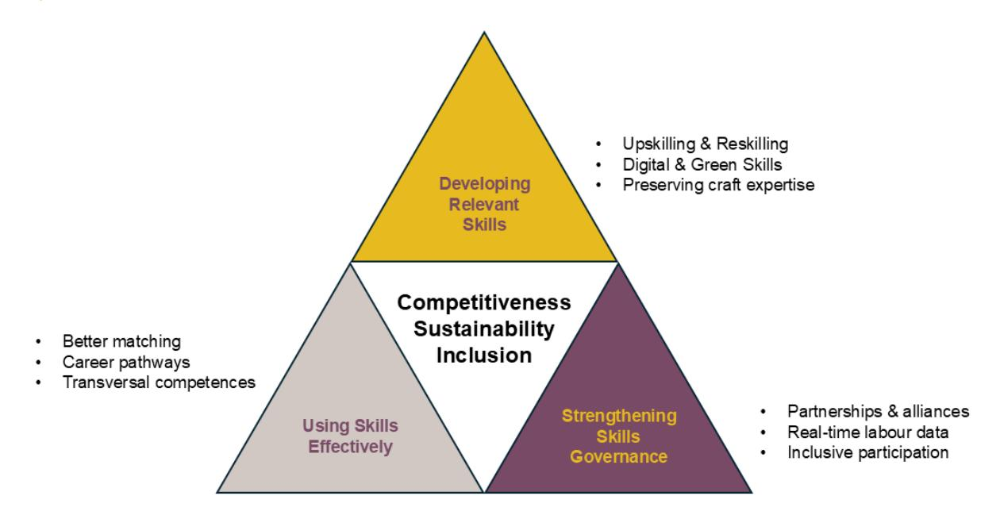
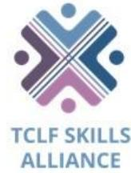

# **D3.5 EU TCLF Skills Strategy**

#### **Erasmus+**

**Deliverable due date** 30 September 2025

| AUTHORS | REVIEWERS  |
|---------|------------|
| EURATEX | <i>ALL</i> |

Dissemination level: PU Public

Funded by the European Union. Views and opinions expressed are however those of the author(s) only and do not necessarily reflect those of the European Union or the European Education and Culture Executive Agency (EACEA). Neither the European Union nor EACEA can be held responsible for them.

## Co-funded by the European Union

**Project acronym:** AEQUALIS4TCLF **Project number:** 101139988 **Project title:** Addressing Skills Gaps in the European Textile, Clothing

leather and Footwear Industries, emphasising Equality,

Innovation and Resilience.

# **EXECUTIVE SUMMARY**

The European textile, clothing, leather and footwear (TCLF) industries employ approximately 1.5 million workers across more than 220,000 companies, of which over 99% are small and medium-sized enterprises. These sectors are at a critical juncture. Digital transformation, the green transition and demographic change are reshaping skills demand, while the preservation of traditional craft expertise remains essential. A renewed skills strategy is necessary to ensure that the workforce is equipped to adapt and thrive in the face of these challenges.

The EU TCLF Skills Strategy (2025) builds on the 2018-2022 "Skills4Smart TCLF" Blueprint. It introduces new emphasis on inclusion and greater alignment with current EU frameworks such as the Pact for Skills and the Union of Skills. The strategy sets out a coordinated approach based on three strategic pillars.

What's new and how this strategy improves on the 2022 Blueprint: it strengthens the evidence link to AEQUALIS4TCLF WP3 (D3.1–D3.4), introduces a clearer prioritisation of actions (urgent 2025–2026 vs. medium-term 2027–2030), and assigns responsibilities across EU, national, regional and industry actors for each measure. It also clarifies how D3.5 feeds into WP4 (training design) and WP5 (testing and validation), including how occupational profiles translate into learning outcomes and curricula.

The first pillar focuses on developing relevant skills. This involves modernising both initial education and lifelong learning by integrating digital competencies, sustainable production knowledge and innovation management into training systems, alongside core technical skills. Curricula should be updated to include topics such as eco-design and digital manufacturing. There is also a need to expand upskilling opportunities through short courses, microcredentials and apprenticeships.

The second pillar addresses the effective use of skills. This involves improving how workplaces match and develop employee competencies. It includes support for SME-led training initiatives and targeted efforts to improve the sector's image. Enhanced career guidance, workplace demonstrations and youth outreach are necessary to counter outdated perceptions of the industry and encourage participation from younger and more diverse groups.

The third pillar focuses on strengthening skills governance. This requires better intelligence and coordination. A TCLF Skills Observatory is proposed to collect real-time labour market data and support evidence-based planning, drawing on methods used by Cedefop to analyse skills trends. Implementation will be guided by the TCLF Skills Alliance, operating within the Pact for Skills framework, to coordinate stakeholders and align funding streams.

Each section of the strategy begins by explaining the rationale behind the recommendations and concludes with specific actions for industry actors, education and training providers, social partners and public authorities. The strategy aims to ensure that, by 2030, the TCLF workforce is equipped with the skills needed to support a competitive, resilient and sustainable sector.

# CONTENTS

|     | Executive summary............................................................................................................... List of Abbreviations.............................................................................................................. | 2 4                                                                                                                        |
|-----|----------------------------------------------------------------------------------------------------------------------------------------------------------------------------------------------------------------------------------------------------------------------|----------------------------------------------------------------------------------------------------------------------------|
| 1   | Introduction and sectoral overview.................................................................................                                                                                                                                                  | 6                                                                                                                          |
| 1.1 |                                                                                                                                                                                                                                                                      | Policy context.......................................................................................................... 7 |
| 1.2 |                                                                                                                                                                                                                                                                      | Snapshot of the four subsectors.............................................................................. 9            |
| 1.3 |                                                                                                                                                                                                                                                                      | Why an updated strategy is needed........................................................................ 9                |
| 2   | Key megatrends and skills implications........................................................................                                                                                                                                                       | 11                                                                                                                         |
| 2.1 | Digital transformation............................................................................................                                                                                                                                                   | 11                                                                                                                         |
| 2.2 | Green and circular transition                                                                                                                                                                                                                                        | 13                                                                                                                         |
| 2.3 | Demographic shifts and lifelong learning...............................................................                                                                                                                                                              | 14                                                                                                                         |
| 2.4 | Market pressures, globalisation and competitiveness                                                                                                                                                                                                                  | 15                                                                                                                         |
| 2.5 | Summary of implications.......................................................................................                                                                                                                                                       | 17                                                                                                                         |
| 3   | Skills Strategy Framework                                                                                                                                                                                                                                            | 19                                                                                                                         |
| 3.1 | Developing relevant skills for TCLF.......................................................................                                                                                                                                                           | 20                                                                                                                         |
| 3.2 | Using skills effectively in TCLF workplaces...........................................................                                                                                                                                                               | 22                                                                                                                         |
| 3.3 | Strengthening skills governance in the TCLF sector                                                                                                                                                                                                                   | 24                                                                                                                         |
| 4   | Strategic priorities and recommendations                                                                                                                                                                                                                             | 26                                                                                                                         |
| 4.1 | Aligning education and industry                                                                                                                                                                                                                                      | 27                                                                                                                         |
| 4.2 | Promoting inclusion and equality...........................................................................                                                                                                                                                          | 29                                                                                                                         |
| 4.3 | Fostering lifelong learning.....................................................................................                                                                                                                                                     | 30                                                                                                                         |
| 4.4 | Improving access for SMEs                                                                                                                                                                                                                                            | 32                                                                                                                         |
| 4.5 | Addressing regional disparities                                                                                                                                                                                                                                      | 34                                                                                                                         |
| 4.6 | Leveraging EU funding and policy frameworks                                                                                                                                                                                                                          | 35                                                                                                                         |
| 4.7 | Enhancing sector image and attractiveness..........................................................                                                                                                                                                                  | 38                                                                                                                         |
| 5   | Implementation, Monitoring and Governance...............................................................                                                                                                                                                             | 41                                                                                                                         |
| 5.1 | Coordinated action through national and regional skills partnerships                                                                                                                                                                                                 | 41                                                                                                                         |
| 5.2 | Monitoring and data for continuous improvement..................................................                                                                                                                                                                     | 42                                                                                                                         |
| 5.3 | Role of the TCLF Skills Alliance and the Pact for Skills.........................................                                                                                                                                                                    | 44                                                                                                                         |
| 5.4 | Funding and support instruments..........................................................................                                                                                                                                                            | 45                                                                                                                         |
| 6   | Conclusion...................................................................................................................                                                                                                                                        | 48                                                                                                                         |
| 7.1 | Bibliography..........................................................................................................                                                                                                                                               | 50                                                                                                                         |

# **LIST OF ABBREVIATIONS**

| 3D            | Three-dimensional                                                              |
|---------------|--------------------------------------------------------------------------------|
| AEQUALIS4TCLF | Erasmus+ Project: Addressing Skills Gaps in the European Textile, Clothing,    |
| AI            | Artificial intelligence                                                        |
| AM            | Additive manufacturing                                                         |
| AR            | Augmented reality                                                              |
| ATP           | Associação Têxtil e Vestuário de Portugal                                      |
| CAD           | Computer-aided design                                                          |
| CAM           | Computer-aided manufacturing                                                   |
| CEC           | European Footwear Confederation                                                |
| Cedefop       | European Centre for the Development of Vocational Training                     |
| CITEVE        | Centro Tecnológico Têxtil e Vestuário (Technological Centre, PT)               |
| CNC           | Computer numerical control                                                     |
| CoVE          | Centre of Vocational Excellence                                                |
| COTANCE       | Confederation of National Associations of Tanners and Dressers of the European |
| COSME         | Programme for the Competitiveness of Enterprises and SMEs                      |
| CSR           | Corporate social responsibility                                                |
| DPP           | Digital product passport                                                       |
| DSI           | Digital Skills Index                                                           |
| DG EAC        | Directorate-General for Education, Youth, Sport and Culture (European          |
| DG EMPL       | Directorate-General for Employment, Social Affairs and Inclusion (European     |
| DG GROW       | Directorate-General for Internal Market, Industry, Entrepreneurship and SMEs   |
| EACEA         | European Education and Culture Executive Agency                                |
| EARLALL       | European Association of Regional and Local Authorities for Lifelong Learning   |
| EC            | European Commission                                                            |
| ECTS          | European Credit Transfer and Accumulation System                               |
| EDI           | Equality, diversity and inclusion                                              |
| EFTA          | European Free Trade Association                                                |
| EIF           | European Investment Fund                                                       |
| EIB           | European Investment Bank                                                       |
| EIT           | European Institute of Innovation and Technology                                |
| EPR           | Extended producer responsibility                                               |
| ERDF          | European Regional Development Fund                                             |
| ESCO          | European Skills, Competences, Qualifications and Occupations                   |
| ESF+          | European Social Fund Plus                                                      |
| ESPR          | Ecodesign for Sustainable Products Regulation                                  |
| EU            | European Union                                                                 |

| EUDR           | EU Regulation on deforestation-free supply chains                                     |
|----------------|---------------------------------------------------------------------------------------|
| EURATEX        | European Apparel and Textile Confederation                                            |
| HEI            | Higher education institution                                                          |
| Horizon Europe | EU Framework Programme for Research and Innovation                                    |
| INESCOP        | Footwear Technology Centre (ES)                                                       |
| Interreg       | European Territorial Cooperation programme                                            |
| IoT            | Internet of Things                                                                    |
| ITS            | Fondazione ITS (IT)                                                                   |
| JRC            | Joint Research Centre (European Commission)                                           |
| JTF            | Just Transition Fund                                                                  |
| KPI            | Key performance indicator                                                             |
| LLL            | Lifelong learning                                                                     |
| LSP            | Large-scale Skills Partnership (under the Pact for Skills)                            |
| MODATEX        | Centre for the Professional Training of the Textile, Apparel, Clothing and Wool       |
| MS             | Member State(s)                                                                       |
| NGO            | Non-governmental organisation                                                         |
| NQF            | National Qualifications Framework                                                     |
| OECD           | Organisation for Economic Co-operation and Development                                |
| OVATE          | Online Vacancy Analysis Tool for Europe (Skills OVATE)                                |
| PfS            | Pact for Skills: EU initiative to mobilise stakeholders for upskilling and reskilling |
| PANTOUR        | Pact for Next Tourism Generation Skills Project                                       |
| PES            | Public employment services                                                            |
| PPP            | Public – private partnership                                                          |
| PPE            | Personal protective equipment                                                         |
| R&I            | Research and innovation                                                               |
| RRF            | Recovery and Resilience Facility                                                      |
| RSP            | Regional skills partnership                                                           |
| S3             | Smart Specialisation Strategies                                                       |
| SMP            | Single Market Programme                                                               |
| SME            | Small and medium-sized enterprise                                                     |
| SSIP           | Stazione Sperimentale per l’Industria delle Pelli e delle Materie Concianti (IT)      |
| TCLF           | Textiles, clothing, leather and footwear                                              |
| UNIDO          | United Nations Industrial Development Organization                                    |
| VET            | Vocational education and training                                                     |
| WBL            | Work-based learning                                                                   |

# **1 INTRODUCTION AND SECTORAL OVERVIEW**

The textile, clothing, leather and footwear (TCLF) ecosystem is a cornerstone of European manufacturing and a vital part of the continent's industrial and cultural identity. It encompasses **around 1.5 million workers** across **approximately 220,000 companies**, the vast majority of which are small and medium-sized enterprises (SMEs). With an **estimated combined turnover of around €200 billion in 2023**, these sectors make a major contribution not only to Europe's economy but also to technological innovation, regional development and international competitiveness.

Beyond their visible role in fashion, TCLF industries are deeply integrated into wider European value chains, supplying critical materials and components to sectors such as automotive, defence, healthcare and construction. Their diversity, which spans technical textiles, apparel, leather goods and footwear, places the ecosystem at the intersection of creativity, advanced manufacturing and sustainability.

Production activity is concentrated in **regional clusters** where networks of suppliers, SMEs, training institutions and technology centres form resilient local ecosystems. These clusters help to maintain Europe's industrial fabric, preserve **artisanal and craft knowledge** and increasingly integrate digital and sustainable production methods. Regional specialisation has made the TCLF ecosystem both a repository of industrial heritage and a driver of innovation.

At the same time, the sector faces **profound structural change**. The **green and digital transitions** are reshaping production systems, job profiles and skills needs at an unprecedented pace. Automation, artificial intelligence, three-dimensional design, digital product passports and data-driven value chains are redefining how products are designed, manufactured and marketed. Parallel to this, the shift towards **circular and low-impact production**, including eco-design, traceability, repair, reuse and recycling, requires new technical competences and environmental literacy across all occupational levels.

Recent **AEQUALIS4TCLF research** confirms that the most urgent skill gaps lie in two areas: **digital transformation** and **green and circular competences**. Digital transformation covers the use of CAD and CAM tools, 3D modelling, data management and digital logistics. Green competences include life-cycle assessment, sustainable materials and circular business models. These skill domains underpin the future competitiveness of the ecosystem and need to be systematically embedded in vocational education and training as well as in lifelong learning.

These developments also expose long-standing structural weaknesses. Around **85% of European SMEs report difficulties in recruiting workers with the right skills**. Many small enterprises lack the financial or organisational capacity to invest in training independently. Collective solutions such as shared training centres, inter-company cooperation and publicly supported upskilling schemes are therefore essential. **TCLF LSP members reached 178,194 participants, developed 1,941 and updated 1,195 training programmes, involved an average of 68% of their employees in training, and mobilised €316.3 million for upskilling and reskilling** (Pact for Skills TCLF LSP Annual Survey, 2024).

Demographic trends further increase the urgency for action. The **TCLF workforce is ageing**, and essential craft skills risk being lost as older workers retire. **Attracting young people** remains a challenge, despite the growing range of new career pathways in design, digital production and sustainable innovation. **Women account for over 70% of employment** in clothing and some leather subsectors but remain underrepresented in technical, digital and managerial roles. Inclusive recruitment, mentoring and leadership initiatives, together with better integration of migrants and other underrepresented groups, will be necessary to ensure **generational renewal, equality and resilience**.

For the TCLF ecosystem, success will depend on **balancing tradition with transformation**. The future relies on combining the preservation of artisanal know-how with accelerated investment in **digital, green and transversal competences**. Stronger **cooperation between industry, education and public authorities**, through initiatives such as the **TCLF Skills Alliance, Regional Skills Partnerships and Centres of Vocational Excellence**, will be essential to expand training opportunities and ensure that **no company or worker is left behind** in Europe's industrial transition.

#### **1.1 Policy context**

The EU TCLF Skills Strategy is framed within a dynamic European policy landscape that places **skills, industrial resilience and sustainability** at the centre of the Union's competitiveness, social inclusion and climate agendas. The past two years, in particular, have seen a consolidation of major initiatives that redefine how Europe invests in people and industry.

At the heart of this landscape is the **European Skills Agenda (2020)**, which called for a "skills revolution" to drive the green and digital transitions. Its flagship **Pact for Skills** has become the EU's principal instrument for collective action, engaging more than **3,200 organisations** across 15 industrial ecosystems by 2025. Within this framework, the **TCLF Pact for Skills**, established in 2021, is one of the EU's large-scale partnerships, translating the Agenda's objectives into sectoral commitments. It has set clear targets, including the **upskilling of 65,000 workers each year**, and supports the creation of **regional skills ecosystems** that link SMEs, education providers and public authorities in shared training and innovation activities (European Commission, Pact for Skills Annual Survey, 2024).

Complementing this, the **EU Strategy for Sustainable and Circular Textiles (2022)** and the **Transition Pathway for the Textiles Ecosystem (2023)** provide the main industrial and sustainability policy pillars for the sector. The Strategy introduces **eco-design and circularity requirements**, **digital product passports** and **extended producer responsibility** for textile products, making sustainability competences mandatory across design, production, logistics and after-sales activities. The Transition Pathway sets a joint roadmap for the **twin transition** and calls on stakeholders to submit **voluntary commitments** on innovation, digitalisation and skills. By March 2024, over **100 pledges** had been made, many including training targets and milestones for circular business models by 2030 (European Commission, Transition Pathway for the Textiles Ecosystem, 2024).

More broadly, the **Clean Industrial Deal** and the **Competitiveness Compass (2025)** anchor skills, SME support and decarbonisation in the EU's economic strategy. The Competitiveness Compass introduces the concept of a **Union of Skills**, designed to close persistent workforce gaps by fostering **lifelong learning, cross-border mobility of talent and inclusion**. It responds directly to the EU's demographic and labour shortages, with **four in five SMEs reporting difficulties in recruiting people with the right skills** (European Commission, Competitiveness Compass, 2025). The **Union of Equality Strategy (2024)** complements this by embedding equal access, gender balance and migrant integration as cross-cutting priorities for the labour market.

In parallel, the Digital Decade Policy Programme (2023–2030) establishes measurable targets for Europe's digital capacity. It aims for 80% of adults to have at least basic digital skills by 2030, supported by the Union of Skills and the Digital Europe Programme. Yet, 36% of adults still lack basic digital skills, and the gap is most pronounced in digital content creation and cybersecurity (JRC, Digital Skills Index 2.0, 2025). For the TCLF sectors, digitalisation (from product design to data-driven manufacturing) depends on closing these gaps rapidly through vocational and work-based learning.

The **Education and Training Monitor (2024)** further reinforces this context by urging Member States to embed **learning for sustainability and digitalisation** throughout all education levels and to expand **adult learning and work-based VET**. These priorities are directly relevant to TCLF, where small enterprises rely on accessible upskilling opportunities, dual learning systems and industry-education cooperation.

Together, these frameworks create a **coherent EU mandate** that combines industrial transformation, social inclusion and lifelong learning.

**This strategy is designed to align fully with that policy architecture.** It translates EU-level goals into concrete action for the TCLF ecosystem by:

- Integrating the objectives of the **European Skills Agenda**, the **Green Deal** and the **Digital Decade** into sector-specific priorities;
- Supporting the implementation of the **Pact for Skills** and the **Union of Skills** through measurable training and employment outcomes;
- Advancing the **Sustainable and Circular Textiles Strategy** and **Transition Pathway** by embedding green and digital competences across occupations; and
- Ensuring coherence with EU funding instruments such as **Erasmus+**, **ESF+**, **Digital Europe**, **InvestEU** and the **Recovery and Resilience Facility**, which enable delivery through partnerships, Centres of Vocational Excellence and regional initiatives.

#### **1.2 Snapshot of the four subsectors**

| Sub-sector Employment Turnover Emerging          | skill priorities*                |               |
|--------------------------------------------------|----------------------------------|---------------|
| T extiles 540 000 (2021) € 63 billion (2021)     | Smart-fabric engineering, data  |               |
| driven                                           | process                          | control, eco |
| C lothing 760 000 (2021) € 53 billion (2021) 3-D | pattern-making,                  | virtual       |
| prototyping,                                     | circular                         | business      |
| L eather 30 000 (2021) € 24 billion (2021)       | Low-impact/low-                  | carbon        |
| footprint,                                       | tanning                          | chemistry,    |
| regulatory                                       |                                  | compliance,   |
|                                                  | biodegradability,                | leather waste |
| F ootwear 221 000 (2021) €2 1 billion (2021)     | Automated cutting and stitching, |               |

\*Source: Eurostat data from 2021; Skills4Smart TCLF 2030, METASKILLS4TCLF and AEQUALIS4TCLF project analyses

The table illustrates that each subsector combines traditional craft with advanced technology. Demand for higher-level digital and environmental competences is growing everywhere, yet many SMEs struggle to attract and train workers in such fields. At the same time, labour shortages persist in core manual occupations, particularly sewing, tanning and specialist footwear production. This dual challenge calls for a coordinated European response that supports both technological upskilling and the retention of essential craft skills.

### **1.3 Why an updated strategy is needed**

Since the first **EU TCLF Skills Blueprint (Skills4Smart TCLF 2030)** was launched in 2018, the ecosystem has made tangible progress towards a coordinated European approach to skills. New qualification profiles were defined, European curricula were piloted, and cooperation between education providers and enterprises was strengthened. The **TCLF Pact for Skills** helped to consolidate that cooperation and establish a common results framework. This provides a strong base to build on, but the conditions in which the ecosystem operates have changed markedly and require a strategic update.

First, **technology adoption has accelerated** across the value chain. Wider use of artificial intelligence, automation, 3D design, data analytics and data-driven manufacturing is reshaping occupational profiles and work organisation in design, manufacturing, logistics and retail. These developments create demand for new technical competences and for stronger transversal skills in problem solving, teamwork and continuous learning.

Second, **circular and low-impact production has moved from aspiration to operational requirement**. Companies are adapting materials, processes and business models to incorporate eco-design, durability, repair, reuse and recycling (European Commission, EU Strategy for Sustainable and Circular Textiles, 2022). Meeting traceability and productstewardship expectations requires capabilities in sustainable chemistry, environmental management and supply-chain data.

Third, **compliance and reporting obligations are intensifying** ahead of 2030. Requirements related to eco-design, extended producer responsibility and traceability now apply to textiles and will progressively affect leather and footwear. Traceability for leather to farm of origin adds further complexity (European Commission, EUDR Regulation, 2023). For many firms, especially SMEs, the binding constraint is not intent but capacity: having the people, systems and training to comply while remaining competitive.

Fourth, **skills mismatches persist and are unevenly distributed**. Evidence gathered through AEQUALIS4TCLF and METASKILLS4TCLF shows shortages in CAD/CAM and 3D design, sustainable chemistry, data analytics, supply-chain transparency and quality management. Gaps are most acute in small firms and in regions with thinner training infrastructure and weaker cooperation platforms. Demographic pressures compound these challenges, with an ageing workforce and difficulties attracting young people to technical and industrial careers.

Against this backdrop, the **AEQUALIS4TCLF Blueprint**, launched in 2024, provides the vehicle to update and extend the skills strategy finalised in 2022. The updated strategy focuses on four aims that translate ecosystem needs into practical delivery:

- **Enhance skills intelligence.** Strengthen labour-market analysis and foresight to anticipate emerging profiles and evolving skill sets, ensuring provision remains demand-led and future-oriented.
- **Promote equality and inclusion.** Ensure training opportunities reach women, young people, migrants and other under-represented groups, building a diverse and resilient talent base across regions.
- **Bridge policy and practice.** Convert EU-level objectives on sustainability, circularity and quality jobs into actionable tools for providers and companies, aligning curricula, micro-credentials and work-based learning with real implementation needs.
- **Consolidate coordination and investment.** Improve access to European and national funding and reinforce cooperation between the TCLF Skills Alliance and national and regional stakeholders to modernise facilities, update curricula and expand mobility.

The analysis and figures presented in this strategy draw on **company surveys, expert focus groups and national inputs** conducted under **AEQUALIS4TCLF**, and **METASKILLS4TCLF** Skills Intelligence documents, and secondary sources cited in the bibliography. Findings were triangulated where possible, and future updates will document consultation cycles and data sources by country and region.

The chapters that follow set out the evidence base, strategic priorities and recommended actions to equip Europe's TCLF workforce for a competitive, sustainable and inclusive future.

# **2 KEY MEGATRENDS AND SKILLS IMPLICATIONS**

The **TCLF sectors in Europe are undergoing deep transformation**. Several global megatrends (drivers of change) are reshaping how these industries operate, with direct consequences for the skills required across the workforce. These shifts are not abstract. **They affect job profiles, training priorities and the everyday reality of firms and workers**. As traditional tasks become intertwined with new technologies, sustainability objectives, demographic developments and shifting market demands, the **sector must respond with coordinated reskilling and upskilling efforts**.

This section outlines the main trends and the corresponding skills implications. Each trend provides a foundation for the strategic priorities addressed later in the document.

### **2.1 Digital transformation**

Advances in **digital technologies** are redefining how TCLF firms design products, manage operations and interact with consumers. **Computer-aided design (CAD)** has become standard practice in clothing pattern development and in prototyping for technical textiles or leather articles. Techniques such as **three-dimensional (3D) printing** and **additive manufacturing (AM)** are used to prototype footwear components or produce customised items in small batches. Emerging applications, including digital knitting and CNC milling, enable the on-demand manufacturing of fabrics, leather goods and apparel.

Commercial practices have also evolved. **Augmented reality (AR)** tools are increasingly used for virtual fittings and immersive marketing campaigns, enhancing how customers engage with brands through online platforms, while the rapid growth of **e-commerce** has transformed business models and customer expectations across the sector.

Supply-chain operations are undergoing a parallel shift. **Data analytics** and **artificial intelligence (AI)** are applied to forecast demand, optimise inventory levels and ensure quality control. In addition, **data sharing, traceability and transparency** have become central to the development of textile and leather supply chains, reflecting both regulatory requirements and consumer expectations for greater accountability. This evolution has significant implications for the composition of the workforce. Roles that were once based primarily on manual or craft expertise now require a baseline level of **digital competence**.

Production operators need to navigate semi-automated machinery, understand basic programming logic and interpret machine interface data. Designers must use **3D modelling software** and collaborate with suppliers through digital platforms. Supply-chain professionals are expected to work with dashboards, extract insights from datasets and make operational decisions accordingly. Sales and marketing teams require knowledge of **e-commerce tools**, **customer analytics** and personalised online engagement methods.

These developments have revealed **persistent digital skills gaps** across the sector. Findings from the **METASKILLS4TCLF project** confirm a widespread lack of preparedness, particularly among small and medium-sized enterprises (METASKILLS4TCLF, Skills Intelligence, 2024). Survey responses and focus group insights highlight shortages in key areas such as **CAD/CAM operation**, **basic robotics programming** and **data-informed production management** (AEQUALIS4TCLF, Skills Assessment analysis, 2025). Many enterprises struggle to recruit talent with these competencies or to provide adequate training internally.

The same research stresses the importance of equipping workers with broader capabilities in **information technology**, **data analysis** and **new forms of automated manufacturing**. This requires a rapid response from education and training providers. Curricula must be revised, and modular learning options introduced to ensure that training is accessible, industry-relevant and responsive to technological change.

Training initiatives that operate at **cluster level** can help address capacity constraints in smaller firms. Practical solutions include **mobile digital labs** that rotate between companies, **shared training hubs** supported by local partnerships or **regional consortia pooling resources** to provide access to digital tools. These models make advanced equipment and instruction accessible to firms that could not afford them independently.

**Public funding** can play a catalytic role. Programmes such as **Erasmus+**, the **Digital Europe Programme** or national skills strategies offer financial support for short, targeted training in areas such as digital design, automated machine use and industrial analytics (European Commission, Pact for Skills Annual Survey, 2024; Cedefop, Future-ready VET Systems, 2025). Such efforts must be tailored to the practical needs of TCLF firms.

In parallel, employers should embed **digital upskilling** into their workforce development strategies. **Lifelong learning** must become an operational norm. Employees need **flexible, modular training formats** that allow them to build digital skills without leaving the workplace.

Options may include evening courses, online modules or on-site instruction delivered in partnership with local providers. Efforts should also reflect the practical realities of TCLF firms. Rather than generic models, companies should identify specific use cases where digitalisation saves time, reduces costs or improves quality, and then design targeted learning around those needs. Training must be integrated into company workflows so it does not disrupt operations, supported by top-down workforce planning and appropriate recognition or compensation. Framed this way, digitalisation becomes a **shared, strategic effort** rather than an external imposition.

The goal is to establish **digital literacy as a baseline competence across all TCLF occupations by 2030**. Shop-floor technicians, product developers, supply managers and commercial teams should all be equipped to operate in **digitally integrated environments**. Achieving this outcome will require **sustained investment**, **practical delivery models** and **coordinated action** between companies, training institutions and public authorities.

#### **2.2 Green and circular transition**

Sustainability is a central priority in EU industrial policy, and the TCLF sectors are directly affected. The EU Strategy for Sustainable and Circular Textiles (2022) addresses the full life cycle of textile products, from design and material selection to consumer use and end-of-life handling. It introduces binding measures such as mandatory eco-design requirements, digital product passports for transparency and traceability, and Extended Producer Responsibility (EPR) schemes for textiles (European Commission, Sustainable Textiles Strategy, 2022). Alongside this, the Transition Pathway for Textiles has mobilised stakeholder commitments to circularity, with concrete pledges to reduce waste significantly by 2030 (European Commission, Report on Stakeholder Commitments, 2024).

These developments are **reshaping the skills required across the TCLF value chain**. Designers are expected to apply **eco-design principles**, selecting natural, renewable, durable, biodegradable and recyclable materials and incorporating lifecycle thinking into the development phase. Production staff need familiarity with **cleaner processes**, including **waterless dyeing** and **low-impact tanning** in the leather sector. **Quality and compliance managers** must be equipped to understand new environmental legislation and oversee **digital traceability systems** aligned with product passport requirements. **Procurement and logistics professionals** must manage the sourcing of environmentally preferable materials and organise take-back schemes or recycling loops. Even **sales and marketing professionals** are expected to understand **sustainability narratives**, ensuring that consumer communications are both accurate and credible.

Sustainability is no longer a specialist, stand-alone topic. It must be **embedded in every function**, and this will require **large-scale reskilling**. Workers across all occupational levels need training in **environmental compliance**, **resource-efficient production** and **circular business models**. Training institutions should develop and deliver **targeted modules** on **sustainable fibre technologies**, **cleaner production methods**, **waste reduction strategies** and **circular economy concepts** specific to the TCLF context.

Practical demonstration is an effective complement to theoretical instruction. **Regional training centres**, in collaboration with firms, can organise **site visits** to facilities using innovative environmental processes, such as **enzymatic bio-finishing** in textile finishing plants or **closed-loop water treatment systems** in tanneries. These experiences help demystify green technologies and accelerate learning.

Many **SMEs lack the resources** to invest independently in this type of training. **Public cofinancing**, through instruments such as **Erasmus+**, the **Just Transition Fund** or **national training subsidies**, can reduce financial barriers and support participation in **short courses focused on eco-design, sustainable process management or regulatory compliance** (European Commission, Competitiveness Compass, 2025; Cedefop, Skills Strategies, 2024).

**Partnerships between local authorities, industry clusters and training providers** can also strengthen delivery. Regional actors could initiate demonstration projects, such as **green factory open days** or **training vouchers** for SME employees to attend certified courses.

**Education ministries and industry bodies** share responsibility for ensuring that sustainability content is **integrated into formal curricula** (not as optional extras but as **core modules** in TCLF training programmes).

**Skills in energy efficiency, safe chemical use, material optimisation and circular design** should be as common in the sector as competencies in sewing, finishing and quality control.

**Equipping the TCLF workforce with environmental-impact knowledge** will ensure compliance with upcoming legislation, strengthen competitiveness and position the sector to seize innovation opportunities in **low-impact production**.

#### **2.3 Demographic shifts and lifelong learning**

**Demographic change presents a structural challenge** to the TCLF sectors in Europe. A large share of the workforce is now **over the age of 50**, while younger workers remain underrepresented. The sector continues to struggle to attract youth, due in part to **negative perceptions of manufacturing jobs** as outdated or poorly paid. In many regions, the rural location of factories and the **erosion of local training infrastructure** have compounded the problem. Without intervention, upcoming retirements could result in a significant loss of experienced professionals in areas such as **sewing, cutting and tanning**. These are **tacit skills that cannot be replaced quickly or easily.**

Older workers also face growing demands to **reskill**. **Digitalisation and sustainability regulations** require staff to learn new techniques and technologies. **Flexible learning arrangements** that respect existing experience and work schedules are essential. For instance, a seasoned textile machine operator may need targeted instruction to operate a **digitally controlled loom**. Rather than classroom-based programmes, **on-the-job coaching** may be more effective. At the same time, younger entrants must be trained from the outset to operate in a modernised production environment. This includes proficiency in **digital design**, **automated systems** and **circular-economy principles.**

**Continuous learning must become a structural element of employment** in TCLF. **Small and medium-sized enterprises** need access to **modular training pathways** that allow workers to build competencies progressively throughout their careers. Adult-learning centres and vocational-education providers should offer flexible formats, including **evening sessions, short intensives and online delivery. Micro-credentials** can help workers demonstrate specific skills, such as knowledge of a digital-design programme or sustainable-material selection, without enrolling in long full-time courses. These can be stacked to build **comprehensive skill portfolios** that evolve with industry needs.

**Knowledge transfer across generations** also deserves focused support. **Mentoring schemes** that pair experienced craft workers with junior staff facilitate two-way learning. A retiring pattern maker can share techniques for quality and fit, while a younger colleague may assist in mastering digital tools. This model allows both generations to remain engaged and ensures that traditional skills are passed on while integrating new technologies.

**European-level frameworks** can facilitate mobility and resource-sharing. The proposed **Union of Skills** aims to support **cross-border exchanges of trainers and learners**, especially in regions with training gaps or workforce shortages (European Commission, Union of Skills Proposal, 2025). **EU funding through Erasmus+ and the European Social Fund Plus (ESF+)** should continue to prioritise projects addressing **generational diversity** and **demographic resilience** in the labour force (European Commission, Pact for Skills Annual Survey, 2024).

**National governments** have a key role to play in enabling this learning ecosystem. **Individual learning entitlements**, such as **training vouchers or personalised learning accounts**, should be made accessible across the TCLF workforce. As of 2024, fifteen Member States are already using EU funding to develop such accounts (Cedefop, Financing Adult Learning, 2024). **Social partners (employers' organisations and trade unions) should also negotiate training clauses** in collective agreements to guarantee workers the time and support to pursue skill development.

At the **local level**, dedicated **skill hubs** in areas with high concentrations of older workers can offer targeted support. These could provide **refresher courses on new tanning methods** for experienced leatherworkers or **digital training for sewing machinists** adjusting to automated equipment. Embedding a culture where **continuous upskilling is expected and valued** will help firms adapt to evolving technologies and markets, while keeping workers employable and engaged.

**Investing in lifelong learning across all generations** is essential for sustaining productivity, preserving craftsmanship and addressing labour shortages. It also strengthens the sector's capacity to respond to future challenges.

### **2.4 Market pressures, globalisation and competitiveness**

**TCLF firms operate within a dynamic and highly competitive global market. Fast fashion** and **globalisation** have intensified pressure from producers in regions such as Asia, where labour costs are lower. European companies, particularly in apparel, face growing demands to distinguish themselves through **design excellence**, **sustainability performance**, **production speed** and **flexibility** in responding to customer needs and market trends. **Ecommerce** has changed how products are marketed and sold, and consumer expectations now include **rapid delivery, personalisation and transparent sourcing.** Recent **supplychain disruptions**, including those experienced during the **COVID-19 pandemic**, have prompted some firms to **reshore or nearshore operations** while accelerating the shift to **digital sales channels.**

These developments require greater agility and innovation across the TCLF sectors. The workforce must be able to adjust production processes quickly, collaborate across functions and geographies, and adopt new technologies efficiently. Technical know-how remains essential, but transversal skills such as problem-solving, communication and project coordination are increasingly important. For example, when a company shifts to a new product line in response to market demand, technicians and managers must reorganise operations and logistics with minimal delay. In premium and niche markets, staff may need to co-create products with clients, which demands strong interpersonal and creative skills.

The ability to **operate across sectoral boundaries** is also becoming more relevant. TCLF firms are entering new markets that link the textiles ecosystem to other industries, including **health, automotive, construction and electronics.** This requires engineers and designers to transfer knowledge from fields such as **IT or materials science** into textile-based applications. A workforce that is **open to external expertise and continuous learning** becomes a competitive advantage.

Management and entrepreneurship skills are equally critical. Many European TCLF firms are SMEs or family-run businesses that must adapt to shifting market conditions, identify new business models and manage volatility in supply chains or international trade. Upskilling business owners and managers in areas such as digital marketing, financial strategy and sustainable innovation strengthens competitiveness and resilience (Cedefop, *Future-Ready VET Systems*, 2024; OECD, *Skills Strategy*, 2019).

**Talent attraction** is central to addressing skills gaps and renewing the sector. **Public authorities**, supported by industry, should actively promote **modern TCLF careers** through dedicated outreach. Effective approaches may include **factory visits**, **digital storytelling** that profiles innovative firms, and **social-media campaigns** targeting younger audiences. Platforms such as the **Pact for Skills** and the **Union of Skills** can help scale these initiatives across countries. Highlighting **success stories from diverse professionals**, including young women and individuals from under-represented backgrounds, can further broaden appeal. Recruitment programmes like the **EU Talent Pool**, which links skilled migrants to local opportunities, can contribute to workforce renewal (European Commission, *Pact for Skills Survey*, 2024).

To support SMEs, intermediary bodies such as sectoral associations and local chambers should provide practical tools for workforce development. These may include guidance on adopting e-commerce, collaborative training strategies or shared-service models. Peerlearning groups where SME leaders exchange experiences on workforce management, technology adoption or exports should be encouraged. Public schemes should provide accessible subsidies or vouchers for training in key areas such as supply-chain resilience, customer-centred innovation or compliance with new standards. Reducing red tape through a centralised support mechanism for SME training would help more companies benefit from EU and national funding (European Commission, *Competitiveness Compass*, 2025).

Embedding innovation capabilities across the workforce is essential. Employers can support this by allocating time for experimentation, offering creative-skills workshops and partnering with universities or Centres of Vocational Excellence. Structured programmes such as industrial PhDs or hybrid apprenticeships can channel advanced knowledge from academia into TCLF firms and accelerate innovation cycles.

To compete successfully in global markets, the TCLF ecosystem must strengthen its **skills base not only in technical areas but also in adaptability, leadership and innovation.** A sustained investment in **human capital** will enable companies to **differentiate through quality and creativity**, rather than being constrained to compete solely on cost.

Consumer behaviour has shifted markedly since COVID-19 and the war in Ukraine: weakened purchasing power has heightened price sensitivity in several markets. Competence needs therefore include consumer and market analytics, brand development, commercial skills and export readiness (especially for SMEs operating in small markets) alongside transparency and traceability capabilities.

#### **2.5 Summary of implications**

The interplay of **digital transformation**, **sustainability goals**, **demographic shifts** and **global market pressures** is redefining what the TCLF workforce requires to remain competitive. These trends do not operate in isolation. Together, they demand a **coordinated approach to workforce development** that reflects both current challenges and anticipated transitions.

Workers across the TCLF value chain now require **multi-disciplinary skill sets**. In addition to traditional craft expertise, employees must increasingly demonstrate **digital fluency**, such as the ability to operate automated systems or interpret production data, as well as **environmental awareness**. This includes knowledge of **sustainable materials**, **eco-design principles** and **resource-efficient production methods**. While foundational technical skills continue to matter, they are **no longer sufficient on their own**.

**Continuous upskilling** is essential. Technologies and market demands evolve rapidly, and both new entrants and experienced workers must be supported in acquiring new competences throughout their careers. Ensuring that **newly acquired skills are actively used in the workplace** is equally important. Companies need to create working environments that support the **practical application of skills**. This involves **human resources practices**, **organisational design** and **leadership**, not just the provision of training.

**SMEs**, which make up the vast majority of TCLF enterprises, often lack the capacity to engage fully with training and workforce development initiatives. Sector-wide progress will require mechanisms that **lower barriers for small firms**. **Shared training facilities**, **accessible online platforms for learning**, **targeted funding incentives** and **simplified procedures for accessing public programmes** can help ensure that even micro-enterprises benefit from upskilling. **Collective solutions** can amplify impact where individual company action would fall short.

**Stronger governance and better data** are also needed. **Coherent coordination** between companies, education providers, trade unions, regional authorities and EU institutions is essential to align priorities, avoid duplication and ensure efficient use of funding. **Real-time skills intelligence**, including vacancy data and trend forecasting, can help monitor gaps and adjust policy responses. This may require a **dedicated observatory for TCLF skills** or integration into broader EU systems such as **Cedefop's Skills OVATE** (Cedefop, *Expanding Real-Time Skills Intelligence*, 2023). Reliable data will create the **feedback loop** needed to keep the strategy agile and relevant.

In sum, a strategic and comprehensive approach is required. Skills development, workplace deployment and ongoing monitoring must be addressed with equal intensity.

The following section presents the **Skills Strategy Framework** designed to meet this need, drawing on **best practices from the EU and OECD**.

**Core TCLF challenges**: ageing workforce and generational transfer; SME training constraints; uneven regional training access; outdated image; misalignment between curricula and workplace technologies; gender segregation in technical roles; inclusion gaps for migrants and older workers; and rising capability needs in market/commercial analytics and resilient supply.

# **3 SKILLS STRATEGY FRAMEWORK**

Responding effectively to the **megatrends** identified above requires a **structured framework for action**. This strategy adopts a model inspired by the **OECD's Comprehensive Skills Strategy**, tailored to reflect the specificities of the **European context**. The framework comprises **three interlinked dimensions**:

- developing relevant skills throughout the life course
- using skills effectively in workplaces and society
- strengthening skills governance within the TCLF ecosystem

This **tripartite structure** ensures coherence with **international good practice** and strengthens alignment with **national and EU-level initiatives**. Major policy references, such as the **Joint Employment Report 2025**, emphasise the centrality of **upskilling, lifelong learning and inclusive participation** to the success of Europe's green and digital transitions and to meeting the challenges posed by **demographic ageing** (European Commission, *Joint Employment Report*, 2025). **Cedefop** likewise highlights the value of **real-time labour market data** in guiding education and training policy (Cedefop, *Skills Intelligence*, 2023).

Positioning the **TCLF Skills Strategy** within this model makes it easier to coordinate with wider initiatives, including the **Pact for Skills**, the **Union of Skills**, and the **EU Strategy for Sustainable and Circular Textiles**. Each of these initiatives calls for **systematic and evidence-based approaches** to identifying and addressing skill gaps, which this framework is designed to support.

Each of the three dimensions reflects a pressing need within the TCLF sectors:

- **Developing relevant skills** requires an ongoing commitment to **upskilling and reskilling**, recognising that job profiles are changing rapidly as **digital and environmental requirements** reshape production. This dimension includes both **formal education for new entrants** and **flexible lifelong learning opportunities** for current employees.
- **Using skills effectively** means ensuring that the competences individuals acquire are **applied in the workplace**. Too often, employees' abilities are underused. Ensuring better **matching between workers and roles**, designing **jobs that make full use of available skills**, and offering **clear progression pathways** all help reduce waste and increase motivation and productivity.
- Strengthening skills governance is necessary to align efforts across stakeholders. This includes the formation of structured partnerships and alliances, as well as investments in data systems that monitor labour market shifts and training outcomes. Governance mechanisms should support targeted interventions, particularly in regions or subsectors where skills needs are most acute.

Each of the next three sections explores one of these dimensions in greater detail. They begin by analysing the specific challenges TCLF faces under each heading and conclude with **targeted, actionable recommendations**.

**Figure 1 - The TCLF Skills Strategy Framework**

### **3.1 Developing relevant skills for TCLF**

Equipping people with the right competences at the right time lies at the foundation of any effective industrial policy. In the TCLF sectors, this means preserving excellence in craft and technical disciplines while integrating the digital, environmental and transversal skills that will shape future competitiveness.

In several Member States, **textile production skills** (yarn manufacturing, knitting, weaving) face **acute risk** due to dwindling training provision; preserving these capabilities requires **targeted offers** and **access to modern equipment** in textile-focused regions. *Note on equipment:* while many providers need lab upgrades, in some contexts firms (especially in sewing) operate older machinery than VET schools; **teacher in-company placements** and **two-way technology transfer** are both needed.

The need for a **skills transformation** is evident. The TCLF ecosystem, traditionally grounded in manual precision and local know-how, now faces **automation**, **digitisation**, and **mounting requirements for sustainable production**. Product life cycles are shorter, materials more complex, and **circular economy models** are reshaping how value is created. Training systems must evolve accordingly. **Vocational education and training (VET)** and **higher education providers** should embed **digital technologies**, **smart production systems**, **sustainable material use** and **circular design principles** into core curricula. These should be treated as essential, not supplementary, within mainstream training for textile engineers, apparel technicians, leather processors and footwear designers.

Europe's capacity to modernise training provision remains uneven. Many institutions lack access to **modern machinery** or **instructors with relevant experience** in digital or green technologies. Stronger **partnerships with industry and regional actors** are needed to close this gap. **Curriculum development committees** involving employers and education providers, **teacher exchanges into factories**, and **shared infrastructure** (such as a regional technology lab used jointly by schools and companies) can accelerate progress. Support is available from EU instruments including **Erasmus+ (Alliances for Innovation)** and the **Digital Europe Programme**, particularly when projects include **small firms** that might otherwise lack the resources to engage (European Commission, *Pact for Skills Annual Survey*, 2024).

Relevant skills must also be maintained throughout working life. **Lifelong learning** is not an optional extra but a **structural necessity**. **Cedefop** and the **European Training Foundation (ETF)** repeatedly highlight that continuous training is vital to respond to changing labourmarket conditions (Cedefop, *Future-ready VET Systems*, 2024; ETF, *From Skills Anticipation to Skills Action*). For TCLF workers, this might involve training to use new equipment, refresh knowledge of sustainable materials, or acquire soft skills for international teamwork. **Short courses**, **on-the-job training**, **modular e-learning**, and **blended programmes** can make such learning accessible while people remain employed.

**Micro-credentials** are a promising tool for recognising specific skill sets in a flexible format. A technician might earn certification in **integrating digital product passports**, while a designer could specialise in **circular fashion principles**. These targeted credentials respond directly to workplace needs and can be updated frequently as standards evolve (OECD, *Skills Strategy*, 2019).

Anticipating future demand is as important as delivering training. The TCLF ecosystem currently lacks a dedicated mechanism for monitoring evolving skill needs. A **European TCLF Skills Observatory** is therefore proposed. It would combine data from **Eurostat**, **national skills surveys** and **ESCO classifications** with qualitative insights from industry partners and regional authorities. Its function would be to **detect trends early** and **guide adjustments in curricula, funding and training priorities**. This aligns with the Commission's proposals under the **Union of Skills** initiative (European Commission, *Union of Skills*, 2025).

The following actions are recommended to strengthen this skills development pillar: • **Modernise training content** across TCLF programmes. By 2027, revise VET and higher education curricula in at least ten EU countries to include modules on CAD, automation, sustainable design and circular production systems. Erasmus+ support and industry collaboration should be leveraged to enable this.

- **Scale up dual learning models and Centres of Vocational Excellence (CoVEs).** Ensure all major TCLF production regions host at least one CoVE or innovation hub linked to the sector, contributing to the EU objective of 100 CoVEs by 2030 (European Commission, *Competitiveness Compass*, 2025).
- **Ensure training is embedded in lifelong learning systems.** Member States should reflect TCLF needs in their national lifelong learning plans. For example, laid-off workers could be offered subsidised retraining to take on high-demand roles in the evolving value chain. A 50 percent increase in adult participation in training within the sector should be targeted by 2030, using Labour Force Survey data for monitoring.

- **Create a European TCLF Skills Observatory** by 2028. The observatory should publish annual bulletins, foresight studies and regional trend analyses. Its activities would build on the **Erasmus+ Blueprint projects** and expand **scenario-based planning** to inform investment in training and curricula.

The development of relevant skills must go beyond technical updating. It must ensure that the TCLF workforce remains **innovative, adaptable and inclusive** across the life course. A resilient European TCLF ecosystem depends on how successfully these skills are **developed, updated and made accessible to all.**

#### **3.2 Using skills effectively in TCLF workplaces**

**Developing the right skills is essential, but this alone will not deliver value** to businesses or workers. For skills to generate results, they must be **used effectively in workplaces** that recognise, reward and further build on people's capabilities. In the TCLF sectors, this is often constrained by the predominance of **small firms working under cost and time pressure**. Challenges include **outdated work organisation**, **limited innovation**, and **mismatches** between workers' skills and the tasks they perform.

As set out in the **OECD Skills Strategy**, effective use of skills depends on three interrelated elements: **matching people to roles** that reflect their competencies; **ensuring that work environments** allow employees to use and develop their skills; and providing **external support systems**, such as career guidance or employment services, to help this process (OECD, *Skills Strategy*, 2019).

In the context of TCLF, each of these requires targeted action.

First, **better labour-market entry and job matching** is essential. Many young people and mid-career switchers overlook careers in textiles, clothing, leather and footwear because they are unfamiliar with the sector's evolving profiles and opportunities. **School guidance counsellors** and **employment offices** often lack up-to-date information about roles that involve **digital, sustainable or technical specialisations**. Misconceptions persist that TCLF jobs are low-skilled or outdated, while in fact many of them are increasingly **high-tech and design-driven**.

**National and regional authorities**, working with industry, should invest in **outreach campaigns** that present real career paths in the modern TCLF sectors. Examples could include **video profiles of apprentices** in automated denim plants, or designers using **3D tools** to create custom footwear. **School visits, social media stories and ambassador programmes** can help reposition the sector. Platforms like the **Pact for Skills** can amplify such materials across borders and reach wider audiences.

Second, more can be done **within companies** to ensure that employees can **use their skills fully**. Many TCLF workplaces assign staff narrowly defined tasks, leaving other capabilities untapped. A machinist might have suggestions for improving workflow or quality, or a dye technician might experiment with coding outside of work. These ideas remain unused unless the **workplace culture encourages initiative and problem-solving**. **High-performance**  **work practices** (such as **team-based problem solving**, **job rotation**, **open communication with managers**, or **suggestion schemes**) have been shown to improve both productivity and employee satisfaction. Embedding such practices more systematically across TCLF companies can **unlock hidden potential**, **foster innovation**, and **support long-term competitiveness**.

TCLF companies should consider **training supervisors in participatory management**, or establishing **forums where shopfloor workers meet with management** to discuss process improvements. Another approach is to create **clear progression pathways**. When employees gain new skills, whether digital or managerial, they should have the opportunity to take on more responsibility or move into trainer roles. This increases motivation and helps retain experienced staff.

**Recognition of new skill levels** should also be reflected in **pay and job classification**. If workers receive no reward for upskilling, the incentive to apply those skills diminishes. **Industry bodies** could help firms **revise job titles and wage scales**, for example by formalising **hybrid roles** that combine craft and digital capabilities.

Third, **transitions and mobility** should be better supported. TCLF is vulnerable to **regional or subsector-specific shocks**, which can lead to plant closures or staff reductions. Workers with valuable experience should not be lost to the sector. Systems need to be in place to **retrain them and match them to vacancies** in other parts of the ecosystem. A regional partnership might, for example, offer **fast-track training in footwear assembly** to former apparel workers if local demand shifts. **Skills recognition frameworks** and **modular upskilling courses** can facilitate such transitions.

The **EU's Union of Skills proposal**, including **mutual recognition of qualifications**, can also improve **cross-border mobility**. This would allow, for instance, a skilled leather craftsperson from one Member State to fill a vacancy in another where shortages persist, supported by **simple administrative procedures** and **portable credentials**.

The following actions are recommended to improve skills use in TCLF:

- **Introduce up-to-date career guidance** in secondary education and employment services in all major TCLF regions by 2030. Annual **career fairs**, **open factory days** and participation in a pan-European *Creative and Circular Careers Week* could help shift public perception. Resources developed during the **European Year of Skills 2023** should be integrated and built upon.
- **Launch pilot projects on workplace innovation** in at least 50 TCLF SMEs by 2030. Programmes such as **Erasmus for Young Entrepreneurs** can facilitate peer exchange between modernised and traditional firms. Small **public grants** could support firms seeking external consultancy or training to implement **highperformance practices**.
- **Create frameworks to recognise and reward new skill levels** within companies. Sectoral agreements under the **Pact for Skills** could include commitments to review job roles or pay scales when employees complete relevant training. Recognition systems should also value **deep, experience-based knowledge** that workers acquire over decades and which often underpins company success. Where **"master craftsperson" qualifications** already exist under national laws and chambers of

crafts, these should be **highlighted and promoted**, and, where relevant, **connected to digital and sustainability competences.** Such qualifications, generally aligned with **EQF Level 5**, already provide a robust basis for **cross-border comparison and recognition**, and can serve as a **reference point for hybrid profiles** that combine traditional craft and new technologies. Establish **regional mobility partnerships** where companies agree to interview laid-off workers from neighbouring companies before hiring externally. Such schemes could be linked to **skills validation centres** that assess existing competencies and recommend short upskilling to bridge any gaps. The **EU Talent Pool pilot** should be extended to include **TCLF-specific labour matching tools**.

**Improving how skills are used** does not necessarily require more workers. It involves creating the conditions where existing employees can **apply their full potential**, feel recognised, and continue to grow. For firms, this leads to **greater productivity and innovation**. For workers, it means **more meaningful careers** and stronger motivation to remain in the sector. Both are essential to the **long-term resilience of Europe's TCLF industries.**

### **3.3 Strengthening skills governance in the TCLF sector**

The third pillar of the strategy concerns **how stakeholders work together**, how actions are coordinated, and how progress is monitored. **Governance of the skills ecosystem** is particularly important in sectors like TCLF, where challenges span **education, industry, labour policy and regional development**. Delivering results requires **coherence and collaboration across all levels**.

Governance in the TCLF sectors operates across several layers: at **EU level** (through platforms such as the **TCLF Skills Alliance under the Pact for Skills**), **nationally** (via ministries, skills agencies and industry federations), **regionally** (through clusters, chambers of commerce and training providers), and **within individual companies**. Despite many good initiatives, previous efforts have often **lacked alignment and sustained coordination**. **Fragmentation** has led to **duplication, underused resources** and **uneven implementation** across countries and regions.

**Stronger governance** means putting in place **mechanisms that connect these different actors** and ensure accountability. **Multi-stakeholder partnerships** can play a central role in this. **National-level platforms** that bring together government, training institutions, social partners and sector representatives can help develop **coherent action plans** tailored to the country's TCLF profile. In regions with high concentrations of production, **local alliances** can coordinate apprenticeship schemes, upskilling programmes and project bids. For example, a **regional footwear council** could oversee training centres, liaise with schools, and help firms jointly apply for EU funding.

Integrating the TCLF skills strategy with **broader policy frameworks** is equally important. Where **smart specialisation strategies (S3)** prioritise technical textiles or digital manufacturing, the **skills component** must be aligned. Similarly, **Just Transition plans**, **digitalisation roadmaps** or **regional innovation programmes** should reflect the **upskilling needs of TCLF employers and workers**. This ensures consistent messages across government departments and supports the **coordinated use of funding instruments**, including **ESF+**, **ERDF** and national funds.

To support implementation, a **coordination unit or helpdesk** could be established, possibly within the **Skills Alliance** or the larger **Pact for Skills**. This structure could help stakeholders **navigate funding opportunities**, **prepare joint applications**, and **combine instruments effectively**. For example, **ERDF** might finance the renovation of a training facility while **ESF+** supports the delivery of updated curricula. **Tracking how funding is distributed** can also identify areas that are underfunded or overlooked.

**Monitoring and data** are central to effective governance. A **dedicated TCLF Skills Observatory**, as proposed in this strategy, could work alongside national observatories and **Cedefop** to compile regular data on **training uptake**, **labour shortages**, **vacancy trends** and **forecasted skill needs**. **Shared indicators and annual reporting** would help track whether **Pact for Skills commitments** are being met and support **mid-course adjustments**. In the **Pact for Skills 2024 survey**, many stakeholders cited **lack of human and financial resources** as a key barrier to training (Pact for Skills, 2024). **Data-driven monitoring** can help mobilise targeted support and increase impact.

**Communication and transparency** also matter. A central platform such as the **EU Textiles Ecosystem Platform** could share **updates, case studies, tools and calls for participation**, helping to maintain momentum, facilitate the replication of good practices and encourage new actors to engage. Equally, the **regular promotion of sector achievements** is essential, since companies rely on strong marketing and traceability not only to demonstrate credibility in competitive markets but also to sustain the overall **attractiveness of TCLF careers**. In this way, **open communication builds trust**, broadens participation and reinforces support for the strategy.

By **2028**, each participating country should have a **designated national body** responsible for coordinating TCLF skills actions. In countries already participating in the **Pact for Skills**, this may involve **formalising an existing group**. At **European level**, the **TCLF Skills Alliance** should be established as a **permanent coordination forum**, with resources to support **stakeholder engagement**, **dissemination**, and participation in **EU-level initiatives**. Its role as an **interface between policy and practice** is vital to ensure **coherence across Member States**.

A **mid-term review of the strategy** should be carried out in **2027**, led by the Alliance with the support of **independent experts**. This review would assess progress, gather stakeholder feedback, and revise the action plan where necessary. Linking the review to the **broader EU skills policy cycle** would ensure consistency and visibility.

**Strong governance** will allow effective **scaling of successful initiatives**, help **avoid fragmentation**, and focus efforts on **shared goals**. For a sector as diverse as TCLF, with thousands of SMEs and a wide geographical footprint, **coherent governance is essential** to keep the strategy on track and **responsive to changing realities.**

# **4 STRATEGIC PRIORITIES AND RECOMMENDATIONS**

Building on the analysis of megatrends in Section 2 and the skills strategy framework in Section 3, this section sets out the strategic priorities for the TCLF Skills Strategy to 2030. These priorities represent the key areas of intervention where action will generate the greatest impact in closing skills gaps, improving resilience, and equipping the workforce for the challenges ahead. They reflect both systemic needs and sector-specific realities, with a strong emphasis on implementation.

Each priority is introduced with a short rationale and followed by concrete recommendations. These span policy, education, industry practice and collaboration, and may include examples of regional implementation to illustrate how actions can be adapted to local contexts.

For clarity and ease of application, the strategic priorities are presented as discrete thematic areas. They are not fully distinct from the pillars in Section 3, but instead translate the overarching framework into practical focus areas. These are:

- **Aligning education and industry**: ensuring that vocational training and higher education programmes are responsive to TCLF employer needs, with co-designed curricula, stronger dual learning systems, and greater relevance to evolving job profiles.
- **Promoting inclusion and equality**: enabling access to TCLF careers for underrepresented groups including women, youth, migrants and low-qualified adults, in line with the EU's Union of Equality and Social Pillar principles. This includes outreach measures, inclusive training design, and progression opportunities.
- **Fostering lifelong learning**: embedding a culture of continuous upskilling and reskilling within the sector, and supporting transitions for older workers, those at risk of job displacement, or workers re-entering the labour market. This requires accessible learning formats, micro-credentials, and targeted adult education measures.
- **Improving access for SMEs**: addressing the particular constraints faced by small and micro-enterprises, which often lack the resources or bandwidth to invest in structured training. Solutions include cluster-based approaches, shared training infrastructure, simplified access to public funding, and digital learning platforms tailored for SMEs.
- **Addressing regional disparities**: designing and supporting interventions that tackle uneven skills development across Europe. In many areas, training facilities have declined or are misaligned with local industry profiles. Cross-border collaboration, inter-regional partnerships and targeted investment can help address these gaps.
- **Leveraging EU funding and policy frameworks**: ensuring that the TCLF Skills Strategy is fully aligned with broader EU initiatives, and that stakeholders maximise use of instruments including the Pact for Skills, Erasmus+, ESF+, ERDF, Digital Europe and the Recovery and Resilience Facility. Coordination and technical support will be key to improving uptake and combining funds effectively.

Each of the priorities outlined above is detailed in the sections that follow. **Actions have been formulated** in a way that allows **national and regional actors** to **adapt them to their specific contexts**, ensuring both coherence and flexibility in implementation.

#### **4.1 Aligning education and industry**

**A persistent challenge in TCLF** is the **misalignment between what education and training systems provide and what industry actually requires**. As technologies and production processes evolve, **curricula often fail to keep pace**. Many graduates lack exposure to **modern work environments** and therefore enter the labour market unprepared, resulting in either **delayed entry into employment** or the need for substantial **on-the-job training**. For the sector to remain competitive, **education systems must become more agile**, anticipating shifts in **production, materials, digital tools, and sustainability standards**.

Initial progress has been made. The **Skills4Smart TCLF project**, for instance, introduced **eight new or updated curricula** to address emerging occupational profiles. However, these efforts need to be **expanded, embedded into mainstream systems, and sustained over time**. **Stronger partnerships between education and industry** are central to this, ensuring that **qualifications are co-designed** and that **training institutions remain closely connected** to evolving workplace realities.

#### **Recommendations**:

- **Revise curricula and qualifications**: National occupational standards and training programmes for core TCLF roles (such as textile technician, apparel pattern-maker, shoemaker, or leather technologist) should be updated by 2030 to include new competences in areas such as digital prototyping, sustainable materials, and quality management. The METASKILLS4TCLF and AEQUALIS4TCLF project has already identified priority skills in digital and circular fields, which can inform specific curriculum modules. Curriculum review boards should include employer representatives and be convened every two to three years to maintain relevance.
- **Expand dual vocational training**: Countries where TCLF apprenticeship systems are less developed should draw inspiration from those with mature dual systems, such as Italy and Germany. EU funding under Erasmus+ or the Vocational Excellence platform can support the launch of cross-border apprenticeship pilots. One example could be a standardised profile for a 'fashion sustainability technician', involving placements in companies in more than one Member State.
- **Exploit Centres of Vocational Excellence (CoVEs)**: Existing CoVEs provide a foundation for innovation in training, but further TCLF representation is needed. Building on experiences like the FEA\_VEE project, new CoVEs could be developed with a specific focus on footwear, leather, or circular design. These centres can

- **Enhancing sector image and attractiveness**: shifting perceptions of TCLF occupations and showcasing their relevance in a modern, innovation-driven economy. This includes communication campaigns, role model initiatives, schoolindustry links, and visibility for career pathways that combine creativity, technology and sustainability.

combine training with applied research, teacher development, and incubation of new ideas. The aim should be to ensure CoVE coverage in all major TCLF-producing regions.

- **Upskill trainers and lecturers**: Training quality depends on instructors having up-todate industry experience. Programmes should be launched to facilitate short-term secondments for VET teachers in companies, allowing them to refresh their practical knowledge. A 'Back to Industry' scheme, for example, could involve one to two months of workplace experience every few years. In parallel, part-time industry professionals should be encouraged to contribute as guest lecturers, particularly in technical or emerging subject areas.
- **Develop recognised micro-credentials**: Not all skills needed in TCLF today are reflected in formal qualifications. The sector would benefit from a modular system of micro-credentials aligned with EU frameworks. Short, focused training in topics such as digital leather cutting, 3D knitting, or compliance with circular certification standards should be developed and endorsed by employers. Pact for Skills members could support mutual recognition of such credentials, helping workers to assemble skill portfolios that evolve alongside industry needs.
- **Monitor and evaluate alignment**: A target should be set to reduce the reported skill mismatch rate in TCLF occupations by 20 percent by 2030. Surveys of firms' hiring difficulties and employment outcomes can help track progress. Another key indicator is the share of graduates who secure a relevant job within six months of completion targeted to reach 80 percent by 2030.
- Add an industry-education **equipment partnership** action: co-use agreements and rotation schemes where firms access modern school labs for process trials while teachers spend time on shop-floors with legacy equipment to adapt teaching to real production constraints.

#### **Highlight examples**:

In Poland, the Industry Skills Centre (BCU), operated by the regional vocational school in Kalwaria Zebrzydowska, is designed to meet footwear employers' needs directly. Starting in 2025, the centre will offer accredited vocational programmes in shoe design, quality control, machine operation, and other footwear-related skills. It integrates modern methods like virtual reality simulations and promotes green skills and inclusive training, ensuring that learners have safe, sustainable, and practical preparation for the footwear workplace.

ATP – Associação Têxtil e Vestuário de Portugal, working with CITEVE, MODATEX and industry partners, carried out joint analyses of emerging skill needs in sustainability, digitalisation and competitiveness. The results were used to deliver targeted training and to propose updates to the National Qualifications Catalogue. Through its Academy and the Moda consortium, CITEVE led studies to develop new qualifications that anticipate future roles in the fashion and textile sectors, ensuring close alignment between education provision and labour market demand

#### **4.2 Promoting inclusion and equality**

**TCLF industries continue to reflect entrenched inequalities in workforce composition. Women make up the majority of production-level employees** but are **under-represented in leadership, innovation and decision-making roles**. However, the picture is slightly different for the **leather sector**, where **female personnel now make up approximately 25% of the workforce in European tanneries**. In some companies, this figure rises to **50%**, with women occupying **high-level management positions** in areas such as **marketing, communications, and sustainability** (Social & Environmental Report 2020, *The European Leather Industry*).

The sector also struggles to **attract young and diverse talent**, including individuals from **migrant backgrounds or minority communities**. Where migrants are employed, they are often **concentrated in lower-skilled positions** with **limited pathways for advancement**. Addressing these inequalities is not only a **social obligation aligned with the EU's Union of Equality frameworks**, but also a **strategic necessity**. A **more inclusive sector** enables access to a **broader talent base**, **drives innovation** and helps **mitigate labour shortages**. Inclusion also requires ensuring that **all workers benefit from the green and digital transitions**. Those at risk of displacement, such as **older employees** or **women returning to work**, must have **equal access to upskilling and career mobility**.

#### **Recommendations**:

- **Support women's career progression**: Targeted leadership and mentoring schemes can help female employees transition into supervisory, technical or R&D roles. An EUsupported programme such as 'Women in Fashion Tech' could offer short courses in digital design, machinery operation or team leadership, paired with mentoring from experienced professionals. Companies should be encouraged to set voluntary targets for gender diversity in management. Training offers and their promotion should avoid gender stereotyping and make it clear that roles in digital design, production or maintenance are equally open to women.
- **Increase engagement with youth**: Stronger collaboration with schools and vocational institutions can help reshape perceptions of TCLF careers. Curriculum content should include topics such as sustainable fashion and new manufacturing technologies. Activities such as hackathons or creative workshops can introduce students to design software, textile printing or prototyping tools. The European Alliance for Apprenticeships provides a platform for expanding attractive entry pathways into the sector that lead to stable employment.
- **Improve access for migrants and minorities**: Bridging programmes can be developed to enable individuals with relevant skills from their countries of origin, such as tailoring or textile manufacturing, to access jobs in the EU. These programmes should combine language learning, cultural integration, technical training and validation of prior experience. Instruments such as the EU Talent Pool or national qualification recognition mechanisms can accelerate entry into skilled roles. At national level, incentive schemes could encourage employers to invest in diversity training and inclusive HR practices.
- **Facilitate reskilling for older workers**: Specific programmes should be developed to help experienced workers transition from declining subsectors into those with growth

potential. For example, a mid-career shoemaker could retrain in quality inspection for technical textiles or digital operations. Training formats should combine on-the-job experience and formal instruction, recognising the existing expertise of participants. Member States can draw on ESF+ for adult learning initiatives targeting the over-50 workforce, with TCLF included in sectoral priorities.

- **Improve working conditions and job quality**: Flexibility and wellbeing play a central role in attracting and retaining a more diverse workforce. Measures such as task rotation, ergonomic improvements and part-time options can extend careers and support those with caring responsibilities. Larger firms may be in a position to offer childcare or transport solutions, while smaller companies can benefit from shared services or public support. A good practice label, such as 'TCLF Excellent Employer', could recognise companies that invest in inclusive and supportive working environments.
- **Track diversity outcomes**: Strategy implementation should include monitoring indicators to assess inclusion efforts. Data can be collected on the participation of women, older workers and migrants in training programmes or on their representation in supervisory and technical roles. Where gaps persist, outreach can be adjusted. The Joint Employment Report 2025 has already linked inclusion to fair transitions, and national governments are expected to report on progress through employment policy coordination.

### **4.3 Fostering lifelong learning**

**Lifelong learning is essential** in a sector undergoing **continuous transformation**. In **TCLF industries**, learning cannot stop at the point of graduation. **Technologies, materials, processes and consumer expectations** continue to evolve, often rapidly. Without regular upskilling, **workers risk falling behind** and **companies risk falling short of competitiveness targets**. Yet **participation in adult learning remains low**, especially among **manual workers** or those in **SMEs**. **Time constraints, financial cost**, and a **lack of accessible or relevant courses** are common barriers.

Embedding a **culture of continuous learning** requires both **systemic support** and **workplace-level change**. It also contributes to **career security** for individuals, helping them **adapt rather than become redundant** as roles shift. For employers, it increases **agility** and enables **innovation** at all levels of the organisation.

#### **Highlight example**:

METASKILLS4TCLF project consortium partners, contributed to drafting a manifesto promoting inclusion and combating discrimination across the TCLF sectors. In parallel, PIN – Università di Firenze integrated training modules on inclusion and gender equality into its curricula, ensuring that students and future professionals engage with equality principles as part of their formal education. These initiatives demonstrate how education providers and innovation actors can embed inclusion into both strategic frameworks and day-to-day training delivery.

#### **Recommendations**:

- **Expand short-cycle and modular training**. Accessible formats such as evening classes, weekend workshops and online modules allow workers to fit learning into their schedules. Micro-courses might focus on applied topics such as CAD for textiles, circular economy for fashion production, or digital quality control. When these modules are co-developed with industry and lead to recognised certification, they offer a practical and valuable pathway. A general target could be that all TCLF workers have access to at least 20 hours of structured training per year, in line with some national goals for lifelong learning.
- **Introduce incentives for participation**. National schemes can include paid training leave, tax deductions or training vouchers. Individual learning accounts, where available, should be promoted within TCLF sectors, and employers should support workers in making use of them. SMEs may require subsidies to offset production time lost to training. Programmes co-funded by ESF+ can address this. For example, the French Compte Personnel de Formation has been used widely across sectors and could serve as a model for uptake in TCLF.
- **Activate adult education centres.** Local centres, particularly in traditional TCLF regions, should collaborate with employers to deliver sector-specific courses. A training institute in a town known for knitwear could offer evening courses on operating digital knitting machines, in partnership with equipment suppliers. Erasmus+ and Digital Europe programmes can support the development of such courses. Courses should be designed around actual job needs and offered in a format suitable for adults with existing responsibilities.
- **Provide structured support during transitions**. In cases of factory closure, automation or downsizing, rapid response training should be offered. Training and transition plans can begin before layoffs take effect, helping workers move into growing subsectors. For example, a leather cutter facing redundancy might retrain in quality inspection, logistics, or maintenance. Where possible, these training programmes should be delivered on-site, during work hours, and lead to certified skills recognised in other firms.
- **Develop targeted programmes**. Courses tailored to specific job roles or challenges help ensure participation and relevance. Programmes such as 'Green Skills for Textile Finishers' or 'Digital Literacy for Artisans' can support adaptation to market shifts. Workers with traditional craft expertise could be trained in how to market products online or use digital tools for pattern design, allowing them to remain active in the industry.
- **Promote learning-friendly company cultures**. Firms should be encouraged to allocate modest training budgets and to designate learning focal points, even in small teams. Larger companies might devote a portion of work time to training (such as one afternoon per month). Case studies and recognition schemes can highlight companies that model good practice. Public awards or positive media coverage can reinforce this as a standard of excellence.
- **Integrate TCLF into national skills strategies**. The Joint Employment Report 2025 stresses that higher adult learning participation is essential for inclusive green and digital transitions. National strategies implementing the EU Upskilling Pathways and Skills Agenda should explicitly include TCLF subsectors, ensuring they are not overlooked in general programmes.

- **Monitor progress systematically**. Tracking adult learning rates within TCLF sectors is vital. Data can be collected through surveys, labour force statistics, or training uptake reported by public providers. A realistic objective is to raise the proportion of TCLF workers participating in formal training annually to at least 20 percent by 2030, in line with broader EU targets.

#### **4.4 Improving access for SMEs**

**Micro and small enterprises dominate the TCLF ecosystem**, with **over 99 percent of firms** falling into this category and many employing **fewer than 50 people**. These companies collectively represent the **majority of sector employment**. However, they face **structural constraints** when it comes to engaging in skills development. A strategy that **fails to reach SMEs** will not deliver **sector-wide transformation**.

The main challenges SMEs encounter include the **difficulty of freeing up staff for training** (due to small teams), **limited awareness of existing support measures**, **administrative complexity in accessing funding**, and a **lack of leverage with training providers**. Unlike larger firms, SMEs cannot easily demand tailored programmes or negotiate volume-based services.

Addressing these barriers requires **specific tools and delivery models** that **simplify access** and **reduce the cost and administrative burden** of upskilling for small firms.

#### **Recommendations**:

- **Create cluster-based training centres**. In regions with concentrations of TCLF activity, shared training facilities can allow SMEs to benefit from high-quality instruction and modern equipment without investing individually. A footwear cluster, for example, might establish a shared training centre offering courses in stitching techniques, CAD pattern development or advanced materials. Such centres could be co-funded through ERDF (for infrastructure) and ESF+ (for operations), with governance shared between public institutions and SME representatives to ensure course relevance.
- **Deploy mobile training services**. In rural areas or where firms are dispersed, mobile training can deliver instruction on-site. This could involve a travelling trainer or a mobile lab van equipped for practical sessions. Previous examples, such as the mobile learning unit in Valencia's footwear sector, have shown that this approach enables firms to participate without incurring staff downtime due to travel. It also facilitates peer learning between neighbouring firms.

#### **Highlight example**:

In 2024, INESCOP trained 698 individuals (327 men and 371 women) including 495 company employees and 115 unemployed people. Courses were open to all regardless of employment status or gender and focused on the use of digital applications for footwear design and pattern-making. Importantly, the programme also engaged VET trainers, enabling them to incorporate digital innovation content into their teaching. This combination of company-based learners, jobseekers and trainers illustrates how a culture of lifelong learning can simultaneously support inclusion, innovation and employability.

- **Simplify funding mechanisms**. Streamline funding access by promoting voucher schemes or micro-grants for training. SMEs could be allowed to apply for a voucher (for example, worth €5,000) that is redeemable with accredited providers. These processes should involve minimal paperwork and clear guidance. National managing authorities should earmark a portion of ESF+ for this purpose. At EU level, initiatives under the Single Market Programme and InvestEU can be aligned with these aims. The TCLF Skills Alliance could produce a practical guide for SMEs on funding opportunities and maintain a helpdesk function to assist with navigation.
- **Encourage SME consortia and peer learning**. SMEs can work together to plan and deliver training. Governments could provide higher co-funding rates when applications come from groups of five or more firms. Sector associations and chambers of commerce should help coordinate demand and match it with appropriate training provision. Informal peer learning (where SME owners and employees exchange knowledge) should also be facilitated through online platforms, regional meet-ups or embedded components of the Pact for Skills community.
- **Promote digital learning formats**. Online training offers an efficient and cost-effective way to reach smaller firms. Content can be built on prior outputs (such as MOOCs developed through Skills4Smart) and made accessible via mobile platforms. TCLFspecific e-learning modules, how-to videos, and short tutorials should be widely distributed. Providers can use familiar tools like YouTube, WhatsApp or LinkedIn groups to distribute content. For example, a series of 10-minute videos on common maintenance issues could be shared weekly within an industry group chat.
- **Track SME participation**. Monitor SME involvement in upskilling initiatives through surveys and data collected by training centres. A key performance indicator could be the percentage of TCLF SMEs engaged in structured training annually, with the aim of doubling current participation levels by 2030. User satisfaction should also be measured, focusing on accessibility, relevance and administrative simplicity. The 2024 Competitiveness Compass reports that 80 percent of SMEs cite skills shortages as a key challenge; a successful strategy should reduce that figure significantly over time.

Making the TCLF skills strategy truly inclusive requires that small firms are not left behind. SMEs must have the tools, support and opportunity to develop their staff just as larger firms do. This will not only increase overall workforce competence but also encourage more collaborative and innovative approaches at local and regional level.

#### **Highlight example**:

The Stazione Sperimentale per l'Industria delle Pelli (SSIP), together with Fondazione ITS Moda Campania, runs the TECNICO SUPERIORE programme offering free, two-year advanced training for individuals aged 18 to 35. Funded by the Campania Region, the scheme combines classroom learning, internships and nationally accredited certification. With its strong focus on sustainability, innovation and sector-specific skills, the programme ensures SMEs gain access to a pool of highly trained workers without the cost or administrative burden of organising training themselves.

#### **4.5 Addressing regional disparities**

**The TCLF sector is unevenly distributed across Europe.** While some regions remain **strongholds of textile and footwear production**, others have experienced **decline, loss of capacity** or **limited access to training infrastructure**. There are disparities not only in the **supply of skills** but also in the **level of demand**. **Central, Eastern and Northern European regions** often report **higher gaps in digital or green skills adoption**, partly due to **training limitations or brain drain**. In parts of **Southern Europe**, traditional clusters face challenges with **innovation uptake** and an **ageing workforce**. These differences mean that a **single, uniform approach will not succeed**. To support **territorial cohesion** and avoid leaving specific regions behind, a **more tailored strategy** is required.

The **Transition Pathway for Textiles** encourages such **place-based approaches**, recognising **different starting points** and **competitive strengths**. **Cross-border cooperation** also holds promise, particularly in areas where clusters straddle borders, such as **Italy and Slovenia** or **Portugal and Spain**, where **shared histories and supply chains** offer scope for alignment.

#### **Recommendations**:

- **Encourage regional skills roadmaps/action plans**. Regions with significant TCLF activity should develop Skills Roadmaps to 2030 that align with the broader European strategy. These should identify specific local needs and set measurable targets. For example, a roadmap could set out to train textile recyclers in Lombardy, or increase the number of footwear apprentices in Norte by 20 percent. The roadmap process should engage local employers, training providers and public authorities, and be linked to available EU and national funding instruments. The TCLF Skills Alliance could provide templates and guidance to support consistency and quality across regions.
- **Tailor training to regional specialisation**. Training provision must reflect the industrial profile of each region. Areas with a concentration of technical textiles, such as Carinthia or Northern Italy, may need advanced training in materials science or electronic textiles. A region with a strong apparel base, may benefit from modules in automation, digital sewing systems or smart quality assurance. Regional training content must support firms to move up the value chain, not replicate low-value activities.
- **Promote cross-border initiatives**. EU funding programmes such as Interreg and Erasmus+ can support collaborative training between neighbouring countries. A joint initiative between Italian and Slovenian footwear companies, for example, could offer cross-border apprenticeships combining Italian design with Slovenian production techniques. Similarly, a textile innovation exchange between Portugal and Spain could involve shared courses in sustainable denim finishing or digital printing. These initiatives help to diffuse innovation and deepen regional integration.
- **Use cohesion policy funds for capacity building**. Less-developed regions may need investment in training infrastructure, teacher development or digital equipment. The European Regional Development Fund can support the creation or modernisation of vocational training facilities. For example, a textile school in Eastern Europe could receive funding to equip a CAD lab and install new looms, with complementary support for training instructors in using the equipment. Investment in the upskilling of trainers

is also needed, whether through international exchanges or by bringing industry experts into regional centres.

- **Benchmark and replicate successful models**. Regions that have successfully modernised their TCLF skills base should be encouraged to share their experience with others. Twinning schemes could enable mentoring between regions. For example, a Portuguese region that has integrated sustainability training into its textile industry could advise a less advanced region in a newer Member State. The EU Textiles Ecosystem Platform can document and share these practices through a library of case studies.
- **Monitor regional outcomes**. Progress should be assessed not only at national or sector level but also by region. Where data show persistent gaps or lack of progress, additional support or targeted interventions may be needed. An annual TCLF Regions Summit could bring together local and regional stakeholders to review developments and share learning. The Committee of the Regions could be involved in anchoring this process within the broader goal of supporting circular transition and territorial cohesion.

Addressing regional disparities ensures that the benefits of the skills strategy are not confined to well-resourced areas. All TCLF communities, whether part of a high-tech cluster or a rural artisan area, should experience tangible improvements. Ensuring balanced development across Europe also reduces dependence on a few established regions and spreads the opportunities of the green and digital transitions more evenly.

### **4.6 Leveraging EU funding and policy frameworks**

**The strategic objectives described above cannot be achieved without significant investment and supportive policy measures.** Fortunately, the **EU has numerous instruments** geared towards **skills, innovation and industrial transition**. However, leveraging them requires **awareness and coordination**. Many **TCLF stakeholders**, especially **SMEs or training providers in smaller countries**, may not know how to tap these funds or align with policy opportunities. Ensuring the **TCLF Skills Strategy is tightly interwoven with EU-level initiatives** will **amplify its impact** and provide the **resources to execute projects on the ground.**

#### **Highlight examples**:

The European Network of Villages with Tannery Tradition (ENVITT) brings together regions historically linked to leather (such as Igualada (Spain), Santa Croce sull'Arno (Italy), and Alcanena (Portugal)) to preserve heritage while also collaborating on joint educational programmes, exhibitions and sharing of best practices.

In addition, the newly established **Auvergne-Rhône-Alpes Regional Skills Partnership** (launched in July 2025 under the Pact for Skills) provides a strong counterpart in the textiles subsector. With over 800 companies and 18,000 professionals in the region, this Partnership focuses on anticipating evolving skills needs, promoting lifelong learning, inclusion, and boosting visibility of textile careers. It commits to modernising training frameworks (eco-design, recycled dyeing), monitoring emerging trends (including AI), and aligning with EU initiatives, thus serving as an example of how regional disparities can be addressed through coordinated action.

This priority is about **making the most of what is available**, from the **Pact for Skills commitments and support services** to the **funding instruments under the Multiannual Financial Framework (2021–2027)**, such as **ESF+**, **ERDF**, **Erasmus+**, **Digital Europe**, **Horizon Europe** and the **Recovery and Resilience Facility**. It also includes **upcoming initiatives** like the **Clean Industrial Partnership** and **Competitiveness Fund**, as referenced in the **Clean Industrial Deal proposals**. Moreover, it entails **influencing new policies**, such as the **Quality Framework for Traineeships**, so that they **reflect TCLF sector needs.**

#### **Recommendations**:

- **Pact for Skills action plan**: Under the TCLF Pact for Skills partnership, set concrete measurable objectives, if not already in place, for the next years. These could include, for example, training a certain number of workers in green skills by 2028 or engaging a defined number of new companies in apprenticeships. The Pact's platform should be used to mobilise commitments from large firms and associations. According to the 2024 survey, large-scale partnerships trained 33 percent of their workforce on average. This could serve as a baseline to target 50 percent coverage for Pact members within a defined timeframe. The Pact's support services, including matchmaking and best practice exchange, should be used to strengthen project design.
- **Align with regulatory changes**: When new regulations are expected, such as the digital product passport or extended producer responsibility, targeted training modules should be developed in advance. For example, in view of the upcoming Digital Product Passport requirement, a short course could be prepared on compliance for quality control managers and product developers, with potential funding under the Digital Europe Programme. Similarly, if eco-design standards are updated, informational webinars should be organised for designers. Skills actions must correspond with regulatory timelines.
- **Competitiveness Compass targets**: The Competitiveness Compass includes a 35 percent red tape reduction target for SMEs and outlines a future Competitiveness Fund. The TCLF Skills Alliance should advocate that part of this fund supports skills and innovation in traditional sectors undergoing green and digital transitions. Investing in TCLF upskilling supports broader EU objectives on competitiveness and strategic autonomy, particularly in areas such as personal protective equipment or technical textiles. If a Savings and Investment Union or similar mechanism is launched, it may offer opportunities to finance training-related investment.
- **Maximise EU programme use**: TCLF stakeholders should actively participate in calls from relevant programmes: o **ESF+**: This is the primary source for vocational training, worker upskilling and social inclusion. Member States should allocate a portion of ESF+ to TCLF regions with high unemployment or use it to support public-private skills partnerships. National ESF managing authorities are encouraged to include TCLF as a priority in operational programmes where sectoral employment is significant, such as in Italy, Portugal or Romania. o **Erasmus+**: Beyond Blueprint Alliances, Erasmus+ provides mobility grants. These can support staff exchanges between training centres, for example a teacher from Greece spending time in France to learn updated teaching

methods. It can also fund mobility for learners, potentially creating a TCLF apprenticeship exchange network.

o **Digital Europe Programme**: This can fund advanced technology training, including artificial intelligence and data skills, via Digital Innovation Hubs. TCLF companies should engage with their regional hubs to access these resources either freely or at subsidised rates. o **Horizon Europe**: Although primarily focused on research and development, some calls relate to skills development, for example in "forward-looking projects" on training. Proposals could be submitted to develop new training methods, such as virtual reality modules for sewing or production-line safety, to be piloted in vocational institutes. o **Recovery and Resilience Facility (RRF)**: National RRF plans include components related to skills and digital education. In countries where TCLF is economically important, stakeholders should advocate that a portion of national recovery funds be allocated to modernising TCLF training or to supporting displaced workers. Spain's plan, for instance, includes elements aimed at sustainable industry that could fund textile ecosystem transition training. o **Just Transition Mechanism (JTM)**: In TCLF regions significantly affected by decarbonisation, such as those with outdated polluting tanneries, JTM could be used for reskilling workers into greener roles.

**The TCLF Skills Alliance** can serve as a **hub to boost projects under EU programmes.** Many smaller actors lack the expertise or capacity to prepare **high-quality proposals.** The Alliance, supported by its **Secretariat**, where possible, could act as **mediator**, bringing together stakeholders for **Erasmus+**, **Horizon Europe** and other calls. This ensures that **TCLF is represented in European partnerships** and increases the overall **funding flow into the sector.** Currently, **25 Blueprint Alliances**, such as **AEQUALIS4TCLF**, operate across sectors; maintaining or expanding **TCLF participation** in similar initiatives would be beneficial.

The **European Year of Skills (2023)** generated **political momentum** and several outcomes, including the launch of **Net-Zero Industry Academies.** While TCLF was not a main focus, the sector can **build on the broader awareness created.** It may be possible to propose a **thematic year at EU or regional level** focused on *creative and circular skills*, or to link TCLF projects to initiatives under the emerging **Union of Skills** agenda.

This priority is **critical to ensure that the strategy is actionable and well-resourced. Accessing EU instruments** will determine whether **promising ideas can be translated into concrete implementation.** Through **timely engagement and strategic coordination**, TCLF stakeholders can secure a **more significant share of EU support**, on par with other ecosystems such as **automotive or aerospace.**

As a **measure of success**, the **number and value of EU-funded projects targeting TCLF skills** should rise over the coming years. Additionally, inclusion of **TCLF-related measures** in **National Skills Strategies** or in the **European Semester country reports** would reflect **policy-level integration** of this strategy.

Looking further ahead, the **negotiations for the next Multiannual Financial Framework (2028–2034)** may reshape funding opportunities. Early signals from the **European Commission** suggest a **stronger emphasis on skills**, including a **reinforced Erasmus+** and greater integration of training into **National and Regional Partnership Plans.** A proposed **European Competitiveness Fund** is expected to channel investment into **strategic technologies and innovation**, while revisions to **cohesion policy** could allow more **flexible use of ESF+ and ERDF** for emerging priorities. These developments may **simplify access and expand opportunities** for TCLF stakeholders, but they could also lead to **reallocation of budgets** and stricter alignment with EU-wide priorities. **Active monitoring of the MFF negotiations** will therefore be essential to **safeguard adequate support for skills** in the TCLF ecosystem.

### **4.7 Enhancing sector image and attractiveness**

**One persistent theme** that has emerged is the **image problem facing TCLF industries.** Despite modernisation, **public perceptions often remain outdated.** Many still associate **textile, clothing, leather or footwear manufacturing** with **poor working conditions, low wages** or **an industry in decline**, especially in Europe where the effects of **offshoring** continue to shape attitudes. These associations **deter young people** from considering careers in the sector and influence how **parents, teachers and career advisors** guide them. **Public discourse on fashion** tends to highlight **designers and global brands**, while the **technological and sustainability-driven innovations within manufacturing** receive little attention. **Addressing this perception gap** is essential to **attract new talent**, especially given a **shrinking labour force** and growing competition from other sectors.

A **refreshed and accurate portrayal** should present TCLF as a sector that is **both innovative and sustainable**, offering careers that combine **creativity, technology and social impact.** Emphasising its wider societal contributions, such as its role in **producing PPE during the COVID-19 pandemic** or **advancing textile recycling technologies**, can help **restore public confidence** and generate interest.

**Attractiveness**, however, is shaped not only by **training opportunities or recruitment campaigns** but also by **wider conditions.** Factors such as **salary levels, transport or housing allowances**, and the **perceived importance of the sector within national economies** all influence whether potential workers consider TCLF careers appealing. These aspects vary across **Member States** depending on **labour market traditions, policy priorities** and the **scale of public support** for the sector.

#### **Highlight example**:

Under FEA-VEE, an **online transnational cooperation platform** has been built to connect VET learners, institutions and employers across participating countries, facilitating internship matching, mobility opportunities and cross-border collaboration.

Additionally, the project has organised **short student mobility programmes to Germany and Spain**, allowing VET learners to gain work-based exposure in foreign settings, strengthen their skills in sustainable textile and fashion practices, and expand their

professional networks across Europe.

Ensuring that **TCLF careers remain attractive** therefore requires both **sustained communication** and **supportive framework conditions.** Companies need **strong and regular visibility**, with clear communication of achievements in **sustainability and innovation.** At the same time, improving attractiveness depends on **tangible measures inside firms**, including **fair remuneration**, **transparent career pathways** and **modern workplace practices.** Where **governments and regional authorities** fail to provide consistent backing, for example through **vocational training programmes** or **targeted industrial policies**, sectors risk **long-term decline**, as has been observed in some national footwear industries. This highlights the importance of **coordinated action** between **public authorities, training institutions and companies** to ensure that **policies reinforce rather than undermine attractiveness.**

#### **Recommendations**:

- **EU-wide and national campaigns**: Campaigns focused on "Careers in Sustainable Fashion and Lifestyle Industries" could be developed along the lines of existing initiatives promoting STEM professions or apprenticeships. These should use compelling storytelling, such as profiling a young textile engineer working on materials for space applications or a female leatherworker running a sustainable luxury brand. Delivery channels should include platforms widely used by younger audiences, such as Instagram, TikTok and YouTube, and content should be professionally produced. Opportunities also exist to link campaigns to popular culture through influencer partnerships or competitions, for example a "Green Fashion Innovator" challenge for students. The European Commission could support this under Creative Skills Europe or the Pact for Skills, in collaboration with industry. To be effective, such programmes must involve both education and training providers and companies as active codesigners and beneficiaries. Firms, particularly when organised in regional clusters, are best placed to convey labour market needs and highlight systemic shortcomings, while education providers can ensure these inputs are translated into high-quality and attractive training offers. Public support remains essential to underwrite these initiatives, given that SMEs often lack the resources to finance such campaigns independently.
- **Showcase innovation stories**: The image of TCLF must move beyond outdated stereotypes. Communicating the presence of digital fashion, smart textiles, 3D-printed footwear and similar developments can help reposition the sector as forward-looking. Examples could include digital fashion designers who operate at the intersection of gaming and apparel, or recycling start-ups converting textile waste into new fibres. These narratives resonate with environmentally conscious and digitally native young people. TCLF can also be positioned within the EU's broader strategic autonomy agenda, showing that it contributes to essential supply chains, such as for personal protective equipment or defence textiles.
- **Leverage education and events**: The sector should be more visible in science fairs, innovation labs and youth entrepreneurship events. One option is to sponsor a dedicated category in the European Union Contest for Young Scientists, focusing on sustainable fashion technology. Design and engineering schools can be engaged

through hackathons that bring together fashion and IT students to develop practical solutions for TCLF challenges. Support for these activities could come through EIT Manufacturing or Creative Europe calls.

- **Modernise recruitment approaches**: Companies, including SMEs, should review how they present themselves to potential recruits. Social media outreach, workplace tours and inclusive branding can all make a difference. A European-level TCLF careers portal could bring visibility to training and job opportunities, perhaps building on existing platforms such as the Virtual Fashion Campus developed through Skills4Smart. Updating or relaunching initiatives like the European Fashion Campus could help match qualified young people with employers. The European Year of Skills included a "Real People, Real Skills" section; a similar initiative dedicated to TCLF would humanise the sector and elevate its workers as role models.
- **Engage local communities**: Many regions with a strong TCLF presence have deeprooted industrial or craft traditions. These can be assets for rebranding the sector. Activities such as factory open days, heritage museum exhibits or industrial tourism can generate public interest and promote local pride. Community engagement also supports word-of-mouth promotion. Schools in TCLF areas should be encouraged to visit local businesses or host guest speakers from industry to spark curiosity and inform career choices.
- **Address working conditions transparently**: Perception depends not only on messaging but also on reality. Where improvements in working conditions have been made, these should be communicated clearly. Automation, improved safety standards and ergonomic design are examples. At the same time, ongoing efforts to ensure ethical labour practices, worker participation and diversity should be highlighted. Many young people are motivated by values; showing that European TCLF companies uphold social and environmental standards, in contrast to some offshore production contexts, can help attract mission-driven talent.

**Repositioning TCLF in the public imagination** supports the broader **EU objective** that **industrial jobs can be high-quality, future-oriented careers.** A **coordinated communication effort**, supported by the **Union of Skills** and **Union of Equality** agendas, will **reinforce the impact** of other strategic measures. Without a **strong and attractive image**, even the **best-designed training systems and funding programmes** will struggle to reach their full potential. **Securing the future workforce depends on securing their interest today.**

#### **Highlight example**:

COTANCE's *[Green Deal Leather](https://www.euroleather.com/news/projects/projects-completed/green-deal-leather)* **project** (2022-2024) - among the others - spotlighted the sector's commitment to safe and responsible work environments through a multilingual study and the "European Tanneries – Safety First" campaign. The initiative showcased best practices in tanneries across 6 EU countries, publishing content in 8 languages and reaching over 500,000 people through social media. Articles in major EU outlets like *[Euractiv](https://www.euractiv.com/section/eet/special_report/sustainability-and-society-the-future-of-europes-leather-industry/)* and *[Brussels Times](https://www.brusselstimes.com/1053762/european-leather-safely-crafted-sustainably-driven-perfectly-circular)* further amplified the campaign, helping to modernise the leather industry's image and attract younger, safety-conscious talent:

# **5 IMPLEMENTATION, MONITORING AND GOVERNANCE**

The delivery of this strategy relies on **practical mechanisms** that can transform shared goals into **coordinated actions** across Europe's diverse TCLF landscape. Implementation must be **structured yet flexible**: structured in providing **clear roles, timelines and oversight**; flexible to adapt to **sectoral shifts, emerging policy demands** and **regional differences**.

**Good governance arrangements** should ensure not only **strategic alignment**, with all actors working towards the same vision, but also **responsiveness**, **resource mobilisation** and **long-term accountability** for results.

This section outlines **how the strategy will be put into action**, **how progress will be tracked**, and the **roles of different actors**, including the **TCLF Skills Alliance** and the **Pact for Skills**, in steering and supporting implementation.

### **5.1 Coordinated action through national and regional skills partnerships**

While this is an **EU-level strategy**, its success will depend on **active engagement and ownership** at **national and regional levels**. The framework provides a **European vision and common objectives**, but implementation must combine a **shared direction** with **territorial adaptation**, recognising that **skills needs, labour market conditions and institutional capacities** vary widely across **Member States and regions**.

Each **Member State** is encouraged to develop a **TCLF skills action plan**, or integrate TCLF within its **national skills strategy** where one already exists. These plans should be **cocreated** with relevant actors, including **national sectoral organisations, education and training providers, regional authorities from key clusters, public employment services and social partners**. The action plans should identify **priority areas for investment**, such as **modernising training centres** or **retraining workers in declining regions**. They should also define **coordination mechanisms**, for example by **establishing a national steering group** or **nominating a lead ministry**, and include **specific targets or key performance indicators (KPIs) for 2030** aligned with this European strategy.

At **regional level**, particularly in areas with significant TCLF activity, **partnerships should be formalised or reinforced** to support **local delivery**. These may take different forms depending on context, such as a **cluster-based consortium**, a **local skills board**, or a **public-private initiative** led by the regional authority. Their role is to **align training provision with local industry needs**, **foster cooperation among SMEs**, and **support innovation and talent retention**. These regional bodies should also serve as **intermediaries for implementing EU-level initiatives** such as the **Pact for Skills** and **Centres of Vocational Excellence (CoVEs)**, ensuring these are **accessible to local actors.**

**National and regional authorities** should embed **TCLF skills strategies** into wider policy frameworks including **Smart Specialisation Strategies**, **Just Transition Plans** (where applicable), and **territorial employment pacts**. This integration helps ensure **coherence across policy goals and funding instruments**. For example, a region with a **smart**  **specialisation focus on technical textiles** should link this with **investment in related training through ESF+ and ERDF. Policy integration** also reinforces **visibility and political commitment** to the skills agenda.

The **European TCLF Skills Alliance**, coordinated by **EURATEX, CEC and COTANCE**, will support **decentralised implementation** by offering a **platform for peer learning, technical guidance and cross-country monitoring**. Where countries or regions develop **effective practices**, such as an apprenticeship model or digital training tool, the Alliance can support **dissemination.** It may also coordinate **joint initiatives** where **pooling resources across countries** is beneficial, for example for **cross-border training** or **common curriculum development.**

#### **At a glance**:

Implementation of the EU TCLF Skills Strategy will rely on coordinated action across all levels. The **TCLF Skills Alliance**, in cooperation with **EU institutions and agencies** (European Commission, Cedefop, ETF, ELA), will guide governance, manage the **Skills Observatory**, and promote cross-country collaboration. **National authorities and skills councils** will align funding and qualifications, while **regional partnerships and clusters** adapt delivery through dual-learning schemes, training hubs and SME support. **Industry and training providers** will co-design curricula, host apprentices and deliver modular learning, and **social partners** will ensure inclusion, fair access and lifelong learning in workplaces.

#### **5.2 Monitoring and data for continuous improvement**

**Monitoring progress** is essential to ensure that this strategy delivers **measurable results** and remains **relevant in the face of evolving challenges**. Implementation will not proceed uniformly across countries and regions, and developments such as **technological change** or **economic disruptions** will demand regular assessment and adjustment. A **shared and structured approach to tracking progress** will support **learning, transparency**, and the **capacity to respond to new realities**.

A **monitoring framework** should be developed collaboratively, involving the **TCLF Skills Alliance**, **representatives from Member States**, and **EU-level institutions** such as **Cedefop**. It should combine **quantitative indicators and qualitative assessments** to capture both the changing skills landscape and the effectiveness of interventions.

#### **Key areas to monitor include:**

- **Participation in vocational education and training** related to TCLF, including enrolments in initial training, adult upskilling, and outcomes such as job placement and retention.
- **Uptake of apprenticeships, micro-credentials and work-based learning**, including the number of micro-credentials issued in areas such as **digital manufacturing** or **sustainable production**.
- **Accessibility of training** for key target groups such as **SMEs, women, migrants and older workers**, comparing participation rates to assess inclusiveness.

- **Shifts in the occupational structure** of the TCLF workforce and **changes in skills mismatches**, using vacancy data, employer surveys or **Cedefop's Skills OVATE** tool.
- **Integration of digital, green and transversal skills** into curricula, assessed through curriculum reviews or tools such as the **European Skills Index**.
- **Employer engagement in training**, measured by the percentage of firms offering or co-investing in upskilling (Eurostat's **Continuing Vocational Training Survey** provides a benchmark).
- **Regional disparities**, using disaggregated data to identify regions falling behind in **upskilling, digital adoption or inclusion**.

Where feasible, **existing data sources** should be prioritised to minimise administrative burden and ensure consistency. **Cedefop's tools** (including **Skills Forecast** and **OVATE**) as well as **Eurostat data** and **national labour market observatories**, will form the backbone of the monitoring system. **Sectoral associations and chambers** can contribute localised data, for example by surveying skill needs among their members. The **Pact for Skills monitoring mechanism** already yields insights and could be refined to capture **TCLF-specific information**.

An **annual progress report** should be produced, jointly by the **TCLF Skills Alliance** and the **European Commission**. This would synthesise data, highlight areas of progress, and identify where further attention is needed. A **stakeholder forum** could be convened to discuss findings and promote **collective ownership**.

Alongside data, **qualitative feedback** will be essential. This could be gathered through **surveys, interviews, focus groups or regional reviews**. For example, consulting SMEs on the **usability of funding schemes**, or trainees on the **relevance of training content**, would add valuable context to statistics. **Site visits and project reviews** can also provide insight into implementation dynamics.

A **mid-term review** should be conducted by **2027**, aligning with the end of the current **EU funding cycle**, to recalibrate for the **2028–2034 period**. The review, possibly led by the **Alliance** with input from **independent experts**, would assess progress against the **2030 objectives** and recommend adjustments. It should be grounded in **data and stakeholder feedback**, and may highlight emerging priorities such as **new digital tools or green technologies**.

**Monitoring should be viewed not only as a tool for accountability but as a core element of strategic learning.** When data reveal weaknesses (for instance, low take-up of microcredentials) the objective should be to **understand and address underlying causes.** In this way, the monitoring system functions as a **feedback loop**, helping stakeholders **refine and improve delivery** over time.

Finally, **insights from monitoring and evaluation** should feed directly into **policy development.** Effective approaches identified through implementation may warrant **further investment or policy support**, while persistent challenges may reveal **regulatory or structural barriers** that require action.

#### **5.3 Role of the TCLF Skills Alliance and the Pact for Skills**

The **European TCLF Skills Alliance**, established under the **Pact for Skills**, serves as the **central coordination structure** for implementing this strategy at EU level. As part of the Pact for Skills initiative, the Alliance brings together a **broad spectrum of stakeholders** from across the value chain. These include **European-level sector organisations** such as **EURATEX** for textiles and apparel, **COTANCE** for leather, and **CEC** for footwear, as well as **companies of all sizes**, **education and training providers**, **trade unions**, and **public authorities**.

The Alliance plays several key roles:

- **Facilitating exchange of practices and tools.** It provides a platform for members to share effective approaches. For example, an apprenticeship scheme delivering strong results in France could be presented and adapted elsewhere. Similarly, a **digital learning platform** developed in one region could be showcased and used more widely.
- **Supporting development of national and regional partnerships.** With a **Secretariat hosted by EURATEX or a similar body**, the Alliance can offer practical support to countries and regions establishing skills partnerships. This might involve developing **templates for partnership agreements** or organising **workshops for regional coordinators** to build implementation capacity.
- **Identifying shared challenges and emerging skills needs.** The Alliance acts as an **early warning mechanism**. If members report difficulty finding certain types of skills or foresee a disruption due to new technology, this information can be passed to **EU policymakers and national stakeholders**, allowing them to prepare.
- **Promoting alignment with broader EU policies.** The Alliance ensures that sectorspecific actions contribute to, and are informed by, **EU strategies** such as the **European Skills Agenda** or the **Digital Education Action Plan**. For instance, if the Commission launches a general framework on **micro-credentials**, the Alliance could coordinate a **sectoral pilot** to ensure TCLF needs are addressed.
- **Strengthening the link between EU-funded projects and long-term strategy.** Many **EU projects**, including **Erasmus+** and **COSME**, produce valuable outputs such as curricula, platforms and studies. The Alliance can help **embed these results into the sector's long-term development**, preventing them from being lost at the end of funding cycles. Results from past and current initiatives, including **Skills4Smart TCLF**, **AEQUALIS4TCLF** and **METASKILLS4TCLF**, can be shared across the network (including the Skills & Education Working Group in the ECOSYSTEX platform) to **avoid duplication** and **maximise impact.**
- **Contributing to joint programmes.** The Alliance can take the lead in designing **joint European initiatives**, such as a **TCLF-wide micro-credential framework** to support **cross-border recognition**, or a **European apprenticeship exchange network** for the sector.

In addition to coordination, the Alliance also has a **communication and advocacy function.** It can help **raise awareness** of the sector's evolution towards a **more sustainable, digital and inclusive future.** This includes **outreach to schools, EU institutions and international**  **partners** to promote **careers in the European TCLF sector.** Activities might include **producing multilingual career guidance materials** or ensuring the sector is **represented at high-level skills events.**

The **Pact for Skills** provides the **overall framework** in which the Alliance operates. It encourages **commitment to shared objectives**, gives members access to **Commission support services** such as guidance on funding, matchmaking and knowledge hubs, and promotes **structured cooperation.** Members of the Pact commit to actions such as **training pledges**, **targeting vulnerable groups**, and **investing jointly**. These actions directly support the goals of the **TCLF Skills Strategy.** In the Pact's most recent progress report, **84 percent of respondents** considered it a **valuable platform for networking and collaboration.** The TCLF Alliance benefits from this broader ecosystem and also learns from other **sectoral alliances.**

Looking ahead, the recommendation is for the **TCLF Skills Alliance** to continue acting as the **primary facilitator and coordinator** of strategy implementation at EU level. It should maintain this role **beyond the timeframe of individual projects.** Once the **AEQUALIS project** concludes, the Alliance should transition to a **sustainable structure**, supported by a **mix of industry contributions and EU resources**, such as **technical assistance through the Pact.**

The **Alliance should serve as a bridge.** On one side, it links **policy to practice**, helping stakeholders interpret and apply EU policies while communicating sector needs back to decision-makers. On the other, it connects **local efforts to European visibility**, ensuring that **grassroots successes are recognised** and, where appropriate, **replicated.**

In short, the **Alliance and the Pact** together form the **backbone of this strategy at EU level.** Without them, efforts risk becoming fragmented across national contexts. With them, the **TCLF ecosystem** can act as a **coordinated community**, progressing together and ensuring **mutual accountability** for the commitments made.

### **5.4 Funding and support instruments**

**Achieving the objectives of this strategy** will require **sustained investment** in **skills development, training infrastructure and innovation**. While much of the responsibility and financing will lie with **national and regional authorities**, along with **contributions from the private sector**, **European funding instruments** play an **essential enabling role**.

Rather than introducing new programmes, the focus should be on **mobilising and combining existing instruments effectively**. **ESF+**, **ERDF**, **Erasmus+**, **Digital Europe**, **Horizon Europe**, **Creative Europe**, the **Recovery and Resilience Facility** and **InvestEU** have already been identified in Section 4.6 as **key EU-level resources**. Their relevance for TCLF is clear: they can support **curriculum development, training centres, SME engagement, mobility schemes**, and **digital and green upskilling**.

To make the best use of these resources:

- **National TCLF skills action plans** (see Section 5.1) should include a financing strategy that maps specific actions to relevant EU and national instruments. Managing authorities for ESF+ and ERDF should be involved early to ensure alignment with operational programmes.
- **Blended funding models** should be encouraged. For example, ERDF can finance facilities, ESF+ can cover training delivery, Erasmus+ can support curriculum exchange, and InvestEU can provide loans for equipment. The TCLF Skills Alliance can help stakeholders identify and design such combinations.
- **Simplified access for SMEs** is critical. Voucher schemes, training credits or dedicated helpdesks can lower administrative barriers and enable small firms to benefit from funding opportunities.
- **Private investment** must complement public support. Larger firms can be encouraged to establish in-house academies or co-invest with vocational schools, while smaller companies should be incentivised through tax benefits or matched funding. The European Investment Bank and European Investment Fund instruments (e.g. the Skills and Education Guarantee) can support this.
- **Capacity building** is as important as money. Stakeholders often lack the expertise to prepare high-quality proposals. The TCLF Skills Alliance should maintain a calendar of relevant calls, provide guidance, and facilitate the formation of strong consortia across countries and subsectors.

The **TCLF Skills Alliance secretariat** and the **Pact for Skills Support Services** could support stakeholders in **identifying and navigating funding sources**. This may include providing **regular updates on funding opportunities**, **helping organisations form consortia**, or **advising on how to align project proposals** with the strategy's objectives. Smaller actors in particular may need **guidance on how to apply and where to focus efforts**. The Alliance could also **maintain a calendar of relevant calls** at both EU and national levels, including **ESF+** and **Interreg**.

**Coherence between funding streams** is essential. With multiple sources available, there is a **risk of duplication or fragmentation**. **Coordinated planning**, possibly through **national skills committees** or a **shared mapping exercise**, can help align efforts. A good example would be **combining ERDF investment** in a training centre with **ESF+ support** for courses delivered there, **Erasmus+** for curriculum development, and **InvestEU finance** for equipment. Achieving this level of synergy requires foresight, but it is **feasible and desirable**. The upcoming **Multiannual Financial Framework (2028–2034)** may introduce changes to funding rules and priorities, which could affect how instruments are combined. Stakeholders should therefore remain **attentive to ensure TCLF needs remain visible** as programmes are restructured.

Each **national TCLF skills action plan**, as outlined in Section 5.1, should include a **financing strategy**, mapping available funding instruments to specific actions. **ESF and ERDF managing authorities** should be involved in these partnerships from the outset to ensure alignment.

From a **business perspective**, the strategy should also encourage **private investment in skills**. Larger TCLF firms should be supported to **establish in-house training schemes** or to **partner with vocational schools**. Research by the **European Investment Bank (EIB)** has shown that **skills shortages are a key factor limiting business investment**. Addressing those shortages through training could unlock **broader innovation and growth**. The **EIB** and the **European Investment Fund (EIF)** offer instruments such as the **Skills and Education Guarantee**, which could be used to provide **loans to companies or training providers** looking to scale up.

In summary, the strategy's ambitions can only be met if the **right mix of funding and support** is secured. The EU has provided **unprecedented resources** for skills development under the current budget cycle, and the **TCLF sector must claim its share** to deliver on the **transformation agenda**. **Proper coordination** will ensure that every euro spent supports the **strategic objectives** without duplication or waste.

Given the **complexity of the funding landscape**, **clear information and support** will be important.

# **6 CONCLUSION**

The European textile, clothing, leather and footwear (TCLF) sectors are entering a period of profound transformation. The digital and green transitions are accelerating and reshaping the nature of work, production and skills. These industries are experiencing fundamental changes in how goods are designed, manufactured and distributed, driven by the growing use of digital technologies, the shift towards circular economy models, evolving business structures and new consumer expectations.

These shifts bring both challenges and opportunities. They demand new competences, investment and coordination, but also create space for renewal, innovation and quality employment. The updated EU TCLF Skills Strategy provides a common and coherent response. It offers a framework to strengthen skills intelligence, modernise education and training, and promote lifelong learning throughout the ecosystem. It sets priority actions to 2030 that are firmly grounded in evidence, consistent with wider EU strategies such as the European Green Deal, the Digital Strategy and the European Pillar of Social Rights, and aligned with the Pact for Skills and the forthcoming Union of Skills.

The strategy makes clear that skills are not an auxiliary concern but the foundation of resilience, competitiveness and sustainability. The future of Europe's TCLF ecosystem will depend on how effectively it can anticipate change, develop new competences and use them in the workplace. The three pillars of the strategy provide a coherent structure for collective action.

**First**, developing relevant skills requires modern and flexible training systems. Education and lifelong learning must respond to technological, environmental and demographic change by integrating green, digital and transversal competences into curricula, creating modular and work-based learning pathways, and ensuring that opportunities reach SMEs and all regions.

**Second**, using skills effectively means ensuring that talent is recognised, valued and deployed in workplaces. Companies, particularly SMEs, need support to create learning-friendly environments, improve job matching, strengthen career progression and retain experienced workers. Empowering people to use and update their skills will drive innovation and productivity.

**Third**, strengthening skills governance calls for partnership, evidence and sustainable investment. Coordinated action through the TCLF Skills Alliance and regional skills partnerships will be essential to connect stakeholders, align funding sources and monitor progress. Stronger skills intelligence, better use of data and coherent financing will help maintain momentum and ensure accountability.

Achieving these objectives will require sustained commitment at all levels. The European Commission will continue to support implementation through policy guidance, technical assistance and funding instruments such as ESF+, Erasmus+, the Recovery and Resilience Facility and InvestEU. National and regional authorities are expected to embed TCLF skills priorities within their broader industrial and employment strategies. Education and training providers must cooperate closely with industry to keep learning content relevant, while companies should treat skills development as a long-term investment. Social partners also play a vital role in ensuring that this transition remains fair, inclusive and based on quality work.

The TCLF Skills Alliance will remain the central platform for cooperation, peer learning and monitoring. It will coordinate efforts across levels, share results and ensure that experience informs continuous improvement. A formal review in 2027 will assess progress, adjust priorities and ensure that the strategy remains responsive to emerging challenges and opportunities.

The three pillars are mutually reinforcing. Modern training, effective use of skills in workplaces and strong governance together form the foundation of a resilient, innovative and competitive TCLF ecosystem. Progress in each area will contribute to the collective 2030 vision: a greener, more digital and inclusive European TCLF industry that creates quality jobs, strengthens regional economies and contributes to a competitive, climate-neutral and socially fair Europe.

This strategy provides all stakeholders with a shared roadmap for implementation and monitoring. It is a call to action for industry, policymakers, educators and regions to work together to ensure that people have the right skills, in the right places and at the right time, securing a vibrant and sustainable future for the European TCLF sectors.

# **7 BIBLIOGRAPHY**

- AEQUALIS4TCLF. (2024). *Skills needs analysis report* [Project report]. <https://tclfskills.eu/wp-content/uploads/2025/09/AEQUAL1.pdf> (Accessed September 2025)
- BCU Kalwaria Zebrzydowska. (2025). *Industry Skills Centre (BCU) – Footwear programmes* [Website]. [https://bcukalwaria.pl](https://bcukalwaria.pl/) (Accessed September 2025)
- CEC European Footwear Confederation. (n.d.). *Key facts and figures of the European footwear industry* [Webpage]. [http://cec-footwearindustry.eu/sector/key](http://cec-footwearindustry.eu/sector/key-facts-and-figures/)[facts-and-figures/](http://cec-footwearindustry.eu/sector/key-facts-and-figures/) (Accessed September 2025)
- Cedefop. (n.d.). *Skills forecast: Trends and insights* [Online tool]. European Centre for the Development of Vocational Training. <https://www.cedefop.europa.eu/en/tools/skills-forecast> (Accessed September 2025)
- Cedefop. (2023). *Big skills for small companies*. Publications Office of the European Union. [https://www.cedefop.europa.eu/files/9183\\_en.pdf](https://www.cedefop.europa.eu/files/9183_en.pdf?utm_source=chatgpt.com) (Accessed September 2025)
- Cedefop. (2023). *Microcredentials for labour market education and training*. Publications Office of the European Union. [https://www.cedefop.europa.eu/files/5603\\_en.pdf](https://www.cedefop.europa.eu/files/5603_en.pdf?utm_source=chatgpt.com) (Accessed September 2025)
- Cedefop. (2024). *European Skills Index (ESI): Technical report 2024*. Publications Office of the European Union. [https://www.cedefop.europa.eu/files/esi\\_technical\\_report\\_2024.pdf](https://www.cedefop.europa.eu/files/esi_technical_report_2024.pdf?utm_source=chatgpt.com) (Accessed September 2025)
- Cedefop. (2024). *Skills OVATE – Online Vacancy Analysis Tool for Europe* [Data portal].<https://www.cedefop.europa.eu/en/tools/skills-ovate> (Accessed September 2025)
- Cedefop. (2025). *Future-ready VET systems and skills: Cedefop in 2024*. Publications Office of the European Union. [https://www.cedefop.europa.eu/en/publications/9204](https://www.cedefop.europa.eu/en/publications/9204?utm_source=chatgpt.com) (Accessed September 2025)
- Cedefop, & UNESCO-UNEVOC. (2025). *Meeting skill needs for the green transition: Skills anticipation and VET for a greener future* (Cedefop-UNEVOC practical guide 4). Publications Office of the European Union. <https://www.cedefop.europa.eu/en/publications/4220> (Accessed September 2025)
- CITEVE Centro Tecnológico das Indústrias Têxtil e do Vestuário de Portugal. (2022, October 3). *Programa Qualifica: Atualização do Catálogo Nacional de Qualificações* [Web article]. Academia CITEVE. [https://academia.citeve.pt/2022/10/03/programa-qualifica-atualizacao-do-catalogo](https://academia.citeve.pt/2022/10/03/programa-qualifica-atualizacao-do-catalogo-nacional-de-qualificacoes/)[nacional-de-qualificacoes/](https://academia.citeve.pt/2022/10/03/programa-qualifica-atualizacao-do-catalogo-nacional-de-qualificacoes/) (Accessed September 2025)
- COTANCE Confederation of National Associations of Tanners and Dressers of the European Community. (n.d.). *COTANCE: The European leather industry* [Website]. <https://www.cotance.com/> (Accessed September 2025)
- Creative Skills Europe. (n.d.). *Creative Skills Europe – About us* [Webpage]. [https://www.creativeskillseurope.eu](https://www.creativeskillseurope.eu/?utm_source=chatgpt.com) (Accessed September 2025)
- EIT Manufacturing. (n.d.). *Education: Education activities* [Webpage]. [https://www.eitmanufacturing.eu/what-we-do/education](https://www.eitmanufacturing.eu/what-we-do/education?utm_source=chatgpt.com) (Accessed September 2025)
- EIT Manufacturing. (n.d.). *EIT Manufacturing Academy* [Webpage]. [https://www.eitmanufacturing.eu/what-we-do/education/eit-manufacturing-academy](https://www.eitmanufacturing.eu/what-we-do/education/eit-manufacturing-academy?utm_source=chatgpt.com) (Accessed September 2025)
- Erasmus for Young Entrepreneurs. (n.d.). *About the programme*. European business exchange programme. [https://www.erasmus-entrepreneurs.eu/](https://www.erasmus-entrepreneurs.eu/?utm_source=chatgpt.com) (Accessed September 2025)

- ESCO European Skills, Competences, Qualifications and Occupations. (n.d.). *ESCO portal* [Database]. [https://esco.ec.europa.eu](https://esco.ec.europa.eu/) (Accessed September 2025)
- European Alliance for Apprenticeships. (n.d.). *About the European Alliance for Apprenticeships* [Webpage].<https://ec.europa.eu/social/main.jsp?catId=1147> (Accessed September 2025)
- European Commission. (n.d.). *About the Creative Europe programme* [Webpage]. European Commission – Culture & Creativity. [https://culture.ec.europa.eu/creative](https://culture.ec.europa.eu/creative-europe/about-the-creative-europe-programme?utm_source=chatgpt.com)[europe/about-the-creative-europe-programme](https://culture.ec.europa.eu/creative-europe/about-the-creative-europe-programme?utm_source=chatgpt.com) (Accessed September 2025)
- European Commission. (n.d.). *Digital Europe Programme* [Programme page]. <https://digital-strategy.ec.europa.eu/en/activities/digital-programme> (Accessed September 2025)
- European Commission. (n.d.). *Ecodesign for Sustainable Products Regulation (ESPR)* [Policy page]. [https://commission.europa.eu/energy-climate-change](https://commission.europa.eu/energy-climate-change-environment/standards-tools-and-labels/products-labelling-rules-and-requirements/ecodesign-sustainable-products-regulation_en)[environment/standards-tools-and-labels/products-labelling-rules-and](https://commission.europa.eu/energy-climate-change-environment/standards-tools-and-labels/products-labelling-rules-and-requirements/ecodesign-sustainable-products-regulation_en)[requirements/ecodesign-sustainable-products-regulation\\_en](https://commission.europa.eu/energy-climate-change-environment/standards-tools-and-labels/products-labelling-rules-and-requirements/ecodesign-sustainable-products-regulation_en) (Accessed September 2025)
- European Commission. (n.d.). *European Pillar of Social Rights Action Plan* [Webpage]. [https://employment-social-affairs.ec.europa.eu/policies-and](https://employment-social-affairs.ec.europa.eu/policies-and-activities/european-pillar-social-rights-building-fairer-and-more-inclusive-european-union/european-pillar-social-rights-action-plan_en?utm_source=chatgpt.com)[activities/european-pillar-social-rights-building-fairer-and-more-inclusive-european](https://employment-social-affairs.ec.europa.eu/policies-and-activities/european-pillar-social-rights-building-fairer-and-more-inclusive-european-union/european-pillar-social-rights-action-plan_en?utm_source=chatgpt.com)[union/european-pillar-social-rights-action-plan\\_en](https://employment-social-affairs.ec.europa.eu/policies-and-activities/european-pillar-social-rights-building-fairer-and-more-inclusive-european-union/european-pillar-social-rights-action-plan_en?utm_source=chatgpt.com) (Accessed September 2025)
- European Commission. (n.d.). *European Year of Skills — overview page*. [https://commission.europa.eu/strategy-and-policy/priorities-2019-2024/europe-fit](https://commission.europa.eu/strategy-and-policy/priorities-2019-2024/europe-fit-digital-age/european-year-skills-2023_en?utm_source=chatgpt.com)[digital-age/european-year-skills-2023\\_en](https://commission.europa.eu/strategy-and-policy/priorities-2019-2024/europe-fit-digital-age/european-year-skills-2023_en?utm_source=chatgpt.com) (Accessed September 2025)
- European Commission. (n.d.). *Horizon Europe* [Programme page]. [https://research](https://research-and-innovation.ec.europa.eu/funding/funding-opportunities/funding-programmes-and-open-calls/horizon-europe_en)[and-innovation.ec.europa.eu/funding/funding-opportunities/funding-programmes-and](https://research-and-innovation.ec.europa.eu/funding/funding-opportunities/funding-programmes-and-open-calls/horizon-europe_en)[open-calls/horizon-europe\\_en](https://research-and-innovation.ec.europa.eu/funding/funding-opportunities/funding-programmes-and-open-calls/horizon-europe_en) (Accessed September 2025)
- European Commission. (n.d.). *Interreg – European Territorial Cooperation* [Programme portal]. [https://interreg.eu](https://interreg.eu/) (Accessed September 2025)
- European Commission. (n.d.). *InvestEU* [Programme portal]. [https://investeu.europa.eu](https://investeu.europa.eu/) (Accessed September 2025)
- European Commission. (n.d.). *Just Transition Fund (JTF)* [Programme page]. [https://ec.europa.eu/regional\\_policy/funding/jtf](https://ec.europa.eu/regional_policy/funding/jtf) (Accessed September 2025)
- European Commission. (n.d.). *Recovery and Resilience Facility (RRF)* [Programme page]. [https://commission.europa.eu/strategy-and-policy/eu-budget/eu-borrower](https://commission.europa.eu/strategy-and-policy/eu-budget/eu-borrower-investor-relations/recovery-and-resilience-facility_en)[investor-relations/recovery-and-resilience-facility\\_en](https://commission.europa.eu/strategy-and-policy/eu-budget/eu-borrower-investor-relations/recovery-and-resilience-facility_en) (Accessed September 2025)
- European Commission. (n.d.). *Results of the European Year of Skills — statistics and outcomes*. [https://year-of-skills.europa.eu/about/results-european-year-skills\\_en](https://year-of-skills.europa.eu/about/results-european-year-skills_en?utm_source=chatgpt.com) (Accessed September 2025)
- European Commission. (n.d.). *Shaping Europe's digital future (EU Digital Strategy)* [Portal]. [https://digital-strategy.ec.europa.eu](https://digital-strategy.ec.europa.eu/) (Accessed September 2025)
- European Commission. (n.d.). *Single Market Programme* [Programme page]. [https://single-market-economy.ec.europa.eu/single-market-programme\\_en](https://single-market-economy.ec.europa.eu/single-market-programme_en) (Accessed September 2025)
- European Commission. (n.d.). *Textiles ecosystem – TCLF industries* [Ecosystem page]. [https://single-market-economy.ec.europa.eu/sectors/textiles-ecosystem\\_en](https://single-market-economy.ec.europa.eu/sectors/textiles-ecosystem_en) (Accessed September 2025)
- European Commission. (n.d.). *Union of Skills* [Webpage]. [https://commission.europa.eu/topics/eu-competitiveness/union-skills\\_en](https://commission.europa.eu/topics/eu-competitiveness/union-skills_en?utm_source=chatgpt.com) (Accessed September 2025)
- European Commission / Erasmus+. (n.d.). *Centres of Vocational Excellence (CoVEs)* [Programme guide section]. Erasmus+ Programme Guide – Key Action 2. [https://erasmus-plus.ec.europa.eu/programme-guide/part-b/key-action-2/centres](https://erasmus-plus.ec.europa.eu/programme-guide/part-b/key-action-2/centres-vocational-excellence)[vocational-excellence](https://erasmus-plus.ec.europa.eu/programme-guide/part-b/key-action-2/centres-vocational-excellence) (Accessed September 2025)

- European Commission / Erasmus+. (n.d.). *Erasmus+: EU programme for education, training, youth and sport*. [https://erasmus-plus.ec.europa.eu](https://erasmus-plus.ec.europa.eu/?utm_source=chatgpt.com) (Accessed September 2025)
- European Commission / EUR-Lex. *Decision (EU) 2023/936 on a European Year of Skills*. [https://eur-lex.europa.eu/EN/legal-content/summary/european-year-of](https://eur-lex.europa.eu/EN/legal-content/summary/european-year-of-skills.html?utm_source=chatgpt.com)[skills.html](https://eur-lex.europa.eu/EN/legal-content/summary/european-year-of-skills.html?utm_source=chatgpt.com) (Accessed September 2025)
- European Commission / European Commission DG EMPL. (n.d.). *European Skills Agenda* [Policy page]. [https://employment-social-affairs.ec.europa.eu/policies-and](https://employment-social-affairs.ec.europa.eu/policies-and-activities/skills-and-qualifications/european-skills-agenda_en?utm_source=chatgpt.com)[activities/skills-and-qualifications/european-skills-agenda\\_en](https://employment-social-affairs.ec.europa.eu/policies-and-activities/skills-and-qualifications/european-skills-agenda_en?utm_source=chatgpt.com) (Accessed September 2025)
- European Commission. (2019). *The European Green Deal (COM(2019) 640 final)*. EUR-Lex. [https://eur-lex.europa.eu/legal](https://eur-lex.europa.eu/legal-content/EN/TXT/?uri=CELEX:52019DC0640)[content/EN/TXT/?uri=CELEX:52019DC0640](https://eur-lex.europa.eu/legal-content/EN/TXT/?uri=CELEX:52019DC0640) (Accessed September 2025)
- European Commission. (2020). *European Skills Agenda for sustainable competitiveness, social fairness and resilience (COM(2020) 274 final)*. EUR-Lex. <https://eur-lex.europa.eu/legal-content/EN/TXT/?uri=CELEX:52020DC0274> (Accessed September 2025)
- European Commission. (2021). *Pact for Skills: Charter and large-scale partnerships* [Portal]. [https://pact-for-skills.ec.europa.eu](https://pact-for-skills.ec.europa.eu/) (Accessed September 2025)
- European Commission. (2021). *The European Pillar of Social Rights Action Plan*. EUR-Lex / Publications Office. [https://op.europa.eu/webpub/empl/european-pillar-of](https://op.europa.eu/webpub/empl/european-pillar-of-social-rights/en/?utm_source=chatgpt.com)[social-rights/en/](https://op.europa.eu/webpub/empl/european-pillar-of-social-rights/en/?utm_source=chatgpt.com) (Accessed September 2025)
- European Commission. (2022). *EU strategy for sustainable and circular textiles (COM(2022) 141 final)*. Publications Office of the European Union. [https://eur](https://eur-lex.europa.eu/legal-content/EN/TXT/?uri=CELEX:52022DC0141)[lex.europa.eu/legal-content/EN/TXT/?uri=CELEX:52022DC0141](https://eur-lex.europa.eu/legal-content/EN/TXT/?uri=CELEX:52022DC0141) (Accessed September 2025)
- European Commission. (2024). *Education and Training Monitor 2024: Comparative report*. Publications Office of the European Union. <https://op.europa.eu/webpub/eac/education-and-training-monitor/en> (Accessed September 2025)
- European Commission. (2025). *Competitiveness Compass: Our plan to reignite Europe's economy* [Initiative portal]. [https://commission.europa.eu/topics/eu](https://commission.europa.eu/topics/eu-competitiveness/competitiveness-compass_en)[competitiveness/competitiveness-compass\\_en](https://commission.europa.eu/topics/eu-competitiveness/competitiveness-compass_en) (Accessed September 2025)
- European Commission. (2025, July 10). *New Auvergne-Rhône-Alpes regional skills partnership to strengthen the French textile industry* [Press release / News article]. Pact for Skills Portal. [https://pact-for-skills.ec.europa.eu/about/news-and](https://pact-for-skills.ec.europa.eu/about/news-and-factsheets/new-auvergne-rhone-alpes-regional-skills-partnership-strengthen-french-textile-industry-2025-07-10_en)[factsheets/new-auvergne-rhone-alpes-regional-skills-partnership-strengthen-french](https://pact-for-skills.ec.europa.eu/about/news-and-factsheets/new-auvergne-rhone-alpes-regional-skills-partnership-strengthen-french-textile-industry-2025-07-10_en)[textile-industry-2025-07-10\\_en](https://pact-for-skills.ec.europa.eu/about/news-and-factsheets/new-auvergne-rhone-alpes-regional-skills-partnership-strengthen-french-textile-industry-2025-07-10_en) (Accessed September 2025)
- European Commission, Directorate-General for Employment, Social Affairs and Inclusion (DG EMPL). (n.d.). *Employment, Social Affairs and Inclusion* [Homepage]. [https://employment-social-affairs.ec.europa.eu/index\\_en](https://employment-social-affairs.ec.europa.eu/index_en) (Accessed September 2025)
- European Commission, Directorate-General for Employment, Social Affairs and Inclusion (DG EMPL). (2025). *Joint Employment Report 2025*. [https://employment](https://employment-social-affairs.ec.europa.eu/joint-employment-report-2025-0_en)[social-affairs.ec.europa.eu/joint-employment-report-2025-0\\_en](https://employment-social-affairs.ec.europa.eu/joint-employment-report-2025-0_en) (Accessed September 2025)
- European Commission, Directorate-General for Internal Market, Industry, Entrepreneurship and SMEs (DG GROW). (2024). *Textiles Transition Pathway: Accelerating the green and digital transformation of the EU textiles ecosystem* [Policy pathway]. [https://single-market-economy.ec.europa.eu/sectors/textiles](https://single-market-economy.ec.europa.eu/sectors/textiles-ecosystem/textiles-transition_en)[ecosystem/textiles-transition\\_en](https://single-market-economy.ec.europa.eu/sectors/textiles-ecosystem/textiles-transition_en) (Accessed September 2025)
- European Commission, Joint Research Centre (JRC). (2025). *Digital skills gaps: A closer look at the Digital Skills Index (DSI 2.0)* (JRC Policy Brief, JRC140617).

Publications Office of the European Union.

- <https://publications.jrc.ec.europa.eu/repository/handle/JRC140617> (Accessed September 2025)
- European Investment Bank. (n.d.). *Education and training: EIB support and projects* [Webpage]. [https://www.eib.org/en/projects/topics/innovation-digital-and-human](https://www.eib.org/en/projects/topics/innovation-digital-and-human-capital/education-and-training/index?utm_source=chatgpt.com)[capital/education-and-training/index](https://www.eib.org/en/projects/topics/innovation-digital-and-human-capital/education-and-training/index?utm_source=chatgpt.com) (Accessed September 2025)
- European Investment Bank. (2024). *EIB Investment Survey 2024* [Survey report]. [https://www.eib.org/en/publications/online/all/eib-investment-survey-2024](https://www.eib.org/en/publications/online/all/eib-investment-survey-2024?utm_source=chatgpt.com) (Accessed September 2025)
- European Parliament. (2025, September 5). *Parliament adopts new EU rules to reduce textile and food waste* [Press release]. [https://www.europarl.europa.eu/news/en/press-room/20250905IPR30172/parliament](https://www.europarl.europa.eu/news/en/press-room/20250905IPR30172/parliament-adopts-new-eu-rules-to-reduce-textile-and-food-waste)[adopts-new-eu-rules-to-reduce-textile-and-food-waste](https://www.europarl.europa.eu/news/en/press-room/20250905IPR30172/parliament-adopts-new-eu-rules-to-reduce-textile-and-food-waste) (Accessed September 2025)
- European Parliament, Directorate-General for Parliamentary Research Services (EPRS). (2024). *Circular economy and waste prevention in the EU textiles sector: New rules and perspectives* (Study No. EPRS\_STU(2024)757808). [https://www.europarl.europa.eu/RegData/etudes/STUD/2024/757808/EPRS\\_STU\(20](https://www.europarl.europa.eu/RegData/etudes/STUD/2024/757808/EPRS_STU(2024)757808_EN.pdf) [24\)757808\\_EN.pdf](https://www.europarl.europa.eu/RegData/etudes/STUD/2024/757808/EPRS_STU(2024)757808_EN.pdf) (Accessed September 2025)
- European Training Foundation (ETF). (2023). *From skills anticipation to skills action* [Report]. European Training Foundation. [https://www.etf.europa.eu/en/publications](https://www.etf.europa.eu/en/publications-and-resources/publications/skills-anticipation-skills-action)[and-resources/publications/skills-anticipation-skills-action](https://www.etf.europa.eu/en/publications-and-resources/publications/skills-anticipation-skills-action) (Accessed September 2025)
- Eurostat. (n.d.). *Structural business statistics (SBS): Manufacture of textiles, wearing apparel, leather and related products (TCLF sectors)* [Dataset]. <https://ec.europa.eu/eurostat> (Accessed June 2025)
- Fashion Earth Alliance Vocational Excellence and Enterprise (FEA-VEE). (2022). *FEA-VEE: Erasmus+ Centre of Vocational Excellence project for a greener and skilled fashion industry* [Project website]. [https://fea-vee.eu/](https://fea-vee.eu/?utm_source=chatgpt.com) (Accessed September 2025)
- IndustriAll-Europe & COTANCE. (n.d.). *Green Deal Leather: Towards Zero Adverse Impact of the European Leather Industry* [Project / news article]. IndustriAll Europe. [https://news.industriall-europe.eu/p/green-deal-leather](https://news.industriall-europe.eu/p/green-deal-leather?utm_source=chatgpt.com) (Accessed September 2025)
- METASKILLS4TCLF. (2024). *Skills intelligence for the digital and green transition of the TCLF industries: Final report (WP3)* [Project report]. [https://www.metaskills4tclf.eu/Library/Uploads/WP3\\_Final\\_Report.pdf](https://www.metaskills4tclf.eu/Library/Uploads/WP3_Final_Report.pdf) (Accessed September 2025)
- OECD. (2019). *OECD skills strategy 2019: Skills to shape a better future*. OECD Publishing.<https://doi.org/10.1787/9789264313835-en> (Accessed September 2025)
- OECD Organisation for Economic Co-operation and Development. (2024). *Insights from skills strategies in the European Union: Lessons learnt for developing and implementing effective skills policies* (OECD Skills Studies). OECD Publishing. [https://www.oecd.org/en/publications/insights-from-skills-strategies-in-the-european](https://www.oecd.org/en/publications/insights-from-skills-strategies-in-the-european-union_0bf9e78e-en.html?utm_source=chatgpt.com)[union\\_0bf9e78e-en.html](https://www.oecd.org/en/publications/insights-from-skills-strategies-in-the-european-union_0bf9e78e-en.html?utm_source=chatgpt.com) (Accessed September 2025)
- OECD Organisation for Economic Co-operation and Development. (2024). *Training supply for the green and AI transitions* [Report]. OECD Publishing. [https://www.oecd.org/en/publications/training-supply-for-the-green-and-ai](https://www.oecd.org/en/publications/training-supply-for-the-green-and-ai-transitions_7600d16d-en.html)[transitions\\_7600d16d-en.html](https://www.oecd.org/en/publications/training-supply-for-the-green-and-ai-transitions_7600d16d-en.html) (Accessed September 2025)
- Pact for Skills TCLF Large-scale Partnership. (n.d.). *Textiles, clothing, leather and footwear ecosystem* [Webpage]. [https://pact-for-skills.ec.europa.eu/about/industrial](https://pact-for-skills.ec.europa.eu/about/industrial-ecosystems-and-partnerships/textiles_en)[ecosystems-and-partnerships/textiles\\_en](https://pact-for-skills.ec.europa.eu/about/industrial-ecosystems-and-partnerships/textiles_en) (Accessed September 2025)
- Pact for Skills TCLF Large-scale Skills Partnership. (2024). *Annual survey 2024: Progress report* [Survey report]. [https://tclfskills.eu/wp-](https://tclfskills.eu/wp-content/uploads/2025/09/TCLF-LSP-2024-progress-report_final-.pdf)

- [content/uploads/2025/09/TCLF-LSP-2024-progress-report\\_final-.pdf](https://tclfskills.eu/wp-content/uploads/2025/09/TCLF-LSP-2024-progress-report_final-.pdf) (Accessed September 2025)
- Publications Office of the European Union. (2024). *European Union Vocational Education and Training and Skills 2024 – Annual overview report*. [https://op.europa.eu/en/publication-detail/-/publication/a99a12d4-bffa-11ee-b164-](https://op.europa.eu/en/publication-detail/-/publication/a99a12d4-bffa-11ee-b164-01aa75ed71a1/language-en) [01aa75ed71a1/language-en](https://op.europa.eu/en/publication-detail/-/publication/a99a12d4-bffa-11ee-b164-01aa75ed71a1/language-en) (Accessed September 2025)
- UNIDO United Nations Industrial Development Organization. (n.d.). *Leather and leather products industry* [Programme page]. [https://www.unido.org/agribusiness](https://www.unido.org/agribusiness-and-rural-entrepreneurship-development/leather-and-leather-products-industry)[and-rural-entrepreneurship-development/leather-and-leather-products-industry](https://www.unido.org/agribusiness-and-rural-entrepreneurship-development/leather-and-leather-products-industry) (Accessed September 2025)

# 8 ANNEXES

## EU TCLF Skills Strategy to 2030

TEXTILES. CLOTHING.  
LEATHER. FOOTWEAR.

PEOPLE. SKILLS.  
COMPETITIVENESS.

### THE ESSENTIALS

#### Why this matters

This EU TCLF Skills Strategy (developed under the ERASMUS+ Blueprint project AEQUALIS4TCLF) is a **2025 to 2030 plan to secure the skills the ecosystem needs for growth, quality and the twin transition**.

It sets a shared vision, clear targets and roles for governments, regions, industry and training providers.

Closing skills gaps will help improve productivity, job quality and competitiveness while meeting new rules and customer expectations.

### MEGATRENDS

External factors influencing skills in the TCLF sectors

- → **Green transition and circular economy rules**  
  Eco design, digital product passport, repair and recycling
- → **Digitalisation and AI**  
  3D design, automation, data literacy and secure operations
- → **Supply chain and trade shifts**  
  Nearshoring, resilience, compliance and traceability
- → **Demographics**  
  Ageing workforce, talent attraction and retention
- → **Consumer expectations**  
  Sustainability, transparency, quality and customisation

### Key numbers:

Twin transition  
drives new skills  
demand

### STRATEGY PILLARS

#### Develop relevant skills

Modernise initial (IVET) and continuing vocational education and training (CVET) with green, digital and innovation content. Use modular courses and micro credentials. Grow apprenticeships.

#### Use skills effectively

Improve workplace learning and careers. Support SME training with simple, accessible offers and funding. Promote inclusion and sector image.

#### Strengthen governance

Launch a TCLF Skills Observatory. Build national and regional partnerships. Align with the Pact for Skills and EU funding.

15% to 20% of the workforce up or reskilled

5 to 10 CoVEs active for TCLF

2x annual training volume versus 2022

National plans by 2027 &  
regional partnerships active by 2028

**Figure 2 - EU TCLF Skills Strategy 2025 factsheet**