# **D4.1 – REPORT PRESENTING SCENARIOS AND RELATED POLICY PACKAGES**

| Work package     | WP4 Creation, quantification and interpretation of scenarios for the |
|------------------|----------------------------------------------------------------------|
| Task             | 4.1 Development of policy portfolio scenarios                        |
| Due date         | 31.12.2023                                                           |
| Submission date  | 29.12.2023                                                           |
| Deliverable lead | Sören Richter                                                        |
| Version          | V6.0                                                                 |
| Authors          | Sören Richter; Nora Szarka (DBFZ); Georg Pallaske; Andrea Bassi (KE) |
| Contributors     | All partners                                                         |
| Reviewers        | Gülsah Yilan (UNIT);Tobi Hallez (UGENT); Luana Ladu (BAM)            |

#### **Document Revision History**

| Version | Date       | Description of change                         | List of contributor(s) |
|---------|------------|-----------------------------------------------|------------------------|
| 1.0     | 13.12.2023 | Draft version distributed                     | DBFZ;KE                |
|         |            | for WP                                        | partners’ input        |
| 2.0     | 15.12.2023 | Draft version distributed for partner’s input | UNIT;UGENT;BAM         |
| 3.0     | 21.12.2023 | Review’s input                                | Sören Richter (DBFZ)   |
| 4.0     | 22.12.2023 | Final version                                 | DBFZ                   |
| 5.0     | 30.07.2024 | Reopend for Revision                          | DBFZ, KE               |
| 6.0     | 26.08.2024 | Final revised version                         | DBFZ                   |

#### **Abstract**

The transition from linear, fossil-based systems to circular and bio-based systems represents an opportunity and an appropriate pathway to achieve several SDGs. Indeed, circular bio-based systems offer an effective way to reconcile long-term sustainable growth with environmental protection through the prudent use of renewable resources for industrial purposes. This necessary transition is a complex process that requires not only innovative supply-side technologies, but also societal transformations based on a multi-actor process. The circular bioeconomy meta-sector may be a good candidate for proposing a new economic model, requiring transformative policies, targeted innovation, access to finance, risk-taking capacity, and new and sustainable business models and markets. In this respect, a critical assessment of the environmental, social, and economic impacts of the current linear fossil-based economy, as compared to the potential for improvement associated with circular bio-based systems, is needed to inform the identification of policy priorities. Against this background, SUSTRACK is a three-year project that aims to support policy makers in their efforts to develop sustainable pathways to replace fossil and carbonintensive systems with sustainable circular and bio-based systems (at EU and regional level), thus contributing to the objectives of the European Green Deal. This will be done by: identifying the environmental, economic, and social limits of a linear carbon-intensive and fossil-based economy; improving existing assessment methodologies; assessing the environmental, social and economic impacts of the EU's current linear fossil-based economy; comparing different transition scenarios focusing on the most carbon intensive sectors; identifying priorities according to the scenarios analysed in the project and developing guidelines and policy recommendations.

### **Disclaimer**

Funded by the European Union under project number 101081823. Views and opinions expressed are however those of the author(s) only and do not necessarily reflect those of the European Union or European Research Executive Agency (REA). Neither the European Union nor the granting authority can be held responsible for them.

**Copyright notice:** © 2022 - 2025 SUSTRACK Consortium

\* R: Document, report (excluding the periodic and final reports)

DEM: Demonstrator, pilot, prototype, plan designs

DEC: Websites, patents filing, press & media actions, videos, etc.

OTHER: Software, technical diagram, etc.

| #  | Participant Organization Name                         | Short Name | Country |
|----|-------------------------------------------------------|------------|---------|
| 1  | UNIVERSITA DEGLI STUDI DI ROMA UNITELMA SAPIENZA      | UNIT       | IT      |
| 2  | STICHTING WAGENINGEN RESEARCH                         | WR         | NL      |
| 3  | KNOWLEDGE SRL                                         | KE         | IT      |
| 4  | PEDAL CONSULTING SRO                                  | PC         | SK      |
| 5  | DBFZ DEUTSCHES BIOMASSEFORSCHUNGSZENTRUM              |            |         |
|    |                                                       | DBFZ       | DE      |
| 6  | UNIVERSITEIT GENT                                     | UGENT      | BE      |
| 7  | FUNDACION TECNALIA RESEARCH & INNOVATION              | TECNALIA   | ES      |
| 8  | FVA SAS DI LOUIS FERRINI & C                          | FVA        | IT      |
| 9  | UNIVERSITA DEGLI STUDI DI FERRARA                     | UNIFE      | IT      |
| 10 | BUNDESANSTALT FUER MATERIALFORSCHUNG UND -            |            |         |
|    |                                                       | BAM        | DE      |
| 11 | FUNDACION CIRCE CENTRO DE INVESTIGACION DE RECURSOS Y |            |         |
|    |                                                       | CIRCE      | ES      |

| Nature of the deliverable: | R*                                                                        |
|----------------------------|---------------------------------------------------------------------------|
| PU                         | Public, fully open, e.g. web x                                            |
| CL                         | Classified, information as referred to in Commission Decision 2001/844/EC |
| CO                         | Confidential to TETRA project and Commission Services                     |

# **EXECUTIVE SUMMARY**

The aim of this report (D4.1) is twofold: (i) to identify and describe policy goals that are essential for the transformation to a circular biobased economy (CBBE), and (ii) to develop policy portfolio scenarios for the four focus sectors of the project, namely construction, chemicals, plastics and textiles. This work on policy goals and scenarios supports the development of the Green Economy Model (GEM) used in WP4, and the identification of policy priorities in WP5. The scenarios formulated and presented in this report also support more detailed research to be carried out for the case studies to be analysed in each sector, all along the duration of the project.

In its first section, this report provides an overview of the method (i.e. different steps implemented for data collection and scenario development). Concerning data gathering, screening criteria have been elaborated for the adequate identification of policy goals impacting the evolution of CBBE. Further, a template was prepared for data collection, that supports the implementation of the scenarios in the GEM model (i.e. model inputs) as well as the creation of a portfolio of policy goals. Further, the report provides an overview of the collected and selected policy objectives included in the scenarios, in the form of short fact sheets. Finally, the scenarios are described at the EU level, including sector-specific policy goals as well as more general crosssectoral and macroeconomic goals. For each focus sector of chemicals, construction, plastic and textile, two scenarios have been developed. The BioTransition scenarios consider existing, *status quo* policy objectives. The BioRevolution scenarios instead integrate new and more ambitious goals, aiming at a rapid transformation towards a fully CBBE.

In summary, the report first presents the methodology adopted for the identification of a portfolio of policy goals and the development of the scenarios (Section 2). The results section provides an overview of the selected policy goals. Based on the screening of 49 policy documents, expert consultations and verification via stakeholder workshops, 73 policy goals were identified and selected (Section 3). Finally, building on these goals, one BioTransition and one BioRevolution policy portfolio scenario at the EU level and applied to each sector (chemicals, construction, plastics and textiles) are presented (Section 4).

# **TABLE OF CONTENTS**

| 1 Introduction                                                                                                   | ..............................................................................................11      |                                                                                          |
|------------------------------------------------------------------------------------------------------------------|-------------------------------------------------------------------------------------------------------|------------------------------------------------------------------------------------------|
| 1.1                                                                                                              | Objective of the report............................................................................12 |                                                                                          |
| 1.2                                                                                                              | Structure of the report                                                                               | ............................................................................12           |
| 2 Methods                                                                                                        | ...................................................................................................13 |                                                                                          |
| 2.1                                                                                                              | Scenario scope                                                                                        | ......................................................................................13 |
| 2.2                                                                                                              | Selection of focus countries                                                                          | ......................................................................13                 |
| 2.3                                                                                                              | Elaboration of screening criteria.................................................................13  |                                                                                          |
| 2.4                                                                                                              | Template development for policy goals.........................................................14      |                                                                                          |
| 2.5                                                                                                              | Scenario formulation...............................................................................14 |                                                                                          |
| 3 Results.....................................................................................................16 |                                                                                                       |                                                                                          |
| 3.1                                                                                                              | Scenario scope                                                                                        | ......................................................................................16 |
| 3.2                                                                                                              | Screening criteria                                                                                    | ..................................................................................17     |
| 3.3                                                                                                              | Policy goal data gathering                                                                            | ........................................................................18               |
| 4 BioTransition and BIorevolution scenario                                                                       |                                                                                                       | ............................................................20                           |
| 4.1                                                                                                              | Overarching scenario storyline                                                                        | ...................................................................20                    |
| 4.1.1                                                                                                            | BioTransition: Transition to a biobased economy...........................................20          |                                                                                          |
| 4.1.2                                                                                                            | BioRevolution: Revolution to a biobased economy                                                       | .........................................20                                              |
| 4.2                                                                                                              | Overarching portfolio scenarios based on EU goals............................................21       |                                                                                          |
| 4.2.1                                                                                                            | BioTransition: Transition to a biobased economy...........................................21          |                                                                                          |
| 4.2.2                                                                                                            | BioRevolution: Revolution to a biobased economy                                                       | .........................................22                                              |
| 4.3                                                                                                              | Chemical sector                                                                                       | ....................................................................................23   |
| 4.3.1                                                                                                            | BioTransitionCHEM: Transition to a biobased economy                                                   | ....................................23                                                   |
| 4.3.2                                                                                                            | BioRevolutionCHEM: Revolution to a biobased economy...................................24              |                                                                                          |
| 4.4                                                                                                              | Construction sector                                                                                   | ................................................................................25       |
| 4.4.1                                                                                                            | BioTransitionCON: Transition to a biobased economy......................................25            |                                                                                          |
| 4.4.2                                                                                                            | BioRevolutionCON: Revolution to a biobased economy                                                    | ....................................26                                                   |

| 4.5        |                                            |                                                                                                               |
|------------|--------------------------------------------|---------------------------------------------------------------------------------------------------------------|
| 4.5.1      |                                            | BioTransitionPLA: Transition to a biobased economy ......................................27                   |
| 4.5.2      |                                            | BioRevolutionPLA: Revolution to a biobased economy .....................................28                    |
| 4.6        | Textile sector                             | .......................................................................................29                     |
| 4.6.1      |                                            | BioTransitionTEX: Transition to a biobased economy ......................................29                   |
| 4.6.2      | BioRevolutionTEX: Revolution to a biobased | economy.....................................30                                                                |
| 5          | Conclusion                                 | ................................................................................................31            |
| References |                                            | .....................................................................................................32       |
| Annex      |                                            | ...........................................................................................................39 |

### **LIST OF FIGURES**

| Figure 1: Methodological steps for the elaboration of the scenario formulation                           | ....................13                                                                           |
|----------------------------------------------------------------------------------------------------------|--------------------------------------------------------------------------------------------------|
| Figure 2: Screening criteria for policies                                                                | ...................................................................17                            |
| Figure 3: Portfolio of identified policy goals (a) in relation to the reference year; (b) in relation to |                                                                                                  |
| impact on the specific part of the value chain                                                           | ...........................................................18                                    |
| quantitative characteristic; (d having impact on the specific part of the value chain                    | .............19                                                                                  |
| goals on EU level                                                                                        | ..............................................................................................21 |
| Figure 7: Screening criteria that correspond with identified policy goals of the construction sector     |                                                                                                  |
| Figure 9: Screening criteria that correspond with identified policy goals of the textile sector...29     |                                                                                                  |
| Figure A2 1: Input collected for the plastic sector                                                      | in the INSPIRE conference.......................40                                               |
| Figure A2 3: Input collected                                                                             | for the textile sector in the INSPIRE conference.......................42                        |

### **LIST OF TABLES**

| Table 1: Template structure for policy goals collection                                            | ................................................14                     |
|----------------------------------------------------------------------------------------------------|------------------------------------------------------------------------|
| Table A1 1: Selection criteria for countries and interpretation (Economic)                         | .........................39                                            |
| chemical sector addressing CBBE aspects                                                            | .................................................................93    |
| scenario for the chemical sector addressing CBBE aspects                                           | .............................................94                        |
| construction sector addressing CBBE aspects                                                        | .............................................................96        |
| scenario for the chemical sector addressing CBBE aspects                                           | .............................................97                        |
| plastic sector addressing CBBE aspects                                                             | ....................................................................99 |
| BioRevolution scenario for the plastic sector addressing CBBE aspects............................. | 101                                                                    |
| textile sector addressing CBBE aspects                                                             | 104                                                                    |
| Table A4 12: Overview of portfolio of selected and more ambitious policy goals for the             |                                                                        |
| BioRevolution scenario for the textile sector addressing CBBE aspects............................. | 106                                                                    |

|                      | List of abbreviations                  |
|----------------------|----------------------------------------|
| Abbreviation/Acronym | Description                            |
| CBBE                 | Circular biobased economy              |
| CCU                  | Carbon capture and use                 |
| CO 2                 | Carbon dioxide                         |
| ETS                  | Emission trading system                |
| EU                   | European Union                         |
| FAQ                  | Frequently asked questions             |
| GEM                  | Green Economy Model                    |
| GHG                  | Greenhouse gas emission                |
| LULUCF               | Land use, land use change and forestry |
| WP                   | Work Package                           |

# **1 INTRODUCTION**

The bioeconomy is seen as a central approach for reaching the EU´s ambition to become climate neutral by 2050 and to support sustainable development (1). After 12 years of strategy development at the EU level, it has become evident that a sustainable bioeconomy will be an enabler for a cross-sectoral transformation that includes all environment, economy and society (2). While the cross-sectoral and multidimensional nature of the bioeconomy is intrinsic, it is already evident that the concept must be tailored to specific country contexts, considering both the availability of raw materials and the efficiency in the use of resources. As a result, there cannot be a single bioeconomy, but rather many, each adapted to different regions and sectors across countries and regions (2).

Although the bioeconomy definition and its implementation may vary significantly across contexts, it is clear that the bioeconomy could support the adoption of sustainable production systems, while also contributing to the mitigation of climate change impacts.

Delving deeper into the definition, while the broader concept of the bioeconomy is still under discussion (3, 4), it is clear that it has to be circular, as defined in the circular bio-based economy (CBBE) concept (5, 6). According to the EU bioeconomy strategy: "(…) To be successful, the European bioeconomy needs to have sustainability and circularity at its heart. (…)" (1). The circular economy is characterised by recycling and reduction objectives in contrast to the linear fossil-based economy (6) and aims to develop an economy "where the value of products, materials, and resources is maintained in the economy for as long as possible, and the generation of waste is minimised (…)" (7). This stresses two central drivers of the transformation process, (i) the fact that bio-based raw material supply is limited, as well as (ii) the decoupling of economic growth from the use of virgin resources (material efficiency) (6, 8, 9).

As a starting point for the evaluation, a sectoral perspective is adopted. This is useful to develop effective governance structures for a CBBE, using a bottom-up approach. Effective governance is needed, as an enabling condition, to scale up biobased concepts, processes as well as products from niche application to sectoral best practice. In this task and report, policies are first contextualized using a macro-level perspective (10), and then sector-level impacts are assessed via the use of a bio-based lens. This information will be picked up by WP4 and WP5 of the project, which focus on estimating the socio-economic and environmental outcomes of policy implementation, using the Green Economy Model (GEM), and on formulating policy packages.

## **1.1 Objective of the report**

This report summarizes the work completed in T4.1, focusing on developing policy portfolio scenarios for CBBE in the EU.The objective of this report is to create and present policy portfolio scenarios1 , including specific sectoral goals by country, to guide the development of GEM. GEM will simulate and assess how well national and regional policy goals align with EU-level transition outcomes.

The report presents and discusses the findings of the scenario development exercise, for the selected case study sectors and countries (related to the work of WP3 and WP5), as well as at the EU level. These scenarios contextualize the case studies and also support the evaluation of existing and new policy goals within the CBBE framework, and generate a portfolio database of key policy goals.

# **1.2 Structure of the report**

Besides this introductory section, the report is structured as follows: Chapter 2 illustrates the methodological approach used for scenario development; Chapter 3 presents the results of the literature review focused on existing policies, for the sectors and countries considered; Chapter 4 illustrates the scenarios and their characteristics; Chapter 5 closes the report by summarising the main findings of T4.1, and outlines the next steps within the SUSTRACK project.

1 Scenarios are used as a method to describe possible future pathways, resulting from the use of different underlying assumptions. Qualitative scenarios are developed in this report, presented via the use of narratives, or storylines, of alternative possible futures. These scenarios should not be interpreted as predictions or forecasts, nor as an accurate picture of the future. These are systemic, yet partial assessments, and cannot include all the components of a system that are found in reality (11, 13). In other words, scenarios reflect simplifications of reality and its complexity.

# **2 METHODS**

The generation of scenarios followed five key steps, as illustrated in the following overview (Figure 1).

*Figure 1: Methodological steps for the elaboration of the scenario formulation*

# **2.1 Scenario scope**

The first step in scenario development consists of describing the general scenario scope, along with the quality criteria of plausibility, consistency, comprehensibility and traceability, distinctness and transparency (11, 12). This description of the context contains information about the objectives, project goals, scenario typologies as well as scenario components (13). Specifically, policy goals are identified that support the transformation of selected sectors from a linear to a circular bio-based model. The selected sectors are chemicals, construction, plastics and textiles. The policy portfolio scenarios are based on the current *status quo* of policy at the EU, national and sectoral levels. Concerning future ambition, both existing strategy and policy documents as well as stakeholder feedback, and targets provided were considered.

# **2.2 Selection of focus countries**

The focus countries have been selected based on their potential impact on a transformation to CBBE, applying the following three criteria:

- 1. Importance of the sector (i.e. contribution of sectors to the national economy and selection of the case studies in previous WPs)
- 2. Total size of the economy
- 3. GHG emissions by sector at EU level

# **2.3 Elaboration of screening criteria**

In order to select the appropriate policy documents, screening criteria were established based on the circular economy strategy and the circular economy action plan of the EU (7, 14). Applying

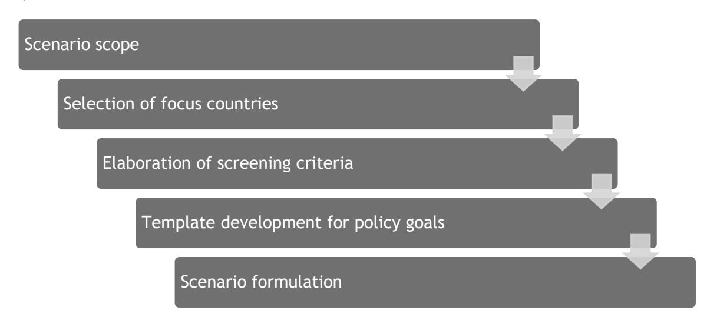

these criteria, the policies for chemicals, construction, plastics and textiles were identified, reviewed and analysed.

For the collection of macro-level goals, the policy field is differentiated into policy objectives, goals and instruments (15). Policy objectives represent desired future conditions or states to be achieved and are often long-term (e.g. 30 % target for the use of recycled plastic in beverage bottles by 2030 (16)). Policy goals, instead, are set for the medium term. Policy instruments are defined as the measures (or intervention options) implemented to realize policy goals and objectives. These are assessed in more detail in WP5, where pathways of change are identified, policy priorities reviewed, and enabling policy instruments proposed.

# **2.4 Template development for policy goals**

The collected policy goals (both of qualitative and quantitative nature) were analysed using specific parameters, identified in an iterative process with the modelling task (T4.2) (see Table 1). The resulting parameters have been included in a template document, used to collect and organize relevant information.

Data was gathered through an extensive literature review, including national and sectoral strategies and directives, existing regulations for CBBE, as well as national energy and climate plans. This desk research and selection of policy goals were further enhanced by expert consultations within the project consortium, as well as with external stakeholders at the INSPIRE conference (see Annex 7.1 for MIRO Boards of the Workshop). During the workshop, stakeholders discussed selected policy goals in group sessions (dedicated conversations took place for each sector). Based on the feedback received, the selection of policy goals was reviewed and improved, and new goals were integrated into the scenarios.

*Table 1: Template structure for policy goals collection* 

| Name                                         |                                                                     |
|----------------------------------------------|---------------------------------------------------------------------|
| Goal name and description                    | Nature (Quantitative or qualitative)                                |
| Mechanism (through which the goal            | should be realised)                                                 |
| Goal implementation year (2030, 2050, other) | Expected impacts Geographic level (EU, country of the case studies) |
| Influenced value chain part References       | (production, consumption or end of life)                            |

# **2.5 Scenario formulation**

The aim of the scenario formulation task is to generate both a baseline scenario and a more ambitious transformative scenario. Given the systemic nature of the CBBE, a portfolio of policy goals was selected for both scenarios. Further, the selection of policies was informed by a literature review and consultations with experts from the project consortium and at the international INSPIRE conference.

The baseline scenario illustrates the *status quo* of policies identified for CBBE at both EU and country levels. In other words, it considers stated targets and policies already discussed, approved and either being implemented or soon to be implemented. Additionally, the implementation years of each target are presented, both to assess the complementarity of each intervention option in the context of the broader CBBE, as well as to support the incorporation of quantitative policy targets in the GEM model and related quantitative analysis.

The transformative scenario, a more ambitious case, underlines a faster, more holistic and betterintegrated transition towards the CBBE. A comparative table was generated to support the comparison of the two scenarios, listing all policy goals and their implementation years (see Annex A3). Colour coding and additional text for the new and more ambitious policies highlight the differences between the scenarios.

# **3 RESULTS**

## **3.1 Scenario scope**

The two scenarios developed were named BioTransition (baseline scenario) and BioRevolution (ambitious scenario). Based on the country's assessment and selection process (see Annex Table A1 1 and A1 2), Germany, Italy and the Netherlands were selected for detailed analysis in the policy portfolio scenarios.

The scenarios were formulated to cover all sectors, in the EU and for Germany, Italy and the Netherlands, as presented in Table 2. For the BioRevolution scenario cross-country more ambitious goals have been integrated, while for the BioTransition scenario the focus was on the country specific goals. The timeframe extends to 2050 for the chemical and construction sectors and to 2040 for the plastic and textile sectors, as a result of data availability.

*Table 2: Geographical coverage of the two policy portfolio scenarios*

| Sector              | BioTransition | BioRevolution               |
|---------------------|---------------|-----------------------------|
| Cross-sectoral      | EU            | EU                          |
| Chemical sector     | Netherlands   | Netherlands                 |
| Construction sector | Germany       | Germany, Netherlands, Italy |
| Plastic sector      | Germany       | Germany, Netherlands,       |
| Textile sector      | Italy         | Italy, Netherlands          |

# **3.2 Screening criteria**

For selecting and identifying the policy goals underlying the scenarios, screening criteria were defined, considering the definition of CBBE used in this project, and building on the EU Circular Action Plan (see [Figure 2\)](#page-16-1).

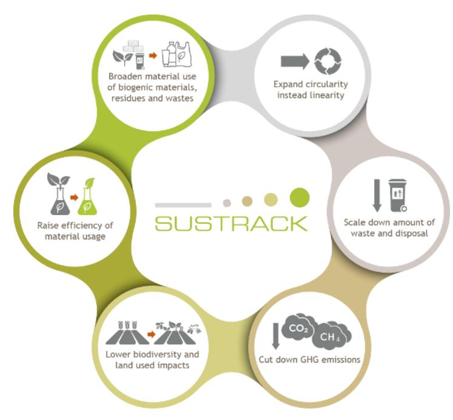

The criteria are described as follows:

- Broaden material use, of biogenic materials, residues and wastes: Increase the integration of biogenic raw materials, such as primary biomass, sustainable biowastes, or other currently classified waste materials into material flows
- Expand circularity instead of linearity: Every product should be used as long as possible within the same or other value chains and as a raw material for other processes
- Scale down the amount of waste and disposal: Within a circular economy no waste or disposal exists and every residual product should be a raw material for other processes
- Cut down GHG emissions: Lower GHG emissions by decreasing the use of primary raw materials and increasing the integration of renewable raw materials
- Lower biodiversity and land use impacts: Using fewer primary raw materials and enhancing circularity leads to reduced impacts on biodiversity and land use
- Raise efficiency of material usage: A circular economy focuses on closing material loops and reducing the need for new raw materials for products

*Figure 2: Screening criteria for policies*

# **3.3 Policy goal data gathering**

Based on the characterization of the scenarios and the screening criteria, the following overview presents the metrics identified and analysed in two different selection phases.

Figure 3 (a-d) illustrates the results of the first selection of policy goals along important metrics taken from the categories of the template (see chapter [2.4\)](#page-13-0).

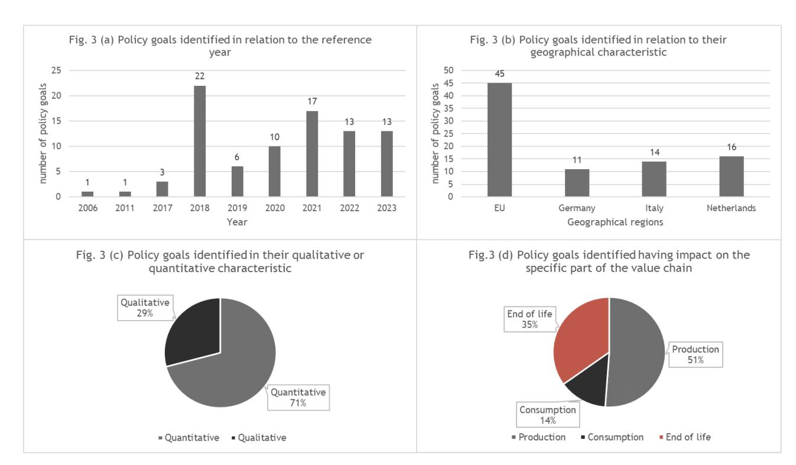

In this selection process, 86 policy goals were identified, 81 of which are being implemented or under discussion in the period 2018 and 2023. Aligned with the project's focus, most policy goals were identified at the EU level. Additional efforts were made to collect quantitative goals, in addition to qualitative indications of ambition, to support the modelling task in WP4.

We observed that most goals impact all three main components of the value chain: primarily on production, followed by end-of-life considerations, with only a small number of policies and targets focusing on consumption.

*Figure 3: Portfolio of identified policy goals (a) in relation to the reference year; (b) in relation to their geographical characteristic; (c) in their qualitative or quantitative characteristic; (d) with impact on the specific part of the value chain*

Figure 4 (a-d) illustrates the important metrics for the policy goals selected and integrated into the scenarios.

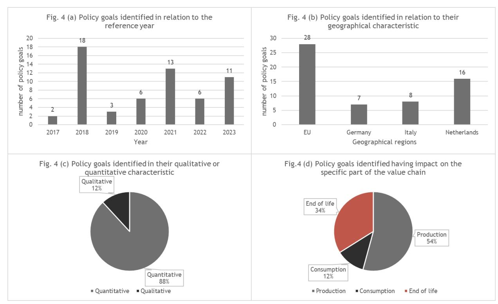

Through the iterative process of identifying and formulating specific policy goals, 27 goals were eliminated. As a result, 59 policy goals were retained. The majority of policy goals were identified at the EU level, while second most in the Netherlands followed by Italy and Germany. The majority of goals carry a quantitative target. Also, in this case, we find that most policies focus on production, followed by end of life, and finally consumption.

Additionally, certain goals were added via the expert consultations during the INSPIRE Conference. Specifically, 14 additional policy goals were included in the two scenarios, which led to a final total of 73 policy goals analysed and used to elaborate the storyline and the portfolio scenarios of policy goals. A more detailed overview of each collected policy goal is given in Annex A3 in the form of short factsheets, along with the categories of the template developed.

*Figure 4: Portfolio of identified policy goals integrated in the scenarios (a) in relation to the reference year; (b) in relation to their geographical characteristic; (c) in their qualitative or quantitative characteristic; (d having impact on the specific part of the value chain*

# **4 BIOTRANSITION AND BIOREVOLUTION SCENARIO**

This chapter provides insight into the two scenarios formulated, informed by the policy goals identified and stakeholder input. An initial general overview is followed by a more detailed presentation of the scenarios, considering specific sectoral dynamics across countries (see Chapters 4.1 – 4.3).

Each chapter begins with an overview of the criteria, and how these are addressed by the policy goals in the *status quo* scenario, followed by the storyline. The table listing specific policy goals and their timeframe is presented in Annex A4.

# **4.1 Overarching scenario storyline**

## **4.1.1 BioTransition: Transition to a biobased economy**

The BioTransition scenario focuses on current policy objectives. Transitions are multidimensional processes involving significant structural changes across technological, material, economic, or political elements (17) and their systemic interrelations (18). In the BioTransition scenario, the structural change is based on policy goals that promote aspects of CBBE and its overall system integration. Specifically, it includes quantified goals aimed at altering material flows, waste streams, and end-of-life options, with the aim to increase homogeneous material streams rather than heterogeneous ones. While this scenario establishes the foundations for a circular economy, it does not include additional measures to accelerate the transition to a CBBE in terms of speed and scope.

### **4.1.2 BioRevolution: Revolution to a biobased economy**

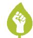

The BioRevolution scenario features new and more ambitious goals aimed at rapidly transforming towards a fully CBBE. The term "Revolution" signifies a faster and more comprehensive transformation, addressing large-scale societal changes across multiple dimensions (18). This scenario incorporates state-of-the-art and forward-looking policies that extend beyond basic waste separation to propose more holistic approaches and drive deeper systemic shifts. It aligns with the new circular economy action plan (14), which focuses on reforming the EU waste legislation (19).

In this storyline, policies address the entire value chain, from resource sourcing to consumption and end-of-life materials management. By adopting more ambitious quotas, setting voluntary measures as mandatory and adjusting time scales for policy goal implementations, the circularity of the material flows is enhanced. Increased policy ambition strengthens political support for transitioning to a CBBE, amplifying the positive climate mitigation impacts of circular material flows.

# **4.2 Overarching portfolio scenarios based on EU goals**

The policy portfolio scenarios applied to the four industrial sectors include two different levels of policy goals and these correspond to 5 out of 6 screening criteria directly (Figure 5). First, the overarching EU policy goals, which are not specifically formulated for a given sector, but are common to all sectors and set the overall boundary conditions. Second, the sector-specific policy goals, leading to unique sector policy portfolio scenarios.

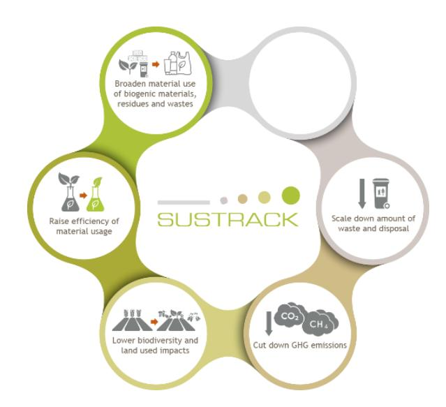

# **4.2.1BioTransition: Transition to a biobased economy**

In the overarching storyline of the scenario, three leading areas of change could be identified, in line with the identified policy goals.

The first area is energy efficiency (corresponding with screening criteria "Raise efficiency (of material usage)"). This supports the creation of a modern, resource-efficient and competitive economy (20) oriented towards the goal of no net emissions (21).

The second area focuses on the reduction of waste streams at different levels, but with a focus on municipal waste (e.g. reduction >55% by 2025 and >60% by 2035) (22, 23). Municipal waste includes (see 2.b in (23)) plastics, biowaste, wood, textile, packaging and furniture, in alignment with the sectors considered.

The third area covers the reduction of GHGs (24), with emphasis on specific climate gases such as CO2 (25) (e.g. 55% by 2030), as well as curbing the environmental impacts (22) generated by material and energy flows (e.g. reduction of final energy consumption 36% by 2030, renewable energy of 42,5%). The aim is to reduce carbon dependency, recycle carbon from waste streams to

*Figure 5: Screening criteria that correspond with identified policy goals of the overarching policy goals on EU level*

replace fossil-based carbon, and upscale carbon removal solutions, such as increasing the use of wood products (25, 26). The aim is to reduce the use of non-renewable resources and strengthen the economic competitiveness of European countries (1), primarily by working within planetary boundaries (e.g. decoupling economic growth from resource use; reducing dependency on nonrenewable unsustainable raw materials) (22). Table A4 in Annex 3 provides more detail on the policies and targets considered.

# **4.2.2BioRevolution: Revolution to a biobased economy**

In the BioRevolution scenario, the push of CBBE is more systemic, establishing specific goals also in the material sector. By addressing the importance of connecting the material flows with the overall transformation into CBBE, it is possible to generate knowledge about the necessary actions that are required to accelerate the transformation to a sustainable system. A central aim of CBBE is to reduce material use and increase efficiency, thereby establishing absolute decoupling of resource use from economic growth (21, 27). This supports also the policy goals that address the issue of total raw material productivity (see BioRevolution Plastics and Construction), enable a more intensive use of secondary raw materials and integration of more sustainable biobased alternatives that are part of natural CO2 circles (see Construction sector: BioRevolution). A further goal is the integration of renewable raw materials to substitute fossil or non-renewable resources (e.g. increase of wood-based products in the global market to 1,5%). For a detailed overview of included policies sorted by the respective focus year see Annex 4, Table A4.

# **4.3 Chemical sector**

The chemical sector is an upstream producer for several other sectors, for instance construction, textile and plastics and the policy goals correspond to 4 out of 6 screening criteria directly (Figure 6). This characteristic differentiates it from the other downstream sectors. As the sector is not the main producer of final products, end-of-life policy goals such as separation of waste streams during collection are not directly applicable.

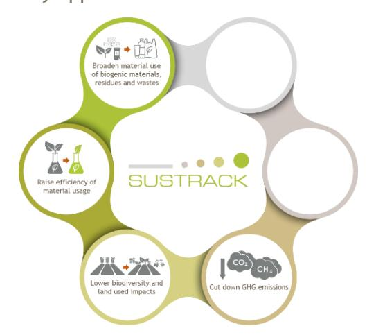

## **4.3.1BioTransitionCHEM: Transition to a biobased economy**

In the BioTransition scenario, the main goal for the chemical sector is the European Communique's goal of integrating 20 % carbon from non-fossil resources by 2030. This involves reducing fossil carbon and exploring the use of new carbon sources for industrial use. It also includes capturing between 300 Mt and 500 Mt of carbon (25). Another key objective is to ensure toxic-free material flows to support circular material flows and reduce environmental impacts (28). The goals align with the selection criteria "Broaden material use of biogenic materials, residues and wastes" and "Expand circularity instead of linearity". The BioTransitionCHEM scenario emphasizes the substitution of products through biobased alternatives.

Country-specific aspects: For the chemical sector, the focus is on the Netherlands. No specific policies for CBBE in the chemical sector were found. Therefore, the analysis incorporates overarching goals that impact the sector. The latest National Circular Economy Program (29) proposes quantitative goals, such as reducing the raw material footprint (reduction of 50% primary raw material usage) (30). For a detailed overview of the included policies by focus year, see Annex 4, Table A4 5.

Figure 6: Screening criteria that correspond to identified policy goals of the chemical sector

# **4.3.2BioRevolutionCHEM: Revolution to a biobased economy**

In the BioRevolutionCHEM scenario, the main innovation is the increased integration of carbon from non-fossil resources and the early achievement of the zero-pollution goal. Using biomass in a chemical CBBE has a more significant impact on industrial resource use than switching to renewable energy. This is especially evident with ambitious goals for reducing primary resource use. In the BioRevolutionCHEM scenario, the adoption of these practices reduces the dependency on fossil resources and curbs environmental pollution. According to a meta-analysis (31), several studies suggest that a higher biomass use is feasible. Aligned to these results, the scenario increases to 30% of the quota for renewable carbons, based on biomass, in 2030 (average value in the meta-analysis) and to 40% in 2050 (focus on the higher values of the scenario studies). Here, trade-offs across all bioeconomy sectors need to be considered, including potential impacts on the EU's carbon sinks (1) and types of the biomass used. A feedstock change would be triggered for the industry, although potential bottlenecks from increasing use in other sectors (e.g. EU Biodiversity Strategy (32)) should be considered. Chemical pollution significantly impacts environmental quality and biodiversity (32). In the more ambitious scenario, the zero-pollution goal (28) is achieved by 2045. and the goal to reduce substances of concern in recycled materials will be met by 2040. For the detailed overview of included policies see Annex Table A4 6.

# **4.4 Construction sector**

Construction is one of the most material-intensive sectors, but also carries considerable potential to integrate more biobased materials. In particular, the use of wood-based construction parts could have meaningful impacts on the transformation of raw material use in the sector. The policy goals correspond to 5 out of 6 screening criteria directly (Figure 7).

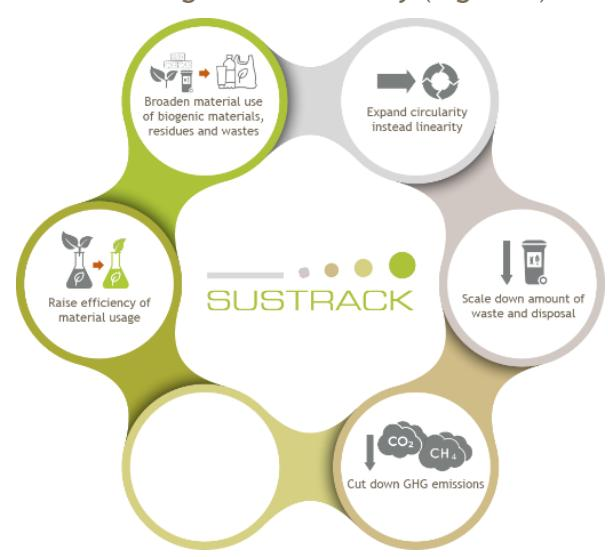

## **4.4.1BioTransitionCON: Transition to a biobased economy**

In the BioTransitionCON scenario, the market share of wood-based products is relatively low compared to non-metallic raw materials (26). Increasing the use of wood-based products could significantly benefit carbon sequestration by linking the construction sector with carbon farming initiatives (25). This aligns with the criteria of "Broaden material use of biogenic materials, residues and wastes", and "Cut down GHG emissions". However, since most policy goals focus on energy-related aspects (e.g. renovation quotas for buildings (20, 33): such as at least 2% of annual energy renovation by 2030; residential and non-residential buildings, decarbonised building stock by 2050) only limited impacts on the material side is assumed in this scenario. The material focus is on separating material streams at end-of-life ("Scale down waste and disposal") and establishing secondary raw material sources for further use ("Expand circularity instead of linearity") (e.g. 70% by weight from 2020 prepared for recycling or other material recovery). This approach should also contribute to reducing overall GHG emissions by decreasing primary extraction emissions.

Country-specific aspects: For the construction sector, the focus country is Germany. The goal of supporting innovations within the construction of wood-based buildings (34) and the integration of other types of wood is noted qualitatively. The central policy goal is to increase total raw material productivity by 1,5 % annually, as outlined in the third resource efficiency program (35). This aligns with the criteria of "Raise efficiency of material usage". The goal of greater resource efficiency and resource substitution embeds the principle of the circular or closed-loop economy

Figure 7: Screening criteria that correspond with identified policy goals of the construction sector

in production processes, similar to the scenario in the chemical sector (35). For a detailed overview of included policies sorted by the respective focus year, see Annex Table A4 7.

# **4.4.2BioRevolutionCON: Revolution to a biobased economy**

In the BioRevolutionCON scenario, the market share of wood-based products increases, aligned with the assumptions of a future worldwide bioeconomy market expansion (26) from 1 % to 1,5 %. The rise of the quota is possible to generate from EU resources, although with possibly high impacts on the competing uses of roundwood (1) and cross-cutting sectors.

An additional component in the BioRevolutionCON scenario is the shift of the EU Taxonomy goals from being voluntary to mandatory. This assumes that for a shift in the construction sector from a carbon source into a sink, the EU Taxonomy rules are necessary to be implemented as a directive starting in 2030. Mandatory product passports support the monitoring of the implementation of these goals. Additionally, the sustainable carbon cycle goal (25) supports the deployment of biobased materials in the sector. Included in the regulations is also the carbon storage conservation in the vacancy management of buildings, aiming at prolonged usage for old buildings.

Country.specific aspects: The focus country for the construction sector is Germany. Named policy goal incentives are the promotion of innovation in the construction of wood-based buildings (34) and the integration of other types of wood. In the BioRevolutionCON scenario, the total raw material productivity is raised from 1,5 % to about 2 % (35), because the goal of 1,5 % was not reached in the time period from 2010 – 2018, and more ambitious goals are necessary to reach the aim for 2030. Possible measures for this could be higher recycling quotas and increased support of lightweight constructions (36). This is similar to the Netherlands' goals of (i) reducing the usage of abiotic materials until 2030 and (ii) integrating as many sustainable renewable raw materials in products. For a detailed overview of the included policies by focus year, see Annex Table A4 8.

# **4.5 Plastic sector**

The plastics sector has the most specific policy goals based on EU regulation and at the national level and these correspond to 5 out of 6 screening criteria directly (Figure 8). It is a key sector for CBBE transformation due to its high dependency on fossil fuel feedstocks. Therefore, specific concepts in this sector have a high impact on the development of a CBBE.

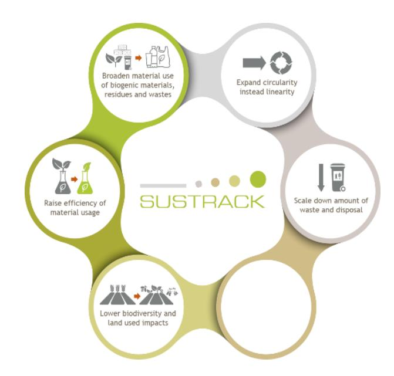

# **4.5.1BioTransitionPLA: Transition to a biobased economy**

The BioTransitionPLA scenario focuses on the reduction of waste streams, by increasing recycling (37), banning products (38), as well as integrating recycled content in the material flows (39). Further regulations address the negative influence on human health and ecosystems, by regulating specific ingredients of the products (39) (e.g. lower the sum of concentration levels of lead, cadmium, mercury and hexavalent chromium).

Although voluntary, the EU Taxonomy is seen as a signal of a shift in mindset in the sector. It sets goals for recycled content in products (e.g. at least 65 % of the packaging product by weight consists of recycled post-consumer material by 2028), the introduction of biobased feedstocks (e.g. use of bio-waste feedstock: at least 65 % of the packaging product by weight consists of sustainable bio-waste feedstock by 2028) as well as the overall decrease of per capita packaging waste generation ((a) 5 % by 2030; (b) 10 % by 2035; (c) 15 % by 2040) (40). Nevertheless, the uptake of this Taxonomy is limited in terms of the number of companies participating, which is quantified between 1-5 % (41). The portfolio of policies in this sector already impacts several parts of the value chain from production, over consumption to end-of-life aspects.

Figure 8: Screening criteria that correspond with identified policy goals of the plastic sector

Country-specific aspects: The focus country for the plastic sector is Germany. The central policy goal is to increase total raw material productivity by 1,5 % annually, as outlined in the third resource efficiency program (35). Additionally, recycling quotas are established to accomplish the legislative quotas (3,8 % by 2025; 8,8 % by 2030), set in place by the EU (37). In this sector, the scenario highlights that the EU level has a high impact on the transition of the sector, while on the selected country level, the focus is still on the separation of waste streams and the increase of recycling. For a detailed overview of the included policies by focus year, see Annex Table A4 9.

# **4.5.2BioRevolutionPLA: Revolution to a biobased economy**

In the BioRevolutionPLA scenario, recycling quotas are specified, more plastic categories are subject to regulation, and mandatory requirements for the production process—especially regarding design—will be introduced. Consequently, certain quotas are increased and bio-based feedstocks are more widely integrated into value chains. The policy goal of aligning the production of plastic products, along with the design for recycling principles, will be established by the year 2025 (39). This will impact recyclability and reduce negative environmental impacts (14). Additionally, the EU Taxonomy policy goal will be mandatory (40, 41) and sets the target for 65 % of packaging products by weight to be made from sustainable bio-waste feedstock.

Country-specific aspects: The focus country for the plastic sector is Germany. The central policy goal is to increase total raw material productivity by 1,5 % annually, as outlined in the third resource efficiency program (35) and is raised from 1,5 % to about 2 % (35), because the goal of 1,5 % was not reached (36) in the time period from 2010 – 2018, and more ambitious recycling quotas are necessary to reach the aim for 2030. Together with the implemented per capita policy goals for the reduction of packaging waste (39), the aim of the EU legislative for recycled plastic should be reached (37). The included policy goals are adapted by the Netherlands' goal for annual reduction in the growth of plastic: 1,5 % annually (42), and address the issue of increasing plastic waste streams (43), and illustrate that both the production level and the consumption level have to be integrated much stronger. Besides the packaging sector, other sectors are also important for a transformation of plastic usage such as the agriculture sector and are also considered in the scenario.

At the country level, the recycling quota for plastics was already at 48,4 % in 2021(43). To accelerate the transformation to a CBBE for the year 2030, an increase of 5 % of the current policy goals is included, leading to the new goal of 60 % in 2030 for plastics recycling and 35 % for wood packaging recycling. An additional measure is the adaption of mechanical and chemical recycling. Aligned to the policy goals of the Netherlands (mechanical recycling to 50 %; chemical recycling to 10 % until 2030 (42)) and evaluations on the EU level (40 % and the chemical recycling to 20 % until 2050 (27)), the scenario integrates quotas for mechanical recycling of 45 % and for chemical recycling of 15 %. By the year 2050, fossil-based production should be phased out as much as possible, with plastic production relying on recycled plastic, biobased materials or Carbon capture and use (CCU) applications. To achieve this goal, it is necessary to consider the limitation concerning the amount of plastics that are actually used and available for recycling, given the reduction assumed in the BioRevolutionPLA scenario. For a detailed overview of the included policies by focus year, see Annex Table A4 10.

# **4.6 Textile sector**

The textile sector is characterized by early action aimed at increasing the share of circular material flows. Since the EU is one of the major consumers of textiles, it is crucial to achieve higher circularity in textile material flows to reduce consumption, which contributes to waste stream problems and negative environmental impacts (48). The policy goals correspond to 3 out of 6 screening criteria directly (Figure 9).

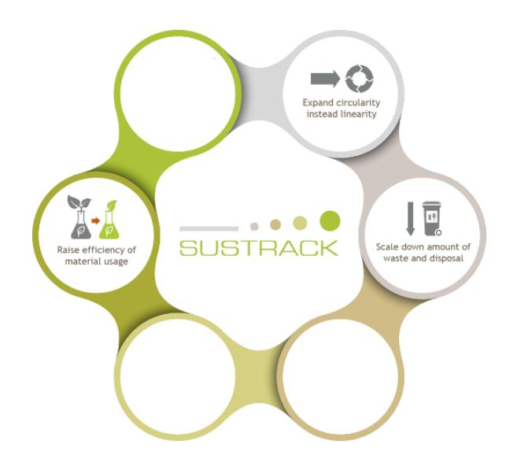

# **4.6.1BioTransitionTEX: Transition to a biobased economy**

The BioTransitionTEX scenario focuses on the collection and reuse of textiles at the point of disposal (23, 45). The latest strategy of the EU does not set mandatory policy goals but indicates growing ambition for increased use of recycled fibres, absence of hazardous substances and production processes, and ensuring social rights and environmental considerations by the year 2030 (47). Key actions involve implementing comprehensible eco-design requirements, stopping the destruction of unsold and unused fabrics, tackling microplastic pollution (in connection to the Zero Pollution Action Plan (22)), information requirements for the customer, green claims and establishing extended producer responsibility schemes. Addressing these issues requires the monitoring of material flows, starting with the broader implementation of separate textile collection in the waste stream (23).

Country-specific aspects: The focus country for the textile sector is Italy. The central policy goal aims at a 100% recovery in the textile industry by 2050 (45). The Italian National Circular Economy Strategy (46), supports this goal with a focus on the introduction of a tax system favourable to the secondary market. Additional upstream circularity strategies are planned, including eco-design requirements and extending the lifespan of products and parts (47). Given these goals are more

Figure 9: Screening criteria that correspond with identified policy goals of the textile sector

qualitative in nature, in the BioTransitionTEX scenario the aim is to introduce a 100% recovery of textiles by 2026 and reduce the annual energy consumption of the non-emission trading system (ETS) sector (48). For a detailed overview of the included policies by focus year, see Annex Table A4 11.

## **4.6.2BioRevolutionTEX: Revolution to a biobased economy**

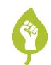

In the BioRevolutionTEX scenario, the goals of the EU Textile strategy are implemented and additional recycling targets are introduced. For clothing, the new policy goals are oriented along the National Circular Economy Strategy of the Netherlands, which integrates specific quantitative goals (29). The adoption of the country-specific goals at the EU level is likely to take more time for the implementation. Thus, the first policy goals will be put in place about 2,5 years later, or by the year 2027. This corresponds with the Italian national goal of 100 % recovery in "Textile Hubs" (45). Other goals are also anticipated in 2030 (e.g. separation of waste streams, recycling quotas), based on the experiences of other sectors (e.g. plastic). Additional measures are addressing directly the consumption side, with a focus on higher use rates of textiles that directly impact climate change, urban land occupation or natural land transformation (49). The goal of fully recycling, reusing, or refurbishing unsold textiles reduces the consumption of new textiles and prevents raw material waste. Along with the obligation to use more recycled clothing, this also supports other goals by 2030.

Besides consumption and end-of-life status, further aspects address the production processes of textiles in the BioRevolution TEX scenarios. In the year 2030, wool production should be qualified and sourced from regenerative agricultural practices. In connection with measures that promote reuse and a sharing economy, natural land transformation and land occupation impacts are addressed. In relation to this full product delivery chain perspective, a carbon tax implemented for all fashion products increases further the reuse of textiles and is a favourable fiscal policy to support a secondary market establishment in the year 2035 (47). For a detailed overview of the included policies by focus year, see Annex Table A4 12.

# **5 CONCLUSION**

This report presents the results of the work carried out in T4.1 of SUSTRACK, which focuses on reviewing existing policy goals, developing portfolio policy scenarios, and identifying goals to accelerate and intensify the transformation to a circular biobased economy.

A total of 49 policy documents were reviewed to identify relevant policy goals. The review emphasized policy goals with both qualitative and quantitative information from a macro perspective, guiding the inclusion of measures in GEM for scenario implementation in T4.2.

The scenario formulation exercise resulted in four main outputs, as presented next:

- First, we identified 86 relevant policy goals at both the EU and country levels for CBBE. 59 of these were integrated into the scenarios. An overall framework with screening criteria (see chapter [2.3\)](#page-12-3) was established to select appropriate policy goals creating an extensive portfolio that informs the modelling task and provides a compendium of policies, particularly quantitative ones.
- Second, the development of policy goals should rely on various inputs, including from sectoral practitioners, literature review and expert knowledge.
- Third, the policy portfolio scenarios offer insights into sectors crucial for the transformation to CBBE:
- EU Level: Emphasizes the importance of reducing material use while increasing efficiency, aiming to decouple resource consumption from economic growth. CBBE offers a chance to lessen reliance on non-renewable, unsustainable resources, while also promoting the creation of a toxic-free environment.
- Chemicals Sector: Highlights the goal of increasing the share of non-fossil-based carbon in material flows to support the earlier achievement of the zero-pollution goal, reduce substances of concern in recycled materials, and align with overarching EU objectives.
- Construction Sector: Demonstrates how a higher share of bio-based products can transform carbon sources into carbon sinks. It also focuses on enhancing raw material productivity and the use of secondary materials to improve material flow circularity, reducing dependence on non-abiotic resources.
- Plastics Sector: Encourages greater ambition and emphasizes the sector's crucial role in the circular economy. It suggests faster adoption of feedstock changes, setting more specific recycling quotas, and integrating non-fossil-based materials as a model for other sectors.
- Textiles Sector: Focuses on enhancing resource efficiency by streamlining waste streams and incorporating recycled products and sustainable textiles into value chains to drive sectoral transformation.
- The policy portfolio scenarios highlight the importance of governance structures in facilitating a faster, more holistic transformation of material flows in Europe. The CBBE is crucial for achieving climate goals related to mitigation and adaptation, transforming production and consumption to become more sustainable, focusing on circularity, decoupling resource use from economic growth, and reducing negative environmental impacts.

# **REFERENCES**

- 1. European Commission. A sustainable bioeconomy for Europe: Strengthening the connection between economy, society and the environment : updated bioeconomy strategy. Luxembourg: Publications Office of the European Union; 2018. Available from: URL: [https://doi.org/10.2777/792130.](https://doi.org/10.2777/792130)
- 2. European Commission. EU Bioeconomy Strategy Progress Report European Bioeconomy policy: stocktaking and future developments: CELEX 52022DC0283 EN TXT 2022 [cited 2023 Nov 25]. Available from: URL: [https://eur-lex.europa.eu/legal-content/EN/TXT/PDF/?uri=CELEX:52022DC0283.](https://eur-lex.europa.eu/legal-content/EN/TXT/PDF/?uri=CELEX:52022DC0283)
- 3. Hausknost D, Schriefl E, Lauk C, Kalt G. A Transition to Which Bioeconomy?: An Exploration of Diverging Techno-Political Choices. Sustainability 2017; 9(4):669.
- 4. D'Amato D, Korhonen J, Toppinen A. Circular, Green, and Bio Economy: How Do Companies in Land-Use Intensive Sectors Align with Sustainability Concepts? Ecological Economics 2019; 158:116–33.
- 5. Paul Stegmann, Marc Londo, Martin Junginger, Stegmann P, Londo M, Junginger M. The circular bioeconomy\_ Its elements and role in European bioeconomy clusters: Its elements and role in European bioeconomy clusters. Resources, Conservation & Recycling: X 2020; 6(3):100029.
- 6. Kardung M, Cingiz K, Costenoble O, Delahaye R, Heijman W, Lovrić M et al. Development of the Circular Bioeconomy: Drivers and Indicators. Sustainability 2021; 13(1):413.
- 7. EU Commission. Closing the loop An EU action plan for the Circular Economy; 2015 [cited 2023 Nov 27]. Available from: URL: [https://eur-lex.europa.eu/resource.html?uri=cellar:8a8ef5e8-99a0-11e5-b3b7-](https://eur-lex.europa.eu/resource.html?uri=cellar:8a8ef5e8-99a0-11e5-b3b7-01aa75ed71a1.0012.02/DOC_1&format=PDF) [01aa75ed71a1.0012.02/DOC\\_1&format=PDF.](https://eur-lex.europa.eu/resource.html?uri=cellar:8a8ef5e8-99a0-11e5-b3b7-01aa75ed71a1.0012.02/DOC_1&format=PDF)
- 8. James Goddin, Kim Marshall, Ana Pereira, Chris Tuppen, Sven Herrmann, Sam Jones et al. Circularity Indicators: An Approach to Measuring Circularity, Methodology; 2019.
- 9. Zeug W, Bezama A, Thrän D. Life Cycle Sustainability Assessment for Sustainable Bioeconomy, Societal-Ecological Transformation and Beyond. In: Hesser F, Kral I, Obersteiner G, Hörtenhuber S, Kühmaier M, Zeller V et al., editors. Progress in Life Cycle Assessment 2021. 1st ed. 2023. Cham: Springer International Publishing; Imprint Springer; 2023. p. 131–59 (Sustainable Production, Life Cycle Engineering and Management).
- 10. Dietz T, Börner J, Förster J, Braun J von. Governance of the Bioeconomy: A Global Comparative Study of National Bioeconomy Strategies. Sustainability 2018; 10(9):3190.
- 11. Kosow H, Gaßner R. Methods of future and scenario analysis: Overview, Assessment, and Selection Criteria. Bonn; 2007. (Studies / Deutsches Institut für Entwicklungspolitik; vol 39).
- 12. Schoemaker PJ. Scenario planning: a tool for strategic thinking. Cambridge: Massachussetts Institute of Technology; 1995. Sloan Management Review 36 [cited 2020 Apr 14].
- 13. Dammers E, van´t Klooster S, Wit Bd, Hilderink H, Petersen A, Tuinstra W. Bulding scenarios for environmental, nature and spatial planning policy: Guidance document. The Hague; 2019.
- 14. A new Circular Economy Action Plan For a cleaner and more competitive Europe; 2020 [cited 2023 Nov 27]. Available from: URL: [https://eur-lex.europa.eu/resource.html?uri=cellar:9903b325-6388-11ea-b735-](https://eur-lex.europa.eu/resource.html?uri=cellar:9903b325-6388-11ea-b735-01aa75ed71a1.0017.02/DOC_1&format=PDF) [01aa75ed71a1.0017.02/DOC\\_1&format=PDF.](https://eur-lex.europa.eu/resource.html?uri=cellar:9903b325-6388-11ea-b735-01aa75ed71a1.0017.02/DOC_1&format=PDF)
- 15. van Vuuren D, Kok, Marcel, van der Esch S, Jeuken M, Lucas P, Prins AG et al. Roads from Rio+20: Pathways to achieve global sustainability goals by 2050 2012.

16. Office P. Directive (EU) 2019/ of the European Parliament and of the Council of 5 June 2019 on the

- reduction of the impact of certain plastic products on the environment; 2019.
- 17. Pauliuk S, Fishman T, Heeren N, Berrill P, Tu Q, Wolfram P et al. Linking service provision to material cycles: A new framework for studying the resource efficiency–climate change (RECC) nexus. J Ind Ecol 2020; 59(3):282.
- 18. Hölscher K, Wittmayer JM, Loorbach D. Transition versus transformation: What's the difference? Environmental Innovation and Societal Transitions 2018; 27:1–3.
- 19. Circular economy action plan; 2023 [cited 2023 Dec 7]. Available from: URL: [https://environment.ec.europa.eu/strategy/circular-economy-action-plan\\_en.](https://environment.ec.europa.eu/strategy/circular-economy-action-plan_en)
- 20. Proposal for a DIRECTIVE OF THE EUROPEAN PARLIAMENT AND OF THE COUNCIL: on energy efficiency (recast); 2021.
- 21. COMMUNICATION FROM THE COMMISSION TO THE EUROPEAN PARLIAMENT, THE EUROPEAN COUNCIL, THE COUNCIL, THE EUROPEAN ECONOMIC AND SOCIAL COMMITTEE AND THE COMMITTEE OF THE REGIONS: The European Green Deal; 2019 [cited 2023 Dec 1]. Available from: URL: [https://eur](https://eur-lex.europa.eu/resource.html?uri=cellar:b828d165-1c22-11ea-8c1f-01aa75ed71a1.0002.02/DOC_1&format=PDF)[lex.europa.eu/resource.html?uri=cellar:b828d165-1c22-11ea-8c1f-](https://eur-lex.europa.eu/resource.html?uri=cellar:b828d165-1c22-11ea-8c1f-01aa75ed71a1.0002.02/DOC_1&format=PDF)[01aa75ed71a1.0002.02/DOC\\_1&format=PDF.](https://eur-lex.europa.eu/resource.html?uri=cellar:b828d165-1c22-11ea-8c1f-01aa75ed71a1.0002.02/DOC_1&format=PDF)
- 22. COMMUNICATION FROM THE COMMISSION TO THE EUROPEAN COMMUNICATION FROM THE COMMISSION TO THE EUROPEAN PARLIAMENT, THE COUNCIL, THE EUROPEAN ECONOMIC AND SOCIAL COMMITTEE AND THE COMMITTEE OF THE REGIONS: Pathway to a Healthy Planet for All EU Action Plan: 'Towards Zero Pollution for Air, Water and Soil'; 2021 [cited 2023 Dec 1]. Available from: URL: [https://eur](https://eur-lex.europa.eu/resource.html?uri=cellar:a1c34a56-b314-11eb-8aca-01aa75ed71a1.0001.02/DOC_1&format=PDF)[lex.europa.eu/resource.html?uri=cellar:a1c34a56-b314-11eb-8aca-](https://eur-lex.europa.eu/resource.html?uri=cellar:a1c34a56-b314-11eb-8aca-01aa75ed71a1.0001.02/DOC_1&format=PDF)[01aa75ed71a1.0001.02/DOC\\_1&format=PDF.](https://eur-lex.europa.eu/resource.html?uri=cellar:a1c34a56-b314-11eb-8aca-01aa75ed71a1.0001.02/DOC_1&format=PDF)
- 23. Office P. Directive 2008/98/EC of the European Parliament and of the Council of 19 November 2008 on waste and repealing certain Directives; 2018 [cited 2023 Nov 29]. Available from: URL: [https://eur](https://eur-lex.europa.eu/legal-content/EN/TXT/PDF/?uri=CELEX:02008L0098-20180705)[lex.europa.eu/legal-content/EN/TXT/PDF/?uri=CELEX:02008L0098-20180705.](https://eur-lex.europa.eu/legal-content/EN/TXT/PDF/?uri=CELEX:02008L0098-20180705)
- 24. Office P. REGULATION (EU) 2021/1119 OF THE EUROPEAN PARLIAMENT AND OF THE COUNCIL of 30 June 2021 establishing the framework for achieving climate neutrality and amending Regulations (EC) No 401/2009 and (EU) 2018/1999 ('European Climate Law'): The European Climate Law; 2019. Available from: URL: [https://eur-lex.europa.eu/legal-content/EN/TXT/PDF/?uri=CELEX:32021R1119.](https://eur-lex.europa.eu/legal-content/EN/TXT/PDF/?uri=CELEX:32021R1119)
- 25. COMMUNICATION FROM THE COMMISSION TO THE EUROPEAN PARLIAMENT AND THE COUNCIL: Sustainable Carbon Cycles; 2021 [cited 2023 Dec 1]. Available from: URL: [https://climate.ec.europa.eu/system/files/2021-12/com\\_2021\\_800\\_en\\_0.pdf.](https://climate.ec.europa.eu/system/files/2021-12/com_2021_800_en_0.pdf)
- 26. COMMUNICATION FROM THE COMMISSION TO THE EUROPEAN PARLIAMENT, THE COUNCIL, THE EUROPEAN ECONOMIC AND SOCIAL COMMITTEE AND THE COMMITTEE OF THE REGIONS: New EU Forest Strategy for 2030; 2021 3 [cited 2023 Dec 1]. Available from: URL: [https://eur](https://eur-lex.europa.eu/resource.html?uri=cellar:0d918e07-e610-11eb-a1a5-01aa75ed71a1.0001.02/DOC_1&format=PDF)[lex.europa.eu/resource.html?uri=cellar:0d918e07-e610-11eb-a1a5-](https://eur-lex.europa.eu/resource.html?uri=cellar:0d918e07-e610-11eb-a1a5-01aa75ed71a1.0001.02/DOC_1&format=PDF) [01aa75ed71a1.0001.02/DOC\\_1&format=PDF.](https://eur-lex.europa.eu/resource.html?uri=cellar:0d918e07-e610-11eb-a1a5-01aa75ed71a1.0001.02/DOC_1&format=PDF)
- 27. Circular Economy Roadmap for Germany; 2021 [cited 2023 Dec 11]. Available from: URL: [https://circulareconomy.europa.eu/platform/sites/default/files/circular\\_economy\\_roadmap\\_for\\_german](https://circulareconomy.europa.eu/platform/sites/default/files/circular_economy_roadmap_for_germany_en_update_dec._2021.pdf) [y\\_en\\_update\\_dec.\\_2021.pdf.](https://circulareconomy.europa.eu/platform/sites/default/files/circular_economy_roadmap_for_germany_en_update_dec._2021.pdf)
- 28. Chemicals Strategy for Sustainability Towards a Toxic-Free Environment: Communication from the Commission to the European Parliament, The Council, The European Economic And Social Committee and

The Committee Of The Regions; 2020.

- 29. Netherlands Ministry of Infrastructure and Water Management. National Circular Economy Programme | 2023 - 2030; 2023 [cited 2023 Dec 2]. Available from: URL: [https://www.rijksoverheid.nl/documenten/beleidsnotas/2023/02/03/nationaal-programma-circulaire](https://www.rijksoverheid.nl/documenten/beleidsnotas/2023/02/03/nationaal-programma-circulaire-economie-2023-2030)[economie-2023-2030.](https://www.rijksoverheid.nl/documenten/beleidsnotas/2023/02/03/nationaal-programma-circulaire-economie-2023-2030)
- 30. Netherlands Ministry of Economic Affairs and Climate Policy. Draft update of the National Plan Energy and Climate 2023 [cited 2023 Oct 18].
- 31. Kloo Y, Scholz A, Theisen S. Wege zur einer Netto-Null-Chemieindustrie: eine Meta-Analyse aktueller Roadmaps und Szenariostudien. Wuppertal Institut für Klima, Umwelt, Energie gGmbH Ergebnisse aus dem Forschungsprojekt GreenFeed.; 2023 [cited 2023 Dec 5]. Available from: URL: [https://epub.wupperinst.org/frontdoor/deliver/index/docId/8168/file/8168\\_GreenFeed\\_Chemieindustrie](https://epub.wupperinst.org/frontdoor/deliver/index/docId/8168/file/8168_GreenFeed_Chemieindustrie.pdf) [.pdf.](https://epub.wupperinst.org/frontdoor/deliver/index/docId/8168/file/8168_GreenFeed_Chemieindustrie.pdf)
- 32. EU Biodiversity Strategy 2030: Bringing nature back into our lives; 2021 [cited 2023 Dec 3]. Available from: URL: [https://op.europa.eu/en/publication-detail/-/publication/31e4609f-b91e-11eb-8aca-](https://op.europa.eu/en/publication-detail/-/publication/31e4609f-b91e-11eb-8aca-01aa75ed71a1)[01aa75ed71a1.](https://op.europa.eu/en/publication-detail/-/publication/31e4609f-b91e-11eb-8aca-01aa75ed71a1)
- 33. European Commission. Communication from the Commission to the European Parliament, the Council, the European Economic and Social Committee and the Committee of the regions: A renovation Wave for Europe greening our buildings, creating jobs, improving lives; 2020 [cited 2023 Dec 1]. Available from: URL: [https://eur-lex.europa.eu/resource.html?uri=cellar:0638aa1d-0f02-11eb-bc07-](https://eur-lex.europa.eu/resource.html?uri=cellar:0638aa1d-0f02-11eb-bc07-01aa75ed71a1.0003.02/DOC_1&format=PDF) [01aa75ed71a1.0003.02/DOC\\_1&format=PDF.](https://eur-lex.europa.eu/resource.html?uri=cellar:0638aa1d-0f02-11eb-bc07-01aa75ed71a1.0003.02/DOC_1&format=PDF)
- 34. German Ministry of Economic Affairs and Energy. Integrated National Energy and Climate Plan 2019 [cited 2023 Oct 18].
- 35. Bundesministerium für Umwelt, Naturschutz und nukleare Sicherheit. Deutsches Ressourceneffizienzprogramm 3 – 2020 bis 2023.
- 36. The Use of Natural Resources Resources Report for Germany 2022: Special: Raw Material Use in the Future; 2022. Available from: URL: [http://www.umweltbundesamt.de/resourcesreport2022.](http://www.umweltbundesamt.de/resourcesreport2022)
- 37. Verpackungsabfälle; 2023 [cited 2023 Dec 2]. Available from: URL: [https://www.umweltbundesamt.de/daten/ressourcen-abfall/verwertung-entsorgung-ausgewaehlter](https://www.umweltbundesamt.de/daten/ressourcen-abfall/verwertung-entsorgung-ausgewaehlter-abfallarten/verpackungsabfaelle#verpackungen-uberall)[abfallarten/verpackungsabfaelle#verpackungen-uberall.](https://www.umweltbundesamt.de/daten/ressourcen-abfall/verwertung-entsorgung-ausgewaehlter-abfallarten/verpackungsabfaelle#verpackungen-uberall)
- 38. The European Parliament and of the European Council. Directive (EU) 2019/ of the European Parliament and of the Council of 5 June 2019 on the reduction of the impact of certain plastic products on the environment; 2019 [cited 2023 Dec 2]. Available from: URL: [https://eur-lex.europa.eu/legal](https://eur-lex.europa.eu/legal-content/EN/TXT/PDF/?uri=CELEX:32019L0904)[content/EN/TXT/PDF/?uri=CELEX:32019L0904.](https://eur-lex.europa.eu/legal-content/EN/TXT/PDF/?uri=CELEX:32019L0904)
- 39. Proposal for a REGULATION OF THE EUROPEAN PARLIAMENT AND OF THE COUNCIL on packaging and packaging waste, amending Regulation (EU) 2019/1020 and Directive (EU) 2019/904, and repealing Directive 94/62/EC; 2022 [cited 2023 Dec 2]. Available from: URL: [https://eur](https://eur-lex.europa.eu/resource.html?uri=cellar:de4f236d-7164-11ed-9887-01aa75ed71a1.0001.02/DOC_1&format=PDF)[lex.europa.eu/resource.html?uri=cellar:de4f236d-7164-11ed-9887-](https://eur-lex.europa.eu/resource.html?uri=cellar:de4f236d-7164-11ed-9887-01aa75ed71a1.0001.02/DOC_1&format=PDF) [01aa75ed71a1.0001.02/DOC\\_1&format=PDF.](https://eur-lex.europa.eu/resource.html?uri=cellar:de4f236d-7164-11ed-9887-01aa75ed71a1.0001.02/DOC_1&format=PDF)
- 40. European Commission. ANNEX to the COMMISSION DELEGATED REGULATION (EU) …/… supplementing Regulation (EU) 2020/852 of the European Parliament and of the Council by establishing the technical screening criteria for determining the conditions under which an economic activity qualifies as contributing substantially to the sustainable use and protection of water and marine resources, to the transition to a circular economy, to pollution prevention and control or to the protection and restoration of biodiversity and ecosystems and for determining whether that economic activity causes no significant harm to any of the other environmental objectives and amending Delegated Regulation (EU) 2021/2178 as regards specific public disclosures for those economic activities; 2023 [cited 2023 Dec 2]. Available from:

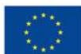

URL: [https://finance.ec.europa.eu/system/files/2023-06/taxonomy-regulation-delegated-act-2022-](https://finance.ec.europa.eu/system/files/2023-06/taxonomy-regulation-delegated-act-2022-environmental-annex-2_en_0.pdf)

- [environmental-annex-2\\_en\\_0.pdf.](https://finance.ec.europa.eu/system/files/2023-06/taxonomy-regulation-delegated-act-2022-environmental-annex-2_en_0.pdf)
- 41. Commission E. FAQ: What is the EU Taxonomy and how will it work in practice?; 2021 [cited 2023 Dec 11]. Available from: URL: [https://finance.ec.europa.eu/system/files/2021-04/sustainable-finance](https://finance.ec.europa.eu/system/files/2021-04/sustainable-finance-taxonomy-faq_en.pdf)[taxonomy-faq\\_en.pdf.](https://finance.ec.europa.eu/system/files/2021-04/sustainable-finance-taxonomy-faq_en.pdf)
- 42. Transition Agenda Circular Economy; 2018 [cited 2023 Dec 2]. Available from: URL: [https://hollandcircularhotspot.nl/wp-content/uploads/2018/06/TRANSITION-AGENDA-PLASTICS\\_EN.pdf.](https://hollandcircularhotspot.nl/wp-content/uploads/2018/06/TRANSITION-AGENDA-PLASTICS_EN.pdf)
- 43. Cayé N, Marasus S, Schüler K. Aufkommen und Verwertung von Verpackungsabfällen in Deutschland im Jahr 2021/Production and utilisation of packaging waste in Germany in the year 2021: Abschlussbericht/Final report. Dessau-Roßlau; 2023 [cited 2023 Dec 11]. Available from: URL: [https://www.umweltbundesamt.de/sites/default/files/medien/11850/publikationen/162\\_2023\\_texte\\_auf](https://www.umweltbundesamt.de/sites/default/files/medien/11850/publikationen/162_2023_texte_aufkommen_verpackungsabfaelle.pdf) [kommen\\_verpackungsabfaelle.pdf.](https://www.umweltbundesamt.de/sites/default/files/medien/11850/publikationen/162_2023_texte_aufkommen_verpackungsabfaelle.pdf)
- 44. EU Strategy for Sustainable and Circular Textiles. Brussels; 2022. Available from: URL: [https://eur](https://eur-lex.europa.eu/resource.html?uri=cellar:9d2e47d1-b0f3-11ec-83e1-01aa75ed71a1.0001.02/DOC_1&format=PDF)[lex.europa.eu/resource.html?uri=cellar:9d2e47d1-b0f3-11ec-83e1-](https://eur-lex.europa.eu/resource.html?uri=cellar:9d2e47d1-b0f3-11ec-83e1-01aa75ed71a1.0001.02/DOC_1&format=PDF) [01aa75ed71a1.0001.02/DOC\\_1&format=PDF.](https://eur-lex.europa.eu/resource.html?uri=cellar:9d2e47d1-b0f3-11ec-83e1-01aa75ed71a1.0001.02/DOC_1&format=PDF)
- 45. National recovery and resilience plan 2021-2026; 2021 [cited 2023 Dec 3]. Available from: URL: [https://www.governo.it/sites/governo.it/files/PNRR.pdf.](https://www.governo.it/sites/governo.it/files/PNRR.pdf)
- 46. Bioeconomy in Italy: A unique opportunity to reconnect the ECONOMY, SOCIETY and the ENVIRONMENT; 2017 [cited 2023 Dec 2]. Available from: URL: [https://www.agenziacoesione.gov.it/wp](https://www.agenziacoesione.gov.it/wp-content/uploads/2019/06/bioeconomia_eng.pdf)[content/uploads/2019/06/bioeconomia\\_eng.pdf.](https://www.agenziacoesione.gov.it/wp-content/uploads/2019/06/bioeconomia_eng.pdf)
- 47. National Strategy for Circular Economy; 2022.
- 48. Italian Ministry of the Environment and Energy Security. Plan for the ecological transition; 2022. Available from: URL: [https://www.mase.gov.it/sites/default/files/archivio/allegati/PTE/PTE](https://www.mase.gov.it/sites/default/files/archivio/allegati/PTE/PTE-definitivo.pdf)[definitivo.pdf.](https://www.mase.gov.it/sites/default/files/archivio/allegati/PTE/PTE-definitivo.pdf)
- 49. Beton A, Dias D, Farrant L, Gibon T, Le GUERN Y, Desaxce M et al. Environmental Improvement Potential of Textiles (IMPRO-Textiles); 2014.
- 50. Publications Office of the European Union. Directive (EU) 2023/2413 of the European Parliament and of the Council of 18 October 2023 amending Directive (EU) 2018/2001, Regulation (EU) 2018/1999 and Directive 98/70/EC as regards the promotion of energy from renewable sources, and repealing Council Directive (EU) 2015/652; 2023 [cited 2023 Dec 1]. Available from: URL: [https://eur-lex.europa.eu/legal](https://eur-lex.europa.eu/legal-content/EN/TXT/PDF/?uri=OJ:L_202302413)[content/EN/TXT/PDF/?uri=OJ:L\\_202302413.](https://eur-lex.europa.eu/legal-content/EN/TXT/PDF/?uri=OJ:L_202302413)
- 51. The European Parliament and of the European Council. COUNCIL DIRECTIVE 1999/31/EC of 26 April 1999 on the landfill of waste; 2018 [cited 2023 Dec 2]. Available from: URL: [https://eur](https://eur-lex.europa.eu/legal-content/EN/TXT/PDF/?uri=CELEX:01999L0031-20180704)[lex.europa.eu/legal-content/EN/TXT/PDF/?uri=CELEX:01999L0031-20180704.](https://eur-lex.europa.eu/legal-content/EN/TXT/PDF/?uri=CELEX:01999L0031-20180704)
- 52. Platform on Sustainable Finance. Platform on Sustainable Finance: Technical working group Methodological report; 2022 [cited 2023 Dec 2]. Available from: URL: [https://finance.ec.europa.eu/system/files/2022-04/220330-sustainable-finance-platform-finance-report](https://finance.ec.europa.eu/system/files/2022-04/220330-sustainable-finance-platform-finance-report-remaining-environmental-objectives-taxonomy_en.pdf)[remaining-environmental-objectives-taxonomy\\_en.pdf.](https://finance.ec.europa.eu/system/files/2022-04/220330-sustainable-finance-platform-finance-report-remaining-environmental-objectives-taxonomy_en.pdf)
- 53. European Parliament and of the European Council. EGULATION (EU) 2023/839 OF THE EUROPEAN PARLIAMENT AND OF THE COUNCIL of 19 April 2023 amending Regulation (EU) 2018/841 as regards the scope, simplifying the reporting and compliance rules, and setting out the targets of the Member States

for 2030, and Regulation (EU) 2018/1999 as regards improvement in monitoring, reporting, tracking of

progress and review; 2018 [cited 2023 Dec 3]. Available from: URL: [https://eur-lex.europa.eu/legal](https://eur-lex.europa.eu/legal-content/EN/TXT/PDF/?uri=CELEX:32023R0839)[content/EN/TXT/PDF/?uri=CELEX:32023R0839.](https://eur-lex.europa.eu/legal-content/EN/TXT/PDF/?uri=CELEX:32023R0839)

54. COMMUNICATION FROM THE COMMISSION TO THE EUROPEAN PARLIAMENT, THE COUNCIL, THE EUROPEAN ECONOMIC AND SOCIAL COMMITTEE AND THE COMMITTEE OF THE REGIONS: A Farm to Fork Strategy for a fair, healthy and environmentally-friendly food system; 2020 [cited 2023 Dec 2]. Available from: URL: [https://eur-lex.europa.eu/resource.html?uri=cellar:ea0f9f73-9ab2-11ea-9d2d-](https://eur-lex.europa.eu/resource.html?uri=cellar:ea0f9f73-9ab2-11ea-9d2d-01aa75ed71a1.0001.02/DOC_1&format=PDF)[01aa75ed71a1.0001.02/DOC\\_1&format=PDF.](https://eur-lex.europa.eu/resource.html?uri=cellar:ea0f9f73-9ab2-11ea-9d2d-01aa75ed71a1.0001.02/DOC_1&format=PDF)

55. Office P. DIRECTIVE 2010/31/EU OF THE EUROPEAN PARLIAMENT AND OF THE COUNCIL of 19 May 2010 on the energy performance of buildings (recast); 2018. Available from: URL: [https://eur](https://eur-lex.europa.eu/legal-content/EN/TXT/PDF/?uri=CELEX:02010L0031-20210101)[lex.europa.eu/legal-content/EN/TXT/PDF/?uri=CELEX:02010L0031-20210101.](https://eur-lex.europa.eu/legal-content/EN/TXT/PDF/?uri=CELEX:02010L0031-20210101)

56. Proposal for a DIRECTIVE OF THE EUROPEAN PARLIAMENT AND OF THE COUNCIL on Corporate Sustainability Due Diligence and amending Directive (EU) 2019/1937; 2022. Available from: URL: [https://eur-lex.europa.eu/resource.html?uri=cellar:bc4dcea4-9584-11ec-b4e4-](https://eur-lex.europa.eu/resource.html?uri=cellar:bc4dcea4-9584-11ec-b4e4-01aa75ed71a1.0001.02/DOC_1&format=PDF) [01aa75ed71a1.0001.02/DOC\\_1&format=PDF.](https://eur-lex.europa.eu/resource.html?uri=cellar:bc4dcea4-9584-11ec-b4e4-01aa75ed71a1.0001.02/DOC_1&format=PDF)

57. Regulation (ec) no 1907/2006 of the european parliament and of the council of 18 December 2006 concerning the Registration, Evaluation, Authorisation and Restriction of Chemicals (REACH), establishing a European Chemicals Agency, amending Directive 1999/45/EC and repealing Council Regulation (EEC) No 793/93 and Commission Regulation (EC) No 1488/94 as well as Council Directive 76/769/EEC and Commission Directives 91/155/EEC, 93/67/EEC, 93/105/EC and 2000/21/EC: REACH; 2006. Available from: URL: [https://eur-lex.europa.eu/legal-content/EN/TXT/PDF/?uri=CELEX:32006R1907.](https://eur-lex.europa.eu/legal-content/EN/TXT/PDF/?uri=CELEX:32006R1907)

58. Publications Office of the European Union. REGULATION (EU) No 1007/2011 OF THE EUROPEAN PARLIAMENT AND OF THE COUNCIL of 27 September 2011 on textile fibre names and related labelling and marking of the fibre composition of textile products and repealing Council Directive 73/44/EEC and

Directives 96/73/EC and 2008/121/EC of the European Parliament and of the Council; 2018.

59. Federal Ministry for the Environment, Nature Conservation, Nuclear Safety and Consumer Protection, [www.bmuv.de/en/.](http://www.bmuv.de/en/) The National Circular Economy Strategy: Fundamentals for the process of transforming to a circular economy.

60. Federal Ministry for Environment, Nature Conservation and Nuclear Safety (BMU), [www.bmu.de/en.](http://www.bmu.de/en) Act Reorganising the Law on Closed Cycle Management and Waste (KrWG); 2023.

61. National Strategy for the Circular Economy Programme Guidelines for updating: Consultation Document; 2021 [cited 2023 Dec 3]. Available from: URL: [https://www.mase.gov.it/sites/default/files/archivio/allegati/economia\\_circolare/SEC\\_30092021\\_1.pdf.](https://www.mase.gov.it/sites/default/files/archivio/allegati/economia_circolare/SEC_30092021_1.pdf)

62. National Strategy for Sustainable Development; 2017 [cited 2023 Dec 3]. Available from: URL: [https://www.mase.gov.it/sites/default/files/archivio\\_immagini/Galletti/Comunicati/snsvs\\_ottobre2017.p](https://www.mase.gov.it/sites/default/files/archivio_immagini/Galletti/Comunicati/snsvs_ottobre2017.pdf) [df.](https://www.mase.gov.it/sites/default/files/archivio_immagini/Galletti/Comunicati/snsvs_ottobre2017.pdf)

63. Plastic tax in Italy 2023; 2022 [cited 2023 Dec 2]. Available from: URL: [https://www.ecosistant.eu/en/plastic-tax-in-italy-2023/.](https://www.ecosistant.eu/en/plastic-tax-in-italy-2023/)

64. Hadhri M. Facts and figures of the europan chemical industry - Profile; 2022. Available from: URL: [https://cefic.org/a-pillar-of-the-european-economy/facts-and-figures-of-the-european](https://cefic.org/a-pillar-of-the-european-economy/facts-and-figures-of-the-european-chemical-industry/profile/#:~:text=Germany%20and%20France%20are%20the,Spain%2C%20Belgium%2C%20and%20Austria)[chemical](https://cefic.org/a-pillar-of-the-european-economy/facts-and-figures-of-the-european-chemical-industry/profile/#:~:text=Germany%20and%20France%20are%20the,Spain%2C%20Belgium%2C%20and%20Austria)[industry/profile/#:~:text=Germany%20and%20France%20are%20the,Spain%2C%20Belgium%2C%20a](https://cefic.org/a-pillar-of-the-european-economy/facts-and-figures-of-the-european-chemical-industry/profile/#:~:text=Germany%20and%20France%20are%20the,Spain%2C%20Belgium%2C%20and%20Austria) [nd%20Austria.](https://cefic.org/a-pillar-of-the-european-economy/facts-and-figures-of-the-european-chemical-industry/profile/#:~:text=Germany%20and%20France%20are%20the,Spain%2C%20Belgium%2C%20and%20Austria)

65. Statista Research Department. Annual production value of the construction industry in selected European countries 2020 (in billion euros); 2023. Available from: URL: [https://www.statista.com/statistics/964804/construction-industry-production-value-by-](https://www.statista.com/statistics/964804/construction-industry-production-value-by-country/#:~:text=The%20production%20value%20of%20the,France%20at%20303%20billion%20euros)

- [country/#:~:text=The%20production%20value%20of%20the,France%20at%20303%20billion%20euros](https://www.statista.com/statistics/964804/construction-industry-production-value-by-country/#:~:text=The%20production%20value%20of%20the,France%20at%20303%20billion%20euros)
- 66. Plastics Europe Enabling the future. Plastics the facts 2022; 2022 [cited 2023 Dec 22]. Available from: URL: [https://plasticseurope.org/wp-content/uploads/2022/10/PE-PLASTICS-](https://plasticseurope.org/wp-content/uploads/2022/10/PE-PLASTICS-THE-FACTS_V7-Tue_19-10-1.pdf)[THE-FACTS\\_V7-Tue\\_19-10-1.pdf.](https://plasticseurope.org/wp-content/uploads/2022/10/PE-PLASTICS-THE-FACTS_V7-Tue_19-10-1.pdf)
- 67. Feeder Report 2021 Production and Consumption of Plastics; 2022 [cited 2023 Dec 22]. Available from: URL: [https://oap.ospar.org/en/versions/1897-en-1-0-0-production-and](https://oap.ospar.org/en/versions/1897-en-1-0-0-production-and-consumption-plastics/)[consumption-plastics/.](https://oap.ospar.org/en/versions/1897-en-1-0-0-production-and-consumption-plastics/)
- 68. European Commission. Single Market EU -Textile and Clothing; 2023. Available from: URL: [https://single-market-economy.ec.europa.eu/sectors/fashion/textiles-and-clothing](https://single-market-economy.ec.europa.eu/sectors/fashion/textiles-and-clothing-industries/textiles-and-clothing-eu_en)[industries/textiles-and-clothing-eu\\_en.](https://single-market-economy.ec.europa.eu/sectors/fashion/textiles-and-clothing-industries/textiles-and-clothing-eu_en)
- 69. Lu S. EU Textile and Apparel Industry and Trade Patterns (Updated November 2023); 2023. Available from: URL: [https://shenglufashion.com/2022/12/02/eu-textile-and-apparel-industry](https://shenglufashion.com/2022/12/02/eu-textile-and-apparel-industry-and-trade-patterns/)[and-trade-patterns/.](https://shenglufashion.com/2022/12/02/eu-textile-and-apparel-industry-and-trade-patterns/)
- 70. National Inventory Report 2021; 2021. Available from: URL: [https://unfccc.int/documents/275968?gclid=CjwKCAjwkLCkBhA9EiwAka9QRnmfXC7aoQe3EwZ80](https://unfccc.int/documents/275968?gclid=CjwKCAjwkLCkBhA9EiwAka9QRnmfXC7aoQe3EwZ806icM6WbtZAycKtSKScE0mLKMxOLvSaNsA22ahoCsrUQAvD_BwE)

[6icM6WbtZAycKtSKScE0mLKMxOLvSaNsA22ahoCsrUQAvD\\_BwE.](https://unfccc.int/documents/275968?gclid=CjwKCAjwkLCkBhA9EiwAka9QRnmfXC7aoQe3EwZ806icM6WbtZAycKtSKScE0mLKMxOLvSaNsA22ahoCsrUQAvD_BwE)

### Project Consortium

# **ANNEX**

*Table A1 1: Selection criteria for countries and interpretation (Economic)*

| Sectors      | Selection criteria for countries and interpretation Sources |
|--------------|-------------------------------------------------------------|
| Chemicals    | Germany and France are the two largest chemicals producers  |
|              | EU27 chemical sales in 2021, valued at €393.0 billion. The  |
| Construction | Annual production value of the construction industry in     |
| Plastics     | Plastics converted demand Top 5: Germany, Italy, France,    |
| Textile      | The biggest producers in the industry are Italy, France,    |

*Table A1 2: Selection criteria for countries and interpretation (Emissions)*

|  | Description of criteria                                                | GHG-Emission                                                                                                                         | Sources |
|--|------------------------------------------------------------------------|--------------------------------------------------------------------------------------------------------------------------------------|---------|
|  | Total country GHG emissions in 2019                                    | The top-countries are following: 1. Germany; 2. France; 3. Italy; 4. Poland; 5. Spain; 6. Netherlands; 7. Czech Republic; 8. Belgium | (70)    |
|  | Chemical sector GHG emissions in 2019 (including plastics)             | The top-countries are following: 1. Belgium; 2. France; 3. Netherlands; 4. Germany; 5. Poland                                        | (70)    |
|  | Manufacturing industries and construction sector GHG emissions in 2019 | The top-countries are following: 1. Germany; 2. Italy; 3. France; 4. Spain; 5. Poland; 6. Netherlands                                | (70)    |

*Figure A2 1: Input collected for the plastic sector in the INSPIRE conference*

#### *Figure A2 2: Input collected for the chemicals sector in the INSPIRE conference*

#### *Figure A2 3: Input collected for the textile sector in the INSPIRE conference*

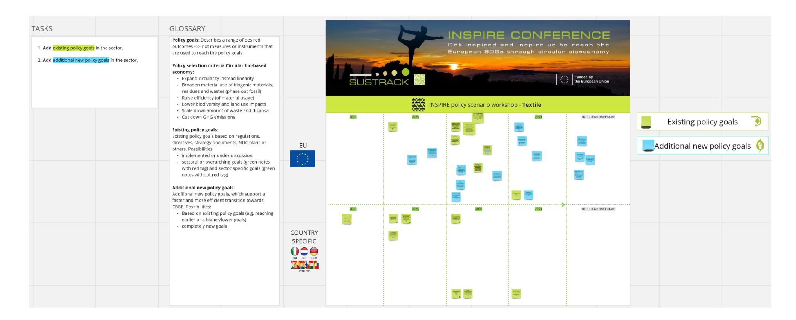

*Figure A2 4: Input collected for the construction sector in the INSPIRE conference*

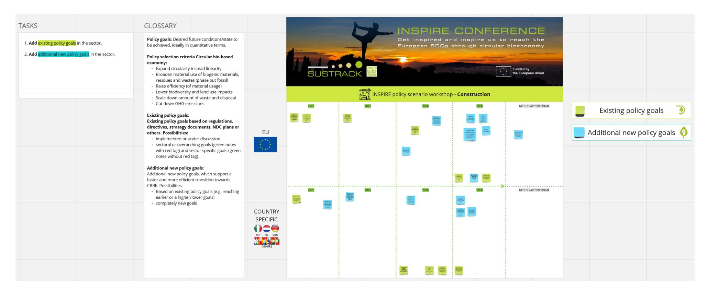

#### A3 List of selected and integrated policy goals

#### A3.1 EU Overarching goals

|   | Policy document name                                    | The European Green Deal (21)                                                                                                                                                                                                                                                                                                                                                                                                                                                                   |
|----------------|---------------------------------------------------------|------------------------------------------------------------------------------------------------------------------------------------------------------------------------------------------------------------------------------------------------------------------------------------------------------------------------------------------------------------------------------------------------------------------------------------------------------------------------------------------------|
|   | Qualitative                                             |                                                                                                                                                                                                                                                                                                                                                                                                                                                                                                |
|   | Quantitative                                            | X                                                                                                                                                                                                                                                                                                                                                                                                                                                                                              |
|   | Goal qualitative description                            | 1 No net emission of greenhouse gas emissions in EU by 2050 where economic growth is decoupled from resource use.                                                                                                                                                                                                                                                                                                                                                                              |
|   | Mechanism (through which the target should be realised) | 1 Quota                                                                                                                                                                                                                                                                                                                                                                                                                                                                                        |
|   | Expected Impact                                         | 1 (...) aims to transform the EU into a fair and prosperous society, with a modern, resource-efficient and competitive economy where there are no net emissions of greenhouse gases in 2050 and where economic growth is decoupled from resource use. 
(...) aims to protect, conserve and enhance the EU's natural capital, and protect the health and well-being of citizens from environment-related risks and impacts. At the same time, this transition must be just and inclusive.
 |
|   | Year specified                                          | 1 2050                                                                                                                                                                                                                                                                                                                                                                                                                                                                                         |
|   | Part of the value chain addressed                       | 1 Production                                                                                                                                                                                                                                                                                                                                                                                                                                                                                   |

| Policy document name | New EU Forest Strategy for 2030 (26)                                                 |
|----------------------|--------------------------------------------------------------------------------------|
| Quantitative         | X                                                                                    |
|                      | 1 (…) Increase of market share for wood products for the support of reaching climate |

|                                            |  |                                                                                                                                                                                                                                                                                                                                             |
|---------------------------------------------------------|---------------|----------------------------------------------------------------------------------------------------------------------------------------------------------------------------------------------------------------------------------------------------------------------------------------------------------------------------------------------------------|
| Mechanism (through which the target should be realised) | 1             | The Commission will develop a 2050 roadmap for reducing whole life-cycle carbon emissions in buildings. In the context of the revision of the Construction Products Regulation , the Commission will develop a standard, robust and transparent methodology to quantify the climate benefits of wood construction products and other building materials. |
| Expected Impact                                         | 1             | (...) role of wood products is to help turn the construction sector from a source of greenhouse gas emissions into a carbon sink.                                                                                                                                                                                                                        |
| Year specified                                          | 1             | 2030                                                                                                                                                                                                                                                                                                                                                     |
| Part of the value chain addressed                       | 1             | Production                                                                                                                                                                                                                                                                                                                                               |

|                                            |   |                                                                                                                        |  |
|---------------------------------------------------------|---|-------------------------------------------------------------------------------------------------------------------------------------|--|
| Policy document name                                    |   | Proposal for a DIRECTIVE OF THE EUROPEAN PARLIAMENT AND OF THE COUNCIL on energy efficiency (recast) (20)                           |  |
| Qualitative                                             |   |                                                                                                                                     |  |
| Quantitative                                            | X |                                                                                                                                     |  |
| Goal qualitative description                            | 1 | At least 32.5% improvement in energy efficiency by 2030; Reducing primary (39%) and final (36%) energy consumption by 2030          |  |
|                                                         | 2 | Annual energy savings obligations by MSs: 2024-2030: >1.5%                                                                          |  |
| Mechanism (through which the target should be realised) | 1 | Quota                                                                                                                               |  |
|                                                         | 2 | Quota                                                                                                                               |  |
| Expected Impact                                         | 1 | (...) Energy efficiency is a key area of action, without which the full decarbonisation of the Union 's economy cannot be achieved. |  |
|                                                         | 2 | (...) Energy efficiency is a key area of action, without which the full decarbonisation of the Union 's economy cannot be achieved. |  |
| Year specified                                          | 1 | 2030                                                                                                                                |  |
|                                                         | 2 | 2030                                                                                                                                |  |

|                      |  |  |
|-----------------------------------|---------------|---------------|
| Part of the value chain addressed | 1             | Production    |
|                                   | 2             | Production    |

| Policy document name                                    | The European Climate Law (24)                                                                                                                                                                         |
|---------------------------------------------------------|-------------------------------------------------------------------------------------------------------------------------------------------------------------------------------------------------------|
| Qualitative                                             |                                                                                                                                                                                                       |
| Quantitative                                            | X                                                                                                                                                                                                     |
| Goal qualitative description                            | 1 Net reduction of GHG emissions by at least 55% (By 2030 vs. 1990 level) (225 million tonnes of CO2 equivalent)                                                                                      |
| Mechanism (through which the target should be realised) | 1 Law                                                                                                                                                                                                 |
| Expected Impact                                         | 1 This Regulation establishes a framework for the irreversible and gradual reduction of anthropogenic greenhouse gas emissions by sources and enhancement of removals by sinks regulated in Union law |
| Year specified                                          | 1 2030                                                                                                                                                                                                |
| Part of the value chain addressed                       | 1 Production                                                                                                                                                                                          |

| Policy document name | Renewable Energy Directive (27)                                         |
|----------------------|-------------------------------------------------------------------------|
| Quantitative         | X                                                                       |
|                      | 1 (…) Overall Union renewable energy target to 42,5 % in the energy mix |

|                                            |  |                                                                                                                 |
|---------------------------------------------------------|---------------|------------------------------------------------------------------------------------------------------------------------------|
| Mechanism (through which the target should be realised) | 1             | Binding goal                                                                                                                 |
| Expected Impact                                         | 1             | Reaching intermediate target of a reduction of net greenhouse gas emissions by at least 55 % compared to 1990 levels by 2030 |
| Year specified                                          | 1             | 2030                                                                                                                         |
| Part of the value chain addressed                       | 1             | Production                                                                                                                   |

| Policy document name |   | Directive 2008/98/EC of the European Parliament and of the Council of 19 November      |
|----------------------|---|----------------------------------------------------------------------------------------|
| Quantitative         | X |                                                                                        |
|                      | 1 | Increasing municipal waste recycling:                                                  |
|                      | 2 | Article 8a (4c(i)) in the case of extended producer responsibility schemes established |
|                      |   | of the Union, the producers of products bear at least 80 % of the necessary costs      |
|                      | 1 | Quota                                                                                  |
|                      | 1 | Quota/Cost sharing/Information                                                         |
| Expected Impact      | 1 | Reduction of municipal wastes                                                          |
|                      | 2 | Article 8 (1.) (…) strengthen the re -use and the prevention, recycling and other      |
| Year specified       | 1 | 2025/2035                                                                              |

| 2 | 80 % when implemented after 4. July 2018 |
|---|------------------------------------------|
| 1 | End of life                              |
| 2 | Production                               |

| Policy document name                                    | COUNCIL DIRECTIVE 1999/31/EC of 26 April 1999 on the landfill of waste (28) |                                                                                                                                                                                                                                                                                                  |
|---------------------------------------------------------|-----------------------------------------------------------------------------|--------------------------------------------------------------------------------------------------------------------------------------------------------------------------------------------------------------------------------------------------------------------------------------------------|
| Qualitative                                             |                                                                             |                                                                                                                                                                                                                                                                                                  |
| Quantitative                                            | X                                                                           |                                                                                                                                                                                                                                                                                                  |
| Goal qualitative description                            | 1                                                                           | Restrict landfilling of waste recyclable or suitable for energy recovery                                                                                                                                                                                                                         |
| Mechanism (through which the target should be realised) | 1                                                                           | Ban                                                                                                                                                                                                                                                                                              |
| Expected Impact                                         | 1                                                                           | (...) is to ensure a progressive reduction of landfilling of waste, in particular of waste that is suitable for recycling or other recovery, and, by way of stringent operational and technical requirements on the waste and land fills, to provide for measures, procedures and guidance (...) |
| Year specified                                          | 1                                                                           | 2030                                                                                                                                                                                                                                                                                             |
| Part of the value chain addressed                       | 1                                                                           | End of life                                                                                                                                                                                                                                                                                      |

| Policy document name | A sustainable bioeconomy for Europe - Strengthening the connection between economy, society and the environment : updated bioeconomy strategy (1) |
|----------------------|---------------------------------------------------------------------------------------------------------------------------------------------------|
| Qualitative          |                                                                                                                                                   |

| Quantitative                                            |   |                                                                                                                                                                                                                                                                                                                                                                                                                           |  |
|---------------------------------------------------------|---|---------------------------------------------------------------------------------------------------------------------------------------------------------------------------------------------------------------------------------------------------------------------------------------------------------------------------------------------------------------------------------------------------------------------------|--|
| 
Goal qualitative description
                     | 1 | (...) are managing natural resources sustainably, reducing dependence on non-renewable, unsustainable resources, limiting and adapting to climate change and strengthening European competitiveness and creating jobs.                                                                                                                                                                                                    |  |
|                                                         |   | (...) 1% increase of European wood-based products in the market share of the global construction, textile and plastics markets could                                                                                                                                                                                                                                                                                      |  |
| Mechanism (through which the target should be realised) | 1 | -                                                                                                                                                                                                                                                                                                                                                                                                                         |  |
| Expected Impact                                         | 1 | generate a revenue for the European wood-based bioeconomy in the scale of EUR 10 to 60 billion. This would amount to 3% - 20% of the current total turnover of the EU forest industry. The additional industrial roundwood use of this 1% increase would be at least 83 million cubic metres, which would be 23% of the total industrial roundwood production in the EU in 2016 (355 million cubic metres, data FAOSTAT). |  |
| Year specified                                          | 1 | 2050                                                                                                                                                                                                                                                                                                                                                                                                                      |  |
| Part of the value chain addressed                       | 1 | Consumption                                                                                                                                                                                                                                                                                                                                                                                                               |  |

| Policy document name | Sustainable Carbon Cycles (25)                                                   |
|----------------------|----------------------------------------------------------------------------------|
| Quantitative         | X                                                                                |
|                      | 1 Carbon farming should contribute -42 Mio. t CO2eq to -310 Mio. t LULUCF target |
| be realised)         |                                                                                  |
|                      | 1 Amount                                                                         |
| Expected Impact      | 1 (…) increase carbon sink                                                       |

|                      |  |  |
|-----------------------------------|---------------|---------------|
| Year specified                    | 1             | 2030          |
|                      |  |  |
| Part of the value chain addressed | 1             | Production    |
|                      |  |  |

| Policy document name Qualitative Quantitative Goal qualitative description Mechanism (through be realised) Expected Impact | X 1 2 1 2 1 2 | and Soil' (22) the EU should reduce: Planetary boundaries Quota with" |
|----------------------------------------------------------------------------------------------------------------------------|---------------|-----------------------------------------------------------------------|
| Year specified                                                                                                             | 1             | 2050                                                                  |
| Part of the value chain                                                                                                    | 2             | 2030                                                                  |
| addressed                                                                                                                  | 1             | End of life                                                           |
|                                                                                                                            | 2             | End of life                                                           |

#### EU Chemical sector

| Policy document name Qualitative Quantitative Goal qualitative description Mechanism (through be realised) Expected Impact | X 1 2 3 1 2 3 1 2 3 | sustainable non- 5 Mt of CO 2 Reporting Quota Quota (…) recycle carbon |
|----------------------------------------------------------------------------------------------------------------------------|---------------------|------------------------------------------------------------------------|
| Year specified                                                                                                             | 1                   | 2028                                                                   |
|                                                                                                                            | 2                   | 2030                                                                   |
|                                                                                                                            | 3                   | 2030                                                                   |
|                                                                                                                            | 1                   | Production                                                             |

|                      |  |  |
|-----------------------------------|---------------|---------------|
| Part of the value chain addressed | 2             | Production    |
|                                   | 3             | Production    |

| Policy document name                                    | Chemicals Strategy for Sustainability Towards a Toxic-Free Environment (30) |                                                                                                                                                                                                                                                                                                                                                                                                                                                                                                                                                                                                                                                                                                                                          |  |  |
|---------------------------------------------------------|-----------------------------------------------------------------------------|------------------------------------------------------------------------------------------------------------------------------------------------------------------------------------------------------------------------------------------------------------------------------------------------------------------------------------------------------------------------------------------------------------------------------------------------------------------------------------------------------------------------------------------------------------------------------------------------------------------------------------------------------------------------------------------------------------------------------------------|--|--|
| Qualitative                                             | X                                                                           |                                                                                                                                                                                                                                                                                                                                                                                                                                                                                                                                                                                                                                                                                                                                          |  |  |
| Quantitative                                            | X                                                                           |                                                                                                                                                                                                                                                                                                                                                                                                                                                                                                                                                                                                                                                                                                                                          |  |  |
| Goal qualitative description                            | 1                                                                           | In a clean circular economy it is essential to boost the production and uptake of secondary raw materials and ensure that both primary and secondary materials and products are always safe. (...)However, the creation of a well-functioning market for secondary raw materials and the transition to safer materials and products is being slowed down by a number of issues, in particular the lack of adequate information on the chemical content of products (...).To move towards toxic-free material cycles and clean recycling and ensure that “ <b>Recycled in the EU</b> ” becomes a benchmark <b>worldwide</b> , it is necessary to ensure that substances of concern in products and recycled materials are minimised.(...) |  |  |
|                                                         | 2                                                                           | 0% pollution for air, water, and soil                                                                                                                                                                                                                                                                                                                                                                                                                                                                                                                                                                                                                                                                                                    |  |  |
| Mechanism (through which the target should be realised) | 1                                                                           | Ban, Assessment                                                                                                                                                                                                                                                                                                                                                                                                                                                                                                                                                                                                                                                                                                                          |  |  |
|                                                         | 2                                                                           | Quota                                                                                                                                                                                                                                                                                                                                                                                                                                                                                                                                                                                                                                                                                                                                    |  |  |
| Expected Impact                                         | 1                                                                           | (...) This includes ensuring that all chemicals are used more safely and sustainably, promoting that chemicals having a chronic effect for human health and the environment - substances of concern - are minimised and substituted as far as possible, and phasing out the most harmful ones for non-essential societal use, in particular in consumer products.(...)                                                                                                                                                                                                                                                                                                                                                                   |  |  |
|                                                         | 2                                                                           | (...) aims to better protect citizens and the environment, and boost innovation for safe and sustainable chemicals, including in construction where chemicals are omnipresent.                                                                                                                                                                                                                                                                                                                                                                                                                                                                                                                                                           |  |  |
| Year specified                                          | 1                                                                           | -                                                                                                                                                                                                                                                                                                                                                                                                                                                                                                                                                                                                                                                                                                                                        |  |  |
|                                                         | 2                                                                           | 2050                                                                                                                                                                                                                                                                                                                                                                                                                                                                                                                                                                                                                                                                                                                                     |  |  |

|                      |  |  |
|-----------------------------------|---------------|---------------|
| Part of the value chain addressed | 1             | Production    |
|                                   | 2             | Consumption   |

### EU Construction sector

| Policy document name                                    | A renovation Wave for Europe greening our buildings, creating jobs, improving lives (35) |                                                                                                                                                                                                                                                                                                                                                                                             |  |
|---------------------------------------------------------|------------------------------------------------------------------------------------------|---------------------------------------------------------------------------------------------------------------------------------------------------------------------------------------------------------------------------------------------------------------------------------------------------------------------------------------------------------------------------------------------|--|
| Qualitative                                             |                                                                                          |                                                                                                                                                                                                                                                                                                                                                                                             |  |
| Quantitative                                            | X                                                                                        |                                                                                                                                                                                                                                                                                                                                                                                             |  |
| Goal qualitative description                            | 1                                                                                        | 
2020: Annual renovation rate for energy renovation about 1% and deep renovation rate cutting 60 % of energy needs is about 0,2 % (Base: Building Stock 85% = 220 Mio. building units)
 
2030: At least 2% of annual energy renovation (160,000 jobs could be created, foster deep renovation rate); maximum about 35 Mio
                                                        |  |
| Mechanism (through which the target should be realised) | 1                                                                                        | 
(...) Communication presents a strategy to trigger a Renovation Wave for Europe, breaking down long-standing barriers to energy and resource-efficient renovation supporting fresh investment over a sustained period starting from public and less efficient buildings, spurring digitalisation and creating employment and growth opportunities across the renovation supply chain
 |  |
| Expected Impact                                         | 1                                                                                        | Increase in jobs and material usage                                                                                                                                                                                                                                                                                                                                                         |  |
| Year specified                                          | 1                                                                                        | 2030                                                                                                                                                                                                                                                                                                                                                                                        |  |
| Part of the value chain addressed                       | 1                                                                                        | Consumption                                                                                                                                                                                                                                                                                                                                                                                 |  |

| Policy document name | New EU Forest Strategy for 2030 (26)                                                 |
|----------------------|--------------------------------------------------------------------------------------|
| Quantitative         | X                                                                                    |
|                      | 1 (…) Increase of market share for wood products for the support of reaching climate |

|                                            |  |                                                                                                                                                                                                                                                                                                                                            |
|---------------------------------------------------------|---------------|---------------------------------------------------------------------------------------------------------------------------------------------------------------------------------------------------------------------------------------------------------------------------------------------------------------------------------------------------------|
| Mechanism (through which the target should be realised) | 1             | The Commission will develop a 2050 roadmap for reducing whole life-cycle carbon emissions in buildings. In the context of the revision of the Construction Products Regulation, the Commission will develop a standard, robust and transparent methodology to quantify the climate benefits of wood construction products and other building materials. |
| Expected Impact                                         | 1             | (...) role of wood products is to help turn the construction sector from a source of greenhouse gas emissions into a carbon sink.                                                                                                                                                                                                                       |
| Year specified                                          | 1             | 2030                                                                                                                                                                                                                                                                                                                                                    |
| Part of the value chain addressed                       | 1             | Production                                                                                                                                                                                                                                                                                                                                              |

| Policy document name                                    | Proposal for a DIRECTIVE OF THE EUROPEAN PARLIAMENT AND OF THE COUNCIL on energy efficiency (recast) (20) |                                                                                                                                                                                                                                                                                |
|---------------------------------------------------------|-----------------------------------------------------------------------------------------------------------|--------------------------------------------------------------------------------------------------------------------------------------------------------------------------------------------------------------------------------------------------------------------------------|
| Qualitative                                             |                                                                                                           |                                                                                                                                                                                                                                                                                |
| Quantitative                                            | X                                                                                                         |                                                                                                                                                                                                                                                                                |
| Goal qualitative description                            | 1                                                                                                         | (...) double their annual energy savings obligations, leading the way by action throughout the public sector. (...) renovate 3% of their buildings' floor space annually.                                                                                                      |
| Mechanism (through which the target should be realised) | 1                                                                                                         | Quota                                                                                                                                                                                                                                                                          |
| Expected Impact                                         | 1                                                                                                         | The embodied carbon in construction is estimated to account for about 10% of total yearly greenhouse gas emissions worldwide, see IRP, Resource Efficiency and Climate Change, 2020, and UN Environment Emissions Gap Report 2019 (67 p. 37)  Increase in material usage |
| Year specified                                          | 1                                                                                                         | 2030                                                                                                                                                                                                                                                                           |
| Part of the value chain addressed                       | 1                                                                                                         | Production                                                                                                                                                                                                                                                                     |

| Policy document name                                    | Directive 2010/31/EE of the European Parliament and of the Council of 19 May 2010 on the energy performance of buildings (recast) (40) |                                                                                                                                                                                                                                                                                                                                                                          |
|---------------------------------------------------------|----------------------------------------------------------------------------------------------------------------------------------------|--------------------------------------------------------------------------------------------------------------------------------------------------------------------------------------------------------------------------------------------------------------------------------------------------------------------------------------------------------------------------|
| Qualitative                                             | X                                                                                                                                      |                                                                                                                                                                                                                                                                                                                                                                          |
| Quantitative                                            | X                                                                                                                                      |                                                                                                                                                                                                                                                                                                                                                                          |
| Goal qualitative description                            | 1                                                                                                                                      | Each Member State shall establish a long-term renovation strategy to support the renovation of the national stock of residential and non-residential buildings, both public and private, into a highly energy efficient and decarbonised building stock by 2050, facilitating the cost-effective transformation of existing buildings into nearly zero-energy buildings. |
| Mechanism (through which the target should be realised) | 1                                                                                                                                      | (...) Set out a roadmap with measures and domestically established measurable progress indicators, with a view to the long-term 2050 (...) The roadmap shall include indicative milestones for 2030, 2040 and 2050, and specify how they contribute to achieving the Union's energy efficiency targets in accordance with Directive 2012/27/EU                           |
| Expected Impact                                         | 1                                                                                                                                      | (...) reducing greenhouse gas emissions in the Union by 80-95 % compared to 1990, in order to ensure a highly energy efficient and decarbonised national building stock and in order to facilitate the cost-effective transformation of existing buildings into nearly zero-energy buildings                                                                             |
| Year specified                                          | 1                                                                                                                                      | 2050                                                                                                                                                                                                                                                                                                                                                                     |
| Part of the value chain addressed                       | 1                                                                                                                                      | Production                                                                                                                                                                                                                                                                                                                                                               |

| Policy document name | Directive 2008/98/EC of the European Parliament and of the Council of 19 November   |
|----------------------|-------------------------------------------------------------------------------------|
| Quantitative         | X                                                                                   |
|                      | 1 Article 11 (2a) "(...) (b) by 2020, the preparing for re-use, recycling and other |

| Mechanism (through which the target should be realised) | 1 | Quota                                                                                                                                                                                                                                                                                                                                                                                                                                                                                                                                     |
|---------------------------------------------------------|---|-------------------------------------------------------------------------------------------------------------------------------------------------------------------------------------------------------------------------------------------------------------------------------------------------------------------------------------------------------------------------------------------------------------------------------------------------------------------------------------------------------------------------------------------|
| Expected Impact                                         | 1 | Article 11 (1.) (....) promote preparing for re-use activities, notably by encouraging the establishment of and support for preparing for re-use and repair networks, by facilitating, where compatible with proper waste management, their access to waste held by collection schemes or facilities that can be prepared for re-use but is not destined for preparing for re-use by those schemes or facilities, and by promoting the use of economic instruments, procurement criteria, quantitative objectives or other measures.(...) |
| Year specified                                          | 1 | 2020                                                                                                                                                                                                                                                                                                                                                                                                                                                                                                                                      |
| Part of the value chain addressed                       | 1 | End of life                                                                                                                                                                                                                                                                                                                                                                                                                                                                                                                               |

| Policy document name ANNEX to the COMMISSION DELEGATED REGULATION (EU) …/...          | supplementing Regulation |
|---------------------------------------------------------------------------------------|--------------------------|
| activity qualifies as contributing substantially to the sustainable                   | use and protection of    |
| ecosystems and for determining whether that economic activity causes no               | significant              |
| Quantitative X                                                                        |                          |
| 1 4. The use of primary raw material in the construction of the building is minimised |                          |
| (d) for the combined total of glass, mineral insulation, a maximum of                 | 70% of the total         |

|   | primary raw material; material;                                                                                                                                                                                                      |
|---|--------------------------------------------------------------------------------------------------------------------------------------------------------------------------------------------------------------------------------------|
| 2 | 5. The use of primary raw material in the renovation of the building is minimised that the three heaviest of material come from primary raw material; raw material; material come from primary raw material; raw material; material. |
| 3 | 4. The preparing for re-use or recycling of the non-hazardous construction and Commission Decision 2000/532/EC. and prepared for reuse or recycled.                                                                                  |
| 1 | Quota                                                                                                                                                                                                                                |
| 2 | Quota                                                                                                                                                                                                                                |

|                 | 3 | Quota                                                            |
|-----------------|---|------------------------------------------------------------------|
| Expected Impact | 1 | Substantial contribution to the transition to a circular economy |
|                 | 2 | Substantial contribution to the transition to a circular economy |
|                 | 3 | Substantial contribution to the transition to a circular economy |
| Year specified  | 1 |                                                                  |
|                 | 1 | Production                                                       |
|                 | 2 | Production                                                       |
|                 | 3 | End of life                                                      |

| Policy document name | Expert knowledge without specific policy document reference based on the input of the |
|----------------------|---------------------------------------------------------------------------------------|
| Qualitative X        |                                                                                       |
| 1                    | Oblige/stimulate insulation of all rented houses by 2030/2050                         |
| 2                    | Establishment of a (mandatory) Digital Product Passport for construction products on  |
|                      | European level with - besides others - information regarding repair, reuse, recycling |
| 3                    | Buildings renovation quota/targets                                                    |
| 4                    | Incentives for the deployment of bio-based materials in construction                  |

| 5 Mechanism (through 1 which the target should be realised) 2 3 4 5 Expected Impact 1 2 3 4 5 | prolonged usage Regulatory Regulatory Quota Incentives Incentives Higher energy efficiency Consumer information Increase in energy efficiency Less fossil resource increase e in bio-based materials Less vacancies and less primary raw material usage |
|-----------------------------------------------------------------------------------------------|---------------------------------------------------------------------------------------------------------------------------------------------------------------------------------------------------------------------------------------------------------|
| Year specified 1                                                                              | 2030                                                                                                                                                                                                                                                    |
| 2                                                                                             | 2030                                                                                                                                                                                                                                                    |
| 3                                                                                             | 2050                                                                                                                                                                                                                                                    |
| 4                                                                                             | 2050                                                                                                                                                                                                                                                    |
| 5                                                                                             | 2050                                                                                                                                                                                                                                                    |
| 1                                                                                             | Production                                                                                                                                                                                                                                              |
| 2                                                                                             | Consumption                                                                                                                                                                                                                                             |

| 3 | Production |
|---|------------|
| 4 | Production |
| 5 | Production |

### EU Plastic sector

| Policy document name | Proposal for a REGULATION OF THE EUROPEAN PARLIAMENT AND OF THE COUNCIL on         |
|----------------------|------------------------------------------------------------------------------------|
| Quantitative X       |                                                                                    |
| 1                    | Article 5 (5) (…) lower the sum of concentration levels of lead, cadmium, mercury  |
| 2                    | Article 6 (1) All packaging shall be recyclable.                                   |
|                      | in the delegated acts adopted pursuant to paragraph 6.(…)                          |
| 3                    | Article 7 (1) From 1 January 2030, the plastic part in packaging shall contain the |

|   |                                                                                                                                                                                                                                   | 
2. From 1 January 2040, the plastic part in packaging shall contain the following minimum percentage of recycled content recovered from post-consumer plastic waste, per unit of packaging:
 
(a) 50 % for contact sensitive plastic packaging, except single use plastic beverage bottles;
 
(b) 65 % for single use plastic beverage bottles;
 
(c) 65 % for plastic packaging other than those referred to in points (a) and (b);
                                                                                                                                                                                                                                                                                                                                                                                                   |
|---|-----------------------------------------------------------------------------------------------------------------------------------------------------------------------------------------------------------------------------------|--------------------------------------------------------------------------------------------------------------------------------------------------------------------------------------------------------------------------------------------------------------------------------------------------------------------------------------------------------------------------------------------------------------------------------------------------------------------------------------------------------------------------------------------------------------------------------------------------------------------------------------------------------------------------------------------------------------------------------------------------------------------------------------------------------------------------------------------------------------|
| 4 | Article 38 (1) Each Member State shall reduce the packaging waste generated per capita, as compared to the packaging waste generated per capita in 2018 as reported to the Commission in accordance with Decision 2005/270/EC, by | 
Article 38 (1) Each Member State shall reduce the packaging waste generated per capita, as compared to the packaging waste generated per capita in 2018 as reported to the Commission in accordance with Decision 2005/270/EC, by
 
(a) 5 % by 2030;
 
(b) 10 % by 2035;
 
(c) 15 % by 2040
                                                                                                                                                                                                                                                                                                                                                                                                                                                                                                                                            |
| 5 | Article 46 (1) Member States shall take the necessary measures to attain the following recycling targets covering the whole of their territory:                                                                                   | 
(a) by 31 December 2025, a minimum of 65 % by weight of all packaging waste generated;
 
(b) by 31 December 2025, the following minimum percentages by weight of the following specific materials contained in packaging waste generated:
 
(i) 50 % of plastic;
 
(ii) 25 % of wood;
 
(iii) 70 % of ferrous metals;
 
(iv) 50 % of aluminium;
 
(v) 70 % of glass;
 
(vi) 75 % of paper and cardboard;
 
(c) by 31 December 2030, a minimum of 70 % by weight of all packaging waste generated;
 
(d) by 31 December 2030, the following minimum percentages by weight of the following specific materials contained in packaging waste generated:
 
(i) 55 % of plastic;
 
(ii) 30 % of wood;
 
(iii) 80 % of ferrous metals;
 
(iv) 60 % of aluminium;
 
(v) 75 % of glass;
 |

|                     | (vi) 85 % of paper and cardboard                                                                                |
|---------------------|-----------------------------------------------------------------------------------------------------------------|
| 1                   | Quota/Reference levels                                                                                          |
| 2                   | Product specifications                                                                                          |
| 3                   | Quota                                                                                                           |
| 4                   | Quota                                                                                                           |
| 5                   | Quota                                                                                                           |
| Expected Impact All | (…) establishes requirements for the entire life cycle of packaging as regards recycling of packaging waste (…) |
|                     | trade, distortion and restriction of competition within the Union (…)                                           |
| 1                   | Article 5 (4) (…) They shall address, as appropriate, substances of concern that are present.(…)                |
| 2                   | Higher percentage of recyclable packaging products                                                              |
| 3                   | Increase of raw material efficiency                                                                             |
| 4                   | Waste prevention                                                                                                |
| 5                   | Recycling targets and promotion of recycling                                                                    |
| Year specified 1    |                                                                                                                 |
| 2                   | 2030/2035                                                                                                       |
| 3                   | 2030/2040                                                                                                       |
| 4                   | 2030/2035/2040                                                                                                  |

| 5 | 2025/2030   |
|---|-------------|
| 1 | End of life |
| 2 | Production  |
| 3 | Production  |
| 4 | End of life |
| 5 | End of life |

| Policy document name | Directive 2008/98/EC of the European Parliament and of the Council of 19 November    |
|----------------------|--------------------------------------------------------------------------------------|
| Qualitative X        |                                                                                      |
| 1                    | "Article 11 (1) " (…) member states shall set up separate collection at least for    |
| 2                    | Article 8a (1.) (...) Member States shall take the necessary measures to ensure that |
|                      | — costs of separate collection of waste and its subsequent transport and treatment,  |
|                      | — costs of providing adequate information to waste holders in accordance with        |
|                      | — costs of data gathering and reporting in accordance with point (c) of paragraph    |
| 1                    | Separation                                                                           |

| Mechanism (through be realised) Expected Impact | 2 1 2 | Cost sharing “Article 8 legislative |
|-------------------------------------------------|-------|-------------------------------------|
| Year specified                                  | 1     | 2025                                |
| Part of the value chain addressed               | 1     | End of life                         |
|                                                 | 2     | End of life                         |

| Policy document name | ANNEX to the COMMISSION DELEGATED REGULATION (EU) …/... supplementing |
|----------------------|-----------------------------------------------------------------------|
| Quantitative         | X                                                                     |
|                      | 1 1. The activity complies with one of the following criteria:        |

|                 |   | criteria.)                                                       |
|-----------------|---|------------------------------------------------------------------|
| be realised)    | 1 | Quota                                                            |
| Expected Impact | 1 | Substantial contribution to the transition to a circular economy |
| Year specified  | 1 | 2028/2032                                                        |
| addressed       | 1 | Production                                                       |

| Policy document name | Directive (EU) 2019/ of the European Parliament and of the Council of 5 June 2019 on |
|----------------------|--------------------------------------------------------------------------------------|
| Quantitative         | X                                                                                    |
|                      | 1 Article 4 (1) Member States shall take the necessary measures to achieve an        |
|                      | products listed in Part A of the Annex, in line with the overall objectives of the   |

| Mechanism (through be realised) Expected Impact | 2 3 1 2 3 1 2 3 | degradable plastic. No specific Ban Quota Consumption reduction innovative and |
|-------------------------------------------------|-----------------|--------------------------------------------------------------------------------|
| Year specified                                  | 1               | 2026                                                                           |
|                                                 | 2               | In force                                                                       |
|                                                 | 3               | 2025/2030                                                                      |
| Part of the value chain addressed               | 1               | Consumption                                                                    |
|                                                 | 2               | Consumption                                                                    |
|                                                 | 3               | Production                                                                     |

| Policy document name Qualitative Quantitative Goal qualitative description Mechanism (through be realised) Expected Impact | X 1 2 1 2 1 2 | the input of the INSPIRE conference based products, + CCU) Ban Ban |
|----------------------------------------------------------------------------------------------------------------------------|---------------|--------------------------------------------------------------------|
| Year specified                                                                                                             | 1             | 2030                                                               |
|                                                                                                                            | 2             | 2050                                                               |
| Part of the value chain addressed                                                                                          | 1             | End of life                                                        |
|                                                                                                                            | 2             | End of life                                                        |

### EU Textile sector

|         |                                           |
|----------------------|--------------------------------------------------------|
| Policy document name | EU Strategy for Sustainable and Circular Textiles (48) |
| Qualitative          | X                                                      |
| Quantitative         |                                                        |

|                 | 1 | "establishes the framework for setting ecodesign requirements for specific product |
|-----------------|---|------------------------------------------------------------------------------------|
|                 | 2 | “(…) to support its uptake among producers and to offer consumers an easily        |
|                 |   | recognisable and reliable way to choose eco- friendly products”                    |
|                 | 1 | Certification                                                                      |
|                 | 2 | Information                                                                        |
| Expected Impact | 1 | "framework will enable the introduction of product performance and information     |
|                 | 2 | “to support its uptake among producers (…)”                                        |
| Year specified  | 1 |                                                                                    |
|                 | 1 | Production                                                                         |
|                 | 2 | Consumption                                                                        |

| Policy document name | Expert knowledge without specific policy document reference based on the input of the |
|----------------------|---------------------------------------------------------------------------------------|
| Qualitative X        |                                                                                       |
| 1                    | Fortify local/ regional infrastructures to enable sharing of textiles (or other       |
| 2                    | Obligation for full recycling/reuse/refurbish of unsold textile/fashion (now 30% of   |

| Mechanism (through be realised) Expected Impact | 3 4 5 1 2 3 4 5 1 2 3 4 5 | Regulation Incentives Incentives Quota/Tax |
|-------------------------------------------------|---------------------------|--------------------------------------------|
| Year specified                                  | 1                         | 2025                                       |
|                                                 | 2                         | 2030                                       |
|                                                 | 3                         | 2030                                       |
|                                                 | 4                         | 2050                                       |

| 1 | End of life |
|---|-------------|
| 2 | End of life |
| 3 | Production  |
| 4 | Production  |
| 5 | Production  |

#### A3.2 Germany

#### Germany overarching goals

| Policy          | document                                                                                |
|-----------------|-----------------------------------------------------------------------------------------|
|                 | German Resource Efficiency Programme III - 2020 to 2023 (37)                            |
| Quantitative    | X                                                                                       |
| Goal            | qualitative                                                                             |
|                 | 1 Further reduction of raw material consumption: 12 t as goal (2018 16,8 t) *aligned to |
|                 | “The goal of greater resource efficiency and resource substitution is to embed the      |
| target          | should be                                                                               |
|                 | 1 Raise raw material efficiency                                                         |
| Expected Impact | 1 Reduction of primary resource usage                                                   |
| Year specified  | 1                                                                                       |

|                      |  |  |
|-----------------------------------|---------------|---------------|
| Part of the value chain addressed | 1             | Production    |

| Policy document name | Act to Promote Circular Economy and Safeguard the Environmentally-Compatible  |
|----------------------|-------------------------------------------------------------------------------|
| Quantitative X       |                                                                               |
| 1                    | (1) The preparation for the re-use and recycling of municipal waste is to be: |
| 1                    | Quota                                                                         |
| Expected Impact 1    | Higher re-use and recycling rate                                              |
| Year specified 1     | 2025/2030/2035                                                                |
| 1                    | End of life                                                                   |

#### Germany construction sector

| Policy document name | Integrated National Energy and Climate Plan (36)                                |
|----------------------|---------------------------------------------------------------------------------|
| Qualitative          | X                                                                               |
|                      | 1 Further savings could be achieved across various sectors by reducing indirect |

|                 |   | projects aiming at                                                                                       |
|-----------------|---|----------------------------------------------------------------------------------------------------------|
| be realised)    | 1 | The Federal Government will submit an overall strategy for existing building stock in projects aiming at |
| Expected Impact | 1 | (…) savings could be achieved across various sectors by reducing indirect emissions, technology.         |
| Year specified  | 1 |                                                                                                          |
| addressed       | 1 | Production                                                                                               |

| Policy document name | Act to Promote Circular Economy and Safeguard the Environmentally-Compatible |
|----------------------|------------------------------------------------------------------------------|
| Qualitative          | X                                                                            |
|                      | 1 70% by weight from 2020 prepared for recycling or other material recovery  |

|                                            |  |                             |
|---------------------------------------------------------|---------------|------------------------------------------|
| Mechanism (through which the target should be realised) | 1             | Quota                                    |
| Expected Impact                                         | 1             | Increase in separation of material flows |
| Year specified                                          | 1             | 2020                                     |
| Part of the value chain addressed                       | 1             | End of life                              |

### Germany plastic sector

| Policy document name | Verpackungsabfälle (Packaging waste) (42)           |
|----------------------|-----------------------------------------------------|
| Quantitative X       |                                                     |
| 1                    | 2025: Increase recycling quota for plastics: 3,8%/a |
| 1                    | Quota                                               |
| Expected Impact 1    | Reaching goals of the packaging directive EU        |
| Year specified 1     | 2025/2030                                           |
| 1                    | End of life                                         |

#### Germany textile sector

| Policy document name                                    | Act to Promote Circular Economy and Safeguard the Environmentally-Compatible Management of Waste (39) |
|---------------------------------------------------------|-------------------------------------------------------------------------------------------------------|
| Qualitative                                             | X                                                                                                     |
| Quantitative                                            |                                                                                                       |
| Goal qualitative description                            | 1 Separated collection of textiles from 2025                                                          |
| Mechanism (through which the target should be realised) | 1 Regulation                                                                                          |
| Expected Impact                                         | 1 Increase in separation of material flows                                                            |
| Year specified                                          | 1 2025                                                                                                |
| Part of the value chain addressed                       | 1 End of life                                                                                         |

### A3.3 Italy

### Italy overarching goals

| Policy document name | National Strategy for Circular Economy (51, 61)                                |
|----------------------|--------------------------------------------------------------------------------|
| Qualitative          | X                                                                              |
|                      | 1 the reform of the EPR and Consortia systems to support the achievement of EU |
|                      | 2 the development of a favourable fiscal system for a circular economy;        |

| 3                 | the strengthening of upstream circularity strategies such as eco-design and extending  |
|-------------------|----------------------------------------------------------------------------------------|
| 4                 | the development and uptake of methodologies that quantify all environmental            |
| 5                 | skills development for integrating circular economy issues in school curricula and     |
| 6                 | the development of secondary markets for raw materials supported by a clear            |
| 1                 | Monitor the functioning and effectiveness of consortia evaluating EPR schemes          |
| 2                 | Provide fiscal and administrative facilities                                           |
| 3                 | (…) promoting eco -innovation as a tool for competitiveness and sustainability and     |
|                   | identifying tools to develop eco-innovation opportunities within the circular          |
|                   | economy. (…) develop taxation supportive of the transition to a circular economy       |
| 4                 | (…) Implementing the principle of Extended Producer Responsibility so that it takes    |
| 5                 | (…) introduce incentives in favour of those who promote behav iours individuals aimed  |
|                   | parallel development of facilities and public-private agreements for the               |
| 6                 | (…) competitive in terms of availability, performance and cost by acting on the        |
|                   | in Public Administration), and on the criteria for the cassation of waste status ("End |
| Expected Impact 1 |                                                                                        |

| 3 4                  |                                                                                                                                 |
|----------------------|---------------------------------------------------------------------------------------------------------------------------------|
| 5                    | Skills developed                                                                                                                |
| 6                    | (…) create conditions for a market for secondary raw materials so that they are competitive (…)                                 |
| Year specified All   | 2035                                                                                                                            |
| 1                    | Production                                                                                                                      |
| 2                    | Production                                                                                                                      |
| 3                    | End of life                                                                                                                     |
| 4                    | Production                                                                                                                      |
| 5                    | Production                                                                                                                      |
| 6                    | Production                                                                                                                      |
| Policy document name | Bioeconomy in Italy (50)                                                                                                        |
| Quantitative X       |                                                                                                                                 |
| 1                    | Increase by 20% the current output of the Italian bioeconomy (about €250 billion/year) and employment level (about 1.7 million) |
| 1                    | Improving the sustainable production and quality of products in each of the sectors                                             |
|                      | i) More investments in R&I, spin offs/start-ups, education, training, and communication,                                        |

|                                   |   | iii) better engagement with the public   |  |  |
|-----------------------------------|---|------------------------------------------|--|--|
|                                   |   | iv) tailored market development actions. |  |  |
|                                   |   |                                          |  |  |
| Expected Impact                   | 1 | Increase in employment                   |  |  |
|                                   |   |                                          |  |  |
| Year specified                    | 1 | 2030                                     |  |  |
|                                   |   |                                          |  |  |
| Part of the value chain addressed | 1 | Production                               |  |  |
|                                   |   |                                          |  |  |

|                                            |                                                                                                                                                                                                                                                                                                                                                                                                                                                             |
|---------------------------------------------------------|--------------------------------------------------------------------------------------------------------------------------------------------------------------------------------------------------------------------------------------------------------------------------------------------------------------------------------------------------------------------------------------------------------------------------------------------------------------------------|
| Policy document name                                    | National Strategy for Sustainable Development (62)                                                                                                                                                                                                                                                                                                                                                                                                                       |
| Qualitative                                             | X                                                                                                                                                                                                                                                                                                                                                                                                                                                                        |
| Quantitative                                            |                                                                                                                                                                                                                                                                                                                                                                                                                                                                          |
| Goal qualitative description                            | 1 14.1 By 2025, prevent and significantly reduce all forms of marine pollution, in particular from land-based activities, including marine litter and nutrient pollution. 
11.6 By 2030, reduce the negative environmental impact per capita of cities, paying particular attention to air quality and the management of municipal and other waste.
 
12.5 By 2030, significantly reduce waste generation through prevention, reduction, recycling and reuse.
 |
|                                                         | 2 12.2 Achieve sustainable management and efficient use of natural resources by 2030.                                                                                                                                                                                                                                                                                                                                                                                    |
| Mechanism (through which the target should be realised) | 1 Quota                                                                                                                                                                                                                                                                                                                                                                                                                                                                  |
|                                                         | 2 -                                                                                                                                                                                                                                                                                                                                                                                                                                                                      |
| Expected Impact                                         | 1 Achieving the national contribution for accomplishing the SDGs                                                                                                                                                                                                                                                                                                                                                                                                         |
|                                                         | 2 Achieving the national contribution for accomplishing the SDGs                                                                                                                                                                                                                                                                                                                                                                                                         |
| Year specified                                          | 1 2025/2030                                                                                                                                                                                                                                                                                                                                                                                                                                                              |
|                                                         | 2 2030                                                                                                                                                                                                                                                                                                                                                                                                                                                                   |

|                      |  |  |
|-----------------------------------|---------------|---------------|
| Part of the value chain addressed | 1             | End of life   |
|                                   | 2             | Production    |

| Policy document name Qualitative Quantitative X 1 Goal qualitative description 2 Mechanism (through 1 which the target should be realised) 2 Expected Impact 1 2 Year specified 1 | Plan for the ecological transition (52) 2 in the non-ETS sectors. (…) Long buildings of almost 2% per year (…) Quota Quota Reduction of energy usage in the non-ETS sectors Retrofittted building stock and less emissions |
|-----------------------------------------------------------------------------------------------------------------------------------------------------------------------------------|----------------------------------------------------------------------------------------------------------------------------------------------------------------------------------------------------------------------------|
| 2                                                                                                                                                                                 | 2050                                                                                                                                                                                                                       |
| 1                                                                                                                                                                                 | Production                                                                                                                                                                                                                 |
| 2                                                                                                                                                                                 | Production                                                                                                                                                                                                                 |

#### Italy construction sector

| Policy document name Qualitative Quantitative X 1 Goal qualitative description 2 Mechanism (through 1 which the target should be realised) 2 Expected Impact 1 2 Year specified 1 | Plan for the ecological transition (52) 2 in the non-ETS sectors. (…) Long buildings of almost 2% per year (…) Quota Quota Reduction of energy usage in the non-ETS sectors Retrofittted building stock and less emissions |
|-----------------------------------------------------------------------------------------------------------------------------------------------------------------------------------|----------------------------------------------------------------------------------------------------------------------------------------------------------------------------------------------------------------------------|
| 2                                                                                                                                                                                 | 2050                                                                                                                                                                                                                       |
| 1                                                                                                                                                                                 | Production                                                                                                                                                                                                                 |
| 2                                                                                                                                                                                 | Production                                                                                                                                                                                                                 |

#### Italy plastic sector

| Policy document name                                    | Plastic tax (63)                                                                                                                                                                                                                                           |
|---------------------------------------------------------|------------------------------------------------------------------------------------------------------------------------------------------------------------------------------------------------------------------------------------------------------------|
| Qualitative                                             |                                                                                                                                                                                                                                                            |
| Quantitative                                            | X                                                                                                                                                                                                                                                          |
| Goal qualitative description                            | 
1 From implementation 0,45 €/kg for
 <ul><li>Single-use plastic items (MACSI)</li> <li>Semi-finished products including preforms (e.g. sheets, plugs, bottles, films)</li> <li>Empty and full packages</li> <li>Not only food and beverage</li></ul> |
| Mechanism (through which the target should be realised) | 1 Tax                                                                                                                                                                                                                                                      |
| Expected Impact                                         | 1 regulate the import and use of single-use plastic products standardized                                                                                                                                                                                  |
| Year specified                                          | 1 2024                                                                                                                                                                                                                                                     |
| Part of the value chain addressed                       | 1 End of life                                                                                                                                                                                                                                              |

#### Italy textile sector

| Policy document name | National recovery and resilience plan (49)                                          |
|----------------------|-------------------------------------------------------------------------------------|
| Quantitative         | X                                                                                   |
|                      | 1 Directive 851/2018 provides that for textiles, EU Member States have to establish |

| Mechanism (through be realised) Expected Impact | 2 1 2 1 2 | Quota Quota Less waste disposal |
|-------------------------------------------------|-----------|---------------------------------|
| Year specified                                  | 1         | 2022                            |
|                                                 | 2         | 2026                            |
| Part of the value chain addressed               | 1         | End of life                     |
|                                                 | 2         | End of life                     |

### A3.4 Netherlands

### Netherlands overarching goals

| Policy document name | National Circular Economy Programme   2023 – 2030 (31)                                  |
|----------------------|-----------------------------------------------------------------------------------------|
| Qualitative          | X                                                                                       |
| Quantitative         | X                                                                                       |
|                      | 1 (…) reducing the raw material footprint coupled with reduction of the environmental   |
|                      | 2 Levies for the use of primary fossil raw materials: at national and European level we |

| Mechanism (through 1 which the target should be realised) 2 Expected Impact 1 2 Year specified 1 | Quota Levies handle. in order to stimulate the market for secondary raw materials 2030/2050 |
|--------------------------------------------------------------------------------------------------|---------------------------------------------------------------------------------------------|
| 2                                                                                                | 2030                                                                                        |
| 1                                                                                                | Production                                                                                  |
| 2                                                                                                | Production                                                                                  |

| Policy document name | Draft update of the National Plan Energy and Climate (32)                             |
|----------------------|---------------------------------------------------------------------------------------|
| Quantitative X       |                                                                                       |
| 1                    | In 2030:                                                                              |
| 2                    | In 2050, industrial raw materials, products and processes are net climate neutral and |
| 1                    | Quota                                                                                 |
| 2                    | Quota                                                                                 |

| Expected Impact         | 1 2 | Promoting clean energy technologies, long-term deployment of low-carbon Promoting clean energy technologies, long-term deployment of low-carbon |
|-------------------------|-----|-------------------------------------------------------------------------------------------------------------------------------------------------|
| Year specified          | 1   | 2030                                                                                                                                            |
| Part of the value chain | 2   | 2050                                                                                                                                            |
| addressed               | 1   | Production                                                                                                                                      |
|                         | 2   | Production                                                                                                                                      |

#### Netherlands construction sector

| Policy document name                                    | Expert knowledge without specific policy document reference based on the input of the INSPIRE conference                                |
|---------------------------------------------------------|-----------------------------------------------------------------------------------------------------------------------------------------|
| Qualitative                                             |                                                                                                                                         |
| Quantitative                                            | X                                                                                                                                       |
| Goal qualitative description                            | 1 Guiding goal: by 2030, the Netherlands will use 50% less primary abiotic raw materials (minerals, metals and fossils).                |
|                                                         | 2 As many sustainable renewable raw materials are used as possible; products and raw materials are reused; and hardly any waste exists. |
| Mechanism (through which the target should be realised) | 1 Quota                                                                                                                                 |
|                                                         | 2 -                                                                                                                                     |
| Expected Impact                                         | 1 Increase in raw material efficiency                                                                                                   |
|                                                         | 2 Reduction of fossil fuels and wastes                                                                                                  |
| Year specified                                          | 1 2030                                                                                                                                  |
|                                                         | 2 2050                                                                                                                                  |

|                      |  |  |
|-----------------------------------|---------------|---------------|
| Part of the value chain addressed | 1             | Production    |
|                                   | 2             | Production    |

#### Netherlands plastic sector

|                                            |                                                                                                                                                                                                                                                                                                                                                                                                                                                                                                                     |
|---------------------------------------------------------|----------------------------------------------------------------------------------------------------------------------------------------------------------------------------------------------------------------------------------------------------------------------------------------------------------------------------------------------------------------------------------------------------------------------------------------------------------------------------------------------------------------------------------|
| Policy document name                                    | National Circular Economy Programme   2023 - 2030 (31)                                                                                                                                                                                                                                                                                                                                                                                                                                                                           |
| Qualitative                                             |                                                                                                                                                                                                                                                                                                                                                                                                                                                                                                                                  |
| Quantitative                                            | X                                                                                                                                                                                                                                                                                                                                                                                                                                                                                                                                |
| Goal qualitative description                            | 1 In 2030, the use of fossil raw materials for plastics will have been halved (compared to 2016) 
(...) The release of microplastics into the environment will have been reduced by at least 30%.
                                                                                                                                                                                                                                                                                                                          |
|                                                         | 2 In 2050 fewer plastics will be used - where this leads to environmental gains. (...) plastics will no longer be made from fossil raw materials, but rather from recycled raw materials, supplemented with secondary and sustainable bio-based raw materials and - over time - from carbon-based raw materials. 
Microplastics which are intentionally added to products will no longer exist. Emissions of microplastics (secondary or otherwise) into the environment will have been reduced by at least 70%, moreover.
 |
| Mechanism (through which the target should be realised) | 1 to efficiency improvements and the use of mechanical recyclate, chemical recyclate and plastics based on sustainable bio-based raw materials                                                                                                                                                                                                                                                                                                                                                                                   |
|                                                         | 2 plastics will no longer be made from fossil raw materials                                                                                                                                                                                                                                                                                                                                                                                                                                                                      |
| Expected Impact                                         | 1 The ambition to close the plastic loop in 2050 and no longer produce plastics from primary fossil raw materials is an important dot on the horizon.                                                                                                                                                                                                                                                                                                                                                                            |
|                                                         | 2 Reaching the goal of 2050                                                                                                                                                                                                                                                                                                                                                                                                                                                                                                      |
| Year specified                                          | 1 2030                                                                                                                                                                                                                                                                                                                                                                                                                                                                                                                           |
|                                                         | 2 2050                                                                                                                                                                                                                                                                                                                                                                                                                                                                                                                           |

|                      |  |  |
|-----------------------------------|---------------|---------------|
| Part of the value chain addressed | 1             | Production    |
|                                   | 2             | Production    |

|                                            |                                              |                                                                                                                                                                                                                                                                    |  |
|---------------------------------------------------------|-----------------------------------------------------------|---------------------------------------------------------------------------------------------------------------------------------------------------------------------------------------------------------------------------------------------------------------------------------|---------------|
| Policy document name                                    | Draft update of the National Plan Energy and Climate (32) |                                                                                                                                                                                                                                                                                 |               |
| Qualitative                                             |                                                           |                                                                                                                                                                                                                                                                                 |               |
| Quantitative                                            | X                                                         |                                                                                                                                                                                                                                                                                 |               |
| Goal qualitative description                            | 1                                                         | The aim is to increase the obligation to 25 % -30 % plastic recyclate or bio-based plastic by 2030. (In anticipation of EU legislation, a national obligation for plastic producers to incentivise the uptake of recycled or bio-based plastics will be introduced as of 2027.) |               |
| Mechanism (through which the target should be realised) | 1                                                         | Quota                                                                                                                                                                                                                                                                           |               |
| Expected Impact                                         | 1                                                         | This obligation applies to all plastics produced in the Netherlands and for the Dutch market. Exports are therefore excluded                                                                                                                                                    |               |
| Year specified                                          | 1                                                         | 2027                                                                                                                                                                                                                                                                            |               |
| Part of the value chain addressed                       | 1                                                         | Production                                                                                                                                                                                                                                                                      |               |

| Policy document name Transition Agenda - | Circular Economy (46)                          |
|------------------------------------------|------------------------------------------------|
| Quantitative X                           |                                                |
| 1                                        | Annual reduction in growth of plastic: 1,5 %/a |
| 2                                        | Annual increase in discarded plastics: 1,0 %/a |

| 3                 | Discarded plastics via route without sorting which are incinerated: 80% |
|-------------------|-------------------------------------------------------------------------|
| 4                 | Discarded plastics via route without sorting which are exported: 2%     |
| 5                 | Discarded plastics via route without sorting: 10%                       |
| 6                 | Sorted plastics as input for mechanical recycling: 50%                  |
| 7                 | Efficiency of mechanical recycling: 85%                                 |
| 8                 | Chemically-recycled plastics: 10%                                       |
| 9                 | Efficiency of chemical recycling: 60%                                   |
| 10                | Produced bioplastics: 15%                                               |
| 1                 | Prevention                                                              |
| 2                 | Prevention                                                              |
| 4                 | More supply and demand                                                  |
| 5                 | Prevention                                                              |
| 6                 | Better quality, more environmental efficiency                           |
| 7                 | Better quality, more environmental efficiency                           |
| 8                 | More supply and demand                                                  |
| 10                | More supply and demand                                                  |
| Expected Impact 1 | Annual reduction in growth of plastic                                   |

| 2                  | Less disposal due to increase in products with long(er) lifespan                   |
|--------------------|------------------------------------------------------------------------------------|
| 4                  | High usage value, effective return systems, litter control, enforcement            |
| 5                  | Unsorted waste streams will be significantly reduced                               |
| 6                  | Increased quality of sorted plastics leads to more recycling and less incineration |
| 7                  | Increased quality of sorted plastics                                               |
| 8                  | Growth in chemical recycling                                                       |
| 10                 | Growth in (sustainably) produced bioplastics                                       |
| Year specified All | 2030                                                                               |
| 1                  | Consumption                                                                        |
| 2                  | End of life                                                                        |
| 3                  | End of life                                                                        |
| 4                  | End of life                                                                        |
| 5                  | End of life                                                                        |
| 6                  | End of life                                                                        |
| 7                  | Production                                                                         |
| 8                  | Production                                                                         |
| 9                  | Production                                                                         |

|  |  |          |
|---------------|---------------|-----------------------|
| 
10
 | 
10
 | 
Production
 |

#### Netherlands textile sector

| Policy document name |   | National Circular Economy Programme   2023 – 2030 (31)                               |
|----------------------|---|--------------------------------------------------------------------------------------|
| Quantitative         | X |                                                                                      |
|                      | 1 | 2025:                                                                                |
|                      |   | • The share of recycled (post -consumer) / sustainable materials in textile products |
|                      |   | be recycled after collection – if direct reuse is no longer possible.                |
|                      | 2 | 2030:                                                                                |
|                      |   | be recycled after collection – if direct reuse is no longer possible.                |
|                      |   | • 15% of the textile products placed on the market in the Netherlands will be        |
|                      | 3 | 2035: The aim is to halve the ecological footprint of the textile industry with      |
|                      | 4 | 2050: Fully circular economy                                                         |
|                      | 5 | 2030 New goals                                                                       |

| Mechanism (through 1 which the target should be realised) 2 3 4 5 Expected Impact 1 2 3 4 5 | Quota Quota Quota Quota Quota Raw material efficiency increase and more share of recyclate in the markets halve the ecological footprint of the textile industry eutrophication and acidification |
|---------------------------------------------------------------------------------------------|---------------------------------------------------------------------------------------------------------------------------------------------------------------------------------------------------|
| Year specified 1                                                                            | 2025                                                                                                                                                                                              |
| 2                                                                                           | 2030                                                                                                                                                                                              |
| 3                                                                                           | 2035                                                                                                                                                                                              |
| 4                                                                                           | 2050                                                                                                                                                                                              |
| 5                                                                                           | 2030                                                                                                                                                                                              |
| 1                                                                                           | Production/End of life                                                                                                                                                                            |
| 2                                                                                           | Production/End of life                                                                                                                                                                            |
| 3                                                                                           | Production                                                                                                                                                                                        |
| 4                                                                                           | Production                                                                                                                                                                                        |

|                        |  |  |
|-------------------------------------|--|---------------|
| 
5 Production/Consumption
 |  |               |

|                        |  |  |
|-------------------------------------|--|---------------|
| 
5 Production/Consumption
 |  |               |

#### A4 Policy portfolio scenarios

*Table A4 3: Overview of portfolio of selected policy goals for the BioTransition scenario of the overarching EU level addressing CBBE aspects*

| Year | Policy goal description      |
|------|------------------------------|
| 2023 | Annual energy savings        |
| 2025 | Increasing municipal waste   |
| 2030 | (…) Increase of market share |
|      | (…) Overall Union renewable  |
| 2035 | Increasing municipal waste   |
| 2050 | No net emission of           |
|      | our planet can cope with,    |

*Table A4 4: Overview of portfolio of selected and more ambitious policy goals for the BioRevolution scenario of the overarching EU level addressing CBBE aspects*

| Year | Policy goal description      |
|------|------------------------------|
| 2023 | Annual energy savings        |
| 2025 | Increasing municipal waste   |
| 2030 | (…) Increase of market share |
| 2035 | Increasing municipal waste   |
| 2040 | Adapted or added policy      |

| 2050 No net emission of    |                       |
|----------------------------|-----------------------|
| reaching climate goals (…) | (26)                  |
| construction,              | plastics and textiles |

#### Chemical sector

#### *Table A4 5: Overview of portfolio of selected policy goals for the BioTransition scenario for the chemical sector addressing CBBE aspects*

| Year | Policy goal description                    |                                           |
|------|--------------------------------------------|-------------------------------------------|
| 2028 | By 2028, any ton of CO2 captured,          |                                           |
|      |                                            | imp act: (…) reduction proposal in the EU |
|      |                                            | taxonomy of 50% in 2030 (29)              |
| 2050 | To move towards toxic-free material cycles |                                           |
|      | in the EU” becomes a benchma rk worldwide, |                                           |
|      | minimised.(…) (28)                         |                                           |
|      | 0% pollution for air, water, and soil (28) | (…) reducing the raw material footprint   |
|      |                                            | impact: (…) and 75% in 2050 should be     |
|      |                                            | elaborated as new measure (29)            |
|      |                                            | circular (30)                             |

*Table A4 6: Overview of portfolio of selected and more ambitious policy goals for the BioRevolution scenario for the chemical sector addressing CBBE aspects*

| Year | Policy goal description                    |
|------|--------------------------------------------|
| 2028 | By 2028, any ton of CO2 captured,          |
|      | impact: (…) reduction proposal in the EU   |
|      | taxonomy of 50% in 2030 (29)               |
| 2040 | Adapted or added policy goal:              |
|      | are minimised.(…) (28)                     |
| 2045 | 0% pollution for air, water, and soil (28) |
| 2050 | (…) reducing the raw material footprint    |
|      | circular (30)                              |

|  | impact: (...) and 75% in 2050 should be elaborated as new measure (29) |  |
|---------------|------------------------------------------------------------------------|---------------|
|  |                                                                        |               |

#### Construction sector

*Table A4 7: Overview of portfolio of selected policy goals for the BioTransition scenario for the construction sector addressing CBBE aspects*

| Year | Policy goal description             |                                    |                                    |                              |                          |
|------|-------------------------------------|------------------------------------|------------------------------------|------------------------------|--------------------------|
| 2023 | Article 11 (2a) "(...) (b) by 2020, |                                    |                                    |                              |                          |
|      |                                     |                                    | demolition waste generated on the  |                              |                          |
|      |                                     |                                    |                                    | GER: 70% by weight from 2020 |                          |
|      |                                     |                                    |                                    |                              | productivity 1,5%/a (35) |
| 2030 | At least 2% of annual energy        |                                    |                                    |                              |                          |
|      |                                     | reaching climate goals (…) role of |                                    |                              |                          |
|      |                                     |                                    | • climate -friendly and innovative |                              |                          |
| 2050 | Each Member State shall establish   |                                    |                                    |                              |                          |
|      | 2050 (…) (55)                       |                                    |                                    |                              |                          |

*Table A4 8: Overview of portfolio of selected and more ambitious policy goals for the BioRevolution scenario for the chemical sector addressing CBBE aspects*

| Year | Policy goal description |
|------|-------------------------|
| 2023 | Article 11 (2a) "(...)  |
| 2025 | Adapted or added        |

| (…) role of wood                                                                                                                                                                                                                                                                                                                                                                                                                                                                                                                                                           |                                                                                                                                                                                                                                                                                                                                                                                                                                                                                                             |
|----------------------------------------------------------------------------------------------------------------------------------------------------------------------------------------------------------------------------------------------------------------------------------------------------------------------------------------------------------------------------------------------------------------------------------------------------------------------------------------------------------------------------------------------------------------------------|-------------------------------------------------------------------------------------------------------------------------------------------------------------------------------------------------------------------------------------------------------------------------------------------------------------------------------------------------------------------------------------------------------------------------------------------------------------------------------------------------------------|
| 2030 At least 2% of (...) double their GER: will submit an Adapted or added Adapted or added annual energy annual energy products is to help overall strategy for policy goal policy goal policy goal renovation (33) savings obligations, turn the existing building leading the way by construction sector stock in the form of                                                                                                                                                                                                                                          | Adapted or added Adapted or added Adapted or added Adapted or added policy goal policy goal policy goal                                                                                                                                                                                                                                                                                                                                                                                                     |
| • climate -friendly                                                                                                                                                                                                                                                                                                                                                                                                                                                                                                                                                        |                                                                                                                                                                                                                                                                                                                                                                                                                                                                                                             |
| raw material in the                                                                                                                                                                                                                                                                                                                                                                                                                                                                                                                                                        |                                                                                                                                                                                                                                                                                                                                                                                                                                                                                                             |
| construction is                                                                                                                                                                                                                                                                                                                                                                                                                                                                                                                                                            |                                                                                                                                                                                                                                                                                                                                                                                                                                                                                                             |
| raw material in                                                                                                                                                                                                                                                                                                                                                                                                                                                                                                                                                            | the                                                                                                                                                                                                                                                                                                                                                                                                                                                                                                         |
| renovation                                                                                                                                                                                                                                                                                                                                                                                                                                                                                                                                                                 | of the                                                                                                                                                                                                                                                                                                                                                                                                                                                                                                      |
| 5 Mt of CO2 should The use of primary action throughout from a source of the long-term Adapted or added be annually the public sector. greenhouse gas renovation strategy                                                                                                                                                                                                                                                                                                                                                                                                  | The preparing for The use of primary Establishment of a Guiding goal: by re-use or recycling (mandatory) Digital 2030, the                                                                                                                                                                                                                                                                                                                                                                                  |
| policy goal removed from the emissions into a atmosphere and minimised through building is their buildings’ carbon sink. (26) and innovative permanently stored the use of floor space timber usage, That includes through secondary raw the use of annually. (20) especially in the obligation for materials. (…)                                                                                                                                                                                                                                                         | of (…) construction Product Passport Netherlands will and demolition for construction minimised through waste generated on products on primary abiotic the construction European level raw materials                                                                                                                                                                                                                                                                                                        |
|                                                                                                                                                                                                                                                                                                                                                                                                                                                                                                                                                                            | (…) Alternatively ,                                                                                                                                                                                                                                                                                                                                                                                                                                                                                         |
| frontrunner area of building insulation of all projects by 2030. maximum total with wood, and in rented houses (25) amounts of primary relation to the re raw material used: use of hardwood (c) for bio-based timber, the circular (including vacancy materials, a economy and management of cascading use (34) buildings) (…) come from primary raw material; (e) for non biobased plastic, a material; (e) for non the total material come from primary raw material; (40)                                                                                           | with - besides secondary raw (minerals, metals materials. (…) others - and fossils). maximum amount information of primary raw mineral fraction regarding repair, material used: reuse, recycling as material come mineral fraction of well as biomass (c) for bio-based the non-hazardous content. materials, a demolition waste is separately the material come collected and from primary raw prepared for reuse or recycled. (40) biobased plastic, a the material come from primary raw material; (40) |
| 2050 Each Member State Adapted policy Adapted policy shall establish a goal: goal: long-term renovation strategy (…) Increase of as many to support the market share for sustainable renovation of the wood products for renewable raw national stock of the support of materials are used residential and reaching climate as possible; non-residential goals (…) (26) products and raw buildings, materials are decarbonised reused; and hardly building stock by any waste exists. 2050 (…) (55) worldwide market in the sectors of construction, plastics and textiles |                                                                                                                                                                                                                                                                                                                                                                                                                                                                                                             |

#### Plastic sector

### *Table A4 9: Overview of portfolio of selected policy goals for the BioTransition scenario for the plastic sector addressing CBBE aspects*

| Year | Policy goal description                     |
|------|---------------------------------------------|
| 2023 | Article 5 (5) (…) lower the sum of          |
|      | paper, metal, plastic and glass, (…) (23)   |
| 2025 | Article 46 (1) Member States shall take the |
|      | recycled plastic (…) (38)                   |
|      | up separate collec tion (…) (23)            |
| 2028 | 1. The activity complies with one of the    |
|      | bottles listed in Part F of the Annex       |

| 2030 | Article 6 (3) Recyclable packaging shall,   |
|------|---------------------------------------------|
|      | paragraph 4 and, (39)                       |
|      | Article 46 (1) Member States shall take the |
| 2035 | Article 6 (3) from 1 January 2035, also     |
| 2040 | 2. From 1 January 2040, the plastic part in |
|      | packaging, except single use plastic        |

*Table A4 10: Overview of portfolio of selected and more ambitious policy goals for the BioRevolution scenario for the plastic sector addressing CBBE aspects*

| Year               | Policy goal description      |
|--------------------|------------------------------|
| 2023               | Article 5 (5) (…) lower the  |
| 2025               | Article 46 (1) Member States |
| minimum of 65 % by | weight                       |
|                    | (…) (38)                     |
|                    | collection (…) (23)          |
|                    | of plastic: 1,5 %/a (42)     |

|      |                                                                                                                                                                                                                                             | Article 6 (5) (…) (b) from                                                                                                                                                                                         |                                                                                                                                                                 |
|------|---------------------------------------------------------------------------------------------------------------------------------------------------------------------------------------------------------------------------------------------|--------------------------------------------------------------------------------------------------------------------------------------------------------------------------------------------------------------------|-----------------------------------------------------------------------------------------------------------------------------------------------------------------|
| 2028 | 1. The activity complies with one of the following criteria:                                                                                                                                                                                | 2030, beverage bottles listed in Part F of the Annex                                                                                                                                                               |                                                                                                                                                                 |
|      | the packaging product by weight consists of recycled post-consumer material for noncontact sensitive for contact sensitive packaging; (a) use of bio-waste the packaging product by weight consists of sustainable bio-waste feedstock (40) | recycled plastic (…) (38)                                                                                                                                                                                          |                                                                                                                                                                 |
| 2030 | Article 7 (1) From 1 January 2030, the plastic part in packaging shall contain the following minimum percentage of recycled content recovered from                                                                                          | Adapted or added policy GER: Increase recycling goal: (37) Article 46 (1) Member States shall take the necessary                                                                                                   | Adapted or added policy Adapted or added policy goal: goal: Article 38 (1) Each Member less use of plastics in State shall reduce the agriculture (mulch films, |
|      | post-consumer plastic waste, per unit of packaging: packaging made from                                                                                                                                                                     | measures to attain the following recycling targets                                                                                                                                                                 | plastic waste generated per foil tunnels ect.) capita, by                                                                                                       |
|      | polyethylene terephthalate (PET) as the major component; packaging made from plastic materials other than PET, except single use plastic beverage bottles; beverage bottles; than those referred to in points (a), (b) and (c) (39)         | (c) by 31 December 2030, a of all packaging waste generated; (d) by 31 December 2030, the following minimum percentages by weight of the following specific materials contained in packaging waste generated: (39) | (a) 7,5 % by 2030;                                                                                                                                              |
| 2035 | Article 6 (3) from 1 January 2035, also with the recyclability at scale requirements (39)                                                                                                                                                   |                                                                                                                                                                                                                    |                                                                                                                                                                 |

| 
<b>2040</b>
 | 
2. From 1 January 2040, the plastic part in packaging shall contain the following minimum percentage of recycled content recovered from post-consumer plastic waste, per unit of packaging:                  (a) 50 % for contact sensitive plastic packaging, except single use plastic beverage bottles;                  (b) 65 % for single use plastic beverage bottles;                  (c) 65 % for plastic packaging other than those referred to in points (a) and (b); (39)
 | 
<i>Adapted or added policy goal:</i>
 
<i>Mechanical recycling: 45% and chemical recycling of 15% (adapted of (27, 42))</i>
 |  |  |  |  |  |
|--------------------|-----------------------------------------------------------------------------------------------------------------------------------------------------------------------------------------------------------------------------------------------------------------------------------------------------------------------------------------------------------------------------------------------------------------------------------------------------------------------------------------------------------|-----------------------------------------------------------------------------------------------------------------------------------------|--|--|--|--|--|
| 
<b>2050</b>
 | 
<i>Adapted or added policy goal:</i>
 
<i>As much as possible no fossil based plastic products till 2050 (recycled plastic and exchange through bio-based products, + CCU)</i>
                                                                                                                                                                                                                                                                                                                |                                                                                                                                         |  |  |  |  |  |

#### Textile sector

*Table A4 11: Overview of portfolio of selected policy goals for the BioTransition scenario for the textile sector addressing CBBE aspects*

| Year | Policy objective description       |
|------|------------------------------------|
| 2023 | ITA: Directive 851/2018 provides   |
| 2025 | Article 11 (1) " (…) member states |
| 2026 | Target of 100% recovery in the     |
|      | Hubs” (45)                         |
| 2030 | "establishes the framework for     |
|      | aspects.” (44)                     |
|      | products” (44)                     |
|      | (about €2 50 billion/year) and     |
| 2035 | ITA: the reform of the EPR and     |

|  | the functioning and the effectiveness of Consortia;(47) |  |  |  | an improved waste traceability system;(47) |
|---------------|---------------------------------------------------------|---------------|---------------|---------------|--------------------------------------------|
|               |                                                         |               |               |               |                                            |

*Table A4 12: Overview of portfolio of selected and more ambitious policy goals for the BioRevolution scenario for the textile sector addressing CBBE aspects*

| Year | Policy objective description   |
|------|--------------------------------|
| 2023 | ITA: Directive 851/2018        |
| 2025 | Article 11 (1) " (…) member    |
| 2026 | Target of 100% recovery in     |
|      | 'Textile Hubs” (45)            |
| 2027 | Adapted or added policy        |
|      | recycled after collection – if |

| 2030 | "establishes the framework |                              |                               |                                 |
|------|----------------------------|------------------------------|-------------------------------|---------------------------------|
|      |                            | among producers and to offer |                               |                                 |
|      |                            | products” (44)               |                               |                                 |
|      |                            |                              | Adapted or added policy goal: |                                 |
|      |                            |                              |                               | collection – if direct reuse is |
| 2035 | ITA: the reform of the EPR |                              |                               |                                 |
| 2050 | Adapted or added policy    |                              |                               |                                 |