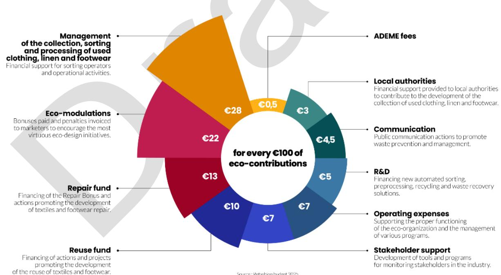
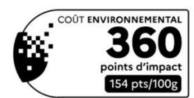

This project has received funding from the European Union's Horizon Research and Innovation program under grant agreement N° 101181901 and from the Swiss State Secretariat for Education, Research and Innovation (SERI). Posts and shares reflect only the views of all the involved partners. Neither the European Union nor the granting authority can be held responsible for them.

## **TABLE OF CONTENTS**

| Table of contents 1 2 3 3.1 3.2 |                                                                                                                                                                                                                |
|---------------------------------|----------------------------------------------------------------------------------------------------------------------------------------------------------------------------------------------------------------|
| 3.2.1                           | The Eco-design for sustainable Products Regulation ESPR: ............................................................................................................12                                        |
| 3.2.2                           | Directive on Common Rules for Promoting Repair:...........................................................................................................................13                                   |
| 3.2.3                           | Green Claims Directive:....................................................................................................................................................................13                  |
| 3.2.4                           | Revision of the Waste Framework Directive (WFD): ..........................................................................................................................13                                  |
| 3.2.5                           | European Regulation on Waste Shipments (WSR/EVOA): ................................................................................................................14                                          |
| 3.2.6                           | End-of-Waste Criteria:.......................................................................................................................................................................14                |
| 3.2.7                           | Textile Labelling Regulation (EU) No. 1007/2011..............................................................................................................................15                                |
| 4                               | Comparative analysis of EPR schemes...............................................................................................................................................................16           |
| 4.1                             | Methodology ................................................................................................................................................................................................16 |
| 4.2                             | EU Member States .......................................................................................................................................................................................16     |
| 4.2.1                           | France..............................................................................................................................................................................................16         |
| 4.2.2                           | The Netherlands...............................................................................................................................................................................23               |
| 4.2.3                           | Italy...................................................................................................................................................................................................31     |
| 4.2.4                           | Hungary............................................................................................................................................................................................34          |
| 4.2.5                           | Sweden.............................................................................................................................................................................................35          |
| 4.2.6                           | EPR systems in other EU Member States.........................................................................................................................................38                               |
| 4.3                             | Non-EU schemes.........................................................................................................................................................................................40      |
| 4.3.1                           | Kenya...............................................................................................................................................................................................40         |

| 4.3.2 4.3.3 4.3.4 4.3.5 4.4 4.4.1 5 |                                                                                                                                                                                                                       |
|-------------------------------------|-----------------------------------------------------------------------------------------------------------------------------------------------------------------------------------------------------------------------|
| 5.1                                 | Methodology ................................................................................................................................................................................................56        |
| 5.2                                 | Key findings from Stakeholder interviews.....................................................................................................................................................56                       |
| 5.2.1                               | Textile (waste) Management.............................................................................................................................................................57                             |
| 5.2.2                               | EPR systems, Scope and current targets.........................................................................................................................................73                                     |
| 5.2.3                               | Structure and Organization of EPR Systems.....................................................................................................................................88                                      |
| 5.2.4                               | Governance and Legal Framework...................................................................................................................................................95                                   |
| 5.2.5                               | Challenges and Gaps.....................................................................................................................................................................111                           |
| 5.2.6.                              | EU-Wide harmonization..................................................................................................................................................................129                            |
| 5.2.7.                              | Insights into consumer Behaviour and strategies for raising awareness ........................................................................................134                                                     |
| 5.2.8.                              | Cross-Border Movement and Export of Textiles..............................................................................................................................139                                         |
| 5.2.9.                              | Policy measures to foster domestic reuse and recycling and address environmental and ethical concerns .................................148                                                                            |
| 5.2.10.                             | Economic and Operational Feasibility ............................................................................................................................................153                                  |
| 5.2.11.                             | Legacy Substances and Long Product Lifespans..........................................................................................................................160                                             |
| 5.2.12.                             | Data, Reporting, and Transparency................................................................................................................................................166                                  |
| 5.2.13.                             | Broader Circular Economy Questions.............................................................................................................................................170                                    |
| 5.2.14.                             | Recommendations and Lessons Learned ......................................................................................................................................177                                         |
| 6.                                  | Conclusion........................................................................................................................................................................................................188 |
| 7.                                  | Appendices.......................................................................................................................................................................................................190  |
| 7.2.                                | Explanation of Modecom............................................................................................................................................................................190                 |
| 7.3.                                | Question template for stakeholder interviews.............................................................................................................................................191                          |
| 7.4.                                | References and bibliography.....................................................................................................................................................................194                   |

## **LIST OF FIGURES**

### **LIST OF TABLES**

| Table 1: Items subject to Dutch EPR for textile [17]                                                                     | .......................................................................................................................................................23 |
|--------------------------------------------------------------------------------------------------------------------------|-----------------------------------------------------------------------------------------------------------------------------------------------------------|
| Table 2: Goals for the reuse and recycling of textile products by 2025 and 2030 [17]                                     | ..................................................................................................24                                                      |
| Table 6: Solutions linked to the measures for the extension of textile lifespan in the Netherlands                       | .................................................................................29                                                                       |
| Table 7: The key policy objectives presented in the Dutch Policy Program for Circular textile 2025-2030 [22]             | .............................................................30                                                                                           |
| Table 8: Dutch objectives for collection, reuse and recycling (EPR) in 2025 and 2030 [22]                                | ..........................................................................................31                                                              |
| Table 9: Key product categories under Kenya’s EPR framework [43], [44]                                                   | ....................................................................................................................41                                    |
| Table 13: Detailed overview of textile waste management across the stakeholders interviewed                              | ...................................................................................59                                                                     |
| Table 14: Detailed overview of stakeholders’ answers related to the existence of EPR scheme and their implementation     | ............................................75                                                                                                            |
| Table 16: Structure and organization of EPR systems for textiles according to the interviewed stakeholders               | ...............................................................90                                                                                         |
| Table 17: Observations on how the EPR schemes are structured and the dynamic between the different stakeholders involved | ................................97                                                                                                                        |
| Table 26: Measurement of target compliance and data reporting                                                            | ...............................................................................................................................167                        |
| Table 28: Stakeholder’s recommendations and lessons learned                                                              | .................................................................................................................................178                      |

## **LIST OF ACRONYMS**

| Abbreviation | Full Term                                                        | Definition/Context                                          |
|--------------|------------------------------------------------------------------|-------------------------------------------------------------|
| CHF          | Clothing, Household linens, Footwear                             | Product categories under French EPR                         |
| CO ₂         | Carbon dioxide                                                   | Greenhouse gas                                              |
| CSDDD        | Corporate Sustainability Due Diligence Directive                 | EU directive (2024/1760) on supply chain obligations        |
| CSR          | Combustible Solide de Recuperation (Solid Recovered Fuels)       | A type of fuel primarily prepared from combustible waste to |
| EP           | European Parliament                                              | EU legislative body                                         |
| EPR          | Extended Producer Responsibility                                 | Policy for product end-of-life accountability               |
| ESPR         | Ecodesign for Sustainable Products Regulation                    | EU regulation (2024/1781) for sustainable design            |
| EU           | European Union                                                   | Political-economic union of 27 countries                    |
| HUF          | Hungarian Forint                                                 | Official currency of Hungary                                |
| ILT          | Inspectie Leefomgeving en Transport                              | Dutch EPR enforcement agency                                |
| KEPRO        | Kenya Extended Producer Responsibility Organisation              | Kenya’s textile PRO                                         |
| MATTM        | Ministero dell'Ambiente e della Tutela del Territorio e del Mare | Italian Ministry of Environment                             |
| NEMA         | National Environment Management Authority (Kenya)                | Kenyan EPR regulator                                        |
| NWMD         | National Waste Management Directorate (Hungary)                  | Hungarian EPR regulator                                     |
| OECD         | Organisation for Economic Co-operation and Development           | International policy forum                                  |
| PFAS         | Per-and Polyfluoroalkyl Substances                               | Hazardous "forever chemicals"                               |
| PPE          | Personal Protective Equipment                                    | Safety gear (often excluded from EPR)                       |
| PRO          | Producer Responsibility Organisation                             | Manages EPR compliance for producers                        |
| UIN          | Unique Identification Number                                     | Required for French EPR compliance                          |
| VANG         | Van Afval Naar Grondstof                                         | Dutch waste separation program                              |
| VAT          | Value Added Tax                                                  | Consumption tax on goods/services                           |
| WFD          | Waste Framework Directive                                        | EU directive (2008/98/EC) on waste management               |

**PROJECT INFORMATION**

**Project full title**: Advancing Sustainable Textiles in the Circular Economy Through Innovative EPR Schemes

**Acronym**: TRUSTex

**Call**: HORIZON-CL6-2024-CircBio-01-2

**Topic**: Circular solutions for textile value chains based on extended producer responsibility (Innovation Action)

**Start date**: 1st January2025

**Duration**: 36 months

**List of participants**: All

## **DELIVERABLE DETAILS**

| Document Number:    | D4.1                                                                                                  |
|---------------------|-------------------------------------------------------------------------------------------------------|
| Document Title:     | Report on EPR scheme analysis                                                                         |
| Dissemination level | PU – Public, fully open                                                                               |
| Period:             | PR1                                                                                                   |
| WP:                 | WP4                                                                                                   |
| Task:               | T4.1                                                                                                  |
|                     | Ghaya RZIGA, Rosa STAIANO and Xavier- François VERNI ( LIST)                                          |
| Reviewers:          | TRUSTEX Consortium                                                                                    |
|                     | mechanisms, and stakeholder insights. Through desk research and interviews with key stakeholders, the |
|                     | to citizens to advance circularity, in the textile sector.                                            |

|           | Version |            | Date | Description                                    |
|-----------|---------|------------|------|------------------------------------------------|
| Version 1 |         | 20/06/2025 |      | The final version sent to partners for reviews |
| Version 2 |         | 27/06/2025 |      | Update of the final version following partners |
|           |         |            |      | This draft deliverable has not yet been        |

## **1 EXECUTIVE SUMMARY**

The global textile industry stands at a critical point, facing mounting pressure to transition from a linear "take-make-dispose" model to a circular economy framework. Extended Producer Responsibility (EPR) schemes have emerged as essential policy tools to drive this shift, placing accountability on producers for the entire lifecycle of textile products. This report synthesizes findings from desk research and stakeholder interviews to analyse EPR systems across multiple countries, comparing among other regulatory approaches, implementation challenges, and emerging best practices.

#### **Methodology**

The research adopted a qualitative benchmarking approach, combining desk research with stakeholder insights. A preliminary literature review examined policy documents, NGO reports, academic studies, industry white papers and different online information to establish a baseline understanding of EPR frameworks. This was complemented by interviews with 23 stakeholders representing different parts of the value chain - brands, collectors, recyclers, Producer Responsibility Organizations (PROs), NGOs, and policymakers-across 11 countries. The comparative analysis focused on key criteria, including scope, financial mechanisms, collection, recycling and reuse targets, governance structures, and compliance mechanisms.

## **Key Findings**

## **Comparative Analysis of EPR Schemes**

European Union Member States, particularly France and The Netherlands, lead in implementing advanced EPR systems with binding targets, ecomodulated fees, and robust enforcement mechanisms. Theseschemes,however, varyin scope and targets.France's scheme, operational since 2007, covers clothing, footwear, and household linens, while The Netherlands, which began full implementation in 2025, emphasizes consumer and occupational textiles but excludes footwear. Outside the EU, countries such as Kenya and the United States are in earlier stages, with voluntary or proposed EPR frameworks lacking granular targets.

A notable divergence exists in scope definitions, with some countries including leather goods and mattresses (Italy) while others exclude them (Sweden). Eco-modulation, a fee structure that rewards sustainable design, is widely aimed for especially in the EU but remains underdeveloped to the most part. France, for instance, adjusts fees based on durability, recycled content, and chemical safety, whereas Hungary applies a flat fee per kilogram.

These systems often undervalue the reuse potential focusing sometimes mainly on collection. However, few incentives are emerging to balance this gap like for example the mandate of a reuse target in the Netherland or France's recent inclusion of repair incentives in its eco-modulation criteria.

## **Stakeholder Perspectives on EPR Implementation**

Stakeholders highlighted both successes and systemic barriers in textile waste management. Collection systems predominantly rely on municipal bins, charity donations, and door-to-door services, yet contamination and declining textile quality - driven by fast fashion - reduce reuse potential. Manual sorting remains prevalent. Export markets, particularly in Africa and Asia, remain critical for reuse but face saturation due to cheap alternatives and shrinking demand.

EPR Governance structures vary significantly, with debates over single versus multiple PRO systems. Single PROs, as seen in France, streamline coordination but risk inefficiency without competition. Multiple PROs, favoured in The Netherlands and Italy, encourage innovation but may lead to service fragmentation. Stakeholders emphasized the need for inclusive governance, where recyclers, municipalities, and social enterprises contribute to decision-making. Financial mechanisms, particularly eco-modulation, were praised for incentivizing sustainable design, though concerns were raised about insufficient fees to cover recycling costs and the administrative burden on small producers especially in the case of non-harmonization.

#### **Critical Challenges and Policy Gaps**

The rise of fast fashion, particularly the ultra-fast fashion, has exacerbated textile waste challenges, flooding markets with low-quality, non-recyclable materials. Infrastructure gaps, such as inadequate sorting technology and limited domestic recycling capacity, hinder progress. Many regions still depend on mechanical downcycling or export markets, with fibre-to-fibre recycling and other R&D technologies in pilot stages. Policy inconsistencies further complicate efforts, particularly in cross-border waste movement, where inconsistent enforcement allows illegal dumping under the guise of "second-hand" exports.

Stakeholders identified key gaps, including the lack of standardized definitions (e.g., "reusable" vs. "waste"), insufficient funding for innovation, and weak producer accountability for exported waste. The absence of harmonized EU-wide rules creates compliance complexities for multinational brands, while volatile second-hand markets undermine reuse initiatives.

## **Recommendations for Strengthening EPR Systems**

To address these challenges, some preliminary recommendations have emerged during the different exchanges (that will be further elaborated in the next steps of the project): First, harmonizing or partially harmonizing EPR regulations at the EU level – particularly on scope, targets, and reporting – would reduce administrative burdens especially on international producers and obligation holders. EPR systems should establish reuse as the priority pathway, with binding targets that reflect its higher environmental value. This should be supported by:

- Dedicated funding streams for repair infrastructure
- VAT reductions for reused goods
- Mandated participation of reuse organizations in PRO governance

Second, eco-modulation should be broadened to discourage unsustainable practices, such as overproduction, while actively promoting durable, sustainable designs. One important criterion to include is the integration of mandatory recycled content in garment design. However, the percentage of recycled material must be carefully studied, with targets set based on thorough, evidence-based analysis to ensure that proposed percentages are realistic, achievable, and reflective of market conditions and technical feasibility.

Additionally, eco-modulation should emphasize the importance of sourcing recycled textiles locally at the EU level. Prioritizing and integrating European textile waste into production would not only ensure a more regionally focused circular economy but also foster sustainability by reducing dependence on imported recycled materials.

Some stakeholders also expressed support for the Ultimate Producer Responsibility (UPR) model, where producers would ideally assume responsibility for the entire lifecycle of textile garments, even after their export outside the EU. Under this model, eco-modulated fees could be leveraged to finance waste management infrastructure in recipient countries, helping to address the challenges of exported textiles turning into waste in destinations like Ghana or Chile.

Third, EPR funds should prioritize investments in (semi-)automated sorting and processing, re-use infrastructure, and recycling technologies. Stakeholders advocated for dedicated funding streams to support R&D and scale pilot projects.

Fourth, governance reforms must ensure representation of all value chain actors not only with a supervisory role but active in the decision making to ensure practical and equitable solutions, particularly:

- Municipalities managing collection systems
- Social enterprises operating reuse networks
- Recyclers and sorters handling material flows

Finally, consumer awareness campaigns and policy measures – such as VAT reductions for repaired goods and bans on destroying unsold stock – can shift market behaviour toward circularity. Strengthening export controls and traceability mechanisms will ensure that reused textiles are properly managed abroad, closing loopholes that enable waste dumping.

To conclude, this study underscores the transformative potential of well-designed EPR systems in achieving a circular textile economy. While EU countries lead policy innovation, global alignment and stronger enforcement are needed to address systemic challenges. The findings highlight the importance of multi-stakeholder collaboration, targeted investments, and adaptive governance to turn EPR frameworks into effective drivers of sustainability. By implementing these recommendations, policymakers and industry leaders can accelerate the transition toward a waste-free textile sector, balancing environmental goals with economic viability.

## **2 INTRODUCTION**

The global textile industry stands at a critical juncture, facing mounting pressure to transition from a linear model to a circular economy framework. In fact, textiles are the fourth highest-pressure category for the use of primary raw materials and water and fifth for greenhouse gas emissions and a major source of microplastic pollution. Extended Producer Responsibility (EPR) schemes, which hold producers accountable for the full lifespan of their textile goods, are becoming an essential policy tool to support this transition.This report provides an analysis of textile EPR systems across elevencountries, offering acomparison of regulatory approaches, implementation challenges, and emerging best practices.

Building on desk research and stakeholder interviews across the textile value chain, this study examines among others:

- Regulatory Frameworks: How different countriesare defining EPR scope, obligations, and enforcement mechanisms for textiles.
- Operational Models: The varying approaches to collection and sorting systems, reuse networks, and recycling infrastructure.
- Financial Mechanisms: Comparative analysis of fee structures, eco-modulation criteria, and cost distribution models.
- Stakeholder Perspectives: First-hand insights from different stakeholders along the value chain on governance effectiveness, challenges, policy gaps, etc.
- Critical barriers to circularity, including export accountability and low-value textile management.

The report combines quantitative policy analysis with qualitative stakeholders' feedback to present both the current state of textile EPR systems and actionable recommendations for strengthening these frameworks. Particular attention is given to:

- The mismatch between ambitious EU legislation and implementation realities in Member States,
- The unique challenges faced by emerging economies in establishing EPR systems,
- Innovative solutions being piloted across different jurisdictions,
- The role of eco-design incentives in driving upstream change.

By examining both the technical specifications of EPR schemes and the practical experiences of those implementing them, this report aims to inform more effective, equitable, and enforceable textile EPR policies worldwide. The findings are particularly timely given the EU's recent Waste Framework Directive revisions and growing international momentum for textile sustainability agreements.

## **3 REGULATORY OVERVIEW**

## **3.1 Legal definitions**

The following section provides key definitions related to waste and its hierarchy, as outlined inthe Waste Framework Directive(Directive 2008/98/EC)[1]. Detailed regulatory analysis is not included here, as this is the focus of other tasks within the project, specifically T1.2 and T4.3, which are dedicated to conducting a comprehensive regulatory overview.

- 'Waste' means any substance or object which the holder discards or intends or is required to discard [Article 3 (1)]
- Waste hierarchy: The following waste hierarchy shall apply as a priority order in waste prevention and management legislation and policy: a) prevention; b) preparing for re-use;c) recycling; d) other recovery, e.g. Energy recovery; and e) disposal [Article 4 (1)]
- 'Waste management' means the collection, transport, recovery and disposal of waste, including the supervision of such operations and the aftercare of disposal sites, and including actions taken as a dealer or broker [Article 3 (9)]
- 'Collection' means the gathering of waste, including the preliminary sorting and preliminary storage of waste for the purposes of transport to a waste treatment facility [Article 3 (10)]
- 'Prevention' means measures taken before a substance, material or product has become waste, that reduce: (a) the quantity of waste, including through the re-use of products or the extension of the life span of products; (b) the adverse impacts of the generated waste on the environment and human health; or (c) the content of harmful substances in materials and products [Article 3 (12)]
- 'Preparing for re-use' means checking, cleaning or repairing recovery operations, by which products or components of products that have become waste are prepared so that they can be re-used without any other pre-processing [Article 3 (16)]
- 'Re-use' means any operation by which products or components that are not waste are used again for the same purpose for which they were conceived [Article 3 (13)]
- 'Recovery' means any operation the principal result of which is waste serving a useful purpose by replacing other materials which would otherwise have been used to fulfil a particular function, or waste being prepared to fulfil that function, in the plant or in the wider economy. Annex II sets out a non-exhaustive list of recovery operations [Article 3 (15)]
- 'Recycling' means any recovery operation by which waste materials are reprocessed into products, materials or substances whether for the original or other purposes. It includes the reprocessing of organic material but does not include energy recovery and the reprocessing into materials that are to be used as fuels or for backfilling operations [Article 3 (17)]
- 'Disposal' means any operation which is not recovery even where the operation has as a secondary consequence the reclamation of substances or energy. Annex I sets out a non-exhaustive list of disposal operations [Article 3 (19)]

## **3.2 Current and upcoming regulatory developments in the EU**

The European Union (EU) has been strengthening its regulatory framework for textile waste management and Extended Producer Responsibility (EPR) for textiles to promote sustainability, circularity, and reduced environmental impact. Below is an overview of the current and upcoming regulations:

## 3.2.1 The Eco-designfor sustainable Products Regulation ESPR:

It entered into force on 18th July 2024. Starting 2025, the European commission will start elaborating specific design requirements. These requirements would be effective starting 2027/2028. Additionally, a ban on destruction of unsold apparel, clothing accessories, and footwear will take place starting 18th of July 2026.

[Regulation \(EU\) 2024/1781 of the European Parliament and of the Council of 13 June 2024 establishing a framework for setting ecodesign requirements](https://eur-lex.europa.eu/eli/reg/2024/1781/oj/eng) 

## 3.2.2 Directive on Common Rules for Promoting Repair:

This directive entered into force inJuly 2024. It aims at improving the functioning of the internal market, while promoting more sustainable consumption. To achieve those objectives, and to facilitate cross-border provision of services and competition among repairers of goods purchased by consumers on the internal market, it is necessary to lay down harmonized and uniform rules among the Member States (MS) promoting the repair of goods purchased by consumers. This directive must be transposed into national legislation by 31 July 2026.

## 3.2.3 Green Claims Directive:

In 2023 a proposal was made by the European commission aiming to fight against misleading and poorly substantiated environmental claims by establishing uniformity in communication about them. The procedure is still on going.

[Proposal for a Directive of the European Parliament and of the Council on substantiation and communication of explicit environmental claims \(Green](https://eur-lex.europa.eu/legal-content/EN/TXT/?uri=COM%3A2023%3A0166%3AFIN) 

#### 3.2.4 Revision of the Waste Framework Directive (WF[D\)](#page-12-3)2 :

With the proposal COM(2023) 420, the focus for the textile sector is particularly reinforced by the introduction of a harmonised system of extended producer responsibility (EPR) (Article 22a (new), Annex IVc).

The obligation for separate collection from January 1, 2025, remains in place (Article 11 paragraph 1 of the existing WFD).

Binding recycling rates for textiles are still not foreseen, even though they should originally have been examined under Article 11 paragraph 6 of the existing WFD. The Commission has instead opted for alternative measures.

The Commission justifies the omission of quotas by citing the current lack of recycling infrastructure, sorting capacities, and technological maturity (Reasons and objectives of the proposal).

# **Central to textiles are the following new articles:**

The new Articles 22a to 22d place a strong emphasis on extended producer responsibility (EPR). Specifically, this means that producers will in the future have to bear the costs when it comes to collection, sorting, recycling, or public awareness regarding their products (Art. 22a). All products listed in the new Annex IVc are affected, especially clothing, shoes, accessories, and home textiles. Microenterprises with fewer than 10 employees are exempt from the obligation – the aim is not to overburden small businesses (e.g., SMEs as in CSRD).

Article 22b regulates how Member States must organize the EPR systems. Transparency plays an important role here, as producers must register and regularly report data. If this data is compatible, a link to the DPP can be seen here. The idea of ecologically differentiated fees also comes into play: those who place products on the market that are more durable, repairable, or recyclable could pay lower contributions. This is intended to steer design decisions toward a circular economy.

Article 22c covers the treatment and shipment of textile waste. The goal is that the waste is correctly collected, sorted, and recycled, and not simply exported somewhere where it is disposed of under questionable conditions. Member States must therefore ensure in their national implementation that high standards are upheld.

Article 22d stipulates that both producers and states must regularly report on the quantities of products placed on the market and recycled. The Commission may even specify exactly how and to what extent the data is to be reported through implementing acts.

Also important is the intended link to ESPR, WSR, and the textile strategy:

EPR is intended to promote the circular economy for textiles together with ESPR design requirements (from 2025/26) and the Waste Shipment Regulation (WSR 2024/1157) (pp. 8-10).

This project has received funding from the European Union's Horizon Research and Innovation program under grant agreement N° 101181901 and from the Swiss State Secretariat for Education, Research and Innovation (SERI). Posts and shares reflect only the views of all the involved partners. Neither the European Union nor the granting authority can be held responsible for them.

2 [Waste Framework Directive -](https://environment.ec.europa.eu/topics/waste-and-recycling/waste-framework-directive_en) European Commission

No direct market pressure via quotas, but through EPR and separate collection.

The WFD continues to refer in several places, including the reasoning, to the waste hierarchy (Article 4 WFD), but remains with the principle "Separate collection, EPR payment, but no recycling quota."

In summary, the revision brings a transformation for textiles in EU waste policy: while previously only collection was regulated, producers will in the future also be responsible for further waste management. Recycling quotas are not coming for now; instead, the Commission focuses on building infrastructure and market incentives through EPR and design requirements (e.g., ESPR). This aims for interaction with other legal acts such as ESPR, WSR, or the EU textile strategy, which together are intended to drive the textile sector towards a circular economy (pp. 8-10).

## 3.2.5 European Regulation on Waste Shipments (WSR/EVOA):

## **Waste Shipment Regulation (WSR) 2024/1157**

The Waste Shipment Regulation (WSR) 2024/1157 regulates the shipment of waste within the EU as well as imports and exports to or from third countries. The regulation is relevant for the textile industry because textile waste has been included in Annex IIIA (Recital 20). This facilitates crossborder shipments for recycling purposes within the EU, which in turn supports the development of circular models and innovative business models (Recitals 3, 22).

The WSR itself does not make direct requirements for product design or environmental performance of textiles but indirectly promotes R-strategies (Recycling, Reuse) by facilitating waste shipments for recovery purposes (Article 47, Annex IIIA).

Additionally, the regulation requires the exclusive use of digital information systems for waste shipments starting 24 months after its entry into force at 21. May 2026 (Article 28 ff., Recitals 28, 29).

This digitalization creates a basis for later integration with the Digital Product Passport (DPP), although a direct connection is not explicitly regulated in the regulation itself. Specifically mentioned are eFTI (freight) and Single-Window (customs).

Economic incentives in the sense of subsidies are not provided, but indirect market advantages arise from bans on waste exports for disposal purposes (Article 39, Recital 22) and the facilitated shipment to pre-approved facilities (Recital 27, Articles 35 ff.). At the same time there are obviously loopholes in the WSR allowing to export used garments under a misleading declaration.

Also noteworthy is the strong focus on control mechanisms (Recital 34), which means for textile companies that exports to third countries are associated with increased proof requirements (notification), especially for second-hand textiles.

The WSR also refers to the principles of proximity and self-sufficiency in waste disposal according to the Waste Framework Directive (2008/98/EC) Article 16 (see Recital 22), meaning that recycling within the EU takes precedence and export is only permitted if no appropriate treatment is available within the EU.

Additionally, Article 29 WSR refers to Articles 5 and 6 of the WFD, making questions of waste definition and by-product status also relevant for export of textiles.

#### 3.2.6 End-of-Waste Criteria:

The Joint Research Centre (JRC) is developing scientific proposals for end-of-waste criteria for textiles, following [a scoping studyt](https://publications.jrc.ec.europa.eu/repository/handle/JRC128647)o identify key material streams, with work starting in 202[3](#page-13-2)3 .

This topic is closely linked to the definition and practical implementation of the waste criteria in the Waste Framework Directiv[e](#page-13-3)4

In order to stimulate recycling markets, it is important to cut the red tape for high-quality waste-derived materials so that they enjoy the same internal market freedoms as primary raw materials. For this, one needs to establish the point in the recovery process at which those quality materials can lose

This project has received funding from the European Union's Horizon Research and Innovation program under grant agreement N° 101181901 and from the Swiss State Secretariat for Education, Research and Innovation (SERI). Posts and shares reflect only the views of all the involved partners. Neither the European Union nor the granting authority can be held responsible for them.

3 End-of-waste - [European Commission](https://joint-research-centre.ec.europa.eu/scientific-activities-z/less-waste-more-value/end-waste_en)

4 see: [https://joint-research-centre.ec.europa.eu/projects-and-activities/less-waste-more-value/end-waste\\_en](https://joint-research-centre.ec.europa.eu/projects-and-activities/less-waste-more-value/end-waste_en) and

[https://environment.ec.europa.eu/news/commission-starts-develop-end-waste-criteria-plastic-waste-2022-04-05\\_en](https://environment.ec.europa.eu/news/commission-starts-develop-end-waste-criteria-plastic-waste-2022-04-05_en)

their waste status, via a set of rules called end-of-waste criteria. The drawing up of end-of-waste criteria consists of thorough techno-economicenvironmental assessments that verify material safety and the existence of a market for candidate waste materials.The Joint Research Centre (JRC) is developing scientific proposals for end-of-waste criteria for textiles, following a [scoping study](https://publications.jrc.ec.europa.eu/repository/handle/JRC128647) to identify key material streams, with work starting in 202[3](#page-14-1)5 .

## 3.2.7 Textile Labelling Regulation (EU) No. 1007/2011

The Textile Labelling Regulation (EU) No. 1007/2011 regulates the labelling of textile products in the EU. It stipulates in Article 5 that only the textile fibre names listed in Annex I may be used to ensure transparency regarding material composition (Article 1, Article 4). Environmental requirements or specifications for recyclability are not included. Nevertheless, the regulation indirectly supports R-strategies by enabling correct declaration of fibres, which is a prerequisite for high-quality sorting and recycling. Regarding data collection, Articles 14 paragraphs 2 and 3 allow information on fibre composition to be passed along the supply chain via commercial documents. However, the regulation does not provide a digital infrastructure and only refers in Article 24 paragraph 3 letter e to the "possible" introduction of electronic labels or language-independent codes, which could technically enable later integration into DPP systems. The regulation does not include economic incentives but promotes the market for recycling, second-hand, and sorting indirectly through standardized material labelling. In Article 12, there is a specific labelling requirement for non-textile parts of animal origin, which is especially relevant for products with leather or fur. Additionally, Annex IV defines special labelling requirements for complex textile products, and Annex V lists products exempt from the labelling requirement. Unfortunately, the regulation is purely an internal market and consumer protection instrument, without environmental requirements but with high relevance for transparency and traceability of textile materials and thus indirectly supportive.

This project has received funding from the European Union's Horizon Research and Innovation program under grant agreement N° 101181901 and from the Swiss State Secretariat for Education, Research and Innovation (SERI). Posts and shares reflect only the views of all the involved partners. Neither the European Union nor the granting authority can be held responsible for them.

5 End-of-waste - [European Commission](https://joint-research-centre.ec.europa.eu/scientific-activities-z/less-waste-more-value/end-waste_en)

## **4 COMPARATIVE ANALYSIS OF EPR SCHEMES**

## **4.1 Methodology**

This section outlines the methodology used to conduct a benchmarking analysis of current and upcoming Extended Producer Responsibility (EPR) schemes for textiles. The research aimed to:

- Compare diverse EPR frameworks across regions (in and outside the EU),
- Identify their scope, obligations, financial mechanisms, challenges, and potential best practices, and
- Assess their applicability to textile waste management.

## **Research Approach**

The study employed a qualitative benchmarking approach, combining:

- Desk Research: o Initial Literature Selection: A preliminary set of documents (policy papers, NGO reports, academic journals, and industry white papers) was selected based on relevance to textile EPR. o Dynamic Literature Adjustment: Sources were iteratively refined, with new materials incorporated during drafting to reflect evolving policies.
- Comparative Analysis: Evaluation of EPR schemes across regions to identify trends, strengths, and gaps.

## **Benchmarking Framework**

The analysis was structured around the following key criteria:

- Scope: Covered products (e.g., clothing, footwear) and obligated stakeholders.
- Financial Mechanisms: Fee structures (e.g., eco-modulation), cost distribution, and incentives.
- Targets: Collection rates, recycling/reuse goals
- Governance: Roles of Producer Responsibility Organizations (PROs), producers, and other stakeholders.
- Compliance & Enforcement: Monitoring mechanisms and penalties for non-compliance.
- Innovation & Eco-design: Incentives for sustainable design and material innovation.

Note that due to the rapid evolution of EPR policies - particularly in the EU - some information may become outdated quickly.

## **4.2 EU Member States**

#### 4.2.1 France

## *4.2.1.1 Scope*

France is the only Member State with extensive experience with a fully implemented national Extended Producer Responsibility (EPR) policy covering garments. The scheme has covered garments, shoes, and household linens since2007 and expanded to include curtains in 20206 [.](#page-15-4) 

According to Article L541-10-1 (Version entered into force on 24 April 2024), new textile products for clothing, footwear, or household linen intended for private individuals and, from January 1, 2020, new textile products for the home, excluding those which are furnishing items or intended to protect

This project has received funding from the European Union's Horizon Research and Innovation program under grant agreement N° 101181901 and from the Swiss State Secretariat for Education, Research and Innovation (SERI). Posts and shares reflect only the views of all the involved partners. Neither the European Union nor the granting authority can be held responsible for them.

This draft deliverable has not yet beenvalidated by the granting authorities **Page 16**

6 Article L541-10-1 : «11. Les produits textiles d'habillement, les chaussures ou le linge de maison neufs destinés aux particuliers et, à compter du 1er janvier 2020, les produits textiles neufs pour la maison, à l'exclusion de ceux qui sont des éléments d'ameublement ou destinés à protéger ou à décorer des éléments d'ameublement »

or decorate furnishing items [2]. In other words, the scheme has covered garments, shoes, and household linens from 2007 and expanded to include curtains in 2020.

To be more precise, the French EPR scheme for textile covers all new clothing textiles, household linen, and footwear (CHF) placed on the French market, including overseas territories. This includes products sold or donated to consumers, whether new or upcycled, as well as those distributed through rental schemes. Products exempted from this regulation include 100% leather or natural fur clothing, second-hand CHF imported from foreign markets, and upcycled products made entirely from previously marketed used textiles or materials. All other materials (e.g., cotton, polyester, silk, recycled or not) are subject to the EPR regulation. Additionally, clothing and accessories for animals purchased by the public are also covered under this framework. [3]

#### *4.2.1.2 Targets*

The EPR scheme for textile in France has defined specific targets for waste collection, recycling (including chemical recycling), and disposal. It had also established clear objectives for repairand reuse (including "rémploi"and "réutilisation").

- Between 2023 to 2027, the waste collection objective is expected to increase annually. It started with a 20 kg per resident increase in 2023 (vs. 2022) and should grow to +148 Kg per resident increase by 2027.
- The recycling targets are expected to increase progressively, aiming for 70% by 2024, 80% by 2027, and 90% by 2028.
- The goals for chemical recycling are also emphasized, with an objective of 50% by 2025 and 90% by 2028.
- Meanwhile, the disposal rate is set at 0.5% maximum, which reflects the commitment to minimize waste sent to landfills or incineration [3], [4].

Complementary to these waste management goals are repair and reuse initiatives. By 2024, repair activities must increase by 35% compared to 2019 levels. Reuse and reemployment targets aim for 120 kilotons by 2024, with at least 8% of these items reused within 1,500 kilometres of their collection point. Notably, the objectives for repair, reuse, are presented as non-binding incentives rather than mandatory requirements [3], [4].

Note that in French law has the particularity to introduce two different termsfor reuse: "réemploi"and "réutilisation". "Réemploi" refers to using a product again for the same purpose without any modification, like using an old door as a door (thereby avoiding classification as waste). "Réutilisation," on the other hand, involves using a product again, but potentially for a different purpose, or after some form of modification or treatment (which may result in it being classified as waste before re-entering the cycle). The French anti-waste law, known as the AGEC law, actively promotes both "réemploi" and "réutilisation" as part of its strategy to reduce waste and transition towards a circular economy[5].

## *4.2.1.3 Obligation (holder)*

In France, the EPR scheme for textile is defined under Article L541-10 of the Environmental Code. This schemerequires producers to take responsibility for the lifecycle management of products, including waste prevention, collection, and recycling. Producers are defined as entities involved in manufacturing, importing, or introducing waste-generating products into the market. This definition includes companies that create, handle, process, sell, or import clothing textiles, household linens, and footwear for the French market. The obligations under the EPR Scheme for textile in France are also applicable to re-used or upcycled products introduced into the market, as specified by Article L541-10 of the Environmental Code.[2]

Producer responsibility organisations (PROs) -also called "éco-organisme" in French - play a central role in the EPR system, as outlined in Article L541- 10. These entities are usually governed and financed by producers to ensure compliance with waste management objectives. The PROs are required to interact with the many local stakeholders, such as recycling and reuse operators, environmental and consumer protection organisations, and local authorities. In order to assess their financial management, data correctness, and compliance with waste management requirements, they are also subject to independent audits.[2]

Re\_fashion is the designated PRO for textiles in France, managing compliance for obligated producers.

## **Who Qualifies as an Obligated Producer?**

In addition to the above-mentioned definition of producers based on Article L541-10 of the Environmental Code, Re\_fashion defines companies subject to the EPR law are those that manufacture, import, assemble, or introduce clothing textiles, household linen, and footwear onto the French market (including overseas territories) for the first time, where the end user is a consumer. Professional-use items are generally excluded unless they are ultimately intended for consumer use. [5]

This project has received funding from the European Union's Horizon Research and Innovation program under grant agreement N° 101181901 and from the Swiss State Secretariat for Education, Research and Innovation (SERI). Posts and shares reflect only the views of all the involved partners. Neither the European Union nor the granting authority can be held responsible for them.

The term "producers" (or "marketers") includes:

- Manufacturers or commissioning entities selling products under their own brand.
- Importers (wholesalers or retailers) introducing goods into the French market.
- Distributors with private labels or operating under licenses.
- Online sellers and marketplaces, even if based outside France. [6]

## **Key Obligations for Producers**

"Producers" and "marketers" must comply with the EPR obligations, which includesamong other

- invoicing French Value Added Tax (VAT) for products intended for consumers . [7]
- Registering with Re\_fashion, declaring annual quantities, and obtaining a Unique Identification Number (UIN).

In the case when marketplaces sell products under their brand or on behalf of non-compliant third-party sellers, who don't have a Unique Identification Number (UIN), they are also considered Producers in the framework of EPR scheme for textile in France. Since January 1, 2022, the Article L. 541-10- 9 of the Environmental Code requires that the marketplaces must declare the quantities of products sold by third-party sellers without a UIN and provide detailed records for regulatory review[7]. There is a possibility for the third-party sellers to comply with the EPR scheme if they directly register with the PRO, Re\_fashion in this case, to declare their annual quantities and obtain a UIN. Or they just rely on the marketplaces to fulfil these obligations.

Re\_fashion states that administrators or service providers working on behalf of businesses are not allowed to register as marketers but are able to help businesses comply. The French PRO highlights that producers—also known as marketers in this framework—are solely responsible for adhering to EPR regulations.

According to Article L541-10, the EPR framework requires PROs in French overseas territories to modify their waste management plans to suit local requirements while maintaining performance levels that are on the same level with those in metropolitan France. To make sure that garbage collection, treatment, and recycling are in line with more general national objectives, these measures were implemented.[2]

#### *4.2.1.4 Governance*

According to the Article L541-10 of the Environmental Code, the EPR scheme for textiles in France operates as a collective governance model with provisions for individual systems. In this scheme the Producers, including manufacturers, importers, and distributors who are placing products on the French market, have the main responsibility for financing producer responsibility organisations (PROs), promoting eco-design, and ensuring effective waste management. In fact, the producers can commonly fulfil their EPR obligations through the collectively governed PROs, such as Re\_fashion in France for textile sector,however, the law also allows for the establishment of individual systems.

If the producers decide to use a different system, they must conform to certain rules. These include providing free waste collection across the country, putting strong financial guarantees in place to cover any failures, and ensuring a high degree of traceability by marking products to indicate their place of origin. Additionally, the efficiency of each system's contribution to waste prevention, collection, and treatment must be on comparable with that of the collective systems. Additionally, they must facilitate the return of waste through certain mechanisms such as a return incentive to prevent abandonment of waste in the environment.

Under the collective governance model, the PROsare usually governed by stakeholder committees comprising representatives from producers, local authorities, environmental groups, consumer organizations, and social economy actors. The role of these committees is to provide opinions on key decisions, such as financial contributions, funding allocations, and eco-design initiatives, and to ensure a diverse representation of stakeholders. To ensure transparency and accountability it is necessary to organise periodic independent audits, promote non-discriminatory treatment of producers, and prepare detailed financial reporting. The French government oversees the governance framework, with a state-appointed censor monitoring the financial and operational sufficiency of eco-organisms.

Furthermore, for overseas territories, the governance structure includes certain adaptations to address the unique local challenges, and to ensure a fair implementation of the EPR scheme.

This project has received funding from the European Union's Horizon Research and Innovation program under grant agreement N° 101181901 and from the Swiss State Secretariat for Education, Research and Innovation (SERI). Posts and shares reflect only the views of all the involved partners. Neither the European Union nor the granting authority can be held responsible for them. Despite increasing collection rates, the French EPR scheme has not yet achieved its target collection rate of 50%. The weight of separately collected

## *4.2.1.5 Fee*

A principle aim for EPR is to implement the polluter-pays-principal and recover the costs of achieving the policy targets for collection and recovery. EPR is not a tax, but its obligations placed on producers may trigger a fee for service. In France, producers pay a fee per weight of their products placed on the market tothe PRO. [8]

Re\_fashion [9] provides information on the criteria of eco-modulations in 2025. These eco-modulations are the bonuses and penalties mentioned in article L.541-10-3 of the code of the environment with the goal to encourage and reward the virtuous steps of eco-design. Starting the 1st of January 2025, the following eco-modulations will apply to the volumes of items put on the market:

➢ Bonuses for product sustainability (durability), ➢ Bonuses for obtaining environmental labels, ➢ Bonuses for incorporating raw materials from recycling, ➢ Penalty for recyclability.

In this case, bonuses are defined as amounts per piece or per ton, depending on the eco-modulation. Under certain conditions, eco-modulations can be cumulated for the same product. [9]

According to Re\_fashion, the eco-contribution is calculated annually by the PRO, which evaluates its financing needs and sets the contribution for the following year with approval from its board of directors. For 2025, the eco-contribution is determined using the following formula: the estimated volumes placed on the market in 2025 (including repair and reuse funds) multiplied by the [applicable 2025 scale](https://pro.refashion.fr/sites/default/files/fichiers/BAREME_ECO_CONTRIBUTION_2025_REFASHION_EN.pdf) (simplified or detailed), plus administrative costs of €30 and ADEME fees of €2.784. [10]

The following chart (**Error! Reference source not found.**) illustrates how every €100 of eco-contributionis allocated across various categories, such as r epair, reuse, and administrative expenses.

Figure 1: Chart illustrating the distribution of how every €100 of eco-contributions is allocated across various categories [9]

## *4.2.1.6 Challenges/barriers*

The following are few challengesand barriers identified during our research on the French EPR Scheme for Textiles:

## ❖ **Collection Rate Challenges:**

textiles per capita grew from 2 kg in 2009 to 3.7 kg in 2019. The decline in performance is largely due to the continuous rise in textile volume - a 66% increase in products placed on the market between 2020 and 2022. [8]The experience in France brings to question the relevance of this kind of target, and the need for complementary policies to help with curbing the growth in garment production.

## ❖ **Waste in Sorting and Recycling:**

o Unclean materials and low-value textiles become waste during sorting. Increasing the amount of waste to be managed. o A substantial portion of exported used clothing (e.g., 75% in some facilities) lacks market value and ends up in nearby landfills.Therefore,a EPR scheme for textile can help improve the quality of collected and exported textiles.

## ❖ **Export Challenges:**

o During textile export, the French scheme collects data at the first point of exit from France but does not track the ultimate destination of the material. o Lack of transparency and informality in global trade of used textiles enable unsafe working conditions and environmental impacts in low-income countries.

## ❖ **Cost Recovery Limitations:**

Cost recovery is dependent on which activities producers must fund. For example, in France the scheme funds collection and sorting, but does not reimburse local governments for managing garments in the residual waste stream. This design raises the question of whether the scheme only partially funds the management of the waste of covered products.

## ❖ **Energy Recovery Growth:**

While reuse recycling rates have grown, energy recovery from collected materials has also increased. In fact, between 2009 and 2022, the share of collected garments used as material for garneting (recycling) grew from 14% to 31.3%, however energy recovery also grew from nothing to 8.2%. this fact is a barrier forachieving circular economy goals.

## *4.2.1.7 Innovative solution*

Innovative Solutions in the French EPR Scheme for Textiles:

## ❖ **Public Drop-Off Systems:**

To tackle to continuousincrease of textile volume and help achieving the separate collection targets, the French EPR scheme supports publicly available self-deposit drop-off points for post-consumer textiles, increasing accessibility and convenience. For this, Operators register with the PRO Re\_fashion and benefit from receiving signage and educational/informational material and publicity. Operators are obliged to provide the PRO with quarterly collection data. Additionally, Container collection is done by social enterprises, for-profit, and semi-public organisations.

## ❖ **Support for Sorters:**

o Since sorting collected garments is an important step in identifying re-useable garments or post-consumer material for recycling. The French EPR system provides financial support to authorized sorters, both domestic and international, to help ensuring efficient sorting processes. For example, in 2022, EUR 22.5 million was allocated to 67 authorized sorters. This is considered the single largest category of costs for the PRO. PS: the data on outcomes of post-consumer garments in France is limited to the material sorted by the PRO's authorised sorters. The scheme has achieved relatively high rates of re-use and recovery for this stream of collected and sorted material. The re-use rate of collected textiles is roughly 59.5%. o Although academia and nongovernmental organisations have noted that PROs do not typically fund post-consumer management for products that are exported for re-use, the French EPR scheme provides funding for authorised sorters that are located outside France. In 2022, the scheme supported 15 foreign sorting operators that processed roughly 30 000 tonnes, or 16% of the total material collected and processed by the scheme [11], [8]. ❖ **Engagement with Social Enterprises and other local actors:** o Other actors contribute to the total collection rates, like social enterprises (13% of total collection), municipal recycling centres (7%), shops (2%), and occasional drop off points (3%). This engagement, which helps support local communities and social economy actors.

o Domestic sorting can help to identify high-value garments that increase the supply of products for re-use, extending the use phase of these products. From 2023, the French scheme dedicates 5% of collected EPR fees to support social enterprises that facilitate re-use and preparation of textiles for re-use [12] [8]

## ❖ **Financing repair**

France has adjusted its EPR scheme to strengthen circular business models that lengthen the use phase by financing repair (to reduce demand for new products) and domestic sorting (to increase supply of re-use products). The French EPR system was used as an economic instrument may help to change the relative price of repair. For example, France is now using its scheme to give households a credit to pay for repair of clothes and shoes (EUR 7 for a shoe heel, and EUR 10-25 for clothing repairs). The credits will come from a EUR 154 million fund for 2023 to 2028 and paid for by producers through their EPR fees. [8]

# ❖ **Fee modulation is to incentivise design change**

France is changing its fee modulation system to create further incentives for design change. The EPR scheme previously included a 50% fee reduction for products with 15% recycled fibres/materials [9]. It also included a 75% bonus for products that met durability requirements. The system will soon change and may include recyclability as modulation criteria. There was consensus that the previous fee scheme was not providing enough incentive for design change. [8]

#### ❖ **New law against ultra-fast fashio[n](#page-21-0)7 :**

France will introduce in Automn 2025(voted by the Sénat on June the 10th 2025, status: discussions in the joint committee (CMP))a new law [13]aimed at reducing the environmental impact of the textile industry by targeting ultra-fast fashion practices. The law bans advertising that promotes ultra-fast fashion, which is described as a quick change of clothing lines and leads to excessive production and environmental harm, as of January 1, 2025. This restriction also applies to digital influencers who, for monetary compensation, use their platforms to promote products or brands engaging in such practices. By restricting advertising practices that encourage excessive consumption, the law seeks to align the ultra-fashion industry with environmental preservation and climate change mitigation goals. The 'écoscore' helps determine whether a garment receives a penalty. This penalty is set at €5 in 2025, €6 in 2026, and up to €10 in 2030. The Senate has also approved the principle of a tax (between €2 and €4) on small parcels delivered by companies based outside the European Union.

#### *4.2.1.8 Policy aspect*

The French scheme made several changes in 2023. These comply with requirements laid out in an order issued by the government in 2022. Historically, the policy required producers to pay the net costs for separate collection and sorting, research and development projects, and costs for local authorities' awareness campaigns. Beginning in 2023, the scheme will cover the costs of several new features, including:

- Re-use: the scheme will now cover the net costsof social enterprises facilitating re-use of garments.
- Repair: the scheme will provide households with credit for the repair of their products. The credit is applied directly to households as a discount on the invoice of the repair by approved businesses.
- Eco-modulation: the scheme will introduce a new fee modulation schedule which will not necessarily be tied to the size of the fee contribution . [8]
- VAT instruments: The bill, numbered 1329, was submitted to the National Assembly on 17 April 2025. It comes within the context of the Council Directive 2006/112/EC of 28 November 2006 on the common system of value added tax. The aim of this new tax is to promote the circular economy by taxing products according to their environmental impact and lifespan. It should apply to the repairs of household appliances, footwear and leather goods, clothing and household linen [14]
- Voluntary labelling of textiles clotheson environmental costs: EU Com validated the labelling on environmental costs for textiles clothes. It will be applied on a voluntary basis from summer 2025.The method used to calculate the environmental label (se[e Figure 2\)](#page-22-1) for clothing is based on the

This project has received funding from the European Union's Horizon Research and Innovation program under grant agreement N° 101181901 and from the Swiss State Secretariat for Education, Research and Innovation (SERI). Posts and shares reflect only the views of all the involved partners. Neither the European Union nor the granting authority can be held responsible for them.

7 Proposed law by the French Sénat o[nultra-fast fashion](https://www.assemblee-nationale.fr/dyn/17/textes/l17b1557_proposition-loi)

PEF (Environmental Footprint Methods) recommended by the European Union, which includes 16 criteria such as greenhouse gas emissions, water consumption and toxicity [15]

Figure 2: Environmental cost display: informing consumers about product and service environmental impacts, ADEME[16]

#### 4.2.2 The Netherlands

## *4.2.2.1 Scope*

According to the Dutch Decree on rules extended producer responsibility for textile products [17] the Extended Producer Responsibility (EPR) for Textiles applies to newly manufactured clothing and household textiles. This includes:

- Clothing: Consumer clothing and work clothing, such as safety outfits.
- Household Textiles: Table linen, bed linen, and household linen, including items like hand and tea towels.

This Decree concerns newly manufactured clothing and household textiles. In the future, the Decree may be extended to also concern other textile products.

Items such as shoes, belts, headgear, blankets, curtains, and cleaning cloths are not covered under the EPR obligations. Unsold stocks are also excluded if they have not been placed on the market [18].

Th[e Table](#page-22-2) *1* below sets out which products do,and which products do not fall under the EPR for textiles. The list of items which are subject to the EPR for textiles is exhaustive. The list of items which are not subject to the EPR for textiles is indicative. The codes listed between brackets are so-called customs codes and can be found in Section XI of Part II of Annex I to Regulation (EEC) No 2568/87

Table 1: Items subject to Dutch EPR for textile [17]

| Subject to EPR                                                       | Not subject to EPR                                                     |
|----------------------------------------------------------------------|------------------------------------------------------------------------|
| Consumer clothing (61 and 62)                                        | Shoes (64), bags, belts (42) (no textile products)                     |
| Occupational clothing (61 and 62)                                    | Headgear (65)                                                          |
| Bedlinen (6302)                                                      | Blankets (6301), bedspreads (6304)                                     |
| Table linen (6302)                                                   | Curtains (including drapes) and interior blinds (6303)                 |
| Toilet linen and kitchen linen (6302), such as towels and tea towels | Sacks and bags (6305), tarpaulins, sails and tents (6306), floorcloths |
| Returned products (which have been placed on the market)             | Unsold stock (which has not been placed on the market)                 |

The Decree [17]specifies that a producer is any party that professionally places textile products on the market in the Netherlands, including importers. It applies regardless of whether the products are offered to businesses or consumers. Producers must annually report to the Minister of Infrastructure and Water Management on the quantity of textile products placed on the Dutch market. With that regard, products imported with the intention of export, meaning not placed on the Dutch market,are excluded from the scope of this decree.

The article 1 of the decree [17] provides a few definitions that should be taken into consideration in all provisions:

- "Household textiles: bedlinen, table linen, toilet linen and kitchen linen as referred to in Chapter 63, sub-chapter I, heading 6302, of Section XI of Part II of Annex I to Regulation (EEC) No 2658/87,
- Placing on the market: the first making available of a product on the market in the Netherlands,
- Clothing: consumer and occupational clothing as referred to in Chapters 61 and 62 of Section XI of Part II of Annex I to Regulation (EEC) No 2658/87,

- Making available on the market: any supply of a product for distribution, consumption or use in the course of a commercial activity, whether in return for payment or free of charge,
- Producer: the party which places textile products on the market on a professional basis, irrespective of the selling technique used,
- Textile products: textile products as referred to in Article 3, paragraph 1(a), in conjunction with Article 2, paragraph 2(a), of Regulation (EU) No 1007/2011,
- Fibre-to-fibre recycling: recycling whereby textile products which have become waste are processed so that the textile fibres are reapplied in materials for clothing or household textiles; 2. This Decree concerns newly manufactured textile products in the categories of clothing and household textiles." [17]

## *4.2.2.2 Targets*

Few Member States are at the initial stages of implementing an EPR policy for textiles that includes garments. The Netherlands began producer registration in 2023. The full implementation is expected in 2025. The policy sets ambitious targets for a share of material put onthe market the previous year to be prepared for reuse or recycling, starting at 50% by 2025 and increasing to 75% by 2030.

The decree on rules extended producer responsibility for textile products [17] had established the targets, which also align with those outlined in the Progress Report of the Policy Programme for Circular Textile 2020–2025. The Decree aims to achieve progressive and measurable goals for the reuse and recycling of textile products by2025 and 2030, as follows [17]:

Table 2: Goals for the reuse and recycling of textile products by 2025 and 2030 [17]

|   | Targets for 2025                                               | Targets for 2030                                            |
|---|----------------------------------------------------------------|-------------------------------------------------------------|
| o | 50% of textile products placed on the market must be prepared  |                                                             |
| o | Of this 50%, at least 20% of the textiles must be prepared     |                                                             |
| o | A minimum of 10% of the textile products placed on the market  |                                                             |
| o | Of the total recycled textiles, at least 25% must be processed |                                                             |
|   |                                                                | 75% Reuse and Recycling :                                   |
|   |                                                                | o 75% of textile products placed on the market must be      |
|   |                                                                | o At least one-third of this (25%) must be prepared         |
|   |                                                                | 15% Reuse Within the Netherlands :                          |
|   |                                                                | o A minimum of 15% of the textile products placed on the    |
|   |                                                                | 33% Fibre-to-Fibre Recycling :                              |
|   |                                                                | o Of the total recycled textiles, at least 33% must undergo |

As described in the [Table](#page-23-0) *2* above, the extended producer responsibility (EPR) for textiles outlines statutory objectives for collection, reuse, and recycling. By 2025, 50% of textiles sold must be prepared for reuse or recycling, with 20% specifically prepared for reuse. At least 10% should be reused within the Netherlands, and 25% of recycled products should undergo fibre-to-fibre recycling. By 2030, these targets increase to 75% prepared for reuse or recycling, 25% prepared for reuse, 15% reused within the Netherlands, and 33% processed through fibre-to-fibre recycling. In this Decree the use of annually increasing percentages has been opted for. Equal steps will be taken between 2025 and 2030 to gradually move towards the percentages which are to apply in 2030. Se[e](#page-23-2) 

## [Table 3](#page-23-2) below.

Table 3: Yearly targets between 2025 and 2030 according to [17]

|  |                                   |                                |                                                   |                         |
|---------------|------------------------------------------------|---------------------------------------------|----------------------------------------------------------------|--------------------------------------|
| Year          | Preparing for Re-use and Recycling (Article 3) | Preparing for Re-use (Article 4, Section 1) | Preparing for Re-use in the Netherlands (Article 4, Section 2) | Fibre-to-Fibre Recycling (Article 5) |

Producers must take measures under Article 6 of the decree on rules extended producer responsibility for textile products [17] to ensure the maximum use of recycled textile fibres obtained from post-consumer textile waste in the products they place on the market. Additionally, Article 7 requires producers to submit an annual report by 1 August for the previous calendar year, as per Article 5 of the Extended Producer Responsibility Scheme Decree. However, reports for 2023 and 2024, as an exception, need only include the quantities of textile products placed on the market.

## *4.2.2.3 obligations (holder)*

Under the Explanatory Memorandum §4of the decree on rules extended producer responsibility for textile products [17], it is explained that, producers of clothing and household textiles are held accountable for managing the waste stage of the products they place on the market. As explained in the section [4.2.2.2 above,](#page-23-3) targets for reuse and recycling were legally set, which requires the producers to take responsibility for waste management and bear the associated costs. This includes the obligation to collect discarded textile products and ensure that their processing meets the established targets. [17]

Producer or importer in accordance with the Dutch EPR for Textiles Decree is responsible for ensuring the separate collection and processing of discarded textiles. They must ensure that consumers and other end users can hand in their products at collection points anywhere in the Netherlands, free of charge, and must demonstrate the fate of the collected textile waste. Additionally, producers must report annually on the quantity of textiles placed on the Dutch market and on whether and how collection, recycling, and reuse targets have been met [18] [17]. The Decree holds producers and importers individually accountable for organizing and financing a separate collection system and ensuring the recycling and reuse of collected textiles [18]. The Manufacturers and retailers based outside the Netherlands must appoint an authorized representative to ensure their compliance

### [13].

The implementation and fulfilment of these obligations can be facilitated through a PRO. In this case, the PRO can make agreements with different stakeholders about collection and processing discarded textiles, it can monitor the compliance, and report to the Ministry of Infrastructure and Water Management. The participants in the PRO are then required to declare quantities, pay an annual fee, and adhere to compliance guidelines established by the Inspectie Leefomgeving en Transport (ILT) [18].

To effectively meet EPR targets for textiles, producers must fulfil a range of responsibilities. These include establishing effective collection systems to meet reuse and recycling targets and coordinating with municipal authorities and textile collectors regarding collection infrastructure and fees. Additionally, the producers must communicate to consumers about the collection logistics in alignment with municipal messaging. For business textiles, producers must collaborate with commercial waste collectors or occupational clothing suppliers to establish return logistics systems. If no producer organization is established, individual producers must independently meet EPR targets, set up collection infrastructure, and coordinate with municipal and collection entities [17].

In addition to producers, the municipal authorities also have certain obligations to help meet the EPR targets for textiles. According to Article 10.21 of the Environmental Management Act they are responsible for the collection of household textile waste. And starting January 1, 2025, they must ensure the separate collection of textiles through methods like underground bins, door-to-door collection, or municipal disposal points. The municipalities are also responsible for communicating collection methods to residents, using standardized rules and icons to ensure clarity and compliance. [17]

As coordination is essential for meeting EPR targets for textiles, the producersand municipal authorities must collaborate to establish effective collection systems, in addition producer organizations are obligated to work with existing collection, sorting, and processing entities to minimize the volume of textiles ending up in residual waste or incineration.

Further details and clarifications regarding these coordination responsibilities will be provided in the governance sectio[n 4.2.2.4 below.](#page-25-0)

| 2025  | 50% | 20% | 10% | 25% |
|-------|-----|-----|-----|-----|
| 2026  | 55% | 21% | 11% | 27% |
| 2027  | 60% | 22% | 12% | 29% |
| 2028  | 65% | 23% | 13% | 31% |
| 2029  | 70% | 24% | 14% | 32% |
| 2030+ | 75% | 25% | 15% | 33% |

## *4.2.2.4 Governance*

The Explanatory Memorandum §5 [17] gives some explanation on the governance of the EPR scheme in the Netherlands. It outlines the roles, responsibilities, and coordination mechanisms among the various stakeholders involved in textile waste management under the EPR framework. The producers in this sector are responsible for the implementation of the extended producer responsibility for textiles. However, many other parties are involved which also engage in the collection of textiles. To offer more clarity as to how these various parties relate to each other, this part of the Explanatory Memorandum will set out the collection practice before and after the introduction of the EPR for textiles. Subsequently, attention will be paid to the implementation practice in the different scenarios of individual implementation and collective implementation. Before the introduction of EPR for textiles, municipal authorities were responsible for collecting household textile waste under Article 10.21 of the Environmental Management Act. Starting January 1, 2025, municipalities have the obligation under EU WFD to collect textiles separately, using various methods such as underground bins, door-to-door collection, or municipal disposal points. This textile collection may be managed either directly by the municipalities, or through public waste companies, specialist collectors (often charities), or permitted organizations like sports clubs and schools. Some retailers also run in-store collection programs with municipal approval. The municipalities should communicate the collection methods to residents using standardized rules and icons and receive support from programs like VAN[G](#page-25-1)8 to enhance collection quality. [17] After the introduction of EPR for textiles, the municipal authorities will retain their statutory responsibility for household textile waste collection, but producers will have the option to establish their own collection systems. Recentlynew collection initiative from producers or retailers are emerging, for example certaincircular business models are offering discounts for old items or selling second-hand clothes. However, these initiatives remain a niche market with a good potential for growth. In the case of individual collection systems, the Producers are likely to rely on existing municipal collection infrastructure and must coordinate with the municipal authorities and textile collectors to establish agreements on collection systems and fees. [17] To meet reuse and recycling targets, it is important to improve the textile collection systems and reduce the share of textiles in residual waste and incineration. Therefore, effective collaboration between producer organizations, municipal authorities, and existing collection, sorting, and processing entities is essential. Producers must also handle consumer communication on collection logistics, ensuring alignment with municipal messaging. For business textiles, producers can work with commercial waste collectors and occupational clothing suppliers to set up return logistics. If a producer organization is not established, each producer must independently meet EPR targets, create collection infrastructure, manage communication, and coordinate with municipal and textile collection entities. [17] To conclude, the governance framework recognizes two implementation scenarios, the collective and theindividualsystems. Collective implementation involves producer organizations, while individual implementation requires each producer to independently establish collection systems, manage agreements, and meet targets. Overall, the governance of the EPR scheme involves a structured collaboration between producers, municipalities, and other stakeholders, ensuring shared responsibilities and clear mechanisms for achieving environmental goals.

### *4.2.2.5 Fee*

In the Netherlands, EPR fees for textiles are based on the weight of textiles placed on the Dutch market. According to one Dutch PRO For 2025, the Service Fee is 0.20 € (twenty Eurocents) per kilogram of textile products placed on the market by a Member in 2024 [19]. From January 1 to July 1, 2025, there will be no fee. Following this period, the fee will increase to €0.24 per kilogram of textiles, based on the total weight for the year 2025[20]. This fee is calculated pro rata for the remaining part of the year.

For one of the PROs in the Netherlands, the textile management fee is largely determined by costs required for implementation of collection and processing and market coverage of the producer organization.The producer/importer pays a fee to the PRO allowing a separate collection, reuse and recycling, support to innovation/transition circular, cooperation in a sustainable supply chain & waste handling/processing[21].

This project has received funding from the European Union's Horizon Research and Innovation program under grant agreement N° 101181901 and from the Swiss State Secretariat for Education, Research and Innovation (SERI). Posts and shares reflect only the views of all the involved partners. Neither the European Union nor the granting authority can be held responsible for them.

8 The VANG Household Waste (HHW) program was developed to help municipalities take the steps needed towards a circular economy. [https://afvalcirculair.nl/en/vang-household-](https://afvalcirculair.nl/en/vang-household-waste/)

Eco-modulated fees, which vary based on the environmental impact of the product, are not yet in place.

## *4.2.2.6 Innovative solution*

In the program for circular textile 2025-2030 [22], the Dutch government presents their measures for the reduction of raw materials, measures for the substitution of raw materials, measure for lifespan extension and for high-grade processing. In the following subsections we focus on the points mentioned as an active solution of a problem for the different measures that were highlighted in the Dutch program.

## i) Measures for the reduction of raw materials

The measures pertain to three aspects: reducing incentives that encourage people to keep buying clothes; promoting sustainable choices on the part of consumers and limiting the production and import of textiles. These measures are included in [Table](#page-26-0) *4* below.[22]

Table 4: Solutions and challenges linked to the measures for the reduction of raw materials in the Netherlands [22]

| Possible solutions                                               | Possible barriers/Challenges                                        |
|------------------------------------------------------------------|---------------------------------------------------------------------|
| Price Incentives :                                               |                                                                     |
| [Pilot] Measures to influence Consumer Behaviour                 | : prohibition on                                                    |
| “false” advertisements, limiting sales and a imposing a maximum  |                                                                     |
| Note: the Ministry will identify the most promising measures for |                                                                     |
| Reducing Returns : Current return rate in the Netherlandsare 25  |                                                                     |
| percent (occasional spikes of 40 to 50%), studying a way         | reducing                                                            |
|                                                                  | Price Incentives :                                                  |
|                                                                  | Consumer Behaviour :                                                |
|                                                                  | Reducing Returns :                                                  |
| Consumer Behaviour Campaign:                                     |                                                                     |
| o "Mijn Stijl iD" training targeted at women aged 27             | – 37 to                                                             |
| o Advocating for Ambitious Product Passport Standards            |                                                                     |
| Proposal for a Single Mandatory Sustainability Label:            | proposal fora                                                       |
| o Sustainability and circularity information.                    |                                                                     |
| o Options for digital labelling.                                 |                                                                     |
|                                                                  | Consumer Awareness and Behavioural Change :                         |
|                                                                  | o Lack of clarity on which textile choices are sustainable.         |
|                                                                  | o Addressing entrenched habits of overconsumption, especially       |
|                                                                  | Implementation of Regulations :                                     |
|                                                                  | o Ensuring the accuracy and verification of information in digital  |
|                                                                  | o Aligning and standardizing new labelling requirements across      |
| Exploration of Production Ceilings :                             |                                                                     |
| o As a complement to the new European                            | measure banning the                                                 |
| destruction of unused textiles, proposal                         | to introduce a                                                      |
|                                                                  | Production-Driven System :Textile production is driven by corporate |
|                                                                  | Legal and Economic Feasibility :                                    |

| Revival of Import Quotas :                                       |                                                                             |
|------------------------------------------------------------------|-----------------------------------------------------------------------------|
| o Import quotas, used in the past by the EU and the Netherlands, |                                                                             |
| Stricter Quality Requirements :                                  |                                                                             |
| o Explorethe possibility to implement                            | production quotas as a                                                      |
| potential solution to limit                                      | textile production and imports through                                      |
|                                                                  | o Implementation of production quotas and stricter import regulations       |
|                                                                  | Low Import Tariffs :                                                        |
|                                                                  | o Existing low import tariffs (0-12%) do little to discourage the influx of |
| ii) Measures for the substitution of raw materials               |                                                                             |

According to the program the goal of substituting raw materials is to have textiles made of sustainable and recycled materials with a smaller ecological footprint than regular materials. Regarding the issue of microplastics, the Dutch government is studying the issue and are working on European production requirements to limit pollution caused by microplastics. There is also effort to address the issue of hazardous chemicals to ensure that textiles are made of safe materials.The measures conducted by the Dutch government on these points are detailed in the followin[gTable](#page-27-0) *5*. Table 5: Solutions and challenges linked to the measures for the substitution of raw materials in the Netherlands [22]

| Possible solutions                                      | Possible barriers/Challenges                                            |
|---------------------------------------------------------|-------------------------------------------------------------------------|
| Mandatory Recycled Content for Textiles                 | at the European level (via                                              |
| the ESPR ).                                             |                                                                         |
| ➢ According toa stud y 9                                |                                                                         |
| recycled content that can be used in new textiles,      | three                                                                   |
| scenarios for recycled content                          | can be proposed:                                                        |
| Promoting Bio-Based Alternatives:                       | Investigating promising bio                                            |
| based materials for technical and economic feasibility. | Suitable                                                                |
| Improving Animal Welfare in Textile Production:         | Exploring the                                                           |
|                                                         | o It is currently not feasible to use 100% recycled materials in        |
|                                                         | o Challenges include non-removable elements (e.g., glitter, heavy       |
|                                                         | o 45% of textiles in residual household waste are too damaged to be     |
|                                                         | Impact of Textile Composition: the use of natural materials requires    |
| Mandatory Pre-Washing of Textiles:                      | proposal to make the pre                                               |
| process                                                 | to filter and remove microplastics at the source. This is a             |
|                                                         | Textiles as a Major Source of Microplastics: Synthetic textiles release |
|                                                         | large quantities of microplastic fibres during wear and washing.        |
|                                                         | o Cross-Border Pollution Problem: Coordinated international efforts     |

This project has received funding from the European Union's Horizon Research and Innovation program under grant agreement N° 101181901 and from the Swiss State Secretariat for Education, Research and Innovation (SERI). Posts and shares reflect only the views of all the involved partners. Neither the European Union nor the granting authority can be held responsible for them. 9 Follow-up research is needed to gain insight into the effects of a mandatory recycled content percentage. The dutch Ministry will share results of these studies with the European Commission, so they can be incorporated in the further development of the ESPR for textiles

This draft deliverable has not yet beenvalidated by the granting authorities **Page 28**

| Fibre Loss Caps:                       | proposal for mandatory caps on microplastic fibre                     |
|----------------------------------------|-----------------------------------------------------------------------|
| loss from textiles                     | to be integrated in the ESPR regulation.                              |
|                                        | o Lack of validated methods for measuring microplastic fibre loss     |
| European Ban on PFAS:                  | European-level ban on PFAS due to their                               |
| Chemical Identification for Recycling: | Proposal to identify and list                                         |
|                                        | o Chemicals used in the textile often end up in water, soil, and air, |
|                                        | o Certain chemicals used in textiles interfere with recycling         |

the Swiss State Secretariat for Education, Research and Innovation (SERI). Posts and shares reflect only the views of all the involved partners. Neither the European Union nor the granting authority can be held responsible for them.

#### iii) **Measures for lifespan extension**

According to the program, the lifespan of textiles can be extended by improving the quality, repairing clothes and buying/selling more second-hand clothes. At the European level, the Netherlands is calling for sustainable, circular textiles to become the norm on the European market. The Dutch government also wants to make textile repair and second-hand clothing more convenient, attractive options. To this end they are conducting several pilots and studies, and we are working with circular crafts centres [22]. The solutions linked to the measures for the extension of textile lifespan are detailed in the following [Table](#page-28-0) *6*.

Table 6: Solutions linked to the measures for the extension of textile lifespan in the Netherlands

| Proposed solution                             | Proposed barrier/challenge                                               |
|-----------------------------------------------|--------------------------------------------------------------------------|
| design in textile                             |                                                                          |
| Design Priorities for Textiles: p             | ossible design requirements for                                          |
| textiles may include:                         |                                                                          |
| Mandatory recycled content                    | : Inclusion of post                                                     |
| Lifespan requirements                         | : Minimum durability                                                     |
| Repairability                                 | : Design enabling easier repairs.                                        |
| Recyclability                                 | : Ensuring products can be efficiently                                   |
|                                               | Pre-washing and fibre loss reduction : Mitigating                        |
| Sustainable Shoe Design:                      | Conducting a study on sustainable design                                 |
|                                               | o Current design processes often fail to prioritize sustainability and   |
|                                               | o Many textile products are not designed to be durable, repairable, or   |
|                                               | o Inadequate focus on preventing fibre loss and ensuring the             |
| Repair in the                                 |                                                                          |
| o Ambitious ESPR Framework for Repairability: | Advocating for                                                           |
| when feasible.                                | Allowing producers to provide repairs either in                         |
| o                                             | Introducing a registry to provide clear, centralized information         |
|                                               | Cultural Norms: Repairing textiles is not yet a widely accepted or       |
|                                               | o Repair services are not always easy to access or affordable for        |
|                                               | o Lack of clear information about where and how to repair textiles.      |
|                                               | Structural Obstacles: Limited financing mechanisms aimed specifically at |

| o                                          | Organizing repair-focused pilots in collaboration with circular             |
|--------------------------------------------|-----------------------------------------------------------------------------|
| o                                          | Investigating how the EPR instrument can better support                     |
| Collaboration with Circular Craft Centres: | Working with craft centres                                                  |
| Supported Employment Opportunities:        | Promoting the role of                                                       |
|                                            | Consumer Preference: Second-hand options are not yet as convenient or       |
|                                            | Supply Issues: A sufficient supply of high-quality second-hand clothing is  |
|                                            | Retail Integration: The visibility and availability of second-hand items in |

#### *4.2.2.7 Challenges/barriers*

This section outlines the barriers described in the Policy Program 2025-2030, which are displayed alongside the solutions from the previous section. **Error! Reference source not found.** in the same tables.

## *4.2.2.8 Policy aspect*

Policy Program for Circular Textile 2025-2030 [22] was published at the end of 2024 and it sets few Circular Objectives for Textiles. The goal of this programme is to achieve a fully circular textile chain by 2050. The Progress will be monitored annually, and specific strategies are implemented across different timeframes.

To achieve circular objectives, the strategy focuses on reducing the use of primary raw materials through reducing textile production and consumption while prioritizing higher-quality, durable garments. Additionally, to minimize environmental impact, substitution with sustainable materials, such as biobased and fibre-to-fibre recycled content is encouraged. Furthermore, the extension of the product's lifespans through second-hand purchases, repairs, and longer use of clothing is essential, with measurable repair objectives to be set by 2027. Finally, high-grade processing emphasizes advanced recycling methods, particularly fibre-to-fibre recycling, to maximize environmental benefits. The following [Table](#page-29-0) *7* gives the key objectives to achieve by 2030, 2035 and 2050.

Table 7: The key policy objectives presented in the Dutch Policy Program for Circular textile 2025-2030 [22]

| Year | Key objectives                                                                                |
|------|-----------------------------------------------------------------------------------------------|
| 2030 | Reduction of Raw Materials:                                                                   |
|      | ➢ Reduce the average number of newly purchased garments per person per year to 35             |
|      | ➢ At least 50% of textiles sold in the Dutch market to be made of sustainable materials.      |
|      | ➢ 15% of these sustainable materials should be post-consumer fibre-to-fibre recycled content. |
|      | ➢ Second-hand purchases to account for 25% of total purchases.                                |
|      | ➢ Increase the number of repaired textile products.                                           |
|      | ➢ Reduce textile waste to 10 kg per person per year                                           |

| 2035 | Reduction of Raw Materials:                                                                 |
|------|---------------------------------------------------------------------------------------------|
| ➢    | Decrease the average number of newly purchased garments to 25 per year per person           |
| ➢    | At least 70% of textiles sold to be sustainable materials.                                  |
| ➢    | 20% of these sustainable materials should be post-consumer fibre-to-fibre recycled content. |
| ➢    | Increase second-hand purchases to 30% of total purchases.                                   |
| ➢    | Further increase textile repairs.                                                           |
| ➢    | Lower textile waste to 8 kg per person per year                                             |
| 2050 | Achieve a completely circular economy:                                                      |
| ➢    | All textiles to be made of fossil-free, sustainable, bio-based, and/or recycled materials.  |
| ➢    | Ensure a safe, transparent, and responsible textile chain for humans and the environment.   |

In addition to the policy program objectives, [Table](#page-30-1) *8* shows the objectives that fall under the extended producer responsibility (EPR) for textiles. This means that textile producers are responsible for meeting these objectives. In fact, the extended producer responsibility (EPR) for textiles outlines objectives for collection, reuse, and recycling: such as by 2025, 50% of textiles sold must be prepared for reuse or recycling, with 20% specifically prepared for reuse. At least 10% should be reused within the Netherlands, and 25% of recycled products should undergo fibre-to-fibre recycling. By 2030, these targets increase to 75% prepared for reuse or recycling, 25% prepared for reuse, 15% reused within the Netherlands, and 33% processed through fibre-to-fibre recycling. The producers must report progress on these objectives starting in 2026.

Table 8: Dutch objectives for collection, reuse and recycling (EPR) in 2025 and 2030 [22]

| Year   |               | Objectives for collection, reuse and recycling (EPR)                                  |
|--------|---------------|---------------------------------------------------------------------------------------|
| 2025 ➢ | 50 %          | of textile products sold on the market will be prepared for reuse or recycled.        |
| ➢      | At least 20 % | of textile products sold on the market will be prepared for reuse.                    |
| ➢      | At least 10 % | of textile products sold on the market will be destined for reuse in the Netherlands. |
| ➢      | 25 %          | of the recycled products will be processed with fibre-to-fibre recycling.             |
| 2030 ➢ | 75 %          | of textiles sold on the market will be prepared for reuse or recycled.                |
| ➢      | At least 25 % | of textile products sold on the market will be prepared for reuse.                    |
| ➢      | At least 15 % | of textile products sold on the market will be destined for reuse in the Netherlands. |
| ➢      | 33 %          | of the recycled products will be processed with fibre-to-fibre recycling.             |

#### 4.2.3 Italy

In recent years, Italy has made significant progress in aligning with the European Union's Circular Economy Action Plan, which designates textiles as a priority sector. Both at the European and Italian levels, there is a strong commitment to extending Extended Producer Responsibility (EPR) to the textile industry. The goal is to establish mandatory and harmonized models across all EU countries [23], bringing new obligations for companies involved in the production and import of clothing, footwear, leather goods, accessories, and home textiles. Among these obligations is the requirement to join a dedicated Compliance Scheme.

#### *4.2.3.1 Scope*

In April 2025, the Ministry of the Environment and Energy Safety (MASE) published a scheme of the Decree for the implementation of the EPR scheme for the clothing, footwear, accessories, leather and home textiles sector that is now in the public consultation phase to enable stakeholders to submit

[comments.](https://www.mase.gov.it/portale/web/guest/-/schema-di-decreto-per-l-039-istituzione-del-regime-di-responsabilita-estesa-del-produttore-per-la-filiera-dei-prodotti-tessili-di-abbigliamento-calzature-accessori-pelletteria-e-tessili-per-la-casa-avvio-della-consultazione-pubblica)

Italy's new Extended Producer Responsibility (EPR) for textiles would include a broad range of products. Specifically, it would apply to post-consumer waste from finished textile products, including clothing, footwear, accessories, and home textiles, which may also be made of leather and hide [24]. This means that producers of these items are responsible for their entire lifecycle, from production to end-of-life management. The EPR obligations extend to producers of footwear, clothing, clothing accessories, and home textile products [25]. A Producer of finished textile products is defined, according to the proposal for the revision of the Waste Framework Directive, as any natural or legal person (including online/distance sellers) that first introduces finished textile products to the Italian market via sales (including distance, online or tele sales), rental or promotional giveaways. However, a manufacturer of components (buttons, zips…) or semi-finished products (yarns, fabrics…) is not considered a 'Producer' within the meaning of the new legislation. The exclusive subcontractor is also excluded from the definition of Producer and is exempt from the obligations that would follow. [26]

The new EPR legislation will, in fact, be dedicated to finished Textile Products placed on the Italian market and, consequently, to the post-consumer Waste resulting from them. Hence, the term "Waste from finished Textile Products" refers to post-consumer waste consisting of clothing, footwear, accessories, home textiles, also made of leather and hide, discarded by consumers. The EPR legislation will not affect semi-finished products or production waste.[27]

## *4.2.3.2 Targets*

Although the document does not include specific numerical goals for textiles, the Italian EPR scheme for textiles sets legally enforceable aims that are in line with the EU waste hierarchy. The following are the goals:

- Reuse and recycling: Products made for material recovery, repair, and multiple use are prioritised.
- Annual reporting: Producers are required to record their progress towards recovery and recycling goals, including an explanation for any goals that are not reached.
- Compliance with the EU: Goals must be met or surpassed, especially with regard to material recovery and separate collection.

Despite the fact that the decree [28] mentions the necessity of quantitative targets (Article 178-ter, para. 1(b)), sector-specific standards (such as 50% recycling by 2030) will probably be later specified in ministerial decrees or supplemental regulations.

## *4.2.3.3 Obligation (holder)*

Italy has implemented a Legislative Decree No. 116/2020, which is transposing the EU Waste Framework Directive. The decree identifies four key obligation holders: producers (manufacturers, importers, and (online) sellers), authorized representatives for foreign producers, collective compliance systems, and the Ministry of the Environment (MATTM)as the regulatory body.

Producers have the main responsibilities under Articles 178-bis and 178-terof Italy's Environmental Code, such as financing waste management, ecodesign, labelling, and compliance reporting [26]. In fact, under Italy's EPR framework (Legislative Decree No. 152/2006, Articles 178-bis and 178-ter), the producers and other obligated entities must comply with comprehensive requirements to ensure sustainable waste management. The producers, which also include the manufacturers, importers, and sellers, are responsible for financing and organizing systems for the collection, transport, sorting, and treatment of post-consumer textile waste. They must also integrate eco-design principles into products to minimize environmental impact, enhance durability, reparability, and recyclability, and promote the use of recycled materials. Additionally, producers are required to label their products clearlyand inform consumersabout proper disposal methods, reuse options, and available collection systems. [28]

To ensure transparency, all producers must register in the National Register of Producers and submit annual reports detailing production volumes, waste management activities, and financial contributions [28]. The law also mandates that collection systems cover all geographic areas, including disadvantaged regions, to ensure equitable access to waste management services [28].

Italy is aligning with the EU's Circular Economy Action Plan for textiles, targeting: [29]

- Separate textile waste collection by 2025.
- Mandator[y Textiles EPR](https://www.mase.gov.it/portale/web/guest/-/schema-di-decreto-per-l-039-istituzione-del-regime-di-responsabilita-estesa-del-produttore-per-la-filiera-dei-prodotti-tessili-di-abbigliamento-calzature-accessori-pelletteria-e-tessili-per-la-casa-avvio-della-consultazione-pubblica) compliance, scheduled to start in January 2026, enforced via the Erion Textiles scheme as an example or another

PRO. Producers must register and join a Compliance Scheme to fulfil the obligations (e.g., reporting, financing waste management). Collective compliance systems, such as Erion Textiles, must publish data on membership, fee structures, and performance metrics [26]. The EPR expands beyond what has already been achieved by individual companies, such as the improvement of production processes (supplier qualification, supply chain tracing, sustainable procurement, carbon footprint calculation, reduction of environmental impacts, initiatives to collect/donate used or unsold clothes to charitable organisations). The EPR also incentivizes pre-consumer initiatives (e.g., sustainable sourcing, donation of unsold stock) but focuses primarily on post-consumer waste management—funding systems for collection, sorting, and recycling [29]. These, in fact, will be obligations dedicated to the management of waste Products discarded by citizens after their use, aimed at the creation of collection, sorting, reuse and recycling systems.

#### *4.2.3.4 Governance*

A multi-tiered governance model governs Italy's Extended Producer Responsibility (EPR) system, which combines private sector implementation with state monitoring. The system is meant to guarantee compliance to EU waste management regulations while providing possibility of sector-specific modifications [20] through:

- Top-down oversight: MATTM sets national rules and monitors compliance, ensuring alignment with EU goals.
- Bottom-up implementation: Collective systems (e.g., Erion Textiles) design operational strategies tailored to sector needs, while producers drive innovation in eco-design.
- Transparency mechanisms: Public reporting, audits, and the National Register ensure accountability.

The following are the main governance Bodies:

- Ministry of the Environment (MATTM), which acts as the primary regulatory authority, overseeing compliance and enforcement of EPR obligations. The ministry establishes sector-specific decrees (e.g., for textiles) in collaboration with the Ministry of Economic Development and the Ministry of Agricultural Policies (Article 178-bis(5)). Additionally, it manages the National Register of Producers, where obligated entities must register and submit annual reports (Article 178-ter(8)).
- Collective Compliance Systems (e.g., Erion Textiles) are producer-led organizations that manage EPR obligations on behalf of member companies.They are responsible fororganizing waste collection and recycling networks, setting eco-modulated fees and ensuring financial transparency, and submitting audited performance reports to MATTM (Article 178-ter(2)(d)).
- Producers and Importers which includes manufacturers, distributors, and online sellers placing textiles on the Italian market. They must either join acollective compliance system (e.g., Erion Textiles) or fulfil obligations individually. Producers are required to: pay ecocontributionsand adhere to eco-design and labelling rules (Article 178-bis(3)).
- Local Authorities and Waste Operators must collaborate with compliance systems to ensure geographic coverage of collection infrastructure, including rural/disadvantaged areas (Article 178-ter(2)(a)).They should also work on Facilitating separate collection of textile waste at municipal levels.
- Independent Auditors who conduct regular audits of compliance systems to verify the financial management (e.g., fee allocation), the data accuracy (e.g., recycling rates), and the achievement of waste hierarchy targets (Article 178-ter(2)(c)).

### *4.2.3.5 Fee*

Under Italy's EPR framework (Legislative Decree No. 152/2006, Articles 178-bis and 178-ter) [28] producers must pay financial contributions that cover the full cost of waste management, including: [28]

- Operational expenses: Collection, sorting, treatment, and data reporting.
- Incentives for sustainable design: Fees are modulated based on product attributes, such as: o Durability, reparability, and reusability. o Recyclability and use of recycled materials. o Presence of hazardous substances.

The fee structure must be transparent and audited, ensuring costs remain proportional to the services provided. Collective systems are required to disclose detailed breakdowns of contributions per unit or tonne of product placed on the market. This eco-modulation mechanism incentivizes producers to adopt circular economy practices while maintaining compliance with internal market rules.

#### *4.2.3.6 Innovative solutions*

- Italy is putting forward measures to promote the development, production, and marketing of environmentally sustainable products. In addition, it is encouraging to put into the market products that contain recycled materials, that are easy to repair and reuse, and that have reduced environmental impacts across their lifecycle.
- Italy have put in place a centralized database (national register of producers) to track compliance, product placement, and waste management plans.
- EPR schemes must implement self-monitoring mechanisms supported by independent audits.
- Regular publication of waste management progress, financial contributions, and compliance information.
- EPR schemes must consider economic and technical feasibility, as well as health, environmental, and social impacts.
- The collection systems must ensure geographic coverage, including disadvantaged areas.

#### 4.2.4 Hungary

## *4.2.4.1 Scope*

In 2023, Hungary implemented Extended Producer Responsibility (EPR) for textiles through [Decree 80/2023.](https://njt.hu/jogszabaly/2023-80-20-22)

In 2023, Hungary implemented Extended Producer Responsibility (EPR) for textiles through Decree 80/2023. Obligated companies were required to register with the National Waste Management Authority by May 31, 2023, and must now pay quarterly EPR contributions. They will be in charge for the correct circular disposal of these waste products.

In fact, the registration and payment obligations will apply to manufacturers of the following products such as: Packing material; Certain disposable plastic items; Electrical and electronic equipment; Batteries and accumulators; Vehicles and their components; Tires; Advertising materials and office paper; Wooden furniture and Textile products.

The scope for textiles includes apparel, clothing accessories, household linens, curtains, rugs, footwear, and carpets, with a fee of HUF 145 (\$0.42) per kilogram [30]. Obligations apply to the first domestic sale, and foreign companies selling directly to Hungarian customers are also subject to compliance. These companies can appoint an 'Authorised Representative,' a concept introduced by the 2012 WEEE Recast Directive to streamline compliance monitoring.

#### *4.2.4.2 Obligations*

According to Hungary's Extended Producer Responsibility (EPR) system, the main responsibility lies with the original manufacturer or seller of a product. However, if the product is not manufactured in Hungary, the organisation that sells the product for the first time in the Hungarian market (as part of their commercial activity) assumes this obligation. Notably, e-commerce imports are also covered by this obligation, which means that if a product is sold to Hungarian households, either as a standalone item or as part of another product, the seller must comply with EPR rules [31]. Anycompany placing packaged goods on the market must comply. Non-compliance can lead to severe penalties, including trade restrictions [32].

The textile industry faces additional obligation under Hungary's EPR framework. In particular, the online retailers, who must prepare for stricter takeback obligations. They should develop efficient systems for taking back and recycling old clothing from customers. It is also advisable to offer more sustainable textiles in order to meet the EPR requirements [32].

According to the Hungarian EPR system the producers (or first domestic sellers) must comply with the financial and operational obligations of waste management. Therefore they are required to [31]:

- Register with both the National Waste Management Authority (NWMD)and MOHU "MOL Hulladékgazdálkodási Zrt". (MOHU), the

### designated concessionaire.

- Submit quarterly reports (by the 20th of the following month) to the Central Data Reporting System (CMDD) detailing the quantities of products introduced to the market. Businesses must maintain accurate records for audits [23].
- Pay quarterly license fees to MOHU, calculated based on product weight and category-specific fee factors (as determined by the Hungarian government).

Concerning the EPR registration, it is mandatory for local producers and importers, which are introducing products (including packaged goods) to the Hungarian market for the first time, as well as, for foreign sellers, who are shipping directly to Hungarian consumers (e.g., via e-commerce) [32]. Starting April 2025 there are stricter penalties to be applied for non-compliance[33]. In fact, the failure to register, report accurately, or pay fees on time can result inheavy fines. For example:

- Unregistered businesses may be charged retroactive fees for past product placements.
- In case the reported quantities are understated, the fines will be calculated as 50% of the unpaid fee per unit, multiplied by the discrepancy. [33]

## *4.2.4.3 Targets*

As of 2023, Hungary has not yet set separate textile-specific recycling targets under EPR. However, the EU's Waste Framework Directive (2018/851) requires that a separate textile waste collection in introduced by2025 which is mandatory for all EU members. As explained in the section [4.2.4.2](#page-33-1)  [above,](#page-33-1) currently the producers must ensure take-back systems for used textiles (especially the online retailers) and promote sustainable textiles to reduce waste.

## *4.2.4.4 Governance*

Hungary's EPR system for textiles is regulated under the Waste Act (Act XLIII of 2000)and amendments, with oversight by:

- [National Waste Management Directorate](https://nkfih.gov.hu/) (NWMD) Main regulatory body.
- [MOHU](https://www.mohu.hu/) MOL Hulladékgazdálkodási Zrt. (MOHU) –The sole concessionaire managing EPR compliance, fee collection, and reporting.
- Pest County Government Office (Environmental Protection Dept.) Handles registrations.

Foreign and domestic producers (including e-commerce sellers) must register if they place textiles on the Hungarian market.

#### 4.2.5 Sweden

# *4.2.5.1 Scope*

The introduction of a new EPR and the obligation to separate textile waste from other waste will affect all Swedish households and all businesses that produce textile waste.

EPR will be introduced for clothes, home and interior textiles, bags made from textiles and textile accessories. However, furniture, technical textiles, filters, fabric by the meter, mattresses and shoes will not be covered by the new EPR scheme.

**Exemption**: Producers that manufacture textile products from >80% recycled materials already released on the Swedish market ("fibre-to-fibre") are exempt from EPR obligations [34]

## *4.2.5.2 Targets*

There are two main types of targets: one for collecting textile waste and the other for managing the collected material. These targets are closely connected. The collection system is expected to meet ambitious targets, and when licenses are granted, it must be clear that the system can achieve these goals. Without the goal of reducing waste amounts, the second target could technically be met without the new collection system functioning properly.

- **Targets for Collection**

According to reports from 2020 [35] to measure the efficiency of collection, the Swedish Environmental Protection Agency plans to estimate how much textile waste ends up in residual waste and energy recovery at recycling centres in 2022 by analysing waste samples. This estimated amount will be divided by the Swedish population to calculate the average kilograms of textile waste each person discards annually.

The goal is to reduce this average by:

➢ 70% by 2028, ➢ 80% by 2032, ➢ 90% by 2036.

The reduction will happen gradually in three stages, with progress measured every four years after the collection system starts operating. Waste sample analyses will be conducted every two years to track developments.

## • **Targets for Handling Collected Material**

From 2028 onwards, at least 90% of the textile waste collected by weight must be prepared for re-use or sent for recycling. The system must follow the waste hierarchy, prioritizing preparation for re-use. If re-use is not possible, the focus should be on recycling, with a preference for using textiles to create new products (remake). Fibre recycling is considered a secondary option.

These measures aim to ensure that the collection system is efficient and aligned with long-term sustainability goals.

## *4.2.5.3 Obligations*

The Extended Producer Responsibility (EPR) system in Sweden outlines clear obligations for actors involved in placing textiles on the Swedish market. These obligations apply to both domestic and foreign producers, with specific rules to ensure accountability and encourage proper waste management. [35]

Manufacturers and retailers must ensure a second life cycle for unsold textiles. This is done by collecting, sorting, reusing and recycling textiles, which includes clothing, household linen and shoes. The decree has strictly prohibited the destruction of unsold clothing since 1 January 2022. The only exception is if the materials are harmful to health. [36]

Licensing of the collections will begin from 1st January 2025. Companies that produce textiles must register with the relevant authorities and report their waste textiles. This is mandatory for textiles in Sweden after the EPR transition period. Proof of participation in a licensed textile collection system is also required, which in turn must be available to all Swedish citizens and companies producing textile waste. It is also the responsibility of the producers to ensure that the collection centres are easily accessible and are operated in accordance with the EPR laws for textiles in Sweden. This means ensuring that the collected textiles are properly prepared so that they can be smoothly transferred to the reuse and material recycling processes. [36]

Currently, charity organizations are by far the main actors for the collection of used textiles in many EU countries, especially the Nordic countries (Denmark, Norway, Sweden, Finland and Iceland), but also globally (Palm et al., 2014: Watson et al., 2020a). For example, charities accounted for 87% of the collection of used textiles in 2013 in Sweden (Elander et al., 2014). These organizations have been recently joined by a number of other actors, such as second-hand shops, social enterprises and on-line platforms for the sale and exchange of clothes. For example, in the Netherlands the collection share of used textiles managed by charities has dropped from nearly 100% in 2000 to 55% in 2013. [37]

## **Obligation holders:**

The responsibility for managing textile waste lies with the producer.

Producers are defined [35] as entities that:

- Are established in Sweden and professionally manufacture, sell, hire out, or import textiles to be placed on the Swedish market.
- Are not established in Sweden but sell textiles directly to Swedish end-users through distance selling.

Only one producer is responsible for each textile product, whether it is a manufacturer, importer, wholesaler, hirer, or retailer, depending on how the product enters the market. "Release on the Swedish market" means making the textile available in Sweden for the first time.

Exceptions include "remake actors," who produce textiles using at least 80% recycled materials already released on the Swedish market, and cases where textiles are disposed of before being released on the market (e.g., unsellable stock). Sweden's textile EPR system faces challenges in addressing

free riders and ensuring all producers, including foreign sellers and online marketplaces, comply with their obligations. To address this, foreign producers can appoint representatives to manage their responsibilities, and intermediaries selling textiles online must ensure producers are linked to licensed collection systems.

The obligation to promote awareness and transparency among Stakeholders: Awareness and transparency are critical to achieving collection targets and promoting sustainable behaviour. Households and other waste producers need to be informed about their obligations and the benefits of proper textile waste management.

Licensed collection system operators are required to:

- Collaborate with municipalities to inform households about separating textile waste, collection points, and the environmental impact of textiles.
- Educate producers on recycling opportunities, ways to simplify waste handling, and strategies to extend textile lifespans.

The Swedish Environmental Protection Agency, in partnership with licensed collection systems, will also provide English-language materials to help foreign distance sellers understand and meet their obligations.

### The obligation to monitoring Progress:

To evaluate compliance and track progress toward collection and recycling targets, all actors involved in collecting textile waste must report annual data to the Swedish Environmental Protection Agency. This ensures a comprehensive overview of the system's performance and supports improvements in textile waste management.

## *4.2.5.4 Fee*

The EPR system for textiles in Sweden includes various fees and costs for both producers and licensed collectors. Obligated manufacturers must pay administrative and inspection fees to the Swedish Environmental Protection Agency (EPA) in addition to collection costs [36]. For consumers, the introduction of EPR is expected to slightly increase product prices, with a T-shirt estimated to cost around 2 euro cents more [36].

Most affected companies are Swedish firms involved in textile manufacturing, sales, hire, and laundry (>99%) [35]. These companies bear the costs of application administration and reporting to the collection system, as well as inspection fees payable to the EPA and contributions to the collection system for textiles placed on the market [35].

Licensed collectors face costs related to licensing, textile collection and management, EPA inspection fees, and administrative duties. The largest expense is waste management, including transport, sorting, and incineration [35].

The Swedish EPA also incurs recurring costs for supervision, guidance, waste sample analysis, and administration. These costs are financed through inspection fees from producers and licensed collection systems, which also compensate the EPA for waste analysis. One-off costs for licensing regulations, application processing, and drafting informational materials are managed within existing budgets [35].

## *4.2.5.5 Challenges*

- **Need for Supplementary Measures**: While Extended Producer Responsibility (EPR) for textiles contributes to environmental goals, achieving Sweden's circular economy ambitions requires additional measures, such as milestone targets for sustainable consumption and production.
- **Consumer Engagement**: Consumer demand for sustainable products must align with businesses' offerings. Information initiatives alone are insufficient to change consumer behaviour without targeted incentives.
- **EU Regulatory Barriers**: Achieving circular textile flows requires alignment with EU frameworks. Current regulations, such as the Waste Framework Directive, lack specific provisions for textiles, creating obstacles for Member States to harmonize efforts.
- **Infrastructure Gaps**: Sweden lacks industrial-scale infrastructure for sorting, re-use, and fibre recycling. Existing systems are manual and need automation and professional expertise to meet sustainability targets.
- **Risk of Short-Term Competitiveness Loss**: Companies leading the sustainability transition risk losing competitiveness in a market dominated by imports unless supported by clear regulations and incentives.

- **Over-Reliance on Fibre Recycling**: Fibre recycling is vital but should not overshadow the priority of extending textile lifetimes through re-use and remanufacturing.
- **Workforce Challenges**: The sorting profession demands highly skilled personnel to meet sustainability goals. Current practices rely on low-status, manual work, which requires formalized training and recognition.

### *4.2.5.6 Recommended measures*

- **Consumer-Oriented Measures**: o Lower VAT on second-hand goods. o Introduce quotas for second-hand, remake, and recycled fibres. o Incentivize repairability and durability in textiles. o Consider deposit systems for specific textiles to encourage re-use.
- **EU-Level Changes**: o Establish a unified EU strategy prioritizing extended textile lifetimes and fibre recycling. o Develop common standards for measuring environmental impacts of textiles, covering durability, recyclability, and toxic-free production. o Introduce clear labelling requirements to inform consumer choices. o Ban harmful chemicals in textiles to ensure safe recycling and re-use. o Create harmonized EPR regulations across the EU for consistent implementation.
- **Promotion and Innovation**: o Support practical projects like *Textilsmart*and *Textile and Fashion 2030* that combine business benefits with environmental impact. o Prioritize funding for scalable initiatives rather than theoretical efforts.
- **Infrastructure Investments**: o Develop industrial-scale facilities for sorting, re-use, and fibre recycling in Sweden. o Collaborate with public and private sectors to create competitive advantages, as seen in other industries like automotive.
- **Workforce Development**: o Elevate the sorting profession by formalizing training programs and incorporating expertise in fashion trends and material knowledge. o Scale up and automate sorting processes while maintaining the need for professional assessments.
- **Leadership Role**: o Strengthen Sweden's leadership in sustainable textiles through international cooperation and alignment with EU Green Deal goals. o Leverage national expertise and ongoing business transitions to set global benchmarks for circular economy practices.

#### 4.2.6 EPR systems in other EU Member States

#### 4.2.6.1 Belgium

Belgium has implemented EPR schemes for multiple waste streams (e.g., packaging, electronics, batteries, matresses). For textiles[, RetexBel](https://denuo.be/fr/retexbel-les-producteurs-lancent-linitiative-dune-rep-belge-pour-les-textiles) is a new initiative launched by producers to establish a Belgian EPR system for textiles, aligning with the EU's Waste Framework Directive, which mandates separate textile waste collection by 2025.

Key Features of the Textile EPR in Belgium:

- Scope: Covers clothing, household textiles (e.g., linens, curtains), and possibly footwear.
- Objectives: o Ensure producers (brands, importers, retailers) finance and organize collection, sorting, recycling, and reuse of textile waste. o Promote eco-design (durability, recyclability).

- o Meet EU recycling targets (likely 55% preparation for reuse/recycling by 2025).
- Legal Basis: o Regional waste decrees (Flanders: OVAM, Wallonia: Département de l'Environnement, Brussels: Bruxelles Environnement). o Aligns with EU Strategy for Sustainable and Circular Textiles.

In Belgium, RetexBel is expected to function as the PRO managing textile EPR, similar to Fost Plus (packaging) or Bebat (batteries). The main roles of the PRO (RetexBel) would be to:

- Organizes textile waste collection (via bins, take-back schemes, or municipal partnerships).
- Ensures textiles are sorted for reuse, recycling, or energy recovery.
- Tracks recycling rates, reports to authorities, and ensures EU targetsare met.
- Implements fee eco-modulation based on product sustainability
- Educates consumers on textile waste separation and recycling.

## 4.2.6.2 Latvia

Latvia's Extended Producer Responsibility (EPR) system for textiles mandates a fee of €0.50 per kilogram, using a weight-based reporting system ( [38], [39]). Companies registered with Latvia's national scheme benefit from a reduced fee of €0.13 per kilogram.

## **Obligated Products**

Under the law, the following products are covered by textile EPR obligations:

- Clothing: Includes garments where the primary component is not textile.
- Clothing Accessories: Hats and similar items.
- Shoes: Leather shoes with rubber soles.
- Household Textiles: Examples include blankets, curtains, roller blinds, and second-hand or worn clothing [40].

Note that the scope of the textile includes also second-hand clothes/textile.

## **Compliance Options**

Producers have two compliance pathways:

- 1. Natural Resource Tax: Pay directly to the government.
- 2. Join a PRO: Transfer EPR obligations to a Producer Responsibility Organization (PRO) by paying EPR fees, thereby exempting the company from the Natural Resource Tax.

The primary PRO operating in Latvia is *Latvijas Zalais Punkts* (LZP).

## **4.3 Non-EU schemes**

### 4.3.1 Kenya

Kenya gazetted the Sustainable Waste Management (Extended Producer Responsibility) Regulations, 2024 (Regulations), on 4 November 2024 to operationalise the EPR provisions of the Sustainable Waste Management Act, 2022. The Regulations apply to producers, stipulated products, product packaging, and designated EPR compliance schemes.[41] In this article we set out the salient provisions of the Regulations. [42]

The Extended Producer Responsibility (EPR) Regulations, 2024 [Access the EPR Regulations of 2024:](https://kepro.co.ke/resource/epr-regulations)These regulations are derived from and designed to operationalize the EPR provisions of the Sustainable Waste Management Act, of 2022 (Section 13)[10](#page-39-2). They provide the specific details and requirements for how producers must implement EPR, including registration, take-back schemes, and fee payments. They give the "how to" to the "what is required" that the act provides. In essence, the Act sets the stage, and the regulations provide detailed instructions for implementation.

The Sustainable Waste Management Act, 2022 [Access the SWM Act of 2022:](https://kepro.co.ke/resource/swma-of-2022)This Act provides the overarching legal framework for sustainable waste management in Kenya. It establishes the principles and objectives for waste management, emphasizing concepts like the circular economy and extended producer responsibility. Critically, this act creates the legal basis that allows for the creation of the regulations that follow it. It mandates that the Cabinet Secretary create regulations to further define how the EPR principles will be enacted.

#### *4.3.1.1 Scope*

Kenya implemented the EPR framework under the Sustainable Waste Management Act, 2022, on November 4, 2024, with the introduction of the Sustainable Waste Management (Extended Producer Responsibility) Regulations, 2024. Producers, specific items, product packaging, and authorised EPR compliance programmes should all subject to these regulations. Textiles are classified under Category 5: Non-packaging items, which covers

This project has received funding from the European Union's Horizon Research and Innovation program under grant agreement N° 101181901 and from the Swiss State Secretariat for Education, Research and Innovation (SERI). Posts and shares reflect only the views of all the involved partners. Neither the European Union nor the granting authority can be held responsible for them.

This draft deliverable has not yet beenvalidated by the granting authorities **Page 40**

10 The Sustainable Waste Management Act, 2022 [Access the SWM Act of 2022:T](https://kepro.co.ke/resource/swma-of-2022)his Act provides the overarching legal framework for sustainable waste management in Kenya. It establishes the principles and objectives for waste management, emphasizing concepts like the circular economy and extended producer responsibility. Critically, this act creates the legal basis that allows for the creation of the regulations that follow it. It mandates that the Cabinet Secretary create regulations to further define how the EPR principles will be enacted.

fabrics, leather, artificial hair, and similar products, alongside other non-packaging materials such as plastics, rubber, tyres, and sanitary products.

#### [43], [44]

Th[e Table](#page-40-0) *9* below outlines the key product categories under Kenya's EPR framework, with textiles highlighted in Category 5.

Table 9: Key product categories under Kenya's EPR framework [43], [44]

| Category                       | Scope of Coverage                                                                                                  |
|--------------------------------|--------------------------------------------------------------------------------------------------------------------|
| Category 1                     | Non-hazardous product packaging (plastics, paper, glass, aluminium, cartons, etc.).                                |
| Category 2                     | Hazardous product packaging (chemicals, pharmaceuticals, pesticides, paints, etc.).                                |
| Category 3                     | Electrical and electronic equipment, batteries, and related components.                                            |
| Category 4                     | End-of-life vehicles (motor vehicles, aircraft, locomotives).                                                      |
| Category 5 (Includes Textiles) | Non-packaging items: textiles, leather, artificial hair, plastics, rubber, tyres, furniture (non-wooden/metallic), |

Under the above-mentioned regulations, textile producers must fulfil EPR obligations by joining accredited Producer Responsibility Organisations (PROs) or setting up independent compliance schemes. The objective is to ensure that producers manage the environmental impact of their products throughout their lifecycle, including post-consumer textile waste.

## *4.3.1.2 Targets*

Based on the Sustainable Waste Management Regulations from 2024 [41], Kenya's EPR framework sets legally binding targets for textile waste management. However, specific target percentages remain under development.

The Regulations requires thatall EPR schemes (individual or collective) for all categories including textile must submit a 4-year plans to NEMA with baseline data and progressive targets for [41], [45]:

- Collection rates (% of products placed on market)
- Recycling/Recovery rates (% of collected waste)
- Reuse/Refurbishment (where applicable)

Additionally, all EPR schemes must provide annual reporting on the achieved rates, with penalties for non-compliance.

The regulation sets textile-Specific Targets, which fall under the category 5 of non-Packaging Items. For textiles (clothing, leather, footwear, etc.),

During the design phase a minimum percentage of recyclability is required. Additionally, they must keep aware of the restricted substances, as there I for example a ban on hazardous chemicals (e.g., azo dyes, PFAS) by 2025.

The collectionand Recovery targets include a take-back obligation, where producers and PROs must collecta percentage of post-consumer textiles. Furthermore, when it comes to the sorting requirements, a percentageof the collected textiles must be sorted for reuse/recycling. In fact, the producers must ensure their products are collected, sorted, and recycled or disposed of responsibly. When it comes to reuse and to export, the regulation sets a condition that second-hand textiles may be reused locally or exported but must be tracked. [45]

## *4.3.1.3 Obligations*

The *Sustainable Waste Management act, 2022 and the Extended Producer Responsibility Regulation, 2024* put in place a framework for textile waste management in Kenya with clear obligations for the producers and a structured compliance mechanism. These Regulations require that all entities introducing textile products into the Kenyan market - whether through manufacturing, importation, conversion, or branding - must take full responsibility for the entire lifecycle of their products, including post-consumer waste management. [43], [44]

The textile producers have two options to comply with the Regulations mentioned above. They may either establish individual producer responsibility schemes or participate in collective schemes operated by Producer Responsibility Organizations (PROs). The individual schemes require producers to develop their own take-back systems, collection networks, and recycling partnerships, on the other hand, the collective schemes allow multiple producers to share resources under a PRO's management. The Kenya Extended Producer Responsibility Organization [\(KEPRO\)](https://kepro.co.ke/?srsltid=AfmBOopTINwO4rJI6ZwKV11DGcmaREX-mP464WqiLT40bMUi-Z9U7jw4) currently serves as

one such collective scheme for textile producers.[43], [44]

These Regulations impose specific operational requirements on compliance schemes. The individual and the collective schemes must all register with the National Environmental Management Authority (NEMA) and obtain an annual operating license. The registration process involves submitting a detailed four-year EPR plan that includes baseline data on the handled products, collection targets, and recycling strategies. [43], [44]

The financial and organizational obligations are clearly defined in the Regulations. The producers must incorporate eco-design principles to minimize waste and facilitate recycling; they should also establish effective collection systems. The PROs acting on behalf of producers, must assume full responsibility for financing and operating waste management systems, including contracting with approved waste service providers. The fee structure for collective schemes must be agreed upon by the members and must submitted to NEMA for approval. [43], [44]

The regulations put forward a timeline for compliance and enforcement mechanisms, such as:[44]

- The existing producers who are operating before the Regulations' enactment must register with NEMA within six months
- The annual reporting requires the submission of detailed waste management records
- NEMA have theauthority to suspend or revoke non-compliant schemes
- There is a possibility to appeal against NEMA decisions throughthe National Environment Tribunal

In general: the EPR Plan previously mentioned should outline [45]:

- theList of items and packaging materials introduced into the market.
- The collection Strategies and how waste will be retrieved from consumers.
- Recycling & Recovery Targets with minimum percentages of waste to be recovered.
- The waste Collection Points which should be distributed nationwide.
- Evidence of working with licensed Waste Handlers, recyclers, transporters, and landfill operators.
- Plans to raise awareness among consumerson proper waste disposal and recycling.
- Annual Budget for implementing EPR measures.

Then, once the EPR plan is approved by NEMA, the producer must execute their EPR responsibilities, including setting up waste collection systems (bins, drop-off points, collection centres) providing financial support for waste collection, sorting, and recycling.

For the PROs, additional responsibilities include organizing member contributions to fund recycling efforts, conducting audits and reports for NEMA, ensuring compliance among registered producers, and Producers must also pay an EPR compensation fee to support waste collection efforts. To maintain compliance, producers and PROs must keep records of the amount of waste collected and recycled. Submit an annual compliance report to NEMA by January 31st each year and allow NEMA to conduct audits and inspections.

## *4.3.1.4 Fees*

The financial model is equally innovative, with PROs collecting fees from members while contributing 5% back to NEMA for regulatory oversight (EPR Regulations, 2024, Section 18(2)),

Setting fees and cost coverage PROs to set fees to cover costs of waste management for their products, including separate collection, transport, disposal, administrative, and communication cost. Fees comprise of registration, annual subscription and modulated EPR fees. [43]

## *4.3.1.5 Governance*

Kenya has adopted a hybrid governance model for its Extended Producer Responsibility (EPR) system that combines government oversight with industry participation (Sustainable Waste Management Act, 2022). Th[e](#page-42-2)

[Table 10s](#page-42-2)hows the Key Actors involved in the textile EPR system in Kenya

Thecentral part of this system is the National Environment Management Authority (NEMA), which acts as the central regulator responsible for enforcing compliance, approving producer schemes, and monitoring overall performance (EPR Regulations, 2024, Section 4(1)). However, the Kenyan scheme allows the producers and the collective organizations (PROs) to have real operational flexibility to design and run the compliance schemes, (EPR

Regulations, 2024, Section 12(3)). The financial model is based on the PROs collecting fees from members and contributing 5% back to NEMA for regulatory oversight (EPR Regulations, 2024, Section 18(2)). This approach enables a self-sustaining ecosystem and creates a balance between government supervision and private sector efficiency (National Sustainable Waste Management Policy, 2023).

For the case of the textile sector, which fall under Category 5 of Non-Packaging Items (EPR Regulations 2024), the requirements and obligation like described in the sectio[n 4.3.1.3a](#page-40-1)re quite concrete. The producers are obligated to work onhow they design textiles, prioritizing recyclability and reuse from the initial product development stage (Kenya Textile Waste Management Strategy, 2022). They must establish accessible collection and takeback systems and rigorously document their progress through annual reports to NEMA detailing volumes collected and recycled (EPR Regulations, 2024, Section 20).

The PROs serve as crucial intermediaries, coordinating collection and recycling efforts across multiple producers while handling the administrative dutiesof reporting and fee remittance.

As the authority, NEMA continues to approve plans, establish performance goals, and oversee the Restoration Fund, which funds environmental projects.

On a local level, county governments offer crucial support through infrastructure and law enforcement, meanwhile contracted waste service companies manage the actual collection and sorting tasks (NEMA Waste Management Guidelines, 2023,

The regulations set forth explicit penalties for non-compliance, which can include significant fines, licence revocation, or even product bans

(EPR Regulations, 2024, Section 27). Businesses have the option to appeal NEMA's rulings to the National Environment Tribunal.

Table 10: Key Actors in Textile EPR system in Kenya

| Actor             | Role                                                    | Obligations                                                  |
|-------------------|---------------------------------------------------------|--------------------------------------------------------------|
| Textile Producers | Manufacturers, importers, or brand owners of textiles.  | Register with NEMA, pay fees, design for recyclability, meet |
| PROs              | Industry collective(s) managing EPR for multiple        |                                                              |
| NEMA              | Regulatory authority under the Ministry of Environment. | Approve schemes, set targets, enforce penalties, manage      |
| Counties          | Local governments where textiles are sold/collected.    | Enforce bylaws, support PRO infrastructure.                  |

### 4.3.2 US-California:

California's Senate Bill number 707 [46] introduces the first extended producer responsibility (EPR) framework for textiles in the US, requiring producers to manage the recycling and reuse of their products to address the growing textile waste problem.

## *4.3.2.1 Scope*

The products covered by the Senate Bill No. 707 are [46]:

- Clothing/accessories (e.g., shirts, pants, footwear, handbags) excluding PPE, military gear, and FDA-regulated reusable products.
- Household/business textile items made primarily from fibres (e.g., blankets, curtains, towels) excluding single-use products like paper towels.

According to California's Responsible Textile Recovery Act of 2024 (Senate Bill 707), the EPR plan does not apply to mattresses, electronics, carpets, or motorised window coverings (which are covered by separate regulations).

The program's objectives included reducing negative effects on the environment and human health (e.g., PFAS, microplastics), boosting the diversion of post-consumer textiles from landfills, and giving repair, reuse, and recycling first priority in accordance with California's waste hierarchy.

## *4.3.2.2 Targets*

The Responsible Textile Recovery Act of 2024 (Senate Bill 707) [46] does not establish fixed numerical targets (such as "50% recycling by 2030") for textile waste diversion. Instead, it offers a flexible framework in which Producer Responsibility Organisations (PROs) are required to establish their own measurable performance requirements for both the annual and five-year periods. These performance requirements should focus on increasing reuse, repair, and recycling of covered textile products while minimizing landfill disposal. Furthermore, as of March 1, 2032, the California Department of Resources Recycling and Recovery (CalRecycle) has the authority to establish legally binding performance standards.

A key aspect of SB 707 is prioritization the reuse, including repair, of collected covered products. PROs must structure their programs to maximize repair and resale of textiles before recycling. They are also required to fund incentive payments and grants to support reuse infrastructure, such as thrift stores and repair businesses. The evaluation of the performance will include checking the weight of collected, reused, and recycled textiles to align with California's waste hierarchy goals - reuse > recycling > disposal (Section 42984.17).

However, as already mentioned the bill does not prescribe fixed percentage targets which might be linked to the current infrastructure limitations in textile recycling and the diverse material composition of apparel (e.g., synthetic blends vs. natural fibres). In the future CalRecycle may introduce more specific targets, considering technological feasibility, environmental justice impacts, and economic viability. Until then, compliance will depend on PROs setting their own performance requirements.

## *4.3.2.3 Obligations & Obligation Holders*

The Responsible Textile Recovery Act of 2024 (Senate Bill 707) establishes clear responsibilities for various stakeholders in California's textile Extended Producer Responsibility (EPR) program.

The producers, such as manufacturers, brand owners, importers, or distributors of covered textile products, must comply with several requirements. By July 1, 2026, all producers must join an approved Producer Responsibility Organization (PRO). They are also required to register their brands annually with both the PRO and the California Department of Resources Recycling and Recovery (CalRecycle). Additionally, producers must financially support the EPR schemethrougheco-modulated fees, which vary based on factors such as sales volume, product design, and sustainability attributes. Note that a Producer does not include a seller that only sells second-hand covered products and sellers with less than one million dollars (\$1,000,000) in annual aggregate global turnover.

Each PRO must develop and submit a detailed stewardship plan outlining strategies forcollection, repair, recycling, and consumer education Within12 months of regulatory adoption. The plan must ensure the establishment of free and convenient drop-off sites, with a minimum of 10 locations per county (or adjusted thresholds for smaller counties). The PROs must also implement incentive programs to prioritize reuse of collected covered productsand submit annual reports and financial audits to demonstrate their compliance. Furthermore, the PROs are also responsible for covering CalRecycle's regulatory costs.

Online marketplaces have specific obligations to ensure compliance. They mustnotify CalRecycle and the relevant PRO about any third-party sellers generating over \$1 million in annual sales of covered textile products. Online platforms are also required to inform these sellersabout their compliance obligations under the law.

CalRecycle serves as the mainregulatory authority, overseeing the correct implementation of the EPR scheme. The department is tasked with reviewing and approving PROs and their Producer responsibility plans, ensuring alignment with regulatoryrequirements. CalRecycle also maintains enforcement powers, including the ability to impose civil penalties of up to \$50,000 per day for intentional violations. To promote transparency, the department must publish and maintain a publicly accessible list of compliant producers, which retailers and distributors must reference to verify seller eligibility.

The compliance deadlines and reporting requirements create a structured timeline for implementation, with full program enforcement beginning by 2030.

## *4.3.2.4 Fee*

The Responsible Textile Recovery Act of 2024 (SB 707) introduces a financial framework to support California's textile Extended Producer Responsibility (EPR) program. This system is designed to achieve dual objectives: funding the operational requirements of textile waste management while actively

promoting sustainable product design across the industry [46].

According to the bill PROs must cover all administrative and operational costs of the program, including:

- Collection, transportation, sorting, repair, recycling, and safe management of covered textile products ([46]§42984.13(a)).
- Regulatory costs (e.g., personnel, enforcement, startup activities) as determined by the California Department of Resources Recycling and Recovery (CalRecycle) ([46]§42984.13(c)).

The fee structure applies to all producers of covered textile products, including brand owners, manufacturers, importers, and distributors operating in California. The costs are allocated among producers based on:

- Sales volumes and
- Eco-modulated fee criteria outlined in the PRO's approved plan ([46]§42984.13(b)).

Specific provisions for online marketplaces: They must identify and report third-party sellers whose annual sales exceed \$1 million, ensuring comprehensive coverage of all significant market participants.

## **Eco-Modulated Fees:**

The financial mechanism relies on eco-modulated fee system that creates direct economic incentives for sustainable production practices. Producers benefit from reduced fees when their products demonstrate environmentally preferable attributes, such as:

- High durability, repairability, or recyclability.
- Mono-material construction.
- No hazardous substances (e.g., PFAS).
- Existing take-back programs.

However, the fee could increase ("malus fees") for products exhibiting negative characteristics:

- Complex material blends.
- Use of regulated chemicals.
- Lack of recycling pathways.

The revenue generated through this fee system funds a comprehensive range of program activities. These include the development of statewide collection infrastructure with mandated minimum service levels, financial support for repair and reuse businesses through targeted grants, capital investments in recycling facilities and end-market development, extensive consumer education campaigns, and coverage of regulatory oversight costs. **Enforcement & Transparency** To ensure accountability and public trust, the program incorporates robust transparency measures requiring PROs to annually report financial data, undergo independent audits, and publicly justify their fee structures.

The enforcement framework establishes significant consequences for non-compliance, with penalties reaching up to \$50,000 per day for intentional violations. Persistent non-payment may result in market exclusion through removal from CalRecycle's approved producer list.

Implementation will follow a phased timeline, with PROs required to submit detailed fee plans by 2027 and final regulatory guidance expected by 2028.

#### 4.3.3 US Washington:

On January 20, 2025, the state of Washington introduced [House Bill 1420,](https://rev-log.com/washington-becomes-third-us-state-to-introduce-textile-epr-bill/) a bill that proposes an Extended Producer Responsibility. They must accept returned products and residual waste while financing the entire waste management chain from collection to treatment. The system requires producers to register in the National Register of Producers and submit detailed annual reports covering products placed on market, collection performance, and future plans. Financial contributions follow strict transparency rules, with eco-modulation mechanisms that adjust fees based on product durability, reparability and recyclability -an approach that aligns with emerging best practices in European EPR systems. Collective compliance systems, similar to Producer Responsibility Organizations (PROs) in other jurisdictions, must maintain transparent operations. Their obligations include disclosing financial structures, ensuring fair procurement processes for waste management services, and reporting on system performance. The CONAI (National Packaging Consortium) serves as a model for such collective systems, having successfully coordinated packaging waste management since 1997. The Ministry of Environment exercises robust oversight through multiple mechanisms: Maintaining the national register of producers conducting

## compliance audits

- Analysing system performance data
- Issuing implementing decrees

## *4.3.3.1 Scope*

The Extended Producer Responsibility (EPR) programme established by Washington's HB 1420 targets post-consumer textiles, such as clothing, shoes, and home textiles like curtains towels and bedding. Particularly excluded from the law are industrial textile waste, mattresses, carpets, personal protective equipment, and used or second-hand textile, and industrial textile waste, which fall under other regulatory frameworks. Regardless of their actual location, all producers selling covered textile products in Washington state are covered by this programme (HB 1420-S, Sec. 3). The substitute bill clarifies that producers must participate regardless of their distribution channel, including both traditional retail and e-commerce sales.

### *4.3.3.2 Obligations*

The Washington EPR program provides clear roles for all stakeholders in the textile value chain. Producers, defined as brand owners, importers, or first sellers in Washington, must join an approved PRO and assume financial responsibility for collection, sorting, and end-of-life management (HB 1420, Sec. 4). PROs bear operational responsibility for developing and implementing stewardship plans that include convenient collection systems and public education campaigns. The Department of Ecology serves as the regulatory authority, overseeing compliance and maintaining enforcement capabilities, including penalties up to \$10,000 per day for violations (HB 1420-S, Sec. 8).

## **Producers:**

- Must join a Producer Responsibility Organization (PRO) by [effective date + 1 year].
- Financial responsibility for: o Collection infrastructure o Transportation/sorting o Recycling/reuse programs
- Registration: Annual reporting of products/materials sold in WA.

## **PROs:**

- Submit stewardship plans to DoE for approval.
- Establishfree collection systems (retail drop-off, mail-back, or curbside).
- Fund public education campaigns.

## **Department of Ecology (DoE):**

- Oversees compliance, sets performance standards.
- Imposes penalties for non-compliance (up to\$10,000/day).

#### *4.3.3.3 Fee*

The legislation implements eco-modulated fee structure designed to incentivize sustainable product design. Fees vary based on multiple factors including product durability, material composition, and chemical content. Products containing hazardous substances like PFAS or complex material blends face higher fees, while those incorporating recycled content or designed for easy disassembly benefit from reduced financial contributions (HB 1420-S, Sec. 6). This market-based approach aligns with circular economy principles by making producers financially accountable for the environmental impact of their design choices.

## **Eco-modulated fees** incentivize sustainable design:

- Lower fees for: o Durable, repairable designs o Mono-material composition

- o Recycled content
- Higher fees for: o Hard-to-recycle blends o Hazardous chemicals (PFAS, flame retardants)
- Fee calculation: Based on: o Sales volume in Washington o Product type (apparel vs. home textiles) o End-of-life management costs

## *4.3.3.4 Innovative solutions*

## **Proposed Solutions**

- Statewide collection network: PROs must ensure convenient access (e.g., 1 drop-off site per 50,000 residents).
- Market development: Grants for recycling/reuse infrastructure.
- Consumer education: Mandatory labelling & awareness campaigns.

## *4.3.3.5 Challenges/barriers*

Several significant barriers may affect program implementation. Infrastructure limitations, particularly for processing blended fabrics, could constrain early progress toward recycling targets. The substitute bill attempts to address this through provisions for recycling market development grants (HB 1420-S, Sec. 7). Enforcement presents another challenge, as the global nature of textile supply chains complicates oversight of foreign producers and small importers. Additionally, potential cost increases for consumers and the need for robust baseline data collection require careful management to ensure equitable implementation.

## **Challenges and Barriers**

- Infrastructure gaps: Limited domestic recycling capacity for blended fabrics.
- Enforcement complexity: Tracking small producers/importers.
- Cost concerns: Potential price increases for unsustainable products.
- Data limitations: Lack of baseline textile waste data in Washington.

#### 4.3.4 Norway

# *4.3.4.1 Scope*

Norway has been proactive in aligning its waste management policies with the European Union's directives, despite not being an EU member. While specific quantitative targets for textile waste collection and recycling are under development in line with the amounts of textile waste which could be utilized for re-use and material recycle [47], the Norwegian Government has committed to working with the EU to implement the strategy to decrease the use of microplastics in favour of the development of new technological solutions and forms of cooperation ([48]). Waiting for an official legal act regulating the EPR for the sector under study, the working group report recommends recognizing as textile covered by an EPR "clothing and household textiles, i.e. products which can be registered without having to make amendments to customs tariff commodity" with the addition of footwear [47]. According to the working group, the definition of the range is to be closely monitored and reviewed in step with new and updated developments in the field of textile waste management.

## *4.3.4.2 Targets*

According to the report published by Systemiq ([49]), several pilot systems are now being evaluated by the Norwegian Fashion & Textile Agenda (NF&TA) with the aim of increasing the waste collection rate from the current ~23% textile to 80% by 2025: this result is achievable only thanks to new

downstream interventions at sorting, pre-processing and recycling facilities.

## *4.3.4.3 Obligations*

The provisions governing the sorting, collection, preparation for reuse and recycling of waste, including textile ones, is enclosed in the chapter 10a of the 2024 version of Regulations on the recycling and treatment of waste ([50]). Starting from 1 January 2025, municipalities and businesses are subject to specific obligations for waste management. Both are required to comply with provisions on the sort of textile waste and its preparation for reuse and recycling (Se[e Table](#page-47-0) *11* below).

Table 11: Obligations for municipalities and businesses in Norway: Textile Waste Sorting and Recycling

| Section title Municipalities | Businesses                                                    |
|------------------------------|---------------------------------------------------------------|
| Duty to sort waste           | The municipality must ensure that textile waste from          |
|                              | source, cf. the first paragraph only applies to plastic waste |
|                              | The municipality shall ensure that sorted waste, cf. Section  |
| 10a-4,                       | is delivered for preparation for reuse or material            |
|                              | that sorted waste, cf. Section 10a-8, is delivered for        |
|                              | Businesses that have obligations under Sections 10a-8 to      |
|                              | 10a-11 must have knowledge of and documentation of            |

- The Norwegian Waste Regulations also goes on to dictate to waste treatment facilities and exporters that, respectively, accept textile waste for preparation for reuse or material recycling and who export sorted textile waste to treatment facilities abroad. All they must ensure that the waste is ready to be reused or recycled except for those parts that are no suitable for such purposes (Section 10a-13). Additionally, the Section 10a-14 specify that there isalso documentation obligation for:
- waste treatment facilities about annual amount of sorted textile waste received for preparation for reuse and material recycling, that is

- prepared for reuse and recycled, that is assessed as unsuitable (Section 10a-13) and what assessment have been made for it;
- exporters about annual amount of sorted textile waste exported for preparation for reuse, pre-treatment before material recycling or directly for material recycling at a legal waste facility abroad and about annual quantity of exported sorted textile waste unsuitable and what assessments have been made for it.

Compared to the obligations reported so far, the Waste Regulation entrusts the Norwegian Environment Agency with the possibility to set reporting requirements (section 10a-15) and the role of supervisor of authorized businesses and waste treatment facilities. All the others (with no permit) are under the supervision of the State Administrator (Section 10a-16).

## *4.3.4.4 Fee*

The introduction of an EPR regulation with a system for eco-modulated fees can help the country to keep away "the risk of losing valuable, carefully collected secondary material to other markets unless advanced local sorting, pre-processing and recycling facilities are developed" ([49]). The working group commissioned by the Norwegian Ministry of Climate and Environment support the idea of the need that the environmental authorities and stakeholders have to quickly work together to a model for eco-modulation depending on the material and type of product providing for higher fees for textile made mainly of synthetic fibres [47].

#### 4.3.5 Ghana

According to the national roadmap for circular economy, Ghana is working on its EPR policy for plastics, with the aim to extend the legal framework to other key sectors such as textiles (Ellen Macarthur Foundation – Ghana Factsheet). The development and the implementation of EPR scheme is crucial for a country such as Ghana where the need to get funds for the management of textiles waste is particularly felt (AN EVALUATION OF THE SOCIO-ECONOMIC AND ENVIRONMENTAL IMPACT OF THE SECOND-HAND CLOTHES TRADE IN GHANA (2024) Ghana Used Clothing Dealers Association). From a general point of view, the transition to Circular Economy practices in Ghana asks for the development of clear policies and regulatory frameworks, currently missing (Ahenkan et al., 2025 [51]).

Through the national Circular Economy Action Plan (CEAP), the Ghanaian Ministry of Environment, Science, Technology and Innovation (MESTI) and the European Union Delegation of the country collaborated for the analysis of the main economic sectors, including the textile one [52]. The CEAP will be published for public consultationthis year.

#### **4.4 Comparison between existing schemes**

#### 4.4.1 Key findings

While Extended Producer Responsibility (EPR) schemes for textiles vary across countries—reflecting differences in scope, targets, and financial mechanisms, there is a clear shared commitment to extending the lifecycle of textiles in the supply chain. To take the example of France and the Netherlands, despite their different approaches as they have different scopes, governance structures, targets, they have as common focus to prioritize reuse, recycling, and sustainable design to reduce waste and promote circularity. Th[e Table 12](#page-49-3) below provides a small overview of the different EPR criteria in different countries, the table focuses more on the scope, targets and Eco-modulation. Table 12: Overview comparison between the different EPR schemes for textile

| Criteria | France             | Netherlands Italy | Sweden       | Hungary      | Latvia    | Kenya   | California (USA)             | Washington USA      | Norway   |
|----------|--------------------|-------------------|--------------|--------------|-----------|---------|------------------------------|---------------------|----------|
|          |                    | Potentially       | starts Jan   |              |           |         |                              |                     |          |
|          |                    |                   | Revised 2023 | Started 2023 |           |         |                              |                     |          |
|          |                    |                   |              |              | July 2024 | 2024    | Proposed (SB 707)            | Proposed (HB1420)   | Proposed |
| Scope    | Products included: |                   |              |              |           |         |                              |                     |          |
|          |                    |                   |              |              | Examples  | include |                              |                     |          |
|          |                    |                   |              |              |           |         | (e.g., shirts, pants,        |                     |          |
|          |                    |                   |              |              |           |         | footwear, handbags)          |                     |          |
|          |                    |                   |              |              |           |         | textile items made           |                     |          |
|          |                    |                   |              |              |           |         | primarily from fibres (e.g., |                     |          |
|          |                    |                   |              |              |           |         | blankets, curtains,          |                     |          |
|          |                    |                   |              |              |           |         |                              | curtains towels and |          |

|                        |             |        |        | second-hand    | or |          |               |               |
|------------------------|-------------|--------|--------|----------------|----|----------|---------------|---------------|
|                        | sellers). A |        |        |                |    |          |               |               |
|                        |             |        |        | None specified |    | Producer |               |               |
| 20kg/year per resident |             |        |        |                |    |          |               |               |
| increase (2023 – 2027) |             |        |        |                |    |          |               |               |
|                        |             | Reduce | the    |                |    |          |               |               |
|                        |             | each   | person |                |    |          |               |               |
|                        |             | 70%    | by     |                |    |          |               |               |
|                        |             |        |        | Not specified  |    | Not yet  |               |               |
|                        |             |        |        |                |    |          | Not specified | Not specified |

|                      |                        |                | 80% by         |            |                  |         |               |               |
|----------------------|------------------------|----------------|----------------|------------|------------------|---------|---------------|---------------|
|                      |                        |                | 90% by         |            |                  |         |               |               |
|                      | Netherlands2025 → 10%  |                |                |            |                  |         |               |               |
|                      | Netherlands by 2030    |                |                |            |                  |         |               |               |
|                      |                        |                |                |            | None specified   | Not yet |               |               |
|                      | (2025) → 75% Reuse and |                |                |            |                  |         |               |               |
|                      | Recycling (2030),      |                |                |            |                  |         |               |               |
|                      | → 33% Fibre-to-Fibre   |                |                |            |                  |         |               |               |
|                      |                        | 50% by 2030    |                | None       |                  |         |               |               |
|                      |                        |                |                |            | None specified   | Not yet |               |               |
|                      |                        |                |                |            |                  |         | Not specified | Not specified |
| 0.5% maximum         | None specified         | None specified | None specified | None       |                  |         |               |               |
|                      |                        |                |                |            | None specified   | None    |               |               |
|                      |                        |                |                |            |                  |         | Not specified | Not specified |
| Starting the 1 st of |                        |                |                |            |                  |         |               |               |
|                      | market: 0.20 € per     |                |                |            |                  |         |               |               |
|                      | (2025 – 2030)          |                |                |            |                  |         |               |               |
|                      |                        | Yes            | None specified | HUF 145/kg | Fee of €0.50 per |         |               |               |
|                      |                        |                |                |            |                  |         | Yes           | Yes           |

shares reflect only the views of all the involved partners. Neither the European Union nor the granting authority can be held responsible for them.

| modulations is from a reduced fee applicable. of €0.13 per kilogram Eco                                                    |                             |
|-----------------------------------------------------------------------------------------------------------------------------|-----------------------------|
| are modulated base                                                                                                          |                             |
| d on product                                                                                                                |                             |
| and use of                                                                                                                  |                             |
| Presence of                                                                                                                 |                             |
| None specified None                                                                                                         |                             |
| None specified High durability,                                                                                             |                             |
| repairability, or                                                                                                           |                             |
| No hazardous                                                                                                                |                             |
| substances (e.g.,                                                                                                           |                             |
| Lower fees Durability Fees Modulation                                                                                       | for:                        |
| o &recyclability specified Criteria environmental labels recyclability. incorporation of attributes, such as: Mono-material | Durable, repairable designs |
| o recycled content Durability, construction. reparability,                                                                  | Mono-material composition   |
| o and reusability.                                                                                                          | Recycled content            |
| Higher fees Recyclability PFAS).                                                                                            | for:                        |
| o recycled                                                                                                                  | Hard-to-recycle blends      |
| o materials.                                                                                                                | Hazardous chemicals         |
| hazardous substances.                                                                                                       | (PFAS, flame retardants)    |

Below, we explore the innovative measures each country has implemented to transform textile waste management and foster a more sustainable industry.

France has a well-established Extended Producer Responsibility (EPR) scheme for textiles with several innovative measures:

- Repair Incentives: Provides households with repair credits (€7 for shoe repairs, €10–€25 for clothing repairs) from a €154 million fund (2023– 2028).
- Eco-Modulated Fees: Bonuses for sustainable design (durability, recycled content, environmental labels) and penalties for poor recyclability.
- Anti-Fast Fashion Law: Bans advertising for (ultra)-fast fashion (effective 2025) and imposes penalties (€5–€10 per item) based on environmental impact.
- Voluntary Environmental Labelling: Introduces a voluntary label based on the EU's Product Environmental Footprint (PEF) method, covering 16 criteria (e.g., GHG emissions, water use).

The Netherlands is implementing its EPR scheme for textiles (fully effective in 2025) with a focus on innovation:

- Circular Textile Program (2025–2030)aims for 50% sustainable materials in textiles by 2030, with 15% post-consumer recycled content.
- Consumer Behaviour Campaigns: "Mijn Stijl iD" trains women (27–37) to reduce overconsumption by promoting personal style.
- Advocates for a mandatory EU sustainability label with digital passports for transparency.
- Design for Recycling: Proposes mandatory recycled content (15–46% depending on feasibility) and fibre-to-fibre recycling. Studies sustainable shoe design requirements, including recycled content mandates.
- Microplastics Reduction: Mandates pre-washing textiles to filter microplastics at the source. Proposes fibre loss caps to limit microplastic shedding during use.
- Repair and Reuse Initiatives: Pilots repair-focused programs in collaboration with circular craft centres.
- Second-Hand Market Expansion: Works with thrift stores to increase urban retail presence and visibility.
- Production and Import Controls: Explores production ceilings and import quotas to limit overproduction.

The comparative analysis of Extended Producer Responsibility (EPR) schemes for textiles reveals several recurring challenges, despite varying national approaches. These barriers hinder the transition to a circular textile economy and highlight areas needing systemic improvements.

## 1. Collection and Sorting Challenges

- France for example struggles sometimes to meet its 50% collection target due to rising textile volumes (66% increase in products placed on the market from 2020–2022). Low-value textiles often become waste during sorting.
- Netherlands: Relies on municipal systems for household textile collection, risking inefficiencies if producer-led systems don't integrate smoothly.
- Global Issue: Contamination (e.g., unclean materials) and lack of automated sorting infrastructure reduce recyclability.

#### 2. Export and Downstream Waste Management

- General: Exported used clothing often lacks traceability; a portion of it ends up in landfills in recipient countries.
- Sweden: Heavy reliance on charity collections (87% in 2013) risks instability if EPR disrupts existing systems.
- Kenya/Developing Nations: Imported low-quality textiles exacerbate waste burdens, with limited local recycling capacity.

### 3. Financial and Cost-Recovery Limitations

- France: EPR fees do not cover municipal costs for managing textiles in residual waste streams.
- Italy/Latvia: Fee structures lack robust eco-modulation, reducing incentives for sustainable design.
- California/Washington: High operational costs for PROs may lead to higher consumer prices or underfunded programs.

## 4. Regulatory and Enforcement Gaps

- Hungary: Stricter penalties (e.g., retroactive fees) risk non-compliance by small producers and e-commerce sellers.
- EU-Wide: Lack of harmonization in EPR rules creates complexity for multinational brands (e.g., differing scopes for footwear/home textiles).
- Kenya: New EPR regulations (2024) face enforcement challenges, especially for informal sector participation.

## 5. Design and Recycling Barriers

- **Material Complexity** Blended fabrics (e.g., polyester-cotton).and recycling disruptors in multi-material products (such as trims) significantly hinder mechanical recycling, while the nature of blends and the presence of elastane limit the efficiency of chemical recycling.
- **Lack of Demand for Recycled Fibers**: There is currently insufficient demand from producers for the use of recycled fibers in textiles, which discourages investment in recycling technologies and limits the integration of recycled content in garment production.
- Netherlands: Only 19–46% of textiles are technically feasible to recycle into new fibres.
- Sweden: Over-reliance on fibrerecycling risks neglecting higher-value reuse.
- Chemical Recycling Limits: High costs and energy use (e.g., France's 50% chemical recycling target by 2025 may be unrealistic).

## 6. Consumer and Market Challenges

- Overconsumption: Fast fashion models (addressed by France's advertising ban) drive unsustainable production. In fact, the (ultra-) fast fashion creates two significant challenges: the extremely low prices make it highly competitive with second-hand garments, while the poor quality of (ultra-) fast fashion products makes them unsuitable for second-hand use or even recycling
- Lack of demand: Second-hand markets lack scale (Netherlands targets 25% second-hand purchases by 2030).

## 7. Infrastructure and Workforce Gaps

- Sweden/Norway: Lack industrial-scale sorting/recycling facilities; rely on manual labour.
- Kenya/Ghana: Need investment in local recycling to handle imported textile waste.
- Skills Shortages: Sorting requires expertise in material identification, often low-wage, undervalued work.

Even though some countries show progress in planning and managing EPR schemes for textiles, significant barriers persist across countries. As previously mentioned, and proved during the analysis, there is systemic fragmentation which is evident in disjointed collection systems and poor traceability, and this could be addressed through standardized digital product passports to track textiles throughout their lifecycle. Additionally, financial viability remains precarious, as many schemes struggle to cover full waste management costs; implementing tiered eco-modulation fees that reward durable design and penalize waste-heavy products could better align incentives. On the global scale, inequity continues as export-dependent models divert waste burdens to Global South nations which is a practice that might be mitigated by requiring proof of ethical downstream handling for exported textiles. And not forget the policy gaps, particularly in harmonizing EU-wide EPR rules and enforcing eco-design standards. These challenges collectively underscore the urgency of cross-border collaboration, targeted investment in advanced recycling infrastructure, and legally binding producer accountability measures to transition toward a truly circular textile economy.

## **5 STAKEHOLDER INSIGHT**

## **5.1 Methodology**

The stakeholder analysis is thematically organized to enable a comparative examination of perspectives across the textile value chain. Following interviews with the identified stakeholders, thefindings are structured around key discussion topics, such as governance structure, waste management challenges, cross-border movements, etc.

The interviews were conducted using a questionnaire template(See the stakeholder interview question templatein Appendix **Error! Reference source n ot found.**). However, the questions were tailored to each stakeholder's role and background to ensure relevance and depth.

Stakeholder mapping was done to the most part through our project partners, Prospex Institute(PI), who applied their **[Stakeholder Integrated Research](https://eur03.safelinks.protection.outlook.com/?url=https%3A%2F%2Fwww.researchgate.net%2Fpublication%2F271738357_Stakeholder_integrated_research_STIR_a_new_approach_tested_in_climate_change_adaptation_research&data=05%7C02%7Cghaya.rziga%40list.lu%7Ccbbbaa2269f448b824f908dd9de0473f%7C113c1ddaf91c45f2948bd1622d38c152%7C0%7C0%7C638840308789960400%7CUnknown%7CTWFpbGZsb3d8eyJFbXB0eU1hcGkiOnRydWUsIlYiOiIwLjAuMDAwMCIsIlAiOiJXaW4zMiIsIkFOIjoiTWFpbCIsIldUIjoyfQ%3D%3D%7C0%7C%7C%7C&sdata=jmfBy1V2NwKvlv95QMDHWbPbZJ2928pQeL0BWuD8TJo%3D&reserved=0)  [\(STIR\) approach](https://eur03.safelinks.protection.outlook.com/?url=https%3A%2F%2Fwww.researchgate.net%2Fpublication%2F271738357_Stakeholder_integrated_research_STIR_a_new_approach_tested_in_climate_change_adaptation_research&data=05%7C02%7Cghaya.rziga%40list.lu%7Ccbbbaa2269f448b824f908dd9de0473f%7C113c1ddaf91c45f2948bd1622d38c152%7C0%7C0%7C638840308789960400%7CUnknown%7CTWFpbGZsb3d8eyJFbXB0eU1hcGkiOnRydWUsIlYiOiIwLjAuMDAwMCIsIlAiOiJXaW4zMiIsIkFOIjoiTWFpbCIsIldUIjoyfQ%3D%3D%7C0%7C%7C%7C&sdata=jmfBy1V2NwKvlv95QMDHWbPbZJ2928pQeL0BWuD8TJo%3D&reserved=0)**. This method has been successfully applied in previous textile H2020 R&D projects, such as SCIRT. For stakeholder identification and selection, PI applied the Prospex-CQI method, non-normative approach designed to ensure an unbiased and inclusive participant selection process.The CQI methodology stands for

- **(C)**riteria (defining a set of criteria and categories for stakeholder groups that are either affecting or being affected by the TRUSTex solutions),
- **(Q)**uota (setting specific minimum quotas for each category),
- and **(I)**ndividuals (identifying individuals that fit the categories, with the overall selection fitting the quotas).

From the resulting PI database, stakeholders meeting the geographic, categorical, and expertise requirements were selected for interviews. Additionally, a small number of stakeholders were identified separately through partner connections.

For the study, approximately 35–40 stakeholders were contacted via email, of which 23 ultimately participated in interviews. These stakeholders represented a diverse range of roles within the textile supply chain:

- Brand/Producer 1
- Collector/Sorter 3
- Recycler Sorter/Recycler 5
- PROs 2
- Consultancy 1
- Networks (industry, social enterprise, recycler, CE) 4
- RTO and Researchers 2
- Decision Maker 1
- National Authorities 3
- NGO 1

The interviewees also represented a wide range of geographical regions, including Austria (AUT), Belgium (BE), France (FR), Germany (DE), Germany/Switzerland (DACH region), Italy (IT), Luxembourg (LU), Mozambique (MOZ), Namibia (NA), the Netherlands (NL), Spain (SP).

The discussions were summarized, and the ideas were grouped by discussion topic. The following section presents the findings and exchanges by key topics. Tables summarizing the discussions include the corresponding stakeholder categories. To protect the anonymity of the interviewees and the organizations they represent, codes were assigned to each interviewee. These codes are based on theircategory within the supply chain and the geographic region where they are located.

## **5.2 Key findings from Stakeholder interviews**

### 5.2.1 Textile (waste) Management

## 5.2.1.1 Current methods for management of textile waste

Th[eTable](#page-58-0) *13* below provides a detailed overview of textile waste management across the interviewed stakeholders and thanks to this we were able to make some observations.

The management of textile waste across stakeholders reveals both shared approaches and distinct challenges. Collection methods predominantly rely on municipal bins (e.g., Collector/Sorter FR's 330 "bornes" in France, Collector/Sorter SP's 5,000+ containers in Spain) and charity donations (e.g., BRAND/PRODUCER's partnerships with Red Cross). Some brands or retailers have introduced take back initiatives in theirstores. Additionally, in some regions, door-to-door collection (Luxembourg) or specialized systems like "porte-sacs" (fabric bags for low-density areas) are used. However, sorting processes remain labour-intensive, with most stakeholders manually categorizing textiles into 200–300 types (e.g., 50% reusable, 40% recyclable, 10% waste). While export markets (Africa for reuse, Asia for downcycling) are critical revenue streams, fast fashion's rise has degraded quality, increasing non-reusable waste (e.g., 10% of Collector/Sorter FR's collected textiles now end up as combustible waste).

Key challenges include:

o Fast fashion degrades quality leading to the increase of non-reusable waste (Collector/Sorter FR, BRAND/PRODUCER, Network of social enterprises). o Market saturation, with reusable textiles struggling to find buyers (Network of social enterprises notes incineration of recoverable items). o Infrastructure gaps, such as B2B textiles (workwear, hotel linens) lacking dedicated systems (PRO NL highlights this issue in the Netherlands). o Regulatory inconsistencies, like Austria's lack of EPR schemes, forcing recyclers like "Recycler AUT" to rely on project-based feedstock.

To address the growing challenge of textile waste Collector/Sorter FR revealed in the interview that they are considering a combination of technological,

operational, and behavioural solutions:

✓ With fast fashion driving down the quality and reusability of collected textiles, the organization is working on developing and implementing advanced optical sorting technology to improve material recovery rates by efficiently separating pure cotton and polyester streams for recycling. To complement this, COLLECTOR/SORTER FR is partnering with other stakeholders to test enzymatic recycling, offering a potential breakthrough for blended fabrics that are difficult to process mechanically. ✓ On the collection front, COLLECTOR/SORTER FR has introduced cost-effective "porte-sacs" systems for small municipalities, optimizing logistics to ensure no collection routes are wasted. Recognizing that traditional recycling campaigns have lost public engagement, the organization has shifted to influencer-led styling workshops in thrift stores, promoting reuse through fashion rather than guilt-driven messaging. ✓ To strengthen accountability, COLLECTOR/SORTER FR is advocating for Extended Producer Responsibility (EPR) reforms, pushing brands to design longer-lasting textiles while enforcing stricter bin monitoring to prevent contamination.

Together, these solutions aim to counterbalance declining textile quality, market saturation, and inefficient disposal which help turning waste streams into sustainable loops through innovation.

In general, the interviewed stakeholders agreed that critical gaps remain in harmonizing collection (e.g., eliminating wet bins that ruin textile quality) and scaling high-value recycling. Stakeholders agree on the hierarchy of reuse > recycling > recovery, but achieving it requires addressing fast fashion's waste legacy and strengthening EPR frameworks globally.

The interviewed stakeholder collectively highlighted that while current textile waste management systems function through established collection networks and sorting processes, they are being overwhelmed by systemic challenges. The emergence of fast fashion has not only increased waste volumes but fundamentally degraded material quality, but at the same time global market shifts have disrupted traditional reuse channels. Emerging technological solutions like optical sorting and enzymatic recycling were mentioned during interviews as a promising possible solution, but the development of such technologies requires significant investment to scale effectively.

To overcome these challenges, some interviewees argue that there is a need for coordinated action on three fronts:

- (1) standardization or a better control of collection infrastructure to improve efficiency and material quality preservation,
- (2) development of robust domestic recycling capabilities to complement existing export markets, and
- (3) implementation of policy instruments that incentivize sustainable design while ensuring producer responsibility.

#### Table 13: Detailed overview of textile waste management across the stakeholders interviewed

| Management    | : Challenges : Innovations :                                          |
|---------------|-----------------------------------------------------------------------|
| Stakeholder : |                                                                       |
| 1.            | Bins ("bornes"):                                                      |
| o             | 330 textile bins are installed across key communes in the             |
|               | northeast (not all 500+ communes, due to cost and                     |
| o             | These bins are emptied weekly by a social integration                 |
|               | enterprise, which is paid €170 per tonne by SorterFR.                 |
| o             | Textiles deposited in these bins are immediately classified           |
|               | Smaller communes use "porte-sacs" (fabric bags placed in              |
| 2.            | Donations to associations such as Secours Catholique,                 |
|               | Combustible Solid Waste for incineration.                             |
|               | This has led to a 20% surge in bin volumes in late 2024 (e.g., 1800 → |
|               | Use of the Modecom method (see Appendix 7.2) for waste                |
|               | characterization: which is a tool developed by ADEME to               |

|                              | The issue however is: 3,000 tonnes of textiles, clothing, and footwear (TLC) remain in household waste. Commercialization Channels for Collected Textiles Challenge with the export of collected textile: Prices dropped due to Innovations to Boost Commercial Value                                                                                                                                                                                                                                                                                                                                  |
|------------------------------|--------------------------------------------------------------------------------------------------------------------------------------------------------------------------------------------------------------------------------------------------------------------------------------------------------------------------------------------------------------------------------------------------------------------------------------------------------------------------------------------------------------------------------------------------------------------------------------------------------|
| A. Sorting & Categorization: | 200+ categories of textiles are 1. Optical Sorting (2025) Chinese competition.                                                                                                                                                                                                                                                                                                                                                                                                                                                                                                                         |
| manually sorted at SorterFR  | ’s facility. The key categories are: To extract pure cotton/polyester streams for high-value EU                                                                                                                                                                                                                                                                                                                                                                                                                                                                                                        |
| o                            | Reusable clothing (50% of volume): High-quality, recyclers. Fast Fashion’s Commercial Impact wearable items. Declining quality leading to fewer reusable items. Hence, the buyers now Potential buyers: French startups like Carbios (enzymatic                                                                                                                                                                                                                                                                                                                                                        |
| o                            | Recyclable materials (40%): Natural fibres (cotton, wool),                                                                                                                                                                                                                                                                                                                                                                                                                                                                                                                                             |
| o                            | CSR (10%): Non-recyclable waste for energy recovery.                                                                                                                                                                                                                                                                                                                                                                                                                                                                                                                                                   |
| o                            | Clients: Long-term buyers in Mali, Cameroon, Ivory Coast.                                                                                                                                                                                                                                                                                                                                                                                                                                                                                                                                              |
| o                            | Process: Containers are customized to buyer specs ("Un                                                                                                                                                                                                                                                                                                                                                                                                                                                                                                                                                 |
| o                            | Challenge: Prices dropped due to Chinese competition                                                                                                                                                                                                                                                                                                                                                                                                                                                                                                                                                   |
| o                            | Thrift stores: Sorter FR operates 7 friperies selling curated                                                                                                                                                                                                                                                                                                                                                                                                                                                                                                                                          |
|                              | demand discounts ("Ils négocient les tarifs tout le temps"). Or "Bonuses" recycling).                                                                                                                                                                                                                                                                                                                                                                                                                                                                                                                  |
|                              | 2. Direct-to-Industrial Partnerships: Example, selling shredded synthetics (polyester). (e.g., extra items per container). This resulted into revenue per tonne denim to insulation manufacturers. B. Primary Buyers & Markets 1. African Friperie Market (Reuse) container maritime conforme au cahier des charges"). Example: A Mali buyer requests only men’s jeans in specific sizes/conditions. (~€0.50/kg vs. €1.50/kg historically). 2. Asian Recycling Hubs (Downcycling) in Pakistan/India: Textiles are shredded for industrial rags or reprocessed fibres. 3. Local/European Markets items. |

Posts and shares reflect only the views of all the involved partners. Neither the European Union nor the granting authority can be held responsible for them.

| o                     | B2B sales: Bulk cotton/polyester to EU recyclers (limited   |
|-----------------------|-------------------------------------------------------------|
|                       | but growing via new optical sorting).                       |
| o                     | Reusable exports: €0.50–€1.50/kg (varies by                 |
| o                     | Recyclables: €0.20–€0.80/kg (depends on fibre purity).      |
| o                     | CSR: Cost centre (~€50/tonne disposal fee).                 |
| o                     | Domestic sales: Thrift stores generate higher margins but   |
| o                     | "On commercialise 200 catégories... tout part, il n’y a pas |
| Stakeholder : Network |                                                             |
| o                     | Collection via containers (not much door-to-door).          |
| o                     | Textiles are brought to sorting facilities where            |
| o                     | Locally reusable items go to local stores, others are       |
| o                     | A portion is sent for recycling.                            |
| (Luxembourg) :        |                                                             |

Posts and shares reflect only the views of all the involved partners. Neither the European Union nor the granting authority can be held responsible for them.

| Separate collection methods include:                                          | Resource centres, door                                            |
|-------------------------------------------------------------------------------|--------------------------------------------------------------------|
| including: Kolping-                                                           | Jongenheem, Aide aux enfants handicapés                            |
| (Netherlands) :                                                               |                                                                    |
| o ~50% collected separately (reused/recycled).                                |                                                                    |
| o ~50% ends up in general waste (incinerated).                                |                                                                    |
|                                                                               | The wet underground bins can be a challenge as the textile can get |
| RTO BE (Belgium) : The stakeholder does not handle collection of textiles but |                                                                    |
| centres, Textile collection bins/containers, Curbside                         | collection                                                         |

Posts and shares reflect only the views of all the involved partners. Neither the European Union nor the granting authority can be held responsible for them.

|                                                                               | At sorting centres, textiles are manually sorted to separate reusable items from non-reusable ones and to further                                                                                                                                                                                                  |
|-------------------------------------------------------------------------------|--------------------------------------------------------------------------------------------------------------------------------------------------------------------------------------------------------------------------------------------------------------------------------------------------------------------|
| categorise reusable items by:                                                 | Item type (e.g., sweaters, belts, household textiles, trousers, children's clothing, dresses,                                                                                                                                                                                                                      |
| handbags), Material                                                           | Condition. Reusable items are sold in second-hand and vintage stores or exported. Non-reusable textiles are processed through: Mechanical recycling, Repurposing as cleaning rags, Incineration.                                                                                                                   |
| Collector/Sorter SP : Since January 2025, separate collection for textiles is | mandatory for public administrations in Spain. In Spain, textile waste is primarily managed by social charity entities: Sometimes these entities pay a fee to local administrations to install containers and collect textiles. In other cases, municipalities pay a fee for this public service through a tender. |
| Collector/Sorter SP                                                           | ’s specifics:                                                                                                                                                                                                                                                                                                      |
| o                                                                             | Over 1,000 partnerships with private and public entities.                                                                                                                                                                                                                                                          |
| o                                                                             | More than 5,000 containers distributed across the country in public and private spaces (e.g., supermarkets, parking                                                                                                                                                                                                |
|                                                                               | lots, malls, and the collector’s spec ificshops).                                                                                                                                                                                                                                                                  |
| o                                                                             | Fleet of vans collects textiles and delivers them to one of                                                                                                                                                                                                                                                        |
|                                                                               | two sorting centres in Spain: Leganés (Madrid ), L’Ametlla del Vallès (Barcelona).                                                                                                                                                                                                                                 |

Posts and shares reflect only the views of all the involved partners. Neither the European Union nor the granting authority can be held responsible for them.

|                    | Results after manual sorting:                          |
|--------------------|--------------------------------------------------------|
| o                  | 22% is sold through the collector’s shops in Spain.    |
| o                  | 41% is reused outside Spain (mainly in Africa).        |
| o                  | 28% is recycled or downcycled (mainly in Pakistan).    |
| o                  | 3% is waste dedicated to energy recovery.              |
| o                  | 5% is waste to be eliminated.                          |
| o SORTER/RECYCLER  | 1% is non-textile waste (e.g., plastic bags) sent for  |
| NL (Netherlands) : |                                                        |
| (Austria) :        |                                                        |
| Recycler AUT’s     | Textile Processing: Initial trials focused on          |
| Recycler AUT       | Due to the lack of EPR Scheme in Austria, the recycler |

|                                              | <ul> <li>Pre-cleaning materials (e.g., removing zippers and hard parts) to achieve 95–99% polyester purity.</li> </ul> 
<b>Feedstock Sources:</b>
 <ul> <li>Primarily from Europe to minimize transport costs.</li> <li>Global trials conducted, such as disassembled jackets from brands and technical textiles.</li> </ul> 
<b>Recycling Technology Used:</b>
 <ul> <li>Thermomechanical recycling (melting + inline repolymerization).</li> <li>Differs from chemical recycling as it does not involve monomerization and retains colour.</li> </ul> |  |  |
|----------------------------------------------|-------------------------------------------------------------------------------------------------------------------------------------------------------------------------------------------------------------------------------------------------------------------------------------------------------------------------------------------------------------------------------------------------------------------------------------------------------------------------------------------------------------------------------------------------------------------|--|--|
| 
<b>Recycler Network FR</b> France
 | 
The network's Textiles branch brings together operators involved in:
 <ul> <li>Collection,</li> <li>Sorting,</li> <li>Reuse,</li> <li>Recycling,</li> <li>Transformation into SRF (Solid Recovered Fuel),</li> <li>Energy recovery of used textiles.</li> </ul> 
Most operators are SMEs, Social and Solidarity Economy (ESS) actors, and some large recycling groups.
 
These companies are locally established throughout metropolitan France and some overseas territories.
                                                                   |  |  |

| Recycler DE Germany’s textile collection: Germany recyclers.   | Street bins (managed by social enterprises). Social enterprises resell to sorters; sorters supply                                                                          |
|----------------------------------------------------------------|----------------------------------------------------------------------------------------------------------------------------------------------------------------------------|
| active but minimal).                                           | Limited in-store take- back (e.g., H&M’s program still                                                                                                                     |
| Recycler DE ’s                                                 | Three operational models:                                                                                                                                                  |
| 1.                                                             | Customer-driven production: Custom fibre quality based                                                                                                                     |
|                                                                | on market demand; Recycler DE handles raw material procurement and final product sales.                                                                                    |
| 2.                                                             | Commission work: Suppliers provide materials, Recycler                                                                                                                     |
| DE                                                             | processes them into fibres, and returns them to the supplier or another customer.                                                                                          |
| 3.                                                             | Market-driven innovation: Recycler DE sources bulk waste (e.g., post-consumer garments, mattress recycling, lifting belts) to develop new products for unexplored markets. |
| Pre-sorted materials preferred coated fabrics). Current focus: | : Rarely works directly with municipal collectors; sources pre-sorted textiles (e.g., pure denim, wool-rich fabrics) to avoid impurities (shoes, leather,                  |
| 20 – covers, lifting belts).                                   | 25% post-consumer textiles (garments, mattress                                                                                                                             |
| 75 – technical textiles).                                      | 80% pre-consumer waste (e.g., weaving waste,                                                                                                                               |

| RECYCLER DACH                                                                    |                                                                                                                                                                                                                                                                     |
|----------------------------------------------------------------------------------|---------------------------------------------------------------------------------------------------------------------------------------------------------------------------------------------------------------------------------------------------------------------|
| (DACH region) :                                                                  |                                                                                                                                                                                                                                                                     |
| RECYCLER DACH                                                                    | operates in German-speaking regions Manual sorting is labour-intensive relying on skilled workers with decades (Switzerland, Germany, Austria) with street collection bins. of experience                                                                           |
| Four sorting centres                                                             | in Germany, Switzerland, Bulgaria, and Hungary. Manual sorting process with 300 categories for reuse                                                                                                                                                                |
| o                                                                                | 30% goes to recycling: Half for RECYCLER DACH ’s cleaning wiper production in Hungary. The other half for downcycling (e.g., insulation panels, shoddy fibres).                                                                                                     |
| o                                                                                | 10% is waste (non-textile items, heavily soiled/mouldy textiles) incinerated. Scope of Textiles Collected Primarily apparel and household textiles (e.g., small carpets, shoes, accessories). Excluded textiles are:                                                |
| o                                                                                | Technical textiles (e.g., workwear, firefighter clothing with aramid/carbon fibres).                                                                                                                                                                                |
| o                                                                                | Large items like mattresses, sofa covers.                                                                                                                                                                                                                           |
| o                                                                                | Unsold goods from brands (due to recent bans).                                                                                                                                                                                                                      |
| Collector/Sorter MOZ In 2023, Mozambique imported approximately 39,320 tonnes of | second-hand clothes.                                                                                                                                                                                                                                                |
| Collector/Sorter MOZ                                                             | imported 4,111 tonnes of these clothes. These clothes enter Mozambique as goods, not as waste. Some wholesalers re-sort bales into finer categories, removing obviously non-reusable items from the market to reduce sorting errors. Waste Percentage and Handling: |

| quality: | Textile waste arises mainly during sorting at ADPP’s Beira facility, sales points, or retail shops. Estimated textile waste represents between 2% and 5% of imported textiles. At the Beira sorting centre, items are categorized by                         |
|----------|--------------------------------------------------------------------------------------------------------------------------------------------------------------------------------------------------------------------------------------------------------------|
| o        | Lower quality but reusable items are sold at reduced prices.                                                                                                                                                                                                 |
| o        | Non-reusable clothes are sold to recyclers to make industrial rags. Remaining waste from sorting is managed by Beira’s Municipal Council. A discount system gradually lowers prices to minimize unsold stock at sales points or shops. Unsold materials are: |
| o        | Donated to social institutions,                                                                                                                                                                                                                              |
| o        | Stored for future donation, or                                                                                                                                                                                                                               |
| o        | Handed over to waste operators. Broader Context and Similarities in Africa: According to a 2024 study on second-hand clothes in Africa and the EU:                                                                                                           |
| o        | Formal retail shops sell almost all their stock by gradually reducing prices.                                                                                                                                                                                |
| o        | Initial prices are higher but still much cheaper than new garments (2 to 5 times less expensive).                                                                                                                                                            |

| o                  | Prices drop to facilitate sales and avoid unsold                            |
|--------------------|-----------------------------------------------------------------------------|
| o                  | Remaining clothes may be bought by traders                                  |
| o                  | A small percentage (1-5%) of clothes end up                                 |
| o                  | Some unsold clothes are sold to industrial                                  |
| (Netherlands) :    |                                                                             |
| *"For B2B textiles | — workwear, hotel linen, rental textiles — there                            |
| but they’re high   | -quality materials."*                                                       |
|                    | Municipal collection Challenges: Underground containers in the              |
|                    | ➔ Future focus: Improve municipal collection to increase reuse and          |
|                    | plan future collection. France has 50% separate collection — we match that, |

Posts and shares reflect only the views of all the involved partners. Neither the European Union nor the granting authority can be held responsible for them.

| PRO IT (Italy) :  | EPR Law Status: No EPR law in force yet, but a proposal is      |
|-------------------|-----------------------------------------------------------------|
| o                 | Italy has a long tradition of textile recycling (e.g., Prato    |
| o                 | Strong market for synthetic fibres, cotton, and blends.         |
| o                 | Local value chains exist for sorting, reprocessing, and         |
| BRAND/PRODUCER    | Pre-Consumer Textile Waste (Supply Chain Waste) Waste           |
|                   | BRAND/PRODUCER ’s Initiatives REFIBER Programme to              |
| o                 | Chemical Recycling: Breaks down polyester into raw              |
| o                 | Thermal-Mechanical Recycling: Melts and reforms                 |
|                   | Supplier Partnerships are Programmes to reduce landfill waste   |
|                   | o Logistics of collecting off-cuts across global supply chains. |
|                   | o Ensuring recycled feedstock meets quality standards for reuse |
|                   | Post-Consumer Textile Waste (End-of-Life Products) Waste        |
| traditional Model | (Legacy System):                                                |
|                   | o REFIBER for Post-Consumer Waste:                              |
|                   | o Small-scale trials: Recycling sorted polyester into new       |
|                   | yarns (1 – 2 tonnes processed).                                 |

| o            | Consumers donate to charities (e.g., Red Cross, Salvation     |
|--------------|---------------------------------------------------------------|
| o            | Sorting Centres: Reusable Items: Resold in secondary          |
| New          | Take-Back Systems: In-Store Bins: Piloted in France,          |
|              | ➔ Goal: Scale up to replace virgin polyester with textile-to |
| NETWORK (EU) |                                                               |
| Role         | : Advocacy only; defers operations to members.                |

| <ul><li>Overall, textile waste management is essentially non-existent in Namibia.</li></ul> | 
There is no available data on textile recycling in the country.
 | 
 
 |
|---------------------------------------------------------------------------------------------|------------------------------------------------------------------------|----------|
|---------------------------------------------------------------------------------------------|------------------------------------------------------------------------|----------|

## 5.2.1.2 Defining the Point at Which Textiles or Shoes Become Waste

Few stakeholders agree that textiles and shoes become waste when dropped or discarded in public collection bins, which is in alignment with the legal definition of waste as materials intentionally disposed ofaccording to the waste framework directive"any substance, material, or object which the holder discards or intends or is required to discard".

However, the answers from the stakeholders had some differences: While the interviewee "Collector/Sorter FR" strictly classifies all bin-deposited textiles as waste immediately upon collection, "Consultant NL" introduces a nuance for charity donations, considering them as a "grey area" as they can be defined as waste only if unsold after sorting. This highlights a key divergence related to the blurring lines between reusable and waste textiles, underscoring the need for clearer standards across donation and disposal streams.

On a similar topic, "Collector/Sorter FR"explains that textiles are incinerated when they meet specific criteria. In fact, they must be severely damaged (torn or stained beyond repair), composed of unrecyclable blended fibres, or fail quality checks for reuse (e.g., mouldyor contaminated items).

The Solid Recovered Fuels (Combustible Solide de Récupération CSR[11](#page-72-1)) process involves several steps: first, non-reusable textiles are separated during sorting; they are then shredded into homogeneous flakes or pellets and mixed with other high-calorific waste to meet energy content standards (15–25 MJ/kg). Finally, these materials are sent to cement plants or waste-to-energy facilities as alternative fuel, replacing traditional fuels like coal. "Collector/Sorter FR"notes that CSR volumes are increasing due to fast fashion's poor-quality textiles and improper disposal practices, presenting both an economic and environmental challenge.

## 5.2.2 EPR systems, Scope and current targets

## 5.2.2.1 Status and development of EPR for textile in different regions

During the stakeholder exchanges,French stakeholders were not explicitly interviewed regarding theexistence of EPR system for textiles, as it is widely recognized that France has had a long-established, mandatory EPR framework in place for years. And given its well-documented system and mature infrastructure, further confirmation from French stakeholders was deemed unnecessary for this analysis.

The [Table](#page-74-0) *14* below provides a detailed overview of stakeholders' answers related to the question on the existence of EPR scheme and their implementation. The data is summarized as follows:

The analysis of the question on the existenceof EPR Systems for Textiles across Countries reveals a mix of mandatory, voluntary, and planned systems for textiles, with significant variations in implementation, scope, and progress.

Common aspects:

- EU Influence: Many MS are aligning with the EU Waste Framework Directive and aiming to mandate textile EPR implementation within 30 months of directive's adoption.
- Voluntary pre-EPR initiatives: Several MS have industry-led voluntary schemes as precursors to formal legislation.
- Focus on collaboration: Stakeholders in the Netherlands, Spain, and Belgium emphasize the importance of partnerships between producers, municipalities, and recyclers to improve collection and recycling.

Significant variations emerge in how countries approach EPR for textiles. The Netherlands (in force since 2023) and Belgium's mattress EPR represent mandatory systems enforcing compliance, while Italy, Spain, and Belgium operate through voluntary measures or pilot projects. The Netherland's EPR system shows innovativeambitious measures to improve collection rate and boost reuse and recycling by focusing on mandating targets for reuseand recycling rather than mere collection. Additionally, it is encouraging provisions and measures prioritizing reuse and recycling and had introduced annual escalating targets (2024-2030) for a continuous preparation and improvement of the infrastructure.

The stakeholder answers indicate that the current voluntary systems in Spain and Italy rely on industrial consortia like REVISTE and RETEX Green

This project has received funding from the European Union's Horizon Research and Innovation program under grant agreement N° 101181901 and from the Swiss State Secretariat for Education, Research and Innovation (SERI). Posts and shares reflect only the views of all the involved partners. Neither the European Union nor the granting authority can be held responsible for them.

This draft deliverable has not yet beenvalidated by the granting authorities **Page 73**

11 « Art. R. 541-8-1. - Un combustible solide de récupération est un déchet non dangereux solide, composé de déchets qui ont été triés de manière à en extraire la fraction valorisable sous forme de matière dans les conditions technico-économiques du moment, préparé pour être utilisé comme combustible dans une installation relevant de la rubrique 2971 de la nomenclature des installations classées pour la protection de l'environnement. Reste un combustible solide de récupération, celui auquel sont associés des combustibles autorisés au B de la rubrique 2910 »

instead of government-led frameworks.

While EU MS are progressing toward mandatory textile EPR, implementation varies from legally enforced (Netherlands) to voluntary partnerships (Spain, Italy). Non-EU examples like in Namibia show EPR for textile is still not in place.

## 5.2.2.2 Scopeof an EPR System for Textiles

Variations in EPR Scope and Textile Coverage Across Countries

- **Spain:** o Voluntary RE-VISTE system covers clothing, home textiles, footwear, and leather goods. o Rag fabrics are explicitly excluded.
- **The Netherlands:** o Generally, includes consumer textiles (clothing, household linens, curtains) and workwear. o Footwear and leather goods remain excluded. o One PRO specifically targets occupational textiles (B2B) by collection volume.
- **Italy:** o Proposed system (not yet implemented, foreseen start in January 2026) would cover clothing, footwear, accessories, leather goods, home textiles, and mattresses.
- **Belgium:** o Currently has a mandatory EPR only for mattresses. o Voluntary industrial consortia are developing an "EPR 2.0" concept with expanded coverage to textile accessories.
- **France (summarized from French input):** o Operators mainly handle post-consumer textile waste collected at over 45,000 voluntary drop-off points (PAV) located in public and some private spaces. o B2B operators manage post-industrial and professional textile waste, which is not covered by the clothing, household linen, and footwear EPR (TLC). o Professional textiles represent about 10% of the total valorised used textile stream. o Professional and post-industrial textiles are easier to valorise due to known inputs and well-identified markets, hence are excluded from the EPR scope since EPR systems focus on sectors with valorisationchallenges.

Posts and shares reflect only the views of all the involved partners. Neither the European Union nor the granting authority can be held responsible for them.

Table 14: Detailed overview of stakeholders' answers related to the existence of EPR scheme and their implementation

| Stakeholder   | Is there an EPR system for textiles in your country? Is it mandatory or voluntary? If so,                 |
|---------------|-----------------------------------------------------------------------------------------------------------|
| when          | was it introduced, and what has been the impact so far?                                                   |
| Consultant NL | The answer does not specify the existence on EPR however it discusses the differences                     |
|               | Currently in Luxembourg, there is no EPR scheme for textile waste. However, future plans exist due to the |
|               | hand markets) and recycling targets (not just collection).                                                |

| and recyclers.                                                                                   |                                                                                                                                                                                                 |
|--------------------------------------------------------------------------------------------------|-------------------------------------------------------------------------------------------------------------------------------------------------------------------------------------------------|
| No EPR System Currently in Place NGO LU Luxembourg                                               | :                                                                                                                                                                                               |
| Collection and sorting managed by unions.                                                        | communes , businesses, and intercommunal                                                                                                                                                        |
| Operations Led by NGOs                                                                           | : into the Luxembourgish second-hand clothing (SHC) market. Preference for NGOs over private companies, unlike the system in Germany.                                                           |
| Export of Collected Textiles                                                                     | : Most textiles collected in Luxembourg do not remain within the country.                                                                                                                       |
| Key Issues to Address                                                                            | :                                                                                                                                                                                               |
| Unsold Textiles                                                                                  | :                                                                                                                                                                                               |
| o                                                                                                | Requires solutions for traceability and its impact on reuse targets.                                                                                                                            |
| Pre-Consumer Textiles                                                                            | :                                                                                                                                                                                               |
| o Recycler DE Germany’s EPR status: Germany implemented). Views on Other EU EPR: France’s model: | Need strategies for managing textiles with defects. Potential ban on textile incineration under EU eco-design regulations (not yet PRO contracts with government, sets reuse/recycling targets. |
| Eco-modulated fees (e.g., reduced fees for fibre-to-fibre                                        | recycling).                                                                                                                                                                                     |

| General critique of PROs:                                                                                                                   |                                 |                                                                                        |
|---------------------------------------------------------------------------------------------------------------------------------------------|---------------------------------|----------------------------------------------------------------------------------------|
| No textile EPR yet, but a mandatory EPR for mattresses exists (since 2021). Current Status in Belgium: RTO BE Belgium Upcoming Legislation: |                                 |                                                                                        |
| Circletex's Vision for                                                                                                                      | “                               | EPR 2.0 ”: Covering a broader range of textile products and including both renters and |
| buttons, and labels. regular trash bins. Collector/Sorter EPR System in Spain: SP                                                           | owners of textile products. The | scope should also address all product components, such as buckles,                     |
| o                                                                                                                                           | REVISTE                         | (focused on textiles and shoes).                                                       |
| o REVISTE Initiative:                                                                                                                       | GERESCAL                        | (focused on shoes).                                                                    |

|                                                                                                                     | Pilot Project by REVISTE (starting this year): Installation of collection containers in six municipalities The total population coverage would be ~300,000 inhabitants. |
|---------------------------------------------------------------------------------------------------------------------|-------------------------------------------------------------------------------------------------------------------------------------------------------------------------|
| In the Netherlands, an SORTER/RECY CLER NL                                                                          | EPR system for textiles is mandatory since July 1st, 2023                                                                                                               |
| stages, it has already catalysed Netherlands                                                                        | stronger collaboration between producers, municipalities, and increase reuse and recycling volumes.                                                                     |
| PRO IT Italy In Italy, the EPR system for textile is currently voluntary as the law is proposed but not yet adopted |                                                                                                                                                                         |
| The EPR System in Namibiaexists but Researcher NA                                                                   | primarily targets Waste Electrical and Electronic                                                                                                                       |
| Equipment (WEEE), not textile waste. NAmibia                                                                        | It is however not mandatory. Policy Frameworkof the WEEE EPR system:                                                                                                    |
| was introduced in 2024.                                                                                             | It is still in the implementation stage, with no visible impact                                                                                                         |
| yet.Legislative Status:                                                                                             | No formal Act in place yet. Managed through a directive called the National E-waste Monitor.                                                                            |

This project has received funding from the European Union's Horizon Research and Innovation program under grant agreement N° 101181901 and from the Swiss State Secretariat for Education, Research and Innovation (SERI). Posts and shares reflect only the views of all the involved partners. Neither the European Union nor the granting authority can be held responsible for them.

This project has received funding from the European Union's Horizon Research and Innovation program under grant agreement N° 101181901 and from the Swiss State Secretariat for Education, Research and Innovation (SERI). Posts and shares reflect only the views of all the involved partners. Neither

## 5.2.2.3 Current Targets for Collection, Reuse, Repair, and Recycling in the EPR System

The [Table](#page-80-0) *15* below presents the detailed overview of the different stakeholder exchanges related to the questions on the EPR targets for textiles. We herealso provide a summary of the main discussion points grouped by the stakeholder category interviewed.

## 1. National authorities

With regard to the EPR targets, both interviewed National Authorities in France and the Netherlands, have commonly set ambitious targets. However their targets are different, France focuses on collection (50% current collection target which will be revised to 60% by 2028 (National authority FR)). On the other hand, The Netherlands has implemented a gradually increasing threshold system for reuse and recycling (National Authority NL) with emphasis on fibre-to-fibre recycling.

For the Netherlands it is still early to judge whether the targets will be met given that the system is quite young. On the same time, the French side indicates that the initial 50% collection target was not met in 2023 (only 30% achieved).

Regarding the challenges they face, both authorities have cited infrastructure gaps and consumer behaviouras main barriers.

## 2. Consultancy (Consultant NL)

On the above-mentioned targets, our consultant interviewee judges that France's textile EPR targets are "ambitious but achievable" especially in the case where France remains the only country implementing them. However, Dutch reuse targets were criticized as unrealistic due to volatile market demand (Consultant NL).

In general, the interviewee emphasizes the need for harmonization and warns of compliance chaos for multinational companies if the EU fails to standardize targets (Consultant NL). There is a need to at least provide EU-wide targets to prevent a "patchwork" of national regulations (Consultant NL).

#### 3. Social Enterprises (Network of social enterprises)

The interviewee strongly advocates for standalone reuse targets, which should not be bundled with recycling targets, in order to prevent prioritization of easier recycling over reuse (Network of social enterprises).

The main observed challenge according to (Network of social enterprises) is the oversupply in second-hand markets leading to incineration of reusable items, especially while the export markets are shrinking (Network of social enterprises).

To encourage reuse, the interviewee proposes dedicated funding for reuse infrastructure, which is from our perspective slightly different but complementary approach from the recyclers' emphasis on supporting and boosting recycling technology.

## 4. Recyclers and Waste Managers

From the recyclers and waste managers perspective, many interviewed stakeholders agree on certain infrastructure Gaps. In fact, SORTER/RECYCLER NL(Netherlands), Recycler (Austria), RECYCLER DACH (DACH), and Collector/Sorter SP all cite insufficient sorting and recycling capacity, particularly for mixed textiles. SORTER/RECYCLER NL notes chemical recycling's underdevelopment, while RECYCLER DACH highlights incineration of textiles due to lack of recycling options in Germany. Another market Barrier is the low-value feedstock (SORTER/RECYCLER NL) and volatile export markets (RECYCLER DACH) which are recurring themes.

## 5. Producer Responsibility Organizations (PRO NL Netherlands, PRO IT Italy)

Both PRO NL(Netherlands) and PRO IT(Italy) highlight challenges in meeting EPR targets due to systemic issues. PRO NLcriticizes the lack of demand for recycled materials despite recycling mandates (PRO NL), while PRO ITnotes the need for gradual capacity building to achieve future targets.

Additionally, PRO NL points to overcapacity in Dutch recycling facilities due to unsuitable feedstock (e.g., complex fashion waste vs. mono-material hotel linen). However, it is highly critical of policy design (e.g., targets allowing burned recycled output to count as compliance).

## 6. EU/International Organizations

There is a consistent repark on the data Gaps. Especially, RECYCLER NETWORK and INTERNATIONAL DECISION MAKER note insufficient data to assess national compliance. Additionally, there is a lack of data transparency and export reliance. For example, INTERNATIONAL DECISION MAKER critiques reuse targets that are met through questionable exports, while INDUSTRY NETWORK warns of the regulatory inconsistency through the MS

that could lead into market chaos.

In general, there were a few common key points, for example:

- Harmonization Need: Most stakeholders stress the need for EU-wide targets to avoid fragmentation
- Reuse prioritization and investment in reuse and recycling incentives

As of the proposed solutions, the following are the key recommendations to better reach the EPR targets:

- EU Policy: Standardize targets with flexibility for national readiness (RECYCLER DACH, Consultant NL).
- PR Reform: Link recycling targets to recycled content mandates (BRAND/PRODUCER, PRO NL).
- Funding: Direct EPR fees to reuse infrastructure (Network of social enterprises) and sorting innovation (Recycler AUT).

Table 15: Detailed overview of the different stakeholder exchanges related to the questions on the EPR targets for textile

| What are the current collection, reuse, repair and recycling (mechanical or chemical) targets under |                                                                                                            |
|-----------------------------------------------------------------------------------------------------|------------------------------------------------------------------------------------------------------------|
| • Barriers to Success                                                                               | in achieving the targets:                                                                                  |
| o                                                                                                   | Low awareness of sorting rules (e.g., many still believe only "donnable" items should be collected).       |
| o                                                                                                   | Distrust due to media scandals about textile waste mismanagement.                                          |
| o                                                                                                   | Limited incentives for private collectors (no subsidies unless in financial difficulty).                   |
| o                                                                                                   | No funding for new sorting facilities — only existing ones are supported.                                  |
| 3. Market Crisis (2023                                                                              | – 2025):                                                                                                   |
| o                                                                                                   | Export market collapse (e.g., East Africa restrictions) reduced demand for sorted textiles.                |
| o                                                                                                   | Sorting operators now refuse certain low-value materials.                                                  |
|                                                                                                     | If targets are missed, the Ministry requires the PRO to increase funding or operations the following year. |

| o Netherlands: "Reuse targets are unrealistic                                                                      | — market demand is too volatile."                                                     |
|--------------------------------------------------------------------------------------------------------------------|---------------------------------------------------------------------------------------|
| o EU Harmonization Urgency:                                                                                        | "If every state sets different targets, internationalcompanies will face chaos."      |
| • Strongly supports separate reuse targets (not bundled with recycling                                             | target) to incentivize reuse: Current Issueis                                         |
| that many EPR schemes bundle reuse and recycling targets together, which dilutes incentives for reuse. Example: If |                                                                                       |
| 1- Market Saturation: Even high-quality reusable textiles cannot be sold due to oversupply.                        | This leads to incineration                                                            |
| 2- Global Trade Disruptions: Traditional export markets (e.g., Africa, Asia) are shrinking due to                  | new competitors (e.g.,                                                                |
| 3- Local reuse Barriers:                                                                                           | In some EU countries, cultural resistance to second-hand clothing persists. Mentioned |
| 4-Contamination of donation bins (e.g., non-textile waste) reduces reuse potential.                                | Need for better donation/collection                                                   |
| It’s tooearly to tell if the targets are achievable                                                                |                                                                                       |

| recycling capacity. National authority NL Netherlands. Are the targets ambitious?             |                                                                                                                                                                                                                         |
|-----------------------------------------------------------------------------------------------|-------------------------------------------------------------------------------------------------------------------------------------------------------------------------------------------------------------------------|
| o Too early to assess, but based on existing 50% collection, they aim for realistic progress. | “It’s too                                                                                                                                                                                                               |
| “We also specified reuse within the Netherlands to boost the second                           | -hand market and fibre-to-fibre                                                                                                                                                                                         |
| recycling — not just downcycling." INDUSTRY NETWORK                                           | • Challenges: 1. Infrastructure gaps: Lack of recycling/sorting facilities.                                                                                                                                             |
|                                                                                               | 2. Consumer behaviour : Low awareness (e.g., don’t know shoes can be recycled). 4. Regulatory inconsistency: Confusion from shifting policies. • Solution: Public procurement + investment in innovation. side question |
|                                                                                               | *Only 1/3 of French textiles are collected. Could France’s Triman labelling improve this?*                                                                                                                              |
|                                                                                               | • Potential: France’s leadership could pressure EU -wide labelling but needs better execution.                                                                                                                          |

Posts and shares reflect only the views of all the involved partners. Neither the European Union nor the granting authority can be held responsible for them.

| Recycler Network FR France set. | for sorting and recovery. 80,000 tonnes.                                                                                                                                                                                                         |
|---------------------------------|--------------------------------------------------------------------------------------------------------------------------------------------------------------------------------------------------------------------------------------------------|
|                                 | o This gap includes textiles that likely could not be sorted, such as heavily soiled items, which are hard provided by the EPR TLC. to estimate precisely. To date, adequate resources have not been allocated to meet these goals.              |
| Recycler AUT                    | Supporting sorting and recovery outlets through targeted funding — whether from EPR or other sources — is essential. (current tech struggles with wet/black materials). • Suggests EPR should mandate polymer composition data to aid recycling. |
| Collector/S orter MOZ           | Technical Side Note to highlight limitations of infrared sorting (fails with coloured/multilayer textiles). Enforcement of these policies is challenging due to:                                                                                 |
| o                               | Inadequate infrastructure.                                                                                                                                                                                                                       |
| o                               | Limited public awareness.                                                                                                                                                                                                                        |
| o                               | Financial constraints.                                                                                                                                                                                                                           |
| PRO NL                          | Current Targets (as referenced by interviewee) recycling/reuse targets?                                                                                                                                                                          |
| • Fibre                         | -to-Fibre Recycling: Specific % not stated butnoted as "challenging due to feedstock                                                                                                                                                             |
| issues."                        | • Fibre -to-fibre recycling:                                                                                                                                                                                                                     |

| • Overall Recycling: Combined recycling/reuse target ~50%.                                                                                                                     |                                                                                                                                                                                                                                                             |
|--------------------------------------------------------------------------------------------------------------------------------------------------------------------------------|-------------------------------------------------------------------------------------------------------------------------------------------------------------------------------------------------------------------------------------------------------------|
| interviewee ’s Critique:                                                                                                                                                       |                                                                                                                                                                                                                                                             |
| recycle then burn the output and still meet the target —that’s absurd."                                                                                                        |                                                                                                                                                                                                                                                             |
| o "Hotels have mono-material (white linen) — recyclers pay for it. But fashion waste is too complex.                                                                           |                                                                                                                                                                                                                                                             |
| Interviewee ’s Defense of Ambition targets:                                                                                                                                    |                                                                                                                                                                                                                                                             |
| drive this alone — we need EU-wide targets."                                                                                                                                   |                                                                                                                                                                                                                                                             |
| have mono-material (white linen)                                                                                                                                               | —recyclers even pay for it. But fashion waste is complex. Recyclers say, ‘We’ll take it                                                                                                                                                                     |
| if you buy it ba Key Challenges Feedstock Quality:                                                                                                                             | ck.’" facilities because feedstock isn’t suitable.                                                                                                                                                                                                          |
| forces recycling, but if you burn the recycled output, you still meet targets Recyclers say, ‘We’ll take it only if you buy it back.’" materials." Infrastructure Limitations: | —there’s no mandate to use recycled • Reuse challenges:                                                                                                                                                                                                     |
| enterprises handle reuse, but second-hand                                                                                                                                      | quality is declining. Export markets (Africa, Latin America) are shrinking. Some say, ‘It’s fit for Ghana,’ but is it?"                                                                                                                                     |
| testing local systems: municipalities, social enterprises, recyclers collaborating. If it works small-                                                                         | scale, we’ll scale up.                                                                                                                                                                                                                                      |
| «Missing                                                                                                                                                                       | "Use of Recycled Materials" Target                                                                                                                                                                                                                          |
| Issue : «We’re                                                                                                                                                                 | forcing fibre-to-fibre recycling but not ensuring anyone buys the output. Recyclers have no market — this is policy failure." • Industry Reality: Reuse vs. Recycling Conflicts • Social Enterprises vs. Exporters:                                         |
| o "Social enterprises handle local reuse, but declining quality means more waste is exported as ‘ RECYCLER DACH                                                                | second-hand .’" o Data Gap: No clear metrics to distinguish true reuse from waste dumping. Challenges with EPR Implementation o Mismatch between separate collection mandates and EPR readiness. o Need for transitional financing to scale infrastructure. |

Posts and shares reflect only the views of all the involved partners. Neither the European Union nor the granting authority can be held responsible for them.

| RECYCLER NETWORK                                                                  | viable recycling options. infrastructure readiness. • Highlights EU’s plan to set targets by 2029 based on gathered data. |
|-----------------------------------------------------------------------------------|---------------------------------------------------------------------------------------------------------------------------|
| PRO IT Current Collection & Recycling within the PRO:                             |                                                                                                                           |
| • ~160,000–                                                                       | 170,000 tonnes of post-consumer textiles collected annually.                                                              |
| • 55– BRAND/PR ODUCER                                                             | 65% reused, the rest recycled or thermally valorised.                                                                     |
| • Example: Polyester recycling scales when viable ( INTERNATI ONAL DECISION MAKER | BRAND/PRODUCER uses 75% recycled                                                                                          |

|  | <ul><li>Export Challenges: <ul><li>Low-value textiles may become waste in recipient countries.</li> <li>PROs avoid costs by assuming exports count toward reuse targets.</li></ul></li></ul> |  |
|---------------|----------------------------------------------------------------------------------------------------------------------------------------------------------------------------------------------|---------------|
|               |                                                                                                                                                                                              |               |

## 5.2.3 Structure and Organization of EPR Systems

We asked the interviewees about their views or observations when it comes to EPR system with single PRO or multiple PROs. And their answers did not give a clear preference in most cases. However, they underlined some advantages and disadvantages for both structures. The [Table](#page-89-0) *16* below presents the general overview from the stakeholder exchanges which are summarized as follows:

For single PRO System, the advantages were:

- Easier coordination and streamlined administration (PRO NL, SORTER/RECYCLER NL, RECYCLER NETWORK).
- Unified communication and clear fee structures (SORTER/RECYCLER NL, RECYCLER NETWORK).
- Simplified oversight, suitable for countries/sectors new to EPR (INTERNATIONAL DECISION MAKER).
- Reduced risk of non-compliance (INTERNATIONAL DECISION MAKER).

However, the disadvantagescould be:

- Risk of slower innovation due to lack of competition (SORTER/RECYCLER NL, PRO NL).
- Potential for complete system failure if the single PRO underperforms (Consultant NL).
- Producer dominance may prioritize cost-cutting over circularity (PRO NL).

On the other hand, for Multiple PROs System the main identified advantages were:

- Competition improves efficiency and innovation (BRAND/PRODUCER, PRO IT, PRO NL).
- Flexibility to replace underperforming PROs (Consultant NL).
- Diverse approaches can better address regional needs (RECYCLER NETWORK).

The Disadvantagescould be:

- Risk of a "race to the bottom" on costs, compromising service quality (Consultant NL).
- PROs may "cherry-pick" easy collection areas, neglecting remote regions (Consultant NL).
- Complex monitoring and potential for duplication of efforts (INTERNATIONAL DECISION MAKER).

We have also asked the interviewees about key challenges for both systems, and they stated that the main challenges for a single PRO system might be the lack of accountability without competition (PRO NL)and the bureaucratic stagnation and resistance to change (PRO NL). However, for a multiple PROs system, the fragmented service could be leading to gaps in coverage (Consultant NL) and difficulty ensuring harmonized standards across PROs (RECYCLER NETWORK).

Additionally, we inquired about their idea about the possible roles for the different stakeholders and below arethe commons mentioned:

#### **Producers:**

o Fund EPR systems and ensure compliance (SORTER/RECYCLER NL, PRO NL). o Influence PRO governance but may prioritize cost over circularity (PRO NL).

## **PROs:**

o Coordinate collection, governance, and communication (SORTER/RECYCLER NL, PRO NL). o Should act as facilitators of circularity, not just waste managers (PRO NL).

#### **Municipalities:**

o Handle collection logistics and infrastructure (SORTER/RECYCLER NL, INTERNATIONAL DECISION MAKER). o Provide local expertise to optimize systems (PRO NL).

## **Recyclers/Social Enterprises:**

o Sort and process waste, providing feedback on material needs (SORTER/RECYCLER NL, PRO NL). o Should be included in decision-making to align with recycling capabilities (BRAND/PRODUCER).

## **Retailers/Charities:**

o Influence consumer behaviour (e.g., in-store collection points) (INTERNATIONAL DECISION MAKER).

o Manage existing collection systems (e.g., donation bins) (INTERNATIONAL DECISION MAKER).

#### **Government:**

o Oversee PRO performance and enforce regulations (Consultant NL, RECYCLER NETWORK). o Ensure balanced service through mechanisms like licensing (INTERNATIONAL DECISION MAKER).

Table 16: Structure and organization of EPR systems for textilesaccording to the interviewed stakeholders

| Organisation  | Does the EPR system operate with a single PRO or multiple PROs? |                                                                       |
|---------------|-----------------------------------------------------------------|-----------------------------------------------------------------------|
| Consultant NL |                                                                 | "Some countries like France have a single PRO while others like the   |
|               |                                                                 | PROs may “cherry pick” easy collection areas, neglecting              |
|               |                                                                 | Mitigation Strategies: example: In France, competing electronics PROs |

| Collector/Sorter There are two associations: Reviste, for textile and shoes and SP Gerescal, only for shoes.                                                                                                                                                                                                 | efficient. | Our preference is based in competition. Systems who compete are                                                                  | No roles defined yet |                                                                                                                                                                                                                       |
|--------------------------------------------------------------------------------------------------------------------------------------------------------------------------------------------------------------------------------------------------------------------------------------------------------------|------------|----------------------------------------------------------------------------------------------------------------------------------|----------------------|-----------------------------------------------------------------------------------------------------------------------------------------------------------------------------------------------------------------------|
| the Netherlands allows for multiple PROs but the leading PRO is SORTER/RECY CLER NL Stichting UPV Textiel, but it is still early days and smaller ones like PRO NLand European Recycling Platfrom are emerging Advantagesof one PRO: Easier coordination, streamlined administration, unified communication. |            | A single PRO is suitable for a small country like the Netherlands but should be evaluated periodically to ensure responsiveness. |                      | o Producers: Funding, reporting, compliance o PRO: Governance, coordination, communication o Municipalities: Collection logistics o Recyclers and social enterprises: Sorting and processing                          |
| Challenges: Risk of slower innovation due to lack of competition. Recycler Advantages and Disadvantages of the Current Single PRO System in France Network FR Advantages:                                                                                                                                    |            | Preferred Model for EPR Systems A financial eco-organization model is preferable to ensure                                       | Producers:           | Roles of Producers, Eco-Organizations (PRO), and Government                                                                                                                                                           |
| o Simplifies communication by avoiding multiple interlocutors.                                                                                                                                                                                                                                               |            |                                                                                                                                  |                      |                                                                                                                                                                                                                       |
| o Creates a monopoly situation for the single PRO.                                                                                                                                                                                                                                                           |            |                                                                                                                                  |                      |                                                                                                                                                                                                                       |
| o This monopoly can lead to anti-competitive behaviors.                                                                                                                                                                                                                                                      |            |                                                                                                                                  |                      |                                                                                                                                                                                                                       |
|                                                                                                                                                                                                                                                                                                              | o          | There is strong oversight by public authorities, or                                                                              |                      |                                                                                                                                                                                                                       |
|                                                                                                                                                                                                                                                                                                              | o          | Governance is inclusive.                                                                                                         |                      |                                                                                                                                                                                                                       |
| Disadvantages:                                                                                                                                                                                                                                                                                               |            | relevant and effective waste management. Monopoly or oligopoly models can work if:                                               | o PRO:               | Should increase the incorporation of recycled materials (MPIR) from European post-consumer waste streams.                                                                                                             |
|                                                                                                                                                                                                                                                                                                              |            | Currently, these conditions are not met.                                                                                         | o                    | Should allocate funds collected from consumers effectively.                                                                                                                                                           |
|                                                                                                                                                                                                                                                                                                              |            |                                                                                                                                  | o Government:        | In 2024, only 27% of eco-contributions were used for end-of-life management of textile products.                                                                                                                      |
|                                                                                                                                                                                                                                                                                                              |            |                                                                                                                                  | o                    | Must maintain oversight and flexibility regarding approved eco-organizations.                                                                                                                                         |
|                                                                                                                                                                                                                                                                                                              |            |                                                                                                                                  | o                    | Should delegate data collection from waste management companies under EPR schemes to a trusted public third party (e.g., ADEME) rather than eco-organizations, to prevent potential anti competitive misuse of data. |

|                                                                                                                                           | Remark: Reporting is easier in the Netherlands (weight-based) vs.       |
|-------------------------------------------------------------------------------------------------------------------------------------------|-------------------------------------------------------------------------|
|                                                                                                                                           | • France: More KPI -driven, clear fee structures, but administratively  |
|                                                                                                                                           | • Italy: Plans to mandate reporting on imported quantities— shows       |
| PRO NL 1. Current EPR Landscape in the Netherlands                                                                                        |                                                                         |
| • "In the Netherlands, for most [waste] streams, we have monopoly positions—                                                              | only one PRO active. You see accumulation of market power in            |
| • "For textiles, there are now 3 PROs. We [ PRO NL] are the smallest. The biggest PRO wants a monopoly, arguing it prevents free riders." |                                                                         |
| • Monopoly PROs (e.g., for packaging, e -waste) are dominated by large producers focused on cost-cutting, not circularity.                |                                                                         |
| • Exclusion of critical actors: Municipalities, recyclers, and social enterprises have no say in decision                                 | -making.                                                                |
| • "The reasoning [for monopolies] is that one PRO solves free riders—producers who don’t comply. I nev                                    | er understood why. The law applies to                                   |
| • "We’ve seen this with packaging a nd e-waste                                                                                            | — PROs become bureaucratic, unambitious, and resistant to change."      |
|                                                                                                                                           | more money.’ But EPR shouldn’t fund business -as-usual."                |
|                                                                                                                                           | The interviewee ’s critique exposes a structural flaw in EPR: When PROs |

Posts and shares reflect only the views of all the involved partners. Neither the European Union nor the granting authority can be held responsible for them.

| 3. PRO NL ’s Alternative Governance Model                                                                                     |                                                                          |
|-------------------------------------------------------------------------------------------------------------------------------|--------------------------------------------------------------------------|
| • "EPR should include municipalities, social enterprises, recyclers, and circular startups. You need their knowledge to optim | ize systems."                                                            |
| • "Producers should pay—that’s the core of EPR. But others must guide                                                         | how funds are used."                                                     |
| • "We’re testing local collaborations— municipalities, sorters, recyclers                                                     | — to see how to scale inclusive models."                                 |
|                                                                                                                               | 1. Decentralized decision-making (local pilots → scaled systems).        |
|                                                                                                                               | This aligns with broader calls for "EPR 2.0" — where PROs actively drive |
|                                                                                                                               | • Notes concern about state -run PROs (e.g., Hungary) where fees go      |
| PRO IT in Italy the system operates with multiple PROs, competitive                                                           | system.                                                                  |
|                                                                                                                               | with the monopolistic system however in Italy 7 – 8 PROs may be too      |

Posts and shares reflect only the views of all the involved partners. Neither the European Union nor the granting authority can be held responsible for them.

| pricing).                                                                                                                                                                                                        | o Develop recycling business cases (e.g., competitive recycled yarn                                                                                                                                                                                               |
|------------------------------------------------------------------------------------------------------------------------------------------------------------------------------------------------------------------|-------------------------------------------------------------------------------------------------------------------------------------------------------------------------------------------------------------------------------------------------------------------|
| • Inclusivity: Recyclers and sorters must be included in decision making to optimize systems. sorting optimization, recycling requirements).                                                                     |  Would a governance model including recyclers be beneficial? yes, it is essential for solving technical/logistical challenges (e.g.,                                                                                                                             |
| • PRO Structure Options: o Single PRO : One organization handles all obligations (e.g., France’s Refashion). Recommended for: INTERNATIONA Stakeholder Roles in Governance L DECISION Beyond Producers and PROs: |                                                                                                                                                                                                                                                                   |
| Case Study: France’s Single -PRO System                                                                                                                                                                          |                                                                                                                                                                                                                                                                   |
| • Retailers: Influence consumer MAKER potential for PROs to cut corners. • Licensing Mechanism:                                                                                                                  | behaviour (e.g., promoting sustainable purchases). Facilitate in-store collection points for end-of-life textiles. • Municipalities & Charities: Often already manage textile collection (e.g., donation bins). EPR must integrate (not duplicate) these systems. |
| • Recyclers/Repair Shops: Provide expertise on design accountability.                                                                                                                                            | -for-recycling or repair incentives. Example: France’s subsidies for repair services.                                                                                                                                                                             |

### 5.2.4 Governance and Legal Framework

## *5.2.4.1 Governance Structure of the EPR System: Stakeholder Roles and Responsibilities*

We wanted to get more in depth in the topic of governance of the EPR systems and especially the observations of the different intervieweeson how the EPR schemes are structured and the dynamic between the different stakeholders involved. The feedback on this matter is presented in the [Table](#page-96-0) *17* below.

Many interviewed stakeholders presented a few models of EPR for textile governance structure:

## **Few existing EPR for textile governance models**

- Single-PRO Model (like in France) Structure: o One PRO (Refashion): Manages contracts, compliance, and fee collection. o Government (Ministry of Ecological Transition): Oversees regulations and enforcement. o Stakeholder Committees (NGOs, municipalities, recyclers): Advisory role only (no binding power). Critiquescited: o Limited stakeholder influence: Consultative bodies lack decision-making power. o Producer dominance: Founders hold disproportionate influence over newer, larger market players. o Lack of inclusivity: Recyclers, municipalities, and social enterprises are not deeply involved in governance.
- Multi-PRO Model (Netherlands, Italy) Structure: o Multiple PROs: Compete but must meet the same targets (flexibility in fee structures). o Government: Sets targets, enforces compliance, and audits PROs. o Collaboration allowed: PROs can standardize reporting while maintaining operational independence. Advantages mentioned by the interviewees mainly evolves around the fact that the competitionencourages efficiency and innovation. Critiquescited: Risk of fragmentation: Without strong oversight, PROs may prioritize cost-cutting over impact.

### **Key challenges across models**

- Inclusivity gap: recyclers, municipalities, and waste workers are often excluded from decision-making.
- PRO overreach: when PROshandle both governance and operations, conflicts of interest arise.
- Municipalities' role: existing EU waste laws mandate separate textile collection, but integration with EPR is inconsistent.
- Lack of accountability: weak auditing leads to fraud (e.g., illegal exports under the guise of "recycling").

We have also inquired about what could be the responsibilities of other stakeholders (a part of government, producers and PROs) and some of the answers indicated:

- Municipalities should provide collection infrastructure as they are mandated to separately collect textile waste. However, they should be able to collaborate with PROs (e.g., through contracts)
- Recyclers/Sorterscould have the roleof service providers under PRO contracts with a possibility to pre-define the required quality standards
- To optimize the collection and sorting phases consumers should be better informed through awareness campaigns and accessible recycling options (e.g., second-hand markets).
- Social Enterprises should be included in governance (for example via veto power proposed) and operate reuse/recycling programs.

It was also recommended that the government must set clear laws, targets, and oversight because voluntary systems have limited impact.

### Recommendations for improved governance

- 1. Strengthen inclusivity in decision-making
  - Expand governance boards to include recyclers & sorters (ensure quality standards), municipalities (integrate collection infrastructure), social enterprises & NGOs (represent reuse/repair sectors).
  - Binding stakeholder committees: Shift from advisory to co-decision roles (e.g., veto power on key issues like fee structures).
- 2. Clarify roles to prevent conflicts
  - PROs should focus financial and coordination role, not policy-setting.
  - Government must enforce oversight, e.g. regular audits of PROs and downstream operators.
- 3. Optimize Municipal Integration
  - Two viable models: o Service agreements: PROs fund/contract municipal collection (e.g., bin access). o Full handover: PROs manage collection, but municipalities regulate permits.
  - Mandate data-sharing between PROs and municipalities to track progress.
- 4. Financial & Policy Alignment
  - Redirect EPR funds to circular innovation (e.g., fiber-to-fiber recycling) rather than subsidizing linear waste systems. o Complement EPR with broader policies: examples mentioned by few of the stakeholders: Eco-design rules (e.g., France's durability labelling) and import tariffs on non-recyclable textiles.

Table 17: Observations on how the EPR schemes are structured and the dynamic between the different stakeholders involved

| interview ed Stakehol der                                                                                                                  | What type of governance structure does the EPR system follow in your country? | Is the system managed only by the producers or Is it centrally managed by the are other types of stakeholders’ part of the government, or are private entities governance (such as citizens/consumers, NGOs, such as Producer Responsibility steering committee, general assembly, etc…)? municipalities, repair & reuse or recycling Organizations (PROs) in charge? organisations, etc…). |
|--------------------------------------------------------------------------------------------------------------------------------------------|-------------------------------------------------------------------------------|---------------------------------------------------------------------------------------------------------------------------------------------------------------------------------------------------------------------------------------------------------------------------------------------------------------------------------------------------------------------------------------------|
| Current governance structure of the textile EPR National                                                                                   |                                                                               | in France Participation of municipalities and citizens:                                                                                                                                                                                                                                                                                                                                     |
| • Historical Context: The textile EPR was established in 2007 (implemented in 2009) and is managed by a single PRO, Refashion authority FR |                                                                               | . Refashion is state                                                                                                                                                                                                                                                                                                                                                                       |
| 3. Observatory Committee (                                                                                                                 | Textile-specific                                                              | ) which monitors economic, social, and environmental impacts and adjusts financial support for sorting                                                                                                                                                                                                                                                                                      |
| • Key Stakeholders:                                                                                                                        |                                                                               | decision-making power. è suggestions to improve their inclusion (better consideration of negative feedback).                                                                                                                                                                                                                                                                                |
|                                                                                                                                            |                                                                               | Citizens have a lack of knowledge about sorting guidelines (historically                                                                                                                                                                                                                                                                                                                    |
| • Governance Bodies: Producer representatives, operators annually. • Critiques:                                                            |                                                                               | focused on the social and solidarity economy and Lack of trust due to media coverage on textile waste management.                                                                                                                                                                                                                                                                           |

Posts and shares reflect only the views of all the involved partners. Neither the European Union nor the granting authority can be held responsible for them.

| Producers                                                                | decide, which might me an issue as there is a request to decrease the new textiles volumes put on the French market. Other |
|--------------------------------------------------------------------------|----------------------------------------------------------------------------------------------------------------------------|
|                                                                          | Producers - voting tights                                                                                                  |
| NGO LU Roles between different ministries/agencies are not clear enough. |                                                                                                                            |
| Recommendations for                                                      | governance structure for an                                                                                                |
| ‘drive the car’— steering collection, sorting, and                       |                                                                                                                            |
| the way’ for early -stage testing, but legislation must                  |                                                                                                                            |
|                                                                          | producers’ roles:                                                                                                          |
|                                                                          | producers should steer and drive the system, not just fund it. They must take operational                                  |
|                                                                          | Management of the system — government-led or producer-led? t he government sets laws,                                      |
|                                                                          | • Government Role should involve t hree pillars:                                                                           |
|                                                                          | "EPR alone won’t fix textiles. You need a policy mix—like France’s fast -fashion tax proposals."                           |
|                                                                          | Involvement of municipalities, recyclers, and citizens                                                                     |

Posts and shares reflect only the views of all the involved partners. Neither the European Union nor the granting authority can be held responsible for them.

|                                                                                                                                                                                                                                           | • “Governments must protect local infrastructure. PROs can’t just offshore operations to the cheapest bidder."                                                                                                                                                                                                                                                                                                                                                                                                                |
|-------------------------------------------------------------------------------------------------------------------------------------------------------------------------------------------------------------------------------------------|-------------------------------------------------------------------------------------------------------------------------------------------------------------------------------------------------------------------------------------------------------------------------------------------------------------------------------------------------------------------------------------------------------------------------------------------------------------------------------------------------------------------------------|
| è Example: In France’s Refashion EPR scheme, producers set fees without input from reuse                                                                                                                                                  |                                                                                                                                                                                                                                                                                                                                                                                                                                                                                                                               |
| "Should social enterprises be included in EPR decision-making? Network                                                                                                                                                                    | ”                                                                                                                                                                                                                                                                                                                                                                                                                                                                                                                             |
| Producers of social                                                                                                                                                                                                                       | " Yes, but current EU rules only mandate inclusion in implementation, not                                                                                                                                                                                                                                                                                                                                                                                                                                                     |
| governance. enterpris • Current Problem: es                                                                                                                                                                                               | ” "How can governance be more inclusive?"                                                                                                                                                                                                                                                                                                                                                                                                                                                                                     |
| ➔ -Fee structures (how much they pay into the scheme). -Funding allocation (where money is invested, e.g., recycling vs. reuse). -Operational standards (e.g., collection systems, sorting requirements). actors. • Conflict of Interest: | in general there is a Lack of Representation for Social Enterprises & Municipalities • EU Directive Shortcomings: o The revised Waste Framework Directive (WFD) requires social enterprises/municipalities to be included in implementation (e.g., operating collection points) but it does not mandate their role in governance (e.g., board seats, voting rights).                                                                                                                                                          |
| o oversight). Collector/ Only preliminary meetings have been held with Sorter SP other stakeholders different than brands. It is not                                                                                                      | Consequences: Social enterprises risk being sidelined in key decisions. Example: In electronics EPR schemes, private operators win tenders by underbidding social enterprises (who hire disadvantaged workers at fair wages). Proposed Solutions: 1. Veto Power for Non-Producers: Give social enterprises/municipalities veto rights on critical decisions (e.g., fee structures, reuse targets). 2. Independent Governance Bodies: Separate decision-making from fee setting (e.g., a public agency overseeing EPR funds). |

| included in the governance. SORTER/ RECYCL ER NL | expected that the whole textile waste ecosystem is Right now, it is a private association of 10 brands. The Dutch EPR system for textiles is governed by: Producer Responsibility Organisation (PRO), [the main and biggest] known as Stichting                                                                                                                                                                                                     |                      |                                                                                                                                                                                                                                                                                                                                    |
|--------------------------------------------------|-----------------------------------------------------------------------------------------------------------------------------------------------------------------------------------------------------------------------------------------------------------------------------------------------------------------------------------------------------------------------------------------------------------------------------------------------------|----------------------|------------------------------------------------------------------------------------------------------------------------------------------------------------------------------------------------------------------------------------------------------------------------------------------------------------------------------------|
| Recycler Proposed Integration Network FR France  | UPV Textiel is led by producers. Stakeholder involvement through consultation mechanisms and working groups, including municipalities, NGOs, and recyclers. The Ministry of Infrastructure and Water Management provides oversight. Involvement of Various Actors in Governance Mechanisms Actors such as municipalities, sorters, recyclers, and social enterprises should be fully integrated into governance mechanisms. Their role would be to: | Recommended Role     | Involvement of Various Actors in Governance Mechanisms Integrate actors such as municipalities, sorters, recyclers, and social enterprises into governance mechanisms.                                                                                                                                                             |
| o                                                | Provide field-based feedback.                                                                                                                                                                                                                                                                                                                                                                                                                       |                      |                                                                                                                                                                                                                                                                                                                                    |
| o                                                | Offer expert analysis to inform strategic decision-making.                                                                                                                                                                                                                                                                                                                                                                                          |                      |                                                                                                                                                                                                                                                                                                                                    |
|                                                  |                                                                                                                                                                                                                                                                                                                                                                                                                                                     | o                    | Enable them to provide on-the-ground feedback and expert analysis.                                                                                                                                                                                                                                                                 |
| Current Limitations                              | These actors are currently only consulted on an advisory basis through various committees (e.g., stakeholder committee, economic observatory committee). Decisions made in these commissions do not influence the behavior or actions of the eco-organization.                                                                                                                                                                                      | o Current Challenges | Ensure their input informs strategic decision-making processes. These actors are currently consulted only on an advisory basis through committees (e.g., stakeholder committee, economic observatory committee). Decisions made in these committees have no significant impact on the actions or behaviourof the eco-organization. |

Posts and shares reflect only the views of all the involved partners. Neither the European Union nor the granting authority can be held responsible for them.

| Collector/ recycler MOZ National The Dutch system features: authority NL                                                                                                                       | Donors and NGOs are supporting pilot projects, community education, and infrastructure investments. Grassroots efforts, including small recycling businesses and community clean-up drives, are growing. But these initiatives and participation from civil society are limited, as institutional capacity is weak Government role: Sets targets, enforces compliance (via inspections). |
|------------------------------------------------------------------------------------------------------------------------------------------------------------------------------------------------|------------------------------------------------------------------------------------------------------------------------------------------------------------------------------------------------------------------------------------------------------------------------------------------------------------------------------------------------------------------------------------------|
| Recommended                                                                                                                                                                                    | governance structure for an                                                                                                                                                                                                                                                                                                                                                              |
| • PRO’s role: Manage day                                                                                                                                                                       | -to-day operations with                                                                                                                                                                                                                                                                                                                                                                  |
| • Producer involvement: Essential in decision                                                                                                                                                  |                                                                                                                                                                                                                                                                                                                                                                                         |
| INDUSTR efficient EPR system for textile Y                                                                                                                                                     | Involvement of other stakeholders (e.g., social enterprises, municipalities) • Government or national associations should lead harmonization efforts. • In France, the PRO (Producer Responsibility                                                                                                                                                                                      |
| NETWOR Organization) Refashion includes industry K representatives in its board. A collaborative approach with all stakeholders is key. regulations. industry input. financial responsibility. | • Too many members in governance could complicate decision -making. • Municipalities are engaged but not deeply involved in legislative/operational decisions. • Government’s role: Set overarching standards & making to leverage industry expertise and ensure                                                                                                                         |
| PRO NL Structure of EPR governance                                                                                                                                                             | How should roles/responsibilities be divided among stakeholders?                                                                                                                                                                                                                                                                                                                         |

Posts and shares reflect only the views of all the involved partners. Neither the European Union nor the granting authority can be held responsible for them.

|                   | <ul> <li>Criticism of monopoly PROs (e.g., packaging, e-waste): Dominated by big producers, minimal innovation, cost-focused. "Big PROs accumulate market power. Municipalities and social enterprises are excluded—this top-down approach doesn't optimize systems."</li> <li>Free riders (non-compliant producers) are a concern, "The argument for monopolies is avoiding free riders—producers who don't comply. But the law applies to everyone; PRO count shouldn't matter."</li> </ul> |                                                                                                                                                                                                                                                                                                                                                                                                                                                                                       | <ul> <li>Producers should bear financial responsibility (EPR principle).</li> <li>Municipalities should ensure proper collection infrastructure.</li> <li>EPR funds should support circular innovation, not sustain linear systems (e.g., subsidizing traditional recyclers making profits).</li> </ul> |
|-------------------|-----------------------------------------------------------------------------------------------------------------------------------------------------------------------------------------------------------------------------------------------------------------------------------------------------------------------------------------------------------------------------------------------------------------------------------------------------------------------------------------------|---------------------------------------------------------------------------------------------------------------------------------------------------------------------------------------------------------------------------------------------------------------------------------------------------------------------------------------------------------------------------------------------------------------------------------------------------------------------------------------|---------------------------------------------------------------------------------------------------------------------------------------------------------------------------------------------------------------------------------------------------------------------------------------------------------|
|                   | 
<b>PRO NL's approach:</b>
 <ul> <li>Inclusive governance: Involve municipalities, social enterprises, recyclers.</li> <li>Avoid concentration of power; ensure circular transition is prioritized.</li> <li>Experimenting with stakeholder representation while maintaining decision-making efficiency.</li> </ul>                                                                                                                                                                      |                                                                                                                                                                                                                                                                                                                                                                                                                                                                                       |                                                                                                                                                                                                                                                                                                         |
| RECYCL ER DACH |                                                                                                                                                                                                                                                                                                                                                                                                                                                                                               | 
<b>Industry-Led PROs (Producer Responsibility Organizations) with Multi-Stakeholder Involvement</b>
 
<u>Key Point: PROs should be initiated and managed by the textile industry itself, not solely by governments, to ensure practicality and sector-specific expertise.</u>
 
Example
 <ul> <li>Switzerland's voluntary EPR scheme is coordinated by Swiss Textiles (industry association), which acts as an independent body overseeing administration.</li> </ul> |                                                                                                                                                                                                                                                                                                         |

Posts and shares reflect only the views of all the involved partners. Neither the European Union nor the granting authority can be held responsible for them.

|                                                                                                                                                                                                                                                                                                                                                        | recyclers, and municipalities in decision-making. Rationale: targets are missed).                                                                                                                                                                                                                      |
|--------------------------------------------------------------------------------------------------------------------------------------------------------------------------------------------------------------------------------------------------------------------------------------------------------------------------------------------------------|--------------------------------------------------------------------------------------------------------------------------------------------------------------------------------------------------------------------------------------------------------------------------------------------------------|
| • Ensures governance reflects real                                                                                                                                                                                                                                                                                                                     | -world operational challenges (e.g., sorting capacity, market saturation). Avoiding Conflicts of Interest: brands over recyclers).                                                                                                                                                                     |
| è                                                                                                                                                                                                                                                                                                                                                      | France’s model was critiqued for allowing brands to control PROs while other stakeholders (sorters, NGOs) are merely "observers."                                                                                                                                                                      |
| RECYCLER NETWORK Advocates for inclusive RECYCL ER governance beyond brands/producers. NETWOR • Speaker Cites the French EPR system K (Refashion) as dominated by brands, leading to limited stakeholder input. • Speaker Proposes involving reuse/recycling operators in decision-making, represented by associations to avoid conflicts of interest. |                                                                                                                                                                                                                                                                                                        |
| PRO IT In Italy in general there is a competitive PRO                                                                                                                                                                                                                                                                                                  |                                                                                                                                                                                                                                                                                                        |
| Landscape: Multiple PROs – around 7 or 8 PROs                                                                                                                                                                                                                                                                                                          |                                                                                                                                                                                                                                                                                                        |
| PRO IT (unlike France’s monopolistic system).                                                                                                                                                                                                                                                                                                          | ’s Model: Governance includes only obliged subjects (brands, retailers) – no Obliged Subjects are: Brands, retailers, importers, e-commerce platforms (any entity placing textiles on the Italian market). selection. Their responsibilities are to:                                                   |
| Alternative Models: Challenges with the multiple PROs: o Coordination among multiple PROs with different governance models.                                                                                                                                                                                                                            | Other PROs include recyclers/sorters in governance. o Pay eco-fees to PROs for waste management. o Comply with EPR reporting requirements (once law is enforced). How does PRO ITcollaborate with recyclers/sorters if not in governance. Relying on the Clearing House Mechanism with the purpose to: |

| è through partnerships with certified providers (emphasis on transparency, traceability, |                                                                                 |
|------------------------------------------------------------------------------------------|---------------------------------------------------------------------------------|
| PRO IT ’s Model (Independent governance):                                                | Only obliged subjects (brands, retailers,                                       |
| Alternative Models (Integrated or inclusive governance)                                  | : Some PROs include recyclers and                                               |
| BRAND/PRODUCER ’s Experience:                                                            |                                                                                 |
| mandate due to BRAND/PRODUCER ’s wholesale                                              |                                                                                 |
| BRAND/PRODUCER                                                                           | ’s Current Actions:                                                             |
|                                                                                          | "financial intermediaries" – brands                                             |
|                                                                                          | for recyclers (e.g., Turkey’s REFIBER partne r) to align sorting with recycling |
|                                                                                          | • Cross -Industry Coalitions: Example: Accelerating Circularity includes        |

Posts and shares reflect only the views of all the involved partners. Neither the European Union nor the granting authority can be held responsible for them.

|                               | o Germany: Collaborating with Adidas and industry federations to shape PRO development.                                                                                                                                                                                                                                                                    | standards (e.g., mono-material polyester).                                            | o Fund automated sorting facilities (e.g., near-infrared/NIR technology to isolate polyester).            | "If you optimize sorting without sorters or recycling without recyclers, you're just guessing." |
|-------------------------------|------------------------------------------------------------------------------------------------------------------------------------------------------------------------------------------------------------------------------------------------------------------------------------------------------------------------------------------------------------|---------------------------------------------------------------------------------------|-----------------------------------------------------------------------------------------------------------|-------------------------------------------------------------------------------------------------|
| <b>Ideal Governance Model</b> | <ul> <li>Steering Committees: Include brands, recyclers, and sorters to align PRO activities with industry needs.</li> <li>Avoid Monopolies: Allow multiple PROs per country to foster competition (e.g., Germany's "Green Dot" lesson).</li> <li>EU Harmonization: Single reporting system to reduce bureaucracy (critical for global brands).</li> </ul> | collection.                                                                           | o Subsidize collection networks (e.g., take-back bins in stores, reverse logistics).                      |                                                                                                 |
|                               | <ul> <li>Avoid Monopolies: Allow multiple PROs per country to foster competition (e.g., Germany's "Green Dot" lesson).</li> <li>EU Harmonization: Single reporting system to reduce bureaucracy (critical for global brands).</li> </ul>                                                                                                                   | Quote:                                                                                | Materials:                                                                                                |                                                                                                 |
|                               | <ul> <li>Avoid Monopolies: Allow multiple PROs per country to foster competition (e.g., Germany's "Green Dot" lesson).</li> <li>EU Harmonization: Single reporting system to reduce bureaucracy (critical for global brands).</li> </ul>                                                                                                                   | "We're not just here to pay fees—we need PROs to solve the bottlenecks in recycling." | o Bridge cost gaps between virgin and recycled feedstock (e.g., subsidize recyclers to compete on price). |                                                                                                 |
|                               | <ul> <li>Avoid Monopolies: Allow multiple PROs per country to foster competition (e.g., Germany's "Green Dot" lesson).</li> <li>EU Harmonization: Single reporting system to reduce bureaucracy (critical for global brands).</li> </ul>                                                                                                                   | Materials:                                                                            | o Centralize reporting on waste volumes/material composition across brands to optimize sorting.           |                                                                                                 |
|                               |                                                                                                                                                                                                                                                                                                                                                            |                                                                                       |                                                                                                           |                                                                                                 |

| Research er NA | systems). Disadvantage: Rarely used due to higher costs and logistical challenges. |  | How are producers, importers, and other stakeholders (e.g., NGOs, municipalities) involved in waste management or EPR governance structures?  Namibia is a recipient of SHC from EU, we don't have local producers of textiles, however importers (traders) of SHC imports these through Angola.  <b>How they get rid of unsellable clothes is unknown?</b> At the moment, there is a silo, I believe municipality are dealing with recycling without involving the NGO, unless sub-contracting is concluded. In fact, the waste directive is not effective as yet.  <b>Are there collaborations with international stakeholders or organizations?</b>  The government collaborated with various international organisations, but the one I can remember is the GIZ (Deutsche Gesellschaft für Internationale Zusammenarbeit) to conceptualize the waste management framework. |
|-------------------|---------------------------------------------------------------------------------------|--|--------------------------------------------------------------------------------------------------------------------------------------------------------------------------------------------------------------------------------------------------------------------------------------------------------------------------------------------------------------------------------------------------------------------------------------------------------------------------------------------------------------------------------------------------------------------------------------------------------------------------------------------------------------------------------------------------------------------------------------------------------------------------------------------------------------------------------------------------------------------------------------------------------|
|-------------------|---------------------------------------------------------------------------------------|--|--------------------------------------------------------------------------------------------------------------------------------------------------------------------------------------------------------------------------------------------------------------------------------------------------------------------------------------------------------------------------------------------------------------------------------------------------------------------------------------------------------------------------------------------------------------------------------------------------------------------------------------------------------------------------------------------------------------------------------------------------------------------------------------------------------------------------------------------------------------------------------------------------------|

## *5.2.4.2 Financing mechanisms of the EPR systems*

We have also asked the question "How is the EPR system financed?" and few stakeholders answered this question during the interviews. The detailed answers are displayed in th[e Table](#page-107-0) *18* below.

Among the questions asked to some interviewees, we inquired about modulated fees and the criteria related to them. Their answers provided the following key points:

One PRO (PRO NL) proposed starting with a small number of criteria (4–5 eco-modulation criteria) to avoid burdening small producers, they propose including:

- (1) Longevity, offering discounts for durable design (e.g., reinforced seams),
- (2) Material Composition, rewarding mono-materials like 100% cotton while penalizing mixed fibres,
- (3) Chemical Safety, banning PFAS and azo dyes but exempting functional toxics in workwear (e.g., firefighter gear),
- (4) Return Systems, granting fee reductions for producers implementing deposit schemes (e.g., €5 per T-shirt), and
- (5) Awareness Programs, incentivizing brands that educate consumers on repair and reuse.

The fee structure takes into account criteria such as material composition, durability, and recyclability.

However, challenges were also noted: PRO NL highlighted that controlling the hazardous substances in textiles (e.g., PFAS) require legislative bans through legislation(e.g., REACH) rather than relying on eco-modulation. Additionally, (Consultant NL)stressed that fee gaps between "good" and "bad" products must be substantial to drive change and give incentive to producers to invest into "good" products.

Other mentioned challenges are related to the fact that Second-hand sales funding is collapsing due to decreased textile quality (~35% reusable vs. ~60% a decade ago) and drying export markets (cheaper imported new clothing are now available in Africa).

Another problem is that producers hesitate to invest due to pending EU legislation and uncertainty about mandatory systems. For this issue, one proposed solution is that authorities should initiate multi-stakeholder consultations to build trust and jointly study the fee structure and the infrastructure needs.

One of the remarkable recommendations is to have transparent fee allocation with clear priorities thatcan go to:

o Sorting infrastructure (e.g., NIR machines, AI-driven sorting lines). o Recycling subsidies (e.g., grants to chemical recyclers). o Consumer education campaigns. o R&D grants for fibre-to-fibre recycling pilots.

.

Table 18: EPR for textile financial system according to the stakeholder exchanges

| Interviewed stakeholder     | How should the EPR system be financed                                                                                                                                         |
|-----------------------------|-------------------------------------------------------------------------------------------------------------------------------------------------------------------------------|
| Consultant NL               | "How should the EPR system be financed to ensure long-term sustainability?                                                                                                    |
| Recommendation:             | Financing Model with Producer Responsibility” The financing model where producers cover costs can absolutely work ”:                                                          |
| However,                    | it requires careful structural planning to be effective.                                                                                                                      |
| o                           | Decreased quality from fast fashion (only ~35% of collected items are reusable, compared to 60% a decade ago).                                                                |
| o                           | Export markets, especially in Africa, drying up as new clothing from China is cheaper than second-hand European imports.                                                      |
| o                           | Producers are hesitant to invest voluntarily due to pending EU legislation and potential changes to mandatory systems.                                                        |
| o                           | Municipalities bear the full cost of meeting separate collection requirements under the Waste Framework Directive.                                                            |
| o                           | National governments should initiate multi-stakeholder consultations, involving brands, municipalities, recyclers, and policymakers.                                          |
| o                           | Jointly study real costs and plan infrastructure needs.                                                                                                                       |
|                             | Example from Belgium: Detailed cost modelling showed achieving 70% collection rates would require specific investments (€X million for container networks and €Y million fo r |
| o                           | Concrete analysis helps build trust and develop realistic EPR fee structures.                                                                                                 |
| • Theory vs. Practice: "Eco | -modulation sounds great but needs Digital Product Passports to work."                                                                                                        |

Posts and shares reflect only the views of all the involved partners. Neither the European Union nor the granting authority can be held responsible for them.

|                       | • Financial Instability: "If 80% of products meet eco -standards, the remaining 20% will bear unsustainable fees."                                                                    |
|-----------------------|---------------------------------------------------------------------------------------------------------------------------------------------------------------------------------------|
|                       | Increased Funding Potential EPR funding could be significantly increased with minimal impact on consumers since average eco-contributions per textile product are currently very low. |
|                       | o Developing collection and recovery systems for used textiles.                                                                                                                       |
|                       | o Be strictly used to achieve the primary EPR objectives.                                                                                                                             |
|                       | o Focus on end-of-life management for existing used textiles.                                                                                                                         |
| Collector/Sorter MOZ  | General waste management in Mozambique is financed through a tax paid to municipalities by individual households and companies/organizations.                                         |
| CE NETWORK FR         | Producers pay fees (inthe current context the contribution may not be sufficient: textile crisis, obligations under the agreement with French authorities etc…)                       |
| National authority NL | What are the eco-modulation criteria?                                                                                                                                                 |
| PRO NL                | Question: What criteria should eco-modulation include, and how should fees be distributed?                                                                                            |
| PRO NL                | ’s Approach and Goal : "Start small with 4 – 5 criteria to avoid burdening small producers."                                                                                          |
| è Proposed Criteria:  |                                                                                                                                                                                       |

|                                                                                                                               | 1. Longevity: Discounts for durable design (e.g., reinforced seams).                                                                                                                                                                                                                                                               |
|-------------------------------------------------------------------------------------------------------------------------------|------------------------------------------------------------------------------------------------------------------------------------------------------------------------------------------------------------------------------------------------------------------------------------------------------------------------------------|
| 4. Return Systems:"We have a producer with a €5 deposit per T                                                                 | -shirt — they get a fee reduction."                                                                                                                                                                                                                                                                                                |
| Challenge                                                                                                                     | with hazardous substances : Difficult to regulate (e.g., functional toxics in workwear like PFAS for firefighters). è Legislation (REACH) needed to ban substances rather than relying on eco-modulation. Yes, EU-wide bans are more effective than eco-modulation. REACH revisions are slow; EPR could help enforce restrictions. |
| BRAND/PRODUCER Fund Distribution: Where Should EPR Fees Go?                                                                   | Current Issues:                                                                                                                                                                                                                                                                                                                    |
| • Opaque Allocation: Fees often fund general waste management (e.g., incineration) rather than textile                        | -specific recycling.                                                                                                                                                                                                                                                                                                               |
| • Misdirected Incentives: No link between fees paid and actual circular outcomes (e.g., France’s PROs don’t guarantee recycle | d feedstock for brands).                                                                                                                                                                                                                                                                                                           |
| BRAND/PRODUCER                                                                                                                | ’s Proposed Model: Fee Allocation Priority:                                                                                                                                                                                                                                                                                        |
| o                                                                                                                             | Sorting Infrastructure: example of case model: NIR machines, AI-driven sorting lines-->Higher-purity feedstock for recyclers.                                                                                                                                                                                                      |
| o                                                                                                                             | Recycling Subsidies:example of case model: Grants to chemical recyclers (e.g., REFIBER partners) -->Lowers cost of recycled vs. virgin polyester.                                                                                                                                                                                  |
| o                                                                                                                             | Consumer Education: Campaigns for garment return schemes-->Increases collection rates.                                                                                                                                                                                                                                             |
| o                                                                                                                             | R&D Grants:Fibre-to-fibre recycling pilots --> Scales nascent technologies (e.g., cotton recycling).                                                                                                                                                                                                                               |
| Brand’s request/                                                                                                              | Demand:                                                                                                                                                                                                                                                                                                                            |
| • Performance                                                                                                                 | -Based Fees: Reduce fees for brands using recycled materials (incentivize circular design).                                                                                                                                                                                                                                        |
| Researcher NA • How is EPR for textile or the textile waste management financed in your country?                              |                                                                                                                                                                                                                                                                                                                                    |

#### 5.2.5 Challenges and Gaps

The detailed challenges and gaps discussed during the stakeholder exchanges are presented i[n Table](#page-111-0) *19* below.

**Commonly Identified Challenges, Gaps, and Recommendations:** 

## **Challenges in Implementing EPR for Textiles**

- Fast Fashion Impact: Low-quality, non-recyclable textiles dominate waste streams, reducing reuse potential and increasing contamination.
- Collection & Sorting Issues: o Declining quality of collected textiles (e.g., polyester blends, fast fashion items). o High costs and inefficiencies in sorting mixed-material streams. o Lack of automated sorting technologies for complex materials.
- Recycling Limitations: o Mechanical recycling is mature but limited to downcycling (e.g., rags, insulation). o Chemical/fibre-to-fibre recycling is underdeveloped and not scalable.
- Market Saturation: Reuse markets (e.g., second-hand exports) are declining due to cheap new alternatives (e.g., Shein, Temu).
- Financial Pressures: Traditional business models (reliant on resale) are collapsing due to low-quality inputs and shrinking revenues.

## **Gaps in Current Systems**

- Infrastructure: o Insufficient collection systems (e.g., inconsistent bin coverage, contamination). o Lack of local recycling capacity (e.g., reliance on exports).
- Policy & Governance: o EPR fees often fund collection, not innovation or reuse. o PROs (Producer Responsibility Organizations) prioritize recycling over reuse. o Lack of harmonized EU-wide rules (e.g., definitions, VAT on second-hand goods).
- Technological Barriers: o Sorting tech cannot handle >3-material blends (e.g., polyester-cotton-elastane). o No scalable solutions for multilayered fabrics (e.g., waterproof materials).

## **Recommendations**

- Structural Reforms: o Eco-modulation: Penalize non-recyclable designs via higher EPR fees. o Redirect Fees: Fund local collection infrastructure and R&D (e.g., fibre-to-fibre tech). o Eco-Design Mandates: Enforce recyclability standards (e.g., ban mixed blends).
- Operational Fixes: o Standardize Contracts: Require performance targets (e.g., <5% waste rate). o Transparent Reporting: Public dashboards on collection/recycling rates.
- Policy Tools: o VAT Reforms: 0% VAT for second-hand goods to boost reuse markets. o EU Harmonization: Align definitions (e.g., "end-of-waste" criteria) and reporting.

Posts and shares reflect only the views of all the involved partners. Neither the European Union nor the granting authority can be held responsible for them.

Table 19: Challenges and gaps related to the EPR system and obligations

| Interviewed stakeholder                                                                                                       | What are the main challenges your organization or country faces in Where do you see gaps in the current textile waste management and/or Are there any specific policy barriers that limit your ability to comply implementing and meeting EPR obligations? EPR system, especially in terms of: Collection infrastructure? Achieving with or improve EPR measures? |
|-------------------------------------------------------------------------------------------------------------------------------|-------------------------------------------------------------------------------------------------------------------------------------------------------------------------------------------------------------------------------------------------------------------------------------------------------------------------------------------------------------------|
| Collector/Sort Identified Issues: er FR                                                                                       | recycling and reuse targets? Advancing fibre-to-fibre recycling? Are there specific issues with cost, infrastructure, or reporting? Fast Fashion’s Impact:                                                                                                                                                                                                        |
| o                                                                                                                             | Quality Collapse • Textiles degrade faster:                                                                                                                                                                                                                                                                                                                       |
|                                                                                                                               | o Increase in CSR (Combustible Solide de Récupération) : 10% of collected textiles are non-recyclabl (vs. historic ~5%) due to irreparable damage                                                                                                                                                                                                                 |
| • Associations overwhelmed: Charities now dump unsellable clothes in public bins ("Ils fourguent leurs textiles dans nos born | es").                                                                                                                                                                                                                                                                                                                                                             |
|                                                                                                                               | Economic Fallout: Centers strit:e to sell low-quality exports: African clients (e.g., Mali, Cameroon) demand discounts due to cheaper Chinese imports (“Ils négocient les tarifs... ou demandent des petits                                                                                                                                                       |
|                                                                                                                               | bonus ”) Question: What happens with non-recyclable/non-sellable textiles?                                                                                                                                                                                                                                                                                        |
| Luckily Collector/Sorter FR Structural Reforms                                                                                | does not store any leftovers/ non-recycled textile, everything is evacuated (unlike other centers in France). Proposed EPR Improvements                                                                                                                                                                                                                           |
| 1. Redirect Fees to Collectivities:                                                                                           |                                                                                                                                                                                                                                                                                                                                                                   |
| o Today: €0.01–                                                                                                               | 0.02/kg paid to operators like SorterFR. o Demand: Shared funding for local collection/education.                                                                                                                                                                                                                                                                 |
| 2. Enforce Eco-Design: Penalize fast fashion brands for non-recyclable blends (e.g., polyester-cotton mixes).                 | "Il faut redonner une part de responsabilité aux collectivités"                                                                                                                                                                                                                                                                                                   |
| 3. Recycling Subsidies: Use EPR fees to industrialize French recycling (e.g., fibre-to-fibre                                  | tech).                                                                                                                                                                                                                                                                                                                                                            |

#### **Operational Fixes**

- Standardize Contracts: Require all operators (even charities) to meet performance targets (e.g., <5% CSR rate).
- Transparent Reporting: Public dashboards on collection rates/quality per region.

#### **Highlighted Barriers**

- Sector Dominance: Refashion prioritizes social employment (e.g., Le Relais) over recycling efficiency.
- Lack of Recyclers: Only 5% of French textile waste is recycled locally (vs. 50% exported). EPR's Weaknesses: "La filière des TLC est la seule où les collectivités n'ont pas la main... c'est aux opérateurs de tri de décider"

#### **Recommended Actions**

Stakeholder Action:

- Refashion Redirect 30% of fees to local collection infra
- Brands Fines for non-recyclable designs
- State Mandate recycled content in new textiles

#### National **Recycling and Reuse Challenges "What are the technological gaps in textile recycling/reuse?"**

authority FR

• Recycling Limitations:

o Material complexity:

Most sorting technologies cannot handle >3 material blends (e.g., polyester-cotton-elastane).

Multilayers (e.g., waterproof fabrics) are unrecyclable with current tech.

o Lack of industrial-scale solutions:

Only mechanical recycling is currently "mature" (downcycling into insulation or rags).

Chemical recycling (e.g., fibre-to-fibre) is in R&D phase.

#### • Reuse Barriers:

o Low traceability: Only 4 ktonnes of 116 ktonnes collected were verified as resold. o Export dependency: 70% of "reusable" textiles were exported (now declining due to import bans in Africa).

• Policy Tools Needed:

o Eco-modulation: Higher fees for hard-to-recycle designs (e.g., mixed materials).

|               | o R&D subsidies: For sorting tech (e.g., AI, hyperspectral imaging) and chemical recycling.                                                                              |
|---------------|--------------------------------------------------------------------------------------------------------------------------------------------------------------------------|
|               | Challenge: Increasing low-value textiles in the market (e.g., ultrafast fashion).                                                                                        |
| NGO LU        | Challenges in the Second-Hand Market:                                                                                                                                    |
|               | o Example: Pardon My Closet , which focuses on niche markets like clothing from big brands.                                                                              |
|               | Quality Concerns: The quality of second-hand clothing may decline in the future due to the rise of ultrafast fashion.                                                    |
|               | Bin locations: Inefficient placement of collection bins, such as in recycling parks, reduces accessibility and gives wrong message to citizens                           |
| Consultant NL | Challenges in Implementing Effective Textile EPR Systems:                                                                                                                |
| o             | Collection Challenges: Decline in material quality:                                                                                                                      |
| o             | Sorting Challenges:                                                                                                                                                      |
| o             | Recycling Challenges: Mechanical recycling for natural fibres is well-developed, but chemical recycling technologies for synthetics remain immature at commercial scale. |
| 6             | Policy Challenges Across EU Member States:                                                                                                                               |

| ▪ ▪ Southern and Eastern Europe: ▪ ▪ Need for EU-Wide Coordination: ▪ Key challenges in implementing EPR for textiles ▪ ▪                                                                                                  | Challenges with finding sufficient recycling capacity. Often lack basic collection infrastructure. Stronger second-hand markets compared to Northern Europe. Lack of recycling infrastructure (fibre-to-fibre recycling is underdeveloped).                                                                                                                                                                                                                                                                                                                                                                                                                                                                                                                                                                                                                                                                                                                                                                                                                             |
|----------------------------------------------------------------------------------------------------------------------------------------------------------------------------------------------------------------------------|-------------------------------------------------------------------------------------------------------------------------------------------------------------------------------------------------------------------------------------------------------------------------------------------------------------------------------------------------------------------------------------------------------------------------------------------------------------------------------------------------------------------------------------------------------------------------------------------------------------------------------------------------------------------------------------------------------------------------------------------------------------------------------------------------------------------------------------------------------------------------------------------------------------------------------------------------------------------------------------------------------------------------------------------------------------------------|
| Need for policy packages (EPR alone isn’t enough— ▪                                                                                                                                                                        | e.g., eco-design, tariffs on fast fashion).                                                                                                                                                                                                                                                                                                                                                                                                                                                                                                                                                                                                                                                                                                                                                                                                                                                                                                                                                                                                                             |
| Cost Realities: "Textile recycling is expensive. PROs need buffers ▪                                                                                                                                                       | don’t just cover today’s costs.”                                                                                                                                                                                                                                                                                                                                                                                                                                                                                                                                                                                                                                                                                                                                                                                                                                                                                                                                                                                                                                        |
| Ultra-Fast Fashion Crisis: ▪ Network of The current crisis in the used textile sector:                                                                                                                                     | "Second-hand markets are dying. Why buy used when new is cheaper?" Infrastructure & Market Barriers Policy Barriers to Reuse & Circularity A. Financial & Competitive Barriers • Lack of Local Reuse Markets:                                                                                                                                                                                                                                                                                                                                                                                                                                                                                                                                                                                                                                                                                                                                                                                                                                                           |
| Market saturation → no routes to sell even reusable items. social ▪ enterprises ▪                                                                                                                                          | Global market disruptions (international trade routes not functioning                                                                                                                                                                                                                                                                                                                                                                                                                                                                                                                                                                                                                                                                                                                                                                                                                                                                                                                                                                                                   |
| Challenges: beyond sorting/storage                                                                                                                                                                                         |                                                                                                                                                                                                                                                                                                                                                                                                                                                                                                                                                                                                                                                                                                                                                                                                                                                                                                                                                                                                                                                                         |
| as before). ▪ undermining social enterprises' business models. collection obligations and full EPR implementation. • Governance issue: Current EPR schemes exclude social enterprises/municipalities from decision-making. | Competition from Private Actors : abroad pre-crisis). o EPR schemes make textile collection financially attractive for o Policy Gap: No EU funding to build local reuse networks (e.g., thrift Leads to incineration of textiles that could be recovered. commercial operators, who: stores, repair hubs). Outbid social enterprises on cost (e.g., lower wages, no • Contamination of Donations: • Key challenge: Protecting social enterprises from increased social programs). o Citizens dump non-textile waste in collection bins, damaging reusable competition under EPR. Producers may want to control collected goods, Hoard high-value textiles (e.g., reselling reusable items items. for profit). • Transition period: Difficulty maintaining operations between separate o Impact: Undermines the social enterprise business model, which o Solution: Public awareness campaigns + separate streams for reusable relies on resale revenue to fund waste management and job vs. waste textiles. programs. Barriers • On Governance: • EPR Fee Design Flaws: |

| "Producers say, ‘We pay, so we decide’— | but this is a conflict of interest.                                 |
|-----------------------------------------|---------------------------------------------------------------------|
| • On Consumer Behaviour:                |                                                                     |
|                                         | § Barrier: Makes second -hand textiles more expensive than new fast |

|        | stores, repair hubs). • Contamination of Donations: o Citizens dump non-textile waste in collection bins, damaging reusable items. § Data: In Belgium, only ~16% of items in textile bins are usable. o Solution: Public awareness campaigns + separate streams for reusable vs. waste textiles. |
|--------|--------------------------------------------------------------------------------------------------------------------------------------------------------------------------------------------------------------------------------------------------------------------------------------------------|
| RTO BE | Main Challenges in Implementing and Meeting EPR Obligations: Regional Coordination in Belgium:                                                                                                                                                                                                   |
| o      | Difficulty in getting the three Regions (Flanders, Wallonia, Brussels) to agree on a single system.                                                                                                                                                                                              |
| o      | Positive sign: The Regions are working together on the issue. Financial Support Challenges:                                                                                                                                                                                                      |
| o      | The EPR system should financially support stakeholders dealing with collected goods, but practical challenges remain: Insufficient recycling capacity. ▪ ▪ Global Value Chain Complexity:                                                                                                        |
| o      | Textile industry’s activities are heavily concentrated in Asia.                                                                                                                                                                                                                                  |
| o      | Example: Limited melt spinning capacity for polyester filaments in Europe complicates compliance with EPR requirements. Specific Issues with Cost, Infrastructure, or Reporting: Cost Challenges:                                                                                                |
|        | o Collection and sorting organizations face significant financial pressures due to: ▪ Increased demands for finer sorting, requiring more time and investment. ▪ Infrastructure Limitations:                                                                                                     |
|        | o Insufficient infrastructure to handle the required volumes of textile waste or to meet the finer sorting and recycling demands. Revenue Shrinkage:                                                                                                                                             |

|   | o Traditional business models relied on the resale of high-quality reusable garments, which are becoming less available. |
|---|--------------------------------------------------------------------------------------------------------------------------|
|   | o Less revenue combined with higher costs for sorting and infrastructure creates substantial strain on organizations.    |
| o | The system should reflect the high reuse potential of                                                                    |
| o | Funding must support reuse and repair operations,                                                                        |
| o | Textile waste operators should have representation in                                                                    |
| o | PROs (Producer Responsibility Organisations) should                                                                      |
| o | Ownership of textiles from separate collection remains                                                                   |
| o | Collector/Sorter SP advocates that ownership should                                                                      |
|   | o Educate consumers on how to extend the lifespan of                                                                     |
|   | o Provide an accurate list of physical durability                                                                        |
|   | Advancing Fibre-to-Fibre Recycling:                                                                                      |

| o | Producers should pay for their products placed on the     |
|---|-----------------------------------------------------------|
| o | Used textiles collected and sorted for reuse or recycling |
| o | Reuse targets should take precedence over recycling       |
| o | Used textiles should be allowed to be sorted outside the  |
| o | Increased volumes from mandatory separate collection      |
| o | Local sorting should be prioritised but allow sorting     |
| o | EPR systems must account for the cost of collecting       |
| o | Reporting obligations for waste managers should be        |

| SORTER/REC Infrastructure gaps for high-quality collection and sorting YCLER NL                                          | Gaps in the Current EPR System: o Ambiguities around cross-border waste classification Collection Infrastructure: o Lack of harmonized definitions for recyclability and reuse                                                                                                                                                                                                                                                                                                                                                                                                                                                                                                                                                                                                                        |
|--------------------------------------------------------------------------------------------------------------------------|-------------------------------------------------------------------------------------------------------------------------------------------------------------------------------------------------------------------------------------------------------------------------------------------------------------------------------------------------------------------------------------------------------------------------------------------------------------------------------------------------------------------------------------------------------------------------------------------------------------------------------------------------------------------------------------------------------------------------------------------------------------------------------------------------------|
| Limited capacity for fibre-to-fibre recycling High implementation and reporting costs for SMEs Inconsistent data quality | The Netherlands has a relatively well-established system for o VAT issues on second-hand goods collecting post-consumer textiles, mainly through municipal bins and charity-based channels, but coverage is inconsistent across regions. Lack of standardized colourcoding or signage for bins causes confusion among citizens. Many bins cannot handle damaged or non-wearable textiles destined for recycling, leading to contamination and lower-quality collected streams. Retail take-back systems are emerging but are not yet widespread or integrated with municipal collection efforts. Limited infrastructure exists for collecting B2B textiles, such as corporate uniforms or workwear. Achieving Recycling and Reuse Targets: Declining quality of collected textiles poses a challenge: |
|                                                                                                                          | o A large share of used textiles is unsuitable for reuse or efficient recycling due to mixed fibres, non-recyclable blends, and trims or coatings. Ambitious reuse targets face hurdles such as stagnating consumer demand and secondary markets for reused clothing, both locally and internationally. Mechanical recycling is somewhat manageable, but chemical recycling for complex blends is still in the pilot or early scaling stage, insufficient to meet future targets.                                                                                                                                                                                                                                                                                                                     |
| Advancing Fibre-to-Fibre                                                                                                 | Recycling:                                                                                                                                                                                                                                                                                                                                                                                                                                                                                                                                                                                                                                                                                                                                                                                            |

|                                                                                                                                                                                                    | Significant technology and infrastructure gaps hinder scaling fibre                                                                                                                                                                                                                                                                                                                                                              |
|----------------------------------------------------------------------------------------------------------------------------------------------------------------------------------------------------|-----------------------------------------------------------------------------------------------------------------------------------------------------------------------------------------------------------------------------------------------------------------------------------------------------------------------------------------------------------------------------------------------------------------------------------|
|                                                                                                                                                                                                    | to-fibre recycling. Promising innovations, such as enzymatic or solvent-based separation, are not yet commercially viable at scale. Limited high-quality input feedstock due to poor sorting and low traceability of textile composition. Product design is a limiting factor:                                                                                                                                                    |
|                                                                                                                                                                                                    | o Many garments are not designed for disassembly or recycling.                                                                                                                                                                                                                                                                                                                                                                    |
| Recycler Financial Support Under EPR for Textiles Financial support from the EPR for textiles is based on the Network FR                                                                           | o Lack of standardized product passports or labelling makes it difficult for recyclers to identify fibrecontent, creating inefficiencies. Greater alignment is needed between design, sorting, and recycling technologies to make fibre-to-fibrerecycling viable on a broader scale. Gaps in Current Textile Waste Management and EPR System Infrastructures Recycling infrastructure, especially for shredding (effilochage), is |
| calculation of the Net Sorting Cost (Coût Net Du Tri France is re-evaluated annually. The annual re-evaluation process works well under normal circumstances. During crises, such as in 2024/2025: | CNDT), which geographically imbalanced, with a strong concentration in northern France. Developing new markets for recycled textile materials (MPIR) and their products could drive the rapid establishment of new recycling units across France.                                                                                                                                                                                 |
| o The CNDT and financial support should be re-evaluated more frequently.                                                                                                                           | Existing technology and models support this expansion. Governance and Structure                                                                                                                                                                                                                                                                                                                                                   |
| o This ensures support aligns with the economic health of the sector.                                                                                                                              | Governance of the EPR for textiles (TLC) is problematic:                                                                                                                                                                                                                                                                                                                                                                          |

| o | Recent revenue declines highlight that current support is           |                                                          |
|---|---------------------------------------------------------------------|----------------------------------------------------------|
|   | o                                                                   | Boards and governance bodies are composed                |
|   |                                                                     | exclusively of producers ( “Metteurs sur le marché” ).   |
|   | o                                                                   | Inclusive governance — incorporating waste recovery      |
|   |                                                                     | operators, public authorities, etc. — would lead to more |
| o | These cheap products increasingly compete with second-hand clothes. |                                                          |
| o | Supporting reuse and recycling initiatives, reducing textile waste. |                                                          |

| o | Creating both formal and informal employment opportunities. |   |                                                   |
|---|-------------------------------------------------------------|---|---------------------------------------------------|
| o | Promoting local entrepreneurship.                           |   |                                                   |
| o | Importers, retailers, and tailors.                          |   |                                                   |
|   |                                                             | o | Deploy funds for separate waste collection.       |
|   |                                                             | o | Improve treatment processes.                      |
|   |                                                             | o | Invest in equipment, staffing, and infrastructure |
|   |                                                             | o | Effectively collect fees for waste management     |
|   | recycled fibres by lowering fees.                           |   |                                                   |
| o | Current fibre-to-fibre processes produce limited output     |   |                                                   |
| o | Recycling technology struggles to meet high standards       |   |                                                   |
| o | Alignment with the Eco Design Regulation (ESPR)             |   |                                                   |

| o                                   | Discrepancies between the ESPR and Waste Framework                    |
|-------------------------------------|-----------------------------------------------------------------------|
| o                                   | Inconsistent definitions and scopes (e.g., shoes                      |
| o                                   | Lack of harmonization across EU regulations creates                   |
| Scaling Up Recycling Infrastructure | Key Challenges:                                                       |
| o                                   | High capital costs.                                                   |
| o                                   | Inconsistent feedstock quality (post-consumer waste is                |
|                                     | Gaps related to recycling technology gaps: there is a need for post  |
|                                     | • Testing every batch is cost -prohibitive for recyclers.             |
|                                     | • EU end -of- waste criteria aren’t recognized globally, complicating |

Posts and shares reflect only the views of all the involved partners. Neither the European Union nor the granting authority can be held responsible for them.

|        | Quality of Input Materials: Ultra-Fast Fashion Crisis:               |
|--------|----------------------------------------------------------------------|
|        | • Brands like Shein and Temu flood markets with low quality, non    |
|        | recyclable textiles. ➔ Recyclers report that:                        |
| o      | Fibresare too degraded for mechanical recycling.                     |
| o      | Blends (e.g., polyester-cotton) are hard to separate chemically.     |
| è      | Export Market Rejection: African buyers refuse second-hand clothes   |
| • Eco  | -modulation: Penalize brands producing non-recyclable textiles.      |
| fibre  | identification).                                                     |
|        | • Example: A sorted T -shirt classified as "non-waste" in the EU may |
|        | Suggestion: Exempt second-hand textiles from new REACH               |
| PRO IT | Key Challenges                                                       |
|        | o ESPR Regulation: Mandatory recycled content and                    |
|        | o End-of-Waste Criteria: Overly strict criteria could delay          |

|                                      | Could end-of-waste rules be a barrier?                                                                          |
|--------------------------------------|-----------------------------------------------------------------------------------------------------------------|
| è Harmonization is needed:           | End-of-waste criteria must                                                                                      |
| balance ambition with practicality.  | It can be "Imperfect but                                                                                        |
| functional" BRAND/PRO Challenges:    | solutions are needed to start the system.                                                                       |
| PRO Inefficiency: DUCER              | Fees primarily fund collection rather than driving innovation in recycling technologies. Mismatched Incentives: |
| o                                    | Recyclers require high volumes of materials.                                                                    |
| o                                    | Brands prioritize access to affordable recycled materials.                                                      |
| Cross-Border Barriers:               | Import bans, such as Turkey’s, disrupt closed-loop recycling systems.                                           |
| BRAND/PRODUCER                       | ’s Recommendations:                                                                                             |
| PROs as Enablers: technologies.      | Transform PROs from "waste managers" into "circularity facilitators" by funding R&D and advanced sorting        |
| Inclusive Governance: Policy Levers: | Mandate representation for recyclers and sorters in PRO decision-making processes.                              |
| o EU Level:                          | Harmonize EPR rules across Member States to streamline processes (e.g., single reporting framework).            |
| o National Level:                    | Implement minimum recycled content market demand.                                                               |

| Key Takeaways:                                                         | Governance Must Be Collaborative:                                                                                                              |
|------------------------------------------------------------------------|------------------------------------------------------------------------------------------------------------------------------------------------|
| o PROs should serve as multi-stakeholder platforms rather than         | solely fee collectors. Producers Go Beyond Fees:                                                                                               |
| o Brands like BRAND/PRODUCER                                           | are willing to co-invest but demand greater transparency and accountability from PROs. Tech & Policy Synergy:                                  |
| o Scaling EPR requires automation in sorting and harmonized INTERNATIO | EU regulations. Challenges in Governance                                                                                                       |
| Balancing Competition and Control: NAL DECISION MAKER                  | Multiple PROs require robust auditing to prevent fraud (e.g., false reporting of recycling rates).                                             |
| Inclusivity: with PROs.                                                | Small producers/SMEs may lack resources to engage                                                                                              |
| ➔ Solution: Tiered fee structures or simplified compliance options.    |                                                                                                                                                |
| INTERNATIONAL DECISION MAKER maturity.                                 | Recommendations 1. Start Simple: Begin with a single PRO to build experience. 2. Phased Competition: Introduce multiple PROs only after system |
| 3. Stakeholder Collaboration:                                          | Include recyclers, designers, and NGOs in policy design (e.g., setting reuse targets).                                                         |
| 4. Transparency: rates, fee utilization).                              | Public reporting on PRO performance (e.g., collection                                                                                          |

| Researcher | The primary challenge is data, we don't know how many weight of bales | Reuse/value addition to extend the lifetime of the garment/textile is    |  |
|------------|-----------------------------------------------------------------------|--------------------------------------------------------------------------|--|
| NA         | comes in especially the one that comes through informal borders than  | missing in the textile ecosystem. Value addition/upcycling is mostly for |  |
|            | these that enter ports.                                               | other waste such as plastics but not the textile.                        |  |

#### 5.2.6. EU-Wide harmonization

#### **EU wide harmonization of EPR systems**

[Table](#page-129-0) *20* below presents the stakeholder exchange related to the topic of EU-wide harmonization of EPR structures.

Most stakeholders support harmonization but emphasize a flexible approach to balance EU-wide coherence with local needs.

Commonly Cited Advantages of Harmonization

- Reduced Administrative Burden: Single registration/reporting for pan-EU producers (NATIONAL AUTHORITY FR, RECYCLER NETWORK, BRAND/PRODUCER).
- Level Playing Field: Prevents fragmentation and "race to the bottom" (PRO NL, INDUSTRY NETWORK, INTERNATIONAL DECISION MAKER).
- Stronger Eco-Design Incentives: Uniform eco-modulation (e.g., recycled content rules) (NATIONAL AUTHORITY FR, INDUSTRY NETWORK).
- Cross-Border Compliance Simplification: Aligns with EU single market principles (producers, recyclers).
- Infrastructure Investment: Incentivizes recycling capacity in lagging regions

Several stakeholders advocated for a balanced or partial harmonization:

- Consultant NL proposed "core harmonization" (targets, reporting) with flexibility in implementation.
- NATIONAL AUTHORITY FR recommended selective harmonization (e.g., traceability, eco-modulation) while allowing governance flexibility.
- INTERNATIONAL DECISION MAKER: Argued for harmonized targets and eco-modulation criteria but localized fee structures.
- PRO NL supported harmonized targets but opposed a single EU-wide PRO, stressing the need for local expertise.

Common Recommendations for Harmonization:

### Partial Harmonization:

- Harmonize targets (collection rates, recycling goals) and eco-modulation criteria (INTERNATIONAL DECISION MAKER, Belgium).
- Allow flexibility in fee structures (local cost variations) and governance models (NATIONAL AUTHORITY FR, PRO NL).

Avoid Over-centralization: No single EU-wide PRO (PRO NL); retain local implementation (e.g., municipal collection systems).

Key Challenges Mentioned

- Divergent National EPR structure and Systems
- Local Infrastructure Gaps: Southern/Eastern EU lacks sorting capacity
- Political Resistance: Sovereignty concerns (INTERNATIONAL DECISION MAKER) and slow EC timelines (RECYCLER NETWORK).

Table 20: Stakeholder views and opinions about harmonization of EPR systems

| Organisation Would you support greater harmonization of EPR rules across the EU?                                       |                                                                                                                                                                                    |
|------------------------------------------------------------------------------------------------------------------------|------------------------------------------------------------------------------------------------------------------------------------------------------------------------------------|
| National authority FR Advantages                                                                                       | of Harmonization:                                                                                                                                                                  |
| o the existence of divergent national systems:                                                                         | e.g. countrieshas a Monopoly PRO others have competitive PROs with no transparency on fees).                                                                                       |
| National authority FR                                                                                                  | ’s View: selective harmonization e.g. Prioritize harmonizing traceability and eco-modulation criteria, but allow flexibility in governance models.                                 |
| Consultant NL "Should EPR rules be completely harmonized across the EU or allow national flexibility?"                 |                                                                                                                                                                                    |
| Dilemma :                                                                                                              |                                                                                                                                                                                    |
|                                                                                                                        | o Complete harmonization may overlook national differences. Example: A system designed for Germany's dense population and advanced infrastructure may not work in rural Lithuania. |
|                                                                                                                        | o Total flexibility creates challenges for pan-European businesses. Risk of a "race to the bottom" as companies lobby for the most lenient national rules.                         |
| Proposed Middle Path                                                                                                   | :                                                                                                                                                                                  |
| Core Harmonization                                                                                                     | : Standardize key aspects such as:                                                                                                                                                 |
|                                                                                                                        | o Extended producer responsibility (EPR) principles.                                                                                                                               |
|                                                                                                                        | o Baseline targets.                                                                                                                                                                |
|                                                                                                                        | o Reporting requirements.                                                                                                                                                          |
| Flexibility in Implementation                                                                                          | : Countries can adapt to local conditions, “For example, all countries could be required to achieve 70% separate collection by 2030, but some might use municipal                  |
| partnerships while others develop PRO-run systems. The key is preventing fundamental incompatibility                   | while respecting local conditions."                                                                                                                                                |
| Harmonization Recommendation                                                                                           | :                                                                                                                                                                                  |
|                                                                                                                        | o Harmonize targets to avoid fragmentation.                                                                                                                                        |
|                                                                                                                        | o Allow flexibility in implementation to account for diverse local systems (e.g., municipal collection structures).                                                                |
| Further elaboration on this topic will be possible once the amended Waste Framework Directive (WFD) enters into force. | Details depend on various factors that are yet to be clarified.                                                                                                                    |

| RTO BE                            |                                | Advantages of harmonisation: Reduction of Complexity : Simplify administration and procedures for better understanding.                                                                                  |
|-----------------------------------|--------------------------------|----------------------------------------------------------------------------------------------------------------------------------------------------------------------------------------------------------|
|                                   |                                | The need to take a consideration that the EU is one market where producers and retailers operate across borders (e.g., cross-border deliveries, selling in multiple EU countries) and handling collected |
|                                   | Possible challenge :           | Countries with already implemented EPR systems like France may resist adapting to an EU-wide position if it differs too much from their existing framework.                                              |
| Collector/Sorter SP Harmonization | is essential                   |                                                                                                                                                                                                          |
| Benefits                          | with an EU-wide harmonization: |                                                                                                                                                                                                          |
| Challenges                        |                                | that will come with an EU wide harmonization:                                                                                                                                                            |
|                                   |                                | A harmonized approach would be most effective if it sets minimum standards but allows Member States to build upon them where appropriate.                                                                |
|                                   | o                              | The French EPR system was the first to be implemented due to:                                                                                                                                            |
|                                   | o                              | The financial model of the French EPR partially addresses these challenges.                                                                                                                              |

| INDUSTRY NETWORK What should be prioritized for EU harmonization?                                                                                                                |                                                                                                                                                                                                        |
|----------------------------------------------------------------------------------------------------------------------------------------------------------------------------------|--------------------------------------------------------------------------------------------------------------------------------------------------------------------------------------------------------|
| • Eco                                                                                                                                                                            | -modulation first (drives eco-design, recyclability).                                                                                                                                                  |
| PRO NL o PRO NL                                                                                                                                                                  | Supports harmonized targets (not necessarily values) and a EU producer registry.                                                                                                                       |
| o PRO NL                                                                                                                                                                         | Opposes a single EU-wide PRO (local expertise matters).                                                                                                                                                |
| • Eco                                                                                                                                                                            | -modulation of fees needs EU-wide rules to prevent inconsistency (e.g., defining "fast fashion").                                                                                                      |
| Concern: The European Commission’s timeline is too slow—                                                                                                                         | secondary legislation on eco- modulation won’t come until 2027, but Member States must implement EPR by mid-2028.                                                                                      |
| Current Issues:unclear eco-modulation requirements (The EU Waste Framework Directive allows eco-modulation but leaves it vague e.g., "penalize harmful fast fashion practices"). | In this case, no clear                                                                                                                                                                                 |
| definition of "fast fashion," leading to potential inconsistencies.                                                                                                              | Example: If France defines it differently than Germany, brands face unequal fees.                                                                                                                      |
| PRO IT the PRO strongly supports harmonization                                                                                                                                   |                                                                                                                                                                                                        |
| BRAND/PRODUCER Support for harmonization                                                                                                                                         | as it :                                                                                                                                                                                                |
|                                                                                                                                                                                  | Reducing Producer Burden: Large textile brands operate across the EU. Divergent national rules (e.g., differing eco-modulation criteria) create complexity. Example: If Country A penalizes a chemical |
|                                                                                                                                                                                  | Harmonized rules prevent "free-riding" (e.g., producers relocating to jurisdictions with less EPR requirements).                                                                                       |

- Cost Recovery Principle: EPR fees must reflect local waste management costs (e.g., collection infrastructure, labor costs vary by country).
- A single EU-wide fee would be inefficient (e.g., rural vs. urban cost disparities).
- Subsidiarity: Waste management is traditionally a national competence. Harmonization could clash with local governance structures.
- Flexibility for Innovation: National experiments (e.g., France's repair bonuses, Dutch recycled-content mandates) can inform best practices.

#### **Proposed/possible approach:** Partial Harmonization

Harmonize:Targets (e.g., collection rates, reuse/recycling goals). Eco-modulation criteria (e.g., standardized penalties for hazardous chemicals). Localize: Fee structures as they are tied to local costs. Implementation (e.g., PRO models, stakeholder engagement methods).

#### **Challenges to Harmonization**

- Enforcement: Without centralized oversight, harmonized rules may be implemented unevenly.
- Data Gaps: Lack of standardized metrics (e.g., how to measure "reuse" when exports are involved).
- Political Will: Resistance from Member States guarding national sovereignty over waste policy.

#### **Lessons from Other Sectors**

Packaging EPR: Some harmonization (e.g., EU Packaging Directive sets baseline targets), but fees remain national.

Electronics (WEEE): Divergent national implementations despite EU-wide rules (e.g., varying collection methods).

#### **Observed stakeholder perspectives**

- Producers: Prefer harmonization to reduce compliance complexity.
- Governments: Seek flexibility to address local infrastructure gaps.
- NGOs: Push for strict, uniform rules to curb waste exports.

### 5.2.7. Insights intoconsumer Behaviourand strategies for raising awareness

Observations on Consumer BehaviourTowards Reuse and Second-Hand Textiles based on the stakeholder exchanges presented i[n Table 21:](#page-135-0)

Barriers to Changing Consumption Patterns

- Awareness: Many consumers are unaware of the environmental impact of fast fashion.
- Access: Motivated consumers struggle to find convenient alternatives to fast fashion.
- Affordability: Fast-fashion items (e.g., €5 dresses) are cheaper than second-hand alternatives (e.g., €20), creating a perception gap.

#### Challenges

- cultural perceptions: In some regions second-hand clothing is stigmatized as "for the poor" or associated with hygiene concerns. This however is slowly changing as the younger generation are more and more attracted to "vintage" style and items.
- Contamination and Donation Issues: Improper disposal (e.g., non-textile waste in collection bins) reduces the quality of reusable textiles.

## **Strategies and recommendations to Improve Perception and Acceptance of Reuse/Second-Hand Textiles:**

## Innovative Marketing and Events

- Host "fashion coaching" events in thrift stores with influencers, music, and drinks (France).
- Label second-hand items as "vintage" to improve perception (Netherlands).

## Education and Awareness Campaigns

- Public education campaigns via schools/local media, and digital tools (e.g., Milieu Centraal in the Netherlands) to guide textile disposal and reuse.
- School visits, sorting/reuse plant tours, and waste prevention programs.
- Regular communication campaigns on waste sorting.
- Partner with schools (e.g., Netherlands' Race Against Waste) to educate children as future consumers and, who influence family behavior.

Social Influence and Aspirational Messaging: Use influencers to make second-hand shopping aspirational (e.g., Netherlands' Schone Kleren Campagne).

Convenience and Incentives

- Provide a large network of clothing collection containers to make it accessible and enable door-to-door services.
- Retailer Involvement: Offer in-store take-back programs with vouchers/loyalty points (Netherlands).

Policy and Structural Changes

- Tax breaks on repair services increased mending by 40%.
- Advocate for EU-level restrictions on fast fashion ads and mandate durability labels (like energy labels).

#### **Unique practices and incentives to promote reuse, repair, and recycling**

### 1. Repair Initiatives

- France o Repair funds & local workshops (Collector/Sorter FR, Collector/Sorter): Existing volunteer-led repair workshops. o Observed challenge: Administrative complexity of repair funds discourages artisans from participating.
- Netherlands o Repair Cafés: Volunteer-led community events offering free clothing repairs ➔ Fosters awareness and local engagement. o Subsidies for Repair Businesses: Some municipalities offer financial support or zero VAT on repair services.
- Sweden (Mentioned previously): offered tax breaks on repair services

### 2. Reuse & Upcycling Initiatives

- Luxembourg

Lët'z Refashion / Rethink your clothes: Upcycling initiative by Hëllef um Terrain ➔Goals: Promote sustainable textile consumption, reduce ecological footprint, and advance circular economy.

- Netherlands o Municipal Reuse Hubs: Second-hand sorting centers run with social enterprises. ➔Provide training and job opportunities alongside circularity efforts. o Retailer Take-Back Pilots (SORTER/RECYCLER NL, Recyclers): Fashion retailers collect used textiles in-store and offer discount vouchers as incentives.

#### 3. Recycling & Waste Management Incentives

- Netherlands

Financial Support for Recycling Tech: Government subsidies for innovation in recycling and material tracing.

- Luxembourg o 550 collection containers distributed in public areas o Door-to-door collection services (also mentioned previously).
- Spain o 5,450 containers are installed in publicroadsand private spaces such as shopping centres, shops, and supermarkets(Collector/Sorter SP).

#### Table 21: Consumer behavior and involvement in proper disposal, recycling and reuse

| Interviewed stakeholder                                                                     |                                                                                                                                                                                                                      |
|---------------------------------------------------------------------------------------------|----------------------------------------------------------------------------------------------------------------------------------------------------------------------------------------------------------------------|
| Challenge with consumer behaviour Collector/Sorter FR                                       | : Emotional attachment: People hesitate to discard clothing (vs. bottles/cans).                                                                                                                                      |
| Communication recommendation                                                                | : No traditional "recycle!" messaging (citizens are tired of it). Instead: "Fashion coaching" events in thrift stores (styled by influencers, with music/drinks). è goal to make the reuse attractive and innovative |
| Consultant NL Changing consumption patterns requires addressing three fundamental barriers. |                                                                                                                                                                                                                      |
| Barriers to Changing Consumer                                                               | consumption patterns:                                                                                                                                                                                                |
| Awareness                                                                                   | : Many consumers are unaware of the environmental impact of fast fashion.                                                                                                                                            |
| Access : Even motivated consumers struggle to find convenient alternatives.                 |                                                                                                                                                                                                                      |
| Affordability                                                                               | : New fast- fashion items (e.g., €5 polyester dress) are far cheaper than second hand alternatives (e.g., €20), requiring education on the true cost disparity.                                                      |
| Successful Examples                                                                         | :                                                                                                                                                                                                                    |
| The Netherlands                                                                             | :The"Schone Kleren Campagne" (Clean Clothes Campaign) used social media influencers to make second-hand shopping aspirational for young people.                                                                      |
| Sweden                                                                                      | : Tax breaks on repair services led to a 40% increase in mending.                                                                                                                                                    |
| Proposed Scaling Solutions Network of                                                       | : Mandateclothing advertisements to include durability information, similar to the EU appliance energy labels. consumer behaviour a challenge.                                                                       |
| In some regions, stigma with second-hand social enterprises NATIONAL AUTHORITY LU           | persists (e.g., reuse seen as "for the poor"). To ease the citizens compliance:                                                                                                                                      |
| Network of                                                                                  | 555 clothing collection containers strategically placed in urban and rural areas.                                                                                                                                    |

| Additional Collection Services                                                                                             | : Regularly organized door-to-door collection services.                                                                                                                                                                                                                                                                                     |
|----------------------------------------------------------------------------------------------------------------------------|---------------------------------------------------------------------------------------------------------------------------------------------------------------------------------------------------------------------------------------------------------------------------------------------------------------------------------------------|
| RTO BE In Belgium, waste sorting (including textiles) has been promoted for many years, independent of EPR implementation. | Various solutions are in place to facilitate proper waste disposal, such as: Parks with containers for different waste streams.                                                                                                                                                                                                             |
| Intervieweecomplements the separate Collector/Sorter SP                                                                    | collection of textile waste with an awareness program focused on: Educating about waste prevention. Promoting the reuse of used textiles. Examples of awareness activities include: Visits to the preparation plant for reuse. Activities in schools. Implementation of communication campaigns aimed at: Encouraging selective collection. |
| Citizen Engagement Strategies in the Netherlands SORTER/RECY CLER NL                                                       | :                                                                                                                                                                                                                                                                                                                                           |
| Public Education Campaigns                                                                                                 | : Municipalities run awareness programs via local media and schools to promote proper textile disposal.                                                                                                                                                                                                                                     |
| Retail Involvement                                                                                                         | : Retailers offer in-store take-back services with incentives such as vouchers or loyalty points.                                                                                                                                                                                                                                           |
| Digital Tools National authority NL                                                                                        | : Platforms like Milieu Centraal provide Information on nearby textile drop-off locationsand guidance on extending garment lifespans through repair and reuse. Consumer Behaviour observations: Generational differences in second-hand acceptance:                                                                                         |
| o                                                                                                                          | Younger generations actively use platforms like Vinted for second-hand shopping.                                                                                                                                                                                                                                                            |
| o                                                                                                                          | Older generations often perceive second-hand as associated with poverty or hygiene issues.                                                                                                                                                                                                                                                  |

| Few innovative retail strategies in the Netherlands:                                                                                | Shops mix new and second-hand items and label second-hand items as "vintage" to improve perception.                                                                                     |
|-------------------------------------------------------------------------------------------------------------------------------------|-----------------------------------------------------------------------------------------------------------------------------------------------------------------------------------------|
| Cultural contrast:                                                                                                                  | In Eastern Europe (e.g., Romania), second-hand acceptance is higher, with specialized shops offering textiles by country of origin (e.g., Scandinavian, British styles), making it more |
| PRO NL How to improve consumer behavior for reuse?                                                                                  |                                                                                                                                                                                         |
| PRO NL is Partnering with Race Against Waste for school education programs.                                                         | “Kidscompete to collect/repair textiles and educate parents. At 12 years old, they’re future consumers this sticks."                                                                    |
| Recommendation to ban                                                                                                               | fast fashion ads."                                                                                                                                                                      |
| Currently limited efforts (engagement                                                                                               | with citizens only through bin labeling).                                                                                                                                               |
| PRO IT So far, the PRO is focused on industry awareness first (Italy is Europe’s largest textile producer). Consumer campaigns will | follow EPR enforcement.                                                                                                                                                                 |

## 5.2.8. Cross-Border Movement and Export of Textiles

Main Challenges in Cross-Border Movementaccording to the exchanges summarised i[n Table 22](#page-140-0)

- Regulatory Inconsistencies: o Divergent definitions of "waste" across EU Member States (e.g., Italy vs. Germany) create legal hurdles for cross-border textile flows. (PROs/Brands)
- Administrative Burdens: Complex documentation for green-listed waste shipments, even intra-EU, slows down logistics. (Textile Recyclers)
- Lack of Data Transparency: Poor tracking of textile waste flows due to inconsistent reporting and classification. (National Authorities)
- Illegal Dumping: o Up to 40% of exported "reusable" textiles end up as waste in landfills, undermining circularity. (NATIONAL AUTHORITY FR, EU Policymakers) o Sorter/Recycler NL reports that weak enforcement of the "used goods vs. waste" distinction enables misuse, with items often landfilled or burned in recipient countries.
- Market Saturation & Price Erosion: ¨ o Oversupply of "second Hand" textile from EU and competition from new & cheap alternative drives down prices (e.g., African buyers now willing to pay 30–50% less). (Collector/Sorter FR, Trade Associations) o PRO NL adds that declining quality (e.g., polyester blends) exacerbates the issue, as African markets reject low-value shipments.
- Infrastructure Gaps: o Importing countries (e.g., Ghana, Kenya) lack capacity to manage or recycle low-quality textiles. o NGO LU cites inadequate sorting in recipient countries (e.g., winter clothes sent to Africa), leading to waste mismanagement. Collector/Recycler MOZ notes Mozambique's reliance on informal tailors to repurpose textiles
- Regulatory Ambiguity: Weak enforcement of distinctions between "used goods" and "waste" enables misuse of export channels. (Dutch Authorities)
- Logistical Bottlenecks: Stricter waste shipment rules (e.g., Turkey's import bans) disrupt recycling supply chains. (Producer/Brand)

## **Common Recommendations to Improve the System**

- Harmonize EU Regulations: o Standardize definitions of "waste" and "reusable textiles" to streamline cross-border movement. (EU Policymakers) o consistency in end-of-waste criteria to avoid cross-border burdens (Brands, PROs).
- Enforce Stricter Export Controls: Mandate proof of reuse/recycling under the Waste Shipment Regulation to curb illegal dumping. (NATIONAL AUTHORITY FR)➔ improve transparency in post-export tracking
- Granular HS Codes: Introduce detailed customs codes to distinguish reusable vs. waste-grade textiles.
- Digital Tracking & Circular Partnerships: o Recycler NETWORK proposes intra-EU fee redistribution (e.g., Western funds for Eastern sorting). o Sorter/Recycler SP recommends digital systems to monitor post-export outcomes and ensure compliance.

## **Opinions on Exports & How to Improve Them**

- "Exporting low-quality textiles to saturated markets (e.g., Ghana) is unsustainable
- "Sudden export bans would crash economies in recipient countries (e.g., 2.5 million jobs in Ghana depend on textile waste)."
- "Exports support livelihoods but must be paired with infrastructure upgrades in importing nations."
- "Export only sorted, high-quality textiles—not unsorted waste—to ensure actual reuse."
- "Implement digital tracking systems to monitor post-export outcomes."

- "Ultimate EPR should hold producers accountable for waste generated abroad."
- "Balance REACH restrictions with pragmatic export reforms to avoid disrupting legitimate trade."

Posts and shares reflect only the views of all the involved partners. Neither the European Union nor the granting authority can be held responsible for them.

Table 22: Stakeholder insights on exports and cross-border movements

| Interviewed stakeholder (e.g., regulatory, logistical )?                                                          | Are there challenges with the cross-border movement of textile waste recycling of the exported textile)?                                                                                                                                                        |
|-------------------------------------------------------------------------------------------------------------------|-----------------------------------------------------------------------------------------------------------------------------------------------------------------------------------------------------------------------------------------------------------------|
| Export Markets & Client Relations for Collector/Sorter FR Collector/Sort er FR collected textiles go              | and its related sorting center: Where does the o Europe: Some higher-quality items to Eastern Europe.                                                                                                                                                           |
| o Asia: Pakistan/India for fibre Export Challenges                                                                | recycling (e.g., shoddy wool, rags).                                                                                                                                                                                                                            |
| • Price erosion: African buyers now pay 30– competition). National • Current Export Practices: authority FR       | 50% less due to oversupply (EU exports + Chinese • Logistics: Export relies on maritime containers with strict quality control What are the impacts of exporting used textiles outside the EU? o Primary destinations: East Africa (Uganda, Kenya), South Asia. |
| o Declining demand: e.g. bans in Rwanda, Kenya, and South Africa (2023 • Problems Identified: • Policy Responses: | – 2024).                                                                                                                                                                                                                                                        |
| o NATIONAL AUTHORITY FR’s Suggestion: Redirect eco                                                                | -contributions to support recycling in                                                                                                                                                                                                                          |

|                                                                       | destination countries.                                                                                                                                                                                                                              |
|-----------------------------------------------------------------------|-----------------------------------------------------------------------------------------------------------------------------------------------------------------------------------------------------------------------------------------------------|
| Challenges in cross-border movement Network of social                 | (EU/non-EU). • Local reuse markets are small due to resale limitations.                                                                                                                                                                             |
| • Global market enterprises                                           | shifts: New players (e.g., China) disrupt traditional trade flows.                                                                                                                                                                                  |
| • Over NATIONAL AUTHORITY LU                                          | -reliance on exports → need to strengthen local reuse infrastructure. Lack of Exact Data on Cross-Border Textile Movement: more difficult.                                                                                                          |
| New Waste Shipment Regulation: processes.                             | Introduction of additional codes for mixtures of waste footwear, waste                                                                                                                                                                              |
| NGO LU Lack of transparency in the supply chain.                      | Challenges with sorting at the EU level before export: Example: Winter clothes sent to African countries. Receiving countries often lack adequate sorting processes. Specific example: Waste management challenges in Ghana.                        |
| RTO BE Amount of Textile Waste Transported Within and Outside the EU: | No national-level figures available in Experience of Sorting Companies: Sorting companies are generally experienced and skilled in their processes.                                                                                                 |
| Belgium.                                                              | Estimation in Wallonia:50% of collected goods (approximately 20,000 tons) were exported. They can adapt to new standards if required. They have precise knowledge of the items they export. Challenges with Cross-Border Movement of Textile Waste: |
|                                                                       | Administrative Challenges: Regulatory complexities even at the regional level. Risks Associated with Exports (e.g., to Africa): Circular Value Chains:                                                                                              |
|                                                                       | o Companies not experienced in handling waste face difficulties when using waste as raw material.                                                                                                                                                   |

| o                      | These companies must quickly adapt to complex regulations and administrative procedures.                 |
|------------------------|----------------------------------------------------------------------------------------------------------|
| Spain exported 120,724 | 12 tonnes to countries outside the EU                                                                    |
| o                      | Lack of adequate textile waste management and infrastructure                                             |
| o                      | Rapid growth in new textile production risks collapsing the second-hand textile trade.                   |
| o                      | Address illegal shipments of textile waste falsely labelled as used clothing.                            |
| o                      | Ensure such shipments are properly regulated under the revised Waste Shipment                            |
|                        | Case Study - Mozambique SHC Industry:                                                                    |
|                        | Export of Post-Consumer Textiles from the Netherlands: Over 70% of separately collected textiles are     |
| Intra-EU Trade:        | A significant portion is traded within the EU, especially to sorting centres in                          |
|                        | The exporting of used textiles for reuse can support circularity when conducted responsibly. However, in |

This project has received funding from the European Union's Horizon Research and Innovation program under grant agreement N° 101181901 and from the Swiss State Secretariat for Education, Research and Innovation (SERI). Posts and shares reflect only the views of all the involved partners. Neither the European Union nor the granting authority can be held responsible for them.

12 [https://www.modaes.com/entorno/basura-textil-la-ue-exporta-18-millones-de-toneladas-de-residuos](https://eur03.safelinks.protection.outlook.com/?url=https%3A%2F%2Fwww.modaes.com%2Fentorno%2Fbasura-textil-la-ue-exporta-18-millones-de-toneladas-de-residuos&data=05%7C02%7Cghaya.rziga%40list.lu%7C7c799bc2338f4d47dc6108ddb4943707%7C113c1ddaf91c45f2948bd1622d38c152%7C0%7C0%7C638865270867523401%7CUnknown%7CTWFpbGZsb3d8eyJFbXB0eU1hcGkiOnRydWUsIlYiOiIwLjAuMDAwMCIsIlAiOiJXaW4zMiIsIkFOIjoiTWFpbCIsIldUIjoyfQ%3D%3D%7C0%7C%7C%7C&sdata=zMFUPM%2BzOelo3hhnMU4FKyuWbVRxKC1kWV4KS87O%2BuY%3D&reserved=0)

|                           | Challenges in recipient countries: Germany, Belgium, and Eastern Europe.                                                                                                                                                                                                                                                                                                                                                                                   |
|---------------------------|------------------------------------------------------------------------------------------------------------------------------------------------------------------------------------------------------------------------------------------------------------------------------------------------------------------------------------------------------------------------------------------------------------------------------------------------------------|
|                           | Exports Outside the EU: Substantial volumes are exported to Africa and Asia. Challenges in Tracking Exports: textiles. Lack of standardized reporting mechanisms. Concerns raised: Difficulty distinguishing between "used goods" and "waste" in classification. Environmental issues due to improper waste handling. Ethical concerns regarding the impact on local economies and communities. challenges with the cross-border movement of textile waste |
| o                         | Regulatory ambiguity: The distinction between second-hand textiles (product) and waste is not                                                                                                                                                                                                                                                                                                                                                              |
| o                         | Lack of transparency: Once textiles leave the EU, tracking their fate becomes difficult. In many                                                                                                                                                                                                                                                                                                                                                           |
| o Collector/recy cler MOZ | Logistical bottlenecks: Compliance with international waste shipment rules (EU Waste Shipment Impact of EU Textile Exports on Local Work and Waste Management Challenges with EU EPR Systems Assessment of Imported/Exported Textiles in Mozambique                                                                                                                                                                                                        |
|                           | Research in Ghana and Kenya indicates only 2 – 5% of second-hand clothing (SHC) imports become waste.                                                                                                                                                                                                                                                                                                                                                      |
|                           | Mozambique's textile waste is estimated at 2 – 5% of imported textiles, similar to findings in other countries. Sorting practices at the Beira centre:                                                                                                                                                                                                                                                                                                     |
|                           | o Items are categorized by quality: Lower-quality reusable items sold at reduced prices. ▪ Non-reusable items sold to recyclers for industrial rags. ▪                                                                                                                                                                                                                                                                                                     |

|                                                                                                             | o Remaining waste managed by Beira’s Municipal Council.                                                                                                                      |
|-------------------------------------------------------------------------------------------------------------|------------------------------------------------------------------------------------------------------------------------------------------------------------------------------|
|                                                                                                             | o Gradual discount systems minimizing leftover materials.                                                                                                                    |
|                                                                                                             | o Donations to social institutions or warehousing for future needs.                                                                                                          |
|                                                                                                             | o Handing over to waste operators.                                                                                                                                           |
| Challenges in Importing Countries:                                                                          | In recipient countries like Ghana, many exported textiles still end up                                                                                                       |
| Potential solution:                                                                                         | Introduce ultimate producer responsibility to hold producers accountable for waste                                                                                           |
| Return Systems:                                                                                             | Some Dutch companies are exploring experimental programs for returning textiles, but                                                                                         |
| PRO NL The Dutch Textile Export Landscape:                                                                  | "The Netherlands is a major hub for textile waste exports. But the quality of what we’re exporting is declining secondhand markets in Africa and Latin America don’t want it |
| Issue : we say textiles are ‘fit for Ghana,’ but is that ethical when their markets are already saturated?" |                                                                                                                                                                              |
| • Declining Quality: Rising fast fashion volumes mean exported textiles are increasingly non                | -reusable (e.g., polyester blends).                                                                                                                                          |
| • Economic Dependence: "2.5 million people in Ghana rely on our textile waste—                              | both formal and informal sectors."                                                                                                                                           |

| o                 | The "Out of Sight, Out of Mind" Problem: "We ship waste to Eastern Europe, then they refuse it, so we send it further —to Africa. It’s a linear system disguised as recycling."                         |
|-------------------|---------------------------------------------------------------------------------------------------------------------------------------------------------------------------------------------------------|
| o                 | Critique: Exporting waste allows the EU to avoid investing in domestic circular infrastructure.                                                                                                         |
| o                 | Market Realities vs. Circular Ideals: "You can’t suddenly stop exports it would crash economies in recipient countries. But we can’t keep pretending this is sustainable." Example: Ghana’s Kantaman to |
|                   | market (largest second-hand hub in West Africa) is overwhelmed with low-quality EU imports.                                                                                                             |
| o                 | EU Internal Logisticsare green-listed waste requires documentation                                                                                                                                      |
| o                 | minor hurdles within EU/Switzerland.                                                                                                                                                                    |
|                   | Recommendation to improve efficiency of global textile waste exports:                                                                                                                                   |
|                   | • HS code granularity (e.g., distinguishing reusable vs. waste -grade textiles).                                                                                                                        |
|                   | views textile exports to Africa:                                                                                                                                                                        |
|                   | o Traceability is limited to Tier 1 customers; complex supply chains hinder tracking. There is a need for                                                                                               |
|                   | • Downcycling dominates (e.g., textiles turned into rags or insulation), which is less profitable than fibre                                                                                           |
| to-fibre          | recycling.                                                                                                                                                                                              |
|                   | • Export loopholes: Unsorted waste is shipped to Asia/Africa as " second-hand," but much ends up in                                                                                                     |
|                   | Sceptical EPR funds should prioritize EU waste systems first.                                                                                                                                           |
|                   | • Alternative Idea: Intra -EU fee redistribution (e.g., fees from Western Europe fund sorting in                                                                                                        |
| PRO IT Challenges |                                                                                                                                                                                                         |
| o                 | Brands operate in multiple markets (e.g., France, Netherlands) and expect harmonization.                                                                                                                |
| o                 | Cross-border material flows will be necessary (not all countries will have equal capacity).                                                                                                             |
| o                 | Legal Variability: E.g., Italy does not classify pre-consumer waste as waste (unlike Germany).                                                                                                          |

BRAND/PRO

DUCER Example: Turkish import restrictions on used garments halted a 350kg shipment for recycling (logistical

**Challenges with cross-border waste movement**

hurdles).

Complex regulations hinder closed-loop systems.

5.2.9. Policy measures to foster domestic reuse and recycling and address environmental and ethical concerns

[Table](#page-148-0) *23* presents the stakeholder insights on the measures proposed to foster greater domestic reuse and recycling (rather than export), mainly:

- Mandate minimum recycled material usage: Implement policies requiring a minimum level of recycled content in products to boost demand for recycled materials, e.g. through eco-design standards (Recyclers). ➔ Emphasize the importance of sourcing recycled textiles locally (EU level) to prioritize and integrate European textile waste into production, ensuring a more sustainable and regionally focused circular economy.
- Financial incentives for recycling and reuse o Lower VAT rates for recycling services to enhance competitiveness against virgin materials. (HUMANS pain) o Subsidies or tax relief for local reuse and repair networks. (SORTER/RECYCLER NL, Decision Maker)
- Investment in domestic recycling infrastructure: develop domestic sorting and fibre-to-fibre recycling facilities to enable higher-value processing within the country. (SORTER/RECYCLER NL, PRO NL)
- Extended Producer Responsibility (EPR) with Local Targets: Introduce minimum local reuse/recycling targets as part of EPR systems to limit reliance on exports. (SORTER/RECYCLER NL)
- Ban or restrict exports of non-reusable waste: prohibit exports of low-value or non-reusable textiles under EPR legislation or Basel Convention extensions. (PRO NL, Decision Maker)
- Digital Product Passports (DPPs) for Traceability: Implement DPPs to ensure transparency in material composition and waste flows (though challenges exist in global South). (RECYCLER DACH Germany/Austria/Switzerland)
- Consumer awareness campaigns: Launch initiatives to promote sustainable textile practices among citizens. (HUMANS Spain)

Main ideas on whether stricter regulations are needed to address environmental/ethical concerns:

Common arguments for stricter regulations:

- Combat Illegal Shipments: Strengthen enforcement against illegal textile waste exports disguised as second-hand clothing. (HUMANS pain)
- Transparency & Accountability in Exports: Ensure traceability of exported textiles and prevent dumping of non-reusable waste. (SORTER/RECYCLER NL, PRO NL)
- Basel Convention Amendments: Require prior notification and consent for non-hazardous textile waste shipments. (HUMANS pain)
- Due Diligence Obligations for Exporters: Hold exporters accountable for ensuring textiles align with circular economy principles. (SORTER/RECYCLER NL)
- Harmonized EU Sorting Criteria: Establish standardized sorting processes to ensure only reusable textiles are exported. (HUMANS pain)
- Durability Standards & Anti-Fast Fashion Taxes: Introduce durability requirements and taxes to discourage disposable fashion. (Decision Maker)
- Ban on Destruction of Unsold Stock: Prohibit brands from destroying unsold inventory (e.g., France's law). (Decision Maker)

### Less Common or Unique Ideas:

- Ultimate Producer Responsibility (UPR) Fees: Require producers to pay fees linked to export destinations (e.g., Ghana) to fund waste management. (PRO NL)
- Liability for Producer Responsibility Organizations (PROs): Hold PROs accountable if exported textiles become waste abroad. (Decision Maker)

Table 23: Policy measures to foster domestic reuse and recycling and address environmental and ethical concerns

| Organisation Are there policy measures you think could foster greater domestic reuse and recycling rather than |                                                                                                                  |
|----------------------------------------------------------------------------------------------------------------|------------------------------------------------------------------------------------------------------------------|
| RTO BE Recyclers complains                                                                                     |                                                                                                                  |
| Ecodesign Requirements:                                                                                        | Promote the use of recycled content in new textile products through                                              |
| Citizen Awareness:                                                                                             | Launch citizen-awareness campaigns to support sustainable textile practices.                                     |
|                                                                                                                | EU policymakers should f ocus on Tackling Illegal Shipments: Address illegal shipment of textile waste disguised |

Posts and shares reflect only the views of all the involved partners. Neither the European Union nor the granting authority can be held responsible for them.

| SORTER/RECY            | Measures that could help include:                                                                                                                                                                                                                                                                                                                                                                                                                                                                                                                                                                                                                                                                                     | Stricter EU-wide regulations are needed to:                                                                                                                                                                                                                                                                                                                                                                                                                                                                                                                                                                              |
|------------------------|-----------------------------------------------------------------------------------------------------------------------------------------------------------------------------------------------------------------------------------------------------------------------------------------------------------------------------------------------------------------------------------------------------------------------------------------------------------------------------------------------------------------------------------------------------------------------------------------------------------------------------------------------------------------------------------------------------------------------|--------------------------------------------------------------------------------------------------------------------------------------------------------------------------------------------------------------------------------------------------------------------------------------------------------------------------------------------------------------------------------------------------------------------------------------------------------------------------------------------------------------------------------------------------------------------------------------------------------------------------|
| CLER NL                | <ul> <li>Incentivizing local reuse and repair networks through subsidies or tax relief</li> <li>Investing in domestic sorting and fibre-to-fibre recycling infrastructure, enabling higher-value processing in-country</li> <li>Establishing clearer product-waste classifications with digital product passports to ensure traceability</li> <li>Introducing minimum local reuse/recycling targets as part of the EPR system to limit reliance on exports</li> <li>Supporting market development for recycled-content textiles and reused garments within Europe</li> </ul>                                                                                                                                          | <ul> <li>Ensure transparency and accountability in the end destination of exported textiles</li> <li>Prevent the export of non-reusable waste disguised as second-hand goods</li> <li>Strengthen due diligence obligations for exporters, ensuring alignment with circular economy principles</li> <li>Support recipient countries with infrastructure development and formalization of reuse channels, if exports are allowed</li> <li>A more sustainable approach would balance controlled exports with stronger domestic reuse and recycling ecosystems, shifting the burden away from vulnerable regions.</li> </ul> |
| Collector/recycler MOZ | 
<b>To better support local organizations in managing textile waste:</b>
 <ul> <li>EU producers and Extended Producer Responsibility (EPR) systems should become familiar with the second-hand clothes trade in Mozambique and the global South in general.</li> <li>Organizations in the global South can act as partners in managing clothes unwanted by consumers in the global North.</li> <li>These organizations have been managing second-hand clothes for decades and can improve and scale up their efforts if recognized as partners and active agents in the global textile value chain.</li> <li>Partnerships could enhance and expand activities such as sorting, repair, and upcycling.</li> </ul> | 
<b>Do you think stricter EU regulations on textile exports could help address environmental or ethical concerns?</b>
 <ul> <li>Reform trade codes to better facilit</li></ul>                                                                                                                                                                                                                                                                                                                                                                                                                                      |

Posts and shares reflect only the views of all the involved partners. Neither the European Union nor the granting authority can be held responsible for them.

|                  | o Recycling infrastructure should be developed in both the EU and producer               |
|------------------|------------------------------------------------------------------------------------------|
|                  | o Example: The Netherlands could recycle mono-materials (e.g., hotel linen), while       |
|                  | o Challenge: Requires international cooperation and transparency.                        |
|                  | o EPR legislation should ban exports of non-reusable textiles.                           |
|                  | o Proposal: Extend Basel Convention restrictions (currently applied to hazardous         |
| o                | Ensure only high-value, reusable textiles are exported.                                  |
| o                | Potential liability for PROs if exported textiles become waste abroad.                   |
|                  | Domestic Reuse Incentives: Subsidize repair/second- hand markets (e.g., France’s repair  |
| o                | Ban destruction of unsold stock (e.g., France).                                          |
| o                | Durability standards/taxes to combat fast fashion.                                       |
|                  | Recycled Content Mandates (e.g., Netherlands): Requires scaling fibre-to-fibre recycling |
| Researcher NA To | better support local organizations in managing textile waste?                            |

- Stricter EU regulations on textile exports could help address environmental and ethical concerns.
- The Corporate Sustainability Due Diligence Directive (CSDDD) will help curb poor working conditions and reduce textile dumping.
- Fees required from funders under these regulations will support these efforts.

### 5.2.10. Economic and Operational Feasibility

## 5.2.10.1. *Views on the current cost-sharing mechanism (e.g. annual fees, penalties)*

To understand perspectives on the current cost-sharing mechanisms in Extended Producer Responsibility (EPR) systems, we engaged with several stakeholders. Below is a summary of their insights.

## **Insights from Recyclers, Waste Management, and Reuse (SORTER/RECYCLER NL Netherlands)**

- **Current Mechanism**: Producer fees in the Dutch EPR system are calculated based on the weight (kg) and type of textiles placed on the market. Eco-modulation—adjusting fees based on product characteristics like recyclability—is still in early stages.
- **Fairness**: The "polluter pays" principle is respected, but small producers and importers often face disproportionate administrative burdens (SORTER/RECYCLER NL Netherlands).
- **Sustainability**: As fee structures evolve to reward circular design, the mechanism can become more equitable and performance-driven. Regular reviews and transparent adjustments are essential for long-term sustainability (SORTER/RECYCLER NL Netherlands).

## **Insights from the European Apparel and Textile Confederation (INDUSTRY NETWORK)**

- **France's Eco-Modulation System**: o Still evolving, with annual rule changes. o Harmonized EU-wide eco-modulation could significantly impact supply chains by emphasizing durability and recycled content. o Current fragmented national criteria make alignment challenging for companies (INDUSTRY NETWORK).

## **Insights from PRO (PRO NL, Netherlands)**

- **Administrative Challenges**: Micro-brands face difficulties documenting eco-design at the product level; exploring brand-level modulation as a solution (PRO NL Netherlands).
- **Regulation vs. Eco-Modulation**: Eco-modulation cannot replace regulatory bans. Slow REACH revisions necessitate EPR enforcement of restrictions (PRO NL Netherlands). o Example: PFAS in workwear requires exemptions but must be monitored.
- **Incentive Effectiveness**: Fee discounts need to be substantial to justify R&D investment. A 1% reduction is insufficient to change producer behaviour (PRO NL Netherlands).
- **Barriers**: Raising fees too much risks pushback from producers (PRO NL Netherlands).

## **Insights from Recyclers, Waste Management, and Reuse (RECYCLER DACH, Germany/Austria/Switzerland)**

- **Fee Structures**: o Current Dutch benchmark of €0.20/kg is inadequate to cover sorting and recycling costs, which are labour-intensiveand require preprocessing (RECYCLER DACH). o Proposed solution: Tiered fees based on product design (e.g., higher fees for mixed-material garments) and recyclability (e.g., discounts for mono-material items) (RECYCLER DACH).

In conclusion, while cost-sharing mechanisms in EPR systems show promise in promoting sustainability and fairness, they face significant challenges. These include administrative burdens on smaller producers, insufficient fee levels to cover actual recycling costs, and the need for substantial incentives to drive eco-design innovation. Harmonized EU-wide criteria, transparent fee adjustments, and strategic collaboration with stakeholders will be crucial to ensuring these mechanisms are both equitable and f

## *5.2.10.2.* Assessment of current collection, sorting, and recycling systems: gaps and opportunities for improvement

To understand whether the collection, sorting, and recycling systems are sufficient to meet operational demands, we asked few stakeholders about their perspectives on this matter. Below is a summary of their insights.

## **Insights from National Authorities: NATIONAL AUTHORITY LU Luxembourg**

- **Current Status**: Existing collection and sorting systems, managed by municipalities, are sufficient to meet present demands. Evidence includes a large network of collection containers, door-to-door systems, resource centres, and residual waste analysis results (NATIONAL AUTHORITY LU Luxembourg).

- **Key Gap**: No textile recycling facilities currently exist in Luxembourg. If demands increase, financial and structural support would need to be explored (NATIONAL AUTHORITY LU Luxembourg).

## **Insights from Recyclers, Waste Management, and Reuse: SORTER/RECYCLER NL Netherlands**

- **Insufficiencies**: The current systems fall short of supporting a circular textile economy (SORTER/RECYCLER NL Netherlands): o **Collection**: Fragmented coverage, with many bins only suitable for wearable items and low textile capture rates. o **Sorting**: Reliance on manual sorting; limited automated systems for fibre/material identification. o **Recycling**: ▪ Mechanical recycling is available for pure cotton and wool. ▪ Fibre-to-fibre recycling for blended materials is underdeveloped and in pilot phases. ▪Domestic recycling capacity is limited and needs scaling (SORTER/RECYCLER NL Netherlands).
- **Improvements Needed**: o Investments in automated sorting technologies and pre-sorting hubs. o Public-private partnerships to enhance domestic recycling capacity. o Stronger incentives for municipalities and retailers to improve high-quality textile collection. o Better alignment between collection design and recycling needs (SORTER/RECYCLER NL Netherlands).

## **Insights from Recyclers, Waste Management, and Reuse: Recycler AUT, Austria**

- **Challenges in Textile Recycling**: o Mixed-material garments, like jackets labelled "100% polyester" but containing non-polyester components, require manual disassembly due to inaccuracies in labelling (Recycler AUT). o Verification methods include IR spectroscopy and microscopy (Recycler AUT).
- **Fibre-to-Fibre Recycling Feasibility**: o Mechanical: Low energy use, medium quality (e.g., shredding blends to staple fibre). o Thermomechanical: Melting/repolymerization for spin-ready pellets, retaining colour (Recycler AUT). o Chemical: Virgin-like quality but costly and energy-intensive (Recycler AUT). o **Bottleneck**: Advancements in sorting and separation technologies are crucial, such as solvents or enzymes for blended fabrics (Recycler AUT).

#### **Insights from Recyclers, Waste Management, and Reuse: RECYCLER DACH (Germany/Austria/Switzerland)**

- **Recycling Practices**: o Predominantly manual sorting for recycling fractions, such as cotton-rich textiles for cleaning wipers. o No near-infrared (NIR) scanning; relies on manual expertise (RECYCLER DACH). o Limited pre-processing due to high labour costs. o Partnerships with external recyclers for downcycling (e.g., insulation panels). o Small-scale recycling for wool/cashmere (Italy) and down/feather products (RECYCLER DACH).

In conclusion, stakeholders agree that current collection, sorting, and recycling systems are inadequate to fully support the demands of a circular textile economy. While some regions, like Luxembourg, report sufficient collection systems for current needs, the absence of domestic textile recycling facilities and reliance on manual processes highlight critical gaps. Key improvements include scaling domestic recycling capacity, advancing automated sorting technologies, and aligning collection methods with downstream recycling requirements. Investments in innovative fibre-to-fibre recycling methods and stronger public-private partnerships are essential to address technical and economic bottlenecks. Harmonized labelling, better material traceability, and robust financial incentives are also necessary to drive systemic change.

## *5.2.10.3.* Effectiveness of EPR Fund Allocation

We exchanged with several stakeholders to gather insights on whether EPR funds are being effectively invested in innovations such as recycling technologies or circular product design, and whether these investments are guided by legal frameworks or voluntary initiatives; the [Table](#page-155-0) *24* below

Table 24: Insights into the investment of EPR funds into innovations and infrastructure

| Interviewed stakeholder National Current Eco-Contribution Rates: authority FR                                                                | "Are current eco-contributions sufficient to fund recycling infrastructure?"                                                                                        |
|----------------------------------------------------------------------------------------------------------------------------------------------|---------------------------------------------------------------------------------------------------------------------------------------------------------------------|
| €0.20/garment (2025 rate)— Funding Gaps Proposed solutions:                                                                                  | considered too low to cover costs. Expected to rise gradually to meet 2028 targets. No support for new entrants: Only existing sorting facilities receive subsidies |
| Subsidize industrial scaling: For fibre-to-fibre                                                                                             | recycling.                                                                                                                                                          |
| Consultant NL Eco-modulation Fees: Theoretical Potential, Practical Challenges Lessons from France's Experience Need for Data Infrastructure | Poorly designed systems risk penalizing good actors or creating loopholes. Balancing Incentives and Local Economy                                                   |

Posts and shares reflect only the views of all the involved partners. Neither the European Union nor the granting authority can be held responsible for them.

| • Warns against diverting funds away from reuse                                                                                                                   | (“ Innovation should prioritize reuse first, then local recycling.")                                                         |
|-------------------------------------------------------------------------------------------------------------------------------------------------------------------|------------------------------------------------------------------------------------------------------------------------------|
| A structured innovation fund within the EPR system, governed transparently and in consultation with stakeholders, could accelerate progress toward fibre-to-fibre | recycling and circular business models.                                                                                      |
| Little funding goes to R&D (most                                                                                                                                  | funding to collection).                                                                                                      |
| Problem: High collection rates but limited recycling capacity                                                                                                     | è Textile end up incinerated/exported.                                                                                       |
| • EU -wide targets are better than national ones                                                                                                                  |                                                                                                                              |
| • Collaboration                                                                                                                                                   | is key: PROs should avoid duplicating R&D efforts.                                                                           |
|                                                                                                                                                                   | o Industry-led PROs (Producer Responsibility Organizations) with multi-stakeholder involvement (brands, sorters, recyclers). |
|                                                                                                                                                                   | o Avoid state- heavy bureaucracy; learn from Switzerland’s voluntary scheme (led by Swiss Textiles).                         |
| Use of Funds:                                                                                                                                                     | Priority Areas:                                                                                                              |

| France The eco-organization strongly supports innovations through various mechanisms. |                                                                                                        |
|---------------------------------------------------------------------------------------|--------------------------------------------------------------------------------------------------------|
| Recycler DE                                                                           | seeks investment for new product lines (e.g., textile boards to substitute plywood).                   |
| Ambitious and knowledgeable policies are needed to recognize Sub-                     | Saharan Africa’s role in global textile circularity.                                                   |
| Policies should catalyse                                                              | socioeconomic and environmental benefits.                                                              |
| o                                                                                     | Empowering the labour force by formalizing jobs and providing social protection.                       |
| o                                                                                     | Promoting waste management through municipal treatment facilities, governance, and skills development. |
| o                                                                                     | Sort and repurpose garments that cannot be resold.                                                     |
| o                                                                                     | Provide valuable material for the recycling sector.                                                    |
| o                                                                                     | Help build a local textile ecosystem.                                                                  |

Posts and shares reflect only the views of all the involved partners. Neither the European Union nor the granting authority can be held responsible for them.

| o                                                        | Create more jobs and boost domestic capacity.                                            |
|----------------------------------------------------------|------------------------------------------------------------------------------------------|
| There is a need for dynamic support                      | based on current needs (e.g., sorting crisis)                                            |
| o                                                        | Manual sorting is costly (~70% of recycling expenses).                                   |
| o                                                        | PROs must fund automated facilities (e.g., NIR for polyester, AI for fibre blends).      |
| o                                                        | Chemical recycling (e.g., polyester depolymerization) is scalable but capital-intensive. |
| o                                                        | Mechanical recycling lacks purity for high-value reuse (e.g., downcycled to insulation). |
| Cross-Border Logistics:                                  | Waste export bans (e.g., Turkey) disrupt closed-loop systems.                            |
| Researcher NA Namibia requires:                          |                                                                                          |
| Infrastructure: Setting up sorting and recycling centres | to handle textiles and waste.                                                            |

#### 5.2.11. Legacy Substances and Long Product Lifespans

Th[e Table](#page-161-0) *25*summarizes stakeholder discussions on the followed measures to address SoCs and the challenges faced. Below are key recurring ideas from these exchanges.

**Cited measures to address Substances of Concern (SoC) in Textiles**

- Regulatory Compliance: o Follow EU REACH regulations and restricted substances lists (e.g., SVHCs). o Enforcement of POP (Persistent Organic Pollutants) regulations and national chemical safety laws.
- Testing and Monitoring: o Pre-screening of textile feedstock for hazardous substances (e.g., PFAS, phthalates). o Post-process testing to ensure contaminants are removed during recycling. o Development of testing capabilities (e.g., labs for chemical analysis).
- Voluntary Standards and Certifications: o Adoption of OEKO-TEX®, GOTS, ZDHC to reduce hazardous substances in new textiles.
- Market Restrictions and Disposal: o Sales bans and recalls for non-compliant products. o Proper disposal of contaminated textiles to prevent re-entry into the value chain.

## **Challenges Cited**

- Legacy Chemicals: o PFAS, flame retardants, and phthalates persist through recycling processes. o Older textiles (pre-REACH) and second-hand imports lack traceability.
- Detection Gaps: o Most sorting facilities cannot test for chemicals due to cost/technical limitations. o No EU-wide database of historical textile chemicals.
- Enforcement Weaknesses: o REACH enforcement is inconsistent, especially for e-commerce imports. o Customs lack capacity to screen recycled fabrics.
- Recycling Risks: o Fibre-to-fibre recycling may reintroduce legacy chemicals into new products. o No standardized testing for post-consumer textiles (mixed origins, cut labels).
- Systemic Fragmentation: o Measures are limited and fragmented across countries/industries. o Energy-intensive solutions (e.g., DPPs) face scalability challenges.

## **Recommendations and Proposed Solutions**

- Regulatory Improvements: o Stricter EU-wide regulations with clear thresholds for SoCs in recycled textiles. o Harmonized definitions of hazardous substances for textiles.
- Technological Investments: o Scalable screening technologies for chemical detection. o Funding for R&D into non-destructive testing methods.

- Circular Economy Measures: o Mandatory testing at sorting/recycling stages. o Incentivize circular design to eliminate SoCs in new products.
- Traceability Enhancements: o Expand Digital Product Passports (DPPs) to include legacy item data. o Global adoption of DPPs to improve supply chain transparency.
- Policy Advocacy: o Push for EU-level policies to address enforcement gaps (e.g., e-commerce). o Ban or phase out high-risk substances (e.g., PFAS) in textile production.

Table 25: Legacy substances of concern (SoC) in textiles and measures to deal with them

| Interviewed                                                                                                                                                                                                                                                                                                                                   |                                                                                                                          |
|-----------------------------------------------------------------------------------------------------------------------------------------------------------------------------------------------------------------------------------------------------------------------------------------------------------------------------------------------|--------------------------------------------------------------------------------------------------------------------------|
| How does your organization or country address issues related stakeholder (SoC) in textiles, especially for products with long lifespans?                                                                                                                                                                                                      | to legacy substances of concern Are there measures in place to deal with substances of concern in textile?               |
| Hazardous Substances in Recycled Textiles ("How to manage hazardous substances (e.g., REACH-listed chemicals) in recycled textiles?" National authority FR •Key Risks: o No detection systems: Most sorting facilities cannot test for chemicals. • Solutions Proposed: o Preventive measures: Ban exports of contaminated textiles.          | )                                                                                                                        |
| o "Benefit-risk" approach: Allow limited recycling of hazardous materials if environmental benefits outweigh risks (e.g., • Regulatory Gaps: o No EU-wide database of chemicals used in historical textiles.                                                                                                                                  | PVC with lead in construction).                                                                                          |
| Chemical Substances and Biocides Department : NATIONAL AUTHORITY Non-Compliance Actions: If legal limit values are exceeded: LU                                                                                                                                                                                                               | Analyses textiles during controls and inspections to ensure compliance with legal limits (e.g., REACH, POP regulations). |
| o Sales Ban ("Interdiction de vente"):                                                                                                                                                                                                                                                                                                        | Seller is required to recall/withdraw the article from the market.                                                       |
| o Proper Disposal: Non-compliant articles must be lawfully disposed of.                                                                                                                                                                                                                                                                       |                                                                                                                          |
| RTO BE Research Centre and Testing Laboratory Activities: chemicals). Analysis of test results and data by experts. Communication and dissemination of information on these matters. Participation in relevant projects (e.g., Reach4Textiles). Lifespan Considerations: Lifespan plays a crucial role in sustainability and chemical safety. | Measures in line with legislation such as REACH.                                                                         |

|                    | <ul> <li>Products from (ultra-)fast fashion, typically having a very short lifespan, pose higher risks concerning Substances of Concern (SoC).</li> <li>These risks are particularly heightened when such products are distributed via e-commerce channels.</li> </ul>                                                                                                                                                                                                                                                                                                                                                                                                                                                                                                                         |                                                                                                                                                                                                                                                                                                                                                                                                                                                                                                                                                                                                                                                                                                                                                                                                                                                                                                                                                                                                                                                                                                                                             |
|--------------------|------------------------------------------------------------------------------------------------------------------------------------------------------------------------------------------------------------------------------------------------------------------------------------------------------------------------------------------------------------------------------------------------------------------------------------------------------------------------------------------------------------------------------------------------------------------------------------------------------------------------------------------------------------------------------------------------------------------------------------------------------------------------------------------------|---------------------------------------------------------------------------------------------------------------------------------------------------------------------------------------------------------------------------------------------------------------------------------------------------------------------------------------------------------------------------------------------------------------------------------------------------------------------------------------------------------------------------------------------------------------------------------------------------------------------------------------------------------------------------------------------------------------------------------------------------------------------------------------------------------------------------------------------------------------------------------------------------------------------------------------------------------------------------------------------------------------------------------------------------------------------------------------------------------------------------------------------|
| SORTER/RECYCLER NL | <ul> <li>The Netherlands recognizes legacy Substances of Concern (SoC) in textiles as a key obstacle to safe reuse and recycling, especially in older, workwear, and imported second-hand items.</li> <li>There is no nationwide screening system yet, but Dutch recyclers collaborate internationally to manage hazardous substances in textile waste.</li> <li>EU REACH regulations require producers and importers to avoid restricted chemicals, but mainly for new products.</li> <li>Legacy textiles (pre-REACH) and imports with limited traceability still pose risks when entering recycling streams.</li> <li>As circular textile recycling grows, concerns about legacy chemicals re-entering the value chain (particularly in fibre-to-fibre recycling) are increasing.</li> </ul> | 
Yes, but they are currently limited and fragmented. Measures in place include:
 <ul> <li>EU REACH regulation: Sets the legal baseline for chemical safety in textiles, including restricted substances lists (SVHCs).</li> <li>Voluntary industry standards and certifications: Dutch brands and retailers often adhere to certifications such as OEKO-TEX®, GOTS, or ZDHC (Zero Discharge of Hazardous Chemicals) to reduce hazardous substances in new textiles.</li> <li>Digital Product Passport (DPP) initiatives: In development, these aim to include information about material content and chemical usage, improving traceability.</li> <li>Public-private innovation pilots: Some Dutch-funded projects are testing detection technologies and sorting processes to identify and separate textiles with hazardous content before recycling.</li> </ul> 
Next steps: A more structured and systemic approach is needed, including clearer EU-level definitions and thresholds for SoCs in recycled textiles, better traceability of legacy items, and investment in detection technologies at sorting and recycling fa
 |

Posts and shares reflect only the views of all the involved partners. Neither the European Union nor the granting authority can be held responsible for them.

|                                                              | o Automotive clients require REACH certification. |                                                                                                             |
|--------------------------------------------------------------|---------------------------------------------------|-------------------------------------------------------------------------------------------------------------|
|                                                              | o Oekotex                                         | standards occasionally requested (rare).                                                                    |
| The measures for hazardous substances in textiles            |                                                   | are c overed under REACH, but enforcement is weak (e.g., non-compliant imports via e-commerce).             |
| Existing measures: REACH, (Restricted Substances List), Zero |                                                   | Discharge                                                                                                   |
| Recycler AUT Handling                                        | hazardous substances (e.g., PFAS):                |                                                                                                             |
|                                                              |                                                   | To address substances of concern (e.g., PFAS) in textiles, especially imports regulation e.g. REACH is more |

| <ul><li>Enforcement gaps for articles (e.g., textiles).</li> <li>Legacy chemicals complicate recycling.</li></ul> | 
<b>Potential Solutions:</b>
 <ul><li>Mandatory testing at sorting/recycling stages</li> <li>Digital Product Passports (DPPs) for traceability (limited to EU unless adopted globally).</li></ul> |
|-------------------------------------------------------------------------------------------------------------------|--------------------------------------------------------------------------------------------------------------------------------------------------------------------------------------------------------|
|-------------------------------------------------------------------------------------------------------------------|--------------------------------------------------------------------------------------------------------------------------------------------------------------------------------------------------------|

#### 5.2.12. Data, Reporting, and Transparency

## **The following findings are a summary extracted from the stakeholder exchange in** [Table 26](#page-166-0)

#### **Challenges in Data-Sharing Mechanisms**

- Limited standardization in data reporting across municipalities, retailers, and recyclers.
- Weak traceability of exported textiles (uncertainty about reuse vs. landfilling abroad).
- Siloed data from different value chain actors.
- Inconsistent methods and lack of standardized reporting formats.
- Divergent regional permit systems (e.g., Belgium's fragmented reporting requirements).

## **Recommendations for Improvement**

### Standardization & Transparency:

- Align reporting formats/definitions with EU guidelines (e.g., digital product passports).
- Mandate third-party audits to enhance data accuracy and trust.

#### Anti-Loophole Measures:

- Penalties for non-compliance (e.g., France's deposit system tying fee refunds to target achievement).
- Digital tracking (e.g., DPPs) paired with random inspections to prevent underreporting.

## Stakeholder Collaboration:

- Incentivize transparent reporting, especially for smaller actors/exporters.
- Integrate data ecosystems to map full material flows and support circular economy goals.

Table 26: Measurement of target compliance and data reporting

| Interviewed stakeholder | How is the compliance with the EPR targets measured (e.g. % reuse, recycling rates)?                            | Are the reporting and data-sharing mechanisms between stakeholders effective and transparent? |
|-------------------------|-----------------------------------------------------------------------------------------------------------------|-----------------------------------------------------------------------------------------------|
|                         | 1. % of Collected Textiles (e.g., "20% of collected items must be reused"). è Risk: Collection-based metrics    |                                                                                               |
|                         | can be misleading (e.g., lower collection inflates reuse: If collection volumes drop, reuse % may artificially  |                                                                                               |
|                         | 2. % of Annual Market Volume (e.g., "10% of textiles placed on market must be reused"). è Advantage:            |                                                                                               |
|                         | 3. Kg per Capita (e.g., "5 kg reused textiles per citizen/year"). è Disadvantage : Doesn’t account for regional |                                                                                               |
|                         | NETWORK OF SOCIAL ENTERPRISES ’s views:                                                                         |                                                                                               |
| Collector/Sorter SP     |                                                                                                                 | How to improve data sharing:                                                                  |
| SORTER/RECYCLER NL      | In the Netherlands, compliance with EPR targets is primarily measured through quantitative reporting by         |                                                                                               |

Posts and shares reflect only the views of all the involved partners. Neither the European Union nor the granting authority can be held responsible for them.

|                  | The compliance is benchmarked against predefined targets, such as collection and recycling thresholds set by the Dutch Ministry of Infrastructure and Water Management. Verification is performed through audits, sampling, and third-party reviews, though harmonization with EU-wide definitions is still a work in progress. | making it difficult to obtain a clear picture of the full material flow. How could these be improved? Standardized reporting formats and definitions aligned with EU guidelines to ensure consistency across producers and countries Mandatory digital product passports to enable better tracking of textile composition and chemical content Blockchain or centralized digital platforms for real-time reporting and data exchange between stakeholders (e.g., municipalities, sorters, recyclers) Independent third-party auditing of reported data to enhance accuracy and trust Incentives for transparent reporting, especially among smaller actors or international partners involved in reuse/export A stronger, more integrated data ecosystem is essential to support effective compliance, market transparency, and long-term circular economy goals. |
|------------------|---------------------------------------------------------------------------------------------------------------------------------------------------------------------------------------------------------------------------------------------------------------------------------------------------------------------------------|-------------------------------------------------------------------------------------------------------------------------------------------------------------------------------------------------------------------------------------------------------------------------------------------------------------------------------------------------------------------------------------------------------------------------------------------------------------------------------------------------------------------------------------------------------------------------------------------------------------------------------------------------------------------------------------------------------------------------------------------------------------------------------------------------------------------------------------------------------------------|
| INDUSTRY NETWORK |                                                                                                                                                                                                                                                                                                                                 | Issues with the current data reporting: Inconsistent methods, lack of standardized formats, limited stakeholder data sharing.                                                                                                                                                                                                                                                                                                                                                                                                                                                                                                                                                                                                                                                                                                                                     |
|                  |                                                                                                                                                                                                                                                                                                                                 | Possible Solutions: Digital platforms: E.g., AI-driven cross-border reporting Transparency: Open data access + public reporting.                                                                                                                                                                                                                                                                                                                                                                                                                                                                                                                                                                                                                                                                                                                                  |
| PRO NL           | Producers register with the PRO. Dutch enforcement provides guidelines, but no centralized producer registry yet. Harmonized data reporting needed to avoid double-counting across PROs.                                                                                                                                        |                                                                                                                                                                                                                                                                                                                                                                                                                                                                                                                                                                                                                                                                                                                                                                                                                                                                   |
| RECYCLER DACH    |                                                                                                                                                                                                                                                                                                                                 | Problem with data reporting: Divergent regional permit systems (e.g., Belgium’s three regions each require separate reporting). Possible solution: Standardize reporting templates and permitting across the EU. Transparency and Anti-Loophole Measures                                                                                                                                                                                                                                                                                                                                                                                                                                                                                                                                                                                                          |

Posts and shares reflect only the views of all the involved partners. Neither the European Union nor the granting authority can be held responsible for them.

|                                                     | Auditing & Compliance:                                                                                                                                                                                                                        |
|-----------------------------------------------------|-----------------------------------------------------------------------------------------------------------------------------------------------------------------------------------------------------------------------------------------------|
|                                                     | Neutral Auditors: Third- party verification of PROs’ financial flows and target progress.                                                                                                                                                     |
|                                                     | Penalties for Non- Compliance: Example: France’s "deposit system" forces brands to prepay fees, refundable only if targets are met. Preventing "Free Riders": Issue: Brands may underreport production volumes to reduce fees. waste streams. |
| PRO IT Efficient operations. Transparent reporting. | Currently the PRO is investing heavily in traceability and digitalization for: Guarantees for brands (e.g., recycled content claims).                                                                                                         |
| Transparency & Traceability -                       | Digital Systems:                                                                                                                                                                                                                              |
| PRO IT                                              | invests in traceability technologies to track waste flows (from collection to recycling/reuse).                                                                                                                                               |

## 5.2.13. Broader Circular Economy Questions

Th[e Table](#page-170-0) *27*summarizes stakeholder discussions on aligning EPR with circular economy strategies, mandatory recycled content in textiles, and related topics. Below are key recurring ideas from these exchanges.

## **Common Ideas**

- EPR System Enhancements for Textiles: o Focus on waste prevention, eco-modulation, and supporting reuse/repair. (Network of Social Enterprises) o EPR schemes should promote circular waste management and incentivize infrastructure investments. (Collector/Sorter SP, Recycleurs/Belgium)
- Mandatory Reuse and Recycling Targets: o Introduce reuse targets alongside recycling to align with the waste hierarchy. (Recycleurs/Belgium, Collector/Sorter SP) o Set minimum recycled content rules to drive demand for recycled materials. (Producer/Brand, RECYCLER NETWORK)
- Eco-Design and Product Quality: o Promote durable, mono-material designs to improve recyclability. (Recycleurs/Belgium, RECYCLER NETWORK) o Link eco-design to mandatory recycled content requirements. (RECYCLER NETWORK, Decision Maker)
- Incentives for Circular Practices: o VAT exemptions for repair/reuse services and subsidies for recycling technologies. (Recycleurs/Netherlands, Decision Maker) o Public procurement reforms to favour sustainable products. (Network of Social Enterprises)
- Challenges in Recycling Infrastructure: o Mechanical recycling produces lower-quality fibres; chemical recycling is not yet scalable. (Collector/Sorter SP, RECYCLER NETWORK) o Need for equitable brand contributions and clear targets for waste prevention. (Recycleurs/Belgium)
- Policy Harmonization: o Advocate for standardized EU rules on recycled content and labelling. (RECYCLER NETWORK, Producer/Brand) o Align with ESPR and Sustainable Product Initiative (SPI). (Recycleurs/Netherlands)

## **Divergent/Unique Ideas:**

- Prioritizing Reuse Over Recycling: Collector/Sorter SP emphasizes reuse as a higher priority than recycling, while others balance both.
- Textile-to-Textile Recycling Focus: RECYCLER NETWORK insists on prioritizing textile-to-textile recycling (not PET bottles) to avoid loopholes.
- EPR Limitations: Decision Maker notes EPR's weakness in driving design changes or chemical phase-outs, suggesting complementary policies.
- Risk of Overambitious Targets: Producer/Brand warns that high recycled content targets without infrastructure investment may lead to waste export/incineration.

Posts and shares reflect only the views of all the involved partners. Neither the European Union nor the granting authority can be held responsible for them.

Table 27: Stakeholder perspectives on Mandatory Recycled Content, and Circular Economy Strategies for Textiles

| Interviewed stakeholder How can the EPR system for textiles better align with other |                                            |
|-------------------------------------------------------------------------------------|--------------------------------------------|
| EPR recommendations to enhance textile circularity:                                 |                                            |
| Calculation of the reuse rate                                                       | is being done. However,                    |
|                                                                                     | recycled, and that reuse is promoted more. |
|                                                                                     | Few initiatives to cite:                   |
|                                                                                     | upcycling initiative by Hëllef um Terrain  |
| RTO BE Eco-design impact relies on proper end-of-life                               |                                            |
| management: Improvements like enhanced                                              |                                            |
| Risk of losing eco-design benefits: Mixing eco                                     |                                            |
| ESPR should promote better product quality:                                         | Should                                     |
| Challenge with overall targets:                                                     | Setting broad, non                        |
| Need for equitable contribution:                                                    | Poor-performing                            |
| Brand-specific targets recommended:                                                 | To ensure fair                             |
|                                                                                     | Legal mandate for recycled material use: A |
|                                                                                     | è These can help develop/improve/boost     |

Posts and shares reflect only the views of all the involved partners. Neither the European Union nor the granting authority can be held responsible for them.

|                     | Focus on targeted collection: Include mechanisms |                                                       |                                         |
|---------------------|--------------------------------------------------|-------------------------------------------------------|-----------------------------------------|
|                     |                                                  | distribution of responsibility and improved outcomes. | Enable the distinction between recycled |
| Collector/Sorter SP | Incentivizing Infrastructure Investments:        |                                                       |                                         |
|                     |                                                  |                                                       | Mandatory Recycled Fibre Use:           |

Posts and shares reflect only the views of all the involved partners. Neither the European Union nor the granting authority can be held responsible for them.

|                                                                                                                                                                                                                                                                                                                                                                                                                                                                                                                                                                                                                                                                                                                                                                                                                                      | mandatory minimum percentage of PROs should have clear targets for:                                                                                                                                                                                                                                                                                                                                                                                                                                                                                                                                                                                                                                                                                                                                                                                                                                                                                                                                                                                                                                                                                                                                                                                                                                                                                                                                                                                                                                                                                                                                                                                                                                                                                                                                                                  |
|--------------------------------------------------------------------------------------------------------------------------------------------------------------------------------------------------------------------------------------------------------------------------------------------------------------------------------------------------------------------------------------------------------------------------------------------------------------------------------------------------------------------------------------------------------------------------------------------------------------------------------------------------------------------------------------------------------------------------------------------------------------------------------------------------------------------------------------|--------------------------------------------------------------------------------------------------------------------------------------------------------------------------------------------------------------------------------------------------------------------------------------------------------------------------------------------------------------------------------------------------------------------------------------------------------------------------------------------------------------------------------------------------------------------------------------------------------------------------------------------------------------------------------------------------------------------------------------------------------------------------------------------------------------------------------------------------------------------------------------------------------------------------------------------------------------------------------------------------------------------------------------------------------------------------------------------------------------------------------------------------------------------------------------------------------------------------------------------------------------------------------------------------------------------------------------------------------------------------------------------------------------------------------------------------------------------------------------------------------------------------------------------------------------------------------------------------------------------------------------------------------------------------------------------------------------------------------------------------------------------------------------------------------------------------------------|
| o                                                                                                                                                                                                                                                                                                                                                                                                                                                                                                                                                                                                                                                                                                                                                                                                                                    | Waste prevention.                                                                                                                                                                                                                                                                                                                                                                                                                                                                                                                                                                                                                                                                                                                                                                                                                                                                                                                                                                                                                                                                                                                                                                                                                                                                                                                                                                                                                                                                                                                                                                                                                                                                                                                                                                                                                    |
| o                                                                                                                                                                                                                                                                                                                                                                                                                                                                                                                                                                                                                                                                                                                                                                                                                                    | Collection.                                                                                                                                                                                                                                                                                                                                                                                                                                                                                                                                                                                                                                                                                                                                                                                                                                                                                                                                                                                                                                                                                                                                                                                                                                                                                                                                                                                                                                                                                                                                                                                                                                                                                                                                                                                                                          |
| o                                                                                                                                                                                                                                                                                                                                                                                                                                                                                                                                                                                                                                                                                                                                                                                                                                    | Preparing for reuse.                                                                                                                                                                                                                                                                                                                                                                                                                                                                                                                                                                                                                                                                                                                                                                                                                                                                                                                                                                                                                                                                                                                                                                                                                                                                                                                                                                                                                                                                                                                                                                                                                                                                                                                                                                                                                 |
| o                                                                                                                                                                                                                                                                                                                                                                                                                                                                                                                                                                                                                                                                                                                                                                                                                                    | Recycling.                                                                                                                                                                                                                                                                                                                                                                                                                                                                                                                                                                                                                                                                                                                                                                                                                                                                                                                                                                                                                                                                                                                                                                                                                                                                                                                                                                                                                                                                                                                                                                                                                                                                                                                                                                                                                           |
|                                                                                                                                                                                                                                                                                                                                                                                                                                                                                                                                                                                                                                                                                                                                                                                                                                      | recycled fibres in the production of new textiles.                                                                                                                                                                                                                                                                                                                                                                                                                                                                                                                                                                                                                                                                                                                                                                                                                                                                                                                                                                                                                                                                                                                                                                                                                                                                                                                                                                                                                                                                                                                                                                                                                                                                                                                                                                                   |
| SORTER/RECYCLER NL The textile EPR system can better align with circular                                                                                                                                                                                                                                                                                                                                                                                                                                                                                                                                                                                                                                                                                                                                                             |                                                                                                                                                                                                                                                                                                                                                                                                                                                                                                                                                                                                                                                                                                                                                                                                                                                                                                                                                                                                                                                                                                                                                                                                                                                                                                                                                                                                                                                                                                                                                                                                                                                                                                                                                                                                                                      |
|                                                                                                                                                                                                                                                                                                                                                                                                                                                                                                                                                                                                                                                                                                                                                                                                                                      | Support for the development of stricter and                                                                                                                                                                                                                                                                                                                                                                                                                                                                                                                                                                                                                                                                                                                                                                                                                                                                                                                                                                                                                                                                                                                                                                                                                                                                                                                                                                                                                                                                                                                                                                                                                                                                                                                                                                                          |
|                                                                                                                                                                                                                                                                                                                                                                                                                                                                                                                                                                                                                                                                                                                                                                                                                                      | labelling and reporting mechanisms                                                                                                                                                                                                                                                                                                                                                                                                                                                                                                                                                                                                                                                                                                                                                                                                                                                                                                                                                                                                                                                                                                                                                                                                                                                                                                                                                                                                                                                                                                                                                                                                                                                                                                                                                                                                   |
| economy goals through stronger integration with design and production-phase requirements. This includes: Eco-modulation of fees to reward design for disassembly, mono-material use, and absence of environmental impact. hazardous substances Linking EPR compliance with mandatory digital product passports (DPPs) that include recyclability data Requiring a minimum percentage of recycled content in textiles placed on the market, supported by traceability and third-party verification Encouraging pre-consumer waste integration in recycling targets and circular metrics Alignment with the EU’s Textile Strategy, Ecodesign for Sustainable Products Regulation (ESPR), and Sustainable Product Initiative (SPI) will be key to creating a coherent framework that drives circularity upstream as well as downstream. | The Netherlands has implemented a range of Yes. Mandatory reuse targets would complement recycling efforts and prioritize waste prevention harmonized EU rules for recycled content in incentives: which sits higher on the waste hierarchy. textiles. These rules would: Repair Cafés and subsidies: Supported by While recycling is essential for material recovery, Stimulate demand for recycled fibresand municipalities to promote community repair reuse extends product life and significantly reduces justify investment in recycling culture technologies Zero or reduced VAT on repair services However, such targets must be: Reduce greenwashing by defining clear, (under discussion or piloted in some areas) Context-sensitive, recognizing differences in enforceable standards Innovation funding for recycling reuse market maturity Create transparency through unified technologies and circular design, via Accompanied by quality standards to ensure national and EU grants exported or resold items are genuinely reusable Take-back schemes and voucher Supported by incentives and infrastructure, However, implementation should include: incentives: Retailers offer discount such as repair services, refurbishment centres, Transitional periods to allow market vouchers for returning old textiles and reverse logistics adaptation Public awareness campaigns: Promoting Flexibility by product type, especially for circular fashion, smart consumption, and performance-based or safety-critical donation behaviours garments Effectiveness: Consideration of the current limited These incentives are promising but still availability of high-quality recycled fibre, fragmented. A more coordinated national particularly from post-consumer sources approach, supported by EU funding, would |

| Recycler Network FR                                                                                                                                                     | improve consistency and impact. For long-term success, incentives must be embedded within policy frameworks, not rely solely on voluntary action.                                                                                              |
|-------------------------------------------------------------------------------------------------------------------------------------------------------------------------|------------------------------------------------------------------------------------------------------------------------------------------------------------------------------------------------------------------------------------------------|
| Recycled raw materials ( France                                                                                                                                         | matières premières                                                                                                                                                                                                                             |
| issues du recyclage production. necessary to:                                                                                                                           | MPIR) must become competitive with virgin materials used in textile Mandatory incorporation of recycled materials and/or financial incentives for their use are                                                                                |
| o                                                                                                                                                                       | Promote their adoption in production processes.                                                                                                                                                                                                |
| o                                                                                                                                                                       | Foster the development of markets for MPIR production.                                                                                                                                                                                         |
| Recycler DE Germany Incentives over regulation: Reduced fees for brands using recycled materials. Faster funding for recycling technology (vs. slow government grants). | Opposition to rigid quotas: Market variability makes Key challenges: Brands resist recycled products due to certification hurdles. Limited demand for non-textile applications (e.g., insulation, construction materials). Solutions proposed: |
|                                                                                                                                                                         | Diversify outputs: Use recycled fibres for non-fashion products (e.g., paper, boards). Terminology critique: Rejects                                                                                                                           |

Posts and shares reflect only the views of all the involved partners. Neither the European Union nor the granting authority can be held responsible for them.

|                                                    | "upcycling/downcycling" labels; advocates for "100% recycling" (including energy recovery). Policy incentives: Mandate recycled content in products (e.g., construction, automotive).                                                                  |
|----------------------------------------------------|--------------------------------------------------------------------------------------------------------------------------------------------------------------------------------------------------------------------------------------------------------|
| RECYCLER NETWORK Low Demand for Recycled Materials | Key Issue:                                                                                                                                                                                                                                             |
| • The market for recycled textile                  | fibres remains weak compared to virgin materials. • Brands often prefer cheaper alternatives (e.g., polyester from PET bottles) over recycled post consumer textile waste.                                                                            |
| Would                                              | mandatory recycled content rules (e.g., in EcoDesign) help?                                                                                                                                                                                            |
| yes. (It must) It is important to                  | prioritize textile to-textile recycling, not just any recycled material. Should recycled content in new products be a harmonized criterion for eco-modulation?" Yes, and it should link to EcoDesign requirements (e.g., mandatory recycled content). |

| è                                | Priority: "Textile-to-textile" recycling (not PET |
|----------------------------------|---------------------------------------------------|
| è                                | Warning: Brands might exploit loopholes (e.g.,    |
| BRAND/PRODUCER Policy suggestion | : Minimum recycled content                        |
| demand                           | for recycled material.                            |
| Caution:                         | ambitious targets without investing in            |
| EPR’s l imitations:              |                                                   |

#### 5.2.14. Recommendations and Lessons Learned

Common Recommendations, Lessons Learned, and Areas for Improvement based on the stakeholder exchanges. Extended information are available in th[e Table](#page-177-0) *28* below.

## Common Recommendations

- Harmonize EPR rules and targets across the EU: Standardize definitions, fee structures, and reporting templates. (Stakeholders: INDUSTRY NETWORK, RECYCLER DACH, PROs, National Authorities, SORTER/RECYCLER NL, INTERNATIONAL DECISION MAKER)
- Implement eco-modulated EPR fees: Adjust fees based on product durability, recyclability, and overproduction. (Stakeholders: INDUSTRY NETWORK, PROs, SORTER/RECYCLER NL, INTERNATIONAL DECISION MAKER, BRAND/PRODUCER, RECYCLER DACH, Consultant NL)
- Establish clear reuse and recycling targets: Legally binding goals for collection, reuse, and recycling by 2029. (Stakeholders: SORTER/RECYCLER NL, INDUSTRY NETWORK, PROs, INTERNATIONAL DECISION MAKER, National Authority NL, Consultant NL)
- Improve governance with multi-stakeholder involvement: Include recyclers, social enterprises, brands, and municipalities in decisionmaking. (Stakeholders: SORTER/RECYCLER NL, PROs, INDUSTRY NETWORK, INTERNATIONAL DECISION MAKER, RECYCLER DACH, Consultant NL, BRAND/PRODUCER)
- Invest in recycling infrastructure and innovation, especially in EU: Fund R&D for fibre-to-fibre recycling and sorting technologies (e.g., AIpowered sorting). (Stakeholders: SORTER/RECYCLER NL, INDUSTRY NETWORK, Recycler AUT, Consultant NL, National Authorities, PROs)
- Enhance transparency and traceability: Introduce Digital Product Passports for material tracking. (Stakeholders: Consultant NL, SORTER/RECYCLER NL, PROs, INDUSTRY NETWORK, INTERNATIONAL DECISION MAKER)
- Reduce VAT on reused/repaired textiles: Incentivize circular economy markets. (Stakeholders: Network of Social Enterprises, SORTER/RECYCLER NL, Consultant NL, INTERNATIONAL DECISION MAKER)
- Address textile waste exports: Ensure producer responsibility extends to exported waste. (Stakeholders: PROs, INTERNATIONAL DECISION MAKER, National Authorities, SORTER/RECYCLER NL, INDUSTRY NETWORK)

## Lessons Learned

- Cross-sector collaboration is critical: Early engagement of producers, recyclers, and municipalities improves alignment. (SORTER/RECYCLER NL, PROs, Consultant NL)
- EPR must prioritize circularity over linear waste management: Focus on reuse and recycling, not just collection. (PROs, Network of Social Enterprises, INTERNATIONAL DECISION MAKER)
- Scalability requires harmonized definitions: Confusion around terms like "reuse" and "recyclable" hinders progress. (SORTER/RECYCLER NL, PROs, INDUSTRY NETWORK)
- Sorters and Recyclers need a stronger voice in EPR design: Their role in converting waste into materials is undervalued. (SORTER/RECYCLER NL, Recycler AUT, PROs)

#### Areas for Improvement

- Weak enforcement of EPR compliance: Especially for e-commerce and fast fashion. (PROs, SORTER/RECYCLER NL, Consultant NL)
- Overemphasis on recyclability, not overproduction: Eco-modulation should penalize fast fashion's high turnover. (Network of Social Enterprises, PROs, Consultant NL)
- Lack of EU-wide textile waste observatory: Needed for standardized metrics. (Consultant NL, INDUSTRY NETWORK, INTERNATIONAL DECISION MAKER)
- Underfunding of innovation: €6-8 billion gap in recycling infrastructure. (Consultant NL, SORTER/RECYCLER NL, Recycler AUT)
- Public procurement rules disadvantage reuse: Tenders favor low-cost bids over circular solutions. (Network of Social Enterprises, PROs)

Posts and shares reflect only the views of all the involved partners. Neither the European Union nor the granting authority can be held responsible for them.

Table 28: Stakeholder's recommendations and lessons learned

| Organisation What lessons have you learned from your experience |                                              |                                               |
|-----------------------------------------------------------------|----------------------------------------------|-----------------------------------------------|
| COLLECTOR/SORTER FR                                             | ’s Future Adjustments                        | :                                             |
|                                                                 | New optical sorting line (2025)              | which targets pure fibre streams (cotton,     |
|                                                                 | Stricter bin controls:                       | Block charity dumping via awareness campaigns |
| Consultant NL                                                   | Consultant NLFinal Advice:                   |                                               |
| 1.                                                              | Fast-track Digital Product Passports         | without data, everything else fails           |
| 2.                                                              | Establish transitional financing mechanisms  | the €6 -8 billion needed for                  |
| 3.                                                              | Create an EU-level textile waste observatory | we're flying blind without                    |
| Work on raising consumer                                        | awareness                                    | : "EPR is one tool. Without citizen           |
|                                                                 | What other measures could complement EPR     | for textiles? Push-pull approach:             |

|                                                                                                                                                                                                                                                                                                                                                                                                        | Recommended Policy Levers to Boost Reuse                                                                                                                                                                                                                                                                                                                                                                                                                                                                                                                                                                                                                                                                                                                                                                                                                                                                        |
|--------------------------------------------------------------------------------------------------------------------------------------------------------------------------------------------------------------------------------------------------------------------------------------------------------------------------------------------------------------------------------------------------------|-----------------------------------------------------------------------------------------------------------------------------------------------------------------------------------------------------------------------------------------------------------------------------------------------------------------------------------------------------------------------------------------------------------------------------------------------------------------------------------------------------------------------------------------------------------------------------------------------------------------------------------------------------------------------------------------------------------------------------------------------------------------------------------------------------------------------------------------------------------------------------------------------------------------|
| An effective Textile EPR scheme should include Network of                                                                                                                                                                                                                                                                                                                                              | :                                                                                                                                                                                                                                                                                                                                                                                                                                                                                                                                                                                                                                                                                                                                                                                                                                                                                                               |
| Inclusive governance:                                                                                                                                                                                                                                                                                                                                                                                  | Current EPR schemes governed exclusively by                                                                                                                                                                                                                                                                                                                                                                                                                                                                                                                                                                                                                                                                                                                                                                                                                                                                     |
| textile producers foster monopolistic                                                                                                                                                                                                                                                                                                                                                                  | practices and poor (environmental)                                                                                                                                                                                                                                                                                                                                                                                                                                                                                                                                                                                                                                                                                                                                                                                                                                                                              |
| including                                                                                                                                                                                                                                                                                                                                                                                              | production volumes and frequency of collection renewal. Eco                                                                                                                                                                                                                                                                                                                                                                                                                                                                                                                                                                                                                                                                                                                                                                                                                                                    |
| modulated fees should be a                                                                                                                                                                                                                                                                                                                                                                             | real financial incentive to influence                                                                                                                                                                                                                                                                                                                                                                                                                                                                                                                                                                                                                                                                                                                                                                                                                                                                           |
| social enterprises reuse, and                                                                                                                                                                                                                                                                                                                                                                          | VAT Reduction : Advocate for 0% VAT on reused goods sold by social Fair distribution of EPR fees: Fees should prioritise waste prevention, enterprises. Example: Belgium already applies reduced VAT for repair services. preparation for reuse ahead of recycling, following the waste hierarchy.                                                                                                                                                                                                                                                                                                                                                                                                                                                                                                                                                                                                              |
|                                                                                                                                                                                                                                                                                                                                                                                                        | Public Procurement : Governments should prioritize reused textiles in purchases (e.g., uniforms, linens).                                                                                                                                                                                                                                                                                                                                                                                                                                                                                                                                                                                                                                                                                                                                                                                                       |
| outcomes.                                                                                                                                                                                                                                                                                                                                                                                              | Barrier: Current tenders favour low-cost bids, disadvantaging social enterprises. Decision-making mechanisms must include all actors in the circular value                                                                                                                                                                                                                                                                                                                                                                                                                                                                                                                                                                                                                                                                                                                                                      |
| chain, outcomes. production and consumption patterns. Collector/Sort Developing & Enforcing EPR Schemes Brands and fashion producers must take er SP Extended Producer Responsibility (EPR) seriously and actively contribute to its Directive. implementation. Organize EPR systems efficiently, ensuring inclusion of all stakeholders in the textile the system and achieve its goals. value chain. | Eco-Modulation of EPR Fees: Use fees to penalize fast fashion (e.g., higher fees for non-durable designs). especially social enterprises, to ensure better (environmental and social) Critique: Current eco-modulation focuses only on recyclability, not overproduction. Eco modulationof EPR fees should be based on producers' practices, Key Takeaways on Targets & Reuse 1. Standalone reuse targets are critical to avoid recycling dominance. 2. Market saturation and export collapse are destabilizing reuse systems. 4. Policy synergy: Combine EPR with VAT reforms, procurement rules, and inclusive governance. Implement Extended Producer Responsibility (EPR) schemes for textiles in all EU Member States, as mandated by the revised Waste Framework Ensure strict enforcement of EPR schemes across the EU, including compliance from all producers (e.g., e-commerce platforms), to sustain |

|                                                                                                                                                                                                                                      | <ul> <li>Establish realistic standards and targets for EPR schemes.</li> <li>Monitor progress and milestones to ensure accountability and success.</li> <li>Promote transparency throughout the process to build trust and drive engagement.</li> </ul>                                                                                                                                                                       | 
<b>Economic Incentives</b>
 <ul> <li>Reduce VAT rates on second-hand products and repair services to boost market demand for used textiles and stimulate the circular value chain.</li> <li>Extend lower VAT rates to recycling services in the EU to enhance competitiveness against virgin material production.</li> </ul> |  |
|--------------------------------------------------------------------------------------------------------------------------------------------------------------------------------------------------------------------------------------|-------------------------------------------------------------------------------------------------------------------------------------------------------------------------------------------------------------------------------------------------------------------------------------------------------------------------------------------------------------------------------------------------------------------------------|------------------------------------------------------------------------------------------------------------------------------------------------------------------------------------------------------------------------------------------------------------------------------------------------------------------------------------|--|
|                                                                                                                                                                                                                                      | 
<b>Inclusive Governance &amp; Stakeholder Involvement</b>
 <ul> <li>Involve all relevant stakeholders (e.g., reuse and recycling operators) in EPR decision-making to improve separate collection and reuse rates.</li> <li>Ensure EPR fees apply only to new textile products placed on the EU market for the first time, exempting second-hand textiles to promote sustainability and extend product life.</li> </ul> |                                                                                                                                                                                                                                                                                                                                    |  |
|                                                                                                                                                                                                                                      |                                                                                                                                                                                                                                                                                                                                                                                                                               |                                                                                                                                                                                                                                                                                                                                    |  |
| 
<b>Fair Treatment Across the Industry</b>
 <ul> <li>Ensure equal treatment for all textile waste treatment players, with no preferential treatment for specific groups like social enterprises.</li> </ul>                     |                                                                                                                                                                                                                                                                                                                                                                                                                               |                                                                                                                                                                                                                                                                                                                                    |  |
|                                                                                                                                                                                                                                      |                                                                                                                                                                                                                                                                                                                                                                                                                               |                                                                                                                                                                                                                                                                                                                                    |  |
|                                                                                                                                                                                                                                      |                                                                                                                                                                                                                                                                                                                                                                                                                               |                                                                                                                                                                                                                                                                                                                                    |  |
|                                                                                                                                                                                                                                      |                                                                                                                                                                                                                                                                                                                                                                                                                               |                                                                                                                                                                                                                                                                                                                                    |  |
| 
<b>Targets &amp; Measures</b>
 <ul> <li>Introduce clear targets for reuse and recycling by 2029 to align with the EU Strategy for Sustainable and Circular Textiles and drive progress in textile waste management.</li> </ul> |                                                                                                                                                                                                                                                                                                                                                                                                                               |                                                                                                                                                                                                                                                                                                                                    |  |
|                                                                                                                                                                                                                                      |                                                                                                                                                                                                                                                                                                                                                                                                                               |                                                                                                                                                                                                                                                                                                                                    |  |
|                                                                                                                                                                                                                                      |                                                                                                                                                                                                                                                                                                                                                                                                                               |                                                                                                                                                                                                                                                                                                                                    |  |

Posts and shares reflect only the views of all the involved partners. Neither the European Union nor the granting authority can be held responsible for them.

| SORTER/REC From the Dutch EPR implementation and                                                             | Awareness & Efficiency Raise awareness on separate textile collection by developing clear disposal guidelines to reduce contamination, optimize costs, and improve collection efficiency. Local level: Yes, both nationally and through SORTER/RECYCLER NL’s operational Improve collection infrastructure in underserved areas.                                                                                                                                                                                                                                                                                                                                                                                                                                                                                                                                                                                                                                                                                                                                                                                                                                                                                                                                                                                                                                                                                                                                   |
|--------------------------------------------------------------------------------------------------------------|--------------------------------------------------------------------------------------------------------------------------------------------------------------------------------------------------------------------------------------------------------------------------------------------------------------------------------------------------------------------------------------------------------------------------------------------------------------------------------------------------------------------------------------------------------------------------------------------------------------------------------------------------------------------------------------------------------------------------------------------------------------------------------------------------------------------------------------------------------------------------------------------------------------------------------------------------------------------------------------------------------------------------------------------------------------------------------------------------------------------------------------------------------------------------------------------------------------------------------------------------------------------------------------------------------------------------------------------------------------------------------------------------------------------------------------------------------------------|
| SORTER/RECYCLER NL ’s perspective as an industrial YCLER NL textile recycler, several key lessons stand out: | experience, several scalable innovations have emerged: Support municipal partnerships with social enterprises and local reuse                                                                                                                                                                                                                                                                                                                                                                                                                                                                                                                                                                                                                                                                                                                                                                                                                                                                                                                                                                                                                                                                                                                                                                                                                                                                                                                                      |
| Cross-sector collaboration is essential                                                                      | – Bringing                                                                                                                                                                                                                                                                                                                                                                                                                                                                                                                                                                                                                                                                                                                                                                                                                                                                                                                                                                                                                                                                                                                                                                                                                                                                                                                                                                                                                                                         |
| Systemic change requires clear frameworks                                                                    | –                                                                                                                                                                                                                                                                                                                                                                                                                                                                                                                                                                                                                                                                                                                                                                                                                                                                                                                                                                                                                                                                                                                                                                                                                                                                                                                                                                                                                                                                  |
| EPR needs to be innovation-oriented                                                                          | – Without                                                                                                                                                                                                                                                                                                                                                                                                                                                                                                                                                                                                                                                                                                                                                                                                                                                                                                                                                                                                                                                                                                                                                                                                                                                                                                                                                                                                                                                          |
| The role of recyclers must be better recognized                                                              | –                                                                                                                                                                                                                                                                                                                                                                                                                                                                                                                                                                                                                                                                                                                                                                                                                                                                                                                                                                                                                                                                                                                                                                                                                                                                                                                                                                                                                                                                  |
| Actors like SORTER/RECYCLER NL                                                                               | play a critical                                                                                                                                                                                                                                                                                                                                                                                                                                                                                                                                                                                                                                                                                                                                                                                                                                                                                                                                                                                                                                                                                                                                                                                                                                                                                                                                                                                                                                                    |
| together producers, sorters, recyclers, impact delivery.                                                     | SORTER/RECYCLER NL’s industrial -scale fibre recovery system, focused hubs. on recycling complex textile waste (e.g., polycotton blends), demonstrates that high-throughput, high-purity textile recycling is feasible Provide standardized communication toolkits for citizen education. municipalities, and social enterprises from the and scalable with the right investment and feedstock. National level beginning improves operational alignment and Mandate minimum investment of EPR funds into innovation and AI-powered sorting technology piloted in Dutch hubs could greatly infrastructure.                                                                                                                                                                                                                                                                                                                                                                                                                                                                                                                                                                                                                                                                                                                                                                                                                                                          |
| modulation" must be harmonized to avoid compliance. falling short of its sustainability ambitions.           | enhance the separation of fibres for recycling and be standardized across EU Member States. Accelerate development of digital product passports and eco-modulated Definitions around "reuse," "recyclable," or "eco fee structures. Integrated reuse-recycling hubs: Initiatives that co-locate reuse sorting and recycling preparation in regional centres, often with social enterprise Improve enforcement and auditing of exported used textiles. fragmented implementation and grey zones in involvement, are proving effective in maximizing textile value retention. EU level: Retail-driven take-back systems with incentives, especially those tied to Harmonize definitions, fee structures, and reporting templates across reuse and recycling KPIs, are showing promising results in raising dedicated investment toward scaling technologies Member States. consumer participation. such as fibre-to-fibrerecycling, the system risks Introduce minimum recycled content targets and eco-design Public-private pre-sorting partnerships, where municipal collection is requirements. aligned with the input needs of recyclers like SORTER/RECYCLER NL, could significantly improve material yields and recycling quality. Create a shared innovation fund accessible to circular textile initiatives Scaling these practices across Europe would not only drive compliance with across the EU. role in converting collected waste into high-quality |
|                                                                                                              | EPR but also catalyse meaningful progress toward the EU’s textile circularity Set legally binding reuse targets alongside recycling goals. secondary raw materials and need a seat at the targets. Organizations like SORTER/RECYCLER NL are well positioned to                                                                                                                                                                                                                                                                                                                                                                                                                                                                                                                                                                                                                                                                                                                                                                                                                                                                                                                                                                                                                                                                                                                                                                                                    |

| table when targets and fee structures are designed                                                                                                                                                                                                                                                                                                                                                                                                                                                                                                                                                                   | how in textile-to-textile recycling.                                                                                                                                                                                                                                                                                                                                                                                 |
|----------------------------------------------------------------------------------------------------------------------------------------------------------------------------------------------------------------------------------------------------------------------------------------------------------------------------------------------------------------------------------------------------------------------------------------------------------------------------------------------------------------------------------------------------------------------------------------------------------------------|----------------------------------------------------------------------------------------------------------------------------------------------------------------------------------------------------------------------------------------------------------------------------------------------------------------------------------------------------------------------------------------------------------------------|
| Scalability and traceability go hand in hand – As                                                                                                                                                                                                                                                                                                                                                                                                                                                                                                                                                                    |                                                                                                                                                                                                                                                                                                                                                                                                                      |
| SORTER/RECYCLER NL looks to expand its operations, digital product passports and reliable data sharing across the value chain become fundamental to effective material recovery. Recycler Inclusive Governance: The financial system functions effectively but must Network FR be regulated by public authorities to ensure that a France monopoly PRO does not make decisions advisory committees. counterproductive to the sector. The financial system should include revision clauses for exceptional situations, such as the ongoing crisis since 2024. Recycler DE Governance proposals: Germany stakeholders. | Share data with a public third party instead of a private eco-organization. Establish a Strategic and Industrial Sector Committee to replace existing Multiple PROs to encourage competition. Sector-specific roundtables (e.g., automotive, fashion) to align                                                                                                                                                       |
| Implementation of EPR Systems in the EU :                                                                                                                                                                                                                                                                                                                                                                                                                                                                                                                                                                            |                                                                                                                                                                                                                                                                                                                                                                                                                      |
| Follow the Waste Hierarchy                                                                                                                                                                                                                                                                                                                                                                                                                                                                                                                                                                                           | : Prioritize reuse options within EPR systems.                                                                                                                                                                                                                                                                                                                                                                       |
| Promote North-South Cooperation                                                                                                                                                                                                                                                                                                                                                                                                                                                                                                                                                                                      | :                                                                                                                                                                                                                                                                                                                                                                                                                    |
| o                                                                                                                                                                                                                                                                                                                                                                                                                                                                                                                                                                                                                    | Waste management infrastructure.                                                                                                                                                                                                                                                                                                                                                                                     |
| o                                                                                                                                                                                                                                                                                                                                                                                                                                                                                                                                                                                                                    | Sorting centers and repair services.                                                                                                                                                                                                                                                                                                                                                                                 |
| Collector/Sort er MOZ EPR systems for textiles are not yet widely implemented across the EU. France has had a fully operational EPR system since 2008.                                                                                                                                                                                                                                                                                                                                                                                                                                                               | Innovative Textile Sorting and Recycling Practices : The sorting centre in receives bales of clothes wrapped in plastic film Leverage Africa as the largest market for European used textiles and a secured with durable plastic straps. key provider of repair and upcycling services for post-textiles. These resistant plastic straps are repurposed to create shopping baskets. Allocate EPR funding to improve: |
|                                                                                                                                                                                                                                                                                                                                                                                                                                                                                                                                                                                                                      | The sorting center has introduced a new product category: upcycled strap                                                                                                                                                                                                                                                                                                                                             |
| Hungary and the Netherlands have recently begun deploying their EPR schemes.                                                                                                                                                                                                                                                                                                                                                                                                                                                                                                                                         | shopping baskets , used by customers at their 8 retail shops in Maputo.                                                                                                                                                                                                                                                                                                                                              |

Posts and shares reflect only the views of all the involved partners. Neither the European Union nor the granting authority can be held responsible for them.

| Positive Aspects of EPR from an African SHC Network                                                                                                                                                                                                           |                                                                                                                                                                                                                                                                     |
|---------------------------------------------------------------------------------------------------------------------------------------------------------------------------------------------------------------------------------------------------------------|---------------------------------------------------------------------------------------------------------------------------------------------------------------------------------------------------------------------------------------------------------------------|
| Perspective :                                                                                                                                                                                                                                                 |                                                                                                                                                                                                                                                                     |
| Growth of SHC Imports in Mozambique :                                                                                                                                                                                                                         |                                                                                                                                                                                                                                                                     |
| Concerns About EPR’s Focus on Recycling :                                                                                                                                                                                                                     |                                                                                                                                                                                                                                                                     |
| o                                                                                                                                                                                                                                                             | Formalization of informal jobs.                                                                                                                                                                                                                                     |
| o EPR is beneficial when it contributes to the                                                                                                                                                                                                                | Upskilling of repair and upcycling professionals.                                                                                                                                                                                                                   |
| Enforce Compliance Across the EU collection and processing of clothes that would otherwise become waste. It supports the availability of second-hand clothes for the global market at competitive prices.                                                     | : Ensure strict enforcement of EPR schemes for textiles to guarantee all producers, including e-commerce platforms, comply with obligations. Avoid gaps in compliance that could undermine the sustainability and goals of EPR systems.                             |
| Involve All Relevant Stakeholders Mozambique's imports of used clothing have the past five years. Per capita clothing consumption in Mozambique is                                                                                                            | : Engage key actors in the circular value chain, such as reuse and recycling operators, in EPR decision-making, alongside textile producers. This inclusion would enhance separate collection and reuse rates.                                                      |
| Fair EPR Fee Application 1.3 kg (compared to Europe’s 19 kg), indicating significant potential for market growth. European EPR prioritizing resource retention and reuse is seen as a positive development for the African second-hand clothing (SHC) market. | : Apply EPR fees only to new textile products placed on the EU market for the first time, following the polluter-pays principle. Exempt second-hand textiles, as used textile sellers are not producers but contribute to sustainability by extending product life. |
| Ensure a Level Playing Field If EPR schemes prioritize the development of the groups. European recycling industry, this could negatively impact the African SHC market. Many African consumers have low purchasing                                            | : Avoid preferential treatment for social enterprises or other specific Recognize the importance of highly trained commercial operators in managing large-scale textile waste.                                                                                      |
| Introduce Targets for Reuse and Recycling power and prefer affordable, repairable, or alterable second-hand items. Diverting items suitable for reuse to recycling                                                                                            | : Establish clear targets for reuse and recycling by 2029 to align with the EU Strategy for sustainable and circular textiles.                                                                                                                                      |
| Address Ultra-Fast Fashion Through Eco-Modulation could shrink the SHC market and lead to an influx                                                                                                                                                           | : Modulate EPR fees based on producer practices that contribute to over production and over-consumption.                                                                                                                                                           |

|                       | 
of cheap Asian clothes, which is environmentally less favourable.
 
<b>Lessons from Managing Imported Textiles and Textile Waste:</b>
 <ul> <li>• The second-hand clothing (SHC) trade generates significant employment opportunities across Africa's supply chain.</li> <li>• It supports hundreds of thousands of jobs, from large-scale businesses to small micro-enterprises.</li> <li>• SHC fosters entrepreneurship, gender diversity, and economic opportunities for women and youth, with both genders actively engaged as retailers.</li> <li>• SHC trade benefits African governments through import duties and provides affordable clothing options for low-income consumers.</li> </ul> | <ul> <li>• Ensure ultra-fast fashion pricing reflects its environmental impact.</li> </ul> 
<b>Develop Clear Disposal Guidelines:</b>
 <ul> <li>• Create guidelines to reduce contamination risks, optimize costs, and improve the efficiency of separate textile collection.</li> </ul>                                                                                                                                                                                                                                                                       |  |
|-----------------------|----------------------------------------------------------------------------------------------------------------------------------------------------------------------------------------------------------------------------------------------------------------------------------------------------------------------------------------------------------------------------------------------------------------------------------------------------------------------------------------------------------------------------------------------------------------------------------------------------------------------------------------------------------------------------------------------------------------|---------------------------------------------------------------------------------------------------------------------------------------------------------------------------------------------------------------------------------------------------------------------------------------------------------------------------------------------------------------------------------------------------------------------------------------------------------------------------------------------------------------------------------------------------------------------|--|
| National authority NL |                                                                                                                                                                                                                                                                                                                                                                                                                                                                                                                                                                                                                                                                                                                | 
<b>Advice for other countries implementing EPR:</b>
 <ul> <li>• Start EPR preparation early: Allow at least 3 years for stakeholder engagement and system design "20 months isn't enough".</li> <li>• Exchange with other MS: Consult with countries experienced in EPR implementation (e.g., the Netherlands consulted France).</li> </ul> 
<b>General recommendations:</b>
 <ul> <li>• Policy integration: Align EPR schemes with related directives, such as ESPR and Waste Shipment Regulations, to ensure consistency and effectiveness.</li> </ul> |  |

| INDUSTRY NETWORK | Infrastructure investment: Develop European recycling capacity to reduce dependency on exports. Address global responsibility: Include producer accountability for waste generated in export markets. Key needs: 1. Collaboration: PROs, governments, industry, recyclers. 2. Public procurement: To scale recycling infrastructure. 3. Harmonized eco-modulation & targets at EU level.              |
|------------------|-------------------------------------------------------------------------------------------------------------------------------------------------------------------------------------------------------------------------------------------------------------------------------------------------------------------------------------------------------------------------------------------------------|
| Recycler AUT     | Recommendation to improve textile recycling demand. 2. Funding: EPR schemes should subsidize recycling tech/sorting R&D. 3. Reshore spinning capacity: Europe lacks infrastructure to close the loop (currently reliant on Asia).                                                                                                                                                                     |
| PRO NL           | Key lessons and policy recommendations? Advocate for: 1. Inclusive governance in EU EPR legislation. o EPR must drive circularity, not sustain linear systems.                                                                                                                                                                                                                                        |
|                  | 2. Harmonized target types (e.g., separate collection, recycling) not values.                                                                                                                                                                                                                                                                                                                         |
| RECYCLER DACH    | 3. An EU producer registry." 4. Extended producer responsibility for exported waste. Recommendations: Harmonize targets/reporting across EU. Neutral governance bodies (industry-led with state oversight). Link EPR fees to eco-design incentives. Address cross-border waste flows (fund infrastructure in importing countries). Learn from other sectors (e.g., EPR forums for knowledge sharing). |

|                                    |  | 
Governance Recommendation:
 <ul> <li>Industry-led PROs (Producer Responsibility Organizations) with multi-stakeholder involvement (brands, sorters, recyclers).</li> <li>Avoid state-heavy bureaucracy; learn from Switzerland's voluntary scheme (led by Swiss Textiles).</li> </ul>                                                                                                               |  |
|------------------------------------|--|-----------------------------------------------------------------------------------------------------------------------------------------------------------------------------------------------------------------------------------------------------------------------------------------------------------------------------------------------------------------------------------------------------------|--|
| PRO IT                             |  | 
Recommendations for EPR Improvement
 
A need for:
 <ul> <li>Stepwise Targets: Start with achievable goals to build confidence.</li> <li>Reinvestment: Use circular economy cash flows for R&amp;D and capacity building.</li> <li>Future harmonisation needed e.g. alignment with EU End-of-Waste criteria.</li> <li>Standardized eco-modulation fees (currently under discussion).</li> </ul> |  |
| BRAND/PRO DUCER                 |  | 
Final recommendations to improve EPR structures
 <ol> <li>Global perspective: EPR schemes must account for the fashion industry's globalized nature.</li> <li>Stakeholder inclusion: Brands, sorters, and recyclers must co-design systems.</li> <li>Harmonization: EU-wide rules to reduce inefficiencies.</li> </ol>                                                                              |  |
| INTERNATIONAL DECISION MAKER |  | 
Final Recommendations for EPR in Textiles
 <ul> <li>Clear Targets: Specific goals for collection, reuse, recycling.</li> <li>Stakeholder Inclusion: Engage recyclers, repair shops, NGOs in governance.</li> <li>Monitoring: Enforce export accountability and domestic progress.</li> </ul>                                                                                                        |  |

| Stakeholder Consultation | : Ensure extensive and meaningful engagement with               |
|--------------------------|-----------------------------------------------------------------|
| Transparency             | : Establish clear and transparent systems to track who is       |
| Benchmarking             | : Learn from successful implementations, such as France's EPR   |
| Enforcement              | : Strengthen the role of enforcement agencies to ensure regular |

This project has received funding from the European Union's Horizon Research and Innovation program under grant agreement N° 101181901 and from the Swiss State Secretariat for Education, Research and Innovation (SERI). Posts and shares reflect only the views of all the involved partners. Neither

## **6. CONCLUSION**

The global landscape of extended producer responsibility (EPR) schemes for textiles reveals both progress and fragmentation. Some regions, e.g. France and The Netherlands, lead with well-defined systems that include binding targets, eco-modulated fees, and broad product coverage, while other regions such as Kenya and USA are still developing their frameworks. Common elements across all schemes include a focus on producer accountability, separate collection, and alignment with circular economy principles. However, critical challenges persist, such as inconsistent scope definitions (e.g., France includes shoes into scope while the Netherlands excludes footwear but includes professional textile), and a lack of infrastructure for reuse and recycling. The rise of fast fashion has further exacerbated these issues, flooding markets with low-quality textiles that are difficult to reuse or recycle. Governance shortcomings emerged as a consistent theme, with recommendations to:

- Reserve decision-making seats for other actors in the supply chain e.g. reuse and recycling operators
- Create independent oversight bodies to audit PRO performance

Stakeholder insights highlight systemic barriers to effective EPR implementation. Textile waste management is strained by the declining quality of collected materials, with only a small fraction suitable for reuse due to fast fashion's disposable designs. Infrastructure gaps - particularly in sorting, disassembling and recycling - limit the potential for closed-loop systems, while EPR governance models often exclude key actors such as recyclers, sortersand social enterprises, leading to imbalanced decision-making. Financial mechanisms, though eco-modulated in some regions, frequently fail to sufficiently penalize unsustainable practices or fund necessary technological advancements.

Across stakeholder exchanges, key recommendations emerged to address these challenges, among other:

- Regulatory harmonization: o Standardize definitions (e.g., "reusable" vs. "waste") and reporting across the EU while adopting binding reuse/recycling targets to ensure consistency and accountability. o Ensure that harmonization efforts remain flexible, allowing Member States to adapt regulations to their unique backgrounds, specific market needs, and existing infrastructure capabilities. o Adopt binding reuse and recycling targets, but ensure these targets are based on thorough analysis to propose realistic and achievable percentages that reflect the diverse conditions across Member States.
- Mandate minimum recycled material usage: o Implement policies requiring a minimum level of recycled content in products to boost demand for recycled materials (e.g. through eco-design standards), o Emphasize the importance of sourcing recycled textiles locally (EU level) to prioritize and integrate European textile waste into production, ensuring a more sustainable and regionally focused circular economy. o Set mandatory recycled content targets based on a thorough and evidence-based analysis to propose realistic and achievable percentages that reflect market conditions and technical feasibility.
- Governance reforms: Include recyclers, municipalities, and social enterprises in PRO governance structures to ensure balanced decisionmaking and establish transparent fee allocation mechanisms.
- Financial incentives: strengthen eco-modulation to penalize non-recyclable designs and subsidize repair services and domestic recycling infrastructure to support circular business models.
- Infrastructure investments: prioritize scalable solutions such as AI-driven sorting and recycling pilots, while developing regional recycling hubs to reduce reliance on exports.
- Consumer engagement: launch EU-wide awareness campaigns to promote second-hand markets and mandate retailer take-back programs with incentives to boost collection rates.

Looking ahead, further analysis will be conducted to refine these recommendations. The literature review for D4.2 will provide an in-depth examination of eco-modulated fee structures, assessing how different jurisdictions implement criteria such as recyclability, material composition, and environmental impact to drive design improvements. Additionally, D4.3 will explore EPR governance models, focusing on cross-border effects, non-EU value chain

integration, and policy measures to enhance domestic reuse and recycling. This includes assessing the treatment of online platforms and importers, as well as aligning export controls with the waste shipment regulation to minimize negative impacts abroad. Moreover, other work packages will be doing research on the social and environmental impact (WP1) and well as demonstrating **eco-design**strategies within real-world scenarios across value chain and testing separate collection options, Semi-automated sorting for reusing and working on the scale up of Disassembly technology (WP3). By combining these targeted reforms with ongoing research, EPR can evolve from a waste management tool into a transformative framework for textile circularity -one that harmonizes environmental objectives with economic viability while fostering innovation across the entire value chain.

## **7. APPENDICES**

## **7.2. Explanation of Modecom**

Context: Modecom is a standardized framework (AFNOR) developed by ADEME to analyze the composition of residual household waste (traditional trash bins) and "mixed waste" skips at recycling centers.

Methodology:

- "Autopsy" of trash bins:
- Random and representative sampling of household waste.
- Manual sorting of waste into categories (textiles, plastics, glass, etc.).
- Weighing and analyzing the components to establish precise statistics.

#### Objectives:

- Measure unsorted waste streams (e.g., 3,000 tonnes of textiles still discarded in the Vosges).
- Compare performance between regions (national benchmarking).
- Adjust prevention and sorting strategies (e.g., targeting textiles in awareness campaigns).

Application of Modecom at Collector/Sorter FR:

- Conducted every five years (aligned with political mandates).
- Allows identification of gaps (e.g., textiles in residual waste) and informs infrastructure needs (e.g., additional textile bins).

Concrete Example: In the northeast region in France, Modecom revealed that despite 1,800 tonnes of textiles being collected, a significant amount still ended up being incinerated. This highlighted the need to better educate citizens and optimize collection systems.

#### **7.3. Question template for stakeholder interviews**

These questions are not meant for every stakeholder. We will tailor and select the ones that best match the stakeholder's role, expertise, and involvement in the EPR system for textiles. The idea is to keep the conversation relevant for everyone involved.

#### **1. General Management of Textile Waste**

- How is textile waste currently managed in your country or organization?
- Is there an EPR system for textiles in your country? If yes: o Is it mandatory or voluntary? o When was it introduced, and what has been the impact so far? o If no EPR system exists, are there any plans to implement one?

## **2. Governance and Legal Framework**

- What type of governance structure does the EPR system follow in your country? o Is the system managed only by the producers or are other types of stakeholders' part of the governance (such as citizens/consumers, NGOs, municipalities, repair & reuse or recycling organisations, etc…). o Is it centrally managed by the government, or are private entities such as Producer Responsibility Organizations (PROs) in charge? o How is the governance of the EPR scheme structured? o How are different stakeholders involved in governance mechanisms, e.g., the definition of objectives (transparency, communication channels, steering committee, general assembly, etc…)?
- How is the EPR system financed? o Are producers required to pay fees? o If so, are these fees based on the quantity, weight, or type of textiles placed on the market? o How the process for determining and allocating the fees is structured? o Are these fees eco-modulated, i.e. is the amount of the fee dependent on any sustainability or circularity criteria? If yes, what are these criteria?
- What are the roles and responsibilities of producers within the system? o Are they involved in decision-making, or do they primarily provide funding? o Are there voluntary actions by producers or industry groups in addition to EPR compliance?

## **3. Scope of the EPR System and Current Targets**

- What is the scope of the EPR system for textiles in your region? o What types of textiles are included (e.g., consumer clothing, corporate wear, footwear, household textiles (linen, etc.))? o Are certain products or materials explicitly excluded from the system? If so, why?

- What are the current collection, reuse, repair and recycling (mechanical or chemical) targets under the EPR system? o Are these targets being met, or are there challenges? o Are there plans to increase or revise the targets in the future? If so, what is the timeline and rationale for these changes? o Do you believe the existing targets are realistic and effective, or are there specific challenges in achieving them?

#### **4. Structure and Organization of EPR Systems**

- Does the EPR system operate with a single PRO or multiple PROs? o If there is a single PRO: What are the observed advantages and challenges of a centralized system? o If there are multiple PROs: How does this setup affect collaboration, competition, and operational efficiency? o Based on your observations, do you have a preference for one model over the other? Why?
- How are roles and responsibilities divided between different stakeholders (e.g., producers, PROs, municipalities, recyclers)?

### **5. Challenges and Gaps**

- What are the main challenges your organization or country faces in implementing and meeting EPR obligations? o Are there specific issues with cost, infrastructure, or reporting?
- Where do you see gaps in the current EPR system, especially in terms of: o Collection infrastructure? o Achieving recycling and reuse targets? o Advancing fiber-to-fiber recycling?
- Are there any specific policy barriers that limit your ability to comply with or improve EPR measures?

## **6. Local and EU-Wide Collaboration**

- How does your organization collaborate with stakeholders in the value chain (e.g., municipalities, social enterprises, recyclers)?
- Would you support greater harmonization of EPR rules across the EU? o What benefits or challenges do you see with an EU-wide harmonization[13](#page-191-0)?
- How do you involve citizens in the proper collection, disposal, reuse, and recycling of textiles?
- Are there any unique practices in your country that could serve as models for others? What are the incentives put in place to promote reuse and repair and recycling?

#### **7. Cross-Border Movement and Export of Textiles**

- How much textile waste in your country is transported within the EU, and how much is exported outside the EU?

This project has received funding from the European Union's Horizon Research and Innovation program under grant agreement N° 101181901 and from the Swiss State Secretariat for Education, Research and Innovation (SERI). Posts and shares reflect only the views of all the involved partners. Neither the European Union nor the granting authority can be held responsible for them.

13 Reference to[: https://www.europarl.europa.eu/news/en/press-room/20250217IPR26975/deal-on-new-eu-rules-to-reduce-textile-and-food-waste](https://www.europarl.europa.eu/news/en/press-room/20250217IPR26975/deal-on-new-eu-rules-to-reduce-textile-and-food-waste)

- o Are there challenges with the cross-border movement of textile waste (e.g., regulatory, logistical[14](#page-192-0))? o Are there policy measures you think could foster greater domestic reuse and recycling rather than export?
- What are your views on the export of used textiles (e.g. in terms of infrastructure and actual reuse or recycling of the exported textile)? o Should there be stricter regulations to address potential environmental and ethical concerns?

#### **8. Economic and Operational Feasibility**

- How do you view the current cost-sharing mechanism (e.g. annual fees, penalties)? Is it sustainable and fair?
- Are EPR funds being effectively invested into innovations such as recycling technologies or circular product design? Is this set in a legal framework or is it a voluntary initiative? What are your views on this?
- Are the existing collection, sorting, and recycling systems sufficient to meet operational demands? If not, how could they improve?

## **9. Legacy Substances and Long Product Lifespans**

- How does your organization or country address issues related to legacy substances of concern (SoC) in textiles, especially for products with long lifespans?
- Are there measures in place to deal with substances of concern in textile?

#### **10. Data, Reporting, and Transparency**

- How is the compliance with the EPR targets measured (e.g. % reuse, recycling rates)?
- Are the reporting and data-sharing mechanisms between stakeholders effective and transparent? o How could these be improved?

#### **11. Broader Circular Economy Questions**

- How can the EPR system for textiles better align with other circular economy initiatives (e.g. design for recyclability, mandatory recycled content)?
- Should mandatory reuse targets be introduced alongside recycling targets?
- What is your organization's position on stricter or more standardized EU rules for textiles with recycled content?
- Are there incentives in place in your region to promote reuse, repair, and recycling? If so, how effective are they?

## **12. Recommendations and Lessons Learned**

- What lessons have you learned from your experience with EPR for textiles in your country or organization?
- What recommendations would you make to improve the EPR structure at the local, national, or EU level?
- Have you encountered any innovative practices in textile waste collection, sorting, or recycling that could be scaled up across the EU?

This project has received funding from the European Union's Horizon Research and Innovation program under grant agreement N° 101181901 and from the Swiss State Secretariat for Education, Research and Innovation (SERI). Posts and shares reflect only the views of all the involved partners. Neither the European Union nor the granting authority can be held responsible for them.

14 Reference to the waste shipment regulation

#### **7.4. References and bibliography**

[1] "PDF.pdf." Accessed: Jun. 17, 2025. [Online]. Available: https://eur-lex.europa.eu/legal-content/EN/TXT/PDF/?uri=CELEX:32008L0098 [2] "Article L541-10 - Code de l'environnement -Légifrance." Accessed: Mar. 06, 2025. [Online]. Available: https://www.legifrance.gouv.fr/codes/article\_lc/LEGIARTI000034110584/2019-03-01/ [3] "Textiles d'habillement, linges de maison et chaussures (TLC)." Accessed: Mar. 06, 2025. [Online]. Available: https://filieresrep.ADEME.fr/filieres-REP/filiere-TLC [4] "Arrêté du 23 novembre 2022 portant cahiers des charges des éco-organismes et des systèmes individuels de la filière à responsabilité élargie du producteur des textiles, chaussures et linge de maison (TLC) -Légifrance." Accessed: Mar. 10, 2025. [Online]. Available: https://www.legifrance.gouv.fr/jorf/id/JORFTEXT000046600083 [5] "200224\_EM\_TLC\_LEssentiel\_Version\_31\_English\_digitale.pdf." Accessed: Mar. 06, 2025. [Online]. Available: https://refashion.fr/pro/sites/default/files/fichiers/200224\_EM\_TLC\_LEssentiel\_Version\_31\_English\_digitale.pdf [6] "Liable companies and products," Refashion.fr/pro. Accessed: Mar. 24, 2025. [Online]. Available: https://refashion.fr/pro/en/liable-companiesand-products [7] "Liable companies and products," Refashion.fr/pro. Accessed: Mar. 06, 2025. [Online]. Available: https://refashion.fr/pro/en/liable-companiesand-products [8] A. Brown and P. Börkey, "Extended producer responsibility in the garments sector," OECD Environment Working Papers, Dec. 2024. doi: 10.1787/8ee5adb2-en. [9] "2025 eco-modulations," Refashion.fr/pro. Accessed: Mar. 11, 2025. [Online]. Available: https://refashion.fr/pro/en/2025-eco-modulations [10] "What are eco-fees?," pro.refashion.fr. Accessed: May 13, 2025. [Online]. Available: https://pro.refashion.fr/en/what-are-eco-fees [11] "2022 Activity report - Re\_fashion." Accessed: Mar. 11, 2025. [Online]. Available: https://refashion.aflip.in/deaa47e0e6.html [12] "France to create a Solidarity Re-use Fund (and other re-use friendly measures)! | NETWORK OF SOCIAL ENTERPRISES ." Accessed: Mar. 11, 2025. [Online]. Available: https://Network of social enterprises .org/france-to-create-a-solidarity-re-use-fund-and-other-re-use-friendlymeasures/ [13] "Impact environnemental de l'industrie textile," Sénat. Accessed: May 12, 2025. [Online]. Available: https://www.senat.fr/leg/ppl23-431.html [14] "Proposition de loi, n° 1329." Accessed: Jun. 19, 2025. [Online]. Available: https://www.assembleenationale.fr/dyn/17/textes/l17b1329\_proposition-loi [15] "Accueil | Ecobalyse." Accessed: Jun. 19, 2025. [Online]. Available: https://ecobalyse.beta.gouv.fr/ [16] "Affichage environnemental | Affichage environnemental - Ecolabelling." Accessed: Jun. 19, 2025. [Online]. Available: https://affichageenvironnemental.Ademe.fr/ [17] M. van A. Zaken, "Decree on rules extended producer responsibility for textile products - Decree - Government.nl." Accessed: Mar. 20, 2025. [Online]. Available: https://www.government.nl/documents/decrees/2023/04/14/decree-rules-extended-producer-responsibility-for-textileproducts [18] "Informatie UPV textiel – Stichting UPV Textiel." Accessed: Mar. 18, 2025. [Online]. Available: https://www.stichtingupvtextiel.nl/upvtextiel/ [19] "Textiles Compliance - PRO for EPR Textiles -," Netherlands (EN). Accessed: Jun. 17, 2025. [Online]. Available: https://erp-recycling.org/ennl/textiles-compliance/ [20] "Overview of all Textile Extended Producer Responsibility (EPR) Laws." Accessed: Jun. 17, 2025. [Online]. Available: https://www.carbonfact.com/blog/policy/textile-epr-overview [21] "Informatie UPV textiel – Stichting UPV Textiel." Accessed: Jun. 17, 2025. [Online]. Available: https://www.stichtingupvtextiel.nl/en/upvtextiel/ [22] M. van A. Zaken, "Policy Programme for Circular Textile 2025-2030 - Report - Government.nl." Accessed: Mar. 17, 2025. [Online]. Available: https://www.government.nl/documents/reports/2024/12/31/policy-programme-for-circular-textile-2025-2030 [23] R. Mutilica, "Textile EPR Italy: What you need to know," ecosistant. Accessed: Mar. 31, 2025. [Online]. Available: https://www.ecosistant.eu/en/textile-epr-italy-what-you-need-to-know/

[24] "New obligations," Erion Textiles. Accessed: Mar. 24, 2025. [Online]. Available: https://eriontextiles.it/en/new-obligations-textiles-decree/ [25] dlugli, "ERP Italia Tessile: Extended Responsibility of the Producer in the textile sector," Italy (EN). Accessed: Mar. 24, 2025. [Online]. Available: https://erp-recycling.org/en-it/epr-textiles/ [26] "Producers," Erion Textiles. Accessed: Apr. 01, 2025. [Online]. Available: https://eriontextiles.it/en/new-obligations-textiles-decree/producers/ [27] "Products," Erion Textiles. Accessed: Apr. 01, 2025. [Online]. Available: https://eriontextiles.it/en/new-obligations-textiles-decree/products/ [28] "DECRETO LEGISLATIVO 3 settembre 2020, n. 116 - Normattiva." Accessed: Mar. 24, 2025. [Online]. Available: https://www.normattiva.it/eli/id/2020/09/11/20G00135/CONSOLIDATED/20211010 [29] "New obligations," Erion Textiles. Accessed: Apr. 01, 2025. [Online]. Available: https://eriontextiles.it/en/new-obligations-textiles-decree/ [30] "Hungary - Corporate - Other taxes." Accessed: Jun. 19, 2025. [Online]. Available: https://taxsummaries.pwc.com/hungary/corporate/othertaxes [31] Lovat, "Extended Producer Responsibility (EPR) in Hungary," Lovat Compliance. Accessed: Apr. 15, 2025. [Online]. Available: https://vatcompliance.co/blog/extended-producer-responsibility-epr-in-hungary/ [32] T. Barsony, "EPR Hungary: What to consider for textiles and furniture," ecosistant. Accessed: Apr. 15, 2025. [Online]. Available: https://www.ecosistant.eu/en/epr-hungary-what-to-consider-for-textiles-and-furniture/ [33] "Recent changes to Hungary's EPR system: new sanctions and a shift from environmental product fees to EPR." Accessed: Apr. 15, 2025. [Online]. Available: https://www.schoenherr.eu/content/recent-changes-to-hungary-s-epr-system-new-sanctions-and-a-shift-fromenvironmental-product-fees-to-epr [34] J. Girling, "WRAP is a climate action NGO working around the globe to tackle the causes of the climate crisis and give the planet a sustainable future.". [35] "Extendedproducerresponsibilityfotextiles.pdf." Accessed: May 08, 2025. [Online]. Available: https://scienceparkboras.se/wpcontent/uploads/2021/01/Extendedproducerresponsibilityfotextiles.pdf [36] C. Schneider, "EPR for textiles in Sweden under the microscope," Deutsche Recycling Service GmbH. Accessed: May 08, 2025. [Online]. Available: https://deutsche-recycling.com/blog/epr-textiles-sweden/ [37] D. Huygens *et al.*, "Techno-scientific assessment of the management options for used and waste textiles in the European Union," JRC Publications Repository. Accessed: Mar. 18, 2025. [Online]. Available: https://publications.jrc.ec.europa.eu/repository/handle/JRC134586 [38] "Overview of all Textile Extended Producer Responsibility (EPR) Laws." Accessed: Jun. 17, 2025. [Online]. Available: https://www.carbonfact.com/blog/policy/textile-epr-overview [39] "New EPR requirements for textiles in Latvia from July 2024 on," Go4Recycling – Umweltcompliance. Accessed: Jun. 18, 2025. [Online]. Available: https://go4recycling.de/en/new-epr-requirements-for-textiles-in-latvia-from-july-2024-on [40] L. EPI, "Textile Reporting has Landed in Latvia," Lorax EPI. Accessed: Jun. 18, 2025. [Online]. Available: https://www.loraxcompliance.com/blog/env/2024/07/04/blog/env/2024/07/04/Textile\_Reporting\_has\_Landed\_in\_Latvia.html [41] "LN176\_2024.pdf." Accessed: Apr. 03, 2025. [Online]. Available: https://kenyalaw.org/kl/fileadmin/pdfdownloads/LegalNotices/2024/LN176\_2024.pdf [42] "In pursuit of a circular economy: Kenya enacts Extended Producer Responsibility regulations." Accessed: Apr. 02, 2025. [Online]. Available: https://www.cliffedekkerhofmeyr.com/en/news/publications/2025/Practice/Environmental-Law/environmental-law-alert-23-january-in-pursuit-ofa-circular-economy-kenya-enacts-extended-producer-responsibility-regulations [43] D. A. M. Ndaruga, "KENYA EPR SETUP AND LEGISLATIVE PROCESSES SUPPORTING EPR". [44] "Enviromental-Law-Alert-23-January-In-pursuit-of-a-circular-economy-Kenya-enacts-Extended-Producer-Responsibility-regula.pdf." Accessed: Apr. 02, 2025. [Online]. Available: https://www.cliffedekkerhofmeyr.com/export/sites/cdh/news/publications/2025/Practice/Environmental-Law/Downloads/Enviromental-Law-Alert-23-January-In-pursuit-of-a-circular-economy-Kenya-enacts-Extended-Producer-Responsibility-regula.pdf [45] "Kenya's Extended Producer Responsibility Guidance – Sustainable Inclusive Business." Accessed: Apr. 17, 2025. [Online]. Available:

https://sustainableinclusivebusiness.org/download/kenyas-extended-producer-responsibility-guidance/

[46] "SB 707- CHAPTERED." Accessed: Mar. 26, 2025. [Online]. Available: https://leginfo.legislature.ca.gov/faces/billTextClient.xhtml?bill\_id=202320240SB707 [47] "Produsentansvar for tekstiler". [48] "Norwegian Plastics Strategy". [49] "Textiles | Systemiq." Accessed: Jun. 18, 2025. [Online]. Available: https://www.systemiq.earth/reports/achieving-circularity/for-durableplastics/chapter-2/textiles/ [50] "Forskrift om gjenvinning og behandling av avfall (avfallsforskriften) -Lovdata." Accessed: Jun. 18, 2025. [Online]. Available: https://lovdata.no/dokument/SF/forskrift/2004-06-01-930/\*#&#x2a [51] A. Ahenkan, E. Boon, E. Nordjo, and S. Akalibey, "Advancing the transition to circular economy in Ghana: Prospects and challenges," *Environmental Development*, vol. 55, p. 101229, Jul. 2025, doi: 10.1016/j.envdev.2025.101229. [52] "Circular Economy Action Plan and Roadmap in Ghana - ACEN Foundation." Accessed: Jun. 18, 2025. [Online]. Available: https://acenfoundation.org/project/circular-economy-action-plan-and-roadmap-in-ghana/

This project has received funding from the European Union's Horizon Research and Innovation program under grant agreement N° 101181901 and from the Swiss State Secretariat for Education, Research and Innovation (SERI). Posts and shares reflect only the views of all the involved partners. Neither the European Union nor the granting authority can be held responsible for them.