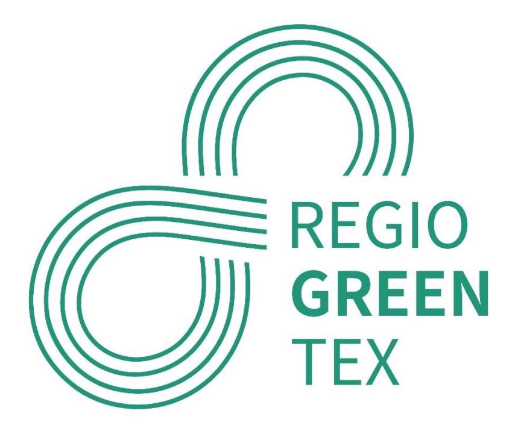
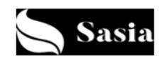

This project has received funding from the European Union's Interregional Innovation Investments Instrument (I3) under the Grant Agreement No. 101083731.

# **D4.1 SME Advisory Service Strategy**

# **Interregional Innovation Investments Instrument (I3)**

#### **Deliverable due date: M11**

| A UTHOR                      |                             | REVIEWERS             |
|------------------------------|-----------------------------|-----------------------|
| Next Technology Tecnotessile |                             | Citeve; AEI T è xtils |
|                              | Dissemination level: Public |                       |

Co-funded by the European Union. Views and opinions expressed are however those of the author(s) only and do not necessarily reflect those of the European Union or EISMEA. Neither the European Union nor EISMEA can be held responsible for them.

**Project acronym:** REGIOGREENTEX **Project number:** 101083731 **Project title:** Regions for Green Textiles

#### **CONTENTS**

| 1 2 |                                                                                                                                         |
|-----|-----------------------------------------------------------------------------------------------------------------------------------------|
| 2.1 | Classification and Preliminary Analysis ......................................................................5                         |
| 2.2 | Analysis of specific needs.............................................................................................8                |
| 3   | Main findings........................................................................................................................11 |
| 3.1 | Coaching strategy.........................................................................................................11            |
| 3.2 | SMEs specific needs....................................................................................................15               |
| 3.3 | Mapping coaching profiles..........................................................................................17                   |
| 3.4 | Matching expert profiles and SME needs.................................................................20                               |
| 4   | Conclusions and next steps................................................................................................22            |

-

#### **1 INTRODUCTION**

In the framework of the European Green Deal, RegioGreenTex is a project promoting the collaboration in research and development for the textile industry to establish a systematic circular economy business model across the EU. RegioGreenTex is a quadruple-helix partnership initiative that maps and mitigates the pitfalls, which currently exist in the implementation of recycling processes in a systematic circular economy model within the textile industry across the EU.

RegioGreenTex is a project formed by 43 European partners representing Clusters, Research Centers, Universities/Research and Technology Organisations (RTOs), SMEs, Regional Authorities and NGO from 11 EU textile regions in 8 European countries. The project aims to boost the green transitions and resilience by setting up a unified EU textile ecosystem and marketplace among SMEs and promoting recycling practices and valuable use of recycled materials in a textiles-totextiles closed loop at a cross-regional level. In particular, the collaboration and cooperation among those actors will allow RegioGreenTex to achieve the following objectives:

- Map the needs and potentiality in the implementation of a circular economy among European regions and clusters and their different levels of economic development;
- Build a dynamic recycling textile ecosystem at European level by making demand and offer meet on a shared digital platform;
- Support SMEs pilot projects to accelerate the creation, development, and use of new textile materials with increased recycled content by sharing technologies and methodologies;
- Create five regional textile recycling hubs in line with the ReHubs initiative and consistent with the EU textile strategy and with the needs of SMEs;
- RegioGreenTex ultimately aims at generating investment opportunities at regional level beyond the project.

Within this framework, WP4 "Advisory services and support to the portfolio of the SME projects" aims to facilitate European textile SMEs success for the implementation of their pilots, the exploitation of the results and the upgrade of internal competences. WP4 is focused on a tailormade coaching strategy to technically support SMEs in the implementation of their investment projects portfolio, increase their ability to accelerate towards a green transition with a solid anchoring in the EU Textile Strategy with the development of specific competences in sustainability issues, by benefiting from the interregional space and networking to push the uptake of successful outputs of the pilots developed, to the ecosystem where they are placed and widely to the European and global market.

To achieve these outcomes the following actions are planned:

- Analysis of the specific needs, gaps and challenges from RegioGreenTex SMEs;
- Map of the competences owned by RegioGreenTex partnership;
- Identification of the most suitable experts from RegioGreenTex non-SMEs partners (competence centres);
- Transfer of knowledge and competences from RegioGreenTex competence hubs to partner SMEs;
- Customized technical support for the smooth implementation of SMEs pilots (connected with WP3 – "Implementation portfolio of investment project") and SMEs involvement in the regional hubs (connected with WP5 – "Regional Hubs")
- Development of strategic competences to enhance the possibilities of making greener products-processes-business models;
- Maximise the exploitation of results to generate market potential opportunities for new stakeholders.

The first output of WP4 is the "SME Advisory Services Strategy". This deliverable aims to design a tailor-made coaching strategy for each of the SMEs involved in the project using a bottom-up approach, described in detail in the following chapters. Next Technology Tecnotessile, as WP leader, designed the most suitable methodology to match SMEs needs with the pool of experts composing the partnership.

The partnership is twofold: RTOs, universities, research centres, competence centres and cluster organisations on one side and SMEs as pilot developers on the other side. The identification of competences and the expert profiles are detected and mapped among the components of the first group (RTOs, universities, research centres, competence centres and cluster organisations). The specific needs are detected and mapped among the partner SMEs.

The strategy is based on the matching of these two maps, by creating the right skills to be provided to the single SME and his pilot.

# **2 METHODOLOGY AND APPROACH**

# **2.1 Classification and Preliminary Analysis**

The SME Advisory Service Strategy is the first step of a long-term support strategy to the 26 SMEs (including 3 NGOs) involved in pilot investment projects. The SMEs have been identified and involved in RegioGreenTex activities because of their potential to strengthen the EU textile value chain, scale-up opportunities, federate investments, create interregional synergies, and avoid duplication across borders. Furthermore, the portfolio of pilots will deliver investment projects ensuring a full coverage along the value chain segments of circular textiles (e.g. sorting, recycling from material to fibre, removal of contaminants, processing of recycled fibres to new textile materials).

To make a significant change in EU textile industry, monitor the innovation capacities and upgrade the scaling-up potential at European and international level, each SME will be assisted by a dedicated pool of technical expertise provided by RegioGreenTex partnership. By doing this, the level of SME's internal capacities will increase, especially for circular technologies, approach, business models.

In WP4, the complementarity of competences from RTOs, universities, research centres, clusters and public authorities will be evaluated and assigned to SMEs according to the specific needs for the implementation of the pilots. The selected profiles will guide the SMEs along with their pilot's implementation with proper technical support in the most vulnerable areas. These coaching sessions will help to develop the SME pilot, increasing its TRL stage and promoting the adoption of innovative solutions by multiple peers.

The methodology deployed in this WP is strictly interconnected with the preliminary activities developed by WP3. During the initial phase, the project put in place many different actions whose outputs are propaedeutics to the advisory service of WP4.

One of the main and most important results of WP3 preliminary action was the fine tuning and classification of the pilots into sub-groups along the circular value chain of textile recycling. All the RegioGreenTex pilots were categorised according to the specific areas the specific solution belongs to, for the pilot fine tune, testing and validation.

The sub-groups identified are:

- **Design and Manufacturing**: refers to design for and from recycling.

- **Collecting & sorting**: refers to end-of-life collection and the required sorting. Within RegioGreenTex, we focus on this activity in the social economy; hence, two NGOs cover this activity.
- **Mechanical recycling**: refers to activities like shredding and defibering.
- **Chemical recycling**: refers to transforming the polymer materials back to monomers/building blocks.
- **Uptake of recycled material**: refers to the use of secondary raw materials (or recycled materials) in the textile value chain. This is considered a core activity as more and more secondary raw materials are being obtained, but the manufacturing steps to integrate them into the value chain are missing.
- **Services and zero waste technologies:** refers to offering services, e.g., for building ecosystems and services helping go to zero waste production along the value chain.

The table below shows each pilot and the area it belongs to:

The pilots identified under RegioGreenTex are very ambitious and have been specifically selected for their high level of sustainability and innovation. Some pilots inevitably have a broader scope and could be included in more than one of the areas identified above. However, to facilitate understanding and analysis, only the most related and relevant area has been considered. This classification gives a global overview of the main areas in which pilots are located.

To further explore the activities in which they are involved and specific needs to address with the technical advisory, all RegioGreenTex SMEs were asked to answer a dedicated survey. The purpose was to collect relevant information about the activity of each SME, their expectations from the RegioGreenTex project and find out how pilot works and how to get started.

The survey was conducted in the very first stage of the project and the results provided key info about the status of the pilots, with the field of application, the productive areas and generally, more technical details. Additionally, the results showed preliminary gaps, needs and issues, depicting the State-of-the-art, when the majority of pilots were not started yet.

After the collection of this information, individual meetings were also performed by WP 3 and WP 7 leaders with each SME to better define:

➢ General description of the pilot; ➢ Description of the tasks; ➢ Timeline and Gantt; ➢ Needs and obstacles to tackle; ➢ Route to the goal; ➢ Outcomes and measurable KPIs

A round of meetings took place, each one involving one partner SME and WP3, WP4 and WP7 representatives of the competence centres; specific tools for conducting the meetings were implemented. The collection of this info resulted in the SME pilots projects plans detailed in the Annex of D7.1 "Inception Plan". The deliverable is the reference document for the consortium for the implementation, monitoring and coaching of the pilots.

All the pilots have been thoroughly analysed by the partners in order to establish a reliable strategy for the advisory services at the first follow-up meeting scheduled for M9 (September 2023).

The survey and the meetings were the basis of the needs analysis, whose outcomes are described in the following chapter.

# **2.2 Analysis of specific needs**

The first survey follow-up resulted in an online Kick-off meeting (KOM) with the SMEs, with members of WP3, WP4 and correspondent regional cluster representatives. The pilots are collected by topics (as described above), but for these meetings the classification by regions was preferred in consideration of the role each regional cluster leader has in monitoring the work of the SMEs in their region. This choice was made because the regional cluster is the company's first point of contact, monitoring and supporting it in a more agile and fluid way (especially in this phase) and acting as a reference point for the various activities planned by the different WPs.

Partners of WP3 and WP4 agreed in M9 on the right moment to schedule the KOM with SMEs: all SMEs already started their pilots and they were more able to think about their future business and investment plans and provide an outlook on the challenges, gaps and needs to be addressed for achieving good performance.

Each KOM agenda had the following structure:

#### • **Next Steps – Definition of strategies and workflow**

This session was led by Citeve as WP3 Leader, coordinator of the meeting and ATEVAL as T3.2 (Main Phase) responsible, together with EURATEX as WP 7 leader. In this session key info about the WPs and the Tasks were provided to the SMEs participant in order to make them aware about all the different activities in which SMEs are involved, the support they can receive from the partners of RegioGreenTex and the WP under which the different activities are conceived.

The last version of the pilots was presented (as included in D7.1) in the KOM and a detailed workflow/workplan with a final Gantt structure, description of the tasks and expected results (in the form of KPIs) was showed to all participants.

Overall, each RegioGreenTex SME will be assisted by two functions: monitoring and advisory. The pilots monitoring falls under WP3 and is interlaced with the advisory service provided within WP4. Monitoring relates with the regular, successful and timely implementation of the pilot, and to the proper reporting and budgeting of the activities, while advising refers to the capacity improvement of the SME, able to fill the gaps detected during the needs analysis phase.

To establish a precise and comprehensive approach to the monitoring of each pilot, the reporting schedule and the technical template were showed in the KOM. SMEs were also informed that for the monitoring support their reference is the cluster they belong to (as well as EURATEX as project coordinator, in the last instance). This was the choice agreed by the partnership, as it is believed that the reference cluster is the organisation having the best knowledge about the SME organisation and approach to the work to be done.

The two functions will be performed by two groups of experts: monitoring is under the SME's reference cluster organisation responsibility, advising is provided by the expert profiles of different regions/cluster, holding deep expertise in the specific domain of the SMEs weaknesses.

#### • **SMEs pilot project updated**

In the second part of the KOM, each SME presented the status of the pilot, indicating whether it was on track and ongoing according to the timetable and the potential results achievable. In particular, the SMEs were asked to highlight the state of the art, challenges or issues already identified or that may arise in the coming months, any useful feedback and insights for the other partners, any desired corrective actions or adjustments, the activities for the next steps and the specific areas where they need technical support from non-SME RegioGreenTex partners.

This part represents the "expressed needs".

#### • **Interaction with WP4 and coaching support**

In this third KOM session, cluster organisation representatives tried to identify SME's weak points, not explicitly mentioned, but very relevant in terms of technical advancement and business success, in particular for the pilot deployment. This session of the KOM was conducted by NTT as WP4 Leader and T4.1 responsible. The activities aimed to detect the specific gaps and needs for which SMEs require a specific technical support for the pilots in the pre-defined thematic areas:

- Innovation management
- Scaling up solutions
- Green manufacturing
- Eco-design
- Market and business model analysis
- Regulatory analysis and LCA

#### • Financing and funding strategies

The objective of this work package is to support SMEs in the implementation of their pilot project by providing personalized technical advisory through a tailor-made agenda.

# **3 MAIN FINDINGS**

## **3.1 Coaching strategy**

The work of WP3 and WP4 is closely interconnected and aims to favour the implementation of SMEs pilots by monitoring and providing technical support, according to the challenges, gaps and needs identified.

A specific methodology to assign the proper coach(es) to each RegioGreenTex SME was defined and it is here described. This strategy enabled the creation of a database available for the consortium as a whole. The following chapters depict the outputs of this strategy and the expertise assignment to the SMEs. The strategy builds upon the following pillars:

- 1. **Mapping and Assessing Coaching Profiles**: in this step the objective was to map the competences and skills available in the partnership among RTOs, universities, research centres, competence centres and cluster organisations; the mapping exercise included the evaluation of the quality and suitability of the coaching profiles provided by RegioGreenTex partners falling under this category. This step involved an in-depth examination of the experts education background, the professional experiences and the key competences possessed. Each partner was asked to provide at least two potential advisors, ultimately creating a map of 34 expert profiles from 17 competence organisations. This first achievement enables to address all the different SMEs needs emerged during the needs analysis, thanks to the tool specifically conceived to collect the information related to the key profiles;
- 2. **Analysis of Specific Needs**: the pre-condition for a proper matching (SME-expert profile) was the analysis of the specific SME needs, described in paragraph 2 of this document. Each pilot has its own specificity and characteristics depending on many factors. By starting with the approach and the needs analysis described in Chapter 2, RegioGreenTex can ensure that the coaching strategy is tailored to each pilot;
- 3. **Match coaches to SMEs**: after the WP leader assessed the quality of the coaches proposed by each partner, the goal was to match the expert profiles with the SMEs, by means of pre-defined relevant criteria, like expertise, key competences, previous coaching experience and skills connected to circularity and sustainability in the textile sector; a preliminary matches draft was prepared by NTT, to be then assessed and validated according to what is listed in the following point;

- 4. **Assess Match quality**: once potential matches were identified, it was essential to evaluate the quality of these matches to ensure they were effective and impactful. The identification of the most appropriate coach is a highly sensitive task, which is why a collaborative approach with the involvement of all partners was chosen. Essentially, the match was to be validated by the cluster to which the SME belong, and then by the expert appointed. After the RegioGreenTex KOM in February 2023, the partners exclusively held virtual meetings. Meeting in person would enhance the smoothness of the process, particularly when dealing with such crucial issues that involve all partners. For this reason, the Regional Cluster Operational Workshop organized in Prato in October 2023 played a key role. During the meeting, Next Technology Tecnotessile deeply explained the methodology, the strategy, the work to be done by each partner and the expected outcomes. The matches draft prepared by NTT, with the assignments of the coaches to the SME pilots, was distributed to the RegioGreenTex regional cluster leaders (RTOs, universities, research centres, competence centres and cluster organisations) during the in-presence workshop held in Prato on October 10, 2023; the Partners had the possibility to analyse and validate the assignment of the coaches to the single SME during the WP4 workshop in a collaborative working session. The basic validation criterion was that each partner assess the assignment of the coaches for his member SME, as they know better the company's specialties and needs; a preliminary check was performed by the partners during the inpresence workshop, then it was asked to finalize the assignment in the following days after the workshop. As mentioned above, the matches validation followed two separate steps: the first was on the workshop participant side (RTOs, universities, research centres, competence centres and cluster organisations), who validated the expert profiles assigned to its 2-3 member SMEs (reference clusters are indeed the monitoring body); then, each selected expert profile was asked to validate the SME(s) assigned to him/her, by confirming the capability to address the SME needs/requests.
- 5. **Assign Coaches to SMEs**: Next Technology Tecnotessile, as responsible of the coaching strategy, collected all the comments and feedback from partners and coaches to modify the initial proposal accordingly. In this final step, the selected coaches are formally validated and assigned to the respective SMEs.

Finally, the collective decision of the partnership (consensus on NTT proposal was reached in the Prato workshop) for the advisory approach is that each SMEs will benefit of a total of 10 hours of support (exceptions for specific cases are possible), of which 8 hours provided by the selected expert profile(s) from the matching exercise and 2 hours provided by experts of RISE on circular solutions and green industrial transition. These green experts have been identified by RISE and validated by RISE and work package leader NTT. As each pilot focuses on circularity and sustainability, in their different declinations, special attention was paid by RISE staff to identify topics and profiles capable to cover the SMEs circular profile or approach. RISE is an internationally recognised research centre, committed to business competitiveness and sustainable economy. RISE's main contributions to the advisory are as follows:

- Expertise to push innovation towards the SMEs for uptaking the sustainable technology of the future;
- Increase knowledge about how to reshape today's business models and strategies to fit recycled materials in design and production systems and facilitating eco-design practices and circular business models;
- Test beds to scale up, test and verify sustainable solutions;
- Increase competence on how to view products' environmental impact from a life cycle perspective (LCA) and communicate information on sustainability and climate impact through (e.g., Environmental Product Declaration) and the use of standards (e.g., ISO 14001 and ISO 26000);
- Services related to textile processing for material recycling as well as prototyping circular products;
- Make available research results on circular materials and climate-smart manufacturing technologies, as well as current and upcoming EU legislation;
- Demonstrate the benefits of the adoption of circular products, green technologies, ecodesign and sustainable business models.

The "green advisory" on circularity and sustainability (as The "green advisory" on circularity and sustainability (as described in T4.2) provided by RISE is a unique opportunity for the RegioGreenTex companies and represents a real added value for the project.

In addition to the 2 hours expert advisory on green solutions, the outcome of these meetings will be logged to generate an individual SME green services package. The meaning of this package is to further describe the actions identified by the RISE green expert that the company is adviced to take to further "go green" in their market area. This package will aid in understanding the SMEs need in the green transition and offer services related to this need.

Apart from the 2 hours of 1-to-1 advisory service by one green expert per SME and the green advisory package to each SME, the task 4.2 will generate at least 6 webinars throughout the project. The webinars will be held by RISE or a suitable regional cluster member that possess a deep knowledge in the area. The focus of these webinars is entirely dedicated to increasing the SMEs insight in green solutions. The topics that have been identified for the green webinars are:

- 1. The Digital Product Passport (DPP)
- 2. Life-Cycle Assessment (LCA)
- 3. Chemical legislation
- 4. Innovative green fibres
- 5. Chemical recycling
- 6. EU Textile strategy for sustainable and circular textiles

The topics for the webinars have been identified based on the needs described by the SMEs.

By following the methodology described in this chapter, it was possible to effectively assess, match, and assign coaches to SMEs while ensuring the quality and suitability of the advisory service.

# **3.2 SMEs specific needs**

During the meetings organised within WP3, the SMEs provided useful information to evaluate the most appropriate profile(s) from the available pool of expertise. Some companies needed more time to get into the technical details of the project. In this sense, some guided questions (as in the table below) were distributed to the SMEs after the one-to-one meetings to collect homogeneous and groupable replies.

| Area of Needs | Specific Needs                                                               |
|---------------|------------------------------------------------------------------------------|
| TECHNOLOGY ➢  | Which technology you will make use for your pilot?                           |
| ➢             | What are the actual limits of such technology for your specific case?        |
| ➢             | From 1 to 10, which is your level of knowledge of the technology?            |
| ➢             | Describe the main areas in which you need technical support to exploit       |
| ➢             | What expertise you would need to better adopt the technology?                |
| ➢             | What are the main differences with the references state of the Art           |
| ➢             | What are, in your opinion, the main technological gaps for your pilot?       |
| MARKET ➢      | Have you already identified the target market and the dimension?             |
| ➢             | Do you know already potential customers of the new solution?                 |
| ➢             | Have you prepared a mini business plan?                                      |
| ➢             | Have you identified actors/events/trade fairs/networking platforms or        |
| ➢             | What expertise you would need to better enter the market?                    |
| MANAGEMENT ➢  | What are the resources dedicated to the pilot implementation?                |
| ➢             | Which tools have you adopted for the planning/monitoring?                    |
| ➢             | What expertise you would need to better implement the pilot?                 |
| COMMUNICATION | How will you communicate the results to other partner, costumers, and        |
| CIRCULARITY ➢ | From 1 to 10, which is the level of circularity of your pilot?               |
| ➢             | Which of the different circularity activities are directly connected to your |
|               | Eco -design                                                                  |

| OTHERS | ➢ What is the main challenge(s) to make your solution highly sustainable? |
|--------|---------------------------------------------------------------------------|
|        | ➢ Indicate any further technical support you may need to better address   |
|        | ➢ About partnerships, existing and needed within and outside the          |

In this sense, all RegioGreenTex SMEs received the following email:

During the WP3 meetings last week, we learned about some of your issues and needs. We would like more clearly identify your specific needs to assign you to a coach that can help you:

- Are you looking for a specific supplier/customer? What type of materials/services are you looking for?
- Do you need some type of support related with certifications/regulation?
- Do you need some type of expertise related with some type of technology/business plan?
- Describe the main area(s) in which you need technical support to exploit your pilot.

Please describe any further technical support/key information you may need from RegioGreenTex partners to succeed in you pilot.

SMEs already started working on their pilots, but there are several specificities considering the different company sizes and maturity as well as the fact that each of them has its own Gantt, timeline and a different rhythm of implementation. This explains why, when asking SMEs specific info about their needs, very divergent responses were encountered. In this sense, the role of the cluster refence is crucial to monitor each SMEs and act properly (if needed) by connecting the SME to the RegioGreenTex support.

# **3.3 Mapping coaching profiles**

In parallel, the strategy implementation progressed with the identification of available coaching profiles in RGT competence centres staff.

The RegioGreenTex partnership has been set up to cover a wide range of complementary competences and fields of application, thus each partner were asked to provide highly qualified profiles from their internal organization to assist the SMEs pilot.

Each partner brings a unique blend of expertise, shaped by individual experiences, skills, competences, and professional backgrounds. Profiles with varied expertise create an environment where knowledge can be shared, fostering innovative cross-sectoral and cross-regional solutions through the intersection of different perspectives. Requiring each partner to find those which best fit into RegioGreenTex advisory services allows to facilitate the provision of SMEs tailored solutions.

The pool of RegioGreenTex expertise is summarized in the chart below:

| Partner                                               | Profiles and Competences                          |
|-------------------------------------------------------|---------------------------------------------------|
| Euratex represents                                    | the interest of EU T&C industry, cloesly          |
| strengthening and stimulating                         | networking with businesses and start             |
| Research and Technology                               |                                                   |
| RISE can support                                      | SMEs with the implementation of their pilots with |
| team can cover: transition and innovation management, | applied R&D,                                      |
| industrial processess                                 | and upscaling, testing, certification and         |

| Research and Technology                                              |                                         |
|----------------------------------------------------------------------|-----------------------------------------|
| Centexbel profiles are specialised in R&D                            | in textile and plastic                  |
| modification, composites,                                            | recycling, smart textiles, material     |
| characterisation), product                                           | and testing certification.              |
| processes, product managements, with a technological                 | watch and                               |
| market analysis for new circular business models                     | in textile supply                       |
| textile industry.                                                    | Techtera coaching profiles will support |
| RegioGreenTex pilots across a range of areas like:                   | biobased                                |
| materials, traceability,                                             | Industry 4.0 (low-impact manufacturing  |
| processes and recycling technologies), and international business    |                                         |
| Research and Technology                                              |                                         |
| Organisations and Cluster                                            |                                         |
| Next Technology Tecnotessile operates                                | in synergy with EU, national            |
| and regional entities                                                | by providing industry with R&D based    |
| technological innovation                                             | and advanced solutions. The experts     |
| identified will support RegioGreenTex pilots in 3 main areas         | : Market                                |
| exploration and implementation of internazionalization strategies    | ;                                       |
| Città Studi CS Pointex                                               |                                         |
| impact processes (chemical spinning, weaving, dyeing and finishing). |                                         |
| Research and Technology                                              |                                         |
| Organisations and Cluster                                            |                                         |
| Management, Environmental                                            | Management System, Social               |

| Ateval Cluster Association (Spain)                                 |                                                               |                                                |
|--------------------------------------------------------------------|---------------------------------------------------------------|------------------------------------------------|
| AEI Tèxtils is a AEI Tèxtils                                       | Catalan cluster                                               | that gather companies in the sector            |
| of advanced textile materials. Cluster Association                 |                                                               | In this sense, the profiles identified will    |
| support RegioGreenTex pilots with (Spain)                          |                                                               | answering to the gaps and needs                |
| in the WUR                                                         | specific area                                                 | of technical textiles and business innovation. |
| textiles University & Contract Research (The Netherlands) Eurofins | and renewable alternatives for textile fibres, recycling      |                                                |
| Research and Technology                                            |                                                               |                                                |
| manufacturing and implications in terms of green                   |                                                               | compliance, waste                              |
| and Organisations (Spain)                                          | materials conversion                                          | processes for circularity, industrial          |
| OVAM OVAM Public Waste Agency (Belgium)                            | is the competent authority dealing with waste and sustainable |                                                |
| various                                                            | materials                                                     | and energy technologies, sustainability        |

The experts provided by each partner are an invaluable resource for SMEs to overcome gaps and challenges that may arise during the pilots project implementation.

At this stage the consortium identified a pool of 34 experts, each with unique backgrounds and expertise across textile value chain. This diversity not only ensures a wide range of services but also promotes complementarity among the team members.

In the framework of RegioGreenTex project the need for additional expertise may arise as the business environment is dynamic and flexible, and so will be the advisory strategy. In this sense, it is important to underline that the current list of professional profiles is not exhaustive or final, and should be regarded as a starting point for ongoing adaptability, subject to further development and

extension. The list will be updated regularly as the project proceeds to ensuring that support remains relevant and effective in the face of changing circumstances. If new specific requirements emerge during the pilot's implementation, the coaching team can be easily adjusted by adding or changing qualified profiles and their assignments.

# **3.4 Matching expert profiles and SME needs**

The RegioGreenTex advisory strategy allowed the production of the following main outcomes:

- 1. The map of the RegioGreenTex SME needs and gaps;
- 2. The map of the RegioGreenTex affiliated expert profiles;
- 3. The matrix of the assignments.

Below the structure of the 3 outcomes is represented.

| 
 
NEEDS
 
COMPANIES
 
 | 
Indentification of needs (information collected from Needs_e-mail Sep. 2023)
 | 
Notes from WP3 meetings with partners (Sep. 2023)
 |
|------------------------------------------------------------------------------------------------------------------------------------------------------|-------------------------------------------------------------------------------------------------|------------------------------------------------------------------|
| 
Company name
                                                                                                                                  | 
Needs description
                                                                        |                                                                  |

|  | RGT Partner                                           |
|---------------|-------------------------------------------------------|
|               | Type of organisation                                  |
|               | Name of the coach                                     |
|               | Nationality                                           |
|               | Employee or subcontract                               |
| Profile 1*    | Education qualification (e.g. mechanical engineer)    |
|               | Short description of personal Professional Experience |
|               | Previous Coaching Experience                          |
|               | Area of expertise 1                                   |
|               | Key competences for Area of expertise 1               |
|               | Area of expertise 2                                   |
|               | Key competences for Area of expertise 2               |

|  | Area of expertise 3                     |
|--|-----------------------------------------|
|  | Key competences for Area of expertise 3 |
|  | Link to textile sector - Key facts      |
|  | Link to circularity - Key facts         |
|  | Level of English                        |
|  | Other comments and useful information   |

\* repeated for at least 3 profiles per partner organisation

The final results are summarised as to be:

- 34 experts from 17 competence organisations
- 10 hours of coaching for each SME
- 26 textile SMEs coached in 11 textile regions of Europe

Advisory thematic areas covered:

- Innovation management
- Scaling up solutions
- Green manufacturing
- Eco-design
- Market and business model analysis
- Regulatory analysis and LCA
- Financing and funding strategies

| Company | Hub Pilot KPIs      |                         |                                                                     |       |                           |
|---------|---------------------|-------------------------|---------------------------------------------------------------------|-------|---------------------------|
|         |                     |                         | COMMENTS                                                            | Coach | H                         |
|         |                     |                         |                                                                     |       | allocated Coach H         |
|         |                     | Coach 1 Coach 2 Coach 3 | REVIEWER 1                                                          |       | allocated Coach H         |
|         |                     |                         | VALIDATION NEW PROPOSAL COMMENTS REVIEWER 2 VALIDATION NEW PROPOSAL |       | allocated                 |
|         | SMEs Pilot Projects | Coaching Strategy WP4   | Coaching Strategy WP4                                               |       | Final coaching assignment |
|         | SMEs Pilot Projects | Draft Proposal          | Assesment and Validation (All involved)                             |       | Validation by NTT         |

# **4 CONCLUSIONS AND NEXT STEPS**

This report aims to highlight the complementary activities undertaken by WP4, in collaboration with WP3, to design the "SME Advisory Services Strategy". The various pilots incorporated within the RegioGreenTex initiative have been selected for their elevated degree of circularity, innovativeness, and sustainability, as well as for the significant influence they could generate, not only on the company's business strategy, but also for their scalability in the local, national and international ecosystems. The objective is to support the direct investments of RegioGreenTex companies and the efforts they are implementing to become more circular and conscious about sustainability issues; at the same time the advisory is meant to address SME's R&D and technological needs and thus the implementation of solutions, technologies and processes able to generate a spill-over effect to other textile entities.

The advisory service plays a pivotal role for the SMEs, that often lack the resources and expertise required to navigate complex strategic decisions and to implement new manufacturing processes or business models.

Therefore, a participatory process is required, starting with the identification of specific company needs. Identifying and selecting the most qualified experts to address current and future challenges that may arise is crucial. Consistency and clarity in this process are paramount to a successful outcome. In this sense, the strategy required a highly participative and approach involving (at different stages) all RegioGreenTex partners. The adopted bottom-up approach started by collecting the specific SME needs, so that the strategy of the advisory service is centered around the single SME, to allow a successful pilot deployment and the increase of internal capacities. The assigned experts, among the pool formed by the partnership, are intended to ensure the most qualified and best suited expertise able to address SME's current and future challenges.

Furthermore, RegioGreenTex boosts the interdependence of EU regions and the importance of a cross-regional network. For this reason, an inter-regional approach has been adopted when appointing the coach(es), emphasising the importance of fostering links between different European textile regions. This strategic choice aims to enhance collaboration and knowledge sharing between geographical areas with different specialisations, ultimately contributing to a more comprehensive and effective coaching system for RegioGreenTex companies.

The strategic approach for the SME pilot orientation and implementation, functional to successfully achieve the final pilot goals, is based on two main forms of support:

- 1. Monitoring, i.e. the external overall guidance for the correct pilot implementation, part of WP3 actions, for which the reference cluster is responsible;
- 2. Technical Advisory, i.e. the external provision of skills, knowledge, and problem solutions, part of WP4, provided by expert profiles affiliated to one of the RegioGreenTex organisations, always different to the reference cluster of the SME.

The Advisory service strategy is essentially referred to the second point, as it regards the way the match between the specific SME needs and the expertise provided by the competent organisation(s) is determined. The expert advisory is supposed to guide the SME through the trouble shooting arising before, during and possibly after the pilot implementation.

Each coaching session will be tracked including the main objectives, the outcomes, and the next step. This will enable both SMEs and coaches to maintain a constant alignment and collaboratively deliver the most effective support required for each unique pilot. The outcomes will serve as the framework to develop D4.2 "Report on the results achieved through the delivery of coaching actions and green advisory services provided".