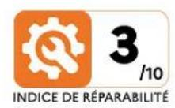
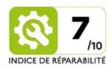
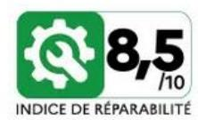
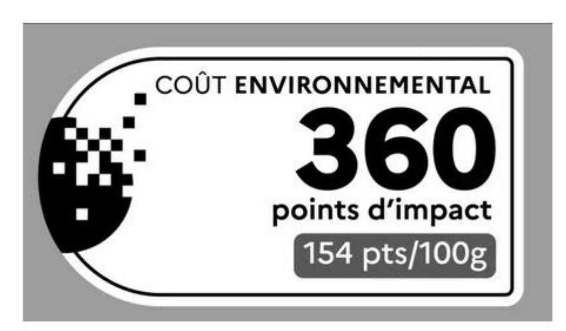
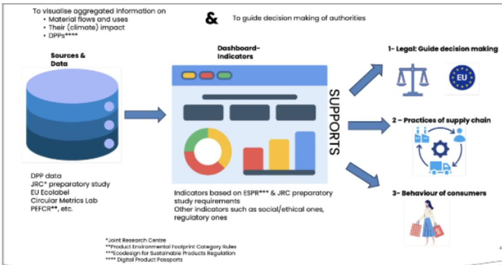
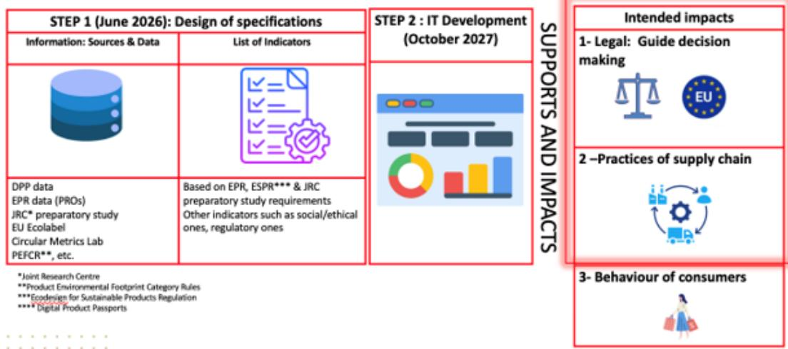

Advancing sustainable textiles in the circular economy through innovative EP schemes

# **Table of Contents**

| List of figures | List of acronyms Project Information Deliverable details                            | 4 4 7 8 |
|-----------------|-------------------------------------------------------------------------------------|---------|
| 1.              | Context                                                                             | 9       |
| 2.              | Methodology principle & results                                                     | 10      |
| 2.1.            | Methodology principle                                                               | 10      |
| 2.2.            | Results                                                                             | 10      |
| 3.              | The Waste Framework Directive 2008/98/CE (WFD): EPR data requirements               | 11      |
| 3.1.            | Regulatory background                                                               | 11      |
| 3.2.            | Categories of products concerned by the EPR requirements at EU level                | 11      |
| 3.3.            | List of possible indicators under the WFD                                           | 13      |
| 3.3.1.          | Generic indicators/scoring indicators                                               | 13      |
| 3.3.1.1.        | Related to market                                                                   | 13      |
| 3.3.1.2.        | Related to producers                                                                | 13      |
| 3.4.            | Related to eco-modulation                                                           | 14      |
| 3.4.1.1.        | Related to governance                                                               | 15      |
| 3.4.1.2.        | Related to social aspects                                                           | 16      |
| 3.4.1.3.        | Related to collection                                                               | 18      |
| 3.4.1.4.        | Related to sorting                                                                  | 19      |
| 3.4.1.5.        | Related to reuse                                                                    | 20      |
| 3.4.1.6.        | Related to repair                                                                   | 21      |
| 3.4.1.7.        | Related to recycling                                                                | 22      |
| 3.4.1.8.        | Related to Finance                                                                  | 23      |
| 3.5.            | Related to “exportation”                                                            | 24      |
| 4.              | The Regulation (EU) 2024/1781 establishing a framework for the setting of ecodesign |         |
|                 | requirements for sustainable products (ESPR)                                        | 25      |
| 4.1.            | Related to DPP                                                                      | 25      |
| 4.2.            | Related to physical durability/robustness product aspect                            | 25      |
| 4.2.1.          | Definitions                                                                         | 25      |
| 4.2.2.          | Foreseen indicator (s)                                                              | 26      |
| 4.3.            | Related to maintenance product aspect                                               | 26      |
| 4.3.1.          | Definitions                                                                         | 26      |

| 4.3.1.  | Foreseen indicator (s)                                                    | 26 |
|---------|---------------------------------------------------------------------------|----|
| 4.4.    | Related to repairability product aspect                                   | 27 |
| 4.4.1.  | Definitions                                                               | 27 |
| 4.4.2.  | Foreseen indicator (s)                                                    | 28 |
| 4.5.    | Expected generation of waste                                              | 30 |
| 4.5.1.  | Definition (s)                                                            | 30 |
| 4.5.2.  | Foreseen indicator (s)                                                    | 30 |
| 4.6.    | Related to recycled content product aspect                                | 31 |
| 4.6.1.  | Definition(s)                                                             | 31 |
| 4.6.2.  | Foreseen indicator (s)                                                    | 31 |
| 4.7.    | Related to recyclability product aspect                                   | 31 |
| 4.7.1.  | Definition (s)                                                            | 31 |
| 4.7.2.  | Foreseen indicator (s)                                                    | 32 |
| 4.8.    | Related to climate change product aspect                                  | 32 |
| 4.8.1.  | Definition(s)                                                             | 32 |
| 4.8.2.  | Foreseen indicator (s)                                                    | 32 |
| 4.9.    | Related to human health product aspect: presence of substances of concern |    |
|         | (SoC) and particulate matter release                                      | 33 |
| 4.9.1.  | Definition (s)                                                            | 33 |
| 4.9.2.  | Foreseen indicator (s)                                                    | 33 |
| 4.10.   | Related to land use product aspect                                        | 35 |
| 4.10.1. | Definition (s)                                                            | 35 |
| 4.10.2. | Foreseen indicator (s)                                                    | 36 |
| 4.11.   | Related to water footprint product aspect                                 | 36 |
| 4.11.1. | Definition (s)                                                            | 36 |
| 4.11.2. | Foreseen indicator (s)                                                    | 36 |
| 4.12.   | Related to resource use and resource efficiency product aspect            | 36 |
| 4.12.1. | Definition (s)                                                            | 36 |
| 4.12.2. | Foreseen indicator (s)                                                    | 37 |
| 4.13.   | Related to social sustainability product aspect                           | 37 |
| 4.14.   | Eco score for textiles: the French case                                   | 37 |
| 4.15.   | Related to other topics                                                   | 38 |
| 4.15.1. | Data carrier reliability                                                  | 38 |
| 4.15.2. | Emotional durability/Consumer and Customer perception                     | 38 |
| 4.15.3. | Regulatory compliance to other EU Legislation                             | 38 |
| 4.15.4. | Design for end-of-life                                                    | 39 |

| 5.     | Other data requirements linked to other legislation                    | 39 |
|--------|------------------------------------------------------------------------|----|
| 5.1.   | Social aspect                                                          | 39 |
| 5.1.1. | Mandatory                                                              | 39 |
| 5.2.   | Optional                                                               | 40 |
| 5.3.   | Governance                                                             | 40 |
| 6.     | Ensuring Data Accuracy                                                 | 41 |
| 6.1.   | Legislation                                                            | 41 |
| 6.2.   | Proposed reliability scoring system                                    | 42 |
|        | Annex I: Feeback from the meetings regarding the dashboard development | 43 |
|        | Annex II: Summary Table of proposed indicators/scoring                 | 50 |

## List of figures

| Figure 1 | : French criteria on reparability index                                       | 29   |
|----------|-------------------------------------------------------------------------------|------|
| Figure 2 | : main sources of unintentional microplastics release to the EU environment – | 2019 |
| Figure 3 | : French Environmental Cost Label                                             | 38   |

## List of acronyms

| AGEC law   | : “Anti gaspillage pour une économie circulaire” Law                       |
|------------|----------------------------------------------------------------------------|
| BC         | Base Case of technologies, which is the average product on the market.     |
| BAT        | The Best Available Technologies, which have the most ambitious             |
| BNAT       | The Best Not yet Available Technologies, which have the most ambitious     |
| BREF       | Best Available Techniques Reference Document                               |
| BWIC       | Biodiversity and Water Impact Cost                                         |
| CAS number | A Chemcial Absrtact Services number (or CAS Registry Number®) is a         |
| CLP        | Regulation (EC) No 1272/2008 on classification, labelling and packaging of |
| CML        | Circular Metrics Lab                                                       |
| CN         | Combined Nomenclature                                                      |
| CSDDD      | Corporate Sustainability Due Diligence Directive                           |
| CSRD       | Corporate Sustainability Reporting Directive                               |
| CTUe       | Comparative Toxic Unit for ecosystems                                      |
| DI         | Disassemblability Index                                                    |
| DPP        | Digital Product Passport                                                   |

| EC number EINECS ELINCS | purposes within the European Union present on the EU market before September 1981. after 1981.                   |
|-------------------------|------------------------------------------------------------------------------------------------------------------|
| ECHA                    | European Chemicals Agency                                                                                        |
| EEA                     | European Environmental Agency                                                                                    |
| EmpCo                   | Empowering Consumers                                                                                             |
| EPR                     | Extended Producer Responsibility                                                                                 |
| ESPR                    | Ecodesign for Sustainable Products Regulation                                                                    |
| EU                      | European Union                                                                                                   |
| FSC                     | Forest Stewardship Council                                                                                       |
| FTEs                    | Full-Time Equivalent                                                                                             |
| GINETEX                 | Groupement International d'Etiquetage pour l'Entretien des Textiles                                              |
| GOTS                    | Global Organic Textile Standard                                                                                  |
| GRS                     | Global Recycled Standard                                                                                         |
| GTIN                    | Global Trade Item Number                                                                                         |
| ILO                     | International Labour Organisation                                                                                |
| ISO                     | International Organization for Standardization                                                                   |
| IUPAC                   | International Union of Pure and Applied Chemistry                                                                |
| JRC                     | Joint Research Centre                                                                                            |
| LCA                     | Life Cycle Assessment                                                                                            |
| MS                      | Member State                                                                                                     |
| NI                      | Integrity Index                                                                                                  |
| NLP                     | No Longer Polymer list                                                                                           |
| OECD                    | Organisation for Economic Co-operation and Development                                                           |
| PCDS                    | Product circularity data sheet                                                                                   |
| PEF                     | Product Environmental Footprint                                                                                  |
| PEFCR                   | Product Environmental Footprint Category Rules                                                                   |
| POPs                    | Regulation (EU) 2019/1021 on persistent organic pollutants                                                       |
| PRO                     | Producer Responsibility Organisation                                                                             |
| PRODCO                  | Derived from the French PRODuction COMmunautaire) is the European goods                                          |
| R&D                     | Research & Development                                                                                           |
| RDI                     | Research, Development, and Innovation                                                                            |
| REACH                   | Regulation (EC) No 1907/2006 concerning the Registration, Evaluation, Authorisation and Restriction of Chemicals |
| RemPI                   | Remanufacturability Potential Index                                                                              |
| RSC                     | Responsibility Safeguard Cost                                                                                    |
| SITC                    | Standard International Trade Classification                                                                      |
| SoC                     | Substance of Concern as defined under ESPR                                                                       |

SRF Solid recovered fuel TLR Textiles Labelling Regulation WFD Waste Framework Directive WRI [World resources Institute](https://www.wri.org/aqueduct) WTPcx Weight of collected used textiles and waste textiles WTPX Weight of textiles products

## Project Information

**Project full title**: Advancing Sustainable Textiles in the Circular Economy Through Innovative EPR Schemes

**Acronym**: TRUSTex

**Call**: HORIZON-CL6-2024-CircBio-01-2

**Topic**: Circular solutions for textile value chains based on extended producer responsibility (Innovation Action)

**Start date**: 1st January 2025

**Duration**: 36 months

**Deliverable:** D4.5

**Due date submission:** 30 June 2026

**Submission date:** 30 June 2026

## Deliverable details

| Document Number:    | D4.5                                                                  |
|---------------------|-----------------------------------------------------------------------|
| Document Title:     | EPR reporting requirements                                            |
| Dissemination level | PU – Public, fully open                                               |
| Period:             | PR1                                                                   |
| WP:                 | WP4                                                                   |
| Task:               | T4.4                                                                  |
|                     | Xavier-François Verni (LIST), Ghaya Rziga (LIST), Philippe            |
|                     | Collignon (CENTEXBEL), Martin Führ (HDA), Annemarie                   |
| Reviewers           | TRUStex consortium, including the advisory board members              |
|                     | This report summarises the possible indicators/scoring that could     |
|                     | sustainable textile industry. The results are either based on current |
|                     | as they will require data from producers or feedback from             |
|                     | stakeholders received during the organised workshops. The             |
|                     | indicators are composed of two categories: the first category is      |
|                     | related to supply chain value, and the second category is related to  |
|                     | textiles products. Some indicators are also considered as optional.   |

| Version | Date       | Description                   |
|---------|------------|-------------------------------|
| 1       | 12/06/2026 | The draft version sent to the |
| 2       | 29/06/2026 | Version updated following     |

## **1. Context**

Textiles are the fourth highest-pressure category for the use of primary raw materials and water and fifth for greenhouse gas emissions and a major source of microplastic pollution and textile industry is facing several issues:

- **Recycling Gap**: Less than 1% of textile waste undergoes fibre-to-fibre recycling, with most collected waste exported to third countries where traceability is lost.
- **Volume Escalation**: Fiber production is expected to triple by 2030, exceeding 147 million tonnes, driven by business models that encourage impulsive consumer behaviour.
- **Waste Crisis**: Of the 12.6 million tonnes of textile waste generated annually, 78% remains unsegregated and destined for landfill or incineration.
- **Environmental Impact**: The textile industry ranks as the 4th most harmful to the environment, requiring 9 m³ of water, 400 m² of land, and 391 kg of raw materials per person. Synthetic textiles (around 35%) are a major contributor to release of primary microplastics in the oceans [1](#page-8-1) .
- **Chemical risks**: textiles products have been reported to pose a chemical risk in the EU Rapid Alert System in 2025 (72 alerts).

That is why textile industry needs urgently to transition **from a linear economy to a circular economy**. According to the Textiles CIRCULARITY GAP REPORT 2024 – Circle Economy, "circularity rate is currently around **0.3%.** 3.25 billion tonnes of materials it consumes each year, over 99% come from virgin sources."

Within this technical and regulatory (Circular Economy Action Plan, Textile Strategy, Waste Framework Directive) contexts, Textile Extended Producer Responsibility (EPR) schemes represent a pivotal opportunity for the European Union to implement circular business models and solidify its position as a global sustainability leader within the textile industry.

#### In fact, EPR:

- Encourages design oriented on sustainability criteria
- Stipulates business models based on a prolonged textile use
- Improves better waste collection and management
- Improves textile recycling and reuse (increased resource efficiency)
- Tackles fast fashion issues overproduction, over-consumption, massive waste

According to the general principle of PDCA (Plan-Do-Check-Act), data and results should be analysed from the "Do" phase against initial goals. Furthermore, verification to confirm change was effective and identification of any unintended consequences should be made.

That is why, it is necessary to **request accurate data** from the actors of the textiles supply chain linked to current and future EU regulatory requirements such as the revised Waste Framework Directive (Directive 2008/98/EC) (including the requirements for textiles EPR implementation), the ESPR regulation (Regulation (EU) 2024/1781), including the ongoing work by the JRC, the Waste Shipment Regulation (Regulation (EU) 2024/1157), the future revision of the Textiles Labelling Regulation (Regulation (EU) No 1007/2011), the EmpCo Directive (Directive (EU) 2024/825), and the Directive 2019/771 on certain aspects concerning contracts for the sale of goods, to **ensure the follow-up of actions using indicators**.

This project has received funding from the European Union's Horizon Research and Innovation program under grant agreement N° 101181901 and from the Swiss State Secretariat for Education, Research and Innovation (SERI). Posts and shares reflect only the views of all the involved partners. Neither the European Union nor the granting authority can be held responsible for them. This draft deliverable has not yet been validated by the granting authorities.

1 Boucher, J. and Friot D. (2017). Primary Microplastics in the Oceans: A Global Evaluation of Sources. Gland, Switzerland: IUCN. 43pp.[: http://dx.doi.org/10.2305/IUCN.CH.2017.01.en](http://dx.doi.org/10.2305/IUCN.CH.2017.01.en)

Under the general the task 4.4 called "Assessing reporting requirements and visualisation for decision support", a two-step approach has been developed:

- First step Deliverable D4.5: Analyse the reporting and monitoring requirements, including the ones that will become newly available via the EPR schemes (under WFD), DPPs (under ESPR), etc.
- Second step at the end of the project– Deliverable D4.6: Derive the concept and tool (demonstrator) for a "authority dashboard" (TRL6) that can guide decision making of authorities (and optionally PROs). This dashboard will visualise aggregated information on material flows and uses, and their (climate) impact that become newly available.

The deliverables are focusing on the following types of stakeholders: authorities, PROs, collectors, sorters, recyclers, reuse organisations. However, if possible, the stakeholder category "consumers" will be looked at.

## **2. Methodology principle & results**

## 2.1. Methodology principle

To identify possible data requirements and their associated possible indicators to be developed and included in the future dashboard, a documents review was performed focusing on:

- Regulatory review: o Regulatory requirements at EU or national (such as France) levels under existing or future legislation. o Works on going at EU level under the Circular Economy Act, the textiles delegated act under ESPR (JRC works) through participation in events, public consultation, reading of draft documents.
- Review of existing tools at national level such as the French EPR Dashboard

Furthermore, under the stakeholder engagement process managed by Prospex Institute, several TRUSTex events (2 Stakeholder Board meetings in December 2025 and June 2026, 2 Hotspot Solution Finder in October 2025 and March 2026 – See Annex I containing the extraction of the feedback regarding the development of the dashboard contained in the meeting reports ) were organised to gather feedback from different stakeholders. This enabled an iterative process to ensure we receive the different views of the whole textiles value chain.

Some general recommendations were gathered:

- 1. Collaborate between policymakers and operational experts
- 2. Avoid complexity, reporting burden and addition of new obligations ➢ Align with Digital Product Passports (DPP), EPR reporting, and Ecodesign for Sustainable Products Regulation (ESPR) requirements ➢ Use of harmonised formats & data and ensure data are exportable
- 3. Provide European, national and local information to compare performance across countries
- 4. Explore the feasibility to have a global scoring system

## 2.2. Results

The final draft list of potential indicators is summarized in Annex I and the details are presented further on in chapters 3, 4 and 5.

## **3. The Waste Framework Directive 2008/98/CE (WFD): EPR data requirements**

## 3.1. Regulatory background

The WFD was last modified by Directive (EU) 2025/1892):

- 1. Definitions (WFD Art. 3): Waste means any substance or object which the **holder discards or intends or is required to discard**
- 2. According to WFD Art.11; as of 1 January 2025, Member States shall set up of a separate collection for textiles.
- 3. According to WFD Art. 22b, Member States shall set up of an extended producer responsibility schemes by **17 April 2028** for textile, textile-related or footwear products mentioned in Annexe IV c. According to Art. 22a of the WFD, Member States may set up an extended producer responsibility scheme for the producers of mattresses in accordance with Art. 8 and 8a.
- 4. WFD Art. 8:, Member States shall in line with the waste hierarchy, set waste management targets, aiming to attain at least the quantitative targets relevant for the extended producer responsibility scheme as laid down in this Directive, Directive 94/62/EC, Directive 2000/53/EC, Directive 2006/66/EC and Directive 2012/19/EU of the European Parliament and of the Council, and set other quantitative targets and/or qualitative objectives that are considered relevant for the extended producer responsibility scheme
- 5. WFD Art. 9 states that: Member States shall **monitor and assess** the implementation of the waste prevention measures. For that purpose, they shall use appropriate **qualitative or quantitative indicators and targets**, notably on the quantity of waste that is generated.
- 6. According to WFD Art. 22d:
  - a. Used and waste textile, textile-related and footwear products that are separately collected must be considered as waste upon collection
  - b. Used textile, textile-related and footwear products that are directly handed over by end users and directly professionally assessed as fit for re-use at the collection point by the re-use operator or social economy entities shall **not be considered to be waste upon collection.**

**Conclusion:** WFD Art.9 imposes the set-up of indicators and targets related to waste prevention measures, i.e. from production till end of life of textile products. This means that producer responsibility organisations (PROs) on behalf of producers will have report to Member states regarding the required indicators/targets defined at national level.

## 3.2. Categories of products concerned by the EPR requirements at EU level

ANNEX IVc of the WFD lists the products that fall within the scope of the extended producer responsibility for certain textile, textile-related and footwear products.

- 1. Textile products, and textile articles of apparel and clothing accessories for household use or other uses, where such products are similar in nature and composition to those for household use, that fall within the scope of Art. 22a

| CN code  | Description                                                                  |
|----------|------------------------------------------------------------------------------|
| 61 – all | listed                                                                       |
| 62 – all | listed                                                                       |
| 6301     | Blankets and travelling rugs (except 6301 10 00)                             |
| 6302     | Bed linen, table linen, toilet linen and kitchen linen                       |
| 6303     | Curtains (including drapes) and interior blinds; curtain or bed valances     |
| 6304     | Other furnishing articles, excluding those of heading 9404                   |
| 6309     | Worn clothing and other worn articles                                        |
| 6504     | Hats and other headgear, plaited or made by assembling strips of any         |
| 6505     | Hats and other headgear, knitted or crocheted, or made up from lace, felt or |

- 2. Footwear, and articles of apparel and clothing accessories for household use or other uses, where such products are similar in nature and composition to those for household use, whose main composition is not textile, that fall within the scope of WFD Art. 22a.

| CN code | Description                                                                                                                     |
|---------|---------------------------------------------------------------------------------------------------------------------------------|
| 4203    | Articles of apparel and clothing accessories, of leather or composition leather (excl.                                          |
|         | footwear and headgear and parts thereof, and goods of chapter 95, e.g. shin guards, fencing masks)                              |
| 6401    | Waterproof footwear with outer soles and uppers of rubber or of plastics, the uppers of screwing, plugging or similar processes |
| 6402    | Other footwear with outer soles and uppers of rubber or plastics                                                                |
| 6403    | Footwear with outer soles of rubber, plastics, leather or composition leather and uppers of leather                             |
| 6404    | Footwear with outer soles of rubber, plastics, leather or composition leather and uppers of textile materials                   |
| 6405    | Other footwear’.                                                                                                                |

**Conclusion:** As a minimum all the national EPR schemes shall cover the above-mentioned textiles products or articles. However, each MS has the possibility to extend the scope of the EPR.

## 3.3. List of possible indicators under the WFD

#### 3.3.1. Generic indicators/scoring indicators

#### 3.3.1.1. Related to market

According to WFD Art. 22c (18i): "Member States shall ensure that producer responsibility organisations publish on their websites, in addition to the information referred to in Art. 8a(3), point (e):

(a) at least once a year, subject to commercial and industrial confidentiality, the information on:

(i) **the amount, including the quantity by weight, of products made available on the market for the first time"**

According to WFD Art. 9 (j): "Member States shall take measures to prevent waste generation. Those measures shall, at least:

(j) **Reduce the generation of waste, in particular waste that is not suitable for preparing for re-use or recycling**"

Consumption of clothing, footwear and household textiles per person: according to CML: "In 2022, each person in the EU consumed on average around 19 kg of clothing, footwear and household textiles. This amounts to around 8,5 million tonnes of total EU consumption of textiles" (Data Source: Eurostat)

With regard to these articles, the possible indicators may be:

➢ Weight of textiles products (WTPX) put on the market for the first time by year X = (tons) ➢ WTPX per category of products ➢ Used and waste textiles per inhabitant

### 3.3.1.2. Related to producers

As a reminder, according to WFD Art.3(4b):

- 'producer of textile, textile-related or footwear products listed in Annex IVc' means any **manufacturer, importer or distributor or other natural or legal person, that, irrespective of the selling technique used, including by means of distance contracts** as defined in Article 2, point (7), of Directive 2011/83/EU of the European Parliament and of the Council (1 ), either: o (a) is established in a Member State and manufactures textile, textile-related or footwear products listed in Annex IVc under its own name or trademark, or has them designed or manufactured and supplies them for the first time under its own name or trademark, within the territory of that Member State; o (b) is established in a Member State and resells within the territory of that Member State, under its own name or trademark, textile, textile-related or footwear products listed in Annex IVc manufactured by other economic operators, on which the name, brand or trademark of such other economic operators does not appear; o (c) is established in a Member State and supplies for the first time within the territory of that Member State on a professional basis, textile, textile-related or footwear products listed in Annex IVc from another Member State or from a third country; or o (d) sells textile, textile-related or footwear products listed in Annex IVc by means of distance contracts directly to end-users, whether or not they are private households, in a Member State, and is established in another Member State or in a third country.

- 'producer of textile, textile-related or footwear products listed in Annex IVc' does not include manufacturers, importers or distributors or other natural or legal persons that supply used textile, textile-related or footwear products listed in Annex IVc assessed as fit for re-use, or textile, textile-related or footwear products listed in Annex IVc derived from those used or waste products or their parts on the market, or selfemployed tailors producing customised products

According to WFD Art. 22b (4): "*The application for registration shall include the following information:*

*(a) name, trademark and brand names, where available, under which the producer operates in the Member State concerned and address of the producer including postal code and place, street and number and country, telephone, if any, web address and email address, and a single contact point;*

*(b) national identification code of the producer, including its trade register number or equivalent official registration number and Union or national tax identification number;*

*(c) the CN codes of the textile, textile-related and footwear products listed in Annex IVc that the producer intends to make available on the market for the first time;*

*(d) the name, postal code, place, street and number, country, telephone, if any, web address, email address and national identification code of the producer responsibility organisation, trade register number or an equivalent official registration number, the Union or national tax identification number of the producer responsibility organisation, and the represented producer's mandate;*

*(e) a statement by the producer or, where applicable, the authorised representative for extended producer responsibility or the producer responsibility organisation, stating that the information provided is true.*"

With regard to these articles, the possible indicators may be:

➢ Number of registered producers of textile products per MS and at EU level ➢ Number of registered products per category of products (CN codes) ➢ Top 10 of registered producers per MS and at EU level ➢ Share of the different type of producers (manufacturer, importer, distributor, distant seller, representative of non-EU companies)

## 3.4.Related to eco-modulation

According to WFD Art.22c (5a & 6):

- "*Member States shall require producer responsibility organisations to ensure that the financial contributions paid to them by producers of textile, textile-related or footwear products listed in Annex IVc: 5(a) - are based on the weight and, where appropriate, the quantity of the products concerned and, for textile, textile-related and footwear products listed in Annex IVc, are modulated on the basis of the ecodesign requirements adopted pursuant to Regulation (EU) 2024/1781 that are most relevant for the prevention of waste generated from textile, textile-related and footwear products and for their treatment in line with the waste hierarchy and the corresponding measurement methodologies for those criteria adopted pursuant to that Regulation or on the basis of other Union law establishing harmonised sustainability criteria and measurement methods for textile, textile-related and footwear products, and that ensure the improvement of environmental sustainability and circularity of those products*"
- 6 -"*Where it is appropriate to address ultra-fast and fast-fashion practices and related overgeneration of waste from textile, textile-related and footwear products listed in Annex IVc, Member States may require the producer responsibility*

*organisations to modulate the financial contribution on the basis of producers' practices, concerning textile, textile-related and footwear products listed in Annex IVc, based on the product life span resulting from such practices, the length of the useful life of those products beyond the first user, and the contribution to closing the loop of those products, by turning waste textiles into raw materials for new production chains*"

#### According to WFD Art. 9 (1b):

- "*Member States shall take measures to prevent waste generation. Those measures shall, at least: 1(b) encourage the design, manufacturing and use of products that are resourceefficient, durable (including in terms of life span and absence of planned obsolescence), reparable, re-usable and upgradable*"

With regard to these articles and integrating the current status of the ongoing tasks regarding "Designing eco-modulated fees fostering eco-design and circular economy" and "Demonstration textile eco-design strategies in real-world scenarios", the possible indicators may be:

➢ Tons of textiles concerned by eco-modulation fees ➢ Share of Member States applying eco-modulated fees according ESPR criteria ➢ Share of eco-modulated: % of eco-modulated fees compared to eco-contributions fees per producer and breakdown by eco-modulation type ➢ Share of bonus-eligible products: percentage of products placed on the market meeting at least one bonus threshold (for example, recycled content, durability, repairability). ➢ Modulation in € per category of products & Modulation spread in € per category of products ➢ Modulation per producer (Top ranking approach) ➢ Biodiversity and water impact (BWIC-relevant): share of products sourced from highwater-stress regions [\(WRI Aqueduct\)](https://eur03.safelinks.protection.outlook.com/?url=https%3A%2F%2Fwww.wri.org%2Faqueduct&data=05%7C02%7Cxavier.verni%40list.lu%7C7aa38e39d15347624e3108deb50f94ff%7C113c1ddaf91c45f2948bd1622d38c152%7C0%7C0%7C639147276278892471%7CUnknown%7CTWFpbGZsb3d8eyJFbXB0eU1hcGkiOnRydWUsIlYiOiIwLjAuMDAwMCIsIlAiOiJXaW4zMiIsIkFOIjoiTWFpbCIsIldUIjoyfQ%3D%3D%7C0%7C%7C%7C&sdata=zOzfU2w8P%2F8Zpj5iUsBGYOeTGbuRl7lUZGWCqHeOjUU%3D&reserved=0) and from biodiversity-sensitive areas. ➢ Volume-to-circularity ratio (RSC-relevant): tonnes placed on market weighted by Material Circularity Indicator per category and per producer (captures the rebound dimension flagged by OECD).

## 3.4.1.1. Related to governance

According to WFD Art. 8a (5): "Member States shall establish an **adequate monitoring and enforcement framework** with a view to ensuring that producers of products and organisations implementing extended producer responsibility obligations on their behalf implement their extended producer responsibility obligations, including in the case of distance sales, that the financial means are properly used and that all actors involved in the implementation of the extended producer responsibility schemes report reliable data.

Where, in the territory of a Member State, **multiple organisations** implement extended producer responsibility obligations on behalf of producers of products, the Member State concerned shall appoint at least **one body independent of private interests or entrust a public authority to oversee the implementation** of extended producer responsibility obligations.

Each Member State shall allow the **producers** of products **established in another Member State** and placing products on its territory to **appoint** a legal or natural person established on its territory as **an authorised representative** for the purposes of fulfilling the obligations of a producer related to extended producer responsibility schemes on its territory.

For the purposes of monitoring and verifying compliance with the obligations of the producer of the product in relation to extended producer responsibility schemes, **Member States may lay down requirements, such as registration, information and reporting requirements**, to be met by a legal or natural person to be appointed as an authorised representative on their territory."

According to WFD Art.8a (6): "Member States shall **ensure a regular dialogue** between relevant stakeholders involved in the implementation of extended producer responsibility schemes, including **producers and distributors, private or public waste operators, local authorities, civil society organisations and**, where applicable, **social economy actors, reuse and repair networks and preparing for re-use operators**.

According to WFD Art.38 (1b): "The Commission shall organise a regular exchange of information and sharing of best practices among Member States, including, where appropriate, with regional and local authorities, on the practical implementation and enforcement of the requirements of this Directive, including on:

*b)* adequate governance, enforcement, cross-border cooperation"

With regard to these articles, the possible indicators may be

- Number of PROs per MS
- Share of different types of stakeholders (producers, collector, sorter, social enterprises, recyclers, reuse organisations) present in the governance process and their associated roles: stakeholders holding decision power or consultative stakeholders.

#### 3.4.1.2. Related to social aspects

According to WFD Art. 22a(7f): "Member States shall ensure, in accordance with Article 8a(6), that

relevant actors are involved in the implementation of the extended producer responsibility scheme. Those relevant actors shall include at least:

(f) social economy entities, including local social enterprises

According to WFD Art.22d (1): "Member States shall ensure that the collection, loading and unloading, transportation and storage infrastructure as well as other operations including handling of used and waste textiles, and subsequent sorting and treatment processes, receive protection from adverse weather conditions and potential sources of contamination in order to prevent damage and cross-contamination of the collected used and waste textiles. Separately collected used and waste textile shall be subject to a **professional screening at the separate collection point** or the sorting facility to identify and remove non-target items or materials or substances that are potential sources of contamination

According to WFD Art.22c (12): "Member States shall ensure that social economy entities that operate their own separate collection points in accordance with paragraph 11 **submit at least once a year to the competent authority information on the quantity by weight of the separately collected used and waste textile, textile-related and footwear products listed in Annex IVc**, specifying"

In the recital (24), (34), (37) and (48) of the Directive (EU) 2025 amending Directive 2008/98/EC on waste, it is mentioned that:

- Recital (24): "According to the Commission communication of 9 December 2021 entitled 'Building an economy that works for people: an action plan for the social economy', the social economy encompasses a range of entities with different business and organisational models. They operate in a large variety of economic sectors. The three main principles of the social economy include: (i) the primacy of people as well as social or environmental purpose over profit; (ii) the reinvestment of all or most of the profits and surpluses to further pursue their social or environmental purposes and

carry out activities in the interest of their members/users or society at large; and (iii) democratic or participatory governance. In that respect, social economy entities can take the form of cooperatives, mutual societies, associations, including charities, foundations and can include religious and church organisations. Social economy entities also include private law entities that are social enterprises as defined in Regulation (EU) 2021/1057 of the European Parliament and of the Council"

- Recital (37) : "In view of the key role of social economy entities in the existing textile collection systems and their potential to create local, sustainable, participatory and inclusive business models and quality jobs in the Union, in line with the objectives of the Commission communication of 9 December 2021 entitled 'Building an economy that works for people: an action plan for the social economy', **the introduction of extended producer responsibility schemes should maintain and support the activities of social economy entities involved in used textiles management**. Those entities therefore should be regarded as **partners in the separate collection systems supporting the scale-up of re-use and repair and creating quality jobs for all and in particular for vulnerable groups**. **Sorting requirements should also apply to the used and waste textile, textile-related and footwear products collected by the social economy entities**. In that regard, social economy entities should also provide information to the competent authority on their collection of textiles and subsequent management of such collected textiles by way of minimum reporting obligations. Member States should be able to exempt, totally or partially, social economy entities from such reporting obligations where their fulfilment would result in a disproportionate administrative burden on such entities."
- Recital (34): "Producers should be responsible for setting up collection systems for the collection of all used and waste textile, textile-related and footwear products and for ensuring that they are subsequently subject to sorting for re-use, preparing for re-use, and recycling to maximise the availability of second-hand clothing and footwear and to reduce the volumes of textiles for types of waste treatment that are lower in the waste hierarchy. Ensuring that textile products can be and are used and re-used for longer is the most effective way to significantly reduce their impact on the climate and the environment. This should also enable sustainable and circular business models such as re-use, renting and repair, take-back services and second-hand retail **to create new green quality jobs** and cost-saving opportunities for citizens. Making producers responsible for the waste that their products create is essential to decouple waste textile generation from growth in the sector. Producers should also be responsible for recycling, in particular prioritising the scaling up of fibre-to-fibre recycling, and other recovery operations and disposal.
- Recital (48): In order to ensure that the treatment of textiles is in line with the waste hierarchy, producer responsibility organisations should ensure that all separately collected textiles and footwear are subject to sorting operations that generate items that are fit for re-use and meet the needs of markets for second-hand textile and for feedstock recycling in the Union and globally. In view of the greater environmental benefits associated with extending the lifetime of textiles, re-use should be the main objective of the sorting operations followed by sorting for recycling where the items are professionally assessed as not being re-useable. Those sorting requirements should be developed by the Commission as a priority as part of the harmonised Union endof-waste criteria for used textile products assessed as fit for re-use and recycled textiles, including on initial sorting that can take place at the collection point. Such harmonised criteria should bring about consistency and high quality in the collected fractions as well as in material flows for sorting, waste recovery operations and secondary raw materials across borders which in turn should facilitate the scaling up re-use and recycling value chains. Used textile, textile-related and footwear products

that are directly handed over by end users aghnd directly professionally assessed as fit for re-use at the collection point by the re-use operators or social economy entities should not be considered to be waste. As the end user is not trained to distinguish between re-usable and recyclable items, **a professional assessment is needed**. **A professional assessment means that the final decision to classify used textile, textile-related and footwear products as fit for re-use is not left to the end user but to the persons receiving the used products at the collection point who are provided with trainings or guidelines to ensure an adequate assessment**. Where re-use, preparing for re-use, or recycling is not technically possible, the waste hierarchy should still be applied, avoiding landfilling where possible, in particular of biodegradable textiles that are a source of methane emissions, and applying energy recovery where incineration is applied.

With regard to these articles, the possible Tier 1 - social indicators may be:

- Share of collection, sorting and re-use volume (% by tonnage, per MS) handled by social economy entities (cooperatives, charities, social enterprises with profit reinvestment).
- Quality jobs created[2](#page-17-1) in EU re-use, repair, sorting and recycling operations (FTEs, by MS and value-chain segment), with share employing vulnerable groups[3](#page-17-2)
- Share of sorting operators with documented training in fit-for-reuse assessment (% by MS).

#### 3.4.1.3. Related to collection

According to WFD Art.11(1): "Member States shall set up **separate collection** at least for paper, metal, plastic and glass, **and, by 1 January 2025, for textiles**"

According to WFD Art.22c (18): "Member States shall ensure that producer responsibility organisations publish on their websites, in addition to the information referred to in Article 8a(3), point (e)Article 22c (18):

(ii) the **quantity by weight of separate collection** of used and waste textile, textilerelated and footwear products listed in Annex IVc, specifying separately such **unsold products**

According to WFD Art.22c (12): "Member States shall ensure that social economy entities that operate their own separate collection points in accordance with paragraph 11 **submit at least once a year to the competent authority information on the quantity by weight of the separately collected used and waste textile, textile-related and footwear products listed in Annex IVc**, specifying"

According to WFD Art.22d (6): "By 1 January 2026 and every five years thereafter, Member States shall carry out **a compositional survey of collected mixed municipal waste to determine the share of waste textile, textile-related and footwear products**, where appropriate, in accordance with the CN codes referred to in Annex IVc. Member States shall ensure that, on the basis of the information obtained, the competent authorities may require the producer responsibility organisations to take corrective action to increase their network of collection points and carry out information campaigns in accordance with Article 22c(14) and (15). Member States shall ensure that the results of those surveys are available to the public."

According to WFD Art.22a (8b): "Member States shall ensure that the producers of textile, textile-related or footwear products listed in Annex IVc cover the costs of the following:

(b) carrying out a **compositional survey of collected mixed municipal waste** in accordance with Article 22d(6)

This project has received funding from the European Union's Horizon Research and Innovation program under grant agreement N° 101181901 and from the Swiss State Secretariat for Education, Research and Innovation (SERI). Posts and shares reflect only the views of all the involved partners. Neither the European Union nor the granting authority can be held responsible for them. This draft deliverable has not yet been validated by the granting authorities. 18

2 May be difficult to assess

3 Some countries may have different definitions of vulnerable groups

 According to WFD Art. 22d (1): "Member States shall ensure that the **collection, loading and unloading, transportation and storage infrastructure** as well as other operations including handling of used and waste textiles, and subsequent sorting and treatment processes, **receive protection from adverse weather conditions and potential sources of contamination** in order to prevent damage and cross-contamination of the collected used and waste textiles. Separately collected used and waste textile shall be subject to a professional screening at the separate collection point or the sorting facility to identify and remove non-target items or materials or substances that are potential sources of contamination"

According to Art.22c (14c): "Member States shall ensure that, in addition to the information referred to in Article 8a(2), producer responsibility organisations **make available to end users the following information** regarding sustainable consumption, including second-hand options, re-use and end-of-life management of textile and footwear with respect to the textile, textile-related or footwear products listed in Annex IVc that the producers make available on the market for the first time:

#### (c) **the location of collection points**

With regard to these articles, the possible collection indicators may be:

- Weight of collected used textiles and waste textiles (WTPcx) in tons per year X per region, department/province
- Weight of unsold products
- Collection rate per year as calculated as (WTPcx/WTPx) \*100 or ((WTPcx/mean (WTPx-1, WTPx-2, WTPx-3)) \*100
- Weight per inhabitant at national but also region, department/province
- Share of collection volume handled by social economy entities (% by tonnage, per MS)
- Collected tonnage per type of collect points
- Separated collection: [capture rate indicator](https://www.eea.europa.eu/en/circularity/sectoral-modules/textiles/capture-rate-for-waste-textiles-and-shoes-in-the-eu?activeTab=38b79469-2518-4f3e-92a1-28f1d7e76c9c) calculated by dividing the amount of separately collected textile waste from households by the sum of the amount of separately collected textile waste from households and the amount textile waste in the mixed municipal waste from households (EUROSTAT)/EEA Circular Metrics Lab).
- Contamination rate of collected sites (with other materials/ too wet or dirty)
- Number of collect points and their types per region, department/province, per inhabitants
- Mean distance between different collect points

According CML," in 2022, the average capture rate for textiles and shoes waste from households in the EU27 was just under 15 %, which means that most of the textiles and shoes waste are not separately collected and end up in the mixed household waste"

### Note concerning the collection, sorting and results thereof

Collected goods can move from a country to another, within the EU or outside. If imported goods are not counted, the output (weight sorted products) could be higher than that of the collected products. For example, some Belgian sorters sort products collected in France; these activities are covered by the French PRO Re\_fashion. These transfers impact the results of the sorting too.

## 3.4.1.4. Related to sorting

According to WFD Art.22c (18): "Member States shall ensure that producer responsibility organisations publish on their websites, in addition to the information referred to in Article 8a(3), point (e)Article 22c (18):

(iii)the **rates of re-use, preparing for re-use, and recycling, specifying separately the rate of fibre-to-fibre recycling**, achieved by the producer responsibility organisation

(iv) **the rates of other recovery and disposal**

According to WFD Art.22c (12): "Member States shall ensure that social economy entities that operate their own separate collection points in accordance with paragraph 11 **submit at least once a year to the competent authority information on** the quantity by weight of the separately collected used and waste textile, textile-related and footwear products listed in Annex IVc, specifying"

(a) **the quantity by weight assessed as fit for re-use**, indicating, where possible, the

- quantity by weight exported;
- (b) **the quantity by weight destined to preparing for re-use, and recycling**, where available specifying separately **fibre-to-fibre recycling**, indicating, where possible, the quantity by weight exported; and
- (c) **the quantity by weight destined to other recovery or disposal**

According to Art.22d (5a): "Member States shall ensure that sorting operations of used and waste textile, textile-related and footwear products that are separately collected, including in accordance with Article 22c(8) and (11), comply with the following requirements:

(a) the sorting operation is to generate textile, textile-related and footwear products for reuse and preparing for re-use, **prioritising local sorting**, where appropriate, and local re-use

With regard to these articles, the possible sorting indicators may be:

- Tonnage sorted at national level per region, department/province and at EU level per type of management. Tonnage sorted from national collected feedstock may be be distinguished from tonnage sorted from imported feedstock o Sorted for Reuse (in tons and rate) – without repair, with repair required o Sorted for Recycling (in tons and rate) per type of recycling (closed loop: fibre to fibre; open loop: insulation, filling material, cleaning cloths…) o Solid recovered fuel (SRF) (in tons and rate) o Energy valorisation (in tons and rate) such as gasification o Landfill (in tons and rate) o Incineration (in tons and rate)
- Tonnage (pre) sorted locally (distance < X Km)
- Location(s) of sorting activities if not sorted locally

### 3.4.1.5. Related to reuse

According to WFD Art.9 (1d): "Member States shall take measures to prevent waste generation.

Those measures shall, at least:

(d) **encourage the re-use of products** and the setting up of systems promoting repair and re-use activities, including in particular for electrical and electronic equipment, textiles and furniture, as well as packaging and construction materials and products

According to WFD Art.9 (4): "Member States **shall monitor and assess the implementation of their measures on re-use** by measuring re-use on the basis of the common methodology established by the implementing act [\(Commission implementing decision \(EU\) 2021/19 of 18](https://eur-lex.europa.eu/legal-content/EN/TXT/PDF/?uri=CELEX:32021D0019)  [December 2020](https://eur-lex.europa.eu/legal-content/EN/TXT/PDF/?uri=CELEX:32021D0019) laying down a common methodology and a format for reporting on reuse in accordance with Directive 2008/98/EC). As from 2023, Member States are required to report data on reuse to the European Environment Agency (EEA) in accordance with implementing decision (EU2021/19).

 According to WFD Art.11 (1): "Member States shall take measures to **promote preparing for re-use activities**, notably by encouraging the establishment of and support for preparing for re-use and repair networks, by facilitating, where compatible with proper waste management, their access to waste held by collection schemes or facilities that can be prepared for re-use but is not destined for preparing for re-use by those schemes or facilities, and by promoting the use of economic instruments, procurement criteria, quantitative objectives or other measures.

According to WFD Art.22c (18): "Member States shall ensure that producer responsibility organisations publish on their websites, in addition to the information referred to in Article 8a(3), point (e)Article 22c (18):

(iii)the rates of **re-use, preparing for re-use**, and recycling, specifying separately the rate of fibre-to-fibre recycling, achieved by the producer responsibility organisation

According to WFD Art.22c (12): "Member States shall ensure that social economy entities that operate their own separate collection points in accordance with paragraph 11 **submit at least once a year to the competent authority information on** the quantity by weight of the separately collected used and waste textile, textile-related and footwear products listed in Annex IVc, specifying"

(a) **the quantity by weight assessed as fit for re-use**, indicating, where possible, the

- quantity by weight exported;
- (b) **the quantity by weight destined to preparing for re-use,** and recycling, where available specifying separately fibre-to-fibre recycling, indicating, where possible, the quantity by weight exported; and
- (c) the quantity by weight destined to other recovery or disposal

According to Art.22d (5a): "Member States shall ensure that sorting operations of used and waste textile, textile-related and footwear products that are separately collected, including in accordance with Article 22c(8) and (11), comply with the following requirements:

(a) the sorting operation is to generate textile, textile-related and footwear products for re-use and preparing for re-use, **prioritising** local sorting, where appropriate, **and local re-use**

With regard to these articles, the possible reuse indicators may be:

- Tonnage fit for reuse (national level, EU level and international level) = tonnage prepared for reuse+ proven tonnage reused based on traceability
- Tonnage reused by country (EU or international): total and per person
- Tonnage reused locally (distance < X km). Note: currently, global export markets remain necessary given the current mismatch between the supply of second-hand textiles and European demand.
- Location of the reuse if not locally reused
- Tonnage reused per category of products and type of channel (Physical shop/market, Online platform, Private gift/ donation, other channel)
- Number of reuse operators on the territory of the Member State (either the number of operators that are members of an accredited centre or network, or an estimate of the total number of operators)

### 3.4.1.6. Related to repair

According to WFD Art.9 (1d): "Member States shall take measures to prevent waste generation. Those measures shall, at least:

(d) **encourage** the re-use of products and **the setting up of systems promoting repair** and re-use **activities**, including in particular for electrical and electronic equipment, **textiles** and furniture, as well as packaging and construction materials and products

 According to WFD Art.11 (1): "Member States shall take measures to promote preparing for re-use activities, notably by **encouraging the establishment of and support for** preparing for re-use and **repair networks**, by facilitating, where compatible with proper waste management, their access to waste held by collection schemes or facilities that can be prepared for re-use but is not destined for preparing for re-use by those schemes or facilities, and by promoting the use of economic instruments, procurement criteria, quantitative objectives or other measures.

According to WFD Art.22c (6): Where it is appropriate to address ultra-fast and fast-fashion practices and related overgeneration of waste from textile, textile-related and footwear products listed in Annex IVc, Member States may require the producer responsibility organisations to **modulate the financial contribution on the basis of producers' practices**, concerning textile, textile-related and footwear products listed in Annex IVc, based on **the product life span resulting from such practices**, the length of the useful life of those products beyond the first user, and the contribution to closing the loop of those products, by turning waste textiles into raw materials for new production chains.

With regard to these articles, the possible repair indicators may be:

- Number of products repaired per region, department/province
- Number of repair shops per region, department/province
- Tonnage of spare parts sold
- Warranty period per category of textiles product
- Share op repair actors covered by repair fund

### 3.4.1.7. Related to recycling

According to WFD Art.22c (18): "Member States shall ensure that producer responsibility organisations publish on their websites, in addition to the information referred to in Article 8a(3), point (e)Article 22c (18):

(iii)the rates of re-use, preparing for re-use, and **recycling, specifying separately the rate of fibre-to-fibre recycling,** achieved by the producer responsibility organisation

According to WFD Art.22c (12): "Member States shall ensure that social economy entities that operate their own separate collection points in accordance with paragraph 11 **submit at least once a year to the competent authority information on** the quantity by weight of the separately collected used and waste textile, textile-related and footwear products listed in Annex IVc, specifying"

(a) the quantity by weight assessed as fit for re-use, indicating, where possible, the quantity by weight exported;

(b) **the quantity by weight destined to** preparing for re-use**,** and **recycling**, where available **specifying separately fibre-to-fibre recyclin**g, indicating, where possible, the quantity by weight exported; and

(c) the quantity by weight destined to other recovery or disposal

According to WFD Art. 22d (5c): "Member States shall ensure that sorting operations of used and waste textile, textile-related and footwear products that are separately collected, including in accordance with Article 22c(8) and (11), comply with the following requirements: (c) items that are assessed as not suitable for re-use **are sorted for remanufacturing and recycling**  including, where technological progress allows, **fibre-to-fibre recycling**, with a view to prioritising remanufacturing over recycling

According to WFD Art.22a (8e): "Member States shall ensure that the producers of textile, textile-related or footwear products listed in Annex IVc cover the costs of the following: (e) support for research and development to improve product design for product aspects listed in Article 5 of Regulation (EU) 2024/1781, and waste prevention and management operations in line with the waste hierarchy, **with a view to scaling up fibre-to-fibre recycling**, without prejudice to Union State aid rules.

According to recital (35) of Directive EU) 2025/189: "Producers and producer responsibility organisations **should finance the scaling up of textile recycling, in particular fibre-tofibre recycling**, thereby enabling the recycling of a broader variety of materials and creating a source of raw materials for textile production in the Union. It is also important that producers financially support research and innovation into technological developments in automatic sorting and composition sorting solutions that allow the separation and recycling of mixed materials and the decontamination of the waste to enable high-quality fibre-to-fibre recycling solutions and the uptake of recycled fibre content. To facilitate compliance with this amending Directive, Member States are to ensure that information and assistance are available to economic operators from the textile sector, especially to SMEs, which should take the form of guidance, financial support, access to finance, specialised management and staff training material, or organisational and technical assistance. If such information and assistance are financed through state resources, including when wholly financed by contributions imposed by a public authority and levied on the undertakings concerned, they may constitute State aid within the meaning of Article 107(1) TFEU. In such cases, Member States are to ensure compliance with State aid rules. The mobilisation of private and public investment in the circularity and decarbonisation of the textile sector are also the focus of several Union funding programmes and roadmaps, such as the Hubs for Circularity instrument and specific calls under Horizon Europe. It is also necessary to further assess the feasibility of setting Union targets for the recycling of textiles to support and drive technological development and the investments into recycling infrastructure as well as the push for ecodesign for recycling".

With regard to these articles, the possible recycling indicators may be:

- Tonnage of recycled textiles (in tons and rate compared to WTPcx):
- Type of recycling by end-use destination: o Closed loop: Fibre-to-fibre recycling (tonnage and rate: share of postconsumer textile waste re-entering textile production.); share of products with verified post-consumer recycled content above 5% / 15% / 30% / 50% o Open loop: tonnage and rate; share of products with verified post-consumer recycled content above 5% / 15% / 30% / 50%
- Fibre-composition profile of recyclate output (% cotton-rich / polyester-rich / polyamide / blend / other) - determines downstream applicability
- Number and types (mechanical, thermo-mechanical, chemical etc..) of recycling infrastructure.
- If possible, the volume and type of material they can process (capacity in reality)
- Tonnage exported outside EU for recycling purposes
- As optional; tonnage of synthetic polymer recycled
- As optional [supplementary indicator supports verifying WFD Art. 22a(8)(e) effectiveness]: recycling process yield / mass balance (kg recyclate output / kg textile-waste input, reported per recycling route) - process efficiency, particularly important for chemical recycling routes where yield varies widely.

## 3.4.1.8. Related to Finance

According to WFD Art.22a (8e): "Member States shall ensure that the producers of textile, textile-related or footwear products listed in Annex IVc cover the costs of the following:

(e) support for research and development to improve product design for product aspects listed in Article 5 of Regulation (EU) 2024/1781, and waste prevention and management operations in line with the waste hierarchy, **with a view to scaling up fibre-to-fibre recycling**, without prejudice to Union State aid rules.

According to WFD Art. 8a (3e): "Member States shall take the necessary measures to ensure that any producer of products or organisation implementing extended producer responsibility obligations on behalf of producers of products:

(e) makes publicly available information about the attainment of the waste management targets referred to in point (b) of paragraph 1, and, in the case of collective fulfilment of extended producer responsibility obligations, also information about:

(ii) **the financial contributions paid by producers of products per unit sold or per tonne of product placed on the market"**

With regard to these articles, the possible recycling indicators may be:

- Financial contributions paid by producers of products per unit sold or per tonne of product placed on the market
- Range of financial contributions
- Eco-modulations amount if applied in €
- Eco-modulation per producer (top 10 list of the main contributors)
- Repartition by type of investment (according to the textiles value chain) in % and in €: o Prevention o Collection o Sorting: Sorting support coverage: Euro per tonne paid to sorters from EPR revenue (cross-MS comparator). o Reuse/Repair (specific funds such as repair and reuse funds, other actions etc…) o Recycling o Transversal (structure, R&D, communication, community supports) ▪ RDI ring-fenced share: percentage of total fee revenue allocated to R&D, sorting and recycling infrastructure.

### 3.5. Related to "exportation"

According to WFD Art.22c (18): "Member States shall ensure that producer responsibility organisations publish on their websites, in addition to the information referred to in Article 8a(3), point (e)Article 22c (18):

(v) **the rates of exports of used textile**, textile-related and footwear products listed in Annex IVc assessed as fit for re-use, and exports of waste textile, textile-related and footwear products listed in Annex IVc

According to WFD Art.22c (12): "Member States shall ensure that social economy entities that operate their own separate collection points in accordance with paragraph 11 **submit at least once a year to the competent authority information on** the quantity by weight of the separately collected used and waste textile, textile-related and footwear products listed in Annex IVc, specifying"

(a) the quantity by weight assessed as fit for re-use, indicating, where possible, **the quantity by weight exported**;

(b) the quantity by weight destined to preparing for re-use, and recycling, where available specifying separately fibre-to-fibre recycling, indicating, where possible, the quantity by weight exported; and

(c) the quantity by weight destined to other recovery or disposal

 EU Export of used textiles: This indicator builds on the ComExt database, published by Eurostat. Used textiles exported from the EU are classified into two main SITC product codes: 269.01 – worn clothes and other used textile articles and 269.02 – rags and textile scraps. There is no specific code for the export of textile waste.

According to [CML:](https://www.eea.europa.eu/en/circularity/sectoral-modules/textiles/eu-export-of-used-textiles) "The yearly volume of used textiles exported from the EU has nearly doubled since 2005, with continued high amounts of exports of around 1.4 million tonnes annually since 2015, and most exports going to Africa and Asia"

Based on the current information, the possible physical durability/robustness indicators may be:

- Tonnage exported in another MS/outside EU
- Rates of exports of used textile, textile-related and footwear products assessed as fit for re-use, and exports of waste textile, textile-related and footwear products

## **4. The Regulation (EU) 2024/1781 establishing a framework for the setting of ecodesign requirements for sustainable products (ESPR)**

Based on the ESPR regulation, on the ongoing work by the JRC, on the ongoing work of the WP2, on the events organised through the WP5, some possible data requirements leading to the development of indicators were identified.

## 4.1. Related to DPP

According to WFD Art.8 (d): "Member States shall ensure that the producers of textile, textile-related or footwear products listed in Annex IVc cover the costs of the following: (d) data gathering and reporting to the competent authorities in accordance with Article 37

The possible indicator may be:

- Share of WTPx covered by a valid DPP record (% by mass, per product category)
- DPP data quality score: average completeness of mandatory and voluntary DPP fields per category, by analogy with the data quality rating (DQR) used in the PEF/PEFCR framework and French Écobalyse.

## 4.2. Related to physical durability/robustness product aspect 4.2.1. Definitions

According to ESPR, 'durability' means the ability of a product to maintain over time its function and performance under specified conditions of use, maintenance and repair.

According to Directive 2019/771 on certain aspects concerning contracts for the sale of goods, 'durability' means the ability of the goods to maintain their required functions and performance through normal use.

According to ISO59020: 'durability' means ability of a product or material to function as required, under specified conditions of use, maintenance, repair and update until a limiting state prevents its functioning

Note 1 to entry: Durability can be expressed in units appropriate to the part or product concerned (e.g. operating cycles, distance run). The units should always be clearly stated.

Note 2 to entry: Durability is influenced by reliability, maintenance, repair and updates (e.g. in software).

 According to ESPR preparatory study: 'Robustness' is the capability of a product to resist, i.e. maintain its physical structure and appearance, after undergoing external stresses, which could be of chemical or physical nature. The concept of robustness mainly differs from the physical durability because there is no reference to the product aging.

#### 4.2.2. Foreseen indicator (s)

In France, disclosure requirements for textile apparel are primarily governed by the Law n° 2020-105 - the AGEC Law. It stablishes the Eco-score as an environmental labelling tool that provides consumers with immediate insight into the environmental impacts of apparel based on specific product characteristics such as weight and fibre composition. The score includes 16 environmental indicators plus a **specific durability/repair coefficient**. It is voluntary since October 1, 2025, mandatory if environmental claims are made, and third parties will be permitted to calculate and publish these scores for brands that do not do so themselves from October 1, 2026.

In France, durability criteria per type of textiles products and associated testing methods were defined under the ["Arrêté du 23 novembre 2022 portant](https://www.legifrance.gouv.fr/loda/id/JORFTEXT000046600083/) cahiers des charges des éco[organismes et des systèmes individuels de la filière à responsabilité élargie du producteur des](https://www.legifrance.gouv.fr/loda/id/JORFTEXT000046600083/)  [textiles, chaussures et linge de maison \(TLC\)](https://www.legifrance.gouv.fr/loda/id/JORFTEXT000046600083/).The results of the testing are linked to application of eco-modulated fees.

Under the ESPR preparatory study, a methodology was developed to implement a robustness score instead of a durability score that should be made available to the public (see also study on DPP content for textile apparel products under ESPR – JRC -2026 – draft in consultation till 25 June 2026). This parameter is grouped with reliability and reusability.

Based on the current information, the possible physical durability/robustness indicators may be:

#### - Durability score per product category - Robustness score per product category

## 4.3. Related to maintenance product aspect

## 4.3.1. Definitions

According to ESPR, 'maintenance' means one or more actions carried out to keep a product in a condition where it is able to fulfil its intended purpose

## 4.3.1. Foreseen indicator (s)

According to ESPR Art. 7(2)(b): « The information requirements shall:

(b) as appropriate, also require products to be accompanied by:

(ii) **information for customers and other actors on how to** install, use, **maintain** and repair the product, in order to minimise its impact on the environment and to ensure optimum durability, on how to install third-party operating systems where relevant, as well as on collection for refurbishment or remanufacture, and on how to return or handle the product at end-of-life"

According to ESPR Annex I(b): "The following parameters shall, as appropriate, and where necessary supplemented by others, be used, individually or in combination, as a basis for improving the product aspects:

(b) **ease of** repair and **maintenance**, as expressed through characteristics, availability, delivery time and affordability of spare parts, modularity, compatibility with commonly available tools and spare parts, availability of repair and maintenance instructions, number of materials and components used, use of standard components, use of component and material coding standards for the identification of components and materials, number and complexity of processes and whether specialised tools are needed, ease of non-destructive disassembly and re-assembly, conditions for access to product data, conditions for access to or use of hardware and software needed

It seems that regarding this parameter, the main objective is to communicate care instructions through care labels (maybe included in the DPP data carrier) to increase the lifespan of textiles products. Care labels should be made of materials that are resistant to the care treatments indicated on the label, at least to the same extent as the textile apparel itself.

This product aspect may be considered under other legislation/standardisation works such as:

- Textile Labelling Regulation (EU) 1007/2001 under current revision,
- ISO 3758:2023 Textiles Care labelling code using symbols
- ISO 21600:2019 Technical product documentation (TPD) General requirements of mechanical product digital manuals
- GINETEX Standard: The GINETEX standard is the internationally recognized system of pictograms used to standardize clothing care labels. The sequence is always: washing, bleaching, drying, ironing, and professional care

Note: The care symbols on care labels generally represents the harshest washing conditions a product can sustain. In some cases, it corresponds to the recommendation too (e.g. Dry clean only). At same time, detergent producers come up with solutions that work at low temperature, with short cycles. This should be carefully considered under legislative/standardisation process.

Based on the current information, the possible maintenance indicators may be:

- Accessible & Tailored information for care in terms of cleaning, drying, ironing and storing the product.
- Share in % of textiles products containing care labels per product category

## 4.4. Related to repairability product aspect

This products aspect groups also the aspects related to upgradability, possibility of refurbishment, and possibility of remanufacturing.

## 4.4.1. Definitions

According to ESPR, 'repair' means one or more actions carried out to return a defective product or waste to a condition where it fulfils its intended purpose.

According to Directive 2011/83/EU (amended by DIRECTIVE (EU) 2024/825) on consumer rights, 'reparability score' means a score expressing the capacity of a good to be repaired, based on harmonised requirements established at Union level.

According to ISO 59004, "repair" means: restore a product to a condition needed for the product to function according to its intended purpose Note 1 to entry: Actions can include renewal or replacement of worn, damaged or degraded parts of the product.

According to ISO 59004, 'remanufacturing' means industrial process by which an item is returned to a like-new condition from both a quality and performance perspective. Note 1 to entry: The item can be previously sold, leased, used, worn, remanufactured or a nonfunctional product or part / Note 2 to entry: A like-new condition can also be described as "same-as-when-new" or "better-than-when-new".

According to ISO 59004, 'refurbishing' means process by which an item, during its expected service life, is restored to a useful condition for the same purpose and with at least similar quality and performance characteristics. Note 1 to entry: Refurbishing does not include restoration after the expected service life/ Note 2 to entry: Refurbishing can include activities

 such as repair, rework, replacement of worn parts and update of software or hardware but does not include activities that result in significant changes of product performances.

#### 4.4.2. Foreseen indicator (s)

According to ESPR Art. 7(2)(b):" The information requirements shall:

(b) as appropriate, also require products to be accompanied by:

- (i) information on the performance of the product in relation to one or more of the product parameters referred to in Annex I, including a **repairability score**, a durability score, a carbon footprint or an environmental footprint;
- (ii) **information for customers and other actors on how to** install, use, maintain and **repair the product**, in order to minimise its impact on the environment and to ensure optimum durability, on how to install third-party operating systems where relevant, as well as on collection for refurbishment or remanufacture, and on how to return or handle the product at end-of-life"

According to ESPR Annex I(b): "The following parameters shall, as appropriate, and where necessary supplemented by others, be used, individually or in combination, as a basis for improving the product aspects:

(b) **ease of repair** and maintenance, as expressed through characteristics, **availability, delivery time and affordability of spare parts**, modularity, compatibility with commonly available tools and spare parts, **availability of repair** and maintenance **instructions**, number of materials and components used, use of standard components, use of component and material coding standards for the identification of components and materials, number and complexity of processes and whether specialised tools are needed, ease of non-destructive disassembly and re-assembly, conditions for access to product data, conditions for access to or use of hardware and software needed"

Under Directive 2011/83/EU on Consumer Rights, every product is covered by a 2-year guarantee for defects. There is an ISO standard around Guidelines on consumer warranties/guarantees: ISO 22059:2020.

Under the Directive 2024/1799/EU on common rules promoting the repair of goods:

- Art.7 (1): A European online platform for repair ('European online platform') shall be established to allow consumers to find repairers and, where applicable, sellers of refurbished goods, purchasers of defective goods for refurbishment or community-led repair initiatives. The European online platform shall consist of the national sections that use the common online interface and shall include links to the national online platforms for repair referred to in paragraph 3 (the 'national online platforms')
- Art.7 (2): "By 31 July 2027, the Commission shall develop the common online interface for the European online platform. That common online interface shall comply with the requirements set out in paragraph 6 and be available in all official Union languages. The Commission shall thereafter ensure the technical maintenance of the common online interface"

At EU and national level, some approaches have been developed to implement a scoring system:

- [French AGEC law,](https://www.ecologie.gouv.fr/politiques-publiques/indice-reparabilite) Reparability index. This index will be step by step replaced by a durability index.

| Critère                                              | Sous-critère                                                                                                    | Note du sous-critère | Coefficient du sous-critère | Note du critère | Total des notes des critères |
|------------------------------------------------------|-----------------------------------------------------------------------------------------------------------------|----------------------|-----------------------------|-----------------|------------------------------|
| 1. Documentation                                     | 1.1. Durée de disponibilité de la documentation technique et relative aux conseils d'utilisation et d'entretien | █/10                 | 2                           | █/20            | █/100                        |
| 2. Démontabilité et accès, outils, fixations         | 2.1. Facilité de démontage des pièces de la liste 2*                                                            | █/10                 | 1                           | █/20            |                              |
|                                                      | 2.2. Outils nécessaires (liste 2)                                                                               | █/10                 | 0,5                         |                 |                              |
|                                                      | 2.3. Caractéristiques des fixations entre les pièces de la liste 1** et de la liste 2                           | █/10                 | 0,5                         |                 |                              |
| 3. Disponibilité des pièces détachées                | 3.1. Durée de disponibilité des pièces de la liste 2                                                            | █/10                 | 1                           | █/20            |                              |
|                                                      | 3.2. Durée de disponibilité des pièces de la liste 1                                                            | █/10                 | 0,5                         |                 |                              |
|                                                      | 3.3. Délai de livraison des pièces de la liste 2                                                                | █/10                 | 0,3                         |                 |                              |
|                                                      | 3.4. Délai de livraison des pièces de la liste 1                                                                | █/10                 | 0,2                         |                 |                              |
| 4. Prix des pièces détachées                         | 4.1. Rapport prix des pièces de la liste 2 sur prix de l'équipement neuf                                        | █/10                 | 2                           | █/20            |                              |
| 5. Critère spécifique (exemple avec 3 sous-critères) | 5.1.                                                                                                            | █/10                 | 1                           | █/20            |                              |
|                                                      | 5.2.                                                                                                            | █/10                 | 0,5                         |                 |                              |
|                                                      | 5.3.                                                                                                            | █/10                 | 0,5                         |                 |                              |
| Note de l'indice                                     |                                                                                                                 |                      |                             |                 | █/10                         |

\*\*liste 1 : liste de 10 autres pièces détachées au maximum (selon la catégorie d'équipements concernée) dont le bon état est nécessaire au fonctionnement de l'équipement

*Figure 1 : French criteria on reparability index*

- [JRC report](https://publications.jrc.ec.europa.eu/repository/handle/JRC114337) "Analysis and development of a scoring system for repair and upgrade of products"
- EN 45554 General methods for the assessment of the ability to repair, reuse and upgrade energy-related products to be adapted to textiles products
- [Remanufacturability Potential Index \(RemPI\)](Study%20Diagnosing%20remanufacture%20potential%20at%20product-component%20level:%20A%20disassemblability%20and%20integrity%20approach) based on : o The relative importance of each component (RFI) which is associated with the relevance of a component in terms of the number of physical and functional connections o The disassemblability of components measured through the Disassemblability Index (DI) which considers the type of joint, its accessibility, and the easiness to disassemble the component from the product o The integrity of components, which is measures using the Integrity Index (NI) and is related to the physical and functional state of the component.

Based on the current information, the possible repairability indicators may be:

- Share (in tons and %) of repairable products per product category
- Repairability score per product category
- Share of DPP products (in tons and %) containing information on "Easy access to repair services (list of contact of repair services offered by brand) & repair support" "resources (such as tool accessibility)
- Share of products containing clear information that their products have a 2-year guarantee (through general sales conditions)
- Share of products having a guarantee above 2 years
- Share of products (in tons and %) containing "standard fasteners"
- Disassembly complexity (optional)[4](#page-29-3)
- Affordability and accessibility of spare parts (optional[\)](#page-29-4)5

## 4.5. Expected generation of waste

## 4.5.1. Definition (s)

According to the 3rd milestone JRC preparatory study on textiles, the JRC (adapted based on Directive 2008/98/EC proposed the following definition for 'expected generation of waste': Generation of any non-hazardous or hazardous substance, mixture, material or object along the whole life cycle of a product that the holder discards or intends or is required to discard.

## 4.5.2. Foreseen indicator (s)

According to the 3rd milestone JRC preparatory study on textiles, an item of textile apparel with low expected generation of waste should have, among others, the following characteristics:

- (1) in all life cycle stages, it should generate minimal amounts of waste,
- (2) it should be designed and manufactured to prevent the generation of post-industrial waste,
- (3) ideally it should be designed to increase emotional attachment to the user to limit the demand for new products,

(4) it should be durable to postpone the demand for new products

Based on the current information, the possible "expected generation of waste" indicators may be:

- Textile waste generation per category of product
- Textile waste generation per category of product and per step of the life cycle (optional)

This project has received funding from the European Union's Horizon Research and Innovation program under grant agreement N° 101181901 and from the Swiss State Secretariat for Education, Research and Innovation (SERI). Posts and shares reflect only the views of all the involved partners. Neither the European Union nor the granting authority can be held responsible for them. This draft deliverable has not yet been validated by the granting authorities. 30

4 To be assessed further on regarding the optional status

5 To be assessed further on regarding the optional status

It should be noted that data concerning textile waste generation per person exist at national and EU level (EUROSTAT, [Circular Metrics lab from the EEA\)](https://www.eea.europa.eu/en/circularity/sectoral-modules/textiles/textile-waste-generation-per-person-in-the-eu-per-year?activeTab=1ac40528-e374-4f36-ba1e-cf95b3c88fae): total textile waste generation in the EU27 was 16 kilograms per person in 2022 and has remained rather stable since 2016. This indicator might be compared with the foreseen indicator" Textile waste generation per category of product" to assess the impact of performance requirements that could be implemented with the ESPR.

## 4.6. Related to recycled content product aspect

### 4.6.1. Definition(s)

According to the 3rd milestone JRC preparatory study on textiles and based on the ISO 14021, the recycled content is proportion, by mass, of recycled fibres, from post-industrial, pre- and post-consumer waste, in a textile product. The recycled content is expressed in % w/w in relation to the product's weight.

According to ISO 59040, the recycled content is the proportion, by mass, of recycled material in a product.

## 4.6.2. Foreseen indicator (s)

According to the 3rd milestone JRC preparatory study on textiles, an item of textile apparel with recycled content should contain recycled materials, in substitution of virgin materials.

Based on the current information, the possible "recycled" indicators may be:

- % of recycled content per product category
- % recycled content split by source: post-industrial / pre-consumer / post-consumer (mirroring the split used in the "(1) Eco-modulation fees" section) [WFD Art. 22c(5)(a)- (b): fee modulation against ESPR criteria, accounting for secondary raw materials revenue]
- Share of the recycled content by type of waste
- Share of the origin of the recycled content by EU-Non-EU /continents (optional)/ /countries (optional)
- % of recycled content per type of material (optional)

It should be noted that data concerning Share of the most popular clothing sold online that contains recycled content exist in some countries (BE, DE, DK, FR, IT) (Data Source: Zalando; [Circular Metrics lab from the EEA\)](https://www.eea.europa.eu/en/circularity/sectoral-modules/textiles/share-of-the-most-popular-clothing-sold-online-that-contains-recycled-content): In February 2026, on average 13% of the most popular clothing items sold online on Zalando in five different European countries contained a minimum of 20% recycled content. Overall, the share of men's clothing containing recycled content is more or less equal to the share of women's clothing containing recycled content. This indicator might be compared with the foreseen indicator" % of recycled content per product category" to assess the impact of performance requirements that could be implemented with the ESPR.

## 4.7. Related to recyclability product aspect

## 4.7.1. Definition (s)

According to the 3rd milestone JRC preparatory study on textiles, recyclability could be defined as Ability of product's waste material to be reprocessed into products, materials or substances whether for the original or other purposes. It includes the reprocessing of organic material but does not include energy recovery and the reprocessing into materials that are to be used as fuels or for backfilling operations.

According to ISO 59004, Recycling is defined as recycling activities to obtain recovered resources for use in a process or a product excluding energy recovery. Note 1 to entry: Activities to obtain recovered resources include recovery, collection, transport, sorting, cleaning and re-processing / Note 2 to entry: Recycling does not include reuse.

#### 4.7.2. Foreseen indicator (s)

According to the 3rd milestone JRC preparatory study on textiles, in order to be recyclable, an item of textile apparel should meet all the following five characteristics when it becomes waste:

- (1) it can be effectively collected;
- (2) it can be sorted, i.e. segregated from other waste and sent to the subsequent recycling pathways;
- (3) it can be prepared for recycling, or can be sent directly recycling without specific preparation;
- (4) its fibre content can be used as feedstock for one or more recycling techniques;
- (5) it has no elements or substances that disrupt the collection, sorting, preparation for recycling and recycling, or that prevent the use of the recycled fibre.

According to the 3rd milestone JRC preparatory study on textiles:

- BC are mechanically recyclable, which is the most common technique at scale even if the recycling rates remain low, at around 10%.
- BAT are (1) pure cotton textile apparel recycled via chemical recycling for the production of man-made cellulosic fibres (MMCFs), (2) nylon-rich textile apparel recycled via chemical recycling for synthetic fibres, and (3) acrylics and polyester rich blends recycled via thermomechanical recycling.
- BNAT are products that can be processed with techniques that currently have an intermediate maturity level

Based on the current information, the possible "recyclability" indicators may be:

- Recyclability score per category of product
- Recyclability score per type of material (optional)

## 4.8. Related to climate change product aspect

This 'climate change' product aspect groups also the following product aspects: - Environmental impacts, including carbon footprint and environmental footprint / Energy use and energy efficiency (LCA) – linked to CO2 emission.

## 4.8.1. Definition(s)

According to ESPR, 'environmental impact' means any change to the environment, whether adverse or beneficial, wholly or partially resulting from a product during its life cycle.

According to the 3rd milestone JRC preparatory study on textiles:

- Energy use means use of energy in all lifecycle stages of a product.
- Energy efficiency6 [:](#page-31-4) the ratio of output of performance, service, goods or energy to input of energy.

### 4.8.2. Foreseen indicator (s)

According to the 3rd milestone JRC preparatory study on textiles:

- BC process techniques adopted in China, India, and Bangladesh, where the legislation allows higher emission into the environment compared to what happens in EU.

This project has received funding from the European Union's Horizon Research and Innovation program under grant agreement N° 101181901 and from the Swiss State Secretariat for Education, Research and Innovation (SERI). Posts and shares reflect only the views of all the involved partners. Neither the European Union nor the granting authority can be held responsible for them. This draft deliverable has not yet been validated by the granting authorities. 32

6 Directive 2012/27/EU of the European Parliament and of the Council of 25 October 2012 on energy efficiency

- BAT EU manufacture and the currently available less-impacting business models, user behaviours and waste management options (EU-BREF)
- BNAT will be simply more ambitious than BAT and will take into account all the BNAT reported for other product aspects

EU has agreed to [reduce our final energy consumption by 11.7% by 2030,](https://energy.ec.europa.eu/topics/energy-efficiency/energy-efficiency-targets-directive-and-rules/energy-efficiency-directive_en#energy-consumption-targets) when compared to 2020 levels.

Based on the current information, the possible "climate change" indicators may be

- Climate change (total) in kg CO₂-eq [7](#page-32-3) (Impact categories according Deliverable D1.4 (PEFCR))
- Use of French [ecobalyse](https://ecobalyse.beta.gouv.fr/versions/v7.0.0/#/textile/simulator) ; <https://fabrique-numerique.gitbook.io/ecobalyse>
- Use of [French environmental cost labelling](https://affichage-environnemental.ademe.fr/)
- Energy use and energy efficiency per product category

## 4.9. Related to human health product aspect: presence of substances of concern (SoC) and particulate matter release

### 4.9.1. Definition (s)

According to ESPR, 'substance of concern' means a substance that:

(a) meets the criteria laid down in Art. 57 of Regulation (EC) No 1907/2006 (REACH) and is identified in accordance with Art. 59 (1) of that Regulation;

(b) is classified in Part 3 of Annex VI to Regulation (EC) No 1272/2008 (CLP) in one of the following hazard classes or hazard categories:

(i) carcinogenicity categories 1 and 2;

(ii) germ cell mutagenicity categories 1 and 2; (iii) reproductive toxicity categories 1 and 2;

(iv) endocrine disruption for human health categories 1 and 2; (v) endocrine disruption for the environment categories 1and 2;

(vi) persistent, mobile and toxic or very persistent, very mobile properties; (vii) persistent, bioaccumulative and toxic or very persistent, very bioaccumulative properties;

(viii) respiratory sensitisation category 1;

(ix) skin sensitisation category 1;

(x) hazardous to the aquatic environment — categories chronic 1 to 4;

(xi) hazardous to the ozone layer;

(xii) specific target organ toxicity — repeated exposure categories 1 and 2;

(xiii) specific target organ toxicity — single exposure categories 1 and 2;

(c) is regulated under Regulation (EU) 2019/1021 (POPs); or

(d) negatively affects the reuse and recycling of materials in the product in which it is present.

## 4.9.2. Foreseen indicator (s)

According to the 3rd milestone JRC preparatory study on textiles:

- BC- very challenging to define
- BAT and BNAT: products having switched to non-toxic or less toxic (or in general more sustainable) alternatives

BC could be defined as minimum requirements such as compliant with REACH and other specific related regulations as every product on the market must be compliant and risk-free. This is the basis and is not negotiable.

This project has received funding from the European Union's Horizon Research and Innovation program under grant agreement N° 101181901 and from the Swiss State Secretariat for Education, Research and Innovation (SERI). Posts and shares reflect only the views of all the involved partners. Neither the European Union nor the granting authority can be held responsible for them. This draft deliverable has not yet been validated by the granting authorities. 33

7 Bern model - Global Warming Potential (GWP) over a 100-year time horizon based on IPCC 2021 (Forster et al., 2021)

BAT could be defined as products that, on top of being compliant, avoid certain substances, use less impacting processes, etc.

According to WFD Art.9 (1i): "Member States shall take measures to prevent waste generation. Those measures shall, at least:

(i) promote the reduction of the content of hazardous substances in materials and products, without prejudice to harmonised legal requirements concerning those materials and products laid down at Union level

Under the JRC Study on DPP content for textile apparel products under ESPR, it is mentioned that:

- Name or numerical code of the substances of concern present in the product: o (i) IUPAC name, or another international name when IUPAC name is not available; o (ii) other names, including usual name, trade name, abbreviation; o (iii) EC number, as indicated in the EINECS, the ELINCS or the NLP list or the number assigned by the ECHA, if available and appropriate; o (iv) CAS name and number, if available.
- Location of the substances of concern within the product
- Concentration, maximum concentration or concentration range of the substances of concern, at the level of the product (Values expressed in % w/w in relation to the weight of an article as defined in the REACH Regulation)
- Relevant instructions for the safe use of the product
- Information relevant for disassembly, preparation for reuse, reuse, recycling and the environmentally sound management of the product at end-of-life

Fibre composition information is mandatory under Art.9 of TLR.

Under the JRC Study on DPP content for textile apparel products under ESPR, it is mentioned that:

- In addition to be a disclosure under other EU law, reliable information on fibre composition would facilitate sorting and thus recycling (reference to ESPR Annex I(d), Annex III(a))
- Components specification should be identified according to GTIN-13 or equivalent, compliant with prEN18219. This data point could be considered 'voluntary'. The lack of information has not been identified among the main barriers to repair versus discard or replacement decisions. Thus, this data point could be de-prioritised as it may not provide benefits to compensate the efforts, costs and administrative burdens. (reference to ESPR Art.7(2)(b), Annex I(b))

According to document from the European Commission, [EU action against microplastics](https://environment.ec.europa.eu/publications/brochure-eu-action-against-microplastic-pollution_en) (2023):

- The Zero Pollution Action Plan set a target on reducing microplastic

releases into the environment by 30% by 2030;

- "Plastic leakage is expected to double between 2019 and 2060.
- Between 200 and 600 Olympic-size swimming pools of microplastics unintentionally released into the environment every year in the EU.

Main sources of unintentional microplastics release to the EU environment

Figure 2 : main sources of unintentional microplastics release to the EU environment – 2019

© EU Commission

Based on the current information, the possible "SoC" indicators may be

- Numbers of SoC per product category or per material. Information on allergenic substances & flammability is proposed under TLR revision)
- Number of safety alerts: Data are available through the EU Safety Gate alerts and is displayed on the [Circular Metrics lab](https://www.eea.europa.eu/en/circularity/sectoral-modules/textiles/number-of-annual-chemical-risk-alerts-for-textile-products-in-the-eu?activeTab=299d83df-026e-4240-9801-80c7077b9263) from EEA. In 2025, 72 chemical-related alerts for clothing, textiles and fashion items were reported to the EU Rapid Alert System, indicating risks for humans and the environment.
- Microplastic release rate per product category or per material: methodology to assess the microplastic release should be developed in the coming years
- Share of products containing microplastics or "likely to release" microplastics per product category
- Share of products made of 100% natural fibres and share of products made of mixed synthetic/natural
- Fibre composition: Share of synthetic fibres and yarns in EU industrial textiles use: Eurostat PRODCOM
- Share of products containing intentionally added nanoparticles per product category
- Particulate matter Disease incidenc[e](#page-34-3)8 according to deliverable D1.4 (PEFCR)

## 4.10. Related to land use product aspect

### 4.10.1. Definition (s)

According to the 3rd milestone JRC preparatory study on textiles, the land use impact category means:" Use and transformation of land for agriculture, roads, housing, mining or other purposes. The impacts can vary and include loss of species, of the organic matter content of soil, or loss of the soil itself (erosion). This is a composite indicator measuring

This project has received funding from the European Union's Horizon Research and Innovation program under grant agreement N° 101181901 and from the Swiss State Secretariat for Education, Research and Innovation (SERI). Posts and shares reflect only the views of all the involved partners. Neither the European Union nor the granting authority can be held responsible for them. This draft deliverable has not yet been validated by the granting authorities.

8 PM model (Fantke et al., 2016 in UNEP2016)

impacts on four soil properties (biotic production, erosion resistance, groundwater regeneration and mechanical filtration), expressed in points (Pts)."

### 4.10.2. Foreseen indicator (s)

Based on the current information, the possible "land use" indicators may be:

- Land use Dimensionless (pt -points) according Deliverable D1.4 (PEFCR)

## 4.11. Related to water footprint product aspect

### 4.11.1. Definition (s)

According to the 3rd milestone JRC preparatory study on textiles: "

- Water use is the use of water in all lifecycle stages of a product. Water efficiency is the ratio of output of performance, service, goods to input of water
- Water efficiency: The creation of economic value with less use of water. In other words, minimization of the amount of water used in any of the lifecycle activities of a product.
- The water use impact category means:" The abstraction of water from lakes, rivers or groundwater can contribute to the 'depletion' of available water. The impact category considers the availability or scarcity of water in the regions where the activity takes place, if this information is known. The potential impact is expressed in cubic metres (m3) of water use related to the local scarcity of water."

## 4.11.2. Foreseen indicator (s)

Based on the current information, the possible "land use" indicators may be:

- Water use and water efficiency (LCA) per product category
- According to Deliverable D1.4 (PEFCR) o Water use m³ deprivatio[n](#page-35-6)9 o Ecotoxicity, freshwater CTUe (Comparative Toxic Unit for ecosystems)[10](#page-35-7)
- Water use for EU's textiles consumption[11](#page-35-8)

## 4.12. Related to resource use and resource efficiency product aspect

### 4.12.1. Definition (s)

According to the 3rd milestone JRC preparatory study on textiles: "

- Resource use: Use of raw materials, mainly abiotic (minerals, metals, fossil fuels), in all lifecycle stages of a product. It can also include other biotic resources such as land, air, ecosystems. The use of natural resources can be accounted for as the volumes of resources consumed (materials) or used (land, air, ecosystems), or the impacts derived from the use of resources. Water and energy are resources addressed in specific product aspects.
- Resource efficiency: The ratio of output of performance, service, goods to input of resources, raw materials, air, land, soil and ecosystem services.
- An item of textile apparel with low resource use or high resource efficiency should, among other things, use materials that throughout its life cycle stages (1) consume raw materials produced in sustainable way, (2) indirectly use land assuring its future use with the same activity, (3) use ecosystems without damaging their biodiversity and general balance.

This project has received funding from the European Union's Horizon Research and Innovation program under grant agreement N° 101181901 and from the Swiss State Secretariat for Education, Research and Innovation (SERI). Posts and shares reflect only the views of all the involved partners. Neither the European Union nor the granting authority can be held responsible for them. This draft deliverable has not yet been validated by the granting authorities. 36

9 Available WAter REmaining (AWARE) model (Boulay et al., 2018; UNEP 2016)

10 Based on USEtox2.1 model (Fantke et al. 2017), adapted as in Saouter et al.,2018

11 Eurostat-FIGARO 24ed Exiobase v3.8.2

- Resource use, fossils: The earth contains a finite amount of non-renewable resources, such as fossil fuels like coal, oil and gas. The basic idea behind this impact category is that extracting resources today will force future generations to extract less or different resources. For example, the depletion of fossil fuels may lead to the nonavailability of fossil fuels for future generations. The amount of materials contributing to resource use, fossils, are converted into MJ
- Resource use, minerals and metals: This impact category has the same underlying basic idea as the impact category resource use, fossils (namely, extracting a high concentration of resources today will force future generations to extract lower concentration or lower value resources). The amount of materials contributing to resource depletion are converted into equivalents of kilograms of antimony (kg Sb eq).

### 4.12.2. Foreseen indicator (s)

Data (Eurostat-FIGARO 24ed Exiobase v3.8.2) are available through the [Circular Metrics lab](https://www.eea.europa.eu/en/circularity/sectoral-modules/textiles/raw-material-use-for-eus-textiles-consumption) from EEA. In 2022, the estimated volume of primary raw materials used for the production of textile products purchased by EU households was 234 million tonnes, or 523 kg per person.

Based on the current information, the possible "resource use" indicators may be:

- Raw material use per product category
- Raw material use per material
- Share of renewable materials per product category
- Share of renewable materials per material
- According to Deliverable D1.4 (PEFCR): o Resource use, minerals and metals kg Sb-eq[12](#page-36-3) . o Resource use, fossils MJ (Megajoules) [13](#page-36-4)
- Raw material use for EU's textiles consumption[14](#page-36-5)

## 4.13. Related to social sustainability product aspect

According to ESPR Art.75 (4): "By 19 July 2028, the Commission shall evaluate the potential benefits of the inclusion of social sustainability requirements within the scope of this Regulation. The Commission shall present a report on the main findings of its evaluation to the European Parliament, the Council, the European Economic and Social Committee, and the Committee of the Regions, and make it publicly available.

However, the question of social indicators will be discussed in the section 5 "Other legislation".

## 4.14. Eco score [for textiles:](https://www.economie.gouv.fr/particuliers/mes-droits-conso/bien-consommer/vetements-ce-quil-faut-savoir-sur-le-nouvel-eco-score-textile) the French case

A new environmental impact label (also known as the "textile eco-score") began appearing on clothing starting October 1, 2025. Its goal is to inform consumers about the environmental impact of the clothing they might purchase. This simple, easy-to-understand guide helps consumers compare labels and raises awareness about responsible consumption.

This environmental label takes into account:

➢ greenhouse gas emissions, ➢ impacts on biodiversity, ➢ consumption of water and other natural resources, ➢ sustainability, ➢ the effects of pollution on the environment.

This project has received funding from the European Union's Horizon Research and Innovation program under grant agreement N° 101181901 and from the Swiss State Secretariat for Education, Research and Innovation (SERI). Posts and shares reflect only the views of all the involved partners. Neither the European Union nor the granting authority can be held responsible for them. This draft deliverable has not yet been validated by the granting authorities. 37

12 van Oers et al., 2002 as in CML 2002method, v.4.8

13 van Oers et al., 2002 as in CML 2002 method, v.4.8 (Abiotic resource depletion - fossil fuels)

14 Eurostat-FIGARO 24ed Exiobase v3.8.2

The environmental cost is based on the Product Environmental Footprint's LC[A methodology,](https://ecobalyse.beta.gouv.fr/) supplemented to address aspects not yet covered by it. It is the result of work carried out by public authorities in collaboration with experts and stakeholders who participated in consultation processes.

Figure 3 : French Environmental Cost Label

*© Ecologie.gouv.fr*

## 4.15. Related to other topics

## 4.15.1. Data carrier reliability

Based on the current discussion, the possible "data carrier reliability" indicators could consist of:

- Share of loss of traceability per product category
- Share of non-readable data carrier

# 4.15.2. Emotional durability/Consumer and Customer perception

Based on the current discussion, the possible "emotional durability" indicators could consist of:

- Duration of use per product category
- Number of uses per product category

Note: these indicators should be combined with the ones on physical durability to have an holistic approach to durability and to consider all aspects of why users discard clothing: physical (intrinsic) and emotional (extrinsic) durability.

## 4.15.3. Regulatory compliance to other EU Legislation

Based on the current discussion, the possible "emotional durability" indicators could consist of:

- % of non-compliance with other legislation such as REACH (see REACH EN Force project) but also other regulations such as TLR, general product safety, PPE, biocides, construction products like carpeting etc…. The use of the [Safety Gate](https://ec.europa.eu/safety-gate-alerts/screen/search) could be considered.

#### 4.15.4. Design for end-of-life

Design for recycling: According to the French PRO Refashion ["Best Practice guide on textiles](file:///C:/Users/verni/Downloads/refashion_bestpractice_guide_textiles_v3.pdf)  [design for recycling»](file:///C:/Users/verni/Downloads/refashion_bestpractice_guide_textiles_v3.pdf): the most disruptive elements identified and which disrupt all textile recycling processes are:

➢ Metallic / metallized yarns ➢ Electrical and electronic components ➢ Finishes, coatings, prints, sequins, spangles, glitter and paillettes when they cover the entire garment or a significant surface area ➢ Metallic and plastic hard points in significant numbers or covering a significant part of the item's surface area

The level of the disruption of the other disruptors identified varies according to the recycling process. Among the most significant are:

➢ Blends with more than 2 different fibres (e.g. x% cotton + x% polyester + x% polyamide). ➢ A quantity of elastane that is higher than 5% in the fabric composition ➢ Recycling facilitators are therefore the absence of these elements as well as the traceability and the communication of information about an item's composition (mainly material composition) throughout its life cycle. »

Based on the current discussion, the possible "design for end-of-life" indicators could consist of:

- Share of products designed as mono-material (single fibre type, e.g. ≥95% one fibre by mass) - % of WTPx, per product category
- Share of products designed with separable components (e.g. removable trims, zips, buttons, linings using non-permanent fastening) - % of WTPx
- Share of products containing substances of concern (SoC) that restrict end-of-life recycling routes (e.g. PFAS, certain dyes, flame retardants) - % of WTPx. This is linked to the "SoC" indicators.
- Share of WTPx with end-of-life sorting/recycling instructions declared in the Digital Product Passport - % of products with valid DPP entries for: fibre composition declaration, recommended recycling route, presence of non-textile components.
- Average recyclability score per product category based on a defined methodology (e.g. JRC Textile Recyclability Assessment, when finalised) - composite indicator combining fibre composition, trim complexity, dye/finish chemistry; This is linked to "recyclability" indicators.

## **5. Other data requirements linked to other legislation**

## 5.1. Social aspect

## 5.1.1. Mandatory

The following indicators are proposed to evaluate the social performance of the textile supply chain allowing a comparison between the current situation and a future scenario that integrates the solutions developed in the TRUSTex project (Task 4.5 and WP7):

- The capacity of the supply chain to generate stable and skilled employment will be assessed through the Employment Quality Index (EQI) combining the Fair Employment Rate and the Medium-High Skilled Employment Rate.
- To assess gender balance in employment opportunities, the Gender Equity Index (GEI) will be calculated, combining the Gender Employment Equality Indicator and the Medium-High Skilled Women Indicator.

These two dimensions were selected because employment conditions and gender equality are key social issues in the global textile supply chains. The values of the indicators and the

corresponding indexes will be calculated using the social satellite accounts of the EXIOBASE database and the Leontief economic model. Within each dimension, the indicators will be aggregated using equal weights, as no robust justification exists to prioritise one social aspect over another.

Under the revision of the TLR, socially responsible production may be considered. The project will try to take onboard new information if the revised TLR come into force before the end in December 2027.

#### 5.2.Optional

Note: Unlike the indicators in Section 5.1.1, none of the following are reported to the EPR competent authority through the EPR scheme itself. They originate in separate corporatedisclosure regimes (CSDDD, CSRD and the Pay Transparency Directive) and would have to be cross-linked from those filings rather than collected via EPR/DPP reporting. They also apply only to producers above the CSDDD/CSRD size thresholds, so coverage across the full population of textile producers will be partial.

- Social indicators (drawn from CSDDD[15](#page-39-2) / CSRD / Pay Transparency): o Share of in-scope textile producers publishing an annual CSDDD due diligence statement (% of CSDDD-in-scope producers in the EPR scheme, per MS). [Directive (EU) 2024/1760 CSDDD] o Share of in-scope textile producers operating a publicly accessible grievance mechanism per CSDDD Art. 14 (% of CSDDD-in-scope producers, per MS). [CSDDD Art. 14] o Gender pay gap (% across company and per worker category); 5% threshold breach cases and joint pay assessment status. [Directive (EU) 2023/970] o % of products from suppliers with verified labour-standards certifications (SA8000, GOTS, Fair Wear, BSCI or equivalent). [Voluntary unless adopted under WFD Art. 22c(6)]
- Grievance and remediation uptake: number and resolution time of cases brought through grievance mechanisms in the textile EPR system, aligned with the UN Guiding Principles on Business and Human Rights.
- Living wage coverage (share of products from suppliers verified as paying a living wage; Anker, Wage Indicator, Fair Wear methodologies) along the supply chain.
- Migrant and informal labour in waste handling (estimated share of workforce in informal / vulnerable employment).
- Sourcing region risk profile (% of products from supply chains in countries with elevated ILO-indicator risk on forced labour, child labour, freedom of association). *No direct EU reporting obligation. Anchored in OECD Due Diligence Guidance (Garment & Footwear 2017), UN Guiding Principles, ILO core conventions.*

These optional indicators should be assessed further on when accurate data will be available.

## 5.3. Governance

- Supply-chain tier disclosure: percentage of products with declared visibility at Tier 1 / Tier 2 / Tier 3+. Baseline: [Fashion Transparency Index 2024](https://www.fashionrevolution.org/fashion-transparency-index/) reports an average of 48% Tier 1, 28% Tier 2 and 14% Tier 3+ across 250 brands. *Note: "Tier" denotes supply-chain depth - Tier 1 = final manufacturing (cut-make-trim), Tier 2 = fabric/material production, Tier 3+ = raw-material extraction and processing (spinning, dyeing, fibre cultivation). This indicator is a brand-disclosure benchmark, not an EPR dataset, and is therefore not*

15 *Scope caveat: CSDDD applies post-Omnibus I only to companies >5,000 employees and >€1.5bn turnover (textile sector); Pay Transparency Directive applies to 100+ employees (250+ annual reporting from June 2027). Dashboard must distinguish "not in scope" from "not reported." Eurostat aggregated national gender pay gap data from 31 January 2028*

*directly comparable to figures reported through the EPR scheme. It is not mandated under the WFD textile-EPR provisions; it would only become reportable to authorities if traceability/DPP data carries* 

- *tier-level information (see the DPP section).*
- CSDDD-aligned due diligence coverage: share of EPR-registered producers reporting due diligence documentation aligned with Directive (EU) 2024/1760, by size threshold.
- Recycling-process due diligence coverage: share of producers and recyclers with documented due diligence on the specific recycling-process risks identified in OECD 2026 (informal employment, occupational health and safety, child and migrant labour, environmental risks, criminal activity in waste flows).
- Pre-qualified verification share: share of producers sourcing from pre-qualified waste handlers and recyclers, addressing audit-fatigue concerns documented by OECD 2026 (some waste handlers receive ~50 audits per year, with fewer than five providing actionable insight).

## 6. Ensuring Data Accuracy

## 6.1. Legislation

According to WFD Art. 8a (3d): "Member States shall take the necessary measures to ensure that any producer of products or organisation implementing extended producer responsibility obligations on behalf of producers of products:

- (d) puts in place an **adequate self-control mechanism**, supported, where relevant, by regular independent audits, to appraise:
- (i) its **financial management**, including compliance with the requirements laid down in points (a) and (b) of paragraph 4;
- (ii) the **quality of data collected and reported** in accordance with point (c) of paragraph 1 of this Article and with the requirements of Regulation (EC) No 1013/2006

According to WFD Art. 8a (1c): "Where extended producer responsibility schemes are established in accordance with Article 8(1), including pursuant to other legislative acts of the Union, Member States shall:

c) ensure that a **reporting system** is in place to gather data on the products placed on the market of the Member State by the producers of products subject to extended producer responsibility and data on the collection and treatment of waste resulting from those products specifying, where appropriate, the waste material flows, as well as other data relevant for the purposes of point (b).

According to ESPR Art.9 (1): "The information requirements shall provide that products can only be placed on the market or put into service if a digital product passport is available in accordance with the applicable delegated acts adopted pursuant to Article 4 and with Articles 10 and 11. **The data in the digital product passport shall be accurate, complete and up to date**"

According to ESPR Art.39 (1): "For the purposes of compliance and verification of compliance with **ecodesign requirements, tests, measurements and calculations shall be carried out using harmonised standards or other reliable, accurate and reproducible methods** that take into account the generally recognised state-of-the art methods. Such methods shall fulfil the requirements for test, measurement and calculation methods set out in the relevant delegated acts adopted pursuant to Article 4"

According to the draft Commission Implementing Regulation (EU) laying down the implementation arrangements for the digital product passport registry set up under Regulation (EU) 2024/1781 of the European Parliament and of the Council:

"Art.19 (1) : The verified economic operator shall be responsible for the accuracy and completeness of the information submitted at the time of registration"

"Art.19 (2): 2. The verified economic operator shall ensure that the information stored in the registry of the digital product passport is kept accurate, complete and up to date at all times."

This project has received funding from the European Union's Horizon Research and Innovation program under grant agreement N° 101181901 and from the Swiss State Secretariat for Education, Research and Innovation (SERI). Posts and shares reflect only the views of all the involved partners. Neither the European Union nor the granting authority can be held responsible for them. This draft deliverable has not yet been validated by the granting authorities. 41

## 6.2. Proposed reliability scoring system

The proposed reliability scoring system is presented thereafter.

| Level                | Type of data |                      |              |             |
|----------------------|--------------|----------------------|--------------|-------------|
|                      |              | Examples             | Key features | Reliability |
| 1.Verified/certified | Third-party  |                      |              |             |
|                      |              | ISO 59040 - Circular |              |             |
|                      |              | economy — Product    |              |             |
| declarations 16      |              |                      |              |             |

This project has received funding from the European Union's Horizon Research and Innovation program under grant agreement N° 101181901 and from the Swiss State Secretariat for Education, Research and Innovation (SERI). Posts and shares reflect only the views of all the involved partners. Neither the European Union nor the granting authority can be held responsible for them. This draft deliverable has not yet been validated by the granting authorities.

16 Companies often perform in-house testing and report on technical sheets—less reliable than accredited third-party labs

## Annex I: Feeback from the meetings regarding the dashboard development

- ➤ Hot spot solution finder organised on 9 October 2025 – online: Uncovering Social and Environmental Hotspots: A TRUSTEX Value Chain Workshop

### 3.7 The Authority Dashboard: A Decision-Support Tool

Next, Xavier-François Verni, Senior Research & Technology Engineer at Luxembourg Institute of Science and Technology, briefly introduced a new tool on which he and his team are working, with the aim of sparking initial interest and questions before diving deeper in the December workshops.

The main objective of this tool, the Authority Dashboard, is to aggregate information on material flows, uses, climate impact, and the data provided by Digital Product Passports. It thereby aims to guide regional, national and European authorities in decision-making. The team is also considering using the Dashboard to support all actors across the supply chain, from manufacturers to recyclers, sorters, collectors, and perhaps also consumers. They are currently looking at what kind of indicators might be useful for consumers when making choices about textile purchases.

The first step in developing the tool was to look at the different sources of data available, so DPP data, the Joint Research Centre preparatory study, the EU Ecolabel, and the European Environmental Agency's Circularity Metrics Lab. The next step is to transform the data into regulatory, social and ethical indicators, which can be used to guide authorities in their decision-making process.

Xavier responded to participants' questions in the Chat about whether there would be chance to test and feedback on the Dashboard, explaining that this would take place through TRUSTEX events and user-testing towards the end of development. He emphasised that stakeholder input on the indicators will be an essential first step to ensuring that the tool is relevant and effective.

- ➤ 2nd Hotspot Solution finder «A Textile Industry for Tomorrow: Defining Strategies for a Sustainable Value Chain” “and 1st Stakeholder Board “Advancing Sustainable Textiles in the Circular Economy Through Innovative EPR Schemes from 2- 4 December 2025) in Rotterdam

## Day 1

### 1. Authority Dashboard

- • Priority data as identified by the participants should include fibre composition, production volumes, chemicals, unsold stocks, and transboundary movements.
- • The Authority Dashboard should provide national and local granularity, visualise hotspots, and align with DPP and EPR reporting.
- • The tool must reduce complexity and reporting burden, not add new obligations.

#### 3.1.2 The Authority Dashboard

The Authority Dashboard is a tool being developed in scope of TRUSTex by the project 's lead partner Luxembourg Institute of Science and Technology (LIST). This dashboard will visualise aggregated information on material flows and uses, and their (climate) impact that become newly available via the EPR schemes, DPPs, etc. for a granular monitoring that can guide decision making of authorities (and optionally PROs).

For this session, the participants were randomly assigned into three groups which were tasked to look at the Authority Dashboard concept presented in plenary under specific viewpoint of:

- • Group 1: EU/National policy makers & regulators
- • Group 2: Industry (Brands) / producers (Manufacturers textiles / garments)/ PROs
- • Group 3: Collectors/ Sorters/ Recyclers

Each group was asked to reflect what data the Authority Dashboard should include that would be relevant for their respective assigned stakeholder category - i.e. their key needs -, in what form the data should be presented and what data would be essential for the EU-level policy makers.

**Group 1**, EU/National policy makers & regulators, suggested that their **key needs** would include durability and repairability indicators by product category (e.g. ecodesign), eco-modulation fees and their application, and transparency on how investments are used by Producer Responsibility Organisations (PROs). Clear visibility of collection flows (reuse, export, and final destinations) would be essential, alongside market splits by volume and category.

**Data should be presented** in simple, accessible graphical formats using common language. Policymakers would require exportable datasets with clear figures and volumes, supported by an EU-level landing page with the ability to distil down to national data. In group 1, clear accountability, including contact points, was considered being essential for governance.

For **EU-level decision making** the dashboard should enable assessment of policy effectiveness and enforcement across Member States. Financial viability of collectors, sorters, and recyclers was considered critical, as were EPR fee structures and success metrics. Genuine reuse should be linked to material flows and enforcement mechanisms. Additional priorities expressed by the group included scalability, interoperability beyond the EU and eco-modulation governance.

**Group 2**, Industry (Brands)/producers (Manufacturers textiles/garments)/PROs, agreed that they would **need** a highly data-driven dashboard. A single, aggregated circularity score was highlighted as useful, alongside detailed market indicators such as second-hand presence by country and brand, volumes placed on the market, collection rates (by country and brand), and reuse and resale volumes. Environmental impact indicators, recycled content, recyclability, durability, ecodesign, and fast fashion indicators were seen as essential. “Name and shame” indicators for slow-moving brands were proposed, alongside export destinations, residual waste volumes, textile-to-textile recycling rates, and consumer behaviour indicators (interest, lifetime, motivation to donate). Comparative cross-country data was considered being particularly valuable. Regarding the **presentation of data**, this group suggested that the data should be available in scoreboards, benchmarks, and comparative statistics that allow performance comparison across countries, brands, and systems. National visual indicators (e.g. collection rate versus recycled content) should be combined with clear metrics on reuse, durability, recycled content, recycling rates, and collection rates. Group 2 did not cover the indicators needed for **EU-level decision making**.

**Group 3**, Collectors/Sorters/Recycler, emphasised the need for compulsory data provision that needs to be harmonised across the EU. **Key needs** include visibility on what happens to collected garments, differentiation of actor types (e.g. social versus non-social enterprises), and forward-looking data on incoming volumes, fibres, and quality of garments. Regional-level data was considered critical, including collection volumes, sorting outputs, storage capacity, and recycling infrastructure availability. Participants highlighted the importance of linking Digital Product Passports (DPPs) to anticipated return flows and identifying which categories and qualities are suitable for local versus global reuse. Finance and investment data—currently largely missing—was identified as a major gap, alongside demand-side visibility and product-level reporting linked to eco-modulation.

For ideal **presentation of data**, this group envisioned an interactive dashboard with options to filter by region, category, fibre type, and actor. The group saw value in inclusion of regional maps, value-chain visualisations, and citizen behaviour-based data (e.g. tracing cotton garments in a specific country). The dashboard should include Life Cycle Assessment (LCA) and predictive data and be aligned with annual professional planning cycles.

Essential indicators discussed in relation to **EU-level decision-making** included volumes and material types, market flows (imports and exports), recycling capacity gaps, energy and water efficiency, technology availability, and contextualised producer data. Participants stressed the need for linking the reporting to EPR and DPP to avoid additional reporting burdens and ensure governance for data provision.

## Day 2:

### (ii) *The Authority Dashboard*

During this session, the groups were asked to agree on the common and distinct stakeholder needs identified the previous day, to discuss preferred data formats, identify enablers of potential technical, policy or behavioural barriers and to create a simple Authority Dashboard blueprint encompassing most important points from the initial discussion.

When discussing the **common stakeholder needs**, **group 1** agreed on the need for brand-level data such as production values, fibre composition including recycled content, transparency on transboundary movements, and clarity on how EPR fees are allocated across activities. Shared definitions for categories such as second-hand, vintage, and repaired textiles are also seen as essential for comparability. Unsold stock and chemical data were considered key data needs.

Regarding **preferred data formats**, decision-tree formats and compatibility with Digital Product Passport data were preferred to support regulatory interpretation and alignment. However, no clear agreement emerged on 'must-have' dashboard features or the overall shape of the tool.

Considering the **barriers**, participants expressed uncertainty about which datasets will ultimately be required and how future regulatory developments, will affect reporting obligations. The placed-on-market (POM) categories should be aligned with EPR reporting. The group also saw a big challenge in obtaining and validating data across the value chain.

DRY

**Group 2** discussed **common stakeholder needs** and agreed on the importance of eco-design indicators, harmonised and reliable technical data, and clear differentiation between local, national, EU, non-EU, and reuse flows. Reporting timelines should reflect existing and seasonal reporting cycles to reduce burden. The group emphasised that the fibre composition data is particularly important for recyclers, yet its collection is constrained by technological limits and uncertainty around scalability and accuracy. There is also a preference for mandatory EPR responsibility rather than enforcement through penalties.

Regarding **key data needs**, it was mentioned that non-collected textile waste remains largely invisible and should be reported separately to capture system inefficiencies. Mandatory certifications and audits, with questions around reliability and scalability, were mentioned as well.

On the **dashboard functionality**, participants favour interactive, granular value-chain representations that could adapt to different user profiles and sectors. Geographic resolution at national and local levels is considered essential, supported by mapping of hotspots, flows, processes and key actors.

Regarding the **Dashboard blueprint**, the participants mentioned that collaboration between policymakers and operational experts is critical, alongside harmonisation with DPPs and use of the dashboard for strategy development, regulations, investment decisions, as well as consumer awareness.

On the **common stakeholder needs**, **group 3** agreed that clear differentiation between standard recycling and fibre-to-fibre recycling is essential, alongside country-level data on waste arising from collected textiles. Participants stressed the need for explicit EPR objectives to define what the dashboard is meant to measure.

Regarding the distinct stakeholder needs, recycled content metrics remain contested, while the presence of many small producers and cross-border businesses increases reporting complexity and administrative burden.

Regarding the **key data**, the group agreed that information on the origin of textile waste and the timing of exports, including when waste effectively leaves the EU, is critical for understanding material flows.

Regarding the **barriers** of adoption, the group suggested that long-term maintenance after EU funding ends, confidentiality concerns, high costs of climate-related data collection, and the reality that much recycling occurs outside the EU all pose significant challenges.

When discussing **enablers**, the participants agreed that additional reporting obligations should be avoided, and to rely on aggregated or comparator data where possible. Enabling comparisons between POM volumes, available-for-collection waste, and actual collection were identified as key enablers.

➤ 3rd Hotspot Solution Finder (to close the first series) – online on 10 March 2026

## 2.6 → EPR Decision-Support Tool

The final session was delivered by Xavier-François-Verni, the project coordinator of the TRUSTex project and a researcher at the Luxembourg Institute of Science and Technology (LIST). Together with his team, he is developing the so-called "Authority Dashboard," a tool designed to visualise information on material flows, their uses, and associated climate impacts in order to support decision-making by authorities and, optionally, Producer Responsibility Organisations (PROs).

Xavier began his presentation by outlining the steps leading to the development of the dashboard, illustrated through a small infographic shown below. He then explained how

stakeholder-feedback-has-shaped-the-specifications-of-the-“Dashboard”-as-a-decision-support-tool-for-successful-implementation. Key-recommendations-included-fostering-collaboration-between-policymakers-and-operational-experts, avoiding-unnecessary-complexity-and-additional-reporting-burdens, and-ensuring-that-the-tool-provides-information-at-European, national, and-local-levels-to-enable-performance-comparisons-across-countries. Stakeholders also-suggested-exploring-the-feasibility-of-a-global-scoring-system, while-emphasising-that-the-tool-must-remain-user-friendly. ¶

Looking-ahead, Xavier-indicated-that-the-next-steps-involve-finalising-the-specifications-by-the-end-of-June-2026, for-which-stakeholder-feedback-remains-welcome. This-will-be-followed-by-the-start-of-IT-development, with-a-planned-release-in-October-2027. ¶

¶  
¶

Figure 5-Decision-Support-tool: Summary of the task by LIST ¶

¶  
**Q&A Discussion** ¶

The discussion-opened-with-a-question-from-a-participant-in-the-chat-regarding-whether-cross-industry-recycling, or “open-loop”-recycling, falls within-the-scope-of-recyclability. ¶

Xavier-responded-by-first-noting-that-under-the-future-EPR-framework-at-EU-level, specific-targets-for-recycling-rates-will-be-established, either-at-EU-or-national-level. He-then-explained-that, under-the-current-Waste-Framework-Directive, there-is-no-distinction-between-closed-loop-and-open-loop-recycling. By-default, processes-such-as-closed-loop-recycling, open-loop-recycling, upcycling, and-downcycling-may-all-be-considered-forms-of-recycling. As-a-result, the-interpretation-will-depend-on-how-Member-States-translate-this-aspect-into-national-legislation, unless-a-harmonised-approach-is-introduced-at-EU-level. ¶

➤ 2nd Stakeholder Board meeting in Paris (24-25 June 2026): examples of feedback

This project has received funding from the European Union's Horizon Research and Innovation program under grant agreement N° 101181901 and from the Swiss State Secretariat for Education, Research and Innovation (SERI). Posts and shares reflect only the views of all the involved partners. Neither the European Union nor the granting authority can be held responsible for them. This draft deliverable has not yet been validated by the granting authorities.

## Annex II: Summary Table of proposed indicators/scoring

| Type of indicators Indicator/Scoring   | Regulatory Reference                                                         |
|----------------------------------------|------------------------------------------------------------------------------|
| Related to market ➢                    | Weight of textiles products (WTP X ) put on the market for the first time by |
| year X = (tons) / WTP                  | X per category of products                                                   |
| ➢                                      | Weight of used and waste textiles per inhabitant                             |
| Related to producers ➢                 | Number of registered producers of textile products per Member States         |
| ➢                                      | Number of registered products per category of products (CN codes)            |
| ➢                                      | Top 10 of registered producers per MS and at EU level                        |
| ➢                                      | Share of the different type of producers (manufacturer, importer,            |
| Related to Eco-modulation ➢            | Tons of textiles concerned by eco-modulation fees                            |
| ➢                                      | Share of Member States applying eco-modulated fees according ESPR            |
| ➢                                      | Share of eco-modulated: % of eco-modulated fees compared to eco             |
| contributions fees per producer        | and breakdown by eco-modulation type                                         |
| ➢                                      | Share of bonus-eligible products: percentage of products placed on the       |
| ➢                                      | Modulation in € per category of products & Modulation spread in € per        |
| ➢                                      | Modulation per producer (Top XXX ranking)                                    |
| ➢                                      | Biodiversity and water impact (BWIC-relevant): share of products             |
| sourced from high-water-stress regions | (WRI Aqueduct) and from biodiversity                                        |
| ➢                                      | Volume-to-circularity ratio (RSC-relevant): tonnes placed on market          |

| Related to Governance ➢ | Number of PROs per MS                                                         |
|-------------------------|-------------------------------------------------------------------------------|
| ➢                       | Share of different types of stakeholders (producers, collector, sorter,       |
|                         | social enterprises, recyclers, reuse organisations) present in the            |
| ➢                       | Supply-chain tier disclosure: percentage of products with declared            |
|                         | visibility at Tier 1 / Tier 2 / Tier 3+. Baseline: Fashion Transparency Index |
|                         | 2024 reports an average of 48% Tier 1, 28% Tier 2 and 14% Tier 3+             |
| ➢                       | CSDDD-aligned due diligence coverage: share of EPR-registered                 |
| ➢                       | Recycling-process due diligence coverage: share of producers and              |
| ➢                       | Pre-qualified verification share: share of producers sourcing from pre       |
|                         | qualified waste handlers and recyclers, addressing audit-fatigue              |
| Related to Social ➢     | Share of collection, sorting and re-use volume (% by tonnage, per MS)         |
| ➢                       | Quality jobs created in EU re-use, repair, sorting and recycling operations   |
| ➢                       | Share of sorting operators with documented training in fit-for-reuse          |
| ➢                       | The capacity of the supply chain to generate stable and skilled               |
| combining               | the Fair Employment Rate and the Medium-High Skilled                          |
|                         | WFD/ESPR/ CSDDD 17 /                                                          |

17 *Scope caveat: CSDDD applies post-Omnibus I only to companies >5,000 employees and >€1.5bn turnover (textile sector); Pay Transparency Directive applies to 100+ employees (250+ annual reporting from June 2027). Dashboard must distinguish "not in scope" from "not reported." Eurostat aggregated national gender pay gap data from 31 January 2028*

| ➢                       | To assess gender balance in employment opportunities, the Gender            |
|-------------------------|-----------------------------------------------------------------------------|
| ➢                       | Share of in-scope textile producers publishing an annual CSDDD due          |
| ➢                       | Share of in-scope textile producers operating a publicly accessible         |
| ➢                       | Gender pay gap (% across company and per worker category);                  |
| ➢                       | % of products from suppliers with verified labour-standards certifications  |
| ➢                       | Grievance and remediation uptake: number and resolution time of cases       |
| ➢                       | Living wage coverage (share of products from suppliers verified as          |
| ➢                       | Migrant and informal labour in waste handling (estimated share of           |
| ➢                       | Sourcing region risk profile (% of products from supply chains in countries |
| Related to Collection ➢ | Weight of collected used textiles and waste textiles (WTPcx) in tons per    |
| ➢                       | Weight of unsold products                                                   |
| ➢                       | Collection rate per year as calculated as (WTPcx/WTPx) *100 or              |
| ➢                       | Weight per inhabitant at national but also region, department/province      |
| ➢                       | Share of collection volume handled by social economy entities (% by         |
| ➢                       | Collected tonnage per type of collect points                                |
| ➢                       | Separated collection: capture rate indicator calculated by dividing the     |

| amount                           | textile waste in the mixed municipal waste from households                 |
|----------------------------------|----------------------------------------------------------------------------|
| ➢                                | Contamination rate of collected sites (with other materials/ too wet or    |
| ➢                                | Number of collect points and their types per region, department/province   |
| ➢                                | Mean distance between different collect points                             |
| Related to Sorting ➢             | Tonnage sorted at national level per region, department/province and at    |
| EU level per type of management. | Tonnage sorted from national collected                                     |
|                                  | o Sorted for Reuse (in tons and rate) – without repair, with repair        |
|                                  | o Sorted for Recycling (in tons and rate) per type of recycling            |
|                                  | o Solid recovered fuel (SRF) (in tons and rate)                            |
|                                  | o Energy valorisation (in tons and rate)                                   |
|                                  | o Landfill (in tons and rate)                                              |
|                                  | o Incineration (in tons and rate)                                          |
| ➢                                | Tonnage (pre) sorted locally (distance < X Km)                             |
| ➢                                | Location(s) of sorting activities if not sorted locally                    |
| Related to Reuse ➢               | Tonnage fit for reuse (national level, EU level and international level) = |
| ➢                                | Tonnage reused by country (EU or international) : total and per person     |
| ➢                                | Tonnage reused locally (distance < X km)                                   |
| ➢                                | Location of the reuse if not locally reused                                |
| ➢                                | Tonnage reused per category of products and type of channel (Physical      |
| ➢                                | Number of reuse operators on the territory of the Member State (either     |

| Related to Repair ➢                                              | Number of products repaired per region, department/province                |
|------------------------------------------------------------------|----------------------------------------------------------------------------|
| ➢                                                                | Number of repair shops per region, department/province                     |
| ➢                                                                | Tonnage of spare parts sold                                                |
| ➢                                                                | Warranty period per category of textiles product                           |
| ➢                                                                | Share op repair actors covered by repair fund                              |
| Related to Recycling ➢                                           | Tonnage of recycled textiles (in tons and rate compared to WTPcx):         |
| ➢                                                                | Type of recycling by end-use destination:                                  |
| ➢                                                                | Closed loop: Fibre-to-fibre recycling (tonnage and rate: share of post    |
| ➢                                                                | Open loop: tonnage and rate; share of products with verified post         |
| ➢                                                                | Fibre-composition profile of recyclate output (% cotton-rich / polyester  |
| rich / polyamide / blend / other) -                              | determines downstream applicability                                        |
| ➢                                                                | Number and types (mechanical, thermo-mechanical, chemical etc..) of        |
| ➢                                                                | If possible, the volume and type of material they can process (capacity in |
| ➢                                                                | Tonnage exported outside EU for recycling purposes                         |
| ➢                                                                | As optional; tonnage of synthetic polymer recycled                         |
| ➢                                                                | As optional [supplementary indicator supports verifying WFD Art.           |
| output / kg textile-waste input, reported per recycling route) - | process                                                                    |
| Related to Finance ➢                                             | Financial contributions paid by producers of products per unit sold or per |
| ➢                                                                | Range of financial contributions                                           |
| ➢                                                                | Eco- modulations amount if applied in €                                    |
| ➢                                                                | Eco-modulation per producer (top 10 list of the main contributors)         |
| ➢                                                                | Repartition by type of investment (according to the textiles value chain)  |
|                                                                  | o Prevention                                                               |

|                                                                  | o Collection                                                        |
|------------------------------------------------------------------|---------------------------------------------------------------------|
|                                                                  | o Sorting: Sorting support coverage: Euro per tonne paid to sorters |
|                                                                  | o Reuse/Repair (specific funds such as repair and reuse funds 18    |
|                                                                  | o Recycling                                                         |
|                                                                  | o Transversal (structure, R&D, communication, community             |
| Related to other topics (for                                     |                                                                     |
| ➢ Tonnage exported in another MS/outside EU                      |                                                                     |
| ➢ Rates of exports of used textile, textile-related and footwear | products                                                            |
| ≥95% one fibre by mass)                                          | % of WTPx, per product category                                     |
| the Digital Product Passport -                                   | % of products with valid DPP entries for:                           |

18 Such as repair vouchers

|                                        | of non-textile components.                                                                                     |
|----------------------------------------|----------------------------------------------------------------------------------------------------------------|
|                                        | finalised) - composite indicator combining fibre composition, trim indicators.                                 |
|                                        | Audits by MS: Number of audits; share of operators                                                             |
|                                        | (collectors/sorters/recyclers) audited; final repartition of audits results.                                   |
| Related to DPP ➢                       | Share of WTPx covered by a valid DPP record (% by mass, per product ESPR category)                             |
| ➢                                      | DPP data quality score: average completeness of mandatory and                                                  |
| ➢ Related to physical                  | Durability score per product category ESPR                                                                     |
| ➢ durability/robustness product aspect | Robustness score per product category                                                                          |
| Related to maintenance ➢               | Accessible & Tailored information for care in terms of cleaning, drying, ESPR ironing and storing the product. |
| ➢                                      | Share in % of textiles products containing care labels per product category                                    |
| Related to reparability ➢              | Share (in tons and %) of repairable products per product category ESPR                                         |
| ➢                                      | Repairability score per product category                                                                       |
| ➢                                      | Share of DPP products (in tons and %) containing information on “Easy                                          |
| ➢                                      | Share of products containing clear information that their products have a                                      |
| ➢                                      | Share of products having a guarantee above 2 years                                                             |
| ➢                                      | Share of products (in tons and %) containing “standard fasteners”                                              |
| ➢                                      | Disassembly complexity (optional)                                                                              |
| ➢                                      | Affordability and accessibility of spare parts (optional)                                                      |

|                             | ➢ Textile waste generation per category of product                            |
|-----------------------------|-------------------------------------------------------------------------------|
|                             | ➢ Textile waste generation per category of product and per step of the life   |
| Related to recycled content | ➢ % of recycled content per product category                                  |
|                             | ➢ % recycled content split by source: post-industrial / pre-consumer / post  |
|                             | ➢ Share of the recycled content by type of waste                              |
|                             | ➢ Share of the origin of the recycled content by EU-Non-EU /continents        |
|                             | ➢ % of recycled content per type of material (optional)                       |
| Related to recyclability    | ➢ Recyclability score per category of product                                 |
|                             | ➢ Recyclability score per type of material (optional)                         |
| Related to climate change   | ➢ Climate change (total) in kg CO ₂ -eq 19 (Impact categories according       |
|                             | ➢ Use of French ecobalyse ; https://fabrique                                 |
|                             | ➢ Use of French environmental cost labelling                                  |
|                             | ➢ Energy use and energy efficiency per product category                       |
| Related to human health     | ➢ Numbers of SoC per product category or per material. Information on         |
|                             | allergenic substances & flammability is proposed under TLR revision)          |
|                             | ➢ Number of safety alerts: Data are available through the EU Safety Gate      |
|                             | alerts and is displayed on the Circular Metrics lab from EEA. In 2025, 72     |
|                             | ➢ Microplastic release rate per product category or per material: methodology |
|                             | ➢ Share of products containing microplastics or “likely to release”           |

19 Bern model - Global Warming Potential (GWP) over a 100-year time horizon based on IPCC 2021 (Forster et al., 2021)

| ➢                            | Share of products made of 100% natural fibres and share of products made    |
|------------------------------|-----------------------------------------------------------------------------|
| ➢                            | Fibre composition: Share of synthetic fibres and yarns in EU industrial     |
| ➢                            | Share of products containing intentionally added nanoparticles per product  |
| ➢                            | Particulate matter Disease incidence 20 according to deliverable D1.4       |
| Related to land use ➢        | Land use Dimensionless (pt -points) according Deliverable D1.4 (PEFCR) ESPR |
| Related to water footprint ➢ | Water use and water efficiency (LCA) per product category                   |
| ➢                            | According to Deliverable D1.4 (PEFCR)                                       |
| ➢                            | Water use m³ deprivatio n21                                                 |
| ➢                            | Ecotoxicity, freshwater CTUe (Comparative Toxic Unit for ecosystems )22     |
| ➢                            | Water use for EU’s textiles consumption 23                                  |
| ➢                            | Raw material use per product category                                       |
| ➢                            | Raw material use per material                                               |
| ➢                            | Share of renewable materials per product category                           |
| ➢                            | Share of renewable materials per material                                   |
| ➢                            | According to Deliverable D1.4 (PEFCR):                                      |
|                              | o Resource use, minerals and metals kg Sb-eq 24                             |
|                              | o Resource use, fossils MJ (Megajoules) 25                                  |
| ➢                            | Raw material use for EU’s textiles consumption 26                           |

20 PM model (Fantke et al., 2016 in UNEP2016)

21 Available WAter REmaining (AWARE) model (Boulay et al., 2018; UNEP 2016)

22 Based on USEtox2.1 model (Fantke et al. 2017), adapted as in Saouter et al.,2018

23 Eurostat-FIGARO 24ed Exiobase v3.8.2

24 van Oers et al., 2002 as in CML 2002method, v.4.8

25 van Oers et al., 2002 as in CML 2002 method, v.4.8 (Abiotic resource depletion - fossil fuels)

26 Eurostat-FIGARO 24ed Exiobase v3.8.2