**D5.1 Insight Infographic Prospex Institute**

# Advancing sustainable textiles in the circular economy through innovative EP schemes

## **Table of Contents**

|    | Executive summary   | 6  |
|----|---------------------|----|
| 1. | Introduction        | 7  |
| 2. | Process overview    | 7  |
| 3. | Insight Infographic | 10 |

**Project full title**: Advancing Sustainable Textiles in the Circular Economy Through Innovative EPR Schemes

**Acronym**: TRUSTex

**Call**: HORIZON-CL6-2024-CircBio-01-2

**Topic**: Circular solutions for textile value chains based on extended producer responsibility (Innovation Action)

**Start date**: 1st January 2025

**Duration**: 36 months

**List of participants: All partners**

**Deliverable:** D5.1 Insight Infographic

**Due date submission:** M18

**Submission date:** 30 June 2026

| <b>Document Number:</b>    | D5.1                                                                                                                                                                                                                                                                                                                                                                                                                                                                                                                                                                                                                                                                                                                                                                                                                                                                                                                                                                                                                                                                                                                                                                                                                                                                                                                                                     |
|----------------------------|----------------------------------------------------------------------------------------------------------------------------------------------------------------------------------------------------------------------------------------------------------------------------------------------------------------------------------------------------------------------------------------------------------------------------------------------------------------------------------------------------------------------------------------------------------------------------------------------------------------------------------------------------------------------------------------------------------------------------------------------------------------------------------------------------------------------------------------------------------------------------------------------------------------------------------------------------------------------------------------------------------------------------------------------------------------------------------------------------------------------------------------------------------------------------------------------------------------------------------------------------------------------------------------------------------------------------------------------------------|
| <b>Document Title:</b>     | Insight Infographic                                                                                                                                                                                                                                                                                                                                                                                                                                                                                                                                                                                                                                                                                                                                                                                                                                                                                                                                                                                                                                                                                                                                                                                                                                                                                                                                      |
| <b>Dissemination level</b> | PU – Public, fully open                                                                                                                                                                                                                                                                                                                                                                                                                                                                                                                                                                                                                                                                                                                                                                                                                                                                                                                                                                                                                                                                                                                                                                                                                                                                                                                                  |
| <b>Period:</b>             | PR1                                                                                                                                                                                                                                                                                                                                                                                                                                                                                                                                                                                                                                                                                                                                                                                                                                                                                                                                                                                                                                                                                                                                                                                                                                                                                                                                                      |
| <b>WP:</b>                 | WP5                                                                                                                                                                                                                                                                                                                                                                                                                                                                                                                                                                                                                                                                                                                                                                                                                                                                                                                                                                                                                                                                                                                                                                                                                                                                                                                                                      |
| <b>Task:</b>               | T5.2, T5.3, T5.4                                                                                                                                                                                                                                                                                                                                                                                                                                                                                                                                                                                                                                                                                                                                                                                                                                                                                                                                                                                                                                                                                                                                                                                                                                                                                                                                         |
| <b>Author:</b>             | Sara Chiba, Nina Horstmann, Simeon Marcaret-Rappitsch                                                                                                                                                                                                                                                                                                                                                                                                                                                                                                                                                                                                                                                                                                                                                                                                                                                                                                                                                                                                                                                                                                                                                                                                                                                                                                    |
| <b>Abstract:</b>           | 
Deliverable 5.1 Insight Infographic presents the first edition of the TRUSTex stakeholder insights on the circular textile value chain. The infographic is being developed by Prospex Institute as part of WP5 Stakeholder Engagement. It summarises the key findings from the first phase of stakeholder engagement activities conducted between October 2025 and June 2026, including Stakeholder Boards, Hotspot Solution Finders and Citizen Panels.
 
Drawing on insights from nine stakeholder engagement events, the infographic synthesises stakeholder perspectives across the main stages of the circular textile value chain: Production, Product Design, Use &amp; Reuse, Collection &amp; Sorting, and Recycling &amp; Product Recovery. It highlights key challenges, stakeholder recommendations, positive examples and consumer perspectives relevant to TRUSTex project developments as well as the overall implementation of the circular textile system, including Extended Producer Responsibility (EPR) schemes, and Digital Product Passports (DPPs).
 
This first edition will be updated at the end of the TRUSTex project (M36) to incorporate insights from all remaining stakeholder engagement activities and to provide a comprehensive overview of stakeholder perspectives across the project lifecycle.
 |

| Version   | Date          | Description                                                      |
|-----------|---------------|------------------------------------------------------------------|
| Version 1 | 20 April 2026 | Draft Insight Infographic internal WP5 review of text            |
| Version 2 | 11 May 2026   | Draft Insight Infographic internal WP5 review of text and design |
| Version 3 | 12 June 2026  | Draft Insight Infographic internal TRUSTex                       |

|  |  |              |  |
|---------------|---------------|---------------------------|---------------|
| Version 4     | 30 June 2026  | Final Insight Infographic |               |

## Executive summary

D5.1 Insight Infographic, a public report of the WP5 Stakeholder Engagement, summarises the key stakeholder insights gathered during the initial phase of stakeholder engagement in the TRUSTex project - Advancing Sustainable Textiles in the Circular Economy through Innovative EPR Schemes. The findings synthesise contributions from the first Stakeholder Board, three Hotspot Solution Finder events, and four Citizen Panels, bringing together strategic, practical, and consumer perspectives from across the textile value chain. The stakeholder discussions addressed multiple challenges specific to individual value chain stages. Several common themes emerged, highlighting the need for greater collaboration, stronger governance mechanisms, improved transparency, and increased consumer engagement to support the transition towards a circular textile system. The following five value chain stages were discussed in detail, emphasising key points as follows:

1. 1. **Production:** Stakeholders emphasised that circularity begins with material selection and production practices. Improving resource efficiency, reducing the use of materials and chemicals that hinder recycling, strengthening international cooperation, and increasing transparency across global supply chains were identified as essential foundations for circular textile systems.
2. 2. **Product Design:** Product design was consistently recognised as one of the greatest opportunities to improve circularity. Stakeholders highlighted the importance of embedding eco-design principles from the start, simplifying material compositions, designing for repair and recycling, and strengthening Extended Producer Responsibility (EPR) incentives to reward more circular product development.
3. 3. **Use & Reuse:** Consumer behaviour remains a critical determinant of textile circularity. Participants stressed that increasing affordability, accessibility, and trust in sustainable products and services, supported by clearer information and consumer education, is essential for encouraging repair, reuse, and responsible purchasing decisions.
4. 4. **Collection & Sorting:** Collection and sorting were identified as major bottlenecks within the circular textile value chain. Stakeholders called for improved collection infrastructure, greater transparency regarding the destination of collected textiles, stronger sorting systems, and enhanced traceability to increase the quality and value of recovered textile materials.
5. 5. **Recycling & Product Recovery:** Stakeholders agreed that recycling alone cannot achieve textile circularity without first extending product lifespans through reuse and repair. Expanding recycling capacity, improving end-of-life traceability, harmonising international governance, and recognising the contribution of global reuse and repair markets were identified as priorities for strengthening circular material flows.

## 1. Introduction

TRUSTEX aims to revolutionise the EU textile industry by developing and implementing Extended Producer Responsibility (EPR) schemes that promote circular business models through eco-design principles, improved waste management systems, and digital traceability solutions. Achieving this transition requires solutions that are not only scientifically robust but also practical, implementable, and aligned with the needs and expectations of the actors across the textile value chain who will ultimately potentially apply these solutions. For this reason, Prospex Institute (PI) leads the project's stakeholder engagement activities, bringing together representatives from across the textile value chain to continuously inform and strengthen the project's research while gaining feedback on the project results.

This infographic presents the key stakeholder insights gathered during the first phase of the TRUSTex stakeholder engagement process, from October 2025 to June 2026. The findings are structured according to the most discussed stages of the circular textile value chain:

1. 1. Production
2. 2. Product Design
3. 3. Use & Reuse
4. 4. Collection & Sorting
5. 5. Recycling & Product Recovery

The infographic highlights the challenges, opportunities, stakeholder recommendations, and consumer perspectives identified throughout the discussions held in scope of various stakeholder engagement activities conducted by PI in scope of WP5.

The insights presented here draw on contributions from industry representatives, technology providers, policy makers, research organisations, civil society organisations, collection and recycling actors, certification bodies, and citizens and consumers. Together, they provide a cross-value-chain perspective on the systemic changes required as see the participating stakeholders to improve textile circularity, strengthen EPR schemes, and support the implementation of DPP's. As additional stakeholder engagement activities are completed throughout the project, these findings will be further expanded and consolidated in the final version of this infographic at the end of the project in December 2027.

## 2. Process overview

The stakeholder insights presented in this infographic are the result of the first phase of the TRUSTex stakeholder engagement activities conducted by Prospex Institute within WP5. During this initial phase, stakeholder engagement supported the development and validation of research and results across multiple TRUSTex work packages, providing strategic guidance, practical implementation feedback, and consumer perspectives to project partners working on the following tasks:

- ○ Team2
  - ● T1.1 – Material Flow and Circular Models' Analysis

- o UCD
- T1.3 Socioeconomic Impacts and Third Country Externalities o ENA
- T1.5 Market and Consumer Trends o CETIM
  - T2.1 Governance Aspects of the Digital Product Passport (DPP)
- T2.6 Digital Product Passport Components Integration and UIX / Blockchain Technology o SCANTRUST
- T2.5 Data Carrier Technology Integration o CTB
  - T3.1 Demonstration of Textile Eco-design Strategies in Real-world Scenarios
- T3.6 Proof of Circularity o VTT
- T3.2 Assessment of Separate Collection Strategies o LIST
  - T4.1 Analysis of Existing and Upcoming EPR Schemes
- T4.4 Assessing Reporting Requirements and Visualisation for Decision Support o Neovili
  - T4.2 Designing Eco-modulated Fees Fostering Eco-design and Circular Economy
  - T6.1 Dissemination and Communication Strategy
- T6.3 Citizen Awareness Campaigns o HDA
- T4.3 Deriving Governance Best Practice Elements of EPR Schemes o LIST
- T7.2 Impact Analysis of Future Scenarios o PI
  - T5.4 Citizen Panels and PI e-Labs to Review Recommendations
- T5.5 Replication Stakeholder Conference o LMDDC
  - T6.4 Capacity Building Programme

Between October 2025 and June 2026, Prospex Institute organised and facilitated nine stakeholder engagement events, comprising:

- 2 Stakeholder Boards
- 3 Hotspot Solution Finders
- 4 Citizen Panels

Following each event, Prospex Institute prepared a detailed workshop report documenting the discussions, stakeholder recommendations, and project-specific feedback provided to the participating partners. These reports formed the evidence base for the present infographic. To develop this overview, the insights from all event reports were systematically reviewed and synthesised. Individual findings were distilled and organised according to the above-mentioned five phases of the circular textile value chain, allowing common themes, recurring challenges, and cross-cutting recommendations to emerge. A draft version of the infographic was subsequently reviewed by the TRUSTex consortium to verify the interpretation of the stakeholder input and ensure consistency with project results.

# 3. Insight Infographic

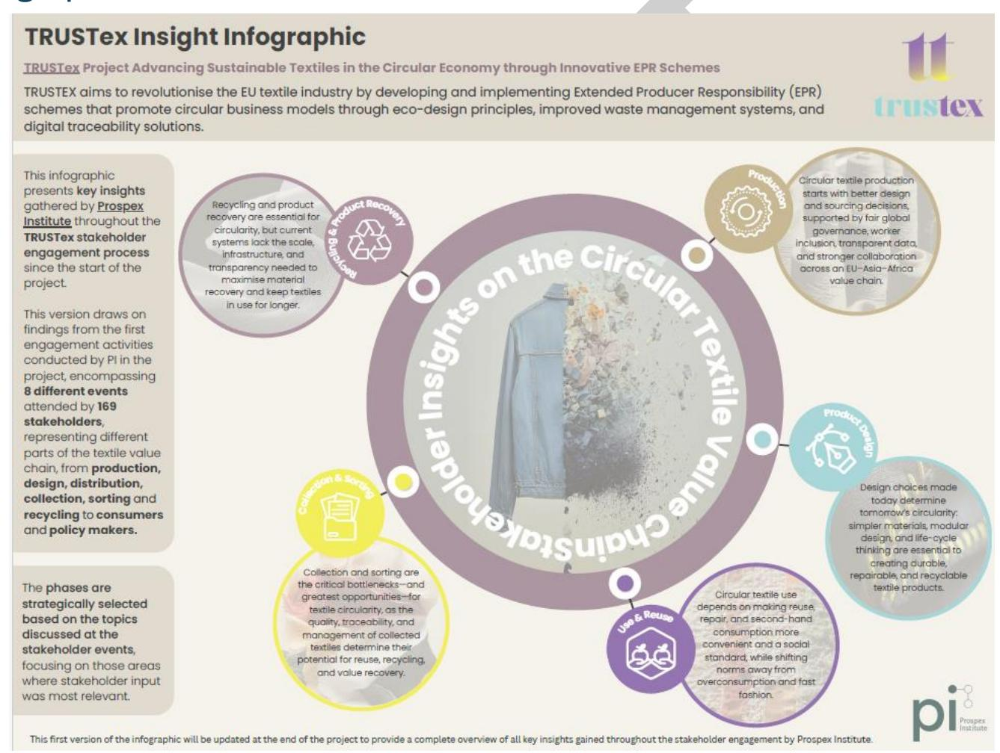

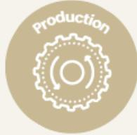

The Production phase covers stakeholder reflections on the early stages of the textile value chain and covers raw material extraction as well as textile and product manufacturing. It includes all processes required to produce and finish textile products, including mechanical, physicochemical, and chemical treatments. During the discussions stakeholders emphasised that improving resource efficiency at the earliest stages of the value chain is critical, as initial material choices strongly shape downstream outcomes, particularly due to their close interdependence with available recycling technologies.

### KEY CONSTRAINTS HIGHLIGHTED BY THE STAKEHOLDERS

- • Limited material availability constrains achievement of ecodesign ambitions.
- • Low product quality limits the potential of reuse and recycling with the growth of 'ultra fast fashion' and high volumes of production outpacing regulatory and circularity efforts.

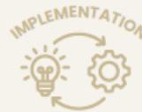

### STAKEHOLDER SUGGESTIONS FOR POSITIVE CHANGE

- • Strengthened trust and supplier relationships across the value chain could support the effective implementation of circular practices.
- • Reduced production volumes and resource consumption may contribute to advancing textile circularity.
- • Increased substitution of chemicals that hinder recycling processes, such as certain dyes, could improve the recyclability of textile products.

- • Poor labour conditions and limited access to collective bargaining create ethical challenges across the production sector.
- • Global transport networks and a misalignment between production, design, and recycling locations undermine the sustainability of textile production pathways.
- • Low wages in the Global South production countries, reinforced by brands' purchasing practices and pricing pressures.

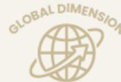

- • Greater incorporation of worker perspectives and participation could support more inclusive international production networks.
- • Expanding current textile material flow models to an EU/Asia/Africa framework may contribute to more balanced textile governance frameworks by aligning the location of production with the location of recycling.

- • Insufficient alignment across international regulatory frameworks for material production hinders effective governance.

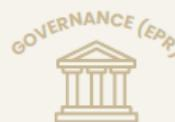

- • \*Further input on Extended Producer Responsibility (EPR) governance is expected to be gathered during future TRUSTex events and will be added in the final version.

- • Absence of a clear distinction between material manufacturing and product manufacturing limits traceability.

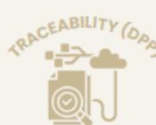

- • Harmonised data-sharing tools and standards could improve product traceability across the textile value chain.

### POSITIVE EXAMPLE

Comprehensive sourcing and manufacturing data are essential, including country-level Put-On-Market (POM) data disaggregated by product category, fibre type, and composition. The value of further segmentation by first point of collection and actor type (e.g. non-profit organisations) is being emphasised. Cost data covering each stage of the value chain is being highlighted as a priority to improve transparency and support evidence-based decision-making.

- • Consumers value quality, comfort, durability, and materials that remain functional over time.
- • Concerns about production transparency and working conditions influence perceptions of sustainability.
- • Trust in brand sustainability claims is generally low.
- • Consumers want simple, visual, and easy-to-understand product information (Digital Product Passport).
- • Trustworthy information is considered more important than large amounts of technical data.

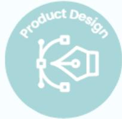

The Product Design phase covers the remaining pre-consumer stages of the value chain, product design and branding. Discussions focused on how to reduce product lifecycle impacts by integrating ecodesign principles within the product development.  
Stakeholders stressed that optimising product design is critical for the entire textile value chain, as even small choices in materials and design can have significant downstream implications for sorting and recycling.

**KEY CONSTRAINTS HIGHLIGHTED BY THE STAKEHOLDERS**

**STAKEHOLDER SUGGESTIONS FOR POSITIVE CHANGE**

- • Ecodesign principles often conflict with one another and require explicit prioritisation and trade-offs.
- • Ecodesign compromises that affect usability or aesthetics increase the risks of underuse or premature product disposal by the consumers.
- • High product costs limit incentives for companies for repair and reuse, reducing the economic attractiveness of circular consumption models.
- • Limited trust across supply chain actors and weak feedback loops between producers and recyclers constrain circularity.

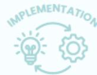

- • More 'systems-based' ecodesign approaches that integrate business models, warranties, and repair services could support strengthened product circularity.
- • Greater consideration of design for disassembly and modular design approaches may improve product repairability and recyclability.

- • End-of-life considerations are often overlooked during the design phase, as garments are developed in one region but disposed of in others with inadequate recycling infrastructure.
- • Large global brands show lower responsiveness to adapt to ecodesign principles compared to smaller, more agile local brands.

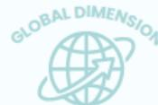

- • More standardised ecodesign criteria and consistent application beyond the EU could strengthen the implementation coherence of ecodesign frameworks.

- • Existing EPR schemes remain primarily waste-focused and fail to incentivise upstream design improvements.

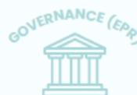

- • Greater emphasis on upstream incentives within Extended Producer Responsibility systems could support more circular product design.

- • Speed and usability limitations reduce the suitability of QR codes as standalone data carriers, while embedded digital chips raise concerns regarding e-waste, recoverability, cost, and loss of garment value.
- • Inconsistent Life Cycle Assessment (LCA) methodologies limit comparability across products and systems.

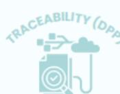

- • More harmonised and 'forward-looking' data systems could improve information availability on product flows, material composition, and product movement across the textile value chain.

**POSITIVE EXAMPLE**

The importance of simplifying material compositions to support circularity is emphasised. In particular, replacing conventional three-layer synthetic constructions with a two-layer system consisting of recycled wool and recycled polyester is identified as a promising approach to reducing material complexity without compromising performance. The exclusion of elastane, the use of 100% cotton with recycled content, and the preference for buttons over zips are further highlighted as design strategies that address trade-offs between comfort, repairability, and recyclability.

- • Consumers associate sustainable clothing with long product lifetimes, quality materials, and timeless design, but it is important to distinguish physical and emotional durability\*.
- • Clear information on durability, care, repair, and material composition is highly valued.
- • Confusing sustainability claims make it difficult to identify genuinely sustainable products.
- • Material composition, care instructions, repair guidance, product origin, and recycling information are prioritised (DPP).

\*Physical durability is the ability of a garment to maintain its function and appearance over time under use, washing, and care. It includes resistance to wear, as well as the durability of components like zips and buttons. It is also supported by good design for repair, maintenance, and, where possible, easy disassembly. Emotional durability refers to the emotional attachment a person feels toward a garment—how meaningful, desirable, and relevant it remains over time, encouraging continued use regardless of its physical condition.

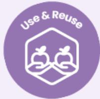

The Use & Reuse phase addresses the textile consumption and includes reuse activities such as repair, resale, gifting, and donation. These practices are considered preventative measures under the Waste Framework Directive and are distinct from recycling because they occur before textiles are classified as waste and enter the post-consumer collection and sorting system. Stakeholder discussions focused on consumer behaviour particularly concentrated on factors that enable or hinder the adoption of circular practices.

**KEY CONSTRAINTS HIGHLIGHTED BY THE STAKEHOLDERS**

- • Price barriers and limited consumer budgets reduce the uptake of sustainable, second-hand, and repair-based consumption options.
- • Limited awareness of textile impacts, disposal pathways, and circular practices constrains consumer participation in circular systems.
- • Time constraints, limited access to second-hand options, and insufficiently accessible collection systems reduce engagement in reuse and repair activities.
- • Emotional and aesthetic purchasing impulses frequently override considerations related to budget, necessity, or sustainability at the point of buying.
- • Psychological barriers associated with hygiene and uncertainty regarding previous ownership reduce acceptance of second-hand clothing, particularly among older generations.
- • Perceptions that damaged or intimate garments are unsuitable for donation contribute to their disposal through general waste streams.

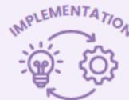

**STAKEHOLDER SUGGESTIONS FOR POSITIVE CHANGE**

- • Financial incentives such as repair vouchers, reduced VAT rates, reward systems, and subsidies could improve the affordability and attractiveness of circular consumption options.
- • Greater investment in consumer education on textile impacts, repair skills, maintenance practices, and circular solutions could support more sustainable consumption behaviours.
- • Increased accessibility and convenience of repair, reuse, collection, and take-back systems could strengthen consumer participation in circular textile systems.
- • Community-based approaches that foster human connection and emotional engagement could increase participation in take-back and collection schemes.

- • Fashion trends, advertising, and social media reinforce overconsumption and ultra/fast-fashion purchasing behaviours.
- • Social and cultural stigma surrounding second-hand clothing, particularly across different age groups, limits the acceptance of reuse practices.
- • Limited awareness of the social dimensions of textile production and the just transition weakens consumer engagement with global sustainability challenges.

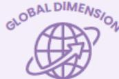

- • Greater normalisation of sustainable consumption practices through awareness campaigns and collaborative initiatives could help shift cultural norms away from fast-fashion consumption.
- • Increased communication of the environmental and social impacts of textile production and consumption could strengthen consumer engagement with global sustainability challenges.

- • Consumers have limited understanding of Extended Producer Responsibility systems and how related fees contribute to textile circularity.
- • Communication gaps between public authorities, collection operators, and citizens reduce participation in textile collection and reuse schemes.
- • Consumers show limited willingness to pay for additional lifecycle services, such as inclusion of repair kits or repair vouchers at the point of purchase.

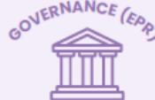

- • Extended Producer Responsibility schemes could support consumer education, awareness-raising activities, and incentives for participation in textile collection and reuse systems.
- • Greater transparency regarding the use of EPR funds and stronger inclusion of consumer perspectives in decision-making processes could improve public trust and engagement.
- • Stronger policy measures addressing systemic drivers of overconsumption could support the transition towards more circular textile systems.

- • Limited trust in sustainability claims, labels, and product information reduces consumer confidence in making informed purchasing decisions.
- • Insufficient transparency regarding the destination and treatment of collected textiles undermines trust in circular systems.
- • Complex or inconsistent information systems reduce the accessibility and usability of product traceability information for consumers.
- • QR codes and detailed product information seem to have limited influence on consumer behaviour that is primarily driven by aesthetics and convenience.

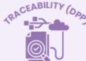

- • Clear, standardised, and accessible product information could improve consumer understanding of environmental impacts and support informed purchasing decisions.
- • Greater transparency regarding product origin, production conditions, environmental impacts, care instructions, and end-of-life pathways could strengthen trust in circular textile systems.
- • Simplified visual indicators could improve consumer understanding and usability of complex supply chain information.

**POSITIVE EXAMPLE**

The widespread adoption of second-hand purchasing is highlighted, particularly due to its affordability and the opportunity to access unique products. Repair is generally viewed positively, although its uptake was found to be strongly influenced by cost and convenience considerations. It should also be noted that consumers frequently extend garment lifetimes through reuse, repurposing, and informal repair practices.

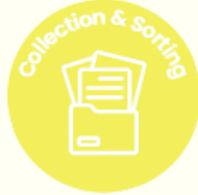

The **Collection & Sorting** phase represents the first stage of the post-consumer value chain. Collection is defined as the point at which a consumer relinquishes ownership and the textile acquires waste status. This distinguishes it from reuse activities such as resale or donation. The capture or yield of collected textiles is not only about volumes, it is also about quality of collected textiles. Sorting refers to the categorisation of collected textiles to determine the most appropriate valorisation pathway. Stakeholder feedback in this area identified collection and sorting as both the biggest bottlenecks and as the areas with the biggest opportunity for improving circularity.

**KEY CONSTRAINTS HIGHLIGHTED BY THE STAKEHOLDERS**

**STAKEHOLDER SUGGESTIONS FOR POSITIVE CHANGE**

- • Poor maintenance of clean and dry collection conditions limits material quality and recovery potential.
- • Limited or no demand for certain collected materials.
- • Limited scalability of technological solutions for sustainable processes often derives from high energy costs and insufficiently supportive policy frameworks.

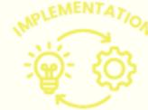

- • More diversified collection methods could support textile collection performance across local collection systems.
- • Clearer allocation of responsibility for the removal of zippers, trims, and non-textile elements may support the consistency of operational frameworks across sorting systems.
- • Increased implementation of human-led sorting at collection hubs could reduce contamination and improve sorting efficiency.

- • Weak collection systems in parts of Africa, combined with the concentration of textile sorting outside the EU, create a mismatch in global feedstock availability.
- • Misclassification of textiles as waste and unclear communication on export flows reduce recycling opportunities in partner countries such as India and Bangladesh.

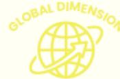

- • Greater prioritisation of clear communication may improve consumers' understanding of where their donations go, particularly when textiles are exported beyond Europe.

- • \*Further input on Extended Producer Responsibility (EPR) governance is expected to be gathered during future TRUSTex events and will be added in the final version.

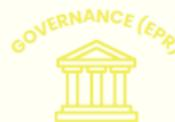

- • More explicit inclusion of upcycling pathways within collection and sorting systems could support the circular use of materials across textile systems.
- • Extended Producer Responsibility schemes could fund repair vouchers, swap shops, and reward systems to improve correct disposal practices amongst consumers.

- • Location traceability within Digital Product Passports remains unresolved and contested.
- • Limited accuracy and ability to apply fibre composition data at a large scale constrains reliable traceability across global textile value chains.

- • Greater use of item-level identification, including tracking fibre origin, colour, brand, and repair history, could strengthen traceability across textile value chains.
- • Increased use of applications to map donation points and sensors for detecting full containers may improve collection system efficiency.

**POSITIVE EXAMPLE**

There are several innovative public-private collaboration and context-specific solutions for textile waste collection in Finland, Sweden, Denmark, and the Netherlands including street containers, door-to-door collection, indoor bins, and ID-based collection systems.

- • Textile containers and charity-based collection systems are the most trusted collection options.
- • Convenience, accessibility, and transparency are critical for participation of consumers in the circular textile system.
- • Consumers want clearer information on what happens to donated textiles after collection.

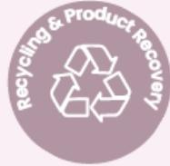

**The Recycling & Product Recovery** phase covers the handling of textile waste after collection and sorting. It includes recycling processes that convert textiles into secondary materials, either for reuse within the textile sector (closed-loop) or for other applications (open-loop). This phase also sits alongside the share of textile waste that is not recovered and instead ends up in landfills or incineration. Stakeholder discussions highlighted that extending garment lifetimes remains a systemic challenge as current recycling systems lack the scale and efficiency needed to enable full circularity

**KEY CONSTRAINTS HIGHLIGHTED BY THE STAKEHOLDERS**

**STAKEHOLDER SUGGESTIONS FOR POSITIVE CHANGE**

- • Insufficient collection infrastructure and contamination within the waste stream lead to the disposal of reusable clothing.
- • Declining quality of textiles entering the recycling cycle (ultra/fast fashion) reduces revenues from second-hand sales and limits the ability of recyclers to cover rising operational costs.
- • Fragmented recovery solutions are often limited to specific brands and lack accurate end-of-life tracking.

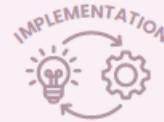

- • As per the waste hierarchy in the Waste Framework Directive, greater prioritisation of reuse and repair pathways may support more environmentally and economically efficient circular strategies.

- • Uneven regulatory conditions allow online marketplaces operating outside European jurisdiction to bypass circularity standards.

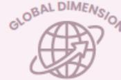

- • Greater inclusion of African and Asian stakeholders in EU policy discussions could support more inclusive governance approaches.
- • Increased recognition of the role of informal sellers, repairers, and recyclers in Africa and Asia may strengthen textile circularity outcomes.
- • More consistent application of end-of-life liability requirements to textiles globally could strengthen accountability across international textile markets.

- • \*Further input on Extended Producer Responsibility (EPR) governance is expected to be gathered during future TRUSTex events and will be added in the final version.

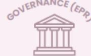

- • Considerations for mandatory recycling targets for clothing could strengthen circular material recovery.
- • Increased development of European recycling capacity may support recycling performance within EU circular economy frameworks.

- • Methodological limitations hinder verification that recycled products are correctly attributed to waste-derived inputs.

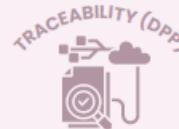

- • Clear differentiation between standard recycling and fibre-to-fibre recycling could improve transparency and traceability across recycling systems.
- • Greater availability of information on the origin of textile waste and the timing of exports could strengthen monitoring and accountability.

**POSITIVE EXAMPLE**

Reuse creates jobs across global value chains. According to GUCDA, Ghana's second-hand clothing sector supports around 2.5 million livelihoods and generates USD 29.5 million in import tax revenue, with less than 5% of imports considered waste. In Mozambique, every tonne of second-hand clothing creates 7.8 jobs, supporting at least 288,000 workers and over 1 million livelihoods (Current Status of Mozambique's Second-Hand Clothing Market: Opportunities and Challenges, 2025). Oxford Economics further estimates that the second-hand clothing trade supports 110,000 jobs in the EU27+ and generates employment for 43,000 informal workers in Ghana, 68,000 in Kenya, and 15,000 in Mozambique.

- • Consumers prefer reuse and repair over disposal whenever possible.
- • Confidence in recycling systems depends on understanding how collected textiles are processed and recovered.
- • Greater visibility of recycling outcomes could strengthen participation in circular systems.