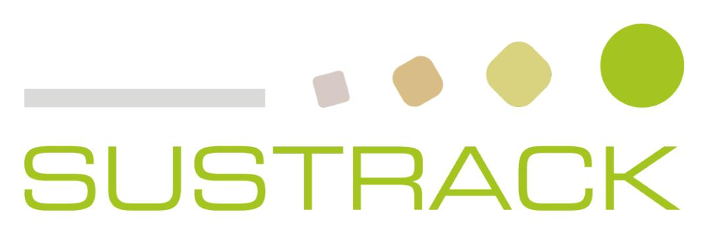
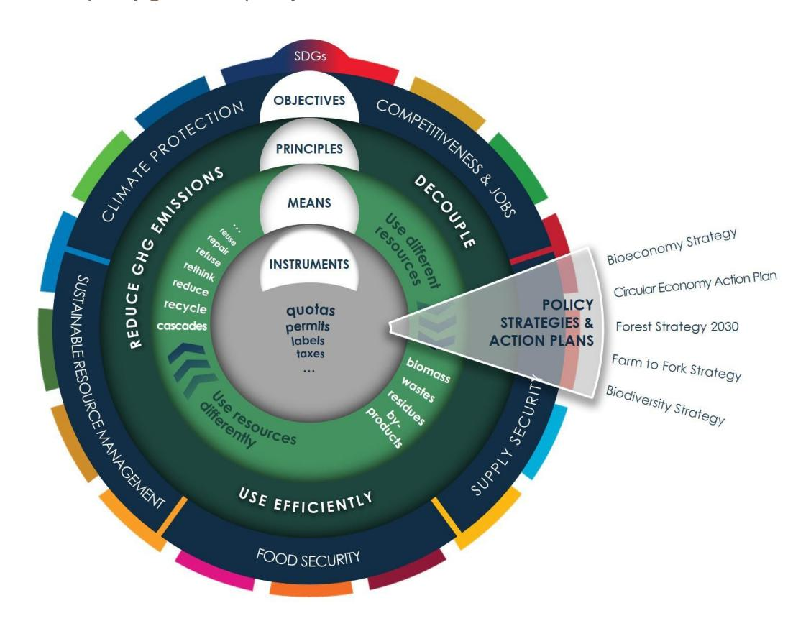
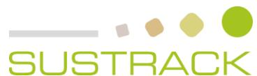
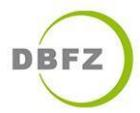

**D5.1 – MID-TERM POLICY BRIEF: POLICY PRIORITIES TO SUPPORT THE SUSTAINABLE TRANSITION AND EXAMPLES OF GOOD POLICIES**

the sustainable transition and examples of good policies

| Work package     | WP5 Identification of policy priorities and support for policy design      |
|------------------|----------------------------------------------------------------------------|
| Task             | T5.1 Identification of policy priorities and definition of policy actions  |
| Due date         | 30.04.2024                                                                 |
| Submission date  | 30.04.2024                                                                 |
| Deliverable lead | Wageningen Research                                                        |
| Version          | V2.0                                                                       |
| Authors          | Berien Elbersen (WR) & Harry Schindler (DBFZ)                              |
| Contributors     | Gülşah Yilan , Ilenia Manetti, Eleonora Staffieri (UNIT), Marco Bianchi    |
|                  | (Tecnalia), Luana Ladu (BAM), Mariam Rasheed (BAM), Laura Garc í a Laverde |
|                  | (DBFZ), Valentina Vassori (FVA), Pierre Menger (TEC), Andrea Bassi (KE)    |
| Reviewers        | All partners                                                               |

### **Document Revision History**

| 1.0 | 19.04.2024 | Draft version distributed for partners' input | WR |
|-----|------------|-----------------------------------------------|----|
| 2.0 | 30.04.2024 | Final version submitted                       | WR |

#### **Abstract**

The transition from linear fossil-based systems to circular and bio-based systems represents an opportunity and a suitable pathway for achieving several SDGs. Indeed, circular bio-based systems depict a great opportunity to reconcile sustainable long-term growth with environmental protection through the prudent use of renewable resources for industrial purposes. This needed transition is a complex process, which does not simply require innovative technologies from the supply-side, but also societal transformations based on a multi-actor process. The circular bioeconomy meta-sector may be a good candidate to put forward a new economic model, which requires transformative policies, purposeful innovation, access to finance, risk-taking capacity as well as new and sustainable business models and markets. However, a critical assessment of the environmental, social and economic impacts of the current linear fossil-based economy, as well as of the improvement potential associated with circular bio-based systems, is needed to underpin the identification of policy priorities. Bearing this in mind, SUSTRACK is a three-year project aimed at supporting policymakers in their efforts to develop sustainable pathways to replace fossil and carbon-intensive systems with sustainable circular and bio-based systems (at the EU and regional scale), contributing to achieving the European Green Deal's objectives. This will be done by: identifying environmental, economic and social limits of a linear carbon-intensive and fossil-based economy; improving existing assessment methodologies; assessing the environmental, social and economic impacts of the EU's current linear fossil-based economy; comparing multiple transition scenarios focusing on the most carbon intensive sectors; identifying priorities according to scenarios analysed in the project and develop guidelines and policy recommendations.

### **Disclaimer**

Funded by the European Union under project number 101081823. Views and opinions expressed are however those of the author(s) only and do not necessarily reflect those of the European Union or European Research Executive Agency (REA). Neither the European Union nor the granting authority can be held responsible for them.

**Copyright notice:** © 2022 - 2025 SUSTRACK Consortium

the sustainable transition and examples of good policies

\* R: Document, report (excluding the periodic and final reports)

DEM: Demonstrator, pilot, prototype, plan designs

DEC: Websites, patents filing, press & media actions, videos, etc.

OTHER: Software, technical diagram, etc.

### **SUSTRACK Consortium:**

| #  | Participant Organisation Name            | Short Name                                 | Country |
|----|------------------------------------------|--------------------------------------------|---------|
| 1  | UNIVERSITÀ                               | DEGLI STUDI DI ROMA UNITELMA SAPIENZA UNIT | IT      |
| 2  | STICHTING WAGENINGEN RESEARCH            | WR                                         | NL      |
| 3  | KNOWLEDGE SRL                            | KE                                         | IT      |
| 4  | PEDAL CONSULTING SRO                     | PC                                         | SK      |
| 5  | DBFZ DEUTSCHES BIOMASSEFORSCHUNGSZENTRUM |                                            |         |
|    | GEMEINNÜTZIGE GMBH                       |                                            |         |
|    |                                          | DBFZ                                       | DE      |
| 6  | UNIVERSITEIT GENT                        | UGENT                                      | BE      |
| 7  | FUNDACION TECNALIA RESEARCH & INNOVATION | TECNALIA                                   | ES      |
| 8  | FVA SAS DI LOUIS FERRINI & C             | FVA                                        | IT      |
| 9  | UNIVERSITÀ DEGLI STUDI DI FERRARA        | UNIFE                                      | IT      |
| 10 | BUNDESANSTALT FÜR                        | MATERIALFORSCHUNG UND -                    |         |
|    |                                          | BAM                                        | DE      |
| 11 | FUNDACION CIRCE CENTRO DE INVESTIGACIÓN  | DE                                         |         |
|    |                                          | CIRCE                                      | ES      |

|                            | Deliverable information                                                   |
|----------------------------|---------------------------------------------------------------------------|
| Nature of the deliverable: | R* Dissemination Level                                                    |
| PU                         | Public, fully open, e.g. web x                                            |
| CL                         | Classified, information as referred to in Commission Decision 2001/844/EC |
| CO                         | Confidential to SUSTRACK project and Commission Services                  |

## **EXECUTIVE SUMMARY**

The goal of achieving net-zero emissions European economy by 2050 demands a shift from linear, fossil-based systems to circular, bio-based systems. This transition is complex and relies on transitions in many fields which need to be supported by new and adapted policies that particularly align with the European Green Deal.

This policy brief, part of SUSTRACK Task 5.1, discusses which barriers exist that need to be addressed through new policies and policy improvements to support the transitioning to a Circular Biobased Economy (CBBE). It summarises what the limitations are of the linear fossil-based economy, it then discusses how it has become embedded in the EU policy. In the last sections the current barriers are highlighted in relation to the transition to a CBBE to provide an understanding where the policy opportunities lie to tackle these barriers. At the end it presents the approach as to how in SUSTRACK policy opportunities are to be identified that address the different barriers of transition to a CBBE.

# **TABLE OF CONTENTS**

| 1. Introduction, goal and scope............................................................................ | 9                                                                                       |
|-------------------------------------------------------------------------------------------------------------|-----------------------------------------------------------------------------------------|
| 2. Limits of the linear fossil-based economy and need for transition...............................10       |                                                                                         |
| 3. Policy background and working definition of Circular Bio-based Economy (CBBE).............14             |                                                                                         |
| 3.1 Policy background                                                                                       | .....................................................................................14 |
| 4. Barriers for a transition towards a circular bio-based economy                                           | ..................................18                                                    |
| 5. Our way forward to identify policy solutionS to transition to a circular bio-based economy               | 21                                                                                      |
| Annex I: Reviewed definitions                                                                               | ............................................................................26          |

the sustainable transition and examples of good policies

### **LIST OF FIGURES**

[Figure 1: SUSTRACK working definition of the Circular Bio-Based Economy \(CBBE\)](#page-14-0) 15

### **LIST OF TABLES**

Table 1. Categories and definitions used in the literature analysis step 10

*Table 2. Clusters of barriers and their definition* 18

Table 3. *Framework for review of existing policy instruments and policy gaps 23*

the sustainable transition and examples of good policies

|                      | List of Abbreviations                                     |
|----------------------|-----------------------------------------------------------|
| Abbreviation/Acronym | Description                                               |
| CBBE                 | Circular Bio-based economy                                |
| CO 2                 | Carbon dioxide                                            |
| EEB                  | European Environmental Bureau                             |
| EGD                  | European Green Deal                                       |
| EoL                  | end-of-life                                               |
| EPR                  | Environmental Product Responsibility                      |
| ESIF                 | European Structural And Investment Funds                  |
| ETS                  | Emissions Trading System                                  |
| EU                   | European Union                                            |
| GDP                  | gross domestic product                                    |
| GHG                  | greenhouse gas                                            |
| MSW                  | Municipal solid waste                                     |
| NGO                  | Non-governmental organization                             |
| OECD                 | The Organization for Economic Cooperation and Development |
| PC                   | Polycarbonate                                             |
| PEF                  | Polyethylene Furanoate                                    |
| PLA                  | Polylactic Acid                                           |
| RED                  | Renewable Energy Directive                                |
| ROI                  | return on investment                                      |
| SDG                  | Sustainable Development Goal                              |
| SME                  | small and medium-sized enterprise                         |
| SUP                  | single-use plastic products                               |
| SUPD                 | Single-Use Plastic Directive                              |
| WHO                  | World Health Organization                                 |
| WP                   | Work Package                                              |

## **1. INTRODUCTION, GOAL AND SCOPE**

The goal of achieving a net-zero emissions European economy by 2050 demands a shift from linear, fossil-based systems to circular, bio-based systems. This transition is complex and relies on changes in many sectors, which need to be supported by new and adapted policies, aligning particularly with the European Green Deal.

This policy brief, part of SUSTRACK Task 5.1, identifies and discusses existing barriers that need to be addressed by new policies and policy improvements to support the transition to a circular bio-based economy. The policy brief first briefly summarises what the limitations are of the linear fossil-based economy and why transitioning to a more circular bio-based economy is needed. The next section then discusses how we can define the circular bio-based economy (CBBE) and how it has become embedded in the EU policy as a concept of reaching climate neutrality and more sustainability in all sectors of the EU economy and society.

In the third chapter the current barriers are highlighted in relation to the transition to a CBBE in order to provide an understanding where the policy opportunities lie to tackle these barriers. Finally, the report presents a section discussing how to identify and further develop policy opportunities within SUSTRACK that can address the various barriers to the transition and help accelerate the process towards climate neutrality and sustainability in the EU regions.

## **2. LIMITS OF THE LINEAR FOSSIL-BASED ECONOMY AND NEED FOR TRANSITION**

In WP1 of SUSTRACK, a comprehensive overview of the large number of limits of the current linear, carbon-intensive and fossil-based economy has already been provided, based on a literature review[7]. These were grouped into environmental, economic, social and cultural limits and other limits that do not fit directly into any of the aforementioned categories. These boundaries have been made more specific to the four selected sectors addressed in the project, namely the chemical, construction, plastics and textile sectors (see [Table 1\)](#page-9-1).

By "limits", WP1 refers to specific aspects, processes or conditions of the current linear economy that are constraining sustainable development and can be viewed as arguments for characterising the continuation of the business as usual as an unsustainable option.

*Table 1 Summary overview of the limits of the linear fossil based economy as described in SUSTRACK WP1 [7]*

| Sector | Summary of limit                                               |
|--------|----------------------------------------------------------------|
| All ●  | The way natural resources are currently extracted and          |
| ●      | Our planet is limited in its ability to produce resources and  |
| ●      | The global material footprint already exceeds ecological       |
| ●      | By crossing the planetary tipping points, we run the risk of   |
|        | “locking us into self -perpetuating climate change, i.e.,      |
| ●      | The linear take-make-waste paradigm significantly              |
| ●      | The large and principle use of fossil resources in this sector |
| ●      | The chemical industry's combined production and Scope 3        |
| ●      | Chemical industry's growth is incompatible with planetary      |
| ●      | Construction is one of the most carbon-intensive sectors       |
| ●      | Impacts are associated with the mining of metals, (e.g. iron   |

| Sector   | Summary of limit                                                |
|----------|-----------------------------------------------------------------|
| ●        | High steel demand of the sector. The largest individual         |
| ●        | Glass used in the construction sector also has high             |
| ●        | Energy inefficiency of the building stock is due to many        |
| ●        | Majority of plastics in use today are virgin plastics made from |
| ●        | Since 1970 global consumption of plastics has increased more    |
| ●        | Plastic waste amounts to 353 million tonnes of this 9% was      |
|          | dumpsites, burned in open pits, or leaked into the              |
| ●        | Global stocks of plastics accumulated in rivers reach 109       |
| ●        | Microplastics in ecosystems and humans have large negative      |
| ●        | Some plastics are intrinsically toxic                           |
| sector ● | GHG emissions from textile production are estimated at 1200     |
|          | million tonnes of CO 2 eq, and the fashion industry contributes |
| ●        | Textile and fashion sector is responsible for significant water |
| ●        | At least 35% of microplastics in our oceans, drinking water,    |
| ●        | Most textiles and fashion are still made of fossil resources    |
| ●        | Most textiles end up in landfill and are not recycled and       |
| General  | OECD estimates that the global consumption of resources         |
| ●        | Material use may outpace population growth in high-income       |
| ●        | The limited availability of fossils will cause multiple and     |

| Sector                     | Summary of limit                                               |
|----------------------------|----------------------------------------------------------------|
| ●                          | In building the vast majority of investment continues to flow  |
| ●                          | In cement sector reinvestment is made in existing              |
|                            | accrued risk of locking in CO 2 emissions, missing out on CO 2 |
| ●                          | Plastic is either landfilled or incinerated – representing     |
|                            | around €35 -55 billion of material value annually              |
| ●                          | Economic costs of loss of marine ecosystem services because    |
| ●                          | Single Use Products (SUPs) impose significant costs on         |
| ●                          | Profit margins of the world’s leading apparel retailers        |
| ●                          | In line with overproduction/ overconsumption, the cost of      |
| ●                          | Unbalanced reliance of fossil resources available in a limited |
| All sectors ●              | Main limits of the chemical sector are on the consumer side,   |
| ●                          | The traditional take-make-waste approach to construction       |
| ●                          | The current regulatory and policy framework, which often       |
| ●                          | Plastic waste trade creates considerable harm to society,      |
| ●                          | In fashion there is an over consumption and fast fashion leads |
| ●                          | In textile/fashion industry social conditions are very bad.    |
| Other limits All sectors ● | Energy intensity of our living conditions and in energy        |

If we link all the limits presented in [Table 1](#page-9-1) to the policy context it is important to understand that most of the current regulatory and policy framework still favour linear and fossil based production activities. This implies that numerous regulations and policies may need to be updated to support circular practices such as incentivising the use of recycled materials, discourage waste disposal, encourage waste separation ([9]. Several studies analysed previous research

the sustainable transition and examples of good policies

activities of the project highlighted that existing resource related policies mostly emphasised efficient use of resources, instead of reducing resource demand [10].

## **3. POLICY BACKGROUND AND WORKING DEFINITION OF CIRCULAR BIO-BASED ECONOMY (CBBE)**

## **3.1 Policy background**

Over the past decade, the European Union has endorsed the concepts of circularity and bioeconomy to stimulate goals such as climate neutrality and sustainable resource use. In 2013, circularity was introduced in the 7th Environment Action Plan [11]. According to this Plan, 'o*ur prosperity and healthy environment stem from an innovative, circular economy where nothing is wasted and where natural resources are managed sustainably, and biodiversity is protected, valued and restored in ways that enhance our society's resilience'*. In 2015, the EC adopted the 'Closing the loop: an EU action plan for a circular economy', with the main objective of a 'transition to a more circular economy, where the value of products, materials and resources is maintained in the economy for as long as possible, and the generation of waste minimised'.

The bioeconomy concept was embedded in the Bioeconomy Strategy, launched by the European Commission in 2012 and updated in 2018 [14]. This update states that, '*to be successful, the European bioeconomy needs to have circularity at its heart and it is necessary to go beyond carbon neutrality. This will drive the renewal of our industries, the modernisation of our primary production systems, the protection of the environment and will enhance biodiversity*'.

As the ultimate goal of both 'bioeconomy' and 'circularity' is to accelerate progress towards climate neutrality and sustainability, the current EC ambitions described above are fundamentally linked. As the Ellen MacArthur foundation declares : 'The circular economy is a systems solution framework that tackles global challenges like climate change, biodiversity loss, waste, and pollution'. This also involves the decoupling from a dependency on non-renewable resources' [12]. This may be achieved through the recycling of these non-renewable resources and a shift away from the finite and greenhouse gas emitting fossil resources towards bio-based renewable resources. Improving the circular use of such biomass and biomaterials as well would be beneficial to the sustainability of the economy [13]. The coupled concepts of bioeconomy and circularity have also been further elaborated in three very recent EU strategies such as: the 2018 update of the Bioeconomy Strategy, the Green Deal and the New Circular Economy Action plan 'For a Cleaner and more competitive Europe' published in March 2020, also in relation to the sustainable development goals (SDGs) all EU policies should contribute to.

## **3.2 SUSTRACK Working Definition**

The CBBE is an abstract and notoriously fuzzy concept also because it is still in an early stage. Many different visions and expectations can be found in the literature. To make progress in the transformation towards a CBBE, a clear definition is needed. This will help to navigate through the many policies and policy options that are related to the transformation challenge. It is also necessary to have a common understanding of the goals for effectively discussing policy options with experts and stakeholders.

There are already hundreds of definitions related to the concepts of Bioeconomy, Circular Economy or Circular Bio-Based Economy [1]. For the purpose of SUSTRACK and its focus on identifying policy priorities, a working definition was synthesised from 17 definitions found in the scientific literature and policy documents (Annex I). A key challenge was to avoid overlapping elements to provide a clear basis for subsequent analyses. For example, recycling or cascading use may refer to aspects of efficient resource use. Analysing policies while assuming that these elements are on the same level of analysis can easily lead to confusion or redundancy.

Therefore, a multi-layered working definition was created, which is illustrated in [Figure 1.](#page-14-0) The multi-colored and blue layers represent goals and objectives of the CBBE. The UN Sustainable Development Goals (SDGs) can be seen as an overarching **goal** structure (external segment in the figure). According to Kirchherr et al. [1], concepts such as the circular economy serve to support the implementation of the SDGs, which are often too complex to be directly translated into policies. As the CBBE obviously focuses on some SDGs more than others, an additional **objectives**  layer highlights key goals (layer "objectives"). These either directly represent SDGs (e.g., SDG2 food security) or can be understood as intermediate goals that contribute to SDGs. For example, supply security can contribute to SDGs such as food security, affordable and clean energy or decent work and economic growth. The common denominator of these objectives is a focus on resource use. They are taken from the EU Bioeconomy Strategy to build on the existing political consensus in this regard. Circular Economy objectives, as politically defined in the EU Circular Economy Action Plan [2], such as contributing to climate neutrality or decoupling economic growth from resource use, are either covered by the SDGs, bioeconomy objectives or relate to intermediate elements between policy goals and policy instruments.

*Figure 1 SUSTRACK working definition of the Circular Bio-Based Economy (CBBE)*

These intermediate elements are shown on the second and third layer ("Principles" and "Means" layers). They point to specific ways of achieving the goals and objectives, but are not implementable policies yet. These elements have been selected according to the frequency with which they are mentioned in the reviewed definitions. For better orientation, the intermediate elements are divided into overarching policy principles and subordinated policy means.

**Principles firstly** include the reduction of greenhouse gas (GHG) emissions, which is useful to narrow the policy focus. The CBBE is not a panacea for all sustainability challenges, but it clearly contributes to an economy with net-zero GHG emissions. This also requires a consideration of GHG emissions or emissions savings related to biomass and land use in a society that increasingly relies on using biomass. While it can be argued that all biomass-related challenges, such as sustainable agriculture and food security policies, are part of the CBBE transition, SUSTRACK emphasises the focus on substituting fossil resources and a climate-friendly biomass use, as this helps to find solutions to remaining policy gaps and avoids copying existing policy agendas. With regard to fossil resources, this also implies a focus on the substitution of resources for material uses, rather than energy uses, to avoid replicating already developed climate policy solutions in the energy sector.

The **second** principle, resource use efficiency, contributes to the CBBE objectives in at least three important ways. First, efficient resource use reduces the overall costs of the transformation and thus contributes to the acceptance of transformative policies. Second, efficient resource use contributes to environmental goals by reducing pressures of the bio-based parts of the economy on nature, because efficiency implies minimising the resources that are necessary to satisfy a given demand, and all related environmental damages from resource cultivation or extraction. Third, the principle of resource use efficiency can provide guidance for dealing with contradictions and trade-offs between different CBBE objectives. For example, carbon recycling can help to reduce GHG emissions, but the amount of energy and chemicals required in recycling processes imply possible trade-offs with energy- or environmental targets [3, 4]. The efficiency criterion can be used to guide an appropriate level of recycling by balancing the benefits and (resource) costs of these processes [5].

The **third** principle, decoupling resource use from economic growth, ensures that resource efficiency and emissions reduction effectively contribute to limiting resource consumption and pollution [e.g., 9]. It specifically addresses objectives such as sustainable resource management and supply security. The decoupling principle accounts for the challenge that, even with increased resource efficiency and a phase-out of fossil fuels, resource depletion and pollution still could reach problematic proportions, for example in the form of biodiversity losses or a shortage of critical raw materials. While concepts like "green growth" include hopes of reaching decoupling simply by increasing efficiency, empirical evidence does not provide broad support for this thesis so far [9, 10]. In general, the efficiency principle is more about optimising the use of a given amount of resources, and does not necessarily limit the total quantity of resource extraction, required imports or pollution. For example, increasing resource efficiency through more recycling may well reduce the amount of virgin resources required to produce a single product. However, in regard to the entire economy and the related total resource consumption, even high degrees of (resource efficient) recycling can be associated with a growing demand for primary resources [6]. Possible reasons include that increasing demand for production inputs from economic growth outpaces the growing supply of recycled (secondary) materials. Another reason could be that recycling processes themselves require a growing amount of primary resources as input. Consequently, recycling or other efficiency-related measures may not be sufficient to reduce import dependencies of a growing economy. Second, in regard to decoupling economic growth and pollution or environmental degradation, simply substituting the current levels of fossil resource use with biomass, according to principle 1, might lead to (or aggravate) unsustainable levels of natural capital consumption (e.g., biodiversity loss). While traditional environmental and climate policies already address this second challenge to some extent, the frequent mentions of decoupling in CBBE related documents reveal that it is often considered necessary to include increased efforts or additional policy tools to limit overall resource consumption and pollution in a CBBE policy agenda.

Finally, linking these still rather abstract policy principles to specific **means** can further help to move closer to identifying actionable policy instruments for the CBBE. While broad principles such as decoupling are challenging to translate into specific policies, **means** refer to technological, economic or social practices that can be directly addressed with policy instruments such as quotas, taxes or subsidies etc. Key means pointed out in the scientific literature and policy documents include the use of biomass and wastes, residues or by-products as well as cascading use and R's (recycling, reuse, rethink etc.). These elements can be summarised as "use different resources" (e.g., biomass instead of fossil resources) and "use resources differently" (e.g., use a resource multiple times in cascades instead of discarding it after single use). SUSTRACK will review existing policy instruments according to these principles and means. This will help to structure the complex policy challenge and identify remaining policy gaps.

## **4. BARRIERS FOR A TRANSITION TOWARDS A CIRCULAR BIO-BASED ECONOMY**

In SUSTRACK WP1, an extensive literature review of almost 200 sources was carried out to identify barriers for transitioning towards a CBBE [7,8]. A barrier was broadly defined according to Oxford Learners Dictionary as "a problem, rule or situation that prevents somebody from doing something, or that makes something impossible". The barriers identified in the literature were classified into the following six clusters: technical, structural, economic, cultural, environmental and governance/policy barriers.

In total, more than 200 barriers were identified, clustered and condensed with the help of focus group discussions, expert interviews and an EU-wide survey. As for technology barriers, these were often related to processing or other manufacturing challenges, such as the increasing complexity of materials and their combinations, which hinder processes such as recycling. Immature technologies and limited production capacities are additional obstacles. However, there are many other barriers beyond the technological dimension: Incentives are lacking, e.g., for producers to use secondary materials or for consumers to demand products in line with CBBE-principles. Investing in more circular and bio-based products often involves high costs and associated economic risks. Information and data are often missing or unreliable, e.g., on the recycled or biobased content of products. Inconsistent and unreliable policies inhibit necessary investments into circular business models, e.g., in the form of continued policy support for fossil fuels. Legal requirements, e.g., the classification of discarded materials as waste, are important to protect consumers and the environment, but often create significant obstacles to the reuse of these materials. Lack of stakeholder networks hampers the creation of new complex value chains or the reconfiguration of existing ones, as well as the important dissemination of innovative knowledge. Lack of adequate infrastructure, e.g., for separate waste collection and recycling, increases costs and thus reduces competitiveness of secondary materials. Vested interests in fossil-based and other industries of the current linear economy resist necessary changes that threaten their business models and associated profits. Finally, regarding the environment, the desired transformation carries a significant risk of an overuse of biomass, which threatens to violate related planetary boundaries. [Table 2](#page-17-1) provides a condensed list of the reviewed barriers.

### *Table 2 Barriers for a transition to a CBBE*

|   | Cultural barriers                                                                                                                   |
|---|-------------------------------------------------------------------------------------------------------------------------------------|
| 1 | Missing communication, misinformation, and disinformation                                                                           |
| 2 | Consumer confusion and lack of trust due to generic sustainability claims and the proliferation of certification schemes and labels |
| 3 | Low awareness and knowledge of bio-based products                                                                                   |
| 4 | Lack of incentives for consumer behaviour change Economic Barriers                                                                  |
| 5 | High investment costs and risks for establishing circular bio-based industries                                                      |
| 6 | Fluctuating prices and unstable supply of biomass and (processed) raw materials                                                     |
| 7 | Weak cost competitiveness: bio-based vs. fossil-based ingredients, materials or products                                            |
| 8 | Difficulties in reconciling economic growth with sustainable development                                                            |
| 9 | High operating costs: bio-based vs. fossil-based production                                                                         |

| 10 | Lack of funding and investment in End-of-Life (EoL) infrastructure and waste                |
|----|---------------------------------------------------------------------------------------------|
| 11 | Concerns over (local) biomass feedstock availability within the limits of carrying capacity |
| 12 | Lack of harmonised methods for environmental, climate and sustainability impact             |
| 13 | Lack of knowledge and data on impacts                                                       |
| 14 | Regulatory complexities and lack of support for the transition at government level          |
| 15 | Fragmented regulatory framework across European countries and at national/ regional        |
| 16 | Competing political interests with fossil-based industries (big lobbies etc.)               |
| 17 | Lack of alignment and consistency between different policies                                |
| 18 | Lack of market-based policies (e.g. subsidies or higher CO2 prices) to stimulate the        |
| 19 | Limited long-term policy reliability                                                        |
| 20 | Lack of supportive policy framework for product-related inner circles of the circular       |
| 21 | Legislative limitations for applications of materials when classified as waste58            |
| 22 | Lack of clarity around policy targets and trajectories                                      |
| 23 | Insufficiently ambitious targets and limited policy drivers                                 |
| 24 | Lack of harmonised waste collection systems and infrastructure                              |
| 25 | Lack of established markets and value chains for by-products                                |
| 26 | Low data accessibility and lack of transparency and traceability                            |
| 27 | Lack of value chain stakeholder collaboration (including information exchange)              |
| 28 | Social and technical lock-ins to the current linear system                                  |
| 29 | Lack of mid- and long-term impact assessment and decision-making                            |
| 30 | Incompatible and/or insufficient infrastructure capacity for EoL product collection,        |
| 31 | Increasing complexity of materials and their combination                                    |

The review shows that there are many barriers of different kinds in the process of changing the basic economic parameters of an economy, such as its resource base (increased use of biomass and secondary materials) and its mode of operation (from linear to circular). These barriers provide only a small preview of the transformation challenge. They will often vary according to the economic sector or business model considered, making the challenge highly complex. This complexity implies that a one-size-fits-all approach is not appropriate, nor is a patchwork the sustainable transition and examples of good policies

approach to addressing the multiple shortcomings of the linear fossil-based economy, as this risks contradictions and policy overload. Rather, systematic policy approaches need to be designed and tailored to specific sectors for maximum effectiveness.

## **5. OUR WAY FORWARD TO IDENTIFY POLICY SOLUTIONS TO TRANSITION TO A CIRCULAR BIO-BASED ECONOMY**

Within WP5, SUSTRACK will therefore identify how they barriers can be addressed by reviewing the different policy solutions that are already developed, but also by identifying policy gaps where instruments to overcome them are completely lacking.

Identifying systematic approaches also suggests asking which types of instruments are more likely than others to be effective in promoting change, and pointing out remaining policy gaps. To this end, SUSTRACK will collect existing policy instruments and, on this basis, identify patterns, blind spots and best practices for supporting the CBBE.

In a further step, the findings will be synthesised according to our review framework and used to draw conclusions for a policy agenda to accelerate the transition in the selected sectors.

As a first step, a framework for systematic review has been developed [\(Table 3\)](#page-22-0). This follows the CBBE definition as presented above. It enables us to systematically review and identify new policy instruments and policy needs in relation to:

- 1) CBBE **principles** which include firstly, reduction of greenhouse gas (GHG) emissions by decreasing and phasing out the use of fossil resources by using renewable resources, the most important of which is biomass; secondly, the principle of resource use efficiency; and thirdly, the decoupling of resource use from economic growth. These 3 principles can be used to describe the instrument and explain how it addresses one or more of these principles.
- 2) The CBBE means refer to the use of biomass and waste, residues or by-products as well as cascade use and R's (reuse,refuse, recycle, rethink, repair, etc.).
- 3) Providing solutions to overcome the previously identified barriers which include cultural, environmental, economic, governance, structural and technical ones.
- 4) Types of policy instruments.

In terms of policy instruments nature, the following 6 types can be distinguished (see [Table 3\)](#page-22-0):

- 1. Direct regulation a command and control approach using mandatory standards and licences that require people/companies/market actors to change their behaviour and penalise them if they are found to be non-compliant. Examples of direct regulatory instruments in the bioeconomy include quotas, mandates, product standards, targets (quotas addressing government/economic sectors), green procurement rules and permitting and zoning instruments (e.g. territorial instrument such as drink water protection area or Nitrogen sensitive area). We also include here eligibility criteria such as biomass sustainability criteria in the EU-Renewable Energy Directive.
- 2. Economic instruments includes all instruments that change incentives (taxes, subsidies), but also quantity restrictions ((tradable) quota, tariff rate quota), and charges. These instruments provide incentives for people to change their behaviour voluntarily (e.g. based on their own rational cost-benefit calculations). So it includes all instruments that leave the decision about resource uses in the hands of market participants while changing prices for using a resource. Price changes can be induced directly via taxes, fees, charges, subsidies etc. or indirectly via tradeable permits.
- 3. Voluntary approaches could include codes of good practice, self-regulation and other industry-led initiatives. Financial incentive schemes could be part of these instruments.

These approaches typically encourage rather than force people or companies to adopt the desired behaviour. The voluntary carbon market is an example.

- 4. Information and advice sharing systems or information instruments measure to raise awareness education and facilitate changes in behaviour.-
- 5. Market-based signalling approaches labelling, traceability, voluntary certification schemes and farm assurance schemes. These approaches are often related to informational problems (lack of information about product quality and food safety) hindering the proper functioning of markets;
- 6. Other measures/instruments not in the categories above such as platforms for collaboration, behavioural influencing instruments (e.g. to prevent nudging).

the sustainable transition and examples of good policies

#### *Table 3 Framework for review of existing policy instruments and policy gaps*

| No. | Policy |                           |                  |                       |                        |                         |                 |
|-----|--------|---------------------------|------------------|-----------------------|------------------------|-------------------------|-----------------|
|     |        |                           |                  | Timeframe             | Type of instrument     | What BARRIER            |                 |
|     |        |                           | regional - which |                       |                        |                         |                 |
|     |        |                           |                  | old, current, future/ | 1. Direct regulation   | 1.Lack of incentives    | 1. Plastics     |
|     |        |                           |                  | planned/proposed      | 2. Economic instrument | 2.Lack of information   | 2. Chemical     |
|     |        | recycle, rethink, , ...)  |                  |                       | 3.Voluntary approach   | 3.Lack of collaboration | 3. Construction |
|     |        | •Stimulate c ascading use |                  |                       | 4.Information & advice |                         |                 |
|     |        |                           |                  |                       |                        | readiness               | 4. Textiles     |
|     |        |                           |                  |                       |                        |                         | 5. All          |

## **References**

[1] Kirchherr et al. (2017): Conceptualizing the circular economy: An analysis of 114 definitions, Resources, Conservation & Recycling 127 (2017) 221–232, [https://www.sciencedirect.com/science/article/pii/S0921344917302835.](https://www.sciencedirect.com/science/article/pii/S0921344917302835) [2] European Commission (2020): A new Circular Economy Action Plan - For a cleaner and more competitive Europe, COM (2020) 98 final, [https://eur](https://eur-lex.europa.eu/resource.html?uri=cellar:9903b325-6388-11ea-b735-01aa75ed71a1.0017.02/DOC_1&format=PDF)[lex.europa.eu/resource.html?uri=cellar:9903b325-6388-11ea-b735-](https://eur-lex.europa.eu/resource.html?uri=cellar:9903b325-6388-11ea-b735-01aa75ed71a1.0017.02/DOC_1&format=PDF) [01aa75ed71a1.0017.02/DOC\\_1&format=PDF.](https://eur-lex.europa.eu/resource.html?uri=cellar:9903b325-6388-11ea-b735-01aa75ed71a1.0017.02/DOC_1&format=PDF) [3] Baumol, W. J. (1977): On recycling as a moot environmental issue, Journal of Environmental Economics and Management, 4-1, S. 83-87, [https://www.sciencedirect.com/science/article/pii/0095069677900171.](https://www.sciencedirect.com/science/article/pii/0095069677900171) [4] Tian, X.; Gao, W.; Liu, Y.; Xu, M. (2020): Secondary resource curse's formation and transmission mechanism based on environmental externality theory, Resources, Conservation and Recycling 161, 104958, [https://www.sciencedirect.com/science/article/pii/S0921344920302767.](https://www.sciencedirect.com/science/article/pii/S0921344920302767) [5] Kinnaman, T. C. (2014): Determining the socially optimal recycling rate, Resources, Conservation and Recycling 85, 5-10, [https://www.sciencedirect.com/science/article/pii/S0921344913002292.](https://www.sciencedirect.com/science/article/pii/S0921344913002292) [6] Bongers, A.; Casas, P. (2022): The circular economy and the optimal recycling rate: A macroeconomic approach, Ecological Economics 199 (2022) 107504, [https://www.sciencedirect.com/science/article/pii/S0921800922001665.](https://www.sciencedirect.com/science/article/pii/S0921800922001665) [7] Dace, E.; Cascavilla, A.; Yilan, G. (2023): D1.1 – REPORT ON LITERATURE GAPS AND TRADE-OFFS. SUSTRACK project GA No. 101081823. [8] Rasheed, M.; Ladu, L.; Yilan, G.; Mester, G.; Vavassori, V. (2023): D.1.2 - PRELIMINARY REPORT ON THE ENVIRONMENTAL, ECONOMIC, CULTURAL AND SOCIAL LIMITS OF THE LINEAR, CARBONINTENSIVE AND FOSSIL-BASED ECONOMY. SUSTRACK project GA No. 101081823. [9] The World Bank (2022). Squaring the Circle: Policies from Europe's Circular Economy Transition © World Bank. [10] Kalmykova, Y., Rosado, L., & Patrício, J. (2016). Resource consumption drivers and pathways to reduction: economy, policy and lifestyle impact on material flows at the national and urban scale. 132, 70-80. [11] European Commission (2013). 7th Environmental action plan. http://eur-lex.europa.eu/legalcontent/EN/TXT/?uri=CELEX:32013D1386 [12] Ellen Macarthur Foundation (2013). Towards the Circular Economy. https://www.ellenmacarthurfoundation.org/assets/downloads/publications/EllenMacArthur-

Foundation-Towards-the-Circular-Economy-vol.1.pdf

the sustainable transition and examples of good policies

[13] European Environmental Agency (2018) The circular economy and the bieconomy. Partners in sustainability. EEA report no.8/2018. ISSN 1977-8449. <https://www.eea.europa.eu/publications/circular-economy-and-bioeconomy>

[14] European Commission, Directorate-General for Research and Innovation, A sustainable bioeconomy for Europe – Strengthening the connection between economy, society and the environment – Updated bioeconomy strategy, Publications Office, 2018, https://data.europa.eu/doi/10.2777/792130

## **Annex I: Reviewed definitions**

Baldassarre, B. and Saveyn, H. G. M. (2023): A systematic analysis of EU publications on the circular economy, Publications Office of the European Union, Luxembourg, 2023, doi:10.2760/36203, JRC133158.

Brandão, A.S.; Gonçalves, A.; Santos, J.M.R.C.A. Circular Bioeconomy Strategies: From Scientific Research to Commercially Viable Products. J. Clean. Prod. 2021, 295, 126407.

Carus, M.; Dammer, L. (2018): The "Circular Bioeconomy"—Concepts, Opportunities and Limitations; Nova Paper #9 on Bio-Based Economy; Nova-Institut: Hurth, Germany.

Ellen MacArthur Foundation (2021): Circular Economy Glossary, [https://emf.thirdlight.com/file/24/BGMwzd\\_BG.iZsrLBGtqmBgvFbCK/%5BEN%5D%20Circular%20E](https://emf.thirdlight.com/file/24/BGMwzd_BG.iZsrLBGtqmBgvFbCK/%5BEN%5D%20Circular%20Economy%20Glossary%20%7C%2030-09-21.pdf) [conomy%20Glossary%20%7C%2030-09-21.pdf](https://emf.thirdlight.com/file/24/BGMwzd_BG.iZsrLBGtqmBgvFbCK/%5BEN%5D%20Circular%20Economy%20Glossary%20%7C%2030-09-21.pdf)

European Commission (2012): Innovating for Sustainable Growth. A Bioeconomy for Europe, [file:///C:/Users/hschindler/Downloads/innovating%20for%20sustainable%20growth](about:blank)[gp\\_eudor\\_WEB\\_KI3212262ENC\\_002.pdf.](about:blank)

European Commission (2015): Closing the loop - An EU action plan for the Circular Economy, [https://eur-lex.europa.eu/resource.html?uri=cellar:8a8ef5e8-99a0-11e5-b3b7-](https://eur-lex.europa.eu/resource.html?uri=cellar:8a8ef5e8-99a0-11e5-b3b7-01aa75ed71a1.0012.02/DOC_1&format=PDF) [01aa75ed71a1.0012.02/DOC\\_1&format=PDF.](https://eur-lex.europa.eu/resource.html?uri=cellar:8a8ef5e8-99a0-11e5-b3b7-01aa75ed71a1.0012.02/DOC_1&format=PDF)

European Commission (2018): A sustainable Bioeconomy for Europe: strengthening the connection between economy, society and the environment, [https://op.europa.eu/en/publication-detail/-](https://op.europa.eu/en/publication-detail/-/publication/edace3e3-e189-11e8-b690-01aa75ed71a1/language-en) [/publication/edace3e3-e189-11e8-b690-01aa75ed71a1/language-en.](https://op.europa.eu/en/publication-detail/-/publication/edace3e3-e189-11e8-b690-01aa75ed71a1/language-en)

Figge, F. (2023): Definitions of the circular economy: Circularity matters, Ecol Econ 208, 107823.

Fraunhofer-Gesellschaft (2022): Zirkuläre Bioökonomie für Deutschland, Eine Roadmap der Fraunhofer-Gesellschaft zur Umsetzung der Bioökonomie in Deutschland, [file:///C:/Users/hschindler/Downloads/Zirkulaere-Biooekonomie-fuer-Deutschland.pdf.](about:blank)

Hetemäki, L.; Hanewinkel, M.; Muys, B.; Ollikainen, M.; Palahí, M.; Trasobares, A. (2017): Leading the Way to a European Circular Bioeconomy Strategy; From Science to Policy 5; European Forest Institute, [https://efi.int/sites/default/files/files/publication-bank/2018/efi\\_fstp\\_5\\_2017.pdf.](https://efi.int/sites/default/files/files/publication-bank/2018/efi_fstp_5_2017.pdf)

Kirchherr et al. (2017): Conceptualizing the circular economy: An analysis of 114 definitions, Resources, Conservation & Recycling 127 (2017) 221–232.

Mavropoulos, A.; Nilsen, A. W. (2020): Industry 4.0 and circular economy: Towards a wasteless future or a wasteful planet?. Hoboken, NJ: Wiley. ISBN: 978-1-119-69927-9.

McCormick, K.; Kautto, N. (2013): The Bioeconomy in Europe: An Overview, in: Sustainability 2013, 5, 2589-2608; doi:10.3390/su5062589.

Philp, J.;Winickoff, D. Realising the Circular Bioeconomy. In OECD Science, Technology and Industry Policy Papers, No. 60; OECD Publishing: Paris, France, 2018."

Stegmann, P.; Londo, M.; Junginger, M. (2020): The Circular Bioeconomy: Its Elements and Role in European Bioeconomy Clusters. Resour. Conserv. Recycl. X 6, 100029.

the sustainable transition and examples of good policies

van Buren, N. et al. (2016): Towards a Circular Economy: The Role of Dutch Logistics Industries and Governments, Sustainability 2016, 8, 647; doi:10.3390/su8070647.

Vural Gursel, I.; Elbersen, B.; Meesters, K.P.H.; van Leeuwen, M. (2022): Defining Circular Economy Principles for Bio-based Products. Sustainability 14, 12780, [https://doi.org/10.3390/su141912780.](https://doi.org/10.3390/su141912780)

the sustainable transition and examples of good policies

### Project Consortium

