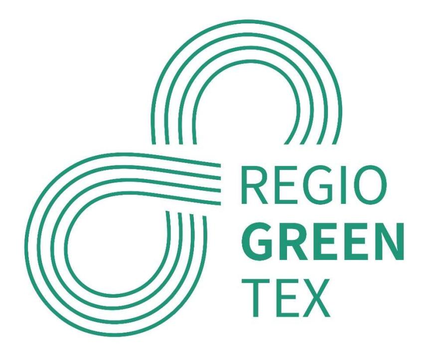
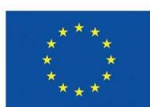
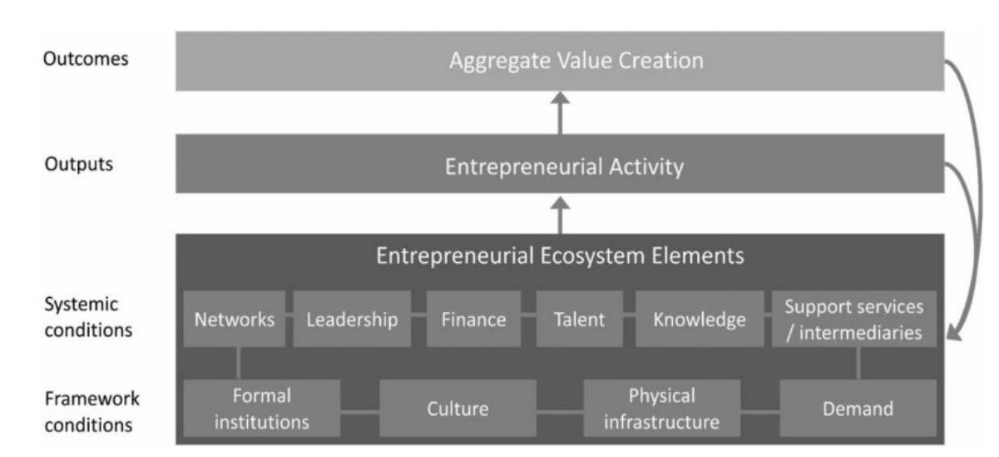
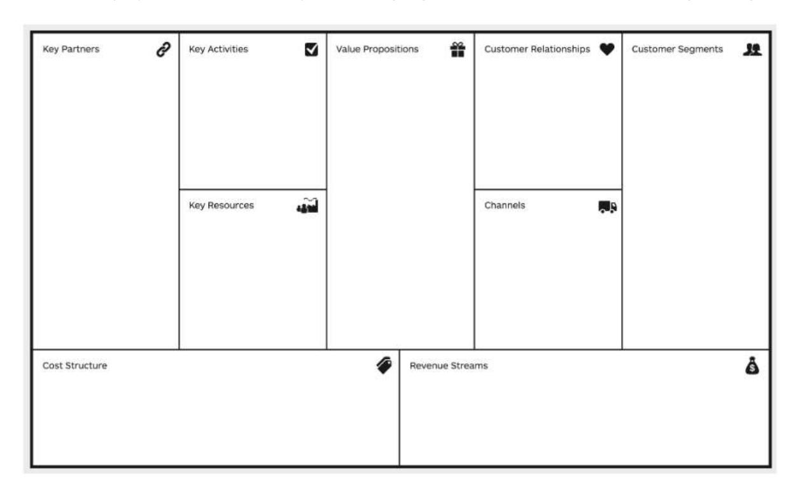

.

# D 5.3 Regional Hub Ecosystem Investment strategy

# Interregional Innovation Investments Instrument (I3)

Deliverable due date: M26-M12 Draft

| AUTHOR                           | REVIEWERS         |
|----------------------------------|-------------------|
| Oost NL                          | Ovam, AEI Textils |
| Dissemination level: PU - Public |                   |
| Oost NL                          | Ovam, AEI Textils |
| Oost NL                          | Ovam, AEI Textils |
| Oost NL                          | Ovam, AEI Textils |
| Oost NL                          | Ovam, AEI Textils |
| Oost NL                          | Ovam, AEI Textils |
| Oost NL                          | Ovam, AEI Textils |
| Oost NL                          | Ovam, AEI Textils |
| Oost NL                          | Ovam, AEI Textils |
| Oost NL                          | Ovam, AEI Textils |
| Oost NL                          | Ovam, AEI Textils |

Co-funded by the European Union. Views and opinions expressed are however those of the author(s) only and do not necessarily reflect those of the European Union or EISMEA. Neither the European Union nor EISMEA can be held responsible for them.

## EXECUTIVE SUMMARY

This deliverable is a plan on how to make an investment strategy for the five RegioGreenTex Regional Hubs Ecosystems that also can serve as a blueprint for other regions. This document is a M12 draft of the final deliverable due in M26, and it describes this strategy, which will include the following elements:

- A. Description of the activities implemented on a hub ecosystem level to validate, pilot and demonstrate innovations at TRL 6-9 level, including activities intended to widen participation within the hub to other companies (including SMEs) and institutions not yet participating in the project and to cross-link inside the project/consortium;
- B. Identification of opportunities and related activities to collaborate with other hubs or regions that can fuel the hub;
- C. Identification of investments and cost related to these activities and functions;
- D. Based on the elements above, description of investments and actions needed to secure the activities on hub ecosystem level after the project ends.

A well-crafted business plan for hub investments integrates costs, investments, and revenue streams, providing a roadmap for sustainable growth. By analysing financial realities, building a solid foundation through strategic investments and diversifying income sources, hubs can navigate the landscape of collaboration and innovation. In doing so, they lay the groundwork for not only financial success but also the continued advancement of the communities and industries they serve.

In the final 10 months of the RGT project, Phase 3 of the investment strategy focuses on securing funds through key actions: refining the business plan to make it actionable, formulating crucial contracts with partners and stakeholders, and actively seeking relevant subsidies and grants. These steps are integral to establishing a strategic roadmap for financing the business plan, ensuring a solid foundation for sustainable growth and impact in the targeted region.

#### CONTENTS

| 1 | A plan not a strategy ............................................................................................................. 5         |
|---|-----------------------------------------------------------------------------------------------------------------------------------------------|
| 2 | Definition of a Regional Hub Ecosystem ............................................................................ 7                         |
| 3 | Outline of a hub investment strategy .................................................................................. 8                     |
| 4 | Identification of possible activities ...................................................................................... 9                |
| 5 | Business Plan for hub investments ................................................................................... 12                      |
| 6 | Funding .................................................................................................................................. 15 |

# INTRODUCTION

The objective of RegioGreenTex is primarily to de-risk SME investments, avoid duplication of efforts and initiatives, create an arena to cooperate with interregional stakeholders across the value chain and align investment plans. The project coincides with the introduction of compulsory separate waste collection in the entire EU and the EPR schemes in some member states, but the dynamic is in flux. There is an acceleration of interest in investments but little visibility on initiatives with substance or high visibility only. The efforts of RegioGreenTex are, therefore, essential for the overall competitiveness of the European textile value chain. The prime target group of the RegioGreenTex project are SMEs with the potential to invest in textile recycling. 26 SMEs have been identified as partners from the outset of the project. Moreover, at least 200 SMEs will benefit from the five selected regional hubs, offering a structured solution for textile recycling. The five regional hubs aim at generating significant investments towards building up recycling capacity.

# 1 A PLAN NOT A STRATEGY

This document describes a plan for the investment strategy of the five regional hub ecosystems in RegioGreenTex. It is a plan towards a lively self-propelling regional hub ecosystem on textile reuse and recycling. Herewith this document is a first structure of the deliverable 5.3. The strategy for deliverable 5.3 will be delivered in month 26 of the RGT project. The description of the deliverable has been outlined as follows:

Investment strategy for the five Regional hub ecosystems including for each hub investments and actions needed after the project ends. It should describe a pathway to a lively self-propelling regional hub ecosystem on textile reuse and recycling and also includes activities to validate, pilot and demonstrate activities at TRL 6-9 level. The plan also includes interhub and inter regional collaborations. Moreover the plan should widen participation within the hub to other companies (including SMEs) and institutions not participating yet in the project and to cross-link inside the project/consortium. Connects to T5.2: Each regional hub ecosystem shall examine which actions are needed to validate, pilot or demonstrate activities at TRL 6-9 level. Widen participation to SMEs and cross-link inside the project/consortium. Events and meetings will be planned by each hub internally to monitor and implement investment along the value chain. In addition, at least one interregional workshop will be organised per hub to connect actors with similar interest or complementary needs and develop investment scenarios to be implemented during the project and beyond.

This deliverable is the plan on how to make an investment strategy for a sustainable regional hub ecosystem. The execution of this plan should result in five specific investment strategies for the five RegioGreenTex hubs and can be used as a tool to ensure the concept and practical functionality of a hub. These are available in the future, even after the end of the RGT project. It therefore can be a model or even a blueprint for the development and organisation of a region or regions that may have the appropriate characteristics.

In this perspective, this deliverable has two main objectives. The first is to describe the structure and nature of the RegioGreenTex Regional Hub concept, which is meant as a model or blueprint that any region or group of regions can use even after the RegioGeenTex project to organise stakeholders, pool resources and align objectives to secure strong value chain based collaborations in textile recycling and sustainability initiatives. The second objective is to describe the main activities that will potentially be carried out in the hub, and what financing needs are foreseen for such activities. This last part relates to the description of the main elements of a business plan for the hub which will be developed within the RGT framework as an entity that will survive the project and will last beyond the life of the project.

The hub collects its input from regional and European stakeholders, starting from the SMEs; While the description of the strategy itself will only be available in the second half of the project, this plan aims to give insight into the building blocks of a hub.

The actual strategy will be set up with the input of the regional and interregional partnerships defined within the project. This strategy will be based on extensive planning, testing and connecting partners in smaller projects as foreseen in the Task 5.2. These findings will be enriched with the input of local and European stakeholders.

# 2 DEFINITION OF A REGIONAL HUB ECOSYSTEM

Within RegioGreenTex, five textile recycling hub ecosystems are identified. The main tasks of these hubs is to support the SME's upscaling, attract investments and close the loop in the value chains. The overarching idea is to make these hubs collaborate in constructing a comprehensive European textile recycling system. Each hub will develop its own distinct type of textile recycling hub ecosystem, which can be replicated in other regions. Additionally, each hub will possess unique smart specialization features that can be leveraged to support other regions.

During the RGT regional cluster workshop in Prato (October 2023), a brainstorming session was held to put up a more specific definition of the identity of a RGT hub ecosystem. This exercise to align on the definition was done so we can collectively work towards the development of the same type of hub ecosystems. The result was:

A RegioGreenTex hub is an organized ecosystem within the textile value chain which encourages investments and knowledge sharing. It is a supporting backbone of one or more regions within the EU that actively creates synergies between partners and within the regions to keep up and grow the circular potential of the companies. Part of the hub could also be a physical infrastructure where small and medium sized companies can collaborate to increase the possibilities for textile recovery and reprocessing.

The hub serves as a crucial nexus connecting a diverse mix of triple helix partners. To find solutions a hub is pooling their capabilities, expertise, and machinery to foster collaboration and innovation.

The ultimate goal of a hub is driving growth and development of the textile recycling ecosystem.

# 3 OUTLINE OF A HUB INVESTMENT STRATEGY

As identified in the introduction, the investment strategy for each hub is a pathway to a lively selfpropelling regional hub ecosystem on textile reuse and recycling. This strategy includes the following elements:

- A. Description of activities on a hub ecosystem level to validate, pilot and demonstrate innovations at TRL 6-9 level; these activities include initiatives to widen participation within the hub to other companies (including SMEs) and institutions not participating yet in the project and to create cross-links inside the project/consortium.
- B. Identification of opportunities and related activities to collaborate with other hubs or regions that can fuel the hub.
- C. Identification of investments and cost related to these activities and functions.
- D. Actions needed to secure the funding of activities on hub ecosystem level after the project ends.

This is taking a reference to successful hub ecosystems such as the aerospace ecosystem of France around the hub Toulouse1 , the Wind Turbine ecosystem in Denmark2 and the agrifood ecosystem of the Netherlands around the hub Wageningen – Foodvalley3 .

To reach this end goal of a lively self-propelling regional hub ecosystem for circular textiles the following approach is needed :

Phase 1 : Activities; identification, exploration and description (see Chapter 4).

Phase 2 : Business plan; cost, investments and revenue streams (see Chapter 5).

Phase 3 : Funding; activities needed to finance business plan (see Chapter 6).

1 Toulouse Aerospace | Toulouse Aerospace (toulouse-aerospace.fr)

2 Denmark's Energy Islands | Energistyrelsen (ens.dk)

3 Foodvalley - WUR

# 4 IDENTIFICATION OF POSSIBLE ACTIVITIES

First step of phase 1 is the identification of possible activities of a hub, this phase is part of Deliverable 5.2: Regional Hub Ecosystem Actions. These activities should be based on the definition of a hub and the hub inception plan (D5.1) and enriched by the activities mentioned in the ecosystem theory of professor Erik Stam. Since a RGT hub has many elements also mentioned in his ecosystem approach to entrepreneurship in which the economy [or hub] is seen as a dynamic network of actors and factors and maps how that network functions and what is needed for it to function even better. The elements of this ecosystem theory are: networking, leadership, funding, talent, knowledge, intermediary services, hardware, international orientation and connection.

Figure 1: Key elements, outputs and outcomes of the entrepreneurial ecosystem.

Now combining this theory and the definition of a hub mentioned in chapter 2, the following main activities can be identified that could be part of a lively self-propelling regional hub ecosystem:

### Create synergies within the textile value chain by stimulating networking

During the project there will be interregional hub workshops. These workshops are serving as a focal point for knowledge exchange, collaboration and capacity building across the different regions. These workshops aim to connect key players in the textile industry. The partners of the RGT project will also organise quadruple helix workshops. These workshops won't only involve hub members, they will be open to all RGT partners, and more broadly, to all interested stakeholders. These quadruple helix workshops will bring together policymakers, researchers, businesses and community representatives to collectively address challenges and leverage opportunities.

#### Encourage investments by identification and support of leadership and funding

Encouragement of investments in textile recycling is crucial to achieving a closed loop and fostering sustainability within the industry. Europe faces challenges, as the existing infrastructure for textile manufacturing, including spinning, weaving and knitting is relatively limited. Additionally, collection and sorting local textile waste streams for various purposes pose pressing challenges. The emergence of new technologies and business models for recycling post-consumer streams presents an opportunity for transformation. Here are some examples for encouraging investments;

Within the AURA Hub, a specific case focuses on PET recycling led by Recyc'Elit (P26). The company aims to implement a chemical recycling demonstrator for transforming complex PET waste into a polymer yarn suitable for various textile applications. The hub plays a role in supporting Recyc'Elit (P26) by identifying funding opportunities and establishing a sustainable ecosystem to facilitate the upcoming upscaling of their technology. Similarly, the NERO Hub emphasizes investment in demo-cases involving NERDA (P4), MBAS (P23), and Katty Fashion SRL (KF) (P24). Katty Fashion SRL will test and optimize systemic design solutions for the reduction of textile waste, aiming for zero waste. "Mai bine" Association (MBAS) will focus on zero-waste design for clothing patterns. The ultimate goal is to develop new digital products tested and adopted in an industrial environment.

### Share knowledge by scouting talent and transfer of knowledge

The goal is to enable knowledge exchange among and outside the project partners, fostering a collaborative environment that transcends regional boundaries. Examples include the deployment of the RegioGreenTex digital tool (described in D 2.1) to enable matchmaking and information sharing among the project partners across the different regions, the development of digital libraries for batches of products and policy support by Ovam (P6) to facilitate circular collaboration within the different existing regional frameworks and support on how to deal with hazardous substances when working with textile waste streams.

#### Function as a supporting backbone

The establishment of a supporting backbone is indispensable for fostering this innovative textile ecosystem that thrives on collaboration and knowledge exchange. In this context, intermediary services play a role by acting as facilitators, streamlining communication, and catalysing synergies among diverse stakeholders. An international orientation adds a crucial dimension to this backbone, transcending geographical boundaries to create a global network of interconnected partners. This global perspective not only enhances expertise but also promotes cross-cultural ideas. Furthermore, the emphasis on connecting a diverse mix of triple helix partners—bringing together academia, industry, and government—ensures problem solving and innovation.

### Provide a supporting physical infrastructure with hardware

The integration of physical infrastructure, consultation services, and pilot-scale testing are essential elements in the pursuit of sustainable and effective recycling practices, contributing to the evolution of innovative solutions and the broader goal of creating a circular economy for textile waste. In the Norte Portugal Hub, the Special Interest Centre, Citeve (P3), plays a role by offering consulting services. This consulting service is crucial for testing solutions in new industrial environments, providing valuable insights and expertise to address challenges and optimise processes.

Another objective within the scope of this project is to investigate the requirements for both hardware and software necessary to attain an economically feasible semi-automated or partially robotized system, specifically focusing on textile sorting. By addressing these requirements comprehensively, the project aims to pave the way for the successful implementation of an economically viable automated or semi-automated system in the domain of textile sorting.

# 5 BUSINESS PLAN FOR HUB INVESTMENTS

The definition of a business plan to ensure the continued operation of the regional hubs is based on the elements of the Business Model Canvas4 . The different elements of the BMC; the value proposition, key activities, key resources, customer relationship, channels, key partners, customer segments, cost structure and revenue streams are explored during the RegioGreenTex project with value chain projects and in workshops that bring together different stakeholders in a given region.

Figure 2: Business Model Canvas

In relation to the hub investments, where collaboration and innovation are the key to success, a well-structured business plan is essential for sustainable growth. A business plan should encompass all BMC elements. Most important are Costs, Investments, and Revenue Streams that can be used as the backbone of the financial part of the business plan. This financial plan plays a crucial role in shaping the financial framework and ensuring the long-term viability of the investment.

4 A Business Model Canvas (BMC) is a single-page template used to outline the goals and objectives of a business. As a strategic management tool, a BMC can help business owners and other stakeholders develop new business models or evaluate existing models.

#### Costs

The first element of the financial framework of a successful business plan lies in analysis of costs. This involves a detailed breakdown of the financial outlays associated with hub activities. Costs should be outlined by activity, with a focus on both monetary expenditures and the allocation of human resources in terms of hours. This comprehensive analysis allows stakeholders to gain a clear understanding of the financial implications of each initiative, facilitating strategic decisionmaking and resource allocation.

#### Investments

The second pillar of the financial framework of the business plan revolves around investments, addressing the physical and tangible assets necessary for the hub's operations. This encompasses machinery, building infrastructure, software and hardware etc. Critical components that underpin the effectiveness and functionality of the hub. A thorough evaluation of machinery requirements and construction needs ensures that the investment aligns with the strategic goals of the hub, fostering an environment conducive to innovation and collaboration.y

#### Revenue Streams

The third and equally vital aspect of the financial framework of the business plan is the detailed description of revenue streams. Successful hubs understand the importance of diversifying revenue streams to mitigate risks and ensure financial stability. Income sources may include financial support from regional authorities, subsidies, in-kind contributions from strategic partners, in-cash contributions of clients and revenue generated through Extended Producer Responsibility (EPR) systems. By tapping into a variety of funding channels, hubs can cultivate resilience and adaptability, reducing dependency on a single source of income.

In particular, regional authorities can play a role in providing financial backing and policy support, creating an enabling environment for hub initiatives. Subsidies offer another way to offset costs and promote the development of innovative projects. Additionally, in-kind contributions from partners enrich the hub's resource pool, fostering collaboration and leveraging the strengths of diverse stakeholders. Money generated from EPR systems further bolsters the financial foundation, emphasising sustainable practices and responsible resource management.

In conclusion, a well-crafted business plan for hub investments integrates costs, investments, and revenue streams, providing a roadmap for sustainable growth. By analysing financial realities, building a solid foundation through strategic investments and diversifying income sources, hubs can navigate the landscape of collaboration and innovation. In doing so, they lay the groundwork for not only financial success but also the continued advancement of the communities and industries they serve.

# 6 FUNDING

Finding funding for the RGT HUBs business plan is scheduled to occur in the last 10 months of the project, leading to the finalization of the investment strategy (the present deliverables in its final form) foreseen in M26. However in phase 3 of the making of the investment strategy, activities needed to finance business plan are listed. During this stage, various activities are planned to secure the necessary financial support for the project. The key actions in this phase include:

- 1. Describe the concrete business plan: Refine and detail the business plan to make it more tangible and actionable. This involves specifying financial projections, outlining operational strategies, and addressing potential risks. A well-defined and concrete business plan is essential for attracting investors and securing financial backing.
- 2. Formulate contracts: Develop and finalize contractual agreements with potential partners, investors, or stakeholders. These contracts will play a vital role in solidifying financial commitments and ensuring the smooth execution of the project.
- 3. Apply for subsidies: Seek and apply for relevant subsidies and grants that align with the goals and objectives of RegioGreenTex. This involves thorough research, preparation of documentation, and submission to appropriate funding bodies.

These actions are integral to finance the funding of the business plan, providing a strategic roadmap for securing the necessary funds to propel the project forward. Through diligent execution of these tasks, the project aims to establish a solid foundation for sustainable growth and impact in the targeted regions.