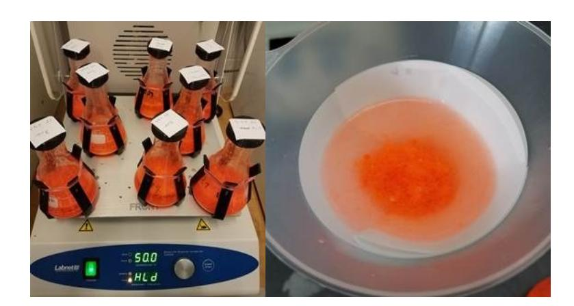
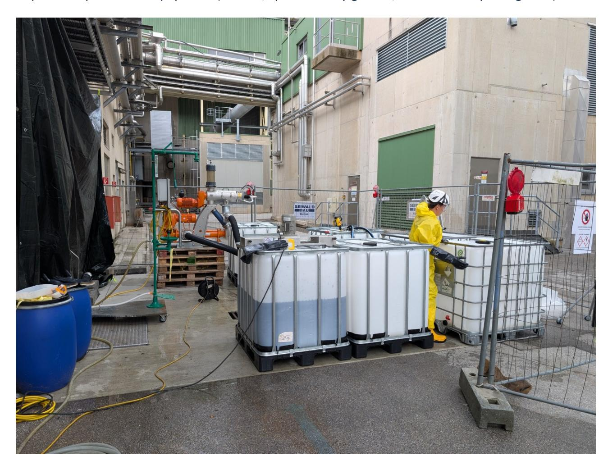
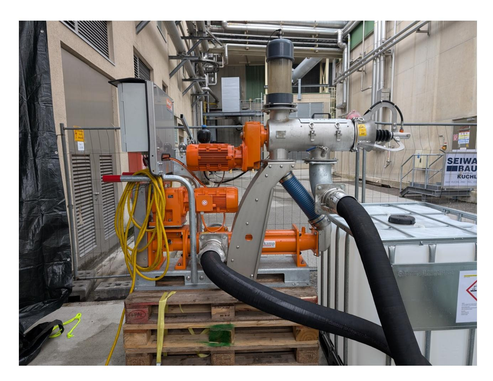
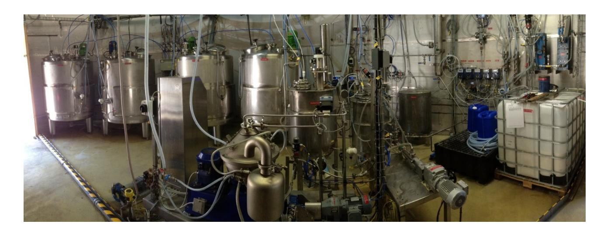
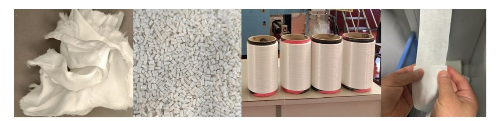

#### **PLASTICE**

**New technologies to integrate PLASTIC waste in the Circular Economy**

# **D5.6 Publishable report on the solutions and demo development (WP5)**

WP5: Chemical recycling of textiles through enzymatic reactions

Main Author: CTB, AUSTRO, DKW, KORTEKS, SUN, TCKT

Contributors: WP5 partners

# PLASTICE

#### **DOCUMENT HISTORY**

|         | DOCUMENT HISTORY |               |                   |                    |
|---------|------------------|---------------|-------------------|--------------------|
| Version | Date             | Changes       | Author:           | Name (Beneficiary) |
| V0.1    | 19/09/2025       | ToC drafted   | Rémi Tilkin       | (CTB)              |
| V1.0    | 13/10/2025       | First draft   | Rémi Tilkin (CTB) |                    |
| V2.0    | 09/11/2025       | Second draft  | Rémi Tilkin (CTB) |                    |
| V3.0    | 26/11/2025       | Final version | Rémi Tilkin (CTB) |                    |

**Disclaimer:** The European Commission is not responsible for any use made of the information contained herein. The content does not necessarily reflect the opinion of the European Commission.

|                     | TECHNICAL PROJECT REFERENCES                                                                        |
|---------------------|-----------------------------------------------------------------------------------------------------|
| Project Acronym     | PLASTICE                                                                                            |
| Project Title       | PLASTICE: New technologies to integrate PLASTIC waste in the Circular Economy                       |
| Call:               | HORIZON-CL4-2021-TWIN-TRANSITION-01                                                                 |
| Topic:              | HORIZON-CL4-2021-TWIN-TRANSITION-01-17                                                              |
| Project Coordinator | CIRCE – Fundación Circe Centro de Investigación de Recursos y Consumos Energéticos. circe@fcirce.es |
| Project Officer     | Valentina Vignoli                                                                                   |
| Project Duration    | June 2022 – November 2026 (54 months)                                                               |

| DELIVERABLE REFERENCES                      |                                                                 |
|---------------------------------------------|-----------------------------------------------------------------|
| Deliverable No.                             | D5.6                                                            |
| Type:                                       | R                                                               |
| Dissemination level                         | PU                                                              |
| Work Package                                | WP5: Chemical recycling of textiles through enzymatic reactions |
| Task                                        | T 5.5                                                           |
| Lead beneficiary Contributing beneficiaries | CTB DKW, AUSTRO, KORTEKS, SUN, TCKT                             |
| Due date of deliverable                     | M42: 30 November 2025                                           |
| Actual submission date                      | M42: 28 November 2025                                           |

# DISCLAIMER OF WARRANTIES

This document has been prepared by PLASTICE project partners as an account of work carried out within the framework of the EC-GA contract no. 101058540.

Neither Project Coordinator, nor any signatory party of PLASTICE Project Consortium Agreement, nor any person acting on behalf of any of them:

(a) makes any warranty or representation whatsoever, expressed or implied,

(i). with respect to the use of any information, apparatus, method, process, or similar item disclosed in this document, including merchantability and fitness for a particular purpose, or (ii). that such use does not infringe on or interfere with privately owned rights, including any party's intellectual property, or (iii). that this document is suitable to any particular user's circumstance; or

(b) assumes responsibility for any damages or other liability whatsoever (including any consequential damages, even if the Project Coordinator or any representative of a signatory party of the PLASTICE Project Consortium Agreement has been informed of the possibility of such damages) resulting from your selection or use of this document or any information, apparatus, method, process, or similar item disclosed in this document.

#### Table of content

|     | LIST OF FIGURES LIST OF TABLES ABBREVIATIONS EXECUTIVE SUMMARY | 5 6 7 8 |
|-----|----------------------------------------------------------------|---------|
| 1.  | INTRODUCTION AND OBJECTIVES                                    | 9       |
| 2.  | WASTE COLLECTION AND SORTING                                   | 9       |
| 3.  | LAB SCALE OPTIMIZATION                                         | 10      |
| 3.1 | E XPERIMENTAL SETUP                                            | 10      |
| 3.2 | I NFLUENCE PARAMETER ANALYSIS                                  | 11      |
| 4.  | PROCESS SCALE-UP                                               | 12      |
| 5.  | SPINNING AND KNITTING OF RECOVERED POLYESTER                   | 15      |
| 6.  | CONCLUSIONS                                                    | 16      |
| 7.  | SCIENTIFIC PUBLICATIONS                                        | 17      |

### **List of Figures**

| Figure 1: Enzymatic hydrolysis experiments executed on a laboratory shaker (left) and filtration of the solid |                                                                                                                 |    |
|---------------------------------------------------------------------------------------------------------------|-----------------------------------------------------------------------------------------------------------------|----|
| residue (right) after the reaction time.                                                                      |                                                                                                                 | 11 |
| Figure 2: Pilot plant at Austrocel                                                                            | – tanks to store chemicals..........................................................................            | 13 |
| Figure 3: Pilot plan at Austrocel                                                                             | – pumps........................................................................................................ | 14 |
| Figure 4: Pilot plan at Austrocel                                                                             | – steel vessels...............................................................................................  | 14 |
| Figure 5: Closed recycling loop in PLASTICE -                                                                 | from fabric over granules to yarns and fabric again................                                             | 16 |

### **List of Tables**

[Table 1: Selected parameters and their influence on the enzymatic hydrolysis process.](#page-11-1) .............................. 12

# **Abbreviations**

| Abbreviation | Meaning                                   |
|--------------|-------------------------------------------|
| AUSTRO       | AustroCel Hallein GmbH                    |
| COT          | Cotton                                    |
| CTB          | Centexbel                                 |
| DKW          | De Kringwinkel Antwerpen                  |
| NIR          | Near infrared                             |
| PES          | Polyester                                 |
| SUN          | SUN TEKSTIL                               |
| TCKT         | Transfercenter für Kunststofftechnik GmbH |

#### **Executive Summary**

This deliverable includes the main results obtained in the work package 5 of PLASTICE project, in which chemical recycling of textiles through enzymatic reactions has been performed.

In D5.6 '*Publishable report on the solutions and demo development (WP5)'*, the main developments and outcomes achieved within the WP5 are summarised. The textiles are collected and sorted to retrieve the cotton/polyester blends. The cotton fractions are removed via a two-step enzymatic hydrolysis process during which the cotton cellulose is degraded to monosaccharides and separated from the polyester fibres. After an optimization at lab scale, the process is upscaled. The recovered polyester is then recycled via a thermoplastic recycling process to produce filament yarns using a melt spinning process. These recycled yarns are finally used for the production of fabrics, hence closing the loop.

#### **1.Introduction and objectives**

The main objective of WP5 is to develop and validate a pilot plant of the enzymatic recycling of cotton/polyester (PES) textile. This deliverable D5.6 covers the main results obtained in the work package. First, textiles are collected and the cotton/PES blends containing more than 60 % of PES are sorted out. The cotton fraction is removed through a two-step enzymatic hydrolysis process. The process consists of an alkaline pretreatment to activate the cellulose followed by a hydrolysis step during which the cellulose is broken down into monosaccharides. The PES is then separated from the monosaccharide solution by filtration. After optimization at the laboratory scale, the process is scaled up. The recovered polyester is then recycled using a thermoplastic method, producing filament yarns through melt spinning. These recycled yarns are finally used to manufacture new fabrics, effectively closing the loop.

# **2.Waste collection and sorting**

De Kringwinkel Antwerpen (DKW, Belgium) has identified and prepared an end-of-life textile stream consisting of cotton-PES blends containing more than 60 % PES. The organization utilized nearinfrared (NIR) scanners to sort these secondary textile flows based on fibre composition. NIR spectroscopy relies on the principle that molecules absorb specific frequencies of light that are characteristic of their molecular structure. The system measures the absorption of radiation as a function of the wavelength. This spectrum can then be compared to a database to identify the fibre composition. The scanners were selected based on an analysis made together with Centexbel (CTB, Belgium). During this study, Matoha FabriTell emerged as the most reliable NIR-scanner in terms of accuracy of measurement for COT/PES composition and speed.

The NIR scanners were configured to detect textiles with a PES fibre content exceeding 60 %, under the condition that the remaining fibre fraction consisted solely of cotton. When a textile item met this compositional criterion, the scanner emitted a green light signal, indicating to the sorting staff that the item should be separated for further processing.

**Through this method, a total of 450 kg of secondary textile material was isolated, meeting the chemical recycling requirements for polyester-cotton blends.**

By introducing a tolerance margin in the scanner's settings (for instance, setting the minimum PES threshold at + 5 %), the need for extensive post-sorting quality control is substantially reduced. This sorting method minimizes the required technical expertise of operators while ensuring high reliability and process efficiency.

#### **3.Lab scale optimization**

To disassemble the mixed textiles and separate the polyester fibres from the cotton, a two-step enzymatic hydrolysis process is used. The first step is an alkaline pretreatment that is performed to swell the cotton and render all cellulose chains accessible for degradation. The second step is the enzymatic hydrolysis process itself during which the cellulose is decomposed to sugars with help of hydrolysing enzymes that specifically target the breakdown of cellulose. After the degradation of the cotton fraction, the polyester fraction is recovered by filtration. The Transfercenter für Kunststofftechnik (TCKT, Austria) carried out the optimisation of the process at lab scale.

#### **3.1 Experimental setup**

The set up and optimisation of the **enzymatic hydrolysis process** was started at **laboratory scale**. Laboratory scale trials allow for many experiments carried out at once within a short period of time. This was necessary in view of the complexity of our research topic and considering all the variables in this process. Partially, a multifactorial experiments plan was carried out to discover mutually influencing effects.

The experiments at lab scale were conducted in Erlenmeyer flasks. The pre-treated fabrics were covered with buffer solution, containing the reactive enzyme. The flasks were closed with a lid and put onto lab shaker [\(Figure 1\)](#page-10-1), where the hydrolysis was carried out at the respective temperature and shaking speed. After the reaction time, the solid residue was filtered off through a filter paper and washed with water to remove residual sugars, buffer chemicals and enzymes. After drying, the efficiency of the hydrolysis was determined by weighing the solid residue and determining the residual cellulose content.

*Figure 1: Enzymatic hydrolysis experiments executed on a laboratory shaker (left) and filtration of the solid residue (right) after the reaction time.*

#### **3.2 Influence parameter analysis**

Before the actual hydrolysis, a pretreatment of the fabrics is necessary. This encompasses both, a shredding of the fabrics to smaller, stirrable pieces, and a chemical pretreatment to make the cellulose more susceptible to the enzymatic degradation. Variables that were investigated in the pretreatment process, are the **size of the shredded pieces**, and the chemicals used, the time and temperature of **pretreatment**.

There are several factors influencing the efficiency of the actual enzymatic hydrolysis in addition to the pretreatment carried out. The enzymes applied for this process are so called "cellulases", enzyme complexes that are composed of several individual enzymes cooperating on the degradation of cellulose. The **type of enzyme** used, plays a major role as well as the conditions, under which the hydrolysis is executed. The conditions comprise the **temperature**, **stirring speed**, **substrate loading**, **enzyme concentration**, **type and concentration of buffer solution**, and **reaction time**.

Finally, the whole process needed to be investigated with various **substrates** and different **relations of cellulose and polyester**. We started from undyed single-source post-industrial waste supplied and prepared by SUN and KORTEKS to dyed fabrics and finally most challenging mixed-textile waste from post-consumer collection, sorted by DKW.

Table 1 summarises the results of our comprehensive laboratory scale optimisation of the enzymatic hydrolysis process. Some factors were found to have a major influence on the efficiency of the hydrolysis of cellulose in mixed textile waste, others were found to be rather negligible.

*Table 1: Selected parameters and their influence on the enzymatic hydrolysis process.*

| Parameter               | Influence on hydrolysis efficiency                                     |
|-------------------------|------------------------------------------------------------------------|
| shredding size          | lower efficiency with larger particles, but stirrability is improved   |
| chemical pretreatment   | higher efficiency with higher lye concentration within the range       |
| enzyme grade            | difference in efficiency of different enzyme grades                    |
| enzyme concentration    | slightly higher efficiency with higher enzyme concentration            |
| temperature             | higher efficiency with lower temperatures within the range             |
| substrate concentration | linearly decreasing efficiency with increasing substrate concentration |
| reaction time           | little influence after a certain time due to reaction kinetics         |

The most crucial factors for an effective hydrolysis were found to lie in the pretreatment. An efficient chemical pretreatment is important to enable the downstream enzymatic processes. Although larger textile flakes show less rapid degradation in the process, a certain fabric size helps to increase the solid-liquid fleet-ratio and thus makes the whole process more efficient in terms of throughput and economic considerations.

Longer reaction times did not drastically increase the conversion of cellulose to sugars, neither did the rise in temperatures accelerate the enzymatic process.

**In this way, the best conditions and set of parameters were determined at laboratory scale and applied in the stepwise scale-up to pilot scale.**

#### **4.Process scale-up**

Based on the optimization at lab-scale, the upscaling of the process was done step-wise. Large labscale trials were performed using a 1 L reactor, and a small pilot plant with a capacity of 40-150 L was built up at TCKT. The actual pilot plant was built and run at Austrocel (AUSTRO, Austria). The pilot consists of several stirred and heated steel vessels [\(Figure 2](#page-12-0)[Figure 4\)](#page-13-1) with a volume of up to 1000 L. In particular, stirring was essential as the process itself needed high shear forces while

mixing the suspension with a mixer to let the textiles soak well enough. Specific security measures were taken to carried out the process such as the installation of a chemical safety suit and the use of personal protective equipment (helmet, special safety glasses, and chemical proof gloves).

*Figure 2: Pilot plant at Austrocel – tanks to store chemicals*

*Figure 3: Pilot plan at Austrocel – pumps*

*Figure 4: Pilot plan at Austrocel – steel vessels*

The pilot plant is already in operation and the alkaline pretreatment has already been performed. The shredded textiles were immersed in lye and left to soak, until the suspension was pumped out and was pressed with a screw press to remove excess lye. To keep the pretreated textiles until the hydrolysis process, they were acidified, brought to a pH of approximately 3.5, pressed again and stored indoor with a dry contend close to 40 %.

**The final hydrolysis step of the textiles is planned. The outcome is short PES-fibres, ready to be processed in a thermo-mechanical recycling process to granules, which will then be used for the following steps of fibre production.** 

# **5.Spinning and knitting of recovered polyester**

The final step was the spinning of the recovered PES to produce filaments and yarns and the knitting of these yarns to make fabrics. This step was performed by KORTEKS (Turkey) and SUN TEKSTIL (SUN, Turkey). These processes were first validated with recycled granules made from 100% polyester textiles.

KORTEKS received recycled polyester granules from TCKT. First, chemical analyses were performed (viscosity, carboxyl, ash, Differential Scanning Calorimetry etc.) to find out if the granules are convenient or not, for melt spinning processes. After getting acceptable results, granules are fed into the melt spinning line, filament yarns are produced via extrusion, drawing, heating and winding processes. Produced yarns are chemically (viscosity, carboxyl, ash, Differential Scanning Calorimetry etc) and physically (tenacity, elongation, evenness, shrinkage etc) analysed. Bobbins having acceptable properties are sent to SUN for downstream processes.

SUN carried out knitting and finishing trials with recycled PLASTICE yarns produced by KORTEKS. These yarns contain 100 % PES pre-consumer waste (non-mixed). According to the knitting results, SUN showed that recovered PES yarns are suitable for using in knitting machines and SUN produced some fabrics for further fabric testing. Yarns showed enough mechanical strength and flexibility for forming loop formation, which is the main unit on a knitted fabric. SUN also conducted some mechanical tests on these fabrics (e.g. abrasion resistance, bursting strength, tensile strength). All of these properties met the market requirements. However, shrinkage value of this fabric was too high. After the heat treatment (which is mandatory for industrial applications), fabrics could not

maintain their dimensional stability. It has been determined that this problem can be solved by optimization during yarn production.

*Figure 5: Closed recycling loop in PLASTICE - from fabric over granules to yarns and fabric again*

**Spinning and knitting trials were validated with recycled polyester granules from 100% polyester textile waste to assess the right settings with recycled materials from fabric, to subsequently have the experience to process the materials from post-consumer waste textiles as soon as they are available after the large pilot run.**

#### **6.Conclusions**

DKW successfully implemented an automated textile sorting system using NIR spectroscopy to identify cotton-polyester blends with over 60 % polyester content. The Matoha FabriTell scanner was selected for its accuracy and speed, enabling the separation of 450 kg of material suitable for chemical recycling.

At lab scale, TCKT optimized the enzymatic hydrolysis process to break down cellulose and separate polyester fibres. Pretreatment conditions—especially chemical treatment—were found to be the most critical factors for hydrolysis efficiency. Other variables like temperature and reaction time had a limited effect beyond certain thresholds.

Based on the optimization at lab-scale, a pilot plan was built and run at Austrocel (Austria). The alkaline pretreatment step was already performed at pilot scale.

Recycled polyester granules were converted into filament yarns by KORTEKS, which passed chemical and mechanical quality tests. SUN confirmed the suitability of these yarns for knitting, producing fabrics with acceptable mechanical properties. However, high shrinkage after heat treatment was observed, indicating a need for process optimization during yarn production.

**The complexity of textiles in recycling can be overcome with well-designed separation strategies, such as our enzymatic hydrolysis approach. Our findings in WP5 so far show that the successful work on the way to a closed fibre-to-fibre recycling of textile waste along the entire process chain. By the end of the project, we will have demonstrated the recycling of mixed end-of-life textiles at TRL7.**

# **7.Scientific publications**

Some aspects of the results found in recycling textiles in PLASTICE have also been published to scientific audience on conferences. A list of publications made in WP5 is given below:

Liedl B., Burgstaller C. "Characterisation of recovered PET from mixed textile production waset and post-consumer waste textiles", PM15, Bratislava (SK), 2023.

Ostner-Kaineder D., Strasser C., Hlawitschka M. W., Burgstaller C. "Process Characterization of Additively Manufactured Stirrer Geometries for Bioprocessing of non-Newtonian Media", PM16, Prague (CZ), 2025.

Tilkin R. "Hyperspectral imaging as tool for identification and sorting of textiles and plastics", 3rd International Conference "Circular Economy for Textiles & Plastics", Ghent (BE), 2022.

Tilkin R. "PLASTICE: high value solutions in textile recycling for closing the loop", 4th International Conference "Circular Economy for Textiles & Plastics", Ostend (BE), 2024.

Tilkin R. "PLASTICE: high value solutions in textile recycling for closing the loop", Aachen-Dresden-Denkendorf International Textile Conference, Aachen (DE), 2025.