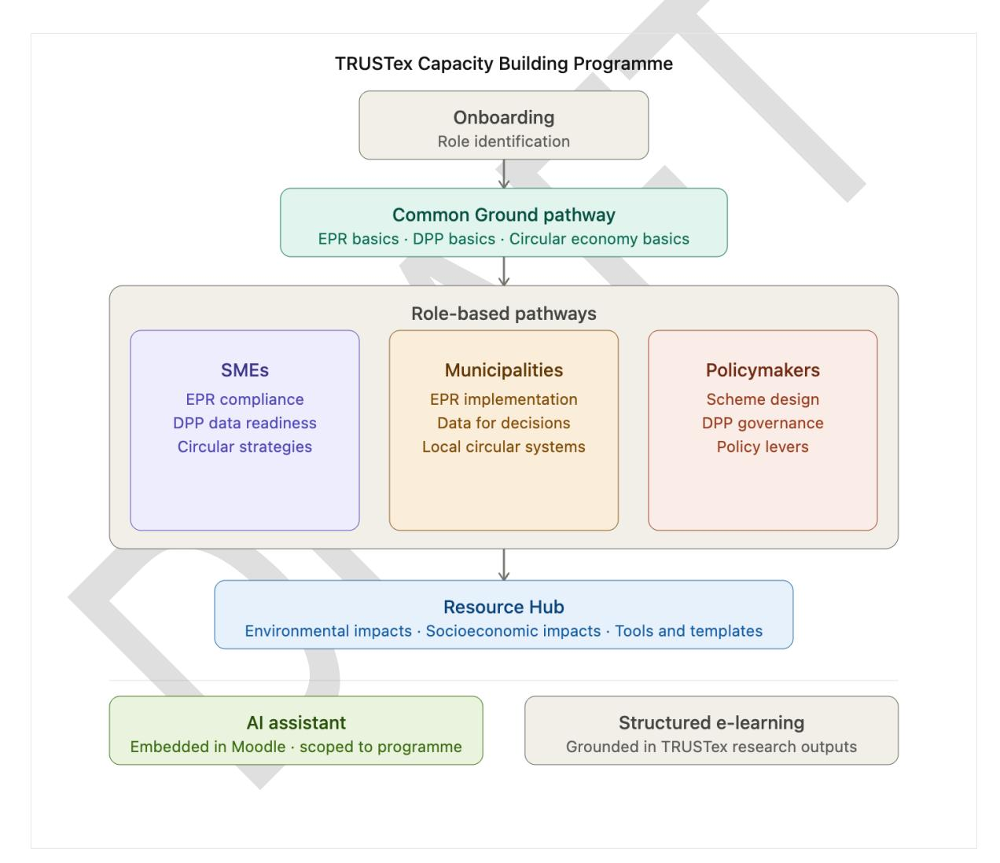
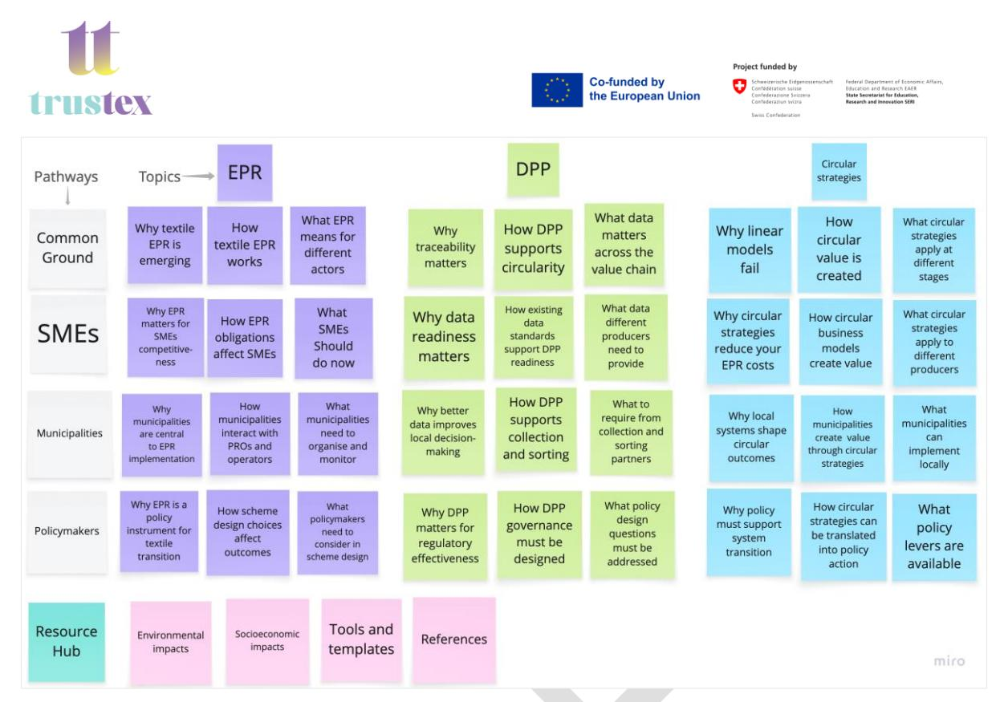
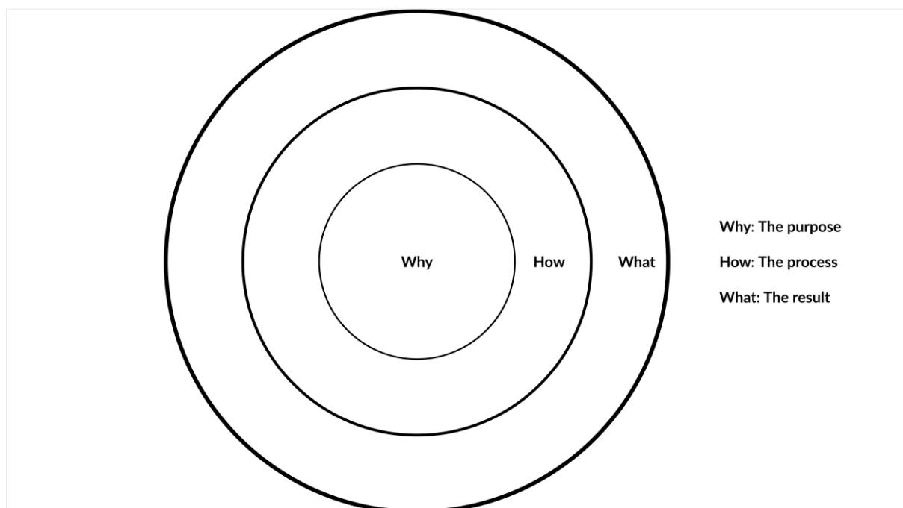
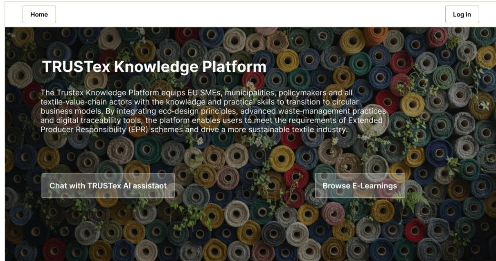
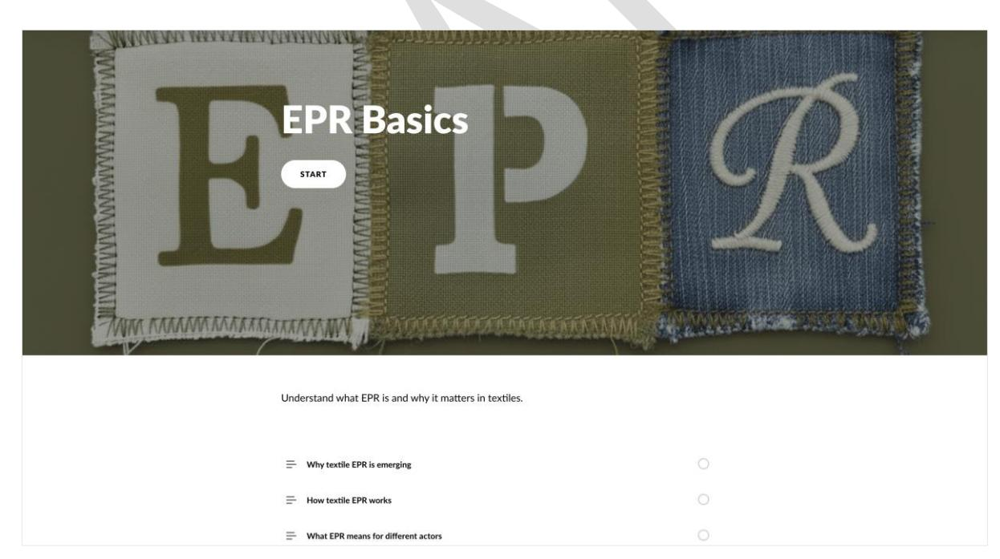
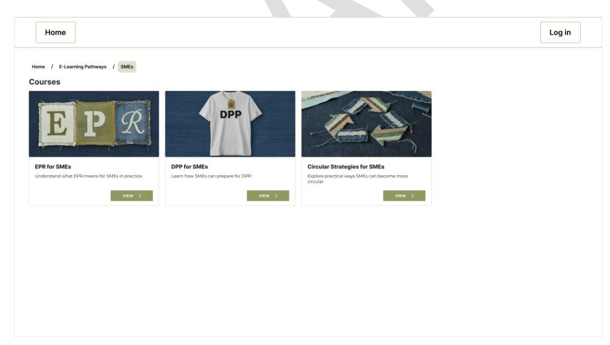

Advancing sustainable textiles in the circular economy through innovative EP schemes

## **Table of Contents**

| Table of Abbreviations                                      | 6  |
|-------------------------------------------------------------|----|
| 1. Objective                                                | 7  |
| 2. Audience                                                 | 8  |
| 3. Methodology                                              | 8  |
| 3.1 First step: Needs analysis                              | 8  |
| 3.2 Second step: Content analysis                           | 9  |
| 3.3 Third step: Customising the content for audience groups | 9  |
| 3.4 Fourth step: Organising the structure of the courses    | 9  |
| 3.5 Fifth step: Deeper exploration                          | 9  |
| 4. Course Structure: The Golden Circle                      | 10 |
| 5. AI Assistance: [Ai]lice                                  | 11 |
| 6. Sourcing                                                 | 11 |
| 6.1. Sources for e-learning courses:                        | 11 |
| 6.2. Sources for the AI chatbot:                            | 12 |
| 7. Software and Tools                                       | 12 |
| 8. Programme Outline                                        | 12 |
| 8.1. Onboarding questions                                   | 12 |
| 8.2. Pathways                                               | 12 |
| 8.3. Resource Hub                                           | 14 |
| 9. Recommended Journey                                      | 14 |
| 10. Layout                                                  | 15 |
| 11. References                                              | 19 |

# **Table of Figures and Tables**

| Figure 1 Graphical abstract of TRUSTex capacity building programme outlines | 7  |
|-----------------------------------------------------------------------------|----|
| Figure 2 Instructional design process for developing the programme outline  | 10 |
| Figure 3 The Golden Circle framework                                        | 11 |
| Figure 4 Landing page                                                       | 15 |
| Figure 5 E-Learning Pathways                                                | 15 |
| Figure 6 Common Ground Courses                                              | 16 |
| Figure 7 Common Ground/EPR Basics Course                                    | 16 |
| Figure 8 Common Ground/EPR Basics/ Why textile EPR is emerging              | 17 |
| Figure 9 SMEs’ Courses                                                      | 17 |
| Figure 10 Municipalities’ Courses                                           | 18 |
| Figure 11 Policymakers’ Courses                                             | 18 |
| Figure 12 Resource Hub Courses                                              | 19 |

**Project full title**: Advancing Sustainable Textiles in the Circular Economy Through Innovative EPR Schemes

**Acronym**: TRUSTex

**Call**: HORIZON-CL6-2024-CircBio-01-2

**Topic**: Circular solutions for textile value chains based on extended producer responsibility (Innovation Action)

**Start date**: 1st January 2025

**Duration**: 36 months

**List of participants:** LMDDC, List, Neovili, ENA, Scantrust

**Deliverable:** D6.6 – Capacity Building Programme outline

**Due date submission:** 30 June 2026 (Month 18)

**Submission date:** 29 June 2026

| Document Number:    | D6.6                                                            |
|---------------------|-----------------------------------------------------------------|
| Document Title:     | Capacity Building Programme outline                             |
| Dissemination level | PU – Public, fully open                                         |
| Period:             | PR1                                                             |
| WP:                 | WP6                                                             |
| Task:               | T6.4                                                            |
|                     | Nooshin Shojaee                                                 |
|                     | TRUSTex Horizon Europe project.                                 |
|                     | including SMEs (small and medium-sized enterprises),            |
|                     | transition to a circular economy.                               |
|                     | and an AI-assisted (Artificial Intelligence-assisted) learning. |
|                     | TRUSTex research work packages communicated through             |
|                     | This document describes the programme outline, pathway          |

| Version | Date         | Description                 |
|---------|--------------|-----------------------------|
| 1       | 18 May 2026  | The first draft of the      |
| 2       | 9 June 2026  | The Second draft of the     |
|         |              | deliverable D6.6.           |
| 3       | 22 June 2026 | The final version has been  |
|         |              | placed in the new template. |

# **Table of Abbreviations**

| AI                                     |                         | Artificial      | Intelligence   |
|----------------------------------------|-------------------------|-----------------|----------------|
| DPP                                    |                         | Digital Product | Passport       |
| E-Learning                             | Electronic Learning     | (Online         | Learning)      |
| EPR                                    | Extended                | Producer        | Responsibility |
| LCA                                    |                         | Life Cycle      | Assessment     |
| LMDDC                                  | Luxembourg Media and    | Digital         | Design Centre  |
| LMS                                    | Learning                | Management      | System         |
| PRO                                    | Producer Responsibility |                 | Organisation   |
| RAG                                    | Retrieval-Augmented     |                 | Generation     |
| SME. Small and Medium-sized Enterprise |                         |                 |                |

## **1. Objective**

The TRUSTex Capacity Building Programme is designed to equip key actors across the textile value chain, namely SMEs, municipalities, and policymakers, with the knowledge and skills required for transition to circularity. The programme addresses three main objectives:

- 1) Navigating Extended Producer Responsibility (EPR),
- 2) Preparing for the Digital Product Passport (DPP),
- 3) Adopting circular economy practices.

The TRUSTex Capacity Building Programme is built on two complementary features, structured elearning courses and an AI assistant. The programme goal is to transform TRUSTex research findings into accessible and actionable learning content which will ultimately be hosted on an opensource Learning Management System (Moodle).

*Figure 1 Graphical abstract of TRUSTex capacity building programme outlines*

## **2. Audience**

As defined in the grant agreement, the programme is designed for three primary audience groups that have distinct roles in the textile value chain to facilitate the adoption and effective implementation of sustainable practices in textile industry in the EU and compliance with EPR.

- 1) SMEs: Small and Medium-sized Enterprises account for 99% of textile and clothing companies in the EU including upstream producers, manufacturers, market-facing enterprises, and end-of-life operators. This group needs practical guidance on compliance obligations and recommendations on circular practices.
- 2) Municipalities: municipalities play a key role in handling textile end-of-life and waste management. This group requires operational knowledge to coordinate collection systems, collaborate with Producer Responsibility Organisations (PROs), and implement local circular strategies.
- 3) Policymakers: policymakers both at the EU and national level are the architects of the system for transition to circularity. This group needs a system-level perspective to design effective EPR schemes, govern data infrastructure, and translate circular economy principles into actionable policy.

Each group has dedicated learning content on the TRUSTex Capacity Building Programme. Additionally, a Common Ground pathway serves all three audiences by establishing shared foundational knowledge before learners move into their role-specific content.

# **3. Methodology**

The programme outline was developed through a structured instructional design process inspired by the ADDIE model (Molenda, 2003) and Backward Design principles (Wiggins & McTighe, 2005).

# 1.1. First step: Needs analysis

We began with a learner needs analysis. In collaboration with task partners and the Prospex Institute, who are responsible for stakeholder mapping and engagement in TRUSTex, we built a database of potential learners across the textile value chain in the EU. We reached out to stakeholders through customised emails inviting them to an interview. We also conducted inperson interviews with local actors in Luxembourg during an event organised by Let's Refashion on Extended Producer Responsibility. In total, seven stakeholders were interviewed: two municipalities in Luxembourg, one national policymaker at the Ministry of Environment in Luxembourg, one upcycled and second-hand retailer in Luxembourg, one fabric innovator in Austria, one optical sorting company in Spain, and one sorting and upcycling organisation in Ghana. Interviews continue to be conducted throughout the content development process, and the programme is adapted accordingly as new insights emerge.

The interviews covered the following questions:

- 1. What activities does your team perform?
- 2. How big is your team?
- 3. What circular and sustainability principles do you currently practice?
- 4. Are you aware of the upcoming Extended Producer Responsibility regulation?
- 5. Are you aware of the upcoming Digital Product Passport regulation?
- 6. How do you usually stay informed about regulations relevant to your work?
- 7. What barriers do you face in complying with regulations?
- 8. What barriers do you face in transitioning toward circularity?
- 9. What type of educational content do you find useful and engaging?
- 10. What recommendations would you give to other actors in your field transitioning toward circularity?

The interviews revealed that learners are more likely to engage with short, practical, and interactive lessons. In terms of content, stakeholders expressed interest in recommendations and best practices with concrete examples, and successful circular models. Specific needs also emerged by audience group:

**SMEs:** Existing EPR schemes across EU member states, compliance pathways, circular strategies and existing successful circular business models which are both profitable and create real value for consumers.

**Policymakers:** Lessons learned from EPR implementation across EU member states and comparative EPR scheme models.

**Municipalities:** Guidance on selecting partners, monitoring outcomes, and collaborating with Producer Responsibility Organisations (PROs).

## 1.2.Second step: Content analysis

The TRUSTex research deliverables were analysed to identify the core content areas. The analysis showed that three topics are the most substantially addressed across the deliverables, from different perspectives: **Extended Producer Responsibility, Digital Product Passport, and circular strategies**. These became the main course topics of the programme.

## 1.3.Third step: Customising the content for audience groups

The content needed to be tailored to address the learning needs of three primary audience groups: SMEs, municipalities, and policymakers. Each group has distinct roles and needs, so a dedicated pathway was designed for each group. Given that learners may have different levels of prior knowledge on these topics, a Common Ground pathway was also designed to build essential foundational knowledge for all learners. This resulted in the initial twelve courses in total.

# 1.4.Fourth step: Organising the structure of the courses

A pedagogical framework was applied to organise each course into lessons. The Why–How– What sequence was introduced during a team brainstorming session and adopted as the instructional structure for all lessons. This method builds curiosity first, then explains the mechanism, and finally introduces the actions and obligations. This approach makes each lesson meaningful, coherent, and accessible for learners.

# 1.5.Fifth step: Deeper exploration

The deliverables contained a significant volume of content on environmental impacts, socioeconomic dimensions, and practical tools. Rather than integrating this material into the core pathways, a dedicated Resource Hub was created to make it available for additional reading and deeper exploration.

*Figure 2 Instructional design process for developing the programme outline*

# **4. Course Structure: The Golden Circle**

All lessons across the programme follow a Why–How–What structure, often referred to as the Golden Circle framework (Sinek, 2009). Each lesson opens with Why: why the topic matters and why change is needed. It then moves to How: how the mechanism works and how different actors engage with it. It closes with What: the concrete actions, tools, or obligations that result. This sequence is based on how people naturally build understanding. Starting with Why sparks curiosity and makes learners receptive to the practical content that follows. As a result, learners understand the system they operate in, not only the tasks they need to perform. This approach makes the content more meaningful and more likely to drive real behaviour change. In the TRUSTex capacity building programme the lessons are organised in this sequence, accompanied by real world examples to consolidate the learners' knowledge.

*Figure 3 The Golden Circle framework*

# **5. AI Assistance: [Ai]lice**

The programme integrates an AI assistant implemented through a chatbot called [Ai]lice. The integration of [Ai]lice is inspired by the principles of conversational learning (Laurillard, 2002; Winkler & So llner, 2018) and personalised learning (Bloom, 1984), enabling learners to ask their own questions, receive targeted answers, and direct their own learning. [Ai]lice was developed in-house by LMDDC for safe and sovereign use of AI in education. [Ai]lice is built on an open-source pretrained language model (GPT OSS 120B as of now) served via vLLM, a vector store for the knowledge base and is currently hosted on LMDDC's own servers. [Ai]lice is a Retrieval-Augmented Generation (RAG) application, meaning it retrieves relevant information from a defined set of sources and generates accurate, contextually meaningful answers based on that retrieved content. [Ai]lice is embedded directly within the Moodle platform and its scope is deliberately limited to the content of the TRUSTex Capacity Building Programme. This design choice significantly reduces the risk of inaccurate responses and AI hallucination because it restricts the chatbot to a bounded and verified knowledge base. On the TRUSTex capacity building programme, learners can interact with [Ai]lice to ask questions, navigate the programme, and receive role-specific answers without the risk of receiving irrelevant or generic responses.

# **6. Sourcing**

## 6.1. Sources for e-learning courses:

The primary source of capacity building content is the findings of TRUSTex research work packages, communicated through deliverables. The deliverables are themselves based on analysis of academic and industrial studies in the field, and therefore serve as a bridge connecting instructional designers to the original relevant research. In the e-learning courses, the original research is cited as the reference. The secondary sources are other relevant documents, reports, and studies shared in the TRUSTex project library that can potentially enrich the content.

## 6.2. Sources for the AI chatbot:

The primary sources for the AI chatbot are the e-learning content, the TRUSTex deliverables and milestones, formal EU legislation such as the Ecodesign for Sustainable Products Regulation (ESPR) and the revised Waste Framework Directive (WFD) and, other related documents recommended by the TRUSTex consortium to enhance the AI assistant's domain knowledge. To ensure that data are up to date ,we are planning to implement a function within the AI chatbot to regularly fetch information from given webpages and provide up-to-date answers. This could include official EU Commission webpages where the latest regulations are communicated.

# **7. Software and Tools**

The e-learning lessons are developed through a combination of different tools. For the instructional design process, we use Miro. For e-learning authoring, we use Articulate Rise 360. Images and layouts are created with Figma and Canva, and the AI assistant is implemented through [Ai]lice (customisable AI chatbot developed by LMDDC). In some cases, AI tools were also used for brainstorming, grammar, and spell-checking. These tools include Claude.ai and SkillTech GPT (an LLM developed and hosted by LMDDC). The full programme will be published on Moodle, an open-source learning management system, and will be hosted on LMDDC servers.

# **8. Programme Outline**

## 8.1. Onboarding questions

Learners answer a few questions to identify their role and get a recommended pathway.

## 8.2. Pathways

## **Pathway 1– Common ground**

Common Ground pathway contains a shared foundational knowledge for all learners.

## **Course 1: EPR basics**

- Why Textile EPR is emerging
- How textile EPR works
- What EPR means for different actors
- EPR in practice: a scheme example

## **Course 2: DPP basics**

- Why traceability matters
- How DPP supports circularity
- What data matters across the value chain
- DPP in practice: see examples from pilot projects

**Course 3: Circular economy basics**

- Why linear models fail
- How circular value is created
- What circular strategies apply at different stages
- A product's circular journey: an end-to-end example
- Circular transition example

### **Pathway 2– SMEs**

SMEs pathway focuses on required knowledge and skills for small and medium enterprises to comply with EPR and shift to circularity.

### **Course 1: EPR for SMEs**

- Why EPR matters for SMEs competitiveness
- How EPR obligations affect SMEs
- What SMEs should do now

### **Course 2: DPP for SMEs**

- Why data readiness matters
- How existing data standards support DPP readiness
- What data different producers need to provide and in what format
- DPP for SMEs in practice: see an SME testimonial

### **Course 3: Circular strategies for SMEs**

- Why circular strategies reduce your EPR costs
- How circular business models create value
- What circular strategies apply to different producers

## **Pathway 3 – Municipalities**

Municipalities pathway focuses on how municipalities support the implementation of EPR and transition to circularity in practice.

## **Course 1: EPR for municipalities**

- Why municipalities are central to EPR implementation
- How municipalities interact with PROs and operators
- What municipalities need to organise and monitor
- Municipal–PRO collaboration: see examples

## **Course 2: DPP for municipalities**

- Why better data improves local decision-making
- How DPP supports collection and sorting
- What to require from collection and sorting partners

### **Course 3: Circular strategies for municipalities**

- Why local systems shape circular outcomes
- How municipalities create value through circular strategies
- What municipalities can implement locally
- Collection redesign and social economy partnership: see examples

## **Pathway 4 – Policymakers**

Policymakers pathways focus on how policies should be designed to support the system transition beyond compliance.

## **Course 1: EPR for policymakers**

- Why EPR is a policy instrument for textile transition
- How scheme design choices affect outcomes
- What policymakers need to consider in scheme design
- EPR schemes across EU member states: a comparative review

### **Course 2: DPP for policymakers**

- Why DPP matters for regulatory effectiveness
- How DPP governance must be designed
- What policy design questions must be addressed
- DPP governance: see implementation models

## **Course 3: Circular strategies for policymakers**

- Why policy must support system transition
- How circular strategies can be translated into policy action
- What policy levers are available

- Combining policy levers: a national transition example

## 8.3. Resource Hub

The Resource Hub provides more in-depth exploration into the environmental and socioeconomic impact of the textile sector, also introduces useful tools and templates and support communities.

### **Course1: Environmental impacts**

- Climate change and energy
- Water: consumption, pollution, and industrial wastewater
- Microplastics: sources, release, and environmental impact
- Substances of concern under the ESPR: hazardous chemicals in production
- How to read an LCA (Life Cycle Assessment)

## **Course 2: Socioeconomic impacts**

- Employment and labour in the textile value chain
- Gender and equity dimensions
- Social actors and the circular economy
- Consumer behaviour and market trends

### - **Course 3: Tools and Templates**

- PRO selection guide
- Support communities
- References

Note: Depending on how the deliverables' content evolves during the project, the programme outline may be adapted.

# **9. Recommended Journey**

The learners are recommended to follow this learning journey:

- 1) Answer the onboarding questions
- 2) Start with the common ground pathway
- 3) Continue with the customised pathway based on their role
- 4) Use the resource hub material to consolidate the knowledge

## **10. Layout**

*Figure 4 Landing page*

*Figure 5 E-Learning Pathways*

*Figure 6 Common Ground Courses*

*Figure 7 Common Ground/EPR Basics Course*

*Figure 8 Common Ground/EPR Basics/ Why textile EPR is emerging*

*Figure 9 SMEs' Courses*

The screenshot displays the EPR learning pathway interface. At the top, the text "Source Confidentiation" is visible. On the left, a button labeled "Home" is located in a white box. On the right, a button labeled "Log in" is located in a white box. Below the "Home" button, the text "Home / E-Learning Pathways / Municipalities" is visible. The screen is divided into three columns by a horizontal line. The first column contains the title "Courses" in a black font. The second column contains a photo of a white t-shirt with a black 'DPP' logo on the back and the text "DPP for Municipalities". The third column contains a photo of a circular strategies for Municipalities with a black 'Circular Strategies for Municipalities' title. Each column includes a button "VIEW >" at the bottom of its respective page.

*Figure 10 Municipalities' Courses*

The screenshot shows the DPP Policymakers page for the EPR policy textile system. The top section contains the 'Home' button and the 'E-Learning Pathways' button. The bottom section contains the 'Courses' button. The 'EPR for Policymakers' section is on the left, and the 'DPP for Policymakers' section is on the right. The 'Circular Strategies for Policymakers' section is on the right.

*Figure 11 Policymakers' Courses*

*Figure 12 Resource Hub Courses*

# **11. References**

- Molenda, M. (2003). In search of the elusive ADDIE model. Performance Improvement, 42(5), 34–36. <https://doi.org/10.1002/pfi.4930420508>
- Wiggins, G., & McTighe, J. (2005). Understanding by design (2nd ed.). Association for Supervision and Curriculum Development (ASCD).
- Sinek, S. (2009). Start with why: How great leaders inspire everyone to take action. Portfolio/Penguin.
- Laurillard, D. (2002). *Rethinking university teaching: A conversational framework for the effective use of learning technologies* (2nd ed.). Routledge.
- Bloom, B. S. (1984). The 2 sigma problem: The search for methods of group instruction as effective as one-to-one tutoring. *Educational Researcher, 13*(6), 4–16. <https://doi.org/10.3102/0013189X013006004>
- Winkler, R., & Söllner, M. (2018). Unleashing the potential of chatbots in education: A stateof-the-art analysis. *Academy of Management Annual Meeting Proceedings*. <https://doi.org/10.5465/AMBPP.2018.15903abstract>