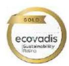
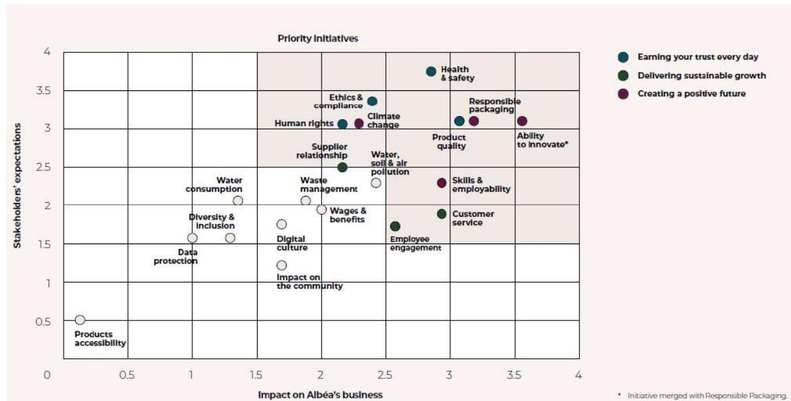
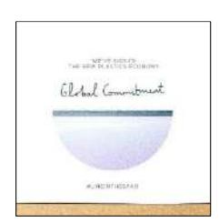
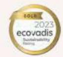
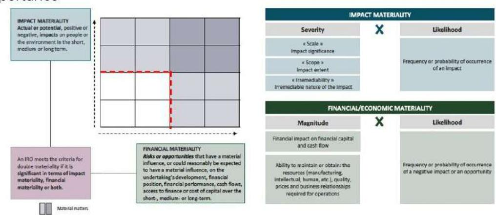
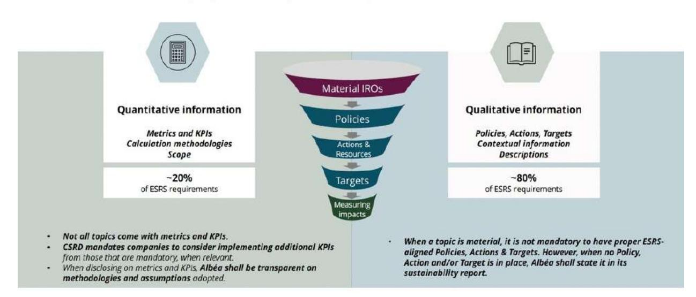
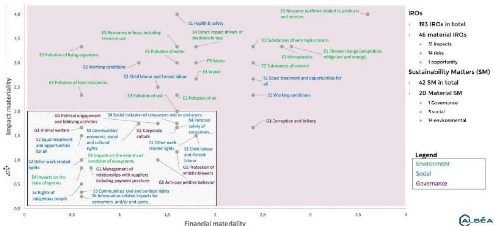
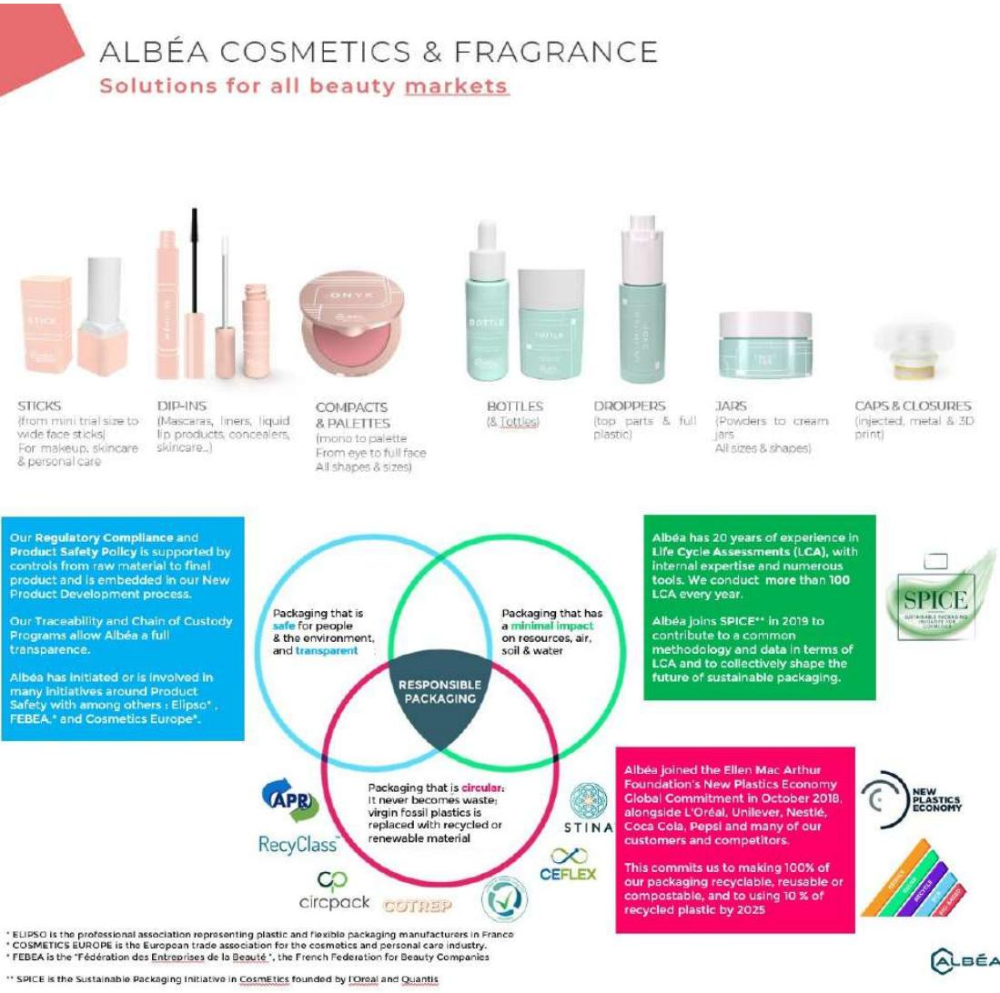

# **PLASTICE**

# **New technologies to integrate PLASTIC waste in the Circular Economy**

**D7.1 Guidelines for the design of process and products towards circularity**

WP7: Boosting the replication of plastic recycling processes

Main Authors: Cecilia Chaine (CIRCE)

Contributors: SUN TEKSTIL, KORTEKS, CTB, ALBEA

# PLASTICE

### **DOCUMENT HISTORY**

| Version | Date       | Changes                                           | Author: Name           |
|---------|------------|---------------------------------------------------|------------------------|
| V1      | 6/052024   | ToC shared                                        | Cecilia Chaine (CIRCE) |
| V2      | 25/02/2025 | First consolidated draft shared with participants | Cecilia Chaine (CIRCE) |
| V2.1    | 10/11/2025 | Incorporation of comments from participants       | ALBEA, SUN, CTB,       |
| V2.3    | 14/11/2025 | Quality process: Reviewer comments integrated:    |                        |
| V3.0    | 26/11/2025 | Final version                                     | CIRCE                  |

**Disclaimer:** The European Commission is not responsible for any use made of the information contained herein. The content does not necessarily reflect the opinion of the European Commission.

|                     | TECHNICAL PROJECT REFERENCES                                                                        |
|---------------------|-----------------------------------------------------------------------------------------------------|
| Project Acronym     | PLASTICE                                                                                            |
| Project Title       | PLASTICE: New technologies to integrate PLASTIC waste in the Circular Economy                       |
| Call:               | HORIZON-CL4-2021-TWIN-TRANSITION-01                                                                 |
| Topic:              | HORIZON-CL4-2021-TWIN-TRANSITION-01-17                                                              |
| Project Coordinator | CIRCE – Fundación Circe Centro de Investigación de Recursos y Consumos Energéticos. circe@fcirce.es |
| Project Officer     | Valentina Vignoli                                                                                   |
| Project Duration    | June 2022 – May 2026 (48 months)                                                                    |

|                                                                                               | DELIVERABLE REFERENCES                                                    |
|-----------------------------------------------------------------------------------------------|---------------------------------------------------------------------------|
| Deliverable No.                                                                               | D7.1                                                                      |
| Type:                                                                                         | R                                                                         |
| Dissemination level                                                                           | PU                                                                        |
| Work Package                                                                                  | WP7: Boosting the replication of plastic recycling processes              |
| Task                                                                                          | Task 7.1 Environmental guidelines including product ecodesign             |
| Lead beneficiary Contributing beneficiary(ies) Due date of deliverable Actual submission date | CIRCE KORTEKS, SUN, ALBEA, CTB, RINA-C M42: November 2025 M42: 28/11/2025 |

# DISCLAIMER OF WARRANTIES

This document has been prepared by PLASTICE project partners as an account of work carried out within the framework of the EC-GA contract no. 101058540.

Neither Project Coordinator, nor any signatory party of PLASTICE Project Consortium Agreement, nor any person acting on behalf of any of them:

(a) makes any warranty or representation whatsoever, expressed or implied,

(i). with respect to the use of any information, apparatus, method, process, or similar item disclosed in this document, including merchantability and fitness for a particular purpose, or (ii). that such use does not infringe on or interfere with privately owned rights, including any party's intellectual property, or (iii). that this document is suitable to any particular user's circumstance; or

(b) assumes responsibility for any damages or other liability whatsoever (including any consequential damages, even if the Project Coordinator or any representative of a signatory party of the PLASTICE Project Consortium Agreement has been informed of the possibility of such damages) resulting from your selection or use of this document or any information, apparatus, method, process, or similar item disclosed in this document.

## Table of content

| EXECUTIVE SUMMARY                                                                                        | 6  |
|----------------------------------------------------------------------------------------------------------|----|
| 1 OBJECTIVE                                                                                              | 7  |
| 2 METHODOLOGY                                                                                            | 7  |
| 3 BACKGROUND                                                                                             | 8  |
| 3.1 C OSMETICS P LASTIC P ACKAGING                                                                       | 8  |
| 3.2 T EXTILES                                                                                            | 9  |
| 3.2.1 C ASCADE HYDROLYSIS AND FERMENTATION FOR THE RECOVERY OF PET FROM TEXTILE FIBRES                   | 10 |
| 4 REGULATIONS AND STANDARDS                                                                              | 11 |
| 4.1 R EGULATORY F RAMEWORK                                                                               | 11 |
| 4.1.1 A SSESSMENT OF R ECYCLED P OLYMER C OMPOSITION AND C OMPLIANCE M ONITORING IN C OSMETIC P ACKAGING | 19 |
| 4.2 ISO 14006:2020                                                                                       | 20 |
| 4.2.1 E VALUATION OF COMPLIANCE : ALBEA                                                                  | 21 |
| 4.2.2 E VALUATION OF COMPLIANCE : SUN TEKSTIL                                                            | 31 |
| 4.2.3 E VALUATION OF COMPLIANCE : KORTEKS                                                                | 33 |
| 4.3 E CODESIGN IN THE EU: CURRENT STATUS                                                                 | 35 |
| 4.4 EU E COLABEL CERTIFICATION FOR TEXTILES                                                              | 36 |
| 4.4.1 S COPE OF A PPLICATION                                                                             | 36 |
| 4.4.2 W HO CAN APPLY ?                                                                                   | 37 |
| 4.4.3 E COLOGICAL C RITERIA                                                                              | 37 |
| 4.4.4 R EQUIREMENTS                                                                                      | 38 |
| 4.4.5 T EXTILE FIBER CRITERIA : EVALUATION OF COMPLIANCE                                                 | 38 |
| 4.4.6 D ECLARATIONS                                                                                      | 39 |
| 4.4.7 B EST A VAILABLE T ECHNIQUE (BAT) IMPLEMENTATION                                                   | 40 |

| 5     | ECODESIGN GUIDELINE FOR SYNTHETIC FABRIC PRODUCTION FROM RECYCLED PET     |                                                             | 43                                       |
|-------|---------------------------------------------------------------------------|-------------------------------------------------------------|------------------------------------------|
| 5.1   | R                                                                         | EQUIREMENTS                                                 | 43                                       |
| 5.2   | A                                                                         | CTION P LAN FOR C OMPLIANCE                                 | 50                                       |
| 5.3   | O                                                                         | THER PROCESS REQUIREMENTS                                   | 52                                       |
| 5.3.1 |                                                                           | M ATERIAL : F IBER AND YARN SPINNING AND WEAVING            | 52                                       |
| 5.4   | R                                                                         | ESOURCES R EQUIRED                                          | 53                                       |
| 5.5   | R                                                                         | ECYCLABILITY ASSESSMENT                                     | 53                                       |
| 5.6   | M                                                                         | ERGE WITH ISO 14006:2020                                    | 55                                       |
| 6     | ECODESIGN GUIDELINE FOR COSMETIC PACKAGING MADE FROM RECYCLED POLYOLEFINS |                                                             | 56                                       |
| 6.1   | R                                                                         | EQUIREMENTS                                                 | 57                                       |
| 6.2   | A                                                                         | CTION P LAN FOR C OMPLIANCE                                 | 60                                       |
| 6.3   | R                                                                         | ESOURCES R EQUIRED                                          | 61                                       |
| 6.4   | R                                                                         | ECYCLABILITY ASSESSMENT                                     | 61                                       |
| 6.5   | S                                                                         | UITABILITY ASSESSMENT OF RECYCLED MATERIAL FOR COSMETIC USE | : S UBSTANCES OF V ERY H IGH C ONCERN 64 |
| 6.5.1 |                                                                           | A NALYTICAL TECHNIQUES                                      | 65                                       |
| 6.5.2 |                                                                           | A NALYSES : PRELIMINARY LIST                                | 66                                       |
| 6.5.3 |                                                                           | A NALYSES INCLUDED IN ALBEA´ S ACTIONS PLAN                 | 67                                       |
| 6.6   | M                                                                         | ERGE E CODESIGN REQUIREMENTS WITH ISO 14006:2020            | REQUIREMENTS 67                          |
| 7     | CONCLUSIONS AND FUTURE WORK                                               |                                                             | 70                                       |
| 8     | REFERENCES                                                                |                                                             | 72                                       |

# **EXECUTIVE SUMMARY**

The primary aim of Work Package 7 (WP7) is to facilitate the expansion and adoption of PLASTICE's solutions across various contexts. Task 7.1 (T7.1) focuses on applying ecodesign principles, particularly design for recycling, to ensure product recyclability by addressing material compatibility, format challenges, and the avoidance of hazardous substances. The task targets two end-user applications: cosmetics plastic packaging and textiles.

For both streamsthe objective is to ensure compatibility with recycling streams through desk-based analyses and application of ecodesign principles to targeted formats (i.e., plastic tubes). In addition, the goal is to integrate ecodesign methodology following ISO 14006:2020 requirements to standardize the application of ecodesign and improve sustainability performance.

The report outlines the methodology for achieving these objectives, including desk-based analyses and assessment of the integration of ecodesign principles into company practices. It provides background information on cosmetics packaging, focusing on the development of technologies for chemical recycling of packaging plastics, addressing contamination issues, and ensuring safety for recycled materials. For textiles, it addresses the challenges of recycling mixed textile waste, demonstrating enzymatic breakdown of PET and cotton mixtures.

The report evaluates compliance for partners involved in the project, including ALBEA, SUN TEKSTIL, and KORTEKS, highlighting their efforts to integrate ecodesign principles and meet regulatory standards. Detailed ecodesign guidelines are provided for synthetic fabric production from recycled PET and cosmetic packaging made from recycled polyolefins, ensuring compliance with the latest EU regulations. Action plans for compliance are outlined, detailing steps, resources required, and timelines for achieving regulatory and operational requirements.

In conclusion, the report emphasizes the importance of integrating ecodesign principles into product development to improve sustainability performance, comply with regulations, and optimize recycling processes.

## **1 Objective**

The main aim of WP7 is to enable the expansion and adoption of PLASTICE´s solutions across different contexts.

Within WP7, T7.1 involves the application of ecodesign principles, particularly focusing on design for recycling. This includes ensuring the recyclability of products addressing material compatibility, format challenges, and avoidance of hazardous substances.

Furthermore, end-user application is assessed centralizing on the application of ecodesign principles to two end-user applications: cosmetics plastic packaging and textiles.

In this context, the following objectives were defined:

- 1. Evaluation of compliance with the requirements of ISO 14006:2020
- 2. Assessment of the state of ecodesign in the European Union
- 3. Identification of the ecodesign requirements defined in the relevant standard
- 4. Propose an action plan to comply with the above requirements
- 5. Assessment of the recyclability of products
- 6. Combine the requirements of ISO 14006 with those of the ecodesign standard

Overall, the objective is to improve sustainability performance and translate demo case results and outcomes into actionable recommendations for optimizing valorisation technologies and reducing unsortable fractions.

## **2 Methodology**

The methodology for T7.1 involves a comprehensive approach to applying ecodesign principles to ensure the recyclability and sustainability of products, specifically targeting cosmetics plastic packaging and textiles. It begins with a desk-based analysis of existing ecodesign principles to ensure recyclability, followed by the application of these principles to real-world formats such as plastic tubes. External tests conducted to validate the recyclability of the produced packaging are identified, ensuring compatibility with polyolefin recycling streams. For textiles, the design and prototyping focus on end-of-life aspects, adhering to the EU Ecolabel Textiles Directive criteria. The methodology emphasizes the avoidance of hazardous substances, integration of ecodesign principles into company practices, and standardization to improve sustainability performance across all production steps. Finally, conclusions are extracted from demo case results and translated into actionable recommendations to optimize valorisation technologies and reduce unsortable fractions.

## **3 Background**

## **3.1 Cosmetics Plastic Packaging**

PLASTICE focuses on the development of technologies for the chemical recycling of packaging plastics recovered from household waste, predominantly food packaging waste. However, the treated material may be contaminated from various sources including non-food packaging plastics, substances from inks or other additives, as well as unintended substances stemming from alternate uses of the packaging. When consumers use packaging for storing products of a nature different that the one intended for, it can result in the contamination of the packaging with unexpected substances. Consequently, selecting appropriate inputs (food versus non-food packaging) becomes crucial, and the choice of decontamination processes is key in determining the resin's quality, based on the intended use of the recycled material.

Different types of resins are used for packaging manufacturing, including polyolefins such as PE (polyethylene) and PP (polypropylene), thermoplastic polymers produced through the polymerization of olefins, currently regarded as the most widely used plastics due to their exceptional versatility.

As it is unfeasible to identify all potential forms of contamination, and since various plastic resins differ in their ability to retain and release contaminants, precise characteristics applicable to all recycled plastic materials cannot be defined. Ensuring the safety of recycled materials requires preparation (sorting and decontamination) to meet the specific requirements of intended uses and applications.

There are different parameters that affect the recyclability of a plastic packaging. For example, the higher the sorption capacity the less permeable the material and therefore the lower the potential for it to have been contaminated by compounds exogenous to its formulation, and the lower the risk of migration from the container to the contained product. Furthermore, in polyolefins, substances weighing up to 1,000 Daltons can, throughout the lifecycle of the packaging, permeate the polymer matrix highlighting the potential impact of improper use. However, it is sensible to expect that inappropriate uses are consistent regardless of the resin of the packaging, as this behaviour is associated more with the container's shape rather than its material.

When considering decorative elements or functional components in recycled materials, it is essential to account for the origin of these materials. They may contain substances that lead to contamination, rendering the material unsuitable for food contact upon recycling.

Chemical recycling involves altering the chemical structure of used plastics, transforming them into shorter molecules for new chemical reactions. However, the chosen technology can influence the potential presence of residual contaminants in the material. These factors must be considered during the risk assessment process.

One of the recycling technologies developed at PLASTICE is microwave-assisted pyrolysis which will be applied to treat the unsortable fraction of mixed PE, PP and PS. This process produces pyrolysis oil which will be sent to partner TOTAL for cracking and production of olefins and polyolefins. Validation plan is being defined with ALBEA to close the research loop.

## **3.2 Textiles**

The textile sector relies heavily on polyester, which accounts for approximately 55% of all textile materials, corresponding to around 55 million tons per year globally. However, a significant challenge arises from the fact that most textile items, such as clothing, are not made entirely of polyester (polyethylene terephthalate – PET) but instead consist of mixed materials. Other commonly used plastic materials include polyamide (PA) and polypropylene (PP) for fibres/filaments and PU (polyurethane) and PVC (polyvinyl chloride) for coatings. Consequently, End-of-Life (EoL) textile waste often comprises a mix of plastic materials, making it difficult—or even impossible—to recycle. As a result, such waste is predominantly incinerated or landfilled. Only purer textile fractions are currently recycled on an industrial scale, primarily through mechanical recycling. This process often results in downcycling, where defibred EoL waste is recycled into non-wovens for technical applications, such as insulation.

Emerging chemical recycling technologies and methods for separating polyester/cotton mixtures require stringent input material, which is currently available in limited quantities. To advance the state of the art, PLASTICE aims to demonstrate enzymatic breakdown of EoL textile waste mixes. Two types of mixed waste will be addressed:

▪ PET and cotton mixtures: The cotton will be enzymatically broken down into ethanol, allowing separation of the fractions. PET will then be reused either through direct fibre reuse (mechanical recycling) or thermoplastic recycling, depending on the output quality. ▪ PET mixed with other polymers (e.g., PU from coatings, PA, or PP from textiles): PET will be broken down into chemical building blocks, while residues, such as PU, can be used in downstream processes like depolymerization.

The resulting products, such as ethanol, will serve as raw materials for the chemical industry, and separated PET fibres will be suitable for reintegration into the textile sector.

# **3.2.1 Cascade hydrolysis and fermentation for the recovery of PET from textile fibres**

This is a multi-step process aimed at recycling PET-cotton textiles while recovering valuable materials. After sorting and shredding the textiles, the material is fed into a hydrolysis reactor where specialized enzymes, such as cellulases, break down the cotton into sugars. These sugars are then fermented into ethanol, ensuring optimal process parameters for high yield. The PET fibres, which remain intact during hydrolysis, undergo a washing step to remove contaminants before being processed into granules for polycondensation, restoring proper chain length, and then recycled into fibres. Impurities such as elastane, present in small amounts, do not interfere significantly with enzymatic hydrolysis and are removed in subsequent washing or melt filtration steps during PET recycling. The process targets polyester-cotton textiles initially, as this is a common composition, aiming to efficiently recover valuable materials while minimizing waste and ensuring the sustainability of textile recycling.

# **4 Regulations and Standards**

In the EU, cosmetic products are regulated by Regulation (EC) nº 1223/2009 Cosmetics Regulation, which establishes that ´*cosmetic products should be safe under normal or reasonably foreseeable conditions of use. In particular, a risk-benefit reasoning should not justify a risk to human health*´. To meet these mandatory requirements, manufacturers must ensure and demonstrate compliance through appropriate documentation and safety assessments. The Cosmetic Product Safety Report (CPSR), defined in Annex I of the Regulation, details the requirements for evaluating product safety. Regarding packaging materials, the CPSR must include information on the purity of substances and mixtures, along with evidence demonstrating the technical unavoidability of traces of prohibited substances. In addition, it must describe the relevant characteristics of the packaging, particularly those related to purity, stability, and potential interactions with the product, to ensure that the packaging does not adversely affect product safety or quality.

Even though it is not mandatory to use "food contact" quality materials for cosmetic packaging when the formula is not in direct contact with the packaging itself, the European Commission's Guidelines on the application of Annex I of the Cosmetics Regulation (Decision No. 2013/674/EU) indicate that Regulation (EC) No. 1935/2004 on materials and articles intended to come into contact with food serves as a valuable reference for assessing packaging safety. When the cosmetic formula is in direct contact with the packaging, evidence of safety must be included in the cosmetic product´s safety assessment, and using food-contact compliant materials may support this, but EFSA or FDA certification is not mandatory.

In the framework of circular economy and the European Green Deal, the adoption of recycled plastics for cosmetics packaging manufacturing under the revised Packaging Directive n°94/62/EC, aligns with the eco-design approach.

Hence, given the risks tied to using recycled plastics, PLASTICE worked on identifying specific requirements for the application of this material into cosmetics packaging manufacturing.

## **4.1 Regulatory Framework**

This document focuses on the products targeted by Task 7.1 of PLASTICE project, i.e., cosmetics plastic packaging and textiles.

Amongst the main requirements on ecodesign for cosmetics plastic packaging is that recycled material incorporated in their manufacturing should be of food grade, although is not mandatory. These types of resins are covered by Regulation (EU) Nº2022/1616, which established two recycling technologies are considered approved to date:

▪ Recycling from product loops which are in a closed and controlled chain. ▪Postconsumer mechanical PET recycling.

Therefore, the processes of chemical recycling[1](#page-11-0) developed in PLASTICE are not covered by this regulation and the recycled plastic materials and articles manufactured from monomers and starting substances obtained via the chemical depolymerization of plastic materials and articles, are outside the scope of this regulation, and are subject to Regulation (EU) 10/2011. This is the case in PLASTICE. Technologies not yet acknowledged as suitable are classified as new technologies and must undergo authorization. Nevertheless, marketing recycled materials is feasible with robust monitoring and increased analytical reporting demands.

Furthermore, Regulation (EC) 1907/2006 (REACH) is common to any packaging placed on the EU market defining obligations for the communication of certain information throughout the life cycle of the products. For instance, the SVHC content in packaging should be declared when above 0.1%. Additionally, this regulation restricts the use of certain specific substances that may have a negative impact on the environment and public health. Another regulation that applies to plastic packaging independent of their materials origin (raw, virgin or recycled) is Directive 94/62/EC on Packaging and packaging waste, establishing for instance accepted concentration limit of 100ppm for the sum of certain heavy metals(i.e., lead, cadmium, mercury and hexavalent chromium). It should be noted that the Packaging and Packaging Waste Regulation (EU) 2025/40 will replace the directive 94/62/EC. This new regulation, which maintains the heavy metals limit, officially entered into force on February 11, 2025. The enforcement of its measure will begin on August 12, 2026. To ensure

1 Process that alter the chemical structure of used plastics by breaking them down into shorter molecules, which can then be used for new chemical reactions.

that, ALBEA asked suppliers to complete a regulatory questionnaire for every material and component purchased. These regulations are listed as mandatory as well other international regulation such as the California proposition 65. In addition to the regulatory statements, some of ALBEA´s suppliers send laboratory analysis reports that certify for example the absence of heavy metals and/or REACH Substances of Very High Concern.

Regarding textiles, in support of innovative processes developed in PLASTICE such as cascade hydrolysis for PET recovery, the European Union has established a robust legislative framework aimed at promoting sustainable and circular textile waste management. Under the Waste Framework Directive (Directive 2008/98/EC), Member States are required to implement separate collection systems for textile waste by 2025, laying the groundwork for high-quality recycling processes. Complementing this, the EU Strategy for Sustainable and Circular Textiles encourages the development and uptake of technologies capable of recovering materials from complex blends, such as polyester-cotton, with minimal environmental impact.

These objectives are reinforced through mandatory Extended Producer Responsibility (EPR) schemes, which hold producers accountable for the end-of-life management of textiles, encouraging the design of recyclable materials and supporting the financing of advanced recycling infrastructure. Furthermore, the proposed Ecodesign for Sustainable Products Regulation (ESPR) sets performance requirements that enhance the recyclability of textiles and supports the deployment of Digital Product Passports to track material composition, which will be later discussed in more depth. Finally, the EU's Chemicals Strategy for Sustainability ensures that harmful substances are minimized or eliminated, supporting safer and more effective chemical recycling processes. Together, this evolving regulatory landscape supports the deployment of multi-step recycling innovations that can handle blended textiles, such as those targeted in this process, contributing to a circular and resource-efficient textile economy.

**[Table 1](#page-13-0)** presents details on specific requirements set out in the regulations discussed above, and others.

*Table 1. Requirements defined in relevant regulation*

| Regulation Matrix Subject Aspect | Requirement                              |
|----------------------------------|------------------------------------------|
| Prevention                       | : Reducing the generation of waste.      |
| Reuse                            | : Encouraging the reuse of materials and |
| Recycling                        | : Supporting the recycling of materials  |
| Energy                           | Recovery : Using waste for energy        |
| Disposal                         | : Landfilling or incineration without    |
| prevent                          | waste, boost reuse, recycling, and       |

| Regulation Matrix Subject Aspect |                   | Requirement |                                    |             |          |
|----------------------------------|-------------------|-------------|------------------------------------|-------------|----------|
|                                  | substance,        |             | to ensure safe use of the article. |             |          |
|                                  | (EUROPE)          | Recyclers   | are                                | exempt      | from the |
| Article                          | 2(7)              | Exemption   | of                                 | registering | the      |
| Another                          | common            |             | obligation                         | to all      | polymer  |
| Metals                           | Pb, Cd, Hg and Cr | +6         | 100ppm                             |             |          |

| Regulation Matrix Subject Aspect |                     | Requirement |               |               |
|----------------------------------|---------------------|-------------|---------------|---------------|
| Chemical                         | post-consumer       |             | Recycled      | plastic       |
| not                              | transfer            | harmful     | substances    | to food in    |
| They                             | must                | also        | provide       | appropriate   |
| Specific                         | migration           | limits      | are           | applicable to |
| substances                       | migrating           |             | from chemical | recycled      |
| plastics                         | and virgin plastics |             | into food.    |               |

| Regulation | Matrix | Subject | Aspect | Requirement                                   |
|------------|--------|---------|--------|-----------------------------------------------|
|            |        |         |        | Materials should be made from substances that |
|            |        |         |        | The regulation also requires traceability     |

| Regulation | Matrix | Subject | Aspect | Requirement                               |
|------------|--------|---------|--------|-------------------------------------------|
| (EU No.    |        |         |        |                                           |
|            |        |         |        | each fiber in the product must be clearly |
|            |        |         |        | Only approved fiber names listed in the   |
|            |        |         |        | or more fibers, the label must state the  |

| Regulation   | Matrix | Subject | Aspect |       |     | Requirement             |       |
|--------------|--------|---------|--------|-------|-----|-------------------------|-------|
| EU Strategy  |        |         |        |       |     |                         |       |
| and Circular |        |         |        |       |     |                         |       |
|              |        |         |        | Calls | for | producer responsibility | where |

# **4.1.1 Assessment of Recycled Polymer Composition and Compliance Monitoring in Cosmetic Packaging**

At ALBEA the methodology for assessing chemical post-consumer recycled resins focuses primarily on characterizing the nature of the recycled polymer and ensuring compliance with relevant regulatory standards regarding potentially hazardous substances. These are in line with ecodesign principles and ISO 14006 requirements. ALBEA does not currently identify specific monomers in the recycled polymer. Instead, the nature of the received resin is characterized using Near Infrared Spectroscopy (NIR), Differential Scanning Calorimetry (DSC), Thermogravimetric Analysis (TGA), and Melt Flow Index (MFI) measurements. These physico-chemical tests are intended to confirm the identity of the resin and to detect any mixtures of materials, thereby enabling validation against the

specifications provided in the technical data sheet. Parameters such as ash content, density, and flow index are compared during this stage.

These procedures provide a structured approach to ensuring the safety and regulatory compliance of chemical recycled polymers used ALBEA's cosmetics packaging.

## **4.2 ISO 14006:2020**

ISO 14006:2020 provides guidelines for incorporating ecodesign principles into an organization's environmental management system. By promoting a life cycle perspective, the standard supports the identification and reduction of environmental impacts from the early stages of product design, including material selection, production methods, and end-of-life strategies.

In the context of manufacturing a cosmetics packaging made from chemical recycled polyolefins, the standard helps integrate environmental considerations throughout the design and production process. It ensures that the packaging is designed for minimal environmental impact, considering factors like material selection, energy efficiency, and waste reduction. The goal is to improve the sustainability of the product by optimizing the use of recycled materials, enhancing the recyclability of the packaging, and reducing the overall ecological footprint of the manufacturing process.

As for the textile stream, ISO 14006:2020 is highly applicable to recycling and production processes as it provides a structured approach for integrating ecodesign into the management system of the organization. The applicability of this standard to textile processes may comprise designing garments and fabrics that are easier to recycle, use fewer resources, and contain safer chemicals.

ISO 14006 also encourages continuous improvement, stakeholder communication, and alignment with broader sustainability and circular economy goals, making it a valuable tool for companies aiming to enhance the environmental performance of the recycled products.

Along this section compliance with ISO 14006:2020 requirements will be presented as compliance with ISO 14001 requirements. This is because ISO 14006 is designed as a guidance standard that builds upon the framework of ISO 14001. ISO 14006 does not stand alone; instead, it helps organizations integrate ecodesign principles specifically into an existing ISO 14001-based environmental management system. Since ISO 14001 already requires organizations to identify environmental aspects, set objectives, and implement continuous improvement processes, these

same mechanisms provide the foundation for implementing and evaluating ecodesign under ISO 14006. Therefore, if an organization demonstrates strong compliance with ISO 14001—particularly in areas like planning, operational control, leadership, and performance evaluation—it is likely well positioned to meet the additional requirements of ISO 14006 related to product design and development.

## **4.2.1 Evaluation of compliance: ALBEA**

ALBEA demonstrates robust compliance with ISO 14006:2020 by integrating environmental considerations into its design and development processes. The company aligns its strategies with evolving environmental expectations and internal priorities, as reflected in its 2023 CSR (Corporate Social Responsibility) report. Key initiatives include incorporating post-consumer recycled (PCR) materials, using green electricity, and aiming to make all plastic packaging reusable, recyclable, or compostable by 2025, with a PCR content rate of 3.6% in 2022, doubling in 2023.

To overcome challenges such as costs and resource constraints, ALBEA adopts strategies focused on recycled materials and emissions reduction. The company invests in innovation to develop sustainable packaging solutions and maintains strong supplier relationships, supported by tools like the Procurement Charter and Vendor Declaration Of Compliance (VDOC). Employee training is also emphasized through programs like "Planet" training and the "Planet" platform, with individual performance objectives tied to environmental criteria. In 2024, eco-design goals were linked to employee incentives, further reinforcing accountability.

Internally, ALBEA addresses challenges such as cost and resource constraints associated with transitioning to sustainable materials and processes. By adopting strategies that incorporate recycled materials and focus on reducing CO2 emissions, the company not only mitigates these challenges but also enhances operational efficiency over time. Furthermore, ALBEA's investment in innovation underscores its capability to adapt and leads in the development of environmentally friendly packaging solutions.

All sites audited at least once every 3 year by

Smeta *Figure 2. EMS alignment*

Be Gold Rated at minimum Top 5% of companies rated by Ecovadis All sites assessed at least once every 5 year No Site below Bronze

Be B Rated at minimum Reduce our Scopes 1 and 2 CO2eq emissions by 46% by 2030 (vs 2019)

First beauty packaging supplier to commit to the New Plastics Economy 2025 – 100% reusable, recyclable or compostable plastic packaging products 10% of our plastic coming from Post Consumer Recycled

These efforts are supported by ALBEA's broader priorities, which include health and safety, climate change mitigation, waste management, and innovation. The company also emphasizes strong supplier relationships, ensuring sustainability across the supply chain, and invests in employee training to build the skills necessary for continued growth in environmental performance. This integrated approach allows ALBEA to navigate external pressures and internal challenges while maintaining a strong focus on sustainability and compliance.

*Figure 1. Materiality matrix: meeting the expectations of our stakeholders. (Since 2018, ALBEA has been building its materiality matrix every year to highlight the strategic areas of its CSR roadmap.)*

The Environmental Management System (EMS), aligned with ISO 14006:2020 clause 4.3, includes eco-design principles and is embedded within the "Responsible Packaging" initiative.

The EMS incorporates life cycle assessments (LCA), advanced data monitoring tools such as SAP, and adheres to frameworks like Ellen MacArthur and EcoVadis. Seventy-seven percent of ALBEA's plants are ISO 14001 certified, reinforcing its environmental policy and continuous improvement goals.

ALBEA complies with the requirement for an EMS by embedding environmental responsibility into its operations and fostering continuous improvement across all functions. The company's environmental policy, aligned with its EMS, sets the foundation for achieving its environmental goals. This policy is clearly communicated throughout the organization, ensuring a shared understanding of the role each employee plays in enhancing environmental performance. With seventy-seven percent of its plants ISO 14001 certified, ALBEA demonstrates a commitment to aligning its operations with recognized environmental standards.

Sustainability is embedded across departments, with collaboration among R&D, marketing, procurement, and manufacturing. Innovations like Greenleaf and EcoTop showcase the integration of recycled content and recyclability. The company also promotes refillable and reusable packaging, supporting customers in end-of-life product strategies. Partnerships with Pellenc, TOMRA, RecyClass, CITEO, and TRASCE enhance packaging recyclability and supply chain transparency.

ALBEA regularly conducts internal audits, environmental data collection, and assessments to identify improvement opportunities. In 2023, the company achieved 32% recyclable or reusable packaging and reduced CO2 emissions by 40% compared to 2019. Over 100 LCAs were conducted to support continuous improvement and datadriven decision-making.

For the sixth year in a row, Albéa's commitment to Corporate Social Responsibility (CSR) earned the Group an EcoVadis Cold medal. This means that Albéa ranked in the top 5% of companies assessed by EcoVadis in the "Manufacture of plastics products industry".

Innovation and external collaboration also play a crucial role in

ALBEA's approach. By participating in industry consortia and *Figure 3. Certifications*

sharing best practices, the company fosters advancements in sustainable packaging solutions and works collectively to mitigate environmental impacts. This multifaceted strategy demonstrates ALBEA's dedication to maintaining and enhancing its EMS while achieving its broader sustainability objectives.

CSR is integrated into management performance reviews, with updates shared during quarterly webcasts. ALBEA's ability to attract funding (e.g., France Relance) highlights its alignment with sustainability-driven opportunities. The integration of CSR into performance evaluations and industry-wide efforts through FEBEA, Elipso, and SPICE underscores its leadership in sustainability.

## OUR LATEST CSR LAUNCHES SUPPORTING BRANDS IN THEIR CSR TRANSITION

### *Figure 4. ALBEA CSR Launches*

\*ELIPSO is the professional association representing plastic and flexible packaging manufacturing in France. \* COSMETICS EUROPE is the European trade association for the cosmetics and personal care industry. \* FEBEA is the "Fédération des Enterprises de la Beauté", the French Federation for Beauty Companies \*\* SPICE is the Sustainable Packaging Initiative in CosmEtics founded by L'Oréal and Quantis.

Eco-design principles are embedded into the organizational structure. HSE/QHSE managers ensure policy implementation across sites. A dedicated steering committee for "Responsible Packaging" meets quarterly to review progress and set goals. Employees are engaged through initiatives like "Monday For Future," which fosters cross-functional discussions on sustainability.

*Figure 5. CSR training proposed by ALBEA for all the employees*

Managers and auditors play a critical role in embedding eco-design into operations. Design and development managers are equipped with the resources and training needed to implement ecodesign effectively and ensure these principles are communicated throughout the supply chain. Auditors are similarly trained to evaluate environmental compliance in supplier operations, including quality, logistics, and traceability.

In 2024, ALBEA reinforced its commitment by tying employee incentives to the achievement of ecodesign objectives, such as increasing PCR incorporation and recyclable resin use. Failure to meet these objectives directly impacted on year-end bonuses, further underscoring the importance of these goals within the company. This comprehensive approach demonstrates ALBEA's dedication to aligning environmental and eco-design policies with its operational practices and overall strategy.

ALBEA demonstrates compliance with the planning requirements outlined in ISO 14006:2020 by integrating a structured and forward-thinking approach into its environmental management and eco-design strategies. To shape its 2020-2025 roadmap, the company leveraged insights from its previous roadmap and a materiality matrix to prioritize significant environmental and social topics. This method ensured that the planning process was grounded in a thorough understanding of the most pressing issues and aligned with ALBEA's strategic objectives.

Looking beyond 2025, ALBEA adopted a double materiality matrix, systematically evaluating Impacts, Risks, and Opportunities (IROs) across environmental, social, and governance dimensions. By annually reviewing this matrix, the company identifies and prioritizes issues that are critical to its operations and stakeholders, integrating these priorities into its broader planning framework. Legal and stakeholder requirements are meticulously incorporated, supported by foundational documents such as the Code of Conduct and the Responsible Purchasing Charter, which are regularly updated to remain responsive to regulatory changes and stakeholder expectations.

- • Each identified IRO (Impact; Risk and Opportunity) is assessed by calculating a score
- • The score is based on the multiplication of two key criteria
- • Each IRO is then positioned on the materiality matrix according to their relative importance

*Figure 6. ALBEA IROs matrix*

- For each material topic, ESRS requires companies to disclose..

- For each material topic, ESRS requires companies to disclose..

This project has received funding from the European Union's Horizon Europe research and innovation programme under grant agreement n° 101058540.

*Figure 7. ESR Disclosure requirements: Quantitative vs. Qualitative information*

*Figure 8. Impact and financial materiality mapping of IROs*

ALBEA has also enhanced its internal capabilities to ensure robust planning and compliance. The legal department has been reinforced to manage industrial intermediaries effectively and uphold commitments embedded in the company's environmental and social strategies. This proactive approach is reflected in the extensive auditing of ALBEA's sites, with 91% conducting social audits or undergoing EcoVadis sustainability assessments. The company's consistent achievement of Gold-level

ratings, and Platinum certifications at several plants, underscores its dedication to maintaining high standards.

Additionally, ALBEA demonstrates readiness for evolving global regulations, including the EU's Packaging and Packaging Waste Regulation and initiatives in the United States. The company actively designs recyclable packaging, obtains relevant certifications such as *EN 15343 Plastics* for mechanical PCR and ISCC+ for chemical PCR. *Recycled plastics. Plastics recycling traceability and assessment of conformity and recycled content*, and partners with eco-organizations for waste collection and recycling. These actions highlight ALBEA's commitment to compliance, innovation, and sustainability as central components of its planning process. By aligning its roadmap with global and stakeholder expectations, ALBEA exemplifies a robust and dynamic approach to environmental management planning.

The global environmental objectives of the company have been defined with ALBEA committed to transform its packaging so that it is 100% recyclable or reusable by 2025, as well as it is committed to reducing its absolute Scope 1[2](#page-27-0) and Scope 2 [3](#page-27-1) carbon emissions by 46% by 2030 (baseline 2019).

ALBEA complies with the requirement on support and resources by allocating substantial efforts and infrastructure to ensure effective environmental management and continuous improvement. With 27 sites certified under ISO 14001, the company demonstrates a commitment to maintaining high environmental standards through ongoing certification and recertification processes. These sites are actively engaged in implementing and enhancing practices that serve environmental goals, supported by a dedicated CSR team that coordinates and oversees these efforts.

The company utilizes advanced technology to support its environmental objectives. Integrated management systems, such as SAP, are deployed to monitor environmental data, ensure material traceability, and maintain regulatory compliance. Additionally, LCA tools are employed to analyze

2 **Scope 1 emissions:** direct greenhouse gas emissions from sources that a company owns or controls

3 **Scope 2 emissions:** indirect greenhouse gas emissions from purchased energy, such as electricity, steam, heating and cooling

the environmental impact of ALBEA's products and processes, enabling the identification of areas for improvement and supporting eco-design initiatives.

Financial resources are strategically allocated to environmental priorities. Specific budgets are dedicated to projects such as eco-design, environmental audits, and employee training, ensuring that all aspects of ALBEA's operations align with their sustainability goals. Investments in research and development further bolster the company's capacity to innovate, driving advancements in ecodesign and sustainability.

Management plays a pivotal role in ensuring that the necessary resources are available to achieve environmental objectives. ALBEA's leadership actively engages in the implementation and enhancement of its EMS, establishing clear policies and procedures to guide environmental activities. This governance structure ensures alignment with ISO 14001 requirements while fostering a culture of accountability and continuous improvement across the organization. By integrating technology, financial resources, and strong leadership, ALBEA ensures robust support for its environmental initiatives and long-term sustainability objectives.

The company also provides practical resources to enhance employee competence in evaluating and improving environmental performance. With access to LCA tools, employees are equipped to measure the environmental impact of products and identify improvement opportunities. In 2023 alone, ALBEA conducted over 100 LCAs, underscoring its commitment to continuous improvement and data-driven decision-making.

Those responsible for the EMS are well-equipped to communicate the importance of environmental considerations in a way that resonates with designers and other stakeholders. By integrating sustainability criteria into its product development process, ALBEA ensures that every new product is designed with a focus on reducing its environmental footprint. This comprehensive approach to building competence within the organization not only supports compliance with environmental requirements but also drives innovation and aligns ALBEA's operations with its sustainability goals. Operational requirements are met through a 3R-focused eco-design approach: reduce, reuse, recycle. Product safety and regulatory compliance are ensured via RCPS team protocols. Waste is minimized via recovery and recycling; the Washington site exemplifies this with its zero-waste

achievement. Product development includes defined eco-design milestones, and EMS responsibilities are clearly assigned.

*Figure 9. ALBEA products development*

ALBEA complies with the ISO 14001 requirements for monitoring, measurement, analysis, and evaluation by utilizing key performance indicators (KPIs) to assess the effectiveness of its environmental initiatives, such as tracking the percentage of recycled materials used, the reduction of CO2 emissions, and the recyclability rate of its packaging. In 2023, the company achieved 32% recyclable or reusable packaging and reduced its carbon emissions by 40% compared to 2019, demonstrating significant progress in its environmental performance. ALBEA regularly collects and analyzes environmental data to identify trends and areas for improvement, exemplified by its increased use of mechanically post-consumer recycled materials compared to 2022. The company also maintains an internal audit program to ensure compliance with ISO 14001, auditing critical suppliers—433 in the past three years—to verify adherence to environmental and social standards. Additionally, 77% of ALBEA's industrial sites are ISO 14001 certified, reflecting its commitment to continuous improvement in environmental management, while also holding certifications for ISO 9001 (quality), ISO 45001 (safety), and ISO 50001 (energy performance), further reinforcing its adherence to high standards of operational and environmental excellence.

## **4.2.2 Evaluation of compliance: SUN TEKSTIL**

SUN TEKSTIL demonstrates a strong commitment to integrating environmental management and ecodesign principles into its operations, aligning with the requirements of ISO 14006. Despite not yet holding certification under this standard, the company has developed processes that reflect its dedication to sustainability and continuous improvement.

The company approaches its environmental responsibilities by carefully selecting materials such as yarns, fabrics, and auxiliary chemicals, ensuring compliance with stringent sustainability standards like ZDHC MRSL (Zero Discharge of Hazardous Chemicals – Manufacturing Restricted Substances List). By prioritizing the use of recycled materials and exploring bio-based alternatives, SUN TEKSTIL emphasizes a lifecycle perspective in its design and development processes. It ensures the traceability of materials across the supply chain, conducting rigorous inspections and certification verifications to maintain environmental integrity. Waste management is a cornerstone of its operations, with significant efforts directed at recycling pre-consumer waste and converting it into value-added products.

Understanding and responding to the needs of stakeholders is central to SUN TEKSTIL's strategy. The company aligns its design and development activities with the expectations of European customers, focusing on environmentally friendly practices that consider the entire lifecycle of its products. Collaboration within the supply chain is guided by a shared sense of environmental, economic, and social responsibility, ensuring that stakeholders' demands are met while addressing ecological challenges.

The scope of SUN TEKSTIL's EMS encompasses the entirety of its textile production value chain. This includes fabric manufacturing and garment production, alongside activities like waste collection and

recycling. The company ensures that EMS principles are applied at each stage of its operations, reducing the negative environmental impacts of its products. Integration with ISO 14001 standards provides a robust framework for documenting, implementing, and continually improving its environmental performance.

Leadership at SUN TEKSTIL plays a pivotal role in driving its environmental agenda. By demonstrating the economic and social benefits of ecodesign, the company's top management fosters innovation, identifies new business opportunities, and develops high-value products with minimal environmental impact. Strategic goals are continually refined to integrate lifecycle thinking into the company's processes, and resources are allocated to ensure that ecodesign principles are effectively implemented.

The company's environmental objectives are measurable, traceable, and designed to drive longterm improvements in product lifecycle performance. These goals include reducing resource consumption, increasing the use of recycled materials, and designing products that prioritize durability and energy efficiency. By integrating digital tools into textile production, SUN TEKSTIL enhances traceability and supports the creation of circular business models.

Communication and awareness are critical components of SUN TEKSTIL's approach. Internally, regular training programs and workshops ensure that employees are informed about environmental policies and ecodesign criteria. Externally, the company engages with stakeholders, including suppliers and customers, to foster collaboration and share information on environmental performance. This two-way communication builds trust and reinforce a collective commitment to sustainability.

Operational control is achieved through documented procedures that incorporate ecodesign into design and development processes. The company conducts systematic reviews at designated stages to ensure that environmental objectives are met, and potential trade-offs are effectively managed. Feedback from product-related environmental emergencies is integrated into development plans, reducing the likelihood of future adverse impacts.

SUN TEKSTIL's focus on monitoring and evaluation supports its commitment to continuous improvement. By leveraging performance indicators, the company assesses progress in ecodesign integration and environmental performance. These insights inform management reviews, which in turn guide strategic adjustments and resource allocations.

Through its efforts, SUN TEKSTIL underscores the importance of ecodesign as a tool for achieving both environmental and economic benefits. While the company is still in the process of formalizing some aspects of its ecodesign strategy, its existing practices demonstrate a comprehensive understanding of lifecycle thinking and sustainability principles. This positions SUN TEKSTIL as a forward-thinking organization capable of addressing contemporary environmental challenges while delivering value to stakeholders.

## **4.2.3 Evaluation of compliance: KORTEKS**

KORTEKS demonstrates its commitment to environmental management and eco-design principles by aligning its operations with the requirements of ISO 14006. Through structured processes and proactive initiatives, KORTEKS integrates sustainability into its business strategies, product development, and lifecycle management, ensuring compliance with international standards and meeting stakeholder expectations.

By sourcing materials such as Pure Terephthalic Acid (PTA) and Mono Ethylene Glycol (MEG) in compliance with REACH regulations, KORTEKS ensures traceability throughout its supply chain. Rigorous quality control measures are applied to incoming raw materials, while waste generated during production is managed in accordance with legal requirements. Recycling plays a central role in these efforts, as KORTEKS operates a thermo-mechanical recycling plant to process yarn waste, demonstrating its dedication to a circular economy.

Stakeholder demands, particularly from European customers, strongly influence the company's ecodesign strategies. These demands prioritize sustainable resources such as dope-dyed and functional yarns. KORTEKS incorporates these considerations into its design and development processes, focusing on creating environmentally friendly products while addressing lifecycle management. This proactive engagement with stakeholders reflects the company's dedication to aligning its products and processes with international environmental standards and regulations.

The scope of KORTEKS's EMS encompasses all stages of its polyester filament yarn production, from polymerization and spinning to texturizing and recycling. The company integrates lifecycle thinking into every step, ensuring environmental impacts are minimized. For example, KORTEKS incorporates recycled PET into its production chain, emphasizing its commitment to sustainability and environmental stewardship.

Leadership at KORTEKS plays a pivotal role in fostering innovation and promoting products with significant environmental benefits. The company's upper management actively identifies new business opportunities, supports the development of high-value products, and ensures alignment with lifecycle thinking. These efforts are further supported by Zorlu Holding's Smart Life 2030 strategy, which prioritizes environmental, social, and governance goals. Within this framework, KORTEKS has developed groundbreaking products such as TAÇ REBORN recycled polyester yarns and TAÇ BIOLOOP biodegradable yarns, which contribute to the company's leadership in sustainable textiles.

To ensure these goals are met, KORTEKS defines clear environmental objectives that are measurable, traceable, and integrated into its design and development processes. These objectives focus on reducing energy consumption, utilizing recycled materials, and improving product durability to support a circular economy. The company's commitment to these goals is supported by robust resource allocation, advanced technology, and ongoing training programs that enhance staff competencies in eco-design and EMS implementation.

KORTEKS also prioritizes effective communication and awareness across all levels of the organization. Employees are regularly trained on EMS policies, while external stakeholders, including suppliers and customers, are engaged through collaborative initiatives. This open communication fosters a shared commitment to sustainability and ensures that eco-design principles are embedded throughout the value chain.

Operational control is maintained through documented procedures that incorporate eco-design criteria into all stages of product development. Regular reviews and systematic monitoring ensure that environmental objectives are met and that potential trade-offs between environmental and other requirements are effectively managed. By leveraging management and operational performance indicators, KORTEKS measures progress in eco-design integration and continuously seeks opportunities for improvement.

The company's focus on innovation extends to its research and development projects, where environmental considerations are a fundamental component. Feasibility studies for new projects address eco-design requirements, and lessons learned from previous initiatives are documented and applied to enhance future performance. This continuous improvement mindset ensures that KORTEKS remains adaptable and responsive to evolving environmental challenges.

Incorporating lifecycle thinking into design and development, KORTEKS emphasizes collaboration across business functions and stakeholders. Training programs and workshops raise awareness and build capacity for implementing eco-design principles. These efforts are supported by systematic planning, monitoring, and evaluation processes, which ensure that the company's environmental goals are consistently achieved.

Although KORTEKS does not yet hold ISO 14006 certification, its comprehensive approach to environmental management and eco-design demonstrates a strong alignment with the standard's requirements. Through its proactive strategies, innovative products, and commitment to sustainability, KORTEKS exemplifies how a forward-thinking organization can integrate environmental principles into every aspect of its operations, creating value for stakeholders while minimizing its environmental footprint.

## **4.3 Ecodesign in the EU: current status**

The European Union has recently advanced its sustainability agenda through the adoption of the Ecodesign for Sustainable Products Regulation (ESPR), which came into force on 18 July 2024. This regulation replaces the previous Ecodesign Directive and extends its scope beyond energy-related products to cover almost all physical goods within the EU market. The ESPR aims to enhance product durability, reusability, and reparability while promoting energy and resource efficiency. It sets comprehensive sustainability requirements, including the reduction of environmental and climate impacts across the entire product life cycle.

One of the notable features of the ESPR is the introduction of a Digital Product Passport, which provides electronic access to relevant sustainability information for products, components, and materials. This innovation facilitates transparency and informed decision-making for consumers and stakeholders alike. Additionally, the regulation bans the destruction of unsold consumer products such as textiles and footwear, mandating companies to report the quantity and reasons for discarding products annually. The ESPR also encourages green public procurement by allowing EU authorities to set sustainability criteria for their purchases. With the first working plan expected in 2025, the ESPR underscores the EU's commitment to making sustainable products the norm while fostering competitive and resilient markets.

The EU Ecolabel requirements for textiles and cosmetics plastic packaging are intrinsically linked to the overarching sustainability objectives set out by the ESPR. The EU Ecolabel for textiles mandates the use of organic and recycled fibers, strict limits on hazardous substances, and rigorous durability standards to ensure reduced environmental impact throughout the product's lifecycle. Similarly, for cosmetics plastic packaging, the Ecolabel criteria emphasize the use of recycled materials, minimization of packaging weight, and enhanced recyclability, aligning with the ESPR's push for circularity and resource efficiency.

Both regulatory frameworks aim to minimize the environmental footprint of products through comprehensive criteria that cover raw material sourcing, production processes, and end-of-life management. The ESPR's Digital Product Passport facilitates greater transparency, providing detailed sustainability information that complements the EU Ecolabel's certification process. By integrating these standards, the EU ensures that textiles and cosmetics packaging meet high sustainability benchmarks, driving innovation and accountability in these industries while promoting environmentally responsible consumer choices.

## **4.4 EU Ecolabel certification for textiles**

The EU Ecolabel, established by the European Commission, serves as a benchmark for products that meet high environmental and performance standards throughout their life cycle. On June 5, 2014, the Commission adopted Decision 2014/350/EU, which set forth specific ecological criteria for awarding the EU Ecolabel to textile products. These criteria aim to reduce the environmental impact of textiles from production to disposal, ensuring sustainability and consumer safety.

## **4.4.1 Scope of Application**

The Decision defines the "textile products" category to include:

- Textile clothing and accessories composed of at least 80% by weight of textile fibers.
- Interior textiles, such as bed linens and curtains, also comprising at least 80% textile fibers.
- Non-fiber products like membranes, coatings, and laminates.
- Specific products like rugs, mats, and cleaning cloths intended for surface cleaning and kitchenware drying.

However, the Decision excludes wall and floor coverings, which are addressed under separate regulations.

## **4.4.2 Who can apply?**

Manufacturers and service providers may submit applications for the award of EU Ecolabel. Within the context of PLASTICE, SUN TEKSTIL is the partner designing and producing fabrics from recycled yarns provided by KORTEKS for manufacturing textiles with a fraction of >30% of recycled content.

Applications can be made for:

▪ Textile clothing and accessories (SUN): clothing and accessories consisting of at least 80 % by weight of textile fibres in a woven, non-woven or knitted form ▪ Fibres, yarn (KORTEKS): intended for use in textile clothing and accessories and interior textiles, including upholstery fabric and mattress ticking prior to the application of backings and treatments associated with the final product

## **4.4.3 Ecological Criteria**

The ecological criteria established in the Decision encompass several key areas:

- 1. **Fiber-Specific Criteria**: Requirements are tailored to different types of fibers, including natural fibers like cotton and wool, as well as synthetic fibers such as polyester and polyamide. For instance, cotton must be sourced from organic farming or integrated pest management practices, while polyester production should incorporate recycled materials and limit harmful emissions.
- 2. **Restricted Substance List (RSL)**: The use of certain hazardous substances is either prohibited or strictly limited. This includes restrictions on formaldehyde, heavy metals, and specific dyes known to pose environmental or health risks.
- 3. **Production Processes**: Manufacturing processes must adhere to environmental standards, including efficient energy use, wastewater treatment, and air emission controls. For example, wet processing units are required to implement measures to reduce water consumption and treat effluents effectively.

- 4. **Fitness for Use**: Products must demonstrate durability and performance through tests for colorfastness, dimensional stability, and resistance to pilling and abrasion.
- 5. **Corporate Social Responsibility**: Applicants are required to comply with fundamental labor standards as outlined by the International Labor Organization (ILO), ensuring fair labor practices and safe working conditions.

## **4.4.4 Requirements**

Applicants seeking EU Ecolabel for their textile products must provide comprehensive documentation demonstrating compliance with each relevant criterion. This includes test reports, declarations from suppliers, and detailed descriptions of production processes. The assessment is conducted by designated Competent Bodies within EU Member States, which evaluate the application and verify adherence to the established criteria.

The criteria set forth in Decision 2014/350/EU were designed to be valid for a specific period, after which they are subject to review and potential revision to reflect technological advancements and evolving environmental standards. Manufacturers and stakeholders are encouraged to stay informed about any updates to ensure ongoing compliance.

By meeting these comprehensive requirements, textile products bearing the EU Ecolabel offer consumers assurance of their reduced environmental impact, high quality, and ethical production practices.

## **4.4.5 Textile fiber criteria: evaluation of compliance**

For evaluating the compliance of KORTEKS and SUNTEKSTIL, a form was provided outlining questions related to the EU Ecolabel certification for textiles.

Regarding the synthetic fiber content, the requirement is to determine the content of natural fibers. SUN´s product will contain at least 50% recycled synthetic fibers, aligning with the EU Ecolabel's encouragement of recycled materials. KORTEKS product on the other hand will be 97-98% synthetic filament yarn, diverging from the preference for natural fibers but still potentially compliant if recycled content is used. This highlights the importance of sorting synthetic and natural fibers at the recycling level.

One of the requirements relative to organics contribution to composition establishes that the product must contain more than 5% of natural fibres (organic cotton, cotton, recycled cotton). As the fibres do not constitute padding or lining, at least 70% by weight of all the fibres in the product has to be recycled content. According to SUN´s report, currently 50% of the content is recycled PET, however as according to KORTEKS their yarns contain about 5% of recycled polyester being the major PET production virgin material, thus if a claim of "contains 5% recycled" is to be made the textile fibre criteria has to be met and a Declaration of Recycled Content must be supplied. Thus, KORTEKS will need to provide the declaration after completing the corresponding tests.

Relative to the purpose of fibers whether they are for padding or lining, neither SUN´s nor KORTEK´s fibers serve this purpose.

Regarding the type of fiber, both KORTEKS and SUN identifies their polymer as recycled polyester, meeting the EU Ecolabel's preference for recycled synthetic fibers.

Finally, when asked about synthetic fiber criteria, SUN mentions that 20-30% recycled fibers are used for mechanical strength, aligning with the EU Ecolabel's criteria for durability and sustainability. KORTEKS emphasizes the need for filament yarn with suitable tenacity. This highlights the need for recycled materials to meet quality standards, all aligning with the EU Ecolabel's focus on durability and environmental responsibility.

This analysis shows that while both companies address the EU Ecolabel requirements and strive to meet EU Ecolabel standards through recycled content, material transparency, and sustainabilityfocused production.

## **4.4.6 Declarations**

These criteria apply to the following production stages: spinning, fabric formation, pre-treatment, dyeing, printing, finishing, cut/make/trim.

KORTEKS reports the use of spin finish treatment (0.3%-0.4%) which evaporates in the texturizing stage (oven) and use of coning oil (2%-3%) which is removed during fabric washing. SUN reports none of the production recipes contain hazardous substances. It is necessary for SUN to report on final product assessment of hazardous substances presence. Given no hazardous substances are present in the final product, no declaration is required.

As SUN dyes fabric, there will be a requirement to provide declarations on:

- Colour fastness to wet
- Colour fastness to dry rubbing
- Colour fastness to perspiration
- Colour fastness to light
- Fabric resistance to pilling and abrasion

If products are not labelled "Dry clean only", an additional declaration on Colour fastness to washing must be provided as well.

See specific assessment and verification guideline on Commission Decision 2014/350/EU.

As manufacturing of garments will comprise cut-make-trim stages, SUN will additionally need to provide declaration on Fundamental principles and rights at work. In countries where ILO Labour Inspection Convention, 1947 (No 81) has been ratified and ILO supervision indicates that the national labour inspection system is effective, verification by labour inspector(s) appointed by a public authority shall be accepted.

## **4.4.7 Best Available Technique (BAT) implementation**

When washing, drying and curing processes take place, it shall be demonstrated that energy used is measured and benchmarked as part of an energy or carbon dioxide emissions management system, and that production sites have implemented a minimum number of BAT energy efficiency techniques depending on production volumes. **[Table 2](#page-40-0)** presents a list of BATs included in the EU Ecolabel for textiles guidelines.

*Table 2. BATs included in the EU Ecolabel for textiles guidelines*

| Domain Best Available Technique           |                                                     |
|-------------------------------------------|-----------------------------------------------------|
| Insulation of pipework, valves,           | and flanges                                         |
| Closed design of machines to reduce vapor | loss                                                |
| Heat recovery e.g.,                       | rinse water, steam condensate, process exhaust air, |
| Optimization                              | of air flow                                         |

At KORTEKS energy consumption is measured by invoices from organized industrial zone and CO2 is measured with a calculation system.

SUN indicated they do not measure energy or CO2 emissions.

CTB raised that measuring these at different production stages would serve as KPI for subsequent comparison (if improvements are made by the project of if they are planned).

Regarding wastewater discharges requirements, COD (Chemical Oxygen Demand) should not exceed 20 gCOD/kg textiles processed. SUN reports COD: 85-168 mg/L. To assess compliance, it will be necessary to report on litres of effluent per kg of textiles processed.

SUN reports a pH of 7,5-8,5 in compliance with the requirement of pH levels being between 6,0-9,0. As for temperature, the requirement is T35ºC (unless the temperature of the receiving water is above that level).

Colour removal is required and the situation is as follows:

| Sector | Requirement (m-1) | Reported by SUN (m-1) |
|--------|-------------------|-----------------------|
| Yellow | 7                 | 0,062                 |
| Red    | 5                 | 0,052                 |
| Blue   | 3                 | 0,050                 |

Detailed documentation and test reports must be provided using ISO 6060 and ISO 7887 as relevant and showing compliance with this criterion on the basis of monthly averages for the six months preceding the application, together with a declaration of compliance. The data shall demonstrate compliance by the production site or, if the effluent is treated off-site, by the wastewater treatment operator.

According to **Commission Decision 2014/350/EU** polyester textile products that are primarily for sale to consumers shall:

- a. Have a level of antimony below 260ppm. If polyester fabrics are manufactured from recycled PET bottles, then they are derogated from this requirement. the applicant shall either provide a declaration of non-use or a test report using the following test methods: direct determination by Atomic Absorption Spectrometry or Inductively Coupled Plasma (ICP) Mass Spectrometry. The test shall be carried out on a composite sample of raw fibres prior to any wet processing. A declaration shall be provided for fibres manufactured from recycled PET bottles.
- b. Fibres shall be manufactured using a minimum content of PET that has been recycled from pre-consumer and/or post-consumer waste. Staple fibres shall contain a minimum content of 50 % and filament fibres 20 %. Micro-fibres are derogated from this requirement and shall

instead comply with (c). Recycled content shall be traceable back to the reprocessing of the feedstock. This shall be verified by independent certification of the chain of custody or by documentation provided by suppliers and processors.

- c. The emissions of VOCs during the production of polyester, expressed as an annual average including both point sources and fugitive emissions, shall not exceed 1,2 g/kg for PET chips and 10,3 g/kg for filament fibre. The applicant shall provide monitoring data and/or test reports demonstrating compliance with EN 12619 or standards with an equivalent test method. Monthly averages for the total emissions of organic compounds from production sites for ecolabelled products shall be provided for a minimum of six months preceding the application.

# **5 Ecodesign Guideline for synthetic fabric production from recycled PET**

This section aims to ensure that the synthetic fabric produced by SUN TEKSTIL from recycled polyethylene terephthalate (PET), complies with the latest EU regulations, specifically the Regulation (EU) 2024/1781 on the Ecodesign for Sustainable Products. The relevant requirements are outlined including an action plan for compliance, and the resources required for successful implementation.

## **5.1 Requirements**

The European Union's commitment to sustainability and circularity is exemplified by the **Ecodesign for Sustainable Products Regulation (ESPR)**, which came into force on **18 July 2024**. This regulation broadens the scope of the previous Ecodesign Directive, extending its application to nearly all physical goods, including textiles produced from recycled polyethylene terephthalate (PET). The ESPR aims to enhance product durability, reusability, reparability, and energy efficiency, thereby reducing environmental and climate impacts throughout the product lifecycle [1].

In alignment with the ESPR, the **EU Strategy for Sustainable and Circular Textiles**, adopted in March 2022, envisions that by 2030, textile products placed on the EU market will be long-lasting, recyclable, and largely composed of recycled fibers. This strategy underscores the importance of

sustainable design in the textile industry, particularly in the production of synthetic fabrics from recycled PET [2].

**[Table 3](#page-43-0)** presents a description of the key ecodesign guidelines for synthetic fabric production from recycled PET.

*Table 3. Key Ecodesign Guidelines for synthetic fabric production from recycled PET*

| Subject                | Actions to be taken  |       |     |           |              |         |     |
|------------------------|----------------------|-------|-----|-----------|--------------|---------|-----|
| Material Selection and |                      |       |     |           |              |         |     |
| Energy and Resource    |                      |       |     |           |              |         |     |
| Transparency and       |                      |       |     |           |              |         |     |
|                        | detailed information | about | the | product's | composition, | origin, | and |

| Subject                |         | Actions to be taken                                                                                               |
|------------------------|---------|-------------------------------------------------------------------------------------------------------------------|
| Compliance Regulations | with EU | Stay informed about the latest EU regulations and standards related to textile production and recycled materials. |
|                        |         | Ensure that all aspects of production and product design comply with current legislative requirements.            |

By adhering to these guidelines, manufacturers can align with the EU's regulatory framework and contribute to a more sustainable and circular textile industry. The integration of ecodesign principles in the production of synthetic fabrics from recycled PET not only supports environmental objectives but also enhances product quality and market competitiveness.

**[Table 4](#page-44-0)** presents a detailed list of process restrictions as defined in the document *CRITERIA FOR THE ENVIRONMENTAL LABELING OF TEXTILE PRODUCTS: GENERAL FRAMEWORK* [3], that need to be demonstrated for compliance.

*Table 4. List of process restrictions*

| Material | Substance group      | Applicability | Scope of restriction                  |
|----------|----------------------|---------------|---------------------------------------|
|          |                      |               | or eliminable in wastewater treatment |
| Houses   | Halogenated carriers |               |                                       |

| Material | Substance group    | Applicability      | Scope of restriction                   |
|----------|--------------------|--------------------|----------------------------------------|
| Houses   | Azo dyes           |                    |                                        |
|          |                    | fibers, knits, and |                                        |
|          |                    |                    | See Annex 2                            |
| Houses   | CMR dyes           | All products       |                                        |
|          |                    |                    | reproduction. See Annex 2              |
|          |                    |                    | potentially sensitizing. See Annex 2   |
|          | dyes               | Wool, polyamide    | Chrome mordant dyes shall not be used. |
| Houses   | Metal complex dyes | Polyamide, wool,   |                                        |
|          | Printing pastes    | Where printing is  |                                        |
|          |                    |                    | aliphatic hydrocarbons (C10 - C20)     |
|          | Plastisol binders  | Where printing is  |                                        |

| Material Substance group Applicability |         | Scope of restriction           |
|----------------------------------------|---------|--------------------------------|
| resistance Where applied.              |         |                                |
|                                        | HBCDD   | – Hexabromocyclododecane       |
|                                        | PeBDE   | – Pentabromodiphenyl ether     |
|                                        | OcBDE   | – Octabromidiphenyl ether      |
|                                        | DecaBDE | – Decabromodiphenyl ether      |
| PBBs                                   | –       | Polybrominated biphenyls       |
| TEPA                                   | –       | Tris(aziridinyl) phosphinoxide |
| TRIS                                   | –       | Tris (2,3 dibromopropyl)       |
| TCEP                                   | –       | Tris (2,chloroethyl)phosphate  |

| Material    | Substance group       | Applicability     | Scope of restriction             |
|-------------|-----------------------|-------------------|----------------------------------|
|             |                       |                   | Polyoxyethylated nonyl phenol    |
| Auxiliaries | Candidate List SVHC’s |                   |                                  |
|             | that are derogated.   | Elastane, acrylic | N,N-Dimethylacetamide (127-19-5) |
| Auxiliaries | Formaldehyde          |                   |                                  |

| Material    | Substance group     | Applicability | Scope of restriction |
|-------------|---------------------|---------------|----------------------|
| Auxiliaries | Extractable metals  |               |                      |
| Auxiliaries | Coatings, laminates |               |                      |

| Material | Substance group | Applicability | Scope of restriction                                                                                                                                                                                                                                                                                                                                                                                                                                                                                                                                                                                                                                                                                                              |
|----------|-----------------|---------------|-----------------------------------------------------------------------------------------------------------------------------------------------------------------------------------------------------------------------------------------------------------------------------------------------------------------------------------------------------------------------------------------------------------------------------------------------------------------------------------------------------------------------------------------------------------------------------------------------------------------------------------------------------------------------------------------------------------------------------------|
|          |                 |               | The following phthalates shall not be used in any plastic accessories: <ul> <li>- DEHP (Bis-(2-ethylhexyl)-phthalate)</li> <li>- BBP (Butylbenzylphthalate)</li> <li>-DBP (Dibutylphthalate)</li> <li>- DMEP (Bis2-methoxyethyl) phthalate</li> <li>- DIBP (Diisobutylphthalate)</li> <li>- DIHP (Di-C6-8-branched alkyphthalates)</li> <li>- DHNUP (Di-C7-11-branched alkylphthalates)</li> <li>- DHP (Di-n-hexylphthalate)</li> </ul> The following phthalates shall not be used in children's clothing where there is a risk that the accessory may be placed in the mouth e.g. zip handles: <ul> <li>- DINP (Di-isononyl phthalate)</li> <li>- DIDP (Di-isodecyl phthalate)</li> <li>- DNOP (Di-n-Octyl phthalate)</li> </ul> |

## **5.2 Action Plan for Compliance**

An action plan for compliance is detailed in **[Table 5](#page-50-0)** as a roadmap designed to help meet regulatory, legal, and other requirements. Here, the specific steps, tasks, and responsibilities necessary to achieve compliance are outlined, setting deadlines for completion, and identifying required resources.

This preliminary action plan provides a clear pathway to compliance, supported by the necessary resources and timelines. Regular monitoring and continuous improvement will further enhance the sustainability and regulatory compliance of the textile.

*Table 5. Action plan for compliance (Textiles)*

| Area Action Resources Required                       | Timeline    |
|------------------------------------------------------|-------------|
| certification audits                                 | Month 1-3   |
| supply chain coordination                            | Month 3-6   |
| engineers                                            | Month 6-12  |
| compliance specialists                               | Month 9-12  |
| lab studies                                          | Month 12-15 |
| with ESPR requirements. Legal and regulatory experts | Month 6-12  |
| legal consultants                                    | Month 12-15 |
| engineers                                            | Month 12-18 |
| officers                                             | Month 15-18 |
| specialists                                          | Month 18-21 |

| Area                                  | Action                                                                        | Resources Required                       | Timeline            |
|---------------------------------------|-------------------------------------------------------------------------------|------------------------------------------|---------------------|
| Monitoring and Continuous Improvement | Establish a monitoring system for ongoing ESPR compliance.                    | Compliance tracking tools, data analysts | Month 18-24         |
|                                       | Implement feedback loops for continuous improvement in design and production. | Stakeholder engagement, R&D team         | Ongoing post-launch |

## **5.3Other process requirements**

## **5.3.1 Material: Fiber and yarn spinning and weaving**

To assess the biodegradability of textile materials in accordance with your specified criteria, appropriate standardized test methods should be employed. Here's how you can proceed:

## *5.3.1.1 At least 95% (by dry weight) of the component substances shall be readily biodegradable.*

"Readily biodegradable" substances are those that rapidly decompose under aerobic conditions. The Organization for Economic Co-operation and Development (OECD) provides guidelines for testing ready biodegradability. The most commonly used tests include:

- **OECD 301 Series:** These tests evaluate the potential of a substance to biodegrade in an aerobic aqueous medium. They measure parameters such as oxygen consumption or carbon dioxide production to assess the degradation process. The series includes methods like the Modified Sturm Test and the Closed Bottle Test.

By conducting tests in accordance with OECD 301 guidelines, you can determine if the textile's components meet the 95% readily biodegradable requirement.

## *5.3.1.2 At least 90% (by dry weight) of the component substances shall be readily biodegradable, inherently biodegradable, or eliminable in wastewater treatment plants.*

This criterion expands the scope to include substances that are not only readily biodegradable but also inherently biodegradable or removable during wastewater treatment. To assess this, consider the following:

- **OECD 302 Series:** These tests are designed to evaluate inherent biodegradability. They are more lenient than the OECD 301 tests and are used for substances that may not pass the stringent criteria for ready biodegradability but still degrade under specific conditions.
- **Simulation Tests for Wastewater Treatment:** Tests such as the Zahn-Wellens/EMPA Test (OECD 302B) simulate conditions in wastewater treatment plants to assess the elimination of substances. These tests help determine the degradability of substances during sewage treatment processes.

By utilizing these test methods, you can evaluate whether the textile's components meet the 90% threshold for being readily biodegradable, inherently biodegradable, or eliminable in wastewater treatment facilities.

It's essential to ensure that the sum of each component is taken into account in all cases, as specified in your criteria. Consulting with specialized laboratories that conduct these standardized tests will provide accurate assessments of your textile materials' biodegradability.

## **5.4 Resources Required**

To effectively execute the above action plan, a comprehensive array of resources is required. Human Resources include the R&D team, procurement team, legal and regulatory experts, as well as production and quality assurance staff, alongside marketing and design teams. Financial Resources encompass budget allocations for material sourcing, design and testing, production setup, and marketing efforts. Technical Resources involve essential tools such as design software, testing facilities, production equipment, and monitoring tools. Together, these resources ensure that all aspects of the compliance plan are supported, from initial design through to production and market introduction, facilitating a well-coordinated and efficient approach to meeting regulatory and operational requirements.

## **5.5 Recyclability assessment**

To assess the recyclability of the textile made from recycled polyester, several tests and analyses should be conducted. These tests ensure that the textile can be effectively recycled in standard recycling processes and meets industry and regulatory standards for recyclability.

**[Table 6](#page-53-0)** includes a summary of characteristics to be analysed regarding recyclability assessment identifying techniques frequently used for their assessment.

*Table 6. Summary of characteristics to be analyzed for textiles recyclability assessment*

| Characteristic                        | Analytical Objective                                       | Methods                                               | Results                                        |
|---------------------------------------|------------------------------------------------------------|-------------------------------------------------------|------------------------------------------------|
| Composition Analysis                  | Identify polymer type and detect contaminants.             | Fourier Transform Infrared Spectroscopy (FTIR)        | Polyester purity, presence of other polymers.  |
|                                       | Determine melting point and thermal properties.            | Differential Scanning Calorimetry (DSC)               | Melting point, thermal behavior confirmation.  |
| Fiber and Additive Content            | Detect presence of non-polyester components.               | Thermogravimetric Analysis (TGA)                      | Proportion of polyester vs. additives.         |
|                                       | Identify heavy metal content from dyes and coatings.       | Inductively Coupled Plasma Mass Spectrometry (ICP-MS) | Heavy metal concentration levels.              |
| Mechanical Properties After Recycling | Evaluate fiber strength post-recycling.                    | Tensile Strength Test (ISO 13934-1:2013)              | Retained strength after processing.            |
|                                       | Assess fabric resistance to tearing after multiple cycles. | Tear Resistance Test (ISO 13937-2:2000)               | Durability of recycled textile.                |
| Chemical Contaminant Analysis         | Detect hazardous chemicals and volatile organic compounds. | VOC Testing, REACH Compliance Testing                 | Presence of restricted substances.             |
|                                       | Ensure pH is within acceptable limits for recyclability.   | pH Determination (ISO 3071:2020)                      | Acceptable pH levels for reprocessing.         |
| Microplastic Shedding                 | Measure fiber release during washing.                      | Fiber Release Test (ISO 4484-1:2023)                  | Number of microfibers released in washing.     |
| Thermal Stability and Processability  | Assess flow properties for reprocessing.                   | Melt Flow Index (MFI) Test (ISO 1133-1:2022)          | Polymer viscosity for remanufacturing.         |
|                                       | Evaluate degradation under heat exposure.                  | Thermal Degradation Analysis (ISO 19277:2018)         | Stability under multiple recycling processes.  |
| Dye and Coating Compatibility         | Check if dyes interfere with recyclability.                | Residual Dye Content Test (AATCC TM 163)              | Dye removal feasibility before reprocessing.   |
|                                       | Assess removability of functional coatings.                | Coating Removal Feasibility Test (ISO 15797)          | Compatibility with standard recycling methods. |

| Characteristic                   | Analytical Objective                                     | Methods                                                   | Results                                      |
|----------------------------------|----------------------------------------------------------|-----------------------------------------------------------|----------------------------------------------|
| Biodegradability and End-of-Life | Assess degradation in composting or landfill conditions. | Disintegration and Biodegradation Test (ISO 14855-1:2012) | Breakdown potential in natural environments. |

## **5.6 Merge with ISO 14006:2020**

The Ecodesign for Sustainable Products Regulation (ESPR) and ISO 14006:2020 (Environmental Management Systems – Guidelines for Incorporating Ecodesign) share common objectives and complement each other in ensuring sustainability in textile products, including those made from recycled polyester. Below is a structured analysis of how the Ecodesign guidelines for textiles merge with ISO 14006:2020 requirements:

*Table 7. ESPR merge with ISO 14006:2020 requirements (Textiles)*

| ISO 14006:2020                                                                                                                                                                                                                                                                                                                                           | Integration in Textile                                                                                                         |
|----------------------------------------------------------------------------------------------------------------------------------------------------------------------------------------------------------------------------------------------------------------------------------------------------------------------------------------------------------|--------------------------------------------------------------------------------------------------------------------------------|
| Aspect ESPR Requirements Focuses on reducing Requires organizations Product environmental impacts to integrate lifecycle Lifecycle across the entire textile thinking into product Thinking lifecycle. design. Requires defining Encourages use of recycled                                                                                              | Industry Companies must assess environmental impact from raw materials to end-of-life.                                         |
| Preference for environmental aspects Material and sustainable materials                                                                                                                                                                                                                                                                                  | recycled                                                                                                                       |
| PET of materials and Selection with low environmental optimizing their impact. selection. Mandates improved Durability Guides businesses to durability, repairability, and design long-lasting, and reuse potential of Reusability repairable products. textiles. Prohibits hazardous Requires an Chemical and chemicals and promotes environmental risk | with verified environmental benefits. Ensure textiles maintain structural integrity over multiple uses. Ensure compliance with |
| REACH Substance sustainable finishing assessment for Control processes. chemicals used.                                                                                                                                                                                                                                                                  | and avoid non recyclable treatments.                                                                                          |

| ISO 14006:2020                                                                                                                           | Integration in Textile                 |
|------------------------------------------------------------------------------------------------------------------------------------------|----------------------------------------|
| Aspect ESPR Requirements Requires textiles to be                                                                                         | Industry                               |
| Incorporate Recyclability recyclable within existing Guides businesses to & End-of-Life systems and supports consider end-of-life        | fibre separation                       |
| technologies Design extended producer strategies during design. responsibility (EPR). Encourages                                         | and recyclability testing.             |
| through digital labelling of                                                                                                             |                                        |
| Use Digital Mandates traceability documentation and                                                                                      | QR codes or                            |
| blockchain tracking Product environmental Passport materials and performance (DPP) sustainability attributes. transparency. Recommends   | for supply chain transparency.         |
| Align with Compliance Enforces compliance with systematic compliance                                                                     | ISO 14006,                             |
| ISO 14001 & EU sustainability evaluation and third                                                                                      | , and OEKO                            |
| TEX® for verification. Certification standards. party verification. Requires integrating Encourages consumer Stakeholder stakeholders in | Collaborate with recyclers, suppliers, |
| and regulators awareness and supply Engagement ecodesign decision chain involvement. making. Demands ongoing                            | to improve product sustainability.     |
| Establish Supports periodic monitoring and Continuous evaluation and updates of enhancement of Improvement                               | KPIs and lifecycle assessments         |
| (LCA) sustainability strategies. environmental performance.                                                                              | for textiles.                          |

# **6 Ecodesign Guideline for Cosmetic Packaging Made from Recycled Polyolefins**

This section aims to ensure that the packaging for cosmetic products to be produced by ALBEA from chemical recycled polyolefins, complies with the latest EU regulations, specifically the Regulation

(EU) 2024/1781 on the Ecodesign for Sustainable Products. The relevant requirements are outlined including an action plan for compliance, and the resources required for successful implementation.

## **6.1 Requirements**

**Article 5** of **Regulation (EU) 2024/1781** establishes that in order to address the environmental impacts of a product in a framework of ecodesign, the following aspects must be addressed:

In order to address environmental impacts and based on the product parameters referred to in Annex I, the ecodesign requirements in the delegated acts adopted pursuant to Article 4 shall be such as to improve the following product aspects ('product aspects') where those product aspects are relevant to the product group concerned:

(a) Durability: ability of a product to maintain over time its function and performance under specified conditions of use, maintenance and repair

(b) Reliability: probability that a product functions as required under given conditions for a given duration without an occurrence which results in a primary or secondary function of the product no longer being performed

- (c) reusability
- (d) upgradability
  - *'upgrading' means actions carried out to enhance the functionality, performance, capacity, safety or aesthetics of a product*
- (e) repairability

*'repair' means one or more actions carried out to return a defective product or waste to a condition where it fulfils its intended purpose*

- (f) the possibility of maintenance and refurbishment
  - *'maintenance' means one or more actions carried out to keep a product in a condition where it is able to fulfil its intended purpose*
  - *'refurbishment' means actions carried out to prepare, clean, test, service and, where necessary, repair a product or a discarded product in order to restore its performance or*

*functionality within the intended use and range of performance originally conceived at the design stage at the time of the placing of the product on the market*

- (g) the presence of substances of concern
- (h) energy use and energy efficiency
  - *'energy-related product' means any product that has an impact on energy consumption during use*
- (i) water use and water efficiency
- (j) resource use and resource efficiency
- (k) recycled content
- (l) the possibility of remanufacturing
  - *'remanufacturing' means actions through which a new product is produced from objects that are waste, products or components and through which at least one change is made that substantially affects the safety, performance, purpose or type of the product*
- (m) recyclability
- (n) the possibility of the recovery of materials

(o) Environmental impacts, including carbon footprint and environmental footprint: means any change to the environment, whether adverse or beneficial, wholly or partially resulting from a product during its life cycle

### (p) expected generation of waste.

This article further states that ecodesign requirements should ensure, where relevant, that products do not become prematurely obsolete due to factors such as manufacturer design choices, use of less robust components, difficulty in disassembling key parts, lack of repair information or spare parts, or software that stops working once the system is updated or updates are not provided.

The Commission will define ecodesign requirements for specific product groups, but they may also vary for different products within a group.

Ecodesign requirements shall meet the following criteria:

- (a) there shall be no significant negative impact on the functionality of the product, from the perspective of the user
- (b) there shall be no adverse effect on the health and safety of persons
- (c) there shall be no significant negative impact on consumers in terms of the affordability of relevant products, also taking into account access to second-hand products, durability and the life cycle cost of products
- (d) there shall be no disproportionate negative impact on the competitiveness of economic operators and other actors in the value chain, including SMEs, in particular microenterprises
- (e) there shall be no proprietary technology imposed on manufacturers or other actors in the value chain
- (f) there shall be no disproportionate administrative burden on manufacturers or other actors in the value chain, including SMEs, in particular microenterprises.

**[Table 8](#page-58-0)** presents a detailed description of minimum aspects to be assessed for each requirement.

*Table 8. Description of minimum ecodesign aspects to be assessed for cosmetics packaging*

| Aspect               | Requirement   | Assessment                                          |
|----------------------|---------------|-----------------------------------------------------|
|                      | Recyclability | Ensure that the entire packaging is recyclable. The |
|                      |               | the cosmetic product throughout its lifecycle,      |
| Environmental Impact | Carbon        |                                                     |

|                                     | Hazardous Substances | Comply with the REACH Regulation (EC) N° 1907/2006, ensuring that no harmful chemicals are present in the recycled materials used.                                |
|-------------------------------------|----------------------|-------------------------------------------------------------------------------------------------------------------------------------------------------------------|
|                                     | Safety               | Ensure that the packaging material is safe for use in cosmetics, particularly in terms of migration of substances from the packaging to the product.              |
| Compliance with Cosmetic Regulation |                      | The packaging must comply with all labeling requirements under Regulation (EC) N° 1223/2009, including ingredients, usage instructions, and environmental claims. |

## **6.2 Action Plan for Compliance**

An action plan for compliance is detailed in **[Table 9](#page-59-1)** as a roadmap designed to help meet regulatory, legal, and other requirements. Here, the specific steps, tasks, and responsibilities necessary to achieve compliance are outlined, setting deadlines for completion, and identifying required resources.

This preliminary action plan provides a clear pathway to compliance, supported by the necessary resources and timelines. Regular monitoring and continuous improvement will further enhance the sustainability and regulatory compliance of the packaging.

*Table 9 Action plan for compliance with Ecodesign requirements for cosmetic packaging*

| Area                   | Action                                                                                            | Resources Required                                               | Timeline                                                         |
|------------------------|---------------------------------------------------------------------------------------------------|------------------------------------------------------------------|------------------------------------------------------------------|
| Material Sourcing      | Identify and collaborate with suppliers of high-quality recycled polyolefins.                     | Procurement team, supplier audits, and quality control systems.  | 3 months to secure reliable suppliers and test material samples. |
| Design and Development | Design the packaging with a focus on recyclability, durability, and minimal environmental impact. | R&D team, design software, testing facilities.                   | 6 months for design iteration and testing.                       |
| Testing and Validation | Conduct material safety tests, recyclability assessments, and lifecycle analyses.                 | Laboratory testing facilities, third-party certification bodies. | 3 months for testing and validation.                             |

| Area | Action                       | Resources |          |
|------|------------------------------|-----------|----------|
|      |                              | Required  | Timeline |
|      | 1907/2006 and PPWR 2024/1781 |           |          |

## **6.3 Resources Required**

To effectively execute the above action plan, a comprehensive array of resources is required. Human Resources include the R&D team, procurement team, regulatory experts, as well as production and quality assurance staff, alongside design teams. Financial Resources encompass budget allocations for material sourcing, design and testing, production setup, and marketing efforts. Technical Resources involve essential tools such as design software, testing facilities, production equipment, and monitoring tools. Together, these resources ensure that all aspects of the compliance plan are supported, from initial design through to production and market introduction, facilitating a wellcoordinated and efficient approach to meeting regulatory and operational requirements.

## **6.4 Recyclability assessment**

To assess the recyclability of the cosmetic packaging made from chemical recycled polyolefins, several tests and analyses should be conducted. These tests ensure that the packaging can be effectively recycled in standard recycling processes and meets industry and regulatory standards for recyclability.

**[Table 10](#page-61-0)** includes a summary of characteristics to be analysed regarding recyclability assessment identifying techniques frequently used for their assessment.

*Table 10 Summary of characteristics to be assessed on recyclability of cosmetic packaging* 

| Characteristic Analytical        |                        |
|----------------------------------|------------------------|
| objective                        | Methods Results        |
| NIR (Near-Infrared) Spectroscopy | : To                   |
| Density Separation Test          | : To                   |
| Flotation Test                   | : To evaluate how well |

| Characteristic Analytical           |         |      |
|-------------------------------------|---------|------|
| objective Methods                   | Results |      |
| Washing Test : Simulate the washing |         |      |
| inks,                               | labels, | and  |
| adhesives                           | can     | be   |
| allowing                            | the     | base |
| material                            | to      | be   |
| Life Cycle                          |         |      |
| Product Lifecycle Analysis (LCA) :  |         |      |

To evaluate the product and its manufacturing process for compliance and environmental impact, several assessments are performed. A Regulatory Compliance Check aims to ensure that the material and its recycling process meet all relevant EU regulations and standards. This includes a thorough documentation review to verify compliance with the European Commission's Circular Economy Package and associated standards, as well as obtaining third-party certifications from recognized organizations like the European Plastics Recyclers (EuPR) or the RecyClass initiative. The outcome is certification or documentation proving that the material meets all necessary recyclability regulations. Additionally, a Life Cycle Analysis for Recyclability is conducted to evaluate the overall environmental impact of recycling the packaging material. This involves a cradle-to-grave analysis, examining the environmental effects from material sourcing, manufacturing, recycling, and disposal, with a focus on energy use, greenhouse gas emissions, water use, and waste generation. The result is a comprehensive LCA report highlighting the environmental benefits and impacts of recycling the packaging material.

# **6.5 Suitability assessment of recycled material for cosmetic use: Substances of Very High Concern**

To comply with the requirements regarding Substances of Very High Concern (SVHCs) under EU regulations, particularly in the context of recycled polyolefins used in cosmetic packaging, several analyses must be carried out. These analyses are crucial to ensure that the materials do not contain SVHCs in concentrations that could pose a risk to human health or the environment. The main regulations governing SVHCs are the REACH Regulation (EC) No 1907/2006 and related updates.

The primary obstacle in recycling packaging waste into new cosmetics packaging lies in the increased potential for chemical migration from recycled materials to the product they contact, which poses risks to human health. This is due to the presence of various contaminants in the recycled materials, such as accumulated additives, degradation products, raw material oligomers, printing inks, adhesives, and substances resulting from improper use of plastic packaging. For instance, the diffusion coefficient of a given substance in polyolefins is significantly higher than in PET, leading to greater absorption and migration of chemicals and making the decontamination process more complex. Consequently, decontamination procedures, challenge tests, and quality control measures for recycled polyolefins must be meticulously designed based on scientific research. Additionally, understanding the chemical composition of post-consumer polyolefins is essential for developing effective recycling systems that ensure the safety and quality of recycled materials. However, research data in this area is still scarce.

Each case must be risk assessed depending on the intended use of the material. There are three main criteria that must be considered:

- Percentage of post-consumer recycled plastic. This will be defined by the corresponding authority
- The type of cosmetic product in which the material will be used for
- The conditions in which the packaging from recycled materials will be used

If the material has been previously assessed for Food contact, the applicability of these criteria needs to be carefully evaluated in its application to cosmetics packaging, as for instance, especially regarding the conditions of use (i.e., suitable for use at room temperature). Furthermore, it must be considered that for instance not all substances of concern for cosmetic applications are assessed under food contact regulations. Such is the case of skin sensitisers. Therefore, the corresponding concerns should be addressed including additional testing.

It is important to highlight that all the information on resin composition should be provided by the supplier to the packaging manufacturer, likely in the form of an SDS which should list all substances of concern.

If the material has not been previously assessed for Food contact (for instance, food packaging that was not intended to be returned to food contact, non-food product packaging or packaging not covered by regulation) a full risk assessment must be carried out, specifically including the identification of NIAS (non-intentionally added substances).

## **6.5.1 Analytical techniques**

Contaminants in packaging can originate from various sources and possess diverse physical and chemical properties. These include both intentionally added substances (IAS) and non-intentionally added substances (NIAS), which typically stem from additives used in plastic production or material processing steps. Detecting and measuring the concentrations of these contaminants necessitates multiple analytical techniques. When testing contaminants in cosmetics packaging, two methodologies are utilized: target analysis and non-target analysis. Target analysis focuses on specific substances, such as known IAS or NIAS, while non-target analysis aims to identify any chemical substance present in a sample through comprehensive screening.

IAS are chemical compounds introduced during manufacturing to impart specific properties to the final product, including additives, catalysts, fillers, and inks. Common additives encompass antioxidants, plasticizers, light stabilizers, and slip agents. Conversely, NIAS are substances not intentionally added during the polymer and packaging manufacturing process. NIAS can be classified based on their source: side products from side reactions during production, breakdown products from the degradation of polymers or additives, and contaminants. Contaminants are a broad category, including impurities, environmental and process contaminants, and those arising from the recycling process.

## **6.5.2 Analyses: preliminary list**

**[Table 11](#page-65-1)** includes a summary of characteristics to be analysed regarding SVHC identifying techniques frequently used for their assessment.

*Table 11 Summary of characteristics for the assessment of SVHCs in cosmetic packaging*

| Characteristic Analytical |           |                  |         |
|---------------------------|-----------|------------------|---------|
| objective                 | Methods   |                  | Results |
| Toxicological             | Profiling | :                | Review  |
| SVHCs,                    | including | carcinogenicity, |         |
| Exposure Assessment       |           | : Estimate the   |         |
| SVHC Screening            | :         | Cross-reference  |         |
| Documentation             | Review    | :                | Compile |

To ensure that the product and its manufacturing process adhere to environmental and regulatory standards, several evaluations are conducted. The Life Cycle Assessment (LCA) aims to assess the environmental impact of using recycled polyolefins, including the presence of SVHCs, throughout the product's life cycle. This involves a cradle-to-grave analysis, examining the impact from raw material extraction through to disposal, with a focus on categories such as human toxicity, ecotoxicity, and resource depletion. The outcome is a comprehensive LCA report detailing potential environmental risks associated with SVHCs. Supply Chain Audits are conducted to verify that suppliers of recycled polyolefins comply with regulations and avoid introducing SVHCs during processing. This involves reviewing supplier documentation and conducting on-site inspections to ensure adherence to REACH regulations, culminating in audit reports that confirm supplier compliance and mitigate contamination risks.

## **6.5.3 Analyses included in ALBEA´s actions plan**

ALBEA's regulatory questionnaire has a specific question regarding NIAS: "Has a risk assessment been conducted on non-intentionally added substances (NIAS) present in the material? If yes, provide information/conclusion."

Moreover, two lists of chemicals of concern are requested for presence or absence (intentionally added). These lists include chemicals blacklisted by ALBEA's customers such as antioxidants, flame retardants and PFAS.

As ALBEA does not expect test reports for regulatory assessment, the questionnaire does not precise any specific sampling or tests conditions. If the supplier provides a lab test reports, ALBEA regulatory department will systematically request an additional declaration of compliance which will cover all materials batches.

Lab test reports will be kept for quality purpose.

# **6.6 Merge Ecodesign requirements with ISO 14006:2020 requirements**

ISO 14006 provides a framework for incorporating ecodesign into an organization's EMS and emphasizes continuous improvement, lifecycle thinking, and stakeholder engagement.

Merging ISO 14006 requirements with those of the EU Ecodesign Regulation provides a structured and strategic approach to sustainable product development. While the Ecodesign Regulation sets mandatory environmental performance criteria for products placed on the EU market, ISO 14006 guides organizations in systematically integrating ecodesign into their environmental management systems. Combining both allows companies to move beyond compliance by embedding sustainability into their core design processes, ensuring continuous improvement, facilitating regulatory alignment, and supporting broader circular economy objectives.

To effectively merge the guidelines with the requirements set out in ISO 14006, a systematic approach that integrates ecodesign principles with ISO 14006 standards is necessary. For this an action plan is presented in **[Table 12](#page-67-0)**.

*Table 12 Action plan for merging Ecodesign guidelines with ISO 14006:2020 requirements*

| ISO                                                                                                                                            |                                                                                                                                                                            |
|------------------------------------------------------------------------------------------------------------------------------------------------|----------------------------------------------------------------------------------------------------------------------------------------------------------------------------|
| Focus 14006:2020 Requirement                                                                                                                   | Action                                                                                                                                                                     |
| Alignment with                                                                                                                                 |                                                                                                                                                                            |
| Incorporate Ecodesign into EMS ISO 14006 is centered around embedding ecodesign into an organization’s This involves:                          | : Ensure that your environmental management system includes the                                                                                                            |
| o Policy Integration existing the ISO 14006 environmental Framework management system packaging design.                                        | : Update your environmental policy to include a commitment to sustainable                                                                                                  |
| o Objectives and Targets: (EMS). This includes planning, implementing,                                                                         | Set specific, measurable and overall sustainability of the packaging.                                                                                                      |
| o Documentation: maintaining, and continually improving ecodesign practices.                                                                   | Include the ecodesign guidelines accessible and adhered to across the organization.                                                                                        |
| Lifecycle Analysis (LCA) Emphasizes a lifecycle approach, considering Lifecycle the design process. environmental Perspective impacts from the | : Use the LCA you conducted                                                                                                                                                |
| Design for Recycling design phase through to end-of-life.                                                                                      | : Align your packaging design with the principle of minimizing environmental impact at each stage of the lifecycle, from raw material extraction to disposal or recycling. |
| Monitoring and Review This includes:                                                                                                           | : Establish a process to implementation, using ISO 14006 as a framework.                                                                                                   |
| o Performance Indicators: Continuous Encourages Improvement continuous                                                                         | Develop key performance indicators (KPIs) related to the environmental performance of your packaging.                                                                      |
| o Audits and Assessments: improvement in ecodesign processes.                                                                                  | Conduct regular internal audits to ensure compliance with ISO 14006 and your ecodesign guidelines.                                                                         |
| o Feedback Loops:                                                                                                                              | Create mechanisms for collecting feedback from stakeholders (e.g., consumers, suppliers, recyclers) and use this feedback to continuously improve the packaging design.    |

| ISO                                                                               |                                         |                                                   |
|-----------------------------------------------------------------------------------|-----------------------------------------|---------------------------------------------------|
| Focus 14006:2020 Requirement                                                      |                                         | Action                                            |
| Supplier Collaboration:                                                           | guidelines. This includes:              | Work closely with suppliers to                    |
| o Involves engaging Stakeholder stakeholders in the Engagement ecodesign process. | Supplier Audits:                        | Conduct audits to verify that                     |
| o                                                                                 | Training and Support: contribute.       | Provide training to suppliers                     |
| Consumer Communication:                                                           |                                         | Ensure transparency in                            |
| Involves identifying                                                              |                                         |                                                   |
| and managing risks                                                                |                                         |                                                   |
| Risk Assessment:                                                                  |                                         | Conduct a risk assessment focused                 |
| o Risk                                                                            | SVHC Compliance:                        | Ensure that the tests for                         |
| o Management related to ecodesign.                                                | Material Supply Risks:                  | Identify potential risks in regulatory standards. |
| o                                                                                 | Regulatory Risks:                       | Continuously monitor changes in                   |
| Employee Training: Requires ensuring that personnel on: involved in the           |                                         | Implement training programs for                   |
| o Training and ecodesign process Competence are competent.                        | Understanding ISO 14006:                | Ensure key personnel                              |
| o                                                                                 | Recyclability and Ecodesign Principles: | Train                                             |

| ISO                                                                     |                                           |                                 |
|-------------------------------------------------------------------------|-------------------------------------------|---------------------------------|
| Focus 14006:2020 Requirement                                            |                                           | Action                          |
| Maintain Detailed Records: Emphasizes                                   |                                           | Keep comprehensive              |
| o maintaining proper documentation and Documentation records to support | Test Results:                             | Document results from material  |
| o and Records ecodesign efforts.                                        | Regulatory Compliance:                    | Ensure all documentation        |
| o                                                                       | Design Decisions:                         | Record the rationale behind key |
| Strategic Alignment: Encourages integrating ecodesign Integration       | involve:                                  | Align the ecodesign objectives  |
| o objectives into the with Business broader business Strategy strategy. | Product Portfolio Management: management. | Consider the                    |
| o                                                                       | Market Positioning:                       | Leverage the sustainability of  |

# **7 Conclusions and future work**

The implementation of ecodesign principles in Task 7.1 has demonstrated significant potential for enhancing the sustainability and recyclability of plastic packaging and textiles. The comprehensive approach adopted in this task, which includes desk-based analyses, application to real-world formats, and integration of ecodesign principles, has yielded valuable insights and practical recommendations.

For plastic packaging, the focus on ensuring compatibility with recycling streams has proven effective. The desk-based analyses and subsequent application to targeted formats, such as plastic packaging, have highlighted the importance of material compatibility, format design, and the

challenges posed by decorative elements. External tests conducted at facilities like Cyclos have validated the recyclability of the produced packaging, confirming that the applied ecodesign principles can significantly enhance the recycling process.

In the textile sector, the design and prototyping of textiles with a focus on end-of-life aspects have shown promising results. By adhering to the EU Ecolabel Textiles Directive criteria and integrating ecodesign methodology following ISO 14006:2020 requirements, the project has successfully demonstrated the feasibility of producing high-quality, sustainable textiles. The emphasis on avoiding hazardous substances and ensuring their non-accumulation in recycling processes has further contributed to the overall sustainability of the products.

The integration of ecodesign principles into company practices, supported by CIRCE, has been instrumental in standardizing the application of these principles across all production steps. This standardization has not only improved sustainability performance but also facilitated the extraction of main conclusions and actionable recommendations. These recommendations focus on avoiding the generation of unsorted/unsortable fractions and optimizing the performance of valorisation technologies.

The project has also underscored the importance of regulatory compliance and adherence to industry standards. By aligning with various EU regulations, including the Cosmetics Regulation, Packaging Directive, and REACH, the project has ensured that the developed products meet stringent safety and environmental criteria. The detailed evaluation of compliance for partners such as ALBEA, SUN TEKSTIL, and KORTEKS has highlighted their commitment to integrating ecodesign principles and achieving regulatory standards.

### Future Work:

Building on the successes of Task 7.1, future work will focus on several key areas to further enhance the sustainability and recyclability of plastic packaging and textiles:

### **Advanced Material Research:**

▪ Investigate new materials and technologies that can improve the recyclability and sustainability of packaging and textiles. ▪ Explore innovative solutions for addressing the challenges posed by decorative elements and complex material combinations.

### **Enhanced Testing and Validation:**

▪ Conduct more extensive external testing to validate the recyclability of new formats and materials. ▪ Collaborate with additional testing facilities to ensure comprehensive validation across different recycling streams.

### **Regulatory Alignment and Compliance:**

▪ Continuously monitor and adapt to evolving EU regulations and standards to ensure ongoing compliance. ▪ Develop detailed guidelines and action plans for partners to facilitate seamless integration of new regulatory requirements.

### **Stakeholder Engagement and Collaboration:**

▪ Strengthen collaboration with industry partners, suppliers, and regulatory bodies to drive innovation and sustainability. ▪ Engage with consumers to raise awareness about the benefits of ecodesign and sustainable practices.

### **Lifecycle Analysis and Continuous Improvement:**

▪ Implement lifecycle analysis tools to continuously assess and improve the environmental impact of products. ▪ Establish feedback loops to incorporate insights from stakeholders and consumers into the design and development process.

By focusing on these areas, future work will build on the foundation laid by Task 7.1, driving further advancements in sustainability and recyclability, and contributing to a more sustainable and circular economy.

## **8 References**

- 1. **European Commission official website** [\(https://commission.europa.eu/index\\_en\)](https://commission.europa.eu/index_en)
- 2. **EUR-Lex official website** (https://eur-lex.europa.eu/homepage.html)
- 3. **EU Ecolabel for clothing and textiles** [\(https://environment.ec.europa.eu/topics/circular](https://environment.ec.europa.eu/topics/circular-economy/eu-ecolabel/product-groups-and-criteria/clothing-and-textiles_en)[economy/eu-ecolabel/product-groups-and-criteria/clothing-and-textiles\\_en\)](https://environment.ec.europa.eu/topics/circular-economy/eu-ecolabel/product-groups-and-criteria/clothing-and-textiles_en)

- 4. **Regulation (EC) No 1223/2009** of the European Parliament and of the Council of 30 November 2009 on cosmetic products (Cosmetics Regulation) [\(https://eur](https://eur-lex.europa.eu/eli/reg/2009/1223/oj/eng)[lex.europa.eu/eli/reg/2009/1223/oj/eng\)](https://eur-lex.europa.eu/eli/reg/2009/1223/oj/eng)
- 5. **Regulation (EC) No 1935/2004** of the European Parliament and of the Council of 27 October 2004 on materials and articles intended to come into contact with food [\(https://eur](https://eur-lex.europa.eu/eli/reg/2004/1935/oj/eng)[lex.europa.eu/eli/reg/2004/1935/oj/eng\)](https://eur-lex.europa.eu/eli/reg/2004/1935/oj/eng)
- 6. **Directive 94/62/EC** of the European Parliament and of the Council of 20 December 1994 on packaging and packaging waste [\(https://eur-lex.europa.eu/eli/dir/1994/62/oj/eng\)](https://eur-lex.europa.eu/eli/dir/1994/62/oj/eng)
- 7. **Regulation (EU) No 2022/1616** of the European Commission of 15 September 2022 on recycled plastic materials and articles intended to come into contact with foods [\(https://eur](https://eur-lex.europa.eu/eli/reg/2022/1616/oj/eng)[lex.europa.eu/eli/reg/2022/1616/oj/eng\)](https://eur-lex.europa.eu/eli/reg/2022/1616/oj/eng)
- 8. **Regulation (EU) No 10/2011** of the European Commission of 14 January 2011 on plastic materials and articles intended to come into contact with food [\(https://eur](https://eur-lex.europa.eu/eli/reg/2011/10/oj/eng)[lex.europa.eu/eli/reg/2011/10/oj/eng\)](https://eur-lex.europa.eu/eli/reg/2011/10/oj/eng)
- 9. **Regulation (EC) No 1907/2006 (REACH)** of the European Parliament and of the Council of 18 December 2006 concerning the Registration, Evaluation, Authorisation and Restriction of Chemicals (REACH) [\(https://eur-lex.europa.eu/eli/reg/2006/1907/oj/eng\)](https://eur-lex.europa.eu/eli/reg/2006/1907/oj/eng)
- 10. **Regulation (EC) No 1272/2008** of the European Parliament and of the Council of 16 December 2008 on classification, labelling and packaging of substances and mixtures [\(https://eur](https://eur-lex.europa.eu/eli/reg/2008/1272/oj/eng)[lex.europa.eu/eli/reg/2008/1272/oj/eng\)](https://eur-lex.europa.eu/eli/reg/2008/1272/oj/eng)
- 11. **Regulation (EU) 2025/40** of the European Parliament and of the Council of 17 January 2025 on establishing a framework for setting ecodesign requirements for sustainable products and repealing Directive 2009/125/EC [\(https://eur-lex.europa.eu/eli/reg/2025/11/oj/eng\)](https://eur-lex.europa.eu/eli/reg/2025/11/oj/eng)
- 12. **Directive 2008/98/EC** of the European Parliament and of the Council of 19 November 2008 on waste and repealing certain Directives (Waste Framework Directive) [\(https://eur](https://eur-lex.europa.eu/eli/dir/2008/98/oj/eng)[lex.europa.eu/eli/dir/2008/98/oj/eng\)](https://eur-lex.europa.eu/eli/dir/2008/98/oj/eng)
- 13. **Regulation (EU) No 1007/2011** of the European Parliament and of the Council of 27 September 2011 on textile fibre names and related labelling and marking of the fibre composition of textile products [\(https://eur-lex.europa.eu/eli/reg/2011/1007/oj/eng\)](https://eur-lex.europa.eu/eli/reg/2011/1007/oj/eng)
- 14. **Regulation (EU) 2024/1781** of the European Parliament and of the Council of 13 June 2024 on harmonised rules on fair access to and use of data and amending Regulation (EU) 2017/2394 and Directive (EU) 2020/1828 (Data Act) [\(https://eur-lex.europa.eu/eli/reg/2024/1781/oj/eng\)](https://eur-lex.europa.eu/eli/reg/2024/1781/oj/eng)