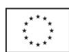
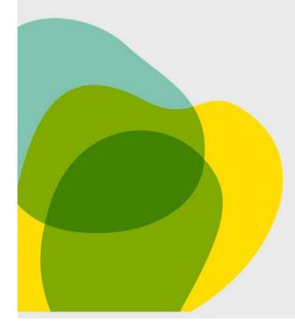
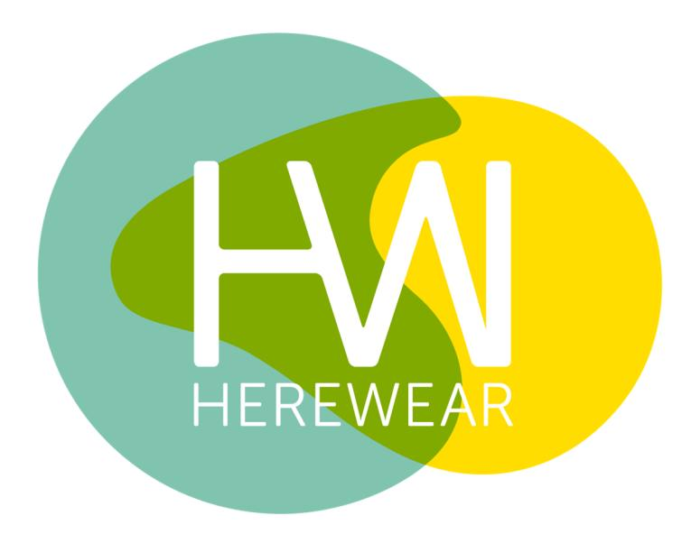
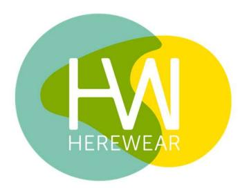
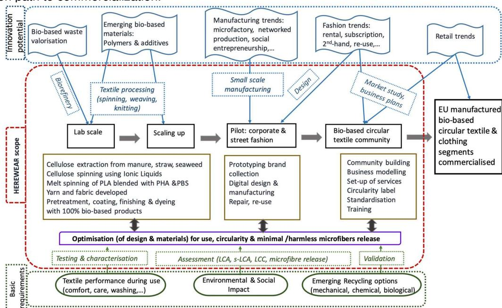
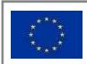

HEREWEAR 101000632 DELIVERABLE 8.5 October 7, 2022

# D8.5 POLICY INPUT BRIEF, PRELIMINARY VERSION

## DELIVERABLE

PROJECT ACRONYM: HEREWEAR GRANT AGREEMENT N.: 101000632

PROJECT TITLE: BIO-BASED LOCAL SUSTAINABLE CIRCULAR WEAR

D 8.5: Policy input brief, preliminary version V1.0 2022.10.07

AUTHORS

Guy Buyle (CTB) Jesse Marsh (TCBL) Lisa Schwarz Bour (RISE)

REVIEWERS

All partners

DISSEMINATION LEVEL

PU: PUBLIC

## TABLE OF CONTENTS

| <b>TABLE OF CONTENTS</b>                 | 3 |
|------------------------------------------|---|
| 1. INTRODUCTION TO THE POLICY BRIEF..... | 4 |
| 2. OUTLOOK.....                          | 5 |
| DOCUMENT INFORMATION.....                | 6 |
| ANNEX 1: POLICY BRIEF.....               | 7 |

## 1. INTRODUCTION TO THE POLICY BRIEF

This deliverable presents the preliminary version of the policy input brief of the HEREWEAR project. Given the relevant EU domains being investigated within the project, the goal is to develop a policy brief that addresses a range of areas. The content will contain the findings and lessons learned from HEREWEAR regarding how to make the transition from the current textile sector to a textile sector that fully embraces the circular concept, uses bio-based materials and relies on the latest digital tools for efficient small-scale and local manufacturing in the EU.

This work is done as part of "Task 8.1: Dissemination and communication". After the preliminary version at M24, the final version is scheduled to be compiled at the project end (M48).

The EU template for policy briefs was used. Work started between the leading partners CTB, TCBL and RISE who compiled a draft version for review by the full consortium. The updated document is presented in Annex 1.

## 2. OUTLOOK

This preliminary policy input brief will be further refined based on the findings of M25- 48 and submitted as Deliverable D8.6.

Upon authorisation by the Commission, this Policy brief will be made available via the project website and partners networks and presented at relevant policy-related events (e.g. conferences and workshops that policymakers attend). Additional means to provide feedback to policymakers will include press releases, online media, and personal communication whenever possible.

The consortium partners use their networks to reach policymakers at the regional, national and European levels. This is done via several routes targeting, for instance, the City of Prato (via partner TCBL, Regional Level), The Greek Ministry of Development (via partner MIRTEC, National Level), or through EURATEX and the Textile ETP (via partners CTB, RISE, EUT, MIRTEC, EU level).

## DOCUMENT INFORMATION

### REVISION HISTORY

| REVISION | DATE     | AUTHOR   | PARTNER | DESCRIPTION                  |
|----------|----------|----------|---------|------------------------------|
| V 0.1    | 05.09.22 | Buyle G  | CTB     | First draft outline          |
| V 0.2    | 22.09.22 | Buyle G, |         |                              |
| V 1.0    | 07.10.22 | Buyle G  | CTB     | Final version for submission |

### STATEMENT OF ORIGINALITY

This deliverable contains original unpublished work except where clearly indicated otherwise. Acknowledgement of previously published material and of the work of others has been made through appropriate citation, quotation or both.

### COPYRIGHT

 This work is licensed by the HEREWEAR Consortium, consisting of: Centre Scientifique & Technique del'Industrie Textile Belge Asbl (BE); Deutsche Institute fur Textile und Faserforschung Denkendorf (DE); Nederlandse Organisatie voor Toegepast Natuurwetenschappeluk Onderzoek TNO (NL); RISE ivf AB (SE); The University of the Arts London (UK); Fundacio Eurecat (ES); Circular Fashion UG (Haftungsbeschrankt) (DE); Asociatia Mai Bine (RO); ANOYMI ETAIREIA VIOMICHANIKIS EREVNAS, TECHNOLOGIKIS ANAPTYXIS HAI ERGASTIRIAKON DOKIMON, PISTOPIISIS KAI PIOTITAS (EL); Finipur NV (BE); Mitwill Textiles Europe (FR); Vreteno UG (DE); Sourcebook Gmbh (DE); CEDECS-TCBL (FR).

### DISCLAIMER

All information included in this document is subject to change without notice. The Members of the HEREWEAR Consortium make no warranty of any kind with regard to this document, including, but not limited to, the implied warranties of merchantability and fitness for a particular purpose. The Members of the HEREWEAR Consortium shall not be held liable for errors contained herein or direct, indirect, special, incidental or consequential damages in connection with the furnishing, performance, or use of this material.

### ACKNOWLEDGEMENT

The HEREWEAR project has received funding from the European Union's Horizon 2020 Programme for research, technology development, and innovation under Grant Agreement n. 101000632.

## ANNEX 1: POLICY BRIEF

In the Annex below the policy brief is presented.

# EUROPEAN POLICYBRIEF

**HEREWEAR**

Bio-Based Local Sustainable Circular Wear

**Textiles & Clothing (T&C) are an integrated part of the daily life of European citizens**. The impact of the textile sector on environmental issues such as carbon footprint, water pollution, and chemical use as well as the social challenges related to working conditions are significant and increasingly well-known. The textile sector is also heavily integrated with the plastics industry: while sharing materials, both sectors share a common challenge related to chemical use and chemical content in materials for circulation. Both are working in parallel towards an increased use of biobased feedstock. The issues are also linked to stakeholders in wider areas of work, such as bioeconomy and chemistry. Finally, fashion has significant symbolic value to citizens – it is something everyone can relate too, meaning that awareness among the general public is also important.

**Establishing local manufacturing of circular biobased textile & clothing is linked to a broad range of EU policies, including the EU Strategy for Circular and Sustainable Textiles and the Sustainable Products Initiative (SPI).** Further, we can also include the Bioeconomy Strategy, the Circular Economy Action Plan, the EU Industrial policy, the Waste Framework Directive, and the Digital Product Passport (DPP), as well as Regional & Agricultural policies at both the EU and local levels.

EU Textile Strategy (COM2022 -141 – published on March 30, 2022), which highlights circularity and increased recycling as key areas. The strategy points out the importance of sustainable production and consumption and emphasizes the need for producer responsibility and the upscaling of reuse and recycling of textiles. Mandatory requirements regarding recycling of textile waste are foreseen for 2024, by which date scaling up textile recycling is necessary. To achieve this, the framework for classifying recycled textile raw materials is key.

The EC also recently presented the legislative proposal Sustainable Products Initiative (SPI), which is part of the European Green Deal and a central part of the European Circular Economy Action Plan (CEAP). The SPI aims to align products for climate neutrality, resource efficiency and a circular economy, reduce waste, and make sustainable products the default option within the Union. The recommended actions under this framework legislation will have an impact on design, business models and production processes.

The above-mentioned policy domains are relevant for HEREWEAR given its focus on how to make the transition from the current textile sector to one that fully embraces the circular concept, uses bio-based materials, and relies on the latest digital tools for efficient local, small-scale manufacturing in the EU. Within the first 24 months of the project, HEREWEAR has developed a holistic approach to the challenge of sustainable fashion, based on three key axes: Circular, Bio-based and Local. **Specific policy-relevant insights gained include the following aspects.**

- **Circular** HEREWEAR has been looking extensively at how to design for circularity, building its findings into on-line platforms supporting different steps of the textile and clothing value chain. The main policy issues that emerge involve the need for agreed criteria with which to certify products, manufacturing processes, and end products. This also raises issues of data management ranging from the composition of materials to end of life options. One specific focus of HEREWEAR is the pressing issue of microfibre release, a specific area highlighted in the EU Textile strategy. Textiles is one of the main sources of the microplastics pollution which has become widespread in nature (including in marine environments), causing a serious and growing concern. In HEREWEAR, preventing microfibre release from textiles is being investigated, which shows the need for characterization and standardization
- **Bio-based** HEREWEAR is experimenting with bio-based fibres across the value chain, from the bio-refinery to wet and melt spinning processes, weaving, and garment production, using circular manufacturing processes throughout. One of the key areas that has emerged is the need to connect with regional policy as concerns the sourcing of feedstocks and the effects this may have on local communities and regional economies, with the consequent impact on Regional Development Plans under the reformed Common Agriculture Policy.
- **Local** An integral part of the HEREWEAR vision is the promotion of local manufacturing ecosystems building on circular and bio-based principles. HEREWEAR has been exploring gaps and opportunities through the development of business model scenarios and the engagement of external actors in the HEREWEAR Community. In this way, competitiveness and investment needs can be identified to feed into strategies for Smart Specialisation at both the regional and the EU level.

The interim results of HEREWEAR have direct implications across the broad spectrum of policy realms outlined above, as the circular, bio-based and local vision entails a holistic transition of the entire Textile and Clothing (T&C) value chain towards circular fashion, a transition that crosses disciplinary boundaries. In this context, in addition to the broader impacts that can be assessed as the project produces more operational results, we can identify specific project outputs and issues under the three main axes – Circular Design, Bio-based fibres, and Local production ecosystems – that can already be integrated into on-going policy initiatives. These can take varying forms from the local to the EU level, according to different policy goals and instruments: mobilise public opinion, provide financial or regulatory stimulus, provide financial or normative penalties, exemplify through good practice, or develop appropriate infrastructures, as shown in the suggestions in the following table.

| HEREWEAR Outputs and Topic issues                                                                                                                             |                                                                   | Suggested policy initiatives                             |                                                              |                                                             |
|---------------------------------------------------------------------------------------------------------------------------------------------------------------|-------------------------------------------------------------------|----------------------------------------------------------|--------------------------------------------------------------|-------------------------------------------------------------|
| Mobilise Circular “Bio 10” Integration into Design circular design curricula at vari guidelines ous levels Minimised Spread microfibre release awareness and | Stimulate Promote circular design within EIT Financial incentives | Penalize Penalize fabric waste Target poor manufacturing | Exemplify Procurement of public uniforms Design requirements | Infrastructure Integrate into T&C MOOCs Labelling standards |
| design knowledge guidelines                                                                                                                                   |                                                                   | processes                                                | (ESPR 1 )                                                    |                                                             |
| Material and Uptake across product data for the industry of certification common data models                                                                  | EPR Benefits for pioneering products                              | EPR schemes                                              | Public procure ment criteria                                | Standardised data platform                                  |
| Bio-based Characterisation Business models fibres and bio-refinery for the specifications bioeconomy                                                          | Align with inno vation policies                                  | Tax virgin fossil-based raw materials                    | Promote model bio-regions                                    | Pilot facilities at R&D actors                              |
| Feedstock needs Engage with                                                                                                                                   | Align R&D subsi                                                  | Target biomass                                           | Build on e.g.                                                | Multi-level                                                 |
| analysis Forestry & Agriculture Departments Local Micro-factories Engagement of                                                                               | dies and Re gional Develop ment plans Integrate with            | burning and waste Long distance                          | LEADER 2 programme Allow &                                   | logistics for transport Build on existing                   |
| production and local micro-firms and ecosystems value chains local business networks Social economy Mobilisation interaction for through activism             | e.g. S3 & RIS3 3 strategies Integrate in existing actions,        | shipping tax Tax garment landfill use.                   | stimulate local public procurement Public procurement        | cluster networks Support for e.g. working spaces            |
| upcycling and networking and re-use                                                                                                                           | eg CCRI 4                                                         |                                                          |                                                              |                                                             |

1 ESPR – Ecodesign for Sustainable Products Regulation

2 LEADER – Liaison between activities for the development of rural economy

3 S3&RIS3 – Smart Specialisation Strategy and Research & Innovation Strategies for Smart Specialisation

4 CCRI – Circular Cities and Regions Initiative

Each of the work packages of the HEREWEAR project is planned to **issue specific topical guidelines** developed together with the relevant target groups. Stakeholder engagement in the co-design process has already begun, defining the format and approach to ensure the widest possible uptake by industry. The early guidelines released to date, related for instance to circular design and microfibre release, are a case in point. In addition, HEREWEAR partners offering **on-line services to support the production process** (e.g., matchmaking services pairing brands with production, circular fashion design and certification, and a marketplace for unused fabrics and deadstock) are working to offer a specific 'user journey' across their services to support the future production of circular fashion with bio-based textiles in local ecosystems. Finally, one of the unique features of the HEREWEAR approach is the **creation of a lively community** of interested (mostly small) businesses, together with the development of an on-line Community Space and various workshops allowing for vibrant levels of interaction among the more than 150 community members and HEREWEAR activities and partners. The evident added value of the Community Space will contribute significantly to the future legacy of HEREWEAR, facilitating the impact path for the (uptake of the) project results.

HEREWEAR innovates with a holistic, systemic approach towards the creation of an EU market for locally produced circular textiles and clothing made from bio-based (waste) materials. Novel material solutions build on the latest bio-based polyesters and cellulose developments. Novel bio-based streams, including for example seaweed and straw, are developed for cellulosic textile fibres. Emerging sustainable technologies for wet and melt spinning, for yarn and fabric making, are developed and piloted at semi-industrial scale. For finishing, coating and colouring, biobased agents are applied. Microfibre release can be significantly reduced through measures along the various steps in the manufacturing process. Garment prototypes for streetwear and corporate clothing are produced by connecting up microfactories, organised into regional value creation circles; or by platform-supported, networked production resources. Use phase and end-of-life processing management – repair, re-use, recycle – is implemented through novel structures.

The sketch below outlines our overall methodology, following the development and innovation path to commercialization.

### **RESEARCH PARAMETERS**

| P | ROJECT NAME    | HEREWEAR. Bio-Based Local Sustainable Circular Wear     |
|---|----------------|---------------------------------------------------------|
| C | OORDINATOR     | CENTEXBEL                                               |
| C | ONSORTIUM      | DITF                                                    |
| F | UNDING SCHEME  | H2020-FNR-2020 / H2020-FNR-2020-1                       |
| D | URATION        |                                                         |
| B | UDGET          | Total Budget: €6 963 209 - EU contribution: € 6 158 830 |
| W | EBSITE         | https://herewear.eu/.                                   |
| F | OR MORE INFOR |                                                         |
| F | URTHER READING | For further information, visit the project website at:  |

This policy brief reflects only the authors' views and the European Commission/REA is not responsible for any use that may be made of the information it contains.

This project has received funding from the European Union's Horizon 2020 research and innovation programme under grant agreement No. 101000632.