| Project acronym: | REGIOGREENTEX              |
|------------------|----------------------------|
| Project number:  | 101083731                  |
| Project title:   | Regions for Green Textiles |

# **Deliverable 5.2 Pilot actions on regional hub ecosystem level**

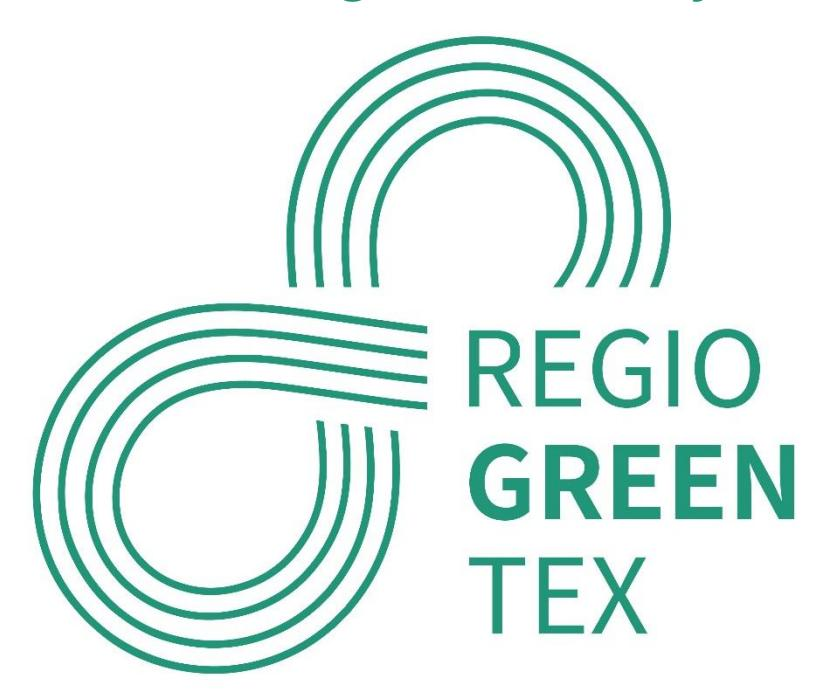

# **Interregional Innovation Investments Instrument (I3)**

**Deliverable due date:** March 2024

Dissemination level: PUBLIC

## **AUTHOR: CO-AUTHORS: REVIEWERS:**

Oost NL (P15) Ariadne (P18) Ovam (P6)

Techtera (P10) Rise (P12)

NTT Tecnotex (P14)

North-East Regional Development Agency (NERDA) (P4)

Citeve (P3)

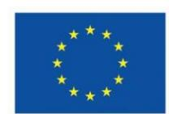

## Co-funded by the European Union

# **EXECUTIVE SUMMARY**

The RegioGreenTex I3 project drives circularity in the textile industry through recycling hubs, forming organized ecosystems connecting triple helix partners to ensure cross fertilization to strengthen the value chain dimension. Aimed at supporting SMEs, attracting and de-risking investments, and enhancing circular textile loops, the collective efforts of these hubs strive for a comprehensive European textile recycling system.

**Lowlands Greentex Hub (LGH)** LGH spans Flanders, Hauts-de-France, and East-Netherlands. Operating through four key functionalities, LGH focuses on three regional textile value chains. Actions include partner visits and challenge-based workshops, demonstrating commitment to collaboration, investment, and supporting regional textile reuse.

**Italy Greentex Hub (IGH)** IGH in Tuscany and Piedmont enhances textile recovery and recycling. Actions involve defining services, building on the waste materials mapping carried out in WP1, promoting circular design, and fostering replication. IGH aims to create a distributed recycling hub through detailed mapping, technology identification, and encouraging replication.

**AURA Greentex Hub (AGH)** AGH advances circular textile practices in Auvergne-Rhône-Alpes. Actions include local collaborations, workshops, and securing public/private funding. Notable projects involve wastewater management, mapping scraps, and supporting PET recycling demonstrators.

**NERO Greentex Hub (NERO GH)**

NERO GH targets a zero-waste circular textile value chain in North-East Romania. Core partners involved lead demo-cases and ecosystem actions, emphasizing collaboration, innovation, and attracting investments. Most successful actions of this hub are on cross-fertilisation.

**Portugal Greentex Hub (PGH)** PGH in Norte region engages stakeholders and supports concrete recycling actions. Led by CITEVE

Funded by the European Union. Views and opinions expressed are however those of the author(s) only and do not necessarily reflect those of the European Union or EISMEA. Neither the European Union nor the granting authority can be held responsible for them.

# D5.2: Regional Hub Ecosystem

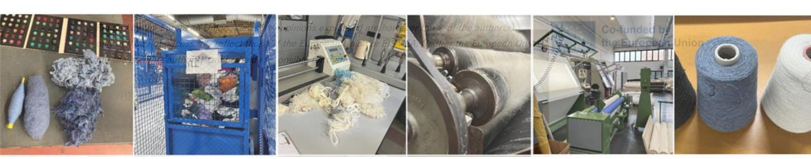

(P3), PGH focuses on a Special Interest Centre (SIC) for recycling-related topics and pilot-scale activities in cutting, shredding, and spinning recycled fibres.

Crucial for advancing circularity, cross-regional collaboration involves mechanisms like targeted workshops and open access hub meetings. Initiatives like the "Filling the Gaps" workshop during the regional cluster workshop held in Prato in 2023 (WP7) mark strides in strengthening the circular textile value chain dimension by investigating the needs of the SMEs represented by their regional clusters.

From cross-regional and inter-hub collaboration, key insights include identifying regions with complementary infrastructure, recognizing barriers, defining sorting and processing criteria, and highlighting the critical role of knowledge transfer and technology. Leveraging these findings optimizes efficiency and accelerates progress towards circularity.

Initiating hub and value chain development at the regional level is crucial, with lessons learned serving as valuable foundations for broader interhub and interregional collaboration. The journey emphasizes that sustainable solutions thrive when rooted in collaborative, localized initiatives that seamlessly expand for broader impact.

The RGT Hubs' prime functions and ongoing actions reveals a focus on creating circular textile value chains, attracting and de-risking investments, offering SMEs access to infrastructure, and fostering a community of cross-fertilization for SMEs.

The recommendation is for all hubs to continue and learn from successful actions, especially focusing on functionalities not yet implemented. Special attention is advised for actions related to attracting individual (SME) investments and enhancing competences in management and operations. Additionally, regions not part of an RGT Hub are encouraged to explore starting a hub and align functionalities with their needs, considering the potential effectiveness of building a hub around a single region.

Funded by the European Union. Views and opinions expressed are however those of the author(s) only and do not necessarily reflect those of the European Union or EISMEA. Neither the European Union nor the granting authority can be held responsible for them.

#### **CONTENT**

|     | INTRODUCTION                                                                                                                                                                                                  |                                                                                                                                                                                  |
|-----|---------------------------------------------------------------------------------------------------------------------------------------------------------------------------------------------------------------|----------------------------------------------------------------------------------------------------------------------------------------------------------------------------------|
| 1   | HUB IDENTITY ...............................................................................................................................................................................................8 |                                                                                                                                                                                  |
| 2   | LOWLANDS GREENTEX HUB...................................................................................................................................................................10                    |                                                                                                                                                                                  |
| 2.1 | Functionalities and actions fuelling the hub                                                                                                                                                                  | ....................................................................................................................................11                                           |
| 2.2 | Actions fuelling development of value chains..................................................................................................................................15                              |                                                                                                                                                                                  |
| 3   | ITALY GREENTEX HUB                                                                                                                                                                                            | ..............................................................................................................................................................................21 |
| 3.1 | Definition of the structure and services                                                                                                                                                                      | ............................................................................................................................................22                                   |
| 3.2 | Draft business model.............................................................................................................................................................................25           |                                                                                                                                                                                  |
| 3.3 | Textile waste material and processes mapping                                                                                                                                                                  | ..............................................................................................................................26                                                 |
| 3.4 | Textile waste materials and recycling potential                                                                                                                                                               | ..............................................................................................................................28                                                 |
| 3.5 | Textile recycling technologies map                                                                                                                                                                            | ....................................................................................................................................................30                           |
| 3.6 | Categorisation of technologies on an industrial scale                                                                                                                                                         | ...................................................................................................................33                                                            |
| 3.7 | Recycling roadmap.................................................................................................................................................................................40          |                                                                                                                                                                                  |
| 3.8 | Replication and identification of investment opportunities                                                                                                                                                    | .........................................................................................................43                                                                      |
| 4   | AURA GREENTEX HUB...............................................................................................................................................................................45            |                                                                                                                                                                                  |
| 5   | NERO GREENTEX HUB                                                                                                                                                                                             | ..............................................................................................................................................................................49 |
| 5.1 | Definition of the structure and services                                                                                                                                                                      | ............................................................................................................................................50                                   |
| 5.2 | NERO Greentex Hub identity                                                                                                                                                                                    | ...............................................................................................................................................................50                |
| 5.3 | Functionalities and actions fuelling the hub                                                                                                                                                                  | ....................................................................................................................................52                                           |
| 6   | PORTUGAL GREENTEX HUB....................................................................................................................................................................57                   |                                                                                                                                                                                  |
| 6.1 | Definition of the structure and services                                                                                                                                                                      | ............................................................................................................................................57                                   |

# D5.2: Regional Hub Ecosystem

#### Actions

| 6.2                            | Functionalities and actions fuelling the hub                                                                                                                                                             | ....................................................................................................................................58                                          |
|--------------------------------|----------------------------------------------------------------------------------------------------------------------------------------------------------------------------------------------------------|---------------------------------------------------------------------------------------------------------------------------------------------------------------------------------|
| 6.3                            | Communication and dissemination                                                                                                                                                                          | ....................................................................................................................................................61                          |
| 7                              | COLLABORATION ........................................................................................................................................................................................63 |                                                                                                                                                                                 |
| 7.1                            | Targeted workshops:                                                                                                                                                                                      | .............................................................................................................................................................................63 |
| 7.2                            | Open-access hub meeting: Interregional hub workshop in Romania                                                                                                                                           | .........................................................................................67                                                                                     |
| 7.3                            | Open-access hub meeting: Lowlands Greentex Hub meet-up                                                                                                                                                   | ....................................................................................................70                                                                          |
| 7.4                            | Key takeaways ........................................................................................................................................................................................71 |                                                                                                                                                                                 |
| CONCLUSION AND RECOMMENDATIONS |                                                                                                                                                                                                          | ......................................................................................................................................................73                        |

Funded by the European Union. Views and opinions expressed are however those of the author(s) only and do not necessarily reflect those of the European Union or EISMEA. Neither the European Union nor the granting authority can be held responsible for them. Chapter 7 provides insights into experimentation with actions directed at interregional collaborations. In all these chapters insight is provided to what extend these actions were able to boost the implementation of networks and infrastructures to increase innovation (research and development) and industrialization of recycling processes. It includes actions connecting individual pilots at company level with other activities within the value circle and thereby creating a more complete value circle of

# **INTRODUCTION**

This RegioGreenTex journey towards circularity requires effective frameworks and platforms to accelerate its progress. In this context, the concept of a hub has gained prominence, serving as a catalyst for innovation and collaboration within the circular textile ecosystem. This exploration delves into the learnings surrounding the pivotal role a hub can play as an accelerator for advancing circular practices in the textile industry.

The evolution of regional hubs ecosystem within the RGT project (hub) reflects a dynamic approach, bringing together diverse stakeholders, including manufacturers, designers and policymakers to foster a holistic circular transformation in the textile industry.

By exploring the possible functionalities of and collaborations within and between the so-called Greentex Hubs, we aim to unravel the potential they hold in realizing impacts and investments and thereby drive positive change towards a more sustainable and circular future for textiles.

As we embark on this exploration, we delve into the intricacies of regional hubs, examining their functionalities, collaborations and impacts. By understanding the contextual nuances and success factors of these hubs, we aim to provide actionable insights that can guide the establishment and enhancement of similar initiatives in other regions.

# **Reading guide**

This deliverable 5.2 provides in Chapter 1 a basic idea on what a Hub could look like including the basic functions and actions. This basic idea or hypothesis has been put in practice and in Chapter 2 up to Chapter 6 the reader will find an overview the results of the experimentations with different possible actions on regional hub ecosystem level.

#### Actions

textile. At the end this deliverable provides a preliminary conclusion about what actions are instrumental for building a successful and self-propelling regional hubs ecosystem and also includes recommendations to be explored within, outside and after the RGT project.

## **1 HUB IDENTITY**

Within RegioGreenTex, the following 5 textile recycling hub ecosystems are identified:

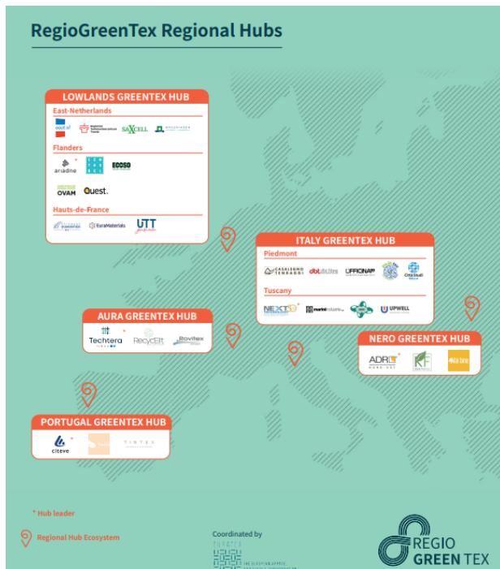

- The Lowlands Greentex Hub
- The Italy Greentex Hub
- The Portugal Greentex Hub
- The NERO Greentex Hub
- The AURA Greentex Hub

The main tasks of these hubs are to support the SME's upscaling, attracting and derisking investments and closing the circular textile loop. The overarching idea is that these hubs collaborate with each other and thereby become a driving force for a comprehensive European textile recycling system.

Within RGT each hub will develop their own textile recycling hub ecosystem with a distinct set of functionalities which can be used to build hubs in other regions. Additionally, each hub will possess unique smart specialization features - such as recycling of wool - that can be leveraged to support other regions. So hubs can (and maybe should) have their own unique specialisations but also have similar functionalities and collaborate with other hubs within the EU. Experimentations with these functions and related actions are described in the following Chapters. **Figure 1: RegioGreenTex Hubs**

In the Regional Cluster workshop in Prato in October 2023, hub leaders and regional clusters had a workshop to align the basic ideas on how a hub could look like including the basic functions and actions. This basic idea or hypothesis was put up making use of the experiences and know-how of the different regions in building smart specialization ecosystems that are able to fuel industrial

Funded by the European Union. Views and opinions expressed are however those of the author(s) only and do not necessarily reflect those of the European Union or EISMEA. Neither the European Union nor the granting authority can be held responsible for them.

by the European Union. Views and opinions expressed are however those of the author(s)

only and do not necessarily reflect those of the European Union or EISMEA. Neither the European Union

development in general. Specific attention was given on how a hub can support the RGT SMEs in particular.

The result was as follows;

**A recycling hub ecosystem within the RegioGreenTex I3 project (hub) should be an organized ecosystem within the textile value chain which encourages investments and share knowledge. It should be a supporting backbone of one or more regions within the EU that actively creates synergies between partners and within the regions to keep up and grow the circular potential of the companies. Part of the hub could also be a physical infrastructure where small and medium sized companies (SMEs) can collaborate to increase the possibilities for textile recovery and reprocessing. The hub should serve as a crucial nexus connecting a diverse mix of triple helix partners. To find solutions a hub should pool their capabilities, expertise, and machinery to foster collaboration and innovation.**

The visualisation of the prime function of a RegioGreenTex hub can be found in figure 2.

Results of experimentations with basic idea can be found in the following Chapters.

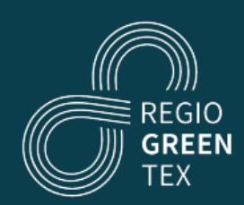

## RegioGreenTex Regional Hubs

The regional Hubs are effective communities of EU textile actors integrating collaborating to:

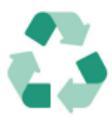

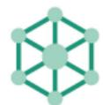

**Figure 2: RegioGreenTex Hubs prime functions.**

# **2 LOWLANDS GREENTEX HUB**

The Lowlands Greentex Hub aims to foster an active and organised circular textile ecosystem spanning the regions of Flanders, Hautsde-France, and East-Netherlands.

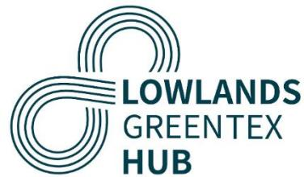

The mission of the Lowlands Greentex Hub (LGH) is to support regional SMEs in scaling up, sharing knowledge, attracting and derisking investments, and advancing circularity across various R-Strategies1 visualised in figure 3. Ultimately, the LGH seeks to stimulate growth and development in the regional textile reuse and recycling ecosystem.

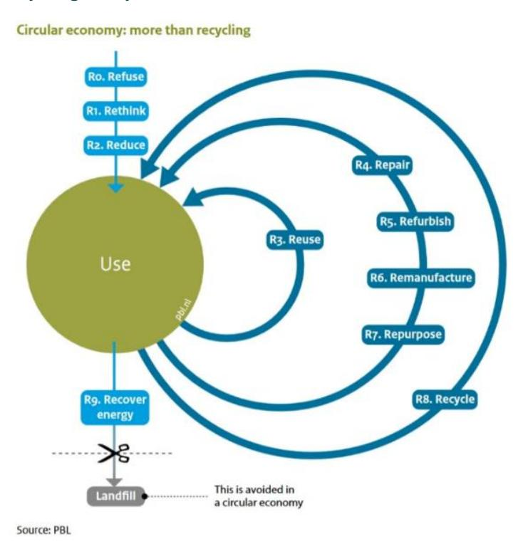

**Figure 3: R-strategies Circular Economy.**

Funded by the European Union. Views and opinions expressed are however those of the author(s) only and do not necessarily reflect those of the European Union or EISMEA. Neither the European Union nor the granting authority can be held responsible for them. 1 R-Strategies, refer to five key approaches to product circularity that can either be used independently or in combination with each other. These are known as: Reuse, Repair, Refurbish, Remanufacture, and Recycle. Figure 3.

Funded by the European Union. Views and opinions expressed are however those of the author(s) only and do not necessarily reflect those of the European Union or EISMEA. Neither the European Union nor the granting authority can be held responsible for them.

# **2.1 Functionalities and actions fuelling the hub**

Within the LGH so far 4 types of functionalities have been identified and for each of these functionalities several actions have been explored. These functionalities and actions are listed below:

| Driving Collaboration                                                                                                                                                                                               |
|---------------------------------------------------------------------------------------------------------------------------------------------------------------------------------------------------------------------|
| Organising meet-ups and field visits among hub partners to deepen the understanding of regional infrastructures, the textile value chain, and collaboration opportunities.                                          |
| Organise site visits to all partners during the project. (Status: 7/11)                                                                                                                                             |
| Setting up activities to increase participation and collaboration within the regions of the Lowlands Hub by actively involving external companies.                                                                  |
| Organise at least 2 cross-regional meetups open to external stakeholders. (Status: 1/2)                                                                                                                             |
| Identifying collaboration opportunities with other RegioGreenTex hubs and regions by actively representing the hub's interests in the monthly hub meetings organised by Oost NL (P15) and RegioGreenTex Activities. |
| Present the Lowlands hub and its opportunities to collaborate at least once (online or during in-person events) to all project partners.                                                                            |

| Driving Investment                                                                                                                               |
|--------------------------------------------------------------------------------------------------------------------------------------------------|
| Identifying gaps in closing the loop within the value chain. Active involvement in bridging these gaps during meetups and update meetings.       |
| Organise at least 1 online update meeting annually with the different regional partners, next to the in - person meetups. (Status: 3)            |
| Identifying investment requirements and costs necessary for closing the loop. Facilitating access to funds through workshops and pitch sessions. |
| Organise at least one open event for external investors with pitching sessions.                                                                  |

# **Driving Visibility and Knowledge**

# D5.2: Regional Hub Ecosystem Actions

| Facilitating knowledge exchange within and outside project partners.                  |
|---------------------------------------------------------------------------------------|
| Facilitating knowledge exchange with other project partners via the RGT Digital tool. |
| Upload the Lowlands Hub information on the RegioGreenTex Digital Tool.                |
| Collaborating with Ovam (P6) to create a policy guide on waste stream legislation.    |
| Creation of at least 1 guide on Waste Stream Legislation.                             |

### **Supporting the Ecosystem**

Supporting a backbone of experts and providing input and insights. Acting as matchmakers for experts when required expertise is not available.

All these actions aim to establish the LGH as a vital connector and facilitator, driving collaborative efforts, attracting investments, promoting visibility and knowledge exchange, and supporting the regional textile reuse and recycling ecosystem's growth and development. Until now several successful actions have been undertaken by the LGH to benefit these 4 functionalities. The actions will be described in below sections.

**Partner Visit Mechelen:** To gain a deeper understanding of the activities and expertise of different partners in Flanders, a site visit to the city of Mechelen (Flanders) was organised. The visit included introductions to the activities of Ecoso (P41), Cilab, and Decathlon, who are now involved partners in the textile value chain project in Flanders.

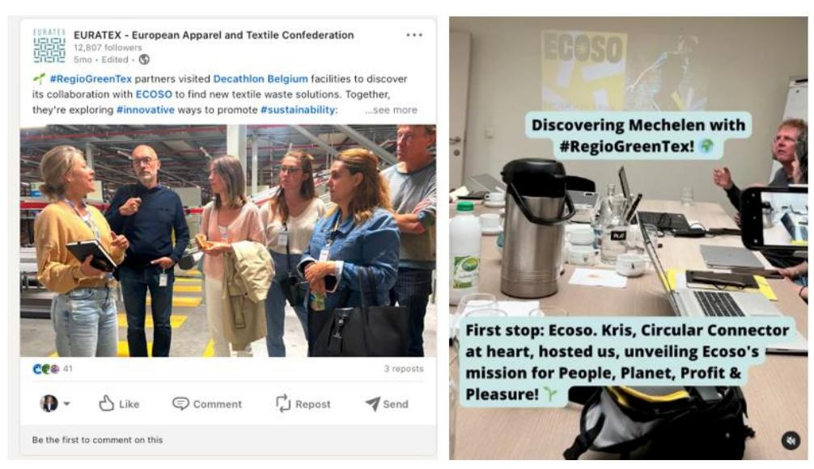

**Figure 4: Partner meeting Mechelen, Belgium.**

**Driving knowledge: Challenge-based Workshop during the Second LGH Meetup:** The aim of the workshop was to facilitate knowledge exchange and connections. Participants engaged in interactive discussions focused on challenges impacting every player in the value chain. Key points addressed included automation versus social aspects, access to funding, legal compliance, and engaging the end market. The insights gathered will inform future actions and guide the creation of manuals and guides to benefit all partners facing similar challenges.

**Driving collaboration/driving visibility: Preparation for Porto value chain workshop:** A follow-up challenge-based learning value chain workshop will be organised during the RGT Consortium Meeting in March 2024. This session will delve deeper into three identified challenges and focus on concrete actions and best practices. The workshop aims to gather valuable input for WP5 deliverables and activities within the hubs.

**Driving collaboration/driving visibility: Upload of the LGH on the RegioGreenTex Digital Tool:** The Lowlands Hub page on the digital tool has been updated to maximise visibility for different value chain projects and facilitate knowledge exchange with partners in other hubs and regions.

Funded by the European Union. Views and opinions expressed are however those of the author(s) only and do not necessarily reflect those of the European Union or EISMEA. Neither the European Union nor the granting authority can be held responsible for them.

**Driving collaboration/driving visibility: Workshop during partner event Oost NL:**  Oost NL hosted the meeting for the Dutch organisation called 'Het Versnellingshuis' The Accelerator supports circular chains. The network of approximately 100 Accelerator Partners comprises a diverse array of organizations, ranging from public entities to private individuals, experts, and generalists, possessing expertise in areas such as policy, laws and regulations, finance, business development, and materials. The aim of this partner meeting was to promote circular entrepreneurship by supporting textile initiatives and increasing visibility for RegioGreenTex.

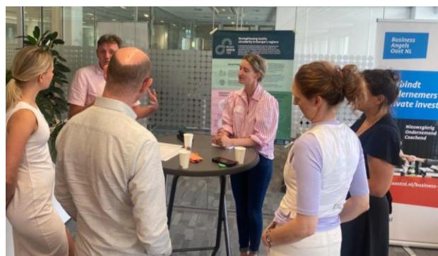

**Supporting the ecosystem: Preparation for the Mini Guide on Waste Legislation by Ovam (P6):** To address the gap in information on the legal framework for building circular loops, Ovam (P6) is creating a mini guide. Partners are invited to submit questions related to waste legislation through the RegionGreenTex tool, which will inform the content of the guide. This initiative aims to provide concrete guidance to partners navigating legal requirements across regions.

# **Driving collaboration/driving visibility: Ongoing Discussion with Circular Textile Days to Create a Pavilion:**

We are currently engaged in discussions with Circular Textile Days to establish a pavilion at their upcoming event. Circular Textile Days is a two-day fair held in Den Bosch in September 2024, with a primary focus on bringing together players in the circular value chain. While the initial emphasis of the fair was on workwear garments, the scope has expanded to include apparel, interior textiles, and more as it approaches its fourth edition. Given that the target audience for the fair aligns with the focus of the Lowlands Hub, we have reached out to the organisers to explore the possibility of organising the next Lowlands meetup during the event. This presents an excellent opportunity to showcase the innovation and collaboration opportunities within the RegioGreenTex project to a relevant and engaged audience.

**Figure 5: Oost NL event, accelerator programme.**

Funded by the European Union. Views and opinions expressed are however those of the author(s) only and do not necessarily reflect those of the European Union or EISMEA. Neither the European Union nor the granting authority can be held responsible for them.

# **2.2 Actions fuelling development of value chains**

In parallel with establishing the groundwork for the functionalities and actions, the efforts of Lowlands Greentex Hub focused on fuelling 3 specific regional textile value chains. The Lowlands Hub excels by uniting three regions, each specializing in a crucial aspect of recycling. Individually, these regions lack the full infrastructure or knowledge for complete value chains. The initial focus is on collaboration within each region, optimizing efficiency. However, the real advantage emerges when replicating and scaling, leveraging the combined strengths of all three regions. This approach ensures a comprehensive recycling system, maximizing sustainability and resource optimization. The Lowlands Greentex Hub demonstrates the power of collective synergy in addressing complex challenges. The 3 specific regional textile value chains are as follow:

### • **Value Chain 1: Fire Protection;**

Core partners: Euramaterials (P2), Peignage Dumortier (P27), Textile de La Thiérache (P39)

# • **Value Chain 2: Post-Consumer Cotton Blends for Chemical Recycling;**

Core partners: Saxcell (P33), RTT (P43), Oost NL (P15)

### • **Value Chain 3: Post-Consumer Textiles with valorisation across the R-Ladder:**

Core partners: Quest Studio (P44), Ecoso (P41), Ovam (P6), Centexbel (P8), Ariadne Innovation (P18) The process began with the LGH-partners kick-off meeting on June 28, 2023, hosted by Oost NL (P15), in the Netherlands. During this meeting, partners presented their initial ideas for the various regional value chain projects, outlining project aims, existing activities, and expertise within the group.

Subsequent to this meet-up, bi-monthly online meetings were held to further refine project scopes and identify value chain gaps. These meetings, supported by Ariadne Innovation (P18), Centexbel (P8), and Oost NL (P15), were held on May 24th & 25th, 2023 (preparing for the meet-up), September 21st & 22nd , 2023 and November 16th, 2023.

Below - for each of the 3 (regional) textile value chain – a detailed description is provided of the actions and related (preliminary) results.

**Value Chain 1: Fire Protective Textiles** As illustrated in the visual below, this value chains centres around Fire Protection Textiles, with a first focus on the bridging the following steps in the value chain; Waste Sourcing → Shredding → Sliver Preparation → Yarn Spinning → Weaving/Knitting → End Users. Core partners in the value chain are Euramaterials (P2), Peignage Dumortier (P27) and Textile de La Thiérache (P39).

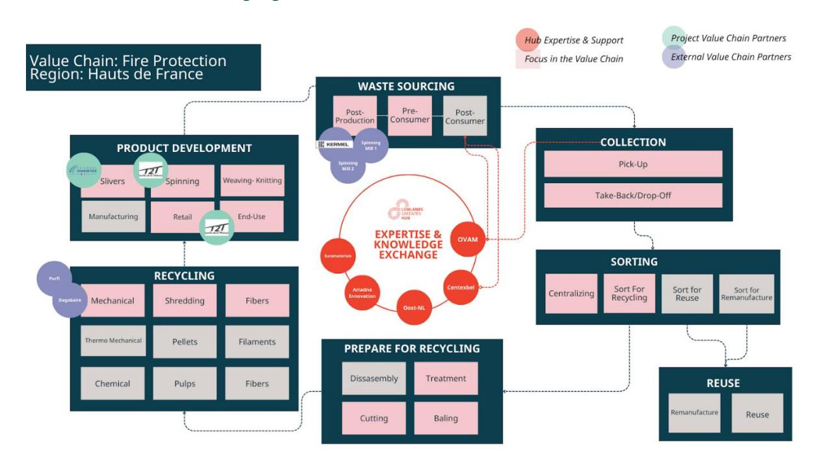

Peignage Dumortier (P27) and Textile de la Thiérache (P39) value chain activities have focused sliver and yarn production from different types of waste streams sourced from various origins and with different qualities and supplied by different suppliers. In the tables below an overview is provided:

| Waste Source Peignage Dumortier        |            |
|----------------------------------------|------------|
| Spinning Mill                          | Mill       |
| Type of Waste Stream Sliver Waste from |            |
| production (post                      |            |
| Sliver                                 | Waste from |
| production                             | (post     |

**Figure 6: Value Chain 1 LGH; Fire Protective Textiles. Created by the RegioGreenTex digital tool WP2.**

Funded by the European Union. Views and opinions expressed are however those of the author(s) only and do not necessarily reflect those of the European Union or EISMEA. Neither the European Union nor the granting authority can be held responsible for them.

| Percentage | 1,5%-2%        | 2%-2.5%        |                     |
|------------|----------------|----------------|---------------------|
| Status     | Trials ongoing | Set-up Sorting | Ongoing (Potential  |
|            |                |                | Risk chemicals need |

Additionally, trials are ongoing for two different yarn types:

|               | Yarn 3                    | Yarn 4                                |
|---------------|---------------------------|---------------------------------------|
| Market:       | Fire Protection           | Fire Protection                       |
| Raw Material: | Shredded Army Combat Mesh |                                       |
|               |                           | Virgin Mix “ Meta-Aramid / Viscose    |
|               |                           | Flame Retardant ” (50%) + Wool? (50%) |
| Yarn Count:   | 20NM                      | 40NM                                  |

The primary focus in the value chain currently focuses on the sliver preparation stage, where the following issues and developments have been observed:

- **Issue**: Yarn residue after shredding
- **Trials**: Peignage Dumortier (P27) is developing an in-house prototype to improve fiber opening, with initial results showing promise.

From the LGH capacity building perspective, significant connections have been established with external partners such as Dagobaire and Purfi during the LGH meetup at Euramaterials (P2). Additionally, the LGH-core-partners backbone of expertise, comprising members from Ovam (P6) and Centexbel (P8), holds the potential to assist with both the legal framework for closing this loop and the handling of possible contaminants/chemicals. Moreover, Oost NL (P15) has already initiated links with Teijin Aramids in the Netherlands, further building on the network of potential knowledge and/or value chain partners.

**Value Chain 2: Post-Consumer Cotton Blends for Chemical Recycling** As illustrated below this value chain primary focus on connecting feedstock from the Regionaal Textiel Sorteercentrum Twente (RTT) (P43), with a specific emphasis on post-consumer cotton streams, to the processor, Saxcell (P33), for the chemical recycling process.

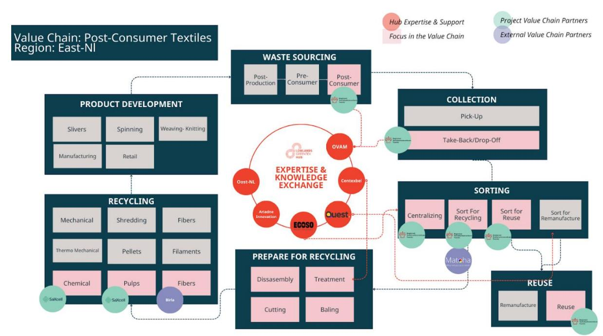

One of the primary challenges anticipated in this textile value chain is composition assessment. In order to determine the composition accurately reliable tools and instruments are needed and a quality control system has to be put up for each batch, including knowledge of the composition, presence of finishing agents (e.g., flame retardants, water repellents), and dyestuffs used.

Additionally, volume control is crucial as different material compositions have varying volumes in terms of kilograms or tons per time unit. The project also requires specific hardware and software for achieving an economically feasible semi-automated or partially robotized system, along with a roadmap outlining the feasibility of these objectives, including the timeline and financial implications.

**Figure 7: Value Chain 2 LGH East-NL; Post-consumer Textiles. Created by the RegioGreenTex digital tool WP2.**

Funded by the European Union. Views and opinions expressed are however those of the author(s) only and do not necessarily reflect those of the European Union or EISMEA. Neither the European Union nor the granting authority can be held responsible for them.

# D5.2: Regional Hub Ecosystem Actions

Funded by the European Union. Views and opinions expressed are however those of the author(s) only and do not necessarily reflect those of the European Union or EISMEA. Neither the European Union nor the granting authority can be held responsible for them.

Since these challenges are not unique for this single value chain but are also encountered in other post-consumer textile value chains LGH is actively driving the facilitation of knowledge exchange to and with other LGH partners such as Ecoso (P41), Ovam (P6) and Centexbel (P8). Furthermore, efforts are focused on connecting with RGT partners from other hubs and regions addressing similar challenges and also connect to partners outside the RGT project such as Refashion and CETI, during the LGH meetup at Euramaterials (P2).

**Value Chain 3: Post-Consumer Textiles with valorisation across the R-Ladder** As is illustrated in figure 3 at the beginning of the report this value chain primary focus on postconsumer textiles, with exploration into various R-strategies for valorisation with primary focus on R3 Reuse, R4 Repair, R5 Refurbish, R6 Remanufacture, R7 Repurpose & R8 Recycle.

Each strategy is driven by the expertise of the core partners for this value chain Quest Studio (P44), Ecoso (P41), Ovam (P6), Centexbel (P8) and Ariadne Innovation (P18). The activities undertaken within these Value Chains are visualised in figure 8:

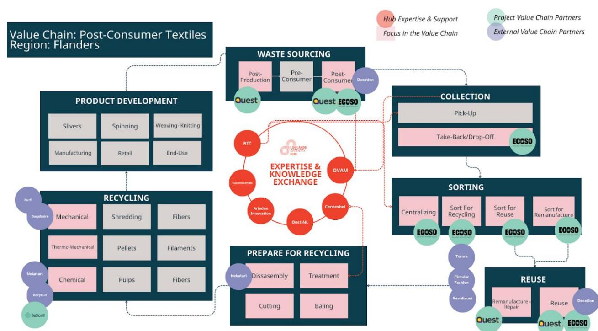

**Figure 8: Value Chain 3 LGH; Post-consumer Textile Flanders. Created by the RegioGreenTex digital tool WP2.**

#### Actions

Within this regional initiative, the primary objective is to establish a framework for valorising textiles sourced from post-consumer textile waste, particularly those deemed non-wearable or unsuitable for resale in second-hand stores within the LGH Region. The initial focus is on valorisation strategies situated at a lower level on the R-Strategy hierarchy than recycling. The main focus of these value chain projects is on the waste streams collected by Ecoso (P41), which are being valorised through various demonstrators across the R-ladder, eventually leading to a scalable and replicable model across different regions.

Ecoso (P41), in collaboration with CiLab, is spearheading various projects centred on R3 Reuse, R4 Repair, R5 Refurbishment. Complementing these efforts, Quest Studio (P44) is engaged in activities aimed at reducing the volume of textile waste destined for landfills (R2) within the EU zone and beyond, as well as revalorizing textile waste streams by fostering connections with individuals and organizations interested in various valorisation methods such as reuse, repair, refurbishment, remanufacturing, and repurposing. Step by step, demonstrators are set up to explore valorisation strategies for different parts of the waste streams.

The collective goal of Ecoso (P41) and Quest Studio (P44) is to eliminate waste and minimize the exportation of textile waste to landfills by exploring a comprehensive range of R-Strategies. Leveraging their partnership with CiLab, Ecoso (P41) brings considerable experience in repair and reuse initiatives, while Quest Studio (P44) contributes expertise in refurbishment, remanufacturing projects, and technology development to accelerate and facilitate this process.

From the hub perspective, expertise is provided by Ovam (P6) on waste treatment, and efforts are underway to facilitate knowledge exchange between RTT (P43) and Saxcell (P33) (for chemical recycling). Additionally, connections have been made to potential new recycling companies and feedstock partners such as Induo and Dagobaire during the LGH meetup.

# **3 ITALY GREENTEX HUB**

The Italy Greentex Hub (IGH) is based in the Italian textile regions of Tuscany and Piedmont. The main goal of the IGH is to increase the possibilities for textile material recovery and recycling. Specific actions of the IGH are:

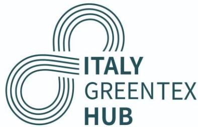

- Definition of the structure and services of the IGH including a roadmap for Prato and Biella textile areas.
- A mapping exercise of the different waste materials in the market and accurate analysis of their composition, classifying waste material categories by recycling potential.
- Collect and map innovative recycling technologies currently under study or development at major technology centres in Europe and around the world.
- Define application possibilities related to the use of recycled material, based on material and technology mapping.
- Foster the replication of the IGH in other Italian regions.

The IGH should not be perceived as physical infrastructure but as a comprehensive source of company services/support, collaborative networking areas, a catalyst for growth and competitiveness, and a platform for cross-fertilization and best practices. Emphasizing that the recycling roadmap and exploitation plan of the IGH aligns with the S3 Smart Specialization Strategy 2021-2027, as well as the technology priorities and investment plans of the two regions, is crucial. The activities framework within NTT (P14) and CS-Pointex (P7) is defined by regional and national policy guidelines and are shown in the table on the next page.

|         | Regional Smart Specialization Strategies 2021-2027 |      |                                                                                                                                        |
|---------|----------------------------------------------------|------|----------------------------------------------------------------------------------------------------------------------------------------|
| Tuscany | – Technological Priorities                         |      |                                                                                                                                        |
| 1.      | Digital Technologies                               |      |                                                                                                                                        |
| 2.      | Technologies for Advanced                          |      |                                                                                                                                        |
| 3.      | Advanced materials and                             |      |                                                                                                                                        |
| 4.      | Technologies for life and the                      |      |                                                                                                                                        |
|         |                                                    |      | Piedmont – Innovation Priority Systems                                                                                                 |
|         |                                                    | 1.   | Aerospace                                                                                                                              |
|         |                                                    | 2.   | Mobility                                                                                                                               |
|         | Manufacturing                                      | 3.   | Green technologies                                                                                                                     |
|         |                                                    | 4.   | Advanced Manufacturing                                                                                                                 |
|         | nanotechnologies                                   | 5.   | Food                                                                                                                                   |
|         | environment                                        | 6.   | Health                                                                                                                                 |
| Areas   | of Application and Missions                        |      | Transversal components of innovation 1. Digital transformation                                                                         |
| 1.      | Environment, Territory and                         |      | 2. Ecological transition: most relevant trajectories                                                                                   |
|         | Energy (Towards a Circular                         |      |                                                                                                                                        |
| 2.      | Cultural Heritage                                  |      |                                                                                                                                        |
| 3.      | Health                                             |      |                                                                                                                                        |
| 4.      | Smart Agrifood                                     |      |                                                                                                                                        |
| 5.      | Smart and Sustainable Enterprise                   |      |                                                                                                                                        |
|         | Tuscany) (Sustainable production)                  | with | respect to regional production specializations: circular economy eco-efficiency/energy efficiency emissions reduction 3. Social impact |

# **3.1 Definition of the structure and services**

Determination of the possible structure and services of the IGH started with conducting a comprehensive assessment of current textile recycling practices and infrastructure across the two focused areas. This process was led by the two lead partners NTT (P14) and CS-Pointex (P7) representing the two regions. They engaged in the planning process, involving key stakeholders such as government agencies, businesses, and local communities. In particular they explored fundamentals and details of circular economy and IGH-case studies at international level, then followed up to recruit experts on the subjects. Further, stakeholder workshops and meetings were organised to gather input from companies and build consensus on the pilot project's goals and approach. An overview of the

Funded by the European Union. Views and opinions expressed are however those of the author(s) only and do not necessarily reflect those of the European Union or EISMEA. Neither the European Union nor the granting authority can be held responsible for them.

actions taken can be found in the table below in which "blue" are technical actions, "yellow" are crossfertilization actions and "green" design of the hub actions.

Funded by the European Union. Views and opinions expressed are however those of the author(s) only and do not necessarily reflect those of the European Union or EISMEA. Neither the European Union nor the granting authority can be held responsible for them.

| Definition of mission, scope, objectives                                                                                 |  |
|--------------------------------------------------------------------------------------------------------------------------|--|
| Definition of the area of the hub development with mapping of input and output value chains                              |  |
| Design of the business model of the IGH (processes and services)                                                         |  |
| Mapping of Waste Textile material                                                                                        |  |
| Definition and validation of IGH hub founders and its model of governance                                                |  |
| Definition of the IGH hub-project team                                                                                   |  |
| Development and implementation of the communication and marketing activities                                             |  |
| Activities to foster cross-fertilization between the local SMEs to strengthen the value chain dimension                  |  |
| Design activities with local authorities                                                                                 |  |
| Definition and execution of pilot activities, widening involvement to key players                                        |  |
| Opportunities for recycling                                                                                              |  |
| Definition of detailed roadmaps for Prato and Biella                                                                     |  |
| Definition of a Risk management plan and risk mitigation strategies for the IGH hub working and quality standard keeping |  |

Funded by the European Union. Views and opinions expressed are however those of the author(s) only and do not necessarily reflect those of the European Union or EISMEA. Neither the European Union nor the granting authority can be held responsible for them.

# **3.2 Draft business model**

The first draft of the business model of the Italy Greentex Hub has found a common structure for the two involved areas: the hub should be at the centre of a new service model for the textile material recycling, serving not only as a support for physical operations of collection, sorting, and recycling, but also as a hub for attracting and developing skills, actively involving the local ecosystem, as well as the national and European contexts. The hub should become a reference point for the textile and clothing sector, fostering opportunities and skills to emerge within it or within the companies it engages with, transferring new opportunities and advanced knowledge to them. Cross-sectoral synergies and collaborations will be also encouraged.

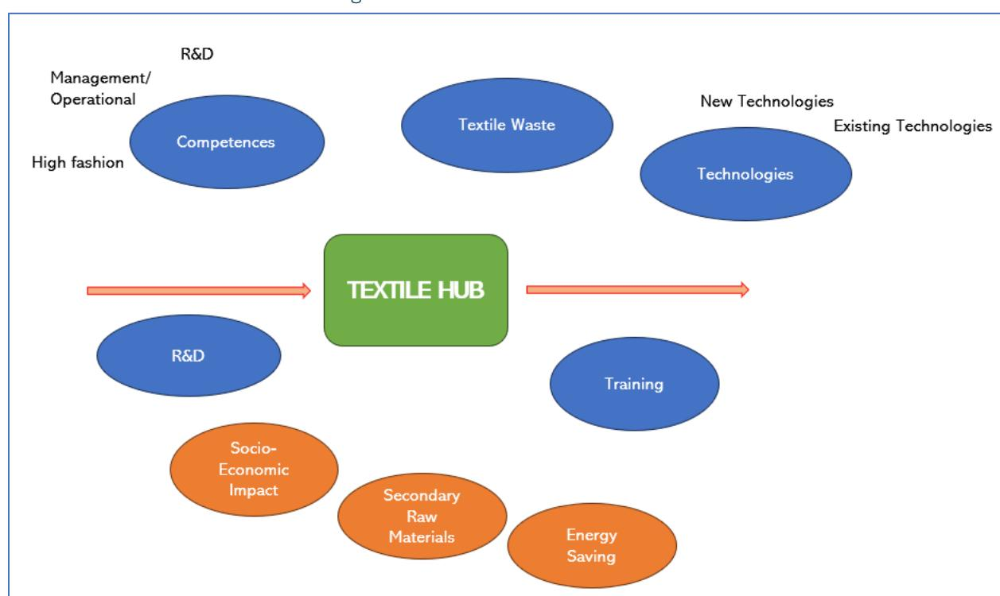

The new IGH will not be developed from scratch, given the extensive experience and established recycling practices of the main actors within the two textile districts and industrial ecosystems. Since many years, important companies and RTOs have emerged as key players in the recycling value chain, especially the ones involved in the RGT project. They are already operating due to their traditional or

**Figure 9: Hub services.**

innovative recycling technologies, or because of their experience and network in coordinating the different steps of the process.

The IGH aims to design a distributed recycling hub across different companies that have - and offer technologies, processes and competences for the recycling overall process, rather than centralizing all in a single infrastructure.

This concept implies that the function of the IGH is to:

- Identify companies within the regions that hold recycling technologies, particular equipment or capabilities.
- Identify synergies and complementarities among the companies' capabilities to maximize efficiency and effectiveness.
- Develop a logistics plan for moving textile waste materials between participating companies within the network, as well as defining all the waste material input (activity described in the section below)
- Establish systems for sharing data and information among network participants, including waste volumes, recycling rates, and performance metrics.
- Ensure compliance with relevant regulations and standards governing waste management and recycling activities.

# **3.3 Textile waste material and processes mapping**

For effective and sustainable waste management practices on IGH-level a comprehensive textile waste material and processing mapping is needed. Al these mapping exercises are based on the learnings from WP 1 of RGT.

# **Textile waste material map**

Therefore, the IGH core partners NTT (P14) and Pointex (P7) have taken the following preparatory actions into put up a map that provides valuable insights into the Italian textile waste landscape and inform decision-making processes at hub level:

- **Creation of Team of experts:** To define a correct waste stream analysis sector experts and researchers have to be involved.

# D5.2: Regional Hub Ecosystem

#### Actions

- **Definition of scope and boundaries of activity of mapping:** District of Prato, historically specialised in wool recycling, and Biella with a manufacturing vocation and wool textiles as the pivotal sector, define our first boundary for the activity of mapping. These will be the areas in which the waste streams in input will be identified and collect: in the first stage it will be considered the waste streams in input of the key companies of the two districts. Also, the definition of what is considered "waste" allows to define a more precise boundary of the map. Furthermore, the definition of what constitutes 'waste' enables the establishment of a more refined boundary for the map. Understanding the intricacies of the processes involved in the analysis allows for a honed focus and targeted research efforts towards identifying specific stakeholders for further investigation.
- **Definition of stakeholders to be involved:** Nowadays, many actors are playing a central role into recycling sector of Prato and Biella, also for the management of waste material. Involving these enterprises or organisations and experts will give a strategic role for the project and for the Hub. Understanding stakeholders of the process gives us the possibilities to enhance the supply chain and to explore and learn more about the needed data for the mapping.
- Analysis of the state of the art of the available models and frameworks for textile waste material identification parameters
- **Data collection and textile waste material map.** The goal of this point is the analysis of some important data to quantify and identify the waste textile materials.

The activities needed for the creation of the model for textile waste material identification have been started with:

- **Research** and analysis of scientific works, industry studies, previous projects, and existing technologies related to models enabling the identification of optimal parameters for complete textile waste stream detection. The key steps are Source Identification, Literature Review, Analysis of Existing Technologies (available technologies and tools for textile waste identification, such as sensors, machine vision systems, spectroscopy, chemical analysis techniques, and other monitoring and diagnostic systems), exploring of emerging trends in the field of textile waste identification, such as the use of innovative technologies, integration of multiple data sources, and approaches toward sustainable and circular solutions.
- **interviews** with textile experts and people already dealing with textile waste in the two Italian areas.

### The next envisaged steps are:

- Identification of the key parameters that influence accurate identification of textile waste, such as fibre composition, fabric type, colour, size, wear condition, and contamination, sources and origins of the waste stream, quantity of waste textile, etc.
- Review of the best practices and successful methodologies used in similar or related projects.
- Activity of synthesis and analysis of the collected information to identify key knowledge, gaps in the field, and opportunities for developing a model for identifying optimal parameters for the textile waste stream.
- Validation of the model.
- Use of the model for the identification of the waste streams of the key companies involved in the pilot map. The selected model will be trained using the data. This involves feeding the model with input data and adjusting its parameters to minimize errors of the framework.
- Validation of the results and of the model.
- Use of the model for mapping all the waste streams that enter into the focused areas.

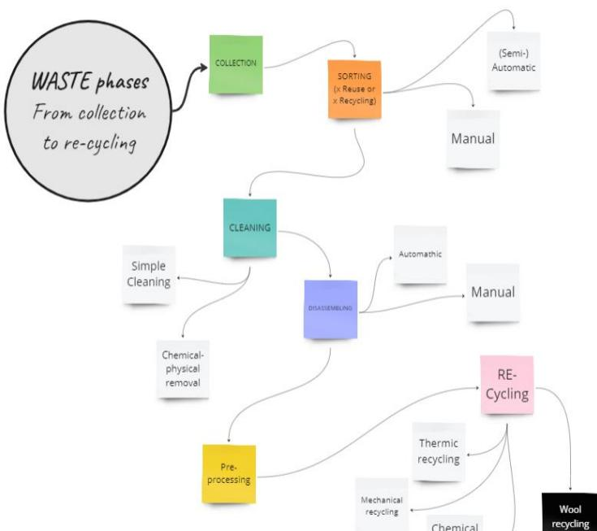

# **3.4 Textile waste materials and**

# **recycling potential**

The recycling potential is a definition of a ranking methodology for textile waste. The definition of the parameters is based on a structured approach used to assess and categorise textile materials based on their suitability for recycling. This process involves evaluating various factors such as material

**Figure 10: Process involved in creation of waste materials.**

Funded by the European Union. Views and opinions expressed are however those of the author(s) only and do not necessarily reflect those of the European Union or EISMEA. Neither the European Union nor the granting authority can be held responsible for them.

# D5.2: Regional Hub Ecosystem Actions

composition, fibre type, textile construction, dyeing and finishing processes, and end-of-life treatment options. By assigning scores or rankings to these factors, the factors help identify textiles with the highest potential for successful recycling or reuse, thus guiding decision-making processes for waste management strategies in the textile industry.

Up to now the concept of recycling potential has been differentiated by the sustainability capacity. Some materials can be highly recyclable with a high environmental impact.

Until now, the two teams worked to differentiate the concept of "recycling potential" from "sustainability capacity". This means that certain textile materials/waste may exhibit a high degree of recyclability but could also entail a significant environmental impact in the recycling process.

In essence, the traditional understanding of recycling potential has often focused on the technical feasibility of recycling a material, such as whether it can be effectively processed and reused. However, the sustainability aspect broadens this perspective to consider not only the recyclability of a material but also its environmental implications throughout the recycling lifecycle. Consequently, materials previously deemed highly recyclable may be reassessed in light of their overall sustainability performance, taking into account factors such as energy consumption, emissions, resource depletion, and ecological footprint. This holistic approach to assessing recycling potential ensures that environmental considerations are integrated into the evaluation process, leading to more informed decisions regarding recycling strategies and material management practices.

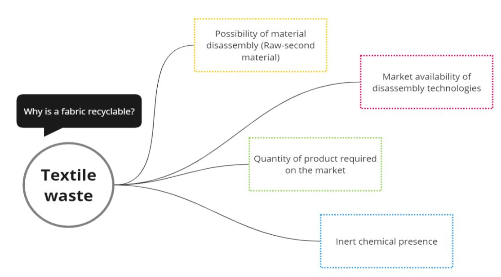

**Figure 11: Possible parameters for recycling potential.**

In the analysis of collected data, patterns and trends in textile waste production and management will be examined. Critical areas where waste generation or management may be problematic will be identified as well. This allows us to better understand the dynamics of the textile sector and plan effective interventions for more sustainable waste management. Identifying long-term trends helps us anticipate changes and adapt waste management strategies. Ultimately, the goal is to reduce environmental impact and promote more efficient and responsible waste management practices in Prato's and Biella's textile industry.

# **3.5 Textile recycling technologies map**

According to the Circular Economy Action Plan of the European Commission, textiles are the fourth sector for the greatest use of "primary" raw materials and water (after food, construction and transport) and the fifth for greenhouse gas emissions.

Funded by the European Union. Views and opinions expressed are however those of the author(s) only and do not necessarily reflect those of the European Union or EISMEA. Neither the European Union nor the granting authority can be held responsible for them.

# D5.2: Regional Hub Ecosystem Actions

Starting from January 2022, as provided for by Legislative Decree no. 116/2020, the obligation for the separate collection of textile waste came into force in Italy, anticipating the European legislation which provides for the activation of separate collection of this type of waste starting from 2025. Extended Producer Responsibility (EPR), eco-design, innovation and attention to production and collection cycles will be the key words of this evolution.

It was therefore necessary to evaluate the situation of textile waste both at a European and Italian level, paying attention not only to the numbers but to the recent technologies implemented or in the process of being implemented. These recent regulatory changes have pushed many manufacturers and industry players to optimise old technologies and develop new ones in order to valorise textile waste.

As part of the RegioGreenTex project, it was therefore necessary to **map the disposal routes of textile waste** in the pre- and post-consumer lines, identifying virtuous reuse and recycling strategies.

Local collection centres mainly deal with the post-consumer line, collecting worn or no longer used clothing items. These products undergo an initial sorting phase to define their final destination: reentry into the European clothing market, non-European markets, disassembly (for mechanical or chemical recycling), thermal valorisation.

The pre-consumer line can be managed internally by companies that have undertaken a process of internal valorisation of their waste or by specialised companies that recover the material, separate it and identify the optimal destination.

## Workable Value Chain Mapping and Gaps Analysis Value Chain circular textiles

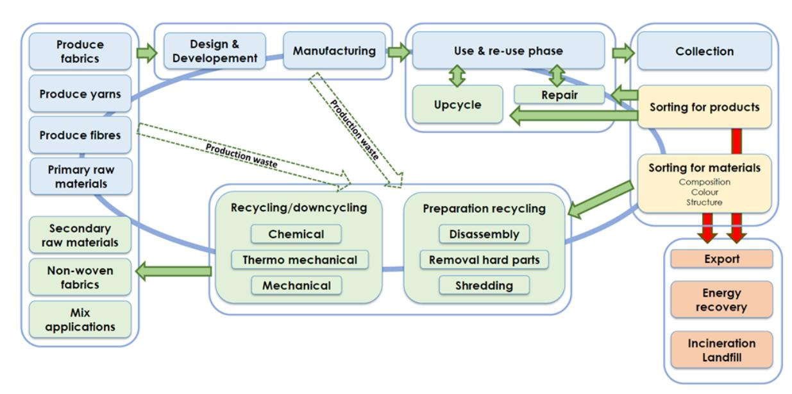

**Figure 12: Value chain circular textiles.**

The **sorting** and **disassembling** phase is a key point in the process, a high-level challenge for technology providers. Visual spectroscopy and near-infrared (VIS/NIR), together with the implementation of Artificial Intelligence, are able to separate clothing items by type, colour and fibre. In this regard, some of the most cutting-edge centres at European level have been identified. In Italy the sorting and disassembly phase is generally still entrusted to skilled craftsmen that, with tact and acquired experience, are able to sort the garments and remove all those accessories (buttons, zips, seams) that would prevent the subsequent recycling phases.

In the RegioGreenTex project, particular attention was given to the Italian scenario of wool recycling for the production of regenerated or mechanical wool garments. This involved considering virtuous processes within the prominent textile districts.

The mapping phase not only focused on the technologies, but also on the networks, associations or consortia that companies have established to address recycling challenges. Some examples are shown below:

Funded by the European Union. Views and opinions expressed are however those of the author(s) only and do not necessarily reflect those of the European Union or EISMEA. Neither the European Union nor the granting authority can be held responsible for them.

- RETEX GREEN
- COMO TEXTILE WASTE HUB
- ITALIAN REYCLED TEXTILE ASSOCIATION (ASTRI)
- CORERTEX, TEXTILE REUSE AND RECYCLING CONSORTIUM
- MAGNOLAB

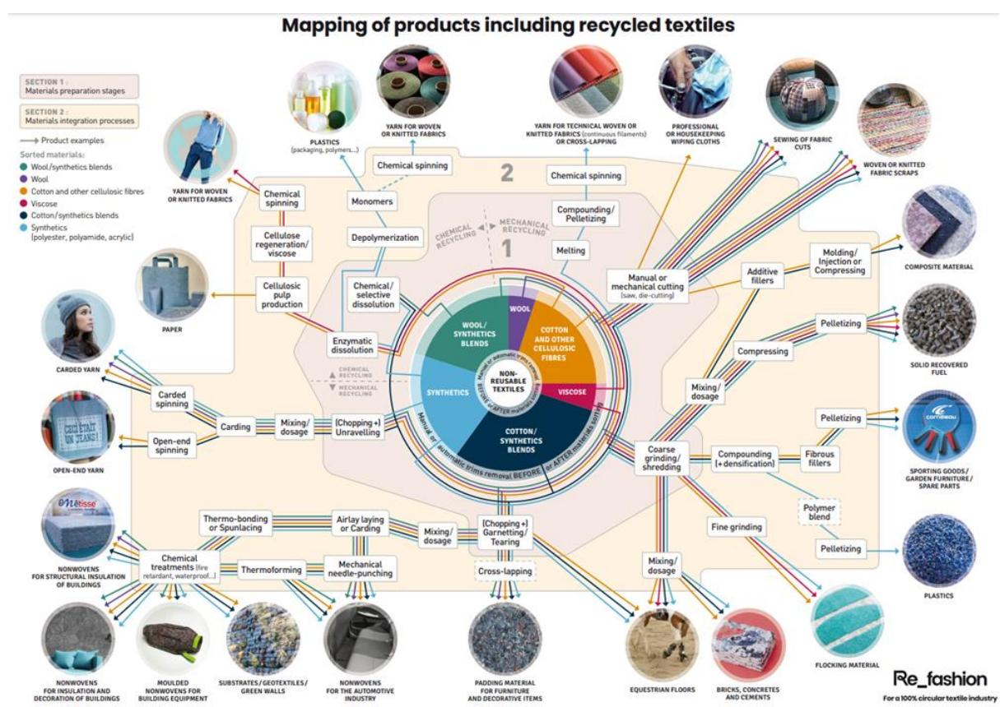

**Figure 13: Mapping of products incl. recycled textiles. Source: Refashion.**

# **3.6 Categorisation of technologies on an industrial scale**

The scouting activity performed in the last months allowed to obtain an overview of the technologies currently available on an industrial scale for textile recycling. The scouting activity has been focused

on the technologies present in the European area for the entire recycling chain, wherever possible, or on the single technologies, but not integrated in a whole supply chain.

The categorisation has been made according to the following criteria:

### **1. Positioning towards technology:**

- Technology makers: all those companies active in the development of technologies already successfully used in the textile fibre recycling sector or used in other sectors other than textiles (plastics, paper industry, construction, etc.) but which could be adapted to the textile sector.
- Technology users: all users of technologies that are already part of the value chain for recycled textiles.

### **2. Stage of the textile recycling value chain where the technology is present:**

- Collecting: pre- and/or post-consumer waste.
- Sorting.
- Disassembling / purification.
- Textile waste recovery and recycling: type of recycling process and equipment.
- Fibre or yarn regeneration.

#### **3. Sector of pertinence of the technology:**

- Artificial Intelligence and Big Data.
- Augmented and virtual reality.
- Traceability and blockchain.
- Automation.
- Physics and analytical chemistry.
- Mechanics, mechatronics and robotics.
- Process engineering, chemistry, textile and material science.

#### **4. Origin of the textile waste to be treated in the recycling line:**

- pre-consumer: pre-consumer textile waste includes materials thrown away before they are used by consumers, such as fabric and garment samples, overstock, and fabric from roll ends, as well as

Funded by the European Union. Views and opinions expressed are however those of the author(s) only and do not necessarily reflect those of the European Union or EISMEA. Neither the European Union nor the granting authority can be held responsible for them.

materials that were thrown away before they were suitable for consumer use, such as faulty fabrics, spinning and weaving scraps and wastes, etc.

- post-consumer: the post-consumer textile waste consists of damaged, discarded, worn-out, and outof-fashion clothes. Any apparel discarded by a consumer fall under the post-consumer textile waste category.

Based on the above categorisation, it is possible to identify a number of technologies already available in Europe.

D5.2: Regional Hub Ecosystem

Actions

Taking into account that category variables can be combined with each other leading to innumerable technological solutions and treatment lines, the following assumptions can be made:

- The sorting of pre-consumer waste is easier than post-consumer waste because waste often arrives from a collecting stage already sorted by type (e.g. spinning, weaving, sampling, etc.), so automated lines allow the separation of materials by means of sensors using UV-Vis and NIR spectrophotometry to identify the colour and composition of the material respectively.
- Automation in the case of sorting post-consumer waste is more complicated because it is also necessary to separate materials by type (clothing, furniture, etc.) and quality.
- For the technologies present in sorting and disassembling lines the greatest challenge is to refine the algorithms and reading systems to identify the greatest number of colours/materials at high speeds and with the least amount of error. As an example, SIPTex (Swedish Innovation Platform for Textile Sorting) allowed the creation of an automated sorting plant for post-consumer textiles in Malmö, Sweden. The sorting technology uses visual (VIS) and near-infrared (NIR) spectroscopy to detect fibre types and colours with sensors in each scanning unit that can distinguish between 16 different fibre types, allowing the plant to sort up to 24,000 tonnes of textiles each year.
- Another example can be brought by the German company SOEX, where the NIR-based material sorting automated line recognises 80 different material compositions, allowing a sorting capacity up to 500 kg per hour.
- Especially for post-consumer waste, in addition to the previously mentioned technologies, Artificial Intelligence, Computer Vision, and robotics enable the separation of items in the waste feedstock fed to the line. Such is the case with Picvisa, which designs and manufactures such systems. Similarly, Fiber sort and Tomra develop systems to recover recyclable fibres through sensor-based sorting technologies for industrial and post-consumer textile waste.
- The most problematic part of post-consumer waste destined for recycling is disassembling, where technology has not yet replaced manual labour. Particularly complicated is the separation of accessories (e.g., buttons, buckles, zippers, areas of overlapping seams, etc.) from items destined for recycling, so this action is still predominantly human.

As far as the main textile recycling technologies are concerned, we can distinguish between:

- **1. Mechanical recycling**: A well-proven technology to recycle used textiles, both composed of natural and man-made and synthetic fibres. Its strength lies in its versatility, tackling various textile waste that other methods might reject and compared to its counterparts, it also consumes fewer resources. Notably, it's the only way to recycle natural fibres like cotton while preserving their original essence, although with potential modifications. Some disadvantages are present also in this technology.

The recycled fibres often fall short of the quality of virgin fibres, necessitating further processing, moreover recycled materials might harbour harmful substances unintentionally incorporated from older products or during use, which conventional cleaning might not eliminate. This aspect requires adherence to regulations like REACH to ensure safety.

As an example, Prato, Italy, boasts a long-standing tradition of wool recycling, while recycled cotton commands high value in the market.

- **2. Chemical recycling**: Chemical recycling by depolymerisation is one way to recycle synthetic fibres: the recycling of polyester polyethene terephthalate (PET) and nylon 6 now occurs on a commercial scale.

Regarding cellulosic fibres, as cotton, they can be chemically recycled by a pulping process followed by solution spinning to produce regenerated cellulosic fibres.

- **3. Thermo-mechanical recycling**: Thermo-mechanical recycling is a technology for recycling thermoplastic textiles (e.g. polyester, polyamide, polypropylene) by melt-processing them into granulate and new fibres. It is also a cost-effective, efficient, and well-known process, which means it can be easily implemented.

# D5.2: Regional Hub Ecosystem Actions

Funded by the European Union. Views and opinions expressed are however those of the author(s) only and do not necessarily reflect those of the European Union or EISMEA. Neither the European Union nor the granting authority can be held responsible for them.

- **4. Thermo-chemical recycling**: Thermo-chemical recycling is a process using a partial oxidation reaction of polymers to produce low molar mass components or heat to degrade polymers to monomers that can be used as feedstock for the chemical industry. It is considered a mature technology, although up to now, not many waste gasification processes have been piloted and tested.

All these textile recycling technologies are based on the quality of the input material: it determines the efficiency and economic sustainability of the recycling process. Consequently, there is a clear need to introduce products to the market that are specially designed to be optimally recyclable.

Small scale recycling lines, prototypes, and well-established know-how is present in several European research centres even outside the RegioGreenTex project. Just to give a few examples we can mention CETI (European Centre for Innovative Textiles) in France, VTT (Technical Research Centre of Finland) in Finland and Centrocot (Cotton Textile and Apparel Centre) in Italy.

Italian Textile waste collection anticipates European legislation that provides for the separate collection of this type of waste from 2025. This European initiative will create four types of consequences:

- Increased supply of textile waste
- Increased stakeholder involvement
- Increased demand for recycled fibre or textile waste material in general
- Saturation and overload of existing structures and recycling and collection chains

The research for recycling opportunities, through recovery and the generation of secondary raw material becomes a strong point for the Hub organisation. The structure of the Hub allows to act in advance of the legislation. As well as it increases the level of consciousness of future scenarios.

The preparatory activities for identifying and generating "opportunities for recycling" are:

- Identification of possible uses of textile waste in market-ready products
- Definition of characteristics of these products: composition, certifications, technical data

Funded by the European Union. Views and opinions expressed are however those of the author(s) only and do not necessarily reflect those of the European Union or EISMEA. Neither the European Union nor the granting authority can be held responsible for them.

- Laboratory tests to verify different combination of waste textile fibre
- Generation of new applications of textile waste (pre- and post-consumer)

Research is being conducted on opportunities to recycle textile materials, particularly "wool" in the IGH, with the aim of establishing new value chains for various sectors including construction, automotive, geotextile, packaging and furniture.

A lot of possible applications are already on the market, but their data (composition, certifications, technical data) are not completely available. Despite the several case studies available on the market, the production of new products from pre- and post-consumer textile waste, presents significant challenges. One key factor contributing to these difficulties is the regulatory landscape. Therefore, as part of the analysis of recycling opportunities, a comprehensive study of relevant regulations is being carried out. Partners of RGT will actively participate in this analysis, providing insights into their respective outputs.

The research begins by focusing on the Italian market to establish an ecosystem for designing and managing a Hub. Following a preliminary analysis of cross-sectorial opportunities in Italy, the research expands to explore international markets in order to compile a list of potential applications of textile waste, focusing on wool. The identified applications are categorized per sectors (Construction, Infrastructure, Interior Design, Automotive, Packaging, Footwear, Gadget and Accessories and Floriculture) by specifying usage, required characteristics, and legislative frameworks. While not all

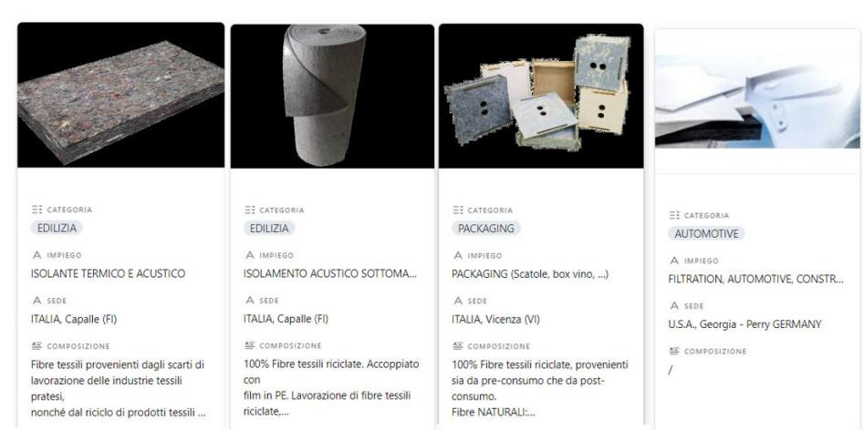

identified opportunities may be market-ready, they offer a valuable overview of potential market scenarios.

#### **Figure 14: Identified applications for potential market scenarios.**

For each potential application, specific data is utilized to gain insights into market trends and the percentage of wool usage. The research aims to establish a common framework for comparing opportunities using parameters such as:

- **Enterprise**: Identifying the organization, company, or research team responsible for developing the new recycling initiative, fostering potential collaboration opportunities.
- **Location**: Determining the geographical location of the enterprise and the relative market for the opportunity.
- **Use**: Describing the functions of the application
- **Composition**: Analysing the material composition, including considerations on single-fibre or mixed-fibre compositions with varying percentages depending on usage.
- **Technical Characteristics**: Understanding the specific technical requirements dictated by different uses and sectors, while also considering relevant legislation.
- **Certification**: Assessing whether products have certifications to validate their authenticity and quality.
- **Price:** Utilizing pricing data for applications on market-ready products to assess and validate the economic viability of textile recycling opportunities.

# **3.7 Recycling roadmap**

The starting point for the recycling roadmap is built upon the value chain gap analysis conducted by NTT (P14) and CS-Pointex (P7). By identifying and understanding these gaps, the IGH can develop target actions to bridge them in order to improve efficiency and overall performance. Outcomes of this analysis are listed below:

| 1.  | <b>Identification of material composition for sorting/recycling</b>                                                                          |
|-----|----------------------------------------------------------------------------------------------------------------------------------------------|
| GAP | Lack of reliable information to accurately identify and classify the composition of waste materials during the collection and sorting phase. |

Funded by the European Union. Views and opinions expressed are however those of the author(s) only and do not necessarily reflect those of the European Union or EISMEA. Neither the European Union nor the granting authority can be held responsible for them.

### Actions

Funded by the European Union. Views and opinions expressed are however those of the author(s) only and do not necessarily reflect those of the European Union or EISMEA. Neither the European Union nor the granting authority can be held responsible for them.

| Implication(s)          | Inaccurate and misleading identification can lead to improper sorting and recycling, reducing                       |
|-------------------------|---------------------------------------------------------------------------------------------------------------------|
| Hub Actions (performed) | Rely on « textile waste materials and recycling potential » results and identify AM identification                  |
| 2.                      | Possible contamination assessment                                                                                   |
| GAP                     | Absence of clear mechanisms for identifying and evaluating potential contamination.                                 |
| Implication(s)          | Contaminated materials can compromise the quality and safety of recycling phases. Lack of                           |
|                         | Hub Actions (to be performed) Connecting to Gap1, introduce advanced technologies (e.g. sensors, imaging systems)   |
| 3.                      | Innovative Recycling technologies                                                                                   |
| GAP                     | Limited knowledge and application of the most advanced and efficient recycling technologies                         |
| Implication(s)          | Without the possibility of access to state-of-the-art recycling technologies, the value chain                       |
|                         | optimal use of resources.                                                                                           |
| Hub Actions (performed) | Rely on « textile recycling technologies map » and foster collaboration with research institutions and              |
| 4.                      | Eco/Circular design                                                                                                 |
| GAP                     | Insufficient focus on designing applications with eco-friendly and circular principles.                             |
| Implication(s)          | Lack of sustainable design practices may result in the creation of products with a                                  |
|                         | Hub Actions (to be performed) Encourage the integration of flexible and scalable circular design principles such as |
| 5. Feasibility study    |                                                                                                                     |
| GAP                     | Limited investment and effort in conducting comprehensive feasibility studies, including                            |
|                         | testing analysis and pilot tests.                                                                                   |

# D5.2: Regional Hub Ecosystem

|                                             | Actions                                                                                                                  |
|---------------------------------------------|--------------------------------------------------------------------------------------------------------------------------|
| Implication(s)                              | Without thorough testing and piloting, uncertainties about the performance and viability of                              |
|                                             | recycled materials may persist, discouraging potential stakeholders and investors.                                       |
| Hub Actions (to be performed)               | Identification of characteristics of products (composition, certifications, technical                                    |
|                                             | positive results with stakeholders to receive feedback.                                                                  |
| 6. Final application and market penetration |                                                                                                                          |
| GAP                                         | Challenges in identifying and exploiting new applications as well as difficulties in accurately assessing market demand. |
| Implication(s)                              | Possible cross-sectoral applications are already on the market, with limited info about                                  |
| Hub Actions (to be performed)               | Conduct market research to identify new applications and assess market demand adoption.                                  |

This summary emphasizes 6 main areas where IGH focused initiatives to address identified gaps, primarily centred on providing valuable insights. These actions encompass providing insights into recycling technologies recycling technologies that can be used for to convert different textile waste streams, insight in material composition including contaminations, insight in how to sample and measure and insight in market demand.

# **3.8 Replication and identification of investment opportunities**

Dissemination of results and outcomes from the IGH pilot should encourage other Italian regions to invest in the textile recycling processes and maybe also put up a hub. Therefore events, workshops and brainstorm sessions with national stakeholders have been organized. For this the following actions have been performed:

- **Documentation and evaluation:** Document the process and outcomes of the pilot hub, including successes, challenges, and lessons learned; Evaluating model for measuring the effectiveness of different strategies and approaches employed during the pilot.
- **Development of Guidelines:** Create comprehensive guidelines and manuals detailing the steps and requirements for establishing and operating a textile recycling hub, including best practices, technical specifications, and operational procedures based on the experience gained from the pilot.
- **Cross-fertilization activities** to help new initiatives for replicating the hub model.

In the following, the list of events where the two teams performed to foster replication activities:

- Quadruple Helix Workshop "The role of Textile Hubs and Automated sorting technologies in the Circular Economy of Textiles". This workshop was organized on Nov 9th, 2023, by Next Technology Tecnotessile (NTT) (P14) and coordinated by Economia Circolare. The workshop was organised during the international fair Ecomondo 2023, which took place in Rimini (Italy), from 7th to 10th November 2023
- CS-Pointex (P7), Unione Industriale Biellese (Biella Industrial Association) and A2A (The leading Italian Life Company operating in energy, environment, and smart infrastructure) had some meetings to discuss future developments of a textile focused recycling hub in the Biella area. This represents an example of the creation of a recycling hub based in Biella and could be replicated also in other regions. Besides, the creation of a physical textile hub in Piedmont Region, will result in an expanded provision of services for companies.
- Milano Unica International Fair (Milan, Jan. 2024): Meeting between Unione Industriale Biellese and Confindustria Toscana Nord to discuss RGT project and IGH development. Marini Industry (P17) exhibited showcasing RGT project and pilot implementation. This meeting will be replicated in the

Actions

future and represents another example of the implementation of a common strategy developed between CS-Pointex (P7) and NTT (P14) within the RGT project.

# **4 AURA GREENTEX HUB**

For the definition of a road map and terms of reference for the AURA Greentex Hub (AGH) Techtera (P10) took the lead and primary focussed on AGT actions that benefit the regional SMEs, Recyc'Elit (P26) and Rovitex (P25). However, the development of the wider circular textile ecosystem in the Auvergne-Rhône-Alpes Region is also in scope.

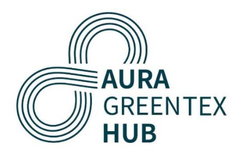

Within the AGH, so far, 2 types of functionalities have been identified and for each of these functionalities several actions have been explored. These functionalities and actions are listed below:

# **2. Secure the involvement of public authorities and private textile companies.**

### A. Setup of a cooperations within AGH:

- Together with the city of Grenoble organizing a local value chain for the collecting and recycling of textiles. Techtera (P10) initiated the cooperation, which resulted in a funding from Grenoble Alpes Métropole to implement this support action.
- On the topic of wastewater management in textile finishing processes, to identify the necessary technical developments and possible investments to better treat/reduce wastewater. For this a working group has started.

#### B. Organisation of workshops:

- within the frame of "Club RECIT". Club RECIT is a service dedicated to support recycling and circular economy in the textile industry, focusing on initiatives and applications in the Auvergne-Rhône-Alpes region. Two workshops were conducted:
  - 1. The first workshop focused on traceability with exchanges around a solution from a member of Techtera, consisting in the integration of RFID chips directly into a yarn. It also included a visit of the CCTN (research institute for the cleaning and upkeeping of textiles, to discuss the impact of using recycled materials on textile performances.

Funded by the European Union. Views and opinions expressed are however those of the author(s) only and do not necessarily reflect those of the European Union or EISMEA. Neither the European Union nor the granting authority can be held responsible for them.

# D5.2: Regional Hub Ecosystem Actions

- 2. The second workshop consisted in sharing the results of a study which proposed benchmarks to study the durability of 10 classes of clothing identified by the European Commission, based on different data: technical (causes of defects), consumer (end-of-life) and laboratory (performance tests).
- with ReFashion to present the current framework of regulations and waste management at the national level regarding textile waste. Refashion the organisation that is responsible for executing the Extended Producer Responsibility scheme of the French government on behalf of the producers.

## **3. Encourage public and private investment.**

#### A. Public funding

Individual: Rovitex (P25) (Case textile sorting): Identification of the need, and identification of potential funding sources. At the moment, the options that were explored were not adapted enough.

Regional: Obtaining funding to map production scraps, with the support of the Métropole de Lyon. The mapping focuses on the production scraps of 10 regional textiles companies, with the objective of having a clear identification of the waste, to support their valorisation and the establishment of post-process waste management solutions.

National : Techtera (P10) supported the CASTTOR project, involving Recyc'Elit (P26) as a partner and funded by the ADEME (national agency for the green transition), to support the development of a demonstrator for complex textiles PET recycling, in the objective of later being able to produce a PET yarn in the Auvergne-Rhône-Alpes region.

EU: AGH cooperated with the IGH on 2 EU partnerships proposals:

- 1. SOLSTICE (accepted, start in 2024): development of 4 demonstrators for the chemical recycling of textiles (AURA hub SME Recyc'Elit (P26) is also a partner, and so is ETP).

### Actions

- 2. ASTER (accepted 1st phase, 2nd phase submission March 2024): interregional territorial cooperation in the Alps to improve waste reduction, and waste management performance for polymer products. In this partnership, the Region Auvergne-Rhône-Alpes is leading.

#### B. Private funding

- Recyc'Elit (P26) was supported by the AGH in the obtention of a fundraising of 3.2 million € in late 2023.
- Rovitex (P25): The project of implementing a sorting facility for sorting scraps from plastics and cardboards is questioned, as an evolution of the company's production machines may have the priority in terms of investment.

# **5 NERO GREENTEX HUB**

The NERO (North-East Romania) Greentex Hub (NERO GH) scope is to foster a zero-waste circular textile value chain in North-East Romania through innovative solutions with potential of multiplication.

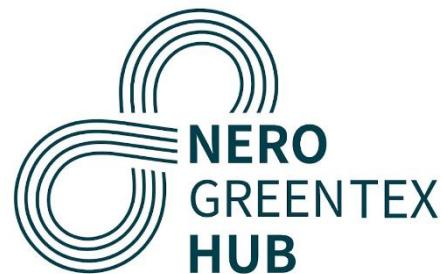

The activities of the hub address the value-chain of the garments industry in a systemic manner. This starts with the product and fabrication design, then (industrial) textile waste identification and sorting. Finally, fibre recycling or material or product up-cycling. This can be in the NERO GH or by connecting regional, national or inter-regional players with a stake in recycling activities. On the long term, the NERO GH aims to address the whole textile sector of North-East Romania, in line with the regional priorities of smart specialisation.

There are currently three core partners within the NERO GH:

- North-East Regional Development Agency (NERDA) (P4) NGO of public utility; regional policy maker – hub manager
- Katty Fashion SRL (KF) (P24) SME beneficiary
- "Mai bine" Association (MBAS) (P23) NGO; social enterprise beneficiary

# **5.1 Definition of the structure and services**

At the start a workshop was organised in Iasi and hosted by Katty Fashion (P24) on April 19, 2023. This start-up meeting was organized to understand the needs of the SMEs and of the NGH, get clarifications regarding investments, identify actions and distil a strategic plan for the development of the NERO GH. After the workshop several online meetings took place to define the NERO GH purpose, the functionalities. These meetings also laid the foundation for subsequent collaborative activities and of the elaboration of NERO GH Inception Plan and NERO GH Activity Plan.

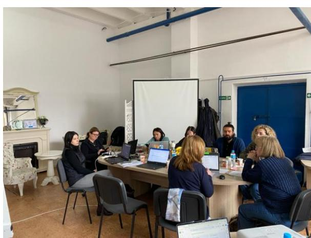

# **5.2 NERO Greentex Hub identity**

In addition, discussions related to NERO GH promotion and visual identity took place. For this a researcher from Iasi Technical University was invited for valuable technical insights. Following the initial meeting, various activities were undertaken to facilitate communication:

- Katty Fashion (P24) provided a comprehensive marketing content report outlining suggested mottos, social media channels and content for promotional posts aimed at enhancing the visibility and outreach of the NERO GH.
- Concepts and visual elements for the NERO GH logo: all partners proposed ideas and images for the NERO GH logo, leveraging expertise in design and branding to create a visually compelling representation of the hub's identity.

**Figure 15: Start-up meeting Nero Greentex Hub**

Funded by the European Union. Views and opinions expressed are however those of the author(s) only and do not necessarily reflect those of the European Union or EISMEA. Neither the European Union nor the granting authority can be held responsible for them.

#### Actions

Funded by the European Union. Views and opinions expressed are however those of the author(s) only and do not necessarily reflect those of the European Union or EISMEA. Neither the European Union nor the granting authority can be held responsible for them.

As part of the communication and dissemination efforts within WP 6 of RGT, proposals were developed for the NERO GH logo and the landing page. These proposals aimed to create a visually appealing and impactful representation of the NERO GH initiative. The logo proposals likely incorporated elements that symbolized sustainability, innovation, and collaboration, reflecting the core values and objectives of the project.

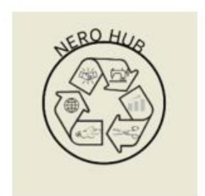

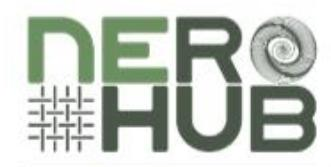

Following various discussions, we've decided on a visual identity for NERO GH, and used it until it was agreed within the project consortium leaders to have similar logos for each hub, with the name specific to each region:

#### **Figure 17: Process to NERO Greentex hub logo.**

Similarly, the proposals for the landing page focused on designing an engaging and informative platform that would serve as a gateway to the NERO GH initiative. These efforts were geared towards effectively communicating the goals and activities of the project to a wider audience and generating interest and support for its objectives.

The landing page, [https://nerohub.adrnordest.ro/,](https://nerohub.adrnordest.ro/) is currently hosted by NERDA (P4) as a sub-domain and is under continuous update and part of WP6.

**Figure 16: WP 6 proposals NERO logo.**

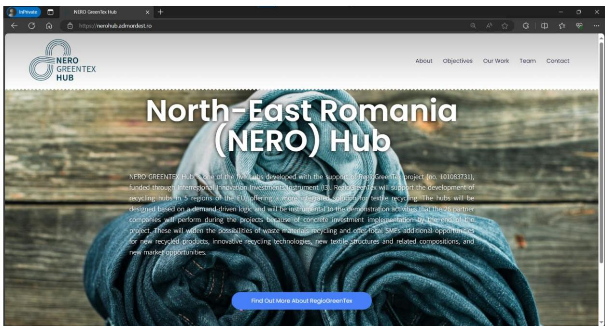

Funded by the European Union. Views and opinions expressed are however those of the author(s) only and do not necessarily reflect those of the European Union or EISMEA. Neither the European Union nor the granting authority can be held responsible for them.

**Figure 18: NERO Hub Landing page.**

# **5.3 Functionalities and actions fuelling the hub**

Within the NeGH so far 2 types of functionalities have been identified. These functionalities are divided into actions on the value chain demo-cases and actions on ecosystem activities supporting these demo cases. These functionalities and related actions are listed below:

#### **1. Value chain demo-case**

The initiation of the demo-case investment activity between Mai bine (P23) and Katty Fashion (P24) signifies a proactive step towards gaining comprehensive insights into the operational dynamics of medium-scale factory production.

The primary objectives of this endeavour are twofold:

- To enhance the understanding of the intricate production flow within such a factory setting,
- To identify potential collaborative opportunities with (Katty Fashion's P24) clients.

The execution of this initiative involved a multifaceted approach. Initially, Mai bine (P23) started on testing the analogue process of integrating Mai bine's patterns into some of Katty Fashion's (P24) markers. This experimental phase enabled them to gauge the feasibility and efficiency of incorporating their patterns within their existing production framework. Concurrently the production of Mai bine's (P23) products is set up within the premises of Katty Fashion's factory. This hands-on experience provides valuable insights into the practicalities and intricacies involved in manufacturing Mai bine's (P23) line within their operational setup. While these initial phases have yielded valuable findings, our exploration remains ongoing.

Within the NERO GH a regional platform is developed to connect the regional textile recycling ecosystem. This platform developed by Mai Bine (P23) will later become a digital B2B marketplace for waste recycling (pre-consumer / industrial and commercial waste). For this functionality the following actions are put up for development of the marketplace:

Engaging with prospective collaborators: Initial efforts were directed towards engaging in discussions with potential collaborators, such as brand identity developers and web designers. These discussions are aimed at facilitating the development of the marketplace platform. Special emphasis was placed on customizing the platform to meet the specific requirements of the North East Region while ensuring that it boasted an intuitive and user-friendly structure. This step ensures that the platform will resonate well with its target audience and provide an optimal user experience.

Market research on textile waste exploitation: To gain a comprehensive understanding of the market needs for textile waste exploitation in the region, we started by initiating discussions via phone or email with local textile waste recyclers and collectors operating in the Iasi Municipality. By actively engaging with stakeholders in the region, we are gathering valuable insights regarding existing challenges, opportunities, and requirements within the textile waste recycling sector. This research serves as a foundation for tailoring the marketplace platform to effectively address the identified needs and gaps in the market.

# D5.2: Regional Hub Ecosystem Actions

Formalization of collaborations: Subsequently, formal collaborations were established to further drive the development and implementation of the marketplace platform. This included the drafting and execution of a Non-Disclosure Agreement (NDA) with Reverse Resources, a key partner in the project. Following this, a Memorandum of Understanding (MOU) was prepared after multiple deliberations with the CEO and sales representatives of Reverse Resources. These agreements are instrumental in solidifying the partnership and outlining the terms and conditions for our future collaboration. By formalizing these agreements, the aim is to foster a collaborative environment and provide an alternative solution for connecting with European recyclers and other relevant stakeholders.

### **2. Ecosystem actions**

The development of the NERO GH aimed at fostering collaboration and innovation within the textile industry, involved a strategic approach to mapping relevant companies, identifying potential partners, and leveraging academic resources. An overview of the key actions taken within the NERO GH is listed below. These actions are taken during the development phase and highlight the efforts to establish a robust foundation for a hub:

- **Mapping of quadruple helix players:** As part of cross-fertilization actions a comprehensive database has been created to map regional SMEs, universities, high schools and NGOs active in the textile sector; The mapping is still in the works, being updated on a current basis.
- **Setting a regional map and database for textile waste producers and recyclers:** As NERO Hub's scope is to foster a zero-waste circular textile value chain in North-East Romania, we've mapped and created a database of quadruple helix players active in waste activities; This is a prerequisite for future interviews and surveys that will be conducted by NERO GH partners in order to collect valuable data about the textile waste in the region.
- **Mapping of Relevant Companies:** The initial step in the development process involved collaboratively determining the position along the value chain of the relevant companies within the textile industry located in our region. This meticulous process served as the cornerstone for creating a comprehensive common database of companies that would form the backbone of the NERO GHs activities. By identifying and cataloguing these companies, we laid the groundwork for effective collaboration and knowledge sharing within the industry.
- **Identification of Potential Partners within RegioGreenTex:** Simultaneously, Katty Fashion (P24) identified potential partners who could contribute to the development and success of the NERO

Funded by the European Union. Views and opinions expressed are however those of the author(s) only and do not necessarily reflect those of the European Union or EISMEA. Neither the European Union nor the granting authority can be held responsible for them.

Actions

Funded by the European Union. Views and opinions expressed are however those of the author(s) only and do not necessarily reflect those of the European Union or EISMEA. Neither the European Union nor the granting authority can be held responsible for them.

Hub's activities. By reaching out to organizations and stakeholders with complementary expertise and resources, we sought to build a network of support and collaboration essential for achieving the hub's objectives.

- **Research on PhD Students:** To boost our innovation capabilities and tap into academic expertise, Katty Fashion (P24) conducted research on recent PhD students from our regional university, TUIASI, specializing in textiles. By examining their thesis topics and areas of specialization, we aimed to identify potential researchers who could contribute to the NERO Hub's activities. This initiative was instrumental in ensuring access to a pool of talented individuals with relevant expertise and knowledge.
- **Transparency and Traceability Flow:** Additionally, a comprehensive flow chart (figure 19) was created and detailed, with a specific focus on illustrating the journey from the initial idea to the final product. This flowchart highlighted the crucial points where the NERO Hub's partners (Katty Fashion P24 and Mai Bine P23) could provide support and assistance to companies. It delineated

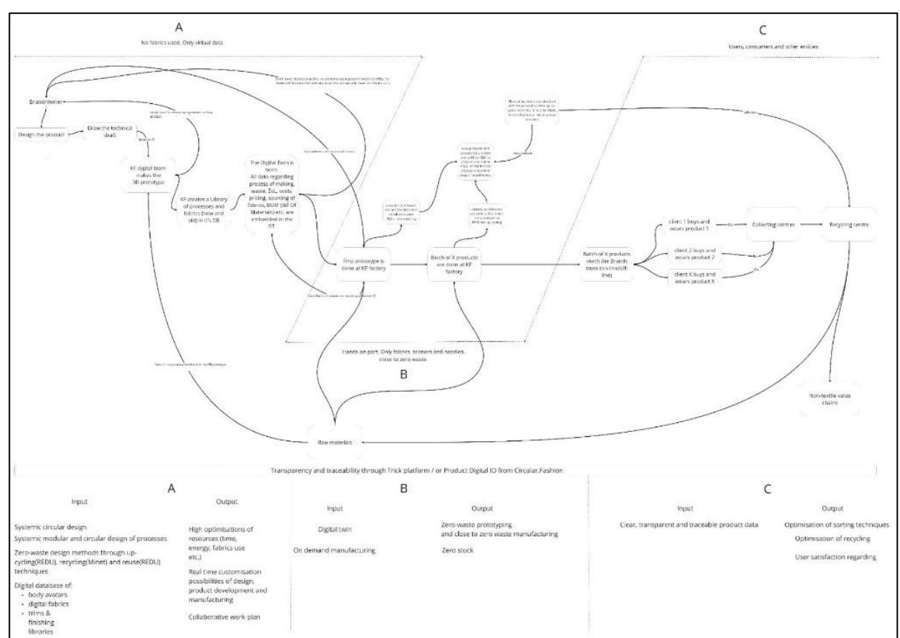

Actions

the various stages of product development and the potential interventions and contributions from hub partners, emphasizing collaboration and synergy throughout the process.

# **6 PORTUGAL GREENTEX HUB**

The Portugal Greentex Hub (PGH) aims to mobilise different stakeholders within the regional textile ecosystem, in the Norte region of Portugal, and support them in the development of concrete actions towards maximising the recycling potential.

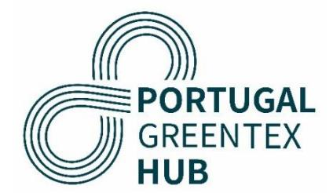

# **6.1 Definition of the structure and services**

Figure 20 presents the concept of Portugal Greentex Hub. It is intended that the PGH interacts with organizations/ industries at regional and national level with the objective to build a complete value chain ecosystem, focused on the increase of the use of recycled materials in textile products. The core of the PGH is composed by CITEVE (P3) (leader), Sasia (P19) and Tintex (P20) (the beneficiaries), supported by the Portuguese Textile Cluster. This core interacts with a first ring of entities and projects considered directly relevant for the current partners of the PGH. Relevant interactions are particularly those interactions that can improve the knowledge on and bridge the identified gaps of circular textile value chains.

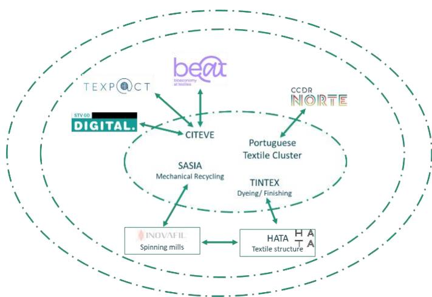

- Entities that are identified and classify as such thus far are the regional authority CCDR Norte, spinning company Inovafil and knitting company Hata. These last two companies can fill the gap between the recycled fibre production of Sasia (P19) and the dyeing, coating and finishing activities of Tintex (P20).
- Interesting projects to interact with to share the knowledge and create synergies are: o be@t (https://bioeconomy-at-textiles.com/), o Texp@ct (https://www.citeve.pt/technological\_intelligence/projects/texp\_ct\_2- 4d1d0227) o STVgoDigital (http://www.stvgodigital.pt/) **Figure 20: Concept of Portugal GreenTex Hub.**

The second ring in the conceptual figure of PGH represents the aim to involve other relevant organizations and/or projects during the implementation of the activities.

# **6.2 Functionalities and actions fuelling the hub**

The primary functionality of the PGH is to support companies active in circular textile with knowhow, material tests (e.g. on recyclability) and the production of prototypes. For this functionality within the PGH so far, the following 2 actions have been explored:

**1. Creation of the Special Interest Centre (SIC)** inside the existing structure, on recyclingrelated topics (such as collecting, sorting, processing, etc.). SIC is providing consulting services. Companies interested in recycling services (research, development, and industrialization of recycled products) are contacting Citeve (P3). There is a first meeting to understand the problem and needs, with a focus on the customer requirements in order to evaluate the feasibility and potential of the waste recyclability. A proposal is elaborated and if validated by the client, the recycling process starts at pilot scale. Currently, at pilot scale it is possible to study the following:

- Cutting of the waste fabric different parameters are varied according to the specific product required by the customer (size of the fabric pieces). Cutting machine used in SIC is a Starcut 500 model from LAROCHE.
- Shredding during this step it is possible to study/vary the size of the obtained fibres by defibrillation. Obtaining individualised fibres is an important step not only for the mechanical recycling process but also for the chemical and enzymatic recycling of cotton textile wastes. Shredding machine in SIC is from LAROCHE (Cadette model). After this step, and depending on the products envisaged, the defibrillated fibres will move further.
- Spinning recycled fibres during this spinning process step it is possible to produce a yarn based only in recycled fibres or blended with other materials. SIC has a spinning line from Mesdan. **Figure 21: Special Interest Centre**

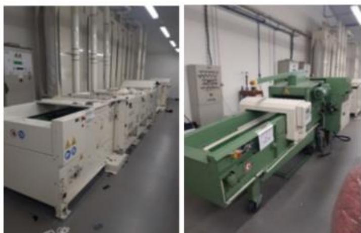

After tests at pilot scale industrial validation is tested to demonstrate the feasibility of the process.

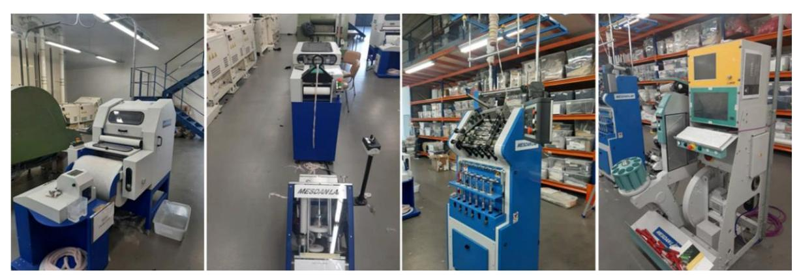

# **2. Communication and dissemination:** activities to promote the PGH objectives and activities and to engage other relevant stakeholders.

These existing lines in the SIC will be completed with:

A sorting line at lab scale as shown on the right. This line will be available at the end of 2024. It will consist of:

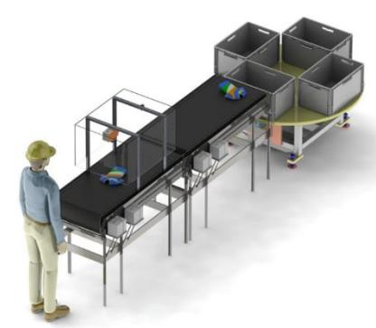

- a driving system with two sensors: hyperspectral camara+ RGB camera.
- a robotic arm with a proprietary system for removing hard parts and accessories on the textile waste products will be part of this line.

A chemical/enzymatic recycling line. Equipment is being installed. By the end of this year, it is expected to have this chemical/enzymatic recycling line totally equipped to start pilot services in this area. **Figure 23: Illustration of a sorting line.**

**Figure 22: Special Interest Centre**

It consists of a series of reactors and pre-treatment equipment to enable the dissolution of the (primarily) cellulosic waste fractions into new fibres. Figure 24 shows some of this equipment.

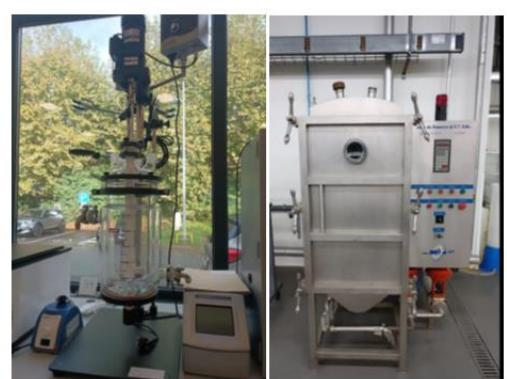

**Figure 24: Equipment for chemical/enzymatic recycling.**

Funded by the European Union. Views and opinions expressed are however those of the author(s) only and do not necessarily reflect those of the European Union or EISMEA. Neither the European Union nor the granting authority can be held responsible for them.

Regarding provided services within the scope of the PGH, some tests with umbrellas were performed in order to recycle the fabrics and produce textile fibres.

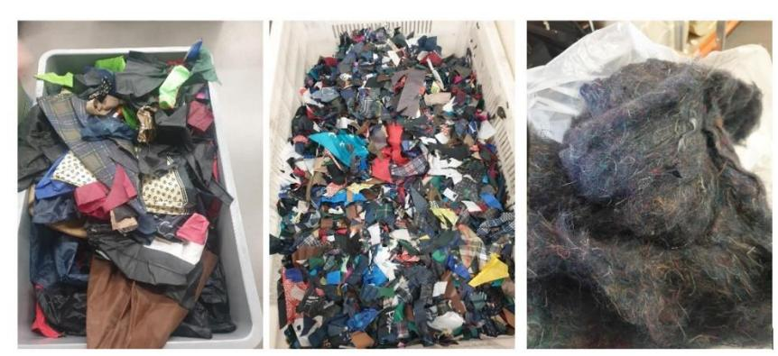

**Figure 25:Recycling tests.**

# **6.3 Communication and dissemination**

On 28th of November 2023 the PGH participated in a workshop in Science Park Borås, dynamized by Stina Björquist, from RISE (P12). The session included a presentation of RegioGreenTex project and an activity in which each group discussed the main strengths, weaknesses, opportunities, and threats (SWOT-analysis) on the textile recycling in their region. The PGH was represented in this session by CITEVE (and Portuguese Textile Cluster and textile companies), and the workshop group defined and presented the SWOT for the textile recycling in the region Norte.

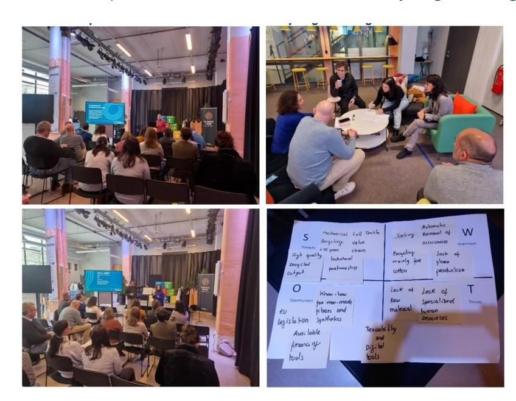

#### **Figure 26: PGH workshop.**

On 29th November 2023 the PGH presented an overview about the hub, aim, vision, expectations during the second edition of the RegioGreenTex Community Talks webinar series, "Discovering the RegioGreenTex Hubs".

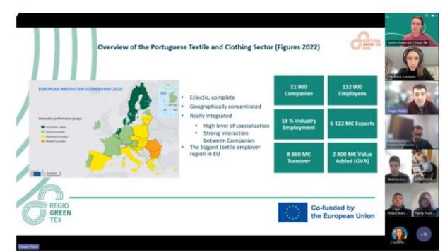

It also the Portugal Greentex Hub was promoted at the Modtissimo in February 2024. The Modtissimo [\(https://modtissimo.com/\)](https://modtissimo.com/) is the largest

Portuguese textile and clothing trade show and the oldest in the entire Iberian Peninsula. It brings together the entire textile and clothing sector, from yarn producers to fabric and clothing manufacturers and fashion brands, as well as technical textiles, showcasing one of the largest textile clusters in all of Europe.

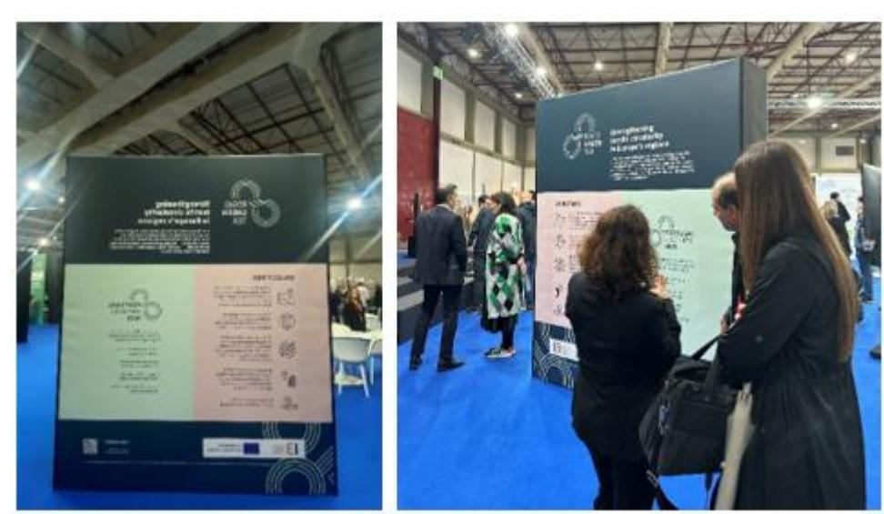

**Figure 28: Modtissimo textile and clothing tradeshow.**

**Figure 27: RegioGreenTex Community Talks**

# **7 COLLABORATION**

Facilitating cross-regional and inter-hub collaboration is a pivotal aspect of advancing circularity in textile ecosystems. The engagement of different regions signifies a collective effort to fill gaps in knowledge and practices within the industry.

By fostering cross-regional collaboration and utilizing findings across hubs, the textile industry can collectively address gaps in knowledge and implementation. This collaborative approach not only enriches the understanding of circular practices but also builds a network of interconnected hubs, working in synergy towards a more sustainable and circular future for the entire textile ecosystem.

Two mechanisms to achieve this collaboration have been explored so far:

- **Targeted workshops:** One essential mechanism to achieve collaboration is through targeted workshops, for example by the "Filling the Gaps" workshop in Prato. This session was a great opportunity where regions shared insights, best practices, and challenges, contributing to a more comprehensive understanding of circularity in textiles.
- **Open access hub meetings:** Moreover, the initiation of open access hub meetings in regions like Romania and North France underscores the commitment to inclusivity and knowledge exchange. These meetings provide an opportunity for diverse regions to come together, fostering a collaborative environment where experiences, innovations, and lessons learned can be openly discussed and shared.

Effectiveness of these 2 actions is illustrated in the following paragraphs.

# **7.1 Targeted workshops**

The main goal of RegioGreenTex is to strengthen the circularity in Europe's regions. In order to strengthen the textile value chain, we delve into the task of filling the gaps within the 5 textile ecosystem hubs. This was a central focus of the recent RGT hub workshop during the Regional Cluster meeting in Prato, October 2023. This event brought together the work package and regional cluster leaders to brainstorm, analyse, and collaborate on strategies to address the challenges and opportunities within the textile value chain. The insights and solutions generated during this workshop serve as a significant milestone in our collective effort to drive positive change in the textile industry.

Funded by the European Union. Views and opinions expressed are however those of the author(s) only and do not necessarily reflect those of the European Union or EISMEA. Neither the European Union nor the granting authority can be held responsible for them.

The following gaps were identified for each hub;

| Hubs                  | Gaps                                                                    |
|-----------------------|-------------------------------------------------------------------------|
| Lowlands Greentex     | Hub Correct identification and sorting of (post-consumer) textile waste |
|                       | Complex waste streams: how to deal with blended materials and           |
|                       | Missing cross-region collaborations and legal, local waste              |
| Italy Greentex Hub    | Need for identification of the composition of materials to be           |
|                       | of harmful components on pre- and post- consumer materials.             |
|                       | Missing identification of best practices and latest recycling           |
|                       | Investigation needed of new applications identified and small-scale     |
| AURA Greentex Hub     | Lack of knowledge of economic potential of recycled materials.          |
| NERO Greentex Hub     | Lack of recycling plants/technologies.                                  |
| Portugal Greentex Hub | Missing recycling technology for synthetic materials (North Portugal    |
|                       | is focus on cotton- mechanical recycling).                              |

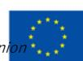

In the workshop the other partners present provided input how they could help to solve these gaps. The outcome is shown in the tables on the following pages.

#### **Prato Workshop; Filling the gaps**

#### **Italy Greentex hub**

### **Hub leader: NTT Tecnotex (P14)**

- Kknowledge missing about legacy of chemicals; Link to Ovam (P6), there are several research projects around remaining this.
- What to do with sorted factions: Team up about this. Share knowledge on EPR and focus on 2nd hand.
- Rise (P12): Can do small pilot scale trials of innovative recycling techniques. (yarns, nonwovens, chemical recycling).
- Valorisation of waste streams, what to do with it? On Ellie Connect there are examples of industrial recycling from these regions as input.
- Rise (P12): Has a group working on production management and streamline processes. (could help with streamline the waste management).
- More knowledge about chemicals; team up with WUR (P13); a lot of knowhows on chemicals.

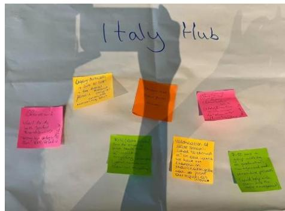

#### **NERO Greentex hub**

### **Hub leader: North-East Regional Development Agency (P4)**

- Connect with Portugal hub; more than 50 years of experience in mechanical recycling of cotton.

- Search on Ellie Connect platform, there are updates on recycling, new techniques.
- UTT, partner within the Lowlands Hub, experience on recycling. Partner in Romania.
- Rise (P12) can offer education to multiple companies. Both on why to report waste and information on recycling solutions.
- Rise (P12) can perform small and pilot scale trials using a certain waste stream (mechanical recycling).
- AEI textiles (P11) can offer updated information about fairs (ITMA, Techtextil etc.) Also about start of the art.
- ETP (P9) can give support to companies in terms of providing information.

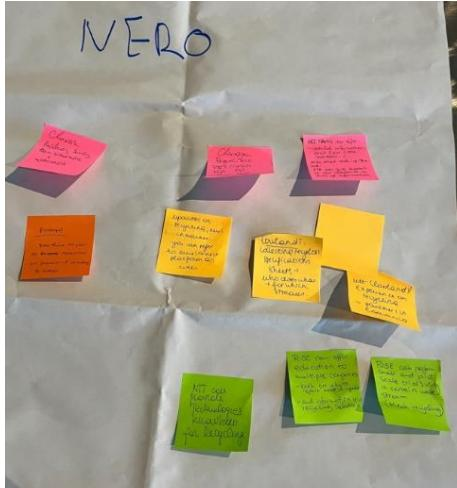

#### **Lowlands Greentex HUB**

#### **Hub leader: Ariadne (P18)**

- Feedstock of aramids: TST protective clothing (company within Västra Göteland).
- Italy hub: PA/PET textile waste. There is a textile producer of workwear in Italy.
- Aramid fibers: Pointex (P7) has a company that is recycling aramid and is looking for feedstock.
- Spinning of aramid fibers: Hilaturas Arnau (P31) (Valencia Region).
- Sorting company: NTT (P14), is working on a new technology of sorting.
- Reuse/repair: Repurpose It Company in Västra Göteland.

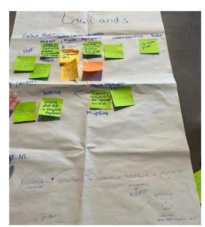

### **Portugal Greentex HUB**

Funded by the European Union. Views and opinions expressed are however those of the author(s) only and do not necessarily reflect those of the European Union or EISMEA. Neither the European Union nor the granting authority can be held responsible for them.

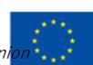

#### **Hub leader: Citeve (P3)**

- Spinning; demo facility at Saxion (college for textile engineering Eastern Netherlands).
- In Italy there is a large company able to recycle PA and PET.
- AURA hub, expertise in chemical recycling (Recycel'it) (P26).
- Lowlands; Thiérarche (P39) is a spinner (openend) and has experience with recycled fibers. Expertise North France on mechanical and chemical recycling.
- Rise (P12) is involved in several projects regarding pilot studies on synthetics recycling.

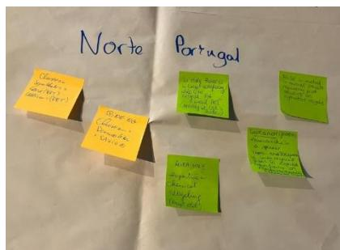

This exercise underlines how a targeted workshop can play a role in addressing but also mitigating some of the main gaps within the textile value chain. One of the most remarkable achievements is the successful establishment of previously missing partnerships, effectively bringing together valuable collaborators and stakeholders. Moreover the successful linkage of partners demonstrates the power of collaboration and collective effort in strengthening the entire value chain.

As we move forward, the focus is now on the hubs to harness the invaluable input garnered from the workshop. The knowledge, insights, and connections formed during this event provide a solid foundation upon which to build. They can now use the newly established partnerships to explore innovative solutions, enhance efficiency, and promote sustainable practices.

# **7.2 Open-access hub meeting: Interregional hub workshop in Romania**

The RegioGreenTex Interregional hub workshop in Romania was part of the "Clusters Meet Regions – Clusters as drivers of regional innovation ecosystems" international conference held in Iasi, North-East Romania, from 21 to 23 November 2023, in the city of Iasi. The event marked a significant step towards improving regional innovation ecosystems through clusters across

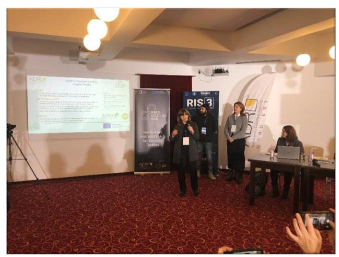

Europe. **Figure 29: RGT Interregional hub workshop Romania.**

The day of 23rd November included three parallel sessions on Bioeconomy, Textiles, and Cluster Financing in Regional Programmes. These sessions featured discussions on bio-economy value chains, sustainable textiles, and funding schemes. The morning section of the Textiles parallel session was hosted by RegioGreenTex (I3 project) and CLOTH – European Cluster Partnership for Excellence (COSME project).

As part of our RegioGreenTex session entitled "Role of Clusters in dynamizing the interregional investments for innovation within the European textile sector", the following speakers addressed the following topics:

- **Jennifer Palumbo, Project Director, EURATEX (P1) –** Regional clusters and hubs within RegioGreenTex project.
- **Karolien de Bruine, EU-Liaison, Oost NL (P15), Netherlands –** Overview of the RegioGreenTex Textile Recycling Hubs.
- **Enrico Venturini, Senior Researcher, Next Technology Tecnotessile (P14), Tuscany –** Italy Greentex Hub.
- **Agatha Filimon, Head of Sectorial Specialisation, North-East RDA (P4) –** NERO GREENTEX Hub – NE Romania's regional hub for textile circularity (in collaboration with North-East RDA, Katty Fashion SRL (P24), Mai Bine Association (P23), Hub partners)
- **Fabrizio Protti, Cluster Representative, ASTRICO Nord-Est / Sales Manager, RIFIL SA –** Good practices of sustainable & circular textiles. ASTRICO NE cluster is the main cluster of textile companies in North-East Romania, with a significant presence in national and international innovation and collaboration projects. The cluster has a tradition of good practices in Textiles, having RIFIL (a private Romanian-Italian company, established 50 years ago, one of the very few of its kind during the communist times) as main pivot.

The textiles session had 56 participants from clusters, companies, academia, social enterprises and civil society. The aim of the workshop was to present the RegioGreenTex project, the role of the hubs within it, and the roles of the regional clusters in these hubs. Presentations emphasized the similarities and the complementarities between the RegioGreenTex Hubs, the regional contexts in which they were settled, and the various economic and policy perspectives aimed to support innovation in textile companies. WP4 leader, NTT (P14), represented by Enrico Venturini, presented also their role in helping and coaching RegioGreenTex SME partners as part of this project. **Figure 30: RGT Interregional hub workshop Romania.**

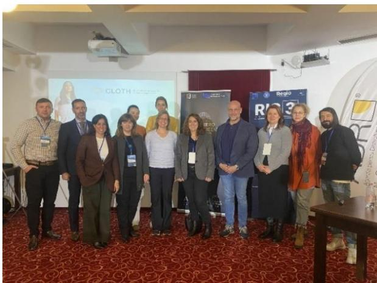

A special emphasis was placed on the presentation of Nero Greentex Hub, its partners and activities. During this event, both Katty Fashion (P24) and Mai bine (P23) had the opportunity to showcase their involvement in the RegioGreenTex project. This involvement includes the development of pilots and hub activities aimed at promoting sustainable practices within the textile industry and highlighting the commitment to driving positive change within the region.

Also, to enlarge the scope of the discussion, a representative textiles cluster of North-East Romania has been invited to present a number of good practices of interregional collaboration, and also, the main challenges encountered by the member companies on the national and global markets.

RegioGreenTex speakers were also invited to join CLOTH project speakers in a panel discussion that debated a number of sensitive topics of the textiles and fashion sector, of the role of public entities and other relevant stakeholders in supporting a sustainable textile industry, and on the future of textiles and their circularity in nowadays global economy.

On the second part of the day, the representatives of Nero Greentex Hub participated to the "Bioeconomy meets textiles" workshop hosted by HEREWEAR Horizon 2020 project that addressed the recycling and upcycling of bio-based textile waste.

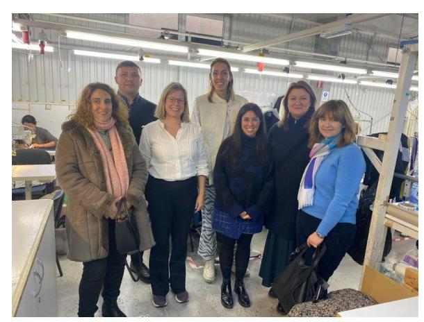

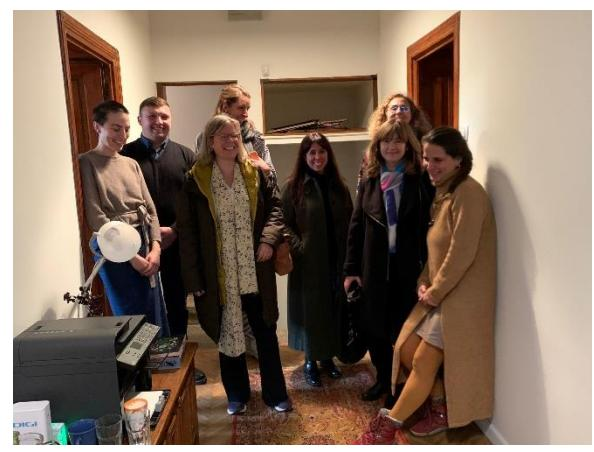

Before the "Clusters Meet Regions – Clusters as drivers of regional innovation eco-systems" event, some of the RegioGreenTex partners visited and took a tour of Katty Fashion SRL (P24) and Mai bine Association (P23), with the scope of further strengthening collaboration and fostering a deeper understanding of their operations.

# **7.3 Open-access hub meeting: Lowlands Greentex Hub meet-up**

On January 23 & 24, 2024, the Lowlands Greentex Hub organised a second Lowlands meet-up, hosted by Euramaterials (P2). The first part of the event was open to external stakeholders. The invited partners included: CETI, Dagobaire, Fashion Green, Hub Induo, Purfi and Herwin.

**Figure 31: Company visits Katty Fashion. Figure 32: Company visits Mai Bine.**

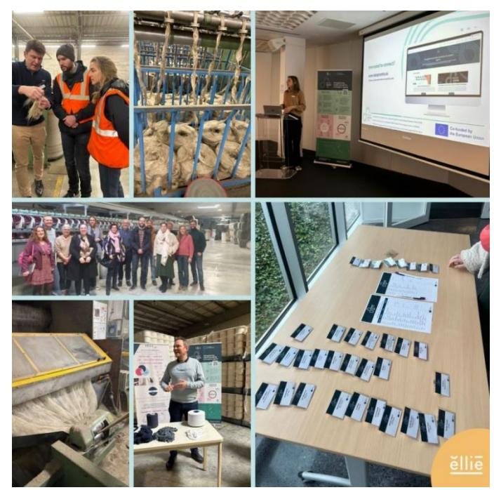

During this event, regional cases provided updates on their projects and progress made. Additionally, several external partners were invited who had significant potential to collaborate with the LGH partners. These partners were not only present for the presentations on the activities within the LGH but also had the opportunity to introduce themselves and their activities through a short pitch. Furthermore, they actively participated in the challenge-based workshop. The program featured a diverse mix of presentations, workshops, and site visits.

During the first part of the two-day meetup - which was open to external partners - attendees were introduced to Euramaterials (P2) activities, gained insights into the regional ecosystem in Hauts-de-France, received updates on various value chain projects, and participated in a workshop focused on bridging value chain gaps. Additionally, all participants had the opportunity to deliver a short pitch outlining their activities and expressing interest in potential collaborations.

# **7.4 Key takeaways**

The key take aways of cross-regional and inter-hub collaboration are:

- Identification of other regions with complementary infrastructure and expertise, offering significant potential for building and piloting circular loops and attracting regional investments.
- Recognition of primary barriers in other regions related to connecting feedstock to processing (different R-Strategies).
- Acknowledgment of the importance of defining sorting and processing criteria, as well as identifying gaps in partners and technology to facilitate connections.

**Figure 33: Lowlands Greentex meet-up.**

- Emphasis on the value of gap analysis and taxonomy.
- Highlighting the critical role of knowledge transfer and sharing infrastructure between partners for the success of regional cases.
- Recognition of technology's crucial role in facilitating project success.

These takeaways underline the importance of the strategy in fostering cross-regional and inter-hub collaboration and utilize findings from individual hubs or regions in other hubs and regions.

This approach enhances the efficiency of circular initiatives by leveraging the unique strengths and insights of each hub. For instance, innovations discovered in the IGH could be applied to address challenges identified in the NERO GH or the region of Valencia, promoting a cross-pollination of ideas and accelerating progress towards circularity goals.

In conclusion, initiating hub and value chain development at the regional level is paramount. The lessons learned from these regional collaborations serve as valuable takeaways for fostering interhub and interregional collaboration. By starting locally and expanding strategically, we not only optimize resource utilization but also cultivate a foundation of knowledge and efficiency that can be seamlessly applied on a broader scale. The journey from regional collaboration to interhub synergy becomes a natural progression, reinforcing the idea that sustainable and impactful solutions thrive when rooted in collaborative, localized initiatives.

# **CONCLUSION AND RECOMMENDATIONS**

The prime function of a RGT hub is to provide support to SMEs active in the circular textile value chain and that this support encourages investments and growth of these SMEs. Based on the definition of a hub and resulting from the scoping exercises that have been done in the 5 hubs it can be concluded that functionalities and actions of a hub can be:

### **1. Creating a market by building circular textile value chains for:**

- Fire protective textiles (\*)
- Textiles with a high percentage of cotton (\*)
- Textiles with a high percentage of wool (\*)
- The reuse of wearable clothing and reuse of clippings, wool (\*)

### **2. Attracting public and private investments by building consortia for:**

- Research and Development (TRL 5/7) (\*)
- Pilots and demo's (TRL 7/8) (\*)

### **3. Attracting individual investments by connecting the financial sector:**

- Private investments
- Public investments
- Via EPR system(s)

### **4. Capacity building (competences) by:**

- Providing access to technologies (field lab) (\*)
- Transfer of knowhow on management and operations
- Transfer of knowledge about textile waste (\*)
- Transfer of knowledge on recycling technologies (\*)

# **5. Building a community that offer SMEs:**

- Individual visibility and credibility for investors (\*)
- A collective voice towards policy makers (\*)

The description of actions in the different hubs, inter-hubs and interregional displays in WP5 of RGT reveals ongoing experimentation with marked actions within and among the different hubs, these are marked with an asterisk (\*).

It can be concluded cooperation was the most important element of all actions. Moreover, it can be concluded most successful were the actions of the:

- Lowlands Greentex Hub on (1) creating a market by building circular textile value chains.
- Italian Greentex Hub on (4) capacity building by transfer of knowhow and knowledge.
- Portugal Greentex Hub on (4) capacity building by providing access to technologies (field lab).
- AURA Greentex Hub on (2) attracting public and private investments by building consortia.
- • NERO Greentex Hub on building a community (5).

# **Recommendations**

It is the recommendation to all hubs to learn more about the functionalities listed in the conclusions by continuing the activities foreseen and learn from the successful actions by other hubs. Moreover, special attention has to be given to those functionalities that have been identified but have not been put into action yet.

In this respect the Lowlands Greentex Hub has had some preliminary actions (3) attracting individual investments by connecting the financial sector, but it is recommended the hubs take specific action in this related to the Deliverable 5.4 of the RGT project dealing with guiding SMEs to become investor ready.

Therefore, it is also recommended attention is given to 4. capacity building (competences) by transfer of knowhow on management and operations.

Final recommendation is to investigate with the 3 regions that are not part of a RGT hub to start a hub themselves and decide what functionalities suit them the best. Also, it could be discussed whether or not it might be more effective to build a hub around only one region since e.g. this is

more efficient and effective looking at existing economic stimulation structures, smart specialization policies and triple helix cooperations.