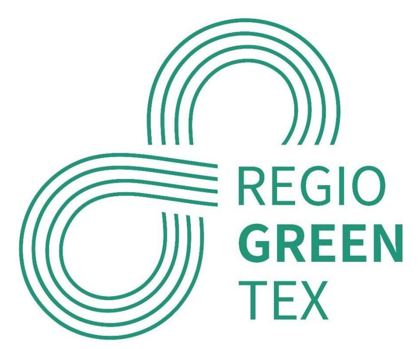
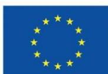
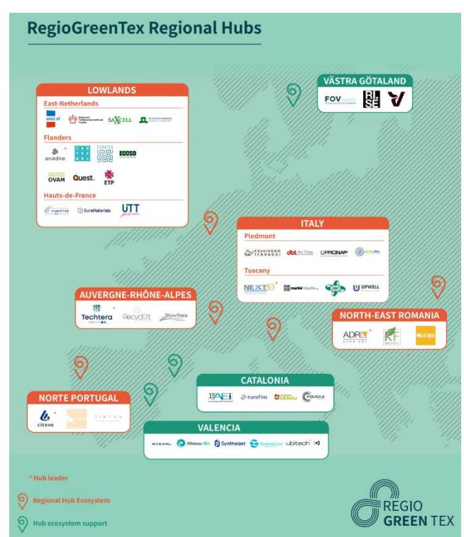
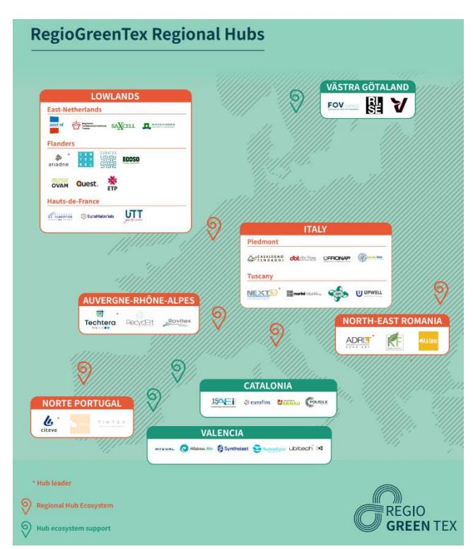
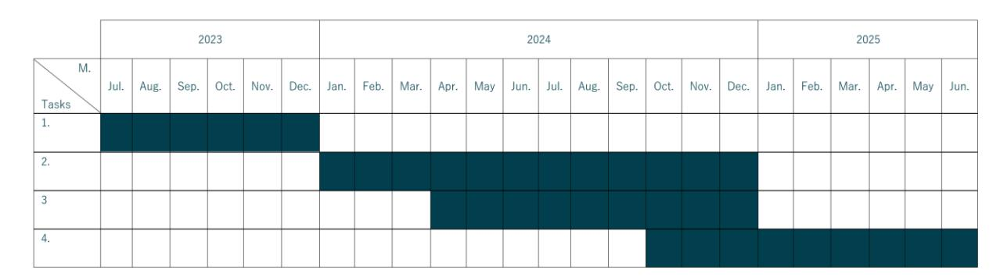

# **Deliverable 5.1 Regional hub ecosystem inception plan**

Interregional Innovation Investments Instrument (I3)

**Deliverable due date:** July 2023

#### **AUTHORS**

Oost NL (P15)

#### **Co-writers: Reviewers:**

Ariadne (P18) Ovam (P6)

Techtera (P10) Euratex (P1)

NTT Tecnotex (P14)

North-East Regional Development Agency

(NERDA) (P4)

Citeve (P3)

**Project number:** 101083731

**Project title:** Regions for Green Textiles

### **EXECUTIVE SUMMARY**

The primary purpose of this paper is to provide more detailed information on the workplan of work package 5 (WP5): Regional hub ecosystems. The target audience are the RegioGreenTex (RGT) partners and the representatives of the EU I3 programme. Additionally, it aims to inform potential stakeholders within the different hub ecosystems about strategy, roadmap and related initiatives. Moreover, this paper serves as an initial invitation to stakeholders such as companies, researchers, non-governmental organizations (NGO's) and policymakers to join and contribute to the development of these ecosystems. As such it also intends to directly support the investment plans of the small and medium sized (SME) companies within the RGT project.

Within RGT, 5 textile recycling hub ecosystems are identified that have to support the SME's upscaling, attracting investments and creating closed loop systems. The overarching idea for the five hubs is to collaborate in constructing a comprehensive European textile recycling system. Each hub will develop its own distinct type of textile recycling hub ecosystem, which can be replicated in other regions. Additionally, each hub will possess unique smart specialization features that can be leveraged to support other regions.

WP5 of RGT is specifically focussing on this supporting role of the hubs and as such WP5 has the following three main tasks:

**Task 5.1** Definition of a road map and terms of reference.

**Task 5.2** Definition and execution of pilot activities, widening involvement to key players.

**Task 5.3** Drafting and validation of an investment plan; including peer review and pitching.

This deliverable 5.1 (D5.1) presents a detailed outline and plan for this work package and as such is additional to the description already provided in RGT project description. This document consist of inception plans for each of these 5 regional hub ecosystems as well as a description of foreseen collaboration activities between the hubs and outside the hubs. Each hub inception plan includes a hub scope, a strategy based on specific objectives and value chain cases that support the hubs SME's and a roadmap of activities and planning that ultimately has to result in a set of SME investment plans and a hub strategy plan.

Within work package 5, a specific objective is to foster integration and cooperation between the hubs as well as with regions beyond the hubs. The primary focus is on facilitating the sharing of knowledge concerning recycling processes and supporting the necessary investments in infrastructure to establish closed-loop systems, such as sorting and separation facilities. The figure on the right illustrates which partners are active in the five regional hub ecosystems.

The 5 hub ecosystems are also supported by the regions Valencia, Catalonia and Västra Götaland. These 3 regions will share their knowledge/facilities on textile recycling and can take learning from the 5 hub ecosystems.

Within each hub both the specialization of each hub and the value chain cases play a crucial role in supporting SME investment plans within the hub. For each of the 5 hubs these are outlined below:

### 1. **Lowlands (Eastern-Netherlands, Flanders and Hauts-de-France);** Focus on recycling of mixed textile waste.

Case 1: Build a circular loop in the Lowlands, focused on flame retardant, para-aramid textiles & colored workwear fractions.

Case 2: Create circular flow charts for the different specific waste streams at collectors and sorting companies with correlated business models and value chain, to maximize the useful lifespan of textiles and textile materials at the highest value possible.

Case 3: Post-consumer / post-production cotton and PET/Cotton blends. The focus of this regional case is on feedstock management and control, with the specific focus on assessment of the composition of the textile including

finishing agents, options for a (semi-) automated or partially robotized system.

### 2. **North of Portugal;** Focus on recycling of textiles with high percentage of cotton.

Case 1: Creating a Special Interest Centre and consult stakeholders in the value chain interested in recycling services (research, development, and industrialization of recycled products).

Case 2: Value chain project; make recycled fiber into raw material for yarn. These fibers will be spinned into yarns by local industrial spinning mills in order to understand if the fibers are suitable for an industrial level application. After that, production of textile structures will start based on the recycled yarns. To these, sustainable dyeing and finishing treatments will be applied to demonstrate the feasibility of the industrial processes.

**Figure 1: RegioGreenTex Regional Hubs**

#### 3. **Italy (Tuscany and Piedmont);** Focus on recycling of textiles with high percentage of wool.

Case 1: Tuscan case study: Analyzing waste materials and recycling technologies, best practices in textile recycling, and technologies under development, to complement the hub physical infrastructure that the local authorities will set up in Prato area, in order to maximize the recycling impact for local SMEs.

Case 2: Piedmont case study: Mapping materials and technologies, and the technical process definition. Focus on both machine adjustments and/or modifications, and mainly transferring knowhow with trials and development. Main objective is to obtain longer wool fibers from shredding processes in order to be able to use them in worsted spinning facilities, the knowhow will also be used to develop textile waste products for non-textile applications for empowering the use of recycled materials.

### 4. **South of France (Auvergne-Rhône-Alpes);** Focus on recycling of technical textiles.

Case 1: Implement a chemical recycling demonstrator for the transformation of complex PET waste into a polymer yarn that could be used for various textile applications. The hub will support in finding funding opportunities, and in building up a sustainable ecosystem for the upcoming upscaling of their technology (market studies, business plan development, testing…).

Case 2: Build a facility dedicated to textile sorting, for the management of cardboard, plastics and textile waste. The hub supports the SME looking for funding opportunities and for support to build the facility and evaluate its economic potential.

#### 5. **North-East Romania;** Focus on design (prevention of waste and design for recycling).

Case 1: Testing and optimization of systemic design solutions (for products and processes), for the reduction of / up to zero textile waste.

Case 2: Zero-waste design for clothing patterns. Develop a regional platform to connect the regional textile recycling ecosystem that will later become a digital B2B marketplace for waste recycling (preconsumer / industrial and commercial waste). Virtual traceability of fabrics.

#### **CONTENT**

|     | INTRODUCTION 6                                                                                                                        |
|-----|---------------------------------------------------------------------------------------------------------------------------------------|
| 1   | INTEGRATION AND COOPERATION 8                                                                                                         |
| 1.1 | Scope 8                                                                                                                               |
| 1.2 | Objectives 9                                                                                                                          |
| 1.3 | Activities........................................................................................................................10  |
| 2   | LOWLANDS HUB; EAST-NETHERLANDS, FLANDERS, HAUTS-DE-FRANCE ..........12                                                                |
| 2.1 | Scope .............................................................................................................................12 |
| 2.2 | Objectives and Cases..................................................................................................13              |
| 2.3 | Activities........................................................................................................................14  |
| 3   | NORTE PORTUGAL.............................................................................................................22         |
| 3.1 | Scope .............................................................................................................................22 |
| 3.2 | Objectives and Cases..................................................................................................23              |
| 3.3 | Activities........................................................................................................................24  |
| 4   | ITALY; TUSCANY AND PIEDMONT..................................................................................27                       |
| 4.1 | Scope .............................................................................................................................27 |
| 4.2 | Objectives and Cases..................................................................................................28              |
| 4.3 | Activities........................................................................................................................32  |
| 5   | SOUTH FRANCE; AUVERGNE- RHôNES -ALPES.............................................................35                                  |
| 5.1 | Scope .............................................................................................................................35 |
| 5.2 | Objectives and Cases..................................................................................................36              |
| 5.3 | Activities........................................................................................................................36  |
| 6   | NORTH-EAST ROMANIA....................................................................................................41              |
| 6.1 | Scope .............................................................................................................................41 |
| 6.2 | Objectives and Cases..................................................................................................41              |
| 6.3 | Activities........................................................................................................................42  |

### **INTRODUCTION**

This document provides a detailed description of the inception plan for work package 5 (WP5) within the RegioGreenTex (RGT) project.

RGT is a quadruple-helix partnership initiative which maps and mitigates the pitfalls which currently exist in the implementation of recycling processes in a systematic circular economy model within the textile industry across the EU. Primary driver for RGT is that individual European countries and the EU as a whole have taken proactive steps to address decrease of textile waste and promote a circular economy. For this several strategies have been adopted to facilitate textile recycling throughout the continent. These include the development of collection systems, the establishment of recycling facilities and the implementation of innovative technologies to process and transform discarded textiles into valuable resources.

WP5 is centred around establishing five regional hub ecosystems across Europe. The primary objective of this work package is to develop a set of validated investment plans for SMEs operating within these regional textile hub ecosystems. In order to achieve this, WP5 aims to pilot concepts at the regional hub ecosystem level, transitioning from a roadmap to a business case and investment plan. This preparation is crucial for securing (blended) funding and also serves as a model for other regions to follow, providing them with practical examples to emulate.

First output of WP5 is the inception plan. This deliverable (D5.1) consist of inception plans for each of the 5 regional hub ecosystems and description of collaborations between the hubs and outside the hubs. Each hub inception plan includes a strategy, a road map and terms of reference for an investment program/project. All the hubs aim to create their own type of a textile recycling hub ecosystem that could be replicable in other regions and at the same time all hubs have their own unique smart specialization features which can be used to support other regions. Both elements are suitable for selective replication at the macro-regional level or to scale-up and can be used to build a textile recycling system for the whole of the EU.

The primary purpose of this paper is to provide information to the RegioGreenTex partners and the representatives of the EU I3 programme regarding the activities on hub level. Additionally, it aims to inform potential partners within the hub ecosystem including companies, researchers, NGO's and policymakers about strategy, roadmap and related initiatives . Moreover, this paper serves as an initial invitation to stakeholders to join and contribute to the development of these ecosystems and therefore also intends to be a steppingstone for the SME and hub investment plans.

This document is structured as follows; The first chapter begins with an overview of WP5, providing context and background information and highlighting the importance of cooperation for achieving the project goals. After this, it describes the collaborative activities between the hubs, with the other RGT regions and with external entities. This chapter then is followed by five chapters. Each of these chapters is dedicated to an individual hub, providing detailed information about their specific scope, objectives, planned activities, and timeline. These chapters offer a comprehensive understanding of the unique characteristics and goals of each hub.

### **1 INTEGRATION AND COOPERATION**

### **1.1 Scope**

Through a combination of policy support, technological advancements, and public engagement, Europe's aim is to become an inspiring example for the rest of the world when it comes to textile recycling. 5 textile recycling hub ecosystems are identified that could take the lead in building a European wide textile recycling system. Fuelled by the smart specialization approach and focussed on supporting the activities of RGT partner SME's. The hubs aim to create their own type of a textile recycling hub ecosystem. In this respect it is expected that a lot of activities will be replicable in other regions and at the same time all hubs have their own unique smart specialization features which can be used the support other regions. These can be categorised as follows;

- a. **North-East Romania (NERO);** Focus on design: prevention of waste and design for recycling.
- b. **North Portugal:** Focus on recycling of textiles with high percentage of cotton.
- c. **North Italy, Tuscany and Piedmont area:** Focus on recycling of textiles with high percentage of wool.
- d. **South of France, Auvergne-Rhône-Alpes (AURA):** Focus on recycling of technical textiles.
- e. **Lowlands, East-Netherlands, Flanders, Hauts-de-France:** Focus on recycling of mixed textile waste.

The figure on the right illustrates which partners are active in the five regional hub ecosystems. It also shows how the Lowlands hub is a cooperation of 3 regions and the Northern Italy hub of 2 regions. Now in the next chapters a description is provided of scope, objectives and activities within these 5 hub ecosystems. However, hubs also can support and learn from each other. The 5 hub ecosystems are also supported by the regions Valencia, Catalonia and Västra Götaland. These 3 regions will share their knowledge/facilities on textile recycling and can take learning from the 5 hub ecosystems.

**Figure 2: RegioGreenTex Regional Hubs**

### **1.2 Objectives**

Within WP5 a specific objective is integration and cooperation between hubs and with regions outside the hubs. Main objective is to learn and support on:

#### **A. Identification of missing knowhow and technology:**

Emphasizing this point first is crucial to ensure a clear understanding of the gaps in the value chain. Subsequently, efforts will be made to identify parties processing the requisite knowledge, whether within or outside the five RGT ecosystem hubs.

This can be on specialities that exist in other hubs or supporting regions like cotton or wool recycling or knowhow on design but also can be specificities that show to be not existing and should be imported from somewhere else or developed. Example for this could be recycling of textile with a high content of polyester (PET) since at this point of time there seems to be an absence of this type of recycling technologies amongst RGT partners. Polyester recycling seems to be a crucial technology since more than 40% of all textiles is made of this material. Polyester has become increasingly popular due to its durability, versality and most important its affordability. However, PET is a plastic and cannot be recycled together with cotton or wool and therefore specific recycling technologies have to be implemented or used for other industries like PET-bottle recycling. Objective is to find partners that are able to recycle PET. Start is SME's of RGT project. Another example is the possible lack of knowledge about hazardous substances (such as flame retardants). Of this, it is important to seek knowledge within and outside the consortium.

#### **B. Needed investment in infrastructure to close the loop:**

The infrastructure for the textile manufacturing like spinning, weaving & knitting is relatively limited in Europe. As well, are there still some pressing challenges related to the collecting and sorting for different purposes of the local textile waste streams. New technologies and business models are emerging for the recycling of the post-consumer streams. On top of this provision of sufficient and continuous material streams and related management and policy tools are also crucial. By sharing knowhow and research findings between the partners there will be new opportunities for more sustainable textiles or recycling technologies.

Deliverable 5.4 focusses on investment plans. This particular deliverable consolidates the investment requirements from all stakeholders involved.

### **1.3 Activities**

### **Task 5.1 Definition of a road map and terms of reference - INTEGRATION AND COOPERATION;**

**Oost NL (P15)**, NERDA (P4), Citeve (P3), Ariadne (P18), NTT Technotex (P14), Techtera (P10)

a. Oost NL (P15) makes a chapter INTEGRATION AND COOPERATION for the inception plan and integrate this together with individual inception plans written by the 5 HUB leaders NERDA (P4), Citeve (P3), Ariadne (P18), NTT Technotex (P14) and Techtera (P10). Due July 2023.

b. Create an overview of differences and similarities in scope of different hubs: e.g. type of textile materials, geographic area, targeted markets) and objectives (e.g. amount of reduced textile waste, created jobs) (D5.1). For this, all hub leaders will provide their inception plan and Oost NL (P15) will do an assessment and write a short report for internal use and share and discuss this with hub leaders in a WP5 hub leaders meeting. Due October 2023.

c. Identifying / detailing gaps: Within the hub activities each hub will identify and detail gaps that the regional hub should fill within the region and/or with other hubs or other partners within Europe. E.g., technologies, supply or demand markets, etc. Hub leaders supported by Oost NL (P15) will reach out to other hubs and outside the hub to identify partners and technologies that could be used to support the 5 hub ecosystems. Oost NL (P15) will take the lead to make an overview of possible intra hub connections and options for support from RGT regions not part of a hub. For this activity also output of WP1 (Gap analyses) will be used.

### **Task 5.2 Definition and execution of pilot activities, widening involvement to key players – INTEGRATION AND COOPERATION;**

**Oost NL (P15)**, NERDA (P4), Citeve (P3), Ariadne (P18), NTT Technotex (P14), Techtera (P10)

a. Within the hubs value circle project will be defined. Oost NL (P15) will support these value circle project by options to fuel this project with know-how and other support from other hubs and other regions (D5.2). For this activity also output of WP2 will be used.

b. Develop a strategy how hubs and regions not part of a hub can cooperate. Hub leaders will incorporate these findings in their hub strategy plan (D5.3).

### **Task 5.3 Drafting and validation of an investment plan; including peer review and pitching-INTEGRATION AND COOPERATION**

**Oost NL (P15)**, NERDA (P4), Citeve (P3), Ariadne (P18), NTT Technotex (P14), Techtera (P10)

a. Each hub provides an overview of individual investment plans made by the SMEs within their hub. Oost NL (P15) will combine these plans into a bundle of plans and will make a summary of findings that can be used to share as public output for the project. Together with RGT project leader Euratex (P1) and Oost NL (P15) also promote to the European Investment Bank the funding of the SME plans (D5.4).

b. Insert the investment plans from the SMEs from the independent hubs; Sweden, Catalonia and Valencia which are supported from work package 3 and work package 4.

### **2 LOWLANDS HUB; EAST-NETHERLANDS, FLANDERS, HAUTS-DE-FRANCE**

### **2.1 Scope**

The Lowlands hub connects the following three different regions where there is already a significant amount of knowledge and infrastructure related to both textile industry and circularity:

- While the East-Netherlands Region excels in chemical recycling, the infrastructure for the textile manufacturing like spinning, weaving & knitting is relatively limited. As well, are there still some pressing challenges related to the collecting and sorting for different purposes of the local textile waste streams.
- Flanders on the other hand, has as strong heritage in textile manufacturing, especially in interior textiles & technical textiles, as well is there quite some infrastructure for mechanical recycling, mainly with a focus on post-production waste streams. New technologies are emerging for the recycling of the post-consumer streams, but these are rather limited. Flanders also has a very diverse and large network of social economy collection partners where there is still a lot of unused potential for more automated collecting & sorting procedures for the collected streams.
- The last region, Hauts-de-France, is also known for its large textile manufacturing industry, covering different steps of the value chain (spinning, weaving, knitting, confection, ..) and this for different end markets like technical textiles and fashion. However, when it comes to the first and last steps in the circular value chains, there are still some gaps to be filled.

However, when it comes to establishing circular chains, the full circle needs to be taken into account, including collection, sorting, social economy, as well as the various circular R-strategies such as reuse, repair and remanufacturing. Therefore, with and within the Lowlands hub we aim to create a strong network of partners across these three regions, fostering collaboration and demonstrating circular loops within different R-Strategies. By involving partners from these regions, from all across the circular value chain, we can overcome existing gaps in knowledge and infrastructure, while testing the potential for cross-regional collaboration as well as regional investments. These regional cases can then be further scaled-up by the involved partners as well can they serve as scalable examples for other partners in their respective regions.

The Lowlands hub actively contributes to building this network, providing support to local partners in filling the missing links in their circular supply chains. The network goes beyond establishing partnerships; it emphasizes knowledge sharing, lessons learned, and access to infrastructure and materials. To enhance and engage this active network, we will leverage digital tools, including the matchmaking tool developed within WP2. Additionally, we will explore the need for new developments to facilitate connections between supply and demand of various local feedstocks, starting with those targeted in the three regions.

### **2.2 Objectives and Cases**

The objective of the Lowlands hub is to create a digital hub by setting up a flexible network of SME's from across the circular value chain in the 3 regions, supported by digital tools, that together, can close the circular circle and learn, share, pilot and scale up fibre2fibre recycling and lifespan extension of textiles activities in each of the regions.

The Lowlands hub aims to unlock the true potential for circular textiles in the regions by:

- Taking on existing challenges hindering a more rapid transition to circularity in the regions, identifying the gaps both in terms of knowhow and infrastructure, deriving new investment opportunities for the SME's part of the Lowlands hub, and beyond, the circular value chain partners in the region and within the RGT project.
- Building the foundations of the SME network, needed for future investments in the ReHubs.

To achieve this aim, the Lowlands hub defined following objectives:

- **Digital Tool:** test the digital tool as developed in WP2 for matchmaking and explore the need for additional developments related to the matchmaking between supply and demand for circular collaborations, focussed on the collaboration and aggregation of Post-Consumer textile feedstock, amongst partners both from the project consortium, and in the regions itself.
- **Regional Cases:** Work-out 3 regional, scalable/replicable, cases in the Lowlands area, where the circle is built with partners from the 3 regions, that tackle existing challenges hindering the circular transition in the regions and that demonstrate the potential for success when there is active collaboration between the regions as well as the potential for future regional investments.
- **Investment Opportunities:** Active role from the hub to facilitate cross-regional collaboration & information sharing, create business plans, explore means & conditions for upscaling and deriving investment opportunities both for the SME's involved within the project and beyond in the regions.

The 3 Lowlands Cases are focus on multi-material recycling. These cases are:

- 1. Build a circular loop in the Lowlands, focused on flame retardant, para-aramid textiles and colored workwear fractions.
- 2. Create circular flow charts for the different specific waste streams at collectors and sorting companies with correlated business model and value chain, to maximize the useful life lifespan of textiles and textile materials at the highest value possible. With the help of the digital platform from Ariadne Innovation (P18), Ecoso (P41) and Quest Studio (P44) will develop a protocol that allows Quest Studio (P44) to inform Ecoso (P41) in a precise way what textile garments and/or textile materials Quest Studio (P44) needs for its upcycling activities. Thanks to the Ecoso (P41) pilot project, Ecoso (P41) will be able to identify and sort out the requested materials to Quest Studio (P44). The expertise of OVAM (P6) and Centexbel (P8) will be used to ensure that the selected garments and fabrics are safe to be re-used and that the activities comply with legislation (e.g., for waste handling).
- 3. Post-consumer / post-production cotton and PET/Cotton blends. The focus of this regional case is on feedstock management and control, with the specific focus on assessment of the composition of the textile including finishing agents, options for a (semi-) automated or partially robotized system.

### **2.3 Activities**

There are various activities planned within the Lowlands hub to realize its objectives.

#### **Task 5.1 Definition of a road map and terms of reference - Lowlands**

**Ariadne (P18),** Oost NL (P15), Euratex (P1), Euramaterials (P2), Ovam (P6), Centexbel (P8), Wageningen University (P13), Peignage Dumortier (P27), SaXcell (P33), Textile de la Thiérache (P39), Ecoso (P41), RTT (P43), Quest Studio (P44)

Within this task we will plan and scope the activities of the Lowlands hub. The key part of this task is to define the scope of the 3 regional cases.

#### **Lowlands Kick Off Meeting**

On 28th of June 2023, a Lowlands Partner Kick off Meeting took place at Oost NL (P15), the Netherlands. During this meeting, the partners had the opportunity to introduce themselves and present their respective regional cases. By the end of this day a roadmap of the Lowlands hub was created, and an action plan was developed for the next steps in case of matchmaking between the partners. The results will be shared in the process report of RegioGreenTex.

#### **Role of the Hub**

Following the kick-off event, the role of the hub will mainly be focussed on being the active connector between the different partners in the Lowlands, within the other hubs and the RGT partners. The hub will help connect to knowhow and expertise as well as to infrastructure, based on the needs of the regional cases. To do so the hub will build an active network between the SMEs, that facilitates information sharing between the regions, SME's and RGT Consortium (Ariadne P18) and also will organize in-person meetings between the partners / SME tours (Ariadne P18 and Oost-NL P15).

Next to that the hub will also engage in the following activities:

- Policy support by OVAM (P6). Support to facilitate circular collaboration within the different existing regional frameworks and support on how to deal with chemicals – hazardous substances when working with textile waste streams. Create practical guides on how to deal with textile waste (what is allowed, how can you transport, who can transport, ..).
- Dissemination of the results & link to overall communication WP6 (Euramaterials P2 and Ariadne P18).

The role of the hub can expand during the project, depending on the needs of the regional partners.

# **Task 5.2 Definition and execution of pilot activities, widening involvement to key players being -**

#### **Lowlands**

**Ariadne (P18),** Oost NL (P15), Euratex (P1), Euramaterials (P2), Ovam (P6), Centexbel (P8), Wageningen University (P13), Peignage Dumortier (P27), SaXcell (P33), Textile de la Thiérache (P39), Ecoso (P41), RTT (P43), Quest Studio (P44)

#### **Deployment of the Digital Tool;**

**Ariadne (P18),** Ovam (P6), Centexbel (P8)

In WP2, a digital tool will be created to enable matchmaking and information sharing among the project partners across the different regions. This tool will be exclusively used by project partners during the project and will be the starting point to build the foundations of the 3 defined regional cases within the Lowlands hub. However, the aim of the hub is to involve other organizations, not part of the project, in these circular collaborations. Hence, within this task, we want to assess how we can expand the scope of the matchmaking features to other partners in the regions as well as look into the specifications needed for matchmaking based on concrete questions and needs related to textile waste streams.

This includes requests for recycling (such as those from SaXcell P33) and extending the lifespan of textile products (including expertise requests from Quest Studio (P44), RTT (P43), and Ecoso P41).

As a starting point we will identify the needs and challenges currently faced by both suppliers and demand partners involved in post-consumer textile waste streams, initially focussing on the streams defined for the regional cases. Next, we'll look into the existing matchmaking features of the digital tool, along with the Ellie.Connect platform developed by Ariadne Innovation (P18) and the Symbiosis platform developed by Ovam (P6) in order to assess if additional developments or implementations are needed. Centexbel (P8) will support from their technical expertise related to the definition and characterization of waste streams. If the result is that an additional, flexible tool is necessary (ideally integrated into the existing digital tool developed in WP2), we will create a minimum viable product (MVP) and test it for the regional cases within the hub. This resulting tool or feature will offer an overview of the requirements of recycling/transforming companies, such as material, quality, and quantity, as well as a detailed inventory of the collected materials, incorporating crucial information for matchmaking. Intelligent technology will be leveraged to facilitate matches between suppliers and demand partners, considering specific requests, logistics, and distance between the partners.

### **Implementation of regional cases;**

**Ariadne (P18),** Oost NL (P15), Euratex (P1), Euramaterials (P2), Ovam (P6), Centexbel (P8), Wageningen University (P13), Peignage Dumortier (P27), SaXcell (P33), Textile de la Thiérache (P39), Ecoso (P41), RTT (P43), Quest Studio (P44)

Within the Lowlands hub, 3 regional, scalable/replicable cases will be set-up by the SME's, further building on their investment projects in WP3, focussing on tackling existing challenges hindering the circular transition in the regions and that demonstrate the potential for success when there is active collaboration within and between the regions. As a starting point, every region has identified a circular challenge, where today, the solution cannot be found within the region, and cross-region collaborations presents opportunities. In every regional case there are already SMEs involved that fulfil one or more steps in the circular value chain that needs to be build. As a starting point for the implementation of these cases, an analysis of the SME's involved in these regional cases will be performed, focussing on their needs from supply and demand, as well as the missing partners for complete the circular loop. Where possible, we'll complete the loops with partners from within the different hub regions, leveraging both infrastructure & expertise from all involved regions.

#### **Case 1: Hauts-de-France**

**Euramaterials (P2)**, Textile de la Thiérache (P39) & Peignage Dumortier (P27), Ariadne (P18) Regional value chain covered: business models, spinning, carding/combing.

**Challenge:** Today, there are no recycling solutions yet for the more complex – yet valuable- workwear fractions like flame retardant, - para-aramid textiles and coloured workwear fractions. The region was already involved into several innovation projects, which show the potential for recycling of both these fractions, yet the full circular loop has not been set-up yet. The involved partners bring expertise (Euramaterials) (P2), as well do they cover important parts of the circular value chain; preparation of the (recycled) fibres for spinning (Dumortier), and spinning (Textile de la Thiérarche P39), but closing the entire loop from garment to new – recycled – garment, requires partners & expertise from outside the region. In this case, we'll look into building the full circular loop. Gaps will be identified and where possible, partners from the other Lowlands region will be involved to complete the circle, demonstrating the potential for recycling and for cross-region collaboration, as well as the potential for possible future regional investments to close the loops locally.

**Aim:** Build circular loops for the Flame Retardants, para-aramid textiles & coloured workwear fractions.

**Scope:** Professional clothing post-consumer streams: Flame retardant – Para-Aramid, Coloured.

### **Regional Value chains to be set-up and already identified gaps and possible links:**

For the flame retardant – para-aramid waste streams and for the coloured professional clothing fractions:

- Collection / Sourcing: fire department, army, police force, for the flame retardant or para-aramid waste streams and local corporate garments (mass retailers / local authorities / industrial environment / laundries) for the coloured professional clothing fractions.
- Dismantling: automatically (by picker), manually with ESAT (Establishment and service of help by work).
- Cutting / fraying: to be defined.
- Carding and combing slivers: Peignage Dumortier (P27).
- Spinning: Textile de la Thiérache (P39).
- Knitting or weaving: to be defined.
- Outlets: to be defined.

#### **Already identified links:**

#### • Lowlands:

Knowhow: Ecoso (P41) (Groenendijk), Wageningen University (P13), Centexbel (P8) Research project, Ovam (P6) (Legacy Chemicals).

Infrastructure: Procotex (Recycling, Flanders), Tejin Aramid (Recycling Arnhem, East-NL), Valvan (Sorting, Flanders).

- RGT:

Knowhow: Auvergne-Rhône-Alpes hub.

#### **Case 2: Flanders**

**Ecoso (P41),** Quest Studio (P44), Ovam (P6), Centexbel (P8), Ariadne (P18)

**Challenge:** when looking at current processes at collectors/sorting companies like Ecoso (P41), sorting focuses on either: fit for re-use or on disposal/recycling. Not enough attention nor effort goes to the opportunities around refurbishments and remanufacturing of post-consumer textiles, the exploration of other R-strategies besides recycling.

**Aim:** Create circular flow charts for the different specific waste streams at collectors and sorting companies with correlated business model and value chain, to maximize the useful lifespan of textiles and textile materials at the highest value possible.

**Scope:** post-consumer textiles as typically collected by charity organisations.

Within this regional case the main goal is to combine the two individual pilot projects of the Flemish partners Ecoso (P41) and Quest Studio (P44). The pilot case of Ecoso (P41) is to develop a comprehensive framework to collect post-consumer textiles and sort them into streams with maximum value.

The pilot case of Quest Studio (P44) is to set up a model to upcycle waste textile materials, e.g., by refurbishing/adaption of existing textile garments or by designing and manufacturing garments using (pieces of) recycled textile fabrics.

Here, we will develop a case by demonstrating the strength of combining the two SME pilots. Quest Studio (P44) will design a collection using post-consumer textiles. The exact product will be defined later on, an example of a current project (on request of a day-care) is the design and manufacturing of bibs from waste textiles.

With the help of the digital platform from Ariadne (P18), Ecoso (P41) and Quest Studio (P44) will develop a protocol that allows Quest Studio (P44) to inform Ecoso (P41) in a precise way what textile garments and/or textile materials Quest Studio (P44) needs for its upcycling activities. Thanks to the Ecoso (P41) pilot project, Ecoso (P41) will be able to identify and sort out the requested materials to Quest Studio (P44). The expertise of OVAM (P6) and Centexbel (P8) will be used to ensure that the selected garments and fabrics are safe to be re-used and that the activities comply with legislation (e.g., for waste handling).

The aim of this case is to start from a better understanding of the current situation regarding collecting and sorting and of upcycling of textile waste and use this understanding, to develop a protocol for sorting out specific textile streams of fairly small volumes on demand of a designer, or confection partner, or producer in general that request textiles, thus creating for specific waste streams corresponding value chains and demonstration projects. The goal is that these protocols and related flow charts will cover different R-strategies, thus maximizing the useful lifespan of textiles in the value chain. The aim is to demonstrate validated streams and related value chains, that not only will identify clear investment opportunities for the involved SMEs to scale these up, but that are replicable in the 3 regions, and will, hence, derive further investments.

Interregional collaborations and sharing of lessons learned will be crucial element for success.

### **Already identified links:**

#### • Lowlands:

Knowhow: Texplus (RTT P43), own activities RTT (P43) as an example Quest Studio (P44) plans to test its protocol for selecting a specific type of textile/textile materials, which will be developed with Ecoso (P41), also with RTT (P43).

#### **Case 3: East-Netherlands**;

SaXcell (P33), RTT (P43), Oost NL(P15), Wageningen University (P13), Ariadne (P18)

**Challenge:** With SaXcell (P33) (recycling) and RTT (P43) (sorting) as one of the regional partners, East-Netherlands has a strong foundation for growing the chemical recycling activities in the region. Yet, one of the pressing challenges today hindering this growth is on how to efficiently manage the feedstock for recycling to maximize circularity. A pressing issue not only in this region, but also present in the 2 other regions, faced by Ecoso (P41) (Flanders) and Refashion (Hauts de France) that are also looking into setting up/scaling their collecting & sorting for recycling activities. This case will require knowledge sharing and expertise between the 3 regions in order to streamline, structure and scale the feedstock to recycling processes in all 3 regions.

**Scope:** post-consumer / post-production cotton and PET/Cotton blends.

The focus of this regional case is on feedstock management and control, with the following specific focal points:

- Composition assessment, requiring dependable tools and instruments for the determination of composition. Quality control à related to composition assessment is quality control. We want to know of each batch not only the composition but also to what level of accuracy is valid for any composition claim.
- In addition, it should be known which finishing agents are present, e.g., flame retardants, water repellence etc. Finally what dyestuffs have been used: colour, chemistry of the dyestuff e.g., reactive dyes, vat dyes etc.
- Volume control, of course there are several material compositions, and each composition has its own volume in terms of kg or ton / time unit.
- What hard- and software is required to achieve at least an economically feasible (semi-) automated or partially robotized system?
- A roadmap that represents the feasibility of a c, including a time path and financial implications.

#### **Already identified links:**

- Lowlands: Collecting & Sorting Ecoso (P41) (Flanders), Sorting for Remanufacturing Quest Studio (P44) (Flanders), Sorting technology Valvan (Flanders), Collecting & Sorting ReFashion (Hauts de France), Policy and expertise regarding legacy chemicals (Ovam) (P6)

#### **T5.3 Drafting and validation of an investment plan; including peer review and pitching - Lowlands**

**Ariadne (P18), Euramaterials (P2),** Oost NL (P15), Euratex (P1), Ovam (P6), Centexbel (P8), Wageningen University (P13), Peignage Dumortier (P27), SaXcell (P33), Textile de la Thiérache (P39), Ecoso (P41), RTT (P43), Quest Studio (P44)

Based on the analysis of the 3 cases (outcome, key enabling technologies, drivers/barriers, policy, ..), the related business plans and their scalability (East-NL: RTT (P43), SaXcell (P33), Flanders: Ecoso (P41), Quest Studio (P44), Hauts de France: Euramaterials (P2), Dumortier (P27), Textile de Thiérache P39) will be translated into concrete investment plans of each SME involved in the Lowlands hub. (Ariadne (P18), Euramaterials P2).

We plan for a strong interaction between the different partners of the Lowlands hub and within the regions by linking closely to WP6, the dissemination and communication work package. As the investment plans for needs & opportunities are due month 24, these will be spread and promoted. The goal is to present those plans to at least 10 relevant actors in each of the RGT regions, encourage their take up and support their further implementation.

### **3 NORTE PORTUGAL**

### **3.1 Scope**

The recycling hub will allow exploration of existing methodologies and case studies of successful symbiosis at the regional and national level, as well as existing standards and guidelines for establishing eco-industrial parks concepts, to identify possible barriers for replication in the territorial regions addressed in RGT. The project will also build upon the EURATEX (P1) ReHubs exploring the potential development of a regional entity conducting the necessary technical-economic studies to support future investments. However, the main goal of the NORTE HUB is to mobilise different stakeholders within the regional textile ecosystem and support them in the development of concrete actions towards maximising the recycling potential.

The Norte Portugal hub, led by Citeve (P3) with SASIA (P19) and TINTEX (P20) as direct beneficiaries, will create during WP5 a hub with a strong focus on cotton recycling, due to its relevance to the Portuguese ecosystem. To implement the Norte hub, Citeve (P3) intends to create a separate department, materialized as a Special Interest Centre, inside the existing structure, on recycling-related topics (such as collecting, sorting, processing, etc.). With the already existing infrastructures at Citeve (P3) facilities, implementing the Norte hub will create recycling-related services to recycle textile products, pre- and post-consumer waste, on a large scale. By concretising this, the textile recycling industry in Portugal could reach economic, social and environmental benefits and contribute to building the needed capacity facilities to face the challenge of compulsory separating the collection of textile waste by the end of 2024.

The creation of the Norte hub will directly contribute to recycling by creating know-how, guiding SMEs to circularity, recycling at the industrial level and meeting the Green Deal targets.

During the project, Citeve (P3) estimates to reach potential companies that could perform recyclability tests and prototypes within the expertise of the three Portuguese entities involved in RGT that also have the needed conditions to scale the business afterwards. During the project duration, Citeve (P3) infrastructure will allow testing of around 50kg each to validate the recyclability (from separation to final product). SASIA (P19) and TINTEX (P20) will assure industrial validation. The initial activities will accelerate the potential of textile recycling in the Norte region.

### **3.2 Objectives and Cases**

Following the principles of the EU Textile Strategy as well as the progress of the EURATEX Re-Hubs, Citeve (P3) aims to contribute to the strategic investment scheme under the RGT project. The investment scheme created under the RGT project will allow the Portuguese Textile and Clothing sector to progress on the implementation of networks and infrastructures to increase research, development, and industrialization of recycling processes. This kind of investment will then contribute to one of the major objectives of the EU Textile strategy, to increase recycled materials content on textile products during the next few years.

The northern Portugal hub is focussed on cotton recycling. Within the hub:

- Citeve (P3) will create a Special Interest Centre and consult stakeholders in the value chain interested in recycling services (research, development, and industrialization of recycled products).
- SASIA (P19) will produce the recycled fibre that will be the raw material for the yarn. These fibres will be spinned into yarns by local industrial spinning mills in order to understand if the fibres are suitable for an industrial level application. SASIA (P19) collects waste from several types of industries (spinning, weaving, knitting etc.). This is mostly pre-consumer waste. After the collection step, they recycle the waste in fibres according customer specifications and distribute the most varied textile fibres to spinning mills within the automobile industry, mattress industry, geotextile, hydroponic industry and horticulture. Within RGT, SASIA (P19) wants to produce more fibres based on post-consumer waste.
- TINTEX(P20) will produce textile structures based on the recycled yarns and will apply sustainable dyeing and finishing treatments to demonstrate the feasibility of the industrial process. TINTEX (P20) is working for several knitting/weaving customers. After the dyeing process, they send the fabrics to the garment manufacturers.

### **3.3 Activities**

There are various activities planned within the Norte hub to realize its objectives.

### **Task 5.1 Definition of a road map and terms of reference - Norte Citeve (P3)**

Within this task Citeve (P3) will plan and scope the activities of the Northern Portugal hub. The key part of this task is to define the scope of the value chain case.

## **Task 5.2 Definition and execution of pilot activities, widening involvement to key players - Norte Citeve (P3),** SASIA (P19), TINTEX (P20)

#### **1. Consulting services in the specific Special Interest Centre: Citeve (P3)**

The specific Special Interest Centre will provide consulting services. Briefly, companies interested in recycling services (research, development, and industrialization of recycled products) will contact Citeve (P3). There will be a meeting to understand the problem and needs, with a focus on the customer requirements in order to evaluate the feasibility and potential of the waste recyclability. A proposal will be elaborated and if validated by the client, it moves on to the next stage.

### **2. Recycling process at pilot scale: Citeve (P3),** SASIA (P19), TINTEX (P20)

- a. During this step, in the Special Interest Centre, inside the existing structure of Citeve (P3), different processes and recycling options will be carried out in order to develop a prototype that will allow to evaluate the production process at a pilot scale. According to the obtained results, it will be evaluated the possibility to move forward to industrialization. During this activity it will be possible to study:
- b. Sorting of the textile waste and removal of hard parts a lab scale system, composed of a driving system with several sensors (NIR, optical, spectroscopic cameras, etc) and a robotic harm with a proprietary system for removing hard parts and accessories on the textile waste products will be available, to evaluate the feasibility of the sorting process at a larger scale.
- c. Shredding of the waste fabric the sorted & free from hard parts textile products will be shredded, where different parameters will be varied according to the specific product required by the customer (size of the fabric pieces).
- d. Defibrillation of the shredded fabrics during this step it will be possible to study/vary the size of the obtained fibres by defibrillation. Obtaining individualised fibres is an important step not only for the mechanical recycling process but also for the chemical and enzymatic recycling of cotton textile wastes. After this step, and depending on the products envisaged, the defibrillated fibres will move further.

- e. In order to obtain new yarns, the recycled fibres will move to the spinning line: Carding, drawing, roving, spinning – the spinning line contains different equipment's for the different stages of the process, which will allow the optimisation of the obtained recycled yarn. During this spinning process step it is possible to produce a yarn based only in recycled fibres or blended with other materials. According to the final properties of the resulting yarn, Citeve (P3) could suggest some potential applications (e.g., home textiles; fashion; etc.) or it could optimise the resulting yarn to the customer requirements. It will be also possible to produce knitted or weaved structures and apply different finishing treatments, to evaluate the feasibility of the recycled product.

In order to explore the chemical and/or enzymatic recycling processes, the Special Interest Centre will be complemented with a series of reactors and pre-treatment processes to enable the dissolution of the wastes cellulosic fraction into new materials. The main steps are the following:

- f. Pre-treatment for colour & contaminants removal this pre-treatment step is crucial to obtain high quality cellulosic fractions, able to be used in wet-spinning processes for instance. Different pretreatment processes (e.g., ozone, UV radiation, hydrogen peroxide.) and conditions will be applied to the recycled fibres. This pre-treatment step might be performed before or after the chemical/enzymatic hydrolysis, which will enable to separate cotton & cellulosic fibres from synthetics, and move further in the recycling process.
- g. Chemical/enzymatic hydrolysis different conditions and catalysers will be employed to suitably dissolve the cellulosic fraction of the textile wastes. Water-based processes or ionic liquids will be the preferred choice for the chemical hydrolysis while a treatment with endocellulases will be the preferred choice for the enzymatic processes.
- h. Wet-spinning line the obtained cellulosic fraction will be explored as a potential source for the wet-spinning process, by transforming it into a MMCF. The recovered MMCFs will be sliced and subjected to a conventional spinning process in the previous described line. It is also possible to produce knitted or weaved structures with the obtained yarns and, also, apply finishing treatments to evaluate the feasibility of the recycled product.

#### **3. Industrial validation: Citeve (P3)**, SASIA (P19), TINTEX (P20)

In order to assure the industrial validation, SASIA (P19) and TINTEX (P20) will play an important role. SASIA (P19) will produce the recycled fibre that will be the raw material for the yarn. These fibres will be spined into yarns by local industrial spinning mills in order to understand if the fibres are suitable for an industrial level application. After that, TINTEX (P20) will produce textile structures based on the recycled yarns and will apply sustainable dyeing and finishing treatments to demonstrate the feasibility of the industrial process.

#### **Planning of subtasks within Task 5.2**

### **Task 5.3 Drafting and validation of an investment plan; including peer review and pitching**. **SASIA (P19), TINTEX (P20)**

Based on the analysis of the value chain case (outcome, key enabling technologies, drivers/barriers, policy, ..), the related business plans and their scalability will be translated into concrete investment plans of SASIA (P19) and TINTEX (P20).

### **4 ITALY; TUSCANY AND PIEDMONT**

### **4.1 Scope**

RGT will boost the recycling potential of the Tuscany and Piedmont area and will increase the quantities of recycled textiles, recycled-based products, new applications, and new market solutions. This goal is in line with the EU Directive EU2018/851 and other future policies, by completing and complementing the investment related to the sorting of textile waste. According to this directive, the separate collection of textile waste will soon become compulsory in 2025, and the roadmap of the Italian Hubs will concretely support the fulfilment of the directive goals by enhancing and boosting the recycling opportunities for the current massive textile waste produced in Europe.

As part of the same national industrial ecosystem, the two regions will closely collaborate during the project lifetime to develop and support the recycling hubs. With a view of understand the activities, the objectives, and the outcomes within RGT project, a contextualization of the two different areas is required.

**Scenario in Tuscany Region :** Prato is the major textile European manufacturing area, which over the years has been able to exploit craft production skills, built up over centuries within a particular social and cultural environment in a perspective of intense endogenous industrial development. Today, the Prato textile ecosystem remains anchored to its historically wool recycling tradition with SMEs specialized in the carded wool recycling (sorting, tearing, carding and spinning). The core productive business of the area continues to be the carded wool production mainly focused on recycled materials. Nonetheless, making this product both highly competitive and consistent with the requirements for lighter fabrics (from Textile & Clothing sector) encouraged an innovative transformation process that will make possible to obtain yarns with significantly finer counts. This innovation will make it possible to extend the fields of applications both in technologies/processes and in the recycling area.

**Scenario in Piemont Region :** The Biella industrial district is made up of SMEs textile companies, although it also hosts larger and more prestigious companies. The main characteristic of the area is its strong manufacturing vocation, with textiles as the pivotal sector: the 43% of high-end woollen fabrics sold worldwide made in the Biella district. In recent years, the Biella textile sector has been able to diversify its wool specialisation, also are a leader in the production of yarns and technical fabrics dedicated to various applications such as automotive, food, aerospace and healthcare. This is a sector that has undergone great transformations over the years and has been able to diversify and innovate with a particular focus on environmental sustainability. The companies based in Biella and in Piemonte Region are interested in the recycling of textiles, and some important actions have already been set up by the territory.

First, the Regional Government of Piemonte Region fully supports the development of a Recycling Hub, following the remarkable interest from the local textile companies. A Protocol Agreement for the initiative to establish the first Italian recycling hub ("PROTOCOLLO D'INTESA PER L'INIZIATIVA DI COSTITUZIONE DEL PRIMO RECYCLING HUB ITALIANO") was signed in June 2022. Several actors based in Piemonte Region are also connected with the EURATEX's (P1) ReHubs initiative <https://euratex.eu/rehubs/>

The activities implemented within RegioGreenTex project will support the European strategy for converting European textile production into a green one, by supporting the realisation of a comprehensive recycling hub in Prato, composed of a physical infrastructure (sponsored by the local and national previous programme) and of an innovation-based platform where the possibilities of increasing the recycled material-based production will be boosted by introducing new products/process/technologies paradigms. Similar actions will be activated in Piemonte Region, supporting both the realisation of a recycling hub based in Biella district and fostering the existing networks (like MagnoLab1 ), boosting the circular economy with a joint, participatory approach among partners.

## **4.2 Objectives and Cases**

A pool of experts will operate in the new hub, thanks to RGT support, for the maximisation of textile waste reuse goal. They will be charged with an in-depth study of the different categories of textile waste that can be found on the market and their categorisation; plus, pilot tests of their recycling will be carried out in NTT (P14) labs. This will widen the possibilities of waste materials recycling and offer local SMEs additional opportunities in terms of new recycled products, innovative recycling technologies, new textile structures and new related compositions, and, finally, new market opportunities. The activity of the experts will be market driven, where the final applications will be the starting point for triggering new recycling opportunities. They will include both upcycling and downcycling, i.e., finding applications and opportunities for designing textile recycled-based products and other sectors.

1 [MagnoLab](https://www.magnolab.com/en/magnolab-benvenuto-english/) is a network of enterprises in the textile industry established to develop concrete solutions for the sector, generate value and collaborate in responding to the demands of today and tomorrow. Its companies (almost all are Pointex (P7) members) operate in complementary roles in the production chain, working together in synergy and sharing the same goals, enterprising spirit and farsightedness. MagnoLab' s philosophy is based on openness to new partners in the industry, and this philosophy is perfectly suitable with the RGT project and its objectives at EU level.

This activity will encompass a tight cooperation between Prato and Biella area and their regions Tuscany and Piedmont : specific fields of specialisation will be defined, both for materials (for instance, carded wool and polyamide in the Prato area, combed wool and polyester in the Biella area, etc.) and final applications (fashion, technical wear, construction, transports etc.). Since the historical vocation of these two territories is the wool processing and wool-based products converting and commercialisation, wool will have a predominant role in the mapping and in the definition of the roadmaps.

The Prato area is in the process of investing in a large infrastructure dedicated to the sorting of preand post-consumer textile waste. This is an automated sorting plant working with the latest available technologies for the composition and colour identification. This will support the large operations of collection and sorting of textile waste that Prato is doing since the 50s and 60s. The so-called "Patto per il Tessile", an agreement signed among main local stakeholders in 2020, commit Prato in the realisation of a virtuous system for the collection and recycling of textile waste, with the aim of reusing them in the textile production cycle. Prato is technologically and plant-wise already well-structured and is able to carry out the effective recycling of textile streams through the use of unique machines. Nonetheless, local textile industry is suffering from rising energy prices but also from the difficulty of supplying raw materials for production. This shortage would be alleviated by secondary raw materials from effective and efficient recycling of textile fibres.

Concerning the Piedmont region, the support for the development of the recycling hub will focus mainly on sorting and shredding. This kind of hub is planning to collect, sort and sanitize the wasted textiles, and send them back to selected companies that will work on them to find the most effective recycling options. Besides, the possibility to produce garments with the waste materials will be investigated too. To achieve the foreseen objectives, some market studies on materials, technologies and plants will be needed, together with some specific tests on the collected material that will be recycled.

The Hub new services will offer multiple application possibilities for additional value chains for construction, geotextiles, packaging, furniture, and more.

#### Specific objectives:

- Increase the possibilities for textile material recovery and recycling, through a mapping exercise of the different waste materials in the market and accurate analysis of their composition, classifying waste material categories by recycling potential.
- Collect and map innovative recycling technologies currently under study or development at major technology centres in Europe and around the world.
- Define application possibilities related to the use of recycled material, based on material and technology mapping.
- Define textile productions from the perspective of circular design, to envisage the end-of-life and recovery phases and the technical characteristics.

SME partners of RegioGreenTex will (eco)design, develop and test the new solutions based on the inputs received by the hub, for the hub, as the new solutions will represent a production model to be eventually replicated by the other SMEs of the area. The hub will provide knowledge, opportunities and material inputs for the new solutions.

The 2 cases are focussed on recycling of textiles with a high content of wool. These cases are:

- 1. **Tuscan case study:** In order to maximize the growth potential for Trafi (P16) and Marini(P17) and to complement the hub physical infrastructure that the local authorities will set up in Prato area NTT (P14), Trafi (P16) and Marini(P17) will analyse textile waste materials and recycling technologies, best practices in textile recycling, and technologies under development. Supported by NTT (P14) and the municipality of Prato Trafi (P16) and Marini(P17) will cooperate in the definition of the waste material categories and piloting possible new recycled-based applications. In particular Marini (P17) will pilot recycled textile fibres for upcycling in the new textile products for the clothing market; new blends will be defined and the viability of the new recycled materials will be assessed; Trafi (P16) will pilot recycled textile fibres from applications in sector other than clothing, like building or transports.
- 2. **Piedmont case study:** CS-Pointex (P7), Piedmont Regional Government, Textile & Health Association, DBT Fibre SPA (P32) and other SMEs involved will map materials and outline the technical processes. DBT Fibre SPA (P32) will focus on both machine adjustments and modifications, and the transfer of know-how with trials and development. The main objective of DBT Fibre SPA (P32) is to obtain as long as possible (wool) fibres from shredding processes. However for empowering the use of recycled materials know-how will also be developed to convert textile wastes products with lower quality into non-textile applications.

According to the different activities, the following output is expected through RGT life project:

- Definition of the structure and services of the hub(s).
- Map of textile waste materials and recycling potential.
- Map of innovative textile recycling technologies.
- New applications and exploitation plan.
- Feasibility study for one pilot recycling technology/application.
- Roadmap for Prato and Biella textile area.

According to the different activities, the following impact is expected through RGT life project:

- The recovery and recycling activities of local companies will be increased at least by 10% compared to the current recycling volumes and create value for the entire textile-clothing system. The impact will be wide as this activity has to be put in connection with the other hubs supported by RGT project. Specific KPIs in terms of technologies and applications will be defined in the early stage of the action. The replication is possible in all other textile regions, in those investing in the realisation of a hub.
- Knowhow and activities developed could be easily transferred to other project partners and companies for an easy replication. Besides, project partners and EU companies will be able to use the results of the mapping, cooperating with Italian partners.
- The likely impact for the hub based in Piemonte region will be around 15.000 tons/year in terms of textile waste.
- For the Tuscany region, the impact for the hub will be around 30.000 tons/year of textile waste; considering that only in the Prato area, 15/20.000 tons/year are generated.
- Long lasting and structural impact: After consultation and proper agreements among partners, to be defined in the following months, a creation of a legal entity is planned for the hub based in Piemonte Region. The new legal entity will be composed by textile companies and by companies active in the recycle and waste treatment sector.
- As envisaged for the Piemonte Region, also in Tuscany, the creation of a legal entity or a consortium involving all the other actors active in the recycling process in the Prato area is viable.

### **4.3 Activities**

The main goal of the recycling hub is to create and implement the conditions for upcycling waste and circular materials by collecting, sorting, processing and recycling pre-consumer and post-consumer textile waste. As part of the same industrial ecosystem, the 2 regions will closely collaborate in their actions.

The workplan of the activities for the targeted Italian regions are detailed below:

#### **Task 5.1 Definition of a road map and terms of reference.**

Within this task NTT (P14) will plan and scope the activities of the hub. The key part of this task is to define the scope of the value chain case.

### **1. Textile waste material map : NTT (P14)**, CS-Pointex (P7), Marini (P17), Trafi (P16), Casalegno (P21), Officina39 SRL (P22), DBT Fibre SPA (P32)

Mapping the textile waste material available on the market, different sources and origins; analyse the material and the composition, define material categories and rank them on the basis of the recycling potential.

### **2. Textile recycling technologies map : NTT (P14)**, CS-Pointex (P7)

Mapping the textile related recycling technologies available or under development, including the plans for new technologies.

#### **Task 5.2 Definition and execution of pilot activities, widening involvement to key players.**

Next Technology Tecnotessile is the task leader. The actions will be strictly connected to the hub that is under development in the other major textile areas of Italy: Prato (Tuscany) and Biella (Piedmont). In this sense, Next Technology Tecnotessile from the Tuscany region will cooperate with the cluster Pointex (P7) from the Piedmont region for running the tasks in parallel. The Hub will foster the collaboration between clusters, targeted SMEs and public authorities.

### **1. Opportunities for recycling : NTT (P14),** CS-Pointex (P7), Marini (P17), Trafi (P16), Casalegno (P21), Officina39 SRL (P22), DBT Fibre SPA (P32)

Combine the maps of materials and technologies to define possible (innovative) technical applications and their potential of market penetration; periodic updating of the maps by monitoring the evolvement of technologies and opportunities for recycling the textile waste.

### **2. Recycling roadmap : NTT (P14)**, CS-Pointex (P7), Marini (P17), Trafi (P16), Casalegno (P21), Officina39 SRL (P22), DBT Fibre SPA (P32)

Testing (for instance: identification of the composition of the materials to be sorted/recycled, the presence of harmful components onto the textiles, small scale productions of new applications, including garments, from recycled materials); process definition, focussed mainly on the DBT Fibre SPA (P32) company machinery, in order to better define the working parameters according to the companies' needs; develop a roadmap for the future implementation of the new recycling manufacturing opportunities for Tuscany, Piemonte and outside.

### **3. Replication** : **NTT (P14)**, CS-Pointex (P7)

Dissemination activities: transfer of the knowledge and results created by the 2 hubs to the local ecosystems. Organization of dedicated workshops for project partners, to facilitate the replication of the Italian model focused mainly on wool recycling in different contexts where other fibres are predominant.

### **4. Case Tuscany region:** Next Technology Tecnotessile (P14), Municipality of Prato and SMEs involved (Trafi P16 and Marini P17).

The two RegioGreenTex partners Trafi (P16) and Marini (P17) will cooperate in the definition of the waste material categories and piloting possible new applications. In particular:

- Marini (P17) will pilot recycled textile fibres for upcycling in the new textile products for the clothing market; in particular new blends will be defined, and the viability of the new recycled materials will be assessed;
- Trafi (P16) will pilot recycled textile fibres from applications in sector other than clothing, like building or transports.

### **5. Case Piedmont region:** CS-Pointex (P7), Piedmont Regional Government, Textile & Health Association, DBT Fibre SPA (P32) and other SMEs involved.

The companies for Piedmont area will work mainly in mapping materials and technologies, and the technical process definition.

DBT Fibre SPA (P32) will focus on both machine adjustments and/or modifications, and mainly transferring know-how with trials and development. Even if the main objective of DBT Fibre SPA (P32) is to obtain longer wool fibres from shredding processes in order to be able to use them in worsted spinning facilities, the knowhow will also be used to develop textile waste products for non-textile applications for empowering the use of recycled materials.

Besides, in Piemonte Region MagnoLab is also active, a network of enterprises in the textiles industry established to develop concrete solutions for the sector, generate value and collaborate in responding to the demands of today and tomorrow. Companies operate in various parts of the textiles industry with complementary roles in the production chain, working together in synergy and sharing the same goals, enterprising spirit and farsightedness. MagnoLab' s philosophy is based on openness to new partners in the industry, and this philosophy is perfectly suitable with the RGT project and its objectives at EU level. Close connection will be constant also the other hubs involved in RGT project. Furthermore collaboration is foreseen with local experts in recycling business models and legislations and in the proofs of concept of the recycled material (for instance, in spinning and weaving facilities).

### **Task 5.3 Drafting and validation of an investment plan including peer review and pitching**:

**NTT (P14)**, Trafi Creativita Tessile (P16), Marini (P17), DBT Fibre SPA (P32), Casalegno (P21), Officina39 SRL. (P22)

Based on the analysis of the value chain case (outcome, key enabling technologies, drivers/barriers, policy, ..), the related business plans and their scalability will be translated into concrete investment plans.

### **5 SOUTH FRANCE; AUVERGNE-RHÔNES-ALPES**

### **5.1 Scope**

The scope of the hub will encompass the range of materials and markets that are dealt with the 2 regional companies of the consortium. The range of materials is expected to be quite large, as;

- Recyc'Elit (P26) recycles PET that can be blended with other materials.
- Rovitex (P25) laminates various textile materials, including technical textiles.

Market applications are diverse as well, as companies in the region provide textiles for all applicative markets. It is expected that the markets with the most economic potential will drive the investments made by the companies, as part of a sustainable business model and value chain. In this respect for Recyc'Elit (P26), the goal is to be able to produce a recycled PET yarn that can be used in any application for virgin PET yarn by providing the same properties. Therefore the targeted markets can be any market using PET, as long as the technical requirements of the yarn are sufficient. For Rovitex (P25), the markets of automotive and clothing are historically an important outlet, and the markets of aerospace and personal protective equipment are expected to also be important end-users of the technology implemented in WP3.

Therefore, the activities of the hub to support the investment in textile recycling will have to focus on linking the projects of the SMEs to all of the activities represented in the region: yarn spinning and yarn treatment, weaving, knitting, finishing, collecting, sorting, recycling, equipment providers. The hub will also take into account the industries closely related to textile that are represented in the region, like chemistry and composites manufacturing. Links with public authorities will also be established in order to support the structuration of a functional ecosystem for the processes implemented by the 2 companies. Eventually, the main geographical area which will be covered is the Auvergne-Rhône-Alpes region, however the participation of organisations external to the region is also expected, at a lower level.

### **5.2 Objectives and Cases**

The AURA Hub will revolve around 3 main objectives;

- 1. Supporting the mid-term (3-5 years) investment plans of the two regional SMEs involved in the project: Recyc'Elit (P26) and Rovitex (P25).
- 2. Structuring a territorial development framework and a viable value chain for the chemical recycling of PET.
- 3. Developing a tailored service for SMEs in order to improve their investment capacity.

The hub will connect the two cases of Recyc'Elit (P26) and Rovitex (P25) with the other stakeholders of the industry in the region in order to support the establishment of coherent value chains that could be replicated in other regions. The aim is to support the establishment of investment plans covering the whole spectrum of the need of the SMEs: Investment in technology, in equipment, in skills and in real estate. Connections will be established with the other RegioGreenTex Hubs in order to allow replication in other regions, and facilitate the establishment of interregional value chains when relevant

### **5.3 Activities**

#### **Task 5.1 Definition of a road map and terms of reference;**

**Techtera (P10)**

Within this task Techtera (P10) will plan and scope the activities of the AURA-hub. The key part of this task is to define the scope of the value chain case. The activities led by the hub will revolve around 2 cases for supporting the regional SMEs involved in the project.

### **Task 5.2 Definition and execution of pilot activities, widening involvement to key players;**

**Techtera (P10),** Recyc'Elit (P26), Rovitex (P25)

### **Case PET recycling : Recyc'Elit (P26)**

The company is looking to implement a chemical recycling demonstrator for the transformation of complex PET waste into a polymer yarn that could be used for various textile applications. The hub will support Recyc'Elit (P26) in finding funding opportunities, and in building up a sustainable ecosystem for the upcoming upscaling of their technology.

The technology developed by Recyc'Elit (P26) has a potential for providing an efficient solution for recycling complex PET waste, and eventually turn it into a new, fully functional polymer yarn. The hub will provide support for the business development of Recyc'Elit (P26), to draw the best way to setup investments, in order to be able to provide a model for recycling PET in the industry, with a fibre-tofibre added value. The hub will support the company to setup the demonstrator, and pave the way to the industrial development of the recycling process.

After a first step of identifying the investment projects of the company for the next 2-5 years, and for supporting their successful implementation for the acquisition of skills, equipment, and possibly real estate, the hub will setup the relevant actions in order to (list of possible actions):

- Attract public funding: Identification of calls for projects relevant to the intention on the companies, integration of the company in the relevant partnerships, partners identification (actions are already implemented for the submission of Horizon Europe projects). Regional and national opportunities are also targeted, to encourage the support of the textile industry for its innovation capacity at the national level (Banque Publique d'Investissement).
- Attract private funding: Identification of funding schemes, support for the establishment of business plans, connection with investors targeting green transition (e.g. Creaxis, Demeter, Bombyx).
- Support the structuration of the territorial area for the integration of Recyc'Elit (P26) in a coherent regional value chain: Agreements and common actions with regional and local authorities for the implementation of a PET recycling value chain involving the collecting and sorting of textile materials. Connections have already been established with major cities in the region.
- Support the business development of the company: Identification of possible input flows and market opportunities, creation of a sustainable business model, assessment of the possible economic and social impact of the solution.
- Support the international business development of the company to find new outlets for its technology: Presentation on relevant events (such as Techtextil in Germany, JEC World in France), participation in international business missions and trade fairs. Support will also be provided thanks to the different Memorandum of Understanding signed by Techtera (P10) and its partners, and stakeholders (business organisations, associations, universities) in markets outside of Europe (e.g. Japan, USA, Mexico, Singapore, Vietnam). Eventually, the hub will benefit from the institutional support provided by the Memorandum of Cooperation for the textile industry signed by France and Japan, in which Techtera (P10) is a major player.

#### **Case textile sorting : Rovitex (P25)**

The company intends to build a facility dedicated to textile sorting, for the management of cardboard, plastics and textile waste. Rovitex (P25) is looking for funding opportunities and for support to build the facility and evaluate its economic potential. These objectives will be supported by the AURA hub, and will build on the pilot action implemented by Rovitex (P25) in the WP3 of RegioGreenTex:

- Attract public funding: Identification of calls for projects relevant to the intention on the companies, integration of the company in the relevant partnerships, partners identification (actions are already implemented for the submission of Horizon Europe projects). Regional and national opportunities are also targeted, to encourage the support of the textile industry for its innovation capacity at the national level (Banque Publique d'Investissement).
- Attract private funding: Identification of funding schemes, support for the establishment of business plans, connection with investors targeting green transition (e.g. Creaxis, Demeter, Bombyx)
- Support the structuration of the territorial area for the integration of Rovitex (P25) in a coherent regional value chain: Agreements and common actions with regional and local authorities for the implementation of methods, technology and streams to deal with the collected waste. Connections have already been established with major cities in the region, and the company has established a cooperation with a local waste sorting centre.
- Support for complementary technological developments linked to the sorting and management of the waste generated by Rovitex (P25). An identified area of action is the management of laminated textile waste with the development of debounding solutions to facilitate the reuse and recycling of production scraps.
- Support the business development of the company: Identification of possible output flows and market opportunities, creation of a sustainable business model, assessment of the possible economic and social impact of the solution developed in WP3.
- Valorisation and promotion of the ultrasound bounding implemented in WP3 towards the regional textile network.
- Support the international business development of the company to find new outlets for its technology: Presentation on relevant events (such as Techtextil in Germany), participation in international business missions and trade fairs. Support will also be provided thanks to the different Memorandum of Understanding signed by Techtera (P10) and its partners, and stakeholders (business organisations, associations, universities) in markets outside of Europe (e.g. Japan, USA, Mexico, Singapore, Vietnam). Eventually, the hub will benefit from the institutional support provided by the Memorandum of Cooperation for the textile industry signed by France and Japan, in which Techtera (P10) is a major player.

As much as possible, a connexion will be established between the two cases to support the creation of a local value chain.

#### **Management of cases : Techtera (P10)**

For both cases, a project management scheme will be setup, including:

- The setup of investment projects for the next 3-5 years to put in place the relevant services of the hub.
- The attribution of a specific expert from Techtera (P10) to each of the SMEs to follow-up the projects and developments of Recyc'Elit (P26), in order to monitor the progress and evolutions of the SME to adapt the support from the hub.
- The regular (up to once a month) visit of the company and common update of the implemented activities.
- Access to Club RECIT 2

The objective is to keep them up to date with as much information as possible about recycling and circular economy and to make them collaborate in order to develop the regional recycling hub. The hub intends to be the reference point for players wishing to cooperate and develop value chains involving textile recycling. The SMEs will also benefit from the other global services of Techtera (P10), such as workshops on innovative technologies, presentation of market studies, participation in working groups on specific topics to foster collaborative research projects.

In addition, Techtera (P10) owns the TechteraFab. Installed in the premises of the cluster, TechteraFab offers dedicated offices and technical facilities to the organisations working on collaborative research projects. The hub will make use of the TechteraFab, by proposing its use and services for the development of solutions linked to the recycling of textile waste. This facility can provide temporary solutions for developing and testing pilot actions.

2 Both companies will be offered to join the Club RECIT, a service already in place at Techtera (P10) to stimulate the cooperation for recycling and circular economy in the textile industry. The Club RECIT is an open working group with yearly membership dedicated to recycling and circular economy in the textile industry. There are around 30 structures involved in this club in June 2023: industrials representing the whole value chain (yarn and fabric producer, manufacturer of finished products, collector, sorter, manufacturer of sorting / fraying / dismantling machines, recycler) but also technical centres, laboratories, schools. The members of the club gather face-to-face four times a year for a networking moment, and for the organisation of activities aiming to develop cooperation projects for recycling and circular economy. Member have access to presentation of new technologies, projects and calls for proposals and are invited to site visits (examples: sorting centre, technical centre able to evaluate the durability of a product…) and workshops.

The planning of the 2 cases will follow a similar plan. The months indicated are the ones from the RegioGreenTex work plan:

- Detection of investment needs (M6).
- Selection of relevant activities and expected deliverables (M6-M12).
- Regular (up to once a month) visits/meetings (M9-M36).
- Implementation of relevant activities (M7-M36).
- Mid-term assessment and implementation of adjustments to the activities (M20).
- Submission of deliverables to the SMEs (M34).
- Development of the tailored investment support service offer (M30-M36).

### **Task 5.3 Drafting and validation of an investment plan; including peer review and pitching; Techtera (P10)**

Based on the experience of the two cases, a service for supporting major investment plans in SMEs will be developed. The experience will allow the identification of best practices and of a successful process to customize an advisory service to SMEs that connects various textile networks, including other RegioGreenTex Hubs. The objective of this tailored service will be to benefit from the networking activities of the hub, of the role played by the hub and Techtera (P10) with regional and local authorities to support the green transition of the territories, and to benefit from the various expertise represented in the cluster and among its members. This service will then be offered to other companies.

### **6 NORTH-EAST ROMANIA**

### **6.1 Scope**

North-East Romania (NERO) Hub's scope is to foster a zero-waste circular textile value chain in North-East Romania through innovative solutions with potential of multiplication. The activities of the hub will address the value-chain of the garments industry in a systemic manner, starting with the product and fabrication design, up to (industrial) textile waste identification and exploitation – either directly, by recycling and up-cycling, or indirectly, by connecting regional, national or inter-regional players with a stake in recycling activities. On a long term, the hub aims to address the whole textile sector of North-East Romania, in line with the regional priorities of smart specialisation.

There are three RGT partners who will play a role in this hub:

- North-East Regional Development Agency (NERDA) (P4) NGO of public utility; regional policy maker
  - hub manager.
- Katty Fashion SRL (KF) (P24) SME beneficiary.
- "Mai bine" Association (MBAS) (P23) NGO; social enterprise beneficiary.

## **6.2 Objectives and Cases**

The foreseen objectives encompass product, process and social innovation. The objective will be in line with the European strategic recommendations for textile manufacturers and NGOs, such as:

- To adapt concrete circularity and sustainability goals at strategic level.
- To engage forward and backward in the value chain, to help support the adoption of recycled textiles.
- To expand infrastructure for consumers and businesses to increase textile-waste collection and incentivize the sorting process.

More specifically, during the RGT Project, NERO Hub will focus on:

- Systemic circular design (of products and processes) for the reduction of textile waste, starting from pre-fabrication and during fabrication.
- Support activities for the encouragement of textile waste collection (post-fabrication, pre-consumer & post-consumer) in view of recycling.
- Recycling, reuse and upcycling; design of secondary products.

By their replication potential, the innovative practices developed within the hub via interregional collaboration will contribute to a European textile ecosystem better fit for circular economy, addressing weaknesses regarding sustainable production and sustainable lifestyles, and improving textile waste collection and recycling in the member states.

Within the hub the following value chain cases are defined:

- 1. Testing and optimization of systemic design solutions (for products and processes), for the reduction of / up to zero textile waste. Lead partner: Katty Fashion (P24). Goal is a digital service package for production planning, (customizable) new product technical sheet and specifications regarding the appropriate recycling technologies.
- 2. Zero-waste design for clothing patterns. Lead partner: Mai bine (P23). Develop a regional platform to connect the regional textile recycling ecosystem that will later become a digital B2B marketplace for waste recycling (pre-consumer / industrial and commercial waste). Virtual traceability of fabrics.

### **6.3 Activities**

The activities within this hub are divided into activities of the SMEs on the value chain demo-cases and activities of NE-RDA on ecosystem activities supporting these demo cases. Referring to the general tasks of WP5 the ecosystem activities within the hub will encompass the following.

### **Task 5.1 Definition of a road map and terms of reference;**

**NERDA (P4)**

- 1. Setting a regional map and database for textile waste producers and recyclers aligned and connected to the results of WP2/Task 2.1, regarding the relevant type of information and indicators developed within Ellie Connect platform of Ariadne (P18).
- 2. mapping experts and innovation capacities for textile waste management within the hub territory.

### **Task 5.2 Definition and execution of pilot activities, widening involvement to key players; NERDA (P4),** MBAS (P23), KF (P24)

#### **1. investment demo-cases : NERDA (P4),** MBAS (P23), KF (P24)

The SME activities related to the investment demo-cases will be as follows;

**Case 1 :** Katty Fashion SRL (KF) (P24) will test and optimize systemic design solutions (for products and processes), for the reduction of / up to zero textile waste. Departure point is TRL 6 (processes in place or in advanced stages of development) and this will be finalized in 2023. End point is TRL9 and in this a new zero-waste circular business model for textile manufacturing (clothing) is developed comprising a digital service package for (1) production planning (pre-production phase), (2) (customizable) new product technical sheet and (3) specifications regarding the appropriate recycling technologies.

**Case 2:** "Mai bine" Association (MBAS) (P23) will focus on zero-waste design for clothing patterns. For this the departure point is TRL 7 of a new process / new digital product patch for already existing CAD software, developed by MBAS (P23) in WP3. End point is a new digital product tested / adopted to industrial environment, this adoption is to hub specific the recycling solutions developed by MBAS in WP3. Certification and marketing of the new digital product. MBAS (P23) will also develop a Minimum Viable Product (MVP) for a regional platform to connect the regional textile recycling ecosystem that will later become a digital B2B marketplace for waste recycling (pre-consumer / industrial and commercial waste).

A detailed plan of action for the two above-mentioned demo-cases is presented in the tables below. Each table describes for a topical area the activities and related involvement of RGT partners:

| TOPICAL AREA & ACTIVITIES            |                                                           | RGT PARTNERS INVOLVED         |
|--------------------------------------|-----------------------------------------------------------|-------------------------------|
| a. 3D virtual prototyping (July 2024 | –                                                         | January 2025) :               |
| suitable solution;                   |                                                           |                               |
| (January 2024 –                      | May 2024)                                                 |                               |
| (May 2024 -                          | June 2025)                                                |                               |
| scalable potential)                  | (December 2024                                            | – June 2025):                 |
|                                      | identification of relevant knowledges /methods /solutions | for                           |
|                                      | feedback analysis after testing –                         | estimated time needed to test |
| solutions –                          | provided they have integration potential.                 |                               |
|                                      | b. Fine-tunning of solutions(December 2024                | – June 2025):                 |
| analysing the                        | feedback received,                                        | as well as by upgrading the   |
|                                      |                                                           | (to be finalized by 2023) and |
|                                      |                                                           | (P16) (SME) – Tuscany         |
|                                      |                                                           | Vividye AB (P29) (SME) –      |
|                                      |                                                           | Pointex (P7) (SME) – Italy    |

| TOPICAL AREA & ACTIVITIES                                              | RGT PARTNERS INVOLVED        |
|------------------------------------------------------------------------|------------------------------|
| 1. Optimization of zero-waste manufacturing processes –                | integration in               |
| a. Fabrication prototypes (of products) (January 2025 – June 2025):    |                              |
| b. Digital libraries for batch of products (January 2025 – June 2025): |                              |
| establishing the products that will be introduced in the library       | / depending                  |
| c. (Up to) zero-waste fabrication processes design (January 2025       | – June                       |
| validation of the solutions provided;                                  |                              |
| with scalable potential) (January 2025 – June 2025):                   |                              |
| feedback analysis after testing – estimated time required for testing  |                              |
| b. optimization of manufacturing processes(January 2025 –              | June 2025):                  |
| Analysis (the state of the art(- current situation);                   |                              |
|                                                                        | N-E RO partners :            |
|                                                                        | 1. KF (P24)                  |
|                                                                        | 1. Marini (P17) (SME); Trafi |
|                                                                        | (P16) (SME) – Tuscany        |
|                                                                        | 2. Marini (P17) (SME); Trafi |
|                                                                        | (P16) (SME) – Tuscany;       |

| TOPICAL AREA & ACTIVITIES                                                  | RGT PARTNERS INVOLVED                                |
|----------------------------------------------------------------------------|------------------------------------------------------|
| a. testing and (possible) adoption of traceability solutions (January 2025 | – June                                               |
| 3. exchange of good practices.                                             |                                                      |
| national) – market prospecting and request for testing, analysis and       |                                                      |
| 3. Awareness activities:                                                   | awareness campaign (for manufacturers, retailers and |
| 5. Set and administrate a local digital data base on                       | regional textile waste                               |
| generators and recyclers                                                   | (amount per type; waste generators; recyclers).      |
|                                                                            | 5; 6. MBAS (P23)                                     |

| TOPICAL AREA & ACTIVITIES         | RGT PARTNERS INVOLVED                              |
|-----------------------------------|----------------------------------------------------|
| New products for Textile industry | – creative design of                               |
| a.                                | (possible) Upper stream recycling (cross-industry) |
| b.                                | Peer-learning and knowledge transfer/              |
|                                   | 1; 3. Trafi (P16) (SME) – Tuscany                  |
|                                   | 2; 3. Studio AMA (P44) (SME) – Flanders            |
| 1.                                | Collaborative systems for textile waste collection |
| 2.                                | New value chains for post-consumer recycling.      |
|                                   | 1; 2. Ecoso (NGO); Studio AMA (SME) – Flanders     |

### **2. Hub and ecosystem activities – NERDA (P4)**

#### **Hub management**:

The following activities will be developed within the hub and in the RegioGreenTex project as a whole, where appropriate by coordinating with different work packages and integrating the resources developed by the RGT project into the hub with no duplication or contradiction.

a. Design and implement awareness activities to support the SME value chain demo cases in order to:

- Inform companies and retailers about existing solutions and opportunities for textile waste recycling in the region / country.
- Foster responsible reporting on the post-fabrication waste produced by companies from the covered territory.
- Foster retailers' responsible behavior in textile waste management.
- Foster consumers' responsible use and disposal of textiles (consumer education).
- Promote regional and European good practices in the field (identified within RegioGreenTex or independently).

- b. Promoting NERO HUB demo-cases and their results presenting hub results to various types of stakeholders, regionally, nationally and inter-regionally (possible multipliers, e.g., textile and recycling companies, retailers, communities/ local authorities).
- c. Promoting RGT results from the other WPs new products and processes that can be further tested and multiplied by companies and other stakeholders from the geographical area covered by the hub.
- d. Monitor opportunities for development of innovation and close-to-market projects the field. Together with other RGT partners and/or other missing links from the regional value chain for circular textiles (e.g., research, recyclers, providers of textile waste / raw materials for textile recycling), necessary for the implementation of the 2 demo-cases developed within NERO Hub.
- e. Monitoring opportunities and synergies with ERDF, Horizon, EIT programmes, etc.
- f. Prospect and Connect RGT partners with the companies from NERO Hub (i.e. Katty fashion (P24) and Mai Bine Association (P23)) in order to elicit new cross-fertilizing activities/projects;
  - Facilitate B2B match-making and other collaborations for textile waste recovery.
  - Identify common needs and challenges related to sustainable management of textile waste, via entrepreneurial discovery (EDP) events, drawing on RGT findings.
  - Bring new international good practices of textile waste management to the attention of the regional players.
- g. Enabling conditions for open innovation activities within the hub:
  - Min. 1 focus group (textile waste producers; recyclers, researchers).
  - Min 1 (physical or online) interregional peer-learning meetings (with RGT partners; with external experts).
  - 1 project development lab (PDL)/ ideation to elicit new project ideas to be submitted to synergic calls for projects;
- h. Task 5.3.9. Communication activities:
  - NERO Hub visual identity.
  - NERO Hub landing page and social media pages.
  - NERO Hub web & social media content.
  - Press releases (min 3).
  - NERO Hub launching event (regional).
  - Interregional workshop in NE Romania (with RGT partners) estimated date: 22 28 November 2023 (TBD) (at least three activities may be jointly organized)
- i. Presentation of NERO Hub within conferences and other similar events (provided the opportunity).
- j. Following the results of step (5), facilitate new project partnerships and applications, through periodical Project Development Labs, for regional and inter-regional initiatives that further develop and/or multiply the findings of RGT.

### **Task 5.3 Drafting and validation of an investment plan; including peer review and pitching; NERDA (P4)** MBAS (P23), KF (P24)

Based on the analysis of the value chain case (outcome, key enabling technologies, drivers/barriers, policy, ..), the related business plans and their scalability will be translated into concrete investment plans.