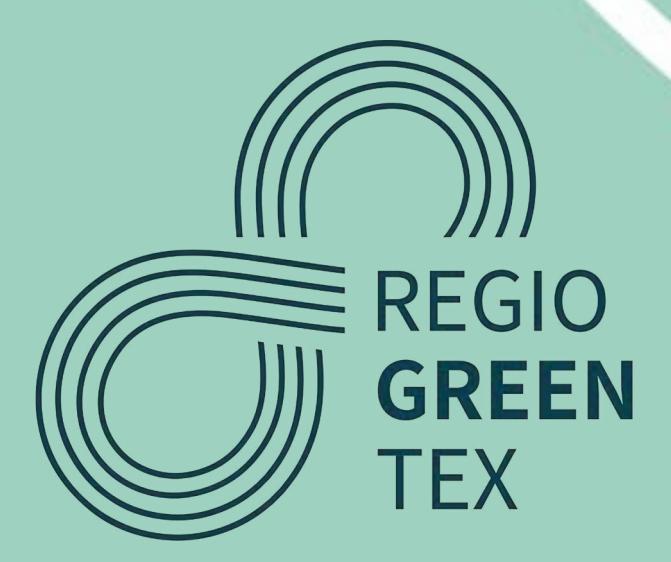

# **ECO-Design Strategies**

### **Debora Giorgi**

PhD, Associate Professor in Design

President of the Bachelor's Degree Course in Textile and Fashion Design

### **Claudia Morea**

Adjunct Professor at UNIFI, PhD, Architect

### **Matteo Bertelli**

National PhD candidate at the University of Florence and the University of

Campania Luigi Vanvitelli

### **Luca Incrocci**

Researcher at UNIFI

### **Parisa Darv**

Graphic Designer

### **Enrico Venturini Degli Esposti**

Senior Textile Researcher - Next Technology Tecnotessile

### **Costanza Soffici**

Textile Recycling Specialist - Next Technology Tecnotessile

with the contribution of

| 1. Context 2. European Regulations 3. What is Ecodesign 4. Ecodesign for Sustainable Products Regulation 5. The 5 Phases of Ecodesign 6. Ecodesign Phases Applied to Textiles 7. Ecodesign Strategies 7a. Cross-cutting Strategies 7b. PRE-PRODUCTION Strategies 7c. PRODUCTION Strategies 7d. DISTRIBUTION SYSTEM Strategies 7e. USE Strategies 7f. END-OF-LIFE Strategies 8. RECOMMENDATIONS Recommendations for Fabric Production | 4 5 8 9 10 13 14 17 27 39 51 59 65 72 72 |
|--------------------------------------------------------------------------------------------------------------------------------------------------------------------------------------------------------------------------------------------------------------------------------------------------------------------------------------------------------------------------------------------------------------------------------------|------------------------------------------|
| 9. STRATEGIC GUIDE                                                                                                                                                                                                                                                                                                                                                                                                                   | 82                                       |
| Ecodesign for Textile Products                                                                                                                                                                                                                                                                                                                                                                                                       | 82                                       |
| 10. Proposed Logical Flow for Designing a New Fabric                                                                                                                                                                                                                                                                                                                                                                                 |                                          |
| According to Eco-design Strategies                                                                                                                                                                                                                                                                                                                                                                                                   | 106                                      |
| 11. Glossary                                                                                                                                                                                                                                                                                                                                                                                                                         | 108                                      |

# **Index**

## Context

The “Ecodesign Strategies for the textile and fashion sector” are the result of a collaboration between the **Service Design Lab** at the University of Florence and the research centre **Next Technology Tecnotessile**, within the European project **RegioGreenTex**. This research begins with an in-depth analysis of European and national regulations that are increasingly attentive to the environmental and social impacts of textiles and fashion. These two sectors are among the most impactful in environmental, social and economic terms. Various datasets attest to this, showing the textile sector ranking **5th for greenhouse-gas emissions** and **2nd as a major contributor to modern slavery**. First regulation, then the market, have become increasingly sensitive to these issues, which are now unavoidable and highly relevant even in consumers’ purchasing choices.

Many companies, especially SMEs operating nationally in textiles and fashion, **now face numerous challenges introduced by European and national strategies** put in place to respond to the crisis, which are not always clear or unambiguous. There is therefore a need for guidance and support to embrace a new model of value chain and production.

The work presented here has also been made possible by broader research carried out under the National Recovery and Resilience Plan (PNRR) and by the teaching activities of the Service Design Lab members, which over time have enabled the application, verification and refinement of several ecodesign tools. It also stems from close collaboration with textile companies and waste management operators active locally that already work with a sustainability and circularity approach.

# European Regulations

The EU Strategy for Sustainable and Circular Textiles targets a staged transformation of the sector, with a first milestone in 2030 and a final one in 2050. It addresses design, production, textile-waste management and chemicals. **Extended Producer Responsibility (EPR)**, introduced via the revision of the Waste Framework Directive, makes producers responsible for post-consumer textile waste. Recycling remains challenging due to low rates and fibre-blend separation limits. Durability is the key requirement in the new policy package. Directive (EU) 2024/825 introduces a blacklist approach to non-compliant environmental claims.

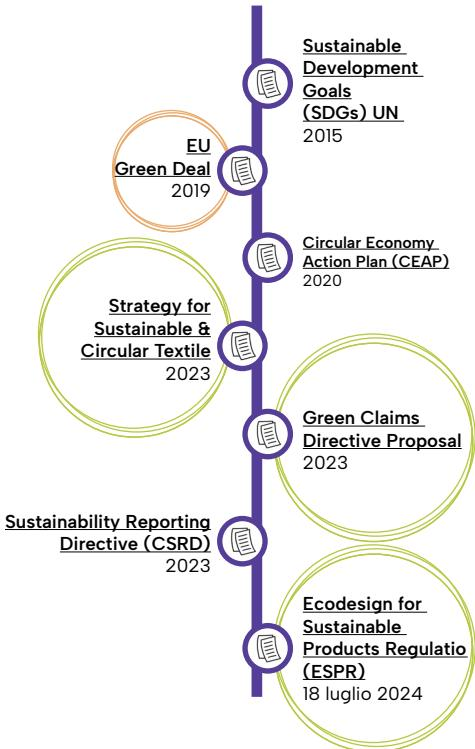

The Ecodesign for Sustainable Products Regulation (ESPR) operationalises the shift, from EPR through to the Digital Product Passport (DPP).

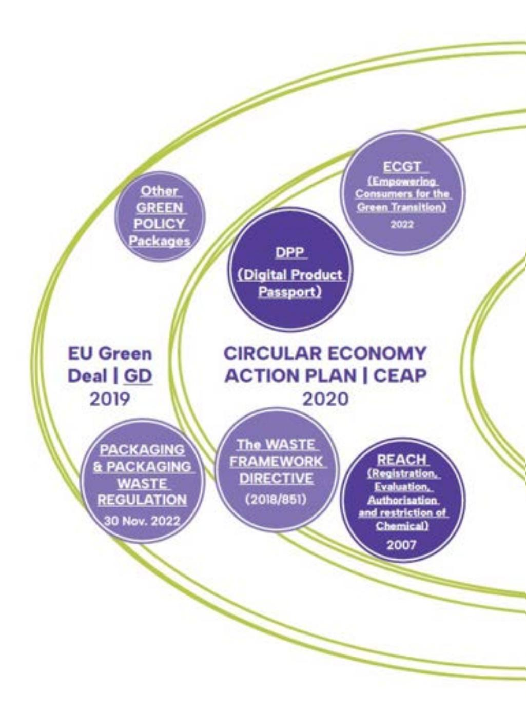

**Ecodesign**  
**Directive**  
2009/125/EC

**Right to repair**  
2023

**ESPR - Ecodesign for Sustainable Products**  
2024

**Construction Products Regulation**  
305/11

## **SUSTAINABLE PRODUCTS INITIATIVE | SPI 2022**

**Ecodesign & Energy labelling work plan**  
2022/2024

**Strategy for Sustainable & Circular Textile**  
2020 /2024

**EPR**  
**(Extended Producer Responsibility)**

**Energy Labelling Regulation**  
2017/1369

# What is Ecodesign

Since **80% of a product's resource consumption is determined at the design stage**, that phase is crucial for reducing consumption and costs.

Ecodesign is a design approach that considers the environmental and social impacts of design choices across all stages of a product-service life cycle. It addresses the product-service system as a whole, meaning the set of activities that generate the product and support its use phase through maintenance, repair, sharing and other services that respond to sustainability and circularity goals.

Ecodesign guides choices based on product sustainability in every stage, and in view of multiple production cycles. **It helps prevent resource waste** and facilitates end-of-life activities such as decommissioning and disposal. **The approach also avoids high-impact environmental and social solutions**, encouraging business models that depart from the linear economy and adopt a circular one.

To manage the actual benefits of these choices, qualitative and quantitative assessment tools are needed to verify impacts. **Life Cycle Assessment (LCA)** is the most effective and widely used method to calculate and certify environmental impacts of products and processes.

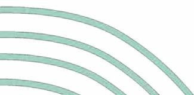

# Ecodesign for Sustainable Products Regulation

With the objective of becoming the **first climate-neutral continent by 2050**, the European Union has accelerated the transition to a circular economy. On **18 July 2024** the **Ecodesign for Sustainable Products Regulation (ESPR)** was adopted, establishing a framework for defining ecodesign requirements. The ESPR highlights several key concepts to address the crisis:

- • EPR – Extended Producer Responsibility;
- • DPP – Digital Product Passport;
- • Information obligations for the supply chain and for end consumers;
- • Ban on destroying unsold consumer products from 19 July 2026;
- • Focus on consumption in production.

The regulation also sets out the requirements that products must meet to be considered ecocompatible. **Durability** is ranked first, understood as the ability of a product to last over time. Durability brings with it **reliability, reusability, upgradability, repair, maintenance and refurbishment**. The ESPR therefore encourages the extension of product lifetimes. **Recycled content** appears only in 11th position, followed by **remanufacturability, recyclability** and, lastly, **material recovery**, since these activities are generally more costly and impact-intensive than the previous ones.

# **The 5 Phases of Ecodesign**

Ecodesign can be visualised as a wheel of five phases in a theoretically endless life cycle:

- Pre-production
- Production
- Distribution systems
- Use
- End of life

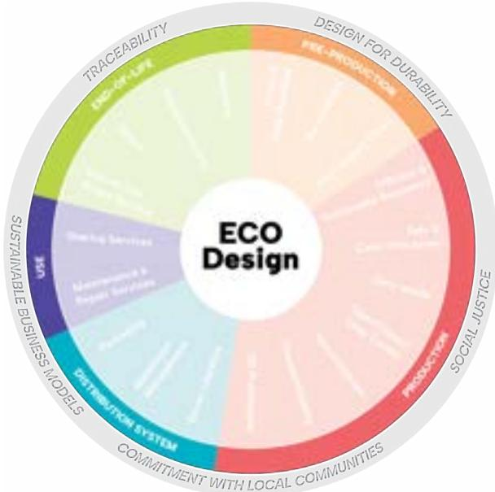

### PRE-PRODUCTION

It is the phase in which raw materials are generated through **extraction or cultivation**. Impacts are assessed by the quality of virgin inputs, in terms of renewability and scarcity, and by extraction or cultivation practices.

Pre-production impacts also relate to ecosystem effects and working conditions, as well as transport of raw materials to manufacturing sites for the next phase.

## PRODUCTION

It is the set of activities that **create the finished product**. Impacts depend on process type, technologies and energy sources used, process efficiency, and resulting waste and emissions. This is typically the **most impactful phase**, which is why machinery design is focusing on systems that use less energy and water while maintaining product quality and reducing emissions.

## DISTRIBUTION SYSTEMS

The **distribution** phase primarily covers the stage after products are finished and packaged, when they are routed to points of sale, while also encompassing **transport flows** across the entire value chain among the various actors involved; the dominant impacts derive from the transport means and the journeys required to move goods, so assessment considers **kilometres** travelled, **the selected mode** (sea, air, rail or road), **shipment mass and volume**, load factors, and **the number and frequency of trips**; impacts linked to **the packaging** that accompanies goods throughout distribution and handling are likewise relevant.

## USE/CONSUMPTION

**Use** is the phase covering **the entire period after sale**. Impacts arise from short use times, **low-quality materials** that lead to breakage, **planned obsolescence**, and **weak attachment** to the product that drives early disposal or disuse.

## END OF LIFE

End of life is the phase where impacts stem from **decommissioning operations** such as reuse, remanufacturing, recycling, incineration or landfill. Its role has become crucial, since good design can regenerate resources from what were once wastes. Solutions include facilitating collection and sorting of high-value recyclable materials, improving EOL operations, and enabling circular options that extend the life of products, components and materials through new sectoral and cross-sectoral chains.

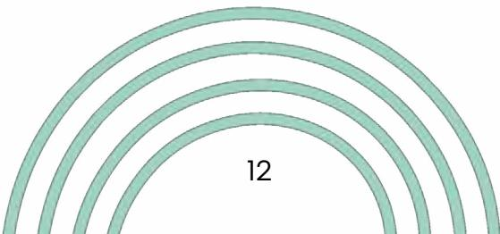

# Ecodesign Phases Applied to Textiles

The “Ecodesign Strategies” aim to assist designers and practitioners who take part in project decisions in the complex textile and fashion sector. To offer a tool that is adequate and specific for SMEs, the ecodesign phases can be translated onto the textile supply chain, making the study clearer and more targeted.

In detail, pre-production refers to animal-fibre husbandry, plant-fibre cultivation, and the production of artificial or synthetic fibres.

**Production** activities then differ by many parameters such as fibre type, machinery used and the desired final effect on the product. Whether woven fabrics or knitwear, the production phase generates most impacts. Machinery often requires large amounts of energy, water and chemicals, and consequently produces solid waste, dust and noise. Beyond fibre handling, one must also account for ancillary yet essential actions and substances for successful processing, such as machine lubricants (e.g., in spinning), knitting oils, or sizing for weaving, which protect materials from the stress induced by the processes themselves.

**Distribution** concerns goods transport and packaging, as outlined earlier for the generic ecodesign phase, while in fashion the **use** phase takes on specific features and a major share of life-cycle impact. In use, strategies such as repair, leasing or sharing are applied to optimise utilisation and shift the business model.

**End of life** is the phase where the aim is to optimise impacts from product decommissioning. Burdens are increased by limited attention in design to disassemblability, remanufacturing and mono-materiality of the products concerned.

## **Ecodesign Strategies**

For each ecodesign phase along the textile and fashion supply chain, strategies have been defined and paired with **case studies**. These strategies set out methods and practices to improve the sustainability of life-cycle operations and, in turn, of the final product. The graphic on the next page illustrates the relation between ecodesign phases and their associated strategies.

The graphic reworks literature starting from Brezet and Van Hemel's Eco-strategy Wheel (1995): a diagram of five concentric circles, each scored from 1 to 5, with a radius for each ecodesign phase. For every radius, business actions are defined to strengthen advantages and reduce weaknesses in sustainability terms. A second reference used to develop strategies for the textile and fashion sector is Carlo Vezzoli's "Design per la sostenibilità ambientale. Progettare il ciclo di vita dei prodotti."

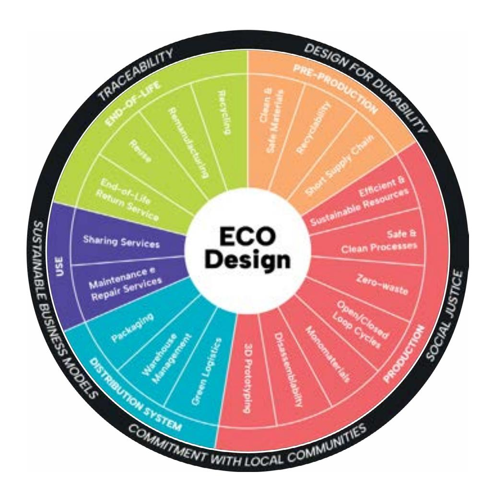

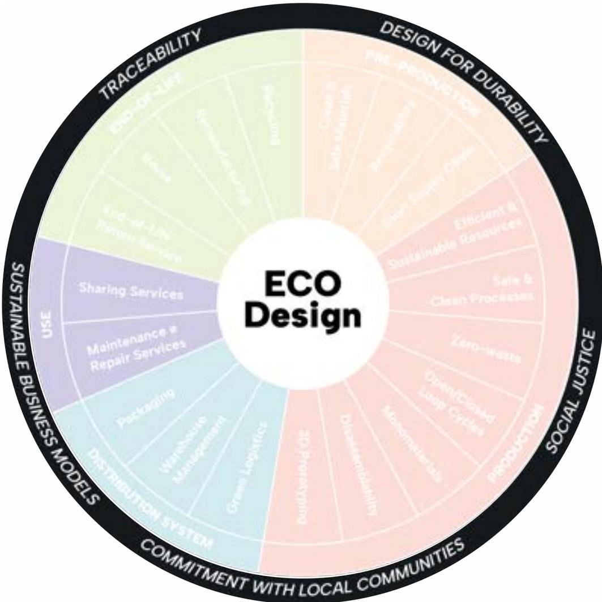

## CROSS-CUTTING Strategies

A | SOCIAL JUSTICE (e.g., MINIMUM WAGE). Corporate Social Responsibility (CSR) activity.

The textile and fashion supply chain is notoriously linked to labour-abuse scandals, including **poverty wages, excessive hours, forced overtime, lack of workplace safety, and denial of trade-union rights**. Applying ecodesign in textiles and fashion entails applying social justice: pairing sustainability with a deep critique of business fundamentals. Sustainable innovation is driven by two factors: “**hard, technology-based**” improvements and “**soft, cultural change**”. Many brands place social justice at the centre of their business models. **Key challenges are worker protection, safer employment, adequate pay, and respect for freedom of association.**

### B | ENGAGEMENT WITH LOCAL COMMUNITIES

**Brand engagement with local communities** is essential governance to ensure that ecodesign delivers not only **environmental gains but also social and economically responsible outcomes**. This strategy promotes **active community involvement in product-design decisions** and ties closely to local production and craft, people’s engagement, equity and ethical work, education and awareness. Of note is B-Corp certification, issued by an independent body that verifies high social and environmental performance.

### C | DESIGN FOR DURABILITY

The third cross-cutting strategy is identified as **designing for durability**, which means designing a product that lasts over time. To achieve this, some practices can be adopted:

- • **Select robust, sustainable materials:** durability extends product life **and helps absorb or delay damage** under adverse conditions, while materials should be as

sustainable as possible;

- • Conceive products and **materials to be repairable; modular design should allow replacement of single components** rather than the entire product;
- • **Eliminate planned obsolescence;**
- • **Increase product reliability;**
- • Design an **empathic product:** a user-centred approach that fosters attachment and care, delaying end-of-life.

The durability strategy spans aspects that will be detailed within the phase-specific strategies.

## D | SUSTAINABLE BUSINESS MODELS

Aware that a linear business model, despite its still wide-spread application, is outdated, brands and the textile and fashion sector in general are called upon to **adopt strategies that allow them to differentiate themselves in the market.** The circular business model can be applied to various topics and with different terminology. Let's talk about **Slow fashion**, which is the opposite of fast fashion, as a model of sustainable fashion. Or the “**On-Demand**” business model, which is a strategy based on producing only according to the market demand received.

## E | TRACEABILITY

The final cross-cutting strategy is **supply-chain traceability:** the ability to define the entire life cycle of a product from raw-material pre-production to end-of-life and disposal practices. Traceability provides **transparency, sustainability and accountability**; consumers are increasingly attentive to all three. It clarifies connections among actors and flows and helps prevent and optimise operations, from mindful use of materials and warehouses to transport, distribution and supplier communications.

Tools include:

- • **Blockchain**, a secure digital ledger for tracking operations;
- • **RFID and QR codes**, smart labels that provide detailed information to consumers;
- • **Environmental certifications**, such as GOTS for cotton or OEKO-TEX for textiles;
- • **Digital platforms** with software to monitor and quantify environmental impacts.

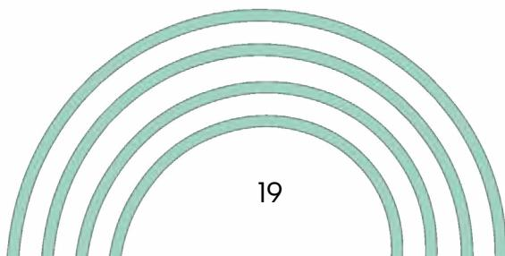

## A | SOCIAL JUSTICE

Social justice is a strategy that spans many actors, brands and initiatives. Workers are placed first to end injustice, oversized workloads and violations of human rights. In the current context several associations, campaigns and initiatives worldwide are advancing social justice:

### **AFW – Asia Floor Wage Campaign**

In November 2023 Bangladesh saw widespread protests and demonstrations calling for a minimum wage. Strikes were met with police violence, yet they also triggered global support that led to the launch of the Asia Floor Wage campaign.

### **CCC – Clean Cloth Campaign**

The Clean Clothes Campaign is a global network enabling textile-supply-chain actors to collaborate on a strategic framework to eliminate labour exploitation. Organisations are arranged in a non-hierarchical system that connects them with people, activists and workers worldwide to analyse and make visible the state of the apparel and textile industry.

### **ETI – Ethical Trading Initiative**

ETI is an alliance bringing together unions, NGOs and companies across the industry. The initiative works with key stakeholders to promote social-justice solutions that can end violations of human rights at work.

gorman

### GORMAN

Gorman is an Australian brand based in Melbourne with a fresh, independent style. The label focuses on in-house textile design and artistic collaborations. On this latter front, Gorman launched a collaboration with Indigenous artists from the remote western Australian region through the Mangkaja Arts Resource Agency. This became a defining strength for the brand and, by working with local communities, marked a major step toward socially sustainable fashion.

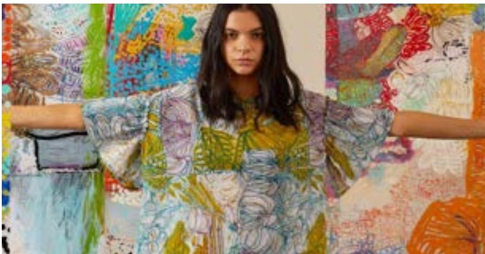

### THE GROW-SHRINK-AND-TURNCOAT

In 2012 Alice Payne, a fashion and textiles scholar, designed a garment that can be seen as a forerunner of several principles later set out in the ESPR, in particular durability; the piece is a reversible, modular garment that can be lengthened or tightened to suit the wearer, anticipating transfer between multiple owners; at end of life it can be taken apart and reassembled into a new garment thanks to its ease of disassembly; laser cutting also allows layers of fabric to be added or removed, enabling refurbishment techniques; the project was developed in part through brainstorming with first and second year students at QUT (Queensland University of Technology).

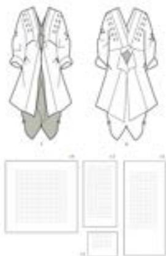

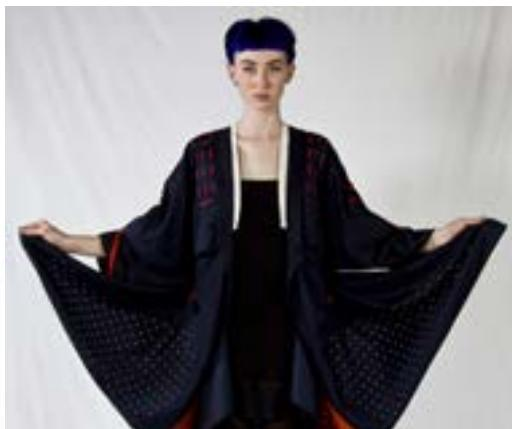

### RIFÒ

The well-known Prato-based company, which in recent years has established itself in the fashion market with garments made from secondary raw materials, has launched with its latest collection a pre-sale (on-demand) campaign. The firm pursues multiple sustainability strategies, the most recent of which is on-demand production. Each buyer can secure a Rifò-branded item by purchasing it in pre-sale, allowing the company to assess the number of pieces sold and produce in line with market demand. The on-demand model drastically reduces unsold stock and raises the quality of goods in circulation. It also meets the growing expectations of consumers, who are increasingly attentive to the sustainability and ethics of garments.

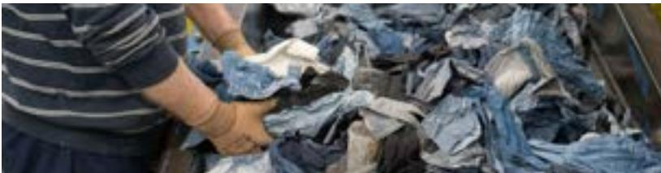

### TEMERA

Temera is a company that supports the development of traceability systems for fashion and luxury industrial supply chains. It is an innovation hub with three offices in Florence, Milan and Paris, whose core business is the application of IoT technologies (such as RFID, UHF, NFC and blockchain). These control systems enable the brand to track the supply chain end to end, making it transparent and secure. At the same time, the practice and the evolution of processes face difficult implementation because many micro, small and medium enterprises struggle to sustain the economic feasibility of these changes within their organisations.

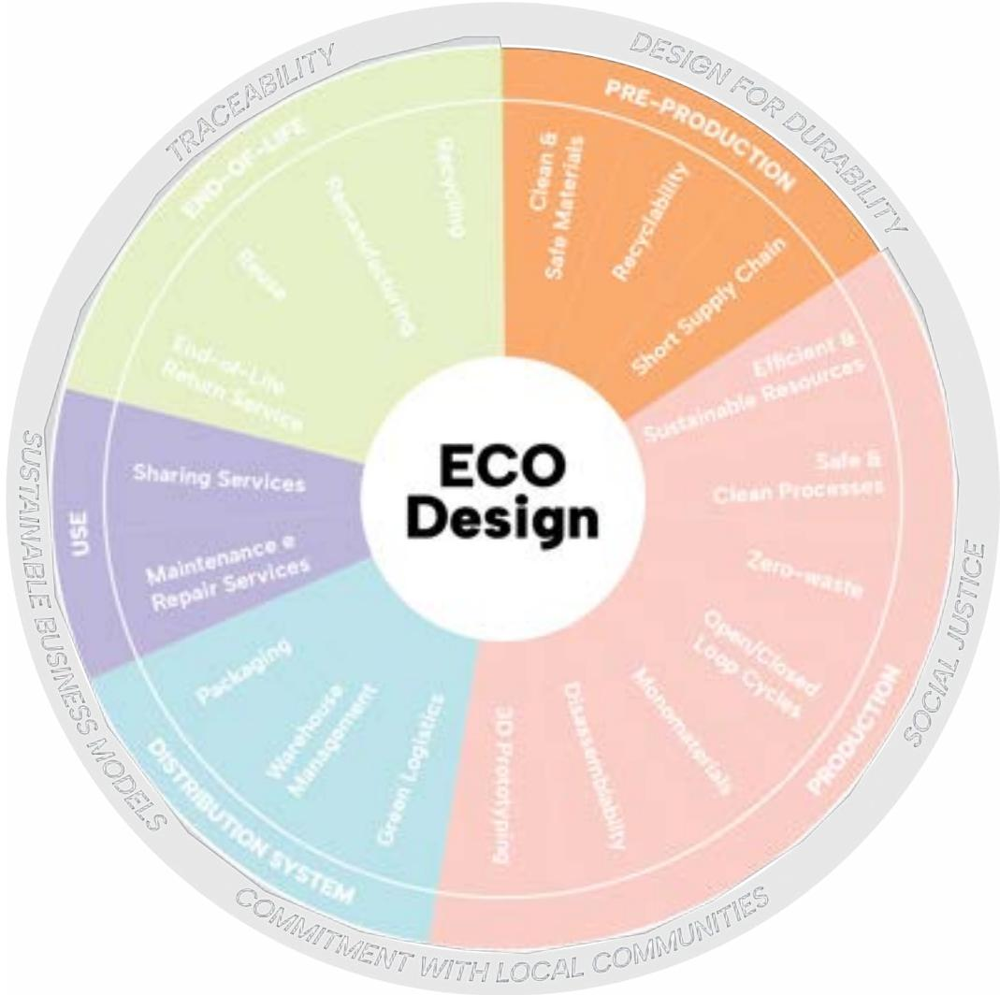

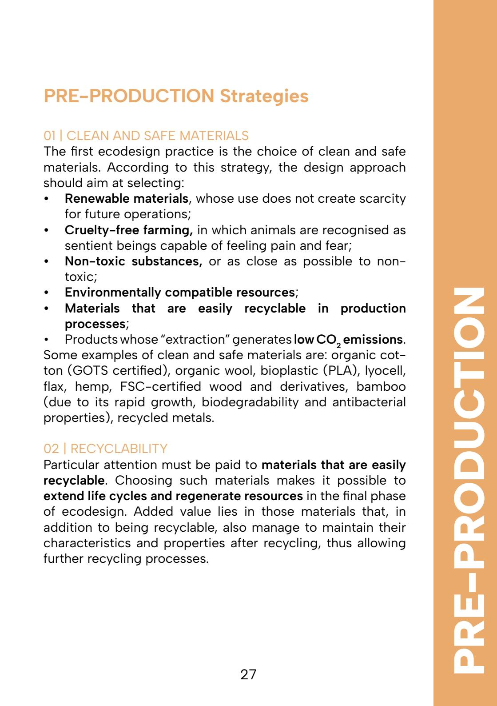

# PRE-PRODUCTION Strategies

## 01 | CLEAN AND SAFE MATERIALS

The first ecodesign practice is the choice of clean and safe materials. According to this strategy, the design approach should aim at selecting:

- • **Renewable materials**, whose use does not create scarcity for future operations;
- • **Cruelty-free farming**, in which animals are recognised as sentient beings capable of feeling pain and fear;
- • **Non-toxic substances**, or as close as possible to non-toxic;
- • **Environmentally compatible resources**;
- • **Materials that are easily recyclable in production processes**;
- • Products whose “extraction” generates **low CO2 emissions**.

Some examples of clean and safe materials are: organic cotton (GOTS certified), organic wool, bioplastic (PLA), lyocell, flax, hemp, FSC-certified wood and derivatives, bamboo (due to its rapid growth, biodegradability and antibacterial properties), recycled metals.

## 02 | RECYCLABILITY

Particular attention must be paid to **materials that are easily recyclable**. Choosing such materials makes it possible to **extend life cycles and regenerate resources** in the final phase of ecodesign. Added value lies in those materials that, in addition to being recyclable, also manage to maintain their characteristics and properties after recycling, thus allowing further recycling processes.

### 03 | SHORT SUPPLY CHAIN

As will be seen in the third ecodesign phase, a large share of impacts is generated by goods transport. In pre-production, the **short supply chain** strategy can be adopted, reducing both impacts and costs compared with materials sourced from the other side of the globe. The strategy therefore favours non-intensive cultivation and local production, also valued for their social and economic contribution to the production area. Supporting the local economy and territorial opportunities helps maintain stable suppliers, fostering lasting relationships, streamlining orders and reducing stock in the various companies of the supply chain.

## KUURA

Kuura is a Finnish company that produces a fibre from which the company itself takes its name. The innovative process was developed in collaboration with local universities, creating a synergy between business and community. The main goal of the research was to generate a product from a raw material that would be cleaner and safer than current options, eliminating fossil fuels. The fibre is made from pine and spruce sourced from certified and sustainably managed Finnish forests, and it is produced in the world's first pulp mill that operates without fossil fuels. Kuura chose to exploit one of the country's most abundant resources: wood. Sustainable forestry ensures biodiversity and protects valuable natural habitats, with the amount of wood in Finnish forests nearly doubling since 1970 and still growing strongly, making Finnish forests a significant CO2 reservoir. By integrating textile fibre production directly into the bioproduct mill, Kuura is able to use the ecological industrial ecosystem and make Kuura fibre production both efficient and fossil-free. All materials used in fibre production are safer and more environmentally responsible.

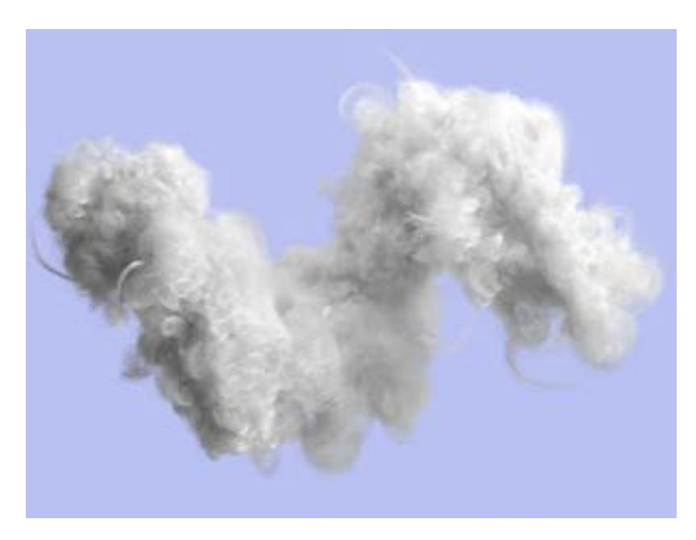

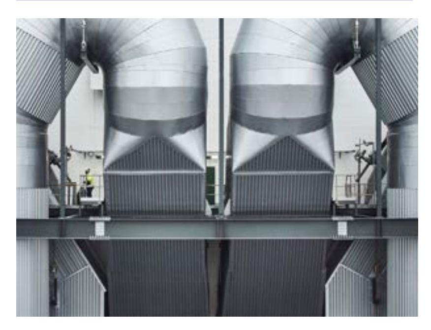

## ALLBIRDS

Allbirds is a company that produces footwear and more. After many years of experience, it decided to focus its efforts on emissions, with the aim of bringing them to zero by 2030. The approach adopted is based on three phases: measurement, elimination of emissions, and reduction of the carbon footprint. To achieve this goal, traditional raw materials have been replaced with natural, recycled and certified materials. The company states: *"Mother Nature is our muse. Building on her work, we are finding new uses for the materials that exist right in front of us. Like trees, the rock stars of the forest."* The replacement of raw materials with safer and more sustainable alternatives has enabled Allbirds to capture an important share of the market, stimulate research, and raise consumer awareness. In addition, recent corporate sustainability reports show that the initial goal of carbon neutrality has almost been achieved thanks to the strategies adopted.

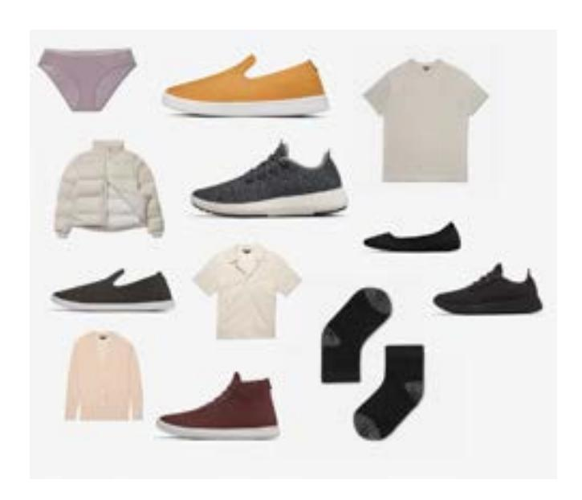

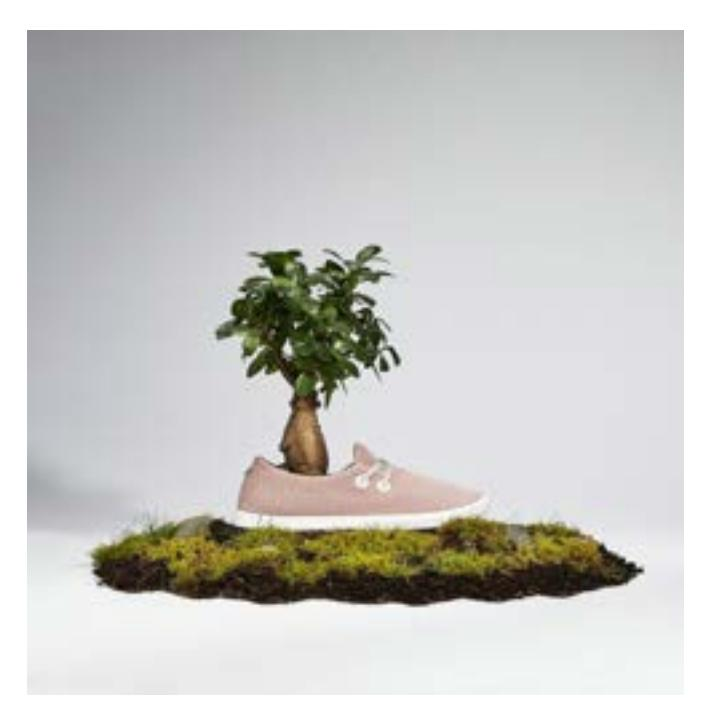

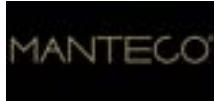

### MANTECO

Manteco® is a wool mill producing high-quality wool fabrics. Located in the Prato textile district, it has made wool – the district’s hallmark – its main strength. The company has recently received recognition for its commitment to sustainable fashion. Its primary strategy is recyclability. The mechanical recycling it employs consists of a set of processes that define a zero-waste system, recovering all industrial wool waste from production stages and shaping a sustainable design philosophy to create durable and recyclable wool fabrics. Alongside this strategy, production is localised and maintained within a short supply chain that is fully traceable, transparent and certified.

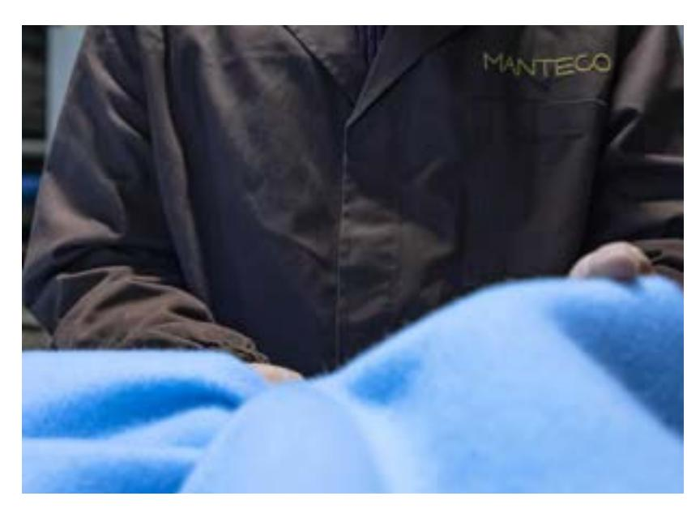

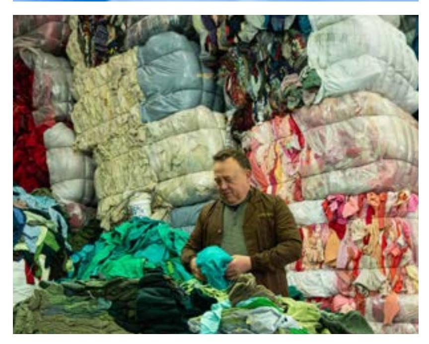

### PROGETTO LANA

Progetto Lana is a company specialised in the recovery and upgrading of by-products from the textile supply chain. Processing has become increasingly complex due to the use of blends, coatings and interweaving of different fibres and materials. Nonetheless, the company's efficiency remains very high, as shown by the percentage of recovered material: 98% of the total processed, destined for the regeneration of secondary raw materials. For this company, mono-materiality is fundamental, as it enables easier recycling at the product's end of life.

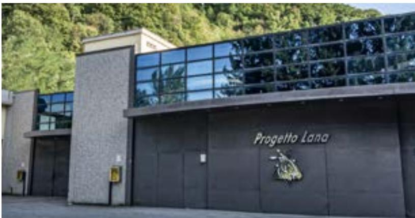

## FORTUNALE

Fortunale is a sustainable fashion project based in the district of Cassano delle Murge (Bari), founded within the historic knitwear company Majra Moda Maglierie Srl. With over 40 years of experience, the founder decided to take a more careful and sustainable path for the company, focusing on the quality and value of Made in Italy while respecting nature and the environment. Fortunale has developed a short supply chain, from wool production to garment manufacturing. This strategy has allowed the brand to maintain control over every stage of production, thereby increasing the overall sustainability of its garments.

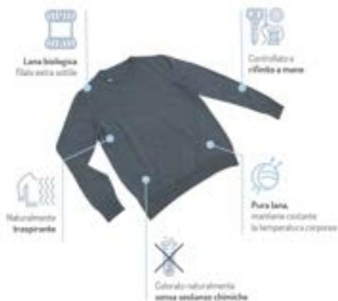

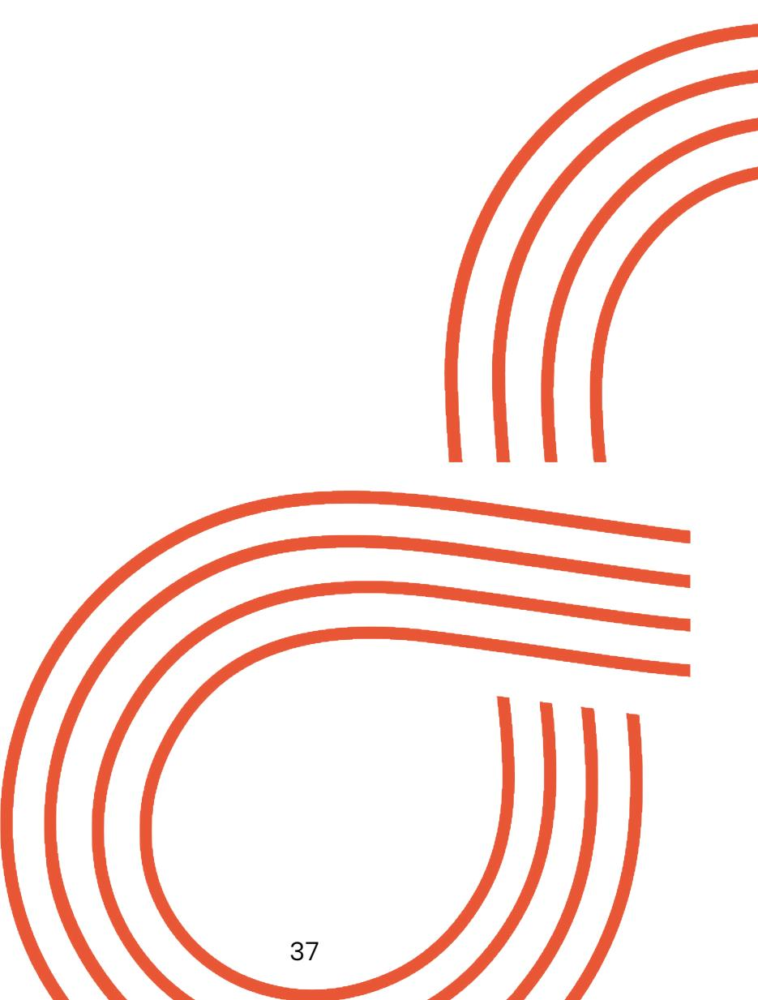

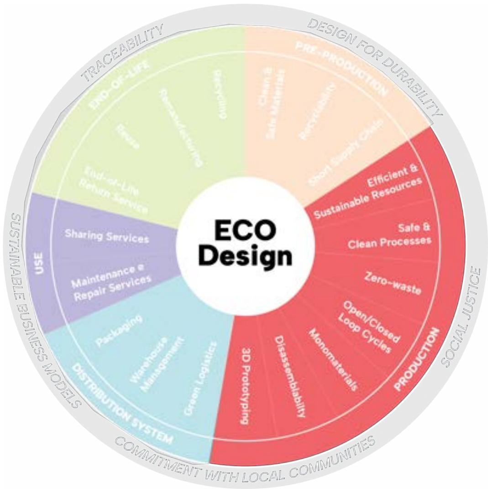

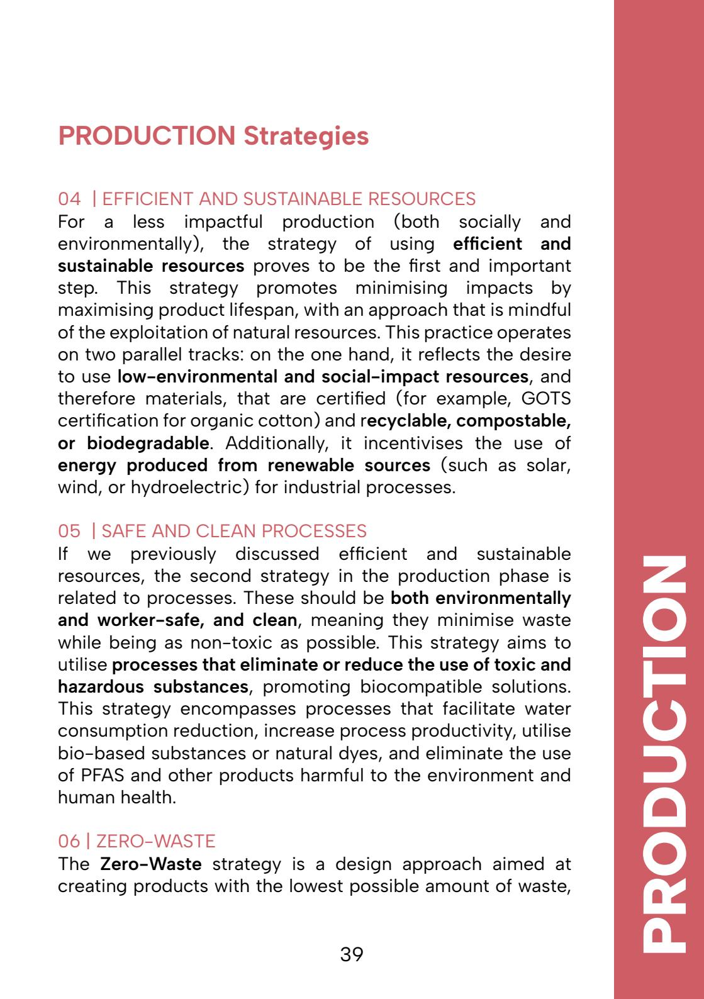

# PRODUCTION Strategies

## 04 | EFFICIENT AND SUSTAINABLE RESOURCES

For a less impactful production (both socially and environmentally), the strategy of using **efficient and sustainable resources** proves to be the first and important step. This strategy promotes minimising impacts by maximising product lifespan, with an approach that is mindful of the exploitation of natural resources. This practice operates on two parallel tracks: on the one hand, it reflects the desire to use **low-environmental and social-impact resources**, and therefore materials, that are certified (for example, GOTS certification for organic cotton) and **recyclable, compostable, or biodegradable**. Additionally, it incentivises the use of **energy produced from renewable sources** (such as solar, wind, or hydroelectric) for industrial processes.

## 05 | SAFE AND CLEAN PROCESSES

If we previously discussed efficient and sustainable resources, the second strategy in the production phase is related to processes. These should be **both environmentally and worker-safe, and clean**, meaning they minimise waste while being as non-toxic as possible. This strategy aims to utilise **processes that eliminate or reduce the use of toxic and hazardous substances**, promoting biocompatible solutions. This strategy encompasses processes that facilitate water consumption reduction, increase process productivity, utilise bio-based substances or natural dyes, and eliminate the use of PFAS and other products harmful to the environment and human health.

## 06 | ZERO-WASTE

The **Zero-Waste** strategy is a design approach aimed at creating products with the lowest possible amount of waste,

PRODUCTION

ideally zero. In fashion and more generally in textiles, this strategy is applied in optimising and **correctly positioning the cuts for garment production**. The strategy is successful when all the square meters of a piece of fabric are used, without producing remnants. The **waste prediction** also allows for better management and processing at the end of the product's life.

### 07 | OPEN/CLOSED LOOP CYCLES

In the production phase, the amount of waste generated is abundant, and the ability to reuse these resources is a key element of ecodesign. **Waste material does not become waste but a by-product**, and therefore a **secondary raw material for new production cycles**. If by-products are used within the production cycle that generated them, it is referred to as a closed-loop waste cycle (for example, with wool, when waste fibres are reintroduced into the carding process). However, if the raw material-second is used as a resource in a production process different from the one that generated the waste, then it is called an **open loop**, meaning a flow of material intertwines different sectors and market applications. In this last case, we can also talk about **industrial symbiosis**.

### 08 | MONOMATERIALS

The term “monomaterial” in the textile and fashion industry refers to the use of a single material for the production of a garment or fabric (e.g., 100% wool or 100% polyester). Given the difficulty in disassembling components and materials at the end of their life, this approach is fundamental in production to improve recycling and reduce impacts. The single-material strategy can also be applied to the individual components of the product, and then work on the possibility of disassembly.

This strategy allows us to:

- • **Facilitate recycling;**
- • **Reduce textile waste;**
- • **Reducing emissions and consumption, as no end-of-life operations are needed to separate textile fibres;**
- • **Facilitate reuse and remanufacturing, as the materials to be treated are uniform.**

## **09 | DISASSEMBLABILITY**

Disassemblability is a product's ability to be disassembled and thus separated into the individual components that make it up. This design approach aligns well with the use of a single material for individual components, allowing them to be recycled separately at the end of their life. Furthermore, the possibility of disassembling a product prevents a component from contaminating another at the end of its life, making it more difficult to recycle.

## **10 | 3D PROTOTYPING**

The final aspect of design is prototyping. This is as useful as it is impactful on waste production and the consumption of resources and energy. The proposed strategy is **3D prototyping**, which allows for a drastic reduction in the number of prototypes and therefore the consumption associated with them. This strategy has advantages such as **lower water and resource consumption and no waste**; but at the same time, it can represent a high cost at the company level and the need for **trained personnel with specific skills**.

## LANIFICIO CANGIOLI

Lanificio Cangioli is a company of significant importance in the Prato textile district. Its history spans 5 generations, and from a craftsman's workshop, it is now a cutting-edge industrial reality. The company is involved in most stages of textile production, from spinning to fabric dyeing. Cangioli is very focused on sustainability, which is why it is equipped with machinery engineered with an advanced system for controlling the energy used and other important resources like water. Investing in IT (Information Technology) has allowed the company to achieve process digitalisation,

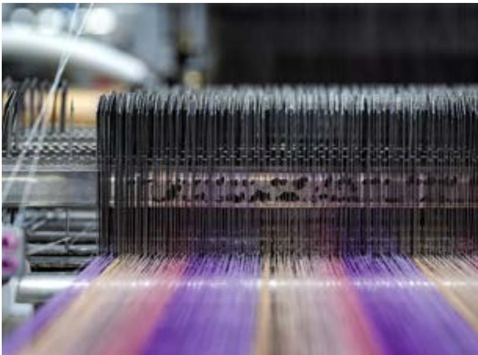

which defines the quality and accuracy of what is processed and produced. Resource efficiency (energy, water, etc.), calculated using software and hardware, also establishes traceability and transparency of processes, generating competitive collections on the market.

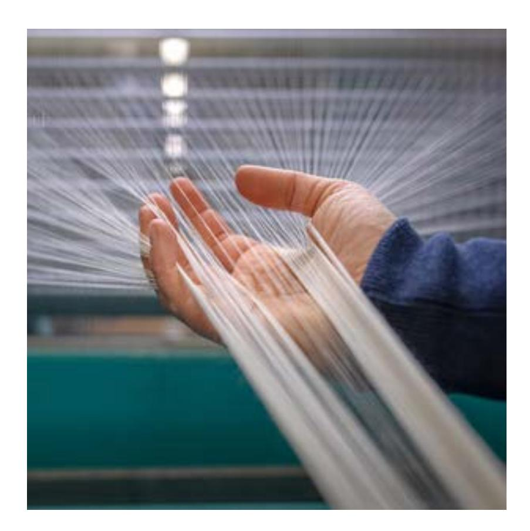

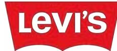

## LEVI's WATER-LESS

LEVI's has launched a project to reduce water consumption. Jeans, in fact, are a garment that requires numerous finishing processes. These processes differ based on the desired appearance of the garment, but at the same time, these operations require significant water consumption. Since 2011, the brand has developed over 20 Water<Less® production techniques, with the aim of creating the classic jeans we all know, but reducing water consumption. The statistics on the amount of water saved are impressive: exceeds 3 billion litres compared to traditional practices. No less important is the reuse of another 5 billion litres of water, which, instead of being discarded after the first cycle, are reused in production processes. Resource efficiency has a triple impact on waste reduction, the consumer, and the economic aspect.

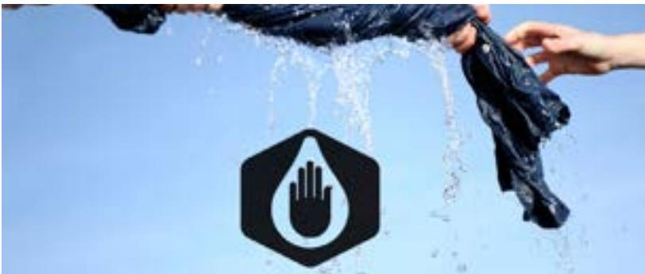

**TIMO RISSANEN**

Timo Rissanen is an American fashion creator who has explored the zero-waste technique since his early years of study. By juxtaposing fabric cuts, a garment is created that has no waste in the production phase. Timo isn't the only one who has adopted this strategy; he is also joined by major brands like ISSEY MIYAKE and The North Face. The latter, along with David Telfer, produced a jacket whose efficiency increased by 23.2% compared to the original model.

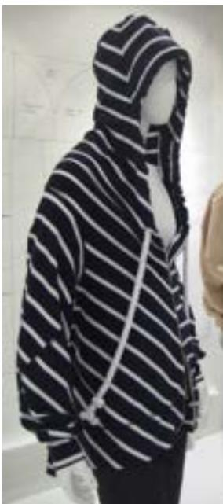

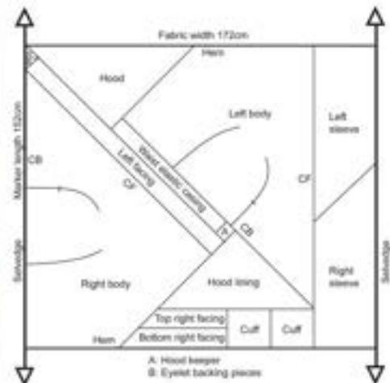

Copyright Timo Rissanen 2009

## MANIFATTURA MAIANO

Manifattura Maiano is a company that produces non-woven fabrics. Located in the Prato textile district, for over 60 years it has been transforming textile waste into cross-sectoral products such as mats for construction, insulation, automotive, or design. Manifattura Maiano products offer designers and planners a wide range of choices and design possibilities for the end-of-life of textile materials. The company positions itself in the supply chain as a facilitator of recycling, enabling other companies to recycle the textile waste they produce. Industrial symbiosis and waste exchange generate secondary raw materials for new products, reducing the consumption of virgin resources.

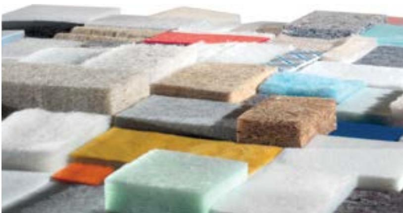

### **COÉME**

Coéme is a Danish brand of simple yet impactful clothing. Her strengths are the use of natural fibre materials, mainly biodegradable or recyclable, and the single-material construction of the products. A strategy that appeals to today's discerning buyers. This ecodesign strategy does not exclude the design of garments that are appreciated, preserved, and cared for, for a durable life.

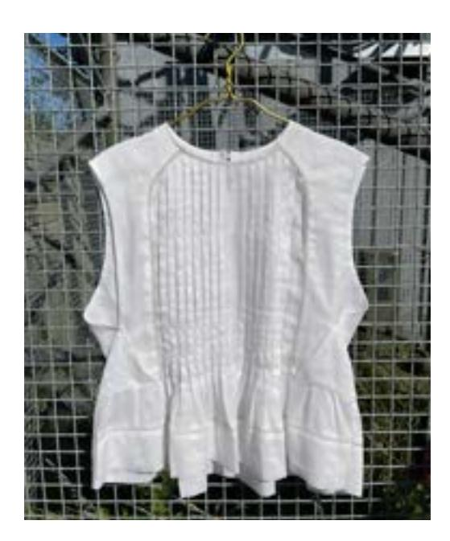

STELLA/MCCARTNEY

## STELLA MCCARTNEY

The luxury brand Stella McCartney is known for using sustainable materials and easily disassembled garments. Specifically, in 2023, the brand launched a parka made from regenerated and regenerable materials in its spring collection. The product is made with ECONYL® nylon and represents the first Stella McCartney garment designed for complete disassembly at the end of its life. This means that no trace of the jacket will end up in landfills, incinerators, or oceans if it is properly returned and recycled after use. Other brand initiatives include repair services (Clever Care) and resale to extend the product lifecycle.

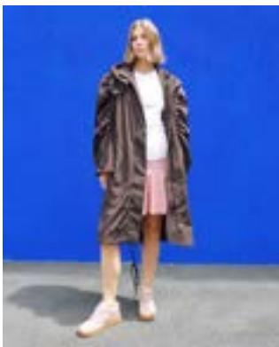

## SERVATI

Servati is a shoe startup from Puglia. It's been on the market for just a few years and believes in uncompromising sustainability. The startup has launched a process called "*Boomerang*," which involves creating completely disassemblable and recyclable products that are taken back at the end of their life cycle, and the materials are revalued. Servati implements this process through digitisation, starting with 3D prototyping of the products they create. This allows them to have complete control over the value chain, consumption, waste, and the potential optimisation of the process.

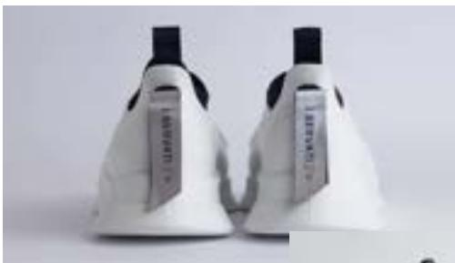

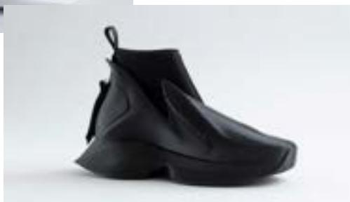

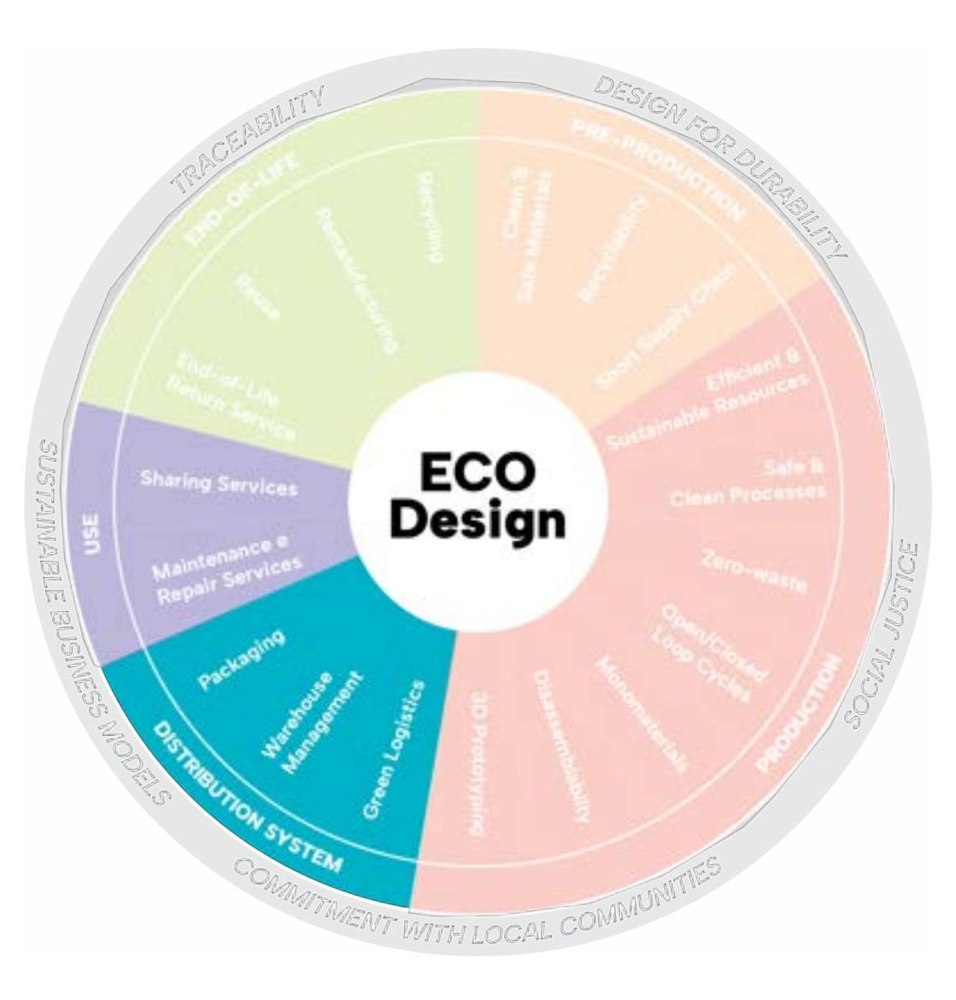

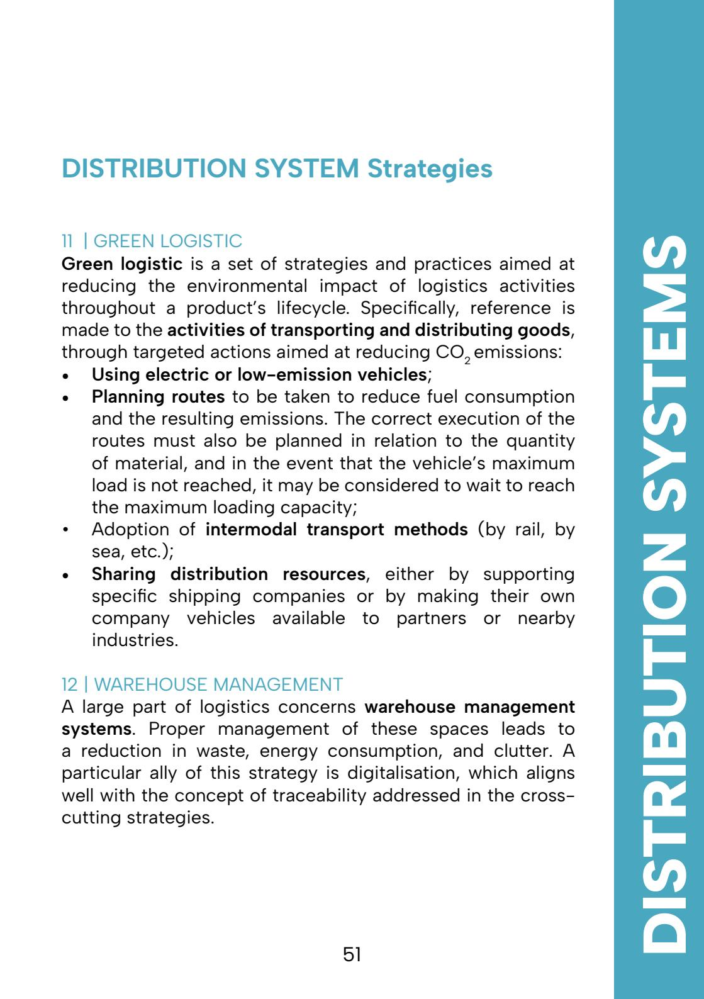

## DISTRIBUTION SYSTEM Strategies

### 11 | GREEN LOGISTIC

**Green logistic** is a set of strategies and practices aimed at reducing the environmental impact of logistics activities throughout a product's lifecycle. Specifically, reference is made to the **activities of transporting and distributing goods**, through targeted actions aimed at reducing CO2 emissions:

- • **Using electric or low-emission vehicles;**
- • **Planning routes** to be taken to reduce fuel consumption and the resulting emissions. The correct execution of the routes must also be planned in relation to the quantity of material, and in the event that the vehicle's maximum load is not reached, it may be considered to wait to reach the maximum loading capacity;
- • Adoption of **intermodal transport methods** (by rail, by sea, etc.);
- • **Sharing distribution resources**, either by supporting specific shipping companies or by making their own company vehicles available to partners or nearby industries.

### 12 | WAREHOUSE MANAGEMENT

A large part of logistics concerns **warehouse management systems**. Proper management of these spaces leads to a reduction in waste, energy consumption, and clutter. A particular ally of this strategy is digitalisation, which aligns well with the concept of traceability addressed in the cross-cutting strategies.

### 13 | PACKAGING

Packaging is a major source of resource waste. For the correct and safe transportation and sale of goods, a large quantity of material is very often used, which in most cases is discarded even though it can be considered as new. This strategy encompasses some possible practices to minimise the amount of waste generated:

- • **Reduction of packaging** and its volume;
- • **Use of recycled, recyclable, and/or biodegradable materials;**
- • The use of **packaging that can be reused or transformed**, taking on a second function after, for example, the product has been purchased;
- • Designing **modular solutions for reuse and space optimisation.**

## PATAGONIA

For years, the outdoor apparel brand Patagonia has been committed to reducing its environmental impact throughout its supply chain. The effort made is still not enough, so the brand has decided to take further actions to decarbonise emissions from transportation. That's why Patagonia has joined the Zero Emission Maritime Buyers Alliance (ZEMBA), which presents itself as an alliance with other companies committed to purchasing zero-emission maritime fuel in large quantities. In 2024, Patagonia committed a portion of its maritime shipping volume to ZEMBA's inaugural zero-emission shipping proposal and will purchase the environmental credits associated with zero-emission shipping in 2025 and 2026 as well.

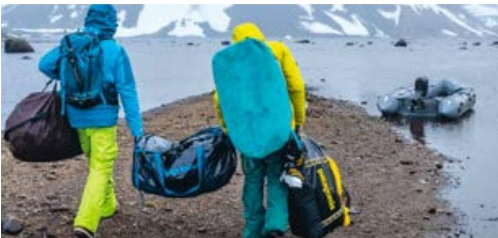

## ECODREAM

Ecodream is a handcrafted brand specialising in eco-friendly bags, backpacks, and accessories. The brand is strongly linked to concepts like slow fashion and ethical fashion and aims to overcome the consumption model based on impulsive, unnecessary purchases and low prices. To achieve this goal, their products are made from a range of recovered and/or recycled materials. The raw material used is largely the result of careful and rigorous warehouse management, which allows for the utilisation of leather scraps and remnants, fabric remnants/surpluses, and synthetic leather remnants. The products are also made with materials such as inner tubes, discarded PVC posters, and Piñatex.

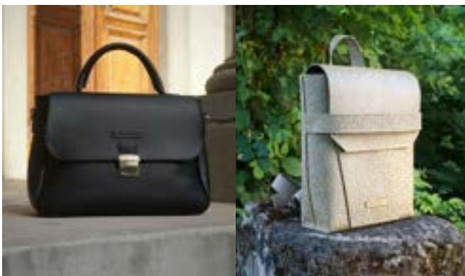

## PUMA CLEVER LITTLE BAG

Many brands are moving towards adopting sustainable and reusable packaging. Among these are important brands like PUMA, which launched a strategy for the careful adoption of packaging with the “*Clever Little Bag*” project.

## ID.EIGHT

The Korean shoe brand, launched in 2020 following a crowdfunding campaign, entered the market with a very active focus on sustainability, both in the use of sustainable materials for the shoes and in the packaging. The shoes are sold in a box that appears as a single piece, made from 100% recyclable FSC-certified cardboard, with 90% recycled paper. The paper used to wrap the shoes is also partially recycled. Inside the packaging, there’s also a seed packet made of earth and clay so the consumer can plant it or throw it in a “grey area” of the city. All the bags used for shipping are made of compostable bioplastic according to EN 13432 standard.

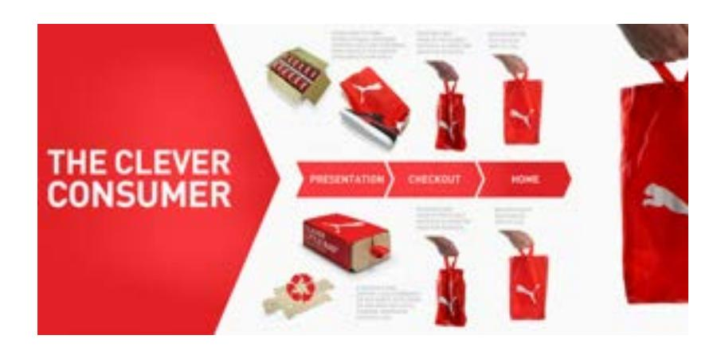

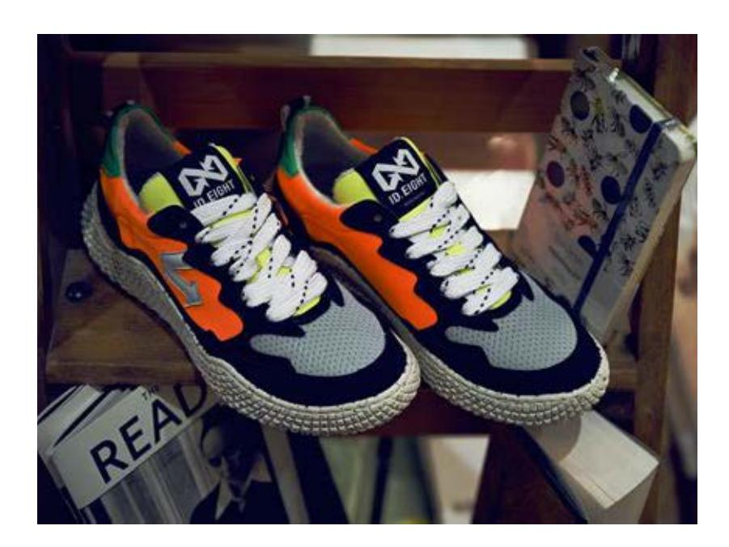

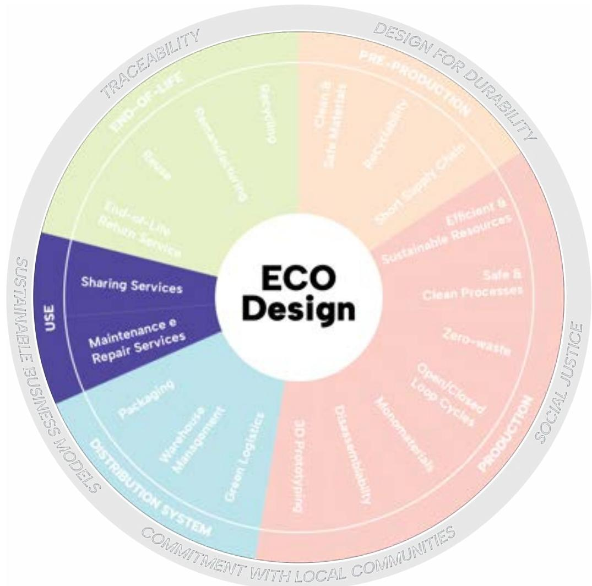

# USE Strategies

## 14 | MAINTENANCE & REPAIR SERVICES

The main strategies for mindful consumption and management of a product are its **maintenance and repairability**. Maintenance can be done primarily by the user, but still guided by the brand through **clear and precise instructions** (such as washing instructions for a garment). Material also plays an important role in maintenance, influencing ease of use and durability, which could affect user behaviour. A **product's repairability**, on the other hand, is its ability to be fixed. This feature is due to both the material used and the potential **repair service** offered by the brand.

## 15 | SHARING SERVICES

More and more brands are offering **sharing and exchange services** to their customers. In a context where, to keep up with the times, people feel obliged to change and renew their wardrobes, numerous products are thrown away or left unused long before their actual end of life. To avoid these mechanisms of **premature product obsolescence**, brands can advocate for ethical and correct behaviours that encourage sharing and **exchange approaches among customers**. This strategy benefits various stakeholders: on the one hand, customers who can change and update their wardrobes, and on the other hand, companies that promote sustainable practices. This approach also allows for a reduction in manufacturing costs and the ability to meet market demands.

### **[THE LEVI'S TAILOR SHOP](https://www.levi.com/UK/en/features/tailor-shop?srsltid=AfmBOooI26KqiUmO2g1Q3nxH2ca-0xV0bsCE_pU2bamqrsvvDOuvufp5)**

LEVI'S offers a repair service for their denim garments. The initiative aims to extend the life of garments by encouraging customers to maintain and repair their jeans rather than buying new ones. The centres in question are numerous and are located both in Europe and America. The services offered range from garment repair to customisation, giving consumers the opportunity to add unique value to products.

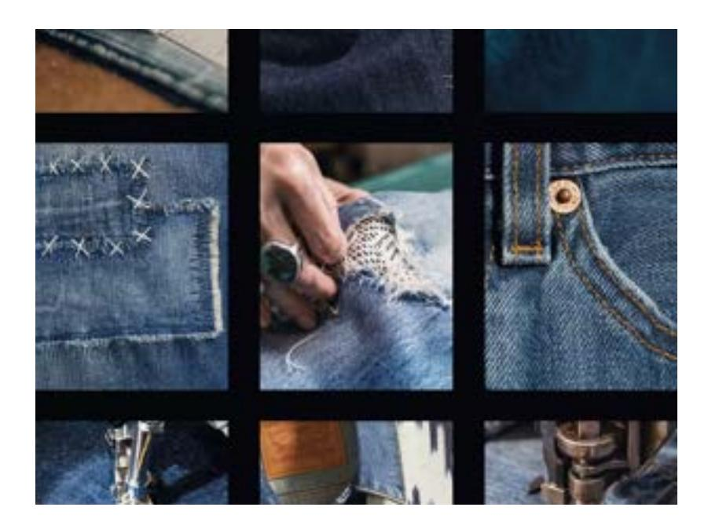

**FREITAG S.W.A.P.**

After the initial market success of the well-known brand FREITAG, thanks to the products' eye-catching design and the material used, namely recycled truck tarpaulins, the brand is launching a new strategy: the S.W.A.P. The brand positions itself as a facilitator of sharing and leasing practices, allowing bag owners to connect and exchange them. S.W.A.P. is a non-commercial exchange platform whose ultimate goal is to offer consumers the opportunity to give new value to their accessories, thus postponing their end of life.

## DRESSO

The Italian brand Dresso resells high-end clothing and accessories. Interested in fashion sustainability and consumer awareness, he created a mobile application that connects consumers. The application presents itself as a social network where users share clothes and receive offers for their wardrobes. Sharing and leasing techniques are entering consumers' wardrobes to make available the countless garments that often populate our homes. Each product is linked to a digital certificate on the blockchain, which allows for tracking and tracing its sales, even in the second-hand market. This solution allows brands not only to receive information about the traceability of their products but also to receive a commission for every sale subsequent to the first. This strategy is proof that fast fashion isn't the only business model that can continue to generate value.

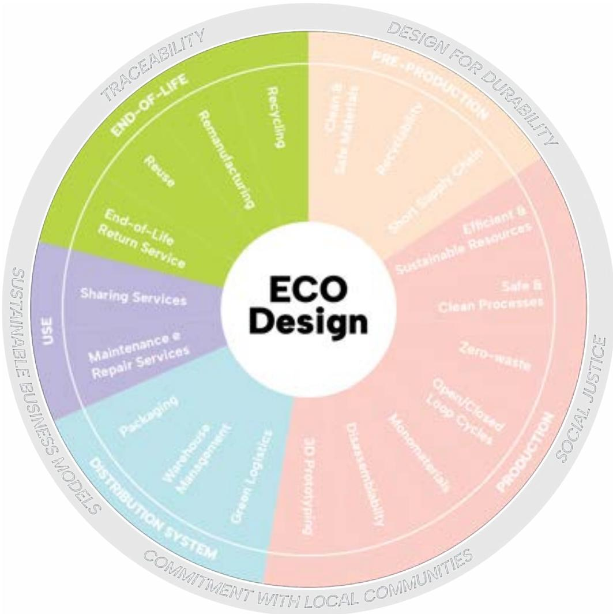

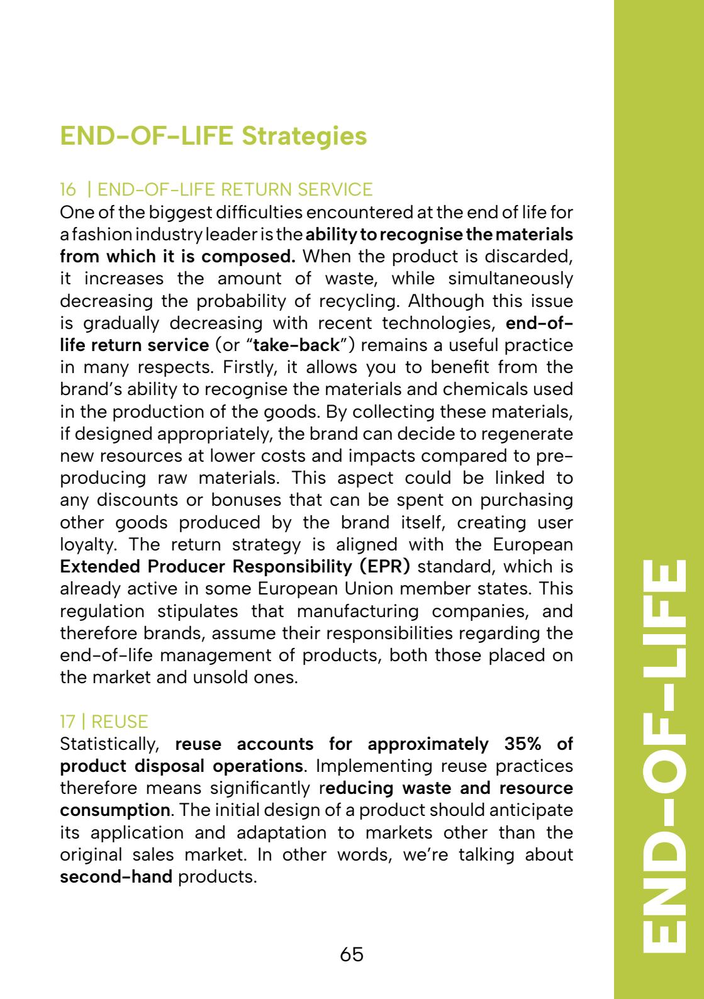

## END-OF-LIFE Strategies

### 16 | END-OF-LIFE RETURN SERVICE

One of the biggest difficulties encountered at the end of life for a fashion industry leader is the **ability to recognise the materials from which it is composed**. When the product is discarded, it increases the amount of waste, while simultaneously decreasing the probability of recycling. Although this issue is gradually decreasing with recent technologies, **end-of-life return service** (or “**take-back**”) remains a useful practice in many respects. Firstly, it allows you to benefit from the brand’s ability to recognise the materials and chemicals used in the production of the goods. By collecting these materials, if designed appropriately, the brand can decide to regenerate new resources at lower costs and impacts compared to pre-producing raw materials. This aspect could be linked to any discounts or bonuses that can be spent on purchasing other goods produced by the brand itself, creating user loyalty. The return strategy is aligned with the European **Extended Producer Responsibility (EPR)** standard, which is already active in some European Union member states. This regulation stipulates that manufacturing companies, and therefore brands, assume their responsibilities regarding the end-of-life management of products, both those placed on the market and unsold ones.

### 17 | REUSE

Statistically, **reuse accounts for approximately 35% of product disposal operations**. Implementing reuse practices therefore means significantly **reducing waste and resource consumption**. The initial design of a product should anticipate its application and adaptation to markets other than the original sales market. In other words, we’re talking about **second-hand** products.

## 18 | REMANUFACTURING

**Remanufacturing** is an industrial process that involves modifying, recovering, regenerating, and returning used products to the market in a like-new condition in terms of **quality, performance, and reliability**. This strategy reduces the consumption of raw materials, energy, and waste production. For this practice to be possible, the product's ability to be disassembled is fundamental, meaning its property of being broken down into individual materials without them being contaminated either chemically or physically. According to the 9R theory, remanufacturing includes both **“repurposing”** activities, which is using a redundant product or its parts in a new product with a different function, and **“refurbishing,”** which is using parts from a discarded product in a new product with the same function.

## 19 | RECYCLING

The ESPR regulation places recycling and the use of recycled material among the last properties of a product designed according to the ecodesign approach. This strategy is, however, of great relevance in terms of **resource regeneration**, and even more so in textile districts such as those in Prato and Biella, which are based on wool processing. As with remanufacturing, a product's disassemblability is crucial. **Recycling is defined as the recovery of materials from waste in order to reprocess them into new products, materials, or substances, intended for either their original use or other purposes.**

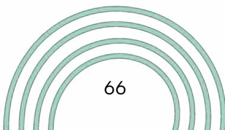

**PUMA**

The shoe brand PUMA, aware of the importance of secondary raw materials for its industry, has decided to raise awareness and encourage consumers to recycle clothing responsibly. That's why the brand has installed a series of boxes in Italy, in stores in Milan, Rome, and Venice, to promote second-hand items and thus encourage the return of shoes, clothing, and accessories of any brand. The take-back service allows the company to valorise material that would have become waste, thus reducing the need for secondary raw materials. This process generates a closed loop of self-regeneration of matter.

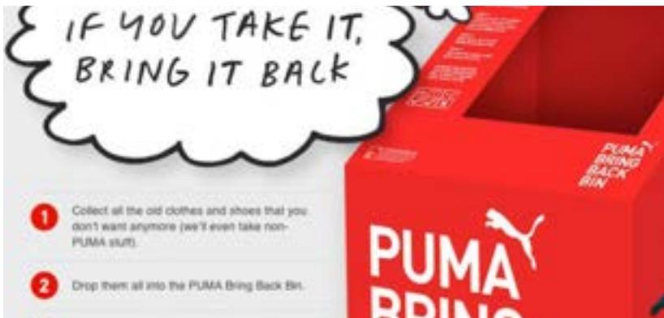

**NIKE**

NIKE has adopted a strategy to extend the lifespan of its products. Specifically, with an ambitious project that is attentive to the needs of its consumers, it has made some collection points available for products discarded by consumers. With meticulous quality control, products are inspected, “refurbished,” and resold. This strategy allows for the offering of an additional service while reducing the cost of their products, while still maintaining a high quality standard.

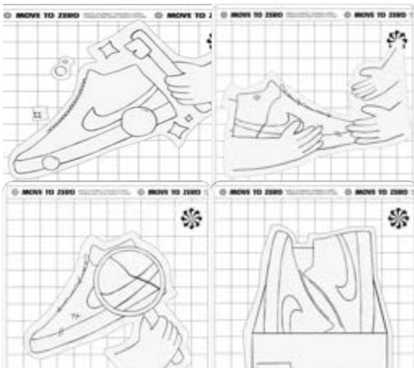

KALLIO**KALLIO Kids Clothes**Kallio is a New York-based brand that produces children's clothing. The brand is based on the remanufacturing strategy, which means reshaping and repackaging a garment a second time. But if in its first life the fabric was used for adult clothing, it is now transformed into dresses, shirts, and jackets for boys and girls, and it is precisely this transformation that generated the slogan *"Making old clothes young again."* A strategy, that of remanufacturing, which eliminates the costs and consumption of raw materials, giving value to something that didn't have it before.

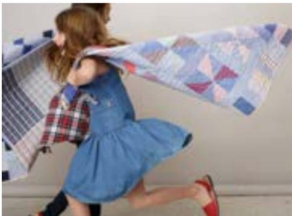

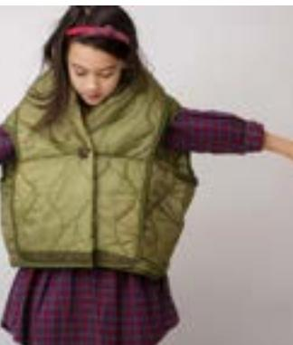

## VICTORINOX

### REMADE IN SWITZERLAND

Designer Christopher Raeburn, commissioned by the Swiss company Victorinox, has created a capsule collection named “*Remade in Switzerland*.” This project involved the creation of eight products, including jackets, parkas, scarves, hats, and small knives. The uniqueness of this collection lies in the material used. In fact, by employing the concept of “remanufacturing,” the designer transformed products whose materials were no longer usable in the sector for which they were originally created (such as parachute canopies). The combination of technical materials and eco-sustainability has been confronted with the hasty and anxiety-inducing calendar that is breathing down the necks of fashion designers, who are forced, season after season, to create completely new collections, preferring virgin materials to secondary raw materials.

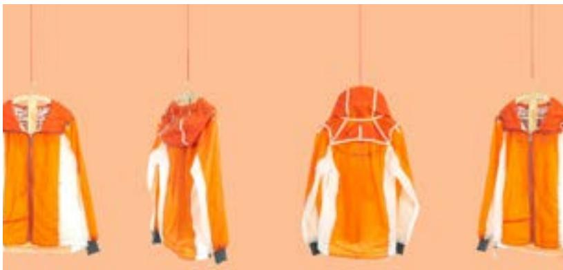

## AQUAFIL

Aquafil is a brand that produces both swimwear and carpets, two diametrically opposed sectors but linked by the same raw material used: nylon-6. The company is a pioneer in the circular economy thanks to the launch of ECONYL®, a recycled nylon yarn also used by Adidas for its swimwear. The project was launched in 2011 and was accompanied by the ECONYL® REGENERATION SYSTEM, an efficient system for regenerating nylon products such as fishing nets, carpet scraps, rugs, and rigid textiles, as well as waste from nylon production. Aquafil's recycling strategy has been its strength, allowing it to reduce raw material costs and helping the company with the waste problem.

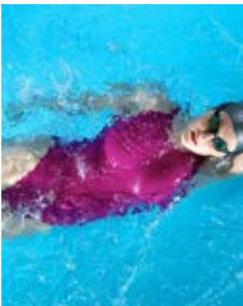

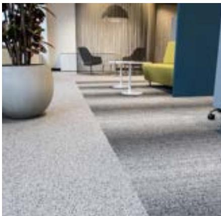

## **RECOMMENDATIONS FOR FABRIC PRODUCTION**

Textile production involves numerous stakeholders and represents the phase with the greatest impacts in terms of water and energy consumption, resource use, and waste generation. Furthermore, in low-wage countries, it is often linked to issues of labour abuse such as below-average wages, excessive working hours, lack of workplace safety, and denial of rights. The textile and fashion sectors will have a long way to go to be able to address and take on their environmental and social responsibilities; and there is no easy process ahead to do this; influenced by many factors such as economic, structural, legislative, and cultural ones. In the following pages, we will address the issues related to the environmental impact that the production of a fabric, starting from virgin fibres, can generate. To do this, some suggestions are proposed to be adopted to make production more ethical, conscious, and sustainable.

Before addressing the proposed topic, it is necessary to refer to the ambitious REACH program, which came into effect on June 1st, 2007, and limits the use of chemicals harmful to humans and the environment. This standard has posed a significant challenge for the sector, while also offering new perspectives and opportunities.

## **Fibres and Fabric Processing**

The improvement of techniques and machinery for processing the material is influenced by a mix of legislative and societal factors, which are introduced into an already complex industrial system. Some case studies, which demonstrate a reduction in impacts, can be identified in production

processes. However, the adoption of the two principles of minimisation and optimisation remains fundamental to compensate for all those processes or chemical treatments that can be eliminated.

We can therefore suggest:

- • Optimise the number of processes (e.g., the three processes of grinding, washing, and bleaching could be combined into a single one);
- • Choosing “clean” production techniques (e.g., reusing and exhausting dye baths);
- • Minimise consumption processes (e.g., introduce chemical dispensers and vending machines);
- • Choosing “clean” chemical processes (e.g., selecting chemical agents whose risk throughout the product lifecycle is minimal);
- • Reduce energy and water consumption;
- • Reduce waste production and manage waste carefully.

From a broader perspective, the main challenges in this sector are reducing water, energy, and chemical consumption and minimising the release of chemicals into wastewater. To support a secure supply chain and the efficient consumption of natural resources, it would be useful to reduce the most impactful operations, or, where possible, avoid:

- • Washing processes before dyeing and finishing where auxiliaries that can be difficult to biodegrade and may contain hazardous compounds such as biocides are removed;
- • Removal of sizing agents from cotton fabrics, which produces a highly polluting effluent;
- • Bleaching with sodium hypochlorite, which leads to secondary reactions that form toxic halogenated organic compounds;
- • Bleaching with hydrogen peroxide, when strong

complexing agents (stabilisers) are used;

- • Dyeing (in general) where the substances that pollute the water include toxic chemicals, heavy metals, alkalis, salt, reducing agents, etc.;
- • Printing (in general), which includes emissions into the water from printing paste residues and cleaning operations, and emissions into the air (in the form of volatile organic compounds) due to drying and fixing.

## Spinning, Weaving, and Knitting

This second section encompasses best practices for reducing the impacts of the spinning, weaving, and knitting stages. These phases are largely mechanical, and as such, the processes consume a large amount of energy, produce solid waste, and generate dust and noise. Mechanical fibre manipulation includes the use of lubricants for spinning, oils for knitting, and adhesives/films (sizing agents) for weaving to increase fibre strength while simultaneously protecting them during the process. All these additional substances can be added to the wastewater during subsequent processes and lead to greater pollution of the waste.

Best practices in the stages described above include:

- • In spinning, use biodegradable lubricants;
- • In knitting, use water-soluble or biodegradable lubricants instead of mineral oils;
- • Remove the fabrics where PCP (pentachlorophenol) was added to compensate for product shrinkage;
- • Replace natural starches with recyclable bleaching agents and use “low-addition techniques” that minimise the amount of sizing agents used;
- • If recyclable bonding agents are used, ensure that sizing agents are recovered and reused;
- • If unknown sizing agents are used, ensure they are

removed using efficient techniques such as oxidative methods and that the effluent is adequately treated;

- • Combine washing and degreasing processes with bleaching to save chemicals, energy, and water.

## **Finishing**

The final stage of fabric production includes all finishing processes, such as preparing the products for dyeing, printing, or applying specific finishes (e.g., water repellents). These stages typically use a huge amount of energy, water, and chemicals. Therefore, the aforementioned minimisation and optimisation operations are valid. Given the difficulty in handling certain agents, it is important to prevent the use of these substances, such as halogenated or aromatic solvents, PCP, formaldehyde, and heavy metals (excluding iron and 5% copper in blue-green dyes). Numerous initiatives and fashion brands have come out in favour of reducing/eliminating these substances, creating an additional challenge for the textile industry and its many suppliers.

## **Bleaching (cotton)**

Most natural fibres have a colouration with a wide variety of white shades, making the bleaching process necessary to achieve a uniform colour. The oldest bleaching method involves exposing the fibres to direct sunlight for about 36 hours. Currently in Europe, the practice of using hydrogen peroxide in a wet process is commonly used. Many chemical agents are required, which makes the process potentially polluting.

Here are some practices to reduce the impacts of bleaching:

- • Combining bleaching with cleaning and, if possible, also with the application of sizing agents to save on the use of chemicals, energy, and water;
- • Using hydrogen peroxide as the main bleaching agent, accompanied by techniques to minimise the use of stabilisers;
- • Ensure that wastewater is biologically treated before discharge into the network;
- • In the case of fibres like hemp that require chlorine-based bleaching agents, it is preferable to use sodium chloride instead of sodium hypochlorite.

## Dyeing

Textiles can be dyed in fibre, yarn, or piece. In addition to this first variable, many others are added that can determine the final outcome and impacts of the process. Specifically, a dye can vary depending on: the process (as mentioned above), the colour and shade, the dye class, the machinery used and therefore the ratio of chemicals to water, the water temperature, and the dyeing time. Additionally, after dyeing, the textile must undergo an intensive washing process to remove all added chemical agents that did not adhere to the material. Dyeing is therefore a resource-intensive process in terms of water, energy, chemicals, and the production of coloured wastewater (which often carries pollutants such as heavy metals like zinc, copper, or chromium). The solutions to limit the impacts of this process are not immediate, however, there are numerous best practices in place for reusing dyeing waters for similar colours and shades, minimising the resources used, and utilising innovative machinery and techniques.

Best practices for minimising the impacts of the dyeing process are:

- • Use automated dosing and distribution systems for chemicals and to control machinery variations in order to maximise efficiency;
- • Introduce measurement systems for water and energy efficiency;
- • Ensure low-liquor dyeing and the resulting improvement in dye fixation;
- • Eliminate fabrics that have been dyed with hazardous chemicals; these should be replaced with alternatives such as biodegradable or bio-removable products;
- • Reusing wastewater and extracting the dyeing chemicals that are still capable of being applied to the dyeing process;
- • Check that the wastewater is treated before being discharged into the sewer system.

| <b>Reactive dyes</b>              | Poor dye fixation, which in the worst case can be as low as 50%, of the dye itself, unfixed and even at high concentrations of salt, which is used to fix the dye to the fibre. | Multifunctional and low-salt reactive dyes that can achieve over 95% fixation;  Perform dyeing through a hot rinse process, which can avoid the use of detergents and complexing agents in the neutralisation phase. |
|-----------------------------------|---------------------------------------------------------------------------------------------------------------------------------------------------------------------------------|----------------------------------------------------------------------------------------------------------------------------------------------------------------------------------------------------------------------------|
| <b>Sulphur dyes</b>               | Using sodium sulphide to reduce the dye so it penetrates the fibre.                                                                                                             | Stabilised non-pre-reduced dyes free of sulphides; Replace sodium sulphide with sulfur-free reducing agents.                                                                                                               |
| <b>Chrome dyes (wool)</b>         | Use of chromium - a highly polluting heavy metal.                                                                                                                               | Replace chrome dyes with reactive dyes. If this is not possible, use methods with ultra-low chromium presence.                                                                                                             |
| <b>Metal complex dyes (wool)</b>  | Discharge of heavy metals into wastewater.                                                                                                                                      | Use auxiliaries to improve dye absorption and pH control methods to exhaust the dye bath.                                                                                                                                  |
| <b>Acid and basic dyes (wool)</b> | Use of organic levelling agents.                                                                                                                                                | Use the pH-controlled process to maximise dye exhaustion and minimise the use of organic levelling agents.                                                                                                                 |

| <b>Disperse dyes (polyester)</b> | Use of dangerous and non-biodegradable carriers. | 
Avoid the use of carriers by using a modified non-carrier polyester;
 
Dyeing at high temperatures without the use of carriers;
 
Use of dispersing agents with a high degree of biodegradability.
 |
|--------------------------------------|--------------------------------------------------|---------------------------------------------------------------------------------------------------------------------------------------------------------------------------------------------------------------------|
|--------------------------------------|--------------------------------------------------|---------------------------------------------------------------------------------------------------------------------------------------------------------------------------------------------------------------------|

## Printing

Fabric printing is a complex branch of the textile industry that involves the use of specialised machinery to apply colour to specific selected areas. There are many printing methods such as screen printing, roller printing, transfer printing, or inkjet printing; And each of these techniques has different requirements. Trying to refer to concrete numbers for traditional printing, approximately 250 kg of water are required per kilogramme of printed product; For transfer printing, however, only 2 kg are needed.

Here are some best practices for textile printing:

- • Use prints with water-based product formulations;
- • Implement measures to reduce ink loss and water consumption in screen printing;
- • Using digital inkjet printers for small batches to reduce ink waste;
- • Replace the use of urea in reactive colour printing with the introduction of new printing methods;
- • For pigment printing, use thickeners that do not contain volatile solvents to minimise airborne emissions from wet inks.

# **Special Finishing**

Fabric production includes a series of additional finishing as the final stage to improve the performance and aesthetics of the final product; Examples of these are water-repellent agents, anti-wrinkle treatments, or antimicrobial protections.

It is therefore possible to define the following best practices:

- Use finishing products that are formaldehyde-free or low in formaldehyde;
- Minimise the energy consumption of drying machines;
- Use recipes optimised for low air emissions.

## **Ecodesign for Textile Products: A Preliminary Proposal for a Strategic and Operational Guide for Compliance, Circularity, and Sustainability**

From ESPR to EPR: How to design durable, traceable, recyclable, and lighter products for the environment and for company costs.

Driving the ongoing transformation in the textile industry, strongly promoted by the European Commission, are two central and interconnected regulatory references, as we mentioned earlier:

- • Regulation (EU) 2024/1781 (ESPR), which introduces mandatory ecodesign requirements for all products, including textiles;
- • Extended Producer Responsibility (EPR) for the textile sector, which requires operators to finance and facilitate the collection, reuse, and recycling of garments placed on the market.

These two regulations should not be considered separately: They influence each other and converge very concretely on product design and the corporate sustainability of actors in the textile value chain. On the one hand, the ESPR imposes obligations and criteria for designing more durable, traceable, recyclable, and less toxic garments. On the other hand, the EPR translates these design choices into direct economic assessments: The more “eco-friendly” a garment is, the less the manufacturer pays in terms of mandatory contributions; The more difficult a product is to recycle, composed of mixed or untraceable materials, the higher the cost will be. This is why ecodesign is regarded as being

more than just an environmental issue; it is also seen as an economic and strategic tool. Every design choice – from the fibre composition to the type of stitching, from the use of detachable accessories to the presence of a digital label – directly impacts the company's bottom line. In France, for example, a non-recyclable pair of jeans with non-removable metal buttons and mixed materials can cost up to 30–40% more in EPR contributions compared to jeans designed with a circular approach. A gap that can determine the competitiveness of an entire collection.

**This guide is designed to offer companies in the textile and fashion sector an initial proposal for a practical and strategic tool to address the new environmental, regulatory, and economic challenges related to the sector's ecological transition in an integrated manner.**

Specifically, the aim is to establish a methodology that allows for:

- • translating ecodesign principles into concrete and applicable actions throughout all phases of the product lifecycle, from material selection to end-of-life design, promoting durability, repairability, traceability, and recyclability of garments;
- • optimise costs arising from EPR obligations, leveraging eco-modulation mechanisms already active in some member states (such as France), which reward companies able to demonstrate sustainable and documented design choices;
- • integrate the structured set of Ecodesign Strategies, developed from the present work conducted within the framework of the European project RegioGreenTex, into each step.

## **SHEET 1 PRE-PRODUCTION**

### **How to design to reduce impacts, EPR costs, and ensure ESPR compliance**

#### **Type of fibre and materials used (1-1 PRE-PRODUCTION)**

##### **Actions to be taken:**

- • Prefer recyclable single materials (e.g., 100% cotton, 100% PET)
- • Integrate traceable, certified recycled content (e.g., GRS, RCS)
- • Avoid inseparable blends (e.g., polyester + elastane)
- • Use natural fibres from organic farming or certified animal husbandry (e.g., GOTS, RWS)
- • Avoid materials with high-impact production (excessive water use, pesticides, deforestation)
- • Designing the garment to reduce cutting waste (optimised patterns, digitisation)
- • Avoid glueing – permanent bonding
- • Use standard seams, accessible buttons, and zippers
- • Designing garments that can be adapted, updated, or modified over time
- • Integrating environmental and material information into the Digital Product Passport
- • Collaborating with local consortia and supply chains for separate collection and treatment

##### **Eco-bonus:**

- • Single-material composition
- • GRS or GOTS certified
- • Recycled percentage  $\geq 30\%$
- • GOTS, GRS, RWS certifications
- • Traceable origin and regenerative farming methods
- • Easily removable labels and components
- • Design for a “disassemblable product” in <5 minutes

### **Eco-malus:**

- • Mixed fibres and blends that cannot be separated
- • Absence of recycled content
- • Intensive cultivation and massive use of pesticides for the chosen natural fibres
- • No environmental or ethical audit accompanying the selected material
- • Permanent bonding

### **Prevailing ESPR principles:**

- • Recycling Possibility
- • Recycled Content
- • Resource Efficiency Environmental
- • Footprint
- • Presence of Critical Substances
- • Disassembly
- • Extended Durability

### **Case Study:**

In France, jeans made of cotton + non-removable metal buttons pay up to 30–40% more in EPR contribution compared to 100% cotton, sewn, and recyclable jeans. Additionally, GOTS-certified organic cotton can receive a discount of up to 20% on the EPR contribution compared to conventional cotton.

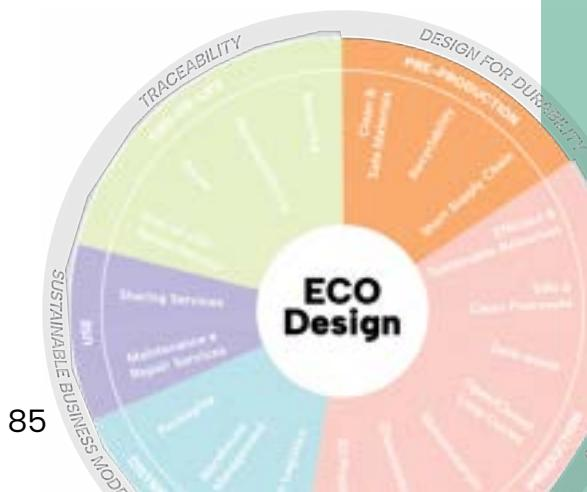

## **Designing for durability and repairability (1-2 PRE-PRODUCTION)**

### **Actions to be taken:**

- • Choosing durable materials, reinforced stitching, and long-lasting accessories
- • Adopting modular designs or replaceable components (zippers, buttons, linings)
- • Avoid treatments that degrade the garment after a few washes (e.g., unstable coatings)

### **Eco-bonus:**

- • Replaceable standard zippers and buttons
- • Certified robust fabrics (abrasion, pilling, wash resistance)
- • Associated repair manuals or services

### **Eco-malus:**

- • Delicate and non-durable finishes
- • Inaccessible seams
- • Design that prevents repair

### **Prevailing ESPR principles:**

- • Durability
- • Repairability
- • Reuse and maintenance possibilities

### **Case Study:**

In France, a brand that incorporated replaceable zippers, spare buttons, and a QR code with repair instructions was classified as a “durable product” in the Refashion system, gaining access to a 20% EPR bonus on the unit contribution.

### Origin and traceability of the chosen raw material (1-3 PRE-PRODUCTION)

### **Actions to be taken:**

- Adopt traceability systems, collaborating and coordinating with all actors in the value chain (e.g., QR code, blockchain)
- Collaborates with certified suppliers (e.g., GOTS, Fairtrade)
- Favour local (district), regional, or national sourcing

### **Eco-bonus:**

- Documented origin
- Smart labels
- Verifiable technical data sheets

### **Eco-malus:**

- No information about the origin
- No traceability
- No certificates associated with the fibre

### **Prevailing ESPR principles:**

- Traceability
- Product Information
- Presence of hazardous substances

### **Case study:**

In France, if you cannot prove the origin of the fibre (e.g., country of production, recycled content), you are not entitled to any EPR bonus, and you pay the maximum rate.

### Social aspects of the supplier (1-4 PRE-PRODUCTION)

### **Actions to be taken:**

- Collaborates with manufacturers who respect workers' rights.
- Use suppliers with social certifications (e.g., SA8000)

### **Eco-bonus:**

- Positive social audits
- Transparent contracts
- Partners with proven ethics

### **Eco-malus:**

- Anonymous or unverified suppliers
- REACH violations

### **Prevailing ESPR principles:**

- Social responsibility and overall product sustainability
- Consumer Information

### **Case study:**

In some countries, such as the Netherlands, an extra bonus for ethical supply chains, documented through audits, is under discussion.

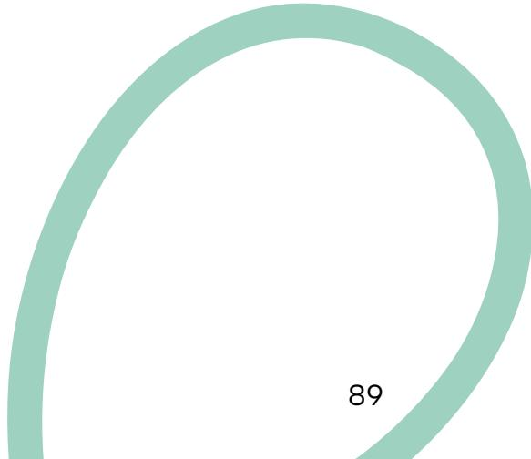

### Raw material packaging (1-5 PRE-PRODUCTION)

### **Actions to be taken:**

- Use reusable, compostable, or recycled packaging
- Minimise the volume and weight of the packaging

### **Eco-bonus:**

- Forest Stewardship Council (FSC) cardboard
- Compostable PLA bags
- Minimal packaging

### **Eco-malus:**

- Mixed plastic films (e.g., PET+PE)
- Overpackaging
- Materials without environmental labelling

### **Prevailing ESPR principles:**

- Waste reduction
- Recyclability
- Renewable resources

### **Case study:**

A supplier who delivers fibres with non-recyclable mixed plastic packaging can cause you to lose EPR bonuses on the final product.

## **SHEET 2 PRODUCTIN**

# **How to set up and review the production phase to reduce impacts, optimise EPR, and meet ESPR requirements**

### **Optimisation of production processes in terms of energy, water, and waste (2-1 PRODUCTION)**

#### **Actions to be taken:**

- • Adopting high-efficiency machinery (e.g., ISO 50001, 14001 certified)
- • Reduce the number of processes and unify treatments (e.g., combined dyeing and finishing).
- • Use low-impact technologies: CO2 dyeing, denim washing laser, ozone
- • Apply the “zero waste” principle to cutting or packaging waste.
- • Recover heat, water, and chemicals

#### **Eco-bonus:**

- • ISO-certified facilities
- • Use of renewable energy
- • Documented reduction in water consumption
- • Closed system for water or heat

#### **Eco-malus:**

- • High and untracked consumption
- • Untreated discharges
- • Energy-intensive production without recovery

### **Prevailing ESPR principles:**

- Resource efficiency
- Environmental footprint and carbon footprint
- Indirect product durability (less stressful processes)
- Presence of critical substances

### **Case study:**

In EPR schemes like Refashion (France), a documented process using renewable energy and water treatment can generate unit contribution reductions.

## Chemicals and Environmental Safety (2-2 PRODUCTION)

### **Actions to be taken:**

- • Avoid the use of substances subject to restriction (REACH)
- • Use certified products (e.g., OEKO-TEX®).
- • Encourage natural or low-temperature colouring.
- • Implement chemical traceability throughout the supply chain

### **Eco-bonus:**

- • OEKO-TEX® and GOTS labelling
- • Chemical substance traceability

### **Eco-malus:**

- • Presence of prohibited substances
- • Use of non-recovered solvent-based finishing
- • No information on the substances in the DPP

### **Prevailing ESPR principles:**

- • Presence of hazardous substances
- • Product Safety
- • Pollution Prevention

### **Case study:**

A company produces technical jackets with a C6 fluorinated water-repellent treatment: approved by REACH, but not compatible with environmental certifications (e.g., OEKO-TEX®) and penalising in EPR systems. Although the product complies with the law, it is not easily recyclable and loses access to eco-bonuses. On the contrary, a certified fluorine-free version has obtained the environmental label and a 15% reduction in the EPR contribution in France.

## Production waste and by-products (2-3 PRODUCTION)

### Actions to be taken:

- • Designing the garment to reduce cutting waste (optimised patterns, digitisation)
- • Collect, separate, and reuse waste internally.
- • Collaborate with operators for post-industrial recovery (e.g., cutting waste)

### Eco-bonus:

- • Management and coordination of post-industrial waste to facilitate its upcycling
- • Collaborations with artisans and reuse projects
- • Documented waste reduction

### Eco-malus:

- • High percentage of waste disposed of in landfills
- • Incineration without recovery
- • Lack of transparency regarding production losses

### Prevailing ESPR principles:

- • Waste reduction
- • Ease of recycling
- • Possibility of remanufacturing

### Case study:

A company that recovers 30–40% of its waste can document significant savings on the EPR contribution for each item placed on the market.

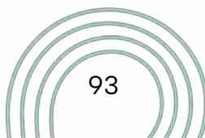

## **SHEET 3 DISTRIBUTION**

# **How to design more sustainable distribution systems and reduce impact throughout the supply chain**

### **Logistics and Transport (3–1 DISTRIBUTION)**

#### **Actions to be taken:**

- • Prefer low-impact transportation (e.g., train, ship, or electric vehicles)
- • Optimise routes and loads (e.g., groupage, full truckload)
- • Integrate operators who use certified fleets or  $\text{CO}_2$  compensation.
- • Locate distribution hubs near consumption areas.
- • Verify the distribution methods adopted by selected suppliers and partners as well.
- • Use LCA tools to measure the environmental impact of logistics and transparently demonstrate the efficiency of the solutions adopted.

#### **Eco-bonus:**

- • Low-emission vehicles documented
- • Optimised transportation (full loads, minimum distances)
- • Certified logistics providers (ISO 14001,  $\text{CO}_2$  compensation)

#### **Eco-malus:**

- • Fragmented or long-distance shipments without optimisation
- • Polluting vehicles or lack of traceability
- • No integration between logistics and product design.

### **Prevailing ESPR principles:**

- • Environmental footprint (emission reduction)
- • Efficiency of logistics resources
- • Transparency in the supply chain

### **Case study:**

An Italian fashion brand produces its garments in Portugal and distributes them in Europe via intermodal rail + electric last mile transport, thanks to an agreement with an ISO 14001 certified logistics operator. Thanks to the combined use of freight trains for the long haul and electric vans for deliveries to points of sale, it was able to reduce CO2 eq emissions per unit of product transported by 35% compared to the previous logistics based solely on diesel trucks. This result, verified through a supply chain LCA analysis, has been included in the Digital Product Passport (DPP). In France, the brand thus obtained an EPR bonus for documented environmental performance in logistics. Furthermore, thanks to the use of reusable rigid plastic packaging, it avoided the use of 2 tonnes of single-use packaging over the course of a season.

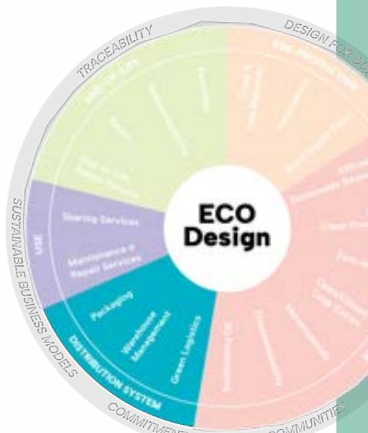

## Distribution packaging (3-2 DISTRIBUTION)

### Actions to be taken:

- • Use recycled, recyclable, or compostable packaging materials
- • Minimise packaging volume (custom packaging)
- • Implement reuse systems for boxes, hangers, and labels.
- • Avoid non-separable multi-layer plastic

### Eco-bonus:

- • Reusable or compostable packaging (e.g., PLA, FSC cardboard)
- • Minimal or customised packaging to reduce void space
- • Packaging take-back projects

### Eco-malus:

- • Mixed plastic films or laminates
- • Overpackaging
- • Materials without environmental labelling

### Prevailing ESPR principles:

- • Waste reduction
- • Recyclability
- • Renewable resources

### Caso studio:

In France, the use of mixed plastic single-use packaging can prevent access to EPR bonuses on the finished product, especially if the packaging is neither recycled nor recyclable. On the contrary, compostable FSC cardboard packaging can help reduce contributions.

## **Warehouse and inventory management (3-3 DISTRIBUTION)**

### **Actions to be taken:**

- • Digitise inventory management to avoid overproduction, for example, by using ERP systems or integrated digital platforms (e.g., PLM, WMS, MES) that allow for real-time monitoring of stock levels, demand, replenishment times, and sales by channel
- • Avoid waste from prolonged storage or unsold items through active stock rotation and/or by implementing secondary sales, outlet, donation, or refurbishment policies for unsold garments
- • Set clear performance metrics for warehouses (e.g., turnover rate, shelf life, % unsold)
- • Adopt just-in-time or on-demand models if possible

### **Eco-bonus:**

- • Unsold inventory traceability
- • Active rotation and recovery strategies
- • Production on demand or in micro-batches

### **Eco-malus:**

- • Warehouse capacity used to accumulate untracked stock
- • Unsold goods destined for incineration or uncontrolled export
- • No planning for overproduction

### **Prevailing ESPR principles:**

- • Product durability (to avoid logistical obsolescence)
- • Social responsibility with ethical inventory management
- • Indirect impacts from overproduction

### **Case study:**

The failure to dispose of unsold items transparently can trigger regulatory penalties (from 2026: a ban on the destruction of unsold items according to the ESPR). An efficient inventory rotation system prevents leftovers and thus additional EPR costs on unsold but registered items.

### Facilitating correct consumer use (4-1 USE)

### **Actions to be taken:**

- Provide clear and legible maintenance labels
- Promote low-temperature washing and natural drying
- Add QR codes with video instructions, tutorials, or repair platforms

### **Eco-bonus:**

- Durable instructions (e.g., textile label or indelible printing)
- QR code for smart maintenance
- LCA protocols that include prolonged use

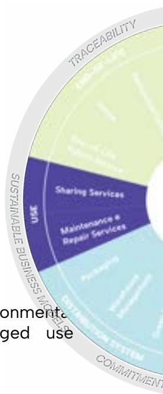

### **Eco-malus:**

- Illegible or missing labels
- No care or washing instructions
- Sensitive materials not declared correctly

### **Prevailing ESPR principles:**

- Consumer Information
- Lifecycle extension
- Promotion of sustainable use

### **Case study:**

A producer who includes interactive instructions on the DPP receives a bonus in the EPR environmental classification if they demonstrate that prolonged use behaviour is incentivised.

# SHEET 4*USE*

**How to design to extend product lifespan and reduce impact during consumption**

## **Facilitating maintenance and repair during use (4-2 USE)**

### **Actions to be taken:**

- • Provide clear, wash-resistant, understandable, and accessible care instructions for the garment (e.g., permanent labels, QR codes)
- • Provide spare parts (zippers, buttons, laces) or make them easier to find (e.g., standardised parts)
- • Offering internal, contracted, or guided repair services: From corporate tailoring to digital guidance: Educating users on proper washing and simple maintenance to prevent premature wear (e.g., cold washing, correct storage)

### **Eco-bonus**

- • Repair manuals or digital tutorials
- • After-sales assistance or integrated tailoring
- • Spare parts available or compatible

### **Eco-malus:**

- • Illegible or easily deteriorated care labels
- • No information on how to extend the product's lifespan.
- • Non-accessible or non-supplied replaceable parts

### **Prevailing ESPR principles:**

- • Maintenance and Reusability
- • Product Durability
- • Consumer Information

### **Case study:**

In some EPR schemes, products accompanied by maintenance services (e.g., repair kits, online customer support) can receive bonuses linked to the declared and tracked extended durability.

## **Promote empathy and emotional connection with the product (4-3 USE)**

### **Actions to be taken:**

- • Designing products with meaning (e.g., customisable items, storytelling, local identity)
- • Creating collections with sentimental value: repairable, commemorative, narrative
- • Use designs that encourage reuse, not immediate replacement

### **Eco-bonus:**

- • Design that fosters affection (natural materials, personalisation)
- • Brands offering “emotional care” services (e.g., restyling, memories)
- • Active customer involvement in the lifecycle

### **Eco-malus:**

- • Fast fashion without identity
- • Generic and replaceable design
- • No incentive for reuse

### **Prevailing ESPR principles:**

- • Emotional durability (connected to reusability)
- • Social and cultural responsibility

### **Case study:**

Some brands document the “second life” of a garment through digital tracking platforms, increasing the circularity index and thus accessing reductions on the EPR contribution.

## SHEET 5 *END-OF-LIFE*

### From Waste to Resource:

### The Strategic Role of the End-of-Life Supply Chain

In the ecodesign paradigm and as required by the ESPR Regulation, strategies to ensure a sustainable end-of-life for a textile product must be incorporated from the design phase. That's where it's decided whether a garment will be detachable, reusable, or recyclable; not at the time it's discarded. For this reason, in this guide, the recommended actions, normally associated with "end-of-life management," have been redistributed into the earlier phases (pre-production, production, use), as they are an integral part of the design choices. However, the success of these choices depends on another key player in the supply chain: those who are actually responsible for collecting, sorting, reusing, and treating end-of-life textile products. This card is dedicated to them. Here we focus on operational strategies aimed at end-of-life operators, both public and private, who play a key role in making circularity truly possible. Their tasks are not limited to waste management, but also include: the ability to read product designs (materials, labels, traceability), collaboration with producers and EPR consortia, and the creation of alternative pathways to destruction or uncontrolled export, such as local reuse, refurbishment, or upcycling. Only through a modern, traceable, conscious, and integrated collection and sorting system within the supply chain can ecodesign truly come full circle.

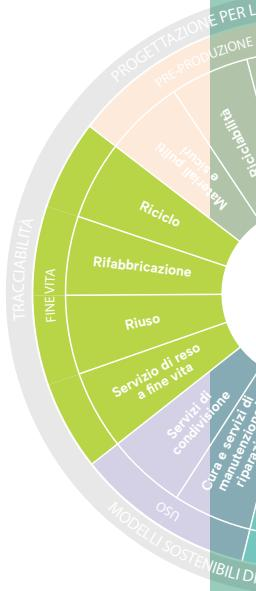

### **Actions to be taken:**

#### **Reading eco-design in incoming flows**

- • Identify “ecodesigned” garments through labels, digital passports, and smart tags (RFID, QR codes)
- • Separate and classify products according to recyclability, repairability, and composition
- • Create distinct categories for products that comply and do not comply with ESPR/EPR criteria (e.g., products that cannot be disassembled or contain prohibited substances)

#### **Collaborating with producers and EPR consortia**

- • Provide technical data and feedback on which materials or constructions are difficult to manage at the end of their life
- • Participate in the definition of technical standards for disassembly and recycling
- • Entering the digital circuits of the Product Passport (DPP) to provide real data on post-consumer environmental performance

#### **Facilitate reuse and remanufacturing**

- • Identify items suitable for immediate reuse or after minimal treatment (e.g., washing, minor repairs)
- • Implement collaborations with outlets, cooperatives, second-hand or upcycling platforms
- • Activate separate flows for garments designed to be updated or modified (modular design, neutral fabrics, standardised cuts)

#### **Track and enhance garment treatment**

- • Systematically record the quantity and type of garments collected: How many are reusable? How much is actually recycled? How much ends up in landfills or incineration?

- • Evaluate whether a product designed for recycling is actually treatable in practice: For example, a “single-material” garment might be non-recyclable on paper if it contains non-removable finishes or glued labels
- • Sharing this data with EPR (Extended Producer Responsibility) consortia: This allows for rewarding producers with bonuses whose products are actually manageable at the end of their life, and conversely, applying penalties to those who design untreatable products

A kind of “real environmental report card” compiled by those working in the field, which helps regulate producers’ EPR contributions more fairly and based on objective data.

#### **Avoiding the dispersion of unsold goods and textile waste**

- • Do not destroy or incinerate unsold goods to free up warehouse space or for seasonal “clearance.” These practices, in addition to being environmentally incorrect, will be subject to penalties starting in 2026
- • Avoid bulk exports to third countries (especially outside the EU) unless accompanied by traceability and guarantees regarding actual processing: In many cases, waste ends up in informal dumps or is abandoned
- • Agreements with solidarity outlets or ethical markets, collaborations with cooperatives that handle the collection, refurbishment, and sale at social prices, and the creation of local networks for the reuse or upcycling of garments that still have value

### **Eco-bonus:**

- • Activation of dedicated flows for ecodesigned products
- • Active collaboration with EPR consortia
- • Presence of traceability systems (digital or physical)
- • Accurate separation of single materials and reusable garments
- • Documentation available for eco-modulation of producers

### **Eco-malus:**

- • Non-selective disposal of potentially reusable garments
- • Export without traceability or at risk of dumping
- • Destruction of unsold goods
- • No collaboration or data sharing with manufacturers or consortia
- • Lack of recognition of materials and components

### **Prevailing ESPR principles:**

- • Recycling possibilities
- • Reusability and Remanufacturing
- • Presence of hazardous substances
- • Traceability
- • Ban on the destruction of unsold goods

### **Case study:**

A fashion brand that used to withdraw and dispose of unsold items each season through incineration in third countries has converted its logistics by implementing a program for retailers to return garments. The garments are now selected for company outlets, second-hand sales, or donation through a third-sector partner (e.g., Humana People to People). A regional network of social cooperatives has created a system for collecting, reconditioning, and ethically selling unsold garments from fast fashion brands. The products are cleaned, repaired if necessary, and sold in solidarity spaces with full traceability, reinvesting the proceeds in employment inclusion.

*3*

### *What type of fabric would I like to design? What is its function? 1*

## **Proposed Logical Flow for Designing a New Fabric According to Eco-design Strategies**

Questions to ask yourself before designing an eco-friendly textile product

# *How should I design it?*

### *What technical, aesthetic, and formal characteristics of the fabric do I need to guarantee?*

- Technical fabric, home textiles, knitwear...
- I define the intended use and expected lifespan (how long will it be used?)
- I establish the context of use and the expected lifecycle (how will it be used?)
- …

- Traceable at every stage
- Engage suppliers with environmental and social certifications.
- Be mindful of local communities.
- …

- Monomateriality
- Disassemblability
- Ease of maintenance/repair
- Zero-waste approach
- With easily replaceable components
- Avoid non-removable finishes or non-separable materials.
- Ensure accessibility of repair points
- Designing with a second life perspective
- Avoid incompatible mixes with existing recycling technologies
- .….

## 4

***Based on the requirements in point 3, what characteristics am I looking for when choosing materials?***

- • Renewability/Innovation
- • Evaluate compatibility with real recycling technologies
- • Origin from a short supply chain
- • Certifications (e.g., GOTS for...)
- • Monomaterials
- • ...

## 5

***How do I improve the overall sustainability of the lifecycle?***

- • Design for Reuse/Remanufacturing/Recycling
- • Monitoring the environmental footprint with LCA (Life Cycle Assessment)
- • The use of innovative and sustainable technologies, especially for processes with high water, energy, and chemical consumption.
- • Input environmental and logistical data into the Digital Product Passport
- • Anticipate take-back or EPR agreements for targeted end-of-life recovery
- • ...

## 6

***During the transport and handling of materials, be careful to:***

- • Green Logistics
- • Conscious warehouse management
- • Optimise packaging: compostable, reusable, minimal
- • Activate reverse logistics and take-back systems
- • Track unsold items
- • ...

# Glossary

**Byproduct** A waste substance or material, resulting from a production process, that can be used in the same production or in a different processing than the one from which it was generated, without having negative impacts on the environment or human health;

**Closed-loop processes** Closed-loop processes are those processes that transform and regenerate materials while maintaining their use for the same product from which they were generated (e.g., fiber-to-fiber);

**Discard** Waste material from production processes, generated unintentionally;

**Downcycling** A set of production operations and processes carried out for the transformation of waste and/or secondary raw materials that result in the creation of products with a lower value than the materials used originally belonged to. In these processes, the recycled material has lost some of its intrinsic qualities due to the processing it has undergone (e.g., shredding can break fibres and reduce their length). Downcycling processes are primarily open-loop;

| <b>End-of-Waste Status</b>                  | A set of actions and processes aimed at recovering and regenerating resources from waste, transforming them into new resources: secondary raw materials;                                                                                                                                                                                                                                                    |
|---------------------------------------------|-------------------------------------------------------------------------------------------------------------------------------------------------------------------------------------------------------------------------------------------------------------------------------------------------------------------------------------------------------------------------------------------------------------|
| <b>Open-cycle processes</b>                 | Open-cycle processes are those processes that transform and regenerate matter, using it for products that do not correspond to those from which it was generated; such as cross-sectoral applications; Open-cycle processes are those processes that transform and regenerate matter, using it for products that do not correspond to those from which it was generated; such as cross-sector applications. |
| <b>Post-consumer (Post-use)</b>             | Textile waste resulting from consumer use (clothing, household textiles, furnishing textiles,);                                                                                                                                                                                                                                                                                                             |
| <b>Post-industrial waste (pre-consumer)</b> | Finished but unused products that remain in the brand's possession, such as excess inventory, surplus goods, damaged and/or liquidated products, returns, etc.;                                                                                                                                                                                                                                             |
| <b>Pre-consumer waste</b>                   | Both pre-industrial and post-industrial waste;                                                                                                                                                                                                                                                                                                                                                              |
| <b>Pre-industrial waste</b>                 | Waste from industrial processes: (finished and semi-finished products, or processing waste, such as powders, threads, or fabrics with manufacturing defects, packaging scraps, ...);                                                                                                                                                                                                                        |

| Product      | A finished object derived from production      |
|--------------|------------------------------------------------|
| Raw material | Basic materials for the production of          |
|              | that exhibits performance and                  |
| Upcycling    | A set of production operations and             |
| Waste        | Waste substance or material that has no market |

If ecodesign is the key to building a more sustainable textile supply chain, this report cannot be a closed document. There needs to be continuous dialogue between those who design, those who produce, those who distribute – and those who recover, select, repair, and reuse.

We want to open a space for gathering and discussion. A point where anyone operating in the textile supply chain – from a craft workshop to a brand, from a recycling plant to an EPR consortium – can:

- propose concrete actions that facilitate circularity and traceability,
- to present already completed and replicable case studies,
- suggest eco-bonus or eco-malus criteria based on field experience,
- connect these proposals to the principles of Ecodesign (ESPR), with a measurable impact on the environment and the company.

# **CO-DESIGNING SUSTAINABILITY: DESIGNERS ARE NOT ENOUGH, THOSE WHO RECYCLE ALONE CANNOT DO IT.**

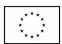

Funded by the European Union. Views and opinions expressed are however those of the author(s) only and do not necessarily reflect those of the European Union or EISMEA. Neither the European Union nor the granting authority can be held responsible for them.

This project has received funding from the European Union's Interregional Innovation Investments Instrument (I3) under the Grant Agreement No. 101083731.

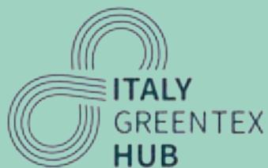

UNIVERSITÀ  
DEGLI STUDI  
FIRENZE

**DIDA**  
DIPARTIMENTO  
DI ARCHITETTURA

Città Studi  
BIELLA

con il contributo di