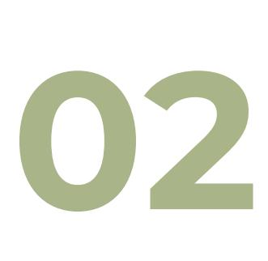

**October 2024** 

**ECOSYSTEX Technical Group 4**

**Overview of standardisation Committees, published and under development standards, and gap analysis for renewable materials/ textiles** 

Lead authors: K Eufinger (Centexbel), H Vilaça (Citeve)

# **Executive Summary**

Standards provide a framework for ensuring consistency, reliability, and safety in various aspects of life, from technology and manufacturing to health care and agriculture. By following standards, organizations and individuals can ensure that their products, processes, and services meet the necessary requirements and are compatible with those of others, promoting interoperability, innovation, and market growth. Next to standards there are also private certification schemes and labels for bio-based and renewably sourced textiles and textile materials. Despite the huge effort being made on the development of new standards, these do not yet cover all materials and properties.

The first section of this document provides an inventory of the existing (published standards) and under development (work program) standards directly or indirectly related with renewable / bio-based materials and recycled ones, with a focus on textile materials, as that is the scope of this work. The second section of the document provides a gap analysis indicating future needs for standards development. In the third section a non-exhaustive overview over the existing private labels and certification schemes is provided.

# **Table of contents**

**[Executive Summary](#page-1-0)** 1

**[Table of contents](#page-2-0)** 2

**[Overview of standardisation committees,](#page-3-0)  [published and under development standards](#page-3-0)** 3

**[Gap analysis on standards](#page-28-0)** 28

[Identified gaps](#page-28-1) 28

[Identified gaps already being \(partially\) adressed 29](#page-29-0)

**[Overview over certification schemes and](#page-30-0)**

**[labels](#page-30-0)** 30

[General information](#page-30-1) 30

[ISO 14024 type I labels](#page-31-0) 31

[Sustainable feedstocks](#page-31-1) 31

[Bio-based content](#page-33-0) 33

[Compostable](#page-34-0) 34

[Biodegradable](#page-35-0) 35

[Chemical safety](#page-36-0) 36

[Recycled or organic content](#page-37-0) 37

[More sustainable practices 37](#page-37-1)

[Further reading](#page-38-0) 38

# **Overview of standardisation committees, published and under development standards**

Standards are agreed-upon ways of doing something, typically established by experts in a subject matter to ensure consistency, reliability, and safety in various activities and industries. They can be mandatory or voluntary, and they provide a common language, guidelines, and technical requirements for diverse fields. Standards are often developed through collaboration between various stakeholders, such as manufacturers, sellers, buyers, customers, trade associations, and regulators.

They establish accepted practices and terminologies, ensuring that materials, products, processes, and services are fit for their purpose. Standards can help drive innovation, increase productivity, and protect consumers by ensuring safety, durability, and market equity.

Standards can be developed by various organizations, including national standardization bodies and international organizations such as the International Organization for Standardization (ISO), [1](#page-3-1) the European Committee for Standardization (CEN),[2](#page-3-2) the American Association of Textile Chemists and Colorists (AATCC),[3](#page-3-3) or ASTM International. [4](#page-3-4) These organizations facilitate the creation and adoption of standards, ensuring that they are widely accepted and applicable across different countries and industries.

11 <https://www.iso.org/home.html>

2 <https://www.cencenelec.eu/european-standardization/cen-and-cenelec/>

3 <https://www.aatcc.org/>

4 <https://www.astm.org/>

In essence, standards provide a framework for ensuring consistency, reliability, and safety in various aspects of life, from technology and manufacturing to health care and agriculture. By following standards, organizations and individuals can ensure that their products, processes, and services meet the necessary requirements and are compatible with those of others, promoting interoperability, innovation, and market growth.

Standards are typically updated and revised every three to five years, with revision cycles that can begin twice each year. This periodic review and update process ensures that standards remain current, relevant, and aligned with the latest industry practices and technological advancements.

Below is an inventory of the existing (published standards) and under development (work program) standards **directly or indirectly related with renewable / bio-based materials and recycled ones**, with a focus on **textile materials**, as that is the scope of this work. Also, the inventory is limited to standardization on the European Union.

The inventory is divided by the following Technical Committees, identified as working on relevant areas:

- CEN/TC 411 BIO-BASED PRODUCTS
- ISO/TC 38 TEXTILES
- ISO/TC 38 TEXTILES SC 23 FIBRES AND YARNS
- CEN/TC 248 TEXTILES AND TEXTILE PRODUCTS
- CEN/TC 134 RESILIENT, TEXTILE, LAMINATE AND MODULAR MECHANICAL LOCKED FLOOR COVERINGS
- CEN/TC 189 GEOSYNTHETICS
- ISO TC61 PLASTICS SC14 ENVIRONMENTAL ASPECTS
- CEN/TC 249 PLASTICS
- CEN/TC 261 PACKAGING SC 4 PACKAGING AND ENVIRONMENT
- CEN/TC 466 CIRCULARITY AND RECYCLABILIBILITY OF FISHING GEAR AND AQUACULTURE EQUIPMENT

**Remark:** This inventory reflects the status at the moment of writing this document. Since standards development is continuously evolving the list will become outdated with time. For the up to date information the reader is referred to the respective website of the committee, which is provided in the overview below.

**CEN TC411 Bio-based products [5](#page-4-0)**

- Development of standards for bio-based products covering horizontal aspects. This includes consistent terminology, sampling, certification tools, bio-based content, application of and correlation towards life cycle analysis, sustainability criteria for biomass used and for final products, and aspects where further harmonization is needed on horizontal level;

[https://standards.cencenelec.eu/dyn/www/f?p=205:7:0::::FSP\\_ORG\\_ID:874780&cs=18C173D69008BCCEB753FFD8](https://standards.cencenelec.eu/dyn/www/f?p=205:7:0::::FSP_ORG_ID:874780&cs=18C173D69008BCCEB753FFD8DCAA03196) [DCAA03196](https://standards.cencenelec.eu/dyn/www/f?p=205:7:0::::FSP_ORG_ID:874780&cs=18C173D69008BCCEB753FFD8DCAA03196) 

- Development of standards for bio-solvents, covering product functionality, biodegradability and, if necessary, product specific aspects not covered under i.

This TC has currently four Working Groups (WGs), 15 published standards and 3 standards under development.

| Working group | Published standards Work programme   |
|---------------|--------------------------------------|
| Terminology”  | 6                                    |
|               | products - Vocabulary Currently none |
| content”      | 7                                    |
| issues”       | 8                                    |
|               | products - Examples of               |

6

7

[https://standards.cencenelec.eu/dyn/www/f?p=205:7:0::::FSP\\_ORG\\_ID:904040&cs=1C4F24616EF7C4AB05C76B21A](https://standards.cencenelec.eu/dyn/www/f?p=205:7:0::::FSP_ORG_ID:904040&cs=1C4F24616EF7C4AB05C76B21A61335F56) [61335F56](https://standards.cencenelec.eu/dyn/www/f?p=205:7:0::::FSP_ORG_ID:904040&cs=1C4F24616EF7C4AB05C76B21A61335F56) 

[https://standards.cencenelec.eu/dyn/www/f?p=205:7:0::::FSP\\_ORG\\_ID:904047&cs=1FFD5A7A7D3914E7857AEF064](https://standards.cencenelec.eu/dyn/www/f?p=205:7:0::::FSP_ORG_ID:904047&cs=1FFD5A7A7D3914E7857AEF064035657AB) [035657AB](https://standards.cencenelec.eu/dyn/www/f?p=205:7:0::::FSP_ORG_ID:904047&cs=1FFD5A7A7D3914E7857AEF064035657AB)

[https://standards.cencenelec.eu/dyn/www/f?p=205:7:0::::FSP\\_ORG\\_ID:904048&cs=113BC7C93BCD9AD3919606D54](https://standards.cencenelec.eu/dyn/www/f?p=205:7:0::::FSP_ORG_ID:904048&cs=113BC7C93BCD9AD3919606D549666DB35) [9666DB35](https://standards.cencenelec.eu/dyn/www/f?p=205:7:0::::FSP_ORG_ID:904048&cs=113BC7C93BCD9AD3919606D549666DB35) 

| Working group          | Published standards | Work programme |
|------------------------|---------------------|----------------|
| CEN/TC 411/WG 5 “ Bio |                     |                |
| projects) 9            |                     |                |

### **ISO/TC38 Textiles [10](#page-6-1)**

Standardization of:

- 1. fibres, yarns, threads, cords, rope, cloth and other fabricated textile materials; and the methods of test, terminology and definitions relating thereto;
- 2. textile industry raw materials, auxiliaries and chemical products required for processing and testing;
- 3. specifications for textile products;
- 4. micro plastics from textile source and the methods of test, specifications, terminology and definitions relating thereto;
- 5. traceability and responsible sourcing of animal fibres in the textile supply chain and the methods of test, specifications, terminology and definitions relating thereto;
- 6. ethical and environmental issues in the textile supply chain and the methods of test, specifications, terminology, and definitions relating thereto.

This TC has currently fourteen WGs, 177 published standards and 23 standards under development.

| Working group                                           | Published standards                                                                                                                                                                                                                                                                                                                               | Work programme                                                                                                                                                                                                                                                                                                                                 |
|---------------------------------------------------------|---------------------------------------------------------------------------------------------------------------------------------------------------------------------------------------------------------------------------------------------------------------------------------------------------------------------------------------------------|------------------------------------------------------------------------------------------------------------------------------------------------------------------------------------------------------------------------------------------------------------------------------------------------------------------------------------------------|
| ISO/TC 38/WG 30 "Textiles – Tests for biodegradability" | <ul> <li>ISO 21701:2019 Textiles —Test method for accelerated hydrolysis of textile materials and biodegradation under controlled composting conditions of the resulting hydrolysate</li> <li>ISO 11721-1:2001 Textiles — Determination of resistance of cellulose-containing textiles to micro-organisms — Soil burial test — Part 1:</li> </ul> | <ul> <li>ISO/DIS 21701(rev) Textiles — Test method for accelerated hydrolysis of textile materials and biodegradation under controlled composting conditions of the resulting hydrolysate</li> <li>ISO/WD 24304 Textiles — Determination of the aerobic biodegradation of fibres and textile materials in seawater by measuring the</li> </ul> |

[https://standards.cencenelec.eu/dyn/www/f?p=205:7:0::::FSP\\_ORG\\_ID:904049&cs=1BED99CFAF0A979A5A2D0D30](https://standards.cencenelec.eu/dyn/www/f?p=205:7:0::::FSP_ORG_ID:904049&cs=1BED99CFAF0A979A5A2D0D30398EC5380) [398EC5380](https://standards.cencenelec.eu/dyn/www/f?p=205:7:0::::FSP_ORG_ID:904049&cs=1BED99CFAF0A979A5A2D0D30398EC5380) 

10 <https://www.iso.org/committee/48148.html>

| Working group                                                                   | Published standards                                                                                                                                                                                                                                                                                                                                                                                                                                                                                                                                                                                                                                                                                                                                                                                                                                                                                                                                                                                                                                                                            | Work programme                                                                                                                                                                                                                                                |
|---------------------------------------------------------------------------------|------------------------------------------------------------------------------------------------------------------------------------------------------------------------------------------------------------------------------------------------------------------------------------------------------------------------------------------------------------------------------------------------------------------------------------------------------------------------------------------------------------------------------------------------------------------------------------------------------------------------------------------------------------------------------------------------------------------------------------------------------------------------------------------------------------------------------------------------------------------------------------------------------------------------------------------------------------------------------------------------------------------------------------------------------------------------------------------------|---------------------------------------------------------------------------------------------------------------------------------------------------------------------------------------------------------------------------------------------------------------|
|                                                                                 | 
Assessment of rot-retardant finishing (joint with CEN)
 <ul> <li>ISO 11721-2:2003 Textiles — Determination of the resistance of cellulose-containing textiles to micro-organisms — Soil burial test — Part 2: Identification of long-term resistance of a rot retardant finish (joint with CEN)</li> </ul>                                                                                                                                                                                                                                                                                                                                                                                                                                                                                                                                                                                                                                                                                                                                                                               | 
biochemical oxygen demand or the amount of carbon dioxide evolved.
 <ul> <li>ISO/NP 17952 Textiles — Test method for determination of degradation rate of textile materials under simulated composting conditions in a laboratory-scale test</li> </ul> |
| 
ISO/TC 38/WG 31 "Textiles – Non-fibrous bio-based material for textiles"
 | <ul> <li>ISO 20921:2019 Textiles — Determination of stable nitrogen isotope ratio in cotton fibres</li> <li>ISO 22195-1:2023 Textiles — Determination of index ingredient from coloured textile — Part 1: Madder</li> <li>ISO 22195-2:2023 Textiles — Determination of index ingredient from coloured textile — Part 2: Turmeric</li> <li>ISO 22195-3:2023 Textiles — Determination of index ingredient from coloured textile — Part 3: Myrobalan</li> <li>ISO 22195-4:2021 Textiles — Determination of index ingredient from coloured textile — Part 4: Catechu</li> <li>ISO 22195-5:2021 Textiles — Determination of index ingredient from coloured textile — Part 5: Lac</li> <li>ISO 22195-6:2021 Textiles — Determination of index ingredient from coloured textile — Part 6: Punica granatum</li> <li>ISO 22195-7:2024 Textiles — Determination of index ingredient from coloured textile — Part 7: Himalayan rhubarb (under publication)</li> <li>ISO 22195-8:2024 Textiles — Determination of index ingredient from coloured textile — Part 8: Hibiscus (under publication)</li> </ul> | <ul> <li>ISO/CD 22195-9 Textiles — Determination of index ingredient from coloured textile — Part 9: Gallnut</li> </ul>                                                                                                                                       |
| 
ISO/TC 38/WG 33 "Animal welfare in the textile supply chain"
             | <ul> <li>ISO 4465:2022 Textiles — Animal welfare in the supply chain — General requirements for the production, preparation and traceability of Angora rabbit fibre, including ethical claims and supporting information</li> </ul>                                                                                                                                                                                                                                                                                                                                                                                                                                                                                                                                                                                                                                                                                                                                                                                                                                                            | <ul> <li>ISO/WD 22786 Textiles — Anima</li></ul>                                                                                                                                                                                                              |

| Working group Published standards |              | Work programme              |
|-----------------------------------|--------------|-----------------------------|
| Microplastics from textile        |              |                             |
| textile                           | products     | —                           |
| Microplastics                     | from         | textile                     |
| sources                           | — Part       | 1:                          |
| Determination                     | of           | material                    |
| loss                              | from fabrics | during                      |
| textile                           | products     | —                           |
| Microplastics                     | from         | textile                     |
| textile                           | products     | —                           |
| Microplastics                     | from         | textile                     |
| sources                           | — Part       | 3:                          |
| Measurement                       | of           | collected                   |
| textile                           | end products | by                          |
|                                   |              | textile products —          |
|                                   |              | Microplastics from textile  |
|                                   |              | thermal or gravimetric      |
|                                   |              | materials released from     |
| ISO                               | 5157:2023    | Textiles –                  |
| Environmental                     |              | aspects –                   |
|                                   |              | Currently none. Waiting for |
|                                   |              | CEN/TC248/WG39 to advance   |

# **ISO/TC38 Textiles - SC23 - Fibres and Yarns [11](#page-8-0)**

Standardization of terminology, test methods, specifications and quality labelling of fibres and yarns.

This SC has currently three WGs, 55 published standards and 4 standards under development.

| Working group                                                                       | Published standards (selection of relevant documents, please refer to the website for the full list)                                                                                                                                                                                                                                                  | Work programme                                                                                                                                                                                                          |
|-------------------------------------------------------------------------------------|-------------------------------------------------------------------------------------------------------------------------------------------------------------------------------------------------------------------------------------------------------------------------------------------------------------------------------------------------------|-------------------------------------------------------------------------------------------------------------------------------------------------------------------------------------------------------------------------|
| ISO/TC 38/SC 23/WG 2 "Textiles - Fibres and yarns - Fibres - Natural cellulosic" | <ul> <li>ISO 12834:2024 Textiles — Synthetic filament yarns — Determination of dynamic thermal draw-force of partially oriented yarns (POY)</li> <li>ISO 137:2015 Wool — Determination of fibre diameter — Projection microscope method</li> <li>ISO 920:1976 Wool — Determination of fibre length (barbe and hauteur) using a comb sorter</li> </ul> | <ul> <li>ISO/CD 1130 Textile fibres — Some methods of sampling for testing</li> <li>ISO/CD 1139 Textiles — Designation of yarns</li> <li>ISO/AWI 8159 Textiles — Morphology of fibres and yarns — Vocabulary</li> </ul> |
| ISO/TC 38/SC 23/WG 5 "Textiles - Fibres and yarns -Fibres - Natural proteins"    | <ul> <li>ISO 1130:1975 Textile fibres — Some methods of sampling for testing</li> <li>ISO 1136:2015 Wool — Determination of mean diameter of fibres — Air permeability method</li> </ul>                                                                                                                                                              | <ul> <li>ISO/AWI 8159 Textiles — Morphology of fibres and yarns — Vocabulary</li> </ul>                                                                                                                                 |
| ISO/TC 38/SC 23/WG 6 "Textiles - Fibres and yarns -Fibres - Man-made"            | <ul> <li>ISO 1139:1973 Textiles — Designation of yarns</li> <li>ISO 2061:2015 Textiles — Determination of twist in yarns — Direct counting method</li> <li>ISO 2370:2019 Textiles — Determination of fineness of flax fibres — Permeametric methods</li> </ul>                                                                                        |                                                                                                                                                                                                                         |

11 <https://www.iso.org/committee/48334.html>

| Working group | Published standards (selection of relevant documents, please refer to the website for the full list)                                                                                                                                                                                                                                                                                                                                                                                                                                                                                                                                                                                                                                                                                                                                                                                                                                                                                                                                                                                                                                                                                                                                                                                                                                                                                                                                                                                                                                                                                                                                                                                                                                                                                                                                                                                                                                                                                                                                                                                                                                                                                                  | Work programme |
|---------------|-------------------------------------------------------------------------------------------------------------------------------------------------------------------------------------------------------------------------------------------------------------------------------------------------------------------------------------------------------------------------------------------------------------------------------------------------------------------------------------------------------------------------------------------------------------------------------------------------------------------------------------------------------------------------------------------------------------------------------------------------------------------------------------------------------------------------------------------------------------------------------------------------------------------------------------------------------------------------------------------------------------------------------------------------------------------------------------------------------------------------------------------------------------------------------------------------------------------------------------------------------------------------------------------------------------------------------------------------------------------------------------------------------------------------------------------------------------------------------------------------------------------------------------------------------------------------------------------------------------------------------------------------------------------------------------------------------------------------------------------------------------------------------------------------------------------------------------------------------------------------------------------------------------------------------------------------------------------------------------------------------------------------------------------------------------------------------------------------------------------------------------------------------------------------------------------------------|----------------|
|               | <ul style="list-style-type: none;"> <li>● ISO 2403:2021 Textiles — Cotton fibres — Determination of micronaire value</li> <li>● ISO 2646:1974 Wool — Measurement of the length of fibres processed on the worsted system, using a fibre diagram machine</li> <li>● ISO 2647:2020 Wool — Determination of percentage of medullated fibres by the projection microscope</li> <li>● ISO 2648:2020 Wool — Determination of fibre length distribution parameters — Capacitance method</li> <li>● ISO 2913:1975 Wool — Colorimetric determination of cystine plus cysteine in hydrolysates</li> <li>● ISO 2915:1975 Wool — Determination of cysteic acid content of wool hydrolysates by paper electrophoresis and colorimetry</li> <li>● ISO 2916:1975 Wool — Determination of alkali content</li> <li>● ISO 3060:1974 Textiles — Cotton fibres — Determination of breaking tenacity of flat bundles</li> <li>● ISO 3072:1975 Wool — Determination of solubility in alkali</li> <li>● ISO 3073:1975 Wool — Determination of acid content</li> <li>● ISO 3074:2014 Wool — Determination of dichloromethane-soluble matter in combed sliver</li> <li>● ISO 4912:1981 Textiles — Cotton fibres — Evaluation of maturity — Microscopic method</li> <li>● ISO 4913:1981 Textiles — Cotton fibres — Determination of length (span length) and uniformity index</li> <li>● ISO 5079:2020 Textile fibres — Determination of breaking force and elongation at break of individual fibres</li> <li>● ISO 5162:2023 Textiles — Quality labelling specification for dehaired cashmere</li> <li>● ISO 6939:1988 Textiles — Yarns from packages — Method of test for breaking strength of yarn by the skein method</li> <li>● ISO 10290:2018 Textiles — Cotton yarns — Basis for specification</li> <li>● ISO 10306:2014 Textiles — Cotton fibres — Evaluation of maturity by the air flow method</li> <li>● ISO 12027:2012 Textiles — Cotton-fibre stickiness — Detection of sugar by colour reaction</li> <li>● ISO 15625:2014 Silk — Electronic test method for defects and evenness of raw silk</li> <li>● ISO 17202:2002 Textiles — Determination of twist in single spun yarns — Untwist/retwist method</li> </ul> |                |

| Working group | Published standards (selection of relevant documents, please refer to the website for the full list)                                                                                                                                                                                                                                                                                                                                                                                                   |                |
|---------------|--------------------------------------------------------------------------------------------------------------------------------------------------------------------------------------------------------------------------------------------------------------------------------------------------------------------------------------------------------------------------------------------------------------------------------------------------------------------------------------------------------|----------------|
|               | <ul> <li>ISO 18066:2015 Textiles — Manmade filament yarns — Determination of shrinkage in boiling water</li> <li>ISO 18068:2014 Cotton fibres — Test method for sugar content — Spectrophotometry</li> <li>ISO 18596:2015 Test method for staple length of dehaired cashmere — Hand-arranging method</li> <li>ISO 20754:2018 Textiles — Man-made fibres — Determination of shape factors in cross section</li> <li>ISO 21046:2018 Silk — Test method for determining the size of silk yarns</li> </ul> | Work programme |
|               |                                                                                                                                                                                                                                                                                                                                                                                                                                                                                                        |                |

## **CEN/TC248 Textiles and Textile Products [12](#page-10-0)**

Standardization of the following aspects of textiles, textile products and textile components of products: 1) test methods; 2) terms and definitions; 3) specifications, and if necessary classifications, in terms of their expected behaviour, in particular where required by other CEN Technical Committees or the CEC or EFTA. Equipment relevant for the testing and use of textiles.

This TC has currently seventeen WGs, a few hundred published standards and 34 standards under development.

| Working group                 | Published standards | Work programme                 |
|-------------------------------|---------------------|--------------------------------|
| fibres and fibre mixtures” 13 |                     |                                |
|                               |                     | prEN ISO 1833-1 rev Textiles — |

12

[https://standards.cencenelec.eu/dyn/www/f?p=205:7:0::::FSP\\_ORG\\_ID:6229&cs=10D5E9507DBA0195D1D470609D](https://standards.cencenelec.eu/dyn/www/f?p=205:7:0::::FSP_ORG_ID:6229&cs=10D5E9507DBA0195D1D470609DD93A3DC) [D93A3DC](https://standards.cencenelec.eu/dyn/www/f?p=205:7:0::::FSP_ORG_ID:6229&cs=10D5E9507DBA0195D1D470609DD93A3DC) 

[https://standards.cencenelec.eu/dyn/www/f?p=205:7:0::::FSP\\_ORG\\_ID:627430&cs=11BB54CAAADF2A474A0C25269](https://standards.cencenelec.eu/dyn/www/f?p=205:7:0::::FSP_ORG_ID:627430&cs=11BB54CAAADF2A474A0C2526995CE8A52) [95CE8A52](https://standards.cencenelec.eu/dyn/www/f?p=205:7:0::::FSP_ORG_ID:627430&cs=11BB54CAAADF2A474A0C2526995CE8A52)

| Working group | Published standards                                                                                                                                                                                                                                                                                                                                                                                                                                                                                                                                                                                                                                                                                                                                                                                                                                                                                                                                                                                                                                                                                                                                                                                                                                                                                                                                                                                                                                                                                                                                                                                                                                                                                                                                                                                    | Work programme |
|---------------|--------------------------------------------------------------------------------------------------------------------------------------------------------------------------------------------------------------------------------------------------------------------------------------------------------------------------------------------------------------------------------------------------------------------------------------------------------------------------------------------------------------------------------------------------------------------------------------------------------------------------------------------------------------------------------------------------------------------------------------------------------------------------------------------------------------------------------------------------------------------------------------------------------------------------------------------------------------------------------------------------------------------------------------------------------------------------------------------------------------------------------------------------------------------------------------------------------------------------------------------------------------------------------------------------------------------------------------------------------------------------------------------------------------------------------------------------------------------------------------------------------------------------------------------------------------------------------------------------------------------------------------------------------------------------------------------------------------------------------------------------------------------------------------------------------|----------------|
|               | 
analysis - Part 14: Mixtures of acetate with certain other fibres (method using glacial acetic acid) (ISO 1833-14:2019)
 <ul> <li>● EN ISO 1833-15:2019 Textiles - Quantitative chemical analysis - Part 15: Mixtures of jute with certain animal fibres (method by determining nitrogen content) (ISO 1833-15:2019)</li> <li>● EN ISO 1833-17:2020 Textiles - Quantitative chemical analysis - Part 17: Mixtures of cellulose fibres and certain fibres with chlorofibres and certain other fibres (method using concentrated sulfuric acid) (ISO 1833-17:2019)</li> <li>● EN ISO 1833-18:2020 Textiles - Quantitative chemical analysis - Part 18: Mixtures of silk with wool or other animal hair (method using sulfuric acid) (ISO 1833-18:2020)</li> <li>● EN ISO 1833-1:2020 Textiles - Quantitative chemical analysis - Part 1: General principles of testing (ISO 1833-1:2020)</li> <li>● EN ISO 1833-22:2021 Textiles - Quantitative chemical analysis - Part 22: Mixtures of viscose or certain types of cupro or modal or lyocell with flax fibres (method using formic acid and zinc chloride) (ISO 1833 22:2020)</li> <li>● EN ISO 1833-3:2020 Textiles - Quantitative chemical analysis - Part 3: Mixtures of acetate with certain other fibres (method using acetone) (ISO 1833-3:2020)</li> <li>● EN ISO 1833-4:2023 Textiles - Quantitative chemical analysis - Part 4: Mixtures of certain protein fibres with certain other fibres (method using hypochlorite) (ISO 1833-4:2023)</li> <li>● EN ISO 1833-9:2019 Textiles - Quantitative chemical analysis - Part 9: Mixtures of acetate with certain other fibres (method using benzyl alcohol) (ISO 1833-9:2019)</li> <li>● EN ISO 20418-1:2018 Textiles - Qualitative and quantitative proteomic analysis of some</li> </ul> |                |

| Working group    | Published standards Work programme |
|------------------|------------------------------------|
| CEN/TC 248/WG 37 | “Textiles                          |
| sources” 14      |                                    |
| CEN/TC 248/WG 39 | “Textiles                          |
| and textile      | products                           |
| products         | and the textile                    |
| chain” 15        |                                    |
|                  | 00248762 Textiles — Circular       |

[https://standards.cencenelec.eu/dyn/www/f?p=205:7:0::::FSP\\_ORG\\_ID:2722717&cs=1F93583CCBB3FAC964CFA8FE1](https://standards.cencenelec.eu/dyn/www/f?p=205:7:0::::FSP_ORG_ID:2722717&cs=1F93583CCBB3FAC964CFA8FE1709B3ECE) [709B3ECE](https://standards.cencenelec.eu/dyn/www/f?p=205:7:0::::FSP_ORG_ID:2722717&cs=1F93583CCBB3FAC964CFA8FE1709B3ECE) 

15 [https://standards.cencenelec.eu/dyn/www/f?p=205:7:0::::FSP\\_ORG\\_ID:2922255&cs=1B1FF5082447D96C38A6CCBB](https://standards.cencenelec.eu/dyn/www/f?p=205:7:0::::FSP_ORG_ID:2922255&cs=1B1FF5082447D96C38A6CCBB8798C861D) [8798C861D](https://standards.cencenelec.eu/dyn/www/f?p=205:7:0::::FSP_ORG_ID:2922255&cs=1B1FF5082447D96C38A6CCBB8798C861D) 

| Working group | Published standards | Work programme <ul><li>00248763 Textiles — Circular economy for textile products — Design for circularity</li> <li>00248776 Textiles – Circular economy for textile products – Minimum requirements for clothing</li> <li>00248786 Textiles – Circular economy for textile products – Minimum requirements for workwear</li> <li>00248785 Textiles – Circular economy for textile products – Minimum requirements for bed, bath kitchen and table textiles</li></ul> |
|---------------|---------------------|----------------------------------------------------------------------------------------------------------------------------------------------------------------------------------------------------------------------------------------------------------------------------------------------------------------------------------------------------------------------------------------------------------------------------------------------------------------------|
|---------------|---------------------|----------------------------------------------------------------------------------------------------------------------------------------------------------------------------------------------------------------------------------------------------------------------------------------------------------------------------------------------------------------------------------------------------------------------------------------------------------------------|

**CEN WS "TRICK - Guidelines on data collection from Textile supply chains for the Digital Product Passport"** 

Submitted by the TRICK project; for commenting in CEN TC248.

**CEN/TC134 Resilient, Textile, Laminate and Modular Mechanical Locked Floor Coverings[16](#page-13-0)**

Standardization of definitions, requirements, classification and test methods, and development of guidance documents and reports for resilient, textile, laminate and modular mechanical locked floor coverings. The main use areas for floor coverings within the scope of CEN/TC 134 are residential (homes, apartments) and commercial, (health care, education, hospitality, public buildings, offices, retail, transportation). These areas are limited to indoor use. Excluded are screeds, raised access floors, paving, surfaces for sports areas, as well as parquet, wood veneer and bamboo floorings.

This TC has currently five WGs, 96 published standards and 21 standards under development.

| Working group     | Work programme                                   |
|-------------------|--------------------------------------------------|
| CEN/ TC134/ WG8 – | Textile floor                                    |
| coverings 17      |                                                  |
| This WG           | develops standards                               |
|                   | content (organic and inorganic) in textile floor |

16

[https://standards.cencenelec.eu/dyn/www/f?p=205:7:0::::FSP\\_ORG\\_ID:6116&cs=1DC35683E32D0CD853B6F13D4B2](https://standards.cencenelec.eu/dyn/www/f?p=205:7:0::::FSP_ORG_ID:6116&cs=1DC35683E32D0CD853B6F13D4B2C314E4) [C314E4](https://standards.cencenelec.eu/dyn/www/f?p=205:7:0::::FSP_ORG_ID:6116&cs=1DC35683E32D0CD853B6F13D4B2C314E4)

[https://standards.cencenelec.eu/dyn/www/f?p=205:7:0::::FSP\\_ORG\\_ID:416362&cs=1990521695BAC166CB59DBC530](https://standards.cencenelec.eu/dyn/www/f?p=205:7:0::::FSP_ORG_ID:416362&cs=1990521695BAC166CB59DBC530026CB14) [026CB14](https://standards.cencenelec.eu/dyn/www/f?p=205:7:0::::FSP_ORG_ID:416362&cs=1990521695BAC166CB59DBC530026CB14) 

### **CEN/TC189 Geosynthetics [18](#page-14-0)**

Standardization related to geosynthetics; terminology, sampling before testing, identification and marking rules, test methods, requirements related to the intended used.

This TC has currently seven WGs, 77 published standards and 13 standards under development.

| Working group      |               | Work programme         |                        |
|--------------------|---------------|------------------------|------------------------|
| CEN TC189 WG7      | Geosynthetics |                        |                        |
| sustainability and | environmental |                        |                        |
| topics 19          |               |                        |                        |
|                    |               | 00189280 Geosynthetics | Circular Economy –     |
|                    |               | 00189281 Geosynthetics | – Potential release of |
|                    |               | 00189282 Geosynthetics | Release of dangerous   |

## **ISO TC61 Plastics – SC14 Environmental Aspects [20](#page-14-2)**

All standardization activities in the field of plastics relating to environmental and sustainability aspects. The focus is on, but not limited to bio-based plastics, biodegradability, environmental footprint incl. carbon footprint, resource efficiency incl. circular economy, characterization of plastics leaked into the environment incl. microplastics, waste management incl. organic, mechanical and chemical recycling.

This TC has currently five WGs, 41 published standards and 12 standards under development.[21](#page-14-3)

| Working group                                                                                                  | Published standards                                                                                                                                                                                                                                                                                     | Work programme                                                                                                                                                                                                                                                                           |
|----------------------------------------------------------------------------------------------------------------|---------------------------------------------------------------------------------------------------------------------------------------------------------------------------------------------------------------------------------------------------------------------------------------------------------|------------------------------------------------------------------------------------------------------------------------------------------------------------------------------------------------------------------------------------------------------------------------------------------|
| ISO/TC 61/SC 14/WG 1 “Plastics - Environmental aspects – Terminology, classifications and general guidance” | <ul> <li>ISO 17422:2018 Plastics — Environmental aspects — General guidelines for their inclusion in standards (with CEN)</li> </ul>                                                                                                                                                                    | <ul> <li>ISO/CD 15270-1.2 Plastics — Guidelines for the recovery and recycling of plastics waste — Part 1: General principles</li> </ul>                                                                                                                                                 |
| ISO/TC 61/SC 14/WG 2 “Plastics - Environmental aspects – Biodegradability”                                  | <ul> <li>EN ISO 20200:2023 Plastics — Determination of the degree of disintegration of plastic materials under simulated composting conditions in a laboratory-scale test</li> <li>ISO 5430:2023 Plastics — Plastics — Marine ecotoxicity testing scheme for soluble breakdown intermediates</li> </ul> | <ul> <li>ISO/AWI 25306 Plastics — Determination of the aerobic biodegradation of plastic materials in an aqueous medium — Method by analysis of evolved carbon dioxide in a closed system</li> <li>ISO/AWI 25304 Plastics — Determination of the degree of biodegradation and</li> </ul> |

18

[https://standards.cencenelec.eu/dyn/www/f?p=205:7:0::::FSP\\_ORG\\_ID:6170&cs=18DA3530C8CD9671DB4264520D7](https://standards.cencenelec.eu/dyn/www/f?p=205:7:0::::FSP_ORG_ID:6170&cs=18DA3530C8CD9671DB4264520D7E8D155) [E8D155](https://standards.cencenelec.eu/dyn/www/f?p=205:7:0::::FSP_ORG_ID:6170&cs=18DA3530C8CD9671DB4264520D7E8D155) 

19

[https://standards.cencenelec.eu/dyn/www/f?p=205:7:0::::FSP\\_ORG\\_ID:3372370&cs=1415BB9994897F2958AD412B4](https://standards.cencenelec.eu/dyn/www/f?p=205:7:0::::FSP_ORG_ID:3372370&cs=1415BB9994897F2958AD412B4CA0FE48F) [CA0FE48F](https://standards.cencenelec.eu/dyn/www/f?p=205:7:0::::FSP_ORG_ID:3372370&cs=1415BB9994897F2958AD412B4CA0FE48F) 

20 <https://www.iso.org/committee/6578018.html>

[https://standards.cencenelec.eu/dyn/www/f?p=205:22:0::::FSP\\_ORG\\_ID,FSP\\_LANG\\_ID:874780,25&cs=12C4CA7D40](https://standards.cencenelec.eu/dyn/www/f?p=205:22:0::::FSP_ORG_ID,FSP_LANG_ID:874780,25&cs=12C4CA7D4006888F70EDD8C10E7C2AD07) [06888F70EDD8C10E7C2AD07](https://standards.cencenelec.eu/dyn/www/f?p=205:22:0::::FSP_ORG_ID,FSP_LANG_ID:874780,25&cs=12C4CA7D4006888F70EDD8C10E7C2AD07)

| Working group | Published standards                                                                                                                                                                                                                                                                                                                                                                                                                                                                                                                                                                                                                                                                                                                                                                                                                                                                                                                                                                                                                                                                                                                                                                                                                                                                                                                                                                                                                                                                                                                                                                                                                                  | Work programme                                                                                                                                                                                                                                                                                                                                                                                                                                                                                                                                                                                                                             |
|---------------|------------------------------------------------------------------------------------------------------------------------------------------------------------------------------------------------------------------------------------------------------------------------------------------------------------------------------------------------------------------------------------------------------------------------------------------------------------------------------------------------------------------------------------------------------------------------------------------------------------------------------------------------------------------------------------------------------------------------------------------------------------------------------------------------------------------------------------------------------------------------------------------------------------------------------------------------------------------------------------------------------------------------------------------------------------------------------------------------------------------------------------------------------------------------------------------------------------------------------------------------------------------------------------------------------------------------------------------------------------------------------------------------------------------------------------------------------------------------------------------------------------------------------------------------------------------------------------------------------------------------------------------------------|--------------------------------------------------------------------------------------------------------------------------------------------------------------------------------------------------------------------------------------------------------------------------------------------------------------------------------------------------------------------------------------------------------------------------------------------------------------------------------------------------------------------------------------------------------------------------------------------------------------------------------------------|
|               | 
from biodegradable plastic materials used in and intentionally added to the marine environment – Test methods and requirements
 <ul> <li>• ISO 5424:2022 Plastics — Industrial compostable plastic drinking straws</li> <li>• ISO 5412:2022 Biodegradable plastic shopping bags for industrial composting</li> <li>• ISO 5148:2022 Plastics — Determination of specific aerobic biodegradation rate of solid plastic materials and disappearance time (DT50) under mesophilic laboratory test conditions</li> <li>• ISO 23832:2021 Plastics — Test methods for determination of degradation rate and disintegration degree of plastic materials exposed to marine environmental matrices under laboratory conditions</li> <li>• ISO 23517:2021 Plastics — Biodegradable mulch films for use in agriculture and horticulture — Requirements and test methods regarding biodegradation, ecotoxicity and control of constituents</li> <li>• ISO 17088:2021 Plastics — Organic recycling — Specifications for compostable plastics</li> <li>• EN ISO 16929:2021 Plastics — Determination of the degree of disintegration of plastic materials under defined composting conditions in a pilot-scale test</li> <li>• EN ISO 14852:2021 Determination of the ultimate aerobic biodegradability of plastic materials in an aqueous medium — Method by analysis of evolved carbon dioxide</li> <li>• EN ISO 22766:2020 Plastics — Determination of the degree of disintegration of plastic materials in marine habitats under real field conditions</li> <li>• EN ISO 23977-1:2020 Plastics — Determination of the aerobic biodegradation of</li> </ul> | 
disintegration of plastic materials under high-solids anaerobic-digestion conditions
 <ul> <li>• ISO/AWI 25303 Plastics — Determination of the degree of biodegradation and disintegration of plastic materials under wet anaerobic digestion conditions</li> <li>• ISO/AWI 25302 Plastics — Evaluation of the dispersibility and solubility of plastic materials under marine conditions</li> <li>• ISO/AWI 23292 Plastics — A method for measuring the amount of bacteria in the hydrosphere biodegradability assessment</li> <li>• ISO/AWI 14855-2 Determination of the ultimate aerobic biodegradability of plastic ma</li></ul> |

### *Overview of standardisation committees, published and under development standards, and gap analysis for renewable materials/ textiles*

| Working group | Published standards                                                                                                                                                                                                                                                                                                                                                                                                                                                                                                                                                                                                                                                                                                                                                                                                                                                                                                                                                                                                                                                                                                                                                                                                                                                                                                                                                                                                                                                                                                                                | Work programme |
|---------------|----------------------------------------------------------------------------------------------------------------------------------------------------------------------------------------------------------------------------------------------------------------------------------------------------------------------------------------------------------------------------------------------------------------------------------------------------------------------------------------------------------------------------------------------------------------------------------------------------------------------------------------------------------------------------------------------------------------------------------------------------------------------------------------------------------------------------------------------------------------------------------------------------------------------------------------------------------------------------------------------------------------------------------------------------------------------------------------------------------------------------------------------------------------------------------------------------------------------------------------------------------------------------------------------------------------------------------------------------------------------------------------------------------------------------------------------------------------------------------------------------------------------------------------------------|----------------|
|               | 
plastic materials exposed to seawater — Part 1: Method by analysis of evolved carbon dioxide
 <ul> <li>● EN ISO 23977-2:2020 Plastics — Determination of the aerobic biodegradation of plastic materials exposed to seawater — Part 2: Method by measuring the oxygen demand in closed respirometer</li> <li>● EN ISO 19679:2020 Plastics — Determination of aerobic biodegradation of non-floating plastic materials in a seawater/sediment interface — Method by analysis of evolved carbon dioxide</li> <li>● EN ISO 22404:2019 Plastics — Determination of the aerobic biodegradation of non-floating materials exposed to marine sediment — Method by analysis of evolved carbon dioxide</li> <li>● EN ISO 17556:2019 Plastics — Determination of the ultimate aerobic biodegradability of plastic materials in soil by measuring the oxygen demand in a respirometer or the amount of carbon dioxide evolved</li> <li>● EN ISO 14851:2019 Determination of the ultimate aerobic biodegradability of plastic materials in an aqueous medium — Method by measuring the oxygen demand in a closed respirometer</li> <li>● ISO 13975:2019 Plastics — Determination of the ultimate anaerobic biodegradation of plastic materials in controlled slurry digestion systems — Method by measurement of biogas production</li> <li>● EN ISO 14855-2:2018 Determination of the ultimate aerobic biodegradability of plastic materials under controlled composting conditions — Method by analysis of evolved carbon dioxide — Part 2:</li> </ul> |                |

### *Overview of standardisation committees, published and under development standards, and gap analysis for renewable materials/ textiles*

| Working group                                                                  | Published standards                                                                                                                                                                                                                                                                                                                                                                                                                                                                                                                                                                                                                                                                                                                                                                                                                                                                                                                                                                                                                                                                                                                                                                                                                                                                                                                                                                                                                                                                                           | Work programme                                                                                      |
|--------------------------------------------------------------------------------|---------------------------------------------------------------------------------------------------------------------------------------------------------------------------------------------------------------------------------------------------------------------------------------------------------------------------------------------------------------------------------------------------------------------------------------------------------------------------------------------------------------------------------------------------------------------------------------------------------------------------------------------------------------------------------------------------------------------------------------------------------------------------------------------------------------------------------------------------------------------------------------------------------------------------------------------------------------------------------------------------------------------------------------------------------------------------------------------------------------------------------------------------------------------------------------------------------------------------------------------------------------------------------------------------------------------------------------------------------------------------------------------------------------------------------------------------------------------------------------------------------------|-----------------------------------------------------------------------------------------------------|
|                                                                                | 
Gravimetric measurement of carbon dioxide evolved in a laboratory-scale test
 <ul> <li>● EN ISO 18830:2016 Plastics — Determination of aerobic biodegradation of non-floating plastic materials in a seawater/sandy sediment interface — Method by measuring the oxygen demand in closed respirometer</li> <li>● EN ISO 14853:2016 Plastics — Determination of the ultimate anaerobic biodegradation of plastic materials in an aqueous system — Method by measurement of biogas production</li> <li>● EN ISO 19679:2016 Plastics — Determination of aerobic biodegradation of non-floating plastic materials in a seawater/sediment interface — Method by analysis of evolved carbon dioxide</li> <li>● EN ISO 20200:2015 Plastics — Determination of the degree of disintegration of plastic materials under simulated composting conditions in a laboratory-scale test</li> <li>● EN ISO 15985:2014 Plastics — Determination of the ultimate anaerobic biodegradation under high-solids anaerobic-digestion conditions — Method by analysis of released biogas</li> <li>● EN ISO 14855-1:2012 Determination of the ultimate aerobic biodegradability of plastic materials under controlled composting conditions — Method by analysis of evolved carbon dioxide — Part 1: General method</li> <li>● EN ISO 10210:2012 Plastics — Methods for the preparation of samples for biodegradation testing of plastic materials</li> <li>● ISO 17088:2012 Specifications for compostable plastics</li> </ul> |                                                                                                     |
| ISO/TC 61/SC 14/WG 3 “Plastics - Environmental aspects - Biobased plastics” | <ul> <li>● ISO 5425:2023 Specifications for use of poly(lactic acid)</li> </ul>                                                                                                                                                                                                                                                                                                                                                                                                                                                                                                                                                                                                                                                                                                                                                                                                                                                                                                                                                                                                                                                                                                                                                                                                                                                                                                                                                                                                                               | <ul> <li>● ISO/AWI 16620-5 Plastics — Biobased content — Part 5: Declaration of biobased</li> </ul> |

| Working group                                                                                                                                                       | Published standards                                                                                                                                                                                                                                                                                                                                                                                                                                                                                                                                                                                                                                                                                                                                                                                                                                                                                                                                                                                                                                                                                                                                                                                                                                                                                                                                                                                                                                    | Work programme                                                                                                                                                                                                                 |
|---------------------------------------------------------------------------------------------------------------------------------------------------------------------|--------------------------------------------------------------------------------------------------------------------------------------------------------------------------------------------------------------------------------------------------------------------------------------------------------------------------------------------------------------------------------------------------------------------------------------------------------------------------------------------------------------------------------------------------------------------------------------------------------------------------------------------------------------------------------------------------------------------------------------------------------------------------------------------------------------------------------------------------------------------------------------------------------------------------------------------------------------------------------------------------------------------------------------------------------------------------------------------------------------------------------------------------------------------------------------------------------------------------------------------------------------------------------------------------------------------------------------------------------------------------------------------------------------------------------------------------------|--------------------------------------------------------------------------------------------------------------------------------------------------------------------------------------------------------------------------------|
|                                                                                                                                                                     | 
based filament in additive manufacturing applications
 <ul> <li>• ISO 22526-1:2020 Plastics — Carbon and environmental footprint of biobased plastics — Part 1: General principles (also published as EN)</li> <li>• ISO 22526-2:2020 Plastics — Carbon and environmental footprint of biobased plastics — Part 2: Material carbon footprint, amount (mass) of CO2 removed from the air and incorporated into polymer molecule (also published as EN)</li> <li>• ISO 22526-3:2020 Plastics — Carbon and environmental footprint of biobased plastics — Part 3: Process carbon footprint, requirements and guidelines for quantification (also published as EN)</li> <li>• ISO 22526-4:2023 Plastics — Carbon and environmental footprint of biobased plastics — Part 4: Environmental (total) footprint (Life Cycle Assessment)</li> <li>• ISO 16620-1:2015 Plastics — Biobased content — Part 1: General principles</li> <li>• ISO 16620-2:2019 Plastics — Biobased content — Part 2: Determination of biobased carbon content</li> <li>• ISO 16620-3:2015 Plastics — Biobased content — Part 3: Determination of biobased synthetic polymer content</li> <li>• ISO 16620-4:2024 Plastics — Biobased content — Part 4: Determination of biobased mass content</li> <li>• ISO 16620-5:2017 Plastics — Biobased content — Part 5: Declaration of biobased carbon content, biobased synthetic polymer content and biobased mass content</li> </ul> | 
carbon content, biobased synthetic polymer content and biobased mass content
                                                                                                                                            |
| 
ISO/TC 61/SC 14/WG 4  “Plastics - Environmental aspects - Characterization of plastics leaked into the environment (including microplastics) and quality
 | <ul> <li>• ISO 24187:2023 Principles for the analysis of microplastics present in the environment</li> <li>• ISO/TR 21960:2020 Plastics — Environmental aspects — State of knowledge and methodologies (with CEN)</li> </ul>                                                                                                                                                                                                                                                                                                                                                                                                                                                                                                                                                                                                                                                                                                                                                                                                                                                                                                                                                                                                                                                                                                                                                                                                                           | <ul> <li>• ISO/PWI 25220 Plastics — Resin loss prevention and mitigation management practices</li> <li>• ISO/WD 24899 A method for the extraction of biodegradable and non-biodegradable microplastics from compost</li> </ul> |

| Working group                                                                                           | Published standards                                                                                                                                                                                                                                                                                                                                                                                                     | Work programme                                                                                                                                                                                                                                                                                                                                                                                                                                                                                             |
|---------------------------------------------------------------------------------------------------------|-------------------------------------------------------------------------------------------------------------------------------------------------------------------------------------------------------------------------------------------------------------------------------------------------------------------------------------------------------------------------------------------------------------------------|------------------------------------------------------------------------------------------------------------------------------------------------------------------------------------------------------------------------------------------------------------------------------------------------------------------------------------------------------------------------------------------------------------------------------------------------------------------------------------------------------------|
| control criteria of respective methods”                                                                 |                                                                                                                                                                                                                                                                                                                                                                                                                         |                                                                                                                                                                                                                                                                                                                                                                                                                                                                                                            |
| 
ISO TC61 SC14 WG5 Plastics Environmental aspects - Mechanical and chemical recycling
 | <ul style="list-style-type: none;"> <li>● ISO 5677:2023 Testing and characterization of mechanically recycled Polypropylene (PP) and Polyethylene (PE) for intended use in different plastics processing techniques</li> <li>● ISO/TR 23891:2020 Plastics — Recycling and recovery — Necessity of standards</li> <li>● ISO 15270:2008 Plastics — Guidelines for the recovery and recycling of plastics waste</li> </ul> | <ul style="list-style-type: none;"> <li>● ISO/WD 15270-2 Plastics — Guidelines for the recovery and recycling of plastics waste — Part 2: Mechanical recycling</li> <li>● ISO/WD 15270-3 Plastics — Guidelines for the recovery and recycling of plastics waste — Part 3: Physical recycling</li> <li>● ISO/CD 15270-4 Plastics — Guidelines for the recovery and recycling of plastics waste — Part 4: Chemical recycling</li> <li>● ISO/CD 13390 Plastics — Chemical Recycling — Gasification</li> </ul> |

# **CEN/TC249 Plastics[22](#page-19-0)**

Standardization of 1) terminology, 2) test methods, 3) specifications, classifications and designation systems, 4) environmental aspects, 5) joining systems and techniques, of plastics, plastic-based materials, semi-finished products and products (thermoplastics, thermosets, degradable plastics, bio-based polymers, thermoplastic elastomers, composites, reinforcement products for plastics, recyclates).

Rubber is excluded. Specific end-product related items are also excluded if they are covered by the scope of an existing product TC.

This TC has currently eleven WGs, a few hundreds of published standards and 68 standards under development.

| Working group                                                                     | Published standards                                                                                                                                                                                                                                                          | Work programme |
|-----------------------------------------------------------------------------------|------------------------------------------------------------------------------------------------------------------------------------------------------------------------------------------------------------------------------------------------------------------------------|----------------|
| CEN/ TC 249 Plastics - WG 9 Bio-based and biodegradable plastics 23 | <ul> <li>CEN/TR 17910:2022</li> <li>Biodegradable plastics - Status of standardization and new prospects.</li> <li>EN 17417:2020 Determination of the ultimate biodegradation of plastics materials in an aqueous system under anoxic (denitrifying) conditions -</li> </ul> | Currently none |

22

[https://standards.cencenelec.eu/dyn/www/f?p=205:7:0::::FSP\\_ORG\\_ID:6230&cs=170C05F24EF08AC268C42E03B8F](https://standards.cencenelec.eu/dyn/www/f?p=205:7:0::::FSP_ORG_ID:6230&cs=170C05F24EF08AC268C42E03B8F786259) [786259](https://standards.cencenelec.eu/dyn/www/f?p=205:7:0::::FSP_ORG_ID:6230&cs=170C05F24EF08AC268C42E03B8F786259)

[https://standards.cencenelec.eu/dyn/www/f?p=205:7:0::::FSP\\_ORG\\_ID:19347&cs=190992F434E39ED986318DF2392](https://standards.cencenelec.eu/dyn/www/f?p=205:7:0::::FSP_ORG_ID:19347&cs=190992F434E39ED986318DF2392021D2A) [021D2A](https://standards.cencenelec.eu/dyn/www/f?p=205:7:0::::FSP_ORG_ID:19347&cs=190992F434E39ED986318DF2392021D2A) 

| Working group           | Published standards | Work programme |
|-------------------------|---------------------|----------------|
| - Plastics recycling 24 |                     |                |
| Standardisation Request |                     |                |

[https://standards.cencenelec.eu/dyn/www/f?p=205:7:0::::FSP\\_ORG\\_ID:410327&cs=1AAAF676B959EE5AC7DCDE224](https://standards.cencenelec.eu/dyn/www/f?p=205:7:0::::FSP_ORG_ID:410327&cs=1AAAF676B959EE5AC7DCDE22486469F02) [86469F02](https://standards.cencenelec.eu/dyn/www/f?p=205:7:0::::FSP_ORG_ID:410327&cs=1AAAF676B959EE5AC7DCDE22486469F02)

| Working group | Published standards                                                                                                                                                                                                                                                                                                                                                                                                                                                                                                                                                                                                                                                                                                                                                                                                                                                                                                                                                                                                                                                                                                                                                                                                                                                                                                 | Work programme                                                                                                                                                                                                                                                                                                                                                                                                                                                                                                                                                                                                                                                                                                                                                                                                                                                                                                                                                 |
|---------------|---------------------------------------------------------------------------------------------------------------------------------------------------------------------------------------------------------------------------------------------------------------------------------------------------------------------------------------------------------------------------------------------------------------------------------------------------------------------------------------------------------------------------------------------------------------------------------------------------------------------------------------------------------------------------------------------------------------------------------------------------------------------------------------------------------------------------------------------------------------------------------------------------------------------------------------------------------------------------------------------------------------------------------------------------------------------------------------------------------------------------------------------------------------------------------------------------------------------------------------------------------------------------------------------------------------------|----------------------------------------------------------------------------------------------------------------------------------------------------------------------------------------------------------------------------------------------------------------------------------------------------------------------------------------------------------------------------------------------------------------------------------------------------------------------------------------------------------------------------------------------------------------------------------------------------------------------------------------------------------------------------------------------------------------------------------------------------------------------------------------------------------------------------------------------------------------------------------------------------------------------------------------------------------------|
|               | <ul style="list-style-type: none;"> <li>Characterization of poly(vinyl chloride) (PVC) recyclates (under revision, see work program)</li> <li>● EN 15347:2007 Plastics - Recycled Plastics - Characterisation of plastics wastes (under revision and split into 6 parts)</li> <li>● EN 15348:2014 Plastics - Recycled plastics - Characterization of poly(ethylene terephthalate) (PET) recyclates (revised document under publication, see work program)</li> <li>● CEN/TR 15353:2007 Plastics - Recycled plastics - Guidelines for the development of standards for recycled plastics</li> <li>● CEN/TS 16010:2020 Plastics - Recycled plastics - Sampling procedures for testing plastics waste and recyclates</li> <li>● CEN/TS 16011:2013 Plastics - Recycled plastics - Sample preparation</li> <li>● CEN/TS 16861:2015 Plastics - Recycled plastics - Determination of selected marker compounds in food grade recycled polyethylene terephthalate (PET)</li> <li>● EN 17410:2021 Plastics - Controlled loop recycling of PVC-U profiles from windows and doors</li> <li>● CEN/TS 17627:2021 Plastics - Recycled plastics - Determination of solid contaminants content</li> <li>● EN 15348:2024 Plastics - Recycled plastics - Characterization of poly(ethylene terephthalate) (PET) recyclates</li> </ul> | <ul style="list-style-type: none;"> <li>Polypropylene (PP) wastes and specific test methods</li> <li>● prEN 15347-4 Plastics - Sorted plastics wastes - Part 4: Quality grades of sorted poly(ethylene terephthalate) (PET) wastes and specific test methods</li> <li>● prEN 15347-5 Plastics - Sorted plastics wastes - Part 5: Quality grades of sorted poly(vinyl chloride) (PVC) wastes and specific test methods</li> <li>● prEN 15347-6 Plastics - Sorted plastics wastes - Part 6: Quality grades of sorted polystyrene (PS) wastes and specific test methods</li> <li>● prEN 18064-1 Plastics - Quality recommendations and basis for specifications for application of plastic recyclates in products - Part 1: General aspects</li> <li>● prEN 18064-2 Plastics - Quality recommendations and basis for specifications for application of plastic recyclates in products - Part 2 : Polyethylene (PE)</li> <li>● prEN 18064-3 Plastics Qua</li></ul> |

| Working group             | Published standards Work programme |
|---------------------------|------------------------------------|
|                           | prEN 18067 Plastics -              |
| - Environmental aspects”  | 25                                 |
| Agricultural              | plastic                            |
| products                  | Design-for                        |
| recycling, use,           | removal,                           |
| collection and recycling" | 26                                 |
|                           | prEN 18109 Agricultural plastic    |

## **CEN/TC261 Packaging - SC4 – Packaging and Environment [27](#page-22-2)**

This field covers all environment related aspects of packaging. SC4 will, among other things, deal with the following aspects: - material recovery, - energy recovery, - other types of recovery, - degradability, - symbology, - terminology, - determination of environmental impacts criteria.

25

[https://standards.cencenelec.eu/dyn/www/f?p=205:7:0::::FSP\\_ORG\\_ID:2350485&cs=1AA2A365F86D9D1FCABC4390](https://standards.cencenelec.eu/dyn/www/f?p=205:7:0::::FSP_ORG_ID:2350485&cs=1AA2A365F86D9D1FCABC4390801C49C06) [801C49C06](https://standards.cencenelec.eu/dyn/www/f?p=205:7:0::::FSP_ORG_ID:2350485&cs=1AA2A365F86D9D1FCABC4390801C49C06)

[https://standards.cencenelec.eu/dyn/www/f?p=205:7:0::::FSP\\_ORG\\_ID:3109077&cs=16C02E446D2766CEE84732959](https://standards.cencenelec.eu/dyn/www/f?p=205:7:0::::FSP_ORG_ID:3109077&cs=16C02E446D2766CEE84732959A06C64AC) [A06C64AC](https://standards.cencenelec.eu/dyn/www/f?p=205:7:0::::FSP_ORG_ID:3109077&cs=16C02E446D2766CEE84732959A06C64AC)

27 [https://standards.cencenelec.eu/dyn/www/f?p=205:7:0::::FSP\\_ORG\\_ID:6473&cs=15F41CC9B62F6E42ED3749377F32](https://standards.cencenelec.eu/dyn/www/f?p=205:7:0::::FSP_ORG_ID:6473&cs=15F41CC9B62F6E42ED3749377F32EBB14) [EBB14](https://standards.cencenelec.eu/dyn/www/f?p=205:7:0::::FSP_ORG_ID:6473&cs=15F41CC9B62F6E42ED3749377F32EBB14) 

| Working group                                                                                                                                                    | Published standards                                                                                                                                                                                                                                                                                                                                                                                                                                                                                                                                                                                                                                                                                                                                                                                                                                                                                                                                                                                                                                                                                                                                                                                                                                                                               | Work programme                                                                                                                                                                                                                                        |
|------------------------------------------------------------------------------------------------------------------------------------------------------------------|---------------------------------------------------------------------------------------------------------------------------------------------------------------------------------------------------------------------------------------------------------------------------------------------------------------------------------------------------------------------------------------------------------------------------------------------------------------------------------------------------------------------------------------------------------------------------------------------------------------------------------------------------------------------------------------------------------------------------------------------------------------------------------------------------------------------------------------------------------------------------------------------------------------------------------------------------------------------------------------------------------------------------------------------------------------------------------------------------------------------------------------------------------------------------------------------------------------------------------------------------------------------------------------------------|-------------------------------------------------------------------------------------------------------------------------------------------------------------------------------------------------------------------------------------------------------|
| 
CEN/TC 261/SC 4/WG 2  “Packaging – Packaging and Environment - Degradability and organic recovery of packaging and packaging materials” 28
 | <ul style="list-style-type: none;"> <li>● EN 13432:2000 Packaging - Requirements for packaging recoverable through composting and biodegradation - Test scheme and evaluation criteria for the final acceptance of packaging</li> <li>● EN 14045:2003 Packaging - Evaluation of the disintegration of packaging materials in practical oriented tests under defined composting conditions</li> <li>● EN 14046:2003 Packaging - Evaluation of the ultimate aerobic biodegradability of packaging materials under controlled composting conditions - Method by analysis of released carbon dioxide</li> <li>● EN 14047:2002 Packaging - Determination of the ultimate aerobic biodegradability of packaging materials in an aqueous medium - Method by analysis of evolved carbon dioxide</li> <li>● EN 14048:2002 Packaging - Determination of the ultimate aerobic biodegradability of packaging materials in an aqueous medium - Method by measuring the oxygen demand in a closed respirometer</li> <li>● EN 17427:2022 Packaging - Requirements and test scheme for carrier bags suitable for treatment in well-managed home composting installations</li> <li>● EN 17428:2023 Packaging - Determination of the degree of disintegration under simulated home composting conditions</li> </ul> | <ul style="list-style-type: none;"> <li>● prEN 13432rev Packaging - Requirements for packaging recoverable through composting and biodegradation - Test scheme and evaluation criteria for the final acceptance of packaging (preliminary)</li> </ul> |
| 
CEN/TC 261/SC 4/WG 3  “Packaging – Packaging
                                                                                                          | <ul style="list-style-type: none;"> <li>● CEN/TR 13688:2008 Packaging - Material recycling - Report on requirements for substances and materials to prevent a</li> </ul>                                                                                                                                                                                                                                                                                                                                                                                                                                                                                                                                                                                                                                                                                                                                                                                                                                                                                                                                                                                                                                                                                                                          | <ul style="list-style-type: none;"> <li>● prCEN/TR 13504rev Packaging - Material recovery - Criteria for a minimum content of recycled material (preliminary)</li> </ul>                                                                              |

[https://standards.cencenelec.eu/dyn/www/f?p=205:7:0::::FSP\\_ORG\\_ID:7787&cs=131B881125DA3E4596A08D007500](https://standards.cencenelec.eu/dyn/www/f?p=205:7:0::::FSP_ORG_ID:7787&cs=131B881125DA3E4596A08D007500D8A65) [D8A65](https://standards.cencenelec.eu/dyn/www/f?p=205:7:0::::FSP_ORG_ID:7787&cs=131B881125DA3E4596A08D007500D8A65)

| Working group         | Published standards Work programme |
|-----------------------|------------------------------------|
| recovery”             | 29                                 |
| Prevention”           | 30                                 |
| dangerous substances” | 32                                 |

[https://standards.cencenelec.eu/dyn/www/f?p=205:7:0::::FSP\\_ORG\\_ID:7788&cs=1398FE2162246546DFAE538BBF2](https://standards.cencenelec.eu/dyn/www/f?p=205:7:0::::FSP_ORG_ID:7788&cs=1398FE2162246546DFAE538BBF2B72C4F) [B72C4F](https://standards.cencenelec.eu/dyn/www/f?p=205:7:0::::FSP_ORG_ID:7788&cs=1398FE2162246546DFAE538BBF2B72C4F) 

30

[https://standards.cencenelec.eu/dyn/www/f?p=205:7:0::::FSP\\_ORG\\_ID:7790&cs=17BB7D067328DC597C95E685E40](https://standards.cencenelec.eu/dyn/www/f?p=205:7:0::::FSP_ORG_ID:7790&cs=17BB7D067328DC597C95E685E40F0D206) [F0D206](https://standards.cencenelec.eu/dyn/www/f?p=205:7:0::::FSP_ORG_ID:7790&cs=17BB7D067328DC597C95E685E40F0D206) 

31

[https://standards.cencenelec.eu/dyn/www/f?p=205:7:0::::FSP\\_ORG\\_ID:20159&cs=18CB9F02B11C87057D99A782E139](https://standards.cencenelec.eu/dyn/www/f?p=205:7:0::::FSP_ORG_ID:20159&cs=18CB9F02B11C87057D99A782E139811CE) [811CE](https://standards.cencenelec.eu/dyn/www/f?p=205:7:0::::FSP_ORG_ID:20159&cs=18CB9F02B11C87057D99A782E139811CE) 

32 [https://standards.cencenelec.eu/dyn/www/f?p=205:7:0::::FSP\\_ORG\\_ID:20161&cs=10F70FB7A640A4331C349BBF249](https://standards.cencenelec.eu/dyn/www/f?p=205:7:0::::FSP_ORG_ID:20161&cs=10F70FB7A640A4331C349BBF24908227A) [08227A](https://standards.cencenelec.eu/dyn/www/f?p=205:7:0::::FSP_ORG_ID:20161&cs=10F70FB7A640A4331C349BBF24908227A)

| Working group                                                                                                                                 | Published standards                                                                                                                            | Work programme                                                                                                                                                                                                                                                                                                                                                                                                                                                                                                                                                                                                                                                                                                                                                                                                                                                                                                                                                                                                                                                                                                                                                                                                                                                                                                                                                                 |
|-----------------------------------------------------------------------------------------------------------------------------------------------|------------------------------------------------------------------------------------------------------------------------------------------------|--------------------------------------------------------------------------------------------------------------------------------------------------------------------------------------------------------------------------------------------------------------------------------------------------------------------------------------------------------------------------------------------------------------------------------------------------------------------------------------------------------------------------------------------------------------------------------------------------------------------------------------------------------------------------------------------------------------------------------------------------------------------------------------------------------------------------------------------------------------------------------------------------------------------------------------------------------------------------------------------------------------------------------------------------------------------------------------------------------------------------------------------------------------------------------------------------------------------------------------------------------------------------------------------------------------------------------------------------------------------------------|
|                                                                                                                                               | packaging and their release into the environment - Part 1: Requirements for measuring and verifying the four heavy metals present in packaging | 
The complete work program of the WC is under mandate M/584.
 <ul> <li>● prEN 18120-1 Packaging - Design for recycling for plastic packaging products - Part 1: Definitions and principles for design-for-recycling of plastic packaging</li> <li>● prEN 18120-2 Packaging - Design for recycling for plastic packaging products - Part 2: Process and governance structure to evaluate the recyclability of plastic packaging</li> <li>● prEN 18120-3 Packaging - Design for recycling for plastic packaging products - Part 3: Sorting evaluation process for plastic packaging</li> <li>● prEN 18120-4 Packaging - Design for recycling for plastic packaging products - Part 4: Guideline and protocols for PET bottles</li> <li>● prEN 18120-5 Packaging - Design for recycling for plastic packaging products – Part 5 – Guideline and protocols for PET rigid packaging (except bottles)</li> <li>● prEN 18120-6 Packaging – Design for recycling for plastic packaging products – Part 6 – Guideline and protocols for PE and PP rigid packaging</li> <li>● prEN 18120-7 Packaging - Design for recycling for plastic packaging products - Part 7: Guideline and protocols for PE and PP flexible packaging</li> <li>● prEN 18120-8 Packaging - Design for recycling for plastic packaging products - Part 8: Guideline and protocols for PS packaging</li> </ul> |
| 
CEN/TC 261/SC 4/WG 10  “Packaging – Packaging and Environment - Design for recycling for plastic packaging products” 33
 | 
Currently none
                                                                                                                          | 
The complete work program of the WC is under mandate M/584.
 <ul> <li>● prEN 18120-1 Packaging - Design for recycling for plastic packaging products - Part 1: Definitions and principles for design-for-recycling of plastic packaging</li> <li>● prEN 18120-2 Packaging - Design for recycling for plastic packaging products - Part 2: Process and governance structure to evaluate the recyclability of plastic packaging</li> <li>● prEN 18120-3 Packaging - Desig</li></ul>                                                                                                                                                                                                                                                                                                                                                                                                                                                                                                                                                                                                                                                                                                                                                                                                                                                                                        |

[https://standards.cencenelec.eu/dyn/www/f?p=205:7:0::::FSP\\_ORG\\_ID:3169102&cs=1694D4ADD9443BA24DA22DA](https://standards.cencenelec.eu/dyn/www/f?p=205:7:0::::FSP_ORG_ID:3169102&cs=1694D4ADD9443BA24DA22DADAE99204FB) [DAE99204FB](https://standards.cencenelec.eu/dyn/www/f?p=205:7:0::::FSP_ORG_ID:3169102&cs=1694D4ADD9443BA24DA22DADAE99204FB)

| Working group | Published standards | Work programme                                                                                                                                                                                                                                                                                                                                                                                                                                                                                                                                                                                                                                                                                                                                                                                                                                                                                                                                                                                                                                                                                                                                                                                                                                                                                                                                                                                         |
|---------------|---------------------|--------------------------------------------------------------------------------------------------------------------------------------------------------------------------------------------------------------------------------------------------------------------------------------------------------------------------------------------------------------------------------------------------------------------------------------------------------------------------------------------------------------------------------------------------------------------------------------------------------------------------------------------------------------------------------------------------------------------------------------------------------------------------------------------------------------------------------------------------------------------------------------------------------------------------------------------------------------------------------------------------------------------------------------------------------------------------------------------------------------------------------------------------------------------------------------------------------------------------------------------------------------------------------------------------------------------------------------------------------------------------------------------------------|
|               |                     | <ul style="list-style-type: none;"> <li>● prEN 18120-9 Packaging - Design for recycling for plastic packaging products - Part 9: Guideline and protocols for PS packaging</li> <li>● prEN 18120-10 Packaging - Design for recycling for plastic packaging products - Part 10: Recyclability evaluation process for plastic packaging - protocols for PET bottles</li> <li>● prEN 18120- 11 Packaging – Design for recycling for plastic packaging products – Part 11 – Recyclability evaluation process for plastic packaging – protocols for PET rigid packaging (except bottles)</li> <li>● prEN 18120-12 Packaging – Design for recycling for plastic packaging products – Part 12 – Recyclability evaluation process for plastic packaging – protocols for PE and PP rigid packaging</li> <li>● prEN 18120-13 Packaging – Design for recycling for plastic packaging products – Part 13 – Recyclability evaluation process for plastic packaging – protocols for PE and PP flexible packaging</li> <li>● prEN 18120-14 Packaging – Design for recycling for plastic packaging products – Part 14 – Recyclability evaluation process for plastic packaging – protocols for PS and XPS packaging</li> <li>● prEN 18120-15 Packaging - Design for recycling for plastic packaging products - Part 15: Recyclability evaluation process for plastic packaging - protocols for EPS packaging</li> </ul> |

**CEN/TC466 "Circularity and Recyclability of Fishing Gear and Aquaculture Equipment" [34](#page-27-0)**

Standardization in the field of circularity and recyclability of plastic-based materials in fishing gear and aquaculture equipment. Excluded is standardization work concerning fish processing, fish packaging, fish food products and general work on materials and equipment covered by other CEN/TCs.

| Working group                  | Under publication (November 2024)                   |
|--------------------------------|-----------------------------------------------------|
| recyclability of fishing gear  | and                                                 |
| requirements of CDFG (Circular |                                                     |
|                                | aquaculture equipment Part 3. Technical             |
| recyclability of fishing gear  | and                                                 |
| aquaculture equipment          |                                                     |
| Environmental and circular     |                                                     |
|                                | EN 17988-5:2024 Circular design of fishing gear and |
| recyclability of fishing gear  | and                                                 |
| on implementing CDFG (Circular |                                                     |
|                                | aquaculture equipment - Part 2. User manual and     |

[https://standards.cencenelec.eu/dyn/www/f?p=205:7:0::::FSP\\_ORG\\_ID:2847769&cs=171A30C6D989D69E2BF919F3E](https://standards.cencenelec.eu/dyn/www/f?p=205:7:0::::FSP_ORG_ID:2847769&cs=171A30C6D989D69E2BF919F3E71B9F02E) [71B9F02E](https://standards.cencenelec.eu/dyn/www/f?p=205:7:0::::FSP_ORG_ID:2847769&cs=171A30C6D989D69E2BF919F3E71B9F02E)

# **Gap analysis on standards**

### **Identified gaps**

Despite the huge effort being made on the development of new standards adequate for bio-based materials, namely textile-based ones, as shown above, some gaps are still identified, as for example:

- Determination of recycled content, both for synthetic and natural fibres (by testing, to verify claims);
- Identification of different man-made cellulosic fibres, to allow distinction between them. For example, distinction between wood-based cellulose, plant based (banana, pineapple, hemp, nettle, etc.), biological waste, is still not possible;
- Determination of the biodegradability of textiles in different environments (e.g., sea water, fresh water, landfill, soil), there are some methods but not all environments are covered, also not always ultimate biodegradation is addressed;
- Identification and quantification of micro fibres (as different from micro plastics) released during washing, with identification at least between biodegradable and non-biodegradable ones (proposal for new part 4484-4 looks at distinguishing cotton and polyester as lab method);
- Clarification on concepts like biodegradable and bio-based polymers;
- Uniformization of LCA methodology although there are standards for LCA of biobased products (EN 16751 and EN16760 based on ISO 14040 and ISO 14044, ISO 22526), there is not sufficient consensus over sufficient indicators and assessment methods to ensure that all products environmental impacts are assessed through comparable methodologies;

- When defining the minimum criteria for materials and products, the specific properties of recycled and bio-based materials and other alternative materials need to be considered;
- Need a larger data base towards the criteria for circularity/ sustainability of textile materials and how the testing relates to this;
- Criteria for design for sustainability need to be defined;
- Definitions/ terminology of end-of-life material becoming end-of-waste material which then goes into recycling (also referred to as feedstock for recycling); how to assess the quality of this material;

### **Identified gaps already being (partially) addressed**

Methods are being developed or improved to cover some of the above identified gaps on standards for renewable textile materials.

For example, CITEVE, the Portuguese Textile Technological Centre for the Textile and Clothing Industries, is improving and developing new methods under the national funded project be@t -bioeconomy at textiles, as are examples:

- Determination of the degradability of textiles. This method is being developed based on ISO 11721 (Determination of resistance of cellulose-containing textiles to micro-organisms) and ISO 20200 (Determination of the degree of disintegration of plastic materials under simulated composting conditions in a laboratory-scale test), and includes the analysis of the ecotoxicity of the soil after biodegradation;
- Identification and quantification of micro fibres released during washing. This work is based on the improvement of ISO4484 (Microplastics from textile sources, Part 1: Determination of material loss from fabrics during washing, Part 2: Qualitative and quantitative analysis of microplastics), namely in the amount/concentration of fibres collected for analysis (Part 1), and the methods for the identification of the fibres (Part 2). Several techniques are being explored, such as Raman, FTIR, DSC, TGA, and pyrolysis;
- Identification of the type of cellulosic fibre. Through DNA sequencing and FTIR, work is being done to develop a method to distinguish between different natural cellulosic fibres, such as cotton, pineapple, banana, nettle, or hemp;
- Quantification of hazardous chemical substances in new fibres. Different techniques, such as chromatographic and mass spectrometric ones are being applied to identify certain substances, such as THC and CBD in hemp fibres;
- Determination of the recycled PES content. Different techniques are being applied (DSC, oscillatory plate rheology, MFI, FTIR, TGA, GPC, methanolysis and swelling of PET) in an attempt to distinguish between virgin PES and recycled PES fibres in textiles;
- Cytotoxicity of textiles. Based on ISO 10993-5 (Biological evaluation of medical devices, Part 5: Tests for in vitro cytotoxicity), a method is being developed for the determination of the in vitro cytotoxicity of textiles with different compositions.

Note: release of waste (water) during production is not included here as this is regulated by legislation.

# **Overview of certification schemes and labels**

Next to standards there are also private certification schemes and labels for biobased and renewably sourced textiles and textile materials. The list below includes currently identified relevant certification schemes and labels. It is not meant to be an exhaustive list; member projects of ECOSYSTEX like STAR4BBS are working on developing a more extensive list and data base[35](#page-30-2).

# **General information**

| Topic               | Link                                                       |
|---------------------|------------------------------------------------------------|
| Informative website | https://www.biobasedconsultancy.com/en/about              |
| EU legislation      | https://environment.ec.europa.eu/topics/plastics/biobased |

35 <https://star4bbs.eu/>

### **ISO 14024 type I labels**

| Logo | Name           | Area    | Further information                               |
|------|----------------|---------|---------------------------------------------------|
|      | EU-Ecolabel 36 |         |                                                   |
|      |                | Europe  | https://environment.ec.europa.eu/topics/circular |
|      | labe l37       | Germany |                                                   |
|      | Ecolabel 38    |         |                                                   |
|      |                |         | ‒ Type I ecolabel according to the                |
|      |                |         | ‒ Trustworthy, independent, third-party           |
|      |                |         | ‒ Member of GEN – the Global                      |

### **Sustainable feedstocks**

| Logo Name     | Further information |
|---------------|---------------------|
| council (FSC) | 39                  |
| (PEFC)        | 40                  |
| ISCC          | 41                  |

36 [https://environment.ec.europa.eu/topics/circular-economy/eu-ecolabel\\_en](https://environment.ec.europa.eu/topics/circular-economy/eu-ecolabel_en)

37 <https://www.blauer-engel.de/en>

38 <https://www.nordic-swan-ecolabel.org/official-nordic-ecolabel/>

39 <https://fsc.org/en>

40 <https://www.pefc.org/>

41 <https://www.iscc-system.org/>

| Logo Name | Further information                                  |
|-----------|------------------------------------------------------|
| REDcert   | 42                                                   |
|           | REDcert offers certification schemes for sustainable |
| (RSB)     | 43                                                   |
| Biomass   | 44                                                   |
| (RSPO)    | 45                                                   |
| (RTRS)    | 46                                                   |

42 <https://www.redcert.org/en/>

43 <https://rsb.org/>

44 <https://betterbiomass.nl/en/>

45 <https://rspo.org/>

46 <https://responsiblesoy.org/?lang=en>

| Logo | Name | Further information                                                                                                                                                                                                                                                                                                                                                                                                                                                                                                                                                            |
|------|------|--------------------------------------------------------------------------------------------------------------------------------------------------------------------------------------------------------------------------------------------------------------------------------------------------------------------------------------------------------------------------------------------------------------------------------------------------------------------------------------------------------------------------------------------------------------------------------|
|      |      | <ul> <li>• A global platform for multi-stakeholder dialogue on responsible soy.</li> <li>• The development, implementation and verification of a global certification standard.</li> </ul> 
RTRS' mission is to promote the growth on production, trade, and use of responsible soy through cooperation with actors in and relevant to the soy value chain from production to consumption in an open dialogue with stakeholders including producers, suppliers, manufacturers, retailers, financial institutions, civil society organizations and other relevant actors.
 |

## **Bio-based content**

| Logo Name  | Further information                                     |
|------------|---------------------------------------------------------|
| DIN-CERTCO | 47                                                      |
|            | percent - with the exception of medical, toxic and fuel |
| (NEN)      | 48                                                      |

47 [https://www.dincertco.de/din-certco/en/main-navigation/products-and-services/certification-of-](https://www.dincertco.de/din-certco/en/main-navigation/products-and-services/certification-of-products/packaging/biobased-products/)

[products/packaging/biobased-products/](https://www.dincertco.de/din-certco/en/main-navigation/products-and-services/certification-of-products/packaging/biobased-products/)

48 <https://biobasedcontent.eu/en/certification/>

| Logo | Name        | Further information              |                     |
|------|-------------|----------------------------------|---------------------|
|      | biobase d49 |                                  |                     |
|      |             | certified as one-star-bio-based, | two-star-bio-based, |

### **Compostable**

| Logo Name   | Further information                      |
|-------------|------------------------------------------|
| TÜV Austria | 50                                       |
| OK          | compost                                  |
| OK          | compost                                  |
|             | Biodegradable plastics suitable for home |
|             | Europe: EN 17427 (2022) Packaging —      |
| DIN         | CERTCO                                   |
| composting  | 51                                       |
| SEEDLING    | 52                                       |

49 <https://www.tuv-at.be/okcert/certifications/ok-biobased/>

50 <https://www.tuv-at.be/okcert/certifications/ok-compost-seedling-real/>

51 [https://www.dincertco.de/din-certco/en/main-navigation/products-and-services/certification-of](https://www.dincertco.de/din-certco/en/main-navigation/products-and-services/certification-of-products/environmental-field/industrial-compostable-products/)[products/environmental-field/industrial-compostable-products/](https://www.dincertco.de/din-certco/en/main-navigation/products-and-services/certification-of-products/environmental-field/industrial-compostable-products/)

52 <https://www.european-bioplastics.org/>

### **Biodegradable**

| Logo Name    | Further information |
|--------------|---------------------|
| TÜV Austria  | 53                  |
| DIN Certco   | 54                  |
| Soil 55      |                     |
| Marine       | 56                  |
| According    | to                  |
| DIN EN 13432 | 57                  |

53 <https://www.tuv-at.be/okcert/certifications/ok-biodegradable/>

54 [https://www.dincertco.de/din-certco/en/main-navigation/products-and-services/certification-of](https://www.dincertco.de/din-certco/en/main-navigation/products-and-services/certification-of-products/biologische-abbaubarkeit/biodegradability/)[products/biologische-abbaubarkeit/biodegradability/](https://www.dincertco.de/din-certco/en/main-navigation/products-and-services/certification-of-products/biologische-abbaubarkeit/biodegradability/) 

55 [https://www.dincertco.de/din-certco/en/main-navigation/products-and-services/certification-of](https://www.dincertco.de/din-certco/en/main-navigation/products-and-services/certification-of-products/environmental-field/biodegradable-in-soil/)[products/environmental-field/biodegradable-in-soil/](https://www.dincertco.de/din-certco/en/main-navigation/products-and-services/certification-of-products/environmental-field/biodegradable-in-soil/)

56 [https://www.dincertco.de/din-certco/en/main-navigation/products-and-services/certification-of](https://www.dincertco.de/din-certco/en/main-navigation/products-and-services/certification-of-products/environmental-field/biodegradable-in-marine-environment/)[products/environmental-field/biodegradable-in-marine-environment/](https://www.dincertco.de/din-certco/en/main-navigation/products-and-services/certification-of-products/environmental-field/biodegradable-in-marine-environment/) 

57 [https://www.dincertco.de/din-certco/en/main-navigation/products-and-services/certification-of](https://www.dincertco.de/din-certco/en/main-navigation/products-and-services/certification-of-products/environmental-field/additives-according-to-din-en-13432/)[products/environmental-field/additives-according-to-din-en-13432/](https://www.dincertco.de/din-certco/en/main-navigation/products-and-services/certification-of-products/environmental-field/additives-according-to-din-en-13432/)

| Logo | Name | Further information                        |
|------|------|--------------------------------------------|
|      |      | DIN EN 14995 "Plastics Evaluation of       |
|      |      | ISO 17088 "Specification for Compostable   |
|      |      | Plastics suitable for Composting and other |
|      |      | regarding biodegradation, ecotoxicity and  |

## **Chemical safety**

| Logo | Name            | Further information |
|------|-----------------|---------------------|
|      | standard 100 58 |                     |
|      | to zero 59      |                     |

58 <https://www.oeko-tex.com/en/our-standards/oeko-tex-standard-100>

59 <https://www.roadmaptozero.com/>

### **Recycled or organic content**

| Logo                                                                                                                                                                                                                                                                                                                              | Name                        | Further information                                                                                                                                                                      |
|-----------------------------------------------------------------------------------------------------------------------------------------------------------------------------------------------------------------------------------------------------------------------------------------------------------------------------------|-----------------------------|------------------------------------------------------------------------------------------------------------------------------------------------------------------------------------------|
|                                                                                                                                                                       | GOTS / OCS                  | Both oriented to products containing content from biologic production (through rastreability schemes), GOTS also considers chemical substances, processes and other management criteria. |
|                                                                                                                                                                                                                                                                                                                                   | BETTER COTTON 60 | Mass balance systems                                                                                                                                                                     |
|   | GRS / RCS                   | Both oriented to products with recycled content (through rastreability schemes), GRS also considers chemical substances, and social and environmental principals.                        |

### **More sustainable practices**

| Logo Name | Further information                                 |
|-----------|-----------------------------------------------------|
| Bluesign® | 61                                                  |
| GREEN     | 62                                                  |
| Button    | 63                                                  |
|           | textiles. «It is the first certification label that |
|           | systematically evaluates whether companies take     |
|           | responsibility for respecting human rights and      |
| label)    | 64                                                  |

60 <https://bettercotton.org/pt/>

61 <https://www.bluesign.com/en/>

62 <https://www.oeko-tex.com/en/our-standards/oeko-tex-made-in-green>

63 <https://gruener-knopf.de/en>

64 <https://textileexchange.org/>

| Logo | Name | Further information                                                                                                                                                                      |
|------|------|------------------------------------------------------------------------------------------------------------------------------------------------------------------------------------------|
|      |      | <ul><li>Responsible Down Standard</li> <li>Responsible Mohair Standard</li></ul> 
There are currently ongoing efforts to merge these standards into one Materials Matter Standard.
 |

### **Further reading**

<https://telaketju.turkuamk.fi/uploads/2020/12/e9e1655f-sertifikaatit-selvitys.pdf> (in Finnish)

Siegelklarheit :<https://www.siegelklarheit.de/en/>

# **ECOSYSTEX**

European Community of Practice for a Sustainable Textile Ecosystem

**Overview of standardisation committees, published and under development standards, and gap analysis for renewable materials/ textiles**