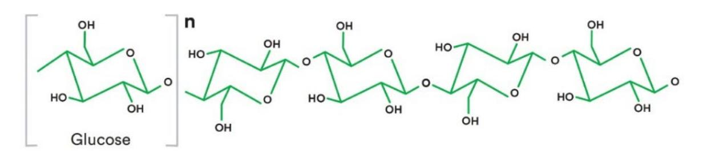
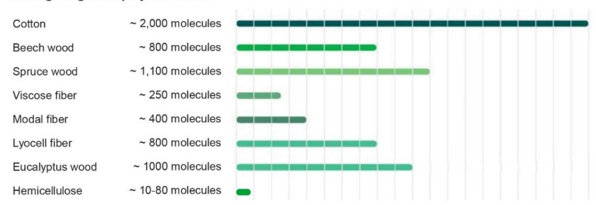
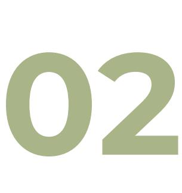

**October 2024** 

**ECOSYSTEX Technical Group 4**

# **Overview of renewable resources and their availability (Textile Market)**

Lead authors: K Eufinger (Centexbel), H Vilaça (Citeve) Additional contributions: M Abu Rous (Lenzing), J Marek (Inotex), ECOSYSTEX TG4 members

## **Executive Summary**

This document consists of 2 parts. The first part covers an overview over the different types of renewable materials, with a focus on bio-based, regenerated and recycled. The second part provides an overview over different types of material and their availability on the market as such and in fibre form. This table reflects the current state of the art as identified by the ECOSYSTEX TG4 members and it does not claim to be exhaustive.

The aim is to update this deliverable on a regular basis. If you, the reader identifies any missing material, you are very welcome to contact the ECOSYSTEX TG4 and provide the necessary information for adding this material to the table.

## **Table of contents**

### **[Executive Summary 1](#page-1-0)**

**[Table of contents 2](#page-2-0)**

## **[Overview over the types of and sources for](#page-3-0) [renewable resources 4](#page-3-0)**

[Terms and definitions 5](#page-4-0)

[Textile care labelling 5](#page-4-1)

[Textile fibre names and labelling 6](#page-5-0)

[Renewable textiles from bio-based polymers and](#page-5-1) 

[materials 6](#page-5-1)

[Renewable textiles from regenerated fibres 9](#page-8-0)

[Renewable textiles from recycled polymers and](#page-9-0)  [materials 10](#page-9-0)

**[Availability of the renewable resources 12](#page-11-0)**

# **Overview over the types of and sources for renewable resources**

Renewable and bio-based terms are quite often used interchangeably, buy they present some differences: while renewable refers to what is composed of biomass and can be replenished quickly, bio-based is what is derived from living organisms or their by-products.

By definition of the European Environment Agency, a renewable raw materials are «resources that have a natural rate of availability and yield a continual flow of services which may be consumed in any time period without endangering future consumption possibilities as long as current use does not exceed net renewal during the period under consideration.»[1](#page-3-1) Bio-based materials are «wholly or partly derived from materials of biological origin (such as plants, animals, enzymes, and microorganisms, including bacteria, fungi and yeast)».[2](#page-3-2) Therefore, while a renewable material is also bio-based, the other way around may not be true.

Wood, bamboo, hemp, and other plant-derived materials, as well as silk, wool, and other animal-derived materials are examples of renewable and bio-based materials, but these last goes beyond and include materials that have undergone a transformation process to give

1 <https://www.eea.europa.eu/help/glossary/gemet-environmental-thesaurus/renewable-raw-material>

2 [https://single-market-economy.ec.europa.eu/sectors/biotechnology/bio-based-products\\_en](https://single-market-economy.ec.europa.eu/sectors/biotechnology/bio-based-products_en)

them different properties or applications, as are examples packaging pellets made of corn starch, cellulose fibres used in paper or cotton production, and bio-based plastics.

While both renewable and bio-based materials can be sustainable, it is important to consider the entire life cycle of the material, including its production, use, and disposal, when evaluating its sustainability.

### **Terms and definitions**

Throughout this document the following definitions were adopted, as considered the most generally accepted ones:

**Bio-based:** "derived from biomass["3,](#page-4-2)[4](#page-4-3)

**Bio-based content:** "fraction of a product that is derived from biomass["4](#page-4-3)

**Biomass:** "material of biological origin excluding material embedded in geological formations and/or fossilised"[3](#page-4-5),[4](#page-4-6) Examples (whole or parts of): plants, trees, algae, marine organisms, micro-organisms, animals.

**Biomass content:** see bio-based content

**Biopolymer:** "a polymer comprised, at least in part, of building blocks called monomers, produced from renewable feedstocks such as corn. An alternate definition for biopolymer, includes all biologically produced polymers like DNA, RNA and proteins"[5](#page-4-7)

**Feedstock:** any unprocessed/raw material fed into a manufacturing/conversion proces[s.3](#page-4-2)

**Natural bio-based polymers:** "polymers synthesised by living organisms, essentially in the form in which they are finally used." Examples: polysaccharides, cellulose / starch, proteins, bacterial polyhydroxyalkanoates. After extraction and purification, direct industrial exploitation is possible[6](#page-4-8)

**Synthetic bio-based polymers:** "polymers whose monomers derive from renewable resources but which require a chemical transformation for conversion to a polymer." Examples: PLA synthesised from corn starc[h6](#page-4-4)

**Renewable:** "material that is composed of biomass and that can be continually replenished["4](#page-4-3)

### **Textile care labelling[7](#page-4-9)**

GINETEX is the international association for textile care labelling. They define and promote the system of care labelling symbols and coordinates its technical background on an international level. The essential technical elements for its implementation are contained in technical regulations. The care labelling system is maintained to ensure that any new technical and ecological developments together with changes in consumer practices are taken into account.

3 BBI JU annual work plan 2020

4 EN 16575:2014 «Bio-based products – Vocabulary»

5 BBI JU annual work plan 2020[; https://knowledge4policy.ec.europa.eu/glossary-item/biopolymer\\_en](https://knowledge4policy.ec.europa.eu/glossary-item/biopolymer_en)

6 <https://www.bpf.co.uk/plastipedia/polymers/polymer-bio-based-degradables.aspx>

7 [www.ginetex.net](http://www.ginetex.net/)

#### **Textile fibre names and labelling**

The EU has aligned laws in all EU countries with Regulation (EU) No 1007/2011 on fibre names and related labelling and marking of the fibre composition of textile products, commonly referred to as the Textile Labelling Regulation. This was done to protect consumer interests and eliminate potential obstacles to the proper functioning of the internal market.[8](#page-5-3),[9](#page-5-4)

Textile exchange has developed an overview over renewable materials[10](#page-5-5)

#### **Renewable textiles from bio-based polymers and materials**

When we consider bio-based textile materials, there are three main sources:

- 1. Plants
- 2. Animals
- 3. Microorganisms

One can distinguish between:

- Fibres derived directly from these sources
- Fibres drawn from regenerated material
- Fibres drawn from bio-based polymeric material

For polymeric material the focus of this document will be on fully bio-based.

It needs to be noted that there are also polymers for which one or more chemical components are bio-based with the remaining still based in petrochemistry. Some examples have been added into the table in section 2. This can be a first step in the process of sourcing all monomers used for synthesising a given polymer from bio-based resources.

#### Plants

Several plants are being used to produce textile materials. They are a primary source of **cellulose**, the main natural and renewable polymer used to produce textile fibres, both **natural** and **man-made** (**artificial fibres**) [9.](#page-5-2)

Cellulose (natural fibre) include cellulosics that occur in nature in fibre shape. The most prominent representative of this group is cotton. Other fibres, like linen and flax are (re) gaining importance in Europe.

Regenerated cellulose, or man- made cellulose fibres (MMCF) are obtained from dissolving pulp gained from different sources (Wood, agricultural sources, bamboo, old cotton cloth etc.). In these processes, pulp is dissolved and re-shaped/regenerated into fibres appropriate for textile processing. The fibre types are partly defined by the dissolution technology (lyocell viscose, cupro, ionic liquids) and partly by the fibre physical properties (like modal, within the viscose technology)[11](#page-5-6).

8 [https://single-market-economy.ec.europa.eu/sectors/textiles-ecosystem/textiles-leather-fur\\_en#the-textile](https://single-market-economy.ec.europa.eu/sectors/textiles-ecosystem/textiles-leather-fur_en#the-textile-labelling-regulation-eu-10072011)[labelling-regulation-eu-10072011](https://single-market-economy.ec.europa.eu/sectors/textiles-ecosystem/textiles-leather-fur_en#the-textile-labelling-regulation-eu-10072011)

9 REGULATION (EU) No 1007/2011 OF THE EUROPEAN PARLIAMENT AND OF THE COUNCIL

of 27 September 2011

10 <https://textileexchange.org/materials/>

[https://www.cirfs.org/file\\_access/application/files/6316/9036/1027/2023\\_07\\_CIRFS\\_Position\\_Cellulose\\_Generic\\_Fibr](https://www.cirfs.org/file_access/application/files/6316/9036/1027/2023_07_CIRFS_Position_Cellulose_Generic_Fibre_Names.pdf) [e\\_Names.pdf](https://www.cirfs.org/file_access/application/files/6316/9036/1027/2023_07_CIRFS_Position_Cellulose_Generic_Fibre_Names.pdf)

By legislation the source is not distinguished, but this could be done by marketing. CIRFS advocates for the recognition of "Cellulose" as a broad generic descriptor for all related manmade fibres, akin to the usage of "Rayon" in the United States.

Examples of plants used to produce **natural cellulose-based fibres** are:

- Cotton from the bolls of the cotton plant (*Gossypium*)
- Kapok from inside of the kapok fruit (*Ceiba pentandra*)
- Flax or linen from the bast of the flax plant (*Linum usitatissimum*)
- Hemp from the bast of hemp (*Cannabis sativa*)
- Jute from the bast of *Corchorus olitorius* and *Corchorus capsularis*. Can also be from the bast of *Hibiscus cannabinus*, *Hibiscus sabdariffa*, *Abutilon avicennae*, *Urena lobata*, *Urena sinuata*
- Abaca (manila hemp) from the sheathing leaf of *Musa textilis*
- Alfa from the leaves of *Stipa tenacissima*
- Coir (coconut) from the fruit of *Cocos nucifera*
- Broom from the bast of *Cytisus scoparius* and/or *Spartium junceum*
- Ramie from the bast of *Boehmeria nivea* and *Boehmeria tenacissima*
- Sisal from the leaves of *Agave sisalana*
- Sunn from the bast of *Crotalaria juncea*
- Henequen from the bast of *Agave fourcroydes*
- Maguey from the bast of *Agave cantala*
- Kenaf from the bast of *Hibiscus cannabinus*
- Phormium from the leaf of *Phormium tenax*
- Pineapple from the leafs[12](#page-6-0)
- Bamboo "linen" from the stems[13](#page-6-1)
- Nettle from the stalks[14](#page-6-2)
- Banana stems[15](#page-6-3)

As to produce regenerated cellulose fibres (artificial fibres), such as (cellulose) acetate, cupro, modal, triacetate, viscose, acrylic, lyocell and modal, the following sources have been used:

- Wood (e.g., eucalyptus, beech)
- Bamboo
- Sugar cane -wastes after extraction of sugar[16](#page-6-4)
- Seaweeds
- Orange peel
- Coconut shell
- Soy wastes
- Other agricultural sources….
- Waste textiles…

12 <https://www.cool-organic-clothing.com/pina-fiber.html>

13 <https://slowyarn.com/rayon-ingeo-soy-silk-bamboo-and-more/>

14 [www.himalayanwildfibers.com/](http://www.himalayanwildfibers.com/)

15 [https://www.theguardian.com/sustainable-business/sustainable-fashion-blog/2015/mar/03/wearable](https://www.theguardian.com/sustainable-business/sustainable-fashion-blog/2015/mar/03/wearable-pineapple-banana-fruit-fashion-material)[pineapple-banana-fruit-fashion-material](https://www.theguardian.com/sustainable-business/sustainable-fashion-blog/2015/mar/03/wearable-pineapple-banana-fruit-fashion-material)

16 <https://www.fibre2fashion.com/industry-article/7048/sugarcane-fibres>

The production of nanocellulose fibres, with an increasing exploitation for textile materials, can also be from different renewable sources, such as:[17](#page-7-0)

- • Coconut husk fibre
- Mengkuang leaves (*Pandanus tectorius*)
- Cotton
- *Agave tequilana*
- Barley wastes
- Tomato peels
- Garlic straw residues
- Forest residues
- Corncob residue
- *Gigantochloa scortechinni* bamboo culms
- Industrial waste cotton
- Cassava root bagasse and peelings
- Sugar palm fibres (*Arenga pinnata*)
- Corn straw
- Sago seed shells

Other plants used to produce non-cellulose fibres include:

- (Brown) Seaweeds Alginate fibre[18](#page-7-1)
- Corn Polylactide fibre from the sugar extracted from corn wastes
- Micro-algae

#### Animals

The **fur of several animals** is also used as renewable sources of fibres to produce textile materials:

- Wool
- Alpaca, llama, camel, cashmere, mohair, angora, vicuna, yak, guanaco, cashgora, beaver, otter 'wool' or 'hair'
- Animal or horsehair from e.g., cattle hair, common goat hair, horsehair

In other cases, such as the silkworms, is their cocoon that is used to extract fibres and not the animal in itself, in this case to produce:

- Silk

#### Microorganisms

Textile materials from microorganisms is a more recent technology, and there are few examples of resources being employed, such as:

- Fungi, namely mushrooms to produce fibre networks that resemble leather
- Gram-negative or gram-positive bacteria species, such as *Komagataeibacter*, *Acetobacter*, *Rhizobium*, *Agrobacterium*, *Pseudomonas*, *Salmonella*, *Alcaligenes*, and *Sarcina*, to produce bacterial nanocellulose, which can be feed with varied

17 Front. Bioeng. Biotechnol., 2021, vol. 9[, https://doi.org/10.3389/fbioe.2021.608826](https://doi.org/10.3389/fbioe.2021.608826)

18 Alginate fibres: An overview of the production processes and applications in wound management, 2008, DOI:10.1002/pi.2296

materials, such as sweet tea, soy "wastewater" from the production of Tofu and Tempe and coconut wate[r.17](#page-7-2)

Overall, these types of resources offer a more sustainable alternative to non-renewable resources such as petroleum-based polyesters, but we should always keep in mind that the environmental impact of renewable resources depends on the specific processes employed in their production and processing.

#### **Renewable textiles from regenerated fibres**

#### Regenerated cellulose fibres

Cellulose occurs in nature as a polymer of "glucose" units, produced by different plant species. Depending on the source, these polymers show a wide variation in the polymer chain length [\(Figure 1\)](#page-8-1), which also influences the physical properties of the fibre material.

*Figure 1. The degree of polymerization (polymer chain length) in the main sources of cellulose.*

While it occurs already in fibre shape in cotton, hemp and other plants, its other (and larger) occurrences in nature need to be extracted from wood and other plant materials (agricultural waste, bamboo, old cotton cloth, etc.), processed to a dissolving pulp, dissolved and spun again into fibre shape. The result is the so-called regenerated cellulose, or manmade cellulose fibres (MMCF).

The most common MMCF process today is the viscose (rayon) process, in which the dissolving pulp undergoes a chemical reaction, turning it to an alkali-soluble cellulosexanthogenate. The resulting "viscous" solution is then pressed through nozzles to confer a fibre shape and lead through an acidic bath, where the chemical derivatives are removed, and the fibre is regenerated back to pure cellulose.

Depending on the process conditions, different fibre variations exist besides regular viscose. The most relevant variant for the textile application is the modal fibre, which shows higher tenacity and stability in wet conditions.

Historically, various similar concepts occurred of turning cellulose into something soluble and regenerating as fibre. The most known and still commercially existing type is the cupro fibre, in which the soluble cellulose derivative is a copper complex, and the fibre regenerates back to cellulose in ammonia.

The second generation of regenerated cellulose is based on direct solution (no intermediate chemical derivation). The most common fibre of this group is lyocell, which is produced by dissolving pulp in a aqueous N-Morpholine-N-Oxide (NMMO) mixture, fibre spinning and regeneration on water.

Recently, new dissolving technologies have been developed based on the so-called ionic liquids.

These fibre types are partly defined by the dissolution technology (lyocell, viscose, cupro, ionic liquids) and partly by the fibre physical properties (like modal, within the viscose technology). CIRFS advocates for the recognition of "Cellulose" as a broad generic descriptor for all related man-made fibres, akin to the usage of "Rayon" in the United States. The Regulation that defines the types of fibres that compose a textile material, Regulation (EU) No 1007/2011, is currently under revision by the EC.

While the fibre properties depend on the applied process and its conditions, the resulting fibre itself is independent of the source of the incoming cellulose source (wood pulp, cotton, linen, etc.).

**Renewable textiles from recycled polymers and materials**

### Recycling technologies

Commonly the following main recycling technologies for recycling polymers or textile fibres are:

- Mechanical recycling, resulting in the separation into fibres
- Thermomechanical recycling, resulting in the separation into polymers
- Chemical recycling, resulting in the separation into polymers and monomers
- Thermochemical recycling (cracking), resulting in syngas

A good overview over the current state of the art of recycling technologies can be found in the literature.[19](#page-9-1)

### Availability and quality of recycled material

As in other recycling topics, the availability, homogeneity and purity of the recycling materials is decisive for the feasibility. Cotton is the most present cellulosic fibre in the textile wastes and is therefore the main target (and the most feasible source) for textile recycling. It can be recycled either mechanically by shredding the textiles and processing the reopened fibre materials into new yarns or batting, or it can be processed as input material to gain soluble pulp, appropriate for chemical recycling into regenerated cellulose fibres.

19 White Paper on Textile Fibre Recycling Technologies Sustainability 2024, 16(2), 618; <https://doi.org/10.3390/su16020618>

In mechanical fibre recycling, fabrics are disintegrated, as the textile structures must be opened to separate the fibres for reuse in textile processing. The fibre quality coming from mechanical recycling is influenced by many different factors. Of major importance is the source (the waste stream) from which the textile wastes originate (post-industrial, preconsumer or post-consumer). Another important factor is the construction of the textiles (knitted fabrics, woven fabrics, nonwovens....), which need to be considered in the disintegrated processes. In the fibre mechanical recycling process itself, damage inflicted to the fibres in the ripping and shredding process should be kept as low as possible, so that the proportion of fibres with a suitable fibre length that can be used for spinning into textile yarns is as high as possible.

The MCCF process makes the chemical recycling of cellulosic textiles (pre-dominantly cotton) possible. The involved shredding processes are independent of the fabric types, as a shorter fibre length is even better for further pulping and dissolving processes.

Chemical recycling is the only way to recycle fibre materials too short for mechanical recycling. The most challenging part is removing the non-cellulosic compounds, as a high purity level is required in the existing MMCF processes. Therefore, the cellulose content in the waste stream must be as high as possible to achieve feasible yields and usage of process chemicals. While at the current state of the art feasible technical solutions to separate some synthetic fibres (such as polyester) are available, other synthetic fibres like Elastane and polyamide still represent a challenge.

It must be noted that in chemical recycling, natural fibres such as cotton and hemp, undergo MMCF processes, in which they are turned into regenerated cellulosic fibres, such as lyocell, modal, viscose.

## **Availability of the renewable resources**

Currently, the textile industry, as a producer of fashion products for the consumer market and of growing volumes of technical textiles for new areas of application – often replacing conventional materials used so far – ranks among the sectors in which the care about availability of resources must be one of the branch sustainability criteria.

Not only the rising population, but also the extensional consumption of fashion textiles (boosted by "fast fashion" – even though there is an effort to slow down this mode by way of the long lasting "timeless design") and the expanding application of new technical textiles, cause the steady growth of production of mostly single used fibres. The fibres production has raised by approx. 3% yearly since the 80th of last century, to the actual production of 110 mil ton/year. The prognosis after a slight slowdown during the COVID crisis remains unchanged. Around 65% of the textile consumption is synthetic fibre-based mostly from limited fossil resources [about 55% polyester (PES) and 5% polyamide (PA)].

Even the around 30% of natural fibres represented by the cotton consumption became somewhat limited, due to: i) climate changes which caused reduction of cultivation areas (e.g., salinity in the Aral Sea area), and ii) the rising range of the alternative, less demanding, plant biomass productions (USA). In fact, 6.5% cellulose fibres originate from wood sources (coming from the responsible forestry certified resources - FSC/PEFC). Other natural fibres (4.5%) include the bast fibre resources. Besides the traditional fibre flax, also the oilseed flax and the hemp fibres are being used – for which yield, and seasonally even quality, can be boosted by enzymatic "bio-retting" (based on the use of customized InoTEX enzymatic products by spraying stalks on the yard or as an additional bath treatment). Recently, there

has been an effort to use other plant fibres (e.g., bamboo, banana tree, pineapple plant, Aloe Vera) for the possibility of complex evaluation of biomass. For the extraction from robust plant structures (decortication), possibilities of support by enzyme processes are again being explored. Thicker fibres are verified mainly for technical purposes and as fibre reinforcement of (bio)composites.

When introducing renewable fibres, it is necessary to consider the currently serious problem of contamination of water and the environment with microplastics (fibre microfibrils from synthetic textiles).

For the EU textile market one of the major threats is the significant dependence on ex-European productions. The inevitable legislative instruments focused on the reduction of waste production will make the whole situation more stringent as well. As today about 80% of textiles end on the landfills or incineration plants. The mentioned legislative instruments will boost the change to the circular economy, for which systematic attention to the use of renewable – natural and bio-based - fibre sources is very important. However, it must be respected that not all bio-based fibres are automatically biodegradable – decomposition takes place under specific optimized conditions.

There are a number of alternative paths to this goal:

‒ Utilization and revitalization of sources of natural vegetable (bast) fibres including the search for possibilities for the comprehensive wasteless utilization of crop; ‒ The use of wood (forestry) biomass, or other secondary sources -including waste from agro- and food production, and efforts to introduce emerging - cleaner production through the application of bioprocesses; ‒ Orientation to rapidly developing industrial biotechnologies for the emergence of new bio-based fibres; ‒ Develop fully biosynthetic – resulting in biopolymers that offer new processing parameters and final properties, or using bio-based building blocks for their cleaner production instead of the classical polymers used so far. They mostly result in (fibrous) structures with the same properties as classical polymeric materials.

All the overmentioned directions require a multidisciplinary approach, ensuring the attractiveness of the textile industry not only for its new technical staff, but also to achieve the necessary support from other branches (of the agrarian and industrial spheres). Together with the transition from a linear to a circular model of economy, an increase of employment and support for the sustainability of regional and rural activities will be encouraged.

The table below contains some examples of the availability of renewable materials and fibres.

*Table 1. Availability of renewable materials used, or with potential use, in the textile industry. Availabilty of the material (resource): High (H): unlimited supply, no problems with getting the material needed; Medium (M): moderade supply, cannot be guaranteed that the needed material is available at all times; Low (L): limited supply, material is available but not sufficient to cover demands; Scarce (S): under development, available on small scale for research purposes. Availability in fibre form: Yes (Y); Limited (L): fibres under development; No (N); Unknown (U)*

| Type of Origin or                                                                                                             |              | Available                                                               |
|-------------------------------------------------------------------------------------------------------------------------------|--------------|-------------------------------------------------------------------------|
| Polymer Renewable source fibre                                                                                                | Availability | Comments in fibre form?                                                 |
| Cotton                                                                                                                        | H            | Y                                                                       |
| Linnen                                                                                                                        | H            | Y                                                                       |
| Hemp                                                                                                                          | M            | Y Materials available, but research needed to                           |
| Flax                                                                                                                          | M            | Y improve fibre quality                                                 |
| Jute                                                                                                                          | M            | Y and properties (coarse                                                |
| Kapok Natural fibre                                                                                                           | M            | Y yarns). Limited to special                                            |
| Nettle                                                                                                                        | L            | Y products.                                                             |
| Pineapple                                                                                                                     | M            | Y Limited production                                                    |
| Banana                                                                                                                        | M            | Y Limited production                                                    |
| Abaca (Manila fibre)                                                                                                          | M            | Y                                                                       |
| Sisal                                                                                                                         | H            | Y                                                                       |
| Rami Bacteria strains, fed with glucose and Bacterial fructose rich                                                           | M            | Y Very pure, crystalline,                                               |
| cellulose materials (sugars Cellulose might come from wastes) Dissolving pulp from e.g., wood Regenerated (eucalyptus, beech, | S            | Y 20 can be produced in selected shape The most used manmade cellulosic |
| cotton linters)                                                                                                               | 21           |                                                                         |
| cellulose - pine, bamboo), other Viscose agricultural sources (soy, sugarcane, Regenerated                                    | H            | Y fibre. Smooth, absorbent, strong, and breathable.                     |
| Beech trees 22 cellulose - Modal                                                                                              | H            | Y                                                                       |
| Eucalyptus trees Regenerated                                                                                                  | 23 H         | Y                                                                       |
| wood pulp cellulose - Lyocell                                                                                                 | M            | Y SeaCell fibre 24                                                      |
| Orange pulp                                                                                                                   | L            | Y Orange Fibre is mixed with wood pulp                                  |

20 <https://doi.org/10.3389/fbioe.2020.605374>

21 [https://refashion.fr/eco-design/sites/default/files/fichiers/Sustainable%20Material%20](https://refashion.fr/eco-design/sites/default/files/fichiers/Sustainable%20Material%20Guide%20Viscose.pdf)

[Guide%20Viscose.pdf](https://refashion.fr/eco-design/sites/default/files/fichiers/Sustainable%20Material%20Guide%20Viscose.pdf)

22 <https://www.sustainyourstyle.org/en/rayon-viscose-modal>

23 <https://www.sustainyourstyle.org/en/lyocell-tencel>

24 <https://smartfiber.de/seacell>

| Type of Origin or            |                                                                                 |              | Available      |                                                                                                            |
|------------------------------|---------------------------------------------------------------------------------|--------------|----------------|------------------------------------------------------------------------------------------------------------|
| Polymer fibre                | Renewable source                                                                | Availability | in fibre form? | Comments                                                                                                   |
|                              |                                                                                 |              |                | (TENCELTM lyocell) to                                                                                      |
| Regenerated                  |                                                                                 |              |                | produce yarn. 25 One of the less well known man-made cellulosic fibres. Silk like fibre. Currently solely |
| cellulose(a) Cupro Cellulose | Cotton linter 26                                                                | L            | Y              | manufactured by Asahi Kasei in Japan under the trademark Bemberg. Cellulose fibres where                   |
| acetate Cellulose            | Wood fibres, cotton 27                                                          | H            | Y              | groups are acetylated Cellulose fibres where at groups are acetylated.                                     |
| triacetate                   | Wood fibres, cotto n27                                                          | H            | Y              | High-melting (300 °C), highly crystalline, soluble in limited range of solvents. Fibres spinnable only by  |
| Alginate                     | Alginic acid from                                                               |              |                |                                                                                                            |
|                              | brown seaweeds                                                                  | H            | Y              |                                                                                                            |
|                              | Crab shells, prawn                                                              |              |                | wet spinning – used mainly in medical textiles (e.g., sutures, wound dressings, tissue engineering)        |
| Chitin 28                    |                                                                                 |              |                |                                                                                                            |
| Other polysacch              | shells, shrimp shells, mushrooms Chitosan from deacetylation of                 | S            | Y              | Only R&D. Fibres weak and low tensile strength. Used mainly in medical                                     |
| Chitosan Error! arides       | chitin from crab                                                                |              |                | textiles (e.g., sutures,                                                                                   |
|                              | shrimp shells or                                                                |              |                |                                                                                                            |
| Bookmark not defined.        | shells, prawn shells, mushrooms Chitosan from deacetylation of chitin from crab | L            | Y              | wound dressings, tissue engineering                                                                        |
| Chitosan 29 +                |                                                                                 |              |                |                                                                                                            |
|                              | shrimp shells or                                                                |              |                |                                                                                                            |
|                              | mushrooms + viscose                                                             |              |                |                                                                                                            |
| viscose                      | shells, prawn shells, (from wood pulp)                                          | L            | Y              | Crabyon® fibre.                                                                                            |

25 <https://orangefiber.it/process/>

26 <https://www.sustainyourstyle.org/cupro>

27 <https://doi.org/10.1016/j.tifs.2021.06.026>

28 <https://www.diva-portal.org/smash/get/diva2:1444899/FULLTEXT01.pdf>

29 <https://old.swicofil.com/products/055chitosan.html>

| Type of Origin or        |                                                                                            |              | Available      |                                                                    |
|--------------------------|--------------------------------------------------------------------------------------------|--------------|----------------|--------------------------------------------------------------------|
| Polymer fibre            | Renewable source Maize, rice, wheat,                                                       | Availability | in fibre form? | Comments                                                           |
| Starch 30                |                                                                                            |              |                |                                                                    |
|                          | yams, sorghum                                                                              |              |                |                                                                    |
|                          | potato, cassava,                                                                           | S            | Y              | Only R&D                                                           |
| Lignin 31 , 32           | Wood pulp, different                                                                       |              |                |                                                                    |
|                          | plants                                                                                     | S            | Y              | Only R&D                                                           |
| starch (TPS) 33          |                                                                                            |              |                |                                                                    |
| Thermoplastic            | potatoes, rice Starch rich plant e.g.,                                                     | S            | U              | Need to be blended with other polymers                             |
|                          | Wool (from sheep) Other animal hair                                                        | H            | Y              |                                                                    |
|                          | (Cashmere, pashmina, etc.)                                                                 | M            | Y              |                                                                    |
|                          | Alpaca                                                                                     | M-H          | Y              |                                                                    |
|                          | Cashmere                                                                                   | M-H          | Y              |                                                                    |
|                          | Mohair                                                                                     | M-H          | Y              |                                                                    |
|                          | Angora Other animals hair or fur (llama, camel,                                            | M-H          | Y              |                                                                    |
| Natural protein fibres   | vicuna, yak, guanaco, cashgora, beaver, otter) Animal or horsehair from e.g., cattle hair, | M            | Y              |                                                                    |
| Protein                  | common goat hair, horsehair Silk from silkworm                                             | L-M          | Y              |                                                                    |
|                          | cocoons (with silkworm inside) Silk from silkworm                                          | H            | Y              |                                                                    |
|                          | cocoons (without silkworm inside)                                                          | L            | Y              |                                                                    |
|                          | Silk from spiders Soybean/polyvinyl                                                        | S            | Y              |                                                                    |
| protein 34               |                                                                                            |              |                |                                                                    |
|                          | alcohol                                                                                    | S            | U              |                                                                    |
| Regenerated or synthetic | Milk fibres (casein) Zein from corn Keratin from chicken feather                           | L-M          | Y              | Azlon fibre: low in strength when wet and                          |
|                          | Collagen from leather and hide waste Albumin from eggs                                     | L            | Y              | can be stretched to a great extent but does not readily resume its |

30 Polymers 2021, 13(7), 1121;<https://doi.org/10.3390/polym13071121>

31 <https://www.textileworld.com/textile-world/features/2023/03/carbon-fibers-from-lignin/>

32 Materials (Basel). 2021 Jun; 14(12): 3378., doi: 10.3390/ma14123378

33 <https://www.packaging.kuraray.eu/blog/thermoplastic-starch/>

34 Produced from either animal or vegetable non-fibrous proteins which have been reconfigured to take up a fibrous form to emulate the natural protein fibres wool or silk)

| Type of Origin or                              |                                                                                                             |              | Available      |                                                                                      |
|------------------------------------------------|-------------------------------------------------------------------------------------------------------------|--------------|----------------|--------------------------------------------------------------------------------------|
| Polymer fibre                                  | Renewable source                                                                                            | Availability | in fibre form? | Comments                                                                             |
| Microbial                                      | Proteins from cotton seeds, peanuts and soybeans Plant-based                                                |              |                | 35 Mainly original length. used in blends.                                           |
| fermentation 36                                |                                                                                                             |              |                |                                                                                      |
|                                                | ingredients Mostly corn. Other possible sources are                                                         | M            | Y              | Brewed Protein™ Still limited number of manufacturers;                               |
| PLA                                            | sugarcane, tapioca root, cassava, and sugar beet pulp PHA copolymers (including PHB) are produced in nature | M            | Y              | continuity of production not yet guaranteed Development being made to increase range |
| PHB & PHA Derivatives of                       | by numerous microorganisms, and through biotechnology Chemical modification of biotechnology                | L            | L              | of processability and flexibility, to produce fibres                                 |
| PHAs Bio-based synthetic fibres - Polybutylene | produced PHBs. Modifiers can be from bio-based source Succinic acid can be                                  | S            | N              | Still under R&D                                                                      |
| Polyesters succinate (PBS) Polytrimethylen     | derived from corn starch or sugarcane From the two monomers used (1,3- propanediol and                      | L            | Y              | Low melting point                                                                    |
| e terephthalate (PTT) Polybutylene adipate     | terephthalic acid) the 1,3-propanediol can be obtained by fermentation Partially bio-based                  | L            | N              |                                                                                      |
|                                                | (up to 50%) – source                                                                                        |              |                |                                                                                      |
| terephthalate (PBAT) Polyethylene              | unknown The furan dicarboxylic acid can                                                                     | L            | N              | PEF production polymerizes furan                                                     |
| Furanoate (PEF) Bio-based                      | be derived from sugars Nylon made from                                                                      | L            | N              | dicarboxylic acid and ethylene glycol.                                               |
| Bio-nylon 37                                   |                                                                                                             |              |                |                                                                                      |
| synthetic fibres -                             | sebacic acid produced from castor                                                                           | L            | L              | Only promotional material available. Up to                                           |

35 <https://www.britannica.com/technology/azlon>

36 <https://spiber.inc/en/brewedprotein/>

37 <https://www.sportstextiles.toray/en/brand/ecodear/>

| Type of Origin or                 |                                                  |              | Available      |                        |
|-----------------------------------|--------------------------------------------------|--------------|----------------|------------------------|
| Polymer fibre Polyamid            | Renewable source oil plants and                  | Availability | in fibre form? |                        |
| e                                 | pentamethylenedia mine from corn Sebacic acid is |              |                | ecodear TM N510        |
| Bio PA6.10 38                     |                                                  |              |                |                        |
|                                   | produced from castor oil plants                  | L            | Y              | Up to 63% of the PA is |
| Bio PA11 39 Bio PA similar        | Castor oil                                       | L            | N              |                        |
| to PA6.6 40                       | Corn                                             | L            | Y              |                        |
| Bio PA 41                         | Castor oil                                       | L            | Y              |                        |
| PA 6, PA 6.6 42                   | Tall oil                                         | L            | Y              |                        |
| PA 6.9 Error!                     |                                                  |              |                |                        |
| Bookmark not defined. PA 6.10, PA | Sunflower oil                                    | L            | Y              |                        |
| 11 Error! Bookmark not            |                                                  |              |                |                        |
| defined.                          | Castor oil                                       | L            | Y              |                        |
| PA 5.6 Error!                     |                                                  |              |                |                        |
| Bookmark not defined.             | Corn                                             | L            | Y              |                        |
| PA 5.10 Error!                    |                                                  |              |                |                        |
| Bookmark not defined.             | Corn/Castor oil                                  | L            | Y              |                        |
|                                   |                                                  |              |                | 100% bio-based carbon  |
| PA610, PA1010 43                  | Castor oil                                       | L            | Y              | VESTAMID® Terra. Up to |
| PA6.6 44                          | ?                                                | L            | Y              |                        |
| PA4.10 45                         | ?                                                | L            | Y              | Enka® 70 % bio-based   |

38 <https://nexisfibers.com/bio-based-pa6-10-fibers/>

3[9https://www.arkema.com/global/en/products/product-finder/product/technicalpolymers](https://www.arkema.com/global/en/products/product-finder/product/technicalpolymers/rilsan-family-products/rilsan-pa11/) [/rilsan-family-products/rilsan-pa11/](https://www.arkema.com/global/en/products/product-finder/product/technicalpolymers/rilsan-family-products/rilsan-pa11/)

40 <https://www.fulgar.com/en/products/230/q-geo-by-fulgar>

41 <https://www.fulgar.com/en/feature/39/bio-based-yarns-evo>

42 <https://akro-plastic.com/en/compounds/akromid-next>

43 <https://www.vestamid.com/en/products-services/VESTAMID-terra>

44 <https://www.nilit.com/fiber/sustainable/sensil-bynature/?ref=bio-sourced.com>

45 [https://mobility.indoramaventures.com/products-markets/new-products-corner/enka-nylon-bio?ref=bio](https://mobility.indoramaventures.com/products-markets/new-products-corner/enka-nylon-bio?ref=bio-sourced.com)[sourced.com](https://mobility.indoramaventures.com/products-markets/new-products-corner/enka-nylon-bio?ref=bio-sourced.com)

| Type of Origin or                                  |                                                                                            |              | Available      |                                                                                                                                        |
|----------------------------------------------------|--------------------------------------------------------------------------------------------|--------------|----------------|----------------------------------------------------------------------------------------------------------------------------------------|
| Polymer fibre                                      | Renewable source PA produced using bio-based                                               | Availability | in fibre form? | Comments                                                                                                                               |
| Bio PA 46                                          |                                                                                            |              |                |                                                                                                                                        |
|                                                    |                                                                                            | L            | Y              |                                                                                                                                        |
| Regenerated cellulose(a) Other fibre               | Pentamethylene diamine (PDA) from enewable plant based raw materials (not divulged which) |              |                | TERRYL® fibre. 45-100% bio-based carbon content. Still under R&D, in proof of-concept stage.                                          |
|                                                    | Wood pulp, textiles                                                                        | L            | Y              |                                                                                                                                        |
| spinning processes based on ionic liquids Recycled | Cotton and cellulose                                                                       |              |                | Ex: Ioncell-F 47 Soft and strong fibres even when wet, with high tenacity. Forms circulose® pulp that may be converted                 |
| cellulose –                                        |                                                                                            |              |                |                                                                                                                                        |
| Renewcell 48                                       |                                                                                            |              |                |                                                                                                                                        |
| Recycled                                           | rich textile wastes                                                                        |              | ?              | into different man-made cellulosic textile fibres                                                                                      |
| RefibraTM 49                                       |                                                                                            |              |                |                                                                                                                                        |
| cellulose - Recycled cellulosic materials Recycled | + wood pulp Cotton textile wastes Cotton rich textile                                      |              | Y              | Forms virgin TENCEL fibres Output is Nucycl® lyocell fibre. Inherently soft, absorbent, and stronger than virgin cotton and polyester. |
| Evrnu 50                                           |                                                                                            |              |                |                                                                                                                                        |
| cellulose - Recycled                               | wastes                                                                                     | L            | Y              | Commercial manufacturing facility is underway (due in 2025 with annual capacity for 18,000 tons of Nucycl® fibre)                      |
| SaXcell 51                                         |                                                                                            |              |                |                                                                                                                                        |
| cellulose – Recycled                               | Cotton textile wastes Different cellulosic raw materials, such as Circulose®,              |              | Y              | Lyocell process Fibres with properties                                                                                                 |
| AeoniQTM 52                                        |                                                                                            |              |                |                                                                                                                                        |
| cellulose –                                        | bacterial cellulose and non-valorised agricultural waste                                   | H            | Y              | similar to polyester and nylon yarns                                                                                                   |

46 <https://www.cathaybiotech.com/en/brandtl.aspx?ref=bio-sourced.com>

47 <https://ioncell.fi/>

48 <https://www.renewcell.com/en/>

49 <https://www.tencel.com/b2b/technologies/refibra-technology>

50 <https://www.evrnu.com/>

51 [https://saxcell.com/our\\_technology.html](https://saxcell.com/our_technology.html)

52 <https://www.heiq-aeoniq.com/>

| Type of Origin or                |                                                                                                   |              | Available      |                                                                                                                                                                                                                                                                                                                                                                                  |
|----------------------------------|---------------------------------------------------------------------------------------------------|--------------|----------------|----------------------------------------------------------------------------------------------------------------------------------------------------------------------------------------------------------------------------------------------------------------------------------------------------------------------------------------------------------------------------------|
| Polymer fibre Recycled           | Renewable source Textile wastes (PES, PES/CO,                                                     | Availability | in fibre form? | Comments Outputs are PES pellets and cellulose pulp to produce new fibres. Are                                                                                                                                                                                                                                                                                                   |
| Worn Again 53                    |                                                                                                   |              |                |                                                                                                                                                                                                                                                                                                                                                                                  |
|                                  |                                                                                                   | L            | Y              |                                                                                                                                                                                                                                                                                                                                                                                  |
| cellulose –                      | PES/cellulose blends fibres)                                                                      |              |                | implementing 2nd pilot plant with capacity for 1000 tonnes of textile waste.                                                                                                                                                                                                                                                                                                     |
| Infinited fibre 54               |                                                                                                   |              |                |                                                                                                                                                                                                                                                                                                                                                                                  |
|                                  |                                                                                                   | L            | Y              |                                                                                                                                                                                                                                                                                                                                                                                  |
| Recycled cellulose – Recycled    | Cellulose rich (at least textiles, used cardboard, crop residues) Textile wastes                  |              |                | Output is Infinna fibre: looks and feels like cotton, has antimicrobial properties and superior dye uptake. Known scientifically as cellulose carbamate fibre. Are implementing factory with annual production capacity of 30,000 metric tons. Outputs are virgin quality rPET (PolyTexx®) and microcrystalline cellulose (CellTexx®), to produce new fibres, among others. Are |
| Blocktexx 55                     |                                                                                                   |              |                |                                                                                                                                                                                                                                                                                                                                                                                  |
| cellulose – Recycled cellulose – | cellulosic/man-made cellulosic fibres such as bamboo, flax, rayon, tencel, modal) CO/PES textiles | L-M          | L              | finalising first recycling plant in Australia, with estimated recycle capacity for 4,000 tonnes of textiles in their first year. Only white/off-white wastes are accepted. Other cellulosic fibres                                                                                                                                                                               |
| OnceMore® 56                     |                                                                                                   |              |                |                                                                                                                                                                                                                                                                                                                                                                                  |
| Sodra Recycled cellulose –       | batch) + wood pulp Textile wastes + virgin                                                        | H            | L              | per batch. Output: OnceMore® pulp that can be transformed into fibres via lyocell or viscose processes.                                                                                                                                                                                                                                                                          |
| mechanical recycling             | cellulose fibres                                                                                  | M-H          | Y              |                                                                                                                                                                                                                                                                                                                                                                                  |

53 <https://wornagain.co.uk/about-us/#technology>

54 <https://infinitedfiber.com/about-us/>

55 <https://www.blocktexx.com/technology>

56 <https://www.sodra.com/en/global/pulp/oncemore/>

Additional information which was not (completely) integrated into the table is available here:

- <https://www.dishafashioninstitute.com/protein-fibre-fabrics>
- <https://win-win.info/sustainable-concepts/biosynthetic-fibres/>

## **ECOSYSTEX**

European Community of Practice for a Sustainable Textile Ecosystem

**Overview of renewable resources and their availability (Textile Market)**