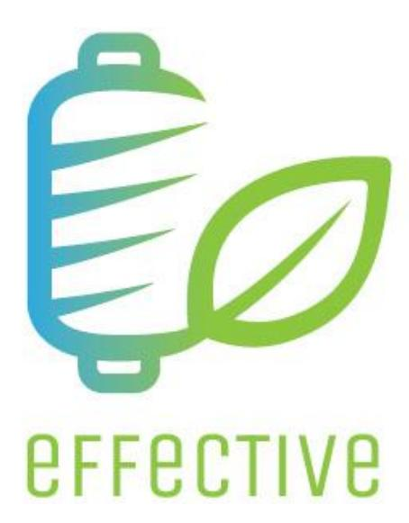
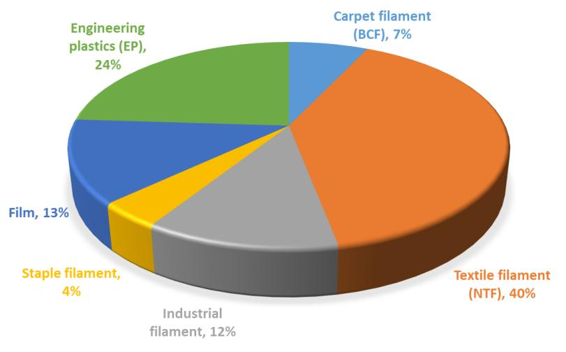
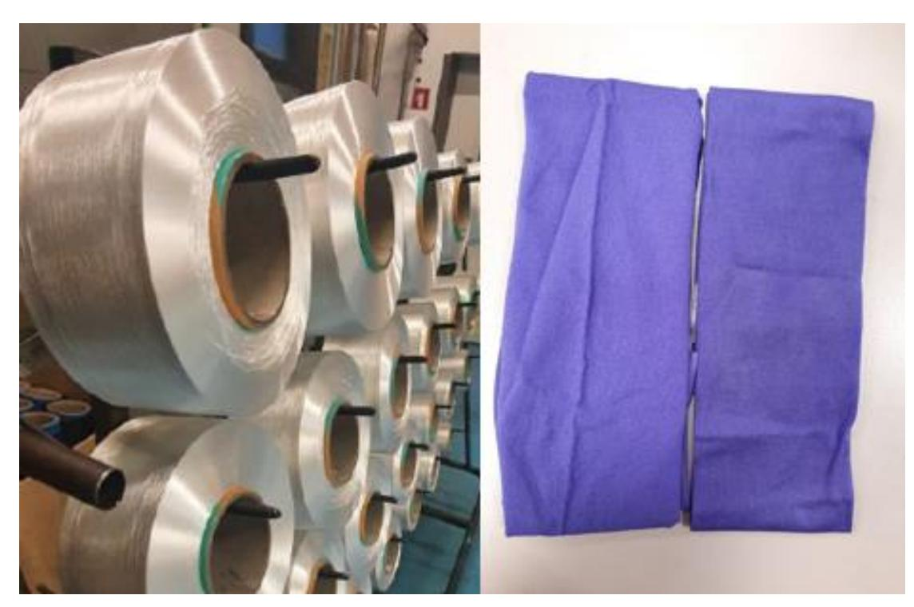
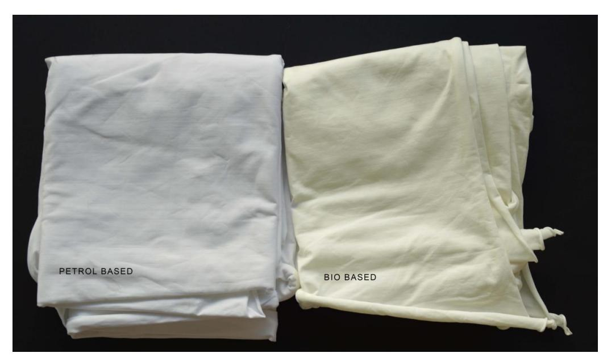
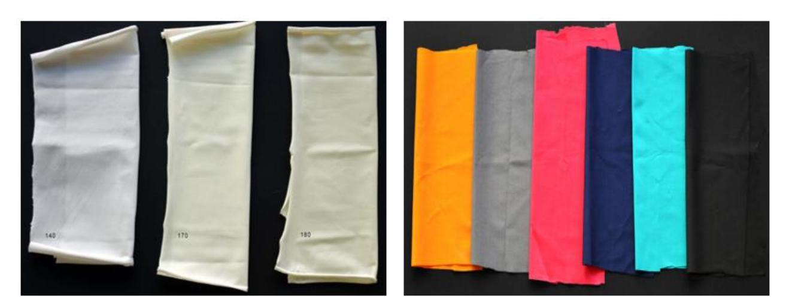
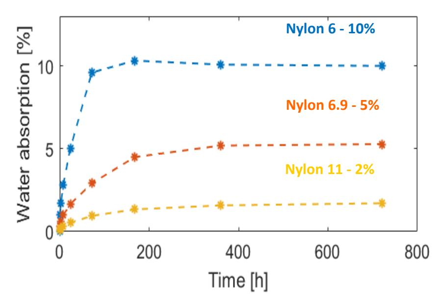
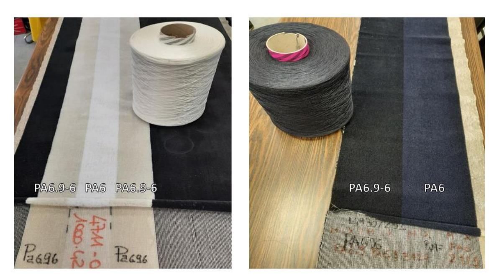
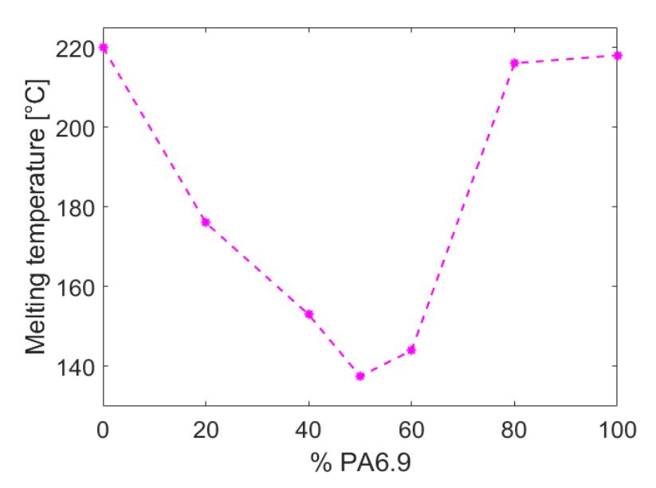
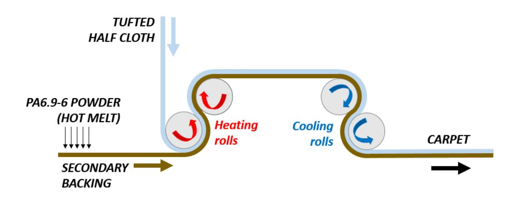
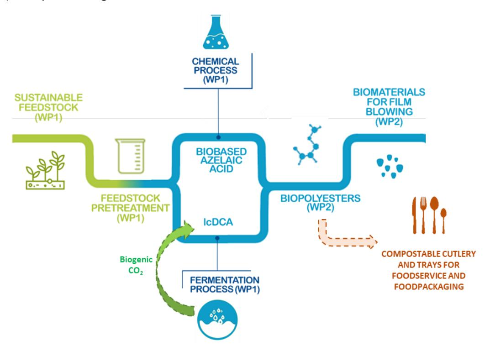

*This project has received funding from the Bio Based Industries Joint Undertaking (JU) under grant agreement No 792195. The JU receives support from the European Union's Horizon 2020 research and innovation programme and the Bio Based Industries Consortium*

# **Advanced Eco-designed Fibres and Films for large consumer products from biobased polyamides and polyesters in a circular Economy perspecTIVE**

Grant Agreement 792195 Topic BBI.2017.D5 Project start date 1 Duration 57 months

Call identifier H2020-BBI-JTI-2017 st June 2018 Project end date 28th February 2023

# **Deliverable number 4.6 - Report on the additional market for the developed materials and building blocks**

### **Deliverable's details**

Deliverable number and title Deliverable 4.6 – Report on the additional market for the developed materials and building blocks WP number and title WP4 – Validation into final products Lead beneficiary AquafilITA Due date of deliverable 30th September 2022 Actual submission date 30th September 2022 Dissemination level Public

### **Table of content**

|     | List of abbreviation............................................................................................................................................ | 4                                                                                                                                                  |
|-----|------------------------------------------------------------------------------------------------------------------------------------------------------------------|----------------------------------------------------------------------------------------------------------------------------------------------------|
| 1.  | Introduction...............................................................................................................................................      | 5                                                                                                                                                  |
| 2.  | Additional market opportunities for bio-based PA6                                                                                                                | 6                                                                                                                                                  |
| 2.1 |                                                                                                                                                                  | Engineering plastics........................................................................................................................... 6  |
| 2.2 | Film production                                                                                                                                                  | 7                                                                                                                                                  |
| 3.  | Additional market opportunities for bio-based PA6.9                                                                                                              | 8                                                                                                                                                  |
| 3.1 |                                                                                                                                                                  | Textile applications............................................................................................................................ 8 |
|     | 3.1.1                                                                                                                                                            | Polymerization, spinning and reprocessing............................................................................... 8                         |
|     | 3.1.2                                                                                                                                                            | Production of the fabric............................................................................................................. 9            |
| 3.2 | Membranes production...................................................................................................................                          | 10                                                                                                                                                 |
| 4.  | Additional market opportunities for bio-based PA6.9-6.........................................................................                                   | 12                                                                                                                                                 |
| 4.1 | Carpet applications..........................................................................................................................                    | 12                                                                                                                                                 |
| 4.2 | Membranes production...................................................................................................................                          | 13                                                                                                                                                 |
| 4.3 | Hot melt for carpets                                                                                                                                             | 13                                                                                                                                                 |
| 4.4 | Additive............................................................................................................................................             | 14                                                                                                                                                 |
| 5.  | Additional market opportunities for lcDCA based biomaterials                                                                                                     | 15                                                                                                                                                 |
| 5.1 | LcDCA and compostable trays and cutlery for foodservice and food packaging                                                                                       | 16                                                                                                                                                 |
| 6.  | Conclusion                                                                                                                                                       | 17                                                                                                                                                 |

### **List of abbreviation**

| Abbreviation | Definition                      |
|--------------|---------------------------------|
| BCF          | Bulk continuous filament        |
| CEAB         | Crimp evaluation after boiling  |
| EP           | Engineering polymers            |
| FT           | False twisted (texturized yarn) |
| lcDCA        | Long chain dicarboxylic acids   |
| NTF          | Nylon textile filament          |
| PA6          | Polyamide 6                     |
| PA6.9        | Polyamide 6.9                   |
| PA6.9-6      | Copolymer of PA6 and PA6.9      |
| POY          | Partially oriented yarn         |

### **1. Introduction**

The present report constitutes deliverable 4.6 "Report on the additional market for the developed materials and building blocks" within the framework of the EFFECTIVE project. The following activities refer to WP4 "Validation into final products" and specifically to task 4.5 "Replicability studies for the enhancement of the market opportunity of the developed materials".

The activity performed aimed at paving the way for the future applications of the developed biobased monomers, polymers and biomaterials into market sectors different from the one targeted by the project in task 4.2 (garment and apparel), task 4.3 (textile flooring) and task 4.4 (films).

Replicability studies and trials were carried out according to the properties shown by the demonstrated biobased monomers, polymers and biomaterials.

Originally targeting only for BCF and NTF yarn spinning, the potential of bio-based PA6 was also explored for engineering plastics and for film productions.

Similarly, the application of biobased PA6.9 beyond the originally planned BCF spinning and film production, was evaluated for textile applications and for membranes production.

The copolymer PA6.9-6 (which wasfully developed and demonstrated in the project), thanks to its properties such as high elongation at break, high impact resistance, low glass transition and melting temperature, was evaluated in various applications. Besides BCF spinning, it was studied both as an additive and as a pure material, in particular for membranes production and for hot melts in the carpet industry.

Finally, an additional market for lcDCA based polyesters was explored too. Beyond the original target of film production, Novamont has evaluated the replicability in the sectors of compostable cutlery and trays for foodservice and foodpackaging.

## **2. Additional market opportunities for bio-based PA6**

In the framework of project Effective, biobased PA6 was foreseen to be used for BCF and NTF spinning.

These two applications are the most important production areas for Aquafil, and they cover almost half of the global demand for PA6, that in 2020 was about 5591 kt/year. The breakdown is reported i[n Figure 1.](#page-5-2)

*Figure 1: Breakdown of global demand for PA6 (2020 data. Source: Wood Mackenzie)*

Considering this data, in the framework of project EFFECTIVE, two additional markets of high relevance were explored for bio-based Nylon 6 application: engineering plastics, and film production.

### **2.1 Engineering plastics**

Aquafil has planned some trials using 100% biobased PA6 (coming the demo campaign run in AquafilSLO facility) to produce glasses frames.

The idea is to produce a suitable compound to be sent to a third party specialized in injection molding of glasses frames. For the first attempt, this trial will be performed with bio-based PA6 chips coming directly from the polymerization. The expected properties are reported in [Table 1](#page-5-3)

*Table 1: Biobased PA6 available for EP use*

| Batch              | Biobased PA6 |
|--------------------|--------------|
| Relative viscosity | ~2.47        |
| NH2 [meq/kg]       | ~33          |
| COOH [meq/kg]      | ~63          |

Based on the results, additional trials using with the wastes from BCF and NTF spinning operations of biobased PA6 might be explored, with the purpose of recovering material and validating the production of compound of market interest via mechanical recycling.

Results will be reported in the final Periodic Report at M57.

#### **2.2 Film production**

Film production is another application of market interest for PA6.

In this case, a test has been planned in collaboration with Bio-Mi to produce films using the same machines that were used for biobased PA6.9, i.e. cast extrusion and blow extrusion. In this view, bio-based caprolactam will be polymerized at pilot scale to obtain a polymer with a higher relative viscosity, targeting values between 3.1 and 3.4.

Results will be reported in the final Periodic Report at M57.

## **3. Additional market opportunities for bio-based PA6.9**

#### **3.1 Textile applications**

#### *3.1.1 Polymerization, spinning and reprocessing*

Based on the positive results obtained in the production of BCF yarns, it was decided to evaluate the use of biobased PA6.9 in the NTF spinning. For this purpose, roughly 300 kg of PA6.9 were produced once the scaled-up process was optimized[. Table 2](#page-7-3) shows the properties of the polymer obtained.

*Table 2: Properties of PA6.9 used for NTF spinning*

| PA6.9 batch        | Batch #1 |
|--------------------|----------|
| Relative viscosity | 2.48     |
| NH2 [meq/kg]       | 76.1     |
| COOH [meq/kg]      | 56.5     |

In agreement with Carvico, a texturized yarn (FT 66f46) was produced.

The base yarn was spun as raw white in AquafilSLO facility in Ljubljana and then the texturization was run in AquafilCRO facility in Oroslavje. Both spinning and texturization run regularly, with no issues.

The yarn was characterized in comparison with a PA6 reference. [Table 3](#page-7-4) shows the properties of PA6.9 yarn and reference.

*Table 3: Mechanical properties of PA6.9 yarn*

| NTF yarn        | Linear density [dtex] | Tenacity [cN/dtex] | Elongation [%] | Shrinkage [%] |
|-----------------|-----------------------|--------------------|----------------|---------------|
| PA6 (reference) | 83.2                  | 4.1                | 63             | 9             |
| PA6.9           | 79.7                  | 2.6                | 104            | 6             |

The properties resulted quite different from the reference, with a lower tenacity, a lower shrinkage and a higher elongation: these variations, however, did not prevent their successful use in fabric production.

Preliminary dyeability tests on socks were run using violet acid dyestuff: [Figure 2](#page-8-1) shows that no difference between the reference and the PA6.9 final yarn was noticed.

*Figure 2: PA6.9 NTF base yarns (left) and PA6.9 sock samples after dyeing (right)*

The spools produced, of 0.5 kg each, were sent to Carvico for the production of the fabric.

#### *3.1.2 Production of the fabric*

The FT 66f46 yarn was used by Carvico to produce a fabric with the same characteristics of the petrol based one previously obtained from petrol based PA6 yarn [\(Figure 3\)](#page-8-2).

*Figure 3: Fabric of biobased PA6.9 (right) vs fabric of petrol based PA6 (left)*

The fabric was then scoured to reduce the oil content, heat set [\(Figure 4,](#page-9-1) left) and finally dyed [\(Figure 4,](#page-9-1) right).

*Figure 4: PA6.9 fabric after heat setting (left) and after dyeing (right)*

On the purged fabric some heat setting tests were carried out which revealed a serious yellowing effect during the heat setting process [\(Figure 4,](#page-9-1) left). Also dyeing the fabric using a critical color showed differences between PA6 reference and the PA6.9 fabric: along the width of the fabric, strong stripes and bars were observed.

Results showed the feasibility of using biobased PA6.9 for textile applications. However, the quality of the polymer should be improved, and properties require further investigation in order to better understand the market potential of this application.

More results will be included in deliverable D4.2.

#### **3.2 Membranes production**

In deliverable D2.3 it was shown the result of a test performed in a specialized external laboratory, in which samples of different polyamides (40 mm x 30 mm, thickness 2.2 mm) were immersed in deionized water at 23°C for 800 hours, measuring the weight periodically.

*Figure 5: Water absorption measurements for PA6.9 compared to other polyamides*

PA6.9 showed an interesting behavior, as its water absorption was lower than PA6 and almost closer to PA11, a polymer normally used in applications where water resistance is required (e.g. pipelines, coatings, membranes, etc.).

Therefore, in collaboration with an external Swiss-based chemical company, the possibility of using such a polymer to develop sustainable and non-harmful functional membranes (mostly aimed at the production of outdoor gear) was explored. The objective was to identify special polymers to produce microporous membranes, and water absorption is one of the properties that are required.

A first sample of 1 kg of PA6.9 chips, together with a sample of PA6 to be used as a reference, were used for a preliminary trial. The first test at laboratory scale showed promising results, so a bigger sample of 50 kg was sent in a second time, for the industrial scale up. [Table 4](#page-10-0) shows the properties of the PA6.9 samples shipped for the membrane production.

*Table 4: Analytical values of PA6.9 samples sent to Dimpora*

| Batch PA6.9           | Sample #1 | Sample #2 |
|-----------------------|-----------|-----------|
| Quantity shipped [kg] | 1         | 50        |
| Relative viscosity    | 2.72      | 3.06      |
| NH2 [meq/kg]          | 58.5      | 46.9      |
| COOH [meq/kg]         | 47.2      | 35.7      |

Final results on the industrial scale up will be reported in the final Periodic Report at M57.

## **4. Additional market opportunities for bio-based PA6.9-6**

#### **4.1 Carpet applications**

The recipe of the copolymer PA6.9-6 was studied by varying the ratio between PA6.9 and PA6, starting from a copolymer in a ratio 80-20 between PA6.9 and PA6: this step was of significant help to fix and change the parameters for the following polymerization trials, and in the end the scaled-up process worked regularly.

This same idea was transferred to BCF spinning, and so the first PA6.9-6 produced at demo scale was spun, replicating an existing PA6 BCF yarn. A BCF yarn was produced, first as a raw white and then as a solution dyed blue color. The spinning run successfully, and the yarn properties are reported i[n Table 5.](#page-11-2) Compared to the reference PA6 yarn, the copolymer shows a lower tenacity and a higher shrinkage.

*Table 5: Properties of PA6.9-6 BCF yarns*

|                       |     | Benchmark PA6 (standard) |      | PA6.9-6 raw white | PA6.9-6 solution dyed (blue) |
|-----------------------|-----|--------------------------|------|-------------------|------------------------------|
| Linear density [dtex] | 985 | –                        | 1015 | 1187              | 1100                         |
| CEAB [%]              | 7.5 | –                        | 8.5  | 8.0               | 10.9                         |
| Tenacity [cN/dtex]    | 3.0 | –                        | 3.4  | 1.77              | 1.40                         |
| Elongation [%]        | 45  | –                        | 55   | 43.8              | 53.8                         |
| Shrinkage [%]         |     | 5 –                      | 9    | 21.1              | 18.6                         |

The yarn characterization was completed through tufting: even if the color did not completely match with the reference, both yarns resulted in a homogeneous carpet [\(Figure 6\)](#page-11-3).

*Figure 6: Tufted carpets from PA6.9-6 yarns: raw white (left) and solution dyed (right)*

These trials confirmed that PA6.9-6 can be used for BCF spinning, even if the shrinkage is something that must be worked on. Further investigation will be necessary to assess the market potential in the BCF sector.

#### **4.2 Membranes production**

In the framework of the collaboration with the external Swiss-based chemical company described in the previous Paragraph 3.2, also PA6.9-6 was tested to evaluate if its properties are suitable for the production of membranes.

A first sample of 1 kg of the copolymer with 50% of PA6.9 and 50% of PA6.9-6 was sent for evaluation, together with the small samples of PA6.9 and PA6 previously described. This sample was used to produce a microporous membrane: the first results showed a good processability and results even better than PA6.9.

Based on the good results obtained for the first sample, a bigger sample of 50 kg was sent for the industrial scale up.

*Table 6: Analytical values of PA6.9-6 samples sent to Dimpora*

| Batch PA6.9-6 (50-50) | Sample #3 | Sample #4 |
|-----------------------|-----------|-----------|
| Quantity shipped [kg] | 1         | 50        |
| Relative viscosity    | 3.50      | 3.06      |
| NH2 [meq/kg]          | 28.5      | 46.7      |
| COOH [meq/kg]         | 21.1      | 34.6      |

[Table 6](#page-12-2) shows the properties of the PA6.9-6 samples shipped for the membrane production: it must be noted that relative viscosity and terminal groups were targeted to be the same as the PA6.9 samples, in order to reduce as much as possible the differences.

Final results on the industrial scale up will be reported in the final Periodic Report at M57.

#### **4.3 Hot melt for carpets**

The copolymer PA6.9-6 has a melting point that varies according to the ratio of PA6.9 and PA6. [Figure 7](#page-12-3) shows that the minimum value is reached when PA6.9 and PA6 are both at ~50% in weight: for this copolymer the melting point is 135°C.

*Figure 7: Melting point of PA6.9-6 for different monomer ratios*

This relatively low melting point makes this polymer suitable for the use as hot melt in the carpet industry. For this reason, a batch in the industrial autoclave was produced: the analytical properties are reported in [Table 7.](#page-13-1)

*Table 7: Properties of PA6.9-6 batch used as hot melt*

| PA6.9-6 50-50 batch | Batch #1 |
|---------------------|----------|
| Relative viscosity  | 2.94     |
| NH2 [meq/kg]        | 53.2     |
| COOH [meq/kg]       | 42.8     |
| Melting point [°C]  | 135      |

For the use as hot melt, it was necessary to convert the chips into powder via an external company specialized in cryogenic grinding. Once the powder was ready, it was sent to an external company specialized in the calendering technology (process is illustrated i[n Figure 8\)](#page-13-2). The tufted half cloth (the primary backing where the yarn was tufted) and the secondary backing, after the application of the hot melt powder, are forced to pass through a first couple of rolls, kept a sufficient temperature to melt the powder. Once the two layers are glued together, they pass through a second couple of rolls, where they are cooled down to let the hot melt solidify, obtaining the final carpet.

*Figure 8: Hot melt application through calendering technology*

The use of PA6.9-6 for this application is particularly interesting, especially when the pile yarn is in PA6. This makes the chemical recycling even more appealing, since it is possible to recover caprolactam not only from the pile yarn, but also from the hot melt.

Tests are currently ongoing and results will be reported in the final Periodic Report at M57.

#### **4.4 Additive**

PA6.9-6 was also tested as additive for special applications, with good results, comparable or even better than the polymers available on the market.

A new patent was written and is currently under filing. Further details will be reported in the periodic report of M57.

# **5. Additional market opportunities for lcDCA based biomaterials**

Novamont has dedicated effort in setting up and demonstrating1 a value chain that converts sustainable feedstock into innovative biodegradable biomaterials through several proprietary technologies (e.g. oxidative cleavage of vegetable oil in biobased azelaic acid, fermentation of sugars and vegetable oils into lcDCA, synthesis of biopolyesters through polycondensation, preparation of biomaterials by extrusion processes) as depicted in [Figure 9.](#page-14-1)

*Figure 9: Schematic representing the processes and biomaterials from sustainable feedstock, through biopolyesters preparation and to validation of compostable films. The additional exploitation routes in compostable cutlery and trays for foodservice and food packaging and compostable, and the possibility to valorize biogenic CO2 from fermentation processes by Novamont into lcDCA are reported as dashed arrows.*

In this context, the development of high-performance biopolyesters and compostable materials with a high content of renewable is representing a key milestone in the future production and commercialization of enhanced and more sustainable bioproducts in the EU market. The key product resulting from these processes are biomaterials for film blowing including biobased dicarboxylic acids. These biomaterials by Novamont have been validated in film blowing at DEMO scale by Bio-Mi within WP4 activities2 and thus they are ready for exploitation activities.

In order to enhance the market potential of the developed biobased building blocks and polymers, Novamont has been exploring novel validation routes for the replicability of the developed biobased building blocks, biopolyesters and biodegradable biomaterials. In particular, leveraging the high versatility of the developed biobased building blocks currently produced for captive use.

1 See also D3.3 "Protocol and mass balance for the production of biobased di-carboxylic acids" and D3.4 "Protocol and mass balance for the production of biobased polyesters" to be submitted at M51.

2 See also D4.5 "Technical report on the validation of biobased polyesters in the production of secondary packaging solutions" to be submitted at M51.

### **5.1 LcDCA and compostable trays and cutlery for foodservice and food packaging**

Novamont demonstration technology for the preparation of lcDCA from the fermentation of sustainable sugars and vegetable oils has resulted in unique building blocks with linear and hydrophobic carbon backbone. Within the Effective project lifetime, Novamont has realized that these characteristics could be exploited to impart improved water resistance, reduced melt viscosity, and hydrolytic stability in the fully biobased and biodegradable biopolyester, biomaterials and bioproducts, including also 1,4-bioBDO from MaterBiotech, part of Novamont's group. This strategy will enable to exploit the unique characteristics of Novamont's lcDCA to satisfy the stringent requirements of selected packaging applications in the EU market: (1) the reduced melt viscosity of fully-biobased biopolyester and biomaterials including lcDCA and 1,4-bioBIO will be particularly suitable for injection moulding of compostable parts; (2) the improved water resistance will be particularly suitable for compostable blow moulding bottles; and (3) the improved hydrolytic stability will be particularly suitable to increase the shelf life of thermoformed compostable plates, jars, trays, …

This strategy is radically different then the routes explored by Elevance Renewable Sciences, Inc. that has claimed that octadecandioic acid or C18, could be obtained from palm oil feedstock by secondary cross metathesis of C10 and C12 unsaturated esters in Thailand3 in 2018. Moreover, Novamont strategy is strongly supported by both global and Italian market data. The global market for compostable food serviceware and packaging is projected to grow at a CAGR of 9.2% earning revenues of more than 30 billion € by the end of 2028 due to increased awareness from consumers regarding sustainable bioproducts and to rising initiatives as well as innovations in food packaging and serviceware amongst industrial stakeholders.4

In this context, it is interesting to note that while a significant reduction in the volume of conventional single use plastic products has been observed in Italy (-55% since 2016),5 the growth of the Italian market for compostable products such as trays, glasses, cutlery is +5% on annual basis.

This demonstrate that compostable bioproducts have not being perceived and used as 1 to 1 replacement of traditional non-biodegradable products by consumers. Considering also that the Italian infrastructure is rich in innovative and efficient industrial composting plants able to manage compostable food serviceware and packaging in their processes, the use of bioproducts alternatives to conventional non-biodegradable singleuse plastic products is resulting in positive feedback.

Amongst the main benefits observed, biodegradable products are being used to redirect organic waste into composting facilities for the production of fertile compost, instead of accumulating the organic waste into landfill sites with the consequent generation of GHG.

In this favorable context rich in market opportunities, Novamont strategy of developing circular bioeconomy value chains includes the development of biobased dicarboxylic acids and their derivatives biopolyesters from agricultural and agroindustrial wastes with applications as compostable food serviceware and packaging. While challenging not only technically, but also in term of exploitability, Novamont is evaluating the possibility to valorise biogenic CO2 from its fermentation processes (including the production of biobased 1,4-BDO and lcDCA) into lcDCA at the basis of innovative biomaterial formulations within the framework of the H2020 CO2SMOS Project. This further innovative step by Novamont could contribute to the reconversion of its plants into an integrated zero waste and low-carbon emission biorefinery, while opening the possibility of further circular bioeconomy case studies.

3 <https://elevance.com/wp-content/uploads/2019/01/C18-Polyester-Polyol-Overview-1-14-2019.pdf> accessed on 8/9/22

4 [https://www.globenewswire.com/en/news-release/2022/06/22/2467325/0/en/Global-Compostable-Foodservice-Packaging-Market-to-Grow-at](https://www.globenewswire.com/en/news-release/2022/06/22/2467325/0/en/Global-Compostable-Foodservice-Packaging-Market-to-Grow-at-a-CAGR-of-9-2-during-Forecast-Period-BlueWeave-Consulting.html)[a-CAGR-of-9-2-during-Forecast-Period-BlueWeave-Consulting.html](https://www.globenewswire.com/en/news-release/2022/06/22/2467325/0/en/Global-Compostable-Foodservice-Packaging-Market-to-Grow-at-a-CAGR-of-9-2-during-Forecast-Period-BlueWeave-Consulting.html) accessed on 16/09/22

5 La filiera dei polimeri compostabiliDati 2020 e prospettive (Source:

http://www.assobioplastiche.org/assets/documenti/news/news2021/La\_filiera\_dei\_polimeri\_compostabili-Dati\_2020-11\_giu\_2021.pdf)

### **6. Conclusion**

During the study and the development of the biobased polymers, different market sector (other than the ones directly targeted by the project) were explored based on the interesting properties shown by the EFFECTIVE bio-based materials.

These sectors represent additional market opportunities for the biobased polymers as soon as these products will be deployed on the market. [Table 8](#page-16-1) briefly summarized the explored additional markets.

*Table 8: Synthesis of the additional market opportunities for the biobased polymers developed in the project Effective*

| Polymer          | Originally planned applications | Additional market opportunities |
|------------------|---------------------------------|---------------------------------|
| Nylon 6          | Carpet industry                 |                                 |
| Nylon 6.9        | Carpet industry                 |                                 |
| Nylon 6.9-6      | No application (polymer         |                                 |
| LcDCA polyesters | Film packaging                  | Compostable cutlery and trays   |